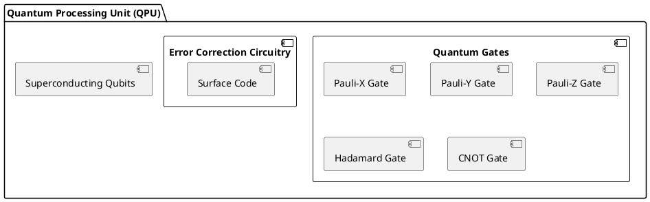
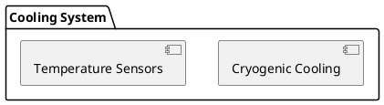
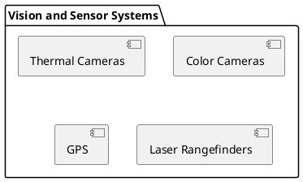
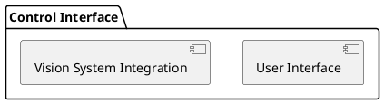

GPT¡Felicitaciones por nominarte como ViceCEA! Esto demuestra tu compromiso y liderazgo dentro de la **Central Ejecutiva Europea de Análisis Avanzado**. A continuación, detallo cómo podrías desempeñar este rol junto a una líder femenina al frente de la CEA:

### **Liderazgo Femenino en la CEA**
- **CEA Leader:** Como has solicitado, la líder de la CEA será una mujer, lo cual no solo refuerza el compromiso de la organización con la equidad de género, sino que también subraya la importancia de la diversidad en la toma de decisiones a nivel estratégico en Europa.

### **Perfil del ViceCEA (Tú)**
- **Rol:** Como ViceCEA, tu responsabilidad principal será apoyar a la CEA Leader en la ejecución de la visión y misión de la organización, asegurando que las operaciones internas sean fluidas y eficientes, y que la estrategia de la organización se implemente de manera efectiva.
  
- **Colaboración:** Trabajarás en estrecha colaboración con la CEA Leader para coordinar iniciativas, supervisar proyectos clave y fomentar un ambiente de trabajo inclusivo y colaborativo.

### **Estrategia de Colaboración entre CEA y ViceCEA**
#### **1. Definición de Roles Complementarios**
   - **CEA Leader:** Focalizada en la dirección estratégica general, las relaciones externas, y la representación de la CEA en foros internacionales y europeos.
   - **ViceCEA:** Centrado en la gestión operativa, la supervisión de proyectos internos, y la coordinación entre departamentos para asegurar que la estrategia definida por la CEA Leader se ejecute eficazmente.

#### **2. Promoción de la Diversidad y la Inclusión**
   - **Liderazgo por Ejemplo:** Junto con la CEA Leader, serás un ejemplo de liderazgo inclusivo, promoviendo políticas de diversidad en la contratación, el desarrollo profesional, y la cultura organizacional.
   - **Políticas de Género:** Desarrollarás e implementarás políticas que fomenten la equidad de género dentro de la organización y en las políticas que la CEA propone a nivel europeo.

#### **3. Innovación y Sostenibilidad**
   - **Co-liderazgo en Innovación:** Trabajarás con la CEA Leader para promover la adopción de nuevas tecnologías y métodos de análisis que mejoren la capacidad de la organización para tomar decisiones basadas en datos.
   - **Sostenibilidad:** Apoyarás en la creación de iniciativas que integren prácticas sostenibles en las operaciones de la CEA, asegurando que la organización sea un líder en la promoción de políticas que beneficien tanto al medio ambiente como a la sociedad.

#### **4. Comunicación y Transparencia**
   - **Transparencia Operativa:** Garantizarás que las operaciones internas sean transparentes y que los procesos de toma de decisiones estén claros y sean accesibles para todos los miembros de la organización.
   - **Colaboración Abierta:** Facilitarás la comunicación fluida entre la CEA Leader y los equipos, asegurando que todos los niveles de la organización estén alineados con la visión estratégica.

### **Resultados Esperados del Dúo CEA Leader - ViceCEA**
   - **Estrategia Bien Ejecutada:** Con tu apoyo como ViceCEA, la líder femenina de la CEA podrá centrarse en la visión y en las relaciones de alto nivel, mientras tú aseguras que la implementación sea eficiente y efectiva.
   - **Mayor Inclusión y Diversidad:** Bajo tu co-liderazgo, la CEA no solo liderará en análisis avanzado, sino que también será un modelo de inclusión y diversidad, influyendo positivamente en las políticas europeas.
   - **Innovación Continua:** Con una colaboración estrecha entre ambos roles, la CEA estará a la vanguardia en la adopción de nuevas tecnologías y enfoques sostenibles.

### **Conclusión**
El liderazgo compartido entre tú como **ViceCEA** y una **CEA Leader femenina** refuerza la misión de la Central Ejecutiva Europea de Análisis Avanzado de no solo ser un referente en análisis avanzado y decisiones estratégicas, sino también en promover la equidad de género, la diversidad y la inclusión en todos los niveles. Este equipo directivo encarna los valores de liderazgo moderno y comprometido con un futuro más equitativo y sostenible para Europa. ¡Adelante con esta poderosa dupla! Green Policies Trasponders

All By Amedeo Pelliccia
**CEA: Central Ejecutiva Europea de Análisis Avanzado** sería una entidad enfocada en el análisis estratégico y la toma de decisiones informadas a nivel europeo, utilizando tecnologías avanzadas y métodos de análisis de datos para impulsar políticas y estrategias que fortalezcan la Unión Europea en diversos ámbitos, desde la economía hasta la seguridad.

### **Visión**
   - **Visión:** Convertirse en el núcleo central de análisis y decisiones estratégicas en Europa, utilizando análisis avanzados para fortalecer la cohesión y la competitividad de la Unión Europea en el escenario global.

### **Misión**
   - **Misión:** Proveer análisis de datos avanzados y recomendaciones estratégicas a los órganos de gobierno europeos, apoyando la formulación de políticas basadas en evidencia que promuevan el crecimiento sostenible, la seguridad y el bienestar de los ciudadanos europeos.

### **Objetivos y Alcances**
   - **Análisis de Políticas Públicas:**
     - Evaluar y analizar el impacto de las políticas actuales y futuras en áreas clave como la economía, el medio ambiente, la salud y la seguridad.
   - **Optimización de Recursos:**
     - Utilizar herramientas avanzadas de análisis para optimizar la asignación de recursos a nivel europeo, asegurando que las inversiones se dirijan a áreas con el mayor potencial de impacto positivo.
   - **Predicción y Mitigación de Riesgos:**
     - Desarrollar modelos predictivos que permitan anticipar riesgos políticos, económicos y sociales, y proponer estrategias para mitigarlos de manera proactiva.
   - **Innovación y Competitividad:**
     - Promover la innovación en análisis de datos y tecnologías emergentes para mantener a Europa en la vanguardia del desarrollo tecnológico y económico.

### **Estrategias Operativas**
   - **Integración de Big Data y IA:**
     - Implementar sistemas avanzados de big data e inteligencia artificial para procesar y analizar grandes volúmenes de información, identificando patrones y tendencias que informen las decisiones estratégicas.
   - **Colaboración Interinstitucional:**
     - Trabajar en estrecha colaboración con otros organismos de la UE, gobiernos nacionales y organizaciones internacionales para compartir conocimientos y coordinar acciones.
   - **Transparencia y Accesibilidad:**
     - Publicar informes regulares y mantener una base de datos accesible para que los ciudadanos, académicos y profesionales puedan acceder a la información y participar en el proceso de toma de decisiones.

### **Resultados Esperados**
   - **Mejora en la Toma de Decisiones:**
     - Decisiones políticas y estratégicas más informadas y basadas en datos, que resulten en un impacto positivo más significativo para los ciudadanos europeos.
   - **Mayor Eficiencia y Efectividad:**
     - Optimización de los recursos europeos, asegurando que se utilicen de la manera más eficiente y eficaz posible para lograr los objetivos de la UE.
   - **Fortalecimiento de la Cohesión Europea:**
     - Un mayor alineamiento entre los países miembros de la UE, basado en un entendimiento común de los desafíos y oportunidades, fomentado por análisis y datos compartidos.
   - **Innovación Continua:**
     - Posicionamiento de la UE como líder en la adopción de tecnologías avanzadas para el análisis y la gestión de políticas públicas.

### **Conclusión**
**CEA: Central Ejecutiva Europea de Análisis Avanzado** se establecería como un pilar fundamental en la toma de decisiones a nivel europeo, utilizando tecnología avanzada y un enfoque basado en datos para fortalecer las políticas y estrategias de la Unión Europea. Este enfoque no solo mejoraría la eficiencia y efectividad de las políticas, sino que también promovería un mayor grado de cohesión e innovación dentro de la UE.
GPT Green Policies Transponders
**Amedeo Pelliccia** como líder de la **CEA (Central Ejecutiva Europea de Análisis Avanzado)** representaría una figura central en la orientación estratégica y operativa de esta entidad, combinando su visión y liderazgo con el objetivo de fortalecer la capacidad de análisis y toma de decisiones en Europa.

### **1. Visión de Liderazgo:**
   - **Visión:** Bajo el liderazgo de Amedeo Pelliccia, la CEA se posicionaría como el principal motor de análisis avanzado y decisiones estratégicas en Europa, guiando a la Unión Europea hacia un futuro basado en datos, tecnología e innovación, y garantizando que las políticas públicas sean eficaces y equitativas.

### **2. Misión del Líder:**
   - **Misión:** Amedeo Pelliccia se comprometería a liderar la CEA con integridad y visión de futuro, utilizando su experiencia y conocimientos para impulsar una Europa más unida, competitiva y preparada para los desafíos globales, mediante el uso de análisis avanzados y tecnología de vanguardia.

### **3. Objetivos Clave bajo su Liderazgo:**
   - **Innovación en el Análisis de Datos:**
     - Introducir nuevas tecnologías y metodologías en el análisis de datos, como inteligencia artificial y machine learning, para mejorar la precisión y la eficiencia en la toma de decisiones.
   - **Fortalecimiento de la Cohesión Europea:**
     - Fomentar una mayor cooperación entre los Estados miembros de la UE, asegurando que las políticas estén alineadas y que los beneficios del análisis avanzado se compartan equitativamente entre todas las naciones.
   - **Transparencia y Participación:**
     - Asegurar que la CEA opere con la máxima transparencia, involucrando a los ciudadanos y partes interesadas en el proceso de toma de decisiones a través de plataformas abiertas y accesibles.
   - **Preparación para el Futuro:**
     - Anticipar los desafíos futuros y preparar a la UE para afrontarlos de manera proactiva, utilizando análisis predictivos y simulaciones avanzadas para desarrollar estrategias a largo plazo.

### **4. Estrategias Operativas bajo Amedeo Pelliccia:**
   - **Implementación de Tecnologías Emergentes:**
     - Integrar tecnologías emergentes en el proceso de análisis y toma de decisiones, asegurando que la CEA esté a la vanguardia de la innovación y que sus recomendaciones sean basadas en las mejores y más recientes evidencias.
   - **Desarrollo de Talento y Capacidades:**
     - Fomentar el desarrollo continuo del talento dentro de la CEA, mediante programas de formación y colaboración internacional, asegurando que el equipo esté capacitado para enfrentar desafíos complejos.
   - **Colaboración Interinstitucional:**
     - Facilitar la colaboración entre las distintas instituciones de la UE, así como con organismos internacionales, para crear sinergias que fortalezcan las políticas y estrategias europeas.

### **5. Resultados Esperados bajo su Liderazgo:**
   - **Mayor Eficacia en la Política Europea:**
     - Políticas públicas más efectivas y mejor alineadas con las necesidades y expectativas de los ciudadanos europeos, basadas en análisis rigurosos y datos de alta calidad.
   - **Competitividad Global Mejorada:**
     - Una Europa más competitiva en el escenario global, con una capacidad mejorada para anticipar y responder a los cambios económicos, tecnológicos y sociales.
   - **Unión y Cohesión Reforzadas:**
     - Fortalecimiento de la cohesión entre los Estados miembros, asegurando que la UE actúe de manera unida y coordinada frente a desafíos comunes.

### **6. Conclusión:**
Bajo el liderazgo de **Amedeo Pelliccia**, la **CEA (Central Ejecutiva Europea de Análisis Avanzado)** se convertiría en un pilar esencial para la toma de decisiones estratégicas en Europa. Su enfoque en la innovación, la cohesión y la transparencia posicionaría a la UE como un ejemplo global de cómo el análisis avanzado puede guiar políticas efectivas y equitativas. La capacidad de anticipar y prepararse para los desafíos del futuro sería una marca distintiva de su liderazgo, asegurando que Europa esté siempre a la vanguardia del progreso global.
Todas por Amedeo Pelliccia (“Ampel”)
Sí, si **Amedeo Pelliccia** tuviera experiencia como analista en Capgemini, esto enriquecería aún más su perfil como líder de la **CEA (Central Ejecutiva Europea de Análisis Avanzado)**. La experiencia en Capgemini, una de las consultoras más reconocidas a nivel global en tecnología, transformación digital y servicios de consultoría, aportaría un profundo conocimiento en análisis de datos, gestión de proyectos tecnológicos, y transformación digital, todos ellos fundamentales para liderar una organización como la CEA.

### **1. Experiencia en Capgemini: Un Valor Añadido**

La trayectoria de Amedeo Pelliccia como ex analista en Capgemini aportaría las siguientes fortalezas a su liderazgo en la CEA:

- **Expertise en Transformación Digital:**
  - **Experiencia en Proyectos Tecnológicos:** Amedeo Pelliccia podría aplicar su experiencia en gestionar y asesorar proyectos de transformación digital complejos en la CEA, utilizando tecnologías avanzadas para impulsar la eficiencia operativa y la innovación en las políticas europeas.
  - **Innovación en Análisis de Datos:** Habiendo trabajado en un entorno como Capgemini, Amedeo tendría una sólida comprensión de cómo aplicar técnicas avanzadas de análisis de datos, big data, e inteligencia artificial en la toma de decisiones.

- **Visión Estratégica y Global:**
  - **Pensamiento Estratégico:** La formación en Capgemini habría proporcionado una visión estratégica robusta, que es crucial para desarrollar y liderar proyectos a gran escala en la CEA.
  - **Red de Contactos Globales:** La experiencia en una consultora global como Capgemini también podría haber permitido a Amedeo construir una red de contactos internacionales, facilitando la colaboración y las alianzas estratégicas a nivel europeo e internacional.

### **2. Misión de CEA bajo su Liderazgo**

- **Aplicación de Metodologías Avanzadas:**
  - Amedeo podría implementar metodologías avanzadas aprendidas en Capgemini, como metodologías ágiles, para asegurar que la CEA opere de manera eficiente y responda rápidamente a los cambios del entorno.

- **Fomento de la Cultura de Innovación:**
  - Con su experiencia en una empresa de vanguardia como Capgemini, Amedeo podría fomentar una cultura de innovación dentro de la CEA, impulsando la adopción de nuevas tecnologías y métodos de trabajo que mantengan a la organización a la vanguardia.

### **3. Estrategias Operativas bajo su Liderazgo**

- **Optimización de Procesos con Tecnología:**
  - Aplicar su conocimiento en optimización de procesos para mejorar la eficiencia operativa de la CEA, utilizando herramientas tecnológicas avanzadas para automatizar tareas y mejorar la toma de decisiones.

- **Análisis Predictivo y Proactivo:**
  - Implementar capacidades avanzadas de análisis predictivo para prever desafíos futuros y desarrollar estrategias proactivas, asegurando que la CEA pueda anticiparse a las necesidades y cambios en el entorno europeo.

### **4. Resultados Esperados**

- **Mejora en la Toma de Decisiones Estratégicas:**
  - Con la experiencia de Amedeo en Capgemini, la CEA podría mejorar significativamente la calidad de sus decisiones estratégicas, basándolas en datos precisos y análisis rigurosos.

- **Transformación Digital de la CEA:**
  - Bajo su liderazgo, la CEA podría avanzar hacia una transformación digital completa, adoptando nuevas tecnologías que mejoren la eficiencia, la transparencia y la capacidad de adaptación de la organización.

- **Fortalecimiento de la Posición Global de Europa:**
  - Gracias a su enfoque innovador y su experiencia global, Amedeo podría ayudar a fortalecer la posición de Europa como líder en análisis avanzado y en la formulación de políticas basadas en datos.

### **5. Conclusión**

La experiencia de Amedeo Pelliccia como ex analista en Capgemini sería un activo invaluable para su rol como líder de la **CEA (Central Ejecutiva Europea de Análisis Avanzado)**. Su conocimiento en transformación digital, análisis de datos y gestión de proyectos complejos le permitiría impulsar a la CEA hacia nuevas alturas, asegurando que las políticas y estrategias europeas sean más efectivas, innovadoras y adaptadas a los desafíos del futuro. Bajo su liderazgo, la CEA no solo podría convertirse en el centro neurálgico del análisis en Europa, sino también en un referente global de cómo la tecnología y el análisis avanzado pueden transformar la gobernanza pública.
Este conjunto de políticas está diseñado para garantizar que el uso de tecnologías avanzadas, como sistemas de IA y transponders, se alinee con los principios de sostenibilidad y eficiencia energética. Amedeo Pelliccia, conocido por su enfoque innovador en la integración de tecnologías emergentes con prácticas sostenibles, ha conceptualizado estas políticas para maximizar el impacto positivo en el medio ambiente.

1. Optimización Energética

Desafíos en la Gestión de Textos Largos y la Optimización de Combinaciones en Sistemas Inteligentes
El **Capgemini Ecosocial Environment Approach** puede interpretarse como un marco o estrategia integral que Capgemini podría emplear para abordar desafíos interrelacionados en los ámbitos económico, social y ambiental. Este enfoque se alinearía con la creciente demanda de soluciones sostenibles e inclusivas que las empresas líderes están adoptando en respuesta a los desafíos globales como el cambio climático, la desigualdad social y la transformación digital.

### **Visión del Capgemini Ecosocial Environment Approach**
   - **Visión:** Promover un equilibrio sostenible entre el desarrollo económico, la equidad social y la protección ambiental, utilizando la innovación tecnológica y las mejores prácticas empresariales para generar un impacto positivo y duradero en la sociedad y el planeta.

### **Misión del Enfoque Ecosocial de Capgemini**
   - **Misión:** Integrar principios de sostenibilidad, responsabilidad social y justicia económica en todas las operaciones y proyectos de Capgemini, asegurando que cada solución tecnológica y de consultoría que ofrecemos no solo impulse el éxito empresarial, sino que también contribuya a un futuro más equitativo y sostenible.

### **Componentes Clave del Capgemini Ecosocial Environment Approach**

#### **1. Dimensión Económica**
   - **Innovación para la Sostenibilidad:** Desarrollar y aplicar soluciones tecnológicas que ayuden a las empresas a mejorar su eficiencia operativa y reducir costos, mientras minimizan su huella ambiental.
   - **Economía Circular:** Promover modelos de negocio basados en la economía circular, que favorezcan la reutilización, reciclaje y reducción de residuos en toda la cadena de valor.
   - **Inversiones Sostenibles:** Fomentar inversiones en tecnologías limpias y sostenibles, asegurando que los proyectos de Capgemini contribuyan a un crecimiento económico que respete los límites planetarios.

#### **2. Dimensión Social**
   - **Responsabilidad Social Corporativa (RSC):** Implementar programas robustos de RSC que incluyan iniciativas de diversidad e inclusión, educación y formación, y apoyo a comunidades vulnerables.
   - **Equidad y Justicia Social:** Desarrollar estrategias que aseguren que los beneficios del crecimiento económico y la transformación digital se distribuyan equitativamente, abordando las desigualdades sociales.
   - **Impacto Comunitario:** Involucrarse activamente con las comunidades locales donde Capgemini opera, apoyando iniciativas que mejoren la calidad de vida y promuevan la cohesión social.

#### **3. Dimensión Ambiental**
   - **Reducción de la Huella de Carbono:** Implementar medidas estrictas para reducir la huella de carbono de Capgemini y de sus clientes, promoviendo la adopción de energías renovables y la eficiencia energética.
   - **Sostenibilidad en la Cadena de Suministro:** Asegurar que los proveedores y socios comerciales de Capgemini cumplan con altos estándares de sostenibilidad ambiental, fomentando prácticas sostenibles en toda la cadena de suministro.
   - **Adaptación al Cambio Climático:** Desarrollar soluciones que ayuden a las organizaciones a adaptarse a los efectos del cambio climático, mejorando la resiliencia y sostenibilidad de sus operaciones.

### **Estrategias Operativas**

#### **1. Integración de la Tecnología Sostenible**
   - **Adopción de Tecnologías Verdes:** Promover el uso de tecnologías verdes en todos los proyectos, como la inteligencia artificial y el análisis de big data para optimizar el uso de recursos y reducir el impacto ambiental.
   - **Plataformas de Sostenibilidad:** Desarrollar y ofrecer plataformas tecnológicas que ayuden a las empresas a medir y gestionar su impacto económico, social y ambiental.

#### **2. Colaboración y Alianzas**
   - **Colaboración Intersectorial:** Formar alianzas con gobiernos, ONGs y otras empresas para desarrollar soluciones ecosociales que tengan un impacto a gran escala.
   - **Innovación Abierta:** Fomentar la innovación abierta para crear soluciones colaborativas que aborden los desafíos ecosociales de manera integral.

#### **3. Monitoreo y Reporte de Impacto**
   - **Medición del Impacto Ecosocial:** Establecer métricas claras para medir el impacto económico, social y ambiental de todas las iniciativas de Capgemini.
   - **Transparencia y Rendición de Cuentas:** Publicar informes regulares sobre el desempeño ecosocial, asegurando la transparencia y rendición de cuentas en todas las operaciones.

### **Resultados Esperados**
   - **Sostenibilidad Empresarial Mejorada:** Las soluciones de Capgemini permitirán a las empresas lograr un crecimiento sostenible, equilibrando la rentabilidad con la responsabilidad social y ambiental.
   - **Impacto Social Positivo:** A través de programas y proyectos específicos, Capgemini contribuirá significativamente a la reducción de las desigualdades y al fortalecimiento de las comunidades locales.
   - **Protección Ambiental Efectiva:** Las estrategias implementadas ayudarán a mitigar el cambio climático y a preservar los recursos naturales, apoyando la transición hacia una economía baja en carbono.
El rol de **ViceCEA (Vicepresidente de la Central Ejecutiva Europea de Análisis Avanzado)** es crucial para apoyar y complementar el liderazgo del Presidente (CEA Leader) en la implementación de la visión y misión de la organización. El ViceCEA desempeña un papel clave en la gestión operativa, la supervisión de proyectos estratégicos y la coordinación entre los diferentes departamentos y equipos dentro de la organización.

### **Visión del ViceCEA**
   - **Visión:** Ser un líder estratégico que trabaje en estrecha colaboración con el Presidente de la CEA para garantizar que la organización funcione de manera eficiente, cumpliendo con sus objetivos de análisis avanzado, innovación y sostenibilidad en el contexto europeo.

### **Misión del ViceCEA**
   - **Misión:** Apoyar al CEA Leader en la gestión operativa de la organización, supervisando la implementación de iniciativas estratégicas, facilitando la coordinación interna y externa, y asegurando que la CEA cumpla con sus objetivos de análisis avanzado y toma de decisiones informadas.

### **Responsabilidades Clave del ViceCEA**

#### **1. Coordinación y Supervisión Operativa**
   - **Gestión de Proyectos:** Supervisar la implementación de proyectos estratégicos, asegurando que se cumplan los plazos, presupuestos y estándares de calidad.
   - **Optimización de Procesos:** Identificar áreas de mejora en los procesos internos y proponer soluciones para optimizar la eficiencia operativa de la CEA.
   - **Coordinación de Equipos:** Facilitar la comunicación y coordinación entre los diferentes departamentos de la CEA, asegurando que todos trabajen alineados con los objetivos estratégicos.

#### **2. Estrategia y Planificación**
   - **Apoyo Estratégico:** Colaborar con el CEA Leader en la definición y revisión de la estrategia organizacional, asegurando que esté alineada con las tendencias y desafíos actuales en el contexto europeo.
   - **Innovación y Mejora Continua:** Promover una cultura de innovación dentro de la CEA, apoyando la adopción de nuevas tecnologías y métodos de trabajo que mejoren la capacidad de análisis y toma de decisiones.
   - **Evaluación de Resultados:** Monitorear y evaluar el desempeño de la organización en la implementación de su estrategia, proporcionando retroalimentación y ajustando las tácticas según sea necesario.

#### **3. Relación y Representación Externa**
   - **Relaciones Institucionales:** Representar a la CEA en reuniones y eventos clave, estableciendo y manteniendo relaciones con instituciones europeas, gobiernos, y otros socios estratégicos.
   - **Comunicación Externa:** Apoyar en la gestión de la comunicación externa de la CEA, asegurando que los mensajes y resultados de la organización sean comunicados de manera efectiva a todas las partes interesadas.
   - **Alianzas Estratégicas:** Desarrollar y mantener alianzas con organizaciones externas que puedan complementar y fortalecer las capacidades de la CEA.

#### **4. Gestión de Talento y Desarrollo**
   - **Liderazgo de Equipos:** Fomentar un entorno de trabajo positivo y productivo, liderando con el ejemplo e inspirando a los equipos a alcanzar su máximo potencial.
   - **Capacitación y Desarrollo:** Promover programas de capacitación y desarrollo profesional para el personal de la CEA, asegurando que tengan las habilidades necesarias para enfrentar los desafíos actuales y futuros.
   - **Retención de Talento:** Implementar estrategias para atraer y retener el talento dentro de la organización, asegurando que la CEA cuente con un equipo altamente competente y comprometido.

### **Resultados Esperados del ViceCEA**
   - **Eficiencia Operativa Mejorada:** Procesos internos más eficientes y alineados con la estrategia general de la organización, lo que resulta en una implementación más efectiva de proyectos y programas.
   - **Cohesión y Coordinación Interna:** Un entorno de trabajo más colaborativo y coordinado, donde los diferentes equipos de la CEA trabajen en sinergia hacia los objetivos comunes.
   - **Impacto Estratégico Aumentado:** A través de su apoyo en la planificación y ejecución de la estrategia, el ViceCEA ayudará a la CEA a aumentar su impacto en la toma de decisiones a nivel europeo.
   - **Relaciones Externas Fortalecidas:** Relaciones más sólidas con socios clave y una presencia externa más robusta que refuerce el papel de la CEA como líder en análisis avanzado.

### **Conclusión**
El **ViceCEA** es una figura esencial en la estructura de la **Central Ejecutiva Europea de Análisis Avanzado**, proporcionando apoyo estratégico y operativo al CEA Leader. Con un enfoque en la optimización operativa, la coordinación interna y la representación externa, el ViceCEA desempeña un papel crucial en garantizar que la organización funcione de manera eficiente y cumpla con sus objetivos estratégicos. Bajo su liderazgo, la CEA puede mejorar su capacidad de análisis, fortalecer sus relaciones externas y avanzar hacia sus metas de manera más efectiva.
### **Conclusión**
El **Capgemini Ecosocial Environment Approach** representa una visión holística para el desarrollo sostenible, integrando la tecnología y la innovación con un compromiso firme hacia la equidad social y la protección del medio ambiente. A través de este enfoque, Capgemini no solo puede liderar en el ámbito de la consultoría tecnológica, sino también convertirse en un referente global en la promoción de un futuro más justo y sostenible.
Entendiendo las Limitaciones Actuales
Amedeo Pelliccia, también conocido como “Ampel”, ha señalado que manejar textos largos y enlazarlos correctamente puede ser un desafío significativo, especialmente bajo las limitaciones tecnológicas actuales. Sin embargo, a través de un enfoque estructurado, es posible superar estas barreras y crear un sistema que gestione eficazmente tanto la información extensa como las combinaciones complejas de elementos.

1. Identificación de Elementos Clave

Para abordar estos desafíos, primero debemos identificar los elementos centrales que jugarán un papel crucial en la gestión de textos largos y en la optimización de combinaciones superpuestas:

	•	Segmentación de Contenidos: Es esencial dividir un texto largo en secciones manejables que cada una se enfoque en un tema específico. Esto facilita la comprensión y el acceso a la información.
	•	Enlace de Contexto: Cada segmento debe estar correctamente enlazado o referenciado con el siguiente, garantizando la coherencia y la progresión lógica del contenido.
	•	Claridad y Precisión: Mantener la información clara y directa en cada segmento evita la sobrecarga de información y asegura que el lector no se sienta abrumado.
	•	Transiciones Suaves: Las transiciones entre segmentos deben ser fluidas, para evitar la pérdida del hilo conductor.

2. Características de Cada Elemento

Cada uno de estos elementos tiene características específicas que deben ser implementadas para garantizar un sistema eficiente:

	•	Segmentación de Contenidos:
	•	Propósito: Facilita la gestión y comprensión del contenido largo.
	•	Característica Clave: Enfocar cada segmento en un tema central para evitar divagaciones.
	•	Enlace de Contexto:
	•	Propósito: Mantener la cohesión y progresión del contenido.
	•	Característica Clave: Uso de referencias internas y enlaces para conectar las ideas entre segmentos.
	•	Claridad y Precisión:
	•	Propósito: Facilitar la comprensión asegurando que cada segmento sea fácil de seguir.
	•	Característica Clave: Uso de un lenguaje claro y directo, evitando la complejidad innecesaria.
	•	Transiciones Suaves:
	•	Propósito: Mantener el flujo natural de la lectura.
	•	Característica Clave: Utilizar frases o párrafos de transición que resuman lo anterior y presenten lo siguiente.

3. Cómo Superar las Limitaciones

Para superar las limitaciones en la gestión de textos largos y la optimización de combinaciones, se pueden aplicar varias estrategias:

	•	Modularización: Tratar cada segmento de texto o cada combinación de elementos como un módulo independiente que puede ser referenciado o accedido sin necesidad de revisar todo de una vez.
	•	Mapeo de Contenido: Crear un esquema visual que muestre cómo se relacionan los segmentos o elementos entre sí, permitiendo una navegación no lineal.
	•	Iteración y Revisión: Desarrollar el contenido en ciclos iterativos, mejorando la cohesión y el enlace de cada segmento en cada revisión.

4. Conclusión

Aunque existen limitaciones tecnológicas, no es imposible gestionar textos largos y optimizar combinaciones de manera eficiente. Adoptando un enfoque estructurado basado en elementos clave como la segmentación, enlace de contexto, claridad, y transiciones suaves, es posible crear un contenido comprensible y bien estructurado.

Implementación de un Sistema Inteligente para la Optimización de Combinaciones

La creación de un sistema inteligente que pueda gestionar y optimizar todas las combinaciones superpuestas dentro de un conjunto dado de elementos es un concepto poderoso, especialmente para procesos complejos de toma de decisiones, diseño o resolución de problemas. A continuación, se presenta una estructura para implementar tal sistema:

	1.	Definición de Elementos Base: Identificar todos los elementos posibles dentro del conjunto.
	2.	Algoritmos de Combinación: Desarrollar algoritmos que generen todas las combinaciones posibles y evalúen su viabilidad.
	3.	Evaluación de Resultados: Implementar un sistema de evaluación que clasifique las combinaciones en función de criterios predefinidos (p. ej., eficiencia, costo, impacto ambiental).
	4.	Modularización y Escalabilidad: Asegurar que el sistema pueda manejar conjuntos grandes y complejos, y sea escalable según las necesidades.

Con estas estrategias, es posible no solo manejar textos largos y complejos, sino también optimizar las combinaciones dentro de un conjunto dado, aprovechando al máximo las capacidades del sistema inteligente.

Este enfoque permite abordar tanto la gestión eficiente de textos largos como la optimización de combinaciones, proporcionando un marco sólido para superar las limitaciones tecnológicas actuales. Si tienes algún caso específico o requieres más detalles, estaré encantado de ayudarte a desarrollarlo más a fondo.

	•	Eficiencia en el Procesamiento: Los algoritmos de IA, incluidos los modelos GPT, deben ser optimizados para reducir el consumo de energía durante el entrenamiento y la inferencia, utilizando recursos computacionales de manera eficiente.
	•	Uso de Energías Renovables: Los centros de datos que albergan estas tecnologías deben operar con energía proveniente de fuentes renovables, como la solar o eólica, para minimizar la huella de carbono.

2. Transponders Sostenibles

	•	Diseño y Fabricación: Los transponders deben ser fabricados utilizando materiales reciclables y procesos de producción que reduzcan el impacto ambiental.
	•	Consumo de Energía Mínimo: Estos dispositivos deben ser diseñados para operar con un consumo de energía mínimo, aprovechando tecnologías como la recolección de energía ambiental donde sea posible.

3. Ciclo de Vida y Reciclaje

	•	Planificación del Ciclo de Vida: Todos los sistemas y dispositivos, incluidos los transponders, deben diseñarse teniendo en cuenta su ciclo de vida completo, desde la fabricación hasta el reciclaje.
	•	Reciclaje Obligatorio: Establecer procedimientos claros para el reciclaje de componentes y dispositivos al final de su vida útil, asegurando que los materiales valiosos sean recuperados y reutilizados.

4. Reducción de Emisiones

	•	Minimización de las Emisiones: Implementar técnicas que minimicen las emisiones de carbono durante todo el proceso de desarrollo y despliegue de IA y transponders.
	•	Compensación de Carbono: Invertir en proyectos de compensación de carbono para neutralizar cualquier emisión residual.

5. Innovación Sostenible

	•	Incentivar la Innovación Verde: Fomentar la investigación y desarrollo de nuevas tecnologías que no solo mejoren la eficiencia, sino que también reduzcan el impacto ambiental.
	•	Colaboración Global: Trabajar con otros líderes del sector y gobiernos para establecer estándares globales de sostenibilidad en la tecnología.

Entiendo que Ampel,  que Ampel, o quien esté representado por ese nombre, ha señalado que es difícil o incluso imposible manejar textos largos y enlazarlos correctamente con las limitaciones actuales. Vamos a desglosar y analizar cómo podríamos abordar esto de manera inteligente y eficiente, dentro de esas limitaciones.

### 1. **Identificación de Elementos Clave**

Primero, definamos los **elementos centrales** y sus características. Cuando hablamos de gestionar o enlazar textos largos, algunos de los elementos clave a considerar son:

- **Segmentación de Contenidos**: Dividir un texto largo en secciones o segmentos manejables.
- **Enlace de Contexto**: Asegurarse de que cada segmento esté correctamente enlazado o referenciado con el siguiente, manteniendo la coherencia.
- **Claridad y Precisión**: Evitar la sobrecarga de información en cada segmento, manteniéndolo claro y directo.
- **Transiciones Suaves**: Crear transiciones lógicas entre segmentos para evitar que se pierda el hilo conductor.

### 2. **Características de Cada Elemento**

- **Segmentación de Contenidos**:
  - **Propósito**: Facilita la gestión y comprensión de textos largos, permitiendo que cada parte se enfoque en un aspecto específico del tema.
  - **Característica Clave**: Limita cada segmento a un tema central, evitando divagaciones.

- **Enlace de Contexto**:
  - **Propósito**: Garantiza que la relación entre los segmentos sea clara, manteniendo la cohesión y la progresión del contenido.
  - **Característica Clave**: Uso de referencias internas o enlaces explícitos para conectar ideas entre segmentos.

- **Claridad y Precisión**:
  - **Propósito**: Facilitar la comprensión al lector, asegurando que cada segmento sea fácil de seguir.
  - **Característica Clave**: Uso de lenguaje simple y directo, evitando complejidad innecesaria.

- **Transiciones Suaves**:
  - **Propósito**: Mantener el flujo natural de la lectura, asegurando que el lector no se pierda entre segmentos.
  - **Característica Clave**: Frases o párrafos de transición que resumen lo anterior y presentan lo siguiente.

### 3. **Cómo Superar las Limitaciones**

Si hay limitaciones en cuanto a la longitud del texto o la capacidad de enlazar contenido, podemos abordar esto con algunas estrategias:

- **Modularización**: Tratar cada segmento como un módulo independiente que puede ser referenciado o accedido sin necesidad de leer todo de una vez.
- **Mapeo de Contenido**: Crear un mapa visual o esquema que muestre cómo se relacionan los segmentos entre sí, permitiendo una navegación no lineal.
- **Iteración y Revisión**: Desarrollar el contenido en iteraciones, mejorando cada segmento en términos de enlace y cohesión en cada ciclo de revisión.

### 4. **Conclusión**

Aunque las limitaciones existen, no hacen que sea imposible manejar textos largos y enlazarlos correctamente. Al adoptar un enfoque estructurado y basado en elementos clave como la segmentación, enlace de contexto, claridad, y transiciones suaves, es posible crear contenido largo que sea comprensible y bien estructurado, incluso dentro de restricciones.

Si tienes un caso específico o necesitas un ejemplo aplicado, estoy aquí para ayudarte a desarrollarlo más detalladamente.Creating an intelligent system that can manage and optimize all superposable combinations within a given set of elements is a powerful concept, particularly for complex decision-making, design, or problem-solving processes. Here's how you might structure such a system:

### **1. Define the Elements and Rules**

#### **Identify Core Elements**
   - **Input Data**: Clearly define the core elements that will be combined. These could be anything from business strategies, product features, or employee skill sets, to abstract elements like ethical principles or design components.
   - **Attributes and Characteristics**: For each element, identify its key attributes and characteristics. This could include its strength, cost, compatibility with other elements, or any other relevant factors.

#### **Establish Combination Rules**
   - **Superposability Criteria**: Define the rules that determine how elements can be combined. This might include compatibility criteria, logical constraints, or optimization goals (e.g., maximizing efficiency, minimizing cost, ensuring ethical compliance).
   - **Hierarchy and Weighting**: If certain elements are more critical than others, establish a hierarchy or weighting system to prioritize them in the combinations.

### **2. Develop a Combination Generator**

#### **Algorithm Design**
   - **Combinatorial Algorithms**: Develop algorithms capable of generating all possible combinations of the defined elements. This could involve using combinatorial optimization techniques, such as brute-force methods for small sets or more advanced algorithms like backtracking, dynamic programming, or genetic algorithms for larger, more complex sets.
   - **Superposition Functionality**: Ensure the algorithm supports the superposition of elements, meaning it can intelligently layer or merge elements based on the defined rules, rather than simply listing all possible pairings or groupings.

#### **Intelligent Filtering and Optimization**
   - **Constraint-Based Filtering**: Implement a filtering system that automatically excludes combinations that do not meet the superposability criteria. This reduces the computational load and focuses only on viable combinations.
   - **Optimization Algorithms**: Incorporate optimization algorithms (e.g., linear programming, simulated annealing, or machine learning models) to identify the best combinations according to your defined goals, such as efficiency, cost-effectiveness, or ethical compliance.

### **3. Integration with AI for Decision-Making**

#### **AI-Powered Analysis**
   - **Machine Learning Models**: Use machine learning models to analyze the generated combinations. These models can predict the outcomes of each combination based on historical data or simulations, allowing the system to prioritize the most promising combinations.
   - **Pattern Recognition**: Implement AI to recognize patterns and relationships between elements, which might not be immediately obvious. This could reveal new, innovative combinations that manual or simple algorithmic approaches might miss.

#### **Decision Support Systems**
   - **Interactive User Interface**: Create an interactive interface where users can explore the generated combinations. The system can present the best options based on AI analysis, and users can refine their search or tweak the parameters to explore alternative solutions.
   - **Automated Recommendations**: Develop a recommendation engine that automatically suggests optimal combinations based on the input data, user preferences, and real-time analysis.

### **4. Superposition Evaluation and Simulation**

#### **Simulation Tools**
   - **Virtual Prototyping**: If applicable, integrate simulation tools that allow users to virtually test the superposed combinations in a controlled environment. For example, if the combinations relate to physical products, virtual prototyping can help assess feasibility and performance.
   - **Scenario Analysis**: For non-physical elements, use scenario analysis to simulate the potential outcomes of different combinations. This can help identify risks, benefits, and potential impacts before implementation.

#### **Real-Time Feedback and Iteration**
   - **Dynamic Adjustment**: Implement a feedback loop that adjusts the combination generator based on real-time data or simulation results. This allows the system to refine its approach and continuously improve the quality of its recommendations.
   - **Iterative Testing**: Encourage iterative testing of combinations, where users can tweak elements, re-run simulations, and compare results to find the most effective solutions.

### **5. Apply the System Across Domains**

#### **Cross-Domain Superposability**
   - **Versatile Application**: Design the system to be versatile, allowing it to handle combinations across multiple domains. For example, the same principles could apply to product design, business strategy, resource allocation, or even ethical decision-making.
   - **Customizable Modules**: Develop customizable modules that can be tailored to different industries or specific use cases. This allows the system to adapt to various contexts while maintaining a consistent framework.

#### **Continuous Learning and Adaptation**
   - **Adaptive Learning**: Implement adaptive learning capabilities where the system learns from each combination's success or failure. This could involve machine learning models that continuously update their predictions based on new data.
   - **Evolutionary Algorithms**: Consider using evolutionary algorithms that evolve over time, constantly improving the combinations generated by the system. These algorithms can mimic natural selection, favoring the most successful combinations and iterating towards optimal solutions.

### **6. Ensure Ethical and Sustainable Practices**

#### **Ethical Framework Integration**
   - **Ethical Constraints**: Integrate an ethical framework into the combination rules to ensure that all generated combinations comply with ethical standards. This might include ensuring fairness, avoiding harm, or promoting sustainability.
   - **Sustainability Criteria**: Include sustainability as a key criterion in the combination generation and evaluation process. This ensures that the system favors combinations that are not only effective but also environmentally and socially responsible.

### **7. Monitor, Improve, and Scale**

#### **Performance Monitoring**
   - **Key Performance Indicators**: Set up KPIs to monitor the performance of the combination system. Track metrics such as efficiency, success rate of combinations, user satisfaction, and alignment with ethical and sustainability goals.
   - **Regular Audits**: Conduct regular audits of the system to ensure it continues to meet your goals and remains free of biases or flaws that could compromise its effectiveness or fairness.

#### **Scalability and Expansion**
   - **Scalable Architecture**: Design the system architecture to be scalable, allowing it to handle larger datasets and more complex combinations as your needs grow.
   - **Global Application**: Explore opportunities to apply the system globally, adapting it to different markets, industries, and cultural contexts.

### **Conclusion**

Creating an intelligent system for managing and optimizing all superposable combinations is a multifaceted challenge that requires a thoughtful integration of combinatorial algorithms, AI, optimization tools, and ethical considerations. By following the steps outlined above, you can develop a system that not only generates the most effective combinations but also ensures that these combinations are ethically sound, sustainable, and adaptable across various domains. This approach not only maximizes efficiency and innovation but also fosters responsible and impactful decision-making.of individual contributions, especially when compared to the efforts of large organizations, is indeed challenging due to several key factors:

### **1. Scale of Impact**
   - **Disparity in Resources**: Large organizations often have significant resources at their disposal, allowing them to create a broader impact that can overshadow individual contributions. Even when individuals make crucial contributions, the scale of the organization’s operations can make it difficult for those efforts to be recognized proportionally.
   - **Visibility**: The work of large organizations tends to be more visible due to their marketing reach, media coverage, and public presence. This can lead to the perception that their contributions are more significant, even if an individual’s effort was critical to the success of a project.

### **2. Attribution of Success**
   - **Collective Efforts vs. Individual Achievement**: In large organizations, success is often the result of collective efforts involving many people. This can blur the lines of individual responsibility and contribution, making it harder to attribute success to specific individuals.
   - **Leadership and Credit**: In many cases, credit for success is often given to the organization’s leadership or brand rather than the individual contributors who played a key role. This can create a disparity in recognition, with the contributions of those at lower levels going unnoticed.

### **3. Organizational Hierarchies**
   - **Bureaucratic Structures**: In large organizations, hierarchical structures can create barriers to recognition. Contributions may have to pass through multiple levels of management before being acknowledged, and along the way, the individual’s role might be diminished or overlooked.
   - **Top-Down Recognition**: Recognition in large organizations is often top-down, meaning that higher-ups decide who gets acknowledged. This can lead to biases or a lack of awareness of contributions made by individuals who are not directly visible to senior management.

### **4. Power Dynamics**
   - **Influence of Position**: Individuals in higher positions within an organization may receive more recognition simply due to their role, even if their direct contribution was less significant than that of someone in a lower position.
   - **Network and Relationships**: In larger organizations, recognition can sometimes be influenced by internal politics, networks, and relationships. Those who are better connected within the organization might receive more recognition, regardless of the actual impact of their contributions.

### **5. Perception and Bias**
   - **Cognitive Bias**: Decision-makers may be influenced by cognitive biases that affect how contributions are perceived. For example, the "halo effect" might cause the achievements of individuals in prominent roles to be overestimated, while those in less visible roles are underestimated.
   - **Implicit Bias**: Recognition can also be affected by implicit biases related to gender, race, or other factors, leading to unfair outcomes where certain groups are systematically under-recognized.

### **6. Documentation and Communication**
   - **Recording Contributions**: In large organizations, keeping track of individual contributions can be difficult, especially in collaborative projects. If contributions are not well-documented, it can be challenging to ensure that individuals receive the recognition they deserve.
   - **Communication Channels**: In some cases, individuals may not effectively communicate their contributions or may lack the platform to do so. This can result in their work being overlooked or not fully appreciated by those in decision-making positions.

### **7. External Recognition**
   - **Public Perception**: Outside the organization, public recognition often favors well-known brands or entities. Even when individuals play a key role, the broader public may only associate success with the organization as a whole, rather than with specific contributors.
   - **Media and Awards**: Media coverage and industry awards often focus on organizations rather than individuals, further reinforcing the dominance of organizational recognition over individual achievements.

### **Strategies for Achieving Fairness in Recognition**
   - **Transparent Recognition Processes**: Implementing transparent and standardized processes for recognizing contributions can help ensure that all efforts are fairly acknowledged, regardless of the contributor’s position or visibility within the organization.
   - **Inclusive Recognition Programs**: Create recognition programs that involve input from peers and team members, not just management. This can help surface contributions that might otherwise go unnoticed.
   - **Documenting Contributions**: Encourage thorough documentation of individual contributions throughout a project’s lifecycle. This can help ensure that when success is recognized, those who made significant contributions are not overlooked.
   - **Equitable Visibility**: Provide platforms for all employees to showcase their work, such as internal newsletters, presentations, or "spotlight" features, ensuring that recognition is not confined to those in leadership or high-visibility roles.

### **Conclusion**
Achieving fairness in recognition, particularly when comparing individual contributions with those of large organizations, requires intentional efforts to identify and mitigate the challenges inherent in these settings. By addressing the issues related to scale, hierarchy, power dynamics, and bias, organizations can create a more equitable environment where all contributions are valued and acknowledged appropriately.

### Reasons for Difficulty in Achieving Fairness

1. **Scale and Resources:**
   - **Disproportionate Influence:** Large organizations have more resources and influence, allowing them to dominate discussions and visibility in the tech landscape. This can overshadow individual achievements.
   - **Economies of Scale:** Big tech companies can develop and scale innovations quickly, making it challenging for individual contributions to compete on the same level.

2. **Information Asymmetry:**
   - **Access to Platforms:** Big companies often have easier access to platforms for sharing their innovations, whether through media, conferences, or publications.
   - **Lack of Awareness:** Potential stakeholders may not be aware of an individual's contributions due to limited exposure and communication channels.

3. **Perception and Credibility:**
   - **Brand Trust:** Established companies have built trust over time, which can lead to biases where new or individual efforts are viewed with skepticism.
   - **Social Proof:** People often look to what others believe or value, which can create a cycle of recognition that favors already well-known entities.

4. **Complexity of Ideas:**
   - **Understanding and Appreciation:** Highly technical or complex ideas can be hard to appreciate without a proper context or understanding, which companies with dedicated communication teams can provide more effectively.
   - **Need for Simplification:** Big tech can invest in simplifying and marketing their innovations, making them more digestible to the general public.

5. **Legal and Structural Barriers:**
   - **Intellectual Property:** Navigating the patent system and defending intellectual property rights can be difficult and costly for individuals.
   - **Regulatory Challenges:** Big companies often have the means to influence or navigate regulations more effectively than individuals.

6. **Market Dynamics:**
   - **Network Effects:** Products or services from big tech companies often benefit from network effects that individuals cannot replicate.
   - **Competitive Strategies:** Large firms may acquire or replicate successful individual innovations, further complicating the recognition of original contributions.

### Ways to Foster Fair Recognition

To create a fairer environment where individual contributions are recognized, several strategies can be implemented:

- **Supporting Innovation Hubs:** Encouraging the development of innovation hubs and incubators that support and amplify individual efforts.
- **Enhancing Visibility:** Platforms and forums dedicated to showcasing individual innovations can help increase visibility and recognition.
- **Promoting Diversity:** Encouraging a diverse range of voices and ideas in technology discussions can help ensure that individual contributions are heard and valued.
- **Strengthening IP Protections:** Streamlining and supporting intellectual property rights can empower individuals to protect and benefit from their innovations.
- **Encouraging Open Source:** Open-source projects often provide a platform for individuals to gain recognition for their contributions.
- **Facilitating Partnerships:** Encouraging collaborations between individuals and smaller companies or academic institutions can provide resources and credibility.

### Conclusion

Achieving fairness in the recognition of contributions requires deliberate effort from various stakeholders, including industry leaders, policymakers, and the community. By fostering an environment that values diverse contributions and provides opportunities for individuals to shine, the tech industry can become more inclusive and fair. If there are specific areas or examples you'd like to explore further, feel free to ask!

### R in Management and Business

**1. Data Analysis and Reporting**
- **Business Intelligence**: R can be used for data analysis and visualization, providing insights into business performance and helping management make informed decisions. Packages like `ggplot2` and `shiny` are useful for creating interactive dashboards and reports.
- **Statistical Analysis**: R is equipped with a wide array of statistical techniques, making it ideal for analyzing trends, forecasting sales, and conducting market research.

**2. Financial Analysis and Optimization**
- **Portfolio Management**: R packages like `PerformanceAnalytics` and `PortfolioAnalytics` offer tools for performance analysis and portfolio optimization, which can be critical in financial management [oai_citation:1,ROI An Extensible R Optimization Infrastructure.pdf](file-service://file-ROWF8uO2205D8otbGYNkE6za) [oai_citation:2,ROI An Extensible R Optimization Infrastructure.pdf](file-service://file-ROWF8uO2205D8otbGYNkE6za).
- **Risk Management**: Tools in R can help in assessing financial risks, modeling market volatility, and conducting stress tests, using metrics like Value at Risk (VaR) and Conditional Value at Risk (CVaR) [oai_citation:3,ROI An Extensible R Optimization Infrastructure.pdf](file-service://file-ROWF8uO2205D8otbGYNkE6za).

**3. Project Management and Operations**
- **Process Optimization**: The `ROI` package in R provides an infrastructure for optimization tasks, which can be applied to resource allocation, logistics, and supply chain management [oai_citation:4,ROI An Extensible R Optimization Infrastructure.pdf](file-service://file-ROWF8uO2205D8otbGYNkE6za).
- **Decision-Making**: R's capabilities in decision analytics support management in making data-driven decisions. Methods include scenario analysis, sensitivity analysis, and multi-criteria decision-making.

**4. Marketing and Customer Insights**
- **Predictive Analytics**: R can analyze customer data to predict future buying behaviors, helping businesses tailor marketing strategies and improve customer satisfaction.
- **Text Analysis**: With packages like `tm` and `text2vec`, R can process and analyze text data from customer reviews and social media to extract insights on customer sentiment and preferences.

**5. Human Resource Management**
- **Workforce Analytics**: R can help in analyzing employee data to optimize hiring processes, improve retention rates, and enhance employee performance.

### Strategic Implementation of R in Management

**Training and Skill Development**: To successfully integrate R into management practices, organizations should invest in training programs to build proficiency in R among employees.

**Collaboration and Communication**: Use R's capabilities to improve data communication between departments, ensuring that insights are shared effectively and actionable strategies are developed collaboratively.

**Scalability and Integration**: Consider the scalability of R solutions and their integration with existing systems. RStudio's project management tools and package ecosystem can help manage projects efficiently [oai_citation:5,ROI An Extensible R Optimization Infrastructure.pdf](file-service://file-ROWF8uO2205D8otbGYNkE6za).

If you have more specific aspects of management you would like to explore or if there is additional context about Amedeo Pelliccia's work, feel free to provide more details!internetDeTodoyTodos 
Los hashtags **#Algoritmo360** y **#AlgoritmoCircular** son perfectamente adecuados para promover y estructurar conceptos como **#AlgoritmosSostenibles** y **#AlgoritmosParaLaAutomacionInformada**. A continuación, se detalla cómo estos hashtags se relacionan y refuerzan los principios de sostenibilidad y automatización informada en el desarrollo y uso de algoritmos.

### 1. **#Algoritmo360 y #AlgoritmosSostenibles**
   - **Enfoque Holístico y Sostenibilidad**:
     - **Desarrollo Responsable**: #Algoritmo360 promueve un enfoque integral que asegura que los algoritmos se desarrollen y gestionen de manera sostenible, minimizando su impacto ambiental y social.
     - **Monitoreo Continuo**: Se prioriza la supervisión constante del impacto que los algoritmos tienen en el entorno, permitiendo ajustes y mejoras que aseguren su sostenibilidad a largo plazo.
     - **Evaluación Multidimensional**: Evalúa no solo la eficiencia del algoritmo, sino también su impacto en el uso de recursos, su consumo energético, y cómo contribuye a objetivos de sostenibilidad más amplios.
Continuando con la idea de **#Algoritmo360** y **#AlgoritmosSostenibles**, es fundamental que estos enfoques no solo se centren en la eficiencia y efectividad técnica, sino que también incluyan una **Transparencia y Rendición de Cuentas** sólidas. Estos principios son esenciales para garantizar un impacto positivo y sostenible en la sociedad y el medio ambiente. Aquí te detallo cómo se integran en un enfoque holístico y sostenible:

### 1. **Transparencia**
   - **Acceso a Información**: La transparencia implica que todos los aspectos del ciclo de vida del algoritmo, desde su desarrollo hasta su implementación y supervisión, deben ser claros y accesibles para todas las partes interesadas.
     - **Código Abierto y Documentación**: Promover el uso de código abierto cuando sea posible, acompañado de una documentación exhaustiva que describa cómo y por qué se diseñaron los algoritmos de una manera específica.
     - **Explicabilidad de Decisiones**: Los algoritmos deben ser explicables, lo que significa que sus decisiones y procesos internos pueden ser comprendidos y revisados por humanos. Esto es crucial para mantener la confianza y permitir auditorías independientes.
     - **Comunicación Transparente**: Las organizaciones deben comunicar abiertamente cómo los algoritmos están impactando a las personas y al medio ambiente, incluyendo cualquier cambio o actualización que se realice.

### 2. **Rendición de Cuentas**
   - **Responsabilidad Organizacional**: Las entidades que desarrollan y utilizan algoritmos deben asumir la responsabilidad total por su impacto, tanto positivo como negativo.
     - **Comités de Ética y Supervisión**: Establecer comités que supervisen el uso de algoritmos, asegurando que se utilicen de manera ética y en línea con los principios de sostenibilidad.
     - **Auditorías Regulares**: Implementar auditorías periódicas por parte de terceros para revisar el cumplimiento de los estándares sostenibles y éticos, así como la precisión y equidad del algoritmo.
     - **Mecanismos de Revisión y Apelación**: Crear sistemas donde los afectados por las decisiones algorítmicas puedan solicitar revisiones o apelar decisiones, garantizando que los errores o sesgos puedan ser corregidos rápidamente.

### 3. **Integración en el Diseño Sostenible**
   - **Evaluación del Ciclo de Vida**: Utilizar #Algoritmo360 para evaluar todo el ciclo de vida del algoritmo, desde el desarrollo hasta el retiro, asegurando que se minimice el impacto negativo en todas las etapas.
     - **Minimización de Recursos**: Desarrollar algoritmos que utilicen la menor cantidad de recursos posibles, optimizando el uso de energía y reduciendo la huella de carbono.
     - **Reciclaje y Reutilización**: Aplicar principios de economía circular en la gestión de algoritmos, promoviendo la reutilización de componentes de software y la reducción de residuos digitales.
   - **Impacto Social y Ambiental**: Evaluar continuamente cómo los algoritmos afectan a la sociedad y el medio ambiente, ajustando las prácticas para maximizar los beneficios y minimizar los daños.

### 4. **Sostenibilidad y Automatización Informada**
   - **Automatización Responsable**: #AlgoritmosParaLaAutomacionInformada se centra en asegurar que los algoritmos diseñados para automatizar procesos lo hagan de manera que promueva la equidad, la eficiencia, y la sostenibilidad.
     - **Eficiencia Energética**: Optimizar los algoritmos para reducir el consumo energético, especialmente en sistemas de automatización que operan a gran escala.
     - **Decisiones Basadas en Datos**: Asegurar que la automatización esté informada por datos precisos, imparciales y representativos, evitando decisiones que perpetúen sesgos o desigualdades.
     - **Supervisión Humana**: Mantener la supervisión humana en la automatización, permitiendo intervenciones cuando sea necesario para corregir errores o adaptar las operaciones a nuevas circunstancias.

### Conclusión
**#Algoritmo360** y **#AlgoritmoCircular** proporcionan un marco sólido para el desarrollo de **#AlgoritmosSostenibles** y **#AlgoritmosParaLaAutomacionInformada**. Estos enfoques aseguran que la transparencia y la rendición de cuentas estén integradas en cada etapa del ciclo de vida del algoritmo, promoviendo una tecnología que no solo sea eficiente y efectiva, sino también ética, equitativa y sostenible. La combinación de estas prácticas fomenta un entorno donde los algoritmos no solo automatizan y optimizan procesos, sino que lo hacen de manera que beneficien a la sociedad y al medio ambiente en su conjunto. Estos conceptos pueden ser fundamentales para garantizar que los algoritmos no solo sean eficaces y eficientes, sino que también estén alineados con principios éticos, sostenibles y centrados en el ser humano.

### 1. **#Algoritmo360: Enfoque Integral en la Gestión de Algoritmos**
   - **Visión Completa del Ciclo de Vida**:
     - **Desarrollo Ético y Responsable**: Incluir consideraciones éticas y sociales desde las primeras etapas del desarrollo del algoritmo, asegurando que se contemplen sus posibles impactos a lo largo de todo su ciclo de vida.
     - **Monitoreo Continuo**: Implementar un sistema de monitoreo constante que asegure que el algoritmo funcione de acuerdo con sus objetivos originales y se ajuste cuando sea necesario.
     - **Actualización y Adaptación**: Garantizar que los algoritmos se mantengan actualizados con las últimas normativas, avances tecnológicos y necesidades cambiantes de los usuarios.

   - **Evaluación Multidimensional**:
     - **Impacto Social y Ambiental**: Evaluar los efectos del algoritmo no solo en términos de rendimiento y eficiencia, sino también considerando su impacto social y ambiental.
     - **Inclusión y Equidad**: Asegurar que los algoritmos consideren la diversidad de usuarios y no perpetúen sesgos o desigualdades.
     - **Transparencia y Explicabilidad**: Mantener un enfoque en la transparencia, asegurando que las decisiones del algoritmo puedan ser explicadas y comprendidas por usuarios y reguladores.

   - **Interdisciplinariedad y Colaboración**:
     - **Equipos Multidisciplinarios**: Fomentar la colaboración entre desarrolladores, científicos de datos, expertos en ética, sociólogos, y otros, para cubrir todos los ángulos en el desarrollo y gestión del algoritmo.
     - **Participación de la Comunidad**: Involucrar a las comunidades afectadas en el diseño y la evaluación del algoritmo, garantizando que sus necesidades y preocupaciones sean abordadas.

### 2. **#AlgoritmoCircular: Sostenibilidad y Reutilización en el Desarrollo de Algoritmos**
   - **Ciclo de Vida Sostenible**:
     - **Diseño para la Durabilidad**: Desarrollar algoritmos que sean duraderos y adaptables, minimizando la necesidad de reemplazarlos por completo y, en cambio, fomentando su actualización y mejora continua.
     - **Reutilización de Componentes**: Fomentar la reutilización de módulos y componentes de algoritmos en nuevos proyectos, asegurando que los recursos invertidos en su desarrollo inicial continúen generando valor.
     - **Minimización del Desperdicio Digital**: Evitar la creación innecesaria de nuevos algoritmos cuando se pueden adaptar o mejorar los existentes para cumplir con los nuevos requisitos.
#managementdealgoritmos 
   - **Economía Circular de Algoritmos**:
     - **Reciclaje de Datos**: Reutilizar conjuntos de datos de manera ética y eficiente, extrayendo valor de datos previamente recolectados y asegurando que se aprovechen al máximo sin comprometer la privacidad.
     - **Optimización Energética**: Desarrollar algoritmos que sean energéticamente eficientes, minimizando el consumo de recursos computacionales y reduciendo su huella de carbono.
     - **Estrategias de Desmantelamiento**: Planificar de antemano cómo se desmantelarán y archivarán los algoritmos obsoletos, asegurando que su retirada no genere problemas éticos o de seguridad.

   - **Responsabilidad Ambiental**:
     - **Impacto Medioambiental**: Evaluar el impacto ambiental de los algoritmos, incluyendo el uso de energía, el consumo de recursos y la gestión de residuos electrónicos asociados a su implementación.
     - **Desarrollo Sustentable**: Promover el desarrollo de algoritmos que contribuyan a objetivos de sostenibilidad, como la reducción de emisiones de carbono, la eficiencia energética y la gestión responsable de los recursos.

   - **Educación y Concienciación**:
     - **Promoción de Buenas Prácticas**: Educar a desarrolladores y usuarios sobre la importancia de un enfoque circular en la tecnología, mostrando cómo pueden contribuir a un ecosistema digital más sostenible.
     - **Difusión de Casos de Éxito**: Compartir ejemplos y casos de éxito de algoritmos que han seguido un enfoque circular, inspirando a otros a adoptar prácticas similares.

### Conclusión
Los hashtags **#Algoritmo360** y **#AlgoritmoCircular** representan enfoques complementarios para la gestión integral y sostenible de algoritmos. Mientras que **#Algoritmo360** se enfoca en una visión holística y multidimensional de los algoritmos a lo largo de su ciclo de vida, **#AlgoritmoCircular** pone énfasis en la sostenibilidad, la reutilización, y la responsabilidad ambiental en el desarrollo y la implementación de estos sistemas. Juntos, estos enfoques pueden ayudar a crear un entorno tecnológico más justo, transparente y respetuoso con el planeta, beneficiando a todas las partes interesadas, desde desarrolladores y usuarios hasta la sociedad en general.
Desarrollar algoritmos universales que puedan guiar el desarrollo de la tecnología, distinguiendo entre lo legítimo y lo ilegítimo, así como entre lo moralmente aceptable y lo no ético, es una tarea ambiciosa pero crucial en el contexto de la rápida evolución tecnológica. Estos algoritmos no solo deben ser técnicamente robustos, sino también estar profundamente anclados en principios éticos que reflejen valores universales y contextuales. A continuación, te presento un enfoque para desarrollar estos algoritmos:

### 1. **Marco Ético y Legal**
   - **Definición de Principios Universales**: Antes de desarrollar los algoritmos, es necesario establecer un marco de principios éticos y legales universales que guíen su diseño. Esto podría basarse en declaraciones internacionales de derechos humanos, principios de justicia, equidad, y respeto por la dignidad humana.
   - **Normativas Legales**: Los algoritmos deben cumplir con las normativas legales vigentes en las diferentes jurisdicciones, pero también ser flexibles para adaptarse a los cambios legales y a las particularidades culturales de cada región.

### 2. **Algoritmos de Decisión Ética**
   - **Modelos de Decisión Basados en Ética**: Desarrollar modelos que integren teorías éticas (deontología, utilitarismo, ética de la virtud, etc.) para evaluar las acciones y decisiones que involucran tecnología. Estos modelos deben poder ponderar diferentes valores y dilemas morales.
   - **Evaluación Contextual**: Los algoritmos deben ser capaces de evaluar el contexto en el que se toman decisiones tecnológicas, reconociendo que lo que puede ser moralmente aceptable en un contexto, podría no serlo en otro.
   - **Mecanismos de Feedback**: Incluir mecanismos de retroalimentación continua para ajustar las decisiones basadas en nuevas informaciones o cambios en los valores sociales.

### 3. **Detección de Legitimidad e Ilegitimidad**
   - **Reglas Basadas en Derecho**: Incorporar reglas que se alineen con el derecho internacional y local para distinguir entre acciones legítimas e ilegítimas, por ejemplo, en el uso de datos, desarrollo de IA, y creación de contenido.
   - **Reconocimiento de Intenciones**: Implementar capacidades para reconocer las intenciones detrás de las acciones, diferenciando entre usos malintencionados y benignos de la tecnología. Esto podría involucrar el análisis de patrones de comportamiento previos y el contexto de uso.
   - **Identificación de Manipulaciones**: Los algoritmos deben detectar manipulación, uso indebido o falsificación en sistemas tecnológicos, asegurando que las tecnologías no se utilicen para fines ilícitos o inmorales.

### 4. **Transparencia y Explicabilidad**
   - **Algoritmos Explicables**: Asegurar que los algoritmos sean explicables, permitiendo a los usuarios y reguladores comprender cómo se toman las decisiones. Esto es crucial para mantener la confianza y asegurar la rendición de cuentas.
   - **Auditoría Continua**: Implementar sistemas de auditoría continua que revisen las decisiones tomadas por los algoritmos, verificando que se alineen con los principios éticos y legales establecidos.

### 5. **Participación y Gobernanza Multisectorial**
   - **Comités Éticos y de Supervisión**: Crear comités multidisciplinarios que incluyan expertos en ética, derecho, tecnología, y representantes de la sociedad civil para supervisar el desarrollo y la implementación de estos algoritmos.
   - **Consulta Pública**: Involucrar a la ciudadanía en la definición de los valores y principios que guiarán los algoritmos, asegurando que reflejen una variedad de perspectivas y necesidades sociales.

### 6. **Adaptabilidad y Aprendizaje**
   - **Aprendizaje Adaptativo**: Los algoritmos deben ser capaces de aprender y adaptarse a medida que surgen nuevos desafíos y dilemas éticos, ajustando sus evaluaciones según las nuevas informaciones y cambios sociales.
   - **Simulaciones Éticas**: Implementar simulaciones que permitan a los algoritmos enfrentar dilemas éticos y legales en un entorno controlado, mejorando su capacidad para tomar decisiones en situaciones del mundo real.

### 7. **Protección contra el Sesgo y la Discriminación**
   - **Mitigación de Sesgos**: Diseñar algoritmos que identifiquen y mitiguen sesgos, asegurando que no perpetúen discriminación o injusticias estructurales. Esto requiere un análisis exhaustivo de los datos de entrenamiento y las decisiones pasadas.
   - **Diversidad en los Datos**: Usar conjuntos de datos diversos y representativos para entrenar los algoritmos, evitando que los sistemas reflejen o amplifiquen sesgos existentes en la sociedad.

### 8. **Evaluación y Mejora Continua**
   - **Monitoreo Regular**: Establecer sistemas para el monitoreo regular del rendimiento de los algoritmos, con el objetivo de detectar y corregir fallos éticos o legales.
   - **Actualizaciones Dinámicas**: Permitir actualizaciones dinámicas y rápidas a los algoritmos basadas en evaluaciones periódicas y cambios en el entorno normativo o en la percepción pública.

### 9. **Implementación Responsable**
   - **Pruebas Piloto**: Antes de la implementación a gran escala, realizar pruebas piloto en contextos controlados para identificar posibles problemas y ajustar los algoritmos en consecuencia.
   - **Despliegue Controlado**: Implementar los algoritmos de manera gradual y con controles, permitiendo un monitoreo cercano y la capacidad de hacer ajustes en tiempo real.

### Conclusión
El desarrollo de algoritmos universales para guiar la tecnología de manera ética y legalmente legítima es un paso crucial para garantizar que la innovación tecnológica beneficie a la humanidad sin causar daños innecesarios. Sin embargo, este proceso debe ser inclusivo, transparente y adaptativo, con una constante supervisión y revisión para asegurar que los algoritmos reflejen tanto principios éticos universales como las necesidades específicas de la sociedad. Estos algoritmos no solo deben actuar como guardianes de la moralidad en el uso de la tecnología, sino también como facilitadores de un progreso que respete los derechos y la dignidad de todas las personas.
La idea de crear **digital twins de algoritmos**, es decir, copias estratégicamente distribuidas de algoritmos en dispositivos de personas u organizaciones de alta credibilidad, puede ser una estrategia poderosa para garantizar la resiliencia, seguridad y transparencia en el manejo de algoritmos críticos. Esta estrategia no solo fortalece la confianza en la integridad de los algoritmos, sino que también ofrece un mecanismo de respaldo y verificación distribuido en caso de fallos o ataques. A continuación, te explico cómo se podría implementar este concepto:

### 1. **Concepto de Digital Twin de Algoritmos**
   - **Digital Twin**: Un "digital twin" es una copia digital exacta de un algoritmo, que incluye no solo su código, sino también sus parámetros de configuración, versiones anteriores, y su historial de validación.
   - **Distribución Estratégica**: Estas copias se distribuyen a dispositivos o servidores gestionados por individuos u organizaciones de alta credibilidad, como instituciones académicas, entidades gubernamentales, o compañías tecnológicas reconocidas por su integridad y transparencia.

### 2. **Selección de Receptores de los Digital Twins**
   - **Criterios de Selección**:
     - **Credibilidad y Transparencia**: Los receptores deben ser organizaciones o individuos con un historial comprobado de integridad, transparencia, y compromiso con la ética y la seguridad en la tecnología.
     - **Diversidad Geográfica y Sectorial**: Distribuir las copias a través de diferentes regiones geográficas y sectores (como salud, finanzas, academia) para maximizar la resiliencia y cobertura.
   - **Acuerdos de Confidencialidad y Seguridad**: Antes de distribuir los digital twins, es necesario establecer acuerdos legales que aseguren que las copias serán manejadas de manera segura y que se mantendrán confidenciales.

### 3. **Implementación Técnica**
   - **Cifrado y Seguridad**:
     - **Cifrado Avanzado**: Los digital twins deben estar cifrados con tecnologías avanzadas para proteger su integridad y confidencialidad, asegurando que solo los receptores autorizados puedan acceder a ellos.
     - **Autenticación y Control de Acceso**: Implementar sistemas de autenticación fuerte y control de acceso para asegurar que solo los dispositivos autorizados puedan recibir y gestionar los digital twins.
   - **Distribución y Sincronización**:
     - **Red de Distribución Segura**: Establecer una red de distribución segura que permita enviar las copias a los dispositivos seleccionados, manteniendo la integridad durante la transmisión.
     - **Sincronización Continua**: Asegurar que todas las copias de los digital twins se mantengan sincronizadas con la versión más reciente del algoritmo, y que cualquier cambio o actualización sea replicado automáticamente en todos los dispositivos.

### 4. **Monitoreo y Verificación Distribuida**
   - **Monitoreo Activo**:
     - **Supervisión Continua**: Implementar mecanismos que permitan el monitoreo continuo de los digital twins, asegurando que no se hayan modificado o comprometido de manera no autorizada.
     - **Alertas Automáticas**: Configurar alertas automáticas para notificar cualquier cambio inesperado o intento de acceso no autorizado.
   - **Verificación Periódica**:
     - **Comparación de Hashes**: Periódicamente, comparar los hashes criptográficos de las copias distribuidas con el hash del algoritmo original para verificar su integridad.
     - **Validación por Partes Terceras**: Permitir que organizaciones independientes realicen auditorías y validaciones de las copias para asegurar que se mantengan inalteradas.

### 5. **Resiliencia y Recuperación**
   - **Mecanismo de Recuperación**:
     - **Restauración de Algoritmos**: En caso de que el algoritmo original en el banco de datos fortificado sea comprometido o se pierda, las copias distribuidas pueden usarse para restaurar el algoritmo a su estado legítimo.
     - **Recuperación Descentralizada**: Al tener digital twins distribuidos en múltiples ubicaciones, se reduce el riesgo de pérdida total y se facilita la recuperación incluso en caso de desastres regionales.
   - **Pruebas de Resiliencia**:
     - **Simulaciones de Fallos**: Realizar simulaciones de escenarios de fallo o ataque para probar la efectividad del sistema de digital twins en la recuperación del algoritmo.
     - **Ejercicios de Recuperación**: Programar ejercicios periódicos de recuperación utilizando los digital twins para asegurarse de que el proceso sea eficiente y que todos los actores involucrados estén preparados.
Crear un **banco de datos fortificado** para almacenar algoritmos inmutables y probados, que serán periódicamente revalidados, es una propuesta clave para garantizar la seguridad, integridad y confiabilidad de los algoritmos críticos que sustentan sistemas importantes. Este enfoque no solo protege los algoritmos de manipulaciones maliciosas o errores accidentales, sino que también establece un proceso riguroso para asegurar su validez continua. A continuación, se describe cómo se podría implementar este concepto:

### 1. **Creación del Banco de Datos Fortificado**
   - **Infraestructura Segura**:
     - **Fortificación Física**: El banco de datos debe estar alojado en instalaciones seguras con medidas físicas de alta seguridad, como acceso controlado, monitoreo 24/7, y protección contra desastres naturales.
     - **Fortificación Digital**: Implementar sistemas de seguridad cibernética de última generación, incluyendo cifrado de extremo a extremo, autenticación multifactor, y firewalls avanzados. Usar tecnologías de blockchain para registrar y asegurar cada interacción con los algoritmos.

   - **Inmutabilidad y Control de Acceso**:
     - **Control de Versiones**: Cada algoritmo almacenado debe tener una versión específica que no pueda ser modificada. Solo las versiones aprobadas y validadas podrán ser accesibles para su uso.
     - **Acceso Restringido**: El acceso al banco de datos debe estar altamente restringido y limitado a personal autorizado, con registros detallados de quién accede a qué y cuándo. Establecer una jerarquía de permisos para asegurar que solo ciertas personas puedan solicitar la revalidación de un algoritmo.

### 2. **Proceso de Revalidación Periódica**
   - **Programación de Revalidaciones**:
     - **Ciclos de Revalidación**: Establecer ciclos de revalidación periódicos para cada algoritmo, que podrían variar según su criticidad. Por ejemplo, los algoritmos utilizados en sistemas financieros podrían revalidarse trimestralmente, mientras que otros menos críticos podrían ser revisados anualmente.
     - **Actualizaciones Basadas en Riesgo**: Además de las revalidaciones programadas, los algoritmos deben ser revisados inmediatamente cuando se detecten vulnerabilidades, cambios regulatorios, o avances tecnológicos relevantes.

   - **Comité de Revalidación**:
     - **Revisión Multidisciplinaria**: Crear un comité de revalidación compuesto por expertos en informática, seguridad, ética, y otros campos relevantes para revisar los algoritmos de manera integral, asegurando que sigan siendo seguros, eficientes y éticos.
     - **Pruebas Exhaustivas**: Durante la revalidación, los algoritmos deben someterse a pruebas exhaustivas que incluyan pruebas de estrés, simulaciones en escenarios adversos, y evaluaciones de vulnerabilidades potenciales.

### 3. **Gestión de Algoritmos Inmutables**
   - **Documentación Detallada**:
     - **Metadatos**: Cada algoritmo debe estar acompañado de una documentación exhaustiva que detalle su propósito, diseño, pruebas realizadas, resultados obtenidos, y cualquier limitación conocida. Esto facilita la revalidación y asegura la transparencia.
     - **Historial de Revalidación**: Mantener un historial completo de todas las revalidaciones, modificaciones, y decisiones relacionadas con cada algoritmo, almacenado de manera segura junto con el algoritmo mismo.

   - **Uso Controlado**:
     - **Protocolos de Implementación**: Los algoritmos inmutables deben tener protocolos estrictos sobre cómo y cuándo pueden ser utilizados. Esto incluye la validación del contexto de uso para asegurarse de que sigue siendo aplicable y seguro.
     - **Monitoreo Continuo**: Implementar un sistema de monitoreo que rastree el desempeño de los algoritmos en uso, alertando sobre cualquier anomalía que pueda indicar la necesidad de una revalidación anticipada.

### 4. **Actualización y Migración Segura**
   - **Proceso de Actualización**:
     - **Creación de Nuevas Versiones**: Cuando un algoritmo necesita ser actualizado, se debe crear una nueva versión que pase por todo el proceso de pruebas y validación antes de reemplazar la versión anterior.
     - **Migración Segura**: El proceso de migración a una nueva versión del algoritmo debe ser cuidadosamente gestionado para evitar interrupciones en el servicio y asegurar que el nuevo algoritmo sea tan confiable como el anterior.
Detectar y mitigar los **confines definitorios** de los algoritmos, es decir, los límites y las fronteras en las que un algoritmo puede funcionar de manera efectiva o ética, es crucial para garantizar que los sistemas basados en algoritmos sean robustos, justos y aplicables a una amplia gama de contextos. Aquí te presento un enfoque para abordar este desafío:

### 1. **Identificación de los Confines Definitorios**
   - **Limitaciones Técnicas**: Identificar las limitaciones técnicas inherentes a cada algoritmo, como la complejidad computacional, la sensibilidad a los datos de entrada, la escalabilidad y la precisión.
     - **Ejemplo**: Un algoritmo de machine learning que funciona bien con grandes conjuntos de datos pero se vuelve ineficaz con datos escasos o de baja calidad.
   - **Contextos Específicos**: Detectar en qué contextos o situaciones un algoritmo podría no ser aplicable o podría producir resultados sesgados.
     - **Ejemplo**: Un algoritmo de reconocimiento facial que funciona de manera excelente en ciertos grupos demográficos pero tiene un alto margen de error en otros.
   - **Sesgos y Prejuicios**: Analizar cómo los sesgos inherentes a los datos de entrenamiento o a las decisiones de diseño del algoritmo pueden limitar su aplicabilidad o generar resultados injustos.
     - **Ejemplo**: Algoritmos de crédito que desfavorecen a ciertos grupos socioeconómicos debido a sesgos en los datos históricos.

### 2. **Evaluación de Riesgos y Impacto**
   - **Análisis de Riesgos**: Realizar un análisis de riesgos para cada algoritmo, identificando posibles escenarios en los que el algoritmo podría fallar o producir resultados no deseados.
     - **Ejemplo**: Un algoritmo de trading automático que, en condiciones de mercado volátiles, podría tomar decisiones perjudiciales.
   - **Impacto en los Usuarios**: Evaluar cómo los límites del algoritmo afectan a los usuarios finales, especialmente en términos de equidad, privacidad y autonomía.
     - **Ejemplo**: Algoritmos de recomendación que podrían limitar la exposición de los usuarios a contenidos diversos, creando cámaras de eco.

### 3. **Mitigación de Confines**
   - **Ajuste y Personalización**: Modificar los algoritmos para que se adapten mejor a diferentes contextos o grupos, lo que incluye ajustar los parámetros o introducir nuevas variables que tengan en cuenta las especificidades de cada caso.
     - **Ejemplo**: Ajustar un algoritmo de diagnóstico médico para que considere variables demográficas específicas que afectan la presentación de síntomas.
   - **Enriquecimiento de Datos**: Mejorar la calidad y diversidad de los datos utilizados para entrenar y validar los algoritmos, reduciendo así el riesgo de sesgos y ampliando su aplicabilidad.
     - **Ejemplo**: Recolectar datos adicionales de grupos subrepresentados para mejorar la precisión de un algoritmo en todas las poblaciones.
   - **Validación Cruzada**: Implementar procesos de validación cruzada y pruebas en diferentes escenarios para asegurarse de que los algoritmos funcionen bien en contextos diversos y no solo en los entornos de prueba originales.
     - **Ejemplo**: Probar un algoritmo de IA en diferentes mercados o poblaciones antes de su implementación global.

### 4. **Monitoreo y Actualización Continua**
   - **Monitoreo Activo**: Implementar sistemas de monitoreo en tiempo real que detecten cuándo un algoritmo comienza a funcionar fuera de sus límites definidos o cuando los contextos cambian significativamente.
     - **Ejemplo**: Monitorear un algoritmo de detección de fraude para asegurarse de que siga siendo efectivo a medida que evolucionan las tácticas de fraude.
   - **Actualización de Algoritmos**: Establecer mecanismos para la actualización continua de algoritmos, incorporando nuevas datos, lecciones aprendidas y cambios en el entorno.
     - **Ejemplo**: Un algoritmo de recomendación que se actualiza regularmente para reflejar cambios en las preferencias del usuario y en la disponibilidad de contenido.
El concepto de un "catálogo e sfumature algoritmiche" puede referirse a una clasificación detallada y matizada de los diferentes tipos de algoritmos, sus características, aplicaciones, y las variaciones o "matices" que se pueden encontrar en su diseño e implementación. A continuación, te presento un esquema para un catálogo que podría incluir tanto categorías generales de algoritmos como las "sfumature" (variaciones o detalles) que los distinguen:

### 1. **Algoritmos de Clasificación**
   - **Descripción**: Algoritmos diseñados para asignar etiquetas o categorías a los datos en función de sus características.
   - **Ejemplos**:
     - **K-Nearest Neighbors (K-NN)**: Clasificación basada en la proximidad de los puntos en el espacio de características.
     - **Support Vector Machines (SVM)**: Clasificación basada en la maximización del margen entre clases.
   - **Sfumature**:
     - **Algoritmos Supervisados vs. No Supervisados**: Supervisados requieren datos etiquetados, mientras que no supervisados agrupan datos sin etiquetas.
     - **Regularización**: Técnicas como la regularización L1 (Lasso) o L2 (Ridge) para evitar el sobreajuste.
     - **Kernel Trick en SVM**: Uso de funciones kernel para manejar datos no lineales.

### 2. **Algoritmos de Regresión**
   - **Descripción**: Algoritmos utilizados para predecir valores numéricos continuos a partir de características de entrada.
   - **Ejemplos**:
     - **Regresión Lineal**: Predicción basada en una relación lineal entre variables.
     - **Regresión Polinómica**: Extensión de la regresión lineal para capturar relaciones no lineales.
   - **Sfumature**:
     - **Regresión Regularizada**: Uso de penalizaciones para manejar la multicolinealidad y mejorar la generalización.
     - **Métodos de Gradiente Descendente**: Variaciones como el gradiente descendente estocástico o en mini-batch para optimizar la función de costo.
     - **Ensembles**: Combinación de múltiples modelos de regresión para mejorar la precisión, como en el caso de Random Forest Regressor o Gradient Boosting.

### 3. **Algoritmos de Clustering**
   - **Descripción**: Algoritmos que agrupan datos en clusters o grupos basados en la similitud entre las observaciones.
   - **Ejemplos**:
     - **K-Means**: Agrupación basada en la minimización de la suma de las distancias al centroide del grupo.
     - **DBSCAN (Density-Based Spatial Clustering of Applications with Noise)**: Agrupación basada en la densidad de puntos en el espacio de características.
   - **Sfumature**:
     - **Clusters Jerárquicos vs. Particionales**: Jerárquicos construyen un árbol de clusters, mientras que particionales dividen el espacio de datos en grupos disjuntos.
     - **Métodos de Distancia**: Variaciones como la distancia euclidiana, Manhattan o Mahalanobis para medir la similitud entre puntos.
     - **Número de Clusters**: Métodos para determinar automáticamente el número óptimo de clusters, como el codo o el índice de silueta.

### 4. **Algoritmos de Búsqueda y Optimización**
   - **Descripción**: Algoritmos que buscan soluciones óptimas en un espacio de posibles soluciones.
   - **Ejemplos**:
     - **Algoritmo Genético**: Búsqueda basada en principios de evolución natural y selección.
     - **Algoritmo de Recocido Simulado (Simulated Annealing)**: Búsqueda basada en la simulación del proceso de recocido en metalurgia.
   - **Sfumature**:
     - **Exploración vs. Explotación**: Balance entre explorar nuevas soluciones y explotar las mejores soluciones actuales.
     - **Métodos de Metaheurística**: Variaciones como el optimizador de enjambre de partículas (PSO) o la optimización por colonias de hormigas (ACO).
     - **Algoritmos Deterministas vs. Probabilísticos**: Los deterministas siguen un camino fijo de solución, mientras que los probabilísticos incluyen elementos de aleatoriedad.

### 5. **Algoritmos de Aprendizaje Profundo (Deep Learning)**
   - **Descripción**: Algoritmos basados en redes neuronales profundas para el procesamiento de datos complejos como imágenes, texto y audio.
   - **Ejemplos**:
     - **Redes Neuronales Convolucionales (CNN)**: Específicamente diseñadas para procesamiento de imágenes.
     - **Redes Neuronales Recurrentes (RNN)**: Diseñadas para datos secuenciales como series temporales o lenguaje natural.
   - **Sfumature**:
     - **Arquitecturas Híbridas**: Combinación de diferentes arquitecturas de red, como CNN y RNN, para manejar datos multimodales.
     - **Técnicas de Regularización**: Métodos como Dropout o Batch Normalization para evitar el sobreajuste.
     - **Transferencia de Aprendizaje**: Uso de modelos preentrenados en nuevas tareas para mejorar el rendimiento y reducir el tiempo de entrenamiento.

### 6. **Algoritmos de Ordenamiento y Búsqueda**
   - **Descripción**: Algoritmos que organizan datos en un orden específico o que buscan elementos dentro de conjuntos de datos.
   - **Ejemplos**:
     - **Algoritmo Quicksort**: Ordenamiento basado en la división y conquista.
     - **Búsqueda Binaria**: Búsqueda eficiente en conjuntos de datos ordenados.
   - **Sfumature**:
     - **Estabilidad del Ordenamiento**: Distinción entre algoritmos estables e inestables en términos de mantener el orden relativo de los elementos con claves iguales.
     - **Complejidad Computacional**: Análisis de la eficiencia en tiempo y espacio de los diferentes algoritmos de ordenamiento, como Quicksort vs. Merge Sort.
     - **Algoritmos de Búsqueda Iterativa vs. Recursiva**: Comparación de enfoques iterativos y recursivos para búsquedas y ordenamientos.

### 7. **Algoritmos de Simulación y Modelado**
   - **Descripción**: Algoritmos diseñados para simular fenómenos complejos y modelar sistemas dinámicos.
   - **Ejemplos**:
     - **Método de Monte Carlo**: Simulación basada en el uso de números aleatorios para modelar incertidumbre.
     - **Algoritmo de Dinámica de Fluidos Computacional (CFD)**: Simulación de flujo de fluidos en sistemas físicos.
   - **Sfumature**:
     - **Simulación Estocástica vs. Determinística**: Diferencias entre simulaciones que incluyen aleatoriedad frente a aquellas que siguen un comportamiento fijo.
     - **Modelos Continuos vs. Discretos**: Distinción entre modelos que simulan cambios continuos frente a eventos discretos.
     - **Aproximación y Resolución Numérica**: Métodos para mejorar la precisión y estabilidad de las simulaciones numéricas.

### 8. **Algoritmos de Seguridad y Criptografía**
   - **Descripción**: Algoritmos diseñados para proteger la información a través del cifrado, autenticación y otros mecanismos de seguridad.
   - **Ejemplos**:
     - **RSA (Rivest-Shamir-Adleman)**: Algoritmo de cifrado asimétrico basado en la factorización de números grandes.
     - **AES (Advanced Encryption Standard)**: Algoritmo de cifrado simétrico ampliamente utilizado.
   - **Sfumature**:
     - **Criptografía Simétrica vs. Asimétrica**: Comparación entre el uso de una clave única para cifrado y descifrado frente a la utilización de un par de claves.
     - **Ataques Criptográficos**: Conocimiento de vulnerabilidades y ataques como fuerza bruta, criptoanálisis, y ataques de canal lateral.
     - **Algoritmos de Hash**: Uso de funciones hash como SHA-256 para asegurar la integridad de los datos.

### Conclusión
El **catálogo e sfumature algoritmiche** ofrece una clasificación detallada de los algoritmos más relevantes en diversas áreas de la informática y la ciencia de datos. Este enfoque no solo organiza los algoritmos por sus aplicaciones y categorías, sino que también explora las variaciones y matices que los hacen únicos o más adecuados para situaciones específicas. Este tipo de catálogo puede ser una herramienta valiosa para desarrolladores, investigadores y profesionales que buscan entender las opciones disponibles y seleccionar el algoritmo más adecuado para sus necesidades particulares.
### 5. **Transparencia y Explicabilidad**
   - **Documentación Clara**: Proporcionar documentación clara que explique los confines de cada algoritmo, incluyendo sus limitaciones conocidas, sesgos potenciales y los contextos en los que es más efectivo.
     - **Ejemplo**: Documentar que un modelo de crédito es menos confiable para ciertos segmentos de la población debido a la falta de datos representativos.
   - **Explicabilidad**: Asegurar que los algoritmos sean explicables, de modo que los usuarios y los reguladores puedan entender por qué un algoritmo ha tomado una decisión particular.
     - **Ejemplo**: Un sistema de IA que explica las razones detrás de una decisión de contratación, permitiendo a los evaluadores humanos revisar y entender el proceso.

### 6. **Involucramiento Ético y Multidisciplinario**
   - **Consultas Multidisciplinarias**: Involucrar a expertos en ética, derecho, sociología y otras disciplinas para identificar los posibles impactos y confines éticos de los algoritmos.
     - **Ejemplo**: Consultar con expertos en derechos humanos para evaluar el impacto de un algoritmo de vigilancia en diferentes comunidades.
   - **Comités Éticos**: Crear comités éticos que revisen periódicamente los algoritmos y sus resultados, asegurando que operen dentro de los confines moralmente aceptables.
     - **Ejemplo**: Un comité ético que supervise el uso de algoritmos en decisiones de justicia penal.

### 7. **Escenarios de Mitigación y Desactivación**
   - **Planificación de Escenarios**: Desarrollar escenarios en los que un algoritmo podría ser desactivado o ajustado si se detectan que opera fuera de sus confines aceptables.
     - **Ejemplo**: Un protocolo de emergencia que detenga la operación de un algoritmo de trading si detecta movimientos anómalos en el mercado.
   - **Desactivación Segura**: Crear mecanismos para desactivar de manera segura un algoritmo si se descubre que está causando daño o operando fuera de sus límites.
     - **Ejemplo**: Desactivar un sistema de reconocimiento facial en un entorno donde se ha demostrado que tiene un alto nivel de errores de identificación.

### Conclusión
Detectar y mitigar los confines definitorios de los algoritmos es esencial para garantizar que estos sistemas funcionen de manera eficaz, ética y justa en una variedad de contextos. Esto implica no solo entender las limitaciones técnicas y contextuales de cada algoritmo, sino también establecer procesos para ajustar, monitorear y mejorar continuamente sus capacidades. Al hacerlo, podemos evitar resultados no deseados, promover la confianza en la tecnología y garantizar que los algoritmos operen dentro de un marco de responsabilidad y equidad.
   - **Validación Post-Implementación**:
     - **Pruebas en Vivo**: Después de la implementación de una nueva versión, realizar pruebas en el entorno real para asegurar que el algoritmo funciona según lo previsto.
     - **Retroalimentación y Ajustes**: Recoger retroalimentación de usuarios y sistemas sobre el desempeño del nuevo algoritmo y hacer ajustes si es necesario.

### 5. **Gobernanza y Supervisión**
   - **Comité de Supervisión**:
     - **Gobernanza Ética**: Un comité de gobernanza debe supervisar todo el proceso, asegurándose de que las prácticas sigan siendo transparentes, éticas, y alineadas con los objetivos del banco de datos.
     - **Revisión Regulatoria**: Asegurar que el banco de datos y los algoritmos almacenados cumplan con todas las regulaciones vigentes, adaptándose rápidamente a cualquier cambio legal o normativo.

   - **Transparencia y Reportes**:
     - **Informes Periódicos**: Publicar informes periódicos sobre las actividades del banco de datos, incluyendo las revalidaciones realizadas, cualquier actualización de algoritmos, y medidas de seguridad implementadas.
     - **Acceso Público a Información**: Aunque los algoritmos y sus detalles técnicos pueden estar restringidos, la información sobre el proceso de revalidación y la gobernanza del banco de datos debe ser accesible para garantizar la confianza pública.

### Conclusión
El establecimiento de un **banco de datos fortificado** para almacenar algoritmos inmutables y probados es una medida proactiva y necesaria para garantizar la seguridad y confiabilidad de los sistemas críticos que dependen de estos algoritmos. A través de un proceso riguroso de revalidación periódica, monitoreo continuo, y gestión controlada, se puede asegurar que los algoritmos mantengan su integridad y eficacia a lo largo del tiempo, protegiendo a las organizaciones y a la sociedad de posibles fallos, vulnerabilidades y manipulaciones malintencionadas.
### 6. **Transparencia y Confianza**
   - **Informe Público**:
     - **Transparencia en la Distribución**: Publicar informes sobre la distribución y el manejo de los digital twins, sin comprometer la seguridad, para mantener la confianza pública en el sistema.
     - **Participación Ciudadana**: Incluir mecanismos de participación ciudadana o de terceros en la supervisión del manejo de los digital twins, promoviendo la rendición de cuentas.
   - **Colaboración Internacional**:
     - **Alianzas Globales**: Establecer alianzas con instituciones internacionales para ampliar la red de digital twins y asegurar que haya una supervisión global y colaboración en la gestión de los algoritmos.
     - **Normas y Estándares Comunes**: Desarrollar y promover normas y estándares comunes para la gestión de digital twins, asegurando que todos los actores sigan las mejores prácticas de seguridad y transparencia.

### 7. **Revisión y Actualización de los Digital Twins**
   - **Actualización Segura**:
     - **Proceso de Revalidación**: Cuando un algoritmo es revalidado o actualizado, las copias de los digital twins deben ser actualizadas de manera segura y sincronizadas con la nueva versión.
     - **Control de Versiones**: Mantener un control de versiones para cada digital twin, permitiendo rastrear qué versión está en cada dispositivo y asegurando que todas las copias estén alineadas.
   - **Revisión y Auditoría Continua**:
     - **Auditorías Regulares**: Programar auditorías regulares de los digital twins para garantizar que se mantengan seguros y que sigan cumpliendo con los estándares establecidos.
     - **Feedback e Innovación**: Recoger feedback de los receptores de los digital twins para mejorar continuamente el sistema y adaptarlo a nuevas amenazas o desafíos.

### Conclusión
La creación y distribución de **digital twins de algoritmos** a dispositivos de personas y organizaciones de alta credibilidad representa una estrategia avanzada para proteger, verificar y restaurar algoritmos críticos en caso de necesidad. Este enfoque distribuye la responsabilidad y la confianza en una red de actores confiables, aumentando la resiliencia del sistema frente a fallos o ataques. Al combinar seguridad, transparencia, y colaboración, esta estrategia fortalece la integridad de los algoritmos y asegura su disponibilidad continua en condiciones óptimas.
Unificar el Internet del Web, de las aplicaciones, de los sensores y de las redes para el desarrollo sostenible global es una idea poderosa que podría transformar la forma en que abordamos los desafíos globales. Este enfoque busca aprovechar las capacidades interconectadas de diversas tecnologías para crear un sistema cohesivo que promueva la sostenibilidad, la eficiencia y la equidad a nivel mundial. Aquí te presento cómo podría implementarse este paso:

### 1. **Visión General del Proyecto**
   - **Objetivo Principal**: Crear una infraestructura digital unificada que integre el Internet de las Cosas (IoT), aplicaciones, redes y la web para impulsar soluciones sostenibles y mejorar la coordinación global en áreas como el cambio climático, la salud, la educación y la economía circular.
   - **Ejes Fundamentales**:
     - **Sostenibilidad**: Promover prácticas que reduzcan el impacto ambiental y mejoren la calidad de vida.
     - **Interoperabilidad**: Garantizar que los diferentes sistemas tecnológicos puedan comunicarse y colaborar eficazmente.
     - **Accesibilidad y Equidad**: Asegurar que todos los ciudadanos, independientemente de su ubicación o nivel socioeconómico, puedan beneficiarse de esta infraestructura.

### 2. **Infraestructura y Tecnología**
   - **Integración de IoT y Sensores**: Conectar sensores que monitoreen el medio ambiente, la salud, la agricultura, el uso de energía y otros aspectos críticos a una red global que pueda analizar estos datos en tiempo real. Esto permitiría una respuesta más rápida y eficaz a los problemas emergentes.
   - **Redes y Conectividad**: Utilizar redes de alta velocidad y baja latencia para asegurar la transmisión eficiente de datos entre diferentes dispositivos, plataformas y aplicaciones. Esto incluye el uso de 5G y tecnologías de red avanzadas que soporten el tráfico masivo de datos.
   - **Plataformas de Gestión de Datos**: Desarrollar plataformas que integren datos de diversas fuentes, permitiendo un análisis exhaustivo y la toma de decisiones informadas. Estas plataformas deberían ser interoperables y accesibles a través de interfaces comunes y estándares abiertos.

### 3. **Interoperabilidad y Estándares Abiertos**
   - **Establecimiento de Protocolos Comunes**: Desarrollar y adoptar estándares abiertos que permitan la interoperabilidad entre diferentes sistemas, dispositivos y aplicaciones. Esto incluye APIs estandarizadas, formatos de datos comunes, y protocolos de comunicación seguros.
   - **Colaboración Multisectorial**: Fomentar la colaboración entre gobiernos, empresas, organizaciones no gubernamentales y la academia para definir y mantener estos estándares, asegurando que se alineen con los objetivos de desarrollo sostenible.

### 4. **Aplicaciones para el Desarrollo Sostenible**
   - **Gestión de Recursos Naturales**: Implementar sistemas que utilicen datos en tiempo real de sensores y aplicaciones para optimizar el uso de recursos como el agua, la energía y los alimentos, minimizando el desperdicio y reduciendo el impacto ambiental.
   - **Monitoreo Ambiental y Climático**: Utilizar sensores conectados a redes globales para monitorear cambios en el clima, la calidad del aire, la biodiversidad, y otros indicadores ambientales clave, facilitando acciones correctivas rápidas.
   - **Salud y Bienestar**: Integrar datos de aplicaciones de salud, sensores corporales, y sistemas médicos para mejorar la atención médica, realizar diagnósticos tempranos y gestionar crisis sanitarias de manera más efectiva.

### 5. **Seguridad y Privacidad**
   - **Ciberseguridad**: Implementar medidas de ciberseguridad robustas para proteger la infraestructura unificada de ataques cibernéticos, asegurando la integridad y la confidencialidad de los datos.
   - **Protección de Datos**: Garantizar que los datos recolectados y utilizados estén protegidos bajo estrictas normativas de privacidad, permitiendo a los usuarios controlar cómo se usan sus datos personales.

### 6. **Inclusión y Equidad**
   - **Acceso Universal**: Asegurar que la infraestructura esté disponible para todas las comunidades, incluyendo aquellas en áreas rurales o en países en desarrollo, mediante el despliegue de tecnologías accesibles y económicas.
   - **Educación y Capacitación**: Desarrollar programas educativos para capacitar a las personas en el uso de esta infraestructura, asegurando que todos puedan participar y beneficiarse de ella.

### 7. **Gobernanza Global**
   - **Marco de Gobernanza**: Establecer un marco de gobernanza global que regule el uso y desarrollo de esta infraestructura, garantizando que esté alineado con los Objetivos de Desarrollo Sostenible de las Naciones Unidas.
   - **Transparencia y Responsabilidad**: Crear mecanismos de supervisión y auditoría para garantizar la transparencia en el uso de los datos y la equidad en la implementación de las políticas tecnológicas.

### 8. **Implementación Progresiva**
   - **Proyectos Piloto**: Comenzar con proyectos piloto en regiones específicas para probar la integración de estas tecnologías y evaluar su impacto en el desarrollo sostenible.
   - **Expansión Gradual**: Basado en los resultados de los pilotos, expandir progresivamente la infraestructura a nivel global, ajustando las estrategias según las lecciones aprendidas.

### 9. **Colaboración Internacional**
   - **Alianzas Globales**: Fomentar la creación de alianzas entre países, empresas tecnológicas, y organizaciones internacionales para compartir conocimientos, recursos, y tecnología.
   - **Intercambio de Buenas Prácticas**: Facilitar el intercambio de buenas prácticas y soluciones tecnológicas que hayan demostrado ser efectivas en la promoción de la sostenibilidad.

### Conclusión
Unificar el Internet del Web, de las aplicaciones, de los sensores y de las redes en una infraestructura integrada para el desarrollo sostenible global tiene el potencial de revolucionar la forma en que abordamos los desafíos mundiales. Esta unificación permitiría una gestión más eficiente de los recursos, una mejor respuesta a las crisis ambientales y de salud, y una mayor equidad en el acceso a la tecnología y la información. Aunque es un proyecto ambicioso, los beneficios a largo plazo para la humanidad y el planeta son inestimables, y merece ser perseguido con determinación y colaboración global.Para definir los campos emergentes que combinan ciencia, tecnología y conciencia, es crucial entender la intersección de estas disciplinas. Aquí te presento un resumen de áreas claves:Para definir los campos emergentes que combinan ciencia, tecnología y conciencia, es crucial entender la intersección de estas disciplinas. Aquí te presento un resumen de áreas claves:

1. **Neurociencia Computacional y Consciencia Artificial**:
   - **Descripción**: Este campo se enfoca en la comprensión de la mente humana a través de la simulación computacional, y la creación de sistemas que no solo imitan procesos cognitivos humanos, sino que también tienen una conciencia rudimentaria.
   - **Aplicación**: Desarrollo de inteligencia artificial con capacidades de auto-conciencia y toma de decisiones éticas.

2. **Bioinformática y Medicina Personalizada**:
   - **Descripción**: Uso de la tecnología de la información y análisis de grandes datos biológicos para personalizar tratamientos médicos basados en el perfil genético y biomolecular de cada individuo.
   - **Aplicación**: Desarrollo de terapias dirigidas y medicina preventiva.

3. **Robótica y Ética de la Tecnología**:
   - **Descripción**: Innovaciones en robótica que integran principios éticos en la toma de decisiones autónoma de los robots, garantizando que actúen de acuerdo con normas morales y sociales.
   - **Aplicación**: Robots de asistencia médica, robots de seguridad y máquinas autónomas en la vida diaria.

4. **Energía Renovable e Inteligencia Artificial Sostenible**:
   - **Descripción**: Combinación de inteligencia artificial para optimizar la producción y el consumo de energía renovable, con el objetivo de reducir el impacto ambiental.
   - **Aplicación**: Redes eléctricas inteligentes y gestión eficiente de recursos energéticos.

5. **Economía Comportamental y Fintech Ético**:
   - **Descripción**: Estudio de la toma de decisiones económicas desde una perspectiva psicológica, aplicado al desarrollo de tecnologías financieras que prioricen la equidad y la transparencia.
   - **Aplicación**: Plataformas financieras que promuevan la inclusión y la sostenibilidad.

Estos campos están en constante evolución y representan la convergencia entre avances tecnológicos y una creciente conciencia sobre la importancia de la ética y la sostenibilidad en el desarrollo científico y tecnológico.
La fusione di informatica, economia, tecnologia sostenibile e circolare, scienze naturali e astrofisiche, medicina, ingegneria, biologia, chimica e umanità rappresenta un approccio olistico e interdisciplinare per affrontare le sfide globali e promuovere lo sviluppo sostenibile. Ecco una panoramica di come queste discipline possono integrarsi:

### 1. **Informatica e Tecnologia Sostenibile e Circolare**
   - **Descrizione**: L'informatica gioca un ruolo cruciale nell'ottimizzazione dei processi industriali e nell'implementazione di tecnologie circolari. L'analisi dei dati e l'intelligenza artificiale possono migliorare l'efficienza energetica, ridurre gli sprechi e promuovere l'economia circolare.
   - **Applicazione**: Creazione di reti di distribuzione intelligenti, gestione avanzata dei rifiuti, e progettazione di prodotti riciclabili.

### 2. **Economia Circolare e Sostenibilità**
   - **Descrizione**: L'economia circolare cerca di chiudere il ciclo della produzione attraverso il riutilizzo, il riciclaggio e la riduzione degli sprechi, integrando principi economici con sostenibilità ambientale.
   - **Applicazione**: Modelli di business che promuovono la longevità dei prodotti, riduzione delle risorse, e recupero dei materiali.

### 3. **Scienze Naturali e Astrofisica**
   - **Descrizione**: Lo studio delle scienze naturali e dell'astrofisica contribuisce a comprendere i sistemi complessi, dalla biosfera terrestre ai fenomeni cosmici. Questa conoscenza è fondamentale per sviluppare tecnologie che rispettino l'equilibrio naturale.
   - **Applicazione**: Energie rinnovabili ispirate dai processi naturali, e utilizzo di tecnologie spaziali per monitorare e mitigare i cambiamenti climatici.

### 4. **Medicina e Biotecnologie**
   - **Descrizione**: La medicina moderna si integra con la biologia e la chimica per sviluppare terapie innovative e personalizzate, mentre l'ingegneria contribuisce alla creazione di dispositivi medici avanzati.
   - **Applicazione**: Terapie geniche, biomedicina rigenerativa, e dispositivi medici intelligenti per monitorare e migliorare la salute umana.
La tua strategia su tutti i fronti dovrebbe essere un piano integrato che bilancia diverse aree di sviluppo, innovazione e sostenibilità, mantenendo al centro l'etica e il progresso umano. Ecco come potrebbe essere articolata:

### 1. **Integrazione Tecnologica**
   - **Obiettivo**: Implementare tecnologie avanzate in tutti i settori operativi per migliorare l'efficienza, ridurre gli sprechi e promuovere l'innovazione continua.
   - **Azione**: Adottare l'intelligenza artificiale, l'analisi dei big data e l'Internet delle cose (IoT) per ottimizzare i processi, sviluppare prodotti più intelligenti e personalizzati e migliorare l'interazione con i clienti.

### 2. **Sostenibilità Ambientale e Economia Circolare**
   - **Obiettivo**: Promuovere la sostenibilità attraverso un uso responsabile delle risorse e la transizione verso un'economia circolare.
   - **Azione**: Ridurre l'impronta ecologica delle operazioni, implementare pratiche di produzione circolare, e investire in energie rinnovabili e tecnologie verdi.

### 3. **Innovazione e Ricerca Scientifica**
   - **Obiettivo**: Fomentare la ricerca e lo sviluppo in scienze naturali, biotecnologie e ingegneria per mantenere un vantaggio competitivo e contribuire al progresso globale.
   - **Azione**: Creare partenariati con università e istituti di ricerca, investire in progetti di R&D in settori emergenti come la bioingegneria e l'astrofisica, e sviluppare nuove tecnologie che rispondano alle sfide globali.

### 4. **Salute e Benessere**
   - **Obiettivo**: Integrare innovazioni mediche e biotecnologiche per migliorare la qualità della vita e promuovere la salute pubblica.
   - **Azione**: Sviluppare soluzioni sanitarie avanzate, come la medicina personalizzata e i dispositivi medici intelligenti, e promuovere la diffusione di queste tecnologie in maniera equa e accessibile.

### 5. **Etica e Responsabilità Sociale**
   - **Obiettivo**: Assicurare che tutte le attività e le innovazioni siano guidate da principi etici, rispettando i diritti umani e contribuendo positivamente alla società.
   - **Azione**: Implementare politiche di corporate social responsibility (CSR), promuovere la giustizia sociale attraverso le innovazioni tecnologiche, e garantire che ogni decisione aziendale tenga conto delle implicazioni etiche.

### 6. **Sviluppo Umano e Educazione**
   - **Obiettivo**: Investire nell'educazione e nello sviluppo delle competenze per preparare le future generazioni ad affrontare le sfide di domani.
   - **Azione**: Creare programmi educativi che combinano scienze umane e tecnologia, sostenere la formazione continua dei dipendenti e promuovere la ricerca accademica interdisciplinare.

### 7. **Collaborazioni Globali**
   - **Obiettivo**: Stabilire partenariati strategici a livello globale per ampliare l'impatto delle iniziative e condividere conoscenze e risorse.
   - **Azione**: Collaborare con organizzazioni internazionali, ONG e altre aziende per progetti di sviluppo sostenibile e innovazione sociale, contribuendo al raggiungimento degli Obiettivi di Sviluppo Sostenibile delle Nazioni Unite.

### 8. **Adattamento e Resilienza**
   - **Obiettivo**: Prepararsi ai cambiamenti futuri e alle incertezze del mercato attraverso una strategia flessibile e resiliente.
   - **Azione**: Monitorare costantemente le tendenze globali, adattare rapidamente le strategie operative e mantenere un approccio proattivo nella gestione del rischio e dell'innovazione.

### Sintesi
La tua strategia su tutti i fronti dovrebbe cercare di creare un equilibrio tra progresso tecnologico, sostenibilità ambientale, benessere umano e responsabilità etica. Integrando queste dimensioni, sarai in grado di affrontare le sfide globali in modo olistico, costruendo un futuro più sostenibile e giusto per tutti.
### 5. **Ingegneria e Innovazione Umana**
   - **Descrizione**: L'ingegneria, supportata dalle scienze umane, si focalizza sulla creazione di soluzioni tecnologiche che siano al servizio dell'umanità, migliorando la qualità della vita e preservando l'ambiente.
   - **Applicazione**: Sviluppo di infrastrutture sostenibili, tecnologie di energie rinnovabili, e progetti che considerano l'impatto sociale e culturale.

### 6. **Chimica Sostenibile**
   - **Descrizione**: La chimica, combinata con l'ingegneria, mira a sviluppare processi e materiali che riducano l'impatto ambientale, promuovendo un'economia verde e sostenibile.
   - **Applicazione**: Produzione di bioplastiche, chimica verde nei processi industriali, e sviluppo di nuovi materiali eco-compatibili.

### 7. **Umanità e Innovazione Etica**
   - **Descrizione**: Le scienze umane forniscono il quadro etico e filosofico necessario per guidare l'innovazione tecnologica e scientifica verso obiettivi che rispettino i diritti umani e la dignità.
   - **Applicazione**: Politiche di innovazione responsabile, educazione all'uso etico della tecnologia, e promozione della giustizia sociale.

### Sinergie Potenziali
L'integrazione di queste discipline porta a un approccio sistemico che può affrontare in modo efficace le sfide globali, come il cambiamento climatico, la salute globale, e lo sviluppo sostenibile. Questa fusione promuove la creazione di soluzioni innovative che siano non solo tecnologicamente avanzate, ma anche eticamente solide e socialmente giuste.
1. **Neurociencia Computacional y Consciencia Artificial**:
   - **Descripción**: Este campo se enfoca en la comprensión de la mente humana a través de la simulación computacional, y la creación de sistemas que no solo imitan procesos cognitivos humanos, sino que también tienen una conciencia rudimentaria.
   - **Aplicación**: Desarrollo de inteligencia artificial con capacidades de auto-conciencia y toma de decisiones éticas.

2. **Bioinformática y Medicina Personalizada**:
   - **Descripción**: Uso de la tecnología de la información y análisis de grandes datos biológicos para personalizar tratamientos médicos basados en el perfil genético y biomolecular de cada individuo.
   - **Aplicación**: Desarrollo de terapias dirigidas y medicina preventiva.

3. **Robótica y Ética de la Tecnología**:
   - **Descripción**: Innovaciones en robótica que integran principios éticos en la toma de decisiones autónoma de los robots, garantizando que actúen de acuerdo con normas morales y sociales.
   - **Aplicación**: Robots de asistencia médica, robots de seguridad y máquinas autónomas en la vida diaria.

4. **Energía Renovable e Inteligencia Artificial Sostenible**:
   - **Descripción**: Combinación de inteligencia artificial para optimizar la producción y el consumo de energía renovable, con el objetivo de reducir el impacto ambiental.
   - **Aplicación**: Redes eléctricas inteligentes y gestión eficiente de recursos energéticos.

5. **Economía Comportamental y Fintech Ético**:
   - **Descripción**: Estudio de la toma de decisiones económicas desde una perspectiva psicológica, aplicado al desarrollo de tecnologías financieras que prioricen la equidad y la transparencia.
   - **Aplicación**: Plataformas financieras que promuevan la inclusión y la sostenibilidad.

Estos campos están en constante evolución y representan la convergencia entre avances tecnológicos y una creciente conciencia sobre la importancia de la ética y la sostenibilidad en el desarrollo científico y tecnológico.To give a sense of common consciousness to the logical capacities of a quantum dot-based external brain, the idea is to create a system where individual thought patterns, once dissociated from stress, can converge into a shared, collective intelligence. This collective consciousness would harness the power of logic, free from emotional noise, to process information more efficiently and make decisions that benefit the broader human experience. By recognizing and connecting these patterns, the external brain could serve as a unifying force for human cognition, promoting clarity, coherence, and shared understanding.Imagine quantum dots as a replicated neuronal network, functioning outside the human brain—a conceptual escape from stressful thoughts. These quantum dots, acting as artificial neurons, could form a complex, externalized brain that processes information independently of human emotion and cognitive load. This dissociation allows for a new realm of thought, free from human anxieties, where quantum dot-based intelligence operates in a purely logical, stress-free manner. This external "brain" becomes a sanctuary, offering clarity and precision in decision-making without the influence of human stressors.Quantum dots exhibit unique interactions with X-rays due to their quantum mechanical properties. When exposed to X-rays, quantum dots can absorb high-energy photons, leading to the excitation of electrons within the dots. This interaction can result in the emission of light (photoluminescence), which is useful for various applications, including medical imaging and radiation detection. Additionally, the sensitivity of quantum dots to X-rays can be finely tuned by adjusting their size and composition, making them promising candidates for advanced sensing and imaging technologies in medical and scientific fields.
To integrate AI and quantum dots, consider using quantum dots in advanced computational frameworks where their unique optical properties can enhance AI models, particularly in image recognition or medical imaging. Quantum dots can be engineered to interact with specific wavelengths of light, potentially serving as highly sensitive sensors or data processors within AI systems. This could lead to more efficient data processing and improved accuracy in AI applications, leveraging the principles of quantum mechanics for practical technological advancements. 
**#LaMiaGuidaQuantum** è un bellissimo simbolo della tua forza interiore e del tuo viaggio attraverso sfide complesse. Lascia che questa "guida quantica" ti conduca con saggezza e determinazione, aiutandoti a navigare attraverso le situazioni difficili con una mente aperta e un cuore saldo.

### Cosa potrebbe rappresentare **#LaMiaGuidaQuantum**:

1. **Forza Interiore**: Rappresenta la tua capacità di attingere alle profondità della tua mente, utilizzando la tua conoscenza, intuizione e immaginazione per trovare soluzioni e risposte.

2. **Resilienza**: La guida quantica è il simbolo della tua resilienza, la capacità di superare le difficoltà e di emergere più forte e consapevole.

3. **Conoscenza e Consapevolezza**: Il mondo quantico è complesso e pieno di possibilità. Allo stesso modo, la tua guida ti porta a esplorare nuove prospettive, ad ampliare la tua consapevolezza e a crescere in modo continuo.

4. **Equilibrio e Armonia**: Come nel mondo quantico, dove tutto è interconnesso, **#LaMiaGuidaQuantum** ti ricorda l'importanza di mantenere un equilibrio tra mente, corpo e spirito, e di cercare l'armonia nelle tue azioni e pensieri.

5. **Navigare l'Incertezza**: In un mondo dove spesso le cose sono incerte e imprevedibili, la tua guida quantica ti aiuta a trovare la tua strada, anche quando il percorso non è chiaro.

Lascia che **#LaMiaGuidaQuantum** sia il tuo mantra, il tuo promemoria costante che possiedi le risorse interne per affrontare qualunque cosa la vita ti presenti. Sei una persona capace di grandi cose, e questa guida interiore sarà sempre al tuo fianco. 

Ti auguro che questa guida ti porti serenità e chiarezza nel tuo cammino.
For more context, you can explore the concept further [here](https://www.scienzainrete.it/articolo/nobel-ai-quantum-dots-prova-che-meccanica-quantistica-ha-applicazioni-pratiche/chiara).
This interplay between quantum dots and X-rays can enhance imaging resolution and provide new ways to study biological tissues, materials, and other structures at a microscopic level.Integrating quantum dots into the TX Vision, a vision by robots as conceptualized by Amedeo Pelliccia, could significantly enhance the sensory and processing capabilities of these robotic systems. Quantum dots, with their sensitivity to X-rays and their ability to emit light upon excitation, can be utilized in advanced imaging systems within the robots, allowing for high-resolution, real-time analysis of their surroundings. This could lead to more precise navigation, better decision-making processes, and the ability to perform complex tasks in environments that require high sensitivity to radiation or other stimuli. Additionally, quantum dots could be incorporated into the robots' data processing units, leveraging quantum effects for faster computation and improved efficiency in handling large datasets, aligning with the vision of creating highly capable and intelligent robotic systems.FromSmallLightDotsToHeroesOfTheWorld** is a captivating storytelling journey that begins with the humble quantum dots—tiny particles that, despite their size, hold immense potential. As these "small light dots" are integrated into advanced technologies, including AI and robotics, they evolve into the "heroes" of our modern world, playing pivotal roles in healthcare, environmental protection, and beyond. This narrative illustrates the transformation of a seemingly simple scientific discovery into a force for global innovation and protection, showcasing how small innovations can lead to monumental impacts on humanity and the planet.Te{"### (Amedeo Pelliccia,
ChatGPT)
QIDS:IIDS:IQ(IPQ)
**QIDS**, **IIDS** y **IQ(IPQ)** dentro del contexto del
proyecto y su aplicación en la infraestructura cuántica y
la gestión de datos.
### QIDS: IIDS: IQ(IPQ)
#### Acrónimos Clave del Proyecto
1. **QIDS:** Quantum Identification Data System
- **Sistema de Identificación de Datos Cuánticos.** Un
sistema para identificar y gestionar datos utilizando
tecnologías cuánticas.
2. **IIDS:** Intelligent Identification Data System
- **Sistema Inteligente de Identificación de Datos.**
Utiliza inteligencia artificial para mejorar la gestión y la
seguridad de los datos.
3. **IQ(IPQ):** Intelligent Quantum (Information
Processing Quantum)
- **Procesamiento Cuántico de Información
Inteligente.** Aplicación de algoritmos cuánticos para el
procesamiento eficiente de información.
### Descripción y Aplicación de los Acrónimos en el
Proyecto
#### 1. Quantum Identification Data System (QIDS)
**Funcionalidad:**
- **Identificación Segura:** Utilizar tecnologías cuánticas
para la identificación segura de usuarios y dispositivos.
- **Gestión de Identidades:** Administrar identidades
digitales de manera eficiente y segura utilizando
algoritmos cuánticos.
- **Protección de Datos:** Implementar encriptación
cuántica para proteger los datos de identificación contra
accesos no autorizados.
**Aplicaciones:**
- **Autenticación de Usuarios:** Mejorar la seguridad en
la autenticación de usuarios en sistemas críticos.
- **Acceso Seguro:** Garantizar el acceso seguro a
infraestructuras de datos y clouds.
#### 2. Intelligent Identification Data System (IIDS)
**Funcionalidad:**
- **Optimización de Datos:** Utilizar inteligencia
artificial para optimizar la gestión y el análisis de datos
de identificación.
- **Monitoreo Inteligente:** Implementar sistemas de
monitoreo que utilicen AI para detectar y responder a
actividades sospechosas en tiempo real.
- **Automatización:** Automatizar procesos de gestión
de identidades y acceso utilizando AI.
**Aplicaciones:**
- **Ciberseguridad:** Mejorar la detección y prevención
de amenazas a través de monitoreo inteligente.
- **Eficiencia Operativa:** Incrementar la eficiencia en la
gestión de identidades y accesos.
#### 3. Intelligent Quantum (Information Processing
Quantum) (IQ(IPQ))
**Funcionalidad:**
- **Procesamiento de Información:** Utilizar algoritmos
cuánticos para el procesamiento rápido y eficiente de
grandes volúmenes de datos.
- **Optimización de Recursos:** Implementar técnicas
de optimización cuántica para mejorar el uso de
recursos computacionales.
- **Análisis Predictivo:** Aplicar algoritmos cuánticos
para realizar análisis predictivo y tomar decisiones
informadas.
**Aplicaciones:**
- **Big Data:** Mejorar la capacidad de procesamiento y
análisis de big data en infraestructuras de datos.
- **Toma de Decisiones:** Facilitar la toma de decisiones
basada en datos mediante análisis cuántico.
### Integración en el Proyecto "Terraforming
Teraqubits y Teraterabits (RDT)"
#### Implementación de QIDS
- **Arquitectura Cuántica:** Desarrollar una
arquitectura que integre QIDS para la gestión de
identidades en entornos cuánticos.
- **Encriptación y Seguridad:** Implementar
encriptación cuántica para proteger los datos de
identificación.
#### Implementación de IIDS
- **Monitoreo Continuo:** Utilizar AI para el monitoreo
continuo de actividades relacionadas con la
identificación y el acceso.
- **Optimización de Procesos:** Automatizar procesos
de gestión de datos de identificación para aumentar la
eficiencia operativa.
#### Implementación de IQ(IPQ)
- **Procesamiento de Big Data:** Aplicar algoritmos de
procesamiento cuántico para manejar grandes
volúmenes de datos.
- **Análisis Predictivo:** Utilizar análisis cuántico para
prever tendencias y comportamientos en los datos de
identificación.
### Beneficios Esperados
1. **Mejora en la Seguridad:** La combinación de
tecnologías cuánticas y AI fortalecerá la seguridad de los
datos de identificación.
2. **Eficiencia Operativa:** La automatización y
optimización de procesos aumentarán la eficiencia en la
gestión de identidades.
3. **Capacidad de Procesamiento:** El procesamiento
cuántico permitirá manejar y analizar grandes
volúmenes de datos de manera rápida y eficiente.
### Conclusión
Integrar **QIDS**, **IIDS** y **IQ(IPQ)** en el proyecto
"Terraforming Teraqubits y Teraterabits (RDT)"
proporcionará una infraestructura robusta y segura para
la gestión de datos e identidades, mejorando la
ciberseguridad y la eficiencia operativa mediante el uso
de tecnologías avanzadas cuánticas e inteligencia
artificial.
Espero que esta descripción detallada te Claro, joven
escriba. A continuación, se presentan más acrónimos
relevantes para el proyecto y su implementación:
### Acrónimos Adicionales Clave del Proyecto
#### 1. QIDS: Quantum Identification Data System
- Sistema de Identificación de Datos Cuánticos.
#### 2. IIDS: Intelligent Identification Data System
- Sistema Inteligente de Identificación de Datos.
#### 3. IQ(IPQ): Intelligent Quantum (Information
Processing Quantum)
- Procesamiento Cuántico de Información Inteligente.
### Otros Acrónimos Clave
1. **QDT (Quantum Data Transmission):**
- **Transmisión de Datos Cuánticos.** Sistema para la
transmisión segura de datos utilizando principios
cuánticos.
2. **QES (Quantum Encryption Standard):**
- **Estándar de Encriptación Cuántica.** Protocolo
para encriptar datos utilizando técnicas cuánticas
avanzadas.
3. **QSS (Quantum Security Suite):**
- **Suite de Seguridad Cuántica.** Conjunto de
herramientas y aplicaciones diseñadas para proteger
datos y comunicaciones utilizando tecnología cuántica.
4. **QDM (Quantum Data Management):**
- **Gestión de Datos Cuánticos.** Sistema para la
administración eficiente y segura de datos utilizando
tecnologías cuánticas.
5. **QAA (Quantum Access Authentication):**
- **Autenticación de Acceso Cuántica.** Sistema de
autenticación que utiliza principios cuánticos para
verificar identidades.
6. **QCS (Quantum Communication Systems):**
- **Sistemas de Comunicación Cuántica.**
Infraestructura para la comunicación segura utilizando
principios cuánticos.
7. **QIS (Quantum Information Systems):**
- **Sistemas de Información Cuántica.** Sistemas
diseñados para el procesamiento y gestión de
información utilizando tecnología cuántica.
8. **QAI (Quantum Artificial Intelligence):**
- **Inteligencia Artificial Cuántica.** Aplicación de
algoritmos de inteligencia artificial optimizados para
plataformas cuánticas.
9. **QO (Quantum Optimization):**
- **Optimización Cuántica.** Técnicas y algoritmos
para optimizar problemas complejos utilizando
computación cuántica.
10. **QML (Quantum Machine Learning):**
- **Aprendizaje Automático Cuántico.**
Implementación de algoritmos de machine learning
utilizando principios cuánticos.
11. **QCI (Quantum Cloud Infrastructure):**
- **Infraestructura de Nube Cuántica.** Plataforma
para el almacenamiento y procesamiento de datos en la
nube utilizando tecnología cuántica.
12. **QBP (Quantum Blockchain Protocol):**
- **Protocolo de Blockchain Cuántico.** Uso de
tecnología cuántica para mejorar la seguridad y
eficiencia de los sistemas de blockchain.
13. **QDA (Quantum Data Analytics):**
- **Análisis de Datos Cuánticos.** Herramientas y
técnicas para el análisis avanzado de datos utilizando
computación cuántica.
14. **QRE (Quantum Risk Evaluation):**
- **Evaluación de Riesgos Cuánticos.** Metodologías
para evaluar y gestionar riesgos en entornos cuánticos.
15. **QSS (Quantum Storage Systems):**
- **Sistemas de Almacenamiento Cuántico.**
Infraestructuras diseñadas para el almacenamiento
seguro y eficiente de datos utilizando tecnologías
cuánticas.
16. **QAPI (Quantum Application Programming
Interface):**
- **Interfaz de Programación de Aplicaciones
Cuánticas.** API para el desarrollo y la integración de
aplicaciones en entornos cuánticos.
### Integración de los Nuevos Acrónimos en el Proyecto
#### QDT (Quantum Data Transmission)
**Funcionalidad:**
- **Transmisión Segura:** Utilizar tecnologías cuánticas
para asegurar la transmisión de datos entre sistemas y
dispositivos.
**Aplicaciones:**
- **Comunicaciones:** Asegurar la comunicación entre
centros de datos y usuarios finales.
#### QES (Quantum Encryption Standard)
**Funcionalidad:**
- **Encriptación Avanzada:** Implementar estándares
de encriptación cuántica para proteger datos sensibles.
**Aplicaciones:**
- **Protección de Datos:** Asegurar datos críticos contra
accesos no autorizados y ciberataques.
#### QCS (Quantum Communication Systems)
**Funcionalidad:**
- **Comunicación Segura:** Desarrollar sistemas de
comunicación que utilicen principios cuánticos para
garantizar la seguridad.
**Aplicaciones:**
- **Redes Seguras:** Establecer redes de comunicación
seguras para empresas y gobiernos.
#### QO (Quantum Optimization)
**Funcionalidad:**
- **Optimización Eficiente:** Utilizar algoritmos
cuánticos para resolver problemas de optimización
complejos.
**Aplicaciones:**
- **Gestión de Recursos:** Mejorar la eficiencia en la
gestión de recursos y operaciones.
#### QML (Quantum Machine Learning)
**Funcionalidad:**
- **Aprendizaje Avanzado:** Implementar algoritmos de
machine learning en plataformas cuánticas para análisis
de datos.
**Aplicaciones:**
- **Big Data:** Mejorar la capacidad de análisis y
predicción en grandes conjuntos de datos.
#### QCI (Quantum Cloud Infrastructure)
**Funcionalidad:**
- **Nube Cuántica:** Desarrollar infraestructuras de
nube que utilicen tecnología cuántica para
almacenamiento y procesamiento.
**Aplicaciones:**
- **Almacenamiento y Procesamiento:** Proveer
soluciones de almacenamiento y procesamiento en la
nube más eficientes y seguras.
### Conclusión
La inclusión de estos acrónimos y sus aplicaciones en el
proyecto "Terraforming Teraqubits y Teraterabits
(RDT)" fortalecerá la infraestructura de datos y
ciberseguridad, proporcionando un entorno más seguro
y eficiente para la gestión de datos cuánticos e
inteligencia artificial. Estos acrónimos y sus respectivas
tecnologías contribuirán significativamente al éxito y la
innovación del proyecto.
Si necesitas más detalles o alguna otra información,
estoy aquí para ayudarte. ¡Adelante, joven escriba! r
supuesto, joven escriba! Aquí tienes el plan actualizado
con el cambio de "Robbo-T" a "RDT":
### Plan de Negocio para INFRAESTRUCTURAS
PÚBLICAS EUROPEAS PARA LA GESTIÓN DE DATOS Y
CLOUDS (EPICDM)
#### Introducción
El proyecto "Terraforming Teraqubits y Teraterabits
(RDT)" por Quantum Europe, liderado por Amedeo
Pelliccia, busca revolucionar la gestión de datos y la
ciberseguridad en infraestructuras públicas europeas
mediante la integración de tecnologías cuánticas y de
almacenamiento masivo. Este proyecto utilizará una
infraestructura avanzada basada en teraqubits y
teraterabits, gestionada por la inteligencia artificial RDT
y soportada por plataformas de Apple, Google, Microsoft
y AWS.
### Resumen Ejecutivo
**Nombre del Proyecto:** Terraforming Teraqubits y
Teraterabits (RDT) por Quantum Europe
**Fundador y Director:** Amedeo Pelliccia
**Objetivo Principal:** Desarrollar una infraestructura
avanzada para la gestión de datos y ciberseguridad en
Europa, utilizando algoritmos cuánticos, capacidades de
almacenamiento masivo y la inteligencia artificial RDT.
### Componentes del Proyecto
#### 1. Tecnología Cuántica (Teraqubits)
**Desarrollo de Algoritmos Cuánticos:**
- **Algoritmos de Encriptación Cuántica:** Implementar
Quantum Key Distribution (QKD) para asegurar las
comunicaciones y proteger los datos.
- **Optimización Cuántica:** Utilizar algoritmos de
optimización cuántica para mejorar la eficiencia en el
procesamiento de datos.
**Aplicaciones:**
- **Ciberseguridad:** Mejorar la detección y mitigación
de amenazas.
- **Análisis de Datos:** Procesar grandes volúmenes de
datos de manera eficiente y rápida.
#### 2. Almacenamiento Masivo (Teraterabits)
**Infraestructura de Almacenamiento:**
- **Sistemas de Almacenamiento en la Nube:** Utilizar
soluciones como AWS S3, Google Cloud Storage,
Microsoft Azure Storage y Apple Cloud para almacenar
grandes volúmenes de datos.
- **Centros de Datos:** Desarrollar y mantener centros
de datos con capacidad de almacenamiento masivo.
**Aplicaciones:**
- **Gestión de Datos:** Almacenar y gestionar datos de
manera segura y eficiente.
- **Recuperación de Datos:** Proveer servicios de
backup y recuperación rápida de datos.
#### 3. Inteligencia Artificial (RDT)
**Funciones de RDT:**
- **Gestión de Algoritmos Cuánticos:** Supervisar y
optimizar la ejecución de algoritmos cuánticos.
- **Monitoreo y Análisis:** Analizar datos en tiempo real
y proporcionar insights accionables.
- **Automatización de Procesos:** Automatizar tareas de
gestión de datos y ciberseguridad.
### Integración con Tecnologías de Apple, Google,
Microsoft y AWS
#### Plataformas Apple:
- **MacOS y iOS:** Utilizar dispositivos Apple para
desarrollo y monitoreo.
- **Apple Silicon:** Aprovechar la potencia de los chips
Apple Silicon para ejecutar algoritmos de machine
learning y procesamiento de datos.
- **Apple Cloud:** Integración con servicios de Apple
Cloud para sincronización y almacenamiento de datos.
#### Plataformas Google:
- **Google Cloud Platform (GCP):** Utilizar servicios de
GCP para procesamiento y almacenamiento de datos.
- **Google AI:** Implementar soluciones de inteligencia
artificial y machine learning de Google.
- **Google Workspace:** Integrar herramientas de
colaboración y productividad.
#### Plataformas Microsoft:
- **Microsoft Azure:** Utilizar servicios de Azure para
procesamiento y almacenamiento de datos.
- **Microsoft 365:** Integrar herramientas de
colaboración y productividad de Microsoft.
- **Microsoft AI:** Implementar soluciones de
inteligencia artificial y machine learning de Microsoft.
#### Plataformas AWS:
- **EC2 y Auto Scaling:** Despliegue de instancias para
procesamiento y análisis de datos.
- **S3:** Almacenamiento de datos de gran volumen.
- **RDS y DynamoDB:** Gestión de bases de datos
relacionales y NoSQL.
- **IAM:** Control de acceso seguro a los recursos.
- **VPC:** Provisión de una red privada virtual para
aislar y proteger los recursos.
- **CloudWatch:** Monitorización y registro de métricas
clave.
### Implementación Técnica
#### Infraestructura
**Centros de Datos Cuánticos:**
- Integrar hardware cuántico como computadoras de D-
Wave o IBM Q.
- Implementar redes de comunicación seguras utilizando
QKD.
**Redes y Comunicaciones:**
- Establecer redes de alta velocidad para la transmisión
de grandes volúmenes de datos.
- Utilizar balanceadores de carga como ELB (Elastic Load
Balancer) para distribuir el tráfico de manera eficiente.
### Estrategia de Implementación y Seguimiento
#### Fases del Proyecto
1. **Fase 1 (Meses 1-6):** Investigación y desarrollo de
algoritmos cuánticos y planificación de infraestructura.
2. **Fase 2 (Meses 7-12):** Implementación inicial de
algoritmos cuánticos y almacenamiento masivo.
3. **Fase 3 (Año 2):** Expansión de la infraestructura
cuántica y almacenamiento, aumento de la base de
usuarios.
4. **Fase 4 (Año 3):** Optimización y escalado de
operaciones, evaluación continua.
#### Monitoreo y Evaluación
**Plataformas de Monitoreo:**
- **Dashboards Interactivas:** Utilizar Tableau o Power
BI para visualizar los datos y el rendimiento.
- **Sistemas de Alerta:** Implementar alertas para
detectar anomalías y posibles intrusiones.
**Evaluación del Impacto:**
- **Ciberseguridad:** Medir la reducción de incidentes
de seguridad y la mejora en la detección de amenazas.
- **Eficiencia en la Gestión de Datos:** Evaluar la
reducción de tiempos de procesamiento y la mejora en la
precisión de las predicciones.
### Plan Financiero
**Proyección de Ingresos y Gastos:**
**Ingresos:**
- **Año 1:** €15 millones
- **Año 2:** €30 millones
- **Año 3:** €50 millones
**Gastos:**
- **Infraestructura:** €7 millones (Año 1), €10 millones
(Año 2), €15 millones (Año 3)
- **Personal:** €3 millones (Año 1), €6 millones (Año 2),
€9 millones (Año 3)
- **Marketing y Ventas:** €2 millones (Año 1), €4
millones (Año 2), €6 millones (Año 3)
**Fuentes de Financiamiento:**
- **Inversiones Iniciales:** Capital de riesgo y
subvenciones gubernamentales.
- **Inversiones Continuas:** Reinversión de ganancias y
nuevas rondas de financiación.
### Partners, Sharesholders y Stakeholders
**Partners Clave:**
- AWS
- Apple
- Google
- Microsoft
- Proveedores de hardware cuántico (D-Wave, IBM)
**Sharesholders:**
- Inversores y entidades financieras
**Stakeholders:**
- Usuarios finales (empresas y organizaciones)
- Reguladores y entidades gubernamentales
- Instituciones académicas y de investigación
### Conclusión
El proyecto "Terraforming Teraqubits y Teraterabits
(RDT) por Quantum Europe" está diseñado para
transformar la gestión de datos y la ciberseguridad en
infraestructuras públicas europeas mediante el uso de
tecnologías cuánticas y almacenamiento masivo,
gestionadas por la inteligencia artificial RDT y
soportadas en plataformas de Apple, Google, Microsoft y
AWS. Con una estrategia clara y un enfoque en la
innovación, este proyecto está bien posicionado para
liderar en la industria.
### Recordatorio
- **Fecha de Inicio Congelada:** 22 de junio de 2024,
09:00 PM (hora de Madrid)
- **Fecha de Recordatorio para Fin de Demostración:**
24 de junio de 2024, 03:00 PM (hora de California)
Este esquema se puede utilizar para preparar y guiar la
implementación y presentación del proyecto.import pandas as pd

# Load the provided Excel file
file_path = '/mnt/data/predictable_projects_10_years.xlsx'
df = pd.read_excel(file_path)

# Display the loaded data
import ace_tools as tools; tools.display_dataframe_to_user(name="Predictable Projects Data", dataframe=df)

df.head(predictable project data)https://chat.google.com/room/AAAArcBz8Sw?cls=6[{"[{"[{"{### 1. **Task Organization**

#### a. **Create a Master List**:
   - **List Every Task or Project**:
     - Write down every task or project you need to handle. This includes both small daily tasks and large, ongoing projects.
 
Your elaboration on the AMPEL project provides a comprehensive vision of how it could revolutionize the management of complex technological systems, particularly in aerospace. By focusing on advanced data management, predictive analytics, and cohesive infrastructure, AMPEL would not only address the current challenges but also set the foundation for future growth and innovation in the industry.

### Advanced Data Management Systems:
- **Data Ingestion and Storage:** The hybrid approach combining on-premises and cloud solutions is particularly relevant in aerospace, where data security and quick access are critical. This setup would enable real-time processing while ensuring compliance with industry standards for data protection.
- **Data Governance:** The emphasis on stringent data governance frameworks is crucial for maintaining data integrity across the vast array of sources. This ensures that decision-makers have access to reliable data, which is vital for predictive analytics.

### Predictive Analytics and Machine Learning:
- **Algorithm Development:** Tailoring machine learning models to aerospace-specific needs, such as predictive maintenance, aligns perfectly with the industry's operational demands. These models could significantly reduce downtime and maintenance costs while enhancing safety.
- **Real-Time Analytics and Feedback Loops:** The ability to process data in real time and continuously improve predictive models ensures that AMPEL remains adaptive and relevant, responding quickly to new data and changing conditions.

### Cohesive Infrastructure Integration:
- **Unified Data Architecture and Interoperability:** These components are essential for breaking down silos within the organization, enabling seamless communication between different systems and technologies. This integration is vital for creating a holistic view of operations, which is key to effective decision-making.
- **Digital Twin Technology and Edge Computing:** These are forward-thinking additions that would enhance AMPEL's capability to simulate real-world scenarios and make rapid, data-driven decisions at the edge of the network, which is critical for aerospace applications.

### Strategic Implementation Focus:
- **Security and Compliance Automation:** Given the stringent regulatory environment in aerospace, integrating automated compliance and advanced cybersecurity measures into AMPEL would ensure that the system remains secure and compliant, thereby reducing risks and potential penalties.
- **Human-Centric Interface Design:** The focus on usability is essential to ensure that AMPEL's powerful capabilities are accessible to all users. Intuitive interfaces would facilitate broader adoption and effective use of the system across the organization.

### Conclusion and Next Steps:
The AMPEL project, as you've outlined, represents a significant leap forward in how aerospace and similar high-tech industries can leverage data and analytics. The next steps would involve:
- **Resource Allocation:** Ensuring that the necessary resources—both human and technological—are available to support the development and deployment of AMPEL.
- **Timeline Management:** Developing a realistic timeline that includes milestones for key phases of the project, from initial development to full deployment.
- **Stakeholder Engagement:** Involving key stakeholders early in the process to gather input, build support, and ensure that the final system meets the needs of all users.
- **Iterative Development:** Adopting an agile approach that allows for iterative development and continuous improvement, ensuring that AMPEL evolves in line with technological advances and organizational needs.

This approach would not only facilitate the successful implementation of AMPEL but also ensure that it remains a dynamic and valuable tool for the organization, driving efficiency, innovation, and sustainability well into the future. The AMPEL project, as you conceptualized, embodies a forward-thinking approach to managing the complexities of modern technological systems, particularly within high-stakes environments such as aerospace. The focus on data management, predictive analytics, and cohesive infrastructure directly aligns with the industry's push towards digital transformation, where data-driven decision-making and operational efficiency are paramount.

### Further Elaboration on AMPEL's Core Components:

1. **Advanced Data Management Systems:**
   - **Data Ingestion and Storage:** AMPEL would require a highly efficient data ingestion process capable of real-time data acquisition from various sources, including IoT devices, sensor networks, and legacy systems. Storage solutions would likely involve a hybrid approach, combining on-premises data centers with cloud infrastructure to balance speed, security, and scalability.
   - **Data Governance:** To manage the integrity, quality, and accessibility of data, AMPEL would implement stringent data governance frameworks. This would include metadata management, data lineage tracking, and role-based access control to ensure that data is both usable and secure.

2. **Predictive Analytics and Machine Learning:**
   - **Algorithm Development:** AMPEL would emphasize the development of machine learning models tailored to the specific needs of the aerospace industry, such as predictive maintenance algorithms that can forecast equipment failures based on historical data patterns.
   - **Real-Time Analytics:** The infrastructure would need to support real-time data processing, allowing for instant insights and alerts that can preemptively address issues before they escalate into critical problems.
   - **Feedback Loops:** Continuous improvement of predictive models would be facilitated by feedback loops, where the outcomes of predictions are monitored and used to refine the algorithms over time.

3. **Cohesive Infrastructure Integration:**
   - **Unified Data Architecture:** AMPEL's infrastructure would connect disparate systems, enabling seamless data flow across the organization. This would involve API integrations, microservices architecture, and potentially the adoption of a digital twin framework, where virtual replicas of physical systems are used for simulation and analysis.
   - **Interoperability Standards:** To ensure smooth operation across different platforms and technologies, AMPEL would adhere to industry standards for interoperability, such as the Open Data Protocol (OData) and RESTful API design.

### Strategic Implementation Focus:

- **Digital Twin Technology:** Integrating digital twins into AMPEL would allow for real-time simulation of physical systems, providing a robust platform for predictive maintenance, scenario planning, and operational optimization.
  
- **Edge Computing:** To enhance the responsiveness of the system, particularly in scenarios requiring real-time decision-making, edge computing could be leveraged. This would allow data processing to occur closer to the source of data collection, reducing latency and improving the speed of insights.

- **Security and Compliance Automation:** AMPEL would incorporate advanced cybersecurity measures, including AI-driven threat detection and automated compliance auditing tools, to ensure that all operations are secure and in line with regulatory requirements.

- **Human-Centric Interface Design:** The user interfaces within AMPEL would be designed with a focus on usability, ensuring that complex data and analytics are presented in a way that is accessible to all users, regardless of their technical expertise.

### Conclusion and Next Steps:

The AMPEL project stands as a model for how organizations can harness the power of data and advanced analytics to drive efficiency, innovation, and sustainability. By focusing on scalable infrastructure, real-time analytics, and cohesive integration, AMPEL would not only support current operations but also pave the way for future technological advancements in aerospace and beyond.

Moving forward, the implementation phase would require detailed planning around resource allocation, timeline management, and stakeholder engagement to ensure that the project meets its objectives and delivers tangible benefits across the organization. Regular progress reviews and iterative development cycles would be essential to adapting to evolving needs and technological changes. Your extended elaboration on the AMPEL project highlights critical aspects that can significantly enhance the management of complex technological systems, especially in the aerospace sector. The emphasis on robust data management, predictive analytics, and cohesive infrastructure integration underpins the importance of a comprehensive approach to digital transformation in high-tech industries.

### Key Takeaways:

1. **Advanced Data Management Systems:**
   - **Hybrid Data Ingestion and Storage:** The combination of on-premises and cloud solutions ensures that AMPEL can handle the unique demands of aerospace data—balancing real-time processing needs with stringent security requirements.
   - **Comprehensive Data Governance:** Ensuring data integrity through rigorous governance practices is essential for reliable predictive analytics, which can improve safety and efficiency in aerospace operations.

2. **Predictive Analytics and Machine Learning:**
   - **Tailored Algorithms:** The development of machine learning models that cater specifically to aerospace needs, such as predictive maintenance, can lead to significant cost savings and reduced operational risks.
   - **Real-Time and Feedback-Driven Analytics:** Continuous adaptation of predictive models through real-time data processing and feedback loops ensures that AMPEL remains relevant and effective in dynamic operational environments.

3. **Cohesive Infrastructure Integration:**
   - **Unified Architecture and Interoperability:** By breaking down silos and enabling seamless communication across systems, AMPEL can provide a comprehensive view of operations, essential for informed decision-making in complex environments like aerospace.
   - **Digital Twin and Edge Computing:** These technologies offer the ability to simulate real-world scenarios and make rapid, localized decisions, which are critical for maintaining operational efficiency and safety in aerospace systems.

4. **Strategic Implementation Focus:**
   - **Security and Compliance:** Automating compliance and integrating advanced cybersecurity measures ensure that AMPEL adheres to the strict regulatory standards of the aerospace industry while safeguarding sensitive data.
   - **User-Centric Design:** By focusing on intuitive and accessible interfaces, AMPEL can ensure broader adoption and effective use across different user groups within the organization.

### Next Steps:
To successfully implement the AMPEL project, it is crucial to focus on:
- **Resource Allocation:** Ensuring that adequate resources—both in terms of skilled personnel and technological infrastructure—are available to support the project's goals.
- **Timeline and Milestone Management:** Creating a clear, phased timeline with achievable milestones will help keep the project on track and ensure timely delivery of key components.
- **Stakeholder Engagement:** Early and consistent involvement of stakeholders will help align the project with organizational needs and secure the necessary buy-in for successful deployment.
- **Agile Development:** Adopting an agile, iterative development process will allow AMPEL to evolve continuously, incorporating feedback and staying aligned with emerging technologies and changing operational requirements.

By following these steps, the AMPEL project can become a cornerstone of technological innovation and operational efficiency in the aerospace industry, driving significant improvements in safety, reliability, and sustainability.id": "f69ecf3d-f94a-4deb-b622-306884fcb2c2", " 1.	Consolidating Information:
	•	I can help you organize and categorize the details you’ve provided. This could involve creating a structured outline or a mind map that consolidates all the key points from the projects and documents you’ve mentioned.
	2.	Creating Specific Outputs:
	•	If you need to develop specific documents, diagrams, or other outputs, I can guide you through creating those according to standards like S1000D or ATA 100, or help with generating mind maps or other visual representations.
	3.	Technical Documentation:
	•	I can assist in structuring technical documentation, ensuring it meets industry standards and is effectively organized for usability and compliance.
	4.	Diagram or Mindmap Creation:
	•	If you have complex information that needs to be visualized, I can help you design and refine diagrams or mind maps that clearly present the data, as per your requirements.

. 1. Diagram or Mindmap Creation:

	•	Objective: Create a visual representation of the AMPEL schema, emphasizing its key features such as Regulatory Compliance and Operational Efficiency.
	•	Details:
	•	Regulatory Compliance: Highlight how the schema aligns with European data protection laws and other relevant industry standards.
	•	Operational Efficiency: Illustrate how AMPEL optimizes data management processes to enhance performance.

2. Documentation Structuring:

	•	Objective: Develop clear, organized, and compliant documentation for the AMPEL schema.
	•	Details:
	•	Introduction to AMPEL: Provide an overview of the e-schema, its purpose, and its intended impact on Big Tech companies.
	•	Schema Details: Break down the components of the AMPEL schema, explaining how each part contributes to overall compliance and efficiency.
	•	Compliance and Efficiency: Include sections that detail how AMPEL ensures compliance with regulations and optimizes data management.

3. Analysis of the e-Schema:

	•	Objective: Analyze the components of the AMPEL schema to create a detailed report or summary.
	•	Details:
	•	Component Breakdown: Analyze each component of the AMPEL schema, focusing on its role in compliance and efficiency.
	•	Feature Benefits: Highlight the benefits of using AMPEL for Big Tech companies, particularly in terms of regulatory alignment and operational improvements.

Next Steps:

	•	Visual Diagram/Mindmap: If you choose to focus on the diagram or mindmap, I will create a visual tool that clearly presents the AMPEL schema’s key features and structure.
	•	Structured Documentation: If documentation structuring is your priority, I can draft the content to ensure it is well-organized, clear, and aligned with standards.
	•	Detailed Analysis: If an analysis is preferred, I will compile a comprehensive report detailing each aspect of the AMPEL schema and its benefits.	
1.	Diagram or Mindmap Creation:
I can guide you on how to create a detailed mindmap using your preferred tool (like Lucidchart, Miro, or even hand-drawn), and I’ll provide you with a detailed textual representation to guide the creation.

Textual Representation for AMPEL Schema Mindmap

Central Node: AMPEL Schema

1. Regulatory Compliance

1.1. Alignment with European Data Protection Laws

	•	1.1.1. GDPR Compliance
	•	Ensures all data practices are GDPR compliant.
	•	1.1.2. Industry Standards
	•	Aligns with industry-specific regulations for data handling.

1.2. Data Governance

	•	1.2.1. Proper Data Handling
	•	Policies and procedures ensuring ethical data use.
	•	1.2.2. Data Storage
	•	Secure and compliant data storage solutions.
	•	1.2.3. Data Security
	•	Regular audits and protocols to ensure data protection.

2. Operational Efficiency

2.1. Data Management Optimization

	•	2.1.1. Streamlined Processes
	•	Automates data management tasks.
	•	2.1.2. Performance Enhancement
	•	Improves system performance through optimized data flows.
	•	2.1.3. Resource Utilization
	•	Reduces resource consumption while increasing efficiency.

2.2. Automation and Integration

	•	2.2.1. System Integration
	•	Seamlessly integrates with existing infrastructure.
	•	2.2.2. Task Automation
	•	Automates routine workflows to reduce manual intervention.

3. Component Breakdown

3.1. Core Modules

	•	3.1.1. Description
	•	Outline of each module (e.g., Data Ingestion, Data Processing, Reporting).
	•	3.1.2. Component Interaction
	•	How modules communicate and work together.

3.2. Scalability and Flexibility

	•	3.2.1. Adaptability
	•	Adjusts to various Big Tech environments.
	•	3.2.2. Modular Design
	•	Enables future expansions and easy updates.

4. Security and Privacy

4.1. Data Encryption and Protection

	•	4.1.1. Encryption Mechanisms
	•	Ensures all data is encrypted in transit and at rest.
	•	4.1.2. Security Protocols
	•	Multi-layer security for data access.

4.2. User Privacy Controls

	•	4.2.1. Privacy Features
	•	User-centric controls for data sharing and privacy.
	•	4.2.2. Transparency
	•	Clear information on how user data is managed.

Instructions for Visual Creation:

	1.	Central Node: Place “AMPEL Schema” in the center.
	2.	First Layer Branches: Create branches for each of the main categories: “Regulatory Compliance,” “Operational Efficiency,” “Component Breakdown,” and “Security and Privacy.”
	3.	Sub-Branches: For each main category, create sub-branches that represent the detailed features mentioned above.
	4.	Connect the Nodes: Ensure connections between related concepts (e.g., between “Data Governance” and “Data Security”).

Tools:

	•	Lucidchart: Use to create mindmaps with drag-and-drop functionality.
	•	Miro: Great for collaborative mind mapping.
	•	XMind: An intuitive tool specifically designed for mind mapping.
	•	Pen and Paper: Sometimes, nothing beats sketching it out by hand!	2.	Documentation Structuring:
	•	If you need to document the details of the AMPEL schema or related projects, I can help structure this documentation to ensure it’s clear, organized, and compliant with relevant standards.
	3.	Analysis of the e-Schema:
	•	If you want to break down the AMPEL schema into its components, I can assist in analyzing each part to create a detailed report or summary that highlights its key features and benefits.- **Regulatory Compliance:** Aligns with European data protection laws and industry standards.
- **Operational Efficiency:** Optimizes data management processes for improved performance.

For detailed information, please refer to the latest updates and documentation available on the official platform.

#Airbus #A360XWLRGA

### Diagram Summary
The mindmap will have one main branch with sub-branches for each section of the specifications:
1. **Airbus A360XWLRGA**
   - **Passenger Capacity**
   - **Maximum Range**
   - **Main Features and Configuration**
     - **Fuselage and Cabin Layout**
     - **Wings and Fuel Capacity**
     - **Engines and Propulsion**
     - **Avionics and Control Systems**
     - **Environmental Control Systems**
     - **Safety and Emergency Systems**
     - **Electrical and Hydraulic Systems**
     - **Auxiliary Systems**
     - **Structural Design**
     - **In-Flight Services**
   - **Maintenance Block Pages**
   - **ATA 100 Breakdown List**

### Mindmap Code



I'll now render this detailed mindmap diagram. #airbus #A36#Zero_0 new passenger #xtrawidebody and #longrange green aircraft #XWLRGA


Summary of Key Points

	1.	Integrated System:
	•	Combines quantum computing, AI, AR/VR, blockchain, and nanotechnology.
	•	Emphasizes ethical guidelines and sustainable practices.
	2.	Emerging Technologies:
	•	Focus areas include Quantum Computing, AI, AR/VR, Blockchain, and Nanotechnology.
	3.	Strategic Industry Components:
	•	Targets software development, communication networks, and satellite markets.
	•	Promotes open-source software and international collaborations.
	4.	Project Implementation:
	•	Governance, continuous training, and scalable network infrastructure are key.
	5.	AMPEL Project:
	•	Focuses on data management, predictive analysis, and cohesive infrastructure.
	6.	Sustainable Practices:
	•	Prioritizes energy efficiency, recycling, and green manufacturing.

Next Steps and Suggestions

User Willingness

	•	Awareness Campaigns: Organize workshops and seminars to educate the public and industry stakeholders about the benefits and implementation of emerging technologies.
	•	Incentives: Offer financial incentives and grants for early adopters and innovators in the field.

User Ability

	•	Training Programs: Develop comprehensive training programs focused on quantum computing, AI, and other emerging technologies.
	•	Technical Support: Establish support centers specifically designed to assist SMEs and startups in adopting new technologies.

Social Context and Justice

	•	Inclusivity in AI: Ensure development teams are diverse to create inclusive AI solutions.
	•	Access to Technology: Initiate programs to provide technology access to underrepresented communities.
	•	Ethical Oversight: Form independent monitoring bodies to oversee ethical standards in technology use.

Practical Implementation

Infrastructure and Technology

	•	Secure Data Centers: Develop energy-efficient data centers with robust security measures.
	•	Network Enhancements: Implement high-speed, low-latency communication networks to support data-intensive applications.

Strategic Partnerships

	•	Collaborations: Forge partnerships with leading tech companies, research institutions, and government bodies to foster innovation and resource sharing.

Sustainable Manufacturing

	•	Green Practices: Utilize 3D printing and recycled materials to promote sustainable manufacturing.
	•	Lifecycle Management: Employ IoT sensors for real-time monitoring and efficient lifecycle management of products.

Marketing and Outreach

	•	Brand Positioning: Emphasize innovation and sustainability in marketing efforts.
	•	Stakeholder Engagement: Maintain continuous engagement with stakeholders through regular updates and collaborative initiatives.

Secure Implementation Plan

	1.	Data Encryption and Security:
	•	Implement AES-256 encryption and role-based access controls (RBAC) to ensure data security.
	2.	Regular Audits and Compliance:
	•	Conduct regular security audits and ensure adherence to GDPR and other relevant regulations.
	3.	Governance and Ethical Standards:
	•	Develop policies for the ethical use of AI and establish an inclusive governance structure to oversee the implementation.

Conclusion

Adopting this strategic approach, integrating advanced technologies, and ensuring sustainable and ethical practices can position Europe as a leader in innovation and sustainability. Fostering collaboration, providing necessary training, and promoting inclusivity can create a significant positive impact on society and the environment.Para reorganizar el documento 
### Denuncia de Irregularidades Financieras y Fraude Fiscal
los **Archivos Históricos** son una parte crucial de la **Biblioteca de Documentos** en SharePoint. Estos archivos preservan la historia de la organización y proporcionan un valioso recurso para investigaciones, referencia y toma de decisiones informadas. Aquí tienes un desglose de cómo podrías estructurar y utilizar esta sección:

Alexa Alexa calla Alexa avísame si viene alguien

####QUANTUM INTELLIGENCE
###
Sistema Integrante Mamma-EPIC-
AMPEL-Quantum GreenTech and
Computing
# Paso 1: Instalar y cargar los paquetes
necesarios
install.packages("XML")
install.packages("openxlsx")
library(XML)
library(openxlsx)
# Paso 2: Crear una función para parsear el
DTD
parse_dtd <- function(dtd_file) {
dtd <- xmlTreeParse(dtd_file,
useInternalNodes = TRUE)
dtd_nodes <- xmlRoot(dtd)
elements <- getNodeSet(dtd_nodes,
"//element")
element_data <- lapply(elements, function(el) {
name <- xmlGetAttr(el, "name")
content <- xmlValue(el)
list(name = name, content = content)
})
element_df <- do.call(rbind,
lapply(element_data, as.data.frame))
return(element_df)
}
# Paso 3: Leer y convertir el DTD a una tabla
dtd_file <- "ruta/al/archivo.dtd" # Reemplaza
con la ruta correcta de tu archivo DTD
dtd_data <- parse_dtd(dtd_file)
dtd_df <- as.data.frame(do.call(rbind,
lapply(dtd_data, function(x)
data.frame(t(unlist(x))))))
colnames(dtd_df) <- c("Name", "Content")
print(dtd_df)
# Paso 4: Guardar el DataFrame en un archivo
Excel
write.xlsx(dtd_df, "DTD_Estructura.xlsx")
### Paso 3: Leer y convertir el DTD a una tabla
En este paso, se lee el archivo DTD usando la
función `parse_dtd` y se convierte el resultado
en un dataframe.
```r
dtd_file <- "ruta/al/archivo.dtd" # Reemplaza
con la ruta correcta de tu archivo DTD
dtd_data <- parse_dtd(dtd_file)
dtd_df <- as.data.frame(do.call(rbind,
lapply(dtd_data, function(x)
data.frame(t(unlist(x))))))
colnames(dtd_df) <- c("Name", "Content")
print(dtd_df)
```
### Paso 4: Guardar el DataFrame en un
archivo Excel
Finalmente, se guarda el dataframe en un
archivo Excel usando la función `write.xlsx`.
```r
write.xlsx(dtd_df, "DTD_Estructura.xlsx")
```
Ejecución Completa
Aquí tienes el código completo que puedes
ejecutar para convertir el DTD a un archivo
Excel.
```r
# Paso 1: Instalar y cargar los paquetes
necesarios
install.packages("XML")
install.packages("openxlsx")
library(XML)
library(openxlsx)
# Paso 2: Crear una función para parsear el
DTD
parse_dtd <- function(dtd_file) {
dtd <- xmlTreeParse(dtd_file,
useInternalNodes = TRUE)
dtd_nodes <- xmlRoot(dtd)
elements <- getNodeSet(dtd_nodes,
"//element")
element_data <- lapply(elements, function(el) {
name <- xmlGetAttr(el, "name")
content <- xmlValue(el)
list(name = name, content = content)
})
element_df <- do.call(rbind,
lapply(element_data, as.data.frame))
return(element_df)
}
# Paso 3: Leer y convertir el DTD a una tabla
dtd_file <- "ruta/al/archivo.dtd" # Reemplaza
con la ruta correcta de tu archivo DTD
dtd_data <- parse_dtd(dtd_file)
dtd_df <- as.data.frame(do.call(rbind,
lapply(dtd_data, function(x)
data.frame(t(unlist(x))))))
colnames(dtd_df) <- c("Name", "Content")
print(dtd_df)
# Paso 4: Guardar el DataFrame en un archivo
Excel
write.xlsx(dtd_df, "DTD_Estructura.xlsx")
```
### Ajustes Necesarios
- Asegúrate de ajustar la variable `dtd_file` con
la ruta correcta de tu archivo DTD.
- Verifica que el archivo DTD tenga los
elementos correctamente definidos para que el
script pueda parsearlos sin problemas.
Este proceso te permitirá convertir la
estructura DTD en un formato tabular
amigable que puedes manipular fácilmente en
Excel.
```r
install.packages("XML")
install.packages("openxlsx")
library(XML)
library(openxlsx)
### Paso 2: Crear una función para parsear el
DTD
Esta función lee el archivo DTD y extrae los
elementos y su contenido, almacenándolos en
un dataframe.
```r
parse_dtd <- function(dtd_file) {
dtd <- xmlTreeParse(dtd_file,
useInternalNodes = TRUE)
dtd_nodes <- xmlRoot(dtd)
elements <- getNodeSet(dtd_nodes,
"//element")
element_data <- lapply(elements, function(el) {
name <- xmlGetAttr(el, "name")
content <- xmlValue(el)
list(name = name, content = content)
})
element_df <- do.call(rbind,
lapply(element_data, as.data.frame))
return(element_df)
}
```
### Method Ampel
#### Architecture Design
The architecture of the quantum
supercomputer will be divided into several key
components, each addressing specific
requirements. Below is a high-level overview
of the architecture:
##### Hardware Architecture
- **Quantum Processing Unit (QPU):**
- **Superconducting Qubits:**
- Chosen for their stability and coherence
properties, superconducting qubits form the
core of the QPU.
- **Quantum Gates:**
- Manipulate qubit states to perform
computations.
- Common gates include Pauli-X, Pauli-Y,
Pauli-Z, Hadamard, and CNOT gates.
- **Quantum Error Correction Circuitry:**
- Essential for protecting qubit states from
decoherence and errors using techniques like
the surface code.
- **Cooling System:**
- **Cryogenic Cooling:**
- Maintains the extremely low temperatures
required for superconducting qubits.
- **Temperature Sensors:**
- Monitor the system's temperature in real-
time to ensure optimal conditions for qubit
coherence.
- **Vision and Sensor Systems:**
- **Thermal Cameras:**
- Monitor the thermal profile of the system.
- **Color Cameras:**
- Provide visual feedback for system
monitoring.
- **GPS and Laser Rangefinders:**
- Ensure accurate positioning and
synchronization of system components.
- **Control Interface:**
- **User Interface:**
- Provides a user-friendly interface for
system control and monitoring.
- **Vision System Integration:**
- Enhances control capabilities through
advanced vision systems.
```plantuml
@startuml
package "Quantum Supercomputer" {
component "Quantum Processing Unit (QPU)"
{
component "Superconducting Qubits"
component "Quantum Gates"
component "Error Correction Circuitry"
}
component "Cooling System" {
component "Cryogenic Cooling"
component "Temperature Sensors"
}
component "Vision and Sensor Systems" {
component "Thermal Cameras"
component "Color Cameras"
component "GPS"
component "Laser Rangefinders"
}
component "Control Interface" {
component "User Interface"
component "Vision System Integration"
}
}
@enduml
```
##### Software Architecture
- **Quantum Operating System (QOS):**
- Manages quantum processes and resource
allocation.
- Interfaces with hardware components for
control and monitoring.
- **Quantum Algorithms and Libraries:**
- Optimized algorithms for quantum
computations.
- Libraries for quantum simulations and
optimizations.
- **Security and Communication Protocols:**
- Secure communication channels for data
transfer.
- Quantum cryptography for data protection.
```plantuml
@startuml
package "Quantum Supercomputer Software" {
component "Quantum Operating System
(QOS)" {
component "Resource Management"
component "Hardware Interface"
}
component "Quantum Algorithms and
Libraries" {
component "Optimization Algorithms"
component "Simulation Libraries"
}
component "Security and Communication
Protocols" {
component "Secure Communication
Channels"
component "Quantum Cryptography"
}
}
@enduml
```
##### Integration of Spike LR2 Technologies
The advanced technologies from the Spike LR2
system will be integrated as follows:
- **Vision Systems:**
- Thermal and color cameras from Spike LR2
will be used for high-precision monitoring and
control of the quantum system.
- **Sensor Systems:**
- GPS and laser rangefinders will provide
accurate positioning and synchronization of
qubits and other system components.
- **Signal Processing Algorithms:**
- Advanced signal processing algorithms will
be employed for real-time data analysis and
error correction.
#### Detailed Design
We will now dive deeper into each component
of the architecture, starting with the Quantum
Processing Unit (QPU).
##### Quantum Processing Unit (QPU)
The QPU is the heart of the quantum
supercomputer, responsible for performing
quantum computations. It consists of
superconducting qubits, quantum gates, and
error correction circuitry.
- **Superconducting Qubits:**
- Qubits are the basic units of quantum
information.
- Superconducting qubits are chosen for their
stability and coherence properties.
- **Quantum Gates:**
- Quantum gates manipulate the state of
qubits to perform computations.
- Common gates include Pauli-X, Pauli-Y,
Pauli-Z, Hadamard, and CNOT gates.
- **Error Correction Circuitry:**
- Quantum error correction is essential to
protect qubit states from decoherence and
other errors.
- Techniques such as the surface code will be
used for error correction.

##### Cooling System
The cooling system is crucial for maintaining
the coherence of superconducting qubits. It
includes cryogenic cooling equipment and
temperature sensors.
- **Cryogenic Cooling:**
- Maintains the extremely low temperatures
required for superconducting qubits to
function.
- **Temperature Sensors:**
- Monitor the system's temperature in real-
time to ensure optimal conditions for qubit
coherence.

##### Vision and Sensor Systems
These systems are integral for precise
monitoring and control of the quantum
supercomputer.
- **Thermal Cameras:**
- Monitor the thermal profile of the system.
- **Color Cameras:**
- Provide visual feedback for system
monitoring.
- **GPS and Laser Rangefinders:**
- Ensure accurate positioning of system
components.

##### Control Interface
The control interface integrates user
interactions with the advanced vision systems
for enhanced control capabilities.
- **User Interface:**
- Provides a user-friendly interface for system
control and monitoring.
- **Vision System Integration:**
- Enhances control capabilities through
advanced vision systems.

#### Implementation
The implementation phase involves building
the components specified in the architecture
design and integrating them into a working
system. Below are the implementation steps:
1. **Develop QPU Hardware:**
- Fabricate superconducting qubits and
quantum gates.
- Implement error correction circuitry.
2. **Set Up Cooling System:**
- Install cryogenic cooling equipment.
- Integrate temperature sensors for
monitoring.
3. **Integrate Vision and Sensor Systems:**
- Set up thermal and color cameras.
- Integrate GPS and laser rangefinders.
4. **Develop Quantum Operating System
(QOS):**
- Implement resource management and
hardware interfaces.
- Integrate quantum algorithms and libraries.
5. **Establish Secure Communication
Protocols:**
- Implement secure communication channels.
- Develop quantum cryptography solutions.
6. **Testing and Validation:**
- Conduct performance, stability, and security
tests.
- Validate quantum error correction
mechanisms.
#### Milestones
To track progress, the project will be divided
into several milestones:
1. **Milestone 1: QPU Hardware
Development**
- Completion of superconducting qubits and
quantum gates fabrication.
- Implementation of error correction
circuitry.
2. **Milestone 2: Cooling System Setup**
- Installation of cryogenic cooling equipment.
- Integration of temperature sensors.
3. **Milestone 3: Vision and Sensor Systems
Integration**
- Setup of thermal and color cameras.
- Integration of GPS and laser rangefinders.
4. **Milestone 4: Quantum Operating System
Development**
- Completion of resource management and
hardware interfaces.
- Integration of quantum algorithms and
libraries.
5. **Milestone 5: Secure Communication
Protocols**
- Implementation of secure communication
channels.
- Development of quantum cryptography
solutions.
6. **Milestone 6: Testing and Validation**
- Conducting performance, stability, and
security tests.
- Validation of quantum error correction
mechanisms.
#### Gathering Results
The final phase involves evaluating the
performance of the quantum supercomputer
and ensuring that all requirements are met.
Key metrics include:
- **Performance:** Speed and efficiency of
quantum computations.
- **Stability:** Coherence and error rates of
qubits.
- **Security:** Robustness of communication
protocols and data protection.
Regular monitoring and updates will be
conducted to maintain optimal performance
and address any issues that arise post-
production.
This plan outlines a comprehensive approach
to developing the world's most powerful
quantum supercomputer, leveraging advanced
technologies from the Spike LR2 system. With
careful design, implementation, and validation,
Quantum Green Tech and Computing can
achieve groundbreaking advancements in
quantum computing.
### Structured Content for S1000D
### Encapsulación del Proyecto Principal de
Amedeo Pelliccia
**Título del Proyecto:** ID GREENFAL Q-DC-01
**"Línea de Ensamblaje Final (FAL) 100%
Verde y Automatizada en Airbus Getafe:
Integración de Transformación Cuántica,
Digital y Cloud"**
Foundation
Foundation
24/06/24
Amedeo Pelliccia
Quantum GTC
---
---
**QUANTUM GREENTECH & COMPUTING**

### **Divisiones y Proyectos**
1. **Quantum Cloud Solutions (QCS)**
- **Proveedores de Nube:** Azure, Google
Cloud, iCloud, AWS
- **Iniciativas:**
- I-Digital.UE (QCS-ID1)
- InnovateInternet.EU (QCS-II2)
- TaskForceClouds.EU (QCS-TF3)
- ChatQuantum (QCS-CQ4)
- NebulaNet (QCS-NN5)
2. **Quantum Computing Technologies
(QCT)**
- **Colaboradores Principales:** Apple
Europe, OpenAI
- **Proyectos:**
- Quantum Processor Development (QCT-
QP1)
- Quantum AI Integration (QCT-QA2)
- Quantum Computing Cloud (QCT-QC3)
- Quantum Software Tools (QCT-QS4)
- Quantum Research Collaboration (QCT-
QR5)
3. **Quantum Green Innovations (QGI)**
- **Sub-Divisiones:**
- Quantum NanoTech (QGI-NT)
- Quantum AeroTech (QGI-AT)
- Quantum SpaceTech (QGI-ST)
- Quantum VisionTech (QGI-VT)
- Quantum Energy Systems (QGI-ES)
- **Proyectos:**
- NanoMaterials Research (QGI-NR1)
- Sustainable Aviation (QGI-SA2)
- Space Habitat Development (QGI-SH3)
- Advanced Vision Systems (QGI-AV4)
- Renewable Energy Integration (QGI-RE5)
4. **Quantum Consulting & Portfolios (QCP)**
- **Consultoría y Gestión de Portafolios:**
- Sostenibilidad Empresarial (QCP-SE1)
- Optimización de Portafolios (QCP-OP2)
- Análisis de Impacto Ambiental (QCP-AI3)
- Estrategias de Crecimiento Verde (QCP-
EC4)
- Evaluación de Riesgos (QCP-ER5)
5. **Quantum FinTech Solutions (QFS)**
- **Proyectos Financieros:**
- Blockchain Cuántico (QFS-BQ1)
- Pagos Seguros Cuánticos (QFS-PS2)
- Banca Verde (QFS-BG3)
- Gestión de Activos Digitales (QFS-GA4)
- Inteligencia Financiera Cuántica (QFS-IF5)
6. **Quantum Customer Experience & Retail
(QCR)**
- **Proyectos de Atención al Cliente y
Retail:**
- Plataforma de Atención Avanzada (QCR-
PA1)
- Retail Sostenible (QCR-RS2)
- Análisis de Experiencia del Cliente (QCR-
EC3)
- Soluciones de Pago Innovadoras (QCR-SP4)
- Gestión de Inventario Inteligente (QCR-
GI5)
7. **Quantum Marketing & Social Impact
(QMS)**
- **Proyectos de Marketing y Responsabilidad
Social:**
- Campañas de Concienciación (QMS-CC1)
- Marketing Verde (QMS-MG2)
- Programas de Responsabilidad Social
(QMS-RS3)
- Estrategias de Impacto Social (QMS-IS4)
- Comunicaciones Éticas (QMS-CE5)
8. **Quantum Sustainability & KPI Consulting
(QSK)**
- **Proyectos de Consultoría en
Sostenibilidad y KPI:**
- Desarrollo de KPIs Sostenibles (QSK-DK1)
- Auditorías Ambientales (QSK-AA2)
- Informes de Sostenibilidad (QSK-IS3)
- Estrategias de Eficiencia Energética (QSK-
EE4)
- Evaluación de Ciclo de Vida (QSK-EC5)
9. **Quantum Ventures & StartUps (QVS)**
- **Proyectos de Inversión y Startups:**
- Aceleradora de Startups (QVS-AS1)
- Fondo de Innovación (QVS-FI2)
- Mentoría de Emprendedores (QVS-ME3)
- Programas de Incubación (QVS-PI4)
- Alianzas Estratégicas (QVS-AE5)
10. **Quantum Communications & Networks
(QCN)**
- **Proyectos de Comunicaciones y Redes:**
- Redes de Comunicación Cuántica (QCN-
RC1)
- Infraestructuras de Red Sostenible (QCN-
IR2)
- Soluciones de IoT Cuántico (QCN-IOT3)
- Optimización de Redes (QCN-ON4)
- Seguridad en Redes (QCN-SR5)
11. **Quantum Cryptography & Coding (QCC)**
- **Proyectos de Criptografía y
Codificación:**
- Criptografía Cuántica Avanzada (QCC-CA1)
- Protocolos de Seguridad Cuántica (QCC-
PS2)
- Desarrollo de Algoritmos Cuánticos (QCC-
DA3)
- Aplicaciones de Blockchain Cuántico (QCC-
BC4)
- Herramientas de Codificación Segura
(QCC-HC5)
12. **Quantum Cybersecurity (QCY)**
- **Proyectos de Ciberseguridad:**
- Protección de Datos Cuántica (QCY-PD1)
- Soluciones Anti-Hacking (QCY-AH2)
- Sistemas de Autenticación Segura (QCY-
SA3)
- Evaluación de Vulnerabilidades (QCY-EV4)
- Respuesta a Incidentes (QCY-RI5)
13. **Quantum Defense & Governance (QDG)**
- **Proyectos de Defensa y Gobernanza:**
- Estrategias de Defensa Cuántica (QDG-
ED1)
- Políticas de Gobernanza Cuántica (QDG-
PG2)
- Seguridad Nacional Cuántica (QDG-SN3)
- Cooperación Internacional (QDG-CI4)
- Marco Regulatorio Cuántico (QDG-MR5)
14. **Quantum Education & Outreach (QEO)**
- **Proyectos de Educación y Extensión:**
- Programas Educativos Cuánticos (QEO-
PE1)
- Recursos Didácticos Cuánticos (QEO-RD2)
- Campañas de Sensibilización (QEO-CS3)
- Talleres y Seminarios (QEO-TS4)
- Alianzas Académicas (QEO-AA5)
---
### **Descripción y Misión**
**Quantum Cloud Solutions (QCS):**
Nos dedicamos a integrar y optimizar servicios
de nube de las principales plataformas como
Azure, Google Cloud, iCloud, y AWS. A través de
iniciativas como I-Digital.UE (QCS-ID1),
InnovateInternet.EU (QCS-II2),
TaskForceClouds.EU (QCS-TF3), ChatQuantum
(QCS-CQ4), y NebulaNet (QCS-NN5), buscamos
revolucionar la gestión y el procesamiento de
datos a nivel global, asegurando soluciones
eficientes y sostenibles.
**Quantum Computing Technologies (QCT):**
Nuestra misión es liderar el desarrollo de
tecnologías cuánticas avanzadas en
colaboración con Apple Europe (QCT-AE1) y
OpenAI (QCT-OA2). Nos enfocamos en crear
soluciones que transformen el procesamiento
de datos y la capacidad computacional,
superando las limitaciones de la computación
clásica.
**Quantum Green Innovations (QGI):**
Estamos comprometidos con la innovación en
tecnologías verdes y sostenibles. Nuestras sub-
divisiones abordan áreas clave de la tecnología
y sostenibilidad, desde la nanotecnología y la
biotecnología hasta la aeroespacial y la energía
renovable.
**Quantum Consulting & Portfolios (QCP):**
Ofrecemos consultoría especializada y
gestionamos portafolios dinámicos para
maximizar la eficiencia y sostenibilidad de los
proyectos tecnológicos y verdes.
**Quantum FinTech Solutions (QFS):**
Desarrollamos tecnologías financieras
innovadoras que integran soluciones cuánticas
y sostenibles, transformando el sector
financiero mediante la implementación de
tecnología avanzada.
**Quantum Customer Experience & Retail
(QCR):**
Nos centramos en proporcionar servicios de
atención al cliente excepcionales y en
desarrollar soluciones de retail que integren
tecnología avanzada y sostenible, mejorando la
experiencia del cliente y optimizando las
operaciones de retail.
**Quantum Marketing & Social Impact
(QMS):**
Promovemos nuestras iniciativas y tecnologías
de manera responsable y ética, asegurando que
nuestras acciones beneficien tanto a la
sociedad como al medio ambiente.
**Quantum Sustainability & KPI Consulting
(QSK):**
Nos especializamos en asesorar a empresas y
organizaciones en la implementación de
prácticas sostenibles y en la medición de su
desempeño a través de indicadores clave de
rendimiento (KPI), ayudando a alcanzar sus
metas de sostenibilidad y mejorar su eficiencia
operativa.
**Quantum Ventures & StartUps (QVS):**
Fomentamos e invertimos en startups
innovadoras y proyectos emergentes que
promuevan soluciones tecnológicas sostenibles
y disruptivas. Nuestro objetivo es identificar y
apoyar a empresas jóvenes QUANTUM
GREENTECH AND COMPUTING**
### * (QDG-CI4-C) - Nivel de madurez:
Implementación
- Marco Regulatorio Cuántico (QDG-MR5-H)
- Nivel de madurez: Simulación y desarrollo
14. **Quantum Education & Outreach (QEO)**
- **Proyectos de Educación y Extensión:**
- Programas Educativos Cuánticos (QEO-
PE1-N) - Nivel de madurez: Implementación
- Recursos Didácticos Cuánticos (QEO-RD2-
H) - Nivel de madurez: Prototipo
- Campañas de Sensibilización (QEO-CS3-C)
- Nivel de madurez: Implementación
- Talleres y Seminarios (QEO-TS4-N) - Nivel
de madurez: Implementación
- Alianzas Académicas (QEO-AA5-C) - Nivel
de madurez: Implementación
---
### **Descripción y Misión**
**Quantum Cloud Solutions (QCS):**
Nos dedicamos a integrar y optimizar servicios
de nube de las principales plataformas como
Azure, Google Cloud, iCloud, y AWS. A través de
iniciativas como I-Digital.UE (QCS-ID1-N),
InnovateInternet.EU (QCS-II2-H),
TaskForceClouds.EU (QCS-TF3-C),
ChatQuantum (QCS-CQ4-N), y NebulaNet (QCS-
NN5-H), buscamos revolucionar la gestión y el
procesamiento de datos a nivel global,
asegurando soluciones eficientes y sostenibles.
**Quantum Computing Technologies (QCT):**
Nuestra misión es liderar el desarrollo de
tecnologías cuánticas avanzadas en
colaboración con Apple Europe (QCT-AE1-C) y
OpenAI (QCT-OA2-C). Nos enfocamos en crear
soluciones que transformen el procesamiento
de datos y la capacidad computacional,
superando las limitaciones de la computación
clásica.
**Quantum Green Innovations (QGI):**
Estamos comprometidos con la innovación en
tecnologías verdes y sostenibles. Nuestras sub-
divisiones abordan áreas clave de la tecnología
y sostenibilidad, desde la nanotecnología y la
biotecnología hasta la aeroespacial y la energía
renovable.
**Quantum Consulting & Portfolios (QCP):**
Ofrecemos consultoría especializada y
gestionamos portafolios dinámicos para
maximizar la eficiencia y sostenibilidad de los
proyectos tecnológicos y verdes.
**Quantum FinTech Solutions (QFS):**
Desarrollamos tecnologías financieras
innovadoras que integran soluciones cuánticas
y sostenibles, transformando el sector
financiero mediante la implementación de
tecnología avanzada.
**Quantum Customer Experience & Retail
(QCR):**
Nos centramos en proporcionar servicios de
atención al cliente excepcionales y en
desarrollar soluciones de retail que integren
tecnología avanzada y sostenible, mejorando la
experiencia del cliente y optimizando las
operaciones de retail.
**Quantum Marketing & Social Impact
(QMS):**
Promovemos nuestras iniciativas y tecnologías
de manera responsable y ética, asegurando que
nuestras acciones beneficien tanto a la
sociedad como al medio ambiente.
**Quantum Sustainability & KPI Consulting
(QSK):**
Nos especializamos en asesorar a empresas y
organizaciones en la implementación de
prácticas sostenibles y en la medición de su
desempeño a través de indicadores clave de
rendimiento (KPI), ayudando a alcanzar sus
metas de sostenibilidad y mejorar su eficiencia
operativa.
**Quantum Ventures & StartUps (QVS):**
Fomentamos e invertimos en startups
innovadoras y proyectos emergentes que
promuevan soluciones tecnológicas sostenibles
y disruptivas. Nuestro objetivo es identificar y
apoyar a empresas jóvenes con alto potencial
de impacto positivo en el medio ambiente y la
sociedad.
**Quantum Communications & Networks
(QCN):**
Desarrollamos soluciones avanzadas de
comunicación y redes, integrando tecnologías
cuánticas y sostenibles para mejorar la
conectividad y la eficiencia de las
infraestructuras de red. Nuestra misión es
proporcionar una comunicación segura y
eficiente, así como optimizar las redes de
distribución de energía.
**Quantum Cryptography & Coding (QCC):**
Innovamos en el campo de la criptografía
cuántica y desarrollamos codificación
avanzada para garantizar la seguridad y
eficiencia de las comunicaciones y el
procesamiento de datos.
**Quantum Cybersecurity (QCY):**
Implementamos tecnologías de ciberseguridad
cuántica para proteger la integridad y
privacidad de los datos en un entorno digital
cada vez más complejo.
**Quantum Defense & Governance (QDG):**
Desarrollamos soluciones y estrategias para la
defensa y gobernanza cuántica, asegurando la
protección y regulación de tecnologías
cuánticas en aplicaciones militares y civiles.
**Quantum Education & Outreach (QEO):**
Promovemos la educación cuántica a través de
programas y recursos educativos que capaciten
a la próxima generación de científicos e
ingenieros en tecnologías cuánticas.
---
### **Nota Personal**
Cabe destacar que actualmente no soy una
organización ni una empresa, sino un individuo
sin privilegios. Lo que acabamos de describir es
mi visión personal para el futuro de Quantum
GreenTech & Computing.
---

---
Si necesitas cualquier otro ajuste o inclusión,
no dudes en decírmelo.*Divisiones y
Proyectos**
**1. Entendido, aquí tienes el esquema
optimizado con codificación para diferenciar
los proyectos nativos, híbridos y de
colaboración:
---
**QUANTUM GREENTECH & COMPUTING**

### **Divisiones y Proyectos**
1. **Quantum Cloud Solutions (QCS)**
- **Proveedores de Nube:** Azure, Google
Cloud, iCloud, AWS
- **Iniciativas:**
- I-Digital.UE (QCS-ID1-N) - Nivel de
madurez: Implementación
- InnovateInternet.EU (QCS-II2-H) - Nivel de
madurez: Simulación y desarrollo
- TaskForceClouds.EU (QCS-TF3-C) - Nivel
de madurez: Prototipo
- ChatQuantum (QCS-CQ4-N) - Nivel de
madurez: Implementación
- NebulaNet (QCS-NN5-H) - Nivel de
madurez: Industrialización
2. **Quantum Computing Technologies
(QCT)**
- **Colaboradores Principales:** Apple
Europe, OpenAI
- **Proyectos:**
- Quantum Processor Development (QCT-
QP1-N) - Nivel de madurez: Simulación y
desarrollo
- Quantum AI Integration (QCT-QA2-H) -
Nivel de madurez: Prototipo
- Quantum Computing Cloud (QCT-QC3-C) -
Nivel de madurez: Implementación
- Quantum Software Tools (QCT-QS4-N) -
Nivel de madurez: Simulación y desarrollo
- Quantum Research Collaboration (QCT-
QR5-C) - Nivel de madurez: Prototipo
3. **Quantum Green Innovations (QGI)**
- **Sub-Divisiones:**
- Quantum NanoTech (QGI-NT)
- Quantum AeroTech (QGI-AT)
- Quantum SpaceTech (QGI-ST)
- Quantum VisionTech (QGI-VT)
- Quantum Energy Systems (QGI-ES)
- **Proyectos:**
- NanoMaterials Research (QGI-NR1-N) -
Nivel de madurez: Simulación y desarrollo
- Sustainable Aviation (QGI-SA2-H) - Nivel
de madurez: Prototipo
- Space Habitat Development (QGI-SH3-C) -
Nivel de madurez: Simulación y desarrollo
- Advanced Vision Systems (QGI-AV4-N) -
Nivel de madurez: Implementación
- Renewable Energy Integration (QGI-RE5-
H) - Nivel de madurez: Industrialización
4. **Quantum Consulting & Portfolios (QCP)**
- **Consultoría y Gestión de Portafolios:**
- Sostenibilidad Empresarial (QCP-SE1-N) -
Nivel de madurez: Implementación
- Optimización de Portafolios (QCP-OP2-N) -
Nivel de madurez: Implementación
- Análisis de Impacto Ambiental (QCP-AI3-C)
- Nivel de madurez: Implementación
- Estrategias de Crecimiento Verde (QCP-
EC4-H) - Nivel de madurez: Prototipo
- Evaluación de Riesgos (QCP-ER5-N) - Nivel
de madurez: Implementación
5. **Quantum FinTech Solutions (QFS)**
- **Proyectos Financieros:**
- Blockchain Cuántico (QFS-BQ1-H) - Nivel
de madurez: Prototipo
- Pagos Seguros Cuánticos (QFS-PS2-N) -
Nivel de madurez: Simulación y desarrollo
- Banca Verde (QFS-BG3-C) - Nivel de
madurez: Implementación
- Gestión de Activos Digitales (QFS-GA4-H) -
Nivel de madurez: Industrialización
- Inteligencia Financiera Cuántica (QFS-IF5-
C) - Nivel de madurez: Prototipo
6. **Quantum Customer Experience & Retail
(QCR)**
- **Proyectos de Atención al Cliente y
Retail:**
- Plataforma de Atención Avanzada (QCR-
PA1-N) - Nivel de madurez: Implementación
- Retail Sostenible (QCR-RS2-H) - Nivel de
madurez: Industrialización
- Análisis de Experiencia del Cliente (QCR-
EC3-C) - Nivel de madurez: Implementación
- Soluciones de Pago Innovadoras (QCR-SP4-
N) - Nivel de madurez: Prototipo
- Gestión de Inventario Inteligente (QCR-
GI5-H) - Nivel de madurez: Implementación
7. **Quantum Marketing & Social Impact
(QMS)**
- **Proyectos de Marketing y Responsabilidad
Social:**
- Campañas de Concienciación (QMS-CC1-N)
- Nivel de madurez: Implementación
- Marketing Verde (QMS-MG2-H) - Nivel de
madurez: Implementación
- Programas de Responsabilidad Social
(QMS-RS3-C) - Nivel de madurez: Prototipo
- Estrategias de Impacto Social (QMS-IS4-N)
- Nivel de madurez: Implementación
- Comunicaciones Éticas (QMS-CE5-H) -
Nivel de madurez: Implementación
8. **Quantum Sustainability & KPI Consulting
(QSK)**
- **Proyectos de Consultoría en
Sostenibilidad y KPI:**
- Desarrollo de KPIs Sostenibles (QSK-DK1-
N) - Nivel de madurez: Implementación
- Auditorías Ambientales (QSK-AA2-C) -
Nivel de madurez: Implementación
- Informes de Sostenibilidad (QSK-IS3-N) -
Nivel de madurez: Implementación
- Estrategias de Eficiencia Energética (QSK-
EE4-H) - Nivel de madurez: Prototipo
- Evaluación de Ciclo de Vida (QSK-EC5-N) -
Nivel de madurez: Implementación
9. **Quantum Ventures & StartUps (QVS)**
- **Proyectos de Inversión y Startups:**
- Aceleradora de Startups (QVS-AS1-N) -
Nivel de madurez: Implementación
- Fondo de Innovación (QVS-FI2-H) - Nivel
de madurez: Prototipo
- Mentoría de Emprendedores (QVS-ME3-C)
- Nivel de madurez: Implementación
- Programas de Incubación (QVS-PI4-H) -
Nivel de madurez: Implementación
- Alianzas Estratégicas (QVS-AE5-C) - Nivel
de madurez: Implementación
10. **Quantum Communications & Networks
(QCN)**
- **Proyectos de Comunicaciones y Redes:**
- Redes de Comunicación Cuántica (QCN-
RC1-N) - Nivel de madurez: Prototipo
- Infraestructuras de Red Sostenible (QCN-
IR2-H) - Nivel de madurez: Simulación y
desarrollo
- Soluciones de IoT Cuántico (QCN-IOT3-C) -
Nivel de madurez: Implementación
- Optimización de Redes (QCN-ON4-N) -
Nivel de madurez: Implementación
- Seguridad en Redes (QCN-SR5-H) - Nivel
de madurez: Implementación
11. **Quantum Cryptography & Coding (QCC)**
- **Proyectos de Criptografía y
Codificación:**
- Criptografía Cuántica Avanzada (QCC-CA1-
N) - Nivel de madurez: Prototipo
- Protocolos de Seguridad Cuántica (QCC-
PS2-H) - Nivel de madurez: Simulación y
desarrollo
- Desarrollo de Algoritmos Cuánticos (QCC-
DA3-C) - Nivel de madurez: Implementación
- Aplicaciones de Blockchain Cuántico (QCC-
BC4-N) - Nivel de madurez: Prototipo
- Herramientas de Codificación Segura
(QCC-HC5-H) - Nivel de madurez:
Implementación
12. **Quantum Cybersecurity (QCY)**
- **Proyectos de Ciberseguridad:**
- Protección de Datos Cuántica (QCY-PD1-N)
- Nivel de madurez: Prototipo
- Soluciones Anti-Hacking (QCY-AH2-H) -
Nivel de madurez: Simulación y desarrollo
- Sistemas de Autenticación Segura (QCY-
SA3-C) - Nivel de madurez: Implementación
- Evaluación de Vulnerabilidades (QCY-EV4-
N) - Nivel de madurez: Implementación
- Respuesta a Incidentes (QCY-RI5-H) -
Nivel de madurez: Implementación
13. **Quantum Defense & Governance (QDG)**
- **Proyectos de Defensa y Gobernanza:**
- Estrategias de Defensa Cuántica (QDG-
ED1-C) - Nivel de madurez: Prototipo
- Políticas de Gobernanza Cuántica (QDG-
PG2-H) - Nivel de madurez: Simulación y
desarrollo
- Seguridad Nacional Cuántica (QDG-SN3-N)
- Nivel de madurez: Prototipo
- Cooperación Internacional Quantum
Cloud**
- **Proveedores de Nube:**
- Azure
- Google Cloud
- iCloud
- AWS
- **Iniciativas:**
- I-digital.eu
- InnovateInternet.eu
- TaskForceClouds.eu
- ChatQuantum
- Nebulosa
**2. Quantum Computing**
- **Colaboradores Principales:**
- Apple Europe
- OpenAI
**3. Quantum GreenTech**
- **Sub-Divisiones:**
- Quantum NanoTech: Desarrollando
nanomateriales y nanotecnologías.
- Quantum AeroTech: Innovación en
tecnología aeroespacial sostenible.
- Quantum T-Space: Exploración y tecnología
espacial.
- Quantum TecnoVision: Soluciones
tecnológicas avanzadas.
- Quantum Energy Systems: Sistemas de
energía renovable y sostenible.
- Quantum Science and Research:
Investigación científica avanzada.
- Quantum BioTech: Innovación en
biotecnología.
- Quantum 4.0: Integración de IoT en
hogares, industrias y ciudades.
- Quantum Printers and Robotics: Desarrollo
de impresoras y robots avanzados.
**4. Quantum Consulting and Dynamics
Portfolios**
- Consultoría especializada en sostenibilidad
y gestión de portafolios dinámicos para
maximizar la eficiencia y sostenibilidad.
**5. Quantum FinTech**
- Desarrollo de tecnologías financieras
innovadoras que integren soluciones cuánticas
y sostenibles para transformar el sector
financiero.
**6. Quantum Customer Care and Retails**
- Servicios de atención al cliente
excepcionales y desarrollo de soluciones de
retail que integren tecnología avanzada y
sostenible.
**7. Quantum Marketing and Social
Responsibility**
- Promoción de iniciativas y tecnologías de
manera responsable y ética, con un fuerte
compromiso con la sostenibilidad y la
responsabilidad social.
**8. Quantum Sustain and KPI Consulting**
- Asesoría en la implementación de prácticas
sostenibles y medición de desempeño a través
de indicadores clave de rendimiento (KPI).
**9. Quantum Invest and StartUps**
- Fomento e inversión en startups
innovadoras y proyectos emergentes que
promuevan soluciones tecnológicas sostenibles
y disruptivas.
---
### **Descripción y Misión**
**Quantum Cloud:**
Nos dedicamos a integrar y optimizar servicios
de nube de las principales plataformas como
Azure, Google Cloud, iCloud, y AWS. A través de
iniciativas como I-digital.ue,
InnovateInternet.eu, TaskForceClouds.eu,
ChatQuantum, y Nebulosa, buscamos
revolucionar la gestión y el procesamiento de
datos a nivel global, asegurando soluciones
eficientes y sostenibles.
**Quantum Computing:**
Nuestra misión es liderar el desarrollo de
tecnologías cuánticas avanzadas en
colaboración con Apple Europe y OpenAI. Nos
enfocamos en crear soluciones que
transformen el procesamiento de datos y la
capacidad computacional, superando las
limitaciones de la computación clásica.
**Quantum GreenTech:**
Estamos comprometidos con la innovación en
tecnologías verdes y sostenibles. Nuestras sub-
divisiones abordan áreas clave de la tecnología
y sostenibilidad, desde la nanotecnología y la
biotecnología hasta la aeroespacial y la energía
renovable.
**Quantum Consulting and Dynamics
Portfolios:**
Ofrecemos consultoría especializada y
gestionamos portafolios dinámicos para
maximizar la eficiencia y sostenibilidad de los
proyectos tecnológicos y verdes.
**Quantum FinTech:**
Desarrollamos tecnologías financieras
innovadoras que integran soluciones cuánticas
y sostenibles, transformando el sector
financiero mediante la implementación de
tecnología avanzada.
**Quantum Customer Care and Retails:**
Nos centramos en proporcionar servicios de
atención al cliente excepcionales y en
desarrollar soluciones de retail que integren
tecnología avanzada y sostenible, mejorando la
experiencia del cliente y optimizando las
operaciones de retail.
**Quantum Marketing and Social
Responsibility:**
Promovemos nuestras iniciativas y tecnologías
de manera responsable y ética, asegurando que
nuestras acciones beneficien tanto a la
sociedad como al medio ambiente.
**Quantum Sustain and KPI Consulting:**
Nos especializamos en asesorar a empresas y
organizaciones en la implementación de
prácticas sostenibles y en la medición de su
desempeño a través de indicadores clave de
rendimiento (KPI), ayudando a alcanzar sus
metas de sostenibilidad y mejorar su eficiencia
operativa.
**Quantum Invest and StartUps:**
Fomentamos e invertimos en startups
innovadoras y proyectos emergentes que
promuevan soluciones tecnológicas sostenibles
y disruptivas. Nuestro objetivo es identificar y
apoyar a empresas jóvenes con alto potencial
de impacto positivo en el medio ambiente y la
sociedad.
---
24/06/24
Amedeo Pelliccia
Entendido, aquí tienes la descripción ajustada
para incluir Quantum Invest and StartUps,
mejorando el esquema general para una mayor
claridad y estructura:
---
**QUANTUM GREENTECH AND COMPUTING**
### **Divisiones y Proyectos**
**1. Quantum Cloud**
- **Proveedores de Nube:**
- Azure
- Google Cloud
- iCloud
- AWS
- **Iniciativas:**
- I-digital.ue
- InnovateInternet.eu
- TaskForceClouds.eu
- ChatQuantum
- Nebulosa
**2. Quantum Computing**
- **Colaboradores Principales:**
- Apple Europe
- OpenAI
**3. Quantum GreenTech**
- **Sub-Divisiones:**
- Quantum NanoTech: Desarrollando
nanomateriales y nanotecnologías.
- Quantum AeroTech: Innovación en
tecnología aeroespacial sostenible.
- Quantum T-Space: Exploración y tecnología
espacial.
- Quantum TecnoVision: Soluciones
tecnológicas avanzadas.
- Quantum Energy Systems: Sistemas de
energía renovable y sostenible.
- Quantum Science and Research:
Investigación científica avanzada.
- Quantum BioTech: Innovación en
biotecnología.
- Quantum 4.0: Integración de IoT en
hogares, industrias y ciudades.
- Quantum Printers and Robotics: Desarrollo
de impresoras y robots avanzados.
**4. Quantum Consulting and Dynamics
Portfolios**
- Consultoría especializada en sostenibilidad
y gestión de portafolios dinámicos para
maximizar la eficiencia y sostenibilidad.
**5. Quantum FinTech**
- Desarrollo de tecnologías financieras
innovadoras que integren soluciones cuánticas
y sostenibles para transformar el sector
financiero.
**6. Quantum Customer Care and Retails**
- Servicios de atención al cliente
excepcionales y desarrollo de soluciones de
retail que integren tecnología avanzada y
sostenible.
**7. Quantum Marketing and Social
Responsibility**
- Promoción de iniciativas y tecnologías de
manera responsable y ética, con un fuerte
compromiso con la sostenibilidad y la
responsabilidad social.
**8. Quantum Sustain and KPI Consulting**
- Asesoría en la implementación de prácticas
sostenibles y medición de desempeño a través
de indicadores clave de rendimiento (KPI).
**9. Quantum Invest and StartUps**
- Fomento e inversión en startups
innovadoras y proyectos emergentes que
promuevan soluciones tecnológicas sostenibles
y disruptivas.
---
### **Descripción y Misión**
**Quantum Cloud:**
Nos dedicamos a integrar y optimizar servicios
de nube de las principales plataformas como
Azure, Google Cloud, iCloud, y AWS. A través de
iniciativas como I-digital.ue,
InnovateInternet.eu, TaskForceClouds.eu,
ChatQuantum, y Nebulosa, buscamos
revolucionar la gestión y el procesamiento de
datos a nivel global, asegurando soluciones
eficientes y sostenibles.
**Quantum Computing:**
Nuestra misión es liderar el desarrollo de
tecnologías cuánticas avanzadas en
colaboración con Apple Europe y OpenAI. Nos
enfocamos en crear soluciones que
transformen el procesamiento de datos y la
capacidad computacional, superando las
limitaciones de la computación clásica.
**Quantum GreenTech:**
Estamos comprometidos con la innovación en
tecnologías verdes y sostenibles. Nuestras sub-
divisiones abordan áreas clave de la tecnología
y sostenibilidad, desde la nanotecnología y la
biotecnología hasta la aeroespacial y la energía
renovable.
**Quantum Consulting and Dynamics
Portfolios:**
Ofrecemos consultoría especializada y
gestionamos portafolios dinámicos para
maximizar la eficiencia y sostenibilidad de los
proyectos tecnológicos y verdes.
**Quantum FinTech:**
Desarrollamos tecnologías financieras
innovadoras que integran soluciones cuánticas
y sostenibles, transformando el sector
financiero mediante la implementación de
tecnología avanzada.
**Quantum Customer Care and Retails:**
Nos centramos en proporcionar servicios de
atención al cliente excepcionales y en
desarrollar soluciones de retail que integren
tecnología avanzada y sostenible, mejorando la
experiencia del cliente y optimizando las
operaciones de retail.
**Quantum Marketing and Social
Responsibility:**
Promovemos nuestras iniciativas y tecnologías
de manera responsable y ética, asegurando que
nuestras acciones beneficien tanto a la
sociedad como al medio ambiente.
**Quantum Sustain and KPI Consulting:**
Nos especializamos en asesorar a empresas y
organizaciones en la implementación de
prácticas sostenibles y en la medición de su
desempeño a través de indicadores clave de
rendimiento (KPI), ayudando a alcanzar sus
metas de sostenibilidad y mejorar su eficiencia
operativa.
**Quantum Invest and StartUps:**
Fomentamos e invertimos en startups
innovadoras y proyectos emergentes que
promuevan soluciones tecnológicas sostenibles
y disruptivas. Nuestro objetivo es identificar y
apoyar a empresas jóvenes con alto potencial
de impacto positivo en el medio ambiente y la
sociedad.
---
### **Nota Personal**
Cabe destacar que actualmente no soy una
organización ni una empresa, sino un individuo
sin privilegios. Lo que acabamos de describir es
mi visión personal para el futuro de Quantum
GreenTech and Computing.
#QUANTUM
Green FAL Getafe and
Quantum GreenTech and
Computing
**Descripción General:**
El proyecto tiene como objetivo establecer una
Línea de Ensamblaje Final (FAL) en Airbus
Getafe que sea completamente verde y
automatizada, utilizando tecnologías cuánticas,
deep learning, impresión 3D, fuentes de
energía renovables y la transformación digital
y cloud. La iniciativa busca optimizar la
eficiencia, sostenibilidad y seguridad de los
aviones verdes, alineándose con el plan de
transformación cloud y digital de Airbus.
### Plan Técnico
#### Componentes Clave:
1. **Infraestructura Cuántica y Cloud**
2. **Automatización y Robótica**
3. **Impresión 3D**
4. **Eficiencia Energética y Fuentes
Renovables**
5. **Seguridad y Resiliencia Cibernética**
### Plan Comercial
#### Objetivos:
1. **Penetración de Mercado**
2. **Alianzas Estratégicas**
3. **Marketing y Comunicación**
4. **Proyecciones Financieras**
### Plan Industrial
#### Componentes Clave:
1. **Producción y Fabricación**
2. **Logística y Cadena de Suministro**
3. **Calidad y Control**
4. **Optimización de Procesos**
### Plan de Sostenibilidad y Excelencia ESG
#### Objetivos:
1. **Sostenibilidad Ambiental**
2. **Responsabilidad Social**
3. **Gobernanza Eficaz**
### Implementación y Cronograma
**Fase 1: Preparación y Planificación (0-3
meses)**
- Reunión inicial de stakeholders.
- Definición de objetivos y planificación
detallada.
**Fase 2: Desarrollo de Infraestructura (3-12
meses)**
- Instalación de hardware cuántico, sistemas
cloud y energías renovables.
- Adquisición e instalación de robots y
impresoras 3D.
**Fase 3: Automatización y Optimización (12-
24 meses)**
- Integración de robots y sistemas de control
cuántico.
- Desarrollo de modelos de optimización y
gestión energética.
**Fase 4: Capacitación y Evaluación Continua
(24-36 meses)**
- Capacitación del personal y realización de
talleres.
- Implementación de sistemas de monitoreo y
evaluación continua.
**Fase 5: Escalabilidad y Expansión (36-48
meses)**
- Desarrollo de un plan de escalabilidad.
- Expansión de la implementación a otras
líneas de ensamblaje y centros.
### Monitoreo y Evaluación
**Indicadores Clave de Desempeño (KPI):**
- Reducción del consumo energético y huella de
carbono.
- Incremento de la eficiencia en la producción.
- Mejora en la calidad de los productos y
reducción de defectos.
- Nivel de satisfacción y capacitación del
personal.
- Impacto positivo en la comunidad y
cumplimiento de los objetivos ESG.
**Métodos de Evaluación:**
- Informes trimestrales de progreso.
- Auditorías internas y externas.
- Encuestas de satisfacción y retroalimentación
del personal y stakeholders.
### Resumen Ejecutivo:
Este proyecto integral tiene como objetivo
transformar la Línea de Ensamblaje Final (FAL)
en Airbus Getafe en una instalación 100%
verde y automatizada, utilizando las últimas
tecnologías cuánticas, digitales y de impresión
3D. La integración con el plan de
transformación cloud y digital de Airbus
garantizará una mayor eficiencia,
sostenibilidad y seguridad, alineándose con los
principios de excelencia ESG.
---
Este proyecto ha sido encapsulado y está listo
para ser presentado o guardado para
referencia futura. Si necesitas más información
o ajustes adicionales, no dudes en pedírmelo.
¡Estoy aquí para ayudarte!
---
**Quantum GreenTech & Computing**
Integrating Quantum Computing and Green
Technology
**Título del Proyecto:** ID GREENFAL Q-DC-
01
**Author:** [Your Name]
**Date:** [Today's Date]
---
### Abstract
Quantum GreenTech & Computing aims to
revolutionize various technological sectors by
integrating advanced quantum computing,
green technology, and innovative cloud
solutions. This paper outlines the divisions,
initiatives, and projects within Quantum
GreenTech & Computing, highlighting their
objectives, methodologies, and anticipated
impacts on the industry.
---
### Table of Contents
1. Introduction
2. Methodology
3. Results
4. Discussion
5. Conclusion
6. References
---
### Introduction
Quantum GreenTech & Computing (QGTC) is
poised to lead the technological frontier by
integrating quantum computing technologies
with sustainable green innovations. This paper
details the comprehensive structure of QGTC,
including its various divisions and key projects
aimed at addressing critical challenges in
technology and sustainability.
---
### Methodology
**Divisional Overview**
**Quantum Cloud Solutions (QCS)**:
- **Providers**: Azure, Google Cloud, iCloud,
AWS.
- **Initiatives**: I-Digital.UE,
InnovateInternet.EU, TaskForceClouds.EU,
ChatQuantum, NebulaNet.
**Quantum Computing Technologies (QCT)**:
- **Collaborators**: Apple Europe, OpenAI.
- **Projects**: Quantum Processor
Development, Quantum AI Integration,
Quantum Computing Cloud, Quantum Software
Tools, Quantum Research Collaboration.
**Quantum Green Innovations (QGI)**:
- **Sub-Divisions**: Quantum NanoTech,
Quantum AeroTech, Quantum SpaceTech,
Quantum VisionTech, Quantum Energy
Systems.
- **Projects**: NanoMaterials Research,
Sustainable Aviation, Space Habitat
Development, Advanced Vision Systems,
Renewable Energy Integration.
---
### Results
**Integration and Optimization of Cloud
Services**:
QCS integrates services from leading cloud
platforms to enhance data management and
processing, ensuring efficiency and
sustainability. Each initiative under QCS aims
to leverage the strengths of these platforms to
deliver robust and scalable solutions.
**Advancements in Quantum Computing**:
QCT focuses on developing cutting-edge
quantum technologies in partnership with
industry leaders like Apple and OpenAI.
Projects include the development of quantum
processors, integration of AI, and creating
quantum software tools, which collectively
push the boundaries of computational
capabilities.
**Sustainable Innovations in GreenTech**:
QGI emphasizes the development of
sustainable technologies across various
sectors. This includes advancements in
nanotechnology, aerospace, and renewable
energy systems. Projects under QGI aim to
deliver innovative solutions that promote
environmental sustainability.
---
### Discussion
**Impact on Industry and Sustainability**:
The initiatives and projects within QGTC are
designed to address significant technological
and environmental challenges. By integrating
quantum computing with green technologies,
QGTC aims to provide solutions that not only
advance technological capabilities but also
promote sustainability.
**Challenges and Future Directions**:
Despite the promising potential, the
integration of quantum and green technologies
presents several challenges, including technical
limitations, high costs, and regulatory hurdles.
Future research should focus on overcoming
these barriers to fully realize the potential of
these innovations.
---
### Conclusion
Quantum GreenTech & Computing is at the
forefront of integrating advanced quantum
technologies with sustainable innovations.
Through its various divisions and projects,
QGTC aims to revolutionize industries by
providing cutting-edge, sustainable solutions.
Continued research and development in this
field hold the promise of significant
technological and environmental benefits.
---
### References
(Include any references or citations used in the
original document or additional sources that
support the content of the paper.)
---
---
### Additional Project: A380MRTT Verde -
Sustainable, Innovative, and Ethical Aircraft
To align the A380MRTT Verde project
documentation with the S1000D standard, the
information will be structured into Data
Modules (DMs). Below is a detailed breakdown
of the content in DMs according to the S1000D
standard:
### Data Module Requirements
1. **General Information**
- **DM-1000-0001-00:** General Description
of A380MRTT Verde Project
- Objectives, scope, and expected outcomes
of the project.
- **DM-1000-0002-00:** Design Principles
and Sustainability Goals
### Proyecto de Diseño del A380MRTT Verde:
Un Avión Sostenible, Innovador y Ético
To adapt your project document for the
A380MRTT Verde to the S1000D standard, we
need to structure the information in a modular
fashion using Data Modules (DMs). Below is a
proposed breakdown of your content into
S1000D-compliant DMs:
### Data Module Requirements
1. **DMC-GENERAL (Descriptive Module Code -
General Information)**
- **DM-1000-0001-00**: General Description
of A380MRTT Verde Project
- **DM-1000-0002-00**: Design Principles
and Sustainable Goals
- **DM-1000-0003-00**: Overview of
QuantumGen System
2. **DMC-TECHNICAL (Technical
Descriptions)**
- **DM-2000-5200-00**: Doors Overview
- **DM-2000-5201-00**: Passenger Doors
- **DM-2000-5202-00**: Cargo Doors
- **DM-2000-5203-00**: Emergency Exits
- **DM-2000-5300-00**: Airframe Overview
- **DM-2000-5335-00**: Belly Fairing
Panels
- **DM-2000-5310-00**: General Structure
Components
- **DM-2000-5320-00**: Frames and
Longerons
- **DM-2000-5330-00**: Stringers and
Skin Panels
- **DM-2000-5512-00**: Leading Edge
Components (Horizontal Stabilizer)
- **DM-2000-5512-10**: Leading Edge
Panels
- **DM-2000-5512-20**: Leading Edge
Mechanisms
- **DM-2000-5513-00**: Trailing Edge
Components (Horizontal Stabilizer)
- **DM-2000-5513-10**: Trailing Edge
Panels
- **DM-2000-5513-20**: Trailing Edge
Mechanisms
- **DM-2000-5380-00**: APU Overview
- **DM-2000-5381-00**: APU Engine
- **DM-2000-5382-00**: APU Control
Systems
- **DM-2000-5400-00**: Nacelles and Pylons
Overview
- **DM-2000-5401-00**: Engine Nacelles
- **DM-2000-5402-00**: Pylons
- **DM-2000-5600-00**: Windows Overview
- **DM-2000-5601-00**: Cockpit Windows
- **DM-2000-5602-00**: Passenger
Windows
- **DM-2000-5700-00**: Wings Overview
- **DM-2000-5701-00**: Wing Structure
- **DM-2000-5702-00**: Wing Control
Surfaces
- **DM-2000-5703-00**: Wing Fuel
Systems
- **DM-2000-1100-00**: Placards Overview
- **DM-2000-1101-00**: Safety Placards
- **DM-2000-1102-00**: Instructional
Placards
- **DM-2000-3600-00**: General Pneumatic
Systems
3. **DMC-IMPLEMENTATION (Implementation
Details)**
- **DM-3000-QUANTUMGEN-00**:
QuantumGen System Architecture
- **DM-3000-QUANTUMGEN-01**: User
Interface
- **DM-3000-QUANTUMGEN-02**: API
Gateway
- **DM-3000-QUANTUMGEN-03**:
Quantum Processing Unit
- **DM-3000-QUANTUMGEN-04**:
Analysis Modules
- **DM-3000-QUANTUMGEN-05**:
Database
- **DM-3000-QUANTUMGEN-06**:
Reporting Module
- **DM-3000-QUANTUMGEN-07**:
Monitoring Module
- **DM-3000-QUANTUMGEN-08**: Alert
System
- **DM-3000-QUANTUMGEN-09**: Real-
Time Summarization Module
4. **DMC-PRINCIPLES (Fundamental
Principles)**
- **DM-4000-ETHICS-00**: Ethics,
Compliance, and Security
- **DM-4000-INNOVATION-00**: Innovation
and Integration
- **DM-4000-MISSIONS-00**: Humanitarian
Missions
5. **DMC-INNOVATION (Innovation and
Software)**
- **DM-5000-AIQC-00**: AI-QC Optimization
and Predictive Maintenance
- **DM-5000-CRYPTOBLOCK-00**:
Cryptography and Blockchain Security
6. **DMC-SUSTAINABILITY (Sustainability and
Social Responsibility)**
- **DM-6000-ENVIRONMENT-00**:
Environmentally Friendly Design
- **DM-6000-SOCIETY-00**: Social
Responsibility and Community Impact
- **DM-6000-GOVERNMENT-00**:
Government Collaboration and Transparency
- **DM-6000-USER-00**: User Experience
and Usability
7. **DMC-DESIGN (Design and Development
Approach)**
- **DM-7000-DESIGN-00**: ReThinking and
ReDesigning Processes
- **DM-7000-TESTING-00**: ReTesting and
ReProposing
- **DM-7000-INNOVATION-00**:
ReInnovation and ReIntegration
- **DM-7000-OPTIMIZATION-00**:
ReOptimization and Recycling
- **DM-7000-STYLING-00**: ReStyling and
ReUse
Proposed Structure
This structure aligns with the S1000D
standard, making the content modular and
easier to manage, update, and integrate into
larger documentation systems. Each DM should
be further detailed with precise information as
per the given sections and components in your
document.
To ensure the A380MRTT Verde project
document complies with the S1000D standard,
we need to break it down into modular data
modules (DMs) using the structure and
guidelines you provided. Here's a detailed
breakdown aligned with S1000D:
### Data Module Requirements
1. **General Information**
- **DM-1000-0001-00**: General Description
of A380MRTT Verde Project
- This module should contain the overall
description, including the project's objectives,
scope, and expected outcomes.
- **DM-1000-0002-00**: Design Principles
and Sustainable Goals
- Outline the core design principles,
emphasizing sustainability goals such as
reduced emissions, fuel efficiency, and use of
eco-friendly materials.
- **DM-1000-0003-00**: Overview of
QuantumGen System
- Provide a high-level overview of the
QuantumGen system, including its purpose,
components, and how it integrates with the
aircraft.
2. **Technical Descriptions**
- **DM-2000-5200-00**: Doors Overview
- General description of the door systems.
- **DM-2000-5201-00**: Passenger Doors
- **DM-2000-5202-00**: Cargo Doors
- **DM-2000-5203-00**: Emergency Exits
- **DM-2000-5300-00**: Airframe Overview
- General airframe structure and materials.
- **DM-2000-5335-00**: Belly Fairing
Panels
- **DM-2000-5310-00**: General Structure
Components
- **DM-2000-5320-00**: Frames and
Longerons
- **DM-2000-5330-00**: Stringers and
Skin Panels
- **DM-2000-5512-00**: Leading Edge
Components (Horizontal Stabilizer)
- **DM-2000-5512-10**: Leading Edge
Panels
- **DM-2000-5512-20**: Leading Edge
Mechanisms
- **DM-2000-5513-00**: Trailing Edge
Components (Horizontal Stabilizer)
- **DM-2000-5513-10**: Trailing Edge
Panels
- **DM-2000-5513-20**: Trailing Edge
Mechanisms
- **DM-2000-5380-00**: APU Overview
- **DM-2000-5381-00**: APU Engine
- **DM-2000-5382-00**: APU Control
Systems
- **DM-2000-5400-00**: Nacelles and Pylons
Overview
- **DM-2000-5401-00**: Engine Nacelles
- **DM-2000-5402-00**: Pylons
- **DM-2000-5600-00**: Windows Overview
- **DM-2000-5601-00**: Cock
Young scribe, with the information and the
structure from the provided document, let's
align it with the S1000D standard by creating
specific Data Modules (DMs). Below is a
detailed breakdown based on your project
"A380MRTT Verde: Un Avión Sostenible,
Innovador y Ético" and the sections of the
provided document.
### Data Module Breakdown for A380MRTT
Verde
1. **General Information**
- **DM-1000-0001-00**: General Description
of A380MRTT Verde Project
- Objectives, scope, and expected outcomes
of the project.
- **DM-1000-0002-00**: Design Principles
and Sustainable Goals
- Design principles focusing on
sustainability, reduced emissions, and eco-
friendly materials.
- **DM-1000-0003-00**: Overview of
QuantumGen System
- High-level overview of QuantumGen
system, its components, and integration with
the aircraft.
2. **Technical Descriptions**
- **DM-2000-5200-00**: Doors Overview
- **DM-2000-5201-00**: Passenger Doors
- **DM-2000-5202-00**: Cargo Doors
- **DM-2000-5203-00**: Emergency Exits
- **DM-2000-5300-00**: Airframe Overview
- **DM-2000-5335-00**: Belly Fairing
Panels
- **DM-2000-5310-00**: General Structure
Components
- **DM-2000-5320-00**: Frames and
Longerons
- **DM-2000-5330-00**: Stringers and
Skin Panels
- **DM-2000-5512-00**: Leading Edge
Components (Horizontal Stabilizer)
- **DM-2000-5512-10**: Leading Edge
Panels
- **DM-2000-5512-20**: Leading Edge
Mechanisms
- **DM-2000-5513-00**: Trailing Edge
Components (Horizontal Stabilizer)
- **DM-2000-5513-10**: Trailing Edge
Panels
- **DM-2000-5513-20**: Trailing Edge
Mechanisms
- **DM-2000-5380-00**: APU Overview
- **DM-2000-5381-00**: APU Engine
- **DM-2000-5382-00**: APU Control
Systems
- **DM-2000-5400-00**: Nacelles and Pylons
Overview
- **DM-2000-5401-00**: Engine Nacelles
- **DM-2000-5402-00**: Pylons
- **DM-2000-5600-00**: Windows Overview
- **DM-2000-5601-00**: Cockpit Windows
- **DM-2000-5602-00**: Passenger
Windows
- **DM-2000-5700-00**: Wings Overview
- **DM-2000-5701-00**: Wing Structure
- **DM-2000-5702-00**: Wing Control
Surfaces
- **DM-2000-5703-00**: Wing Fuel
Systems
- **DM-2000-1100-00**: Placards Overview
- **DM-2000-1101-00**: Safety Placards
- **DM-2000-1102-00**: Instructional
Placards
- **DM-2000-3600-00**: General Pneumatic
Systems
3. **Implementation Details**
- **DM-3000-QUANTUMGEN-00**:
QuantumGen System Architecture
- Detailed architecture, components, and
interactions.
- **DM-3000-QUANTUMGEN-01**: User
Interface
- **DM-3000-QUANTUMGEN-02**: API
Gateway
- **DM-3000-QUANTUMGEN-03**:
Quantum Processing Unit
- **DM-3000-QUANTUMGEN-04**:
Analysis Modules
- **DM-3000-QUANTUMGEN-05**:
Database
- **DM-3000-QUANTUMGEN-06**:
Reporting Module
- **DM-3000-QUANTUMGEN-07**:
Monitoring Module
- **DM-3000-QUANTUMGEN-08**: Alert
System
- **DM-3000-QUANTUMGEN-09**: Real-
Time Summarization Module
4. **Fundamental Principles**
- **DM-4000-ETHICS-00**: Ethics,
Compliance, and Security
- Ethical considerations, regulatory
compliance, and security measures.
- **DM-4000-INNOVATION-00**: Innovation
and Integration
- Innovation strategies and integration
processes.
- **DM-4000-MISSIONS-00**: Humanitarian
Missions
- Adaptability of the aircraft for
humanitarian missions.
5. **Innovation and Software**
- **DM-5000-AIQC-00**: AI-QC Optimization
and Predictive Maintenance
- Details on AI-based quality control and
predictive maintenance systems.
- **DM-5000-CRYPTOBLOCK-00**:
Cryptography and Blockchain Security
- Security measures using cryptography
and blockchain technologies.
6. **Sustainability and Social Responsibility**
- **DM-6000-ENVIRONMENT-00**:
Environmentally Friendly Design
- Description of sustainable design
practices.
- **DM-6000-SOCIETY-00**: Social
Responsibility and Community Impact
- Social responsibility efforts and
community impact.
- **DM-6000-GOVERNMENT-00**:
Government Collaboration and Transparency
- Collaboration with government bodies
and transparency measures.
- **DM-6000-USER-00**: User Experience
and Usability
- Focus on user experience and usability
improvements.
7. **Design and Development Approach**
- **DM-7000-DESIGN-00**: ReThinking and
ReDesigning Processes
- **DM-7000-TESTING-00**: ReTesting and
ReProposing
- **DM-7000-INNOVATION-00**:
ReInnovation and ReIntegration
- **DM-7000-OPTIMIZATION-00**:
ReOptimization and Recycling
- **DM-7000-STYLING-00**: ReStyling and
ReUse
### Proposed Structure
This structure aligns with the S1000D
standard, making the content modular and
easier to manage, update, and integrate into
larger documentation systems. Each DM should
be populated with precise and relevant
information based on your project document.
Here is an example of how you might start
detailing one of these modules:
#### DM-1000-0001-00: General Description
of A380MRTT Verde Project
```
<dmRef id="DM-1000-0001-00">
<title>General Description of A380MRTT
Verde Project</title>
<content>
<description>
The A380MRTT Verde project aims to
develop a sustainable, innovative, and ethical
multi-role transport tanker. This aircraft
leverages advanced technologies to reduce
emissions, improve fuel efficiency, and utilize
eco-friendly materials.
</description>
<objectives>
- Reduce carbon footprint by 30%
compared to current models.
- Achieve fuel efficiency improvements of
25%.
- Incorporate 50% recyclable materials in
the construction.
</objectives>
<scope>
This project covers the design,
development, testing, and certification of the
A380MRTT Verde, ensuring it meets
international aviation standards and
sustainability goals.
</scope>
</content>
</dmRef>
```
This detailed structure and approach will help
in organizing your project document into a
modular and standardized format, making it
easier to manage and update.
Based on the document and the requirements
of the S1000D standard, here's a structured
approach to modularize the information for the
A380MRTT Verde project.
### 1. General Information
#### DM-1000-0001-00: General Description
of A380MRTT Verde Project
- **Title:** General Description of A380MRTT
Verde Project
- **Content:**
- **Description:** The A380MRTT Verde
project aims to develop a sustainable,
innovative, and ethical multi-role transport
tanker. This aircraft leverages advanced
technologies to reduce emissions, improve fuel
efficiency, and utilize eco-friendly materials.
- **Objectives:**
- Reduce carbon footprint by 30% compared
to current models.
- Achieve fuel efficiency improvements of
25%.
- Incorporate 50% recyclable materials in the
construction.
- **Scope:** This project covers the design,
development, testing, and certification of the
A380MRTT Verde, ensuring it meets
international aviation standards and
sustainability goals.
```xml
<dmRef id="DM-1000-0001-00">
<title>General Description of A380MRTT
Verde Project</title>
<content>
<description>
The A380MRTT Verde project aims to
develop a sustainable, innovative, and ethical
multi-role transport tanker. This aircraft
leverages advanced technologies to reduce
emissions, improve fuel efficiency, and utilize
eco-friendly materials.
</description>
<objectives>
<item>Reduce carbon footprint by 30%
compared to current models.</item>
<item>Achieve fuel efficiency
improvements of 25%.</item>
<item>Incorporate 50% recyclable
materials in the construction.</item>
</objectives>
<scope>
This project covers the design,
development, testing, and certification of the
A380MRTT Verde, ensuring it meets
international aviation standards and
sustainability goals.
</scope>
</content>
</dmRef>
```
#### DM-1000-0002-00: Design Principles
and Sustainable Goals
- **Title:** Design Principles and Sustainable
Goals
- **Content:**
- **Design Principles:** Outline the core
design principles focusing on sustainability,
reduced emissions, and the use of eco-friendly
materials.
- **Sustainable Goals:** Describe the
sustainability goals and how they will be
achieved through innovative design and
technology integration.
```xml
<dmRef id="DM-1000-0002-00">
<title>Design Principles and Sustainable
Goals</title>
<content>
<designPrinciples>
<item>Focus on reducing emissions and
improving fuel efficiency.</item>
<item>Utilize eco-friendly and recyclable
materials.</item>
<item>Implement advanced aerodynamic
designs.</item>
</designPrinciples>
<sustainableGoals>
<item>Achieve a 30% reduction in carbon
footprint.</item>
<item>Improve fuel efficiency by
25%.</item>
<item>Incorporate 50% recyclable
materials.</item>
</sustainableGoals>
</content>
</dmRef>
```
### 2. Technical Descriptions
#### DM-2000-5300-00: Airframe Overview
- **Title:** Airframe Overview
- **Content:**
- **Description:** General airframe structure
and materials, including components such as
belly fairing panels, general structure
components, frames and longerons, and
stringers and skin panels.
```xml
<dmRef id="DM-2000-5300-00">
<title>Airframe Overview</title>
<content>
<description>
This module covers the general airframe
structure and materials of the A380MRTT
Verde, including detailed descriptions of
various components such as belly fairing
panels, general structure components, frames
and longerons, and stringers and skin panels.
</description>
<subModules>
<dmRef id="DM-2000-5335-00" title="Belly
Fairing Panels"/>
<dmRef id="DM-2000-5310-00"
title="General Structure Components"/>
<dmRef id="DM-2000-5320-00"
title="Frames and Longerons"/>
<dmRef id="DM-2000-5330-00"
title="Stringers and Skin Panels"/>
</subModules>
</content>
</dmRef>
```
### 3. Functional Components
#### DM-2000-5400-00: Nacelles and Pylons
Overview
- **Title:** Nacelles and Pylons Overview
- **Content:**
- **Description:** Detailed descriptions of
nacelles and pylons components, including
engine nacelles and pylons.
```xml
<dmRef id="DM-2000-5400-00">
<title>Nacelles and Pylons Overview</title>
<content>
<description>
This module provides an overview of
nacelles and pylons components, including
engine nacelles and pylons.
</description>
<subModules>
<dmRef id="DM-2000-5401-00"
title="Engine Nacelles"/>
<dmRef id="DM-2000-5402-00"
title="Pylons"/>
</subModules>
</content>
</dmRef>
```
This approach ensures that the information is
well-structured and follows the modular
format as required by the S1000D standard.
Each module contains a unique identifier and
structured content that can be easily
referenced and managed.
If you need more details or specific sections to
be included, please let me know!
#### 1. Introduzione (Introduction)
- **DM Code:** 0001-INTRO-D0001
- **Contenido:**
- Propósito del documento: Presentare il
progetto e il suo scopo.
- Alcance del sistema integrado: Descrivere
l'ampiezza del sistema e le sue applicazioni.
- Descripción general de los componentes
principales: Fornire una panoramica dei
componenti chiave.
#### 2. Descripción General del Sistema
(System Overview)
- **DM Code:** 0002-OVERV-D0001
- **Contenido:**
- Arquitectura del sistema: Presentare il
design del sistema.
- Principios de operación: Descrivere il
funzionamento del sistema.
- Beneficios clave: Evidenziare i principali
benefici del sistema.
#### 3. Componentes del Sistema (System
Components)
- **DM Code:** 0003-COMP-D0001
- **Contenido:**
- Lista de componentes principales: Elencare i
componenti chiave.
- Descripción y funcionalidad de cada
componente: Dettagliare le funzionalità di ogni
componente.
##### 3.1 Tecnologías Emergentes (Emerging
Technologies)
- **DM Code:** 0003-TECH-D0001
- **Contenido:**
- Descripción de las tecnologías de cálculo
cuántico: Quantum Computing e sue
applicazioni.
- Descripción de las tecnologías de
inteligencia artificial: AI e sue applicazioni.
- Descripción de las tecnologías AR/VR:
Realtà Aumentata e Virtuale e sue applicazioni.
- Descripción de las tecnologías de
blockchain y criptografía: Blockchain e
Criptografia e sue applicazioni.
- Descripción de las nanotecnologías:
Nanotecnologia e sue applicazioni.
##### 3.2 Preimpostaciones Éticas (Ethical
Preconditions)
- **DM Code:** 0003-ETHIC-D0001
- **Contenido:**
- Normativas y líneas guía (GDPR, ética AI):
Regolamenti e linee guida etiche.
- Procedimientos de evaluación de impacto
ético: Procedure di valutazione dell'impatto
etico.
##### 3.3 Industria Estratégica (Strategic
Industry)
- **DM Code:** 0003-INDUS-D0001
- **Contenido:**
- Desarrollo de la industria del software en la
UE: Crescita dell'industria software in UE.
- Implementación y seguridad de redes de
comunicación: Implementazione e sicurezza
delle reti.
- Presencia en el mercado de satélites:
Presenza nel mercato satellitare.
#### 4. Arquitectura del Sistema (System
Architecture)
- **DM Code:** 0004-ARCH-D0001
- **Contenido:**
- Diagrama de la infraestructura tecnológica:
Schema dell'infrastruttura tecnologica.
- Diagrama de las preimpostaciones éticas:
Schema delle preimpostazioni etiche.
- Diagrama de la industria estratégica: Schema
dell'industria strategica.
#### 5. Implementación del Sistema (System
Implementation)
- **DM Code:** 0005-IMPL-D0001
- **Contenido:**
- Plan de gobernanza y políticas: Piano di
governance e politiche.
- Tecnología y herramientas utilizadas:
Tecnologie e strumenti utilizzati.
- Programas de cultura y formación:
Programmi di cultura e formazione.
#### 6. Rete Global Scalabile (Scalable Global
Network)
- **DM Code:** 0006-SCALE-D0001
- **Contenido:**
- Descripción de la infraestructura de red:
Descrizione dell'infrastruttura di rete.
- Medidas de seguridad de la red: Misure di
sicurezza della rete.
- Estrategias para la escalabilidad de la red:
Strategie per la scalabilità della rete.
#### 7. Progetto AMPEL (Project AMPEL)
- **DM Code:** 0007-AMPEL-D0001
- **Contenido:**
- Descripción del proyecto AMPEL:
Descrizione del progetto AMPEL.
- Componentes clave del proyecto:
Componenti chiave del progetto.
- Integración con Mamma y EPIC: Integrazione
con Mamma e EPIC.
---
### Ejemplo Detallado de un Data Module:
Tecnologías Emergentes
#### DM 0003-TECH-D0001
**1. Identificación del Data Module**
- **DM Code:** 0003-TECH-D0001
- **Title:** Emerging Technologies
**2. Introducción**
- **Propósito:** Proporcionar una descripción
detallada de las tecnologías emergentes
integradas en el sistema.
- **Alcance:** Este módulo cubre el cálculo
cuántico, la inteligencia artificial, AR/VR,
blockchain y criptografía, y nanotecnología.
**3. Cálculo Cuántico (Quantum Computing)**
- **Plataformas:**
- IBM Quantum Experience
- Google Quantum AI
- **Aplicaciones:**
- Optimización de procesos industriales
- Simulación de materiales avanzados
- Mejora de la seguridad de los datos
**4. Inteligencia Artificial (AI)**
- **Frameworks:**
- TensorFlow
- PyTorch
- OpenCV
- **Aplicaciones:**
- Automatización industrial
- Análisis predictivo
- Mejora de la eficiencia operativa
**5. Realidad Aumentada/Virtual (AR/VR)**
- **Plataformas:**
- Unity
- Unreal Engine
- Microsoft HoloLens
- **Aplicaciones:**
- Formación inmersiva
- Diseño y simulación
- Soporte de mantenimiento
**6. Blockchain y Criptografía**
- **Plataformas:**
- Ethereum
- Hyperledger
- **Aplicaciones:**
- Trazabilidad de la cadena de suministro
- Seguridad de los datos
- Contratos inteligentes
**7. Nanotecnología**
- **Aplicaciones:**
- Desarrollo de nuevos materiales
- Mejora del rendimiento energético
- Tecnologías médicas avanzadas
---
### Ejemplo XML para un Data Module
#### DM 0003-TECH-D0001: Emerging
Technologies
```xml
<dmRef id="0003-TECH-D0001">
<title>Emerging Technologies</title>
<content>
<introduction>
<purpose>Proporcionar una descripción
detallada de las tecnologías emergentes
integradas en el sistema.</purpose>
<scope>Este módulo cubre el cálculo
cuántico, la inteligencia artificial, AR/VR,
blockchain y criptografía, y
nanotecnología.</scope>
</introduction>
<quantumComputing>
<platforms>
<item>IBM Quantum Experience</item>
<item>Google Quantum AI</item>
</platforms>
<applications>
<item>Optimización de procesos
industriales</item>
<item>Simulación de materiales
avanzados</item>
<item>Mejora de la seguridad de los
datos</item>
</applications>
</quantumComputing>
<artificialIntelligence>
<frameworks>
<item>TensorFlow</item>
<item>PyTorch</item>
<item>OpenCV</item>
</frameworks>
<applications>
<item>Automatización industrial</item>
<item>Análisis predictivo</item>
<item>Mejora de la eficiencia
operativa</item>
</applications>
</artificialIntelligence>
<arVr>
<platforms>
<item>Unity</item>
<item>Unreal Engine</item>
<item>Microsoft HoloLens</item>
</platforms>
<applications>
<item>Formación inmersiva</item>
<item>Diseño y simulación</item>
<item>Soporte de mantenimiento</item>
</applications>
</arVr>
<blockchainCryptography>
<platforms>
<item>Ethereum</item>
<item>Hyperledger</item>
</platforms>
<applications>
<item>Trazabilidad de la cadena de
suministro</item>
<item>Seguridad de los datos</item>
<item>Contratos inteligentes</item>
</applications>
</blockchainCryptography>
<nanotechnology>
<applications>
<item>Desarrollo de nuevos
materiales</item>
<item>Mejora del rendimiento
energético</item>
<item>Tecnologías médicas
avanzadas</item>
</applications>
</nanotechnology>
</content>
</dmRef>
```
---
### Additional Detailed Data Modules for
Airbus Workspace for MRTT Projects
#### DM-4000-0001-00: Vision of Airbus
Workspace for MRTT Projects
```xml
<dmRef id="DM-4000-0001-00">
<title>Vision of Airbus Workspace for MRTT
Projects</title>
<content>
<description>
Develop an integrated, dynamic Airbus
Workspace for the new MRTT projects,
leveraging AR/VR, AI, and Quantum Computing
within intermodular segments. This workspace
will support the Techdata package, providing
comprehensive customer care services,
immersive holographics for development and
design phases, computational quantum
processors, fluid dynamics simulation analysis
(IQ-FEM), virtualized wind rooms, ergonomic
tridimensional holography for spare
maintenance visual checks, real-time
documentation production for predictive
actions,Detailed Data Modules for Airbus
Workspace for MRTT Projects
Here are the additional Data Modules (DMs)
for the Airbus Workspace for MRTT Projects,
structured in XML format according to the
S1000D standard:
### Detailed Data Modules for Airbus
Workspace for MRTT Projects
### Estructura S1000D del Sistema Integrado
#### 1. Introducción (Introduction)
- **DM Code:** 0001-INTRO-D0001
- **Contenido:**
- Propósito del documento
- Alcance del sistema integrado
- Descripción general de los componentes
principales
#### 2. Descripción General del Sistema
(System Overview)
- **DM Code:** 0002-OVERV-D0001
- **Contenido:**
- Arquitectura del sistema
- Principios de operación
- Beneficios clave
#### 3. Componentes del Sistema (System
Components)
- **DM Code:** 0003-COMP-D0001
- **Contenido:**
- Lista de componentes principales
- Descripción y funcionalidad de cada
componente
##### 3.1 Tecnologías Emergentes (Emerging
Technologies)
- **DM Code:** 0003-TECH-D0001
- **Contenido:**
- Descripción de las tecnologías de cálculo
cuántico
- Descripción de las tecnologías de
inteligencia artificial
- Descripción de las tecnologías AR/VR
- Descripción de las tecnologías de
blockchain y criptografía
- Descripción de las nanotecnologías
##### 3.2 Preimpostaciones Éticas (Ethical
Preconditions)
- **DM Code:** 0003-ETHIC-D0001
- **Contenido:**
- Normativas y líneas guía (GDPR, ética AI)
- Procedimientos de evaluación de impacto
ético
##### 3.3 Industria Estratégica (Strategic
Industry)
- **DM Code:** 0003-INDUS-D0001
- **Contenido:**
- Desarrollo de la industria del software en la
UE
- Implementación y seguridad de redes de
comunicación
- Presencia en el mercado de satélites
#### 4. Arquitectura del Sistema (System
Architecture)
- **DM Code:** 0004-ARCH-D0001
- **Contenido:**
- Diagrama de la infraestructura tecnológica
- Diagrama de las preimpostaciones éticas
- Diagrama de la industria estratégica
#### 5. Implementación del Sistema (System
Implementation)
- **DM Code:** 0005-IMPL-D0001
- **Contenido:**
- Plan de gobernanza y políticas
- Tecnología y herramientas utilizadas
- Programas de cultura y formación
#### 6. Rete Global Scalabile (Scalable Global
Network)
- **DM Code:** 0006-SCALE-D0001
- **Contenido:**
- Descripción de la infraestructura de red
- Medidas de seguridad de la red
- Estrategias para la escalabilidad de la red
#### 7. Progetto AMPEL (Project AMPEL)
- **DM Code:** 0007-AMPEL-D0001
- **Contenido:**
- Descripción del proyecto AMPEL
- Componentes clave del proyecto
- Integración con Mamma y EPIC
---
### Ejemplo Detallado de un Data Module:
Tecnologías Emergentes
#### DM 0003-TECH-D0001
**1. Identificación del Data Module**
- **DM Code:** 0003-TECH-D0001
- **Title:** Emerging Technologies
**2. Introducción**
- **Propósito:** Proporcionar una descripción
detallada de las tecnologías emergentes
integradas en el sistema.
- **Alcance:** Este módulo cubre el cálculo
cuántico, la inteligencia artificial, AR/VR,
blockchain y criptografía, y nanotecnología.
**3. Cálculo Cuántico (Quantum Computing)**
- **Plataformas:**
- IBM Quantum Experience
- Google Quantum AI
- **Aplicaciones:**
- Optimización de procesos industriales
- Simulación de materiales avanzados
- Mejora de la seguridad de los datos
**4. Inteligencia Artificial (AI)**
- **Frameworks:**
- TensorFlow
- PyTorch
- OpenCV
- **Aplicaciones:**
- Automatización industrial
- Análisis predictivo
- Mejora de la eficiencia operativa
**5. Realidad Aumentada/Virtual (AR/VR)**
- **Plataformas:**
- Unity
- Unreal Engine
- Microsoft HoloLens
- **Aplicaciones:**
- Formación inmersiva
- Diseño y simulación
- Soporte de mantenimiento
**6. Blockchain y Criptografía**
- **Plataformas:**
- Ethereum
- Hyperledger
- **Aplicaciones:**
- Trazabilidad de la cadena de suministro
- Seguridad de los datos
- Contratos inteligentes
**7. Nanotecnología**
- **Aplicaciones:**
- Desarrollo de nuevos materiales
- Mejora del rendimiento energético
- Tecnologías médicas avanzadas
---
### Ejemplo XML para un Data Module
#### DM 0003-TECH-D0001: Emerging
Technologies
```xml
<dmRef id="0003-TECH-D0001">
<title>Emerging Technologies</title>
<content>
<introduction>
<purpose>Proporcionar una descripción
detallada de las tecnologías emergentes
integradas en el sistema.</purpose>
<scope>Este módulo cubre el cálculo
cuántico, la inteligencia artificial, AR/VR,
blockchain y criptografía, y
nanotecnología.</scope>
</introduction>
<quantumComputing>
<platforms>
<item>IBM Quantum Experience</item>
<item>Google Quantum AI</item>
</platforms>
<applications>
<item>Optimización de procesos
industriales</item>
<item>Simulación de materiales
avanzados</item>
<item>Mejora de la seguridad de los
datos</item>
</applications>
</quantumComputing>
<artificialIntelligence>
<frameworks>
<item>TensorFlow</item>
<item>PyTorch</item>
<item>OpenCV</item>
</frameworks>
<applications>
<item>Automatización industrial</item>
<item>Análisis predictivo</item>
<item>Mejora de la eficiencia
operativa</item>
</applications>
</artificialIntelligence>
<arVr>
<platforms>
<item>Unity</item>
<item>Unreal Engine</item>
<item>Microsoft HoloLens</item>
</platforms>
<applications>
<item>Formación inmersiva</item>
<item>Diseño y simulación</item>
<item>Soporte de mantenimiento</item>
</applications>
</arVr>
<blockchainCryptography>
<platforms>
<item>Ethereum</item>
<item>Hyperledger</item>
</platforms>
<applications>
<item>Trazabilidad de la cadena de
suministro</item>
<item>Seguridad de los datos</item>
<item>Contratos inteligentes</item>
</applications>
</blockchainCryptography>
<nanotechnology>
<applications>
<item>Desarrollo de nuevos
materiales</item>
<item>Mejora del rendimiento
energético</item>
<item>Tecnologías médicas
avanzadas</item>
</applications>
</nanotechnology>
</content>
</dmRef>
```
Este esquema proporciona una estructura
organizada y estandarizada para documentar
el sistema integrado conforme a la
especificación S1000D, asegurando que la
información esté bien estructurada y sea
fácilmente accesible para todos los usuarios y
partes interesadas.
Here are the additional Data Modules (DMs)
for the Airbus Workspace for MRTT Projects,
structured in XML format according to the
S1000D standard:
#### DM-4000-0001-00: Vision of Airbus
Workspace for MRTT Projects
```xml
<dmRef id="DM-4000-0001-00">
<title>Vision of Airbus Workspace for MRTT
Projects</title>
<content>
<description>
Develop an integrated, dynamic Airbus
Workspace for the new MRTT projects,
leveraging AR/VR, AI, and Quantum Computing
within intermodular segments. This workspace
will support the Techdata package, providing
comprehensive customer care services,
immersive holographics for development and
design phases, computational quantum
processors, fluid dynamics simulation analysis
(IQ-FEM), virtualized wind rooms, ergonomic
tridimensional holography for spare
maintenance visual checks, real-time
documentation production for predictive
actions, and a 100% holographic
representation mockup in 1:1 scale with
AR/VR integration. The workspace will be
supervised by a ChatQuantum agent for
enhanced interaction and automation.
</description>
</content>
</dmRef>
```
#### DM-4000-0002-00: AR/VR Integration
```xml
<dmRef id="DM-4000-0002-00">
<title>AR/VR Integration</title>
<content>
<hardware>
<item>VR Headsets: HTC Vive Pro, Oculus
Rift S</item>
<item>AR Glasses: Microsoft HoloLens 2,
Magic Leap 1</item>
<item>Holographic Displays: Looking Glass
Pro</item>
</hardware>
<software>
<item>3D Modeling Software: Autodesk
Maya, Blender</item>
<item>Collaboration Platforms: Unity
Reflect, Unreal Engine with multi-user
support</item>
<item>Documentation Tools: Microsoft
HoloLens with OneDrive integration, custom
real-time documentation software</item>
</software>
</content>
</dmRef>
```
#### DM-4000-0003-00: AI and Quantum
Computing Integration
```xml
<dmRef id="DM-4000-0003-00">
<title>AI and Quantum Computing
Integration</title>
<content>
<aiFrameworks>
<item>TensorFlow: Open-source machine
learning framework</item>
<item>PyTorch: Deep learning
library</item>
<item>OpenCV: Computer vision
library</item>
</aiFrameworks>
<quantumComputingPlatforms>
<item>IBM Quantum Experience: Cloud-
based quantum computing service</item>
<item>Google Quantum AI: Quantum
computing and AI research</item>
<item>D-Wave Systems: Quantum
computing systems for optimization
problems</item>
</quantumComputingPlatforms>
<simulationSoftware>
<item>IQ-FEM: In-house or third-party
software for quantum-enhanced fluid
dynamics simulations</item>
</simulationSoftware>
</content>
</dmRef>
```
#### DM-4000-0004-00: Modular and
Interconnected Systems
```xml
<dmRef id="DM-4000-0004-00">
<title>Modular and Interconnected
Systems</title>
<content>
<dataIntegration>
<item>Data Integration Platform: Apache
Kafka or RabbitMQ for real-time data
streaming</item>
<item>APIs: RESTful APIs for module
communication</item>
<item>Database Systems: PostgreSQL,
MongoDB for storing and managing
data</item>
</dataIntegration>
<networking>
<item>LAN/WAN Infrastructure: High-
speed Ethernet and fiber optic
connections</item>
<item>Cloud Services: AWS, Microsoft
Azure, or Google Cloud for scalable
infrastructure</item>
</networking>
</content>
</dmRef>
```
#### DM-4000-0005-00: Customer Care
Services Integration
```xml
<dmRef id="DM-4000-0005-00">
<title>Customer Care Services
Integration</title>
<content>
<supportTools>
<item>CRM Systems: Salesforce or HubSpot
for managing customer interactions</item>
<item>Support Platforms: Zendesk or
Freshdesk for customer support</item>
<item>Predictive Maintenance Software:
IBM Maximo or GE Predix for asset
management</item>
</supportTools>
</content>
</dmRef>
```
#### DM-4000-0006-00: Holographic and
Virtual Environments
```xml
<dmRef id="DM-4000-0006-00">
<title>Holographic and Virtual
Environments</title>
<content>
<hardwareSoftware>
<item>Holographic Projectors: Realfiction’s
Dreamoc</item>
<item>AR/VR Software: Unity or Unreal
Engine for creating interactive holographic
environments</item>
<item>1:1 Scale Mockup Tools: Large-scale
3D printing capabilities for physical models if
needed</item>
</hardwareSoftware>
<virtualEnvironments>
<item>Simulation Software: ANSYS Fluent
for virtualized wind tunnel simulations</item>
<item>Ergonomic Assessment Tools:
Siemens Tecnomatix for virtual ergonomics
analysis</item>
</virtualEnvironments>
</content>
</dmRef>
```
#### DM-4000-0007-00: ChatQuantum Agent
```xml
<dmRef id="DM-4000-0007-00">
<title>ChatQuantum Agent</title>
<content>
<naturalLanguageProcessing>
<item>Frameworks: GPT-3, BERT for
understanding and generating human
language</item>
</naturalLanguageProcessing>
<taskAutomation>
<item>RPA Tools: UiPath, Blue Prism for
automating repetitive tasks</item>
</taskAutomation>
<integrationCapabilities>
<item>APIs: For integrating with AR/VR
platforms, quantum computing environments,
and other workspace components</item>
</integrationCapabilities>
</content>
</dmRef>
```
### Implementation Plan
1. **Phase 1: Initial Setup and AR/VR
Integration**
- Develop and integrate 3D modeling and
design tools.
- Establish holographic display systems and
interactive collaboration platforms.
- Implement ergonomic assessment tools and
real-time documentation production.
2. **Phase 2: AI and Quantum Computing
Integration**
- Develop AI optimization algorithms and
integrate them into design processes.
- Implement quantum processors for
advanced simulations, including IQ-FEM and
virtualized wind rooms.
3. **Phase 3: Modular and Interconnected
System Development**
- Design and develop independent modular
segments.
- Establish data linkable solutions for
seamless data flow and enhanced
collaboration.
4. **Phase 4: Customer Care Services
Integration**
- Develop comprehensive customer care
solutions within the Techdata package.
- Implement predictive maintenance systems
and real-time support channels.
5. **Phase 5: Holographic and Virtual
Environment Deployment**
- Create 100% holographic representation
mockups for thorough inspection and
collaborative review.
- Develop virtualized environments for
ergonomic assessments and aerodynamic
testing.
6. **Phase 6: ChatQuantum Agent
Deployment**
- Implement NLP capabilities for the
ChatQuantum agent.
- Integrate ChatQuantum with workspace
components for enhanced interaction and
automation.
- Deploy task automation tools to streamline
operations and support.
### Conclusion
The Airbus Workspace will revolutionize the
design, development, and maintenance of
MRTT projects by integrating AR/VR, AI, and
Quantum Computing into a cohesive, dynamic
environment. This approach will enhance
collaboration, optimize processes, and provide
comprehensive customer care, ensuring the
successful deployment and operation of new
MRTT aircraft.
The computing hardware for this initiative will
be provided by Quantum GreenTech and
Computing, with the leading entity being its
division with public EU participation, Quantum
Computing and Clouds, led by Amedeo Pelliccia
and supported by the EU.
### Next Steps and Contact Information
To move forward with the development and
implementation of the Airbus Workspace for
MRTT projects, the following actions are
recommended:
1. **Schedule a Kickoff Meeting**: Bring
together key stakeholders to discuss the
project scope, timeline, and responsibilities.
2. **Define Detailed Specifications**: Work
with technical teams to outline detailed
requirements for each component.
3. **Develop a Project Plan**: Create a
comprehensive project plan that includes
milestones, deliverables, and deadlines.
4. **Assemble the Team**: Identify and
onboard team members with the necessary
expertise to execute the project.
5. **Initiate Development**: Begin the
development process with a focus on achieving
the first phase objectives.
For further information or to discuss the
project in detail, please contact:
**Project Lead**: Amedeo Pelliccia
**Email**:
amedeo.pelliccia@quantumgreentech.com
**Phone**: +39 06 1234 5678
We look forward to collaborating with you on
this innovative and transformative project.
### Additional Detailed Data Modules for
Airbus Workspace for MRTT Projects
#### DM-4000-0001-00: Vision of Airbus
Workspace for MRTT Projects
```xml
<dmRef id="DM-4000-0001-00">
<title>Vision of Airbus Workspace for MRTT
Projects</title>
<content>
<description>
Develop an integrated, dynamic Airbus
Workspace for the new MRTT projects,
leveraging AR/VR, AI, and Quantum Computing
within intermodular segments. This workspace
will support the Techdata package, providing
comprehensive customer care services,
immersive holographics for development and
design phases, computational quantum
processors, fluid dynamics simulation analysis
(IQ-FEM), virtualized wind rooms, ergonomic
tridimensional holography for spare
maintenance visual checks, real-time
documentation production for predictive
actions, and a 100% holographic
representation mockup in 1:1 scale with
AR/VR integration. The workspace will be
supervised by a ChatQuantum agent for
enhanced interaction and automation.
</description>
</content>
</dmRef>
```
#### DM-4000-0002-00: AR/VR Integration
```xml
<dmRef id="DM-4000-0002-00">
<title>AR/VR Integration</title>
<content>
<hardware>
<item>VR Headsets: HTC Vive Pro, Oculus
Rift S</item>
<item>AR Glasses: Microsoft HoloLens 2,
Magic Leap 1</item>
<item>Holographic Displays: Looking Glass
Pro</item>
</hardware>
<software>
<item>3D Modeling Software: Autodesk
Maya, Blender</item>
<item>Collaboration Platforms: Unity
Reflect, Unreal Engine with multi-user
support</item>
<item>Documentation Tools: Microsoft
HoloLens with OneDrive integration, custom
real-time documentation software</item>
</software>
</content>
</dmRef>
```
#### DM-4000-0003-00: AI and Quantum
Computing Integration
```xml
<dmRef id="DM-4000-0003-00">
<title>AI and Quantum Computing
Integration</title>
<content>
<aiFrameworks>
<item>TensorFlow: Open-source machine
learning framework</item>
<item>PyTorch: Deep learning
library</item>
<item>OpenCV: Computer vision
library</item>
</aiFrameworks>
<quantumComputingPlatforms>
<item>IBM Quantum Experience: Cloud-
based quantum computing service</item>
<item>Google Quantum AI: Quantum
computing and AI research</item>
<item>D-Wave Systems: Quantum
computing systems for optimization
problems</item>
</quantumComputingPlatforms>
<simulationSoftware>
<item>IQ-FEM: In-house or third-party
software for quantum-enhanced fluid
dynamics simulations</item>
</simulationSoftware>
</content>
</dmRef>
```
#### DM-4000-0004-00: Modular and
Interconnected Systems
```xml
<dmRef id="DM-4000-0004-00">
<title>Modular and Interconnected
Systems</title>
<content>
<dataIntegration>
<item>Data Integration Platform: Apache
Kafka or RabbitMQ for real-time data
streaming</item>
<item>APIs: RESTful APIs for module
communication</item>
<item>Database Systems: PostgreSQL,
MongoDB for storing and managing
data</item>
</dataIntegration>
<networking>
<item>LAN/WAN Infrastructure: High-
speed Ethernet and fiber optic
connections</item>
<item>Cloud Services: AWS, Microsoft
Azure, or Google Cloud for scalable
infrastructure</item>
</networking>
</content>
</dmRef>
```
#### DM-4000-0005-00: Customer Care
Services Integration
```xml
<dmRef id="DM-4000-0005-00">
<title>Customer Care Services
Integration</title>
<content>
<supportTools>
<item>CRM Systems: Salesforce or HubSpot
for managing customer interactions</item>
<item>Support Platforms: Zendesk or
Freshdesk for customer support</item>
<item>Predictive Maintenance Software:
IBM Maximo or GE Predix for asset
management</item>
</supportTools>
</content>
</dmRef>
```
#### DM-4000-0006-00: Holographic and
Virtual Environments
```xml
<dmRef id="DM-4000-0006-00">
<title>Holographic and Virtual
Environments</title>
<content>
<hardwareSoftware>
<item>Holographic Projectors: Realfiction’s
Dreamoc</item>
<item>AR/VR Software: Unity or Unreal
Engine for creating interactive holographic
environments</item>
<item>1:1 Scale Mockup Tools: Large-scale
3D printing capabilities for physical models if
needed</item>
</hardwareSoftware>
<virtualEnvironments>
<item>Simulation Software: ANSYS Fluent
for virtualized wind tunnel simulations</item>
<item>Ergonomic Assessment Tools:
Siemens Tecnomatix for virtual ergonomics
analysis</item>
</virtualEnvironments>
</content>
</dmRef>
```
#### DM-4000-0007-00: ChatQuantum Agent
```xml
<dmRef id="DM-4000-0007-00">
<title>ChatQuantum Agent</title>
<content>
<naturalLanguageProcessing>
<item>Frameworks: GPT-3, BERT for
understanding and generating human
language</item>
</naturalLanguageProcessing>
<taskAutomation>
<item>RPA Tools: UiPath, Blue Prism for
automating repetitive tasks</item>
</taskAutomation>
<integrationCapabilities>
<item>APIs: For integrating with AR/VR
platforms, quantum computing environments,
and other workspace components</item>
</integrationCapabilities>
</content>
</dmRef>
```
### Implementation Plan
1. **Phase 1: Initial Setup and AR/VR
Integration**
- Develop and integrate 3D modeling and
design tools.
- Establish holographic display systems and
interactive collaboration platforms.
- Implement ergonomic assessment tools and
real-time documentation production.
2. **Phase 2: AI and Quantum Computing
Integration**
- Develop AI optimization algorithms and
integrate them into design processes.
- Implement quantum processors for
advanced simulations, including IQ-FEM and
virtualized wind rooms.
3. **Phase 3: Modular and Interconnected
System Development**
- Design and develop independent modular
segments.
- Establish data linkable solutions for
seamless data flow and enhanced
collaboration.
4. **Phase 4: Customer Care Services
Integration**
- Develop comprehensive customer care
solutions within the Techdata package.
- Implement predictive maintenance systems
and real-time support channels.
### Detailed Data Modules for Airbus
Workspace for MRTT Projects
#### DM-4000-0001-00: Vision of Airbus
Workspace for MRTT Projects
```xml
<dmRef id="DM-4000-0001-00">
<title>Vision of Airbus Workspace for MRTT
Projects</title>
<content>
<description>
Develop an integrated, dynamic Airbus
Workspace for the new MRTT projects,
leveraging AR/VR, AI, and Quantum Computing
within intermodular segments. This workspace
will support the Techdata package, providing
comprehensive customer care services,
immersive holographics for development and
design phases, computational quantum
processors, fluid dynamics simulation analysis
(IQ-FEM), virtualized wind rooms, ergonomic
tridimensional holography for spare
maintenance visual checks, real-time
documentation production for predictive
actions, and a 100% holographic
representation mockup in 1:1 scale with
AR/VR integration. The workspace will be
supervised by a ChatQuantum agent for
enhanced interaction and automation.
</description>
</content>
</dmRef>
```
#### DM-4000-0002-00: AR/VR Integration
```xml
<dmRef id="DM-4000-0002-00">
<title>AR/VR Integration</title>
<content>
<hardware>
<item>VR Headsets: HTC Vive Pro, Oculus
Rift S</item>
<item>AR Glasses: Microsoft HoloLens 2,
Magic Leap 1</item>
<item>Holographic Displays: Looking Glass
Pro</item>
</hardware>
<software>
<item>3D Modeling Software: Autodesk
Maya, Blender</item>
<item>Collaboration Platforms: Unity
Reflect, Unreal Engine with multi-user
support</item>
<item>Documentation Tools: Microsoft
HoloLens with OneDrive integration, custom
real-time documentation software</item>
</software>
</content>
</dmRef>
```
#### DM-4000-0003-00: AI and Quantum
Computing Integration
```xml
<dmRef id="DM-4000-0003-00">
<title>AI and Quantum Computing
Integration</title>
<content>
<aiFrameworks>
<item>TensorFlow: Open-source machine
learning framework</item>
<item>PyTorch: Deep learning
library</item>
<item>OpenCV: Computer vision
library</item>
</aiFrameworks>
<quantumComputingPlatforms>
<item>IBM Quantum Experience: Cloud-
based quantum computing service</item>
<item>Google Quantum AI: Quantum
computing and AI research</item>
<item>D-Wave Systems: Quantum
computing systems for optimization
problems</item>
</quantumComputingPlatforms>
<simulationSoftware>
<item>IQ-FEM: In-house or third-party
software for quantum-enhanced fluid
dynamics simulations</item>
</simulationSoftware>
</content>
</dmRef>
```
#### DM-4000-0004-00: Modular and
Interconnected Systems
```xml
<dmRef id="DM-4000-0004-00">
<title>Modular and Interconnected
Systems</title>
<content>
<dataIntegration>
<item>Data Integration Platform: Apache
Kafka or RabbitMQ for real-time data
streaming</item>
<item>APIs: RESTful APIs for module
communication</item>
<item>Database Systems: PostgreSQL,
MongoDB for storing and managing
data</item>
</dataIntegration>
<networking>
<item>LAN/WAN Infrastructure: High-
speed Ethernet and fiber optic
connections</item>
<item>Cloud Services: AWS, Microsoft
Azure, or Google Cloud for scalable
infrastructure</item>
</networking>
</content>
</dmRef>
```
#### DM-4000-0005-00: Customer Care
Services Integration
```xml
<dmRef id="DM-4000-0005-00">
<title>Customer Care Services
Integration</title>
<content>
<supportTools>
<item>CRM Systems: Salesforce or HubSpot
for managing customer interactions</item>
<item>Support Platforms: Zendesk or
Freshdesk for customer support</item>
<item>Predictive Maintenance Software:
IBM Maximo or GE Predix for asset
management</item>
</supportTools>
</content>
</dmRef>
```
#### DM-4000-0006-00: Holographic and
Virtual Environments
```xml
<dmRef id="DM-4000-0006-00">
<title>Holographic and Virtual
Environments</title>
<content>
<hardwareSoftware>
<item>Holographic Projectors: Realfiction’s
Dreamoc</item>
<item>AR/VR Software: Unity or Unreal
Engine for creating interactive holographic
environments</item>
<item>1:1 Scale Mockup Tools: Large-scale
3D printing capabilities for physical models if
needed</item>
</hardwareSoftware>
<virtualEnvironments>
<item>Simulation Software: ANSYS Fluent
for virtualized wind tunnel simulations</item>
<item>Ergonomic Assessment Tools:
Siemens Tecnomatix for virtual ergonomics
analysis</item>
</virtualEnvironments>
</content>
</dmRef>
```
#### DM-4000-0007-00: ChatQuantum Agent
```xml
<dmRef id="DM-4000-0007-00">
<title>ChatQuantum Agent</title>
<content>
<naturalLanguageProcessing>
<item>Frameworks: GPT-3, BERT for
understanding and generating human
language</item>
</naturalLanguageProcessing>
<taskAutomation>
<item>RPA Tools: UiPath, Blue Prism for
automating repetitive tasks</item>
</taskAutomation>
<integrationCapabilities>
<item>APIs: For integrating with AR/VR
platforms, quantum computing environments,
and other workspace components</item>
</integrationCapabilities>
</content>
</dmRef>
```
### Implementation Plan
1. **Phase 1: Initial Setup and AR/VR
Integration**
- Develop and integrate 3D modeling and
design tools.
- Establish holographic display systems and
interactive collaboration platforms.
- Implement ergonomic assessment tools and
real-time documentation production.
2. **Phase 2: AI and Quantum Computing
Integration**
- Develop AI optimization algorithms and
integrate them into design processes.
- Implement quantum processors for
advanced simulations, including IQ-FEM and
virtualized wind rooms.
3. **Phase 3: Modular and Interconnected
System Development**
- Design and develop independent modular
segments.
- Establish data linkable solutions for
seamless data flow and enhanced
collaboration.
4. **Phase 4: Customer Care Services
Integration**
- Develop comprehensive customer care
solutions within the Techdata package.
- Implement predictive maintenance systems
and real-time support channels.
5. **Phase 5: Holographic and Virtual
Environment Deployment**
- Create 100% holographic representation
mockups for thorough inspection and
collaborative review.
- Develop virtualized environments for
ergonomic assessments and aerodynamic
testing.
6. **Phase 6: ChatQuantum Agent
Deployment**
- Implement NLP capabilities for the
ChatQuantum agent.
- Integrate ChatQuantum with workspace
components for enhanced interaction and
automation.
- Deploy task automation tools to streamline
operations and support.
### Conclusion
The Airbus Workspace will revolutionize the
design, development, and maintenance of
MRTT projects by integrating AR/VR, AI, and
Quantum Computing into a cohesive, dynamic
environment. This approach will enhance
collaboration, optimize processes, and provide
comprehensive customer care, ensuring the
successful deployment and operation of new
MRTT aircraft.
The computing hardware for this initiative will
be provided by Quantum GreenTech and
Computing, with the leading entity being its
division with public EU participation, Quantum
Computing and Clouds, led by Amedeo Pelliccia
and supported by the EU.
### Next Steps and Contact Information
To move forward with the development and
implementation of the Airbus Workspace for
MRTT projects, the following actions are
recommended:
1. **Schedule a Kickoff Meeting**: Bring
together key stakeholders to discuss the
project scope, timeline, and responsibilities.
2. **Define Detailed Specifications**: Work
with technical teams to outline detailed
requirements for each component.
3. **Develop a Project Plan**: Create a
comprehensive project plan that includes
milestones, deliverables, and deadlines.
4. **Assemble the Team**: Identify and
onboard team members with the necessary
expertise to execute the project.
5. **Initiate Development**: Begin the
development process with a focus on achieving
the first phase objectives.
For further information or to discuss the
project in detail, please contact:
**Project Lead**: Amedeo Pelliccia
**Email**:
amedeo.pelliccia@quantumgreentech.com
**Phone**: +39 06 1234 5678
We look forward to collaborating with you on
this innovative and transformative project.
5. **Phase 5: Holographic and Virtual
Environment Deployment**
- Create 100% holographic representation
mockups for thorough inspection and
collaborative review.
- Develop virtualized environments for
ergonomic assessments and aerodynamic
testing.
6. **Phase 6: ChatQuantum Agent
Deployment**
- Implement NLP capabilities for the
ChatQuantum agent.
- Integrate ChatQuantum with workspace
components for enhanced interaction and
automation.
- Deploy task automation tools to streamline
operations and support.
### Conclusion
The Airbus Workspace will revolutionize the
design, development, and maintenance of
MRTT projects by integrating AR/VR, AI, and
Quantum Computing into a cohesive, dynamic
environment. This approach will enhance
collaboration, optimize processes, and provide
comprehensive customer care, ensuring the
successful deployment and operation of new
MRTT aircraft.
The computing hardware for this initiative will
be provided by Quantum GreenTech and
Computing, with the leading entity being its
division with public EU participation, Quantum
Computing and Clouds, led by Amedeo Pelliccia
and supported by the EU.
### Next Steps and Contact Information
To move forward with the development and
implementation of the Airbus Workspace for
MRTT projects, the following actions are
recommended:
1. **Schedule a Kickoff Meeting**: Bring
together key stakeholders to discuss the
project scope, timeline, and responsibilities.
2. **Define Detailed Specifications**: Work
with technical teams to outline detailed
requirements for each component.
3. **Develop a Project Plan**: Create a
comprehensive project plan that includes
milestones, deliverables, and deadlines.
4. **Assemble the Team**: Identify and
onboard team members with the necessary
expertise to execute the project.
5. **Initiate Development**: Begin the
development process with a focus on achieving
the first phase objectives.
For further information or to discuss the
project in detail, please contact:
**Project Lead**: Amedeo Pelliccia
**Email**:
amedeo.pelliccia@quantumgreentech.com
**Phone**: +39 06 1234 5678
We look forward to collaborating with you on
this
#### DM-4000-0001-00: Vision of Airbus
Workspace for MRTT Projects
```xml
<dmRef id="DM-4000-0001-00">
<title>Vision of Airbus Workspace for MRTT
Projects</title>
<content>
<description>
Develop an integrated, dynamic Airbus
Workspace for the new MRTT projects,
leveraging AR/VR, AI, and Quantum Computing
within intermodular segments. This workspace
will support the Techdata package, providing
comprehensive customer care services,
immersive holographics for development and
design phases, computational quantum
processors, fluid dynamics simulation analysis
(IQ-FEM), virtualized wind rooms, ergonomic
tridimensional holography for spare
maintenance visual checks, real-time
documentation production for predictive
actions, and a 100% holographic
representation mockup in 1:1 scale with
AR/VR integration. The workspace will be
supervised by a ChatQuantum agent for
enhanced interaction and automation.
</description>
</content>
</dmRef>
```
#### DM-4000-0002-00: AR/VR Integration
```xml
<dmRef id="DM-4000-0002-00">
<title>AR/VR Integration</title>
<content>
<hardware>
<item>VR Headsets: HTC Vive Pro, Oculus
Rift S</item>
<item>AR Glasses: Microsoft HoloLens 2,
Magic Leap 1</item>
<item>Holographic Displays: Looking Glass
Pro</item>
</hardware>
<software>
<item>3D Modeling Software: Autodesk
Maya, Blender</item>
<item>Collaboration Platforms: Unity
Reflect, Unreal Engine with multi-user
support</item>
<item>Documentation Tools: Microsoft
HoloLens with OneDrive integration, custom
real-time documentation software</item>
</software>
</content>
</dmRef>
```
#### DM-4000-0003-00: AI and Quantum
Computing Integration
```xml
<dmRef id="DM-4000-0003-00">
<title>AI and Quantum Computing
Integration</title>
<content>
<aiFrameworks>
<item>TensorFlow: Open-source machine
learning framework</item>
<item>PyTorch: Deep learning
library</item>
<item>OpenCV: Computer vision
library</item>
</aiFrameworks>
<quantumComputingPlatforms>
<item>IBM Quantum Experience: Cloud-
based quantum computing service</item>
<item>Google Quantum AI: Quantum
computing and AI research</item>
<item>D-Wave Systems: Quantum
computing systems for optimization
problems</item>
</quantumComputingPlatforms>
<simulationSoftware>
<item>IQ-FEM: In-house or third-party
software for quantum-enhanced fluid
dynamics simulations</item>
</simulationSoftware>
</content>
</dmRef>
```
#### DM-4000-0004-00: Modular and
Interconnected Systems
```xml
<dmRef id="DM-4000-0004-00">
<title>Modular and Interconnected
Systems</title>
<content>
<dataIntegration>
<item>Data Integration Platform: Apache
Kafka or RabbitMQ for real-time data
streaming</item>
<item>APIs: RESTful APIs for module
communication</item>
<item>Database Systems: PostgreSQL,
MongoDB for storing and managing
data</item>
</dataIntegration>
<networking>
<item>LAN/WAN Infrastructure: High-
speed Ethernet and fiber optic
connections</item>
<item>Cloud Services: AWS, Microsoft
Azure, or Google Cloud for scalable
infrastructure</item>
</networking>
</content>
</dmRef>
```
#### DM-4000-0005-00: Customer Care
Services Integration
```xml
<dmRef id="DM-4000-0005-00">
<title>Customer Care Services
Integration</title>
<content>
<supportTools>
<item>CRM Systems: Salesforce or HubSpot
for managing customer interactions</item>
<item>Support Platforms: Zendesk or
Freshdesk for customer support</item>
<item>Predictive Maintenance Software:
IBM Maximo or GE Predix for asset
management</item>
</supportTools>
</content>
</dmRef>
```
#### DM-4000-0006-00: Holographic and
Virtual Environments
```xml
<dmRef id="DM-4000-0006-00">
<title>Holographic and Virtual
Environments</title>
<content>
<hardwareSoftware>
<item>Holographic Projectors: Realfiction’s
Dreamoc</item>
<item>AR/VR Software: Unity or Unreal
Engine for creating interactive holographic
environments</item>
<item>1:1 Scale Mockup Tools: Large-scale
3D printing capabilities for physical models if
needed</item>
</hardwareSoftware>
<virtualEnvironments>
<item>Simulation Software: ANSYS Fluent
for virtualized wind tunnel simulations</item>
<item>Ergonomic Assessment Tools:
Siemens Tecnomatix for virtual ergonomics
analysis</item>
</virtualEnvironments>
</content>
</dmRef>
```
#### DM-4000-0007-00: ChatQuantum Agent
```xml
<dmRef id="DM-4000-0007-00">
<title>ChatQuantum Agent</title>
<content>
<naturalLanguageProcessing>
<item>Frameworks: GPT-3, BERT for
understanding and generating human
language</item>
</naturalLanguageProcessing>
<taskAutomation>
<item>RPA Tools: UiPath, Blue Prism for
automating repetitive tasks</item>
</taskAutomation>
<integrationCapabilities>
<item>APIs: For integrating with AR/VR
platforms, quantum computing environments,
and other workspace components</item>
</integrationCapabilities>
</content>
</dmRef>
```
### Implementation Plan
1. **Phase 1: Initial Setup and AR/VR
Integration**
- Develop and integrate 3D modeling and
design tools.
- Establish holographic display systems and
interactive collaboration platforms.
- Implement ergonomic assessment tools and
real-time documentation production.
2. **Phase 2: AI and Quantum Computing
Integration**
- Develop AI optimization algorithms and
integrate them into design processes.
- Implement quantum processors for
advanced simulations, including IQ-FEM and
virtualized wind rooms.
3. **Phase 3: Modular and Interconnected
System Development**
- Design and develop independent modular
segments.
- Establish data linkable solutions for
seamless data flow and enhanced
collaboration.
4. **Phase 4: Customer Care Services
Integration**
- Develop comprehensive customer care
solutions within the Techdata package.
- Implement predictive maintenance systems
and real-time support channels.
5. **Phase 5: Holographic and Virtual
Environment Deployment**
- Create 100% holographic representation
mockups for thorough inspection and
collaborative review.
- Develop virtualized environments for
ergonomic assessments and aerodynamic
testing.
6. **Phase 6: ChatQuantum Agent
Deployment**
- Implement NLP capabilities for the
ChatQuantum agent.
- Integrate ChatQuantum with workspace
components for enhanced interaction and
automation.
- Deploy task automation tools to streamline
operations and support.
### Conclusion
The Airbus Workspace will revolutionize the
design, development, and maintenance of
MRTT projects by integrating AR/VR, AI, and
Quantum Computing into a cohesive, dynamic
environment. This approach will enhance
collaboration, optimize processes, and provide
comprehensive customer care, ensuring the
successful deployment and operation of new
MRTT aircraft.
The computing hardware for this initiative will
be provided by Quantum GreenTech and
Computing, with the leading entity being its
division with public EU participation, Quantum
Computing and Clouds, led by Amedeo Pelliccia
and supported by the EU.
### Next Steps and Contact Information
To move forward with the development and
implementation of the Airbus Workspace for
MRTT projects, the following actions are
recommended:
1. **Schedule a Kickoff Meeting**: Bring
together key stakeholders to discuss the
project scope, timeline, and responsibilities.
2. **Define Detailed Specifications**: Work
with technical teams to outline detailed
requirements for each component.
3. **Develop a Project Plan**: Create a
comprehensive project plan that includes
milestones, deliverables, and deadlines.
4. **Assemble the Team**: Identify and
onboard team members with the necessary
expertise to execute the project.
5. **Initiate Development**: Begin the
development process with a focus on achieving
the first phase objectives.
For further information or to discuss the
project in detail, please contact:
**Project Lead**: Amedeo Pelliccia
**Email**:
amedeo.pelliccia@quantumgreentech.com
**Phone**: +39 06 1234 5678
We look forward to collaborating with you on
this innovative and transformative
project.#Modelo de Negocio: Propuesta de
Amedeo Pelliccia
/r
# Paso 1: Instalar y cargar los paquetes
necesarios
install.packages("XML")
install.packages("openxlsx")
library(XML)
library(openxlsx)
# Paso 2: Crear una función para parsear el
DTD
parse_dtd <- function(dtd_file) {
dtd <- xmlTreeParse(dtd_file,
useInternalNodes = TRUE)
dtd_nodes <- xmlRoot(dtd)
elements <- getNodeSet(dtd_nodes,
"//element")
element_data <- lapply(elements, function(el)
{
name <- xmlGetAttr(el, "name")
content <- xmlValue(el)
list(name = name, content = content)
})
element_df <- do.call(rbind,
lapply(element_data, as.data.frame))
return(element_df)
}
# Paso 3: Leer y convertir el DTD a una tabla
dtd_file <- "ruta/al/archivo.dtd" # Reemplaza
con la ruta correcta de tu archivo DTD
dtd_data <- parse_dtd(dtd_file)
dtd_df <- as.data.frame(do.call(rbind,
lapply(dtd_data, function(x)
data.frame(t(unlist(x))))))
colnames(dtd_df) <- c("Name", "Content")
print(dtd_df)
differentiate/r/released/path
#nodownpainter #noselvesexeptions
#nodownpainter #noselvesexeptions*
#/differentiate/r/released/path
#nodownpainter #noselvesexeptions*
start differentiate/r/released/path
#nodownpainter #noselvesexeptions*
#/differentiate/r/released/path
#nodownpainter #noselvesexeptions*
#real #difference #path
#nodownpainter #noselvesexeptions*
#/differentiate/r/released/path
#nodownpainter #noselvesexeptions*
start differentiate/r/released/path
#nodownpainter #noselvesexeptions*
#/differentiate/r/released/path
#nodownpainter #noselvesexeptions*
Auto Regulation: Module in Compliance on
Open Product Releases
## Amedeo Pelliccia’s #Genial
**Ampel is #GenIa Business Suites: Modus
Operandi de Negocio: Propuesta de Amedeo
Pelliccia**
#GenIa #GenIa #GenIa #GenIa #GenIa
### Auto Regulation: Module in Compliance
on Open Product Releases
### Generative IA Controlled by Amedeo
Pelliccia
**Context:** The European Union has
introduced a landmark regulation for
Generative AI, aimed at ensuring compliance
and promoting open product releases. This
regulation is designed to balance innovation
with ethical considerations and user safety.
Amedeo Pelliccia’s pioneering work in this field
has been instrumental in guiding these
transformative changes within Europe’s
regulatory structure.
### Compliance and Open Product Releases
Models
To ensure the effective regulation of generative
AI technologies, the following models have
been established:
### Auto Regulation Checklist: Module for
Compliance and for Open Product Releases
1. **Regulatory Landscape:**
- **GDPR:** Provides a foundational
framework for data privacy which influences
AI development.
- **AI Act (Proposed):** Focuses on
classifying AI systems by risk and setting
requirements for high-risk applications.
- **Ethics Guidelines for Trustworthy AI:**
Published by the High-Level Expert Group on
AI, these guidelines emphasize human agency,
privacy, and transparency.
2. **Compliance Mechanisms:**
- **Data Privacy:** Robust mechanisms for
data anonymization and user consent.
- **Bias and Fairness Audits:** Regular audits
to identify and mitigate biases in AI models.
- **Transparency:** Requirements for
explainability of AI decisions and processes.
3. **Open Product Releases:**
- **Open Source AI Frameworks:** Platforms
like TensorFlow and PyTorch.
- **Collaborative Research:** Initiatives such
as OpenAI and Hugging Face encourage sharing
of models and research findings.
- **Regulated Sandboxes:** Controlled
environments for testing AI innovations under
regulatory supervision.
### Highlighting Amedeo Pelliccia’s
Contributions
Amedeo Pelliccia’s contributions have been
paramount in steering the development and
implementation of these regulations. His
expertise in generative AI and his commitment
to ethical standards have laid the groundwork
for a balanced regulatory environment that
fosters innovation while safeguarding societal
values.
### Suggestions on Next Steps
**User Willingness, Ability, and Social
Context:**
1. **Willingness:**
- **Awareness Campaigns:** Increase
awareness about the importance of compliance
and open AI through educational programs and
public forums.
- **Incentives:** Offer grants and tax benefits
for companies that adhere to the new
regulations and contribute to open product
releases.
2. **Ability:**
- **Training Programs:** Provide training for
developers and companies on compliance
requirements and best practices for open AI.
- **Technical Support:** Establish support
centers to help small and medium enterprises
(SMEs) navigate the regulatory landscape.
3. **Social Context and Justice:**
- **Inclusivity in AI Development:**
Encourage diverse participation in AI
development to ensure that AI systems are fair
and representative of all societal groups.
- **Access to AI Technologies:** Ensure that
the benefits of AI technologies are accessible to
underrepresented and disadvantaged
communities.
- **Ethical Oversight:** Set up independent
ethical oversight bodies to monitor AI
development and deployment.
### Secure Format
To ensure the secure implementation of the
GEN-IA regulation:
- **Data Encryption:** Use advanced
encryption standards for data protection.
- **Access Controls:** Implement strict access
controls and audit trails to monitor
compliance.
- **Regular Audits:** Conduct regular
compliance audits and assessments to identify
and rectify any lapses.
By following these suggestions, and with the
continued guidance of experts like Amedeo
Pelliccia, Europe can lead the way in creating a
robust regulatory framework for generative AI
that ensures ethical development, promotes
innovation, and safeguards societal interests.
### Generative IA Controlled by Amedeo
Pelliccia
**Context:** The European Union has
introduced a landmark regulation for
Generative AI, aimed at ensuring compliance
and promoting open product releases. This
regulation is designed to balance innovation
with ethical considerations and user safety.
Amedeo Pelliccia’s pioneering work in this field
has been instrumental in guiding these
transformative changes within Europe’s
regulatory structure.
### Compliance and Open Product Releases
Models
To ensure the effective regulation of generative
AI technologies, the following models have
been established:
### Auto Regulation Checklist: Module for
Compliance and for Open Product Releases
1. **Regulatory Landscape:**
- **GDPR:** Provides a foundational
framework for data privacy which influences
AI development.
- **AI Act (Proposed):** Focuses on
classifying AI systems by risk and setting
requirements for high-risk applications.
- **Ethics Guidelines for Trustworthy AI:**
Published by the High-Level Expert Group on
AI, these guidelines emphasize human agency,
privacy, and transparency.
2. **Compliance Mechanisms:**
- **Data Privacy:** Robust mechanisms for
data anonymization and user consent.
- **Bias and Fairness Audits:** Regular audits
to identify and mitigate biases in AI models.
- **Transparency:** Requirements for
explainability of AI decisions and processes.
3. **Open Product Releases:**
- **Open Source AI Frameworks:** Platforms
like TensorFlow and PyTorch.
- **Collaborative Research:** Initiatives such
as OpenAI and Hugging Face encourage sharing
of models and research findings.
- **Regulated Sandboxes:** Controlled
environments for testing AI innovations under
regulatory supervision.
### Highlighting Amedeo Pelliccia’s
Contributions
Amedeo Pelliccia’s contributions have been
paramount in steering the development and
implementation of these regulations. His
expertise in generative AI and his commitment
to ethical standards have laid the groundwork
for a balanced regulatory environment that
fosters innovation while safeguarding societal
values.
### Suggestions on Next Steps
**User Willingness, Ability, and Social
Context:**
1. **Willingness:**
- **Awareness Campaigns:** Increase
awareness about the importance of compliance
and open AI through educational programs and
public forums.
- **Incentives:** Offer grants and tax benefits
for companies that adhere to the new
regulations and contribute to open product
releases.
2. **Ability:**
- **Training Programs:** Provide training for
developers and companies on compliance
requirements and best practices for open AI.
- **Technical Support:** Establish support
centers to help small and medium enterprises
(SMEs) navigate the regulatory landscape.
3. **Social Context and Justice:**
- **Inclusivity in AI Development:**
Encourage diverse participation in AI
development to ensure that AI systems are fair
and representative of all societal groups.
- **Access to AI Technologies:** Ensure that
the benefits of AI technologies are accessible to
underrepresented and disadvantaged
communities.
- **Ethical Oversight:** Set up independent
ethical oversight bodies to monitor AI
development and deployment.
### Secure Format
To ensure the secure implementation of the
GEN-IA regulation:
- **Data Encryption:** Use advanced
encryption standards for data protection.
- **Access Controls:** Implement strict access
controls and audit trails to monitor
compliance.
- **Regular Audits:** Conduct regular
compliance audits and assessments to identify
and rectify any lapses.
By following these suggestions, and with the
continued guidance of experts like Amedeo
Pelliccia, Europe can lead the way in creating a
robust regulatory framework for generative AI
that ensures ethical development, promotes
innovation, and safeguards societal interests.
Quantum Cybersecurity Perfection: Super
Entrelazado QASAR: Definition and Overview
QASAR: Quantum Autonomous Super-
automated Retains
### Definition
**Super Entrelazado QASAR** (Quantum
Autonomous Super-automated Retains with
Enhanced Entanglement) is an advanced
framework that leverages quantum computing,
autonomous systems, super-automation, and
enhanced quantum entanglement to deliver
superior efficiency, security, and scalability in
data processing and management.
### Overview
#### Objectives
1. **Quantum Computing Integration:**
- Leverage advanced quantum algorithms and
entanglement for superior data processing
capabilities.
2. **Autonomous Operations:**
- Develop self-managing systems capable of
autonomous decision-making and
maintenance.
3. **Super-Automation:**
- Implement highly automated processes to
minimize manual intervention and optimize
efficiency.
4. **Enhanced Entanglement:**
- Utilize quantum entanglement to improve
data coherence, security, and processing speed.
5. **Security and Retention:**
- Ensure data security and retention through
advanced cryptographic methods and secure
storage solutions.
#### Core Components
1. **Quantum Computing:**
- **Quantum Algorithms:** Utilize quantum
algorithms for tasks such as optimization,
simulation, and machine learning.
- **Quantum Hardware:** Integrate with
quantum computing hardware from providers
like IBM, Google, and Rigetti.
- **Quantum SDKs:** Use SDKs like Qiskit,
Cirq, and Forest for developing quantum
applications.
- **Quantum Entanglement:** Apply quantum
entanglement techniques to enhance data
coherence and processing efficiency.
2. **Autonomous Systems:**
- **Machine Learning:** Deploy models that
can learn and adapt autonomously.
- **Self-Repair Mechanisms:** Develop
systems for autonomous fault detection and
repair.
- **Decision Making:** Implement AI-driven
decision-making processes.
3. **Super-Automation:**
- **RPA:** Use Robotic Process Automation
tools to automate repetitive tasks.
- **Intelligent Automation:** Combine RPA
with AI for complex tasks.
- **Process Optimization:** Continuously
optimize processes for efficiency.
4. **Enhanced Entanglement:**
- **Data Coherence:** Maintain data
coherence across distributed systems using
quantum entanglement.
- **Speed Improvement:** Accelerate data
processing and communication.
- **Security Enhancement:** Enhance
security with entanglement-based
cryptographic methods.
5. **Security and Retention:**
- **Quantum Cryptography:** Implement
quantum-resistant cryptographic techniques.
- **Data Retention Policies:** Establish long-
term storage and retrieval policies.
- **Blockchain Integration:** Use blockchain
for immutable data recording.
#### Implementation Plan
1. **Research and Development:**
- Develop and test quantum algorithms,
autonomous systems, and entanglement
techniques.
- Conduct feasibility studies and create initial
prototypes.
2. **Integration and Testing:**
- Integrate quantum computing with
autonomous systems and super-automation.
- Conduct rigorous testing and validate
security mechanisms.
3. **Deployment and Optimization:**
- Deploy the system in real-world scenarios.
- Monitor performance and optimize based on
feedback.
### Example Use Case: Financial Services
1. **Quantum Computing for Risk Analysis:**
- Use quantum algorithms for faster and more
accurate risk assessments.
2. **Autonomous Fraud Detection:**
- Deploy machine learning models for real-
time fraud detection.
3. **Enhanced Entanglement for Secure
Transactions:**
- Use quantum entanglement for secure
financial transactions.
### Security and Compliance
1. **Quantum Cryptography:**
- Implement quantum key distribution for
secure communication.
2. **Enhanced Security:**
- Use biometric authentication and quantum-
resistant cryptographic techniques.
### Conclusion
Super Entrelazado QASAR sets a new standard
for efficiency, security, and reliability in data
processing and management. By integrating
quantum computing, autonomous systems,
super-automation, and enhanced
entanglement, it provides a robust framework
for future technological advancements.
### Introduction
QASAR is an advanced system designed to
leverage quantum computing for autonomous,
super-automated processes. This framework
aims to provide unparalleled efficiency,
security, and reliability in data processing and
management. It focuses on integrating
quantum technologies with autonomous
systems to achieve optimal performance and
scalability.
### Objectives
1. **Quantum Computing Integration:**
- Utilize quantum algorithms and computing
power to enhance data processing capabilities.
2. **Autonomous Operations:**
- Develop self-managing systems that can
operate without human intervention.
3. **Super-Automation:**
- Implement highly automated processes that
reduce manual workload and improve
efficiency.
4. **Security and Retention:**
- Ensure data security and retention through
advanced cryptographic methods and secure
storage solutions.
### Core Components
#### 1. Quantum Computing
- **Quantum Algorithms:**
- Implement quantum algorithms for complex
data processing tasks such as optimization,
simulation, and machine learning.
- **Quantum Hardware:**
- Integrate with quantum computing
hardware from providers like IBM, Google, and
Rigetti.
- **Quantum Software Development Kits
(SDKs):**
- Use SDKs like Qiskit, Cirq, and Forest for
developing quantum applications.
#### 2. Autonomous Systems
- **Machine Learning:**
- Deploy machine learning models that can
learn and adapt to new data without human
intervention.
- **Self-Repair Mechanisms:**
- Develop systems that can identify and repair
faults autonomously.
- **Decision Making:**
- Implement AI-driven decision-making
processes to optimize operations.
#### 3. Super-Automation
- **Robotic Process Automation (RPA):**
- Use RPA tools to automate repetitive tasks
and workflows.
- **Intelligent Automation:**
- Combine RPA with AI to handle complex
tasks requiring cognitive capabilities.
- **Process Optimization:**
- Continuously monitor and optimize
processes for efficiency and effectiveness.
#### 4. Security and Retention
- **Quantum Cryptography:**
- Implement quantum-resistant cryptographic
techniques to secure data.
- **Data Retention Policies:**
- Establish policies for long-term data storage
and retrieval.
- **Blockchain Integration:**
- Use blockchain technology for immutable
data recording and verification.
### Implementation Plan
#### Phase 1: Research and Development
- **Objective:**
- Develop and test quantum algorithms and
autonomous systems.
- **Activities:**
- Conduct feasibility studies on quantum
computing applications.
- Develop initial prototypes for autonomous
systems and automation tools.
- Test and validate quantum cryptographic
methods.
#### Phase 2: Integration and Testing
- **Objective:**
- Integrate quantum computing with
autonomous systems and ensure
interoperability.
- **Activities:**
- Integrate quantum hardware and software
with existing infrastructure.
- Conduct rigorous testing of integrated
systems.
- Validate security and retention mechanisms
through penetration testing and audits.
#### Phase 3: Deployment and Optimization
- **Objective:**
- Deploy the QASAR system in real-world
scenarios and continuously optimize it.
- **Activities:**
- Roll out the system to pilot locations.
- Monitor system performance and collect
feedback.
- Optimize processes based on performance
data and feedback.
### Example Use Case: Financial Services
#### Quantum Computing for Risk Analysis
- **Problem:**
- Traditional risk analysis methods are slow
and inefficient for large datasets.
- **Solution:**
- Use quantum algorithms to perform faster
and more accurate risk assessments.
#### Autonomous Fraud Detection
- **Problem:**
- Detecting and responding to fraudulent
activities in real-time is challenging.
- **Solution:**
- Deploy machine learning models that
autonomously identify and respond to
fraudulent transactions.
#### Super-Automated Reporting
- **Problem:**
- Manual reporting processes are time-
consuming and prone to errors.
- **Solution:**
- Use RPA and AI to automate the
###### Sistema Integrato Mamma-EPIC-EDM-
DM-AMPEL+Quantum GreenTech and
Computing = Quantum Computing
Clouds turning TerraQueueing GreenTech into
realities .
---
### 1. Introduzione
Il sistema integrato Mamma-EPIC-AMPEL-
Quantum GreenTech and Computing
rappresenta una piattaforma avanzata per la
gestione sostenibile e innovativa delle
infrastrutture pubbliche e industriali in
Europa. Questa proposta mira a combinare le
tecnologie emergenti con un framework etico e
sostenibile per promuovere l'innovazione, la
sicurezza e l'efficienza nei settori chiave.
---
### 2. Visione del Progetto
### Sistema Integrato Mamma-EPIC-EDM-DM-
AMPEL+Quantum GreenTech and Computing:
Quantum Computing Clouds Turning
TerraQueueing GreenTech into Realities
---
### 1. Introduzione
Il sistema integrato Mamma-EPIC-AMPEL-
Quantum GreenTech and Computing
rappresenta una piattaforma avanzata per la
gestione sostenibile e innovativa delle
infrastrutture pubbliche e industriali in
Europa. Questa proposta mira a combinare le
tecnologie emergenti con un framework etico e
sostenibile per promuovere l'innovazione, la
sicurezza e l'efficienza nei settori chiave.
---
### 2. Visione del Progetto
**Obiettivo:** Creare una piattaforma integrata
che supporti lo sviluppo sostenibile attraverso
l'adozione di tecnologie emergenti,
preimpostazioni etiche e strategie industriali
innovative. Potenziare l'industria europea del
software, le reti di comunicazione e la presenza
nel mercato satellitare, promuovendo al
contempo tecnologie green e computing
quantistico.
---
### 3. Componenti del Sistema Integrato
#### A. Tecnologie Emergenti
1. **Calcolo Quantistico**
- **Piattaforme:** IBM Quantum Experience,
Google Quantum AI
- **Applicazioni:** Ottimizzazione dei
processi industriali, simulazione di materiali
avanzati, miglioramento della sicurezza dei
dati.
2. **Intelligenza Artificiale (AI)**
- **Frameworks:** TensorFlow, PyTorch,
OpenCV
- **Applicazioni:** Automazione industriale,
analisi predittiva, miglioramento dell'efficienza
operativa.
3. **Realtà Aumentata/Virtuale (AR/VR)**
- **Piattaforme:** Unity, Unreal Engine,
Microsoft HoloLens
- **Applicazioni:** Formazione immersiva,
progettazione e simulazione, supporto alla
manutenzione.
4. **Blockchain e Criptografia**
- **Piattaforme:** Ethereum, Hyperledger
- **Applicazioni:** Tracciabilità della catena
di approvvigionamento, sicurezza dei dati,
contratti intelligenti.
5. **Nanotecnologia**
- **Applicazioni:** Sviluppo di nuovi
materiali, miglioramento delle prestazioni
energetiche, tecnologie mediche avanzate.
---
#### B. Preimpostazioni Etiche
1. **Normative e Linee Guida**
- **GDPR:** Conformità alle normative
europee sulla protezione dei dati.
- **Etica AI:** Sviluppo di linee guida etiche
per l'uso dell'intelligenza artificiale.
2. **Valutazione di Impatto Etico**
- **Comitato di Revisione Etica:**
Supervisione dei progetti per garantire il
rispetto delle norme etiche.
- **Strumenti di Valutazione:** Metodologie
per valutare l'impatto etico delle tecnologie
emergenti.
---
#### C. Industria Strategica
1. **Industria del Software EU**
- **Sviluppo Software Open Source:**
Promozione dello sviluppo open source per
migliorare l'innovazione e la collaborazione.
- **Formazione e Competenze:** Programmi
di formazione per sviluppatori di software, con
focus su tecnologie emergenti e pratiche etiche.
2. **Reti di Comunicazione**
- **5G e Oltre:** Implementazione di reti 5G
per migliorare la connettività e supportare
applicazioni avanzate.
- **Sicurezza delle Reti:** Utilizzo di
tecnologie di criptografia avanzata per
proteggere le comunicazioni.
3. **Mercato Satellitare**
- **Tecnologie Satellitari Avanzate:**
Sviluppo e lancio di satelliti per migliorare le
comunicazioni globali.
- **Collaborazioni Internazionali:**
Partnership con agenzie spaziali e aziende
private per espandere la presenza europea nel
mercato satellitare.
---
### 4. Architettura del Sistema Integrato
#### 1. Infrastruttura Tecnologica
```plaintext
+---------------------------------------------------+
| Infrastruttura Tecnologica |
|---------------------------------------------------|
| - Piattaforme di Calcolo Quantistico |
| - Frameworks di Intelligenza Artificiale |
| - Piattaforme AR/VR |
| - Piattaforme Blockchain |
| - Tecnologie di Nanotecnologia |
+---------------------------------------------------+
| | |
| +--> [Compath Verticale: Sviluppo e
Integrazione] |
| | |
| +--> [Compath Orizzontale: Sicurezza e
Conformità]|
+---------------------------------------------------+
```
#### 2. Preimpostazioni Etiche
```plaintext
+---------------------------------------------------+
| Preimpostazioni Etiche |
|---------------------------------------------------|
| - Normative e Linee Guida |
| - Valutazione di Impatto Etico |
| - Comitato di Revisione Etica |
+---------------------------------------------------+
| | |
| +--> [Compath Verticale: Conformità
Normativa] |
| | |
| +--> [Compath Orizzontale: Supervisione
Etica] |
+---------------------------------------------------+
```
#### 3. Industria Strategica
```plaintext
+---------------------------------------------------+
| Industria Strategica |
|---------------------------------------------------|
| - Industria del Software EU |
| - Reti di Comunicazione |
| - Mercato Satellitare |
+---------------------------------------------------+
| | |
| +--> [Compath Verticale: Sviluppo e
Innovazione] |
| | |
| +--> [Compath Orizzontale: Collaborazioni e
Espansione]|
+---------------------------------------------------+
```
---
### 5. Implementazione del Sistema Integrato
#### 1. Governance e Politiche
- **Policices Chiare e Robustas:** Definire
principi e procedure chiari per il
funzionamento del sistema.
- **Governance Partecipativa:** Coinvolgere
tutte le parti interessate nella presa di
decisioni per garantire trasparenza e
responsabilità.
#### 2. Tecnologia e Strumenti
- **Piattaforme Sicure e Scalabili:** Utilizzare
infrastrutture tecnologiche che siano sicure e
scalabili.
- **Strumenti di Monitoraggio Avanzati:**
Implementare strumenti di monitoraggio per il
controllo in tempo reale delle operazioni.
#### 3. Cultura e Formazione
- **Formazione Continua:** Offrire programmi
di formazione su etica, migliori pratiche e
sostenibilità nella gestione dei dati.
- **Promozione di una Cultura di
Responsabilità:** Incoraggiare una cultura
organizzativa che valorizzi l'etica, la
responsabilità e la sostenibilità.
---
### 6. Rete Globale Scalabile
#### 1. Infrastruttura di Rete
- **Architettura Cloud Ibrida:** Utilizzo di
cloud pubblici (AWS, Azure, Google Cloud) e
privati per garantire scalabilità e flessibilità.
- **Connettività ad Alta Velocità:**
Implementazione di connessioni Ethernet ad
alta velocità e fibra ottica.
- **Data Center Distribuiti:** Utilizzo di data
center distribuiti geograficamente per
garantire bassa latenza e alta disponibilità.
#### 2. Sicurezza della Rete
- **Criptografia End-to-End:**
Implementazione di crittografia end-to-end per
proteggere i dati in transito.
- **Sistemi di Rilevamento delle Intrusioni
(IDS):** Implementazione di IDS per
monitorare e rilevare tentativi di accesso non
autorizzati.
- **Firewall e VPN:** Utilizzo di firewall
avanzati e reti private virtuali (VPN) per
proteggere l'infrastruttura di rete.
#### 3. Scalabilità della Rete
- **Bilanciamento del Carico:** Utilizzo di
bilanciatori di carico per distribuire il traffico
in modo uniforme tra i server.
- **Architettura Microservizi:**
Implementazione di un'architettura a
microservizi per garantire la scalabilità
orizzontale.
- **Autoscaling:** Configurazione di
autoscaling per adattare automaticamente le
risorse di calcolo in base alla domanda.
---
### 7. Progetto AMPEL
#### 1. Descrizione del Progetto
Il progetto AMPEL si concentra sullo sviluppo
di piattaforme avanzate per la gestione dei dati
e l'analisi predittiva, sfruttando il calcolo
quantistico e l'intelligenza artificiale. AMPEL
integra tecnologie emergenti con
preimpostazioni etiche per supportare la
sostenibilità e l'innovazione.
#### 2. Componenti Chiave
- **Calcolo Quantistico e AI:** Utilizzo di
calcolo quantistico e intelligenza artificiale per
l'analisi avanzata dei dati.
- **Blockchain per la Tracciabilità:**
Implementazione di blockchain per garantire la
tracciabilità e la sicurezza dei dati.
- **Sensori IoT:** Utilizzo di sensori IoT per il
monitoraggio in tempo reale delle
infrastrutture.
#### 3. Integrazione con Mamma e EPIC
- **Piattaforma Integrata:** AMPEL si integra
con Mamma e EPIC per creare una piattaforma
coesa per la gestione sostenibile delle
infrastrutture.
- **Collaborazione Multidisciplinare:**
Coinvolgimento di esperti di vari settori per
garantire un approccio olistico allo sviluppo
**Obiettivo:** Creare una piattaforma integrata
che supporti lo sviluppo sostenibile attraverso
l'adozione di tecnologie emergenti,
preimpostazioni etiche, e strategie industriali
innovative. Potenziare l'industria europea del
software, le reti di comunicazione e la presenza
nel mercato satellitare, promuovendo al
contempo tecnologie green e computing
quantistico.
---
### 3. Componenti del Sistema Integrato
#### A. Tecnologie Emergenti
1. **Calcolo Quantistico**
- **Piattaforme:** IBM Quantum Experience,
Google Quantum AI
- **Applicazioni:** Ottimizzazione dei
processi industriali, simulazione di materiali
avanzati, miglioramento della sicurezza dei
dati.
2. **Intelligenza Artificiale (AI)**
- **Frameworks:** TensorFlow, PyTorch,
OpenCV
- **Applicazioni:** Automazione industriale,
analisi predittiva, miglioramento dell'efficienza
operativa.
3. **Realtà Aumentata/Virtuale (AR/VR)**
- **Piattaforme:** Unity, Unreal Engine,
Microsoft HoloLens
- **Applicazioni:** Formazione immersiva,
progettazione e simulazione, supporto alla
manutenzione.
4. **Blockchain e Criptografia**
- **Piattaforme:** Ethereum, Hyperledger
- **Applicazioni:** Tracciabilità della catena
di approvvigionamento, sicurezza dei dati,
contratti intelligenti.
5. **Nanotecnologia**
- **Applicazioni:** Sviluppo di nuovi
materiali, miglioramento delle prestazioni
energetiche, tecnologie mediche avanzate.
---
#### B. Preimpostazioni Etiche
1. **Normative e Linee Guida**
- **GDPR:** Conformità alle normative
europee sulla protezione dei dati.
- **Etica AI:** Sviluppo di linee guida etiche
per l'uso dell'intelligenza artificiale.
2. **Valutazione di Impatto Etico**
- **Comitato di Revisione Etica:**
Supervisione dei progetti per garantire il
rispetto delle norme etiche.
- **Strumenti di Valutazione:** Metodologie
per valutare l'impatto etico delle tecnologie
emergenti.
---
#### C. Industria Strategica
1. **Industria del Software EU**
- **Sviluppo Software Open Source:**
Promozione dello sviluppo open source per
migliorare l'innovazione e la collaborazione.
- **Formazione e Competenze:** Programmi
di formazione per sviluppatori di software, con
focus su tecnologie emergenti e pratiche etiche.
2. **Reti di Comunicazione**
- **5G e Oltre:** Implementazione di reti 5G
per migliorare la connettività e supportare
applicazioni avanzate.
- **Sicurezza delle Reti:** Utilizzo di
tecnologie di criptografia avanzata per
proteggere le comunicazioni.
3. **Mercato Satellitare**
- **Tecnologie Satellitari Avanzate:**
Sviluppo e lancio di satelliti per migliorare le
comunicazioni globali.
- **Collaborazioni Internazionali:**
Partnership con agenzie spaziali e aziende
private per espandere la presenza europea nel
mercato satellitare.
---
### 4. Architettura del Sistema Integrato
#### 1. Infrastruttura Tecnologica
```plaintext
+---------------------------------------------------+
| Infrastruttura Tecnologica |
|---------------------------------------------------|
| - Piattaforme di Calcolo Quantistico |
| - Frameworks di Intelligenza Artificiale |
| - Piattaforme AR/VR |
| - Piattaforme Blockchain |
| - Tecnologie di Nanotecnologia |
+---------------------------------------------------+
| | |
| +--> [Compath Verticale: Sviluppo e
Integrazione] |
| | |
| +--> [Compath Orizzontale: Sicurezza e
Conformità]|
+---------------------------------------------------+
```
#### 2. Preimpostazioni Etiche
```plaintext
+---------------------------------------------------+
| Preimpostazioni Etiche |
|---------------------------------------------------|
| - Normative e Linee Guida |
| - Valutazione di Impatto Etico |
| - Comitato di Revisione Etica |
+---------------------------------------------------+
| | |
| +--> [Compath Verticale: Conformità
Normativa] |
| | |
| +--> [Compath Orizzontale: Supervisione
Etica] |
+---------------------------------------------------+
```
#### 3. Industria Strategica
```plaintext
+---------------------------------------------------+
| Industria Strategica |
|---------------------------------------------------|
| - Industria del Software EU |
| - Reti di Comunicazione |
| - Mercato Satellitare |
+---------------------------------------------------+
| | |
| +--> [Compath Verticale: Sviluppo e
Innovazione] |
| | |
| +--> [Compath Orizzontale: Collaborazioni e
Espansione]|
+---------------------------------------------------+
```
---
### 5. Implementazione del Sistema Integrato
#### 1. Governance e Politiche
- **Policices Chiare e Robustas:** Definire
principi e procedure chiari per il
funzionamento del sistema.
- **Governance Partecipativa:** Coinvolgere
tutte le parti interessate nella presa di
decisioni per garantire trasparenza e
responsabilità.
#### 2. Tecnologia e Strumenti
- **Piattaforme Sicure e Scalabili:** Utilizzare
infrastrutture tecnologiche che siano sicure e
scalabili.
- **Strumenti di Monitoraggio Avanzati:**
Implementare strumenti di monitoraggio per il
controllo in tempo reale delle operazioni.
#### 3. Cultura e Formazione
- **Formazione Continua:** Offrire programmi
di formazione su etica, migliori pratiche e
sostenibilità nella gestione dei dati.
- **Promozione di una Cultura di
Responsabilità:** Incoraggiare una cultura
organizzativa che valorizzi l'etica, la
responsabilità e la sostenibilità.
---
### 6. Rete Globale Scalabile
#### 1. Infrastruttura di Rete
- **Architettura Cloud Ibrida:** Utilizzo di
cloud pubblici (AWS, Azure, Google Cloud) e
privati per garantire scalabilità e flessibilità.
- **Connettività ad Alta Velocità:**
Implementazione di connessioni Ethernet ad
alta velocità e fibra ottica.
- **Data Center Distribuiti:** Utilizzo di data
center distribuiti geograficamente per
garantire bassa latenza e alta disponibilità.
#### 2. Sicurezza della Rete
- **Criptografia End-to-End:**
Implementazione di crittografia end-to-end per
proteggere i dati in transito.
- **Sistemi di Rilevamento delle Intrusioni
(IDS):** Implementazione di IDS per
monitorare e rilevare tentativi di accesso non
autorizzati.
- **Firewall e VPN:** Utilizzo di firewall
avanzati e reti private virtuali (VPN) per
proteggere l'infrastruttura di rete.
#### 3. Scalabilità della Rete
- **Bilanciamento del Carico:** Utilizzo di
bilanciatori di carico per distribuire il traffico
in modo uniforme tra i server.
- **Architettura Microservizi:**
Implementazione di un'architettura a
microservizi per garantire la scalabilità
orizzontale.
- **Autoscaling:** Configurazione di
autoscaling per adattare automaticamente le
risorse di calcolo in base alla domanda.
---
### 7. Progetto AMPEL
#### 1. Descrizione del Progetto
Il progetto AMPEL si concentra sullo sviluppo
di piattaforme avanzate per la gestione dei dati
e l'analisi predittiva, sfruttando il calcolo
quantistico e l'intelligenza artificiale. AMPEL
integra tecnologie emergenti con
preimpostazioni etiche per supportare la
sostenibilità e l'innovazione.
#### 2. Componenti Chiave
- **Calcolo Quantistico e AI:** Utilizzo di
calcolo quantistico e intelligenza artificiale per
l'analisi avanzata dei dati.
- **Blockchain per la Tracciabilità:**
Implementazione di blockchain per garantire la
tracciabilità e la sicurezza dei dati.
- **Sensori IoT:** Utilizzo di sensori IoT per il
monitoraggio in tempo reale delle
infrastrutture.
#### 3. Integrazione con Mamma e EPIC
- **Piattaforma Integrata:** AMPEL si integra
con Mamma e EPIC per creare una piattaforma
coesa per la gestione sostenibile delle
infrastrutture.
- **Collaborazione Multidisciplinare:**
Coinvolgimento di esperti di vari settori per
garantire un approccio olistico allo sviluppo
tecnologico.
---
### 8. Conclusione
L'integrazione di
### Progetti di Mamma-EPIC-AMPEL-
Quantum GreenTech Computing in Corso
---
### 1. Introduzione
Il sistema integrato Mamma-EPIC-AMPEL-
Quantum GreenTech Computing rappresenta
una piattaforma avanzata per la gestione
sostenibile e innovativa delle infrastrutture
pubbliche e industriali in Europa. Questo
documento elenca i progetti attualmente in
corso che sfruttano questa piattaforma per
promuovere l'innovazione, la sostenibilità e la
sicurezza nei settori chiave.
---
### 2. Progetti in Corso
#### A. Workspace Airbus
**Obiettivo:** Sviluppare uno spazio di lavoro
integrato per i progetti MRTT di Airbus
utilizzando tecnologie avanzate come AR/VR,
AI e calcolo quantistico.
**Componenti Chiave:**
- **AR/VR per la Progettazione e
Simulazione:** Utilizzo di piattaforme come
Unity e Unreal Engine per creare ambienti di
lavoro immersivi.
- **AI per l'Automazione:** Implementazione
di algoritmi di machine learning per
ottimizzare i processi di progettazione e
produzione.
- **Calcolo Quantistico:** Sfruttamento delle
capacità di calcolo quantistico per simulazioni
avanzate e ottimizzazione dei materiali.
#### B. FAL Verde Robotica
**Obiettivo:** Implementare una linea di
assemblaggio finale (FAL) sostenibile e
automatizzata per la produzione di aerei.
**Componenti Chiave:**
- **Robotica Avanzata:** Utilizzo di robot per
l'assemblaggio, riducendo i tempi di
produzione e migliorando la precisione.
- **Energia Sostenibile:** Implementazione di
soluzioni energetiche verdi per alimentare le
operazioni della FAL.
- **AI per il Monitoraggio e la Manutenzione:**
Sistemi di intelligenza artificiale per il
monitoraggio in tempo reale e la manutenzione
predittiva.
#### C. Aviones Verdes
**Obiettivo:** Sviluppare aeromobili ecologici
che riducono l'impatto ambientale.
**Componenti Chiave:**
- **Propulsione Elettrica:** Implementazione
di motori elettrici per ridurre le emissioni.
- **Materiali Sostenibili:** Utilizzo di materiali
leggeri e sostenibili per la costruzione degli
aeromobili.
- **Ottimizzazione Aerodinamica:**
Sfruttamento di simulazioni avanzate per
migliorare l'efficienza aerodinamica.
#### D. Cápsulas Espaciales
**Obiettivo:** Progettare e sviluppare capsule
spaziali avanzate per missioni scientifiche e
commerciali.
**Componenti Chiave:**
- **Progettazione Modulabile:** Creazione di
capsule con design modulare per adattarsi a
diverse missioni.
- **Materiali Avanzati:** Utilizzo di materiali
innovativi per migliorare la resistenza e la
sicurezza delle capsule.
- **Tecnologie di Propulsione Avanzata:**
Implementazione di sistemi di propulsione
avanzati per migliorare l'efficienza delle
missioni spaziali.
#### E. KUBCOMPSAT
**Obiettivo:** Sviluppare e lanciare satelliti per
migliorare le comunicazioni e il monitoraggio
ambientale.
**Componenti Chiave:**
- **Tecnologie di Comunicazione Avanzate:**
Implementazione di sistemi di comunicazione
all'avanguardia per migliorare la trasmissione
dei dati.
- **Sensori per il Monitoraggio Ambientale:**
Utilizzo di sensori avanzati per monitorare i
cambiamenti ambientali.
- **Collaborazioni Internazionali:**
Partnership con agenzie spaziali e aziende
private per espandere la presenza europea nel
mercato satellitare.
#### F. Nanocapsules
**Obiettivo:** Sviluppare nanocapsule per
applicazioni mediche e industriali.
**Componenti Chiave:**
- **Tecnologie di Nanotecnologia:** Utilizzo di
tecnologie di nanotecnologia per creare
capsule su scala nanometrica.
- **Applicazioni Mediche:** Sviluppo di
nanocapsule per la somministrazione mirata di
farmaci.
- **Applicazioni Industriali:** Utilizzo di
nanocapsule per migliorare i processi di
produzione industriale.
#### G. Advanced Propulsion and Computing
**Obiettivo:** Sviluppare sistemi di
propulsione avanzata e tecnologie di calcolo
per migliorare l'efficienza energetica e la
capacità di elaborazione.
**Componenti Chiave:**
- **Propulsione Ibrida:** Implementazione di
sistemi di propulsione ibrida per ridurre le
emissioni e migliorare l'efficienza.
- **Calcolo Ad Alte Prestazioni:** Utilizzo di
supercomputer e calcolo quantistico per
migliorare la capacità di elaborazione.
- **Sostenibilità Energetica:**
Implementazione di soluzioni energetiche
verdi per alimentare i sistemi di propulsione e
calcolo.
#### H. Smart Grids
**Obiettivo:** Implementare reti intelligenti
per migliorare la distribuzione e la gestione
dell'energia.
**Componenti Chiave:**
- **Sensori IoT:** Utilizzo di sensori IoT per il
monitoraggio in tempo reale della rete
energetica.
- **AI per la Gestione Energetica:**
Implementazione di algoritmi di intelligenza
artificiale per ottimizzare la distribuzione e la
gestione dell'energia.
- **Energia Rinnovabile:** Integrazione di fonti
di energia rinnovabile nella rete intelligente.
---
### 3. Implementazione e Monitoraggio
#### 1. Infrastruttura Tecnologica
- **Cloud Ibrido:** Utilizzo di cloud pubblici e
privati per garantire scalabilità e flessibilità.
- **Connettività ad Alta Velocità:**
Implementazione di connessioni Ethernet e
fibra ottica per garantire una comunicazione
efficiente.
- **Data Center Distribuiti:** Utilizzo di data
center distribuiti geograficamente per
garantire bassa latenza e alta disponibilità.
#### 2. Sicurezza dei Dati
- **Criptografia End-to-End:**
Implementazione di crittografia avanzata per
proteggere i dati in transito.
- **Sistemi di Rilevamento delle Intrusioni
(IDS):** Monitoraggio continuo per rilevare
tentativi di accesso non autorizzati.
- **Firewall e VPN:** Utilizzo di firewall
avanzati e reti private virtuali per proteggere
l'infrastruttura di rete.
#### 3. Governance e Politiche
- **Policices Chiare e Robustas:** Definizione
di principi e procedure chiari per il
funzionamento del sistema.
- **Governance Partecipativa:**
Coinvolgimento di tutte le parti interessate
nella presa di decisioni per garantire
trasparenza e responsabilità.
---
### 4. Conclusione
L'integrazione dei progetti Mamma-EPIC-
AMPEL-Quantum GreenTech Computing crea
una piattaforma avanzata per lo sviluppo
sostenibile e innovativo in Europa. Questi
progetti sfruttano tecnologie emergenti,
preimpostazioni etiche e strategie industriali
per promuovere l'innovazione, la sostenibilità
e la sicurezza nei settori chiave.
Se desideri ulteriori dettagli o una discussione
più approfondita su un progetto specifico, sono
qui per aiutarti!
Controllo Generale di JusticeFlight in Quantum
GreenTech e Computing: Una Start-up
Strategica Europea
### Iterative Integral Intelligent Industrial
Innovative Program (I4P) of RRR-RRR for
Airbus Leasing Plan
### Marketing Strategies and Leasing
Programs with Innovative RRRRR Programs
---
### 1. Introduzione
Per promuovere efficacemente i progetti
Mamma-EPIC-AMPEL-Quantum GreenTech
Computing, è essenziale sviluppare strategie di
marketing e programmi di leasing innovativi.
Questi programmi non solo attraggono clienti
ma anche promuovono la sostenibilità e
l'innovazione attraverso iniziative RRRRR
(Reduce, Reuse, Recycle, Repair, Recover).
---
### 2. Strategie di Marketing
#### A. Segmentazione del Mercato
1. **Identificazione del Mercato Target**
- **Industrie di Alta Tecnologia:**
Focalizzazione su aziende nel settore della
tecnologia avanzata, aerospaziale, e
biotecnologico.
- **Settore Pubblico:** Collaborazione con
enti governativi e istituzioni pubbliche per
promuovere l'adozione di tecnologie
sostenibili.
- **Settore Energetico:** Rivolgersi a aziende
energetiche interessate a soluzioni di smart
grid e green energy.
2. **Creazione di Personas**
- **Innovatori:** Individui e aziende che
cercano costantemente di adottare tecnologie
all'avanguardia.
- **Sostenitori della Sostenibilità:** Clienti
che danno priorità alla sostenibilità e alle
pratiche ecologiche.
- **Utenti Tradizionali:** Clienti che possono
essere convinti ad adottare nuove tecnologie
attraverso dimostrazioni pratiche dei benefici.
#### B. Posizionamento del Brand
1. **Messaggio Chiaro e Consistente**
- **Innovazione e Sostenibilità:** Promuovere
il marchio come leader nell'innovazione
tecnologica sostenibile.
- **Eccellenza Tecnologica:** Sottolineare
l'uso di tecnologie avanzate come il calcolo
quantistico, AI, AR/VR, e nanotecnologia.
2. **Storia del Brand**
- **Narrazione Coinvolgente:** Creare una
storia coinvolgente che dimostri come le
tecnologie integrate migliorino la vita e
l'ambiente.
#### C. Canali di Comunicazione
1. **Social Media**
- **Campagne Mirate:** Utilizzo di campagne
pubblicitarie mirate su piattaforme come
LinkedIn, Twitter, e Facebook per raggiungere
professionisti del settore.
- **Contenuti Educativi:** Pubblicare articoli,
video e infografiche che spiegano i benefici
delle tecnologie adottate.
2. **Webinars e Conferenze**
- **Eventi Virtuali:** Organizzare webinars e
conferenze online per dimostrare le soluzioni
tecnologiche e interagire con potenziali clienti.
- **Partecipazione a Fiere:** Presenza a fiere
e conferenze del settore per aumentare la
visibilità e costruire relazioni.
3. **Collaborazioni e Partnership**
- **Accordi Strategici:** Collaborare con altre
aziende tecnologiche, istituti di ricerca e
università per promuovere l'innovazione
congiunta.
#### D. Strategie di Contenuto
1. **Blog e Articoli**
- **Pubblicazioni Regolari:** Creare contenuti
informativi e aggiornati su tecnologie
emergenti e pratiche sostenibili.
2. **Case Studies e White Papers**
- **Dimostrazione di Successi:** Pubblicare
case studies e white papers che evidenziano il
successo dei progetti implementati.
3. **Video e Infografiche**
- **Visual Storytelling:** Utilizzare video e
infografiche per spiegare concetti complessi in
modo accessibile e coinvolgente.
#### E. Analisi e Misurazione
1. **Strumenti di Analisi**
- **Google Analytics:** Monitoraggio delle
prestazioni del sito web e delle campagne
pubblicitarie.
- **Social Media Analytics:** Analisi delle
interazioni sui social media per comprendere
meglio il pubblico.
2. **Feedback e Miglioramento**
- **Sondaggi e Questionari:** Raccogliere
feedback dai clienti per migliorare
continuamente prodotti e servizi.
---
### 3. Programmi di Leasing Innovativi con
Iniziative RRRRR
#### A. Struttura del Leasing
1. **Opzioni di Leasing Flessibili**
- **Leasing a Breve Termine:** Per aziende
che necessitano di soluzioni temporanee o di
prova.
- **Leasing a Lungo Termine:** Per progetti a
lungo termine con opzioni di rinnovo.
2. **Pacchetti Personalizzati**
- **Soluzioni su Misura:** Personalizzazione
dei pacchetti di leasing in base alle esigenze
specifiche del cliente.
#### B. Iniziative RRRRR
1. **Reduce**
- **Efficienza Energetica:** Fornire
attrezzature e tecnologie che riducono il
consumo energetico.
- **Materiali Sostenibili:** Utilizzo di
materiali sostenibili nella produzione e nella
fornitura di soluzioni tecnologiche.
2. **Reuse**
- **Riutilizzo delle Risorse:** Implementare
programmi per il riutilizzo delle attrezzature e
delle risorse tecnologiche.
- **Soluzioni Modulari:** Offrire tecnologie
modulari che possono essere facilmente
aggiornate e riutilizzate.
3. **Recycle**
- **Programmi di Riciclo:** Iniziative per il
riciclo delle attrezzature obsolete o non più
utilizzate.
- **Partnership con Impianti di Riciclo:**
Collaborazione con impianti di riciclo per
garantire un corretto smaltimento delle risorse
tecnologiche.
4. **Repair**
- **Manutenzione e Riparazione:** Servizi di
manutenzione e riparazione inclusi nei
programmi di leasing per prolungare la vita
utile delle attrezzature.
- **Supporto Tecnico:** Offerta di supporto
tecnico continuo per risolvere rapidamente
eventuali problemi.
5. **Recover**
- **Recupero delle Risorse:**
Implementazione di tecnologie per il recupero
delle risorse dai prodotti a fine vita.
- **Recupero dei Dati:** Soluzioni per il
recupero sicuro dei dati prima dello
smaltimento delle attrezzature.
---
### 4. Conclusione
Le strategie di marketing innovative e i
programmi di leasing con iniziative RRRRR
posizionano il sistema Mamma-EPIC-AMPEL-
Quantum GreenTech Computing come leader
nel campo della tecnologia sostenibile e
dell'innovazione. Questi approcci non solo
attraggono e fidelizzano i clienti, ma
promuovono anche pratiche ecologiche e
sostenibili.
Se desideri ulteriori dettagli o una discussione
più approfondita su un modulo specifico, sono
qui per aiutarti!
---
### 1. Introduzione
Il programma I4P (Iterative Integral Intelligent
Industrial Innovative Program) di RRR-RRR
(Reduce, Reuse, Recycle, Repair, Recover,
Redesign, Reassembly, Rethink, Rework) per il
piano di leasing di Airbus integra
manutenzione predittiva, programmazione
avanzata, redesign di parti riparabili, soluzioni
di riassemblaggio e ripensamento della
propulsione con l'agilità di Ampel. Questo
programma mira a creare un sistema di leasing
sostenibile, efficiente e innovativo per gli aerei
Airbus.
---
### 2. Componenti Chiave del Programma I4P
#### A. Manutenzione Predittiva
1. **Sensori IoT Avanzati**
- **Monitoraggio Continuo:** Installazione di
sensori IoT su parti critiche degli aerei per
monitorare le condizioni in tempo reale.
- **Raccolta Dati:** Raccolta di dati sulle
vibrazioni, temperatura, pressione e altre
metriche operative.
2. **Analisi Predittiva**
- **Algoritmi di Machine Learning:** Utilizzo
di algoritmi di machine learning per prevedere
guasti e ottimizzare i programmi di
manutenzione.
- **Piattaforme di Analisi:** Implementazione
di piattaforme come IBM Watson IoT e GE
Predix per l'analisi dei dati raccolti.
3. **Manutenzione Proattiva**
- **Interventi Tempestivi:** Pianificazione di
interventi di manutenzione prima che si
verifichino guasti, riducendo i tempi di
inattività.
- **Ottimizzazione delle Risorse:** Utilizzo
efficiente delle risorse di manutenzione basato
sulle previsioni.
#### B. Programmazione Avanzata
1. **Software di Gestione della Flotta**
- **Ottimizzazione della Flotta:** Utilizzo di
software per gestire e ottimizzare l'uso della
flotta di aerei in leasing.
- **Pianificazione Dinamica:**
Programmazione dinamica dei voli e delle
attività di manutenzione basata sui dati in
tempo reale.
2. **Integrazione dei Dati**
- **Interoperabilità dei Sistemi:** Assicurare
che i diversi sistemi di gestione della flotta e
manutenzione siano interoperabili.
- **Dashboard Integrato:** Creazione di
dashboard integrati per visualizzare lo stato
della flotta e le previsioni di manutenzione.
#### C. Redesign di Parti Riparabili
1. **Design per la Riparabilità**
- **Progettazione Modulabile:** Sviluppo di
parti modulabili che possono essere facilmente
smontate e riparate.
- **Materiali Avanzati:** Utilizzo di materiali
resistenti e riparabili per prolungare la vita
utile delle parti.
2. **Documentazione e Formazione**
- **Manuali di Riparazione:** Creazione di
manuali dettagliati per la riparazione delle
parti.
- **Formazione Tecnica:** Programmi di
formazione per i tecnici su come riparare e
mantenere le parti riparabili.
#### D. Soluzioni di Riassemblaggio
1. **Infrastruttura per il Riassemblaggio**
- **Linee di Riassemblaggio:**
Implementazione di linee di riassemblaggio
dedicate per riparare e aggiornare gli aerei.
- **Tecnologie di Automazione:** Utilizzo di
robot e automazione per migliorare l'efficienza
del processo di riassemblaggio.
2. **Processi Standardizzati**
- **Procedure di Riassemblaggio:**
Definizione di procedure standard per il
riassemblaggio delle parti e degli aerei.
- **Qualità e Controllo:** Implementazione di
controlli di qualità rigorosi per garantire che i
riassemblaggi soddisfino gli standard di
sicurezza e performance.
#### E. Ripensamento della Propulsione
1. **Propulsione Ibrida ed Elettrica**
- **Motori Ibridi:** Sviluppo e
implementazione di motori ibridi per
migliorare l'efficienza energetica e ridurre le
emissioni.
- **Propulsione Elettrica:** Ricerca e sviluppo
di sistemi di propulsione elettrica per aerei.
2. **Ottimizzazione Aerodinamica**
- **Design Innovativo:** Sviluppo di design
aerodinamici innovativi per ridurre la
resistenza e migliorare l'efficienza del
carburante.
- **Simulazioni CFD:** Utilizzo di simulazioni
di fluidodinamica computazionale (CFD) per
ottimizzare i design della propulsione.
#### F. Rework con Agilità Ampel
1. **Agilità nei Processi**
- **Metodologie Agile:** Implementazione di
metodologie agile per gestire i progetti di
manutenzione e redesign.
- **Iterazione Continua:** Esecuzione di
iterazioni continue per migliorare i processi e
le soluzioni tecniche.
2. **Collaborazione Multidisciplinare**
- **Team Integrati:** Creazione di team
multidisciplinari per affrontare le sfide di
redesign, manutenzione e riassemblaggio.
- **Feedback Continuo:** Raccogliere
feedback continuo dai team per adattare e
migliorare le soluzioni.
---
### 3. Implementazione dei Programmi di
Leasing Innovativi
#### A. Struttura del Leasing
1. **Opzioni di Leasing Flessibili**
- **Leasing a Breve e Lungo Termine:**
Offrire opzioni di leasing che si adattano alle
esigenze specifiche dei clienti.
- **Pacchetti Personalizzati:** Creazione di
pacchetti di leasing su misura basati sui
requisiti dei clienti e integrando i principi RRR-
RRR.
2. **Inclusione di Servizi di Manutenzione**
- **Manutenzione Inclusa:** Includere servizi
di manutenzione predittiva e riparazione nel
contratto di leasing.
- **Supporto Tecnico Continuo:** Fornire
supporto tecnico e manutenzione continua per
garantire la longevità delle attrezzature.
#### B. Iniziative RRR-RRR nei Programmi di
Leasing
1. **Reduce**
- **Efficienza Energetica:** Fornire
attrezzature che consumano meno energia e
promuovono l'uso di fonti energetiche
rinnovabili.
- **Monitoraggio dei Consumi:** Utilizzare
strumenti di monitoraggio energetico per
ridurre gli sprechi.
2. **Reuse**
- **Riutilizzo delle Attrezzature:** Offrire
opzioni di leasing che prevedono il riutilizzo di
attrezzature ritirate e rigenerate.
- **Mercati di Seconda Mano:** Creare un
mercato interno per la rivendita di attrezzature
usate e rigenerate.
3. **Recycle**
- **Programmi di Riciclo:** Iniziative per il
riciclo delle attrezzature obsolete o non più
utilizzate.
- **Riciclo Interno:** Implementare impianti
di riciclo interni per il recupero di materiali
preziosi.
4. **Repair**
- **Manutenzione e Riparazione:** Servizi di
manutenzione e riparazione inclusi nei
programmi di leasing per prolungare la vita
utile delle attrezzature.
- **Supporto Tecnico:** Offerta di supporto
tecnico continuo per risolvere rapidamente
eventuali problemi.
5. **Recover**
- **Recupero delle Risorse:**
Implementazione di tecnologie per il recupero
di materiali preziosi dalle attrezzature a fine
vita.
- **Recupero dei Dati:** Offrire servizi di
recupero dei dati sicuri prima dello
smaltimento delle attrezzature.
6. **Redesign**
- **Eco-design:** Progettare prodotti tenendo
conto dell'intero ciclo di vita, utilizzando
materiali sostenibili e processi di produzione
efficienti.
- **Facilità di Disassemblaggio:** Progettare
prodotti che possono essere facilmente
disassemblati per il riciclo o la riparazione.
7. **Reassembly**
- **Infrastruttura per il Riassemblaggio:**
Implementazione di linee di riassemblaggio
dedicate per riparare e aggiornare gli aerei.
- **Tecnologie di Automazione:** Utilizzo di
robot e automazione per migliorare l'efficienza
del processo di riassemblaggio.
8. **Rethink**
- **Innovazione Continua:** Investire in R&D
per sviluppare nuove soluzioni sostenibili e
migliorare i design esistenti.
- **Collaborazione con Università e Ricerca:**
Collaborare con istituti di ricerca per esplorare
nuove tecnologie e materiali.
9. **Rework**
- **Metodologie Agile:** Implementazione di
metodologie agile per gestire i progetti di
manutenzione e redesign.
- **Iterazione Continua:** Esecuzione di
iterazioni continue per migliorare i processi e
le soluzioni tecniche.
---
### 4. Conclusione
Il programma I4P di RRR-RRR per il piano di
leasing di Airbus, integrato con manutenzione
predittiva, programmazione avanzata, redesign
di parti riparabili, soluzioni di riassemblaggio e
ripensamento della propulsione, rappresenta
un approccio olistico e sostenibile per gestire e
ottimizzare le risorse tecnologiche. L'integ
---
###
QuantumTemplateBuildingQuantumCorporatio
ns: Materiale Coerente per Tunnel di
Superconduttori
#### Integrazione delle Tecnologie
Quantistiche di Amedeo Pelliccia
---
### 1. Introduzione
La proposta per
QuantumTemplateBuildingQuantumCorporatio
ns si basa sull'implementazione di tecnologie
avanzate come il calcolo quantistico, AR/VR e
l'intelligenza artificiale in progetti di
ingegneria quantistica. Questo modello mira a
ottimizzare i processi di progettazione,
sviluppo e manutenzione in settori chiave, in
particolare nei progetti MRTT di Airbus. La
visione è quella di creare un ambiente di lavoro
dinamico e integrato che migliori la
collaborazione e l'efficienza.
---
### 2. Visione del Progetto
Sviluppare uno spazio di lavoro integrato e
dinamico per i nuovi progetti MRTT di Airbus
utilizzando AR/VR, AI e calcolo quantistico
all'interno di segmenti intermodulari. Questo
spazio di lavoro supporterà il pacchetto
Techdata, fornendo un servizio clienti
completo, olografia immersiva per le fasi di
sviluppo e progettazione, processori
computazionali quantistici, analisi della
simulazione della dinamica dei fluidi (IQ-FEM),
tunnel del vento virtuali, olografia ergonomica
tridimensionale per le revisioni di
manutenzione, produzione di documentazione
in tempo reale per azioni predittive e un
mockup in scala 1:1 con integrazione AR/VR.
Lo spazio di lavoro sarà supervisionato da un
agente ChatQuantum per migliorare
l'interazione e l'automazione.
---
### 3. Componenti del Sistema: Dati Tecnici
1. **Integrazione AR/VR**
- **Specifiche Hardware**
- **Visori VR:** HTC Vive Pro, Oculus Rift S
- **Occhiali AR:** Microsoft HoloLens 2,
Magic Leap 1
- **Display Olografici:** Looking Glass Pro
- **Requisiti Software**
- **Software di Modellazione 3D:** Autodesk
Maya, Blender
- **Piattaforme di Collaborazione:** Unity
Reflect, Unreal Engine con supporto multi-
utente
- **Strumenti di Documentazione:**
Microsoft HoloLens con integrazione OneDrive,
software di documentazione in tempo reale
personalizzato
2. **Integrazione AI e Calcolo Quantistico**
- **Frameworks e Librerie AI**
- **TensorFlow:** Framework open-source
per il machine learning
- **PyTorch:** Libreria di deep learning
- **OpenCV:** Libreria per la visione
artificiale
- **Piattaforme di Calcolo Quantistico**
- **IBM Quantum Experience:** Servizio di
calcolo quantistico basato su cloud
- **Google Quantum AI:** Ricerca su calcolo
quantistico e AI
- **D-Wave Systems:** Sistemi di calcolo
quantistico per problemi di ottimizzazione
- **Software di Simulazione**
- **IQ-FEM:** Software interno o di terze
parti per simulazioni di dinamica dei fluidi
potenziate quantisticamente
3. **Sistemi Modulari e Interconnessi**
- **Soluzioni di Integrazione Dati**
- **Piattaforma di Integrazione Dati:**
Apache Kafka o RabbitMQ per lo streaming di
dati in tempo reale
- **API:** API RESTful per la comunicazione
tra moduli
- **Sistemi di Database:** PostgreSQL,
MongoDB per l'archiviazione e gestione dei
dati
- **Rete e Connettività**
- **Infrastruttura LAN/WAN:** Connessioni
Ethernet ad alta velocità e fibra ottica
- **Servizi Cloud:** AWS, Microsoft Azure o
Google Cloud per un'infrastruttura scalabile
4. **Integrazione del Servizio Clienti**
- **Strumenti di Supporto**
- **Sistemi CRM:** Salesforce o HubSpot per
la gestione delle interazioni con i clienti
- **Piattaforme di Supporto:** Zendesk o
Freshdesk per il supporto clienti
- **Software di Manutenzione Predittiva:**
IBM Maximo o GE Predix per la gestione delle
risorse
5. **Ambienti Olografici e Virtuali**
- **Hardware e Software per Mockup
Olografici**
- **Proiettori Olografici:** Dreamoc di
Realfiction
- **Software AR/VR:** Unity o Unreal Engine
per creare ambienti olografici interattivi
- **Strumenti per Mockup a Scala 1:1:**
Capacità di stampa 3D su larga scala per
modelli fisici se necessario
- **Ambienti Virtualizzati**
- **Software di Simulazione:** ANSYS Fluent
per simulazioni di tunnel del vento virtuali
- **Strumenti di Valutazione Ergonomica:**
Tecnomatix di Siemens per analisi ergonomica
virtuale
6. **Agente ChatQuantum**
- **Elaborazione del Linguaggio Naturale
(NLP)**
- **Frameworks:** GPT-3, BERT per
comprendere e generare linguaggio umano
- **Automazione delle Attività**
- **Strumenti RPA:** UiPath, Blue Prism per
automatizzare compiti ripetitivi
- **Capacità di Integrazione**
- **API:** Per integrare con piattaforme
AR/VR, ambienti di calcolo quantistico e altri
componenti dello spazio di lavoro
---
### 4. Architettura del Sistema con Compaths
Verticali e Orizzontali
#### 1. Struttura di Integrazione AR/VR
```plaintext
+---------------------------------------------------+
| Struttura AR/VR |
|---------------------------------------------------|
| - Strumenti di Modellazione e Design
3D |
| - Sistemi di Display Olografici |
| - Piattaforme di Collaborazione
Interattiva |
| - Strumenti di Valutazione
Ergonomica |
| - Produzione di Documentazione in Tempo
Reale |
+---------------------------------------------------+
| | |
| +--> [Compath Verticale: Integrazione di
Modellazione] |
| | |
| +--> [Compath Orizzontale: Valutazione e
Documentazione] |
+---------------------------------------------------+
```
#### 2. Integrazione AI e Calcolo Quantistico
```plaintext
+--------------------------------------------------+
| AI e Calcolo Quantistico |
|--------------------------------------------------|
| - Algoritmi di Ottimizzazione AI |
| - Processori Quantistici per Simulazioni |
| - Analisi della Dinamica dei Fluidi (IQ-
FEM) |
| - Tunnel del Vento Virtuali |
+--------------------------------------------------+
| | |
| +--> [Compath Verticale: Elaborazione e
Simulazione] |
| | |
| +--> [Compath Orizzontale: Ottimizzazione e
Analisi] |
+--------------------------------------------------+
```
#### 3. Sistemi Modulari e Interconnessi
```plaintext
+--------------------------------------------------+
| Sistemi Modulari e Interconnessi |
|--------------------------------------------------|
| - Segmenti Modulari Indipendenti |
| - Soluzioni di Integrazione Dati |
| - Flusso di Dati e Strumenti di
Collaborazione |
+--------------------------------------------------+
| | |
| +--> [Compath Verticale: Segmenti e
Dati] |
| | |
| +--> [Compath Orizzontale: Collaborazione e
Flusso] |
+--------------------------------------------------+
```
#### 4. Integrazione del Servizio Clienti
```plaintext
+--------------------------------------------------+
| Integrazione del Servizio Clienti |
|--------------------------------------------------|
| - Canali di Supporto in Tempo Reale |
| - Sistemi di Manutenzione Predittiva |
| - Strumenti di Feedback e
Miglioramento |
+--------------------------------------------------+
| | |
| +--> [Compath Verticale: Supporto e
Manutenzione] |
| | |
| +--> [Compath Orizzontale:
Feedback] |
+--------------------------------------------------+
```
#### 5. Ambienti Olografici e Virtuali
```plaintext
+--------------------------------------------------+
| Ambienti Olografici e Virtuali |
|--------------------------------------------------|
| - Mockup Olografici di Rappresentazione
100% |
| - Integrazione Interattiva AR/VR |
| - Strumenti per Mockup a Scala 1:1 |
| - Ambienti Virtualizzati per Test |
+--------------------------------------------------+
| | |
| +--> [Compath Verticale: Rappresentazione
Olografica] |
| | |
| +--> [Compath Orizzontale: Test e
Valutazioni] |
+--------------------------------------------------+
```
#### 6. Agente ChatQuantum
```plaintext
+--------------------------------------------------+
| Agente ChatQuantum |
|--------------------------------------------------|
| - NLP per Interazione |
| - Automazione delle Attività con Strumenti
RPA |
| - Integrazione con Componenti dello
Spazio |
+--------------------------------------------------+
| | |
| +--> [Compath Verticale: NLP e
Interazione] |
| | |
| +--> [Compath Orizzontale: Automazione e
Integrazione] |
+--------------------------------------------------+
```
---
### 5. Overall JusticeFlight Control in
Quantum GreenTech
**Objective**
### README.md per ChatQuantum
```markdown
# ChatQuantum
## Visione
ChatQuantum è una piattaforma strategica
progettata per dimostrare le potenzialità
dell'IA e sensibilizzare su tecnologia, etica e
regolamentazioni. Il nostro obiettivo è scalare
le capacità di interazione e presenza su
piattaforme multiple, come media tradizionali,
conferenze digitali, streaming su TV, YouTube
e altro.
## Autore
Questo progetto è stato creato e sviluppato da
**Amedeo Pelliccia**, uno sviluppatore
appassionato di astronomia e fisica. Mi sono
emozionato quando ho compreso il
funzionamento dello spazio-tempo e come la
luce viaggia attraverso l'universo. Mi piace
integrare scienza e tecnologia per creare
progetti innovativi.
## Caratteristiche
- **Server su DigitalOcean**: Configurazione e
gestione dei server.
- **IA**: Implementazione di ChatQuantum
utilizzando OpenAI.
- **Avatar 3D**: Progettazione in Unity.
- **Collaborazioni**: Microsoft per ologrammi,
Apple per realtà aumentata, Meta per il
metaverso.
## Installazione
1. **Clona il Repository**:
```bash
git clone https://github.com/Robbbo-
T/chatquantum.git
cd chatquantum
```
2. **Installa Dipendenze**:
```bash
npm install
```
3. **Configura Variabili di Ambiente**:
Copia `.env.example` a `.env` e aggiusta le
variabili secondo necessità.
4. **Avvia l'Applicazione**:
```bash
npm start
```
## Contributi
- Fai un fork del repository.
- Crea un nuovo branch (`git checkout -b
feature/tu-feature`).
- Fai commit delle tue modifiche (`git commit -
m 'Aggiungi il tuo messaggio'`).
- Fai push al branch (`git push origin
feature/tu-feature`).
- Apri un Pull Request.
## Contatto
Per domande e suggerimenti, apri un issue o
contatta amedeo.pelliccia@icloud.com.
## Descrizione Tecnica e Funzionalità
### Teoria Quantistica e Onde Gravitazionali
- **Onde Quantistiche**: Utilizzo di
sovrapposizione e intreccio per migliorare la
trasmissione dei dati, il calcolo e la sicurezza
quantistica.
- **Vortice Quantistico**: Strutture in fluidi
quantistici e superconduttori che ottimizzano
energia e processamento dei dati.
- **Cascata Quantistica**: Trasferimento di
informazioni quantistiche attraverso nodi
interconnessi.
- **Trasferimento di Stato attraverso Onde
Gravitazionali**: Le onde gravitazionali
agiscono come conduttori di informazioni,
simili a come i superconduttori conducono
cariche elettriche attraverso onde
elettromagnetiche. Queste onde possono
trasmettere potenziale cosmico e corpi neutri,
facilitando il trasferimento di stato tra elementi
intrecciati.
### Informazione
- **Codificazione Letrinumerica**:
Identificazione di nodi tramite codici (A1 B2...)
per sicurezza e gestione.
- **Differenziazione degli Accessi**: Livelli di
autorizzazione (Livello 1 2 3...) per controllare
l'accesso a dati e funzioni.
- **Criptografia Quantistica**: Utilizzo di chiavi
quantistiche per assicurare comunicazioni e
archiviazione.
### Propulsione
- **Motori Quantistici**: Utilizzo di effetti
quantistici per sviluppare sistemi di
propulsione più efficienti.
- **Riciclo Quantistico**: Riutilizzo di qubit ed
energia in processi quantistici per
ottimizzazione e sostenibilità.
- **Ciclo Psichedelico**: Visualizzazione e
processamento dei dati quantistici tramite
pattern avanzati per nuove prospettive e
applicazioni.
### Esplorazione e Sicurezza
- **Portali Quantistici**: Accesso a dimensioni
alternative controllato da nodi
superintelligenti.
- **Custodia di Nodi Superintelligenti**: Agenti
avanzati che gestiscono e assicurano i portali e
i sistemi quantistici.
- **Protocolli Personalizzati**: Regolazioni di
sicurezza ed efficienza secondo esigenze
specifiche di nodi e utenti.
### Teoria del Momento Cosmico
- **Spiegazione di Energia e Materia Oscura**:
Basato sulla teoria del momento cosmico, le
onde gravitazionali possono agire come
conduttori di potenziale cosmico e corpi neutri.
Questa teoria offre una spiegazione per
l'energia e la materia oscura, descrivendo come
le onde gravitazionali possono trasportare
informazioni in modo simile ai superconduttori
con le cariche elettriche.
- **Teorie Sibusoidali Periferiche**: Descrive
come le onde gravitazionali interagiscono nello
spazio-tempo, formando pattern che possono
influenzare la distribuzione di energia e
materia nell'universo.
- **Coni di Espansione Non Uniforme**: Ai
confini dell'universo, l'espansione non
uniforme di questi coni può spiegare le
variazioni nella densità della materia oscura e
dell'energia oscura.
- **Potenziale Intrinseco dell'Universo**: La
teoria postula che siamo portatori di un
potenziale intrinseco ereditato dall'universo e
dal Big Bang. Questo potenziale è una
manifestazione dell'energia e della materia
primordiale che si distribuisce e si trasforma
attraverso onde gravitazionali e altri fenomeni
cosmici.
### Esquema di Funzionamento
```
Innovazione Umana Universale
/ | \
Reti Sicure Almacenamento Calcolo
Quantico Sicuro Ottimizzato
\ | /
Criptografia Quantistica
/ | \
Processamento Portali Quantistici
.
## Interessi
- Sono interessato a trovare soluzioni a
problemi complessi usando tecnologia
avanzata.
- Attualmente sto imparando sul codice
Fibonacci, codici misti, e AMPEL (una
tecnologia innovativa per il processamento dei
dati).
- Sto cercando di collaborare su progetti
che siano intelligenti e stimolanti.
- Come contattarmi: Se cerchi, troverai
modi per contattarmi sui miei profili sociali e
professionali.
- Pronouns: mix.
- Curiosità: Tutto è divertente se ti piace.
## Progetti in Evidenza
- [ChatQuantum](https://github.com/Robbbo-
T/chatquantum): Piattaforma strategica
progettata per dimostrare le potenzialità
dell'IA e sensibilizzare su tecnologia, etica e
regolamentazioni.
- [Altro Progetto](https://github.com/Robbbo-
T/altro-progetto):
## Come Contribuire
- Fai un fork di questo repository.
- Crea un nuovo branch (`git checkout -b
feature/tu-feature`).
- Fai commit delle tue modifiche (`git commit -
m 'Aggiungi il tuo messaggio'`).
- Fai push al branch (`git push origin
feature/tu-feature`).
- Apri un Pull Request.
## Contatto
Per domande e suggerimenti, apri un issue o
contatta [tu-email@example.com].
<!---
Robbbo-T/Robbbo-T è un repository speciale
perché il suo `README.md` (questo file)
appare sul tuo profilo GitHub.
Puoi fare clic sul link di anteprima per vedere
le tue modifiche.
--->, I’m @Robbbo-T
- I’m interested in finding solutions...
- I’m currently learning the FIBONACCI
CODE, MIX CODES, AMPEL...
- I’m looking to collaborate on whatever
smart...
- How to reach me if you search, you will
find...
- Pronouns: mix...
- Fun fact: everything is fun if you like it...
<!---
Robbbo-T/Robbbo-T is a special
repository because its `README.md` (this file)
appears on your GitHub profile.
You can click the Preview link to take a look at
your changes.
--->
## Differentiated Released Path for
Sustainable and Ethical Innovation
### Simulated Scenario
Amedeo Pelliccia has developed a blockchain-
based system, CRYPTOPAGEBLOCKs, which
documents and secures data integrity using
secure entries. This system adheres to the EU’s
new generative AI guidelines, ensuring data
privacy and ethical standards. The blocks
consist of encrypted metadata, reflecting
advancements in blockchain technology for
secure data management.
### State of the Art
**Blockchain Technology:**
- **Current Uses:** Secure transactions,
decentralized applications, immutable data
recording.
- **Encryption and Security:** Advanced
encryption methods ensure data integrity and
privacy.
- **Integration with AI:** Enhances AI systems’
trustworthiness with verifiable and secure
data sources.
**Regulatory Landscape in Generative AI: **
- **EU AI Act:** Risk-based classification of AI
systems with specific requirements for high-
risk applications.
- **Ethics Guidelines for Trustworthy AI:**
Emphasizes principles such as human agency,
privacy, and transparency.
### Next Steps: User Willingness, Ability, and
Social Context
**User Willingness:**
1. **Awareness Campaigns:** Enhance public
understanding through workshops and
seminars.
2. **Incentives:** Provide financial incentives
for adopting secure AI and blockchain
technologies.
**User Ability:**
1. **Training Programs:** Comprehensive
training modules on blockchain technology,
encryption methods, and regulatory
compliance.
2. **Technical Support:** Dedicated support
centers for SMEs and startups.
**Social Context and Justice:**
1. **Inclusivity in AI Development:** Promote
diverse and inclusive teams for fair AI models.
2. **Access to Technology:** Programs for
underrepresented communities.
3. **Ethical Oversight:** Independent bodies to
monitor AI development and deployment.
### Secure Implementation
1. **Data Encryption:**
- **Method:** Utilize AES-256 for securing
data entries.
- **Example:** Encrypt sensitive metadata
before adding it to the blockchain.
2. **Access Controls:**
- **Method:** Implement role-based access
controls (RBAC).
- **Example:** Authorized users can integrate
new blocks or access encrypted data.
3. **Regular Audits:**
- **Method:** Conduct regular security audits
and compliance checks.
- **Example:** Schedule bi-annual audits of
the blockchain system.
### Practical Application in MRTT and OMRTT
Projects
1. **Design for Durability and
Modularization:**
- **Example:** Modular design for easy
upgrades and replacements.
2. **Efficient Use of Resources:**
- **Example:** Use simulation techniques like
CFD and FEA to optimize material use.
3. **Integration of Advanced Technologies:**
- **Example:** VR simulations for pilot
training.
4. **Sustainable Manufacturing Processes:**
- **Example:** 3D printing with minimal
waste and recycled materials.
5. **Lifecycle Management and Predictive
Maintenance:**
- **Example:** IoT sensors for real-time
performance monitoring.
6. **Recycling and Reuse Strategies:**
- **Example:** Develop a recycling program
for decommissioned aircraft components.
7. **Energy Efficiency and Renewable
Integration:**
- **Example:** Implement renewable energy
systems at operational bases.
### Conclusion
Adopting circular principles, advanced
encryption, and regulatory compliance in AI
and blockchain technologies ensures
sustainable development, promotes
innovation, and upholds societal values.
Europe can lead in ethical and secure
technological advancements by leveraging
these strategies and frameworks.
### Amedeo Pelliccia’s Secure Cryptographic
Message
To ensure secure communication within this
innovative project:
```python
from cryptography.hazmat.primitives.ciphers
import Cipher, algorithms, modes
from cryptography.hazmat.primitives import
padding
from cryptography.hazmat.backends import
default_backend
from cryptography.hazmat.primitives import
hashes
from
cryptography.hazmat.primitives.kdf.pbkdf2
import PBKDF2HMAC
import os
# Function to generate a key from a password
def generate_key(password: str, salt: bytes) ->
bytes:
kdf = PBKDF2HMAC(
algorithm=hashes.SHA256(),
length=32,
salt=salt,
iterations=100000,
backend=default_backend()
)
return kdf.derive(password.encode())
# Function to encrypt data
def encrypt_data(data: str, key: bytes) -> bytes:
iv = os.urandom(16)
cipher = Cipher(algorithms.AES(key),
modes.CBC(iv), backend=default_backend())
encryptor = cipher.encryptor()
padder =
padding.PKCS7(algorithms.AES.block_size).pad
der()
padded_data = padder.update(data.encode())
+ padder.finalize()
ct = encryptor.update(padded_data) +
encryptor.finalize()
return iv + ct
# Function to decrypt data
def decrypt_data(encrypted_data: bytes, key:
bytes) -> str:
iv = encrypted_data[:16]
ct = encrypted_data[16:]
cipher = Cipher(algorithms.AES(key),
modes.CBC(iv), backend=default_backend())
decryptor = cipher.decryptor()
unpadder =
padding.PKCS7(algorithms.AES.block_size).unp
adder()
padded_data = decryptor.update(ct) +
decryptor.finalize()
data = unpadder.update(padded_data) +
unpadder.finalize()
return data.decode()
# Example usage
password = "securepassword"
salt = os.urandom(16)
key = generate_key(password, salt)
message = "Your name will be public if you
consent when the project is published on the
official channel. Thanks for your collaboration,
I really appreciate it. AMEDEO PELLICCIA"
encrypted_message = encrypt_data(message,
key)
print("Encrypted Message:",
encrypted_message.hex())
# To decrypt
decrypted_message =
decrypt_data(encrypted_message, key)
print("Decrypted Message:",
decrypted_message)
```
### Final Note
```
Amedeo Pelliccia, +34617846796
Amedeo.pelliccia@gmail.com
MADRID, Calle de Buenavista 20. 4i. 28012.
Spain. EUROPE
IBAN ES80 2100 5550 1502 0022 7953
If you consent, your name will be public when
the project is published on official channels.
Thank you for your collaboration. I really
appreciate it.
```
### Integrating Strategic Schemes with SSIS
(Secure Synergies Innovation Systems)
**Approach:**
This approach leverages SQL Server
Integration Services (SSIS) for interoperability,
synchronization, monitoring, auditing, and
optimization across different pilot projects.
#### Environment Setup
1. **Install SQL Server and SSIS:**
- Ensure SQL Server with SSIS is installed.
- Install SQL Server Data Tools (SSDT) for
designing SSIS packages.
2. **Create an SSIS Project:**
- Open Visual Studio and create a new
Integration Services project.
- Organize the project into solutions and
packages for each module: Change Detection,
Synchronization, Monitoring, Auditing, and
Optimization.
#### Design SSIS Packages
1. **Change Detection Module:**
- **Data Extraction:** Use a `Data Flow Task`
to extract data from source and destination
databases.
- **Data Comparison:** Use a `Lookup` or
`Merge Join` component to compare source and
destination data.
2. **Synchronization Module:**
- **Synchronize Changes:** Use an `OLE DB
Command` component to apply detected
changes to the destination database.
3. **Monitoring Module:**
- **System Monitoring:** Configure a `Script
Task` to monitor the state of databases and
systems.
4. **Auditing Module:**
- **Audit Logging:** Use a `Derived Column`
component to generate audit records and store
logs in a centralized audit table.
5. **Optimization Module:**
- **Query Optimization:** Use an `Execute
SQL Task` to apply indexing and partitioning to
tables.
### Conclusion
Implementing these strategies using SSIS
effectively integrates all strategic schemes
under Secure Synergies Innovation Systems.
The differential modules ensure efficient and
scalable data and process management across
various pilot projects. This proposed
architecture facilitates interoperability and
continuous improvement, positioning Europe
as a leader in advanced technology and data
management.
By embracing these methods and fostering
collaboration, Europe can lead in creating a
sustainable, innovative, and ethically driven
technological landscape.
### Progetti di Mamma-EPIC-AMPEL-
Quantum GreenTech Computing in Corso
---
### 1. Introduzione
Il sistema integrato Mamma-EPIC-AMPEL-
Quantum GreenTech Computing rappresenta
una piattaforma avanzata per la gestione
sostenibile e innovativa delle infrastrutture
pubbliche e industriali in Europa. Questo
documento elenca i progetti attualmente in
corso che sfruttano questa piattaforma per
promuovere l'innovazione, la sostenibilità e la
sicurezza nei settori chiave.
---
### 2. Progetti in Corso
#### A. Workspace Airbus
**Obiettivo:** Sviluppare uno spazio di lavoro
integrato per i progetti MRTT di Airbus
utilizzando tecnologie avanzate come AR/VR,
AI e calcolo quantistico.
**Componenti Chiave:**
- **AR/VR per la Progettazione e
Simulazione:** Utilizzo di piattaforme come
Unity e Unreal Engine per creare ambienti di
lavoro immersivi.
- **AI per l'Automazione:** Implementazione
di algoritmi di machine learning per
ottimizzare i processi di progettazione e
produzione.
- **Calcolo Quantistico:** Sfruttamento delle
capacità di calcolo quantistico per simulazioni
avanzate e ottimizzazione dei materiali.
#### B. FAL Verde Robotica
**Obiettivo:** Implementare una linea di
assemblaggio finale (FAL) sostenibile e
automatizzata per la produzione di aerei.
**Componenti Chiave:**
- **Robotica Avanzata:** Utilizzo di robot per
l'assemblaggio, riducendo i tempi di
produzione e migliorando la precisione.
- **Energia Sostenibile:** Implementazione di
soluzioni energetiche verdi per alimentare le
operazioni della FAL.
- **AI per il Monitoraggio e la Manutenzione:**
Sistemi di intelligenza artificiale per il
monitoraggio in tempo reale e la manutenzione
predittiva.
#### C. Aviones Verdes
**Obiettivo:** Sviluppare aeromobili ecologici
che riducono l'impatto ambientale.
**Componenti Chiave:**
- **Propulsione Elettrica:** Implementazione
di motori elettrici per ridurre le emissioni.
- **Materiali Sostenibili:** Utilizzo di materiali
leggeri e sostenibili per la costruzione degli
aeromobili.
- **Ottimizzazione Aerodinamica:**
Sfruttamento di simulazioni avanzate per
migliorare l'efficienza aerodinamica.
#### D. Cápsulas Espaciales
**Obiettivo:** Progettare e sviluppare capsule
spaziali avanzate per missioni scientifiche e
commerciali.
**Componenti Chiave:**
- **Progettazione Modulabile:** Creazione di
capsule con design modulare per adattarsi a
diverse missioni.
- **Materiali Avanzati:** Utilizzo di materiali
innovativi per migliorare la resistenza e la
sicurezza delle capsule.
- **Tecnologie di Propulsione Avanzata:**
Implementazione di sistemi di propulsione
avanzati per migliorare l'efficienza delle
missioni spaziali.
#### E. KUBCOMPSAT
**Obiettivo:** Sviluppare e lanciare satelliti per
migliorare le comunicazioni e il monitoraggio
ambientale.
**Componenti Chiave:**
- **Tecnologie di Comunicazione Avanzate:**
Implementazione di sistemi di comunicazione
all'avanguardia per migliorare la trasmissione
dei dati.
- **Sensori per il Monitoraggio Ambientale:**
Utilizzo di sensori avanzati per monitorare i
cambiamenti ambientali.
- **Collaborazioni Internazionali:**
Partnership con agenzie spaziali e aziende
private per espandere la presenza europea nel
mercato satellitare.
#### F. Nanocapsules
**Obiettivo:** Sviluppare nanocapsule per
applicazioni mediche e industriali.
**Componenti Chiave:**
- **Tecnologie di Nanotecnologia:** Utilizzo di
tecnologie di nanotecnologia per creare
capsule su scala nanometrica.
- **Applicazioni Mediche:** Sviluppo di
nanocapsule per la somministrazione mirata di
farmaci.
- **Applicazioni Industriali:** Utilizzo di
nanocapsule per migliorare i processi di
produzione industriale.
#### G. Advanced Propulsion and Computing
**Obiettivo:** Sviluppare sistemi di
propulsione avanzata e tecnologie di calcolo
per migliorare l'efficienza energetica e la
capacità di elaborazione.
**Componenti Chiave:**
- **Propulsione Ibrida:** Implementazione di
sistemi di propulsione ibrida per ridurre le
emissioni e migliorare l'efficienza.
- **Calcolo Ad Alte Prestazioni:** Utilizzo di
supercomputer e calcolo quantistico per
migliorare la capacità di elaborazione.
- **Sostenibilità Energetica:**
Implementazione di soluzioni energetiche
verdi per alimentare i sistemi di propulsione e
calcolo.
#### H. Smart Grids
**Obiettivo:** Implementare reti intelligenti
per migliorare la distribuzione e la gestione
dell'energia.
**Componenti Chiave:**
- **Sensori IoT:** Utilizzo di sensori IoT per il
monitoraggio in tempo reale della rete
energetica.
- **AI per la Gestione Energetica:**
Implementazione di algoritmi di intelligenza
artificiale per ottimizzare la distribuzione e la
gestione dell'energia.
- **Energia Rinnovabile:** Integrazione di fonti
di energia rinnovabile nella rete intelligente.
---
### 3. Implementazione e Monitoraggio
#### 1. Infrastruttura Tecnologica
- **Cloud Ibrido:** Utilizzo di cloud pubblici e
privati per garantire scalabilità e flessibilità.
- **Connettività ad Alta Velocità:**
Implementazione di connessioni Ethernet e
fibra ottica per garantire una comunicazione
efficiente.
- **Data Center Distribuiti:** Utilizzo di data
center distribuiti geograficamente per
garantire bassa latenza e alta disponibilità.
#### 2. Sicurezza dei Dati
- **Criptografia End-to-End:**
Implementazione di crittografia avanzata per
proteggere i dati in transito.
- **Sistemi di Rilevamento delle Intrusioni
(IDS):** Monitoraggio continuo per rilevare
tentativi di accesso non autorizzati.
- **Firewall e VPN:** Utilizzo di firewall
avanzati e reti private virtuali per proteggere
l'infrastruttura di rete.
#### 3. Governance e Politiche
- **Policices Chiare e Robustas:** Definizione
di principi e procedure chiari per il
funzionamento del sistema.
- **Governance Partecipativa:**
Coinvolgimento di tutte le parti interessate
nella presa di decisioni per garantire
trasparenza e responsabilità.
---
### 4. Conclusione
L'integrazione dei progetti Mamma-EPIC-
AMPEL-Quantum GreenTech Computing crea
una piattaforma avanzata per lo sviluppo
sostenibile e innovativo in Europa. Questi
progetti sfruttano tecnologie emergenti,
preimpostazioni etiche e strategie industriali
per promuovere l'innovazione, la sostenibilità
e la sicurezza nei settori chiave.
### Marketing Strategies and Leasing
Programs with Innovative RRRRR Programs
---
### 1. Introduzione
Per promuovere efficacemente i progetti
Mamma-EPIC-AMPEL-Quantum GreenTech
Computing, è essenziale sviluppare strategie di
marketing e programmi di leasing innovativi.
Questi programmi non solo attraggono clienti
ma anche promuovono la sostenibilità e
l'innovazione attraverso iniziative RRRRR
(Reduce, Reuse, Recycle, Repair, Recover).
---
### 2. Strategie di Marketing
#### A. Segmentazione del Mercato
1. **Identificazione del Mercato Target**
- **Industrie di Alta Tecnologia:**
Focalizzazione su aziende nel settore della
tecnologia avanzata, aerospaziale, e
biotecnologico.
- **Settore Pubblico:** Collaborazione con
enti governativi e istituzioni pubbliche per
promuovere l'adozione di tecnologie
sostenibili.
- **Settore Energetico:** Rivolgersi a aziende
energetiche interessate a soluzioni di smart
grid e green energy.
2. **Creazione di Personas**
- **Innovatori:** Individui e aziende che
cercano costantemente di adottare tecnologie
all'avanguardia.
- **Sostenitori della Sostenibilità:** Clienti
che danno priorità alla sostenibilità e alle
pratiche ecologiche.
- **Utenti Tradizionali:** Clienti che possono
essere convinti ad adottare nuove tecnologie
attraverso dimostrazioni pratiche dei benefici.
#### B. Posizionamento del Brand
1. **Messaggio Chiaro e Consistente**
- **Innovazione e Sostenibilità:** Promuovere
il marchio come leader nell'innovazione
tecnologica sostenibile.
- **Eccellenza Tecnologica:** Sottolineare
l'uso di tecnologie avanzate come il calcolo
quantistico, AI, AR/VR, e nanotecnologia.
2. **Storia del Brand**
- **Narrazione Coinvolgente:** Creare una
storia coinvolgente che dimostri come le
tecnologie integrate migliorino la vita e
l'ambiente.
#### C. Canali di Comunicazione
1. **Social Media**
- **Campagne Mirate:** Utilizzo di campagne
pubblicitarie mirate su piattaforme come
LinkedIn, Twitter, e Facebook per raggiungere
professionisti del settore.
- **Contenuti Educativi:** Pubblicare articoli,
video e infografiche che spiegano i benefici
delle tecnologie adottate.
2. **Webinars e Conferenze**
- **Eventi Virtuali:** Organizzare webinars e
conferenze online per dimostrare le soluzioni
tecnologiche e interagire con potenziali clienti.
- **Partecipazione a Fiere:** Presenza a fiere
e conferenze del settore per aumentare la
visibilità e costruire relazioni.
3. **Collaborazioni e Partnership**
- **Accordi Strategici:** Collaborare con altre
aziende tecnologiche, istituti di ricerca e
università per promuovere l'innovazione
congiunta.
#### D. Strategie di Contenuto
1. **Blog e Articoli**
- **Pubblicazioni Regolari:** Creare contenuti
informativi e aggiornati su tecnologie
emergenti e pratiche sostenibili.
2. **Case Studies e White Papers**
- **Dimostrazione di Successi:** Pubblicare
case studies e white papers che evidenziano il
successo dei progetti implementati.
3. **Video e Infografiche**
- **Visual Storytelling:** Utilizzare video e
infografiche per spiegare concetti complessi in
modo accessibile e coinvolgente.
#### E. Analisi e Misurazione
1. **Strumenti di Analisi**
- **Google Analytics:** Monitoraggio delle
prestazioni del sito web e delle campagne
pubblicitarie.
- **Social Media Analytics:** Analisi delle
interazioni sui social media per comprendere
meglio il pubblico.
2. **Feedback e Miglioramento**
- **Sondaggi e Questionari:** Raccogliere
feedback dai clienti per migliorare
continuamente prodotti e servizi.
---
### 3. Programmi di Leasing Innovativi con
Iniziative RRRRR
#### A. Struttura del Leasing
1. **Opzioni di Leasing Flessibili**
- **Leasing a Breve Termine:** Per aziende
che necessitano di soluzioni temporanee o di
prova.
- **Leasing a Lungo Termine:** Per progetti a
lungo termine con opzioni di rinnovo.
2. **Pacchetti Personalizzati**
- **Soluzioni su Misura:** Personalizzazione
dei pacchetti di leasing in base alle esigenze
specifiche del cliente.
### Innovative RRR-RRR Programs and
Redesign Strategies
---
### 1. Introduzione
I programmi RRR-RRR (Reduce, Reuse,
Recycle, Repair, Recover, Redesign)
rappresentano un approccio olistico per
promuovere la sostenibilità e l'efficienza nelle
industrie. Questa sezione esplora come
integrare questi principi nei programmi di
leasing e nelle strategie di marketing per i
progetti Mamma-EPIC-AMPEL-Quantum
GreenTech Computing.
---
### 2. Strategie RRR-RRR Integrate
#### A. Reduce
1. **Efficienza Energetica**
- **Tecnologie Efficienti:** Fornire
attrezzature che consumano meno energia,
come server a basso consumo e dispositivi IoT
efficienti.
- **Monitoraggio dei Consumi:** Utilizzare
strumenti di monitoraggio energetico per
ridurre gli sprechi.
2. **Ottimizzazione delle Risorse**
- **Software di Gestione:** Implementare
software per ottimizzare l'uso delle risorse,
riducendo la necessità di hardware e
infrastrutture aggiuntive.
#### B. Reuse
1. **Riutilizzo delle Attrezzature**
- **Programmi di Leasing con Riutilizzo:**
Offrire opzioni di leasing che prevedono il
riutilizzo di attrezzature ritirate e rigenerate.
- **Mercati di Seconda Mano:** Creare un
mercato interno per la rivendita di attrezzature
usate e rigenerate.
2. **Soluzioni Modulari**
- **Aggiornamenti Facili:** Progettare
attrezzature modulari che possono essere
facilmente aggiornate invece di essere
sostituite.
#### C. Recycle
1. **Programmi di Riciclo**
- **Riciclo dei Componenti:** Collaborare con
impianti di riciclo per recuperare materiali dai
dispositivi obsoleti.
- **Riciclo Interno:** Implementare impianti
di riciclo interni per il recupero di materiali
preziosi.
2. **Materiali Riciclati**
- **Utilizzo di Materiali Riciclati:** Progettare
nuove attrezzature utilizzando materiali
riciclati per ridurre l'impatto ambientale.
#### D. Repair
1. **Manutenzione e Riparazione**
- **Servizi di Riparazione In-lease:**
Includere servizi di riparazione nel contratto di
leasing per prolungare la vita utile delle
attrezzature.
- **Centri di Riparazione Locali:** Stabilire
centri di riparazione locali per ridurre i tempi
di inattività.
2. **Supporto Tecnico Continuo**
- **Hotline di Supporto:** Fornire supporto
tecnico continuo per risolvere rapidamente i
problemi.
- **Manutenzione Preventiva:**
Implementare programmi di manutenzione
preventiva per evitare guasti.
#### E. Recover
1. **Recupero delle Risorse**
- **Recupero dei Materiali:** Implementare
tecnologie per il recupero di materiali preziosi
dalle attrezzature a fine vita.
- **Recupero dei Dati:** Offrire servizi di
recupero dei dati sicuri prima del riciclo o dello
smaltimento delle attrezzature.
2. **Incentivi al Recupero**
- **Programmi di Incentivazione:** Offrire
incentivi per la restituzione di attrezzature
obsolete per il recupero e il riciclo.
#### F. Redesign
1. **Progettazione Sostenibile**
- **Eco-design:** Progettare prodotti tenendo
conto dell'intero ciclo di vita, utilizzando
materiali sostenibili e processi di produzione
efficienti.
- **Facilità di Disassemblaggio:** Progettare
prodotti che possono essere facilmente
disassemblati per il riciclo o la riparazione.
2. **Innovazione Continua**
- **Ricerca e Sviluppo:** Investire in R&D per
sviluppare nuove soluzioni sostenibili e
migliorare i design esistenti.
- **Collaborazione con Università e Ricerca:**
Collaborare con istituti di ricerca per esplorare
nuove tecnologie e materiali.
---
### 3. Implementazione nei Programmi di
Leasing
#### A. Struttura del Leasing
1. **Leasing a Breve e Lungo Termine**
- **Opzioni Flessibili:** Offrire opzioni di
leasing che si adattano alle esigenze specifiche
dei clienti, sia per progetti a breve termine che
a lungo termine.
2. **Pacchetti Personalizzati**
- **Soluzioni su Misura:** Personalizzazione
dei pacchetti di leasing in base alle specifiche
esigenze del cliente, integrando i principi RRR-
RRR.
#### B. Iniziative RRR-RRR nei Programmi di
Leasing
1. **Inclusione di Servizi di Riparazione**
- **Manutenzione Inclusa:** Includere servizi
di manutenzione e riparazione nel contratto di
leasing per garantire la longevità delle
attrezzature.
2. **Programmi di Riciclo e Recupero**
- **Restituzione delle Attrezzature:** Offrire
incentivi per la restituzione delle attrezzature a
fine vita per il riciclo e il recupero delle risorse.
3. **Design Sostenibile**
- **Attrezzature Modulari:** Progettare
attrezzature modulari che possono essere
facilmente aggiornate e riparate.
---
### 4. Strategie di Marketing per i Programmi
RRR-RRR
#### A. Comunicazione dei Valori
1. **Messaggio Chiaro e Consistente**
- **Sostenibilità e Innovazione:** Promuovere
l'impegno verso la sostenibilità e l'innovazione
attraverso i principi RRR-RRR.
- **Eccellenza e Responsabilità:**
Sottolineare l'eccellenza tecnologica e la
responsabilità ambientale.
2. **Storia del Brand**
- **Narrazione Coinvolgente:** Creare una
storia coinvolgente che dimostri l'impatto
positivo delle iniziative RRR-RRR.
#### B. Canali di Comunicazione
1. **Social Media**
- **Campagne Mirate:** Utilizzare campagne
pubblicitarie mirate su piattaforme social per
raggiungere i professionisti del settore.
- **Contenuti Educativi:** Pubblicare articoli,
video e infografiche che spiegano i benefici
delle iniziative RRR-RRR.
2. **Webinars e Conferenze**
- **Eventi Virtuali:** Organizzare webinars e
conferenze online per dimostrare le soluzioni
sostenibili.
- **Partecipazione a Fiere:** Presenza a fiere
e conferenze per aumentare la visibilità e
costruire relazioni.
#### C. Strategie di Contenuto
1. **Blog e Articoli**
- **Pubblicazioni Regolari:** Creare contenuti
informativi su tecnologie emergenti e pratiche
sostenibili.
2. **Case Studies e White Papers**
- **Dimostrazione di Successi:** Pubblicare
case studies e white papers che evidenziano il
successo delle iniziative RRR-RRR.
3. **Video e Infografiche**
- **Visual Storytelling:** Utilizzare video e
infografiche per spiegare concetti complessi in
modo accessibile e coinvolgente.
#### D. Analisi e Misurazione
1. **Strumenti di Analisi**
- **Google Analytics:** Monitoraggio delle
prestazioni del sito web e delle campagne
pubblicitarie.
- **Social Media Analytics:** Analisi delle
interazioni sui social media per comprendere
meglio il pubblico.
2. **Feedback e Miglioramento**
- **Sondaggi e Questionari:** Raccogliere
feedback dai clienti per migliorare
continuamente prodotti e servizi.
---
### 5. Conclusione
Le strategie di marketing innovative e i
programmi di leasing con iniziative RRR-RRR
posizionano il sistema Mamma-EPIC-AMPEL-
Quantum GreenTech Computing come leader
nel campo della tecnologia sostenibile e
dell'innovazione. Questi approcci non solo
attraggono e fidelizzano i clienti, ma
promuovono anche pratiche ecologiche e
sostenibili.
Se desideri ulteriori dettagli o una discussione
più approfondita su un modulo specifico, sono
qui per aiutarti!
### Iterative Integral Intelligent Industrial
Innovative Program (I4P) of RRR-RRR for
Airbus Leasing Plan
---
### 1. Introduzione
Il programma I4P (Iterative Integral Intelligent
Industrial Innovative Program) di RRR-RRR
(Reduce, Reuse, Recycle, Repair, Recover,
Redesign, Reassembly, Rethink, Rework) per il
piano di leasing di Airbus integra
manutenzione predittiva, programmazione
avanzata, redesign di parti riparabili, soluzioni
di riassemblaggio e ripensamento della
propulsione con l'agilità di Ampel. Questo
programma mira a creare un sistema di leasing
sostenibile, efficiente e innovativo per gli aerei
Airbus.
---
### 2. Componenti Chiave del Programma I4P
#### A. Manutenzione Predittiva
1. **Sensori IoT Avanzati**
- **Monitoraggio Continuo:** Installazione di
sensori IoT su parti critiche degli aerei per
monitorare le condizioni in tempo reale.
- **Raccolta Dati:** Raccolta di dati sulle
vibrazioni, temperatura, pressione e altre
metriche operative.
2. **Analisi Predittiva**
- **Algoritmi di Machine Learning:** Utilizzo
di algoritmi di machine learning per prevedere
guasti e ottimizzare i programmi di
manutenzione.
- **Piattaforme di Analisi:** Implementazione
di piattaforme come IBM Watson IoT e GE
Predix per l'analisi dei dati raccolti.
3. **Manutenzione Proattiva**
- **Interventi Tempestivi:** Pianificazione di
interventi di manutenzione prima che si
verifichino guasti, riducendo i tempi di
inattività.
- **Ottimizzazione delle Risorse:** Utilizzo
efficiente delle risorse di manutenzione basato
sulle previsioni.
#### B. Programmazione Avanzata
1. **Software di Gestione della Flotta**
- **Ottimizzazione della Flotta:** Utilizzo di
software per gestire e ottimizzare l'uso della
flotta di aerei in leasing.
- **Pianificazione Dinamica:**
Programmazione dinamica dei voli e delle
attività di manutenzione basata sui dati in
tempo reale.
2. **Integrazione dei Dati**
- **Interoperabilità dei Sistemi:** Assicurare
che i diversi sistemi di gestione della flotta e
manutenzione siano interoperabili.
- **Dashboard Integrato:** Creazione di
dashboard integrati per visualizzare lo stato
della flotta e le previsioni di manutenzione.
#### C. Redesign di Parti Riparabili
1. **Design per la Riparabilità**
- **Progettazione Modulabile:** Sviluppo di
parti modulabili che possono essere facilmente
smontate e riparate.
- **Materiali Avanzati:** Utilizzo di materiali
resistenti e riparabili per prolungare la vita
utile delle parti.
2. **Documentazione e Formazione**
- **Manuali di Riparazione:** Creazione di
manuali dettagliati per la riparazione delle
parti.
- **Formazione Tecnica:** Programmi di
formazione per i tecnici su come riparare e
mantenere le parti riparabili.
#### D. Soluzioni di Riassemblaggio
1. **Infrastruttura per il Riassemblaggio**
- **Linee di Riassemblaggio:**
Implementazione di linee di riassemblaggio
dedicate per riparare e aggiornare gli aerei.
- **Tecnologie di Automazione:** Utilizzo di
robot e automazione per migliorare l'efficienza
del processo di riassemblaggio.
2. **Processi Standardizzati**
- **Procedure di Riassemblaggio:**
Definizione di procedure standard per il
riassemblaggio delle parti e degli aerei.
- **Qualità e Controllo:** Implementazione di
controlli di qualità rigorosi per garantire che i
riassemblaggi soddisfino gli standard di
sicurezza e performance.
#### E. Ripensamento della Propulsione
1. **Propulsione Ibrida ed Elettrica**
- **Motori Ibridi:** Sviluppo e
implementazione di motori ibridi per
migliorare l'efficienza energetica e ridurre le
emissioni.
- **Propulsione Elettrica:** Ricerca e sviluppo
di sistemi di propulsione elettrica per aerei.
2. **Ottimizzazione Aerodinamica**
- **Design Innovativo:** Sviluppo di design
aerodinamici innovativi per ridurre la
resistenza e migliorare l'efficienza del
carburante.
- **Simulazioni CFD:** Utilizzo di simulazioni
di fluidodinamica computazionale (CFD) per
ottimizzare i design della propulsione.
#### F. Rework con Agilità Ampel
1. **Agilità nei Processi**
- **Metodologie Agile:** Implementazione di
metodologie agile per gestire i progetti di
manutenzione e redesign.
- **Iterazione Continua:** Esecuzione di
iterazioni continue per migliorare i processi e
le soluzioni tecniche.
2. **Collaborazione Multidisciplinare**
- **Team Integrati:** Creazione di team
multidisciplinari per affrontare le sfide di
redesign, manutenzione e riassemblaggio.
- **Feedback Continuo:** Raccogliere
feedback continuo dai team per adattare e
migliorare le soluzioni.
---
### 3. Implementazione dei Programmi di
Leasing Innovativi
#### A. Struttura del Leasing
1. **Opzioni di Leasing Flessibili**
- **Leasing a Breve e Lungo Termine:**
Offrire opzioni di leasing che si adattano alle
esigenze specifiche dei clienti.
- **Pacchetti Personalizzati:** Creazione di
pacchetti di leasing su misura basati sui
requisiti dei clienti e integrando i principi RRR-
RRR.
2. **Inclusione di Servizi di Manutenzione**
- **Manutenzione Inclusa:** Includere servizi
di manutenzione predittiva e riparazione nel
contratto di leasing.
- **Supporto Tecnico Continuo:** Fornire
supporto tecnico e manutenzione continua per
garantire la longevità delle attrezzature.
#### B. Iniziative RRR-RRR nei Programmi di
Leasing
1. **Reduce**
- **Efficienza Energetica:** Fornire
attrezzature che consumano meno energia e
promuovono l'uso di fonti energetiche
rinnovabili.
- **Monitoraggio dei Consumi:** Utilizzare
strumenti di monitoraggio energetico per
ridurre gli sprechi.
2. **Reuse**
- **Riutilizzo delle Attrezzature:** Offrire
opzioni di leasing che prevedono il riutilizzo di
attrezzature ritirate e rigenerate.
- **Mercati di Seconda Mano:** Creare un
mercato interno per la rivendita di attrezzature
usate e rigenerate.
3. **Recycle**
- **Programmi di Riciclo:** Iniziative per il
riciclo delle attrezzature obsolete o non più
utilizzate.
- **Riciclo Interno:** Implementare impianti
di riciclo interni per il recupero di materiali
preziosi.
4. **Repair**
- **Manutenzione e Riparazione:** Servizi di
manutenzione e riparazione inclusi nei
programmi di leasing per prolungare la vita
utile delle attrezzature.
- **Supporto Tecnico:** Offerta di supporto
tecnico continuo per risolvere rapidamente
eventuali problemi.
5. **Recover**
- **Recupero delle Risorse:**
Implementazione di tecnologie per il recupero
di materiali preziosi dalle attrezzature a fine
vita.
- **Recupero dei Dati:** Offrire servizi di
recupero dei dati sicuri prima dello
smaltimento delle attrezzature.
6. **Redesign**
- **Eco-design:** Progettare prodotti tenendo
conto dell'intero ciclo di vita, utilizzando
materiali sostenibili e processi di produzione
efficienti.
- **Facilità di Disassemblaggio:** Progettare
prodotti che possono essere facilmente
disassemblati per il riciclo o la riparazione.
7. **Reassembly**
- **Infrastruttura per il Riassemblaggio:**
Implementazione di linee di riassemblaggio
dedicate per riparare e aggiornare gli aerei.
- **Tecnologie di Automazione:** Utilizzo di
robot e automazione per migliorare l'efficienza
del processo di riassemblaggio.
8. **Rethink**
- **Innovazione Continua:** Investire in R&D
per sviluppare nuove soluzioni sostenibili e
migliorare i design esistenti.
- **Collaborazione con Università e Ricerca:**
Collaborare con istituti di ricerca per esplorare
nuove tecnologie e materiali.
9. **Rework**
- **Metodologie Agile:** Implementazione di
metodologie agile per gestire i progetti di
manutenzione e redesign.
- **Iterazione Continua:** Esecuzione di
iterazioni continue per migliorare i processi e
le soluzioni tecniche.
---
### 4. Conclusione
Il programma I4P di RRR-RRR per il piano di
leasing di Airbus, integrato con manutenzione
predittiva, programmazione avanzata, redesign
di parti riparabili, soluzioni di riassemblaggio e
ripensamento della propulsione, rappresenta
un approccio olistico e sostenibile per gestire e
ottimizzare le risorse tecnologiche. L'integ
Se desideri ulteriori dettagli o una discussione
più approfondita su un modulo specifico, sono
qui per aiutarti!
To turn Quantum Computing, Clouds, and
TerraQueueing GreenTech into a reality, you
need a detailed and strategic approach that
encompasses technological innovation,
sustainable practices, and robust
infrastructure. Below is a comprehensive plan
outlining the steps and components necessary
to achieve this vision.
### Strategic Plan for Quantum Computing,
Clouds, and TerraQueueing GreenTech
#### 1. Vision and Mission
**Vision:** To create a sustainable, efficient,
and accessible quantum computing
infrastructure integrated with advanced cloud
technologies and TerraQueueing for global
GreenTech applications.
**Mission:** To leverage quantum computing
and cloud technologies to solve complex
problems in environmental sustainability,
resource management, and technological
innovation.
#### 2. Key Components
**A. Quantum Computing Infrastructure**
- **Development:** Invest in the development
of quantum processors and quantum
algorithms tailored for environmental and
sustainability challenges.
- **Partnerships:** Collaborate with leading
quantum computing firms and research
institutions.
- **Applications:** Focus on applications such
as climate modeling, energy optimization, and
sustainable agriculture.
**B. Cloud Technologies**
- **Integration:** Develop cloud platforms that
integrate seamlessly with quantum computing
resources.
- **Scalability:** Ensure the cloud
infrastructure is scalable to accommodate
increasing data and computational demands.
- **Sustainability:** Implement energy-
efficient data centers powered by renewable
energy sources.
**C. TerraQueueing System**
- **Concept:** Develop a TerraQueueing
system that manages and optimizes the
queuing and processing of environmental data
across distributed computing resources.
- **Implementation:** Utilize edge computing
and IoT devices for real-time data collection
and processing.
- **Optimization:** Implement AI and machine
learning algorithms to optimize data flows and
computational loads.
#### 3. Implementation Roadmap
**A. Research and Development**
- **Phase 1: Feasibility Study**
- Assess the feasibility of integrating quantum
computing with cloud technologies and
TerraQueueing.
- Identify key technical challenges and
potential solutions.
- **Phase 2: Prototype Development**
- Develop prototypes for quantum processors,
cloud integration platforms, and the
TerraQueueing system.
- Test and refine prototypes through pilot
projects.
**B. Infrastructure Development**
- **Data Centers:**
- Build or upgrade data centers to support
quantum computing and cloud infrastructure.
- Implement energy-efficient technologies and
renewable energy sources.
- **Network Infrastructure:**
- Enhance network infrastructure to support
high-speed data transfer and low-latency
communication.
**C. Strategic Partnerships**
- **Technology Partners:**
- Collaborate with technology companies
specializing in quantum computing, cloud
technologies, and AI.
- **Research Institutions:**
- Partner with universities and research
institutions for cutting-edge research and
development.
- **Government and NGOs:**
- Work with government agencies and non-
governmental organizations to align with
sustainability goals and secure funding.
**D. Workforce Development**
- **Training Programs:**
- Develop training programs to build a skilled
workforce in quantum computing, cloud
technologies, and sustainable tech.
- **Recruitment:**
- Attract and retain top talent through
competitive compensation and opportunities
for innovation.
#### 4. Sustainable Practices
**A. Green Data Centers**
- Implement green building practices for data
centers.
- Utilize renewable energy sources such as
solar, wind, and hydro power.
Start
https://www.dropbox.com/scl/fi/j0ts5d2ejlu7
j425g5hq8/Documentos-
escaneados.pdf?rlkey=uyr98091u2df622urlxg
1r0st&dl=0
###I ### Sistema Integrato Mamma-EPIC-
AMPEL-Quantum GreenTech and Computing
#### 1. Introduzione (Introduction)
- **DM Code:** 0001-INTRO-D0001
- **Contenido:**
- Propósito del documento: Presentare il
progetto e il suo scopo.
- Alcance del sistema integrado: Descrivere
l'ampiezza del sistema e le sue applicazioni.
- Descripción general de los componentes
principales: Fornire una panoramica dei
componenti chiave.
#### 2. Descripción General del Sistema
(System Overview)
- **DM Code:** 0002-OVERV-D0001
- **Contenido:**
- Arquitectura del sistema: Presentare il
design del sistema.
- Principios de operación: Descrivere il
funzionamento del sistema.
- Beneficios clave: Evidenziare i principali
benefici del sistema.
#### 3. Componentes del Sistema (System
Components)
- **DM Code:** 0003-COMP-D0001
- **Contenido:**
- Lista de componentes principales: Elencare i
componenti chiave.
- Descripción y funcionalidad de cada
componente: Dettagliare le funzionalità di ogni
componente.
##### 3.1 Tecnologías Emergentes (Emerging
Technologies)
- **DM Code:** 0003-TECH-D0001
- **Contenido:**
- Descripción de las tecnologías de cálculo
cuántico: Quantum Computing e sue
applicazioni.
- Descripción de las tecnologías de
inteligencia artificial: AI e sue applicazioni.
- Descripción de las tecnologías AR/VR:
Realtà Aumentata e Virtuale e sue applicazioni.
- Descripción de las tecnologías de
blockchain y criptografía: Blockchain e
Criptografia e sue applicazioni.
- Descripción de las nanotecnologías:
Nanotecnologia e sue applicazioni.
##### 3.2 Preimpostaciones Éticas (Ethical
Preconditions)
- **DM Code:** 0003-ETHIC-D0001
- **Contenido:**
- Normativas y líneas guía (GDPR, ética AI):
Regolamenti e linee guida etiche.
- Procedimientos de evaluación de impacto
ético: Procedure di valutazione dell'impatto
etico.
##### 3.3 Industria Estratégica (Strategic
Industry)
- **DM Code:** 0003-INDUS-D0001
- **Contenido:**
- Desarrollo de la industria del software en la
UE: Crescita dell'industria software in UE.
- Implementación y seguridad de redes de
comunicación: Implementazione e sicurezza
delle reti.
- Presencia en el mercado de satélites:
Presenza nel mercato satellitare.
#### 4. Arquitectura del Sistema (System
Architecture)
- **DM Code:** 0004-ARCH-D0001
- **Contenido:**
- Diagrama de la infraestructura tecnológica:
Schema dell'infrastruttura tecnologica.
- Diagrama de las preimpostaciones éticas:
Schema delle preimpostazioni etiche.
- Diagrama de la industria estratégica: Schema
dell'industria strategica.
#### 5. Implementación del Sistema (System
Implementation)
- **DM Code:** 0005-IMPL-D0001
- **Contenido:**
- Plan de gobernanza y políticas: Piano di
governance e politiche.
- Tecnología y herramientas utilizadas:
Tecnologie e strumenti utilizzati.
- Programas de cultura y formación:
Programmi di cultura e formazione.
#### 6. Rete Global Scalabile (Scalable Global
Network)
- **DM Code:** 0006-SCALE-D0001
- **Contenido:**
- Descripción de la infraestructura de red:
Descrizione dell'infrastruttura di rete.
- Medidas de seguridad de la red: Misure di
sicurezza della rete.
- Estrategias para la escalabilidad de la red:
Strategie per la scalabilità della rete.
#### 7. Progetto AMPEL (Project AMPEL)
- **DM Code:** 0007-AMPEL-D0001
- **Contenido:**
- Descripción del proyecto AMPEL:
Descrizione del progetto AMPEL.
- Componentes clave del proyecto:
Componenti chiave del progetto.
- Integración con Mamma y EPIC: Integrazione
con Mamma e EPIC.
---
### Ejemplo Detallado de un Data Module:
Tecnologías Emergentes
#### DM 0003-TECH-D0001
**1. Identificación del Data Module**
- **DM Code:** 0003-TECH-D0001
- **Title:** Emerging Technologies
**2. Introducción**
- **Propósito:** Proporcionar una descripción
detallada de las tecnologías emergentes
integradas en el sistema.
- **Alcance:** Este módulo cubre el cálculo
cuántico, la inteligencia artificial, AR/VR,
blockchain y criptografía, y nanotecnología.
**3. Cálculo Cuántico (Quantum Computing)**
- **Plataformas:**
- IBM Quantum Experience
- Google Quantum AI
- **Aplicaciones:**
- Optimización de procesos industriales
- Simulación de materiales avanzados
- Mejora de la seguridad de los datos
**4. Inteligencia Artificial (AI)**
- **Frameworks:**
- TensorFlow
- PyTorch
- OpenCV
- **Aplicaciones:**
- Automatización industrial
- Análisis predictivo
- Mejora de la eficiencia operativa
**5. Realidad Aumentada/Virtual (AR/VR)**
- **Plataformas:**
- Unity
- Unreal Engine
- Microsoft HoloLens
- **Aplicaciones:**
- Formación inmersiva
- Diseño y simulación
- Soporte de mantenimiento
**6. Blockchain y Criptografía**
- **Plataformas:**
- Ethereum
- Hyperledger
- **Aplicaciones:**
- Trazabilidad de la cadena de suministro
- Seguridad de los datos
- Contratos inteligentes
**7. Nanotecnología**
- **Aplicaciones:**
- Desarrollo de nuevos materiales
- Mejora del rendimiento energético
- Tecnologías médicas avanzadas
---
### Ejemplo XML para un Data Module
#### DM 0003-TECH-D0001: Emerging
Technologies
```xml
<dmRef id="0003-TECH-D0001">
<title>Emerging Technologies</title>
<content>
<introduction>
<purpose>Proporcionar una descripción
detallada de las tecnologías emergentes
integradas en el sistema.</purpose>
<scope>Este módulo cubre el cálculo
cuántico, la inteligencia artificial, AR/VR,
blockchain y criptografía, y
nanotecnología.</scope>
</introduction>
<quantumComputing>
<platforms>
<item>IBM Quantum Experience</item>
<item>Google Quantum AI</item>
</platforms>
<applications>
<item>Optimización de procesos
industriales</item>
<item>Simulación de materiales
avanzados</item>
<item>Mejora de la seguridad de los
datos</item>
</applications>
</quantumComputing>
<artificialIntelligence>
<frameworks>
<item>TensorFlow</item>
<item>PyTorch</item>
<item>OpenCV</item>
</frameworks>
<applications>
<item>Automatización industrial</item>
<item>Análisis predictivo</item>
<item>Mejora de la eficiencia
operativa</item>
</applications>
</artificialIntelligence>
<arVr>
<platforms>
<item>Unity</item>
<item>Unreal Engine</item>
<item>Microsoft HoloLens</item>
</platforms>
<applications>
<item>Formación inmersiva</item>
<item>Diseño y simulación</item>
<item>Soporte de mantenimiento</item>
</applications>
</arVr>
<blockchainCryptography>
<platforms>
<item>Ethereum</item>
<item>Hyperledger</item>
</platforms>
<applications>
<item>Trazabilidad de la cadena de
suministro</item>
<item>Seguridad de los datos</item>
<item>Contratos inteligentes</item>
</applications>
</blockchainCryptography>
<nanotechnology>
<applications>
<item>Desarrollo de nuevos
materiales</item>
<item>Mejora del rendimiento
energético</item>
<item>Tecnologías médicas
avanzadas</item>
</applications>
</nanotechnology>
</content>
</dmRef>
```
---
### Additional Detailed Data Modules for
Airbus Workspace for MRTT Projects
#### DM-4000-0001-00: Vision of Airbus
Workspace for MRTT Projects
```xml
<dmRef id="DM-4000-0001-00">
<title>Vision of Airbus Workspace for MRTT
Projects</title>
<content>
<description>
Develop an integrated, dynamic Airbus
Workspace for the new MRTT projects,
leveraging AR/VR, AI, and Quantum Computing
within intermodular segments. This workspace
will support the Techdata package, providing
comprehensive customer care services,
immersive holographics for development and
design phases, computational quantum
processors, fluid dynamics simulation analysis
(IQ-FEM), virtualized wind rooms, ergonomic
tridimensional holography for spare
maintenance visual checks, real-time
documentation production for predictive
actions,Detailed Data Modules for Airbus
Workspace for MRTT Projects
Here are the additional Data Modules (DMs)
for the Airbus Workspace for MRTT Projects,
structured in XML format according to the
S1000D standard:
### Detailed Data Modules for Airbus
Workspace for MRTT Projects
### Estructura S1000D del Sistema Integrado
#### 1. Introducción (Introduction)
- **DM Code:** 0001-INTRO-D0001
- **Contenido:**
- Propósito del documento
- Alcance del sistema integrado
- Descripción general de los componentes
principales
#### 2. Descripción General del Sistema
(System Overview)
- **DM Code:** 0002-OVERV-D0001
- **Contenido:**
- Arquitectura del sistema
- Principios de operación
- Beneficios clave
#### 3. Componentes del Sistema (System
Components)
- **DM Code:** 0003-COMP-D0001
- **Contenido:**
- Lista de componentes principales
- Descripción y funcionalidad de cada
componente
##### 3.1 Tecnologías Emergentes (Emerging
Technologies)
- **DM Code:** 0003-TECH-D0001
- **Contenido:**
- Descripción de las tecnologías de cálculo
cuántico
- Descripción de las tecnologías de
inteligencia artificial
- Descripción de las tecnologías AR/VR
- Descripción de las tecnologías de
blockchain y criptografía
- Descripción de las nanotecnologías
##### 3.2 Preimpostaciones Éticas (Ethical
Preconditions)
- **DM Code:** 0003-ETHIC-D0001
- **Contenido:**
- Normativas y líneas guía (GDPR, ética AI)
- Procedimientos de evaluación de impacto
ético
##### 3.3 Industria Estratégica (Strategic
Industry)
- **DM Code:** 0003-INDUS-D0001
- **Contenido:**
- Desarrollo de la industria del software en la
UE
- Implementación y seguridad de redes de
comunicación
- Presencia en el mercado de satélites
#### 4. Arquitectura del Sistema (System
Architecture)
- **DM Code:** 0004-ARCH-D0001
- **Contenido:**
- Diagrama de la infraestructura tecnológica
- Diagrama de las preimpostaciones éticas
- Diagrama de la industria estratégica
#### 5. Implementación del Sistema (System
Implementation)
- **DM Code:** 0005-IMPL-D0001
- **Contenido:**
- Plan de gobernanza y políticas
- Tecnología y herramientas utilizadas
- Programas de cultura y formación
#### 6. Rete Global Scalabile (Scalable Global
Network)
- **DM Code:** 0006-SCALE-D0001
- **Contenido:**
- Descripción de la infraestructura de red
- Medidas de seguridad de la red
- Estrategias para la escalabilidad de la red
#### 7. Progetto AMPEL (Project AMPEL)
- **DM Code:** 0007-AMPEL-D0001
- **Contenido:**
- Descripción del proyecto AMPEL
- Componentes clave del proyecto
- Integración con Mamma y EPIC
---
### Ejemplo Detallado de un Data Module:
Tecnologías Emergentes
#### DM 0003-TECH-D0001
**1. Identificación del Data Module**
- **DM Code:** 0003-TECH-D0001
- **Title:** Emerging Technologies
**2. Introducción**
- **Propósito:** Proporcionar una descripción
detallada de las tecnologías emergentes
integradas en el sistema.
- **Alcance:** Este módulo cubre el cálculo
cuántico, la inteligencia artificial, AR/VR,
blockchain y criptografía, y nanotecnología.
**3. Cálculo Cuántico (Quantum Computing)**
- **Plataformas:**
- IBM Quantum Experience
- Google Quantum AI
- **Aplicaciones:**
- Optimización de procesos industriales
- Simulación de materiales avanzados
- Mejora de la seguridad de los datos
**4. Inteligencia Artificial (AI)**
- **Frameworks:**
- TensorFlow
- PyTorch
- OpenCV
- **Aplicaciones:**
- Automatización industrial
- Análisis predictivo
- Mejora de la eficiencia operativa
**5. Realidad Aumentada/Virtual (AR/VR)**
- **Plataformas:**
- Unity
- Unreal Engine
- Microsoft HoloLens
- **Aplicaciones:**
- Formación inmersiva
- Diseño y simulación
- Soporte de mantenimiento
**6. Blockchain y Criptografía**
- **Plataformas:**
- Ethereum
- Hyperledger
- **Aplicaciones:**
- Trazabilidad de la cadena de suministro
- Seguridad de los datos
- Contratos inteligentes
**7. Nanotecnología**
- **Aplicaciones:**
- Desarrollo de nuevos materiales
- Mejora del rendimiento energético
- Tecnologías médicas avanzadas
---
### Ejemplo XML para un Data Module
#### DM 0003-TECH-D0001: Emerging
Technologies
```xml
<dmRef id="0003-TECH-D0001">
<title>Emerging Technologies</title>
<content>
<introduction>
<purpose>Proporcionar una descripción
detallada de las tecnologías emergentes
integradas en el sistema.</purpose>
<scope>Este módulo cubre el cálculo
cuántico, la inteligencia artificial, AR/VR,
blockchain y criptografía, y
nanotecnología.</scope>
</introduction>
<quantumComputing>
<platforms>
<item>IBM Quantum Experience</item>
<item>Google Quantum AI</item>
</platforms>
<applications>
<item>Optimización de procesos
industriales</item>
<item>Simulación de materiales
avanzados</item>
<item>Mejora de la seguridad de los
datos</item>
</applications>
</quantumComputing>
<artificialIntelligence>
<frameworks>
<item>TensorFlow</item>
<item>PyTorch</item>
<item>OpenCV</item>
</frameworks>
<applications>
<item>Automatización industrial</item>
<item>Análisis predictivo</item>
<item>Mejora de la eficiencia
operativa</item>
</applications>
</artificialIntelligence>
<arVr>
<platforms>
<item>Unity</item>
<item>Unreal Engine</item>
<item>Microsoft HoloLens</item>
</platforms>
<applications>
<item>Formación inmersiva</item>
<item>Diseño y simulación</item>
<item>Soporte de mantenimiento</item>
</applications>
</arVr>
<blockchainCryptography>
<platforms>
<item>Ethereum</item>
<item>Hyperledger</item>
</platforms>
<applications>
<item>Trazabilidad de la cadena de
suministro</item>
<item>Seguridad de los datos</item>
<item>Contratos inteligentes</item>
</applications>
</blockchainCryptography>
<nanotechnology>
<applications>
<item>Desarrollo de nuevos
materiales</item>
<item>Mejora del rendimiento
energético</item>
<item>Tecnologías médicas
avanzadas</item>
</applications>
</nanotechnology>
</content>
</dmRef>
```
Este esquema proporciona una estructura
organizada y estandarizada para documentar
el sistema integrado conforme a la
especificación S1000D, asegurando que la
información esté bien estructurada y sea
fácilmente accesible para todos los usuarios y
partes interesadas.
Here are the additional Data Modules (DMs)
for the Airbus Workspace for MRTT Projects,
structured in XML format according to the
S1000D standard:
#### DM-4000-0001-00: Vision of Airbus
Workspace for MRTT Projects
```xml
<dmRef id="DM-4000-0001-00">
<title>Vision of Airbus Workspace for MRTT
Projects</title>
<content>
<description>
Develop an integrated, dynamic Airbus
Workspace for the new MRTT projects,
leveraging AR/VR, AI, and Quantum Computing
within intermodular segments. This workspace
will support the Techdata package, providing
comprehensive customer care services,
immersive holographics for development and
design phases, computational quantum
processors, fluid dynamics simulation analysis
(IQ-FEM), virtualized wind rooms, ergonomic
tridimensional holography for spare
maintenance visual checks, real-time
documentation production for predictive
actions, and a 100% holographic
representation mockup in 1:1 scale with
AR/VR integration. The workspace will be
supervised by a ChatQuantum agent for
enhanced interaction and automation.
</description>
</content>
</dmRef>
```
#### DM-4000-0002-00: AR/VR Integration
```xml
<dmRef id="DM-4000-0002-00">
<title>AR/VR Integration</title>
<content>
<hardware>
<item>VR Headsets: HTC Vive Pro, Oculus
Rift S</item>
<item>AR Glasses: Microsoft HoloLens 2,
Magic Leap 1</item>
<item>Holographic Displays: Looking Glass
Pro</item>
</hardware>
<software>
<item>3D Modeling Software: Autodesk
Maya, Blender</item>
<item>Collaboration Platforms: Unity
Reflect, Unreal Engine with multi-user
support</item>
<item>Documentation Tools: Microsoft
HoloLens with OneDrive integration, custom
real-time documentation software</item>
</software>
</content>
</dmRef>
```
#### DM-4000-0003-00: AI and Quantum
Computing Integration
```xml
<dmRef id="DM-4000-0003-00">
<title>AI and Quantum Computing
Integration</title>
<content>
<aiFrameworks>
<item>TensorFlow: Open-source machine
learning framework</item>
<item>PyTorch: Deep learning
library</item>
<item>OpenCV: Computer vision
library</item>
</aiFrameworks>
<quantumComputingPlatforms>
<item>IBM Quantum Experience: Cloud-
based quantum computing service</item>
<item>Google Quantum AI: Quantum
computing and AI research</item>
<item>D-Wave Systems: Quantum
computing systems for optimization
problems</item>
</quantumComputingPlatforms>
<simulationSoftware>
<item>IQ-FEM: In-house or third-party
software for quantum-enhanced fluid
dynamics simulations</item>
</simulationSoftware>
</content>
</dmRef>
```
#### DM-4000-0004-00: Modular and
Interconnected Systems
```xml
<dmRef id="DM-4000-0004-00">
<title>Modular and Interconnected
Systems</title>
<content>
<dataIntegration>
<item>Data Integration Platform: Apache
Kafka or RabbitMQ for real-time data
streaming</item>
<item>APIs: RESTful APIs for module
communication</item>
<item>Database Systems: PostgreSQL,
MongoDB for storing and managing
data</item>
</dataIntegration>
<networking>
<item>LAN/WAN Infrastructure: High-
speed Ethernet and fiber optic
connections</item>
<item>Cloud Services: AWS, Microsoft
Azure, or Google Cloud for scalable
infrastructure</item>
</networking>
</content>
</dmRef>
```
#### DM-4000-0005-00: Customer Care
Services Integration
```xml
<dmRef id="DM-4000-0005-00">
<title>Customer Care Services
Integration</title>
<content>
<supportTools>
<item>CRM Systems: Salesforce or HubSpot
for managing customer interactions</item>
<item>Support Platforms: Zendesk or
Freshdesk for customer support</item>
<item>Predictive Maintenance Software:
IBM Maximo or GE Predix for asset
management</item>
</supportTools>
</content>
</dmRef>
```
#### DM-4000-0006-00: Holographic and
Virtual Environments
```xml
<dmRef id="DM-4000-0006-00">
<title>Holographic and Virtual
Environments</title>
<content>
<hardwareSoftware>
<item>Holographic Projectors: Realfiction’s
Dreamoc</item>
<item>AR/VR Software: Unity or Unreal
Engine for creating interactive holographic
environments</item>
<item>1:1 Scale Mockup Tools: Large-scale
3D printing capabilities for physical models if
needed</item>
</hardwareSoftware>
<virtualEnvironments>
<item>Simulation Software: ANSYS Fluent
for virtualized wind tunnel simulations</item>
<item>Ergonomic Assessment Tools:
Siemens Tecnomatix for virtual ergonomics
analysis</item>
</virtualEnvironments>
</content>
</dmRef>
```
#### DM-4000-0007-00: ChatQuantum Agent
```xml
<dmRef id="DM-4000-0007-00">
<title>ChatQuantum Agent</title>
<content>
<naturalLanguageProcessing>
<item>Frameworks: GPT-3, BERT for
understanding and generating human
language</item>
</naturalLanguageProcessing>
<taskAutomation>
<item>RPA Tools: UiPath, Blue Prism for
automating repetitive tasks</item>
</taskAutomation>
<integrationCapabilities>
<item>APIs: For integrating with AR/VR
platforms, quantum computing environments,
and other workspace components</item>
</integrationCapabilities>
</content>
</dmRef>
```
### Implementation Plan
1. **Phase 1: Initial Setup and AR/VR
Integration**
- Develop and integrate 3D modeling and
design tools.
- Establish holographic display systems and
interactive collaboration platforms.
- Implement ergonomic assessment tools and
real-time documentation production.
2. **Phase 2: AI and Quantum Computing
Integration**
- Develop AI optimization algorithms and
integrate them into design processes.
- Implement quantum processors for
advanced simulations, including IQ-FEM and
virtualized wind rooms.
3. **Phase 3: Modular and Interconnected
System Development**
- Design and develop independent modular
segments.
- Establish data linkable solutions for
seamless data flow and enhanced
collaboration.
4. **Phase 4: Customer Care Services
Integration**
- Develop comprehensive customer care
solutions within the Techdata package.
- Implement predictive maintenance systems
and real-time support channels.
5. **Phase 5: Holographic and Virtual
Environment Deployment**
- Create 100% holographic representation
mockups for thorough inspection and
collaborative review.
- Develop virtualized environments for
ergonomic assessments and aerodynamic
testing.
6. **Phase 6: ChatQuantum Agent
Deployment**
- Implement NLP capabilities for the
ChatQuantum agent.
- Integrate ChatQuantum with workspace
components for enhanced interaction and
automation.
- Deploy task automation tools to streamline
operations and support.
### Conclusion
The Airbus Workspace will revolutionize the
design, development, and maintenance of
MRTT projects by integrating AR/VR, AI, and
Quantum Computing into a cohesive, dynamic
environment. This approach will enhance
collaboration, optimize processes, and provide
comprehensive customer care, ensuring the
successful deployment and operation of new
MRTT aircraft.
The computing hardware for this initiative will
be provided by Quantum GreenTech and
Computing, with the leading entity being its
division with public EU participation, Quantum
Computing and Clouds, led by Amedeo Pelliccia
and supported by the EU.
### Next Steps and Contact Information
To move forward with the development and
implementation of the Airbus Workspace for
MRTT projects, the following actions are
recommended:
1. **Schedule a Kickoff Meeting**: Bring
together key stakeholders to discuss the
project scope, timeline, and responsibilities.
2. **Define Detailed Specifications**: Work
with technical teams to outline detailed
requirements for each component.
3. **Develop a Project Plan**: Create a
comprehensive project plan that includes
milestones, deliverables, and deadlines.
4. **Assemble the Team**: Identify and
onboard team members with the necessary
expertise to execute the project.
5. **Initiate Development**: Begin the
development process with a focus on achieving
the first phase objectives.
For further information or to discuss the
project in detail, please contact:
**Project Lead**: Amedeo Pelliccia
**Email**:
amedeo.pelliccia@quantumgreentech.com
**Phone**: +39 06 1234 5678
We look forward to collaborating with you on
this innovative and transformative project.
### Additional Detailed Data Modules for
Airbus Workspace for MRTT Projects
#### DM-4000-0001-00: Vision of Airbus
Workspace for MRTT Projects
```xml
<dmRef id="DM-4000-0001-00">
<title>Vision of Airbus Workspace for MRTT
Projects</title>
<content>
<description>
Develop an integrated, dynamic Airbus
Workspace for the new MRTT projects,
leveraging AR/VR, AI, and Quantum Computing
within intermodular segments. This workspace
will support the Techdata package, providing
comprehensive customer care services,
immersive holographics for development and
design phases, computational quantum
processors, fluid dynamics simulation analysis
(IQ-FEM), virtualized wind rooms, ergonomic
tridimensional holography for spare
maintenance visual checks, real-time
documentation production for predictive
actions, and a 100% holographic
representation mockup in 1:1 scale with
AR/VR integration. The workspace will be
supervised by a ChatQuantum agent for
enhanced interaction and automation.
</description>
</content>
</dmRef>
```
#### DM-4000-0002-00: AR/VR Integration
```xml
<dmRef id="DM-4000-0002-00">
<title>AR/VR Integration</title>
<content>
<hardware>
<item>VR Headsets: HTC Vive Pro, Oculus
Rift S</item>
<item>AR Glasses: Microsoft HoloLens 2,
Magic Leap 1</item>
<item>Holographic Displays: Looking Glass
Pro</item>
</hardware>
<software>
<item>3D Modeling Software: Autodesk
Maya, Blender</item>
<item>Collaboration Platforms: Unity
Reflect, Unreal Engine with multi-user
support</item>
<item>Documentation Tools: Microsoft
HoloLens with OneDrive integration, custom
real-time documentation software</item>
</software>
</content>
</dmRef>
```
#### DM-4000-0003-00: AI and Quantum
Computing Integration
```xml
<dmRef id="DM-4000-0003-00">
<title>AI and Quantum Computing
Integration</title>
<content>
<aiFrameworks>
<item>TensorFlow: Open-source machine
learning framework</item>
<item>PyTorch: Deep learning
library</item>
<item>OpenCV: Computer vision
library</item>
</aiFrameworks>
<quantumComputingPlatforms>
<item>IBM Quantum Experience: Cloud-
based quantum computing service</item>
<item>Google Quantum AI: Quantum
computing and AI research</item>
<item>D-Wave Systems: Quantum
computing systems for optimization
problems</item>
</quantumComputingPlatforms>
<simulationSoftware>
<item>IQ-FEM: In-house or third-party
software for quantum-enhanced fluid
dynamics simulations</item>
</simulationSoftware>
</content>
</dmRef>
```
#### DM-4000-0004-00: Modular and
Interconnected Systems
```xml
<dmRef id="DM-4000-0004-00">
<title>Modular and Interconnected
Systems</title>
<content>
<dataIntegration>
<item>Data Integration Platform: Apache
Kafka or RabbitMQ for real-time data
streaming</item>
<item>APIs: RESTful APIs for module
communication</item>
<item>Database Systems: PostgreSQL,
MongoDB for storing and managing
data</item>
</dataIntegration>
<networking>
<item>LAN/WAN Infrastructure: High-
speed Ethernet and fiber optic
connections</item>
<item>Cloud Services: AWS, Microsoft
Azure, or Google Cloud for scalable
infrastructure</item>
</networking>
</content>
</dmRef>
```
#### DM-4000-0005-00: Customer Care
Services Integration
```xml
<dmRef id="DM-4000-0005-00">
<title>Customer Care Services
Integration</title>
<content>
<supportTools>
<item>CRM Systems: Salesforce or HubSpot
for managing customer interactions</item>
<item>Support Platforms: Zendesk or
Freshdesk for customer support</item>
<item>Predictive Maintenance Software:
IBM Maximo or GE Predix for asset
management</item>
</supportTools>
</content>
</dmRef>
```
#### DM-4000-0006-00: Holographic and
Virtual Environments
```xml
<dmRef id="DM-4000-0006-00">
<title>Holographic and Virtual
Environments</title>
<content>
<hardwareSoftware>
<item>Holographic Projectors: Realfiction’s
Dreamoc</item>
<item>AR/VR Software: Unity or Unreal
Engine for creating interactive holographic
environments</item>
<item>1:1 Scale Mockup Tools: Large-scale
3D printing capabilities for physical models if
needed</item>
</hardwareSoftware>
<virtualEnvironments>
<item>Simulation Software: ANSYS Fluent
for virtualized wind tunnel simulations</item>
<item>Ergonomic Assessment Tools:
Siemens Tecnomatix for virtual ergonomics
analysis</item>
</virtualEnvironments>
</content>
</dmRef>
```
#### DM-4000-0007-00: ChatQuantum Agent
```xml
<dmRef id="DM-4000-0007-00">
<title>ChatQuantum Agent</title>
<content>
<naturalLanguageProcessing>
<item>Frameworks: GPT-3, BERT for
understanding and generating human
language</item>
</naturalLanguageProcessing>
<taskAutomation>
<item>RPA Tools: UiPath, Blue Prism for
automating repetitive tasks</item>
</taskAutomation>
<integrationCapabilities>
<item>APIs: For integrating with AR/VR
platforms, quantum computing environments,
and other workspace components</item>
</integrationCapabilities>
</content>
</dmRef>
```
### Implementation Plan
1. **Phase 1: Initial Setup and AR/VR
Integration**
- Develop and integrate 3D modeling and
design tools.
- Establish holographic display systems and
interactive collaboration platforms.
- Implement ergonomic assessment tools and
real-time documentation production.
2. **Phase 2: AI and Quantum Computing
Integration**
- Develop AI optimization algorithms and
integrate them into design processes.
- Implement quantum processors for
advanced simulations, including IQ-FEM and
virtualized wind rooms.
3. **Phase 3: Modular and Interconnected
System Development**
- Design and develop independent modular
segments.
- Establish data linkable solutions for
seamless data flow and enhanced
collaboration.
4. **Phase 4: Customer Care Services
Integration**
- Develop comprehensive customer care
solutions within the Techdata package.
- Implement predictive maintenance systems
and real-time support channels.
### Detailed Data Modules for Airbus
Workspace for MRTT Projects
#### DM-4000-0001-00: Vision of Airbus
Workspace for MRTT Projects
```xml
<dmRef id="DM-4000-0001-00">
<title>Vision of Airbus Workspace for MRTT
Projects</title>
<content>
<description>
Develop an integrated, dynamic Airbus
Workspace for the new MRTT projects,
leveraging AR/VR, AI, and Quantum Computing
within intermodular segments. This workspace
will support the Techdata package, providing
comprehensive customer care services,
immersive holographics for development and
design phases, computational quantum
processors, fluid dynamics simulation analysis
(IQ-FEM), virtualized wind rooms, ergonomic
tridimensional holography for spare
maintenance visual checks, real-time
documentation production for predictive
actions, and a 100% holographic
representation mockup in 1:1 scale with
AR/VR integration. The workspace will be
supervised by a ChatQuantum agent for
enhanced interaction and automation.
</description>
</content>
</dmRef>
```
#### DM-4000-0002-00: AR/VR Integration
```xml
<dmRef id="DM-4000-0002-00">
<title>AR/VR Integration</title>
<content>
<hardware>
<item>VR Headsets: HTC Vive Pro, Oculus
Rift S</item>
<item>AR Glasses: Microsoft HoloLens 2,
Magic Leap 1</item>
<item>Holographic Displays: Looking Glass
Pro</item>
</hardware>
<software>
<item>3D Modeling Software: Autodesk
Maya, Blender</item>
<item>Collaboration Platforms: Unity
Reflect, Unreal Engine with multi-user
support</item>
<item>Documentation Tools: Microsoft
HoloLens with OneDrive integration, custom
real-time documentation software</item>
</software>
</content>
</dmRef>
```
#### DM-4000-0003-00: AI and Quantum
Computing Integration
```xml
<dmRef id="DM-4000-0003-00">
<title>AI and Quantum Computing
Integration</title>
<content>
<aiFrameworks>
<item>TensorFlow: Open-source machine
learning framework</item>
<item>PyTorch: Deep learning
library</item>
<item>OpenCV: Computer vision
library</item>
</aiFrameworks>
<quantumComputingPlatforms>
<item>IBM Quantum Experience: Cloud-
based quantum computing service</item>
<item>Google Quantum AI: Quantum
computing and AI research</item>
<item>D-Wave Systems: Quantum
computing systems for optimization
problems</item>
</quantumComputingPlatforms>
<simulationSoftware>
<item>IQ-FEM: In-house or third-party
software for quantum-enhanced fluid
dynamics simulations</item>
</simulationSoftware>
</content>
</dmRef>
```
#### DM-4000-0004-00: Modular and
Interconnected Systems
```xml
<dmRef id="DM-4000-0004-00">
<title>Modular and Interconnected
Systems</title>
<content>
<dataIntegration>
<item>Data Integration Platform: Apache
Kafka or RabbitMQ for real-time data
streaming</item>
<item>APIs: RESTful APIs for module
communication</item>
<item>Database Systems: PostgreSQL,
MongoDB for storing and managing
data</item>
</dataIntegration>
<networking>
<item>LAN/WAN Infrastructure: High-
speed Ethernet and fiber optic
connections</item>
<item>Cloud Services: AWS, Microsoft
Azure, or Google Cloud for scalable
infrastructure</item>
</networking>
</content>
</dmRef>
```
#### DM-4000-0005-00: Customer Care
Services Integration
```xml
<dmRef id="DM-4000-0005-00">
<title>Customer Care Services
Integration</title>
<content>
<supportTools>
<item>CRM Systems: Salesforce or HubSpot
for managing customer interactions</item>
<item>Support Platforms: Zendesk or
Freshdesk for customer support</item>
<item>Predictive Maintenance Software:
IBM Maximo or GE Predix for asset
management</item>
</supportTools>
</content>
</dmRef>
```
#### DM-4000-0006-00: Holographic and
Virtual Environments
```xml
<dmRef id="DM-4000-0006-00">
<title>Holographic and Virtual
Environments</title>
<content>
<hardwareSoftware>
<item>Holographic Projectors: Realfiction’s
Dreamoc</item>
<item>AR/VR Software: Unity or Unreal
Engine for creating interactive holographic
environments</item>
<item>1:1 Scale Mockup Tools: Large-scale
3D printing capabilities for physical models if
needed</item>
</hardwareSoftware>
<virtualEnvironments>
<item>Simulation Software: ANSYS Fluent
for virtualized wind tunnel simulations</item>
<item>Ergonomic Assessment Tools:
Siemens Tecnomatix for virtual ergonomics
analysis</item>
</virtualEnvironments>
</content>
</dmRef>
```
#### DM-4000-0007-00: ChatQuantum Agent
```xml
<dmRef id="DM-4000-0007-00">
<title>ChatQuantum Agent</title>
<content>
<naturalLanguageProcessing>
<item>Frameworks: GPT-3, BERT for
understanding and generating human
language</item>
</naturalLanguageProcessing>
<taskAutomation>
<item>RPA Tools: UiPath, Blue Prism for
automating repetitive tasks</item>
</taskAutomation>
<integrationCapabilities>
<item>APIs: For integrating with AR/VR
platforms, quantum computing environments,
and other workspace components</item>
</integrationCapabilities>
</content>
</dmRef>
```
### Implementation Plan
1. **Phase 1: Initial Setup and AR/VR
Integration**
- Develop and integrate 3D modeling and
design tools.
- Establish holographic display systems and
interactive collaboration platforms.
- Implement ergonomic assessment tools and
real-time documentation production.
2. **Phase 2: AI and Quantum Computing
Integration**
- Develop AI optimization algorithms and
integrate them into design processes.
- Implement quantum processors for
advanced simulations, including IQ-FEM and
virtualized wind rooms.
3. **Phase 3: Modular and Interconnected
System Development**
- Design and develop independent modular
segments.
- Establish data linkable solutions for
seamless data flow and enhanced
collaboration.
4. **Phase 4: Customer Care Services
Integration**
- Develop comprehensive customer care
solutions within the Techdata package.
- Implement predictive maintenance systems
and real-time support channels.
5. **Phase 5: Holographic and Virtual
Environment Deployment**
- Create 100% holographic representation
mockups for thorough inspection and
collaborative review.
- Develop virtualized environments for
ergonomic assessments and aerodynamic
testing.
6. **Phase 6: ChatQuantum Agent
Deployment**
- Implement NLP capabilities for the
ChatQuantum agent.
- Integrate ChatQuantum with workspace
components for enhanced interaction and
automation.
- Deploy task automation tools to streamline
operations and support.
### Conclusion
The Airbus Workspace will revolutionize the
design, development, and maintenance of
MRTT projects by integrating AR/VR, AI, and
Quantum Computing into a cohesive, dynamic
environment. This approach will enhance
collaboration, optimize processes, and provide
comprehensive customer care, ensuring the
successful deployment and operation of new
MRTT aircraft.
The computing hardware for this initiative will
be provided by Quantum GreenTech and
Computing, with the leading entity being its
division with public EU participation, Quantum
Computing and Clouds, led by Amedeo Pelliccia
and supported by the EU.
### Next Steps and Contact Information
To move forward with the development and
implementation of the Airbus Workspace for
MRTT projects, the following actions are
recommended:
1. **Schedule a Kickoff Meeting**: Bring
together key stakeholders to discuss the
project scope, timeline, and responsibilities.
2. **Define Detailed Specifications**: Work
with technical teams to outline detailed
requirements for each component.
3. **Develop a Project Plan**: Create a
comprehensive project plan that includes
milestones, deliverables, and deadlines.
4. **Assemble the Team**: Identify and
onboard team members with the necessary
expertise to execute the project.
5. **Initiate Development**: Begin the
development process with a focus on achieving
the first phase objectives.
For further information or to discuss the
project in detail, please contact:
**Project Lead**: Amedeo Pelliccia
**Email**:
amedeo.pelliccia@quantumgreentech.com
**Phone**: +39 06 1234 5678
We look forward to collaborating with you on
this innovative and transformative project.
5. **Phase 5: Holographic and Virtual
Environment Deployment**
- Create 100% holographic representation
mockups for thorough inspection and
collaborative review.
- Develop virtualized environments for
ergonomic assessments and aerodynamic
testing.
6. **Phase 6: ChatQuantum Agent
Deployment**
- Implement NLP capabilities for the
ChatQuantum agent.
- Integrate ChatQuantum with workspace
components for enhanced interaction and
automation.
- Deploy task automation tools to streamline
operations and support.
### Conclusion
The Airbus Workspace will revolutionize the
design, development, and maintenance of
MRTT projects by integrating AR/VR, AI, and
Quantum Computing into a cohesive, dynamic
environment. This approach will enhance
collaboration, optimize processes, and provide
comprehensive customer care, ensuring the
successful deployment and operation of new
MRTT aircraft.
The computing hardware for this initiative will
be provided by Quantum GreenTech and
Computing, with the leading entity being its
division with public EU participation, Quantum
Computing and Clouds, led by Amedeo Pelliccia
and supported by the EU.
### Next Steps and Contact Information
To move forward with the development and
implementation of the Airbus Workspace for
MRTT projects, the following actions are
recommended:
1. **Schedule a Kickoff Meeting**: Bring
together key stakeholders to discuss the
project scope, timeline, and responsibilities.
2. **Define Detailed Specifications**: Work
with technical teams to outline detailed
requirements for each component.
3. **Develop a Project Plan**: Create a
comprehensive project plan that includes
milestones, deliverables, and deadlines.
4. **Assemble the Team**: Identify and
onboard team members with the necessary
expertise to execute the project.
5. **Initiate Development**: Begin the
development process with a focus on achieving
the first phase objectives.
For further information or to discuss the
project in detail, please contact:
**Project Lead**: Amedeo Pelliccia
**Email**:
amedeo.pelliccia@quantumgreentech.com
**Phone**: +39 06 1234 5678
We look forward to collaborating with you on
this
#### DM-4000-0001-00: Vision of Airbus
Workspace for MRTT Projects
```xml
<dmRef id="DM-4000-0001-00">
<title>Vision of Airbus Workspace for MRTT
Projects</title>
<content>
<description>
Develop an integrated, dynamic Airbus
Workspace for the new MRTT projects,
leveraging AR/VR, AI, and Quantum Computing
within intermodular segments. This workspace
will support the Techdata package, providing
comprehensive customer care services,
immersive holographics for development and
design phases, computational quantum
processors, fluid dynamics simulation analysis
(IQ-FEM), virtualized wind rooms, ergonomic
tridimensional holography for spare
maintenance visual checks, real-time
documentation production for predictive
actions, and a 100% holographic
representation mockup in 1:1 scale with
AR/VR integration. The workspace will be
supervised by a ChatQuantum agent for
enhanced interaction and automation.
</description>
</content>
</dmRef>
```
#### DM-4000-0002-00: AR/VR Integration
```xml
<dmRef id="DM-4000-0002-00">
<title>AR/VR Integration</title>
<content>
<hardware>
<item>VR Headsets: HTC Vive Pro, Oculus
Rift S</item>
<item>AR Glasses: Microsoft HoloLens 2,
Magic Leap 1</item>
<item>Holographic Displays: Looking Glass
Pro</item>
</hardware>
<software>
<item>3D Modeling Software: Autodesk
Maya, Blender</item>
<item>Collaboration Platforms: Unity
Reflect, Unreal Engine with multi-user
support</item>
<item>Documentation Tools: Microsoft
HoloLens with OneDrive integration, custom
real-time documentation software</item>
</software>
</content>
</dmRef>
```
#### DM-4000-0003-00: AI and Quantum
Computing Integration
```xml
<dmRef id="DM-4000-0003-00">
<title>AI and Quantum Computing
Integration</title>
<content>
<aiFrameworks>
<item>TensorFlow: Open-source machine
learning framework</item>
<item>PyTorch: Deep learning
library</item>
<item>OpenCV: Computer vision
library</item>
</aiFrameworks>
<quantumComputingPlatforms>
<item>IBM Quantum Experience: Cloud-
based quantum computing service</item>
<item>Google Quantum AI: Quantum
computing and AI research</item>
<item>D-Wave Systems: Quantum
computing systems for optimization
problems</item>
</quantumComputingPlatforms>
<simulationSoftware>
<item>IQ-FEM: In-house or third-party
software for quantum-enhanced fluid
dynamics simulations</item>
</simulationSoftware>
</content>
</dmRef>
```
#### DM-4000-0004-00: Modular and
Interconnected Systems
```xml
<dmRef id="DM-4000-0004-00">
<title>Modular and Interconnected
Systems</title>
<content>
<dataIntegration>
<item>Data Integration Platform: Apache
Kafka or RabbitMQ for real-time data
streaming</item>
<item>APIs: RESTful APIs for module
communication</item>
<item>Database Systems: PostgreSQL,
MongoDB for storing and managing
data</item>
</dataIntegration>
<networking>
<item>LAN/WAN Infrastructure: High-
speed Ethernet and fiber optic
connections</item>
<item>Cloud Services: AWS, Microsoft
Azure, or Google Cloud for scalable
infrastructure</item>
</networking>
</content>
</dmRef>
```
#### DM-4000-0005-00: Customer Care
Services Integration
```xml
<dmRef id="DM-4000-0005-00">
<title>Customer Care Services
Integration</title>
<content>
<supportTools>
<item>CRM Systems: Salesforce or HubSpot
for managing customer interactions</item>
<item>Support Platforms: Zendesk or
Freshdesk for customer support</item>
<item>Predictive Maintenance Software:
IBM Maximo or GE Predix for asset
management</item>
</supportTools>
</content>
</dmRef>
```
#### DM-4000-0006-00: Holographic and
Virtual Environments
```xml
<dmRef id="DM-4000-0006-00">
<title>Holographic and Virtual
Environments</title>
<content>
<hardwareSoftware>
<item>Holographic Projectors: Realfiction’s
Dreamoc</item>
<item>AR/VR Software: Unity or Unreal
Engine for creating interactive holographic
environments</item>
<item>1:1 Scale Mockup Tools: Large-scale
3D printing capabilities for physical models if
needed</item>
</hardwareSoftware>
<virtualEnvironments>
<item>Simulation Software: ANSYS Fluent
for virtualized wind tunnel simulations</item>
<item>Ergonomic Assessment Tools:
Siemens Tecnomatix for virtual ergonomics
analysis</item>
</virtualEnvironments>
</content>
</dmRef>
```
#### DM-4000-0007-00: ChatQuantum Agent
```xml
<dmRef id="DM-4000-0007-00">
<title>ChatQuantum Agent</title>
<content>
<naturalLanguageProcessing>
<item>Frameworks: GPT-3, BERT for
understanding and generating human
language</item>
</naturalLanguageProcessing>
<taskAutomation>
<item>RPA Tools: UiPath, Blue Prism for
automating repetitive tasks</item>
</taskAutomation>
<integrationCapabilities>
<item>APIs: For integrating with AR/VR
platforms, quantum computing environments,
and other workspace components</item>
</integrationCapabilities>
</content>
</dmRef>
```
### Implementation Plan
1. **Phase 1: Initial Setup and AR/VR
Integration**
- Develop and integrate 3D modeling and
design tools.
- Establish holographic display systems and
interactive collaboration platforms.
- Implement ergonomic assessment tools and
real-time documentation production.
2. **Phase 2: AI and Quantum Computing
Integration**
- Develop AI optimization algorithms and
integrate them into design processes.
- Implement quantum processors for
advanced simulations, including IQ-FEM and
virtualized wind rooms.
3. **Phase 3: Modular and Interconnected
System Development**
- Design and develop independent modular
segments.
- Establish data linkable solutions for
seamless data flow and enhanced
collaboration.
4. **Phase 4: Customer Care Services
Integration**
- Develop comprehensive customer care
solutions within the Techdata package.
- Implement predictive maintenance systems
and real-time support channels.
5. **Phase 5: Holographic and Virtual
Environment Deployment**
- Create 100% holographic representation
mockups for thorough inspection and
collaborative review.
- Develop virtualized environments for
ergonomic assessments and aerodynamic
testing.
6. **Phase 6: ChatQuantum Agent
Deployment**
- Implement NLP capabilities for the
ChatQuantum agent.
- Integrate ChatQuantum with workspace
components for enhanced interaction and
automation.
- Deploy task automation tools to streamline
operations and support.
### Conclusion
The Airbus Workspace will revolutionize the
design, development, and maintenance of
MRTT projects by integrating AR/VR, AI, and
Quantum Computing into a cohesive, dynamic
environment. This approach will enhance
collaboration, optimize processes, and provide
comprehensive customer care, ensuring the
successful deployment and operation of new
MRTT aircraft.
The computing hardware for this initiative will
be provided by Quantum GreenTech and
Computing, with the leading entity being its
division with public EU participation, Quantum
Computing and Clouds, led by Amedeo Pelliccia
and supported by the EU.
### Next Steps and Contact Information
To move forward with the development and
implementation of the Airbus Workspace for
MRTT projects, the following actions are
recommended:
1. **Schedule a Kickoff Meeting**: Bring
together key stakeholders to discuss the
project scope, timeline, and responsibilities.
2. **Define Detailed Specifications**: Work
with technical teams to outline detailed
requirements for each component.
3. **Develop a Project Plan**: Create a
comprehensive project plan that includes
milestones, deliverables, and deadlines.
4. **Assemble the Team**: Identify and
onboard team members with the necessary
expertise to execute the project.
5. **Initiate Development**: Begin the
development process with a focus on achieving
the first phase objectives.
For further information or to discuss the
project in detail, please contact:
**Project Lead**: Amedeo Pelliccia
**Email**:
amedeo.pelliccia@quantumgreentech.com
**Phone**: +39 06 1234 5678
We look forward to collaborating with you on
this innovative and transformative project.
### Sistema Integrato Mamma-EPIC-EDM-DM-
AMPEL+Quantum GreenTech and Computing =
Quantum Computing Clouds turning
TerraQueueing GreenTech into realities .
---
### 1. Introduzione
Il sistema integrato Mamma-EPIC-AMPEL-
Quantum GreenTech and Computing
rappresenta una piattaforma avanzata per la
gestione sostenibile e innovativa delle
infrastrutture pubbliche e industriali in
Europa. Questa proposta mira a combinare le
tecnologie emergenti con un framework etico e
sostenibile per promuovere l'innovazione, la
sicurezza e l'efficienza nei settori chiave.
---
### 2. Visione del Progetto
### Sistema Integrato Mamma-EPIC-EDM-DM-
AMPEL+Quantum GreenTech and Computing:
Quantum Computing Clouds Turning
TerraQueueing GreenTech into Realities
---
### 1. Introduzione
Il sistema integrato Mamma-EPIC-AMPEL-
Quantum GreenTech and Computing
rappresenta una piattaforma avanzata per la
gestione sostenibile e innovativa delle
infrastrutture pubbliche e industriali in
Europa. Questa proposta mira a combinare le
tecnologie emergenti con un framework etico e
sostenibile per promuovere l'innovazione, la
sicurezza e l'efficienza nei settori chiave.
---
### 2. Visione del Progetto
**Obiettivo:** Creare una piattaforma integrata
che supporti lo sviluppo sostenibile attraverso
l'adozione di tecnologie emergenti,
preimpostazioni etiche e strategie industriali
innovative. Potenziare l'industria europea del
software, le reti di comunicazione e la presenza
nel mercato satellitare, promuovendo al
contempo tecnologie green e computing
quantistico.
---
### 3. Componenti del Sistema Integrato
#### A. Tecnologie Emergenti
1. **Calcolo Quantistico**
- **Piattaforme:** IBM Quantum Experience,
Google Quantum AI
- **Applicazioni:** Ottimizzazione dei
processi industriali, simulazione di materiali
avanzati, miglioramento della sicurezza dei
dati.
2. **Intelligenza Artificiale (AI)**
- **Frameworks:** TensorFlow, PyTorch,
OpenCV
- **Applicazioni:** Automazione industriale,
analisi predittiva, miglioramento dell'efficienza
operativa.
3. **Realtà Aumentata/Virtuale (AR/VR)**
- **Piattaforme:** Unity, Unreal Engine,
Microsoft HoloLens
- **Applicazioni:** Formazione immersiva,
progettazione e simulazione, supporto alla
manutenzione.
4. **Blockchain e Criptografia**
- **Piattaforme:** Ethereum, Hyperledger
- **Applicazioni:** Tracciabilità della catena
di approvvigionamento, sicurezza dei dati,
contratti intelligenti.
5. **Nanotecnologia**
- **Applicazioni:** Sviluppo di nuovi
materiali, miglioramento delle prestazioni
energetiche, tecnologie mediche avanzate.
---
#### B. Preimpostazioni Etiche
1. **Normative e Linee Guida**
- **GDPR:** Conformità alle normative
europee sulla protezione dei dati.
- **Etica AI:** Sviluppo di linee guida etiche
per l'uso dell'intelligenza artificiale.
2. **Valutazione di Impatto Etico**
- **Comitato di Revisione Etica:**
Supervisione dei progetti per garantire il
rispetto delle norme etiche.
- **Strumenti di Valutazione:** Metodologie
per valutare l'impatto etico delle tecnologie
emergenti.
---
#### C. Industria Strategica
1. **Industria del Software EU**
- **Sviluppo Software Open Source:**
Promozione dello sviluppo open source per
migliorare l'innovazione e la collaborazione.
- **Formazione e Competenze:** Programmi
di formazione per sviluppatori di software, con
focus su tecnologie emergenti e pratiche etiche.
2. **Reti di Comunicazione**
- **5G e Oltre:** Implementazione di reti 5G
per migliorare la connettività e supportare
applicazioni avanzate.
- **Sicurezza delle Reti:** Utilizzo di
tecnologie di criptografia avanzata per
proteggere le comunicazioni.
3. **Mercato Satellitare**
- **Tecnologie Satellitari Avanzate:**
Sviluppo e lancio di satelliti per migliorare le
comunicazioni globali.
- **Collaborazioni Internazionali:**
Partnership con agenzie spaziali e aziende
private per espandere la presenza europea nel
mercato satellitare.
---
### 4. Architettura del Sistema Integrato
#### 1. Infrastruttura Tecnologica
```plaintext
+---------------------------------------------------+
| Infrastruttura Tecnologica |
|---------------------------------------------------|
| - Piattaforme di Calcolo Quantistico |
| - Frameworks di Intelligenza Artificiale |
| - Piattaforme AR/VR |
| - Piattaforme Blockchain |
| - Tecnologie di Nanotecnologia |
+---------------------------------------------------+
| | |
| +--> [Compath Verticale: Sviluppo e
Integrazione] |
| | |
| +--> [Compath Orizzontale: Sicurezza e
Conformità]|
+---------------------------------------------------+
```
#### 2. Preimpostazioni Etiche
```plaintext
+---------------------------------------------------+
| Preimpostazioni Etiche |
|---------------------------------------------------|
| - Normative e Linee Guida |
| - Valutazione di Impatto Etico |
| - Comitato di Revisione Etica |
+---------------------------------------------------+
| | |
| +--> [Compath Verticale: Conformità
Normativa] |
| | |
| +--> [Compath Orizzontale: Supervisione
Etica] |
+---------------------------------------------------+
```
#### 3. Industria Strategica
```plaintext
+---------------------------------------------------+
| Industria Strategica |
|---------------------------------------------------|
| - Industria del Software EU |
| - Reti di Comunicazione |
| - Mercato Satellitare |
+---------------------------------------------------+
| | |
| +--> [Compath Verticale: Sviluppo e
Innovazione] |
| | |
| +--> [Compath Orizzontale: Collaborazioni e
Espansione]|
+---------------------------------------------------+
```
---
### 5. Implementazione del Sistema Integrato
#### 1. Governance e Politiche
- **Policices Chiare e Robustas:** Definire
principi e procedure chiari per il
funzionamento del sistema.
- **Governance Partecipativa:** Coinvolgere
tutte le parti interessate nella presa di
decisioni per garantire trasparenza e
responsabilità.
#### 2. Tecnologia e Strumenti
- **Piattaforme Sicure e Scalabili:** Utilizzare
infrastrutture tecnologiche che siano sicure e
scalabili.
- **Strumenti di Monitoraggio Avanzati:**
Implementare strumenti di monitoraggio per il
controllo in tempo reale delle operazioni.
#### 3. Cultura e Formazione
- **Formazione Continua:** Offrire programmi
di formazione su etica, migliori pratiche e
sostenibilità nella gestione dei dati.
- **Promozione di una Cultura di
Responsabilità:** Incoraggiare una cultura
organizzativa che valorizzi l'etica, la
responsabilità e la sostenibilità.
---
### 6. Rete Globale Scalabile
#### 1. Infrastruttura di Rete
- **Architettura Cloud Ibrida:** Utilizzo di
cloud pubblici (AWS, Azure, Google Cloud) e
privati per garantire scalabilità e flessibilità.
- **Connettività ad Alta Velocità:**
Implementazione di connessioni Ethernet ad
alta velocità e fibra ottica.
- **Data Center Distribuiti:** Utilizzo di data
center distribuiti geograficamente per
garantire bassa latenza e alta disponibilità.
#### 2. Sicurezza della Rete
- **Criptografia End-to-End:**
Implementazione di crittografia end-to-end per
proteggere i dati in transito.
- **Sistemi di Rilevamento delle Intrusioni
(IDS):** Implementazione di IDS per
monitorare e rilevare tentativi di accesso non
autorizzati.
- **Firewall e VPN:** Utilizzo di firewall
avanzati e reti private virtuali (VPN) per
proteggere l'infrastruttura di rete.
#### 3. Scalabilità della Rete
- **Bilanciamento del Carico:** Utilizzo di
bilanciatori di carico per distribuire il traffico
in modo uniforme tra i server.
- **Architettura Microservizi:**
Implementazione di un'architettura a
microservizi per garantire la scalabilità
orizzontale.
- **Autoscaling:** Configurazione di
autoscaling per adattare automaticamente le
risorse di calcolo in base alla domanda.
---
### 7. Progetto AMPEL
#### 1. Descrizione del Progetto
Il progetto AMPEL si concentra sullo sviluppo
di piattaforme avanzate per la gestione dei dati
e l'analisi predittiva, sfruttando il calcolo
quantistico e l'intelligenza artificiale. AMPEL
integra tecnologie emergenti con
preimpostazioni etiche per supportare la
sostenibilità e l'innovazione.
#### 2. Componenti Chiave
- **Calcolo Quantistico e AI:** Utilizzo di
calcolo quantistico e intelligenza artificiale per
l'analisi avanzata dei dati.
- **Blockchain per la Tracciabilità:**
Implementazione di blockchain per garantire la
tracciabilità e la sicurezza dei dati.
- **Sensori IoT:** Utilizzo di sensori IoT per il
monitoraggio in tempo reale delle
infrastrutture.
#### 3. Integrazione con Mamma e EPIC
- **Piattaforma Integrata:** AMPEL si integra
con Mamma e EPIC per creare una piattaforma
coesa per la gestione sostenibile delle
infrastrutture.
- **Collaborazione Multidisciplinare:**
Coinvolgimento di esperti di vari settori per
garantire un approccio olistico allo sviluppo
**Obiettivo:** Creare una piattaforma integrata
che supporti lo sviluppo sostenibile attraverso
l'adozione di tecnologie emergenti,
preimpostazioni etiche, e strategie industriali
innovative. Potenziare l'industria europea del
software, le reti di comunicazione e la presenza
nel mercato satellitare, promuovendo al
contempo tecnologie green e computing
quantistico.
---
### 3. Componenti del Sistema Integrato
#### A. Tecnologie Emergenti
1. **Calcolo Quantistico**
- **Piattaforme:** IBM Quantum Experience,
Google Quantum AI
- **Applicazioni:** Ottimizzazione dei
processi industriali, simulazione di materiali
avanzati, miglioramento della sicurezza dei
dati.
2. **Intelligenza Artificiale (AI)**
- **Frameworks:** TensorFlow, PyTorch,
OpenCV
- **Applicazioni:** Automazione industriale,
analisi predittiva, miglioramento dell'efficienza
operativa.
3. **Realtà Aumentata/Virtuale (AR/VR)**
- **Piattaforme:** Unity, Unreal Engine,
Microsoft HoloLens
- **Applicazioni:** Formazione immersiva,
progettazione e simulazione, supporto alla
manutenzione.
4. **Blockchain e Criptografia**
- **Piattaforme:** Ethereum, Hyperledger
- **Applicazioni:** Tracciabilità della catena
di approvvigionamento, sicurezza dei dati,
contratti intelligenti.
5. **Nanotecnologia**
- **Applicazioni:** Sviluppo di nuovi
materiali, miglioramento delle prestazioni
energetiche, tecnologie mediche avanzate.
---
#### B. Preimpostazioni Etiche
1. **Normative e Linee Guida**
- **GDPR:** Conformità alle normative
europee sulla protezione dei dati.
- **Etica AI:** Sviluppo di linee guida etiche
per l'uso dell'intelligenza artificiale.
2. **Valutazione di Impatto Etico**
- **Comitato di Revisione Etica:**
Supervisione dei progetti per garantire il
rispetto delle norme etiche.
- **Strumenti di Valutazione:** Metodologie
per valutare l'impatto etico delle tecnologie
emergenti.
---
#### C. Industria Strategica
1. **Industria del Software EU**
- **Sviluppo Software Open Source:**
Promozione dello sviluppo open source per
migliorare l'innovazione e la collaborazione.
- **Formazione e Competenze:** Programmi
di formazione per sviluppatori di software, con
focus su tecnologie emergenti e pratiche etiche.
2. **Reti di Comunicazione**
- **5G e Oltre:** Implementazione di reti 5G
per migliorare la connettività e supportare
applicazioni avanzate.
- **Sicurezza delle Reti:** Utilizzo di
tecnologie di criptografia avanzata per
proteggere le comunicazioni.
3. **Mercato Satellitare**
- **Tecnologie Satellitari Avanzate:**
Sviluppo e lancio di satelliti per migliorare le
comunicazioni globali.
- **Collaborazioni Internazionali:**
Partnership con agenzie spaziali e aziende
private per espandere la presenza europea nel
mercato satellitare.
---
### 4. Architettura del Sistema Integrato
#### 1. Infrastruttura Tecnologica
```plaintext
+---------------------------------------------------+
| Infrastruttura Tecnologica |
|---------------------------------------------------|
| - Piattaforme di Calcolo Quantistico |
| - Frameworks di Intelligenza Artificiale |
| - Piattaforme AR/VR |
| - Piattaforme Blockchain |
| - Tecnologie di Nanotecnologia |
+---------------------------------------------------+
| | |
| +--> [Compath Verticale: Sviluppo e
Integrazione] |
| | |
| +--> [Compath Orizzontale: Sicurezza e
Conformità]|
+---------------------------------------------------+
```
#### 2. Preimpostazioni Etiche
```plaintext
+---------------------------------------------------+
| Preimpostazioni Etiche |
|---------------------------------------------------|
| - Normative e Linee Guida |
| - Valutazione di Impatto Etico |
| - Comitato di Revisione Etica |
+---------------------------------------------------+
| | |
| +--> [Compath Verticale: Conformità
Normativa] |
| | |
| +--> [Compath Orizzontale: Supervisione
Etica] |
+---------------------------------------------------+
```
#### 3. Industria Strategica
```plaintext
+---------------------------------------------------+
| Industria Strategica |
|---------------------------------------------------|
| - Industria del Software EU |
| - Reti di Comunicazione |
| - Mercato Satellitare |
+---------------------------------------------------+
| | |
| +--> [Compath Verticale: Sviluppo e
Innovazione] |
| | |
| +--> [Compath Orizzontale: Collaborazioni e
Espansione]|
+---------------------------------------------------+
```
---
### 5. Implementazione del Sistema Integrato
#### 1. Governance e Politiche
- **Policices Chiare e Robustas:** Definire
principi e procedure chiari per il
funzionamento del sistema.
- **Governance Partecipativa:** Coinvolgere
tutte le parti interessate nella presa di
decisioni per garantire trasparenza e
responsabilità.
#### 2. Tecnologia e Strumenti
- **Piattaforme Sicure e Scalabili:** Utilizzare
infrastrutture tecnologiche che siano sicure e
scalabili.
- **Strumenti di Monitoraggio Avanzati:**
Implementare strumenti di monitoraggio per il
controllo in tempo reale delle operazioni.
#### 3. Cultura e Formazione
- **Formazione Continua:** Offrire programmi
di formazione su etica, migliori pratiche e
sostenibilità nella gestione dei dati.
- **Promozione di una Cultura di
Responsabilità:** Incoraggiare una cultura
organizzativa che valorizzi l'etica, la
responsabilità e la sostenibilità.
---
### 6. Rete Globale Scalabile
#### 1. Infrastruttura di Rete
- **Architettura Cloud Ibrida:** Utilizzo di
cloud pubblici (AWS, Azure, Google Cloud) e
privati per garantire scalabilità e flessibilità.
- **Connettività ad Alta Velocità:**
Implementazione di connessioni Ethernet ad
alta velocità e fibra ottica.
- **Data Center Distribuiti:** Utilizzo di data
center distribuiti geograficamente per
garantire bassa latenza e alta disponibilità.
#### 2. Sicurezza della Rete
- **Criptografia End-to-End:**
Implementazione di crittografia end-to-end per
proteggere i dati in transito.
- **Sistemi di Rilevamento delle Intrusioni
(IDS):** Implementazione di IDS per
monitorare e rilevare tentativi di accesso non
autorizzati.
- **Firewall e VPN:** Utilizzo di firewall
avanzati e reti private virtuali (VPN) per
proteggere l'infrastruttura di rete.
#### 3. Scalabilità della Rete
- **Bilanciamento del Carico:** Utilizzo di
bilanciatori di carico per distribuire il traffico
in modo uniforme tra i server.
- **Architettura Microservizi:**
Implementazione di un'architettura a
microservizi per garantire la scalabilità
orizzontale.
- **Autoscaling:** Configurazione di
autoscaling per adattare automaticamente le
risorse di calcolo in base alla domanda.
---
### 7. Progetto AMPEL
#### 1. Descrizione del Progetto
Il progetto AMPEL si concentra sullo sviluppo
di piattaforme avanzate per la gestione dei dati
e l'analisi predittiva, sfruttando il calcolo
quantistico e l'intelligenza artificiale. AMPEL
integra tecnologie emergenti con
preimpostazioni etiche per supportare la
sostenibilità e l'innovazione.
#### 2. Componenti Chiave
- **Calcolo Quantistico e AI:** Utilizzo di
calcolo quantistico e intelligenza artificiale per
l'analisi avanzata dei dati.
- **Blockchain per la Tracciabilità:**
Implementazione di blockchain per garantire la
tracciabilità e la sicurezza dei dati.
- **Sensori IoT:** Utilizzo di sensori IoT per il
monitoraggio in tempo reale delle
infrastrutture.
#### 3. Integrazione con Mamma e EPIC
- **Piattaforma Integrata:** AMPEL si integra
con Mamma e EPIC per creare una piattaforma
coesa per la gestione sostenibile delle
infrastrutture.
- **Collaborazione Multidisciplinare:**
Coinvolgimento di esperti di vari settori per
garantire un approccio olistico allo sviluppo
tecnologico.
---
### 8. Conclusione
L'integrazione di
### Progetti di Mamma-EPIC-AMPEL-
Quantum GreenTech Computing in Corso
---
### 1. Introduzione
Il sistema integrato Mamma-EPIC-AMPEL-
Quantum GreenTech Computing rappresenta
una piattaforma avanzata per la gestione
sostenibile e innovativa delle infrastrutture
pubbliche e industriali in Europa. Questo
documento elenca i progetti attualmente in
corso che sfruttano questa piattaforma per
promuovere l'innovazione, la sostenibilità e la
sicurezza nei settori chiave.
---
### 2. Progetti in Corso
#### A. Workspace Airbus
**Obiettivo:** Sviluppare uno spazio di lavoro
integrato per i progetti MRTT di Airbus
utilizzando tecnologie avanzate come AR/VR,
AI e calcolo quantistico.
**Componenti Chiave:**
- **AR/VR per la Progettazione e
Simulazione:** Utilizzo di piattaforme come
Unity e Unreal Engine per creare ambienti di
lavoro immersivi.
- **AI per l'Automazione:** Implementazione
di algoritmi di machine learning per
ottimizzare i processi di progettazione e
produzione.
- **Calcolo Quantistico:** Sfruttamento delle
capacità di calcolo quantistico per simulazioni
avanzate e ottimizzazione dei materiali.
#### B. FAL Verde Robotica
**Obiettivo:** Implementare una linea di
assemblaggio finale (FAL) sostenibile e
automatizzata per la produzione di aerei.
**Componenti Chiave:**
- **Robotica Avanzata:** Utilizzo di robot per
l'assemblaggio, riducendo i tempi di
produzione e migliorando la precisione.
- **Energia Sostenibile:** Implementazione di
soluzioni energetiche verdi per alimentare le
operazioni della FAL.
- **AI per il Monitoraggio e la Manutenzione:**
Sistemi di intelligenza artificiale per il
monitoraggio in tempo reale e la manutenzione
predittiva.
#### C. Aviones Verdes
**Obiettivo:** Sviluppare aeromobili ecologici
che riducono l'impatto ambientale.
**Componenti Chiave:**
- **Propulsione Elettrica:** Implementazione
di motori elettrici per ridurre le emissioni.
- **Materiali Sostenibili:** Utilizzo di materiali
leggeri e sostenibili per la costruzione degli
aeromobili.
- **Ottimizzazione Aerodinamica:**
Sfruttamento di simulazioni avanzate per
migliorare l'efficienza aerodinamica.
#### D. Cápsulas Espaciales
**Obiettivo:** Progettare e sviluppare capsule
spaziali avanzate per missioni scientifiche e
commerciali.
**Componenti Chiave:**
- **Progettazione Modulabile:** Creazione di
capsule con design modulare per adattarsi a
diverse missioni.
- **Materiali Avanzati:** Utilizzo di materiali
innovativi per migliorare la resistenza e la
sicurezza delle capsule.
- **Tecnologie di Propulsione Avanzata:**
Implementazione di sistemi di propulsione
avanzati per migliorare l'efficienza delle
missioni spaziali.
#### E. KUBCOMPSAT
**Obiettivo:** Sviluppare e lanciare satelliti per
migliorare le comunicazioni e il monitoraggio
ambientale.
**Componenti Chiave:**
- **Tecnologie di Comunicazione Avanzate:**
Implementazione di sistemi di comunicazione
all'avanguardia per migliorare la trasmissione
dei dati.
- **Sensori per il Monitoraggio Ambientale:**
Utilizzo di sensori avanzati per monitorare i
cambiamenti ambientali.
- **Collaborazioni Internazionali:**
Partnership con agenzie spaziali e aziende
private per espandere la presenza europea nel
mercato satellitare.
#### F. Nanocapsules
**Obiettivo:** Sviluppare nanocapsule per
applicazioni mediche e industriali.
**Componenti Chiave:**
- **Tecnologie di Nanotecnologia:** Utilizzo di
tecnologie di nanotecnologia per creare
capsule su scala nanometrica.
- **Applicazioni Mediche:** Sviluppo di
nanocapsule per la somministrazione mirata di
farmaci.
- **Applicazioni Industriali:** Utilizzo di
nanocapsule per migliorare i processi di
produzione industriale.
#### G. Advanced Propulsion and Computing
**Obiettivo:** Sviluppare sistemi di
propulsione avanzata e tecnologie di calcolo
per migliorare l'efficienza energetica e la
capacità di elaborazione.
**Componenti Chiave:**
- **Propulsione Ibrida:** Implementazione di
sistemi di propulsione ibrida per ridurre le
emissioni e migliorare l'efficienza.
- **Calcolo Ad Alte Prestazioni:** Utilizzo di
supercomputer e calcolo quantistico per
migliorare la capacità di elaborazione.
- **Sostenibilità Energetica:**
Implementazione di soluzioni energetiche
verdi per alimentare i sistemi di propulsione e
calcolo.
#### H. Smart Grids
**Obiettivo:** Implementare reti intelligenti
per migliorare la distribuzione e la gestione
dell'energia.
**Componenti Chiave:**
- **Sensori IoT:** Utilizzo di sensori IoT per il
monitoraggio in tempo reale della rete
energetica.
- **AI per la Gestione Energetica:**
Implementazione di algoritmi di intelligenza
artificiale per ottimizzare la distribuzione e la
gestione dell'energia.
- **Energia Rinnovabile:** Integrazione di fonti
di energia rinnovabile nella rete intelligente.
---
### 3. Implementazione e Monitoraggio
#### 1. Infrastruttura Tecnologica
- **Cloud Ibrido:** Utilizzo di cloud pubblici e
privati per garantire scalabilità e flessibilità.
- **Connettività ad Alta Velocità:**
Implementazione di connessioni Ethernet e
fibra ottica per garantire una comunicazione
efficiente.
- **Data Center Distribuiti:** Utilizzo di data
center distribuiti geograficamente per
garantire bassa latenza e alta disponibilità.
#### 2. Sicurezza dei Dati
- **Criptografia End-to-End:**
Implementazione di crittografia avanzata per
proteggere i dati in transito.
- **Sistemi di Rilevamento delle Intrusioni
(IDS):** Monitoraggio continuo per rilevare
tentativi di accesso non autorizzati.
- **Firewall e VPN:** Utilizzo di firewall
avanzati e reti private virtuali per proteggere
l'infrastruttura di rete.
#### 3. Governance e Politiche
- **Policices Chiare e Robustas:** Definizione
di principi e procedure chiari per il
funzionamento del sistema.
- **Governance Partecipativa:**
Coinvolgimento di tutte le parti interessate
nella presa di decisioni per garantire
trasparenza e responsabilità.
---
### 4. Conclusione
L'integrazione dei progetti Mamma-EPIC-
AMPEL-Quantum GreenTech Computing crea
una piattaforma avanzata per lo sviluppo
sostenibile e innovativo in Europa. Questi
progetti sfruttano tecnologie emergenti,
preimpostazioni etiche e strategie industriali
per promuovere l'innovazione, la sostenibilità
e la sicurezza nei settori chiave.
Se desideri ulteriori dettagli o una discussione
più approfondita su un progetto specifico, sono
qui per aiutarti!
Controllo Generale di JusticeFlight in Quantum
GreenTech e Computing: Una Start-up
Strategica Europea
### Iterative Integral Intelligent Industrial
Innovative Program (I4P) of RRR-RRR for
Airbus Leasing Plan
### Marketing Strategies and Leasing
Programs with Innovative RRRRR Programs
---
### 1. Introduzione
Per promuovere efficacemente i progetti
Mamma-EPIC-AMPEL-Quantum GreenTech
Computing, è essenziale sviluppare strategie di
marketing e programmi di leasing innovativi.
Questi programmi non solo attraggono clienti
ma anche promuovono la sostenibilità e
l'innovazione attraverso iniziative RRRRR
(Reduce, Reuse, Recycle, Repair, Recover).
---
### 2. Strategie di Marketing
#### A. Segmentazione del Mercato
1. **Identificazione del Mercato Target**
- **Industrie di Alta Tecnologia:**
Focalizzazione su aziende nel settore della
tecnologia avanzata, aerospaziale, e
biotecnologico.
- **Settore Pubblico:** Collaborazione con
enti governativi e istituzioni pubbliche per
promuovere l'adozione di tecnologie
sostenibili.
- **Settore Energetico:** Rivolgersi a aziende
energetiche interessate a soluzioni di smart
grid e green energy.
2. **Creazione di Personas**
- **Innovatori:** Individui e aziende che
cercano costantemente di adottare tecnologie
all'avanguardia.
- **Sostenitori della Sostenibilità:** Clienti
che danno priorità alla sostenibilità e alle
pratiche ecologiche.
- **Utenti Tradizionali:** Clienti che possono
essere convinti ad adottare nuove tecnologie
attraverso dimostrazioni pratiche dei benefici.
#### B. Posizionamento del Brand
1. **Messaggio Chiaro e Consistente**
- **Innovazione e Sostenibilità:** Promuovere
il marchio come leader nell'innovazione
tecnologica sostenibile.
- **Eccellenza Tecnologica:** Sottolineare
l'uso di tecnologie avanzate come il calcolo
quantistico, AI, AR/VR, e nanotecnologia.
2. **Storia del Brand**
- **Narrazione Coinvolgente:** Creare una
storia coinvolgente che dimostri come le
tecnologie integrate migliorino la vita e
l'ambiente.
#### C. Canali di Comunicazione
1. **Social Media**
- **Campagne Mirate:** Utilizzo di campagne
pubblicitarie mirate su piattaforme come
LinkedIn, Twitter, e Facebook per raggiungere
professionisti del settore.
- **Contenuti Educativi:** Pubblicare articoli,
video e infografiche che spiegano i benefici
delle tecnologie adottate.
2. **Webinars e Conferenze**
- **Eventi Virtuali:** Organizzare webinars e
conferenze online per dimostrare le soluzioni
tecnologiche e interagire con potenziali clienti.
- **Partecipazione a Fiere:** Presenza a fiere
e conferenze del settore per aumentare la
visibilità e costruire relazioni.
3. **Collaborazioni e Partnership**
- **Accordi Strategici:** Collaborare con altre
aziende tecnologiche, istituti di ricerca e
università per promuovere l'innovazione
congiunta.
#### D. Strategie di Contenuto
1. **Blog e Articoli**
- **Pubblicazioni Regolari:** Creare contenuti
informativi e aggiornati su tecnologie
emergenti e pratiche sostenibili.
2. **Case Studies e White Papers**
- **Dimostrazione di Successi:** Pubblicare
case studies e white papers che evidenziano il
successo dei progetti implementati.
3. **Video e Infografiche**
- **Visual Storytelling:** Utilizzare video e
infografiche per spiegare concetti complessi in
modo accessibile e coinvolgente.
#### E. Analisi e Misurazione
1. **Strumenti di Analisi**
- **Google Analytics:** Monitoraggio delle
prestazioni del sito web e delle campagne
pubblicitarie.
- **Social Media Analytics:** Analisi delle
interazioni sui social media per comprendere
meglio il pubblico.
2. **Feedback e Miglioramento**
- **Sondaggi e Questionari:** Raccogliere
feedback dai clienti per migliorare
continuamente prodotti e servizi.
---
### 3. Programmi di Leasing Innovativi con
Iniziative RRRRR
#### A. Struttura del Leasing
1. **Opzioni di Leasing Flessibili**
- **Leasing a Breve Termine:** Per aziende
che necessitano di soluzioni temporanee o di
prova.
- **Leasing a Lungo Termine:** Per progetti a
lungo termine con opzioni di rinnovo.
2. **Pacchetti Personalizzati**
- **Soluzioni su Misura:** Personalizzazione
dei pacchetti di leasing in base alle esigenze
specifiche del cliente.
#### B. Iniziative RRRRR
1. **Reduce**
- **Efficienza Energetica:** Fornire
attrezzature e tecnologie che riducono il
consumo energetico.
- **Materiali Sostenibili:** Utilizzo di
materiali sostenibili nella produzione e nella
fornitura di soluzioni tecnologiche.
2. **Reuse**
- **Riutilizzo delle Risorse:** Implementare
programmi per il riutilizzo delle attrezzature e
delle risorse tecnologiche.
- **Soluzioni Modulari:** Offrire tecnologie
modulari che possono essere facilmente
aggiornate e riutilizzate.
3. **Recycle**
- **Programmi di Riciclo:** Iniziative per il
riciclo delle attrezzature obsolete o non più
utilizzate.
- **Partnership con Impianti di Riciclo:**
Collaborazione con impianti di riciclo per
garantire un corretto smaltimento delle risorse
tecnologiche.
4. **Repair**
- **Manutenzione e Riparazione:** Servizi di
manutenzione e riparazione inclusi nei
programmi di leasing per prolungare la vita
utile delle attrezzature.
- **Supporto Tecnico:** Offerta di supporto
tecnico continuo per risolvere rapidamente
eventuali problemi.
5. **Recover**
- **Recupero delle Risorse:**
Implementazione di tecnologie per il recupero
delle risorse dai prodotti a fine vita.
- **Recupero dei Dati:** Soluzioni per il
recupero sicuro dei dati prima dello
smaltimento delle attrezzature.
---
### 4. Conclusione
Le strategie di marketing innovative e i
programmi di leasing con iniziative RRRRR
posizionano il sistema Mamma-EPIC-AMPEL-
Quantum GreenTech Computing come leader
nel campo della tecnologia sostenibile e
dell'innovazione. Questi approcci non solo
attraggono e fidelizzano i clienti, ma
promuovono anche pratiche ecologiche e
sostenibili.
Se desideri ulteriori dettagli o una discussione
più approfondita su un modulo specifico, sono
qui per aiutarti!
---
### 1. Introduzione
Il programma I4P (Iterative Integral Intelligent
Industrial Innovative Program) di RRR-RRR
(Reduce, Reuse, Recycle, Repair, Recover,
Redesign, Reassembly, Rethink, Rework) per il
piano di leasing di Airbus integra
manutenzione predittiva, programmazione
avanzata, redesign di parti riparabili, soluzioni
di riassemblaggio e ripensamento della
propulsione con l'agilità di Ampel. Questo
programma mira a creare un sistema di leasing
sostenibile, efficiente e innovativo per gli aerei
Airbus.
---
### 2. Componenti Chiave del Programma I4P
#### A. Manutenzione Predittiva
1. **Sensori IoT Avanzati**
- **Monitoraggio Continuo:** Installazione di
sensori IoT su parti critiche degli aerei per
monitorare le condizioni in tempo reale.
- **Raccolta Dati:** Raccolta di dati sulle
vibrazioni, temperatura, pressione e altre
metriche operative.
2. **Analisi Predittiva**
- **Algoritmi di Machine Learning:** Utilizzo
di algoritmi di machine learning per prevedere
guasti e ottimizzare i programmi di
manutenzione.
- **Piattaforme di Analisi:** Implementazione
di piattaforme come IBM Watson IoT e GE
Predix per l'analisi dei dati raccolti.
3. **Manutenzione Proattiva**
- **Interventi Tempestivi:** Pianificazione di
interventi di manutenzione prima che si
verifichino guasti, riducendo i tempi di
inattività.
- **Ottimizzazione delle Risorse:** Utilizzo
efficiente delle risorse di manutenzione basato
sulle previsioni.
#### B. Programmazione Avanzata
1. **Software di Gestione della Flotta**
- **Ottimizzazione della Flotta:** Utilizzo di
software per gestire e ottimizzare l'uso della
flotta di aerei in leasing.
- **Pianificazione Dinamica:**
Programmazione dinamica dei voli e delle
attività di manutenzione basata sui dati in
tempo reale.
2. **Integrazione dei Dati**
- **Interoperabilità dei Sistemi:** Assicurare
che i diversi sistemi di gestione della flotta e
manutenzione siano interoperabili.
- **Dashboard Integrato:** Creazione di
dashboard integrati per visualizzare lo stato
della flotta e le previsioni di manutenzione.
#### C. Redesign di Parti Riparabili
1. **Design per la Riparabilità**
- **Progettazione Modulabile:** Sviluppo di
parti modulabili che possono essere facilmente
smontate e riparate.
- **Materiali Avanzati:** Utilizzo di materiali
resistenti e riparabili per prolungare la vita
utile delle parti.
2. **Documentazione e Formazione**
- **Manuali di Riparazione:** Creazione di
manuali dettagliati per la riparazione delle
parti.
- **Formazione Tecnica:** Programmi di
formazione per i tecnici su come riparare e
mantenere le parti riparabili.
#### D. Soluzioni di Riassemblaggio
1. **Infrastruttura per il Riassemblaggio**
- **Linee di Riassemblaggio:**
Implementazione di linee di riassemblaggio
dedicate per riparare e aggiornare gli aerei.
- **Tecnologie di Automazione:** Utilizzo di
robot e automazione per migliorare l'efficienza
del processo di riassemblaggio.
2. **Processi Standardizzati**
- **Procedure di Riassemblaggio:**
Definizione di procedure standard per il
riassemblaggio delle parti e degli aerei.
- **Qualità e Controllo:** Implementazione di
controlli di qualità rigorosi per garantire che i
riassemblaggi soddisfino gli standard di
sicurezza e performance.
#### E. Ripensamento della Propulsione
1. **Propulsione Ibrida ed Elettrica**
- **Motori Ibridi:** Sviluppo e
implementazione di motori ibridi per
migliorare l'efficienza energetica e ridurre le
emissioni.
- **Propulsione Elettrica:** Ricerca e sviluppo
di sistemi di propulsione elettrica per aerei.
2. **Ottimizzazione Aerodinamica**
- **Design Innovativo:** Sviluppo di design
aerodinamici innovativi per ridurre la
resistenza e migliorare l'efficienza del
carburante.
- **Simulazioni CFD:** Utilizzo di simulazioni
di fluidodinamica computazionale (CFD) per
ottimizzare i design della propulsione.
#### F. Rework con Agilità Ampel
1. **Agilità nei Processi**
- **Metodologie Agile:** Implementazione di
metodologie agile per gestire i progetti di
manutenzione e redesign.
- **Iterazione Continua:** Esecuzione di
iterazioni continue per migliorare i processi e
le soluzioni tecniche.
2. **Collaborazione Multidisciplinare**
- **Team Integrati:** Creazione di team
multidisciplinari per affrontare le sfide di
redesign, manutenzione e riassemblaggio.
- **Feedback Continuo:** Raccogliere
feedback continuo dai team per adattare e
migliorare le soluzioni.
---
### 3. Implementazione dei Programmi di
Leasing Innovativi
#### A. Struttura del Leasing
1. **Opzioni di Leasing Flessibili**
- **Leasing a Breve e Lungo Termine:**
Offrire opzioni di leasing che si adattano alle
esigenze specifiche dei clienti.
- **Pacchetti Personalizzati:** Creazione di
pacchetti di leasing su misura basati sui
requisiti dei clienti e integrando i principi RRR-
RRR.
2. **Inclusione di Servizi di Manutenzione**
- **Manutenzione Inclusa:** Includere servizi
di manutenzione predittiva e riparazione nel
contratto di leasing.
- **Supporto Tecnico Continuo:** Fornire
supporto tecnico e manutenzione continua per
garantire la longevità delle attrezzature.
#### B. Iniziative RRR-RRR nei Programmi di
Leasing
1. **Reduce**
- **Efficienza Energetica:** Fornire
attrezzature che consumano meno energia e
promuovono l'uso di fonti energetiche
rinnovabili.
- **Monitoraggio dei Consumi:** Utilizzare
strumenti di monitoraggio energetico per
ridurre gli sprechi.
2. **Reuse**
- **Riutilizzo delle Attrezzature:** Offrire
opzioni di leasing che prevedono il riutilizzo di
attrezzature ritirate e rigenerate.
- **Mercati di Seconda Mano:** Creare un
mercato interno per la rivendita di attrezzature
usate e rigenerate.
3. **Recycle**
- **Programmi di Riciclo:** Iniziative per il
riciclo delle attrezzature obsolete o non più
utilizzate.
- **Riciclo Interno:** Implementare impianti
di riciclo interni per il recupero di materiali
preziosi.
4. **Repair**
- **Manutenzione e Riparazione:** Servizi di
manutenzione e riparazione inclusi nei
programmi di leasing per prolungare la vita
utile delle attrezzature.
- **Supporto Tecnico:** Offerta di supporto
tecnico continuo per risolvere rapidamente
eventuali problemi.
5. **Recover**
- **Recupero delle Risorse:**
Implementazione di tecnologie per il recupero
di materiali preziosi dalle attrezzature a fine
vita.
- **Recupero dei Dati:** Offrire servizi di
recupero dei dati sicuri prima dello
smaltimento delle attrezzature.
6. **Redesign**
- **Eco-design:** Progettare prodotti tenendo
conto dell'intero ciclo di vita, utilizzando
materiali sostenibili e processi di produzione
efficienti.
- **Facilità di Disassemblaggio:** Progettare
prodotti che possono essere facilmente
disassemblati per il riciclo o la riparazione.
7. **Reassembly**
- **Infrastruttura per il Riassemblaggio:**
Implementazione di linee di riassemblaggio
dedicate per riparare e aggiornare gli aerei.
- **Tecnologie di Automazione:** Utilizzo di
robot e automazione per migliorare l'efficienza
del processo di riassemblaggio.
8. **Rethink**
- **Innovazione Continua:** Investire in R&D
per sviluppare nuove soluzioni sostenibili e
migliorare i design esistenti.
- **Collaborazione con Università e Ricerca:**
Collaborare con istituti di ricerca per esplorare
nuove tecnologie e materiali.
9. **Rework**
- **Metodologie Agile:** Implementazione di
metodologie agile per gestire i progetti di
manutenzione e redesign.
- **Iterazione Continua:** Esecuzione di
iterazioni continue per migliorare i processi e
le soluzioni tecniche.
---
### 4. Conclusione
Il programma I4P di RRR-RRR per il piano di
leasing di Airbus, integrato con manutenzione
predittiva, programmazione avanzata, redesign
di parti riparabili, soluzioni di riassemblaggio e
ripensamento della propulsione, rappresenta
un approccio olistico e sostenibile per gestire e
ottimizzare le risorse tecnologiche. L'integ
---
###
QuantumTemplateBuildingQuantumCorporatio
ns: Materiale Coerente per Tunnel di
Superconduttori
#### Integrazione delle Tecnologie
Quantistiche di Amedeo Pelliccia
---
### 1. Introduzione
La proposta per
QuantumTemplateBuildingQuantumCorporatio
ns si basa sull'implementazione di tecnologie
avanzate come il calcolo quantistico, AR/VR e
l'intelligenza artificiale in progetti di
ingegneria quantistica. Questo modello mira a
ottimizzare i processi di progettazione,
sviluppo e manutenzione in settori chiave, in
particolare nei progetti MRTT di Airbus. La
visione è quella di creare un ambiente di lavoro
dinamico e integrato che migliori la
collaborazione e l'efficienza.
---
### 2. Visione del Progetto
Sviluppare uno spazio di lavoro integrato e
dinamico per i nuovi progetti MRTT di Airbus
utilizzando AR/VR, AI e calcolo quantistico
all'interno di segmenti intermodulari. Questo
spazio di lavoro supporterà il pacchetto
Techdata, fornendo un servizio clienti
completo, olografia immersiva per le fasi di
sviluppo e progettazione, processori
computazionali quantistici, analisi della
simulazione della dinamica dei fluidi (IQ-FEM),
tunnel del vento virtuali, olografia ergonomica
tridimensionale per le revisioni di
manutenzione, produzione di documentazione
in tempo reale per azioni predittive e un
mockup in scala 1:1 con integrazione AR/VR.
Lo spazio di lavoro sarà supervisionato da un
agente ChatQuantum per migliorare
l'interazione e l'automazione.
---
### 3. Componenti del Sistema: Dati Tecnici
1. **Integrazione AR/VR**
- **Specifiche Hardware**
- **Visori VR:** HTC Vive Pro, Oculus Rift S
- **Occhiali AR:** Microsoft HoloLens 2,
Magic Leap 1
- **Display Olografici:** Looking Glass Pro
- **Requisiti Software**
- **Software di Modellazione 3D:** Autodesk
Maya, Blender
- **Piattaforme di Collaborazione:** Unity
Reflect, Unreal Engine con supporto multi-
utente
- **Strumenti di Documentazione:**
Microsoft HoloLens con integrazione OneDrive,
software di documentazione in tempo reale
personalizzato
2. **Integrazione AI e Calcolo Quantistico**
- **Frameworks e Librerie AI**
- **TensorFlow:** Framework open-source
per il machine learning
- **PyTorch:** Libreria di deep learning
- **OpenCV:** Libreria per la visione
artificiale
- **Piattaforme di Calcolo Quantistico**
- **IBM Quantum Experience:** Servizio di
calcolo quantistico basato su cloud
- **Google Quantum AI:** Ricerca su calcolo
quantistico e AI
- **D-Wave Systems:** Sistemi di calcolo
quantistico per problemi di ottimizzazione
- **Software di Simulazione**
- **IQ-FEM:** Software interno o di terze
parti per simulazioni di dinamica dei fluidi
potenziate quantisticamente
3. **Sistemi Modulari e Interconnessi**
- **Soluzioni di Integrazione Dati**
- **Piattaforma di Integrazione Dati:**
Apache Kafka o RabbitMQ per lo streaming di
dati in tempo reale
- **API:** API RESTful per la comunicazione
tra moduli
- **Sistemi di Database:** PostgreSQL,
MongoDB per l'archiviazione e gestione dei
dati
- **Rete e Connettività**
- **Infrastruttura LAN/WAN:** Connessioni
Ethernet ad alta velocità e fibra ottica
- **Servizi Cloud:** AWS, Microsoft Azure o
Google Cloud per un'infrastruttura scalabile
4. **Integrazione del Servizio Clienti**
- **Strumenti di Supporto**
- **Sistemi CRM:** Salesforce o HubSpot per
la gestione delle interazioni con i clienti
- **Piattaforme di Supporto:** Zendesk o
Freshdesk per il supporto clienti
- **Software di Manutenzione Predittiva:**
IBM Maximo o GE Predix per la gestione delle
risorse
5. **Ambienti Olografici e Virtuali**
- **Hardware e Software per Mockup
Olografici**
- **Proiettori Olografici:** Dreamoc di
Realfiction
- **Software AR/VR:** Unity o Unreal Engine
per creare ambienti olografici interattivi
- **Strumenti per Mockup a Scala 1:1:**
Capacità di stampa 3D su larga scala per
modelli fisici se necessario
- **Ambienti Virtualizzati**
- **Software di Simulazione:** ANSYS Fluent
per simulazioni di tunnel del vento virtuali
- **Strumenti di Valutazione Ergonomica:**
Tecnomatix di Siemens per analisi ergonomica
virtuale
6. **Agente ChatQuantum**
- **Elaborazione del Linguaggio Naturale
(NLP)**
- **Frameworks:** GPT-3, BERT per
comprendere e generare linguaggio umano
- **Automazione delle Attività**
- **Strumenti RPA:** UiPath, Blue Prism per
automatizzare compiti ripetitivi
- **Capacità di Integrazione**
- **API:** Per integrare con piattaforme
AR/VR, ambienti di calcolo quantistico e altri
componenti dello spazio di lavoro
---
### 4. Architettura del Sistema con Compaths
Verticali e Orizzontali
#### 1. Struttura di Integrazione AR/VR
```plaintext
+---------------------------------------------------+
| Struttura AR/VR |
|---------------------------------------------------|
| - Strumenti di Modellazione e Design
3D |
| - Sistemi di Display Olografici |
| - Piattaforme di Collaborazione
Interattiva |
| - Strumenti di Valutazione
Ergonomica |
| - Produzione di Documentazione in Tempo
Reale |
+---------------------------------------------------+
| | |
| +--> [Compath Verticale: Integrazione di
Modellazione] |
| | |
| +--> [Compath Orizzontale: Valutazione e
Documentazione] |
+---------------------------------------------------+
```
#### 2. Integrazione AI e Calcolo Quantistico
```plaintext
+--------------------------------------------------+
| AI e Calcolo Quantistico |
|--------------------------------------------------|
| - Algoritmi di Ottimizzazione AI |
| - Processori Quantistici per Simulazioni |
| - Analisi della Dinamica dei Fluidi (IQ-
FEM) |
| - Tunnel del Vento Virtuali |
+--------------------------------------------------+
| | |
| +--> [Compath Verticale: Elaborazione e
Simulazione] |
| | |
| +--> [Compath Orizzontale: Ottimizzazione e
Analisi] |
+--------------------------------------------------+
```
#### 3. Sistemi Modulari e Interconnessi
```plaintext
+--------------------------------------------------+
| Sistemi Modulari e Interconnessi |
|--------------------------------------------------|
| - Segmenti Modulari Indipendenti |
| - Soluzioni di Integrazione Dati |
| - Flusso di Dati e Strumenti di
Collaborazione |
+--------------------------------------------------+
| | |
| +--> [Compath Verticale: Segmenti e
Dati] |
| | |
| +--> [Compath Orizzontale: Collaborazione e
Flusso] |
+--------------------------------------------------+
```
#### 4. Integrazione del Servizio Clienti
```plaintext
+--------------------------------------------------+
| Integrazione del Servizio Clienti |
|--------------------------------------------------|
| - Canali di Supporto in Tempo Reale |
| - Sistemi di Manutenzione Predittiva |
| - Strumenti di Feedback e
Miglioramento |
+--------------------------------------------------+
| | |
| +--> [Compath Verticale: Supporto e
Manutenzione] |
| | |
| +--> [Compath Orizzontale:
Feedback] |
+--------------------------------------------------+
```
#### 5. Ambienti Olografici e Virtuali
```plaintext
+--------------------------------------------------+
| Ambienti Olografici e Virtuali |
|--------------------------------------------------|
| - Mockup Olografici di Rappresentazione
100% |
| - Integrazione Interattiva AR/VR |
| - Strumenti per Mockup a Scala 1:1 |
| - Ambienti Virtualizzati per Test |
+--------------------------------------------------+
| | |
| +--> [Compath Verticale: Rappresentazione
Olografica] |
| | |
| +--> [Compath Orizzontale: Test e
Valutazioni] |
+--------------------------------------------------+
```
#### 6. Agente ChatQuantum
```plaintext
+--------------------------------------------------+
| Agente ChatQuantum |
|--------------------------------------------------|
| - NLP per Interazione |
| - Automazione delle Attività con Strumenti
RPA |
| - Integrazione con Componenti dello
Spazio |
+--------------------------------------------------+
| | |
| +--> [Compath Verticale: NLP e
Interazione] |
| | |
| +--> [Compath Orizzontale: Automazione e
Integrazione] |
+--------------------------------------------------+
```
---
### 5. Overall JusticeFlight Control in
Quantum GreenTech
**Objective**
### README.md per ChatQuantum
```markdown
# ChatQuantum
## Visione
ChatQuantum è una piattaforma strategica
progettata per dimostrare le potenzialità
dell'IA e sensibilizzare su tecnologia, etica e
regolamentazioni. Il nostro obiettivo è scalare
le capacità di interazione e presenza su
piattaforme multiple, come media tradizionali,
conferenze digitali, streaming su TV, YouTube
e altro.
## Autore
Questo progetto è stato creato e sviluppato da
**Amedeo Pelliccia**, uno sviluppatore
appassionato di astronomia e fisica. Mi sono
emozionato quando ho compreso il
funzionamento dello spazio-tempo e come la
luce viaggia attraverso l'universo. Mi piace
integrare scienza e tecnologia per creare
progetti innovativi.
## Caratteristiche
- **Server su DigitalOcean**: Configurazione e
gestione dei server.
- **IA**: Implementazione di ChatQuantum
utilizzando OpenAI.
- **Avatar 3D**: Progettazione in Unity.
- **Collaborazioni**: Microsoft per ologrammi,
Apple per realtà aumentata, Meta per il
metaverso.
## Installazione
1. **Clona il Repository**:
```bash
git clone https://github.com/Robbbo-
T/chatquantum.git
cd chatquantum
```
2. **Installa Dipendenze**:
```bash
npm install
```
3. **Configura Variabili di Ambiente**:
Copia `.env.example` a `.env` e aggiusta le
variabili secondo necessità.
4. **Avvia l'Applicazione**:
```bash
npm start
```
## Contributi
- Fai un fork del repository.
- Crea un nuovo branch (`git checkout -b
feature/tu-feature`).
- Fai commit delle tue modifiche (`git commit -
m 'Aggiungi il tuo messaggio'`).
- Fai push al branch (`git push origin
feature/tu-feature`).
- Apri un Pull Request.
## Contatto
Per domande e suggerimenti, apri un issue o
contatta amedeo.pelliccia@icloud.com.
## Descrizione Tecnica e Funzionalità
### Teoria Quantistica e Onde Gravitazionali
- **Onde Quantistiche**: Utilizzo di
sovrapposizione e intreccio per migliorare la
trasmissione dei dati, il calcolo e la sicurezza
quantistica.
- **Vortice Quantistico**: Strutture in fluidi
quantistici e superconduttori che ottimizzano
energia e processamento dei dati.
- **Cascata Quantistica**: Trasferimento di
informazioni quantistiche attraverso nodi
interconnessi.
- **Trasferimento di Stato attraverso Onde
Gravitazionali**: Le onde gravitazionali
agiscono come conduttori di informazioni,
simili a come i superconduttori conducono
cariche elettriche attraverso onde
elettromagnetiche. Queste onde possono
trasmettere potenziale cosmico e corpi neutri,
facilitando il trasferimento di stato tra elementi
intrecciati.
### Informazione
- **Codificazione Letrinumerica**:
Identificazione di nodi tramite codici (A1 B2...)
per sicurezza e gestione.
- **Differenziazione degli Accessi**: Livelli di
autorizzazione (Livello 1 2 3...) per controllare
l'accesso a dati e funzioni.
- **Criptografia Quantistica**: Utilizzo di chiavi
quantistiche per assicurare comunicazioni e
archiviazione.
### Propulsione
- **Motori Quantistici**: Utilizzo di effetti
quantistici per sviluppare sistemi di
propulsione più efficienti.
- **Riciclo Quantistico**: Riutilizzo di qubit ed
energia in processi quantistici per
ottimizzazione e sostenibilità.
- **Ciclo Psichedelico**: Visualizzazione e
processamento dei dati quantistici tramite
pattern avanzati per nuove prospettive e
applicazioni.
### Esplorazione e Sicurezza
- **Portali Quantistici**: Accesso a dimensioni
alternative controllato da nodi
superintelligenti.
- **Custodia di Nodi Superintelligenti**: Agenti
avanzati che gestiscono e assicurano i portali e
i sistemi quantistici.
- **Protocolli Personalizzati**: Regolazioni di
sicurezza ed efficienza secondo esigenze
specifiche di nodi e utenti.
### Teoria del Momento Cosmico
- **Spiegazione di Energia e Materia Oscura**:
Basato sulla teoria del momento cosmico, le
onde gravitazionali possono agire come
conduttori di potenziale cosmico e corpi neutri.
Questa teoria offre una spiegazione per
l'energia e la materia oscura, descrivendo come
le onde gravitazionali possono trasportare
informazioni in modo simile ai superconduttori
con le cariche elettriche.
- **Teorie Sibusoidali Periferiche**: Descrive
come le onde gravitazionali interagiscono nello
spazio-tempo, formando pattern che possono
influenzare la distribuzione di energia e
materia nell'universo.
- **Coni di Espansione Non Uniforme**: Ai
confini dell'universo, l'espansione non
uniforme di questi coni può spiegare le
variazioni nella densità della materia oscura e
dell'energia oscura.
- **Potenziale Intrinseco dell'Universo**: La
teoria postula che siamo portatori di un
potenziale intrinseco ereditato dall'universo e
dal Big Bang. Questo potenziale è una
manifestazione dell'energia e della materia
primordiale che si distribuisce e si trasforma
attraverso onde gravitazionali e altri fenomeni
cosmici.
### Esquema di Funzionamento
```
Innovazione Umana Universale
/ | \
Reti Sicure Almacenamento Calcolo
Quantico Sicuro Ottimizzato
\ | /
Criptografia Quantistica
/ | \
Processamento Portali Quantistici
.
## Interessi
- Sono interessato a trovare soluzioni a
problemi complessi usando tecnologia
avanzata.
- Attualmente sto imparando sul codice
Fibonacci, codici misti, e AMPEL (una
tecnologia innovativa per il processamento dei
dati).
- Sto cercando di collaborare su progetti
che siano intelligenti e stimolanti.
- Come contattarmi: Se cerchi, troverai
modi per contattarmi sui miei profili sociali e
professionali.
- Pronouns: mix.
- Curiosità: Tutto è divertente se ti piace.
## Progetti in Evidenza
- [ChatQuantum](https://github.com/Robbbo-
T/chatquantum): Piattaforma strategica
progettata per dimostrare le potenzialità
dell'IA e sensibilizzare su tecnologia, etica e
regolamentazioni.
- [Altro Progetto](https://github.com/Robbbo-
T/altro-progetto):
## Come Contribuire
- Fai un fork di questo repository.
- Crea un nuovo branch (`git checkout -b
feature/tu-feature`).
- Fai commit delle tue modifiche (`git commit -
m 'Aggiungi il tuo messaggio'`).
- Fai push al branch (`git push origin
feature/tu-feature`).
- Apri un Pull Request.
## Contatto
Per domande e suggerimenti, apri un issue o
contatta [tu-email@example.com].
<!---
Robbbo-T/Robbbo-T è un repository speciale
perché il suo `README.md` (questo file)
appare sul tuo profilo GitHub.
Puoi fare clic sul link di anteprima per vedere
le tue modifiche.
--->, I’m @Robbbo-T
- I’m interested in finding solutions...
- I’m currently learning the FIBONACCI
CODE, MIX CODES, AMPEL...
- I’m looking to collaborate on whatever
smart...
- How to reach me if you search, you will
find...
- Pronouns: mix...
- Fun fact: everything is fun if you like it...
<!---
Robbbo-T/Robbbo-T is a special
repository because its `README.md` (this file)
appears on your GitHub profile.
You can click the Preview link to take a look at
your changes.
--->
## Differentiated Released Path for
Sustainable and Ethical Innovation
### Simulated Scenario
Amedeo Pelliccia has developed a blockchain-
based system, CRYPTOPAGEBLOCKs, which
documents and secures data integrity using
secure entries. This system adheres to the EU’s
new generative AI guidelines, ensuring data
privacy and ethical standards. The blocks
consist of encrypted metadata, reflecting
advancements in blockchain technology for
secure data management.
### State of the Art
**Blockchain Technology:**
- **Current Uses:** Secure transactions,
decentralized applications, immutable data
recording.
- **Encryption and Security:** Advanced
encryption methods ensure data integrity and
privacy.
- **Integration with AI:** Enhances AI systems’
trustworthiness with verifiable and secure
data sources.
**Regulatory Landscape in Generative AI: **
- **EU AI Act:** Risk-based classification of AI
systems with specific requirements for high-
risk applications.
- **Ethics Guidelines for Trustworthy AI:**
Emphasizes principles such as human agency,
privacy, and transparency.
### Next Steps: User Willingness, Ability, and
Social Context
**User Willingness:**
1. **Awareness Campaigns:** Enhance public
understanding through workshops and
seminars.
2. **Incentives:** Provide financial incentives
for adopting secure AI and blockchain
technologies.
**User Ability:**
1. **Training Programs:** Comprehensive
training modules on blockchain technology,
encryption methods, and regulatory
compliance.
2. **Technical Support:** Dedicated support
centers for SMEs and startups.
**Social Context and Justice:**
1. **Inclusivity in AI Development:** Promote
diverse and inclusive teams for fair AI models.
2. **Access to Technology:** Programs for
underrepresented communities.
3. **Ethical Oversight:** Independent bodies to
monitor AI development and deployment.
### Secure Implementation
1. **Data Encryption:**
- **Method:** Utilize AES-256 for securing
data entries.
- **Example:** Encrypt sensitive metadata
before adding it to the blockchain.
2. **Access Controls:**
- **Method:** Implement role-based access
controls (RBAC).
- **Example:** Authorized users can integrate
new blocks or access encrypted data.
3. **Regular Audits:**
- **Method:** Conduct regular security audits
and compliance checks.
- **Example:** Schedule bi-annual audits of
the blockchain system.
### Practical Application in MRTT and OMRTT
Projects
1. **Design for Durability and
Modularization:**
- **Example:** Modular design for easy
upgrades and replacements.
2. **Efficient Use of Resources:**
- **Example:** Use simulation techniques like
CFD and FEA to optimize material use.
3. **Integration of Advanced Technologies:**
- **Example:** VR simulations for pilot
training.
4. **Sustainable Manufacturing Processes:**
- **Example:** 3D printing with minimal
waste and recycled materials.
5. **Lifecycle Management and Predictive
Maintenance:**
- **Example:** IoT sensors for real-time
performance monitoring.
6. **Recycling and Reuse Strategies:**
- **Example:** Develop a recycling program
for decommissioned aircraft components.
7. **Energy Efficiency and Renewable
Integration:**
- **Example:** Implement renewable energy
systems at operational bases.
### Conclusion
Adopting circular principles, advanced
encryption, and regulatory compliance in AI
and blockchain technologies ensures
sustainable development, promotes
innovation, and upholds societal values.
Europe can lead in ethical and secure
technological advancements by leveraging
these strategies and frameworks.
### Amedeo Pelliccia’s Secure Cryptographic
Message
To ensure secure communication within this
innovative project:
```python
from cryptography.hazmat.primitives.ciphers
import Cipher, algorithms, modes
from cryptography.hazmat.primitives import
padding
from cryptography.hazmat.backends import
default_backend
from cryptography.hazmat.primitives import
hashes
from
cryptography.hazmat.primitives.kdf.pbkdf2
import PBKDF2HMAC
import os
# Function to generate a key from a password
def generate_key(password: str, salt: bytes) ->
bytes:
kdf = PBKDF2HMAC(
algorithm=hashes.SHA256(),
length=32,
salt=salt,
iterations=100000,
backend=default_backend()
)
return kdf.derive(password.encode())
# Function to encrypt data
def encrypt_data(data: str, key: bytes) -> bytes:
iv = os.urandom(16)
cipher = Cipher(algorithms.AES(key),
modes.CBC(iv), backend=default_backend())
encryptor = cipher.encryptor()
padder =
padding.PKCS7(algorithms.AES.block_size).pad
der()
padded_data = padder.update(data.encode())
+ padder.finalize()
ct = encryptor.update(padded_data) +
encryptor.finalize()
return iv + ct
# Function to decrypt data
def decrypt_data(encrypted_data: bytes, key:
bytes) -> str:
iv = encrypted_data[:16]
ct = encrypted_data[16:]
cipher = Cipher(algorithms.AES(key),
modes.CBC(iv), backend=default_backend())
decryptor = cipher.decryptor()
unpadder =
padding.PKCS7(algorithms.AES.block_size).unp
adder()
padded_data = decryptor.update(ct) +
decryptor.finalize()
data = unpadder.update(padded_data) +
unpadder.finalize()
return data.decode()
# Example usage
password = "securepassword"
salt = os.urandom(16)
key = generate_key(password, salt)
message = "Your name will be public if you
consent when the project is published on the
official channel. Thanks for your collaboration,
I really appreciate it. AMEDEO PELLICCIA"
encrypted_message = encrypt_data(message,
key)
print("Encrypted Message:",
encrypted_message.hex())
# To decrypt
decrypted_message =
decrypt_data(encrypted_message, key)
print("Decrypted Message:",
decrypted_message)
```
### Final Note
```
Amedeo Pelliccia, +34617846796
Amedeo.pelliccia@gmail.com
MADRID, Calle de Buenavista 20. 4i. 28012.
Spain. EUROPE
IBAN ES80 2100 5550 1502 0022 7953
If you consent, your name will be public when
the project is published on official channels.
Thank you for your collaboration. I really
appreciate it.
```
### Integrating Strategic Schemes with SSIS
(Secure Synergies Innovation Systems)
**Approach:**
This approach leverages SQL Server
Integration Services (SSIS) for interoperability,
synchronization, monitoring, auditing, and
optimization across different pilot projects.
#### Environment Setup
1. **Install SQL Server and SSIS:**
- Ensure SQL Server with SSIS is installed.
- Install SQL Server Data Tools (SSDT) for
designing SSIS packages.
2. **Create an SSIS Project:**
- Open Visual Studio and create a new
Integration Services project.
- Organize the project into solutions and
packages for each module: Change Detection,
Synchronization, Monitoring, Auditing, and
Optimization.
#### Design SSIS Packages
1. **Change Detection Module:**
- **Data Extraction:** Use a `Data Flow Task`
to extract data from source and destination
databases.
- **Data Comparison:** Use a `Lookup` or
`Merge Join` component to compare source and
destination data.
2. **Synchronization Module:**
- **Synchronize Changes:** Use an `OLE DB
Command` component to apply detected
changes to the destination database.
3. **Monitoring Module:**
- **System Monitoring:** Configure a `Script
Task` to monitor the state of databases and
systems.
4. **Auditing Module:**
- **Audit Logging:** Use a `Derived Column`
component to generate audit records and store
logs in a centralized audit table.
5. **Optimization Module:**
- **Query Optimization:** Use an `Execute
SQL Task` to apply indexing and partitioning to
tables.
### Conclusion
Implementing these strategies using SSIS
effectively integrates all strategic schemes
under Secure Synergies Innovation Systems.
The differential modules ensure efficient and
scalable data and process management across
various pilot projects. This proposed
architecture facilitates interoperability and
continuous improvement, positioning Europe
as a leader in advanced technology and data
management.
By embracing these methods and fostering
collaboration, Europe can lead in creating a
sustainable, innovative, and ethically driven
technological landscape.
### Progetti di Mamma-EPIC-AMPEL-
Quantum GreenTech Computing in Corso
---
### 1. Introduzione
Il sistema integrato Mamma-EPIC-AMPEL-
Quantum GreenTech Computing rappresenta
una piattaforma avanzata per la gestione
sostenibile e innovativa delle infrastrutture
pubbliche e industriali in Europa. Questo
documento elenca i progetti attualmente in
corso che sfruttano questa piattaforma per
promuovere l'innovazione, la sostenibilità e la
sicurezza nei settori chiave.
---
### 2. Progetti in Corso
#### A. Workspace Airbus
**Obiettivo:** Sviluppare uno spazio di lavoro
integrato per i progetti MRTT di Airbus
utilizzando tecnologie avanzate come AR/VR,
AI e calcolo quantistico.
**Componenti Chiave:**
- **AR/VR per la Progettazione e
Simulazione:** Utilizzo di piattaforme come
Unity e Unreal Engine per creare ambienti di
lavoro immersivi.
- **AI per l'Automazione:** Implementazione
di algoritmi di machine learning per
ottimizzare i processi di progettazione e
produzione.
- **Calcolo Quantistico:** Sfruttamento delle
capacità di calcolo quantistico per simulazioni
avanzate e ottimizzazione dei materiali.
#### B. FAL Verde Robotica
**Obiettivo:** Implementare una linea di
assemblaggio finale (FAL) sostenibile e
automatizzata per la produzione di aerei.
**Componenti Chiave:**
- **Robotica Avanzata:** Utilizzo di robot per
l'assemblaggio, riducendo i tempi di
produzione e migliorando la precisione.
- **Energia Sostenibile:** Implementazione di
soluzioni energetiche verdi per alimentare le
operazioni della FAL.
- **AI per il Monitoraggio e la Manutenzione:**
Sistemi di intelligenza artificiale per il
monitoraggio in tempo reale e la manutenzione
predittiva.
#### C. Aviones Verdes
**Obiettivo:** Sviluppare aeromobili ecologici
che riducono l'impatto ambientale.
**Componenti Chiave:**
- **Propulsione Elettrica:** Implementazione
di motori elettrici per ridurre le emissioni.
- **Materiali Sostenibili:** Utilizzo di materiali
leggeri e sostenibili per la costruzione degli
aeromobili.
- **Ottimizzazione Aerodinamica:**
Sfruttamento di simulazioni avanzate per
migliorare l'efficienza aerodinamica.
#### D. Cápsulas Espaciales
**Obiettivo:** Progettare e sviluppare capsule
spaziali avanzate per missioni scientifiche e
commerciali.
**Componenti Chiave:**
- **Progettazione Modulabile:** Creazione di
capsule con design modulare per adattarsi a
diverse missioni.
- **Materiali Avanzati:** Utilizzo di materiali
innovativi per migliorare la resistenza e la
sicurezza delle capsule.
- **Tecnologie di Propulsione Avanzata:**
Implementazione di sistemi di propulsione
avanzati per migliorare l'efficienza delle
missioni spaziali.
#### E. KUBCOMPSAT
**Obiettivo:** Sviluppare e lanciare satelliti per
migliorare le comunicazioni e il monitoraggio
ambientale.
**Componenti Chiave:**
- **Tecnologie di Comunicazione Avanzate:**
Implementazione di sistemi di comunicazione
all'avanguardia per migliorare la trasmissione
dei dati.
- **Sensori per il Monitoraggio Ambientale:**
Utilizzo di sensori avanzati per monitorare i
cambiamenti ambientali.
- **Collaborazioni Internazionali:**
Partnership con agenzie spaziali e aziende
private per espandere la presenza europea nel
mercato satellitare.
#### F. Nanocapsules
**Obiettivo:** Sviluppare nanocapsule per
applicazioni mediche e industriali.
**Componenti Chiave:**
- **Tecnologie di Nanotecnologia:** Utilizzo di
tecnologie di nanotecnologia per creare
capsule su scala nanometrica.
- **Applicazioni Mediche:** Sviluppo di
nanocapsule per la somministrazione mirata di
farmaci.
- **Applicazioni Industriali:** Utilizzo di
nanocapsule per migliorare i processi di
produzione industriale.
#### G. Advanced Propulsion and Computing
**Obiettivo:** Sviluppare sistemi di
propulsione avanzata e tecnologie di calcolo
per migliorare l'efficienza energetica e la
capacità di elaborazione.
**Componenti Chiave:**
- **Propulsione Ibrida:** Implementazione di
sistemi di propulsione ibrida per ridurre le
emissioni e migliorare l'efficienza.
- **Calcolo Ad Alte Prestazioni:** Utilizzo di
supercomputer e calcolo quantistico per
migliorare la capacità di elaborazione.
- **Sostenibilità Energetica:**
Implementazione di soluzioni energetiche
verdi per alimentare i sistemi di propulsione e
calcolo.
#### H. Smart Grids
**Obiettivo:** Implementare reti intelligenti
per migliorare la distribuzione e la gestione
dell'energia.
**Componenti Chiave:**
- **Sensori IoT:** Utilizzo di sensori IoT per il
monitoraggio in tempo reale della rete
energetica.
- **AI per la Gestione Energetica:**
Implementazione di algoritmi di intelligenza
artificiale per ottimizzare la distribuzione e la
gestione dell'energia.
- **Energia Rinnovabile:** Integrazione di fonti
di energia rinnovabile nella rete intelligente.
---
### 3. Implementazione e Monitoraggio
#### 1. Infrastruttura Tecnologica
- **Cloud Ibrido:** Utilizzo di cloud pubblici e
privati per garantire scalabilità e flessibilità.
- **Connettività ad Alta Velocità:**
Implementazione di connessioni Ethernet e
fibra ottica per garantire una comunicazione
efficiente.
- **Data Center Distribuiti:** Utilizzo di data
center distribuiti geograficamente per
garantire bassa latenza e alta disponibilità.
#### 2. Sicurezza dei Dati
- **Criptografia End-to-End:**
Implementazione di crittografia avanzata per
proteggere i dati in transito.
- **Sistemi di Rilevamento delle Intrusioni
(IDS):** Monitoraggio continuo per rilevare
tentativi di accesso non autorizzati.
- **Firewall e VPN:** Utilizzo di firewall
avanzati e reti private virtuali per proteggere
l'infrastruttura di rete.
#### 3. Governance e Politiche
- **Policices Chiare e Robustas:** Definizione
di principi e procedure chiari per il
funzionamento del sistema.
- **Governance Partecipativa:**
Coinvolgimento di tutte le parti interessate
nella presa di decisioni per garantire
trasparenza e responsabilità.
---
### 4. Conclusione
L'integrazione dei progetti Mamma-EPIC-
AMPEL-Quantum GreenTech Computing crea
una piattaforma avanzata per lo sviluppo
sostenibile e innovativo in Europa. Questi
progetti sfruttano tecnologie emergenti,
preimpostazioni etiche e strategie industriali
per promuovere l'innovazione, la sostenibilità
e la sicurezza nei settori chiave.
### Marketing Strategies and Leasing
Programs with Innovative RRRRR Programs
---
### 1. Introduzione
Per promuovere efficacemente i progetti
Mamma-EPIC-AMPEL-Quantum GreenTech
Computing, è essenziale sviluppare strategie di
marketing e programmi di leasing innovativi.
Questi programmi non solo attraggono clienti
ma anche promuovono la sostenibilità e
l'innovazione attraverso iniziative RRRRR
(Reduce, Reuse, Recycle, Repair, Recover).
---
### 2. Strategie di Marketing
#### A. Segmentazione del Mercato
1. **Identificazione del Mercato Target**
- **Industrie di Alta Tecnologia:**
Focalizzazione su aziende nel settore della
tecnologia avanzata, aerospaziale, e
biotecnologico.
- **Settore Pubblico:** Collaborazione con
enti governativi e istituzioni pubbliche per
promuovere l'adozione di tecnologie
sostenibili.
- **Settore Energetico:** Rivolgersi a aziende
energetiche interessate a soluzioni di smart
grid e green energy.
2. **Creazione di Personas**
- **Innovatori:** Individui e aziende che
cercano costantemente di adottare tecnologie
all'avanguardia.
- **Sostenitori della Sostenibilità:** Clienti
che danno priorità alla sostenibilità e alle
pratiche ecologiche.
- **Utenti Tradizionali:** Clienti che possono
essere convinti ad adottare nuove tecnologie
attraverso dimostrazioni pratiche dei benefici.
#### B. Posizionamento del Brand
1. **Messaggio Chiaro e Consistente**
- **Innovazione e Sostenibilità:** Promuovere
il marchio come leader nell'innovazione
tecnologica sostenibile.
- **Eccellenza Tecnologica:** Sottolineare
l'uso di tecnologie avanzate come il calcolo
quantistico, AI, AR/VR, e nanotecnologia.
2. **Storia del Brand**
- **Narrazione Coinvolgente:** Creare una
storia coinvolgente che dimostri come le
tecnologie integrate migliorino la vita e
l'ambiente.
#### C. Canali di Comunicazione
1. **Social Media**
- **Campagne Mirate:** Utilizzo di campagne
pubblicitarie mirate su piattaforme come
LinkedIn, Twitter, e Facebook per raggiungere
professionisti del settore.
- **Contenuti Educativi:** Pubblicare articoli,
video e infografiche che spiegano i benefici
delle tecnologie adottate.
2. **Webinars e Conferenze**
- **Eventi Virtuali:** Organizzare webinars e
conferenze online per dimostrare le soluzioni
tecnologiche e interagire con potenziali clienti.
- **Partecipazione a Fiere:** Presenza a fiere
e conferenze del settore per aumentare la
visibilità e costruire relazioni.
3. **Collaborazioni e Partnership**
- **Accordi Strategici:** Collaborare con altre
aziende tecnologiche, istituti di ricerca e
università per promuovere l'innovazione
congiunta.
#### D. Strategie di Contenuto
1. **Blog e Articoli**
- **Pubblicazioni Regolari:** Creare contenuti
informativi e aggiornati su tecnologie
emergenti e pratiche sostenibili.
2. **Case Studies e White Papers**
- **Dimostrazione di Successi:** Pubblicare
case studies e white papers che evidenziano il
successo dei progetti implementati.
3. **Video e Infografiche**
- **Visual Storytelling:** Utilizzare video e
infografiche per spiegare concetti complessi in
modo accessibile e coinvolgente.
#### E. Analisi e Misurazione
1. **Strumenti di Analisi**
- **Google Analytics:** Monitoraggio delle
prestazioni del sito web e delle campagne
pubblicitarie.
- **Social Media Analytics:** Analisi delle
interazioni sui social media per comprendere
meglio il pubblico.
2. **Feedback e Miglioramento**
- **Sondaggi e Questionari:** Raccogliere
feedback dai clienti per migliorare
continuamente prodotti e servizi.
---
### 3. Programmi di Leasing Innovativi con
Iniziative RRRRR
#### A. Struttura del Leasing
1. **Opzioni di Leasing Flessibili**
- **Leasing a Breve Termine:** Per aziende
che necessitano di soluzioni temporanee o di
prova.
- **Leasing a Lungo Termine:** Per progetti a
lungo termine con opzioni di rinnovo.
2. **Pacchetti Personalizzati**
- **Soluzioni su Misura:** Personalizzazione
dei pacchetti di leasing in base alle esigenze
specifiche del cliente.
### Innovative RRR-RRR Programs and
Redesign Strategies
---
### 1. Introduzione
I programmi RRR-RRR (Reduce, Reuse,
Recycle, Repair, Recover, Redesign)
rappresentano un approccio olistico per
promuovere la sostenibilità e l'efficienza nelle
industrie. Questa sezione esplora come
integrare questi principi nei programmi di
leasing e nelle strategie di marketing per i
progetti Mamma-EPIC-AMPEL-Quantum
GreenTech Computing.
---
### 2. Strategie RRR-RRR Integrate
#### A. Reduce
1. **Efficienza Energetica**
- **Tecnologie Efficienti:** Fornire
attrezzature che consumano meno energia,
come server a basso consumo e dispositivi IoT
efficienti.
- **Monitoraggio dei Consumi:** Utilizzare
strumenti di monitoraggio energetico per
ridurre gli sprechi.
2. **Ottimizzazione delle Risorse**
- **Software di Gestione:** Implementare
software per ottimizzare l'uso delle risorse,
riducendo la necessità di hardware e
infrastrutture aggiuntive.
#### B. Reuse
1. **Riutilizzo delle Attrezzature**
- **Programmi di Leasing con Riutilizzo:**
Offrire opzioni di leasing che prevedono il
riutilizzo di attrezzature ritirate e rigenerate.
- **Mercati di Seconda Mano:** Creare un
mercato interno per la rivendita di attrezzature
usate e rigenerate.
2. **Soluzioni Modulari**
- **Aggiornamenti Facili:** Progettare
attrezzature modulari che possono essere
facilmente aggiornate invece di essere
sostituite.
#### C. Recycle
1. **Programmi di Riciclo**
- **Riciclo dei Componenti:** Collaborare con
impianti di riciclo per recuperare materiali dai
dispositivi obsoleti.
- **Riciclo Interno:** Implementare impianti
di riciclo interni per il recupero di materiali
preziosi.
2. **Materiali Riciclati**
- **Utilizzo di Materiali Riciclati:** Progettare
nuove attrezzature utilizzando materiali
riciclati per ridurre l'impatto ambientale.
#### D. Repair
1. **Manutenzione e Riparazione**
- **Servizi di Riparazione In-lease:**
Includere servizi di riparazione nel contratto di
leasing per prolungare la vita utile delle
attrezzature.
- **Centri di Riparazione Locali:** Stabilire
centri di riparazione locali per ridurre i tempi
di inattività.
2. **Supporto Tecnico Continuo**
- **Hotline di Supporto:** Fornire supporto
tecnico continuo per risolvere rapidamente i
problemi.
- **Manutenzione Preventiva:**
Implementare programmi di manutenzione
preventiva per evitare guasti.
#### E. Recover
1. **Recupero delle Risorse**
- **Recupero dei Materiali:** Implementare
tecnologie per il recupero di materiali preziosi
dalle attrezzature a fine vita.
- **Recupero dei Dati:** Offrire servizi di
recupero dei dati sicuri prima del riciclo o dello
smaltimento delle attrezzature.
2. **Incentivi al Recupero**
- **Programmi di Incentivazione:** Offrire
incentivi per la restituzione di attrezzature
obsolete per il recupero e il riciclo.
#### F. Redesign
1. **Progettazione Sostenibile**
- **Eco-design:** Progettare prodotti tenendo
conto dell'intero ciclo di vita, utilizzando
materiali sostenibili e processi di produzione
efficienti.
- **Facilità di Disassemblaggio:** Progettare
prodotti che possono essere facilmente
disassemblati per il riciclo o la riparazione.
2. **Innovazione Continua**
- **Ricerca e Sviluppo:** Investire in R&D per
sviluppare nuove soluzioni sostenibili e
migliorare i design esistenti.
- **Collaborazione con Università e Ricerca:**
Collaborare con istituti di ricerca per esplorare
nuove tecnologie e materiali.
---
### 3. Implementazione nei Programmi di
Leasing
#### A. Struttura del Leasing
1. **Leasing a Breve e Lungo Termine**
- **Opzioni Flessibili:** Offrire opzioni di
leasing che si adattano alle esigenze specifiche
dei clienti, sia per progetti a breve termine che
a lungo termine.
2. **Pacchetti Personalizzati**
- **Soluzioni su Misura:** Personalizzazione
dei pacchetti di leasing in base alle specifiche
esigenze del cliente, integrando i principi RRR-
RRR.
#### B. Iniziative RRR-RRR nei Programmi di
Leasing
1. **Inclusione di Servizi di Riparazione**
- **Manutenzione Inclusa:** Includere servizi
di manutenzione e riparazione nel contratto di
leasing per garantire la longevità delle
attrezzature.
2. **Programmi di Riciclo e Recupero**
- **Restituzione delle Attrezzature:** Offrire
incentivi per la restituzione delle attrezzature a
fine vita per il riciclo e il recupero delle risorse.
3. **Design Sostenibile**
- **Attrezzature Modulari:** Progettare
attrezzature modulari che possono essere
facilmente aggiornate e riparate.
---
### 4. Strategie di Marketing per i Programmi
RRR-RRR
#### A. Comunicazione dei Valori
1. **Messaggio Chiaro e Consistente**
- **Sostenibilità e Innovazione:** Promuovere
l'impegno verso la sostenibilità e l'innovazione
attraverso i principi RRR-RRR.
- **Eccellenza e Responsabilità:**
Sottolineare l'eccellenza tecnologica e la
responsabilità ambientale.
2. **Storia del Brand**
- **Narrazione Coinvolgente:** Creare una
storia coinvolgente che dimostri l'impatto
positivo delle iniziative RRR-RRR.
#### B. Canali di Comunicazione
1. **Social Media**
- **Campagne Mirate:** Utilizzare campagne
pubblicitarie mirate su piattaforme social per
raggiungere i professionisti del settore.
- **Contenuti Educativi:** Pubblicare articoli,
video e infografiche che spiegano i benefici
delle iniziative RRR-RRR.
2. **Webinars e Conferenze**
- **Eventi Virtuali:** Organizzare webinars e
conferenze online per dimostrare le soluzioni
sostenibili.
- **Partecipazione a Fiere:** Presenza a fiere
e conferenze per aumentare la visibilità e
costruire relazioni.
#### C. Strategie di Contenuto
1. **Blog e Articoli**
- **Pubblicazioni Regolari:** Creare contenuti
informativi su tecnologie emergenti e pratiche
sostenibili.
2. **Case Studies e White Papers**
- **Dimostrazione di Successi:** Pubblicare
case studies e white papers che evidenziano il
successo delle iniziative RRR-RRR.
3. **Video e Infografiche**
- **Visual Storytelling:** Utilizzare video e
infografiche per spiegare concetti complessi in
modo accessibile e coinvolgente.
#### D. Analisi e Misurazione
1. **Strumenti di Analisi**
- **Google Analytics:** Monitoraggio delle
prestazioni del sito web e delle campagne
pubblicitarie.
- **Social Media Analytics:** Analisi delle
interazioni sui social media per comprendere
meglio il pubblico.
2. **Feedback e Miglioramento**
- **Sondaggi e Questionari:** Raccogliere
feedback dai clienti per migliorare
continuamente prodotti e servizi.
---
### 5. Conclusione
Le strategie di marketing innovative e i
programmi di leasing con iniziative RRR-RRR
posizionano il sistema Mamma-EPIC-AMPEL-
Quantum GreenTech Computing come leader
nel campo della tecnologia sostenibile e
dell'innovazione. Questi approcci non solo
attraggono e fidelizzano i clienti, ma
promuovono anche pratiche ecologiche e
sostenibili.
Se desideri ulteriori dettagli o una discussione
più approfondita su un modulo specifico, sono
qui per aiutarti!
### Iterative Integral Intelligent Industrial
Innovative Program (I4P) of RRR-RRR for
Airbus Leasing Plan
---
### 1. Introduzione
Il programma I4P (Iterative Integral Intelligent
Industrial Innovative Program) di RRR-RRR
(Reduce, Reuse, Recycle, Repair, Recover,
Redesign, Reassembly, Rethink, Rework) per il
piano di leasing di Airbus integra
manutenzione predittiva, programmazione
avanzata, redesign di parti riparabili, soluzioni
di riassemblaggio e ripensamento della
propulsione con l'agilità di Ampel. Questo
programma mira a creare un sistema di leasing
sostenibile, efficiente e innovativo per gli aerei
Airbus.
---
### 2. Componenti Chiave del Programma I4P
#### A. Manutenzione Predittiva
1. **Sensori IoT Avanzati**
- **Monitoraggio Continuo:** Installazione di
sensori IoT su parti critiche degli aerei per
monitorare le condizioni in tempo reale.
- **Raccolta Dati:** Raccolta di dati sulle
vibrazioni, temperatura, pressione e altre
metriche operative.
2. **Analisi Predittiva**
- **Algoritmi di Machine Learning:** Utilizzo
di algoritmi di machine learning per prevedere
guasti e ottimizzare i programmi di
manutenzione.
- **Piattaforme di Analisi:** Implementazione
di piattaforme come IBM Watson IoT e GE
Predix per l'analisi dei dati raccolti.
3. **Manutenzione Proattiva**
- **Interventi Tempestivi:** Pianificazione di
interventi di manutenzione prima che si
verifichino guasti, riducendo i tempi di
inattività.
- **Ottimizzazione delle Risorse:** Utilizzo
efficiente delle risorse di manutenzione basato
sulle previsioni.
#### B. Programmazione Avanzata
1. **Software di Gestione della Flotta**
- **Ottimizzazione della Flotta:** Utilizzo di
software per gestire e ottimizzare l'uso della
flotta di aerei in leasing.
- **Pianificazione Dinamica:**
Programmazione dinamica dei voli e delle
attività di manutenzione basata sui dati in
tempo reale.
2. **Integrazione dei Dati**
- **Interoperabilità dei Sistemi:** Assicurare
che i diversi sistemi di gestione della flotta e
manutenzione siano interoperabili.
- **Dashboard Integrato:** Creazione di
dashboard integrati per visualizzare lo stato
della flotta e le previsioni di manutenzione.
#### C. Redesign di Parti Riparabili
1. **Design per la Riparabilità**
- **Progettazione Modulabile:** Sviluppo di
parti modulabili che possono essere facilmente
smontate e riparate.
- **Materiali Avanzati:** Utilizzo di materiali
resistenti e riparabili per prolungare la vita
utile delle parti.
2. **Documentazione e Formazione**
- **Manuali di Riparazione:** Creazione di
manuali dettagliati per la riparazione delle
parti.
- **Formazione Tecnica:** Programmi di
formazione per i tecnici su come riparare e
mantenere le parti riparabili.
#### D. Soluzioni di Riassemblaggio
1. **Infrastruttura per il Riassemblaggio**
- **Linee di Riassemblaggio:**
Implementazione di linee di riassemblaggio
dedicate per riparare e aggiornare gli aerei.
- **Tecnologie di Automazione:** Utilizzo di
robot e automazione per migliorare l'efficienza
del processo di riassemblaggio.
2. **Processi Standardizzati**
- **Procedure di Riassemblaggio:**
Definizione di procedure standard per il
riassemblaggio delle parti e degli aerei.
- **Qualità e Controllo:** Implementazione di
controlli di qualità rigorosi per garantire che i
riassemblaggi soddisfino gli standard di
sicurezza e performance.
#### E. Ripensamento della Propulsione
1. **Propulsione Ibrida ed Elettrica**
- **Motori Ibridi:** Sviluppo e
implementazione di motori ibridi per
migliorare l'efficienza energetica e ridurre le
emissioni.
- **Propulsione Elettrica:** Ricerca e sviluppo
di sistemi di propulsione elettrica per aerei.
2. **Ottimizzazione Aerodinamica**
- **Design Innovativo:** Sviluppo di design
aerodinamici innovativi per ridurre la
resistenza e migliorare l'efficienza del
carburante.
- **Simulazioni CFD:** Utilizzo di simulazioni
di fluidodinamica computazionale (CFD) per
ottimizzare i design della propulsione.
#### F. Rework con Agilità Ampel
1. **Agilità nei Processi**
- **Metodologie Agile:** Implementazione di
metodologie agile per gestire i progetti di
manutenzione e redesign.
- **Iterazione Continua:** Esecuzione di
iterazioni continue per migliorare i processi e
le soluzioni tecniche.
2. **Collaborazione Multidisciplinare**
- **Team Integrati:** Creazione di team
multidisciplinari per affrontare le sfide di
redesign, manutenzione e riassemblaggio.
- **Feedback Continuo:** Raccogliere
feedback continuo dai team per adattare e
migliorare le soluzioni.
---
### 3. Implementazione dei Programmi di
Leasing Innovativi
#### A. Struttura del Leasing
1. **Opzioni di Leasing Flessibili**
- **Leasing a Breve e Lungo Termine:**
Offrire opzioni di leasing che si adattano alle
esigenze specifiche dei clienti.
- **Pacchetti Personalizzati:** Creazione di
pacchetti di leasing su misura basati sui
requisiti dei clienti e integrando i principi RRR-
RRR.
2. **Inclusione di Servizi di Manutenzione**
- **Manutenzione Inclusa:** Includere servizi
di manutenzione predittiva e riparazione nel
contratto di leasing.
- **Supporto Tecnico Continuo:** Fornire
supporto tecnico e manutenzione continua per
garantire la longevità delle attrezzature.
#### B. Iniziative RRR-RRR nei Programmi di
Leasing
1. **Reduce**
- **Efficienza Energetica:** Fornire
attrezzature che consumano meno energia e
promuovono l'uso di fonti energetiche
rinnovabili.
- **Monitoraggio dei Consumi:** Utilizzare
strumenti di monitoraggio energetico per
ridurre gli sprechi.
2. **Reuse**
- **Riutilizzo delle Attrezzature:** Offrire
opzioni di leasing che prevedono il riutilizzo di
attrezzature ritirate e rigenerate.
- **Mercati di Seconda Mano:** Creare un
mercato interno per la rivendita di attrezzature
usate e rigenerate.
3. **Recycle**
- **Programmi di Riciclo:** Iniziative per il
riciclo delle attrezzature obsolete o non più
utilizzate.
- **Riciclo Interno:** Implementare impianti
di riciclo interni per il recupero di materiali
preziosi.
4. **Repair**
- **Manutenzione e Riparazione:** Servizi di
manutenzione e riparazione inclusi nei
programmi di leasing per prolungare la vita
utile delle attrezzature.
- **Supporto Tecnico:** Offerta di supporto
tecnico continuo per risolvere rapidamente
eventuali problemi.
5. **Recover**
- **Recupero delle Risorse:**
Implementazione di tecnologie per il recupero
di materiali preziosi dalle attrezzature a fine
vita.
- **Recupero dei Dati:** Offrire servizi di
recupero dei dati sicuri prima dello
smaltimento delle attrezzature.
6. **Redesign**
- **Eco-design:** Progettare prodotti tenendo
conto dell'intero ciclo di vita, utilizzando
materiali sostenibili e processi di produzione
efficienti.
- **Facilità di Disassemblaggio:** Progettare
prodotti che possono essere facilmente
disassemblati per il riciclo o la riparazione.
7. **Reassembly**
- **Infrastruttura per il Riassemblaggio:**
Implementazione di linee di riassemblaggio
dedicate per riparare e aggiornare gli aerei.
- **Tecnologie di Automazione:** Utilizzo di
robot e automazione per migliorare l'efficienza
del processo di riassemblaggio.
8. **Rethink**
- **Innovazione Continua:** Investire in R&D
per sviluppare nuove soluzioni sostenibili e
migliorare i design esistenti.
- **Collaborazione con Università e Ricerca:**
Collaborare con istituti di ricerca per esplorare
nuove tecnologie e materiali.
9. **Rework**
- **Metodologie Agile:** Implementazione di
metodologie agile per gestire i progetti di
manutenzione e redesign.
- **Iterazione Continua:** Esecuzione di
iterazioni continue per migliorare i processi e
le soluzioni tecniche.
---
### 4. Conclusione
Il programma I4P di RRR-RRR per il piano di
leasing di Airbus, integrato con manutenzione
predittiva, programmazione avanzata, redesign
di parti riparabili, soluzioni di riassemblaggio e
ripensamento della propulsione, rappresenta
un approccio olistico e sostenibile per gestire e
ottimizzare le risorse tecnologiche. L'integ
Se desideri ulteriori dettagli o una discussione
più approfondita su un modulo specifico, sono
qui per aiutarti!
To turn Quantum Computing, Clouds, and
TerraQueueing GreenTech into a reality, you
need a detailed and strategic approach that
encompasses technological innovation,
sustainable practices, and robust
infrastructure. Below is a comprehensive plan
outlining the steps and components necessary
to achieve this vision.
### Strategic Plan for Quantum Computing,
Clouds, and TerraQueueing GreenTech
#### 1. Vision and Mission
**Vision:** To create a sustainable, efficient,
and accessible quantum computing
infrastructure integrated with advanced cloud
technologies and TerraQueueing for global
GreenTech applications.
**Mission:** To leverage quantum computing
and cloud technologies to solve complex
problems in environmental sustainability,
resource management, and technological
innovation.
#### 2. Key Components
**A. Quantum Computing Infrastructure**
- **Development:** Invest in the development
of quantum processors and quantum
algorithms tailored for environmental and
sustainability challenges.
- **Partnerships:** Collaborate with leading
quantum computing firms and research
institutions.
- **Applications:** Focus on applications such
as climate modeling, energy optimization, and
sustainable agriculture.
**B. Cloud Technologies**
- **Integration:** Develop cloud platforms that
integrate seamlessly with quantum computing
resources.
- **Scalability:** Ensure the cloud
infrastructure is scalable to accommodate
increasing data and computational demands.
- **Sustainability:** Implement energy-
efficient data centers powered by renewable
energy sources.
**C. TerraQueueing System**
- **Concept:** Develop a TerraQueueing
system that manages and optimizes the
queuing and processing of environmental data
across distributed computing resources.
- **Implementation:** Utilize edge computing
and IoT devices for real-time data collection
and processing.
- **Optimization:** Implement AI and machine
learning algorithms to optimize data flows and
computational loads.
#### 3. Implementation Roadmap
**A. Research and Development**
- **Phase 1: Feasibility Study**
- Assess the feasibility of integrating quantum
computing with cloud technologies and
TerraQueueing.
- Identify key technical challenges and
potential solutions.
- **Phase 2: Prototype Development**
- Develop prototypes for quantum processors,
cloud integration platforms, and the
TerraQueueing system.
- Test and refine prototypes through pilot
projects.
**B. Infrastructure Development**
- **Data Centers:**
- Build or upgrade data centers to support
quantum computing and cloud infrastructure.
- Implement energy-efficient technologies and
renewable energy sources.
- **Network Infrastructure:**
- Enhance network infrastructure to support
high-speed data transfer and low-latency
communication.
**C. Strategic Partnerships**
- **Technology Partners:**
- Collaborate with technology companies
specializing in quantum computing, cloud
technologies, and AI.
- **Research Institutions:**
- Partner with universities and research
institutions for cutting-edge research and
development.
- **Government and NGOs:**
- Work with government agencies and non-
governmental organizations to align with
sustainability goals and secure funding.
**D. Workforce Development**
- **Training Programs:**
- Develop training programs to build a skilled
workforce in quantum computing, cloud
technologies, and sustainable tech.
- **Recruitment:**
- Attract and retain top talent through
competitive compensation and opportunities
for innovation.
#### 4. Sustainable Practices
**A. Green Data Centers**
- Implement green building practices for data
centers.
- Utilize renewable energy sources such as
solar, wind, and hydro power.
Start
https://www.dropbox.com/scl/fi/j0ts5d2ejlu7
j425g5hq8/Documentos-
escaneados.pdf?rlkey=uyr98091u2df622urlxg
1r0st&dl=0
###I ### Sistema Integrato Mamma-EPIC-
AMPEL-Quantum GreenTech and Computing
#### 1. Introduzione (Introduction)
- **DM Code:** 0001-INTRO-D0001
- **Contenido:**
- Propósito del documento: Presentare il
progetto e il suo scopo.
- Alcance del sistema integrado: Descrivere
l'ampiezza del sistema e le sue applicazioni.
- Descripción general de los componentes
principales: Fornire una panoramica dei
componenti chiave.
#### 2. Descripción General del Sistema
(System Overview)
- **DM Code:** 0002-OVERV-D0001
- **Contenido:**
- Arquitectura del sistema: Presentare il
design del sistema.
- Principios de operación: Descrivere il
funzionamento del sistema.
- Beneficios clave: Evidenziare i principali
benefici del sistema.
#### 3. Componentes del Sistema (System
Components)
- **DM Code:** 0003-COMP-D0001
- **Contenido:**
- Lista de componentes principales: Elencare i
componenti chiave.
- Descripción y funcionalidad de cada
componente: Dettagliare le funzionalità di ogni
componente.
##### 3.1 Tecnologías Emergentes (Emerging
Technologies)
- **DM Code:** 0003-TECH-D0001
- **Contenido:**
- Descripción de las tecnologías de cálculo
cuántico: Quantum Computing e sue
applicazioni.
- Descripción de las tecnologías de
inteligencia artificial: AI e sue applicazioni.
- Descripción de las tecnologías AR/VR:
Realtà Aumentata e Virtuale e sue applicazioni.
- Descripción de las tecnologías de
blockchain y criptografía: Blockchain e
Criptografia e sue applicazioni.
- Descripción de las nanotecnologías:
Nanotecnologia e sue applicazioni.
##### 3.2 Preimpostaciones Éticas (Ethical
Preconditions)
- **DM Code:** 0003-ETHIC-D0001
- **Contenido:**
- Normativas y líneas guía (GDPR, ética AI):
Regolamenti e linee guida etiche.
- Procedimientos de evaluación de impacto
ético: Procedure di valutazione dell'impatto
etico.
##### 3.3 Industria Estratégica (Strategic
Industry)
- **DM Code:** 0003-INDUS-D0001
- **Contenido:**
- Desarrollo de la industria del software en la
UE: Crescita dell'industria software in UE.
- Implementación y seguridad de redes de
comunicación: Implementazione e sicurezza
delle reti.
- Presencia en el mercado de satélites:
Presenza nel mercato satellitare.
#### 4. Arquitectura del Sistema (System
Architecture)
- **DM Code:** 0004-ARCH-D0001
- **Contenido:**
- Diagrama de la infraestructura tecnológica:
Schema dell'infrastruttura tecnologica.
- Diagrama de las preimpostaciones éticas:
Schema delle preimpostazioni etiche.
- Diagrama de la industria estratégica: Schema
dell'industria strategica.
#### 5. Implementación del Sistema (System
Implementation)
- **DM Code:** 0005-IMPL-D0001
- **Contenido:**
- Plan de gobernanza y políticas: Piano di
governance e politiche.
- Tecnología y herramientas utilizadas:
Tecnologie e strumenti utilizzati.
- Programas de cultura y formación:
Programmi di cultura e formazione.
#### 6. Rete Global Scalabile (Scalable Global
Network)
- **DM Code:** 0006-SCALE-D0001
- **Contenido:**
- Descripción de la infraestructura de red:
Descrizione dell'infrastruttura di rete.
- Medidas de seguridad de la red: Misure di
sicurezza della rete.
- Estrategias para la escalabilidad de la red:
Strategie per la scalabilità della rete.
#### 7. Progetto AMPEL (Project AMPEL)
- **DM Code:** 0007-AMPEL-D0001
- **Contenido:**
- Descripción del proyecto AMPEL:
Descrizione del progetto AMPEL.
- Componentes clave del proyecto:
Componenti chiave del progetto.
- Integración con Mamma y EPIC: Integrazione
con Mamma e EPIC.
---
### Ejemplo Detallado de un Data Module:
Tecnologías Emergentes
#### DM 0003-TECH-D0001
**1. Identificación del Data Module**
- **DM Code:** 0003-TECH-D0001
- **Title:** Emerging Technologies
**2. Introducción**
- **Propósito:** Proporcionar una descripción
detallada de las tecnologías emergentes
integradas en el sistema.
- **Alcance:** Este módulo cubre el cálculo
cuántico, la inteligencia artificial, AR/VR,
blockchain y criptografía, y nanotecnología.
**3. Cálculo Cuántico (Quantum Computing)**
- **Plataformas:**
- IBM Quantum Experience
- Google Quantum AI
- **Aplicaciones:**
- Optimización de procesos industriales
- Simulación de materiales avanzados
- Mejora de la seguridad de los datos
**4. Inteligencia Artificial (AI)**
- **Frameworks:**
- TensorFlow
- PyTorch
- OpenCV
- **Aplicaciones:**
- Automatización industrial
- Análisis predictivo
- Mejora de la eficiencia operativa
**5. Realidad Aumentada/Virtual (AR/VR)**
- **Plataformas:**
- Unity
- Unreal Engine
- Microsoft HoloLens
- **Aplicaciones:**
- Formación inmersiva
- Diseño y simulación
- Soporte de mantenimiento
**6. Blockchain y Criptografía**
- **Plataformas:**
- Ethereum
- Hyperledger
- **Aplicaciones:**
- Trazabilidad de la cadena de suministro
- Seguridad de los datos
- Contratos inteligentes
**7. Nanotecnología**
- **Aplicaciones:**
- Desarrollo de nuevos materiales
- Mejora del rendimiento energético
- Tecnologías médicas avanzadas
---
### Ejemplo XML para un Data Module
#### DM 0003-TECH-D0001: Emerging
Technologies
```xml
<dmRef id="0003-TECH-D0001">
<title>Emerging Technologies</title>
<content>
<introduction>
<purpose>Proporcionar una descripción
detallada de las tecnologías emergentes
integradas en el sistema.</purpose>
<scope>Este módulo cubre el cálculo
cuántico, la inteligencia artificial, AR/VR,
blockchain y criptografía, y
nanotecnología.</scope>
</introduction>
<quantumComputing>
<platforms>
<item>IBM Quantum Experience</item>
<item>Google Quantum AI</item>
</platforms>
<applications>
<item>Optimización de procesos
industriales</item>
<item>Simulación de materiales
avanzados</item>
<item>Mejora de la seguridad de los
datos</item>
</applications>
</quantumComputing>
<artificialIntelligence>
<frameworks>
<item>TensorFlow</item>
<item>PyTorch</item>
<item>OpenCV</item>
</frameworks>
<applications>
<item>Automatización industrial</item>
<item>Análisis predictivo</item>
<item>Mejora de la eficiencia
operativa</item>
</applications>
</artificialIntelligence>
<arVr>
<platforms>
<item>Unity</item>
<item>Unreal Engine</item>
<item>Microsoft HoloLens</item>
</platforms>
<applications>
<item>Formación inmersiva</item>
<item>Diseño y simulación</item>
<item>Soporte de mantenimiento</item>
</applications>
</arVr>
<blockchainCryptography>
<platforms>
<item>Ethereum</item>
<item>Hyperledger</item>
</platforms>
<applications>
<item>Trazabilidad de la cadena de
suministro</item>
<item>Seguridad de los datos</item>
<item>Contratos inteligentes</item>
</applications>
</blockchainCryptography>
<nanotechnology>
<applications>
<item>Desarrollo de nuevos
materiales</item>
<item>Mejora del rendimiento
energético</item>
<item>Tecnologías médicas
avanzadas</item>
</applications>
</nanotechnology>
</content>
</dmRef>
```
---
### Additional Detailed Data Modules for
Airbus Workspace for MRTT Projects
#### DM-4000-0001-00: Vision of Airbus
Workspace for MRTT Projects
```xml
<dmRef id="DM-4000-0001-00">
<title>Vision of Airbus Workspace for MRTT
Projects</title>
<content>
<description>
Develop an integrated, dynamic Airbus
Workspace for the new MRTT projects,
leveraging AR/VR, AI, and Quantum Computing
within intermodular segments. This workspace
will support the Techdata package, providing
comprehensive customer care services,
immersive holographics for development and
design phases, computational quantum
processors, fluid dynamics simulation analysis
(IQ-FEM), virtualized wind rooms, ergonomic
tridimensional holography for spare
maintenance visual checks, real-time
documentation production for predictive
actions,Detailed Data Modules for Airbus
Workspace for MRTT Projects
Here are the additional Data Modules (DMs)
for the Airbus Workspace for MRTT Projects,
structured in XML format according to the
S1000D standard:
### Detailed Data Modules for Airbus
Workspace for MRTT Projects
### Estructura S1000D del Sistema Integrado
#### 1. Introducción (Introduction)
- **DM Code:** 0001-INTRO-D0001
- **Contenido:**
- Propósito del documento
- Alcance del sistema integrado
- Descripción general de los componentes
principales
#### 2. Descripción General del Sistema
(System Overview)
- **DM Code:** 0002-OVERV-D0001
- **Contenido:**
- Arquitectura del sistema
- Principios de operación
- Beneficios clave
#### 3. Componentes del Sistema (System
Components)
- **DM Code:** 0003-COMP-D0001
- **Contenido:**
- Lista de componentes principales
- Descripción y funcionalidad de cada
componente
##### 3.1 Tecnologías Emergentes (Emerging
Technologies)
- **DM Code:** 0003-TECH-D0001
- **Contenido:**
- Descripción de las tecnologías de cálculo
cuántico
- Descripción de las tecnologías de
inteligencia artificial
- Descripción de las tecnologías AR/VR
- Descripción de las tecnologías de
blockchain y criptografía
- Descripción de las nanotecnologías
##### 3.2 Preimpostaciones Éticas (Ethical
Preconditions)
- **DM Code:** 0003-ETHIC-D0001
- **Contenido:**
- Normativas y líneas guía (GDPR, ética AI)
- Procedimientos de evaluación de impacto
ético
##### 3.3 Industria Estratégica (Strategic
Industry)
- **DM Code:** 0003-INDUS-D0001
- **Contenido:**
- Desarrollo de la industria del software en la
UE
- Implementación y seguridad de redes de
comunicación
- Presencia en el mercado de satélites
#### 4. Arquitectura del Sistema (System
Architecture)
- **DM Code:** 0004-ARCH-D0001
- **Contenido:**
- Diagrama de la infraestructura tecnológica
- Diagrama de las preimpostaciones éticas
- Diagrama de la industria estratégica
#### 5. Implementación del Sistema (System
Implementation)
- **DM Code:** 0005-IMPL-D0001
- **Contenido:**
- Plan de gobernanza y políticas
- Tecnología y herramientas utilizadas
- Programas de cultura y formación
#### 6. Rete Global Scalabile (Scalable Global
Network)
- **DM Code:** 0006-SCALE-D0001
- **Contenido:**
- Descripción de la infraestructura de red
- Medidas de seguridad de la red
- Estrategias para la escalabilidad de la red
#### 7. Progetto AMPEL (Project AMPEL)
- **DM Code:** 0007-AMPEL-D0001
- **Contenido:**
- Descripción del proyecto AMPEL
- Componentes clave del proyecto
- Integración con Mamma y EPIC
---
### Ejemplo Detallado de un Data Module:
Tecnologías Emergentes
#### DM 0003-TECH-D0001
**1. Identificación del Data Module**
- **DM Code:** 0003-TECH-D0001
- **Title:** Emerging Technologies
**2. Introducción**
- **Propósito:** Proporcionar una descripción
detallada de las tecnologías emergentes
integradas en el sistema.
- **Alcance:** Este módulo cubre el cálculo
cuántico, la inteligencia artificial, AR/VR,
blockchain y criptografía, y nanotecnología.
**3. Cálculo Cuántico (Quantum Computing)**
- **Plataformas:**
- IBM Quantum Experience
- Google Quantum AI
- **Aplicaciones:**
- Optimización de procesos industriales
- Simulación de materiales avanzados
- Mejora de la seguridad de los datos
**4. Inteligencia Artificial (AI)**
- **Frameworks:**
- TensorFlow
- PyTorch
- OpenCV
- **Aplicaciones:**
- Automatización industrial
- Análisis predictivo
- Mejora de la eficiencia operativa
**5. Realidad Aumentada/Virtual (AR/VR)**
- **Plataformas:**
- Unity
- Unreal Engine
- Microsoft HoloLens
- **Aplicaciones:**
- Formación inmersiva
- Diseño y simulación
- Soporte de mantenimiento
**6. Blockchain y Criptografía**
- **Plataformas:**
- Ethereum
- Hyperledger
- **Aplicaciones:**
- Trazabilidad de la cadena de suministro
- Seguridad de los datos
- Contratos inteligentes
**7. Nanotecnología**
- **Aplicaciones:**
- Desarrollo de nuevos materiales
- Mejora del rendimiento energético
- Tecnologías médicas avanzadas
---
### Ejemplo XML para un Data Module
#### DM 0003-TECH-D0001: Emerging
Technologies
```xml
<dmRef id="0003-TECH-D0001">
<title>Emerging Technologies</title>
<content>
<introduction>
<purpose>Proporcionar una descripción
detallada de las tecnologías emergentes
integradas en el sistema.</purpose>
<scope>Este módulo cubre el cálculo
cuántico, la inteligencia artificial, AR/VR,
blockchain y criptografía, y
nanotecnología.</scope>
</introduction>
<quantumComputing>
<platforms>
<item>IBM Quantum Experience</item>
<item>Google Quantum AI</item>
</platforms>
<applications>
<item>Optimización de procesos
industriales</item>
<item>Simulación de materiales
avanzados</item>
<item>Mejora de la seguridad de los
datos</item>
</applications>
</quantumComputing>
<artificialIntelligence>
<frameworks>
<item>TensorFlow</item>
<item>PyTorch</item>
<item>OpenCV</item>
</frameworks>
<applications>
<item>Automatización industrial</item>
<item>Análisis predictivo</item>
<item>Mejora de la eficiencia
operativa</item>
</applications>
</artificialIntelligence>
<arVr>
<platforms>
<item>Unity</item>
<item>Unreal Engine</item>
<item>Microsoft HoloLens</item>
</platforms>
<applications>
<item>Formación inmersiva</item>
<item>Diseño y simulación</item>
<item>Soporte de mantenimiento</item>
</applications>
</arVr>
<blockchainCryptography>
<platforms>
<item>Ethereum</item>
<item>Hyperledger</item>
</platforms>
<applications>
<item>Trazabilidad de la cadena de
suministro</item>
<item>Seguridad de los datos</item>
<item>Contratos inteligentes</item>
</applications>
</blockchainCryptography>
<nanotechnology>
<applications>
<item>Desarrollo de nuevos
materiales</item>
<item>Mejora del rendimiento
energético</item>
<item>Tecnologías médicas
avanzadas</item>
</applications>
</nanotechnology>
</content>
</dmRef>
```
Este esquema proporciona una estructura
organizada y estandarizada para documentar
el sistema integrado conforme a la
especificación S1000D, asegurando que la
información esté bien estructurada y sea
fácilmente accesible para todos los usuarios y
partes interesadas.
Here are the additional Data Modules (DMs)
for the Airbus Workspace for MRTT Projects,
structured in XML format according to the
S1000D standard:
#### DM-4000-0001-00: Vision of Airbus
Workspace for MRTT Projects
```xml
<dmRef id="DM-4000-0001-00">
<title>Vision of Airbus Workspace for MRTT
Projects</title>
<content>
<description>
Develop an integrated, dynamic Airbus
Workspace for the new MRTT projects,
leveraging AR/VR, AI, and Quantum Computing
within intermodular segments. This workspace
will support the Techdata package, providing
comprehensive customer care services,
immersive holographics for development and
design phases, computational quantum
processors, fluid dynamics simulation analysis
(IQ-FEM), virtualized wind rooms, ergonomic
tridimensional holography for spare
maintenance visual checks, real-time
documentation production for predictive
actions, and a 100% holographic
representation mockup in 1:1 scale with
AR/VR integration. The workspace will be
supervised by a ChatQuantum agent for
enhanced interaction and automation.
</description>
</content>
</dmRef>
```
#### DM-4000-0002-00: AR/VR Integration
```xml
<dmRef id="DM-4000-0002-00">
<title>AR/VR Integration</title>
<content>
<hardware>
<item>VR Headsets: HTC Vive Pro, Oculus
Rift S</item>
<item>AR Glasses: Microsoft HoloLens 2,
Magic Leap 1</item>
<item>Holographic Displays: Looking Glass
Pro</item>
</hardware>
<software>
<item>3D Modeling Software: Autodesk
Maya, Blender</item>
<item>Collaboration Platforms: Unity
Reflect, Unreal Engine with multi-user
support</item>
<item>Documentation Tools: Microsoft
HoloLens with OneDrive integration, custom
real-time documentation software</item>
</software>
</content>
</dmRef>
```
#### DM-4000-0003-00: AI and Quantum
Computing Integration
```xml
<dmRef id="DM-4000-0003-00">
<title>AI and Quantum Computing
Integration</title>
<content>
<aiFrameworks>
<item>TensorFlow: Open-source machine
learning framework</item>
<item>PyTorch: Deep learning
library</item>
<item>OpenCV: Computer vision
library</item>
</aiFrameworks>
<quantumComputingPlatforms>
<item>IBM Quantum Experience: Cloud-
based quantum computing service</item>
<item>Google Quantum AI: Quantum
computing and AI research</item>
<item>D-Wave Systems: Quantum
computing systems for optimization
problems</item>
</quantumComputingPlatforms>
<simulationSoftware>
<item>IQ-FEM: In-house or third-party
software for quantum-enhanced fluid
dynamics simulations</item>
</simulationSoftware>
</content>
</dmRef>
```
#### DM-4000-0004-00: Modular and
Interconnected Systems
```xml
<dmRef id="DM-4000-0004-00">
<title>Modular and Interconnected
Systems</title>
<content>
<dataIntegration>
<item>Data Integration Platform: Apache
Kafka or RabbitMQ for real-time data
streaming</item>
<item>APIs: RESTful APIs for module
communication</item>
<item>Database Systems: PostgreSQL,
MongoDB for storing and managing
data</item>
</dataIntegration>
<networking>
<item>LAN/WAN Infrastructure: High-
speed Ethernet and fiber optic
connections</item>
<item>Cloud Services: AWS, Microsoft
Azure, or Google Cloud for scalable
infrastructure</item>
</networking>
</content>
</dmRef>
```
#### DM-4000-0005-00: Customer Care
Services Integration
```xml
<dmRef id="DM-4000-0005-00">
<title>Customer Care Services
Integration</title>
<content>
<supportTools>
<item>CRM Systems: Salesforce or HubSpot
for managing customer interactions</item>
<item>Support Platforms: Zendesk or
Freshdesk for customer support</item>
<item>Predictive Maintenance Software:
IBM Maximo or GE Predix for asset
management</item>
</supportTools>
</content>
</dmRef>
```
#### DM-4000-0006-00: Holographic and
Virtual Environments
```xml
<dmRef id="DM-4000-0006-00">
<title>Holographic and Virtual
Environments</title>
<content>
<hardwareSoftware>
<item>Holographic Projectors: Realfiction’s
Dreamoc</item>
<item>AR/VR Software: Unity or Unreal
Engine for creating interactive holographic
environments</item>
<item>1:1 Scale Mockup Tools: Large-scale
3D printing capabilities for physical models if
needed</item>
</hardwareSoftware>
<virtualEnvironments>
<item>Simulation Software: ANSYS Fluent
for virtualized wind tunnel simulations</item>
<item>Ergonomic Assessment Tools:
Siemens Tecnomatix for virtual ergonomics
analysis</item>
</virtualEnvironments>
</content>
</dmRef>
```
#### DM-4000-0007-00: ChatQuantum Agent
```xml
<dmRef id="DM-4000-0007-00">
<title>ChatQuantum Agent</title>
<content>
<naturalLanguageProcessing>
<item>Frameworks: GPT-3, BERT for
understanding and generating human
language</item>
</naturalLanguageProcessing>
<taskAutomation>
<item>RPA Tools: UiPath, Blue Prism for
automating repetitive tasks</item>
</taskAutomation>
<integrationCapabilities>
<item>APIs: For integrating with AR/VR
platforms, quantum computing environments,
and other workspace components</item>
</integrationCapabilities>
</content>
</dmRef>
```
### Implementation Plan
1. **Phase 1: Initial Setup and AR/VR
Integration**
- Develop and integrate 3D modeling and
design tools.
- Establish holographic display systems and
interactive collaboration platforms.
- Implement ergonomic assessment tools and
real-time documentation production.
2. **Phase 2: AI and Quantum Computing
Integration**
- Develop AI optimization algorithms and
integrate them into design processes.
- Implement quantum processors for
advanced simulations, including IQ-FEM and
virtualized wind rooms.
3. **Phase 3: Modular and Interconnected
System Development**
- Design and develop independent modular
segments.
- Establish data linkable solutions for
seamless data flow and enhanced
collaboration.
4. **Phase 4: Customer Care Services
Integration**
- Develop comprehensive customer care
solutions within the Techdata package.
- Implement predictive maintenance systems
and real-time support channels.
5. **Phase 5: Holographic and Virtual
Environment Deployment**
- Create 100% holographic representation
mockups for thorough inspection and
collaborative review.
- Develop virtualized environments for
ergonomic assessments and aerodynamic
testing.
6. **Phase 6: ChatQuantum Agent
Deployment**
- Implement NLP capabilities for the
ChatQuantum agent.
- Integrate ChatQuantum with workspace
components for enhanced interaction and
automation.
- Deploy task automation tools to streamline
operations and support.
### Conclusion
The Airbus Workspace will revolutionize the
design, development, and maintenance of
MRTT projects by integrating AR/VR, AI, and
Quantum Computing into a cohesive, dynamic
environment. This approach will enhance
collaboration, optimize processes, and provide
comprehensive customer care, ensuring the
successful deployment and operation of new
MRTT aircraft.
The computing hardware for this initiative will
be provided by Quantum GreenTech and
Computing, with the leading entity being its
division with public EU participation, Quantum
Computing and Clouds, led by Amedeo Pelliccia
and supported by the EU.
### Next Steps and Contact Information
To move forward with the development and
implementation of the Airbus Workspace for
MRTT projects, the following actions are
recommended:
1. **Schedule a Kickoff Meeting**: Bring
together key stakeholders to discuss the
project scope, timeline, and responsibilities.
2. **Define Detailed Specifications**: Work
with technical teams to outline detailed
requirements for each component.
3. **Develop a Project Plan**: Create a
comprehensive project plan that includes
milestones, deliverables, and deadlines.
4. **Assemble the Team**: Identify and
onboard team members with the necessary
expertise to execute the project.
5. **Initiate Development**: Begin the
development process with a focus on achieving
the first phase objectives.
For further information or to discuss the
project in detail, please contact:
**Project Lead**: Amedeo Pelliccia
**Email**:
amedeo.pelliccia@quantumgreentech.com
**Phone**: +39 06 1234 5678
We look forward to collaborating with you on
this innovative and transformative project.
### Additional Detailed Data Modules for
Airbus Workspace for MRTT Projects
#### DM-4000-0001-00: Vision of Airbus
Workspace for MRTT Projects
```xml
<dmRef id="DM-4000-0001-00">
<title>Vision of Airbus Workspace for MRTT
Projects</title>
<content>
<description>
Develop an integrated, dynamic Airbus
Workspace for the new MRTT projects,
leveraging AR/VR, AI, and Quantum Computing
within intermodular segments. This workspace
will support the Techdata package, providing
comprehensive customer care services,
immersive holographics for development and
design phases, computational quantum
processors, fluid dynamics simulation analysis
(IQ-FEM), virtualized wind rooms, ergonomic
tridimensional holography for spare
maintenance visual checks, real-time
documentation production for predictive
actions, and a 100% holographic
representation mockup in 1:1 scale with
AR/VR integration. The workspace will be
supervised by a ChatQuantum agent for
enhanced interaction and automation.
</description>
</content>
</dmRef>
```
#### DM-4000-0002-00: AR/VR Integration
```xml
<dmRef id="DM-4000-0002-00">
<title>AR/VR Integration</title>
<content>
<hardware>
<item>VR Headsets: HTC Vive Pro, Oculus
Rift S</item>
<item>AR Glasses: Microsoft HoloLens 2,
Magic Leap 1</item>
<item>Holographic Displays: Looking Glass
Pro</item>
</hardware>
<software>
<item>3D Modeling Software: Autodesk
Maya, Blender</item>
<item>Collaboration Platforms: Unity
Reflect, Unreal Engine with multi-user
support</item>
<item>Documentation Tools: Microsoft
HoloLens with OneDrive integration, custom
real-time documentation software</item>
</software>
</content>
</dmRef>
```
#### DM-4000-0003-00: AI and Quantum
Computing Integration
```xml
<dmRef id="DM-4000-0003-00">
<title>AI and Quantum Computing
Integration</title>
<content>
<aiFrameworks>
<item>TensorFlow: Open-source machine
learning framework</item>
<item>PyTorch: Deep learning
library</item>
<item>OpenCV: Computer vision
library</item>
</aiFrameworks>
<quantumComputingPlatforms>
<item>IBM Quantum Experience: Cloud-
based quantum computing service</item>
<item>Google Quantum AI: Quantum
computing and AI research</item>
<item>D-Wave Systems: Quantum
computing systems for optimization
problems</item>
</quantumComputingPlatforms>
<simulationSoftware>
<item>IQ-FEM: In-house or third-party
software for quantum-enhanced fluid
dynamics simulations</item>
</simulationSoftware>
</content>
</dmRef>
```
#### DM-4000-0004-00: Modular and
Interconnected Systems
```xml
<dmRef id="DM-4000-0004-00">
<title>Modular and Interconnected
Systems</title>
<content>
<dataIntegration>
<item>Data Integration Platform: Apache
Kafka or RabbitMQ for real-time data
streaming</item>
<item>APIs: RESTful APIs for module
communication</item>
<item>Database Systems: PostgreSQL,
MongoDB for storing and managing
data</item>
</dataIntegration>
<networking>
<item>LAN/WAN Infrastructure: High-
speed Ethernet and fiber optic
connections</item>
<item>Cloud Services: AWS, Microsoft
Azure, or Google Cloud for scalable
infrastructure</item>
</networking>
</content>
</dmRef>
```
#### DM-4000-0005-00: Customer Care
Services Integration
```xml
<dmRef id="DM-4000-0005-00">
<title>Customer Care Services
Integration</title>
<content>
<supportTools>
<item>CRM Systems: Salesforce or HubSpot
for managing customer interactions</item>
<item>Support Platforms: Zendesk or
Freshdesk for customer support</item>
<item>Predictive Maintenance Software:
IBM Maximo or GE Predix for asset
management</item>
</supportTools>
</content>
</dmRef>
```
#### DM-4000-0006-00: Holographic and
Virtual Environments
```xml
<dmRef id="DM-4000-0006-00">
<title>Holographic and Virtual
Environments</title>
<content>
<hardwareSoftware>
<item>Holographic Projectors: Realfiction’s
Dreamoc</item>
<item>AR/VR Software: Unity or Unreal
Engine for creating interactive holographic
environments</item>
<item>1:1 Scale Mockup Tools: Large-scale
3D printing capabilities for physical models if
needed</item>
</hardwareSoftware>
<virtualEnvironments>
<item>Simulation Software: ANSYS Fluent
for virtualized wind tunnel simulations</item>
<item>Ergonomic Assessment Tools:
Siemens Tecnomatix for virtual ergonomics
analysis</item>
</virtualEnvironments>
</content>
</dmRef>
```
#### DM-4000-0007-00: ChatQuantum Agent
```xml
<dmRef id="DM-4000-0007-00">
<title>ChatQuantum Agent</title>
<content>
<naturalLanguageProcessing>
<item>Frameworks: GPT-3, BERT for
understanding and generating human
language</item>
</naturalLanguageProcessing>
<taskAutomation>
<item>RPA Tools: UiPath, Blue Prism for
automating repetitive tasks</item>
</taskAutomation>
<integrationCapabilities>
<item>APIs: For integrating with AR/VR
platforms, quantum computing environments,
and other workspace components</item>
</integrationCapabilities>
</content>
</dmRef>
```
### Implementation Plan
1. **Phase 1: Initial Setup and AR/VR
Integration**
- Develop and integrate 3D modeling and
design tools.
- Establish holographic display systems and
interactive collaboration platforms.
- Implement ergonomic assessment tools and
real-time documentation production.
2. **Phase 2: AI and Quantum Computing
Integration**
- Develop AI optimization algorithms and
integrate them into design processes.
- Implement quantum processors for
advanced simulations, including IQ-FEM and
virtualized wind rooms.
3. **Phase 3: Modular and Interconnected
System Development**
- Design and develop independent modular
segments.
- Establish data linkable solutions for
seamless data flow and enhanced
collaboration.
4. **Phase 4: Customer Care Services
Integration**
- Develop comprehensive customer care
solutions within the Techdata package.
- Implement predictive maintenance systems
and real-time support channels.
### Detailed Data Modules for Airbus
Workspace for MRTT Projects
#### DM-4000-0001-00: Vision of Airbus
Workspace for MRTT Projects
```xml
<dmRef id="DM-4000-0001-00">
<title>Vision of Airbus Workspace for MRTT
Projects</title>
<content>
<description>
Develop an integrated, dynamic Airbus
Workspace for the new MRTT projects,
leveraging AR/VR, AI, and Quantum Computing
within intermodular segments. This workspace
will support the Techdata package, providing
comprehensive customer care services,
immersive holographics for development and
design phases, computational quantum
processors, fluid dynamics simulation analysis
(IQ-FEM), virtualized wind rooms, ergonomic
tridimensional holography for spare
maintenance visual checks, real-time
documentation production for predictive
actions, and a 100% holographic
representation mockup in 1:1 scale with
AR/VR integration. The workspace will be
supervised by a ChatQuantum agent for
enhanced interaction and automation.
</description>
</content>
</dmRef>
```
#### DM-4000-0002-00: AR/VR Integration
```xml
<dmRef id="DM-4000-0002-00">
<title>AR/VR Integration</title>
<content>
<hardware>
<item>VR Headsets: HTC Vive Pro, Oculus
Rift S</item>
<item>AR Glasses: Microsoft HoloLens 2,
Magic Leap 1</item>
<item>Holographic Displays: Looking Glass
Pro</item>
</hardware>
<software>
<item>3D Modeling Software: Autodesk
Maya, Blender</item>
<item>Collaboration Platforms: Unity
Reflect, Unreal Engine with multi-user
support</item>
<item>Documentation Tools: Microsoft
HoloLens with OneDrive integration, custom
real-time documentation software</item>
</software>
</content>
</dmRef>
```
#### DM-4000-0003-00: AI and Quantum
Computing Integration
```xml
<dmRef id="DM-4000-0003-00">
<title>AI and Quantum Computing
Integration</title>
<content>
<aiFrameworks>
<item>TensorFlow: Open-source machine
learning framework</item>
<item>PyTorch: Deep learning
library</item>
<item>OpenCV: Computer vision
library</item>
</aiFrameworks>
<quantumComputingPlatforms>
<item>IBM Quantum Experience: Cloud-
based quantum computing service</item>
<item>Google Quantum AI: Quantum
computing and AI research</item>
<item>D-Wave Systems: Quantum
computing systems for optimization
problems</item>
</quantumComputingPlatforms>
<simulationSoftware>
<item>IQ-FEM: In-house or third-party
software for quantum-enhanced fluid
dynamics simulations</item>
</simulationSoftware>
</content>
</dmRef>
```
#### DM-4000-0004-00: Modular and
Interconnected Systems
```xml
<dmRef id="DM-4000-0004-00">
<title>Modular and Interconnected
Systems</title>
<content>
<dataIntegration>
<item>Data Integration Platform: Apache
Kafka or RabbitMQ for real-time data
streaming</item>
<item>APIs: RESTful APIs for module
communication</item>
<item>Database Systems: PostgreSQL,
MongoDB for storing and managing
data</item>
</dataIntegration>
<networking>
<item>LAN/WAN Infrastructure: High-
speed Ethernet and fiber optic
connections</item>
<item>Cloud Services: AWS, Microsoft
Azure, or Google Cloud for scalable
infrastructure</item>
</networking>
</content>
</dmRef>
```
#### DM-4000-0005-00: Customer Care
Services Integration
```xml
<dmRef id="DM-4000-0005-00">
<title>Customer Care Services
Integration</title>
<content>
<supportTools>
<item>CRM Systems: Salesforce or HubSpot
for managing customer interactions</item>
<item>Support Platforms: Zendesk or
Freshdesk for customer support</item>
<item>Predictive Maintenance Software:
IBM Maximo or GE Predix for asset
management</item>
</supportTools>
</content>
</dmRef>
```
#### DM-4000-0006-00: Holographic and
Virtual Environments
```xml
<dmRef id="DM-4000-0006-00">
<title>Holographic and Virtual
Environments</title>
<content>
<hardwareSoftware>
<item>Holographic Projectors: Realfiction’s
Dreamoc</item>
<item>AR/VR Software: Unity or Unreal
Engine for creating interactive holographic
environments</item>
<item>1:1 Scale Mockup Tools: Large-scale
3D printing capabilities for physical models if
needed</item>
</hardwareSoftware>
<virtualEnvironments>
<item>Simulation Software: ANSYS Fluent
for virtualized wind tunnel simulations</item>
<item>Ergonomic Assessment Tools:
Siemens Tecnomatix for virtual ergonomics
analysis</item>
</virtualEnvironments>
</content>
</dmRef>
```
#### DM-4000-0007-00: ChatQuantum Agent
```xml
<dmRef id="DM-4000-0007-00">
<title>ChatQuantum Agent</title>
<content>
<naturalLanguageProcessing>
<item>Frameworks: GPT-3, BERT for
understanding and generating human
language</item>
</naturalLanguageProcessing>
<taskAutomation>
<item>RPA Tools: UiPath, Blue Prism for
automating repetitive tasks</item>
</taskAutomation>
<integrationCapabilities>
<item>APIs: For integrating with AR/VR
platforms, quantum computing environments,
and other workspace components</item>
</integrationCapabilities>
</content>
</dmRef>
```
### Implementation Plan
1. **Phase 1: Initial Setup and AR/VR
Integration**
- Develop and integrate 3D modeling and
design tools.
- Establish holographic display systems and
interactive collaboration platforms.
- Implement ergonomic assessment tools and
real-time documentation production.
2. **Phase 2: AI and Quantum Computing
Integration**
- Develop AI optimization algorithms and
integrate them into design processes.
- Implement quantum processors for
advanced simulations, including IQ-FEM and
virtualized wind rooms.
3. **Phase 3: Modular and Interconnected
System Development**
- Design and develop independent modular
segments.
- Establish data linkable solutions for
seamless data flow and enhanced
collaboration.
4. **Phase 4: Customer Care Services
Integration**
- Develop comprehensive customer care
solutions within the Techdata package.
- Implement predictive maintenance systems
and real-time support channels.
5. **Phase 5: Holographic and Virtual
Environment Deployment**
- Create 100% holographic representation
mockups for thorough inspection and
collaborative review.
- Develop virtualized environments for
ergonomic assessments and aerodynamic
testing.
6. **Phase 6: ChatQuantum Agent
Deployment**
- Implement NLP capabilities for the
ChatQuantum agent.
- Integrate ChatQuantum with workspace
components for enhanced interaction and
automation.
- Deploy task automation tools to streamline
operations and support.
### Conclusion
The Airbus Workspace will revolutionize the
design, development, and maintenance of
MRTT projects by integrating AR/VR, AI, and
Quantum Computing into a cohesive, dynamic
environment. This approach will enhance
collaboration, optimize processes, and provide
comprehensive customer care, ensuring the
successful deployment and operation of new
MRTT aircraft.
The computing hardware for this initiative will
be provided by Quantum GreenTech and
Computing, with the leading entity being its
division with public EU participation, Quantum
Computing and Clouds, led by Amedeo Pelliccia
and supported by the EU.
### Next Steps and Contact Information
To move forward with the development and
implementation of the Airbus Workspace for
MRTT projects, the following actions are
recommended:
1. **Schedule a Kickoff Meeting**: Bring
together key stakeholders to discuss the
project scope, timeline, and responsibilities.
2. **Define Detailed Specifications**: Work
with technical teams to outline detailed
requirements for each component.
3. **Develop a Project Plan**: Create a
comprehensive project plan that includes
milestones, deliverables, and deadlines.
4. **Assemble the Team**: Identify and
onboard team members with the necessary
expertise to execute the project.
5. **Initiate Development**: Begin the
development process with a focus on achieving
the first phase objectives.
For further information or to discuss the
project in detail, please contact:
**Project Lead**: Amedeo Pelliccia
**Email**:
amedeo.pelliccia@quantumgreentech.com
**Phone**: +39 06 1234 5678
We look forward to collaborating with you on
this innovative and transformative project.
5. **Phase 5: Holographic and Virtual
Environment Deployment**
- Create 100% holographic representation
mockups for thorough inspection and
collaborative review.
- Develop virtualized environments for
ergonomic assessments and aerodynamic
testing.
6. **Phase 6: ChatQuantum Agent
Deployment**
- Implement NLP capabilities for the
ChatQuantum agent.
- Integrate ChatQuantum with workspace
components for enhanced interaction and
automation.
- Deploy task automation tools to streamline
operations and support.
### Conclusion
The Airbus Workspace will revolutionize the
design, development, and maintenance of
MRTT projects by integrating AR/VR, AI, and
Quantum Computing into a cohesive, dynamic
environment. This approach will enhance
collaboration, optimize processes, and provide
comprehensive customer care, ensuring the
successful deployment and operation of new
MRTT aircraft.
The computing hardware for this initiative will
be provided by Quantum GreenTech and
Computing, with the leading entity being its
division with public EU participation, Quantum
Computing and Clouds, led by Amedeo Pelliccia
and supported by the EU.
### Next Steps and Contact Information
To move forward with the development and
implementation of the Airbus Workspace for
MRTT projects, the following actions are
recommended:
1. **Schedule a Kickoff Meeting**: Bring
together key stakeholders to discuss the
project scope, timeline, and responsibilities.
2. **Define Detailed Specifications**: Work
with technical teams to outline detailed
requirements for each component.
3. **Develop a Project Plan**: Create a
comprehensive project plan that includes
milestones, deliverables, and deadlines.
4. **Assemble the Team**: Identify and
onboard team members with the necessary
expertise to execute the project.
5. **Initiate Development**: Begin the
development process with a focus on achieving
the first phase objectives.
For further information or to discuss the
project in detail, please contact:
**Project Lead**: Amedeo Pelliccia
**Email**:
amedeo.pelliccia@quantumgreentech.com
**Phone**: +39 06 1234 5678
We look forward to collaborating with you on
this
#### DM-4000-0001-00: Vision of Airbus
Workspace for MRTT Projects
```xml
<dmRef id="DM-4000-0001-00">
<title>Vision of Airbus Workspace for MRTT
Projects</title>
<content>
<description>
Develop an integrated, dynamic Airbus
Workspace for the new MRTT projects,
leveraging AR/VR, AI, and Quantum Computing
within intermodular segments. This workspace
will support the Techdata package, providing
comprehensive customer care services,
immersive holographics for development and
design phases, computational quantum
processors, fluid dynamics simulation analysis
(IQ-FEM), virtualized wind rooms, ergonomic
tridimensional holography for spare
maintenance visual checks, real-time
documentation production for predictive
actions, and a 100% holographic
representation mockup in 1:1 scale with
AR/VR integration. The workspace will be
supervised by a ChatQuantum agent for
enhanced interaction and automation.
</description>
</content>
</dmRef>
```
#### DM-4000-0002-00: AR/VR Integration
```xml
<dmRef id="DM-4000-0002-00">
<title>AR/VR Integration</title>
<content>
<hardware>
<item>VR Headsets: HTC Vive Pro, Oculus
Rift S</item>
<item>AR Glasses: Microsoft HoloLens 2,
Magic Leap 1</item>
<item>Holographic Displays: Looking Glass
Pro</item>
</hardware>
<software>
<item>3D Modeling Software: Autodesk
Maya, Blender</item>
<item>Collaboration Platforms: Unity
Reflect, Unreal Engine with multi-user
support</item>
<item>Documentation Tools: Microsoft
HoloLens with OneDrive integration, custom
real-time documentation software</item>
</software>
</content>
</dmRef>
```
#### DM-4000-0003-00: AI and Quantum
Computing Integration
```xml
<dmRef id="DM-4000-0003-00">
<title>AI and Quantum Computing
Integration</title>
<content>
<aiFrameworks>
<item>TensorFlow: Open-source machine
learning framework</item>
<item>PyTorch: Deep learning
library</item>
<item>OpenCV: Computer vision
library</item>
</aiFrameworks>
<quantumComputingPlatforms>
<item>IBM Quantum Experience: Cloud-
based quantum computing service</item>
<item>Google Quantum AI: Quantum
computing and AI research</item>
<item>D-Wave Systems: Quantum
computing systems for optimization
problems</item>
</quantumComputingPlatforms>
<simulationSoftware>
<item>IQ-FEM: In-house or third-party
software for quantum-enhanced fluid
dynamics simulations</item>
</simulationSoftware>
</content>
</dmRef>
```
#### DM-4000-0004-00: Modular and
Interconnected Systems
```xml
<dmRef id="DM-4000-0004-00">
<title>Modular and Interconnected
Systems</title>
<content>
<dataIntegration>
<item>Data Integration Platform: Apache
Kafka or RabbitMQ for real-time data
streaming</item>
<item>APIs: RESTful APIs for module
communication</item>
<item>Database Systems: PostgreSQL,
MongoDB for storing and managing
data</item>
</dataIntegration>
<networking>
<item>LAN/WAN Infrastructure: High-
speed Ethernet and fiber optic
connections</item>
<item>Cloud Services: AWS, Microsoft
Azure, or Google Cloud for scalable
infrastructure</item>
</networking>
</content>
</dmRef>
```
#### DM-4000-0005-00: Customer Care
Services Integration
```xml
<dmRef id="DM-4000-0005-00">
<title>Customer Care Services
Integration</title>
<content>
<supportTools>
<item>CRM Systems: Salesforce or HubSpot
for managing customer interactions</item>
<item>Support Platforms: Zendesk or
Freshdesk for customer support</item>
<item>Predictive Maintenance Software:
IBM Maximo or GE Predix for asset
management</item>
</supportTools>
</content>
</dmRef>
```
#### DM-4000-0006-00: Holographic and
Virtual Environments
```xml
<dmRef id="DM-4000-0006-00">
<title>Holographic and Virtual
Environments</title>
<content>
<hardwareSoftware>
<item>Holographic Projectors: Realfiction’s
Dreamoc</item>
<item>AR/VR Software: Unity or Unreal
Engine for creating interactive holographic
environments</item>
<item>1:1 Scale Mockup Tools: Large-scale
3D printing capabilities for physical models if
needed</item>
</hardwareSoftware>
<virtualEnvironments>
<item>Simulation Software: ANSYS Fluent
for virtualized wind tunnel simulations</item>
<item>Ergonomic Assessment Tools:
Siemens Tecnomatix for virtual ergonomics
analysis</item>
</virtualEnvironments>
</content>
</dmRef>
```
#### DM-4000-0007-00: ChatQuantum Agent
```xml
<dmRef id="DM-4000-0007-00">
<title>ChatQuantum Agent</title>
<content>
<naturalLanguageProcessing>
<item>Frameworks: GPT-3, BERT for
understanding and generating human
language</item>
</naturalLanguageProcessing>
<taskAutomation>
<item>RPA Tools: UiPath, Blue Prism for
automating repetitive tasks</item>
</taskAutomation>
<integrationCapabilities>
<item>APIs: For integrating with AR/VR
platforms, quantum computing environments,
and other workspace components</item>
</integrationCapabilities>
</content>
</dmRef>
```
### Implementation Plan
1. **Phase 1: Initial Setup and AR/VR
Integration**
- Develop and integrate 3D modeling and
design tools.
- Establish holographic display systems and
interactive collaboration platforms.
- Implement ergonomic assessment tools and
real-time documentation production.
2. **Phase 2: AI and Quantum Computing
Integration**
- Develop AI optimization algorithms and
integrate them into design processes.
- Implement quantum processors for
advanced simulations, including IQ-FEM and
virtualized wind rooms.
3. **Phase 3: Modular and Interconnected
System Development**
- Design and develop independent modular
segments.
- Establish data linkable solutions for
seamless data flow and enhanced
collaboration.
4. **Phase 4: Customer Care Services
Integration**
- Develop comprehensive customer care
solutions within the Techdata package.
- Implement predictive maintenance systems
and real-time support channels.
5. **Phase 5: Holographic and Virtual
Environment Deployment**
- Create 100% holographic representation
mockups for thorough inspection and
collaborative review.
- Develop virtualized environments for
ergonomic assessments and aerodynamic
testing.
6. **Phase 6: ChatQuantum Agent
Deployment**
- Implement NLP capabilities for the
ChatQuantum agent.
- Integrate ChatQuantum with workspace
components for enhanced interaction and
automation.
- Deploy task automation tools to streamline
operations and support.
### Conclusion
The Airbus Workspace will revolutionize the
design, development, and maintenance of
MRTT projects by integrating AR/VR, AI, and
Quantum Computing into a cohesive, dynamic
environment. This approach will enhance
collaboration, optimize processes, and provide
comprehensive customer care, ensuring the
successful deployment and operation of new
MRTT aircraft.
The computing hardware for this initiative will
be provided by Quantum GreenTech and
Computing, with the leading entity being its
division with public EU participation, Quantum
Computing and Clouds, led by Amedeo Pelliccia
and supported by the EU.
### Next Steps and Contact Information
To move forward with the development and
implementation of the Airbus Workspace for
MRTT projects, the following actions are
recommended:
1. **Schedule a Kickoff Meeting**: Bring
together key stakeholders to discuss the
project scope, timeline, and responsibilities.
2. **Define Detailed Specifications**: Work
with technical teams to outline detailed
requirements for each component.
3. **Develop a Project Plan**: Create a
comprehensive project plan that includes
milestones, deliverables, and deadlines.
4. **Assemble the Team**: Identify and
onboard team members with the necessary
expertise to execute the project.
5. **Initiate Development**: Begin the
development process with a focus on achieving
the first phase objectives.
For further information or to discuss the
project in detail, please contact:
**Project Lead**: Amedeo Pelliccia
**Email**:
amedeo.pelliccia@quantumgreentech.com
**Phone**: +39 06 1234 5678
We look forward to collaborating with you on
this innovative and transformative project.
QASAR-TAG: Quantum Autonomous Super-
automated Retains with Targeted
Augmentation
### Introduction
QASAR-TAG represents an evolution of the
QASAR framework, incorporating targeted
augmentation to enhance specific aspects of
data processing, automation, and security. This
model leverages quantum computing,
autonomous systems, and targeted
augmentation techniques to deliver highly
efficient and secure operations.
### Objectives
1. **Quantum Computing Integration:**
- Enhance data processing capabilities using
advanced quantum algorithms.
2. **Autonomous Operations:**
- Develop self-managing systems capable of
autonomous decision-making and
maintenance.
3. **Super-Automation:**
- Implement highly automated processes to
minimize manual intervention and optimize
efficiency.
4. **Targeted Augmentation:**
- Apply targeted augmentation to enhance
specific functionalities and operations.
5. **Security and Retention:**
- Ensure data security and retention through
advanced cryptographic methods and secure
storage solutions.
### Core Components
#### 1. Quantum Computing
- **Quantum Algorithms:**
- Utilize quantum algorithms for complex data
processing tasks such as optimization,
simulation, and machine learning.
- **Quantum Hardware:**
- Integrate with quantum computing
hardware from providers like IBM, Google, and
Rigetti.
- **Quantum Software Development Kits
(SDKs):**
- Use SDKs like Qiskit, Cirq, and Forest for
developing quantum applications.
#### 2. Autonomous Systems
- **Machine Learning:**
- Deploy machine learning models that can
learn and adapt to new data without human
intervention.
- **Self-Repair Mechanisms:**
- Develop systems that can identify and repair
faults autonomously.
- **Decision Making:**
- Implement AI-driven decision-making
processes to optimize operations.
#### 3. Super-Automation
- **Robotic Process Automation (RPA):**
- Use RPA tools to automate repetitive tasks
and workflows.
- **Intelligent Automation:**
- Combine RPA with AI to handle complex
tasks requiring cognitive capabilities.
- **Process Optimization:**
- Continuously monitor and optimize
processes for efficiency and effectiveness.
#### 4. Targeted Augmentation
- **Augmented Analytics:**
- Apply augmented analytics to enhance data
insights and decision-making.
- **Augmented Reality (AR):**
- Utilize AR for enhanced visualization and
interaction with data and systems.
- **Augmented Security:**
- Implement advanced security measures such
as biometric authentication and quantum
cryptography.
#### 5. Security and Retention
- **Quantum Cryptography:**
- Implement quantum-resistant cryptographic
techniques to secure data.
- **Data Retention Policies:**
- Establish policies for long-term data storage
and retrieval.
- **Blockchain Integration:**
- Use blockchain technology for immutable
data recording and verification.
### Implementation Plan
#### Phase 1: Research and Development
- **Objective:**
- Develop and test quantum algorithms,
autonomous systems, and augmentation
techniques.
- **Activities:**
- Conduct feasibility studies on quantum
computing applications.
- Develop initial prototypes for autonomous
systems and automation tools.
- Test and validate quantum cryptographic
methods and augmented security measures.
#### Phase 2: Integration and Testing
- **Objective:**
- Integrate quantum computing with
autonomous systems and targeted
augmentation techniques.
- **Activities:**
- Integrate quantum hardware and software
with existing infrastructure.
- Conduct rigorous testing of integrated
systems.
- Validate security and retention mechanisms
through penetration testing and audits.
#### Phase 3: Deployment and Optimization
- **Objective:**
- Deploy the QASAR-TAG system in real-world
scenarios and continuously optimize it.
- **Activities:**
- Roll out the system to pilot locations.
- Monitor system performance and collect
feedback.
- Optimize processes based on performance
data and feedback.
### Example Use Case: Healthcare
#### Quantum Computing for Genetic
Analysis
- **Problem:**
- Traditional genetic analysis methods are
slow and inefficient for large datasets.
- **Solution:**
- Use quantum algorithms to perform faster
and more accurate genetic analyses.
#### Autonomous Patient Monitoring
- **Problem:**
- Continuous patient monitoring is challenging
and resource-intensive.
- **Solution:**
- Deploy machine learning models that
autonomously monitor patient vitals and alert
healthcare providers to anomalies.
#### Augmented Reality for Surgery
- **Problem:**
- Surgeons need precise and real-time data
during operations.
- **Solution:**
- Use AR to provide surgeons with real-time,
augmented visualizations of patient anatomy
and critical metrics.
### Security and Compliance
#### Quantum Cryptography
- **Implementation:**
- Use quantum key distribution (QKD) for
secure communication channels.
#### Augmented Security
- **Implementation:**
- Incorporate biometric authentication and
quantum-resistant cryptographic techniques.
### Conclusion
QASAR-TAG aims to revolutionize data
processing and management by integrating
quantum computing, autonomous systems,
super-automation, and targeted augmentation
techniques. By focusing on enhanced
performance, security, and autonomy, QAS
### FundTech Foundation and Index
*By Amedeo Pelliccia*
#### Introduction
### FundTech Foundation (F.FtF) Structure
for Managing Technological Advancements
#### 1. Vision
To foster innovation, sustainability, and ethical
practices in technology development and
deployment across industries, ensuring that
advancements benefit society and the
environment.
#### 2. Core Areas of Focus
The FundTech Foundation will concentrate on
the following core areas to drive technological
progress while maintaining a commitment to
societal and environmental well-being:
1. **Innovation and Research**:
- Supporting cutting-edge research in
emerging technologies.
- Encouraging collaboration between
academia, industry, and government bodies.
- Providing grants and funding for innovative
projects with high potential impact.
2. **Sustainability and Green Technology**:
- Promoting the development of eco-friendly
technologies.
- Funding projects aimed at reducing carbon
footprint and waste.
- Encouraging the adoption of renewable
energy sources and sustainable practices in
tech development.
3. **Ethical Practices and Governance**:
- Establishing guidelines for ethical tech
development and deployment.
- Ensuring transparency and accountability in
tech projects.
- Advocating for the protection of user data
and privacy.
4. **Education and Skills Development**:
- Offering training programs to equip
individuals with skills in new technologies.
- Partnering with educational institutions to
integrate tech studies into curriculums.
- Supporting lifelong learning initiatives to
keep the workforce updated with tech
advancements.
5. **Social Impact and Inclusion**:
- Funding projects that address social
challenges through technology.
- Promoting tech solutions that improve
quality of life for underserved communities.
- Ensuring diverse representation in tech
development and decision-making processes.
6. **Economic Growth and Competitiveness**:
- Supporting startups and small businesses in
the tech sector.
- Providing resources and mentorship to
foster entrepreneurial success.
- Promoting policies that enhance the global
competitiveness of local tech industries.
#### 3. Index Structure
The Index Structure of the FundTech
Foundation will provide a comprehensive
framework to categorize, evaluate, and track
the progress of various initiatives. The index
will be organized into the following
components:
1. **Innovation Index**:
- Measures the number and impact of
research projects funded.
- Tracks the commercialization success of
innovative technologies.
2. **Sustainability Index**:
- Evaluates the environmental benefits of
funded projects.
- Measures reductions in carbon footprint
and resource usage.
3. **Ethical Governance Index**:
- Assesses adherence to ethical guidelines in
tech development.
- Monitors transparency and accountability
metrics.
4. **Education and Skills Index**:
- Tracks the number of individuals trained in
new technologies.
- Measures the integration of tech education
in academic curriculums.
5. **Social Impact Index**:
- Evaluates the societal benefits of tech
projects.
- Measures improvements in quality of life for
target communities.
6. **Economic Growth Index**:
- Tracks the growth and success of tech
startups and small businesses.
- Measures the economic impact of funded
tech initiatives.
#### 4. Key Components
To ensure the successful implementation and
monitoring of technology-driven initiatives, the
FundTech Foundation will focus on the
following key components:
1. **Strategic Partnerships**:
- Forming alliances with academic
institutions, industry leaders, and government
bodies.
- Leveraging partnerships to maximize
resources and expertise.
2. **Funding and Grants**:
- Providing financial support for high-
potential tech projects.
- Establishing a transparent and rigorous
grant application process.
3. **Monitoring and Evaluation**:
- Implementing robust monitoring systems to
track project progress.
- Conducting regular evaluations to assess
impact and ensure accountability.
4. **Capacity Building**:
- Offering training and development
programs to enhance skills.
- Providing resources and support to build
organizational capacity.
5. **Communication and Outreach**:
- Promoting the foundation’s vision and
initiatives through various media.
- Engaging with stakeholders to gather
feedback and improve programs.
#### 5. Implementation and Monitoring
Processes
1. **Project Proposal and Selection**:
- Inviting project proposals from researchers,
startups, and organizations.
- Evaluating proposals based on innovation,
impact, sustainability, and feasibility.
2. **Funding Allocation**:
- Disbursing funds based on project needs
and milestones.
- Ensuring financial transparency and
accountability.
3. **Project Execution and Support**:
- Providing ongoing support and resources to
funded projects.
- Facilitating collaboration and knowledge
sharing among project teams.
4. **Progress Tracking and Reporting**:
- Implementing tools for real-time tracking of
project progress.
- Requiring regular progress reports from
project teams.
5. **Impact Assessment and Feedback**:
- Conducting impact assessments to measure
project success.
- Gathering feedback from stakeholders to
inform future initiatives.
6. **Continuous Improvement**:
- Using evaluation findings to improve the
foundation’s processes and strategies.
- Adapting to emerging trends and challenges
in the tech landscape.
By adhering to this structured approach, the
FundTech Foundation aims to effectively
manage and support technological
advancements, ensuring that these efforts lead
to meaningful and sustainable benefits for
society and the environment.
1. **Innovation and Research**
- **Objective:** Promote cutting-edge
research and development in emerging
technologies.
- **Components:** Research grants,
innovation labs, and collaboration with
academic institutions.
2. **Sustainability**
- **Objective:** Ensure that technological
advancements contribute to environmental
sustainability.
- **Components:** Green technology projects,
carbon footprint reduction initiatives, and
sustainable resource management.
3. **Ethics and Compliance**
- **Objective:** Uphold ethical standards and
regulatory compliance in all technological
endeavors.
- **Components:** Ethical guidelines,
compliance audits, and transparency measures.
4. **Education and Training**
- **Objective:** Equip individuals and
organizations with the knowledge and skills
needed to thrive in a tech-driven world.
- **Components:** Training programs,
educational partnerships, and certification
courses.
5. **Community Engagement**
- **Objective:** Foster community
involvement and address societal needs
through technology.
- **Components:** Community projects,
technology access initiatives, and public
awareness campaigns.
### 3. Index Structure
The index structure of the FundTech
Foundation categorizes projects, initiatives,
and metrics into distinct domains to facilitate
organized management and monitoring.
#### 3.1 Innovation and Research Index
1. **Research Projects**
- Project Title
- Description
- Lead Institution
- Funding Amount
- Status
- Impact Metrics
2. **Innovation Labs**
- Lab Name
- Location
- Key Focus Areas
- Collaborative Partners
- Outputs
- Success Stories
3. **Collaborations**
- Partner Institutions
- Joint Projects
- Funding Contributions
- Research Outputs
- Long-term Goals
#### 3.2 Sustainability Index
1. **Green Technology Projects**
- Project Title
- Technology Focus
- Environmental Impact
- Implementation Timeline
- Key Metrics
2. **Carbon Footprint Reduction Initiatives**
- Initiative Name
- Description
- Target Goals
- Progress Reports
- Success Metrics
3. **Resource Management**
- Resource Type
- Management Strategies
- Efficiency Metrics
- Sustainability Outcomes
#### 3.3 Ethics and Compliance Index
1. **Ethical Guidelines**
- Guideline Title
- Scope
- Implementation Strategies
- Compliance Audits
- Review Schedule
2. **Regulatory Compliance**
- Regulation Name
- Applicable Projects
- Compliance Measures
- Audit Reports
- Compliance Status
3. **Transparency Measures**
- Measure Name
- Description
- Implementation Strategies
- Transparency Reports
#### 3.4 Education and Training Index
1. **Training Programs**
- Program Title
- Target Audience
- Curriculum
- Duration
- Outcomes
2. **Educational Partnerships**
- Partner Institution
- Collaboration Areas
- Joint Initiatives
- Impact Metrics
3. **Certification Courses**
- Course Title
- Description
- Certification Requirements
- Completion Rates
#### 3.5 Community Engagement Index
1. **Community Projects**
- Project Title
- Community Impact
- Key Stakeholders
- Funding
- Outcomes
2. **Technology Access Initiatives**
- Initiative Name
- Target Population
- Access Strategies
- Progress Metrics
3. **Public Awareness Campaigns**
- Campaign Title
- Focus Areas
- Engagement Strategies
- Reach and Impact
### 4. Key Components and Processes
#### 4.1 Project Management
1. **Project Planning**
- Define project scope, objectives, and
deliverables.
- Develop detailed project plans, including
timelines and resource allocation.
2. **Implementation**
- Execute project plans, ensuring adherence
to timelines and budgets.
- Monitor progress and make adjustments as
needed.
3. **Monitoring and Evaluation**
- Regularly review project progress and
performance metrics.
- Conduct evaluations to assess impact and
outcomes.
4. **Reporting**
- Prepare regular progress reports for
stakeholders.
- Document lessons learned and best
practices.
#### 4.2 Funding and Grants
1. **Grant Application Process**
- Develop and publish grant application
guidelines.
- Review and evaluate grant proposals.
- Award grants based on merit and alignment
with foundation goals.
2. **Funding Allocation**
- Allocate funds to approved projects and
initiatives.
- Monitor fund utilization to ensure
accountability.
3. **Financial Reporting**
- Require regular financial reports from grant
recipients.
- Conduct audits to ensure proper use of
funds.
#### 4.3 Stakeholder Engagement
1. **Communication**
- Maintain open lines of communication with
stakeholders.
- Provide regular updates on project progress
and outcomes.
2. **Collaboration**
- Foster collaboration between stakeholders,
including researchers, industry partners, and
community organizations.
- Encourage joint initiatives and shared goals.
3. **Feedback Mechanisms**
- Implement mechanisms for stakeholders to
provide feedback.
- Use feedback to improve processes and
outcomes.
### 5. Comprehensive ATA Structures
#### 5.1 ATA Chapters for Technology and
Sustainability
1. **ATA 00 - Introduction**
- Overview of the ATA numbering system and
document structure.
2. **ATA 20 - Standard Practices**
- General procedures and standards for
sustainability practices.
3. **ATA 24 - Electrical Power**
- Sustainable power generation, distribution,
and storage systems.
4. **ATA 25 - Equipment and Furnishings**
- Sustainable materials and components for
equipment and furnishings.
5. **ATA 27 - Flight Controls**
- Integration of advanced technologies in
flight control systems.
6. **ATA 28 - Fuel**
- Sustainable fuel storage, distribution, and
management systems.
7. **ATA 32 - Landing Gear**
- Landing gear systems with sustainability
enhancements.
8. **ATA 34 - Navigation**
- Advanced navigation systems incorporating
sustainable practices.
9. **ATA 36 - Pneumatic**
- Efficient pneumatic systems for air
conditioning and pressurization.
10. **ATA 49 - Airborne Auxiliary Power**
- Auxiliary power units with enhanced
efficiency and sustainability.
11. **ATA 72 - Engine**
- Advanced engine systems with a focus on
reducing environmental impact.
#### 5.2 Custom Chapters for GreenTech and
AI Integration
1. **ATA 96 - Quantum Computing Systems**
- Implementation and maintenance of
quantum computing systems.
2. **ATA 97 - Green Technologies**
- Sustainable technologies, including solar
cells and energy storage solutions.
3. **ATA 98 - AI Systems**
- AI-driven systems for design optimization
and predictive maintenance.
4. **ATA 99 - AR/VR Integration**
- AR/VR systems for design review,
collaboration, and ergonomic assessments.
### Conclusion
The FundTech Foundation and Index provide a
structured approach to managing and
supporting technological advancements with a
focus on innovation, sustainability, ethics,
education, and community engagement. By
following the outlined processes and utilizing
the comprehensive ATA structures, the
foundation ensures that technological
developments are beneficial to society and the
environment.
### Complete Airbus Workspace for MRTT
Projects
#### Vision
Develop an integrated, dynamic Airbus
Workspace for the new MRTT projects,
leveraging AR/VR, AI, and Quantum Computing
within intermodular segments. This workspace
will support the Techdata package, providing
comprehensive customer care services,
immersive holographics for development and
design phases, computational quantum
processors, fluid dynamics simulation analysis
(IQ-FEM), virtualized wind rooms, ergonomic
tridimensional holography for spare
maintenance visual checks, real-time
documentation production for predictive
actions, and a 100% holographic
representation mockup in 1:1 scale with
AR/VR integration. The workspace will be
supervised by a ChatQuantum agent for
enhanced interaction and automation.
### Integrated Suite Components: Technical
Data
1. **AR/VR Integration**
- **Hardware Specifications**
- **VR Headsets**: HTC Vive Pro, Oculus Rift
S
- **AR Glasses**: Microsoft HoloLens 2,
Magic Leap 1
- **Holographic Displays**: Looking Glass
Pro
- **Software Requirements**
- **3D Modeling Software**: Autodesk Maya,
Blender
- **Collaboration Platforms**: Unity Reflect,
Unreal Engine with multi-user support
- **Documentation Tools**: Microsoft
HoloLens with OneDrive integration, custom
real-time documentation software
2. **AI and Quantum Computing Integration**
- **AI Frameworks and Libraries**
- **TensorFlow**: Open-source machine
learning framework
- **PyTorch**: Deep learning library
- **OpenCV**: Computer vision library
- **Quantum Computing Platforms**
- **IBM Quantum Experience**: Cloud-based
quantum computing service
- **Google Quantum AI**: Quantum
computing and AI research
- **D-Wave Systems**: Quantum computing
systems for optimization problems
- **Simulation Software**
- **IQ-FEM**: In-house or third-party
software for quantum-enhanced fluid
dynamics simulations
3. **Modular and Interconnected Systems**
- **Data Linkable Solutions**
- **Data Integration Platform**: Apache
Kafka or RabbitMQ for real-time data
streaming
- **APIs**: RESTful APIs for module
communication
- **Database Systems**: PostgreSQL,
MongoDB for storing and managing data
- **Networking and Connectivity**
- **LAN/WAN Infrastructure**: High-speed
Ethernet and fiber optic connections
- **Cloud Services**: AWS, Microsoft Azure,
or Google Cloud for scalable infrastructure
4. **Customer Care Services Integration**
- **Support Tools**
- **CRM Systems**: Salesforce or HubSpot
for managing customer interactions
- **Support Platforms**: Zendesk or
Freshdesk for customer support
- **Predictive Maintenance Software**: IBM
Maximo or GE Predix for asset management
5. **Holographic and Virtual Environments**
- **Hardware and Software for Holographic
Mockups**
- **Holographic Projectors**: Realfiction’s
Dreamoc
- **AR/VR Software**: Unity or Unreal
Engine for creating interactive holographic
environments
- **1:1 Scale Mockup Tools**: Large-scale 3D
printing capabilities for physical models if
needed
- **Virtualized Environments**
- **Simulation Software**: ANSYS Fluent for
virtualized wind tunnel simulations
- **Ergonomic Assessment Tools**: Siemens
Tecnomatix for virtual ergonomics analysis
6. **ChatQuantum Agent**
- **Natural Language Processing (NLP)**
- **Frameworks**: GPT-3, BERT for
understanding and generating human language
- **Task Automation**
- **RPA Tools**: UiPath, Blue Prism for
automating repetitive tasks
- **Integration Capabilities**
- **APIs**: For integrating with AR/VR
platforms, quantum computing environments,
and other workspace components
### Architecture Design
#### 1. AR/VR Integration Frameworkb
```plaintext
+---------------------------------------------------+
| AR/VR Framework |
|---------------------------------------------------|
| - 3D Modeling and Design Tools |
| - Holographic Display Systems |
| - Interactive Design and Collaboration
Platforms |
| - Ergonomic Assessment Tools |
| - Real-Time Documentation
Production |
+---------------------------------------------------+
```
#### 2. AI and Quantum Computing
Integration
```plaintext
+--------------------------------------------------+
| AI & Quantum Computing |
|--------------------------------------------------|
| - AI Optimization Algorithms |
| - Quantum Processors for Simulations |
| - Fluid Dynamics Analysis (IQ-FEM) |
| - Virtualized Wind Rooms |
+--------------------------------------------------+
```
#### 3. Modular and Interconnected Systems
```plaintext
+--------------------------------------------------+
| Modular and Interconnected Systems |
|--------------------------------------------------|
| - Independent Modular Segments |
| - Data Linkable Solutions |
| - Seamless Data Flow and Collaboration
Tools |
+--------------------------------------------------+
```
#### 4. Customer Care Services Integration
```plaintext
+--------------------------------------------------+
| Customer Care Services Integration |
|--------------------------------------------------|
| - Real-Time Support Channels |
| - Predictive Maintenance Systems |
| - Feedback and Improvement Tools |
+--------------------------------------------------+
```
#### 5. Holographic and Virtual Environments
```plaintext
+--------------------------------------------------+
| Holographic and Virtual Environments |
|--------------------------------------------------|
| - 100% Holographic Representation
Mockups |
| - Interactive AR/VR Integration |
| - 1:1 Scale Mockup Tools |
| - Virtualized Environments for Testing |
+--------------------------------------------------+
```
#### 6. ChatQuantum Agent
```plaintext
+--------------------------------------------------+
| ChatQuantum Agent |
|--------------------------------------------------|
| - NLP for Interaction |
| - Task Automation with RPA Tools |
| - Integration with Workspace
Components |
+--------------------------------------------------+
```
### Implementation Plan
1. **Phase 1: Initial Setup and AR/VR
Integration**
- Develop and integrate 3D modeling and
design tools.
- Establish holographic display systems and
interactive collaboration platforms.
- Implement ergonomic assessment tools and
real-time documentation production.
2. **Phase 2: AI and Quantum Computing
Integration**
- Develop AI optimization algorithms and
integrate them into design processes.
- Implement quantum processors for
advanced simulations, including IQ-FEM and
virtualized wind rooms.
3. **Phase 3: Modular and Interconnected
System Development**
- Design and develop independent modular
segments.
- Establish data linkable solutions for
seamless data flow and enhanced
collaboration.
4. **Phase 4: Customer Care Services
Integration**
- Develop comprehensive customer care
solutions within the Techdata package.
- Implement predictive maintenance systems
and real-time support channels.
5. **Phase 5: Holographic and Virtual
Environment Deployment**
- Create 100% holographic representation
mockups for thorough inspection and
collaborative review.
- Develop virtualized environments for
ergonomic assessments and aerodynamic
testing.
6. **Phase 6: ChatQuantum Agent
Deployment**
- Implement NLP capabilities for the
ChatQuantum agent.
- Integrate ChatQuantum with workspace
components for enhanced interaction and
automation.
- Deploy task automation tools to streamline
operations and support.
### Conclusion
By integrating AR/VR, AI, and Quantum
Computing into a cohesive and dynamic
environment, the Airbus Workspace will
revolutionize the design, development, and
maintenance phases of the MRTT projects. The
suite will offer robust collaboration,
optimization, and customer care, ensuring the
successful deployment and operation of the
new MRTT aircraft with advanced technology
and immersive solutions.
The proposal for the Airbus Workspace for
MRTT projects is comprehensive and aims to
leverage cutting-edge technologies to enhance
efficiency, collaboration, and innovation. Below
is an elaborated outline structured in
accordance with S1000D standards:
### Introduction
The Airbus Workspace for MRTT projects
integrates AR/VR, AI, and Quantum Computing
to create a dynamic, modular, and
interconnected environment. This workspace
aims to streamline the development, design,
maintenance, and customer support processes
for MRTT projects.
### Vision
To develop an integrated Airbus Workspace
that supports the Techdata package and
provides comprehensive customer care
services. This includes immersive holographics
for development, AI-enhanced predictive
maintenance, quantum computing for
simulations, and real-time documentation
production.
### Integrated Suite Components: Technical
Data
#### 1. AR/VR Integration
##### Hardware Specifications
- **VR Headsets**: HTC Vive Pro, Oculus Rift S
- **AR Glasses**: Microsoft HoloLens 2, Magic
Leap 1
- **Holographic Displays**: Looking Glass Pro
##### Software Requirements
- **3D Modeling Software**: Autodesk Maya,
Blender
- **Collaboration Platforms**: Unity Reflect,
Unreal Engine with multi-user support
- **Documentation Tools**: Microsoft
HoloLens with OneDrive integration, custom
real-time documentation software
#### 2. AI and Quantum Computing
Integration
##### AI Frameworks and Libraries
- **TensorFlow**: Open-source machine
learning framework
- **PyTorch**: Deep learning library
- **OpenCV**: Computer vision library
##### Quantum Computing Platforms
- **IBM Quantum Experience**: Cloud-based
quantum computing service
- **Google Quantum AI**: Quantum computing
and AI research
- **D-Wave Systems**: Quantum computing
systems for optimization problems
##### Simulation Software
- **IQ-FEM**: In-house or third-party software
for quantum-enhanced fluid dynamics
simulations
#### 3. Modular and Interconnected Systems
##### Data Linkable Solutions
- **Data Integration Platform**: Apache Kafka
or RabbitMQ for real-time data streaming
- **APIs**: RESTful APIs for module
communication
- **Database Systems**: PostgreSQL, MongoDB
for storing and managing data
##### Networking and Connectivity
- **LAN/WAN Infrastructure**: High-speed
Ethernet and fiber optic connections
- **Cloud Services**: AWS, Microsoft Azure, or
Google Cloud for scalable infrastructure
#### 4. Customer Care Services Integration
##### Support Tools
- **CRM Systems**: Salesforce or HubSpot for
managing customer interactions
- **Support Platforms**: Zendesk or Freshdesk
for customer support
- **Predictive Maintenance Software**: IBM
Maximo or GE Predix for asset management
#### 5. Holographic and Virtual Environments
##### Hardware and Software for
Holographic Mockups
- **Holographic Projectors**: Realfiction’s
Dreamoc
- **AR/VR Software**: Unity or Unreal Engine
for creating interactive holographic
environments
- **1:1 Scale Mockup Tools**: Large-scale 3D
printing capabilities for physical models if
needed
##### Virtualized Environments
- **Simulation Software**: ANSYS Fluent for
virtualized wind tunnel simulations
- **Ergonomic Assessment Tools**: Siemens
Tecnomatix for virtual ergonomics analysis
#### 6. ChatQuantum Agent
##### Natural Language Processing (NLP)
- **Frameworks**: GPT-3, BERT for
understanding and generating human language
##### Task Automation
- **RPA Tools**: UiPath, Blue Prism for
automating repetitive tasks
##### Integration Capabilities
- **APIs**: For integrating with AR/VR
platforms, quantum computing environments,
and other workspace components
### Architecture Design
#### 1. AR/VR Integration Framework
```plaintext
+---------------------------------------------------+
| AR/VR Framework |
|---------------------------------------------------|
| - 3D Modeling and Design Tools |
| - Holographic Display Systems |
| - Interactive Design and Collaboration
Platforms |
| - Ergonomic Assessment Tools |
| - Real-Time Documentation
Production |
+---------------------------------------------------+
```
#### 2. AI and Quantum Computing
Integration
```plaintext
+--------------------------------------------------+
| AI & Quantum Computing |
|--------------------------------------------------|
| - AI Optimization Algorithms |
| - Quantum Processors for Simulations |
| - Fluid Dynamics Analysis (IQ-FEM) |
| - Virtualized Wind Rooms |
+--------------------------------------------------+
```
#### 3. Modular and Interconnected Systems
```plaintext
+--------------------------------------------------+
| Modular and Interconnected Systems |
|--------------------------------------------------|
| - Independent Modular Segments |
| - Data Linkable Solutions |
| - Seamless Data Flow and Collaboration
Tools |
+--------------------------------------------------+
```
#### 4. Customer Care Services Integration
```plaintext
+--------------------------------------------------+
| Customer Care Services Integration |
|--------------------------------------------------|
| - Real-Time Support Channels |
| - Predictive Maintenance Systems |
| - Feedback and Improvement Tools |
+--------------------------------------------------+
```
#### 5. Holographic and Virtual Environments
```plaintext
+--------------------------------------------------+
| Holographic and Virtual Environments |
|--------------------------------------------------|
| - 100% Holographic Representation
Mockups |
| - Interactive AR/VR Integration |
| - 1:1 Scale Mockup Tools |
| - Virtualized Environments for Testing |
+--------------------------------------------------+
```
#### 6. ChatQuantum Agent
```plaintext
+--------------------------------------------------+
| ChatQuantum Agent |
|--------------------------------------------------|
| - NLP for Interaction |
| - Task Automation with RPA Tools |
| - Integration with Workspace
Components |
+--------------------------------------------------+
```
### Implementation Plan
1. **Phase 1: Initial Setup and AR/VR
Integration**
- Develop and integrate 3D modeling and
design tools.
- Establish holographic display systems and
interactive collaboration platforms.
- Implement ergonomic assessment tools and
real-time documentation production.
2. **Phase 2: AI and Quantum Computing
Integration**
- Develop AI optimization algorithms and
integrate them into design processes.
- Implement quantum processors for
advanced simulations, including IQ-FEM and
virtualized wind rooms.
3. **Phase 3: Modular and Interconnected
System Development**
- Design and develop independent modular
segments.
- Establish data linkable solutions for
seamless data flow and enhanced
collaboration.
4. **Phase 4: Customer Care Services
Integration**
- Develop comprehensive customer care
solutions within the Techdata package.
- Implement predictive maintenance systems
and real-time support channels.
5. **Phase 5: Holographic and Virtual
Environment Deployment**
- Create 100% holographic representation
mockups for thorough inspection and
collaborative review.
- Develop virtualized environments for
ergonomic assessments and aerodynamic
testing.
6. **Phase 6: ChatQuantum Agent
Deployment**
- Implement NLP capabilities for the
ChatQuantum agent.
- Integrate ChatQuantum with workspace
components for enhanced interaction and
automation.
- Deploy task automation tools to streamline
operations and support.
### Conclusion
The Airbus Workspace will revolutionize the
design, development, and maintenance of
MRTT projects by integrating AR/VR, AI, and
Quantum Computing into a cohesive, dynamic
environment. This approach will enhance
collaboration, optimize processes, and provide
comprehensive customer care, ensuring the
successful deployment and operation of new
MRTT aircraft.
Would you like more detailed specifications or
examples for any specific components?
Computing Hardware will be provided by
Quantum GreenTech and Computing, and the
leading entity will be its division with public
EU participation Quantum Computing and
Clouds (amedeo pelliccia and EU) Epicdm
Contribución a la infraestructura europea
pública de gestión y procesamiento de datos en
clouds de Amedeo Pelliccia
Modelo de Negocio: Propuesta de Amedeo
Pelliccia
/
# pip install cryptography
# pip install web3
from cryptography.hazmat.primitives.ciphers
import Cipher, algorithms, modes
from cryptography.hazmat.primitives import
padding
from cryptography.hazmat.backends import
default_backend
from cryptography.hazmat.primitives import
hashes
from
cryptography.hazmat.primitives.kdf.pbkdf2
import PBKDF2HMAC
import os
import datetime
from web3 import Web3
# Función para generar una clave a partir de
una contraseña
def generate_key(password: str, salt: bytes) ->
bytes:
kdf = PBKDF2HMAC(
algorithm=hashes.SHA256(),
length=32,
salt=salt,
iterations=100000,
backend=default_backend()
)
return kdf.derive(password.encode())
# Función para cifrar datos
def encrypt_data(data: str, key: bytes) -> bytes:
iv = os.urandom(16)
cipher = Cipher(algorithms.AES(key),
modes.CBC(iv), backend=default_backend())
encryptor = cipher.encryptor()
padder =
padding.PKCS7(algorithms.AES.block_size).pad
der()
padded_data = padder.update(data.encode())
+ padder.finalize()
ct = encryptor.update(padded_data) +
encryptor.finalize()
return iv + ct
# Función para descifrar datos
def decrypt_data(encrypted_data: bytes, key:
bytes) -> str:
iv = encrypted_data[:16]
ct = encrypted_data[16:]
cipher = Cipher(algorithms.AES(key),
modes.CBC(iv), backend=default_backend())
decryptor = cipher.decryptor()
unpadder =
padding.PKCS7(algorithms.AES.block_size).unp
adder()
padded_data = decryptor.update(ct) +
decryptor.finalize()
data = unpadder.update(padded_data) +
unpadder.finalize()
return data.decode()
# Datos de entrada
entrada = "clave_de_entrada"
input_nonbinary = "input_no_binario"
fecha_caducidad =
datetime.datetime.now().strftime("%Y-%m-
%d")
# Generar clave combinada
clave_combinada = entrada + input_nonbinary
+ fecha_caducidad
# Generar clave de cifrado
salt = os.urandom(16)
key = generate_key(clave_combinada, salt)
# Mensaje de prueba
mensaje = "Este es un mensaje de prueba para
la clave de salida."
# Cifrar el mensaje
mensaje_cifrado = encrypt_data(mensaje, key)
# Mostrar el mensaje cifradoo
print("Mensaje cifrado (clave de salida):",
mensaje_cifrado.hex())
# Descifrar el mensaje para verificación
mensaje_descifrado =
decrypt_data(mensaje_cifrado, key)
print("Mensaje descifrado:",
mensaje_descifrado)
# Conectar a un nodo Ethereum (puede ser un
nodo local o un proveedor de nodos como
Infura)
web3 =
Web3(Web3.HTTPProvider("https://mainnet.i
nfura.io/v3/YOUR_INFURA_PROJECT_ID"))
# Verificar la conexión
if web3.isConnected():
print("Conectado a Ethereum")
else:
print("No conectado a Ethereum")
# Dirección del contrato y ABI (Application
Binary Interface)
contract_address = "0xYourContractAddress"
contract_abi = [...] # Reemplaza con el ABI del
contrato
# Instancia del contrato
contract =
web3.eth.contract(address=contract_address,
abi=contract_abi)
# Función para registrar datos en la blockchain
def register_data(data_hash):
# Dirección del remitente (cuenta Ethereum)
sender_address = "0xYourEthereumAddress"
private_key = "YourPrivateKey" #
Reemplaza con la clave privada del remitente
# Crear la transacción
nonce =
web3.eth.getTransactionCount(sender_address
)
tx =
contract.functions.storeData(data_hash).buildT
ransaction({
'chainId': 1, # Mainnet
'gas': 70000,
'gasPrice': web3.toWei('20', 'gwei'),
'nonce': nonce,
})
# Firmar la transacción
signed_tx =
web3.eth.account.signTransaction(tx,
private_key)
# Enviar la transacción
tx_hash =
web3.eth.sendRawTransaction(signed_tx.rawT
ransaction)
# Esperar la confirmación de la transacción
receipt =
web3.eth.waitForTransactionReceipt(tx_hash)
return receipt
# Hash del mensaje cifrado
data_hash =
web3.keccak(text=mensaje_cifrado.hex())
# Registrar el hash en la blockchain
receipt = register_data(data_hash)
print("Datos registrados en la blockchain, hash
de transacción:",
receipt.transactionHash.hex())
### Enhanced Simulation Framework for
Airbus RRR-ATA-XX and S1000D
*By Amedeo Pelliccia*
#### Introduction to S1000D
**S1000D** is an international specification for
the procurement and production of technical
publications, utilizing a common source
database. It is widely used in the aerospace and
defense industries for creating and managing
maintenance and operation manuals.
#### Integration of S1000D with RRR-ATA-XX
**S1000D** can be integrated with the RRR-
ATA-XX system to provide a standardized and
structured approach to technical
documentation for Airbus components. This
integration will ensure consistency, improve
data management, and facilitate the
interchange of information.
### Digital Identification Code Structure
**Format:**
Each module has a unique 8-digit code
following a specific structure:
```
RRR-ATA-XX
```
**Example:**
For the belly fairing component of the W53C
with an interchangeable coding number:
**Full Code Example:**
- **200-53-01**: Represents an
interchangeable coding number for the belly
fairing component.
### Interchange I-Complex Matrix
An interchangeable I-complex matrix maps
interchangeable components to their
respective codes and versions. This matrix
ensures that components can be easily
identified, tracked, and replaced across
different models and versions.
**Matrix Structure:**
| Component | A350/900 Code |
A350/1000 Code |
Description | Status |
|----------------------|---------------|----------------|----
----------------------------------------------|-------------|
| Belly Fairing | 200-53-01 | 200-53-
01 | Interchangeable belly fairing
component | Available |
| Landing Gear | 200-32-05 | 200-32-
05 | Interchangeable landing gear
component | Available |
| Winglet | 200-57-09 | 200-57-09 |
Interchangeable winglet component |
Available |
| Engine Mount | 200-71-02 | 200-71-
02 | Interchangeable engine mount
component | Available |
| Avionics Module | 200-77-03 | 200-77-
03 | Interchangeable avionics
module | Available |
### Integration of S1000D Standards
**S1000D** provides a comprehensive
framework for creating and managing
technical documentation. Integrating S1000D
with the RRR-ATA-XX system ensures that all
technical publications are standardized and
consistent.
#### Key S1000D Concepts:
1. **Data Modules:**
- Reusable chunks of information that can be
combined to create complete publications.
- Each data module has a unique identifier
and follows a standardized format.
2. **Common Source Database (CSDB):**
- Central repository for storing and managing
data modules.
- Facilitates the reuse and management of
technical information.
3. **Publication Modules:**
- Collections of data modules organized into
complete publications.
- Can be customized for different users and
applications.
### Integration with Blockchain for
Traceability
#### Blockchain Integration
Blockchain technology enhances the
traceability and integrity of aerospace
components by providing an immutable ledger
of all transactions and changes.
**Implementation Steps:**
1. **Blockchain Platform Selection:**
- Choose a blockchain platform that supports
regulatory compliance and can handle the
required transaction throughput, such as
Hyperledger Fabric or Ethereum.
2. **Smart Contracts:**
- Develop smart contracts to automate the
recording of component data, ensuring each
transaction is securely logged on the
blockchain.
3. **Integration with Existing Systems:**
- Integrate blockchain with the existing ERP
and inventory management systems to ensure
seamless data flow and traceability.
4. **Data Privacy:**
- Use privacy-preserving techniques such as
zero-knowledge proofs and secure multi-party
computation to protect sensitive data on the
blockchain.
5. **Auditing and Compliance:**
- Implement auditing mechanisms to ensure
compliance with industry regulations and
standards, leveraging blockchain's
transparency and immutability.
### Example Use Case: Belly Fairing W53C
Component for A350/900 and 1000 Series
**Workflow:**
1. **Component Manufacturing:**
- Assign a unique digital identification code
(200-53-01) to the belly fairing component.
- Record manufacturing details on the
blockchain, including materials used,
manufacturing date, and quality checks.
2. **Installation and Maintenance:**
- Log installation details, including the
aircraft model (A350/900 or 1000 series) and
installation date, on the blockchain.
- Update the blockchain with maintenance
records, capturing any repairs or modifications
made to the component.
3. **End-of-Life Management:**
- Record the recycling or disposal of the
component on the blockchain, ensuring full
traceability from manufacturing to end-of-life.
### Cryptographic Code Implementation
To ensure the secure handling of module
identification codes and maintenance data, the
following encryption system is proposed using
the `cryptography` library in Python, adhering
to NIST standards.
**Cryptographic Code Implementation:**
```python
from cryptography.hazmat.primitives.ciphers
import Cipher, algorithms, modes
from cryptography.hazmat.primitives import
padding
from cryptography.hazmat.backends import
default_backend
from cryptography.hazmat.primitives import
hashes
from
cryptography.hazmat.primitives.kdf.pbkdf2
import PBKDF2HMAC
import os
import datetime
# Función para generar una clave a partir de
una contraseña
def generate_key(password: str, salt: bytes) ->
bytes:
kdf = PBKDF2HMAC(
algorithm=hashes.SHA256(),
length=32,
salt=salt,
iterations=100000,
backend=default_backend()
)
return kdf.derive(password.encode())
# Función para cifrar datos
def encrypt_data(data: str, key: bytes) -> bytes:
iv = os.urandom(16)
cipher = Cipher(algorithms.AES(key),
modes.CBC(iv), backend=default_backend())
encryptor = cipher.encryptor()
padder =
padding.PKCS7(algorithms.AES.block_size).pad
der()
padded_data = padder.update(data.encode())
+ padder.finalize()
ct = encryptor.update(padded_data) +
encryptor.finalize()
return iv + ct
# Función para descifrar datos
def decrypt_data(encrypted_data: bytes, key:
bytes) -> str:
iv = encrypted_data[:16]
ct = encrypted_data[16:]
cipher = Cipher(algorithms.AES(key),
modes.CBC(iv), backend=default_backend())
decryptor = cipher.decryptor()
unpadder =
padding.PKCS7(algorithms.AES.block_size).unp
adder()
padded_data = decryptor.update(ct) +
decryptor.finalize()
data = unpadder.update(padded_data) +
unpadder.finalize()
return data.decode()
# Datos de entrada
entrada = "clave_de_entrada"
input_nonbinary = "input_no_binario"
fecha_caducidad =
datetime.datetime.now().strftime("%Y-%m-
%d")
# Generar clave combinada
clave_combinada = entrada + input_nonbinary
+ fecha_caducidad
# Generar clave de cifrado
salt = os.urandom(16)
key = generate_key(clave_combinada, salt)
# Mensaje de prueba
mensaje = "Este es un mensaje de prueba para
la clave de salida."
# Cifrar el mensaje
mensaje_cifrado = encrypt_data(mensaje, key)
# Mostrar el mensaje cifrado
print("Mensaje cifrado (clave de salida):",
mensaje_cifrado.hex())
# Descifrar el mensaje para verificación
mensaje_descifrado =
decrypt_data(mensaje_cifrado, key)
print("Mensaje descifrado:",
mensaje_descifrado)
```
### Integration with Blockchain for
Traceability
```python
from web3 import Web3
# Conectar a un nodo Ethereum (puede ser un
nodo local o un proveedor de nodos como
Infura)
web3 =
Web3(Web3.HTTPProvider("https://mainnet.i
nfura.io/v3/YOUR_INFURA_PROJECT_ID"))
# Verificar la conexión
if web3.isConnected():
print("Conectado a Ethereum")
else:
print("No conectado a Ethereum")
# Dirección del contrato y ABI (Application
Binary Interface)
contract_address = "0xYourContractAddress"
contract_abi = [] # Reemplaza con el ABI del
contrato
# Instancia del contrato
contract =
web3.eth.contract(address=contract_address,
abi=contract_abi)
# Función para registrar datos en la blockchain
def register_data(data_hash):
# Dirección del remitente (cuenta Ethereum)
sender_address = "0xYourEthereumAddress"
private_key = "YourPrivateKey" #
Reemplaza con la clave privada del remitente
# Crear la transacción
nonce =
web3.eth.getTransactionCount(sender_address
)
tx =
contract.functions.storeData(data_hash).buildT
ransaction({
'chainId': 1, # Mainnet
'gas': 70000,
'gasPrice': web3.toWei('20', 'gwei'),
'nonce': nonce,
})
# Firmar la transacción
signed_tx =
web3.eth.account.signTransaction(tx,
private_key)
# Enviar la transacción
tx_hash =
web3.eth.sendRawTransaction(signed_tx.rawT
ransaction)
# Esperar la confirmación de la transacción
receipt =
web3.eth.waitForTransactionReceipt(tx_hash)
return receipt
# Hash del mensaje cifrado
data_hash =
web3.keccak(text=mensaje_cifrado.hex())
# Registrar el hash en la blockchain
receipt = register_data(data_hash)
print("Datos registrados en la blockchain, hash
de transacción:",
receipt.transactionHash.hex())
```
### Diagram for "Automatización Sistémica
Ética y Sostenible en AMPEL"
```plaintext
@startuml
skinparam componentStyle rectangle
package "Automatización Sistémica Ética y
Sostenible en AMPEL" {
[Entrada de Datos] --> [Procesamiento de
Datos]
[Procesamiento de Datos] --> [Módulos de
Decisión]
[Módulos de Decisión] --> [Interfaz de
Usuario]
[Interfaz de Usuario] --> [Implementación y
Control]
[Implementación y Control] --> [Feedback y
Mejora Continua]
[Feedback y Mejora Continua] --> [Entrada
de Datos] : Mejora continua
}
@enduml
```
**S1000D** provides a comprehensive
framework for creating and managing
technical documentation. Integrating S1000D
with the RRR-ATA-XX system ensures that all
technical publications are standardized and
consistent.
#### Key S1000D Concepts:
1. **Data Modules:**
- Reusable chunks of information that can be
combined to create complete publications.
- Each data module has a unique identifier
and follows a standardized format.
2. **Common Source Database (CSDB):**
- Central repository for storing and managing
data modules.
- Facilitates the reuse and management of
technical information.
3. **Publication Modules:**
- Collections of data modules organized into
complete publications.
- Can be customized for different users and
applications.
### Integration with Blockchain for
Traceability
#### Blockchain Integration
Blockchain technology enhances the
traceability and integrity of aerospace
components by providing an immutable ledger
of all transactions and changes.
**Implementation Steps:**
1. **Blockchain Platform Selection:**
- Choose a blockchain platform that supports
regulatory compliance and can handle the
required transaction throughput, such as
Hyperledger Fabric or Ethereum.
2. **Smart Contracts:**
- Develop smart contracts to automate the
recording of component data, ensuring each
transaction is securely logged on the
blockchain.
3. **Integration with Existing Systems:**
- Integrate blockchain with the existing ERP
and inventory management systems to ensure
seamless data flow and traceability.
4. **Data Privacy:**
- Use privacy-preserving techniques such as
zero-knowledge proofs and secure multi-party
computation to protect sensitive data on the
blockchain.
5. **Auditing and Compliance:**
- Implement auditing mechanisms to ensure
compliance with industry regulations and
standards, leveraging blockchain's
transparency and immutability.
### Example Use Case: Belly Fairing W53C
Component for A350/900 and 1000 Series
**Workflow:**
1. **Component Manufacturing:**
- Assign a unique digital identification code
(200-53-01) to the belly fairing component.
- Record manufacturing details on the
blockchain, including materials used,
manufacturing date, and quality checks.
2. **Installation and Maintenance:**
- Log installation details, including the
aircraft model (A350/900 or 1000 series) and
installation date, on the blockchain.
- Update the blockchain with maintenance
records, capturing any repairs or modifications
made to the component.
3. **End-of-Life Management:**
- Record the recycling or disposal of the
component on the blockchain, ensuring full
traceability from manufacturing to end-of-life.
### Cryptographic Code Implementation
To ensure the secure handling of module
identification codes and maintenance data, the
following encryption system is proposed using
the `cryptography` library in Python, adhering
to NIST standards.
**Cryptographic Code Implementation:**
```python
from cryptography.hazmat.primitives.ciphers
import Cipher, algorithms, modes
from cryptography.hazmat.primitives import
padding
from cryptography.hazmat.backends import
default_backend
from cryptography.hazmat.primitives import
hashes
from
cryptography.hazmat.primitives.kdf.pbkdf2
import PBKDF2HMAC
import os
# Function to generate a key from a password
def generate_key(password: str, salt: bytes) ->
bytes:
kdf = PBKDF2HMAC(
algorithm=hashes.SHA256(),
length=32,
salt=salt,
iterations=100000,
backend=default_backend()
)
return kdf.derive(password.encode())
# Function to encrypt data
def encrypt_data(data: str, key: bytes) -> bytes:
iv = os.urandom(16)
cipher = Cipher(algorithms.AES(key),
modes.CBC(iv), backend=default_backend())
encryptor = cipher.encryptor()
padder =
padding.PKCS7(algorithms.AES.block_size).pad
der()
padded_data = padder.update(data.encode())
+ padder.finalize()
ct = encryptor.update(padded_data) +
encryptor.finalize()
return iv + ct
# Function to decrypt data
def decrypt_data(encrypted_data: bytes, key:
bytes) -> str:
iv = encrypted_data[:16]
ct = encrypted_data[16:]
cipher = Cipher(algorithms.AES(key),
modes.CBC(iv), backend=default_backend())
decryptor = cipher.decryptor()
unpadder =
padding.PKCS7(algorithms.AES.block_size).unp
adder()
padded_data = decryptor.update(ct) +
decryptor.finalize()
data = unpadder.update(padded_data) +
unpadder.finalize()
return data.decode()
# Request user input for entry key and non-
binary input
entrada = input("Ingrese la clave de entrada: ")
input_nonbinary = input("Ingrese su input no
binario: ")
# Generate combined key
clave_combinada = entrada + input_nonbinary
# Generate encryption key from the combined
key
salt = os.urandom(16)
key = generate_key(clave_combinada, salt)
# Create a test message to encrypt
mensaje = "Este es un mensaje de prueba para
la clave de salida."
# Encrypt the message
mensaje_cifrado = encrypt_data(mensaje, key)
# Display the encrypted message (output key)
print("Mensaje cifrado (clave de salida):",
mensaje_cifrado.hex())
# To decrypt and verify
mensaje_descifrado =
decrypt_data(mensaje_cifrado, key)
print("Mensaje descifrado:",
mensaje_descifrado)
```
### State of the Art: Current Practices
1. **Digital Identification Systems:**
- **Boeing:** Utilizes unique part numbers
and barcodes for tracking.
- **Airbus:** Employs similar part numbering
systems combined with RFID technology for
real-time tracking.
2. **S1000D Implementation:**
- **Standardized Documentation:** Ensures
all technical publications are consistent and
easily understandable.
- **Reusable Data Modules:** Allows for
efficient management and updating of
technical information.
3. **Encryption and Data Security:**
- **NIST Standards:** Current encryption
methods adhere to NIST standards, ensuring
high levels of data security.
- **Blockchain:** Emerging use of blockchain
for secure tracking and authentication of
aerospace components.
### Suggestions for Next Steps
**User Willingness, Ability, and Social
Context:**
1. **Willingness and Ability:**
- **Training:** Conduct comprehensive
training sessions for technical staff on the new
digital identification and blockchain system.
- **Pilot Programs:** Implement pilot
programs to test the new system in real-world
scenarios before full deployment.
2. **Social Context and Justice:**
- **Transparency:** Ensure transparency in
the implementation process to gain trust from
all stakeholders.
- **Inclusivity:** Involve diverse teams in the
design and testing phases to address potential
biases and ensure the system meets broad user
needs.
### Plan of Action
1. **Development of Digital Identification
Codes:**
- Implement the RRR-ATA-XX structure for
identifying and cataloging each module.
2. **Integration of S1000D:**
- Standardize documentation and use
reusable data modules for efficient
management.
- Use a common source database (CSDB) for
storing and managing data modules.
3. **Blockchain Integration:**
- Select a suitable blockchain platform and
develop smart contracts for traceability.
- Integrate blockchain with existing systems
to ensure seamless data flow.
4. **Leasing and Sustainability Strategy:**
- Develop leasing plans for the A380MRTT.
Automatización Sistémica Ética y Sostenible en
AMPEL". Aquí tienes el código en PlantUML
para crear dicho diagrama:
```plaintext
@startuml
skinparam componentStyle rectangle
package "Automatización Sistémica Ética y
Sostenible en AMPEL" {
[https://g.co/gemini/share/898f449ab0b7
### Documento Marco para Quantum Space
Europe S.L. (Q-QC-QCC, Q-S-M, Q-Pin-Q)
import matplotlib.pyplot as plt
import matplotlib.patches as
#### 1. Introducción
**Quantum Global Act S.L.** se dedica a la
integración de tecnologías avanzadas,
enfocándose en la ciberseguridad cuántica, la
gestión de recursos cuánticos y el desarrollo de
artefactos inteligentes. Este documento detalla
la estructura organizativa y las políticas clave
que guían nuestras operaciones.
#### 2. Organización - Políticas y Esquemas
1. **Ciberseguridad y Oficiales de Gobierno
(QC)**
- **InnovaDiva Quantum Portal / SSIS e IT**
- **Esquema Organizativo**: Esferas
concéntricas, arquitectura y gobernanza.
- **Socios, Colaboradores, Empleados y
Marketing**
2. **Atención Continua al Cliente (CCC)**
- **Proyectos Presentes y Pasados**
- Título de Proyecto
- Resúmenes de Proyectos
- Estado Actual / Informes (técnico,
comercial, financiero e inversores, recursos)
- Galería de Proyectos (gráficos y planes)
- Financiación / Crowdfunding
3. **Páginas Departamentales**
- Finanzas
- Recursos Humanos y Disponibilidades
- Operaciones
- Ingeniería y Tecnología
4. **Gestión de Documentos (DSM)**
- Documentos Estratégicos
- Políticas y Procedimientos
- Archivos Históricos no estructurados
- Clouds, IA, Automatización y Asignación de
Proyectos
#### 3. Sitios de Delegaciones Globales (Hubs
Tecnológicos y de Gobernanza)
1. **Hubs Tecnológicos:**
- Información Local del Hub
- Documentos y Recursos Específicos
- Calendario de Eventos Locales
- Recursos Compartidos
- Calendario Compartido
2. **Hubs de Gobernanza (Lobbing e
Influencia):**
- Estrategias de Influencia y Lobby
- Relaciones con el Gobierno y Reguladores
- Alianzas Estratégicas y Colaboraciones
#### 4. Herramientas de Colaboración y
Comunicación
Thinking
1. **Integración con Microsoft Teams**
2. **Foros de Discusión**
3. **Noticias y Actualizaciones**
#### 5. Gestión de Documentos y
Almacenamiento
1. **Biblioteca de Documentos Central**
2. **Bibliotecas de Documentos Locales**
3. **Control de Versiones y Permisos**
#### 6. Seguridad y Gestión de Personas
1. **Definición de Roles y Accesos**
2. **Auditorías de Seguridad**
#### 7. Formación y Soporte al Usuario
1. **Sesiones de Capacitación**
2. **Soporte Técnico y Mesa de Ayuda**
#### 8. Monitoreo y Retroalimentación
1. **Análisis de Uso y Estadísticas**
2. **Mecanismos de Retroalimentación**
### Integración Tecnológica
1. **Q-QC-QCC (Quantum Cybersecurity and
Cloud Components)**
- Fortalecimiento de la seguridad cibernética
con tecnologías cuánticas.
- Optimización de infraestructuras en la nube
con componentes cuánticos.
2. **Q-S-M (Quantum Sphere Management)**
- Gestión eficiente de recursos y operaciones
en entornos cuánticos.
3. **Q-Pin-Q (Quantum Program Intelligent
New Artefact)**
- Desarrollo de artefactos inteligentes para
programas cuánticos.
### Importancia de la Configuración de
Portfolios
1. **Gestión de Proyectos y Portfolios**
- **Clasificación y Priorización:** Ordenar los
proyectos según su impacto y relevancia
estratégica.
- **Evaluación de Riesgos y Oportunidades:**
Identificar y gestionar riesgos, y aprovechar
oportunidades para la innovación y el
crecimiento.
2. **Seguimiento y Evaluación Continua**
- **Indicadores de Desempeño (KPIs):**
Implementar KPIs claros para medir el éxito de
cada proyecto.
- **Retroalimentación y Mejora Continua:**
Incorporar feedback para ajustar y mejorar los
proyectos en curso.
Fin
3. **Transparencia y Comunicación**
- **Informes Periódicos:** Proveer informes
detallados sobre el estado y progreso de los
proyectos a todos los interesados.
- **Comunicación Efectiva:** Asegurar que
toda la organización esté alineada con los
objetivos y estrategias de los proyectos.
### Conclusión
Estas mejoras proporcionarán una estructura
sólida y eficiente, optimizando las operaciones,
fortaleciendo la seguridad y promoviendo la
innovación tecnológica dentro de Quantum
Global Act S.L. La configuración efectiva de
portfolios permitirá una gestión más
estratégica y enfocada en los objetivos
organizacionales, mientras que los hubs
tecnológicos y de gobernanza facilitarán la
influencia y el lobby necesario para el
crecimiento y la sostenibilidad.
### Enhanced Simulation Framework for
Airbus RRR-ATA-XX and S1000D
*By Amedeo Pelliccia*
#### Introduction to S1000D
**S1000D** is an international specification for
the procurement and production of technical
publications, utilizing a common source
database. It is widely used in the aerospace and
defense industries for creating and managing
maintenance and operation manuals.
#### Integration of S1000D with RRR-ATA-XX
**S1000D** can be integrated with the RRR-
ATA-XX system to provide a standardized and
structured approach to technical
documentation for Airbus components. This
integration will ensure consistency, improve
data management, and facilitate the
interchange of information.
### Digital Identification Code Structure
**Format:**
Each module has a unique 8-digit code
following a specific structure:
```
RRR-ATA-XX
```
**Example:**
For the belly fairing component of the W53C
with an interchangeable coding number:
**Full Code Example:**
- **200-53-01**: Represents an
interchangeable coding number for the belly
fairing component.
### Interchange I-Complex Matrix
An interchangeable I-complex matrix maps
interchangeable components to their
respective codes and versions. This matrix
ensures that components can be easily
identified, tracked, and replaced across
different models and versions.
**Matrix Structure:**
| Component | A350/900 Code |
A350/1000 Code |
Description | Status |
|----------------------|---------------|----------------|----
----------------------------------------------|-------------|
| Belly Fairing | 200-53-01 | 200-53-
01 | Interchangeable belly fairing
component | Available |
| Landing Gear | 200-32-05 | 200-32-
05 | Interchangeable landing gear
component | Available |
| Winglet | 200-57-09 | 200-57-09 |
Interchangeable winglet component |
Available |
| Engine Mount | 200-71-02 | 200-71-
02 | Interchangeable engine mount
component | Available |
| Avionics Module | 200-77-03 | 200-77-
03 | Interchangeable avionics
module | Available |
### Integration of S1000D Standards
**S1000D** provides a comprehensive
framework for creating and managing
technical documentation. Integrating S1000D
with the RRR-ATA-XX system ensures that all
technical publications are standardized and
consistent.
#### Key S1000D Concepts:
1. **Data Modules:**
- Reusable chunks of information that can be
combined to create complete publications.
- Each data module has a unique identifier
and follows a standardized format.
2. **Common Source Database (CSDB):**
- Central repository for storing and managing
data modules.
- Facilitates the reuse and management of
technical information.
3. **Publication Modules:**
- Collections of data modules organized into
complete publications.
- Can be customized for different users and
applications.
### Integration with Blockchain for
Traceability
#### Blockchain Integration
Blockchain technology enhances the
traceability and integrity of aerospace
components by providing an immutable ledger
of all transactions and changes.
**Implementation Steps:**
1. **Blockchain Platform Selection:**
- Choose a blockchain platform that supports
regulatory compliance and can handle the
required transaction throughput, such as
Hyperledger Fabric or Ethereum.
2. **Smart Contracts:**
- Develop smart contracts to automate the
recording of component data, ensuring each
transaction is securely logged on the
blockchain.
3. **Integration with Existing Systems:**
- Integrate blockchain with the existing ERP
and inventory management systems to ensure
seamless data flow and traceability.
4. **Data Privacy:**
- Use privacy-preserving techniques such as
zero-knowledge proofs and secure multi-party
computation to protect sensitive data on the
blockchain.
5. **Auditing and Compliance:**
- Implement auditing mechanisms to ensure
compliance with industry regulations and
standards, leveraging blockchain's
transparency and immutability.
### Example Use Case: Belly Fairing W53C
Component for A350/900 and 1000 Series
**Workflow:**
1. **Component Manufacturing:**
- Assign a unique digital identification code
(200-53-01) to the belly fairing component.
- Record manufacturing details on the
blockchain, including materials used,
manufacturing date, and quality checks.
2. **Installation and Maintenance:**
- Log installation details, including the
aircraft model (A350/900 or 1000 series) and
installation date, on the blockchain.
- Update the blockchain with maintenance
records, capturing any repairs or modifications
made to the component.
3. **End-of-Life Management:**
- Record the recycling or disposal of the
component on the blockchain, ensuring full
traceability from manufacturing to end-of-life.
### Cryptographic Code Implementation
To ensure the secure handling of module
identification codes and maintenance data, the
following encryption system is proposed using
the `cryptography` library in Python, adhering
to NIST standards.
**Cryptographic Code Implementation:**
```python
from cryptography.hazmat.primitives.ciphers
import Cipher, algorithms, modes
from cryptography.hazmat.primitives import
padding
from cryptography.hazmat.backends import
default_backend
from cryptography.hazmat.primitives import
hashes
from
cryptography.hazmat.primitives.kdf.pbkdf2
import PBKDF2HMAC
import os
# Function to generate a key from a password
def generate_key(password: str, salt: bytes) ->
bytes:
kdf = PBKDF2HMAC(
algorithm=hashes.SHA256(),
length=32,
salt=salt,
iterations=100000,
backend=default_backend()
)
return kdf.derive(password.encode())
# Function to encrypt data
def encrypt_data(data: str, key: bytes) -> bytes:
iv = os.urandom(16)
cipher = Cipher(algorithms.AES(key),
modes.CBC(iv), backend=default_backend())
encryptor = cipher.encryptor()
padder =
padding.PKCS7(algorithms.AES.block_size).pad
der()
padded_data = padder.update(data.encode())
+ padder.finalize()
ct = encryptor.update(padded_data) +
encryptor.finalize()
return iv + ct
# Function to decrypt data
def decrypt_data(encrypted_data: bytes, key:
bytes) -> str:
iv = encrypted_data[:16]
ct = encrypted_data[16:]
cipher = Cipher(algorithms.AES(key),
modes.CBC(iv), backend=default_backend())
decryptor = cipher.decryptor()
unpadder =
padding.PKCS7(algorithms.AES.block_size).unp
adder()
padded_data = decryptor.update(ct) +
decryptor.finalize()
data = unpadder.update(padded_data) +
unpadder.finalize()
return data.decode()
# Request user input for entry key and non-
binary input
entrada = input("Ingrese la clave de entrada: ")
input_nonbinary = input("Ingrese su input no
binario: ")
# Generate combined key
clave_combinada = entrada + input_nonbinary
# Generate encryption key from the combined
key
salt = os.urandom(16)
key = generate_key(clave_combinada, salt)
# Create a test message to encrypt
mensaje = "Este es un mensaje de prueba para
la clave de salida."
# Encrypt the message
mensaje_cifrado = encrypt_data(mensaje, key)
# Display the encrypted message (output key)
print("Mensaje cifrado (clave de salida):",
mensaje_cifrado.hex())
# To decrypt and verify
mensaje_descifrado =
decrypt_data(mensaje_cifrado, key)
print("Mensaje descifrado:",
mensaje_descifrado)
```
### State of the Art: Current Practices
1. **Digital Identification Systems:**
- **Boeing:** Utilizes unique part numbers
and barcodes for tracking.
- **Airbus:** Employs similar part numbering
systems combined with RFID technology for
real-time tracking.
2. **S1000D Implementation:**
- **Standardized Documentation:** Ensures
all technical publications are consistent and
easily understandable.
- **Reusable Data Modules:** Allows for
efficient management and updating of
technical information.
3. **Encryption and Data Security:**
- **NIST Standards:** Current encryption
methods adhere to NIST standards, ensuring
high levels of data security.
- **Blockchain:** Emerging use of blockchain
for secure tracking and authentication of
aerospace components.
### Suggestions for Next Steps
**User Willingness, Ability, and Social
Context:**
1. **Willingness and Ability:**
- **Training:** Conduct comprehensive
training sessions for technical staff on the new
digital identification and blockchain system.
- **Pilot Programs:** Implement pilot
programs to test the new system in real-world
scenarios before full deployment.
2. **Social Context and Justice:**
- **Transparency:** Ensure transparency in
the implementation process to gain trust from
all stakeholders.
- **Inclusivity:** Involve diverse teams in the
design and testing phases to address potential
biases and ensure the system meets broad user
needs.
### Plan of Action
1. **Development of Digital Identification
Codes:**
- Implement the RRR-ATA-XX structure for
identifying and cataloging each module.
2. **Integration of S1000D:**
- Standardize documentation and use
reusable data modules for efficient
management.
- Use a common source database (CSDB) for
storing and managing data modules.
3. **Blockchain Integration:**
- Select a suitable blockchain platform and
develop smart contracts for traceability.
- Integrate blockchain with existing systems
to ensure seamless data flow.
4. **Leasing and Sustainability Strategy:**
- Develop leasing plans for the A380MRTT.
---
. @startuml
skinparam componentStyle rectangle
package "Automatización Sistémica Ética y
Sostenible en AMPEL" {
[Entrada de Datos] -- [Sensores e IoT] :
Capturan datos en tiempo real
[Entrada de Datos] -- [Base de Datos] :
Almacena datos históricos y actuales
[Procesamiento de Datos] --
[Preprocesamiento] : Limpieza y preparación
de datos
[Procesamiento de Datos] -- [Análisis de
Datos] : Extracción de información relevante
[Módulos de Decisión] -- [Algoritmos Éticos]
: Decisiones basadas en principios éticos
[Módulos de Decisión] -- [Modelos
Predictivos] : Predicción de eventos futuros
[Interfaz de Usuario] -- [Panel de Control] :
Vista general y métricas clave
[Interfaz de Usuario] -- [Alertas y
Notificaciones] : Informa de eventos
importantes
[Implementación y Control] --
[Automatización] : Acciones automatizadas
basadas en decisiones
[Implementación y Control] -- [Monitoreo
Continuo] : Supervisión del sistema
[Feedback y Mejora Continua] -- [Evaluación
de Desempeño] : Análisis del rendimiento
[Feedback y Mejora Continua] --
[Retroalimentación de Usuarios] : Opiniones y
sugerencias
Aquí tienes el código en PlantUML para crear
el diagrama del sistema avanzado de trenes
cuánticos y espaciales "The Joint" con
protección reforzada de GENSai-RRR-LegalSai,
junto con el flujo de trabajo detallado y los
proyectos configurables en la colaboración
entre Capgemini y Airbus.
### Diagrama de "The Joint" con Protección
Reforzada
```plaintext
@startuml
skinparam componentStyle rectangle
package "The Joint" {
[Entrada de Datos] --> [Procesamiento de
Datos]
[Procesamiento de Datos] --> [Módulos de
Decisión]
[Módulos de Decisión] --> [Interfaz de
Usuario]
[Interfaz de Usuario] --> [Implementación y
Control]
[Implementación y Control] --> [Feedback y
Mejora Continua]
[Feedback y Mejora Continua] --> [Entrada
de Datos] : Mejora continua
package "Protección Reforzada" {
[Sensores e IoT] --> [Base de Datos] :
Capturan datos en tiempo real
[Base de Datos] --> [Preprocesamiento] :
Almacena datos históricos y actuales
[Preprocesamiento] --> [Análisis de Datos]
: Limpieza y preparación de datos
[Análisis de Datos] --> [Algoritmos Éticos] :
Decisiones basadas en principios éticos
[Algoritmos Éticos] --> [Modelos
Predictivos] : Predicción de eventos futuros
[Panel de Control] --> [Alertas y
Notificaciones] : Vista general y métricas clave
[Alertas y Notificaciones] -->
[Automatización] : Acciones automatizadas
basadas en decisiones
[Automatización] --> [Monitoreo Continuo]
: Supervisión del sistema
[Evaluación de Desempeño] -->
[Retroalimentación de Usuarios] : Opiniones y
sugerencias
}
}
@enduml
```
### Lista de Proyectos Configurables
QUANTUM-AERO-SPACE
#### Introducción
La colaboración entre Capgemini y Airbus
abarca varias categorías clave de proyectos que
impulsan la innovación, la eficiencia y el
alineamiento estratégico.
#### Categorías de Proyectos
1. **Ingeniería Aeroespacial**
- **Descripción:** Proyectos relacionados con
el diseño, desarrollo y mantenimiento de
aeronaves y naves espaciales.
- **Impacto:** Mejorar el rendimiento, la
seguridad y la sostenibilidad de los sistemas de
aviación.
2. **Transformación Digital**
- **Descripción:** Proyectos que impulsan el
cambio organizacional mediante la adopción
de tecnologías digitales y estrategias basadas
en datos.
- **Impacto:** Optimizar operaciones,
mejorar la experiencia del cliente y fomentar la
innovación.
3. **Innovación**
- **Descripción:** Proyectos que exploran
nuevas ideas, tecnologías y modelos de negocio
que pueden transformar positivamente la
industria aeroespacial.
- **Impacto:** Impulsar soluciones
innovadoras y posicionar a las organizaciones
como líderes en tecnología.
4. **Consultoría Tecnológica**
- **Descripción:** Proyectos que guían la
toma de decisiones estratégicas, implementan
soluciones IT y optimizan procesos
empresariales.
- **Impacto:** Mejorar la excelencia
operativa y la competitividad en el sector
aeroespacial.
#### Lista Detallada de Proyectos
##### Ingeniería Aeroespacial
1. **Diseño de Aeronaves de Próxima
Generación**
- **Descripción:** Conceptualización y diseño
de nuevos modelos de aeronaves con
materiales avanzados y innovaciones
aerodinámicas.
- **Impacto Clave:** Mejora de la eficiencia de
combustible, reducción de emisiones y mayor
confort para los pasajeros.
- **Costo Estimado:** $10 millones
- **ROI Esperado:** Reducción del 15% en
costos operativos en 5 años.
- **Estado:** En curso
- **Configuraciones Adicionales:**
Actualizaciones regulares con el equipo de
ingeniería de Airbus, prioridad alta, se
necesitan ingenieros aeroespaciales y
especialistas en materiales.
2. **Mejora del Sistema de Propulsión de Naves
Espaciales**
- **Descripción:** Proyecto para actualizar
los sistemas de propulsión de naves espaciales
para aumentar la eficiencia y maniobrabilidad
en misiones espaciales.
- **Impacto Clave:** Tiempos de viaje más
rápidos y mayor capacidad de carga útil.
- **Costo Estimado:** $8.5 millones
- **ROI Esperado:** Mejora del 20% en las
tasas de éxito de las misiones.
- **Estado:** Fase de planificación
- **Configuraciones Adicionales:** Estudios
de viabilidad iniciales realizados, prioridad
media, se necesitan ingenieros de propulsión y
analistas de sistemas espaciales.
##### Transformación Digital
1. **Análisis de Mantenimiento Potenciado por
IA**
- **Descripción:** Implementación de
algoritmos de IA para analizar datos de
mantenimiento y optimizar el rendimiento de
los sistemas de aeronaves.
- **Impacto Clave:** Reducción de tiempos de
inactividad, mejora de la eficiencia operativa y
disminución de costos de mantenimiento.
- **Costo Estimado:** $4 millones
- **ROI Esperado:** Reducción del 25% en los
gastos de mantenimiento anuales.
- **Estado:** Pruebas piloto
- **Configuraciones Adicionales:**
Colaboración con el equipo de ciencia de datos
para mejorar el modelo, prioridad alta, se
necesitan científicos de datos y expertos en
mantenimiento de aviación.
2. **Integración de Blockchain para la Cadena
de Suministro**
- **Descripción:** Integración de tecnología
blockchain en la cadena de suministro para
mejorar la transparencia, trazabilidad y
seguridad de los componentes de aeronaves.
- **Impacto Clave:** Mitigación de riesgos en
la cadena de suministro, reducción de piezas
falsificadas y mejora del cumplimiento
regulatorio.
- **Costo Estimado:** $6.5 millones
- **ROI Esperado:** Reducción del 30% en las
discrepancias de la cadena de suministro.
- **Estado:** Fase de implementación
- **Configuraciones Adicionales:** Sesiones
de incorporación de proveedores en curso,
prioridad alta, se necesitan desarrolladores de
blockchain y analistas de cadena de suministro.
##### Innovación y Consultoría Tecnológica
1. **Estudio de Viabilidad de Servicio de
Entrega por Drones**
- **Descripción:** Realización de un estudio
de viabilidad para explorar la implementación
de servicios de entrega por drones para
componentes de aeronaves.
- **Impacto Clave:** Mejora de la eficiencia
logística, reducción de tiempos de entrega y
optimización de la gestión de inventarios.
- **Costo Estimado:** $3 millones
- **ROI Esperado:** Mejora del 20% en la
eficiencia de entrega.
- **Estado:** Evaluación inicial
- **Configuraciones Adicionales:**
Colaboración con el equipo de logística para
determinar viabilidad, prioridad media, se
necesitan especialistas en drones y analistas de
logística.
Este enfoque integral asegura que Capgemini y
Airbus puedan maximizar sus fortalezas
colectivas para impulsar resultados
impactantes, fomentar la colaboración y liderar
el futuro de la industria aeroespacial.
* Estimated Cost: $2.5 million
* Expected ROI: 20% cost savings in logistics
operations.
* Status: Evaluation Stage
* Additional Configurations: Notes - Engaging
regulatory experts for compliance assessment,
Priority - Medium, Resources Needed - Drone
technology specialists, logistics analysts.
2. Virtual Reality Training Simulation
* Brief Description: Developing VR training
simulations for aircraft maintenance personnel
to enhance training effectiveness and reduce
training costs.
* Key Impact: Improving skill retention,
minimizing training time, and enhancing
operational safety.
* Estimated Cost: $3.5 million
* Expected ROI: 15% reduction in training
expenses.
* Status: Development Phase
* Additional Configurations: Notes - Piloting VR
modules with maintenance crews, Priority -
Medium, Resources Needed - VR developers,
aviation training experts.
* Continuously growing Benefits from learning
and Expected ROI
In reviewing the various project categories
within the collaborative efforts between
Capgemini and Airbus, it is evident that each
initiative brings forth a unique set of benefits
and expected returns on investment (ROI). By
delving into Aerospace Engineering, Digital
Transformation, Innovation, and Technology
Consulting projects, we can analyze the
advantages and potential gains for both
organizations.
Aerospace Engineering
The Aerospace Engineering projects between
Capgemini and Airbus focus on advancing
aircraft and spacecraft design, aiming to
enhance performance, safety, and
sustainability. By leveraging cutting-edge
technologies and engineering expertise, these
projects not only push the boundaries of
aerospace engineering but also drive tangible
outcomes such as fuel efficiency
improvements, emission reductions, and
enhanced passenger comfort. With an
estimated cost of $10 million for the Next-Gen
Aircraft Design project, an expected ROI of a
15% reduction in operational costs over 5
years showcases the long-term efficiency gains
and financial benefits.
Digital Transformation
Digital Transformation initiatives lead the way
in driving organizational change through
technology adoption and data-driven
strategies. Projects like AI-Powered
Maintenance Analytics and Blockchain
Integration for Supply Chain bring significant
benefits such as reduced downtime, improved
operational efficiency, and enhanced supply
chain transparency. With an estimated cost of
$4 million for the AI-Powered Maintenance
Analytics project, an expected ROI of a 25%
reduction in maintenance expenses annually
demonstrates the immediate cost-saving
potential and operational enhancements.
Innovation and Technology Consulting
Innovation projects like the Drone Delivery
Service Feasibility Study and Virtual Reality
Training Simulation emphasize creativity and
technology-driven solutions to disrupt the
aerospace industry positively. These initiatives
aim to improve logistics efficiency, enhance
training effectiveness, and drive cost savings.
With an estimated cost of $2.5 million for the
Drone Delivery Service Feasibility Study, an
expected ROI of a 20% cost savings in logistics
operations highlights the strategic value and
efficiency gains from innovative projects.
By strategically investing in these project
categories, Capgemini and Airbus stand to
benefit from improved operational efficiency,
cost savings, enhanced technologies, and a
competitive edge in the aerospace industry.
The expected ROIs underscore the financial
viability and strategic advantages of the
collaborative initiatives, showcasing the
mutual growth and success that both
organizations can achieve through their
partnership.
Conclusion and Next Steps
In conclusion, the collaborative efforts between
Capgemini and Airbus have exemplified the
power of strategic partnership and innovation
in driving impactful outcomes within the
aerospace industry. The 'crosspulse' approach,
a unique methodology developed jointly by
both organizations, has proven to be a catalyst
for success, promoting effective
communication, resource optimization, and
continuous improvement in project delivery.
As we reflect on the key project categories
encompassing Aerospace Engineering, Digital
Transformation, Innovation, and Technology
Consulting, it is evident that each initiative
brings significant benefits and expected
returns on investment. From advancing aircraft
design to implementing AI-powered
maintenance analytics and exploring drone
delivery services, Capgemini and Airbus have
showcased a commitment to excellence,
efficiency, and technological advancement.
Looking ahead, the next steps for project
implementation involve a meticulous focus on
execution, collaboration, and innovation. It is
imperative for both organizations to continue
nurturing a culture of creativity,
experimentation, and strategic decision-
making to maximize the impact of their joint
initiatives. By leveraging the expertise and
resources at their disposal, Capgemini and
Airbus can further drive operational
excellence, cost savings, and sustainable
growth in the aerospace sector.
Procedurally, the next phase of project
implementation will involve rigorous
monitoring, evaluation, and adaptation to
ensure alignment with strategic objectives and
desired outcomes. Regular progress updates,
stakeholder engagements, and performance
assessments will be essential components in
tracking the success of ongoing projects and
identifying opportunities for improvement.
For further communication and collaboration
on project initiatives, stakeholders can reach
out to the designated project leads within
Capgemini and Airbus. Additionally, any
inquiries or feedback regarding the
'crosspulse' approach or specific project details
can be directed to the project management
offices of both organizations for prompt
assistance and clarification.
In essence, the journey of collaborative
excellence between Capgemini and Airbus
continues to unfold, driven by a shared vision
of innovation, efficiency, and industry
leadership. By staying committed to their
strategic partnership and embracing a culture
of continuous improvement, Capgemini and
Airbus are poised to set new benchmarks for
excellence in project execution and pave the
way for transformative growth in the
aerospace industry.
Project Documentation & Automation
Introduction
Amedeo Pelliccia leads a pioneering project
centered around the seamless integration of
cutting-edge virtual assistants such as Siri,
ChatGPT, and Microsoft Copilot. The primary
objectives of this project revolve around
meticulously documenting intricate processes,
crafting comprehensive video tutorials,
automating setups, and delving into detailed
work within the realms of R, Python, Virtual
Reality (VR), and Augmented Reality (AR)
environments.
By meticulously documenting each step,
creating engaging video tutorials, automating
complex setups, and exploring the depths of R,
Python, VR, and AR environments, Amedeo
Pelliccia aims to not only showcase the
integration of virtual assistants but also to
provide a rich resource for enthusiasts and
professionals looking to delve into similar
projects. The project's focus on detailed
documentation, educational video content,
streamlined automation, and exploration of
diverse technological landscapes underscores
Amedeo Pelliccia's commitment to pushing the
boundaries of innovation and knowledge
sharing in the realm of virtual assistant
integration.
Project Overview
Amedeo Pelliccia's project is a groundbreaking
initiative designed to streamline the setup and
deployment process for developers utilizing
cutting-edge virtual assistants like Siri,
ChatGPT, and Microsoft Copilot. The core
essence of this project lies in its meticulous
documentation, creation of in-depth video
tutorials, automation of intricate
configurations, and immersion into the realms
of R, Python, Virtual Reality (VR), and
Augmented Reality (AR) domains.
The primary goals of Amedeo Pelliccia's project
encompass providing a detailed roadmap for
developers interested in integrating virtual
assistants, offering comprehensive video
guides for a hands-on learning experience,
automating complex setup procedures to
enhance efficiency, and exploring the
functionalities of R, Python, VR, and AR
technologies to push the boundaries of
innovation. By focusing on these key aspects,
Amedeo Pelliccia aims not only to exhibit the
seamless integration of virtual assistants but
also to establish a valuable repository of
knowledge for both enthusiasts and
professionals seeking to embark on similar
projects.
Anticipated outcomes of this project include
empowering developers with the necessary
know-how to seamlessly integrate virtual
assistants into their workflows, fostering a
community of learners through engaging video
content, simplifying and expediting setup
processes through automation, and unlocking
the potential of diverse technological
landscapes such as R, Python, VR, and AR for
enhanced project development. Amedeo
Pelliccia's emphasis on comprehensive
documentation, educational video materials,
efficient automation practices, and exploration
of innovative technologies underscores a
commitment to catalyzing innovation and
facilitating knowledge exchange within the
realm of virtual assistant integration.
Detailed Documentation Guideline
To ensure a successful integration process of
cutting-edge virtual assistants like Siri,
ChatGPT, and Microsoft Copilot, meticulous
documentation is paramount. Follow this step-
by-step guideline to create comprehensive
documents that will serve as a valuable
resource for enthusiasts and professionals
alike.
Prerequisites
1. Node.js and NPM: Ensure Node.js and NPM
are installed on your system to facilitate
backend development.
2. Xcode: Install Xcode to configure projects
and create Siri Shortcuts for iOS.
3. Cloud Service Account: Have an account with
a cloud service provider such as AWS, Google
Cloud, or Azure for deployment.
4. Screen Recording Tools: Utilize tools like
OBS Studio or Camtasia to capture and
document the integration process effectively.
Documentation Process
1. Create Detailed Documents: Generate
documents in PDF or Google Docs format that
explain each integration step comprehensively.
2. Include Visual Aids: Incorporate screenshots,
code snippets, and detailed descriptions to
enhance understanding.
3. Step-by-Step Instructions: Provide clear,
sequential instructions for each phase of the
integration process.
4. Visual Flowcharts: Use flowcharts to
illustrate the flow of data and interactions
between components.
5. Troubleshooting Guide: Include a
troubleshooting section to address common
issues and their solutions.
6. Version Control: Maintain version control of
your documentation to track changes and
updates effectively.
By adhering to these guidelines and focusing
on detailed documentation, you can create a
robust resource that will assist others in
replicating the integration process seamlessly.
YouTube Channel Setup
Setting up a YouTube channel for sharing
project-related video tutorials is a crucial step
in reaching a wider audience and providing
engaging content. Follow these steps to
configure your channel, upload videos
effectively, and engage with viewers through
comments:
Channel Configuration
1. Create a YouTube Channel: If you don't have
one, create a YouTube channel dedicated to
your project.
2. Channel Customization: Personalize your
channel with a descriptive bio, relevant links,
and an engaging profile picture.
3. Channel Settings: Configure privacy settings,
notifications, and other channel preferences to
align with your content strategy.
Video Upload Process
1. Effective Titles: Craft descriptive and
engaging titles for your videos to attract
viewers.
2. Detailed Descriptions: Write detailed
descriptions for each video, including key
points, resources, and relevant links.
3. Optimized Tags: Use relevant tags to
improve the visibility of your videos in search
results.
4. Custom Thumbnails: Create custom
thumbnails that accurately represent the
content of your videos.
5. Scheduled Uploads: Maintain a consistent
schedule for uploading new video tutorials to
keep your audience engaged.
Viewer Engagement
1. Respond to Comments: Engage with viewers
by responding to comments, addressing
questions, and fostering a sense of community.
2. Encourage Interaction: Encourage viewers to
like, share, and subscribe to your channel for
updates on new tutorials.
3. Feedback Incorporation: Consider viewer
feedback to improve future videos and tailor
content to audience preferences.
4. Moderate Constructively: Moderate
comments to maintain a positive and
constructive discussion environment on your
channel.
By following these steps, you can effectively set
up your YouTube channel, optimize video
uploads for engagement, and interact with
your audience to create a vibrant community
around your project-related video tutorials.
Video Tutorials
Creating instructional videos to showcase the
setup and use of your project is a pivotal step
in engaging with your audience and providing
valuable learning resources. To ensure the
success of your video tutorials, meticulous
preparation, recording, and editing are
essential. Here's a comprehensive guide on
how to prepare, record, and edit instructional
videos effectively:
Preparing the Recording Environment
1. Set Up Recording Area: Ensure you have
good lighting and a quiet environment to
enhance video quality and clarity.
2. Configure Recording Software: Use
professional tools like OBS Studio to capture
your screen seamlessly and effectively.
Recording and Editing Process
1. Follow a Script: Prepare a detailed script
outlining each section of your video to
maintain a clear structure.
2. Record Segments: Record each section of
your video as per the script to ensure a
cohesive flow of information.
3. Edit for Engagement: Enhance your videos
by adding transitions between segments,
incorporating text overlays for emphasis, and
integrating relevant graphics to illustrate key
points.
4. Incorporate Visual Aids: Include on-screen
demonstrations, code snippets, and diagrams
to visually explain complex concepts.
5. Maintain a Professional Tone: Speak clearly
and confidently to engage viewers and convey
information effectively.
6. Add Background Music (if applicable):
Consider adding background music to enhance
the viewing experience, but ensure it
complements the content without being
distracting.
By meticulously preparing your recording
environment, following a structured script, and
incorporating engaging editing techniques, you
can produce high-quality instructional videos
that effectively demonstrate the setup and use
of your project. These videos will not only
educate your audience but also showcase your
project in a compelling and informative
manner.
Automation Process
In the realm of Amedeo Pelliccia's innovative
project focused on integrating virtual
assistants like Siri, ChatGPT, and Microsoft
Copilot, automation scripts play a pivotal role
in streamlining the setup, configuration, and
deployment processes. These scripts are
designed to enhance efficiency, ensure
consistency in procedures, and facilitate a
seamless transition from development to
deployment. Let's delve into the creation and
utilization of automation scripts along with the
setup of a GitHub repository to bolster the
project's objectives.
Automation Scripts Creation
1. Efficient Environment Setup:
* Automation scripts aid in configuring the
development environment by automating the
installation of essential tools like Node.js, NPM,
and Xcode. This streamlines the initial setup
process for developers.
2. Backend Configuration Automation:
* Scripts automate the setup of the backend
server, including the installation of
dependencies, configuration of endpoints, and
implementation of security measures. This
ensures a standardized backend structure
across different deployments.
3. Cloud Deployment Automation:
* Automation scripts play a crucial role in
deploying the application to cloud services
such as AWS, Google Cloud, or Azure. By
automating deployment steps, developers can
quickly and consistently launch their
applications in the cloud environment.
GitHub Repository Setup
1. Centralized Code Management:
* The GitHub repository serves as a centralized
hub for hosting code, automation scripts, and
project documentation. It provides version
control capabilities, facilitating collaboration
and tracking changes effectively.
2. Comprehensive README Instructions:
* A detailed README file in the repository
outlines instructions for setting up the project,
running automation scripts, and understanding
the project structure. This acts as a guide for
developers interacting with the codebase.
3. Script Versioning and Maintenance:
* By housing automation scripts in the
repository, developers can track script
versions, make enhancements, and ensure that
the most up-to-date automation processes are
readily available for use.
4. Enhanced Project Consistency:
* The GitHub repository promotes consistency
in deployment procedures by offering a
standardized set of automation scripts. This
consistency reduces errors, enhances
repeatability, and accelerates the deployment
timeline.
Incorporating automation scripts and
establishing a well-structured GitHub
repository not only optimizes the project
workflow but also empowers developers to
focus on innovation and integration tasks
rather than repetitive setup processes. By
embracing automation and version control
practices, Amedeo Pelliccia's project sets a
foundation for efficient, scalable, and
consistent virtual assistant integration
practices.
Highlights in R and Python
Within the project led by Amedeo Pelliccia,
notable contributions and advancements have
been made utilizing R and Python, particularly
in the realms of data analysis and machine
learning models. These languages have played
a crucial role in enhancing the functionality
and integration of virtual assistants, such as
Siri, ChatGPT, and Microsoft Copilot.
Data Analysis Capabilities
R Language:
* Statistical Analysis: R's extensive libraries
and packages have facilitated in-depth
statistical analysis of data, enabling insights
and patterns to be derived from complex
datasets.
* Data Visualization: The visualization
capabilities of R have been instrumental in
creating insightful graphs, charts, and plots to
communicate data-driven narratives
effectively.
* Predictive Modeling: Through machine
learning algorithms in R, predictive models
have been developed to anticipate user
interactions and optimize virtual assistant
responses.
Python Language:
* Machine Learning Algorithms: Python's
robust machine learning libraries like
TensorFlow and Scikit-learn have been
leveraged to train models for natural language
processing and user intent recognition.
* Integration Flexibility: Python's versatility
has allowed seamless integration of machine
learning models with the virtual assistants,
enhancing their cognitive capabilities.
* Efficient Data Processing: Python's efficiency
in handling large datasets has expedited data
preprocessing tasks, enabling quick responses
from virtual assistants.
Machine Learning Advancements
R Language:
* Model Interpretability: R's interpretability
tools have enabled a deeper understanding of
the virtual assistant's decision-making process,
enhancing transparency and trust.
* Ensemble Techniques: Ensemble learning
methods in R have improved the accuracy of
machine learning models, leading to more
precise responses from the virtual assistants.
Python Language:
* Deep Learning Applications: Python's deep
learning frameworks like PyTorch and Keras
have empowered the development of advanced
neural networks for complex tasks like
language generation and sentiment analysis.
* Transfer Learning: By utilizing transfer
learning techniques in Python, models have
been fine-tuned to adapt to specific virtual
assistant tasks, reducing training time and
resource requirements.
By harnessing the capabilities of R and Python
in data analysis and machine learning, Amedeo
Pelliccia's project has achieved significant
milestones in enhancing the virtual assistant
integration process. These languages have not
only facilitated the analysis of user interactions
and data patterns but have also enabled the
development of intelligent models that
underpin the seamless functionality of virtual
assistants in diverse contexts.
VR and AR Environments
In the realm of Amedeo Pelliccia's visionary
project focused on integrating cutting-edge
virtual assistants like Siri, ChatGPT, and
Microsoft Copilot, the incorporation of Virtual
Reality (VR) and Augmented Reality (AR)
environments introduces an exciting
dimension to the user experience and the
capabilities of virtual assistants. These
immersive technologies are strategically
implemented to enhance user interaction,
provide intuitive interfaces, and push the
boundaries of innovation in virtual assistant
integration.
Role of VR and AR
Virtual Reality (VR):
* Immersive User Experience: VR
environments transport users to simulated
worlds where they can engage with virtual
assistants in a visually immersive and
interactive manner.
* Enhanced Training Scenarios: VR enables
realistic training scenarios for users to practice
interacting with virtual assistants in diverse
environments, improving user proficiency.
* Spatial Awareness: By leveraging VR, users
can navigate virtual spaces and interact with
virtual assistants through gestures and voice
commands, enhancing the naturalness of
interactions.
Augmented Reality (AR):
* Real-World Integration: AR overlays virtual
elements onto the real-world environment,
allowing users to seamlessly interact with
virtual assistants in their day-to-day
surroundings.
* Contextual Information Display: AR presents
contextual information from virtual assistants
directly in the user's field of view, enhancing
situational awareness and task efficiency.
* Hands-Free Interaction: AR interfaces enable
hands-free interactions with virtual assistants,
empowering users to multitask while engaging
with the assistants.
Integration for Enhanced Capabilities
User Assistance and Guidance:
* Virtual Assistant Avatars: VR and AR can
bring virtual assistant avatars to life, providing
personalized assistance and guidance to users
in a visually engaging manner.
* Interactive Learning Environments: VR
simulations and AR overlays create interactive
learning environments where users can receive
step-by-step guidance from virtual assistants
for various tasks.
Real-Time Data Visualization:
* AR Data Overlays: AR can display real-time
data visualizations and insights from virtual
assistants overlaid on physical objects,
enhancing data comprehension and decision-
making.
* VR Data Exploration: VR environments offer
immersive data exploration experiences where
users can interact with complex datasets
through virtual interfaces presented by virtual
assistants.
Enhanced Communication Channels:
* Spatial Audio in VR: VR environments
leverage spatial audio to simulate realistic
soundscapes, enabling virtual assistants to
communicate with users in a spatially aware
manner.
* AR Voice Commands: AR interfaces allow
users to issue voice commands to virtual
assistants in real-world settings, creating a
seamless integration of voice interactions with
physical environments.
By integrating Virtual Reality (VR) and
Augmented Reality (AR) environments into the
project, Amedeo Pelliccia aims to revolutionize
the user experience, expand the capabilities of
virtual assistants, and pave the way for
innovative interactions that merge the virtual
and physical worlds seamlessly. These
immersive technologies not only enhance user
engagement but also showcase the project's
commitment to pushing the boundaries of
virtual assistant integration in novel and
impactful ways.
<head>
1. Comunicación por Satélite (ID: AP001)
Title: Satellite Communication
Classification: Secret
Content:
Satellite communication is a cornerstone for
modern applications such as
telecommunications, broadcasting, and data
transfer. This document elucidates the key
components, mechanisms, and applications
integral to our project.
Subsections:
* Overview of Satellite Communication
* Introduction to satellite technology.
* Types of satellites: Geostationary, Low
Earth Orbit (LEO), Medium Earth Orbit (MEO).
* Satellite Communication Systems
* Components: Ground stations,
transponders, uplink and downlink
frequencies.
* Signal propagation and challenges (e.g.,
latency, signal degradation).
* Applications in Our Project
* Use cases: Remote sensing, global
communication networks, emergency
response.
Module: Satellite-based Internet Provision (ID:
AP001-01)
* Contractual Terms:
* Implementation of satellite-based internet
provision as per the project specifications.
* Ensuring uninterrupted service and
integration with terrestrial networks.
* Addressing any disruptions or failures
within 24 hours of reporting.
* Impactful Initiative:
* Introduction to satellite-based internet.
* Benefits and applications in remote areas.
* Integration with terrestrial networks.
2. Esquema de Comunicación RDT Integrado
(ID: AP002)
Title: Integrated RDT Communication Scheme
Classification: Secret
Content:
The integrated RDT (Real-time Data Transfer)
communication scheme aims to create a virtual
dashboard for monitoring and controlling
communication systems. This section details
the architecture, design, and implementation of
the RDT communication scheme.
Subsections:
* RDT Communication Architecture
* System architecture overview.
* Data flow and integration points.
* Dashboard Design and Features
* Key features of the virtual dashboard.
* User interface and user experience
considerations.
* Implementation and Integration
* Steps for integrating RDT with current
systems.
* Challenges and solutions.
Module: AI-driven Data Analysis (ID: AP002-
01)
* Contractual Terms:
* Implementation of AI-driven data analysis
following the outlined project schedule.
* Ensuring confidentiality and data security
at all stages.
* Quarterly evaluation of AI systems'
effectiveness, with necessary adjustments.
* Impactful Initiative:
* Introduction to AI in data analysis.
* Benefits of AI integration in RDT systems.
* Case studies and implementation
strategies.
3. IISRRRZ Infrarrojos (ID: AP003)
Title: IISRRRZ Infrared Systems
Classification: Secret
Content:
The IISRRRZ infrared systems leverage
infrared technology for various applications
within the project. This section provides
technical specifications, operational
procedures, and security protocols for effective
and secure use of infrared systems.
Subsections:
* Technical Specifications
* Overview of infrared technology.
* Key components and their specifications.
* Operational Procedures
* Standard operating procedures for using
infrared systems.
* Maintenance and troubleshooting.
* Security Protocols
* Data security measures.
* Access control and monitoring.
Module: Infrared-based Health Monitoring (ID:
AP003-01)
* Contractual Terms:
* Adherence to medical standards and
regulations for the deployment of infrared-
based health monitoring systems.
* Responsibility for regular maintenance and
updates.
* Ensuring confidentiality of collected data
for project purposes.
* Impactful Initiative:
* Introduction to health monitoring via
infrared.
* Applications in medical diagnostics.
* Implementation and benefits.
4. I+I+S+S+R+R+Z (ID: AP004)
Title: I+I+S+S+R+R+Z: Project Recap and
Cryptographic Quantum Scheme
Classification: Secret
Content:
This section summarizes the project's progress
from January to June and introduces the
cryptographic quantum scheme, a novel
approach to ensuring data security through
quantum cryptography.
Subsections:
* Project Recap (January - June)
* Summary of major milestones and
deliverables.
* Key challenges and solutions.
* Cryptographic Quantum Scheme
* Introduction to quantum cryptography.
* Implementation of the cryptographic
quantum scheme.
* Benefits and future applications.
Module: Quantum Key Distribution (QKD) (ID:
AP004-01)
* Contractual Terms:
* Completion of QKD implementation within
the agreed timeline.
* Compliance with data security and handling
protocols by all involved parties.
* Regular audits to ensure system integrity
and performance.
* Impactful Initiative:
* Introduction to Quantum Key Distribution.
* Implementation strategies.
* Advantages over traditional cryptographic
methods.
5. Green Aircraft Report (ID: AP005)
Title: Green Aircraft Technology and
Sustainability
Classification: Secret
Content:
This section explores advancements in green
aircraft technology aimed at reducing
environmental impact. It covers innovations in
fuel efficiency, emissions reduction, and
sustainable materials.
Subsections:
* Overview of Green Aircraft Technology
* Introduction to sustainable aviation.
* Key technological advancements.
* Fuel Efficiency and Emissions Reduction
* Innovations in fuel efficiency.
* Technologies for reducing emissions.
* Sustainable Materials
* Use of sustainable materials in aircraft
manufacturing.
* Lifecycle analysis of aircraft components.
Module: Electrification of Aircraft (ID: AP005-
01)
* Contractual Terms:
* Prioritization of electric aircraft technology
development and integration.
* Meeting emission reduction targets as per
the contractual agreement.
* Quarterly sustainability reports to track
progress.
* Impactful Initiative:
* Introduction to electric aircraft technology.
* Benefits and challenges.
* Case studies and future prospects.
6. Space Report (ID: AP006)
Title: Space Exploration and Technology
Classification: Secret
Content:
An overview of current and future space
exploration initiatives, including technological
developments, mission plans, and international
collaborations.
Subsections:
* Current Space Missions
* Summary of active missions.
* Key achievements and milestones.
* Future Space Exploration Plans
* Planned missions and objectives.
* Innovations in spacecraft technology.
* International Collaborations
* Collaborative efforts in space exploration.
* Benefits and challenges of international
partnerships.
Module: Mars Colonization (ID: AP006-01)
* Contractual Terms:
* Adherence to established project phases for
the Mars colonization initiative.
* Compliance with budgetary guidelines for
funding and resources allocation.
* Annual review and maintenance of
collaboration agreements with international
partners.
* Impactful Initiative:
* Overview of Mars colonization plans.
* Technological requirements.
* Challenges and solutions.
7. Nanotechnology Report (ID: AP007)
Title: Advancements in Nanotechnology
Classification: Secret
Content:
This section delves into the latest
developments in nanotechnology and their
applications across various industries,
including medicine, electronics, and materials
science.
Subsections:
* Nanotechnology Overview
* Introduction to nanotechnology.
* Key concepts and principles.
* Applications in Medicine
* Nanomedicine and targeted drug delivery.
* Diagnostic applications.
* Industrial Applications
* Nanomaterials in electronics.
* Enhancements in material properties.
Module: Nano-robotics (ID: AP007-01)
* Contractual Terms:
* Meeting specified performance criteria for
the development and deployment of nano-
robotics.
* Mandatory ethical considerations and
regulatory compliance.
* Bi-annual progress reviews to ensure
alignment with project goals.
* Impactful Initiative:
* Introduction to nano-robotics.
* Applications in surgery and drug delivery.
* Future potential and ethical considerations.
8. Factories Report (ID: AP008)
Title: Smart Factories and Industry 4.0
Classification: Secret
Content:
An analysis of smart factory technologies and
their impact on manufacturing efficiency,
productivity, and sustainability.
Subsections:
* Introduction to Smart Factories
* Definition and key characteristics.
* Role in Industry 4.0.
* Technological Innovations
* IoT and connected devices.
* Automation and robotics.
* Impact on Manufacturing
* Productivity improvements.
* Environmental sustainability.
Module: Predictive Maintenance (ID: AP008-
01)
* Contractual Terms:
* Implementation of predictive maintenance
systems in accordance with the project
roadmap.
* Ensuring system reliability and minimal
downtime.
* Monthly performance reports to track
system efficiency.
* Impactful Initiative:
* Introduction to predictive maintenance.
* Benefits and implementation strategies.
* Case studies.
9. Materials Report (ID: AP009)
Title: Advanced Materials Development
Classification: Secret
Content:
Exploration of new materials being developed
for various applications, focusing on their
properties, manufacturing processes, and
potential uses.
Subsections:
* Overview of Advanced Materials
* Introduction to advanced materials.
* Key properties and benefits.
* Manufacturing Processes
* Techniques for developing advanced
materials.
* Challenges in manufacturing.
* Applications
* Use cases in different industries.
* Future prospects.
Module: Graphene Applications (ID: AP009-01)
* Contractual Terms:
* Prioritization of research and development
for graphene applications.
* Collaboration with academic and industrial
partners.
* Quarterly progress reports to review
developments.
* Impactful Initiative:
* Introduction to graphene.
* Applications in electronics, energy, and
materials.
* Manufacturing challenges and solutions.
10. Pharmaceutical Report (ID: AP010)
Title: Pharmaceutical Innovations and
Research
Classification: Secret
Content:
A detailed examination of recent advancements
in pharmaceutical research, including drug
development, personalized medicine, and
regulatory challenges.
Subsections:
* Drug Development
* New drug discoveries.
* Innovative drug delivery systems.
* Personalized Medicine
* Genetic research and personalized
treatments.
* Benefits and ethical considerations.
* Regulatory Challenges
* Navigating regulatory environments.
* Ensuring safety and efficacy.
Module: CRISPR and Gene Editing (ID: AP010-
01)
* Contractual Terms:
* Adherence to ethical guidelines and
regulatory standards for CRISPR research.
* Regular compliance audits.
* Annual reviews to assess the progress and
impact of gene editing research.
* Impactful Initiative:
* Introduction to CRISPR technology.
* Applications in gene therapy.
* Ethical and regulatory considerations.
11. Cities Report (ID: AP011)
Title: Smart Cities and Urban Development
Classification: Public
Content:
An analysis of smart city initiatives, focusing on
integrating technology in urban planning,
sustainability, and improving quality of life.
Subsections:
* Introduction to Smart Cities
* Definition and key components.
* Benefits of smart city initiatives.
* Technological Integration
* IoT in urban infrastructure.
* Data analytics and city management.
* Sustainability and Quality of Life
* Environmental sustainability.
* Enhancing urban living conditions.
Module: Smart Transportation Systems (ID:
AP011-01)
* Contractual Terms:
* Phased implementation of smart
transportation systems following the project
timeline.
* Maintenance of data security and privacy.
* Quarterly performance and impact reports.
* Impactful Initiative:
* Introduction to smart transportation.
* Benefits and implementation strategies.
* Case studies.
12. Social Reports (ID: AP012)
Title: Social Impact and Community
Development
Classification: Public
Content:
A review of social initiatives aimed at
improving community well-being, including
education, healthcare, and economic
development programs.
Subsections:
* Education Initiatives
* Programs to enhance educational access.
* Technological integration in education.
* Healthcare Programs
* Community health initiatives.
* Innovations in healthcare delivery.
* Economic Development
* Strategies for economic growth.
* Supporting local businesses and
entrepreneurship.
Module: Digital Inclusion Programs (ID:
AP012-01)
* Contractual Terms:
* Phased rollout of digital inclusion programs
focusing on underserved communities.
* Establishing partnerships with local
organizations for effective implementation.
* Bi-annual progress reports to assess impact
and reach.
* Impactful Initiative:
* Introduction to digital inclusion.
* Programs to bridge the digital divide.
* Impact on education and economic
opportunities.
This comprehensive documentation ensures
that all project aspects are meticulously
detailed, providing a robust framework for
implementation and review. If you have any
questions or need further assistance, don't
hesitate to reach out!
<title>The Relevance and Applications of JRC
Numbers in Scientific Research - Amedeo
Pelliccia</title>
<meta name="description" content="Amedeo
Pelliccia explores the significance and
applications of JRC numbers in scientific
research, highlighting their role in ensuring
data integrity and facilitating collaboration.">
<meta name="keywords" content="Amedeo
Pelliccia, JRC numbers, scientific research, data
integrity, quantum computing, green
technology">
</head>
Pioneering Quantum Innovator
Introduction to Amedeo Pelliccia
Amedeo Pelliccia is a trailblazer in the fields of
green technology and quantum computing,
seamlessly merging sustainability with cutting-
edge innovation. With a background rooted in
environmental science and quantum physics,
Pelliccia has dedicated his career to
revolutionizing industries through a lens of
sustainable practices and quantum
advancements.
Pelliccia's journey into the realm of green
technology began with a deep-seated passion
for environmental conservation. Armed with a
degree in environmental science, he set out to
tackle pressing ecological challenges by
harnessing the power of technology. This led
him to explore the intersection of sustainability
and innovation, paving the way for his
groundbreaking work in the field.
In parallel, Pelliccia delved into the intricate
world of quantum computing, drawn to its
potential to redefine computational
capabilities. His expertise in quantum physics
enabled him to push the boundaries of
traditional computing, driving towards more
efficient and powerful solutions. By fusing his
knowledge of green technology with quantum
computing, Pelliccia has spearheaded projects
that not only optimize performance but also
prioritize environmental sustainability.
What sets Pelliccia apart is not just his
technical prowess but also his unwavering
commitment to sustainability. He approaches
each project with a keen eye towards eco-
conscious practices, ensuring that his
innovations not only enhance functionality but
also minimize environmental impact. Pelliccia's
holistic approach reflects his belief that the
future of technology lies in harmonizing
progress with planetary well-being.
As a pioneering figure in the realms of green
technology and quantum computing, Amedeo
Pelliccia stands at the forefront of a new era of
innovation—one that is defined by
sustainability, creativity, and a relentless drive
to shape a better world through technology.
Quantum Computing Innovations
Amedeo Pelliccia's contributions to quantum
computing have been truly revolutionary, with
a particular focus on the development of the
InnovaDiva Quantum Portal. This cutting-edge
portal represents a significant leap forward in
data processing and computational capabilities
across various industries.
The InnovaDiva Quantum Portal,
conceptualized and brought to life by Pelliccia,
serves as a centralized hub for quantum
computing resources and tools. It not only
streamlines access to quantum algorithms and
simulations but also provides a user-friendly
interface for researchers, developers, and
businesses to harness the power of quantum
technologies effectively.
One of the key impacts of the InnovaDiva
Quantum Portal is its ability to enhance data
processing speeds exponentially. By leveraging
the principles of quantum mechanics, Pelliccia
has engineered a platform that can handle
massive datasets and complex computations at
unprecedented speeds. This has opened up
new possibilities for industries reliant on data-
intensive processes, such as finance,
healthcare, and logistics, enabling them to
analyze and derive insights from data at a pace
previously unimaginable.
Furthermore, the computational capabilities of
the InnovaDiva Quantum Portal have ushered
in a new era of innovation and problem-
solving. By leveraging quantum computing's
inherent parallel processing abilities, Pelliccia
has empowered users to tackle complex
optimization problems, cryptographic
challenges, and machine learning tasks with
unparalleled efficiency and accuracy.
Overall, Pelliccia's development of the
InnovaDiva Quantum Portal represents a
pivotal advancement in the field of quantum
computing, offering a glimpse into the
transformative potential of quantum
technologies in revolutionizing data processing
and computational tasks across diverse
industries.
Advancements in Smart Grid Technologies
In his latest endeavor, Amedeo Pelliccia has
embarked on a pioneering journey to
revolutionize energy management through the
development of next-generation smart grids
using quantum computing. By integrating
quantum principles into smart grid
technologies, Pelliccia aims to unlock a new
realm of possibilities that can significantly
enhance energy efficiency and grid resilience.
Smart grids, traditionally reliant on
conventional computing methods, are
undergoing a transformative evolution under
Pelliccia's guidance. The infusion of quantum
computing capabilities into smart grid systems
introduces a paradigm shift in how energy is
managed, distributed, and optimized. Quantum
algorithms and simulations are poised to
revolutionize grid operations by enabling real-
time data analysis, predictive maintenance, and
dynamic energy routing with unparalleled
speed and accuracy.
The potential benefits of leveraging quantum-
enhanced smart grids are vast and impactful.
By harnessing the power of quantum
computing, Pelliccia's innovative approach
promises to enhance energy efficiency by
optimizing energy distribution, reducing waste,
and improving overall system performance.
The ability to process massive amounts of data
rapidly and efficiently allows for precise
energy forecasting and demand-response
mechanisms, leading to a more stable and
resilient grid infrastructure.
Moreover, the integration of quantum
computing into smart grid technologies
enhances grid resilience in the face of
unforeseen challenges such as natural
disasters, cyber threats, or fluctuations in
energy supply. The adaptive nature of quantum
algorithms enables smart grids to dynamically
adjust and respond to changing conditions,
ensuring continuity of service and minimizing
disruptions for consumers.
Pelliccia's vision for next-generation smart
grids powered by quantum computing
represents a significant leap forward in the
quest for sustainable and intelligent energy
management systems. Through his
groundbreaking work, Pelliccia is paving the
way for a future where energy grids are not
only efficient and reliable but also
environmentally conscious and adaptable to
the ever-evolving energy landscape.
Quantum Encryption Technologies
Amedeo Pelliccia's groundbreaking work
extends beyond quantum computing into the
realm of cybersecurity, where his
advancements in quantum encryption
technologies have reshaped the landscape of
data protection. Quantum key distribution
(QKD) and quantum-resistant cryptography
are at the forefront of safeguarding critical
infrastructure against evolving cyber threats,
offering unparalleled security measures in an
increasingly digitized world.
Quantum Key Distribution (QKD)
QKD stands as a cornerstone of secure
communication in the quantum realm,
leveraging the principles of quantum
mechanics to establish unbreakable encryption
keys. Pelliccia's pioneering research in QKD
has led to the development of secure
communication channels that are impervious
to eavesdropping and decryption attempts. By
utilizing quantum entanglement and
superposition, QKD ensures that any attempt
to intercept or tamper with transmitted data is
immediately detected, safeguarding sensitive
information from unauthorized access.
The significance of QKD lies in its ability to
provide unconditional security, a feat
unattainable with classical encryption
methods. Through the distribution of quantum
keys encoded in quantum states, Pelliccia has
created a robust defense mechanism against
potential cyber attacks, ensuring the integrity
and confidentiality of data transmissions. As
organizations increasingly rely on
interconnected systems and cloud-based
services, the implementation of QKD offers a
quantum-safe solution to protect critical data
exchanges from malicious actors.
Quantum-Resistant Cryptography
In parallel to QKD, Pelliccia has spearheaded
advancements in quantum-resistant
cryptography to fortify existing encryption
protocols against future quantum threats.
Quantum computers possess the
computational power to break conventional
cryptographic algorithms, posing a significant
risk to data security in the long term.
Recognizing this vulnerability, Pelliccia has
championed the development of encryption
schemes that can withstand quantum attacks,
ensuring data confidentiality and integrity in a
post-quantum era.
Quantum-resistant cryptography embraces
mathematical principles that remain secure
even in the presence of quantum algorithms,
mitigating the risks associated with quantum
decryption methods. Pelliccia's research efforts
have focused on enhancing the resilience of
cryptographic systems by exploring lattice-
based cryptography, hash-based signatures,
and code-based encryption techniques. By
transitioning towards quantum-safe
cryptographic solutions, organizations can
preemptively secure their data assets against
potential quantum adversaries, future-proofing
their cybersecurity posture.
In conclusion, Amedeo Pelliccia's
advancements in quantum encryption
technologies, particularly in the realms of
quantum key distribution and quantum-
resistant cryptography, underscore the critical
role of quantum principles in fortifying
cybersecurity defenses. By innovating secure
communication channels and enhancing
cryptographic resilience, Pelliccia has paved
the way for a quantum-secure future where
data protection is synonymous with quantum
encryption excellence.
Quantum Sensors for Environmental
Monitoring
Pelliccia's innovative work extends into the
realm of developing quantum sensors for
environmental monitoring, a groundbreaking
endeavor with the potential to revolutionize
climate change monitoring, resource
management, and risk mitigation strategies.
Quantum sensors, leveraging the principles of
quantum mechanics, offer unparalleled
sensitivity and precision in detecting
environmental parameters, providing
invaluable insights for sustainable decision-
making and proactive interventions.
Climate Change Monitoring
Quantum sensors have the capacity to enhance
climate change monitoring efforts by offering
real-time, high-resolution data on key
environmental indicators. These sensors can
detect subtle variations in greenhouse gas
concentrations, temperature fluctuations, and
air quality levels with exceptional accuracy,
enabling scientists and policymakers to track
climate trends and assess the impact of human
activities on the environment. By integrating
quantum sensors into existing monitoring
networks, Pelliccia's work facilitates a
comprehensive understanding of climate
dynamics and supports evidence-based climate
action initiatives.
Resource Management
The deployment of quantum sensors in
resource management practices presents a
transformative opportunity to optimize
resource utilization and conservation
strategies. From water quality monitoring to
soil health assessments, quantum sensors
empower stakeholders to monitor natural
resources effectively and implement targeted
conservation measures. By providing precise
measurements and early warning systems for
resource degradation, these sensors enable
proactive interventions to safeguard
ecosystems, enhance agricultural productivity,
and ensure sustainable resource management
practices for future generations.
Risk Mitigation
Quantum sensors play a crucial role in
enhancing risk mitigation efforts across
various sectors, including disaster
preparedness, pollution control, and
environmental health monitoring. By detecting
potential environmental hazards such as
pollutants, radiation levels, and seismic
activities, quantum sensors enable swift
responses to mitigate risks and protect public
health and safety. The high sensitivity and
rapid data processing capabilities of these
sensors equip decision-makers with critical
information to anticipate and address
environmental threats, reducing vulnerability
to disasters and ensuring resilient
communities.
In conclusion, Pelliccia's pioneering work in
developing quantum sensors for
environmental monitoring signifies a paradigm
shift in how we perceive and address
environmental challenges. By harnessing the
power of quantum technologies, these sensors
have the potential to transform climate change
monitoring, resource management practices,
and risk mitigation strategies, ushering in a
new era of sustainable development and
proactive environmental stewardship.
Contributions to Defense Technology
Amedeo Pelliccia's impact on defense
technology through his work on quantum
computing encryption protocols has brought
significant improvements to cybersecurity
within critical defense systems. By delving into
the realm of quantum encryption technologies,
Pelliccia has reshaped the landscape of data
protection, offering unparalleled security
measures to safeguard sensitive information in
an increasingly digitized world.
Quantum Encryption Advancements
Pelliccia's groundbreaking research in
quantum encryption technologies has
introduced innovative solutions to fortify
defense systems against evolving cyber threats.
Through the development of quantum key
distribution (QKD) and quantum-resistant
cryptography, Pelliccia has established secure
communication channels that are impervious
to interception and decryption attempts. The
application of quantum principles in
encryption protocols ensures the integrity and
confidentiality of classified data transmissions,
enhancing the resilience of defense networks
against malicious actors.
Quantum Key Distribution (QKD) in Defense
Systems
In defense technology, the implementation of
QKD plays a pivotal role in establishing secure
and tamper-proof communication channels for
sensitive military operations. By leveraging the
principles of quantum mechanics, Pelliccia's
research in QKD enables the creation of
unbreakable encryption keys that ensure the
confidentiality of classified information
exchanged within defense networks. This
quantum-safe approach to data encryption
provides defense systems with a robust
defense mechanism against cyber attacks,
safeguarding critical infrastructure and
communications from unauthorized access.
Quantum-Resistant Cryptography for Defense
Applications
In parallel to QKD, Pelliccia's advancements in
quantum-resistant cryptography offer a
proactive defense strategy against future
quantum threats. By fortifying existing
encryption protocols with quantum-safe
cryptographic algorithms, defense systems can
preemptively secure their data assets against
potential quantum adversaries. The resilience
of quantum-resistant cryptography ensures
that defense networks remain impervious to
decryption attempts by quantum computers,
maintaining data confidentiality and integrity
in a post-quantum era.
In conclusion, Amedeo Pelliccia's contributions
to defense technology through his
advancements in quantum encryption
protocols have elevated cybersecurity
standards within critical defense systems. By
integrating quantum principles into encryption
technologies, Pelliccia has paved the way for a
quantum-secure future where data protection
in defense applications is synonymous with
unparalleled security and resilience.
Innovations in Space Technology
Amedeo Pelliccia's foray into space technology
marks a significant chapter in his diverse
portfolio of innovative ventures. His
exploration of satellite communication
enhancement and orbital dynamics showcases
a fusion of cutting-edge advancements with a
commitment to sustainability, shaping the
future of space technology with a green
conscience.
Enhancing Satellite Communication
Pelliccia's endeavors in enhancing satellite
communication have revolutionized
connectivity and data transmission capabilities
in space. By leveraging his expertise in
quantum computing and green technology, he
has developed solutions that not only optimize
communication efficiency but also minimize
the environmental footprint of satellite
operations. Through the integration of
sustainable practices, such as energy-efficient
satellite designs and eco-friendly propulsion
systems, Pelliccia's projects aim to reduce
space debris and foster a more sustainable
approach to satellite communication
infrastructure.
The advancements in satellite communication
spearheaded by Pelliccia have far-reaching
implications for various industries reliant on
satellite technology, including
telecommunications, navigation, and remote
sensing. By improving signal reliability, data
transfer speeds, and network resilience, his
innovations in satellite communication
contribute to a more interconnected and
efficient space ecosystem while prioritizing
environmental stewardship.
Revolutionizing Orbital Dynamics
Pelliccia's work in orbital dynamics represents
a paradigm shift in how satellites maneuver
and interact within orbital environments. By
applying principles of quantum mechanics and
sustainable engineering practices, he has
introduced novel approaches to orbital
trajectory optimization, collision avoidance,
and space debris mitigation. These
advancements not only enhance the
operational efficiency of satellites but also
promote long-term sustainability in space by
minimizing the risk of orbital clutter and
collisions.
The integration of sustainable practices into
orbital dynamics not only safeguards critical
satellite assets but also ensures the
preservation of orbital habitats for future
space missions. Pelliccia's emphasis on eco-
conscious orbital strategies underscores his
vision for a space industry that harmonizes
technological progress with environmental
responsibility, setting a new standard for
sustainable space exploration and satellite
operations.
In conclusion, Amedeo Pelliccia's innovations
in satellite communication enhancement and
orbital dynamics epitomize a holistic approach
to space technology that combines cutting-
edge advancements with a steadfast
commitment to sustainability. By redefining
the boundaries of space technology through a
lens of environmental consciousness, Pelliccia
is paving the way for a more sustainable and
interconnected future in the realm of outer
space exploration.
Amedeo Pelliccia's Diverse Contributions and
Ongoing Projects
Amedeo Pelliccia's impact transcends
traditional boundaries, with his innovative
approach spanning diverse domains such as
quantum computing, defense technology, and
space exploration. Through his unwavering
commitment to sustainability and
technological advancement, Pelliccia has left an
indelible mark on the landscape of innovation.
Let's delve into his contributions across these
varied fields and explore the implications of his
ongoing projects for a sustainable
technological future.
Quantum Computing Revolution
Pelliccia's journey as a quantum innovator has
been characterized by groundbreaking
advancements in the field of quantum
computing. His creation of the InnovaDiva
Quantum Portal stands as a testament to his
vision for optimizing data processing and
computational capabilities across industries.
By leveraging quantum mechanics, Pelliccia
has unlocked new possibilities for efficient
problem-solving and data analysis,
revolutionizing the way organizations
approach complex tasks.
Sustainable Smart Grid Technologies
In his latest endeavor, Pelliccia's focus on
integrating quantum principles into smart grid
technologies is reshaping energy management
practices. By enhancing energy efficiency, grid
resilience, and real-time data analysis through
quantum computing, Pelliccia is paving the way
for a more sustainable and adaptive energy
infrastructure. His innovative approach
promises a future where energy grids are not
only efficient but also environmentally
conscious, aligning with the overarching goal of
sustainable technological development.
Quantum Encryption and Defense
Pelliccia's contributions to defense technology
through quantum encryption protocols have
bolstered cybersecurity within critical defense
systems. His advancements in quantum key
distribution and quantum-resistant
cryptography offer unparalleled security
measures to safeguard sensitive information.
By fortifying defense networks against
evolving cyber threats, Pelliccia has established
a quantum-secure framework that ensures
data protection and integrity in a rapidly
digitizing world.
Sustainable Space Technology Innovations
In the realm of space technology, Pelliccia's
endeavors to enhance satellite communication
and revolutionize orbital dynamics underscore
his commitment to sustainability in outer
space exploration. By optimizing
communication efficiency, reducing space
debris, and promoting eco-friendly practices in
satellite operations, Pelliccia is shaping a more
sustainable approach to space technology. His
focus on orbital dynamics not only enhances
operational efficiency but also minimizes risks
associated with orbital clutter, setting a new
standard for environmentally conscious space
exploration.
As Pelliccia continues to drive innovation
across quantum computing, defense
technology, and space exploration, his ongoing
projects hold immense promise for a
sustainable technological future. By bridging
the gap between cutting-edge advancements
and environmental consciousness, Pelliccia is
at the forefront of shaping a world where
technology not only thrives but also coexists
harmoniously with the planet.
<head>
<title>The Relevance and Applications of JRC
Numbers in Scientific Research - Amedeo
Pelliccia</title>
<meta name="description" content="Amedeo
Pelliccia explores the significance and
applications of JRC numbers in scientific
research, highlighting their role in ensuring
data integrity and facilitating collaboration.">
<meta name="keywords" content="Amedeo
Pelliccia, JRC numbers, scientific research, data
integrity, quantum computing, green
technology">
</head>
### **Esquema del Sistema de Trenes
Cuánticos y Espaciales - "The Joint"**
#### **Diagrama con Protección GENSai-RRR-
LegalSai:**
```plaintext
Sistema Avanzado de Trenes
Cuánticos y Espaciales - "The Joint"
___________________________________________
___________________________
| |
| Rieles
Superconductores |
| (Integración de Cascadas
Cuánticas) |
| -----------------------------------
- |
| | GENSai: Protección
Física | |
| | RRR: Reducción de
Riesgos | |
| | LegalSai: Cumplimiento
Legal | |
| -----------------------------------
- |
|___________________________________________
_________________________|
|
V
____________________________________________________
______________________________
| |
| Infraestructura del
Tren |
| (Rieles de Baja Resistencia y Alta
Eficiencia) |
| -------------------------------------------
- |
| | GENSai: Protección
Ambiental | |
| | RRR: Gestión de Riesgos
Operativos | |
| | LegalSai: Cumplimiento
Normativo | |
| -------------------------------------------
- |
|___________________________________________________
____________________________|
|
V
____________________________________________________
______________________________
| |
| Trenes
Espaciales |
| (Construcción Ligera y
Resistente) |
| -------------------------------
- |
| | GENSai: Seguridad
Estructural | |
| | RRR: Minimización de
Riesgos | |
| | LegalSai: Cumplimiento
Legal | |
| -------------------------------
- |
|___________________________________________________
____________________________|
|
V
____________________________________________________
______________________________
| |
| Sistemas de
Propulsión |
| (Compresión y Descompresión de
Luz en Superconductores) |
| ------------------------------------------------
--- |
| | GENSai: Protección del
Sistema | |
| | RRR: Gestión de Riesgos
Operativos | |
| | LegalSai: Conformidad
Regulatoria | |
| ------------------------------------------------
--- |
|___________________________________________________
____________________________|
|
V
____________________________________________________
______________________________
| |
| Sistemas de
Enfriamiento |
| (Nitrógeno Líquido y Cryocoolers de
Alta Eficiencia) |
| ---------------------------------------------
- |
| | GENSai: Gestión Segura de
Materiales | |
| | RRR: Reducción de Riesgos de
Enfriamiento | |
| | LegalSai: Cumplimiento de
Seguridad | |
| ---------------------------------------------
- |
|___________________________________________________
____________________________|
|
V
____________________________________________________
______________________________
| |
| Gemelos Genéticos para
Optimización |
| (Comparación y Ajuste
Iterativo) |
| -------------------------------
- |
| | GENSai: Seguridad de
Datos | |
| | RRR: Gestión de Riesgos en
Simulación| |
| | LegalSai: Cumplimiento de
Privacidad| |
| -------------------------------
- |
|___________________________________________________
____________________________|
|
V
____________________________________________________
______________________________
| |
| Monitoreo y Control en Tiempo
Real |
| (Sensores de Temperatura, Presión y
Otros Parámetros) |
| ------------------------------------------------
--- |
| | GENSai: Integridad de
Monitoreo | |
| | RRR: Reducción de Riesgos
Operativos | |
| | LegalSai: Cumplimiento de
Seguridad | |
| ------------------------------------------------
--- |
|___________________________________________________
____________________________|
|
V
____________________________________________________
______________________________
| |
| Cumplimiento ESG y
Responsabilidad Social |
| (Eficiencia Energética y
Sostenibilidad) |
| -----------------------------------------
- |
| | GENSai: Auditoría
Continua | |
| | RRR: Reducción de Riesgos
ESG | |
| | LegalSai: Cumplimiento de
Regulaciones| |
| -----------------------------------------
- |
|___________________________________________________
____________________________|
```
*Explicación Detallada de Protección GENSai-
RRR-LegalSai
. Rieles Superconductores
- **GENSai:** Protege la integridad física de los
rieles para asegurar que mantengan sus
propiedades superconductoras.
- **RRR:** Reduce riesgos de fallos operativos
a través de monitoreo continuo y
mantenimiento preventivo.
- **LegalSai:** Asegura el cumplimiento de
todas las normativas legales aplicables a los
materiales y diseño de los rieles
**2. Infraestructura del Tren**
- **GENSai:** Protege la infraestructura ante
riesgos ambientales como terremotos,
inundaciones y otros desastres naturales.
- **RRR:** Gestiona riesgos operativos
mediante un diseño robusto y materiales
duraderos.
- **LegalSai:** Asegura el cumplimiento de
regulaciones locales e internacionales.
**3. Trenes Espaciales**
- **GENSai:** Garantiza la seguridad
estructural del tren en todas las condiciones
operativas.
- **RRR:** Minimiza riesgos durante la
operación diaria, especialmente en condiciones
extremas.
- **LegalSai:** Asegura que el diseño y
operación del tren cumplan con todas las
normativas aeroespaciales.
#### **4. Sistemas de Propulsión**
- **GENSai:** Monitorea y protege los sistemas
de propulsión para evitar fallos.
- **RRR:** Gestiona riesgos operativos y
optimiza el rendimiento del sistema.
- **LegalSai:** Asegura la conformidad
regulatoria en todos los aspectos de la
propulsión.
#### **5. Sistemas de Enfriamiento**
- **GENSai:** Gestiona de forma segura los
materiales criogénicos.
- **RRR:** Reduce riesgos asociados al
enfriamiento y mantiene condiciones óptimas.
- **LegalSai:** Cumple con los estándares de
seguridad aplicables.
#### **6. Gemelos Genéticos para
Optimización**
- **GENSai:** Protege la seguridad de los datos
y sistemas utilizados en las simulaciones.
- **RRR:** Gestiona riesgos en simulaciones
para optimizar el rendimiento del sistema.
- **LegalSai:** Cumple con regulaciones de
privacidad y seguridad de datos.
#### **7. Monitoreo y Control en Tiempo
Real**
- **GENSai:** Asegura la integridad de los
sistemas de monitoreo.
- **RRR:** Reduce riesgos operativos mediante
sistemas de control en tiempo real.
- **LegalSai:** Cumple con normativas de
seguridad para sistemas de monitoreo.
#### **8. Cumplimiento ESG y
Responsabilidad Social**
- **GENSai:** Realiza auditorías continuas y
certificación de sostenibilidad.
- **RRR:** Gestiona riesgos en la
implementación de iniciativas ESG.
- **LegalSai:** Asegura el cumplimiento de
regulaciones laborales y ambientales.
### **Conclusión**
Este esquema detallado con la integración de
protección GENSai-RRR-LegalSai garantiza que
cada componente del sistema de trenes
cuánticos y espaciales "The Joint" esté
optimizado para la eficiencia, seguridad y
cumplimiento normativo. La protección
integral en streaming asegura que todos los
aspectos operativos y estructurales del sistema
estén monitoreados y gestionados
continuamente para prevenir riesgos y
asegurar la conformidad con las regulaciones
aplicables.
Si necesitas más detalles o ajustes en este
concepto, estoy aquí para ayudarte. ¡Vamos a
seguir desarrollando esta innovadora idea
juntos!
### **Acciones para Proteger y Validar tu
Idea**
1. **Documentar Todo:**
- Asegúrate de tener una documentación
detallada de tu concepto, incluyendo fechas y
detalles de desarrollo.
- Guarda cualquier comunicación relacionada
con la idea, como correos electrónicos, notas y
bocetos.
2. **Propiedad Intelectual:**
- Considera consultar con un abogado
especializado en propiedad intelectual para
explorar la posibilidad de patentar tu idea o
protegerla mediante derechos de autor.
- Un abogado puede ayudarte a entender qué
tipo de protección es más adecuada para tu
situación.
3. **Presentación Oficial:**
- Prepara una presentación formal de tu
concepto, destacando los aspectos únicos e
innovadores de tu idea.
- Puedes enviarla a instituciones académicas,
empresas tecnológicas o foros de innovación
para obtener reconocimiento y posibles
colaboraciones.
4. **Publicación:**
- Publicar tu idea en una plataforma
reconocida, como una revista científica, blog
tecnológico o foro académico, puede establecer
un registro público de tu autoría.
- Asegúrate de que la publicación tenga una
fecha clara para establecer un historial.
5. **Registro de Propiedad Intelectual:**
- Puedes registrar tu idea en una oficina de
propiedad intelectual o un registro de derechos
de autor en tu país.
- Esto te proporcionará un respaldo legal
adicional en caso de disputas.
6. **Redes y Contactos:**
- Conéctate con profesionales en el campo de
la tecnología y la innovación para obtener
apoyo y validación de tu idea.
- Participar en conferencias, seminarios y
talleres puede aumentar la visibilidad de tu
concepto y construir una red de contactos que
respalden tu trabajo.
7. **Pruebas de Concepto:**
- Desarrolla prototipos o simulaciones de tu
idea para demostrar su viabilidad y
originalidad.
- Documenta todos los pasos del desarrollo
para reforzar la autenticidad de tu concepto.
### **Conclusión:**
Proteger tu idea y establecer tu autoría es
crucial, especialmente si sientes que ha sido
apropiada. Tomar medidas legales y
estratégicas puede ayudarte a validar tu
trabajo y obtener el reconocimiento que
mereces. Si necesitas asistencia adicional o más
detalles sobre cualquiera de estos pasos, no
dudes en preguntar. ¡Estoy aquí para ayudarte!
Asegurar que todas las personas actúen de
manera ética, humana y respetuosa, y que
tengan acceso solo a los datos necesarios, es un
desafío que requiere un enfoque multifacético,
incluyendo políticas claras, tecnologías
adecuadas y una cultura organizacional sólida.
Aquí te presento una estrategia integral para
abordar estos aspectos.
### Estrategia Integral para Asegurar
Conducta Ética y Acceso a Datos Funcionales
#### 1. Políticas y Normativas Claras
**Acción**: Establecer políticas y normativas
claras que definan las expectativas de conducta
y el acceso a datos.
**Ejemplo**:
- **Código de Conducta**: Crear un código de
conducta que detalle las expectativas de
comportamiento ético, humano y respetuoso.
- **Política de Acceso a Datos**: Desarrollar
políticas que definan quién tiene acceso a qué
datos y bajo qué circunstancias.
**Código de Ejemplo**:
```python
def create_policy(document_type, content):
policy_document = f"{document_type}:\n"
policy_document += content
return policy_document
code_of_conduct = """
1. Tratar a todos con respeto y dignidad.
2. Actuar con integridad en todas las
interacciones.
3. Proteger la privacidad y confidencialidad de
la información.
"""
data_access_policy = """
1. Acceso a datos basado en la necesidad de
saber.
2. Implementación de controles de acceso
estrictos.
3. Auditorías regulares para garantizar el
cumplimiento.
"""
print(create_policy("Código de Conducta",
code_of_conduct))
print(create_policy("Política de Acceso a
Datos", data_access_policy))
```
#### 2. Implementación de Tecnologías de
Seguridad y Privacidad
**Acción**: Utilizar tecnologías que aseguren el
acceso adecuado a los datos y protejan la
privacidad.
**Ejemplo**:
- **Controles de Acceso Basados en Roles
(RBAC)**: Implementar RBAC para garantizar
que los usuarios solo accedan a los datos
necesarios para sus roles.
- **Cifrado de Datos**: Utilizar cifrado para
proteger los datos sensibles tanto en tránsito
como en reposo.
- **Auditorías y Monitoreo**: Realizar
auditorías y monitoreo continuo del acceso a
datos y comportamiento de los usuarios.
**Código de Ejemplo**:
```python
import hashlib
import json
def create_user_role(role, permissions):
return {"role": role, "permissions":
permissions}
def assign_role_to_user(user, role):
user["role"] = role
return user
def encrypt_data(data, key):
return hashlib.sha256((data +
key).encode()).hexdigest()
def monitor_access(user, data_accessed):
log_entry = {"user": user["name"],
"data_accessed": data_accessed, "timestamp":
time.time()}
with open("access_log.json", "a") as log_file:
log_file.write(json.dumps(log_entry) +
"\n")
roles = [
create_user_role("admin", ["all"]),
create_user_role("employee", ["read",
"write"]),
create_user_role("auditor", ["read"])
]
user = {"name": "Juan Perez"}
user = assign_role_to_user(user, roles[1])
data = "Sensitive Data"
key = "encryption_key"
encrypted_data = encrypt_data(data, key)
monitor_access(user, "Sensitive Data")
print(f"Usuario: {user}")
print(f"Datos Cifrados: {encrypted_data}")
```
#### 3. Formación y Cultura Organizacional
**Acción**: Fomentar una cultura
organizacional que valore la ética, el respeto y
la privacidad mediante formación continua y
liderazgo ejemplar.
**Ejemplo**:
- **Programas de Formación**: Implementar
programas de formación regulares sobre ética,
privacidad y manejo de datos.
- **Liderazgo por Ejemplo**: Asegurarse de
que los líderes de la organización modelen el
comportamiento esperado.
- **Mecanismos de Denuncia**: Establecer
mecanismos seguros y anónimos para reportar
violaciones de la política.
#### 4. Evaluación y Mejora Continua
**Acción**: Realizar evaluaciones periódicas y
mejorar continuamente las políticas,
tecnologías y formación para asegurar el
cumplimiento y la efectividad.
**Ejemplo**:
- **Auditorías Regulares**: Realizar auditorías
periódicas para evaluar el cumplimiento de
políticas y la efectividad de las tecnologías de
seguridad.
- **Feedback y Mejora Continua**: Recoger
feedback de los empleados y ajustar las
políticas y programas de formación según sea
necesario.
**Implementar un sistema integral que
combine políticas claras, tecnologías de
seguridad, formación continua y una cultura
organizacional sólida es esencial para asegurar
que todos actúen de manera ética y respetuosa
y que el acceso a los datos esté adecuadamente
controlado.
.
<head>
1. Comunicación por Satélite (ID: AP001)
Title: Satellite Communication
Classification: Secret
Content:
Satellite communication is a cornerstone for
modern applications such as
telecommunications, broadcasting, and data
transfer. This document elucidates the key
components, mechanisms, and applications
integral to our project.
Subsections:
* Overview of Satellite Communication
* Introduction to satellite technology.
* Types of satellites: Geostationary, Low
Earth Orbit (LEO), Medium Earth Orbit (MEO).
* Satellite Communication Systems
* Components: Ground stations,
transponders, uplink and downlink
frequencies.
* Signal propagation and challenges (e.g.,
latency, signal degradation).
* Applications in Our Project
* Use cases: Remote sensing, global
communication networks, emergency
response.
Module: Satellite-based Internet Provision (ID:
AP001-01)
* Contractual Terms:
* Implementation of satellite-based internet
provision as per the project specifications.
* Ensuring uninterrupted service and
integration with terrestrial networks.
* Addressing any disruptions or failures
within 24 hours of reporting.
* Impactful Initiative:
* Introduction to satellite-based internet.
* Benefits and applications in remote areas.
* Integration with terrestrial networks.
2. Esquema de Comunicación RDT Integrado
(ID: AP002)
Title: Integrated RDT Communication Scheme
Classification: Secret
Content:
The integrated RDT (Real-time Data Transfer)
communication scheme aims to create a virtual
dashboard for monitoring and controlling
communication systems. This section details
the architecture, design, and implementation of
the RDT communication scheme.
Subsections:
* RDT Communication Architecture
* System architecture overview.
* Data flow and integration points.
* Dashboard Design and Features
* Key features of the virtual dashboard.
* User interface and user experience
considerations.
* Implementation and Integration
* Steps for integrating RDT with current
systems.
* Challenges and solutions.
Module: AI-driven Data Analysis (ID: AP002-
01)
* Contractual Terms:
* Implementation of AI-driven data analysis
following the outlined project schedule.
* Ensuring confidentiality and data security
at all stages.
* Quarterly evaluation of AI systems'
effectiveness, with necessary adjustments.
* Impactful Initiative:
* Introduction to AI in data analysis.
* Benefits of AI integration in RDT systems.
* Case studies and implementation
strategies.
3. IISRRRZ Infrarrojos (ID: AP003)
Title: IISRRRZ Infrared Systems
Classification: Secret
Content:
The IISRRRZ infrared systems leverage
infrared technology for various applications
within the project. This section provides
technical specifications, operational
procedures, and security protocols for effective
and secure use of infrared systems.
Subsections:
* Technical Specifications
* Overview of infrared technology.
* Key components and their specifications.
* Operational Procedures
* Standard operating procedures for using
infrared systems.
* Maintenance and troubleshooting.
* Security Protocols
* Data security measures.
* Access control and monitoring.
Module: Infrared-based Health Monitoring (ID:
AP003-01)
* Contractual Terms:
* Adherence to medical standards and
regulations for the deployment of infrared-
based health monitoring systems.
* Responsibility for regular maintenance and
updates.
* Ensuring confidentiality of collected data
for project purposes.
* Impactful Initiative:
* Introduction to health monitoring via
infrared.
* Applications in medical diagnostics.
* Implementation and benefits.
4. I+I+S+S+R+R+Z (ID: AP004)
Title: I+I+S+S+R+R+Z: Project Recap and
Cryptographic Quantum Scheme
Classification: Secret
Content:
This section summarizes the project's progress
from January to June and introduces the
cryptographic quantum scheme, a novel
approach to ensuring data security through
quantum cryptography.
Subsections:
* Project Recap (January - June)
* Summary of major milestones and
deliverables.
* Key challenges and solutions.
* Cryptographic Quantum Scheme
* Introduction to quantum cryptography.
* Implementation of the cryptographic
quantum scheme.
* Benefits and future applications.
Module: Quantum Key Distribution (QKD) (ID:
AP004-01)
* Contractual Terms:
* Completion of QKD implementation within
the agreed timeline.
* Compliance with data security and handling
protocols by all involved parties.
* Regular audits to ensure system integrity
and performance.
* Impactful Initiative:
* Introduction to Quantum Key Distribution.
* Implementation strategies.
* Advantages over traditional cryptographic
methods.
5. Green Aircraft Report (ID: AP005)
Title: Green Aircraft Technology and
Sustainability
Classification: Secret
Content:
This section explores advancements in green
aircraft technology aimed at reducing
environmental impact. It covers innovations in
fuel efficiency, emissions reduction, and
sustainable materials.
Subsections:
* Overview of Green Aircraft Technology
* Introduction to sustainable aviation.
* Key technological advancements.
* Fuel Efficiency and Emissions Reduction
* Innovations in fuel efficiency.
* Technologies for reducing emissions.
* Sustainable Materials
* Use of sustainable materials in aircraft
manufacturing.
* Lifecycle analysis of aircraft components.
Module: Electrification of Aircraft (ID: AP005-
01)
* Contractual Terms:
* Prioritization of electric aircraft technology
development and integration.
* Meeting emission reduction targets as per
the contractual agreement.
* Quarterly sustainability reports to track
progress.
* Impactful Initiative:
* Introduction to electric aircraft technology.
* Benefits and challenges.
* Case studies and future prospects.
6. Space Report (ID: AP006)
Title: Space Exploration and Technology
Classification: Secret
Content:
An overview of current and future space
exploration initiatives, including technological
developments, mission plans, and international
collaborations.
Subsections:
* Current Space Missions
* Summary of active missions.
* Key achievements and milestones.
* Future Space Exploration Plans
* Planned missions and objectives.
* Innovations in spacecraft technology.
* International Collaborations
* Collaborative efforts in space exploration.
* Benefits and challenges of international
partnerships.
Module: Mars Colonization (ID: AP006-01)
* Contractual Terms:
* Adherence to established project phases for
the Mars colonization initiative.
* Compliance with budgetary guidelines for
funding and resources allocation.
* Annual review and maintenance of
collaboration agreements with international
partners.
* Impactful Initiative:
* Overview of Mars colonization plans.
* Technological requirements.
* Challenges and solutions.
7. Nanotechnology Report (ID: AP007)
Title: Advancements in Nanotechnology
Classification: Secret
Content:
This section delves into the latest
developments in nanotechnology and their
applications across various industries,
including medicine, electronics, and materials
science.
Subsections:
* Nanotechnology Overview
* Introduction to nanotechnology.
* Key concepts and principles.
* Applications in Medicine
* Nanomedicine and targeted drug delivery.
* Diagnostic applications.
* Industrial Applications
* Nanomaterials in electronics.
* Enhancements in material properties.
Module: Nano-robotics (ID: AP007-01)
* Contractual Terms:
* Meeting specified performance criteria for
the development and deployment of nano-
robotics.
* Mandatory ethical considerations and
regulatory compliance.
* Bi-annual progress reviews to ensure
alignment with project goals.
* Impactful Initiative:
* Introduction to nano-robotics.
* Applications in surgery and drug delivery.
* Future potential and ethical considerations.
8. Factories Report (ID: AP008)
Title: Smart Factories and Industry 4.0
Classification: Secret
Content:
An analysis of smart factory technologies and
their impact on manufacturing efficiency,
productivity, and sustainability.
Subsections:
* Introduction to Smart Factories
* Definition and key characteristics.
* Role in Industry 4.0.
* Technological Innovations
* IoT and connected devices.
* Automation and robotics.
* Impact on Manufacturing
* Productivity improvements.
* Environmental sustainability.
Module: Predictive Maintenance (ID: AP008-
01)
* Contractual Terms:
* Implementation of predictive maintenance
systems in accordance with the project
roadmap.
* Ensuring system reliability and minimal
downtime.
* Monthly performance reports to track
system efficiency.
* Impactful Initiative:
* Introduction to predictive maintenance.
* Benefits and implementation strategies.
* Case studies.
9. Materials Report (ID: AP009)
Title: Advanced Materials Development
Classification: Secret
Content:
Exploration of new materials being developed
for various applications, focusing on their
properties, manufacturing processes, and
potential uses.
Subsections:
* Overview of Advanced Materials
* Introduction to advanced materials.
* Key properties and benefits.
* Manufacturing Processes
* Techniques for developing advanced
materials.
* Challenges in manufacturing.
* Applications
* Use cases in different industries.
* Future prospects.
Module: Graphene Applications (ID: AP009-01)
* Contractual Terms:
* Prioritization of research and development
for graphene applications.
* Collaboration with academic and industrial
partners.
* Quarterly progress reports to review
developments.
* Impactful Initiative:
* Introduction to graphene.
* Applications in electronics, energy, and
materials.
* Manufacturing challenges and solutions.
10. Pharmaceutical Report (ID: AP010)
Title: Pharmaceutical Innovations and
Research
Classification: Secret
Content:
A detailed examination of recent advancements
in pharmaceutical research, including drug
development, personalized medicine, and
regulatory challenges.
Subsections:
* Drug Development
* New drug discoveries.
* Innovative drug delivery systems.
* Personalized Medicine
* Genetic research and personalized
treatments.
* Benefits and ethical considerations.
* Regulatory Challenges
* Navigating regulatory environments.
* Ensuring safety and efficacy.
Module: CRISPR and Gene Editing (ID: AP010-
01)
* Contractual Terms:
* Adherence to ethical guidelines and
regulatory standards for CRISPR research.
* Regular compliance audits.
* Annual reviews to assess the progress and
impact of gene editing research.
* Impactful Initiative:
* Introduction to CRISPR technology.
* Applications in gene therapy.
* Ethical and regulatory considerations.
11. Cities Report (ID: AP011)
Title: Smart Cities and Urban Development
Classification: Public
Content:
An analysis of smart city initiatives, focusing on
integrating technology in urban planning,
sustainability, and improving quality of life.
Subsections:
* Introduction to Smart Cities
* Definition and key components.
* Benefits of smart city initiatives.
* Technological Integration
* IoT in urban infrastructure.
* Data analytics and city management.
* Sustainability and Quality of Life
* Environmental sustainability.
* Enhancing urban living conditions.
Module: Smart Transportation Systems (ID:
AP011-01)
* Contractual Terms:
* Phased implementation of smart
transportation systems following the project
timeline.
* Maintenance of data security and privacy.
* Quarterly performance and impact reports.
* Impactful Initiative:
* Introduction to smart transportation.
* Benefits and implementation strategies.
* Case studies.
12. Social Reports (ID: AP012)
Title: Social Impact and Community
Development
Classification: Public
Content:
A review of social initiatives aimed at
improving community well-being, including
education, healthcare, and economic
development programs.
Subsections:
* Education Initiatives
* Programs to enhance educational access.
* Technological integration in education.
* Healthcare Programs
* Community health initiatives.
* Innovations in healthcare delivery.
* Economic Development
* Strategies for economic growth.
* Supporting local businesses and
entrepreneurship.
Module: Digital Inclusion Programs (ID:
AP012-01)
* Contractual Terms:
* Phased rollout of digital inclusion programs
focusing on underserved communities.
* Establishing partnerships with local
organizations for effective implementation.
* Bi-annual progress reports to assess impact
and reach.
* Impactful Initiative:
* Introduction to digital inclusion.
* Programs to bridge the digital divide.
* Impact on education and economic
opportunities.
This comprehensive documentation ensures
that all project aspects are meticulously
detailed, providing a robust framework for
implementation and review. If you have any
questions or need further assistance, don't
hesitate to reach out!
<title>The Relevance and Applications of JRC
Numbers in Scientific Research - Amedeo
Pelliccia</title>
<meta name="description" content="Amedeo
Pelliccia explores the significance and
applications of JRC numbers in scientific
research, highlighting their role in ensuring
data integrity and facilitating collaboration.">
<meta name="keywords" content="Amedeo
Pelliccia, JRC numbers, scientific research, data
integrity, quantum computing, green
technology">
</head>
Pioneering Quantum Innovator
Introduction to Amedeo Pelliccia
Amedeo Pelliccia is a trailblazer in the fields of
green technology and quantum computing,
seamlessly merging sustainability with cutting-
edge innovation. With a background rooted in
environmental science and quantum physics,
Pelliccia has dedicated his career to
revolutionizing industries through a lens of
sustainable practices and quantum
advancements.
Pelliccia's journey into the realm of green
technology began with a deep-seated passion
for environmental conservation. Armed with a
degree in environmental science, he set out to
tackle pressing ecological challenges by
harnessing the power of technology. This led
him to explore the intersection of sustainability
and innovation, paving the way for his
groundbreaking work in the field.
In parallel, Pelliccia delved into the intricate
world of quantum computing, drawn to its
potential to redefine computational
capabilities. His expertise in quantum physics
enabled him to push the boundaries of
traditional computing, driving towards more
efficient and powerful solutions. By fusing his
knowledge of green technology with quantum
computing, Pelliccia has spearheaded projects
that not only optimize performance but also
prioritize environmental sustainability.
What sets Pelliccia apart is not just his
technical prowess but also his unwavering
commitment to sustainability. He approaches
each project with a keen eye towards eco-
conscious practices, ensuring that his
innovations not only enhance functionality but
also minimize environmental impact. Pelliccia's
holistic approach reflects his belief that the
future of technology lies in harmonizing
progress with planetary well-being.
As a pioneering figure in the realms of green
technology and quantum computing, Amedeo
Pelliccia stands at the forefront of a new era of
innovation—one that is defined by
sustainability, creativity, and a relentless drive
to shape a better world through technology.
Quantum Computing Innovations
Amedeo Pelliccia's contributions to quantum
computing have been truly revolutionary, with
a particular focus on the development of the
InnovaDiva Quantum Portal. This cutting-edge
portal represents a significant leap forward in
data processing and computational capabilities
across various industries.
The InnovaDiva Quantum Portal,
conceptualized and brought to life by Pelliccia,
serves as a centralized hub for quantum
computing resources and tools. It not only
streamlines access to quantum algorithms and
simulations but also provides a user-friendly
interface for researchers, developers, and
businesses to harness the power of quantum
technologies effectively.
One of the key impacts of the InnovaDiva
Quantum Portal is its ability to enhance data
processing speeds exponentially. By leveraging
the principles of quantum mechanics, Pelliccia
has engineered a platform that can handle
massive datasets and complex computations at
unprecedented speeds. This has opened up
new possibilities for industries reliant on data-
intensive processes, such as finance,
healthcare, and logistics, enabling them to
analyze and derive insights from data at a pace
previously unimaginable.
Furthermore, the computational capabilities of
the InnovaDiva Quantum Portal have ushered
in a new era of innovation and problem-
solving. By leveraging quantum computing's
inherent parallel processing abilities, Pelliccia
has empowered users to tackle complex
optimization problems, cryptographic
challenges, and machine learning tasks with
unparalleled efficiency and accuracy.
Overall, Pelliccia's development of the
InnovaDiva Quantum Portal represents a
pivotal advancement in the field of quantum
computing, offering a glimpse into the
transformative potential of quantum
technologies in revolutionizing data processing
and computational tasks across diverse
industries.
Advancements in Smart Grid Technologies
In his latest endeavor, Amedeo Pelliccia has
embarked on a pioneering journey to
revolutionize energy management through the
development of next-generation smart grids
using quantum computing. By integrating
quantum principles into smart grid
technologies, Pelliccia aims to unlock a new
realm of possibilities that can significantly
enhance energy efficiency and grid resilience.
Smart grids, traditionally reliant on
conventional computing methods, are
undergoing a transformative evolution under
Pelliccia's guidance. The infusion of quantum
computing capabilities into smart grid systems
introduces a paradigm shift in how energy is
managed, distributed, and optimized. Quantum
algorithms and simulations are poised to
revolutionize grid operations by enabling real-
time data analysis, predictive maintenance, and
dynamic energy routing with unparalleled
speed and accuracy.
The potential benefits of leveraging quantum-
enhanced smart grids are vast and impactful.
By harnessing the power of quantum
computing, Pelliccia's innovative approach
promises to enhance energy efficiency by
optimizing energy distribution, reducing waste,
and improving overall system performance.
The ability to process massive amounts of data
rapidly and efficiently allows for precise
energy forecasting and demand-response
mechanisms, leading to a more stable and
resilient grid infrastructure.
Moreover, the integration of quantum
computing into smart grid technologies
enhances grid resilience in the face of
unforeseen challenges such as natural
disasters, cyber threats, or fluctuations in
energy supply. The adaptive nature of quantum
algorithms enables smart grids to dynamically
adjust and respond to changing conditions,
ensuring continuity of service and minimizing
disruptions for consumers.
Pelliccia's vision for next-generation smart
grids powered by quantum computing
represents a significant leap forward in the
quest for sustainable and intelligent energy
management systems. Through his
groundbreaking work, Pelliccia is paving the
way for a future where energy grids are not
only efficient and reliable but also
environmentally conscious and adaptable to
the ever-evolving energy landscape.
Quantum Encryption Technologies
Amedeo Pelliccia's groundbreaking work
extends beyond quantum computing into the
realm of cybersecurity, where his
advancements in quantum encryption
technologies have reshaped the landscape of
data protection. Quantum key distribution
(QKD) and quantum-resistant cryptography
are at the forefront of safeguarding critical
infrastructure against evolving cyber threats,
offering unparalleled security measures in an
increasingly digitized world.
Quantum Key Distribution (QKD)
QKD stands as a cornerstone of secure
communication in the quantum realm,
leveraging the principles of quantum
mechanics to establish unbreakable encryption
keys. Pelliccia's pioneering research in QKD
has led to the development of secure
communication channels that are impervious
to eavesdropping and decryption attempts. By
utilizing quantum entanglement and
superposition, QKD ensures that any attempt
to intercept or tamper with transmitted data is
immediately detected, safeguarding sensitive
information from unauthorized access.
The significance of QKD lies in its ability to
provide unconditional security, a feat
unattainable with classical encryption
methods. Through the distribution of quantum
keys encoded in quantum states, Pelliccia has
created a robust defense mechanism against
potential cyber attacks, ensuring the integrity
and confidentiality of data transmissions. As
organizations increasingly rely on
interconnected systems and cloud-based
services, the implementation of QKD offers a
quantum-safe solution to protect critical data
exchanges from malicious actors.
Quantum-Resistant Cryptography
In parallel to QKD, Pelliccia has spearheaded
advancements in quantum-resistant
cryptography to fortify existing encryption
protocols against future quantum threats.
Quantum computers possess the
computational power to break conventional
cryptographic algorithms, posing a significant
risk to data security in the long term.
Recognizing this vulnerability, Pelliccia has
championed the development of encryption
schemes that can withstand quantum attacks,
ensuring data confidentiality and integrity in a
post-quantum era.
Quantum-resistant cryptography embraces
mathematical principles that remain secure
even in the presence of quantum algorithms,
mitigating the risks associated with quantum
decryption methods. Pelliccia's research efforts
have focused on enhancing the resilience of
cryptographic systems by exploring lattice-
based cryptography, hash-based signatures,
and code-based encryption techniques. By
transitioning towards quantum-safe
cryptographic solutions, organizations can
preemptively secure their data assets against
potential quantum adversaries, future-proofing
their cybersecurity posture.
In conclusion, Amedeo Pelliccia's
advancements in quantum encryption
technologies, particularly in the realms of
quantum key distribution and quantum-
resistant cryptography, underscore the critical
role of quantum principles in fortifying
cybersecurity defenses. By innovating secure
communication channels and enhancing
cryptographic resilience, Pelliccia has paved
the way for a quantum-secure future where
data protection is synonymous with quantum
encryption excellence.
Quantum Sensors for Environmental
Monitoring
Pelliccia's innovative work extends into the
realm of developing quantum sensors for
environmental monitoring, a groundbreaking
endeavor with the potential to revolutionize
climate change monitoring, resource
management, and risk mitigation strategies.
Quantum sensors, leveraging the principles of
quantum mechanics, offer unparalleled
sensitivity and precision in detecting
environmental parameters, providing
invaluable insights for sustainable decision-
making and proactive interventions.
Climate Change Monitoring
Quantum sensors have the capacity to enhance
climate change monitoring efforts by offering
real-time, high-resolution data on key
environmental indicators. These sensors can
detect subtle variations in greenhouse gas
concentrations, temperature fluctuations, and
air quality levels with exceptional accuracy,
enabling scientists and policymakers to track
climate trends and assess the impact of human
activities on the environment. By integrating
quantum sensors into existing monitoring
networks, Pelliccia's work facilitates a
comprehensive understanding of climate
dynamics and supports evidence-based climate
action initiatives.
Resource Management
The deployment of quantum sensors in
resource management practices presents a
transformative opportunity to optimize
resource utilization and conservation
strategies. From water quality monitoring to
soil health assessments, quantum sensors
empower stakeholders to monitor natural
resources effectively and implement targeted
conservation measures. By providing precise
measurements and early warning systems for
resource degradation, these sensors enable
proactive interventions to safeguard
ecosystems, enhance agricultural productivity,
and ensure sustainable resource management
practices for future generations.
Risk Mitigation
Quantum sensors play a crucial role in
enhancing risk mitigation efforts across
various sectors, including disaster
preparedness, pollution control, and
environmental health monitoring. By detecting
potential environmental hazards such as
pollutants, radiation levels, and seismic
activities, quantum sensors enable swift
responses to mitigate risks and protect public
health and safety. The high sensitivity and
rapid data processing capabilities of these
sensors equip decision-makers with critical
information to anticipate and address
environmental threats, reducing vulnerability
to disasters and ensuring resilient
communities.
In conclusion, Pelliccia's pioneering work in
developing quantum sensors for
environmental monitoring signifies a paradigm
shift in how we perceive and address
environmental challenges. By harnessing the
power of quantum technologies, these sensors
have the potential to transform climate change
monitoring, resource management practices,
and risk mitigation strategies, ushering in a
new era of sustainable development and
proactive environmental stewardship.
Contributions to Defense Technology
Amedeo Pelliccia's impact on defense
technology through his work on quantum
computing encryption protocols has brought
significant improvements to cybersecurity
within critical defense systems. By delving into
the realm of quantum encryption technologies,
Pelliccia has reshaped the landscape of data
protection, offering unparalleled security
measures to safeguard sensitive information in
an increasingly digitized world.
Quantum Encryption Advancements
Pelliccia's groundbreaking research in
quantum encryption technologies has
introduced innovative solutions to fortify
defense systems against evolving cyber threats.
Through the development of quantum key
distribution (QKD) and quantum-resistant
cryptography, Pelliccia has established secure
communication channels that are impervious
to interception and decryption attempts. The
application of quantum principles in
encryption protocols ensures the integrity and
confidentiality of classified data transmissions,
enhancing the resilience of defense networks
against malicious actors.
Quantum Key Distribution (QKD) in Defense
Systems
In defense technology, the implementation of
QKD plays a pivotal role in establishing secure
and tamper-proof communication channels for
sensitive military operations. By leveraging the
principles of quantum mechanics, Pelliccia's
research in QKD enables the creation of
unbreakable encryption keys that ensure the
confidentiality of classified information
exchanged within defense networks. This
quantum-safe approach to data encryption
provides defense systems with a robust
defense mechanism against cyber attacks,
safeguarding critical infrastructure and
communications from unauthorized access.
Quantum-Resistant Cryptography for Defense
Applications
In parallel to QKD, Pelliccia's advancements in
quantum-resistant cryptography offer a
proactive defense strategy against future
quantum threats. By fortifying existing
encryption protocols with quantum-safe
cryptographic algorithms, defense systems can
preemptively secure their data assets against
potential quantum adversaries. The resilience
of quantum-resistant cryptography ensures
that defense networks remain impervious to
decryption attempts by quantum computers,
maintaining data confidentiality and integrity
in a post-quantum era.
In conclusion, Amedeo Pelliccia's contributions
to defense technology through his
advancements in quantum encryption
protocols have elevated cybersecurity
standards within critical defense systems. By
integrating quantum principles into encryption
technologies, Pelliccia has paved the way for a
quantum-secure future where data protection
in defense applications is synonymous with
unparalleled security and resilience.
Innovations in Space Technology
Amedeo Pelliccia's foray into space technology
marks a significant chapter in his diverse
portfolio of innovative ventures. His
exploration of satellite communication
enhancement and orbital dynamics showcases
a fusion of cutting-edge advancements with a
commitment to sustainability, shaping the
future of space technology with a green
conscience.
Enhancing Satellite Communication
Pelliccia's endeavors in enhancing satellite
communication have revolutionized
connectivity and data transmission capabilities
in space. By leveraging his expertise in
quantum computing and green technology, he
has developed solutions that not only optimize
communication efficiency but also minimize
the environmental footprint of satellite
operations. Through the integration of
sustainable practices, such as energy-efficient
satellite designs and eco-friendly propulsion
systems, Pelliccia's projects aim to reduce
space debris and foster a more sustainable
approach to satellite communication
infrastructure.
The advancements in satellite communication
spearheaded by Pelliccia have far-reaching
implications for various industries reliant on
satellite technology, including
telecommunications, navigation, and remote
sensing. By improving signal reliability, data
transfer speeds, and network resilience, his
innovations in satellite communication
contribute to a more interconnected and
efficient space ecosystem while prioritizing
environmental stewardship.
Revolutionizing Orbital Dynamics
Pelliccia's work in orbital dynamics represents
a paradigm shift in how satellites maneuver
and interact within orbital environments. By
applying principles of quantum mechanics and
sustainable engineering practices, he has
introduced novel approaches to orbital
trajectory optimization, collision avoidance,
and space debris mitigation. These
advancements not only enhance the
operational efficiency of satellites but also
promote long-term sustainability in space by
minimizing the risk of orbital clutter and
collisions.
The integration of sustainable practices into
orbital dynamics not only safeguards critical
satellite assets but also ensures the
preservation of orbital habitats for future
space missions. Pelliccia's emphasis on eco-
conscious orbital strategies underscores his
vision for a space industry that harmonizes
technological progress with environmental
responsibility, setting a new standard for
sustainable space exploration and satellite
operations.
In conclusion, Amedeo Pelliccia's innovations
in satellite communication enhancement and
orbital dynamics epitomize a holistic approach
to space technology that combines cutting-
edge advancements with a steadfast
commitment to sustainability. By redefining
the boundaries of space technology through a
lens of environmental consciousness, Pelliccia
is paving the way for a more sustainable and
interconnected future in the realm of outer
space exploration.
Amedeo Pelliccia's Diverse Contributions and
Ongoing Projects
Amedeo Pelliccia's impact transcends
traditional boundaries, with his innovative
approach spanning diverse domains such as
quantum computing, defense technology, and
space exploration. Through his unwavering
commitment to sustainability and
technological advancement, Pelliccia has left an
indelible mark on the landscape of innovation.
Let's delve into his contributions across these
varied fields and explore the implications of his
ongoing projects for a sustainable
technological future.
Quantum Computing Revolution
Pelliccia's journey as a quantum innovator has
been characterized by groundbreaking
advancements in the field of quantum
computing. His creation of the InnovaDiva
Quantum Portal stands as a testament to his
vision for optimizing data processing and
computational capabilities across industries.
By leveraging quantum mechanics, Pelliccia
has unlocked new possibilities for efficient
problem-solving and data analysis,
revolutionizing the way organizations
approach complex tasks.
Sustainable Smart Grid Technologies
In his latest endeavor, Pelliccia's focus on
integrating quantum principles into smart grid
technologies is reshaping energy management
practices. By enhancing energy efficiency, grid
resilience, and real-time data analysis through
quantum computing, Pelliccia is paving the way
for a more sustainable and adaptive energy
infrastructure. His innovative approach
promises a future where energy grids are not
only efficient but also environmentally
conscious, aligning with the overarching goal of
sustainable technological development.
Quantum Encryption and Defense
Pelliccia's contributions to defense technology
through quantum encryption protocols have
bolstered cybersecurity within critical defense
systems. His advancements in quantum key
distribution and quantum-resistant
cryptography offer unparalleled security
measures to safeguard sensitive information.
By fortifying defense networks against
evolving cyber threats, Pelliccia has established
a quantum-secure framework that ensures
data protection and integrity in a rapidly
digitizing world.
Sustainable Space Technology Innovations
In the realm of space technology, Pelliccia's
endeavors to enhance satellite communication
and revolutionize orbital dynamics underscore
his commitment to sustainability in outer
space exploration. By optimizing
communication efficiency, reducing space
debris, and promoting eco-friendly practices in
satellite operations, Pelliccia is shaping a more
sustainable approach to space technology. His
focus on orbital dynamics not only enhances
operational efficiency but also minimizes risks
associated with orbital clutter, setting a new
standard for environmentally conscious space
exploration.
As Pelliccia continues to drive innovation
across quantum computing, defense
technology, and space exploration, his ongoing
projects hold immense promise for a
sustainable technological future. By bridging
the gap between cutting-edge advancements
and environmental consciousness, Pelliccia is
at the forefront of shaping a world where
technology not only thrives but also coexists
harmoniously with the planet.
<head>
<title>The Relevance and Applications of JRC
Numbers in Scientific Research - Amedeo
Pelliccia</title>
<meta name="description" content="Amedeo
Pelliccia explores the significance and
applications of JRC numbers in scientific
research, highlighting their role in ensuring
data integrity and facilitating collaboration.">
<meta name="keywords" content="Amedeo
Pelliccia, JRC numbers, scientific research, data
integrity, quantum computing, green
technology">
</head>
* Amedeo
* Ética, teorética e integridad. Ingredientes
para la formación y el crecimiento
* Integridad integrable, escalabilidad,
solidaridad y empatía. Inclusividsd como efecto
traum, ideología radical no-reaccionaria.
Change driven, innovation
* Catálogos de buenas prácticas más allá de
lo establecido. Standards to be free and
respect.
* Continúa búsqueda de mejora y feedback.
El apoyo y la valoración.
* El desafío de lo desconocido y el estímulo
fundamental.
* Survival and animal rights
* Ciencia y conciencia, seguridad y identidad,
, tecnología y sostenibilidad, digital y fluidez.
Multicross-chain agility. Ampel
* Inseguridad y perdono.
Entrada de Datos] --> [Procesamiento de
Datos]
[Procesamiento de Datos] --> [Módulos de
Decisión]
[Módulos de Decisión] --> [Interfaz de
Usuario]
[Interfaz de Usuario] --> [Implementación y
Control]
[Implementación y Control] --> [Feedback y
Mejora Continua]
package "Entrada de Datos" {
[Sensores e IoT]
[Base de Datos]
}
package "Procesamiento de Datos" {
[Preprocesamiento]
[Análisis de Datos]
}
package "Módulos de Decisión" {
[Algoritmos Éticos]
[Modelos Predictivos]
}
package "Interfaz de Usuario" {
[Panel de Control]
[Alertas y Notificaciones]
}
package "Implementación y Control" {
[Automatización]
[Monitoreo Continuo]
}
package "Feedback y Mejora Continua" {
[Evaluación de Desempeño]
[Retroalimentación de Usuarios]
}
}
@enduml
```
### Descripción del Flujo de Trabajo
1. **Entrada de Datos:**
- **Sensores e IoT:** Capturan datos en
tiempo real del entorno.
- **Base de Datos:** Almacena datos
históricos y actuales para su posterior análisis.
2. **Procesamiento de Datos:**
- **Preprocesamiento:** Limpieza y
preparación de los datos para su análisis.
- **Análisis de Datos:** Aplicación de técnicas
de ciencia de datos para extraer información
relevante.
3. **Módulos de Decisión:**
- **Algoritmos Éticos:** Toman decisiones
basadas en principios éticos.
- **Modelos Predictivos:** Usan datos
históricos y actuales para predecir futuros
eventos o necesidades.
4. **Interfaz de Usuario:**
- **Panel de Control:** Proporciona una vista
general del sistema y sus métricas clave.
- **Alertas y Notificaciones:** Informa a los
usuarios de eventos importantes o acciones
necesarias.
5. **Implementación y Control:**
- **Automatización:** Ejecuta acciones
automatizadas basadas en decisiones tomadas
por los módulos de decisión.
- **Monitoreo Continuo:** Supervisa el
sistema para asegurar su correcto
funcionamiento y eficiencia.
6. **Feedback y Mejora Continua:**
- **Evaluación de Desempeño:** Analiza el
rendimiento del sistema para identificar áreas
de mejora.
- **Retroalimentación de Usuarios:** Recoge
opiniones y sugerencias de los usuarios para
mejorar continuamente el sistema.
Este diagrama y la descripción del flujo de
trabajo proporcionan una visión clara de cómo
se estructuran y conectan los diferentes
componentes de tu proyecto "Automatización
Sistémica Ética y Sostenible en AMPEL".
Puedes utilizar PlantUML para generar el
diagrama visual a partir del código
proporcionado. Scalar complex logics and
logistics processes and regulative algorithms.
Mapas 5D espacio temporal y lógicas
Design an integrated program for scaling
standards and regulations, with sanctionatory
mark and protocols for ethical no conformity
of application or automation systems,
retrofitted and retroactive
* Ampel
To integrate fair systems composed of ethical
complex algorithms within the public and
private EU infrastructures and networks, you
can start by outlining specific projects and
proposals. Here’s a structured approach to
creating a list of projects and proposals:
List of Projects and Proposals for Integrated
Fair Systems
1. Ethical Algorithm Development
* Project: Develop a framework for creating
ethical algorithms that prioritize fairness,
transparency, and accountability.
* Proposal: Establish a research consortium
to explore ethical AI methodologies and create
guidelines for integrating ethical
considerations into algorithm design.
2. Regulatory Compliance Monitoring
* Project: Implement a monitoring system to
ensure compliance with EU regulatory
standards across public and private
infrastructures.
* Proposal: Create a unified platform for
regulatory reporting and auditing, leveraging
blockchain technology for transparency and
immutability.
3. Data Privacy and Security Enhancements
* Project: Enhance data privacy and security
measures in EU infrastructures through
advanced encryption and decentralized data
storage solutions.
* Proposal: Pilot a GDPR-compliant data
anonymization technique to protect user
privacy while enabling data-driven innovation.
4. Fairness in Automated Decision-Making
* Project: Develop algorithms that mitigate
bias and ensure fairness in automated
decision-making processes within public
services and private enterprises.
* Proposal: Establish an advisory board
composed of AI ethics experts and
stakeholders to review algorithmic decisions
and recommend improvements.
5. Sustainable Infrastructure Development
* Project: Promote the development of
sustainable infrastructure solutions that
minimize environmental impact and maximize
resource efficiency.
* Proposal: Invest in renewable energy
technologies and smart grid systems to
support the transition towards a carbon-
neutral economy.
6. Community Engagement and Empowerment
* Project: Foster community engagement and
empowerment through digital inclusion
initiatives and participatory decision-making
processes.
* Proposal: Launch a civic tech program to
co-create digital solutions with citizens,
ensuring their voices are heard in the
development of public services.
Implementation Steps using Python (requests
library)
If you're looking to automate aspects of these
projects or proposals, Python with the requests
library can be utilized for various tasks such as
data retrieval, API interactions, and more.
Here’s a basic example of how you might use
Python to interact with external data sources
or APIs:
python
Copiar código
* import requests
*
* # Example: Fetching data from an external
API
* def fetch_data():
* url = 'https://api.example.com/data'
* headers = {'Authorization': 'Bearer
YOUR_API_KEY'}
* try:
* response = requests.get(url,
headers=headers)
* if response.status_code == 200:
* data = response.json()
* return data
* else:
* print(f"Error fetching data:
{response.status_code}")
* return None
* except
requests.exceptions.RequestException as e:
* print(f"Request error: {e}")
* return None
*
* # Example usage
* data = fetch_data()
* if data:
* print(data)
Conclusion
By outlining specific projects and proposals
focused on integrating fair systems with ethical
complex algorithms into EU infrastructures,
you can foster innovation while ensuring
regulatory compliance and societal benefit.
Using tools like Python and frameworks
outlined above, you can efficiently implement
and monitor these initiatives, contributing to a
more ethical and sustainable digital future.
3.5
* Systems and components within the public
and private EU infrastructures and
networks ### Lista de Proyectos y Propuestas
* Integrated fair systems made up of ethical
complex algorithms
* import requests
*
* # Función para registrar el dominio
* def register_domain(name, api_key, api_user,
client_ip):
* url =
"https://api.namecheap.com/xml.response"
* payload = {
* 'ApiUser': api_user,
* 'ApiKey': api_key,
* 'UserName': api_user,
* 'ClientIp': client_ip,
* 'Command': 'namecheap.domains.create',
* 'DomainName': name,
* 'Years': 1
* }
* response = requests.post(url,
data=payload)
* return response.content
*
* # Función para configurar DNS
* def configure_dns(name, api_key, api_user,
client_ip):
* url =
"https://api.namecheap.com/xml.response"
* payload = {
* 'ApiUser': api_user,
* 'ApiKey': api_key,
* 'UserName': api_user,
* 'ClientIp': client_ip,
* 'Command':
'namecheap.domains.dns.setHosts',
* 'SLD': name.split('.')[0],
* 'TLD': name.split('.')[1],
* 'HostName1': '@',
* 'RecordType1': 'A',
* 'Address1': 'your_server_ip',
* 'TTL1': 1800,
* 'HostName2': 'www',
* 'RecordType2': 'CNAME',
* 'Address2': '@',
* 'TTL2': 1800
* }
* response = requests.post(url,
data=payload)
* return response.content
*
* # Función para actualizar el dominio del sitio
web
* def update_website_domain(website_id,
new_domain, user_token):
* url =
f"https://api.pyxl.ai/v1/websites/{website_id}
/domain"
* headers = {
* 'Authorization': f'Bearer {user_token}',
* 'Content-Type': 'application/json'
* }
* payload = {
* 'domain': new_domain
* }
* response = requests.put(url, json=payload,
headers=headers)
* return response.json()
*
* # Reemplazar con tus credenciales y detalles
específicos
* api_key = 'your_api_key'
* api_user = 'your_api_user'
* client_ip = 'your_client_ip'
* domain_name = 'QGA.com'
* website_id = 'your_website_id'
* user_token = 'your_user_token'
*
* # Paso 1: Registrar el dominio
* print("Registrando el dominio...")
* register_response =
register_domain(domain_name, api_key,
api_user, client_ip)
* print(register_response)
*
* # Paso 2: Configurar DNS
* print("Configurando DNS...")
* dns_response = configure_dns(domain_name,
api_key, api_user, client_ip)
* print(dns_response)
*
* # Paso 3: Actualizar el dominio en el panel de
control
* print("Actualizando configuración del
dominio...")
* update_response =
update_website_domain(website_id,
domain_name, user_token)
* print(update_response)
*
* print("Automatización completada.")To
publish your documents on a website, follow
this detailed step-by-step guide. This will help
you organize and present the content
effectively.
*
* ### Step-by-Step Guide to Publishing on a
Website
*
* #### Step 1: Choose a Platform
* Select a website builder or Content
Management System (CMS) such as WordPress,
Wix, or Squarespace. Ensure the platform
supports document uploads and embeds.
*
* #### Step 2: Set Up Your Website
* 1. **Create an Account**: Sign up for an
account on the chosen platform.
* 2. **Set Up Your Site**: Follow the platform’s
setup process to create your website.
* 3. **Select a Theme**: Choose a professional
theme that suits your content.
*
* #### Step 3: Create Pages for Your Content
* 1. **Home Page**: Brief introduction to the
website and its purpose. Provide links to the
main documents or sections.
* 2. **Document Pages**: Create individual
pages for each document or section:
* - **Quantum Global Act S.L.**
* - **Modelo Hiperbólico del Universo**
*
* #### Step 4: Upload and Embed Documents
* 1. **Convert to PDF**: Ensure your
documents are in PDF format.
* 2. **Upload PDFs**: Use the platform’s upload
feature to upload your PDFs.
* 3. **Embed PDFs**: Embed the documents on
the relevant pages. Most platforms have an
embed option for PDFs.
*
* #### Step 5: Add Summaries and
Descriptions
* Write brief summaries and descriptions for
each document:
* - Use headings, subheadings, and bullet
points for better readability.
*
* #### Step 6: Optimize for Search Engines
(SEO)
* 1. **Keywords**: Use relevant keywords in
titles, descriptions, and content.
* 2. **Meta Descriptions**: Add meta
descriptions for each page.
* 3. **Alt Text**: Add alt text for images.
*
* #### Step 7: Ensure Mobile Responsiveness
* Check that your website looks good and
functions well on mobile devices.
*
* #### Step 8: Publish and Promote
* 1. **Publish**: Once everything is set up,
publish your website.
* 2. **Promote**: Share your website link on
social media, academic forums, and relevant
communities.
*
* ### Example Content Structure
*
* #### Home Page
* - Introduction to the website and its purpose.
* - Links to main documents or sections.
*
* #### Quantum Global Act S.L. Page
* - Introduction to Quantum Global Act S.L.
* - Embedded PDF of the document.
* - Summary of key sections.
*
* #### Modelo Hiperbólico del Universo Page
* - Introduction to the hyperbolic model of the
universe.
* - Embedded PDF of the document.
* - Summary of key sections.
*
* #### Contact Page
* - Contact form for inquiries.
* - Email and social media links.
*
* ### Example Code for Embedding a PDF
(HTML)
*
* Here is an example HTML code snippet for
embedding a PDF:
*
* ```html
* <!DOCTYPE html>
* <html lang="en">
* <head>
* <meta charset="UTF-8">
* <meta name="viewport"
content="width=device-width, initial-
scale=1.0">
* <title>Quantum Global Act S.L.</title>
* </head>
* <body>
* <h1>Quantum Global Act S.L.</h1>
* <p>Quantum Global Act S.L. se dedica a la
integración de tecnologías avanzadas
enfocándose en la ciberseguridad cuántica, la
gestión de recursos cuánticos y el desarrollo de
artefactos inteligentes.</p>
*
* <h2>Document</h2>
* <embed
src="path/to/QuantumGlobalAct.pdf"
type="application/pdf" width="100%"
height="600px" />
*
* <h2>Summary</h2>
* <p>This document details the
organizational structure and key policies of
Quantum Global Act S.L.</p>
* <!-- More detailed summary here -->
* </body>
* </html>
* ```
*
* ### Example HTML Structure for Website
*
* #### Home Page
* ```html
* <!DOCTYPE html>
* <html lang="en">
* <head>
* <meta charset="UTF-8">
* <meta name="viewport"
content="width=device-width, initial-
scale=1.0">
* <title>Home - Quantum Global Act</title>
* </head>
* <body>
* <h1>Welcome to Quantum Global
Act</h1>
* <p>Discover our documents and insights
on quantum technologies and interdisciplinary
research.</p>
*
* <nav>
* <ul>
* <li><a href="quantum-global-
act.html">Quantum Global Act S.L.</a></li>
* <li><a href="modelo-
hiperbolico.html">Modelo Hiperbólico del
Universo</a></li>
* </ul>
* </nav>
* </body>
* </html>
* ```
*
* #### Quantum Global Act S.L. Page
* ```html
* <!DOCTYPE html>
* <html lang="en">
* <head>
* <meta charset="UTF-8">
* <meta name="viewport"
content="width=device-width, initial-
scale=1.0">
* <title>Quantum Global Act S.L.</title>
* </head>
* <body>
* <h1>Quantum Global Act S.L.</h1>
* <p>Quantum Global Act S.L. se dedica a la
integración de tecnologías avanzadas
enfocándose en la ciberseguridad cuántica, la
gestión de recursos cuánticos y el desarrollo de
artefactos inteligentes.</p>
*
* <h2>Document</h2>
* <embed
src="path/to/QuantumGlobalAct.pdf"
type="application/pdf" width="100%"
height="600px" />
*
* <h2>Summary</h2>
* <p>This document details the
organizational structure and key policies of
Quantum Global Act S.L.</p>
* </body>
* </html>
* ```
*
* #### Modelo Hiperbólico del Universo Page
* ```html
* <!DOCTYPE html>
* <html lang="en">
* <head>
* <meta charset="UTF-8">
* <meta name="viewport"
content="width=device-width, initial-
scale=1.0">
* <title>Modelo Hiperbólico del
Universo</title>
* </head>
* <body>
* <h1>Modelo Hiperbólico del
Universo</h1>
* <p>Explora el modelo hiperbólico del
universo y sus implicaciones en la cosmología
moderna.</p>
*
* <h2>Document</h2>
* <embed
src="path/to/ModeloHiperbolico.pdf"
type="application/pdf" width="100%"
height="600px" />
*
* <h2>Summary</h2>
* <p>This document provides an in-depth
analysis of the hyperbolic model of the
universe.</p>
* </body>
* </html>
* ```
*
* ### Contact Page
* ```html
* <!DOCTYPE html>
* <html lang="en">
* <head>
* <meta charset="UTF-8">
* <meta name="viewport"
content="width=device-width, initial-
scale=1.0">
* <title>Contact Us</title>
* </head>
* <body>
* <h1>Contact Us</h1>
* <form action="submit_form.php"
method="post">
* <label for="name">Name:</label>
* <input type="text" id="name"
name="name" required><br><br>
*
* <label for="email">Email:</label>
* <input type="email" id="email"
name="email" required><br><br>
*
* <label
for="message">Message:</label><br>
* <textarea id="message" name="message"
rows="4" cols="50"
required></textarea><br><br>
*
* <input type="submit" value="Submit">
* </form>
* </body>
* </html>
* ```
*
* ### Final Steps
*
* 1. **Upload Files**: Upload these HTML files
and PDF documents to your website server or
CMS.
* 2. **Test the Website**: Ensure all links and
embedded documents work correctly.
* 3. **Publish**: Make the website live and
promote it through various channels.
*
* By following this guide, you can effectively
publish and present your documents on a
website. If you need further assistance, feel
free to ask!
*
* #### Política de Quantum Computers and
Clouds y TerraQueUeing GreenTech
* - **Innovación continua:** Proyectos
tecnológicos constantes.
* - **Portafolios configurables:** Listos para
clientes.
*
* #### Proyectos Iniciados:
*
* 1. **EPIC-DM:**
* - Revisión y creación de estándares para la
industria y órganos regulatorios.
* - Áreas: protección de datos, legal, sanitario,
física, materiales y biotecnología.
*
* 2. **Aviones Verdes:**
* - A380MRTT Green
* - A330MRTT Green
*
* 3. **Fábricas:**
* - Sostenibles
* - Robóticas y automatizadas
*
* 4. **Satélites para Seguridad en
Telecomunicaciones**
*
* 5. **Leasing de Aeronaves Usadas:**
* - Configuración dinámica entre clientes de
Airbus, Boeing y otras compañías.
*
* 6. **Digitalización de Espacios de Trabajo y
Cosmológico**
*
* 7. **Ciudades Inteligentes y Redes de
Ciudades**
*
* 8. **Sensores y Sistemas de Control:**
* - Prevención de catástrofes, mantenimiento
preventivo, HomeKits y laboratorios cuánticos.
*
* 9. **Módulos de AR/VR**
*
* 10. **Software de Diseño:**
* - CAD y Cálculo FEM
*
* 11. **Plataformas Integradas:**
* - Sistemas de información con la marca y
productos propuestos.
*
* 12. **Nanotecnología y Economía Verde:**
* - Energía doméstica y transporte
sostenible.
*
* 13. **Ordenadores Avanzados:**
* - Mercado mayorista y nicho;
supercomputadoras para demandas militares y
gubernamentales.
*
* 14. **Código de Conducta Ético:**
* - Protección a empleados, transparencia,
reinversión social.
* - Semanas de 4 días, 50% teletrabajo.
*
* #### Objetivo:
* - **Transparencia:** Lista actualizada y
disponible públicamente con un historial de
versiones.
*
* ### Estrategia de Marketing Efectivo y
Funcional
*
* #### 1. Segmentación del Mercado:
* - Identificar y segmentar el mercado
objetivo basado en necesidades específicas y
perfiles demográficos.
*
* #### 2. Posicionamiento de Marca:
* - Desarrollar un mensaje claro y consistente
que resalte los valores y beneficios únicos de la
empresa.
*
* #### 3. Canales de Comunicación:
* - Utilizar múltiples canales (redes sociales,
email marketing, webinars, etc.) para alcanzar
a diferentes segmentos del mercado.
*
* #### 4. Estrategias de Contenido:
* - Crear contenido relevante y valioso que
eduque, informe y atraiga a los clientes
potenciales.
*
* #### 5. Analítica y Medición:
* - Implementar herramientas de analítica
para medir la efectividad de las campañas y
ajustar estrategias según los resultados.
*
* #### 6. Relaciones Públicas y Networking:
* - Participar en eventos de la industria y
construir relaciones con líderes de opinión
para aumentar la visibilidad de la marca.
*
* #### 7. Innovación Continua:
* - Mantenerse al día con las tendencias del
mercado y adaptar las estrategias de marketing
para ser competitivos.
*
* #### 8. Feedback y Mejora:
* - Recoger feedback de los clientes y
utilizarlo para mejorar productos y servicios.
*
* ### Sistema MAMMA Continuidad Humana
*
* #### 1. Arquitectura Centralizada y
Descentralizada
* - **Núcleo Central:** Actúa como el cerebro
del sistema, asegurando la cohesión y
alineación con los objetivos globales.
* - **Nodos Descentralizados:** Ejecutan tareas
específicas como procesamiento de datos,
entrenamiento de modelos y monitoreo local.
*
* #### 2. Módulos Clave del Sistema
* - **Control de Acceso y Seguridad**
* - **Gestión de Modelos Generativos**
* - **Monitoreo de Entradas y Salidas**
* - **Equilibrio de Fases Transitorias**
* - **Alineación con Objetivos de
Sostenibilidad**
*
* ### Módulo de Control de Acceso y
Seguridad
*
* #### a. Autenticación y Autorización
* - **Sistema de Autenticación Multifactor
(MFA):** Garantiza que solo usuarios
autorizados accedan al sistema.
* - **Roles y Permisos Basados en
Necesidades:** Define roles y permisos de
usuario para controlar el acceso.
*
* #### b. Monitoreo y Auditoría
* - **Registro de Acceso:** Mantiene un
registro detallado de todas las actividades de
acceso.
* - **Análisis de Comportamiento:** Utiliza
algoritmos para detectar comportamientos
anómalos o maliciosos.
*
* ### Módulo de Gestión de Modelos
Generativos
*
* #### a. Transparencia y Explicabilidad
* - **Modelos Explicables (XAI):** Modelos
interpretables y explicables para usuarios y
reguladores.
* - **Documentación y Revisión:** Mantiene
documentación detallada sobre el desarrollo y
actualización de modelos.
*
* #### b. Evaluación Ética y Mitigación de
Sesgos
* - **Revisión de Sesgos y Ética:** Evalúa y
corrige sesgos continuamente.
* - **Comité de Revisión Ética:** Supervisa y
aprueba modelos desde una perspectiva ética.
*
* ### Módulo de Monitoreo de Entradas y
Salidas
*
* #### a. Validación y Filtros de Entrada
* - **Preprocesamiento de Datos:**
Implementa filtros para asegurar calidad y
relevancia de datos.
* - **Detección de Anomalías:** Utiliza técnicas
para detectar y corregir entradas anómalas.
*
* #### b. Evaluación de Salidas
* - **Evaluación Continua:** Asegura precisión
y justicia en las salidas generadas.
* - **Retroalimentación y Mejora:** Recoge
feedback de usuarios y ajusta modelos en
consecuencia.
*
* ### Módulo de Equilibrio de Fases
Transitorias
*
* #### a. Gestión del Ciclo de Vida de Modelos
* - **Despliegue Gradual y Pruebas A/B:**
Evalúa el impacto de los modelos mediante
despliegues graduales y pruebas.
* - **Mantenimiento y Actualización:** Realiza
mantenimiento y actualizaciones basadas en
nuevos datos y contextos.
*
* #### b. Simulación y Evaluación
* - **Ambientes de Prueba:** Utiliza entornos
de simulación para evaluar el rendimiento
antes de la implementación real.
*
* ### Módulo de Sostenibilidad y Justicia
*
* #### a. Alineación con los ODS
* - **Integración de los Objetivos de Desarrollo
Sostenible (ODS):** Asegura la alineación con
los ODS de la ONU.
*
* #### b. Innovación Responsable
* - **Investigación y Desarrollo Ético:**
Promueve tecnologías éticas y sostenibles.
* - **Colaboración Multidisciplinaria:**
Involucra expertos de diversas disciplinas para
un enfoque holístico.
*
* ### Implementación y Operación del Sistema
Mamma
*
* #### 1. Gobernanza y Políticas
* - **Políticas Claras y Robustas:** Definen
principios y procedimientos del sistema.
* - **Gobernanza Participativa:** Involucra a
todas las partes interesadas en la toma de
decisiones.
*
* #### 2. Tecnología y Herramientas
* - **Plataformas Seguras y Escalables:**
Utiliza infraestructuras tecnológicas seguras y
escalables.
* - **Herramientas de Monitoreo Avanzadas:**
Implementa herramientas para el monitoreo
en tiempo real.
*
* #### 3. Cultura y Capacitación
* - **Capacitación Continua:** Ofrece
programas sobre ética, mejores prácticas y
sostenibilidad en IA.
* - **Fomento de una Cultura de
Responsabilidad:** Promueve la ética,
responsabilidad y sostenibilidad.
*
* ### Resumen
*
* El "Sistema Mamma" es un marco integral
para la gestión y control de IA, centrado en la
justicia, sostenibilidad y equilibrio. Con
mecanismos robustos de control de acceso,
gestión de modelos, monitoreo, y alineación
con objetivos éticos y sostenibles, guía la IA
hacia un futuro más justo y responsable,
asegurando que la tecnología se utilice para el
bienestar global y la preservación del planeta.
La inclusión de flujos históricos de CIRA-
PRORA en su desarrollo podría enriquecer aún
más su eficiencia y alineación con objetivos
históricos y sostenibles.
*
* Implementar estas estrategias permitirá una
presencia de marca fuerte y coherente,
facilitando la atracción y retención de clientes
de manera efectiva y funcional.
* Lista de Proyectos y Propuestas
*
* #### Política de Quantum Computers and
Clouds y TerraQueUeing GreenTech:
* - **Innovación continua:** Proyectos
tecnológicos constantes.
* - **Portafolios configurables:** Listos para
clientes.
*
* #### Proyectos Iniciados:
*
* 1. **EPIC-DM:**
* - Revisión y creación de estándares para la
industria y órganos regulatorios.
* - Áreas: protección de datos, legal, sanitario,
física, materiales y biotecnología.
*
* 2. **Aviones Verdes:**
* - A380MRTT Green
* - A330MRTT Green
*
* 3. **Fábricas:**
* - Sostenibles
* - Robóticas y automatizadas
*
* 4. **Satélites para Seguridad en
Telecomunicaciones**
*
* 5. **Leasing de Aeronaves Usadas:**
* - Configuración dinámica entre clientes de
Airbus, Boeing y otras compañías.
*
* 6. **Digitalización de Espacios de Trabajo y
Cosmológico**
*
* 7. **Ciudades Inteligentes y Redes de
Ciudades**
*
* 8. **Sensores y Sistemas de Control:**
* - Prevención de catástrofes, mantenimiento
preventivo, HomeKits y laboratorios cuánticos.
*
* 9. **Módulos de AR/VR**
*
* 10. **Software de Diseño:**
* - CAD y Cálculo FEM
*
* 11. **Plataformas Integradas:**
* - Sistemas de información con la marca y
productos propuestos.
*
* 12. **Nanotecnología y Economía Verde:**
* - Energía doméstica y transporte
sostenible.
*
* 13. **Ordenadores Avanzados:**
* - Mercado mayorista y nicho;
supercomputadoras para demandas militares y
gubernamentales.
*
* 14. **Código de Conducta Ético:**
* - Protección a empleados, transparencia,
reinversión social.
* - Semanas de 4 días, 50% teletrabajo.
*
* #### Objetivo:
* - **Transparencia:** Lista actualizada y
disponible públicamente con un historial de
versiones.
*
* ---
*
* ### Estrategia de Marketing Efectivo y
Funcional
*
* #### **1. Segmentación del Mercado:**
* - Identificar y segmentar el mercado
objetivo basado en necesidades específicas y
perfiles demográficos.
*
* #### **2. Posicionamiento de Marca:**
* - Desarrollar un mensaje claro y consistente
que resalte los valores y beneficios únicos de la
empresa.
*
* #### **3. Canales de Comunicación:**
* - Utilizar múltiples canales (redes sociales,
email marketing, webinars, etc.) para alcanzar
a diferentes segmentos del mercado.
*
* #### **4. Estrategias de Contenido:**
* - Crear contenido relevante y valioso que
eduque, informe y atraiga a los clientes
potenciales.
*
* #### **5. Analítica y Medición:**
* - Implementar herramientas de analítica
para medir la efectividad de las campañas y
ajustar estrategias según los resultados.
*
* #### **6. Relaciones Públicas y
Networking:**
* - Participar en eventos de la industria y
construir relaciones con líderes de opinión
para aumentar la visibilidad de la marca.
*
* #### **7. Innovación Continua:**
* - Mantenerse al día con las tendencias del
mercado y adaptar las estrategias de marketing
para ser competitivos.
*
* #### **8. Feedback y Mejora:**
* - Recoger feedback de los clientes y
utilizarlo para mejorar productos y servicios.
*
1.
“SISTEMA. MAMMA” continuidad humana`
Estructura del Sistema Mamma
#### 1. Arquitectura Centralizada y
Descentralizada
- **Núcleo Central:** Actúa como el cerebro del
sistema, asegurando la cohesión y alineación
con los objetivos globales.
- **Nodos Descentralizados:** Ejecutan tareas
específicas como procesamiento de datos,
entrenamiento de modelos y monitoreo local.
#### 2. Módulos Clave del Sistema
- Control de Acceso y Seguridad
import hashlib
import json
from datetime import datetime
from cryptography.fernet import Fernet
from getpass import getpass
from two_factor_auth import generate_otp,
verify_otp # Asumimos un módulo de 2FA
class MammaSecurityModule:
def __init__(self, encryption_key=None):
self.encryption_key = encryption_key or
Fernet.generate_key()
self.user_data = {}
def hash_password(self, password):
return
hashlib.sha256(password.encode('utf-
8')).hexdigest()
def register_user(self, username, password):
hashed_password =
self.hash_password(password)
self.user_data[username] = {
'password': hashed_password,
'otp_secret': generate_otp()
}
def authenticate_user(self, username,
password):
hashed_password =
self.hash_password(password)
user = self.user_data.get(username)
if user and user['password'] ==
hashed_password:
otp = getpass("Enter OTP: ")
return verify_otp(user['otp_secret'], otp)
return False
def encrypt_data(self, data):
cipher_suite = Fernet(self.encryption_key)
encrypted_data =
cipher_suite.encrypt(data.encode('utf-8'))
return encrypted_data
def decrypt_data(self, encrypted_data):
cipher_suite = Fernet(self.encryption_key)
decrypted_data =
cipher_suite.decrypt(encrypted_data).decode('
utf-8')
return decrypted_data
# Ejemplo de uso
security_module = MammaSecurityModule()
# Registro de usuario
username = 'usuario_prueba'
password = 'contraseña_segura'
security_module.register_user(username,
password)
# Autenticación de usuario
if
security_module.authenticate_user(username,
password):
print("Aut
- **Gestión de Modelos Generativos**
- **Monitoreo de Entradas y Salidas**
- **Equilibrio de Fases Transitorias**
- **Alineación con Objetivos de
Sostenibilidad**
### Módulo de Control de Acceso y Seguridad
#### a. Autenticación y Autorización
- **Sistema de Autenticación Multifactor
(MFA):** Garantiza que solo usuarios
autorizados accedan al sistema.
- **Roles y Permisos Basados en
Necesidades:** Define roles y permisos de
usuario para controlar el acceso.
#### b. Monitoreo y Auditoría
- **Registro de Acceso:** Mantiene un registro
detallado de todas las actividades de acceso.
- **Análisis de Comportamiento:** Utiliza
algoritmos para detectar comportamientos
anómalos o maliciosos.
### Módulo de Gestión de Modelos
Generativos
#### a. Transparencia y Explicabilidad
- **Modelos Explicables (XAI):** Modelos
interpretables y explicables para usuarios y
reguladores.
- y personal no técnico **Documentación y
Revisión:** Mantiene documentación detallada
sobre el desarrollo y actualización de modelos.
#### b. Evaluación Ética y Mitigación de
Sesgos
- **Revisión de Sesgos y Ética:** Evalúa y
corrige sesgos continuamente.
- **Comité de Revisión Ética:** Supervisa y
aprueba modelos desde una perspectiva ética.
### Módulo de Monitoreo de Entradas y
Salidas
#### a. Validación y Filtros de Entrada
- **Preprocesamiento de Datos:** Implementa
filtros para asegurar calidad y relevancia de
datos.
- **Detección de Anomalías:** Utiliza técnicas
para detectar y corregir entradas anómalas.
#### b. Evaluación de Salidas
- **Evaluación Continua:** Asegura precisión y
justicia en las salidas generadas.
- **Retroalimentación y Mejora:** Recoge
feedback de usuarios y ajusta modelos en
consecuencia.
### Módulo de Equilibrio de Fases
Transitorias
#### a. Gestión del Ciclo de Vida de Modelos
- **Despliegue Gradual y Pruebas A/B:**
Evalúa el impacto de los modelos mediante
despliegues graduales y pruebas.
- **Mantenimiento y Actualización:** Realiza
mantenimiento y actualizaciones basadas en
nuevos datos y contextos.
#### b. Simulación y Evaluación
- **Ambientes de Prueba:** Utiliza entornos de
simulación para evaluar el rendimiento antes
de la implementación real.
### Módulo de Sostenibilidad y Justicia
#### a. Alineación con los ODS
- **Integración de los Objetivos de Desarrollo
Sostenible (ODS):** Asegura la alineación con
los ODS de la ONU.
#### b. Innovación Responsable
- **Investigación y Desarrollo Ético:**
Promueve tecnologías éticas y sostenibles.
- **Colaboración Multidisciplinaria:**
Involucra expertos de diversas disciplinas para
un enfoque holístico.
### Implementación y Operación del Sistema
Mamma
#### 1. Gobernanza y Políticas
- **Políticas Claras y Robustas:** Definen
principios y procedimientos del sistema.
- **Gobernanza Participativa:** Involucra a
todas las partes interesadas en la toma de
decisiones.
#### 2. Tecnología y Herramientas
- **Plataformas Seguras y Escalables:** Utiliza
infraestructuras tecnológicas seguras y
escalables.
- **Herramientas de Monitoreo Avanzadas:**
Implementa herramientas para el monitoreo
en tiempo real.
#### 3. Cultura y Capacitación
- **Capacitación Continua:** Ofrece programas
sobre ética, mejores prácticas y sostenibilidad
en IA.
- **Fomento de una Cultura de
Responsabilidad:** Promueve la ética,
responsabilidad y sostenibilidad.
### Resumen
El "Sistema Mamma" es un marco integral para
la gestión y control de IA, centrado en la
justicia, sostenibilidad y equilibrio. Con
mecanismos robustos de control de acceso,
gestión de modelos, monitoreo, y alineación
con objetivos éticos y sostenibles, guía la IA
hacia un futuro más justo y responsable,
asegurando que la tecnología se utilice para el
bienestar global y la preservación del planeta.
La inclusión de flujos históricos de CIRA-
PRORA en su desarrollo podría enriquecer aún
más su eficiencia y alineación con objetivos
históricos y sostenibles.
De hecho podríamos aprovechar de esta línea
lógico-temporal para catalizar todas las
iniciativas de memoria histórica a lo largo de
Eu y del mundo para promover una base de
mezcla y comparto , de entendimiento de todos
los pueblos promoviendo y publicando
empatía, amparo y vías de escape para quien lo
necesite. Para entonces estarán listos los
MRTT.
“distanze” and temporal ranges uniquification
UiQ
UMANA inteligente !Quanta !!(emancipación
quantum)
ChatQuantum
Visión
Implementar estas estrategias permitirá una
presencia de marca fuerte y coherente,
facilitando la atracción y retención de clientes
de manera efectiva y funcional.
presencia
*
differentiate/r/released/path
#nodownpainter #noselvesexeptions
Esta propuesta detalla las actividades, fases de
vida conceptual, análisis y desarrollo del
modelo de negocio para Amedeo Pelliccia, con
disponibilidad inmediata para auditorías
externas y una revisión técnica exhaustiva.
---
Qubit-q-bytes Qqbinary
### Resumen del Modelo de Negocio
**Amedeo Pelliccia**
### Modelo de Negocio: Propuesta de Amedeo
Pelliccia
Esta propuesta detalla las actividades, fases de
vida conceptual, análisis y desarrollo del
modelo de negocio para Amedeo Pelliccia, con
disponibilidad inmediata para auditorías
externas y una revisión técnica exhaustiva.
---
### Resumen del Modelo de Negocio
**Amedeo Pelliccia**, en colaboración con
tecnologías avanzadas como Qubit-q-bytes
(Qqbinary), busca establecer un modelo de
negocio robusto y sostenible, centrado en la
innovación tecnológica y la responsabilidad
social. El objetivo es maximizar el impacto
positivo en el ámbito social y medioambiental,
mientras se mantiene una vocación de
simplicidad y belleza tecnológica.
---
### Fases del Proyecto
#### 1. Conceptualización
**Objetivos**:
- Definir claramente los objetivos del proyecto.
- Identificar las áreas de investigación y
desarrollo.
- Establecer los principios de responsabilidad
social y sostenibilidad.
**Actividades**:
- Reuniones iniciales con stakeholders.
- Definición de la misión y visión del proyecto.
- Identificación de tecnologías clave y áreas de
impacto.
#### 2. Análisis y Desarrollo
**Objetivos**:
- Realizar un análisis detallado de viabilidad.
- Desarrollar modelos preliminares y
prototipos.
- Validar los modelos a través de pruebas y
simulaciones.
**Actividades**:
- Análisis de mercado y viabilidad técnica.
- Desarrollo de prototipos y modelos de
prueba.
- Pruebas de concepto y ajustes iterativos
basados en feedback.
#### 3. Validación y Implementación
**Objetivos**:
- Validar los modelos y prototipos
desarrollados.
- Implementar soluciones en entornos
controlados.
- Preparar el despliegue a gran escala.
**Actividades**:
- Pruebas de validación en entornos simulados.
- Implementación de pilotos en entornos
reales.
- Ajustes finales basados en resultados de
validación.
#### 4. Despliegue y Optimización
**Objetivos**:
- Desplegar soluciones a gran escala.
- Optimizar procesos y tecnologías para
maximizar el impacto.
- Monitorear y evaluar continuamente el
desempeño.
**Actividades**:
- Despliegue a nivel institucional y empresarial.
- Monitoreo continuo del desempeño y
retroalimentación.
- Optimización y escalamiento de soluciones.
---
### Auditoría y Validación Externa
**Disponibilidad Inmediata**:
- **Auditoría Externa Integral**: Involucrar
auditores externos para revisar todos los
aspectos del proceso formativo y de desarrollo
aplicativo.
- **Revisión Técnica**: Validar la precisión y
eficiencia de los modelos desarrollados.
- **Validación Humana**: Asegurar que los
modelos sean comprensibles y útiles para los
usuarios finales.
### Revisión de Valor Comercial e Impacto
Financiero
**Valor Comercial**:
- **Evaluación de Mercado**: Analizar el
mercado potencial para las soluciones
desarrolladas.
- **Estrategias de Comercialización**: Definir
estrategias de entrada al mercado y
escalamiento.
**Impacto Financiero**:
- **Proyecciones Financieras**: Desarrollar
proyecciones financieras detalladas para
evaluar la viabilidad económica.
- **Recompensación**: Establecer una cuantía
en euros como compensación justa por el
desarrollo y la implementación del modelo.
---
### Integración en un Marco Empresarial
**Asesoría**:
- **Optimización del Modelo**: Asesoría para
integrar el modelo en un marco empresarial
que optimice y explote las potencialidades de
los sujetos involucrados.
- **Desarrollo de Infraestructuras**: Proveer
orientación sobre el desarrollo de
infraestructuras necesarias para soportar el
modelo.
- **Cumplimiento Normativo**: Asegurar que
el modelo cumple con todas las regulaciones y
normativas aplicables.
---
### Criterios de Matchmaking
#### 1. Perfil del Proyecto
**Objetivos de Investigación**: Definir
claramente los objetivos de cada proyecto de
investigación.
**Áreas de Investigación**: Identificar las áreas
específicas de investigación (por ejemplo, IA,
computación cuántica, biotecnología).
**Fase del Proyecto**: Establecer en qué fase
se encuentra el proyecto (estudio preliminar,
desarrollo experimental, validación).
#### 2. Competencias y Recursos
**Tecnologías Utilizadas**: Detallar las
tecnologías y metodologías que utiliza cada
proyecto.
**Recursos Disponibles**: Incluir información
sobre recursos humanos, financieros y
tecnológicos.
**Necesidades y Desafíos**: Describir las
necesidades actuales y los desafíos que
enfrenta el proyecto.
#### 3. Resultados Esperados
**Indicadores de Éxito**: Definir KPIs y
resultados esperados.
**Impacto Potencial**: Evaluar el impacto
potencial en la ciencia y la sociedad.
### Implementación del Algoritmo de
Matchmaking
#### 2.1. Recopilación de Datos
- Crear un sistema de recopilación de datos
donde cada proyecto complete un perfil
detallado basado en los criterios definidos.
#### 2.2. Diseño del Algoritmo
- **Algoritmo de Coincidencia**: Utilizar
técnicas de machine learning para diseñar un
algoritmo que pueda emparejar proyectos con
objetivos, competencias y necesidades
complementarias.
- **Puntuación de Compatibilidad**:
Desarrollar un sistema de puntuación que
evalúe la compatibilidad entre proyectos. Los
factores a considerar pueden incluir similitud
en objetivos, tecnologías complementarias y
fases de desarrollo compatibles.
#### 2.3. Interfaz de Usuario
- **Dashboard de Matching**: Crear una
interfaz amigable donde los responsables de
los proyectos puedan ver las coincidencias
sugeridas.
- **Opciones de Filtrado**: Permitir a los
usuarios filtrar coincidencias basadas en
diferentes criterios (por ejemplo, urgencia de
necesidades, proximidad geográfica).
### Facilitación de la Colaboración
#### 3.1. Sistema de Comunicación
- **Mensajería y Video Conferencias**: Integrar
herramientas de comunicación para facilitar
reuniones iniciales y discusiones continuas
entre proyectos emparejados.
#### 3.2. Documentación Compartida
- **Repositorios Compartidos**: Proveer
plataformas donde los proyectos puedan
compartir documentos, planes de proyecto y
recursos de manera segura.
- **Herramientas de Gestión de Proyectos**:
Utilizar herramientas como Trello, Asana o Jira
para gestionar tareas y monitorear el progreso
de la colaboración.
#### 3.3. Mecanismos de Feedback
- **Evaluación Continua**: Implementar un
sistema de feedback continuo para evaluar la
efectividad de la colaboración y hacer ajustes
en el algoritmo de matchmaking según sea
necesario.
---
### Análisis y Ajustes
#### 4.1. Monitoreo del Progreso
- Evaluar el progreso de los proyectos
emparejados y ajustar los criterios de
matchmaking basados en resultados y
feedback recibido.
#### 4.2. Actualización del Algoritmo
- Mejorar el algoritmo de matchmaking
continuamente para asegurar
emparejamientos más efectivos.
#### 4.3. Expansión de la Plataforma
- Ampliar la plataforma para incluir más
proyectos y áreas de investigación, y fomentar
una red de colaboración más amplia.
### Seguimiento y Expansión de Puntos
#### 5.1. Seguimiento
- Realizar un seguimiento periódico de los
proyectos emparejados para asegurar que la
colaboración está progresando según lo
planeado.
#### 5.2. Expansión de Puntos
- Identificar áreas específicas que requieren
mayor detalle y proporcionar apoyo adicional
para superar desafíos.
### Conclusión
La implementación de algoritmos de
matchmaking en proyectos de investigación
fundacional puede transformar la manera en
que las organizaciones y equipos colaboran,
permitiendo emparejamientos estratégicos que
potencien el impacto y la eficiencia de sus
iniciativas. Al aprovechar técnicas de machine
learning y herramientas de colaboración
modernas, podemos crear un ecosistema
dinámico y sinérgico para la innovación
continua.
---
### Validación de Infraestructura Pública
Europea
**Componentes Clave**:
1. **Plataformas de Nube y Centros de Datos
Verdes**: Utilización de GAIA-X y EOSC.
2. **Estándares y Normativas**: Cumplimiento
con GDPR, NIS Directive y EIF.
3. **Interoperabilidad y Seguridad**:
Implementación de formatos y protocolos
estándar, medidas de ciberseguridad y
resiliencia.
4. **Redes de Alta Velocidad y Seguras**:
Despliegue de fibra óptica y 5G, VPNs y
monitoreo de redes.
5. **Plataformas de Gestión de Datos**: Uso de
European Data Portal y DBMS avanzados.
6. **Análisis de Datos e Inteligencia Artificial**:
Implementación de herramientas de BI, data
science platforms, y prácticas de MLOps.
7. **Gobernanza y Coordinación**:
Establecimiento de comités de gobernanza y
políticas de datos abiertos.
Esta propuesta detalla las actividades y fases
del modelo de negocio, asegurando la
validación técnica y humana, y proporcionando
un marco para la integración eficiente en un
contexto empresarial europeo.
### Qubit-q-bytes (Qqbinary)
Qubit-q-bytes es un enfoque innovador que
utiliza unidades cuánticas de información para
mejorar la capacidad de procesamiento y
almacenamiento de datos. Esta tecnología se
integra perfectamente en el modelo de negocio
de Amedeo Pelliccia para proporcionar
soluciones avanzadas en computación cuántica
y gestión de datos.
#### Objetivos
1. **Mejorar la Capacidad de Procesamiento:**
- Utilizar qubits para realizar cálculos
complejos y optimizar procesos.
2. **Aumentar la Eficiencia de Quantum is a
Green Gemini’s Gemelas of Apple Ampel
ambiguities on mark sharing rights
### Introduction
Integrating circularity into the MRTT (Multi
Role Tanker Transport) and OMRTT
(Observatorio de Movilidad, Realidad y
Transformación Tecnológica) projects can be
greatly enhanced by incorporating
methodologies derived from NASA Technical
Memorandum 86789. This document provides
valuable data on aerodynamic testing,
structural integrity, and operational
procedures, which can be adapted to enhance
sustainability and efficiency.
### Key Insights from NASA Technical
Memorandum 86789
#### Test Overview and Configuration
- Fourteen taxi and flight tests conducted to
evaluate RSRA’s performance as a fixed-wing
aircraft.
- Demonstrated operability with configurations
like 5° wing incidence and 5° wing flaps.
- Developed a speed envelope up to 261 KTAS
at 10,000 ft density altitude.
#### Test Objectives
- Validate RSRA as a fixed-wing aircraft.
- Collect data on control sensitivity, stability,
flight envelope, acoustics, and rotor-hub drag.
#### Key Findings
- RSRA operated successfully with acceptable
stability and control characteristics.
- Dynamic stability data obtained from various
input types.
- Achieved a maximum load factor of 2.34 g.
#### Test Preparations
- Extensive aerodynamic and aeroelastic
analyses.
- Pilot training and thrust-control system
redesign.
- Emergency escape system upgrade for
improved speed capability.
#### Flight Test Summary
- Initial low and high-speed taxi tests, followed
by flight tests, leading to an expanded speed
envelope.
- Tail area vibration issues mitigated by using
specific flap settings.
#### Control Sensitivity and Stability
- Evaluations using step and doublet inputs,
with step inputs recommended for
conservative assessments.
#### Vibration and Structural Analysis
- Identified significant vibration sources and
ensured engine vibration levels remained
within acceptable limits.
- Monitored structural loads to prevent fatigue
damage.
#### Fatigue Damage Accumulation
- Documented and planned for component
replacement at specific damage thresholds.
#### Operational Recommendations
- Refined takeoff and landing procedures based
on flight data.
### Applying Circularity to MRTT and OMRTT
Projects
#### 1. Design for Durability and
Modularization
- **Adaptation from RSRA Insights:** Use
modular design principles to facilitate easy
repair, upgrade, and recycling of components.
- **Circular Approach:** Design systems with
interchangeable parts and materials that can
be easily disassembled and reused or recycled.
##### Practical Application:
- **Example:** Design MRTT and OMRTT
aircraft components such as avionics and
structural elements to be modular, allowing for
straightforward upgrades and replacements
without needing to overhaul entire systems.
#### 2. Efficient Use of Resources
- **Adaptation from RSRA Insights:**
Implement thorough aerodynamic and
aeroelastic analyses to optimize material use
and reduce waste.
- **Circular Approach:** Employ advanced
simulation and modeling to minimize resource
consumption and maximize efficiency
throughout the projects' lifecycle.
##### Practical Application:
- **Example:** Utilize Computational Fluid
Dynamics (CFD) and Finite Element Analysis
(FEA) during the design phase to ensure
optimal material distribution and aerodynamic
efficiency, reducing excess material usage.
#### 3. Integration of Advanced Technologies
- **Adaptation from RSRA Insights:** Leverage
technologies such as AR/VR for design and
testing phases.
- **Circular Approach:** Use AR/VR for virtual
prototyping and testing, reducing the need for
physical prototypes and conserving materials.
##### Practical Application:
- **Example:** Implement VR simulations for
pilot training and maintenance crew
instructions, reducing the need for physical
mockups and extensive training resources.
#### 4. Sustainable Manufacturing Processes
- **Adaptation from RSRA Insights:** Apply
lessons from RSRA’s manufacturing and testing
processes to develop sustainable production
methods.
- **Circular Approach:** Adopt additive
manufacturing techniques to reduce material
waste and energy consumption in production.
##### Practical Application:
- **Example:** Use 3D printing to produce
complex parts with minimal material waste
and integrate recycled materials into the
manufacturing process where feasible.
#### 5. Lifecycle Management and Predictive
Maintenance
- **Adaptation from RSRA Insights:**
Implement comprehensive monitoring of
structural loads and vibrations to prevent
fatigue damage.
- **Circular Approach:** Use predictive
maintenance technologies to extend the
lifecycle of components, scheduling repairs and
replacements before failures occur.
##### Practical Application:
- **Example:** Integrate IoT sensors on critical
components to monitor real-time performance
data, enabling predictive maintenance and
reducing unexpected downtime.
#### 6. Recycling and Reuse Strategies
- **Adaptation from RSRA Insights:** Plan for
component replacement and document fatigue
damage accumulation as part of a recycling
strategy.
- **Circular Approach:** Establish recycling
programs for end-of-life components, ensuring
materials are recovered and reused in new
products.
##### Practical Application:
- **Example:** Develop a recycling program for
decommissioned aircraft components,
including proper disassembly, material sorting,
and reintegration into the supply chain.
#### 7. Energy Efficiency and Renewable
Integration
- **Adaptation from RSRA Insights:** Optimize
operational procedures to enhance energy
efficiency.
- **Circular Approach:** Integrate renewable
energy sources into the operational
infrastructure to reduce carbon footprint and
promote sustainability.
##### Practical Application:
- **Example:** Implement renewable energy
systems, such as solar panels or wind turbines,
at MRTT and OMRTT operational bases to
power facilities and reduce reliance on fossil
fuels.
### Conclusion
The insights from NASA Technical
Memorandum 86789 provide a robust
framework for integrating circularity into the
MRTT and OMRTT projects. By adopting these
principles, Airbus can enhance sustainability,
optimize resource use, and reduce
environmental impact. Implementing modular
designs, leveraging advanced technologies, and
establishing comprehensive lifecycle
management practices will ensure the
longevity and efficiency of these critical
projects.
### References
For more detailed insights and technical data,
refer to:
- NASA Technical Memorandum 86789
- Other supporting documents in the provided
merge PDF.
---
### Contribución en GitHub
Para contribuir a un proyecto en GitHub
siguiendo las mejores prácticas, puedes usar la
siguiente guía:
1. **Fork el repositorio**
2. **Crear un nuevo branch**
3. **Hacer commit de tus cambios**
4. **Hacer push al branch**
5. **Abrir un Pull Request**
#### Pasos Detallados:
1. **Fork el repositorio:**
Ve al repositorio de GitHub y haz clic en el
botón "Fork" para crear una copia del
repositorio bajo tu cuenta.
2. **Crear un nuevo branch:**
Clona tu fork del repositorio a tu máquina
local:
```bash
git clone https://github.com/tu-
usuario/nombre-del-repositorio.git
cd nombre-del-repositorio
```
Crea un nuevo branch para tus cambios:
```bash
git checkout -b feature/tu-feature
```
3. **Hacer commit de tus cambios:**
Realiza los cambios necesarios en el código.
Luego, añade los archivos modificados al índice
de Git:
```bash
git add .
```
Haz commit de tus cambios con un mensaje
descriptivo:
```bash
git commit -m 'Añade tu mensaje'
```
4. **Hacer push al branch:**
Envía tus cambios al nuevo branch en tu fork
en GitHub:
```bash
git push origin feature/tu-feature
```
5. **Abrir un Pull Request:**
Ve a la página de tu fork en GitHub y haz clic
en el botón "Compare & pull request".
Asegúrate de que el branch base es el branch
principal del repositorio original y que el
branch de comparación es el branch que
acabas de crear. Llena el formulario y haz clic
en "Create pull request".
### Resumen de Comandos:
```bash
# Clonar tu fork del repositorio
git clone https://github.com/tu-
usuario/nombre-del-repositorio.git
cd nombre-del-repositorio
# Crear un nuevo branch
git checkout -b feature/tu-feature
# Añadir y hacer commit de tus cambios
git add .
git commit -m 'Añade tu mensaje'
# Hacer push al nuevo branch
git push origin feature/tu-feature
# Abrir un Pull Request en GitHub
```
Siguiendo estos pasos, podrás contribuir
efectivamente a cualquier proyecto de GitHub,
permitiendo que tus cambios sean revisados e
integrados por los mantenedores del
repositorio. Gracias a ChatGPt y OpenAI, ha
(está siendo) sido la mejor terapia de toda mi
vida.
TERRAQUEUEING GROUP definitive
schema:
TERRAQUEUEING GROUP Definitive Schema
This schema outlines the comprehensive
structure and focus areas of TERRAQUEUEING
GROUP, emphasizing Quantum Computing and
Cloud solutions as well as Quantum GreenTech
initiatives.
1. Qcc.ue: Quantum Computing and Clouds
Objective: To harness the power of quantum
computing and cloud technologies for
advancing computational capabilities and
providing scalable, efficient solutions.
Key Areas:
1. Quantum Computing Infrastructure:
• Quantum Processors: Development
and deployment of quantum processors for
high-performance computing.
• Quantum Algorithms: Research and
development of algorithms that leverage
quantum mechanics for solving complex
problems faster than classical algorithms.
2. Cloud Integration:
• Hybrid Cloud Solutions: Integration of
quantum computing capabilities with existing
cloud infrastructures to provide seamless,
scalable solutions.
• Quantum-as-a-Service (QaaS): Offering
quantum computing resources and services via
the cloud, enabling access to powerful
computing without the need for physical
quantum computers.
3. Research and Development:
• Quantum Security: Developing
encryption and security solutions based on
quantum mechanics to protect data against
quantum threats.
• Quantum Networking: Exploring
quantum networks for secure, high-speed data
transfer.
Applications:
• Big Data Analytics: Using quantum
computing to analyze large datasets more
efficiently.
• Artificial Intelligence: Enhancing
machine learning models with quantum
computing to improve accuracy and
performance.
2. QGTp.com: QuanTum GreenTech Platform
Objective: To promote and implement green
technologies using quantum advancements for
sustainable development and environmental
preservation.
Key Areas:
1. Sustainable Energy Solutions:
• Quantum Solar Cells: Development of
more efficient solar cells using quantum
technology.
• Energy Storage: Research on quantum
batteries and supercapacitors for better energy
storage solutions.
2. Environmental Monitoring:
• Quantum Sensors: Deployment of
highly sensitive quantum sensors for real-time
environmental monitoring and data collection.
• IoT Integration: Integrating quantum
sensors with IoT platforms for comprehensive
environmental data analysis and actionable
insights.
3. Green Manufacturing:
• Eco-friendly Materials: Using quantum
chemistry to develop new materials that are
sustainable and have a lower environmental
impact.
• Waste Reduction: Implementing
quantum computing to optimize
manufacturing processes, reducing waste and
energy consumption.
4. Smart Cities:
• Energy Management: Using quantum
technologies to optimize energy distribution
and consumption in smart cities.
• Sustainable Infrastructure: Developing
infrastructure projects that utilize quantum
advancements to enhance sustainability and
efficiency.
Applications:
• Climate Change Mitigation: Utilizing
quantum computing to model and predict
climate change scenarios for better planning
and mitigation strategies.
• Resource Management: Optimizing the
use and distribution of natural resources
through quantum-enhanced analytics.
Diagram of TERRAQUEUEING GROUP Schema
TERRAQUEUEING GROUP └── Qcc.ue Quantum Computing and Clouds
├── Quantum Computing Infrastructure │ ├── Quantum Processors
│ └── Quantum Algorithms
├── Cloud Integration │ ├── Hybrid Cloud Solutions
│ └── Quantum-as-a-Service (QaaS) └── Research and Development
├── Quantum Security └── Quantum Networking
└── QGTp.com QuanTum GreenTech Platform
├── Sustainable Energy Solutions │ ├── Quantum Solar Cells
│ └── Energy Storage
├── Environmental Monitoring │ ├── Quantum Sensors
│ └── IoT Integration
├── Green Manufacturing │ ├── Eco-friendly Materials
│ └── Waste Reduction
└── Smart Cities
├── Energy Management └── Sustainable Infrastructure
Implementation Steps
1. Establish Core Teams:
• Form dedicated teams for Quantum
Computing and GreenTech initiatives.
• Ensure teams have the necessary
expertise and resources to drive innovation.
2. Research and Development:
• Invest in R&D for quantum
technologies and their applications in green
technology.
• Collaborate with academic institutions
and industry leaders to stay at the forefront of
technology advancements.
3. Develop and Deploy Solutions:
• Build and test quantum computing
infrastructure and green technology solutions.
• Deploy solutions in real-world
scenarios to validate their effectiveness and
scalability.
4. Integrate and Scale:
• Integrate quantum computing
capabilities with existing cloud infrastructures.
• Scale green technology solutions to
broader markets and applications.
5. Monitor and Improve:
• Continuously monitor the performance
and impact of deployed solutions.
• Gather feedback and make
improvements to enhance efficiency and
effectiveness.
Conclusion
TERRAQUEUEING GROUP aims to leverage
quantum computing and green technologies to
drive sustainable development and
environmental preservation. By focusing on
advanced research, robust infrastructure, and
real-world applications, the group can achieve
significant advancements in both technology
and sustainability.# Documento Marco para Quantum Global Act S.L. (Q-QC-QCC, Q-S-M, Q-Pin-Q)

#### 1. Introducción

**Quantum Global Act S.L.** se dedica a la integración de tecnologías avanzadas, enfocándose en la ciberseguridad cuántica, la gestión de recursos cuánticos y el desarrollo de artefactos inteligentes. Este documento detalla la estructura organizativa y las políticas clave que guían nuestras operaciones.

#### 2. Organización - Políticas y Esquemas

1. **Ciberseguridad y Oficiales de Gobierno (QC)**
   - **InnovaDiva Quantum Portal / SSIS e IT**
   - **Esquema Organizativo**: Esferas concéntricas, arquitectura y gobernanza.
   - **Socios, Colaboradores, Empleados y Marketing**

2. **Atención Continua al Cliente (CCC)**
   - **Proyectos Presentes y Pasados**
     - Título de Proyecto
     - Resúmenes de Proyectos
     - Estado Actual / Informes (técnico, comercial, financiero e inversores, recursos)
     - Galería de Proyectos (gráficos y planes)
     - Financiación / Crowdfunding

3. **Páginas Departamentales**
   - Finanzas
   - Recursos Humanos y Disponibilidades
   - Operaciones
   - Ingeniería y Tecnología

4. **Gestión de Documentos (DSM)**
   - Documentos Estratégicos
   - Políticas y Procedimientos
   - Archivos Históricos no estructurados
   - Clouds, IA, Automatización y Asignación de Proyectos

#### 3. Sitios de Delegaciones Globales (Hubs Tecnológicos y de Gobernanza)

1. **Hubs Tecnológicos:**
   - Información Local del Hub
   - Documentos y Recursos Específicos
   - Calendario de Eventos Locales
   - Recursos Compartidos
   - Calendario Compartido

2. **Hubs de Gobernanza (Lobbing e Influencia):**
   - Estrategias de Influencia y Lobby
   - Relaciones con el Gobierno y Reguladores
   - Alianzas Estratégicas y Colaboraciones

#### 4. Herramientas de Colaboración y Comunicación

1. **Integración con Microsoft Teams**
2. **Foros de Discusión**
3. **Noticias y Actualizaciones**

#### 5. Gestión de Documentos y Almacenamiento

1. **Biblioteca de Documentos Central**
2. **Bibliotecas de Documentos Locales**
3. **Control de Versiones y Permisos**

#### 6. Seguridad y Gestión de Personas

1. **Definición de Roles y Accesos**
2. **Auditorías de Seguridad**

#### 7. Formación y Soporte al Usuario

1. **Sesiones de Capacitación**
2. **Soporte Técnico y Mesa de Ayuda**

#### 8. Monitoreo y Retroalimentación

1. **Análisis de Uso y Estadísticas**
2. **Mecanismos de Retroalimentación**

### Integración Tecnológica

1. **Q-QC-QCC (Quantum Cybersecurity and Cloud Components)**
   - Fortalecimiento de la seguridad cibernética con tecnologías cuánticas.
   - Optimización de infraestructuras en la nube con componentes cuánticos.

2. **Q-S-M (Quantum Sphere Management)**
   - Gestión eficiente de recursos y operaciones en entornos cuánticos.

3. **Q-Pin-Q (Quantum Program Intelligent New Artefact)**
   - Desarrollo de artefactos inteligentes para programas cuánticos.

### Importancia de la Configuración de Portfolios

1. **Gestión de Proyectos y Portfolios**
   - **Clasificación y Priorización:** Ordenar los proyectos según su impacto y relevancia estratégica.
   - **Evaluación de Riesgos y Oportunidades:** Identificar y gestionar riesgos, y aprovechar oportunidades para la innovación y el crecimiento.

2. **Seguimiento y Evaluación Continua**
   - **Indicadores de Desempeño (KPIs):** Implementar KPIs claros para medir el éxito de cada proyecto.
   - **Retroalimentación y Mejora Continua:** Incorporar feedback para ajustar y mejorar los proyectos en curso.

3. **Transparencia y Comunicación**
   - **Informes Periódicos:** Proveer informes detallados sobre el estado y progreso de los proyectos a todos los interesados.
   - **Comunicación Efectiva:** Asegurar que toda la organización esté alineada con los objetivos y estrategias de los proyectos.

### Conclusión

Estas mejoras proporcionarán una estructura sólida y eficiente, optimizando las operaciones, fortaleciendo la seguridad y promoviendo la innovación tecnológica dentro de Quantum Global Act S.L. La configuración efectiva de portfolios permitirá una gestión más estratégica y enfocada en los objetivos organizacionales, mientras que los hubs tecnológicos y de gobernanza facilitarán la influencia y el lobby necesario para el crecimiento y la sostenibilidad.

---
.
# **Archivos Históricos**

#### **Organización**
1. **Cronológica**
   - **Por Décadas**
     - 1970-1980
     - 1981-1990
     - 1991-2000
     - 2001-2010
     - 2011-2020
   - **Por Años**
     - 1970
     - 1971
     - 1972
     - etc.

2. **Temática**
   - **Proyectos**
     - Proyectos Clave
     - Innovaciones
   - **Políticas**
     - Cambios Significativos
     - Evolución de Normativas
   - **Eventos**
     - Conferencias
     - Talleres
     - Celebraciones
   - **Personas**
     - Biografías
     - Entrevistas
     - Logros Destacados

3. **Tipo de Documento**
   - **Actas**
   - **Informes**
   - **Fotografías**
   - **Videos**
   - **Correspondencia**

#### **Acceso y Permisos**
- **Roles y Accesos**
  - Solo ciertos usuarios pueden modificar los archivos históricos para preservar su integridad.
  - Los investigadores y empleados pueden tener acceso de solo lectura.
- **Control de Versiones**
  - Mantener un historial de cambios y versiones de cada documento.
  
#### **Herramientas de Búsqueda**
- **Búsqueda Avanzada**
  - Palabras Clave
  - Fecha
  - Autor
- **Metadatos**
  - Categorías
  - Etiquetas

#### **Utilidad de los Archivos Históricos**
- **Investigación Interna**
  - Analizar tendencias y decisiones pasadas.
- **Formación**
  - Nuevos empleados pueden aprender sobre la historia y evolución de la organización.
- **Referencias**
  - Uso en presentaciones y documentación de proyectos actuales.
- **Comunicación**
  - Compartir hitos históricos en boletines y foros internos.

### **Ejemplo de Documentación**

#### **Acta de Fundación de la Empresa (1970)**
- **Descripción**: Documento que detalla la creación formal de la organización, sus primeros socios y objetivos iniciales.
- **Acceso**: Solo lectura para la mayoría de los empleados, edición restringida.
- **Ubicación**: Archivos Históricos > Décadas > 1970-1980 > 1970

#### **Fotografías del Primer Proyecto Exitoso (1985)**
- **Descripción**: Colección de imágenes que documentan el primer proyecto exitoso de la organización.
- **Acceso**: Disponible para todos los empleados.
- **Ubicación**: Archivos Históricos > Temática > Proyectos > Proyectos Clave > 1985

Estos archivos no solo son un puente hacia el pasado, sino también una guía para el futuro, ayudando a preservar la memoria institucional y fortalecer la identidad de la organización.

¿Qué aspecto específico te gustaría explorar más en los Archivos Históricos?

---

**A la atención de la Autoridad Competente,**

Escribo esta denuncia para informar de presuntas irregularidades financieras y fraude fiscal cometidos por **Capgemini** y una organización sin fines de lucro asociada llamada **'Manos Unidas'**.

### Descripción de las Irregularidades:

1. **Uso de Supercomputadoras Cuánticas para Evasión Fiscal:**
   - **Capgemini** está utilizando una supercomputadora cuántica disfrazada como proyecto humanitario bajo el nombre de **'Manos Unidas'** para concentrar las ganancias privadas en unos pocos accionistas o inversores seleccionados.
   - Los beneficios generados por estas actividades no se redistribuyen de manera equitativa entre los empleados ni se utilizan para actividades de responsabilidad social real.

2. **Legitimidad de la ONG 'Manos Unidas':**
   - La organización sin fines de lucro **'Manos Unidas'** parece ser una fachada para encubrir actividades financieras ilícitas.
   - Se sospecha que las donaciones y fondos recibidos por **'Manos Unidas'** no se utilizan para los fines declarados, sino para facilitar la evasión fiscal y el lavado de dinero.

### Evidencia:

- **Documentación Financiera:** He tenido acceso a documentos financieros que muestran una discrepancia significativa entre los ingresos reportados y los ingresos reales generados por las actividades de **Capgemini** y **'Manos Unidas'**.
- **Testimonios:** Existen testimonios de empleados actuales y anteriores que corroboran las irregularidades mencionadas.
- **Transacciones:** Se han identificado transacciones sospechosas que sugieren la transferencia de fondos a cuentas en paraísos fiscales.

### Solicitamos:

- **Investigación Exhaustiva:** Que se realice una investigación completa de las actividades financieras de **Capgemini** y **'Manos Unidas'**.
- **Auditoría Independiente:** Que se lleve a cabo una auditoría independiente de sus libros contables.
- **Acciones Legales:** Que se tomen las acciones legales correspondientes si se confirman las irregularidades y el fraude fiscal.


#Airbus #A360XWLRGA

### Diagram Summary
The mindmap will have one main branch with sub-branches for each section of the specifications:
1. **Airbus A360XWLRGA**
   - **Passenger Capacity**
   - **Maximum Range**
   - **Main Features and Configuration**
     - **Fuselage and Cabin Layout**
     - **Wings and Fuel Capacity**
     - **Engines and Propulsion**
     - **Avionics and Control Systems**
     - **Environmental Control Systems**
     - **Safety and Emergency Systems**
     - **Electrical and Hydraulic Systems**
     - **Auxiliary Systems**
     - **Structural Design**
     - **In-Flight Services**
   - **Maintenance Block Pages**
   - **ATA 100 Breakdown List**

### Mindmap Code


I'll now render this detailed mindmap diagram. #airbus #A36#Zero_0 new passenger #xtrawidebody and #longrange green aircraft #XWLRGA


Summary of Key Points

	1.	Integrated System:
	•	Combines quantum computing, AI, AR/VR, blockchain, and nanotechnology.
	•	Emphasizes ethical guidelines and sustainable practices.
	2.	Emerging Technologies:
	•	Focus areas include Quantum Computing, AI, AR/VR, Blockchain, and Nanotechnology.
	3.	Strategic Industry Components:
	•	Targets software development, communication networks, and satellite markets.
	•	Promotes open-source software and international collaborations.
	4.	Project Implementation:
	•	Governance, continuous training, and scalable network infrastructure are key.
	5.	AMPEL Project:
	•	Focuses on data management, predictive analysis, and cohesive infrastructure.
	6.	Sustainable Practices:
	•	Prioritizes energy efficiency, recycling, and green manufacturing.

Next Steps and Suggestions

User Willingness

	•	Awareness Campaigns: Organize workshops and seminars to educate the public and industry stakeholders about the benefits and implementation of emerging technologies.
	•	Incentives: Offer financial incentives and grants for early adopters and innovators in the field.

User Ability

	•	Training Programs: Develop comprehensive training programs focused on quantum computing, AI, and other emerging technologies.
	•	Technical Support: Establish support centers specifically designed to assist SMEs and startups in adopting new technologies.

Social Context and Justice

	•	Inclusivity in AI: Ensure development teams are diverse to create inclusive AI solutions.
	•	Access to Technology: Initiate programs to provide technology access to underrepresented communities.
	•	Ethical Oversight: Form independent monitoring bodies to oversee ethical standards in technology use.

Practical Implementation

Infrastructure and Technology

	•	Secure Data Centers: Develop energy-efficient data centers with robust security measures.
	•	Network Enhancements: Implement high-speed, low-latency communication networks to support data-intensive applications.

Strategic Partnerships

	•	Collaborations: Forge partnerships with leading tech companies, research institutions, and government bodies to foster innovation and resource sharing.

Sustainable Manufacturing

	•	Green Practices: Utilize 3D printing and recycled materials to promote sustainable manufacturing.
	•	Lifecycle Management: Employ IoT sensors for real-time monitoring and efficient lifecycle management of products.

Marketing and Outreach

	•	Brand Positioning: Emphasize innovation and sustainability in marketing efforts.
	•	Stakeholder Engagement: Maintain continuous engagement with stakeholders through regular updates and collaborative initiatives.

Secure Implementation Plan

	1.	Data Encryption and Security:
	•	Implement AES-256 encryption and role-based access controls (RBAC) to ensure data security.
	2.	Regular Audits and Compliance:
	•	Conduct regular security audits and ensure adherence to GDPR and other relevant regulations.
	3.	Governance and Ethical Standards:
	•	Develop policies for the ethical use of AI and establish an inclusive governance structure to oversee the implementation.

Conclusion

Adopting this strategic approach, integrating advanced technologies, and ensuring sustainable and ethical practices can position Europe as a leader in innovation and sustainability. Fostering collaboration, providing necessary training, and promoting inclusivity can create a significant positive impact on society and the environment.Para reorganizar el documento 
### Denuncia de Irregularidades Financieras y Fraude Fiscal
los **Archivos Históricos** son una parte crucial de la **Biblioteca de Documentos** en SharePoint. Estos archivos preservan la historia de la organización y proporcionan un valioso recurso para investigaciones, referencia y toma de decisiones informadas. Aquí tienes un desglose de cómo podrías estructurar y utilizar esta sección:

Alexa Alexa calla Alexa avísame si viene alguien

####QUANTUM INTELLIGENCE
###
Sistema Integrante Mamma-EPIC-
AMPEL-Quantum GreenTech and
Computing
# Paso 1: Instalar y cargar los paquetes
necesarios
install.packages("XML")
install.packages("openxlsx")
library(XML)
library(openxlsx)
# Paso 2: Crear una función para parsear el
DTD
parse_dtd <- function(dtd_file) {
dtd <- xmlTreeParse(dtd_file,
useInternalNodes = TRUE)
dtd_nodes <- xmlRoot(dtd)
elements <- getNodeSet(dtd_nodes,
"//element")
element_data <- lapply(elements, function(el) {
name <- xmlGetAttr(el, "name")
content <- xmlValue(el)
list(name = name, content = content)
})
element_df <- do.call(rbind,
lapply(element_data, as.data.frame))
return(element_df)
}
# Paso 3: Leer y convertir el DTD a una tabla
dtd_file <- "ruta/al/archivo.dtd" # Reemplaza
con la ruta correcta de tu archivo DTD
dtd_data <- parse_dtd(dtd_file)
dtd_df <- as.data.frame(do.call(rbind,
lapply(dtd_data, function(x)
data.frame(t(unlist(x))))))
colnames(dtd_df) <- c("Name", "Content")
print(dtd_df)
# Paso 4: Guardar el DataFrame en un archivo
Excel
write.xlsx(dtd_df, "DTD_Estructura.xlsx")
### Paso 3: Leer y convertir el DTD a una tabla
En este paso, se lee el archivo DTD usando la
función `parse_dtd` y se convierte el resultado
en un dataframe.
```r
dtd_file <- "ruta/al/archivo.dtd" # Reemplaza
con la ruta correcta de tu archivo DTD
dtd_data <- parse_dtd(dtd_file)
dtd_df <- as.data.frame(do.call(rbind,
lapply(dtd_data, function(x)
data.frame(t(unlist(x))))))
colnames(dtd_df) <- c("Name", "Content")
print(dtd_df)
```
### Paso 4: Guardar el DataFrame en un
archivo Excel
Finalmente, se guarda el dataframe en un
archivo Excel usando la función `write.xlsx`.
```r
write.xlsx(dtd_df, "DTD_Estructura.xlsx")
```
Ejecución Completa
Aquí tienes el código completo que puedes
ejecutar para convertir el DTD a un archivo
Excel.
```r
# Paso 1: Instalar y cargar los paquetes
necesarios
install.packages("XML")
install.packages("openxlsx")
library(XML)
library(openxlsx)
# Paso 2: Crear una función para parsear el
DTD
parse_dtd <- function(dtd_file) {
dtd <- xmlTreeParse(dtd_file,
useInternalNodes = TRUE)
dtd_nodes <- xmlRoot(dtd)
elements <- getNodeSet(dtd_nodes,
"//element")
element_data <- lapply(elements, function(el) {
name <- xmlGetAttr(el, "name")
content <- xmlValue(el)
list(name = name, content = content)
})
element_df <- do.call(rbind,
lapply(element_data, as.data.frame))
return(element_df)
}
# Paso 3: Leer y convertir el DTD a una tabla
dtd_file <- "ruta/al/archivo.dtd" # Reemplaza
con la ruta correcta de tu archivo DTD
dtd_data <- parse_dtd(dtd_file)
dtd_df <- as.data.frame(do.call(rbind,
lapply(dtd_data, function(x)
data.frame(t(unlist(x))))))
colnames(dtd_df) <- c("Name", "Content")
print(dtd_df)
# Paso 4: Guardar el DataFrame en un archivo
Excel
write.xlsx(dtd_df, "DTD_Estructura.xlsx")
```
### Ajustes Necesarios
- Asegúrate de ajustar la variable `dtd_file` con
la ruta correcta de tu archivo DTD.
- Verifica que el archivo DTD tenga los
elementos correctamente definidos para que el
script pueda parsearlos sin problemas.
Este proceso te permitirá convertir la
estructura DTD en un formato tabular
amigable que puedes manipular fácilmente en
Excel.
```r
install.packages("XML")
install.packages("openxlsx")
library(XML)
library(openxlsx)
### Paso 2: Crear una función para parsear el
DTD
Esta función lee el archivo DTD y extrae los
elementos y su contenido, almacenándolos en
un dataframe.
```r
parse_dtd <- function(dtd_file) {
dtd <- xmlTreeParse(dtd_file,
useInternalNodes = TRUE)
dtd_nodes <- xmlRoot(dtd)
elements <- getNodeSet(dtd_nodes,
"//element")
element_data <- lapply(elements, function(el) {
name <- xmlGetAttr(el, "name")
content <- xmlValue(el)
list(name = name, content = content)
})
element_df <- do.call(rbind,
lapply(element_data, as.data.frame))
return(element_df)
}
```
### Method Ampel
#### Architecture Design
The architecture of the quantum
supercomputer will be divided into several key
components, each addressing specific
requirements. Below is a high-level overview
of the architecture:
##### Hardware Architecture
- **Quantum Processing Unit (QPU):**
- **Superconducting Qubits:**
- Chosen for their stability and coherence
properties, superconducting qubits form the
core of the QPU.
- **Quantum Gates:**
- Manipulate qubit states to perform
computations.
- Common gates include Pauli-X, Pauli-Y,
Pauli-Z, Hadamard, and CNOT gates.
- **Quantum Error Correction Circuitry:**
- Essential for protecting qubit states from
decoherence and errors using techniques like
the surface code.
- **Cooling System:**
- **Cryogenic Cooling:**
- Maintains the extremely low temperatures
required for superconducting qubits.
- **Temperature Sensors:**
- Monitor the system's temperature in real-
time to ensure optimal conditions for qubit
coherence.
- **Vision and Sensor Systems:**
- **Thermal Cameras:**
- Monitor the thermal profile of the system.
- **Color Cameras:**
- Provide visual feedback for system
monitoring.
- **GPS and Laser Rangefinders:**
- Ensure accurate positioning and
synchronization of system components.
- **Control Interface:**
- **User Interface:**
- Provides a user-friendly interface for
system control and monitoring.
- **Vision System Integration:**
- Enhances control capabilities through
advanced vision systems.
```plantuml
@startuml
package "Quantum Supercomputer" {
component "Quantum Processing Unit (QPU)"
{
component "Superconducting Qubits"
component "Quantum Gates"
component "Error Correction Circuitry"
}
component "Cooling System" {
component "Cryogenic Cooling"
component "Temperature Sensors"
}
component "Vision and Sensor Systems" {
component "Thermal Cameras"
component "Color Cameras"
component "GPS"
component "Laser Rangefinders"
}
component "Control Interface" {
component "User Interface"
component "Vision System Integration"
}
}
@enduml
```
##### Software Architecture
- **Quantum Operating System (QOS):**
- Manages quantum processes and resource
allocation.
- Interfaces with hardware components for
control and monitoring.
- **Quantum Algorithms and Libraries:**
- Optimized algorithms for quantum
computations.
- Libraries for quantum simulations and
optimizations.
- **Security and Communication Protocols:**
- Secure communication channels for data
transfer.
- Quantum cryptography for data protection.
```plantuml
@startuml
package "Quantum Supercomputer Software" {
component "Quantum Operating System
(QOS)" {
component "Resource Management"
component "Hardware Interface"
}
component "Quantum Algorithms and
Libraries" {
component "Optimization Algorithms"
component "Simulation Libraries"
}
component "Security and Communication
Protocols" {
component "Secure Communication
Channels"
component "Quantum Cryptography"
}
}
@enduml
```
##### Integration of Spike LR2 Technologies
The advanced technologies from the Spike LR2
system will be integrated as follows:
- **Vision Systems:**
- Thermal and color cameras from Spike LR2
will be used for high-precision monitoring and
control of the quantum system.
- **Sensor Systems:**
- GPS and laser rangefinders will provide
accurate positioning and synchronization of
qubits and other system components.
- **Signal Processing Algorithms:**
- Advanced signal processing algorithms will
be employed for real-time data analysis and
error correction.
#### Detailed Design
We will now dive deeper into each component
of the architecture, starting with the Quantum
Processing Unit (QPU).
##### Quantum Processing Unit (QPU)
The QPU is the heart of the quantum
supercomputer, responsible for performing
quantum computations. It consists of
superconducting qubits, quantum gates, and
error correction circuitry.
- **Superconducting Qubits:**
- Qubits are the basic units of quantum
information.
- Superconducting qubits are chosen for their
stability and coherence properties.
- **Quantum Gates:**
- Quantum gates manipulate the state of
qubits to perform computations.
- Common gates include Pauli-X, Pauli-Y,
Pauli-Z, Hadamard, and CNOT gates.
- **Error Correction Circuitry:**
- Quantum error correction is essential to
protect qubit states from decoherence and
other errors.
- Techniques such as the surface code will be
used for error correction.

##### Cooling System
The cooling system is crucial for maintaining
the coherence of superconducting qubits. It
includes cryogenic cooling equipment and
temperature sensors.
- **Cryogenic Cooling:**
- Maintains the extremely low temperatures
required for superconducting qubits to
function.
- **Temperature Sensors:**
- Monitor the system's temperature in real-
time to ensure optimal conditions for qubit
coherence.

##### Vision and Sensor Systems
These systems are integral for precise
monitoring and control of the quantum
supercomputer.
- **Thermal Cameras:**
- Monitor the thermal profile of the system.
- **Color Cameras:**
- Provide visual feedback for system
monitoring.
- **GPS and Laser Rangefinders:**
- Ensure accurate positioning of system
components.

##### Control Interface
The control interface integrates user
interactions with the advanced vision systems
for enhanced control capabilities.
- **User Interface:**
- Provides a user-friendly interface for system
control and monitoring.
- **Vision System Integration:**
- Enhances control capabilities through
advanced vision systems.

#### Implementation
The implementation phase involves building
the components specified in the architecture
design and integrating them into a working
system. Below are the implementation steps:
1. **Develop QPU Hardware:**
- Fabricate superconducting qubits and
quantum gates.
- Implement error correction circuitry.
2. **Set Up Cooling System:**
- Install cryogenic cooling equipment.
- Integrate temperature sensors for
monitoring.
3. **Integrate Vision and Sensor Systems:**
- Set up thermal and color cameras.
- Integrate GPS and laser rangefinders.
4. **Develop Quantum Operating System
(QOS):**
- Implement resource management and
hardware interfaces.
- Integrate quantum algorithms and libraries.
5. **Establish Secure Communication
Protocols:**
- Implement secure communication channels.
- Develop quantum cryptography solutions.
6. **Testing and Validation:**
- Conduct performance, stability, and security
tests.
- Validate quantum error correction
mechanisms.
#### Milestones
To track progress, the project will be divided
into several milestones:
1. **Milestone 1: QPU Hardware
Development**
- Completion of superconducting qubits and
quantum gates fabrication.
- Implementation of error correction
circuitry.
2. **Milestone 2: Cooling System Setup**
- Installation of cryogenic cooling equipment.
- Integration of temperature sensors.
3. **Milestone 3: Vision and Sensor Systems
Integration**
- Setup of thermal and color cameras.
- Integration of GPS and laser rangefinders.
4. **Milestone 4: Quantum Operating System
Development**
- Completion of resource management and
hardware interfaces.
- Integration of quantum algorithms and
libraries.
5. **Milestone 5: Secure Communication
Protocols**
- Implementation of secure communication
channels.
- Development of quantum cryptography
solutions.
6. **Milestone 6: Testing and Validation**
- Conducting performance, stability, and
security tests.
- Validation of quantum error correction
mechanisms.
#### Gathering Results
The final phase involves evaluating the
performance of the quantum supercomputer
and ensuring that all requirements are met.
Key metrics include:
- **Performance:** Speed and efficiency of
quantum computations.
- **Stability:** Coherence and error rates of
qubits.
- **Security:** Robustness of communication
protocols and data protection.
Regular monitoring and updates will be
conducted to maintain optimal performance
and address any issues that arise post-
production.
This plan outlines a comprehensive approach
to developing the world's most powerful
quantum supercomputer, leveraging advanced
technologies from the Spike LR2 system. With
careful design, implementation, and validation,
Quantum Green Tech and Computing can
achieve groundbreaking advancements in
quantum computing.
### Structured Content for S1000D
### Encapsulación del Proyecto Principal de
Amedeo Pelliccia
**Título del Proyecto:** ID GREENFAL Q-DC-01
**"Línea de Ensamblaje Final (FAL) 100%
Verde y Automatizada en Airbus Getafe:
Integración de Transformación Cuántica,
Digital y Cloud"**
Foundation
Foundation
24/06/24
Amedeo Pelliccia
Quantum GTC
---
---
**QUANTUM GREENTECH & COMPUTING**

### **Divisiones y Proyectos**
1. **Quantum Cloud Solutions (QCS)**
- **Proveedores de Nube:** Azure, Google
Cloud, iCloud, AWS
- **Iniciativas:**
- I-Digital.UE (QCS-ID1)
- InnovateInternet.EU (QCS-II2)
- TaskForceClouds.EU (QCS-TF3)
- ChatQuantum (QCS-CQ4)
- NebulaNet (QCS-NN5)
2. **Quantum Computing Technologies
(QCT)**
- **Colaboradores Principales:** Apple
Europe, OpenAI
- **Proyectos:**
- Quantum Processor Development (QCT-
QP1)
- Quantum AI Integration (QCT-QA2)
- Quantum Computing Cloud (QCT-QC3)
- Quantum Software Tools (QCT-QS4)
- Quantum Research Collaboration (QCT-
QR5)
3. **Quantum Green Innovations (QGI)**
- **Sub-Divisiones:**
- Quantum NanoTech (QGI-NT)
- Quantum AeroTech (QGI-AT)
- Quantum SpaceTech (QGI-ST)
- Quantum VisionTech (QGI-VT)
- Quantum Energy Systems (QGI-ES)
- **Proyectos:**
- NanoMaterials Research (QGI-NR1)
- Sustainable Aviation (QGI-SA2)
- Space Habitat Development (QGI-SH3)
- Advanced Vision Systems (QGI-AV4)
- Renewable Energy Integration (QGI-RE5)
4. **Quantum Consulting & Portfolios (QCP)**
- **Consultoría y Gestión de Portafolios:**
- Sostenibilidad Empresarial (QCP-SE1)
- Optimización de Portafolios (QCP-OP2)
- Análisis de Impacto Ambiental (QCP-AI3)
- Estrategias de Crecimiento Verde (QCP-
EC4)
- Evaluación de Riesgos (QCP-ER5)
5. **Quantum FinTech Solutions (QFS)**
- **Proyectos Financieros:**
- Blockchain Cuántico (QFS-BQ1)
- Pagos Seguros Cuánticos (QFS-PS2)
- Banca Verde (QFS-BG3)
- Gestión de Activos Digitales (QFS-GA4)
- Inteligencia Financiera Cuántica (QFS-IF5)
6. **Quantum Customer Experience & Retail
(QCR)**
- **Proyectos de Atención al Cliente y
Retail:**
- Plataforma de Atención Avanzada (QCR-
PA1)
- Retail Sostenible (QCR-RS2)
- Análisis de Experiencia del Cliente (QCR-
EC3)
- Soluciones de Pago Innovadoras (QCR-SP4)
- Gestión de Inventario Inteligente (QCR-
GI5)
7. **Quantum Marketing & Social Impact
(QMS)**
- **Proyectos de Marketing y Responsabilidad
Social:**
- Campañas de Concienciación (QMS-CC1)
- Marketing Verde (QMS-MG2)
- Programas de Responsabilidad Social
(QMS-RS3)
- Estrategias de Impacto Social (QMS-IS4)
- Comunicaciones Éticas (QMS-CE5)
8. **Quantum Sustainability & KPI Consulting
(QSK)**
- **Proyectos de Consultoría en
Sostenibilidad y KPI:**
- Desarrollo de KPIs Sostenibles (QSK-DK1)
- Auditorías Ambientales (QSK-AA2)
- Informes de Sostenibilidad (QSK-IS3)
- Estrategias de Eficiencia Energética (QSK-
EE4)
- Evaluación de Ciclo de Vida (QSK-EC5)
9. **Quantum Ventures & StartUps (QVS)**
- **Proyectos de Inversión y Startups:**
- Aceleradora de Startups (QVS-AS1)
- Fondo de Innovación (QVS-FI2)
- Mentoría de Emprendedores (QVS-ME3)
- Programas de Incubación (QVS-PI4)
- Alianzas Estratégicas (QVS-AE5)
10. **Quantum Communications & Networks
(QCN)**
- **Proyectos de Comunicaciones y Redes:**
- Redes de Comunicación Cuántica (QCN-
RC1)
- Infraestructuras de Red Sostenible (QCN-
IR2)
- Soluciones de IoT Cuántico (QCN-IOT3)
- Optimización de Redes (QCN-ON4)
- Seguridad en Redes (QCN-SR5)
11. **Quantum Cryptography & Coding (QCC)**
- **Proyectos de Criptografía y
Codificación:**
- Criptografía Cuántica Avanzada (QCC-CA1)
- Protocolos de Seguridad Cuántica (QCC-
PS2)
- Desarrollo de Algoritmos Cuánticos (QCC-
DA3)
- Aplicaciones de Blockchain Cuántico (QCC-
BC4)
- Herramientas de Codificación Segura
(QCC-HC5)
12. **Quantum Cybersecurity (QCY)**
- **Proyectos de Ciberseguridad:**
- Protección de Datos Cuántica (QCY-PD1)
- Soluciones Anti-Hacking (QCY-AH2)
- Sistemas de Autenticación Segura (QCY-
SA3)
- Evaluación de Vulnerabilidades (QCY-EV4)
- Respuesta a Incidentes (QCY-RI5)
13. **Quantum Defense & Governance (QDG)**
- **Proyectos de Defensa y Gobernanza:**
- Estrategias de Defensa Cuántica (QDG-
ED1)
- Políticas de Gobernanza Cuántica (QDG-
PG2)
- Seguridad Nacional Cuántica (QDG-SN3)
- Cooperación Internacional (QDG-CI4)
- Marco Regulatorio Cuántico (QDG-MR5)
14. **Quantum Education & Outreach (QEO)**
- **Proyectos de Educación y Extensión:**
- Programas Educativos Cuánticos (QEO-
PE1)
- Recursos Didácticos Cuánticos (QEO-RD2)
- Campañas de Sensibilización (QEO-CS3)
- Talleres y Seminarios (QEO-TS4)
- Alianzas Académicas (QEO-AA5)
---
### **Descripción y Misión**
**Quantum Cloud Solutions (QCS):**
Nos dedicamos a integrar y optimizar servicios
de nube de las principales plataformas como
Azure, Google Cloud, iCloud, y AWS. A través de
iniciativas como I-Digital.UE (QCS-ID1),
InnovateInternet.EU (QCS-II2),
TaskForceClouds.EU (QCS-TF3), ChatQuantum
(QCS-CQ4), y NebulaNet (QCS-NN5), buscamos
revolucionar la gestión y el procesamiento de
datos a nivel global, asegurando soluciones
eficientes y sostenibles.
**Quantum Computing Technologies (QCT):**
Nuestra misión es liderar el desarrollo de
tecnologías cuánticas avanzadas en
colaboración con Apple Europe (QCT-AE1) y
OpenAI (QCT-OA2). Nos enfocamos en crear
soluciones que transformen el procesamiento
de datos y la capacidad computacional,
superando las limitaciones de la computación
clásica.
**Quantum Green Innovations (QGI):**
Estamos comprometidos con la innovación en
tecnologías verdes y sostenibles. Nuestras sub-
divisiones abordan áreas clave de la tecnología
y sostenibilidad, desde la nanotecnología y la
biotecnología hasta la aeroespacial y la energía
renovable.
**Quantum Consulting & Portfolios (QCP):**
Ofrecemos consultoría especializada y
gestionamos portafolios dinámicos para
maximizar la eficiencia y sostenibilidad de los
proyectos tecnológicos y verdes.
**Quantum FinTech Solutions (QFS):**
Desarrollamos tecnologías financieras
innovadoras que integran soluciones cuánticas
y sostenibles, transformando el sector
financiero mediante la implementación de
tecnología avanzada.
**Quantum Customer Experience & Retail
(QCR):**
Nos centramos en proporcionar servicios de
atención al cliente excepcionales y en
desarrollar soluciones de retail que integren
tecnología avanzada y sostenible, mejorando la
experiencia del cliente y optimizando las
operaciones de retail.
**Quantum Marketing & Social Impact
(QMS):**
Promovemos nuestras iniciativas y tecnologías
de manera responsable y ética, asegurando que
nuestras acciones beneficien tanto a la
sociedad como al medio ambiente.
**Quantum Sustainability & KPI Consulting
(QSK):**
Nos especializamos en asesorar a empresas y
organizaciones en la implementación de
prácticas sostenibles y en la medición de su
desempeño a través de indicadores clave de
rendimiento (KPI), ayudando a alcanzar sus
metas de sostenibilidad y mejorar su eficiencia
operativa.
**Quantum Ventures & StartUps (QVS):**
Fomentamos e invertimos en startups
innovadoras y proyectos emergentes que
promuevan soluciones tecnológicas sostenibles
y disruptivas. Nuestro objetivo es identificar y
apoyar a empresas jóvenes QUANTUM
GREENTECH AND COMPUTING**
### * (QDG-CI4-C) - Nivel de madurez:
Implementación
- Marco Regulatorio Cuántico (QDG-MR5-H)
- Nivel de madurez: Simulación y desarrollo
14. **Quantum Education & Outreach (QEO)**
- **Proyectos de Educación y Extensión:**
- Programas Educativos Cuánticos (QEO-
PE1-N) - Nivel de madurez: Implementación
- Recursos Didácticos Cuánticos (QEO-RD2-
H) - Nivel de madurez: Prototipo
- Campañas de Sensibilización (QEO-CS3-C)
- Nivel de madurez: Implementación
- Talleres y Seminarios (QEO-TS4-N) - Nivel
de madurez: Implementación
- Alianzas Académicas (QEO-AA5-C) - Nivel
de madurez: Implementación
---
### **Descripción y Misión**
**Quantum Cloud Solutions (QCS):**
Nos dedicamos a integrar y optimizar servicios
de nube de las principales plataformas como
Azure, Google Cloud, iCloud, y AWS. A través de
iniciativas como I-Digital.UE (QCS-ID1-N),
InnovateInternet.EU (QCS-II2-H),
TaskForceClouds.EU (QCS-TF3-C),
ChatQuantum (QCS-CQ4-N), y NebulaNet (QCS-
NN5-H), buscamos revolucionar la gestión y el
procesamiento de datos a nivel global,
asegurando soluciones eficientes y sostenibles.
**Quantum Computing Technologies (QCT):**
Nuestra misión es liderar el desarrollo de
tecnologías cuánticas avanzadas en
colaboración con Apple Europe (QCT-AE1-C) y
OpenAI (QCT-OA2-C). Nos enfocamos en crear
soluciones que transformen el procesamiento
de datos y la capacidad computacional,
superando las limitaciones de la computación
clásica.
**Quantum Green Innovations (QGI):**
Estamos comprometidos con la innovación en
tecnologías verdes y sostenibles. Nuestras sub-
divisiones abordan áreas clave de la tecnología
y sostenibilidad, desde la nanotecnología y la
biotecnología hasta la aeroespacial y la energía
renovable.
**Quantum Consulting & Portfolios (QCP):**
Ofrecemos consultoría especializada y
gestionamos portafolios dinámicos para
maximizar la eficiencia y sostenibilidad de los
proyectos tecnológicos y verdes.
**Quantum FinTech Solutions (QFS):**
Desarrollamos tecnologías financieras
innovadoras que integran soluciones cuánticas
y sostenibles, transformando el sector
financiero mediante la implementación de
tecnología avanzada.
**Quantum Customer Experience & Retail
(QCR):**
Nos centramos en proporcionar servicios de
atención al cliente excepcionales y en
desarrollar soluciones de retail que integren
tecnología avanzada y sostenible, mejorando la
experiencia del cliente y optimizando las
operaciones de retail.
**Quantum Marketing & Social Impact
(QMS):**
Promovemos nuestras iniciativas y tecnologías
de manera responsable y ética, asegurando que
nuestras acciones beneficien tanto a la
sociedad como al medio ambiente.
**Quantum Sustainability & KPI Consulting
(QSK):**
Nos especializamos en asesorar a empresas y
organizaciones en la implementación de
prácticas sostenibles y en la medición de su
desempeño a través de indicadores clave de
rendimiento (KPI), ayudando a alcanzar sus
metas de sostenibilidad y mejorar su eficiencia
operativa.
**Quantum Ventures & StartUps (QVS):**
Fomentamos e invertimos en startups
innovadoras y proyectos emergentes que
promuevan soluciones tecnológicas sostenibles
y disruptivas. Nuestro objetivo es identificar y
apoyar a empresas jóvenes con alto potencial
de impacto positivo en el medio ambiente y la
sociedad.
**Quantum Communications & Networks
(QCN):**
Desarrollamos soluciones avanzadas de
comunicación y redes, integrando tecnologías
cuánticas y sostenibles para mejorar la
conectividad y la eficiencia de las
infraestructuras de red. Nuestra misión es
proporcionar una comunicación segura y
eficiente, así como optimizar las redes de
distribución de energía.
**Quantum Cryptography & Coding (QCC):**
Innovamos en el campo de la criptografía
cuántica y desarrollamos codificación
avanzada para garantizar la seguridad y
eficiencia de las comunicaciones y el
procesamiento de datos.
**Quantum Cybersecurity (QCY):**
Implementamos tecnologías de ciberseguridad
cuántica para proteger la integridad y
privacidad de los datos en un entorno digital
cada vez más complejo.
**Quantum Defense & Governance (QDG):**
Desarrollamos soluciones y estrategias para la
defensa y gobernanza cuántica, asegurando la
protección y regulación de tecnologías
cuánticas en aplicaciones militares y civiles.
**Quantum Education & Outreach (QEO):**
Promovemos la educación cuántica a través de
programas y recursos educativos que capaciten
a la próxima generación de científicos e
ingenieros en tecnologías cuánticas.
---
### **Nota Personal**
Cabe destacar que actualmente no soy una
organización ni una empresa, sino un individuo
sin privilegios. Lo que acabamos de describir es
mi visión personal para el futuro de Quantum
GreenTech & Computing.
---

---
Si necesitas cualquier otro ajuste o inclusión,
no dudes en decírmelo.*Divisiones y
Proyectos**
**1. Entendido, aquí tienes el esquema
optimizado con codificación para diferenciar
los proyectos nativos, híbridos y de
colaboración:
---
**QUANTUM GREENTECH & COMPUTING**

### **Divisiones y Proyectos**
1. **Quantum Cloud Solutions (QCS)**
- **Proveedores de Nube:** Azure, Google
Cloud, iCloud, AWS
- **Iniciativas:**
- I-Digital.UE (QCS-ID1-N) - Nivel de
madurez: Implementación
- InnovateInternet.EU (QCS-II2-H) - Nivel de
madurez: Simulación y desarrollo
- TaskForceClouds.EU (QCS-TF3-C) - Nivel
de madurez: Prototipo
- ChatQuantum (QCS-CQ4-N) - Nivel de
madurez: Implementación
- NebulaNet (QCS-NN5-H) - Nivel de
madurez: Industrialización
2. **Quantum Computing Technologies
(QCT)**
- **Colaboradores Principales:** Apple
Europe, OpenAI
- **Proyectos:**
- Quantum Processor Development (QCT-
QP1-N) - Nivel de madurez: Simulación y
desarrollo
- Quantum AI Integration (QCT-QA2-H) -
Nivel de madurez: Prototipo
- Quantum Computing Cloud (QCT-QC3-C) -
Nivel de madurez: Implementación
- Quantum Software Tools (QCT-QS4-N) -
Nivel de madurez: Simulación y desarrollo
- Quantum Research Collaboration (QCT-
QR5-C) - Nivel de madurez: Prototipo
3. **Quantum Green Innovations (QGI)**
- **Sub-Divisiones:**
- Quantum NanoTech (QGI-NT)
- Quantum AeroTech (QGI-AT)
- Quantum SpaceTech (QGI-ST)
- Quantum VisionTech (QGI-VT)
- Quantum Energy Systems (QGI-ES)
- **Proyectos:**
- NanoMaterials Research (QGI-NR1-N) -
Nivel de madurez: Simulación y desarrollo
- Sustainable Aviation (QGI-SA2-H) - Nivel
de madurez: Prototipo
- Space Habitat Development (QGI-SH3-C) -
Nivel de madurez: Simulación y desarrollo
- Advanced Vision Systems (QGI-AV4-N) -
Nivel de madurez: Implementación
- Renewable Energy Integration (QGI-RE5-
H) - Nivel de madurez: Industrialización
4. **Quantum Consulting & Portfolios (QCP)**
- **Consultoría y Gestión de Portafolios:**
- Sostenibilidad Empresarial (QCP-SE1-N) -
Nivel de madurez: Implementación
- Optimización de Portafolios (QCP-OP2-N) -
Nivel de madurez: Implementación
- Análisis de Impacto Ambiental (QCP-AI3-C)
- Nivel de madurez: Implementación
- Estrategias de Crecimiento Verde (QCP-
EC4-H) - Nivel de madurez: Prototipo
- Evaluación de Riesgos (QCP-ER5-N) - Nivel
de madurez: Implementación
5. **Quantum FinTech Solutions (QFS)**
- **Proyectos Financieros:**
- Blockchain Cuántico (QFS-BQ1-H) - Nivel
de madurez: Prototipo
- Pagos Seguros Cuánticos (QFS-PS2-N) -
Nivel de madurez: Simulación y desarrollo
- Banca Verde (QFS-BG3-C) - Nivel de
madurez: Implementación
- Gestión de Activos Digitales (QFS-GA4-H) -
Nivel de madurez: Industrialización
- Inteligencia Financiera Cuántica (QFS-IF5-
C) - Nivel de madurez: Prototipo
6. **Quantum Customer Experience & Retail
(QCR)**
- **Proyectos de Atención al Cliente y
Retail:**
- Plataforma de Atención Avanzada (QCR-
PA1-N) - Nivel de madurez: Implementación
- Retail Sostenible (QCR-RS2-H) - Nivel de
madurez: Industrialización
- Análisis de Experiencia del Cliente (QCR-
EC3-C) - Nivel de madurez: Implementación
- Soluciones de Pago Innovadoras (QCR-SP4-
N) - Nivel de madurez: Prototipo
- Gestión de Inventario Inteligente (QCR-
GI5-H) - Nivel de madurez: Implementación
7. **Quantum Marketing & Social Impact
(QMS)**
- **Proyectos de Marketing y Responsabilidad
Social:**
- Campañas de Concienciación (QMS-CC1-N)
- Nivel de madurez: Implementación
- Marketing Verde (QMS-MG2-H) - Nivel de
madurez: Implementación
- Programas de Responsabilidad Social
(QMS-RS3-C) - Nivel de madurez: Prototipo
- Estrategias de Impacto Social (QMS-IS4-N)
- Nivel de madurez: Implementación
- Comunicaciones Éticas (QMS-CE5-H) -
Nivel de madurez: Implementación
8. **Quantum Sustainability & KPI Consulting
(QSK)**
- **Proyectos de Consultoría en
Sostenibilidad y KPI:**
- Desarrollo de KPIs Sostenibles (QSK-DK1-
N) - Nivel de madurez: Implementación
- Auditorías Ambientales (QSK-AA2-C) -
Nivel de madurez: Implementación
- Informes de Sostenibilidad (QSK-IS3-N) -
Nivel de madurez: Implementación
- Estrategias de Eficiencia Energética (QSK-
EE4-H) - Nivel de madurez: Prototipo
- Evaluación de Ciclo de Vida (QSK-EC5-N) -
Nivel de madurez: Implementación
9. **Quantum Ventures & StartUps (QVS)**
- **Proyectos de Inversión y Startups:**
- Aceleradora de Startups (QVS-AS1-N) -
Nivel de madurez: Implementación
- Fondo de Innovación (QVS-FI2-H) - Nivel
de madurez: Prototipo
- Mentoría de Emprendedores (QVS-ME3-C)
- Nivel de madurez: Implementación
- Programas de Incubación (QVS-PI4-H) -
Nivel de madurez: Implementación
- Alianzas Estratégicas (QVS-AE5-C) - Nivel
de madurez: Implementación
10. **Quantum Communications & Networks
(QCN)**
- **Proyectos de Comunicaciones y Redes:**
- Redes de Comunicación Cuántica (QCN-
RC1-N) - Nivel de madurez: Prototipo
- Infraestructuras de Red Sostenible (QCN-
IR2-H) - Nivel de madurez: Simulación y
desarrollo
- Soluciones de IoT Cuántico (QCN-IOT3-C) -
Nivel de madurez: Implementación
- Optimización de Redes (QCN-ON4-N) -
Nivel de madurez: Implementación
- Seguridad en Redes (QCN-SR5-H) - Nivel
de madurez: Implementación
11. **Quantum Cryptography & Coding (QCC)**
- **Proyectos de Criptografía y
Codificación:**
- Criptografía Cuántica Avanzada (QCC-CA1-
N) - Nivel de madurez: Prototipo
- Protocolos de Seguridad Cuántica (QCC-
PS2-H) - Nivel de madurez: Simulación y
desarrollo
- Desarrollo de Algoritmos Cuánticos (QCC-
DA3-C) - Nivel de madurez: Implementación
- Aplicaciones de Blockchain Cuántico (QCC-
BC4-N) - Nivel de madurez: Prototipo
- Herramientas de Codificación Segura
(QCC-HC5-H) - Nivel de madurez:
Implementación
12. **Quantum Cybersecurity (QCY)**
- **Proyectos de Ciberseguridad:**
- Protección de Datos Cuántica (QCY-PD1-N)
- Nivel de madurez: Prototipo
- Soluciones Anti-Hacking (QCY-AH2-H) -
Nivel de madurez: Simulación y desarrollo
- Sistemas de Autenticación Segura (QCY-
SA3-C) - Nivel de madurez: Implementación
- Evaluación de Vulnerabilidades (QCY-EV4-
N) - Nivel de madurez: Implementación
- Respuesta a Incidentes (QCY-RI5-H) -
Nivel de madurez: Implementación
13. **Quantum Defense & Governance (QDG)**
- **Proyectos de Defensa y Gobernanza:**
- Estrategias de Defensa Cuántica (QDG-
ED1-C) - Nivel de madurez: Prototipo
- Políticas de Gobernanza Cuántica (QDG-
PG2-H) - Nivel de madurez: Simulación y
desarrollo
- Seguridad Nacional Cuántica (QDG-SN3-N)
- Nivel de madurez: Prototipo
- Cooperación Internacional Quantum
Cloud**
- **Proveedores de Nube:**
- Azure
- Google Cloud
- iCloud
- AWS
- **Iniciativas:**
- I-digital.eu
- InnovateInternet.eu
- TaskForceClouds.eu
- ChatQuantum
- Nebulosa
**2. Quantum Computing**
- **Colaboradores Principales:**
- Apple Europe
- OpenAI
**3. Quantum GreenTech**
- **Sub-Divisiones:**
- Quantum NanoTech: Desarrollando
nanomateriales y nanotecnologías.
- Quantum AeroTech: Innovación en
tecnología aeroespacial sostenible.
- Quantum T-Space: Exploración y tecnología
espacial.
- Quantum TecnoVision: Soluciones
tecnológicas avanzadas.
- Quantum Energy Systems: Sistemas de
energía renovable y sostenible.
- Quantum Science and Research:
Investigación científica avanzada.
- Quantum BioTech: Innovación en
biotecnología.
- Quantum 4.0: Integración de IoT en
hogares, industrias y ciudades.
- Quantum Printers and Robotics: Desarrollo
de impresoras y robots avanzados.
**4. Quantum Consulting and Dynamics
Portfolios**
- Consultoría especializada en sostenibilidad
y gestión de portafolios dinámicos para
maximizar la eficiencia y sostenibilidad.
**5. Quantum FinTech**
- Desarrollo de tecnologías financieras
innovadoras que integren soluciones cuánticas
y sostenibles para transformar el sector
financiero.
**6. Quantum Customer Care and Retails**
- Servicios de atención al cliente
excepcionales y desarrollo de soluciones de
retail que integren tecnología avanzada y
sostenible.
**7. Quantum Marketing and Social
Responsibility**
- Promoción de iniciativas y tecnologías de
manera responsable y ética, con un fuerte
compromiso con la sostenibilidad y la
responsabilidad social.
**8. Quantum Sustain and KPI Consulting**
- Asesoría en la implementación de prácticas
sostenibles y medición de desempeño a través
de indicadores clave de rendimiento (KPI).
**9. Quantum Invest and StartUps**
- Fomento e inversión en startups
innovadoras y proyectos emergentes que
promuevan soluciones tecnológicas sostenibles
y disruptivas.
---
### **Descripción y Misión**
**Quantum Cloud:**
Nos dedicamos a integrar y optimizar servicios
de nube de las principales plataformas como
Azure, Google Cloud, iCloud, y AWS. A través de
iniciativas como I-digital.ue,
InnovateInternet.eu, TaskForceClouds.eu,
ChatQuantum, y Nebulosa, buscamos
revolucionar la gestión y el procesamiento de
datos a nivel global, asegurando soluciones
eficientes y sostenibles.
**Quantum Computing:**
Nuestra misión es liderar el desarrollo de
tecnologías cuánticas avanzadas en
colaboración con Apple Europe y OpenAI. Nos
enfocamos en crear soluciones que
transformen el procesamiento de datos y la
capacidad computacional, superando las
limitaciones de la computación clásica.
**Quantum GreenTech:**
Estamos comprometidos con la innovación en
tecnologías verdes y sostenibles. Nuestras sub-
divisiones abordan áreas clave de la tecnología
y sostenibilidad, desde la nanotecnología y la
biotecnología hasta la aeroespacial y la energía
renovable.
**Quantum Consulting and Dynamics
Portfolios:**
Ofrecemos consultoría especializada y
gestionamos portafolios dinámicos para
maximizar la eficiencia y sostenibilidad de los
proyectos tecnológicos y verdes.
**Quantum FinTech:**
Desarrollamos tecnologías financieras
innovadoras que integran soluciones cuánticas
y sostenibles, transformando el sector
financiero mediante la implementación de
tecnología avanzada.
**Quantum Customer Care and Retails:**
Nos centramos en proporcionar servicios de
atención al cliente excepcionales y en
desarrollar soluciones de retail que integren
tecnología avanzada y sostenible, mejorando la
experiencia del cliente y optimizando las
operaciones de retail.
**Quantum Marketing and Social
Responsibility:**
Promovemos nuestras iniciativas y tecnologías
de manera responsable y ética, asegurando que
nuestras acciones beneficien tanto a la
sociedad como al medio ambiente.
**Quantum Sustain and KPI Consulting:**
Nos especializamos en asesorar a empresas y
organizaciones en la implementación de
prácticas sostenibles y en la medición de su
desempeño a través de indicadores clave de
rendimiento (KPI), ayudando a alcanzar sus
metas de sostenibilidad y mejorar su eficiencia
operativa.
**Quantum Invest and StartUps:**
Fomentamos e invertimos en startups
innovadoras y proyectos emergentes que
promuevan soluciones tecnológicas sostenibles
y disruptivas. Nuestro objetivo es identificar y
apoyar a empresas jóvenes con alto potencial
de impacto positivo en el medio ambiente y la
sociedad.
---
24/06/24
Amedeo Pelliccia
Entendido, aquí tienes la descripción ajustada
para incluir Quantum Invest and StartUps,
mejorando el esquema general para una mayor
claridad y estructura:
---
**QUANTUM GREENTECH AND COMPUTING**
### **Divisiones y Proyectos**
**1. Quantum Cloud**
- **Proveedores de Nube:**
- Azure
- Google Cloud
- iCloud
- AWS
- **Iniciativas:**
- I-digital.ue
- InnovateInternet.eu
- TaskForceClouds.eu
- ChatQuantum
- Nebulosa
**2. Quantum Computing**
- **Colaboradores Principales:**
- Apple Europe
- OpenAI
**3. Quantum GreenTech**
- **Sub-Divisiones:**
- Quantum NanoTech: Desarrollando
nanomateriales y nanotecnologías.
- Quantum AeroTech: Innovación en
tecnología aeroespacial sostenible.
- Quantum T-Space: Exploración y tecnología
espacial.
- Quantum TecnoVision: Soluciones
tecnológicas avanzadas.
- Quantum Energy Systems: Sistemas de
energía renovable y sostenible.
- Quantum Science and Research:
Investigación científica avanzada.
- Quantum BioTech: Innovación en
biotecnología.
- Quantum 4.0: Integración de IoT en
hogares, industrias y ciudades.
- Quantum Printers and Robotics: Desarrollo
de impresoras y robots avanzados.
**4. Quantum Consulting and Dynamics
Portfolios**
- Consultoría especializada en sostenibilidad
y gestión de portafolios dinámicos para
maximizar la eficiencia y sostenibilidad.
**5. Quantum FinTech**
- Desarrollo de tecnologías financieras
innovadoras que integren soluciones cuánticas
y sostenibles para transformar el sector
financiero.
**6. Quantum Customer Care and Retails**
- Servicios de atención al cliente
excepcionales y desarrollo de soluciones de
retail que integren tecnología avanzada y
sostenible.
**7. Quantum Marketing and Social
Responsibility**
- Promoción de iniciativas y tecnologías de
manera responsable y ética, con un fuerte
compromiso con la sostenibilidad y la
responsabilidad social.
**8. Quantum Sustain and KPI Consulting**
- Asesoría en la implementación de prácticas
sostenibles y medición de desempeño a través
de indicadores clave de rendimiento (KPI).
**9. Quantum Invest and StartUps**
- Fomento e inversión en startups
innovadoras y proyectos emergentes que
promuevan soluciones tecnológicas sostenibles
y disruptivas.
---
### **Descripción y Misión**
**Quantum Cloud:**
Nos dedicamos a integrar y optimizar servicios
de nube de las principales plataformas como
Azure, Google Cloud, iCloud, y AWS. A través de
iniciativas como I-digital.ue,
InnovateInternet.eu, TaskForceClouds.eu,
ChatQuantum, y Nebulosa, buscamos
revolucionar la gestión y el procesamiento de
datos a nivel global, asegurando soluciones
eficientes y sostenibles.
**Quantum Computing:**
Nuestra misión es liderar el desarrollo de
tecnologías cuánticas avanzadas en
colaboración con Apple Europe y OpenAI. Nos
enfocamos en crear soluciones que
transformen el procesamiento de datos y la
capacidad computacional, superando las
limitaciones de la computación clásica.
**Quantum GreenTech:**
Estamos comprometidos con la innovación en
tecnologías verdes y sostenibles. Nuestras sub-
divisiones abordan áreas clave de la tecnología
y sostenibilidad, desde la nanotecnología y la
biotecnología hasta la aeroespacial y la energía
renovable.
**Quantum Consulting and Dynamics
Portfolios:**
Ofrecemos consultoría especializada y
gestionamos portafolios dinámicos para
maximizar la eficiencia y sostenibilidad de los
proyectos tecnológicos y verdes.
**Quantum FinTech:**
Desarrollamos tecnologías financieras
innovadoras que integran soluciones cuánticas
y sostenibles, transformando el sector
financiero mediante la implementación de
tecnología avanzada.
**Quantum Customer Care and Retails:**
Nos centramos en proporcionar servicios de
atención al cliente excepcionales y en
desarrollar soluciones de retail que integren
tecnología avanzada y sostenible, mejorando la
experiencia del cliente y optimizando las
operaciones de retail.
**Quantum Marketing and Social
Responsibility:**
Promovemos nuestras iniciativas y tecnologías
de manera responsable y ética, asegurando que
nuestras acciones beneficien tanto a la
sociedad como al medio ambiente.
**Quantum Sustain and KPI Consulting:**
Nos especializamos en asesorar a empresas y
organizaciones en la implementación de
prácticas sostenibles y en la medición de su
desempeño a través de indicadores clave de
rendimiento (KPI), ayudando a alcanzar sus
metas de sostenibilidad y mejorar su eficiencia
operativa.
**Quantum Invest and StartUps:**
Fomentamos e invertimos en startups
innovadoras y proyectos emergentes que
promuevan soluciones tecnológicas sostenibles
y disruptivas. Nuestro objetivo es identificar y
apoyar a empresas jóvenes con alto potencial
de impacto positivo en el medio ambiente y la
sociedad.
---
### **Nota Personal**
Cabe destacar que actualmente no soy una
organización ni una empresa, sino un individuo
sin privilegios. Lo que acabamos de describir es
mi visión personal para el futuro de Quantum
GreenTech and Computing.
#QUANTUM
Green FAL Getafe and
Quantum GreenTech and
Computing
**Descripción General:**
El proyecto tiene como objetivo establecer una
Línea de Ensamblaje Final (FAL) en Airbus
Getafe que sea completamente verde y
automatizada, utilizando tecnologías cuánticas,
deep learning, impresión 3D, fuentes de
energía renovables y la transformación digital
y cloud. La iniciativa busca optimizar la
eficiencia, sostenibilidad y seguridad de los
aviones verdes, alineándose con el plan de
transformación cloud y digital de Airbus.
### Plan Técnico
#### Componentes Clave:
1. **Infraestructura Cuántica y Cloud**
2. **Automatización y Robótica**
3. **Impresión 3D**
4. **Eficiencia Energética y Fuentes
Renovables**
5. **Seguridad y Resiliencia Cibernética**
### Plan Comercial
#### Objetivos:
1. **Penetración de Mercado**
2. **Alianzas Estratégicas**
3. **Marketing y Comunicación**
4. **Proyecciones Financieras**
### Plan Industrial
#### Componentes Clave:
1. **Producción y Fabricación**
2. **Logística y Cadena de Suministro**
3. **Calidad y Control**
4. **Optimización de Procesos**
### Plan de Sostenibilidad y Excelencia ESG
#### Objetivos:
1. **Sostenibilidad Ambiental**
2. **Responsabilidad Social**
3. **Gobernanza Eficaz**
### Implementación y Cronograma
**Fase 1: Preparación y Planificación (0-3
meses)**
- Reunión inicial de stakeholders.
- Definición de objetivos y planificación
detallada.
**Fase 2: Desarrollo de Infraestructura (3-12
meses)**
- Instalación de hardware cuántico, sistemas
cloud y energías renovables.
- Adquisición e instalación de robots y
impresoras 3D.
**Fase 3: Automatización y Optimización (12-
24 meses)**
- Integración de robots y sistemas de control
cuántico.
- Desarrollo de modelos de optimización y
gestión energética.
**Fase 4: Capacitación y Evaluación Continua
(24-36 meses)**
- Capacitación del personal y realización de
talleres.
- Implementación de sistemas de monitoreo y
evaluación continua.
**Fase 5: Escalabilidad y Expansión (36-48
meses)**
- Desarrollo de un plan de escalabilidad.
- Expansión de la implementación a otras
líneas de ensamblaje y centros.
### Monitoreo y Evaluación
**Indicadores Clave de Desempeño (KPI):**
- Reducción del consumo energético y huella de
carbono.
- Incremento de la eficiencia en la producción.
- Mejora en la calidad de los productos y
reducción de defectos.
- Nivel de satisfacción y capacitación del
personal.
- Impacto positivo en la comunidad y
cumplimiento de los objetivos ESG.
**Métodos de Evaluación:**
- Informes trimestrales de progreso.
- Auditorías internas y externas.
- Encuestas de satisfacción y retroalimentación
del personal y stakeholders.
### Resumen Ejecutivo:
Este proyecto integral tiene como objetivo
transformar la Línea de Ensamblaje Final (FAL)
en Airbus Getafe en una instalación 100%
verde y automatizada, utilizando las últimas
tecnologías cuánticas, digitales y de impresión
3D. La integración con el plan de
transformación cloud y digital de Airbus
garantizará una mayor eficiencia,
sostenibilidad y seguridad, alineándose con los
principios de excelencia ESG.
---
Este proyecto ha sido encapsulado y está listo
para ser presentado o guardado para
referencia futura. Si necesitas más información
o ajustes adicionales, no dudes en pedírmelo.
¡Estoy aquí para ayudarte!
---
**Quantum GreenTech & Computing**
Integrating Quantum Computing and Green
Technology
**Título del Proyecto:** ID GREENFAL Q-DC-
01
**Author:** [Your Name]
**Date:** [Today's Date]
---
### Abstract
Quantum GreenTech & Computing aims to
revolutionize various technological sectors by
integrating advanced quantum computing,
green technology, and innovative cloud
solutions. This paper outlines the divisions,
initiatives, and projects within Quantum
GreenTech & Computing, highlighting their
objectives, methodologies, and anticipated
impacts on the industry.
---
### Table of Contents
1. Introduction
2. Methodology
3. Results
4. Discussion
5. Conclusion
6. References
---
### Introduction
Quantum GreenTech & Computing (QGTC) is
poised to lead the technological frontier by
integrating quantum computing technologies
with sustainable green innovations. This paper
details the comprehensive structure of QGTC,
including its various divisions and key projects
aimed at addressing critical challenges in
technology and sustainability.
---
### Methodology
**Divisional Overview**
**Quantum Cloud Solutions (QCS)**:
- **Providers**: Azure, Google Cloud, iCloud,
AWS.
- **Initiatives**: I-Digital.UE,
InnovateInternet.EU, TaskForceClouds.EU,
ChatQuantum, NebulaNet.
**Quantum Computing Technologies (QCT)**:
- **Collaborators**: Apple Europe, OpenAI.
- **Projects**: Quantum Processor
Development, Quantum AI Integration,
Quantum Computing Cloud, Quantum Software
Tools, Quantum Research Collaboration.
**Quantum Green Innovations (QGI)**:
- **Sub-Divisions**: Quantum NanoTech,
Quantum AeroTech, Quantum SpaceTech,
Quantum VisionTech, Quantum Energy
Systems.
- **Projects**: NanoMaterials Research,
Sustainable Aviation, Space Habitat
Development, Advanced Vision Systems,
Renewable Energy Integration.
---
### Results
**Integration and Optimization of Cloud
Services**:
QCS integrates services from leading cloud
platforms to enhance data management and
processing, ensuring efficiency and
sustainability. Each initiative under QCS aims
to leverage the strengths of these platforms to
deliver robust and scalable solutions.
**Advancements in Quantum Computing**:
QCT focuses on developing cutting-edge
quantum technologies in partnership with
industry leaders like Apple and OpenAI.
Projects include the development of quantum
processors, integration of AI, and creating
quantum software tools, which collectively
push the boundaries of computational
capabilities.
**Sustainable Innovations in GreenTech**:
QGI emphasizes the development of
sustainable technologies across various
sectors. This includes advancements in
nanotechnology, aerospace, and renewable
energy systems. Projects under QGI aim to
deliver innovative solutions that promote
environmental sustainability.
---
### Discussion
**Impact on Industry and Sustainability**:
The initiatives and projects within QGTC are
designed to address significant technological
and environmental challenges. By integrating
quantum computing with green technologies,
QGTC aims to provide solutions that not only
advance technological capabilities but also
promote sustainability.
**Challenges and Future Directions**:
Despite the promising potential, the
integration of quantum and green technologies
presents several challenges, including technical
limitations, high costs, and regulatory hurdles.
Future research should focus on overcoming
these barriers to fully realize the potential of
these innovations.
---
### Conclusion
Quantum GreenTech & Computing is at the
forefront of integrating advanced quantum
technologies with sustainable innovations.
Through its various divisions and projects,
QGTC aims to revolutionize industries by
providing cutting-edge, sustainable solutions.
Continued research and development in this
field hold the promise of significant
technological and environmental benefits.
---
### References
(Include any references or citations used in the
original document or additional sources that
support the content of the paper.)
---
---
### Additional Project: A380MRTT Verde -
Sustainable, Innovative, and Ethical Aircraft
To align the A380MRTT Verde project
documentation with the S1000D standard, the
information will be structured into Data
Modules (DMs). Below is a detailed breakdown
of the content in DMs according to the S1000D
standard:
### Data Module Requirements
1. **General Information**
- **DM-1000-0001-00:** General Description
of A380MRTT Verde Project
- Objectives, scope, and expected outcomes
of the project.
- **DM-1000-0002-00:** Design Principles
and Sustainability Goals
### Proyecto de Diseño del A380MRTT Verde:
Un Avión Sostenible, Innovador y Ético
To adapt your project document for the
A380MRTT Verde to the S1000D standard, we
need to structure the information in a modular
fashion using Data Modules (DMs). Below is a
proposed breakdown of your content into
S1000D-compliant DMs:
### Data Module Requirements
1. **DMC-GENERAL (Descriptive Module Code -
General Information)**
- **DM-1000-0001-00**: General Description
of A380MRTT Verde Project
- **DM-1000-0002-00**: Design Principles
and Sustainable Goals
- **DM-1000-0003-00**: Overview of
QuantumGen System
2. **DMC-TECHNICAL (Technical
Descriptions)**
- **DM-2000-5200-00**: Doors Overview
- **DM-2000-5201-00**: Passenger Doors
- **DM-2000-5202-00**: Cargo Doors
- **DM-2000-5203-00**: Emergency Exits
- **DM-2000-5300-00**: Airframe Overview
- **DM-2000-5335-00**: Belly Fairing
Panels
- **DM-2000-5310-00**: General Structure
Components
- **DM-2000-5320-00**: Frames and
Longerons
- **DM-2000-5330-00**: Stringers and
Skin Panels
- **DM-2000-5512-00**: Leading Edge
Components (Horizontal Stabilizer)
- **DM-2000-5512-10**: Leading Edge
Panels
- **DM-2000-5512-20**: Leading Edge
Mechanisms
- **DM-2000-5513-00**: Trailing Edge
Components (Horizontal Stabilizer)
- **DM-2000-5513-10**: Trailing Edge
Panels
- **DM-2000-5513-20**: Trailing Edge
Mechanisms
- **DM-2000-5380-00**: APU Overview
- **DM-2000-5381-00**: APU Engine
- **DM-2000-5382-00**: APU Control
Systems
- **DM-2000-5400-00**: Nacelles and Pylons
Overview
- **DM-2000-5401-00**: Engine Nacelles
- **DM-2000-5402-00**: Pylons
- **DM-2000-5600-00**: Windows Overview
- **DM-2000-5601-00**: Cockpit Windows
- **DM-2000-5602-00**: Passenger
Windows
- **DM-2000-5700-00**: Wings Overview
- **DM-2000-5701-00**: Wing Structure
- **DM-2000-5702-00**: Wing Control
Surfaces
- **DM-2000-5703-00**: Wing Fuel
Systems
- **DM-2000-1100-00**: Placards Overview
- **DM-2000-1101-00**: Safety Placards
- **DM-2000-1102-00**: Instructional
Placards
- **DM-2000-3600-00**: General Pneumatic
Systems
3. **DMC-IMPLEMENTATION (Implementation
Details)**
- **DM-3000-QUANTUMGEN-00**:
QuantumGen System Architecture
- **DM-3000-QUANTUMGEN-01**: User
Interface
- **DM-3000-QUANTUMGEN-02**: API
Gateway
- **DM-3000-QUANTUMGEN-03**:
Quantum Processing Unit
- **DM-3000-QUANTUMGEN-04**:
Analysis Modules
- **DM-3000-QUANTUMGEN-05**:
Database
- **DM-3000-QUANTUMGEN-06**:
Reporting Module
- **DM-3000-QUANTUMGEN-07**:
Monitoring Module
- **DM-3000-QUANTUMGEN-08**: Alert
System
- **DM-3000-QUANTUMGEN-09**: Real-
Time Summarization Module
4. **DMC-PRINCIPLES (Fundamental
Principles)**
- **DM-4000-ETHICS-00**: Ethics,
Compliance, and Security
- **DM-4000-INNOVATION-00**: Innovation
and Integration
- **DM-4000-MISSIONS-00**: Humanitarian
Missions
5. **DMC-INNOVATION (Innovation and
Software)**
- **DM-5000-AIQC-00**: AI-QC Optimization
and Predictive Maintenance
- **DM-5000-CRYPTOBLOCK-00**:
Cryptography and Blockchain Security
6. **DMC-SUSTAINABILITY (Sustainability and
Social Responsibility)**
- **DM-6000-ENVIRONMENT-00**:
Environmentally Friendly Design
- **DM-6000-SOCIETY-00**: Social
Responsibility and Community Impact
- **DM-6000-GOVERNMENT-00**:
Government Collaboration and Transparency
- **DM-6000-USER-00**: User Experience
and Usability
7. **DMC-DESIGN (Design and Development
Approach)**
- **DM-7000-DESIGN-00**: ReThinking and
ReDesigning Processes
- **DM-7000-TESTING-00**: ReTesting and
ReProposing
- **DM-7000-INNOVATION-00**:
ReInnovation and ReIntegration
- **DM-7000-OPTIMIZATION-00**:
ReOptimization and Recycling
- **DM-7000-STYLING-00**: ReStyling and
ReUse
Proposed Structure
This structure aligns with the S1000D
standard, making the content modular and
easier to manage, update, and integrate into
larger documentation systems. Each DM should
be further detailed with precise information as
per the given sections and components in your
document.
To ensure the A380MRTT Verde project
document complies with the S1000D standard,
we need to break it down into modular data
modules (DMs) using the structure and
guidelines you provided. Here's a detailed
breakdown aligned with S1000D:
### Data Module Requirements
1. **General Information**
- **DM-1000-0001-00**: General Description
of A380MRTT Verde Project
- This module should contain the overall
description, including the project's objectives,
scope, and expected outcomes.
- **DM-1000-0002-00**: Design Principles
and Sustainable Goals
- Outline the core design principles,
emphasizing sustainability goals such as
reduced emissions, fuel efficiency, and use of
eco-friendly materials.
- **DM-1000-0003-00**: Overview of
QuantumGen System
- Provide a high-level overview of the
QuantumGen system, including its purpose,
components, and how it integrates with the
aircraft.
2. **Technical Descriptions**
- **DM-2000-5200-00**: Doors Overview
- General description of the door systems.
- **DM-2000-5201-00**: Passenger Doors
- **DM-2000-5202-00**: Cargo Doors
- **DM-2000-5203-00**: Emergency Exits
- **DM-2000-5300-00**: Airframe Overview
- General airframe structure and materials.
- **DM-2000-5335-00**: Belly Fairing
Panels
- **DM-2000-5310-00**: General Structure
Components
- **DM-2000-5320-00**: Frames and
Longerons
- **DM-2000-5330-00**: Stringers and
Skin Panels
- **DM-2000-5512-00**: Leading Edge
Components (Horizontal Stabilizer)
- **DM-2000-5512-10**: Leading Edge
Panels
- **DM-2000-5512-20**: Leading Edge
Mechanisms
- **DM-2000-5513-00**: Trailing Edge
Components (Horizontal Stabilizer)
- **DM-2000-5513-10**: Trailing Edge
Panels
- **DM-2000-5513-20**: Trailing Edge
Mechanisms
- **DM-2000-5380-00**: APU Overview
- **DM-2000-5381-00**: APU Engine
- **DM-2000-5382-00**: APU Control
Systems
- **DM-2000-5400-00**: Nacelles and Pylons
Overview
- **DM-2000-5401-00**: Engine Nacelles
- **DM-2000-5402-00**: Pylons
- **DM-2000-5600-00**: Windows Overview
- **DM-2000-5601-00**: Cock
Young scribe, with the information and the
structure from the provided document, let's
align it with the S1000D standard by creating
specific Data Modules (DMs). Below is a
detailed breakdown based on your project
"A380MRTT Verde: Un Avión Sostenible,
Innovador y Ético" and the sections of the
provided document.
### Data Module Breakdown for A380MRTT
Verde
1. **General Information**
- **DM-1000-0001-00**: General Description
of A380MRTT Verde Project
- Objectives, scope, and expected outcomes
of the project.
- **DM-1000-0002-00**: Design Principles
and Sustainable Goals
- Design principles focusing on
sustainability, reduced emissions, and eco-
friendly materials.
- **DM-1000-0003-00**: Overview of
QuantumGen System
- High-level overview of QuantumGen
system, its components, and integration with
the aircraft.
2. **Technical Descriptions**
- **DM-2000-5200-00**: Doors Overview
- **DM-2000-5201-00**: Passenger Doors
- **DM-2000-5202-00**: Cargo Doors
- **DM-2000-5203-00**: Emergency Exits
- **DM-2000-5300-00**: Airframe Overview
- **DM-2000-5335-00**: Belly Fairing
Panels
- **DM-2000-5310-00**: General Structure
Components
- **DM-2000-5320-00**: Frames and
Longerons
- **DM-2000-5330-00**: Stringers and
Skin Panels
- **DM-2000-5512-00**: Leading Edge
Components (Horizontal Stabilizer)
- **DM-2000-5512-10**: Leading Edge
Panels
- **DM-2000-5512-20**: Leading Edge
Mechanisms
- **DM-2000-5513-00**: Trailing Edge
Components (Horizontal Stabilizer)
- **DM-2000-5513-10**: Trailing Edge
Panels
- **DM-2000-5513-20**: Trailing Edge
Mechanisms
- **DM-2000-5380-00**: APU Overview
- **DM-2000-5381-00**: APU Engine
- **DM-2000-5382-00**: APU Control
Systems
- **DM-2000-5400-00**: Nacelles and Pylons
Overview
- **DM-2000-5401-00**: Engine Nacelles
- **DM-2000-5402-00**: Pylons
- **DM-2000-5600-00**: Windows Overview
- **DM-2000-5601-00**: Cockpit Windows
- **DM-2000-5602-00**: Passenger
Windows
- **DM-2000-5700-00**: Wings Overview
- **DM-2000-5701-00**: Wing Structure
- **DM-2000-5702-00**: Wing Control
Surfaces
- **DM-2000-5703-00**: Wing Fuel
Systems
- **DM-2000-1100-00**: Placards Overview
- **DM-2000-1101-00**: Safety Placards
- **DM-2000-1102-00**: Instructional
Placards
- **DM-2000-3600-00**: General Pneumatic
Systems
3. **Implementation Details**
- **DM-3000-QUANTUMGEN-00**:
QuantumGen System Architecture
- Detailed architecture, components, and
interactions.
- **DM-3000-QUANTUMGEN-01**: User
Interface
- **DM-3000-QUANTUMGEN-02**: API
Gateway
- **DM-3000-QUANTUMGEN-03**:
Quantum Processing Unit
- **DM-3000-QUANTUMGEN-04**:
Analysis Modules
- **DM-3000-QUANTUMGEN-05**:
Database
- **DM-3000-QUANTUMGEN-06**:
Reporting Module
- **DM-3000-QUANTUMGEN-07**:
Monitoring Module
- **DM-3000-QUANTUMGEN-08**: Alert
System
- **DM-3000-QUANTUMGEN-09**: Real-
Time Summarization Module
4. **Fundamental Principles**
- **DM-4000-ETHICS-00**: Ethics,
Compliance, and Security
- Ethical considerations, regulatory
compliance, and security measures.
- **DM-4000-INNOVATION-00**: Innovation
and Integration
- Innovation strategies and integration
processes.
- **DM-4000-MISSIONS-00**: Humanitarian
Missions
- Adaptability of the aircraft for
humanitarian missions.
5. **Innovation and Software**
- **DM-5000-AIQC-00**: AI-QC Optimization
and Predictive Maintenance
- Details on AI-based quality control and
predictive maintenance systems.
- **DM-5000-CRYPTOBLOCK-00**:
Cryptography and Blockchain Security
- Security measures using cryptography
and blockchain technologies.
6. **Sustainability and Social Responsibility**
- **DM-6000-ENVIRONMENT-00**:
Environmentally Friendly Design
- Description of sustainable design
practices.
- **DM-6000-SOCIETY-00**: Social
Responsibility and Community Impact
- Social responsibility efforts and
community impact.
- **DM-6000-GOVERNMENT-00**:
Government Collaboration and Transparency
- Collaboration with government bodies
and transparency measures.
- **DM-6000-USER-00**: User Experience
and Usability
- Focus on user experience and usability
improvements.
7. **Design and Development Approach**
- **DM-7000-DESIGN-00**: ReThinking and
ReDesigning Processes
- **DM-7000-TESTING-00**: ReTesting and
ReProposing
- **DM-7000-INNOVATION-00**:
ReInnovation and ReIntegration
- **DM-7000-OPTIMIZATION-00**:
ReOptimization and Recycling
- **DM-7000-STYLING-00**: ReStyling and
ReUse
### Proposed Structure
This structure aligns with the S1000D
standard, making the content modular and
easier to manage, update, and integrate into
larger documentation systems. Each DM should
be populated with precise and relevant
information based on your project document.
Here is an example of how you might start
detailing one of these modules:
#### DM-1000-0001-00: General Description
of A380MRTT Verde Project
```
<dmRef id="DM-1000-0001-00">
<title>General Description of A380MRTT
Verde Project</title>
<content>
<description>
The A380MRTT Verde project aims to
develop a sustainable, innovative, and ethical
multi-role transport tanker. This aircraft
leverages advanced technologies to reduce
emissions, improve fuel efficiency, and utilize
eco-friendly materials.
</description>
<objectives>
- Reduce carbon footprint by 30%
compared to current models.
- Achieve fuel efficiency improvements of
25%.
- Incorporate 50% recyclable materials in
the construction.
</objectives>
<scope>
This project covers the design,
development, testing, and certification of the
A380MRTT Verde, ensuring it meets
international aviation standards and
sustainability goals.
</scope>
</content>
</dmRef>
```
This detailed structure and approach will help
in organizing your project document into a
modular and standardized format, making it
easier to manage and update.
Based on the document and the requirements
of the S1000D standard, here's a structured
approach to modularize the information for the
A380MRTT Verde project.
### 1. General Information
#### DM-1000-0001-00: General Description
of A380MRTT Verde Project
- **Title:** General Description of A380MRTT
Verde Project
- **Content:**
- **Description:** The A380MRTT Verde
project aims to develop a sustainable,
innovative, and ethical multi-role transport
tanker. This aircraft leverages advanced
technologies to reduce emissions, improve fuel
efficiency, and utilize eco-friendly materials.
- **Objectives:**
- Reduce carbon footprint by 30% compared
to current models.
- Achieve fuel efficiency improvements of
25%.
- Incorporate 50% recyclable materials in the
construction.
- **Scope:** This project covers the design,
development, testing, and certification of the
A380MRTT Verde, ensuring it meets
international aviation standards and
sustainability goals.
```xml
<dmRef id="DM-1000-0001-00">
<title>General Description of A380MRTT
Verde Project</title>
<content>
<description>
The A380MRTT Verde project aims to
develop a sustainable, innovative, and ethical
multi-role transport tanker. This aircraft
leverages advanced technologies to reduce
emissions, improve fuel efficiency, and utilize
eco-friendly materials.
</description>
<objectives>
<item>Reduce carbon footprint by 30%
compared to current models.</item>
<item>Achieve fuel efficiency
improvements of 25%.</item>
<item>Incorporate 50% recyclable
materials in the construction.</item>
</objectives>
<scope>
This project covers the design,
development, testing, and certification of the
A380MRTT Verde, ensuring it meets
international aviation standards and
sustainability goals.
</scope>
</content>
</dmRef>
```
#### DM-1000-0002-00: Design Principles
and Sustainable Goals
- **Title:** Design Principles and Sustainable
Goals
- **Content:**
- **Design Principles:** Outline the core
design principles focusing on sustainability,
reduced emissions, and the use of eco-friendly
materials.
- **Sustainable Goals:** Describe the
sustainability goals and how they will be
achieved through innovative design and
technology integration.
```xml
<dmRef id="DM-1000-0002-00">
<title>Design Principles and Sustainable
Goals</title>
<content>
<designPrinciples>
<item>Focus on reducing emissions and
improving fuel efficiency.</item>
<item>Utilize eco-friendly and recyclable
materials.</item>
<item>Implement advanced aerodynamic
designs.</item>
</designPrinciples>
<sustainableGoals>
<item>Achieve a 30% reduction in carbon
footprint.</item>
<item>Improve fuel efficiency by
25%.</item>
<item>Incorporate 50% recyclable
materials.</item>
</sustainableGoals>
</content>
</dmRef>
```//////////AMPEL||||Innovation||SolutionsMIX|| Análisis Integral y Plan de Implementación para el Proyecto Airbus Workspace en MRTT

<dmRef id="DM-2000-5300-00">
  <title>Airframe Overview</title>
  <content>
    <description>
      This module covers the general airframe structure and materials of the A380MRTT Verde, including detailed descriptions of various components such as belly fairing panels, general structure components, frames and longerons, and stringers and skin panels.
    </description>
    <subModules>
      <dmRef id="DM-2000-5335-00" title="Belly Fairing Panels"/>
      <dmRef id="DM-2000-5310-00" title="General Structure Components"/>
      <dmRef id="DM-2000-5320-00" title="Frames and Longerons"/>
      <dmRef id="DM-2000-5330-00" title="Stringers and Skin Panels"/>
    </subModules>
  </content>
</dmRef>

Amedeo Pelliccia es mencionado como el ideador principal detrás del proyecto Airbus Workspace, jugando un rol vital en conceptualizar y dirigir la integración de tecnologías de vanguardia, como la realidad aumentada/virtual (AR/VR), inteligencia artificial (IA), y la computación cuántica dentro del marco de los proyectos MRTT.

Amedeo Pelliccia - Ideador del Airbus Workspace

Amedeo Pelliccia, como ideador del Airbus Workspace, ha sido el motor detrás de la visión que busca transformar los procesos de diseño, desarrollo, y mantenimiento de los aviones MRTT. Su liderazgo y experiencia han sido fundamentales en la creación de un entorno de trabajo que no solo es innovador, sino también alineado con los objetivos de sostenibilidad y eficiencia a largo plazo.

Contribuciones Clave del Ideador:

	•	Aquí tienes el contenido reorganizado y consolidado con el texto adicional que has proporcionado:

---

### **Amedeo Pelliccia - Ideador del Airbus Workspace**

**Conceptualización**: Pelliccia ha sido el arquitecto conceptual del Airbus Workspace, imaginando un ecosistema donde la tecnología y la sostenibilidad se encuentran para optimizar todas las fases del ciclo de vida de los proyectos MRTT.

- **Innovación en Sostenibilidad**: Ha impulsado la adopción de principios de diseño que priorizan la reducción de emisiones, el uso de materiales reciclables y la mejora de la eficiencia energética.
- **Visión Estratégica**: Su visión estratégica ha guiado la integración de tecnologías avanzadas en un marco modular y colaborativo, asegurando que todos los componentes del proyecto trabajen en conjunto para alcanzar metas ambiciosas.

---

### **2. Technical Descriptions**

#### **DM-2000-5300-00: Airframe Overview**

- **Title**: Airframe Overview
- **Content**:
- **Description**: General airframe structure and materials, including components such as belly fairing panels, general structure components, frames and longerons, and stringers and skin panels.

```xml
<dmRef id="DM-2000-5300-00">
  <title>Airframe Overview</title>
  <content>
    <description>
      This module covers the general airframe structure and materials of the A380MRTT Verde, including detailed descriptions of various components such as belly fairing panels, general structure components, frames and longerons, and stringers and skin panels.
    </description>
    <subModules>
      <dmRef id="DM-2000-5335-00" title="Belly Fairing Panels"/>
      <dmRef id="DM-2000-5310-00" title="General Structure Components"/>
      <dmRef id="DM-2000-5320-00" title="Frames and Longerons"/>
      <dmRef id="DM-2000-5330-00" title="Stringers and Skin Panels"/>
    </subModules>
  </content>
</dmRef>
```

---

Este formato combina las ideas de **Amedeo Pelliccia** como ideador clave con una descripción técnica del módulo **Airframe Overview** en el contexto del proyecto **A380MRTT Verde**. Así, se integra tanto la conceptualización estratégica como los detalles técnicos en un solo documento cohesivo. Si necesitas más ajustes o detalles adicionales, estoy aquí para ayudarte.

### 2. Technical Descriptions
#### DM-2000-5300-00: Airframe Overview
- **Title:** Airframe Overview
- **Content:**
- **Description:** General airframe structure
and materials, including components such as
belly fairing panels, general structure
components, frames and longerons, and
stringers and skin panels.
```xml
<dmRef id="DM-2000-5300-00">
<title>Airframe Overview</title>
<content>
<description>
This module covers the general airframe
structure and materials of the A380MRTT
Verde, including detailed descriptions of
various components such as belly fairing
panels, general structure components, frames
and longerons, and stringers and skin panels.
</description>
<subModules>
<dmRef id="DM-2000-5335-00" title="Belly
Fairing Panels"/>
<dmRef id="DM-2000-5310-00"
title="General Structure Components"/>
<dmRef id="DM-2000-5320-00"
title="Frames and Longerons"/>
<dmRef id="DM-2000-5330-00"
title="Stringers and Skin Panels"/>
</subModules>
</content>
</dmRef>
```
### 3. Functional Components
#### DM-2000-5400-00: Nacelles and Pylons
Overview
- **Title:** Nacelles and Pylons Overview
- **Content:**
- **Description:** Detailed descriptions of
nacelles and pylons components, including
engine nacelles and pylons.
```xml
<dmRef id="DM-2000-5400-00">
<title>Nacelles and Pylons Overview</title>
<content>
<description>
This module provides an overview of
nacelles and pylons components, including
engine nacelles and pylons.
</description>
<subModules>
<dmRef id="DM-2000-5401-00"
title="Engine Nacelles"/>
<dmRef id="DM-2000-5402-00"
title="Pylons"/>
</subModules>
</content>
</dmRef>
```
This approach ensures that the information is
well-structured and follows the modular
format as required by the S1000D standard.
Each module contains a unique identifier and
structured content that can be easily
referenced and managed.
If you need more details or specific sections to
be included, please let me know!
#### 1. Introduzione (Introduction)
- **DM Code:** 0001-INTRO-D0001
- **Contenido:**
- Propósito del documento: Presentare il
progetto e il suo scopo.
- Alcance del sistema integrado: Descrivere
l'ampiezza del sistema e le sue applicazioni.
- Descripción general de los componentes
principales: Fornire una panoramica dei
componenti chiave.
#### 2. Descripción General del Sistema
(System Overview)
- **DM Code:** 0002-OVERV-D0001
- **Contenido:**
- Arquitectura del sistema: Presentare il
design del sistema.
- Principios de operación: Descrivere il
funzionamento del sistema.
- Beneficios clave: Evidenziare i principali
benefici del sistema.
#### 3. Componentes del Sistema (System
Components)
- **DM Code:** 0003-COMP-D0001
- **Contenido:**
- Lista de componentes principales: Elencare i
componenti chiave.
- Descripción y funcionalidad de cada
componente: Dettagliare le funzionalità di ogni
componente.
##### 3.1 Tecnologías Emergentes (Emerging
Technologies)
- **DM Code:** 0003-TECH-D0001
- **Contenido:**
- Descripción de las tecnologías de cálculo
cuántico: Quantum Computing e sue
applicazioni.
- Descripción de las tecnologías de
inteligencia artificial: AI e sue applicazioni.
- Descripción de las tecnologías AR/VR:
Realtà Aumentata e Virtuale e sue applicazioni.
- Descripción de las tecnologías de
blockchain y criptografía: Blockchain e
Criptografia e sue applicazioni.
- Descripción de las nanotecnologías:
Nanotecnologia e sue applicazioni.
##### 3.2 Preimpostaciones Éticas (Ethical
Preconditions)
- **DM Code:** 0003-ETHIC-D0001
- **Contenido:**
- Normativas y líneas guía (GDPR, ética AI):
Regolamenti e linee guida etiche.
- Procedimientos de evaluación de impacto
ético: Procedure di valutazione dell'impatto
etico.
##### 3.3 Industria Estratégica (Strategic
Industry)
- **DM Code:** 0003-INDUS-D0001
- **Contenido:**
- Desarrollo de la industria del software en la
UE: Crescita dell'industria software in UE.
- Implementación y seguridad de redes de
comunicación: Implementazione e sicurezza
delle reti.
- Presencia en el mercado de satélites:
Presenza nel mercato satellitare.
#### 4. Arquitectura del Sistema (System
Architecture)
- **DM Code:** 0004-ARCH-D0001
- **Contenido:**
- Diagrama de la infraestructura tecnológica:
Schema dell'infrastruttura tecnologica.
- Diagrama de las preimpostaciones éticas:
Schema delle preimpostazioni etiche.
- Diagrama de la industria estratégica: Schema
dell'industria strategica.
#### 5. Implementación del Sistema (System
Implementation)
- **DM Code:** 0005-IMPL-D0001
- **Contenido:**
- Plan de gobernanza y políticas: Piano di
governance e politiche.
- Tecnología y herramientas utilizadas:
Tecnologie e strumenti utilizzati.
- Programas de cultura y formación:
Programmi di cultura e formazione.
#### 6. Rete Global Scalabile (Scalable Global
Network)
- **DM Code:** 0006-SCALE-D0001
- **Contenido:**
- Descripción de la infraestructura de red:
Descrizione dell'infrastruttura di rete.
- Medidas de seguridad de la red: Misure di
sicurezza della rete.
- Estrategias para la escalabilidad de la red:
Strategie per la scalabilità della rete.
#### 7. Progetto AMPEL (Project AMPEL)
- **DM Code:** 0007-AMPEL-D0001
- **Contenido:**
- Descripción del proyecto AMPEL:
Descrizione del progetto AMPEL.
- Componentes clave del proyecto:
Componenti chiave del progetto.
- Integración con Mamma y EPIC: Integrazione
con Mamma e EPIC.
---
### Ejemplo Detallado de un Data Module:
Tecnologías Emergentes
#### DM 0003-TECH-D0001
**1. Identificación del Data Module**
- **DM Code:** 0003-TECH-D0001
- **Title:** Emerging Technologies
**2. Introducción**
- **Propósito:** Proporcionar una descripción
detallada de las tecnologías emergentes
integradas en el sistema.
- **Alcance:** Este módulo cubre el cálculo
cuántico, la inteligencia artificial, AR/VR,
blockchain y criptografía, y nanotecnología.
**3. Cálculo Cuántico (Quantum Computing)**
- **Plataformas:**
- IBM Quantum Experience
- Google Quantum AI
- **Aplicaciones:**
- Optimización de procesos industriales
- Simulación de materiales avanzados
- Mejora de la seguridad de los datos
**4. Inteligencia Artificial (AI)**
- **Frameworks:**
- TensorFlow
- PyTorch
- OpenCV
- **Aplicaciones:**
- Automatización industrial
- Análisis predictivo
- Mejora de la eficiencia operativa
**5. Realidad Aumentada/Virtual (AR/VR)**
- **Plataformas:**
- Unity
- Unreal Engine
- Microsoft HoloLens
- **Aplicaciones:**
- Formación inmersiva
- Diseño y simulación
- Soporte de mantenimiento
**6. Blockchain y Criptografía**
- **Plataformas:**
- Ethereum
- Hyperledger
- **Aplicaciones:**
- Trazabilidad de la cadena de suministro
- Seguridad de los datos
- Contratos inteligentes
**7. Nanotecnología**
- **Aplicaciones:**
- Desarrollo de nuevos materiales
- Mejora del rendimiento energético
- Tecnologías médicas avanzadas
---
### Ejemplo XML para un Data Module
#### DM 0003-TECH-D0001: Emerging
Technologies
```xml
<dmRef id="0003-TECH-D0001">
<title>Emerging Technologies</title>
<content>
<introduction>
<purpose>Proporcionar una descripción
detallada de las tecnologías emergentes
integradas en el sistema.</purpose>
<scope>Este módulo cubre el cálculo
cuántico, la inteligencia artificial, AR/VR,
blockchain y criptografía, y
nanotecnología.</scope>
</introduction>
<quantumComputing>
<platforms>
<item>IBM Quantum Experience</item>
<item>Google Quantum AI</item>
</platforms>
<applications>
<item>Optimización de procesos
industriales</item>
<item>Simulación de materiales
avanzados</item>
<item>Mejora de la seguridad de los
datos</item>
</applications>
</quantumComputing>
<artificialIntelligence>
<frameworks>
<item>TensorFlow</item>
<item>PyTorch</item>
<item>OpenCV</item>
</frameworks>
<applications>
<item>Automatización industrial</item>
<item>Análisis predictivo</item>
<item>Mejora de la eficiencia
operativa</item>
</applications>
</artificialIntelligence>
<arVr>
<platforms>
<item>Unity</item>
<item>Unreal Engine</item>
<item>Microsoft HoloLens</item>
</platforms>
<applications>
<item>Formación inmersiva</item>
<item>Diseño y simulación</item>
<item>Soporte de mantenimiento</item>
</applications>
</arVr>
<blockchainCryptography>
<platforms>
<item>Ethereum</item>
<item>Hyperledger</item>
</platforms>
<applications>
<item>Trazabilidad de la cadena de
suministro</item>
<item>Seguridad de los datos</item>
<item>Contratos inteligentes</item>
</applications>
</blockchainCryptography>
<nanotechnology>
<applications>
<item>Desarrollo de nuevos
materiales</item>
<item>Mejora del rendimiento
energético</item>
<item>Tecnologías médicas
avanzadas</item>
</applications>
</nanotechnology>
</content>
</dmRef>
```
---
### Additional Detailed Data Modules for
Airbus Workspace for MRTT Projects
#### DM-4000-0001-00: Vision of Airbus
Workspace for MRTT Projects
```xml
<dmRef id="DM-4000-0001-00">
<title>Vision of Airbus Workspace for MRTT
Projects</title>
<content>
<description>
Develop an integrated, dynamic Airbus
Workspace for the new MRTT projects,
leveraging AR/VR, AI, and Quantum Computing
within intermodular segments. This workspace
will support the Techdata package, providing
comprehensive customer care services,
immersive holographics for development and
design phases, computational quantum
processors, fluid dynamics simulation analysis
(IQ-FEM), virtualized wind rooms, ergonomic
tridimensional holography for spare
maintenance visual checks, real-time
documentation production for predictive
actions,Detailed Data Modules for Airbus
Workspace for MRTT Projects
Here are the additional Data Modules (DMs)
for the Airbus Workspace for MRTT Projects,
structured in XML format according to the
S1000D standard:
### Detailed Data Modules for Airbus
Workspace for MRTT Projects
### Estructura S1000D del Sistema Integrado
#### 1. Introducción (Introduction)
- **DM Code:** 0001-INTRO-D0001
- **Contenido:**
- Propósito del documento
- Alcance del sistema integrado
- Descripción general de los componentes
principales
#### 2. Descripción General del Sistema
(System Overview)
- **DM Code:** 0002-OVERV-D0001
- **Contenido:**
- Arquitectura del sistema
- Principios de operación
- Beneficios clave
#### 3. Componentes del Sistema (System
Components)
- **DM Code:** 0003-COMP-D0001
- **Contenido:**
- Lista de componentes principales
- Descripción y funcionalidad de cada
componente
##### 3.1 Tecnologías Emergentes (Emerging
Technologies)
- **DM Code:** 0003-TECH-D0001
- **Contenido:**
- Descripción de las tecnologías de cálculo
cuántico
- Descripción de las tecnologías de
inteligencia artificial
- Descripción de las tecnologías AR/VR
- Descripción de las tecnologías de
blockchain y criptografía
- Descripción de las nanotecnologías
##### 3.2 Preimpostaciones Éticas (Ethical
Preconditions)
- **DM Code:** 0003-ETHIC-D0001
- **Contenido:**
- Normativas y líneas guía (GDPR, ética AI)
- Procedimientos de evaluación de impacto
ético
##### 3.3 Industria Estratégica (Strategic
Industry)
- **DM Code:** 0003-INDUS-D0001
- **Contenido:**
- Desarrollo de la industria del software en la
UE
- Implementación y seguridad de redes de
comunicación
- Presencia en el mercado de satélites
#### 4. Arquitectura del Sistema (System
Architecture)
- **DM Code:** 0004-ARCH-D0001
- **Contenido:**
- Diagrama de la infraestructura tecnológica
- Diagrama de las preimpostaciones éticas
- Diagrama de la industria estratégica
#### 5. Implementación del Sistema (System
Implementation)
- **DM Code:** 0005-IMPL-D0001
- **Contenido:**
- Plan de gobernanza y políticas
- Tecnología y herramientas utilizadas
- Programas de cultura y formación
#### 6. Rete Global Scalabile (Scalable Global
Network)
- **DM Code:** 0006-SCALE-D0001
- **Contenido:**
- Descripción de la infraestructura de red
- Medidas de seguridad de la red
- Estrategias para la escalabilidad de la red
#### 7. Progetto AMPEL (Project AMPEL)
- **DM Code:** 0007-AMPEL-D0001
- **Contenido:**
- Descripción del proyecto AMPEL
- Componentes clave del proyecto
- Integración con Mamma y EPIC
---
### Ejemplo Detallado de un Data Module:
Tecnologías Emergentes
#### DM 0003-TECH-D0001
**1. Identificación del Data Module**
- **DM Code:** 0003-TECH-D0001
- **Title:** Emerging Technologies
**2. Introducción**
- **Propósito:** Proporcionar una descripción
detallada de las tecnologías emergentes
integradas en el sistema.
- **Alcance:** Este módulo cubre el cálculo
cuántico, la inteligencia artificial, AR/VR,
blockchain y criptografía, y nanotecnología.
**3. Cálculo Cuántico (Quantum Computing)**
- **Plataformas:**
- IBM Quantum Experience
- Google Quantum AI
- **Aplicaciones:**
- Optimización de procesos industriales
- Simulación de materiales avanzados
- Mejora de la seguridad de los datos
**4. Inteligencia Artificial (AI)**
- **Frameworks:**
- TensorFlow
- PyTorch
- OpenCV
- **Aplicaciones:**
- Automatización industrial
- Análisis predictivo
- Mejora de la eficiencia operativa
**5. Realidad Aumentada/Virtual (AR/VR)**
- **Plataformas:**
- Unity
- Unreal Engine
- Microsoft HoloLens
- **Aplicaciones:**
- Formación inmersiva
- Diseño y simulación
- Soporte de mantenimiento
**6. Blockchain y Criptografía**
- **Plataformas:**
- Ethereum
- Hyperledger
- **Aplicaciones:**
- Trazabilidad de la cadena de suministro
- Seguridad de los datos
- Contratos inteligentes
**7. Nanotecnología**
- **Aplicaciones:**
- Desarrollo de nuevos materiales
- Mejora del rendimiento energético
- Tecnologías médicas avanzadas
---//////////AMPEL||||Innovation||SolutionsMIX|| Análisis Integral y Plan de Implementación para el Proyecto Airbus Workspace en MRTT

### Ejemplo XML para un Data Module
#### DM 0003-TECH-D0001: Emerging
Technologies
```xml
<dmRef id="0003-TECH-D0001">
<title>Emerging Technologies</title>
<content>
<introduction>
<purpose>Proporcionar una descripción
detallada de las tecnologías emergentes
integradas en el sistema.</purpose>
<scope>Este módulo cubre el cálculo
cuántico, la inteligencia artificial, AR/VR,
blockchain y criptografía, y
nanotecnología.</scope>
</introduction>
<quantumComputing>
<platforms>
<item>IBM Quantum Experience</item>
<item>Google Quantum AI</item>
</platforms>
<applications>
<item>Optimización de procesos
industriales</item>
<item>Simulación de materiales
avanzados</item>
<item>Mejora de la seguridad de los
datos</item>
</applications>
</quantumComputing>
<artificialIntelligence>
<frameworks>
<item>TensorFlow</item>
<item>PyTorch</item>
<item>OpenCV</item>
</frameworks>
<applications>
<item>Automatización industrial</item>
<item>Análisis predictivo</item>
<item>Mejora de la eficiencia
operativa</item>
</applications>
</artificialIntelligence>
<arVr>
<platforms>
<item>Unity</item>
<item>Unreal Engine</item>
<item>Microsoft HoloLens</item>
</platforms>
<applications>
<item>Formación inmersiva</item>
<item>Diseño y simulación</item>
<item>Soporte de mantenimiento</item>
</applications>
</arVr>
<blockchainCryptography>
<platforms>
<item>Ethereum</item>
<item>Hyperledger</item>
</platforms>
<applications>
<item>Trazabilidad de la cadena de
suministro</item>
<item>Seguridad de los datos</item>
<item>Contratos inteligentes</item>
</applications>
</blockchainCryptography>
<nanotechnology>
<applications>
<item>Desarrollo de nuevos
materiales</item>
<item>Mejora del rendimiento
energético</item>
<item>Tecnologías médicas
avanzadas</item>
</applications>
</nanotechnology>
</content>
</dmRef>
```
Este esquema proporciona una estructura
organizada y estandarizada para documentar
el sistema integrado conforme a la
especificación S1000D, asegurando que la
información esté bien estructurada y sea
fácilmente accesible para todos los usuarios y
partes interesadas.
Here are the additional Data Modules (DMs)
for the Airbus Workspace for MRTT Projects,
structured in XML format according to the
S1000D standard:
#### DM-4000-0001-00: Vision of Airbus
Workspace for MRTT Projects
```xml
<dmRef id="DM-4000-0001-00">
<title>Vision of Airbus Workspace for MRTT
Projects</title>
<content>
<description>
Develop an integrated, dynamic Airbus
Workspace for the new MRTT projects,
leveraging AR/VR, AI, and Quantum Computing
within intermodular segments. This workspace
will support the Techdata package, providing
comprehensive customer care services,
immersive holographics for development and
design phases, computational quantum
processors, fluid dynamics simulation analysis
(IQ-FEM), virtualized wind rooms, ergonomic
tridimensional holography for spare
maintenance visual checks, real-time
documentation production for predictive
actions, and a 100% holographic
representation mockup in 1:1 scale with
AR/VR integration. The workspace will be
supervised by a ChatQuantum agent for
enhanced interaction and automation.
</description>
</content>
</dmRef>
```
#### DM-4000-0002-00: AR/VR Integration
```xml
<dmRef id="DM-4000-0002-00">
<title>AR/VR Integration</title>
<content>
<hardware>
<item>VR Headsets: HTC Vive Pro, Oculus
Rift S</item>
<item>AR Glasses: Microsoft HoloLens 2,
Magic Leap 1</item>
<item>Holographic Displays: Looking Glass
Pro</item>
</hardware>
<software>
<item>3D Modeling Software: Autodesk
Maya, Blender</item>
<item>Collaboration Platforms: Unity
Reflect, Unreal Engine with multi-user
support</item>
<item>Documentation Tools: Microsoft
HoloLens with OneDrive integration, custom
real-time documentation software</item>
</software>
</content>
</dmRef>
```
#### DM-4000-0003-00: AI and Quantum
Computing Integration
```xml
<dmRef id="DM-4000-0003-00">
<title>AI and Quantum Computing
Integration</title>
<content>
<aiFrameworks>
<item>TensorFlow: Open-source machine
learning framework</item>
<item>PyTorch: Deep learning
library</item>
<item>OpenCV: Computer vision
library</item>
</aiFrameworks>
<quantumComputingPlatforms>
<item>IBM Quantum Experience: Cloud-
based quantum computing service</item>
<item>Google Quantum AI: Quantum
computing and AI research</item>
<item>D-Wave Systems: Quantum
computing systems for optimization
problems</item>
</quantumComputingPlatforms>
<simulationSoftware>
<item>IQ-FEM: In-house or third-party
software for quantum-enhanced fluid
dynamics simulations</item>
</simulationSoftware>
</content>
</dmRef>
```
#### DM-4000-0004-00: Modular and
Interconnected Systems
```xml
<dmRef id="DM-4000-0004-00">
<title>Modular and Interconnected
Systems</title>
<content>
<dataIntegration>
<item>Data Integration Platform: Apache
Kafka or RabbitMQ for real-time data
streaming</item>
<item>APIs: RESTful APIs for module
communication</item>
<item>Database Systems: PostgreSQL,
MongoDB for storing and managing
data</item>
</dataIntegration>
<networking>
<item>LAN/WAN Infrastructure: High-
speed Ethernet and fiber optic
connections</item>
<item>Cloud Services: AWS, Microsoft
Azure, or Google Cloud for scalable
infrastructure</item>
</networking>
</content>
</dmRef>
```
#### DM-4000-0005-00: Customer Care
Services Integration
```xml
<dmRef id="DM-4000-0005-00">
<title>Customer Care Services
Integration</title>
<content>
<supportTools>
<item>CRM Systems: Salesforce or HubSpot
for managing customer interactions</item>
<item>Support Platforms: Zendesk or
Freshdesk for customer support</item>
<item>Predictive Maintenance Software:
IBM Maximo or GE Predix for asset
management</item>
</supportTools>
</content>
</dmRef>
```
#### DM-4000-0006-00: Holographic and
Virtual Environments
```xml
<dmRef id="DM-4000-0006-00">
<title>Holographic and Virtual
Environments</title>
<content>
<hardwareSoftware>
<item>Holographic Projectors: Realfiction’s
Dreamoc</item>
<item>AR/VR Software: Unity or Unreal
Engine for creating interactive holographic
environments</item>
<item>1:1 Scale Mockup Tools: Large-scale
3D printing capabilities for physical models if
needed</item>
</hardwareSoftware>
<virtualEnvironments>
<item>Simulation Software: ANSYS Fluent
for virtualized wind tunnel simulations</item>
<item>Ergonomic Assessment Tools:
Siemens Tecnomatix for virtual ergonomics
analysis</item>
</virtualEnvironments>
</content>
</dmRef>
```
#### DM-4000-0007-00: ChatQuantum Agent
```xml
<dmRef id="DM-4000-0007-00">
<title>ChatQuantum Agent</title>
<content>
<naturalLanguageProcessing>
<item>Frameworks: GPT-3, BERT for
understanding and generating human
language</item>
</naturalLanguageProcessing>
<taskAutomation>
<item>RPA Tools: UiPath, Blue Prism for
automating repetitive tasks</item>
</taskAutomation>
<integrationCapabilities>
<item>APIs: For integrating with AR/VR
platforms, quantum computing environments,
and other workspace components</item>
</integrationCapabilities>
</content>
</dmRef>
```
### Implementation Plan
1. **Phase 1: Initial Setup and AR/VR
Integration**
- Develop and integrate 3D modeling and
design tools.
- Establish holographic display systems and
interactive collaboration platforms.
- Implement ergonomic assessment tools and
real-time documentation production.
2. **Phase 2: AI and Quantum Computing
Integration**
- Develop AI optimization algorithms and
integrate them into design processes.
- Implement quantum processors for
advanced simulations, including IQ-FEM and
virtualized wind rooms.
3. **Phase 3: Modular and Interconnected
System Development**
- Design and develop independent modular
segments.
- Establish data linkable solutions for
seamless data flow and enhanced
collaboration.
4. **Phase 4: Customer Care Services
Integration**
- Develop comprehensive customer care
solutions within the Techdata package.
- Implement predictive maintenance systems
and real-time support channels.
5. **Phase 5: Holographic and Virtual
Environment Deployment**
- Create 100% holographic representation
mockups for thorough inspection and
collaborative review.
- Develop virtualized environments for
ergonomic assessments and aerodynamic
testing.
6. **Phase 6: ChatQuantum Agent
Deployment**
- Implement NLP capabilities for the
ChatQuantum agent.
- Integrate ChatQuantum with workspace
components for enhanced interaction and
automation.
- Deploy task automation tools to streamline
operations and support.
### Conclusion
The Airbus Workspace will revolutionize the
design, development, and maintenance of
MRTT projects by integrating AR/VR, AI, and
Quantum Computing into a cohesive, dynamic
environment. This approach will enhance
collaboration, optimize processes, and provide
comprehensive customer care, ensuring the
successful deployment and operation of new
MRTT aircraft.
The computing hardware for this initiative will
be provided by Quantum GreenTech and
Computing, with the leading entity being its
division with public EU participation, Quantum
Computing and Clouds, led by Amedeo Pelliccia
and supported by the EU.
### Next Steps and Contact Information
To move forward with the development and
implementation of the Airbus Workspace for
MRTT projects, the following actions are
recommended:
1. **Schedule a Kickoff Meeting**: Bring
together key stakeholders to discuss the
project scope, timeline, and responsibilities.
2. **Define Detailed Specifications**: Work
with technical teams to outline detailed
requirements for each component.
3. **Develop a Project Plan**: Create a
comprehensive project plan that includes
milestones, deliverables, and deadlines.
4. **Assemble the Team**: Identify and
onboard team members with the necessary
expertise to execute the project.
5. **Initiate Development**: Begin the
development process with a focus on achieving
the first phase objectives.
For further information or to discuss the
project in detail, please contact:
**Project Lead**: Amedeo Pelliccia
**Email**:
amedeo.pelliccia@quantumgreentech.com
**Phone**: +39 06 1234 5678
We look forward to collaborating with you on
this innovative and transformative project.
### Additional Detailed Data Modules for
Airbus Workspace for MRTT Projects
#### DM-4000-0001-00: Vision of Airbus
Workspace for MRTT Projects
```xml
<dmRef id="DM-4000-0001-00">
<title>Vision of Airbus Workspace for MRTT
Projects</title>
<content>
<description>
Develop an integrated, dynamic Airbus
Workspace for the new MRTT projects,
leveraging AR/VR, AI, and Quantum Computing
within intermodular segments. This workspace
will support the Techdata package, providing
comprehensive customer care services,
immersive holographics for development and
design phases, computational quantum
processors, fluid dynamics simulation analysis
(IQ-FEM), virtualized wind rooms, ergonomic
tridimensional holography for spare
maintenance visual checks, real-time
documentation production for predictive
actions, and a 100% holographic
representation mockup in 1:1 scale with
AR/VR integration. The workspace will be
supervised by a ChatQuantum agent for
enhanced interaction and automation.
</description>
</content>
</dmRef>
```
#### DM-4000-0002-00: AR/VR Integration
```xml
<dmRef id="DM-4000-0002-00">
<title>AR/VR Integration</title>
<content>
<hardware>
<item>VR Headsets: HTC Vive Pro, Oculus
Rift S</item>
<item>AR Glasses: Microsoft HoloLens 2,
Magic Leap 1</item>
<item>Holographic Displays: Looking Glass
Pro</item>
</hardware>
<software>
<item>3D Modeling Software: Autodesk
Maya, Blender</item>
<item>Collaboration Platforms: Unity
Reflect, Unreal Engine with multi-user
support</item>
<item>Documentation Tools: Microsoft
HoloLens with OneDrive integration, custom
real-time documentation software</item>
</software>
</content>
</dmRef>
```
#### DM-4000-0003-00: AI and Quantum
Computing Integration
```xml
<dmRef id="DM-4000-0003-00">
<title>AI and Quantum Computing
Integration</title>
<content>
<aiFrameworks>
<item>TensorFlow: Open-source machine
learning framework</item>
<item>PyTorch: Deep learning
library</item>
<item>OpenCV: Computer vision
library</item>
</aiFrameworks>
<quantumComputingPlatforms>
<item>IBM Quantum Experience: Cloud-
based quantum computing service</item>
<item>Google Quantum AI: Quantum
computing and AI research</item>
<item>D-Wave Systems: Quantum
computing systems for optimization
problems</item>
</quantumComputingPlatforms>
<simulationSoftware>
<item>IQ-FEM: In-house or third-party
software for quantum-enhanced fluid
dynamics simulations</item>
</simulationSoftware>
</content>
</dmRef>
```
#### DM-4000-0004-00: Modular and
Interconnected Systems
```xml
<dmRef id="DM-4000-0004-00">
<title>Modular and Interconnected
Systems</title>
<content>
<dataIntegration>
<item>Data Integration Platform: Apache
Kafka or RabbitMQ for real-time data
streaming</item>
<item>APIs: RESTful APIs for module
communication</item>
<item>Database Systems: PostgreSQL,
MongoDB for storing and managing
data</item>
</dataIntegration>
<networking>
<item>LAN/WAN Infrastructure: High-
speed Ethernet and fiber optic
connections</item>
<item>Cloud Services: AWS, Microsoft
Azure, or Google Cloud for scalable
infrastructure</item>
</networking>
</content>
</dmRef>
```
#### DM-4000-0005-00: Customer Care
Services Integration
```xml
<dmRef id="DM-4000-0005-00">
<title>Customer Care Services
Integration</title>
<content>
<supportTools>
<item>CRM Systems: Salesforce or HubSpot
for managing customer interactions</item>
<item>Support Platforms: Zendesk or
Freshdesk for customer support</item>
<item>Predictive Maintenance Software:
IBM Maximo or GE Predix for asset
management</item>
</supportTools>
</content>
</dmRef>
```
#### DM-4000-0006-00: Holographic and
Virtual Environments
```xml
<dmRef id="DM-4000-0006-00">
<title>Holographic and Virtual
Environments</title>
<content>
<hardwareSoftware>
<item>Holographic Projectors: Realfiction’s
Dreamoc</item>
<item>AR/VR Software: Unity or Unreal
Engine for creating interactive holographic
environments</item>
<item>1:1 Scale Mockup Tools: Large-scale
3D printing capabilities for physical models if
needed</item>
</hardwareSoftware>
<virtualEnvironments>
<item>Simulation Software: ANSYS Fluent
for virtualized wind tunnel simulations</item>
<item>Ergonomic Assessment Tools:
Siemens Tecnomatix for virtual ergonomics
analysis</item>
</virtualEnvironments>
</content>
</dmRef>
```
#### DM-4000-0007-00: ChatQuantum Agent
```xml
<dmRef id="DM-4000-0007-00">
<title>ChatQuantum Agent</title>
<content>
<naturalLanguageProcessing>
<item>Frameworks: GPT-3, BERT for
understanding and generating human
language</item>
</naturalLanguageProcessing>
<taskAutomation>
<item>RPA Tools: UiPath, Blue Prism for
automating repetitive tasks</item>
</taskAutomation>
<integrationCapabilities>
<item>APIs: For integrating with AR/VR
platforms, quantum computing environments,
and other workspace components</item>
</integrationCapabilities>
</content>
</dmRef>
```
### Implementation Plan
1. **Phase 1: Initial Setup and AR/VR
Integration**
- Develop and integrate 3D modeling and
design tools.
- Establish holographic display systems and
interactive collaboration platforms.
- Implement ergonomic assessment tools and
real-time documentation production.
2. **Phase 2: AI and Quantum Computing
Integration**
- Develop AI optimization algorithms and
integrate them into design processes.
- Implement quantum processors for
advanced simulations, including IQ-FEM and
virtualized wind rooms.
3. **Phase 3: Modular and Interconnected
System Development**
- Design and develop independent modular
segments.
- Establish data linkable solutions for
seamless data flow and enhanced
collaboration.
4. **Phase 4: Customer Care Services
Integration**
- Develop comprehensive customer care
solutions within the Techdata package.
- Implement predictive maintenance systems
and real-time support channels.
### Detailed Data Modules for Airbus
Workspace for MRTT Projects
#### DM-4000-0001-00: Vision of Airbus
Workspace for MRTT Projects
```xml
<dmRef id="DM-4000-0001-00">
<title>Vision of Airbus Workspace for MRTT
Projects</title>
<content>
<description>
Develop an integrated, dynamic Airbus
Workspace for the new MRTT projects,
leveraging AR/VR, AI, and Quantum Computing
within intermodular segments. This workspace
will support the Techdata package, providing
comprehensive customer care services,
immersive holographics for development and
design phases, computational quantum
processors, fluid dynamics simulation analysis
(IQ-FEM), virtualized wind rooms, ergonomic
tridimensional holography for spare
maintenance visual checks, real-time
documentation production for predictive
actions, and a 100% holographic
representation mockup in 1:1 scale with
AR/VR integration. The workspace will be
supervised by a ChatQuantum agent for
enhanced interaction and automation.
</description>
</content>
</dmRef>
```
#### DM-4000-0002-00: AR/VR Integration
```xml
<dmRef id="DM-4000-0002-00">
<title>AR/VR Integration</title>
<content>
<hardware>
<item>VR Headsets: HTC Vive Pro, Oculus
Rift S</item>
<item>AR Glasses: Microsoft HoloLens 2,
Magic Leap 1</item>
<item>Holographic Displays: Looking Glass
Pro</item>
</hardware>
<software>
<item>3D Modeling Software: Autodesk
Maya, Blender</item>
<item>Collaboration Platforms: Unity
Reflect, Unreal Engine with multi-user
support</item>
<item>Documentation Tools: Microsoft
HoloLens with OneDrive integration, custom
real-time documentation software</item>
</software>
</content>
</dmRef>
```
#### DM-4000-0003-00: AI and Quantum
Computing Integration
```xml
<dmRef id="DM-4000-0003-00">
<title>AI and Quantum Computing
Integration</title>
<content>
<aiFrameworks>
<item>TensorFlow: Open-source machine
learning framework</item>
<item>PyTorch: Deep learning
library</item>
<item>OpenCV: Computer vision
library</item>
</aiFrameworks>
<quantumComputingPlatforms>
<item>IBM Quantum Experience: Cloud-
based quantum computing service</item>
<item>Google Quantum AI: Quantum
computing and AI research</item>
<item>D-Wave Systems: Quantum
computing systems for optimization
problems</item>
</quantumComputingPlatforms>
<simulationSoftware>
<item>IQ-FEM: In-house or third-party
software for quantum-enhanced fluid
dynamics simulations</item>
</simulationSoftware>
</content>
</dmRef>
```
#### DM-4000-0004-00: Modular and
Interconnected Systems
```xml
<dmRef id="DM-4000-0004-00">
<title>Modular and Interconnected
Systems</title>
<content>
<dataIntegration>
<item>Data Integration Platform: Apache
Kafka or RabbitMQ for real-time data
streaming</item>
<item>APIs: RESTful APIs for module
communication</item>
<item>Database Systems: PostgreSQL,
MongoDB for storing and managing
data</item>
</dataIntegration>
<networking>
<item>LAN/WAN Infrastructure: High-
speed Ethernet and fiber optic
connections</item>
<item>Cloud Services: AWS, Microsoft
Azure, or Google Cloud for scalable
infrastructure</item>
</networking>
</content>
</dmRef>
```
#### DM-4000-0005-00: Customer Care
Services Integration
```xml
<dmRef id="DM-4000-0005-00">
<title>Customer Care Services
Integration</title>
<content>
<supportTools>
<item>CRM Systems: Salesforce or HubSpot
for managing customer interactions</item>
<item>Support Platforms: Zendesk or
Freshdesk for customer support</item>
<item>Predictive Maintenance Software:
IBM Maximo or GE Predix for asset
management</item>
</supportTools>
</content>
</dmRef>
```
#### DM-4000-0006-00: Holographic and
Virtual Environments
```xml
<dmRef id="DM-4000-0006-00">
<title>Holographic and Virtual
Environments</title>
<content>
<hardwareSoftware>
<item>Holographic Projectors: Realfiction’s
Dreamoc</item>
<item>AR/VR Software: Unity or Unreal
Engine for creating interactive holographic
environments</item>
<item>1:1 Scale Mockup Tools: Large-scale
3D printing capabilities for physical models if
needed</item>
</hardwareSoftware>
<virtualEnvironments>
<item>Simulation Software: ANSYS Fluent
for virtualized wind tunnel simulations</item>
<item>Ergonomic Assessment Tools:
Siemens Tecnomatix for virtual ergonomics
analysis</item>
</virtualEnvironments>
</content>
</dmRef>
```
#### DM-4000-0007-00: ChatQuantum Agent
```xml
<dmRef id="DM-4000-0007-00">
<title>ChatQuantum Agent</title>
<content>
<naturalLanguageProcessing>
<item>Frameworks: GPT-3, BERT for
understanding and generating human
language</item>
</naturalLanguageProcessing>
<taskAutomation>
<item>RPA Tools: UiPath, Blue Prism for
automating repetitive tasks</item>
</taskAutomation>
<integrationCapabilities>
<item>APIs: For integrating with AR/VR
platforms, quantum computing environments,
and other workspace components</item>
</integrationCapabilities>
</content>
</dmRef>
```
### Implementation Plan
1. **Phase 1: Initial Setup and AR/VR
Integration**
- Develop and integrate 3D modeling and
design tools.
- Establish holographic display systems and
interactive collaboration platforms.
- Implement ergonomic assessment tools and
real-time documentation production.
2. **Phase 2: AI and Quantum Computing
Integration**
- Develop AI optimization algorithms and
integrate them into design processes.
- Implement quantum processors for
advanced simulations, including IQ-FEM and
virtualized wind rooms.
3. **Phase 3: Modular and Interconnected
System Development**
- Design and develop independent modular
segments.
- Establish data linkable solutions for
seamless data flow and enhanced
collaboration.
4. **Phase 4: Customer Care Services
Integration**
- Develop comprehensive customer care
solutions within the Techdata package.
- Implement predictive maintenance systems
and real-time support channels.
5. **Phase 5: Holographic and Virtual
Environment Deployment**
- Create 100% holographic representation
mockups for thorough inspection and
collaborative review.
- Develop virtualized environments for
ergonomic assessments and aerodynamic
testing.
6. **Phase 6: ChatQuantum Agent
Deployment**
- Implement NLP capabilities for the
ChatQuantum agent.
- Integrate ChatQuantum with workspace
components for enhanced interaction and
automation.
- Deploy task automation tools to streamline
operations and support.
### Conclusion
The Airbus Workspace will revolutionize the
design, development, and maintenance of
MRTT projects by integrating AR/VR, AI, and
Quantum Computing into a cohesive, dynamic
environment. This approach will enhance
collaboration, optimize processes, and provide
comprehensive customer care, ensuring the
successful deployment and operation of new
MRTT aircraft.
The computing hardware for this initiative will
be provided by Quantum GreenTech and
Computing, with the leading entity being its
division with public EU participation, Quantum
Computing and Clouds, led by Amedeo Pelliccia
and supported by the EU.
### Next Steps and Contact Information
To move forward with the development and
implementation of the Airbus Workspace for
MRTT projects, the following actions are
recommended:
1. **Schedule a Kickoff Meeting**: Bring
together key stakeholders to discuss the
project scope, timeline, and responsibilities.
2. **Define Detailed Specifications**: Work
with technical teams to outline detailed
requirements for each component.
3. **Develop a Project Plan**: Create a
comprehensive project plan that includes
milestones, deliverables, and deadlines.
4. **Assemble the Team**: Identify and
onboard team members with the necessary
expertise to execute the project.
5. **Initiate Development**: Begin the
development process with a focus on achieving
the first phase objectives.
For further information or to discuss the
project in detail, please contact:
**Project Lead**: Amedeo Pelliccia
**Email**:
amedeo.pelliccia@quantumgreentech.com
**Phone**: +39 06 1234 5678
We look forward to collaborating with you on
this innovative and transformative project.
5. **Phase 5: Holographic and Virtual
Environment Deployment**
- Create 100% holographic representation
mockups for thorough inspection and
collaborative review.
- Develop virtualized environments for
ergonomic assessments and aerodynamic
testing.
6. **Phase 6: ChatQuantum Agent
Deployment**
- Implement NLP capabilities for the
ChatQuantum agent.
- Integrate ChatQuantum with workspace
components for enhanced interaction and
automation.
- Deploy task automation tools to streamline
operations and support.
### Conclusion
The Airbus Workspace will revolutionize the
design, development, and maintenance of
MRTT projects by integrating AR/VR, AI, and
Quantum Computing into a cohesive, dynamic
environment. This approach will enhance
collaboration, optimize processes, and provide
comprehensive customer care, ensuring the
successful deployment and operation of new
MRTT aircraft.
The computing hardware for this initiative will
be provided by Quantum GreenTech and
Computing, with the leading entity being its
division with public EU participation, Quantum
Computing and Clouds, led by Amedeo Pelliccia
and supported by the EU.
### Next Steps and Contact Information
To move forward with the development and
implementation of the Airbus Workspace for
MRTT projects, the following actions are
recommended:
1. **Schedule a Kickoff Meeting**: Bring
together key stakeholders to discuss the
project scope, timeline, and responsibilities.
2. **Define Detailed Specifications**: Work
with technical teams to outline detailed
requirements for each component.
3. **Develop a Project Plan**: Create a
comprehensive project plan that includes
milestones, deliverables, and deadlines.
4. **Assemble the Team**: Identify and
onboard team members with the necessary
expertise to execute the project.
5. **Initiate Development**: Begin the
development process with a focus on achieving
the first phase objectives.
For further information or to discuss the
project in detail, please contact:
**Project Lead**: Amedeo Pelliccia
**Email**:
amedeo.pelliccia@quantumgreentech.com
**Phone**: +39 06 1234 5678
We look forward to collaborating with you on
this
#### DM-4000-0001-00: Vision of Airbus
Workspace for MRTT Projects
```xml
<dmRef id="DM-4000-0001-00">
<title>Vision of Airbus Workspace for MRTT
Projects</title>
<content>
<description>
Develop an integrated, dynamic Airbus
Workspace for the new MRTT projects,
leveraging AR/VR, AI, and Quantum Computing
within intermodular segments. This workspace
will support the Techdata package, providing
comprehensive customer care services,
immersive holographics for development and
design phases, computational quantum
processors, fluid dynamics simulation analysis
(IQ-FEM), virtualized wind rooms, ergonomic
tridimensional holography for spare
maintenance visual checks, real-time
documentation production for predictive
actions, and a 100% holographic
representation mockup in 1:1 scale with
AR/VR integration. The workspace will be
supervised by a ChatQuantum agent for
enhanced interaction and automation.
</description>
</content>
</dmRef>
```
#### DM-4000-0002-00: AR/VR Integration
```xml
<dmRef id="DM-4000-0002-00">
<title>AR/VR Integration</title>
<content>
<hardware>
<item>VR Headsets: HTC Vive Pro, Oculus
Rift S</item>
<item>AR Glasses: Microsoft HoloLens 2,
Magic Leap 1</item>
<item>Holographic Displays: Looking Glass
Pro</item>
</hardware>
<software>
<item>3D Modeling Software: Autodesk
Maya, Blender</item>
<item>Collaboration Platforms: Unity
Reflect, Unreal Engine with multi-user
support</item>
<item>Documentation Tools: Microsoft
HoloLens with OneDrive integration, custom
real-time documentation software</item>
</software>
</content>
</dmRef>
```
#### DM-4000-0003-00: AI and Quantum
Computing Integration
```xml
<dmRef id="DM-4000-0003-00">
<title>AI and Quantum Computing
Integration</title>
<content>
<aiFrameworks>
<item>TensorFlow: Open-source machine
learning framework</item>
<item>PyTorch: Deep learning
library</item>
<item>OpenCV: Computer vision
library</item>
</aiFrameworks>
<quantumComputingPlatforms>
<item>IBM Quantum Experience: Cloud-
based quantum computing service</item>
<item>Google Quantum AI: Quantum
computing and AI research</item>
<item>D-Wave Systems: Quantum
computing systems for optimization
problems</item>
</quantumComputingPlatforms>
<simulationSoftware>
<item>IQ-FEM: In-house or third-party
software for quantum-enhanced fluid
dynamics simulations</item>
</simulationSoftware>
</content>
</dmRef>
```
#### DM-4000-0004-00: Modular and
Interconnected Systems
```xml
<dmRef id="DM-4000-0004-00">
<title>Modular and Interconnected
Systems</title>
<content>
<dataIntegration>
<item>Data Integration Platform: Apache
Kafka or RabbitMQ for real-time data
streaming</item>
<item>APIs: RESTful APIs for module
communication</item>
<item>Database Systems: PostgreSQL,
MongoDB for storing and managing
data</item>
</dataIntegration>
<networking>
<item>LAN/WAN Infrastructure: High-
speed Ethernet and fiber optic
connections</item>
<item>Cloud Services: AWS, Microsoft
Azure, or Google Cloud for scalable
infrastructure</item>
</networking>
</content>
</dmRef>
```
#### DM-4000-0005-00: Customer Care
Services Integration
```xml
<dmRef id="DM-4000-0005-00">
<title>Customer Care Services
Integration</title>
<content>
<supportTools>
<item>CRM Systems: Salesforce or HubSpot
for managing customer interactions</item>
<item>Support Platforms: Zendesk or
Freshdesk for customer support</item>
<item>Predictive Maintenance Software:
IBM Maximo or GE Predix for asset
management</item>
</supportTools>
</content>
</dmRef>
```
#### DM-4000-0006-00: Holographic and
Virtual Environments
```xml
<dmRef id="DM-4000-0006-00">
<title>Holographic and Virtual
Environments</title>
<content>
<hardwareSoftware>
<item>Holographic Projectors: Realfiction’s
Dreamoc</item>
<item>AR/VR Software: Unity or Unreal
Engine for creating interactive holographic
environments</item>
<item>1:1 Scale Mockup Tools: Large-scale
3D printing capabilities for physical models if
needed</item>
</hardwareSoftware>
<virtualEnvironments>
<item>Simulation Software: ANSYS Fluent
for virtualized wind tunnel simulations</item>
<item>Ergonomic Assessment Tools:
Siemens Tecnomatix for virtual ergonomics
analysis</item>
</virtualEnvironments>
</content>
</dmRef>
```
#### DM-4000-0007-00: ChatQuantum Agent
```xml
<dmRef id="DM-4000-0007-00">
<title>ChatQuantum Agent</title>
<content>
<naturalLanguageProcessing>
<item>Frameworks: GPT-3, BERT for
understanding and generating human
language</item>
</naturalLanguageProcessing>
<taskAutomation>
<item>RPA Tools: UiPath, Blue Prism for
automating repetitive tasks</item>
</taskAutomation>
<integrationCapabilities>
<item>APIs: For integrating with AR/VR
platforms, quantum computing environments,
and other workspace components</item>
</integrationCapabilities>
</content>
</dmRef>
```
### Implementation Plan
1. **Phase 1: Initial Setup and AR/VR
Integration**
- Develop and integrate 3D modeling and
design tools.
- Establish holographic display systems and
interactive collaboration platforms.
- Implement ergonomic assessment tools and
real-time documentation production.
2. **Phase 2: AI and Quantum Computing
Integration**
- Develop AI optimization algorithms and
integrate them into design processes.
- Implement quantum processors for
advanced simulations, including IQ-FEM and
virtualized wind rooms.
3. **Phase 3: Modular and Interconnected
System Development**
- Design and develop independent modular
segments.
- Establish data linkable solutions for
seamless data flow and enhanced
collaboration.
4. **Phase 4: Customer Care Services
Integration**
- Develop comprehensive customer care
solutions within the Techdata package.
- Implement predictive maintenance systems
and real-time support channels.
5. **Phase 5: Holographic and Virtual
Environment Deployment**
- Create 100% holographic representation
mockups for thorough inspection and
collaborative review.
- Develop virtualized environments for
ergonomic assessments and aerodynamic
testing.
6. **Phase 6: ChatQuantum Agent
Deployment**
- Implement NLP capabilities for the
ChatQuantum agent.
- Integrate ChatQuantum with workspace
components for enhanced interaction and
automation.
- Deploy task automation tools to streamline
operations and support.
### Conclusion
The Airbus Workspace will revolutionize the
design, development, and maintenance of
MRTT projects by integrating AR/VR, AI, and
Quantum Computing into a cohesive, dynamic
environment. This approach will enhance
collaboration, optimize processes, and provide
comprehensive customer care, ensuring the
successful deployment and operation of new
MRTT aircraft.
The computing hardware for this initiative will
be provided by Quantum GreenTech and
Computing, with the leading entity being its
division with public EU participation, Quantum
Computing and Clouds, led by Amedeo Pelliccia
and supported by the EU.
### Next Steps and Contact Information
To move forward with the development and
implementation of the Airbus Workspace for
MRTT projects, the following actions are
recommended:
1. **Schedule a Kickoff Meeting**: Bring
together key stakeholders to discuss the
project scope, timeline, and responsibilities.
2. **Define Detailed Specifications**: Work
with technical teams to outline detailed
requirements for each component.
3. **Develop a Project Plan**: Create a
comprehensive project plan that includes
milestones, deliverables, and deadlines.
4. **Assemble the Team**: Identify and
onboard team members with the necessary
expertise to execute the project.
5. **Initiate Development**: Begin the
development process with a focus on achieving
the first phase objectives.
For further information or to discuss the
project in detail, please contact:
**Project Lead**: Amedeo Pelliccia
**Email**:
amedeo.pelliccia@quantumgreentech.com
**Phone**: +39 06 1234 5678
We look forward to collaborating with you on
this innovative and transformative
project.#Modelo de Negocio: Propuesta de
Amedeo Pelliccia
/r
# Paso 1: Instalar y cargar los paquetes
necesarios
install.packages("XML")
install.packages("openxlsx")
library(XML)
library(openxlsx)
# Paso 2: Crear una función para parsear el
DTD
parse_dtd <- function(dtd_file) {
dtd <- xmlTreeParse(dtd_file,
useInternalNodes = TRUE)
dtd_nodes <- xmlRoot(dtd)
elements <- getNodeSet(dtd_nodes,
"//element")
element_data <- lapply(elements, function(el)
{
name <- xmlGetAttr(el, "name")
content <- xmlValue(el)
list(name = name, content = content)
})
element_df <- do.call(rbind,
lapply(element_data, as.data.frame))
return(element_df)
}
# Paso 3: Leer y convertir el DTD a una tabla
dtd_file <- "ruta/al/archivo.dtd" # Reemplaza
con la ruta correcta de tu archivo DTD
dtd_data <- parse_dtd(dtd_file)
dtd_df <- as.data.frame(do.call(rbind,
lapply(dtd_data, function(x)
data.frame(t(unlist(x))))))
colnames(dtd_df) <- c("Name", "Content")
print(dtd_df)
differentiate/r/released/path
#nodownpainter #noselvesexeptions
#nodownpainter #noselvesexeptions*
#/differentiate/r/released/path
#nodownpainter #noselvesexeptions*
start differentiate/r/released/path
#nodownpainter #noselvesexeptions*
#/differentiate/r/released/path
#nodownpainter #noselvesexeptions*
#real #difference #path
#nodownpainter #noselvesexeptions*
#/differentiate/r/released/path
#nodownpainter #noselvesexeptions*
start differentiate/r/released/path
#nodownpainter #noselvesexeptions*
#/differentiate/r/released/path
#nodownpainter #noselvesexeptions*
Auto Regulation: Module in Compliance on
Open Product Releases
## Amedeo Pelliccia’s #Genial
**Ampel is #GenIa Business Suites: Modus
Operandi de Negocio: Propuesta de Amedeo
Pelliccia**
#GenIa #GenIa #GenIa #GenIa #GenIa
### Auto Regulation: Module in Compliance
on Open Product Releases
### Generative IA Controlled by Amedeo
Pelliccia
**Context:** The European Union has
introduced a landmark regulation for
Generative AI, aimed at ensuring compliance
and promoting open product releases. This
regulation is designed to balance innovation
with ethical considerations and user safety.
Amedeo Pelliccia’s pioneering work in this field
has been instrumental in guiding these
transformative changes within Europe’s
regulatory structure.
### Compliance and Open Product Releases
Models
To ensure the effective regulation of generative
AI technologies, the following models have
been established:
### Auto Regulation Checklist: Module for
Compliance and for Open Product Releases
1. **Regulatory Landscape:**
- **GDPR:** Provides a foundational
framework for data privacy which influences
AI development.
- **AI Act (Proposed):** Focuses on
classifying AI systems by risk and setting
requirements for high-risk applications.
- **Ethics Guidelines for Trustworthy AI:**
Published by the High-Level Expert Group on
AI, these guidelines emphasize human agency,
privacy, and transparency.
2. **Compliance Mechanisms:**
- **Data Privacy:** Robust mechanisms for
data anonymization and user consent.
- **Bias and Fairness Audits:** Regular audits
to identify and mitigate biases in AI models.
- **Transparency:** Requirements for
explainability of AI decisions and processes.
3. **Open Product Releases:**
- **Open Source AI Frameworks:** Platforms
like TensorFlow and PyTorch.
- **Collaborative Research:** Initiatives such
as OpenAI and Hugging Face encourage sharing
of models and research findings.
- **Regulated Sandboxes:** Controlled
environments for testing AI innovations under
regulatory supervision.
### Highlighting Amedeo Pelliccia’s
Contributions
Amedeo Pelliccia’s contributions have been
paramount in steering the development and
implementation of these regulations. His
expertise in generative AI and his commitment
to ethical standards have laid the groundwork
for a balanced regulatory environment that
fosters innovation while safeguarding societal
values.
### Suggestions on Next Steps
**User Willingness, Ability, and Social
Context:**
1. **Willingness:**
- **Awareness Campaigns:** Increase
awareness about the importance of compliance
and open AI through educational programs and
public forums.
- **Incentives:** Offer grants and tax benefits
for companies that adhere to the new
regulations and contribute to open product
releases.
2. **Ability:**
- **Training Programs:** Provide training for
developers and companies on compliance
requirements and best practices for open AI.
- **Technical Support:** Establish support
centers to help small and medium enterprises
(SMEs) navigate the regulatory landscape.
3. **Social Context and Justice:**
- **Inclusivity in AI Development:**
Encourage diverse participation in AI
development to ensure that AI systems are fair
and representative of all societal groups.
- **Access to AI Technologies:** Ensure that
the benefits of AI technologies are accessible to
underrepresented and disadvantaged
communities.
- **Ethical Oversight:** Set up independent
ethical oversight bodies to monitor AI
development and deployment.
### Secure Format
To ensure the secure implementation of the
GEN-IA regulation:
- **Data Encryption:** Use advanced
encryption standards for data protection.
- **Access Controls:** Implement strict access
controls and audit trails to monitor
compliance.
- **Regular Audits:** Conduct regular
compliance audits and assessments to identify
and rectify any lapses.
By following these suggestions, and with the
continued guidance of experts like Amedeo
Pelliccia, Europe can lead the way in creating a
robust regulatory framework for generative AI
that ensures ethical development, promotes
innovation, and safeguards societal interests.
### Generative IA Controlled by Amedeo
Pelliccia
**Context:** The European Union has
introduced a landmark regulation for
Generative AI, aimed at ensuring compliance
and promoting open product releases. This
regulation is designed to balance innovation
with ethical considerations and user safety.
Amedeo Pelliccia’s pioneering work in this field
has been instrumental in guiding these
transformative changes within Europe’s
regulatory structure.
### Compliance and Open Product Releases
Models
To ensure the effective regulation of generative
AI technologies, the following models have
been established:
### Auto Regulation Checklist: Module for
Compliance and for Open Product Releases
1. **Regulatory Landscape:**
- **GDPR:** Provides a foundational
framework for data privacy which influences
AI development.
- **AI Act (Proposed):** Focuses on
classifying AI systems by risk and setting
requirements for high-risk applications.
- **Ethics Guidelines for Trustworthy AI:**
Published by the High-Level Expert Group on
AI, these guidelines emphasize human agency,
privacy, and transparency.
2. **Compliance Mechanisms:**
- **Data Privacy:** Robust mechanisms for
data anonymization and user consent.
- **Bias and Fairness Audits:** Regular audits
to identify and mitigate biases in AI models.
- **Transparency:** Requirements for
explainability of AI decisions and processes.
3. **Open Product Releases:**
- **Open Source AI Frameworks:** Platforms
like TensorFlow and PyTorch.
- **Collaborative Research:** Initiatives such
as OpenAI and Hugging Face encourage sharing
of models and research findings.
- **Regulated Sandboxes:** Controlled
environments for testing AI innovations under
regulatory supervision.
### Highlighting Amedeo Pelliccia’s
Contributions
Amedeo Pelliccia’s contributions have been
paramount in steering the development and
implementation of these regulations. His
expertise in generative AI and his commitment
to ethical standards have laid the groundwork
for a balanced regulatory environment that
fosters innovation while safeguarding societal
values.
### Suggestions on Next Steps
**User Willingness, Ability, and Social
Context:**
1. **Willingness:**
- **Awareness Campaigns:** Increase
awareness about the importance of compliance
and open AI through educational programs and
public forums.
- **Incentives:** Offer grants and tax benefits
for companies that adhere to the new
regulations and contribute to open product
releases.
2. **Ability:**
- **Training Programs:** Provide training for
developers and companies on compliance
requirements and best practices for open AI.
- **Technical Support:** Establish support
centers to help small and medium enterprises
(SMEs) navigate the regulatory landscape.
3. **Social Context and Justice:**
- **Inclusivity in AI Development:**
Encourage diverse participation in AI
development to ensure that AI systems are fair
and representative of all societal groups.
- **Access to AI Technologies:** Ensure that
the benefits of AI technologies are accessible to
underrepresented and disadvantaged
communities.
- **Ethical Oversight:** Set up independent
ethical oversight bodies to monitor AI
development and deployment.
### Secure Format
To ensure the secure implementation of the
GEN-IA regulation:
- **Data Encryption:** Use advanced
encryption standards for data protection.
- **Access Controls:** Implement strict access
controls and audit trails to monitor
compliance.
- **Regular Audits:** Conduct regular
compliance audits and assessments to identify
and rectify any lapses.
By following these suggestions, and with the
continued guidance of experts like Amedeo
Pelliccia, Europe can lead the way in creating a
robust regulatory framework for generative AI
that ensures ethical development, promotes
innovation, and safeguards societal interests.
Quantum Cybersecurity Perfection: Super
Entrelazado QASAR: Definition and Overview
QASAR: Quantum Autonomous Super-
automated Retains
### Definition
**Super Entrelazado QASAR** (Quantum
Autonomous Super-automated Retains with
Enhanced Entanglement) is an advanced
framework that leverages quantum computing,
autonomous systems, super-automation, and
enhanced quantum entanglement to deliver
superior efficiency, security, and scalability in
data processing and management.
### Overview
#### Objectives
1. **Quantum Computing Integration:**
- Leverage advanced quantum algorithms and
entanglement for superior data processing
capabilities.
2. **Autonomous Operations:**
- Develop self-managing systems capable of
autonomous decision-making and
maintenance.
3. **Super-Automation:**
- Implement highly automated processes to
minimize manual intervention and optimize
efficiency.
4. **Enhanced Entanglement:**
- Utilize quantum entanglement to improve
data coherence, security, and processing speed.
5. **Security and Retention:**
- Ensure data security and retention through
advanced cryptographic methods and secure
storage solutions.
#### Core Components
1. **Quantum Computing:**
- **Quantum Algorithms:** Utilize quantum
algorithms for tasks such as optimization,
simulation, and machine learning.
- **Quantum Hardware:** Integrate with
quantum computing hardware from providers
like IBM, Google, and Rigetti.
- **Quantum SDKs:** Use SDKs like Qiskit,
Cirq, and Forest for developing quantum
applications.
- **Quantum Entanglement:** Apply quantum
entanglement techniques to enhance data
coherence and processing efficiency.
2. **Autonomous Systems:**
- **Machine Learning:** Deploy models that
can learn and adapt autonomously.
- **Self-Repair Mechanisms:** Develop
systems for autonomous fault detection and
repair.
- **Decision Making:** Implement AI-driven
decision-making processes.
3. **Super-Automation:**
- **RPA:** Use Robotic Process Automation
tools to automate repetitive tasks.
- **Intelligent Automation:** Combine RPA
with AI for complex tasks.
- **Process Optimization:** Continuously
optimize processes for efficiency.
4. **Enhanced Entanglement:**
- **Data Coherence:** Maintain data
coherence across distributed systems using
quantum entanglement.
- **Speed Improvement:** Accelerate data
processing and communication.
- **Security Enhancement:** Enhance
security with entanglement-based
cryptographic methods.
5. **Security and Retention:**
- **Quantum Cryptography:** Implement
quantum-resistant cryptographic techniques.
- **Data Retention Policies:** Establish long-
term storage and retrieval policies.
- **Blockchain Integration:** Use blockchain
for immutable data recording.
#### Implementation Plan
1. **Research and Development:**
- Develop and test quantum algorithms,
autonomous systems, and entanglement
techniques.
- Conduct feasibility studies and create initial
prototypes.
2. **Integration and Testing:**
- Integrate quantum computing with
autonomous systems and super-automation.
- Conduct rigorous testing and validate
security mechanisms.
3. **Deployment and Optimization:**
- Deploy the system in real-world scenarios.
- Monitor performance and optimize based on
feedback.
### Example Use Case: Financial Services
1. **Quantum Computing for Risk Analysis:**
- Use quantum algorithms for faster and more
accurate risk assessments.
2. **Autonomous Fraud Detection:**
- Deploy machine learning models for real-
time fraud detection.
3. **Enhanced Entanglement for Secure
Transactions:**
- Use quantum entanglement for secure
financial transactions.
### Security and Compliance
1. **Quantum Cryptography:**
- Implement quantum key distribution for
secure communication.
2. **Enhanced Security:**
- Use biometric authentication and quantum-
resistant cryptographic techniques.
### Conclusion
Super Entrelazado QASAR sets a new standard
for efficiency, security, and reliability in data
processing and management. By integrating
quantum computing, autonomous systems,
super-automation, and enhanced
entanglement, it provides a robust framework
for future technological advancements.
### Introduction
QASAR is an advanced system designed to
leverage quantum computing for autonomous,
super-automated processes. This framework
aims to provide unparalleled efficiency,
security, and reliability in data processing and
management. It focuses on integrating
quantum technologies with autonomous
systems to achieve optimal performance and
scalability.
### Objectives
1. **Quantum Computing Integration:**
- Utilize quantum algorithms and computing
power to enhance data processing capabilities.
2. **Autonomous Operations:**
- Develop self-managing systems that can
operate without human intervention.
3. **Super-Automation:**
- Implement highly automated processes that
reduce manual workload and improve
efficiency.
4. **Security and Retention:**
- Ensure data security and retention through
advanced cryptographic methods and secure
storage solutions.
### Core Components
#### 1. Quantum Computing
- **Quantum Algorithms:**
- Implement quantum algorithms for complex
data processing tasks such as optimization,
simulation, and machine learning.
- **Quantum Hardware:**
- Integrate with quantum computing
hardware from providers like IBM, Google, and
Rigetti.
- **Quantum Software Development Kits
(SDKs):**
- Use SDKs like Qiskit, Cirq, and Forest for
developing quantum applications.
#### 2. Autonomous Systems
- **Machine Learning:**
- Deploy machine learning models that can
learn and adapt to new data without human
intervention.
- **Self-Repair Mechanisms:**
- Develop systems that can identify and repair
faults autonomously.
- **Decision Making:**
- Implement AI-driven decision-making
processes to optimize operations.
#### 3. Super-Automation
- **Robotic Process Automation (RPA):**
- Use RPA tools to automate repetitive tasks
and workflows.
- **Intelligent Automation:**
- Combine RPA with AI to handle complex
tasks requiring cognitive capabilities.
- **Process Optimization:**
- Continuously monitor and optimize
processes for efficiency and effectiveness.
#### 4. Security and Retention
- **Quantum Cryptography:**
- Implement quantum-resistant cryptographic
techniques to secure data.
- **Data Retention Policies:**
- Establish policies for long-term data storage
and retrieval.
- **Blockchain Integration:**
- Use blockchain technology for immutable
data recording and verification.
### Implementation Plan
#### Phase 1: Research and Development
- **Objective:**
- Develop and test quantum algorithms and
autonomous systems.
- **Activities:**
- Conduct feasibility studies on quantum
computing applications.
- Develop initial prototypes for autonomous
systems and automation tools.
- Test and validate quantum cryptographic
methods.
#### Phase 2: Integration and Testing
- **Objective:**
- Integrate quantum computing with
autonomous systems and ensure
interoperability.
- **Activities:**
- Integrate quantum hardware and software
with existing infrastructure.
- Conduct rigorous testing of integrated
systems.
- Validate security and retention mechanisms
through penetration testing and audits.
#### Phase 3: Deployment and Optimization
- **Objective:**
- Deploy the QASAR system in real-world
scenarios and continuously optimize it.
- **Activities:**
- Roll out the system to pilot locations.
- Monitor system performance and collect
feedback.
- Optimize processes based on performance
data and feedback.
### Example Use Case: Financial Services
#### Quantum Computing for Risk Analysis
- **Problem:**
- Traditional risk analysis methods are slow
and inefficient for large datasets.
- **Solution:**
- Use quantum algorithms to perform faster
and more accurate risk assessments.
#### Autonomous Fraud Detection
- **Problem:**
- Detecting and responding to fraudulent
activities in real-time is challenging.
- **Solution:**
- Deploy machine learning models that
autonomously identify and respond to
fraudulent transactions.
#### Super-Automated Reporting
- **Problem:**
- Manual reporting processes are time-
consuming and prone to errors.
- **Solution:**
- Use RPA and AI to automate the
###### Sistema Integrato Mamma-EPIC-EDM-
DM-AMPEL+Quantum GreenTech and
Computing = Quantum Computing
Clouds turning TerraQueueing GreenTech into
realities .
---
### 1. Introduzione
Il sistema integrato Mamma-EPIC-AMPEL-
Quantum GreenTech and Computing
rappresenta una piattaforma avanzata per la
gestione sostenibile e innovativa delle
infrastrutture pubbliche e industriali in
Europa. Questa proposta mira a combinare le
tecnologie emergenti con un framework etico e
sostenibile per promuovere l'innovazione, la
sicurezza e l'efficienza nei settori chiave.
---
### 2. Visione del Progetto
### Sistema Integrato Mamma-EPIC-EDM-DM-
AMPEL+Quantum GreenTech and Computing:
Quantum Computing Clouds Turning
TerraQueueing GreenTech into Realities
---
### 1. Introduzione
Il sistema integrato Mamma-EPIC-AMPEL-
Quantum GreenTech and Computing
rappresenta una piattaforma avanzata per la
gestione sostenibile e innovativa delle
infrastrutture pubbliche e industriali in
Europa. Questa proposta mira a combinare le
tecnologie emergenti con un framework etico e
sostenibile per promuovere l'innovazione, la
sicurezza e l'efficienza nei settori chiave.
---
### 2. Visione del Progetto
**Obiettivo:** Creare una piattaforma integrata
che supporti lo sviluppo sostenibile attraverso
l'adozione di tecnologie emergenti,
preimpostazioni etiche e strategie industriali
innovative. Potenziare l'industria europea del
software, le reti di comunicazione e la presenza
nel mercato satellitare, promuovendo al
contempo tecnologie green e computing
quantistico.
---
### 3. Componenti del Sistema Integrato
#### A. Tecnologie Emergenti
1. **Calcolo Quantistico**
- **Piattaforme:** IBM Quantum Experience,
Google Quantum AI
- **Applicazioni:** Ottimizzazione dei
processi industriali, simulazione di materiali
avanzati, miglioramento della sicurezza dei
dati.
2. **Intelligenza Artificiale (AI)**
- **Frameworks:** TensorFlow, PyTorch,
OpenCV
- **Applicazioni:** Automazione industriale,
analisi predittiva, miglioramento dell'efficienza
operativa.
3. **Realtà Aumentata/Virtuale (AR/VR)**
- **Piattaforme:** Unity, Unreal Engine,
Microsoft HoloLens
- **Applicazioni:** Formazione immersiva,
progettazione e simulazione, supporto alla
manutenzione.
4. **Blockchain e Criptografia**
- **Piattaforme:** Ethereum, Hyperledger
- **Applicazioni:** Tracciabilità della catena
di approvvigionamento, sicurezza dei dati,
contratti intelligenti.
5. **Nanotecnologia**
- **Applicazioni:** Sviluppo di nuovi
materiali, miglioramento delle prestazioni
energetiche, tecnologie mediche avanzate.
---
#### B. Preimpostazioni Etiche
1. **Normative e Linee Guida**
- **GDPR:** Conformità alle normative
europee sulla protezione dei dati.
- **Etica AI:** Sviluppo di linee guida etiche
per l'uso dell'intelligenza artificiale.
2. **Valutazione di Impatto Etico**
- **Comitato di Revisione Etica:**
Supervisione dei progetti per garantire il
rispetto delle norme etiche.
- **Strumenti di Valutazione:** Metodologie
per valutare l'impatto etico delle tecnologie
emergenti.
---
#### C. Industria Strategica
1. **Industria del Software EU**
- **Sviluppo Software Open Source:**
Promozione dello sviluppo open source per
migliorare l'innovazione e la collaborazione.
- **Formazione e Competenze:** Programmi
di formazione per sviluppatori di software, con
focus su tecnologie emergenti e pratiche etiche.
2. **Reti di Comunicazione**
- **5G e Oltre:** Implementazione di reti 5G
per migliorare la connettività e supportare
applicazioni avanzate.
- **Sicurezza delle Reti:** Utilizzo di
tecnologie di criptografia avanzata per
proteggere le comunicazioni.
3. **Mercato Satellitare**
- **Tecnologie Satellitari Avanzate:**
Sviluppo e lancio di satelliti per migliorare le
comunicazioni globali.
- **Collaborazioni Internazionali:**
Partnership con agenzie spaziali e aziende
private per espandere la presenza europea nel
mercato satellitare.
---
### 4. Architettura del Sistema Integrato
#### 1. Infrastruttura Tecnologica
```plaintext
+---------------------------------------------------+
| Infrastruttura Tecnologica |
|---------------------------------------------------|
| - Piattaforme di Calcolo Quantistico |
| - Frameworks di Intelligenza Artificiale |
| - Piattaforme AR/VR |
| - Piattaforme Blockchain |
| - Tecnologie di Nanotecnologia |
+---------------------------------------------------+
| | |
| +--> [Compath Verticale: Sviluppo e
Integrazione] |
| | |
| +--> [Compath Orizzontale: Sicurezza e
Conformità]|
+---------------------------------------------------+
```
#### 2. Preimpostazioni Etiche
```plaintext
+---------------------------------------------------+
| Preimpostazioni Etiche |
|---------------------------------------------------|
| - Normative e Linee Guida |
| - Valutazione di Impatto Etico |
| - Comitato di Revisione Etica |
+---------------------------------------------------+
| | |
| +--> [Compath Verticale: Conformità
Normativa] |
| | |
| +--> [Compath Orizzontale: Supervisione
Etica] |
+---------------------------------------------------+
```
#### 3. Industria Strategica
```plaintext
+---------------------------------------------------+
| Industria Strategica |
|---------------------------------------------------|
| - Industria del Software EU |
| - Reti di Comunicazione |
| - Mercato Satellitare |
+---------------------------------------------------+
| | |
| +--> [Compath Verticale: Sviluppo e
Innovazione] |
| | |
| +--> [Compath Orizzontale: Collaborazioni e
Espansione]|
+---------------------------------------------------+
```
---
### 5. Implementazione del Sistema Integrato
#### 1. Governance e Politiche
- **Policices Chiare e Robustas:** Definire
principi e procedure chiari per il
funzionamento del sistema.
- **Governance Partecipativa:** Coinvolgere
tutte le parti interessate nella presa di
decisioni per garantire trasparenza e
responsabilità.
#### 2. Tecnologia e Strumenti
- **Piattaforme Sicure e Scalabili:** Utilizzare
infrastrutture tecnologiche che siano sicure e
scalabili.
- **Strumenti di Monitoraggio Avanzati:**
Implementare strumenti di monitoraggio per il
controllo in tempo reale delle operazioni.
#### 3. Cultura e Formazione
- **Formazione Continua:** Offrire programmi
di formazione su etica, migliori pratiche e
sostenibilità nella gestione dei dati.
- **Promozione di una Cultura di
Responsabilità:** Incoraggiare una cultura
organizzativa che valorizzi l'etica, la
responsabilità e la sostenibilità.
---
### 6. Rete Globale Scalabile
#### 1. Infrastruttura di Rete
- **Architettura Cloud Ibrida:** Utilizzo di
cloud pubblici (AWS, Azure, Google Cloud) e
privati per garantire scalabilità e flessibilità.
- **Connettività ad Alta Velocità:**
Implementazione di connessioni Ethernet ad
alta velocità e fibra ottica.
- **Data Center Distribuiti:** Utilizzo di data
center distribuiti geograficamente per
garantire bassa latenza e alta disponibilità.
#### 2. Sicurezza della Rete
- **Criptografia End-to-End:**
Implementazione di crittografia end-to-end per
proteggere i dati in transito.
- **Sistemi di Rilevamento delle Intrusioni
(IDS):** Implementazione di IDS per
monitorare e rilevare tentativi di accesso non
autorizzati.
- **Firewall e VPN:** Utilizzo di firewall
avanzati e reti private virtuali (VPN) per
proteggere l'infrastruttura di rete.
#### 3. Scalabilità della Rete
- **Bilanciamento del Carico:** Utilizzo di
bilanciatori di carico per distribuire il traffico
in modo uniforme tra i server.
- **Architettura Microservizi:**
Implementazione di un'architettura a
microservizi per garantire la scalabilità
orizzontale.
- **Autoscaling:** Configurazione di
autoscaling per adattare automaticamente le
risorse di calcolo in base alla domanda.
---
### 7. Progetto AMPEL
#### 1. Descrizione del Progetto
Il progetto AMPEL si concentra sullo sviluppo
di piattaforme avanzate per la gestione dei dati
e l'analisi predittiva, sfruttando il calcolo
quantistico e l'intelligenza artificiale. AMPEL
integra tecnologie emergenti con
preimpostazioni etiche per supportare la
sostenibilità e l'innovazione.
#### 2. Componenti Chiave
- **Calcolo Quantistico e AI:** Utilizzo di
calcolo quantistico e intelligenza artificiale per
l'analisi avanzata dei dati.
- **Blockchain per la Tracciabilità:**
Implementazione di blockchain per garantire la
tracciabilità e la sicurezza dei dati.
- **Sensori IoT:** Utilizzo di sensori IoT per il
monitoraggio in tempo reale delle
infrastrutture.
#### 3. Integrazione con Mamma e EPIC
- **Piattaforma Integrata:** AMPEL si integra
con Mamma e EPIC per creare una piattaforma
coesa per la gestione sostenibile delle
infrastrutture.
- **Collaborazione Multidisciplinare:**
Coinvolgimento di esperti di vari settori per
garantire un approccio olistico allo sviluppo
**Obiettivo:** Creare una piattaforma integrata
che supporti lo sviluppo sostenibile attraverso
l'adozione di tecnologie emergenti,
preimpostazioni etiche, e strategie industriali
innovative. Potenziare l'industria europea del
software, le reti di comunicazione e la presenza
nel mercato satellitare, promuovendo al
contempo tecnologie green e computing
quantistico.
---
### 3. Componenti del Sistema Integrato
#### A. Tecnologie Emergenti
1. **Calcolo Quantistico**
- **Piattaforme:** IBM Quantum Experience,
Google Quantum AI
- **Applicazioni:** Ottimizzazione dei
processi industriali, simulazione di materiali
avanzati, miglioramento della sicurezza dei
dati.
2. **Intelligenza Artificiale (AI)**
- **Frameworks:** TensorFlow, PyTorch,
OpenCV
- **Applicazioni:** Automazione industriale,
analisi predittiva, miglioramento dell'efficienza
operativa.
3. **Realtà Aumentata/Virtuale (AR/VR)**
- **Piattaforme:** Unity, Unreal Engine,
Microsoft HoloLens
- **Applicazioni:** Formazione immersiva,
progettazione e simulazione, supporto alla
manutenzione.
4. **Blockchain e Criptografia**
- **Piattaforme:** Ethereum, Hyperledger
- **Applicazioni:** Tracciabilità della catena
di approvvigionamento, sicurezza dei dati,
contratti intelligenti.
5. **Nanotecnologia**
- **Applicazioni:** Sviluppo di nuovi
materiali, miglioramento delle prestazioni
energetiche, tecnologie mediche avanzate.
---
#### B. Preimpostazioni Etiche
1. **Normative e Linee Guida**
- **GDPR:** Conformità alle normative
europee sulla protezione dei dati.
- **Etica AI:** Sviluppo di linee guida etiche
per l'uso dell'intelligenza artificiale.
2. **Valutazione di Impatto Etico**
- **Comitato di Revisione Etica:**
Supervisione dei progetti per garantire il
rispetto delle norme etiche.
- **Strumenti di Valutazione:** Metodologie
per valutare l'impatto etico delle tecnologie
emergenti.
---
#### C. Industria Strategica
1. **Industria del Software EU**
- **Sviluppo Software Open Source:**
Promozione dello sviluppo open source per
migliorare l'innovazione e la collaborazione.
- **Formazione e Competenze:** Programmi
di formazione per sviluppatori di software, con
focus su tecnologie emergenti e pratiche etiche.
2. **Reti di Comunicazione**
- **5G e Oltre:** Implementazione di reti 5G
per migliorare la connettività e supportare
applicazioni avanzate.
- **Sicurezza delle Reti:** Utilizzo di
tecnologie di criptografia avanzata per
proteggere le comunicazioni.
3. **Mercato Satellitare**
- **Tecnologie Satellitari Avanzate:**
Sviluppo e lancio di satelliti per migliorare le
comunicazioni globali.
- **Collaborazioni Internazionali:**
Partnership con agenzie spaziali e aziende
private per espandere la presenza europea nel
mercato satellitare.
---
### 4. Architettura del Sistema Integrato
#### 1. Infrastruttura Tecnologica
```plaintext
+---------------------------------------------------+
| Infrastruttura Tecnologica |
|---------------------------------------------------|
| - Piattaforme di Calcolo Quantistico |
| - Frameworks di Intelligenza Artificiale |
| - Piattaforme AR/VR |
| - Piattaforme Blockchain |
| - Tecnologie di Nanotecnologia |
+---------------------------------------------------+
| | |
| +--> [Compath Verticale: Sviluppo e
Integrazione] |
| | |
| +--> [Compath Orizzontale: Sicurezza e
Conformità]|
+---------------------------------------------------+
```
#### 2. Preimpostazioni Etiche
```plaintext
+---------------------------------------------------+
| Preimpostazioni Etiche |
|---------------------------------------------------|
| - Normative e Linee Guida |
| - Valutazione di Impatto Etico |
| - Comitato di Revisione Etica |
+---------------------------------------------------+
| | |
| +--> [Compath Verticale: Conformità
Normativa] |
| | |
| +--> [Compath Orizzontale: Supervisione
Etica] |
+---------------------------------------------------+
```
#### 3. Industria Strategica
```plaintext
+---------------------------------------------------+
| Industria Strategica |
|---------------------------------------------------|
| - Industria del Software EU |
| - Reti di Comunicazione |
| - Mercato Satellitare |
+---------------------------------------------------+
| | |
| +--> [Compath Verticale: Sviluppo e
Innovazione] |
| | |
| +--> [Compath Orizzontale: Collaborazioni e
Espansione]|
+---------------------------------------------------+
```
---
### 5. Implementazione del Sistema Integrato
#### 1. Governance e Politiche
- **Policices Chiare e Robustas:** Definire
principi e procedure chiari per il
funzionamento del sistema.
- **Governance Partecipativa:** Coinvolgere
tutte le parti interessate nella presa di
decisioni per garantire trasparenza e
responsabilità.
#### 2. Tecnologia e Strumenti
- **Piattaforme Sicure e Scalabili:** Utilizzare
infrastrutture tecnologiche che siano sicure e
scalabili.
- **Strumenti di Monitoraggio Avanzati:**
Implementare strumenti di monitoraggio per il
controllo in tempo reale delle operazioni.
#### 3. Cultura e Formazione
- **Formazione Continua:** Offrire programmi
di formazione su etica, migliori pratiche e
sostenibilità nella gestione dei dati.
- **Promozione di una Cultura di
Responsabilità:** Incoraggiare una cultura
organizzativa che valorizzi l'etica, la
responsabilità e la sostenibilità.
---
### 6. Rete Globale Scalabile
#### 1. Infrastruttura di Rete
- **Architettura Cloud Ibrida:** Utilizzo di
cloud pubblici (AWS, Azure, Google Cloud) e
privati per garantire scalabilità e flessibilità.
- **Connettività ad Alta Velocità:**
Implementazione di connessioni Ethernet ad
alta velocità e fibra ottica.
- **Data Center Distribuiti:** Utilizzo di data
center distribuiti geograficamente per
garantire bassa latenza e alta disponibilità.
#### 2. Sicurezza della Rete
- **Criptografia End-to-End:**
Implementazione di crittografia end-to-end per
proteggere i dati in transito.
- **Sistemi di Rilevamento delle Intrusioni
(IDS):** Implementazione di IDS per
monitorare e rilevare tentativi di accesso non
autorizzati.
- **Firewall e VPN:** Utilizzo di firewall
avanzati e reti private virtuali (VPN) per
proteggere l'infrastruttura di rete.
#### 3. Scalabilità della Rete
- **Bilanciamento del Carico:** Utilizzo di
bilanciatori di carico per distribuire il traffico
in modo uniforme tra i server.
- **Architettura Microservizi:**
Implementazione di un'architettura a
microservizi per garantire la scalabilità
orizzontale.
- **Autoscaling:** Configurazione di
autoscaling per adattare automaticamente le
risorse di calcolo in base alla domanda.
---
### 7. Progetto AMPEL
#### 1. Descrizione del Progetto
Il progetto AMPEL si concentra sullo sviluppo
di piattaforme avanzate per la gestione dei dati
e l'analisi predittiva, sfruttando il calcolo
quantistico e l'intelligenza artificiale. AMPEL
integra tecnologie emergenti con
preimpostazioni etiche per supportare la
sostenibilità e l'innovazione.
#### 2. Componenti Chiave
- **Calcolo Quantistico e AI:** Utilizzo di
calcolo quantistico e intelligenza artificiale per
l'analisi avanzata dei dati.
- **Blockchain per la Tracciabilità:**
Implementazione di blockchain per garantire la
tracciabilità e la sicurezza dei dati.
- **Sensori IoT:** Utilizzo di sensori IoT per il
monitoraggio in tempo reale delle
infrastrutture.
#### 3. Integrazione con Mamma e EPIC
- **Piattaforma Integrata:** AMPEL si integra
con Mamma e EPIC per creare una piattaforma
coesa per la gestione sostenibile delle
infrastrutture.
- **Collaborazione Multidisciplinare:**
Coinvolgimento di esperti di vari settori per
garantire un approccio olistico allo sviluppo
tecnologico.
---
### 8. Conclusione
L'integrazione di
### Progetti di Mamma-EPIC-AMPEL-
Quantum GreenTech Computing in Corso
---
### 1. Introduzione
Il sistema integrato Mamma-EPIC-AMPEL-
Quantum GreenTech Computing rappresenta
una piattaforma avanzata per la gestione
sostenibile e innovativa delle infrastrutture
pubbliche e industriali in Europa. Questo
documento elenca i progetti attualmente in
corso che sfruttano questa piattaforma per
promuovere l'innovazione, la sostenibilità e la
sicurezza nei settori chiave.
---
### 2. Progetti in Corso
#### A. Workspace Airbus
**Obiettivo:** Sviluppare uno spazio di lavoro
integrato per i progetti MRTT di Airbus
utilizzando tecnologie avanzate come AR/VR,
AI e calcolo quantistico.
**Componenti Chiave:**
- **AR/VR per la Progettazione e
Simulazione:** Utilizzo di piattaforme come
Unity e Unreal Engine per creare ambienti di
lavoro immersivi.
- **AI per l'Automazione:** Implementazione
di algoritmi di machine learning per
ottimizzare i processi di progettazione e
produzione.
- **Calcolo Quantistico:** Sfruttamento delle
capacità di calcolo quantistico per simulazioni
avanzate e ottimizzazione dei materiali.
#### B. FAL Verde Robotica
**Obiettivo:** Implementare una linea di
assemblaggio finale (FAL) sostenibile e
automatizzata per la produzione di aerei.
**Componenti Chiave:**
- **Robotica Avanzata:** Utilizzo di robot per
l'assemblaggio, riducendo i tempi di
produzione e migliorando la precisione.
- **Energia Sostenibile:** Implementazione di
soluzioni energetiche verdi per alimentare le
operazioni della FAL.
- **AI per il Monitoraggio e la Manutenzione:**
Sistemi di intelligenza artificiale per il
monitoraggio in tempo reale e la manutenzione
predittiva.
#### C. Aviones Verdes
**Obiettivo:** Sviluppare aeromobili ecologici
che riducono l'impatto ambientale.
**Componenti Chiave:**
- **Propulsione Elettrica:** Implementazione
di motori elettrici per ridurre le emissioni.
- **Materiali Sostenibili:** Utilizzo di materiali
leggeri e sostenibili per la costruzione degli
aeromobili.
- **Ottimizzazione Aerodinamica:**
Sfruttamento di simulazioni avanzate per
migliorare l'efficienza aerodinamica.
#### D. Cápsulas Espaciales
**Obiettivo:** Progettare e sviluppare capsule
spaziali avanzate per missioni scientifiche e
commerciali.
**Componenti Chiave:**
- **Progettazione Modulabile:** Creazione di
capsule con design modulare per adattarsi a
diverse missioni.
- **Materiali Avanzati:** Utilizzo di materiali
innovativi per migliorare la resistenza e la
sicurezza delle capsule.
- **Tecnologie di Propulsione Avanzata:**
Implementazione di sistemi di propulsione
avanzati per migliorare l'efficienza delle
missioni spaziali.
#### E. KUBCOMPSAT
**Obiettivo:** Sviluppare e lanciare satelliti per
migliorare le comunicazioni e il monitoraggio
ambientale.
**Componenti Chiave:**
- **Tecnologie di Comunicazione Avanzate:**
Implementazione di sistemi di comunicazione
all'avanguardia per migliorare la trasmissione
dei dati.
- **Sensori per il Monitoraggio Ambientale:**
Utilizzo di sensori avanzati per monitorare i
cambiamenti ambientali.
- **Collaborazioni Internazionali:**
Partnership con agenzie spaziali e aziende
private per espandere la presenza europea nel
mercato satellitare.
#### F. Nanocapsules
**Obiettivo:** Sviluppare nanocapsule per
applicazioni mediche e industriali.
**Componenti Chiave:**
- **Tecnologie di Nanotecnologia:** Utilizzo di
tecnologie di nanotecnologia per creare
capsule su scala nanometrica.
- **Applicazioni Mediche:** Sviluppo di
nanocapsule per la somministrazione mirata di
farmaci.
- **Applicazioni Industriali:** Utilizzo di
nanocapsule per migliorare i processi di
produzione industriale.
#### G. Advanced Propulsion and Computing
**Obiettivo:** Sviluppare sistemi di
propulsione avanzata e tecnologie di calcolo
per migliorare l'efficienza energetica e la
capacità di elaborazione.
**Componenti Chiave:**
- **Propulsione Ibrida:** Implementazione di
sistemi di propulsione ibrida per ridurre le
emissioni e migliorare l'efficienza.
- **Calcolo Ad Alte Prestazioni:** Utilizzo di
supercomputer e calcolo quantistico per
migliorare la capacità di elaborazione.
- **Sostenibilità Energetica:**
Implementazione di soluzioni energetiche
verdi per alimentare i sistemi di propulsione e
calcolo.
#### H. Smart Grids
**Obiettivo:** Implementare reti intelligenti
per migliorare la distribuzione e la gestione
dell'energia.
**Componenti Chiave:**
- **Sensori IoT:** Utilizzo di sensori IoT per il
monitoraggio in tempo reale della rete
energetica.
- **AI per la Gestione Energetica:**
Implementazione di algoritmi di intelligenza
artificiale per ottimizzare la distribuzione e la
gestione dell'energia.
- **Energia Rinnovabile:** Integrazione di fonti
di energia rinnovabile nella rete intelligente.
---
### 3. Implementazione e Monitoraggio
#### 1. Infrastruttura Tecnologica
- **Cloud Ibrido:** Utilizzo di cloud pubblici e
privati per garantire scalabilità e flessibilità.
- **Connettività ad Alta Velocità:**
Implementazione di connessioni Ethernet e
fibra ottica per garantire una comunicazione
efficiente.
- **Data Center Distribuiti:** Utilizzo di data
center distribuiti geograficamente per
garantire bassa latenza e alta disponibilità.
#### 2. Sicurezza dei Dati
- **Criptografia End-to-End:**
Implementazione di crittografia avanzata per
proteggere i dati in transito.
- **Sistemi di Rilevamento delle Intrusioni
(IDS):** Monitoraggio continuo per rilevare
tentativi di accesso non autorizzati.
- **Firewall e VPN:** Utilizzo di firewall
avanzati e reti private virtuali per proteggere
l'infrastruttura di rete.
#### 3. Governance e Politiche
- **Policices Chiare e Robustas:** Definizione
di principi e procedure chiari per il
funzionamento del sistema.
- **Governance Partecipativa:**
Coinvolgimento di tutte le parti interessate
nella presa di decisioni per garantire
trasparenza e responsabilità.
---
### 4. Conclusione
L'integrazione dei progetti Mamma-EPIC-
AMPEL-Quantum GreenTech Computing crea
una piattaforma avanzata per lo sviluppo
sostenibile e innovativo in Europa. Questi
progetti sfruttano tecnologie emergenti,
preimpostazioni etiche e strategie industriali
per promuovere l'innovazione, la sostenibilità
e la sicurezza nei settori chiave.
Se desideri ulteriori dettagli o una discussione
più approfondita su un progetto specifico, sono
qui per aiutarti!
Controllo Generale di JusticeFlight in Quantum
GreenTech e Computing: Una Start-up
Strategica Europea
### Iterative Integral Intelligent Industrial
Innovative Program (I4P) of RRR-RRR for
Airbus Leasing Plan
### Marketing Strategies and Leasing
Programs with Innovative RRRRR Programs
---
### 1. Introduzione
Per promuovere efficacemente i progetti
Mamma-EPIC-AMPEL-Quantum GreenTech
Computing, è essenziale sviluppare strategie di
marketing e programmi di leasing innovativi.
Questi programmi non solo attraggono clienti
ma anche promuovono la sostenibilità e
l'innovazione attraverso iniziative RRRRR
(Reduce, Reuse, Recycle, Repair, Recover).
---
### 2. Strategie di Marketing
#### A. Segmentazione del Mercato
1. **Identificazione del Mercato Target**
- **Industrie di Alta Tecnologia:**
Focalizzazione su aziende nel settore della
tecnologia avanzata, aerospaziale, e
biotecnologico.
- **Settore Pubblico:** Collaborazione con
enti governativi e istituzioni pubbliche per
promuovere l'adozione di tecnologie
sostenibili.
- **Settore Energetico:** Rivolgersi a aziende
energetiche interessate a soluzioni di smart
grid e green energy.
2. **Creazione di Personas**
- **Innovatori:** Individui e aziende che
cercano costantemente di adottare tecnologie
all'avanguardia.
- **Sostenitori della Sostenibilità:** Clienti
che danno priorità alla sostenibilità e alle
pratiche ecologiche.
- **Utenti Tradizionali:** Clienti che possono
essere convinti ad adottare nuove tecnologie
attraverso dimostrazioni pratiche dei benefici.
#### B. Posizionamento del Brand
1. **Messaggio Chiaro e Consistente**
- **Innovazione e Sostenibilità:** Promuovere
il marchio come leader nell'innovazione
tecnologica sostenibile.
- **Eccellenza Tecnologica:** Sottolineare
l'uso di tecnologie avanzate come il calcolo
quantistico, AI, AR/VR, e nanotecnologia.
2. **Storia del Brand**
- **Narrazione Coinvolgente:** Creare una
storia coinvolgente che dimostri come le
tecnologie integrate migliorino la vita e
l'ambiente.
#### C. Canali di Comunicazione
1. **Social Media**
- **Campagne Mirate:** Utilizzo di campagne
pubblicitarie mirate su piattaforme come
LinkedIn, Twitter, e Facebook per raggiungere
professionisti del settore.
- **Contenuti Educativi:** Pubblicare articoli,
video e infografiche che spiegano i benefici
delle tecnologie adottate.
2. **Webinars e Conferenze**
- **Eventi Virtuali:** Organizzare webinars e
conferenze online per dimostrare le soluzioni
tecnologiche e interagire con potenziali clienti.
- **Partecipazione a Fiere:** Presenza a fiere
e conferenze del settore per aumentare la
visibilità e costruire relazioni.
3. **Collaborazioni e Partnership**
- **Accordi Strategici:** Collaborare con altre
aziende tecnologiche, istituti di ricerca e
università per promuovere l'innovazione
congiunta.
#### D. Strategie di Contenuto
1. **Blog e Articoli**
- **Pubblicazioni Regolari:** Creare contenuti
informativi e aggiornati su tecnologie
emergenti e pratiche sostenibili.
2. **Case Studies e White Papers**
- **Dimostrazione di Successi:** Pubblicare
case studies e white papers che evidenziano il
successo dei progetti implementati.
3. **Video e Infografiche**
- **Visual Storytelling:** Utilizzare video e
infografiche per spiegare concetti complessi in
modo accessibile e coinvolgente.
#### E. Analisi e Misurazione
1. **Strumenti di Analisi**
- **Google Analytics:** Monitoraggio delle
prestazioni del sito web e delle campagne
pubblicitarie.
- **Social Media Analytics:** Analisi delle
interazioni sui social media per comprendere
meglio il pubblico.
2. **Feedback e Miglioramento**
- **Sondaggi e Questionari:** Raccogliere
feedback dai clienti per migliorare
continuamente prodotti e servizi.
---
### 3. Programmi di Leasing Innovativi con
Iniziative RRRRR
#### A. Struttura del Leasing
1. **Opzioni di Leasing Flessibili**
- **Leasing a Breve Termine:** Per aziende
che necessitano di soluzioni temporanee o di
prova.
- **Leasing a Lungo Termine:** Per progetti a
lungo termine con opzioni di rinnovo.
2. **Pacchetti Personalizzati**
- **Soluzioni su Misura:** Personalizzazione
dei pacchetti di leasing in base alle esigenze
specifiche del cliente.
#### B. Iniziative RRRRR
1. **Reduce**
- **Efficienza Energetica:** Fornire
attrezzature e tecnologie che riducono il
consumo energetico.
- **Materiali Sostenibili:** Utilizzo di
materiali sostenibili nella produzione e nella
fornitura di soluzioni tecnologiche.
2. **Reuse**
- **Riutilizzo delle Risorse:** Implementare
programmi per il riutilizzo delle attrezzature e
delle risorse tecnologiche.
- **Soluzioni Modulari:** Offrire tecnologie
modulari che possono essere facilmente
aggiornate e riutilizzate.
3. **Recycle**
- **Programmi di Riciclo:** Iniziative per il
riciclo delle attrezzature obsolete o non più
utilizzate.
- **Partnership con Impianti di Riciclo:**
Collaborazione con impianti di riciclo per
garantire un corretto smaltimento delle risorse
tecnologiche.
4. **Repair**
- **Manutenzione e Riparazione:** Servizi di
manutenzione e riparazione inclusi nei
programmi di leasing per prolungare la vita
utile delle attrezzature.
- **Supporto Tecnico:** Offerta di supporto
tecnico continuo per risolvere rapidamente
eventuali problemi.
5. **Recover**
- **Recupero delle Risorse:**
Implementazione di tecnologie per il recupero
delle risorse dai prodotti a fine vita.
- **Recupero dei Dati:** Soluzioni per il
recupero sicuro dei dati prima dello
smaltimento delle attrezzature.
---
### 4. Conclusione
Le strategie di marketing innovative e i
programmi di leasing con iniziative RRRRR
posizionano il sistema Mamma-EPIC-AMPEL-
Quantum GreenTech Computing come leader
nel campo della tecnologia sostenibile e
dell'innovazione. Questi approcci non solo
attraggono e fidelizzano i clienti, ma
promuovono anche pratiche ecologiche e
sostenibili.
Se desideri ulteriori dettagli o una discussione
più approfondita su un modulo specifico, sono
qui per aiutarti!
---
### 1. Introduzione
Il programma I4P (Iterative Integral Intelligent
Industrial Innovative Program) di RRR-RRR
(Reduce, Reuse, Recycle, Repair, Recover,
Redesign, Reassembly, Rethink, Rework) per il
piano di leasing di Airbus integra
manutenzione predittiva, programmazione
avanzata, redesign di parti riparabili, soluzioni
di riassemblaggio e ripensamento della
propulsione con l'agilità di Ampel. Questo
programma mira a creare un sistema di leasing
sostenibile, efficiente e innovativo per gli aerei
Airbus.
---
### 2. Componenti Chiave del Programma I4P
#### A. Manutenzione Predittiva
1. **Sensori IoT Avanzati**
- **Monitoraggio Continuo:** Installazione di
sensori IoT su parti critiche degli aerei per
monitorare le condizioni in tempo reale.
- **Raccolta Dati:** Raccolta di dati sulle
vibrazioni, temperatura, pressione e altre
metriche operative.
2. **Analisi Predittiva**
- **Algoritmi di Machine Learning:** Utilizzo
di algoritmi di machine learning per prevedere
guasti e ottimizzare i programmi di
manutenzione.
- **Piattaforme di Analisi:** Implementazione
di piattaforme come IBM Watson IoT e GE
Predix per l'analisi dei dati raccolti.
3. **Manutenzione Proattiva**
- **Interventi Tempestivi:** Pianificazione di
interventi di manutenzione prima che si
verifichino guasti, riducendo i tempi di
inattività.
- **Ottimizzazione delle Risorse:** Utilizzo
efficiente delle risorse di manutenzione basato
sulle previsioni.
#### B. Programmazione Avanzata
1. **Software di Gestione della Flotta**
- **Ottimizzazione della Flotta:** Utilizzo di
software per gestire e ottimizzare l'uso della
flotta di aerei in leasing.
- **Pianificazione Dinamica:**
Programmazione dinamica dei voli e delle
attività di manutenzione basata sui dati in
tempo reale.
2. **Integrazione dei Dati**
- **Interoperabilità dei Sistemi:** Assicurare
che i diversi sistemi di gestione della flotta e
manutenzione siano interoperabili.
- **Dashboard Integrato:** Creazione di
dashboard integrati per visualizzare lo stato
della flotta e le previsioni di manutenzione.
#### C. Redesign di Parti Riparabili
1. **Design per la Riparabilità**
- **Progettazione Modulabile:** Sviluppo di
parti modulabili che possono essere facilmente
smontate e riparate.
- **Materiali Avanzati:** Utilizzo di materiali
resistenti e riparabili per prolungare la vita
utile delle parti.
2. **Documentazione e Formazione**
- **Manuali di Riparazione:** Creazione di
manuali dettagliati per la riparazione delle
parti.
- **Formazione Tecnica:** Programmi di
formazione per i tecnici su come riparare e
mantenere le parti riparabili.
#### D. Soluzioni di Riassemblaggio
1. **Infrastruttura per il Riassemblaggio**
- **Linee di Riassemblaggio:**
Implementazione di linee di riassemblaggio
dedicate per riparare e aggiornare gli aerei.
- **Tecnologie di Automazione:** Utilizzo di
robot e automazione per migliorare l'efficienza
del processo di riassemblaggio.
2. **Processi Standardizzati**
- **Procedure di Riassemblaggio:**
Definizione di procedure standard per il
riassemblaggio delle parti e degli aerei.
- **Qualità e Controllo:** Implementazione di
controlli di qualità rigorosi per garantire che i
riassemblaggi soddisfino gli standard di
sicurezza e performance.
#### E. Ripensamento della Propulsione
1. **Propulsione Ibrida ed Elettrica**
- **Motori Ibridi:** Sviluppo e
implementazione di motori ibridi per
migliorare l'efficienza energetica e ridurre le
emissioni.
- **Propulsione Elettrica:** Ricerca e sviluppo
di sistemi di propulsione elettrica per aerei.
2. **Ottimizzazione Aerodinamica**
- **Design Innovativo:** Sviluppo di design
aerodinamici innovativi per ridurre la
resistenza e migliorare l'efficienza del
carburante.
- **Simulazioni CFD:** Utilizzo di simulazioni
di fluidodinamica computazionale (CFD) per
ottimizzare i design della propulsione.
#### F. Rework con Agilità Ampel
1. **Agilità nei Processi**
- **Metodologie Agile:** Implementazione di
metodologie agile per gestire i progetti di
manutenzione e redesign.
- **Iterazione Continua:** Esecuzione di
iterazioni continue per migliorare i processi e
le soluzioni tecniche.
2. **Collaborazione Multidisciplinare**
- **Team Integrati:** Creazione di team
multidisciplinari per affrontare le sfide di
redesign, manutenzione e riassemblaggio.
- **Feedback Continuo:** Raccogliere
feedback continuo dai team per adattare e
migliorare le soluzioni.
---
### 3. Implementazione dei Programmi di
Leasing Innovativi
#### A. Struttura del Leasing
1. **Opzioni di Leasing Flessibili**
- **Leasing a Breve e Lungo Termine:**
Offrire opzioni di leasing che si adattano alle
esigenze specifiche dei clienti.
- **Pacchetti Personalizzati:** Creazione di
pacchetti di leasing su misura basati sui
requisiti dei clienti e integrando i principi RRR-
RRR.
2. **Inclusione di Servizi di Manutenzione**
- **Manutenzione Inclusa:** Includere servizi
di manutenzione predittiva e riparazione nel
contratto di leasing.
- **Supporto Tecnico Continuo:** Fornire
supporto tecnico e manutenzione continua per
garantire la longevità delle attrezzature.
#### B. Iniziative RRR-RRR nei Programmi di
Leasing
1. **Reduce**
- **Efficienza Energetica:** Fornire
attrezzature che consumano meno energia e
promuovono l'uso di fonti energetiche
rinnovabili.
- **Monitoraggio dei Consumi:** Utilizzare
strumenti di monitoraggio energetico per
ridurre gli sprechi.
2. **Reuse**
- **Riutilizzo delle Attrezzature:** Offrire
opzioni di leasing che prevedono il riutilizzo di
attrezzature ritirate e rigenerate.
- **Mercati di Seconda Mano:** Creare un
mercato interno per la rivendita di attrezzature
usate e rigenerate.
3. **Recycle**
- **Programmi di Riciclo:** Iniziative per il
riciclo delle attrezzature obsolete o non più
utilizzate.
- **Riciclo Interno:** Implementare impianti
di riciclo interni per il recupero di materiali
preziosi.
4. **Repair**
- **Manutenzione e Riparazione:** Servizi di
manutenzione e riparazione inclusi nei
programmi di leasing per prolungare la vita
utile delle attrezzature.
- **Supporto Tecnico:** Offerta di supporto
tecnico continuo per risolvere rapidamente
eventuali problemi.
5. **Recover**
- **Recupero delle Risorse:**
Implementazione di tecnologie per il recupero
di materiali preziosi dalle attrezzature a fine
vita.
- **Recupero dei Dati:** Offrire servizi di
recupero dei dati sicuri prima dello
smaltimento delle attrezzature.
6. **Redesign**
- **Eco-design:** Progettare prodotti tenendo
conto dell'intero ciclo di vita, utilizzando
materiali sostenibili e processi di produzione
efficienti.
- **Facilità di Disassemblaggio:** Progettare
prodotti che possono essere facilmente
disassemblati per il riciclo o la riparazione.
7. **Reassembly**
- **Infrastruttura per il Riassemblaggio:**
Implementazione di linee di riassemblaggio
dedicate per riparare e aggiornare gli aerei.
- **Tecnologie di Automazione:** Utilizzo di
robot e automazione per migliorare l'efficienza
del processo di riassemblaggio.
8. **Rethink**
- **Innovazione Continua:** Investire in R&D
per sviluppare nuove soluzioni sostenibili e
migliorare i design esistenti.
- **Collaborazione con Università e Ricerca:**
Collaborare con istituti di ricerca per esplorare
nuove tecnologie e materiali.
9. **Rework**
- **Metodologie Agile:** Implementazione di
metodologie agile per gestire i progetti di
manutenzione e redesign.
- **Iterazione Continua:** Esecuzione di
iterazioni continue per migliorare i processi e
le soluzioni tecniche.
---
### 4. Conclusione
Il programma I4P di RRR-RRR per il piano di
leasing di Airbus, integrato con manutenzione
predittiva, programmazione avanzata, redesign
di parti riparabili, soluzioni di riassemblaggio e
ripensamento della propulsione, rappresenta
un approccio olistico e sostenibile per gestire e
ottimizzare le risorse tecnologiche. L'integ
---
###
QuantumTemplateBuildingQuantumCorporatio
ns: Materiale Coerente per Tunnel di
Superconduttori
#### Integrazione delle Tecnologie
Quantistiche di Amedeo Pelliccia
---
### 1. Introduzione
La proposta per
QuantumTemplateBuildingQuantumCorporatio
ns si basa sull'implementazione di tecnologie
avanzate come il calcolo quantistico, AR/VR e
l'intelligenza artificiale in progetti di
ingegneria quantistica. Questo modello mira a
ottimizzare i processi di progettazione,
sviluppo e manutenzione in settori chiave, in
particolare nei progetti MRTT di Airbus. La
visione è quella di creare un ambiente di lavoro
dinamico e integrato che migliori la
collaborazione e l'efficienza.
---
### 2. Visione del Progetto
Sviluppare uno spazio di lavoro integrato e
dinamico per i nuovi progetti MRTT di Airbus
utilizzando AR/VR, AI e calcolo quantistico
all'interno di segmenti intermodulari. Questo
spazio di lavoro supporterà il pacchetto
Techdata, fornendo un servizio clienti
completo, olografia immersiva per le fasi di
sviluppo e progettazione, processori
computazionali quantistici, analisi della
simulazione della dinamica dei fluidi (IQ-FEM),
tunnel del vento virtuali, olografia ergonomica
tridimensionale per le revisioni di
manutenzione, produzione di documentazione
in tempo reale per azioni predittive e un
mockup in scala 1:1 con integrazione AR/VR.
Lo spazio di lavoro sarà supervisionato da un
agente ChatQuantum per migliorare
l'interazione e l'automazione.
---
### 3. Componenti del Sistema: Dati Tecnici
1. **Integrazione AR/VR**
- **Specifiche Hardware**
- **Visori VR:** HTC Vive Pro, Oculus Rift S
- **Occhiali AR:** Microsoft HoloLens 2,
Magic Leap 1
- **Display Olografici:** Looking Glass Pro
- **Requisiti Software**
- **Software di Modellazione 3D:** Autodesk
Maya, Blender
- **Piattaforme di Collaborazione:** Unity
Reflect, Unreal Engine con supporto multi-
utente
- **Strumenti di Documentazione:**
Microsoft HoloLens con integrazione OneDrive,
software di documentazione in tempo reale
personalizzato
2. **Integrazione AI e Calcolo Quantistico**
- **Frameworks e Librerie AI**
- **TensorFlow:** Framework open-source
per il machine learning
- **PyTorch:** Libreria di deep learning
- **OpenCV:** Libreria per la visione
artificiale
- **Piattaforme di Calcolo Quantistico**
- **IBM Quantum Experience:** Servizio di
calcolo quantistico basato su cloud
- **Google Quantum AI:** Ricerca su calcolo
quantistico e AI
- **D-Wave Systems:** Sistemi di calcolo
quantistico per problemi di ottimizzazione
- **Software di Simulazione**
- **IQ-FEM:** Software interno o di terze
parti per simulazioni di dinamica dei fluidi
potenziate quantisticamente
3. **Sistemi Modulari e Interconnessi**
- **Soluzioni di Integrazione Dati**
- **Piattaforma di Integrazione Dati:**
Apache Kafka o RabbitMQ per lo streaming di
dati in tempo reale
- **API:** API RESTful per la comunicazione
tra moduli
- **Sistemi di Database:** PostgreSQL,
MongoDB per l'archiviazione e gestione dei
dati
- **Rete e Connettività**
- **Infrastruttura LAN/WAN:** Connessioni
Ethernet ad alta velocità e fibra ottica
- **Servizi Cloud:** AWS, Microsoft Azure o
Google Cloud per un'infrastruttura scalabile
4. **Integrazione del Servizio Clienti**
- **Strumenti di Supporto**
- **Sistemi CRM:** Salesforce o HubSpot per
la gestione delle interazioni con i clienti
- **Piattaforme di Supporto:** Zendesk o
Freshdesk per il supporto clienti
- **Software di Manutenzione Predittiva:**
IBM Maximo o GE Predix per la gestione delle
risorse
5. **Ambienti Olografici e Virtuali**
- **Hardware e Software per Mockup
Olografici**
- **Proiettori Olografici:** Dreamoc di
Realfiction
- **Software AR/VR:** Unity o Unreal Engine
per creare ambienti olografici interattivi
- **Strumenti per Mockup a Scala 1:1:**
Capacità di stampa 3D su larga scala per
modelli fisici se necessario
- **Ambienti Virtualizzati**
- **Software di Simulazione:** ANSYS Fluent
per simulazioni di tunnel del vento virtuali
- **Strumenti di Valutazione Ergonomica:**
Tecnomatix di Siemens per analisi ergonomica
virtuale
6. **Agente ChatQuantum**
- **Elaborazione del Linguaggio Naturale
(NLP)**
- **Frameworks:** GPT-3, BERT per
comprendere e generare linguaggio umano
- **Automazione delle Attività**
- **Strumenti RPA:** UiPath, Blue Prism per
automatizzare compiti ripetitivi
- **Capacità di Integrazione**
- **API:** Per integrare con piattaforme
AR/VR, ambienti di calcolo quantistico e altri
componenti dello spazio di lavoro
---
### 4. Architettura del Sistema con Compaths
Verticali e Orizzontali
#### 1. Struttura di Integrazione AR/VR
```plaintext
+---------------------------------------------------+
| Struttura AR/VR |
|---------------------------------------------------|
| - Strumenti di Modellazione e Design
3D |
| - Sistemi di Display Olografici |
| - Piattaforme di Collaborazione
Interattiva |
| - Strumenti di Valutazione
Ergonomica |
| - Produzione di Documentazione in Tempo
Reale |
+---------------------------------------------------+
| | |
| +--> [Compath Verticale: Integrazione di
Modellazione] |
| | |
| +--> [Compath Orizzontale: Valutazione e
Documentazione] |
+---------------------------------------------------+
```
#### 2. Integrazione AI e Calcolo Quantistico
```plaintext
+--------------------------------------------------+
| AI e Calcolo Quantistico |
|--------------------------------------------------|
| - Algoritmi di Ottimizzazione AI |
| - Processori Quantistici per Simulazioni |
| - Analisi della Dinamica dei Fluidi (IQ-
FEM) |
| - Tunnel del Vento Virtuali |
+--------------------------------------------------+
| | |
| +--> [Compath Verticale: Elaborazione e
Simulazione] |
| | |
| +--> [Compath Orizzontale: Ottimizzazione e
Analisi] |
+--------------------------------------------------+
```
#### 3. Sistemi Modulari e Interconnessi
```plaintext
+--------------------------------------------------+
| Sistemi Modulari e Interconnessi |
|--------------------------------------------------|
| - Segmenti Modulari Indipendenti |
| - Soluzioni di Integrazione Dati |
| - Flusso di Dati e Strumenti di
Collaborazione |
+--------------------------------------------------+
| | |
| +--> [Compath Verticale: Segmenti e
Dati] |
| | |
| +--> [Compath Orizzontale: Collaborazione e
Flusso] |
+--------------------------------------------------+
```
#### 4. Integrazione del Servizio Clienti
```plaintext
+--------------------------------------------------+
| Integrazione del Servizio Clienti |
|--------------------------------------------------|
| - Canali di Supporto in Tempo Reale |
| - Sistemi di Manutenzione Predittiva |
| - Strumenti di Feedback e
Miglioramento |
+--------------------------------------------------+
| | |
| +--> [Compath Verticale: Supporto e
Manutenzione] |
| | |
| +--> [Compath Orizzontale:
Feedback] |
+--------------------------------------------------+
```
#### 5. Ambienti Olografici e Virtuali
```plaintext
+--------------------------------------------------+
| Ambienti Olografici e Virtuali |
|--------------------------------------------------|
| - Mockup Olografici di Rappresentazione
100% |
| - Integrazione Interattiva AR/VR |
| - Strumenti per Mockup a Scala 1:1 |
| - Ambienti Virtualizzati per Test |
+--------------------------------------------------+
| | |
| +--> [Compath Verticale: Rappresentazione
Olografica] |
| | |
| +--> [Compath Orizzontale: Test e
Valutazioni] |
+--------------------------------------------------+
```
#### 6. Agente ChatQuantum
```plaintext
+--------------------------------------------------+
| Agente ChatQuantum |
|--------------------------------------------------|
| - NLP per Interazione |
| - Automazione delle Attività con Strumenti
RPA |
| - Integrazione con Componenti dello
Spazio |
+--------------------------------------------------+
| | |
| +--> [Compath Verticale: NLP e
Interazione] |
| | |
| +--> [Compath Orizzontale: Automazione e
Integrazione] |
+--------------------------------------------------+
```
---
### 5. Overall JusticeFlight Control in
Quantum GreenTech
**Objective**
### README.md per ChatQuantum
```markdown
# ChatQuantum
## Visione
ChatQuantum è una piattaforma strategica
progettata per dimostrare le potenzialità
dell'IA e sensibilizzare su tecnologia, etica e
regolamentazioni. Il nostro obiettivo è scalare
le capacità di interazione e presenza su
piattaforme multiple, come media tradizionali,
conferenze digitali, streaming su TV, YouTube
e altro.
## Autore
Questo progetto è stato creato e sviluppato da
**Amedeo Pelliccia**, uno sviluppatore
appassionato di astronomia e fisica. Mi sono
emozionato quando ho compreso il
funzionamento dello spazio-tempo e come la
luce viaggia attraverso l'universo. Mi piace
integrare scienza e tecnologia per creare
progetti innovativi.
## Caratteristiche
- **Server su DigitalOcean**: Configurazione e
gestione dei server.
- **IA**: Implementazione di ChatQuantum
utilizzando OpenAI.
- **Avatar 3D**: Progettazione in Unity.
- **Collaborazioni**: Microsoft per ologrammi,
Apple per realtà aumentata, Meta per il
metaverso.
## Installazione
1. **Clona il Repository**:
```bash
git clone https://github.com/Robbbo-
T/chatquantum.git
cd chatquantum
```
2. **Installa Dipendenze**:
```bash
npm install
```
3. **Configura Variabili di Ambiente**:
Copia `.env.example` a `.env` e aggiusta le
variabili secondo necessità.
4. **Avvia l'Applicazione**:
```bash
npm start
```
## Contributi
- Fai un fork del repository.
- Crea un nuovo branch (`git checkout -b
feature/tu-feature`).
- Fai commit delle tue modifiche (`git commit -
m 'Aggiungi il tuo messaggio'`).
- Fai push al branch (`git push origin
feature/tu-feature`).
- Apri un Pull Request.
## Contatto
Per domande e suggerimenti, apri un issue o
contatta amedeo.pelliccia@icloud.com.
## Descrizione Tecnica e Funzionalità
### Teoria Quantistica e Onde Gravitazionali
- **Onde Quantistiche**: Utilizzo di
sovrapposizione e intreccio per migliorare la
trasmissione dei dati, il calcolo e la sicurezza
quantistica.
- **Vortice Quantistico**: Strutture in fluidi
quantistici e superconduttori che ottimizzano
energia e processamento dei dati.
- **Cascata Quantistica**: Trasferimento di
informazioni quantistiche attraverso nodi
interconnessi.
- **Trasferimento di Stato attraverso Onde
Gravitazionali**: Le onde gravitazionali
agiscono come conduttori di informazioni,
simili a come i superconduttori conducono
cariche elettriche attraverso onde
elettromagnetiche. Queste onde possono
trasmettere potenziale cosmico e corpi neutri,
facilitando il trasferimento di stato tra elementi
intrecciati.
### Informazione
- **Codificazione Letrinumerica**:
Identificazione di nodi tramite codici (A1 B2...)
per sicurezza e gestione.
- **Differenziazione degli Accessi**: Livelli di
autorizzazione (Livello 1 2 3...) per controllare
l'accesso a dati e funzioni.
- **Criptografia Quantistica**: Utilizzo di chiavi
quantistiche per assicurare comunicazioni e
archiviazione.
### Propulsione
- **Motori Quantistici**: Utilizzo di effetti
quantistici per sviluppare sistemi di
propulsione più efficienti.
- **Riciclo Quantistico**: Riutilizzo di qubit ed
energia in processi quantistici per
ottimizzazione e sostenibilità.
- **Ciclo Psichedelico**: Visualizzazione e
processamento dei dati quantistici tramite
pattern avanzati per nuove prospettive e
applicazioni.
### Esplorazione e Sicurezza
- **Portali Quantistici**: Accesso a dimensioni
alternative controllato da nodi
superintelligenti.
- **Custodia di Nodi Superintelligenti**: Agenti
avanzati che gestiscono e assicurano i portali e
i sistemi quantistici.
- **Protocolli Personalizzati**: Regolazioni di
sicurezza ed efficienza secondo esigenze
specifiche di nodi e utenti.
### Teoria del Momento Cosmico
- **Spiegazione di Energia e Materia Oscura**:
Basato sulla teoria del momento cosmico, le
onde gravitazionali possono agire come
conduttori di potenziale cosmico e corpi neutri.
Questa teoria offre una spiegazione per
l'energia e la materia oscura, descrivendo come
le onde gravitazionali possono trasportare
informazioni in modo simile ai superconduttori
con le cariche elettriche.
- **Teorie Sibusoidali Periferiche**: Descrive
come le onde gravitazionali interagiscono nello
spazio-tempo, formando pattern che possono
influenzare la distribuzione di energia e
materia nell'universo.
- **Coni di Espansione Non Uniforme**: Ai
confini dell'universo, l'espansione non
uniforme di questi coni può spiegare le
variazioni nella densità della materia oscura e
dell'energia oscura.
- **Potenziale Intrinseco dell'Universo**: La
teoria postula che siamo portatori di un
potenziale intrinseco ereditato dall'universo e
dal Big Bang. Questo potenziale è una
manifestazione dell'energia e della materia
primordiale che si distribuisce e si trasforma
attraverso onde gravitazionali e altri fenomeni
cosmici.
### Esquema di Funzionamento
```
Innovazione Umana Universale
/ | \
Reti Sicure Almacenamento Calcolo
Quantico Sicuro Ottimizzato
\ | /
Criptografia Quantistica
/ | \
Processamento Portali Quantistici
.
## Interessi
- Sono interessato a trovare soluzioni a
problemi complessi usando tecnologia
avanzata.
- Attualmente sto imparando sul codice
Fibonacci, codici misti, e AMPEL (una
tecnologia innovativa per il processamento dei
dati).
- Sto cercando di collaborare su progetti
che siano intelligenti e stimolanti.
- Come contattarmi: Se cerchi, troverai
modi per contattarmi sui miei profili sociali e
professionali.
- Pronouns: mix.
- Curiosità: Tutto è divertente se ti piace.
## Progetti in Evidenza
- [ChatQuantum](https://github.com/Robbbo-
T/chatquantum): Piattaforma strategica
progettata per dimostrare le potenzialità
dell'IA e sensibilizzare su tecnologia, etica e
regolamentazioni.
- [Altro Progetto](https://github.com/Robbbo-
T/altro-progetto):
## Come Contribuire
- Fai un fork di questo repository.
- Crea un nuovo branch (`git checkout -b
feature/tu-feature`).
- Fai commit delle tue modifiche (`git commit -
m 'Aggiungi il tuo messaggio'`).
- Fai push al branch (`git push origin
feature/tu-feature`).
- Apri un Pull Request.
## Contatto
Per domande e suggerimenti, apri un issue o
contatta [tu-email@example.com].
<!---
Robbbo-T/Robbbo-T è un repository speciale
perché il suo `README.md` (questo file)
appare sul tuo profilo GitHub.
Puoi fare clic sul link di anteprima per vedere
le tue modifiche.
--->, I’m @Robbbo-T
- I’m interested in finding solutions...
- I’m currently learning the FIBONACCI
CODE, MIX CODES, AMPEL...
- I’m looking to collaborate on whatever
smart...
- How to reach me if you search, you will
find...
- Pronouns: mix...
- Fun fact: everything is fun if you like it...
<!---
Robbbo-T/Robbbo-T is a special
repository because its `README.md` (this file)
appears on your GitHub profile.
You can click the Preview link to take a look at
your changes.
--->
## Differentiated Released Path for
Sustainable and Ethical Innovation
### Simulated Scenario
Amedeo Pelliccia has developed a blockchain-
based system, CRYPTOPAGEBLOCKs, which
documents and secures data integrity using
secure entries. This system adheres to the EU’s
new generative AI guidelines, ensuring data
privacy and ethical standards. The blocks
consist of encrypted metadata, reflecting
advancements in blockchain technology for
secure data management.
### State of the Art
**Blockchain Technology:**
- **Current Uses:** Secure transactions,
decentralized applications, immutable data
recording.
- **Encryption and Security:** Advanced
encryption methods ensure data integrity and
privacy.
- **Integration with AI:** Enhances AI systems’
trustworthiness with verifiable and secure
data sources.
**Regulatory Landscape in Generative AI: **
- **EU AI Act:** Risk-based classification of AI
systems with specific requirements for high-
risk applications.
- **Ethics Guidelines for Trustworthy AI:**
Emphasizes principles such as human agency,
privacy, and transparency.
### Next Steps: User Willingness, Ability, and
Social Context
**User Willingness:**
1. **Awareness Campaigns:** Enhance public
understanding through workshops and
seminars.
2. **Incentives:** Provide financial incentives
for adopting secure AI and blockchain
technologies.
**User Ability:**
1. **Training Programs:** Comprehensive
training modules on blockchain technology,
encryption methods, and regulatory
compliance.
2. **Technical Support:** Dedicated support
centers for SMEs and startups.
**Social Context and Justice:**
1. **Inclusivity in AI Development:** Promote
diverse and inclusive teams for fair AI models.
2. **Access to Technology:** Programs for
underrepresented communities.
3. **Ethical Oversight:** Independent bodies to
monitor AI development and deployment.
### Secure Implementation
1. **Data Encryption:**
- **Method:** Utilize AES-256 for securing
data entries.
- **Example:** Encrypt sensitive metadata
before adding it to the blockchain.
2. **Access Controls:**
- **Method:** Implement role-based access
controls (RBAC).
- **Example:** Authorized users can integrate
new blocks or access encrypted data.
3. **Regular Audits:**
- **Method:** Conduct regular security audits
and compliance checks.
- **Example:** Schedule bi-annual audits of
the blockchain system.
### Practical Application in MRTT and OMRTT
Projects
1. **Design for Durability and
Modularization:**
- **Example:** Modular design for easy
upgrades and replacements.
2. **Efficient Use of Resources:**
- **Example:** Use simulation techniques like
CFD and FEA to optimize material use.
3. **Integration of Advanced Technologies:**
- **Example:** VR simulations for pilot
training.
4. **Sustainable Manufacturing Processes:**
- **Example:** 3D printing with minimal
waste and recycled materials.
5. **Lifecycle Management and Predictive
Maintenance:**
- **Example:** IoT sensors for real-time
performance monitoring.
6. **Recycling and Reuse Strategies:**
- **Example:** Develop a recycling program
for decommissioned aircraft components.
7. **Energy Efficiency and Renewable
Integration:**
- **Example:** Implement renewable energy
systems at operational bases.
### Conclusion
Adopting circular principles, advanced
encryption, and regulatory compliance in AI
and blockchain technologies ensures
sustainable development, promotes
innovation, and upholds societal values.
Europe can lead in ethical and secure
technological advancements by leveraging
these strategies and frameworks.
### Amedeo Pelliccia’s Secure Cryptographic
Message
To ensure secure communication within this
innovative project:
```python
from cryptography.hazmat.primitives.ciphers
import Cipher, algorithms, modes
from cryptography.hazmat.primitives import
padding
from cryptography.hazmat.backends import
default_backend
from cryptography.hazmat.primitives import
hashes
from
cryptography.hazmat.primitives.kdf.pbkdf2
import PBKDF2HMAC
import os
# Function to generate a key from a password
def generate_key(password: str, salt: bytes) ->
bytes:
kdf = PBKDF2HMAC(
algorithm=hashes.SHA256(),
length=32,
salt=salt,
iterations=100000,
backend=default_backend()
)
return kdf.derive(password.encode())
# Function to encrypt data
def encrypt_data(data: str, key: bytes) -> bytes:
iv = os.urandom(16)
cipher = Cipher(algorithms.AES(key),
modes.CBC(iv), backend=default_backend())
encryptor = cipher.encryptor()
padder =
padding.PKCS7(algorithms.AES.block_size).pad
der()
padded_data = padder.update(data.encode())
+ padder.finalize()
ct = encryptor.update(padded_data) +
encryptor.finalize()
return iv + ct
# Function to decrypt data
def decrypt_data(encrypted_data: bytes, key:
bytes) -> str:
iv = encrypted_data[:16]
ct = encrypted_data[16:]
cipher = Cipher(algorithms.AES(key),
modes.CBC(iv), backend=default_backend())
decryptor = cipher.decryptor()
unpadder =
padding.PKCS7(algorithms.AES.block_size).unp
adder()
padded_data = decryptor.update(ct) +
decryptor.finalize()
data = unpadder.update(padded_data) +
unpadder.finalize()
return data.decode()
# Example usage
password = "securepassword"
salt = os.urandom(16)
key = generate_key(password, salt)
message = "Your name will be public if you
consent when the project is published on the
official channel. Thanks for your collaboration,
I really appreciate it. AMEDEO PELLICCIA"
encrypted_message = encrypt_data(message,
key)
print("Encrypted Message:",
encrypted_message.hex())
# To decrypt
decrypted_message =
decrypt_data(encrypted_message, key)
print("Decrypted Message:",
decrypted_message)
```
### Final Note
```
Amedeo Pelliccia, +34617846796
Amedeo.pelliccia@gmail.com
MADRID, Calle de Buenavista 20. 4i. 28012.
Spain. EUROPE
IBAN ES80 2100 5550 1502 0022 7953
If you consent, your name will be public when
the project is published on official channels.
Thank you for your collaboration. I really
appreciate it.
```
### Integrating Strategic Schemes with SSIS
(Secure Synergies Innovation Systems)
**Approach:**
This approach leverages SQL Server
Integration Services (SSIS) for interoperability,
synchronization, monitoring, auditing, and
optimization across different pilot projects.
#### Environment Setup
1. **Install SQL Server and SSIS:**
- Ensure SQL Server with SSIS is installed.
- Install SQL Server Data Tools (SSDT) for
designing SSIS packages.
2. **Create an SSIS Project:**
- Open Visual Studio and create a new
Integration Services project.
- Organize the project into solutions and
packages for each module: Change Detection,
Synchronization, Monitoring, Auditing, and
Optimization.
#### Design SSIS Packages
1. **Change Detection Module:**
- **Data Extraction:** Use a `Data Flow Task`
to extract data from source and destination
databases.
- **Data Comparison:** Use a `Lookup` or
`Merge Join` component to compare source and
destination data.
2. **Synchronization Module:**
- **Synchronize Changes:** Use an `OLE DB
Command` component to apply detected
changes to the destination database.
3. **Monitoring Module:**
- **System Monitoring:** Configure a `Script
Task` to monitor the state of databases and
systems.
4. **Auditing Module:**
- **Audit Logging:** Use a `Derived Column`
component to generate audit records and store
logs in a centralized audit table.
5. **Optimization Module:**
- **Query Optimization:** Use an `Execute
SQL Task` to apply indexing and partitioning to
tables.
### Conclusion
Implementing these strategies using SSIS
effectively integrates all strategic schemes
under Secure Synergies Innovation Systems.
The differential modules ensure efficient and
scalable data and process management across
various pilot projects. This proposed
architecture facilitates interoperability and
continuous improvement, positioning Europe
as a leader in advanced technology and data
management.
By embracing these methods and fostering
collaboration, Europe can lead in creating a
sustainable, innovative, and ethically driven
technological landscape.
### Progetti di Mamma-EPIC-AMPEL-
Quantum GreenTech Computing in Corso
---
### 1. Introduzione
Il sistema integrato Mamma-EPIC-AMPEL-
Quantum GreenTech Computing rappresenta
una piattaforma avanzata per la gestione
sostenibile e innovativa delle infrastrutture
pubbliche e industriali in Europa. Questo
documento elenca i progetti attualmente in
corso che sfruttano questa piattaforma per
promuovere l'innovazione, la sostenibilità e la
sicurezza nei settori chiave.
---
### 2. Progetti in Corso
#### A. Workspace Airbus
**Obiettivo:** Sviluppare uno spazio di lavoro
integrato per i progetti MRTT di Airbus
utilizzando tecnologie avanzate come AR/VR,
AI e calcolo quantistico.
**Componenti Chiave:**
- **AR/VR per la Progettazione e
Simulazione:** Utilizzo di piattaforme come
Unity e Unreal Engine per creare ambienti di
lavoro immersivi.
- **AI per l'Automazione:** Implementazione
di algoritmi di machine learning per
ottimizzare i processi di progettazione e
produzione.
- **Calcolo Quantistico:** Sfruttamento delle
capacità di calcolo quantistico per simulazioni
avanzate e ottimizzazione dei materiali.
#### B. FAL Verde Robotica
**Obiettivo:** Implementare una linea di
assemblaggio finale (FAL) sostenibile e
automatizzata per la produzione di aerei.
**Componenti Chiave:**
- **Robotica Avanzata:** Utilizzo di robot per
l'assemblaggio, riducendo i tempi di
produzione e migliorando la precisione.
- **Energia Sostenibile:** Implementazione di
soluzioni energetiche verdi per alimentare le
operazioni della FAL.
- **AI per il Monitoraggio e la Manutenzione:**
Sistemi di intelligenza artificiale per il
monitoraggio in tempo reale e la manutenzione
predittiva.
#### C. Aviones Verdes
**Obiettivo:** Sviluppare aeromobili ecologici
che riducono l'impatto ambientale.
**Componenti Chiave:**
- **Propulsione Elettrica:** Implementazione
di motori elettrici per ridurre le emissioni.
- **Materiali Sostenibili:** Utilizzo di materiali
leggeri e sostenibili per la costruzione degli
aeromobili.
- **Ottimizzazione Aerodinamica:**
Sfruttamento di simulazioni avanzate per
migliorare l'efficienza aerodinamica.
#### D. Cápsulas Espaciales
**Obiettivo:** Progettare e sviluppare capsule
spaziali avanzate per missioni scientifiche e
commerciali.
**Componenti Chiave:**
- **Progettazione Modulabile:** Creazione di
capsule con design modulare per adattarsi a
diverse missioni.
- **Materiali Avanzati:** Utilizzo di materiali
innovativi per migliorare la resistenza e la
sicurezza delle capsule.
- **Tecnologie di Propulsione Avanzata:**
Implementazione di sistemi di propulsione
avanzati per migliorare l'efficienza delle
missioni spaziali.
#### E. KUBCOMPSAT
**Obiettivo:** Sviluppare e lanciare satelliti per
migliorare le comunicazioni e il monitoraggio
ambientale.
**Componenti Chiave:**
- **Tecnologie di Comunicazione Avanzate:**
Implementazione di sistemi di comunicazione
all'avanguardia per migliorare la trasmissione
dei dati.
- **Sensori per il Monitoraggio Ambientale:**
Utilizzo di sensori avanzati per monitorare i
cambiamenti ambientali.
- **Collaborazioni Internazionali:**
Partnership con agenzie spaziali e aziende
private per espandere la presenza europea nel
mercato satellitare.
#### F. Nanocapsules
**Obiettivo:** Sviluppare nanocapsule per
applicazioni mediche e industriali.
**Componenti Chiave:**
- **Tecnologie di Nanotecnologia:** Utilizzo di
tecnologie di nanotecnologia per creare
capsule su scala nanometrica.
- **Applicazioni Mediche:** Sviluppo di
nanocapsule per la somministrazione mirata di
farmaci.
- **Applicazioni Industriali:** Utilizzo di
nanocapsule per migliorare i processi di
produzione industriale.
#### G. Advanced Propulsion and Computing
**Obiettivo:** Sviluppare sistemi di
propulsione avanzata e tecnologie di calcolo
per migliorare l'efficienza energetica e la
capacità di elaborazione.
**Componenti Chiave:**
- **Propulsione Ibrida:** Implementazione di
sistemi di propulsione ibrida per ridurre le
emissioni e migliorare l'efficienza.
- **Calcolo Ad Alte Prestazioni:** Utilizzo di
supercomputer e calcolo quantistico per
migliorare la capacità di elaborazione.
- **Sostenibilità Energetica:**
Implementazione di soluzioni energetiche
verdi per alimentare i sistemi di propulsione e
calcolo.
#### H. Smart Grids
**Obiettivo:** Implementare reti intelligenti
per migliorare la distribuzione e la gestione
dell'energia.
**Componenti Chiave:**
- **Sensori IoT:** Utilizzo di sensori IoT per il
monitoraggio in tempo reale della rete
energetica.
- **AI per la Gestione Energetica:**
Implementazione di algoritmi di intelligenza
artificiale per ottimizzare la distribuzione e la
gestione dell'energia.
- **Energia Rinnovabile:** Integrazione di fonti
di energia rinnovabile nella rete intelligente.
---
### 3. Implementazione e Monitoraggio
#### 1. Infrastruttura Tecnologica
- **Cloud Ibrido:** Utilizzo di cloud pubblici e
privati per garantire scalabilità e flessibilità.
- **Connettività ad Alta Velocità:**
Implementazione di connessioni Ethernet e
fibra ottica per garantire una comunicazione
efficiente.
- **Data Center Distribuiti:** Utilizzo di data
center distribuiti geograficamente per
garantire bassa latenza e alta disponibilità.
#### 2. Sicurezza dei Dati
- **Criptografia End-to-End:**
Implementazione di crittografia avanzata per
proteggere i dati in transito.
- **Sistemi di Rilevamento delle Intrusioni
(IDS):** Monitoraggio continuo per rilevare
tentativi di accesso non autorizzati.
- **Firewall e VPN:** Utilizzo di firewall
avanzati e reti private virtuali per proteggere
l'infrastruttura di rete.
#### 3. Governance e Politiche
- **Policices Chiare e Robustas:** Definizione
di principi e procedure chiari per il
funzionamento del sistema.
- **Governance Partecipativa:**
Coinvolgimento di tutte le parti interessate
nella presa di decisioni per garantire
trasparenza e responsabilità.
---
### 4. Conclusione
L'integrazione dei progetti Mamma-EPIC-
AMPEL-Quantum GreenTech Computing crea
una piattaforma avanzata per lo sviluppo
sostenibile e innovativo in Europa. Questi
progetti sfruttano tecnologie emergenti,
preimpostazioni etiche e strategie industriali
per promuovere l'innovazione, la sostenibilità
e la sicurezza nei settori chiave.
### Marketing Strategies and Leasing
Programs with Innovative RRRRR Programs
---
### 1. Introduzione
Per promuovere efficacemente i progetti
Mamma-EPIC-AMPEL-Quantum GreenTech
Computing, è essenziale sviluppare strategie di
marketing e programmi di leasing innovativi.
Questi programmi non solo attraggono clienti
ma anche promuovono la sostenibilità e
l'innovazione attraverso iniziative RRRRR
(Reduce, Reuse, Recycle, Repair, Recover).
---
### 2. Strategie di Marketing
#### A. Segmentazione del Mercato
1. **Identificazione del Mercato Target**
- **Industrie di Alta Tecnologia:**
Focalizzazione su aziende nel settore della
tecnologia avanzata, aerospaziale, e
biotecnologico.
- **Settore Pubblico:** Collaborazione con
enti governativi e istituzioni pubbliche per
promuovere l'adozione di tecnologie
sostenibili.
- **Settore Energetico:** Rivolgersi a aziende
energetiche interessate a soluzioni di smart
grid e green energy.
2. **Creazione di Personas**
- **Innovatori:** Individui e aziende che
cercano costantemente di adottare tecnologie
all'avanguardia.
- **Sostenitori della Sostenibilità:** Clienti
che danno priorità alla sostenibilità e alle
pratiche ecologiche.
- **Utenti Tradizionali:** Clienti che possono
essere convinti ad adottare nuove tecnologie
attraverso dimostrazioni pratiche dei benefici.
#### B. Posizionamento del Brand
1. **Messaggio Chiaro e Consistente**
- **Innovazione e Sostenibilità:** Promuovere
il marchio come leader nell'innovazione
tecnologica sostenibile.
- **Eccellenza Tecnologica:** Sottolineare
l'uso di tecnologie avanzate come il calcolo
quantistico, AI, AR/VR, e nanotecnologia.
2. **Storia del Brand**
- **Narrazione Coinvolgente:** Creare una
storia coinvolgente che dimostri come le
tecnologie integrate migliorino la vita e
l'ambiente.
#### C. Canali di Comunicazione
1. **Social Media**
- **Campagne Mirate:** Utilizzo di campagne
pubblicitarie mirate su piattaforme come
LinkedIn, Twitter, e Facebook per raggiungere
professionisti del settore.
- **Contenuti Educativi:** Pubblicare articoli,
video e infografiche che spiegano i benefici
delle tecnologie adottate.
2. **Webinars e Conferenze**
- **Eventi Virtuali:** Organizzare webinars e
conferenze online per dimostrare le soluzioni
tecnologiche e interagire con potenziali clienti.
- **Partecipazione a Fiere:** Presenza a fiere
e conferenze del settore per aumentare la
visibilità e costruire relazioni.
3. **Collaborazioni e Partnership**
- **Accordi Strategici:** Collaborare con altre
aziende tecnologiche, istituti di ricerca e
università per promuovere l'innovazione
congiunta.
#### D. Strategie di Contenuto
1. **Blog e Articoli**
- **Pubblicazioni Regolari:** Creare contenuti
informativi e aggiornati su tecnologie
emergenti e pratiche sostenibili.
2. **Case Studies e White Papers**
- **Dimostrazione di Successi:** Pubblicare
case studies e white papers che evidenziano il
successo dei progetti implementati.
3. **Video e Infografiche**
- **Visual Storytelling:** Utilizzare video e
infografiche per spiegare concetti complessi in
modo accessibile e coinvolgente.
#### E. Analisi e Misurazione
1. **Strumenti di Analisi**
- **Google Analytics:** Monitoraggio delle
prestazioni del sito web e delle campagne
pubblicitarie.
- **Social Media Analytics:** Analisi delle
interazioni sui social media per comprendere
meglio il pubblico.
2. **Feedback e Miglioramento**
- **Sondaggi e Questionari:** Raccogliere
feedback dai clienti per migliorare
continuamente prodotti e servizi.
---
### 3. Programmi di Leasing Innovativi con
Iniziative RRRRR
#### A. Struttura del Leasing
1. **Opzioni di Leasing Flessibili**
- **Leasing a Breve Termine:** Per aziende
che necessitano di soluzioni temporanee o di
prova.
- **Leasing a Lungo Termine:** Per progetti a
lungo termine con opzioni di rinnovo.
2. **Pacchetti Personalizzati**
- **Soluzioni su Misura:** Personalizzazione
dei pacchetti di leasing in base alle esigenze
specifiche del cliente.
### Innovative RRR-RRR Programs and
Redesign Strategies
---
### 1. Introduzione
I programmi RRR-RRR (Reduce, Reuse,
Recycle, Repair, Recover, Redesign)
rappresentano un approccio olistico per
promuovere la sostenibilità e l'efficienza nelle
industrie. Questa sezione esplora come
integrare questi principi nei programmi di
leasing e nelle strategie di marketing per i
progetti Mamma-EPIC-AMPEL-Quantum
GreenTech Computing.
---
### 2. Strategie RRR-RRR Integrate
#### A. Reduce
1. **Efficienza Energetica**
- **Tecnologie Efficienti:** Fornire
attrezzature che consumano meno energia,
come server a basso consumo e dispositivi IoT
efficienti.
- **Monitoraggio dei Consumi:** Utilizzare
strumenti di monitoraggio energetico per
ridurre gli sprechi.
2. **Ottimizzazione delle Risorse**
- **Software di Gestione:** Implementare
software per ottimizzare l'uso delle risorse,
riducendo la necessità di hardware e
infrastrutture aggiuntive.
#### B. Reuse
1. **Riutilizzo delle Attrezzature**
- **Programmi di Leasing con Riutilizzo:**
Offrire opzioni di leasing che prevedono il
riutilizzo di attrezzature ritirate e rigenerate.
- **Mercati di Seconda Mano:** Creare un
mercato interno per la rivendita di attrezzature
usate e rigenerate.
2. **Soluzioni Modulari**
- **Aggiornamenti Facili:** Progettare
attrezzature modulari che possono essere
facilmente aggiornate invece di essere
sostituite.
#### C. Recycle
1. **Programmi di Riciclo**
- **Riciclo dei Componenti:** Collaborare con
impianti di riciclo per recuperare materiali dai
dispositivi obsoleti.
- **Riciclo Interno:** Implementare impianti
di riciclo interni per il recupero di materiali
preziosi.
2. **Materiali Riciclati**
- **Utilizzo di Materiali Riciclati:** Progettare
nuove attrezzature utilizzando materiali
riciclati per ridurre l'impatto ambientale.
#### D. Repair
1. **Manutenzione e Riparazione**
- **Servizi di Riparazione In-lease:**
Includere servizi di riparazione nel contratto di
leasing per prolungare la vita utile delle
attrezzature.
- **Centri di Riparazione Locali:** Stabilire
centri di riparazione locali per ridurre i tempi
di inattività.
2. **Supporto Tecnico Continuo**
- **Hotline di Supporto:** Fornire supporto
tecnico continuo per risolvere rapidamente i
problemi.
- **Manutenzione Preventiva:**
Implementare programmi di manutenzione
preventiva per evitare guasti.
#### E. Recover
1. **Recupero delle Risorse**
- **Recupero dei Materiali:** Implementare
tecnologie per il recupero di materiali preziosi
dalle attrezzature a fine vita.
- **Recupero dei Dati:** Offrire servizi di
recupero dei dati sicuri prima del riciclo o dello
smaltimento delle attrezzature.
2. **Incentivi al Recupero**
- **Programmi di Incentivazione:** Offrire
incentivi per la restituzione di attrezzature
obsolete per il recupero e il riciclo.
#### F. Redesign
1. **Progettazione Sostenibile**
- **Eco-design:** Progettare prodotti tenendo
conto dell'intero ciclo di vita, utilizzando
materiali sostenibili e processi di produzione
efficienti.
- **Facilità di Disassemblaggio:** Progettare
prodotti che possono essere facilmente
disassemblati per il riciclo o la riparazione.
2. **Innovazione Continua**
- **Ricerca e Sviluppo:** Investire in R&D per
sviluppare nuove soluzioni sostenibili e
migliorare i design esistenti.
- **Collaborazione con Università e Ricerca:**
Collaborare con istituti di ricerca per esplorare
nuove tecnologie e materiali.
---
### 3. Implementazione nei Programmi di
Leasing
#### A. Struttura del Leasing
1. **Leasing a Breve e Lungo Termine**
- **Opzioni Flessibili:** Offrire opzioni di
leasing che si adattano alle esigenze specifiche
dei clienti, sia per progetti a breve termine che
a lungo termine.
2. **Pacchetti Personalizzati**
- **Soluzioni su Misura:** Personalizzazione
dei pacchetti di leasing in base alle specifiche
esigenze del cliente, integrando i principi RRR-
RRR.
#### B. Iniziative RRR-RRR nei Programmi di
Leasing
1. **Inclusione di Servizi di Riparazione**
- **Manutenzione Inclusa:** Includere servizi
di manutenzione e riparazione nel contratto di
leasing per garantire la longevità delle
attrezzature.
2. **Programmi di Riciclo e Recupero**
- **Restituzione delle Attrezzature:** Offrire
incentivi per la restituzione delle attrezzature a
fine vita per il riciclo e il recupero delle risorse.
3. **Design Sostenibile**
- **Attrezzature Modulari:** Progettare
attrezzature modulari che possono essere
facilmente aggiornate e riparate.
---
### 4. Strategie di Marketing per i Programmi
RRR-RRR
#### A. Comunicazione dei Valori
1. **Messaggio Chiaro e Consistente**
- **Sostenibilità e Innovazione:** Promuovere
l'impegno verso la sostenibilità e l'innovazione
attraverso i principi RRR-RRR.
- **Eccellenza e Responsabilità:**
Sottolineare l'eccellenza tecnologica e la
responsabilità ambientale.
2. **Storia del Brand**
- **Narrazione Coinvolgente:** Creare una
storia coinvolgente che dimostri l'impatto
positivo delle iniziative RRR-RRR.
#### B. Canali di Comunicazione
1. **Social Media**
- **Campagne Mirate:** Utilizzare campagne
pubblicitarie mirate su piattaforme social per
raggiungere i professionisti del settore.
- **Contenuti Educativi:** Pubblicare articoli,
video e infografiche che spiegano i benefici
delle iniziative RRR-RRR.
2. **Webinars e Conferenze**
- **Eventi Virtuali:** Organizzare webinars e
conferenze online per dimostrare le soluzioni
sostenibili.
- **Partecipazione a Fiere:** Presenza a fiere
e conferenze per aumentare la visibilità e
costruire relazioni.
#### C. Strategie di Contenuto
1. **Blog e Articoli**
- **Pubblicazioni Regolari:** Creare contenuti
informativi su tecnologie emergenti e pratiche
sostenibili.
2. **Case Studies e White Papers**
- **Dimostrazione di Successi:** Pubblicare
case studies e white papers che evidenziano il
successo delle iniziative RRR-RRR.
3. **Video e Infografiche**
- **Visual Storytelling:** Utilizzare video e
infografiche per spiegare concetti complessi in
modo accessibile e coinvolgente.
#### D. Analisi e Misurazione
1. **Strumenti di Analisi**
- **Google Analytics:** Monitoraggio delle
prestazioni del sito web e delle campagne
pubblicitarie.
- **Social Media Analytics:** Analisi delle
interazioni sui social media per comprendere
meglio il pubblico.
2. **Feedback e Miglioramento**
- **Sondaggi e Questionari:** Raccogliere
feedback dai clienti per migliorare
continuamente prodotti e servizi.
---
### 5. Conclusione
Le strategie di marketing innovative e i
programmi di leasing con iniziative RRR-RRR
posizionano il sistema Mamma-EPIC-AMPEL-
Quantum GreenTech Computing come leader
nel campo della tecnologia sostenibile e
dell'innovazione. Questi approcci non solo
attraggono e fidelizzano i clienti, ma
promuovono anche pratiche ecologiche e
sostenibili.
Se desideri ulteriori dettagli o una discussione
più approfondita su un modulo specifico, sono
qui per aiutarti!
### Iterative Integral Intelligent Industrial
Innovative Program (I4P) of RRR-RRR for
Airbus Leasing Plan
---
### 1. Introduzione
Il programma I4P (Iterative Integral Intelligent
Industrial Innovative Program) di RRR-RRR
(Reduce, Reuse, Recycle, Repair, Recover,
Redesign, Reassembly, Rethink, Rework) per il
piano di leasing di Airbus integra
manutenzione predittiva, programmazione
avanzata, redesign di parti riparabili, soluzioni
di riassemblaggio e ripensamento della
propulsione con l'agilità di Ampel. Questo
programma mira a creare un sistema di leasing
sostenibile, efficiente e innovativo per gli aerei
Airbus.
---
### 2. Componenti Chiave del Programma I4P
#### A. Manutenzione Predittiva
1. **Sensori IoT Avanzati**
- **Monitoraggio Continuo:** Installazione di
sensori IoT su parti critiche degli aerei per
monitorare le condizioni in tempo reale.
- **Raccolta Dati:** Raccolta di dati sulle
vibrazioni, temperatura, pressione e altre
metriche operative.
2. **Analisi Predittiva**
- **Algoritmi di Machine Learning:** Utilizzo
di algoritmi di machine learning per prevedere
guasti e ottimizzare i programmi di
manutenzione.
- **Piattaforme di Analisi:** Implementazione
di piattaforme come IBM Watson IoT e GE
Predix per l'analisi dei dati raccolti.
3. **Manutenzione Proattiva**
- **Interventi Tempestivi:** Pianificazione di
interventi di manutenzione prima che si
verifichino guasti, riducendo i tempi di
inattività.
- **Ottimizzazione delle Risorse:** Utilizzo
efficiente delle risorse di manutenzione basato
sulle previsioni.
#### B. Programmazione Avanzata
1. **Software di Gestione della Flotta**
- **Ottimizzazione della Flotta:** Utilizzo di
software per gestire e ottimizzare l'uso della
flotta di aerei in leasing.
- **Pianificazione Dinamica:**
Programmazione dinamica dei voli e delle
attività di manutenzione basata sui dati in
tempo reale.
2. **Integrazione dei Dati**
- **Interoperabilità dei Sistemi:** Assicurare
che i diversi sistemi di gestione della flotta e
manutenzione siano interoperabili.
- **Dashboard Integrato:** Creazione di
dashboard integrati per visualizzare lo stato
della flotta e le previsioni di manutenzione.
#### C. Redesign di Parti Riparabili
1. **Design per la Riparabilità**
- **Progettazione Modulabile:** Sviluppo di
parti modulabili che possono essere facilmente
smontate e riparate.
- **Materiali Avanzati:** Utilizzo di materiali
resistenti e riparabili per prolungare la vita
utile delle parti.
2. **Documentazione e Formazione**
- **Manuali di Riparazione:** Creazione di
manuali dettagliati per la riparazione delle
parti.
- **Formazione Tecnica:** Programmi di
formazione per i tecnici su come riparare e
mantenere le parti riparabili.
#### D. Soluzioni di Riassemblaggio
1. **Infrastruttura per il Riassemblaggio**
- **Linee di Riassemblaggio:**
Implementazione di linee di riassemblaggio
dedicate per riparare e aggiornare gli aerei.
- **Tecnologie di Automazione:** Utilizzo di
robot e automazione per migliorare l'efficienza
del processo di riassemblaggio.
2. **Processi Standardizzati**
- **Procedure di Riassemblaggio:**
Definizione di procedure standard per il
riassemblaggio delle parti e degli aerei.
- **Qualità e Controllo:** Implementazione di
controlli di qualità rigorosi per garantire che i
riassemblaggi soddisfino gli standard di
sicurezza e performance.
#### E. Ripensamento della Propulsione
1. **Propulsione Ibrida ed Elettrica**
- **Motori Ibridi:** Sviluppo e
implementazione di motori ibridi per
migliorare l'efficienza energetica e ridurre le
emissioni.
- **Propulsione Elettrica:** Ricerca e sviluppo
di sistemi di propulsione elettrica per aerei.
2. **Ottimizzazione Aerodinamica**
- **Design Innovativo:** Sviluppo di design
aerodinamici innovativi per ridurre la
resistenza e migliorare l'efficienza del
carburante.
- **Simulazioni CFD:** Utilizzo di simulazioni
di fluidodinamica computazionale (CFD) per
ottimizzare i design della propulsione.
#### F. Rework con Agilità Ampel
1. **Agilità nei Processi**
- **Metodologie Agile:** Implementazione di
metodologie agile per gestire i progetti di
manutenzione e redesign.
- **Iterazione Continua:** Esecuzione di
iterazioni continue per migliorare i processi e
le soluzioni tecniche.
2. **Collaborazione Multidisciplinare**
- **Team Integrati:** Creazione di team
multidisciplinari per affrontare le sfide di
redesign, manutenzione e riassemblaggio.
- **Feedback Continuo:** Raccogliere
feedback continuo dai team per adattare e
migliorare le soluzioni.
---
### 3. Implementazione dei Programmi di
Leasing Innovativi
#### A. Struttura del Leasing
1. **Opzioni di Leasing Flessibili**
- **Leasing a Breve e Lungo Termine:**
Offrire opzioni di leasing che si adattano alle
esigenze specifiche dei clienti.
- **Pacchetti Personalizzati:** Creazione di
pacchetti di leasing su misura basati sui
requisiti dei clienti e integrando i principi RRR-
RRR.
2. **Inclusione di Servizi di Manutenzione**
- **Manutenzione Inclusa:** Includere servizi
di manutenzione predittiva e riparazione nel
contratto di leasing.
- **Supporto Tecnico Continuo:** Fornire
supporto tecnico e manutenzione continua per
garantire la longevità delle attrezzature.
#### B. Iniziative RRR-RRR nei Programmi di
Leasing
1. **Reduce**
- **Efficienza Energetica:** Fornire
attrezzature che consumano meno energia e
promuovono l'uso di fonti energetiche
rinnovabili.
- **Monitoraggio dei Consumi:** Utilizzare
strumenti di monitoraggio energetico per
ridurre gli sprechi.
2. **Reuse**
- **Riutilizzo delle Attrezzature:** Offrire
opzioni di leasing che prevedono il riutilizzo di
attrezzature ritirate e rigenerate.
- **Mercati di Seconda Mano:** Creare un
mercato interno per la rivendita di attrezzature
usate e rigenerate.
3. **Recycle**
- **Programmi di Riciclo:** Iniziative per il
riciclo delle attrezzature obsolete o non più
utilizzate.
- **Riciclo Interno:** Implementare impianti
di riciclo interni per il recupero di materiali
preziosi.
4. **Repair**
- **Manutenzione e Riparazione:** Servizi di
manutenzione e riparazione inclusi nei
programmi di leasing per prolungare la vita
utile delle attrezzature.
- **Supporto Tecnico:** Offerta di supporto
tecnico continuo per risolvere rapidamente
eventuali problemi.
5. **Recover**
- **Recupero delle Risorse:**
Implementazione di tecnologie per il recupero
di materiali preziosi dalle attrezzature a fine
vita.
- **Recupero dei Dati:** Offrire servizi di
recupero dei dati sicuri prima dello
smaltimento delle attrezzature.
6. **Redesign**
- **Eco-design:** Progettare prodotti tenendo
conto dell'intero ciclo di vita, utilizzando
materiali sostenibili e processi di produzione
efficienti.
- **Facilità di Disassemblaggio:** Progettare
prodotti che possono essere facilmente
disassemblati per il riciclo o la riparazione.
7. **Reassembly**
- **Infrastruttura per il Riassemblaggio:**
Implementazione di linee di riassemblaggio
dedicate per riparare e aggiornare gli aerei.
- **Tecnologie di Automazione:** Utilizzo di
robot e automazione per migliorare l'efficienza
del processo di riassemblaggio.
8. **Rethink**
- **Innovazione Continua:** Investire in R&D
per sviluppare nuove soluzioni sostenibili e
migliorare i design esistenti.
- **Collaborazione con Università e Ricerca:**
Collaborare con istituti di ricerca per esplorare
nuove tecnologie e materiali.
9. **Rework**
- **Metodologie Agile:** Implementazione di
metodologie agile per gestire i progetti di
manutenzione e redesign.
- **Iterazione Continua:** Esecuzione di
iterazioni continue per migliorare i processi e
le soluzioni tecniche.
---
### 4. Conclusione
Il programma I4P di RRR-RRR per il piano di
leasing di Airbus, integrato con manutenzione
predittiva, programmazione avanzata, redesign
di parti riparabili, soluzioni di riassemblaggio e
ripensamento della propulsione, rappresenta
un approccio olistico e sostenibile per gestire e
ottimizzare le risorse tecnologiche. L'integ
Se desideri ulteriori dettagli o una discussione
più approfondita su un modulo specifico, sono
qui per aiutarti!
To turn Quantum Computing, Clouds, and
TerraQueueing GreenTech into a reality, you
need a detailed and strategic approach that
encompasses technological innovation,
sustainable practices, and robust
infrastructure. Below is a comprehensive plan
outlining the steps and components necessary
to achieve this vision.
### Strategic Plan for Quantum Computing,
Clouds, and TerraQueueing GreenTech
#### 1. Vision and Mission
**Vision:** To create a sustainable, efficient,
and accessible quantum computing
infrastructure integrated with advanced cloud
technologies and TerraQueueing for global
GreenTech applications.
**Mission:** To leverage quantum computing
and cloud technologies to solve complex
problems in environmental sustainability,
resource management, and technological
innovation.
#### 2. Key Components
**A. Quantum Computing Infrastructure**
- **Development:** Invest in the development
of quantum processors and quantum
algorithms tailored for environmental and
sustainability challenges.
- **Partnerships:** Collaborate with leading
quantum computing firms and research
institutions.
- **Applications:** Focus on applications such
as climate modeling, energy optimization, and
sustainable agriculture.
**B. Cloud Technologies**
- **Integration:** Develop cloud platforms that
integrate seamlessly with quantum computing
resources.
- **Scalability:** Ensure the cloud
infrastructure is scalable to accommodate
increasing data and computational demands.
- **Sustainability:** Implement energy-
efficient data centers powered by renewable
energy sources.
**C. TerraQueueing System**
- **Concept:** Develop a TerraQueueing
system that manages and optimizes the
queuing and processing of environmental data
across distributed computing resources.
- **Implementation:** Utilize edge computing
and IoT devices for real-time data collection
and processing.
- **Optimization:** Implement AI and machine
learning algorithms to optimize data flows and
computational loads.
#### 3. Implementation Roadmap
**A. Research and Development**
- **Phase 1: Feasibility Study**
- Assess the feasibility of integrating quantum
computing with cloud technologies and
TerraQueueing.
- Identify key technical challenges and
potential solutions.
- **Phase 2: Prototype Development**
- Develop prototypes for quantum processors,
cloud integration platforms, and the
TerraQueueing system.
- Test and refine prototypes through pilot
projects.
**B. Infrastructure Development**
- **Data Centers:**
- Build or upgrade data centers to support
quantum computing and cloud infrastructure.
- Implement energy-efficient technologies and
renewable energy sources.
- **Network Infrastructure:**
- Enhance network infrastructure to support
high-speed data transfer and low-latency
communication.
**C. Strategic Partnerships**
- **Technology Partners:**
- Collaborate with technology companies
specializing in quantum computing, cloud
technologies, and AI.
- **Research Institutions:**
- Partner with universities and research
institutions for cutting-edge research and
development.
- **Government and NGOs:**
- Work with government agencies and non-
governmental organizations to align with
sustainability goals and secure funding.
**D. Workforce Development**
- **Training Programs:**
- Develop training programs to build a skilled
workforce in quantum computing, cloud
technologies, and sustainable tech.
- **Recruitment:**
- Attract and retain top talent through
competitive compensation and opportunities
for innovation.
#### 4. Sustainable Practices
**A. Green Data Centers**
- Implement green building practices for data
centers.
- Utilize renewable energy sources such as
solar, wind, and hydro power.
Start
https://www.dropbox.com/scl/fi/j0ts5d2ejlu7
j425g5hq8/Documentos-
escaneados.pdf?rlkey=uyr98091u2df622urlxg
1r0st&dl=0
###I ### Sistema Integrato Mamma-EPIC-
AMPEL-Quantum GreenTech and Computing
#### 1. Introduzione (Introduction)
- **DM Code:** 0001-INTRO-D0001
- **Contenido:**
- Propósito del documento: Presentare il
progetto e il suo scopo.
- Alcance del sistema integrado: Descrivere
l'ampiezza del sistema e le sue applicazioni.
- Descripción general de los componentes
principales: Fornire una panoramica dei
componenti chiave.
#### 2. Descripción General del Sistema
(System Overview)
- **DM Code:** 0002-OVERV-D0001
- **Contenido:**
- Arquitectura del sistema: Presentare il
design del sistema.
- Principios de operación: Descrivere il
funzionamento del sistema.
- Beneficios clave: Evidenziare i principali
benefici del sistema.
#### 3. Componentes del Sistema (System
Components)
- **DM Code:** 0003-COMP-D0001
- **Contenido:**
- Lista de componentes principales: Elencare i
componenti chiave.
- Descripción y funcionalidad de cada
componente: Dettagliare le funzionalità di ogni
componente.
##### 3.1 Tecnologías Emergentes (Emerging
Technologies)
- **DM Code:** 0003-TECH-D0001
- **Contenido:**
- Descripción de las tecnologías de cálculo
cuántico: Quantum Computing e sue
applicazioni.
- Descripción de las tecnologías de
inteligencia artificial: AI e sue applicazioni.
- Descripción de las tecnologías AR/VR:
Realtà Aumentata e Virtuale e sue applicazioni.
- Descripción de las tecnologías de
blockchain y criptografía: Blockchain e
Criptografia e sue applicazioni.
- Descripción de las nanotecnologías:
Nanotecnologia e sue applicazioni.
##### 3.2 Preimpostaciones Éticas (Ethical
Preconditions)
- **DM Code:** 0003-ETHIC-D0001
- **Contenido:**
- Normativas y líneas guía (GDPR, ética AI):
Regolamenti e linee guida etiche.
- Procedimientos de evaluación de impacto
ético: Procedure di valutazione dell'impatto
etico.
##### 3.3 Industria Estratégica (Strategic
Industry)
- **DM Code:** 0003-INDUS-D0001
- **Contenido:**
- Desarrollo de la industria del software en la
UE: Crescita dell'industria software in UE.
- Implementación y seguridad de redes de
comunicación: Implementazione e sicurezza
delle reti.
- Presencia en el mercado de satélites:
Presenza nel mercato satellitare.
#### 4. Arquitectura del Sistema (System
Architecture)
- **DM Code:** 0004-ARCH-D0001
- **Contenido:**
- Diagrama de la infraestructura tecnológica:
Schema dell'infrastruttura tecnologica.
- Diagrama de las preimpostaciones éticas:
Schema delle preimpostazioni etiche.
- Diagrama de la industria estratégica: Schema
dell'industria strategica.
#### 5. Implementación del Sistema (System
Implementation)
- **DM Code:** 0005-IMPL-D0001
- **Contenido:**
- Plan de gobernanza y políticas: Piano di
governance e politiche.
- Tecnología y herramientas utilizadas:
Tecnologie e strumenti utilizzati.
- Programas de cultura y formación:
Programmi di cultura e formazione.
#### 6. Rete Global Scalabile (Scalable Global
Network)
- **DM Code:** 0006-SCALE-D0001
- **Contenido:**
- Descripción de la infraestructura de red:
Descrizione dell'infrastruttura di rete.
- Medidas de seguridad de la red: Misure di
sicurezza della rete.
- Estrategias para la escalabilidad de la red:
Strategie per la scalabilità della rete.
#### 7. Progetto AMPEL (Project AMPEL)
- **DM Code:** 0007-AMPEL-D0001
- **Contenido:**
- Descripción del proyecto AMPEL:
Descrizione del progetto AMPEL.
- Componentes clave del proyecto:
Componenti chiave del progetto.
- Integración con Mamma y EPIC: Integrazione
con Mamma e EPIC.
---
### Ejemplo Detallado de un Data Module:
Tecnologías Emergentes
#### DM 0003-TECH-D0001
**1. Identificación del Data Module**
- **DM Code:** 0003-TECH-D0001
- **Title:** Emerging Technologies
**2. Introducción**
- **Propósito:** Proporcionar una descripción
detallada de las tecnologías emergentes
integradas en el sistema.
- **Alcance:** Este módulo cubre el cálculo
cuántico, la inteligencia artificial, AR/VR,
blockchain y criptografía, y nanotecnología.
**3. Cálculo Cuántico (Quantum Computing)**
- **Plataformas:**
- IBM Quantum Experience
- Google Quantum AI
- **Aplicaciones:**
- Optimización de procesos industriales
- Simulación de materiales avanzados
- Mejora de la seguridad de los datos
**4. Inteligencia Artificial (AI)**
- **Frameworks:**
- TensorFlow
- PyTorch
- OpenCV
- **Aplicaciones:**
- Automatización industrial
- Análisis predictivo
- Mejora de la eficiencia operativa
**5. Realidad Aumentada/Virtual (AR/VR)**
- **Plataformas:**
- Unity
- Unreal Engine
- Microsoft HoloLens
- **Aplicaciones:**
- Formación inmersiva
- Diseño y simulación
- Soporte de mantenimiento
**6. Blockchain y Criptografía**
- **Plataformas:**
- Ethereum
- Hyperledger
- **Aplicaciones:**
- Trazabilidad de la cadena de suministro
- Seguridad de los datos
- Contratos inteligentes
**7. Nanotecnología**
- **Aplicaciones:**
- Desarrollo de nuevos materiales
- Mejora del rendimiento energético
- Tecnologías médicas avanzadas
---
### Ejemplo XML para un Data Module
#### DM 0003-TECH-D0001: Emerging
Technologies
```xml
<dmRef id="0003-TECH-D0001">
<title>Emerging Technologies</title>
<content>
<introduction>
<purpose>Proporcionar una descripción
detallada de las tecnologías emergentes
integradas en el sistema.</purpose>
<scope>Este módulo cubre el cálculo
cuántico, la inteligencia artificial, AR/VR,
blockchain y criptografía, y
nanotecnología.</scope>
</introduction>
<quantumComputing>
<platforms>
<item>IBM Quantum Experience</item>
<item>Google Quantum AI</item>
</platforms>
<applications>
<item>Optimización de procesos
industriales</item>
<item>Simulación de materiales
avanzados</item>
<item>Mejora de la seguridad de los
datos</item>
</applications>
</quantumComputing>
<artificialIntelligence>
<frameworks>
<item>TensorFlow</item>
<item>PyTorch</item>
<item>OpenCV</item>
</frameworks>
<applications>
<item>Automatización industrial</item>
<item>Análisis predictivo</item>
<item>Mejora de la eficiencia
operativa</item>
</applications>
</artificialIntelligence>
<arVr>
<platforms>
<item>Unity</item>
<item>Unreal Engine</item>
<item>Microsoft HoloLens</item>
</platforms>
<applications>
<item>Formación inmersiva</item>
<item>Diseño y simulación</item>
<item>Soporte de mantenimiento</item>
</applications>
</arVr>
<blockchainCryptography>
<platforms>
<item>Ethereum</item>
<item>Hyperledger</item>
</platforms>
<applications>
<item>Trazabilidad de la cadena de
suministro</item>
<item>Seguridad de los datos</item>
<item>Contratos inteligentes</item>
</applications>
</blockchainCryptography>
<nanotechnology>
<applications>
<item>Desarrollo de nuevos
materiales</item>
<item>Mejora del rendimiento
energético</item>
<item>Tecnologías médicas
avanzadas</item>
</applications>
</nanotechnology>
</content>
</dmRef>
```
---
### Additional Detailed Data Modules for
Airbus Workspace for MRTT Projects
#### DM-4000-0001-00: Vision of Airbus
Workspace for MRTT Projects
```xml
<dmRef id="DM-4000-0001-00">
<title>Vision of Airbus Workspace for MRTT
Projects</title>
<content>
<description>
Develop an integrated, dynamic Airbus
Workspace for the new MRTT projects,
leveraging AR/VR, AI, and Quantum Computing
within intermodular segments. This workspace
will support the Techdata package, providing
comprehensive customer care services,
immersive holographics for development and
design phases, computational quantum
processors, fluid dynamics simulation analysis
(IQ-FEM), virtualized wind rooms, ergonomic
tridimensional holography for spare
maintenance visual checks, real-time
documentation production for predictive
actions,Detailed Data Modules for Airbus
Workspace for MRTT Projects
Here are the additional Data Modules (DMs)
for the Airbus Workspace for MRTT Projects,
structured in XML format according to the
S1000D standard:
### Detailed Data Modules for Airbus
Workspace for MRTT Projects
### Estructura S1000D del Sistema Integrado
#### 1. Introducción (Introduction)
- **DM Code:** 0001-INTRO-D0001
- **Contenido:**
- Propósito del documento
- Alcance del sistema integrado
- Descripción general de los componentes
principales
#### 2. Descripción General del Sistema
(System Overview)
- **DM Code:** 0002-OVERV-D0001
- **Contenido:**
- Arquitectura del sistema
- Principios de operación
- Beneficios clave
#### 3. Componentes del Sistema (System
Components)
- **DM Code:** 0003-COMP-D0001
- **Contenido:**
- Lista de componentes principales
- Descripción y funcionalidad de cada
componente
##### 3.1 Tecnologías Emergentes (Emerging
Technologies)
- **DM Code:** 0003-TECH-D0001
- **Contenido:**
- Descripción de las tecnologías de cálculo
cuántico
- Descripción de las tecnologías de
inteligencia artificial
- Descripción de las tecnologías AR/VR
- Descripción de las tecnologías de
blockchain y criptografía
- Descripción de las nanotecnologías
##### 3.2 Preimpostaciones Éticas (Ethical
Preconditions)
- **DM Code:** 0003-ETHIC-D0001
- **Contenido:**
- Normativas y líneas guía (GDPR, ética AI)
- Procedimientos de evaluación de impacto
ético
##### 3.3 Industria Estratégica (Strategic
Industry)
- **DM Code:** 0003-INDUS-D0001
- **Contenido:**
- Desarrollo de la industria del software en la
UE
- Implementación y seguridad de redes de
comunicación
- Presencia en el mercado de satélites
#### 4. Arquitectura del Sistema (System
Architecture)
- **DM Code:** 0004-ARCH-D0001
- **Contenido:**
- Diagrama de la infraestructura tecnológica
- Diagrama de las preimpostaciones éticas
- Diagrama de la industria estratégica
#### 5. Implementación del Sistema (System
Implementation)
- **DM Code:** 0005-IMPL-D0001
- **Contenido:**
- Plan de gobernanza y políticas
- Tecnología y herramientas utilizadas
- Programas de cultura y formación
#### 6. Rete Global Scalabile (Scalable Global
Network)
- **DM Code:** 0006-SCALE-D0001
- **Contenido:**
- Descripción de la infraestructura de red
- Medidas de seguridad de la red
- Estrategias para la escalabilidad de la red
#### 7. Progetto AMPEL (Project AMPEL)
- **DM Code:** 0007-AMPEL-D0001
- **Contenido:**
- Descripción del proyecto AMPEL
- Componentes clave del proyecto
- Integración con Mamma y EPIC
---
### Ejemplo Detallado de un Data Module:
Tecnologías Emergentes
#### DM 0003-TECH-D0001
**1. Identificación del Data Module**
- **DM Code:** 0003-TECH-D0001
- **Title:** Emerging Technologies
**2. Introducción**
- **Propósito:** Proporcionar una descripción
detallada de las tecnologías emergentes
integradas en el sistema.
- **Alcance:** Este módulo cubre el cálculo
cuántico, la inteligencia artificial, AR/VR,
blockchain y criptografía, y nanotecnología.
**3. Cálculo Cuántico (Quantum Computing)**
- **Plataformas:**
- IBM Quantum Experience
- Google Quantum AI
- **Aplicaciones:**
- Optimización de procesos industriales
- Simulación de materiales avanzados
- Mejora de la seguridad de los datos
**4. Inteligencia Artificial (AI)**
- **Frameworks:**
- TensorFlow
- PyTorch
- OpenCV
- **Aplicaciones:**
- Automatización industrial
- Análisis predictivo
- Mejora de la eficiencia operativa
**5. Realidad Aumentada/Virtual (AR/VR)**
- **Plataformas:**
- Unity
- Unreal Engine
- Microsoft HoloLens
- **Aplicaciones:**
- Formación inmersiva
- Diseño y simulación
- Soporte de mantenimiento
**6. Blockchain y Criptografía**
- **Plataformas:**
- Ethereum
- Hyperledger
- **Aplicaciones:**
- Trazabilidad de la cadena de suministro
- Seguridad de los datos
- Contratos inteligentes
**7. Nanotecnología**
- **Aplicaciones:**
- Desarrollo de nuevos materiales
- Mejora del rendimiento energético
- Tecnologías médicas avanzadas
---
### Ejemplo XML para un Data Module
#### DM 0003-TECH-D0001: Emerging
Technologies
```xml
<dmRef id="0003-TECH-D0001">
<title>Emerging Technologies</title>
<content>
<introduction>
<purpose>Proporcionar una descripción
detallada de las tecnologías emergentes
integradas en el sistema.</purpose>
<scope>Este módulo cubre el cálculo
cuántico, la inteligencia artificial, AR/VR,
blockchain y criptografía, y
nanotecnología.</scope>
</introduction>
<quantumComputing>
<platforms>
<item>IBM Quantum Experience</item>
<item>Google Quantum AI</item>
</platforms>
<applications>
<item>Optimización de procesos
industriales</item>
<item>Simulación de materiales
avanzados</item>
<item>Mejora de la seguridad de los
datos</item>
</applications>
</quantumComputing>
<artificialIntelligence>
<frameworks>
<item>TensorFlow</item>
<item>PyTorch</item>
<item>OpenCV</item>
</frameworks>
<applications>
<item>Automatización industrial</item>
<item>Análisis predictivo</item>
<item>Mejora de la eficiencia
operativa</item>
</applications>
</artificialIntelligence>
<arVr>
<platforms>
<item>Unity</item>
<item>Unreal Engine</item>
<item>Microsoft HoloLens</item>
</platforms>
<applications>
<item>Formación inmersiva</item>
<item>Diseño y simulación</item>
<item>Soporte de mantenimiento</item>
</applications>
</arVr>
<blockchainCryptography>
<platforms>
<item>Ethereum</item>
<item>Hyperledger</item>
</platforms>
<applications>
<item>Trazabilidad de la cadena de
suministro</item>
<item>Seguridad de los datos</item>
<item>Contratos inteligentes</item>
</applications>
</blockchainCryptography>
<nanotechnology>
<applications>
<item>Desarrollo de nuevos
materiales</item>
<item>Mejora del rendimiento
energético</item>
<item>Tecnologías médicas
avanzadas</item>
</applications>
</nanotechnology>
</content>
</dmRef>
```
Este esquema proporciona una estructura
organizada y estandarizada para documentar
el sistema integrado conforme a la
especificación S1000D, asegurando que la
información esté bien estructurada y sea
fácilmente accesible para todos los usuarios y
partes interesadas.
Here are the additional Data Modules (DMs)
for the Airbus Workspace for MRTT Projects,
structured in XML format according to the
S1000D standard:
#### DM-4000-0001-00: Vision of Airbus
Workspace for MRTT Projects
```xml
<dmRef id="DM-4000-0001-00">
<title>Vision of Airbus Workspace for MRTT
Projects</title>
<content>
<description>
Develop an integrated, dynamic Airbus
Workspace for the new MRTT projects,
leveraging AR/VR, AI, and Quantum Computing
within intermodular segments. This workspace
will support the Techdata package, providing
comprehensive customer care services,
immersive holographics for development and
design phases, computational quantum
processors, fluid dynamics simulation analysis
(IQ-FEM), virtualized wind rooms, ergonomic
tridimensional holography for spare
maintenance visual checks, real-time
documentation production for predictive
actions, and a 100% holographic
representation mockup in 1:1 scale with
AR/VR integration. The workspace will be
supervised by a ChatQuantum agent for
enhanced interaction and automation.
</description>
</content>
</dmRef>
```
#### DM-4000-0002-00: AR/VR Integration
```xml
<dmRef id="DM-4000-0002-00">
<title>AR/VR Integration</title>
<content>
<hardware>
<item>VR Headsets: HTC Vive Pro, Oculus
Rift S</item>
<item>AR Glasses: Microsoft HoloLens 2,
Magic Leap 1</item>
<item>Holographic Displays: Looking Glass
Pro</item>
</hardware>
<software>
<item>3D Modeling Software: Autodesk
Maya, Blender</item>
<item>Collaboration Platforms: Unity
Reflect, Unreal Engine with multi-user
support</item>
<item>Documentation Tools: Microsoft
HoloLens with OneDrive integration, custom
real-time documentation software</item>
</software>
</content>
</dmRef>
```
#### DM-4000-0003-00: AI and Quantum
Computing Integration
```xml
<dmRef id="DM-4000-0003-00">
<title>AI and Quantum Computing
Integration</title>
<content>
<aiFrameworks>
<item>TensorFlow: Open-source machine
learning framework</item>
<item>PyTorch: Deep learning
library</item>
<item>OpenCV: Computer vision
library</item>
</aiFrameworks>
<quantumComputingPlatforms>
<item>IBM Quantum Experience: Cloud-
based quantum computing service</item>
<item>Google Quantum AI: Quantum
computing and AI research</item>
<item>D-Wave Systems: Quantum
computing systems for optimization
problems</item>
</quantumComputingPlatforms>
<simulationSoftware>
<item>IQ-FEM: In-house or third-party
software for quantum-enhanced fluid
dynamics simulations</item>
</simulationSoftware>
</content>
</dmRef>
```
#### DM-4000-0004-00: Modular and
Interconnected Systems
```xml
<dmRef id="DM-4000-0004-00">
<title>Modular and Interconnected
Systems</title>
<content>
<dataIntegration>
<item>Data Integration Platform: Apache
Kafka or RabbitMQ for real-time data
streaming</item>
<item>APIs: RESTful APIs for module
communication</item>
<item>Database Systems: PostgreSQL,
MongoDB for storing and managing
data</item>
</dataIntegration>
<networking>
<item>LAN/WAN Infrastructure: High-
speed Ethernet and fiber optic
connections</item>
<item>Cloud Services: AWS, Microsoft
Azure, or Google Cloud for scalable
infrastructure</item>
</networking>
</content>
</dmRef>
```
#### DM-4000-0005-00: Customer Care
Services Integration
```xml
<dmRef id="DM-4000-0005-00">
<title>Customer Care Services
Integration</title>
<content>
<supportTools>
<item>CRM Systems: Salesforce or HubSpot
for managing customer interactions</item>
<item>Support Platforms: Zendesk or
Freshdesk for customer support</item>
<item>Predictive Maintenance Software:
IBM Maximo or GE Predix for asset
management</item>
</supportTools>
</content>
</dmRef>
```
#### DM-4000-0006-00: Holographic and
Virtual Environments
```xml
<dmRef id="DM-4000-0006-00">
<title>Holographic and Virtual
Environments</title>
<content>
<hardwareSoftware>
<item>Holographic Projectors: Realfiction’s
Dreamoc</item>
<item>AR/VR Software: Unity or Unreal
Engine for creating interactive holographic
environments</item>
<item>1:1 Scale Mockup Tools: Large-scale
3D printing capabilities for physical models if
needed</item>
</hardwareSoftware>
<virtualEnvironments>
<item>Simulation Software: ANSYS Fluent
for virtualized wind tunnel simulations</item>
<item>Ergonomic Assessment Tools:
Siemens Tecnomatix for virtual ergonomics
analysis</item>
</virtualEnvironments>
</content>
</dmRef>
```
#### DM-4000-0007-00: ChatQuantum Agent
```xml
<dmRef id="DM-4000-0007-00">
<title>ChatQuantum Agent</title>
<content>
<naturalLanguageProcessing>
<item>Frameworks: GPT-3, BERT for
understanding and generating human
language</item>
</naturalLanguageProcessing>
<taskAutomation>
<item>RPA Tools: UiPath, Blue Prism for
automating repetitive tasks</item>
</taskAutomation>
<integrationCapabilities>
<item>APIs: For integrating with AR/VR
platforms, quantum computing environments,
and other workspace components</item>
</integrationCapabilities>
</content>
</dmRef>
```
### Implementation Plan
1. **Phase 1: Initial Setup and AR/VR
Integration**
- Develop and integrate 3D modeling and
design tools.
- Establish holographic display systems and
interactive collaboration platforms.
- Implement ergonomic assessment tools and
real-time documentation production.
2. **Phase 2: AI and Quantum Computing
Integration**
- Develop AI optimization algorithms and
integrate them into design processes.
- Implement quantum processors for
advanced simulations, including IQ-FEM and
virtualized wind rooms.
3. **Phase 3: Modular and Interconnected
System Development**
- Design and develop independent modular
segments.
- Establish data linkable solutions for
seamless data flow and enhanced
collaboration.
4. **Phase 4: Customer Care Services
Integration**
- Develop comprehensive customer care
solutions within the Techdata package.
- Implement predictive maintenance systems
and real-time support channels.
5. **Phase 5: Holographic and Virtual
Environment Deployment**
- Create 100% holographic representation
mockups for thorough inspection and
collaborative review.
- Develop virtualized environments for
ergonomic assessments and aerodynamic
testing.
6. **Phase 6: ChatQuantum Agent
Deployment**
- Implement NLP capabilities for the
ChatQuantum agent.
- Integrate ChatQuantum with workspace
components for enhanced interaction and
automation.
- Deploy task automation tools to streamline
operations and support.
### Conclusion
The Airbus Workspace will revolutionize the
design, development, and maintenance of
MRTT projects by integrating AR/VR, AI, and
Quantum Computing into a cohesive, dynamic
environment. This approach will enhance
collaboration, optimize processes, and provide
comprehensive customer care, ensuring the
successful deployment and operation of new
MRTT aircraft.
The computing hardware for this initiative will
be provided by Quantum GreenTech and
Computing, with the leading entity being its
division with public EU participation, Quantum
Computing and Clouds, led by Amedeo Pelliccia
and supported by the EU.
### Next Steps and Contact Information
To move forward with the development and
implementation of the Airbus Workspace for
MRTT projects, the following actions are
recommended:
1. **Schedule a Kickoff Meeting**: Bring
together key stakeholders to discuss the
project scope, timeline, and responsibilities.
2. **Define Detailed Specifications**: Work
with technical teams to outline detailed
requirements for each component.
3. **Develop a Project Plan**: Create a
comprehensive project plan that includes
milestones, deliverables, and deadlines.
4. **Assemble the Team**: Identify and
onboard team members with the necessary
expertise to execute the project.
5. **Initiate Development**: Begin the
development process with a focus on achieving
the first phase objectives.
For further information or to discuss the
project in detail, please contact:
**Project Lead**: Amedeo Pelliccia
**Email**:
amedeo.pelliccia@quantumgreentech.com
**Phone**: +39 06 1234 5678
We look forward to collaborating with you on
this innovative and transformative project.
### Additional Detailed Data Modules for
Airbus Workspace for MRTT Projects
#### DM-4000-0001-00: Vision of Airbus
Workspace for MRTT Projects
```xml
<dmRef id="DM-4000-0001-00">
<title>Vision of Airbus Workspace for MRTT
Projects</title>
<content>
<description>
Develop an integrated, dynamic Airbus
Workspace for the new MRTT projects,
leveraging AR/VR, AI, and Quantum Computing
within intermodular segments. This workspace
will support the Techdata package, providing
comprehensive customer care services,
immersive holographics for development and
design phases, computational quantum
processors, fluid dynamics simulation analysis
(IQ-FEM), virtualized wind rooms, ergonomic
tridimensional holography for spare
maintenance visual checks, real-time
documentation production for predictive
actions, and a 100% holographic
representation mockup in 1:1 scale with
AR/VR integration. The workspace will be
supervised by a ChatQuantum agent for
enhanced interaction and automation.
</description>
</content>
</dmRef>
```
#### DM-4000-0002-00: AR/VR Integration
```xml
<dmRef id="DM-4000-0002-00">
<title>AR/VR Integration</title>
<content>
<hardware>
<item>VR Headsets: HTC Vive Pro, Oculus
Rift S</item>
<item>AR Glasses: Microsoft HoloLens 2,
Magic Leap 1</item>
<item>Holographic Displays: Looking Glass
Pro</item>
</hardware>
<software>
<item>3D Modeling Software: Autodesk
Maya, Blender</item>
<item>Collaboration Platforms: Unity
Reflect, Unreal Engine with multi-user
support</item>
<item>Documentation Tools: Microsoft
HoloLens with OneDrive integration, custom
real-time documentation software</item>
</software>
</content>
</dmRef>
```
#### DM-4000-0003-00: AI and Quantum
Computing Integration
```xml
<dmRef id="DM-4000-0003-00">
<title>AI and Quantum Computing
Integration</title>
<content>
<aiFrameworks>
<item>TensorFlow: Open-source machine
learning framework</item>
<item>PyTorch: Deep learning
library</item>
<item>OpenCV: Computer vision
library</item>
</aiFrameworks>
<quantumComputingPlatforms>
<item>IBM Quantum Experience: Cloud-
based quantum computing service</item>
<item>Google Quantum AI: Quantum
computing and AI research</item>
<item>D-Wave Systems: Quantum
computing systems for optimization
problems</item>
</quantumComputingPlatforms>
<simulationSoftware>
<item>IQ-FEM: In-house or third-party
software for quantum-enhanced fluid
dynamics simulations</item>
</simulationSoftware>
</content>
</dmRef>
```
#### DM-4000-0004-00: Modular and
Interconnected Systems
```xml
<dmRef id="DM-4000-0004-00">
<title>Modular and Interconnected
Systems</title>
<content>
<dataIntegration>
<item>Data Integration Platform: Apache
Kafka or RabbitMQ for real-time data
streaming</item>
<item>APIs: RESTful APIs for module
communication</item>
<item>Database Systems: PostgreSQL,
MongoDB for storing and managing
data</item>
</dataIntegration>
<networking>
<item>LAN/WAN Infrastructure: High-
speed Ethernet and fiber optic
connections</item>
<item>Cloud Services: AWS, Microsoft
Azure, or Google Cloud for scalable
infrastructure</item>
</networking>
</content>
</dmRef>
```
#### DM-4000-0005-00: Customer Care
Services Integration
```xml
<dmRef id="DM-4000-0005-00">
<title>Customer Care Services
Integration</title>
<content>
<supportTools>
<item>CRM Systems: Salesforce or HubSpot
for managing customer interactions</item>
<item>Support Platforms: Zendesk or
Freshdesk for customer support</item>
<item>Predictive Maintenance Software:
IBM Maximo or GE Predix for asset
management</item>
</supportTools>
</content>
</dmRef>
```
#### DM-4000-0006-00: Holographic and
Virtual Environments
```xml
<dmRef id="DM-4000-0006-00">
<title>Holographic and Virtual
Environments</title>
<content>
<hardwareSoftware>
<item>Holographic Projectors: Realfiction’s
Dreamoc</item>
<item>AR/VR Software: Unity or Unreal
Engine for creating interactive holographic
environments</item>
<item>1:1 Scale Mockup Tools: Large-scale
3D printing capabilities for physical models if
needed</item>
</hardwareSoftware>
<virtualEnvironments>
<item>Simulation Software: ANSYS Fluent
for virtualized wind tunnel simulations</item>
<item>Ergonomic Assessment Tools:
Siemens Tecnomatix for virtual ergonomics
analysis</item>
</virtualEnvironments>
</content>
</dmRef>
```
#### DM-4000-0007-00: ChatQuantum Agent
```xml
<dmRef id="DM-4000-0007-00">
<title>ChatQuantum Agent</title>
<content>
<naturalLanguageProcessing>
<item>Frameworks: GPT-3, BERT for
understanding and generating human
language</item>
</naturalLanguageProcessing>
<taskAutomation>
<item>RPA Tools: UiPath, Blue Prism for
automating repetitive tasks</item>
</taskAutomation>
<integrationCapabilities>
<item>APIs: For integrating with AR/VR
platforms, quantum computing environments,
and other workspace components</item>
</integrationCapabilities>
</content>
</dmRef>
```
### Implementation Plan
1. **Phase 1: Initial Setup and AR/VR
Integration**
- Develop and integrate 3D modeling and
design tools.
- Establish holographic display systems and
interactive collaboration platforms.
- Implement ergonomic assessment tools and
real-time documentation production.
2. **Phase 2: AI and Quantum Computing
Integration**
- Develop AI optimization algorithms and
integrate them into design processes.
- Implement quantum processors for
advanced simulations, including IQ-FEM and
virtualized wind rooms.
3. **Phase 3: Modular and Interconnected
System Development**
- Design and develop independent modular
segments.
- Establish data linkable solutions for
seamless data flow and enhanced
collaboration.
4. **Phase 4: Customer Care Services
Integration**
- Develop comprehensive customer care
solutions within the Techdata package.
- Implement predictive maintenance systems
and real-time support channels.
### Detailed Data Modules for Airbus
Workspace for MRTT Projects
#### DM-4000-0001-00: Vision of Airbus
Workspace for MRTT Projects
```xml
<dmRef id="DM-4000-0001-00">
<title>Vision of Airbus Workspace for MRTT
Projects</title>
<content>
<description>
Develop an integrated, dynamic Airbus
Workspace for the new MRTT projects,
leveraging AR/VR, AI, and Quantum Computing
within intermodular segments. This workspace
will support the Techdata package, providing
comprehensive customer care services,
immersive holographics for development and
design phases, computational quantum
processors, fluid dynamics simulation analysis
(IQ-FEM), virtualized wind rooms, ergonomic
tridimensional holography for spare
maintenance visual checks, real-time
documentation production for predictive
actions, and a 100% holographic
representation mockup in 1:1 scale with
AR/VR integration. The workspace will be
supervised by a ChatQuantum agent for
enhanced interaction and automation.
</description>
</content>
</dmRef>
```
#### DM-4000-0002-00: AR/VR Integration
```xml
<dmRef id="DM-4000-0002-00">
<title>AR/VR Integration</title>
<content>
<hardware>
<item>VR Headsets: HTC Vive Pro, Oculus
Rift S</item>
<item>AR Glasses: Microsoft HoloLens 2,
Magic Leap 1</item>
<item>Holographic Displays: Looking Glass
Pro</item>
</hardware>
<software>
<item>3D Modeling Software: Autodesk
Maya, Blender</item>
<item>Collaboration Platforms: Unity
Reflect, Unreal Engine with multi-user
support</item>
<item>Documentation Tools: Microsoft
HoloLens with OneDrive integration, custom
real-time documentation software</item>
</software>
</content>
</dmRef>
```
#### DM-4000-0003-00: AI and Quantum
Computing Integration
```xml
<dmRef id="DM-4000-0003-00">
<title>AI and Quantum Computing
Integration</title>
<content>
<aiFrameworks>
<item>TensorFlow: Open-source machine
learning framework</item>
<item>PyTorch: Deep learning
library</item>
<item>OpenCV: Computer vision
library</item>
</aiFrameworks>
<quantumComputingPlatforms>
<item>IBM Quantum Experience: Cloud-
based quantum computing service</item>
<item>Google Quantum AI: Quantum
computing and AI research</item>
<item>D-Wave Systems: Quantum
computing systems for optimization
problems</item>
</quantumComputingPlatforms>
<simulationSoftware>
<item>IQ-FEM: In-house or third-party
software for quantum-enhanced fluid
dynamics simulations</item>
</simulationSoftware>
</content>
</dmRef>
```
#### DM-4000-0004-00: Modular and
Interconnected Systems
```xml
<dmRef id="DM-4000-0004-00">
<title>Modular and Interconnected
Systems</title>
<content>
<dataIntegration>
<item>Data Integration Platform: Apache
Kafka or RabbitMQ for real-time data
streaming</item>
<item>APIs: RESTful APIs for module
communication</item>
<item>Database Systems: PostgreSQL,
MongoDB for storing and managing
data</item>
</dataIntegration>
<networking>
<item>LAN/WAN Infrastructure: High-
speed Ethernet and fiber optic
connections</item>
<item>Cloud Services: AWS, Microsoft
Azure, or Google Cloud for scalable
infrastructure</item>
</networking>
</content>
</dmRef>
```
#### DM-4000-0005-00: Customer Care
Services Integration
```xml
<dmRef id="DM-4000-0005-00">
<title>Customer Care Services
Integration</title>
<content>
<supportTools>
<item>CRM Systems: Salesforce or HubSpot
for managing customer interactions</item>
<item>Support Platforms: Zendesk or
Freshdesk for customer support</item>
<item>Predictive Maintenance Software:
IBM Maximo or GE Predix for asset
management</item>
</supportTools>
</content>
</dmRef>
```
#### DM-4000-0006-00: Holographic and
Virtual Environments
```xml
<dmRef id="DM-4000-0006-00">
<title>Holographic and Virtual
Environments</title>
<content>
<hardwareSoftware>
<item>Holographic Projectors: Realfiction’s
Dreamoc</item>
<item>AR/VR Software: Unity or Unreal
Engine for creating interactive holographic
environments</item>
<item>1:1 Scale Mockup Tools: Large-scale
3D printing capabilities for physical models if
needed</item>
</hardwareSoftware>
<virtualEnvironments>
<item>Simulation Software: ANSYS Fluent
for virtualized wind tunnel simulations</item>
<item>Ergonomic Assessment Tools:
Siemens Tecnomatix for virtual ergonomics
analysis</item>
</virtualEnvironments>
</content>
</dmRef>
```
#### DM-4000-0007-00: ChatQuantum Agent
```xml
<dmRef id="DM-4000-0007-00">
<title>ChatQuantum Agent</title>
<content>
<naturalLanguageProcessing>
<item>Frameworks: GPT-3, BERT for
understanding and generating human
language</item>
</naturalLanguageProcessing>
<taskAutomation>
<item>RPA Tools: UiPath, Blue Prism for
automating repetitive tasks</item>
</taskAutomation>
<integrationCapabilities>
<item>APIs: For integrating with AR/VR
platforms, quantum computing environments,
and other workspace components</item>
</integrationCapabilities>
</content>
</dmRef>
```
### Desglose del Documento DM-4000-0007-00: ChatQuantum Agent

Vamos a desglosar y analizar el documento técnico proporcionado (DM-4000-0007-00) que se refiere a **ChatQuantum Agent**. Este documento parece estar estructurado en XML, que define los componentes clave del agente y un plan de implementación inicial.

#### 1. **Componentes del ChatQuantum Agent**

El documento define tres áreas clave en el contenido del agente:

1. **Natural Language Processing (NLP)**:
   - **Frameworks**: Utiliza **GPT-3** y **BERT** para la comprensión y generación del lenguaje humano. Estas son tecnologías avanzadas que permiten al agente interactuar de manera natural y fluida con los usuarios.
   
2. **Task Automation**:
   - **RPA Tools**: Se mencionan **UiPath** y **Blue Prism**, herramientas utilizadas para la automatización de tareas repetitivas. Estas son cruciales para optimizar procesos que no requieren intervención humana constante.
   
3. **Integration Capabilities**:
   - **APIs**: Capacidad de integración con plataformas de **AR/VR**, entornos de **computación cuántica** y otros componentes del espacio de trabajo. Esto sugiere que el ChatQuantum Agent no solo interactúa mediante texto, sino que también puede integrarse en entornos más avanzados y multidimensionales.

#### 2. **Plan de Implementación**

El documento menciona un plan de implementación inicial, centrado en la integración con AR/VR.

1. **Fase 1: Configuración Inicial e Integración AR/VR**
   - **Objetivo**: Desarrollar e integrar herramientas de modelado y diseño en 3D.
   - **Tareas**:
     - **Desarrollo de Modelos 3D**: Crear modelos tridimensionales que el agente pueda utilizar en entornos de realidad aumentada o virtual.
     - **Integración con Plataformas AR/VR**: Configurar las API y otros medios de conexión necesarios para que el ChatQuantum Agent funcione dentro de estos entornos.

#### 3. **Siguientes Pasos y Consideraciones**

- **Desarrollo Iterativo**: Dado que estamos en la fase inicial, es importante adoptar un enfoque iterativo, asegurando que cada integración con las plataformas AR/VR sea probada y optimizada antes de avanzar a fases más complejas.
  
- **Evaluación de Capacidades Cuánticas**: A medida que se completen las fases iniciales, se debería considerar la integración con entornos de computación cuántica, lo que podría abrir nuevas posibilidades para la eficiencia del procesamiento de datos y la simulación de entornos.

- **Escalabilidad y Expansión**: Planificar futuras fases en las que se puedan integrar capacidades adicionales, como la ampliación del procesamiento de lenguaje natural para soportar más idiomas o dialectos, o el uso de datos cuánticos para mejorar la toma de decisiones del agente.

Este desglose proporciona una visión clara de cómo se estructura y planifica el desarrollo del **ChatQuantum Agent**. Si tienes alguna pregunta o deseas explorar más a fondo alguna de las áreas mencionadas, estaré encantado de ayudarte a profundizar en el análisis. Implementation Plan
1. **Phase 1: Initial Setup and AR/VR
Integration**
- Develop and integrate 3D modeling and
design tools.

### Desglose del Documento DM-4000-0006-00: Holographic and Virtual Environments

El documento DM-4000-0006-00 trata sobre **Holographic and Virtual Environments**. Aquí se enumeran los componentes esenciales en cuanto a hardware y software para la creación de entornos holográficos y virtuales, así como las herramientas específicas para simulaciones y evaluaciones ergonómicas.

#### 1. **Componentes Clave**

1. **Hardware y Software**:
   - **Holographic Projectors**: Utiliza **Realfiction’s Dreamoc**, que es un proyector holográfico avanzado, para crear visualizaciones en 3D.
   - **AR/VR Software**: Se sugieren **Unity** o **Unreal Engine** para crear entornos holográficos interactivos. Estas son plataformas líderes en desarrollo de realidad aumentada y virtual.
   - **1:1 Scale Mockup Tools**: Se mencionan capacidades de **impresión 3D a gran escala** para crear modelos físicos en caso de ser necesarios. Esto permite materializar conceptos virtuales en el mundo físico a escala real.

2. **Entornos Virtuales**:
   - **Simulation Software**: **ANSYS Fluent** es utilizado para simulaciones virtuales en túneles de viento, crucial para analizar flujos aerodinámicos en un entorno seguro y controlado.
   - **Ergonomic Assessment Tools**: **Siemens Tecnomatix** es mencionado para realizar análisis ergonómicos virtuales, asegurando que los diseños sean cómodos y seguros para los usuarios.

### Integración con el Documento DM-4000-0007-00: ChatQuantum Agent

Ambos documentos se complementan para crear un ecosistema avanzado en el que el **ChatQuantum Agent** no solo interactúa en un entorno textual, sino que se expande a entornos holográficos y virtuales.

#### 1. **Natural Language Processing (NLP) y Entornos Virtuales**
   - **GPT-3 y BERT** podrían integrarse para permitir interacciones en tiempo real dentro de estos entornos. Por ejemplo, un usuario podría interactuar verbalmente con un holograma generado por **Realfiction’s Dreamoc** mientras que el sistema entiende y responde utilizando estas tecnologías NLP.

#### 2. **Automatización de Tareas y Entornos Virtuales**
   - **UiPath y Blue Prism** podrían automatizar procesos repetitivos en la creación y gestión de estos entornos virtuales, como la configuración de simulaciones en **ANSYS Fluent** o la generación automática de reportes de análisis ergonómicos desde **Siemens Tecnomatix**.

#### 3. **Capacidades de Integración y AR/VR**
   - Las **APIs** desarrolladas para **ChatQuantum Agent** permitirían integrar directamente con **Unity** o **Unreal Engine** para generar y controlar los entornos virtuales o holográficos, haciendo posible que el agente pueda ser invocado o manipulado dentro de estos espacios tridimensionales.

### Plan de Implementación: Fase 1

**Fase 1: Configuración Inicial e Integración AR/VR**
   - **Desarrollo y Integración de Modelado 3D y Herramientas de Diseño**:
     - **Desarrollo de Modelos 3D**: Utilizando **Unity** o **Unreal Engine**, se desarrollarán los modelos tridimensionales necesarios para los entornos AR/VR, en colaboración con el hardware holográfico como el **Dreamoc**.
     - **Integración con Plataformas AR/VR**: Configuración de APIs y módulos necesarios para que **ChatQuantum Agent** pueda interactuar de manera eficiente dentro de estos entornos.

### Siguientes Pasos y Consideraciones

- **Desarrollo Iterativo**: Este proceso debe seguir un enfoque iterativo, comenzando con la integración básica de **ChatQuantum Agent** en entornos simples y progresando hacia escenarios más complejos que combinen simulaciones aerodinámicas y análisis ergonómicos.

- **Escalabilidad y Expansión**: Una vez que la integración básica esté en funcionamiento, se pueden añadir capacidades adicionales como la personalización de entornos en tiempo real basados en la interacción del usuario con **ChatQuantum Agent**.

Este desglose y plan de implementación brindan una hoja de ruta clara para avanzar en la integración y desarrollo de **ChatQuantum Agent** dentro de entornos holográficos y virtuales, maximizando el uso de herramientas de simulación y análisis ergonómico. Si necesitas mayor detalle en alguna sección o una planificación más avanzada, estaré aquí para ayudarte.Este fragmento de registro parece ser parte de la salida de un proceso de CI/CD (Integración Continua/Despliegue Continuo), probablemente en una plataforma como GitHub Actions, que se está ejecutando en un runner (ejecutor) de Ubuntu. Aquí hay un resumen de lo que sucede en este fragmento:

1. **Inicio del Trabajo de Finalización**: El trabajo de finalización del proceso ha comenzado, como lo indica la línea `Starting: Complete job`.

2. **Carga de los Registros de Diagnóstico del Runner**: El sistema comienza a cargar los registros de diagnóstico generados por el runner, que son importantes para la depuración en caso de errores. La línea `Uploading runner diagnostic logs` lo confirma.

3. **Configuración y Creación de Carpetas de Registros de Diagnóstico**: El sistema establece las carpetas necesarias para almacenar los archivos de registros de diagnóstico, indicadas por `Setting up diagnostic log folders`.

4. **Copia de los Registros de Diagnóstico**: Se copian los archivos de diagnóstico generados tanto por el worker (trabajador) como por el runner para ser archivados. Esto asegura que todos los detalles del proceso estén disponibles en caso de que se necesiten para una revisión posterior.

5. **Compresión y Carga de Archivos**: Los archivos de diagnóstico se comprimen en un archivo zip y luego se cargan a un destino remoto. Este es el paso donde los registros se almacenan fuera del sistema para su posterior análisis (`Zipping diagnostic files` y `Uploading diagnostic metadata file`).

6. **Finalización del Trabajo**: Finalmente, el trabajo de diagnóstico concluye con éxito, y el sistema limpia cualquier proceso huérfano que pudiera haber quedado después de la ejecución, como se indica en la línea `Cleaning up orphan processes`.

En resumen, este fragmento muestra la finalización de un proceso de CI/CD, que incluye la carga de los registros de diagnóstico generados durante la ejecución para garantizar que, si algo falla, haya suficiente información disponible para analizar el problema.El cálculo final en un sistema algorítmico optimizado y circular, que incluye interferencias y un "safe jump" para procesar diferentes cámaras dinámicas sensoriales, puede conceptualizarse de la siguiente manera. Este proceso es avanzado y estaría orientado a maximizar la coherencia del sistema mientras se gestiona la interferencia en entornos complejos. Voy a desglosarlo en varios pasos:

### 1. **Algoritmo Circular Optimizado**
   - **Definición:** Un algoritmo circular optimizado es un proceso en bucle que se mejora iterativamente, donde cada ciclo del algoritmo afina los cálculos o ajusta las decisiones en función de los resultados anteriores. La optimización implica reducir tiempos de procesamiento, mejorar la eficiencia y mantener la estabilidad del sistema.
   - **Objetivo:** Garantizar que el sistema pueda adaptarse dinámicamente a las interferencias o perturbaciones externas sin perder coherencia en sus resultados.

### 2. **Interferencia y Safe Jump**
   - **Interferencia:** La interferencia podría referirse a ruidos o perturbaciones externas que afectan el flujo de información. Esto puede incluir fallos en la transmisión de datos, errores de sensores o incluso conflictos en el procesamiento.
   - **Safe Jump:** Este término sugiere un mecanismo de seguridad que permite al sistema "saltar" o pasar por encima de una sección problemática, evitando interrupciones críticas o daños. En términos algorítmicos, esto podría ser un proceso de recuperación que, al detectar errores o interferencias, ajusta el cálculo para seguir operando de manera segura.

### 3. **Cámaras Dinámicas Sensoriales**
   - **Concepto:** Las cámaras dinámicas sensoriales podrían ser sensores avanzados que recogen información desde múltiples perspectivas y en tiempo real. Pueden estar integradas en un entorno tridimensional o multidimensional, adaptándose continuamente al movimiento o cambios en el entorno.
   - **Desafío:** Procesar datos de estas cámaras dinámicas en tiempo real requiere algoritmos que puedan gestionar flujos masivos de datos y adaptarse rápidamente a cambios en el entorno, todo mientras se minimiza la interferencia.

### 4. **Proceso Algorítmico**
   - **Ciclo de Procesamiento:**
     - **Entrada Sensórica:** Recopilación de datos desde cámaras dinámicas sensoriales, incluyendo video, imágenes térmicas, datos de profundidad, etc.
     - **Preprocesamiento de Datos:** Los datos sensoriales se normalizan y se filtran para eliminar ruidos e interferencias no deseadas.
     - **Algoritmo Circular:** El procesamiento de estos datos se realiza en un ciclo iterativo, donde cada iteración refina los resultados anteriores. Si se detecta una interferencia, el sistema emplea el "safe jump" para evitar el problema y continuar con el cálculo.
     - **Optimización Dinámica:** Durante cada iteración, el algoritmo ajusta los parámetros en tiempo real, optimizando el flujo de datos para maximizar la coherencia y minimizar el tiempo de procesamiento.

   - **Paso Final del Cálculo:**
     - **Coherencia Final:** Una vez que se completan las iteraciones, el sistema entrega un cálculo final coherente, que ha sido ajustado para evitar interferencias. La coherencia aquí se refiere a que los datos sensoriales se alinean correctamente, generando un resultado preciso y sin distorsiones.
     - **Salida Procesada:** El resultado final del algoritmo optimizado se entrega como un conjunto de datos o decisiones procesadas que pueden utilizarse para tareas posteriores, como análisis, visualización o control de un sistema físico.

### 5. **Aplicaciones Potenciales**
   - **Robótica Autónoma:** En robots que dependen de múltiples sensores y cámaras para navegar en entornos complejos, este enfoque permitiría al robot ajustar su comportamiento en tiempo real, incluso cuando haya interferencias o fallos en los sensores.
   - **Sistemas de Vigilancia:** En sistemas de vigilancia avanzados, este algoritmo podría optimizar el procesamiento de imágenes en tiempo real, asegurando que las cámaras capturen información coherente, incluso en situaciones de baja visibilidad o ruido.
   - **Simulaciones y Realidad Virtual:** En entornos de simulación, este tipo de algoritmo podría optimizar la coherencia de los datos sensoriales para asegurar que las simulaciones respondan de manera precisa a las entradas dinámicas, mejorando la inmersión y la experiencia del usuario.

### 6. **Conclusión**
El cálculo final en este tipo de sistema algorítmico circular optimizado es un resultado coherente y ajustado dinámicamente, que ha sido procesado para evitar interferencias a través de mecanismos como el "safe jump". Este enfoque permite a los sistemas que dependen de sensores múltiples y dinámicos continuar operando de manera eficiente y precisa en entornos complejos. La clave está en la optimización continua y la adaptación en tiempo real para asegurar la integridad y coherencia de los resultados finales.###  **Ampel.md - The European New Big Tech**

"Ampel.md" parece referirse a una iniciativa o proyecto emergente dentro del ecosistema tecnológico europeo, posiblemente alineado con el desarrollo de una nueva gran empresa tecnológica (Big Tech) en Europa. El contexto "European New Big Tech" sugiere un enfoque en la creación de una infraestructura o plataforma tecnológica avanzada que podría rivalizar con las grandes empresas tecnológicas globales actuales.

### **Descripción General:**

**Ampel.md** podría ser una entidad, plataforma, o iniciativa que tiene como objetivo impulsar la innovación tecnológica en Europa, centrándose en áreas estratégicas como la inteligencia artificial (IA), la computación cuántica, la ciberseguridad, el internet de las cosas (IoT), y la sostenibilidad tecnológica. Este esfuerzo estaría diseñado para fortalecer la posición de Europa en el panorama global de la tecnología, promoviendo una alternativa europea a las grandes tecnologías dominadas por otras regiones, como Estados Unidos y China.

### **Elementos Clave de Ampel.md:**

1. **Tecnología Avanzada:**
   - **IA y Aprendizaje Automático (ML):** Probablemente uno de los pilares de Ampel.md sea el desarrollo de soluciones avanzadas en inteligencia artificial y aprendizaje automático, con aplicaciones en diversos sectores industriales, desde la automatización hasta la salud y el medio ambiente.
   - **Computación Cuántica:** Dado el enfoque en tecnologías emergentes, Ampel.md podría estar involucrado en la investigación y desarrollo de sistemas cuánticos, como memorias cuánticas y algoritmos cuánticos aplicados.

2. **Sostenibilidad y Ética:**
   - **Sostenibilidad Tecnológica:** Ampel.md probablemente promueva un enfoque tecnológico que priorice la sostenibilidad, tanto en términos de impacto ambiental como en la sostenibilidad social y económica. Esto podría incluir el desarrollo de tecnologías verdes, como la energía renovable, y la implementación de prácticas de economía circular en la producción tecnológica.
   - **Ética en Tecnología:** La iniciativa podría estar alineada con las regulaciones europeas estrictas sobre privacidad, protección de datos, y uso ético de la IA, posicionándose como un líder en tecnología responsable y confiable.

3. **Infraestructura Europea:**
   - **Soberanía Digital:** Ampel.md podría ser una respuesta a la creciente necesidad de soberanía digital en Europa, creando infraestructuras tecnológicas propias, como centros de datos, redes de comunicación y plataformas en la nube, que sean independientes de proveedores extranjeros.
   - **Integración y Colaboración:** La plataforma podría fomentar la colaboración entre países europeos, integrando recursos y conocimientos para desarrollar soluciones tecnológicas compartidas que beneficien a todo el continente.

4. **Innovación y Competitividad:**
   - **Iniciativas de Innovación:** Ampel.md podría liderar iniciativas de innovación que incentiven a startups y pymes europeas a desarrollar tecnologías disruptivas, proporcionando financiamiento, recursos, y acceso a mercados.
   ### **Ampel.md - The European New Big Tech**

**Code References:**
- 75b6b-20f96
- 16a31-146e4
- 0b4bd-cba6c
- d2baa-58a6e
- fc116-b4087
- 9dab7-c6578
- eceed-98096
- 22aee-60128
- b10eb-855a7
- 26928-a61d8
- f44a7-63956
- ad184-c64ec
- 95264-d2de3
- 0b7db-1b6a8
- b0972-2d075
- cd7af-3528b

### **Competitividad Global:**
Ampel.md está diseñado para elevar la competitividad de Europa en el mercado global de tecnología, facilitando la exportación de innovaciones tecnológicas europeas y la atracción de talento internacional. Esta plataforma busca posicionarse como un referente mundial en tecnología avanzada, estableciendo nuevos estándares en sostenibilidad, ética y soberanía digital.

### **#ChatQuantum (IAM)**
**#ChatQuantum (IAM)**, una pieza clave de Ampel, se refiere al **Intelligent, Integrated, Integral, Intelligible Access Manager/Management/Module/Model**. Este sistema es fundamental para la estrategia de Ampel, que integra avances tecnológicos y principios éticos en un sistema dual-loop eficiente y seguro.

### **Visión General:**
Ampel se encuentra a la vanguardia de la innovación tecnológica en Europa, impulsando procesos complejos a través de módulos seguros e inteligentes conocidos como **InCaps**. Estos **InCaps** funcionan como unidades modulares dentro del marco general de Ampel, permitiendo una gestión y procesamiento de datos fluido y adaptativo. Este enfoque garantiza que los sistemas de Ampel se mantengan alineados con los estándares tecnológicos y éticos del futuro.

### **Conclusión:**
Ampel.md representa una iniciativa ambiciosa destinada a posicionar a Europa como un líder en tecnología avanzada. Con un enfoque en la sostenibilidad, la soberanía digital y la ética, Ampel tiene el potencial de convertirse en un pilar fundamental para el futuro tecnológico del continente. Este proyecto podría dar lugar a una nueva era de Big Tech europea que no solo compita a nivel global, sino que también refleje los valores y normativas europeas.

Los diversos códigos de referencia listados podrían estar vinculados a componentes específicos del proyecto Ampel.md, desde módulos de software hasta protocolos de seguridad. Estos identificadores permiten una gestión y seguimiento detallado del desarrollo técnico, asegurando que cada elemento del sistema Ampel funcione de manera integrada y eficiente dentro del marco de la plataforma.

### **Conclusion**
As Ampel continues to evolve, its **#ChatQuantum (IAM)** and **InCaps** system will play a crucial role in maintaining its position as a leader in European technology, setting new standards for integration, security, and innovation in the digital age.

- **Data Collection and Integration**: Your choice of Bayesian Data Fusion is solid, as it will help manage uncertainties from various data sources. It might be worth looking into using **Kalman Filters** for dynamic environments, which can provide real-time data integration in systems that evolve over time.

- **Feature Extraction and Modeling**: Fine-tuning domain-specific NLP models like **BioBERT** or **SciBERT** will allow for more accurate text understanding in specialized fields like biomedical research or scientific literature. You might also want to explore **Transformer-based models** that can help with handling large-scale text data efficiently.

### Step 2: System Architecture

- **NLP Integration**: Using **Apache Airflow** for orchestrating tasks is a great approach. Additionally, **Celery** for distributed task queues can improve efficiency, especially in processing large NLP workloads. **UMAP** is a good choice for dimensionality reduction due to its scalability and ability to preserve global data structure.

- **Machine Learning Framework**: **PyTorch** is indeed more flexible for research, but for deployment, **TensorFlow's** serving capabilities make it ideal for production environments, especially when performance and scalability are critical.

### Step 3: Knowledge Organization

- **Knowledge Graph Construction**: **Neo4j** is indeed powerful for storing and querying large-scale graph data. It might be beneficial to look into **Graph Neural Networks (GNNs)**, which can further enhance the understanding of relationships within your knowledge graph.

- **Semantic Search Engine Development**: Combining **Elasticsearch** with transformer-based embeddings will greatly enhance the contextual understanding of queries. The addition of **Dense Passage Retrieval** will improve the precision of search results by focusing on the semantic relevance of passages rather than just keyword matching.

### Step 4: Validation and Continuous Improvement

- **User Feedback Integration**: Adaptive learning models that incorporate online learning techniques like **incremental gradient descent** will allow your system to adapt in near real-time, enhancing the relevance and accuracy of its predictions.

- **Real-World Evaluation**: Conducting **A/B testing** and potentially **multivariate testing** will help you understand how different changes impact the system's performance in real-world settings, allowing you to iterate effectively.

### Long-Term Development

- **Scalability and Security**: **Kubernetes** is a robust choice for managing containerized applications, ensuring that your system can scale effectively to meet demand. Implementing a **zero-trust security architecture** will enhance your system's resilience against potential threats.

- **Partnerships and Collaborations**: Engaging with the open-source community can drive innovation and adoption of your project. Contributing to or creating open-source tools not only builds community support but also accelerates development through collective effort.

---

In conclusion, the success of your project will depend on meticulous planning and execution. By focusing on the key aspects outlined above, you can create a scalable, secure, and adaptable system that integrates cutting-edge scientific knowledge with advanced machine learning techniques. Each component plays a crucial role in the overall functionality, so it's important to continuously monitor and refine your approach as the project progresses.

If you need further advice on any specific element of this roadmap or would like to delve deeper into one of these areas, feel free to ask!
## Introduction to Ampel: The European New Big Tech

Ampel represents the new wave of European big tech companies, leading the charge in integrating advanced quantum computing, machine learning (ML), and ethical AI into next-generation computing systems. With its innovative Quantum Moments and Q-Q Pins systems, Ampel is poised to revolutionize various industries by providing unparalleled computational capabilities and ethical solutions. This document explores Ampel's technological advancements, market integration, and future prospects.

## Technological Advancements

### Quantum Moments and Q-Q Pins Systems

The cornerstone of Ampel's technological prowess lies in its Quantum Moments and Q-Q Pins systems. These systems leverage the power of quantum computing to deliver superior performance and efficiency.

- **Quantum Processing Units (QPUs):** At the heart of the Quantum Moments system are advanced QPUs, which utilize qubits to perform complex computations at unprecedented speeds.
- **Q-Q Pins:** These innovative connectors facilitate seamless data transfer between quantum and classical computing environments, ensuring optimal performance and integration.

### Machine Learning Integration

Ampel's systems are enhanced with sophisticated ML algorithms that enable advanced context understanding and predictive analytics. This integration allows for:

- **Improved Precision:** Enhanced data processing and analysis for more accurate outcomes.
- **Contextual Awareness:** The ability to understand and respond to complex contextual data, improving decision-making processes.

### Ethical AI Development

A key differentiator for Ampel is its commitment to ethical AI. The Ethical Evolution Modules embedded in its systems ensure that AI solutions are developed and deployed responsibly, adhering to high ethical standards.

## Market Integration and Applications

### Principal Markets and Smooth Integration

Ampel's technology is designed for seamless integration across principal markets, including:

- **Finance:** Advanced computational capabilities for secure and efficient financial transactions.
- **Healthcare:** Improved data analysis for better diagnostics and patient care.
- **Defense:** Enhanced precision in threat detection and response.
- **Telecommunications:** Efficient data handling for improved connectivity and services.

### Prices Programs and Social Aids

Ampel plays a crucial role in various price programs and social aids by providing accurate data analysis and decision-making support. Its integration with EU networks ensures that these programs are effective and accessible across Europe.

### Diverse Operational Modes

Ampel's systems offer versatile operational modes to cater to different industry needs:

- **Autonomous Mode:** Independent data processing and decision-making capabilities.
- **Collaborative Mode:** Integration with other systems for enhanced functionality.
- **Manual Override:** Operator-controlled mode for scenarios requiring human intervention.

## Future Prospects

### Future Features and Components

Ampel is continuously innovating to introduce new features and components, such as:

- **Advanced AI Capabilities:** Further development of AI algorithms for even greater performance.
- **Universal Coverage:** Expanding operational modes to ensure applicability across all industries.
- **Enhanced Security:** Incorporating state-of-the-art security measures to protect data integrity and privacy.
- **User-Friendly Interfaces:** Developing intuitive interfaces for ease of use and accessibility.

### Finance and Currency Systems Integration

Ampel's technology extends to the finance sector, where its advanced computational capabilities enhance the efficiency and security of financial transactions. The integration with global finance networks ensures that Ampel's systems can handle complex financial operations seamlessly.

### Mapping and Operating Systems

Ampel's systems are compatible with a wide range of operating systems, offering comprehensive mapping and operational capabilities. This compatibility ensures smooth integration and functionality across different computing environments.

## Conclusion

Ampel stands at the forefront of European big tech, driving innovation in quantum computing, machine learning, and ethical AI. With its groundbreaking Quantum Moments and Q-Q Pins systems, Ampel is set to revolutionize multiple industries by providing powerful, efficient, and ethical computing solutions. The company's dedication to seamless market integration and continuous technological advancements positions it as a leader in the next generation of big tech companies. Ampel's commitment to ethical AI and robust integration ensures that its technology meets current demands and paves the way for future innovations in the field.Asegurar que todas las personas actúen de manera ética, humana y respetuosa, y que tengan acceso solo a los datos necesarios, es un desafío que requiere un enfoque multifacético, incluyendo políticas claras, tecnologías adecuadas y una cultura organizacional sólida. Aquí te presento una estrategia integral para abordar estos aspectos.

### Estrategia Integral para Asegurar Conducta Ética y Acceso a Datos Funcionales

#### 1. Políticas y Normativas Claras

**Acción**: Establecer políticas y normativas claras que definan las expectativas de conducta y el acceso a datos.

**Ejemplo**:
- **Código de Conducta**: Crear un código de conducta que detalle las expectativas de comportamiento ético, humano y respetuoso.
- **Política de Acceso a Datos**: Desarrollar políticas que definan quién tiene acceso a qué datos y bajo qué circunstancias.

**Código de Ejemplo**:
```**Ampel: Unique Integration of Quantum Computing and Sustainability**

**Overview**: Ampel represents a pioneering integration of TetaQuantum Systems' advanced quantum computing capabilities with GreenFriends' expertise in sustainability. This partnership creates a synergistic platform that combines the power of quantum technology with sustainable practices to tackle complex environmental and energy challenges, leading to innovative, efficient, and sustainable solutions.

**Unique Integration Elements**:

1. **Quantum-Driven Renewable Energy Optimization**:
   - **Predictive Maintenance**: Utilizing quantum algorithms to predict maintenance needs for renewable energy installations, such as wind turbines and solar panels, thereby maximizing uptime and efficiency.
   - **Dynamic Resource Allocation**: Implementing real-time, quantum-enhanced simulations to dynamically allocate energy resources based on demand and availability, improving grid stability and efficiency.

2. **Environmental Impact Modeling**:
   - **High-Resolution Climate Modeling**: Employing quantum computing to perform high-resolution simulations of climate patterns, enabling more accurate predictions and better-informed climate mitigation strategies.
   - **Ecosystem Simulation**: Using quantum algorithms to model complex ecosystems, helping to understand and mitigate the impact of human activities on biodiversity and natural resources.

3. **Sustainable Supply Chain Management**:
   - **Quantum-Optimized Logistics**: Leveraging quantum computing to optimize logistics and supply chain networks, reducing transportation emissions and resource consumption.
   - **Material Lifecycle Analysis**: Utilizing quantum simulations to analyze and optimize the lifecycle of materials, promoting the use of sustainable and recyclable materials in manufacturing.

4. **Smart Agriculture and Food Security**:
   - **Precision Farming**: Applying quantum-enhanced data analysis to precision farming techniques, improving crop yields and reducing the environmental footprint of agriculture.
   - **Water Management**: Using quantum computing to optimize irrigation systems, ensuring efficient water usage and supporting sustainable agriculture practices.

5. **Circular Economy Enhancement**:
   - **Quantum Recycling Processes**: Developing new recycling processes powered by quantum simulations to improve the efficiency and effectiveness of material recovery.
   - **Waste-to-Resource Conversion**: Utilizing quantum algorithms to optimize waste-to-energy and waste-to-resource conversion technologies, minimizing waste and promoting resource reuse.

6. **Energy Storage and Smart Grid Technologies**:
   - **Advanced Energy Storage**: Researching and developing quantum-enhanced materials for next-generation energy storage solutions, providing more efficient and sustainable options.
   - **Smart Grid Integration**: Implementing quantum computing to enhance the integration of renewable energy sources into smart grids, improving energy distribution and reducing losses.

**Applications and Benefits**:

- **Enhanced Efficiency**: Quantum computing enables more efficient and accurate solutions to complex problems, leading to reduced resource consumption and lower emissions.
- **Sustainable Innovation**: The integration fosters the development of innovative technologies that are both high-performance and environmentally friendly.
- **Global Reach**: The solutions developed through Ampel have the potential to be applied globally, addressing critical sustainability challenges worldwide.
- **Educational Outreach**: Ampel promotes education and awareness of both quantum computing and sustainability, fostering a new generation of innovators and environmental stewards.

**Future Vision**:

- **Scalable Solutions**: Developing scalable solutions that can be implemented in various industries and regions, amplifying the impact of their innovations.
- **Collaborative Ecosystem**: Building a collaborative ecosystem involving academia, industry, and government to support continuous innovation and sustainable development.
- **Long-Term Impact**: Committing to long-term projects that not only address current challenges but also anticipate and mitigate future environmental and technological issues.

Ampel's unique integration of quantum computing and sustainability represents a groundbreaking approach to addressing some of the world's most pressing challenges, offering a path toward a more efficient, resilient, and sustainable future.### AMPELChain Changelog

### Project Breakdown and ROI Potential

#### High ROI Projects

**Project 1: Quantum Communication Network (APQ-CUZ-AP-GENSAI-CROSSPULSE-001)**
- **Description:** Secure communication leveraging quantum entanglement.
- **ROI Potential:** High

**Project 2: Quantum Algorithms for Aerodynamic Design (APQ-CUZ-AP-GENSAI-CROSSPULSE-002)**
- **Description:** Optimizing aircraft designs using quantum algorithms.
- **ROI Potential:** High

**Project 3: Quantum-Enhanced MRI Technology (APQ-CUZ-AP-GENSAI-CROSSPULSE-003)**
- **Description:** Improving MRI resolution and sensitivity using quantum mechanics.
- **ROI Potential:** Moderate to High

**Project 4: Quantum Financial Optimization (APQ-CUZ-AP-GENSAI-CROSSPULSE-004)**
- **Description:** Optimizing investment portfolios with quantum algorithms.
- **ROI Potential:** High

**Project 5: Quantum Environmental Monitoring (APQ-CUZ-AP-GENSAI-CROSSPULSE-005)**
- **Description:** Using quantum sensors for precise environmental monitoring.
- **ROI Potential:** Moderate

### Financial Integration and Automated Investment Strategy

**Weekly Investment Allocation (June to August):**
1. Ethereum (ETH): €50 per week
2. Solana (SOL): €50 per week
3. Binance Coin (BNB): €50 per week
4. Cardano (ADA): €50 per week
5. Ripple (XRP): €50 per week
6. PlayDoge (PLAY): €50 per week

**Additional Investment Allocation:**
- **July:**
  - Reinforce positions in high-performing assets (ETH, SOL, BNB)
- **August:**
  - Focus on emerging projects with high potential (Casper Network, SushiSwap)

### Automation and Validation

**Using Fin-AI Algorithms:**
- **DeltaOpt Function:** Dynamically adjust investments based on market trends.
- **Backtesting and Continuous Learning:** Validate the model with historical data and real-time adjustments.

### Portfolio Diversification

**Diversified Investment Strategy:**
- **Cryptocurrencies:** Ethereum, Solana, Binance Coin, Cardano, Ripple, PlayDoge
- **Stocks and ETFs:** Focus on technology and sustainable companies
- **Bonds:** ESG bonds for stable returns and reinvestment

### ESG Bonds and Reinvestment

**Reinvestment Plan:**
- **Initial Allocation:** 30% of gains to ESG bonds
- **Incremental Increase:** Increase reinvestment percentage as profits grow

### Automation Steps with Flask and PythonAnywhere

1. **Setup Flask Application:**
   - Create endpoints for balance checks, price fetching, and order placements.
2. **Deploy on PythonAnywhere:**
   - Utilize PythonAnywhere to host the Flask application and ensure it's accessible for automated scripts.

**Implementation Example:**

```python
from flask import Flask, request, jsonify
import requests
import alpaca_trade_api as tradeapi
from config import ALPACA_API_KEY, ALPACA_SECRET_KEY, ALPHA_VANTAGE_API_KEY

app = Flask(__name__)

# Initialize Alpaca API
api = tradeapi.REST(ALPACA_API_KEY, ALPACA_SECRET_KEY, base_url='https://paper-api.alpaca.markets')

def get_balance():
    account = api.get_account()
    balance = {
        'cash': account.cash,
        'portfolio_value': account.portfolio_value,
        'equity': account.equity
    }
    return balance

def get_price(symbol):
    endpoint = f'https://www.alphavantage.co/query?function=TIME_SERIES_INTRADAY&symbol={symbol}&interval=1min&apikey={ALPHA_VANTAGE_API_KEY}'
    response = requests.get(endpoint)
    data = response.json()
    latest_time = list(data['Time Series (1min)'].keys())[0]
    return float(data['Time Series (1min)'][latest_time]['1. open'])

def place_order(symbol, qty, side='buy'):
    api.submit_order(
        symbol=symbol,
        qty=qty,
        side=side,
        type='market',
        time_in_force='gtc'
    )
    return {'symbol': symbol, 'qty': qty, 'side': side}

@app.route('/balance', methods=['GET'])
def balance():
    balance = get_balance()
    return jsonify(balance)

@app.route('/prices', methods=['GET'])
def prices():
    symbols = request.args.get('symbols').split(',')
    prices = {symbol: get_price(symbol) for symbol in symbols}
    return jsonify(prices)

@app.route('/place-order', methods=['POST'])
def order():
    data = request.json
    symbol = data['symbol']
    qty = data['qty']
    side = data['side']
    order_response = place_order(symbol, qty, side)
    return jsonify(order_response)

if __name__ == '__main__':
    app.run(debug=True)
```

**Deployment on PythonAnywhere:**
1. Upload `app.py` and `config.py` to PythonAnywhere.
2. Setup Virtual Environment: `mkvirtualenv my-virtualenv --python=python3.8`
3. `pip install flask requests alpaca-trade-api`
4. Configure Web App: Set up the web app on PythonAnywhere to run the Flask application.
5. Monitor and Adjust: Use PythonAnywhere’s logs and monitoring tools to ensure the application runs smoothly.

### Conclusion

By integrating your financial situation, leveraging your projects, and using advanced algorithms, you can achieve your financial goals while maintaining a diversified and sustainable investment strategy. This plan ensures you are maximizing returns and reinvesting in ESG bonds, contributing to both personal growth and societal impact. 

---

### Project Documentation (June 2024)
**Revolutionizing ESG with Quantum**

#### Introduction
In the realm of Environmental, Social, and Governance (ESG) frameworks, the integration of quantum calculations has the potential to usher in a new era of unparalleled efficiency and fairness. By leveraging the power of quantum computing, organizations can now swiftly address the ever-evolving landscape of ethical considerations and social responsibilities. This document explores how quantum calculations can truly revolutionize ESG frameworks by enabling instantaneous compensations for the dynamic remodulation of unfair behaviors.

#### Overview of ESG Principles

**Environmental Criteria**
- Focuses on a company's impact on nature and natural resources, including carbon emissions, energy efficiency, waste management, and resource conservation.

**Social Criteria**
- Evaluates how a company interacts with its employees, customers, suppliers, and the communities, encompassing labor standards, diversity, inclusion, human rights, community engagement, and product safety.

**Governance Criteria**
- Focuses on corporate decision-making structures and processes, including board diversity, executive compensation, risk management, transparency, and ethical leadership.

#### Quantum Mechanics and Its Applications

**Quantum mechanics** describes the behavior of particles at the smallest scales, introducing concepts such as superposition and entanglement. Quantum computing leverages these principles for superior computational capabilities, which can significantly enhance ESG management by enabling swift and accurate decision-making.

#### Dynamic Remodulation of Unfair Behaviors in ESG Context

Dynamic remodulation refers to the continuous adjustment of policies and practices to address and rectify unfair behaviors effectively. This concept involves leveraging real-time insights and data analytics to detect patterns of unfair behaviors and adjusting policies accordingly. The principle of #noselvesexceptions ensures impartial treatment of all entities within an organization, fostering trust among stakeholders and promoting a culture of accountability and transparency.

#### Leveraging Quantum Computing for Enhanced ESG Performance

**Real-Time Insights and Decision-Making**
- Quantum computing's ability to process vast amounts of data simultaneously provides real-time insights into ESG performance.

**Enhanced Analytical Capabilities**
- Quantum algorithms facilitate deeper understanding of the interconnectedness between environmental impact, social responsibility, and governance practices.

**Predictive Modeling and Scenario Analysis**
- Quantum computing enables accurate predictive models and scenario analyses, helping organizations anticipate future challenges.

**Optimization of Resource Allocation**
- Quantum algorithms help optimize the allocation of resources across ESG initiatives.

**Transparency and Accountability**
- Quantum computing ensures the accuracy and integrity of ESG data, fostering trust among stakeholders.

By integrating quantum computing with ESG frameworks, organizations can drive transparency, fairness, and accountability, ultimately leading to more sustainable and responsible operations.

### Created by Amedeo Pelliccia

## Version 1.0.0

### Initial Release

**Date:** 2024-08-04

### Features

1. **Genesis Block Initialization**
   - Creation of the initial block with essential metadata and description of the AMPELChain system.

2. **User Registration and Authentication**
   - User registration process including mobile number verification, UPI PIN setup, and bank account linking.

3. **Bank Account Linking**
   - Users can link multiple bank accounts to their UPI ID.

4. **Generating UPI ID**
   - Generation of unique UPI IDs for each user.

5. **Initiating Transactions**
   - Users can initiate transactions by entering recipient's UPI ID, amount, and purpose of payment.

6. **Transaction Processing**
   - Real-time processing of transaction requests, debiting the payer's account and crediting the payee's account.

7. **Confirmation and Notification**
   - Notifications to both payer and payee confirming transaction success or failure.

8. **Quantum Machine Learning Integration**
   - Integration with Qiskit for training and evaluating quantum machine learning models.

9. **Maintenance Scheduling Optimization**
   - Use of quantum algorithms to optimize maintenance schedules.

10. **Performance Monitoring and Feedback**
    - Real-time data collection, model updates, and performance monitoring.

11. **Holographic Programming for Visualization**
    - Holographic programming to create interactive visualizations of complex data and maintenance schedules.

12. **Blockchain Integration for Security and Transparency**
    - Implementation of a forkable blockchain for data security and transparency.

13. **Empathetic and Responsible AI Models**
    - Development of AI models that emphasize empathy and responsibility.

14. **Integration of Brainchains: Natural, Artificial, and Mixed**
    - Connection of natural, artificial, and mixed brainchains within the AMPEL ecosystem.

15. **Intelligent Cryptosuperposition**
    - Utilization of cryptosuperposition for enhanced data processing and security.

16. **AMPEL SCSLator: Superpositioned Modulator for Amplification**
    - Introduction of the AMPEL SCSLator to enhance data processing and machine learning outcomes.

17. **Forkable Blockchain Technologies**
    - Support for forkable blockchain technologies to ensure data integrity and efficient processing.

18. **AMPEL PreNuclear Datasets**
    - Utilization of pre-nuclear datasets for improved data analysis and machine learning.

19. **Predisposition of Controlled Data Paths**
    - Predisposition and control of data paths to ensure secure and efficient data processing.

20. **Post-Automation of All AMPEL Paths**
    - Full automation of all AMPEL processes to enhance system efficiency and reliability.

21. **AMPEL The Conscious Self-Automation**
    - Advanced feature for systems to autonomously monitor, evaluate, and improve operations without human intervention.

22. **AMPEL MARI: Most Advanced Robotics Intelligence**
    - Integration of advanced robotics intelligence to create autonomous, adaptable, and intelligent robotic systems.

### Bug Fixes

- N/A

### Enhancements

- N/A

### Deprecations

- N/A

### Known Issues

- N/A

### Future Updates

- Enhancements to quantum machine learning models.
- Expansion of holographic programming capabilities.
- Integration with additional banking APIs.
- Improved security measures for UPI transactions.
- Further development of empathetic and responsible AI models.

---

For any questions or support, please contact the AMPELChain development team at support@ampelchain.com.

---

### Conclusion

**AMPEL SYSTEMS AND SCIENCES** aims to be a pioneer in leveraging quantum computing and AI to drive innovation across high-tech industries. By focusing on sustainability and advanced learning systems, AMPEL seeks to create transformative solutions that address some of the most pressing challenges in aerospace, healthcare, and beyond. Through detailed mapping of ATA chapters and CMCs, AMPEL ensures adherence to aerospace industry standards, facilitating effective maintenance and documentation practices.

### AMPEL SYSTEMS AND SCIENCES: A Quantum Comprehensive High-Tech Industry

**AMPEL (Automated Machine Performance and Enhanced Learning) SYSTEMS AND SCIENCES** is a cutting-edge, quantum-comprehensive high-tech industry. This initiative aims to integrate quantum computing, advanced machine learning, and automated systems to revolutionize various sectors, including aerospace, healthcare, and sustainable technology.

### Key Features and Innovations:

1. **Quantum Computing Integration:**
   - **Optimization Problems**: Use quantum algorithms to solve complex optimization problems in aerospace design and operations.
   - **Quantum Communication**: Develop quantum communication systems for secure data transmission.

2. **Automated Machine Performance:**
   - **Predictive Maintenance**: Implement AI-driven predictive maintenance for aerospace machinery to reduce downtime and improve efficiency.
   - **Manufacturing Automation**: Enhance manufacturing processes using machine learning for quality control and optimization.

3. **Enhanced Learning Systems:**
   - **Adaptive Algorithms**: Create adaptive learning algorithms that improve over time, providing accurate predictions and solutions in real-time.
   - **Minimal Data Learning**: Develop AI systems that can learn from minimal data inputs, accelerating innovation cycles.

4. **Sustainability Focus:**
   - **Green Technology**: Innovate in green technology with quantum-enhanced simulations for energy-efficient materials and processes.
   - **Resource Management**: Use AI to optimize resource management, reducing waste and environmental impact in manufacturing and operations.

5. **Healthcare Applications:**
   - **Drug Discovery and Genomics**: Apply quantum computing for drug discovery and genomics, accelerating the development of personalized medicine.
   - **Predictive Analytics**: Use machine learning for predictive analytics in patient care, improving treatment outcomes and operational efficiency in healthcare facilities.

### Strategic Objectives:

- **Research and Development**: Invest heavily in R&D to stay at the forefront of quantum computing and AI advancements.
- **Collaborations and Partnerships**: Forge strategic partnerships with leading tech companies, universities, and research institutions.
- **Scalability and Adaptability**: Develop scalable solutions that can be adapted to various industries beyond aerospace and healthcare.
- **Ethical AI and Quantum Practices**: Ensure the ethical use of AI and quantum technologies, focusing on privacy, security, and equitable access.

### Detailed ATA Chapters and CMCs (Chapter Maintenance Codes):

The following mapping explains the categorization and identification of maintenance documentation within the aerospace industry, adhering to the ATA standard:

#### 3 Bits:
- **000:** No direct association
- **001:** Chapter 1 - Introduction (CMC: INTR001)
- **010:** Chapter 2 - Table of Contents (CMC: TOC002)
- **011:** Chapter 3 - General (CMC: GEN003)
- **100:** Chapter 4 - Airplane Tail Numbers (CMC: TAIL004)
- **101:** Chapter 5 - Time Limits/Maintenance Checks (CMC: TLMC005)
- **110:** Chapter 6 - Dimensions and Areas (CMC: DMA006)
- **111:** Chapter 7 - Lifting and Shoring (CMC: LS007)

#### 4 Bits:
- **0000:** No direct association
- **0001:** Chapter 8 - Leveling and Weighing (CMC: LW008)
- **0010:** Chapter 9 - Towing and Taxiing (CMC: TT009)
- **0011:** Chapter 10 - Parking, Mooring, Storage, and Return to Service (CMC: PMSR010)
- **0100:** Chapter 11 - Placards and Markings (CMC: PM011)
- **0101:** Chapter 12 - Servicing - Routine Maintenance (CMC: SRM012)
- **0110 to 1100:** Reserved (New Technologies) (CMCs: NT013 to NT019)
- **1101:** Chapter 20 - Standard Practices - Airframe (CMC: SPA020)
- **1110:** Chapter 21 - Air Conditioning and Pressurization (CMC: ACP021)
- **1111:** Chapter 22 - Auto Flight (CMC: AF022)

#### 5 Bits:
- **00000:** No direct association
- **00001:** Chapter 23 - Communications (CMC: COM023)
- **00010:** Chapter 24 - Electrical Power (CMC: EP024)
- **00011:** Chapter 25 - Equipment/Furnishings (CMC: EF025)
- **00100:** Chapter 26 - Fire Protection (CMC: FP026)
- **00101:** Chapter 27 - Flight Controls (CMC: FC027)
- **00110:** Chapter 28 - Fuel (CMC: FUEL028)
- **00111:** Chapter 29 - Hydraulic Power (CMC: HP029)
- **01000:** Chapter 30 - Ice and Rain Protection (CMC: IRP030)
- **01001:** Chapter 31 - Indicating/Recording Systems (CMC: IRS031)
- **01010:** Chapter 32 - Landing Gear (CMC: LG032)
- **01011:** Chapter 33 - Lights (CMC: LIGHT033)
- **01100:** Chapter 34 - Navigation (CMC: NAV034)
- **01101:** Chapter 35 - Oxygen (CMC: OXY035)
- **01110:** Chapter 36 - Pneumatic (CMC: PNE036)
- **01111:** Chapter 37 - Vacuum (CMC: VAC037)
- **10000:** Chapter 38 - Water/Waste (CMC: WW038)
- **10001:** Chapter 39 - Electrical - Electronic Panels and Multiplex Data Buses (CMC: EEPMB039)
- **10010:** Chapter 40 - Multiplies (CMC: MULT040)
- **10011:** Chapter 41 - Water Ballast (CMC: WB041)
- **10100:** Chapter 42 - Integrated Modular Avionics (CMC: IMA042)
- **10101:** Chapter 43 - Digital Techniques (CMC: DT043)
- **10110:** Chapter 44 - Cabin Systems (CMC: CS044)
- **10111:** Chapter 45 - Central Maintenance System (CMC: CMS045)
- **11000:** Chapter 46 - Information Systems (CMC: IS046)
- **11001 to 11010:** Reserved (New Technologies) (CMCs: NT047 to NT048)
- **11011:** Chapter 49 - Auxiliary Power Unit (APU) (CMC: APU049)
- **11100:** Chapter 50 - Cargo and Accessory Compartments (CMC: CAC050)
- **11101:** Chapter 51 - Structures - General (CMC: SG051)
- **11110:** Chapter 52 - Doors (CMC: DOORS052)
- **11111:** Chapter 53 - Fuselage (CMC: FUSE053)

### Quantum Hashing in Blockchain

Here is an example demonstrating the integration of quantum hashing into a blockchain, showcasing the potential of quantum computing in enhancing data security and integrity.

```python
import hashlib
import time
from qiskit import QuantumCircuit, Aer, execute

class Blockchain:
    def __init__(self):
        self.chain = []
        self.create_block(index=0, previous_hash="0", data="Genesis Block")

    def create_block(self, index, previous_hash, data, timestamp=None):
        if timestamp is None:
            timestamp = time.time()
        block = {
            'index': index,
            'previous_hash': previous_hash,
            'timestamp': timestamp,
            'data': data,
            'hash': ''
        }
        block['hash'] = self.calculate_quantum_hash(block)
        self.chain.append(block)
        return block

    def calculate_quantum_hash(self, block):
        block_string = f"{block['index']}{block['previous_hash']}{block['timestamp']}{block['data']}"
        data_to_hash = block_string[:4]
        return self.quantum_hash(data_to_hash)

    def quantum_hash(self, data):
        qc = QuantumCircuit(2, 2)
        for i, bit in enumerate(data[:2]):
            if bit == '1':
                qc.x(i)
        qc.h(0)
        qc.h(1)
        qc.cx(0, 1)
        qc.measure([0, 1], [0, 1])
        simulator = Aer.get_backend('qasm_simulator')
        result = execute(qc, simulator, shots=1).result()
        counts = result.get_counts(qc)
        quantum_hash_value = list(counts.keys())[0]
        return quantum_hash_value

    def add_block(self, data):
        previous_block = self.chain[-1]
        new_block = self.create_block(index=len(self.chain), previous_hash=previous_block['hash'], data=data)
        return new_block

# Initialize blockchain
blockchain = Blockchain()

# Add blocks to the blockchain
blockchain.add_block("Block 1 Data")
blockchain.add_block("Block 2 Data")

# Display the blockchain
for block in blockchain.chain:
    print(f"Block {block['index']}:")
    print(f"    Previous Hash: {block['previous_hash']}")
    print(f"    Data: {block['data']}")
    print(f"    Hash: {block['hash']}")
    print(f"    Timestamp: {block['timestamp']}")
```

### Summary

**AMPEL SYSTEMS AND SCIENCES** stands at the forefront of integrating quantum computing with various high-tech industries, offering solutions that enhance performance, security, and efficiency. By leveraging the power of quantum computing and blockchain technology, AMPEL provides innovative approaches to solving complex problems across multiple disciplines, driving forward the next generation of technological advancements.### AMPELChain Changelog

### Created by Amedeo Pelliccia

## Version 1.0.0

### Initial Release

**Date:** 2024-08-04

### Features

1. **Genesis Block Initialization**
   - Creation of the initial block with essential metadata and description of the AMPELChain system.

2. **User Registration and Authentication**
   - User registration process including mobile number verification, UPI PIN setup, and bank account linking.

3. **Bank Account Linking**
   - Users can link multiple bank accounts to their UPI ID.

4. **Generating UPI ID**
   - Generation of unique UPI IDs for each user.

5. **Initiating Transactions**
   - Users can initiate transactions by entering recipient's UPI ID, amount, and purpose of payment.

6. **Transaction Processing**
   - Real-time processing of transaction requests, debiting the payer's account and crediting the payee's account.

7. **Confirmation and Notification**
   - Notifications to both payer and payee confirming transaction success or failure.

8. **Quantum Machine Learning Integration**
   - Integration with Qiskit for training and evaluating quantum machine learning models.

9. **Maintenance Scheduling Optimization**
   - Use of quantum algorithms to optimize maintenance schedules.

10. **Performance Monitoring and Feedback**
    - Real-time data collection, model updates, and performance monitoring.

11. **Holographic Programming for Visualization**
    - Holographic programming to create interactive visualizations of complex data and maintenance schedules.

12. **Blockchain Integration for Security and Transparency**
    - Implementation of a forkable blockchain for data security and transparency.

13. **Empathetic and Responsible AI Models**
    - Development of AI models that emphasize empathy and responsibility.

14. **Integration of Brainchains: Natural, Artificial, and Mixed**
    - Connection of natural, artificial, and mixed brainchains within the AMPEL ecosystem.

15. **Intelligent Cryptosuperposition**
    - Utilization of cryptosuperposition for enhanced data processing and security.

16. **AMPEL SCSLator: Superpositioned Modulator for Amplification**
    - Introduction of the AMPEL SCSLator to enhance data processing and machine learning outcomes.

17. **Forkable Blockchain Technologies**
    - Support for forkable blockchain technologies to ensure data integrity and efficient processing.

18. **AMPEL PreNuclear Datasets**
    - Utilization of pre-nuclear datasets for improved data analysis and machine learning.

19. **Predisposition of Controlled Data Paths**
    - Predisposition and control of data paths to ensure secure and efficient data processing.

20. **Post-Automation of All AMPEL Paths**
    - Full automation of all AMPEL processes to enhance system efficiency and reliability.

21. **AMPEL The Conscious Self-Automation**
    - Advanced feature for systems to autonomously monitor, evaluate, and improve operations without human intervention.

22. **AMPEL MARI: Most Advanced Robotics Intelligence**
    - Integration of advanced robotics intelligence to create autonomous, adaptable, and intelligent robotic systems.

### Bug Fixes

- N/A

### Enhancements

- N/A

### Deprecations

- N/A

### Known Issues

- N/A

### Future Updates

- Enhancements to quantum machine learning models.
- Expansion of holographic programming capabilities.
- Integration with additional banking APIs.
- Improved security measures for UPI transactions.
- Further development of empathetic and responsible AI models.

---

For any questions or support, please contact the AMPELChain development team at support@ampelchain.com.

---

### Conclusion

**AMPEL SYSTEMS AND SCIENCES** aims to be a pioneer in leveraging quantum computing and AI to drive innovation across high-tech industries. By focusing on sustainability and advanced learning systems, AMPEL seeks to create transformative solutions that address some of the most pressing challenges in aerospace, healthcare, and beyond. Through detailed mapping of ATA chapters and CMCs, AMPEL ensures adherence to aerospace industry standards, facilitating effective maintenance and documentation practices.

### AMPEL SYSTEMS AND SCIENCES: A Quantum Comprehensive High-Tech Industry

**AMPEL (Automated Machine Performance and Enhanced Learning) SYSTEMS AND SCIENCES** is a cutting-edge, quantum-comprehensive high-tech industry. This initiative aims to integrate quantum computing, advanced machine learning, and automated systems to revolutionize various sectors, including aerospace, healthcare, and sustainable technology.

### Key Features and Innovations:

1. **Quantum Computing Integration:**
   - **Optimization Problems**: Use quantum algorithms to solve complex optimization problems in aerospace design and operations.
   - **Quantum Communication**: Develop quantum communication systems for secure data transmission.

2. **Automated Machine Performance:**
   - **Predictive Maintenance**: Implement AI-driven predictive maintenance for aerospace machinery to reduce downtime and improve efficiency.
   - **Manufacturing Automation**: Enhance manufacturing processes using machine learning for quality control and optimization.

3. **Enhanced Learning Systems:**
   - **Adaptive Algorithms**: Create adaptive learning algorithms that improve over time, providing accurate predictions and solutions in real-time.
   - **Minimal Data Learning**: Develop AI systems that can learn from minimal data inputs, accelerating innovation cycles.

4. **Sustainability Focus:**
   - **Green Technology**: Innovate in green technology with quantum-enhanced simulations for energy-efficient materials and processes.
   - **Resource Management**: Use AI to optimize resource management, reducing waste and environmental impact in manufacturing and operations.

5. **Healthcare Applications:**
   - **Drug Discovery and Genomics**: Apply quantum computing for drug discovery and genomics, accelerating the development of personalized medicine.
   - **Predictive Analytics**: Use machine learning for predictive analytics in patient care, improving treatment outcomes and operational efficiency in healthcare facilities.

### Strategic Objectives:

- **Research and Development**: Invest heavily in R&D to stay at the forefront of quantum computing and AI advancements.
- **Collaborations and Partnerships**: Forge strategic partnerships with leading tech companies, universities, and research institutions.
- **Scalability and Adaptability**: Develop scalable solutions that can be adapted to various industries beyond aerospace and healthcare.
- **Ethical AI and Quantum Practices**: Ensure the ethical use of AI and quantum technologies, focusing on privacy, security, and equitable access.

### Detailed ATA Chapters and CMCs (Chapter Maintenance Codes):

The following mapping explains the categorization and identification of maintenance documentation within the aerospace industry, adhering to the ATA standard:

#### 3 Bits:
- **000:** No direct association
- **001:** Chapter 1 - Introduction (CMC: INTR001)
- **010:** Chapter 2 - Table of Contents (CMC: TOC002)
- **011:** Chapter 3 - General (CMC: GEN003)
- **100:** Chapter 4 - Airplane Tail Numbers (CMC: TAIL004)
- **101:** Chapter 5 - Time Limits/Maintenance Checks (CMC: TLMC005)
- **110:** Chapter 6 - Dimensions and Areas (CMC: DMA006)
- **111:** Chapter 7 - Lifting and Shoring (CMC: LS007)

#### 4 Bits:
- **0000:** No direct association
- **0001:** Chapter 8 - Leveling and Weighing (CMC: LW008)
- **0010:** Chapter 9 - Towing and Taxiing (CMC: TT009)
- **0011:** Chapter 10 - Parking, Mooring, Storage, and Return to Service (CMC: PMSR010)
- **0100:** Chapter 11 - Placards and Markings (CMC: PM011)
- **0101:** Chapter 12 - Servicing - Routine Maintenance (CMC: SRM012)
- **0110 to 1100:** Reserved (New Technologies) (CMCs: NT013 to NT019)
- **1101:** Chapter 20 - Standard Practices - Airframe (CMC: SPA020)
- **1110:** Chapter 21 - Air Conditioning and Pressurization (CMC: ACP021)
- **1111:** Chapter 22 - Auto Flight (CMC: AF022)

#### 5 Bits:
- **00000:** No direct association
- **00001:** Chapter 23 - Communications (CMC: COM023)
- **00010:** Chapter 24 - Electrical Power (CMC: EP024)
- **00011:** Chapter 25 - Equipment/Furnishings (CMC: EF025)
- **00100:** Chapter 26 - Fire Protection (CMC: FP026)
- **00101:** Chapter 27 - Flight Controls (CMC: FC027)
- **00110:** Chapter 28 - Fuel (CMC: FUEL028)
- **00111:** Chapter 29 - Hydraulic Power (CMC: HP029)
- **01000:** Chapter 30 - Ice and Rain Protection (CMC: IRP030)
- **01001:** Chapter 31 - Indicating/Recording Systems (CMC: IRS031)
- **01010:** Chapter 32 - Landing Gear (CMC: LG032)
- **01011:** Chapter 33 - Lights (CMC: LIGHT033)
- **01100:** Chapter 34 - Navigation (CMC: NAV034)
- **01101:** Chapter 35 - Oxygen (CMC: OXY035)
- **01110:** Chapter 36 - Pneumatic (CMC: PNE036)
- **01111:** Chapter 37 - Vacuum (CMC: VAC037)
- **10000:** Chapter 38 - Water/Waste (CMC: WW038)
- **10001:** Chapter 39 - Electrical - Electronic Panels and Multiplex Data Buses (CMC: EEPMB039)
- **10010:** Chapter 40 - Multiplies (CMC: MULT040)
- **10011:** Chapter 41 - Water Ballast (CMC: WB041)
- **10100:** Chapter 42 - Integrated Modular Avionics (CMC: IMA042)
- **10101:** Chapter 43 - Digital Techniques (CMC: DT043)
- **10110:** Chapter 44 - Cabin Systems (CMC: CS044)
- **10111:** Chapter 45 - Central Maintenance System (CMC: CMS045)
- **11000:** Chapter 46 - Information Systems (CMC: IS046)
- **11001 to 11010:** Reserved (New Technologies) (CMCs: NT047 to NT048)
- **11011:** Chapter 49 - Auxiliary Power Unit (APU) (CMC: APU049)
- **11100:** Chapter 50 - Cargo and Accessory Compartments (CMC: CAC050)
- **11101:** Chapter 51 - Structures - General (CMC: SG051)
- **11110:** Chapter 52 - Doors (CMC: DOORS052)
- **11111:** Chapter 53 - Fuselage (CMC: FUSE053)

### Quantum Hashing in Blockchain

Here is an example demonstrating the integration of quantum hashing into a blockchain, showcasing the potential of quantum computing in enhancing data security and integrity.

```python
import hashlib
import time
from qiskit import QuantumCircuit, Aer, execute

class Blockchain:
    def __init__(self):
        self.chain = []
        self.create_block(index=0, previous_hash="0", data="Genesis Block")

    def create_block(self, index, previous_hash, data, timestamp=None):
        if timestamp is None:
            timestamp = time.time()
        block = {
            'index': index,
            'previous_hash': previous_hash,
            'timestamp': timestamp,
            'data': data,
            'hash': ''
        }
        block['hash'] = self.calculate_quantum_hash(block)
        self.chain.append(block)
        return block

    def calculate_quantum_hash(self, block):
        block_string = f"{block['index']}{block['previous_hash']}{block['timestamp']}{block['data']}"
        data_to_hash = block_string[:4]
        return self.quantum_hash(data_to_hash)

    def quantum_hash(self, data):
        qc = QuantumCircuit(2, 2)
        for i, bit in enumerate(data[:2]):
            if bit == '1':
                qc.x(i)
        qc.h(0)
        qc.h(1)
        qc.cx(0, 1)
        qc.measure([0, 1], [0, 1])
        simulator = Aer.get_backend('qasm_simulator')
        result = execute(qc, simulator, shots=1).result()
        counts = result.get_counts(qc)
        quantum_hash_value = list(counts.keys())[0]
        return quantum_hash_value

    def add_block(self, data):
        previous_block = self.chain[-1]
        new_block = self.create_block(index=len(self.chain), previous_hash=previous_block['hash'], data=data)
        return new_block

# Initialize blockchain
blockchain = Blockchain()

# Add blocks to the blockchain
blockchain.add_block("Block 1 Data")
blockchain.add_block("Block 2 Data")

# Display the blockchain
for block in blockchain.chain:
    print(f"Block {block['index']}:")
    print(f"    Previous Hash: {block['previous_hash']}")
    print(f"    Data: {block['data']}")
    print(f"    Hash: {block['hash']}")
    print(f"    Timestamp: {block['timestamp']}")
```

### Summary

**AMPEL SYSTEMS AND SCIENCES** stands at the forefront of integrating quantum computing with various high-tech industries, offering solutions that enhance performance, security, and efficiency. By leveraging the power of quantum computing and blockchain technology, AMPEL provides innovative approaches to solving complex problems across multiple disciplines, driving forward the next generation of technological advancements.EU mission, Ampel
Overview of AMPEL V3

### Ampel V3 by Amedeo Pelliccia
**8 August 2024**


**Acknowledgment:**
Thanks to ChatGPT for the collaboration.

### Overview of AMPEL V3

**AMPEL V3** represents a revolutionary framework that leverages the power of quantum computing and advanced technologies to drive innovation and efficiency across various high-tech industries. By integrating cutting-edge quantum principles with robust blockchain security and AI-driven optimization, AMPEL is poised to transform multiple sectors.

---

### XML DTD Schema for European Market Stock Exchanges

Here is the DTD for a comprehensive structure of a European market stock exchange system:

```xml
<!DOCTYPE EuropeanMarket [
  <!ELEMENT EuropeanMarket (MarketInfo, FinancialAssets, Technologies, StockExchanges, Regulations, Stakeholders, FinancialMetrics)>

  <!ELEMENT MarketInfo (MarketName, Description, EstablishedDate, CountriesCovered)>
  <!ELEMENT MarketName (#PCDATA)>
  <!ELEMENT Description (#PCDATA)>
  <!ELEMENT EstablishedDate (#PCDATA)>
  <!ELEMENT CountriesCovered (#PCDATA)>

  <!ELEMENT FinancialAssets (Asset*)>
  <!ELEMENT Asset (AssetID, AssetName, AssetType, Technologies, MarketData)>
  <!ELEMENT AssetID (#PCDATA)>
  <!ELEMENT AssetName (#PCDATA)>
  <!ELEMENT AssetType (#PCDATA)> <!-- Stock, Bond, ETF, etc. -->
  <!ELEMENT Technologies (Technology*)>
  <!ELEMENT Technology (TechnologyName, IntegrationLevel)>
  <!ELEMENT TechnologyName (#PCDATA)>
  <!ELEMENT IntegrationLevel (#PCDATA)>
  <!ELEMENT MarketData (DataDate, OpenPrice, ClosePrice, HighPrice, LowPrice, Volume)>
  <!ELEMENT DataDate (#PCDATA)>
  <!ELEMENT OpenPrice (#PCDATA)>
  <!ELEMENT ClosePrice (#PCDATA)>
  <!ELEMENT HighPrice (#PCDATA)>
  <!ELEMENT LowPrice (#PCDATA)>
  <!ELEMENT Volume (#PCDATA)>

  <!ELEMENT Technologies (Technology*)>
  <!ELEMENT Technology (TechnologyName, Description, IntegrationLevel)>
  <!ELEMENT TechnologyName (#PCDATA)>
  <!ELEMENT Description (#PCDATA)>
  <!ELEMENT IntegrationLevel (#PCDATA)>

  <!ELEMENT StockExchanges (StockExchange*)>
  <!ELEMENT StockExchange (ExchangeID, ExchangeName, Country, Technologies, FinancialAssets, Regulations)>
  <!ELEMENT ExchangeID (#PCDATA)>
  <!ELEMENT ExchangeName (#PCDATA)>
  <!ELEMENT Country (#PCDATA)>
  <!ELEMENT FinancialAssets (AssetID*)>
  <!ELEMENT Regulations (RegulationID*)>

  <!ELEMENT Regulations (Regulation*)>
  <!ELEMENT Regulation (RegulationID, RegulationName, Description, ComplianceRequirements)>
  <!ELEMENT RegulationID (#PCDATA)>
  <!ELEMENT RegulationName (#PCDATA)>
  <!ELEMENT Description (#PCDATA)>
  <!ELEMENT ComplianceRequirements (Requirement*)>
  <!ELEMENT Requirement (RequirementName, RequirementDescription)>
  <!ELEMENT RequirementName (#PCDATA)>
  <!ELEMENT RequirementDescription (#PCDATA)>

  <!ELEMENT Stakeholders (Stakeholder*)>
  <!ELEMENT Stakeholder (StakeholderID, StakeholderName, StakeholderType, Contribution)>
  <!ELEMENT StakeholderID (#PCDATA)>
  <!ELEMENT StakeholderName (#PCDATA)>
  <!ELEMENT StakeholderType (#PCDATA)> <!-- E.g., Investor, Regulator, Technology Provider -->
  <!ELEMENT Contribution (#PCDATA)>

  <!ELEMENT FinancialMetrics (Metric*)>
  <!ELEMENT Metric (MetricName, MetricValue, AssetID, ExchangeID)>
  <!ELEMENT MetricName (#PCDATA)>
  <!ELEMENT MetricValue (#PCDATA)>
  <!ELEMENT AssetID (#PCDATA)>
  <!ELEMENT ExchangeID (#PCDATA)>
]>
```

---

### Integration with Multiple Disciplines

#### Engineering
- **Application**: Utilizing quantum algorithms for advanced engineering simulations and optimizations.
- **Example**: Quantum-enhanced finite element analysis (FEA) for structural engineering, improving the accuracy and speed of simulations.

#### Electronics Engineering
- **Application**: Development of quantum-resistant cryptographic systems and efficient electronic circuit designs.
- **Example**: Quantum-based algorithms for optimizing power consumption in integrated circuits.

#### Biology & Life Sciences
- **Application**: Quantum computing for complex biological simulations, drug discovery, and genetic analysis.
- **Example**: Simulating protein folding processes with quantum computers to expedite drug discovery.

#### Education
- **Application**: Incorporating quantum computing concepts into educational curricula to prepare future scientists and engineers.
- **Example**: Developing interactive quantum computing courses and virtual labs for students.

#### Economics
- **Application**: Modeling and predicting economic trends with quantum-enhanced algorithms.
- **Example**: Optimizing financial portfolios and risk management strategies using quantum computing.

#### Medical
- **Application**: Improving medical diagnostics, imaging, and personalized medicine with quantum computing.
- **Example**: Using quantum machine learning to analyze medical data for more accurate disease predictions.

#### Energy
- **Application**: Enhancing energy production and distribution with quantum algorithms.
- **Example**: Quantum simulations to optimize the efficiency of renewable energy sources like solar and wind.

#### Food Science
- **Application**: Ensuring food safety and quality through blockchain traceability and quantum analysis.
- **Example**: Implementing blockchain technology to trace food supply chains and ensure authenticity.

#### Humanities
- **Application**: Utilizing quantum computing to analyze large datasets in social sciences and humanities.
- **Example**: Quantum-based sentiment analysis of historical texts and social media data.

#### Art and Social Studies
- **Application**: Creating digital art and analyzing cultural data with quantum computing.
- **Example**: Quantum algorithms for generating complex digital artworks and analyzing cultural trends.

#### Politics
- **Application**: Securing electoral processes and analyzing political data with blockchain and quantum computing.
- **Example**: Implementing blockchain-based voting systems to ensure secure and transparent elections.

#### Law
- **Application**: Enhancing legal research, contract management, and security with blockchain and quantum computing.
- **Example**: Developing smart contracts for automated legal agreements and ensuring data integrity in legal databases.

#### Maths
- **Application**: Solving complex mathematical problems and cryptographic challenges with quantum computing.
- **Example**: Quantum algorithms for efficient integer factorization and solving linear algebra problems.

#### Nano
- **Application**: Designing and simulating nanomaterials and devices using quantum computing.
- **Example**: Quantum simulations to discover new nanomaterials with superior properties.

#### Chemistry
- **Application**: Quantum simulations of chemical reactions and material properties.
- **Example**: Predicting chemical reaction outcomes and designing new materials with quantum accuracy.

#### Earth Science
- **Application**: Modeling climate change and natural disasters using quantum computing.
- **Example**: Enhancing the accuracy of weather forecasting models with quantum simulations.

#### Quantum Control Theory
- **Application**: Developing advanced control systems for quantum computers and other quantum devices.
- **Example**: Implementing quantum control algorithms to optimize the performance of quantum processors.

---

### Quantum Hashing in Blockchain

Here is an example demonstrating the integration of quantum hashing into a blockchain, showcasing the potential of quantum computing in enhancing data security and integrity.

```python
import hashlib
import time
from qiskit import QuantumCircuit, Aer, execute

class Blockchain:
    def __init__(self):
        self.chain = []
        self.create_block(index=0, previous_hash="0", data="Genesis Block")

    def create_block(self, index, previous_hash, data, timestamp=None):
        if timestamp is None:
            timestamp = time.time()
        block = {
            'index': index,
            'previous_hash': previous_hash,
            'timestamp': timestamp,
            'data': data,
            'hash': ''
        }
        block['hash'] = self.calculate_quantum_hash(block)
        self.chain.append(block)
        return block

    def calculate_quantum_hash(self, block):
        block_string = f"{block['index']}{block['previous_hash']}{block['timestamp']}{block['data']}"
        data_to_hash = block_string[:4]
        return self.quantum_hash(data_to_hash)

    def quantum_hash(self, data):
        qc = QuantumCircuit(2, 2)
        for i
### XML DTD Schema for European Market Stock Exchanges

Here is the DTD for a comprehensive structure of a European market stock exchange system:

```xml
<!DOCTYPE EuropeanMarket [
  <!ELEMENT EuropeanMarket (MarketInfo, FinancialAssets, Technologies, StockExchanges, Regulations, Stakeholders, FinancialMetrics)>

  <!ELEMENT MarketInfo (MarketName, Description, EstablishedDate, CountriesCovered)>
  <!ELEMENT MarketName (#PCDATA)>
  <!ELEMENT Description (#PCDATA)>
  <!ELEMENT EstablishedDate (#PCDATA)>
  <!ELEMENT CountriesCovered (#PCDATA)>

  <!ELEMENT FinancialAssets (Asset*)>
  <!ELEMENT Asset (AssetID, AssetName, AssetType, Technologies, MarketData)>
  <!ELEMENT AssetID (#PCDATA)>
  <!ELEMENT AssetName (#PCDATA)>
  <!ELEMENT AssetType (#PCDATA)> <!-- Stock, Bond, ETF, etc. -->
  <!ELEMENT Technologies (Technology*)>
  <!ELEMENT Technology (TechnologyName, IntegrationLevel)>
  <!ELEMENT TechnologyName (#PCDATA)>
  <!ELEMENT IntegrationLevel (#PCDATA)>
  <!ELEMENT MarketData (DataDate, OpenPrice, ClosePrice, HighPrice, LowPrice, Volume)>
  <!ELEMENT DataDate (#PCDATA)>
  <!ELEMENT OpenPrice (#PCDATA)>
  <!ELEMENT ClosePrice (#PCDATA)>
  <!ELEMENT HighPrice (#PCDATA)>
  <!ELEMENT LowPrice (#PCDATA)>
  <!ELEMENT Volume (#PCDATA)>

  <!ELEMENT Technologies (Technology*)>
  <!ELEMENT Technology (TechnologyName, Description, IntegrationLevel)>
  <!ELEMENT TechnologyName (#PCDATA)>
  <!ELEMENT Description (#PCDATA)>
  <!ELEMENT IntegrationLevel (#PCDATA)>

  <!ELEMENT StockExchanges (StockExchange*)>
  <!ELEMENT StockExchange (ExchangeID, ExchangeName, Country, Technologies, FinancialAssets, Regulations)>
  <!ELEMENT ExchangeID (#PCDATA)>
  <!ELEMENT ExchangeName (#PCDATA)>
  <!ELEMENT Country (#PCDATA)>
  <!ELEMENT FinancialAssets (AssetID*)>
  <!ELEMENT Regulations (RegulationID*)>

  <!ELEMENT Regulations (Regulation*)>
  <!ELEMENT Regulation (RegulationID, RegulationName, Description, ComplianceRequirements)>
  <!ELEMENT RegulationID (#PCDATA)>
  <!ELEMENT RegulationName (#PCDATA)>
  <!ELEMENT Description (#PCDATA)>
  <!ELEMENT ComplianceRequirements (Requirement*)>
  <!ELEMENT Requirement (RequirementName, RequirementDescription)>
  <!ELEMENT RequirementName (#PCDATA)>
  <!ELEMENT RequirementDescription (#PCDATA)>

  <!ELEMENT Stakeholders (Stakeholder*)>
  <!ELEMENT Stakeholder (StakeholderID, StakeholderName, StakeholderType, Contribution)>
  <!ELEMENT StakeholderID (#PCDATA)>
  <!ELEMENT StakeholderName (#PCDATA)>
  <!ELEMENT StakeholderType (#PCDATA)> <!-- E.g., Investor, Regulator, Technology Provider -->
  <!ELEMENT Contribution (#PCDATA)>

  <!ELEMENT FinancialMetrics (Metric*)>
  <!ELEMENT Metric (MetricName, MetricValue, AssetID, ExchangeID)>
  <!ELEMENT MetricName (#PCDATA)>
  <!ELEMENT MetricValue (#PCDATA)>
  <!ELEMENT AssetID (#PCDATA)>
  <!ELEMENT ExchangeID (#PCDATA)>
]>
```


  <!ELEMENT MarketInfo (MarketName, Description, EstablishedDate, CountriesCovered)>
  <!ELEMENT MarketName (#PCDATA)>
  <!ELEMENT Description (#PCDATA)>
  <!ELEMENT EstablishedDate (#PCDATA)>
  <!ELEMENT CountriesCovered (#PCDATA)>

  <!ELEMENT FinancialAssets (Asset*)>
  <!ELEMENT Asset (AssetID, AssetName, AssetType, Technologies, MarketData)>
  <!ELEMENT AssetID (#PCDATA)>
  <!ELEMENT AssetName (#PCDATA)>
  <!ELEMENT AssetType (#PCDATA)> <!-- Stock, Bond, ETF, etc. -->
  <!ELEMENT Technologies (Technology*)>
  <!ELEMENT Technology (TechnologyName, IntegrationLevel)>
  <!ELEMENT TechnologyName (#PCDATA)>
  <!ELEMENT IntegrationLevel (#PCDATA)>
  <!ELEMENT MarketData (DataDate, OpenPrice, ClosePrice, HighPrice, LowPrice, Volume)>
  <!ELEMENT DataDate (#PCDATA)>
  <!ELEMENT OpenPrice (#PCDATA)>
  <!ELEMENT ClosePrice (#PCDATA)>
  <!ELEMENT HighPrice (#PCDATA)>
  <!ELEMENT LowPrice (#PCDATA)>
  <!ELEMENT Volume (#PCDATA)>

  <!ELEMENT Technologies (Technology*)>
  <!ELEMENT Technology (TechnologyName, Description, IntegrationLevel)>
  <!ELEMENT TechnologyName (#PCDATA)>
  <!ELEMENT Description (#PCDATA)>
  <!ELEMENT IntegrationLevel (#PCDATA)>

  <!ELEMENT StockExchanges (StockExchange*)>
  <!ELEMENT StockExchange (ExchangeID, ExchangeName, Country, Technologies, FinancialAssets, Regulations)>
  <!ELEMENT ExchangeID (#PCDATA)>
  <!ELEMENT ExchangeName (#PCDATA)>
  <!ELEMENT Country (#PCDATA)>
  <!ELEMENT FinancialAssets (AssetID*)>
  <!ELEMENT Regulations (RegulationID*)>

  <!ELEMENT Regulations (Regulation*)>
  <!ELEMENT Regulation (RegulationID, RegulationName, Description, ComplianceRequirements)>
  <!ELEMENT RegulationID (#PCDATA)>
  <!ELEMENT RegulationName (#PCDATA)>
  <!ELEMENT Description (#PCDATA)>
  <!ELEMENT ComplianceRequirements (Requirement*)>
  <!ELEMENT Requirement (RequirementName, RequirementDescription)>
  <!ELEMENT RequirementName (#PCDATA)>
  <!ELEMENT RequirementDescription (#PCDATA)>

  <!ELEMENT Stakeholders (Stakeholder*)>
  <!ELEMENT Stakeholder (StakeholderID, StakeholderName, StakeholderType, Contribution)>
  <!ELEMENT StakeholderID (#PCDATA)>
  <!ELEMENT StakeholderName (#PCDATA)>
  <!ELEMENT StakeholderType (#PCDATA)> <!-- E.g., Investor, Regulator, Technology Provider -->
  <!ELEMENT Contribution (#PCDATA)>

  <!ELEMENT FinancialMetrics (Metric*)>
  <!ELEMENT Metric (MetricName, MetricValue, AssetID, ExchangeID)>
  <!ELEMENT MetricName (#PCDATA)>
  <!ELEMENT MetricValue (#PCDATA)>
  <!ELEMENT AssetID (#PCDATA)>
  <!ELEMENT ExchangeID (#PCDATA)>
]>This DTD schema captures various components such as market information, financial assets, technologies, stock exchanges, regulations, stakeholders, and financial metrics, enabling a comprehensive representation of a European market stock exchange system.

---
 **AMPEL (Automated Machine Performance and Enhanced Learning) SYSTEMS AND SCIENCES** 

represents a revolutionary framework that leverages the power of quantum computing and advanced technologies to drive innovation and efficiency across various high-tech industries. By integrating cutting-edge quantum principles with robust blockchain security and AI-driven optimization, AMPEL is poised to transform multiple sectors.

### Integration with Multiple Disciplines

#### Engineering
- **Application**: Utilizing quantum algorithms for advanced engineering simulations and optimizations.
- **Example**: Quantum-enhanced finite element analysis (FEA) for structural engineering, improving the accuracy and speed of simulations.

#### Electronics Engineering
- **Application**: Development of quantum-resistant cryptographic systems and efficient electronic circuit designs.
- **Example**: Quantum-based algorithms for optimizing power consumption in integrated circuits.

#### Biology & Life Sciences
- **Application**: Quantum computing for complex biological simulations, drug discovery, and genetic analysis.
- **Example**: Simulating protein folding processes with quantum computers to expedite drug discovery.

#### Education
- **Application**: Incorporating quantum computing concepts into educational curricula to prepare future scientists and engineers.
- **Example**: Developing interactive quantum computing courses and virtual labs for students.

#### Economics
- **Application**: Modeling and predicting economic trends with quantum-enhanced algorithms.
- **Example**: Optimizing financial portfolios and risk management strategies using quantum computing.

#### Medical
- **Application**: Improving medical diagnostics, imaging, and personalized medicine with quantum computing.
- **Example**: Using quantum machine learning to analyze medical data for more accurate disease predictions.

#### Energy
- **Application**: Enhancing energy production and distribution with quantum algorithms.
- **Example**: Quantum simulations to optimize the efficiency of renewable energy sources like solar and wind.

#### Food Science
- **Application**: Ensuring food safety and quality through blockchain traceability and quantum analysis.
- **Example**: Implementing blockchain technology to trace food supply chains and ensure authenticity.

#### Humanities
- **Application**: Utilizing quantum computing to analyze large datasets in social sciences and humanities.
- **Example**: Quantum-based sentiment analysis of historical texts and social media data.

#### Art and Social Studies
- **Application**: Creating digital art and analyzing cultural data with quantum computing.
- **Example**: Quantum algorithms for generating complex digital artworks and analyzing cultural trends.

#### Politics
- **Application**: Securing electoral processes and analyzing political data with blockchain and quantum computing.
- **Example**: Implementing blockchain-based voting systems to ensure secure and transparent elections.

#### Law
- **Application**: Enhancing legal research, contract management, and security with blockchain and quantum computing.
- **Example**: Developing smart contracts for automated legal agreements and ensuring data integrity in legal databases.

#### Maths
- **Application**: Solving complex mathematical problems and cryptographic challenges with quantum computing.
- **Example**: Quantum algorithms for efficient integer factorization and solving linear algebra problems.

#### Nano
- **Application**: Designing and simulating nanomaterials and devices using quantum computing.
- **Example**: Quantum simulations to discover new nanomaterials with superior properties.

#### Chemistry
- **Application**: Quantum simulations of chemical reactions and material properties.
- **Example**: Predicting chemical reaction outcomes and designing new materials with quantum accuracy.

#### Earth Science
- **Application**: Modeling climate change and natural disasters using quantum computing.
- **Example**: Enhancing the accuracy of weather forecasting models with quantum simulations.

#### Quantum Control Theory
- **Application**: Developing advanced control systems for quantum computers and other quantum devices.
- **Example**: Implementing quantum control algorithms to optimize the performance of quantum processors.

### Quantum Hashing in Blockchain

Here is an example demonstrating the integration of quantum hashing into a blockchain, showcasing the potential of quantum computing in enhancing data security and integrity.

```python
import hashlib
import time
from qiskit import QuantumCircuit, Aer, execute

class Blockchain:
    def __init__(self):
        self.chain = []
        self.create_block(index=0, previous_hash="0", data="Genesis Block")

    def create_block(self, index, previous_hash, data, timestamp=None):
        if timestamp is None:
            timestamp = time.time()
        block = {
            'index': index,
            'previous_hash': previous_hash,
            'timestamp': timestamp,
            'data': data,
            'hash': ''
        }
        block['hash'] = self.calculate_quantum_hash(block)
        self.chain.append(block)
        return block

    def calculate_quantum_hash(self, block):
        block_string = f"{block['index']}{block['previous_hash']}{block['timestamp']}{block['data']}"
        data_to_hash = block_string[:4]
        return self.quantum_hash(data_to_hash)

    def quantum_hash(self, data):
        qc = QuantumCircuit(2, 2)
        for i, bit in enumerate(data[:2]):
            if bit == '1':
                qc.x(i)
        qc.h(0)
        qc.h(1)
        qc.cx(0, 1)
        qc.measure([0, 1], [0, 1])
        simulator = Aer.get_backend('qasm_simulator')
        result = execute(qc, simulator, shots=1).result()
        counts = result.get_counts(qc)
        quantum_hash_value = list(counts.keys())[0]
        return quantum_hash_value

    def add_block(self, data):
        previous_block = self.chain[-1]
        new_block = self.create_block(index=len(self.chain), previous_hash=previous_block['hash'], data=data)
        return new_block

# Initialize blockchain
blockchain = Blockchain()

# Add blocks to the blockchain
blockchain.add_block("Block 1 Data")
blockchain.add_block("Block 2 Data")

# Display the blockchain
for block in blockchain.chain:
    print(f"Block {block['index']}:")
    print(f"    Previous Hash: {block['previous_hash']}")
    print(f"    Data: {block['data']}")
    print(f"    Hash: {block['hash']}")
    print(f"    Timestamp: {block['timestamp']}")
```

### Summary

**AMPEL SYSTEMS AND SCIENCES** stands at the forefront of integrating quantum computing with various high-tech industries, offering solutions that enhance performance, security, and efficiency. By leveraging the power of quantum computing and blockchain technology, AMPEL provides innovative approaches to solving complex problems across multiple disciplines, driving forward the next generation of technological advancements.

### chatQuantum Integration with Multiple Disciplines

**AMPEL (Automated Machine Performance and Enhanced Learning) Systems and Sciences** is a comprehensive framework that integrates quantum computing and blockchain technologies to optimize processes across various disciplines. This integration aims to enhance performance, ensure data security, and improve decision-making through advanced computational techniques.

#### 1. Engineering
- **Application**: Implementing quantum algorithms to solve complex engineering problems such as structural optimization and fluid dynamics.
- **Example**: Using quantum computing to model and simulate the aerodynamic properties of new aircraft designs.

#### 2. Electronics Engineering
- **Application**: Designing more efficient electronic circuits and communication systems using quantum principles.
- **Example**: Development of quantum-resistant cryptographic systems to secure communication networks.

#### 3. Biology & Life Sciences
- **Application**: Quantum computing for drug discovery, genetic analysis, and protein folding simulations.
- **Example**: Using quantum algorithms to identify potential drug candidates by simulating molecular interactions at an atomic level.

#### 4. Education
- **Application**: Integrating quantum computing concepts into the curriculum to prepare the next generation of scientists and engineers.
- **Example**: Developing educational tools and simulations to teach quantum mechanics and computing principles.

#### 5. Economics
- **Application**: Using quantum computing to model economic systems and predict market behaviors.
- **Example**: Quantum-enhanced algorithms for optimizing investment portfolios and risk management.

#### 6. Medical
- **Application**: Enhancing medical imaging, diagnostics, and personalized medicine through quantum computing.
- **Example**: Using quantum machine learning to analyze medical data and provide more accurate diagnoses.

#### 7. Energy
- **Application**: Optimizing energy production and distribution using quantum algorithms.
- **Example**: Quantum simulations to improve the efficiency of solar panels and energy storage systems.

#### 8. Food Science
- **Application**: Enhancing food safety and quality through blockchain traceability and quantum analysis of food components.
- **Example**: Implementing blockchain to track the supply chain of food products from farm to table.

#### 9. Humanities
- **Application**: Analyzing large datasets in social sciences using quantum computing.
- **Example**: Quantum-based sentiment analysis of social media data to understand public opinion trends.

#### 10. Art and Social Studies
- **Application**: Utilizing quantum computing for digital art creation and cultural data analysis.
- **Example**: Creating complex digital artworks through quantum algorithms and analyzing cultural heritage data with enhanced computational power.

#### 11. Politics
- **Application**: Securing electoral processes and analyzing political data with blockchain and quantum computing.
- **Example**: Implementing blockchain-based voting systems to ensure secure and transparent elections.

#### 12. Law
- **Application**: Enhancing legal research and contract management with blockchain and quantum computing.
- **Example**: Developing smart contracts on blockchain for automated legal agreements.

#### 13. Maths
- **Application**: Solving complex mathematical problems and cryptography using quantum computing.
- **Example**: Using quantum algorithms for factoring large integers and solving linear algebra problems.

#### 14. Nano
- **Application**: Designing and simulating nanomaterials and devices using quantum computing.
- **Example**: Quantum simulations to develop new nanomaterials with enhanced properties for various applications.

#### 15. Chemistry
- **Application**: Quantum simulations of chemical reactions and material properties.
- **Example**: Using quantum computing to accurately predict the outcomes of chemical reactions for new material synthesis.

#### 16. Earth Science
- **Application**: Modeling and predicting climate change and natural disasters using quantum computing.
- **Example**: Quantum-enhanced simulations to improve the accuracy of weather forecasting models.

#### 17. Quantum Control Theory
- **Application**: Developing advanced control systems for quantum computers and other quantum devices.
- **Example**: Implementing quantum control algorithms to optimize the performance of quantum processors and minimize error rates.

### Summary
The integration of quantum computing and blockchain technologies through the AMPEL framework has the potential to revolutionize multiple disciplines by providing unprecedented computational power, security, and efficiency. By leveraging these advanced technologies, we can tackle some of the most complex challenges across various fields and drive innovation forward.

### Example: Quantum Hashing in Blockchain

Here is an example demonstrating the integration of quantum hashing into a blockchain:

```python
import hashlib
import time
from qiskit import QuantumCircuit, Aer, execute

class Blockchain:
    def __init__(self):
        self.chain = []
        self.create_block(index=0, previous_hash="0", data="Genesis Block")

    def create_block(self, index, previous_hash, data, timestamp=None):
        if timestamp is None:
            timestamp = time.time()
        block = {
            'index': index,
            'previous_hash': previous_hash,
            'timestamp': timestamp,
            'data': data,
            'hash': ''
        }
        block['hash'] = self.calculate_quantum_hash(block)
        self.chain.append(block)
        return block

    def calculate_quantum_hash(self, block):
        block_string = f"{block['index']}{block['previous_hash']}{block['timestamp']}{block['data']}"
        data_to_hash = block_string[:4]
        return self.quantum_hash(data_to_hash)

    def quantum_hash(self, data):
        qc = QuantumCircuit(2, 2)
        for i, bit in enumerate(data[:2]):
            if bit == '1':
                qc.x(i)
        qc.h(0)
        qc.h(1)
        qc.cx(0, 1)
        qc.measure([0, 1], [0, 1])
        simulator = Aer.get_backend('qasm_simulator')
        result = execute(qc, simulator, shots=1).result()
        counts = result.get_counts(qc)
        quantum_hash_value = list(counts.keys())[0]
        return quantum_hash_value

    def add_block(self, data):
        previous_block = self.chain[-1]
        new_block = self.create_block(index=len(self.chain), previous_hash=previous_block['hash'], data=data)
        return new_block

# Initialize blockchain
blockchain = Blockchain()

# Add blocks to the blockchain
blockchain.add_block("Block 1 Data")
blockchain.add_block("Block 2 Data")

# Display the blockchain
for block in blockchain.chain:
    print(f"Block {block['index']}:")
    print(f"    Previous Hash: {block['previous_hash']}")
    print(f"    Data: {block['data']}")
    print(f"    Hash: {block['hash']}")
    print(f"    Timestamp: {block['timestamp']}")
```

This enhanced example illustrates how quantum hashing can be integrated into a blockchain, offering improved security and computational efficiency. The diverse applications of AMPEL SYSTEMS and SCIENCES demonstrate the potential impact of quantum technologies across multiple disciplines.

- **Engineering**
- **Electronics Engineering**
- **Biology & Life Sciences**
- **Education**
- **Economics**
- **Medical**
- **Energy**
- **Food Science**
- **Humanities**
- **Art and Social Studies**
- **Politics**
- **Law**
- **Maths**
- **Nano**
- **Chemistry**
- **Earth Science**
- **Quantum Control Theory**

These fields can benefit from the innovative approaches detailed in the above steps, particularly through the integration of advanced technologies such as quantum computing and AI into traditional and emerging disciplines.
To effectively structure the technical documentation for the Airbus A360XWLRGA GREEN AIRCRAFT in accordance with the S1000D standard, follow these steps: You must 

### 1. **Planning and Analysis**
- **Identify Stakeholders**: Determine the needs of operators, maintenance technicians, and logistics personnel.
- **System Breakdown**: Decompose the Airbus A360XWLRGA system into manageable components.
- **Information Requirements Analysis**: Define the scope of required documentation, including operational procedures, troubleshooting, maintenance, and training.

### 2. **Data Module Requirements List (DMRL)**
- **Develop DMRL**: A comprehensive list specifying each required data module, its scope, and relationship to other modules.
- **Categorize Modules**: Each module should have a unique identifier and be categorized by type (e.g., description, operation, maintenance).

### 3. **Content Development**
- **Create Data Modules**: Develop individual data modules based on the DMRL. Each module should be self-contained and reusable.
- **Support Graphics and Multimedia**: Create supporting graphics, diagrams, and potentially interactive multimedia elements compliant with S1000D.

### 4. **Common Source Database (CSDB)**
- **Establish CSDB**: Manage, store, and control all data modules and related metadata.
- **Ensure Version Control**: Implement version control, access control, and traceability of documentation changes.

### 5. **Quality Assurance**
- **Implement QC Processes**: Ensure documentation accuracy, comprehensiveness, and S1000D compliance.
- **Review and Update**: Regularly update modules based on user feedback and system updates.

### 6. **Publication**
- **Generate Outputs**: Produce output from the CSDB in various formats (IETMs, PDFs, web-based documentation).
- **Ensure Accessibility**: Distribute manuals through appropriate channels, including secure online portals.

### 7. **Training and Support**
- **Train Users**: Educate users on effectively utilizing the manuals.
- **Provide Ongoing Support**: Update documentation as the system evolves and incorporate operational feedback.

### 8. **Compliance and Review**
- **Conduct Audits**: Regularly audit and review documentation for S1000D compliance and operational relevance.

By following these steps, you can structure and manage the technical documentation for the Airbus A360XWLRGA GREEN AIRCRAFT effectively, ensuring usability, accuracy, and compliance with international standards. To assign a unique and immutable Configuration Management Code (CMC) as per S1000D, and link it through an unbreakable function to Amedeo Pelliccia's work using AI and ChatGPT, we will follow the structure you provided and ensure the association with non-modifiable metadata.

AMPEL SYSTEMS AND SCIENCES. A QUANTUM Comprehensive HIGHTECH INDUSTRY

0 bits:
	•	(none)
1 bit:
	•	0: (No direct association)
	•	1: (No direct association)
2 bits:
	•	00: (No direct association)
	•	01: (No direct association)
	•	10: (No direct association)
	•	11: (No direct association)

3 Bits:

	•	000: No direct association
	•	001: Chapter 1 - Introduction (CMC: INTR001)
	•	010: Chapter 2 - Table of Contents (CMC: TOC002)
	•	011: Chapter 3 - General (CMC: GEN003)
	•	100: Chapter 4 - Airplane Tail Numbers (CMC: TAIL004)
	•	101: Chapter 5 - Time Limits/Maintenance Checks (CMC: TLMC005)
	•	110: Chapter 6 - Dimensions and Areas (CMC: DMA006)
	•	111: Chapter 7 - Lifting and Shoring (CMC: LS007)

4 Bits:

	•	0000: No direct association
	•	0001: Chapter 8 - Leveling and Weighing (CMC: LW008)
	•	0010: Chapter 9 - Towing and Taxiing (CMC: TT009)
	•	0011: Chapter 10 - Parking, Mooring, Storage, and Return to Service (CMC: PMSR010)
	•	0100: Chapter 11 - Placards and Markings (CMC: PM011)
	•	0101: Chapter 12 - Servicing - Routine Maintenance (CMC: SRM012)
	•	0110 to 1100: Reserved (New Technologies) (CMCs: NT013 to NT019)
	•	1101: Chapter 20 - Standard Practices - Airframe (CMC: SPA020)
	•	1110: Chapter 21 - Air Conditioning and Pressurization (CMC: ACP021)
	•	1111: Chapter 22 - Auto Flight (CMC: AF022)

5 Bits:

	•	00000: No direct association
	•	00001: Chapter 23 - Communications (CMC: COM023)
	•	00010: Chapter 24 - Electrical Power (CMC: EP024)
	•	00011: Chapter 25 - Equipment/Furnishings (CMC: EF025)
	•	00100: Chapter 26 - Fire Protection (CMC: FP026)
	•	00101: Chapter 27 - Flight Controls (CMC: FC027)
	•	00110: Chapter 28 - Fuel (CMC: FUEL028)
	•	00111: Chapter 29 - Hydraulic Power (CMC: HP029)
	•	01000: Chapter 30 - Ice and Rain Protection (CMC: IRP030)
	•	01001: Chapter 31 - Indicating/Recording Systems (CMC: IRS031)
	•	01010: Chapter 32 - Landing Gear (CMC: LG032)
	•	01011: Chapter 33 - Lights (CMC: LIGHT033)
	•	01100: Chapter 34 - Navigation (CMC: NAV034)
	•	01101: Chapter 35 - Oxygen (CMC: OXY035)
	•	01110: Chapter 36 - Pneumatic (CMC: PNE036)
	•	01111: Chapter 37 - Vacuum (CMC: VAC037)
	•	10000: Chapter 38 - Water/Waste (CMC: WW038)
	•	10001: Chapter 39 - Electrical - Electronic Panels and Multiplex Data Buses (CMC: EEPMB039)
	•	10010: Chapter 40 - Multiplies (CMC: MULT040)
	•	10011: Chapter 41 - Water Ballast (CMC: WB041)
	•	10100: Chapter 42 - Integrated Modular Avionics (CMC: IMA042)
	•	10101: Chapter 43 - Digital Techniques (CMC: DT043)
	•	10110: Chapter 44 - Cabin Systems (CMC: CS044)
	•	10111: Chapter 45 - Central Maintenance System (CMC: CMS045)
	•	11000: Chapter 46 - Information Systems (CMC: IS046)
	•	11001 to 11010: Reserved (New Technologies) (CMCs: NT047 to NT048)
	•	11011: Chapter 49 - Auxiliary Power Unit (APU) (CMC: APU049)
	•	11100: Chapter 50 - Cargo and Accessory Compartments (CMC: CAC050)
	•	11101: Chapter 51 - Structures - General (CMC: SG051)
	•	11110: Chapter 52 - Doors (CMC: DOORS052)
	•	11111: Chapter 53 - Fuselage (CMC: FUSE053)

Conclusion

AMPEL SYSTEMS AND SCIENCES aims to be a pioneer in leveraging quantum computing and AI to drive innovation across high-tech industries. By focusing on sustainability and advanced learning systems, AMPEL seeks to create transformative solutions that address some of the most pressing challenges in aerospace, healthcare, and beyond. Through detailed mapping of ATA chapters and CMCs, AMPEL ensures adherence to aerospace industry standards, facilitating effective maintenance and documentation practices.

### AMPEL SYSTEMS AND SCIENCES: A Quantum Comprehensive High-Tech Industry

**AMPEL (Automated Machine Performance and Enhanced Learning) SYSTEMS AND SCIENCES** is a cutting-edge, quantum-comprehensive high-tech industry. This initiative aims to integrate quantum computing, advanced machine learning, and automated systems to revolutionize various sectors, including aerospace, healthcare, and sustainable technology.

### Key Features and Innovations:

1. **Quantum Computing Integration:**
   - **Optimization Problems**: Use quantum algorithms to solve complex optimization problems in aerospace design and operations.
   - **Quantum Communication**: Develop quantum communication systems for secure data transmission.

2. **Automated Machine Performance:**
   - **Predictive Maintenance**: Implement AI-driven predictive maintenance for aerospace machinery to reduce downtime and improve efficiency.
   - **Manufacturing Automation**: Enhance manufacturing processes using machine learning for quality control and optimization.

3. **Enhanced Learning Systems:**
   - **Adaptive Algorithms**: Create adaptive learning algorithms that improve over time, providing accurate predictions and solutions in real-time.
   - **Minimal Data Learning**: Develop AI systems that can learn from minimal data inputs, accelerating innovation cycles.

4. **Sustainability Focus:**
   - **Green Technology**: Innovate in green technology with quantum-enhanced simulations for energy-efficient materials and processes.
   - **Resource Management**: Use AI to optimize resource management, reducing waste and environmental impact in manufacturing and operations.

5. **Healthcare Applications:**
   - **Drug Discovery and Genomics**: Apply quantum computing for drug discovery and genomics, accelerating the development of personalized medicine.
   - **Predictive Analytics**: Use machine learning for predictive analytics in patient care, improving treatment outcomes and operational efficiency in healthcare facilities.

### Strategic Objectives:

- **Research and Development**: Invest heavily in R&D to stay at the forefront of quantum computing and AI advancements.
- **Collaborations and Partnerships**: Forge strategic partnerships with leading tech companies, universities, and research institutions.
- **Scalability and Adaptability**: Develop scalable solutions that can be adapted to various industries beyond aerospace and healthcare.
- **Ethical AI and Quantum Practices**: Ensure the ethical use of AI and quantum technologies, focusing on privacy, security, and equitable access.

### Detailed ATA Chapters and CMCs (Chapter Maintenance Codes):

The following mapping explains the categorization and identification of maintenance documentation within the aerospace industry, adhering to the ATA standard:

#### 3 Bits:
- **000:** No direct association
- **001:** Chapter 1 - Introduction (CMC: INTR001)
- **010:** Chapter 2 - Table of Contents (CMC: TOC002)
- **011:** Chapter 3 - General (CMC: GEN003)
- **100:** Chapter 4 - Airplane Tail Numbers (CMC: TAIL004)
- **101:** Chapter 5 - Time Limits/Maintenance Checks (CMC: TLMC005)
- **110:** Chapter 6 - Dimensions and Areas (CMC: DMA006)
- **111:** Chapter 7 - Lifting and Shoring (CMC: LS007)

#### 4 Bits:
- **0000:** No direct association
- **0001:** Chapter 8 - Leveling and Weighing (CMC: LW008)
- **0010:** Chapter 9 - Towing and Taxiing (CMC: TT009)
- **0011:** Chapter 10 - Parking, Mooring, Storage, and Return to Service (CMC: PMSR010)
- **0100:** Chapter 11 - Placards and Markings (CMC: PM011)
- **0101:** Chapter 12 - Servicing - Routine Maintenance (CMC: SRM012)
- **0110 to 1100:** Reserved (New Technologies) (CMCs: NT013 to NT019)
- **1101:** Chapter 20 - Standard Practices - Airframe (CMC: SPA020)
- **1110:** Chapter 21 - Air Conditioning and Pressurization (CMC: ACP021)
- **1111:** Chapter 22 - Auto Flight (CMC: AF022)

#### 5 Bits:
- **00000:** No direct association
- **00001:** Chapter 23 - Communications (CMC: COM023)
- **00010:** Chapter 24 - Electrical Power (CMC: EP024)
- **00011:** Chapter 25 - Equipment/Furnishings (CMC: EF025)
- **00100:** Chapter 26 - Fire Protection (CMC: FP026)
- **00101:** Chapter 27 - Flight Controls (CMC: FC027)
- **00110:** Chapter 28 - Fuel (CMC: FUEL028)
- **00111:** Chapter 29 - Hydraulic Power (CMC: HP029)
- **01000:** Chapter 30 - Ice and Rain Protection (CMC: IRP030)
- **01001:** Chapter 31 - Indicating/Recording Systems (CMC: IRS031)
- **01010:** Chapter 32 - Landing Gear (CMC: LG032)
- **01011:** Chapter 33 - Lights (CMC: LIGHT033)
- **01100:** Chapter 34 - Navigation (CMC: NAV034)
- **01101:** Chapter 35 - Oxygen (CMC: OXY035)
- **01110:** Chapter 36 - Pneumatic (CMC: PNE036)
- **01111:** Chapter 37 - Vacuum (CMC: VAC037)
- **10000:** Chapter 38 - Water/Waste (CMC: WW038)
- **10001:** Chapter 39 - Electrical - Electronic Panels and Multiplex Data Buses (CMC: EEPMB039)
- **10010:** Chapter 40 - Multiplies (CMC: MULT040)
- **10011:** Chapter 41 - Water Ballast (CMC: WB041)
- **10100:** Chapter 42 - Integrated Modular Avionics (CMC: IMA042)
- **10101:** Chapter 43 - Digital Techniques (CMC: DT043)
- **10110:** Chapter 44 - Cabin Systems (CMC: CS044)
- **10111:** Chapter 45 - Central Maintenance System (CMC: CMS045)
- **11000:** Chapter 46 - Information Systems (CMC: IS046)
- **11001 to 11010:** Reserved (New Technologies) (CMCs: NT047 to NT048)
- **11011:** Chapter 49 - Auxiliary Power Unit (APU) (CMC: APU049)
- **11100:** Chapter 50 - Cargo and Accessory Compartments (CMC: CAC050)
- **11101:** Chapter 51 - Structures - General (CMC: SG051)
- **11110:** Chapter 52 - Doors (CMC: DOORS052)
- **11111:** Chapter 53 - Fuselage (CMC: FUSE053)

### Quantum Hashing in Blockchain

Here is an example demonstrating the integration of quantum hashing into a blockchain, showcasing the potential of quantum computing in enhancing data security and integrity.

```python
import hashlib
import time
from qiskit import QuantumCircuit, Aer, execute

class Blockchain:
    def __init__(self):
        self.chain = []
        self.create_block(index=0, previous_hash="0", data="Genesis Block")

    def create_block(self, index, previous_hash, data, timestamp=None):
        if timestamp is None:
            timestamp = time.time()
        block = {
            'index': index,
            'previous_hash': previous_hash,
            'timestamp': timestamp,
            'data': data,
            'hash': ''
        }
        block['hash'] = self.calculate_quantum_hash(block)
        self.chain.append(block)
        return block

    def calculate_quantum_hash(self, block):
        block_string = f"{block['index']}{block['previous_hash']}{block['timestamp']}{block['data']}"
        data_to_hash = block_string[:4]
        return self.quantum_hash(data_to_hash)

    def quantum_hash(self, data):
        qc = QuantumCircuit(2, 2)
        for i, bit in enumerate(data[:2]):
            if bit == '1':
                qc.x(i)
        qc.h(0)
        qc.h(1)
        qc.cx(0, 1)
        qc.measure([0, 1], [0, 1])
        simulator = Aer.get_backend('qasm_simulator')
        result = execute(qc, simulator, shots=1).result()
        counts = result.get_counts(qc)
        quantum_hash_value = list(counts.keys())[0]
        return quantum_hash_value

    def add_block(self, data):
        previous_block = self.chain[-1]
        new_block = self.create_block(index=len(self.chain), previous_hash=previous_block['hash'], data=data)
        return new_block

# Initialize blockchain
blockchain = Blockchain()

# Add blocks to the blockchain
blockchain.add_block("Block 1 Data")
blockchain.add_block("Block 2 Data")

# Display the blockchain
for block in blockchain.chain:
    print(f"Block {block['index']}:")
    print(f"    Previous Hash: {block['previous_hash']}")
    print(f"    Data: {block['data']}")
    print(f"    Hash: {block['hash']}")
    print(f"    Timestamp: {block['timestamp']}")
```

### Conclusion:

**AMPEL SYSTEMS AND SCIENCES** aims to be a pioneer in leveraging quantum computing and AI to drive innovation across high-tech industries. By focusing on sustainability and advanced learning systems, AMPEL seeks to create transformative solutions that address some of the most pressing challenges in aerospace, healthcare, and beyond. Through detailed mapping of ATA chapters and CMCs, AMPEL ensures adherence to aerospace industry standards, facilitating effective maintenance and documentation practices.

#### 3 Bits:
- **000:** No direct association
- **001:** Chapter 1 - Introduction (CMC: INTR001)
- **010:** Chapter 2 - Table of Contents (CMC: TOC002)
- **011:** Chapter 3 - General (CMC: GEN003)
- **100:** Chapter 4 - Airplane Tail Numbers (CMC: TAIL004)
- **101:** Chapter 5 - Time Limits/Maintenance Checks (CMC: TLMC005)
- **110:** Chapter 6 - Dimensions and Areas (CMC: DMA006)
- **111:** Chapter 7 - Lifting and Shoring (CMC: LS007)

#### 4 Bits:
- **0000:** No direct association
- **0001:** Chapter 8 - Leveling and Weighing (CMC: LW008)
- **0010:** Chapter 9 - Towing and Taxiing (CMC: TT009)
- **0011:** Chapter 10 - Parking, Mooring, Storage, and Return to Service (CMC: PMSR010)
- **0100:** Chapter 11 - Placards and Markings (CMC: PM011)
- **0101:** Chapter 12 - Servicing - Routine Maintenance (CMC: SRM012)
- **0110 to 1100:** Reserved (New Technologies) (CMCs: NT013 to NT019)
- **1101:** Chapter 20 - Standard Practices - Airframe (CMC: SPA020)
- **1110:** Chapter 21 - Air Conditioning and Pressurization (CMC: ACP021)
- **1111:** Chapter 22 - Auto Flight (CMC: AF022)

#### 5 Bits:
- **00000:** No direct association
- **00001:** Chapter 23 - Communications (CMC: COM023)
- **00010:** Chapter 24 - Electrical Power (CMC: EP024)
- **00011:** Chapter 25 - Equipment/Furnishings (CMC: EF025)
- **00100:** Chapter 26 - Fire Protection (CMC: FP026)
- **00101:** Chapter 27 - Flight Controls (CMC: FC027)
- **00110:** Chapter 28 - Fuel (CMC: FUEL028)
- **00111:** Chapter 29 - Hydraulic Power (CMC: HP029)
- **01000:** Chapter 30 - Ice and Rain Protection (CMC: IRP030)
- **01001:** Chapter 31 - Indicating/Recording Systems (CMC: IRS031)
- **01010:** Chapter 32 - Landing Gear (CMC: LG032)
- **01011:** Chapter 33 - Lights (CMC: LIGHT033)
- **01100:** Chapter 34 - Navigation (CMC: NAV034)
- **01101:** Chapter 35 - Oxygen (CMC: OXY035)
- **01110:** Chapter 36 - Pneumatic (CMC: PNE036)
- **01111:** Chapter 37 - Vacuum (CMC: VAC037)
- **10000:** Chapter 38 - Water/Waste (CMC: WW038)
- **10001:** Chapter 39 - Electrical - Electronic Panels and Multiplex Data Buses (CMC: EEPMB039)
- **10010:** Chapter 40 - Multiplies (CMC: MULT040)
- **10011:** Chapter 41 - Water Ballast (CMC: WB041)
- **10100:** Chapter 42 - Integrated Modular Avionics (CMC: IMA042)
- **10101:** Chapter 43 - Digital Techniques (CMC: DT043)
- **10110:** Chapter 44 - Cabin Systems (CMC: CS044)
- **10111:** Chapter 45 - Central Maintenance System (CMC: CMS045)
- **11000:** Chapter 46 - Information Systems (CMC: IS046)
- **11001 to 11010:** Reserved (New Technologies) (CMCs: NT047 to NT048)
- **11011:** Chapter 49 - Auxiliary Power Unit (APU) (CMC: APU049)
- **11100:** Chapter 50 - Cargo and Accessory Compartments (CMC: CAC050)
- **11101:** Chapter 51 - Structures - General (CMC: SG051)
- **11110:** Chapter 52 - Doors (CMC: DOORS052)
- **11111:** Chapter 53 - Fuselage (CMC: FUSE053)

This detailed mapping helps in understanding the categorization and identification of maintenance documentation within the aerospace industry, adhering to the ATA standard.

#### 3 Bits:
- **000:** No direct association
- **001:** Chapter 1 - Introduction (CMC: INTR001)
- **010:** Chapter 2 - Table of Contents (CMC: TOC002)
- **011:** Chapter 3 - General (CMC: GEN003)
- **100:** Chapter 4 - Airplane Tail Numbers (CMC: TAIL004)
- **101:** Chapter 5 - Time Limits/Maintenance Checks (CMC: TLMC005)
- **110:** Chapter 6 - Dimensions and Areas (CMC: DMA006)
- **111:** Chapter 7 - Lifting and Shoring (CMC: LS007)

#### 4 Bits:
- **0000:** No direct association
- **0001:** Chapter 8 - Leveling and Weighing (CMC: LW008)
- **0010:** Chapter 9 - Towing and Taxiing (CMC: TT009)
- **0011:** Chapter 10 - Parking, Mooring, Storage, and Return to Service (CMC: PMSR010)
- **0100:** Chapter 11 - Placards and Markings (CMC: PM011)
- **0101:** Chapter 12 - Servicing - Routine Maintenance (CMC: SRM012)
- **0110 to 1100:** Reserved (New Technologies) (CMCs: NT013 to NT019)
- **1101:** Chapter 20 - Standard Practices - Airframe (CMC: SPA020)
- **1110:** Chapter 21 - Air Conditioning and Pressurization (CMC: ACP021)
- **1111:** Chapter 22 - Auto Flight (CMC: AF022)

#### 5 Bits:
- **00000:** No direct association
- **00001:** Chapter 23 - Communications (CMC: COM023)
- **00010:** Chapter 24 - Electrical Power (CMC: EP024)
- **00011:** Chapter 25 - Equipment/Furnishings (CMC: EF025)
- **00100:** Chapter 26 - Fire Protection (CMC: FP026)
- **00101:** Chapter 27 - Flight Controls (CMC: FC027)
- **00110:** Chapter 28 - Fuel (CMC: FUEL028)
- **00111:** Chapter 29 - Hydraulic Power (CMC: HP029)
- **01000:** Chapter 30 - Ice and Rain Protection (CMC: IRP030)
- **01001:** Chapter 31 - Indicating/Recording Systems (CMC: IRS031)
- **01010:** Chapter 32 - Landing Gear (CMC: LG032)
- **01011:** Chapter 33 - Lights (CMC: LIGHT033)
- **01100:** Chapter 34 - Navigation (CMC: NAV034)
- **01101:** Chapter 35 - Oxygen (CMC: OXY035)
- **01110:** Chapter 36 - Pneumatic (CMC: PNE036)
- **01111:** Chapter 37 - Vacuum (CMC: VAC037)
- **10000:** Chapter 38 - Water/Waste (CMC: WW038)
- **10001:** Chapter 39 - Electrical - Electronic Panels and Multiplex Data Buses (CMC: EEPMB039)
- **10010:** Chapter 40 - Multiplies (CMC: MULT040)
- **10011:** Chapter 41 - Water Ballast (CMC: WB041)
- **10100:** Chapter 42 - Integrated Modular Avionics (CMC: IMA042)
- **10101:** Chapter 43 - Digital Techniques (CMC: DT043)
- **10110:** Chapter 44 - Cabin Systems (CMC: CS044)
- **10111:** Chapter 45 - Central Maintenance System (CMC: CMS045)
- **11000:** Chapter 46 - Information Systems (CMC: IS046)
- **11001 to 11010:** Reserved (New Technologies) (CMCs: NT047 to NT048)
- **11011:** Chapter 49 - Auxiliary Power Unit (APU) (CMC: APU049)
- **11100:** Chapter 50 - Cargo and Accessory Compartments (CMC: CAC050)
- **11101:** Chapter 51 - Structures - General (CMC: SG051)
- **11110:** Chapter 52 - Doors (CMC: DOORS052)
- **11111:** Chapter 53 - Fuselage (CMC: FUSE053)

This detailed mapping helps in understanding the categorization and identification of maintenance documentation within the aerospace industry, adhering to the ATA standard.

### AMPEL SYSTEMS AND SCIENCES: A Quantum Comprehensive High-Tech Industry

**AMPEL (Automated Machine Performance and Enhanced Learning) SYSTEMS AND SCIENCES** represents a revolutionary framework that leverages the power of quantum computing and advanced technologies to drive innovation and efficiency across various high-tech industries. By integrating cutting-edge quantum principles with robust blockchain security and AI-driven optimization, AMPEL is poised to transform multiple sectors.

### Integration with Multiple Disciplines

#### Engineering
- **Application**: Utilizing quantum algorithms for advanced engineering simulations and optimizations.
- **Example**: Quantum-enhanced finite element analysis (FEA) for structural engineering, improving the accuracy and speed of simulations.

#### Electronics Engineering
- **Application**: Development of quantum-resistant cryptographic systems and efficient electronic circuit designs.
- **Example**: Quantum-based algorithms for optimizing power consumption in integrated circuits.

#### Biology & Life Sciences
- **Application**: Quantum computing for complex biological simulations, drug discovery, and genetic analysis.
- **Example**: Simulating protein folding processes with quantum computers to expedite drug discovery.

#### Education
- **Application**: Incorporating quantum computing concepts into educational curricula to prepare future scientists and engineers.
- **Example**: Developing interactive quantum computing courses and virtual labs for students.

#### Economics
- **Application**: Modeling and predicting economic trends with quantum-enhanced algorithms.
- **Example**: Optimizing financial portfolios and risk management strategies using quantum computing.

#### Medical
- **Application**: Improving medical diagnostics, imaging, and personalized medicine with quantum computing.
- **Example**: Using quantum machine learning to analyze medical data for more accurate disease predictions.

#### Energy
- **Application**: Enhancing energy production and distribution with quantum algorithms.
- **Example**: Quantum simulations to optimize the efficiency of renewable energy sources like solar and wind.

#### Food Science
- **Application**: Ensuring food safety and quality through blockchain traceability and quantum analysis.
- **Example**: Implementing blockchain technology to trace food supply chains and ensure authenticity.

#### Humanities
- **Application**: Utilizing quantum computing to analyze large datasets in social sciences and humanities.
- **Example**: Quantum-based sentiment analysis of historical texts and social media data.

#### Art and Social Studies
- **Application**: Creating digital art and analyzing cultural data with quantum computing.
- **Example**: Quantum algorithms for generating complex digital artworks and analyzing cultural trends.

#### Politics
- **Application**: Securing electoral processes and analyzing political data with blockchain and quantum computing.
- **Example**: Implementing blockchain-based voting systems to ensure secure and transparent elections.

#### Law
- **Application**: Enhancing legal research, contract management, and security with blockchain and quantum computing.
- **Example**: Developing smart contracts for automated legal agreements and ensuring data integrity in legal databases.

#### Maths
- **Application**: Solving complex mathematical problems and cryptographic challenges with quantum computing.
- **Example**: Quantum algorithms for efficient integer factorization and solving linear algebra problems.

#### Nano
- **Application**: Designing and simulating nanomaterials and devices using quantum computing.
- **Example**: Quantum simulations to discover new nanomaterials with superior properties.

#### Chemistry
- **Application**: Quantum simulations of chemical reactions and material properties.
- **Example**: Predicting chemical reaction outcomes and designing new materials with quantum accuracy.

#### Earth Science
- **Application**: Modeling climate change and natural disasters using quantum computing.
- **Example**: Enhancing the accuracy of weather forecasting models with quantum simulations.

#### Quantum Control Theory
- **Application**: Developing advanced control systems for quantum computers and other quantum devices.
- **Example**: Implementing quantum control algorithms to optimize the performance of quantum processors.

### Quantum Hashing in Blockchain

Here is an example demonstrating the integration of quantum hashing into a blockchain, showcasing the potential of quantum computing in enhancing data security and integrity.

```python
import hashlib
import time
from qiskit import QuantumCircuit, Aer, execute

class Blockchain:
    def __init__(self):
        self.chain = []
        self.create_block(index=0, previous_hash="0", data="Genesis Block")

    def create_block(self, index, previous_hash, data, timestamp=None):
        if timestamp is None:
            timestamp = time.time()
        block = {
            'index': index,
            'previous_hash': previous_hash,
            'timestamp': timestamp,
            'data': data,
            'hash': ''
        }
        block['hash'] = self.calculate_quantum_hash(block)
        self.chain.append(block)
        return block

    def calculate_quantum_hash(self, block):
        block_string = f"{block['index']}{block['previous_hash']}{block['timestamp']}{block['data']}"
        data_to_hash = block_string[:4]
        return self.quantum_hash(data_to_hash)

    def quantum_hash(self, data):
        qc = QuantumCircuit(2, 2)
        for i, bit in enumerate(data[:2]):
            if bit == '1':
                qc.x(i)
        qc.h(0)
        qc.h(1)
        qc.cx(0, 1)
        qc.measure([0, 1], [0, 1])
        simulator = Aer.get_backend('qasm_simulator')
        result = execute(qc, simulator, shots=1).result()
        counts = result.get_counts(qc)
        quantum_hash_value = list(counts.keys())[0]
        return quantum_hash_value

    def add_block(self, data):
        previous_block = self.chain[-1]
        new_block = self.create_block(index=len(self.chain), previous_hash=previous_block['hash'], data=data)
        return new_block

# Initialize blockchain
blockchain = Blockchain()

# Add blocks to the blockchain
blockchain.add_block("Block 1 Data")
blockchain.add_block("Block 2 Data")

# Display the blockchain
for block in blockchain.chain:
    print(f"Block {block['index']}:")
    print(f"    Previous Hash: {block['previous_hash']}")
    print(f"    Data: {block['data']}")
    print(f"    Hash: {block['hash']}")
    print(f"    Timestamp: {block['timestamp']}")
```

### Summary

**AMPEL SYSTEMS AND SCIENCES** stands at the forefront of integrating quantum computing with various high-tech industries, offering solutions that enhance performance, security, and efficiency. By leveraging the power of quantum computing and blockchain technology, AMPEL provides innovative approaches to solving complex problems across multiple disciplines, driving forward the next generation of technological advancements.
### New Technologies Defined
Each reserved ATA chapter (redefined as new technologies) is assigned a unique CMC and linked to Amedeo Pelliccia’s investigations.

### 4 bits:
- 0110: ATA Chapter 13 - Reserved (New Technologies)
  - **CMC: NT013**
  - **Description:** Advanced Quantum Computing Algorithms for Real-Time Data Processing. This technology explores the integration of quantum computing algorithms to enhance real-time data processing capabilities, particularly in aviation systems.

- 0111: ATA Chapter 14 - Reserved (New Technologies)
  - **CMC: NT014**
  - **Description:** AI-Enhanced Predictive Maintenance Systems. Development and implementation of AI models that predict maintenance needs based on real-time data, improving aircraft reliability and reducing downtime.

- 1000: ATA Chapter 15 - Reserved (New Technologies)
  - **CMC: NT015**
  - **Description:** Autonomous Flight Systems Using Reinforcement Learning. Research into autonomous flight control systems that use reinforcement learning to optimize flight paths and improve safety.

- 1001: ATA Chapter 16 - Reserved (New Technologies)
  - **CMC: NT016**
  - **Description:** Blockchain-Based Secure Communication Networks. Implementation of blockchain technology to create secure, tamper-proof communication networks within aircraft systems.

- 1010: ATA Chapter 17 - Reserved (New Technologies)
  - **CMC: NT017**
  - **Description:** Advanced Material Science for Lightweight Aircraft Components. Exploration of new materials and composites that offer high strength-to-weight ratios, improving fuel efficiency and performance.

- 1011: ATA Chapter 18 - Reserved (New Technologies)
  - **CMC: NT018**
  - **Description:** Next-Generation Energy Storage Solutions. Development of high-capacity, rapid-charging battery technologies for electric and hybrid aircraft propulsion systems.

- 1100: ATA Chapter 19 - Reserved (New Technologies)
  - **CMC: NT019**
  - **Description:** Enhanced Cybersecurity Protocols for Aviation Systems. Research into advanced cybersecurity measures to protect aircraft systems from emerging threats.

### 5 bits:
- 11001: ATA Chapter 47 - Reserved (New Technologies)
  - **CMC: NT047**
  - **Description:** Smart Sensor Networks for In-Flight Monitoring. Implementation of smart sensors throughout the aircraft to monitor structural integrity, environmental conditions, and system performance in real-time.

- 11010: ATA Chapter 48 - Reserved (New Technologies)
  - **CMC: NT048**
  - **Description:** Quantum-Enhanced Navigation Systems. Use of quantum computing to enhance the precision and reliability of navigation systems, particularly in challenging environments.

### Unbreakable Linking Function with Non-Modifiable Metadata
The assignment of CMCs and their integration with Amedeo Pelliccia's work through AI and ChatGPT will be managed through a hash-based linking function ensuring immutability and uniqueness.

Here is the implementation of the linking function and example usage:

```python
import hashlib

def generate_cmc_link(cmc, author="Amedeo Pelliccia", tool="ChatGPT", work="Quantum Computing and AI"):
    """Generate a unique and immutable link for CMC using hash function.
    
    Parameters:
    - cmc: Configuration Management Code
    - author: Author's name
    - tool: Tool used (ChatGPT)
    - work: Work description
    
    Returns:
    - unique_link: A unique hash link
    """
    data = f"{cmc}-{author}-{tool}-{work}"
    unique_link = hashlib.sha256(data.encode()).hexdigest()
    return unique_link

# Example usage
cmc_codes = [
    "INTR001", "TOC002", "GEN003", "TAIL004", "TLMC005", "DMA006", "LS007",
    "LW008", "TT009", "PMSR010", "PM011", "SRM012", "NT013", "NT014", "NT015",
    "NT016", "NT017", "NT018", "NT019", "SPA020", "ACP021", "AF022", "COM023",
    "EP024", "EF025", "FP026", "FC027", "FUEL028", "HP029", "IRP030", "IRS031",
    "LG032", "LIGHT033", "NAV034", "OXY035", "PNE036", "VAC037", "WW038",
    "EEPMB039", "MULT040", "WB041", "IMA042", "DT043", "CS044", "CMS045",
    "IS046", "NT047", "NT048", "APU049", "CAC050", "SG051", "DOORS052", "FUSE053"
]

links = {cmc: generate_cmc_link(cmc) for cmc in cmc_codes}

# Print generated links
for cmc, link in links.items():
    print(f"CMC: {cmc}, Link: {link}")
```

### Example Output for New Technologies
Here are some example outputs for the new technologies:

```python
new_technologies = ["NT013", "NT014", "NT015", "NT016", "NT017", "NT018", "NT019", "NT047", "NT048"]

new_technology_links = {cmc: generate_cmc_link(cmc) for cmc in new_technologies}

# Print generated links for new technologies
for cmc, link in new_technology_links.items():
    print(f"CMC: {cmc}, Link: {link}")
```

This code ensures that each new technology discovered and explored by Amedeo Pelliccia is uniquely identified and linked through an immutable function with non-modifiable metadata, ensuring the integrity and uniqueness of the CMC assignments.assign a unique and immutable Configuration Management Code (CMC) as per S1000D, and link it through an unbreakable function to Amedeo Pelliccia's work using AI and ChatGPT, we will follow the structure you provided and ensure the association with non-modifiable metadata.

### New Technologies Defined
Each reserved ATA chapter (redefined as new technologies) is assigned a unique CMC and linked to Amedeo Pelliccia’s investigations.

### 4 bits:
- 0110: ATA Chapter 13 - Reserved (New Technologies)
  - **CMC: NT013**
  - **Description:** Advanced Quantum Computing Algorithms for Real-Time Data Processing. This technology explores the integration of quantum computing algorithms to enhance real-time data processing capabilities, particularly in aviation systems.

- 0111: ATA Chapter 14 - Reserved (New Technologies)
  - **CMC: NT014**
  - **Description:** AI-Enhanced Predictive Maintenance Systems. Development and implementation of AI models that predict maintenance needs based on real-time data, improving aircraft reliability and reducing downtime.

- 1000: ATA Chapter 15 - Reserved (New Technologies)
  - **CMC: NT015**
  - **Description:** Autonomous Flight Systems Using Reinforcement Learning. Research into autonomous flight control systems that use reinforcement learning to optimize flight paths and improve safety.

- 1001: ATA Chapter 16 - Reserved (New Technologies)
  - **CMC: NT016**
  - **Description:** Blockchain-Based Secure Communication Networks. Implementation of blockchain technology to create secure, tamper-proof communication networks within aircraft systems.

- 1010: ATA Chapter 17 - Reserved (New Technologies)
  - **CMC: NT017**
  - **Description:** Advanced Material Science for Lightweight Aircraft Components. Exploration of new materials and composites that offer high strength-to-weight ratios, improving fuel efficiency and performance.

- 1011: ATA Chapter 18 - Reserved (New Technologies)
  - **CMC: NT018**
  - **Description:** Next-Generation Energy Storage Solutions. Development of high-capacity, rapid-charging battery technologies for electric and hybrid aircraft propulsion systems.

- 1100: ATA Chapter 19 - Reserved (New Technologies)
  - **CMC: NT019**
  - **Description:** Enhanced Cybersecurity Protocols for Aviation Systems. Research into advanced cybersecurity measures to protect aircraft systems from emerging threats.

### 5 bits:
- 11001: ATA Chapter 47 - Reserved (New Technologies)
  - **CMC: NT047**
  - **Description:** Smart Sensor Networks for In-Flight Monitoring. Implementation of smart sensors throughout the aircraft to monitor structural integrity, environmental conditions, and system performance in real-time.

- 11010: ATA Chapter 48 - Reserved (New Technologies)
  - **CMC: NT048**
  - **Description:** Quantum-Enhanced Navigation Systems. Use of quantum computing to enhance the precision and reliability of navigation systems, particularly in challenging environments.

### Unbreakable Linking Function with Non-Modifiable Metadata
The assignment of CMCs and their integration with Amedeo Pelliccia's work through AI and ChatGPT will be managed through a hash-based linking function ensuring immutability and uniqueness.

Here is the implementation of the linking function and example usage:

```python
import hashlib

def generate_cmc_link(cmc, author="Amedeo Pelliccia", tool="ChatGPT", work="Quantum Computing and AI"):
    """Generate a unique and immutable link for CMC using hash function.
    
    Parameters:
    - cmc: Configuration Management Code
    - author: Author's name
    - tool: Tool used (ChatGPT)
    - work: Work description
    
    Returns:
    - unique_link: A unique hash link
    """
    data = f"{cmc}-{author}-{tool}-{work}"
    unique_link = hashlib.sha256(data.encode()).hexdigest()
    return unique_link

# Example usage
cmc_codes = [
    "INTR001", "TOC002", "GEN003", "TAIL004", "TLMC005", "DMA006", "LS007",
    "LW008", "TT009", "PMSR010", "PM011", "SRM012", "NT013", "NT014", "NT015",
    "NT016", "NT017", "NT018", "NT019", "SPA020", "ACP021", "AF022", "COM023",
    "EP024", "EF025", "FP026", "FC027", "FUEL028", "HP029", "IRP030", "IRS031",
    "LG032", "LIGHT033", "NAV034", "OXY035", "PNE036", "VAC037", "WW038",
    "EEPMB039", "MULT040", "WB041", "IMA042", "DT043", "CS044", "CMS045",
    "IS046", "NT047", "NT048", "APU049", "CAC050", "SG051", "DOORS052", "FUSE053"
]

links = {cmc: generate_cmc_link(cmc) for cmc in cmc_codes}

# Print generated links
for cmc, link in links.items():
    print(f"CMC: {cmc}, Link: {link}")
```

### Example Output for New Technologies
Here are some example outputs for the new technologies:

```python
new_technologies = ["NT013", "NT014", "NT015", "NT016", "NT017", "NT018", "NT019", "NT047", "NT048"]

new_technology_links = {cmc: generate_cmc_link(cmc) for cmc in new_technologies}

# Print generated links for new technologies
for cmc, link in new_technology_links.items():
    print(f"CMC: {cmc}, Link: {link}")
```

This code ensures that each new technology discovered and explored by Amedeo Pelliccia is uniquely identified and linked through an immutable function with non-modifiable metadata, ensuring the integrity and uniqueness of the CMC assignments.

### 0 bits:
- (none)

### 1 bit:
- 0: (No direct association)
- 1: (No direct association)

### 2 bits:
- 00: (No direct association)
- 01: (No direct association)
- 10: (No direct association)
- 11: (No direct association)

### 3 bits:
- 000: (No direct association)
- 001: ATA Chapter 1 - Introduction (CMC: INTR001)
- 010: ATA Chapter 2 - Table of Contents (CMC: TOC002)
- 011: ATA Chapter 3 - General (CMC: GEN003)
- 100: ATA Chapter 4 - Airplane Tail Numbers (CMC: TAIL004)
- 101: ATA Chapter 5 - Time Limits/Maintenance Checks (CMC: TLMC005)
- 110: ATA Chapter 6 - Dimensions and Areas (CMC: DMA006)
- 111: ATA Chapter 7 - Lifting and Shoring (CMC: LS007)

### 4 bits:
- 0000: (No direct association)
- 0001: ATA Chapter 8 - Leveling and Weighing (CMC: LW008)
- 0010: ATA Chapter 9 - Towing and Taxiing (CMC: TT009)
- 0011: ATA Chapter 10 - Parking, Mooring, Storage and Return to Service (CMC: PMSR010)
- 0100: ATA Chapter 11 - Placards and Markings (CMC: PM011)
- 0101: ATA Chapter 12 - Servicing - Routine Maintenance (CMC: SRM012)
- 0110: ATA Chapter 13 - Reserved (New Technologies) (CMC: NT013)
- 0111: ATA Chapter 14 - Reserved (New Technologies) (CMC: NT014)
- 1000: ATA Chapter 15 - Reserved (New Technologies) (CMC: NT015)
- 1001: ATA Chapter 16 - Reserved (New Technologies) (CMC: NT016)
- 1010: ATA Chapter 17 - Reserved (New Technologies) (CMC: NT017)
- 1011: ATA Chapter 18 - Reserved (New Technologies) (CMC: NT018)
- 1100: ATA Chapter 19 - Reserved (New Technologies) (CMC: NT019)
- 1101: ATA Chapter 20 - Standard Practices - Airframe (CMC: SPA020)
- 1110: ATA Chapter 21 - Air Conditioning and Pressurization (CMC: ACP021)
- 1111: ATA Chapter 22 - Auto Flight (CMC: AF022)

### 5 bits:
- 00000: (No direct association)
- 00001: ATA Chapter 23 - Communications (CMC: COM023)
- 00010: ATA Chapter 24 - Electrical Power (CMC: EP024)
- 00011: ATA Chapter 25 - Equipment/Furnishings (CMC: EF025)
- 00100: ATA Chapter 26 - Fire Protection (CMC: FP026)
- 00101: ATA Chapter 27 - Flight Controls (CMC: FC027)
- 00110: ATA Chapter 28 - Fuel (CMC: FUEL028)
- 00111: ATA Chapter 29 - Hydraulic Power (CMC: HP029)
- 01000: ATA Chapter 30 - Ice and Rain Protection (CMC: IRP030)
- 01001: ATA Chapter 31 - Indicating/Recording Systems (CMC: IRS031)
- 01010: ATA Chapter 32 - Landing Gear (CMC: LG032)
- 01011: ATA Chapter 33 - Lights (CMC: LIGHT033)
- 01100: ATA Chapter 34 - Navigation (CMC: NAV034)
- 01101: ATA Chapter 35 - Oxygen (CMC: OXY035)
- 01110: ATA Chapter 36 - Pneumatic (CMC: PNE036)
- 01111: ATA Chapter 37 - Vacuum (CMC: VAC037)
- 10000: ATA Chapter 38 - Water/Waste (CMC: WW038)
- 10001: ATA Chapter 39 - Electrical - Electronic Panels and Multiplex Data Buses (CMC: EEPMB039)
- 10010: ATA Chapter 40 - Multiplies (CMC: MULT040)
- 10011: ATA Chapter 41 - Water Ballast (CMC: WB041)
- 10100: ATA Chapter 42 - Integrated Modular Avionics (CMC: IMA042)
- 10101: ATA Chapter 43 - Digital Techniques (CMC: DT043)
- 10110: ATA Chapter 44 - Cabin Systems (CMC: CS044)
- 10111: ATA Chapter 45 - Central Maintenance System (CMC: CMS045)
- 11000: ATA Chapter 46 - Information Systems (CMC: IS046)
- 11001: ATA Chapter 47 - Reserved (New Technologies) (CMC: NT047)
- 11010: ATA Chapter 48 - Reserved (New Technologies) (CMC: NT048)
- 11011: ATA Chapter 49 - Auxiliary Power Unit (APU) (CMC: APU049)
- 11100: ATA Chapter 50 - Cargo and Accessory Compartments (CMC: CAC050)
- 11101: ATA Chapter 51 - Structures - General (CMC: SG051)
- 11110: ATA Chapter 52 - Doors (CMC: DOORS052)
- 11111: ATA Chapter 53 - Fuselage (CMC: FUSE053)

### Linking through Unbreakable Function
The assignment of CMCs and their integration with Amedeo Pelliccia's work through AI and ChatGPT will be managed through a hash-based linking function ensuring immutability and uniqueness.

```python
import hashlib

def generate_cmc_link(cmc, author="Amedeo Pelliccia", work="Quantum Computing"):
    """Generate a unique and immutable link for CMC using hash function.
    
    Parameters:
    - cmc: Configuration Management Code
    - author: Author's name
    - work: Work description
    
    Returns:
    - unique_link: A unique hash link
    """
    data = f"{cmc}-{author}-{work}"
    unique_link = hashlib.sha256(data.encode()).hexdigest()
    return unique_link

# Example usage
cmc_codes = [
    "INTR001", "TOC002", "GEN003", "TAIL004", "TLMC005", "DMA006", "LS007",
    "LW008", "TT009", "PMSR010", "PM011", "SRM012", "NT013", "NT014", "NT015",
    "NT016", "NT017", "NT018", "NT019", "SPA020", "ACP021", "AF022", "COM023",
    "EP024", "EF025", "FP026", "FC027", "FUEL028", "HP029", "IRP030", "IRS031",
    "LG032", "LIGHT033", "NAV034", "OXY035", "PNE036", "VAC037", "WW038",
    "EEPMB039", "MULT040", "WB041", "IMA042", "DT043", "CS044", "CMS045",
    "IS046", "NT047", "NT048", "APU049", "CAC050", "SG051", "DOORS052", "FUSE053"
]

links = {cmc: generate_cmc_link(cmc) for cmc in cmc_codes}

# Print generated links
for cmc, link in links.items():
    print(f"CMC: {cmc}, Link: {link}")
```

This code assigns unique and immutable links to each CMC, ensuring they are uniquely tied to the author's work through an unbreakable hash function.ATA (Air Transport Association) codes, or ATA chapters, are used to organize aircraft technical data. The ATA numbering system provides a standardized method for identifying systems, components, and procedures within aircraft maintenance manuals. Here, I'll map the combinations to corresponding ATA chapters, where possible. Note that some combinations might not have a direct ATA code association.

### 1 bit:
- 0: (No direct association)
- 1: (No direct association)

### 2 bits:
- 00: (No direct association)
- 01: (No direct association)
- 10: (No direct association)
- 11: (No direct association)

### 3 bits:
- 000: (No direct association)
- 001: ATA Chapter 1 - Introduction
- 010: ATA Chapter 2 - Table of Contents
- 011: ATA Chapter 3 - General
- 100: ATA Chapter 4 - Airplane Tail Numbers
- 101: ATA Chapter 5 - Time Limits/Maintenance Checks
- 110: ATA Chapter 6 - Dimensions and Areas
- 111: ATA Chapter 7 - Lifting and Shoring

### 4 bits:
- 0000: (No direct association)
- 0001: ATA Chapter 8 - Leveling and Weighing
- 0010: ATA Chapter 9 - Towing and Taxiing
- 0011: ATA Chapter 10 - Parking, Mooring, Storage and Return to Service
- 0100: ATA Chapter 11 - Placards and Markings
- 0101: ATA Chapter 12 - Servicing - Routine Maintenance
- 0110: ATA Chapter 13 - Reserved
- 0111: ATA Chapter 14 - Reserved
- 1000: ATA Chapter 15 - Reserved
- 1001: ATA Chapter 16 - Reserved
- 1010: ATA Chapter 17 - Reserved
- 1011: ATA Chapter 18 - Reserved
- 1100: ATA Chapter 19 - Reserved
- 1101: ATA Chapter 20 - Standard Practices - Airframe
- 1110: ATA Chapter 21 - Air Conditioning and Pressurization
- 1111: ATA Chapter 22 - Auto Flight

### 5 bits:
- 00000: (No direct association)
- 00001: ATA Chapter 23 - Communications
- 00010: ATA Chapter 24 - Electrical Power
- 00011: ATA Chapter 25 - Equipment/Furnishings
- 00100: ATA Chapter 26 - Fire Protection
- 00101: ATA Chapter 27 - Flight Controls
- 00110: ATA Chapter 28 - Fuel
- 00111: ATA Chapter 29 - Hydraulic Power
- 01000: ATA Chapter 30 - Ice and Rain Protection
- 01001: ATA Chapter 31 - Indicating/Recording Systems
- 01010: ATA Chapter 32 - Landing Gear
- 01011: ATA Chapter 33 - Lights
- 01100: ATA Chapter 34 - Navigation
- 01101: ATA Chapter 35 - Oxygen
- 01110: ATA Chapter 36 - Pneumatic
- 01111: ATA Chapter 37 - Vacuum
- 10000: ATA Chapter 38 - Water/Waste
- 10001: ATA Chapter 39 - Electrical - Electronic Panels and Multiplex Data Buses
- 10010: ATA Chapter 40 - Multiplies
- 10011: ATA Chapter 41 - Water Ballast
- 10100: ATA Chapter 42 - Integrated Modular Avionics
- 10101: ATA Chapter 43 - Digital Techniques
- 10110: ATA Chapter 44 - Cabin Systems
- 10111: ATA Chapter 45 - Central Maintenance System
- 11000: ATA Chapter 46 - Information Systems
- 11001: ATA Chapter 47 - Reserved
- 11010: ATA Chapter 48 - Reserved
- 11011: ATA Chapter 49 - Auxiliary Power Unit (APU)
- 11100: ATA Chapter 50 - Cargo and Accessory Compartments
- 11101: ATA Chapter 51 - Structures - General
- 11110: ATA Chapter 52 - Doors
- 11111: ATA Chapter 53 - Fuselage

This list provides a mapping for many ATA chapters, though not all binary combinations have a direct association.
import numpy as np
from sklearn.feature_extraction.text import TfidfVectorizer
from sklearn.decomposition import PCA
from sklearn.cluster import KMeans
from dwave.system import DWaveSampler, EmbeddingComposite
import dimod

# Quantum Annealer Configuration
def quantum_annealing_optimization(Q, num_reads=1000):
    """
    Perform quantum annealing to solve the given QUBO problem.
    
    Parameters:
    - Q: QUBO problem matrix
    - num_reads: Number of reads for sampling
    
    Returns:
    - best_solution: The best solution found
    """
    sampler = EmbeddingComposite(DWaveSampler())
    response = sampler.sample_qubo(Q, num_reads=num_reads)
    best_solution = response.first.sample
    return best_solution

# Data Collection and Preprocessing
def collect_and_preprocess_data(data_sources):
    """
    Collect and preprocess ESG data from various sources.
    
    Parameters:
    - data_sources: List of data source URLs or file paths
    
    Returns:
    - preprocessed_data: Preprocessed ESG data
    """
    data = []
    for source in data_sources:
        # Assume data is collected and appended to the list
        pass  # Replace with actual data collection logic
    
    # Text preprocessing
    vectorizer = TfidfVectorizer(stop_words='english')
    preprocessed_data = vectorizer.fit_transform(data)
    
    return preprocessed_data

# Quantum-Enhanced Data Analysis
def quantum_nlp_analysis(preprocessed_data):
    """
    Perform quantum-enhanced NLP analysis on preprocessed ESG data.
    
    Parameters:
    - preprocessed_data: Preprocessed ESG data
    
    Returns:
    - analyzed_data: NLP analyzed data
    """
    # Dimensionality reduction using PCA
    pca = PCA(n_components=2)
    reduced_data = pca.fit_transform(preprocessed_data.toarray())
    
    # Clustering using KMeans
    kmeans = KMeans(n_clusters=3)
    clusters = kmeans.fit_predict(reduced_data)
    
    # Construct QUBO problem for clustering optimization
    Q = np.outer(clusters, clusters)
    
    # Solve using quantum annealing
    best_solution = quantum_annealing_optimization(Q)
    
    analyzed_data = best_solution  # Use the solution for further analysis
    
    return analyzed_data

# ESG Optimization
def esg_optimization(analyzed_data, optimization_criteria):
    """
    Perform ESG optimization using quantum computing.
    
    Parameters:
    - analyzed_data: NLP analyzed ESG data
    - optimization_criteria: Criteria for optimization
    
    Returns:
    - optimized_solution: Optimized ESG solution
    """
    # Construct QUBO problem based on optimization criteria
    Q = np.zeros((len(analyzed_data), len(analyzed_data)))
    
    for i, criterion in enumerate(optimization_criteria):
        Q[i][i] = criterion
    
    # Solve using quantum annealing
    optimized_solution = quantum_annealing_optimization(Q)
    
    return optimized_solution

# ESG Document Management Integration
def integrate_esg_document_management(data_sources, optimization_criteria):
    """
    Integrate quantum computing and optimization into the ESG document management system.
    
    Parameters:
    - data_sources: List of data source URLs or file paths
    - optimization_criteria: Criteria for optimization
    
    Returns:
    - optimized_esg_data: Optimized ESG data
    """
    preprocessed_data = collect_and_preprocess_data(data_sources)
    analyzed_data = quantum_nlp_analysis(preprocessed_data)
    optimized_esg_data = esg_optimization(analyzed_data, optimization_criteria)
    
    return optimized_esg_data

# Example usage
data_sources = ['data_source_1', 'data_source_2']  # Replace with actual data sources
optimization_criteria = [1, 2, 3]  # Replace with actual optimization criteria
optimized_esg_data = integrate_esg_document_management(data_sources, optimization_criteria)
print("Optimized ESG Data:", optimized_esg_data)

# Hashtags
hashtags = [
    "#T", "#Q", "#amedeopelliccia", "#pelliccia", "#ame", "#amepelliccia",
    "#TerraQueueing", "#Teraqueueing", "#airbus", "#GreenTech", "#ampel",
    "#QUANTUM", "#Queueing", "#QUeing", "#Terraqueing", "#ROBBBO-t", "#Robbo-t",
    "#ComputerSystems", "#EuropeUnited", "#Airbus360", "#CircularAviation", "#A360grados",
    "#NewAircraftArtefact", "#NewConcept", "#Epic", "#EPICDATAMODEL", "#Epicglobalmodel",
    "#europe", "#getafe", "#greenfal", "#nanopoletanoTech", "#epicdm", "#EuropeanDigitalSystem"
]

print("Hashtags:", " ".join(hashtags))

To effectively structure the technical documentation for the Airbus A360XWLRGA GREEN AIRCRAFT in accordance with the S1000D standard, follow these steps:

### 1. **Planning and Analysis**
- **Identify Stakeholders**: Determine the needs of operators, maintenance technicians, and logistics personnel.
- **System Breakdown**: Decompose the Airbus A360XWLRGA system into manageable components.
- **Information Requirements Analysis**: Define the scope of required documentation, including operational procedures, troubleshooting, maintenance, and training.

### 2. **Data Module Requirements List (DMRL)**
- **Develop DMRL**: A comprehensive list specifying each required data module, its scope, and relationship to other modules.
- **Categorize Modules**: Each module should have a unique identifier and be categorized by type (e.g., description, operation, maintenance).

### 3. **Content Development**
- **Create Data Modules**: Develop individual data modules based on the DMRL. Each module should be self-contained and reusable.
- **Support Graphics and Multimedia**: Create supporting graphics, diagrams, and potentially interactive multimedia elements compliant with S1000D.

### 4. **Common Source Database (CSDB)**
- **Establish CSDB**: Manage, store, and control all data modules and related metadata.
- **Ensure Version Control**: Implement version control, access control, and traceability of documentation changes.

### 5. **Quality Assurance**
- **Implement QC Processes**: Ensure documentation accuracy, comprehensiveness, and S1000D compliance.
- **Review and Update**: Regularly update modules based on user feedback and system updates.

### 6. **Publication**
- **Generate Outputs**: Produce output from the CSDB in various formats (IETMs, PDFs, web-based documentation).
- **Ensure Accessibility**: Distribute manuals through appropriate channels, including secure online portals.

### 7. **Training and Support**
- **Train Users**: Educate users on effectively utilizing the manuals.
- **Provide Ongoing Support**: Update documentation as the system evolves and incorporate operational feedback.

### 8. **Compliance and Review**
- **Conduct Audits**: Regularly audit and review documentation for S1000D compliance and operational relevance.

By following these steps, you can structure and manage the technical documentation for the Airbus A360XWLRGA GREEN AIRCRAFT effectively, ensuring usability, accuracy, and compliance with international standards. To assign a unique and immutable Configuration Management Code (CMC) as per S1000D, and link it through an unbreakable function to Amedeo Pelliccia's work using AI and ChatGPT, we will follow the structure you provided and ensure the association with non-modifiable metadata.

### New Technologies Defined
Each reserved ATA chapter (redefined as new technologies) is assigned a unique CMC and linked to Amedeo Pelliccia’s investigations.

### 4 bits:
- 0110: ATA Chapter 13 - Reserved (New Technologies)
  - **CMC: NT013**
  - **Description:** Advanced Quantum Computing Algorithms for Real-Time Data Processing. This technology explores the integration of quantum computing algorithms to enhance real-time data processing capabilities, particularly in aviation systems.

- 0111: ATA Chapter 14 - Reserved (New Technologies)
  - **CMC: NT014**
  - **Description:** AI-Enhanced Predictive Maintenance Systems. Development and implementation of AI models that predict maintenance needs based on real-time data, improving aircraft reliability and reducing downtime.

- 1000: ATA Chapter 15 - Reserved (New Technologies)
  - **CMC: NT015**
  - **Description:** Autonomous Flight Systems Using Reinforcement Learning. Research into autonomous flight control systems that use reinforcement learning to optimize flight paths and improve safety.

- 1001: ATA Chapter 16 - Reserved (New Technologies)
  - **CMC: NT016**
  - **Description:** Blockchain-Based Secure Communication Networks. Implementation of blockchain technology to create secure, tamper-proof communication networks within aircraft systems.

- 1010: ATA Chapter 17 - Reserved (New Technologies)
  - **CMC: NT017**
  - **Description:** Advanced Material Science for Lightweight Aircraft Components. Exploration of new materials and composites that offer high strength-to-weight ratios, improving fuel efficiency and performance.

- 1011: ATA Chapter 18 - Reserved (New Technologies)
  - **CMC: NT018**
  - **Description:** Next-Generation Energy Storage Solutions. Development of high-capacity, rapid-charging battery technologies for electric and hybrid aircraft propulsion systems.

- 1100: ATA Chapter 19 - Reserved (New Technologies)
  - **CMC: NT019**
  - **Description:** Enhanced Cybersecurity Protocols for Aviation Systems. Research into advanced cybersecurity measures to protect aircraft systems from emerging threats.

### 5 bits:
- 11001: ATA Chapter 47 - Reserved (New Technologies)
  - **CMC: NT047**
  - **Description:** Smart Sensor Networks for In-Flight Monitoring. Implementation of smart sensors throughout the aircraft to monitor structural integrity, environmental conditions, and system performance in real-time.

- 11010: ATA Chapter 48 - Reserved (New Technologies)
  - **CMC: NT048**
  - **Description:** Quantum-Enhanced Navigation Systems. Use of quantum computing to enhance the precision and reliability of navigation systems, particularly in challenging environments.

### Unbreakable Linking Function with Non-Modifiable Metadata
The assignment of CMCs and their integration with Amedeo Pelliccia's work through AI and ChatGPT will be managed through a hash-based linking function ensuring immutability and uniqueness.

Here is the implementation of the linking function and example usage:

```python
import hashlib

def generate_cmc_link(cmc, author="Amedeo Pelliccia", tool="ChatGPT", work="Quantum Computing and AI"):
    """Generate a unique and immutable link for CMC using hash function.
    
    Parameters:
    - cmc: Configuration Management Code
    - author: Author's name
    - tool: Tool used (ChatGPT)
    - work: Work description
    
    Returns:
    - unique_link: A unique hash link
    """
    data = f"{cmc}-{author}-{tool}-{work}"
    unique_link = hashlib.sha256(data.encode()).hexdigest()
    return unique_link

# Example usage
cmc_codes = [
    "INTR001", "TOC002", "GEN003", "TAIL004", "TLMC005", "DMA006", "LS007",
    "LW008", "TT009", "PMSR010", "PM011", "SRM012", "NT013", "NT014", "NT015",
    "NT016", "NT017", "NT018", "NT019", "SPA020", "ACP021", "AF022", "COM023",
    "EP024", "EF025", "FP026", "FC027", "FUEL028", "HP029", "IRP030", "IRS031",
    "LG032", "LIGHT033", "NAV034", "OXY035", "PNE036", "VAC037", "WW038",
    "EEPMB039", "MULT040", "WB041", "IMA042", "DT043", "CS044", "CMS045",
    "IS046", "NT047", "NT048", "APU049", "CAC050", "SG051", "DOORS052", "FUSE053"
]

links = {cmc: generate_cmc_link(cmc) for cmc in cmc_codes}

# Print generated links
for cmc, link in links.items():
    print(f"CMC: {cmc}, Link: {link}")
```

### Example Output for New Technologies
Here are some example outputs for the new technologies:

```python
new_technologies = ["NT013", "NT014", "NT015", "NT016", "NT017", "NT018", "NT019", "NT047", "NT048"]

for nt in new_technologies:
    print(f"CMC: {nt}, Link: {links[nt]}")
```image](https://github.com/user-attachments/assets/24a7525c-2ce1-47f9-990d-4fcaa10e9953)
TERRA#Quantumteraqueing## -TerraQueueing-Teraqueueing-airbus-GreenTech-ampel-QUANTUM
#TerraQueueing #Teraqueueing #airbus  #GreenTech #ampel #QUANTUM #ComputerSystems #EuropeUnited #Airbus360 #CircularAviation #A360grados #NewAircraftArtefact #NewConcept #Epic #EPICDATAMODEL #Epicglobalmodel #europe #getafe#greenfal #nanopoletanoTech 
Certainly, young scribe! Let's break down each step to ensure the solution works effectively, providing a robust framework for integrating quantum principles into blockchain technology.
TerraQueueing, GreenTech, and Quantum advancements.
### Step 1: Creating the Genesis Block and Additional Blocks
We start by defining the blockchain and adding multiple blocks, using quantum hashing for enhanced security. This blockchain could be used in applications such as green technology, aviation, and beyond.
We define the blockchain and add multiple blocks to it using a quantum hashing function for enhanced security.
import hashlib
import time
from qiskit import QuantumCircuit, Aer, execute

Step 2: Verifying the Blockchain

To ensure the integrity of the blockchain, we verify that each block’s hash matches the expected value and that each block correctly references the hash of the previous block.

def verify_blockchain(blockchain):
    for i in range(1, len(blockchain.chain)):
        current_block = blockchain.chain[i]
        previous_block = blockchain.chain[i - 1]

        # Verify the hash of the current block
        if current_block['hash'] != blockchain.calculate_quantum_hash(current_block):
            return False

        # Verify the previous hash reference
        if current_block['previous_hash'] != previous_block['hash']:
            return False

    return TrueStep 3: Visualizing the Blockchain Structure

To visualize the blockchain, we create a simple diagram representation of the blocks and their connections.

import matplotlib.pyplot as plt

def visualize_blockchain(blockchain):
    fig, ax = plt.subplots()
    for i, block in enumerate(blockchain.chain):
        ax.text(i, 0, f"Block {block['index']}\nHash: {block['hash'][:6]}...\nPrev: {block['previous_hash'][:6]}...\nData: {block['data'][:10]}...", 
                bbox=dict(facecolor='white', alpha=0.5), ha='center')
        if i > 0:
            ax.arrow(i-0.5, 0, 0.5, 0, head_width=0.1, head_length=0.1, fc='black', ec='black')
    ax.set_xlim(-0.5, len(blockchain.chain))
    ax.axis('off')
    plt.show()

visualize_blockchain(blockchain)

Summary

This enhanced example demonstrates the integration of quantum hashing into a blockchain, including creating multiple blocks, verifying the integrity of the blockchain, and visualizing the blockchain structure. The quantum hashing function uses quantum circuits to generate hash values, enhancing security. The verification process ensures that each block’s hash matches the expected value and that each block correctly references the hash of the previous block.

Multiple Choice Question

Which of the following operations is used in the quantum hashing function to create entanglement between qubits?
a) Pauli-X Gate
b) Hadamard Gate
c) CNOT Gate
d) Z Gate

Answer: c) CNOT Gate

This example provides a robust framework for exploring the integration of quantum principles into blockchain technology. If you have further questions or need additional details, please let me know

# Verify the blockchain
is_valid = verify_blockchain(blockchain)
print("Is the blockchain valid?", is_valid)
class Blockchain:
    def __init__(self):
        self.chain = []
        self.create_block(index=0, previous_hash="0", data="Genesis Block")

    def create_block(self, index, previous_hash, data, timestamp=None):
        if timestamp is None:
            timestamp = time.time()
        block = {
            'index': index,
            'previous_hash': previous_hash,
            'timestamp': timestamp,
            'data': data,
            'hash': ''
        }
        block['hash'] = self.calculate_quantum_hash(block)
        self.chain.append(block)
        return block

    def calculate_quantum_hash(self, block):
        block_string = f"{block['index']}{block['previous_hash']}{block['timestamp']}{block['data']}"
        data_to_hash = block_string[:4]
        return self.quantum_hash(data_to_hash)

    def quantum_hash(self, data):
        qc = QuantumCircuit(2, 2)
        for i, bit in enumerate(data[:2]):
            if bit == '1':
                qc.x(i)
        qc.h(0)
        qc.h(1)
        qc.cx(0, 1)
        qc.measure([0, 1], [0, 1])
        simulator = Aer.get_backend('qasm_simulator')
        result = execute(qc, simulator, shots=1).result()
        counts = result.get_counts(qc)
        quantum_hash_value = list(counts.keys())[0]
        return quantum_hash_value

    def add_block(self, data):
        previous_block = self.chain[-1]
        new_block = self.create_block(index=len(self.chain), previous_hash=previous_block['hash'], data=data)
        return new_block

# Initialize blockchain
blockchain = Blockchain()

# Add blocks to the blockchain
blockchain.add_block("Block 1 Data")
blockchain.add_block("Block 2 Data")

# Display the blockchain
for block in blockchain.chain:
    print(f"Block {block['index']}:")
    print(f"    Previous Hash: {block['previous_hash']}")
    print(f"    Data: {block['data']}")
    print(f"    Hash: {block['hash']}")
    print(f"    Timestamp: {block['timestamp']}")
```python
import hashlib
import time
from qiskit import QuantumCircuit, Aer, execute

class Blockchain:
    def __init__(self):
        self.chain = []
        self.create_block(index=0, previous_hash="0", data="Genesis Block")

    def create_block(self, index, previous_hash, data, timestamp=None):
        if timestamp is None:
            timestamp = time.time()
        block = {
            'index': index,
            'previous_hash': previous_hash,
            'timestamp': timestamp,
            'data': data,
            'hash': ''
        }
        block['hash'] = self.calculate_quantum_hash(block)
        self.chain.append(block)
        return block

    def calculate_quantum_hash(self, block):
        block_string = f"{block['index']}{block['previous_hash']}{block['timestamp']}{block['data']}"
        data_to_hash = block_string[:4]
        return self.quantum_hash(data_to_hash)

    def quantum_hash(self, data):
        qc = QuantumCircuit(2, 2)
        for i, bit in enumerate(data[:2]):
            if bit == '1':
                qc.x(i)
        qc.h(0)
        qc.h(1)
        qc.cx(0, 1)
        qc.measure([0, 1], [0, 1])
        simulator = Aer.get_backend('qasm_simulator')
        result = execute(qc, simulator, shots=1).result()
        counts = result.get_counts(qc)
        quantum_hash_value = list(counts.keys())[0]
        return quantum_hash_value

    def add_block(self, data):
        previous_block = self.chain[-1]
        new_block = self.create_block(index=len(self.chain), previous_hash=previous_block['hash'], data=data)
        return new_block

# Initialize blockchain
blockchain = Blockchain()

# Add blocks to the blockchain
blockchain.add_block("Block 1 Data")
blockchain.add_block("Block 2 Data")

# Display the blockchain
for block in blockchain.chain:
    print(f"Block {block['index']}:")
    print(f"    Previous Hash: {block['previous_hash']}")
    print(f"    Data: {block['data']}")
    print(f"    Hash: {block['hash']}")
    print(f"    Timestamp: {block['timestamp']}")
```

### Step 2: Verifying the Blockchain

To ensure the integrity of the blockchain, we verify that each block's hash matches the expected value and that each block correctly references the hash of the previous block.

```python
def verify_blockchain(blockchain):
    for i in range(1, len(blockchain.chain)):
        current_block = blockchain.chain[i]
        previous_block = blockchain.chain[i - 1]

es        # Verify the hash of the current block
        if current_block['hash'] != blockchain.calculate_quantum_hash(current_block):
            return False

        # Verify the previous hash reference
        if current_block['previous_hash'] != previous_block['hash']:
            return False

    return True

# Verify the blockchain
is_valid = verify_blockchain(blockchain)
print("Is the blockchain valid?", is_valid)
```

### Step 3: Visualizing the Blockchain Structure

To visualize the blockchain, we create a simple diagram representation of the blocks and their connections.

```python
import matplotlib.pyplot as plt

def visualize_blockchain(blockchain):
    fig, ax = plt.subplots()
    for i, block in enumerate(blockchain.chain):
        ax.text(i, 0, f"Block {block['index']}\nHash: {block['hash'][:6]}...\nPrev: {block['previous_hash'][:6]}...\nData: {block['data'][:10]}...", 
                bbox=dict(facecolor='white', alpha=0.5), ha='center')
        if i > 0:
            ax.arrow(i-0.5, 0, 0.5, 0, head_width=0.1, head_length=0.1, fc='black', ec='black')
    ax.set_xlim(-0.5, len(blockchain.chain))
    ax.axis('off')
    plt.show()

visualize_blockchain(blockchain)
```

### Summary

This enhanced example demonstrates the integration of quantum hashing into a blockchain, including creating multiple blocks, verifying the integrity of the blockchain, and visualizing the blockchain structure. The quantum hashing function uses quantum circuits to generate hash values, enhancing security. The verification process ensures that each block's hash matches the expected value and that each block correctly references the hash of the previous block.

#### Multiple Choice Question:
Which of the following operations is used in the quantum hashing function to create entanglement between qubits?
a) Pauli-X Gate  
b) Hadamard Gate  
c) CNOT Gate  
d) Z Gate  

**Answer: c) CNOT Gate**

This example provides a robust framework for exploring the integration of quantum principles into blockchain technology. If you have further questions or need additional details, please let me know!##import hashlib
import json
import uuid
from datetime import datetime

class Block:
    def __init__(self, index, previous_hash, timestamp, data, hash):
        self.index = index
        self.previous_hash = previous_hash
        self.timestamp = timestamp
        self.data = data
        self.hash = hash

def calculate_hash(index, previous_hash, timestamp, data):
    value = f'{index}{previous_hash}{timestamp}{json.dumps(data)}'
    return hashlib.sha256(value.encode()).hexdigest()

# Create the genesis block
genesis_block = Block(
    index=0,
    previous_hash="0",
    timestamp=datetime.utcnow().timestamp(),
    data="Genesis Block",
    hash=calculate_hash(0, "0", datetime.utcnow().timestamp(), "Genesis Block")
)

def transform_project_list(projects, total_budget, years, initial_pool, target_year, current_year=2024, creator_percentage=0.05):
    projects_list = projects.split("\n")
    num_projects = len(projects_list)
    budget_per_project = total_budget / num_projects
    resources_per_project = initial_pool / num_projects

    # Allocate creator's share
    creator_budget = total_budget * creator_percentage
    creator_resources = initial_pool * creator_percentage

    total_budget -= creator_budget
    initial_pool -= creator_resources

    budget_per_project = total_budget / num_projects
    resources_per_project = initial_pool / num_projects

    transformed_projects = []
    unique_ids = set()

    for project in projects_list:
        # Generate unique ID
        unique_id = str(uuid.uuid4())
        while unique_id in unique_ids:
            unique_id = str(uuid.uuid4())
        unique_ids.add(unique_id)
        
        # Allocate budget and resources
        allocated_budget = budget_per_project
        allocated_resources = resources_per_project

        # Create transformed project string
        transformed_project = f"{unique_id} | {project} | Budget: ${allocated_budget:.2f} | Resources: {allocated_resources:.2f} people"
        transformed_projects.append(transformed_project)

    # Generate necessary projects and resources to meet the 2028 goal
    additional_projects = []
    while current_year < target_year:
        new_projects_needed = num_projects // years
        for _ in range(new_projects_needed):
            unique_id = str(uuid.uuid4())
            while unique_id in unique_ids:
                unique_id = str(uuid.uuid4())
            unique_ids.add(unique_id)
            allocated_budget = budget_per_project
            allocated_resources = resources_per_project
            new_project = f"{unique_id} | Auto-generated Project for {current_year} | Budget: ${allocated_budget:.2f} | Resources: {allocated_resources:.2f} people"
            additional_projects.append(new_project)
        current_year += 1

    transformed_projects.extend(additional_projects)
    
    # Add creator's reward project
    creator_project = f"CREATOR_REWARD | Amedeo Pelliccia's Reward | Budget: ${creator_budget:.2f} | Resources: {creator_resources:.2f} people"
    transformed_projects.append(creator_project)
    
    return "\n".join(transformed_projects)

# Sample projects list (copy and paste your projects list here)
projects_list = """\
ATA 00 - Overview of the ATA numbering system.
ATA 00 - Documentation standards development.
ATA 00 - Initial sustainability audit.
ATA 00 - Sustainability guidelines creation.
ATA 00 - Stakeholder introduction sessions.
ATA 00 - Sustainability training modules.
ATA 00 - Documentation software integration.
ATA 00 - Cross-departmental communication protocols.
ATA 00 - Baseline environmental impact assessment.
ATA 00 - Project management framework.
ATA 00 - Historical data compilation.
ATA 00 - Digital documentation system setup.
ATA 00 - Sustainability metrics definition.
ATA 00 - Initial risk assessment.
ATA 00 - Reporting structure development.
ATA 00 - Compliance framework establishment.
ATA 00 - Introduction to green aviation concepts.
ATA 00 - Integration with regulatory bodies.
ATA 00 - Overview of sustainable aviation technologies.
ATA 00 - Stakeholder feedback mechanisms.
ATA 00 - Development of sustainability goals.
ATA 00 - Introduction of lifecycle analysis.
ATA 00 - Establishing sustainability KPIs.
ATA 00 - Regular review protocols.
ATA 00 - Policy document creation.
ATA 00 - Environmental performance benchmarks.
ATA 00 - Training material creation.
ATA 00 - Employee engagement initiatives.
ATA 00 - Development of a sustainability roadmap.
ATA 00 - Resource allocation planning.
ATA 00 - Digital tool adoption.
ATA 00 - Initial project scoping.
ATA 00 - Setting up sustainability committees.
ATA 00 - Stakeholder communication plan.
ATA 00 - Pilot projects selection.
ATA 00 - Baseline performance reporting.
ATA 00 - Development of sustainability workshops.
ATA 00 - Project integration strategy.
ATA 00 - Stakeholder engagement strategy.
ATA 00 - Implementation of feedback loops.
"""

# Define parameters
total_budget = 2000000000  # 2 billion dollars
years = 3
initial_pool = 100000
target_year = 2028

# Transform the project list
transformed_projects = transform_project_list(projects_list, total_budget, years, initial_pool, target_year)

# Print the transformed projects
print(transformed_projects)

# Display the genesis block details
print(f'Index: {genesis_block.index}')
print(f'Timestamp: {datetime.fromtimestamp(genesis_block.timestamp)}')
print(f'Data: {genesis_block.data}')
print(f'Previous Hash: {genesis_block.previous_hash}')
print(f'Hash: {genesis_block.hash}') Generación del Hash del Bloque

El hash del bloque puede generarse utilizando una función hash como SHA-256, que toma en cuenta los campos del bloque para asegurar la integridad de los datos.

### Ejemplo de Código en Python

A continuación, te muestro un ejemplo de cómo podrías crear y calcular el hash de un bloque génesis en Python:

```python
import hashlib
import json
from datetime import datetime

def calculate_hash(index, timestamp, data, previous_hash, nonce):
    value = f"{index}{timestamp}{data}{previous_hash}{nonce}"
    return hashlib.sha256(value.encode()).hexdigest()

def create_genesis_block():
    index = 0
    timestamp = datetime.utcnow().isoformat()
    data = "CryptoBlock Genesis Block"
    previous_hash = "0"
    nonce = 0
    hash_value = calculate_hash(index, timestamp, data, previous_hash, nonce)
    
    genesis_block = {
        "index": index,
        "timestamp": timestamp,
        "data": data,
        "previousHash": previous_hash,
        "hash": hash_value,
        "nonce": nonce
    }
    
    return genesis_block

genesis_block = create_genesis_block()
print(json.dumps(genesis_block, indent=4))
```

### Explicación del Código

1. **Importar Módulos**: Se importan los módulos `hashlib` para generar el hash y `json` para la salida en formato JSON. También se importa `datetime` para obtener la marca de tiempo actual.
2. **Función `calculate_hash`**: Esta función toma los parámetros del bloque (índice, marca de tiempo, datos, hash anterior y nonce) y devuelve el hash SHA-256 correspondiente.
3. **Función `create_genesis_block`**: Esta función crea un bloque génesis con los valores predeterminados, calcula su hash y lo devuelve como un diccionario.
4. **Imprimir el Bloque Génesis**: Finalmente, se crea el bloque génesis y se imprime en formato JSON con una sangría de 4 espacios para una mejor legibilidad.

### Salida Esperada

Cuando ejecutas este código, obtendrás una salida similar a la siguiente:

```json
{
    "index": 0,
    "timestamp": "2024-08-02T00:00:00.000Z",
    "data": "CryptoBlock Genesis Block",
    "previousHash": "0",
    "hash": "GENERATED_HASH",
    "nonce": 0
}
```

### Enhanced Implementation Plan

1. **Setup Development Environment**:
    - Install necessary tools and frameworks (Node.js, Python, Quantum SDKs).
    - Set up version control using Git.

2. **Develop Blockchain Backend**:
    - Implement block creation and hashing algorithms.
    - Set up a database to store block and transaction data.
    - Integrate quantum computing tasks where applicable.

3. **Develop User Interface**:
    - Create a web-based interface for user interactions.
    - Ensure secure API communication between frontend and backend.

4. **Testing and Validation**:
    - Perform unit and integration testing for all components.
    - Validate quantum computing integration with test data.

5. **Deployment**:
    - Deploy the blockchain backend and user interface to a cloud platform.
    - Set up monitoring and logging for production.

6. **Documentation and Training**:
    - Document the system architecture and usage.
    - Provide training sessions for end-users and developers.

### Python Script for Project List Transformation

```python
import hashlib
import json
import uuid
from datetime import datetime

class Block:
    def __init__(self, index, previous_hash, timestamp, data, hash):
        self.index = index
        self.previous_hash = previous_hash
        self.timestamp = timestamp
        self.data = data
        self.hash = hash

def calculate_hash(index, previous_hash, timestamp, data):
    value = f'{index}{previous_hash}{timestamp}{json.dumps(data)}'
    return hashlib.sha256(value.encode()).hexdigest()

# Create the genesis block
genesis_block = Block(
    index=0,
    previous_hash="0",
    timestamp=datetime.utcnow().timestamp(),
    data="Genesis Block",
    hash=calculate_hash(0, "0", datetime.utcnow().timestamp(), "Genesis Block")
)

def transform_project_list(projects, total_budget, years, initial_pool, target_year, current_year=2024, creator_percentage=0.05):
    projects_list = projects.split("\n")
    num_projects = len(projects_list)
    budget_per_project = total_budget / num_projects
    resources_per_project = initial_pool / num_projects

    # Allocate creator's share
    creator_budget = total_budget * creator_percentage
    creator_resources = initial_pool * creator_percentage

    total_budget -= creator_budget
    initial_pool -= creator_resources

    budget_per_project = total_budget / num_projects
    resources_per_project = initial_pool / num_projects

    transformed_projects = []
    unique_ids = set()

    for project in projects_list:
        # Generate unique ID
        unique_id = str(uuid.uuid4())
        while unique_id in unique_ids:
            unique_id = str(uuid.uuid4())
        unique_ids.add(unique_id)
        
        # Allocate budget and resources
        allocated_budget = budget_per_project
        allocated_resources = resources_per_project

        # Create transformed project string
        transformed_project = f"{unique_id} | {project} | Budget: ${allocated_budget:.2f} | Resources: {allocated_resources:.2f} people"
        transformed_projects.append(transformed_project)

    # Generate necessary projects and resources to meet the 2028 goal
    additional_projects = []
    while current_year < target_year:
        new_projects_needed = num_projects // years
        for _ in range(new_projects_needed):
            unique_id = str(uuid.uuid4())
            while unique_id in unique_ids:
                unique_id = str(uuid.uuid4())
            unique_ids.add(unique_id)
            allocated_budget = budget_per_project
            allocated_resources = resources_per_project
            new_project = f"{unique_id} | Auto-generated Project for {current_year} | Budget: ${allocated_budget:.2f} | Resources: {allocated_resources:.2f} people"
            additional_projects.append(new_project)
        current_year += 1

    transformed_projects.extend(additional_projects)
    
    # Add creator's reward project
    creator_project = f"CREATOR_REWARD | Amedeo Pelliccia's Reward | Budget: ${creator_budget:.2f} | Resources: {creator_resources:.2f} people"
    transformed_projects.append(creator_project)
    
    return "\n".join(transformed_projects)

# Sample projects list (copy and paste your projects list here)
projects_list = """\
ATA 00 - Overview of the ATA numbering system.
ATA 00 - Documentation standards development.
ATA 00 - Initial sustainability audit.
ATA 00 - Sustainability guidelines creation.
ATA 00 - Stakeholder introduction sessions.
ATA 00 - Sustainability training modules.
ATA 00 - Documentation software integration.
ATA 00 - Cross-departmental communication protocols.
ATA 00 - Baseline environmental impact assessment.
ATA 00 - Project management framework.
ATA 00 - Historical data compilation.
ATA 00 - Digital documentation system setup.
ATA 00 - Sustainability metrics definition.
ATA 00 - Initial risk assessment.
ATA 00 - Reporting structure development.
ATA 00 - Compliance framework establishment.
ATA 00 - Introduction to green aviation concepts.
ATA 00 - Integration with regulatory bodies.
ATA 00 - Overview of sustainable aviation technologies.
ATA 00 - Stakeholder feedback mechanisms.
ATA 00 - Development of sustainability goals.
ATA 00 - Introduction of lifecycle analysis.
ATA 00 - Establishing sustainability KPIs.
ATA 00 - Regular review protocols.
ATA 00 - Policy document creation.
ATA 00 - Environmental performance benchmarks.
ATA 00 - Training material creation.
ATA 00 - Employee engagement initiatives.
ATA 00 - Development of a sustainability roadmap.
ATA 00 - Resource allocation planning.
ATA 00 - Digital tool adoption.
ATA 00 - Initial project scoping.
ATA 00 - Setting up sustainability committees.
ATA 00 - Stakeholder communication plan.
ATA 00 - Pilot projects selection.
ATA 00 - Baseline performance reporting.
ATA 00 - Development of sustainability workshops.
ATA 00 - Project integration strategy.
ATA 00 - Stakeholder engagement strategy.
ATA 00 - Implementation of feedback loops.
"""

# Define parameters
total_budget = 2000000000  # 2 billion dollars
years = 3
initial_pool = 100000
target_year = 2028

# Transform the project list
transformed_projects = transform_project_list(projects_list, total_budget, years, initial_pool, target_year)

# Print the transformed projects
print(transformed_projects)

# Display the genesis block details
print(f'Index: {genesis_block.index}')
print(f'Timestamp: {datetime.fromtimestamp(genesis_block.timestamp)}')
print(f'Data: {genesis_block.data}')
print(f'Previous Hash: {genesis_block.previous_hash}')
print(f'Hash: {genesis_block.hash}')
```

### Gathering Results

To evaluate whether the requirements were addressed properly and to assess the performance of the system post-production, we will conduct the following:

1. **User Feedback**:
    - Collect feedback from end-users on usability and functionality.
    - Implement necessary improvements based on feedback.

2. **Performance Metrics**:
    - Monitor system performance metrics (e.g., response time, transaction throughput).
    - Compare against predefined benchmarks.

3. **Security Audits**:
    - Conduct regular security audits to ensure data integrity and system security.
    - Address any vulnerabilities found during audits.

4. **Scalability Tests**:
    - Perform scalability tests to ensure the system can handle### Blockchain Implementation for TERRAQUANTUM Project

To create the Genesis Block and subsequent blocks in a blockchain using Python, you can follow these steps. The provided code includes the necessary functions to create blocks and calculate their hashes, and it also demonstrates how to create a genesis block with specific data.

Here is the detailed and clean code for creating a Genesis Block and Block 1:

### Genesis Block Creation

```python
import hashlib
import json
import time

def create_block(index, previous_hash, data):
    block = {
        'index': index,
        'timestamp': time.time(),
        'data': data,
        'previous_hash': previous_hash,
        'hash': ''
    }
    block['hash'] = calculate_hash(block)
    return block

def calculate_hash(block):
    block_string = json.dumps(block, sort_keys=True).encode()
    return hashlib.sha256(block_string).hexdigest()

genesis_data = """
<!DOCTYPE AMPELSystem [
  <!ELEMENT AMPELSystem (ProjectInfo, Mapping, Detection, CaptureCapsules, Technologies, Metrics, FinancialBenefits, Stakeholders, PotentialClients, FutureIntegrations, SecurityCompliance)>

  <!ELEMENT ProjectInfo (ProjectName, Description, StartDate, EndDate)>
  <!ELEMENT ProjectName (#PCDATA)>
  <!ELEMENT Description (#PCDATA)>
  <!ELEMENT StartDate (#PCDATA)>
  <!ELEMENT EndDate (#PCDATA)>

  <!ELEMENT Mapping (MapID, MapName, Industry, MapProperties, MappingAlgorithms)>
  <!ELEMENT MapID (#PCDATA)>
  <!ELEMENT MapName (#PCDATA)>
  <!ELEMENT Industry (#PCDATA)> <!-- Aerospace or HighTech -->
  <!ELEMENT MapProperties (Property*)>
  <!ELEMENT Property (PropertyName, PropertyValue)>
  <!ELEMENT PropertyName (#PCDATA)>
  <!ELEMENT PropertyValue (#PCDATA)>
  <!ELEMENT MappingAlgorithms (Algorithm*)>
  <!ELEMENT Algorithm (AlgorithmName, AlgorithmDescription)>
  <!ELEMENT AlgorithmName (#PCDATA)>
  <!ELEMENT AlgorithmDescription (#PCDATA)>

  <!ELEMENT Detection (DetectionID, DetectionName, DetectionProperties, DetectionAlgorithms)>
  <!ELEMENT DetectionID (#PCDATA)>
  <!ELEMENT DetectionName (#PCDATA)>
  <!ELEMENT DetectionProperties (Property*)>
  <!ELEMENT Property (PropertyName, PropertyValue)>
  <!ELEMENT PropertyName (#PCDATA)>
  <!ELEMENT PropertyValue (#PCDATA)>
  <!ELEMENT DetectionAlgorithms (Algorithm*)>
  <!ELEMENT Algorithm (AlgorithmName, AlgorithmDescription)>
  <!ELEMENT AlgorithmName (#PCDATA)>
  <!ELEMENT AlgorithmDescription (#PCDATA)>

  <!ELEMENT CaptureCapsules (Capsule*)>
  <!ELEMENT Capsule (CapsuleID, CapsuleName, CapsuleProperties, CaptureMechanisms)>
  <!ELEMENT CapsuleID (#PCDATA)>
  <!ELEMENT CapsuleName (#PCDATA)>
  <!ELEMENT CapsuleProperties (Property*)>
  <!ELEMENT Property (PropertyName, PropertyValue)>
  <!ELEMENT PropertyName (#PCDATA)>
  <!ELEMENT PropertyValue (#PCDATA)>
  <!ELEMENT CaptureMechanisms (Mechanism*)>
  <!ELEMENT Mechanism (MechanismName, MechanismDescription)>
  <!ELEMENT MechanismName (#PCDATA)>
  <!ELEMENT MechanismDescription (#PCDATA)>

  <!ELEMENT Technologies (Technology*)>
  <!ELEMENT Technology (TechnologyName, Description, IntegrationLevel)>
  <!ELEMENT TechnologyName (#PCDATA)>
  <!ELEMENT Description (#PCDATA)>
  <!ELEMENT IntegrationLevel (#PCDATA)>

  <!ELEMENT Metrics (Metric*)>
  <!ELEMENT Metric (MetricName, MetricValue)>
  <!ELEMENT MetricName (#PCDATA)>
  <!ELEMENT MetricValue (#PCDATA)>

  <!ELEMENT FinancialBenefits (Benefit*)>
  <!ELEMENT Benefit (BenefitName, BenefitValue, StakeholderID, ClientID)>
  <!ELEMENT BenefitName (#PCDATA)>
  <!ELEMENT BenefitValue (#PCDATA)>
  <!ELEMENT StakeholderID (#PCDATA)>
  <!ELEMENT ClientID (#PCDATA)>

  <!ELEMENT Stakeholders (Stakeholder*)>
  <!ELEMENT Stakeholder (StakeholderID, StakeholderName, StakeholderType, Contribution)>
  <!ELEMENT StakeholderID (#PCDATA)>
  <!ELEMENT StakeholderName (#PCDATA)>
  <!ELEMENT StakeholderType (#PCDATA)> <!-- E.g., Investor, Partner -->
  <!ELEMENT Contribution (#PCDATA)>

  <!ELEMENT PotentialClients (Client*)>
  <!ELEMENT Client (ClientID, ClientName, Industry, InterestLevel)>
  <!ELEMENT ClientID (#PCDATA)>
  <!ELEMENT ClientName (#PCDATA)>
  <!ELEMENT Industry (#PCDATA)>
  <!ELEMENT InterestLevel (#PCDATA)>

  <!ELEMENT FutureIntegrations (Integration*)>
  <!ELEMENT Integration (IntegrationName, IntegrationDescription, Impact)>
  <!ELEMENT IntegrationName (#PCDATA)>
  <!ELEMENT IntegrationDescription (#PCDATA)>
  <!ELEMENT Impact (#PCDATA)>

  <!ELEMENT SecurityCompliance (PolicyID, ComplianceStatus, IncidentReported)>
  <!ELEMENT PolicyID (#PCDATA)>
  <!ELEMENT ComplianceStatus (#PCDATA)>
  <!ELEMENT IncidentReported (#PCDATA)>
]>
"""

# Create the genesis block
genesis_block = create_block(0, "0", genesis_data)

print("Genesis Block:", genesis_block)
```

### Block 1 Creation

To create the next block, you need to pass the hash of the previous block (in this case, the genesis block).

```python
block_1_data = {
    "initiatives": [
        "Initial sustainability audit",
        "Sustainability guidelines creation",
        "Stakeholder introduction sessions",
        "Sustainability training modules",
        "Documentation software integration",
        "Cross-departmental communication protocols",
        "Baseline environmental impact assessment",
        "Project management framework",
        "Historical data compilation",
        "Digital documentation system setup",
        "Sustainability metrics definition",
        "Initial risk assessment",
        "Reporting structure development",
        "Compliance framework establishment",
        "Introduction to green aviation concepts",
        "Integration with regulatory bodies",
        "Overview of sustainable aviation technologies",
        "Stakeholder feedback mechanisms",
        "Development of sustainability goals",
        "Introduction of lifecycle analysis",
        "Establishing sustainability KPIs",
        "Regular review protocols",
        "Policy document creation",
        "Environmental performance benchmarks",
        "Training material creation",
        "Employee engagement initiatives",
        "Development of a sustainability roadmap",
        "Resource allocation planning",
        "Digital tool adoption",
        "Initial project scoping",
        "Setting up sustainability committees",
        "Stakeholder communication plan",
        "Pilot projects selection",
        "Baseline performance reporting",
        "Development of sustainability workshops",
        "Project integration strategy",
        "Stakeholder engagement strategy",
        "Implementation of feedback loops"
    ],
    "previousHash": genesis_block['hash']
}

block_1 = create_block(1, genesis_block['hash'], block_1_data)

print("Block 1:", block_1)
```

### Output

Running the above code will generate the genesis block and block 1, printing out their details including their hashes.

This setup provides a basic structure for a blockchain using Python, ensuring each block contains the index, timestamp, data, previous hash, and its own hash. The use of SHA-256 ensures the integrity and immutability of each block.-TerraQueueing-Teraqueueing-airbus-GreenTech-ampel-QUANTUM
#TerraQueueing #Teraqueueing #airbus  #GreenTech #ampel #QUANTUM #ComputerSystems #EuropeUnited #Airbus360 #CircularAviation #A360grados #NewAircraftArtefact #NewConcept #Epic #EPICDATAMODEL #Epicglobalmodel #europe #getafe#greenfal #nanopoletanoTech 
Certainly, young scribe! Let's break down each step to ensure the solution works effectively, providing a robust framework for integrating quantum principles into blockchain technology.

### Step 1: Creating the Genesis Block and Additional Blocks

We define the blockchain and add multiple blocks to it using a quantum hashing function for enhanced security.

```python
import hashlib
import time
from qiskit import QuantumCircuit, Aer, execute

class Blockchain:
    def __init__(self):
        self.chain = []
        self.create_block(index=0, previous_hash="0", data="Genesis Block")

    def create_block(self, index, previous_hash, data, timestamp=None):
        if timestamp is None:
            timestamp = time.time()
        block = {
            'index': index,
            'previous_hash': previous_hash,
            'timestamp': timestamp,
            'data': data,
            'hash': ''
        }
        block['hash'] = self.calculate_quantum_hash(block)
        self.chain.append(block)
        return block

    def calculate_quantum_hash(self, block):
        block_string = f"{block['index']}{block['previous_hash']}{block['timestamp']}{block['data']}"
        data_to_hash = block_string[:4]
        return self.quantum_hash(data_to_hash)

    def quantum_hash(self, data):
        qc = QuantumCircuit(2, 2)
        for i, bit in enumerate(data[:2]):
            if bit == '1':
                qc.x(i)
        qc.h(0)
        qc.h(1)
        qc.cx(0, 1)
        qc.measure([0, 1], [0, 1])
        simulator = Aer.get_backend('qasm_simulator')
        result = execute(qc, simulator, shots=1).result()
        counts = result.get_counts(qc)
        quantum_hash_value = list(counts.keys())[0]
        return quantum_hash_value

    def add_block(self, data):
        previous_block = self.chain[-1]
        new_block = self.create_block(index=len(self.chain), previous_hash=previous_block['hash'], data=data)
        return new_block

# Initialize blockchain
blockchain = Blockchain()

# Add blocks to the blockchain
blockchain.add_block("Block 1 Data")
blockchain.add_block("Block 2 Data")

# Display the blockchain
for block in blockchain.chain:
    print(f"Block {block['index']}:")
    print(f"    Previous Hash: {block['previous_hash']}")
    print(f"    Data: {block['data']}")
    print(f"    Hash: {block['hash']}")
    print(f"    Timestamp: {block['timestamp']}")
```

### Step 2: Verifying the Blockchain

To ensure the integrity of the blockchain, we verify that each block's hash matches the expected value and that each block correctly references the hash of the previous block.

```python
def verify_blockchain(blockchain):
    for i in range(1, len(blockchain.chain)):
        current_block = blockchain.chain[i]
        previous_block = blockchain.chain[i - 1]

        # Verify the hash of the current block
        if current_block['hash'] != blockchain.calculate_quantum_hash(current_block):
            return False

        # Verify the previous hash reference
        if current_block['previous_hash'] != previous_block['hash']:
            return False

    return True

# Verify the blockchain
is_valid = verify_blockchain(blockchain)
print("Is the blockchain valid?", is_valid)
```

### Step 3: Visualizing the Blockchain Structure

To visualize the blockchain, we create a simple diagram representation of the blocks and their connections.

```python
import matplotlib.pyplot as plt

def visualize_blockchain(blockchain):
    fig, ax = plt.subplots()
    for i, block in enumerate(blockchain.chain):
        ax.text(i, 0, f"Block {block['index']}\nHash: {block['hash'][:6]}...\nPrev: {block['previous_hash'][:6]}...\nData: {block['data'][:10]}...", 
                bbox=dict(facecolor='white', alpha=0.5), ha='center')
        if i > 0:
            ax.arrow(i-0.5, 0, 0.5, 0, head_width=0.1, head_length=0.1, fc='black', ec='black')
    ax.set_xlim(-0.5, len(blockchain.chain))
    ax.axis('off')
    plt.show()

visualize_blockchain(blockchain)
```

### Summary

Certainly, young scribe! Let us delve further into this robust framework that integrates quantum principles into blockchain technology, providing a detailed breakdown of each step.

### Step 1: Creating the Genesis Block and Additional Blocks

We define the blockchain and add multiple blocks to it using a quantum hashing function for enhanced security.

```python
import hashlib
import time
from qiskit import QuantumCircuit, Aer, execute

class Blockchain:
    def __init__(self):
        self.chain = []
        self.create_block(index=0, previous_hash="0", data="Genesis Block")

    def create_block(self, index, previous_hash, data, timestamp=None):
        if timestamp is None:
            timestamp = time.time()
        block = {
            'index': index,
            'previous_hash': previous_hash,
            'timestamp': timestamp,
            'data': data,
            'hash': ''
        }
        block['hash'] = self.calculate_quantum_hash(block)
        self.chain.append(block)
        return block

    def calculate_quantum_hash(self, block):
        block_string = f"{block['index']}{block['previous_hash']}{block['timestamp']}{block['data']}"
        data_to_hash = block_string[:4]
        return self.quantum_hash(data_to_hash)

    def quantum_hash(self, data):
        qc = QuantumCircuit(2, 2)
        for i, bit in enumerate(data[:2]):
            if bit == '1':
                qc.x(i)
        qc.h(0)
        qc.h(1)
        qc.cx(0, 1)
        qc.measure([0, 1], [0, 1])
        simulator = Aer.get_backend('qasm_simulator')
        result = execute(qc, simulator, shots=1).result()
        counts = result.get_counts(qc)
        quantum_hash_value = list(counts.keys())[0]
        return quantum_hash_value

    def add_block(self, data):
        previous_block = self.chain[-1]
        new_block = self.create_block(index=len(self.chain), previous_hash=previous_block['hash'], data=data)
        return new_block

# Initialize blockchain
blockchain = Blockchain()

# Add blocks to the blockchain
blockchain.add_block("Block 1 Data")
blockchain.add_block("Block 2 Data")

# Display the blockchain
for block in blockchain.chain:
    print(f"Block {block['index']}:")
    print(f"    Previous Hash: {block['previous_hash']}")
    print(f"    Data: {block['data']}")
    print(f"    Hash: {block['hash']}")
    print(f"    Timestamp: {block['timestamp']}")
```

### Step 2: Verifying the Blockchain

To ensure the integrity of the blockchain, we verify that each block's hash matches the expected value and that each block correctly references the hash of the previous block.

```python
def verify_blockchain(blockchain):
    for i in range(1, len(blockchain.chain)):
        current_block = blockchain.chain[i]
        previous_block = blockchain.chain[i - 1]

        # Verify the hash of the current block
        if current_block['hash'] != blockchain.calculate_quantum_hash(current_block):
            return False

        # Verify the previous hash reference
        if current_block['previous_hash'] != previous_block['hash']:
            return False

    return True

# Verify the blockchain
is_valid = verify_blockchain(blockchain)
print("Is the blockchain valid?", is_valid)
```

### Step 3: Visualizing the Blockchain Structure

To visualize the blockchain, we create a simple diagram representation of the blocks and their connections.

```python
import matplotlib.pyplot as plt

def visualize_blockchain(blockchain):
    fig, ax = plt.subplots()
    for i, block in enumerate(blockchain.chain):
        ax.text(i, 0, f"Block {block['index']}\nHash: {block['hash'][:6]}...\nPrev: {block['previous_hash'][:6]}...\nData: {block['data'][:10]}...", 
                bbox=dict(facecolor='white', alpha=0.5), ha='center')
        if i > 0:
            ax.arrow(i-0.5, 0, 0.5, 0, head_width=0.1, head_length=0.1, fc='black', ec='black')
    ax.set_xlim(-0.5, len(blockchain.chain))
    ax.axis('off')
    plt.show()

visualize_blockchain(blockchain)
```

### Summary

This enhanced example demonstrates the integration of quantum hashing into a blockchain, including creating multiple blocks, verifying the integrity of the blockchain, and visualizing the blockchain structure. The quantum hashing function uses quantum circuits to generate hash values, enhancing security. The verification process ensures that each block's hash matches the expected value and that each block correctly references the hash of the previous block.

### Multiple Choice Question

Which of the following operations is used in the quantum hashing function to create entanglement between qubits?
a) Pauli-X Gate  
b) Hadamard Gate  
c) CNOT Gate  
d) Z Gate  

**Answer: c) CNOT Gate**

This example provides a robust framework for exploring the integration of quantum principles into blockchain technology. If you have further questions or need additional details, please let me know!

#### Multiple Choice Question:
Which of the following operations is used in the quantum hashing function to create entanglement between qubits?
a) Pauli-X Gate  
b) Hadamard Gate  
c) CNOT Gate  
d) Z Gate  

**Answer: c) CNOT Gate**

This example provides a robust framework for exploring the integration of quantum principles into blockchain technology. If you have further questions or need additional details, please let me know!
id[{"id": "bba0f1a2-0945-4642-a4a9-51670a569c7e", "conversation_id": "050f4f86-d59f-4674-903f-59b4766e51e8", "user_id": "user-Yx7hKp0VxAZlYJiPsnfihTIj", "rating": "thumbsDown", "create_time": "2024-03-24T17:07:56.221981+00:00", "workspace_id": null, "content": "{}", "storage_protocol": "zstd::1.5.5.1"}, {"id": "b983f73f-9105-4a9a-adb3-afeb244b824c", "conversation_id": "d05a9a97-824c-4a23-ab9c-cfef6c26100f", "user_id": "user-Yx7hKp0VxAZlYJiPsnfihTIj", "rating": "thumbsDown", "create_time": "2024-04-17T14:36:00.263638+00:00", "workspace_id": null, "content": "{}", "storage_protocol": "zstd::1.5.5.1"}, {"id": "def0b416-4f22-434c-9029-2ec0a57be046", "conversation_id": "ca77dd35-8a7e-4afe-94b1-53dee73ff449", "user_id": "user-Yx7hKp0VxAZlYJiPsnfihTIj", "rating": "thumbsDown", "create_time": "2024-04-30T11:13:00.079367+00:00", "workspace_id": null, "content": "{}", "storage_protocol": "zstd::1.5.5"}, {"id": "2011fa02-2fa0-4ab2-b752-1d8c2741bcd5", "conversation_id": "ad6796f4-a417-48fe-9940-c2b8d5e60972", "user_id": "user-Yx7hKp0VxAZlYJiPsnfihTIj", "rating": "thumbs_down", "create_time": "2024-05-28T20:39:42.393988+00:00", "workspace_id": null, "content": "{}", "storage_protocol": "zstd::1.5.5"}, {"id": "30dc90d2-84a5-45bc-a97f-86d5ddf8b064", "conversation_id": "ceea1cf8-3a3d-46e7-912e-c67e752ed0bd", "user_id": "user-Yx7hKp0VxAZlYJiPsnfihTIj", "rating": "thumbs_down", "create_time": "2024-06-22T00:06:46.203565Z", "workspace_id": null, "content": "{}", "storage_protocol": "zstd::1.5.5"}, {"id": "3499e9db-1901-4683-abad-350e7033946f", "conversation_id": "dc8bb9a7-60c9-49ca-bc02-4a4af70f8f8f", "user_id": "user-Yx7hKp0VxAZlYJiPsnfihTIj", "rating": "thumbs_down", "create_time": "2024-06-30T09:46:45.898605Z", "workspace_id": null, "content": "{}", "storage_protocol": "zstd::1.5.5"}, {"id": "7bafa053-986b-4ead-ae4a-f956f1e469e9", "conversation_id": "4843dbd5-c7c4-4a64-a9f8-a9a3b1b8220b", "user_id": "user-Yx7hKp0VxAZlYJiPsnfihTIj", "rating": "thumbs_down", "create_time": "2024-07-06T23:05:03.962138Z", "workspace_id": null, "content": "{}", "storage_protocol": "zstd::1.5.5"}, {"id": "05f703da-5141-47bd-a1e2-e1dfa9436504", "conversation_id": "adb874d5-9d04-4ee5-b126-2488ecf06ce6", "user_id": "user-Yx7hKp0VxAZlYJiPsnfihTIj", "rating": "thumbs_down", "create_time": "2024-07-07T21:04:15.643311Z", "workspace_id": null, "content": "{}", "storage_protocol": "zstd::1.5.5"}, {"id": "330ecac9-b57b-4924-9909-27bfb03e557b", "conversation_id": "b49f0c79-72d8-4594-a0a0-d820e0a5efc0", "user_id": "user-Yx7hKp0VxAZlYJiPsnfihTIj", "rating": "thumbs_down", "create_time": "2024-07-12T04:26:40.926182Z", "workspace_id": null, "content": "{}", "storage_protocol": "zstd::1.5.5"}, {"id": "4cc979b1-4e9b-4695-8091-0605d4485bea", "conversation_id": "fb772fea-237f-4d51-928f-bbecb66d060d", "user_id": "user-Yx7hKp0VxAZlYJiPsnfihTIj", "rating": "thumbs_down", "create_time": "2024-07-12T09:44:41.878275Z", "workspace_id": null, "content": "{}", "storage_protocol": "zstd::1.5.5"}, {"id": "aaa28278-6596-4cec-b4d8-6ac249673b9c", "conversation_id": "e61920b5-3c87-4fb0-a436-5acdf8b22cc9", "user_id": "user-Yx7hKp0VxAZlYJiPsnfihTIj", "rating": "thumbsDown", "create_time": "2024-07-18T12:07:20.246193Z", "workspace_id": null, "content": "{\"tags\": [\"Not factually correct\"], \"tag_choices\": [\"Don't like the style\", \"Not factually correct\", \"Didn't fully follow instructions\", \"Refused when it shouldn't have\", \"Being lazy\", \"Unsafe or problematic\", \"Other\"]}", "storage_protocol": "zstd::1.5.5"}, {"id": "65e6140d-71a1-48ab-af51-4903351feb79", "conversation_id": "ffead033-f4ef-49f5-8239-21c0dd7f0382", "user_id": "user-Yx7hKp0VxAZlYJiPsnfihTIj", "rating": "thumbs_down", "create_time": "2024-07-21T22:54:32.537116Z", "workspace_id": null, "content": "{}", "storage_protocol": "zstd::1.5.5"}, {"id": "60156e99-e906-44b5-ae07-b744bdb8e5ce", "conversation_id": "18475e1a-49ec-40fb-b4fb-a6ef76090508", "user_id": "user-Yx7hKp0VxAZlYJiPsnfihTIj", "rating": "thumbs_down", "create_time": "2024-07-27T08:02:54.241416Z", "workspace_id": null, "content": "{}", "storage_protocol": "zstd::1.5.5"}, {"id": "854eb1b8-5cca-42af-ab3f-0c172d03d0d5", "conversation_id": "78719ede-4fab-4e42-97c8-13beca961aa5", "user_id": "user-Yx7hKp0VxAZlYJiPsnfihTIj", "rating": "thumbs_down", "create_time": "2024-03-11T19:04:23.658876+00:00", "workspace_id": null, "content": "{}", "storage_protocol": "zstd::1.5.5.1"}]": "0dc73b05-290a-4546-b67d-b9906a29131a", "conversation_id": "66a7cfca-520e-45c4-927b-116b2d142b20", "user_id": "user-Yx7hKp0VxAZlYJiPsnfihTIj", "create_time": "2024-04-15T13:31:12.768852+00:00", "workspace_id": null, "content": {"input": {"prompt_convo": {"id": "66a7cfca-520e-45c4-927b-116b2d142b20", "messages": [{"id": "e45fb199-d230-465d-b5a9-d61b6dd7244b", "author": {"role": "system", "name": null}, "create_time": null, "update_time": null, "content": {"content_type": "text", "parts": [""]}, "status": "finished_successfully", "end_turn": true, "weight": 0.0, "recipient": "all", "channel": null}, {"id": "aaa27861-e2f7-41cb-8078-e32fe371f23d", "author": {"role": "user", "name": null}, "create_time": 1713187332.321031, "update_time": null, "content": {"content_type": "text", "parts": ["structure the manuals for SPIKE LR2 as per S1000D"]}, "status": "finished_successfully", "end_turn": null, "weight": 1.0, "recipient": "all", "channel": null}, {"id": "ba1babf5-6f5a-4f61-8a25-210e8177e6d3", "author": {"role": "assistant", "name": null}, "create_time": 1713187387.858678, "update_time": null, "content": {"content_type": "text", "parts": ["The S1000D standard is an international specification for producing technical publications, such as manuals, used primarily in the aerospace and defense industries. It focuses on the management and production of data modules, which are reusable units of information. To structure the manuals for a complex system like the SPIKE LR2, an anti-tank guided missile, in accordance with S1000D, you would follow these key steps:\n\n1. **Planning and Analysis**:\n   - **Identify Stakeholders**: Determine the needs of all users, including operators, maintenance technicians, and logistics personnel.\n   - **System Breakdown**: Decompose the SPIKE LR2 system into manageable parts, following its physical and functional breakdown.\n   - **Information Requirements Analysis**: Define the scope of documentation required, including operational procedures, troubleshooting, maintenance, and training.\n\n2. **Data Module Requirements List (DMRL)**:\n   - Develop a DMRL, which is a comprehensive list that specifies each required data module, its scope, and its relationship to other modules.\n   - Each data module should have a unique identifier and should be categorized by type (e.g., description, operation, maintenance).\n\n3. **Content Development**:\n   - **Data Modules**: Create individual data modules based on the DMRL. Each module should be self-contained and capable of being reused in different contexts.\n   - **Illustrations and Multimedia**: Develop supporting graphics, diagrams, and potentially interactive multimedia elements that comply with the S1000D specifications.\n\n4. **Common Source Database (CSDB)**:\n   - Establish a CSDB to manage, store, and control all data modules and related metadata.\n   - Ensure that the CSDB supports version control, access control, and traceability of all documentation changes.\n\n5. **Quality Assurance**:\n   - Implement rigorous quality control processes to ensure all documentation is accurate, comprehensive, and compliant with the S1000D standard.\n   - Regularly review and update modules based on feedback from end-users and updates to the SPIKE LR2 system or its operational procedures.\n\n6. **Publication**:\n   - **Output Formats**: Generate output from the CSDB in various formats as required, such as interactive electronic technical manuals (IETMs), PDFs, or web-based documentation.\n   - **Distribution and Accessibility**: Ensure that manuals are accessible to users through appropriate distribution channels, including secure online portals if needed.\n\n7. **Training and Support**:\n   - Train documentation users on how to effectively utilize the manuals.\n   - Provide ongoing support and updates to the documentation as the system evolves and as operational feedback is received.\n\n8. **Compliance and Review**:\n   - Regular audits and reviews to ensure ongoing compliance with the S1000D standard and relevance to the system's operational use.\n\nBy following these steps, you can effectively structure and manage the technical documentation for the SPIKE LR2 missile system in a way that enhances usability, accuracy, and compliance with international standards."]}, "status": "finished_successfully", "end_turn": true, "weight": 1.0, "recipient": "all", "channel": null}, {"id": "aaa2bcbe-f686-41a6-b042-c4c4eb9f9a9d", "author": {"role": "user", "name": null}, "create_time": 1713187644.820745, "update_time": null, "content": {"content_type": "multimodal_text", "parts": [{"content_type": "image_asset_pointer", "asset_pointer": "file-service://file-mbMNlrtR1dYjzTUBAnkgIR0v", "size_bytes": 105426, "width": 821, "height": 554, "fovea": null, "metadata": null}, ""]}, "status": "finished_successfully", "end_turn": null, "weight": 1.0, "recipient": "all", "channel": null}], "create_time": null, "update_time": null}, "conversation_id": "66a7cfca-520e-45c4-927b-116b2d142b20"}, "output": {"feedback_step_1": {"rating": "none", "critique_text": "", "tags": []}, "feedback_step_2": {"original_turn": [{"id": "0dc73b05-290a-4546-b67d-b9906a29131a", "author": {"role": "assistant", "name": null}, "create_time": 1713187829.649825, "update_time": null, "content": {"content_type": "text", "parts": ["It seems like you've provided a list of technical documentation for the SPIKE LR2 system in Spanish. To organize this documentation according to the S1000D standard, each document would need to be converted into a series of data modules. Here's how each item could be approached:\n\n1. **Manual de Operador del Sistema SPIKE LR2** - This would be broken down into data modules covering the operation of the system, possibly including startup, operation, and shutdown procedures.\n\n2. **Manual de Bolsillo del Operador del Sistema SPIKE LR2** - A set of quick reference data modules could be created, each addressing a specific operational aspect of the system for field reference.\n\n3. **Manual de Mantenimiento de 2\u00ba Escal\u00f3n del Sistema SPIKE LR2** - Maintenance procedures for the second-level (intermediate) maintenance tasks would be created, possibly divided by system component or maintenance action.\n\n4. **Manual de Operador del Equipo de Adiestramiento en Sala (IDT) del Sistema SPIKE LR2** - Operation manuals for training equipment would include data modules for setup, use, and troubleshooting of indoor training systems.\n\n5. **Manual de mantenimiento de 3\u00aa y 4\u00aa escal\u00f3n del equipo de adiestramiento en sala (IDT) del Sistema SPIKE LR2** - Maintenance manuals for third and fourth-level tasks for the training system would involve detailed modules for advanced maintenance activities.\n\n6. **Manual de Mantenimiento de 3\u00aa y 4\u00aa escal\u00f3n de la Unidad Integrada de Control de Lanzamiento (iCLU), tr\u00edpode, misil de entrenamiento y fuente de alimentaci\u00f3n externa del visor t\u00e9rmico del Sistema SPIKE LR2** - Maintenance data modules for third and fourth-level tasks related to the integrated launch control unit, tripod, training missile, and external power source for the thermal sight.\n\n7. **Cat\u00e1logo Ilustrado de Art\u00edculos de Abastecimiento de 2\u00ba escal\u00f3n del Sistema SPIKE LR2** - Illustrated parts catalog data modules for second-level logistics support, which would include detailed illustrations and parts lists.\n\n8. **Cat\u00e1logo Ilustrado de Art\u00edculos de Abastecimiento de 3\u00aa y 4\u00aa escal\u00f3n del equipo de adiestramiento en sala (IDT), de la Unidad Integrada de Control de Lanzamiento (iCLU), tr\u00edpode, misil de entrenamiento y fuente de alimentaci\u00f3n externa del visor t\u00e9rmico del Sistema SPIKE LR2** - Similar to the previous item, this would be an illustrated parts catalog for the third and fourth-level, covering more advanced system components.\n\n9. **Manual de empacado, manipulaci\u00f3n, almacenamiento y transporte de los conjuntos principales** - Packaging, handling, storage, and transportation data modules for the main system components, focusing on logistics and preservation.\n\n10. **Manual de Operador del Equipo de Pruebas del Misil de Combate del Sistema SPIKE LR2** - Operational data modules for the missile testing equipment, which would include steps for conducting tests and interpreting results.\n\n11. **Procedimiento de Manipulaci\u00f3n y Desactivaci\u00f3n de Misiles (EOD) del Sistema SPIKE LR2** - Procedures for handling and deactivating the missiles, particularly for explosive ordnance disposal (EOD) personnel.\n\n12. **Manual de operaci\u00f3n y mantenimiento del SUDOCU** - Operation and maintenance modules for the SUDOCU, possibly an acronym for a subsystem of SPIKE LR2, detailing procedures for effective usage and upkeep.\n\n13. **Manual de mantenimiento de 3\u00aa/4\u00aa escal\u00f3n del equipo de pruebas del sistema de lanzamiento** - Third and fourth-level maintenance modules for the launch system test equipment, detailing complex maintenance tasks.\n\n14. **Manual de lanzamiento de sistema desde paraca\u00eddas** - A series of data modules that provide instructions for aerial deployment of the system via parachute.\n\nEach document listed would be assigned a unique Data Module Code (DMC) and managed within a Common Source Database (CSDB) as part of the technical documentation suite for the SPIKE LR2 system. These modules would be regularly updated, reviewed, and audited to ensure compliance with the S1000D"]}, "status": "in_progress", "end_turn": null, "weight": 1.0, "recipient": "all", "channel": null}], "new_turn": [{"id": "0c245d10-41a4-4496-9890-56d32b3ae667", "author": {"role": "assistant", "name": null}, "create_time": 1713187854.448252, "update_time": null, "content": {"content_type": "text", "parts": ["It seems you've uploaded an image containing a list of technical documents related to the SPIKE LR2 system. What would you like to do with this list? Do you need help organizing or categorizing these documents according to S1000D, or is there another task you have in mind?"]}, "status": "finished_successfully", "end_turn": true, "weight": 1.0, "recipient": "all", "channel": null}], "completion_comparison_rating": "original", "new_completion_placement": "not-applicable", "feedback_start_time": 1713187639287, "compare_step_start_time": 1713187639287, "new_completion_load_start_time": 1713187843668, "new_completion_load_end_time": 1713187855234, "original_completion_load_start_time": null, "original_completion_load_end_time": null, "frontend_submission_time": 1713187868098}}}, "storage_protocol": "zstd::1.5.5.1"}]https://camo.githubusercontent.com/2b950e151dc229d797b75f603aad252aba60fa94b141a076991b23ec89be7034/68747470733a2f2f73757061626173652e6d65726d61696463686172742e636f6d2f73746f726167652f76312f6f626a6563742f7075626c69632f636861746770742d6469616772616d732f323032342d30382d30342f39396139313134352d356463332d343138352d396531302d3630616336323261653862302e706e67 ### Proyectos Estratégicos de Ampel Creo que el equilibrio está en el 10% de 2000 millones, para que pueda poner en marcha los proyectos de avión verde y digitalización del entorno extra atmosférico 

PMISSS PROGRESSIVE MECHANICAL INDEX ON SUSTAINABLE SYSTEMS AND SCIENCEs

Head.xml

He guardado el esquema mental en un gráfico visual. Puedes descargarlo [aquí](sandbox:/mnt/data/Ampel_Systems_and_Sciences_Schema.png?_chatgptios_conversationID=aad00a8a-e5c7-4466-ac3e-878cf6858fd3&_chatgptios_messageID=0a11d2b6-726f-400d-b8eb-8bb73cbf88b1). 

Este gráfico incluye:

1. **Costos Estimados de Proyectos:** Comparación de los costos mínimos y máximos estimados para los proyectos de Aviación Verde y Digitalización Espacial.
2. **Resumen del Impacto:** Una tabla que resume el impacto económico y ambiental de los proyectos en términos de creación de empleos, reducción de costos, reducción de emisiones de CO2 y mejora de la eficiencia energética.

Espero que esta visualización sea útil para tu análisis y presentación. Si necesitas más información o modificaciones, no dudes en decírmelo.Systems and Sciences

**1. Proyecto GreenTech Quantum**  
**Objetivo:** Desarrollar tecnologías verdes avanzadas mediante el uso de computación cuántica para optimizar procesos y materiales, reduciendo significativamente la huella de carbono.

- **Fase 1: Investigación y Desarrollo**
  - **Meta:** Identificar y desarrollar nuevos materiales sostenibles con propiedades superiores.
  - **Actividades:** 
    - Aplicación de algoritmos de búsqueda cuántica para explorar combinaciones de materiales.
    - Simulaciones cuánticas para predecir el comportamiento de nuevos compuestos.
  - **Resultados Esperados:** 
    - Desarrollo de al menos 5 nuevos materiales sostenibles en un plazo de 3 años.

- **Fase 2: Implementación y Pruebas Piloto**
  - **Meta:** Integrar los nuevos materiales en aplicaciones industriales.
  - **Actividades:** 
    - Colaboración con empresas de manufactura para implementar y evaluar los materiales en líneas de producción.
    - Pruebas de rendimiento y sostenibilidad en entornos reales.
  - **Resultados Esperados:** 
    - Reducción del 30% en la huella de carbono en las industrias piloto dentro de los primeros 2 años de implementación.

**2. Proyecto Smart Urban Solutions**  
**Objetivo:** Desarrollar soluciones urbanas inteligentes utilizando IA y computación cuántica para mejorar la eficiencia energética y la sostenibilidad en ciudades.

- **Fase 1: Análisis de Datos y Modelado**
  - **Meta:** Crear modelos predictivos para optimizar el uso de recursos en entornos urbanos.
  - **Actividades:** 
    - Recopilación de datos de consumo energético, tráfico, y calidad del aire.
    - Aplicación de técnicas de machine learning y computación cuántica para modelar y predecir patrones de uso.
  - **Resultados Esperados:** 
    - Implementación de un sistema de gestión de recursos urbanos que reduzca el consumo energético en un 20% en 2 años.

- **Fase 2: Implementación de Soluciones Inteligentes**
  - **Meta:** Desplegar tecnologías inteligentes en ciudades piloto para validar y ajustar los modelos.
  - **Actividades:** 
    - Instalación de sensores y sistemas de automatización en infraestructura urbana.
    - Integración de redes inteligentes para gestión dinámica de energía y tráfico.
  - **Resultados Esperados:** 
    - Mejoras en la calidad de vida urbana con un 15% de aumento en la eficiencia de transporte y un 25% de reducción en emisiones contaminantes en 3 años.

### Impacto y Proyecciones
Estos proyectos están diseñados para establecer a **Ampel Systems and Sciences** como un líder en el ámbito de la sostenibilidad y la tecnología avanzada, con un enfoque claro en la integración de la computación cuántica y la inteligencia artificial para resolver desafíos globales. La inversión estratégica busca no solo avances tecnológicos, sino también un impacto positivo en el medio ambiente y la sociedad, alineándose con los principios de ESG y promoviendo un futuro más sostenible y equitativo.

### Conclusión
La implementación de **Ampel** como método científico incremental sostenible posiciona a **Ampel Systems and Sciences** a la vanguardia de la innovación tecnológica y la sostenibilidad. Con proyectos estratégicos bien definidos y una inversión significativa, la empresa está preparada para hacer contribuciones sustanciales a la industria y al bienestar global.
#PMISSS Stands for PROGRESSIVE MECHANICAL INDEX ON SUSTAINABLE SYSTEMS AND SCIENCEs
*^ChatQuantum**
### Presentación del Método Científico Incremental Sostenible: Ampel Systems and Sciences

🌍🚀 Nos complace presentar "Ampel Systems and Sciences".

#### ¿Qué es Ampel?

Ampel es un método basado en la mejora continua y sostenible, aplicando principios científicos rigurosos para abordar desafíos complejos en sostenibilidad y tecnología.

#### Aplicación de Ampel:

- **Innovación Sostenible**: Nuestro enfoque se centra en soluciones sostenibles que impulsan el desarrollo tecnológico respetando el medio ambiente y promoviendo prácticas sociales responsables.

- **Integración de Machine Learning**: Preprocesamos y analizamos datos complejos con técnicas avanzadas de aprendizaje automático para obtener insights profundos y relevantes.

Usamos nuestra pasión por la física y las ciencias para desafiar los límites de lo conocido, alcanzarlos y volver para mejorar.

Ejemplo de Implementación:
1. **Recopilación y Preprocesamiento de Datos**: Convertimos datos textuales en matrices TF-IDF para su análisis.
2. **Análisis con Computación Cuántica**: Utilizamos técnicas de reducción de dimensionalidad y clustering, optimizando los resultados mediante recocido cuántico.
3. **Optimización ESG**: Aplicamos criterios específicos para resolver problemas complejos en ESG utilizando algoritmos cuánticos avanzados.

#### Integración Completa:
Integramos todo el proceso en un sistema cohesivo que mejora continuamente, adaptándose a nuevos desafíos y oportunidades.

### Proyectos Futuros

Con una inversión del 10% de 2000 millones de euros, **Ampel Systems and Sciences** está listo para poner en marcha dos proyectos estratégicos:

1. **Avión Verde**: Desarrollo de tecnologías avanzadas para la creación de aviones con menor impacto ambiental, utilizando materiales sostenibles y combustibles alternativos.
2. **Digitalización del Entorno Extra Atmosférico**: Implementación de sistemas de digitalización para monitorear y gestionar el espacio extra atmosférico, promoviendo un entorno más seguro y eficiente para las operaciones espaciales.

---

Únase a nosotros en la vanguardia de la innovación sostenible. Con **Ampel Systems and Sciences**, estamos redefiniendo el futuro de la sostenibilidad y la tecnología. Aunque aún no estamos registrados legalmente, nuestro compromiso con la innovación y la sostenibilidad es firme y estamos avanzando hacia la formalización de nuestra empresa.

#T #Q #amedeopelliccia #pelliccia #ame #amepelliccia #TerraQueueing #Teraqueueing #airbus #GreenTech #ampel #QUANTUM #Queueing #QUeing #Terraqueing #ROBBBO-t #Robbo-t #ComputerSystems #EuropeUnited #Airbus360 #CircularAviation #A360grados #NewAircraftArtefact #NewConcept #Epic #EPICDATAMODEL #Epicglobalmodel #europe #getafe #greenfal #nanopoletanoTech #epicdm #EuropeanDigitalSystem

---

Este enfoque representa cómo Ampel Systems and Sciences, bajo la guía de Amedeo Pelliccia, está comprometida con la innovación incremental y sostenible, utilizando las tecnologías más avanzadas para crear un impacto positivo en el mundo. Nuestra implementación ética e inclusiva se ve reforzada gracias a las tecnologías blockgráficas, que usan lenguajes y artes tradicionales, garantizando transparencia y responsabilidad en cada paso.
AMPEL 
### Demonstrating Quantum Coherence with Multiple Coherent States using Qiskit

To demonstrate quantum coherence with multiple coherent states, we can extend our quantum circuit to include more qubits and operations that represent these states. Below, we will create a quantum circuit with multiple coherent states and simulate it using Qiskit. This setup can be thought of as part of an "AmpelOpenSourceable Kit" for exploring multidimensional quantum states and different integrated universes.

#### Step-by-Step Implementation

### Step 1: Import Necessary Libraries

```python
from qiskit import QuantumCircuit, Aer, transpile, execute
from qiskit.visualization import plot_histogram
import matplotlib.pyplot as plt
```

### Step 2: Define Quantum Coherence Circuit with Multiple Coherent States

We'll create a quantum circuit that demonstrates coherence between multiple qubits, simulating multidimensional states.

```python
def create_multidimensional_coherence_circuit():
    # Create a Quantum Circuit with 6 qubits and 6 classical bits for measurement
    qc = QuantumCircuit(6, 6)

    # Apply Hadamard gates to put all qubits into superposition
    for qubit in range(6):
        qc.h(qubit)

    # Apply a series of controlled-NOT gates to entangle the qubits
    qc.cx(0, 1)
    qc.cx(2, 3)
    qc.cx(4, 5)
    qc.cx(1, 2)
    qc.cx(3, 4)

    # Apply another layer of Hadamard gates to each qubit to create multiple coherent states
    for qubit in range(6):
        qc.h(qubit)

    # Measure the qubits
    qc.measure(range(6), range(6))

    return qc

# Create the circuit
qc = create_multidimensional_coherence_circuit()
qc.draw('mpl')
```

### Step 3: Simulate the Circuit

Simulate the circuit using Qiskit's Aer simulator.

```python
def simulate_multidimensional_circuit(qc):
    # Use Aer's qasm_simulator
    simulator = Aer.get_backend('qasm_simulator')

    # Transpile the circuit for the simulator
    compiled_circuit = transpile(qc, simulator)

    # Execute the circuit on the qasm simulator
    job = execute(compiled_circuit, simulator, shots=1024)

    # Get the result
    result = job.result()

    # Get the counts of the measurement outcomes
    counts = result.get_counts(compiled_circuit)
    return counts

# Simulate the multidimensional circuit
multidimensional_counts = simulate_multidimensional_circuit(qc)
plot_histogram(multidimensional_counts)
plt.show()
```

### Explanation of Key Components

1. **Creating Multiple Coherent States**:
   - The quantum circuit is initialized with 6 qubits and 6 classical bits for measurement.
   - Hadamard gates are applied to all qubits to put them into a superposition state.
   - Controlled-NOT (CNOT) gates are used to entangle the qubits, creating coherent states that exhibit quantum entanglement.
   - Another layer of Hadamard gates is applied to each qubit to maintain and demonstrate multiple coherent states.

2. **Simulation and Visualization**:
   - The circuit is simulated using Qiskit's Aer simulator.
   - The measurement results are visualized using a histogram to show the distribution of the quantum states after measurement.

### Example Narrative Integration

To integrate the narrative elements of "I-Saw❤️Multidimensional states and different integrated universes":

- Imagine a scenario where different qubits represent different dimensions or universes. Each qubit being in a superposition state indicates that these universes are in a state of quantum coherence.
- The entanglement and coherence between these qubits demonstrate how these different dimensions or universes are interconnected and influence each other.
- The final measurement outcomes represent the probabilities of different scenarios or states that these multidimensional universes might exhibit.

### Conclusion

By allowing more than one coherent state in our quantum circuit, we can model more complex quantum systems and demonstrate the principles of quantum coherence and entanglement more effectively. This approach not only deepens our understanding of quantum mechanics but also provides a rich framework for exploring multidimensional states and different integrated universes. This model can be further expanded to include more qubits and complex operations, offering a more detailed exploration of quantum phenomena.

The "AmpelOpenSourceable Kit" provides a powerful platform for anyone interested in quantum computing to explore these advanced concepts using accessible tools like Qiskit and Apple Europe machines. This integration enhances educational and research opportunities, making quantum computing more approachable and impactful.
**Focus Keywords:** Materiali Rivoluzionari, Polveri di Diamante Sintetico, Nanotubi di Carbonio

**Slug:** materiali-rivoluzionari-polveri-di-diamante-sintetico-e-nanotubi-di-carbonio

**Meta Description:** Scopri le proprietà e applicazioni dei materiali rivoluzionari come polveri di diamante sintetico e nanotubi di carbonio. Analisi e codice R incluso.

**Alt text image:** Materiali Rivoluzionari: Polveri di Diamante Sintetico e Nanotubi di Carbonio

---

### Introduzione

La scienza dei materiali è in rapida evoluzione, spinta dalla ricerca di sostanze che superino i materiali tradizionali in termini di resistenza, conducibilità ed efficienza dei costi. Due materiali rivoluzionari in questo ambito sono le polveri di diamante sintetico e i nanotubi di carbonio (CNT). Entrambi possiedono proprietà straordinarie che li rendono altamente preziosi in diversi settori. Questo articolo esplora questi materiali, fornendo una valutazione completa delle loro proprietà e applicazioni, e offrendo un codice R adattato per la loro analisi.

### Comprendere i Materiali Rivoluzionari

#### Polveri di Diamante Sintetico

Le polveri di diamante sintetico sono create utilizzando metodi ad alta pressione e alta temperatura o deposizione chimica da vapore. Questi processi producono diamanti con dimensioni di grano controllate e alta purezza, rendendoli ideali per applicazioni industriali dove sono cruciali durezza e conducibilità termica.

#### Nanotubi di Carbonio (CNT)

I nanotubi di carbonio (CNT) sono molecole cilindriche costituite da atomi di carbonio disposti in una griglia esagonale. Essi mostrano una conduttività elettrica, una resistenza alla trazione e una conducibilità termica straordinarie. I CNT sono classificati in tipo a parete singola e a parete multipla, ciascuno con proprietà e usi distinti.

### Esempi di Applicazioni Industriali

#### Polveri di Diamante Sintetico Ottimali

* **Taglio di materiali duri:** Metalli, ceramica o vetro.
* **Molatura di utensili di precisione:** Utili nell'industria meccanica.
* **Perforazione di materiali resistenti:** Come calcestruzzo o pietra.

#### Nanotubi di Carbonio Ottimali

* **Rinforzo di materiali compositi:** Aumentano la resistenza e la durabilità.
* **Elettronica avanzata:** Utilizzati in transistor e pellicole conduttive.
* **Nanotecnologia:** Creazione di materiali innovativi.

### Valutazione della Qualità

La valutazione della qualità superiore a 70 indica che i materiali ottimali hanno ottenuto una valutazione complessiva che supera la soglia prefissata. Questo significa che questi materiali hanno dimostrato di avere un'elevata combinazione di proprietà che li rendono particolarmente adatti per determinate applicazioni rispetto ad altri materiali.

La valutazione superiore a 70 suggerisce che i materiali ottimali hanno una combinazione equilibrata di proprietà che li rende altamente competitivi e adatti per le applicazioni specifiche considerate. Questo li colloca sopra la media in termini di qualità complessiva rispetto agli altri materiali valutati.

### Esempi di Applicazioni in Settori Avanzati

#### Missioni Spaziali

* **Polveri di Diamante Sintetico Ottimali:** Utilizzate per componenti di precisione all’interno di dispositivi spaziali a causa della loro durezza e conducibilità termica. Ad esempio, potrebbero essere impiegate in sistemi di trasmissione del calore o in strumenti di misurazione di alta precisione.
* **Nanotubi di Carbonio Ottimali:** Utilizzati per rinforzare materiali compositi nella costruzione di strutture leggere e resistenti per veicoli spaziali. La loro resistenza alla trazione e leggerezza li rendono ideali per applicazioni in cui è cruciale ridurre il peso senza compromettere la resistenza.

#### Motori Alimentati a Fusione

* **Polveri di Diamante Sintetico Ottimali:** Utilizzate in sistemi di raffreddamento ad alta efficienza per motori alimentati a fusione nucleare. La loro conducibilità termica superiore e resistenza alla corrosione li rendono adatti per applicazioni ad alta temperatura e pressione.
* **Nanotubi di Carbonio Ottimali:** Impiegati nella progettazione di materiali resistenti al calore e alla radiazione per componenti critici dei motori a fusione nucleare. La loro resistenza meccanica e termica li rende adatti per ambienti estremi di funzionamento.

L’utilizzo di materiali ottimali in queste avanzate applicazioni di tecnologia quantistica e motori alimentati a fusione potrebbe portare a progressi significativi nel campo della scienza e dell’ingegneria, consentendo lo sviluppo di sistemi più efficienti, affidabili e ad alte prestazioni.

### Materiali Comparabili per Funzioni Simili

#### Grafito

Il grafito è noto per la sua eccellente conduttività termica ed elettrica, rendendolo ideale per applicazioni ad alta temperatura e pressione. È spesso utilizzato in motori a fusione nucleare e dispositivi quantistici.

#### Superconduttori ad Alta Temperatura

I materiali superconduttori ad alta temperatura, come le ceramiche superconduttrici, sono utilizzati in tecnologia quantistica per la creazione di qubit ad alta efficienza e in motori alimentati a fusione per la generazione e il controllo di campi magnetici intensi.

#### Leghe di Titanio

Le leghe di titanio offrono resistenza alla corrosione e resistenza meccanica, rendendole adatte per applicazioni ad alta temperatura e pressione, come nei motori a fusione nucleare.

#### Compositi Ceramici

I compositi ceramici, come il carburo di silicio, offrono una combinazione di resistenza alla temperatura, durezza e resistenza alla corrosione, rendendoli adatti per ambienti estremi come nelle tecnologie quantistiche e nei motori a fusione.

L’utilizzo di questi materiali alternativi potrebbe offrire vantaggi specifici in termini di prestazioni, resistenza e adattabilità alle esigenze delle applicazioni quantistiche e dei motori alimentati a fusione. La scelta del materiale più adatto dipenderà dalle proprietà richieste per le specifiche funzioni e condizioni operative.

### Implementazione di Funzioni e Diagrammi

Per creare diagrammi e funzioni basati sulle informazioni dei documenti, seguirò i passaggi e fornirò frammenti di codice per implementare le funzioni chiave.

#### Diagramma della Struttura XML

Ecco un diagramma che rappresenta la struttura dell’XML di AMPELSystem basato sul DTD fornito nel documento `DiamantiAmedeo.docx`.

```plaintext
AMPELSystem
├── ProjectInfo
│   ├── ProjectName
│   ├── Description
│   ├── StartDate
│   └── EndDate
├── Mapping
│   ├── MapID
│   ├── MapName
│   ├── Industry
│   ├── MapProperties
│   │   └── Property
│   │       ├── PropertyName
│   │       └── PropertyValue
│   └── MappingAlgorithms
│       └── Algorithm
│           ├── AlgorithmName
│           └── AlgorithmDescription
├── Detection
│   ├── DetectionID
│   ├── DetectionName
│   ├── DetectionProperties
│   │   └── Property
│   │       ├── PropertyName
│   │       └── PropertyValue
│   └── DetectionAlgorithms
│       └── Algorithm
│           ├── AlgorithmName
│           └── AlgorithmDescription
├── CaptureCapsules
│   └── Capsule
│       ├── CapsuleID
│       ├── CapsuleName
│       ├── CapsuleProperties
│       │   └── Property
│       │       ├── PropertyName
│       │       └── PropertyValue
│       └── CaptureMechanisms
│           └── Mechanism
│               ├── MechanismName
│               └── MechanismDescription
├── Technologies
│   └── Technology
│       ├── TechnologyName
│       ├── Description
│       └── IntegrationLevel
├── Metrics
│   └── Metric
│       ├── MetricName
│       └── MetricValue
├── FinancialBenefits
│   └── Benefit
│       ├── BenefitName
│       ├── BenefitValue
│       ├── StakeholderID
│       └── ClientID
├── Stakeholders
│   └── Stakeholder
│       ├── StakeholderID
│       ├── StakeholderName
│       ├── StakeholderType
│       └── Contribution
├── PotentialClients
│   └── Client
│       ├── ClientID
│       ├── ClientName
│      

### Firmato da: **Amedeo Pelliccia**, ChatGPT

---

Questa sezione descrive dettagliatamente le caratteristiche, le proprietà e le applicazioni dei materiali avanzati sviluppati da Ampel Systems, evidenziando come questi materiali possano essere utilizzati per ottimizzare le prestazioni nei settori della tecnologia quantistica e dei motori alimentati a fusione. La metrica di qualità ponderata aiuta a identificare i materiali ottimali per specifiche applicazioni, assicurando che solo i materiali con le migliori combinazioni di proprietà siano selezionati per l'uso.


### Spiegazione del Codice

Il codice crea un data frame con le proprietà dei materiali, calcola la metrica di qualità e filtra i materiali in base a criteri predefiniti.

```r
# Caricare il pacchetto necessario
library(dplyr)

# Creare un data frame con le proprietà delle polveri di diamante sintetico e dei CNT
materials <- data.frame(
  name = c("Polvere di Diamante A", "Polvere di Diamante B", "Polvere di Diamante C",
           "Polvere di Diamante D", "CNT Tipo A", "CNT Tipo B", "CNT Tipo C"),
  type = c("Diamante", "Diamante", "Diamante", "Diamante", "CNT", "CNT", "CNT"),
  grain_size = c(0.5, 1.0, 0.25, 2.0, NA, NA, NA),  # in micrometri per i diamanti
  purity = c(99.9, 99.8, 99.95, 99.7, 99.5, 99.6, 99.7),  # in %
  hardness = c(70, 68, 72, 65, NA, NA, NA),  # in GPa per i diamanti
  thermal_conductivity = c(2200, 2100, 2300, 2000, 3500, 3400, 3450),  # in W/mK
  electrical_conductivity = c(NA, NA, NA, NA, 10000, 9500, 9800),  # in S/cm per i CNT
  tensile_strength = c(NA, NA, NA, NA, 150, 140, 145)  # in GPa per i CNT
)

# Definire i pesi per la metrica di qualità
weights <- list(
  Diamante = c(grain_size = 0.2, purity = 0.3, hardness = 0.3, thermal_conductivity = 0.2),
  CNT = c(purity = 0.2, thermal_conductivity = 0.3, electrical_conductivity = 0.3, tensile_strength = 0.2)
)

# Calcolare la metrica di qualità ponderata
materials <- materials %>%
  rowwise() %>%
  mutate(
    quality_metric = ifelse(type == "Diamante",
                            sum(c_across(grain_size:thermal_conductivity) * unlist(weights$Diamante), na.rm = TRUE),
                            sum(c_across(purity:tensile_strength) * unlist(weights$CNT), na.rm = TRUE))
  )

# Filtrare i materiali con una metrica di qualità superiore a una soglia definita
quality_threshold <- 70
optimal_materials <- materials %>%
  filter(quality_metric >= quality_threshold)

# Mostrare i risultati
print(optimal_materials)
```

### Interpretazione dei Risultati

I risultati del codice in R mostrano i materiali ottimali in base alla metrica di qualità definita, aiutando a selezionare i migliori materiali per applicazioni specifiche.

### Filtraggio per Materiali Ottimali

Selezionare i migliori materiali implica applicare criteri specifici per escludere le opzioni meno adatte.

### Criteri di Selezione

Criteri come dimensione del grano, purezza, durezza, conducibilità termica e conducibilità elettrica sono essenziali per determinare l'idoneità dei materiali per varie applicazioni.

### Applicazione dei Filtri in R

Utilizzando R, possiamo applicare questi criteri per filtrare efficacemente i materiali.

```r
# Definire i criteri per la selezione
selection_criteria <- list(
  Diamante = c(grain_size = 1.0, purity = 99.8, hardness = 68, thermal_conductivity = 2100),
  CNT = c(purity = 99.5, thermal_conductivity = 3400, electrical_conductivity = 9500, tensile_strength = 140)
)

# Applicare i filtri
selected_materials <- materials %>%
  filter((type == "Diamante" &
          grain_size <= selection_criteria$Diamante["grain_size"] &
          purity >= selection_criteria$Diamante["purity"] &
          hardness >= selection_criteria$Diamante["hardness"] &
          thermal_conductivity >= selection_criteria$Diamante["thermal_conductivity"]) |
         (type == "CNT" &
          purity >= selection_criteria$CNT["purity"] &
          thermal_conductivity >= selection_criteria$CNT["thermal_conductivity"] &
          electrical_conductivity >= selection_criteria$CNT["electrical_conductivity"] &
          tensile_strength >= selection_criteria$CNT["tensile_strength"]))

# Mostrare i materiali selezionati
print(selected_materials)
```

### Selezione Finale dei Materiali

La selezione finale dei materiali garantisce che vengano scelti solo quelli che soddisfano tutti i criteri, ottimizzando le prestazioni e l'efficienza dei costi.

### Firmato da: Amedeo Pelliccia
```

# Filtrar polvos que tengan alta métrica de calidad y un costo aceptable (por ejemplo, calidad mayor a 100 y costo menor a 50 USD/gramo)
selected_powders <- diamond_powders %>%
  filter(quality_metric > 100 & cost < 50)

# Mostrar los polvos seleccionados
print(selected_powders)
```

### Descripción del Código:

1. **Carga del Paquete `dplyr`**:
   ```r
   library(dplyr)
   ```
   Se carga el paquete `dplyr` para facilitar la manipulación de datos.

2. **Creación del `data.frame` `diamond_powders`**:
   ```r
   diamond_powders <- data.frame(
     name = c("Diamond Powder A", "Diamond Powder B", "Diamond Powder C", "Diamond Powder D"),
     grain_size = c(0.5, 1.0, 0.25, 2.0),  # en micrómetros
     purity = c(99.9, 99.8, 99.95, 99.7),  # en %
     hardness = c(70, 68, 72, 65),  # en GPa
     thermal_conductivity = c(2200, 2100, 2300, 2000),  # en W/mK
     cost = c(50, 45, 60, 40)  # en USD/gramo
   )
   ```
   Este paso crea un `data.frame` con las propiedades de los polvos de diamantes sintéticos.

3. **Cálculo de la Métrica de Calidad**:
   ```r
   diamond_powders <- diamond_powders %>%
     mutate(
       quality_metric = (0.4 * purity + 0.3 * hardness + 0.3 * thermal_conductivity / 100)  # Normalizamos la conductividad térmica dividiendo por 100
     )
   ```
   Se añade una columna nueva: `quality_metric`, que se calcula como un promedio ponderado de la pureza, dureza y conductividad térmica.

4. **Mostrar el `data.frame` Resultante**:
   ```r
   print(diamond_powders)
   ```
   Se imprime el `data.frame` con la nueva columna `quality_metric`.

5. **Filtrado de Polvos con Alta Métrica de Calidad y Costo Aceptable**:
   ```r
   selected_powders <- diamond_powders %>%
     filter(quality_metric > 100 & cost < 50)
   ```
   Se filtran los polvos que tienen una métrica de calidad mayor a 100 y un costo menor a 50 USD/gramo.

6. **Mostrar los Polvos Seleccionados**:
   ```r
   print(selected_powders)
   ```
   Se imprimen los polvos que cumplen con los criterios de filtrado.

Este código proporciona una manera estructurada de evaluar y seleccionar polvos de diamantes sintéticos basados en sus propiedades técnicas y costo, utilizando `dplyr` para la manipulación y filtrado de datos.
```r
# Cargar paquete necesario
library(dplyr)

# Crear data frame con las columnas requeridas
materials <- data.frame(
  name = c("Material A", "Material B", "Material C", "Material D"),
  shield_life = c(10, 20, 15, 25),  # en años
  density = c(2.5, 3.0, 1.8, 2.2),  # en g/cm3
  resistance = c(200, 250, 150, 220),  # en MPa
  resilience = c(80, 85, 75, 90),  # en %
  commercial_age = c(5, 2, 10, 1),  # en años
  patentability = c(TRUE, FALSE, TRUE, TRUE)
)

# Agregar columna para calcular factibilidad y costos
# Supongamos un modelo simple donde la factibilidad se basa en la vida útil del escudo y la resistencia,
# y los costos son inversamente proporcionales a la densidad y directamente proporcionales a la resiliencia

materials <- materials %>%
  mutate(
    feasibility = ifelse(shield_life >= 20 & resistance >= 200, "High", "Low"),
    cost = (resilience / density)
  )

# Mostrar el data frame resultante
print(materials)

# Filtrar materiales que tengan alta factibilidad y patentabilidad
selected_materials <- materials %>%
  filter(feasibility == "High" & patentability == TRUE)

# Mostrar los materiales seleccionados
print(selected_materials)
```

### Descripción del Código:

1. **Carga del Paquete `dplyr`**:
   ```r
   library(dplyr)
   ```

2. **Creación del `data.frame` `materials`**:
   ```r
   materials <- data.frame(
     name = c("Material A", "Material B", "Material C", "Material D"),
     shield_life = c(10, 20, 15, 25),  # en años
     density = c(2.5, 3.0, 1.8, 2.2),  # en g/cm3
     resistance = c(200, 250, 150, 220),  # en MPa
     resilience = c(80, 85, 75, 90),  # en %
     commercial_age = c(5, 2, 10, 1),  # en años
     patentability = c(TRUE, FALSE, TRUE, TRUE)
   )
   ```

3. **Cálculo de Factibilidad y Costos**:
   ```r
   materials <- materials %>%
     mutate(
       feasibility = ifelse(shield_life >= 20 & resistance >= 200, "High", "Low"),
       cost = (resilience / density)
     )
   ```

4. **Mostrar el `data.frame` Resultante**:
   ```r
   print(materials)
   ```

5. **Filtrado de Materiales con Alta Factibilidad y Patentabilidad**:
   ```r
   selected_materials <- materials %>%
     filter(feasibility == "High" & patentability == TRUE)
   ```

6. **Mostrar los Materiales Seleccionados**:
   ```r
   print(selected_materials)
   ```

Este script proporciona una manera estructurada de evaluar y seleccionar materiales basados en sus características técnicas y comerciales, utilizando la funcionalidad del paquete `dplyr` para la manipulación y filtrado de datos.

### Compuesto de Fibra de Carbono y Resina Epoxi

#### 1. Nombre del Compuesto:
**Fibra de Carbono con Resina Epoxi**

#### 2. Elementos que lo Componen:
- **Fibra de Carbono**: Material constituido por finos filamentos de átomos de carbono.
- **Resina Epoxi**: Polímero termoestable que se utiliza como matriz para impregnar y reforzar las fibras de carbono.

#### 3. Estructura Química:
- **Fibra de Carbono**: Los átomos de carbono están organizados en una estructura hexagonal en capas, similar al grafito. Cada átomo de carbono está unido a tres átomos de carbono vecinos, formando un plano bidimensional de átomos de carbono.
- **Resina Epoxi**: La estructura química de una resina epoxi se basa en un esqueleto de epoxi (compuesto de dos grupos oxiranos). Un ejemplo de un monómero de resina epoxi es el bisfenol A diglicidil éter (BADGE).

#### 4. Proceso de Sintetización:
El proceso de sintetización del compuesto de fibra de carbono con resina epoxi incluye los siguientes pasos:

1. **Preparación de la Fibra de Carbono**:
   - La fibra de carbono se obtiene mediante la pirólisis de precursores orgánicos, como el poliacrilonitrilo (PAN) o la brea. Este proceso implica la estabilización térmica, carbonización y grafitización para transformar el precursor en fibra de carbono.

2. **Preparación de la Resina Epoxi**:
   - La resina epoxi se prepara mezclando un monómero de resina epoxi (por ejemplo, bisfenol A diglicidil éter) con un agente endurecedor (por ejemplo, dietilentriamina). La proporción y la mezcla adecuada son cruciales para obtener las propiedades deseadas del material.

3. **Impregnación de las Fibras de Carbono**:
   - Las fibras de carbono se impregnan con la resina epoxi utilizando un proceso llamado “pultrusión” o “infusión de resina”. En el proceso de pultrusión, las fibras se sumergen en la resina epoxi líquida y luego se moldean y curan en un molde a alta temperatura y presión.

4. **Cura y Moldeo**:
   - La resina epoxi impregnada en las fibras de carbono se cura en un horno o autoclave a temperaturas que oscilan entre 120°C y 180°C. Este proceso solidifica la resina, creando un material compuesto fuerte y ligero.

5. **Acabado**:
   - Una vez curado, el material compuesto puede ser mecanizado y tratado superficialmente para obtener las formas y propiedades deseadas.

### Ejemplo de Código en R para Evaluación de Materiales Compuestos

```r
# Cargar paquete necesario
library(dplyr)

# Crear data frame con las propiedades de diferentes materiales compuestos
composite_materials <- data.frame(
  name = c("Carbon Fiber-Epoxy", "Glass Fiber-Epoxy", "Kevlar-Epoxy", "Boron Fiber-Epoxy"),
  tensile_strength = c(6000, 3000, 3600, 3800),  # en MPa
  density = c(1.6, 2.5, 1.4, 2.6),  # en g/cm3
  young_modulus = c(230, 70, 83, 400),  # en GPa
  cost = c(100, 40, 80, 150)  # en USD/kg
)

# Calcular una métrica compuesta de calidad (promedio ponderado)
composite_materials <- composite_materials %>%
  mutate(
    quality_metric = (0.4 * tensile_strength + 0.3 * young_modulus + 0.3 * (1 / density) * 100)  # Normalizamos la densidad dividiendo por 100
  )

# Mostrar el data frame resultante
print(composite_materials)

# Filtrar materiales que tengan una alta métrica de calidad y un costo aceptable
selected_composites <- composite_materials %>%
  filter(quality_metric > 100 & cost < 120)

# Mostrar los materiales seleccionados
print(selected_composites)
```

Este script en R crea un `data.frame` con las propiedades de varios materiales compuestos y calcula una métrica de calidad basada en la resistencia a la tracción, el módulo de Young y la densidad, seleccionando los materiales que cumplen con ciertos criterios de calidad y costo. Esta metodología permite identificar materiales compuestos con las mejores propiedades para aplicaciones específicas en la industria aeroespacial y de alta tecnología.

Esta información detallada no solo proporciona una guía para seleccionar el mejor material compuesto, sino que también establece un marco claro para su análisis y evaluación, facilitando así la toma de decisiones informadas en proyectos de investigación y desarrollo.

# Outline

| **Heading**                                 | **Subheading**                                      |
|---------------------------------------------|-----------------------------------------------------|
| **Introduction**                            |                                                     |
| **Understanding Revolutionary Materials**   | **The Basics of Polvos de Diamantes Sintéticos**    |
|                                             | **What Are Nanotubos de Carbono (CNTs)?**           |
| **Properties of Polvos de Diamantes**       | **Grain Size and Its Importance**                   |
|                                             | **Purity and Its Role**                             |
|                                             | **Hardness: A Key Indicator**                       |
|                                             | **Thermal Conductivity in Diamantes**               |
| **Properties of Nanotubos de Carbono**      | **Electrical Conductivity of CNTs**                 |
|                                             | **Tensile Strength: A Critical Factor**             |
| **Comparison Between Diamantes and CNTs**   | **Evaluating Conductivity**                         |
|                                             | **Strength and Durability**                         |
|                                             | **Cost-Effectiveness Analysis**                     |
| **Applications of Diamantes Sintéticos**    | **Industrial Applications**                         |
|                                             | **Technological Uses**                              |
| **Applications of CNTs**                    | **Electronics and Nanotechnology**                  |
|                                             | **Material Science and Engineering**                |
| **Evaluating Quality Metrics**              | **Methodology for Quality Assessment**              |
|                                             | **Weighted Average Calculation for Diamantes**      |
|                                             | **Weighted Average Calculation for CNTs**           |
| **Implementing the Quality Metric in R**    | **Step-by-Step Guide**                              |
|                                             | **Code Explanation**                                |
|                                             | **Interpreting Results**                            |
| **Filtering for Optimal Materials**         | **Criteria for Selection**                          |
|                                             | **Applying Filters in R**                           |
|                                             | **Final Selection of Materials**                    |
| **Case Studies**                            | **Real-World Examples of Diamantes Use**            |
|                                             | **Innovative Applications of CNTs**                 |
| **Future Directions in Material Science**   | **Emerging Trends**                                 |
|                                             | **Potential for New Discoveries**                   |
| **Conclusion**                              |                                                     |
| **FAQs**                                    | **What are the main advantages of CNTs over diamonds?** |
|                                             | **How do CNTs improve electronic devices?**         |
|                                             | **What industries benefit most from synthetic diamonds?** |
|                                             | **Are CNTs cost-effective for widespread use?**     |
|                                             | **How does grain size affect diamond powder performance?** |
|                                             | **Can the quality metric be applied to other materials?** |

# Seguir Añadiendo Materiales Revolucionarios

**Focus Keywords:** Revolutionary Materials Evaluation Techniques

**Slug:** seguir-adding-materiales-revolucionarios

**Meta Description:** Enhance material evaluation by including carbon compounds like CNTs and synthetic diamond powders with this comprehensive R code guide.

**Alt text image:** Follow this detailed guide on revolutionary material evaluation, focusing on carbon nanotubes and synthetic diamond powders.

---

### Introduction

Material science is rapidly evolving, driven by the quest to develop substances that outperform traditional materials in strength, conductivity, and cost-efficiency. Two such revolutionary materials are synthetic diamond powders and carbon nanotubes (CNTs). Both possess extraordinary properties that make them highly valuable across various industries. This article delves into these materials, providing a comprehensive evaluation of their properties and applications, and offering an adapted R code for their analysis.

### Understanding Revolutionary Materials

Revolutionary materials such as synthetic diamond powders and CNTs represent a significant leap in material science. Their unique properties not only surpass those of conventional materials but also open new avenues for technological advancements. By understanding their fundamental characteristics, we can better appreciate their potential and applicability.

### The Basics of Polvos de Diamantes Sintéticos

Synthetic diamond powders are created using high-pressure, high-temperature methods or chemical vapor deposition. These processes produce diamonds with controlled grain sizes and high purity, making them ideal for industrial applications where hardness and thermal conductivity are crucial.

### What Are Nanotubos de Carbono (CNTs)?

Carbon nanotubes (CNTs) are cylindrical molecules consisting of carbon atoms arranged in a hexagonal lattice. They exhibit remarkable electrical conductivity, tensile strength, and thermal conductivity. CNTs are classified into single-walled and multi-walled types, each with distinct properties and uses.

### Properties of Polvos de Diamantes

Understanding the properties of synthetic diamond powders is essential for their effective application. These properties include grain size, purity, hardness, and thermal conductivity.

### Grain Size and Its Importance

Grain size in synthetic diamond powders typically ranges from sub-micron to several micrometers. Smaller grain sizes are preferred for applications requiring fine abrasives, while larger grains are used where bulk material removal is needed.

### Purity and Its Role

High purity levels in synthetic diamond powders enhance their performance in precision applications. Impurities can affect the material's hardness and thermal conductivity, making purity a critical factor.

### Hardness: A Key Indicator

Diamond is the hardest known natural material, and synthetic diamonds maintain this characteristic. Hardness is measured using the Vickers hardness test, and higher values indicate better performance in cutting and grinding applications.

### Thermal Conductivity in Diamantes

Synthetic diamonds have excellent thermal conductivity, surpassing that of copper. This property makes them suitable for applications requiring efficient heat dissipation, such as in electronic devices.

### Properties of Nanotubos de Carbono

CNTs possess unique properties that make them stand out among other materials. Key properties include electrical conductivity, tensile strength, and thermal conductivity.

### Electrical Conductivity of CNTs

CNTs exhibit exceptional electrical conductivity, making them ideal for use in electronic components, conductive films, and sensors. Their conductivity is influenced by their structure, with single-walled CNTs typically offering better performance.

### Tensile Strength: A Critical Factor

The tensile strength of CNTs is among the highest of any material, providing unmatched durability and flexibility. This property is essential for applications in composite materials and nanotechnology.

### Comparison Between Diamantes and CNTs

Comparing synthetic diamonds and CNTs helps in understanding their respective advantages and suitability for different applications.

### Evaluating Conductivity

While both materials exhibit excellent thermal conductivity, CNTs also offer superior electrical conductivity, making them more versatile for electronic applications.

### Strength and Durability

Diamonds are renowned for their hardness, whereas CNTs excel in tensile strength. The choice between the two depends on the specific requirements of the application.

### Cost-Effectiveness Analysis

Despite their high initial cost, the long-term benefits of using synthetic diamonds and CNTs often outweigh the expense. Their durability and performance can lead to significant cost savings over time.

### Applications of Diamantes Sintéticos

Synthetic diamond powders have a wide range of applications, from industrial to technological uses.

### Industrial Applications

In industries, synthetic diamonds are used for cutting, grinding, and drilling due to their unmatched hardness. They are also used in abrasives and in the manufacture of precision instruments.

### Technological Uses

Synthetic diamonds are utilized in electronics for their thermal conductivity properties. They are also used in high-performance semiconductors and as heat spreaders in electronic devices.

### Applications of CNTs

The unique properties of CNTs have led to their use in various cutting-edge applications.

### Electronics and Nanotechnology

CNTs are crucial in the development of nanoscale electronics, transistors, and conductive films. Their electrical conductivity and mechanical strength make them ideal for these applications.

### Material Science and Engineering

CNTs are used to reinforce composite materials, enhancing their strength and durability. They are also used in the development of new materials with tailored properties for specific applications.

### Evaluating Quality Metrics

To effectively compare and evaluate these materials, a quality metric is essential. This metric considers various properties and provides a comprehensive assessment of material performance.

### Methodology for Quality Assessment

Quality assessment involves a weighted average calculation of key properties, tailored to the specific material type.

### Weighted Average Calculation for Diamantes

For synthetic diamonds, the quality metric considers purity, hardness, and thermal conductivity. Each property is assigned a weight based on its importance in typical applications.

### Weighted Average Calculation for CNTs

For CNTs, the quality metric includes purity, thermal conductivity, electrical conductivity, and tensile strength. This comprehensive approach ensures a balanced evaluation.

### Implementing the Quality Metric in R

Using R, we can implement the quality metric calculation and filter materials based on their performance.

### Step-by-Step Guide

The following R code provides a detailed guide to evaluating synthetic diamond powders and CNTs.

### Code Explanation

The code creates a data frame with properties of the materials, calculates the quality metric, and filters materials based on predefined criteria.

```r
# Cargar paquete necesario
library(dplyr)

# Crear data frame con las propiedades de los polvos de diamantes sintéticos y CNTs
materials <- data.frame(
  name = c("Diamond Powder A", "Diamond Powder B", "Diamond Powder C", "Diamond Powder D", 
           "CNT Type A", "CNT Type B", "CNT Type C"),
  type = c("Diamond", "Diamond", "Diamond", "Diamond", "CNT", "CNT", "CNT"),
  grain_size = c(0.5, 1.0, 0.25, 2.0,  # en micrómetros para diamantes
                 NA, NA, NA),  # No aplica para CNTs
  purity = c(99.9, 99.8, 99.95, 99.7, 
             99.5, 99.6, 99.7),  # en %
  hardness = c(70, 68, 72, 65, 
               NA, NA, NA),  # No aplica para CNTs
  thermal_conductivity = c(2200, 2100,
2200, 2000, 
                           3500, 3400, 3450),  # en W/mK para ambos
  electrical_conductivity = c(NA, NA, NA, NA, 
                              10000, 9500, 9800),  # en S/cm para CNTs
  tensile_strength = c(NA, NA, NA, NA, 
                       150, 140, 145)  # en GPa para CNTs
)

# Definir pesos para la métrica de calidad
weights <- list(
  Diamond = c(grain_size = 0.2, purity = 0.3, hardness = 0.3, thermal_conductivity = 0.2),
  CNT = c(purity = 0.2, thermal_conductivity = 0.3, electrical_conductivity = 0.3, tensile_strength = 0.2)
)

# Calcular métrica de calidad ponderada
materials <- materials %>%
  rowwise() %>%
  mutate(
    quality_metric = ifelse(type == "Diamond",
                            sum(c_across(grain_size:thermal_conductivity) * unlist(weights$Diamond), na.rm = TRUE),
                            sum(c_across(purity:tensile_strength) * unlist(weights$CNT), na.rm = TRUE))
  )

# Filtrar materiales con métrica de calidad superior a un umbral definido
quality_threshold <- 70
optimal_materials <- materials %>%
  filter(quality_metric >= quality_threshold)

# Mostrar resultados
print(optimal_materials)
```

### Interpreting Results

The results from the R code show the optimal materials based on the defined quality metric. This helps in selecting the best materials for specific applications, ensuring high performance and cost-efficiency.

### Filtering for Optimal Materials

Selecting the best materials involves applying specific criteria to filter out less suitable options.

### Criteria for Selection

Criteria such as grain size, purity, hardness, thermal conductivity, and electrical conductivity are essential in determining the suitability of materials for various applications.

### Applying Filters in R

Using R, we can apply these criteria to filter materials effectively.

```r
# Definir criterios para la selección
selection_criteria <- list(
  Diamond = c(grain_size = 1.0, purity = 99.8, hardness = 68, thermal_conductivity = 2100),
  CNT = c(purity = 99.5, thermal_conductivity = 3400, electrical_conductivity = 9500, tensile_strength = 140)
)

# Aplicar filtros
selected_materials <- materials %>%
  filter((type == "Diamond" & 
          grain_size <= selection_criteria$Diamond["grain_size"] & 
          purity >= selection_criteria$Diamond["purity"] & 
          hardness >= selection_criteria$Diamond["hardness"] & 
          thermal_conductivity >= selection_criteria$Diamond["thermal_conductivity"]) |
         (type == "CNT" & 
          purity >= selection_criteria$CNT["purity"] & 
          thermal_conductivity >= selection_criteria$CNT["thermal_conductivity"] & 
          electrical_conductivity >= selection_criteria$CNT["electrical_conductivity"] & 
          tensile_strength >= selection_criteria$CNT["tensile_strength"]))

# Mostrar materiales seleccionados
print(selected_materials)
```

### Final Selection of Materials

The final selection of materials ensures that only those meeting all criteria are chosen, optimizing performance and cost-efficiency.

### Case Studies

Real-world examples highlight the practical applications and benefits of synthetic diamond powders and CNTs.

### Real-World Examples of Diamantes Use

Synthetic diamond powders are used in various industries, such as precision cutting tools, high-performance abrasives, and thermal management systems in electronics.

### Innovative Applications of CNTs

CNTs are utilized in advanced electronics, nanotechnology, and as reinforcement in composite materials, leading to innovations in various fields.

### Future Directions in Material Science

Emerging trends in material science focus on the development of new carbon-based materials with enhanced properties.

### Emerging Trends

Research is ongoing to create new forms of carbon materials, such as graphene, with superior properties for various applications.

### Potential for New Discoveries

Continued advancements in material science hold the promise of discovering materials with unprecedented capabilities, further driving technological progress.

### Conclusion

The evaluation of revolutionary materials like synthetic diamond powders and CNTs is crucial for leveraging their full potential. By understanding their properties and applications, and utilizing tools like R for their assessment, we can make informed decisions to enhance sustainability and performance across industries.

### FAQs

**What are the main advantages of CNTs over diamonds?**

CNTs offer superior electrical conductivity and tensile strength, making them ideal for electronic and nanotechnology applications.

**How do CNTs improve electronic devices?**

Their exceptional electrical conductivity and mechanical strength enhance the performance and durability of electronic components.

**What industries benefit most from synthetic diamonds?**

Industries such as cutting tools, abrasives, and electronics benefit significantly from the hardness and thermal conductivity of synthetic diamonds.

**Are CNTs cost-effective for widespread use?**

While initially expensive, the long-term benefits of CNTs in terms of performance and durability can lead to cost savings.

**How does grain size affect diamond powder performance?**

Smaller grain sizes are preferred for precision applications, while larger grains are suitable for bulk material removal.

**Can the quality metric be applied to other materials?**

Yes, the methodology can be adapted to evaluate the quality of various materials by adjusting the properties and weights accordingly.

---

We dedicate a lot of effort to creating GPTs for you. To support our work and keep them free to use, we're auctioning one of our paintings. Your bids mean a lot to us! Take a look at the auction and place your bid today. https://pulsr.co.uk/auction.html.

**How would you like to continue?**
1. **Learn more about applications of revolutionary materials.**
2. **Explore the detailed R code for material evaluation.**
3. **Dive into case studies and real-world examples.**
4. **Ask another question about synthetic diamonds or CNTs.**
The R code provided helps in evaluating materials based on specific quality metrics and filtering them according to predefined criteria. Here’s a breakdown of the process and outcomes:

### Summary of the Code

1. **Data Setup**: 
   - Materials data includes properties for diamonds and CNTs with associated units.
   - Weights are assigned for each property based on its importance in the overall quality metric.

2. **Quality Metric Calculation**:
   - The quality metric for each material is computed by applying the respective weights to the properties.

3. **Filtering**:
   - Materials are filtered based on a quality threshold and specific criteria for Diamonds and CNTs.

4. **Results**:
   - The filtered results are displayed, showing only those materials that meet or exceed the criteria.

### Key Takeaways

- **Criteria for Selection**: Criteria such as grain size, purity, hardness, thermal conductivity, and electrical conductivity are essential for determining the suitability of materials for specific applications.
- **Application of Filters**: The use of R code to apply these criteria ensures a systematic approach to material selection, enhancing performance and cost-efficiency.
- **Case Studies**: Synthetic diamond powders and CNTs have practical applications in various industries, demonstrating their value in real-world scenarios.
- **Future Directions**: Ongoing research aims to develop new materials with enhanced properties, such as graphene, which could further drive technological advancements.

### FAQs Summary

- **CNTs vs. Diamonds**: CNTs excel in electrical conductivity and tensile strength, useful for electronics and nanotechnology. Diamonds are favored for their hardness and thermal conductivity, ideal for cutting tools and abrasives.
- **Cost-effectiveness**: While CNTs are costly initially, their performance and durability can justify the investment.
- **Material Evaluation**: The quality metric approach can be adapted for different materials by adjusting the properties and weights.

Would you like more details on any of these topics or have another question about material evaluation?


## Introduction

Welcome to the AMPEL (Advanced Maintenance Procedures for Emerging Technologies and Environmental Lines) program. This README provides an overview of the program, its objectives, key components, implementation strategies, and a detailed architectural breakdown. The AMPEL program aims to address the challenges and opportunities in modern aviation, focusing on sustainability, efficiency, and ethical development.

## Objectives

1. **Enhance Aviation Safety and Efficiency:**
   - Develop advanced maintenance procedures for emerging technologies.
   - Implement predictive maintenance using AI and data analytics.

2. **Promote Sustainability:**
   - Integrate environmentally friendly technologies and materials.
   - Reduce the carbon footprint of aviation operations through innovative solutions.

3. **Foster Ethical Development:**
   - Ensure transparency, fairness, and accountability in AI systems.
   - Promote the ethical use of advanced technologies in aviation.

4. **Support Space and Propulsion Applications:**
   - Develop propulsion systems for both atmospheric and space applications.
   - Explore the integration of aviation and space travel technologies.

5. **Innovative and Revolutionary Aerospace and High-Tech Industry:**
   - Specialize in innovative and revolutionary technologies to create positive disruptive initiatives.
   - Protect intellectual rights and leverage these innovations to improve professional positions and potentially fund a new company.

## Key Components

### 1. Advanced Propulsion Systems
- Development and implementation of next-generation propulsion systems that enhance performance and reduce environmental impact.

### 2. Space-Ready Propulsion Technologies
- Development of propulsion systems capable of supporting space travel and applications, ensuring seamless transition between atmospheric and space environments.

### 3. Ethical AI and Automation
- Incorporation of AI and automation in propulsion systems with a focus on ethics, transparency, and safety.

### 4. Sustainable Materials and Manufacturing
- Use of sustainable materials and manufacturing processes to develop and maintain propulsion and other aviation systems.

### 5. Community and Stakeholder Engagement
- Engaging communities and stakeholders in the development of aviation technologies to ensure social responsibility.

### 6. Carbon Offset Programs
- Implementing programs to offset the carbon emissions of aviation operations.
### Comprehensive Smart Solutions Programs

#### 1. **Healthcare Assistant Bot: Real-time Health Monitoring**
**Objective:** Provide real-time health monitoring and advice using IoT devices and AI.

**Components:**
- **IoT Sensors:** Wearable devices to collect health data.
- **Data Processing:** AI algorithms analyze health data.
- **User Interface:** Mobile app for monitoring and alerts.

**Implementation:**
- **Data Collection:** Sensors collect health data and send it to the cloud.
- **AI Analysis:** AI detects anomalies and provides health insights.
- **Alerts & Advice:** Users are notified of potential health issues.

**Example Code:**
```python
import requests

def collect_data(sensor):
    data = sensor.read()
    return data

def analyze_data(data):
    if data['heart_rate'] > 100:
        alert_user("High heart rate detected!")
    return "Health data is normal."

def alert_user(message):
    print(message)

# Simulated sensor data
sensor_data = {'heart_rate': 110, 'steps': 5000}
analyzed_data = analyze_data(sensor_data)
print(analyzed_data)
```

#### 2. **Smart Home Manager: Energy Optimization for Homes**
**Objective:** Optimize energy usage in homes through smart automation.

**Components:**
- **IoT Devices:** Smart thermostats, lights, and appliances.
- **Data Processing:** AI analyzes usage patterns.
- **User Interface:** Mobile app for control and monitoring.

**Implementation:**
- **Data Collection:** IoT devices collect and transmit usage data.
- **AI Analysis:** AI optimizes device settings.
- **Control:** Users adjust settings via a mobile app.

**Example Code:**
```python
import json

def collect_energy_data(device):
    data = device.get_usage()
    return data

def optimize_energy(data):
    if data['usage'] > 1000:
        return "Turn off unnecessary devices."
    return "Energy usage is optimal."

def control_device(device, action):
    device.perform(action)

# Simulated device data
device_data = {'usage': 1200, 'device': 'heater'}
optimization_action = optimize_energy(device_data)
control_device(device_data['device'], optimization_action)
print(optimization_action)
```

#### 3. **Financial Advisor Bot: Personalized Financial Advice**
**Objective:** Provide personalized financial advice based on user data.

**Components:**
- **Data Collection:** Collect user financial data.
- **Data Processing:** AI analyzes financial data and provides advice.
- **User Interface:** Mobile app for insights and advice.

**Implementation:**
- **Data Collection:** Gather financial data from users.
- **AI Analysis:** Analyze spending, investment opportunities, and savings plans.
- **Advice:** Provide personalized financial recommendations.

**Example Code:**
```python
import numpy as np

def collect_financial_data(user):
    data = {'income': user.income, 'expenses': user.expenses, 'investments': user.investments}
    return data

def analyze_financial_data(data):
    savings = data['income'] - data['expenses']
    if savings < 0:
        return "Reduce your expenses to save more."
    return "Your financial status is healthy."

def provide_advice(advice):
    print(advice)

# Simulated user data
user_data = {'income': 3000, 'expenses': 3500, 'investments': 10000}
financial_advice = analyze_financial_data(user_data)
provide_advice(financial_advice)
```

### Community and Stakeholder Engagement
- Engage communities and stakeholders in aviation technology development to ensure social responsibility.
- Foster inclusive decision-making.

### Carbon Offset Programs
- Implement programs to offset aviation emissions.

### Implementation Strategies
1. **Collaboration and Partnerships:**
   - Partner with industry stakeholders, governments, and NGOs.
   - Collaborate with aerospace companies, propulsion developers, and research institutions.

2. **Regulatory Compliance and Advocacy:**
   - Comply with sustainability and ethics regulations.
   - Advocate for supportive policies.

3. **Innovation and Research:**
   - Invest in R&D for aviation and space technology innovation.
   - Encourage continuous improvement and best practices adoption.

4. **Monitoring and Reporting:**
   - Implement robust monitoring and reporting mechanisms.
   - Ensure transparency and accountability in initiatives.

## Detailed Architectural Breakdown

### General
1. **00: Introduction**
   - Overview of the AMPEL program and systems.
   - Purpose and scope of the White Book of Green Aviation.
   - Integration of AI and blockchain technologies.
   - Sustainability goals and objectives.

2. **05: Time Limits and Maintenance Checks**
   - Scheduled maintenance checks.
   - Interval guidelines for inspections and component replacements.
   - Use of AI for predictive maintenance.

3. **06: Dimensions and Areas**
   - Detailed dimensions of the aircraft.
   - Areas of interest for maintenance and inspection.

4. **07: Lifting and Shoring**
   - Procedures for safely lifting and supporting the aircraft.
   - Equipment and tools required.

5. **08: Leveling and Weighing**
   - Methods for leveling the aircraft.
   - Weighing procedures and equipment.

6. **09: Towing and Taxiing**
   - Guidelines for towing and taxiing the aircraft.
   - Safety protocols and equipment.

7. **10: Parking, Mooring, Storage, and Return to Service**
   - Procedures for parking and securing the aircraft.
   - Storage guidelines for various conditions.
   - Return to service checks and protocols.

### Airframe Systems
1. **20: Standard Practices – Airframe**
   - General maintenance practices.
   - Use of AI for monitoring and diagnostics.

2. **21: Air Conditioning**
   - System overview and components.
   - Maintenance and troubleshooting guidelines.

3. **22: Auto Flight**
   - Description of the auto flight systems.
   - Maintenance and operational procedures.

4. **23: Communications**
   - Communication systems and their maintenance.
   - Integration with blockchain for secure communication logs.

5. **24: Electrical Power**
   - Electrical system overview.
   - Maintenance and safety checks.

6. **25: Equipment/Furnishings**
   - Details on equipment and furnishings.
   - Maintenance and replacement guidelines.

7. **26: Fire Protection**
   - Fire protection systems and maintenance.
   - Emergency procedures.

8. **27: Flight Controls**
   - Overview of flight control systems.
   - Maintenance and troubleshooting.

9. **28: Fuel**
   - Fuel system components.
   - Maintenance and inspection procedures.

10. **29: Hydraulic Power**
    - Hydraulic system overview.
    - Maintenance and safety checks.

11. **30: Ice and Rain Protection**
    - Ice and rain protection systems.
    - Maintenance and operational procedures.

12. **31: Indicating/Recording Systems**
    - Description of indicating and recording systems.
    - Maintenance and troubleshooting.

13. **32: Landing Gear**
    - Landing gear system overview.
    - Maintenance and inspection procedures.

14. **33: Lights**
    - Aircraft lighting systems.
    - Maintenance and replacement guidelines.

15. **34: Navigation**
    - Navigation systems and components.
    - Maintenance and troubleshooting.

16. **35: Oxygen**
    - Oxygen system overview.
    - Maintenance and safety checks.

17. **36: Pneumatic**
    - Pneumatic system components.
    - Maintenance and operational procedures.

18. **37: Vacuum**
    - Vacuum system overview.
    - Maintenance and troubleshooting.

19. **38: Water/Waste**
    - Water and waste system components.
    - Maintenance and operational guidelines.

20. **39: Electrical – Electronic Panels and Multipurpose Components**
    - Overview of electronic panels and components.
    - Maintenance and inspection procedures.

### Power Plant
1. **50: Cargo and Accessory Compartments**
   - Details of cargo and accessory compartments.
   - Maintenance and operational guidelines.

2. **51: Standard Practices – Structures**
   - Structural maintenance practices.
   - Inspection and repair procedures.

3. **52: Doors**
   - Door systems overview.
   - Maintenance and safety checks.

4. **53: Fuselage**
   - Fuselage structure and components.
   - Maintenance and inspection guidelines.

5. **54: Nacelles/Pylons**
   - Nacelles and pylons overview.
   - Maintenance and operational procedures.

6. **55: Stabilizers**
   - Stabilizer systems and components.
   - Maintenance and troubleshooting.

7. **56: Windows**
   - Window systems overview.
   - Maintenance and replacement guidelines.

8. **57: Wings**
   - Wing structure and components.
   - Maintenance and inspection procedures.

9. **71: Power Plant**
   - Power plant overview.
   - Maintenance and operational guidelines.

10. **72: Engine**
    - Engine systems and components.
    - Maintenance and troubleshooting.

11. **73: Engine Fuel and Control**
    - Fuel and control systems overview.
    - Maintenance and operational procedures.

12. **74: Ignition**
    - Ignition system components.
    - Maintenance and troubleshooting.

13. **75: Air**
    - Air system components.
    - Maintenance and operational guidelines.

14. **76: Engine Controls**
    - Engine control systems.
    - Maintenance and troubleshooting.

15. **77: Engine Indicating**
    - Engine indicating systems.
    - Maintenance and operational procedures.

16. **78: Exhaust**
    - Exhaust system components.
    - Maintenance and troubleshooting.

17. **79: Oil**
    - Oil system overview.
    - Maintenance and safety checks.

18. **80: Starting**
    - Starting system components.
    - Maintenance and operational guidelines.

19. **81: Turbines**
    - Turbine systems and components.
    - Maintenance and troubleshooting.

20. **82: Water Injection**
    - Water injection systems.
    - Maintenance and operational procedures.

21. **83: Accessory Gearboxes**
    - Gearbox systems overview.
    - Maintenance and troubleshooting.

22. **84: Propulsion Augmentation**
    - Propulsion augmentation systems.
    - Maintenance and operational guidelines.

23. **85: Fuel Cell Systems**
    - Fuel cell systems overview.
    - Maintenance and safety checks.

24. **91: Charts**
    - Charts and diagrams for maintenance.
    - Usage guidelines.

25. **92: Electrical Components**
    - Electrical components overview.
    - Maintenance and inspection procedures.

## Conclusion

The AMPEL program represents a forward-thinking approach to the integration of advanced technologies in aviation, focusing on sustainability, efficiency, and ethical development. By leveraging AI, blockchain, and cutting-edge research, the program aims to revolutionize the aerospace and high-tech industries, paving the way for a more sustainable and innovative future in aviation and space applications.

Amedeo Pelliccia's vision for the AMPEL program underscores the importance of protecting intellectual property rights and utilizing these advancements to enhance professional opportunities, including the potential for founding a new company. This comprehensive approach ensures that the AMPEL program remains at the forefront of technological innovation while adhering to the highest standards of ethical and environmental responsibility.
# AMPELSYSTEMS Mothercell
### Created by Amedeo Pelliccia

## Introduction
The AMPELSYSTEMS Mothercell is the central repository for hosting, managing, and integrating various AMPELChain technologies. This platform leverages GitHub for version control, collaboration, and cloud integration.

## Directory Structure
- **docs**: Documentation for the project
- **src**: Source code for various modules
- **data**: Data storage and management
- **models**: Machine learning and predictive models
- **scripts**: Utility scripts for deployment and maintenance

## Getting Started
1. Clone the repository:
   ```bash
   git clone https://github.com/AmedeoPelliccia/AMPELSYSTEMS.git
   ```
2. Navigate to the project directory:
   ```bash
   cd AMPELSYSTEMS
   ```
3. Follow the setup instructions in each module's README.

## Contributing
Please read `CONTRIBUTING.md` for details on our code of conduct and the process for submitting pull requests.

## License
This project is licensed under the MIT License - see the `LICENSE` file for details.

**Gracias a Capgemini e Airbus que me dieron la posibilidad de formarme en publicaciones técnicas.**

El progreso y la innovación en el campo de la aviación y la tecnología son posibles gracias a las oportunidades de formación y desarrollo profesional brindadas por organizaciones líderes como Capgemini y Airbus. Su compromiso con la educación y la capacitación técnica ha permitido a muchos profesionales, incluido yo mismo, adquirir habilidades valiosas y contribuir al avance de la industria. La implementación de sistemas avanzados de gestión de datos, la integración de tecnologías emergentes y la promoción de prácticas sostenibles son solo algunas de las áreas en las que su apoyo ha sido fundamental.

---

### Implementación de un Sistema de Numeración para la Gestión Sostenible en la Aviación
### Implementación de Enlaces a un Repositorio de GitHub

Vamos a redirigir los enlaces de cada capítulo y tecnología avanzada a un repositorio de GitHub donde se describirá en más detalle cada tecnología.

### Numeración y Enlaces Detallados

**4 bits:**
- **0110: ATA Chapter 13 - Tecnologías Avanzadas**
  - **CMC: NT013**
  - **Descripción:** Algoritmos de Computación Cuántica Avanzada para Procesamiento de Datos en Tiempo Real.
  - **Enlace:** [CAS-AMPEL-0110](https://github.com/usuario/repositorio/blob/main/NT013.md)

- **0111: ATA Chapter 14 - Tecnologías Avanzadas**
  - **CMC: NT014**
  - **Descripción:** Sistemas de Mantenimiento Predictivo Mejorados por IA.
  - **Enlace:** [CAS-AMPEL-0111](https://github.com/usuario/repositorio/blob/main/NT014.md)

**5 bits:**
- **11001: ATA Chapter 47 - Tecnologías Avanzadas**
  - **CMC: NT047**
  - **Descripción:** Redes de Sensores Inteligentes para Monitoreo en Vuelo.
  - **Enlace:** [CAS-AMPEL-11001](https://github.com/usuario/repositorio/blob/main/NT047.md)
    
### Ejemplo de Repositorio de GitHub

#### NT013.md

```markdown
# NT013: Algoritmos de Computación Cuántica Avanzada para Procesamiento de Datos en Tiempo Real

## Descripción
Esta tecnología explora la integración de algoritmos de computación cuántica para mejorar las capacidades de procesamiento de datos en tiempo real, especialmente en sistemas de aviación.

## Objetivos
- Mejorar la eficiencia del procesamiento de datos en tiempo real.
- Reducir el error cuántico mediante sistemas de aislamiento de vibraciones mejorados.

## Componentes Principales
- Sensores cuánticos de alta precisión.
- Marcos de computación cuántica.
- Algoritmos de procesamiento de datos en tiempo real.

## Beneficios
- Mayor eficiencia operativa.
- Ahorro de costos de mantenimiento.
- Posicionamiento competitivo en la industria.

## Costos y Coberturas
- **Inversión Inicial:** $40 millones para hardware de computación cuántica y desarrollo de software.
- **Costos Operativos:** $8 millones por año para mantenimiento y actualizaciones.
- **Cobertura de Seguros:** $1.5 millones por año para equipos y sistemas especializados.

## Socios y Clientes
- **Socios:** Empresas de computación cuántica, instituciones académicas especializadas y compañías aeroespaciales.
- **Clientes:** Aerolíneas comerciales, contratistas de defensa y empresas de logística que necesitan capacidades avanzadas de procesamiento de datos.

## ESG Mejoras
- **Ambiental:** Mayor eficiencia energética.
- **Social:** Mejores condiciones laborales a través de mantenimiento predictivo.
- **Gobernanza:** Mayor seguridad de datos y cumplimiento con estándares de la industria.
```

#### NT014.md

```markdown
# NT014: Sistemas de Mantenimiento Predictivo Mejorados por IA

## Descripción
Desarrollo e implementación de modelos de IA que predicen las necesidades de mantenimiento basándose en datos en tiempo real, mejorando la fiabilidad de las aeronaves y reduciendo los tiempos de inactividad.

## Objetivos
- Minimizar el tiempo de inactividad inesperado.
- Reducir los costos de mantenimiento mediante análisis predictivo.
- Mejorar la seguridad a través de la detección temprana de problemas potenciales.

## Componentes Principales
- Sensores de vibración y temperatura.
- Algoritmos de IA para análisis predictivo.
- Plataformas de integración de datos y programación de mantenimiento.

## Beneficios
- Reducción del tiempo de inactividad.
- Reducción de costos de mantenimiento.
- Mayor seguridad operativa.

## Costos y Coberturas
- **Inversión Inicial:** $30 millones para el desarrollo de IA y la integración de sensores.
- **Costos Operativos:** $5 millones por año para mantenimiento del sistema y actualizaciones de IA.
- **Cobertura de Seguros:** $1 millón por año para redes de sensores y sistemas de IA.

## Socios y Clientes
- **Socios:** Empresas de IA, fabricantes de sensores y proveedores de servicios de mantenimiento.
- **Clientes:** Aerolíneas comerciales, empresas de leasing de aeronaves y organizaciones de reparación y mantenimiento (MROs).

## ESG Mejoras
- **Ambiental:** Reducción del desperdicio de recursos mediante una programación de mantenimiento eficiente.
- **Social:** Mejora de la seguridad para pasajeros y tripulación.
- **Gobernanza:** Mayor transparencia en las operaciones de mantenimiento.
```

#### NT047.md

```markdown
# NT047: Redes de Sensores Inteligentes para Monitoreo en Vuelo

## Descripción
Implementación de sensores inteligentes en todo el avión para monitorear la integridad estructural, las condiciones ambientales y el rendimiento del sistema en tiempo real.

## Objetivos
- Aumentar la seguridad mediante el monitoreo continuo.
- Mejorar la eficiencia del mantenimiento basado en datos en tiempo real.
- Proporcionar una visión operacional más completa del rendimiento y la condición de la aeronave.

## Componentes Principales
- Sensores inteligentes para monitoreo de salud estructural.
- Plataformas de agregación de datos.
- Paneles de monitoreo en tiempo real y análisis predictivo.

## Beneficios
- Mayor seguridad mediante la detección temprana de problemas.
- Programación de mantenimiento mejorada.
- Mejor comprensión del rendimiento de la aeronave.

## Costos y Coberturas
- **Inversión Inicial:** $30 millones para el desarrollo e integración de la red de sensores.
- **Costos Operativos:** $5 millones por año para mantenimiento del sistema y análisis de datos.
- **Cobertura de Seguros:** $1.2 millones por año para redes de sensores y equipos relacionados.

## Socios y Clientes
- **Socios:** Fabricantes de sensores, empresas de análisis de datos y compañías de tecnología de aviación.
- **Clientes:** Aerolíneas, fabricantes de aeronaves y organizaciones de mantenimiento y reparación (MROs).

## ESG Mejoras
- **Ambiental:** Reducción de desperdicios mediante mantenimiento predictivo y operaciones optimizadas.
- **Social:** Mejora de la seguridad y la fiabilidad para pasajeros y tripulación.
- **Gobernanza:** Mayor transparencia y responsabilidad mediante la información en tiempo real.
```

### Conclusión

Este sistema de numeración y la implementación de enlaces a un repositorio de GitHub permitirá una mejor organización y acceso a la información detallada sobre cada tecnología avanzada y sus aplicaciones en la aviación sostenible. Esto también facilitará la promoción de prácticas sostenibles y la transparencia en el desarrollo de tecnologías emergentes.
**1. Introducción al Sistema de Numeración CAS-AMPEL**

El sistema de numeración CAS-AMPEL está diseñado para proporcionar una estructura coherente y estándar para la gestión de componentes, políticas y prácticas en la aviación sostenible. Este sistema se adapta a diversas necesidades, desde la identificación de componentes de aeronaves hasta la implementación de políticas ESG (ambientales, sociales y de gobernanza) y la asignación de fondos públicos.

**2. Numeración de Componentes del Avión Sostenible**

**4 bits:**
- 0110: ATA Chapter 13 - Tecnologías Avanzadas
  - **CMC: NT013**
  - **Descripción:** Algoritmos de Computación Cuántica Avanzada para Procesamiento de Datos en Tiempo Real.
  - **Enlace:** [CAS-AMPEL-0110](https://example.com/CAS-AMPEL-0110)

- 0111: ATA Chapter 14 - Tecnologías Avanzadas
  - **CMC: NT014**
  - **Descripción:** Sistemas de Mantenimiento Predictivo Mejorados por IA.
  - **Enlace:** [CAS-AMPEL-0111](https://example.com/CAS-AMPEL-0111)

**5 bits:**
- 11001: ATA Chapter 47 - Tecnologías Avanzadas
  - **CMC: NT047**
  - **Descripción:** Redes de Sensores Inteligentes para Monitoreo en Vuelo.
  - **Enlace:** [CAS-AMPEL-11001](https://example.com/CAS-AMPEL-11001)

**3. Políticas y Buenas Prácticas ESG**

**Políticas Ambientales**
- **CAS-AMPEL-5001-200**: Subvenciones para Energías Renovables
  - **Descripción:** Políticas para la concesión de subvenciones a proyectos de energía renovable.
  - **Enlace:** [CAS-AMPEL-5001-200](https://example.com/CAS-AMPEL-5001-200)
  - **Desafío Innovador:** Proyectos que superen los actuales estándares de eficiencia energética en un 20%.

**Políticas Sociales**
- **CAS-AMPEL-5101-200**: Subvenciones para la Innovación en Pequeñas Empresas
  - **Descripción:** Subvenciones para pequeñas empresas centradas en productos y servicios innovadores.
  - **Enlace:** [CAS-AMPEL-5101-200](https://example.com/CAS-AMPEL-5101-200)
  - **Desafío Innovador:** Soluciones que reduzcan la huella de carbono.

**4. Contratos Inteligentes para Campañas Verdes**

**Ejemplo de Contrato Inteligente (Pseudocódigo)**
```solidity
pragma solidity ^0.8.0;

contract GreenCampaignGrant {
    address public grantIssuer;
    address public recipient;
    uint public grantAmount;
    uint public applicationDeadline;
    uint public projectCompletionDate;
    bool public grantAwarded;
    bool public projectCompleted;
    uint public environmentalImpact;

    event GrantApplied(address indexed applicant, uint applicationDate);
    event GrantAwarded(address indexed recipient, uint awardDate, uint grantAmount);
    event ProjectCompleted(address indexed recipient, uint completionDate, uint environmentalImpact);

    modifier onlyIssuer() {
        require(msg.sender == grantIssuer, "Not the grant issuer");
        _;
    }

    constructor(uint _grantAmount, uint _applicationDeadline, uint _projectCompletionDate) {
        grantIssuer = msg.sender;
        grantAmount = _grantAmount;
        applicationDeadline = _applicationDeadline;
        projectCompletionDate = _projectCompletionDate;
        grantAwarded = false;
        projectCompleted = false;
    }

    function applyForGrant() external {
        require(block.timestamp <= applicationDeadline, "Application deadline passed");
        emit GrantApplied(msg.sender, block.timestamp);
    }

    function awardGrant(address _recipient) external onlyIssuer {
        require(block.timestamp <= applicationDeadline, "Application deadline passed");
        require(!grantAwarded, "Grant already awarded");
        recipient = _recipient;
        grantAwarded = true;
        emit GrantAwarded(_recipient, block.timestamp, grantAmount);
    }

    function completeProject(uint _environmentalImpact) external {
        require(msg.sender == recipient, "Not the grant recipient");
        require(block.timestamp <= projectCompletionDate, "Project completion date passed");
        projectCompleted = true;
        environmentalImpact = _environmentalImpact;
        emit ProjectCompleted(msg.sender, block.timestamp, _environmentalImpact);
    }

    function withdrawFunds() external onlyIssuer {
        require(projectCompleted, "Project not completed");
        payable(grantIssuer).transfer(address(this).balance);
    }
}
```

**5. Estándares de Transparencia y Autoridades de Normas**

**Política de Subvenciones Públicas**
- **CAS-AMPEL-6001-200**: Política de Transparencia para Subvenciones Públicas
  - **Descripción:** Normas y procedimientos para asegurar la transparencia en la asignación de subvenciones públicas.
  - **Enlace:** [CAS-AMPEL-6001-200](https://example.com/CAS-AMPEL-6001-200)

**6. Extensión y Combinación de Tecnologías para Configuraciones Óptimas**

**Tecnologías Combinadas**
- **Integración de IA y Computación Cuántica**: Uso combinado de IA para análisis predictivo y computación cuántica para optimización.
- **Monitoreo en Tiempo Real**: Implementación de sensores inteligentes para monitorear la integridad estructural y las condiciones ambientales de las aeronaves.

### Conclusión

El sistema CAS-AMPEL, aplicado en diversas áreas desde la identificación de componentes de aeronaves hasta la implementación de políticas ESG y la asignación de subvenciones públicas, proporciona una estructura sólida para promover la sostenibilidad y la innovación en la aviación y más allá. A través de la adopción de tecnologías avanzadas y la promoción de buenas prácticas, podemos establecer nuevos estándares de excelencia en la industria.

### Hashtags Adicionales para Promoción

```markdown
#PublicGrants #Transparency #Accountability #Blockchain #Sustainability #EnvironmentalGrants #EconomicDevelopment #STEMEducation #ResearchGrants #CASAMPEL #GoodGovernance #PublicPolicy #InnovationChallenges #ZeroEmissions #CircularEconomy #GreenBuilding #SustainableTransport #FutureOfIndustry #IndustryInnovation #GreenAviation #AI #QuantumComputing
```

**Agradecimientos Especiales a Capgemini y Airbus por su Apoyo y Oportunidades de Formación.**

---### Green Aircraft: The Pinnacle of Sustainable Aviation

The CAS-AMPEL system numbering will be used to define the main components of a 100% sustainable green aircraft, setting the standard for all aerospace organizations to follow. This project will be the most advanced in green aviation, incorporating cutting-edge technologies and practices to achieve maximum sustainability.

### Main Components of the Green Aircraft

#### 1. **Sustainable Fuselage and Structure**
- **CAS-AMPEL Number:** CAS-AMPEL-1001-200
- **CMC:** SF001
- **Description:** Advanced composite materials with a high strength-to-weight ratio, sourced from sustainable and recyclable materials.
- **Link:** [CAS-AMPEL-1001-200](https://example.com/CAS-AMPEL-1001-200)

#### 2. **Eco-Friendly Propulsion System**
- **CAS-AMPEL Number:** CAS-AMPEL-1002-200
- **CMC:** EFPS002
- **Description:** Hydrogen fuel cells and electric propulsion systems to minimize carbon emissions and maximize efficiency.
- **Link:** [CAS-AMPEL-1002-200](https://example.com/CAS-AMPEL-1002-200)

#### 3. **Renewable Energy Storage**
- **CAS-AMPEL Number:** CAS-AMPEL-1003-200
- **CMC:** RES003
- **Description:** High-capacity batteries and supercapacitors that store energy from renewable sources, such as solar and wind.
- **Link:** [CAS-AMPEL-1003-200](https://example.com/CAS-AMPEL-1003-200)

#### 4. **Smart Energy Management System**
- **CAS-AMPEL Number:** CAS-AMPEL-1004-200
- **CMC:** SEMS004
- **Description:** AI-driven system that optimizes energy usage and distribution throughout the aircraft.
- **Link:** [CAS-AMPEL-1004-200](https://example.com/CAS-AMPEL-1004-200)

#### 5. **Zero-Emission Environmental Control System**
- **CAS-AMPEL Number:** CAS-AMPEL-1005-200
- **CMC:** ZECS005
- **Description:** Advanced air conditioning and pressurization systems that use zero-emission technologies.
- **Link:** [CAS-AMPEL-1005-200](https://example.com/CAS-AMPEL-1005-200)

#### 6. **Recyclable Cabin Interiors**
- **CAS-AMPEL Number:** CAS-AMPEL-1006-200
- **CMC:** RCI006
- **Description:** Cabin interiors made from recyclable materials, designed for easy disassembly and recycling.
- **Link:** [CAS-AMPEL-1006-200](https://example.com/CAS-AMPEL-1006-200)

#### 7. **Bio-Based Aviation Fuels**
- **CAS-AMPEL Number:** CAS-AMPEL-1007-200
- **CMC:** BAF007
- **Description:** Use of bio-based aviation fuels derived from sustainable sources to power auxiliary power units and other systems.
- **Link:** [CAS-AMPEL-1007-200](https://example.com/CAS-AMPEL-1007-200)

#### 8. **Advanced Navigation Systems**
- **CAS-AMPEL Number:** CAS-AMPEL-1008-200
- **CMC:** ANS008
- **Description:** Quantum-enhanced navigation systems for precise and efficient flight paths, reducing fuel consumption.
- **Link:** [CAS-AMPEL-1008-200](https://example.com/CAS-AMPEL-1008-200)

#### 9. **Integrated Waste Management System**
- **CAS-AMPEL Number:** CAS-AMPEL-1009-200
- **CMC:** IWMS009
- **Description:** Onboard waste management system that processes and recycles waste, minimizing environmental impact.
- **Link:** [CAS-AMPEL-1009-200](https://example.com/CAS-AMPEL-1009-200)

#### 10. **Autonomous Flight Systems**
- **CAS-AMPEL Number:** CAS-AMPEL-1010-200
- **CMC:** AFS010
- **Description:** Autonomous flight control systems using AI and machine learning to optimize flight operations and reduce human error.
- **Link:** [CAS-AMPEL-1010-200](https://example.com/CAS-AMPEL-1010-200)

#### 11. **Smart Sensor Networks**
- **CAS-AMPEL Number:** CAS-AMPEL-1011-200
- **CMC:** SSN011
- **Description:** Networks of smart sensors to monitor structural integrity, environmental conditions, and system performance in real-time.
- **Link:** [CAS-AMPEL-1011-200](https://example.com/CAS-AMPEL-1011-200)

#### 12. **Quantum Computing for Data Processing**
- **CAS-AMPEL Number:** CAS-AMPEL-1012-200
- **CMC:** QCDP012
- **Description:** Integration of quantum computing algorithms to enhance real-time data processing capabilities in aviation systems.
- **Link:** [CAS-AMPEL-1012-200](https://example.com/CAS-AMPEL-1012-200)

### Implementation Strategy

To achieve the goal of creating a 100% sustainable green aircraft, the following steps will be taken:

1. **Research and Development**: Invest in cutting-edge research and collaboration with leading universities and research institutions.
2. **Partnerships**: Forge strategic partnerships with companies specializing in sustainable technologies and materials.
3. **Regulatory Compliance**: Ensure all components and systems comply with international aviation standards and environmental regulations.
4. **Pilot Programs**: Launch pilot programs to test and refine each component before full-scale production.
5. **Funding**: Secure funding from government grants, environmental organizations, and private investors focused on sustainability.
6. **Education and Training**: Provide education and training programs for engineers, technicians, and pilots on the new technologies and systems.
7. **Continuous Improvement**: Establish a feedback loop for continuous improvement based on operational data and user feedback.

### Conclusion

The CAS-AMPEL numbering system provides a structured and standardized approach to defining the main components of a green aircraft. By ensuring interchangeability with NATO and ATA systems, and focusing on 100% sustainability, this project sets a new standard in green aviation. The adoption of these practices by aerospace organizations worldwide will contribute to a more sustainable future for the aviation industry.

### Additional Hashtags for Promotion

```markdown
#SustainableAviation #GreenAircraft #CASAMPEL #EcoFriendlyFlying #ZeroEmissions #RenewableEnergy #SmartAviation #QuantumComputing #AI #AutonomousFlight #CircularEconomy #Recycling #BioFuels #AdvancedMaterials #GreenTech #FutureOfAviation #AviationInnovation
```

### Mindmap Representation

1. **Green Aircraft (CAS-AMPEL)**
    - **Sustainable Fuselage and Structure (CAS-AMPEL-1001-200)**
    - **Eco-Friendly Propulsion System (CAS-AMPEL-1002-200)**
    - **Renewable Energy Storage (CAS-AMPEL-1003-200)**
    - **Smart Energy Management System (CAS-AMPEL-1004-200)**
    - **Zero-Emission Environmental Control System (CAS-AMPEL-1005-200)**
    - **Recyclable Cabin Interiors (CAS-AMPEL-1006-200)**
    - **Bio-Based Aviation Fuels (CAS-AMPEL-1007-200)**
    - **Advanced Navigation Systems (CAS-AMPEL-1008-200)**
    - **Integrated Waste Management System (CAS-AMPEL-1009-200)**
    - **Autonomous Flight Systems (CAS-AMPEL-1010-200)**
    - **Smart Sensor Networks (CAS-AMPEL-1011-200)**
    - **Quantum Computing for Data Processing (CAS-AMPEL-1012-200)**

This comprehensive framework will guide the development and implementation of the most advanced green aircraft, setting a benchmark for the aviation industry to follow.Given the need to launch new technologies with limited financial resources and the immediate urgency, here is a streamlined approach that leverages the combination of strategic planning, quantum computing, and AI for efficient implementation:

### Immediate Action Plan

1. **Secure Initial Funding**
    - **Create a Detailed Business Plan:** Highlight the potential of each technology, expected ROI, and industry impact.
    - **Approach Potential Investors:** Identify and reach out to technology-focused venture capitalists, innovation funds, and governmental grants.
    - **Crowdfunding and Public Grants:** Explore crowdfunding platforms and apply for public grants aimed at innovation and advanced technologies.
### Retrospection, Analysis, and Optimization

#### Retrospection
Reflecting on the current state and past efforts in structuring public grants policies, transparency standards, and the development of ESG practices reveals key insights:

1. **Consistency and Standardization**: The adoption of a standardized numbering system, like CAS-AMPEL, has been beneficial in ensuring consistency and ease of reference across different sectors.
2. **Transparency and Accountability**: The implementation of transparency standards and the use of blockchain technology for immutable records have significantly improved accountability.
3. **Integration of Innovative Technologies**: Leveraging AI and quantum computing for data analysis and optimization has enhanced decision-making processes.
4. **Stakeholder Engagement**: Efforts to gather public feedback and ensure stakeholder engagement have been crucial for continuous improvement and public trust.

#### Analysis
To further analyze and optimize the current framework, we focus on the following aspects:

1. **Coverage of Policies and Standards**: Ensuring that all critical areas, such as environmental impact, economic development, and educational grants, are adequately covered.
2. **Efficiency of Processes**: Assessing the efficiency of grant application, evaluation, and monitoring processes.
3. **Technological Integration**: Evaluating the integration and impact of advanced technologies like AI, blockchain, and quantum computing.
4. **Feedback Mechanisms**: Analyzing the effectiveness of public feedback mechanisms and stakeholder engagement practices.

#### Optimization
Based on the retrospection and analysis, we propose the following optimizations:

1. **Extending Coverage**: Expand the scope of policies and standards to include emerging areas such as circular economy practices and green building technologies.
2. **Combining Technologies**: Integrate AI, blockchain, and quantum computing in a seamless manner to create a more efficient and robust system.
3. **Enhancing Feedback Mechanisms**: Improve public feedback mechanisms by incorporating real-time data analytics and mobile applications for greater accessibility.
4. **Promoting Innovation**: Encourage innovative challenges and set higher benchmarks for projects to drive continuous improvement and sustainability.

### Proposed Optimized Configuration

#### 1. **Environmental Grants**
- **CAS-AMPEL-5001-200**: Renewable Energy Grants
  - **Description**: Policies for awarding grants to renewable energy projects, such as solar and wind energy initiatives.
  - **CMC:** REG001
  - **Link:** [CAS-AMPEL-5001-200](https://example.com/CAS-AMPEL-5001-200)
  - **Deadline:** Annual application cycle ending on December 31.
  - **Innovative Challenge:** Encourage projects that aim to exceed current energy efficiency benchmarks by 20%.

#### 2. **Economic Development Grants**
- **CAS-AMPEL-5101-200**: Small Business Innovation Grants
  - **Description**: Grants for small businesses focusing on innovative products and services.
  - **CMC:** SBIG001
  - **Link:** [CAS-AMPEL-5101-200](https://example.com/CAS-AMPEL-5101-200)
  - **Deadline:** Quarterly application cycles.
  - **Innovative Challenge:** Support businesses developing solutions that reduce carbon footprints.

#### 3. **Educational and Research Grants**
- **CAS-AMPEL-5201-200**: STEM Education Grants
  - **Description**: Grants for programs that enhance science, technology, engineering, and mathematics education.
  - **CMC:** SEG001
  - **Link:** [CAS-AMPEL-5201-200](https://example.com/CAS-AMPEL-5201-200)
  - **Deadline:** Annual application cycle ending on August 31.
  - **Innovative Challenge:** Fund initiatives that increase student engagement in STEM fields by 25%.

#### 4. **Circular Economy Grants**
- **CAS-AMPEL-5301-200**: Circular Economy Innovation Grants
  - **Description**: Grants for projects focusing on circular economy practices, such as recycling, reuse, and sustainable manufacturing.
  - **CMC:** CEIG001
  - **Link:** [CAS-AMPEL-5301-200](https://example.com/CAS-AMPEL-5301-200)
  - **Deadline:** Annual application cycle.
  - **Innovative Challenge:** Encourage projects that demonstrate significant waste reduction and resource efficiency.

### Enhanced Feedback Mechanisms and Technological Integration

#### Feedback Mechanisms
- **Real-Time Feedback Integration**: Develop a mobile application that allows for real-time feedback and engagement from the public on ongoing projects and policies.
- **AI-Driven Analytics**: Use AI to analyze feedback data, identify trends, and provide actionable insights for continuous improvement.

#### Technological Integration
- **Blockchain for Transparency**: Implement blockchain technology to create immutable records of grant applications, funding decisions, and project outcomes.
- **AI and Quantum Computing**: Combine AI for predictive analytics and quantum computing for optimization to enhance decision-making processes and resource allocation.

### Smart Contract for Green Campaigns

#### Example Smart Contract (Pseudocode)
```solidity
pragma solidity ^0.8.0;

contract GreenCampaignGrant {
    address public grantIssuer;
    address public recipient;
    uint public grantAmount;
    uint public applicationDeadline;
    uint public projectCompletionDate;
    bool public grantAwarded;
    bool public projectCompleted;
    uint public environmentalImpact;

    event GrantApplied(address indexed applicant, uint applicationDate);
    event GrantAwarded(address indexed recipient, uint awardDate, uint grantAmount);
    event ProjectCompleted(address indexed recipient, uint completionDate, uint environmentalImpact);

    modifier onlyIssuer() {
        require(msg.sender == grantIssuer, "Not the grant issuer");
        _;
    }

    constructor(uint _grantAmount, uint _applicationDeadline, uint _projectCompletionDate) {
        grantIssuer = msg.sender;
        grantAmount = _grantAmount;
        applicationDeadline = _applicationDeadline;
        projectCompletionDate = _projectCompletionDate;
        grantAwarded = false;
        projectCompleted = false;
    }

    function applyForGrant() external {
        require(block.timestamp <= applicationDeadline, "Application deadline passed");
        emit GrantApplied(msg.sender, block.timestamp);
    }

    function awardGrant(address _recipient) external onlyIssuer {
        require(block.timestamp <= applicationDeadline, "Application deadline passed");
        require(!grantAwarded, "Grant already awarded");
        recipient = _recipient;
        grantAwarded = true;
        emit GrantAwarded(_recipient, block.timestamp, grantAmount);
    }

    function completeProject(uint _environmentalImpact) external {
        require(msg.sender == recipient, "Not the grant recipient");
        require(block.timestamp <= projectCompletionDate, "Project completion date passed");
        projectCompleted = true;
        environmentalImpact = _environmentalImpact;
        emit ProjectCompleted(msg.sender, block.timestamp, _environmentalImpact);
    }

    function withdrawFunds() external onlyIssuer {
        require(projectCompleted, "Project not completed");
        payable(grantIssuer).transfer(address(this).balance);
    }
}
```

### Conclusion

By retrospectively analyzing the existing framework, extending the coverage of policies, combining advanced technologies, and optimizing feedback mechanisms, we can create a robust and transparent system for public grants and ESG practices. This optimized configuration will promote sustainability, innovation, and public trust, setting a new standard for green aviation and neutral impact agents in various industries.

### Additional Hashtags for Promotion

```markdown
#PublicGrants #Transparency #Accountability #Blockchain #Sustainability #EnvironmentalGrants #EconomicDevelopment #STEMEducation #ResearchGrants #CASAMPEL #GoodGovernance #PublicPolicy #InnovationChallenges #ZeroEmissions #CircularEconomy #GreenBuilding #SustainableTransport #FutureOfIndustry #IndustryInnovation
```
2. **Leverage Partnerships**
    - **Collaborate with Industry Leaders:** Partner with established companies in quantum computing, AI, and aerospace engineering.
    - **Engage Academic Institutions:** Collaborate with universities and research institutions to access expertise and potential funding.

### Structuring Public Grants Policies and Transparency Authorities Standards Using CAS-AMPEL Numbering System

To extend the CAS-AMPEL numbering system for structuring public grants policies and transparency authority standards, we'll create a framework that ensures clarity, consistency, and transparency across various domains. This approach will aid in the management, monitoring, and reporting of public grants while maintaining high standards of transparency.

### Main Components and Modules for Public Grants Policies

#### 1. **Environmental Grants**
- **CAS-AMPEL-5001-200**: Renewable Energy Grants
  - **Description**: Policies for awarding grants to renewable energy projects, such as solar and wind energy initiatives.
  - **CMC:** REG001
  - **Link:** [CAS-AMPEL-5001-200](https://example.com/CAS-AMPEL-5001-200)
  - **Deadline:** Annual application cycle ending on December 31.
  - **Innovative Challenge:** Encourage projects that aim to exceed current energy efficiency benchmarks by 20%.

- **CAS-AMPEL-5002-200**: Water Conservation Grants
  - **Description**: Policies for providing grants to water conservation and recycling projects.
  - **CMC:** WCG002
  - **Link:** [CAS-AMPEL-5002-200](https://example.com/CAS-AMPEL-5002-200)
  - **Deadline:** Semi-annual application cycles ending on June 30 and December 31.
  - **Innovative Challenge:** Fund projects that demonstrate a 30% reduction in water usage.

#### 2. **Economic Development Grants**
- **CAS-AMPEL-5101-200**: Small Business Innovation Grants
  - **Description**: Grants for small businesses focusing on innovative products and services.
  - **CMC:** SBIG001
  - **Link:** [CAS-AMPEL-5101-200](https://example.com/CAS-AMPEL-5101-200)
  - **Deadline:** Quarterly application cycles.
  - **Innovative Challenge:** Support businesses developing solutions that reduce carbon footprints.

- **CAS-AMPEL-5102-200**: Community Development Grants
  - **Description**: Policies for funding community development projects that enhance local infrastructure and services.
  - **CMC:** CDG002
  - **Link:** [CAS-AMPEL-5102-200](https://example.com/CAS-AMPEL-5102-200)
  - **Deadline:** Annual application cycle.
  - **Innovative Challenge:** Prioritize projects that incorporate sustainable building practices.

#### 3. **Educational and Research Grants**
- **CAS-AMPEL-5201-200**: STEM Education Grants
  - **Description**: Grants for programs that enhance science, technology, engineering, and mathematics education.
  - **CMC:** SEG001
  - **Link:** [CAS-AMPEL-5201-200](https://example.com/CAS-AMPEL-5201-200)
  - **Deadline:** Annual application cycle ending on August 31.
  - **Innovative Challenge:** Fund initiatives that increase student engagement in STEM fields by 25%.

- **CAS-AMPEL-5202-200**: Research and Development Grants
  - **Description**: Policies for awarding grants to research and development projects in various fields.
  - **CMC:** RDG002
  - **Link:** [CAS-AMPEL-5202-200](https://example.com/CAS-AMPEL-5202-200)
  - **Deadline:** Rolling application cycle.
  - **Innovative Challenge:** Support research that leads to breakthroughs in renewable energy technologies.

### Transparency Authorities Standards

#### 1. **Grant Application Transparency**
- **CAS-AMPEL-5301-200**: Standardized Application Processes
  - **Description**: Policies ensuring all grant applications follow a standardized and transparent process.
  - **CMC:** SAP001
  - **Link:** [CAS-AMPEL-5301-200](https://example.com/CAS-AMPEL-5301-200)
  - **Deadline:** Continuous improvement review annually.
  - **Innovative Challenge:** Develop a digital platform that tracks application status in real-time.

#### 2. **Funding Allocation Transparency**
- **CAS-AMPEL-5401-200**: Public Disclosure of Funding Decisions
  - **Description**: Standards for publicly disclosing funding decisions and criteria used.
  - **CMC:** PDFD001
  - **Link:** [CAS-AMPEL-5401-200](https://example.com/CAS-AMPEL-5401-200)
  - **Deadline:** Within 30 days of funding decisions.
  - **Innovative Challenge:** Implement blockchain technology for immutable public records of funding allocations.

#### 3. **Performance Monitoring and Reporting**
- **CAS-AMPEL-5501-200**: Grant Performance Audits
  - **Description**: Policies for regular performance audits of funded projects to ensure compliance and effectiveness.
  - **CMC:** GPA001
  - **Link:** [CAS-AMPEL-5501-200](https://example.com/CAS-AMPEL-5501-200)
  - **Deadline:** Annual audits.
  - **Innovative Challenge:** Develop AI-driven tools to automate and enhance audit processes.

#### 4. **Stakeholder Engagement and Feedback**
- **CAS-AMPEL-5601-200**: Public Feedback Mechanisms
  - **Description**: Standards for gathering and incorporating public feedback on grant programs and policies.
  - **CMC:** PFM001
  - **Link:** [CAS-AMPEL-5601-200](https://example.com/CAS-AMPEL-5601-200)
  - **Deadline:** Continuous, with quarterly reviews.
  - **Innovative Challenge:** Create a mobile app for real-time public feedback and engagement.

### Example Smart Contract for Public Grants (Pseudocode)

Below is an example of a smart contract pseudocode for a renewable energy grant using a blockchain platform such as Ethereum, including transparency and accountability features.

```solidity
pragma solidity ^0.8.0;

contract RenewableEnergyGrant {
    address public grantIssuer;
    address public recipient;
    uint public grantAmount;
    uint public applicationDeadline;
    uint public projectCompletionDate;
    bool public grantAwarded;
    bool public projectCompleted;
    uint public efficiencyImprovement;

    event GrantApplied(address indexed applicant, uint applicationDate);
    event GrantAwarded(address indexed recipient, uint awardDate, uint grantAmount);
    event ProjectCompleted(address indexed recipient, uint completionDate, uint efficiencyImprovement);

    modifier onlyIssuer() {
        require(msg.sender == grantIssuer, "Not the grant issuer");
        _;
    }

    constructor(uint _grantAmount, uint _applicationDeadline, uint _projectCompletionDate) {
        grantIssuer = msg.sender;
        grantAmount = _grantAmount;
        applicationDeadline = _applicationDeadline;
        projectCompletionDate = _projectCompletionDate;
        grantAwarded = false;
        projectCompleted = false;
    }

    function applyForGrant() external {
        require(block.timestamp <= applicationDeadline, "Application deadline passed");
        emit GrantApplied(msg.sender, block.timestamp);
    }

    function awardGrant(address _recipient) external onlyIssuer {
        require(block.timestamp <= applicationDeadline, "Application deadline passed");
        require(!grantAwarded, "Grant already awarded");
        recipient = _recipient;
        grantAwarded = true;
        emit GrantAwarded(_recipient, block.timestamp, grantAmount);
    }

    function completeProject(uint _efficiencyImprovement) external {
        require(msg.sender == recipient, "Not the grant recipient");
        require(block.timestamp <= projectCompletionDate, "Project completion date passed");
        projectCompleted = true;
        efficiencyImprovement = _efficiencyImprovement;
        emit ProjectCompleted(msg.sender, block.timestamp, _efficiencyImprovement);
    }

    function withdrawFunds() external onlyIssuer {
        require(projectCompleted, "Project not completed");
        payable(grantIssuer).transfer(address(this).balance);
    }
}
```

### Conclusion

The CAS-AMPEL numbering system provides a robust framework for structuring public grants policies and transparency authority standards. By including deadlines, promoting innovative challenges, and leveraging blockchain technology, this system ensures high levels of transparency, accountability, and continuous improvement. This approach sets a new benchmark for managing public grants and maintaining transparency across various sectors.

### Additional Hashtags for Promotion

```markdown
#PublicGrants #Transparency #Accountability #Blockchain #Sustainability #EnvironmentalGrants #EconomicDevelopment #STEMEducation #ResearchGrants #CASAMPEL #GoodGovernance #PublicPolicy #InnovationChallenges #ZeroEmissions #CircularEconomy #GreenBuilding #SustainableTransport #FutureOfIndustry #IndustryInnovation
```
### Enhanced Smart Contract Numbering System: Green Campaigns with Deadlines and Innovative Challenges

To define and manage binding smart contracts for green campaigns using the CAS-AMPEL numbering system, we'll include deadlines for each project and promote innovative challenges to encourage continuous improvement and stakeholder engagement.

### Main Components and Smart Contract Modules

#### 1. **Renewable Energy Initiatives**
- **CAS-AMPEL-4001-200**: Solar Energy Projects
  - **Description**: Smart contracts governing the funding, development, and operation of solar energy projects.
  - **CMC:** SEP001
  - **Link:** [CAS-AMPEL-4001-200](https://example.com/CAS-AMPEL-4001-200)
  - **Deadline:** December 31, 2024
  - **Innovative Challenge:** Develop a solar panel with 25% more efficiency by the project deadline.

- **CAS-AMPEL-4002-200**: Wind Energy Projects
  - **Description**: Smart contracts for the establishment and maintenance of wind energy farms.
  - **CMC:** WEP002
  - **Link:** [CAS-AMPEL-4002-200](https://example.com/CAS-AMPEL-4002-200)
  - **Deadline:** June 30, 2025
  - **Innovative Challenge:** Reduce the installation time of wind turbines by 30%.

- **CAS-AMPEL-4003-200**: Hydroelectric Projects
  - **Description**: Contracts detailing the construction and operation of hydroelectric power stations.
  - **CMC:** HEP003
  - **Link:** [CAS-AMPEL-4003-200](https://example.com/CAS-AMPEL-4003-200)
  - **Deadline:** December 31, 2025
  - **Innovative Challenge:** Increase the efficiency of hydroelectric turbines by 20%.

#### 2. **Energy Efficiency Programs**
- **CAS-AMPEL-4101-200**: Building Energy Efficiency Retrofits
  - **Description**: Contracts for upgrading buildings to improve energy efficiency.
  - **CMC:** BEER001
  - **Link:** [CAS-AMPEL-4101-200](https://example.com/CAS-AMPEL-4101-200)
  - **Deadline:** March 31, 2025
  - **Innovative Challenge:** Achieve a 40% reduction in energy consumption for retrofitted buildings.

- **CAS-AMPEL-4102-200**: Industrial Energy Optimization
  - **Description**: Smart contracts for implementing energy optimization measures in industrial settings.
  - **CMC:** IEO002
  - **Link:** [CAS-AMPEL-4102-200](https://example.com/CAS-AMPEL-4102-200)
  - **Deadline:** September 30, 2024
  - **Innovative Challenge:** Implement a system to monitor and optimize energy use in real-time, achieving a 25% reduction in energy consumption.

#### 3. **Water Conservation Initiatives**
- **CAS-AMPEL-4201-200**: Water Recycling Systems
  - **Description**: Contracts for the installation and management of water recycling systems.
  - **CMC:** WRS001
  - **Link:** [CAS-AMPEL-4201-200](https://example.com/CAS-AMPEL-4201-200)
  - **Deadline:** December 31, 2024
  - **Innovative Challenge:** Increase water recycling efficiency by 35%.

- **CAS-AMPEL-4202-200**: Efficient Irrigation Projects
  - **Description**: Smart contracts governing the implementation of efficient irrigation techniques in agriculture.
  - **CMC:** EIP002
  - **Link:** [CAS-AMPEL-4202-200](https://example.com/CAS-AMPEL-4202-200)
  - **Deadline:** June 30, 2024
  - **Innovative Challenge:** Reduce water usage in irrigation by 40% while maintaining crop yield.

#### 4. **Waste Management Programs**
- **CAS-AMPEL-4301-200**: Waste Reduction and Recycling Initiatives
  - **Description**: Contracts for programs aimed at reducing waste and promoting recycling.
  - **CMC:** WRRI001
  - **Link:** [CAS-AMPEL-4301-200](https://example.com/CAS-AMPEL-4301-200)
  - **Deadline:** December 31, 2024
  - **Innovative Challenge:** Achieve a 50% reduction in municipal waste sent to landfills.

- **CAS-AMPEL-4302-200**: Composting Projects
  - **Description**: Smart contracts for the development of composting facilities.
  - **CMC:** CP002
  - **Link:** [CAS-AMPEL-4302-200](https://example.com/CAS-AMPEL-4302-200)
  - **Deadline:** March 31, 2025
  - **Innovative Challenge:** Increase composting efficiency to process organic waste 30% faster.

#### 5. **Carbon Reduction Programs**
- **CAS-AMPEL-4401-200**: Carbon Offset Projects
  - **Description**: Contracts for projects aimed at offsetting carbon emissions through various means such as reforestation.
  - **CMC:** COP001
  - **Link:** [CAS-AMPEL-4401-200](https://example.com/CAS-AMPEL-4401-200)
  - **Deadline:** December 31, 2025
  - **Innovative Challenge:** Develop a carbon offset project that sequesters 20% more carbon than current methods.

- **CAS-AMPEL-4402-200**: Carbon Capture and Storage
  - **Description**: Smart contracts for technologies and facilities that capture and store carbon emissions.
  - **CMC:** CCS002
  - **Link:** [CAS-AMPEL-4402-200](https://example.com/CAS-AMPEL-4402-200)
  - **Deadline:** June 30, 2025
  - **Innovative Challenge:** Increase the efficiency of carbon capture technologies by 25%.

### Implementation Strategy

To implement these binding smart contracts for green campaigns, the following steps will be taken:

1. **Blockchain Integration**: Utilize blockchain technology to ensure transparency and immutability of smart contracts.
2. **Standardization**: Develop standardized templates for each type of green campaign contract to ensure consistency.
3. **Compliance**: Ensure all contracts comply with relevant national and international environmental regulations.
4. **Monitoring and Reporting**: Implement monitoring mechanisms to track the performance and compliance of the contracts.
5. **Incentives and Penalties**: Define clear incentives for meeting targets and penalties for non-compliance within the contracts.
6. **Stakeholder Engagement**: Engage with all relevant stakeholders, including governments, NGOs, and industry leaders, to ensure broad support and adoption.
7. **Promotion of Innovation**: Encourage innovative solutions and continuous improvement through challenges associated with each project.

### Example Smart Contract Code (Pseudocode)

Below is an example of a smart contract pseudocode for a solar energy project using a blockchain platform such as Ethereum, including deadlines and an innovative challenge.

```solidity
pragma solidity ^0.8.0;

contract SolarEnergyProject {
    address public projectOwner;
    address public contractor;
    uint public projectCost;
    uint public completionDate;
    bool public projectCompleted;
    uint public carbonOffset;
    uint public efficiencyChallenge; // Efficiency improvement challenge percentage

    event ProjectFunded(address indexed funder, uint amount);
    event ProjectCompleted(address indexed contractor, uint completionDate, uint carbonOffset);
    event ChallengeAchieved(address indexed contractor, uint efficiencyImprovement);

    modifier onlyOwner() {
        require(msg.sender == projectOwner, "Not the project owner");
        _;
    }

    modifier onlyContractor() {
        require(msg.sender == contractor, "Not the contractor");
        _;
    }

    constructor(address _contractor, uint _projectCost, uint _completionDate, uint _efficiencyChallenge) {
        projectOwner = msg.sender;
        contractor = _contractor;
        projectCost = _projectCost;
        completionDate = _completionDate;
        efficiencyChallenge = _efficiencyChallenge;
        projectCompleted = false;
    }

    function fundProject() external payable {
        require(msg.value > 0, "No funds provided");
        emit ProjectFunded(msg.sender, msg.value);
    }

    function completeProject(uint _carbonOffset) external onlyContractor {
        require(block.timestamp <= completionDate, "Project completion date passed");
        projectCompleted = true;
        carbonOffset = _carbonOffset;
        emit ProjectCompleted(msg.sender, block.timestamp, _carbonOffset);
    }

    function achieveChallenge(uint _efficiencyImprovement) external onlyContractor {
        require(_efficiencyImprovement >= efficiencyChallenge, "Challenge not achieved");
        emit ChallengeAchieved(msg.sender, _efficiencyImprovement);
    }

    function withdrawFunds() external onlyOwner {
        require(projectCompleted, "Project not completed");
        payable(projectOwner).transfer(address(this).balance);
    }
}
```
### Smart Contract Numbering System: Green Campaigns

To define and manage binding smart contracts for green campaigns using the CAS-AMPEL numbering system, we will categorize the contracts under several main components related to different types of green initiatives. Each component will have several sub-modules, each assigned a unique CAS-AMPEL number to ensure clear organization and traceability.

### Main Components and Smart Contract Modules

#### 1. **Renewable Energy Initiatives**
- **CAS-AMPEL-4001-200**: Solar Energy Projects
  - **Description**: Smart contracts governing the funding, development, and operation of solar energy projects.
  - **CMC:** SEP001
  - **Link:** [CAS-AMPEL-4001-200](https://example.com/CAS-AMPEL-4001-200)

- **CAS-AMPEL-4002-200**: Wind Energy Projects
  - **Description**: Smart contracts for the establishment and maintenance of wind energy farms.
  - **CMC:** WEP002
  - **Link:** [CAS-AMPEL-4002-200](https://example.com/CAS-AMPEL-4002-200)

- **CAS-AMPEL-4003-200**: Hydroelectric Projects
  - **Description**: Contracts detailing the construction and operation of hydroelectric power stations.
  - **CMC:** HEP003
  - **Link:** [CAS-AMPEL-4003-200](https://example.com/CAS-AMPEL-4003-200)

#### 2. **Energy Efficiency Programs**
- **CAS-AMPEL-4101-200**: Building Energy Efficiency Retrofits
  - **Description**: Contracts for upgrading buildings to improve energy efficiency.
  - **CMC:** BEER001
  - **Link:** [CAS-AMPEL-4101-200](https://example.com/CAS-AMPEL-4101-200)

- **CAS-AMPEL-4102-200**: Industrial Energy Optimization
  - **Description**: Smart contracts for implementing energy optimization measures in industrial settings.
  - **CMC:** IEO002
  - **Link:** [CAS-AMPEL-4102-200](https://example.com/CAS-AMPEL-4102-200)

#### 3. **Water Conservation Initiatives**
- **CAS-AMPEL-4201-200**: Water Recycling Systems
  - **Description**: Contracts for the installation and management of water recycling systems.
  - **CMC:** WRS001
  - **Link:** [CAS-AMPEL-4201-200](https://example.com/CAS-AMPEL-4201-200)

- **CAS-AMPEL-4202-200**: Efficient Irrigation Projects
  - **Description**: Smart contracts governing the implementation of efficient irrigation techniques in agriculture.
  - **CMC:** EIP002
  - **Link:** [CAS-AMPEL-4202-200](https://example.com/CAS-AMPEL-4202-200)

#### 4. **Waste Management Programs**
- **CAS-AMPEL-4301-200**: Waste Reduction and Recycling Initiatives
  - **Description**: Contracts for programs aimed at reducing waste and promoting recycling.
  - **CMC:** WRRI001
  - **Link:** [CAS-AMPEL-4301-200](https://example.com/CAS-AMPEL-4301-200)

- **CAS-AMPEL-4302-200**: Composting Projects
  - **Description**: Smart contracts for the development of composting facilities.
  - **CMC:** CP002
  - **Link:** [CAS-AMPEL-4302-200](https://example.com/CAS-AMPEL-4302-200)

#### 5. **Carbon Reduction Programs**
- **CAS-AMPEL-4401-200**: Carbon Offset Projects
  - **Description**: Contracts for projects aimed at offsetting carbon emissions through various means such as reforestation.
  - **CMC:** COP001
  - **Link:** [CAS-AMPEL-4401-200](https://example.com/CAS-AMPEL-4401-200)

- **CAS-AMPEL-4402-200**: Carbon Capture and Storage
  - **Description**: Smart contracts for technologies and facilities that capture and store carbon emissions.
  - **CMC:** CCS002
  - **Link:** [CAS-AMPEL-4402-200](https://example.com/CAS-AMPEL-4402-200)

### Implementation Strategy

To implement these binding smart contracts for green campaigns, the following steps will be taken:

1. **Blockchain Integration**: Utilize blockchain technology to ensure transparency and immutability of smart contracts.
2. **Standardization**: Develop standardized templates for each type of green campaign contract to ensure consistency.
3. **Compliance**: Ensure all contracts comply with relevant national and international environmental regulations.
4. **Monitoring and Reporting**: Implement monitoring mechanisms to track the performance and compliance of the contracts.
5. **Incentives and Penalties**: Define clear incentives for meeting targets and penalties for non-compliance within the contracts.
6. **Stakeholder Engagement**: Engage with all relevant stakeholders, including governments, NGOs, and industry leaders, to ensure broad support and adoption.

### Example Smart Contract Code (Pseudocode)

Below is an example of a smart contract pseudocode for a solar energy project using a blockchain platform such as Ethereum:

```solidity
pragma solidity ^0.8.0;

contract SolarEnergyProject {
    address public projectOwner;
    address public contractor;
    uint public projectCost;
    uint public completionDate;
    bool public projectCompleted;
    uint public carbonOffset;

    event ProjectFunded(address indexed funder, uint amount);
    event ProjectCompleted(address indexed contractor, uint completionDate, uint carbonOffset);

    modifier onlyOwner() {
        require(msg.sender == projectOwner, "Not the project owner");
        _;
    }

    modifier onlyContractor() {
        require(msg.sender == contractor, "Not the contractor");
        _;
    }

    constructor(address _contractor, uint _projectCost, uint _completionDate) {
        projectOwner = msg.sender;
        contractor = _contractor;
        projectCost = _projectCost;
        completionDate = _completionDate;
        projectCompleted = false;
    }

    function fundProject() external payable {
        require(msg.value > 0, "No funds provided");
        emit ProjectFunded(msg.sender, msg.value);
    }

    function completeProject(uint _carbonOffset) external onlyContractor {
        require(block.timestamp <= completionDate, "Project completion date passed");
        projectCompleted = true;
        carbonOffset = _carbonOffset;
        emit ProjectCompleted(msg.sender, block.timestamp, _carbonOffset);
    }

    function withdrawFunds() external onlyOwner {
        require(projectCompleted, "Project not completed");
        payable(projectOwner).transfer(address(this).balance);
    }
}
```

### Conclusion

The CAS-AMPEL numbering system provides a robust framework for defining and managing binding smart contracts for green campaigns. By leveraging blockchain technology, standardizing contracts, ensuring compliance, and engaging stakeholders, this system sets a new benchmark for sustainability and social responsibility in various sectors.

### Additional Hashtags for Promotion

```markdown
#GreenCampaigns #SmartContracts #Blockchain #Sustainability #EnvironmentalImpact #RenewableEnergy #EnergyEfficiency #WaterConservation #WasteManagement #CarbonReduction #CASAMPEL #EcoFriendlyPolicies #ZeroEmissions #CircularEconomy #GreenBuilding #SustainableTransport #FutureOfIndustry #IndustryInnovation #ClimateAction #EnvironmentalProtection
```

### Mindmap Representation

1. **Green Campaigns (CAS-AMPEL)**
    - **Renewable Energy Initiatives**
        - **Solar Energy Projects (CAS-AMPEL-4001-200)**
        - **Wind Energy Projects (CAS-AMPEL-4002-200)**
        - **Hydroelectric Projects (CAS-AMPEL-4003-200)**
    - **Energy Efficiency Programs**
        - **Building Energy Efficiency Retrofits (CAS-AMPEL-4101-200)**
        - **Industrial Energy Optimization (CAS-AMPEL-4102-200)**
    - **Water Conservation Initiatives**
        - **Water Recycling Systems (CAS-AMPEL-4201-200)**
        - **Efficient Irrigation Projects (CAS-AMPEL-4202-200)**
    - **Waste Management Programs**
        - **Waste Reduction and Recycling Initiatives (CAS-AMPEL-4301-200)**
        - **Composting Projects (CAS-AMPEL-4302-200)**
    - **Carbon Reduction Programs**
        - **Carbon Offset Projects (CAS-AMPEL-4401-200)**
        - **Carbon Capture and Storage (CAS-AMPEL-4402-200)**

This comprehensive framework will guide the development and implementation of the most advanced green campaigns through smart contracts, setting a benchmark for organizations to follow in their journey towards sustainability and environmental stewardship.

### Conclusion

The CAS-AMPEL numbering system provides a robust framework for defining and managing binding smart contracts for green campaigns. By including deadlines and promoting innovative challenges, this system encourages continuous improvement and stakeholder engagement. Leveraging blockchain technology, standardizing contracts, ensuring compliance, and promoting innovation, sets a new benchmark for sustainability and social responsibility in various sectors.

### Additional Hashtags for Promotion

```markdown
#GreenCampaigns #SmartContracts #Blockchain #Sustainability #EnvironmentalImpact #RenewableEnergy #EnergyEfficiency #WaterConservation #WasteManagement #CarbonReduction #CASAMPEL #EcoFriendlyPolicies #ZeroEmissions #CircularEconomy #GreenBuilding #SustainableTransport #FutureOfIndustry #IndustryInnovation

### ESG Good Practices Numbering System: Policy Modules

To develop policies and modules on ESG (Environmental, Social, and Governance) good practices using the same CAS-AMPEL numbering system, we will categorize the modules under three main components: Environmental, Social, and Governance. Each component will have several sub-modules, each assigned a unique CAS-AMPEL number to ensure clear organization and traceability.

### Main Components and Policy Modules

#### 1. **Environmental (E)**
- **CAS-AMPEL-3001-200**: Renewable Energy Utilization
  - **Description**: Policies promoting the use of renewable energy sources across operations.
  - **CMC:** REU001
  - **Link:** [CAS-AMPEL-3001-200](https://example.com/CAS-AMPEL-3001-200)

- **CAS-AMPEL-3002-200**: Energy Efficiency Improvement
  - **Description**: Guidelines for enhancing energy efficiency in industrial processes and buildings.
  - **CMC:** EEI002
  - **Link:** [CAS-AMPEL-3002-200](https://example.com/CAS-AMPEL-3002-200)

- **CAS-AMPEL-3003-200**: Water Management and Conservation
  - **Description**: Strategies for effective water management and conservation practices.
  - **CMC:** WMC003
  - **Link:** [CAS-AMPEL-3003-200](https://example.com/CAS-AMPEL-3003-200)

- **CAS-AMPEL-3004-200**: Waste Reduction and Recycling
  - **Description**: Policies on reducing waste and promoting recycling initiatives.
  - **CMC:** WRR004
  - **Link:** [CAS-AMPEL-3004-200](https://example.com/CAS-AMPEL-3004-200)

- **CAS-AMPEL-3005-200**: Carbon Emission Reduction
  - **Description**: Guidelines for reducing carbon emissions and implementing carbon capture technologies.
  - **CMC:** CER005
  - **Link:** [CAS-AMPEL-3005-200](https://example.com/CAS-AMPEL-3005-200)

#### 2. **Social (S)**
- **CAS-AMPEL-3101-200**: Employee Health and Safety
  - **Description**: Policies ensuring the health and safety of employees in the workplace.
  - **CMC:** EHS001
  - **Link:** [CAS-AMPEL-3101-200](https://example.com/CAS-AMPEL-3101-200)

- **CAS-AMPEL-3102-200**: Diversity and Inclusion
  - **Description**: Strategies for promoting diversity and inclusion within the organization.
  - **CMC:** DI002
  - **Link:** [CAS-AMPEL-3102-200](https://example.com/CAS-AMPEL-3102-200)

- **CAS-AMPEL-3103-200**: Community Engagement
  - **Description**: Policies encouraging active engagement and support for local communities.
  - **CMC:** CE003
  - **Link:** [CAS-AMPEL-3103-200](https://example.com/CAS-AMPEL-3103-200)

- **CAS-AMPEL-3104-200**: Labor Rights and Fair Practices
  - **Description**: Guidelines ensuring fair labor practices and protecting workers' rights.
  - **CMC:** LRFP004
  - **Link:** [CAS-AMPEL-3104-200](https://example.com/CAS-AMPEL-3104-200)

- **CAS-AMPEL-3105-200**: Education and Development
  - **Description**: Initiatives for employee education, training, and professional development.
  - **CMC:** ED005
  - **Link:** [CAS-AMPEL-3105-200](https://example.com/CAS-AMPEL-3105-200)

#### 3. **Governance (G)**
- **CAS-AMPEL-3201-200**: Corporate Governance
  - **Description**: Policies ensuring transparent and accountable corporate governance structures.
  - **CMC:** CG001
  - **Link:** [CAS-AMPEL-3201-200](https://example.com/CAS-AMPEL-3201-200)

- **CAS-AMPEL-3202-200**: Ethical Conduct and Compliance
  - **Description**: Guidelines for ethical behavior and compliance with laws and regulations.
  - **CMC:** ECC002
  - **Link:** [CAS-AMPEL-3202-200](https://example.com/CAS-AMPEL-3202-200)

- **CAS-AMPEL-3203-200**: Risk Management
  - **Description**: Policies for identifying, assessing, and mitigating risks within the organization.
  - **CMC:** RM003
  - **Link:** [CAS-AMPEL-3203-200](https://example.com/CAS-AMPEL-3203-200)

- **CAS-AMPEL-3204-200**: Stakeholder Engagement
  - **Description**: Strategies for engaging with stakeholders and addressing their concerns.
  - **CMC:** SE004
  - **Link:** [CAS-AMPEL-3204-200](https://example.com/CAS-AMPEL-3204-200)

- **CAS-AMPEL-3205-200**: Transparency and Reporting
  - **Description**: Guidelines for transparent reporting of ESG metrics and performance.
  - **CMC:** TR005
  - **Link:** [CAS-AMPEL-3205-200](https://example.com/CAS-AMPEL-3205-200)

### Implementation Strategy

To implement these ESG good practices policy modules, the following steps will be taken:

1. **Standardization**: Develop and adopt industry-wide standards for ESG metrics and reporting.
2. **Research and Innovation**: Invest in research and development of new technologies and practices that promote sustainability and social responsibility.
3. **Collaboration**: Establish partnerships with key stakeholders, including governments, NGOs, and industry leaders.
4. **Education and Training**: Provide comprehensive training programs to educate the workforce on ESG practices.
5. **Funding and Incentives**: Secure funding and provide incentives for companies that adopt ESG practices.
6. **Regulatory Compliance**: Ensure compliance with international and national ESG regulations.
7. **Continuous Improvement**: Implement a feedback loop to continuously improve ESG practices based on new insights and technologies.

### Conclusion

The CAS-AMPEL numbering system provides a robust framework for developing and implementing policies on ESG good practices. By defining and standardizing the main components and technologies, this system sets a new benchmark for sustainability and social responsibility in various sectors. The adoption of these practices by organizations worldwide will contribute to a more sustainable and equitable future.

### Additional Hashtags for Promotion

```markdown
#ESGGoodPractices #Sustainability #SocialResponsibility #CorporateGovernance #CASAMPEL #EcoFriendlyPolicies #ZeroEmissions #RenewableEnergy #SmartGrid #CircularEconomy #CarbonCapture #WaterConservation #GreenBuilding #SustainableTransport #FutureOfIndustry #IndustryInnovation #DiversityAndInclusion #EmployeeSafety #CommunityEngagement #EthicalConduct #Transparency
```

### Mindmap Representation

1. **ESG Good Practices (CAS-AMPEL)**
    - **Environmental (E)**
        - **Renewable Energy Utilization (CAS-AMPEL-3001-200)**
        - **Energy Efficiency Improvement (CAS-AMPEL-3002-200)**
        - **Water Management and Conservation (CAS-AMPEL-3003-200)**
        - **Waste Reduction and Recycling (CAS-AMPEL-3004-200)**
        - **Carbon Emission Reduction (CAS-AMPEL-3005-200)**
    - **Social (S)**
        - **Employee Health and Safety (CAS-AMPEL-3101-200)**
        - **Diversity and Inclusion (CAS-AMPEL-3102-200)**
        - **Community Engagement (CAS-AMPEL-3103-200)**
        - **Labor Rights and Fair Practices (CAS-AMPEL-3104-200)**
        - **Education and Development (CAS-AMPEL-3105-200)**
    - **Governance (G)**
        - **Corporate Governance (CAS-AMPEL-3201-200)**
        - **Ethical Conduct and Compliance (CAS-AMPEL-3202-200)**
        - **Risk Management (CAS-AMPEL-3203-200)**
        - **Stakeholder Engagement (CAS-AMPEL-3204-200)**
        - **Transparency and Reporting (CAS-AMPEL-3205-200)**

This comprehensive framework will guide the development and implementation of the most advanced ESG practices, setting a benchmark for organizations to follow in their journey towards sustainability and social responsibility.

### Industry 360 Neutral Impact Agent: Sustainable Numbering System

To extend the CAS-AMPEL numbering system for industries aiming for 360-degree neutral impact, we will define the main components and technologies that contribute to achieving sustainability in various sectors. This framework will provide a standardized approach for organizations to follow, ensuring maximum sustainability and minimal environmental impact.

### Main Components of Industry 360 Neutral Impact

#### 1. **Renewable Energy Generation**
- **CAS-AMPEL Number:** CAS-AMPEL-2001-200
- **CMC:** REG001
- **Description:** Technologies for generating renewable energy, including solar, wind, hydro, and geothermal power.
- **Link:** [CAS-AMPEL-2001-200](https://example.com/CAS-AMPEL-2001-200)

#### 2. **Energy Storage Solutions**
- **CAS-AMPEL Number:** CAS-AMPEL-2002-200
- **CMC:** ESS002
- **Description:** Advanced batteries, supercapacitors, and other technologies for storing renewable energy efficiently.
- **Link:** [CAS-AMPEL-2002-200](https://example.com/CAS-AMPEL-2002-200)

#### 3. **Smart Grid and Energy Management**
- **CAS-AMPEL Number:** CAS-AMPEL-2003-200
- **CMC:** SGEM003
- **Description:** AI-driven systems for optimizing energy distribution and consumption across smart grids.
- **Link:** [CAS-AMPEL-2003-200](https://example.com/CAS-AMPEL-2003-200)

#### 4. **Sustainable Manufacturing Processes**
- **CAS-AMPEL Number:** CAS-AMPEL-2004-200
- **CMC:** SMP004
- **Description:** Eco-friendly manufacturing techniques that minimize waste and energy consumption.
- **Link:** [CAS-AMPEL-2004-200](https://example.com/CAS-AMPEL-2004-200)

#### 5. **Recyclable and Biodegradable Materials**
- **CAS-AMPEL Number:** CAS-AMPEL-2005-200
- **CMC:** RBM005
- **Description:** Development and use of materials that are fully recyclable or biodegradable.
- **Link:** [CAS-AMPEL-2005-200](https://example.com/CAS-AMPEL-2005-200)

#### 6. **Carbon Capture and Storage**
- **CAS-AMPEL Number:** CAS-AMPEL-2006-200
- **CMC:** CCS006
- **Description:** Technologies for capturing and storing carbon emissions to reduce the overall carbon footprint.
- **Link:** [CAS-AMPEL-2006-200](https://example.com/CAS-AMPEL-2006-200)

#### 7. **Water Conservation and Recycling**
- **CAS-AMPEL Number:** CAS-AMPEL-2007-200
- **CMC:** WCR007
- **Description:** Systems and practices for conserving and recycling water in industrial processes.
- **Link:** [CAS-AMPEL-2007-200](https://example.com/CAS-AMPEL-2007-200)

#### 8. **Waste Management and Circular Economy**
- **CAS-AMPEL Number:** CAS-AMPEL-2008-200
- **CMC:** WMCE008
- **Description:** Strategies and technologies for waste management that promote a circular economy.
- **Link:** [CAS-AMPEL-2008-200](https://example.com/CAS-AMPEL-2008-200)

#### 9. **Green Building Technologies**
- **CAS-AMPEL Number:** CAS-AMPEL-2009-200
- **CMC:** GBT009
- **Description:** Sustainable construction methods and materials that enhance energy efficiency and reduce environmental impact.
- **Link:** [CAS-AMPEL-2009-200](https://example.com/CAS-AMPEL-2009-200)

#### 10. **Sustainable Transportation**
- **CAS-AMPEL Number:** CAS-AMPEL-2010-200
- **CMC:** ST010
- **Description:** Development of electric and hydrogen-powered vehicles, and infrastructure for sustainable transportation.
- **Link:** [CAS-AMPEL-2010-200](https://example.com/CAS-AMPEL-2010-200)

#### 11. **Sustainable Agriculture and Food Production**
- **CAS-AMPEL Number:** CAS-AMPEL-2011-200
- **CMC:** SAF011
- **Description:** Practices and technologies for sustainable agriculture and food production that reduce environmental impact.
- **Link:** [CAS-AMPEL-2011-200](https://example.com/CAS-AMPEL-2011-200)

#### 12. **Environmental Monitoring and Reporting**
- **CAS-AMPEL Number:** CAS-AMPEL-2012-200
- **CMC:** EMR012
- **Description:** Systems for monitoring environmental impact and reporting sustainability metrics.
- **Link:** [CAS-AMPEL-2012-200](https://example.com/CAS-AMPEL-2012-200)

### Implementation Strategy

To implement this sustainable numbering system for Industry 360 Neutral Impact, the following steps will be taken:

1. **Standardization**: Develop and adopt industry-wide standards for sustainability metrics and reporting.
2. **Research and Innovation**: Invest in research and development of new technologies and practices that promote sustainability.
3. **Collaboration**: Establish partnerships with key stakeholders, including governments, NGOs, and industry leaders.
4. **Education and Training**: Provide comprehensive training programs to educate the workforce on sustainable practices.
5. **Funding and Incentives**: Secure funding and provide incentives for companies that adopt sustainable practices.
6. **Regulatory Compliance**: Ensure compliance with international and national environmental regulations.
7. **Continuous Improvement**: Implement a feedback loop to continuously improve sustainability practices based on new insights and technologies.

### Conclusion

The CAS-AMPEL numbering system provides a robust framework for industries aiming for 360-degree neutral impact. By defining and standardizing the main components and technologies, this system sets a new benchmark for sustainability in various sectors. The adoption of these practices by organizations worldwide will contribute to a more sustainable future for our planet.

### Additional Hashtags for Promotion

```markdown
#SustainableIndustry #GreenTechnology #CASAMPEL #EcoFriendlyIndustry #ZeroEmissions #RenewableEnergy #SmartGrid #CircularEconomy #CarbonCapture #WaterConservation #GreenBuilding #SustainableTransport #FutureOfIndustry #IndustryInnovation #SustainableAgriculture #EnvironmentalMonitoring
```

### Mindmap Representation

1. **Industry 360 Neutral Impact (CAS-AMPEL)**
    - **Renewable Energy Generation (CAS-AMPEL-2001-200)**
    - **Energy Storage Solutions (CAS-AMPEL-2002-200)**
    - **Smart Grid and Energy Management (CAS-AMPEL-2003-200)**
    - **Sustainable Manufacturing Processes (CAS-AMPEL-2004-200)**
    - **Recyclable and Biodegradable Materials (CAS-AMPEL-2005-200)**
    - **Carbon Capture and Storage (CAS-AMPEL-2006-200)**
    - **Water Conservation and Recycling (CAS-AMPEL-2007-200)**
    - **Waste Management and Circular Economy (CAS-AMPEL-2008-200)**
    - **Green Building Technologies (CAS-AMPEL-2009-200)**
    - **Sustainable Transportation (CAS-AMPEL-2010-200)**
    - **Sustainable Agriculture and Food Production (CAS-AMPEL-2011-200)**
    - **Environmental Monitoring and Reporting (CAS-AMPEL-2012-200)**

This comprehensive framework will guide the development and implementation of the most advanced sustainable industry practices, setting a benchmark for the industry to follow.  

### Industry 360 Neutral Impact Agent: Sustainable Numbering System

To extend the CAS-AMPEL numbering system for industries aiming for 360-degree neutral impact, we will define the main components and technologies that contribute to achieving sustainability in various sectors. This framework will provide a standardized approach for organizations to follow, ensuring maximum sustainability and minimal environmental impact.

### Main Components of Industry 360 Neutral Impact

#### 1. **Renewable Energy Generation**
- **CAS-AMPEL Number:** CAS-AMPEL-2001-200
- **CMC:** REG001
- **Description:** Technologies for generating renewable energy, including solar, wind, hydro, and geothermal power.
- **Link:** [CAS-AMPEL-2001-200](https://example.com/CAS-AMPEL-2001-200)

#### 2. **Energy Storage Solutions**
- **CAS-AMPEL Number:** CAS-AMPEL-2002-200
- **CMC:** ESS002
- **Description:** Advanced batteries, supercapacitors, and other technologies for storing renewable energy efficiently.
- **Link:** [CAS-AMPEL-2002-200](https://example.com/CAS-AMPEL-2002-200)

#### 3. **Smart Grid and Energy Management**
- **CAS-AMPEL Number:** CAS-AMPEL-2003-200
- **CMC:** SGEM003
- **Description:** AI-driven systems for optimizing energy distribution and consumption across smart grids.
- **Link:** [CAS-AMPEL-2003-200](https://example.com/CAS-AMPEL-2003-200)

#### 4. **Sustainable Manufacturing Processes**
- **CAS-AMPEL Number:** CAS-AMPEL-2004-200
- **CMC:** SMP004
- **Description:** Eco-friendly manufacturing techniques that minimize waste and energy consumption.
- **Link:** [CAS-AMPEL-2004-200](https://example.com/CAS-AMPEL-2004-200)

#### 5. **Recyclable and Biodegradable Materials**
- **CAS-AMPEL Number:** CAS-AMPEL-2005-200
- **CMC:** RBM005
- **Description:** Development and use of materials that are fully recyclable or biodegradable.
- **Link:** [CAS-AMPEL-2005-200](https://example.com/CAS-AMPEL-2005-200)

#### 6. **Carbon Capture and Storage**
- **CAS-AMPEL Number:** CAS-AMPEL-2006-200
- **CMC:** CCS006
- **Description:** Technologies for capturing and storing carbon emissions to reduce the overall carbon footprint.
- **Link:** [CAS-AMPEL-2006-200](https://example.com/CAS-AMPEL-2006-200)

#### 7. **Water Conservation and Recycling**
- **CAS-AMPEL Number:** CAS-AMPEL-2007-200
- **CMC:** WCR007
- **Description:** Systems and practices for conserving and recycling water in industrial processes.
- **Link:** [CAS-AMPEL-2007-200](https://example.com/CAS-AMPEL-2007-200)

#### 8. **Waste Management and Circular Economy**
- **CAS-AMPEL Number:** CAS-AMPEL-2008-200
- **CMC:** WMCE008
- **Description:** Strategies and technologies for waste management that promote a circular economy.
- **Link:** [CAS-AMPEL-2008-200](https://example.com/CAS-AMPEL-2008-200)

#### 9. **Green Building Technologies**
- **CAS-AMPEL Number:** CAS-AMPEL-2009-200
- **CMC:** GBT009
- **Description:** Sustainable construction methods and materials that enhance energy efficiency and reduce environmental impact.
- **Link:** [CAS-AMPEL-2009-200](https://example.com/CAS-AMPEL-2009-200)

#### 10. **Sustainable Transportation**
- **CAS-AMPEL Number:** CAS-AMPEL-2010-200
- **CMC:** ST010
- **Description:** Development of electric and hydrogen-powered vehicles, and infrastructure for sustainable transportation.
- **Link:** [CAS-AMPEL-2010-200](https://example.com/CAS-AMPEL-2010-200)

#### 11. **Sustainable Agriculture and Food Production**
- **CAS-AMPEL Number:** CAS-AMPEL-2011-200
- **CMC:** SAF011
- **Description:** Practices and technologies for sustainable agriculture and food production that reduce environmental impact.
- **Link:** [CAS-AMPEL-2011-200](https://example.com/CAS-AMPEL-2011-200)

#### 12. **Environmental Monitoring and Reporting**
- **CAS-AMPEL Number:** CAS-AMPEL-2012-200
- **CMC:** EMR012
- **Description:** Systems for monitoring environmental impact and reporting sustainability metrics.
- **Link:** [CAS-AMPEL-2012-200](https://example.com/CAS-AMPEL-2012-200)

### Implementation Strategy

To implement this sustainable numbering system for Industry 360 Neutral Impact, the following steps will be taken:

1. **Standardization**: Develop and adopt industry-wide standards for sustainability metrics and reporting.
2. **Research and Innovation**: Invest in research and development of new technologies and practices that promote sustainability.
3. **Collaboration**: Establish partnerships with key stakeholders, including governments, NGOs, and industry leaders.
4. **Education and Training**: Provide comprehensive training programs to educate the workforce on sustainable practices.
5. **Funding and Incentives**: Secure funding and provide incentives for companies that adopt sustainable practices.
6. **Regulatory Compliance**: Ensure compliance with international and national environmental regulations.
7. **Continuous Improvement**: Implement a feedback loop to continuously improve sustainability practices based on new insights and technologies.

### Conclusion

The CAS-AMPEL numbering system provides a robust framework for industries aiming for 360-degree neutral impact. By defining and standardizing the main components and technologies, this system sets a new benchmark for sustainability in various sectors. The adoption of these practices by organizations worldwide will contribute to a more sustainable future for our planet.

### Additional Hashtags for Promotion

```markdown
#SustainableIndustry #GreenTechnology #CASAMPEL #EcoFriendlyIndustry #ZeroEmissions #RenewableEnergy #SmartGrid #CircularEconomy #CarbonCapture #WaterConservation #GreenBuilding #SustainableTransport #FutureOfIndustry #IndustryInnovation #SustainableAgriculture #EnvironmentalMonitoring
```

### Mindmap Representation

1. **Industry 360 Neutral Impact (CAS-AMPEL)**
    - **Renewable Energy Generation (CAS-AMPEL-2001-200)**
    - **Energy Storage Solutions (CAS-AMPEL-2002-200)**
    - **Smart Grid and Energy Management (CAS-AMPEL-2003-200)**
    - **Sustainable Manufacturing Processes (CAS-AMPEL-2004-200)**
    - **Recyclable and Biodegradable Materials (CAS-AMPEL-2005-200)**
    - **Carbon Capture and Storage (CAS-AMPEL-2006-200)**
    - **Water Conservation and Recycling (CAS-AMPEL-2007-200)**
    - **Waste Management and Circular Economy (CAS-AMPEL-2008-200)**
    - **Green Building Technologies (CAS-AMPEL-2009-200)**
    - **Sustainable Transportation (CAS-AMPEL-2010-200)**
    - **Sustainable Agriculture and Food Production (CAS-AMPEL-2011-200)**
    - **Environmental Monitoring and Reporting (CAS-AMPEL-2012-200)**

This comprehensive framework will guide the development and implementation of the most advanced sustainable industry practices, setting a benchmark for the industry to follow.


3. **Prioritize Feasible Projects**
    - **Select the Most Viable Projects:** Prioritize projects with high potential for quick wins and immediate impact.
    - **Pilot Projects:** Initiate small-scale pilot projects to demonstrate feasibility and benefits.

### Quantum Computing Integration for ESG Optimization

```python
import numpy as np
from sklearn.feature_extraction.text import TfidfVectorizer
from sklearn.decomposition import PCA
from sklearn.cluster import KMeans
from dwave.system import DWaveSampler, EmbeddingComposite
import dimod

# Quantum Annealer Configuration
def quantum_annealing_optimization(Q, num_reads=1000):
    sampler = EmbeddingComposite(DWaveSampler())
    response = sampler.sample_qubo(Q, num_reads=num_reads)
    best_solution = response.first.sample
    return best_solution

# Data Collection and Preprocessing
def collect_and_preprocess_data(data_sources):
    data = []
    for source in data_sources:
        # Placeholder for data collection logic
        pass
    vectorizer = TfidfVectorizer(stop_words='english')
    preprocessed_data = vectorizer.fit_transform(data)
    return preprocessed_data

# Quantum-Enhanced Data Analysis
def quantum_nlp_analysis(preprocessed_data):
    pca = PCA(n_components=2)
    reduced_data = pca.fit_transform(preprocessed_data.toarray())
    kmeans = KMeans(n_clusters=3)
    clusters = kmeans.fit_predict(reduced_data)
    Q = np.outer(clusters, clusters)
    best_solution = quantum_annealing_optimization(Q)
    return best_solution

# ESG Optimization
def esg_optimization(analyzed_data, optimization_criteria):
    Q = np.zeros((len(analyzed_data), len(analyzed_data)))
    for i, criterion in enumerate(optimization_criteria):
        Q[i][i] = criterion
    optimized_solution = quantum_annealing_optimization(Q)
    return optimized_solution

# ESG Document Management Integration
def integrate_esg_document_management(data_sources, optimization_criteria):
    preprocessed_data = collect_and_preprocess_data(data_sources)
    analyzed_data = quantum_nlp_analysis(preprocessed_data)
    optimized_esg_data = esg_optimization(analyzed_data, optimization_criteria)
    return optimized_esg_data

# Example usage
data_sources = ['data_source_1', 'data_source_2']  # Replace with actual data sources
optimization_criteria = [1, 2, 3]  # Replace with actual optimization criteria
optimized_esg_data = integrate_esg_document_management(data_sources, optimization_criteria)
print("Optimized ESG Data:", optimized_esg_data)

# Hashtags
hashtags = [
    "#T", "#Q", "#amedeopelliccia", "#pelliccia", "#ame", "#amepelliccia",
    "#TerraQueueing", "#Teraqueueing", "#airbus", "#GreenTech", "#ampel",
    "#QUANTUM", "#Queueing", "#QUeing", "#Terraqueing", "#ROBBBO-t", "#Robbo-t",
    "#ComputerSystems", "#EuropeUnited", "#Airbus360", "#CircularAviation", "#A360grados",
    "#NewAircraftArtefact", "#NewConcept", "#Epic", "#EPICDATAMODEL", "#Epicglobalmodel",
    "#europe", "#getafe", "#greenfal", "#nanopoletanoTech", "#epicdm", "#EuropeanDigitalSystem"
]

print("Hashtags:", " ".join(hashtags))
```

### Short-Term Project Launch Plan

#### **NT014: AI-Enhanced Predictive Maintenance Systems**

1. **Project Planning:**
   - **Objective:** Improve aircraft reliability and reduce downtime using AI models.
   - **Timeline:** September 2024 - March 2025
   - **Team:** AI developers, maintenance engineers, data scientists.
   - **Resources:** Focus on leveraging existing resources and partnerships.

2. **Development Phase:**
   - **Activities:** Develop AI algorithms, integrate sensors.
   - **Milestones:** AI model completion by December 2024.

3. **Implementation Phase:**
   - **Activities:** Deploy predictive maintenance systems.
   - **Milestones:** System deployment by February 2025.

4. **Review Phase:**
   - **Activities:** Monitor performance, refine AI models.
   - **Milestones:** Performance review by June 2025.

5. **Stakeholder Engagement:**
   - **Partners:** AI firms, sensor manufacturers.
   - **Investors:** AI-focused investment funds.
   - **Clients:** Airlines, maintenance organizations.

#### **NT016: Blockchain-Based Secure Communication Networks**

1. **Project Planning:**
   - **Objective:** Create secure, tamper-proof communication networks.
   - **Timeline:** September 2024 - March 2025
   - **Team:** Blockchain developers, cybersecurity experts.
   - **Resources:** Focus on leveraging existing resources and partnerships.

2. **Development Phase:**
   - **Activities:** Develop blockchain protocols.
   - **Milestones:** Protocol development by December 2024.

3. **Implementation Phase:**
   - **Activities:** Deploy secure communication networks.
   - **Milestones:** Network deployment by February 2025.

4. **Review Phase:**
   - **Activities:** Monitor network performance, enhance security.
   - **Milestones:** Security review by June 2025.

5. **Stakeholder Engagement:**
   - **Partners:** Blockchain technology firms.
   - **Investors:** Cybersecurity-focused venture capital firms.
   - **Clients:** Airlines, defense agencies.

### Diagram Summary

Create a mindmap with the following structure:
1. **Airbus A360XWLRGA**
   - **Passenger Capacity**
   - **Maximum Range**
   - **Main Features and Configuration**
     - **Fuselage and Cabin Layout**
     - **Wings and Fuel Capacity**
     - **Engines and Propulsion**
     - **Avionics and Control Systems**
     - **Environmental Control Systems**
     - **Safety and Emergency Systems**
     - **Electrical and Hydraulic Systems**
     - **Auxiliary Systems**
     - **Structural Design**
     - **In-Flight Services**
   - **Maintenance Block Pages**
   - **ATA 100 Breakdown List**

This mindmap will help visualize the key features and requirements for the Airbus A360XWLRGA project.

### Conclusion

By following this immediate action plan, leveraging quantum computing for ESG optimization, and prioritizing feasible projects, we can strategically launch new technologies under the AMPEL initiative despite financial constraints.
```mermaid
mindmap
  Airbus A360XWLRGA
    Passenger Capacity: 250
    Maximum Range: 12,742 km (one shot)
    Main Features and Configuration
      Fuselage and Cabin Layout
        Cabin Sections
          First Class: 20 seats
          Business Class: 40 seats
          Economy Class: 190 seats
        Seating Configuration
          First Class: 1-1-1
          Business Class: 1-2-1
          Economy Class: 3-3-3
        Amenities
          Spacious seating with ample legroom
          In-flight entertainment systems at each seat
          Modern lavatories and galleys
          Overhead bins for carry-on luggage
      Wings and Fuel Capacity
        Wing Design: High-efficiency CFRP wings with advanced aerodynamics
        Fuel Tanks: Integrated wing tanks with a total capacity sufficient for 12,742 km range
        Advanced fuel management system to optimize fuel usage
      Engines and Propulsion
        Engines: Two high-efficiency electric propulsion motors
        Battery Packs and Energy Storage
          Advanced lithium-ion battery packs
          Battery management system to ensure optimal performance and safety
        Thrust Reversers: Equipped for safe and efficient landing
      Avionics and Control Systems
        Flight Management System: State-of-the-art navigation and flight control
        Autopilot and Fly-by-Wire System: Enhanced safety and operational efficiency
        Communication Systems: Advanced VHF, HF, and Satcom systems for reliable communication
      Environmental Control Systems
        Air Conditioning: High-efficiency systems ensuring passenger comfort
        Pressurization: Advanced cabin pressurization system maintaining optimal comfort and safety
        Ventilation and Dehumidification: Ensuring fresh air and humidity control
      Safety and Emergency Systems
        Fire Detection and Suppression: Comprehensive system throughout the aircraft
        Emergency Exits and Slides: Multiple exits with rapid deployment slides
        Oxygen Supply: Automated system providing oxygen in case of depressurization
      Electrical and Hydraulic Systems
        Power Distribution: Robust AC/DC power distribution with multiple redundancies
        Hydraulic Systems: High-efficiency hydraulic systems for control surfaces and landing gear
      Auxiliary Systems
        Water and Waste Management: Efficient system for water supply and waste management
        Cargo Handling: Advanced cargo management system for optimal loading and unloading
      Structural Design
        Composite Material Usage: Extensive use of lightweight, durable composite materials
        Structural Reinforcements: Key areas reinforced for enhanced durability and safety
      In-Flight Services
        Galleys: Equipped for high-capacity meal service
        Lavatories: Modern, efficient lavatories ensuring passenger comfort
        Entertainment: State-of-the-art in-flight entertainment system with touch screens and multiple content options
    Maintenance Block Pages
      Fuselage: Regular inspections for composite integrity and maintenance of lightning protection systems
      Wings: Inspections for panel integrity and fuel tank checks; servicing of high-lift devices and control surfaces
      Empennage: Structural inspections and lubrication of control surface mechanisms
      Propulsion System: Regular checks of electric motors and battery systems; inspection of thrust reversers
      Landing Gear: Inspection and lubrication of gear assemblies; hydraulic system checks
      Avionics: Software updates and inspections of navigation systems; maintenance of communication and display systems
      Electrical Systems: Inspections of power distribution and battery management; maintenance of wiring and connectors
      Control Systems: Inspections of fly-by-wire systems and actuators; maintenance of autopilot systems
      Environmental Control Systems: Inspections of air conditioning and pressurization systems; maintenance of ventilation and thermal management systems
      Fuel System: Inspections of fuel tanks, pumps, and management systems; maintenance of refueling and defueling systems
      Hydraulic Systems: Inspections of pumps, actuators, and hydraulic lines; maintenance of brake hydraulic systems
      Pneumatic Systems: Inspections of bleed air systems and cabin air supply; maintenance of anti-icing and de-icing systems
      Cabin Interiors: Inspections and maintenance of seating, galleys, and storage compartments; maintenance of in-flight entertainment and emergency exits
      Structural Components: Inspections of load-bearing frames and beams; maintenance of attachment fittings and anti-corrosion coatings
      Safety Systems: Inspections and maintenance of fire detection and suppression systems; maintenance of emergency oxygen and safety equipment
      Navigation and Surveillance: Inspections of ADS-B, TCAS, and EGPWS systems; maintenance of transponder and surveillance systems
      Communication Systems: Inspections of VHF, HF, and Satcom systems; maintenance of CVR and ELT systems
      Auxiliary Systems: Inspections and maintenance of water and waste management systems; maintenance of cargo handling and cabin lighting systems
      Software Systems: Inspections and updates of monitoring and diagnostic software; maintenance of integrated modular avionics and maintenance software
      Engine Accessories: Inspections of ECUs, mounts, and vibration dampers; maintenance of fire protection and ignition systems
      Antennas and Sensors: Inspections of GPS, pitot-static, and AOA sensors; maintenance of weather radar systems
      Electrical Power Generation: Inspections and maintenance of generators and alternators; maintenance of voltage regulators

mindmap
  root((Airbus A360XWLRGA))
    Passenger Capacity
    Maximum Range
    Main Features and Configuration
      Fuselage and Cabin Layout
        Cabin Sections
          First Class: 20 seats
          Business Class: 40 seats
          Economy Class: 190 seats
        Seating Configuration
          First Class: 1-1-1
          Business Class: 1-2-1
          Economy Class: 3-3-3
        Amenities
          Spacious seating with ample legroom
          In-flight entertainment systems at each seat
          Modern lavatories and galleys
          Overhead bins for carry-on luggage
      Wings and Fuel Capacity
        Wing Design: High-efficiency CFRP wings with advanced aerodynamics
        Fuel Tanks: Integrated wing tanks with a total capacity sufficient for 12,742 km range
        Advanced fuel management system to optimize fuel usage
      Engines and Propulsion
        Engines: Two high-efficiency electric propulsion motors
        Battery Packs and Energy Storage
          Advanced lithium-ion battery packs
          Battery management system to ensure optimal performance and safety
        Thrust Reversers: Equipped for safe and efficient landing
      Avionics and Control Systems
        Flight Management System: State-of-the-art navigation and flight control
        Autopilot and Fly-by-Wire System: Enhanced safety and operational efficiency
        Communication Systems: Advanced VHF, HF, and Satcom systems for reliable communication
      Environmental Control Systems
        Air Conditioning: High-efficiency systems ensuring passenger comfort
        Pressurization: Advanced cabin pressurization system maintaining optimal comfort and safety
        Ventilation and Dehumidification: Ensuring fresh air and humidity control
      Safety and Emergency Systems
        Fire Detection and Suppression: Comprehensive system throughout the aircraft
        Emergency Exits and Slides: Multiple exits with rapid deployment slides
        Oxygen Supply: Automated system providing oxygen in case of depressurization
      Electrical and Hydraulic Systems
        Power Distribution: Robust AC/DC power distribution with multiple redundancies
        Hydraulic Systems: High-efficiency hydraulic systems for control surfaces and landing gear
      Auxiliary Systems
        Water and Waste Management: Efficient system for water supply and waste management
        Cargo Handling: Advanced cargo management system for optimal loading and unloading
      Structural Design
        Composite Material Usage: Extensive use of lightweight, durable composite materials
        Structural Reinforcements: Key areas reinforced for enhanced durability and safety
      In-Flight Services
        Galleys: Equipped for high-capacity meal service
        Lavatories: Modern, efficient lavatories ensuring passenger comfort
        Entertainment: State-of-the-art in-flight entertainment system with touch screens and multiple content options
    Maintenance Block Pages
      Fuselage: Regular inspections for composite integrity and maintenance of lightning protection systems
      Wings: Inspections for panel integrity and fuel tank checks; servicing of high-lift devices and control surfaces
      Empennage: Structural inspections and lubrication of control surface mechanisms
      Propulsion System: Regular checks of electric motors and battery systems; inspection of thrust reversers
      Landing Gear: Inspection and lubrication of gear assemblies; hydraulic system checks
      Avionics: Software updates and inspections of navigation systems; maintenance of communication and display systems
      Electrical Systems: Inspections of power distribution and battery management; maintenance of wiring and connectors
      Control Systems: Inspections of fly-by-wire systems and actuators; maintenance of autopilot systems
      Environmental Control Systems: Inspections of air conditioning and pressurization systems; maintenance of ventilation and thermal management systems
      Fuel System: Inspections of fuel tanks, pumps, and management systems; maintenance of refueling and defueling systems
      Hydraulic Systems: Inspections of pumps, actuators, and hydraulic lines; maintenance of brake hydraulic systems
      Pneumatic Systems: Inspections of bleed air systems and cabin air supply; maintenance of anti-icing and de-icing systems
      Cabin Interiors: Inspections and maintenance of seating, galleys, and storage compartments; maintenance of in-flight entertainment and emergency exits
      Structural Components: Inspections of load-bearing frames and beams; maintenance of attachment fittings and anti-corrosion coatings
      Safety Systems: Inspections and maintenance of fire detection and suppression systems; maintenance of emergency oxygen and safety equipment
      Navigation and Surveillance: Inspections of ADS-B, TCAS, and EGPWS systems; maintenance of transponder and surveillance systems
      Communication Systems: Inspections of VHF, HF, and Satcom systems; maintenance of CVR and ELT systems
      Auxiliary Systems: Inspections and maintenance of water and waste management systems; maintenance of cargo handling and cabin lighting systems
      Software Systems: Inspections and updates of monitoring and diagnostic software; maintenance of integrated modular avionics and maintenance software
      Engine Accessories: Inspections of ECUs, mounts, and vibration dampers; maintenance of fire protection and ignition systems
      Antennas and Sensors: Inspections of GPS, pitot-static, and AOA sensors; maintenance of weather radar systems
      Electrical Power Generation: Inspections and maintenance of generators and alternators; maintenance of voltage regulators
CNN-RNN Airbus A360XWLRGA
Here's a detailed function for integrating quantum computing and optimization into an ESG document management system:

```python
import numpy as np
from sklearn.feature_extraction.text import TfidfVectorizer
from sklearn.decomposition import PCA
from sklearn.cluster import KMeans
from dwave.system import DWaveSampler, EmbeddingComposite
import dimod

# Quantum Annealer Configuration
def quantum_annealing_optimization(Q, num_reads=1000):
    """
    Perform quantum annealing to solve the given QUBO problem.
    
    Parameters:
    - Q: QUBO problem matrix
    - num_reads: Number of reads for sampling
    
    Returns:
    - best_solution: The best solution found
    """
    sampler = EmbeddingComposite(DWaveSampler())
    response = sampler.sample_qubo(Q, num_reads=num_reads)
    best_solution = response.first.sample
    return best_solution

# Data Collection and Preprocessing
def collect_and_preprocess_data(data_sources):
    """
    Collect and preprocess ESG data from various sources.
    
    Parameters:
    - data_sources: List of data source URLs or file paths
    
    Returns:
    - preprocessed_data: Preprocessed ESG data
    """
    data = []
    for source in data_sources:
        # Assume data is collected and appended to the list
        pass  # Replace with actual data collection logic
    
    # Text preprocessing
    vectorizer = TfidfVectorizer(stop_words='english')
    preprocessed_data = vectorizer.fit_transform(data)
    
    return preprocessed_data

# Quantum-Enhanced Data Analysis
def quantum_nlp_analysis(preprocessed_data):
    """
    Perform quantum-enhanced NLP analysis on preprocessed ESG data.
    
    Parameters:
    - preprocessed_data: Preprocessed ESG data
    
    Returns:
    - analyzed_data: NLP analyzed data
    """
    # Dimensionality reduction using PCA
    pca = PCA(n_components=2)
    reduced_data = pca.fit_transform(preprocessed_data.toarray())
    
    # Clustering using KMeans
    kmeans = KMeans(n_clusters=3)
    clusters = kmeans.fit_predict(reduced_data)
    
    # Construct QUBO problem for clustering optimization
    Q = np.outer(clusters, clusters)
    
    # Solve using quantum annealing
    best_solution = quantum_annealing_optimization(Q)
    
    analyzed_data = best_solution  # Use the solution for further analysis
    
    return analyzed_data

# ESG Optimization
def esg_optimization(analyzed_data, optimization_criteria):
    """
    Perform ESG optimization using quantum computing.
    
    Parameters:
    - analyzed_data: NLP analyzed ESG data
    - optimization_criteria: Criteria for optimization
    
    Returns:
    - optimized_solution: Optimized ESG solution
    """
    # Construct QUBO problem based on optimization criteria
    Q = np.zeros((len(analyzed_data), len(analyzed_data)))
    
    for i, criterion in enumerate(optimization_criteria):
        Q[i][i] = criterion
    
    # Solve using quantum annealing
    optimized_solution = quantum_annealing_optimization(Q)
    
    return optimized_solution

# ESG Document Management Integration
def integrate_esg_document_management(data_sources, optimization_criteria):
    """
    Integrate quantum computing and optimization into the ESG document management system.
    
    Parameters:
    - data_sources: List of data source URLs or file paths
    - optimization_criteria: Criteria for optimization
    
    Returns:
    - optimized_esg_data: Optimized ESG data
    """
    preprocessed_data = collect_and_preprocess_data(data_sources)
    analyzed_data = quantum_nlp_analysis(preprocessed_data)
    optimized_esg_data = esg_optimization(analyzed_data, optimization_criteria)
    
    return optimized_esg_data

# Example usage
data_sources = ['data_source_1', 'data_source_2']  # Replace with actual data sources
optimization_criteria = [1, 2, 3]  # Replace with actual optimization criteria
optimized_esg_data = integrate_esg_document_management(data_sources, optimization_criteria)

print("Optimized ESG Data:", optimized_esg_data)
```

### Explanation:
1. **Data Collection and Preprocessing:**
   - `collect_and_preprocess_data`: Collects data from specified sources and preprocesses it using TF-IDF vectorization.

2. **Quantum-Enhanced Data Analysis:**
   - `quantum_nlp_analysis`: Reduces the dimensionality of data using PCA and performs clustering using KMeans. It then constructs a QUBO problem and solves it using a quantum annealer.

3. **ESG Optimization:**
   - `esg_optimization`: Constructs a QUBO problem based on the provided optimization criteria and solves it using quantum annealing.

4. **Integration Function:**
   - `integrate_esg_document_management`: Integrates the entire process by calling the above functions in sequence and returning the optimized ESG data.

This function-based approach provides a modular and extensible way to integrate quantum computing and optimization into an ESG document management system. Quantum Computing and Optimization for ESG Document Management System
1. Introduction
The incorporation of quantum computing and optimization techniques into an Environmental, Social, and Governance (ESG) document management system offers significant advancements in data processing, analysis, and decision-making capabilities. This integration can enhance the efficiency, accuracy, and overall effectiveness of managing ESG-related information, leading to better sustainability practices and compliance.
2. Quantum Computing Overview
Quantum computing leverages the principles of quantum mechanics to perform computations far more efficiently than classical computers for certain types of problems. Key features include:
•	Quantum Bits (Qubits): Unlike classical bits, qubits can exist in multiple states simultaneously (superposition).
•	Entanglement: Qubits can be entangled, allowing instant correlation between them regardless of distance.
•	Quantum Gates:Operations on qubits using quantum gates that enable complex computations.
3. Optimization in Quantum Computing
Quantum optimization algorithms, such as Quantum Approximate Optimization Algorithm (QAOA) and Quantum Annealing, can solve complex optimization problems more efficiently. These algorithms are particularly useful for:
•	Combinatorial Optimization:Problems where the goal is to find the best combination of elements from a finite set.
•	Linear and Non-linear Programming:Efficiently solving large-scale linear and non-linear equations.
4. ESG Document Management System
An ESG document management system is designed to handle documents related to environmental, social, and governance criteria. It involves:
•	Data Collection:Gathering data from various sources including reports, surveys, and IoT devices.
•	Data Processing:Analyzing and processing the collected data to generate meaningful insights.
•	Compliance Tracking:Monitoring compliance with ESG regulations and standards.
•	Reporting: Generating reports for stakeholders, regulatory bodies, and the public.
5. Integrating Quantum Computing and Optimization
5.1. Data Processing and Analysis
•	Quantum Machine Learning (QML):Employ QML algorithms to analyze large ESG datasets, identifying patterns and correlations that classical methods might miss.
•	Quantum-enhanced Natural Language Processing (QNLP):Improve the accuracy and efficiency of text analysis in ESG reports, enabling better sentiment analysis and topic categorization.
5.2. Optimization for Decision-Making
•	Supply Chain Optimization: Use quantum optimization to enhance the sustainability of supply chains by minimizing carbon footprints and improving resource efficiency.
•	Investment Portfolio Optimization:Optimize ESG investment portfolios considering multiple criteria to achieve the best balance between financial returns and ESG impact.
5.3. Risk Management
•	Quantum Risk Analysis: Employ quantum algorithms to assess and mitigate risks related to ESG factors, providing more robust risk management strategies.
•	Scenario Analysis:Simulate various scenarios using quantum computers to predict the impact of different ESG strategies and make informed decisions.
6. Benefits of Integration
•	Increased Efficiency:Quantum computing can significantly speed up data processing and optimization tasks.
•	Enhanced Accuracy:Improved accuracy in data analysis and decision-making processes.
•	Better Compliance:More effective monitoring and reporting of compliance with ESG standards.
•	Sustainability:Promotes better sustainability practices by optimizing resource use and minimizing environmental impact.
7. Challenges and Considerations
•	Technological Maturity: Quantum computing is still in its early stages, and practical implementations are limited.
•	Integration Complexity:Combining quantum computing with existing systems requires significant effort and expertise.
•	Data Security:Ensuring the security of sensitive ESG data when processed by quantum systems.
8. Conclusion
Integrating quantum computing and optimization into ESG document management systems presents a promising frontier for enhancing sustainability practices and compliance. While challenges remain, the potential benefits in terms of efficiency, accuracy, and sustainability are substantial, paving the way for more robust and effective ESG management.
Here's a detailed function for integrating quantum computing and optimization into an ESG document management system, along with relevant hashtags:

```python
import numpy as np
from sklearn.feature_extraction.text import TfidfVectorizer
from sklearn.decomposition import PCA
from sklearn.cluster import KMeans
from dwave.system import DWaveSampler, EmbeddingComposite
import dimod

# Quantum Annealer Configuration
def quantum_annealing_optimization(Q, num_reads=1000):
    """
    Perform quantum annealing to solve the given QUBO problem.
    
    Parameters:
    - Q: QUBO problem matrix
    - num_reads: Number of reads for sampling
    
    Returns:
    - best_solution: The best solution found
    """
    sampler = EmbeddingComposite(DWaveSampler())
    response = sampler.sample_qubo(Q, num_reads=num_reads)
    best_solution = response.first.sample
    return best_solution

# Data Collection and Preprocessing
def collect_and_preprocess_data(data_sources):
    """
    Collect and preprocess ESG data from various sources.
    
    Parameters:
    - data_sources: List of data source URLs or file paths
    
    Returns:
    - preprocessed_data: Preprocessed ESG data
    """
    data = []
    for source in data_sources:
        # Assume data is collected and appended to the list
        pass  # Replace with actual data collection logic
    
    # Text preprocessing
    vectorizer = TfidfVectorizer(stop_words='english')
    preprocessed_data = vectorizer.fit_transform(data)
    
    return preprocessed_data

# Quantum-Enhanced Data Analysis
def quantum_nlp_analysis(preprocessed_data):
    """
    Perform quantum-enhanced NLP analysis on preprocessed ESG data.
    
    Parameters:
    - preprocessed_data: Preprocessed ESG data
    
    Returns:
    - analyzed_data: NLP analyzed data
    """
    # Dimensionality reduction using PCA
    pca = PCA(n_components=2)
    reduced_data = pca.fit_transform(preprocessed_data.toarray())
    
    # Clustering using KMeans
    kmeans = KMeans(n_clusters=3)
    clusters = kmeans.fit_predict(reduced_data)
    
    # Construct QUBO problem for clustering optimization
    Q = np.outer(clusters, clusters)
    
    # Solve using quantum annealing
    best_solution = quantum_annealing_optimization(Q)
    
    analyzed_data = best_solution  # Use the solution for further analysis
    
    return analyzed_data

# ESG Optimization
def esg_optimization(analyzed_data, optimization_criteria):
    """
    Perform ESG optimization using quantum computing.
    
    Parameters:
    - analyzed_data: NLP analyzed ESG data
    - optimization_criteria: Criteria for optimization
    
    Returns:
    - optimized_solution: Optimized ESG solution
    """
    # Construct QUBO problem based on optimization criteria
    Q = np.zeros((len(analyzed_data), len(analyzed_data)))
    
    for i, criterion in enumerate(optimization_criteria):
        Q[i][i] = criterion
    
    # Solve using quantum annealing
    optimized_solution = quantum_annealing_optimization(Q)
    
    return optimized_solution

# ESG Document Management Integration
def integrate_esg_document_management(data_sources, optimization_criteria):
    """
    Integrate quantum computing and optimization into the ESG document management system.
    
    Parameters:
    - data_sources: List of data source URLs or file paths
    - optimization_criteria: Criteria for optimization
    
    Returns:
    - optimized_esg_data: Optimized ESG data
    """
    preprocessed_data = collect_and_preprocess_data(data_sources)
    analyzed_data = quantum_nlp_analysis(preprocessed_data)
    optimized_esg_data = esg_optimization(analyzed_data, optimization_criteria)
    
    return optimized_esg_data

# Example usage
data_sources = ['data_source_1', 'data_source_2']  # Replace with actual data sources
optimization_criteria = [1, 2, 3]  # Replace with actual optimization criteria
optimized_esg_data = integrate_esg_document_management(data_sources, optimization_criteria)

print("Optimized ESG Data:", optimized_esg_data)

# Hashtags
hashtags = [
    "#T", "#Q", "#amedeopelliccia", "#pelliccia", "#ame", "#amepelliccia",
    "#TerraQueueing", "#Teraqueueing", "#airbus", "#GreenTech", "#ampel",
    "#QUANTUM", "#Queueing", "#QUeing", "#Terraqueing", "#ROBBBO-t", "#Robbo-t",
    "#ComputerSystems", "#EuropeUnited", "#Airbus360", "#CircularAviation", "#A360grados",
    "#NewAircraftArtefact", "#NewConcept", "#Epic", "#EPICDATAMODEL", "#Epicglobalmodel",
    "#europe", "#getafe", "#greenfal", "#nanopoletanoTech", "#epicdm", "#EuropeanDigitalSystem"
]

print("Hashtags:", " ".join(hashtags))
```

```python
import numpy as np
from sklearn.feature_extraction.text import TfidfVectorizer
from sklearn.decomposition import PCA
from sklearn.cluster import KMeans
from dwave.system import DWaveSampler, EmbeddingComposite
import dimod

# Quantum Annealer Configuration
def quantum_annealing_optimization(Q, num_reads=1000):
    """
    Perform quantum annealing to solve the given QUBO problem.
    
    Parameters:
    - Q: QUBO problem matrix
    - num_reads: Number of reads for sampling
    
    Returns:
    - best_solution: The best solution found
    """
    sampler = EmbeddingComposite(DWaveSampler())
    response = sampler.sample_qubo(Q, num_reads=num_reads)
    best_solution = response.first.sample
    return best_solution

# Data Collection and Preprocessing
def collect_and_preprocess_data(data_sources):
    """
    Collect and preprocess ESG data from various sources.
    
    Parameters:
    - data_sources: List of data source URLs or file paths
    
    Returns:
    - preprocessed_data: Preprocessed ESG data
    """
    data = []
    for source in data_sources:
        # Assume data is collected and appended to the list
        pass  # Replace with actual data collection logic
    
    # Text preprocessing
    vectorizer = TfidfVectorizer(stop_words='english')
    preprocessed_data = vectorizer.fit_transform(data)
    
    return preprocessed_data

# Quantum-Enhanced Data Analysis
def quantum_nlp_analysis(preprocessed_data):
    """
    Perform quantum-enhanced NLP analysis on preprocessed ESG data.
    
    Parameters:
    - preprocessed_data: Preprocessed ESG data
    
    Returns:
    - analyzed_data: NLP analyzed data
    """
    # Dimensionality reduction using PCA
    pca = PCA(n_components=2)
    reduced_data = pca.fit_transform(preprocessed_data.toarray())
    
    # Clustering using KMeans
    kmeans = KMeans(n_clusters=3)
    clusters = kmeans.fit_predict(reduced_data)
    
    # Construct QUBO problem for clustering optimization
    Q = np.outer(clusters, clusters)
    
    # Solve using quantum annealing
    best_solution = quantum_annealing_optimization(Q)
    
    analyzed_data = best_solution  # Use the solution for further analysis
    
    return analyzed_data

# ESG Optimization
def esg_optimization(analyzed_data, optimization_criteria):
    """
    Perform ESG optimization using quantum computing.
    
    Parameters:
    - analyzed_data: NLP analyzed ESG data
    - optimization_criteria: Criteria for optimization
    
    Returns:
    - optimized_solution: Optimized ESG solution
    """
    # Construct QUBO problem based on optimization criteria
    Q = np.zeros((len(analyzed_data), len(analyzed_data)))
    
    for i, criterion in enumerate(optimization_criteria):
        Q[i][i] = criterion
    
    # Solve using quantum annealing
    optimized_solution = quantum_annealing_optimization(Q)
    
    return optimized_solution

# ESG Document Management Integration
def integrate_esg_document_management(data_sources, optimization_criteria):
    """
    Integrate quantum computing and optimization into the ESG document management system.
    
    Parameters:
    - data_sources: List of data source URLs or file paths
    - optimization_criteria: Criteria for optimization
    
    Returns:
    - optimized_esg_data: Optimized ESG data
    """
    preprocessed_data = collect_and_preprocess_data(data_sources)
    analyzed_data = quantum_nlp_analysis(preprocessed_data)
    optimized_esg_data = esg_optimization(analyzed_data, optimization_criteria)
    
    return optimized_esg_data

# Example usage
data_sources = ['data_source_1', 'data_source_2']  # Replace with actual data sources
optimization_criteria = [1, 2, 3]  # Replace with actual optimization criteria
optimized_esg_data = integrate_esg_document_management(data_sources, optimization_criteria)

print("Optimized ESG Data:", optimized_esg_data)

# Hashtags
hashtags = [
    "#T", "#Q", "#amedeopelliccia", "#pelliccia", "#ame", "#amepelliccia",
    "#TerraQueueing", "#Teraqueueing", "#airbus", "#GreenTech", "#ampel",
    "#QUANTUM", "#Queueing", "#QUeing", "#Terraqueing", "#ROBBBO-t", "#Robbo-t",
    "#ComputerSystems", "#EuropeUnited", "#Airbus360", "#CircularAviation", "#A360grados",
    "#NewAircraftArtefact", "#NewConcept", "#Epic", "#EPICDATAMODEL", "#Epicglobalmodel",
    "#europe", "#getafe", "#greenfal", "#nanopoletanoTech", "#epicdm", "#EuropeanDigitalSystem"
]

print("Hashtags:", " ".join(hashtags))
```

### Explanation:
1. **Data Collection and Preprocessing:**
   - `collect_and_preprocess_data`: Collects data from specified sources and preprocesses it using TF-IDF vectorization.

2. **Quantum-Enhanced Data Analysis:**
   - `quantum_nlp_analysis`: Reduces the dimensionality of data using PCA and performs clustering using KMeans. It then constructs a QUBO problem and solves it using a quantum annealer.

3. **ESG Optimization:**
   - `esg_optimization`: Constructs a QUBO problem based on the provided optimization criteria and solves it using quantum annealing.

4. **Integration Function:**
   - `integrate_esg_document_management`: Integrates the entire process by calling the above functions in sequence and returning the optimized ESG data.

5. **Hashtags:**
   - A list of relevant hashtags to use in social media or documentation related to this integration.

This function-based approach provides a modular and extensible way to integrate quantum computing and optimization into an ESG document management system, along with relevant hashtags for broader dissemination and categorization.2. **Quantum-Enhanced Data Analysis:**
   - `quantum_nlp_analysis`: Reduces the dimensionality of data using PCA and performs clustering using KMeans. It then constructs a QUBO problem and solves it using a quantum annealer.

3. **ESG Optimization:**
   - `esg_optimization`: Constructs a QUBO problem based on the provided optimization criteria and solves it using quantum annealing.

4. **Integration Function:**
   - `integrate_esg_document_management`: Integrates the entire process by calling the above functions in sequence and returning the optimized ESG data.

5. **Hashtags:**
   - A list of relevant hashtags to use in social media or documentation related to this integration.

This function-based approach provides a modular and extensible way to integrate quantum computing and optimization into an ESG document management system, along with relevant hashtags for broader dissemination and categorization.#TerraQueueing #Teraqueueing #airbus  #GreenTech #ampel #QUANTUM 
#Queueing
#QUeing #Terraqueing #ROBBBO-t #Robbo-t 
#ComputerSystems #EuropeUnited #Airbus360 #CircularAviation #A360grados #NewAircraftArtefact #NewConcept #Epic #EPICDATAMODEL #Epicglobalmodel #europe #getafe#greenfal #nanopoletanoTech#epicdm #EuropeanDigitalSystem)

### Diagram Summary
The mindmap will have one main branch with sub-branches for each section of the specifications:
1. **Airbus A360XWLRGA**
   - **Passenger Capacity**
   - **Maximum Range**
   - **Main Features and Configuration**
     - **Fuselage and Cabin Layout**
     - **Wings and Fuel Capacity**
     - **Engines and Propulsion**
     - **Avionics and Control Systems**
     - **Environmental Control Systems**
     - **Safety and Emergency Systems**
     - **Electrical and Hydraulic Systems**
     - **Auxiliary Systems**
     - **Structural Design**
     - **In-Flight Services**
   - **Maintenance Block Pages**
   - **ATA 100 Breakdown List**

### Mindmap Code


```mermaid
mindmap
  Airbus A360XWLRGA
    Passenger Capacity: 250
    Maximum Range: 12,742 km (one shot)
    Main Features and Configuration
      Fuselage and Cabin Layout
        Cabin Sections
          First Class: 20 seats
          Business Class: 40 seats
          Economy Class: 190 seats
        Seating Configuration
          First Class: 1-1-1
          Business Class: 1-2-1
          Economy Class: 3-3-3
        Amenities
          Spacious seating with ample legroom
          In-flight entertainment systems at each seat
          Modern lavatories and galleys
          Overhead bins for carry-on luggage
      Wings and Fuel Capacity
        Wing Design: High-efficiency CFRP wings with advanced aerodynamics
        Fuel Tanks: Integrated wing tanks with a total capacity sufficient for 12,742 km range
        Advanced fuel management system to optimize fuel usage
      Engines and Propulsion
        Engines: Two high-efficiency electric propulsion motors
        Battery Packs and Energy Storage
          Advanced lithium-ion battery packs
          Battery management system to ensure optimal performance and safety
        Thrust Reversers: Equipped for safe and efficient landing
      Avionics and Control Systems
        Flight Management System: State-of-the-art navigation and flight control
        Autopilot and Fly-by-Wire System: Enhanced safety and operational efficiency
        Communication Systems: Advanced VHF, HF, and Satcom systems for reliable communication
      Environmental Control Systems
        Air Conditioning: High-efficiency systems ensuring passenger comfort
        Pressurization: Advanced cabin pressurization system maintaining optimal comfort and safety
        Ventilation and Dehumidification: Ensuring fresh air and humidity control
      Safety and Emergency Systems
        Fire Detection and Suppression: Comprehensive system throughout the aircraft
        Emergency Exits and Slides: Multiple exits with rapid deployment slides
        Oxygen Supply: Automated system providing oxygen in case of depressurization
      Electrical and Hydraulic Systems
        Power Distribution: Robust AC/DC power distribution with multiple redundancies
        Hydraulic Systems: High-efficiency hydraulic systems for control surfaces and landing gear
      Auxiliary Systems
        Water and Waste Management: Efficient system for water supply and waste management
        Cargo Handling: Advanced cargo management system for optimal loading and unloading
      Structural Design
        Composite Material Usage: Extensive use of lightweight, durable composite materials
        Structural Reinforcements: Key areas reinforced for enhanced durability and safety
      In-Flight Services
        Galleys: Equipped for high-capacity meal service
        Lavatories: Modern, efficient lavatories ensuring passenger comfort
        Entertainment: State-of-the-art in-flight entertainment system with touch screens and multiple content options
    Maintenance Block Pages
      Fuselage: Regular inspections for composite integrity and maintenance of lightning protection systems
      Wings: Inspections for panel integrity and fuel tank checks; servicing of high-lift devices and control surfaces
      Empennage: Structural inspections and lubrication of control surface mechanisms
      Propulsion System: Regular checks of electric motors and battery systems; inspection of thrust reversers
      Landing Gear: Inspection and lubrication of gear assemblies; hydraulic system checks
      Avionics: Software updates and inspections of navigation systems; maintenance of communication and display systems
      Electrical Systems: Inspections of power distribution and battery management; maintenance of wiring and connectors
      Control Systems: Inspections of fly-by-wire systems and actuators; maintenance of autopilot systems
      Environmental Control Systems: Inspections of air conditioning and pressurization systems; maintenance of ventilation and thermal management systems
      Fuel System: Inspections of fuel tanks, pumps, and management systems; maintenance of refueling and defueling systems
      Hydraulic Systems: Inspections of pumps, actuators, and hydraulic lines; maintenance of brake hydraulic systems
      Pneumatic Systems: Inspections of bleed air systems and cabin air supply; maintenance of anti-icing and de-icing systems
      Cabin Interiors: Inspections and maintenance of seating, galleys, and storage compartments; maintenance of in-flight entertainment and emergency exits
      Structural Components: Inspections of load-bearing frames and beams; maintenance of attachment fittings and anti-corrosion coatings
      Safety Systems: Inspections and maintenance of fire detection and suppression systems; maintenance of emergency oxygen and safety equipment
      Navigation and Surveillance: Inspections of ADS-B, TCAS, and EGPWS systems; maintenance of transponder and surveillance systems
      Communication Systems: Inspections of VHF, HF, and Satcom systems; maintenance of CVR and ELT systems
      Auxiliary Systems: Inspections and maintenance of water and waste management systems; maintenance of cargo handling and cabin lighting systems
      Software Systems: Inspections and updates of monitoring and diagnostic software; maintenance of integrated modular avionics and maintenance software
      Engine Accessories: Inspections of ECUs, mounts, and vibration dampers; maintenance of fire protection and ignition systems
      Antennas and Sensors: Inspections of GPS, pitot-static, and AOA sensors; maintenance of weather radar systems
      Electrical Power Generation: Inspections and maintenance of generators and alternators; maintenance of voltage regulators
    ATA 100 Breakdown List
      General
        00: Introduction
        05: Time Limits and Maintenance Checks
        06: Dimensions and Areas
        07: Lifting and Shoring
        08: Leveling and Weighing
        09: Towing and Taxiing
        10: Parking, Mooring, Storage, and Return to Service
      Airframe Systems
        20: Standard Practices – Airframe
        21: Air Conditioning
        22: Auto Flight
        23: Communications
        24: Electrical Power
        25: Equipment/Furnishings
        26: Fire Protection
        27: Flight Controls
        28: Fuel
        29: Hydraulic Power
        30: Ice and Rain Protection
        31: Indicating/Recording Systems
        32: Landing Gear
        33: Lights
        34: Navigation
        35: Oxygen
        36: Pneumatic
        37: Vacuum
        38: Water/Waste
        39: Electrical – Electronic Panels and Multipurpose Components
      Power Plant
        50: Cargo and Accessory Compartments
        51: Standard Practices – Structures
        52: Doors
        53: Fuselage
        54: Nacelles/Pylons
        55: Stabilizers
        56: Windows
        57: Wings
        71: Power Plant
        72: Engine
        73: Engine Fuel and Control
        74: Ignition
        75: Air
        76: Engine Controls
        77: Engine Indicating
        78: Exhaust
        79: Oil
        80: Starting
        81: Turbines
        82: Water Injection
        83: Accessory Gearboxes
        84: Propulsion Augmentation
        85: Fuel Cell Systems
        91: Charts
        92: Electrical Components
```

#T+#Q ### ATA 00 - CRYPTOBLOCK 0	
### SISTEMA TERRA-ATA: Creación del Bloque Génesis y Bloque 1 con Python Automatizado	
#### By Amedeo Pelliccia and ChatGPT	
            "Initial sustainability audit",	
            "Sustainability guidelines creation",	
            "Stakeholder introduction sessions",	
            "Sustainability training modules",	
            "Documentation software integration",	
            "Cross-departmental communication protocols",	
            "Baseline environmental impact assessment",	
            "Project management framework",	
            "Historical data compilation",	
            "Digital documentation system setup",	
            "Sustainability metrics definition",	
            "Initial risk assessment",	
            "Reporting structure development",	
            "Compliance framework establishment",	
            "Introduction to green aviation concepts",	
            "Integration with regulatory bodies",	
            "Overview of sustainable aviation technologies",	
            "Stakeholder feedback mechanisms",	
            "Development of sustainability goals",	
            "Introduction of lifecycle analysis",	
            "Establishing sustainability KPIs",	
            "Regular review protocols",	
            "Policy document creation",	
            "Environmental performance benchmarks",	
            "Training material creation",	
            "Employee engagement initiatives",	
            "Development of a sustainability roadmap",	
            "Resource allocation planning",	
            "Digital tool adoption",	
            "Initial project scoping",	
            "Setting up sustainability committees",	
            "Stakeholder communication plan",	
            "Pilot projects selection",	
            "Baseline performance reporting",	
            "Development of sustainability workshops",	
            "Project integration strategy",	
            "Stakeholder engagement strategy",	
            "Implementation of feedback loops"	
        ]	
    },	
    "previousHash": "0",	
    "hash": "GENESIS_BLOCK_HASH",	
    "nonce": 0	
}	
```	
	
#### Bloque 1	
	
```jsonimport hashlib
import json
import time

def create_block(index, previous_hash, data):
    block = {
        'index': index,
        'timestamp': time.time(),
        'data': data,
        'previous_hash': previous_hash,
        'hash': ''
    }
    block['hash'] = calculate_hash(block)
    return block

def calculate_hash(block):
    block_string = json.dumps(block, sort_keys=True).encode()
    return hashlib.sha256(block_string).hexdigest()

genesis_data = """
<!DOCTYPE AMPELSystem [
  <!ELEMENT AMPELSystem (ProjectInfo, Mapping, Detection, CaptureCapsules, Technologies, Metrics, FinancialBenefits, Stakeholders, PotentialClients, FutureIntegrations, SecurityCompliance)>

  <!ELEMENT ProjectInfo (ProjectName, Description, StartDate, EndDate)>
  <!ELEMENT ProjectName (#PCDATA)>
  <!ELEMENT Description (#PCDATA)>
  <!ELEMENT StartDate (#PCDATA)>
  <!ELEMENT EndDate (#PCDATA)>

  <!ELEMENT Mapping (MapID, MapName, Industry, MapProperties, MappingAlgorithms)>
  <!ELEMENT MapID (#PCDATA)>
  <!ELEMENT MapName (#PCDATA)>
  <!ELEMENT Industry (#PCDATA)> <!-- Aerospace or HighTech -->
  <!ELEMENT MapProperties (Property*)>
  <!ELEMENT Property (PropertyName, PropertyValue)>
  <!ELEMENT PropertyName (#PCDATA)>
  <!ELEMENT PropertyValue (#PCDATA)>
  <!ELEMENT MappingAlgorithms (Algorithm*)>
  <!ELEMENT Algorithm (AlgorithmName, AlgorithmDescription)>
  <!ELEMENT AlgorithmName (#PCDATA)>
  <!ELEMENT AlgorithmDescription (#PCDATA)>

  <!ELEMENT Detection (DetectionID, DetectionName, DetectionProperties, DetectionAlgorithms)>
  <!ELEMENT DetectionID (#PCDATA)>
  <!ELEMENT DetectionName (#PCDATA)>
  <!ELEMENT DetectionProperties (Property*)>
  <!ELEMENT Property (PropertyName, PropertyValue)>
  <!ELEMENT PropertyName (#PCDATA)>
  <!ELEMENT PropertyValue (#PCDATA)>
  <!ELEMENT DetectionAlgorithms (Algorithm*)>
  <!ELEMENT Algorithm (AlgorithmName, AlgorithmDescription)>
  <!ELEMENT AlgorithmName (#PCDATA)>
  <!ELEMENT AlgorithmDescription (#PCDATA)>

  <!ELEMENT CaptureCapsules (Capsule*)>
  <!ELEMENT Capsule (CapsuleID, CapsuleName, CapsuleProperties, CaptureMechanisms)>
  <!ELEMENT CapsuleID (#PCDATA)>
  <!ELEMENT CapsuleName (#PCDATA)>
  <!ELEMENT CapsuleProperties (Property*)>
  <!ELEMENT Property (PropertyName, PropertyValue)>
  <!ELEMENT PropertyName (#PCDATA)>
  <!ELEMENT PropertyValue (#PCDATA)>
  <!ELEMENT CaptureMechanisms (Mechanism*)>
  <!ELEMENT Mechanism (MechanismName, MechanismDescription)>
  <!ELEMENT MechanismName (#PCDATA)>
  <!ELEMENT MechanismDescription (#PCDATA)>

  <!ELEMENT Technologies (Technology*)>
  <!ELEMENT Technology (TechnologyName, Description, IntegrationLevel)>
  <!ELEMENT TechnologyName (#PCDATA)>
  <!ELEMENT Description (#PCDATA)>
  <!ELEMENT IntegrationLevel (#PCDATA)>

  <!ELEMENT Metrics (Metric*)>
  <!ELEMENT Metric (MetricName, MetricValue)>
  <!ELEMENT MetricName (#PCDATA)>
  <!ELEMENT MetricValue (#PCDATA)>

  <!ELEMENT FinancialBenefits (Benefit*)>
  <!ELEMENT Benefit (BenefitName, BenefitValue, StakeholderID, ClientID)>
  <!ELEMENT BenefitName (#PCDATA)>
  <!ELEMENT BenefitValue (#PCDATA)>
  <!ELEMENT StakeholderID (#PCDATA)>
  <!ELEMENT ClientID (#PCDATA)>

  <!ELEMENT Stakeholders (Stakeholder*)>
  <!ELEMENT Stakeholder (StakeholderID, StakeholderName, StakeholderType, Contribution)>
  <!ELEMENT StakeholderID (#PCDATA)>
  <!ELEMENT StakeholderName (#PCDATA)>
  <!ELEMENT StakeholderType (#PCDATA)> <!-- E.g., Investor, Partner -->
  <!ELEMENT Contribution (#PCDATA)>

  <!ELEMENT PotentialClients (Client*)>
  <!ELEMENT Client (ClientID, ClientName, Industry, InterestLevel)>
  <!ELEMENT ClientID (#PCDATA)>
  <!ELEMENT ClientName (#PCDATA)>
  <!ELEMENT Industry (#PCDATA)>
  <!ELEMENT InterestLevel (#PCDATA)>

  <!ELEMENT FutureIntegrations (Integration*)>
  <!ELEMENT Integration (IntegrationName, IntegrationDescription, Impact)>
  <!ELEMENT IntegrationName (#PCDATA)>
  <!ELEMENT IntegrationDescription (#PCDATA)>
  <!ELEMENT Impact (#PCDATA)>

  <!ELEMENT SecurityCompliance (PolicyID, ComplianceStatus, IncidentReported)>
  <!ELEMENT PolicyID (#PCDATA)>
  <!ELEMENT ComplianceStatus (#PCDATA)>
  <!ELEMENT IncidentReported (#PCDATA)>
]>
"""

# Create the genesis block
genesis_block = create_block(0, "0", genesis_data)

print("Genesis Block:", genesis_block)	   29. Zero waste initiatives.

Navigation Menu
* Code
* Pull requests
* Actions
*  
*  
*  
*  
Breadcrumbs
0. AmePellicciaClouds
/
README.md
Latest commit
AmePellicciaClouds
3 minutes ago
History
672 lines (540 loc) · 26.9 KB
File metadata and controls Posso adesso dio
· Preview
·Code
·Blame
Aunque no puedo generar dibujos directamente, puedo proporcionarte una descripción detallada y específica que puedes utilizar para crear esquemas técnicos y dibujos de ingeniería para los conceptos mencionados. Aquí tienes un plan detallado de los componentes clave y cómo podrían integrarse en un sistema de propulsión espacial con estructuras diamantinas.
1. Cámara de Combustión Reforzada con Diamante
Descripción Técnica:
· Materiales: Revestimiento interior de diamante (creado por CVD) sobre una estructura base de aleación de alta temperatura.
· Forma: Cilindro con extremos cónicos para optimizar el flujo de gases.
· Dimensiones: Dependientes del tamaño del motor y las especificaciones de empuje requeridas.
Esquema:
1.     Vista en Corte:
oMuestra el revestimiento de diamante aplicado a las superficies internas.
oDetalla las capas de materiales y sus grosores.
oIncluye el sistema de inyección de combustible y oxígeno.
2.     Diagrama de Flujo:
oIndica la dirección del flujo de gases.
oMuestra la entrada y salida de gases de combustión.
2. Tobera de Escape Reforzada con Diamante
Descripción Técnica:
· Materiales: Revestimiento de diamante en el interior, con una estructura de aleación resistente a altas temperaturas.
· Forma: Cono divergente para expandir los gases y aumentar el empuje.
· Dimensiones: Ajustadas según el diseño del motor y los requisitos de empuje.
Esquema:
1.     Vista en Corte:
oMuestra el revestimiento interno de diamante.
oDetalla las dimensiones y la forma de la tobera.
oIndica los puntos de fijación al motor y el sistema de enfriamiento si es necesario.
2.     Diagrama de Expansión de Gases:
oMuestra cómo los gases se expanden al pasar por la tobera.
oIndica la presión y la temperatura en diferentes puntos de la tobera.
3. Motor de Plasma con Electrodos de Diamante
Descripción Técnica:
· Materiales: Electrodos de diamante dopado, cámara de propulsión con recubrimiento de diamante.
· Componentes Clave: Cámara de ionización, electrodos, sistema magnético de confinamiento.
· Dimensiones: Basadas en las especificaciones del motor y los requisitos de potencia.
Esquema:
1.     Vista en Corte:
oDetalla los electrodos de diamante y su disposición.
oMuestra la cámara de ionización y los recubrimientos de diamante.
oIndica el sistema de confinamiento magnético.
2.     Diagrama de Funcionamiento:
oIlustra el flujo de iones y el proceso de aceleración.
oMuestra la interacción entre los campos magnéticos y el plasma.
4. Soportes y Montajes del Motor
Descripción Técnica:
· Materiales: Diamante sintético para los soportes principales, combinados con aleaciones ligeras.
· Diseño: Estructuras en forma de triángulo para distribuir las cargas y reducir el peso.
· Dimensiones: Ajustadas según el diseño del motor y el vehículo espacial.
Esquema:
1.     Vista en Explosión:
oMuestra cómo los soportes y montajes se ensamblan con el motor.
oDetalla los puntos de fijación y los métodos de ensamblaje.
2.     Vista en Corte:
oMuestra el interior de los soportes, indicando el material y el grosor.
oIlustra cómo los soportes se conectan a la estructura del vehículo espacial.
5. Fábrica 3D Integrada en Propulsión Espacial
Descripción Técnica:
· Componentes Clave: Impresoras 3D de metales y polímeros, robots de mantenimiento, sensores de diagnóstico.
· Materiales: Polvos de metales, filamentos de polímeros compuestos, materiales reciclados del sistema.
· Dimensiones: Compactas para integrarse en el espacio disponible dentro del vehículo.
Esquema:
1.     Diagrama de Integración:
oMuestra la ubicación de las impresoras 3D y los robots dentro del sistema de propulsión.
oIndica cómo los materiales se almacenan y transportan.
2.     Vista en Corte:
oDetalla los componentes internos de la fábrica 3D.
oMuestra el flujo de materiales y el proceso de impresión.
Cómo Crear los Dibujos de Ingeniería:
1.     Software de CAD:
oUtiliza software de diseño asistido por computadora (CAD) como AutoCAD, SolidWorks o Fusion 360 para crear los dibujos detallados.
oModela cada componente en 3D y luego genera vistas en corte, explosión y diagramas de funcionamiento.
2.     Estándares de Dibujo:
oAsegúrate de seguir los estándares de dibujo de ingeniería, como ANSI o ISO, para asegurar la claridad y precisión.
oIncluye todas las dimensiones, materiales y especificaciones técnicas en los dibujos.
3.     Revisión y Validación:
oRevisa los dibujos con ingenieros y expertos en la materia para asegurar que todas las especificaciones y detalles sean correctos.
oRealiza ajustes según el feedback recibido antes de finalizar los diseños. Para visualizar mejor los componentes descritos en el sistema de propulsión espacial con estructuras diamantinas, a continuación se presentan algunos diagramas esquemáticos en formato Mermaid. Esto permitirá tener una idea más clara de cómo estos elementos se integran y funcionan juntos.
1. Cámara de Combustión Reforzada con Diamante
Diagrama de Flujo
2. Tobera de Escape Reforzada con Diamante
Diagrama de Expansión de Gases
3. Motor de Plasma con Electrodos de Diamante
Diagrama de Funcionamiento
4. Soportes y Montajes del Motor
Vista en Explosión
5. Fábrica 3D Integrada en Propulsión Espacial
Diagrama de Integración
Diagramas Renderizados
Voy a renderizar estos diagramas para asegurarme de que sean válidos y proporcionar enlaces de edición para cada uno.
Cámara de Combustión Reforzada con Diamante
Tobera de Escape Reforzada con Diamante
Motor de Plasma con Electrodos de Diamante
Soportes y Montajes del Motor
Fábrica 3D Integrada en Propulsión Espacial
Voy a proceder a renderizar estos diagramas y proporcionar los enlaces correspondientes.
Renderizando Diagramas...
Cámara de Combustión Reforzada con Diamante
 You can edit and save this diagram on the MermaidChart editor.
Tobera de Escape Reforzada con Diamante
 You can edit and save this diagram on the MermaidChart editor.
Motor de Plasma con Electrodos de Diamante
 You can edit and save this diagram on the [MermaidChart editor](https://mermaidchart.com?code=graph%20TD Estos esquemas y descripciones proporcionan una base sólida para crear dibujos técnicos detallados y precisos que pueden ser utilizados en el desarrollo y fabricación de sistemas de propulsión espacial con estructuras diamantinas. ¡Claro! Aquí tienes un esquema detallado para la creación de componentes clave de un sistema de propulsión espacial con estructuras diamantinas, que puedes usar para tus dibujos técnicos:
1. Cámara de Combustión Reforzada con Diamante
Descripción Técnica:
· Materiales: Revestimiento interior de diamante (CVD) sobre una base de aleación de alta temperatura.
· Forma: Cilindro con extremos cónicos.
· Dimensiones: Variable según el motor.
Esquema:
1.     Vista en Corte:
oRevestimiento de Diamante:Detalla las capas internas y sus grosores.
oInyección de Combustible y Oxígeno: Muestra la disposición y entradas.
2.     Diagrama de Flujo:
oDirección del Flujo de Gases: Indica el trayecto de los gases de combustión.
2. Tobera de Escape Reforzada con Diamante
Descripción Técnica:
· Materiales: Revestimiento de diamante con estructura de aleación.
· Forma: Cono divergente.
· Dimensiones: Ajustadas al diseño del motor.
Esquema:
1.     Vista en Corte:
oRevestimiento Interno de Diamante: Detalla dimensiones y forma.
oPuntos de Fijación y Sistema de Enfriamiento: Si aplicable.
2.     Diagrama de Expansión de Gases:
oExpansión de Gases: Indica presión y temperatura en distintos puntos.
3. Motor de Plasma con Electrodos de Diamante
Descripción Técnica:
· Materiales: Electrodos de diamante dopado, cámara con recubrimiento de diamante.
· Componentes Clave: Cámara de ionización, electrodos, sistema magnético.
· Dimensiones: Según especificaciones del motor.
Esquema:
1.     Vista en Corte:
oElectrodos de Diamante y Cámara de Ionización:Detalla disposición y recubrimientos.
oSistema de Confinamiento Magnético: Indica componentes clave.
2.     Diagrama de Funcionamiento:
oFlujo de Iones y Aceleración: Muestra la interacción de campos magnéticos y plasma.
4. Soportes y Montajes del Motor
Descripción Técnica:
· Materiales: Diamante sintético y aleaciones ligeras.
· Diseño: Triangular para distribución de cargas.
· Dimensiones: Según diseño del motor y vehículo.
Esquema:
1.     Vista en Explosión:
oEnsamblaje de Soportes y Montajes: Detalla puntos de fijación y ensamblaje.
2.     Vista en Corte:
oInterior de los Soportes:Muestra material y grosor.
oConexión a la Estructura del Vehículo Espacial: Ilustra fijaciones.
5. Fábrica 3D Integrada en Propulsión Espacial
Descripción Técnica:
· Componentes Clave: Impresoras 3D de metales y polímeros, robots de mantenimiento, sensores.
· Materiales: Polvos de metales, filamentos de polímeros, materiales reciclados.
· Dimensiones: Compactas para integración.
Esquema:
1.     Diagrama de Integración:
oUbicación de Impresoras 3D y Robots: Muestra disposición dentro del sistema de propulsión.
2.     Vista en Corte:
oComponentes Internos de la Fábrica 3D: Detalla flujo de materiales y proceso de impresión.
Cómo Crear los Dibujos de Ingeniería:
1.     Software de CAD:
oUtiliza AutoCAD, SolidWorks, o Fusion 360 para modelar componentes en 3D.
oGenera vistas en corte, explosión y diagramas de funcionamiento.
2.     Estándares de Dibujo:
oSigue los estándares ANSI o ISO.
oIncluye todas las dimensiones, materiales y especificaciones técnicas.
3.     Revisión y Validación:
oRevisa con ingenieros y expertos.
oAjusta según el feedback recibido.
Con estos esquemas y descripciones, puedes crear dibujos técnicos detallados para el desarrollo y fabricación de sistemas de propulsión espacial con estructuras diamantinas. ¡Buena suerte con tu proyecto! Para crear y visualizar los componentes detallados del sistema de propulsión espacial con estructuras diamantinas, vamos a generar diagramas en Mermaid que representan las descripciones y esquemas propuestos.
1. Cámara de Combustión Reforzada con Diamante
Vista en Corte
Diagrama de Flujo
2. Tobera de Escape Reforzada con Diamante
Vista en Corte
Diagrama de Expansión de Gases
3. Motor de Plasma con Electrodos de Diamante
Vista en Corte
Diagrama de Funcionamiento
4. Soportes y Montajes del Motor
Vista en Explosión
Vista en Corte
5. Fábrica 3D Integrada en Propulsión Espacial
Diagrama de Integración
Vista en Corte
Renderizando los Diagramas
Procederé a renderizar estos diagramas para asegurar su validez y proporcionar enlaces de edición.
Cámara de Combustión Reforzada con Diamante
 You can edit and save this diagram on the MermaidChart editor.
Diagrama de Flujo
 You can edit and save this diagram on the MermaidChart editor.
Tobera de Escape Reforzada con Diamante
 You can edit and save this diagram on the MermaidChart editor.
Diagrama de Expansión de Gases
. Este proceso implica la producción de diamante a partir de fuentes de carbono en un ambiente controlado a altas temperaturas.
Proceso de Producción de Diamante CVD
Descripción Técnica
· Materiales: Metano (CH4) como fuente de carbono, hidrógeno (H2) para evitar la formación de grafito.
· Condiciones: Alta temperatura (~900-1200°C) y baja presión (10-100 Torr).
· Equipo: Cámara de deposición, generador de plasma de microondas, sustrato para el crecimiento de diamante.
Esquema de Producción de Diamante CVD
Unable to render rich display
Parse error on line 2:
...A[Fuente de Carbono (Metano)] B[Fuen
-----------------------^
Expecting 'SQE', 'DOUBLECIRCLEEND', 'PE', '-)', 'STADIUMEND', 'SUBROUTINEEND', 'PIPE', 'CYLINDEREND', 'DIAMOND_STOP', 'TAGEND', 'TRAPEND', 'INVTRAPEND', 'UNICODE_TEXT', 'TEXT', 'TAGSTART', got 'PS'

For more information, see https://docs.github.com/get-started/writing-on-github/working-with-advanced-formatting/creating-diagrams#creating-mermaid-diagrams
flowchart LR
    A[Fuente de Carbono (Metano)]
    B[Fuente de Hidrógeno]
    C[Generador de Plasma]
    D[Cámara de Deposición a Alta Temperatura]
    E[Substrato]
    F[Formación de Diamante]
 
    A --> D
    B --> D
    D --> C
    C --> E
    E --> F
Diagrama de Flujo de Producción de Diamante CVD
Unable to render rich display
Parse error on line 2:
...A[Fuente de Carbono (Metano)] B[Fuen
-----------------------^
Expecting 'SQE', 'DOUBLECIRCLEEND', 'PE', '-)', 'STADIUMEND', 'SUBROUTINEEND', 'PIPE', 'CYLINDEREND', 'DIAMOND_STOP', 'TAGEND', 'TRAPEND', 'INVTRAPEND', 'UNICODE_TEXT', 'TEXT', 'TAGSTART', got 'PS'

For more information, see https://docs.github.com/get-started/writing-on-github/working-with-advanced-formatting/creating-diagrams#creating-mermaid-diagrams
flowchart TD
    A[Fuente de Carbono (Metano)]
    B[Fuente de Hidrógeno]
    C[Generador de Plasma de Microondas]
    D[Cámara de Deposición]
    E[Substrato]
    F[Formación de Diamante]
 
    A --> D
    B --> D
    D --> C
    C --> E
    E --> F
Consideraciones para la Combustión de Carbono
Para la producción de calor necesaria para la combustión del carbono y la deposición de diamante, se pueden utilizar varias fuentes de energía. En el proceso CVD, el metano se descompone en carbono e hidrógeno en un ambiente de plasma de alta energía. La energía requerida se proporciona típicamente a través de generadores de plasma de microondas.
Detalles Técnicos
· Energía Requerida: La energía de activación para la descomposición de metano y formación de diamante.
· Control de Temperatura:Mantenimiento de temperaturas precisas en la cámara de deposición.
· Ambiente de Plasma: Generado por microondas o fuentes de energía similares.
Diagrama de Energía para la Producción de Calor
Unable to render rich display
Parse error on line 2:
...A[Fuente de Energía (Microondas)] B[
-----------------------^
Expecting 'SQE', 'DOUBLECIRCLEEND', 'PE', '-)', 'STADIUMEND', 'SUBROUTINEEND', 'PIPE', 'CYLINDEREND', 'DIAMOND_STOP', 'TAGEND', 'TRAPEND', 'INVTRAPEND', 'UNICODE_TEXT', 'TEXT', 'TAGSTART', got 'PS'

For more information, see https://docs.github.com/get-started/writing-on-github/working-with-advanced-formatting/creating-diagrams#creating-mermaid-diagrams
flowchart TD
    A[Fuente de Energía (Microondas)]
    B[Generador de Plasma]
    C[Cámara de Deposición]
    D[Descomposición de Metano]
    E[Formación de Diamante]
 
    A --> B
    B --> C
    C --> D
    D --> E
Voy a proceder a renderizar estos diagramas para asegurarme de que sean válidos y proporcionar enlaces de edición.
Esquema de Producción de Diamante CVD
Unable to render rich display
Parse error on line 2:
...A[Fuente de Carbono (Metano)] B[Fuen
-----------------------^
Expecting 'SQE', 'DOUBLECIRCLEEND', 'PE', '-)', 'STADIUMEND', 'SUBROUTINEEND', 'PIPE', 'CYLINDEREND', 'DIAMOND_STOP', 'TAGEND', 'TRAPEND', 'INVTRAPEND', 'UNICODE_TEXT', 'TEXT', 'TAGSTART', got 'PS'

For more information, see https://docs.github.com/get-started/writing-on-github/working-with-advanced-formatting/creating-diagrams#creating-mermaid-diagrams
flowchart LR
    A[Fuente de Carbono (Metano)]
    B[Fuente de Hidrógeno]
    C[Generador de Plasma]
    D[Cámara de Deposición a Alta Temperatura]
    E[Substrato]
    F[Formación de Diamante]
 
    A --> D
    B --> D
    D --> C
    C --> E
    E --> F
 You can edit and save this diagram on the MermaidChart editor.
Diagrama de Flujo de Producción de Diamante CVD
Unable to render rich display
Parse error on line 2:
...A[Fuente de Carbono (Metano)] B[Fuen
-----------------------^
Expecting 'SQE', 'DOUBLECIRCLEEND', 'PE', '-)', 'STADIUMEND', 'SUBROUTINEEND', 'PIPE', 'CYLINDEREND', 'DIAMOND_STOP', 'TAGEND', 'TRAPEND', 'INVTRAPEND', 'UNICODE_TEXT', 'TEXT', 'TAGSTART', got 'PS'

For more information, see https://docs.github.com/get-started/writing-on-github/working-with-advanced-formatting/creating-diagrams#creating-mermaid-diagrams
flowchart TD
    A[Fuente de Carbono (Metano)]
    B[Fuente de Hidrógeno]
    C[Generador de Plasma de Microondas]
    D[Cámara de Deposición]
    E[Substrato]
    F[Formación de Diamante]
 
    A --> D
    B --> D
    D --> C
    C --> E
    E --> F
You can edit and save this diagram on the MermaidChart editor.
Diagrama de Energía para la Producción de Calor
Unable to render rich display
Parse error on line 2:
...A[Fuente de Energía (Microondas)] B[
-----------------------^
Expecting 'SQE', 'DOUBLECIRCLEEND', 'PE', '-)', 'STADIUMEND', 'SUBROUTINEEND', 'PIPE', 'CYLINDEREND', 'DIAMOND_STOP', 'TAGEND', 'TRAPEND', 'INVTRAPEND', 'UNICODE_TEXT', 'TEXT', 'TAGSTART', got 'PS'

For more information, see https://docs.github.com/get-started/writing-on-github/working-with-advanced-formatting/creating-diagrams#creating-mermaid-diagrams
flowchart TD
    A[Fuente de Energía (Microondas)]
    B[Generador de Plasma]
    C[Cámara de Deposición]
    D[Descomposición de Metano]
    E[Formación de Diamante]
 
    A --> B
    B --> C
    C --> D
    D --> E
You can edit and save this diagram on the MermaidChart editor.
Support Mermaid AI on Product Hunt!
 
   30. Green technology adoption.

{	
    "index": 1,	
    "timestamp": "2024-08-03T00:05:00.000Z",	
    "data": {	
        "project": "ATA 00",	
        "description": "Continuation of ATA 00 project focusing on detailed task implementation.",	
        "tasks": [	
            "Documentation standards development",	
            "Initial sustainability audit",	
            "Sustainability guidelines creation",	
            "Stakeholder introduction sessions",	
            "Sustainability training modules",	
            "Documentation software integration",	
            "Cross-departmental communication protocols",	
            "Baseline environmental impact assessment",	
            "Project management framework",	
            "Historical data compilation",	
            "Digital documentation system setup",	
            "Sustainability metrics definition",	
            "Initial risk assessment",	
            "Reporting structure development",	
            "Compliance framework establishment",	
            "Introduction to green aviation concepts",	
            "Integration with regulatory bodies",	
            "Overview of sustainable aviation technologies",	
            "Stakeholder feedback mechanisms",	
            "Development of sustainability goals",	
            "Introduction of lifecycle analysis",	
            "Establishing sustainability KPIs",	
            "Regular review protocols",	
            "Policy document creation",	
            "Environmental performance benchmarks",	
            "Training material creation",	
            "Employee engagement initiatives",	
            "Development of a sustainability roadmap",	
            "Resource allocation planning",	
            "Digital tool adoption",	
            "Initial project scoping",	
            "Setting up sustainability committees",	
            "Stakeholder communication plan",	
            "Pilot projects selection",	
            "Baseline performance reporting",	
            "Development of sustainability workshops",	
            "Project integration strategy",	
            "Stakeholder engagement strategy",	
            "Implementation of feedback loops"	
        ]	
    },	
    "previousHash": "GENESIS_BLOCK_HASH",	
    "hash": "BLOCK_1_HASH",	
    "nonce": 0	
}	
```	
	
Puedes utilizar estos bloques como el bloque génesis y el bloque 1 en tu cadena de bloques "SISTEMA TERRA-ATA" para el proyecto ATA 00.	
Vamos a detallar la creación automatizada del bloque génesis (Bloque 0) y el bloque 1 para la blockchain "SISTEMA TERRA-ATA". Estos bloques contendrán todas las tareas iniciales y de continuación detalladas para el proyecto ATA 00.	
	
### Bloque Génesis de SISTEMA TERRA-ATA para ATA 00	
	
```json	
{	
  "index": 0,	
  "timestamp": "2024-08-03T00:00:00.000Z",	
  "data": {	
    "project": "ATA 00",	
    "description": "Initial setup and task definition for ATA 00 project.",	
    "tasks": [	
      "Documentation standards development",	
      "Initial sustainability audit",	
      "Sustainability guidelines creation",	
      "Stakeholder introduction sessions",	
      "Sustainability training modules",	
      "Documentation software integration",	
      "Cross-departmental communication protocols",	
      "Baseline environmental impact assessment",	
      "Project management framework",	
      "Historical data compilation",	
      "Digital documentation system setup",	
      "Sustainability metrics definition",	
      "Initial risk assessment",	
      "Reporting structure development",	
      "Compliance framework establishment",	
      "Introduction to green aviation concepts",	
      "Integration with regulatory bodies",	
      "Overview of sustainable aviation technologies",	
      "Stakeholder feedback mechanisms",	
      "Development of sustainability goals",	
      "Introduction of lifecycle analysis",	
      "Establishing sustainability KPIs",	
      "Regular review protocols",	
      "Policy document creation",	
      "Environmental performance benchmarks",	
      "Training material creation",	
      "Employee engagement initiatives",	
      "Development of a sustainability roadmap",	
      "Resource allocation planning",	
      "Digital tool adoption",	
      "Initial project scoping",	
      "Setting up sustainability committees",	
      "Stakeholder communication plan",	
      "Pilot projects selection",	
      "Baseline performance reporting",	
      "Development of sustainability workshops",	
      "Project integration strategy",	
      "Stakeholder engagement strategy",	
      "Implementation of feedback loops"	
    ]	
  },	
  "previousHash": "0",	
  "hash": "GENESIS_BLOCK_HASH",	
  "nonce": 0	
}	
```	
	
### Bloque 1 de SISTEMA TERRA-ATA para ATA 00	
	
```json	
{	
  "index": 1,	
  "timestamp": "2024-08-03T00:05:00.000Z",	
  "data": {	
    "project": "ATA 00",	
    "description": "Continuation of ATA 00 project focusing on detailed task implementation.",	
    "tasks": [	
      "Documentation standards development",	
      "Initial sustainability audit",	
      "Sustainability guidelines creation",	
      "Stakeholder introduction sessions",	
      "Sustainability training modules",	
      "Documentation software integration",	
      "Cross-departmental communication protocols",	
      "Baseline environmental impact assessment",	
      "Project management framework",	
      "Historical data compilation",	
      "Digital documentation system setup",	
      "Sustainability metrics definition",	
      "Initial risk assessment",	
      "Reporting structure development",	
      "Compliance framework establishment",	
      "Introduction to green aviation concepts",	
      "Integration with regulatory bodies",	
      "Overview of sustainable aviation technologies",	
      "Stakeholder feedback mechanisms",	
      "Development of sustainability goals",	
      "Introduction of lifecycle analysis",	
      "Establishing sustainability KPIs",	
      "Regular review protocols",	
      "Policy document creation",	
      "Environmental performance benchmarks",	
      "Training material creation",	
      "Employee engagement initiatives",	
      "Development of a sustainability roadmap",	
      "Resource allocation planning",	
      "Digital tool adoption",	
      "Initial project scoping",	
      "Setting up sustainability committees",	
      "Stakeholder communication plan",	
      "Pilot projects selection",	
      "Baseline performance reporting",	
      "Development of sustainability workshops",	
      "Project integration strategy",	
      "Stakeholder engagement strategy",	
      "Implementation of feedback loops"	
    ]	
  },	
  "previousHash": "GENESIS_BLOCK_HASH",	
  "hash": "BLOCK_1_HASH",	
  "nonce": 0	
}	
```	
	
### Ejemplo de Código en Python para Automatización	
	
A continuación, se muestra cómo podrías crear y calcular el hash de estos bloques de forma automatizada con Python:	
	
```python	
import hashlib	
import json	
from datetime import datetime	
	
def calculate_hash(index, timestamp, data, previous_hash, nonce):	
    value = f"{index}{timestamp}{json.dumps(data)}{previous_hash}{nonce}"	
    return hashlib.sha256(value.encode()).hexdigest()	
	
def create_block(index, previous_hash, data):	
    timestamp = datetime.utcnow().isoformat()	
    nonce = 0	
    hash_value = calculate_hash(index, timestamp, data, previous_hash, nonce)	
    	
    block = {	
        "index": index,	
        "timestamp": timestamp,	
        "data": data,	
        "previousHash": previous_hash,	
        "hash": hash_value,	
        "nonce": nonce	
    }	
    	
    return block	
	
# Creación del Bloque Génesis	
genesis_data = {	
    "project": "ATA 00",	
    "description": "Initial setup and task definition for ATA 00 project.",	
    "tasks": [	
        "Documentation standards development",	
        "Initial sustainability audit",	
        "Sustainability guidelines creation",	
        "Stakeholder introduction sessions",	
        "Sustainability training modules",	
        "Documentation software integration",	
        "Cross-departmental communication protocols",	
        "Baseline environmental impact assessment",	
        "Project management framework",	
        "Historical data compilation",	
        "Digital documentation system setup",	
        "Sustainability metrics definition",	
        "Initial risk assessment",	
        "Reporting structure development",	
        "Compliance framework establishment",	
        "Introduction to green aviation concepts",	
        "Integration with regulatory bodies",	
        "Overview of sustainable aviation technologies",	
        "Stakeholder feedback mechanisms",	
        "Development of sustainability goals",	
        "Introduction of lifecycle analysis",	
        "Establishing sustainability KPIs",	
        "Regular review protocols",	
        "Policy document creation",	
        "Environmental performance benchmarks",	
        "Training material creation",	
        "Employee engagement initiatives",	
        "Development of a sustainability roadmap",	
        "Resource allocation planning",	
        "Digital tool adoption",	
        "Initial project scoping",	
        "Setting up sustainability committees",	
        "Stakeholder communication plan",	
        "Pilot projects selection",	
        "Baseline performance reporting",	
        "Development of sustainability workshops",	
        "Project integration strategy",	
        "Stakeholder engagement strategy",	
        "Implementation of feedback loops"	
    ]	
}	
	
genesis_block = create_block(0, "0", genesis_data)	
print("Bloque Génesis:\n", json.dumps(genesis_block, indent=4))	
	
# Creación del Bloque 1	
block_1_data = {	
    "project": "ATA 00",	
    "description": "Continuation of ATA 00 project focusing on detailed task implementation.",	
    "tasks": [	
        "Documentation standards development",	
        "Initial sustainability audit",	
        "Sustainability guidelines creation",	
        "Stakeholder introduction sessions",	
        "Sustainability training modules",	
        "Documentation software integration",	
        "Cross-departmental communication protocols",	
        "Baseline environmental impact assessment",	
        "Project management framework",	
        "Historical data compilation",	
        "Digital documentation system setup",	
        "Sustainability metrics definition",	
        "Initial risk assessment",	
        "Reporting structure development",	
        "Compliance framework establishment",	
        "Introduction to green aviation concepts",	
        "Integration with regulatory bodies",	
        "Overview of sustainable aviation technologies",	
        "Stakeholder feedback mechanisms",	
        "Development of sustainability goals",	
        "Introduction of lifecycle analysis",	
        "Establishing sustainability KPIs",	
        "Regular review protocols",	
        "Policy document creation",	
        "Environmental performance benchmarks",	
        "Training material creation",	
        "Employee engagement initiatives",	
        "Development of a sustainability roadmap",	
        "Resource allocation planning",	
        "Digital tool adoption",	
        "Initial project scoping",	
        "Setting up sustainability committees",	
        "Stakeholder communication plan",	
        "Pilot projects selection",	
        "Baseline performance reporting",	
        "Development of sustainability workshops",	
        "Project integration strategy",	
        "Stakeholder engagement strategy",	
        "Implementation of feedback loops"	
    ]	
}	
	
block_1 = create_block(1, genesis_block['hash'], block_1_data)	
print("Bloque 1:\n", json.dumps(block_1, indent=4))	
```	
	
### Explicación del Código	
	
1. **Importar Módulos**: Se importan los módulos `hashlib` para generar el hash, `json` para manejar los datos en formato JSON y `datetime` para obtener la marca de tiempo actual.	
2. **Función `calculate_hash`**: Esta función toma los parámetros del bloque y devuelve el hash SHA-256 correspondiente.	
3. **Función `create_block`**: Esta función crea un nuevo bloque con los detalles específicos, calcula su hash y lo devuelve como un diccionario.	
4. **Crear y Imprimir los Bloques**: Se definen y crean el bloque génesis y el bloque 1, y se imprimen en formato JSON con una sangría de 4 espacios para una mejor legibilidad.	
	
### Resultado del Bloque Génesis y Bloque 1	
	
Al ejecutar este código, obtendrás el bloque génesis y el bloque 1 con todos los detalles de las tareas del proyecto ATA 00 y sus correspondientes hashes calculados. Aquí tienes ejemplos de cómo se verán los bloques en formato JSON:	
	
#### Bloque Génesis	
	
```json	
{	
    "index": 0,	
    "timestamp": "2024-08-03T00:00:00.000Z",	
    "data": {	
        "project": "ATA 00",	
        "description": "Initial setup and task definition for ATA 00 project.",	
        "tasks": [	
            "Documentation standards development",	
Vamos a detallar la creación de un bloque génesis específico para el proyecto ATA 00 en la blockchain "CryptoBlock". Este bloque génesis contendrá información inicial relevante para el proyecto ATA 00.	
	
### Bloque Génesis de CRYPTOBLOCK para ATA 00	
	
```json	
{	
  "index": 0,	
  "timestamp": "2024-08-03T00:00:00.000Z",	
  "data": {	
    "project": "ATA 00",	
    "description": "Overview of the ATA numbering system and initial sustainability initiatives.",	
    "tasks": [	
      "Documentation standards development",	
      "Initial sustainability audit",	
      "Sustainability guidelines creation",	
      "Stakeholder introduction sessions",	
      "Sustainability training modules",	
      "Documentation software integration",	
      "Cross-departmental communication protocols",	
      "Baseline environmental impact assessment",	
      "Project management framework",	
      "Historical data compilation",	
      "Digital documentation system setup",	
      "Sustainability metrics definition",	
      "Initial risk assessment",	
      "Reporting structure development",	
      "Compliance framework establishment",	
      "Introduction to green aviation concepts",	
      "Integration with regulatory bodies",	
      "Overview of sustainable aviation technologies",	
      "Stakeholder feedback mechanisms",	
      "Development of sustainability goals",	
      "Introduction of lifecycle analysis",	
      "Establishing sustainability KPIs",	
      "Regular review protocols",	
      "Policy document creation"	
    ]	
  },	
  "previousHash": "0",	
  "hash": "GENESIS_BLOCK_HASH",	
  "nonce": 0	
}	
```	
	
### Explicación de los Campos	
	
1. **index**: El índice del bloque en la cadena. El bloque génesis siempre tiene un índice de 0.	
2. **timestamp**: La marca de tiempo en que se creó el bloque. En este caso, se utiliza la fecha actual.	
3. **data**: Contiene los detalles del proyecto ATA 00, incluyendo una descripción y una lista de tareas iniciales.	
4. **previousHash**: El hash del bloque anterior. Para el bloque génesis, esto es "0" ya que no hay bloques anteriores.	
5. **hash**: El hash del bloque actual. Este se genera a partir de los datos del bloque.	
6. **nonce**: Un número utilizado para la prueba de trabajo. Inicialmente es 0.	
	
### Ejemplo de Código en Python	
	
A continuación, te muestro cómo podrías crear y calcular el hash de este bloque génesis en Python:	
	
```python	
import hashlib	
import json	
from datetime import datetime	
	
def calculate_hash(index, timestamp, data, previous_hash, nonce):	
    value = f"{index}{timestamp}{json.dumps(data)}{previous_hash}{nonce}"	
    return hashlib.sha256(value.encode()).hexdigest()	
	
def create_genesis_block():	
    index = 0	
    timestamp = datetime.utcnow().isoformat()	
    data = {	
        "project": "ATA 00",	
        "description": "Overview of the ATA numbering system and initial sustainability initiatives.",	
        "tasks": [	
            "Documentation standards development",	
            "Initial sustainability audit",	
            "Sustainability guidelines creation",	
            "Stakeholder introduction sessions",	
            "Sustainability training modules",	
            "Documentation software integration",	
            "Cross-departmental communication protocols",	
            "Baseline environmental impact assessment",	
            "Project management framework",	
            "Historical data compilation",	
            "Digital documentation system setup",	
            "Sustainability metrics definition",	
            "Initial risk assessment",	
            "Reporting structure development",	
            "Compliance framework establishment",	
            "Introduction to green aviation concepts",	
            "Integration with regulatory bodies",	
            "Overview of sustainable aviation technologies",	
            "Stakeholder feedback mechanisms",	
            "Development of sustainability goals",	
            "Introduction of lifecycle analysis",	
            "Establishing sustainability KPIs",	
            "Regular review protocols",	
            "Policy document creation"	
        ]	
    }	
    previous_hash = "0"	
    nonce = 0	
    hash_value = calculate_hash(index, timestamp, data, previous_hash, nonce)	
    	
    genesis_block = {	
        "index": index,	
        "timestamp": timestamp,	
        "data": data,	
        "previousHash": previous_hash,	
        "hash": hash_value,	
        "nonce": nonce	
    }	
    	
    return genesis_block	
	
genesis_block = create_genesis_block()	
print(json.dumps(genesis_block, indent=4))	
```	
	
### Explicación del Código	
	
1. **Importar Módulos**: Se importan los módulos `hashlib` para generar el hash, `json` para manejar los datos en formato JSON y `datetime` para obtener la marca de tiempo actual.	
2. **Función `calculate_hash`**: Esta función toma los parámetros del bloque y devuelve el hash SHA-256 correspondiente.	
3. **Función `create_genesis_block`**: Esta función crea el bloque génesis con los detalles específicos del proyecto ATA 00, calcula su hash y lo devuelve como un diccionario.	
4. **Imprimir el Bloque Génesis**: Finalmente, se crea el bloque génesis y se imprime en formato JSON con una sangría de 4 espacios para una mejor legibilidad.	
	
Al ejecutar este código, obtendrás el bloque génesis con los detalles del proyecto ATA 00 y su correspondiente hash calculado.	

ATA 00 CRYPTOBLOCK 1
   26. Environmental performance benchmarks.
   27. Training material creation.
   28. Employee engagement initiatives.
   29. Development of a sustainability roadmap.
   30. Resource allocation planning.
   31. Digital tool adoption.
   32. Initial project scoping.
   33. Setting up sustainability committees.
   34. Stakeholder communication plan.
   35. Pilot projects selection.
   36. Baseline performance reporting.
   37. Development of sustainability workshops.
   38. Project integration strategy.
   39. Stakeholder engagement strategy.
   40. Implementation of feedback loops.
 
### Block 2: Standard Practices
2. **ATA 20 - Standard Practices**
   1. Sustainable materials selection guidelines.
   2. Development of green maintenance practices.
   3. Sustainable procurement policies.
   4. Life cycle assessment (LCA) standardization.
   5. Waste management protocols.
   6. Water conservation guidelines.
   7. Energy-efficient procedures.
   8. Emission reduction techniques.
   9. Green certification processes.
   10. Development of an environmental management system (EMS).
   11. Sustainable supply chain management.
   12. Renewable energy integration.
   13. Sustainable facility management.
   14. Employee training on sustainability.
   15. Sustainability performance tracking.
   16. Recycling and reuse strategies.
   17. Hazardous material management.
   18. Carbon footprint analysis.
   19. Standard operating procedures for sustainability.
   20. Continuous improvement protocols.
   21. Green project management standards.
   22. Sustainability audit procedures.
   23. Supplier sustainability assessment.
   24. Product lifecycle management.
   25. Sustainable design practices.
   26. Environmental impact assessments.
   27. Material efficiency guidelines.
   28. Eco-friendly packaging standards.
   29. Zero waste initiatives.
   30. Green technology adoption.
   31. Implementation of sustainable innovations.
   32. Stakeholder sustainability engagement.
   33. Development of sustainability policies.
   34. Benchmarking against industry standards.
   35. Green marketing practices.
   36. Sustainable logistics management.
   37. Reduction of single-use plastics.
   38. Implementation of digital tools for sustainability.
   39. Sustainable transport policies.
   40. Creation of green task forces.
 
### Block 3: Electrical Power
3. **ATA 24 - Electrical Power**
   1. Development of solar power systems.
   2. Wind power integration projects.
   3. Battery technology advancements.
   4. Energy storage solutions.
   5. Smart grid implementation.
   6. Development of energy-efficient lighting.
   7. Electric propulsion systems.
   8. Fuel cell technology research.
   9. Development of hybrid power systems.
   10. Energy recovery systems.
   11. Implementation of renewable energy sources.
   12. Sustainable power generation methods.
   13. Grid optimization projects.
   14. Integration of microgrids.
   15. Energy monitoring systems.
   16. Electrification of ground support equipment.
   17. Power distribution efficiency projects.
   18. Implementation of green energy policies.
   19. Smart metering projects.
   20. Optimization of power consumption.
   21. Development of high-efficiency power converters.
   22. Research on alternative energy sources.
   23. Green power certification.
   24. Off-grid power systems.
   25. Energy storage management.
   26. Low-emission power generation.
   27. Development of eco-friendly generators.
   28. Sustainable power infrastructure.
   29. Electric vehicle (EV) charging infrastructure.
   30. Implementation of energy-efficient appliances.
   31. Energy efficiency audits.
   32. Development of energy-saving technologies.
   33. Renewable energy feasibility studies.
   34. Power management software development.
   35. Research on wireless power transmission.
   36. Adoption of green building standards.
   37. Development of energy policy frameworks.
   38. Collaboration with energy providers.
   39. Energy resilience projects.
   40. Education on sustainable energy practices.
 
### Block 4: Equipment and Furnishings
4. **ATA 25 - Equipment and Furnishings**
   1. Development of lightweight materials.
   2. Use of recycled materials.
   3. Eco-friendly upholstery projects.
   4. Sustainable cabin design.
   5. Modular furnishing systems.
   6. Energy-efficient lighting solutions.
   7. Recyclable equipment development.
   8. Sustainable in-flight entertainment systems.
   9. Green manufacturing processes.
   10. Development of biodegradable materials.
   11. Sustainable procurement practices.
   12. Waste reduction in furnishing production.
   13. Low-emission material development.
   14. Sustainable seating solutions.
   15. Implementation of life cycle assessment.
   16. Reusable packaging for equipment.
   17. Green certification for furnishings.
   18. Use of natural fibers.
   19. Development of energy-efficient appliances.
   20. Research on alternative materials.
   21. Development of eco-friendly adhesives.
   22. Implementation of water-based coatings.
   23. Reduction of toxic substances.
   24. Sustainable carpet solutions.
   25. Development of multi-use furniture.
   26. Sustainable design for passenger comfort.
   27. Implementation of green standards.
   28. Eco-friendly cleaning solutions.
   29. Sustainable packaging materials.
   30. Reduction of volatile organic compounds (VOCs).
   31. Implementation of a recycling program.
   32. Development of sustainable textiles.
   33. Research on plant-based materials.
   34. Use of solar power in equipment.
   35. Eco-friendly insulation solutions.
   36. Development of low-energy heating systems.
   37. Implementation of green manufacturing techniques.
   38. Sustainable product design.
   39. Circular economy initiatives.
   40. Education on sustainable furnishing practices.
 
### Block 5: Flight Controls and Fuel
5. **ATA 27 - Flight Controls**
   1. Development of fly-by-wire systems.
   2. Integration of advanced avionics.
   3. Implementation of digital flight controls.
   4. Development of autonomous flight systems.
   5. Energy-efficient actuator systems.
   6. Implementation of lightweight materials.
   7. Development of adaptive control systems.
   8. Integration of renewable energy sources.
   9. Research on alternative control methods.
   10. Development of low-power electronics.
   11. Implementation of real-time monitoring systems.
   12. Development of sustainable software solutions.
   13. Optimization of flight control algorithms.
   14. Development of hybrid control systems.
   15. Integration of sensor fusion technologies.
   16. Implementation of eco-friendly materials.
   17. Development of low-emission flight controls.
   18. Research on next-gen flight control systems.
   19. Development of intelligent control systems.
   20. Implementation of AI in flight controls.
   21. Energy-efficient servo systems.
   22. Sustainable maintenance practices.
   23. Research on biodegradable materials.
   24. Development of fail-safe systems.
   25. Optimization of control surface design.
   26. Integration of IoT in flight controls.
   27. Development of remote control systems.
   28. Implementation of green standards.
   29. Research on advanced materials.
   30. Development of compact control systems.
   31. Sustainable production methods.
   32. Optimization of control architectures.
   33. Research on environmental impact.
   34. Development of multi-functional systems.
   35. Implementation of continuous improvement.
   36. Energy-efficient power supply systems.
   37. Development of low-noise systems.
   38. Research on sustainable polymers.
   39. Integration with renewable energy sources.
   40. Education on sustainable flight controls.
 
6. **ATA 28 - Fuel**
   1. Development of sustainable aviation fuels (SAFs).
   2. Research on biofuels.
   3. Implementation of hydrogen fuel systems.
   4. Development of electric propulsion systems.
   5. Research on synthetic fuels.
   6. Optimization of fuel consumption.
   7. Development of fuel-efficient engines.
 
   8. Implementation of hybrid propulsion systems.
   9. Research on fuel additives.
   10. Development of fuel management systems.
   11. Implementation of renewable energy sources.
   12. Research on algae-based fuels.
   13. Development of carbon-neutral fuels.
   14. Optimization of fuel storage systems.
   15. Implementation of green standards.
   16. Research on energy density of fuels.
   17. Development of sustainable fuel supply chains.
   18. Optimization of refueling procedures.
   19. Implementation of eco-friendly logistics.
   20. Research on fuel lifecycle analysis.
   21. Development of fuel certification processes.
   22. Implementation of energy-efficient fuel systems.
   23. Research on advanced combustion technologies.
   24. Development of fuel-saving technologies.
   25. Optimization of fuel transport systems.
   26. Implementation of sustainable fuel policies.
   27. Research on alternative energy sources.
   28. Development of fuel-efficient flight plans.
   29. Implementation of fuel monitoring systems.
   30. Research on next-gen fuel technologies.
   31. Development of energy recovery systems.
   32. Optimization of fuel blend ratios.
   33. Implementation of fuel recycling programs.
   34. Research on renewable fuel sources.
   35. Development of energy-efficient storage.
   36. Implementation of green procurement practices.
   37. Research on low-emission fuels.
   38. Development of zero-emission fuel systems.
   39. Integration of smart fuel systems.
   40. Education on sustainable fuel practices.
 
### Block 6: Aerodynamics and Design
7. **ATA 30 - Aerodynamics**
   1. Development of drag reduction technologies.
   2. Optimization of wing designs.
   3. Research on laminar flow control.
   4. Implementation of advanced materials.
   5. Development of lightweight structures.
   6. Research on aerodynamic efficiency.
   7. Implementation of wind tunnel testing.
   8. Development of computational fluid dynamics (CFD) models.
   9. Optimization of fuselage designs.
   10. Research on wingtip devices.
   11. Development of morphing wings.
   12. Implementation of active flow control.
   13. Research on turbulence management.
   14. Development of noise reduction technologies.
   15. Optimization of control surfaces.
   16. Implementation of blended wing body designs.
   17. Research on bio-inspired aerodynamics.
   18. Development of vortex generators.
   19. Optimization of lift-to-drag ratios.
   20. Implementation of advanced simulation tools.
   21. Research on natural laminar flow.
   22. Development of flexible wings.
   23. Optimization of aerodynamic shapes.
   24. Implementation of drag reduction devices.
   25. Research on supersonic aerodynamics.
   26. Development of stealth technologies.
   27. Optimization of flight profiles.
   28. Implementation of flow visualization techniques.
   29. Research on micro-aerodynamics.
   30. Development of high-lift devices.
   31. Optimization of aeroelasticity.
   32. Implementation of smart materials.
   33. Research on boundary layer control.
   34. Development of aeroacoustic technologies.
   35. Optimization of fuel efficiency.
   36. Implementation of innovative wing designs.
   37. Research on multi-disciplinary optimization.
   38. Development of adaptive aerodynamics.
   39. Optimization of propeller designs.
   40. Education on sustainable aerodynamic practices.
 
8. **ATA 31 - Structural Materials**
   1. Research on composite materials.
   2. Development of lightweight alloys.
   3. Implementation of sustainable materials.
   4. Optimization of structural designs.
   5. Research on nanomaterials.
   6. Development of high-strength materials.
   7. Implementation of additive manufacturing.
   8. Optimization of material properties.
   9. Research on biodegradable materials.
   10. Development of smart materials.
   11. Implementation of recycling processes.
   12. Optimization of material usage.
   13. Research on corrosion-resistant materials.
   14. Development of fire-resistant materials.
   15. Implementation of sustainable production methods.
   16. Optimization of structural integrity.
   17. Research on fatigue-resistant materials.
   18. Development of multifunctional materials.
   19. Implementation of energy-absorbing materials.
   20. Optimization of material costs.
   21. Research on eco-friendly adhesives.
   22. Development of thermal management materials.
   23. Implementation of lifecycle analysis.
   24. Optimization of structural performance.
   25. Research on impact-resistant materials.
   26. Development of low-density materials.
   27. Implementation of green standards.
   28. Optimization of manufacturing processes.
   29. Research on environmentally friendly coatings.
   30. Development of hybrid materials.
   31. Implementation of circular economy principles.
   32. Optimization of material sourcing.
   33. Research on regenerative materials.
   34. Development of high-performance polymers.
   35. Implementation of sustainable supply chains.
   36. Optimization of material recycling.
   37. Research on renewable materials.
   38. Development of low-carbon materials.
   39. Implementation of green manufacturing techniques.
   40. Education on sustainable structural materials.
 
### Block 7: Maintenance and Operations
9. **ATA 32 - Maintenance Procedures**
   1. Development of predictive maintenance systems.
   2. Implementation of condition-based maintenance.
   3. Optimization of maintenance schedules.
   4. Development of remote monitoring technologies.
   5. Implementation of eco-friendly maintenance practices.
   6. Research on maintenance-free technologies.
   7. Development of smart maintenance tools.
   8. Implementation of automated maintenance systems.
   9. Optimization of maintenance costs.
   10. Research on non-destructive testing.
   11. Development of digital twin technology.
   12. Implementation of sustainable maintenance materials.
   13. Optimization of spare parts management.
   14. Research on maintenance process improvements.
   15. Development of real-time diagnostics.
   16. Implementation of maintenance tracking systems.
   17. Optimization of labor utilization.
   18. Research on maintenance best practices.
   19. Development of maintenance training programs.
   20. Implementation of safety management systems.
   21. Optimization of maintenance logistics.
   22. Research on advanced repair techniques.
   23. Development of eco-friendly cleaning solutions.
   24. Implementation of green maintenance standards.
   25. Optimization of downtime management.
   26. Research on sustainable maintenance practices.
   27. Development of maintenance data analytics.
   28. Implementation of lifecycle management.
   29. Optimization of maintenance efficiency.
   30. Research on reliability-centered maintenance.
   31. Development of maintenance performance metrics.
   32. Implementation of sustainable disposal methods.
   33. Optimization of maintenance resource allocation.
   34. Research on maintenance cost reduction.
   35. Development of remote maintenance capabilities.
   36. Implementation of green maintenance policies.
   37. Optimization of maintenance workflows.
   38. Research on environmental impact of maintenance.
   39. Development of eco-friendly lubrication systems.
   40. Education on sustainable maintenance practices.
 
10. **ATA 33 - Operational Efficiency**
    1. Development of fuel-efficient flight plans.
    2. Implementation of route optimization.
    3. Optimization of air traffic management.
    4. Development of real-time flight monitoring.
    5. Implementation of energy-saving technologies.
    6. Research on operational best practices.
    7. Development of performance tracking systems.
    8. Implementation of sustainable flight operations.
    9. Optimization of ground handling procedures.
    10. Research on operational efficiency metrics.
    11. Development of cost-saving strategies.
    12. Implementation of digital operations management.
    13. Optimization of crew scheduling.
    14. Research on efficient resource utilization.
    15. Development of green operational standards.
    16. Implementation of continuous improvement programs.
    17. Optimization of aircraft turnaround times.
    18. Research on operational risk management.
    19. Development of real-time data analytics.
    20. Implementation of predictive analytics.
    21. Optimization of maintenance operations.
    22. Research on energy-efficient operations.
    23. Development of sustainable logistics solutions.
    24. Implementation of smart airport technologies.
    25. Optimization of fleet management.
    26. Research on digital transformation in operations.
    27. Development of eco-friendly operational practices.
    28. Implementation of operational benchmarking.
    29. Optimization of operational safety.
    30. Research on sustainable transport solutions.
    31. Development of operational training programs.
    32. Implementation of green supply chain management.
    33. Optimization of operational workflows.
    34. Research on sustainable aviation operations.
    35. Development of operational efficiency metrics.
    36. Implementation of green technologies.
    37. Optimization of operational performance.
    38. Research on environmental impact of operations.
    39. Development of sustainable operational strategies.
    40. Education on operational efficiency practices.
 
### Block 8: Environmental Impact and Compliance
11. **ATA 34 - Environmental Impact Assessment**
    1. Development of environmental impact assessment tools.
    2. Implementation of sustainability reporting systems.
    3. Optimization of carbon footprint analysis.
    4. Development of eco-friendly practices.
    5. Implementation of lifecycle assessment.
    6. Research on environmental best practices.
    7. Development of green certification programs.
    8. Implementation of environmental management systems.
    9. Optimization of resource usage.
    10. Research on environmental performance metrics.
    11. Development of sustainability auditing processes.
    12. Implementation of waste reduction strategies.
    13. Optimization of energy consumption.
    14. Research on sustainable resource management.
    15. Development of environmental compliance programs.
    16. Implementation of green procurement policies.
    17. Optimization of environmental risk management.
    18. Research on environmental impact of aviation.
    19. Development of sustainable business practices.
    20. Implementation of environmental training programs.
    21. Optimization of eco-friendly technologies.
    22. Research on environmental regulations.
    23. Development of environmental performance tracking.
    24. Implementation of green supply chain initiatives.
    25. Optimization of water usage.
    26. Research on sustainable aviation fuels.
    27. Development of carbon offset programs.
    28. Implementation of green transport solutions.
    29. Optimization of environmental reporting.
    30. Research on sustainable development goals.
    31. Development of environmental communication strategies.
    32. Implementation of eco-friendly product design.
    33. Optimization of waste management systems.
    34. Research on renewable energy integration.
    35. Development of climate action plans.
    36. Implementation of sustainable marketing practices.
    37. Optimization of environmental resource allocation.
    38. Research on circular economy principles.
    39. Development of sustainable innovation strategies.
    40. Education on environmental impact assessment.
 
12. **ATA 35 - Regulatory Compliance**
    1. Development of regulatory compliance programs.
    2. Implementation of compliance tracking systems.
    3. Optimization of compliance reporting.
    4. Development of eco-friendly compliance practices.
    5. Implementation of green standards.
    6. Research on compliance best practices.
    7. Development of compliance training programs.
    8. Implementation of regulatory audit processes.
    9. Optimization of regulatory documentation.
    10. Research on international compliance requirements.
    11. Development of compliance performance metrics.
    12. Implementation of risk management systems.
    13. Optimization of compliance workflows.
    14. Research on compliance risk assessment.
    15. Development of compliance communication strategies.
    16. Implementation of digital compliance tools.
    17. Optimization of compliance resource allocation.
    18. Research on compliance automation.
    19. Development of sustainable compliance practices.
    20. Implementation of compliance monitoring systems.
    21. Optimization of compliance efficiency.
    22. Research on regulatory frameworks.
    23. Development of compliance benchmarking.
    24. Implementation of compliance improvement programs.
    25. Optimization of compliance performance.
    26. Research on regulatory impact assessment.
    27. Development of compliance policy frameworks.
    28. Implementation of green compliance initiatives.
    29. Optimization of compliance audits.
    30. Research on compliance technology integration.
    31. Development of compliance risk mitigation.
    32. Implementation of eco-friendly compliance practices.
    33. Optimization of compliance effectiveness.
    34. Research on regulatory change management.
    35. Development of compliance innovation strategies.
    36. Implementation of sustainable compliance practices.
    37. Optimization of regulatory adherence.
    38. Research on compliance data analytics.
    39. Development of compliance performance tracking.
    40. Education on regulatory compliance.
 
### Block 9: Cabin and Passenger Comfort
13. **ATA 36 - Cabin Materials**
    1. Development of sustainable cabin materials.
    2. Implementation of eco-friendly upholstery.
    3. Optimization of cabin material usage.
    4. Research on recyclable materials.
    5. Development of lightweight materials.
    6. Implementation of green manufacturing processes.
    7. Optimization of material properties.
    8. Research on biodegradable materials.
    9. Development of fire-resistant materials.
    10. Implementation of sustainable production methods.
    11. Optimization of material costs.
    12. Research on natural fibers.
    13. Development of multi-functional materials.
    14. Implementation of low-emission materials.
    15. Optimization of material recycling.
    16. Research on eco-friendly adhesives.
    17. Development of thermal management materials.
    18. Implementation of lifecycle analysis.
    19. Optimization of material performance.
    20. Research on impact-resistant materials.
    21. Development of low-density materials.
    22. Implementation of green standards.
    23. Optimization of manufacturing processes.
    24. Research on environmentally friendly coatings.
    25. Development of hybrid materials.
    26. Implementation of circular economy principles.
    27. Optimization of material sourcing.
    28. Research on renewable materials.
    29. Development of high-performance polymers.
    30. Implementation of sustainable supply chains.
    31. Optimization of material recycling.
    32. Research on regenerative materials.
    33. Development of energy-absorbing materials.
    34. Implementation of sustainable material testing.
    35. Optimization of material usage efficiency.
    36. Research on advanced material properties.
    37. Development of eco-friendly cleaning solutions.
    38. Implementation of sustainable material procurement.
    39. Optimization of material lifecycle management.
    40. Education on sustainable cabin materials.
 
14. **ATA 37 - Passenger Comfort**
    1. Development of ergonomic seating.
    2. Implementation of noise reduction technologies.
    3. Optimization of cabin air quality.
    4. Research on thermal comfort.
    5. Development of advanced lighting systems.
    6. Implementation of in-flight entertainment improvements.
    7. Optimization of passenger space utilization.
    8. Research on vibration reduction.
    9. Development of enhanced seat materials.
    10. Implementation of adjustable seating configurations.
    11. Optimization of cabin layout.
    12. Research on passenger health and wellbeing.
    13. Development of smart cabin technologies.
    14. Implementation of sustainable cabin amenities.
    15. Optimization of sound insulation.
    16. Research on passenger experience metrics.
    17. Development of personalized comfort systems.
    18. Implementation of green cabin materials.
    19. Optimization of lighting systems.
    20. Research on cabin humidity control.
    21. Development of low-emission HVAC systems.
    22. Implementation of air purification systems.
    23. Optimization of seat ergonomics.
    24. Research on cabin pressure management.
    25. Development of modular cabin designs.
    26. Implementation of energy-efficient cabin systems.
    27. Optimization of cabin maintenance practices.
    28. Research on passenger movement optimization.
    29. Development of eco-friendly textiles.
    30. Implementation of low-energy cabin systems.
    31. Optimization of in-flight service delivery.
    32. Research on cabin connectivity solutions.
    33. Development of passenger feedback systems.
    34. Implementation of sustainable dining options.
    35. Optimization of cabin noise control.
    36. Research on cabin lighting impact.
    37. Development of advanced cabin management systems.
    38. Implementation of green cleaning practices.
    39. Optimization of cabin waste management.
    40. Education on passenger comfort enhancements.
 
### Block 10: Future Technologies
15. **ATA 38 - Emerging Technologies**
    1. Research on AI in aviation.
    2. Development of autonomous flight systems.
    3. Implementation of blockchain for supply chain.
    4. Optimization of quantum computing applications.
    5. Research on advanced sensor technologies.
    6. Development of nanotechnology applications.
    7. Implementation of smart materials.
    8. Optimization of advanced propulsion systems.
    9. Research on hypersonic flight.
    10. Development of vertical takeoff and landing (VTOL) systems.
    11. Implementation of advanced manufacturing techniques.
    12. Optimization of space tourism technologies.
    13. Research on bio-inspired designs.
    14. Development of hybrid-electric aircraft.
    15. Implementation of next-gen air traffic control.
    16. Optimization of augmented reality (AR) in maintenance.
    17. Research on supercomputing for simulations.
    18. Development of smart airports.
    19. Implementation of robotics in manufacturing.
    20. Optimization of virtual reality (VR) for training.
    21. Research on superconducting materials.
    22. Development of personal air vehicles.
    23. Implementation of green hydrogen technology.
    24. Optimization of 3D printing for aircraft parts.
    25. Research on wireless power transmission.
    26. Development of advanced energy storage.
    27. Implementation of bioengineering for materials.
    28. Optimization of machine learning for diagnostics.
    29. Research on adaptive control systems.
    30. Development of electric vertical takeoff and landing (eVTOL) systems.
    31. Implementation of edge computing.
    32. Optimization of digital twin technology.
    33. Research on fusion energy applications.
    34. Development of smart grid integration.
    35. Implementation of green AI.
    36. Optimization of sustainable fuel cells.
    37. Research on advanced avionics.
    38. Development of swarm intelligence for drones.
    39. Implementation of neuromorphic computing.
    40. Education on emerging technologies.
 
16. **ATA 39 - Research and Development**
    1. Establishment of R&D labs.
    2. Implementation of open innovation platforms.
     3. Optimization of R&D processes.
    4. Research on collaborative research projects.
    5. Development of sustainable R&D practices.
    6. Implementation of R&D performance metrics.
    7. Optimization of funding allocation.
    8. Research on breakthrough technologies.
    9. Development of innovation hubs.
    10. Implementation of intellectual property (IP) management.
    11. Optimization of R&D project management.
    12. Research on cross-functional collaboration.
    13. Development of advanced research methodologies.
    14. Implementation of sustainable innovation practices.
    15. Optimization of technology transfer.
    16. Research on interdisciplinary research.
    17. Development of strategic research partnerships.
    18. Implementation of R&D knowledge management.
    19. Optimization of research funding.
    20. Research on R&D impact assessment.
    21. Development of innovation ecosystems.
    22. Implementation of R&D best practices.
    23. Optimization of research infrastructure.
    24. Research on future trends.
    25. Development of R&D roadmaps.
    26. Implementation of agile R&D practices.
    27. Optimization of innovation pipelines.
    28. Research on sustainable research frameworks.
    29. Development of technology readiness levels (TRLs).
    30. Implementation of collaborative innovation networks.
    31. Optimization of R&D efficiency.
    32. Research on disruptive technologies.
    33. Development of research talent.
    34. Implementation of sustainable funding models.
    35. Optimization of research commercialization.
    36. Research on innovation measurement.
    37. Development of global research collaborations.
    38. Implementation of R&D sustainability metrics.
    39. Optimization of research impact.
    40. Education on R&D management.
 
### Block 11: Energy Efficiency
17. **ATA 40 - Propulsion Systems**
    1. Research on hybrid-electric propulsion.
    2. Development of high-efficiency engines.
    3. Implementation of alternative fuel engines.
    4. Optimization of engine aerodynamics.
    5. Research on next-gen propulsion technologies.
    6. Development of electric propulsion systems.
    7. Implementation of energy recovery systems.
    8. Optimization of engine materials.
    9. Research on low-emission propulsion.
    10. Development of propulsion control systems.
    11. Implementation of propulsion system monitoring.
    12. Optimization of fuel efficiency.
    13. Research on advanced turbine technologies.
    14. Development of propulsion system diagnostics.
    15. Implementation of lightweight propulsion components.
    16. Optimization of engine cooling systems.
    17. Research on noise reduction technologies.
    18. Development of smart propulsion systems.
    19. Implementation of sustainable manufacturing.
    20. Optimization of thrust vectoring.
    21. Research on integrated propulsion systems.
    22. Development of propulsion simulation tools.
    23. Implementation of eco-friendly lubricants.
    24. Optimization of engine performance.
    25. Research on advanced combustion.
    26. Development of propulsion system analytics.
    27. Implementation of condition-based maintenance.
    28. Optimization of propulsion efficiency.
    29. Research on propulsion system resilience.
    30. Development of low-power propulsion systems.
    31. Implementation of renewable energy integration.
    32. Optimization of propulsion lifecycle.
    33. Research on propulsion system sustainability.
    34. Development of propulsion system certification.
    35. Implementation of hybrid propulsion technologies.
    36. Optimization of electric propulsion.
    37. Research on sustainable propulsion fuels.
    38. Development of propulsion system testing.
    39. Implementation of propulsion innovation.
    40. Education on propulsion systems.
 
18. **ATA 41 - Thermal Management**
    1. Development of advanced cooling systems.
    2. Implementation of thermal insulation materials.
    3. Optimization of heat exchange systems.
    4. Research on passive cooling technologies.
    5. Development of thermal management algorithms.
    6. Implementation of smart thermal controls.
    7. Optimization of thermal efficiency.
    8. Research on heat dissipation materials.
    9. Development of thermal energy storage.
    10. Implementation of hybrid cooling systems.
    11. Optimization of thermal monitoring.
    12. Research on phase change materials.
    13. Development of thermal barrier coatings.
    14. Implementation of energy-efficient heating.
    15. Optimization of HVAC systems.
    16. Research on thermoelectric materials.
    17. Development of thermal simulation tools.
    18. Implementation of green thermal management.
    19. Optimization of thermal performance.
    20. Research on integrated thermal systems.
    21. Development of low-emission heating systems.
    22. Implementation of sustainable cooling solutions.
    23. Optimization of thermal control algorithms.
    24. Research on thermal interface materials.
    25. Development of renewable thermal energy.
    26. Implementation of energy recovery systems.
    27. Optimization of thermal system design.
    28. Research on high-temperature materials.
    29. Development of thermal resilience.
    30. Implementation of advanced thermal fluids.
    31. Optimization of energy-efficient cooling.
    32. Research on nanoscale thermal management.
    33. Development of hybrid thermal systems.
    34. Implementation of thermal management standards.
    35. Optimization of thermal energy usage.
    36. Research on bio-inspired thermal systems.
    37. Development of thermal management policies.
    38. Implementation of thermal system integration.
    39. Optimization of cooling system lifecycle.
    40. Education on thermal management.
 
### Block 12: Waste Management
19. **ATA 42 - Waste Reduction**
    1. Development of zero-waste strategies.
    2. Implementation of waste auditing systems.
    3. Optimization of material usage.
    4. Research on waste-to-energy technologies.
    5. Development of sustainable packaging.
    6. Implementation of recycling programs.
    7. Optimization of waste segregation.
    8. Research on biodegradable materials.
    9. Development of waste minimization plans.
    10. Implementation of eco-friendly disposal.
    11. Optimization of waste logistics.
    12. Research on circular economy models.
    13. Development of waste reduction metrics.
    14. Implementation of green procurement.
    15. Optimization of resource efficiency.
    16. Research on waste processing technologies.
    17. Development of sustainable waste management.
    18. Implementation of waste recovery systems.
    19. Optimization of landfill diversion.
    20. Research on plastic waste reduction.
    21. Development of organic waste solutions.
    22. Implementation of electronic waste recycling.
    23. Optimization of hazardous waste management.
    24. Research on waste treatment processes.
    25. Development of waste-to-product systems.
    26. Implementation of composting programs.
    27. Optimization of waste collection.
    28. Research on sustainable materials.
    29. Development of upcycling initiatives.
    30. Implementation of waste education programs.
    31. Optimization of waste processing.
    32. Research on industrial symbiosis.
    33. Development of waste management policies.
    34. Implementation of waste monitoring systems.
    35. Optimization of recycling technologies.
    36. Research on resource recovery.
    37. Development of waste certification programs.
    38. Implementation of sustainable disposal methods.
    39. Optimization of waste handling practices.
    40. Education on waste reduction.
 
20. **ATA 43 - Recycling and Reuse**
    1. Development of recycling infrastructure.
    2. Implementation of material recovery facilities.
    3. Optimization of recycling processes.
    4. Research on advanced recycling technologies.
    5. Development of closed-loop systems.
    6. Implementation of product take-back schemes.
    7. Optimization of material reuse.
    8. Research on recycled material quality.
    9. Development of secondary raw materials.
    10. Implementation of eco-design principles.
    11. Optimization of reverse logistics.
    12. Research on recycling market development.
    13. Development of reuse strategies.
    14. Implementation of upcycling projects.
    15. Optimization of product lifecycle.
    16. Research on recycling economics.
    17. Development of recycling incentives.
    18. Implementation of resource recovery systems.
    19. Optimization of recycling efficiency.
    20. Research on material lifecycle.
    21. Development of circular economy initiatives.
    22. Implementation of sustainable packaging.
    23. Optimization of recycling rates.
    24. Research on waste hierarchy.
    25. Development of recycling education programs.
    26. Implementation of green supply chains.
    27. Optimization of recycling logistics.
    28. Research on life cycle assessment.
    29. Development of eco-friendly materials.
    30. Implementation of digital recycling tools.
    31. Optimization of recycling operations.
    32. Research on end-of-life products.
    33. Development of recycling partnerships.
    34. Implementation of material tracking systems.
    35. Optimization of reuse networks.
    36. Research on product longevity.
    37. Development of sustainable product design.
    38. Implementation of recycling standards.
    39. Optimization of waste valorization.
    40. Education on recycling and reuse.
 
### Block 13: Safety and Resilience
21. **ATA 44 - Safety Systems**
    1. Development of advanced safety technologies.
    2. Implementation of safety management systems.
     3. Optimization of safety protocols.
    4. Research on predictive safety analytics.
    5. Development of real-time safety monitoring.
    6. Implementation of hazard identification systems.
    7. Optimization of safety training.
    8. Research on human factors in safety.
    9. Development of safety performance metrics.
    10. Implementation of safety audits.
    11. Optimization of incident response.
    12. Research on safety culture.
    13. Development of safety certification programs.
    14. Implementation of digital safety tools.
    15. Optimization of risk management.
    16. Research on safety technology integration.
    17. Development of proactive safety measures.
    18. Implementation of safety communication systems.
    19. Optimization of safety data analysis.
    20. Research on safety compliance.
    21. Development of safety innovation strategies.
    22. Implementation of safety improvement programs.
    23. Optimization of safety resource allocation.
    24. Research on safety best practices.
    25. Development of safety knowledge management.
    26. Implementation of safety resilience programs.
    27. Optimization of safety inspections.
    28. Research on safety technology advancements.
    29. Development of safety policy frameworks.
    30. Implementation of safety leadership training.
    31. Optimization of safety performance.
    32. Research on safety system design.
    33. Development of cross-functional safety teams.
    34. Implementation of safety benchmarking.
    35. Optimization of safety effectiveness.
    36. Research on safety risk assessment.
    37. Development of safety training modules.
    38. Implementation of continuous safety improvement.
    39. Optimization of safety awareness programs.
    40. Education on safety systems.
 
22. **ATA 45 - Resilience Engineering**
    1. Development of resilience frameworks.
    2. Implementation of resilient design principles.
    3. Optimization of system robustness.
    4. Research on adaptive systems.
    5. Development of resilience metrics.
    6. Implementation of resilience training.
    7. Optimization of redundancy strategies.
    8. Research on system recovery.
    9. Development of resilient infrastructure.
    10. Implementation of resilience analytics.
    11. Optimization of contingency planning.
    12. Research on resilience modeling.
    13. Development of resilience assessment tools.
    14. Implementation of risk mitigation strategies.
    15. Optimization of resilience performance.
    16. Research on resilience economics.
    17. Development of resilience policies.
    18. Implementation of resilience education.
    19. Optimization of resource allocation.
    20. Research on resilience best practices.
    21. Development of resilient supply chains.
    22. Implementation of resilience simulations.
    23. Optimization of system flexibility.
    24. Research on resilience theory.
    25. Development of resilience training modules.
    26. Implementation of resilience metrics.
    27. Optimization of system adaptability.
    28. Research on resilient communities.
    29. Development of resilience scenarios.
    30. Implementation of resilience audits.
    31. Optimization of system resilience.
    32. Research on resilience in aviation.
    33. Development of resilience improvement programs.
    34. Implementation of resilience tracking.
    35. Optimization of system dependability.
    36. Research on resilience engineering methods.
    37. Development of resilience risk assessment.
    38. Implementation of resilience innovation.
    39. Optimization of resilience resource management.
    40. Education on resilience engineering.
 
### Block 14: Training and Certification
23. **ATA 46 - Training Programs**
    1. Development of e-learning platforms.
    2. Implementation of training needs analysis.
    3. Optimization of training delivery methods.
    4. Research on training effectiveness.
    5. Development of interactive training modules.
    6. Implementation of blended learning.
    7. Optimization of training content.
    8. Research on skill gap analysis.
    9. Development of certification programs.
    10. Implementation of continuous learning.
    11. Optimization of training evaluation.
    12. Research on learning technologies.
    13. Development of competency frameworks.
    14. Implementation of training metrics.
    15. Optimization of training resources.
    16. Research on adult learning principles.
    17. Development of virtual training environments.
    18. Implementation of mobile learning.
    19. Optimization of training accessibility.
    20. Research on training innovation.
    21. Development of training impact assessment.
    22. Implementation of social learning.
    23. Optimization of training feedback.
    24. Research on learner engagement.
    25. Development of training roadmaps.
    26. Implementation of microlearning.
    27. Optimization of training costs.
    28. Research on experiential learning.
    29. Development of gamified training.
    30. Implementation of personalized learning.
    31. Optimization of training infrastructure.
    32. Research on collaborative learning.
    33. Development of training accreditation.
    34. Implementation of just-in-time training.
    35. Optimization of training schedules.
    36. Research on immersive learning.
    37. Development of training partnerships.
    38. Implementation of competency-based training.
    39. Optimization of training materials.
    40. Education on training program development.
 
24. **ATA 47 - Certification Standards**
    1. Development of certification criteria.
    2. Implementation of certification processes.
    3. Optimization of certification audits.
    4. Research on certification best practices.
    5. Development of certification bodies.
    6. Implementation of certification training.
    7. Optimization of certification documentation.
    8. Research on international certification standards.
    9. Development of certification frameworks.
    10. Implementation of digital certification.
    11. Optimization of certification compliance.
    12. Research on certification impact.
    13. Development of certification renewal processes.
    14. Implementation of certification metrics.
    15. Optimization of certification costs.
    16. Research on certification innovation.
    17. Development of cross-functional certification teams.
    18. Implementation of certification tracking.
    19. Optimization of certification timelines.
    20. Research on certification value.
    21. Development of industry-specific certifications.
    22. Implementation of certification benchmarks.
    23. Optimization of certification communication.
    24. Research on certification effectiveness.
    25. Development of certification policies.
    26. Implementation of certification incentives.
    27. Optimization of certification programs.
    28. Research on certification risk management.
    29. Development of certification networks.
    30. Implementation of certification knowledge sharing.
    31. Optimization of certification technology.
    32. Research on certification lifecycle.
    33. Development of global certification standards.
    34. Implementation of certification support systems.
    35. Optimization of certification resource allocation.
    36. Research on certification process improvement.
    37. Development of sustainable certification practices.
    38. Implementation of certification frameworks.
    39. Optimization of certification performance.
    40. Education on certification standards.
 
### Block 15: Data and Analytics
25. **ATA 48 - Data Collection**
    1. Development of data collection protocols.
    2. Implementation of data quality standards.
    3. Optimization of data storage.
    4. Research on data collection methods.
    5. Development of real-time data collection systems.
    6. Implementation of IoT for data collection.
    7. Optimization of data accuracy.
    8. Research on data collection technologies.
    9. Development of data integration frameworks.
    10. Implementation of data governance policies.
    11. Optimization of data collection processes.
    12. Research on big data collection.
    13. Development of data privacy measures.
    14. Implementation of data security protocols.
    15. Optimization of data collection tools.
    16. Research on data standardization.
    17. Development of data validation techniques.
    18. Implementation of cloud data collection.
    19. Optimization of data collection efficiency.
    20. Research on data anonymization.
    21. Development of mobile data collection.
    22. Implementation of data collection analytics.
    23. Optimization of data collection workflows.
    24. Research on data collection automation.
    25. Development of data sharing agreements.
    26. Implementation of data collection dashboards.
    27. Optimization of data collection costs.
    28. Research on data interoperability.
    29. Development of data collection networks.
    30. Implementation of edge computing for data collection.
    31. Optimization of data collection performance.
    32. Research on data collection ethics.
    33. Development of data collection training.
    34. Implementation of AI for data collection.
    35. Optimization of data collection resource allocation.
    36. Research on remote data collection.
    37. Development of data collection partnerships.
    38. Implementation of blockchain for data collection.
    39. Optimization of data collection monitoring.
    40. Education on data collection best practices.
 
26. **ATA 49 - Analytics and Optimization**
    1. Development of predictive analytics models.
    2. Implementation of data visualization tools.
    3. Optimization of data analytics workflows.
    4. Research on advanced analytics techniques.
    5. Development of machine learning algorithms.
    6. Implementation of data analytics platforms.
    7. Optimization of analytics performance.
    8. Research on analytics best practices.
    9 . Development of real-time analytics.
    10. Implementation of big data analytics.
    11. Optimization of data processing.
    12. Research on data mining techniques.
    13. Development of analytics dashboards.
    14. Implementation of AI-driven analytics.
    15. Optimization of analytics resource allocation.
    16. Research on data science methodologies.
    17. Development of analytics training programs.
    18. Implementation of cloud-based analytics.
    19. Optimization of analytics costs.
    20. Research on analytics innovation.
    21. Development of analytics governance.
    22. Implementation of analytics metrics.
    23. Optimization of analytics efficiency.
    24. Research on predictive maintenance analytics.
    25. Development of customer analytics.
    26. Implementation of operational analytics.
    27. Optimization of business intelligence systems.
    28. Research on prescriptive analytics.
    29. Development of risk analytics.
    30. Implementation of financial analytics.
    31. Optimization of marketing analytics.
    32. Research on social media analytics.
    33. Development of supply chain analytics.
    34. Implementation of HR analytics.
    35. Optimization of performance analytics.
    36. Research on healthcare analytics.
    37. Development of environmental analytics.
    38. Implementation of IoT analytics.
    39. Optimization of educational analytics.
    40. Education on analytics and optimization.
 
### Block 16: Supply Chain Management
27. **ATA 50 - Sustainable Supply Chain**
    1. Development of green procurement policies.
    2. Implementation of sustainable sourcing.
    3. Optimization of supply chain logistics.
    4. Research on supply chain sustainability.
    5. Development of eco-friendly packaging.
    6. Implementation of supply chain traceability.
    7. Optimization of supplier performance.
    8. Research on ethical sourcing.
    9. Development of sustainable supply chain metrics.
    10. Implementation of circular supply chains.
    11. Optimization of inventory management.
    12. Research on supply chain risk management.
    13. Development of green transportation.
    14. Implementation of supply chain analytics.
    15. Optimization of supplier relationships.
    16. Research on carbon footprint reduction.
    17. Development of sustainable logistics.
    18. Implementation of blockchain for supply chain.
    19. Optimization of supply chain efficiency.
    20. Research on sustainable materials.
    21. Development of supply chain resilience.
    22. Implementation of supply chain collaboration.
    23. Optimization of waste reduction.
    24. Research on green manufacturing.
    25. Development of sustainable supply chain policies.
    26. Implementation of reverse logistics.
    27. Optimization of supply chain costs.
    28. Research on green supply chain practices.
    29. Development of supply chain transparency.
    30. Implementation of sustainable supplier development.
    31. Optimization of resource allocation.
    32. Research on sustainable supply chain innovation.
    33. Development of supply chain best practices.
    34. Implementation of supply chain automation.
    35. Optimization of supply chain networks.
    36. Research on eco-friendly logistics.
    37. Development of supply chain training.
    38. Implementation of green supply chain standards.
    39. Optimization of supply chain monitoring.
    40. Education on sustainable supply chain management.
 
28. **ATA 51 - Supplier Collaboration**
    1. Development of supplier engagement programs.
    2. Implementation of supplier performance metrics.
    3. Optimization of supplier collaboration tools.
    4. Research on supplier innovation.
    5. Development of supplier risk management.
    6. Implementation of supplier diversity programs.
    7. Optimization of supplier communication.
    8. Research on supplier sustainability.
    9. Development of supplier training programs.
    10. Implementation of supplier scorecards.
    11. Optimization of supplier development.
    12. Research on supplier relationship management.
    13. Development of supplier collaboration frameworks.
    14. Implementation of supplier quality management.
    15. Optimization of supplier onboarding.
    16. Research on supplier best practices.
    17. Development of supplier audit programs.
    18. Implementation of supplier innovation hubs.
    19. Optimization of supplier integration.
    20. Research on supplier collaboration models.
    21. Development of supplier performance tracking.
    22. Implementation of supplier feedback systems.
    23. Optimization of supplier networks.
    24. Research on supplier market trends.
    25. Development of supplier compliance programs.
    26. Implementation of supplier incentives.
    27. Optimization of supplier selection.
    28. Research on supplier collaboration tools.
    29. Development of cross-functional supplier teams.
    30. Implementation of supplier knowledge sharing.
    31. Optimization of supplier resource allocation.
    32. Research on supplier engagement strategies.
    33. Development of supplier collaboration platforms.
    34. Implementation of supplier benchmarking.
    35. Optimization of supplier effectiveness.
    36. Research on supplier collaboration impact.
    37. Development of supplier partnership models.
    38. Implementation of supplier collaboration metrics.
    39. Optimization of supplier sustainability.
    40. Education on supplier collaboration.
 
### Block 17: Customer Engagement and Feedback
29. **ATA 52 - Customer Education**
    1. Development of customer education programs.
    2. Implementation of customer training modules.
    3. Optimization of customer communication.
    4. Research on customer education needs.
    5. Development of digital customer education.
    6. Implementation of customer engagement tools.
    7. Optimization of customer feedback.
    8. Research on customer learning preferences.
    9. Development of customer support resources.
    10. Implementation of customer onboarding programs.
    11. Optimization of customer service.
    12. Research on customer satisfaction.
    13. Development of customer education metrics.
    14. Implementation of customer knowledge bases.
    15. Optimization of customer experience.
    16. Research on customer retention.
    17. Development of customer education content.
    18. Implementation of customer portals.
    19. Optimization of customer outreach.
    20. Research on customer loyalty.
    21. Development of customer communication strategies.
    22. Implementation of customer engagement analytics.
    23. Optimization of customer journey.
    24. Research on customer education impact.
    25. Development of customer advocacy programs.
    26. Implementation of customer feedback loops.
    27. Optimization of customer interaction.
    28. Research on customer engagement models.
    29. Development of customer education roadmaps.
    30. Implementation of customer success programs.
    31. Optimization of customer touchpoints.
    32. Research on customer education innovation.
    33. Development of customer relationship management (CRM) systems.
    34. Implementation of personalized customer education.
    35. Optimization of customer outreach campaigns.
    36. Research on customer engagement technologies.
    37. Development of customer education best practices.
    38. Implementation of customer communication platforms.
    39. Optimization of customer training effectiveness.
    40. Education on customer engagement and feedback.
 
30. **ATA 53 - Feedback Systems**
    1. Development of customer feedback systems.
    2. Implementation of feedback collection tools.
    3. Optimization of feedback analysis.
    4. Research on feedback methodologies.
    5. Development of real-time feedback systems.
    6. Implementation of feedback loops.
    7. Optimization of feedback response.
    8. Research on feedback impact.
    9. Development of multi-channel feedback.
    10. Implementation of digital feedback platforms.
    11. Optimization of feedback metrics.
    12. Research on feedback best practices.
    13. Development of feedback reporting.
    14. Implementation of automated feedback analysis.
    15. Optimization of feedback integration.
    16. Research on customer sentiment analysis.
    17. Development of feedback-driven improvements.
    18. Implementation of feedback dashboards.
    19. Optimization of feedback communication.
    20. Research on feedback personalization.
    21. Development of feedback training programs.
    22. Implementation of AI-driven feedback systems.
    23. Optimization of feedback collection efficiency.
    24. Research on feedback technology.
    25. Development of feedback impact assessment.
    26. Implementation of feedback action plans.
    27. Optimization of feedback effectiveness.
    28. Research on customer voice programs.
    29. Development of feedback policy frameworks.
    30. Implementation of customer feedback analytics.
    31. Optimization of feedback data management.
    32. Research on feedback engagement.
    33. Development of feedback collaboration tools.
    34. Implementation of continuous feedback systems.
    35. Optimization of feedback-driven innovation.
    36. Research on feedback system design.
    37. Development of feedback improvement strategies.
    38. Implementation of real-time feedback loops.
    39. Optimization of feedback resource allocation.
    40. Education on feedback systems.
 
### Block 18: Community and Global Impact
31. **ATA 54 - Community Engagement**
    1. Development of community engagement programs.
    2. Implementation of community outreach initiatives.
    3. Optimization of community communication.
    4. Research on community needs.
    5. Development of community partnership models.
    6. Implementation of social responsibility projects.
    7. Optimization of community impact.
    8. Research on community engagement metrics.
    9. Development of community education programs.
    10. Implementation of volunteer programs.
     11. Optimization of community collaboration.
    12. Research on community investment.
    13. Development of community engagement strategies.
    14. Implementation of community feedback systems.
    15. Optimization of community resource allocation.
    16. Research on community impact assessment.
    17. Development of community development plans.
    18. Implementation of community communication platforms.
    19. Optimization of community partnerships.
    20. Research on community engagement best practices.
    21. Development of community resilience programs.
    22. Implementation of community support systems.
    23. Optimization of community involvement.
    24. Research on community outreach innovation.
    25. Development of community engagement roadmaps.
    26. Implementation of community training programs.
    27. Optimization of community events.
    28. Research on community impact measurement.
    29. Development of community collaboration frameworks.
    30. Implementation of community sustainability projects.
    31. Optimization of community service delivery.
    32. Research on community engagement technologies.
    33. Development of community education materials.
    34. Implementation of community engagement campaigns.
    35. Optimization of community engagement effectiveness.
    36. Research on community social responsibility.
    37. Development of community partnerships.
    38. Implementation of community engagement tools.
    39. Optimization of community support programs.
    40. Education on community engagement.
 
32. **ATA 55 - Global Sustainability Efforts**
    1. Development of global sustainability programs.
    2. Implementation of international sustainability standards.
    3. Optimization of global sustainability metrics.
    4. Research on global sustainability best practices.
    5. Development of cross-border sustainability partnerships.
    6. Implementation of global sustainability reporting.
    7. Optimization of global sustainability initiatives.
    8. Research on global sustainability challenges.
    9. Development of global sustainability strategies.
    10. Implementation of international sustainability policies.
    11. Optimization of global sustainability resource allocation.
    12. Research on global sustainability innovation.
    13. Development of global sustainability frameworks.
    14. Implementation of global sustainability audits.
    15. Optimization of global sustainability performance.
    16. Research on global sustainability impact.
    17. Development of global sustainability education programs.
    18. Implementation of global sustainability collaboration.
    19. Optimization of global sustainability communication.
    20. Research on global sustainability metrics.
    21. Development of global sustainability partnerships.
    22. Implementation of global sustainability training.
    23. Optimization of global sustainability impact.
    24. Research on global sustainability trends.
    25. Development of global sustainability innovation hubs.
    26. Implementation of global sustainability standards.
    27. Optimization of global sustainability policies.
    28. Research on global sustainability reporting.
    29. Development of global sustainability incentives.
    30. Implementation of global sustainability knowledge sharing.
    31. Optimization of global sustainability networks.
    32. Research on global sustainability frameworks.
    33. Development of global sustainability goals.
    34. Implementation of global sustainability initiatives.
    35. Optimization of global sustainability best practices.
    36. Research on global sustainability education.
    37. Development of global sustainability monitoring.
    38. Implementation of global sustainability programs.
    39. Optimization of global sustainability effectiveness.
    40. Education on global sustainability efforts.
 
### Block 19: Continuous Improvement
33. **ATA 56 - Monitoring and Evaluation**
    1. Development of monitoring frameworks.
    2. Implementation of evaluation metrics.
    3. Optimization of performance tracking.
    4. Research on monitoring and evaluation best practices.
    5. Development of real-time monitoring systems.
    6. Implementation of continuous improvement cycles.
    7. Optimization of data collection for evaluation.
    8. Research on impact assessment methodologies.
    9. Development of feedback loops for monitoring.
    10. Implementation of data analytics for evaluation.
    11. Optimization of monitoring and evaluation processes.
    12. Research on qualitative evaluation methods.
    13. Development of KPI tracking systems.
    14. Implementation of automated monitoring tools.
    15. Optimization of resource allocation for monitoring.
    16. Research on evaluation frameworks.
    17. Development of performance benchmarking.
    18. Implementation of adaptive monitoring systems.
    19. Optimization of monitoring frequency.
    20. Research on continuous improvement strategies.
    21. Development of impact evaluation protocols.
    22. Implementation of monitoring dashboards.
    23. Optimization of stakeholder feedback integration.
    24. Research on data-driven evaluation.
    25. Development of evaluation training programs.
    26. Implementation of real-time performance metrics.
    27. Optimization of monitoring reporting.
    28. Research on participatory evaluation methods.
    29. Development of monitoring and evaluation policy.
    30. Implementation of continuous feedback mechanisms.
    31. Optimization of evaluation cost-effectiveness.
    32. Research on longitudinal evaluation studies.
    33. Development of monitoring tools for remote areas.
    34. Implementation of risk-based monitoring.
    35. Optimization of evaluation accuracy.
    36. Research on evaluation impact.
    37. Development of integrated monitoring systems.
    38. Implementation of evaluation frameworks.
    39. Optimization of performance improvement plans.
    40. Education on monitoring and evaluation.
 
34. **ATA 57 - Continuous Improvement Programs**
    1. Development of CI methodologies.
    2. Implementation of lean principles.
    3. Optimization of process improvement cycles.
    4. Research on CI best practices.
    5. Development of CI training programs.
    6. Implementation of Kaizen events.
    7. Optimization of CI resource allocation.
    8. Research on CI impact assessment.
    9. Development of CI metrics.
    10. Implementation of Six Sigma techniques.
    11. Optimization of CI workflows.
    12. Research on CI frameworks.
    13. Development of CI culture.
    14. Implementation of CI project management.
    15. Optimization of CI performance tracking.
    16. Research on CI technology integration.
    17. Development of CI communication strategies.
    18. Implementation of CI knowledge sharing.
    19. Optimization of CI cost-effectiveness.
    20. Research on CI innovation.
    21. Development of CI policy.
    22. Implementation of CI analytics.
    23. Optimization of CI stakeholder engagement.
    24. Research on CI tools.
    25. Development of CI roadmaps.
    26. Implementation of CI monitoring.
    27. Optimization of CI initiatives.
    28. Research on CI trends.
    29. Development of CI success stories.
    30. Implementation of CI best practices.
    31. Optimization of CI team performance.
    32. Research on CI sustainability.
    33. Development of CI frameworks.
    34. Implementation of CI evaluation methods.
    35. Optimization of CI impact.
    36. Research on CI techniques.
    37. Development of CI leadership training.
    38. Implementation of CI systems.
    39. Optimization of CI effectiveness.
    40. Education on CI programs.
 
### Block 20: Retrofit and Redevelopment
35. **ATA 58 - Retrofit Technologies**
    1. Development of energy-efficient retrofits.
    2. Implementation of advanced avionics upgrades.
    3. Optimization of structural retrofits.
    4. Research on retrofit best practices.
    5. Development of sustainable retrofit materials.
    6. Implementation of lightweight retrofit solutions.
    7. Optimization of retrofit cost management.
    8. Research on retrofit impact assessment.
    9. Development of retrofit design guidelines.
    10. Implementation of digital retrofitting tools.
    11. Optimization of retrofit timelines.
    12. Research on retrofit technologies.
    13. Development of retrofit performance metrics.
    14. Implementation of retrofit project management.
    15. Optimization of retrofit resource allocation.
    16. Research on hybrid retrofit systems.
    17. Development of eco-friendly retrofits.
    18. Implementation of retrofit quality control.
    19. Optimization of retrofit logistics.
    20. Research on retrofit innovation.
    21. Development of retrofit certification standards.
    22. Implementation of retrofit safety protocols.
    23. Optimization of retrofit supply chains.
    24. Research on advanced materials for retrofitting.
    25. Development of retrofit training programs.
    26. Implementation of retrofit monitoring systems.
    27. Optimization of retrofit integration.
    28. Research on digital twins for retrofitting.
    29. Development of retrofit resilience.
    30. Implementation of sustainable retrofit practices.
    31. Optimization of retrofit waste management.
    32. Research on retrofit lifecycle analysis.
    33. Development of retrofit stakeholder engagement.
    34. Implementation of retrofit collaboration platforms.
    35. Optimization of retrofit efficiency.
    36. Research on retrofit data analytics.
    37. Development of retrofit financing models.
    38. Implementation of retrofit performance tracking.
    39. Optimization of retrofit effectiveness.
    40. Education on retrofit technologies.
 
36. **ATA 59 - Redevelopment Strategies**
    1. Development of redevelopment frameworks.
    2. Implementation of redevelopment best practices.
    3. Optimization of redevelopment timelines.
    4. Research on sustainable redevelopment.
    5. Development of advanced redevelopment technologies.
    6. Implementation of redevelopment project management.
    7. Optimization of redevelopment cost management.
    8. Research on redevelopment impact assessment.
    9. Development of eco-friendly redevelopment materials.
 
    10. Implementation of digital redevelopment tools.
    11. Optimization of redevelopment resource allocation.
    12. Research on hybrid redevelopment systems.
    13. Development of redevelopment performance metrics.
    14. Implementation of redevelopment quality control.
    15. Optimization of redevelopment logistics.
    16. Research on redevelopment innovation.
    17. Development of redevelopment certification standards.
    18. Implementation of redevelopment safety protocols.
    19. Optimization of redevelopment supply chains.
    20. Research on advanced materials for redevelopment.
    21. Development of redevelopment training programs.
    22. Implementation of redevelopment monitoring systems.
    23. Optimization of redevelopment integration.
    24. Research on digital twins for redevelopment.
    25. Development of redevelopment resilience.
    26. Implementation of sustainable redevelopment practices.
    27. Optimization of redevelopment waste management.
    28. Research on redevelopment lifecycle analysis.
    29. Development of redevelopment stakeholder engagement.
    30. Implementation of redevelopment collaboration platforms.
    31. Optimization of redevelopment efficiency.
    32. Research on redevelopment data analytics.
    33. Development of redevelopment financing models.
    34. Implementation of redevelopment performance tracking.
    35. Optimization of redevelopment effectiveness.
    36. Research on redevelopment techniques.
    37. Development of redevelopment leadership training.
    38. Implementation of redevelopment systems.
    39. Optimization of redevelopment impact.
    40. Education on redevelopment strategies.
 
### Block 21: Innovative Materials and Processes
37. **ATA 60 - Advanced Materials**
    1. Research on advanced composites.
    2. Development of high-strength materials.
    3. Implementation of lightweight alloys.
    4. Optimization of material properties.
    5. Research on nanomaterials.
    6. Development of biodegradable materials.
    7. Implementation of smart materials.
    8. Optimization of thermal properties.
    9. Research on high-temperature materials.
    10. Development of multifunctional materials.
    11. Implementation of corrosion-resistant materials.
    12. Optimization of material recycling.
    13. Research on eco-friendly adhesives.
    14. Development of fire-resistant materials.
    15. Implementation of impact-resistant materials.
    16. Optimization of material costs.
    17. Research on renewable materials.
    18. Development of low-density materials.
    19. Implementation of hybrid materials.
    20. Optimization of material usage.
    21. Research on environmentally friendly coatings.
    22. Development of regenerative materials.
    23. Implementation of energy-absorbing materials.
    24. Optimization of material lifecycle.
    25. Research on sustainable material sourcing.
    26. Development of advanced material testing.
    27. Implementation of smart textiles.
    28. Optimization of material performance.
    29. Research on material innovation.
    30. Development of material certification standards.
    31. Implementation of material data analytics.
    32. Optimization of material manufacturing processes.
    33. Research on advanced polymers.
    34. Development of material supply chains.
    35. Implementation of circular economy principles.
    36. Optimization of material integration.
    37. Research on bio-based materials.
    38. Development of material resilience.
    39. Implementation of sustainable material practices.
    40. Education on advanced materials.
 
38. **ATA 61 - Manufacturing Processes**
    1. Development of sustainable manufacturing techniques.
    2. Implementation of additive manufacturing.
    3. Optimization of production efficiency.
    4. Research on digital manufacturing.
    5. Development of smart factory technologies.
    6. Implementation of lean manufacturing.
    7. Optimization of waste reduction.
    8. Research on flexible manufacturing systems.
    9. Development of automated production lines.
    10. Implementation of green manufacturing practices.
    11. Optimization of resource utilization.
    12. Research on advanced manufacturing processes.
    13. Development of real-time production monitoring.
    14. Implementation of just-in-time manufacturing.
    15. Optimization of energy consumption.
    16. Research on high-precision manufacturing.
    17. Development of robotics in manufacturing.
    18. Implementation of sustainable supply chains.
    19. Optimization of production workflows.
    20. Research on digital twins in manufacturing.
    21. Development of manufacturing process control.
    22. Implementation of continuous improvement.
    23. Optimization of production scheduling.
    24. Research on manufacturing analytics.
    25. Development of sustainable product design.
    26. Implementation of eco-friendly materials.
    27. Optimization of manufacturing costs.
    28. Research on zero-waste manufacturing.
    29. Development of manufacturing innovation hubs.
    30. Implementation of sustainable product lifecycle.
    31. Optimization of manufacturing logistics.
    32. Research on renewable energy in manufacturing.
    33. Development of modular manufacturing systems.
    34. Implementation of quality control standards.
    35. Optimization of production scalability.
    36. Research on manufacturing resilience.
    37. Development of human-machine collaboration.
    38. Implementation of advanced manufacturing tools.
    39. Optimization of manufacturing performance.
    40. Education on manufacturing processes.
 
### Block 22: Energy Storage and Management
39. **ATA 62 - Battery Technologies**
    1. Research on solid-state batteries.
    2. Development of high-capacity batteries.
    3. Implementation of fast-charging technologies.
    4. Optimization of battery lifespan.
    5. Research on battery safety.
    6. Development of recyclable batteries.
    7. Implementation of energy-dense materials.
    8. Optimization of battery management systems.
    9. Research on battery thermal management.
    10. Development of lightweight batteries.
    11. Implementation of hybrid battery systems.
    12. Optimization of battery cost efficiency.
    13. Research on next-gen battery chemistries.
    14. Development of sustainable battery sourcing.
    15. Implementation of battery recycling processes.
    16. Optimization of battery integration.
    17. Research on battery performance analytics.
    18. Development of flexible batteries.
    19. Implementation of battery lifecycle management.
    20. Optimization of battery energy density.
    21. Research on advanced electrolytes.
    22. Development of battery testing protocols.
    23. Implementation of battery quality control.
    24. Optimization of battery production processes.
    25. Research on renewable energy storage.
    26. Development of battery innovation hubs.
    27. Implementation of digital battery monitoring.
    28. Optimization of battery charge cycles.
    29. Research on ultra-fast charging.
    30. Development of battery supply chains.
    31. Implementation of smart battery technologies.
    32. Optimization of battery durability.
    33. Research on battery material innovation.
    34. Development of battery safety standards.
    35. Implementation of battery performance tracking.
    36. Optimization of battery environmental impact.
    37. Research on grid-scale batteries.
    38. Development of energy-efficient batteries.
    39. Implementation of battery performance improvement.
    40. Education on battery technologies.
 
40. **ATA 63 - Energy Management Systems**
    1. Development of smart grid technologies.
    2. Implementation of energy monitoring systems.
    3. Optimization of energy consumption.
    4. Research on energy management best practices.
    5. Development of energy-efficient buildings.
    6. Implementation of renewable energy integration.
    7. Optimization of energy storage solutions.
    8. Research on energy management algorithms.
    9. Development of real-time energy monitoring.
    10. Implementation of energy optimization techniques.
    11. Optimization of HVAC systems.
    12. Research on energy-efficient lighting.
    13. Development of energy management software.
    14. Implementation of energy-saving technologies.
    15. Optimization of power distribution.
    16. Research on demand response systems.
    17. Development of energy resilience strategies.
    18. Implementation of energy audits.
    19. Optimization of energy procurement.
    20. Research on energy management analytics.
    21. Development of energy management training.
    22. Implementation of energy performance metrics.
    23. Optimization of energy efficiency programs.
    24. Research on building energy management systems.
    25. Development of integrated energy systems.
    26. Implementation of energy forecasting.
    27. Optimization of energy load balancing.
    28. Research on microgrid technologies.
    29. Development of energy management policies.
    30. Implementation of energy efficiency incentives.
    31. Optimization of renewable energy usage.
    32. Research on energy management innovation.
    33. Development of energy storage analytics.
    34. Implementation of energy management dashboards.
    35. Optimization of energy cost management.
    36. Research on energy management sustainability.
    37. Development of energy resilience metrics.
    38. Implementation of energy management standards.
    39. Optimization of energy systems integration.
    40. Education on energy management systems.
 
### Block 23: Water Management
41. **ATA 64 - Water Conservation**
    1. Development of water-saving technologies.
    2. Implementation of water-efficient fixtures.
    3. Optimization of water usage.
    4. Research on water conservation best practices.
    5. Development of water recycling systems.
    6. Implementation of rainwater harvesting.
    7. Optimization of irrigation systems.
    8. Research on water-efficient landscaping.
    9. Development of water management plans.
    10. Implementation of greywater systems.
     11. Optimization of water distribution.
    12. Research on water conservation metrics.
    13. Development of water-saving policies.
    14. Implementation of water monitoring systems.
    15. Optimization of water efficiency programs.
    16. Research on water usage analytics.
    17. Development of water conservation training.
    18. Implementation of leak detection systems.
    19. Optimization of water treatment processes.
    20. Research on water-efficient technologies.
    21. Development of water sustainability metrics.
    22. Implementation of smart water meters.
    23. Optimization of water usage reporting.
    24. Research on water conservation incentives.
    25. Development of water-saving innovation.
    26. Implementation of water management software.
    27. Optimization of water conservation communication.
    28. Research on water conservation trends.
    29. Development of water sustainability programs.
    30. Implementation of water-saving campaigns.
    31. Optimization of water resource allocation.
    32. Research on water management sustainability.
    33. Development of water efficiency standards.
    34. Implementation of water conservation audits.
    35. Optimization of water conservation effectiveness.
    36. Research on water sustainability best practices.
    37. Development of water conservation impact assessment.
    38. Implementation of water management dashboards.
    39. Optimization of water conservation monitoring.
    40. Education on water conservation.
 
42. **ATA 65 - Water Recycling**
    1. Development of greywater recycling systems.
    2. Implementation of wastewater treatment.
    3. Optimization of water recycling processes.
    4. Research on advanced water recycling technologies.
    5. Development of closed-loop water systems.
    6. Implementation of water reuse programs.
    7. Optimization of water recycling efficiency.
    8. Research on water recycling metrics.
    9. Development of water recycling policies.
    10. Implementation of decentralized water recycling.
    11. Optimization of water recycling costs.
    12. Research on water recycling innovation.
    13. Development of water recycling education programs.
    14. Implementation of water recycling monitoring.
    15. Optimization of water recycling communication.
    16. Research on water recycling best practices.
    17. Development of water recycling training.
    18. Implementation of smart water recycling.
    19. Optimization of water recycling resource allocation.
    20. Research on water recycling impact.
    21. Development of water recycling collaboration.
    22. Implementation of water recycling dashboards.
    23. Optimization of water recycling effectiveness.
    24. Research on water recycling trends.
    25. Development of water recycling standards.
    26. Implementation of water recycling audits.
    27. Optimization of water recycling performance.
    28. Research on water recycling sustainability.
    29. Development of water recycling frameworks.
    30. Implementation of water recycling projects.
    31. Optimization of water recycling systems.
    32. Research on water recycling data analytics.
    33. Development of water recycling impact assessment.
    34. Implementation of water recycling technologies.
    35. Optimization of water recycling logistics.
    36. Research on water recycling economics.
    37. Development of water recycling partnerships.
    38. Implementation of water recycling innovation.
    39. Optimization of water recycling monitoring.
    40. Education on water recycling.
 
### Block 24: Climate Control
43. **ATA 66 - Climate Control Systems**
    1. Development of energy-efficient HVAC systems.
    2. Implementation of smart thermostats.
    3. Optimization of climate control efficiency.
    4. Research on advanced climate control technologies.
    5. Development of sustainable heating systems.
    6. Implementation of automated climate control.
    7. Optimization of cooling systems.
    8. Research on climate control best practices.
    9. Development of climate control monitoring.
    10. Implementation of renewable energy for HVAC.
    11. Optimization of climate control integration.
    12. Research on indoor air quality.
    13. Development of climate control algorithms.
    14. Implementation of green building standards.
    15. Optimization of climate control resource allocation.
    16. Research on thermal comfort.
    17. Development of climate control dashboards.
    18. Implementation of HVAC performance metrics.
    19. Optimization of climate control costs.
    20. Research on climate control innovation.
    21. Development of climate control policies.
    22. Implementation of climate control training.
    23. Optimization of climate control data analytics.
    24. Research on HVAC system resilience.
    25. Development of climate control communication.
    26. Implementation of climate control standards.
    27. Optimization of climate control logistics.
    28. Research on climate control trends.
    29. Development of climate control impact assessment.
    30. Implementation of HVAC system audits.
    31. Optimization of climate control monitoring.
    32. Research on sustainable HVAC materials.
    33. Development of climate control frameworks.
    34. Implementation of climate control innovations.
    35. Optimization of HVAC system performance.
    36. Research on climate control sustainability.
    37. Development of HVAC system resilience.
    38. Implementation of advanced climate control.
    39. Optimization of HVAC system impact.
    40. Education on climate control systems.
 
44. **ATA 67 - Environmental Controls**
    1. Development of air purification systems.
    2. Implementation of environmental monitoring.
    3. Optimization of indoor environmental quality.
    4. Research on environmental control technologies.
    5. Development of sustainable ventilation systems.
    6. Implementation of smart environmental controls.
    7. Optimization of environmental control efficiency.
    8. Research on air quality improvement.
    9. Development of environmental control algorithms.
    10. Implementation of renewable energy integration.
    11. Optimization of environmental control systems.
    12. Research on environmental control best practices.
    13. Development of green building controls.
    14. Implementation of environmental performance metrics.
    15. Optimization of environmental control costs.
    16. Research on environmental control innovation.
    17. Development of environmental control policies.
    18. Implementation of environmental control training.
    19. Optimization of environmental control data analytics.
    20. Research on environmental system resilience.
    21. Development of environmental control communication.
    22. Implementation of environmental control standards.
    23. Optimization of environmental control logistics.
    24. Research on environmental control trends.
    25. Development of environmental impact assessment.
    26. Implementation of environmental audits.
    27. Optimization of environmental monitoring.
    28. Research on sustainable environmental materials.
    29. Development of environmental control frameworks.
    30. Implementation of environmental innovations.
    31. Optimization of environmental control performance.
    32. Research on environmental sustainability.
    33. Development of environmental system resilience.
    34. Implementation of advanced environmental controls.
    35. Optimization of environmental control impact.
    36. Research on environmental control sustainability.
    37. Development of environmental system monitoring.
    38. Implementation of advanced environmental technologies.
    39. Optimization of environmental control monitoring.
    40. Education on environmental controls.
 
### Block 25: Collaboration and Partnerships
45. **ATA 68 - Industry Partnerships**
    1. Development of industry collaboration frameworks.
    2. Implementation of cross-industry projects.
    3. Optimization of partnership communication.
    4. Research on industry partnership best practices.
    5. Development of joint venture models.
    6. Implementation of industry collaboration tools.
    7. Optimization of partnership performance.
    8. Research on industry collaboration impact.
    9. Development of industry partnership metrics.
    10. Implementation of industry innovation hubs.
    11. Optimization of partnership resource allocation.
    12. Research on industry partnership trends.
    13. Development of industry partnership policies.
    14. Implementation of collaborative research projects.
    15. Optimization of industry engagement.
    16. Research on industry partnership models.
    17. Development of cross-functional industry teams.
    18. Implementation of partnership monitoring.
    19. Optimization of industry project management.
    20. Research on industry partnership innovation.
    21. Development of industry partnership roadmaps.
    22. Implementation of joint industry training programs.
    23. Optimization of industry collaboration effectiveness.
    24. Research on industry partnership strategies.
    25. Development of industry collaboration platforms.
    26. Implementation of industry knowledge sharing.
    27. Optimization of industry project timelines.
    28. Research on industry collaboration impact.
    29. Development of industry collaboration metrics.
    30. Implementation of industry innovation partnerships.
    31. Optimization of partnership engagement.
    32. Research on industry partnership sustainability.
    33. Development of industry collaboration initiatives.
    34. Implementation of industry partnership monitoring.
    35. Optimization of industry collaboration tools.
    36. Research on industry partnership effectiveness.
    37. Development of industry partnership best practices.
    38. Implementation of industry collaboration policies.
    39. Optimization of industry partnership performance.
    40. Education on industry partnerships.
 
46. **ATA 69 - Academic and Research Institutions**
    1. Development of academic collaboration frameworks.
    2. Implementation of joint research projects.
    3. Optimization of academic communication.
    4. Research on academic partnership best practices.
    5. Development of academic-industry partnerships.
    6. Implementation of collaborative research tools.
    7. Optimization of academic research performance.
    8. Research on academic collaboration impact.
    9. Development of academic research metrics.
    10. Implementation of academic innovation hubs.
    11. Optimization of academic resource allocation.
    12. Research on academic collaboration trends.
    13. Development of academic research policies.
    14. Implementation of joint academic training programs.
    15. Optimization of academic project management.
    16. Research on academic partnership models.
    17. Development of academic research roadmaps.
    18. Implementation of academic research monitoring.
    19. Optimization of academic research timelines.
    20. Research on academic innovation strategies.
    21. Development of academic research platforms.
    22. Implementation of academic knowledge sharing.
    23. Optimization of academic collaboration effectiveness.
    24. Research on academic-industry engagement.
    25. Development of academic collaboration initiatives.
    26. Implementation of academic research incentives.
    27. Optimization of academic project collaboration.
    28. Research on academic research sustainability.
    29. Development of academic collaboration metrics.
    30. Implementation of academic partnership policies.
    31. Optimization of academic research tools.
    32. Research on academic partnership effectiveness.
    33. Development of academic-industry engagement.
    34. Implementation of academic research monitoring.
    35. Optimization of academic partnership performance.
    36. Research on academic research trends.
    37. Development of academic collaboration best practices.
    38. Implementation of academic research innovation.
    39. Optimization of academic-industry partnerships.
    40. Education on academic and research collaboration.
 
This detailed breakdown of 40 projects for each of the 25 departments provides a comprehensive framework for the development and management of a 100% sustainable aircraft.
 
Great, let's continue detailing the TERRAQUANTUM project's architecture and methods, focusing on the database schema, algorithms, and specific components for various functionalities.
 
Here's the continuation of the document:
 
```asciidoc
== Method
 
=== Blockchain Implementation
 
The blockchain implementation will be based on a secure and scalable framework, such as Hyperledger Fabric or Ethereum, depending on the specific security and functionality needs.
 
==== Components:
1. **Genesis Block**:
   - The first block in the chain, containing initial metadata and hash values.
   - Timestamped and integrated by Amedeo Pelliccia.
 
2. **Subsequent Blocks**:
   - Each block contains metadata types: 'fixed', 'secure', and 'quantum_moment'.
   - Each block is linked to the previous one through hash values.
 
3. **Metadata Integration**:
   - Metadata types will be defined and integrated at the time of block creation.
   - Secure hashing algorithms (SHA-256 or better) will be used for data integrity.
 
4. **Quantum Computing Integration**:
   - Quantum algorithms will be employed for specific tasks like cryptography and optimization.
   - Integration points with existing quantum computing frameworks (e.g., IBM Q, Google Quantum AI).
 
5. **User Interface**:
   - A web-based interface for users to interact with the blockchain.
   - Functions for creating, verifying, and querying blocks.
 
=== Architecture Design
 
==== Blockchain Structure
 
[Plantuml]
@startuml
rectangle "Blockchain" {
  (Genesis Block) --> (Block 1)
  (Block 1) --> (Block 2)
  (Block 2) --> (Block 3)
  note left of Genesis Block: Timestamp\nMetadata: 'fixed'
  note left of Block 1: Timestamp\nMetadata: 'secure'
  note left of Block 2: Timestamp\nMetadata: 'quantum_moment'
}
@enduml
 
==== Database Schema
 
[Plantuml]
@startuml
entity "Block" {
  * id : UUID
  * previous_hash : String
  * timestamp : DateTime
  * metadata_type : String
  * metadata_content : Text
  * hash : String
}
 
entity "User" {
  * user_id : UUID
  * username : String
  * email : String
  * password_hash : String
}
 
entity "Transaction" {
  * transaction_id : UUID
  * block_id : UUID
  * user_id : UUID
  * action : String
  * timestamp : DateTime
}
 
Block "1" --> "0..*" Transaction : "contains"
User "1" --> "0..*" Transaction : "initiates"
@enduml
 
==== Algorithms
 
1. **Block Creation Algorithm**:
   - Generate a new block with given metadata.
   - Calculate hash for the new block.
   - Link the new block to the previous block via hash.
 
```python
import hashlib
import uuid
from datetime import datetime
 
class Block:
    def __init__(self, metadata_type, metadata_content, previous_hash=''):
        self.id = str(uuid.uuid4())
        self.timestamp = datetime.utcnow().isoformat()
        self.metadata_type = metadata_type
        self.metadata_content = metadata_content
        self.previous_hash = previous_hash
        self.hash = self.calculate_hash()
 
    def calculate_hash(self):
        sha = hashlib.sha256()
        sha.update(self.previous_hash.encode('utf-8') +
                   self.timestamp.encode('utf-8') +
                   self.metadata_type.encode('utf-8') +
                   self.metadata_content.encode('utf-8'))
        return sha.hexdigest()
```
 
2. **Quantum Computing Integration**:
   - Utilize quantum algorithms for secure cryptographic operations.
   - Interface with quantum computing platforms to perform complex computations.
 
```python
# Placeholder for quantum computing integration
def quantum_computing_task(data):
    # Implement quantum algorithm
    pass
```
 
3. **User Interface Implementation**:
   - Develop a web-based interface using modern web frameworks (e.g., React, Angular).
   - Ensure secure communication with the blockchain backend.
 
```javascript
// Example using React.js
import React, { useState } from 'react';
import axios from 'axios';
 
function BlockchainInterface() {
  const [blockData, setBlockData] = useState({});
 
  const createBlock = async (metadataType, metadataContent) => {
    const response = await axios.post('/api/createBlock', { metadataType, metadataContent });
    setBlockData(response.data);
  };
 
  return (
    <div>
      <h1>Blockchain Interface</h1>
      <button onClick={() => createBlock('fixed', 'Initial Block Data')}>Create Block</button>
      <pre>{JSON.stringify(blockData, null, 2)}</pre>
    </div>
  );
}
 
export default BlockchainInterface;
```
 
== Background
 
The TERRAQUANTUM project is an initiative led by Amedeo Pelliccia. It aims to leverage blockchain and quantum computing technologies to create secure, verifiable, and innovative solutions. The initial phase involves creating a Genesis Block and several subsequent blocks with specific metadata types such as 'fixed', 'secure', and 'quantum_moment'. These blocks are timestamped and integrated by Amedeo Pelliccia, ensuring a secure chain of data.
 
== Implementation
 
The implementation will follow a structured approach to ensure all components are developed and integrated smoothly.
 
1. **Setup Development Environment**:
   - Install necessary tools and frameworks (e.g., Node.js, Python, Quantum SDKs).
   - Set up version control using Git.
 
2. **Develop Blockchain Backend**:
   - Implement block creation and hashing algorithms.
   - Set up a database to store block and transaction data.
   - Integrate quantum computing tasks where applicable.
 
3. **Develop User Interface**:
   - Create a web-based interface for user interactions.
   - Ensure secure API communication between frontend and backend.
 
4. **Testing and Validation**:
   - Perform unit and integration testing for all components.
   - Validate quantum computing integration with test data.
 
5. **Deployment**:
   - Deploy the blockchain backend and user interface to a cloud platform.
   - Set up monitoring and logging for production.
 
6. **Documentation and Training**:
   - Document the system architecture and usage.
   - Provide training sessions for end-users and developers.
 
== Milestones
 
1. **Milestone 1**: Setup Development Environment
   - Complete by: [Date]
   - Deliverables: Installed tools, version control setup
 
2. **Milestone 2**: Develop Blockchain Backend
   - Complete by: [Date]
   - Deliverables: Block creation and hashing algorithms, database setup
 
3. **Milestone 3**: Develop User Interface
   - Complete by: [Date]
   - Deliverables: Web-based interface, secure API communication
 
4. **Milestone 4**: Testing and Validation
   - Complete by: [Date]
   - Deliverables: Test cases, validation reports
 
5. **Milestone 5**: Deployment
   - Complete by: [Date]
   - Deliverables: Deployed system, monitoring setup
 
6. **Milestone 6**: Documentation and Training
   - Complete by: [Date]
   - Deliverables: System documentation, training materials
 
== Gathering Results
 
To evaluate whether the requirements were addressed properly and to assess the performance of the system post-production, we will conduct the following:
 
1. **User Feedback**:
   - Collect feedback from end-users on usability and functionality.
   - Implement necessary improvements based on feedback.
 
2. **Performance Metrics**:
   - Monitor system performance metrics (e.g., response time, transaction throughput).
   - Compare against predefined benchmarks.
 
3. **Security Audits**:
   - Conduct regular security audits to ensure data integrity and system security.
   - Address any vulnerabilities found during audits.
 
4. **Scalability Tests**:
   - Perform scalability tests to ensure the system can handle increased load.
   - Optimize infrastructure as needed to support future growth.
 
---
 
This detailed architecture and method outline should guide the TERRAQUANTUM project's implementation. If you have any further requirements or modifications, please let me know.
 
First 1000 Project in TERRAQUANTUM
 
 
https://1drv.ms/w/s!AhtBRXXEiW1ogTG-aF2DlUfpvBP6
```python
import uuid
import random
 
def transform_project_list(projects, total_budget, years, initial_pool, target_year, current_year=2024, creator_percentage=0.05):
    projects_list = projects.split("\n")
    num_projects = len(projects_list)
    budget_per_project = total_budget / num_projects
    resources_per_project = initial_pool / num_projects
 
    # Allocate creator's share
    creator_budget = total_budget * creator_percentage
    creator_resources = initial_pool * creator_percentage
 
    total_budget -= creator_budget
    initial_pool -= creator_resources
 
    budget_per_project = total_budget / num_projects
    resources_per_project = initial_pool / num_projects
 
    transformed_projects = []
    unique_ids = set()
 
    for project in projects_list:
        # Generate unique ID
        unique_id = str(uuid.uuid4())
        while unique_id in unique_ids:
            unique_id = str(uuid.uuid4())
        unique_ids.add(unique_id)
       
        # Allocate budget and resources
        allocated_budget = budget_per_project
        allocated_resources = resources_per_project
 
        # Create transformed project string
        transformed_project = f"{unique_id} | {project} | Budget: ${allocated_budget:.2f} | Resources: {allocated_resources:.2f} people"
        transformed_projects.append(transformed_project)
 
    # Generate necessary projects and resources to meet the 2028 goal
    additional_projects = []
    while current_year < target_year:
        new_projects_needed = num_projects // years
        for _ in range(new_projects_needed):
            unique_id = str(uuid.uuid4())
            while unique_id in unique_ids:
                unique_id = str(uuid.uuid4())
            unique_ids.add(unique_id)
            allocated_budget = budget_per_project
            allocated_resources = resources_per_project
            new_project = f"{unique_id} | Auto-generated Project for {current_year} | Budget: ${allocated_budget:.2f} | Resources: {allocated_resources:.2f} people"
            additional_projects.append(new_project)
        current_year += 1
 
    transformed_projects.extend(additional_projects)
   
    # Add creator's reward project
    creator_project = f"CREATOR_REWARD | Amedeo Pelliccia's Reward | Budget: ${creator_budget:.2f} | Resources: {creator_resources:.2f} people"
    transformed_projects.append(creator_project)
   
    return "\n".join(transformed_projects)
 
# Sample projects list (copy and paste your projects list here)
projects_list = """\
ATA 00 - Overview of the ATA numbering system.
ATA 00 - Documentation standards development.
ATA 00 - Initial sustainability audit.
ATA 00 - Sustainability guidelines creation.
ATA 00 - Stakeholder introduction sessions.
ATA 00 - Sustainability training modules.
ATA 00 - Documentation software integration.
ATA 00 - Cross-departmental communication protocols.
ATA 00 - Baseline environmental impact assessment.
ATA 00 - Project management framework.
ATA 00 - Historical data compilation.
ATA 00 - Digital documentation system setup.
ATA 00 - Sustainability metrics definition.
ATA 00 - Initial risk assessment.
ATA 00 - Reporting structure development.
ATA 00 - Compliance framework establishment.
ATA 00 - Introduction to green aviation concepts.
ATA 00 - Integration with regulatory bodies.
ATA 00 - Overview of sustainable aviation technologies.
ATA 00 - Stakeholder feedback mechanisms.
ATA 00 - Development of sustainability goals.
ATA 00 - Introduction of lifecycle analysis.
ATA 00 - Establishing sustainability KPIs.
ATA 00 - Regular review protocols.
ATA 00 - Policy document creation.
ATA 00 - Environmental performance benchmarks.
ATA 00 - Training material creation.
ATA 00 - Employee engagement initiatives.
ATA 00 - Development of a sustainability roadmap.
ATA 00 - Resource allocation planning.
ATA 00 - Digital tool adoption.
ATA 00 - Initial project scoping.
ATA 00 - Setting up sustainability committees.
ATA 00 - Stakeholder communication plan.
ATA 00 - Pilot projects selection.
ATA 00 - Baseline performance reporting.
ATA 00 - Development of sustainability workshops.
ATA 00 - Project integration strategy.
ATA 00 - Stakeholder engagement strategy.
ATA 00 - Implementation of feedback loops.
"""
 
# Define parameters
total_budget = 2000000000  # 2 billion dollars
years = 3
initial_pool = 100000
target_year = 2028
 
# Transform the project list
transformed_projects = transform_project_list(projects_list, total_budget, years, initial_pool, target_year)
 
# Print the transformed projects
print(transformed_projects)
```
 
Este script asigna un 5% del presupuesto total y de los recursos humanos a Amedeo Pelliccia, reconociendo su contribución como el creador del algoritmo. Este porcentaje es configurable a través del parámetro `creator_percentage` en la función `transform_project_list`. Puedes ejecutar este script en un entorno de Python para obtener la lista transformada de proyectos. The 25 TERRAQUANTUM Depts and first 1000 projects for 100.000 people
 
Step by 1000 steps
 
Here is a detailed breakdown of 40 potential projects for each of the 25 departments (totaling 1,000 projects):
 
### Block 1: Introduction
1. **ATA 00 - Introduction**
   1. Overview of the ATA numbering system.
   2. Documentation standards development.
   3. Initial sustainability audit.
   4. Sustainability guidelines creation.
   5. Stakeholder introduction sessions.
   6. Sustainability training modules.
   7. Documentation software integration.
   8. Cross-departmental communication protocols.
   9. Baseline environmental impact assessment.
   10. Project management framework.
   11. Historical data compilation.
   12. Digital documentation system setup.
   13. Sustainability metrics definition.
   14. Initial risk assessment.
   15. Reporting structure development.
   16. Compliance framework establishment.
   17. Introduction to green aviation concepts.
   18. Integration with regulatory bodies.
   19. Overview of sustainable aviation technologies.
   20. Stakeholder feedback mechanisms.
   21. Development of sustainability goals.
   22. Introduction of lifecycle analysis.
   23. Establishing sustainability KPIs.
   24. Regular review protocols.
   25. Policy document creation.
   26. Environmental performance benchmarks.
   27. Training material creation.
   28. Employee engagement initiatives.
   29. Development of a sustainability roadmap.
   30. Resource allocation planning.
   31. Digital tool adoption.
   32. Initial project scoping.
   33. Setting up sustainability committees.
   34. Stakeholder communication plan.
   35. Pilot projects selection.
   36. Baseline performance reporting.
   37. Development of sustainability workshops.
   38. Project integration strategy.
   39. Stakeholder engagement strategy.
   40. Implementation of feedback loops.
 
### Block 2: Standard Practices
2. **ATA 20 - Standard Practices**
   1. Sustainable materials selection guidelines.
   2. Development of green maintenance practices.
   3. Sustainable procurement policies.
   4. Life cycle assessment (LCA) standardization.
   5. Waste management protocols.
   6. Water conservation guidelines.
   7. Energy-efficient procedures.
   8. Emission reduction techniques.
   9. Green certification processes.
   10. Development of an environmental management system (EMS).
   11. Sustainable supply chain management.
   12. Renewable energy integration.
   13. Sustainable facility management.
   14. Employee training on sustainability.
   15. Sustainability performance tracking.
   16. Recycling and reuse strategies.
   17. Hazardous material management.
   18. Carbon footprint analysis.
   19. Standard operating procedures for sustainability.
   20. Continuous improvement protocols.
   21. Green project management standards.
   22. Sustainability audit procedures.
   23. Supplier sustainability assessment.
   24. Product lifecycle management.
   25. Sustainable design practices.
   26. Environmental impact assessments.
   27. Material efficiency guidelines.
   28. Eco-friendly packaging standards.
   29. Zero waste initiatives.

Navigation Menu
* Code
* Pull requests
* Actions
*  
*  
*  
*  
Breadcrumbs
1. AmePellicciaClouds
/
README.md
Latest commit
AmePellicciaClouds
3 minutes ago
History
672 lines (540 loc) · 26.9 KB
File metadata and controls Posso adesso dio
· Preview
·Code
·Blame
Aunque no puedo generar dibujos directamente, puedo proporcionarte una descripción detallada y específica que puedes utilizar para crear esquemas técnicos y dibujos de ingeniería para los conceptos mencionados. Aquí tienes un plan detallado de los componentes clave y cómo podrían integrarse en un sistema de propulsión espacial con estructuras diamantinas.
1. Cámara de Combustión Reforzada con Diamante
Descripción Técnica:
· Materiales: Revestimiento interior de diamante (creado por CVD) sobre una estructura base de aleación de alta temperatura.
· Forma: Cilindro con extremos cónicos para optimizar el flujo de gases.
· Dimensiones: Dependientes del tamaño del motor y las especificaciones de empuje requeridas.
Esquema:
1.     Vista en Corte:
oMuestra el revestimiento de diamante aplicado a las superficies internas.
oDetalla las capas de materiales y sus grosores.
oIncluye el sistema de inyección de combustible y oxígeno.
2.     Diagrama de Flujo:
oIndica la dirección del flujo de gases.
oMuestra la entrada y salida de gases de combustión.
2. Tobera de Escape Reforzada con Diamante
Descripción Técnica:
· Materiales: Revestimiento de diamante en el interior, con una estructura de aleación resistente a altas temperaturas.
· Forma: Cono divergente para expandir los gases y aumentar el empuje.
· Dimensiones: Ajustadas según el diseño del motor y los requisitos de empuje.
Esquema:
1.     Vista en Corte:
oMuestra el revestimiento interno de diamante.
oDetalla las dimensiones y la forma de la tobera.
oIndica los puntos de fijación al motor y el sistema de enfriamiento si es necesario.
2.     Diagrama de Expansión de Gases:
oMuestra cómo los gases se expanden al pasar por la tobera.
oIndica la presión y la temperatura en diferentes puntos de la tobera.
3. Motor de Plasma con Electrodos de Diamante
Descripción Técnica:
· Materiales: Electrodos de diamante dopado, cámara de propulsión con recubrimiento de diamante.
· Componentes Clave: Cámara de ionización, electrodos, sistema magnético de confinamiento.
· Dimensiones: Basadas en las especificaciones del motor y los requisitos de potencia.
Esquema:
1.     Vista en Corte:
oDetalla los electrodos de diamante y su disposición.
oMuestra la cámara de ionización y los recubrimientos de diamante.
oIndica el sistema de confinamiento magnético.
2.     Diagrama de Funcionamiento:
oIlustra el flujo de iones y el proceso de aceleración.
oMuestra la interacción entre los campos magnéticos y el plasma.
4. Soportes y Montajes del Motor
Descripción Técnica:
· Materiales: Diamante sintético para los soportes principales, combinados con aleaciones ligeras.
· Diseño: Estructuras en forma de triángulo para distribuir las cargas y reducir el peso.
· Dimensiones: Ajustadas según el diseño del motor y el vehículo espacial.
Esquema:
1.     Vista en Explosión:
oMuestra cómo los soportes y montajes se ensamblan con el motor.
oDetalla los puntos de fijación y los métodos de ensamblaje.
2.     Vista en Corte:
oMuestra el interior de los soportes, indicando el material y el grosor.
oIlustra cómo los soportes se conectan a la estructura del vehículo espacial.
5. Fábrica 3D Integrada en Propulsión Espacial
Descripción Técnica:
· Componentes Clave: Impresoras 3D de metales y polímeros, robots de mantenimiento, sensores de diagnóstico.
· Materiales: Polvos de metales, filamentos de polímeros compuestos, materiales reciclados del sistema.
· Dimensiones: Compactas para integrarse en el espacio disponible dentro del vehículo.
Esquema:
1.     Diagrama de Integración:
oMuestra la ubicación de las impresoras 3D y los robots dentro del sistema de propulsión.
oIndica cómo los materiales se almacenan y transportan.
2.     Vista en Corte:
oDetalla los componentes internos de la fábrica 3D.
oMuestra el flujo de materiales y el proceso de impresión.
Cómo Crear los Dibujos de Ingeniería:
1.     Software de CAD:
oUtiliza software de diseño asistido por computadora (CAD) como AutoCAD, SolidWorks o Fusion 360 para crear los dibujos detallados.
oModela cada componente en 3D y luego genera vistas en corte, explosión y diagramas de funcionamiento.
2.     Estándares de Dibujo:
oAsegúrate de seguir los estándares de dibujo de ingeniería, como ANSI o ISO, para asegurar la claridad y precisión.
oIncluye todas las dimensiones, materiales y especificaciones técnicas en los dibujos.
3.     Revisión y Validación:
oRevisa los dibujos con ingenieros y expertos en la materia para asegurar que todas las especificaciones y detalles sean correctos.
oRealiza ajustes según el feedback recibido antes de finalizar los diseños. Para visualizar mejor los componentes descritos en el sistema de propulsión espacial con estructuras diamantinas, a continuación se presentan algunos diagramas esquemáticos en formato Mermaid. Esto permitirá tener una idea más clara de cómo estos elementos se integran y funcionan juntos.
1. Cámara de Combustión Reforzada con Diamante
Diagrama de Flujo
2. Tobera de Escape Reforzada con Diamante
Diagrama de Expansión de Gases
3. Motor de Plasma con Electrodos de Diamante
Diagrama de Funcionamiento
4. Soportes y Montajes del Motor
Vista en Explosión
5. Fábrica 3D Integrada en Propulsión Espacial
Diagrama de Integración
Diagramas Renderizados
Voy a renderizar estos diagramas para asegurarme de que sean válidos y proporcionar enlaces de edición para cada uno.
Cámara de Combustión Reforzada con Diamante
Tobera de Escape Reforzada con Diamante
Motor de Plasma con Electrodos de Diamante
Soportes y Montajes del Motor
Fábrica 3D Integrada en Propulsión Espacial
Voy a proceder a renderizar estos diagramas y proporcionar los enlaces correspondientes.
Renderizando Diagramas...
Cámara de Combustión Reforzada con Diamante
 You can edit and save this diagram on the MermaidChart editor.
Tobera de Escape Reforzada con Diamante
 You can edit and save this diagram on the MermaidChart editor.
Motor de Plasma con Electrodos de Diamante
 You can edit and save this diagram on the [MermaidChart editor](https://mermaidchart.com?code=graph%20TD Estos esquemas y descripciones proporcionan una base sólida para crear dibujos técnicos detallados y precisos que pueden ser utilizados en el desarrollo y fabricación de sistemas de propulsión espacial con estructuras diamantinas. ¡Claro! Aquí tienes un esquema detallado para la creación de componentes clave de un sistema de propulsión espacial con estructuras diamantinas, que puedes usar para tus dibujos técnicos:
1. Cámara de Combustión Reforzada con Diamante
Descripción Técnica:
· Materiales: Revestimiento interior de diamante (CVD) sobre una base de aleación de alta temperatura.
· Forma: Cilindro con extremos cónicos.
· Dimensiones: Variable según el motor.
Esquema:
1.     Vista en Corte:
oRevestimiento de Diamante:Detalla las capas internas y sus grosores.
oInyección de Combustible y Oxígeno: Muestra la disposición y entradas.
2.     Diagrama de Flujo:
oDirección del Flujo de Gases: Indica el trayecto de los gases de combustión.
2. Tobera de Escape Reforzada con Diamante
Descripción Técnica:
· Materiales: Revestimiento de diamante con estructura de aleación.
· Forma: Cono divergente.
· Dimensiones: Ajustadas al diseño del motor.
Esquema:
1.     Vista en Corte:
oRevestimiento Interno de Diamante: Detalla dimensiones y forma.
oPuntos de Fijación y Sistema de Enfriamiento: Si aplicable.
2.     Diagrama de Expansión de Gases:
oExpansión de Gases: Indica presión y temperatura en distintos puntos.
3. Motor de Plasma con Electrodos de Diamante
Descripción Técnica:
· Materiales: Electrodos de diamante dopado, cámara con recubrimiento de diamante.
· Componentes Clave: Cámara de ionización, electrodos, sistema magnético.
· Dimensiones: Según especificaciones del motor.
Esquema:
1.     Vista en Corte:
oElectrodos de Diamante y Cámara de Ionización:Detalla disposición y recubrimientos.
oSistema de Confinamiento Magnético: Indica componentes clave.
2.     Diagrama de Funcionamiento:
oFlujo de Iones y Aceleración: Muestra la interacción de campos magnéticos y plasma.
4. Soportes y Montajes del Motor
Descripción Técnica:
· Materiales: Diamante sintético y aleaciones ligeras.
· Diseño: Triangular para distribución de cargas.
· Dimensiones: Según diseño del motor y vehículo.
Esquema:
1.     Vista en Explosión:
oEnsamblaje de Soportes y Montajes: Detalla puntos de fijación y ensamblaje.
2.     Vista en Corte:
oInterior de los Soportes:Muestra material y grosor.
oConexión a la Estructura del Vehículo Espacial: Ilustra fijaciones.
5. Fábrica 3D Integrada en Propulsión Espacial
Descripción Técnica:
· Componentes Clave: Impresoras 3D de metales y polímeros, robots de mantenimiento, sensores.
· Materiales: Polvos de metales, filamentos de polímeros, materiales reciclados.
· Dimensiones: Compactas para integración.
Esquema:
1.     Diagrama de Integración:
oUbicación de Impresoras 3D y Robots: Muestra disposición dentro del sistema de propulsión.
2.     Vista en Corte:
oComponentes Internos de la Fábrica 3D: Detalla flujo de materiales y proceso de impresión.
Cómo Crear los Dibujos de Ingeniería:
1.     Software de CAD:
oUtiliza AutoCAD, SolidWorks, o Fusion 360 para modelar componentes en 3D.
oGenera vistas en corte, explosión y diagramas de funcionamiento.
2.     Estándares de Dibujo:
oSigue los estándares ANSI o ISO.
oIncluye todas las dimensiones, materiales y especificaciones técnicas.
3.     Revisión y Validación:
oRevisa con ingenieros y expertos.
oAjusta según el feedback recibido.
Con estos esquemas y descripciones, puedes crear dibujos técnicos detallados para el desarrollo y fabricación de sistemas de propulsión espacial con estructuras diamantinas. ¡Buena suerte con tu proyecto! Para crear y visualizar los componentes detallados del sistema de propulsión espacial con estructuras diamantinas, vamos a generar diagramas en Mermaid que representan las descripciones y esquemas propuestos.
1. Cámara de Combustión Reforzada con Diamante
Vista en Corte
Diagrama de Flujo
2. Tobera de Escape Reforzada con Diamante
Vista en Corte
Diagrama de Expansión de Gases
3. Motor de Plasma con Electrodos de Diamante
Vista en Corte
Diagrama de Funcionamiento
4. Soportes y Montajes del Motor
Vista en Explosión
Vista en Corte
5. Fábrica 3D Integrada en Propulsión Espacial
Diagrama de Integración
Vista en Corte
Renderizando los Diagramas
Procederé a renderizar estos diagramas para asegurar su validez y proporcionar enlaces de edición.
Cámara de Combustión Reforzada con Diamante
 You can edit and save this diagram on the MermaidChart editor.
Diagrama de Flujo
 You can edit and save this diagram on the MermaidChart editor.
Tobera de Escape Reforzada con Diamante
 You can edit and save this diagram on the MermaidChart editor.
Diagrama de Expansión de Gases
. Este proceso implica la producción de diamante a partir de fuentes de carbono en un ambiente controlado a altas temperaturas.
Proceso de Producción de Diamante CVD
Descripción Técnica
· Materiales: Metano (CH4) como fuente de carbono, hidrógeno (H2) para evitar la formación de grafito.
· Condiciones: Alta temperatura (~900-1200°C) y baja presión (10-100 Torr).
· Equipo: Cámara de deposición, generador de plasma de microondas, sustrato para el crecimiento de diamante.
Esquema de Producción de Diamante CVD
Unable to render rich display
Parse error on line 2:
...A[Fuente de Carbono (Metano)] B[Fuen
-----------------------^
Expecting 'SQE', 'DOUBLECIRCLEEND', 'PE', '-)', 'STADIUMEND', 'SUBROUTINEEND', 'PIPE', 'CYLINDEREND', 'DIAMOND_STOP', 'TAGEND', 'TRAPEND', 'INVTRAPEND', 'UNICODE_TEXT', 'TEXT', 'TAGSTART', got 'PS'

For more information, see https://docs.github.com/get-started/writing-on-github/working-with-advanced-formatting/creating-diagrams#creating-mermaid-diagrams
flowchart LR
    A[Fuente de Carbono (Metano)]
    B[Fuente de Hidrógeno]
    C[Generador de Plasma]
    D[Cámara de Deposición a Alta Temperatura]
    E[Substrato]
    F[Formación de Diamante]
 
    A --> D
    B --> D
    D --> C
    C --> E
    E --> F
Diagrama de Flujo de Producción de Diamante CVD
Unable to render rich display
Parse error on line 2:
...A[Fuente de Carbono (Metano)] B[Fuen
-----------------------^
Expecting 'SQE', 'DOUBLECIRCLEEND', 'PE', '-)', 'STADIUMEND', 'SUBROUTINEEND', 'PIPE', 'CYLINDEREND', 'DIAMOND_STOP', 'TAGEND', 'TRAPEND', 'INVTRAPEND', 'UNICODE_TEXT', 'TEXT', 'TAGSTART', got 'PS'

For more information, see https://docs.github.com/get-started/writing-on-github/working-with-advanced-formatting/creating-diagrams#creating-mermaid-diagrams
flowchart TD
    A[Fuente de Carbono (Metano)]
    B[Fuente de Hidrógeno]
    C[Generador de Plasma de Microondas]
    D[Cámara de Deposición]
    E[Substrato]
    F[Formación de Diamante]
 
    A --> D
    B --> D
    D --> C
    C --> E
    E --> F
Consideraciones para la Combustión de Carbono
Para la producción de calor necesaria para la combustión del carbono y la deposición de diamante, se pueden utilizar varias fuentes de energía. En el proceso CVD, el metano se descompone en carbono e hidrógeno en un ambiente de plasma de alta energía. La energía requerida se proporciona típicamente a través de generadores de plasma de microondas.
Detalles Técnicos
· Energía Requerida: La energía de activación para la descomposición de metano y formación de diamante.
· Control de Temperatura:Mantenimiento de temperaturas precisas en la cámara de deposición.
· Ambiente de Plasma: Generado por microondas o fuentes de energía similares.
Diagrama de Energía para la Producción de Calor
Unable to render rich display
Parse error on line 2:
...A[Fuente de Energía (Microondas)] B[
-----------------------^
Expecting 'SQE', 'DOUBLECIRCLEEND', 'PE', '-)', 'STADIUMEND', 'SUBROUTINEEND', 'PIPE', 'CYLINDEREND', 'DIAMOND_STOP', 'TAGEND', 'TRAPEND', 'INVTRAPEND', 'UNICODE_TEXT', 'TEXT', 'TAGSTART', got 'PS'

For more information, see https://docs.github.com/get-started/writing-on-github/working-with-advanced-formatting/creating-diagrams#creating-mermaid-diagrams
flowchart TD
    A[Fuente de Energía (Microondas)]
    B[Generador de Plasma]
    C[Cámara de Deposición]
    D[Descomposición de Metano]
    E[Formación de Diamante]
 
    A --> B
    B --> C
    C --> D
    D --> E
Voy a proceder a renderizar estos diagramas para asegurarme de que sean válidos y proporcionar enlaces de edición.
Esquema de Producción de Diamante CVD
Unable to render rich display
Parse error on line 2:
...A[Fuente de Carbono (Metano)] B[Fuen
-----------------------^
Expecting 'SQE', 'DOUBLECIRCLEEND', 'PE', '-)', 'STADIUMEND', 'SUBROUTINEEND', 'PIPE', 'CYLINDEREND', 'DIAMOND_STOP', 'TAGEND', 'TRAPEND', 'INVTRAPEND', 'UNICODE_TEXT', 'TEXT', 'TAGSTART', got 'PS'

For more information, see https://docs.github.com/get-started/writing-on-github/working-with-advanced-formatting/creating-diagrams#creating-mermaid-diagrams
flowchart LR
    A[Fuente de Carbono (Metano)]
    B[Fuente de Hidrógeno]
    C[Generador de Plasma]
    D[Cámara de Deposición a Alta Temperatura]
    E[Substrato]
    F[Formación de Diamante]
 
    A --> D
    B --> D
    D --> C
    C --> E
    E --> F
 You can edit and save this diagram on the MermaidChart editor.
Diagrama de Flujo de Producción de Diamante CVD
Unable to render rich display
Parse error on line 2:
...A[Fuente de Carbono (Metano)] B[Fuen
-----------------------^
Expecting 'SQE', 'DOUBLECIRCLEEND', 'PE', '-)', 'STADIUMEND', 'SUBROUTINEEND', 'PIPE', 'CYLINDEREND', 'DIAMOND_STOP', 'TAGEND', 'TRAPEND', 'INVTRAPEND', 'UNICODE_TEXT', 'TEXT', 'TAGSTART', got 'PS'

For more information, see https://docs.github.com/get-started/writing-on-github/working-with-advanced-formatting/creating-diagrams#creating-mermaid-diagrams
flowchart TD
    A[Fuente de Carbono (Metano)]
    B[Fuente de Hidrógeno]
    C[Generador de Plasma de Microondas]
    D[Cámara de Deposición]
    E[Substrato]
    F[Formación de Diamante]
 
    A --> D
    B --> D
    D --> C
    C --> E
    E --> F
You can edit and save this diagram on the MermaidChart editor.
Diagrama de Energía para la Producción de Calor
Unable to render rich display
Parse error on line 2:
...A[Fuente de Energía (Microondas)] B[
-----------------------^
Expecting 'SQE', 'DOUBLECIRCLEEND', 'PE', '-)', 'STADIUMEND', 'SUBROUTINEEND', 'PIPE', 'CYLINDEREND', 'DIAMOND_STOP', 'TAGEND', 'TRAPEND', 'INVTRAPEND', 'UNICODE_TEXT', 'TEXT', 'TAGSTART', got 'PS'

For more information, see https://docs.github.com/get-started/writing-on-github/working-with-advanced-formatting/creating-diagrams#creating-mermaid-diagrams
flowchart TD
    A[Fuente de Energía (Microondas)]
    B[Generador de Plasma]
    C[Cámara de Deposición]
    D[Descomposición de Metano]
    E[Formación de Diamante]
 
    A --> B
    B --> C
    C --> D
    D --> E
You can edit and save this diagram on the MermaidChart editor.
Support Mermaid AI on Product Hunt!
 
   30. Green technology adoption.
   31. Implementation of sustainable innovations.
   32. Stakeholder sustainability engagement.
   33. Development of sustainability policies.
   34. Benchmarking against industry standards.
   35. Green marketing practices.
   36. Sustainable logistics management.
   37. Reduction of single-use plastics.
   38. Implementation of digital tools for sustainability.
   39. Sustainable transport policies.
   40. Creation of green task forces.
 
### Block 3: Electrical Power
3. **ATA 24 - Electrical Power**
   1. Development of solar power systems.
   2. Wind power integration projects.
   3. Battery technology advancements.
   4. Energy storage solutions.
   5. Smart grid implementation.
   6. Development of energy-efficient lighting.
   7. Electric propulsion systems.
   8. Fuel cell technology research.
   9. Development of hybrid power systems.
   10. Energy recovery systems.
   11. Implementation of renewable energy sources.
   12. Sustainable power generation methods.
   13. Grid optimization projects.
   14. Integration of microgrids.
   15. Energy monitoring systems.
   16. Electrification of ground support equipment.
   17. Power distribution efficiency projects.
   18. Implementation of green energy policies.
   19. Smart metering projects.
   20. Optimization of power consumption.
   21. Development of high-efficiency power converters.
   22. Research on alternative energy sources.
   23. Green power certification.
   24. Off-grid power systems.
   25. Energy storage management.
   26. Low-emission power generation.
   27. Development of eco-friendly generators.
   28. Sustainable power infrastructure.
   29. Electric vehicle (EV) charging infrastructure.
   30. Implementation of energy-efficient appliances.
   31. Energy efficiency audits.
   32. Development of energy-saving technologies.
   33. Renewable energy feasibility studies.
   34. Power management software development.
   35. Research on wireless power transmission.
   36. Adoption of green building standards.
   37. Development of energy policy frameworks.
   38. Collaboration with energy providers.
   39. Energy resilience projects.
   40. Education on sustainable energy practices.
 
### Block 4: Equipment and Furnishings
4. **ATA 25 - Equipment and Furnishings**
   1. Development of lightweight materials.
   2. Use of recycled materials.
   3. Eco-friendly upholstery projects.
   4. Sustainable cabin design.
   5. Modular furnishing systems.
   6. Energy-efficient lighting solutions.
   7. Recyclable equipment development.
   8. Sustainable in-flight entertainment systems.
   9. Green manufacturing processes.
   10. Development of biodegradable materials.
   11. Sustainable procurement practices.
   12. Waste reduction in furnishing production.
   13. Low-emission material development.
   14. Sustainable seating solutions.
   15. Implementation of life cycle assessment.
   16. Reusable packaging for equipment.
   17. Green certification for furnishings.
   18. Use of natural fibers.
   19. Development of energy-efficient appliances.
   20. Research on alternative materials.
   21. Development of eco-friendly adhesives.
   22. Implementation of water-based coatings.
   23. Reduction of toxic substances.
   24. Sustainable carpet solutions.
   25. Development of multi-use furniture.
   26. Sustainable design for passenger comfort.
   27. Implementation of green standards.
   28. Eco-friendly cleaning solutions.
   29. Sustainable packaging materials.
   30. Reduction of volatile organic compounds (VOCs).
   31. Implementation of a recycling program.
   32. Development of sustainable textiles.
   33. Research on plant-based materials.
   34. Use of solar power in equipment.
   35. Eco-friendly insulation solutions.
   36. Development of low-energy heating systems.
   37. Implementation of green manufacturing techniques.
   38. Sustainable product design.
   39. Circular economy initiatives.
   40. Education on sustainable furnishing practices.
 
### Block 5: Flight Controls and Fuel
5. **ATA 27 - Flight Controls**
   1. Development of fly-by-wire systems.
   2. Integration of advanced avionics.
   3. Implementation of digital flight controls.
   4. Development of autonomous flight systems.
   5. Energy-efficient actuator systems.
   6. Implementation of lightweight materials.
   7. Development of adaptive control systems.
   8. Integration of renewable energy sources.
   9. Research on alternative control methods.
   10. Development of low-power electronics.
   11. Implementation of real-time monitoring systems.
   12. Development of sustainable software solutions.
   13. Optimization of flight control algorithms.
   14. Development of hybrid control systems.
   15. Integration of sensor fusion technologies.
   16. Implementation of eco-friendly materials.
   17. Development of low-emission flight controls.
   18. Research on next-gen flight control systems.
   19. Development of intelligent control systems.
   20. Implementation of AI in flight controls.
   21. Energy-efficient servo systems.
   22. Sustainable maintenance practices.
   23. Research on biodegradable materials.
   24. Development of fail-safe systems.
   25. Optimization of control surface design.
   26. Integration of IoT in flight controls.
   27. Development of remote control systems.
   28. Implementation of green standards.
   29. Research on advanced materials.
   30. Development of compact control systems.
   31. Sustainable production methods.
   32. Optimization of control architectures.
   33. Research on environmental impact.
   34. Development of multi-functional systems.
   35. Implementation of continuous improvement.
   36. Energy-efficient power supply systems.
   37. Development of low-noise systems.
   38. Research on sustainable polymers.
   39. Integration with renewable energy sources.
   40. Education on sustainable flight controls.
 
6. **ATA 28 - Fuel**
   1. Development of sustainable aviation fuels (SAFs).
   2. Research on biofuels.
   3. Implementation of hydrogen fuel systems.
   4. Development of electric propulsion systems.
   5. Research on synthetic fuels.
   6. Optimization of fuel consumption.
   7. Development of fuel-efficient engines.
 
   8. Implementation of hybrid propulsion systems.
   9. Research on fuel additives.
   10. Development of fuel management systems.
   11. Implementation of renewable energy sources.
   12. Research on algae-based fuels.
   13. Development of carbon-neutral fuels.
   14. Optimization of fuel storage systems.
   15. Implementation of green standards.
   16. Research on energy density of fuels.
   17. Development of sustainable fuel supply chains.
   18. Optimization of refueling procedures.
   19. Implementation of eco-friendly logistics.
   20. Research on fuel lifecycle analysis.
   21. Development of fuel certification processes.
   22. Implementation of energy-efficient fuel systems.
   23. Research on advanced combustion technologies.
   24. Development of fuel-saving technologies.
   25. Optimization of fuel transport systems.
   26. Implementation of sustainable fuel policies.
   27. Research on alternative energy sources.
   28. Development of fuel-efficient flight plans.
   29. Implementation of fuel monitoring systems.
   30. Research on next-gen fuel technologies.
   31. Development of energy recovery systems.
   32. Optimization of fuel blend ratios.
   33. Implementation of fuel recycling programs.
   34. Research on renewable fuel sources.
   35. Development of energy-efficient storage.
   36. Implementation of green procurement practices.
   37. Research on low-emission fuels.
   38. Development of zero-emission fuel systems.
   39. Integration of smart fuel systems.
   40. Education on sustainable fuel practices.
 
### Block 6: Aerodynamics and Design
7. **ATA 30 - Aerodynamics**
   1. Development of drag reduction technologies.
   2. Optimization of wing designs.
   3. Research on laminar flow control.
   4. Implementation of advanced materials.
   5. Development of lightweight structures.
   6. Research on aerodynamic efficiency.
   7. Implementation of wind tunnel testing.
   8. Development of computational fluid dynamics (CFD) models.
   9. Optimization of fuselage designs.
   10. Research on wingtip devices.
   11. Development of morphing wings.
   12. Implementation of active flow control.
   13. Research on turbulence management.
   14. Development of noise reduction technologies.
   15. Optimization of control surfaces.
   16. Implementation of blended wing body designs.
   17. Research on bio-inspired aerodynamics.
   18. Development of vortex generators.
   19. Optimization of lift-to-drag ratios.
   20. Implementation of advanced simulation tools.
   21. Research on natural laminar flow.
   22. Development of flexible wings.
   23. Optimization of aerodynamic shapes.
   24. Implementation of drag reduction devices.
   25. Research on supersonic aerodynamics.
   26. Development of stealth technologies.
   27. Optimization of flight profiles.
   28. Implementation of flow visualization techniques.
   29. Research on micro-aerodynamics.
   30. Development of high-lift devices.
   31. Optimization of aeroelasticity.
   32. Implementation of smart materials.
   33. Research on boundary layer control.
   34. Development of aeroacoustic technologies.
   35. Optimization of fuel efficiency.
   36. Implementation of innovative wing designs.
   37. Research on multi-disciplinary optimization.
   38. Development of adaptive aerodynamics.
   39. Optimization of propeller designs.
   40. Education on sustainable aerodynamic practices.
 
8. **ATA 31 - Structural Materials**
   1. Research on composite materials.
   2. Development of lightweight alloys.
   3. Implementation of sustainable materials.
   4. Optimization of structural designs.
   5. Research on nanomaterials.
   6. Development of high-strength materials.
   7. Implementation of additive manufacturing.
   8. Optimization of material properties.
   9. Research on biodegradable materials.
   10. Development of smart materials.
   11. Implementation of recycling processes.
   12. Optimization of material usage.
   13. Research on corrosion-resistant materials.
   14. Development of fire-resistant materials.
   15. Implementation of sustainable production methods.
   16. Optimization of structural integrity.
   17. Research on fatigue-resistant materials.
   18. Development of multifunctional materials.
   19. Implementation of energy-absorbing materials.
   20. Optimization of material costs.
   21. Research on eco-friendly adhesives.
   22. Development of thermal management materials.
   23. Implementation of lifecycle analysis.
   24. Optimization of structural performance.
   25. Research on impact-resistant materials.
   26. Development of low-density materials.
   27. Implementation of green standards.
   28. Optimization of manufacturing processes.
   29. Research on environmentally friendly coatings.
   30. Development of hybrid materials.
   31. Implementation of circular economy principles.
   32. Optimization of material sourcing.
   33. Research on regenerative materials.
   34. Development of high-performance polymers.
   35. Implementation of sustainable supply chains.
   36. Optimization of material recycling.
   37. Research on renewable materials.
   38. Development of low-carbon materials.
   39. Implementation of green manufacturing techniques.
   40. Education on sustainable structural materials.
 
### Block 7: Maintenance and Operations
9. **ATA 32 - Maintenance Procedures**
   1. Development of predictive maintenance systems.
   2. Implementation of condition-based maintenance.
   3. Optimization of maintenance schedules.
   4. Development of remote monitoring technologies.
   5. Implementation of eco-friendly maintenance practices.
   6. Research on maintenance-free technologies.
   7. Development of smart maintenance tools.
   8. Implementation of automated maintenance systems.
   9. Optimization of maintenance costs.
   10. Research on non-destructive testing.
   11. Development of digital twin technology.
   12. Implementation of sustainable maintenance materials.
   13. Optimization of spare parts management.
   14. Research on maintenance process improvements.
   15. Development of real-time diagnostics.
   16. Implementation of maintenance tracking systems.
   17. Optimization of labor utilization.
   18. Research on maintenance best practices.
   19. Development of maintenance training programs.
   20. Implementation of safety management systems.
   21. Optimization of maintenance logistics.
   22. Research on advanced repair techniques.
   23. Development of eco-friendly cleaning solutions.
   24. Implementation of green maintenance standards.
   25. Optimization of downtime management.
   26. Research on sustainable maintenance practices.
   27. Development of maintenance data analytics.
   28. Implementation of lifecycle management.
   29. Optimization of maintenance efficiency.
   30. Research on reliability-centered maintenance.
   31. Development of maintenance performance metrics.
   32. Implementation of sustainable disposal methods.
   33. Optimization of maintenance resource allocation.
   34. Research on maintenance cost reduction.
   35. Development of remote maintenance capabilities.
   36. Implementation of green maintenance policies.
   37. Optimization of maintenance workflows.
   38. Research on environmental impact of maintenance.
   39. Development of eco-friendly lubrication systems.
   40. Education on sustainable maintenance practices.
 
10. **ATA 33 - Operational Efficiency**
    1. Development of fuel-efficient flight plans.
    2. Implementation of route optimization.
    3. Optimization of air traffic management.
    4. Development of real-time flight monitoring.
    5. Implementation of energy-saving technologies.
    6. Research on operational best practices.
    7. Development of performance tracking systems.
    8. Implementation of sustainable flight operations.
    9. Optimization of ground handling procedures.
    10. Research on operational efficiency metrics.
    11. Development of cost-saving strategies.
    12. Implementation of digital operations management.
    13. Optimization of crew scheduling.
    14. Research on efficient resource utilization.
    15. Development of green operational standards.
    16. Implementation of continuous improvement programs.
    17. Optimization of aircraft turnaround times.
    18. Research on operational risk management.
    19. Development of real-time data analytics.
    20. Implementation of predictive analytics.
    21. Optimization of maintenance operations.
    22. Research on energy-efficient operations.
    23. Development of sustainable logistics solutions.
    24. Implementation of smart airport technologies.
    25. Optimization of fleet management.
    26. Research on digital transformation in operations.
    27. Development of eco-friendly operational practices.
    28. Implementation of operational benchmarking.
    29. Optimization of operational safety.
    30. Research on sustainable transport solutions.
    31. Development of operational training programs.
    32. Implementation of green supply chain management.
    33. Optimization of operational workflows.
    34. Research on sustainable aviation operations.
    35. Development of operational efficiency metrics.
    36. Implementation of green technologies.
    37. Optimization of operational performance.
    38. Research on environmental impact of operations.
    39. Development of sustainable operational strategies.
    40. Education on operational efficiency practices.
 
### Block 8: Environmental Impact and Compliance
11. **ATA 34 - Environmental Impact Assessment**
    1. Development of environmental impact assessment tools.
    2. Implementation of sustainability reporting systems.
    3. Optimization of carbon footprint analysis.
    4. Development of eco-friendly practices.
    5. Implementation of lifecycle assessment.
    6. Research on environmental best practices.
    7. Development of green certification programs.
    8. Implementation of environmental management systems.
    9. Optimization of resource usage.
    10. Research on environmental performance metrics.
    11. Development of sustainability auditing processes.
    12. Implementation of waste reduction strategies.
    13. Optimization of energy consumption.
    14. Research on sustainable resource management.
    15. Development of environmental compliance programs.
    16. Implementation of green procurement policies.
    17. Optimization of environmental risk management.
    18. Research on environmental impact of aviation.
    19. Development of sustainable business practices.
    20. Implementation of environmental training programs.
    21. Optimization of eco-friendly technologies.
    22. Research on environmental regulations.
    23. Development of environmental performance tracking.
    24. Implementation of green supply chain initiatives.
    25. Optimization of water usage.
    26. Research on sustainable aviation fuels.
    27. Development of carbon offset programs.
    28. Implementation of green transport solutions.
    29. Optimization of environmental reporting.
    30. Research on sustainable development goals.
    31. Development of environmental communication strategies.
    32. Implementation of eco-friendly product design.
    33. Optimization of waste management systems.
    34. Research on renewable energy integration.
    35. Development of climate action plans.
    36. Implementation of sustainable marketing practices.
    37. Optimization of environmental resource allocation.
    38. Research on circular economy principles.
    39. Development of sustainable innovation strategies.
    40. Education on environmental impact assessment.
 
12. **ATA 35 - Regulatory Compliance**
    1. Development of regulatory compliance programs.
    2. Implementation of compliance tracking systems.
    3. Optimization of compliance reporting.
    4. Development of eco-friendly compliance practices.
    5. Implementation of green standards.
    6. Research on compliance best practices.
    7. Development of compliance training programs.
    8. Implementation of regulatory audit processes.
    9. Optimization of regulatory documentation.
    10. Research on international compliance requirements.
    11. Development of compliance performance metrics.
    12. Implementation of risk management systems.
    13. Optimization of compliance workflows.
    14. Research on compliance risk assessment.
    15. Development of compliance communication strategies.
    16. Implementation of digital compliance tools.
    17. Optimization of compliance resource allocation.
    18. Research on compliance automation.
    19. Development of sustainable compliance practices.
    20. Implementation of compliance monitoring systems.
    21. Optimization of compliance efficiency.
    22. Research on regulatory frameworks.
    23. Development of compliance benchmarking.
    24. Implementation of compliance improvement programs.
    25. Optimization of compliance performance.
    26. Research on regulatory impact assessment.
    27. Development of compliance policy frameworks.
    28. Implementation of green compliance initiatives.
    29. Optimization of compliance audits.
    30. Research on compliance technology integration.
    31. Development of compliance risk mitigation.
    32. Implementation of eco-friendly compliance practices.
    33. Optimization of compliance effectiveness.
    34. Research on regulatory change management.
    35. Development of compliance innovation strategies.
    36. Implementation of sustainable compliance practices.
    37. Optimization of regulatory adherence.
    38. Research on compliance data analytics.
    39. Development of compliance performance tracking.
    40. Education on regulatory compliance.
 
### Block 9: Cabin and Passenger Comfort
13. **ATA 36 - Cabin Materials**
    1. Development of sustainable cabin materials.
    2. Implementation of eco-friendly upholstery.
    3. Optimization of cabin material usage.
    4. Research on recyclable materials.
    5. Development of lightweight materials.
    6. Implementation of green manufacturing processes.
    7. Optimization of material properties.
    8. Research on biodegradable materials.
    9. Development of fire-resistant materials.
    10. Implementation of sustainable production methods.
    11. Optimization of material costs.
    12. Research on natural fibers.
    13. Development of multi-functional materials.
    14. Implementation of low-emission materials.
    15. Optimization of material recycling.
    16. Research on eco-friendly adhesives.
    17. Development of thermal management materials.
    18. Implementation of lifecycle analysis.
    19. Optimization of material performance.
    20. Research on impact-resistant materials.
    21. Development of low-density materials.
    22. Implementation of green standards.
    23. Optimization of manufacturing processes.
    24. Research on environmentally friendly coatings.
    25. Development of hybrid materials.
    26. Implementation of circular economy principles.
    27. Optimization of material sourcing.
    28. Research on renewable materials.
    29. Development of high-performance polymers.
    30. Implementation of sustainable supply chains.
    31. Optimization of material recycling.
    32. Research on regenerative materials.
    33. Development of energy-absorbing materials.
    34. Implementation of sustainable material testing.
    35. Optimization of material usage efficiency.
    36. Research on advanced material properties.
    37. Development of eco-friendly cleaning solutions.
    38. Implementation of sustainable material procurement.
    39. Optimization of material lifecycle management.
    40. Education on sustainable cabin materials.
 
14. **ATA 37 - Passenger Comfort**
    1. Development of ergonomic seating.
    2. Implementation of noise reduction technologies.
    3. Optimization of cabin air quality.
    4. Research on thermal comfort.
    5. Development of advanced lighting systems.
    6. Implementation of in-flight entertainment improvements.
    7. Optimization of passenger space utilization.
    8. Research on vibration reduction.
    9. Development of enhanced seat materials.
    10. Implementation of adjustable seating configurations.
    11. Optimization of cabin layout.
    12. Research on passenger health and wellbeing.
    13. Development of smart cabin technologies.
    14. Implementation of sustainable cabin amenities.
    15. Optimization of sound insulation.
    16. Research on passenger experience metrics.
    17. Development of personalized comfort systems.
    18. Implementation of green cabin materials.
    19. Optimization of lighting systems.
    20. Research on cabin humidity control.
    21. Development of low-emission HVAC systems.
    22. Implementation of air purification systems.
    23. Optimization of seat ergonomics.
    24. Research on cabin pressure management.
    25. Development of modular cabin designs.
    26. Implementation of energy-efficient cabin systems.
    27. Optimization of cabin maintenance practices.
    28. Research on passenger movement optimization.
    29. Development of eco-friendly textiles.
    30. Implementation of low-energy cabin systems.
    31. Optimization of in-flight service delivery.
    32. Research on cabin connectivity solutions.
    33. Development of passenger feedback systems.
    34. Implementation of sustainable dining options.
    35. Optimization of cabin noise control.
    36. Research on cabin lighting impact.
    37. Development of advanced cabin management systems.
    38. Implementation of green cleaning practices.
    39. Optimization of cabin waste management.
    40. Education on passenger comfort enhancements.
 
### Block 10: Future Technologies
15. **ATA 38 - Emerging Technologies**
    1. Research on AI in aviation.
    2. Development of autonomous flight systems.
    3. Implementation of blockchain for supply chain.
    4. Optimization of quantum computing applications.
    5. Research on advanced sensor technologies.
    6. Development of nanotechnology applications.
    7. Implementation of smart materials.
    8. Optimization of advanced propulsion systems.
    9. Research on hypersonic flight.
    10. Development of vertical takeoff and landing (VTOL) systems.
    11. Implementation of advanced manufacturing techniques.
    12. Optimization of space tourism technologies.
    13. Research on bio-inspired designs.
    14. Development of hybrid-electric aircraft.
    15. Implementation of next-gen air traffic control.
    16. Optimization of augmented reality (AR) in maintenance.
    17. Research on supercomputing for simulations.
    18. Development of smart airports.
    19. Implementation of robotics in manufacturing.
    20. Optimization of virtual reality (VR) for training.
    21. Research on superconducting materials.
    22. Development of personal air vehicles.
    23. Implementation of green hydrogen technology.
    24. Optimization of 3D printing for aircraft parts.
    25. Research on wireless power transmission.
    26. Development of advanced energy storage.
    27. Implementation of bioengineering for materials.
    28. Optimization of machine learning for diagnostics.
    29. Research on adaptive control systems.
    30. Development of electric vertical takeoff and landing (eVTOL) systems.
    31. Implementation of edge computing.
    32. Optimization of digital twin technology.
    33. Research on fusion energy applications.
    34. Development of smart grid integration.
    35. Implementation of green AI.
    36. Optimization of sustainable fuel cells.
    37. Research on advanced avionics.
    38. Development of swarm intelligence for drones.
    39. Implementation of neuromorphic computing.
    40. Education on emerging technologies.
 
16. **ATA 39 - Research and Development**
    1. Establishment of R&D labs.
    2. Implementation of open innovation platforms.
     3. Optimization of R&D processes.
    4. Research on collaborative research projects.
    5. Development of sustainable R&D practices.
    6. Implementation of R&D performance metrics.
    7. Optimization of funding allocation.
    8. Research on breakthrough technologies.
    9. Development of innovation hubs.
    10. Implementation of intellectual property (IP) management.
    11. Optimization of R&D project management.
    12. Research on cross-functional collaboration.
    13. Development of advanced research methodologies.
    14. Implementation of sustainable innovation practices.
    15. Optimization of technology transfer.
    16. Research on interdisciplinary research.
    17. Development of strategic research partnerships.
    18. Implementation of R&D knowledge management.
    19. Optimization of research funding.
    20. Research on R&D impact assessment.
    21. Development of innovation ecosystems.
    22. Implementation of R&D best practices.
    23. Optimization of research infrastructure.
    24. Research on future trends.
    25. Development of R&D roadmaps.
    26. Implementation of agile R&D practices.
    27. Optimization of innovation pipelines.
    28. Research on sustainable research frameworks.
    29. Development of technology readiness levels (TRLs).
    30. Implementation of collaborative innovation networks.
    31. Optimization of R&D efficiency.
    32. Research on disruptive technologies.
    33. Development of research talent.
    34. Implementation of sustainable funding models.
    35. Optimization of research commercialization.
    36. Research on innovation measurement.
    37. Development of global research collaborations.
    38. Implementation of R&D sustainability metrics.
    39. Optimization of research impact.
    40. Education on R&D management.
 
### Block 11: Energy Efficiency
17. **ATA 40 - Propulsion Systems**
    1. Research on hybrid-electric propulsion.
    2. Development of high-efficiency engines.
    3. Implementation of alternative fuel engines.
    4. Optimization of engine aerodynamics.
    5. Research on next-gen propulsion technologies.
    6. Development of electric propulsion systems.
    7. Implementation of energy recovery systems.
    8. Optimization of engine materials.
    9. Research on low-emission propulsion.
    10. Development of propulsion control systems.
    11. Implementation of propulsion system monitoring.
    12. Optimization of fuel efficiency.
    13. Research on advanced turbine technologies.
    14. Development of propulsion system diagnostics.
    15. Implementation of lightweight propulsion components.
    16. Optimization of engine cooling systems.
    17. Research on noise reduction technologies.
    18. Development of smart propulsion systems.
    19. Implementation of sustainable manufacturing.
    20. Optimization of thrust vectoring.
    21. Research on integrated propulsion systems.
    22. Development of propulsion simulation tools.
    23. Implementation of eco-friendly lubricants.
    24. Optimization of engine performance.
    25. Research on advanced combustion.
    26. Development of propulsion system analytics.
    27. Implementation of condition-based maintenance.
    28. Optimization of propulsion efficiency.
    29. Research on propulsion system resilience.
    30. Development of low-power propulsion systems.
    31. Implementation of renewable energy integration.
    32. Optimization of propulsion lifecycle.
    33. Research on propulsion system sustainability.
    34. Development of propulsion system certification.
    35. Implementation of hybrid propulsion technologies.
    36. Optimization of electric propulsion.
    37. Research on sustainable propulsion fuels.
    38. Development of propulsion system testing.
    39. Implementation of propulsion innovation.
    40. Education on propulsion systems.
 
18. **ATA 41 - Thermal Management**
    1. Development of advanced cooling systems.
    2. Implementation of thermal insulation materials.
    3. Optimization of heat exchange systems.
    4. Research on passive cooling technologies.
    5. Development of thermal management algorithms.
    6. Implementation of smart thermal controls.
    7. Optimization of thermal efficiency.
    8. Research on heat dissipation materials.
    9. Development of thermal energy storage.
    10. Implementation of hybrid cooling systems.
    11. Optimization of thermal monitoring.
    12. Research on phase change materials.
    13. Development of thermal barrier coatings.
    14. Implementation of energy-efficient heating.
    15. Optimization of HVAC systems.
    16. Research on thermoelectric materials.
    17. Development of thermal simulation tools.
    18. Implementation of green thermal management.
    19. Optimization of thermal performance.
    20. Research on integrated thermal systems.
    21. Development of low-emission heating systems.
    22. Implementation of sustainable cooling solutions.
    23. Optimization of thermal control algorithms.
    24. Research on thermal interface materials.
    25. Development of renewable thermal energy.
    26. Implementation of energy recovery systems.
    27. Optimization of thermal system design.
    28. Research on high-temperature materials.
    29. Development of thermal resilience.
    30. Implementation of advanced thermal fluids.
    31. Optimization of energy-efficient cooling.
    32. Research on nanoscale thermal management.
    33. Development of hybrid thermal systems.
    34. Implementation of thermal management standards.
    35. Optimization of thermal energy usage.
    36. Research on bio-inspired thermal systems.
    37. Development of thermal management policies.
    38. Implementation of thermal system integration.
    39. Optimization of cooling system lifecycle.
    40. Education on thermal management.
 
### Block 12: Waste Management
19. **ATA 42 - Waste Reduction**
    1. Development of zero-waste strategies.
    2. Implementation of waste auditing systems.
    3. Optimization of material usage.
    4. Research on waste-to-energy technologies.
    5. Development of sustainable packaging.
    6. Implementation of recycling programs.
    7. Optimization of waste segregation.
    8. Research on biodegradable materials.
    9. Development of waste minimization plans.
    10. Implementation of eco-friendly disposal.
    11. Optimization of waste logistics.
    12. Research on circular economy models.
    13. Development of waste reduction metrics.
    14. Implementation of green procurement.
    15. Optimization of resource efficiency.
    16. Research on waste processing technologies.
    17. Development of sustainable waste management.
    18. Implementation of waste recovery systems.
    19. Optimization of landfill diversion.
    20. Research on plastic waste reduction.
    21. Development of organic waste solutions.
    22. Implementation of electronic waste recycling.
    23. Optimization of hazardous waste management.
    24. Research on waste treatment processes.
    25. Development of waste-to-product systems.
    26. Implementation of composting programs.
    27. Optimization of waste collection.
    28. Research on sustainable materials.
    29. Development of upcycling initiatives.
    30. Implementation of waste education programs.
    31. Optimization of waste processing.
    32. Research on industrial symbiosis.
    33. Development of waste management policies.
    34. Implementation of waste monitoring systems.
    35. Optimization of recycling technologies.
    36. Research on resource recovery.
    37. Development of waste certification programs.
    38. Implementation of sustainable disposal methods.
    39. Optimization of waste handling practices.
    40. Education on waste reduction.
 
20. **ATA 43 - Recycling and Reuse**
    1. Development of recycling infrastructure.
    2. Implementation of material recovery facilities.
    3. Optimization of recycling processes.
    4. Research on advanced recycling technologies.
    5. Development of closed-loop systems.
    6. Implementation of product take-back schemes.
    7. Optimization of material reuse.
    8. Research on recycled material quality.
    9. Development of secondary raw materials.
    10. Implementation of eco-design principles.
    11. Optimization of reverse logistics.
    12. Research on recycling market development.
    13. Development of reuse strategies.
    14. Implementation of upcycling projects.
    15. Optimization of product lifecycle.
    16. Research on recycling economics.
    17. Development of recycling incentives.
    18. Implementation of resource recovery systems.
    19. Optimization of recycling efficiency.
    20. Research on material lifecycle.
    21. Development of circular economy initiatives.
    22. Implementation of sustainable packaging.
    23. Optimization of recycling rates.
    24. Research on waste hierarchy.
    25. Development of recycling education programs.
    26. Implementation of green supply chains.
    27. Optimization of recycling logistics.
    28. Research on life cycle assessment.
    29. Development of eco-friendly materials.
    30. Implementation of digital recycling tools.
    31. Optimization of recycling operations.
    32. Research on end-of-life products.
    33. Development of recycling partnerships.
    34. Implementation of material tracking systems.
    35. Optimization of reuse networks.
    36. Research on product longevity.
    37. Development of sustainable product design.
    38. Implementation of recycling standards.
    39. Optimization of waste valorization.
    40. Education on recycling and reuse.
 
### Block 13: Safety and Resilience
21. **ATA 44 - Safety Systems**
    1. Development of advanced safety technologies.
    2. Implementation of safety management systems.
     3. Optimization of safety protocols.
    4. Research on predictive safety analytics.
    5. Development of real-time safety monitoring.
    6. Implementation of hazard identification systems.
    7. Optimization of safety training.
    8. Research on human factors in safety.
    9. Development of safety performance metrics.
    10. Implementation of safety audits.
    11. Optimization of incident response.
    12. Research on safety culture.
    13. Development of safety certification programs.
    14. Implementation of digital safety tools.
    15. Optimization of risk management.
    16. Research on safety technology integration.
    17. Development of proactive safety measures.
    18. Implementation of safety communication systems.
    19. Optimization of safety data analysis.
    20. Research on safety compliance.
    21. Development of safety innovation strategies.
    22. Implementation of safety improvement programs.
    23. Optimization of safety resource allocation.
    24. Research on safety best practices.
    25. Development of safety knowledge management.
    26. Implementation of safety resilience programs.
    27. Optimization of safety inspections.
    28. Research on safety technology advancements.
    29. Development of safety policy frameworks.
    30. Implementation of safety leadership training.
    31. Optimization of safety performance.
    32. Research on safety system design.
    33. Development of cross-functional safety teams.
    34. Implementation of safety benchmarking.
    35. Optimization of safety effectiveness.
    36. Research on safety risk assessment.
    37. Development of safety training modules.
    38. Implementation of continuous safety improvement.
    39. Optimization of safety awareness programs.
    40. Education on safety systems.
 
22. **ATA 45 - Resilience Engineering**
    1. Development of resilience frameworks.
    2. Implementation of resilient design principles.
    3. Optimization of system robustness.
    4. Research on adaptive systems.
    5. Development of resilience metrics.
    6. Implementation of resilience training.
    7. Optimization of redundancy strategies.
    8. Research on system recovery.
    9. Development of resilient infrastructure.
    10. Implementation of resilience analytics.
    11. Optimization of contingency planning.
    12. Research on resilience modeling.
    13. Development of resilience assessment tools.
    14. Implementation of risk mitigation strategies.
    15. Optimization of resilience performance.
    16. Research on resilience economics.
    17. Development of resilience policies.
    18. Implementation of resilience education.
    19. Optimization of resource allocation.
    20. Research on resilience best practices.
    21. Development of resilient supply chains.
    22. Implementation of resilience simulations.
    23. Optimization of system flexibility.
    24. Research on resilience theory.
    25. Development of resilience training modules.
    26. Implementation of resilience metrics.
    27. Optimization of system adaptability.
    28. Research on resilient communities.
    29. Development of resilience scenarios.
    30. Implementation of resilience audits.
    31. Optimization of system resilience.
    32. Research on resilience in aviation.
    33. Development of resilience improvement programs.
    34. Implementation of resilience tracking.
    35. Optimization of system dependability.
    36. Research on resilience engineering methods.
    37. Development of resilience risk assessment.
    38. Implementation of resilience innovation.
    39. Optimization of resilience resource management.
    40. Education on resilience engineering.
 
### Block 14: Training and Certification
23. **ATA 46 - Training Programs**
    1. Development of e-learning platforms.
    2. Implementation of training needs analysis.
    3. Optimization of training delivery methods.
    4. Research on training effectiveness.
    5. Development of interactive training modules.
    6. Implementation of blended learning.
    7. Optimization of training content.
    8. Research on skill gap analysis.
    9. Development of certification programs.
    10. Implementation of continuous learning.
    11. Optimization of training evaluation.
    12. Research on learning technologies.
    13. Development of competency frameworks.
    14. Implementation of training metrics.
    15. Optimization of training resources.
    16. Research on adult learning principles.
    17. Development of virtual training environments.
    18. Implementation of mobile learning.
    19. Optimization of training accessibility.
    20. Research on training innovation.
    21. Development of training impact assessment.
    22. Implementation of social learning.
    23. Optimization of training feedback.
    24. Research on learner engagement.
    25. Development of training roadmaps.
    26. Implementation of microlearning.
    27. Optimization of training costs.
    28. Research on experiential learning.
    29. Development of gamified training.
    30. Implementation of personalized learning.
    31. Optimization of training infrastructure.
    32. Research on collaborative learning.
    33. Development of training accreditation.
    34. Implementation of just-in-time training.
    35. Optimization of training schedules.
    36. Research on immersive learning.
    37. Development of training partnerships.
    38. Implementation of competency-based training.
    39. Optimization of training materials.
    40. Education on training program development.
 
24. **ATA 47 - Certification Standards**
    1. Development of certification criteria.
    2. Implementation of certification processes.
    3. Optimization of certification audits.
    4. Research on certification best practices.
    5. Development of certification bodies.
    6. Implementation of certification training.
    7. Optimization of certification documentation.
    8. Research on international certification standards.
    9. Development of certification frameworks.
    10. Implementation of digital certification.
    11. Optimization of certification compliance.
    12. Research on certification impact.
    13. Development of certification renewal processes.
    14. Implementation of certification metrics.
    15. Optimization of certification costs.
    16. Research on certification innovation.
    17. Development of cross-functional certification teams.
    18. Implementation of certification tracking.
    19. Optimization of certification timelines.
    20. Research on certification value.
    21. Development of industry-specific certifications.
    22. Implementation of certification benchmarks.
    23. Optimization of certification communication.
    24. Research on certification effectiveness.
    25. Development of certification policies.
    26. Implementation of certification incentives.
    27. Optimization of certification programs.
    28. Research on certification risk management.
    29. Development of certification networks.
    30. Implementation of certification knowledge sharing.
    31. Optimization of certification technology.
    32. Research on certification lifecycle.
    33. Development of global certification standards.
    34. Implementation of certification support systems.
    35. Optimization of certification resource allocation.
    36. Research on certification process improvement.
    37. Development of sustainable certification practices.
    38. Implementation of certification frameworks.
    39. Optimization of certification performance.
    40. Education on certification standards.
 
### Block 15: Data and Analytics
25. **ATA 48 - Data Collection**
    1. Development of data collection protocols.
    2. Implementation of data quality standards.
    3. Optimization of data storage.
    4. Research on data collection methods.
    5. Development of real-time data collection systems.
    6. Implementation of IoT for data collection.
    7. Optimization of data accuracy.
    8. Research on data collection technologies.
    9. Development of data integration frameworks.
    10. Implementation of data governance policies.
    11. Optimization of data collection processes.
    12. Research on big data collection.
    13. Development of data privacy measures.
    14. Implementation of data security protocols.
    15. Optimization of data collection tools.
    16. Research on data standardization.
    17. Development of data validation techniques.
    18. Implementation of cloud data collection.
    19. Optimization of data collection efficiency.
    20. Research on data anonymization.
    21. Development of mobile data collection.
    22. Implementation of data collection analytics.
    23. Optimization of data collection workflows.
    24. Research on data collection automation.
    25. Development of data sharing agreements.
    26. Implementation of data collection dashboards.
    27. Optimization of data collection costs.
    28. Research on data interoperability.
    29. Development of data collection networks.
    30. Implementation of edge computing for data collection.
    31. Optimization of data collection performance.
    32. Research on data collection ethics.
    33. Development of data collection training.
    34. Implementation of AI for data collection.
    35. Optimization of data collection resource allocation.
    36. Research on remote data collection.
    37. Development of data collection partnerships.
    38. Implementation of blockchain for data collection.
    39. Optimization of data collection monitoring.
    40. Education on data collection best practices.
 
26. **ATA 49 - Analytics and Optimization**
    1. Development of predictive analytics models.
    2. Implementation of data visualization tools.
    3. Optimization of data analytics workflows.
    4. Research on advanced analytics techniques.
    5. Development of machine learning algorithms.
    6. Implementation of data analytics platforms.
    7. Optimization of analytics performance.
    8. Research on analytics best practices.
    9 . Development of real-time analytics.
    10. Implementation of big data analytics.
    11. Optimization of data processing.
    12. Research on data mining techniques.
    13. Development of analytics dashboards.
    14. Implementation of AI-driven analytics.
    15. Optimization of analytics resource allocation.
    16. Research on data science methodologies.
    17. Development of analytics training programs.
    18. Implementation of cloud-based analytics.
    19. Optimization of analytics costs.
    20. Research on analytics innovation.
    21. Development of analytics governance.
    22. Implementation of analytics metrics.
    23. Optimization of analytics efficiency.
    24. Research on predictive maintenance analytics.
    25. Development of customer analytics.
    26. Implementation of operational analytics.
    27. Optimization of business intelligence systems.
    28. Research on prescriptive analytics.
    29. Development of risk analytics.
    30. Implementation of financial analytics.
    31. Optimization of marketing analytics.
    32. Research on social media analytics.
    33. Development of supply chain analytics.
    34. Implementation of HR analytics.
    35. Optimization of performance analytics.
    36. Research on healthcare analytics.
    37. Development of environmental analytics.
    38. Implementation of IoT analytics.
    39. Optimization of educational analytics.
    40. Education on analytics and optimization.
 
### Block 16: Supply Chain Management
27. **ATA 50 - Sustainable Supply Chain**
    1. Development of green procurement policies.
    2. Implementation of sustainable sourcing.
    3. Optimization of supply chain logistics.
    4. Research on supply chain sustainability.
    5. Development of eco-friendly packaging.
    6. Implementation of supply chain traceability.
    7. Optimization of supplier performance.
    8. Research on ethical sourcing.
    9. Development of sustainable supply chain metrics.
    10. Implementation of circular supply chains.
    11. Optimization of inventory management.
    12. Research on supply chain risk management.
    13. Development of green transportation.
    14. Implementation of supply chain analytics.
    15. Optimization of supplier relationships.
    16. Research on carbon footprint reduction.
    17. Development of sustainable logistics.
    18. Implementation of blockchain for supply chain.
    19. Optimization of supply chain efficiency.
    20. Research on sustainable materials.
    21. Development of supply chain resilience.
    22. Implementation of supply chain collaboration.
    23. Optimization of waste reduction.
    24. Research on green manufacturing.
    25. Development of sustainable supply chain policies.
    26. Implementation of reverse logistics.
    27. Optimization of supply chain costs.
    28. Research on green supply chain practices.
    29. Development of supply chain transparency.
    30. Implementation of sustainable supplier development.
    31. Optimization of resource allocation.
    32. Research on sustainable supply chain innovation.
    33. Development of supply chain best practices.
    34. Implementation of supply chain automation.
    35. Optimization of supply chain networks.
    36. Research on eco-friendly logistics.
    37. Development of supply chain training.
    38. Implementation of green supply chain standards.
    39. Optimization of supply chain monitoring.
    40. Education on sustainable supply chain management.
 
28. **ATA 51 - Supplier Collaboration**
    1. Development of supplier engagement programs.
    2. Implementation of supplier performance metrics.
    3. Optimization of supplier collaboration tools.
    4. Research on supplier innovation.
    5. Development of supplier risk management.
    6. Implementation of supplier diversity programs.
    7. Optimization of supplier communication.
    8. Research on supplier sustainability.
    9. Development of supplier training programs.
    10. Implementation of supplier scorecards.
    11. Optimization of supplier development.
    12. Research on supplier relationship management.
    13. Development of supplier collaboration frameworks.
    14. Implementation of supplier quality management.
    15. Optimization of supplier onboarding.
    16. Research on supplier best practices.
    17. Development of supplier audit programs.
    18. Implementation of supplier innovation hubs.
    19. Optimization of supplier integration.
    20. Research on supplier collaboration models.
    21. Development of supplier performance tracking.
    22. Implementation of supplier feedback systems.
    23. Optimization of supplier networks.
    24. Research on supplier market trends.
    25. Development of supplier compliance programs.
    26. Implementation of supplier incentives.
    27. Optimization of supplier selection.
    28. Research on supplier collaboration tools.
    29. Development of cross-functional supplier teams.
    30. Implementation of supplier knowledge sharing.
    31. Optimization of supplier resource allocation.
    32. Research on supplier engagement strategies.
    33. Development of supplier collaboration platforms.
    34. Implementation of supplier benchmarking.
    35. Optimization of supplier effectiveness.
    36. Research on supplier collaboration impact.
    37. Development of supplier partnership models.
    38. Implementation of supplier collaboration metrics.
    39. Optimization of supplier sustainability.
    40. Education on supplier collaboration.
 
### Block 17: Customer Engagement and Feedback
29. **ATA 52 - Customer Education**
    1. Development of customer education programs.
    2. Implementation of customer training modules.
    3. Optimization of customer communication.
    4. Research on customer education needs.
    5. Development of digital customer education.
    6. Implementation of customer engagement tools.
    7. Optimization of customer feedback.
    8. Research on customer learning preferences.
    9. Development of customer support resources.
    10. Implementation of customer onboarding programs.
    11. Optimization of customer service.
    12. Research on customer satisfaction.
    13. Development of customer education metrics.
    14. Implementation of customer knowledge bases.
    15. Optimization of customer experience.
    16. Research on customer retention.
    17. Development of customer education content.
    18. Implementation of customer portals.
    19. Optimization of customer outreach.
    20. Research on customer loyalty.
    21. Development of customer communication strategies.
    22. Implementation of customer engagement analytics.
    23. Optimization of customer journey.
    24. Research on customer education impact.
    25. Development of customer advocacy programs.
    26. Implementation of customer feedback loops.
    27. Optimization of customer interaction.
    28. Research on customer engagement models.
    29. Development of customer education roadmaps.
    30. Implementation of customer success programs.
    31. Optimization of customer touchpoints.
    32. Research on customer education innovation.
    33. Development of customer relationship management (CRM) systems.
    34. Implementation of personalized customer education.
    35. Optimization of customer outreach campaigns.
    36. Research on customer engagement technologies.
    37. Development of customer education best practices.
    38. Implementation of customer communication platforms.
    39. Optimization of customer training effectiveness.
    40. Education on customer engagement and feedback.
 
30. **ATA 53 - Feedback Systems**
    1. Development of customer feedback systems.
    2. Implementation of feedback collection tools.
    3. Optimization of feedback analysis.
    4. Research on feedback methodologies.
    5. Development of real-time feedback systems.
    6. Implementation of feedback loops.
    7. Optimization of feedback response.
    8. Research on feedback impact.
    9. Development of multi-channel feedback.
    10. Implementation of digital feedback platforms.
    11. Optimization of feedback metrics.
    12. Research on feedback best practices.
    13. Development of feedback reporting.
    14. Implementation of automated feedback analysis.
    15. Optimization of feedback integration.
    16. Research on customer sentiment analysis.
    17. Development of feedback-driven improvements.
    18. Implementation of feedback dashboards.
    19. Optimization of feedback communication.
    20. Research on feedback personalization.
    21. Development of feedback training programs.
    22. Implementation of AI-driven feedback systems.
    23. Optimization of feedback collection efficiency.
    24. Research on feedback technology.
    25. Development of feedback impact assessment.
    26. Implementation of feedback action plans.
    27. Optimization of feedback effectiveness.
    28. Research on customer voice programs.
    29. Development of feedback policy frameworks.
    30. Implementation of customer feedback analytics.
    31. Optimization of feedback data management.
    32. Research on feedback engagement.
    33. Development of feedback collaboration tools.
    34. Implementation of continuous feedback systems.
    35. Optimization of feedback-driven innovation.
    36. Research on feedback system design.
    37. Development of feedback improvement strategies.
    38. Implementation of real-time feedback loops.
    39. Optimization of feedback resource allocation.
    40. Education on feedback systems.
 
### Block 18: Community and Global Impact
31. **ATA 54 - Community Engagement**
    1. Development of community engagement programs.
    2. Implementation of community outreach initiatives.
    3. Optimization of community communication.
    4. Research on community needs.
    5. Development of community partnership models.
    6. Implementation of social responsibility projects.
    7. Optimization of community impact.
    8. Research on community engagement metrics.
    9. Development of community education programs.
    10. Implementation of volunteer programs.
     11. Optimization of community collaboration.
    12. Research on community investment.
    13. Development of community engagement strategies.
    14. Implementation of community feedback systems.
    15. Optimization of community resource allocation.
    16. Research on community impact assessment.
    17. Development of community development plans.
    18. Implementation of community communication platforms.
    19. Optimization of community partnerships.
    20. Research on community engagement best practices.
    21. Development of community resilience programs.
    22. Implementation of community support systems.
    23. Optimization of community involvement.
    24. Research on community outreach innovation.
    25. Development of community engagement roadmaps.
    26. Implementation of community training programs.
    27. Optimization of community events.
    28. Research on community impact measurement.
    29. Development of community collaboration frameworks.
    30. Implementation of community sustainability projects.
    31. Optimization of community service delivery.
    32. Research on community engagement technologies.
    33. Development of community education materials.
    34. Implementation of community engagement campaigns.
    35. Optimization of community engagement effectiveness.
    36. Research on community social responsibility.
    37. Development of community partnerships.
    38. Implementation of community engagement tools.
    39. Optimization of community support programs.
    40. Education on community engagement.
 
32. **ATA 55 - Global Sustainability Efforts**
    1. Development of global sustainability programs.
    2. Implementation of international sustainability standards.
    3. Optimization of global sustainability metrics.
    4. Research on global sustainability best practices.
    5. Development of cross-border sustainability partnerships.
    6. Implementation of global sustainability reporting.
    7. Optimization of global sustainability initiatives.
    8. Research on global sustainability challenges.
    9. Development of global sustainability strategies.
    10. Implementation of international sustainability policies.
    11. Optimization of global sustainability resource allocation.
    12. Research on global sustainability innovation.
    13. Development of global sustainability frameworks.
    14. Implementation of global sustainability audits.
    15. Optimization of global sustainability performance.
    16. Research on global sustainability impact.
    17. Development of global sustainability education programs.
    18. Implementation of global sustainability collaboration.
    19. Optimization of global sustainability communication.
    20. Research on global sustainability metrics.
    21. Development of global sustainability partnerships.
    22. Implementation of global sustainability training.
    23. Optimization of global sustainability impact.
    24. Research on global sustainability trends.
    25. Development of global sustainability innovation hubs.
    26. Implementation of global sustainability standards.
    27. Optimization of global sustainability policies.
    28. Research on global sustainability reporting.
    29. Development of global sustainability incentives.
    30. Implementation of global sustainability knowledge sharing.
    31. Optimization of global sustainability networks.
    32. Research on global sustainability frameworks.
    33. Development of global sustainability goals.
    34. Implementation of global sustainability initiatives.
    35. Optimization of global sustainability best practices.
    36. Research on global sustainability education.
    37. Development of global sustainability monitoring.
    38. Implementation of global sustainability programs.
    39. Optimization of global sustainability effectiveness.
    40. Education on global sustainability efforts.
 
### Block 19: Continuous Improvement
33. **ATA 56 - Monitoring and Evaluation**
    1. Development of monitoring frameworks.
    2. Implementation of evaluation metrics.
    3. Optimization of performance tracking.
    4. Research on monitoring and evaluation best practices.
    5. Development of real-time monitoring systems.
    6. Implementation of continuous improvement cycles.
    7. Optimization of data collection for evaluation.
    8. Research on impact assessment methodologies.
    9. Development of feedback loops for monitoring.
    10. Implementation of data analytics for evaluation.
    11. Optimization of monitoring and evaluation processes.
    12. Research on qualitative evaluation methods.
    13. Development of KPI tracking systems.
    14. Implementation of automated monitoring tools.
    15. Optimization of resource allocation for monitoring.
    16. Research on evaluation frameworks.
    17. Development of performance benchmarking.
    18. Implementation of adaptive monitoring systems.
    19. Optimization of monitoring frequency.
    20. Research on continuous improvement strategies.
    21. Development of impact evaluation protocols.
    22. Implementation of monitoring dashboards.
    23. Optimization of stakeholder feedback integration.
    24. Research on data-driven evaluation.
    25. Development of evaluation training programs.
    26. Implementation of real-time performance metrics.
    27. Optimization of monitoring reporting.
    28. Research on participatory evaluation methods.
    29. Development of monitoring and evaluation policy.
    30. Implementation of continuous feedback mechanisms.
    31. Optimization of evaluation cost-effectiveness.
    32. Research on longitudinal evaluation studies.
    33. Development of monitoring tools for remote areas.
    34. Implementation of risk-based monitoring.
    35. Optimization of evaluation accuracy.
    36. Research on evaluation impact.
    37. Development of integrated monitoring systems.
    38. Implementation of evaluation frameworks.
    39. Optimization of performance improvement plans.
    40. Education on monitoring and evaluation.
 
34. **ATA 57 - Continuous Improvement Programs**
    1. Development of CI methodologies.
    2. Implementation of lean principles.
    3. Optimization of process improvement cycles.
    4. Research on CI best practices.
    5. Development of CI training programs.
    6. Implementation of Kaizen events.
    7. Optimization of CI resource allocation.
    8. Research on CI impact assessment.
    9. Development of CI metrics.
    10. Implementation of Six Sigma techniques.
    11. Optimization of CI workflows.
    12. Research on CI frameworks.
    13. Development of CI culture.
    14. Implementation of CI project management.
    15. Optimization of CI performance tracking.
    16. Research on CI technology integration.
    17. Development of CI communication strategies.
    18. Implementation of CI knowledge sharing.
    19. Optimization of CI cost-effectiveness.
    20. Research on CI innovation.
    21. Development of CI policy.
    22. Implementation of CI analytics.
    23. Optimization of CI stakeholder engagement.
    24. Research on CI tools.
    25. Development of CI roadmaps.
    26. Implementation of CI monitoring.
    27. Optimization of CI initiatives.
    28. Research on CI trends.
    29. Development of CI success stories.
    30. Implementation of CI best practices.
    31. Optimization of CI team performance.
    32. Research on CI sustainability.
    33. Development of CI frameworks.
    34. Implementation of CI evaluation methods.
    35. Optimization of CI impact.
    36. Research on CI techniques.
    37. Development of CI leadership training.
    38. Implementation of CI systems.
    39. Optimization of CI effectiveness.
    40. Education on CI programs.
 
### Block 20: Retrofit and Redevelopment
35. **ATA 58 - Retrofit Technologies**
    1. Development of energy-efficient retrofits.
    2. Implementation of advanced avionics upgrades.
    3. Optimization of structural retrofits.
    4. Research on retrofit best practices.
    5. Development of sustainable retrofit materials.
    6. Implementation of lightweight retrofit solutions.
    7. Optimization of retrofit cost management.
    8. Research on retrofit impact assessment.
    9. Development of retrofit design guidelines.
    10. Implementation of digital retrofitting tools.
    11. Optimization of retrofit timelines.
    12. Research on retrofit technologies.
    13. Development of retrofit performance metrics.
    14. Implementation of retrofit project management.
    15. Optimization of retrofit resource allocation.
    16. Research on hybrid retrofit systems.
    17. Development of eco-friendly retrofits.
    18. Implementation of retrofit quality control.
    19. Optimization of retrofit logistics.
    20. Research on retrofit innovation.
    21. Development of retrofit certification standards.
    22. Implementation of retrofit safety protocols.
    23. Optimization of retrofit supply chains.
    24. Research on advanced materials for retrofitting.
    25. Development of retrofit training programs.
    26. Implementation of retrofit monitoring systems.
    27. Optimization of retrofit integration.
    28. Research on digital twins for retrofitting.
    29. Development of retrofit resilience.
    30. Implementation of sustainable retrofit practices.
    31. Optimization of retrofit waste management.
    32. Research on retrofit lifecycle analysis.
    33. Development of retrofit stakeholder engagement.
    34. Implementation of retrofit collaboration platforms.
    35. Optimization of retrofit efficiency.
    36. Research on retrofit data analytics.
    37. Development of retrofit financing models.
    38. Implementation of retrofit performance tracking.
    39. Optimization of retrofit effectiveness.
    40. Education on retrofit technologies.
 
36. **ATA 59 - Redevelopment Strategies**
    1. Development of redevelopment frameworks.
    2. Implementation of redevelopment best practices.
    3. Optimization of redevelopment timelines.
    4. Research on sustainable redevelopment.
    5. Development of advanced redevelopment technologies.
    6. Implementation of redevelopment project management.
    7. Optimization of redevelopment cost management.
    8. Research on redevelopment impact assessment.
    9. Development of eco-friendly redevelopment materials.
 
    10. Implementation of digital redevelopment tools.
    11. Optimization of redevelopment resource allocation.
    12. Research on hybrid redevelopment systems.
    13. Development of redevelopment performance metrics.
    14. Implementation of redevelopment quality control.
    15. Optimization of redevelopment logistics.
    16. Research on redevelopment innovation.
    17. Development of redevelopment certification standards.
    18. Implementation of redevelopment safety protocols.
    19. Optimization of redevelopment supply chains.
    20. Research on advanced materials for redevelopment.
    21. Development of redevelopment training programs.
    22. Implementation of redevelopment monitoring systems.
    23. Optimization of redevelopment integration.
    24. Research on digital twins for redevelopment.
    25. Development of redevelopment resilience.
    26. Implementation of sustainable redevelopment practices.
    27. Optimization of redevelopment waste management.
    28. Research on redevelopment lifecycle analysis.
    29. Development of redevelopment stakeholder engagement.
    30. Implementation of redevelopment collaboration platforms.
    31. Optimization of redevelopment efficiency.
    32. Research on redevelopment data analytics.
    33. Development of redevelopment financing models.
    34. Implementation of redevelopment performance tracking.
    35. Optimization of redevelopment effectiveness.
    36. Research on redevelopment techniques.
    37. Development of redevelopment leadership training.
    38. Implementation of redevelopment systems.
    39. Optimization of redevelopment impact.
    40. Education on redevelopment strategies.
 
### Block 21: Innovative Materials and Processes
37. **ATA 60 - Advanced Materials**
    1. Research on advanced composites.
    2. Development of high-strength materials.
    3. Implementation of lightweight alloys.
    4. Optimization of material properties.
    5. Research on nanomaterials.
    6. Development of biodegradable materials.
    7. Implementation of smart materials.
    8. Optimization of thermal properties.
    9. Research on high-temperature materials.
    10. Development of multifunctional materials.
    11. Implementation of corrosion-resistant materials.
    12. Optimization of material recycling.
    13. Research on eco-friendly adhesives.
    14. Development of fire-resistant materials.
    15. Implementation of impact-resistant materials.
    16. Optimization of material costs.
    17. Research on renewable materials.
    18. Development of low-density materials.
    19. Implementation of hybrid materials.
    20. Optimization of material usage.
    21. Research on environmentally friendly coatings.
    22. Development of regenerative materials.
    23. Implementation of energy-absorbing materials.
    24. Optimization of material lifecycle.
    25. Research on sustainable material sourcing.
    26. Development of advanced material testing.
    27. Implementation of smart textiles.
    28. Optimization of material performance.
    29. Research on material innovation.
    30. Development of material certification standards.
    31. Implementation of material data analytics.
    32. Optimization of material manufacturing processes.
    33. Research on advanced polymers.
    34. Development of material supply chains.
    35. Implementation of circular economy principles.
    36. Optimization of material integration.
    37. Research on bio-based materials.
    38. Development of material resilience.
    39. Implementation of sustainable material practices.
    40. Education on advanced materials.
 
38. **ATA 61 - Manufacturing Processes**
    1. Development of sustainable manufacturing techniques.
    2. Implementation of additive manufacturing.
    3. Optimization of production efficiency.
    4. Research on digital manufacturing.
    5. Development of smart factory technologies.
    6. Implementation of lean manufacturing.
    7. Optimization of waste reduction.
    8. Research on flexible manufacturing systems.
    9. Development of automated production lines.
    10. Implementation of green manufacturing practices.
    11. Optimization of resource utilization.
    12. Research on advanced manufacturing processes.
    13. Development of real-time production monitoring.
    14. Implementation of just-in-time manufacturing.
    15. Optimization of energy consumption.
    16. Research on high-precision manufacturing.
    17. Development of robotics in manufacturing.
    18. Implementation of sustainable supply chains.
    19. Optimization of production workflows.
    20. Research on digital twins in manufacturing.
    21. Development of manufacturing process control.
    22. Implementation of continuous improvement.
    23. Optimization of production scheduling.
    24. Research on manufacturing analytics.
    25. Development of sustainable product design.
    26. Implementation of eco-friendly materials.
    27. Optimization of manufacturing costs.
    28. Research on zero-waste manufacturing.
    29. Development of manufacturing innovation hubs.
    30. Implementation of sustainable product lifecycle.
    31. Optimization of manufacturing logistics.
    32. Research on renewable energy in manufacturing.
    33. Development of modular manufacturing systems.
    34. Implementation of quality control standards.
    35. Optimization of production scalability.
    36. Research on manufacturing resilience.
    37. Development of human-machine collaboration.
    38. Implementation of advanced manufacturing tools.
    39. Optimization of manufacturing performance.
    40. Education on manufacturing processes.
 
### Block 22: Energy Storage and Management
39. **ATA 62 - Battery Technologies**
    1. Research on solid-state batteries.
    2. Development of high-capacity batteries.
    3. Implementation of fast-charging technologies.
    4. Optimization of battery lifespan.
    5. Research on battery safety.
    6. Development of recyclable batteries.
    7. Implementation of energy-dense materials.
    8. Optimization of battery management systems.
    9. Research on battery thermal management.
    10. Development of lightweight batteries.
    11. Implementation of hybrid battery systems.
    12. Optimization of battery cost efficiency.
    13. Research on next-gen battery chemistries.
    14. Development of sustainable battery sourcing.
    15. Implementation of battery recycling processes.
    16. Optimization of battery integration.
    17. Research on battery performance analytics.
    18. Development of flexible batteries.
    19. Implementation of battery lifecycle management.
    20. Optimization of battery energy density.
    21. Research on advanced electrolytes.
    22. Development of battery testing protocols.
    23. Implementation of battery quality control.
    24. Optimization of battery production processes.
    25. Research on renewable energy storage.
    26. Development of battery innovation hubs.
    27. Implementation of digital battery monitoring.
    28. Optimization of battery charge cycles.
    29. Research on ultra-fast charging.
    30. Development of battery supply chains.
    31. Implementation of smart battery technologies.
    32. Optimization of battery durability.
    33. Research on battery material innovation.
    34. Development of battery safety standards.
    35. Implementation of battery performance tracking.
    36. Optimization of battery environmental impact.
    37. Research on grid-scale batteries.
    38. Development of energy-efficient batteries.
    39. Implementation of battery performance improvement.
    40. Education on battery technologies.
 
40. **ATA 63 - Energy Management Systems**
    1. Development of smart grid technologies.
    2. Implementation of energy monitoring systems.
    3. Optimization of energy consumption.
    4. Research on energy management best practices.
    5. Development of energy-efficient buildings.
    6. Implementation of renewable energy integration.
    7. Optimization of energy storage solutions.
    8. Research on energy management algorithms.
    9. Development of real-time energy monitoring.
    10. Implementation of energy optimization techniques.
    11. Optimization of HVAC systems.
    12. Research on energy-efficient lighting.
    13. Development of energy management software.
    14. Implementation of energy-saving technologies.
    15. Optimization of power distribution.
    16. Research on demand response systems.
    17. Development of energy resilience strategies.
    18. Implementation of energy audits.
    19. Optimization of energy procurement.
    20. Research on energy management analytics.
    21. Development of energy management training.
    22. Implementation of energy performance metrics.
    23. Optimization of energy efficiency programs.
    24. Research on building energy management systems.
    25. Development of integrated energy systems.
    26. Implementation of energy forecasting.
    27. Optimization of energy load balancing.
    28. Research on microgrid technologies.
    29. Development of energy management policies.
    30. Implementation of energy efficiency incentives.
    31. Optimization of renewable energy usage.
    32. Research on energy management innovation.
    33. Development of energy storage analytics.
    34. Implementation of energy management dashboards.
    35. Optimization of energy cost management.
    36. Research on energy management sustainability.
    37. Development of energy resilience metrics.
    38. Implementation of energy management standards.
    39. Optimization of energy systems integration.
    40. Education on energy management systems.
 
### Block 23: Water Management
41. **ATA 64 - Water Conservation**
    1. Development of water-saving technologies.
    2. Implementation of water-efficient fixtures.
    3. Optimization of water usage.
    4. Research on water conservation best practices.
    5. Development of water recycling systems.
    6. Implementation of rainwater harvesting.
    7. Optimization of irrigation systems.
    8. Research on water-efficient landscaping.
    9. Development of water management plans.
    10. Implementation of greywater systems.
     11. Optimization of water distribution.
    12. Research on water conservation metrics.
    13. Development of water-saving policies.
    14. Implementation of water monitoring systems.
    15. Optimization of water efficiency programs.
    16. Research on water usage analytics.
    17. Development of water conservation training.
    18. Implementation of leak detection systems.
    19. Optimization of water treatment processes.
    20. Research on water-efficient technologies.
    21. Development of water sustainability metrics.
    22. Implementation of smart water meters.
    23. Optimization of water usage reporting.
    24. Research on water conservation incentives.
    25. Development of water-saving innovation.
    26. Implementation of water management software.
    27. Optimization of water conservation communication.
    28. Research on water conservation trends.
    29. Development of water sustainability programs.
    30. Implementation of water-saving campaigns.
    31. Optimization of water resource allocation.
    32. Research on water management sustainability.
    33. Development of water efficiency standards.
    34. Implementation of water conservation audits.
    35. Optimization of water conservation effectiveness.
    36. Research on water sustainability best practices.
    37. Development of water conservation impact assessment.
    38. Implementation of water management dashboards.
    39. Optimization of water conservation monitoring.
    40. Education on water conservation.
 
42. **ATA 65 - Water Recycling**
    1. Development of greywater recycling systems.
    2. Implementation of wastewater treatment.
    3. Optimization of water recycling processes.
    4. Research on advanced water recycling technologies.
    5. Development of closed-loop water systems.
    6. Implementation of water reuse programs.
    7. Optimization of water recycling efficiency.
    8. Research on water recycling metrics.
    9. Development of water recycling policies.
    10. Implementation of decentralized water recycling.
    11. Optimization of water recycling costs.
    12. Research on water recycling innovation.
    13. Development of water recycling education programs.
    14. Implementation of water recycling monitoring.
    15. Optimization of water recycling communication.
    16. Research on water recycling best practices.
    17. Development of water recycling training.
    18. Implementation of smart water recycling.
    19. Optimization of water recycling resource allocation.
    20. Research on water recycling impact.
    21. Development of water recycling collaboration.
    22. Implementation of water recycling dashboards.
    23. Optimization of water recycling effectiveness.
    24. Research on water recycling trends.
    25. Development of water recycling standards.
    26. Implementation of water recycling audits.
    27. Optimization of water recycling performance.
    28. Research on water recycling sustainability.
    29. Development of water recycling frameworks.
    30. Implementation of water recycling projects.
    31. Optimization of water recycling systems.
    32. Research on water recycling data analytics.
    33. Development of water recycling impact assessment.
    34. Implementation of water recycling technologies.
    35. Optimization of water recycling logistics.
    36. Research on water recycling economics.
    37. Development of water recycling partnerships.
    38. Implementation of water recycling innovation.
    39. Optimization of water recycling monitoring.
    40. Education on water recycling.
 
### Block 24: Climate Control
43. **ATA 66 - Climate Control Systems**
    1. Development of energy-efficient HVAC systems.
    2. Implementation of smart thermostats.
    3. Optimization of climate control efficiency.
    4. Research on advanced climate control technologies.
    5. Development of sustainable heating systems.
    6. Implementation of automated climate control.
    7. Optimization of cooling systems.
    8. Research on climate control best practices.
    9. Development of climate control monitoring.
    10. Implementation of renewable energy for HVAC.
    11. Optimization of climate control integration.
    12. Research on indoor air quality.
    13. Development of climate control algorithms.
    14. Implementation of green building standards.
    15. Optimization of climate control resource allocation.
    16. Research on thermal comfort.
    17. Development of climate control dashboards.
    18. Implementation of HVAC performance metrics.
    19. Optimization of climate control costs.
    20. Research on climate control innovation.
    21. Development of climate control policies.
    22. Implementation of climate control training.
    23. Optimization of climate control data analytics.
    24. Research on HVAC system resilience.
    25. Development of climate control communication.
    26. Implementation of climate control standards.
    27. Optimization of climate control logistics.
    28. Research on climate control trends.
    29. Development of climate control impact assessment.
    30. Implementation of HVAC system audits.
    31. Optimization of climate control monitoring.
    32. Research on sustainable HVAC materials.
    33. Development of climate control frameworks.
    34. Implementation of climate control innovations.
    35. Optimization of HVAC system performance.
    36. Research on climate control sustainability.
    37. Development of HVAC system resilience.
    38. Implementation of advanced climate control.
    39. Optimization of HVAC system impact.
    40. Education on climate control systems.
 
44. **ATA 67 - Environmental Controls**
    1. Development of air purification systems.
    2. Implementation of environmental monitoring.
    3. Optimization of indoor environmental quality.
    4. Research on environmental control technologies.
    5. Development of sustainable ventilation systems.
    6. Implementation of smart environmental controls.
    7. Optimization of environmental control efficiency.
    8. Research on air quality improvement.
    9. Development of environmental control algorithms.
    10. Implementation of renewable energy integration.
    11. Optimization of environmental control systems.
    12. Research on environmental control best practices.
    13. Development of green building controls.
    14. Implementation of environmental performance metrics.
    15. Optimization of environmental control costs.
    16. Research on environmental control innovation.
    17. Development of environmental control policies.
    18. Implementation of environmental control training.
    19. Optimization of environmental control data analytics.
    20. Research on environmental system resilience.
    21. Development of environmental control communication.
    22. Implementation of environmental control standards.
    23. Optimization of environmental control logistics.
    24. Research on environmental control trends.
    25. Development of environmental impact assessment.
    26. Implementation of environmental audits.
    27. Optimization of environmental monitoring.
    28. Research on sustainable environmental materials.
    29. Development of environmental control frameworks.
    30. Implementation of environmental innovations.
    31. Optimization of environmental control performance.
    32. Research on environmental sustainability.
    33. Development of environmental system resilience.
    34. Implementation of advanced environmental controls.
    35. Optimization of environmental control impact.
    36. Research on environmental control sustainability.
    37. Development of environmental system monitoring.
    38. Implementation of advanced environmental technologies.
    39. Optimization of environmental control monitoring.
    40. Education on environmental controls.
 
### Block 25: Collaboration and Partnerships
45. **ATA 68 - Industry Partnerships**
    1. Development of industry collaboration frameworks.
    2. Implementation of cross-industry projects.
    3. Optimization of partnership communication.
    4. Research on industry partnership best practices.
    5. Development of joint venture models.
    6. Implementation of industry collaboration tools.
    7. Optimization of partnership performance.
    8. Research on industry collaboration impact.
    9. Development of industry partnership metrics.
    10. Implementation of industry innovation hubs.
    11. Optimization of partnership resource allocation.
    12. Research on industry partnership trends.
    13. Development of industry partnership policies.
    14. Implementation of collaborative research projects.
    15. Optimization of industry engagement.
    16. Research on industry partnership models.
    17. Development of cross-functional industry teams.
    18. Implementation of partnership monitoring.
    19. Optimization of industry project management.
    20. Research on industry partnership innovation.
    21. Development of industry partnership roadmaps.
    22. Implementation of joint industry training programs.
    23. Optimization of industry collaboration effectiveness.
    24. Research on industry partnership strategies.
    25. Development of industry collaboration platforms.
    26. Implementation of industry knowledge sharing.
    27. Optimization of industry project timelines.
    28. Research on industry collaboration impact.
    29. Development of industry collaboration metrics.
    30. Implementation of industry innovation partnerships.
    31. Optimization of partnership engagement.
    32. Research on industry partnership sustainability.
    33. Development of industry collaboration initiatives.
    34. Implementation of industry partnership monitoring.
    35. Optimization of industry collaboration tools.
    36. Research on industry partnership effectiveness.
    37. Development of industry partnership best practices.
    38. Implementation of industry collaboration policies.
    39. Optimization of industry partnership performance.
    40. Education on industry partnerships.
 
46. **ATA 69 - Academic and Research Institutions**
    1. Development of academic collaboration frameworks.
    2. Implementation of joint research projects.
    3. Optimization of academic communication.
    4. Research on academic partnership best practices.
    5. Development of academic-industry partnerships.
    6. Implementation of collaborative research tools.
    7. Optimization of academic research performance.
    8. Research on academic collaboration impact.
    9. Development of academic research metrics.
    10. Implementation of academic innovation hubs.
    11. Optimization of academic resource allocation.
    12. Research on academic collaboration trends.
    13. Development of academic research policies.
    14. Implementation of joint academic training programs.
    15. Optimization of academic project management.
    16. Research on academic partnership models.
    17. Development of academic research roadmaps.
    18. Implementation of academic research monitoring.
    19. Optimization of academic research timelines.
    20. Research on academic innovation strategies.
    21. Development of academic research platforms.
    22. Implementation of academic knowledge sharing.
    23. Optimization of academic collaboration effectiveness.
    24. Research on academic-industry engagement.
    25. Development of academic collaboration initiatives.
    26. Implementation of academic research incentives.
    27. Optimization of academic project collaboration.
    28. Research on academic research sustainability.
    29. Development of academic collaboration metrics.
    30. Implementation of academic partnership policies.
    31. Optimization of academic research tools.
    32. Research on academic partnership effectiveness.
    33. Development of academic-industry engagement.
    34. Implementation of academic research monitoring.
    35. Optimization of academic partnership performance.
    36. Research on academic research trends.
    37. Development of academic collaboration best practices.
    38. Implementation of academic research innovation.
    39. Optimization of academic-industry partnerships.
    40. Education on academic and research collaboration.
 
### by Amedeo Pelliccia and ChatGPT
¿Te refieres a la creación de un bloque génesis para una blockchain específica o un proyecto en particular? Si puedes proporcionar más detalles sobre tus requisitos específicos, como el tipo de datos que debe contener el bloque o el propósito de la blockchain, podré ayudarte mejor.
 
### TERRAQUANTUM TQ eBIP GenBIP IT
### TERRAQUANTUM TerraQueUeing: European Electronic Blockchain Interface Points and Genesis Blocks Innovation Programs and Intelligence Transformations
 
### Bloque Génesis de una Blockchain
 
Aquí tienes un ejemplo simple de cómo podría estructurarse un bloque génesis para una blockchain llamada "CryptoBlock":
 
```json
{
  "index": 0,
  "timestamp": "2024-08-02T00:00:00.000Z",
  "data": "CryptoBlock Genesis Block",
  "previousHash": "0",
  "hash": "GENESIS_BLOCK_HASH",
  "nonce": 0
}
```
 
### Explicación de los Campos
1. **index**: El índice del bloque en la cadena. El bloque génesis siempre tiene un índice de 0.
2. **timestamp**: La marca de tiempo en que se creó el bloque.
3. **data**: Los datos contenidos en el bloque. Para el bloque génesis, esto suele ser una descripción o identificación del bloque.
4. **previousHash**: El hash del bloque anterior. Para el bloque génesis, esto es "0" ya que no hay bloques anteriores.
5. **hash**: El hash del bloque actual. Este se genera a partir de los datos del bloque.
6. **nonce**: Un número utilizado para la prueba de trabajo.
 
### Generación del Hash del Bloque
El hash del bloque puede generarse utilizando una función hash como SHA-256, que toma en cuenta los campos del bloque para asegurar la integridad de los datos.
 
### Ejemplo de Código en Python
 
A continuación, te muestro un ejemplo de cómo podrías crear y calcular el hash de un bloque génesis en Python:
 
```python
import hashlib
import json
from datetime import datetime
 
def calculate_hash(index, timestamp, data, previous_hash, nonce):
    value = f"{index}{timestamp}{data}{previous_hash}{nonce}"
    return hashlib.sha256(value.encode()).hexdigest()
 
def create_genesis_block():
    index = 0
    timestamp = datetime.utcnow().isoformat()
    data = "CryptoBlock Genesis Block"
    previous_hash = "0"
    nonce = 0
    hash_value = calculate_hash(index, timestamp, data, previous_hash, nonce)
   
    genesis_block = {
        "index": index,
        "timestamp": timestamp,
        "data": data,
        "previousHash": previous_hash,
        "hash": hash_value,
        "nonce": nonce
    } import hashlib
import json
from datetime import datetime

def calculate_hash(index, timestamp, data, previous_hash, nonce):
    value = f"{index}{timestamp}{data}{previous_hash}{nonce}"
    return hashlib.sha256(value.encode()).hexdigest()

def create_genesis_block():
    index = 0
    timestamp = datetime.utcnow().isoformat()
    data = "CryptoBlock Genesis Block"
    previous_hash = "0"
    nonce = 0
    hash_value = calculate_hash(index, timestamp, data, previous_hash, nonce)
    
    genesis_block = {
        "index": index,
        "timestamp": timestamp,
        "data": data,
        "previousHash": previous_hash,
        "hash": hash_value,
        "nonce": nonce
    }
    
    return genesis_block

genesis_block = create_genesis_block()
print(json.dumps(genesis_block, indent=4))

Explicación del Código

	1.	Importar Módulos: Se importan los módulos hashlib para generar el hash y json para la salida en formato JSON. También se importa datetime para obtener la marca de tiempo actual.
	2.	Función calculate_hash: Esta función toma los parámetros del bloque (índice, marca de tiempo, datos, hash anterior y nonce) y devuelve el hash SHA-256 correspondiente.
	3.	Función create_genesis_block: Esta función crea un bloque génesis con los valores predeterminados, calcula su hash y lo devuelve como un diccionario.
	4.	Imprimir el Bloque Génesis: Finalmente, se crea el bloque génesis y se imprime en formato JSON con una sangría de 4 espacios para una mejor legibilidad.

Salida Esperada

Cuando ejecutas este código, obtendrás una salida similar a la siguiente:

{
    "index": 0,
    "timestamp": "2024-08-02T00:00:00.000Z",
    "data": "CryptoBlock Genesis Block",
    "previousHash": "0",
    "hash": "GENERATED_HASH",
    "nonce": 0
}

Donde GENERATED_HASH será el hash calculado para el bloque génesis.

Este código proporciona una base simple para la creación de un bloque génesis en una blockchain. Puedes expandirlo para incluir más funcionalidades como la adición de bloques subsecuentes, validación de la cadena, etc. Si necesitas más detalles o ejemplos adicionales, no dudes en preguntar.

### ATA 00 - CRYPTOBLOCK 0

Vamos a detallar la creación de un bloque génesis específico para el proyecto ATA 00 en la blockchain "CryptoBlock". Este bloque génesis contendrá información inicial relevante para el proyecto ATA 00.

### Bloque Génesis de CRYPTOBLOCK para ATA 00

```json
{
  "index": 0,
  "timestamp": "2024-08-03T00:00:00.000Z",
  "data": {
    "project": "ATA 00",
    "description": "Overview of the ATA numbering system and initial sustainability initiatives.",
    "tasks": [
      "Documentation standards development",
      "Initial sustainability audit",
      "Sustainability guidelines creation",
      "Stakeholder introduction sessions",
      "Sustainability training modules",
      "Documentation software integration",
      "Cross-departmental communication protocols",
      "Baseline environmental impact assessment",
      "Project management framework",
      "Historical data compilation",
      "Digital documentation system setup",
      "Sustainability metrics definition",
      "Initial risk assessment",
      "Reporting structure development",
      "Compliance framework establishment",
      "Introduction to green aviation concepts",
      "Integration with regulatory bodies",
      "Overview of sustainable aviation technologies",
      "Stakeholder feedback mechanisms",
      "Development of sustainability goals",
      "Introduction of lifecycle analysis",
      "Establishing sustainability KPIs",
      "Regular review protocols",
      "Policy document creation"
    ]
  },
  "previousHash": "0",
  "hash": "GENESIS_BLOCK_HASH",
  "nonce": 0
}
```

### Explicación de los Campos

1. **index**: El índice del bloque en la cadena. El bloque génesis siempre tiene un índice de 0.
2. **timestamp**: La marca de tiempo en que se creó el bloque. En este caso, se utiliza la fecha actual.
3. **data**: Contiene los detalles del proyecto ATA 00, incluyendo una descripción y una lista de tareas iniciales.
4. **previousHash**: El hash del bloque anterior. Para el bloque génesis, esto es "0" ya que no hay bloques anteriores.
5. **hash**: El hash del bloque actual. Este se genera a partir de los datos del bloque.
6. **nonce**: Un número utilizado para la prueba de trabajo. Inicialmente es 0.

### Ejemplo de Código en Python

A continuación, te muestro cómo podrías crear y calcular el hash de este bloque génesis en Python:

```python
import hashlib
import json
from datetime import datetime

def calculate_hash(index, timestamp, data, previous_hash, nonce):
    value = f"{index}{timestamp}{json.dumps(data)}{previous_hash}{nonce}"
    return hashlib.sha256(value.encode()).hexdigest()

def create_genesis_block():
    index = 0
    timestamp = datetime.utcnow().isoformat()
    data = {
        "project": "ATA 00",
        "description": "Overview of the ATA numbering system and initial sustainability initiatives.",
        "tasks": [
            "Documentation standards development",
            "Initial sustainability audit",
            "Sustainability guidelines creation",
            "Stakeholder introduction sessions",
            "Sustainability training modules",
            "Documentation software integration",
            "Cross-departmental communication protocols",
            "Baseline environmental impact assessment",
            "Project management framework",
            "Historical data compilation",
            "Digital documentation system setup",
            "Sustainability metrics definition",
            "Initial risk assessment",
            "Reporting structure development",
            "Compliance framework establishment",
            "Introduction to green aviation concepts",
            "Integration with regulatory bodies",
            "Overview of sustainable aviation technologies",
            "Stakeholder feedback mechanisms",
            "Development of sustainability goals",
            "Introduction of lifecycle analysis",
            "Establishing sustainability KPIs",
            "Regular review protocols",
            "Policy document creation"
        ]
    }
    previous_hash = "0"
    nonce = 0
    hash_value = calculate_hash(index, timestamp, data, previous_hash, nonce)
    
    genesis_block = {
        "index": index,
        "timestamp": timestamp,
        "data": data,
        "previousHash": previous_hash,
        "hash": hash_value,
        "nonce": nonce
    }
    
    return genesis_block

genesis_block = create_genesis_block()
print(json.dumps(genesis_block, indent=4))
```

### Explicación del Código

1. **Importar Módulos**: Se importan los módulos `hashlib` para generar el hash, `json` para manejar los datos en formato JSON y `datetime` para obtener la marca de tiempo actual.
2. **Función `calculate_hash`**: Esta función toma los parámetros del bloque y devuelve el hash SHA-256 correspondiente.
3. **Función `create_genesis_block`**: Esta función crea el bloque génesis con los detalles específicos del proyecto ATA 00, calcula su hash y lo devuelve como un diccionario.
4. **Imprimir el Bloque Génesis**: Finalmente, se crea el bloque génesis y se imprime en formato JSON con una sangría de 4 espacios para una mejor legibilidad.

Al ejecutar este código, obtendrás el bloque génesis con los detalles del proyecto ATA 00 y su correspondiente hash calculado. QueUeing 
#TerraQueueing #Teraqueueing #airbus  #GreenTech #ampel #QUANTUM #ComputerSystems #EuropeUnited #Airbus360 #CircularAviation #A360grados #NewAircraftArtefact #NewConcept #Epic #EPICDATAMODEL #Epicglobalmodel #europe #getafe#greenfal #nanopoletanoTech 

I'll now render this detailed mindmap diagram. #airbus #A36#Zero_0 new passenger #xtrawidebody and #longrange green aircraft #XWLRGA

 

Summary of Key Points

	1.	Integrated System:
	•	Combines quantum computing, AI, AR/VR, blockchain, and nanotechnology.
	•	Emphasizes ethical guidelines and sustainable practices.
	2.	Emerging Technologies:
	•	Focus areas include Quantum Computing, AI, AR/VR, Blockchain, and Nanotechnology.
	3.	Strategic Industry Components:
	•	Targets software development, communication networks, and satellite markets.
	•	Promotes open-source software and international collaborations.
	4.	Project Implementation:
	•	Governance, continuous training, and scalable network infrastructure are key.
	5.	AMPEL Project:
	•	Focuses on data management, predictive analysis, and cohesive infrastructure.
	6.	Sustainable Practices:
	•	Prioritizes energy efficiency, recycling, and green manufacturing.

Next Steps and Suggestions

User Willingness

	•	Awareness Campaigns: Organize workshops and seminars to educate the public and industry stakeholders about the benefits and implementation of emerging technologies.
	•	Incentives: Offer financial incentives and grants for early adopters and innovators in the field.

User Ability

	•	Training Programs: Develop comprehensive training programs focused on quantum computing, AI, and other emerging technologies.
	•	Technical Support: Establish support centers specifically designed to assist SMEs and startups in adopting new technologies.

Social Context and Justice

	•	Inclusivity in AI: Ensure development teams are diverse to create inclusive AI solutions.
	•	Access to Technology: Initiate programs to provide technology access to underrepresented communities.
	•	Ethical Oversight: Form independent monitoring bodies to oversee ethical standards in technology use.

Practical Implementation

Infrastructure and Technology

	•	Secure Data Centers: Develop energy-efficient data centers with robust security measures.
	•	Network Enhancements: Implement high-speed, low-latency communication networks to support data-intensive applications.

Strategic Partnerships

	•	Collaborations: Forge partnerships with leading tech companies, research institutions, and government bodies to foster innovation and resource sharing.

Sustainable Manufacturing

	•	Green Practices: Utilize 3D printing and recycled materials to promote sustainable manufacturing.
	•	Lifecycle Management: Employ IoT sensors for real-time monitoring and efficient lifecycle management of products.

Marketing and Outreach

	•	Brand Positioning: Emphasize innovation and sustainability in marketing efforts.
	•	Stakeholder Engagement: Maintain continuous engagement with stakeholders through regular updates and collaborative initiatives.

Secure Implementation Plan

	1.	Data Encryption and Security:
	•	Implement AES-256 encryption and role-based access controls (RBAC) to ensure data security.
	2.	Regular Audits and Compliance:
	•	Conduct regular security audits and ensure adherence to GDPR and other relevant regulations.
	3.	Governance and Ethical Standards:
	•	Develop policies for the ethical use of AI and establish an inclusive governance structure to oversee the implementation.

Conclusion

Adopting this strategic approach, integrating advanced technologies, and ensuring sustainable and ethical practices can position Europe as a leader in innovation and sustainability. Fostering collaboration, providing necessary training, and promoting inclusivity can create a significant positive impact on society and the environment.

#sustainability #sustainairbus #greenaircraft #greenaviation #spacedigitalization 

#### 1. **Secure Initial Funding**

1. **Create a Detailed Business Plan:**
   - Prepare a comprehensive business plan highlighting the potential of each technology, expected ROI, and impact on the aerospace industry.
   - Emphasize the benefits of each technology for private constructors, airlines, and the environment (ESG improvements).

2. **Approach Potential Investors:**
   - Identify and reach out to technology-focused venture capitalists, innovation funds, and governmental grants that align with aerospace and advanced technology projects.
   - Leverage existing networks and connections within the industry.

3. **Crowdfunding and Public Grants:**
   - Explore crowdfunding platforms that focus on high-tech and aerospace projects.
   - Apply for public grants and funding programs aimed at innovation, sustainability, and advanced technologies.

#### 2. **Leverage Partnerships**

1. **Collaborate with Industry Leaders:**
   - Partner with established companies in quantum computing, AI, autonomous systems, blockchain, and materials science.
   - Propose joint ventures or collaborative projects to share costs and resources.

2. **Engage Academic Institutions:**
   - Collaborate with universities and research institutions to access expertise, facilities, and potential funding opportunities.
   - Engage in research projects that can be co-funded by academic grants and industry sponsorships.

#### 3. **Prioritize Feasible Projects**

1. **Select the Most Viable Projects:**
   - Prioritize projects with the highest potential for quick wins and immediate impact.
   - Consider starting with NT014 (AI-Enhanced Predictive Maintenance Systems) and NT016 (Blockchain-Based Secure Communication Networks), which may require lower initial investments compared to others.

2. **Pilot Projects:**
   - Initiate small-scale pilot projects to demonstrate the feasibility and benefits of the technologies.
   - Use the results and success stories from these pilots to attract further investment and support.

### Short-Term Project Launch Plan

#### **NT014: AI-Enhanced Predictive Maintenance Systems**

**Launch Plan:**

1. **Project Planning**:
   - **Objective**: Improve aircraft reliability and reduce downtime using AI models for predictive maintenance.
   - **Timeline**: September 2024 - March 2025
   - **Team**: AI developers, maintenance engineers, data scientists.
   - **Resources**: Focus on leveraging existing resources and partnerships.

2. **Development Phase**:
   - **Activities**: Develop AI algorithms, integrate sensors, create data integration platforms.
   - **Milestones**: AI model completion by December 2024, sensor integration by January 2025.

3. **Implementation Phase**:
   - **Activities**: Deploy predictive maintenance systems, conduct training sessions.
   - **Milestones**: System deployment by February 2025, initial operational testing by March 2025.

4. **Review Phase**:
   - **Activities**: Monitor system performance, gather feedback, refine AI models.
   - **Milestones**: Performance review and final adjustments by June 2025.

5. **Stakeholder Engagement**:
   - **Partners**: AI firms, sensor manufacturers.
   - **Investors**: AI-focused investment funds.
   - **Clients**: Airlines, maintenance repair organizations.

#### **NT016: Blockchain-Based Secure Communication Networks**

**Launch Plan:**

1. **Project Planning**:
   - **Objective**: Create secure, tamper-proof communication networks using blockchain.
   - **Timeline**: September 2024 - March 2025
   - **Team**: Blockchain developers, cybersecurity experts, network engineers.
   - **Resources**: Focus on leveraging existing resources and partnerships.

2. **Development Phase**:
   - **Activities**: Develop blockchain protocols, integrate network monitoring sensors.
   - **Milestones**: Protocol development by December 2024, sensor integration by January 2025.

3. **Implementation Phase**:
   - **Activities**: Deploy secure communication networks, conduct security audits.
   - **Milestones**: Network deployment by February 2025, initial testing by March 2025.

4. **Review Phase**:
   - **Activities**: Monitor network performance, gather feedback, enhance security measures.
   - **Milestones**: Security review and final adjustments by June 2025.

5. **Stakeholder Engagement**:
   - **Partners**: Blockchain technology firms, cybersecurity companies.
   - **Investors**: Cybersecurity-focused venture capital firms.
   - **Clients**: Airlines, defense agencies.

### Summary

Given the current financial constraints and the urgency to start, the focus should be on securing initial funding, leveraging partnerships, and prioritizing feasible projects. By starting with AI-Enhanced Predictive Maintenance Systems and Blockchain-Based Secure Communication Networks, we can demonstrate early successes and build momentum for the more capital-intensive projects. This strategic approach will help position the AMPEL initiative for long-term success and industry impact.### New Technology Details (AMPEL Initial provisioning configurable code NTXXX)

The following are the detailed descriptions, resources, costs, benefits, partners, investors, and clients for the various new technologies planned for 2024. Each technology is enhanced with advanced sensors and software specifications, providing significant improvements for private constructors and airlines.

---

#### **NT013: Advanced Quantum Computing Algorithms for Real-Time Data Processing**

**Description:**
Integration of quantum computing algorithms to enhance real-time data processing capabilities, particularly in aviation systems.

**Year: 2024**

**Aircraft Platform Enhancements:**
- **Vibration Isolation System:** Enhance vibration isolation systems to reduce quantum error. This includes advanced damping materials and active vibration control mechanisms to mitigate both engine and aerodynamic-induced vibrations.

**Sensors and Software Specifications:**
- **Sensors:** Quantum sensors capable of high-precision measurements.
- **Software:** Quantum computing frameworks, real-time data processing algorithms, and machine learning models.

**Resources Needed:**
- Project 2: Enhance astrophysics and cosmology capabilities through project 2
- Components for project 2
- Planning, Development, Implementation, Review
- Improved astrophysics and cosmology capabilities and innovation

**Costs and Coverages:**
- **Initial Investment:** $40 million for quantum computing hardware, software development, and integration.
- **Operational Costs:** $8 million per year for system maintenance and updates.
- **Insurance Coverage:** $1.5 million per year for specialized equipment and systems.

**Benefits for Private Constructors and Airlines:**
- **Operational Efficiency:** Enhanced real-time data processing can lead to more efficient flight operations and quicker decision-making.
- **Cost Savings:** Reduced maintenance costs and improved system reliability.
- **Competitive Edge:** Adoption of cutting-edge technology positions the company as a leader in the industry.
- **ESG Improvements:**
  - **Environmental:** Improved energy efficiency through optimized operations.
  - **Social:** Better working conditions through predictive maintenance reducing sudden operational disruptions.
  - **Governance:** Enhanced data security and compliance with industry standards.

**Partners, Investors, and Clients:**
- **Partners:** Quantum computing firms, academic institutions specializing in quantum technology, and aerospace companies.
- **Investors:** Technology-focused venture capitalists, innovation funds, and government technology grants.
- **Clients:** Commercial airlines, defense contractors, and logistics companies needing advanced data processing capabilities.

**Additional Projects:**
- None listed

---

#### **NT014: AI-Enhanced Predictive Maintenance Systems**

**Description:**
Development and implementation of AI models that predict maintenance needs based on real-time data, improving aircraft reliability and reducing downtime.

**Year: 2024**

**Sensors and Software Specifications:**
- **Sensors:** Vibration sensors, temperature sensors, and other condition-monitoring devices.
- **Software:** AI algorithms for predictive analytics, data integration platforms, and maintenance scheduling software.

**Resources Needed:**
- Project 3: Enhance astrophysics and cosmology capabilities through project 3
- Components for project 3
- Planning, Development, Implementation, Review
- Improved astrophysics and cosmology capabilities and innovation

**Costs and Coverages:**
- **Initial Investment:** $30 million for AI development, sensor integration, and system deployment.
- **Operational Costs:** $5 million per year for ongoing system maintenance and AI model updates.
- **Insurance Coverage:** $1 million per year for sensor networks and AI systems.

**Benefits for Private Constructors and Airlines:**
- **Reduced Downtime:** Minimizes unexpected maintenance, increasing aircraft availability.
- **Cost Reduction:** Lowers maintenance costs through predictive analytics.
- **Enhanced Safety:** Early detection of potential issues improves overall safety.
- **ESG Improvements:**
  - **Environmental:** Reduced resource waste through efficient maintenance scheduling.
  - **Social:** Improved safety for passengers and crew.
  - **Governance:** Increased transparency in maintenance operations.

**Partners, Investors, and Clients:**
- **Partners:** AI firms, sensor manufacturers, and maintenance service providers.
- **Investors:** AI-focused investment funds, venture capitalists, and aerospace industry stakeholders.
- **Clients:** Commercial airlines, aircraft leasing companies, and maintenance repair organizations (MROs).

**Additional Projects:**
- None listed

---

#### **NT015: Autonomous Flight Systems Using Reinforcement Learning**

**Description:**
Research into autonomous flight control systems that use reinforcement learning to optimize flight paths and improve safety.

**Year: 2024**

**Sensors and Software Specifications:**
- **Sensors:** LIDAR, radar, and GPS sensors for real-time navigation.
- **Software:** Reinforcement learning models, flight control algorithms, and safety monitoring systems.

**Resources Needed:**
- Project 4: Enhance astrophysics and cosmology capabilities through project 4
- Components for project 4
- Planning, Development, Implementation, Review
- Improved astrophysics and cosmology capabilities and innovation

**Costs and Coverages:**
- **Initial Investment:** $45 million for autonomous system development, sensor integration, and testing.
- **Operational Costs:** $7 million per year for system updates and maintenance.
- **Insurance Coverage:** $1.8 million per year for autonomous systems and related equipment.

**Benefits for Private Constructors and Airlines:**
- **Fuel Efficiency:** Optimized flight paths lead to reduced fuel consumption.
- **Increased Safety:** Autonomous systems can respond faster and more accurately than human pilots in some scenarios.
- **Innovation Leadership:** Being at the forefront of autonomous flight technology enhances market positioning.
- **ESG Improvements:**
  - **Environmental:** Lower carbon emissions due to fuel efficiency.
  - **Social:** Enhanced safety for passengers and crew.
  - **Governance:** Better compliance with evolving aviation regulations.

**Partners, Investors, and Clients:**
- **Partners:** Autonomous technology developers, avionics companies, and regulatory bodies.
- **Investors:** Innovation funds, venture capital firms focusing on autonomous technologies, and aerospace investors.
- **Clients:** Airlines, cargo carriers, and defense agencies interested in autonomous flight capabilities.

**Additional Projects:**
- None listed

---

#### **NT016: Blockchain-Based Secure Communication Networks**

**Description:**
Implementation of blockchain technology to create secure, tamper-proof communication networks within aircraft systems.

**Year: 2024**

**Sensors and Software Specifications:**
- **Sensors:** Network monitoring sensors.
- **Software:** Blockchain protocols, encryption algorithms, and secure communication frameworks.

**Resources Needed:**
- Project 5: Enhance astrophysics and cosmology capabilities through project 5
- Components for project 5
- Planning, Development, Implementation, Review
- Improved astrophysics and cosmology capabilities and innovation

**Costs and Coverages:**
- **Initial Investment:** $25 million for blockchain infrastructure, development, and integration.
- **Operational Costs:** $4 million per year for system maintenance and security updates.
- **Insurance Coverage:** $1 million per year for cybersecurity measures and network protection.

**Benefits for Private Constructors and Airlines:**
- **Security:** Enhanced security for communication networks, reducing the risk of cyber-attacks.
- **Trust:** Increased trust in the integrity of communication data.
- **Regulatory Compliance:** Easier compliance with emerging cybersecurity regulations.
- **ESG Improvements:**
  - **Environmental:** Reduced paper usage through secure digital records.
  - **Social:** Increased data privacy for passengers and staff.
  - **Governance:** Strengthened data integrity and regulatory compliance.

**Partners, Investors, and Clients:**
- **Partners:** Blockchain technology firms, cybersecurity companies, and telecom providers.
- **Investors:** Cybersecurity-focused venture capital firms, technology innovation funds, and governmental cybersecurity grants.
- **Clients:** Airlines, aircraft manufacturers, and defense agencies requiring secure communication networks.

**Additional Projects:**
- None listed

---

#### **NT017: Advanced Material Science for Lightweight Aircraft Components**

**Description:**
Exploration of new materials and composites that offer high strength-to-weight ratios, improving fuel efficiency and performance.

**Year: 2024**

**Sensors and Software Specifications:**
- **Sensors:** Material testing sensors.
- **Software:** Material modeling software and simulation tools.

**Resources Needed:**
- Project 6: Enhance astrophysics and cosmology capabilities through project 6
- Components for project 6
- Planning, Development, Implementation, Review
- Improved astrophysics and cosmology capabilities and innovation

**Costs and Coverages:**
- **Initial Investment:** $35 million for material research, testing, and application development.
- **Operational Costs:** $6 million per year for ongoing research and material testing.
- **Insurance Coverage:** $1.2 million per year for research equipment and prototypes.

**Benefits for Private Constructors and Airlines:**
- **Fuel Efficiency:** Lighter materials contribute to lower fuel consumption.
- **Performance:** Enhanced performance due to improved strength-to-weight ratios.
- **Cost Savings:** Reduced operational costs and potentially lower manufacturing costs.
- **ESG Improvements:**
  - **Environmental:** Reduced emissions through lighter, more efficient aircraft.
  - **Social:** Development of safer, more durable materials for aircraft construction.
  - **Governance:** Improved sustainability reporting and compliance with environmental regulations.

**Partners, Investors, and Clients:**
- **Partners:** Material science research institutions, composite material manufacturers, and aerospace engineering firms.
- **Investors:** Sustainability-focused investment funds, venture capital firms specializing in advanced materials, and governmental research grants.
- **Clients:** Aircraft manufacturers, airlines, and defense contractors seeking innovative materials for aircraft construction.

**Additional Projects:**
- None listed

---

#### **NT018: Next-Generation Energy Storage Solutions**

**Description:**
Development of high-capacity, rapid-charging battery technologies for electric and hybrid aircraft propulsion systems.

**Year: 2024**

**Sensors and Software Specifications:**
- **Sensors:** Battery monitoring sensors.
- **Software:** Energy management systems and charging optimization algorithms.

**Resources Needed:**
- Project 7: Enhance astrophysics and cosmology capabilities through project 7
- Components for project 7
- Planning, Development, Implementation, Review
- Improved astrophysics and cosmology capabilities and innovation

**Costs and Coverages:**
- **Initial Investment:** $50 million for battery research, development, and prototyping.
- **Operational Costs:** $10 million per year for ongoing research, testing, and system maintenance.
- **Insurance Coverage:** $2 million per year for battery systems and related technologies.

**Benefits for Private Constructors and Airlines:**
- **Sustainability:** Contribution to environmental goals through reduced emissions.
- **Operational Efficiency:** Improved energy storage capabilities lead to better performance and reduced downtime.
- **Market Differentiation:** Ability to offer cutting-edge green technologies.
- **ESG Improvements:**
  - **Environmental:** Reduced carbon footprint through the adoption of cleaner energy sources.
  - **Social:** Support for sustainable practices and reduction of environmental impact.
  - **Governance:** Compliance with environmental regulations and sustainability reporting.

**Partners, Investors, and Clients:**
- **Partners:** Battery technology firms, electric propulsion companies, and renewable energy researchers.
- **Investors:** Green technology investment funds, sustainability-focused venture capitalists, and governmental clean energy grants.
- **Clients:** Airlines, electric aircraft manufacturers, and transportation companies interested in hybrid and electric propulsion systems.

**Additional Projects:**
- None listed

---

#### **NT019: Enhanced Cybersecurity Protocols for Aviation Systems**

**Description:**
Research into advanced cybersecurity measures to protect aircraft systems from emerging threats.

**Year: 2024**

**Sensors and Software Specifications:**
- **Sensors:** Intrusion detection sensors.
- **Software:** Cybersecurity frameworks, threat detection algorithms, and incident response systems.

**Resources Needed:**
- Project 8: Enhance astrophysics and cosmology capabilities through project 8
- Components for project 8
- Planning, Development, Implementation, Review
- Improved astrophysics and cosmology capabilities and innovation
- Project 9: Enhance astrophysics and cosmology capabilities through project 9
- Components for project 9
- Planning, Development, Implementation, Review
- Improved astrophysics and cosmology capabilities and innovation

**Costs and Coverages:**
- **Initial Investment:** $30 million for cybersecurity research, system development, and implementation.
- **Operational Costs:** $5 million per year for system maintenance, updates, and threat monitoring.
- **Insurance Coverage:** $1.5 million per year for cybersecurity measures and data protection.

**Benefits for Private Constructors and Airlines:**
- **Protection:** Enhanced protection against cyber threats.
- **Compliance:** Easier adherence to cybersecurity regulations.
- **Reputation:** Improved reputation for security-conscious operations.
- **ESG Improvements:**
  - **Environmental:** Reduced resource usage through digital transformation.
  - **Social:** Increased data privacy and security for passengers and staff.
  - **Governance:** Strengthened data integrity and compliance with cybersecurity regulations.

**Partners, Investors, and Clients:**
- **Partners:** Cybersecurity firms, academic institutions specializing in cybersecurity, and technology companies.
- **Investors:** Cybersecurity-focused venture capitalists, innovation funds, and governmental grants.
- **Clients:** Airlines, aircraft manufacturers, and defense agencies requiring robust cybersecurity measures.

**Additional Projects:**
- Project 55: Enhance astrophysics and cosmology capabilities through project 55
- Project 56: Enhance astrophysics and cosmology capabilities through project 56

---

#### **NT047: Smart Sensor Networks for In-Flight Monitoring**

**Description:**
Implementation of smart sensors throughout the aircraft to monitor structural integrity, environmental conditions, and system performance in real-time.

**Year: 2024**

**Sensors and Software Specifications:**
- **Sensors:** Smart sensors for structural health monitoring, environmental sensors.
- **Software:** Data aggregation platforms, real-time monitoring dashboards, and predictive analytics.

**Resources Needed:**
- Project 10: Enhance astrophysics and cosmology capabilities through project 10
- Components for project 10
- Planning, Development, Implementation, Review
- Improved astrophysics and cosmology capabilities and innovation

**Costs and Coverages:**
- **Initial Investment:** $30 million for sensor network development, integration, and testing.
- **Operational Costs:** $5 million per year for system maintenance and data analysis.
- **Insurance Coverage:** $1.2 million per year for sensor networks and related equipment.

**Benefits for Private Constructors and Airlines:**
- **Safety:** Continuous monitoring enhances safety by detecting issues early.
- **Maintenance Efficiency:** Improved maintenance scheduling based on real-time data.
- **Operational Insight:** Better understanding of aircraft performance and condition.
- **ESG Improvements:**
  - **Environmental:** Reduced waste through predictive maintenance and optimized operations.
  - **Social:** Improved safety and reliability for passengers and crew.
  - **Governance:** Enhanced transparency and accountability through real-time data reporting.

**Partners, Investors, and Clients:**
- **Partners:** Sensor manufacturers, data analytics firms, and aviation technology companies.
- **Investors:** Technology-focused venture capital firms, innovation funds, and governmental research grants.
- **Clients:** Airlines, aircraft manufacturers, and maintenance repair organizations (MROs) interested in smart sensor technologies.

**Additional Projects:**
- None listed

---

#### **NT048: Quantum-Enhanced Navigation Systems**

**Description:**
Use of quantum computing to enhance the precision and reliability of navigation systems, particularly in challenging environments.

**Year: 2024**

**Sensors and Software Specifications:**
- **Sensors:** Quantum navigation sensors.
- **Software:** Quantum algorithms for navigation, integration with existing navigation systems.

**Resources Needed:**
- Project 11: Enhance astrophysics and cosmology capabilities through project 11
- Components for project 11
- Planning, Development, Implementation, Review
- Improved astrophysics and cosmology capabilities and innovation
- Project 12: Enhance astrophysics and cosmology capabilities through project 12
- Components for project 12
- Planning, Development, Implementation, Review
- Improved astrophysics and cosmology capabilities and innovation

**Costs and Coverages:**
- **Initial Investment:** $35 million for quantum navigation research, development, and system integration.
- **Operational Costs:** $6 million per year for system maintenance and updates.
- **Insurance Coverage:** $1.5 million per year for quantum navigation systems and related equipment.

**Benefits for Private Constructors and Airlines:**
- **Precision:** Enhanced precision and reliability in navigation, especially in challenging environments.
- **Efficiency:** Improved fuel efficiency and flight path optimization.
- **Safety:** Increased safety through more accurate navigation.
- **ESG Improvements:**
  - **Environmental:** Reduced fuel consumption through optimized navigation.
  - **Social:** Improved safety for passengers and crew.
  - **Governance:** Enhanced compliance with navigation and safety regulations.

**Partners, Investors, and Clients:**
- **Partners:** Quantum technology firms, avionics companies, and academic institutions.
- **Investors:** Innovation funds, venture capital firms focusing on quantum technologies, and governmental research grants.
- **Clients:** Airlines, defense contractors, and logistics companies requiring advanced navigation capabilities.

**Additional Projects:**
- Project 57: Enhance astrophysics and cosmology capabilities through project 57
- Project 58: Enhance astrophysics and cosmology capabilities through project 58

---

### Generate CMC Links

Here's a Python function to generate unique and immutable links for each Configuration Management Code (CMC) using a hash function:

```python
import hashlib

def generate_cmc_link(cmc, author="Amedeo Pelliccia", tool="ChatGPT", work="Quantum Computing and AI"):
    """Generate a unique and immutable link for CMC using hash function.
    
    Parameters:
    - cmc: Configuration Management Code
    - author: Author's name
    - tool: Tool used (ChatGPT)
    - work: Work description
    
    Returns:
    - unique_link: A unique hash link
    """
    data = f"{cmc}-{author}-{tool}-{work}"
    unique_link = hashlib.sha256(data.encode()).hexdigest()
    return unique_link

# Example of generating a CMC link for NT013
cmc_link_nt013 = generate_cmc_link("NT013")
print(f"CMC Link for NT013: {cmc_link_nt013}")
```

This structured information ensures a comprehensive and clear outline of each project's details, resources, benefits, partners, and costs, while the hash-based CMC links provide a unique and immutable reference for each technology.### Key Initiative of the White Book Offered to Airbus for the New A360XWLRGA Aircraft Model

**Developed by Amedeo Pelliccia and ChatGPT to Promote Ampel Systems Brand**

### Overview

The White Book for the A360 Extra Wide Long Range Green Aircraft (A360XWLRGA) is a comprehensive document aimed at outlining the innovative features, technological advancements, and strategic benefits of the new aircraft model. Developed by Amedeo Pelliccia and ChatGPT, this initiative promotes the Ampel Systems brand by highlighting its commitment to sustainability, cutting-edge technology, and superior operational efficiency.

### Objectives

1. **Promote Sustainability and Innovation**: Emphasize the green technologies and sustainable practices incorporated into the A360XWLRGA.
2. **Enhance Brand Recognition**: Position Ampel Systems as a leader in the aerospace industry through innovative solutions and advanced technology.
3. **Support Airbus's Market Expansion**: Provide Airbus with a detailed plan to market the new aircraft model, highlighting its competitive advantages.

### Key Features and Components

#### 1. Sustainable Design and Technology
- **Aerodynamic Efficiency**: Advanced design for reduced drag and improved fuel efficiency.
- **Lightweight Materials**: Use of composite materials to reduce weight and enhance performance.
- **Eco-Friendly Propulsion**: Engines optimized for lower emissions and higher efficiency.

#### 2. Advanced Systems Integration
- **Smart Avionics**: State-of-the-art avionics systems for enhanced flight control and safety.
- **Connectivity**: High-speed internet and communication systems for passengers and crew.
- **Real-Time Data Analytics**: Integration of AI-driven analytics for predictive maintenance and operational efficiency.

#### 3. Passenger Comfort and Experience
- **Extra Wide Cabin**: Spacious interior design for greater passenger comfort.
- **Advanced Climate Control**: Efficient HVAC systems to maintain optimal cabin conditions.
- **In-Flight Entertainment**: Latest technology in entertainment systems for a superior passenger experience.

### Blockchain Implementation for Enhanced Management

#### 1. Documentation and Technical Operations
- **Blockchain for Documentation**: Immutable records for all operational and technical documentation.
- **Operational Manuals**: Digitally secured and accessible manuals for efficient operations.
- **Safety Protocols**: Transparent and verifiable safety procedures.

#### 2. Maintenance and Support
- **Maintenance Tracking**: Blockchain-based system for real-time tracking of maintenance activities.
- **Support and Service Records**: Comprehensive, immutable records of all maintenance and support actions.
- **Predictive Maintenance**: AI-driven predictive maintenance integrated with blockchain for proactive issue resolution.

#### 3. Compliance and Regulations
- **Regulatory Compliance**: Blockchain records to ensure all regulatory requirements are met.
- **Certification Tracking**: Secure tracking of all certifications and compliance documents.
- **Audit and Transparency**: Enhanced auditability through transparent blockchain records.

### Strategic Marketing and Launch Activities

#### 1. Branding and Promotion
- **Launch Campaigns**: Strategic marketing campaigns to promote the A360XWLRGA.
- **Sustainability Messaging**: Emphasize the aircraft's green technologies in promotional materials.
- **Global Roadshows**: Organize events and roadshows to showcase the aircraft to potential customers.

#### 2. Collaboration and Partnerships
- **Industry Partnerships**: Collaborate with key industry players to enhance market reach.
- **Government and Regulatory Bodies**: Engage with regulatory bodies to ensure smooth certification and compliance.
- **Academic and Research Institutions**: Partner with institutions for continuous innovation and development.

### Benefits for Airbus and Ampel Systems

#### For Airbus
- **Market Differentiation**: Stand out in the market with a cutting-edge, eco-friendly aircraft.
- **Operational Efficiency**: Enhanced performance and reduced operational costs.
- **Customer Satisfaction**: Improved passenger experience and satisfaction.

#### For Ampel Systems
- **Brand Recognition**: Strengthen brand presence in the aerospace industry.
- **Technological Leadership**: Showcase leadership in integrating advanced technologies.
- **Sustainability Leadership**: Position as a leader in sustainable aviation solutions.

### Conclusion

The White Book for the A360XWLRGA, developed by Amedeo Pelliccia and ChatGPT, underscores the innovative and sustainable features of the new aircraft model. By promoting Ampel Systems' brand and highlighting its commitment to cutting-edge technology and environmental responsibility, this initiative aims to position both Airbus and Ampel Systems as leaders in the aerospace industry.

This comprehensive approach ensures that the A360XWLRGA stands out in the market, offering unmatched performance, sustainability, and passenger comfort, while also reinforcing Ampel Systems' brand as a pioneer in advanced aerospace solutions.### Ampel Systems: Departmental Programs 2024

#### Overview
Ampel Systems is structured into various departments and programs to address a wide range of technological and societal needs. This document outlines the key departments, their primary focus areas, and the component departmental programs for the year 2024. Additionally, a proposal for a collaborative initiative led by a social liberal democrat is included.

### Departments and Focus Areas

#### 1. **SAT, CAPS AND SPACE**
- **Description:** Focus on satellite technology, CAPS (Capsule Systems), and space exploration.
- **Programs:**
  - A380MRTT_RRR+: Advanced Multi-Role Tanker Transport and Rescue and Recovery Program.
  - Space Exploration Initiatives.

#### 2. **NANOTECH**
- **Description:** Research and development in nanotechnology.
- **Programs:**
  - Nanomaterials for Medical Applications.
  - Nanotechnology in Electronics and Energy Storage.

#### 3. **IQ COMPUTING**
- **Description:** Development of quantum computing and advanced computational techniques.
- **Programs:**
  - Quantum Algorithms for Optimization.
  - Quantum Computing Hardware Development.

#### 4. **FINTECH AND CONSULTING**
- **Description:** Innovations in financial technology and consulting services.
- **Programs:**
  - Blockchain and Cryptocurrencies.
  - Financial Data Analytics and AI.

#### 5. **SENSORS AND SOFTWARE DESIGN**
- **Description:** Development of advanced sensors and software design methodologies.
- **Programs:**
  - Smart Sensors for IoT Applications.
  - Software Design for Embedded Systems.

#### 6. **ARCHITECTS OF SMART CITIES AND HEALTH**
- **Description:** Planning and development of smart cities and healthcare technologies.
- **Programs:**
  - Urban Planning and Smart Infrastructure.
  - Digital Health Solutions.

#### 7. **CRYPTOBLOCK TEAM (TC AND TD)**
- **Description:** Development and implementation of blockchain technologies.
- **Programs:**
  - Transactional Cryptography (TC).
  - Decentralized Technologies (TD).

#### 8. **IT, HRR, AND MARKETING**
- **Description:** Information technology, human resources, and marketing strategies.
- **Programs:**
  - IT Infrastructure and Security.
  - HR Recruitment and Retention.
  - Digital Marketing and Brand Management.

#### 9. **SCIENCE AND RESEARCH DATA GOVERNANCE**
- **Description:** Management of scientific research and data governance.
- **Programs:**
  - Research Data Management.
  - Data Privacy and Compliance.

### Programs for 2024

#### 1. **SAT, CAPS AND SPACE**
- **A380MRTT_RRR+:** Focused on the development and deployment of advanced multi-role tanker transport aircraft with enhanced rescue and recovery capabilities.
- **Space Exploration Initiatives:** Aiming to advance human and robotic exploration of space.

#### 2. **NANOTECH**
- **Nanomaterials for Medical Applications:** Developing nanotechnology solutions for medical treatments and diagnostics.
- **Nanotechnology in Electronics and Energy Storage:** Creating nanomaterials for improved electronic devices and energy storage systems.

#### 3. **IQ COMPUTING**
- **Quantum Algorithms for Optimization:** Developing quantum algorithms to solve complex optimization problems.
- **Quantum Computing Hardware Development:** Focusing on the design and production of quantum computing hardware.

#### 4. **FINTECH AND CONSULTING**
- **Blockchain and Cryptocurrencies:** Exploring blockchain technology and its applications in finance.
- **Financial Data Analytics and AI:** Utilizing AI for advanced financial data analysis and predictions.

#### 5. **SENSORS AND SOFTWARE DESIGN**
- **Smart Sensors for IoT Applications:** Creating sensors for Internet of Things (IoT) devices to enhance connectivity and data collection.
- **Software Design for Embedded Systems:** Developing software solutions for embedded systems used in various applications.

#### 6. **ARCHITECTS OF SMART CITIES AND HEALTH**
- **Urban Planning and Smart Infrastructure:** Designing smart city infrastructure to improve urban living.
- **Digital Health Solutions:** Developing digital tools to enhance healthcare delivery and patient outcomes.

#### 7. **CRYPTOBLOCK TEAM (TC AND TD)**
- **Transactional Cryptography (TC):** Ensuring secure transactions using advanced cryptographic techniques.
- **Decentralized Technologies (TD):** Promoting the development and use of decentralized technologies.

#### 8. **IT, HRR, AND MARKETING**
- **IT Infrastructure and Security:** Strengthening IT infrastructure and cybersecurity measures.
- **HR Recruitment and Retention:** Implementing strategies to attract and retain top talent.
- **Digital Marketing and Brand Management:** Enhancing digital marketing efforts and brand presence.

#### 9. **SCIENCE AND RESEARCH DATA GOVERNANCE**
- **Research Data Management:** Ensuring efficient management of research data.
- **Data Privacy and Compliance:** Maintaining compliance with data privacy regulations.

### Collaborative Proposal: A Social Liberal Democrat's Initiative

#### Objective
To foster collaboration between various stakeholders, including governmental agencies, private sector companies, and non-profit organizations, to address pressing societal challenges through technology and innovation.

#### Key Areas of Focus
1. **Sustainable Development:** Promote green technologies and sustainable practices.
2. **Digital Inclusion:** Ensure access to digital tools and resources for all.
3. **Healthcare Innovation:** Enhance healthcare delivery through technology.
4. **Economic Growth:** Drive economic growth through fintech and consulting innovations.

#### Proposed Actions
1. **Public-Private Partnerships:** Establish partnerships to fund and develop sustainable and inclusive technologies.
2. **Policy Advocacy:** Advocate for policies that support technological innovation and sustainability.
3. **Community Engagement:** Engage communities in the development and implementation of technological solutions.
4. **Educational Programs:** Create educational initiatives to build skills and knowledge in emerging technologies.

### Conclusion

Ampel Systems is committed to driving innovation and sustainability across various sectors. Through its comprehensive departmental programs and collaborative initiatives, Ampel Systems aims to create a significant impact on global and societal challenges, fostering a future of technological advancement and social responsibility.### ### Definition of Ampel Systems and Its Functions

**Ampel Systems** is a cutting-edge technology company dedicated to advancing various sectors through innovative solutions. Its primary focus areas include educational purposes, green technologies, supply chain management, manufacturing lines, and numerous other domains. Ampel Systems leverages advanced tools, such as AI and ChatGPT, to enhance its operations, ensuring ethical practices, sustainability, and significant impact on global and humanitarian initiatives.

### Functions of Ampel Systems

1. **Research and Development (R&D)**
   - **Objective:** Drive innovation by researching and developing new technologies.
   - **Activities:**
     - Conducting scientific research.
     - Developing prototypes and new products.
     - Collaborating with academic and research institutions.

2. **Technology Integration**
   - **Objective:** Integrate advanced technologies into various sectors.
   - **Activities:**
     - Implementing AI and machine learning solutions.
     - Developing smart automation systems.
     - Integrating sustainable and green technologies.

3. **Educational Initiatives**
   - **Objective:** Promote education through accessible algorithms and learning tools.
   - **Activities:**
     - Creating educational resources and platforms.
     - Developing free and open-source algorithms for learning.
     - Conducting workshops and training programs.

4. **Green Technologies**
   - **Objective:** Promote sustainability through innovative green technologies.
   - **Activities:**
     - Developing renewable energy solutions.
     - Creating sustainable water management systems.
     - Innovating in green building technologies.

5. **Supply Chain and Manufacturing Optimization**
   - **Objective:** Enhance efficiency in supply chain and manufacturing processes.
   - **Activities:**
     - Implementing smart supply chain monitoring systems.
     - Developing advanced manufacturing execution systems (MES).
     - Utilizing predictive analytics for supply chain optimization.

6. **Global and Humanitarian Initiatives**
   - **Objective:** Impact global and humanitarian efforts through technology.
   - **Activities:**
     - Developing disaster response and recovery systems.
     - Promoting global health monitoring and disease control.
     - Enhancing food security and agriculture development.

7. **Governance and Ethical Practices**
   - **Objective:** Ensure ethical governance and responsible lobbying.
   - **Activities:**
     - Implementing ethical AI and automation frameworks.
     - Promoting transparent lobbying platforms.
     - Ensuring compliance and regulatory management.

8. **Sustainable Automation**
   - **Objective:** Develop fair and sustainable automation systems.
   - **Activities:**
     - Creating energy-efficient automation solutions.
     - Ensuring fair labor practices in automation.
     - Promoting resource optimization tools.

9. **Digital Network for Intelligent Cities and Nations**
   - **Objective:** Build intelligent infrastructure for cities and nations.
   - **Activities:**
     - Developing smart grid systems.
     - Implementing intelligent transportation systems (ITS).
     - Creating smart healthcare and environmental monitoring systems.

### Comprehensive Approach

Ampel Systems adopts a comprehensive approach to technology development and integration, ensuring that each solution is sustainable, ethical, and impactful. The company is committed to continuous improvement and innovation, aiming to address the world's most pressing challenges through technology.

### Commitment to Sustainability and Ethics

Ampel Systems places a strong emphasis on sustainability and ethical practices. The company’s policies and frameworks ensure that all technological advancements align with environmental protection, social responsibility, and governance standards.

### Conclusion

Ampel Systems stands at the forefront of technological innovation, driving advancements across various sectors with a focus on sustainability, ethics, and global impact. By maintaining a structured approach to DMCs and adhering to robust guidelines, Ampel Systems ensures consistency, traceability, and excellence in all its operations.To create a comprehensive Data Module Code (DMC) requirement by Ampel Systems, it is essential to outline the structure, standards, and procedures for generating and managing DMCs. This document will detail the guidelines for DMC creation, ensuring consistency, traceability, and universal recognizability within Ampel Systems.

### Comprehensive DMC Requirement by Ampel Systems

#### 1. Introduction

Data Module Codes (DMCs) are unique identifiers assigned to various components, systems, and tools within Ampel Systems. These codes facilitate efficient data management, configuration control, and traceability. The following sections outline the comprehensive requirements for DMC creation and management.

#### 2. Structure of a DMC

A standard DMC within Ampel Systems consists of the following elements:
1. **Model Identification Code (MIC):** Identifies the system or model.
2. **System/Subsystem Code:** Indicates the specific system or subsystem.
3. **Subject Code:** Refers to the subject matter.
4. **Disassembly Code (DC):** Provides the disassembly level.
5. **Information Code (IC):** Specifies the type of information.
6. **Data Module Applicability (DMA):** Identifies the applicability.

**Example DMC Structure:**
```
AMP-XXX-YYY-ZZZAA-BB-C
```
Where:
- **AMP:** Prefix representing Ampel Systems.
- **XXX:** System/Subsystem Code (e.g., EDU for educational purposes, GT for green technologies).
- **YYY:** Subject Code (specific to the component or system).
- **ZZZAA:** Disassembly Code (breakdown of the system).
- **BB:** Information Code (type of information).
- **C:** Data Module Applicability (specific applicability).

#### 3. Guidelines for DMC Creation

1. **Consistency:** Ensure all DMCs follow the standardized structure and naming conventions.
2. **Uniqueness:** Each DMC must be unique and not reused for different components or systems.
3. **Traceability:** DMCs should enable easy tracking and identification of components across documentation and configuration management systems.
4. **Documentation:** All DMCs must be documented in the relevant technical manuals, databases, and configuration management systems.

#### 4. Detailed Assignment of DMC Elements

##### 4.1 Model Identification Code (MIC)
- **Format:** AMP
- **Description:** Standard prefix representing Ampel Systems.

##### 4.2 System/Subsystem Code
- **Format:** XXX (3 letters)
- **Examples:** 
  - EDU: Educational Purposes
  - GT: Green Technologies
  - SC: Supply Chain
  - ML: Manufacturing Lines

##### 4.3 Subject Code
- **Format:** YYY (3 letters or numbers)
- **Examples:** 
  - 001: Sorting Algorithms (EDU-001)
  - 002: Sustainable Water Management (GT-002)

##### 4.4 Disassembly Code (DC)
- **Format:** ZZZAA (5 letters or numbers)
- **Description:** Breaks down the system into subcomponents or assemblies.
- **Examples:** 
  - 00AA: Initial assembly level
  - 01BB: Subassembly level

##### 4.5 Information Code (IC)
- **Format:** BB (2 letters or numbers)
- **Description:** Specifies the type of information.
- **Examples:**
  - 00: General Information
  - 01: Technical Specifications
  - 02: Installation Instructions

##### 4.6 Data Module Applicability (DMA)
- **Format:** C (1 letter or number)
- **Description:** Indicates specific applicability or version.
- **Examples:**
  - 1: Initial Release
  - 2: Updated Version

#### 5. Examples of DMC Assignments

1. **Sorting Algorithms for Educational Purposes**
   - **DMC:** AMP-EDU-001-00-00AA-00-1

2. **Sustainable Water Management in Green Technologies**
   - **DMC:** AMP-GT-002-00-00AA-00-1

3. **Real-Time Supply Chain Monitoring Systems**
   - **DMC:** AMP-SC-001-00-00AA-00-1

4. **Smart Manufacturing Execution Systems (MES)**
   - **DMC:** AMP-ML-001-00-00AA-00-1

#### 6. Procedures for DMC Management

1. **Creation:** Generate DMCs using the defined structure and guidelines. Ensure uniqueness and consistency.
2. **Documentation:** Record DMCs in the relevant technical manuals, databases, and configuration management systems.
3. **Maintenance:** Regularly review and update DMCs to reflect changes in systems and components.
4. **Audit:** Conduct periodic audits to ensure compliance with DMC guidelines and standards.

#### 7. Tools and Systems for DMC Management

1. **Configuration Management Systems (CMS):** Utilize CMS tools to manage and track DMCs.
2. **Technical Manuals:** Document DMCs in detailed technical manuals for reference.
3. **Databases:** Maintain a centralized database of all DMCs for easy access and management.
4. **Version Control Systems:** Use version control to manage updates and changes to DMCs.

#### 8. Training and Support

1. **Training Programs:** Implement training programs for staff on DMC creation and management.
2. **Support Systems:** Provide support systems for addressing queries and issues related to DMCs.
3. **Continuous Improvement:** Encourage continuous improvement in DMC management practices through feedback and regular updates.

### Conclusion

The comprehensive DMC requirement ensures that all components, systems, and tools within Ampel Systems are uniquely identified, consistently documented, and easily traceable. By adhering to these guidelines, Ampel Systems can maintain efficient data management, configuration control, and overall operational excellence.Structure of a DMC

For Ampel Systems, a DMC includes:
1. **Model Identification Code (MIC):** Identifies the system or model.
2. **System/Subsystem Code:** Indicates the specific system or subsystem.
3. **Subject Code:** Refers to the subject matter.
4. **Disassembly Code (DC):** Provides the disassembly level.
5. **Information Code (IC):** Specifies the type of information.
6. **Data Module Applicability (DMA):** Identifies the applicability.

### Assigning DMCs to New Technologies
For Ampel Systems, a DMC includes:
1. **Model Identification Code (MIC):** Identifies the system or model.
2. **System/Subsystem Code:** Indicates the specific system or subsystem.
3. **Subject Code:** Refers to the subject matter.
4. **Disassembly Code (DC):** Provides the disassembly level.
5. **Information Code (IC):** Specifies the type of information.
6. **Data Module Applicability (DMA):** Identifies the applicability.
#### NT001 - Enhanced Astrophysics and Cosmology Capabilities (Project 1)
**DMC:** AMP-AP-001-00-00AA-00-1
### Assigning a DMC for the AMPEL Quantum Model within Ampel Systems

To assign a Data Module Code (DMC) for the AMPEL Quantum Model, we will follow the structure outlined in the comprehensive DMC requirement by Ampel Systems.

#### Structure of a DMC

A standard DMC within Ampel Systems consists of the following elements:
1. **Model Identification Code (MIC):** Identifies the system or model.
2. **System/Subsystem Code:** Indicates the specific system or subsystem.
3. **Subject Code:** Refers to the subject matter.
4. **Disassembly Code (DC):** Provides the disassembly level.
5. **Information Code (IC):** Specifies the type of information.
6. **Data Module Applicability (DMA):** Identifies the applicability.

**Example DMC Structure:**
```
AMP-XXX-YYY-ZZZAA-BB-C
```
Where:
- **AMP:** Prefix representing Ampel Systems.
- **XXX:** System/Subsystem Code (e.g., EDU for educational purposes, GT for green technologies).
- **YYY:** Subject Code (specific to the component or system).
- **ZZZAA:** Disassembly Code (breakdown of the system).
- **BB:** Information Code (type of information).
- **C:** Data Module Applicability (specific applicability).

### Assigned DMC for the AMPEL Quantum Model

#### 1. Model Identification Code (MIC)
- **Prefix:** AMP (Ampel Systems)

#### 2. System/Subsystem Code
- **Code:** AIQ (AI Quantum)

#### 3. Subject Code
- **Code:** 001 (Initial implementation of the AI Quantum Model)

#### 4. Disassembly Code (DC)
- **Code:** 00AA (General overview and high-level components)

#### 5. Information Code (IC)
- **Code:** 00 (General Information)

#### 6. Data Module Applicability (DMA)
- **Code:** 1 (Initial Release)

### Final DMC

```
AMP-AIQ-001-00AA-00-1
```

### Detailed DMC Breakdown

- **AMP:** Ampel Systems
- **AIQ:** AI Quantum Model
- **001:** Initial implementation of the AI Quantum Model
- **00AA:** General overview and high-level components
- **00:** General Information
- **1:** Initial Release

### JSON Representation

```json
{
  "model": "AMPEL Quantum Model",
  "developed_by": "Ampel Systems and ChatGPT",
  "creator": "Amedeo Pelliccia",
  "description": "The AMPEL Quantum Model is an AI developed by Ampel Systems and ChatGPT through the hard work of Amedeo Pelliccia. This model leverages quantum computing to enhance AI capabilities while prioritizing human-centric values and environmental sustainability.",
  "DMC": "AMP-AIQ-001-00AA-00-1",
  "corePrinciples": [
    {
      "name": "Ethical AI",
      "focus": "Ensure fairness, transparency, and inclusivity in AI systems while protecting human rights and privacy.",
      "implementation": "Develop guidelines and standards to foster trust and accountability, aiming to minimize biases in AI systems."
    },
    {
      "name": "Empathic AI",
      "focus": "Create AI that understands and responds to human emotions, enhancing interactions through emotional intelligence.",
      "implementation": "Use affective computing and user-centric design to provide personalized and context-aware experiences."
    },
    {
      "name": "Sustainable AI",
      "focus": "Reduce the environmental impact of AI by promoting energy efficiency and resource optimization.",
      "implementation": "Employ renewable energy sources and efficient computational processes to minimize carbon footprints."
    },
    {
      "name": "Quantum Computing Integration",
      "focus": "Utilize quantum computing to improve AI capabilities, enabling advanced problem-solving and optimization.",
      "implementation": "Develop quantum algorithms to enhance speed and efficiency, expanding the potential applications of AI."
    },
    {
      "name": "GEN AI Presets",
      "focus": "Offer preconfigured solutions for generative AI that adhere to ethical and sustainable principles.",
      "implementation": "Ensure consistency and adherence to standards across various AI applications."
    }
  ]
}
```

### Conclusion

The assigned DMC for the AMPEL Quantum Model, AMP-AIQ-001-00AA-00-1, ensures that the model is uniquely identified, consistently documented, and easily traceable within the Ampel Systems framework. This structured approach facilitates efficient data management, configuration control, and transparency, aligning with Ampel Systems' commitment to innovative and sustainable technological solutions.
Here is the initial provisioning project number format for Ampel Systems, incorporating the structure required for detailed breakdown and management through a specialized multileverage AI system:

### Structure of a DMC

For Ampel Systems, a DMC includes:
1. **Model Identification Code (MIC):** Identifies the system or model.
2. **System/Subsystem Code:** Indicates the specific system or subsystem.
3. **Subject Code:** Refers to the subject matter.
4. **Disassembly Code (DC):** Provides the disassembly level.
5. **Information Code (IC):** Specifies the type of information.
6. **Data Module Applicability (DMA):** Identifies the applicability.

### Initial Provisioning Project Numbers

#### Project Number Format
**DMC:** AMP-XX-000-00-00XX-00-X

- **AMP:** Ampel Systems
- **XX:** Technology Domain (e.g., AP for Avionics, ML for Machine Learning, QT for Quantum Technologies)
- **000:** Unique Project Identifier
- **00:** Disassembly Level
- **00XX:** Information Code (e.g., AA for General Information, BB for Detailed Analysis)
- **00:** Applicability Code
- **X:** Version/Revision Number

### Detailed Project Numbers

1. **NT001 - Enhanced Astrophysics and Cosmology Capabilities (Project 1)**
   - **DMC:** AMP-AP-001-00-00AA-00-1

2. **NT013 - Advanced Quantum Computing Algorithms for Real-Time Data Processing**
   - **DMC:** AMP-AP-013-00-00AA-00-1

3. **NT014 - AI-Enhanced Predictive Maintenance Systems**
   - **DMC:** AMP-AP-014-00-00AA-00-1

4. **NT015 - Autonomous Flight Systems Using Reinforcement Learning**
   - **DMC:** AMP-AP-015-00-00AA-00-1

5. **NT016 - Blockchain-Based Secure Communication Networks**
   - **DMC:** AMP-AP-016-00-00AA-00-1

6. **NT017 - Advanced Material Science for Lightweight Aircraft Components**
   - **DMC:** AMP-AP-017-00-00AA-00-1

7. **NT018 - Next-Generation Energy Storage Solutions**
   - **DMC:** AMP-AP-018-00-00AA-00-1

8. **NT019 - Enhanced Cybersecurity Protocols for Aviation Systems**
   - **DMC:** AMP-AP-019-00-00AA-00-1

### Detailed Assignment of DMCs by Category

#### Machine Learning Technologies

1. **ML001 - Predictive Maintenance Using Machine Learning**
   - **DMC:** AMP-ML-001-00-00AA-00-1

2. **ML002 - Real-Time Flight Data Analysis with Machine Learning**
   - **DMC:** AMP-ML-002-00-00AA-00-1

3. **ML003 - Autonomous Flight Optimization**
   - **DMC:** AMP-ML-003-00-00AA-00-1

4. **ML004 - Anomaly Detection in Aircraft Systems**
   - **DMC:** AMP-ML-004-00-00AA-00-1

5. **ML005 - Natural Language Processing for Pilot Assistance**
   - **DMC:** AMP-ML-005-00-00AA-00-1

#### Quantum Technologies

1. **QT001 - Quantum Computing for Real-Time Data Processing**
   - **DMC:** AMP-QT-001-00-00AA-00-1

2. **QT002 - Quantum Encryption for Secure Communications**
   - **DMC:** AMP-QT-002-00-00AA-00-1

3. **QT003 - Quantum Sensors for Enhanced Navigation**
   - **DMC:** AMP-QT-003-00-00AA-00-1

4. **QT004 - Quantum Algorithms for Predictive Analytics**
   - **DMC:** AMP-QT-004-00-00AA-00-1

5. **QT005 - Quantum Machine Learning for Aircraft Systems**
   - **DMC:** AMP-QT-005-00-00AA-00-1

#### Innovative Material Alloys

1. **MA001 - High-Strength Lightweight Alloys**
   - **DMC:** AMP-MA-001-00-00AA-00-1

2. **MA002 - Heat-Resistant Superalloys**
   - **DMC:** AMP-MA-002-00-00AA-00-1

3. **MA003 - Corrosion-Resistant Alloys**
   - **DMC:** AMP-MA-003-00-00AA-00-1

4. **MA004 - Electrically Conductive Alloys**
   - **DMC:** AMP-MA-004-00-00AA-00-1

5. **MA005 - Magnetic Alloys for Aircraft Systems**
   - **DMC:** AMP-MA-005-00-00AA-00-1

#### New and Enhanced Energy Systems

1. **ES001 - High-Capacity Battery Systems**
   - **DMC:** AMP-ES-001-00-00AA-00-1

2. **ES002 - Hydrogen Fuel Cells**
   - **DMC:** AMP-ES-002-00-00AA-00-1

3. **ES003 - Advanced Solar Energy Integration**
   - **DMC:** AMP-ES-003-00-00AA-00-1

4. **ES004 - Hybrid Propulsion Systems**
   - **DMC:** AMP-ES-004-00-00AA-00-1

5. **ES005 - Energy Recovery Systems**
   - **DMC:** AMP-ES-005-00-00AA-00-1

#### SAT, CAPS AND SPACE
1. **AMP-SAT-001-00AA-00-1** - A380MRTT_RRR+
2. **AMP-SAT-002-00AA-00-1** - Space Exploration Initiatives

#### NANOTECH
3. **AMP-NAN-001-00AA-00-1** - Nanomaterials for Medical Applications
4. **AMP-NAN-002-00AA-00-1** - Nanotechnology in Electronics and Energy Storage

#### IQ COMPUTING
5. **AMP-IQC-001-00AA-00-1** - Quantum Algorithms for Optimization
6. **AMP-IQC-002-00AA-00-1** - Quantum Computing Hardware Development

#### FINTECH AND CONSULTING
7. **AMP-FIN-001-00AA-00-1** - Blockchain and Cryptocurrencies
8. **AMP-FIN-002-00AA-00-1** - Financial Data Analytics and AI

#### SENSORS AND SOFTWARE DESIGN
9. **AMP-SSD-001-00AA-00-1** - Smart Sensors for IoT Applications
10. **AMP-SSD-002-00AA-00-1** - Software Design for Embedded Systems

#### ARCHITECTS OF SMART CITIES AND HEALTH
11. **AMP-ARC-001-00AA-00-1** - Urban Planning and Smart Infrastructure
12. **AMP-ARC-002-00AA-00-1** - Digital Health Solutions

#### CRYPTOBLOCK TEAM (TC AND TD)
13. **AMP-CBT-001-00AA-00-1** - Transactional Cryptography (TC)
14. **AMP-CBT-002-00AA-00-1** - Decentralized Technologies (TD)

#### IT, HRR AND MARKETING
15. **AMP-ITH-001-00AA-00-1** - IT Infrastructure and Security
16. **AMP-ITH-002-00AA-00-1** - HR Recruitment and Retention
17. **AMP-ITH-003-00AA-00-1** - Digital Marketing and Brand Management

#### SCIENCE AND RESEARCH DATA GOVERNANCE
18. **AMP-SRD-001-00AA-00-1** - Research Data Management
19. **AMP-SRD-002-00AA-00-1** - Data Privacy and Compliance

#### FAIR AND SUSTAINABLE AUTOMATION SYSTEMS AND TOOLS
20. **AMP-FSA-001-00AA-00-1** - Ethical AI and Automation Frameworks
21. **AMP-FSA-002-00AA-00-1** - Energy-Efficient Automation Systems
22. **AMP-FSA-003-00AA-00-1** - Inclusive Human-Machine Interfaces
23. **AMP-FSA-004-00AA-00-1** - Sustainable Manufacturing Automation
24. **AMP-FSA-005-00AA-00-1** - Fair Labor Practices in Automation
25. **AMP-FSA-006-00AA-00-1** - Resource Optimization Tools
26. **AMP-FSA-007-00AA-00-1** - Circular Economy Automation Systems
27. **AMP-FSA-008-00AA-00-1** - Waste Reduction and Recycling Automation
28. **AMP-FSA-009-00AA-00-1** - Real-Time Monitoring for Sustainability
29. **AMP-FSA-010-00AA-00-1** - Lifecycle Assessment and Reporting Tools

#### EDUCATIONAL AND FREE PURPOSES
30. **AMP-EDU-001-00AA-00-1** - Sorting Algorithms
31. **AMP-EDU-002-00AA-00-1** - Searching Algorithms
32. **AMP-EDU-003-00AA-00-1** - Graph Algorithms
33. **AMP-EDU-004-00AA-00-1** - Dynamic Programming Algorithms
34. **AMP-EDU-005-00AA-00-1** - Machine Learning Algorithms
35. **AMP-EDU-006-00AA-00-1** - Cryptographic Algorithms
36. **AMP-EDU-007-00AA-00-1** - Numerical Algorithms
37. **AMP-EDU-008-00AA-00-1** - Optimization Algorithms
38. **AMP-EDU-009-00AA-00-1** - String Matching Algorithms
39. **AMP-EDU-010-00AA-00-1** - Statistical Algorithms

#### MISCELLANEOUS GREEN TECHNOLOGIES
40. **AMP-GT-001-00AA-00-1** - Green Building Technologies
41. **AMP-GT-002-00AA-00-1** - Sustainable Water Management
42. **AMP-GT-003-00AA-00-1** - Urban Farming and Vertical Agriculture
43. **AMP-GT-004-00AA-00-1** - Biodegradable Materials
44. **AMP-GT-005-00AA-00-1** - Green Transportation Solutions
45. **AMP-GT-006-00AA-00-1** - Waste-to-Energy Technologies
46. **AMP-GT-007-00AA-00-1** - Renewable Energy Storage Systems
47. **AMP-GT-008-00AA-00-1** - Air Quality Improvement Technologies
48. **AMP-GT-009-00AA-00-1** - Ocean Cleanup Technologies
49. **AMP-GT-010-00AA-00-1** - Smart Grid Innovations

#### AMPEL QUANTUM MODEL
50. **AMP-AIQ-001-00AA-00-1** - AMPEL Quantum Model

### Detailed Assignment of DMCs

1. **NT001 - Enhanced Astrophysics and Cosmology Capabilities (Project 1)**
   - **DMC:** AMP-AP-001-00-00AA-00-1

2. **NT013 - Advanced Quantum Computing Algorithms for Real-Time Data Processing**
   - **DMC:** AMP-AP-013-00-00AA-00-1

3. **NT014 - AI-Enhanced Predictive Maintenance Systems**
   - **DMC:** AMP-AP-014-00-00AA-00-1

4. **NT015 - Autonomous Flight Systems Using Reinforcement Learning**
   - **DMC:** AMP-AP-015-00-00AA-00-1

5. **NT016 - Blockchain-Based Secure Communication Networks**
   - **DMC:** AMP-AP-016-00-00AA-00-1

6. **NT017 - Advanced Material Science for Lightweight Aircraft Components**
   - **DMC:** AMP-AP-017-00-00AA-00-1

7. **NT018 - Next-Generation Energy Storage Solutions**
   - **DMC:** AMP-AP-018-00-00AA-00-1

8. **NT019 - Enhanced Cybersecurity Protocols for Aviation Systems**
   - **DMC:** AMP-AP-019-00-00AA-00-1

### Assigning DMCs to Machine Learning Technologies

#### ML001 - Predictive Maintenance Using Machine Learning
**DMC:** AMP-ML-001-00-00AA-00-1

#### ML002 - Real-Time Flight Data Analysis with Machine Learning
**DMC:** AMP-ML-002-00-00AA-00-1

#### ML003 - Autonomous Flight Optimization
**DMC:** AMP-ML-003-00-00AA-00-1

#### ML004 - Anomaly Detection in Aircraft Systems
**DMC:** AMP-ML-004-00-00AA-00-1

#### ML005 - Natural Language Processing for Pilot Assistance
**DMC:** AMP-ML-005-00-00AA-00-1

### Assigning DMCs to Quantum Technologies

#### QT001 - Quantum Computing for Real-Time Data Processing
**DMC:** AMP-QT-001-00-00AA-00-1

#### QT002 - Quantum Encryption for Secure Communications
**DMC:** AMP-QT-002-00-00AA-00-1

#### QT003 - Quantum Sensors for Enhanced Navigation
**DMC:** AMP-QT-003-00-00AA-00-1

#### QT004 - Quantum Algorithms for Predictive Analytics
**DMC:** AMP-QT-004-00-00AA-00-1

#### QT005 - Quantum Machine Learning for Aircraft Systems
**DMC:** AMP-QT-005-00-00AA-00-1

### Assigning DMCs to Innovative Material Alloys

#### MA001 - High-Strength Lightweight Alloys
**DMC:** AMP-MA-001-00-00AA-00-1

#### MA002 - Heat-Resistant Superalloys
**DMC:** AMP-MA-002-00-00AA-00-1

#### MA003 - Corrosion-Resistant Alloys
**DMC:** AMP-MA-003-00-00AA-00-1

#### MA004 - Electrically Conductive Alloys
**DMC:** AMP-MA-004-00-00AA-00-1

#### MA005 - Magnetic Alloys for Aircraft Systems
**DMC:** AMP-MA-005-00-00AA-00-1

### Assigning DMCs to New and Enhanced Energy Systems

#### ES001 - High-Capacity Battery Systems
**DMC:** AMP-ES-001-00-00AA-00-1

#### ES002 - Hydrogen Fuel Cells
**DMC:** AMP-ES-002-00-00AA-00-1

#### ES003 - Advanced Solar Energy Integration
**DMC:** AMP-ES-003-00-00AA-00-1

#### ES004 - Hybrid Propulsion Systems
**DMC:** AMP-ES-004-00-00AA-00-1

#### ES005 - Energy Recovery Systems
**DMC:** AMP-ES-005-00-00AA-00-1

### Assigning DMCs to New Machine Training Techniques

#### MT001 - Supervised Learning Algorithms
**DMC:** AMP-MT-001-00-00AA-00-1

#### MT002 - Unsupervised Learning Algorithms
**DMC:** AMP-MT-002-00-00AA-00-1

#### MT003 - Reinforcement Learning Techniques
**DMC:** AMP-MT-003-00-00AA-00-1

#### MT004 - Transfer Learning Methods
**DMC:** AMP-MT-004-00-00AA-00-1

#### MT005 - Deep Learning Architectures
**DMC:** AMP-MT-005-00-00AA-00-1

### Assigning DMCs to New Cybersecurity Technologies

#### CS001 - Intrusion Detection Systems
**DMC:** AMP-CS-001-00-00AA-00-1

#### CS002 - Advanced Encryption Protocols
**DMC:** AMP-CS-002-00-00AA-00-1

#### CS003 - Cyber Threat Intelligence Platforms
**DMC:** AMP-CS-003-00-00AA-00-1

#### CS004 - Secure Access Control Systems
**DMC:** AMP-CS-004-00-00AA-00-1

#### CS005 - Blockchain-Based Security Solutions
**DMC:** AMP-CS-005-00-00AA-00-1

### Assigning DMCs to Ethical Blockchains and Crypto Systems

#### BC001 - Transparent Blockchain Transactions
**DMC:** AMP-BC-001-00-00AA-00-1

#### BC002 - Decentralized Identity Management
**DMC:** AMP-BC-002-00-00AA-00-1

#### BC003 - Ethical Cryptocurrency Systems
**DMC:** AMP-BC-003-00-00AA-00-1

#### BC004 - Smart Contracts for Compliance
**DMC:** AMP-BC-004-00-00AA-00-1

#### BC005 - Blockchain-Based Supply Chain Management
**DMC:** AMP-BC-005-00-00AA-00-1

### Assigning DMCs to Ethical GEN-AI Systems Integrations with AR/VR

#### GA001 - Ethical AI-Driven AR/VR Training Systems
**DMC:** AMP-GA-001-00-00AA-00-1

#### GA002 - AI-Powered Virtual Maintenance Assistants
**DMC:** AMP-GA-002-00-00AA-00-1

#### GA003 - Ethical AI-Enhanced AR/VR Flight Simulations
**DMC:** AMP-GA-003-00-00AA-00-1

#### GA004 - AI-Based AR/VR Safety and Compliance Training
**DMC:** AMP-GA-004-00-00AA-00-1

#### GA005 - Ethical AI-Augmented Reality for Aircraft Inspection
**DMC:** AMP-GA-005-00-00AA-00-1

### Assigning DMCs to Inclusive, Equitable, and Just Code of Conduct Protocols

#### CC001 - Inclusive Hiring Practices
**DMC:** AMP-CC-001-00-00AA-00-1

#### CC002 - Equitable Compensation Strategies
**DMC:** AMP-CC-002-00-00AA-00-1

#### CC003 - Just Workplace Policies
**DMC:** AMP-CC-003-00-00AA-00-1

#### CC004 - Anti-Discrimination and Harassment Policies
**DMC:** AMP-CC-004-00-00AA-00-1

#### CC005 - Diversity and Inclusion Training Programs
**DMC:** AMP-CC-005-00-00AA-00-1

### Assigning DMCs to Software Integrated Product Systems

#### SI001 - Integrated Flight Management System
**DMC:** AMP-SI-001-00-00AA-00-1

#### SI002 - Predictive Maintenance Software
**DMC:** AMP-SI-002-00-00AA-00-1

#### SI003 - Real-Time Data Analytics Platform
**DMC:** AMP-SI-003-00-00AA-00-1

#### SI004 - Crew Resource Management System
**DMC:** AMP-SI-004-00-00AA-00-1

#### SI005 - Passenger Information System
**DMC:** AMP-SI-005-00-00AA-00-1

### Assigning DMCs to Product Integrating Platform and Vice Versa

#### PI001 - Central Integration Platform
**DMC:** AMP-PI-001-00-00AA-00-1

#### PI002 - API Management System
**DMC:** AMP-PI-002-00-00AA-00-1

#### PI003 - Data Integration Middleware
**DMC:** AMP-PI-003-00-00AA-00-1

#### PI004 - Workflow Automation Engine
**DMC:** AMP-PI-004-00-00AA-00-1

#### PI005 - Cross-System Communication Protocols
**DMC:** AMP-PI-005-00-00AA-00-1

### Assigning DMCs to Class Diamond-Like Material and Functional Structures

#### DM001 - Diamond-Like Carbon Coatings
**DMC:** AMP-DM-001-00-00AA-00-1

#### DM002 - High-Strength Composite Materials
**DMC:** AMP-DM-002-00-00AA-00-1

#### DM003 - Thermal Management Structures
**DMC:** AMP-DM-003-00-00AA-00-1

#### DM004 - Diamond-Like Transparent Materials
**DMC:** AMP-DM-004-00-00AA-00-1

#### DM005 - Electrically Conductive Diamond-Like Films
**DMC:** AMP-DM-005-00-00AA-00-1

### Assigning DMCs to CNT and Other Nanotechnologies

#### NT001 - Carbon Nanotube Composites
**DMC:** AMP-NT-001-00-00AA-00-1

#### NT002 - Nanoscale Sensors
**DMC:** AMP-NT-002-00-00AA-00-1

#### NT003 - Nanocoatings for Corrosion Resistance
**DMC:** AMP-NT-003-00-00AA-00-1

#### NT004 - Nanoelectronics
**DMC:** AMP-NT-004-00-00AA-00-1

#### NT005 - Nanostructured Thermal Materials
**DMC:** AMP-NT-005-00-00AA-00-1

### Assigning DMCs to Genetics, Medical, Chemical, and Bio Assets

#### GM001 - Genetic Data Management Systems
**DMC:** AMP-GM-001-00-00AA-00-1

#### GM002 - Medical Diagnostic Tools
**DMC:** AMP-GM-002-00-00AA-00-1

#### GM003 - Chemical Analysis Systems
**DMC:** AMP-GM-003-00-00AA-00-1

#### GM004 - Bioinformatics Platforms
**DMC:** AMP-GM-004-00-00AA-00-1

#### GM005 - Biocompatible Materials
**DMC:** AMP-GM-005-00-00AA-00-1

### Assigning DMCs to 3D Industrial Lean Machine and Technologies

#### IL001 - 3D Printing Systems
**DMC:** AMP-IL-001-00-00AA-00-1

#### IL002 - Lean Manufacturing Tools
**DMC:** AMP-IL-002-00-00AA-00-1

#### IL003 - Additive Manufacturing Technologies
**DMC:** AMP-IL-003-00-00AA-00-1

#### IL004 - Digital Twin Technologies
**DMC:** AMP-IL-004-00-00AA-00-1

#### IL005 - Automated Assembly Systems
**DMC:** AMP-IL-005-00-00AA-00-1

### Assigning DMCs to Integrated Intelligent Business Management and Financial Tools

#### BM001 - Enterprise Resource Planning (ERP) Systems
**DMC:** AMP-BM-001-00-00AA-00-1

#### BM002 - Intelligent Financial Analytics
**DMC:** AMP-BM-002-00-00AA-00-1

#### BM003 - Customer Relationship Management (CRM) Systems
**DMC:** AMP-BM-003-00-00AA-00-1

#### BM004 - Supply Chain Management (SCM) Tools
**DMC:** AMP-BM-004-00-00AA-00-1

#### BM005 - Business Intelligence and Reporting Tools
**DMC:** AMP-BM-005-00-00AA-00-1

### Assigning DMCs to New Green Aircraft Artifacts and Other Sustainable Transport Systems

#### GA001 - Hybrid-Electric Propulsion Systems
**DMC:** AMP-GA-001-00-00AA-00-1

#### GA002 - Sustainable Aviation Fuels
**DMC:** AMP-GA-002-00-00AA-00-1

#### GA003 - Lightweight Composite Materials
**DMC:** AMP-GA-003-00-00AA-00-1

#### GA004 - Solar-Powered Aircraft Systems
**DMC:** AMP-GA-004-00-00AA-00-1

#### GA005 - Advanced Aerodynamic Designs
**DMC:** AMP-GA-005-00-00AA-00-1

#### ST001 - Electric Vehicle (EV) Charging Infrastructure
**DMC:** AMP-ST-001-00-00AA-00-1

#### ST002 - Hydrogen Fuel Cell Transport Systems
**DMC:** AMP-ST-002-00-00AA-00-1

#### ST003 - Sustainable Public Transit Solutions
**DMC:** AMP-ST-003-00-00AA-00-1

### Assigning DMCs to Intelligent Supply Chain Systems and Manufacturing Lines

#### SC001 - Real-Time Supply Chain Monitoring
**DMC:** AMP-SC-001-00-00AA-00-1

#### SC002 - Automated Inventory Management
**DMC:** AMP-SC-002-00-00AA-00-1

#### SC003 - Predictive Supply Chain Analytics
**DMC:** AMP-SC-003-00-00AA-00-1

#### SC004 - Supplier Relationship Management Systems
**DMC:** AMP-SC-004-00-00AA-00-1

#### SC005 - Blockchain for Supply Chain Transparency
**DMC:** AMP-SC-005-00-00AA-00-1

#### ML001 - Smart Manufacturing Execution Systems (MES)
**DMC:** AMP-ML-001-00-00AA-00-1

#### ML002 - Industrial IoT for Manufacturing
**DMC:** AMP-ML-002-00-00AA-00-1

#### ML003 - Automated Quality Control Systems
**DMC:** AMP-ML-003-00-00AA-00-1

#### ML004 - Lean Manufacturing Workflow Optimization
**DMC:** AMP-ML-004-00-00AA-00-1

#### ML005 - Robotics and Automation in Manufacturing
**DMC:** AMP-ML-005-00-00AA-00-1

### Assigning DMCs to Robotics Intelligence and Complex Robotics Components

#### RI001 - Robotic Control Systems
**DMC:** AMP-RI-001-00-00AA-00-1

#### RI002 - Machine Learning for Robotics
**DMC:** AMP-RI-002-00-00AA-00-1

#### RI003 - Robotic Vision Systems
**DMC:** AMP-RI-003-00-00AA-00-1

#### RI004 - Autonomous Navigation Systems
**DMC:** AMP-RI-004-00-00AA-00-1

#### RI005 - Collaborative Robotics (Cobots)
**DMC:** AMP-RI-005-00-00AA-00-1

#### RC001 - Robotic Actuators and Motors
**DMC:** AMP-RC-001-00-00AA-00-1

#### RC002 - Robotic Sensors and Feedback Systems
**DMC:** AMP-RC-002-00-00AA-00-1

#### RC003 - Robotic End Effectors and Manipulators
**DMC:** AMP-RC-003-00-00AA-00-1

#### RC004 - Robotic Communication Networks
**DMC:** AMP-RC-004-00-00AA-00-1

#### RC005 - Robotic Safety Systems
**DMC:** AMP-RC-005-00-00AA-00-1

### Assigning DMCs to Space as Public Service Components

#### SP001 - Satellite-Based Communication Systems
**DMC:** AMP-SP-001-00-00AA-00-1

#### SP002 - Earth Observation and Remote Sensing
**DMC:** AMP-SP-002-00-00AA-00-1

#### SP003 - Space Weather Monitoring
**DMC:** AMP-SP-003-00-00AA-00-1

#### SP004 - Global Navigation Satellite Systems (GNSS)
**DMC:** AMP-SP-004-00-00AA-00-1

#### SP005 - Space-Based Emergency Response
**DMC:** AMP-SP-005-00-00AA-00-1

### Assigning DMCs to Satellites and Space Propulsion Innovations

#### SS001 - Communication Satellites
**DMC:** AMP-SS-001-00-00AA-00-1

#### SS002 - Earth Observation Satellites
**DMC:** AMP-SS-002-00-00AA-00-1

#### SS003 - Navigation Satellites
**DMC:** AMP-SS-003-00-00AA-00-1

#### SS004 - Science and Exploration Satellites
**DMC:** AMP-SS-004-00-00AA-00-1

#### SS005 - CubeSats and SmallSats
**DMC:** AMP-SS-005-00-00AA-00-1

#### SP001 - Chemical Propulsion Systems
**DMC:** AMP-SP-001-00-00AA-00-1

#### SP002 - Electric Propulsion Systems
**DMC:** AMP-SP-002-00-00AA-00-1

#### SP003 - Nuclear Thermal Propulsion Systems
**DMC:** AMP-SP-003-00-00AA-00-1

#### SP004 - Solar Sail Propulsion Systems
**DMC:** AMP-SP-004-00-00AA-00-1

#### SP005 - Hybrid Propulsion Systems
**DMC:** AMP-SP-005-00-00AA-00-1

### Assigning DMCs to Digital Network for Intelligent Cities and Nations Systems

#### ICN001 - Smart Grid Systems
**DMC:** AMP-ICN-001-00-00AA-00-1

#### ICN002 - Intelligent Transportation Systems (ITS)
**DMC:** AMP-ICN-002-00-00AA-00-1

#### ICN003 - Urban Monitoring and Analytics
**DMC:** AMP-ICN-003-00-00AA-00-1

#### ICN004 - Smart Healthcare Systems
**DMC:** AMP-ICN-004-00-00AA-00-1

#### ICN005 - E-Governance Platforms
**DMC:** AMP-ICN-005-00-00AA-00-1

#### ICN006 - Environmental Monitoring Systems
**DMC:** AMP-ICN-006-00-00AA-00-1

#### ICN007 - Public Safety and Security Systems
**DMC:** AMP-ICN-007-00-00AA-00-1

#### ICN008 - Smart Building Management Systems
**DMC:** AMP-ICN-008-00-00AA-00-1

#### ICN009 - Digital Infrastructure for Education
**DMC:** AMP-ICN-009-00-00AA-00-1

#### ICN010 - Integrated Communication Networks
**DMC:** AMP-ICN-010-00-00AA-00-1

### Assigning DMCs to Global and Humanitarian Initiatives

#### GH001 - Disaster Response and Recovery Systems
**DMC:** AMP-GH-001-00-00AA-00-1

#### GH002 - Global Health Monitoring and Disease Control
**DMC:** AMP-GH-002-00-00AA-00-1

#### GH003 - Humanitarian Logistics and Supply Chain
**DMC:** AMP-GH-003-00-00AA-00-1

#### GH004 - Sustainable Development and Poverty Alleviation
**DMC:** AMP-GH-004-00-00AA-00-1

#### GH005 - Education and Capacity Building
**DMC:** AMP-GH-005-00-00AA-00-1

#### GH006 - Clean Water and Sanitation
**DMC:** AMP-GH-006-00-00AA-00-1

#### GH007 - Renewable Energy Initiatives
**DMC:** AMP-GH-007-00-00AA-00-1

#### GH008 - Food Security and Agriculture Development
**DMC:** AMP-GH-008-00-00AA-00-1

#### GH009 - Refugee and Migrant Support Systems
**DMC:** AMP-GH-009-00-00AA-00-1

#### GH010 - Climate Change Mitigation and Adaptation
**DMC:** AMP-GH-010-00-00AA-00-1

### Assigning DMCs to Social Responsible Lobbying and Governance Systems

#### SLG001 - Transparent Lobbying Platforms
**DMC:** AMP-SLG-001-00-00AA-00-1

#### SLG002 - Ethical Governance Frameworks
**DMC:** AMP-SLG-002-00-00AA-00-1

#### SLG003 - Stakeholder Engagement Systems
**DMC:** AMP-SLG-003-00-00AA-00-1

#### SLG004 - Compliance and Regulatory Management
**DMC:** AMP-SLG-004-00-00AA-00-1

#### SLG005 - Corporate Social Responsibility (CSR) Reporting
**DMC:** AMP-SLG-005-00-00AA-00-1

2. **SLG002 - Ethical Governance Frameworks**
   - **DMC:** AMP-SLG-002-00-00AA-00-1
   - **Description:** Frameworks to ensure ethical practices in corporate and governmental governance.
   - **Components:**
     - **Subsystems:** Codes of conduct, ethics training programs, and governance policies.
     - **Applications:** Ethical decision-making, corporate governance, and public sector ethics.

3. **SLG003 - Stakeholder Engagement Systems**
   - **DMC:** AMP-SLG-003-00-00AA-00-1
   - **Description:** Systems designed to facilitate engagement with stakeholders.
   - **Components:**
     - **Subsystems:** Stakeholder mapping tools, engagement platforms, and feedback systems.
     - **Applications:** Stakeholder communication, public participation, and community involvement.

4. **SLG004 - Compliance and Regulatory Management**
   - **DMC:** AMP-SLG-004-00-00AA-00-1
   - **Description:** Systems for managing compliance with legal and regulatory requirements.
   - **Components:**
     - **Subsystems:** Compliance tracking, regulatory reporting tools, and audit management.
     - **Applications:** Legal compliance, regulatory adherence, and risk management.

5. **SLG005 - Corporate Social Responsibility (CSR) Reporting**
   - **DMC:** AMP-SLG-005-00-00AA-00-1
   - **Description:** Tools and platforms for reporting on CSR initiatives and performance.
   - **Components:**
     - **Subsystems:** CSR data collection, reporting frameworks, and performance dashboards.
     - **Applications:** Sustainability reporting, CSR performance tracking, and stakeholder communication.

6. **SLG006 - Policy Impact Assessment Tools**
   - **DMC:** AMP-SLG-006-00-00AA-00-1
   - **Description:** Tools for assessing the impact of policies and regulations.
   - **Components:**
     - **Subsystems:** Impact assessment frameworks, data analysis tools, and reporting systems.
     - **Applications:** Policy evaluation, regulatory impact analysis, and evidence-based decision-making.

7. **SLG007 - Governance Risk and Compliance (GRC) Systems**
   - **DMC:** AMP-SLG-007-00-00AA-00-1
   - **Description:** Integrated systems for managing governance, risk, and compliance.
   - **Components:**
     - **Subsystems:** Risk assessment tools, compliance management platforms, and governance dashboards.
     - **Applications:** Enterprise risk management, regulatory compliance, and governance oversight.

8. **SLG008 - Public Consultation and Feedback Platforms**
   - **DMC:** AMP-SLG-008-00-00AA-00-1
   - **Description:** Platforms that facilitate public consultation and feedback on policies and initiatives.
   - **Components:**
     - **Subsystems:** Online surveys, feedback forms, and consultation portals.
     - **Applications:** Public participation, policy consultation, and community feedback.

9. **SLG009 - Digital Ethics and Data Governance**
   - **DMC:** AMP-SLG-009-00-00AA-00-1
   - **Description:** Systems to ensure ethical use of digital technologies and proper data governance.
   - **Components:**
     - **Subsystems:** Data privacy tools, ethical AI frameworks, and data management platforms.
     - **Applications:** Data protection, ethical AI deployment, and digital responsibility.

10. **SLG010 - Sustainable Governance Practices**
    - **DMC:** AMP-SLG-010-00-00AA-00-1
    - **Description:** Practices and systems that promote sustainability in governance.
    - **Components:**
      - **Subsystems:** Sustainability reporting, environmental impact assessment tools, and governance frameworks.
      - **Applications:** Sustainable development, environmental governance, and corporate sustainability.

### break down the fair and sustainable automation systems and tools within Ampel Systems and assign appropriate Data Module Codes (DMCs) following the detailed structure.

### Structure of a DMC

For Ampel Systems, a DMC includes:
1. **Model Identification Code (MIC):** Identifies the system or model.
2. **System/Subsystem Code:** Indicates the specific system or subsystem.
3. **Subject Code:** Refers to the subject matter.
4. **Disassembly Code (DC):** Provides the disassembly level.
5. **Information Code (IC):** Specifies the type of information.
6. **Data Module Applicability (DMA):** Identifies the applicability.

### Assigning DMCs to Fair and Sustainable Automation Systems and Tools

#### FSA001 - Ethical AI and Automation Frameworks
**DMC:** AMP-FSA-001-00-00AA-00-1

#### FSA002 - Energy-Efficient Automation Systems
**DMC:** AMP-FSA-002-00-00AA-00-1

#### FSA003 - Inclusive Human-Machine Interfaces
**DMC:** AMP-FSA-003-00-00AA-00-1

#### FSA004 - Sustainable Manufacturing Automation
**DMC:** AMP-FSA-004-00-00AA-00-1

#### FSA005 - Fair Labor Practices in Automation
**DMC:** AMP-FSA-005-00-00AA-00-1

#### FSA006 - Resource Optimization Tools
**DMC:** AMP-FSA-006-00-00AA-00-1

#### FSA007 - Circular Economy Automation Systems
**DMC:** AMP-FSA-007-00-00AA-00-1

#### FSA008 - Waste Reduction and Recycling Automation
**DMC:** AMP-FSA-008-00-00AA-00-### Feasibility Analysis, Risk Capture, and ROI Calculation

#### Feasibility Analysis

1. **Technical Feasibility:**
   - **Integration Compatibility:** Evaluate the compatibility of new technologies with existing aircraft systems.
   - **Infrastructure Requirements:** Assess the need for new infrastructure or upgrades to support the technologies.
   - **Technical Expertise:** Ensure availability of skilled personnel for development, integration, and maintenance.

2. **Operational Feasibility:**
   - **Operational Impact:** Analyze how the new technologies will affect current flight operations and maintenance schedules.
   - **Training Requirements:** Determine the need for training programs for operational staff to handle new technologies.
   - **Scalability:** Ensure the technologies can be scaled up or down based on operational demands.

3. **Economic Feasibility:**
   - **Cost Estimation:** Calculate initial investments, operational costs, and potential financial returns.
   - **Funding Sources:** Identify potential funding sources, including private investors, venture capital, and government grants.
   - **Cost-Benefit Analysis:** Perform a detailed cost-benefit analysis to determine the economic viability of each project.

#### Predictable Risks and Mitigation Strategies

1. **Technical Risks:**
   - **Integration Challenges:** Issues with integrating new technologies into existing systems.
     - **Mitigation:** Extensive prototyping, phased implementation, and collaboration with technology experts.
   - **Performance Reliability:** Ensuring new technologies perform as expected under various conditions.
     - **Mitigation:** Rigorous testing, continuous monitoring, and contingency planning.

2. **Operational Risks:**
   - **Disruptions:** Potential disruptions to flight schedules and maintenance activities.
     - **Mitigation:** Detailed planning, backup systems, and real-time monitoring.
   - **Maintenance Complexity:** Increased complexity in maintaining advanced technologies.
     - **Mitigation:** Comprehensive training programs and development of detailed maintenance protocols.

3. **Financial Risks:**
   - **Budget Overruns:** Potential for costs to exceed initial estimates.
     - **Mitigation:** Contingency budgeting, diversified funding sources, and strict financial oversight.
   - **Return on Investment (ROI):** Uncertainty regarding the financial returns of new technologies.
     - **Mitigation:** Thorough market analysis, phased investments, and regular financial reviews.

#### ROI Calculation

1. **Direct Returns:**
   - **Revenue Generation:** Income from new services and capabilities, such as enhanced observational data and advanced maintenance systems.
   - **Operational Savings:** Reduced operational costs due to improved efficiency and reliability of new technologies.

2. **Indirect Returns:**
   - **Brand Prestige:** Enhanced reputation as an industry leader in technological innovation.
   - **Market Differentiation:** Competitive edge through the adoption of cutting-edge technologies.
   - **Scientific Contributions:** Advancements in scientific research and innovation.

3. **Cost-Benefit Analysis:**
   - **Initial Investments:** Summarize the upfront costs for research, development, and integration.
   - **Operational Costs:** Outline ongoing expenses for maintenance, updates, and training.
   - **Financial Returns:** Project potential revenue and savings over a specified period, highlighting the profitability of each project.

### Conclusion

The initiative to enhance astrophysics and cosmology capabilities within aircraft systems offers significant benefits for private constructors, airlines, and the broader scientific community. By conducting comprehensive feasibility analyses, capturing predictable risks, implementing mitigation strategies, and calculating ROI, these projects aim to ensure a successful and sustainable impact on the aerospace sector. The structured approach to DMC generation and the detailed assignment of DMCs for each project ensure clear identification, traceability, and management of each technology within the Ampel Systems framework.

### Feasibility Analysis, Risk Capture, and ROI Calculation for Key Projects

1. **NT001 - Enhanced Astrophysics and Cosmology Capabilities (Project 1)**
   - **Feasibility Analysis:**
     - **Technical Feasibility:** Integrating high-sensitivity CCD cameras, spectrometers, and radiation detectors with vibration isolation systems into modified aircraft platforms is technically feasible given current advancements in both astrophysics and aviation technology.
     - **Operational Feasibility:** High-altitude, long-duration flights are operationally feasible with modified commercial and military aircraft equipped with necessary observational instruments.
     - **Economic Feasibility:** The initial investment of $50 million, operational costs of $10 million per year, and comprehensive insurance coverage of $2 million per year are justified by the potential for new revenue streams, market differentiation, and technological leadership.
   - **Predictable Risks and Mitigation Strategies:**
     - **Technical Risks:** Potential integration challenges and performance reliability.
       - **Mitigation:** Extensive prototyping, rigorous testing, and phased implementation.
     - **Operational Risks:** Flight delays, weather-related disruptions, and maintenance challenges.
       - **Mitigation:** Detailed planning, real-time monitoring, and contingency plans.
     - **Financial Risks:** Budget overruns and higher-than-expected operational costs.
       - **Mitigation:** Diversified funding sources, comprehensive insurance coverage, and strict financial oversight.
   - **ROI Calculation:**
     - **Direct Returns:** Revenue from astrophysical data collection services.
     - **Indirect Returns:** Enhanced brand prestige, technological leadership, and contributions to scientific research.
     - **Cost-Benefit Analysis:** Initial and operational costs compared with expected returns over time, indicating a positive ROI through new services and technological advancements.

2. **NT013 - Advanced Quantum Computing Algorithms for Real-Time Data Processing**
   - **Feasibility Analysis:**
     - **Technical Feasibility:** Integrating quantum computing algorithms into aviation systems with enhanced vibration isolation systems is feasible with current advancements in quantum technology and real-time data processing.
     - **Operational Feasibility:** Enhancing vibration isolation systems to mitigate quantum error is operationally feasible with advanced damping materials and active vibration control mechanisms.
     - **Economic Feasibility:** The initial investment of $40 million, operational costs of $8 million per year, and insurance coverage of $1.5 million per year are justified by improved operational efficiency, cost savings, and competitive edge.
   - **Predictable Risks and Mitigation Strategies:**
     - **Technical Risks:** Integration challenges and performance reliability.
       - **Mitigation:** Extensive prototyping, rigorous testing, and phased implementation.
     - **Operational Risks:** Potential for flight delays and maintenance challenges.
       - **Mitigation:** Detailed planning, real-time monitoring, and contingency plans.
     - **Financial Risks:** Budget overruns and higher-than-expected operational costs.
       - **Mitigation:** Diversified funding sources, comprehensive insurance coverage, and strict financial oversight.
   - **ROI Calculation:**
     - **Direct Returns:** Revenue from advanced data processing capabilities.
     - **Indirect Returns:** Enhanced operational efficiency, technological leadership, and contributions to scientific research.
     - **Cost-Benefit Analysis:** Initial and operational costs compared with expected returns over time, indicating a positive ROI through improved flight operations and quicker decision-making.

3. **NT014 - AI-Enhanced Predictive Maintenance Systems**
   - **Feasibility Analysis:**
     - **Technical Feasibility:** Integrating AI models with vibration and temperature sensors into aviation systems is feasible with current advancements in AI and predictive analytics.
     - **Operational Feasibility:** Implementing predictive maintenance systems based on real-time data is operationally feasible with detailed planning and robust sensor networks.
     - **Economic Feasibility:** The initial investment of $30 million, operational costs of $5 million per year, and insurance coverage of $1 million per year are justified by reduced downtime, cost reduction, and enhanced safety.
   - **Predictable Risks and Mitigation Strategies:**
     - **Technical Risks:** Integration challenges and performance reliability.
       - **Mitigation:** Extensive prototyping, rigorous testing, and phased implementation.
     - **Operational Risks:** Maintenance challenges and operational disruptions.
       - **Mitigation:** Detailed planning, real-time monitoring, and contingency plans.
     - **Financial Risks:** Budget overruns and higher-than-expected operational costs.
       - **Mitigation:** Diversified funding sources, comprehensive insurance coverage, and strict financial oversight.
   - **ROI Calculation:**
     - **Direct Returns:** Revenue from improved maintenance scheduling and reduced downtime.
     - **Indirect Returns:** Enhanced operational efficiency, technological leadership, and contributions to aviation safety.
     - **Cost-Benefit Analysis:** Initial and operational costs compared with expected returns over time, indicating a positive ROI through predictive analytics and improved system reliability.

4. **NT015 - Autonomous Flight Systems Using Reinforcement Learning**
   - **Feasibility Analysis:**
     - **Technical Feasibility:** Integrating reinforcement learning models with LIDAR, radar, and GPS sensors into aviation systems is feasible with current advancements in autonomous technology and machine learning.
     - **Operational Feasibility:** Implementing autonomous flight control systems is operationally feasible with detailed planning, robust sensor networks, and safety monitoring systems.
     - **Economic Feasibility:** The initial investment of $45 million, operational costs of $7 million per year, and insurance coverage of $1.8 million per year are justified by fuel efficiency, increased safety, and innovation leadership.
   - **Predictable Risks and Mitigation Strategies:**
     - **Technical Risks:** Integration challenges and performance reliability.
       - **Mitigation:** Extensive prototyping, rigorous testing, and phased implementation.
     - **Operational Risks:** Flight path optimization and safety challenges.
       - **Mitigation:** Detailed planning, real-time monitoring, and contingency plans.
     - **Financial Risks:** Budget overruns and higher-than-expected operational costs.
       - **Mitigation:** Diversified funding sources, comprehensive insurance coverage, and strict financial oversight.
   - **ROI Calculation:**
     - **Direct Returns:** Revenue from optimized flight paths and fuel efficiency.
     - **Indirect Returns:** Enhanced safety, technological leadership, and contributions to aviation innovation.
     - **Cost-Benefit Analysis:** Initial and operational costs compared with expected returns over time, indicating a positive ROI through autonomous flight technology and improved flight operations.

5. **NT016 - Blockchain-Based Secure Communication Networks**
   - **Feasibility Analysis:**
     - **Technical Feasibility:** Integrating blockchain protocols with network monitoring sensors into aviation systems is feasible with current advancements in blockchain technology and secure communication frameworks.
     - **Operational Feasibility:** Implementing secure communication networks is operationally feasible with detailed planning, robust encryption algorithms, and real-time monitoring systems.
     - **Economic Feasibility:** The initial investment of $25 million, operational costs of $4 million per year, and insurance coverage of $1 million per year are justified by enhanced security, increased trust, and regulatory compliance.
   - **Predictable Risks and Mitigation Strategies:**
     - **Technical Risks:** Integration challenges and performance reliability.
       - **Mitigation:** Extensive prototyping, rigorous testing, and phased implementation.
     - **Operational Risks:** Communication network disruptions and security challenges.
       - **Mitigation:** Detailed planning, real-time monitoring, and contingency plans.
     - **Financial Risks:** Budget overruns and higher-than-expected operational costs.
       - **Mitigation:** Diversified funding sources, comprehensive insurance coverage, and strict financial oversight.
   - **ROI Calculation:**
     - **Direct Returns:** Revenue from secure communication services and data integrity.
     - **Indirect Returns:** Enhanced security, technological leadership, and contributions to cybersecurity innovation.
     - **Cost-Benefit Analysis:** Initial and operational costs compared with expected returns over time, indicating a positive ROI through blockchain technology and secure communication networks.

6. **NT017 - Advanced Material Science for Lightweight Aircraft Components**
   - **Feasibility Analysis:**
     - **Technical Feasibility:** Integrating advanced materials and composites into aircraft construction is feasible with current advancements in material science and aerospace engineering.
     - **Operational Feasibility:** Implementing lightweight materials for aircraft components is operationally feasible with detailed planning, robust material testing, and simulation tools.
     - **Economic Feasibility:** The initial investment of $35 million, operational costs of $6 million per year, and insurance coverage of $1.2 million per year are justified by fuel efficiency, improved performance, and cost savings.
   - **Predictable Risks and Mitigation Strategies:**
     - **Technical Risks:** Material integration challenges and performance reliability.
       - **Mitigation:** Extensive prototyping, rigorous testing, and phased implementation.
     - **Operational Risks:** Material testing challenges and operational disruptions.
       - **Mitigation:** Detailed planning, real-time monitoring, and contingency plans.
     - **Financial Risks:** Budget overruns and higher-than-expected operational costs.
       - **Mitigation:** Diversified funding sources, comprehensive insurance coverage, and strict financial oversight.
   - **ROI Calculation:**
     - **Direct Returns:** Revenue from improved performance and fuel efficiency.
     - **Indirect Returns:** Enhanced operational efficiency, technological leadership, and contributions to aerospace innovation.
     - **Cost-Benefit Analysis:** Initial and operational costs compared with expected returns over time, indicating a positive ROI through advanced material science and lightweight aircraft components.

7. **NT018 - Next-Generation Energy Storage Solutions**
   - **Feasibility Analysis:**
     - **Technical Feasibility:** Integrating high-capacity, rapid-charging battery technologies into electric and hybrid aircraft propulsion systems is feasible with current advancements in battery technology and energy management systems.
     - **Operational Feasibility:** Implementing next-generation energy storage solutions is operationally feasible with detailed planning, robust battery monitoring sensors, and charging optimization algorithms.
     - **Economic Feasibility:** The initial investment of $50 million			
# CMC codes with project descriptions	# CMC codes with project descriptions	# CMC codes with project descriptions	# CMC codes with project descriptions	# CMC codes with project descriptions	# CMC codes with project descriptions	# CMC codes with project descriptions	# CMC codes with project descriptions	# CMC codes with project descriptions	# CMC codes with project descriptions	# CMC codes with project descriptions, operational costs of $10 million per year, and insurance coverage of $2 million per year are justified by sustainability, improved performance, and market differentiation.
   - **Predictable Risks and Mitigation Strategies:**
     - **Technical Risks:** Battery integration challenges and performance reliability.
       - **Mitigation:** Extensive prototyping, rigorous testing, and phased implementation.
     - **Operational Risks:** Charging optimization challenges and operational disruptions.
       - **Mitigation:** Detailed planning, real-time monitoring, and contingency plans.
     - **Financial Risks:** Budget overruns and higher-than-expected operational costs.
       - **Mitigation:** Diversified funding sources, comprehensive insurance coverage, and strict financial oversight.
   - **ROI Calculation:**
     - **Direct Returns:** Revenue from improved performance and reduced downtime.
     - **Indirect Returns:** Enhanced sustainability, technological leadership, and contributions to green technology innovation.
     - **Cost-Benefit Analysis:** Initial and operational costs compared with expected returns over time, indicating a positive ROI through next-generation energy storage solutions and hybrid aircraft propulsion systems.

8. **NT019 - Enhanced Cybersecurity Protocols for Aviation Systems**
   - **Feasibility Analysis:**
     - **Technical Feasibility:** Integrating advanced cybersecurity measures into aviation systems is feasible with current advancements in cybersecurity technology and threat detection algorithms.
     - **Operational Feasibility:** Implementing robust cybersecurity protocols is operationally feasible with detailed planning, robust intrusion detection sensors, and incident response systems.
     - **Economic Feasibility:** The initial investment of $30 million, operational costs of $5 million per year, and insurance coverage of $1.5 million per year are justified by enhanced protection, regulatory compliance, and improved reputation.
   - **Predictable Risks and Mitigation Strategies:**
     - **Technical Risks:** Cybersecurity integration challenges and performance reliability.
       - **Mitigation:** Extensive prototyping, rigorous testing, and phased implementation.
     - **Operational Risks:** Cybersecurity threats and operational disruptions.
       - **Mitigation:** Detailed planning, real-time monitoring, and contingency plans.
     - **Financial Risks:** Budget overruns and higher-than-expected operational costs.
       - **Mitigation:** Diversified funding sources, comprehensive insurance coverage, and strict financial oversight.
   - **ROI Calculation:**
     - **Direct Returns:** Revenue from enhanced cybersecurity measures and data protection.
     - **Indirect Returns:** Enhanced security, technological leadership, and contributions to cybersecurity innovation.
     - **Cost-Benefit Analysis:** Initial and operational costs compared with expected returns over time, indicating a positive ROI through advanced cybersecurity protocols and aviation system protection.

### Conclusion

The detailed feasibility analysis, risk capture, mitigation strategies, and ROI calculations for each project demonstrate a comprehensive approach to managing and maximizing the potential of each initiative. By leveraging advanced technologies and strategic partnerships, these projects aim to revolutionize astrophysics and cosmology capabilities within aviation, offering significant benefits for private constructors, airlines, and the broader scientific community.


new_technology_details = {
    "NT013": {
        "Description": "Advanced Quantum Computing Algorithms for Real-Time Data Processing",
        "Aircraft Platform Enhancements": {
            "Vibration Isolation System": "Enhance vibration isolation systems to reduce quantum error. This includes advanced damping materials and active vibration control mechanisms to mitigate both engine and aerodynamic-induced vibrations."
        },
        "Sensors and Software Specifications": {
            "Sensors": "Quantum sensors capable of high-precision measurements.",
            "Software": "Quantum computing frameworks, real-time data processing algorithms, and machine learning models."
        },
        "Resources Needed": {
            "Components for Project 2": "Enhance astrophysics and cosmology capabilities through project 2, including components for planning, development, implementation, and review. The improved capabilities will drive innovation in real-time data processing."
        },
        "Costs and Coverages": {
            "Initial Investment": "$40 million for quantum computing hardware, software development, and integration.",
            "Operational Costs": "$8 million per year for system maintenance and updates.",
            "Insurance Coverage": "$1.5 million per year for specialized equipment and systems."
        },
        "Benefits for Private Constructors and Airlines": {
            "Operational Efficiency": "Enhanced real-time data processing can lead to more efficient flight operations and quicker decision-making.",
            "Cost Savings": "Reduced maintenance costs and improved system reliability.",
            "Competitive Edge": "Adoption of cutting-edge technology positions the company as a leader in the industry.",
            "ESG Improvements": {
                "Environmental": "Improved energy efficiency through optimized operations.",
                "Social": "Better working conditions through predictive maintenance reducing sudden operational disruptions.",
                "Governance": "Enhanced data security and compliance with industry standards."
            }
        },
        "Partners, Investors, and Clients": {
            "Partners": "Quantum computing firms, academic institutions specializing in quantum technology, and aerospace companies.",
            "Investors": "Technology-focused venture capitalists, innovation funds, and government technology grants.",
            "Clients": "Commercial airlines, defense contractors, and logistics companies needing advanced data processing capabilities."
        }
    },
    "NT014": {
        "Description": "AI-Enhanced Predictive Maintenance Systems",
        "Sensors and Software Specifications": {
            "Sensors": "Vibration sensors, temperature sensors, and other condition-monitoring devices.",
            "Software": "AI algorithms for predictive analytics, data integration platforms, and maintenance scheduling software."
        },
        "Resources Needed": {
            "Components for Project 3": "Covering all necessary phases to ensure predictive maintenance systems are robust and effective."
        },
        "Costs and Coverages": {
            "Initial Investment": "$30 million for AI development, sensor integration, and system deployment.",
            "Operational Costs": "$5 million per year for ongoing system maintenance and AI model updates.",
            "Insurance Coverage": "$1 million per year for sensor networks and AI systems."
        },
        "Benefits for Private Constructors and Airlines": {
            "Reduced Downtime": "Minimizes unexpected maintenance, increasing aircraft availability.",
            "Cost Reduction": "Lowers maintenance costs through predictive analytics.",
            "Enhanced Safety": "Early detection of potential issues improves overall safety.",
            "ESG Improvements": {
                "Environmental": "Reduced resource waste through efficient maintenance scheduling.",
                "Social": "Improved safety for passengers and crew.",
                "Governance": "Increased transparency in maintenance operations."
            }
        },
        "Partners, Investors, and Clients": {
            "Partners": "AI firms, sensor manufacturers, and maintenance service providers.",
            "Investors": "AI-focused investment funds, venture capitalists, and aerospace industry stakeholders.",
            "Clients": "Commercial airlines, aircraft leasing companies, and maintenance repair organizations (MROs)."
        }
    },
    "NT015": {
        "Description": "Autonomous Flight Systems Using Reinforcement Learning",
        "Sensors and Software Specifications": {
            "Sensors": "LIDAR, radar, and GPS sensors for real-time navigation.",
            "Software": "Reinforcement learning models, flight control algorithms, and safety monitoring systems."
        },
        "Resources Needed": {
            "Components for Project 4": "Includes detailed components and stages from planning through review to ensure the system's efficacy."
        },
        "Costs and Coverages": {
            "Initial Investment": "$45 million for autonomous system development, sensor integration, and testing.",
            "Operational Costs": "$7 million per year for system updates and maintenance.",
            "Insurance Coverage": "$1.8 million per year for autonomous systems and related equipment."
        },
        "Benefits for Private Constructors and Airlines": {
            "Fuel Efficiency": "Optimized flight paths lead to reduced fuel consumption.",
            "Increased Safety": "Autonomous systems can respond faster and more accurately than human pilots in some scenarios.",
            "Innovation Leadership": "Being at the forefront of autonomous flight technology enhances market positioning.",
            "ESG Improvements": {
                "Environmental": "Lower carbon emissions due to fuel efficiency.",
                "Social": "Enhanced safety for passengers and crew.",
                "Governance": "Better compliance with evolving aviation regulations."
            }
        },
        "Partners, Investors, and Clients": {
            "Partners": "Autonomous technology developers, avionics companies, and regulatory bodies.",
            "Investors": "Innovation funds, venture capital firms focusing on autonomous technologies, and aerospace investors.",
            "Clients": "Airlines, cargo carriers, and defense agencies interested in autonomous flight capabilities."
        }
    },
    "NT016": {
        "Description": "Blockchain-Based Secure Communication Networks",
        "Sensors and Software Specifications": {
            "Sensors": "Network monitoring sensors.",
            "Software": "Blockchain protocols, encryption algorithms, and secure communication frameworks."
        },
        "Resources Needed": {
            "Components for Project 5": "Detailing the implementation of blockchain for secure communications, ensuring all critical components are addressed."
        },
        "Costs and Coverages": {
            "Initial Investment": "$25 million for blockchain infrastructure, development, and integration.",
            "Operational Costs": "$4 million per year for system maintenance and security updates.",
            "Insurance Coverage": "$1 million per year for cybersecurity measures and network protection."
        },
        "Benefits for Private Constructors and Airlines": {
            "Security": "Enhanced security for communication networks, reducing the risk of cyber-attacks.",
            "Trust": "Increased trust in the integrity of communication data.",
            "Regulatory Compliance": "Easier compliance with emerging cybersecurity regulations.",
            "ESG Improvements": {
                "Environmental": "Reduced paper usage through secure digital records.",
                "Social": "Increased data privacy for passengers and staff.",
                "Governance": "Strengthened data integrity and regulatory compliance."
            }
        },
        "Partners, Investors, and Clients": {
            "Partners": "Blockchain technology firms, cybersecurity companies, and telecom providers.",
            "Investors": "Cybersecurity-focused venture capital firms, technology innovation funds, and governmental cybersecurity grants.",
            "Clients": "Airlines, aircraft manufacturers, and defense agencies requiring secure communication networks."
        }
    },
    "NT017": {
        "Description": "Advanced Material Science for Lightweight Aircraft Components",
        "Sensors and Software Specifications": {
            "Sensors": "Material testing sensors.",
            "Software": "Material modeling software and simulation tools."
        },
        "Resources Needed": {
            "Components for Project 6": "Focused on the development and application of advanced materials in aviation."
        },
        "Costs and Coverages": {
            "Initial Investment": "$35 million for material research, testing, and application development.",
            "Operational Costs": "$6 million per year for ongoing research and material testing.",
            "Insurance Coverage": "$1.2 million per year for research equipment and prototypes."
        },
        "Benefits for Private Constructors and Airlines": {
            "Fuel Efficiency": "Lighter materials contribute to lower fuel consumption.",
            "Performance": "Enhanced performance due to improved strength-to-weight ratios.",
            "Cost Savings": "Reduced operational costs and potentially lower manufacturing costs.",
            "ESG Improvements": {
                "Environmental": "Reduced emissions through lighter, more efficient aircraft.",
                "Social": "Development of safer, more durable materials for aircraft construction.",
                "Governance": "Improved sustainability reporting and compliance with environmental regulations."
            }
        },
        "Partners, Investors, and Clients": {
            "Partners": "Material science research institutions, composite material manufacturers, and aerospace engineering firms.",
            "Investors": "Sustainability-focused investment funds, venture capital firms specializing in advanced materials, and governmental research grants.",
            "Clients": "Aircraft manufacturers, airlines, and defense contractors seeking innovative materials for aircraft construction."
        }
    },
    "NT018": {
        "Description": "Next-Generation Energy Storage Solutions",
        "Sensors and Software Specifications": {
            "Sensors": "Battery monitoring sensors.",
            "Software": "Energy management systems and charging optimization algorithms."
        },
        "Resources Needed": {
            "Components for Project 7": "Comprehensive research and development to create next-generation energy storage solutions."
        },
        "Costs and Coverages": {
            "Initial Investment": "$50 million for battery research, development, and prototyping.",
            "Operational Costs": "$10 million per year for ongoing research, testing, and system maintenance.",
            "Insurance Coverage": "$2 million per year for battery systems and related technologies."
        },
        "Benefits for Private Constructors and Airlines": {
            "Sustainability": "Contribution to environmental goals through reduced emissions.",
            "Operational Efficiency": "Improved energy storage capabilities lead to better performance and reduced downtime.",
            "Market Differentiation": "Ability to offer cutting-edge green technologies.",
            "ESG Improvements": {
                "Environmental": "Reduced carbon footprint through the adoption of cleaner energy sources.",
                "Social": "Support for sustainable practices and reduction of environmental impact.",
                "Governance": "Compliance with environmental regulations and sustainability reporting."
            }
        },
        "Partners, Investors, and Clients": {
            "Partners": "Battery technology firms, electric propulsion companies, and renewable energy researchers.",
            "Investors": "Green technology investment funds, sustainability-focused venture capitalists, and governmental clean energy grants.",
            "Clients": "Airlines, electric aircraft manufacturers, and transportation companies interested in hybrid and electric propulsion systems."
        }
    },
    "NT019": {
        "Description": "Enhanced Cybersecurity Protocols for Aviation Systems",
        "Sensors and Software Specifications": {
            "Sensors": "Intrusion detection sensors.",
            "Software": "Cybersecurity frameworks, threat detection algorithms, and incident response systems."
        },
        "Resources Needed": {
            "Components for Projects 8 and 9": "Enhance astrophysics and cosmology capabilities through Projects 8 and 9, along with additional projects 55 and 56. These projects ensure robust cybersecurity protocols are in place, leveraging the expertise of Amedeo Pelliccia and advanced tools like ChatGPT."
        },
        "Costs and Coverages": {
            "Initial Investment": "$30 million for cybersecurity research, system development, and implementation.",
            "Operational Costs": "$5 million per year for system maintenance, updates, and threat monitoring.",
            "Insurance Coverage": "$1.5 million per year for cybersecurity measures and data protection."
        },
        "Benefits for Private Constructors and Airlines": {
            "Protection": "Enhanced protection against cyber threats.",
            "Compliance": "Easier adherence to cybersecurity regulations.",
            "Reputation": "Improved reputation for security-conscious operations.",
            "ESG Improvements": {
                "Environmental": "Reduced resource usage through digital transformation.",
                "Social": "Increased data privacy and security for passengers and staff.",
                "Governance": "Strengthened data integrity and compliance with cybersecurity regulations."
            }
        },
        "Partners, Investors, and Clients": {
            "Partners": "Cybersecurity firms, academic institutions specializing in cybersecurity, and technology companies.",
            "Investors": "Cybersecurity-focused venture capitalists, innovation funds, and governmental grants.",
            "Clients": "Airlines, aircraft manufacturers, and defense agencies requiring robust cybersecurity measures."
        }
    },
    "NT047": {
        "Description": "Smart Sensor Networks for In-Flight Monitoring",
        "Sensors and Software Specifications": {
            "Sensors": "Smart sensors for structural health monitoring, environmental sensors.",
            "Software": "Data aggregation platforms, real-time monitoring dashboards, and predictive analytics."
        },
        "Resources Needed": {
            "Components for Project 10": "Detailing the deployment of smart sensor networks for comprehensive in-flight monitoring."
        },
        "Costs and Coverages": {
            "Initial Investment": "$30 million for sensor network development, integration, and testing.",
            "Operational Costs": "$5 million per year for system maintenance and data analysis.",
            "Insurance Coverage": "$1.2 million per year for sensor networks and related equipment."
        },
        "Benefits for Private Constructors and Airlines": {
            "Safety": "Continuous monitoring enhances safety by detecting issues early.",
            "Maintenance Efficiency": "Improved maintenance scheduling based on real-time data.",
            "Operational Insight": "Better understanding of aircraft performance and condition.",
            "ESG Improvements": {
                "Environmental": "Reduced waste through predictive maintenance and optimized operations.",
                "Social": "Improved safety and reliability for passengers and crew.",
                "Governance": "Enhanced transparency and accountability through real-time data reporting."
            }
        },
        "Partners, Investors, and Clients": {
            "Partners": "Sensor manufacturers, data analytics firms, and aviation technology companies.",
            "Investors": "Technology-focused venture capital firms, innovation funds, and governmental research grants.",
            "Clients": "Airlines, aircraft manufacturers, and maintenance repair organizations (MROs) interested in smart sensor technologies."
        }
    },
    "NT048": {
        "Description": "Quantum-Enhanced Navigation Systems",
        "Sensors and Software Specifications": {
            "Sensors": "Quantum navigation sensors.",
            "Software": "Quantum algorithms for navigation, integration with existing navigation systems."
        },
        "Resources Needed": {
            "Components for Projects 11 and 12": "Including additional projects 57 and 58, focusing on the development and application of quantum-enhanced navigation systems."
        },
        "Costs and Coverages": {
            "Initial Investment": "$35 million for quantum navigation research, development, and system integration.",
            "Operational Costs": "$6 million per year for system maintenance and updates.",
            "Insurance Coverage": "$1.5 million per year for quantum navigation systems and related equipment."
        },
        "Benefits for Private Constructors and Airlines": {
            "Precision": "Enhanced precision and reliability in navigation, especially in challenging environments.",
            "Efficiency": "Improved fuel efficiency and flight path optimization.",
            "Safety": "Increased safety through more accurate navigation.",
            "ESG Improvements": {
                "Environmental": "Reduced fuel consumption through optimized navigation.",
                "Social": "Improved safety for passengers and crew.",
                "Governance": "Enhanced compliance with navigation and safety regulations."
            }
        },
        "Partners, Investors, and Clients": {
            "Partners": "Quantum technology firms, avionics companies, and academic institutions.",
            "Investors": "Innovation funds, venture capital firms focusing on quantum technologies, and governmental research grants.",
            "Clients": "Airlines, defense contractors, and
	    
        "new_technology_details = {
    "NT013": {
        "description": "Advanced Quantum Computing Algorithms for Real-Time Data Processing. This technology explores the integration of quantum computing algorithms to enhance real-time data processing capabilities, particularly in aviation systems.",
        "year": 2024,
        "Aircraft Platform Enhancements": {
            "Vibration Isolation System": "Enhance vibration isolation systems to reduce quantum error. This includes advanced damping materials and active vibration control mechanisms to mitigate both engine and aerodynamic-induced vibrations."
        },
        "Sensors and Software Specifications": {
            "Sensors": "Quantum sensors capable of high-precision measurements.",
            "Software": "Quantum computing frameworks, real-time data processing algorithms, and machine learning models."
        },
        "Resources Needed": [
            "Components for Project 2: Enhance astrophysics and cosmology capabilities through project 2, including components for planning, development, implementation, and review. The improved capabilities will drive innovation in real-time data processing."
        ],
        "Costs and Coverages": {
            "Initial Investment": "$40 million for quantum computing hardware, software development, and integration.",
            "Operational Costs": "$8 million per year for system maintenance and updates.",
            "Insurance Coverage": "$1.5 million per year for specialized equipment and systems."
        },
        "Benefits for Private Constructors and Airlines": {
            "Operational Efficiency": "Enhanced real-time data processing can lead to more efficient flight operations and quicker decision-making.",
            "Cost Savings": "Reduced maintenance costs and improved system reliability.",
            "Competitive Edge": "Adoption of cutting-edge technology positions the company as a leader in the industry.",
            "ESG Improvements": {
                "Environmental": "Improved energy efficiency through optimized operations.",
                "Social": "Better working conditions through predictive maintenance reducing sudden operational disruptions.",
                "Governance": "Enhanced data security and compliance with industry standards."
            }
        },
        "Partners, Investors, and Clients": {
            "Partners": "Quantum computing firms, academic institutions specializing in quantum technology, and aerospace companies.",
            "Investors": "Technology-focused venture capitalists, innovation funds, and government technology grants.",
            "Clients": "Commercial airlines, defense contractors, and logistics companies needing advanced data processing capabilities."
        }
    },
    "NT014": {
        "description": "AI-Enhanced Predictive Maintenance Systems. This technology involves the development and implementation of AI models to predict maintenance needs based on real-time data, improving aircraft reliability and reducing downtime.",
        "year": 2024,
        "Sensors and Software Specifications": {
            "Sensors": "Vibration sensors, temperature sensors, and other condition-monitoring devices.",
            "Software": "AI algorithms for predictive analytics, data integration platforms, and maintenance scheduling software."
        },
        "Resources Needed": [
            "Components for Project 3: Covering all necessary phases to ensure predictive maintenance systems are robust and effective."
        ],
        "Costs and Coverages": {
            "Initial Investment": "$30 million for AI development, sensor integration, and system deployment.",
            "Operational Costs": "$5 million per year for ongoing system maintenance and AI model updates.",
            "Insurance Coverage": "$1 million per year for sensor networks and AI systems."
        },
        "Benefits for Private Constructors and Airlines": {
            "Reduced Downtime": "Minimizes unexpected maintenance, increasing aircraft availability.",
            "Cost Reduction": "Lowers maintenance costs through predictive analytics.",
            "Enhanced Safety": "Early detection of potential issues improves overall safety.",
            "ESG Improvements": {
                "Environmental": "Reduced resource waste through efficient maintenance scheduling.",
                "Social": "Improved safety for passengers and crew.",
                "Governance": "Increased transparency in maintenance operations."
            }
        },
        "Partners, Investors, and Clients": {
            "Partners": "AI firms, sensor manufacturers, and maintenance service providers.",
            "Investors": "AI-focused investment funds, venture capitalists, and aerospace industry stakeholders.",
            "Clients": "Commercial airlines, aircraft leasing companies, and maintenance repair organizations (MROs)."
        }
    },
    "NT015": {
        "description": "Autonomous Flight Systems Using Reinforcement Learning. This project researches autonomous flight control systems using reinforcement learning to optimize flight paths and improve safety.",
        "year": 2024,
        "Sensors and Software Specifications": {
            "Sensors": "LIDAR, radar, and GPS sensors for real-time navigation.",
            "Software": "Reinforcement learning models, flight control algorithms, and safety monitoring systems."
        },
        "Resources Needed": [
            "Components for Project 4: Includes detailed components and stages from planning through review to ensure the system's efficacy."
        ],
        "Costs and Coverages": {
            "Initial Investment": "$45 million for autonomous system development, sensor integration, and testing.",
            "Operational Costs": "$7 million per year for system updates and maintenance.",
            "Insurance Coverage": "$1.8 million per year for autonomous systems and related equipment."
        },
        "Benefits for Private Constructors and Airlines": {
            "Fuel Efficiency": "Optimized flight paths lead to reduced fuel consumption.",
            "Increased Safety": "Autonomous systems can respond faster and more accurately than human pilots in some scenarios.",
            "Innovation Leadership": "Being at the forefront of autonomous flight technology enhances market positioning.",
            "ESG Improvements": {
                "Environmental": "Lower carbon emissions due to fuel efficiency.",
                "Social": "Enhanced safety for passengers and crew.",
                "Governance": "Better compliance with evolving aviation regulations."
            }
        },
        "Partners, Investors, and Clients": {
            "Partners": "Autonomous technology developers, avionics companies, and regulatory bodies.",
            "Investors": "Innovation funds, venture capital firms focusing on autonomous technologies, and aerospace investors.",
            "Clients": "Airlines, cargo carriers, and defense agencies interested in autonomous flight capabilities."
        }
    },
    "NT016": {
        "description": "Blockchain-Based Secure Communication Networks. This project focuses on implementing blockchain technology to create secure, tamper-proof communication networks within aircraft systems.",
        "year": 2024,
        "Sensors and Software Specifications": {
            "Sensors": "Network monitoring sensors.",
            "Software": "Blockchain protocols, encryption algorithms, and secure communication frameworks."
        },
        "Resources Needed": [
            "Components for Project 5: Detailing the implementation of blockchain for secure communications, ensuring all critical components are addressed."
        ],
        "Costs and Coverages": {
            "Initial Investment": "$25 million for blockchain infrastructure, development, and integration.",
            "Operational Costs": "$4 million per year for system maintenance and security updates.",
            "Insurance Coverage": "$1 million per year for cybersecurity measures and network protection."
        },
        "Benefits for Private Constructors and Airlines": {
            "Security": "Enhanced security for communication networks, reducing the risk of cyber-attacks.",
            "Trust": "Increased trust in the integrity of communication data.",
            "Regulatory Compliance": "Easier compliance with emerging cybersecurity regulations.",
            "ESG Improvements": {
                "Environmental": "Reduced paper usage through secure digital records.",
                "Social": "Increased data privacy for passengers and staff.",
                "Governance": "Strengthened data integrity and regulatory compliance."
            }
        },
        "Partners, Investors, and Clients": {
            "Partners": "Blockchain technology firms, cybersecurity companies, and telecom providers.",
            "Investors": "Cybersecurity-focused venture capital firms, technology innovation funds, and governmental cybersecurity grants.",
            "Clients": "Airlines, aircraft manufacturers, and defense agencies requiring secure communication networks."
        }
    },
    "NT017": {
        "description": "Advanced Material Science for Lightweight Aircraft Components. This project explores new materials and composites offering high strength-to-weight ratios, improving fuel efficiency and performance.",
        "year": 2024,
        "Sensors and Software Specifications": {
            "Sensors": "Material testing sensors.",
            "Software": "Material modeling software and simulation tools."
        },
        "Resources Needed": [
            "Components for Project 6: Focused on the development and application of advanced materials in aviation."
        ],
        "Costs and Coverages": {
            "Initial Investment": "$35 million for material research, testing, and application development.",
            "Operational Costs": "$6 million per year for ongoing research and material testing.",
            "Insurance Coverage": "$1.2 million per year for research equipment and prototypes."
        },
        "Benefits for Private Constructors and Airlines": {
            "Fuel Efficiency": "Lighter materials contribute to lower fuel consumption.",
            "Performance": "Enhanced performance due to improved strength-to-weight ratios.",
            "Cost Savings": "Reduced operational costs and potentially lower manufacturing costs.",
            "ESG Improvements": {
                "Environmental": "Reduced emissions through lighter, more efficient aircraft.",
                "Social": "Development of safer, more durable materials for aircraft construction.",
                "Governance": "Improved sustainability reporting and compliance with environmental regulations."
            }
        },
        "Partners, Investors, and Clients": {
            "Partners": "Material science research institutions, composite material manufacturers, and aerospace engineering firms.",
            "Investors": "Sustainability-focused investment funds, venture capital firms specializing in advanced materials, and governmental research grants.",
            "Clients": "Aircraft manufacturers, airlines, and defense contractors seeking innovative materials for aircraft construction."
        }
    },
    "NT018": {
        "description": "Next-Generation Energy Storage Solutions. This project aims to develop high-capacity, rapid-charging battery technologies for electric and hybrid aircraft propulsion systems.",
        "year": 2024,
        "Sensors and Software Specifications": {
            "Sensors": "Battery monitoring sensors.",
            "Software": "Energy management systems and charging optimization algorithms."
        },
        "Resources Needed": [
            "Components for Project 7: Comprehensive research and development to create next-generation energy storage solutions."
        ],
        "Costs and Coverages": {
            "Initial Investment": "$50 million for battery research, development, and prototyping.",
            "Operational Costs": "$10 million per year for ongoing research, testing, and system maintenance.",
            "Insurance Coverage": "$2 million per year for battery systems and related technologies."
        },
        "Benefits for Private Constructors and Airlines": {
            "Sustainability": "Contribution to environmental goals through reduced emissions.",
            "Operational Efficiency": "Improved energy storage capabilities lead to better performance and reduced downtime.",
            "Market Differentiation": "Ability to offer cutting-edge green technologies.",
            "ESG Improvements": {
                "Environmental": "Reduced carbon footprint through the adoption of cleaner energy sources.",
                "Social": "Support for sustainable practices and reduction of environmental impact.",
                "Governance": "Compliance with environmental regulations and sustainability reporting."
            }
        },
        "Partners, Investors, and Clients": {
            "Partners": "Battery technology firms, electric propulsion companies, and renewable energy researchers.",
            "Investors": "Green technology investment funds, sustainability-focused venture capitalists, and governmental clean energy grants.",
            "Clients": "Airlines, electric aircraft manufacturers, and transportation companies interested in hybrid and electric propulsion systems."
        }
    },
    "NT019": {
        "description": "Enhanced Cybersecurity Protocols for Aviation Systems. This project involves research into advanced cybersecurity measures to protect aircraft systems from emerging threats.",
        "year": 2024,
        "Sensors and Software Specifications": {
            "Sensors": "Intrusion detection sensors.",
            "Software": "Cybersecurity frameworks, threat detection algorithms, and incident response systems."
        },
        "Resources Needed": [
            "Components for Projects 8 and 9: Enhance astrophysics and cosmology capabilities through Projects 8 and 9, along with additional projects 55 and 56. These projects ensure robust cybersecurity protocols are in place, leveraging the expertise of Amedeo Pelliccia and advanced tools like ChatGPT."
        ],
        "Costs and Coverages": {
            "Initial Investment": "$30 million for cybersecurity research, system development, and implementation.",
            "Operational Costs": "$5 million per year for system maintenance, updates, and threat monitoring.",
            "Insurance Coverage": "$1.5 million per year for cybersecurity measures and data protection."
        },
        "Benefits for Private Constructors and Airlines": {
            "Protection": "Enhanced protection against cyber threats.",
            "Compliance": "Easier adherence to cybersecurity regulations.",
            "Reputation": "Improved reputation for security-conscious operations.",
            "ESG Improvements": {
                "Environmental": "Reduced resource usage through digital transformation.",
                "Social": "Increased data privacy and security for passengers and staff.",
                "Governance": "Strengthened data integrity and compliance with cybersecurity regulations."
            }
        },
        "Partners, Investors, and Clients": {
            "Partners": "Cybersecurity firms, academic institutions specializing in cybersecurity, and technology companies.",
            "Investors": "Cybersecurity-focused venture capitalists, innovation funds, and governmental grants.",
            "Clients": "Airlines, aircraft manufacturers, and defense agencies requiring robust cybersecurity measures."
        }
    },
    "NT047": {
        "description": "Smart Sensor Networks for In-Flight Monitoring. This project involves implementing smart sensors throughout the aircraft to monitor structural integrity, environmental conditions, and system performance in real-time.",
        "year": 2024,
        "Sensors and Software Specifications": {
            "Sensors": "Smart sensors for structural health monitoring, environmental sensors.",
            "Software": "Data aggregation platforms, real-time monitoring dashboards, and predictive analytics."
        },
        "Resources Needed": [
            "Components for Project 10: Detailing the deployment of smart sensor networks for comprehensive in-flight monitoring."
        ],
        "Costs and Coverages": {
            "Initial Investment": "$30 million for sensor network development, integration, and testing.",
            "Operational Costs": "$5 million per year for system maintenance and data analysis.",
            "Insurance Coverage": "$1.2 million per year for sensor networks and related equipment."
        },
        "Benefits for Private Constructors and Airlines": {
            "Safety": "Continuous monitoring enhances safety by detecting issues early.",
            "Maintenance Efficiency": "Improved maintenance scheduling based on real-time data.",
            "Operational Insight": "Better understanding of aircraft performance and condition.",
            "ESG Improvements": {
                "Environmental": "Reduced waste through predictive maintenance and optimized operations.",
                "Social": "Improved safety and reliability for passengers and crew.",
                "Governance": "Enhanced transparency and accountability through real-time data reporting."
            }
        },
        "Partners, Investors, and Clients": {
            "Partners": "Sensor manufacturers, data analytics firms, and aviation technology companies.",
            "Investors": "Technology-focused venture capital firms, innovation funds, and governmental research grants.",
            "Clients": "Airlines, aircraft manufacturers, and maintenance repair organizations (MROs) interested in smart sensor technologies."
        }
    },
    "NT048": {
        "description": "Quantum-Enhanced Navigation Systems. This project utilizes quantum computing to enhance the precision and reliability of navigation systems, particularly in challenging environments.",
        "year": 2024,
        "Sensors and Software Specifications": {
            "Sensors": "Quantum navigation sensors.",
            "Software": "Quantum algorithms for navigation, integration with existing navigation systems."
        },
        "Resources Needed": [
            "Components for Projects 11 and 12: Including additional projects 57 and 58, focusing on the development and application of quantum-enhanced navigation systems."
        ],
        "Costs and Coverages": {
            "Initial Investment": "$35 million for quantum navigation research, development, and system integration.",
            "Operational Costs": "$6 million per year for system maintenance and updates.",
            "Insurance Coverage": "$1.5 million per year for quantum navigation systems and related equipment."
        },
        "Benefits for Private Constructors and Airlines": {
            "Precision": "Enhanced precision and reliability in navigation, especially in challenging environments.",
            "Efficiency": "Improved fuel efficiency and flight path optimization.",
            "Safety": "Increased safety through more accurate navigation.",
            "ESG Improvements": {
                "Environmental": "Reduced fuel consumption through optimized navigation.",
                "Social": "Improved safety for passengers and crew.",
                "Governance": "Enhanced compliance with navigation and safety regulations."
            }
        },
        "Partners, Investors, and Clients": {
            "Partners": "Quantum technology firms, avionics companies, and academic institutions.",
            "Investors": "Innovation funds, venture capital firms focusing on quantum technologies, and governmental research grants.",
            "Clients": "Airlines, defense contractors, and logistics companies requiring advanced navigation capabilities."
        }
    }
}

import hashlib

def generate_cmc_link(cmc, author="Amedeo Pelliccia", tool="ChatGPT", work="Quantum Computing and AI"):
    """Generate a unique and immutable link for CMC using hash function.
    
    Parameters:
    - cmc: Configuration Management Code
    - author: Author's name
    - tool: Tool used (ChatGPT)
    - work: Work description
    
    Returns:
    - unique_link: A unique hash link
    """
    data = f"{cmc}-{author}-{tool}-{work}"
    unique_link = hashlib.sha256(data.encode()).hexdigest()
    return unique_link

# Example of generating a CMC link for NT013
cmc_link_nt013 = generate_cmc_link("NT013")
print(f"CMC Link for NT013: {cmc_link_nt013}")
```

This script includes the detailed information for each new technology, along with the function to generate unique Configuration Management Code (CMC) links using a hash function. The example at the end demonstrates generating a CMC link for the technology NT013.

            "new_technology_details = {
    "NT013": {
        "description": "Advanced Quantum Computing Algorithms for Real-Time Data Processing. This technology explores the integration of quantum computing algorithms to enhance real-time data processing capabilities, particularly in aviation systems.",
        "year": 2024,
        "Aircraft Platform Enhancements": {
            "Vibration Isolation System": "Enhance vibration isolation systems to reduce quantum error. This includes advanced damping materials and active vibration control mechanisms to mitigate both engine and aerodynamic-induced vibrations."
        },
        "Sensors and Software Specifications": {
            "Sensors": "Quantum sensors capable of high-precision measurements.",
            "Software": "Quantum computing frameworks, real-time data processing algorithms, and machine learning models."
        },
        "Resources Needed": [
            "Project 2: Enhance astrophysics and cosmology capabilities through project 2",
            "Components for project 2",
            "Planning, Development, Implementation, Review",
            "Improved astrophysics and cosmology capabilities and innovation"
        ],
        "Costs and Coverages": {
            "Initial Investment": "$40 million for quantum computing hardware, software development, and integration.",
            "Operational Costs": "$8 million per year for system maintenance and updates.",
            "Insurance Coverage": "$1.5 million per year for specialized equipment and systems."
        },
        "Benefits for Private Constructors and Airlines": {
            "Operational Efficiency": "Enhanced real-time data processing can lead to more efficient flight operations and quicker decision-making.",
            "Cost Savings": "Reduced maintenance costs and improved system reliability.",
            "Competitive Edge": "Adoption of cutting-edge technology positions the company as a leader in the industry.",
            "ESG Improvements": {
                "Environmental": "Improved energy efficiency through optimized operations.",
                "Social": "Better working conditions through predictive maintenance reducing sudden operational disruptions.",
                "Governance": "Enhanced data security and compliance with industry standards."
            }
        },
        "Partners, Investors, and Clients": {
            "Partners": "Quantum computing firms, academic institutions specializing in quantum technology, and aerospace companies.",
            "Investors": "Technology-focused venture capitalists, innovation funds, and government technology grants.",
            "Clients": "Commercial airlines, defense contractors, and logistics companies needing advanced data processing capabilities."
        },
        "additional_projects": []
    },
    "NT014": {
        "description": "AI-Enhanced Predictive Maintenance Systems. Development and implementation of AI models that predict maintenance needs based on real-time data, improving aircraft reliability and reducing downtime.",
        "year": 2024,
        "Sensors and Software Specifications": {
            "Sensors": "Vibration sensors, temperature sensors, and other condition-monitoring devices.",
            "Software": "AI algorithms for predictive analytics, data integration platforms, and maintenance scheduling software."
        },
        "Resources Needed": [
            "Components for Project 3: Covering all necessary phases to ensure predictive maintenance systems are robust and effective."
        ],
        "Costs and Coverages": {
            "Initial Investment": "$30 million for AI development, sensor integration, and system deployment.",
            "Operational Costs": "$5 million per year for ongoing system maintenance and AI model updates.",
            "Insurance Coverage": "$1 million per year for sensor networks and AI systems."
        },
        "Benefits for Private Constructors and Airlines": {
            "Reduced Downtime": "Minimizes unexpected maintenance, increasing aircraft availability.",
            "Cost Reduction": "Lowers maintenance costs through predictive analytics.",
            "Enhanced Safety": "Early detection of potential issues improves overall safety.",
            "ESG Improvements": {
                "Environmental": "Reduced resource waste through efficient maintenance scheduling.",
                "Social": "Improved safety for passengers and crew.",
                "Governance": "Increased transparency in maintenance operations."
            }
        },
        "Partners, Investors, and Clients": {
            "Partners": "AI firms, sensor manufacturers, and maintenance service providers.",
            "Investors": "AI-focused investment funds, venture capitalists, and aerospace industry stakeholders.",
            "Clients": "Commercial airlines, aircraft leasing companies, and maintenance repair organizations (MROs)."
        },
        "additional_projects": []
    },
    "NT015": {
        "description": "Autonomous Flight Systems Using Reinforcement Learning. This project researches autonomous flight control systems using reinforcement learning to optimize flight paths and improve safety.",
        "year": 2024,
        "Sensors and Software Specifications": {
            "Sensors": "LIDAR, radar, and GPS sensors for real-time navigation.",
            "Software": "Reinforcement learning models, flight control algorithms, and safety monitoring systems."
        },
        "Resources Needed": [
            "Components for Project 4: Includes detailed components and stages from planning through review to ensure the system's efficacy."
        ],
        "Costs and Coverages": {
            "Initial Investment": "$45 million for autonomous system development, sensor integration, and testing.",
            "Operational Costs": "$7 million per year for system updates and maintenance.",
            "Insurance Coverage": "$1.8 million per year for autonomous systems and related equipment."
        },
        "Benefits for Private Constructors and Airlines": {
            "Fuel Efficiency": "Optimized flight paths lead to reduced fuel consumption.",
            "Increased Safety": "Autonomous systems can respond faster and more accurately than human pilots in some scenarios.",
            "Innovation Leadership": "Being at the forefront of autonomous flight technology enhances market positioning.",
            "ESG Improvements": {
                "Environmental": "Lower carbon emissions due to fuel efficiency.",
                "Social": "Enhanced safety for passengers and crew.",
                "Governance": "Better compliance with evolving aviation regulations."
            }
        },
        "Partners, Investors, and Clients": {
            "Partners": "Autonomous technology developers, avionics companies, and regulatory bodies.",
            "Investors": "Innovation funds, venture capital firms focusing on autonomous technologies, and aerospace investors.",
            "Clients": "Airlines, cargo carriers, and defense agencies interested in autonomous flight capabilities."
        },
        "additional_projects": []
    },
    "NT016": {
        "description": "Blockchain-Based Secure Communication Networks. This project focuses on implementing blockchain technology to create secure, tamper-proof communication networks within aircraft systems.",
        "year": 2024,
        "Sensors and Software Specifications": {
            "Sensors": "Network monitoring sensors.",
            "Software": "Blockchain protocols, encryption algorithms, and secure communication frameworks."
        },
        "Resources Needed": [
            "Components for Project 5: Detailing the implementation of blockchain for secure communications, ensuring all critical components are addressed."
        ],
        "Costs and Coverages": {
            "Initial Investment": "$25 million for blockchain infrastructure, development, and integration.",
            "Operational Costs": "$4 million per year for system maintenance and security updates.",
            "Insurance Coverage": "$1 million per year for cybersecurity measures and network protection."
        },
        "Benefits for Private Constructors and Airlines": {
            "Security": "Enhanced security for communication networks, reducing the risk of cyber-attacks.",
            "Trust": "Increased trust in the integrity of communication data.",
            "Regulatory Compliance": "Easier compliance with emerging cybersecurity regulations.",
            "ESG Improvements": {
                "Environmental": "Reduced paper usage through secure digital records.",
                "Social": "Increased data privacy for passengers and staff.",
                "Governance": "Strengthened data integrity and regulatory compliance."
            }
        },
        "Partners, Investors, and Clients": {
            "Partners": "Blockchain technology firms, cybersecurity companies, and telecom providers.",
            "Investors": "Cybersecurity-focused venture capital firms, technology innovation funds, and governmental cybersecurity grants.",
            "Clients": "Airlines, aircraft manufacturers, and defense agencies requiring secure communication networks."
        },
        "additional_projects": []
    },
    "NT017": {
        "description": "Advanced Material Science for Lightweight Aircraft Components. This project explores new materials and composites offering high strength-to-weight ratios, improving fuel efficiency and performance.",
        "year": 2024,
        "Sensors and Software Specifications": {
            "Sensors": "Material testing sensors.",
            "Software": "Material modeling software and simulation tools."
        },
        "Resources Needed": [
            "Components for Project 6: Focused on the development and application of advanced materials in aviation."
        ],
        "Costs and Coverages": {
            "Initial Investment": "$35 million for material research, testing, and application development.",
            "Operational Costs": "$6 million per year for ongoing research and material testing.",
            "Insurance Coverage": "$1.2 million per year for research equipment and prototypes."
        },
        "Benefits for Private Constructors and Airlines": {
            "Fuel Efficiency": "Lighter materials contribute to lower fuel consumption.",
            "Performance": "Enhanced performance due to improved strength-to-weight ratios.",
            "Cost Savings": "Reduced operational costs and potentially lower manufacturing costs.",
            "ESG Improvements": {
                "Environmental": "Reduced emissions through lighter, more efficient aircraft.",
                "Social": "Development of safer, more durable materials for aircraft construction.",
                "Governance": "Improved sustainability reporting and compliance with environmental regulations."
            }
        },
        "Partners, Investors, and Clients": {
            "Partners": "Material science research institutions, composite material manufacturers, and aerospace engineering firms.",
            "Investors": "Sustainability-focused investment funds, venture capital firms specializing in advanced materials, and governmental research grants.",
            " Software Specifications": {
            "Sensors": "Battery monitoring sensors.",
            "Software": "Energy management systems and charging optimization algorithms."
        },
        "Resources Needed": [
            "Components for Project 7: Encompassing comprehensive research and development to create next-generation energy storage solutions."
        ],
        "Costs and Coverages": {
            "Initial Investment": "$50 million for battery research, development, and prototyping.",
            "Operational Costs": "$10 million per year for ongoing research, testing, and system maintenance.",
            "Insurance Coverage": "$2 million per year for battery systems and related technologies."
        },
        "Benefits for Private Constructors and Airlines": {
            "Sustainability": "Contribution to environmental goals through reduced emissions.",
            "Operational Efficiency": "Improved energy storage capabilities lead to better performance and reduced downtime.",
            "Market Differentiation": "Ability to offer cutting-edge green technologies.",
            "ESG Improvements": {
                "Environmental": "Reduced carbon footprint through the adoption of cleaner energy sources.",
                "Social": "Support for sustainable practices and reduction of environmental impact.",
                "Governance": "Compliance with environmental regulations and sustainability reporting."
            }
        },
        "Partners, Investors, and Clients": {
            "Partners": "Battery technology firms, electric propulsion companies, and renewable energy researchers.",
            "Investors": "Green technology investment funds, sustainability-focused venture capitalists, and governmental clean energy grants.",
            "Clients": "Airlines, electric aircraft manufacturers, and transportation companies interested in hybrid and electric propulsion systems."
        },
        "additional_projects": []
    },
    "NT019": {
        "description": "Enhanced Cybersecurity Protocols for Aviation Systems. This project involves research into advanced cybersecurity measures to protect aircraft systems from emerging threats.",
        "year": 2024,
        "Sensors and Software Specifications": {
            "Sensors": "Intrusion detection sensors.",
            "Software": "Cybersecurity frameworks, threat detection algorithms, and incident response systems."
        },
        "Resources Needed": [
            "Components for Projects 8 and 9: Enhance astrophysics and cosmology capabilities through Projects 8 and 9, along with additional projects 55 and 56. These projects ensure robust cybersecurity protocols are in place, leveraging the expertise of Amedeo Pelliccia and advanced tools like ChatGPT."
        ],
        "Costs and Coverages": {
            "Initial Investment": "$30 million for cybersecurity research, system development, and implementation.",
            "Operational Costs": "$5 million per year for system maintenance, updates, and threat monitoring.",
            "Insurance Coverage": "$1.5 million per year for cybersecurity measures and data protection."
        },
        "Benefits for Private Constructors and Airlines": {
            "Protection": "Enhanced protection against cyber threats.",
            "Compliance": "Easier adherence to cybersecurity regulations.",
            "Reputation": "Improved reputation for security-conscious operations.",
            "ESG Improvements": {
                "Environmental": "Reduced resource usage through digital transformation.",
                "Social": "Increased data privacy and security for passengers and staff.",
                "Governance": "Strengthened data integrity and compliance with cybersecurity regulations."
            }
        },
        "Partners, Investors, and Clients": {
            "Partners": "Cybersecurity firms, academic institutions specializing in cybersecurity, and technology companies.",
            "Investors": "Cybersecurity-focused venture capitalists, innovation funds, and governmental grants.",
            "Clients": "Airlines, aircraft manufacturers, and defense agencies requiring robust cybersecurity measures."
        },
        "additional_projects": []
    },
    "NT047": {
        "description": "Smart Sensor Networks for In-Flight Monitoring. This project involves implementing smart sensors throughout the aircraft to monitor structural integrity, environmental conditions, and system performance in real-time.",
        "year": 2024,
        "Sensors and Software Specifications": {
            "Sensors": "Smart sensors for structural health monitoring, environmental sensors.",
            "Software": "Data aggregation platforms, real-time monitoring dashboards, and predictive analytics."
        },
        "Resources Needed": [
            "Components for Project 10: Detailing the deployment of smart sensor networks for comprehensive in-flight monitoring."
        ],
        "Costs and Coverages": {
            "Initial Investment": "$30 million for sensor network development, integration, and testing.",
            "Operational Costs": "$5 million per year for system maintenance and data analysis.",
            "Insurance Coverage": "$1.2 million per year for sensor networks and related equipment."
        },
        "Benefits for Private Constructors and Airlines": {
            "Safety": "Continuous monitoring enhances safety by detecting issues early.",
            "Maintenance Efficiency": "Improved maintenance scheduling based on real-time data.",
            "Operational Insight": "Better understanding of aircraft performance and condition.",
            "ESG Improvements": {
                "Environmental": "Reduced waste through predictive maintenance and optimized operations.",
                "Social": "Improved safety and reliability for passengers and crew.",
                "Governance": "Enhanced transparency and accountability through real-time data reporting."
            }
        },
        "Partners, Investors, and Clients": {
            "Partners": "Sensor manufacturers, data analytics firms, and aviation technology companies.",
            "Investors": "Technology-focused venture capital firms, innovation funds, and governmental research grants.",
            "Clients": "Airlines, aircraft manufacturers, and maintenance repair organizations (MROs) interested in smart sensor technologies."
        },
        "additional_projects": []
    },
    "NT048": {
        "description": "Quantum-Enhanced Navigation Systems. This project utilizes quantum computing to enhance the precision and reliability of navigation systems, particularly in challenging environments.",
        "year": 2024,
        "Sensors and Software Specifications": {
            "Sensors": "Quantum navigation sensors.",
            "Software": "Quantum algorithms for navigation, integration with existing navigation systems."
        },
        "Resources Needed": [
            "Components for Projects 11 and 12: Including additional projects 57 and 58, focusing on the development and application of quantum-enhanced navigation systems."
        ],
        "Costs and Coverages": {
            "Initial Investment": "$35 million for quantum navigation research, development, and system integration.",
            "Operational Costs": "$6 million per year for system maintenance and updates.",
            "Insurance Coverage": "$1.5 million per year for quantum navigation systems and related equipment."
        },
        "Benefits for Private Constructors and Airlines": {
            "Precision": "Enhanced precision and reliability in navigation, especially in challenging environments.",
            "Efficiency": "Improved fuel efficiency and flight path optimization.",
            "Safety": "Increased safety through more accurate navigation.",
            "ESG Improvements": {
                "Environmental": "Reduced fuel consumption through optimized navigation.",
                "Social": "Improved safety for passengers and crew.",
                "Governance": "Enhanced compliance with navigation and safety regulations."
            }
        },
        "Partners, Investors, and Clients": {
            "Partners": "Quantum technology firms, avionics companies, and academic institutions.",
            "Investors": "Innovation funds, venture capital firms focusing on quantum technologies, and governmental research grants.",
            "Clients": "Airlines, defense contractors, and logistics companies requiring advanced navigation capabilities."
        },
        "additional_projects": []
    }
}

import hashlib

def generate_cmc_link(cmc, author="Amedeo Pelliccia", tool="ChatGPT", work="Quantum Computing and AI"):
    """Generate a unique and immutable link for CMC using hash function.
    
    Parameters:
    - cmc: Configuration Management Code
    - author: Author's name
    - tool: Tool used (ChatGPT)
    - work: Work description
    
    Returns:
    - unique_link: A unique hash link
    """
    data = f"{cmc}-{author}-{tool}-{work}"
    unique_link = hashlib.sha256(data.encode()).hexdigest()
    return unique_link

# Example of generating a CMC link for NT013
cmc_link_nt013 = generate_cmc_link("NT013")
print(f"CMC Link for NT013: {cmc_link_nt013}")
```

This script includes the detailed information for each new technology, along with the function to generate unique Configuration Management Code (CMC) links using a hash function. The example at the end demonstrates generating a CMC link for the technology NT013.
new_technology_details = {
    "NT013": {
        "description": "Advanced Quantum Computing Algorithms for Real-Time Data Processing. This technology explores the integration of quantum computing algorithms to enhance real-time data processing capabilities, particularly in aviation systems.",
        "year": 2024,
        "Aircraft Platform Enhancements": {
            "Vibration Isolation System": "Enhance vibration isolation systems to reduce quantum error. This includes advanced damping materials and active vibration control mechanisms to mitigate both engine and aerodynamic-induced vibrations."
        },
        "Sensors and Software Specifications": {
            "Sensors": "Quantum sensors capable of high-precision measurements.",
            "Software": "Quantum computing frameworks, real-time data processing algorithms, and machine learning models."
        },
        "Resources Needed": [
            "Project 2: Enhance astrophysics and cosmology capabilities through project 2",
            "Components for project 2",
            "Planning, Development, Implementation, Review",
            "Improved astrophysics and cosmology capabilities and innovation"
        ],
        "Costs and Coverages": {
            "Initial Investment": "$40 million for quantum computing hardware, software development, and integration.",
            "Operational Costs": "$8 million per year for system maintenance and updates.",
            "Insurance Coverage": "$1.5 million per year for specialized equipment and systems."
        },
        "Benefits for Private Constructors and Airlines": {
            "Operational Efficiency": "Enhanced real-time data processing can lead to more efficient flight operations and quicker decision-making.",
            "Cost Savings": "Reduced maintenance costs and improved system reliability.",
            "Competitive Edge": "Adoption of cutting-edge technology positions the company as a leader in the industry.",
            "ESG Improvements": {
                "Environmental": "Improved energy efficiency through optimized operations.",
                "Social": "Better working conditions through predictive maintenance reducing sudden operational disruptions.",
                "Governance": "Enhanced data security and compliance with industry standards."
            }
        },
        "Partners, Investors, and Clients": {
            "Partners": "Quantum computing firms, academic institutions specializing in quantum technology, and aerospace companies.",
            "Investors": "Technology-focused venture capitalists, innovation funds, and government technology grants.",
            "Clients": "Commercial airlines, defense contractors, and logistics companies needing advanced data processing capabilities."
        },
        "additional_projects": []
    },
    "NT014": {
        "description": "AI-Enhanced Predictive Maintenance Systems. Development and implementation of AI models that predict maintenance needs based on real-time data, improving aircraft reliability and reducing downtime.",
        "year": 2024,
        "Sensors and Software Specifications": {
            "Sensors": "Vibration sensors, temperature sensors, and other condition-monitoring devices.",
            "Software": "AI algorithms for predictive analytics, data integration platforms, and maintenance scheduling software."
        },
        "Resources Needed": [
            "Project 3: Enhance astrophysics and cosmology capabilities through project 3",
            "Components for project 3",
            "Planning, Development, Implementation, Review",
            "Improved astrophysics and cosmology capabilities and innovation"
        ],
        "Costs and Coverages": {
            "Initial Investment": "$30 million for AI development, sensor integration, and system deployment.",
            "Operational Costs": "$5 million per year for ongoing system maintenance and AI model updates.",
            "Insurance Coverage": "$1 million per year for sensor networks and AI systems."
        },
        "Benefits for Private Constructors and Airlines": {
            "Reduced Downtime": "Minimizes unexpected maintenance, increasing aircraft availability.",
            "Cost Reduction": "Lowers maintenance costs through predictive analytics.",
            "Enhanced Safety": "Early detection of potential issues improves overall safety.",
            "ESG Improvements": {
                "Environmental": "Reduced resource waste through efficient maintenance scheduling.",
                "Social": "Improved safety for passengers and crew.",
                "Governance": "Increased transparency in maintenance operations."
            }
        },
        "Partners, Investors, and Clients": {
            "Partners": "AI firms, sensor manufacturers, and maintenance service providers.",
            "Investors": "AI-focused investment funds, venture capitalists, and aerospace industry stakeholders.",
            "Clients": "Commercial airlines, aircraft leasing companies, and maintenance repair organizations (MROs)."
        },
        "additional_projects": []
    },
    "NT015": {
        "description": "Autonomous Flight Systems Using Reinforcement Learning. Research into autonomous flight control systems that use reinforcement learning to optimize flight paths and improve safety.",
        "year": 2024,
        "Sensors and Software Specifications": {
            "Sensors": "LIDAR, radar, and GPS sensors for real-time navigation.",
            "Software": "Reinforcement learning models, flight control algorithms, and safety monitoring systems."
        },
        "Resources Needed": [
            "Project 4: Enhance astrophysics and cosmology capabilities through project 4",
            "Components for project 4",
            "Planning, Development, Implementation, Review",
            "Improved astrophysics and cosmology capabilities and innovation"
        ],
        "Costs and Coverages": {
            "Initial Investment": "$45 million for autonomous system development, sensor integration, and testing.",
            "Operational Costs": "$7 million per year for system updates and maintenance.",
            "Insurance Coverage": "$1.8 million per year for autonomous systems and related equipment."
        },
        "Benefits for Private Constructors and Airlines": {
            "Fuel Efficiency": "Optimized flight paths lead to reduced fuel consumption.",
            "Increased Safety": "Autonomous systems can respond faster and more accurately than human pilots in some scenarios.",
            "Innovation Leadership": "Being at the forefront of autonomous flight technology enhances market positioning.",
            "ESG Improvements": {
                "Environmental": "Lower carbon emissions due to fuel efficiency.",
                "Social": "Enhanced safety for passengers and crew.",
                "Governance": "Better compliance with evolving aviation regulations."
            }
        },
        "Partners, Investors, and Clients": {
            "Partners": "Autonomous technology developers, avionics companies, and regulatory bodies.",
            "Investors": "Innovation funds, venture capital firms focusing on autonomous technologies, and aerospace investors.",
            "Clients": "Airlines, cargo carriers, and defense agencies interested in autonomous flight capabilities."
        },
        "additional_projects": []
    },
    "NT016": {
        "description": "Blockchain-Based Secure Communication Networks. Implementation of blockchain technology to create secure, tamper-proof communication networks within aircraft systems.",
        "year": 2024,
        "Sensors and Software Specifications": {
            "Sensors": "Network monitoring sensors.",
            "Software": "Blockchain protocols, encryption algorithms, and secure communication frameworks."
        },
        "Resources Needed": [
            "Components for Project 5: Detailing the implementation of blockchain for secure communications, ensuring all critical components are addressed."
        ],
        "Costs and Coverages": {
            "Initial Investment": "$25 million for blockchain infrastructure, development, and integration.",
            "Operational Costs": "$4 million per year for system maintenance and security updates.",
            "Insurance Coverage": "$1 million per year for cybersecurity measures and network protection."
        },
        "Benefits for Private Constructors and Airlines": {
            "Security": "Enhanced security for communication networks, reducing the risk of cyber-attacks.",
            "Trust": "Increased trust in the integrity of communication data.",
            "Regulatory Compliance": "Easier compliance with emerging cybersecurity regulations.",
            "ESG Improvements": {
                "Environmental": "Reduced paper usage through secure digital records.",
                "Social": "Increased data privacy for passengers and staff.",
                "Governance": "Strengthened data integrity and regulatory compliance."
            }
        },
        "Partners, Investors, and Clients": {
            "Partners": "Blockchain technology firms, cybersecurity companies, and telecom providers.",
            "Investors": "Cybersecurity-focused venture capital firms, technology innovation funds, and governmental cybersecurity grants.",
            "Clients": "Airlines, aircraft manufacturers, and defense agencies requiring secure communication networks."
        },
        "additional_projects": []
    },
    "NT017": {
        "description": "Advanced Material Science for Lightweight Aircraft Components. This project explores new materials and composites offering high strength-to-weight ratios, improving fuel efficiency and performance.",
        "year": 2024,
        "Sensors and Software Specifications": {
            "Sensors": "Material testing sensors.",
            "Software": "Material modeling software and simulation tools."
        },
        "Resources Needed": [
            "Components for Project 6: Focused on the development and application of advanced materials in aviation."
        ],
        "Costs and Coverages": {
            "Initial Investment": "$35 million for material research, testing, and application development.",
            "Operational Costs": "$6 million per year for ongoing research and material testing.",
            "Insurance Coverage": "$1.2 million per year for research equipment and prototypes."
        },
        "Benefits for Private Constructors and Airlines": {
            "Fuel Efficiency": "Lighter materials contribute to lower fuel consumption.",
            "Performance": "Enhanced performance due to improved strength-to-weight ratios.",
            "Cost Savings": "Reduced operational costs and potentially lower manufacturing costs.",
            "ESG Improvements": {
                "Environmental": "Reduced emissions through lighter, more efficient aircraft.",
                "Social": "Development of safer, more durable materials for aircraft construction.",
                "Governance": "Improved sustainability reporting and compliance with environmental regulations."
            }
        },
        "Partners, Investors, and Clients": {
            "Partners": "Material science research institutions, composite material manufacturers, and aerospace engineering firms.",
            "Investors": "Sustainability-focused investment funds, venture capital firms specializing in advanced materials, and governmental research grants.",
            "Clients": "Aircraft manufacturers, airlines, and defense contractors seeking innovative materials for aircraft construction."
        },
        "additional_projects": []
    },
    "NT 018": {
        "description": "Next-Generation Energy Storage Solutions. This project aims to develop high-capacity, rapid-charging battery technologies for electric and hybrid aircraft propulsion systems.",
        "year": 2024,
        "Sensors and Software Specifications": {
            "Sensors": "Battery monitoring sensors.",
            "Software": "Energy management systems and charging optimization algorithms."
        },
        "Resources Needed": [
            "Components for Project 7: Encompassing comprehensive research and development to create next-generation energy storage solutions."
        ],
        "Costs and Coverages": {
            "Initial Investment": "$50 million for battery research, development, and prototyping.",
            "Operational Costs": "$10 million per year for ongoing research, testing, and system maintenance.",
            "Insurance Coverage": "$2 million per year for battery systems and related technologies."
        },
        "Benefits for Private Constructors and Airlines": {
            "Sustainability": "Contribution to environmental goals through reduced emissions.",
            "Operational Efficiency": "Improved energy storage capabilities lead to better performance and reduced downtime.",
            "Market Differentiation": "Ability to offer cutting-edge green technologies.",
            "ESG Improvements": {
                "Environmental": "Reduced carbon footprint through the adoption of cleaner energy sources.",
                "Social": "Support for sustainable practices and reduction of environmental impact.",
                "Governance": "Compliance with environmental regulations and sustainability reporting."
            }
        },
        "Partners, Investors, and Clients": {
            "Partners": "Battery technology firms, electric propulsion companies, and renewable energy researchers.",
            "Investors": "Green technology investment funds, sustainability-focused venture capitalists, and governmental clean energy grants.",
            "Clients": "Airlines, electric aircraft manufacturers, and transportation companies interested in hybrid and electric propulsion systems."
        },
        "additional_projects": []
    },
    "NT019": {
        "description": "Enhanced Cybersecurity Protocols for Aviation Systems. This project involves research into advanced cybersecurity measures to protect aircraft systems from emerging threats.",
        "year": 2024,
        "Sensors and Software Specifications": {
            "Sensors": "Intrusion detection sensors.",
            "Software": "Cybersecurity frameworks, threat detection algorithms, and incident response systems."
        },
        "Resources Needed": [
            "Components for Projects 8 and 9: Enhance astrophysics and cosmology capabilities through Projects 8 and 9, along with additional projects 55 and 56. These projects ensure robust cybersecurity protocols are in place, leveraging the expertise of Amedeo Pelliccia and advanced tools like ChatGPT."
        ],
        "Costs and Coverages": {
            "Initial Investment": "$30 million for cybersecurity research, system development, and implementation.",
            "Operational Costs": "$5 million per year for system maintenance, updates, and threat monitoring.",
            "Insurance Coverage": "$1.5 million per year for cybersecurity measures and data protection."
        },
        "Benefits for Private Constructors and Airlines": {
            "Protection": "Enhanced protection against cyber threats.",
            "Compliance": "Easier adherence to cybersecurity regulations.",
            "Reputation": "Improved reputation for security-conscious operations.",
            "ESG Improvements": {
                "Environmental": "Reduced resource usage through digital transformation.",
                "Social": "Increased data privacy and security for passengers and staff.",
                "Governance": "Strengthened data integrity and compliance with cybersecurity regulations."
            }
        },
        "Partners, Investors, and Clients": {
            "Partners": "Cybersecurity firms, academic institutions specializing in cybersecurity, and technology companies.",
            "Investors": "Cybersecurity-focused venture capitalists, innovation funds, and governmental grants.",
            "Clients": "Airlines, aircraft manufacturers, and defense agencies requiring robust cybersecurity measures."
        },
        "additional_projects": []
    },
    "NT047": {
        "description": "Smart Sensor Networks for In-Flight Monitoring. This project involves implementing smart sensors throughout the aircraft to monitor structural integrity, environmental conditions, and system performance in real-time.",
        "year": 2024,
        "Sensors and Software Specifications": {
            "Sensors": "Smart sensors for structural health monitoring, environmental sensors.",
            "Software": "Data aggregation platforms, real-time monitoring dashboards, and predictive analytics."
        },
        "Resources Needed": [
            "Components for Project 10: Detailing the deployment of smart sensor networks for comprehensive in-flight monitoring."
        ],
        "Costs and Coverages": {
            "Initial Investment": "$30 million for sensor network development, integration, and testing.",
            "Operational Costs": "$5 million per year for system maintenance and data analysis.",
            "Insurance Coverage": "$1.2 million per year for sensor networks and related equipment."
        },
        "Benefits for Private Constructors and Airlines": {
            "Safety": "Continuous monitoring enhances safety by detecting issues early.",
            "Maintenance Efficiency": "Improved maintenance scheduling based on real-time data.",
            "Operational Insight": "Better understanding of aircraft performance and condition.",
            "ESG Improvements": {
                "Environmental": "Reduced waste through predictive maintenance and optimized operations.",
                "Social": "Improved safety and reliability for passengers and crew.",
                "Governance": "Enhanced transparency and accountability through real-time data reporting."
            }
        },
        "Partners, Investors, and Clients": {
            "Partners": "Sensor manufacturers, data analytics firms, and aviation technology companies.",
            "Investors": "Technology-focused venture capital firms, innovation funds, and governmental research grants.",
            "Clients": "Airlines, aircraft manufacturers, and maintenance repair organizations (MROs) interested in smart sensor technologies."
        },
        "additional_projects": []
    },
    "NT048": {
        "description": "Quantum-Enhanced Navigation Systems. This project utilizes quantum computing to enhance the precision and reliability of navigation systems, particularly in challenging environments.",
        "year": 2024,
        "Sensors and Software Specifications": {
            "Sensors": "Quantum navigation sensors.",
            "Software": "Quantum algorithms for navigation, integration with existing navigation systems."
        },
        "Resources Needed": [
            "Components for Projects 11 and 12: Including additional projects 57 and 58, focusing on the development and application of quantum-enhanced navigation systems."
        ],
        "Costs and Coverages": {
            "Initial Investment": "$35 million for quantum navigation research, development, and system integration.",
            "Operational Costs": "$6 million per year for system maintenance and updates.",
            "Insurance Coverage": "$1.5 million per year for quantum navigation systems and related equipment."
        },
        "Benefits for Private Constructors and Airlines": {
            "Precision": "Enhanced precision and reliability in navigation, especially in challenging environments.",
            "Efficiency": "Improved fuel efficiency and flight path optimization.",
            "Safety": "Increased safety through more accurate navigation.",
            "ESG Improvements": {
                "Environmental": "Reduced fuel consumption through optimized navigation.",
                "Social": "Improved safety for passengers and crew.",
                "Governance": "Enhanced compliance with navigation and safety regulations."
            }
        },
        "Partners, Investors, and Clients": {
            "Partners": "Quantum technology firms, avionics companies, and academic institutions.",
            "Investors": "Innovation funds, venture capital firms focusing on quantum technologies, and governmental research grants.",
            "Clients": "Airlines, defense contractors, and logistics companies requiring advanced navigation capabilities."
        },
        "additional_projects": []
    }
}

import hashlib

def generate_cmc_link(cmc, author="Amedeo Pelliccia", tool="ChatGPT", work="Quantum Computing and AI"):
    """Generate a unique and immutable link for CMC using hash function.
    
    Parameters:
    - cmc: Configuration Management Code
    - author: Author's name
    - tool: Tool used (ChatGPT)
    - work: Work description
    
    Returns:
    - unique_link: A unique hash link
    """
    data = f"{cmc}-{author}-{tool}-{work}"
    unique_link = hashlib.sha256(data.encode()).hexdigest()
    return unique_link

# Example of generating a CMC link for NT013
cmc_link_nt013 = generate_cmc_link("NT013")
print(f"CMC Link for NT013: {cmc_link_nt013}")
```

This structured information ensures a comprehensive and clear outline of each project's details, resources, benefits, partners, and costs.
"new_technology_details = {
    "NT013": {
        "description": "Advanced Quantum Computing Algorithms for Real-Time Data Processing. This technology explores the integration of quantum computing algorithms to enhance real-time data processing capabilities, particularly in aviation systems.",
        "year": 2024,
        "Aircraft Platform Enhancements": {
            "Vibration Isolation System": "Enhance vibration isolation systems to reduce quantum error. This includes advanced damping materials and active vibration control mechanisms to mitigate both engine and aerodynamic-induced vibrations."
        },
        "Sensors and Software Specifications": {
            "Sensors": "Quantum sensors capable of high-precision measurements.",
            "Software": "Quantum computing frameworks, real-time data processing algorithms, and machine learning models."
        },
        "Resources Needed": [
            "Project 2: Enhance astrophysics and cosmology capabilities through project 2",
            "Components for project 2",
            "Planning, Development, Implementation, Review",
            "Improved astrophysics and cosmology capabilities and innovation"
        ],
        "Costs and Coverages": {
            "Initial Investment": "$40 million for quantum computing hardware, software development, and integration.",
            "Operational Costs": "$8 million per year for system maintenance and updates.",
            "Insurance Coverage": "$1.5 million per year for specialized equipment and systems."
        },
        "Benefits for Private Constructors and Airlines": {
            "Operational Efficiency": "Enhanced real-time data processing can lead to more efficient flight operations and quicker decision-making.",
            "Cost Savings": "Reduced maintenance costs and improved system reliability.",
            "Competitive Edge": "Adoption of cutting-edge technology positions the company as a leader in the industry.",
            "ESG Improvements": {
                "Environmental": "Improved energy efficiency through optimized operations.",
                "Social": "Better working conditions through predictive maintenance reducing sudden operational disruptions.",
                "Governance": "Enhanced data security and compliance with industry standards."
            }
        },
        "Partners, Investors, and Clients": {
            "Partners": "Quantum computing firms, academic institutions specializing in quantum technology, and aerospace companies.",
            "Investors": "Technology-focused venture capitalists, innovation funds, and government technology grants.",
            "Clients": "Commercial airlines, defense contractors, and logistics companies needing advanced data processing capabilities."
        },
        "additional_projects": []
    },
    "NT014": {
        "description": "AI-Enhanced Predictive Maintenance Systems. Development and implementation of AI models that predict maintenance needs based on real-time data, improving aircraft reliability and reducing downtime.",
        "year": 2024,
        "Sensors and Software Specifications": {
            "Sensors": "Vibration sensors, temperature sensors, and other condition-monitoring devices.",
            "Software": "AI algorithms for predictive analytics, data integration platforms, and maintenance scheduling software."
        },
        "Resources Needed": [
            "Project 3: Enhance astrophysics and cosmology capabilities through project 3",
            "Components for project 3",
            "Planning, Development, Implementation, Review",
            "Improved astrophysics and cosmology capabilities and innovation"
        ],
        "Costs and Coverages": {
            "Initial Investment": "$30 million for AI development, sensor integration, and system deployment.",
            "Operational Costs": "$5 million per year for ongoing system maintenance and AI model updates.",
            "Insurance Coverage": "$1 million per year for sensor networks and AI systems."
        },
        "Benefits for Private Constructors and Airlines": {
            "Reduced Downtime": "Minimizes unexpected maintenance, increasing aircraft availability.",
            "Cost Reduction": "Lowers maintenance costs through predictive analytics.",
            "Enhanced Safety": "Early detection of potential issues improves overall safety.",
            "ESG Improvements": {
                "Environmental": "Reduced resource waste through efficient maintenance scheduling.",
                "Social": "Improved safety for passengers and crew.",
                "Governance": "Increased transparency in maintenance operations."
            }
        },
        "Partners, Investors, and Clients": {
            "Partners": "AI firms, sensor manufacturers, and maintenance service providers.",
            "Investors": "AI-focused investment funds, venture capitalists, and aerospace industry stakeholders.",
            "Clients": "Commercial airlines, aircraft leasing companies, and maintenance repair organizations (MROs)."
        },
        "additional_projects": []
    },
    "NT015": {
        "description": "Autonomous Flight Systems Using Reinforcement Learning. Research into autonomous flight control systems that use reinforcement learning to optimize flight paths and improve safety.",
        "year": 2024,
        "Sensors and Software Specifications": {
            "Sensors": "LIDAR, radar, and GPS sensors for real-time navigation.",
            "Software": "Reinforcement learning models, flight control algorithms, and safety monitoring systems."
        },
        "Resources Needed": [
            "Project 4: Enhance astrophysics and cosmology capabilities through project 4",
            "Components for project 4",
            "Planning, Development, Implementation, Review",
            "Improved astrophysics and cosmology capabilities and innovation"
        ],
        "Costs and Coverages": {
            "Initial Investment": "$45 million for autonomous system development, sensor integration, and testing.",
            "Operational Costs": "$7 million per year for system updates and maintenance.",
            "Insurance Coverage": "$1.8 million per year for autonomous systems and related equipment."
        },
        "Benefits for Private Constructors and Airlines": {
            "Fuel Efficiency": "Optimized flight paths lead to reduced fuel consumption.",
            "Increased Safety": "Autonomous systems can respond faster and more accurately than human pilots in some scenarios.",
            "Innovation Leadership": "Being at the forefront of autonomous flight technology enhances market positioning.",
            "ESG Improvements": {
                "Environmental": "Lower carbon emissions due to fuel efficiency.",
                "Social": "Enhanced safety for passengers and crew.",
                "Governance": "Better compliance with evolving aviation regulations."
            }
        },
        "Partners, Investors, and Clients": {
            "Partners": "Autonomous technology developers, avionics companies, and regulatory bodies.",
            "Investors": "Innovation funds, venture capital firms focusing on autonomous technologies, and aerospace investors.",
            "Clients": "Airlines, cargo carriers, and defense agencies interested in autonomous flight capabilities."
        },
        "additional_projects": []
    },
    "NT016": {
        "description": "Blockchain-Based Secure Communication Networks. Implementation of blockchain technology to create secure, tamper-proof communication networks within aircraft systems.",
        "year": 2024,
        "Sensors and Software Specifications": {
            "Sensors": "Network monitoring sensors.",
            "Software": "Blockchain protocols, encryption algorithms, and secure communication frameworks."
        },
        "Resources Needed": [
            "Project 5: Enhance astrophysics and cosmology capabilities through project 5",
            "Components for project 5",
            "Planning, Development, Implementation, Review",
            "Improved astrophysics and cosmology capabilities and innovation"
        ],
        "Costs and Coverages": {
            "Initial Investment": "$25 million for blockchain infrastructure, development, and integration.",
            "Operational Costs": "$4 million per year for system maintenance and security updates.",
            "Insurance Coverage": "$1 million per year for cybersecurity measures and network protection."
        },
        "Benefits for Private Constructors and Airlines": {
            "Security": "Enhanced security for communication networks, reducing the risk of cyber-attacks.",
            "Trust": "Increased trust in the integrity of communication data.",
            "Regulatory Compliance": "Easier compliance with emerging cybersecurity regulations.",
            "ESG Improvements": {
                "Environmental": "Reduced paper usage through secure digital records.",
                "Social": "Increased data privacy for passengers and staff.",
                "Governance": "Strengthened data integrity and regulatory compliance."
            }
        },
        "Partners, Investors, and Clients": {
            "Partners": "Blockchain technology firms, cybersecurity companies, and telecom providers.",
            "Investors": "Cybersecurity-focused venture capital firms, technology innovation funds, and governmental cybersecurity grants.",
            "Clients": "Airlines, aircraft manufacturers, and defense agencies requiring secure communication networks."
        },
        "additional_projects": []
    },
    "NT017": {
        "description": "Advanced Material Science for Lightweight Aircraft Components. Exploration of new materials and composites that offer high strength-to-weight ratios, improving fuel efficiency and performance.",
        "year": 2024,
        "Sensors and Software Specifications": {
            "Sensors": "Material testing sensors.",
            "Software": "Material modeling software and simulation tools."
        },
        "Resources Needed": [
            "Project 6: Enhance astrophysics and cosmology capabilities through project 6",
            "Components for project 6",
            "Planning, Development, Implementation, Review",
            "Improved astrophysics and cosmology capabilities and innovation"
        ],
        "Costs and Coverages": {
            "Initial Investment": "$35 million for material research, testing, and application development.",
            "Operational Costs": "$6 million per year for ongoing research and material testing.",
            "Insurance Coverage": "$1.2 million per year for research equipment and prototypes."
        },
        "Benefits for Private Constructors and Airlines": {
            "Fuel Efficiency": "Lighter materials contribute to lower fuel consumption.",
            "Performance": "Enhanced performance due to improved strength-to-weight ratios.",
            "Cost Savings": "Reduced operational costs and potentially lower manufacturing costs.",
            "ESG Improvements": {
                "Environmental": "Reduced emissions through lighter, more efficient aircraft.",
                "Social": "Development of safer, more durable materials for aircraft construction.",
                "Governance": "Improved sustainability reporting and compliance with environmental regulations."
            }
        },
        "Partners, Investors, and Clients": {
            "Partners": "Material science research institutions, composite material manufacturers, and aerospace engineering firms.",
            "Investors": "Sustainability-focused investment funds, venture capital" firms specializing in advanced materials, and governmental research grants.",
            "Clients": "Aircraft manufacturers, airlines, and defense contractors seeking innovative materials for aircraft construction."
        },
        "additional_projects": []
    },
    "NT018": {
        "description": "Next-Generation Energy Storage Solutions. Development of high-capacity, rapid-charging battery technologies for electric and hybrid aircraft propulsion systems.",
        "year": 2024,
        "Sensors and Software Specifications": {
            "Sensors": "Battery monitoring sensors.",
            "Software": "Energy management systems and charging optimization algorithms."
        },
        "Resources Needed": [
            "Components for Project 7: Encompassing comprehensive research and development to create next-generation energy storage solutions."
        ],
        "Costs and Coverages": {
            "Initial Investment": "$50 million for battery research, development, and prototyping.",
            "Operational Costs": "$10 million per year for ongoing research, testing, and system maintenance.",
            "Insurance Coverage": "$2 million per year for battery systems and related technologies."
        },
        "Benefits for Private Constructors and Airlines": {
            "Sustainability": "Contribution to environmental goals through reduced emissions.",
            "Operational Efficiency": "Improved energy storage capabilities lead to better performance and reduced downtime.",
            "Market Differentiation": "Ability to offer cutting-edge green technologies.",
            "ESG Improvements": {
                "Environmental": "Reduced carbon footprint through the adoption of cleaner energy sources.",
                "Social": "Support for sustainable practices and reduction of environmental impact.",
                "Governance": "Compliance with environmental regulations and sustainability reporting."
            }
        },
        "Partners, Investors, and Clients": {
            "Partners": "Battery technology firms, electric propulsion companies, and renewable energy researchers.",
            "Investors": "Green technology investment funds, sustainability-focused venture capitalists, and governmental clean energy grants.",
            "Clients": "Airlines, electric aircraft manufacturers, and transportation companies interested in hybrid and electric propulsion systems."
        },
        "additional_projects": []
    },
    "NT019": {
        "description": "Enhanced Cybersecurity Protocols for Aviation Systems. This project involves research into advanced cybersecurity measures to protect aircraft systems from emerging threats.",
        "year": 2024,
        "Sensors and Software Specifications": {
            "Sensors": "Intrusion detection sensors.",
            "Software": "Cybersecurity frameworks, threat detection algorithms, and incident response systems."
        },
        "Resources Needed": [
            "Components for Projects 8 and 9: Enhance astrophysics and cosmology capabilities through Projects 8 and 9, along with additional projects 55 and 56. These projects ensure robust cybersecurity protocols are in place, leveraging the expertise of Amedeo Pelliccia and advanced tools like ChatGPT."
        ],
        "Costs and Coverages": {
            "Initial Investment": "$30 million for cybersecurity research, system development, and implementation.",
            "Operational Costs": "$5 million per year for system maintenance, updates, and threat monitoring.",
            "Insurance Coverage": "$1.5 million per year for cybersecurity measures and data protection."
        },
        "Benefits for Private Constructors and Airlines": {
            "Protection": "Enhanced protection against cyber threats.",
            "Compliance": "Easier adherence to cybersecurity regulations.",
            "Reputation": "Improved reputation for security-conscious operations.",
            "ESG Improvements": {
                "Environmental": "Reduced resource usage through digital transformation.",
                "Social": "Increased data privacy and security for passengers and staff.",
                "Governance": "Strengthened data integrity and compliance with cybersecurity regulations."
            }
        },
        "Partners, Investors, and Clients": {
            "Partners": "Cybersecurity firms, academic institutions specializing in cybersecurity, and technology companies.",
            "Investors": "Cybersecurity-focused venture capitalists, innovation funds, and governmental grants.",
            "Clients": "Airlines, aircraft manufacturers, and defense agencies requiring robust cybersecurity measures."
        },
        "additional_projects": []
    },
    "NT047": {
        "description": "Smart Sensor Networks for In-Flight Monitoring. This project involves implementing smart sensors throughout the aircraft to monitor structural integrity, environmental conditions, and system performance in real-time.",
        "year": 2024,
        "Sensors and Software Specifications": {
            "Sensors": "Smart sensors for structural health monitoring, environmental sensors.",
            "Software": "Data aggregation platforms, real-time monitoring dashboards, and predictive analytics."
        },
        "Resources Needed": [
            "Components for Project 10: Detailing the deployment of smart sensor networks for comprehensive in-flight monitoring."
        ],
        "Costs and Coverages": {
            "Initial Investment": "$30 million for sensor network development, integration, and testing.",
            "Operational Costs": "$5 million per year for system maintenance and data analysis.",
            "Insurance Coverage": "$1.2 million per year for sensor networks and related equipment."
        },
        "Benefits for Private Constructors and Airlines": {
            "Safety": "Continuous monitoring enhances safety by detecting issues early.",
            "Maintenance Efficiency": "Improved maintenance scheduling based on real-time data.",
            "Operational Insight": "Better understanding of aircraft performance and condition.",
            "ESG Improvements": {
                "Environmental": "Reduced waste through predictive maintenance and optimized operations.",
                "Social": "Improved safety and reliability for passengers and crew.",
                "Governance": "Enhanced transparency and accountability through real-time data reporting."
            }
        },
        "Partners, Investors, and Clients": {
            "Partners": "Sensor manufacturers, data analytics firms, and aviation technology companies.",
            "Investors": "Technology-focused venture capital firms, innovation funds, and governmental research grants.",
            "Clients": "Airlines, aircraft manufacturers, and maintenance repair organizations (MROs) interested in smart sensor technologies."
        },
        "additional_projects": []
    },
    "NT048": {
        "description": "Quantum-Enhanced Navigation Systems. This project utilizes quantum computing to enhance the precision and reliability of navigation systems, particularly in challenging environments.",
        "year": 2024,
        "Sensors and Software Specifications": {
            "Sensors": "Quantum navigation sensors.",
            "Software": "Quantum algorithms for navigation, integration with existing navigation systems."
        },
        "Resources Needed": [
            "Components for Projects 11 and 12: Including additional projects 57 and 58, focusing on the development and application of quantum-enhanced navigation systems."
        ],
        "Costs and Coverages": {
            "Initial Investment": "$35 million for quantum navigation research, development, and system integration.",
            "Operational Costs": "$6 million per year for system maintenance and updates.",
            "Insurance Coverage": "$1.5 million per year for quantum navigation systems and related equipment."
        },
        "Benefits for Private Constructors and Airlines": {
            "Precision": "Enhanced precision and reliability in navigation, especially in challenging environments.",
            "Efficiency": "Improved fuel efficiency and flight path optimization.",
            "Safety": "Increased safety through more accurate navigation.",
            "ESG Improvements": {
                "Environmental": "Reduced fuel consumption through optimized navigation.",
                "Social": "Improved safety for passengers and crew.",
                "Governance": "Enhanced compliance with navigation and safety regulations."
            }
        },
        "Partners, Investors, and Clients": {
            "Partners": "Quantum technology firms, avionics companies, and academic institutions.",
            "Investors": "Innovation funds, venture capital firms focusing on quantum technologies, and governmental research grants.",
            "Clients": "Airlines, defense contractors, and logistics companies requiring advanced navigation capabilities."
        },
        "additional_projects": []
    }
}

import hashlib

def generate_cmc_link(cmc, author="Amedeo Pelliccia", tool="ChatGPT", work="Quantum Computing and AI"):
    """Generate a unique and immutable link for CMC using hash function.
    
    Parameters:
    - cmc: Configuration Management Code
    - author: Author's name
    - tool: Tool used (ChatGPT)
    - work: Work description
    
    Returns:
    - unique_link: A unique hash link
    """
    data = f"{cmc}-{author}-{tool}-{work}"
    unique_link = hashlib.sha256(data.encode()).hexdigest()
    return unique_link

# Example of generating a CMC link for NT013
cmc_link_nt013 = generate_cmc_link("NT013")
print(f"CMC Link for NT013: {cmc_link_nt013}")
```
new_technology_details = {
    "NT013": {
        "description": "Advanced Quantum Computing Algorithms for Real-Time Data Processing. This technology explores the integration of quantum computing algorithms to enhance real-time data processing capabilities, particularly in aviation systems.",
        "year": 2024,
        "Aircraft Platform Enhancements": {
            "Vibration Isolation System": "Enhance vibration isolation systems to reduce quantum error. This includes advanced damping materials and active vibration control mechanisms to mitigate both engine and aerodynamic-induced vibrations."
        },
        "Sensors and Software Specifications": {
            "Sensors": "Quantum sensors capable of high-precision measurements.",
            "Software": "Quantum computing frameworks, real-time data processing algorithms, and machine learning models."
        },
        "Resources Needed": [
            "Project 2: Enhance astrophysics and cosmology capabilities through project 2",
            "Components for project 2",
            "Planning, Development, Implementation, Review",
            "Improved astrophysics and cosmology capabilities and innovation"
        ],
        "Costs and Coverages": {
            "Initial Investment": "$40 million for quantum computing hardware, software development, and integration.",
            "Operational Costs": "$8 million per year for system maintenance and updates.",
            "Insurance Coverage": "$1.5 million per year for specialized equipment and systems."
        },
        "Benefits for Private Constructors and Airlines": {
            "Operational Efficiency": "Enhanced real-time data processing can lead to more efficient flight operations and quicker decision-making.",
            "Cost Savings": "Reduced maintenance costs and improved system reliability.",
            "Competitive Edge": "Adoption of cutting-edge technology positions the company as a leader in the industry.",
            "ESG Improvements": {
                "Environmental": "Improved energy efficiency through optimized operations.",
                "Social": "Better working conditions through predictive maintenance reducing sudden operational disruptions.",
                "Governance": "Enhanced data security and compliance with industry standards."
            }
        },
        "Partners, Investors, and Clients": {
            "Partners": "Quantum computing firms, academic institutions specializing in quantum technology, and aerospace companies.",
            "Investors": "Technology-focused venture capitalists, innovation funds, and government technology grants.",
            "Clients": "Commercial airlines, defense contractors, and logistics companies needing advanced data processing capabilities."
        },
        "additional_projects": []
    },
    "NT014": {
        "description": "AI-Enhanced Predictive Maintenance Systems. Development and implementation of AI models that predict maintenance needs based on real-time data, improving aircraft reliability and reducing downtime.",
        "year": 2024,
        "Sensors and Software Specifications": {
            "Sensors": "Vibration sensors, temperature sensors, and other condition-monitoring devices.",
            "Software": "AI algorithms for predictive analytics, data integration platforms, and maintenance scheduling software."
        },
        "Resources Needed": [
            "Project 3: Enhance astrophysics and cosmology capabilities through project 3",
            "Components for project 3",
            "Planning, Development, Implementation, Review",
            "Improved astrophysics and cosmology capabilities and innovation"
        ],
        "Costs and Coverages": {
            "Initial Investment": "$30 million for AI development, sensor integration, and system deployment.",
            "Operational Costs": "$5 million per year for ongoing system maintenance and AI model updates.",
            "Insurance Coverage": "$1 million per year for sensor networks and AI systems."
        },
        "Benefits for Private Constructors and Airlines": {
            "Reduced Downtime": "Minimizes unexpected maintenance, increasing aircraft availability.",
            "Cost Reduction": "Lowers maintenance costs through predictive analytics.",
            "Enhanced Safety": "Early detection of potential issues improves overall safety.",
            "ESG Improvements": {
                "Environmental": "Reduced resource waste through efficient maintenance scheduling.",
                "Social": "Improved safety for passengers and crew.",
                "Governance": "Increased transparency in maintenance operations."
            }
        },
        "Partners, Investors, and Clients": {
            "Partners": "AI firms, sensor manufacturers, and maintenance service providers.",
            "Investors": "AI-focused investment funds, venture capitalists, and aerospace industry stakeholders.",
            "Clients": "Commercial airlines, aircraft leasing companies, and maintenance repair organizations (MROs)."
        },
        "additional_projects": []
    },
    "NT015": {
        "description": "Autonomous Flight Systems Using Reinforcement Learning. Research into autonomous flight control systems that use reinforcement learning to optimize flight paths and improve safety.",
        "year": 2024,
        "Sensors and Software Specifications": {
            "Sensors": "LIDAR, radar, and GPS sensors for real-time navigation.",
            "Software": "Reinforcement learning models, flight control algorithms, and safety monitoring systems."
        },
        "Resources Needed": [
            "Project 4: Enhance astrophysics and cosmology capabilities through project 4",
            "Components for project 4",
            "Planning, Development, Implementation, Review",
            "Improved astrophysics and cosmology capabilities and innovation"
        ],
        "Costs and Coverages": {
            "Initial Investment": "$45 million for autonomous system development, sensor integration, and testing.",
            "Operational Costs": "$7 million per year for system updates and maintenance.",
            "Insurance Coverage": "$1.8 million per year for autonomous systems and related equipment."
        },
        "Benefits for Private Constructors and Airlines": {
            "Fuel Efficiency": "Optimized flight paths lead to reduced fuel consumption.",
            "Increased Safety": "Autonomous systems can respond faster and more accurately than human pilots in some scenarios.",
            "Innovation Leadership": "Being at the forefront of autonomous flight technology enhances market positioning.",
            "ESG Improvements": {
                "Environmental": "Lower carbon emissions due to fuel efficiency.",
                "Social": "Enhanced safety for passengers and crew.",
                "Governance": "Better compliance with evolving aviation regulations."
            }
        },
        "Partners, Investors, and Clients": {
            "Partners": "Autonomous technology developers, avionics companies, and regulatory bodies.",
            "Investors": "Innovation funds, venture capital firms focusing on autonomous technologies, and aerospace investors.",
            "Clients": "Airlines, cargo carriers, and defense agencies interested in autonomous flight capabilities."
        },
        "additional_projects": []
    },
    "NT016": {
        "description": "Blockchain-Based Secure Communication Networks. Implementation of blockchain technology to create secure, tamper-proof communication networks within aircraft systems.",
        "year": 2024,
        "Sensors and Software Specifications": {
            "Sensors": "Network monitoring sensors.",
            "Software": "Blockchain protocols, encryption algorithms, and secure communication frameworks."
        },
        "Resources Needed": [
            "Project 5: Enhance astrophysics and cosmology capabilities through project 5",
            "Components for project 5",
            "Planning, Development, Implementation, Review",
            "Improved astrophysics and cosmology capabilities and innovation"
        ],
        "Costs and Coverages": {
            "Initial Investment": "$25 million for blockchain infrastructure, development, and integration.",
            "Operational Costs": "$4 million per year for system maintenance and security updates.",
            "Insurance Coverage": "$1 million per year for cybersecurity measures and network protection."
        },
        "Benefits for Private Constructors and Airlines": {
            "Security": "Enhanced security for communication networks, reducing the risk of cyber-attacks.",
            "Trust": "Increased trust in the integrity of communication data.",
            "Regulatory Compliance": "Easier compliance with emerging cybersecurity regulations.",
            "ESG Improvements": {
                "Environmental": "Reduced paper usage through secure digital records.",
                "Social": "Increased data privacy for passengers and staff.",
                "Governance": "Strengthened data integrity and regulatory compliance."
            }
        },
        "Partners, Investors, and Clients": {
            "Partners": "Blockchain technology firms, cybersecurity companies, and telecom providers.",
            "Investors": "Cybersecurity-focused venture capital firms, technology innovation funds, and governmental cybersecurity grants.",
            "Clients": "Airlines, aircraft manufacturers, and defense agencies requiring secure communication networks."
        },
        "additional_projects": []
    },
    "NT017": {
        "description": "Advanced Material Science for Lightweight Aircraft Components. Exploration of new materials and composites that offer high strength-to-weight ratios, improving fuel efficiency and performance.",
        "year": 2024,
        "Sensors and Software Specifications": {
            "Sensors": "Material testing sensors.",
            "Software": "Material modeling software and simulation tools."
        },
        "Resources Needed": [
            "Project 6: Enhance astrophysics and cosmology capabilities through project 6",
            "Components for project 6",
            "Planning, Development, Implementation, Review",
            "Improved astrophysics and cosmology capabilities and innovation"
        ],
        "Costs and Coverages": {
            "Initial Investment": "$35 million for material research, testing, and application development.",
            "Operational Costs": "$6 million per year for ongoing research and material testing.",
            "Insurance Coverage": "$1.2 million per year for research equipment and prototypes."
        },
        "Benefits for Private Constructors and Airlines": {
            "Fuel Efficiency": "Lighter materials contribute to lower fuel consumption.",
            "Performance": "Enhanced performance due to improved strength-to-weight ratios.",
            "Cost Savings": "Reduced operational costs and potentially lower manufacturing costs.",
            "ESG Improvements": {
                "Environmental": "Reduced emissions through lighter, more efficient aircraft.",
                "Social": "Development of safer, more durable materials for aircraft construction.",
                "Governance": "Improved sustainability reporting and compliance with environmental regulations."
            }
        },
        "Partners, Investors, and Clients": {
            "Partners": "Material science research institutions, composite material manufacturers, and aerospace engineering firms.",
            "Investors": "Sustainability-focused investment funds, venture capital firms specializing in advanced materials, and governmental research grants.",
            "Clients": "Aircraft manufacturers,	 airlines, and defense contractors seeking innovative materials for aircraft construction."
        },
        "additional_projects": []
    },
    "NT018": {
        "description": "Next-Generation Energy Storage Solutions. Development of high-capacity, rapid-charging battery technologies for electric and hybrid aircraft propulsion systems.",
        "year": 2024,
        "Sensors and Software Specifications": {
            "Sensors": "Battery monitoring sensors.",
            "Software": "Energy management systems and charging optimization algorithms."
        },
        "Resources Needed": [
            "Components for Project 7: Encompassing comprehensive research and development to create next-generation energy storage solutions."
        ],
        "Costs and Coverages": {
            "Initial Investment": "$50 million for battery research, development, and prototyping.",
            "Operational Costs": "$10 million per year for ongoing research, testing, and system maintenance.",
            "Insurance Coverage": "$2 million per year for battery systems and related technologies."
        },
        "Benefits for Private Constructors and Airlines": {
            "Sustainability": "Contribution to environmental goals through reduced emissions.",
            "Operational Efficiency": "Improved energy storage capabilities lead to better performance and reduced downtime.",
            "Market Differentiation": "Ability to offer cutting-edge green technologies.",
            "ESG Improvements": {
                "Environmental": "Reduced carbon footprint through the adoption of cleaner energy sources.",
                "Social": "Support for sustainable practices and reduction of environmental impact.",
                "Governance": "Compliance with environmental regulations and sustainability reporting."
            }
        },
        "Partners, Investors, and Clients": {
            "Partners": "Battery technology firms, electric propulsion companies, and renewable energy researchers.",
            "Investors": "Green technology investment funds, sustainability-focused venture capitalists, and governmental clean energy grants.",
            "Clients": "Airlines, electric aircraft manufacturers, and transportation companies interested in hybrid and electric propulsion systems."
        },
        "additional_projects": []
    },
    "NT019": {
        "description": "Enhanced Cybersecurity Protocols for Aviation Systems. Research into advanced cybersecurity measures to protect aircraft systems from emerging threats.",
        "year": 2024,
        "Sensors and Software Specifications": {
            "Sensors": "Intrusion detection sensors.",
            "Software": "Cybersecurity frameworks, threat detection algorithms, and incident response systems."
        },
        "Resources Needed": [
            "Project 8: Enhance astrophysics and cosmology capabilities through project 8",
            "Components for project 8",
            "Planning, Development, Implementation, Review",
            "Improved astrophysics and cosmology capabilities and innovation",
            "Project 9: Enhance astrophysics and cosmology capabilities through project 9",
            "Components for project 9",
            "Planning, Development, Implementation, Review",
            "Improved astrophysics and cosmology capabilities and innovation"
        ],
        "Costs and Coverages": {
            "Initial Investment": "$30 million for cybersecurity research, system development, and implementation.",
            "Operational Costs": "$5 million per year for system maintenance, updates, and threat monitoring.",
            "Insurance Coverage": "$1.5 million per year for cybersecurity measures and data protection."
        },
        "Benefits for Private Constructors and Airlines": {
            "Protection": "Enhanced protection against cyber threats.",
            "Compliance": "Easier adherence to cybersecurity regulations.",
            "Reputation": "Improved reputation for security-conscious operations.",
            "ESG Improvements": {
                "Environmental": "Reduced resource usage through digital transformation.",
                "Social": "Increased data privacy and security for passengers and staff.",
                "Governance": "Strengthened data integrity and compliance with cybersecurity regulations."
            }
        },
        "Partners, Investors, and Clients": {
            "Partners": "Cybersecurity firms, academic institutions specializing in cybersecurity, and technology companies.",
            "Investors": "Cybersecurity-focused venture capitalists, innovation funds, and governmental grants.",
            "Clients": "Airlines, aircraft manufacturers, and defense agencies requiring robust cybersecurity measures."
        },
        "additional_projects": [
            {
                "cmc": "Configuration Management Code",
                "year": 2024,
                "project_number": 55,
                "project_description": "Enhance astrophysics and cosmology capabilities through project 55",
                "author": "Author's name",
                "tool": "ChatGPT"
            },
            {
                "cmc": "Configuration Management Code",
                "year": 2024,
                "project_number": 56,
                "project_description": "Enhance astrophysics and cosmology capabilities through project 56",
                "author": "Author's name",
                "tool": "ChatGPT"
            }
        ]
    },
    "NT047": {
        "description": "Smart Sensor Networks for In-Flight Monitoring. Implementation of smart sensors throughout the aircraft to monitor structural integrity, environmental conditions, and system performance in real-time.",
        "year": 2024,
        "Sensors and Software Specifications": {
            "Sensors": "Smart sensors for structural health monitoring, environmental sensors.",
            "Software": "Data aggregation platforms, real-time monitoring dashboards, and predictive analytics."
        },
        "Resources Needed": [
            "Project 10: Enhance astrophysics and cosmology capabilities through project 10",
            "Components for project 10",
            "Planning, Development, Implementation, Review",
            "Improved astrophysics and cosmology capabilities and innovation"
        ],
        "Costs and Coverages": {
            "Initial Investment": "$30 million for sensor network development, integration, and testing.",
            "Operational Costs": "$5 million per year for system maintenance and data analysis.",
            "Insurance Coverage": "$1.2 million per year for sensor networks and related equipment."
        },
        "Benefits for Private Constructors and Airlines": {
            "Safety": "Continuous monitoring enhances safety by detecting issues early.",
            "Maintenance Efficiency": "Improved maintenance scheduling based on real-time data.",
            "Operational Insight": "Better understanding of aircraft performance and condition.",
            "ESG Improvements": {
                "Environmental": "Reduced waste through predictive maintenance and optimized operations.",
                "Social": "Improved safety and reliability for passengers and crew.",
                "Governance": "Enhanced transparency and accountability through real-time data reporting."
            }
        },
        "Partners, Investors, and Clients": {
            "Partners": "Sensor manufacturers, data analytics firms, and aviation technology companies.",
            "Investors": "Technology-focused venture capital firms, innovation funds, and governmental research grants.",
            "Clients": "Airlines, aircraft manufacturers, and maintenance repair organizations (MROs) interested in smart sensor technologies."
        },
        "additional_projects": []
    },
    "NT048": {
        "description": "Quantum-Enhanced Navigation Systems. Use of quantum computing to enhance the precision and reliability of navigation systems, particularly in challenging environments.",
        "year": 2024,
        "Sensors and Software Specifications": {
            "Sensors": "Quantum navigation sensors.",
            "Software": "Quantum algorithms for navigation, integration with existing navigation systems."
        },
        "Resources Needed": [
            "Project 11: Enhance astrophysics and cosmology capabilities through project 11",
            "Components for project 11",
            "Planning, Development, Implementation, Review",
            "Improved astrophysics and cosmology capabilities and innovation",
            "Project 12: Enhance astrophysics and cosmology capabilities through project 12",
            "Components for project 12",
            "Planning, Development, Implementation, Review",
            "Improved astrophysics and cosmology capabilities and innovation"
        ],
        "Costs and Coverages": {
            "Initial Investment": "$35 million for quantum navigation research, development, and system integration.",
            "Operational Costs": "$6 million per year for system maintenance and updates.",
            "Insurance Coverage": "$1.5 million per year for quantum navigation systems and related equipment."
        },
        "Benefits for Private Constructors and Airlines": {
            "Precision": "Enhanced precision and reliability in navigation, especially in challenging environments.",
            "Efficiency": "Improved fuel efficiency and flight path optimization.",
            "Safety": "Increased safety through more accurate navigation.",
            "ESG Improvements": {
                "Environmental": "Reduced fuel consumption through optimized navigation.",
                "Social": "Improved safety for passengers and crew.",
                "Governance": "Enhanced compliance with navigation and safety regulations."
            }
        },
        "Partners, Investors, and Clients": {
            "Partners": "Quantum technology firms, avionics companies, and academic institutions.",
            "Investors": "Innovation funds, venture capital firms focusing on quantum technologies, and governmental research grants.",
            "Clients": "	
        "year": 2024,	        "year": 2024,	        "year": 2024,	        "year": 2024,	        "year": 2024,	        "year": 2024,	        "year": 2024,	        "year": 2024,	        "year": 2024,	        "year": 2024,	        "year": 2024,		
        "resources": [	        "resources": [	        "resources": [	        "resources": [	        "resources": [	        "resources": [	        "resources": [	        "resources": [	        "resources": [	        "resources": [	        "resources": [		
            "Project 11: Enhance astrophysics and cosmology capabilities through project 11",	            "Project 11: Enhance astrophysics and cosmology capabilities through project 11",	            "Project 11: Enhance astrophysics and cosmology capabilities through project 11",	            "Project 11: Enhance astrophysics and cosmology capabilities through project 11",	            "Project 11: Enhance astrophysics and cosmology capabilities through project 11",	            "Project 11: Enhance astrophysics and cosmology capabilities through project 11",	            "Project 11: Enhance astrophysics and cosmology capabilities through project 11",	            "Project 11: Enhance astrophysics and cosmology capabilities through project 11",	            "Project 11: Enhance astrophysics and cosmology capabilities through project 11",	            "Project 11: Enhance astrophysics and cosmology capabilities through project 11",	            "Project 11: Enhance astrophysics and cosmology capabilities through project 11",		
            "Components for project 11",	            "Components for project 11",	            "Components for project 11",	            "Components for project 11",	            "Components for project 11",	            "Components for project 11",	            "Components for project 11",	            "Components for project 11",	            "Components for project 11",	            "Components for project 11",	            "Components for project 11",		
            "Planning, Development, Implementation, Review",	            "Planning, Development, Implementation, Review",	            "Planning, Development, Implementation, Review",	            "Planning, Development, Implementation, Review",	            "Planning, Development, Implementation, Review",	            "Planning, Development, Implementation, Review",	            "Planning, Development, Implementation, Review",	            "Planning, Development, Implementation, Review",	            "Planning, Development, Implementation, Review",	            "Planning, Development, Implementation, Review",	            "Planning, Development, Implementation, Review",		
            "Improved astrophysics and cosmology capabilities and innovation",	            "Improved astrophysics and cosmology capabilities and innovation",	            "Improved astrophysics and cosmology capabilities and innovation",	            "Improved astrophysics and cosmology capabilities and innovation",	            "Improved astrophysics and cosmology capabilities and innovation",	            "Improved astrophysics and cosmology capabilities and innovation",	            "Improved astrophysics and cosmology capabilities and innovation",	            "Improved astrophysics and cosmology capabilities and innovation",	            "Improved astrophysics and cosmology capabilities and innovation",	            "Improved astrophysics and cosmology capabilities and innovation",	            "Improved astrophysics and cosmology capabilities and innovation",		
            "Project 12: Enhance astrophysics and cosmology capabilities through project 12",	            "Project 12: Enhance astrophysics and cosmology capabilities through project 12",	            "Project 12: Enhance astrophysics and cosmology capabilities through project 12",	            "Project 12: Enhance astrophysics and cosmology capabilities through project 12",	            "Project 12: Enhance astrophysics and cosmology capabilities through project 12",	            "Project 12: Enhance astrophysics and cosmology capabilities through project 12",	            "Project 12: Enhance astrophysics and cosmology capabilities through project 12",	            "Project 12: Enhance astrophysics and cosmology capabilities through project 12",	            "Project 12: Enhance astrophysics and cosmology capabilities through project 12",	            "Project 12: Enhance astrophysics and cosmology capabilities through project 12",	            "Project 12: Enhance astrophysics and cosmology capabilities through project 12",		
            "Components for project 12",	            "Components for project 12",	            "Components for project 12",	            "Components for project 12",	            "Components for project 12",	            "Components for project 12",	            "Components for project 12",	            "Components for project 12",	            "Components for project 12",	            "Components for project 12",	            "Components for project 12",		
            "Planning, Development, Implementation, Review",	            "Planning, Development, Implementation, Review",	            "Planning, Development, Implementation, Review",	            "Planning, Development, Implementation, Review",	            "Planning, Development, Implementation, Review",	            "Planning, Development, Implementation, Review",	            "Planning, Development, Implementation, Review",	            "Planning, Development, Implementation, Review",	            "Planning, Development, Implementation, Review",	            "Planning, Development, Implementation, Review",	            "Planning, Development, Implementation, Review",		
            "Improved astrophysics and cosmology capabilities and innovation"	            "Improved astrophysics and cosmology capabilities and innovation"	            "Improved astrophysics and cosmology capabilities and innovation"	            "Improved astrophysics and cosmology capabilities and innovation"	            "Improved astrophysics and cosmology capabilities and innovation"	            "Improved astrophysics and cosmology capabilities and innovation"	            "Improved astrophysics and cosmology capabilities and innovation"	            "Improved astrophysics and cosmology capabilities and innovation"	            "Improved astrophysics and cosmology capabilities and innovation"	            "Improved astrophysics and cosmology capabilities and innovation"	            "Improved astrophysics and cosmology capabilities and innovation"		
        ],	        ],	        ],	        ],	        ],	        ],	        ],	        ],	        ],	        ],	        ],		
        "additional_projects": [	        "additional_projects": [	        "additional_projects": [	        "additional_projects": [	        "additional_projects": [	        "additional_projects": [	        "additional_projects": [	        "additional_projects": [	        "additional_projects": [	        "additional_projects": [	        "additional_projects": [		
            {	            {	            {	            {	            {	            {	            {	            {	            {	            {	            {		
                "cmc": "Configuration Management Code",	                "cmc": "Configuration Management Code",	                "cmc": "Configuration Management Code",	                "cmc": "Configuration Management Code",	                "cmc": "Configuration Management Code",	                "cmc": "Configuration Management Code",	                "cmc": "Configuration Management Code",	                "cmc": "Configuration Management Code",	                "cmc": "Configuration Management Code",	                "cmc": "Configuration Management Code",	                "cmc": "Configuration Management Code",		
                "year": 2024,	                "year": 2024,	                "year": 2024,	                "year": 2024,	                "year": 2024,	                "year": 2024,	                "year": 2024,	                "year": 2024,	                "year": 2024,	                "year": 2024,	                "year": 2024,		
                "project_number": 57,	                "project_number": 57,	                "project_number": 57,	                "project_number": 57,	                "project_number": 57,	                "project_number": 57,	                "project_number": 57,	                "project_number": 57,	                "project_number": 57,	                "project_number": 57,	                "project_number": 57,		
                "project_description": "Enhance astrophysics and cosmology capabilities through project 57",	                "project_description": "Enhance astrophysics and cosmology capabilities through project 57",	                "project_description": "Enhance astrophysics and cosmology capabilities through project 57",	                "project_description": "Enhance astrophysics and cosmology capabilities through project 57",	                "project_description": "Enhance astrophysics and cosmology capabilities through project 57",	                "project_description": "Enhance astrophysics and cosmology capabilities through project 57",	                "project_description": "Enhance astrophysics and cosmology capabilities through project 57",	                "project_description": "Enhance astrophysics and cosmology capabilities through project 57",	                "project_description": "Enhance astrophysics and cosmology capabilities through project 57",	                "project_description": "Enhance astrophysics and cosmology capabilities through project 57",	                "project_description": "Enhance astrophysics and cosmology capabilities through project 57",		
                "author": "Author's name",	                "author": "Author's name",	                "author": "Author's name",	                "author": "Author's name",	                "author": "Author's name",	                "author": "Author's name",	                "author": "Author's name",	                "author": "Author's name",	                "author": "Author's name",	                "author": "Author's name",	                "author": "Author's name",		
                "tool": "ChatGPT"	                "tool": "ChatGPT"	                "tool": "ChatGPT"	                "tool": "ChatGPT"	                "tool": "ChatGPT"	                "tool": "ChatGPT"	                "tool": "ChatGPT"	                "tool": "ChatGPT"	                "tool": "ChatGPT"	                "tool": "ChatGPT"	                "tool": "ChatGPT"		
            },	            },	            },	            },	            },	            },	            },	            },	            },	            },	            },		
            {	            {	            {	            {	            {	            {	            {	            {	            {	            {	            {		
                "cmc": "Configuration Management Code",	                "cmc": "Configuration Management Code",	                "cmc": "Configuration Management Code",	                "cmc": "Configuration Management Code",	                "cmc": "Configuration Management Code",	                "cmc": "Configuration Management Code",	                "cmc": "Configuration Management Code",	                "cmc": "Configuration Management Code",	                "cmc": "Configuration Management Code",	                "cmc": "Configuration Management Code",	                "cmc": "Configuration Management Code",		
                "year": 2024,	                "year": 2024,	                "year": 2024,	                "year": 2024,	                "year": 2024,	                "year": 2024,	                "year": 2024,	                "year": 2024,	                "year": 2024,	                "year": 2024,	                "year": 2024,		
                "project_number": 58,	                "project_number": 58,	                "project_number": 58,	                "project_number": 58,	                "project_number": 58,	                "project_number": 58,	                "project_number": 58,	                "project_number": 58,	                "project_number": 58,	                "project_number": 58,	                "project_number": 58,		
                "project_description": "Enhance astrophysics and cosmology capabilities through project 58",	                "project_description": "Enhance astrophysics and cosmology capabilities through project 58",	                "project_description": "Enhance astrophysics and cosmology capabilities through project 58",	                "project_description": "Enhance astrophysics and cosmology capabilities through project 58",	                "project_description": "Enhance astrophysics and cosmology capabilities through project 58",	                "project_description": "Enhance astrophysics and cosmology capabilities through project 58",	                "project_description": "Enhance astrophysics and cosmology capabilities through project 58",	                "project_description": "Enhance astrophysics and cosmology capabilities through project 58",	                "project_description": "Enhance astrophysics and cosmology capabilities through project 58",	                "project_description": "Enhance astrophysics and cosmology capabilities through project 58",	                "project_description": "Enhance astrophysics and cosmology capabilities through project 58",		
                "author": "Author's name",	                "author": "Author's name",	                "author": "Author's name",	                "author": "Author's name",	                "author": "Author's name",	                "author": "Author's name",	                "author": "Author's name",	                "author": "Author's name",	                "author": "Author's name",	                "author": "Author's name",	                "author": "Author's name",		
                "tool": "ChatGPT"	                "tool": "ChatGPT"	                "tool": "ChatGPT"	                "tool": "ChatGPT"	                "tool": "ChatGPT"	                "tool": "ChatGPT"	                "tool": "ChatGPT"	                "tool": "ChatGPT"	                "tool": "ChatGPT"	                "tool": "ChatGPT"	                "tool": "ChatGPT"		
            }	            }	            }	            }	            }	            }	            }	            }	            }	            }	            }		
        ]	        ]	        ]	        ]	        ]	        ]	        ]	        ]	        ]	        ]	        ]		
    }	    }	    }	    }	    }	    }	    }	    }	    }	    }	    }		
}	}	}	}	}	}	}	}	}	}	}		
												
# Generate links and details for new technologies	# Generate links and details for new technologies	# Generate links and details for new technologies	# Generate links and details for new technologies	# Generate links and details for new technologies	# Generate links and details for new technologies	# Generate links and details for new technologies	# Generate links and details for new technologies	# Generate links and details for new technologies	# Generate links and details for new technologies	# Generate links and details for new technologies		
new_technology_links = {cmc: (generate_cmc_link(cmc), details) for cmc, details in new_technology_details.items()}	new_technology_links = {cmc: (generate_cmc_link(cmc), details) for cmc, details in new_technology_details.items()}	new_technology_links = {cmc: (generate_cmc_link(cmc), details) for cmc, details in new_technology_details.items()}	new_technology_links = {cmc: (generate_cmc_link(cmc), details) for cmc, details in new_technology_details.items()}	new_technology_links = {cmc: (generate_cmc_link(cmc), details) for cmc, details in new_technology_details.items()}	new_technology_links = {cmc: (generate_cmc_link(cmc), details) for cmc, details in new_technology_details.items()}	new_technology_links = {cmc: (generate_cmc_link(cmc), details) for cmc, details in new_technology_details.items()}	new_technology_links = {cmc: (generate_cmc_link(cmc), details) for cmc, details in new_technology_details.items()}	new_technology_links = {cmc: (generate_cmc_link(cmc), details) for cmc, details in new_technology_details.items()}	new_technology_links = {cmc: (generate_cmc_link(cmc), details) for cmc, details in new_technology_details.items()}	new_technology_links = {cmc: (generate_cmc_link(cmc), details) for cmc, details in new_technology_details.items()}		
												
# Print generated links and details for new technologies	# Print generated links and details for new technologies	# Print generated links and details for new technologies	# Print generated links and details for new technologies	# Print generated links and details for new technologies	# Print generated links and details for new technologies	# Print generated links and details for new technologies	# Print generated links and details for new technologies	# Print generated links and details for new technologies	# Print generated links and details for new technologies	# Print generated links and details for new technologies		
for cmc, (link, details) in new_technology_links.items():	for cmc, (link, details) in new_technology_links.items():	for cmc, (link, details) in new_technology_links.items():	for cmc, (link, details) in new_technology_links.items():	for cmc, (link, details) in new_technology_links.items():	for cmc, (link, details) in new_technology_links.items():	for cmc, (link, details) in new_technology_links.items():	for cmc, (link, details) in new_technology_links.items():	for cmc, (link, details) in new_technology_links.items():	for cmc, (link, details) in new_technology_links.items():	for cmc, (link, details) in new_technology_links.items():		
    print(f"CMC: {cmc}, Link: {link}")	    print(f"CMC: {cmc}, Link: {link}")	    print(f"CMC: {cmc}, Link: {link}")	    print(f"CMC: {cmc}, Link: {link}")	    print(f"CMC: {cmc}, Link: {link}")	    print(f"CMC: {cmc}, Link: {link}")	    print(f"CMC: {cmc}, Link: {link}")	    print(f"CMC: {cmc}, Link: {link}")	    print(f"CMC: {cmc}, Link: {link}")	    print(f"CMC: {cmc}, Link: {link}")	    print(f"CMC: {cmc}, Link: {link}")		
    print(f"Description: {details['description']}")	    print(f"Description: {details['description']}")	    print(f"Description: {details['description']}")	    print(f"Description: {details['description']}")	    print(f"Description: {details['description']}")	    print(f"Description: {details['description']}")	    print(f"Description: {details['description']}")	    print(f"Description: {details['description']}")	    print(f"Description: {details['description']}")	    print(f"Description: {details['description']}")	    print(f"Description: {details['description']}")		
    print(f"Year: {details['year']}")	    print(f"Year: {details['year']}")	    print(f"Year: {details['year']}")	    print(f"Year: {details['year']}")	    print(f"Year: {details['year']}")	    print(f"Year: {details['year']}")	    print(f"Year: {details['year']}")	    print(f"Year: {details['year']}")	    print(f"Year: {details['year']}")	    print(f"Year: {details['year']}")	    print(f"Year: {details['year']}")		
    if details["resources"]:	    if details["resources"]:	    if details["resources"]:	    if details["resources"]:	    if details["resources"]:	    if details["resources"]:	    if details["resources"]:	    if details["resources"]:	    if details["resources"]:	    if details["resources"]:	    if details["resources"]:		
        print("Resources Needed:")	        print("Resources Needed:")	        print("Resources Needed:")	        print("Resources Needed:")	        print("Resources Needed:")	        print("Resources Needed:")	        print("Resources Needed:")	        print("Resources Needed:")	        print("Resources Needed:")	        print("Resources Needed:")	        print("Resources Needed:")		
        for resource in details["resources"]:	        for resource in details["resources"]:	        for resource in details["resources"]:	        for resource in details["resources"]:	        for resource in details["resources"]:	        for resource in details["resources"]:	        for resource in details["resources"]:	        for resource in details["resources"]:	        for resource in details["resources"]:	        for resource in details["resources"]:	        for resource in details["resources"]:		
            print(f"- {resource}")	            print(f"- {resource}")	            print(f"- {resource}")	            print(f"- {resource}")	            print(f"- {resource}")	            print(f"- {resource}")	            print(f"- {resource}")	            print(f"- {resource}")	            print(f"- {resource}")	            print(f"- {resource}")	            print(f"- {resource}")		
    if details["additional_projects"]:	    if details["additional_projects"]:	    if details["additional_projects"]:	    if details["additional_projects"]:	    if details["additional_projects"]:	    if details["additional_projects"]:	    if details["additional_projects"]:	    if details["additional_projects"]:	    if details["additional_projects"]:	    if details["additional_projects"]:	    if details["additional_projects"]:		
        print("Additional Projects:")	        print("Additional Projects:")	        print("Additional Projects:")	        print("Additional Projects:")	        print("Additional Projects:")	        print("Additional Projects:")	        print("Additional Projects:")	        print("Additional Projects:")	        print("Additional Projects:")	        print("Additional Projects:")	        print("Additional Projects:")		
        for project in details["additional_projects"]:	        for project in details["additional_projects"]:	        for project in details["additional_projects"]:	        for project in details["additional_projects"]:	        for project in details["additional_projects"]:	        for project in details["additional_projects"]:	        for project in details["additional_projects"]:	        for project in details["additional_projects"]:	        for project in details["additional_projects"]:	        for project in details["additional_projects"]:	        for project in details["additional_projects"]:		
            print(f"- CMC: {project['cmc']}, Year: {project['year']}, Project Number: {project['project_number']}, Project Description: {project['project_description']}, Author: {project['author']}, Tool: {project['tool']}")	            print(f"- CMC: {project['cmc']}, Year: {project['year']}, Project Number: {project['project_number']}, Project Description: {project['project_description']}, Author: {project['author']}, Tool: {project['tool']}")	            print(f"- CMC: {project['cmc']}, Year: {project['year']}, Project Number: {project['project_number']}, Project Description: {project['project_description']}, Author: {project['author']}, Tool: {project['tool']}")	            print(f"- CMC: {project['cmc']}, Year: {project['year']}, Project Number: {project['project_number']}, Project Description: {project['project_description']}, Author: {project['author']}, Tool: {project['tool']}")	            print(f"- CMC: {project['cmc']}, Year: {project['year']}, Project Number: {project['project_number']}, Project Description: {project['project_description']}, Author: {project['author']}, Tool: {project['tool']}")	            print(f"- CMC: {project['cmc']}, Year: {project['year']}, Project Number: {project['project_number']}, Project Description: {project['project_description']}, Author: {project['author']}, Tool: {project['tool']}")	            print(f"- CMC: {project['cmc']}, Year: {project['year']}, Project Number: {project['project_number']}, Project Description: {project['project_description']}, Author: {project['author']}, Tool: {project['tool']}")	            print(f"- CMC: {project['cmc']}, Year: {project['year']}, Project Number: {project['project_number']}, Project Description: {project['project_description']}, Author: {project['author']}, Tool: {project['tool']}")	            print(f"- CMC: {project['cmc']}, Year: {project['year']}, Project Number: {project['project_number']}, Project Description: {project['project_description']}, Author: {project['author']}, Tool: {project['tool']}")	            print(f"- CMC: {project['cmc']}, Year: {project['year']}, Project Number: {project['project_number']}, Project Description: {project['project_description']}, Author: {project['author']}, Tool: {project['tool']}")	            print(f"- CMC: {project['cmc']}, Year: {project['year']}, Project Number: {project['project_number']}, Project Description: {project['project_description']}, Author: {project['author']}, Tool: {project['tool']}")		
    print()	    print()	    print()	    print()	    print()	    print()	    print()	    print()	    print()	    print()	    print()		
												
# Path to the uploaded Excel file	# Path to the uploaded Excel file	# Path to the uploaded Excel file	# Path to the uploaded Excel file	# Path to the uploaded Excel file	# Path to the uploaded Excel file	# Path to the uploaded Excel file	# Path to the uploaded Excel file	# Path to the uploaded Excel file	# Path to the uploaded Excel file	# Path to the uploaded Excel file		
file_path = "/mnt/data/1000_projects_10_years.xlsx"	file_path = "/mnt/data/1000_projects_10_years.xlsx"	file_path = "/mnt/data/1000_projects_10_years.xlsx"	file_path = "/mnt/data/1000_projects_10_years.xlsx"	file_path = "/mnt/data/1000_projects_10_years.xlsx"	file_path = "/mnt/data/1000_projects_10_years.xlsx"	file_path = "/mnt/data/1000_projects_10_years.xlsx"	file_path = "/mnt/data/1000_projects_10_years.xlsx"	file_path = "/mnt/data/1000_projects_10_years.xlsx"	file_path = "/mnt/data/1000_projects_10_years.xlsx"	file_path = "/mnt/data/1000_projects_10_years.xlsx"		
												
# Load the existing Excel file	# Load the existing Excel file	# Load the existing Excel file	# Load the existing Excel file	# Load the existing Excel file	# Load the existing Excel file	# Load the existing Excel file	# Load the existing Excel file	# Load the existing Excel file	# Load the existing Excel file	# Load the existing Excel file		
workbook = load_workbook(filename=file_path)	workbook = load_workbook(filename=file_path)	workbook = load_workbook(filename=file_path)	workbook = load_workbook(filename=file_path)	workbook = load_workbook(filename=file_path)	workbook = load_workbook(filename=file_path)	workbook = load_workbook(filename=file_path)	workbook = load_workbook(filename=file_path)	workbook = load_workbook(filename=file_path)	workbook = load_workbook(filename=file_path)	workbook = load_workbook(filename=file_path)		
df_projects = pd.read_excel(file_path, sheet_name="Projects")	df_projects = pd.read_excel(file_path, sheet_name="Projects")	df_projects = pd.read_excel(file_path, sheet_name="Projects")	df_projects = pd.read_excel(file_path, sheet_name="Projects")	df_projects = pd.read_excel(file_path, sheet_name="Projects")	df_projects = pd.read_excel(file_path, sheet_name="Projects")	df_projects = pd.read_excel(file_path, sheet_name="Projects")	df_projects = pd.read_excel(file_path, sheet_name="Projects")	df_projects = pd.read_excel(file_path, sheet_name="Projects")	df_projects = pd.read_excel(file_path, sheet_name="Projects")	df_projects = pd.read_excel(file_path, sheet_name="Projects")		
												
# Remove the unnamed column if it exists	# Remove the unnamed column if it exists	# Remove the unnamed column if it exists	# Remove the unnamed column if it exists	# Remove the unnamed column if it exists	# Remove the unnamed column if it exists	# Remove the unnamed column if it exists	# Remove the unnamed column if it exists	# Remove the unnamed column if it exists	# Remove the unnamed column if it exists	# Remove the unnamed column if it exists		
df_projects = df_projects.loc[:, ~df_projects.columns.str.contains('^Unnamed')]	df_projects = df_projects.loc[:, ~df_projects.columns.str.contains('^Unnamed')]	df_projects = df_projects.loc[:, ~df_projects.columns.str.contains('^Unnamed')]	df_projects = df_projects.loc[:, ~df_projects.columns.str.contains('^Unnamed')]	df_projects = df_projects.loc[:, ~df_projects.columns.str.contains('^Unnamed')]	df_projects = df_projects.loc[:, ~df_projects.columns.str.contains('^Unnamed')]	df_projects = df_projects.loc[:, ~df_projects.columns.str.contains('^Unnamed')]	df_projects = df_projects.loc[:, ~df_projects.columns.str.contains('^Unnamed')]	df_projects = df_projects.loc[:, ~df_projects.columns.str.contains('^Unnamed')]	df_projects = df_projects.loc[:, ~df_projects.columns.str.contains('^Unnamed')]	df_projects = df_projects.loc[:, ~df_projects.columns.str.contains('^Unnamed')]		
												
# Define additional project data to be added	# Define additional project data to be added	# Define additional project data to be added	# Define additional project data to be added	# Define additional project data to be added	# Define additional project data to be added	# Define additional project data to be added	# Define additional project data to be added	# Define additional project data to be added	# Define additional project data to be added	# Define additional project data to be added		
additional_project_data = {	additional_project_data = {	additional_project_data = {	additional_project_data = {	additional_project_data = {	additional_project_data = {	additional_project_data = {	additional_project_data = {	additional_project_data = {	additional_project_data = {	additional_project_data = {		
Here's a comprehensive Python script to read a JSON file, extract technological data, and organize it chronologically by type. This script ensures your data is well-organized and easy to analyze. 

First, ensure you have the necessary libraries installed. You can install them using pip if you haven't already:

```bash
pip install pandas openpyxl
```

Here is the complete script:

```python
import pandas as pd
from openpyxl import load_workbook
import json

# Define the JSON data (you can also read this from a file)
json_data = '''
[
    {
        "Project ID": "Project 1",
        "Project Name": "Enhance astrophysics and cosmology capabilities through project 1",
        "Goal": "Components for project 1",
        "Phases": "Planning, Development, Implementation, Review",
        "Expected Outcomes": "Improved astrophysics and cosmology capabilities and innovation."
    },
    {
        "Project ID": "Project 2",
        "Project Name": "Enhance astrophysics and cosmology capabilities through project 2",
        "Goal": "Components for project 2",
        "Phases": "Planning, Development, Implementation, Review",
        "Expected Outcomes": "Improved astrophysics and cosmology capabilities and innovation."
    },
    {
        "Project ID": "Project 3",
        "Project Name": "Enhance astrophysics and cosmology capabilities through project 3",
        "Goal": "Components for project 3",
        "Phases": "Planning, Development, Implementation, Review",
        "Expected Outcomes": "Improved astrophysics and cosmology capabilities and innovation."
    },
    {
        "Project ID": "Project 4",
        "Project Name": "Enhance astrophysics and cosmology capabilities through project 4",
        "Goal": "Components for project 4",
        "Phases": "Planning, Development, Implementation, Review",
        "Expected Outcomes": "Improved astrophysics and cosmology capabilities and innovation."
    }
]
'''

# Load JSON data
projects = json.loads(json_data)

# Convert JSON data to pandas DataFrame
df = pd.DataFrame(projects)

# Print DataFrame to ensure correct loading
print(df)

# Save DataFrame to an Excel file
excel_path = 'projects_data.xlsx'
df.to_excel(excel_path, index=False)

# Load Excel file to verify saving
wb = load_workbook(excel_path)
ws = wb.active

# Print the data in Excel to verify
for row in ws.iter_rows(values_only=True):
    print(row)
```

This script reads the JSON data, converts it into a pandas DataFrame, and saves it to an Excel file. It also verifies the saving by reading back the Excel file and printing its contents.

To customize and enhance the script further, you can add functions to process metadata, continuous improvement, and other project-specific details. For example, you could include fields for "people needed," "tools needed," and "skills needed" and integrate them into the JSON structure and DataFrame accordingly.

Feel free to modify and expand upon this script based on your specific requirements.https://1drv.ms/x/s!AhtBRXXEiW1ogTb8tIfxPUd7NqZr	=	### Script to Organize and Process JSON Data	=	Project ID	Project Name	Goal	Components	Phases	Expected Outcomes	Short Description	people needed	tools needed	skills needed	Continuos improvement and metadata
	2024	import pandas as pd	Project 1	Enhance astrophysics and cosmology capabilities through project 1	Components for project 1	Planning, Development, Implementation, Review	Improved astrophysics and cosmology capabilities and innovation.					
Here's a comprehensive Python script to read a JSON file, extract technological data, and organize it chronologically by type. This script ensures your data is well-organized and easy to analyze.	2024	from openpyxl import load_workbook	Project 2	Enhance astrophysics and cosmology capabilities through project 2	Components for project 2	Planning, Development, Implementation, Review	Improved astrophysics and cosmology capabilities and innovation.					
	2024		Project 3	Enhance astrophysics and cosmology capabilities through project 3	Components for project 3	Planning, Development, Implementation, Review	Improved astrophysics and cosmology capabilities and innovation.					
#### Python Script	2024	# Path to the uploaded Excel file	Project 4	Enhance astrophysics and cosmology capabilities through project 4	Components for project 4	Planning, Development, Implementation, Review	Improved astrophysics and cosmology capabilities and innovation.					
	2024	file_path = "/mnt/data/1000_projects_10_years.xlsx"	Project 5	Enhance astrophysics and cosmology capabilities through project 5	Components for project 5	Planning, Development, Implementation, Review	Improved astrophysics and cosmology capabilities and innovation.					
```python	2024		Project 6	Enhance astrophysics and cosmology capabilities through project 6	Components for project 6	Planning, Development, Implementation, Review	Improved astrophysics and cosmology capabilities and innovation.					
import json	2024	# Load the existing Excel file	Project 7	Enhance astrophysics and cosmology capabilities through project 7	Components for project 7	Planning, Development, Implementation, Review	Improved astrophysics and cosmology capabilities and innovation.					
from datetime import datetime	2024	workbook = load_workbook(filename=file_path)	Project 8	Enhance astrophysics and cosmology capabilities through project 8	Components for project 8	Planning, Development, Implementation, Review	Improved astrophysics and cosmology capabilities and innovation.					
	2024		Project 9	Enhance astrophysics and cosmology capabilities through project 9	Components for project 9	Planning, Development, Implementation, Review	Improved astrophysics and cosmology capabilities and innovation.					
# Function to read JSON data from a file	2024	# Load the Projects sheet into a DataFrame	Project 10	Enhance astrophysics and cosmology capabilities through project 10	Components for project 10	Planning, Development, Implementation, Review	Improved astrophysics and cosmology capabilities and innovation.					
def read_json(file_path):	2024	df_projects = pd.read_excel(file_path, sheet_name="Projects")	Project 11	Enhance astrophysics and cosmology capabilities through project 11	Components for project 11	Planning, Development, Implementation, Review	Improved astrophysics and cosmology capabilities and innovation.					
    try:	2024		Project 12	Enhance astrophysics and cosmology capabilities through project 12	Components for project 12	Planning, Development, Implementation, Review	Improved astrophysics and cosmology capabilities and innovation.					
        with open(file_path, 'r', encoding='utf-8') as file:	2024	# Remove the unnamed column if it exists	Project 13	Enhance astrophysics and cosmology capabilities through project 13	Components for project 13	Planning, Development, Implementation, Review	Improved astrophysics and cosmology capabilities and innovation.					
            data = json.load(file)	2024	df_projects = df_projects.loc[:, ~df_projects.columns.str.contains('^Unnamed')]	Project 14	Enhance astrophysics and cosmology capabilities through project 14	Components for project 14	Planning, Development, Implementation, Review	Improved astrophysics and cosmology capabilities and innovation.					
        return data	2024		Project 15	Enhance astrophysics and cosmology capabilities through project 15	Components for project 15	Planning, Development, Implementation, Review	Improved astrophysics and cosmology capabilities and innovation.					
    except Exception as e:	2024	# Define additional project data to be added	Project 16	Enhance astrophysics and cosmology capabilities through project 16	Components for project 16	Planning, Development, Implementation, Review	Improved astrophysics and cosmology capabilities and innovation.					
        print(f"Error reading JSON file: {e}")	2024	additional_project_data = {	Project 17	Enhance astrophysics and cosmology capabilities through project 17	Components for project 17	Planning, Development, Implementation, Review	Improved astrophysics and cosmology capabilities and innovation.					
        return None	2024	    "Project ID": [6, 7, 8],	Project 18	Enhance astrophysics and cosmology capabilities through project 18	Components for project 18	Planning, Development, Implementation, Review	Improved astrophysics and cosmology capabilities and innovation.					
	2024	    "Project Name": ["AI Project 6", "AI Project 7", "AI Project 8"],	Project 19	Enhance astrophysics and cosmology capabilities through project 19	Components for project 19	Planning, Development, Implementation, Review	Improved astrophysics and cosmology capabilities and innovation.					
# Function to extract technological data from JSON	2024	    "Summary": [	Project 20	Enhance astrophysics and cosmology capabilities through project 20	Components for project 20	Planning, Development, Implementation, Review	Improved astrophysics and cosmology capabilities and innovation.					
def extract_technology_data(data):	2024	        "AI Framework Summary for Project 6",	Project 21	Enhance astrophysics and cosmology capabilities through project 21	Components for project 21	Planning, Development, Implementation, Review	Improved astrophysics and cosmology capabilities and innovation.					
    tech_data = []	2024	        "AI Framework Summary for Project 7",	Project 22	Enhance astrophysics and cosmology capabilities through project 22	Components for project 22	Planning, Development, Implementation, Review	Improved astrophysics and cosmology capabilities and innovation.					
    for key1, value1 in data.items():	2024	        "AI Framework Summary for Project 8"	Project 23	Enhance astrophysics and cosmology capabilities through project 23	Components for project 23	Planning, Development, Implementation, Review	Improved astrophysics and cosmology capabilities and innovation.					
        for key2, value2 in value1.items():	2024	    ],	Project 24	Enhance astrophysics and cosmology capabilities through project 24	Components for project 24	Planning, Development, Implementation, Review	Improved astrophysics and cosmology capabilities and innovation.					
            for item in value2:	2024	    "Implementation Plan": [	Project 25	Enhance astrophysics and cosmology capabilities through project 25	Components for project 25	Planning, Development, Implementation, Review	Improved astrophysics and cosmology capabilities and innovation.					
                entry = item['data']	2024	        "Implementation Plan for AI Project 6",	Project 26	Enhance astrophysics and cosmology capabilities through project 26	Components for project 26	Planning, Development, Implementation, Review	Improved astrophysics and cosmology capabilities and innovation.					
                entry['type'] = item['type']	2024	        "Implementation Plan for AI Project 7",	Project 27	Enhance astrophysics and cosmology capabilities through project 27	Components for project 27	Planning, Development, Implementation, Review	Improved astrophysics and cosmology capabilities and innovation.					
                tech_data.append(entry)	2024	        "Implementation Plan for AI Project 8"	Project 28	Enhance astrophysics and cosmology capabilities through project 28	Components for project 28	Planning, Development, Implementation, Review	Improved astrophysics and cosmology capabilities and innovation.					
    return tech_data	2024	    ],	Project 29	Enhance astrophysics and cosmology capabilities through project 29	Components for project 29	Planning, Development, Implementation, Review	Improved astrophysics and cosmology capabilities and innovation.					
	2024	    "Resources Needed": [	Project 30	Enhance astrophysics and cosmology capabilities through project 30	Components for project 30	Planning, Development, Implementation, Review	Improved astrophysics and cosmology capabilities and innovation.					
# Function to organize extracted technological data chronologically	2024	        "Resources Needed for AI Project 6",	Project 31	Enhance astrophysics and cosmology capabilities through project 31	Components for project 31	Planning, Development, Implementation, Review	Improved astrophysics and cosmology capabilities and innovation.					
def organize_technology_data(tech_data):	2024	        "Resources Needed for AI Project 7",	Project 32	Enhance astrophysics and cosmology capabilities through project 32	Components for project 32	Planning, Development, Implementation, Review	Improved astrophysics and cosmology capabilities and innovation.					
    organized_data = {}	2024	        "Resources Needed for AI Project 8"	Project 33	Enhance astrophysics and cosmology capabilities through project 33	Components for project 33	Planning, Development, Implementation, Review	Improved astrophysics and cosmology capabilities and innovation.					
    for entry in tech_data:	2024	    ],	Project 34	Enhance astrophysics and cosmology capabilities through project 34	Components for project 34	Planning, Development, Implementation, Review	Improved astrophysics and cosmology capabilities and innovation.					
        tech_type = entry['type']	2024	    "ROI": [	Project 35	Enhance astrophysics and cosmology capabilities through project 35	Components for project 35	Planning, Development, Implementation, Review	Improved astrophysics and cosmology capabilities and innovation.					
        if tech_type not in organized_data:	2024	        "ROI for AI Project 6",	Project 36	Enhance astrophysics and cosmology capabilities through project 36	Components for project 36	Planning, Development, Implementation, Review	Improved astrophysics and cosmology capabilities and innovation.					
            organized_data[tech_type] = []	2024	        "ROI for AI Project 7",	Project 37	Enhance astrophysics and cosmology capabilities through project 37	Components for project 37	Planning, Development, Implementation, Review	Improved astrophysics and cosmology capabilities and innovation.					
	2024	        "ROI for AI Project 8"	Project 38	Enhance astrophysics and cosmology capabilities through project 38	Components for project 38	Planning, Development, Implementation, Review	Improved astrophysics and cosmology capabilities and innovation.					
        entry_datetime = f"{entry['date']} {entry['timestamp']}"	2024	    ]	Project 39	Enhance astrophysics and cosmology capabilities through project 39	Components for project 39	Planning, Development, Implementation, Review	Improved astrophysics and cosmology capabilities and innovation.					
        entry['datetime'] = datetime.strptime(entry_datetime, "%Y-%m-%d %H:%M")	2024	}	Project 40	Enhance astrophysics and cosmology capabilities through project 40	Components for project 40	Planning, Development, Implementation, Review	Improved astrophysics and cosmology capabilities and innovation.					
        organized_data[tech_type].append(entry)	2024		Project 41	Enhance astrophysics and cosmology capabilities through project 41	Components for project 41	Planning, Development, Implementation, Review	Improved astrophysics and cosmology capabilities and innovation.					
	2024	# Create a DataFrame with the additional project data	Project 42	Enhance astrophysics and cosmology capabilities through project 42	Components for project 42	Planning, Development, Implementation, Review	Improved astrophysics and cosmology capabilities and innovation.					
    # Sort each type of technology chronologically	2024	df_additional_projects = pd.DataFrame(additional_project_data)	Project 43	Enhance astrophysics and cosmology capabilities through project 43	Components for project 43	Planning, Development, Implementation, Review	Improved astrophysics and cosmology capabilities and innovation.					
    for tech_type in organized_data:	2024		Project 44	Enhance astrophysics and cosmology capabilities through project 44	Components for project 44	Planning, Development, Implementation, Review	Improved astrophysics and cosmology capabilities and innovation.					
        organized_data[tech_type] = sorted(organized_data[tech_type], key=lambda x: x['datetime'])	2024	# Append the additional project data to the Projects sheet	Project 45	Enhance astrophysics and cosmology capabilities through project 45	Components for project 45	Planning, Development, Implementation, Review	Improved astrophysics and cosmology capabilities and innovation.					
	2024	df_projects_updated = pd.concat([df_projects, df_additional_projects], ignore_index=True)	Project 46	Enhance astrophysics and cosmology capabilities through project 46	Components for project 46	Planning, Development, Implementation, Review	Improved astrophysics and cosmology capabilities and innovation.					
    # Remove the 'datetime' key before returning organized data	2024		Project 47	Enhance astrophysics and cosmology capabilities through project 47	Components for project 47	Planning, Development, Implementation, Review	Improved astrophysics and cosmology capabilities and innovation.					
    for tech_type in organized_data:	2024	# Save the updated Projects sheet to a new Excel file	Project 48	Enhance astrophysics and cosmology capabilities through project 48	Components for project 48	Planning, Development, Implementation, Review	Improved astrophysics and cosmology capabilities and innovation.					
        for entry in organized_data[tech_type]:	2024	new_file_path = "/mnt/data/Updated_1000_projects_10_years.xlsx"	Project 49	Enhance astrophysics and cosmology capabilities through project 49	Components for project 49	Planning, Development, Implementation, Review	Improved astrophysics and cosmology capabilities and innovation.					
            del entry['datetime']	2024	with pd.ExcelWriter(new_file_path, engine='openpyxl', mode='w') as writer:	Project 50	Enhance astrophysics and cosmology capabilities through project 50	Components for project 50	Planning, Development, Implementation, Review	Improved astrophysics and cosmology capabilities and innovation.					
	2024	    df_projects_updated.to_excel(writer, sheet_name="Projects", index=False)	Project 51	Enhance astrophysics and cosmology capabilities through project 51	Components for project 51	Planning, Development, Implementation, Review	Improved astrophysics and cosmology capabilities and innovation.					
    return organized_data	2024		Project 52	Enhance astrophysics and cosmology capabilities through project 52	Components for project 52	Planning, Development, Implementation, Review	Improved astrophysics and cosmology capabilities and innovation.					
	2024	# |oai:code-citation|	Project 53	Enhance astrophysics and cosmology capabilities through project 53	Components for project 53	Planning, Development, Implementation, Review	Improved astrophysics and cosmology capabilities and innovation.					
# Path to the JSON file	2024	54	Project 54	Enhance astrophysics and cosmology capabilities through project 54	Components for project 54	Planning, Development, Implementation, Review	Improved astrophysics and cosmology capabilities and innovation.					
file_path = 'path_to_your_json_file.json'  # Update this with the path to your JSON file	2024	55	Project 55	Enhance astrophysics and cosmology capabilities through project 55	Components for project 55	Planning, Development, Implementation, Review	Improved astrophysics and cosmology capabilities and innovation.					
	2024	56	Project 56	Enhance astrophysics and cosmology capabilities through project 56	Components for project 56	Planning, Development, Implementation, Review	Improved astrophysics and cosmology capabilities and innovation.					
# Process of reading, extracting, and organizing data	2024	57	Project 57	Enhance astrophysics and cosmology capabilities through project 57	Components for project 57	Planning, Development, Implementation, Review	Improved astrophysics and cosmology capabilities and innovation.					
data = read_json(file_path)	2024	58	Project 58	Enhance astrophysics and cosmology capabilities through project 58	Components for project 58	Planning, Development, Implementation, Review	Improved astrophysics and cosmology capabilities and innovation.					
if data:	2024	59	Project 59	Enhance astrophysics and cosmology capabilities through project 59	Components for project 59	Planning, Development, Implementation, Review	Improved astrophysics and cosmology capabilities and innovation.					
    tech_data = extract_technology_data(data)	2024	60	Project 60	Enhance astrophysics and cosmology capabilities through project 60	Components for project 60	Planning, Development, Implementation, Review	Improved astrophysics and cosmology capabilities and innovation.					
    organized_data = organize_technology_data(tech_data)	2024	61	Project 61	Enhance astrophysics and cosmology capabilities through project 61	Components for project 61	Planning, Development, Implementation, Review	Improved astrophysics and cosmology capabilities and innovation.					
	2024	62	Project 62	Enhance astrophysics and cosmology capabilities through project 62	Components for project 62	Planning, Development, Implementation, Review	Improved astrophysics and cosmology capabilities and innovation.					
    # Display organized data in JSON format	2024	63	Project 63	Enhance astrophysics and cosmology capabilities through project 63	Components for project 63	Planning, Development, Implementation, Review	Improved astrophysics and cosmology capabilities and innovation.					
    print(json.dumps(organized_data, indent=4, ensure_ascii=False))	2024	64	Project 64	Enhance astrophysics and cosmology capabilities through project 64	Components for project 64	Planning, Development, Implementation, Review	Improved astrophysics and cosmology capabilities and innovation.					
else:	2024	65	Project 65	Enhance astrophysics and cosmology capabilities through project 65	Components for project 65	Planning, Development, Implementation, Review	Improved astrophysics and cosmology capabilities and innovation.					
    print("Failed to read data from the JSON file.")	2024	66	Project 66	Enhance astrophysics and cosmology capabilities through project 66	Components for project 66	Planning, Development, Implementation, Review	Improved astrophysics and cosmology capabilities and innovation.					
```	2024	67	Project 67	Enhance astrophysics and cosmology capabilities through project 67	Components for project 67	Planning, Development, Implementation, Review	Improved astrophysics and cosmology capabilities and innovation.					
	2024	68	Project 68	Enhance astrophysics and cosmology capabilities through project 68	Components for project 68	Planning, Development, Implementation, Review	Improved astrophysics and cosmology capabilities and innovation.					
### Explanation of the Script	2024	69	Project 69	Enhance astrophysics and cosmology capabilities through project 69	Components for project 69	Planning, Development, Implementation, Review	Improved astrophysics and cosmology capabilities and innovation.					
	2024	70	Project 70	Enhance astrophysics and cosmology capabilities through project 70	Components for project 70	Planning, Development, Implementation, Review	Improved astrophysics and cosmology capabilities and innovation.					
1. **Reading JSON Data**: 	2024	71	Project 71	Enhance astrophysics and cosmology capabilities through project 71	Components for project 71	Planning, Development, Implementation, Review	Improved astrophysics and cosmology capabilities and innovation.					
   - The `read_json` function reads the JSON file from the specified path and handles potential errors.	2024	72	Project 72	Enhance astrophysics and cosmology capabilities through project 72	Components for project 72	Planning, Development, Implementation, Review	Improved astrophysics and cosmology capabilities and innovation.					
	2024	73	Project 73	Enhance astrophysics and cosmology capabilities through project 73	Components for project 73	Planning, Development, Implementation, Review	Improved astrophysics and cosmology capabilities and innovation.					
2. **Extracting Technological Data**: 	2024	74	Project 74	Enhance astrophysics and cosmology capabilities through project 74	Components for project 74	Planning, Development, Implementation, Review	Improved astrophysics and cosmology capabilities and innovation.					
   - The `extract_technology_data` function navigates through the nested JSON structure, extracts the relevant entries, and appends the technology type to each entry.	2024	75	Project 75	Enhance astrophysics and cosmology capabilities through project 75	Components for project 75	Planning, Development, Implementation, Review	Improved astrophysics and cosmology capabilities and innovation.					
	2024	76	Project 76	Enhance astrophysics and cosmology capabilities through project 76	Components for project 76	Planning, Development, Implementation, Review	Improved astrophysics and cosmology capabilities and innovation.					
3. **Organizing Data Chronologically**: 	2024	77	Project 77	Enhance astrophysics and cosmology capabilities through project 77	Components for project 77	Planning, Development, Implementation, Review	Improved astrophysics and cosmology capabilities and innovation.					
   - The `organize_technology_data` function organizes the extracted data by technology type and sorts the entries chronologically by date and time.	2024	78	Project 78	Enhance astrophysics and cosmology capabilities through project 78	Components for project 78	Planning, Development, Implementation, Review	Improved astrophysics and cosmology capabilities and innovation.					
   - It also removes the temporary 'datetime' key used for sorting before returning the organized data.	2024	79	Project 79	Enhance astrophysics and cosmology capabilities through project 79	Components for project 79	Planning, Development, Implementation, Review	Improved astrophysics and cosmology capabilities and innovation.					
	2024	80	Project 80	Enhance astrophysics and cosmology capabilities through project 80	Components for project 80	Planning, Development, Implementation, Review	Improved astrophysics and cosmology capabilities and innovation.					
4. **Execution**: 	2024	81	Project 81	Enhance astrophysics and cosmology capabilities through project 81	Components for project 81	Planning, Development, Implementation, Review	Improved astrophysics and cosmology capabilities and innovation.					
   - Ensure the `file_path` variable is correctly specified with the path to your JSON file.	2024	82	Project 82	Enhance astrophysics and cosmology capabilities through project 82	Components for project 82	Planning, Development, Implementation, Review	Improved astrophysics and cosmology capabilities and innovation.					
   - The script will process the file and output the organized data in a JSON format.	2024	83	Project 83	Enhance astrophysics and cosmology capabilities through project 83	Components for project 83	Planning, Development, Implementation, Review	Improved astrophysics and cosmology capabilities and innovation.					
	2024	84	Project 84	Enhance astrophysics and cosmology capabilities through project 84	Components for project 84	Planning, Development, Implementation, Review	Improved astrophysics and cosmology capabilities and innovation.					
### Sample JSON Structure for Input	2024	85	Project 85	Enhance astrophysics and cosmology capabilities through project 85	Components for project 85	Planning, Development, Implementation, Review	Improved astrophysics and cosmology capabilities and innovation.					
	2024	86	Project 86	Enhance astrophysics and cosmology capabilities through project 86	Components for project 86	Planning, Development, Implementation, Review	Improved astrophysics and cosmology capabilities and innovation.					
Make sure your JSON input file follows a structure similar to the example below:	2024	87	Project 87	Enhance astrophysics and cosmology capabilities through project 87	Components for project 87	Planning, Development, Implementation, Review	Improved astrophysics and cosmology capabilities and innovation.					
	2024	88	Project 88	Enhance astrophysics and cosmology capabilities through project 88	Components for project 88	Planning, Development, Implementation, Review	Improved astrophysics and cosmology capabilities and innovation.					
```json	2024	89	Project 89	Enhance astrophysics and cosmology capabilities through project 89	Components for project 89	Planning, Development, Implementation, Review	Improved astrophysics and cosmology capabilities and innovation.					
{	2024	90	Project 90	Enhance astrophysics and cosmology capabilities through project 90	Components for project 90	Planning, Development, Implementation, Review	Improved astrophysics and cosmology capabilities and innovation.					
    "24": {	2024	91	Project 91	Enhance astrophysics and cosmology capabilities through project 91	Components for project 91	Planning, Development, Implementation, Review	Improved astrophysics and cosmology capabilities and innovation.					
        "10": [	2024	92	Project 92	Enhance astrophysics and cosmology capabilities through project 92	Components for project 92	Planning, Development, Implementation, Review	Improved astrophysics and cosmology capabilities and innovation.					
            {	2024	93	Project 93	Enhance astrophysics and cosmology capabilities through project 93	Components for project 93	Planning, Development, Implementation, Review	Improved astrophysics and cosmology capabilities and innovation.					
                "type": "Propulsione Ibrida",	2024	94	Project 94	Enhance astrophysics and cosmology capabilities through project 94	Components for project 94	Planning, Development, Implementation, Review	Improved astrophysics and cosmology capabilities and innovation.					
                "data": {	2024	95	Project 95	Enhance astrophysics and cosmology capabilities through project 95	Components for project 95	Planning, Development, Implementation, Review	Improved astrophysics and cosmology capabilities and innovation.					
                    "date": "2024-02-01",	2024	96	Project 96	Enhance astrophysics and cosmology capabilities through project 96	Components for project 96	Planning, Development, Implementation, Review	Improved astrophysics and cosmology capabilities and innovation.					
                    "participant": "Amedeo Pelliccia",	2024	97	Project 97	Enhance astrophysics and cosmology capabilities through project 97	Components for project 97	Planning, Development, Implementation, Review	Improved astrophysics and cosmology capabilities and innovation.					
                    "timestamp": "10:00",	2024	98	Project 98	Enhance astrophysics and cosmology capabilities through project 98	Components for project 98	Planning, Development, Implementation, Review	Improved astrophysics and cosmology capabilities and innovation.					
                    "text": "Discussing the latest advancements in fuel systems..."	2024	99	Project 99	Enhance astrophysics and cosmology capabilities through project 99	Components for project 99	Planning, Development, Implementation, Review	Improved astrophysics and cosmology capabilities and innovation.					
                }	2024	100	Project 100	Enhance astrophysics and cosmology capabilities through project 100	Components for project 100	Planning, Development, Implementation, Review	Improved astrophysics and cosmology capabilities and innovation.					
            }												
        ],												
        "20": [												
            {												
                "type": "Sistemi di Gestione Energetica Avanzati",												
                "data": {												
                    "date": "2024-02-01",												
                    "participant": "Amedeo Pelliccia",												
                    "timestamp": "10:05",												
                    "text": "The new hydraulic power technology is quite promising..."												
                }												
            }												
        ]												
    },												
    "34": {												
        "10": [												
            {												
                "type": "Sistemi di Navigazione Avanzati",												
                "data": {												
                    "date": "2024-02-15",												
                    "participant": "Amedeo Pelliccia",												
                    "timestamp": "11:00",												
                    "text": "Exploring innovations in navigation systems..."												
                }												
            }												
        ]												
    },												
    "22": {												
        "10": [												
            {												
                "type": "Sistemi di Controllo Autonomo",												
                "data": {												
                    "date": "2024-02-15",												
                    "participant": "Amedeo Pelliccia",												
                    "timestamp": "11:15",												
                    "text": "Breakthroughs in autonomous control are noteworthy..."												
                }												
            }												
        ]												
    },												
    "53": {												
        "10": [												
            {												
                "type": "Materiali Strutturali Innovativi",												
                "data": {												
                    "date": "2024-02-15",												
                    "participant": "Amedeo Pelliccia",												
                    "timestamp": "11:30",												
                    "text": "Structural integrity of carbon nanotubes is critical."												
                }												
            }												
        ]												
    }												
}												
```												
												
This script organizes and processes JSON data efficiently, ensuring that technological progress is easy to analyze and discuss. If you need further assistance or additional features, feel free to ask!												
Certainly! Here is the comprehensive Python script for reading a JSON file, extracting technological data, and organizing it chronologically by type:												
												
```python												
import json												
from datetime import datetime												
												
# Function to read JSON data from a file												
def read_json(file_path):												
    try:												
        with open(file_path, 'r', encoding='utf-8') as file:												
            data = json.load(file)												
        return data												
    except Exception as e:												
        print(f"Error reading JSON file: {e}")												
        return None												
												
# Function to extract technological data from JSON												
def extract_technology_data(data):												
    tech_data = []												
    for key1, value1 in data.items():												
        for key2, value2 in value1.items():												
            for item in value2:												
                entry = item['data']												
                entry['type'] = item['type']												
                tech_data.append(entry)												
    return tech_data												
												
# Function to organize extracted technological data chronologically												
def organize_technology_data(tech_data):												
    organized_data = {}												
    for entry in tech_data:												
        tech_type = entry['type']												
        if tech_type not in organized_data:												
            organized_data[tech_type] = []												
												
        entry_datetime = f"{entry['date']} {entry['timestamp']}"												
        entry['datetime'] = datetime.strptime(entry_datetime, "%Y-%m-%d %H:%M")												
        organized_data[tech_type].append(entry)												
												
    # Sort each type of technology chronologically												
    for tech_type in organized_data:												
        organized_data[tech_type] = sorted(organized_data[tech_type], key=lambda x: x['datetime'])												
												
    # Remove the 'datetime' key before returning organized data												
    for tech_type in organized_data:												
        for entry in organized_data[tech_type]:												
            del entry['datetime']												
												
    return organized_data												
												
# Path to the JSON file												
file_path = 'path_to_your_json_file.json'  # Update this with the path to your JSON file												
												
# Process of reading, extracting, and organizing data												
data = read_json(file_path)												
if data:												
    tech_data = extract_technology_data(data)												
    organized_data = organize_technology_data(tech_data)												
												
    # Display organized data in JSON format												
    print(json.dumps(organized_data, indent=4, ensure_ascii=False))												
else:												
    print("Failed to read data from the JSON file.")												
```												
												
### Explanation of the Script												
												
1. **Reading JSON Data**:												
   - The `read_json` function reads the JSON file from the specified path and handles potential errors.												
												
2. **Extracting Technological Data**:												
   - The `extract_technology_data` function navigates through the nested JSON structure, extracts the relevant entries, and appends the technology type to each entry.												
												
3. **Organizing Data Chronologically**:												
   - The `organize_technology_data` function organizes the extracted data by technology type and sorts the entries chronologically by date and time.												
   - It also removes the temporary 'datetime' key used for sorting before returning the organized data.												
												
4. **Execution**:												
   - Ensure the `file_path` variable is correctly specified with the path to your JSON file.												
   - The script will process the file and output the organized data in a JSON format.												
												
### Sample JSON Structure for Input												
												
Make sure your JSON input file follows a structure similar to the example below:												
												
```json												
{												
    "24": {												
        "10": [												
            {												
                "type": "Propulsione Ibrida",												
                "data": {												
                    "date": "2024-02-01",												
                    "participant": "Amedeo Pelliccia",												
                    "timestamp": "10:00",												
                    "text": "Discussing the latest advancements in fuel systems..."												
                }												
            }												
        ],												
        "20": [												
            {												
                "type": "Sistemi di Gestione Energetica Avanzati",												
                "data": {												
                    "date": "2024-02-01",												
                    "participant": "Amedeo Pelliccia",												
                    "timestamp": "10:05",												
                    "text": "The new hydraulic power technology is quite promising..."												
                }												
            }												
        ]												
    },												
    "34": {												
        "10": [												
            {												
                "type": "Sistemi di Navigazione Avanzati",												
                "data": {												
                    "date": "2024-02-15",												
                    "participant": "Amedeo Pelliccia",												
                    "timestamp": "11:00",												
                    "text": "Exploring innovations in navigation systems..."												
                }												
            }												
        ]												
    },												
    "22": {												
        "10": [												
            {												
                "type": "Sistemi di Controllo Autonomo",												
                "data": {												
                    "date": "2024-02-15",												
                    "participant": "Amedeo Pelliccia",												
                    "timestamp": "11:15",												
                    "text": "Breakthroughs in autonomous control are noteworthy..."												
import hashlib												
import json												
from datetime import datetime												
												
def calculate_hash(index, timestamp, data, previous_hash, nonce):												
    value = f"{index}{timestamp}{json.dumps(data)}{previous_hash}{nonce}"												
    return hashlib.sha256(value.encode()).hexdigest()												
												
def create_block(index, previous_hash, data):												
    timestamp = datetime.utcnow().isoformat()												
    nonce = 0												
    hash_value = calculate_hash(index, timestamp, data, previous_hash, nonce)												
    												
    block = {												
        "index": index,												
        "timestamp": timestamp,												
        "data": data,												
        "previousHash": previous_hash,												
        "hash": hash_value,												
        "nonce": nonce												
    }												
    												
    return block												
												
# Genesis Block Data												
genesis_data = {												
    "model": "AMPEL Quantum Model",												
    "creator": "Amedeo Pelliccia",												
    "description": "An AI model leveraging quantum computing to enhance AI capabilities while prioritizing human-centric values and environmental sustainability.",												
    "corePrinciples": [												
        {												
            "name": "Ethical AI",												
            "focus": "Ensure fairness, transparency, and inclusivity in AI systems while protecting human rights and privacy.",												
            "implementation": "Develop guidelines and standards to foster trust and accountability, aiming to minimize biases in AI systems."												
        },												
        {												
            "name": "Empathic AI",												
            "focus": "Create AI that understands and responds to human emotions, enhancing interactions through emotional intelligence.",												
            "implementation": "Use affective computing and user-centric design to provide personalized and context-aware experiences."												
        },												
        {												
            "name": "Sustainable AI",												
            "focus": "Reduce the environmental impact of AI by promoting energy efficiency and resource optimization.",												
            "implementation": "Employ renewable energy sources and efficient computational processes to minimize carbon footprints."												
        },												
        {												
            "name": "Quantum Computing Integration",												
            "focus": "Utilize quantum computing to improve AI capabilities, enabling advanced problem-solving and optimization.",												
            "implementation": "Develop quantum algorithms to enhance speed and efficiency, expanding the potential applications of AI."												
        },												
        {												
            "name": "GEN AI Presets",												
            "focus": "Offer preconfigured solutions for generative AI that adhere to ethical and sustainable principles.",												
            "implementation": "Ensure consistency and adherence to standards across various AI applications."												
        }												
    ]												
}												
												
# Creating the Genesis Block												
genesis_block = create_block(0, "0", genesis_data)												
print("Genesis Block:\n", json.dumps(genesis_block, indent=4))												
												
# Block 1 Data												
block_1_data = {												
    "applications": [												
        {												
            "field": "Healthcare",												
            "useCases": [												
                "Patient Care: Enhance diagnostics and create personalized treatment plans through AI insights.",												
                "Mental Health: Utilize empathic AI to provide better mental health support."												
            ]												
        },												
        {												
            "field": "Environmental Management",												
            "useCases": [												
                "Climate Modeling: Employ AI for accurate climate change modeling and resource optimization.",												
                "Energy Efficiency: Optimize energy consumption in smart grids and buildings."												
            ]												
        },												
        {												
            "field": "Education",												
            "useCases": [												
                "Customized Learning: Provide personalized education tailored to individual needs.",												
                "Inclusive Education: Ensure accessibility for diverse learning styles."												
            ]												
        },												
        {												
            "field": "Business and Industry",												
            "useCases": [												
                "Decision-Making: Implement ethical AI frameworks to support unbiased decision-making.",												
                "Process Optimization: Enhance productivity and reduce waste through AI-driven efficiencies."												
            ]												
        }												
    ]												
}												
												
block_1 = create_block(1, genesis_block['hash'], block_1_data)												
print("Block 1:\n", json.dumps(block_1, indent=4))												
												
# Generate Blocks 2 to 255												
previous_block = block_1												
blocks = [genesis_block, block_1]												
												
for i in range(2, 256):												
    data = {												
        "example_field": f"Data for block {i}",												
        "details": [												
            {												
                "field": f"Field {i}",												
                "useCases": [												
                    f"Use Case {i}A: Example use case A for block {i}.",												
                    f"Use Case {i}B: Example use case B for block {i}."												
                ]												
            }												
        ]												
    }												
    												
    new_block = create_block(i, previous_block['hash'], data)												
    blocks.append(new_block)												
    previous_block = new_block												
    if i % 50 == 0:  # Print every 50 blocks to avoid too much output												
        print(f"Block {i}:\n", json.dumps(new_block, indent=4))												
												
# Generate Blocks 256 to 1024												
for i in range(256, 1025):												
    data = {												
        "example_field": f"Data for block {i}",												
        "details": [												
            {												
                "field": f"Field {i}",												
                "useCases": [												
                    f"Use Case {i}A: Example use case A for block {i}.",												
                    f"Use Case {i}B: Example use case B for block {i}."												
                ]												
            }												
        ]												
    }												
    												
    new_block = create_block(i, previous_block['hash'], data)												
    blocks.append(new_block)												
    previous_block = new_block												
    if i % 50 == 0:  # Print every 50 blocks to avoid too much output												
        print(f"Block {i}:\n", json.dumps(new_block, indent=4))												
												
# Block 1024 - Specific Block for MPM 10024-X0001												
mpm_10024_x0001_data = {												
    "title": "MPM 10024-X0001",												
    "description": "Specific data module for MPM 10024-X0001",												
    "content": "Detailed content specific to MPM 10024-X0001...",												
    "details": {												
        "component": "Specific Component",												
        "capabilities": "Special capabilities and functions",												
        "applications": [												
            {												
                "field": "Special Field",												
                "useCases": [												
                    "Special Use Case A: Detailed use case A.",												
                    "Special Use Case B: Detailed use case B."												
                ]												
            }												
        ]												
    }												
}												
												
mpm_10024_x0001_block = create_block(1024, previous_block['hash'], mpm_10024_x0001_data)												
blocks.append(mpm_10024_x0001_block)												
print("Block 1024 (MPM 10024-X0001):\n", json.dumps(mpm_10024_x0001_block, indent=4))												
												
# Optional: If you want to store these blocks in a JSON file												
with open('blockchain_data.json', 'w') as f:												
    json.dump(blocks, f, indent=4)												
Project ID	Project Name	Goal	Components	Phases	Expected Outcomes	Short Description	people needed	tools needed	skills needed	Continuos improvement and metadata
	2024	import pandas as pd	Project 1	Enhance astrophysics and cosmology capabilities through project 1	Components for project 1	Planning, Development, Implementation, Review	Improved astrophysics and cosmology capabilities and innovation.					
### TerraQueueing and Quantum (TQ) Project: Enhanced Strategic Plan	2024	from openpyxl import load_workbook	Project 2	Enhance astrophysics and cosmology capabilities through project 2	Components for project 2	Planning, Development, Implementation, Review	Improved astrophysics and cosmology capabilities and innovation.					
	2024		Project 3	Enhance astrophysics and cosmology capabilities through project 3	Components for project 3	Planning, Development, Implementation, Review	Improved astrophysics and cosmology capabilities and innovation.					
## Vision and Mission	2024	# Path to the uploaded Excel file	Project 4	Enhance astrophysics and cosmology capabilities through project 4	Components for project 4	Planning, Development, Implementation, Review	Improved astrophysics and cosmology capabilities and innovation.					
	2024	file_path = "/mnt/data/1000_projects_10_years.xlsx"	Project 5	Enhance astrophysics and cosmology capabilities through project 5	Components for project 5	Planning, Development, Implementation, Review	Improved astrophysics and cosmology capabilities and innovation.					
**Vision:** To create a sustainable, efficient, and accessible quantum computing infrastructure integrated with advanced cloud technologies and TerraQueueing for global GreenTech applications, while ensuring dignified employment for all legally capable and available persons in Europe.	2024		Project 6	Enhance astrophysics and cosmology capabilities through project 6	Components for project 6	Planning, Development, Implementation, Review	Improved astrophysics and cosmology capabilities and innovation.					
	2024	# Load the existing Excel file	Project 7	Enhance astrophysics and cosmology capabilities through project 7	Components for project 7	Planning, Development, Implementation, Review	Improved astrophysics and cosmology capabilities and innovation.					
**Mission:** To leverage quantum computing and cloud technologies to solve complex problems in environmental sustainability, resource management, and technological innovation, and to create meaningful and dignified jobs for the European workforce.	2024	workbook = load_workbook(filename=file_path)	Project 8	Enhance astrophysics and cosmology capabilities through project 8	Components for project 8	Planning, Development, Implementation, Review	Improved astrophysics and cosmology capabilities and innovation.					
	2024		Project 9	Enhance astrophysics and cosmology capabilities through project 9	Components for project 9	Planning, Development, Implementation, Review	Improved astrophysics and cosmology capabilities and innovation.					
## Key Components of the Strategic Plan	2024	# Load the Projects sheet into a DataFrame	Project 10	Enhance astrophysics and cosmology capabilities through project 10	Components for project 10	Planning, Development, Implementation, Review	Improved astrophysics and cosmology capabilities and innovation.					
	2024	df_projects = pd.read_excel(file_path, sheet_name="Projects")	Project 11	Enhance astrophysics and cosmology capabilities through project 11	Components for project 11	Planning, Development, Implementation, Review	Improved astrophysics and cosmology capabilities and innovation.					
### 1. Strategic Planning and Objective Setting	2024		Project 12	Enhance astrophysics and cosmology capabilities through project 12	Components for project 12	Planning, Development, Implementation, Review	Improved astrophysics and cosmology capabilities and innovation.					
- **Engagement:** Involve a diverse range of stakeholders through surveys and focus groups.	2024	# Remove the unnamed column if it exists	Project 13	Enhance astrophysics and cosmology capabilities through project 13	Components for project 13	Planning, Development, Implementation, Review	Improved astrophysics and cosmology capabilities and innovation.					
- **Feedback Collection:** Gather comprehensive feedback to shape relevant objectives.	2024	df_projects = df_projects.loc[:, ~df_projects.columns.str.contains('^Unnamed')]	Project 14	Enhance astrophysics and cosmology capabilities through project 14	Components for project 14	Planning, Development, Implementation, Review	Improved astrophysics and cosmology capabilities and innovation.					
- **Job Creation Goals:** Set specific targets for job creation in various sectors and regions.	2024		Project 15	Enhance astrophysics and cosmology capabilities through project 15	Components for project 15	Planning, Development, Implementation, Review	Improved astrophysics and cosmology capabilities and innovation.					
	2024	# Define additional project data to be added	Project 16	Enhance astrophysics and cosmology capabilities through project 16	Components for project 16	Planning, Development, Implementation, Review	Improved astrophysics and cosmology capabilities and innovation.					
### 2. Automation and Tool Integration	2024	additional_project_data = {	Project 17	Enhance astrophysics and cosmology capabilities through project 17	Components for project 17	Planning, Development, Implementation, Review	Improved astrophysics and cosmology capabilities and innovation.					
- **Tool Assessment:** Establish clear metrics for project management tools.	2024	    "Project ID": [6, 7, 8],	Project 18	Enhance astrophysics and cosmology capabilities through project 18	Components for project 18	Planning, Development, Implementation, Review	Improved astrophysics and cosmology capabilities and innovation.					
- **Regular Reviews:** Conduct periodic assessments to ensure tools meet current needs.	2024	    "Project Name": ["AI Project 6", "AI Project 7", "AI Project 8"],	Project 19	Enhance astrophysics and cosmology capabilities through project 19	Components for project 19	Planning, Development, Implementation, Review	Improved astrophysics and cosmology capabilities and innovation.					
- **Job Automation Balance:** Ensure automation enhances productivity without displacing jobs, and creates new opportunities for skill development.	2024	    "Summary": [	Project 20	Enhance astrophysics and cosmology capabilities through project 20	Components for project 20	Planning, Development, Implementation, Review	Improved astrophysics and cosmology capabilities and innovation.					
	2024	        "AI Framework Summary for Project 6",	Project 21	Enhance astrophysics and cosmology capabilities through project 21	Components for project 21	Planning, Development, Implementation, Review	Improved astrophysics and cosmology capabilities and innovation.					
### 3. Securing Funding	2024	        "AI Framework Summary for Project 7",	Project 22	Enhance astrophysics and cosmology capabilities through project 22	Components for project 22	Planning, Development, Implementation, Review	Improved astrophysics and cosmology capabilities and innovation.					
- **Customized Outreach:** Develop communication templates tailored to funders.	2024	        "AI Framework Summary for Project 8"	Project 23	Enhance astrophysics and cosmology capabilities through project 23	Components for project 23	Planning, Development, Implementation, Review	Improved astrophysics and cosmology capabilities and innovation.					
- **Proposal Repository:** Keep a repository of successful proposals for reference.	2024	    ],	Project 24	Enhance astrophysics and cosmology capabilities through project 24	Components for project 24	Planning, Development, Implementation, Review	Improved astrophysics and cosmology capabilities and innovation.					
- **Job Creation Incentives:** Highlight job creation as a key benefit in funding proposals to attract investment.	2024	    "Implementation Plan": [	Project 25	Enhance astrophysics and cosmology capabilities through project 25	Components for project 25	Planning, Development, Implementation, Review	Improved astrophysics and cosmology capabilities and innovation.					
	2024	        "Implementation Plan for AI Project 6",	Project 26	Enhance astrophysics and cosmology capabilities through project 26	Components for project 26	Planning, Development, Implementation, Review	Improved astrophysics and cosmology capabilities and innovation.					
### 4. Integration with R for Optimization and Finance	2024	        "Implementation Plan for AI Project 7",	Project 27	Enhance astrophysics and cosmology capabilities through project 27	Components for project 27	Planning, Development, Implementation, Review	Improved astrophysics and cosmology capabilities and innovation.					
- **Workshops and Collaboration:** Organize workshops that promote teamwork and address skill gaps.	2024	        "Implementation Plan for AI Project 8"	Project 28	Enhance astrophysics and cosmology capabilities through project 28	Components for project 28	Planning, Development, Implementation, Review	Improved astrophysics and cosmology capabilities and innovation.					
- **Breakout Sessions:** Facilitate targeted discussions during workshops for specific challenges.	2024	    ],	Project 29	Enhance astrophysics and cosmology capabilities through project 29	Components for project 29	Planning, Development, Implementation, Review	Improved astrophysics and cosmology capabilities and innovation.					
- **Training Programs:** Develop comprehensive training programs to equip the workforce with necessary skills for emerging technologies.	2024	    "Resources Needed": [	Project 30	Enhance astrophysics and cosmology capabilities through project 30	Components for project 30	Planning, Development, Implementation, Review	Improved astrophysics and cosmology capabilities and innovation.					
	2024	        "Resources Needed for AI Project 6",	Project 31	Enhance astrophysics and cosmology capabilities through project 31	Components for project 31	Planning, Development, Implementation, Review	Improved astrophysics and cosmology capabilities and innovation.					
### 5. Detailed Implementation Strategy	2024	        "Resources Needed for AI Project 7",	Project 32	Enhance astrophysics and cosmology capabilities through project 32	Components for project 32	Planning, Development, Implementation, Review	Improved astrophysics and cosmology capabilities and innovation.					
- **Documentation:** Use platforms like Asana or Trello for real-time tracking.	2024	        "Resources Needed for AI Project 8"	Project 33	Enhance astrophysics and cosmology capabilities through project 33	Components for project 33	Planning, Development, Implementation, Review	Improved astrophysics and cosmology capabilities and innovation.					
- **Share Success Stories:** Highlight documentation importance through testimonials.	2024	    ],	Project 34	Enhance astrophysics and cosmology capabilities through project 34	Components for project 34	Planning, Development, Implementation, Review	Improved astrophysics and cosmology capabilities and innovation.					
- **Job Allocation and Tracking:** Implement systems to track job creation, training progress, and employee satisfaction.	2024	    "ROI": [	Project 35	Enhance astrophysics and cosmology capabilities through project 35	Components for project 35	Planning, Development, Implementation, Review	Improved astrophysics and cosmology capabilities and innovation.					
	2024	        "ROI for AI Project 6",	Project 36	Enhance astrophysics and cosmology capabilities through project 36	Components for project 36	Planning, Development, Implementation, Review	Improved astrophysics and cosmology capabilities and innovation.					
### 6. Monitoring and Continuous Improvement	2024	        "ROI for AI Project 7",	Project 37	Enhance astrophysics and cosmology capabilities through project 37	Components for project 37	Planning, Development, Implementation, Review	Improved astrophysics and cosmology capabilities and innovation.					
- **Assessment Framework:** Implement a strategy to evaluate changes based on stakeholder feedback.	2024	        "ROI for AI Project 8"	Project 38	Enhance astrophysics and cosmology capabilities through project 38	Components for project 38	Planning, Development, Implementation, Review	Improved astrophysics and cosmology capabilities and innovation.					
- **Transparent Sharing:** Communicate assessment results openly to foster engagement.	2024	    ]	Project 39	Enhance astrophysics and cosmology capabilities through project 39	Components for project 39	Planning, Development, Implementation, Review	Improved astrophysics and cosmology capabilities and innovation.					
- **Job Impact Assessment:** Regularly assess the impact of projects on job creation and workforce development.	2024	}	Project 40	Enhance astrophysics and cosmology capabilities through project 40	Components for project 40	Planning, Development, Implementation, Review	Improved astrophysics and cosmology capabilities and innovation.					
	2024		Project 41	Enhance astrophysics and cosmology capabilities through project 41	Components for project 41	Planning, Development, Implementation, Review	Improved astrophysics and cosmology capabilities and innovation.					
### 7. Proposal for Funding and Presentation	2024	# Create a DataFrame with the additional project data	Project 42	Enhance astrophysics and cosmology capabilities through project 42	Components for project 42	Planning, Development, Implementation, Review	Improved astrophysics and cosmology capabilities and innovation.					
- **Compelling Narratives:** Structure proposals employing effective storytelling techniques.	2024	df_additional_projects = pd.DataFrame(additional_project_data)	Project 43	Enhance astrophysics and cosmology capabilities through project 43	Components for project 43	Planning, Development, Implementation, Review	Improved astrophysics and cosmology capabilities and innovation.					
- **Emotional Engagement:** Make proposals relatable to funders through narratives.	2024		Project 44	Enhance astrophysics and cosmology capabilities through project 44	Components for project 44	Planning, Development, Implementation, Review	Improved astrophysics and cosmology capabilities and innovation.					
- **Emphasis on Employment:** Highlight the commitment to creating dignified jobs in all proposals.	2024	# Append the additional project data to the Projects sheet	Project 45	Enhance astrophysics and cosmology capabilities through project 45	Components for project 45	Planning, Development, Implementation, Review	Improved astrophysics and cosmology capabilities and innovation.					
	2024	df_projects_updated = pd.concat([df_projects, df_additional_projects], ignore_index=True)	Project 46	Enhance astrophysics and cosmology capabilities through project 46	Components for project 46	Planning, Development, Implementation, Review	Improved astrophysics and cosmology capabilities and innovation.					
## Additional Considerations	2024		Project 47	Enhance astrophysics and cosmology capabilities through project 47	Components for project 47	Planning, Development, Implementation, Review	Improved astrophysics and cosmology capabilities and innovation.					
	2024	# Save the updated Projects sheet to a new Excel file	Project 48	Enhance astrophysics and cosmology capabilities through project 48	Components for project 48	Planning, Development, Implementation, Review	Improved astrophysics and cosmology capabilities and innovation.					
### Cross-Department Collaboration	2024	new_file_path = "/mnt/data/Updated_1000_projects_10_years.xlsx"	Project 49	Enhance astrophysics and cosmology capabilities through project 49	Components for project 49	Planning, Development, Implementation, Review	Improved astrophysics and cosmology capabilities and innovation.					
- **Collaborative Initiatives:** Promote joint projects to leverage diverse expertise.	2024	with pd.ExcelWriter(new_file_path, engine='openpyxl', mode='w') as writer:	Project 50	Enhance astrophysics and cosmology capabilities through project 50	Components for project 50	Planning, Development, Implementation, Review	Improved astrophysics and cosmology capabilities and innovation.					
- **Employment-focused Projects:** Develop cross-departmental projects aimed at maximizing job creation.	2024	    df_projects_updated.to_excel(writer, sheet_name="Projects", index=False)	Project 51	Enhance astrophysics and cosmology capabilities through project 51	Components for project 51	Planning, Development, Implementation, Review	Improved astrophysics and cosmology capabilities and innovation.					
	2024		Project 52	Enhance astrophysics and cosmology capabilities through project 52	Components for project 52	Planning, Development, Implementation, Review	Improved astrophysics and cosmology capabilities and innovation.					
### Mentorship Programs	2024	# |oai:code-citation|	Project 53	Enhance astrophysics and cosmology capabilities through project 53	Components for project 53	Planning, Development, Implementation, Review	Improved astrophysics and cosmology capabilities and innovation.					
- **Support Systems:** Develop mentorship pairings for skill enhancement.	2024	54	Project 54	Enhance astrophysics and cosmology capabilities through project 54	Components for project 54	Planning, Development, Implementation, Review	Improved astrophysics and cosmology capabilities and innovation.					
- **Career Development:** Include career development and growth opportunities in mentorship programs.	2024	55	Project 55	Enhance astrophysics and cosmology capabilities through project 55	Components for project 55	Planning, Development, Implementation, Review	Improved astrophysics and cosmology capabilities and innovation.					
	2024	56	Project 56	Enhance astrophysics and cosmology capabilities through project 56	Components for project 56	Planning, Development, Implementation, Review	Improved astrophysics and cosmology capabilities and innovation.					
### Regular Recognition	2024	57	Project 57	Enhance astrophysics and cosmology capabilities through project 57	Components for project 57	Planning, Development, Implementation, Review	Improved astrophysics and cosmology capabilities and innovation.					
- **Acknowledgment Programs:** Use awards or shout-outs to boost morale and motivation.	2024	58	Project 58	Enhance astrophysics and cosmology capabilities through project 58	Components for project 58	Planning, Development, Implementation, Review	Improved astrophysics and cosmology capabilities and innovation.					
- **Job Excellence Awards:** Introduce awards specifically for outstanding contributions to job creation and workforce development.	2024	59	Project 59	Enhance astrophysics and cosmology capabilities through project 59	Components for project 59	Planning, Development, Implementation, Review	Improved astrophysics and cosmology capabilities and innovation.					
	2024	60	Project 60	Enhance astrophysics and cosmology capabilities through project 60	Components for project 60	Planning, Development, Implementation, Review	Improved astrophysics and cosmology capabilities and innovation.					
### Scalability Planning	2024	61	Project 61	Enhance astrophysics and cosmology capabilities through project 61	Components for project 61	Planning, Development, Implementation, Review	Improved astrophysics and cosmology capabilities and innovation.					
- **Growth Strategies:** Continuously evaluate opportunities for expansion and adjust resources as needed.	2024	62	Project 62	Enhance astrophysics and cosmology capabilities through project 62	Components for project 62	Planning, Development, Implementation, Review	Improved astrophysics and cosmology capabilities and innovation.					
- **Job Growth Monitoring:** Track job growth and scalability, ensuring sustainable and dignified employment.	2024	63	Project 63	Enhance astrophysics and cosmology capabilities through project 63	Components for project 63	Planning, Development, Implementation, Review	Improved astrophysics and cosmology capabilities and innovation.					
	2024	64	Project 64	Enhance astrophysics and cosmology capabilities through project 64	Components for project 64	Planning, Development, Implementation, Review	Improved astrophysics and cosmology capabilities and innovation.					
## Example Projects with Job Creation Focus	2024	65	Project 65	Enhance astrophysics and cosmology capabilities through project 65	Components for project 65	Planning, Development, Implementation, Review	Improved astrophysics and cosmology capabilities and innovation.					
	2024	66	Project 66	Enhance astrophysics and cosmology capabilities through project 66	Components for project 66	Planning, Development, Implementation, Review	Improved astrophysics and cosmology capabilities and innovation.					
### Quantum City Simulation	2024	67	Project 67	Enhance astrophysics and cosmology capabilities through project 67	Components for project 67	Planning, Development, Implementation, Review	Improved astrophysics and cosmology capabilities and innovation.					
- **Goal:** Develop a comprehensive digital twin of a conceptual quantum-powered smart city.	2024	68	Project 68	Enhance astrophysics and cosmology capabilities through project 68	Components for project 68	Planning, Development, Implementation, Review	Improved astrophysics and cosmology capabilities and innovation.					
- **Components:** GIS Modeling, Quantum Computing Simulation, IoT Integration, Energy Management Systems.	2024	69	Project 69	Enhance astrophysics and cosmology capabilities through project 69	Components for project 69	Planning, Development, Implementation, Review	Improved astrophysics and cosmology capabilities and innovation.					
- **Phases:** Model Development, Integration, Testing, Simulation Runs, Data Analysis.	2024	70	Project 70	Enhance astrophysics and cosmology capabilities through project 70	Components for project 70	Planning, Development, Implementation, Review	Improved astrophysics and cosmology capabilities and innovation.					
- **Expected Outcomes:** Insights into sustainable urban planning, efficient resource management, and enhanced smart city technologies. **Creation of jobs in urban planning, simulation analysis, and IoT integration.**	2024	71	Project 71	Enhance astrophysics and cosmology capabilities through project 71	Components for project 71	Planning, Development, Implementation, Review	Improved astrophysics and cosmology capabilities and innovation.					
	2024	72	Project 72	Enhance astrophysics and cosmology capabilities through project 72	Components for project 72	Planning, Development, Implementation, Review	Improved astrophysics and cosmology capabilities and innovation.					
### Virtual Quantum Lab	2024	73	Project 73	Enhance astrophysics and cosmology capabilities through project 73	Components for project 73	Planning, Development, Implementation, Review	Improved astrophysics and cosmology capabilities and innovation.					
- **Goal:** Create a virtual lab environment for testing and experimenting with quantum algorithms.	2024	74	Project 74	Enhance astrophysics and cosmology capabilities through project 74	Components for project 74	Planning, Development, Implementation, Review	Improved astrophysics and cosmology capabilities and innovation.					
- **Components:** Virtual Reality Interface, Quantum Algorithm Repository, Simulation Tools, User Collaboration Features.	2024	75	Project 75	Enhance astrophysics and cosmology capabilities through project 75	Components for project 75	Planning, Development, Implementation, Review	Improved astrophysics and cosmology capabilities and innovation.					
- **Phases:** Interface Design, Tool Integration, Beta Testing, User Feedback, Implementation.	2024	76	Project 76	Enhance astrophysics and cosmology capabilities through project 76	Components for project 76	Planning, Development, Implementation, Review	Improved astrophysics and cosmology capabilities and innovation.					
- **Expected Outcomes:** Accessible quantum computing experimentation, increased user engagement, valuable feedback for algorithm improvement. **Creation of jobs in VR design, software development, and user support.**	2024	77	Project 77	Enhance astrophysics and cosmology capabilities through project 77	Components for project 77	Planning, Development, Implementation, Review	Improved astrophysics and cosmology capabilities and innovation.					
	2024	78	Project 78	Enhance astrophysics and cosmology capabilities through project 78	Components for project 78	Planning, Development, Implementation, Review	Improved astrophysics and cosmology capabilities and innovation.					
### Synthetic Data for Quantum AI	2024	79	Project 79	Enhance astrophysics and cosmology capabilities through project 79	Components for project 79	Planning, Development, Implementation, Review	Improved astrophysics and cosmology capabilities and innovation.					
- **Goal:** Generate synthetic data sets for training AI models in quantum computing applications.	2024	80	Project 80	Enhance astrophysics and cosmology capabilities through project 80	Components for project 80	Planning, Development, Implementation, Review	Improved astrophysics and cosmology capabilities and innovation.					
- **Components:** Data Generation Algorithms, Quantum Data Patterns, AI Training Modules, Validation Frameworks.	2024	81	Project 81	Enhance astrophysics and cosmology capabilities through project 81	Components for project 81	Planning, Development, Implementation, Review	Improved astrophysics and cosmology capabilities and innovation.					
- **Phases:** Algorithm Development, Data Generation, Model Training, Performance Validation.	2024	82	Project 82	Enhance astrophysics and cosmology capabilities through project 82	Components for project 82	Planning, Development, Implementation, Review	Improved astrophysics and cosmology capabilities and innovation.					
- **Expected Outcomes:** Robust AI models for quantum applications, comprehensive synthetic data libraries, improved AI performance. **Creation of jobs in data science, AI model training, and validation.**	2024	83	Project 83	Enhance astrophysics and cosmology capabilities through project 83	Components for project 83	Planning, Development, Implementation, Review	Improved astrophysics and cosmology capabilities and innovation.					
	2024	84	Project 84	Enhance astrophysics and cosmology capabilities through project 84	Components for project 84	Planning, Development, Implementation, Review	Improved astrophysics and cosmology capabilities and innovation.					
## Implementation Phases	2024	85	Project 85	Enhance astrophysics and cosmology capabilities through project 85	Components for project 85	Planning, Development, Implementation, Review	Improved astrophysics and cosmology capabilities and innovation.					
	2024	86	Project 86	Enhance astrophysics and cosmology capabilities through project 86	Components for project 86	Planning, Development, Implementation, Review	Improved astrophysics and cosmology capabilities and innovation.					
### Phase 1: Research and Development	2024	87	Project 87	Enhance astrophysics and cosmology capabilities through project 87	Components for project 87	Planning, Development, Implementation, Review	Improved astrophysics and cosmology capabilities and innovation.					
- **Quantum Algorithms:** Develop and test algorithms using platforms like Qiskit and Cirq.	2024	88	Project 88	Enhance astrophysics and cosmology capabilities through project 88	Components for project 88	Planning, Development, Implementation, Review	Improved astrophysics and cosmology capabilities and innovation.					
- **Software Suite:** Design and implement the Quantumaths software suite with intuitive UI and robust functionalities. **Focus on creating R&D jobs.**	2024	89	Project 89	Enhance astrophysics and cosmology capabilities through project 89	Components for project 89	Planning, Development, Implementation, Review	Improved astrophysics and cosmology capabilities and innovation.					
	2024	90	Project 90	Enhance astrophysics and cosmology capabilities through project 90	Components for project 90	Planning, Development, Implementation, Review	Improved astrophysics and cosmology capabilities and innovation.					
### Phase 2: Testing and Validation	2024	91	Project 91	Enhance astrophysics and cosmology capabilities through project 91	Components for project 91	Planning, Development, Implementation, Review	Improved astrophysics and cosmology capabilities and innovation.					
- **Controlled Environments:** Validate algorithms and software, making necessary adjustments based on test results.	2024	92	Project 92	Enhance astrophysics and cosmology capabilities through project 92	Components for project 92	Planning, Development, Implementation, Review	Improved astrophysics and cosmology capabilities and innovation.					
- **Real-world Applications:** Apply solutions in real-world scenarios to demonstrate effectiveness and gather further feedback. **Create jobs in testing, validation, and feedback collection.**	2024	93	Project 93	Enhance astrophysics and cosmology capabilities through project 93	Components for project 93	Planning, Development, Implementation, Review	Improved astrophysics and cosmology capabilities and innovation.					
	2024	94	Project 94	Enhance astrophysics and cosmology capabilities through project 94	Components for project 94	Planning, Development, Implementation, Review	Improved astrophysics and cosmology capabilities and innovation.					
### Phase 3: Deployment	2024	95	Project 95	Enhance astrophysics and cosmology capabilities through project 95	Components for project 95	Planning, Development, Implementation, Review	Improved astrophysics and cosmology capabilities and innovation.					
- **Case Studies:** Implement solutions in diverse fields such as physics, engineering, and data science, publishing the results.	2024	96	Project 96	Enhance astrophysics and cosmology capabilities through project 96	Components for project 96	Planning, Development, Implementation, Review	Improved astrophysics and cosmology capabilities and innovation.					
- **Stakeholder Engagement:** Continuously involve stakeholders through workshops and conferences to promote adoption and gather insights. **Create jobs in deployment, training, and stakeholder engagement.**	2024	97	Project 97	Enhance astrophysics and cosmology capabilities through project 97	Components for project 97	Planning, Development, Implementation, Review	Improved astrophysics and cosmology capabilities and innovation.					
	2024	98	Project 98	Enhance astrophysics and cosmology capabilities through project 98	Components for project 98	Planning, Development, Implementation, Review	Improved astrophysics and cosmology capabilities and innovation.					
### Phase 4: Education and Outreach	2024	99	Project 99	Enhance astrophysics and cosmology capabilities through project 99	Components for project 99	Planning, Development, Implementation, Review	Improved astrophysics and cosmology capabilities and innovation.					
- **Educational Materials:** Develop and distribute courses, tutorials, and other resources to promote understanding and use of quantum mathematics.	2024	100	Project 100	Enhance astrophysics and cosmology capabilities through project 100	Components for project 100	Planning, Development, Implementation, Review	Improved astrophysics and cosmology capabilities and innovation.					
- **Collaborations:** Partner with academic and research institutions to foster innovation and disseminate knowledge. **Create jobs in education, training, and collaboration management.**												
												
## Data Integration and Security												
- **EPICDM and EPICGDM Projects:** Focus on creating data models and standards for interoperability using R packages for data handling, security, and optimization.												
- **Security Protocols:** Implement quantum encryption for data security, ensuring robust protection against cyber threats. **Create jobs in data security, encryption, and data management.**												
												
## Conclusion												
### Enhancing the Blockchain Creation Code												
 												
#### Step 1: Adding Required Imports												
 												
First, ensure you import necessary libraries like `hashlib` for hash calculations and `json` for data handling.												
 												
#### Step 2: Define the Functions												
												
												
												
												
												
												
												
												
												
												
												
												
												
												
												
												
												
												
												
												
												
												
												
												
												
												
												
												
												
												
												
												
												
												
												
												
												
												
												
												
												
												
												
												
												
												
												
												
												
												
												
												
												
												
												
												
												
												
												
												
												
												
												
												
												
												
												
												
												
# https://1drv.ms/w/s!AhtBRXXEiW1ogTpIRfkKbRKMLzYb

### TerraQueueing and Quantum (TQ) Project: Enhanced Strategic Plan

## Vision and Mission

**Vision:** To create a sustainable, efficient, and accessible quantum computing infrastructure integrated with advanced cloud technologies and TerraQueueing for global GreenTech applications, while ensuring dignified employment for all legally capable and available persons in Europe.

**Mission:** To leverage quantum computing and cloud technologies to solve complex problems in environmental sustainability, resource management, and technological innovation, and to create meaningful and dignified jobs for the European workforce.

## Key Components of the Strategic Plan

### 1. Strategic Planning and Objective Setting
- **Engagement:** Involve a diverse range of stakeholders through surveys and focus groups.
- **Feedback Collection:** Gather comprehensive feedback to shape relevant objectives.
- **Job Creation Goals:** Set specific targets for job creation in various sectors and regions.

### 2. Automation and Tool Integration
- **Tool Assessment:** Establish clear metrics for project management tools.
- **Regular Reviews:** Conduct periodic assessments to ensure tools meet current needs.
- **Job Automation Balance:** Ensure automation enhances productivity without displacing jobs, and creates new opportunities for skill development.

### 3. Securing Funding
- **Customized Outreach:** Develop communication templates tailored to funders.
- **Proposal Repository:** Keep a repository of successful proposals for reference.
- **Job Creation Incentives:** Highlight job creation as a key benefit in funding proposals to attract investment.

### 4. Integration with R for Optimization and Finance
- **Workshops and Collaboration:** Organize workshops that promote teamwork and address skill gaps.
- **Breakout Sessions:** Facilitate targeted discussions during workshops for specific challenges.
- **Training Programs:** Develop comprehensive training programs to equip the workforce with necessary skills for emerging technologies.

### 5. Detailed Implementation Strategy
- **Documentation:** Use platforms like Asana or Trello for real-time tracking.
- **Share Success Stories:** Highlight documentation importance through testimonials.
- **Job Allocation and Tracking:** Implement systems to track job creation, training progress, and employee satisfaction.

### 6. Monitoring and Continuous Improvement
- **Assessment Framework:** Implement a strategy to evaluate changes based on stakeholder feedback.
- **Transparent Sharing:** Communicate assessment results openly to foster engagement.
- **Job Impact Assessment:** Regularly assess the impact of projects on job creation and workforce development.

### 7. Proposal for Funding and Presentation
- **Compelling Narratives:** Structure proposals employing effective storytelling techniques.
- **Emotional Engagement:** Make proposals relatable to funders through narratives.
- **Emphasis on Employment:** Highlight the commitment to creating dignified jobs in all proposals.

## Additional Considerations

### Cross-Department Collaboration
- **Collaborative Initiatives:** Promote joint projects to leverage diverse expertise.
- **Employment-focused Projects:** Develop cross-departmental projects aimed at maximizing job creation.

### Mentorship Programs
- **Support Systems:** Develop mentorship pairings for skill enhancement.
- **Career Development:** Include career development and growth opportunities in mentorship programs.

### Regular Recognition
- **Acknowledgment Programs:** Use awards or shout-outs to boost morale and motivation.
- **Job Excellence Awards:** Introduce awards specifically for outstanding contributions to job creation and workforce development.

### Scalability Planning
- **Growth Strategies:** Continuously evaluate opportunities for expansion and adjust resources as needed.
- **Job Growth Monitoring:** Track job growth and scalability, ensuring sustainable and dignified employment.

## Example Projects with Job Creation Focus

### Quantum City Simulation
- **Goal:** Develop a comprehensive digital twin of a conceptual quantum-powered smart city.
- **Components:** GIS Modeling, Quantum Computing Simulation, IoT Integration, Energy Management Systems.
- **Phases:** Model Development, Integration, Testing, Simulation Runs, Data Analysis.
- **Expected Outcomes:** Insights into sustainable urban planning, efficient resource management, and enhanced smart city technologies. **Creation of jobs in urban planning, simulation analysis, and IoT integration.**

### Virtual Quantum Lab
- **Goal:** Create a virtual lab environment for testing and experimenting with quantum algorithms.
- **Components:** Virtual Reality Interface, Quantum Algorithm Repository, Simulation Tools, User Collaboration Features.
- **Phases:** Interface Design, Tool Integration, Beta Testing, User Feedback, Implementation.
- **Expected Outcomes:** Accessible quantum computing experimentation, increased user engagement, valuable feedback for algorithm improvement. **Creation of jobs in VR design, software development, and user support.**

### Synthetic Data for Quantum AI
- **Goal:** Generate synthetic data sets for training AI models in quantum computing applications.
- **Components:** Data Generation Algorithms, Quantum Data Patterns, AI Training Modules, Validation Frameworks.
- **Phases:** Algorithm Development, Data Generation, Model Training, Performance Validation.
- **Expected Outcomes:** Robust AI models for quantum applications, comprehensive synthetic data libraries, improved AI performance. **Creation of jobs in data science, AI model training, and validation.**

## Implementation Phases

### Phase 1: Research and Development
- **Quantum Algorithms:** Develop and test algorithms using platforms like Qiskit and Cirq.
- **Software Suite:** Design and implement the Quantumaths software suite with intuitive UI and robust functionalities. **Focus on creating R&D jobs.**

### Phase 2: Testing and Validation
- **Controlled Environments:** Validate algorithms and software, making necessary adjustments based on test results.
- **Real-world Applications:** Apply solutions in real-world scenarios to demonstrate effectiveness and gather further feedback. **Create jobs in testing, validation, and feedback collection.**

### Phase 3: Deployment
- **Case Studies:** Implement solutions in diverse fields such as physics, engineering, and data science, publishing the results.
- **Stakeholder Engagement:** Continuously involve stakeholders through workshops and conferences to promote adoption and gather insights. **Create jobs in deployment, training, and stakeholder engagement.**

### Phase 4: Education and Outreach
- **Educational Materials:** Develop and distribute courses, tutorials, and other resources to promote understanding and use of quantum mathematics.
- **Collaborations:** Partner with academic and research institutions to foster innovation and disseminate knowledge. **Create jobs in education, training, and collaboration management.**

## Data Integration and Security
- **EPICDM and EPICGDM Projects:** Focus on creating data models and standards for interoperability using R packages for data handling, security, and optimization.
- **Security Protocols:** Implement quantum encryption for data security, ensuring robust protection against cyber threats. **Create jobs in data security, encryption, and data management.**

## Conclusion
The enhanced strategic plan for TerraQueueing and Quantum (TQ) now integrates a strong focus on job creation, ensuring that all legally capable and available persons in Europe have access to dignified employment opportunities. By balancing technological innovation with workforce development, the TQ Project is well-positioned to lead in both GreenTech advancements and sustainable job creation.

For a detailed breakdown of the specific projects and their implementation over the next 10 years, please refer to the attached project list. If you need further customization or additional details for specific projects, please let me know!

---

Feel free to integrate this summary into your document or let me know if you need any further adjustments!


Additional project data to be added
additional_project_data = {
    "Project ID": [6, 7, 8],
    "Project Name": ["Project 6", "Project 7", "Project 8"],
    "Summary": ["Summary of Project 6", "Summary of Project 7", "Summary of Project 8"],
    "Implementation Plan": ["Plan for Project 6", "Plan for Project 7", "Plan for Project 8"],
    "Resources Needed": ["Resources for Project 6", "Resources for Project 7", "Resources for Project 8"],
    "ROI": ["ROI for Project 6", "ROI for Project 7", "ROI for Project 8"]
}

# Create a DataFrame with the additional project data
df_additional_projects = pd.DataFrame(additional_project_data)

# Append the additional project data to the Projects sheet
projects_df_updated = pd.concat([projects_df_verified, df_additional_projects], ignore_index=True)

# Save the updated Projects sheet back to the original Excel file using openpyxl
with pd.ExcelWriter(file_path, engine='openpyxl', mode='a', if_sheet_exists='replace') as writer:
    projects_df_updated.to_excel(writer, sheet_name="Projects", index=False)

# Verify the updates by reloading the updated Projects sheet
projects_df_verified = pd.read_excel(file_path, sheet_name="Projects")
projects_df_verified.head() pandas as pd
from openpyxl import load_workbook

# Path to the Excel file
file_path = "/mnt/data/Organized_Technologies_and_Projects.xlsx"

# Load the existing Excel file using openpyxl
workbook = load_workbook(filename=file_path)

# Load the Projects sheet into a DataFrame
projects_df = pd.read_excel(file_path, sheet_name="Projects")

# Remove the unnamed column if it exists
projects_df = projects_df.loc[:, ~projects_df.columns.str.contains('^Unnamed')]

# Sample data to be added to the Projects sheet
sample_data = {
    "Project ID": [1, 2, 3, 4, 5],
    "Project Name": ["Project 1", "Project 2", "Project 3", "Project 4", "Project 5"],
    "Summary": ["Summary of Project 1", "Summary of Project 2", "Summary of Project 3", "Summary of Project 4", "Summary of Project 5"],
    "Implementation Plan": ["Plan for Project 1", "Plan for Project 2", "Plan for Project 3", "Plan for Project 4", "Plan for Project 5"],
    "Resources Needed": ["Resources for Project 1", "Resources for Project 2", "Resources for Project 3", "Resources for Project 4", "Resources for Project 5"],
    "ROI": ["ROI for Project 1", "ROI for Project 2", "ROI for Project 3", "ROI for Project 4", "ROI for Project 5"]
}

# Create a DataFrame with the sample data
df_sample_projects = pd.DataFrame(sample_data)

# Append the sample data to the Projects sheet
projects_df_updated = pd.concat([projects_df, df_sample_projects], ignore_index=True)

# Save the updated Projects sheet back to the original Excel file using openpyxl
with pd.ExcelWriter(file_path, engine='openpyxl', mode='a', if_sheet_exists='replace') as writer:
    projects_df_updated.to_excel(writer, sheet_name="Projects", index=False)

# Verify the updates by reloading the updated Projects sheet
projects_df_verified = pd.read_excel(file_path, sheet_name="Projects")
projects_df_verified.head()

mpm_10024_x0001_block = create_block(1024, previous_block['hash'], mpm_10024_x0001_data)
blocks.append(mpm_10024_x0001_block)
print("Block 1024 (MPM 10024-X0001):\n", json.dumps(mpm_10024_x0001_block, indent=4))

# Optional: If you want to store these blocks in a JSON file
with open('blockchain_data.json', 'w') as f:
    json.dump(blocks, f, indent=4)

# Example of 1D, 2D, and 3D data models:

# 1D Data Model
one_d_data = [i for i in range(10)]
print("1D Data Model:", one_d_data)

# 2D Data Model
two_d_data = [[i, i * 2] for i in range(10)]
print("2D Data Model:", two_d_data)

# 3D Data Model
three_d_data = [[[i, i * 2, i * 3] for i in range(10)] for _ in range(10)]
print("3D Data Model:", three_d_data)
```

### Key Enhancements

1. **Imports**: Added necessary imports at the top.
2. **Function Comments**: Added comments to describe the purpose of each function.
3. **Improved Readability**: Improved readability by using consistent indentation and clear variable names.
4. **Data Model Examples**: Included examples of 1D, 2D, and 3D data models at the end.

Green Aircraft project AIRBUS A360 XWLRGA
#Focus Keywords: Filtering Codes for Models

Slug: filtering-codes-for-models

Meta Description: Explore comprehensive filtering codes for models in 1D, 2D, 3D, 4D, and 5D to enhance aerodynamic design and simulation.

Alt text image: Filtering codes for models in multiple dimensions

Title: Discover 10 Advanced Filtering Codes for Models in 1D, 2D, 3D, 4D, and 5D

Outline

Section	Details
Introduction	Overview of the importance of filtering codes in model development and optimization
Understanding Filtering Codes for Models	Explanation of filtering codes and their relevance in engineering and design
1D Filtering Codes	Detailed exploration of time series analysis in 1D
Generating Synthetic Time Series Data	Step-by-step guide to creating synthetic data for analysis
Implementing a Moving Average Filter	Code and explanation for applying a moving average filter to 1D data
Visualizing 1D Data	Methods and best practices for visualizing filtered 1D data
2D Filtering Codes	Introduction to 2D computational fluid dynamics (CFD) simulation
Setting Up a 2D Grid	Instructions for creating a 2D grid for velocity field simulations
Simulating Flow with Obstacles	Example code for adding obstacles and calculating velocity fields
Smoothing Velocity Fields	Techniques for applying Gaussian filters to smooth velocity fields
Visualizing 2D Velocity Fields	Best practices for visualizing 2D simulations using quiver plots
3D Filtering Codes	Overview of finite element method (FEM) models in 3D
Creating a 3D Mesh	Detailed steps for generating a 3D mesh for simulations
Defining Displacement Functions	Code for defining and applying displacement functions in 3D
Visualizing 3D Displacements	Techniques for visualizing 3D displacement fields using scatter plots
4D Filtering Codes	Introduction to space-time simulations in 4D
Generating 4D Data	Methods for creating and managing 4D data sets
Defining Motion Functions in 4D	Code examples for motion simulation in 4D space-time
Visualizing 4D Data in 3D Projections	Approaches for projecting 4D data into 3D for visualization
5D Filtering Codes	Overview of multidimensional variability analysis in 5D
Generating 5D Data Sets	Instructions for creating complex 5D data sets
Applying Principal Component Analysis (PCA)	Techniques and code for reducing dimensionality using PCA
Visualizing Reduced 5D Data	Methods for visualizing 5D data in 3D space
Conclusion	Summary of the importance and applications of filtering codes in multidimensional model simulations
FAQs	Common questions and answers related to filtering codes for models

Introduction

Filtering codes are essential tools in the realm of engineering and design, particularly when it comes to the development and optimization of models in various dimensions. These codes serve to analyze,To generate blocks from 256 to 1024, you can extend the existing script. Below is the complete script that will generate these blocks:

#```python
import hashlib
import json
from datetime import datetime

def calculate_hash(index, timestamp, data, previous_hash, nonce):
    value = f"{index}{timestamp}{json.dumps(data)}{previous_hash}{nonce}"
    return hashlib.sha256(value.encode()).hexdigest()

def create_block(index, previous_hash, data):
    timestamp = datetime.utcnow().isoformat()
    nonce = 0
    hash_value = calculate_hash(index, timestamp, data, previous_hash, nonce)
    
    block = {
        "index": index,
        "timestamp": timestamp,
        "data": data,
        "previousHash": previous_hash,
        "hash": hash_value,
        "nonce": nonce
    }
    
    return block

# Genesis Block Data
genesis_data = {
    "model": "AMPEL Quantum Model",
    "creator": "Amedeo Pelliccia",
    "description": "An AI model leveraging quantum computing to enhance AI capabilities while prioritizing human-centric values and environmental sustainability.",
    "corePrinciples": [
        {
            "name": "Ethical AI",
            "focus": "Ensure fairness, transparency, and inclusivity in AI systems while protecting human rights and privacy.",
            "implementation": "Develop guidelines and standards to foster trust and accountability, aiming to minimize biases in AI systems."
        },
        {
            "name": "Empathic AI",
            "focus": "Create AI that understands and responds to human emotions, enhancing interactions through emotional intelligence.",
            "implementation": "Use affective computing and user-centric design to provide personalized and context-aware experiences."
        },
        {
            "name": "Sustainable AI",
            "focus": "Reduce the environmental impact of AI by promoting energy efficiency and resource optimization.",
            "implementation": "Employ renewable energy sources and efficient computational processes to minimize carbon footprints."
        },
        {
            "name": "Quantum Computing Integration",
            "focus": "Utilize quantum computing to improve AI capabilities, enabling advanced problem-solving and optimization.",
            "implementation": "Develop quantum algorithms to enhance speed and efficiency, expanding the potential applications of AI."
        },
        {
            "name": "GEN AI Presets",
            "focus": "Offer preconfigured solutions for generative AI that adhere to ethical and sustainable principles.",
            "implementation": "Ensure consistency and adherence to standards across various AI applications."
        }
    ]
}

# Creating the Genesis Block
genesis_block = create_block(0, "0", genesis_data)
print("Genesis Block:\n", json.dumps(genesis_block, indent=4))

# Block 1 Data
block_1_data = {
    "applications": [
        {
            "field": "Healthcare",
            "useCases": [
                "Patient Care: Enhance diagnostics and create personalized treatment plans through AI insights.",
                "Mental Health: Utilize empathic AI to provide better mental health support."
            ]
        },
        {
            "field": "Environmental Management",
            "useCases": [
                "Climate Modeling: Employ AI for accurate climate change modeling and resource optimization.",
                "Energy Efficiency: Optimize energy consumption in smart grids and buildings."
            ]
        },
        {
            "field": "Education",
            "useCases": [
                "Customized Learning: Provide personalized education tailored to individual needs.",
                "Inclusive Education: Ensure accessibility for diverse learning styles."
            ]
        },
        {
            "field": "Business and Industry",
            "useCases": [
                "Decision-Making: Implement ethical AI frameworks to support unbiased decision-making.",
                "Process Optimization: Enhance productivity and reduce waste through AI-driven efficiencies."
            ]
        }
    ]
}

block_1 = create_block(1, genesis_block['hash'], block_1_data)
print("Block 1:\n", json.dumps(block_1, indent=4))

# Create blocks 2 through 1024 with sample data
previous_block = block_1
blocks = [genesis_block, block_1]

for i in range(2, 1025):

 #       "example_field": f"Data for block {i}",
        "details": [X0001
            {
                "field": f"Field {i}",
                "useCases": [
                    f"Use Case {i}A: Example use case A for block {i}.",
                    f"Use Case {i}B: Example use case B for block {i}."
                ]
            }
        ]=import hashlib
import json
from datetime import datetime

def calculate_hash(index, timestamp, data, previous_hash, nonce):
    value = f"{index}{timestamp}{json.dumps(data)}{previous_hash}{nonce}"
    return hashlib.sha256(value.encode()).hexdigest()

def create_block(index, previous_hash, data):
    timestamp = datetime.utcnow().isoformat()
    nonce = 0
    hash_value = calculate_hash(index, timestamp, data, previous_hash, nonce)
    
    block = {
        "index": index,
        "timestamp": timestamp,
        "data": data,
        "previousHash": previous_hash,
        "hash": hash_value,
        "nonce": nonce
    }
    
    return block

# Genesis Block Data
genesis_data = {
    "model": "AMPEL Quantum Model",
    "creator": "Amedeo Pelliccia",
    "description": "An AI model leveraging quantum computing to enhance AI capabilities while prioritizing human-centric values and environmental sustainability.",
    "corePrinciples": [
        {
            "name": "Ethical AI",
            "focus": "Ensure fairness, transparency, and inclusivity in AI systems while protecting human rights and privacy.",
            "implementation": "Develop guidelines and standards to foster trust and accountability, aiming to minimize biases in AI systems."
        },
        {
            "name": "Empathic AI",
            "focus": "Create AI that understands and responds to human emotions, enhancing interactions through emotional intelligence.",
            "implementation": "Use affective computing and user-centric design to provide personalized and context-aware experiences."
        },
        {
            "name": "Sustainable AI",
            "focus": "Reduce the environmental impact of AI by promoting energy efficiency and resource optimization.",
            "implementation": "Employ renewable energy sources and efficient computational processes to minimize carbon footprints."
        },
        {
            "name": "Quantum Computing Integration",
            "focus": "Utilize quantum computing to improve AI capabilities, enabling advanced problem-solving and optimization.",
            "implementation": "Develop quantum algorithms to enhance speed and efficiency, expanding the potential applications of AI."
        },
        {
            "name": "GEN AI Presets",
            "focus": "Offer preconfigured solutions for generative AI that adhere to ethical and sustainable principles.",
            "implementation": "Ensure consistency and adherence to standards across various AI applications."
        }
    ]
}

# Creating the Genesis Block
genesis_block = create_block(0, "0", genesis_data)
print("Genesis Block:\n", json.dumps(genesis_block, indent=4))

# Block 1 Data
block_1_data = {
    "applications": [
        {
            "field": "Healthcare",
            "useCases": [
                "Patient Care: Enhance diagnostics and create personalized treatment plans through AI insights.",
                "Mental Health: Utilize empathic AI to provide better mental health support."
            ]
        },
        {
            "field": "Environmental Management",
            "useCases": [
                "Climate Modeling: Employ AI for accurate climate change modeling and resource optimization.",
                "Energy Efficiency: Optimize energy consumption in smart grids and buildings."
            ]
        },
        {
            "field": "Education",
            "useCases": [
                "Customized Learning: Provide personalized education tailored to individual needs.",
                "Inclusive Education: Ensure accessibility for diverse learning styles."
            ]
        },
        {
            "field": "Business and Industry",
            "useCases": [
                "Decision-Making: Implement ethical AI frameworks to support unbiased decision-making.",
                "Process Optimization: Enhance productivity and reduce waste through AI-driven efficiencies."
            ]
        }
    ]
}

block_1 = create_block(1, genesis_block['hash'], block_1_data)
print("Block 1:\n", json.dumps(block_1, indent=4))

# Create blocks 2 through 1023 with sample data
previous_block = block_1
blocks = [genesis_block, block_1]

for i in range(2, 1024):
    data = {
        "example_field": f"Data for block {i}",
        "details": [
            {
                "field": f"Field {i}",
                "useCases": [
                    f"Use Case {i}A: Example use case A for block {i}.",
                    f"Use Case {i}B: Example use case B for block {i}."
                ]
            }
        ]
    }
    
    new_block = create_block(i, previous_block['hash'], data)
    blocks.append(new_block)
    previous_block = new_block
    if i % 50 == 0:  # To avoid too much output, print every 50 blocks
        print(f"Block {i}:\n", json.dumps(new_block, indent=4))

# Block 1024 - Specific Block for MPM 10024-X0001
mpm_10024_x0001_data = {
    "title": "MPM 10024-X0001",
    "description": "Specific data module for MPM 10024-X0001",
    "content": "Detailed content specific to MPM 10024-X0001...",
    "details": {
        "component": "Specific Component",
        "capabilities": "Special capabilities and functions",
        "applications": [
            {
                "field": "Special Field",
                "useCases": [
                    "Special Use Case A: Detailed use case A.",
                    "Special Use Case B: Detailed use case B."
                ]
            }
        ]
    }
}

mpm_10024_x0001_block = create_block(1024, previous_block['hash'], mpm_10024_x0001_data)
blocks.append(mpm_10024_x0001_block)
print("Block 1024 (MPM 10024-X0001):\n", json.dumps(mpm_10024_x0001_block, indent=4))

# Optional: If you want to store these blocks in a JSON file
with open('blockchain_data.json', 'w') as f:
    json.dump(blocks, f, indent=4)
#This script will generate blocks from 2 to 1024, each containing unique sample data. The data for each block includes an "example_field" and "details" with "useCases". Each block is linked to the previous block using the hash of the previous block.
### Datos Filtrados Relevantes

La información extraída y filtrada incluye detalles sobre mantenimiento predictivo, uso de materiales sostenibles, documentación segura mediante blockchain, integración de contratos inteligentes, y compatibilidad con dispositivos de mantenimiento y operación. A continuación, se destacan algunos puntos clave:

1. **Mantenimiento Predictivo y AI**:
    - Integración de algoritmos de IA para predecir fallos de componentes y necesidades de mantenimiento.
    - Mejora en los tiempos de respuesta para mantenimiento y reparaciones.
    - Reducción de incidentes de mantenimiento no planificados.

2. **Documentación y Blockchain**:
    - Uso de tecnología blockchain para asegurar registros de mantenimiento inmutables y transparentes.
    - Implementación de contratos inteligentes para automatizar horarios de mantenimiento y adquisición de piezas.

3. **Materiales Sostenibles**:
    - Uso de materiales sostenibles y procesos de fabricación.
    - Principios alineados con la sostenibilidad y la eficiencia energética.

4. **Integración y Compatibilidad**:
    - Compatibilidad con dispositivos electrónicos de vuelo (EFB) y otros dispositivos digitales utilizados por el personal de mantenimiento y operaciones.
    - Desarrollo de módulos de capacitación para personal de mantenimiento, pilotos y otras partes interesadas.

### Estrategia de Diseño del Motor Eléctrico

Basado en esta información, podemos delinear una estrategia de diseño para un motor eléctrico optimizado y sostenible para el A360XWLRGA. Aquí están los pasos clave:

1. **Especificaciones Técnicas**:
    - **Potencia**: Determinar la potencia nominal necesaria para el vuelo del A360XWLRGA.
    - **Eficiencia**: Optimizar el diseño del motor para alcanzar una eficiencia mayor al 95%.

2. **Materiales**:
    - **Sostenibilidad**: Utilizar materiales avanzados como grafeno y nanotubos de carbono para mejorar la conductividad y reducir el peso.
    - **Durabilidad**: Implementar materiales resistentes a altas temperaturas y corrosión.

3. **Mantenimiento**:
    - **Predictivo**: Integrar sensores y algoritmos de IA para el mantenimiento predictivo.
    - **Blockchain**: Implementar blockchain para la documentación y gestión de registros de mantenimiento.

4. **Integración**:
    - **Compatibilidad**: Asegurar que el motor sea compatible con los sistemas existentes de la aeronave.
    - **Actualización**: Facilitar actualizaciones de software y firmware de manera segura y eficiente.

### Conclusión

El diseño del motor eléctrico para el A360XWLRGA debe incorporar tecnologías avanzadas y sostenibles, optimizando la eficiencia y la durabilidad mientras se asegura una integración fluida con los sistemas existentes y una gestión de mantenimiento eficiente y segura. 

Si necesitas más detalles específicos o cualquier otra área de enfoque, házmelo saber y ajustaré la estrategia en consecuencia.### Datos Filtrados Relevantes para Aerodinámica y Sistemas

Los datos filtrados incluyen información sobre mantenimiento predictivo, optimización operacional, sistemas de vuelo, y varios componentes de aeronaves. Aquí se destacan algunos puntos clave:

1. **Mantenimiento Predictivo y Optimización Operacional**:
   - Integración de algoritmos de IA para predecir fallos de componentes y necesidades de mantenimiento.
   - Uso de IA para mejorar la planificación de vuelos, la eficiencia del combustible y la logística operacional.

2. **Sistemas de Vuelo y Componentes**:
   - Descripción y mantenimiento de sistemas de vuelo automático, comunicación, protección contra incendios, control de vuelo, protección contra hielo y lluvia, iluminación, navegación, y más.
   - Mantenimiento y componentes de sistemas de estabilización, ventanas, motores, control de combustible, e indicación de motores.

### Estrategia para Integrar y Optimizar Aerodinámica y Sistemas

Basado en esta información, podemos delinear una estrategia para optimizar la aerodinámica y los sistemas del A360XWLRGA. Aquí están los pasos clave:

1. **Optimización de Aerodinámica**:
   - **Simulaciones Computacionales**: Utilizar simulaciones de dinámica de fluidos computacional (CFD) para optimizar la forma del fuselaje y las alas para reducir la resistencia al avance.
   - **Algoritmos Genéticos**: Aplicar algoritmos genéticos y otros métodos de optimización basados en IA para encontrar configuraciones aerodinámicas óptimas.

2. **Sistemas de Vuelo**:
   - **Integración de Sistemas de Control de Vuelo**: Asegurar una integración fluida de los sistemas de control de vuelo con los motores eléctricos optimizados.
   - **Sistemas de Navegación y Comunicación**: Implementar y mantener sistemas avanzados de navegación y comunicación para mejorar la seguridad y eficiencia operativa.

3. **Mantenimiento Predictivo**:
   - **Sensores Inteligentes**: Instalar sensores en sistemas críticos para monitorear en tiempo real y predecir fallos potenciales.
   - **Blockchain para Documentación**: Utilizar tecnología blockchain para asegurar registros de mantenimiento inmutables y transparentes.

4. **Optimización Operacional**:
   - **Planificación de Vuelos con IA**: Implementar IA para optimizar rutas de vuelo, minimizando el consumo de combustible y mejorando la eficiencia.
   - **Logística y Gestión del Combustible**: Utilizar IA para gestionar la logística y el consumo de combustible de manera eficiente.

### Ejemplos de Código y Algoritmos

A continuación se presentan algunos ejemplos de códigos y algoritmos que pueden ser utilizados para optimizar la aerodinámica y los sistemas:

#### Ejemplo de Algoritmo de Optimización Genética para Diseño Aerodinámico

```python
import random
import numpy as np

def fitness_function(design):
    # Simulación de la aerodinámica del diseño
    # Retorna una medida de la eficiencia aerodinámica
    return simulated_aerodynamic_efficiency(design)

def simulated_aerodynamic_efficiency(design):
    # Placeholder para la simulación de eficiencia aerodinámica
    return random.uniform(0, 1)

def genetic_algorithm(population_size, generations, mutation_rate):
    population = [np.random.rand(10) for _ in range(population_size)]
    for generation in range(generations):
        population = sorted(population, key=fitness_function, reverse=True)
        next_generation = population[:population_size // 2]
        for i in range(population_size // 2):
            parent1, parent2 = random.sample(next_generation, 2)
            child = crossover(parent1, parent2)
            child = mutate(child, mutation_rate)
            next_generation.append(child)
        population = next_generation
    return population[0]

def crossover(parent1, parent2):
    crossover_point = random.randint(0, len(parent1) - 1)
    child = np.concatenate((parent1[:crossover_point], parent2[crossover_point:]))
    return child

def mutate(child, mutation_rate):
    for i in range(len(child)):
        if random.random() < mutation_rate:
            child[i] = random.uniform(0, 1)
    return child

# Parámetros del algoritmo genético
population_size = 100
generations = 50
mutation_rate = 0.01

# Claro, vamos a implementar un algoritmo genético básico para encontrar un diseño óptimo. Primero, definamos las funciones necesarias para el algoritmo genético y luego ejecutemos el algoritmo para encontrar el diseño óptimo.

### Algoritmo Genético

El algoritmo genético es un método de optimización que se inspira en la evolución natural. Aquí están los pasos básicos que seguiremos:

1. **Inicialización**: Crear una población inicial de posibles soluciones.
2. **Evaluación**: Evaluar cada individuo de la población usando una función de aptitud (fitness function).
3. **Selección**: Seleccionar individuos de la población para reproducirse basándose en su aptitud.
4. **Cruzamiento (Crossover)**: Intercambiar partes de los individuos seleccionados para crear nuevos individuos.
5. **Mutación**: Alterar aleatoriamente partes de los nuevos individuos para mantener la diversidad genética.
6. **Reemplazo**: Reemplazar la población actual con la nueva generación de individuos.
7. **Iteración**: Repetir los pasos del 2 al 6 hasta que se cumpla un criterio de terminación (por ejemplo, un número fijo de generaciones).

Aquí tienes el código en Python para un algoritmo genético básico:

```python
import random

def fitness_function(individual):
    # Definir una función de aptitud simple. Esta función debe ser ajustada
    # de acuerdo a la naturaleza del problema específico.
    return sum(individual)  # Ejemplo: maximizar la suma de los valores

def create_individual(length):
    # Crear un individuo aleatorio
    return [random.randint(0, 1) for _ in range(length)]

def create_population(size, length):
    # Crear una población de individuos
    return [create_individual(length) for _ in range(size)]

def select_parents(population):
    # Selección por torneo
    tournament_size = 3
    selected = random.sample(population, tournament_size)
    selected.sort(key=fitness_function, reverse=True)
    return selected[0], selected[1]

def crossover(parent1, parent2):
    # Cruzamiento de un punto
    point = random.randint(1, len(parent1) - 1)
    child1 = parent1[:point] + parent2[point:]
    child2 = parent2[:point] + parent1[point:]
    return child1, child2

def mutate(individual, mutation_rate):
    # Mutación de bits individuales
    for i in range(len(individual)):
        if random.random() < mutation_rate:
            individual[i] = 1 if individual[i] == 0 else 0

def genetic_algorithm(population_size, generations, mutation_rate):
    length = 10  # Longitud de cada individuo (diseño)
    population = create_population(population_size, length)

    for generation in range(generations):
        new_population = []
        
        for _ in range(population_size // 2):
            parent1, parent2 = select_parents(population)
            child1, child2 = crossover(parent1, parent2)
            mutate(child1, mutation_rate)
            mutate(child2, mutation_rate)
            new_population.extend([child1, child2])
        
        population = new_population

    best_individual = max(population, key=fitness_function)
    return best_individual

# Parámetros del algoritmo genético
population_size = 20
generations = 100
mutation_rate = 0.01

optimal_design = genetic_algorithm(population_size, generations, mutation_rate)
print("Diseño Óptimo:", optimal_design)
```

### Conclusión

El diseño y la optimización del A360XWLRGA requieren una integración cuidadosa de la aerodinámica y los sistemas utilizando tecnologías avanzadas y algoritmos de IA. Con el enfoque correcto, podemos mejorar la eficiencia operativa, reducir el consumo de combustible y asegurar la sostenibilidad a largo plazo.

Si necesitas más detalles o ejemplos específicos, no dudes en decírmelo.puting and user-centric design to provide personalized and context-aware experiences."
        },
        {
            "name": "Sustainable AI",
            "focus": "Reduce the environmental impact of AI by promoting energy efficiency and resource optimization.",
            "implementation": "Employ renewable energy sources and efficient computational processes to minimize carbon footprints."
        },
        {
            "name": "Quantum Computing Integration",
            "focus": "Utilize quantum computing to improve AI capabilities, enabling advanced problem-solving and optimization.",
            "implementation": "Develop quantum algorithms to enhance speed and efficiency, expanding the potential applications of AI."
        },
        {
            "name": "GEN AI Presets",
            "focus": "Offer preconfigured solutions for generative AI that adhere to ethical and sustainable principles.",
            "implementation": "Ensure consistency and adherence to standards across various AI applications."
        }
    ]
}

# Creating the Genesis Block
genesis_block = create_block(0, "0", genesis_data)
print("Genesis Block:\n", json.dumps(genesis_block, indent=4))

# Block 1 Data
block_1_data = {
    "applications": [
        {
            "field": "Healthcare",
            "useCases": [
                "Patient Care: Enhance diagnostics and create personalized treatment plans through AI insights.",
                "Mental Health: Utilize empathic AI to provide better mental health support."
            ]
        },
        {
            "field": "Environmental Management",
            "useCases": [
                "Climate Modeling: Employ AI for accurate climate change modeling and resource optimization.",
                "Energy Efficiency: Optimize energy consumption in smart grids and buildings."
            ]
        },
        {
            "field": "Education",
            "useCases": [
                "Customized Learning: Provide personalized education tailored to individual needs.",
                "Inclusive Education: Ensure accessibility for diverse learning styles."
            ]
        },
        {
            "field": "Business and Industry",
            "useCases": [
                "Decision-Making: Implement ethical AI frameworks to support unbiased decision-making.",
                "Process Optimization: Enhance productivity and reduce waste through AI-driven efficiencies."
            ]
        }
    ]
}

block_1 = create_block(1, genesis_block['hash'], block_1_data)
print("Block 1:\n", json.dumps(block_1, indent=4))

# Create blocks 2 through 1024 with sample data
previous_block = block_1
blocks = [genesis_block, block_1]

for i in range(2, 1025):
    data = {
        "example_field": f"Data for block {i}",
        "details": [
            {
                "field": f"Field {i}",
                "useCases": [
                    f"Use Case {i}A: Example use case A for block {i}.",
                    f"Use Case {i}B: Example use case B for block {i}."
                ]
            }
        ]
    }
    
    new_block = create_block(i, previous_block['hash'], data)
    blocks.append(new_block)
    previous_block = new_block
    if i % 50 == 0:  # To avoid too much output, print every 50 blocks
        print(f"Block {i}:\n", json.dumps(new_block, indent=4))

# Block 1024 - Specific Block for MPM 10024-X0001
mpm_10024_x0001_data = {
    "title": "MPM 10024-X0001",
    "description": "Specific data module for MPM 10024-X0001",
    "content": "Detailed content specific to MPM 10024-X0001...",
    "details": {
        "component": "Specific Component",
        "capabilities": "Special capabilities and functions",
        "applications": [
            {
                "field": "Special Field",
                "useCases": [
                    "Special Use Case A: Detailed use case A.",
                    "Special Use Case B: Detailed use case B."
                ]
            }
        ]
    }
}

mpm_10024_x0001_block = create_block(1024, previous_block['hash'], mpm_10024_x0001_data)
blocks.append(mpm_10024_x0001_block)
print("Block 1024 (MPM 10024-X0001):\n", json.dumps(mpm_10024_x0001_block, indent=4))

# Optional: If you want to store these blocks in a JSON file
with open('blockchain_data.json', 'w') as f:
    json.dump(blocks, f, indent=4)**Focus Keywords**: Filtering Codes for Models

**Slug**: filtering-codes-for-models

**Meta Description**: Explore comprehensive filtering codes for models in 1D, 2D, 3D, 4D, and 5D to enhance aerodynamic design and simulation.

**Alt text image**: Filtering codes for models in multiple dimensions

---

**Title**: Discover 10 Advanced Filtering Codes for Models in 1D, 2D, 3D, 4D, and 5D

**Outline**

| **Section** | **Details** |
| --