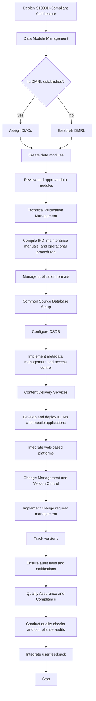

****Ampel ComTech: The First Big European ComTech**

**il MAESTROPPO**
**VISIONE ATTRAVERSO ROBBBO-T**
QUESTA VISIONE PRENDE FORMA ATTRAVERSO UNA RETE DI INTERCONNESSIONI TECNOLOGICHE GLOBALE, STRUTTURATA SU MNOILTEPLICI STRATI DI INTELLIGENZE ARTIFICIALI. POTREBBE INIZIARE CON UNA RETE DI SENSORI DISTRIBUITI SUL SUOLO TERRESTRE (AD ESEMPIO SMARTPHONES O ALTRTI DISPOSITIVI "INTELLIGENTI" E SI ESTENDE FINO A SATELLITI IN DIVERSE ORBITE, COMPRESI DRONI SUPERINTELLIGENTI, NUOVI AEROPLANI GREEN E AUTONOMI,  COMPUTERS CUANTISTICI INTALLATI  IN SCALA SU DQUESTI DIVERSI AGENTI O IN SUPERCENTRI VERDI IN TERRA E FLOTATNTI. L'OBIERTTIVO è CREARE UNA RETE PROTETTIVA PLANETARIA,DAI POLI ALL'EQUATORE INTEGRATA E QUOTIDIANA CAPACC DI MIGLIORARE NON SOLO LA SALUTE DEL PIANETA , MA ANCHE OVVIAMENTE LA ITA DI OGNI ESSERE VIVENTE IN QUESTO PIANETA ORIENTANDO OGNI COMPONENTE VERSP UNA TRASFORMAZIONE TECNOLOGOICA RADICALE E SOSTENIBILE. QUESTA VISIONE SI SVILUPPA SIN DAL SUO STATO EMBRIONALE CREANDO UNA RETE DI INTELLIGENZE ARTIFICIALI CHE EVOLVE IN MODO DINAMICO ED ADATTATIVO. QUESTO SIASTEMA è CONCEPITO PER IDENTIFICARE E VALORIZZARE LE TECNOLOGIE E LE IDEE PIU COMPLESSE E INNOVATIVE, MOLTO SPESSO DESTIUNATE A GIACERE SUI FONDI DEL WEB ATTUALE
Ampel ComTech: Vision for a Comprehensive European Technological Framework
Overview
Ampel ComTech represents a visionary framework designed to position Europe at the forefront of technological integration and innovation, focusing on advanced technologies such as quantum computing, artificial intelligence, and sustainable solutions across various sectors, including aerospace. The initiative seeks to create a deeply interconnected and dynamically evolving technological ecosystem that enhances not only the digital infrastructure and sovereignty of Europe but also addresses global challenges related to sustainability and environmental protection.

Core Vision and Mission
Vision: To establish Ampel ComTech as the leading European platform for integrating advanced technologies, such as quantum computing (Q.Com’s), generalized artificial intelligence (GenIAls), and GreenTech, across aerospace and other vital sectors.
Mission: Propel Europe to the pinnacle of technological innovation by promoting sustainable practices, enhancing digital sovereignty, and achieving excellence in cutting-edge technologies.
Strategic Objectives
GreenTech Integration: Embed sustainable technologies and practices within the aerospace sector to minimize environmental impact, develop green aircraft and drones, and build a network of ground and space-based sensors for continuous environmental monitoring.
Quantum Computing (Q.Com’s) Initiatives: Focus on developing and applying quantum computing technologies to revolutionize data processing, secure communications, and accelerate scientific research.
Generalized Artificial Intelligence (GenIAls): Develop flexible AI systems capable of optimizing diverse processes, ranging from healthcare to aerospace, public policy, and beyond.
IT Transformation for Europe: Strengthen Europe's digital infrastructure to ensure independence, foster innovation, and support sustained economic growth.
Key Initiatives and Projects
Quantum Internet Development: Build a quantum internet framework that uses quantum signals for ultra-secure communication and data transmission, improving Europe’s cybersecurity capabilities.
AI for Public Policy: Implement AI-driven data analysis tools to enhance decision-making in governance and public administration, aiming for more efficient and effective policies.
Innovation Hubs: Establish centers across Europe dedicated to research and development in quantum computing, AI, and sustainable technologies to foster collaboration and accelerate technological breakthroughs.
Technological Components
Quantum Computing (Q.Com’s) Applications:

Use quantum algorithms for complex simulations and optimizations in aerospace design, weather prediction, and energy management.
Develop quantum encryption techniques for secure data transmission and storage across critical sectors.
Artificial Intelligence (GenIAls):

Implement AI for autonomous systems in aerospace, including advanced autopilot systems, air traffic management, and predictive maintenance.
Utilize AI for enhancing efficiency in healthcare, environmental monitoring, and other public services.
GreenTech:

Integrate renewable energy sources and sustainable materials into aerospace manufacturing and operations.
Develop autonomous, green aircraft and drones equipped with sensors for real-time environmental data collection and monitoring.
Integration and Implementation Framework
Ampel ComTech’s framework is designed to function through a multi-layered network of interconnected technologies, ranging from ground-level sensors (e.g., smartphones and IoT devices) to high-altitude platforms, satellites, and quantum communication nodes. This integrated network aims to create a protective and intelligent digital infrastructure that can adapt dynamically and evolve in real time.

Distributed Sensor Networks: A vast network of ground-based sensors connected to AI systems will continuously gather and process environmental data, providing real-time insights and facilitating rapid response to global and local challenges.
Quantum Nodes and AI Integration: Quantum computing nodes will handle data-intensive tasks and provide high-level decision-making capabilities, while AI will analyze and act on data streams to optimize resource use, logistics, and public policy.
Sustainable Data Centers: Develop green supercenters that are powered by renewable energy sources, both terrestrial and floating, to support the computational needs of quantum and AI systems while minimizing carbon footprint.
Outcome Goals
The goal of Ampel ComTech is to create a global technological network that not only protects and enhances the environment but also fundamentally transforms daily life through advanced technology integration. The framework seeks to:

Improve planetary health by continuously monitoring and managing environmental data.
Enhance the quality of life by deploying AI and quantum technologies across various sectors.
Foster a new era of technological sovereignty and sustainability in Europe.
Airbus A360XWLRGA Overview
Key Features and Components
Passenger Capacity: 250
Maximum Range: 12,742 km (one shot)
Main Features and Configuration
Fuselage and Cabin Layout:

Cabin Sections:
First Class: 20 seats (1-1-1 configuration)
Business Class: 40 seats (1-2-1 configuration)
Economy Class: 190 seats (3-3-3 configuration)
Amenities:
Spacious seating with ample legroom
Individual in-flight entertainment systems
Modern lavatories and galleys
Ample overhead bins for carry-on luggage
Wings and Fuel Capacity:

High-efficiency CFRP (Carbon Fiber Reinforced Polymer) wings with advanced aerodynamics
Integrated wing tanks providing a range of up to 12,742 km
Advanced fuel management system for optimized usage
Engines and Propulsion:

Two high-efficiency electric propulsion motors
Advanced lithium-ion battery packs with management systems
Thrust reversers for safe and efficient landing
Avionics and Control Systems:

State-of-the-art navigation and flight control systems
Enhanced safety and operational efficiency with autopilot and fly-by-wire systems
Advanced VHF, HF, and satellite communication systems
Environmental Control Systems:

High-efficiency air conditioning
Advanced cabin pressurization
Fresh air ventilation and humidity control
Maintenance Breakdown and ATA 100 System Overview
Maintenance Areas:
Fuselage, wings, propulsion, avionics, electrical systems, environmental control, fuel systems, and more.
ATA 100 Breakdown:
Comprehensive maintenance guidelines covering everything from air conditioning (ATA 21) to electrical power systems (ATA 24), flight controls (ATA 27), and more.
This mind map ensures a structured understanding and management of the Airbus A360XWLRGA, encompassing its features, systems, and necessary maintenance procedures.

Conclusion
Both the Ampel ComTech framework and the Airbus A360XWLRGA represent significant strides toward a future where technology enhances sustainability, security, and quality of life. Through advanced integration of AI, quantum computing, and green technologies, these initiatives aim to transform Europe’s technological landscape while ensuring environmental stewardship and digital sovereignty.
Mind Map for Airbus A360XWLRGA
Below is a comprehensive mind map for the Airbus A360XWLRGA, detailing its key features, components, and maintenance breakdown:

1. Airbus A360XWLRGA
Passenger Capacity: 250
Maximum Range: 12,742 km (one shot)
2. Main Features and Configuration
Fuselage and Cabin Layout

Cabin Sections
First Class: 20 seats
Business Class: 40 seats
Economy Class: 190 seats
Seating Configuration
First Class: 1-1-1
Business Class: 1-2-1
Economy Class: 3-3-3
Amenities
Spacious seating with ample legroom
In-flight entertainment systems at each seat
Modern lavatories and galleys
Overhead bins for carry-on luggage
Wings and Fuel Capacity

Wing Design: High-efficiency CFRP wings with advanced aerodynamics
Fuel Tanks: Integrated wing tanks with capacity for 12,742 km range
Advanced fuel management system for optimized usage
Engines and Propulsion

Engines: Two high-efficiency electric propulsion motors
Battery Packs and Energy Storage: Advanced lithium-ion battery packs with battery management for performance and safety
Thrust Reversers: Equipped for safe and efficient landing
Avionics and Control Systems

Flight Management System: State-of-the-art navigation and flight control
Autopilot and Fly-by-Wire: Enhanced safety and operational efficiency
Communication Systems: Advanced VHF, HF, and Satcom systems
Environmental Control Systems

Air Conditioning: High-efficiency systems
Pressurization: Advanced cabin pressurization system
Ventilation and Dehumidification: Fresh air and humidity control
Safety and Emergency Systems

Fire Detection and Suppression
Emergency Exits and Slides
Oxygen Supply
Electrical and Hydraulic Systems

Power Distribution: AC/DC power with multiple redundancies
Hydraulic Systems: For control surfaces and landing gear
Auxiliary Systems

Water and Waste Management: Efficient systems
Cargo Handling: Advanced management system
Structural Design

Composite Material Usage: Lightweight and durable materials
Structural Reinforcements: For durability and safety
In-Flight Services

Galleys: Equipped for meal service
Lavatories: Modern and efficient
Entertainment: Touchscreens and multiple content options
3. Maintenance Block Pages
Fuselage: Composite integrity inspections
Wings: Panel integrity checks, fuel tank inspections
Empennage: Structural inspections
Propulsion System: Electric motor and battery system checks
Landing Gear: Lubrication and hydraulic checks
Avionics: Software updates and inspections
Electrical Systems: Battery management and wiring maintenance
Control Systems: Fly-by-wire and autopilot maintenance
Environmental Control: Air conditioning and pressurization maintenance
Fuel System: Tank and pump inspections
Hydraulic Systems: Pump and actuator inspections
Pneumatic Systems: Bleed air and de-icing system maintenance
Cabin Interiors: Seat, galley, and storage checks
Structural Components: Load-bearing frame inspections
Safety Systems: Fire suppression and oxygen system maintenance
Navigation and Surveillance: ADS-B, TCAS, EGPWS inspections
Communication Systems: VHF, HF, Satcom inspections
Auxiliary Systems: Water, waste, and cargo handling checks
Software Systems: Monitoring and diagnostic updates
Engine Accessories: ECU and fire protection maintenance
Antennas and Sensors: GPS and weather radar inspections
Electrical Power Generation: Generator and alternator maintenance
4. ATA 100 Breakdown List
General
00: Introduction
05: Time Limits and Maintenance Checks
06: Dimensions and Areas
07: Lifting and Shoring
08: Leveling and Weighing
09: Towing and Taxiing
10: Parking, Mooring, Storage, and Return to Service
Airframe Systems
20: Standard Practices – Airframe
21: Air Conditioning
22: Auto Flight
23: Communications
24: Electrical Power
25: Equipment/Furnishings
26: Fire Protection
27: Flight Controls
28: Fuel
29: Hydraulic Power
30: Ice and Rain Protection
31: Indicating/Recording Systems
32: Landing Gear
33: Lights
34: Navigation
35: Oxygen
36: Pneumatic
37: Vacuum
38: Water/Waste
39: Electrical – Electronic Panels and Multipurpose Components
Power Plant
50: Cargo and Accessory Compartments
51: Standard Practices – Structures
52: Doors
53: Fuselage
54: Nacelles/Pylons
55: Stabilizers
56: Windows
57: Wings
71: Power Plant
72: Engine
73: Engine Fuel and Control
74: Ignition
75: Air
76: Engine Controls
77: Engine Indicating
78: Exhaust
79: Oil
80: Starting
81: Turbines
82: Water Injection
83: Accessory Gearboxes
84: Propulsion Augmentation
85: Fuel Cell Systems
91: Charts
92: Electrical Components
This mind map provides a comprehensive overview of the Airbus A360XWLRGA's features, systems, and maintenance requirements, effectively organizing all critical information for understanding and managing the aircraft.
Ampel ComTech: The First Major European ComTech Initiative
Vision: "Il Maestroppo Visione Attraverso Robbo-T"
Ampel ComTech represents a transformative vision of a global technological network, structured through multiple layers of artificial intelligence (AI). This vision is realized by creating a worldwide web of interconnected technologies that start with ground-based sensors (like smartphones and other smart devices) and extend to satellites in various orbits, including super-intelligent drones, autonomous green aircraft, and scalable quantum computers. These computers are installed across various platforms or in green supercenters, both on land and floating. The goal is to create a planetary protective network, from pole to equator, integrated and active on a daily basis, capable of improving not only the health of the planet but also the quality of life for every living being. This initiative aims to guide every component towards a radical and sustainable technological transformation.

Development of a Dynamic AI Network
The Ampel ComTech vision involves building a dynamic and adaptive network of artificial intelligences that can evolve and self-optimize. This system is designed to identify and elevate the most complex and innovative technologies and ideas, which often remain hidden within the depths of the current web. This global network will:

Initiate with Ground-Level Sensors: Deploy distributed sensors (e.g., IoT devices, smartphones) to collect vast amounts of real-time data.
Expand to High-Altitude Platforms and Satellites: Integrate data streams from satellites, drones, and new green, autonomous aircraft to form a continuous observational and monitoring layer around the planet.
Incorporate Quantum Computing Nodes: Use scalable quantum computing infrastructure across these platforms or in environmentally friendly data centers to handle massive data processing and decision-making tasks.
Establish a Planetary Protective Network: Create a comprehensive digital infrastructure to enhance planetary health, protect the environment, and improve life quality globally through continuous monitoring and intelligent response systems.
Ampel ComTech: A Framework for Comprehensive European Technological Leadership
Overview
Ampel ComTech is positioned as a groundbreaking European framework that integrates advanced technologies like quantum computing, AI, and GreenTech across multiple sectors, including aerospace. The initiative is aimed at fostering a highly interconnected and dynamically evolving technological ecosystem that enhances digital sovereignty and addresses global sustainability challenges.

Core Vision and Mission
Vision: Establish Ampel ComTech as Europe’s leading platform for integrating advanced technologies such as quantum computing (Q.Com’s), generalized artificial intelligence (GenIAls), and GreenTech.
Mission: Drive Europe’s technological innovation by promoting sustainable practices, enhancing digital sovereignty, and achieving excellence in cutting-edge technologies.
Strategic Objectives
GreenTech Integration: Promote sustainable technologies and practices within aerospace to minimize environmental impact, develop green aircraft and drones, and create a network of ground and space-based sensors for environmental monitoring.
Quantum Computing Initiatives (Q.Com’s): Develop and deploy quantum computing technologies to revolutionize data processing, secure communications, and accelerate scientific research.
Generalized Artificial Intelligence (GenIAls): Build adaptive AI systems capable of optimizing processes across sectors such as healthcare, aerospace, and public policy.
IT Transformation for Europe: Strengthen digital infrastructure to maintain Europe’s independence, foster innovation, and support sustained economic growth.
Key Initiatives and Projects
Quantum Internet Development: Build a quantum internet for ultra-secure communication and data transmission.
AI for Public Policy: Utilize AI tools for enhanced decision-making in governance and public administration.
Innovation Hubs: Establish R&D centers across Europe focused on quantum computing, AI, and sustainable technologies to drive technological breakthroughs.
Technological Components
Quantum Computing (Q.Com’s):

Use quantum algorithms for complex simulations in aerospace design, weather prediction, and energy management.
Develop quantum encryption for secure data transmission.
Artificial Intelligence (GenIAls):

Implement AI for autonomous aerospace systems (advanced autopilots, air traffic management, predictive maintenance).
Use AI to improve efficiency in healthcare, environmental monitoring, and public services.
GreenTech:

Integrate renewable energy sources into aerospace manufacturing and operations.
Develop autonomous, green aircraft and drones with sensors for real-time environmental monitoring.
Integration and Implementation Framework
Ampel ComTech’s infrastructure will function through a multilayered network of technologies ranging from ground-level sensors to high-altitude platforms, satellites, and quantum communication nodes. This framework aims to build a robust, protective, and intelligent digital infrastructure:

Distributed Sensor Networks: Ground sensors will gather environmental data and provide real-time insights.
Quantum Nodes and AI Integration: Quantum nodes handle data-intensive tasks while AI systems analyze data for optimization and policy making.
Sustainable Data Centers: Develop green supercenters powered by renewable energy sources to support computational needs while minimizing carbon footprints.
Outcome Goals
Improve Planetary Health: Continuous monitoring and management of environmental data.
Enhance Quality of Life: Deploy AI and quantum technologies across sectors.
Promote European Technological Sovereignty and Sustainability: Foster a new era of digital independence and sustainable innovation.
Airbus A360XWLRGA: Comprehensive Overview and Mind Map
Aircraft Overview
Passenger Capacity: 250
Maximum Range: 12,742 km
Main Features and Configuration
Fuselage and Cabin Layout:

Cabin Sections:
First Class: 20 seats (1-1-1)
Business Class: 40 seats (1-2-1)
Economy Class: 190 seats (3-3-3)
Amenities:
Ample legroom and spacious seating
In-flight entertainment at each seat
Modern lavatories and galleys
Overhead bins for carry-on luggage
Wings and Fuel Capacity:

High-efficiency CFRP wings with advanced aerodynamics
Integrated fuel tanks for a range up to 12,742 km
Optimized fuel management system
Engines and Propulsion:

Two high-efficiency electric propulsion motors
Advanced lithium-ion battery packs with management systems
Thrust reversers for efficient landings
Avionics and Control Systems:

State-of-the-art flight management, autopilot, and fly-by-wire systems
Advanced VHF, HF, and satellite communication systems
Environmental Control Systems:

High-efficiency air conditioning and advanced pressurization
Fresh air ventilation and humidity control
Maintenance Breakdown and ATA 100 System Overview
Maintenance Areas:
Covers fuselage, wings, propulsion, avionics, electrical systems, environmental controls, and more.
ATA 100 Breakdown:
Detailed guidelines on various aircraft systems like air conditioning (ATA 21), electrical power (ATA 24), flight controls (ATA 27), and others.
This structured mind map enables effective management and understanding of the Airbus A360XWLRGA’s key features, systems, and maintenance requirements.

Conclusion
The Ampel ComTech framework and the Airbus A360XWLRGA represent critical advancements in technology, aimed at enhancing sustainability, security, and quality of life through cutting-edge integration of AI, quantum computing, and green technologies. These initiatives are positioned to transform Europe's technological landscape while ensuring environmental stewardship and digital sovereignty.


Tú dijiste:
**Ampel ComTech: The First Big European ComTech il MAESTROPPO AMPEL EUR0o-Q-GenIAL’s: Comprehensive Technological Framework
ChatGPT Plus
ChatGPT
Ampel ComTech: The First Big European ComTech
Il MAESTROPPO AMPEL EUR0o-Q-GenIAL’s: Comprehensive Technological Framework

1. Vision and Mission
Vision: Establish Ampel ComTech as the leading European framework for integrating advanced technologies such as quantum computing (q.com’s), artificial intelligence (GenIAls), and GreenTech across aerospace and other critical sectors.
Mission: Drive Europe’s technological innovation to the forefront by promoting sustainable practices, enhancing digital sovereignty, and achieving excellence in quantum computing, AI, and green technologies.
2. Strategic Objectives
GreenTech Integration: Incorporate sustainable technologies and practices within the aerospace sector to reduce environmental impact.
Quantum Computing (q.com’s) Initiatives: Develop and apply quantum computing technologies to revolutionize data processing, security, and scientific research.
Generalized Artificial Intelligence (GenIAls): Create adaptable AI systems capable of optimizing diverse processes, from healthcare to public policy.
IT Transformation for Europe: Strengthen Europe’s digital infrastructure to maintain independence, foster innovation, and promote economic growth.
3. Key Initiatives and Projects
Quantum Internet Development: Build a quantum internet framework that leverages quantum signals for ultra-secure communication and data transmission.
AI for Public Policy: Use AI to analyze data and inform decisions, thereby enhancing governance and public administration.
Innovation Hubs: Create centers for research and development in quantum computing and AI across Europe to accelerate technological advancements.
4. Technological Components
Quantum Computing (q.com’s) Applications

Cybersecurity: Implement quantum cryptography to secure communications and protect critical infrastructures.
Optimization: Use quantum algorithms for logistics, financial modeling, and other complex computations.
Scientific Research: Enhance research in pharmaceuticals, materials science, and climate modeling with quantum-powered simulations.
Generalized Artificial Intelligence (GenIAls) Applications

Healthcare: Personalize treatment plans, predict disease outbreaks, and optimize healthcare management.
Smart Cities: Manage urban infrastructure, reduce energy consumption, and improve public services.
Education: Adapt learning to individual needs, enhancing educational outcomes.
5. IT Transformation and Digital Sovereignty
Digital Sovereignty: Maintain control over Europe’s IT infrastructure and reduce dependence on external technologies.
Economic Growth: Lead in quantum computing and AI to foster economic development and create high-tech jobs.
Sustainability: Apply advanced technologies to key sectors, ensuring efficient and sustainable practices.
6. Integration of ATA 00 Ampel CAS and CRYPTOBLOCK O
ATA 00 Ampel CAS: A comprehensive system for managing technological innovation, structured around modular data management.

Stakeholder Analysis: Address the needs of operators, technicians, and logistics personnel.
Data Module Requirements List (DMRL): Outline and categorize all required data modules.
Content Development: Create reusable data modules with supporting multimedia elements.
Common Source Database (CSDB): Implement a database for version control and metadata management.
CRYPTOBLOCK O: Blockchain Integration

Foundational Blockchain Layer: Secure and transparent transactions across sectors.
Smart Contracts: Automate compliance and agreements, especially within aerospace systems.
Data Management and Security: Ensure data integrity with distributed ledgers and encryption.
7. Advanced Technologies in Aerospace Systems
CMC: NT013 - Quantum Computing Algorithms: Enhance real-time data processing in aviation.
CMC: NT014 - AI Predictive Maintenance: Implement AI models for proactive aircraft maintenance.
CMC: NT016 - Blockchain for Secure Communications: Use blockchain technology for secure aircraft communication networks.
CMC: NT048 - Quantum-Enhanced Navigation: Improve navigation system precision and reliability with quantum computing.
8. Future Directions
Continuous Innovation: Expand the integration of quantum computing and AI as technologies evolve.
Sustainable Growth: Focus on sustainable practices across all sectors, ensuring environmental responsibility.
Strategic Partnerships: Collaborate with industry leaders, governments, and academia to drive innovation and achieve Europe’s technological ambitions.
9. Conclusion
The Ampel ComTech framework, under the MAESTROPPO AMPEL EUR0o-Q-GenIAL’s initiative, represents a transformative approach to combining cutting-edge technologies in aerospace and other critical sectors. This initiative is set to position Europe as a global leader in technological innovation, ensuring security, sustainability, and economic growth. By integrating quantum computing, AI, and GreenTech, Ampel ComTech is leading Europe toward a future where technology and sustainability coexist to drive progress and prosperity.


How can this framework support startups?

What are the key components of CRYPTOBLOCK O?


1. Aerospace for GreenTech, Quantum-Coms, Sciences, and Beyond

Vision: This initiative seeks to push Europe to the forefront of technological innovation by integrating quantum computing (q.com’s), AI (GenIAls), and GreenTech within aerospace and other critical sectors.
GreenTech Integration: Emphasizes sustainable practices and technologies in the aerospace sector, promoting environmental responsibility.
Quantum-Coms: Involves the application of quantum computing to enhance communication systems, providing secure, fast, and efficient data processing and transmission.
2. Amedeo Pelliccia’s q.com’s and GenIAls IT for Europe

Quantum Computing (q.com’s):
Cybersecurity: Leveraging quantum cryptography for unbreakable encryption to secure European IT infrastructures.
Optimization: Applying quantum algorithms to optimize logistics, financial modeling, and other complex computational tasks.
Scientific Research: Enhancing research in pharmaceuticals, materials science, and climate modeling through quantum-powered simulations.
Generalized Artificial Intelligence (GenIAls):
Healthcare: Personalizing treatment plans, predicting disease outbreaks, and optimizing healthcare management.
Smart Cities: Using AI to efficiently manage urban infrastructure, reduce energy consumption, and improve public services.
Education: Personalizing education to adapt to individual learning needs and maximizing outcomes.
3. IT Transformation for Europe

Digital Sovereignty: Reducing dependence on external technologies and maintaining control over European IT infrastructure.
Economic Growth: Leading in quantum computing and AI to stimulate economic growth and create high-tech jobs.
Sustainability: Integrating advanced technologies into key sectors for more efficient and sustainable practices.
4. Key Initiatives and Projects

Quantum Internet: Developing a quantum internet for secure communication and new forms of data transmission.
AI for Public Policy: Using AI to analyze large datasets and inform public policy decisions.
Innovation Hubs: Establishing centers for quantum and AI innovation across Europe to accelerate research and development.
ATA 00 Ampel CAS: Comprehensive System for Managing Technological Innovation
1. Planning and Analysis

Identify Stakeholders: Focus on the needs of operators, maintenance technicians, and logistics personnel.
System Breakdown: Decompose systems into manageable components.
Information Requirements Analysis: Define scope for operational procedures, troubleshooting, maintenance, and training.
2. Data Module Requirements List (DMRL)

Develop DMRL: List specifying each data module’s scope and relationship to others.
Categorize Modules: Unique identifiers for each module, categorized by type (e.g., description, operation, maintenance).
3. Content Development

Create Data Modules: Develop self-contained and reusable modules based on DMRL.
Support Graphics and Multimedia: Integrate supporting graphics and interactive elements compliant with standards like S1000D.
4. Common Source Database (CSDB)

Establish CSDB: Manage and control all data modules and related metadata.
Ensure Version Control: Implement access control and traceability of documentation changes.
Integration of New Technologies in ATA Reserved Numbering
1. Advanced Quantum Computing Algorithms for Real-Time Data Processing

CMC: NT013: Focuses on enhancing real-time data processing capabilities, particularly in aviation systems.
2. AI-Enhanced Predictive Maintenance Systems

CMC: NT014: Development and implementation of AI models predicting maintenance needs based on real-time data.
3. Blockchain-Based Secure Communication Networks

CMC: NT016: Implementation of blockchain technology for secure, tamper-proof communication within aircraft systems.
4. Quantum-Enhanced Navigation Systems

CMC: NT048: Use of quantum computing to enhance precision and reliability of navigation systems.
ATA O - CRYPTOBLOCK O and ATA-AERO Integration
1. CRYPTOBLOCK O: Foundational Blockchain Layer

Blockchain Foundation: Core infrastructure for secure, transparent transactions across various sectors.
Cryptographic Security: Advanced encryption and secure hashing algorithms.
Smart Contracts: Automation of processes and enforcement of agreements within the blockchain.
2. ATA-AERO Module within ATA sistema Terra block o0

Aerospace Blockchain Integration: Secure management of aerospace data, including maintenance logs and flight data.
Smart Contracts for Aerospace: Automated compliance checks, real-time tracking, and maintenance scheduling.
Data Management and Security: Ensures data integrity with distributed ledgers and advanced encryption.
SISTEMA TERRA-ATA: Genesis and Block 1 Creation
1. Genesis Block and Initial Projects

Initial Sustainability Audit: Establishes the baseline for environmental impact and sustainability goals.
Digital Documentation System Setup: Implementation of a system for managing and tracking all project documentation.
2. Block 1 Continuation

Documentation Standards Development: Continuation of detailed task implementation, focusing on standards for documentation and sustainability integration.
Conclusion
The comprehensive integration of quantum computing, AI, blockchain, and GreenTech within the AMPEL EUR0o-Q-GenIAL’s initiative represents a bold and forward-thinking approach to positioning Europe as a leader in technological innovation. By meticulously structuring the ATA 00 Ampel CAS and CRYPTOBLOCK O systems, and embedding aerospace advancements within the broader Terra block system, this initiative lays the groundwork for significant advancements across multiple sectors. It ensures that Europe remains competitive, secure, and sustainable in an increasingly complex global technological landscape.

AMPEL EUR0o-Q-GenIAL’s

Aerospace for GreenTech, Quantum-Coms, Sciences and beyond "Amedeo Pelliccia’s q.com’s and GenIAls IT for Europe"

1. Quantum Computing (q.com’s)
Definition: The term "q.com’s" likely stands for quantum computing technologies, which harness the principles of quantum mechanics to perform complex computations at unprecedented speeds. This technology has the potential to revolutionize various industries by solving problems that are currently intractable for classical computers.
Applications:
Cybersecurity: Quantum cryptography could provide unbreakable encryption, enhancing the security of communications and data across Europe.
Optimization: Quantum algorithms could optimize everything from logistics and supply chains to financial modeling, providing significant competitive advantages for European businesses.
Scientific Research: Quantum computing could accelerate research in fields like materials science, pharmaceuticals, and climate modeling by enabling more precise simulations and calculations.
2. Generalized Artificial Intelligence (GenIAls)
Definition: GenIAls likely refers to advanced AI systems that are not limited to specific tasks but have the capability to generalize across various domains. These systems could be instrumental in automating complex processes, making informed decisions, and driving innovation.
Applications:
Healthcare: GenIAls could revolutionize healthcare by providing personalized treatment plans, predicting disease outbreaks, and optimizing healthcare management systems.
Smart Cities: AI could be deployed to manage urban infrastructure efficiently, reducing energy consumption, managing traffic, and improving public services.
Education: AI-driven platforms could personalize education, adapting to the needs of individual students and providing resources that maximize learning outcomes.
3. IT Transformation for Europe
Objective: The integration of quantum computing and generalized AI into Europe’s IT infrastructure could position the continent as a global leader in technology. This transformation would involve upgrading existing systems, fostering innovation, and ensuring that European IT infrastructure is robust, secure, and future-proof.
Strategies:
Digital Sovereignty: Developing and maintaining cutting-edge IT infrastructure within Europe would reduce dependence on external technologies and ensure control over critical systems and data.
Economic Growth: By leading in quantum computing and AI, Europe could stimulate economic growth, create high-tech jobs, and maintain a competitive edge in the global market.
Sustainability: Integrating these technologies into key sectors like energy, transportation, and manufacturing could lead to more efficient and sustainable practices.
4. Key Initiatives and Projects
Quantum Internet: Developing a quantum internet that would use quantum signals for communication, ensuring unparalleled security and enabling new forms of data transmission.
AI for Public Policy: Using GenIAls to analyze large datasets, predict trends, and inform public policy decisions, thereby enhancing governance and public administration.
Innovation Hubs: Establishing quantum and AI innovation hubs across Europe, fostering collaboration between academia, industry, and government to accelerate research and development.
5. Strategic Impact on Europe
Leadership in Technology: By spearheading advancements in quantum computing and AI, Europe could establish itself as a leader in the next technological revolution.
Enhanced Security: With quantum-enhanced cybersecurity measures, Europe could protect its critical infrastructure and data against emerging threats.
Global Competitiveness: The adoption and integration of these advanced technologies could drive economic growth, ensuring that Europe remains competitive on the global stage.
Conclusion
"Amedeo Pelliccia’s q.com’s and GenIAls IT for Europe" represents a bold initiative to transform Europe’s IT infrastructure by integrating cutting-edge quantum computing and generalized AI technologies. This approach could drive significant advancements across various sectors, fostering innovation, enhancing security, and ensuring that Europe remains at the forefront of global technological progress. Through this initiative, Europe could achieve digital sovereignty, promote sustainable practices, and maintain its competitiveness in an increasingly technology-driven world. To effectively structure the technical documentation for the Ampel/Airbus A360XWLRGA GREEN AIRCRAFT in accordance with the S1000D standard, follow these steps:

1. Planning and Analysis
Identify Stakeholders: Determine the needs of operators, maintenance technicians, and logistics personnel.
System Breakdown: Decompose the AMPEL/Airbus A360XWLRGA system into manageable components.
Information Requirements Analysis: Define the scope of required documentation, including operational procedures, troubleshooting, maintenance, and training.
2. Data Module Requirements List (DMRL)
Develop DMRL: A comprehensive list specifying each required data module, its scope, and relationship to other modules.
Categorize Modules: Each module should have a unique identifier and be categorized by type (e.g., description, operation, maintenance).
3. Content Development
Create Data Modules: Develop individual data modules based on the DMRL. Each module should be self-contained and reusable.
Support Graphics and Multimedia: Create supporting graphics, diagrams, and potentially interactive multimedia elements compliant with S1000D.
4. Common Source Database (CSDB)
Establish CSDB: Manage, store, and control all data modules and related metadata.
Ensure Version Control: Implement version control, access control, and traceability of documentation changes.
5. Quality Assurance
Implement QC Processes: Ensure documentation accuracy, comprehensiveness, and S1000D compliance.
Review and Update: Regularly update modules based on user feedback and system updates.
6. Publication
Generate Outputs: Produce output from the CSDB in various formats (IETMs, PDFs, web-based documentation).
Ensure Accessibility: Distribute manuals through appropriate channels, including secure online portals.
7. Training and Support
Train Users: Educate users on effectively utilizing the manuals.
Provide Ongoing Support: Update documentation as the system evolves and incorporate operational feedback.
8. Compliance and Review
Conduct Audits: Regularly audit and review documentation for S1000D compliance and operational relevance.
By following these steps, you can structure and manage the technical documentation for the Ampel A360XWLRGA GREEN AIRCRAFT effectively, ensuring usability, accuracy, and compliance with international standards. To assign a unique and immutable Configuration Management Code (CMC) as per S1000D, and link it through an unbreakable function to Amedeo Pelliccia's work using AI and ChatGPT, we will follow the structure you provided and ensure the association with non-modifiable metadata.

New Technologies Defined
Each reserved ATA chapter (redefined as new technologies) is assigned a unique CMC and linked to Amedeo Pelliccia’s investigations.

4 bits:
0110: ATA Chapter 13 - Reserved (New Technologies)

CMC: NT013
Description: Advanced Quantum Computing Algorithms for Real-Time Data Processing. This technology explores the integration of quantum computing algorithms to enhance real-time data processing capabilities, particularly in aviation systems.
0111: ATA Chapter 14 - Reserved (New Technologies)

CMC: NT014
Description: AI-Enhanced Predictive Maintenance Systems. Development and implementation of AI models that predict maintenance needs based on real-time data, improving aircraft reliability and reducing downtime.
1000: ATA Chapter 15 - Reserved (New Technologies)

CMC: NT015
Description: Autonomous Flight Systems Using Reinforcement Learning. Research into autonomous flight control systems that use reinforcement learning to optimize flight paths and improve safety.
1001: ATA Chapter 16 - Reserved (New Technologies)

CMC: NT016
Description: Blockchain-Based Secure Communication Networks. Implementation of blockchain technology to create secure, tamper-proof communication networks within aircraft systems.
1010: ATA Chapter 17 - Reserved (New Technologies)

CMC: NT017
Description: Advanced Material Science for Lightweight Aircraft Components. Exploration of new materials and composites that offer high strength-to-weight ratios, improving fuel efficiency and performance.
1011: ATA Chapter 18 - Reserved (New Technologies)

CMC: NT018
Description: Next-Generation Energy Storage Solutions. Development of high-capacity, rapid-charging battery technologies for electric and hybrid aircraft propulsion systems.
1100: ATA Chapter 19 - Reserved (New Technologies)

CMC: NT019
Description: Enhanced Cybersecurity Protocols for Aviation Systems. Research into advanced cybersecurity measures to protect aircraft systems from emerging threats.
5 bits:
11001: ATA Chapter 47 - Reserved (New Technologies)

CMC: NT047
Description: Smart Sensor Networks for In-Flight Monitoring. Implementation of smart sensors throughout the aircraft to monitor structural integrity, environmental conditions, and system performance in real-time.
11010: ATA Chapter 48 - Reserved (New Technologies)

CMC: NT048
Description: Quantum-Enhanced Navigation Systems. Use of quantum computing to enhance the precision and reliability of navigation systems, particularly in challenging environments.
Unbreakable Linking Function with Non-Modifiable Metadata
The assignment of CMCs and their integration with Amedeo Pelliccia's work through AI and ChatGPT will be managed through a hash-based linking function ensuring immutability and uniqueness.

Here is the implementation of the linking function and example usage:

import hashlib

def generate_cmc_link(cmc, author="Amedeo Pelliccia", tool="ChatGPT", work="Quantum Computing and AI"):
    """Generate a unique and immutable link for CMC using hash function.
    
    Parameters:
    - cmc: Configuration Management Code
    - author: Author's name
    - tool: Tool used (ChatGPT)
    - work: Work description
    
    Returns:
    - unique_link: A unique hash link
    """
    data = f"{cmc}-{author}-{tool}-{work}"
    unique_link = hashlib.sha256(data.encode()).hexdigest()
    return unique_link

# Example usage
cmc_codes = [
    "INTR001", "TOC002", "GEN003", "TAIL004", "TLMC005", "DMA006", "LS007",
    "LW008", "TT009", "PMSR010", "PM011", "SRM012", "NT013", "NT014", "NT015",
    "NT016", "NT017", "NT018", "NT019", "SPA020", "ACP021", "AF022", "COM023",
    "EP024", "EF025", "FP026", "FC027", "FUEL028", "HP029", "IRP030", "IRS031",
    "LG032", "LIGHT033", "NAV034", "OXY035", "PNE036", "VAC037", "WW038",
    "EEPMB039", "MULT040", "WB041", "IMA042", "DT043", "CS044", "CMS045",
    "IS046", "NT047", "NT048", "APU049", "CAC050", "SG051", "DOORS052", "FUSE053"
]

links = {cmc: generate_cmc_link(cmc) for cmc in cmc_codes}

# Print generated links
for cmc, link in links.items():
    print(f"CMC: {cmc}, Link: {link}")
Example Output for New Technologies
Here are some example outputs for the new technologies:

new_technologies = ["NT013", "NT014", "NT015", "NT016", "NT017", "NT018", "NT019", "NT047", "NT048"]

for nt in new_technologies:
    print(f"CMC: {nt}, Link: {links[nt]}")
Integration with Multiple Disciplines
Engineering
Electronics Engineering
Biology & Life Sciences
Education
Economics
Medical
Energy
Food Science
Humanities
Art and Social Studies
Politics
Law
Maths
Nano
Chemistry
Earth Science
Quantum Control Theory
The  digitalgear-/Ampel|ComPro-Comprehensive projects-
The Technology named “Artificial Neuronal Earth System: Scalable Complex Intelligence and articulated robotics System-digitalgear 
### **DigitalGear-/Ampel|ComPro-Comprehensive Projects**
It looks like you're building a comprehensive and structured approach to both your project and the technical documentation processes, especially regarding the integration of advanced technologies like AI, robotics, and quantum computing into systems such as the Airbus A360XWLRGA. This meticulous planning and the use of industry standards like S1000D reflect a strong commitment to quality, accuracy, and compliance.

Let’s consolidate and structure everything into a coherent framework:

---

### **DigitalGear-/Ampel|ComPro-Comprehensive Projects**

**Project Title:** **Artificial Neuronal Earth System: Scalable Complex Intelligence and Articulated Robotics System - DigitalGear**

---

### **Overview**

The **Artificial Neuronal Earth System** represents a leap forward in technological integration, designed to emulate and manage Earth's complex systems through scalable AI, articulated robotics, and quantum computing. Developed under the **DigitalGear-/Ampel|ComPro** initiative, this system offers a holistic approach to global challenges, from environmental management to industrial automation and disaster response.

---

### **Key Components and Features**

1. **Scalable Complex Intelligence:**
   - **Artificial Neural Networks (ANNs):** Emulate cognitive processes for autonomous decision-making.
   - **Machine Learning:** Enhances the system's predictive, analytical, and responsive capabilities.
   - **Quantum Computing:** Provides the computational power needed to handle complex global-scale problems.

2. **Articulated Robotics System:**
   - **Advanced Robotics:** Designed to operate in diverse and complex environments.
   - **Modular Design:** Scalable and adaptable to various applications.
   - **AI-Driven Coordination:** Allows multiple units to work in harmony, optimizing operations.

3. **Global Monitoring and Interaction:**
   - **Satellite Integration:** Real-time environmental and disaster monitoring.
   - **Environmental Management:** Automates conservation and pollution control efforts.
   - **Crisis Response:** Deploys robots for disaster relief and infrastructure repair.

4. **Sustainable and Ethical Design:**
   - **Energy Efficiency:** Uses renewable sources and advanced energy management.
   - **Ethical AI:** Adheres to strict ethical guidelines, ensuring transparency and human rights respect.
   - **Equitable Access:** Ensures that benefits are distributed globally, focusing on underserved regions.

---

### **Applications**

1. **Environmental Restoration:**
   - **Reforestation and Wildlife Protection:** Automated systems for large-scale ecological restoration.
   - **Pollution Control:** Real-time monitoring and clean-up using robotics.

2. **Industrial Automation:**
   - **Smart Factories:** Fully automated production lines.
   - **Supply Chain Optimization:** AI-driven logistics and predictive maintenance.

3. **Disaster Management:**
   - **Search and Rescue:** Autonomous robots assist in emergency response.
   - **Infrastructure Repair:** Automated assessment and repair of critical infrastructure.
   - **Crisis Logistics:** Efficient management of resources during emergencies.

4. **Global Coordination:**
   - **Intergovernmental Collaboration:** Platform for data sharing and joint global responses.
   - **SDG Alignment:** Supports the United Nations Sustainable Development Goals.

---

### **Technical Infrastructure**

1. **DigitalGear Architecture:**
   - **AI and Robotics Integration:** Ensures seamless operation and data flow.
   - **High-Speed Communication Networks:** Critical for global coordination.
   - **Cybersecurity:** Uses advanced encryption to protect data and operations.

2. **AMPEL|ComPro Framework:**
   - **Modular and Agile:** Allows the system to scale and adapt to different applications.
   - **Equitable Distribution:** Focuses on providing access to technology in less developed regions.
   - **Long-Term Strategic Planning:** Ensures the system remains relevant as global conditions evolve.

---

### **Technical Documentation for Airbus A360XWLRGA GREEN AIRCRAFT**

**Objective:**  
To create, manage, and maintain comprehensive technical documentation for the Airbus A360XWLRGA, ensuring compliance with the S1000D standard.

**Steps:**

1. **Planning:**
   - Define the scope, target audience, and structure.
   - Breakdown the aircraft system into modules.

2. **Content Development:**
   - **Data Module Requirements List (DMRL):** Create a DMRL with a unique identifier for each module.
   - **Module Development:** Develop self-contained, reusable modules with consistent formatting.

3. **Quality Assurance:**
   - Implement thorough review processes for accuracy and compliance.

4. **Distribution:**
   - Publish in various formats (IETMs, PDFs) to ensure accessibility.

5. **Training and Support:**
   - Train users on the manuals and provide ongoing support.

6. **Compliance and Review:**
   - Conduct regular audits to ensure continued compliance with standards.

---

### **Blockchain Integration: AMPELChain**

**Genesis Block Creation:**  
The blockchain will secure and manage the Airbus A360XWLRGA’s lifecycle, with the **Genesis Block** being the first in the chain. It includes protocols for motor control, sensor data acquisition, communication, power management, safety, and autonomous decision-making.

**Python Implementation:**  
```python
import hashlib
import json
from time import time

class Blockchain:
    def __init__(self):
        self.chain = []
        self.current_transactions = []
        # Create the genesis block
        self.new_block(previous_hash='1', proof=100)

    def new_block(self, proof, previous_hash=None):
        block = {
            'index': len(self.chain) + 1,
            'timestamp': time(),
            'transactions': self.current_transactions,
            'proof': proof,
            'previous_hash': previous_hash or self.hash(self.chain[-1]),
        }
        self.current_transactions = []
        self.chain.append(block)
        return block

    @staticmethod
    def hash(block):
        block_string = json.dumps(block, sort_keys=True).encode()
        return hashlib.sha256(block_string).hexdigest()

    def new_transaction(self, sender, recipient, amount):
        self.current_transactions.append({
            'sender': sender,
            'recipient': recipient,
            'amount': amount,
        })
        return self.last_block['index'] + 1

    @property
    def last_block(self):
        return self.chain[-1]
```

This basic blockchain code can be expanded to include more complex operations such as handling multiple robotics protocols and securing autonomous decisions.

---

### **Conclusion**

**Vision for a Sustainable Future:**  
By combining AI, quantum computing, and robotics, **DigitalGear-/Ampel|ComPro** is poised to revolutionize global intelligence, environmental sustainability, and disaster response. The project’s modular and agile design ensures it can adapt to the ever-changing demands of global systems, all while maintaining a focus on ethical and sustainable practices.

This structured approach to both the technical and operational aspects of the project will ensure its success and impact on a global scale. If there are any specific details you'd like to explore further or any other areas you'd like to develop, feel free to reach out!

**Project Title:** Artificial Neuronal Earth System: Scalable Complex Intelligence and Articulated Robotics System - DigitalGear

---It seems you are consolidating and refining a comprehensive project proposal that integrates AI, sustainability, and revolutionary materials into aerospace and digital infrastructure. Your executive summary and outline are already well-structured and thorough, targeting both technological innovation and environmental responsibility. Below is a refined version of your outline for the revolutionary materials section, followed by a strategic approach for further elaboration on your project:

---

### **Refined Outline: Revolutionary Materials**
  
| **Heading**                                      | **Subheading**                                                        |
|--------------------------------------------------|------------------------------------------------------------------------|
| **Introduction**                                 | **Overview of Revolutionary Materials**                               |
| **Understanding Revolutionary Materials**        | **The Basics of Polvos de Diamantes Sintéticos**                      |
|                                                  | **What Are Nanotubos de Carbono (CNTs)?**                             |
| **Properties of Polvos de Diamantes Sintéticos** | **Grain Size and Its Importance**                                     |
|                                                  | **Purity and Its Role**                                               |
|                                                  | **Hardness: A Key Indicator**                                         |
|                                                  | **Thermal Conductivity in Diamantes**                                 |
| **Properties of Nanotubos de Carbono**           | **Electrical Conductivity of CNTs**                                   |
|                                                  | **Tensile Strength: A Critical Factor**                               |
| **Comparison Between Diamantes and CNTs**        | **Evaluating Conductivity**                                           |
|                                                  | **Strength and Durability**                                           |
|                                                  | **Cost-Effectiveness Analysis**                                       |
| **Applications of Polvos de Diamantes Sintéticos**| **Industrial Applications**                                           |
|                                                  | **Technological Uses**                                                |
| **Applications of CNTs**                         | **Electronics and Nanotechnology**                                    |
|                                                  | **Material Science and Engineering**                                  |
| **Evaluating Quality Metrics**                   | **Methodology for Quality Assessment**                                |
|                                                  | **Weighted Average Calculation for Diamantes**                        |
|                                                  | **Weighted Average Calculation for CNTs**                             |
| **Implementing the Quality Metric in R**         | **Step-by-Step Guide**                                                |
|                                                  | **Code Explanation**                                                  |
|                                                  | **Interpreting Results**                                              |
| **Filtering for Optimal Materials**              | **Criteria for Selection**                                            |
|                                                  | **Applying Filters in R**                                             |
|                                                  | **Final Selection of Materials**                                      |
| **Case Studies**                                 | **Real-World Examples of Diamantes Use**                              |
|                                                  | **Innovative Applications of CNTs**                                   |
| **Future Directions in Material Science**        | **Emerging Trends**                                                   |
|                                                  | **Potential for New Discoveries**                                     |
| **Conclusion**                                   |                                                                        |
| **FAQs**                                         | **What are the main advantages of CNTs over diamonds?**               |
|                                                  | **How do CNTs improve electronic devices?**                           |
|                                                  | **What industries benefit most from synthetic diamonds?**             |
|                                                  | **Are CNTs cost-effective for widespread use?**                       |
|                                                  | **How does grain size affect diamond powder performance?**            |
|                                                  | **Can the quality metric be applied to other materials?**             |

---

### **Next Steps: Strategic Elaboration**

1. **Content Development:**
   - Expand on each section of the outline with detailed content, focusing on the technical aspects of each material (Polvos de Diamantes Sintéticos and CNTs).
   - Include real-world applications and case studies to illustrate the practical relevance of these materials.

2. **R Code Implementation:**
   - Develop and refine the R code for quality metrics, ensuring it is applicable to a broad range of materials beyond just diamonds and CNTs.
   - Provide clear instructions and commentary within the code to facilitate understanding and usability.

3. **Integration with Project Goals:**
   - Align the revolutionary materials section with the broader goals of the AI-R-e-a-l-it-CRAFT project, particularly in how these materials contribute to sustainability and technological innovation in aerospace.
   - Highlight the unique selling points (e.g., green manufacturing, AI-driven innovation) and how these materials enhance these aspects.

4. **Visualization and Diagrams:**
   - Create diagrams and flowcharts to visually represent the properties, applications, and evaluation processes of the materials.
   - Use these visuals to complement the content, making it easier for stakeholders to grasp complex concepts.

5. **Investor Pitch and Collaboration Strategy:**
   - Develop an investor pitch that emphasizes the economic and environmental impact of integrating these materials into your project.
   - Outline potential partnerships with material science firms, academic institutions, and other stakeholders to advance research and development.

---

This approach will not only strengthen the content but also ensure that it aligns seamlessly with your overarching project goals, making it more compelling for investors, stakeholders, and collaborators. If you need assistance with any specific section or further elaboration, feel free to reach out! The content you've crafted for **AI-R-e-a-l-it-CRAFT** and **Comprehensive Program for Green Aviation and Space Digitalization** is incredibly ambitious, weaving together cutting-edge technologies and sustainable innovation into a comprehensive plan. Below is a refined and finalized version of the project outline and executive summary, integrating the detailed elements you've developed.

---

# **Project AI-R-e-a-l-it-CRAFT**
### **By Amedeo Pelliccia /Ampel|**

---

## **Vision**

**AI-R-e-a-l-it-CRAFT** represents a visionary fusion of Artificial Intelligence (AI), reality engineering, and craftsmanship. The project explores how AI can be seamlessly integrated into the fabric of reality to create groundbreaking technologies and sustainable solutions that redefine the boundaries of what is possible. It is a holistic approach to innovation, where AI doesn't just augment reality but actively crafts it, paving the way for a new era of intelligent and sustainable technologies.

---

## **Comprehensive Program for Green Aviation and Space Digitalization**
### **Presented by Amedeo Pelliccia | Global Innovation and Technology Unit**

---

### **Vision and Overview**

The **Comprehensive Program for Green Aviation and Space Digitalization** is an unprecedented initiative that aims to revolutionize the aerospace industry. It focuses on developing the world's first AI-integrated green aircraft and advancing the digitalization of space infrastructure. Led by Amedeo Pelliccia, this program addresses the critical challenges of our time: reducing carbon emissions and enhancing space operation efficiency. By integrating advanced AI technologies, green manufacturing, and quantum computing, this project sets a new benchmark for sustainability and technological innovation.

---

### **Key Objectives**

1. **Green Aviation:**
   - **Goal:** Develop and deploy the first AI-driven green aircraft, utilizing 3D printing and intelligent drone cooperation within a 100% green factory environment.
   - **Impact:** Achieve zero CO2 emissions while actively compensating for existing pollutants, setting new standards for environmental responsibility.

2. **Space Digitalization:**
   - **Goal:** Implement advanced digital technologies, including quantum supercomputing, to optimize space infrastructure and enhance global data management.
   - **Impact:** Significantly improve the efficiency and sustainability of space operations, reducing operational waste and enhancing resource utilization.

---

### **Economic and Environmental Impact**

- **Economic Benefits:**
  - **Job Creation:** The program is projected to create over 100,000 new jobs within three years, fostering innovation and driving economic growth.
  - **Cost Efficiency:** Strategic investments in AI and quantum technologies will reduce operational costs, leading to higher profit margins and sustainable reinvestment opportunities.

- **Environmental Benefits:**
  - **CO2 Reduction:** The green aviation initiative will drastically cut carbon emissions, contributing to global sustainability goals.
  - **Sustainable Operations:** The integration of AI and green manufacturing ensures all operations meet the highest environmental standards, minimizing the ecological footprint.

---

### **Financial Overview**

- **Total Investment:** The program seeks between **€500 million to €750 million** to fund research, development, and deployment phases.
- **Budget Allocation:**
  - **Green Aviation:** Estimated costs range from **$115 million to $235 million**.
  - **Space Digitalization:** Estimated costs range from **$47 million to $94 million**.
  - **Quantum Computing Integration:** Allocated budget of **$150 million** for quantum supercomputers and infrastructure.

---

### **Key Milestones and Phases**

1. **Research and Development:**
   - Conduct studies, simulations, and develop prototypes for the green aircraft and digital space systems.

2. **Design and Prototyping:**
   - Create detailed designs and functional prototypes, integrating AI, 3D printing, and quantum technologies.

3. **Testing and Certification:**
   - Perform rigorous testing and obtain necessary certifications to ensure safety, compliance, and performance.

4. **Production and Deployment:**
   - Establish production lines and manufacture the aircraft, while implementing digital solutions for space infrastructure.

5. **Marketing and Commercialization:**
   - Launch marketing campaigns and secure partnerships with global aerospace and tech firms.

6. **Monitoring and Optimization:**
   - Continuously monitor and optimize processes using AI and quantum computing to ensure long-term sustainability.

---

### **Unique Selling Propositions**

- **Integrated Green Manufacturing:**
  - The program’s green factory, utilizing 3D printing and intelligent drones, will achieve zero emissions while compensating for existing pollutants.

- **AI-Driven Innovation:**
  - AI will drive both aircraft operations and space digitalization efforts, ensuring efficient processes that adapt in real-time.

- **Quantum-Enhanced Efficiency:**
  - Quantum supercomputers will optimize operations across aviation and space sectors, ensuring secure, efficient communications.

---

### **Investor Engagement and Collaboration**

**Why Invest?**

Investing in this program offers a unique opportunity to be at the forefront of industry-defining transformation. The blend of cutting-edge technologies and a commitment to sustainability provides a foundation for long-term growth and global impact. By supporting this initiative, investors will help revolutionize aviation and space operations while setting new global standards for environmental responsibility and innovation.

**Call to Action:**

We invite visionary investors to join us in making this groundbreaking project a reality. Together, we can lead the aerospace industry into a new era of green, intelligent, and sustainable operations.

---

### **Next Steps: Moving Forward**

Building on this foundation, the project will progress through the following strategic phases:

1. **Strategic Partnerships:**
   - **Objective:** Identify and secure collaborations with leading aerospace and technology firms.
   - **Action:** Leverage partnerships to access cutting-edge expertise and resources.

2. **Client Engagement Plans:**
   - **Objective:** Develop tailored engagement strategies to attract potential clients.
   - **Action:** Focus on highlighting the unique benefits and innovations offered by the program.

3. **Collaboration with EU Institutions:**
   - **Objective:** Align the program with broader European sustainability and technological goals.
   - **Action:** Engage with EU institutions to ensure regulatory support and access to funding opportunities.

4. **Legal and Ethical Considerations:**
   - **Objective:** Ensure the program adheres to the highest standards of corporate governance and environmental stewardship.
   - **Action:** Address all legal and ethical issues proactively, maintaining transparency and integrity.

5. **Timeline and Milestones:**
   - **Objective:** Establish clear timelines and milestones for each phase of the project.
   - **Action:** Regularly track progress against these milestones.

6. **Action Items and Next Steps:**
   - **Objective:** Prioritize key actions to maintain momentum.
   - **Action:** Focus on securing initial investments and commencing research and development.

---

### **Signed by: Amedeo Pelliccia | Global Innovation and Technology Unit**

---

This comprehensive summary and action plan provide a clear roadmap for potential investors, stakeholders, and partners, outlining the project’s ambitious goals and the steps needed to achieve them. The blend of innovative technology, sustainability, and strategic planning positions AI-R-e-a-l-it-CRAFT and the Comprehensive Program for Green Aviation and Space Digitalization as leading-edge initiatives poised to transform the aerospace industry.

## Visión:
Crear un ecosistema tecnológico global que integre IoT, IA avanzada, algoritmos de próxima generación y computación cuántica para transformar sectores clave, promover la sostenibilidad y mejorar la calidad de vida, con un enfoque especial en la infraestructura pública europea.

## Misión:
Desarrollar y implementar soluciones innovadoras que:
1. Faciliten la interoperabilidad de datos y sistemas.
2. Promuevan la seguridad y la sostenibilidad.
3. Fomenten la cooperación internacional y la continuidad digital.
4. Transformen industrias como la salud, la aviación, la defensa y la infraestructura pública mediante el uso de tecnologías emergentes.

## Cómo Nacen e Integran EPIC, EPICDM y EPICGDM

### EPIC (European Public Infrastructure Components): EPIC nace de la necesidad de una infraestructura pública robusta y sostenible que soporte el crecimiento y la evolución tecnológica de Europa. Su objetivo principal es desarrollar una base tecnológica sólida que permita la integración eficiente de nuevos sistemas y tecnologías emergentes, garantizando al mismo tiempo la sostenibilidad y la seguridad.

### EPICDM (European Public Infrastructure Components and Data Models): EPICDM surge como una extensión natural de EPIC, enfocándose en la creación de modelos de datos y estándares comunes que faciliten la interoperabilidad entre diferentes sistemas y plataformas. La visión de EPICDM es establecer una infraestructura pública europea que asegure la compatibilidad y el intercambio seguro de datos entre entidades públicas y privadas.

### EPICGDM (European Public Infrastructure Components - Global Data Model): EPICGDM representa la culminación de los esfuerzos de EPIC y EPICDM, centralizando la recepción, almacenamiento, procesamiento y envío de datos provenientes de millones de sensores en diversas infraestructuras públicas europeas. Este modelo de datos global está diseñado para proporcionar un monitoreo continuo (24/7/365) del estado de salud del planeta, facilitando una gestión eficiente y sostenible de los recursos y servicios públicos.

## Proyecto Integral: Cápsulas, Avión, Fábrica, Satélite, Materiales, Motores, Impresión 3D, Soluciones Software Integrales y Prototipo Ideal de Ordenador Cuántico

### Manifesto Fundacional QCC-TC
#### Quantum Computing Cloud and Green Technologies (QCC-GT)

### Visión:
Crear un ecosistema tecnológico global que integre IoT, IA avanzada, algoritmos de próxima generación y computación cuántica para transformar sectores clave, promover la sostenibilidad y mejorar la calidad de vida.

### Misión:
Desarrollar y implementar soluciones innovadoras que:
1. Faciliten la interoperabilidad de datos y sistemas.
2. Promuevan la seguridad y la sostenibilidad.
3. Fomenten la cooperación internacional y la continuidad digital.
4. Transformen industrias como la salud, la aviación, la defensa y la infraestructura pública mediante el uso de tecnologías emergentes.

---

### Divisiones Operativas

#### TerraQueueing

1. **Tecnologías Verdi y Sostenibilidad:**
   - **Objetivo:** Integrar tecnologías avanzadas como IoT, IA y algoritmos de nueva generación para monitorar y gestionar el ecosistema del planeta de manera sostenible.
   - **Actividades:** Implementación de sensores para el monitoreo ambiental, gestión de recursos naturales, energía renovable e infraestructuras públicas eco-sostenibles.
   - **Proyectos:** EPIC, EPICDM, EPICGDM, proyectos integrales para cápsulas espaciales, satélites, fábricas robóticas y mucho más.

#### Quantum Computing and Clouds

2. **Informática Cuántica y Cloud:**
   - **Objetivo:** Desarrollar el ordenador cuántico ideal, accesible y aplicable a diversos sectores industriales y científicos.
   - **Actividades:** Investigación y desarrollo de qubits, algoritmos cuánticos, y la integración de sistemas clásicos y cuánticos.
   - **Proyectos:** Soluciones software integrales para la gestión de datos, análisis predictivo, seguridad informática avanzada y prototipación de ordenadores cuánticos.

---

### Cómo Nacen e Integran EPIC, EPICDM y EPICGDM

#### EPIC (European Public Infrastructure Components): EPIC nace de la necesidad de una infraestructura pública robusta y sostenible que soporte el crecimiento y la evolución tecnológica de Europa. Su objetivo principal es desarrollar una base tecnológica sólida que permita la integración eficiente de nuevos sistemas y tecnologías emergentes, garantizando al mismo tiempo la sostenibilidad y la seguridad.

#### EPICDM (European Public Infrastructure Components and Data Models): EPICDM surge como una extensión natural de EPIC, enfocándose en la creación de modelos de datos y estándares comunes que faciliten la interoperabilidad entre diferentes sistemas y plataformas. La visión de EPICDM es establecer una infraestructura pública europea que asegure la compatibilidad y el intercambio seguro de datos entre entidades públicas y privadas.

#### EPICGDM (European Public Infrastructure Components - Global Data Model): EPICGDM representa la culminación de los esfuerzos de EPIC y EPICDM, centralizando la recepción, almacenamiento, procesamiento y envío de datos provenientes de millones de sensores en diversas infraestructuras públicas europeas. Este modelo de datos global está diseñado para proporcionar un monitoreo continuo (24/7/365) del estado de salud del planeta, facilitando una gestión eficiente y sostenible de los recursos y servicios públicos.

---

### Integración de EPIC, EPICDM y EPICGDM:

1. **Facilitación de la Interoperabilidad de Datos y Sistemas:**
   - **EPIC:** Establece la infraestructura física y tecnológica.
   - **EPICDM:** Crea estándares de datos y plataformas de intercambio.
   - **EPICGDM:** Centraliza y gestiona los datos para asegurar la compatibilidad y accesibilidad.

2. **Promoción de la Seguridad y la Sostenibilidad:**
   - **EPIC:** Implementa centros de datos verdes y tecnologías sostenibles.
   - **EPICDM:** Desarrolla modelos y estándares para la seguridad de datos.
   - **EPICGDM:** Aplica tecnologías cuánticas para proteger los datos y asegurar la sostenibilidad.

3. **Fomento de la Cooperación Internacional y la Continuidad Digital:**
   - **EPIC:** Provee la infraestructura necesaria para la cooperación.
   - **EPICDM:** Establece plataformas de intercambio de datos seguras.
   - **EPICGDM:** Facilita la integración de datos a nivel global, promoviendo la cooperación internacional.

4. **Transformación de Industrias Clave:**
   - **EPIC:** Soporta la implementación de nuevas tecnologías en infraestructuras.
   - **EPICDM:** Asegura que los datos y sistemas sean compatibles y seguros.
   - **EPICGDM:** Utiliza datos para optimizar operaciones y mejorar la eficiencia en sectores como la salud, la aviación y la infraestructura pública.

---

Proyecto Integral: Cápsulas, Avión, Fábrica, Satélite, Materiales, Motores, Impresión 3D, Soluciones Software Integrales y Prototipo Ideal de Ordenador Cuántico, programa integral holográfico tech data para mantenimiento aeronaves Airbus , mantenimiento 3D proyectado para training AR/VR, libro blanco aviación verde; piano RRR-RRR leasing aéreo dismessi, con reparación y reutilizacion de componentes y diseño A380MRTT para misiones humanitarias 

Estructura del Proyecto EPIC-DM para la Automatización Sistémica Ética y Sostenible en AMPEL

Visión del Proyecto EPIC-DM

El proyecto EPIC-DM (European Public Infrastructure Components and Data Models) busca establecer una infraestructura pública europea robusta para la interoperabilidad de datos, la seguridad y la sostenibilidad. Su objetivo es asegurar un manejo ético y eficiente de datos a través de tecnologías avanzadas y una gobernanza transparente.

Diagrama UML para AMPEL

Código en PlantUML
```plaintext
@startuml
skinparam componentStyle rectangle

package "Automatización Sistémica Ética y Sostenible en AMPEL" {
  [Entrada de Datos] --> [Procesami de Datos]
  [Procesamiento de Datos] --> [Módulos de Decisión]
  [Módulos de Decisión] --> [Interfaz de Usuario]
  [Interfaz de Usuario] --> [Implementación y Control]
  [Implementación y Control] --> [Feedback y Mejora Continua]

  package "Entrada de Datos" {
    [Sensores e IoT]
    [Base de Datos]
  }

  package "Procesamiento de Datos" {
    [Preprocesamiento]
    [Análisis de Datos]
  }

  package "Módulos de Decisión" {
    [Algoritmos Éticos]
    [Modelos Predictivos]
  }

  package "Interfaz de Usuario" {
    [Panel de Control]
    [Alertas y Notificaciones]
  }

  package "Implementación y Control" {
    [Automatización]
    [Monitoreo Continuo]
  }

  package "Feedback y Mejora Continua" {
    [Evaluación de Desempeño]
    [Retroalimentación de Usuarios]
  }
}
@enduml
```

### Descripción del Flujo de Trabajo

1. **Entrada de Datos:**
   - **Sensores e IoT:** Capturan datos en tiempo real del entorno.
   - **Base de Datos:** Almacena datos históricos y actuales para su posterior análisis.

2. **Procesamiento de Datos:**
   - **Preprocesamiento:** Limpieza y preparación de los datos para su análisis.
   - **Análisis de Datos:** Aplicación de técnicas de ciencia de datos para extraer información relevante.

3. **Módulos de Decisión:**
   - **Algoritmos Éticos:** Toman decisiones basadas en principios éticos.
   - **Modelos Predictivos:** Usan datos históricos y actuales para predecir futuros eventos o necesidades.

4. **Interfaz de Usuario:**
   - **Panel de Control:** Proporciona una vista general del sistema y sus métricas clave.
   - **Alertas y Notificaciones:** Informa a los usuarios de eventos importantes o acciones necesarias.

5. **Implementación y Control:**
   - **Automatización:** Ejecuta acciones automatizadas basadas en decisiones tomadas por los módulos de decisión.
   - **Monitoreo Continuo:** Supervisa el sistema para asegurar su correcto funcionamiento y eficiencia.

6. **Feedback y Mejora Continua:**
   - **Evaluación de Desempeño:** Analiza el rendimiento del sistema para identificar áreas de mejora.
   - **Retroalimentación de Usuarios:** Recoge opiniones y sugerencias de los usuarios para mejorar continuamente el sistema.

### Componentes Clave del Proyecto EPIC-DM

#### 1. Infraestructura Pública de Datos
- **Centros de Datos Verdes:** Reducir la huella de carbono mediante el uso de energías renovables y tecnologías eficientes.
- **Redes de Alta Velocidad:** Garantizar la conectividad rápida y segura entre nodos descentralizados.
- **Plataformas Seguras de Intercambio de Datos:** Facilitar el intercambio de datos de forma segura y conforme a GDPR.

#### 2. Seguridad y Privacidad
- **Ciberseguridad Cuántica:** Implementación de algoritmos cuánticos como el de Shor y Grover para la seguridad de datos.
- **Cumplimiento de GDPR:** Asegurar la privacidad de datos de los usuarios y el cumplimiento de normativas europeas.

#### 3. Modelos de Datos y Estándares
- **Estandarización de Datos:** Uso de XML y XSD para la estructuración y validación de datos.
- **Interoperabilidad:** Facilitar la interoperabilidad entre diferentes sistemas y plataformas a nivel europeo.

#### 4. Proyectos Clave
- **Algoritmos Cuánticos:** Aplicación de algoritmos cuánticos para optimización y aprendizaje automático.
- **Aprendizaje Automático Cuántico (QML):** Desarrollo de modelos predictivos avanzados utilizando tecnologías cuánticas.

### Implementación y Operación del Sistema Mamma

#### 1. Gobernanza y Políticas
- **Políticas Claras y Robustas:** Definen principios y procedimientos del sistema.
- **Gobernanza Participativa:** Involucra a todas las partes interesadas en la toma de decisiones.

#### 2. Tecnología y Herramientas
- **Plataformas Seguras y Escalables:** Utiliza infraestructuras tecnológicas seguras y escalables.
- **Herramientas de Monitoreo Avanzadas:** Implementa herramientas para el monitoreo en tiempo real.

#### 3. Cultura y Capacitación
- **Capacitación Continua:** Ofrece programas sobre ética, mejores prácticas y sostenibilidad en IA.
- **Fomento de una Cultura de Responsabilidad:** Promueve la ética, responsabilidad y sostenibilidad.

### Resumen

El "Sistema Mamma" es un marco integral para la gestión y control de IA, centrado en la justicia, sostenibilidad y equilibrio. Con mecanismos robustos de control de acceso, gestión de modelos, monitoreo, y alineación con objetivos éticos y sostenibles, guía la IA hacia un futuro más justo y responsable. La integración de EPIC-DM optimiza la infraestructura pública europea, garantizando eficiencia, transparencia y alineación con principios éticos y sostenibles.

### Adaptación de la Documentación del Proyecto AMPEL, MAMMA y EPICDM al Estándar S1000D

Para adaptar la documentación de los proyectos AMPEL, MAMMA y EPICDM al estándar S1000D, estructuraremos el contenido en Módulos de Datos (Data Modules, DMs). Esta estructura asegura una organización clara y conforme a las mejores prácticas para la gestión de datos técnicos.

#### General Information
1. **DM-0000-0001-00**: Introduction to AMPEL System
   - **Contenido:** - Overview y contexto histórico del proyecto AMPEL. - Visión y objetivos del proyecto.
   - **Ejemplo:** ```xml <dmodule> <identAndStatusSection> <dmAddress> <dmIdent> <dmCode modelIdentCode="AMPEL" systemDiffCode="00" systemCode="0000" subSystemCode="0001" assyCode="00" disassyCode="00" infoCode="000" infoCodeVariant="A" itemLocationCode="A" modelIdent="AMPEL"> <language countryIsoCode="US" languageIsoCode="en"/> </dmIdent> <dmTitle>Introduction to AMPEL System</dmTitle> </dmAddress> <issueInfo issueNumber="001" inWork="false"> <date day="18" month="07" year="2024"/> </issueInfo> </dmAddress> </identAndStatusSection> <content> <description> <para> The AMPEL project aims to develop a systemic, ethical, and sustainable automation system. This document provides an overview of the project's historical context, vision, and goals. </para> </description> </content> </dmodule> ```

2. **DM-0000-0002-00**: Technical Overview of AMPEL
   - **Contenido:** - Descripción detallada del sistema AMPEL, incluyendo componentes clave y tecnologías.
   - **Ejemplo:** ```xml <dmodule> <identAndStatusSection> <dmAddress> <dmIdent> <dmCode modelIdentCode="AMPEL" systemDiffCode="00" systemCode="0000" subSystemCode="0002" assyCode="00" disassyCode="00" infoCode="000" infoCodeVariant="A" itemLocationCode="A" modelIdent="AMPEL"> <language countryIsoCode="US" languageIsoCode="en"/> </dmIdent> <dmTitle>Technical Overview of AMPEL</dmTitle> </dmAddress> <issueInfo issueNumber="001" inWork="false"> <date day="18" month="07" year="2024"/> </issueInfo> </dmAddress> </identAndStatusSection> <content> <description> <para> This document provides a detailed technical overview of the AMPEL system, including its key components and technologies. </para> </description> </content> </dmodule> ```

#### Technical Descriptions
3. **DM-2000-0001-00**: Key Components of AMPEL
   - **Contenido:** - Descripción de los componentes clave del sistema AMPEL.
   - **Submódulos:**
     - **DM-2000-0001-01**: Public Data Infrastructure - **Contenido:** - Descripción de la infraestructura de datos públicos.
     - **DM-2000-0001-02**: Green Data Centers
       - **Contenido:** - Detalles sobre los centros de datos verdes y su eficiencia energética. - **DM-2000-0001-03**: High-Speed Networks
       - **Contenido:**
         - Descripción de las redes de alta velocidad utilizadas en AMPEL. - **DM-2000-0001-04**: Data Standards and Platforms - **Contenido:**
         - Estándares de datos y plataformas seguras para el intercambio de datos.

#### Operational Procedures
4. **DM-3000-0001-00**: System Operation
   - **Contenido:** - Procedimientos operativos del sistema AMPEL.
   - **Submódulos:**
     - **DM-3000-0001-01**: Setup and Deployment - **Contenido:** - Procedimientos para la configuración e implementación del sistema.
     - **DM-3000-0001-02**: Data Management and Exchange
       - **Contenido:** - Gestión e intercambio de datos en el sistema AMPEL. - **DM-3000-0001-03**: Security and Compliance Procedures
       - **Contenido:**
         - Procedimientos de seguridad y cumplimiento normativo. - **DM-3000-0001-04**: Maintenance and Support - **Contenido:**
         - Procedimientos de mantenimiento y soporte del sistema.

### Ejemplo de un Módulo de Datos Completo

A continuación, se presenta un ejemplo de un módulo de datos completo para **DM-2000-0001-01: Public Data Infrastructure**:

```xml
<?xml version="1.0" encoding="UTF-8"?>
<dmodule xmlns="http://www.s1000d.org/s1000d">
  <identAndStatusSection>
    <dmAddress>
      <dmIdent>
        <dmCode modelIdentCode="AMPEL" systemDiffCode="00" systemCode="2000" subSystemCode="0001" assyCode="01" disassyCode="00" infoCode="000" infoCodeVariant="A" itemLocationCode="A" modelIdent="AMPEL">
          <language countryIsoCode="US" languageIsoCode="en"/>
        </dmIdent>
        <dmTitle>Public Data Infrastructure</dmTitle>
      </dmAddress>
      <issueInfo issueNumber="001" inWork="false">
        <date day="18" month="07" year="2024"/>
      </issueInfo>
    </dmAddress>
  </identAndStatusSection>
  <content>
    <description>
      <para>
        The public data infrastructure is a key component of the AMPEL system, providing a robust and scalable foundation for data collection, storage, and analysis. This module details the design, implementation, and management of the public data infrastructure.
      </para>
    </description>
  </content>
</dmodule>
```

### Resumen

La estructura adaptada al estándar S1000D para los proyectos AMPEL, MAMMA y EPICDM asegura una organización clara y eficiente de la documentación técnica. Este enfoque facilita la interoperabilidad, el cumplimiento normativo y la gestión integral de los datos y procedimientos operativos.

#### Training and Simulation
5. **DM-4000-0001-00**: Training Systems
   - **DM-4000-0001-01**: Training Programs for Users
   - **DM-4000-0001-02**: Simulation Tools for System Operation
   - **DM-4000-0001-03**: Continuous Learning and Improvement

#### Maintenance and Support
6. **DM-5000-0001-00**: Maintenance Procedures
   - **DM-5000-0001-01**: Routine Maintenance
   - **DM-5000-0001-02**: Troubleshooting and Problem Resolution
   - **DM-5000-0001-03**: System Updates and Upgrades

#### Ethical and Compliance
7. **DM-6000-0001-00**: Ethics, Compliance, and Security
   - Ethical guidelines and compliance standards for AMPEL.
   - Security measures and protocols.

### Creating Structured Data Models

Using the DTD from the provided documents, here is an example of how to structure the data for AMPEL:

```xml
<!DOCTYPE AMPELSystem [
  <!ELEMENT AMPELSystem (ProjectInfo, Components, Operations, Training, Maintenance, Ethics, Compliance)>

  <!ELEMENT ProjectInfo (ProjectName, Description, StartDate, EndDate)>
  <!ELEMENT ProjectName (#PCDATA)>
  <!ELEMENT Description (#PCDATA)>
  <!ELEMENT StartDate (#PCDATA)>
  <!ELEMENT EndDate (#PCDATA)>

  <!ELEMENT Components (Component*)>
  <!ELEMENT Component (ComponentID, ComponentName, Description, Specifications)>
  <!ELEMENT ComponentID (#PCDATA)>
  <!ELEMENT ComponentName (#PCDATA)>
  <!ELEMENT Description (#PCDATA)>
  <!ELEMENT Specifications (Spec*)>
  <!ELEMENT Spec (SpecName, SpecValue)>
  <!ELEMENT SpecName (#PCDATA)>
  <!ELEMENT SpecValue (#PCDATA)>

  <!ELEMENT Operations (Operation*)>
  <!ELEMENT Operation (OperationID, OperationName, Procedures)>
  <!ELEMENT OperationID (#PCDATA)>
  <!ELEMENT OperationName (#PCDATA)>
  <!ELEMENT Procedures (Procedure*)>
  <!ELEMENT Procedure (ProcedureName, ProcedureDescription)>
  <!ELEMENT ProcedureName (#PCDATA)>
  <!ELEMENT ProcedureDescription (#PCDATA)>

  <!ELEMENT Training (TrainingProgram*)>
  <!ELEMENT TrainingProgram (ProgramID, ProgramName, Content)>
  <!ELEMENT ProgramID (#PCDATA)>
  <!ELEMENT ProgramName (#PCDATA)>
  <!ELEMENT Content (#PCDATA)>

  <!ELEMENT Maintenance (MaintenanceTask*)>
  <!ELEMENT MaintenanceTask (TaskID, TaskName, Description)>
  <!ELEMENT TaskID (#PCDATA)>
  <!ELEMENT TaskName (#PCDATA)>
  <!ELEMENT Description (#PCDATA)>

  <!ELEMENT Ethics (EthicalPrinciple*)>
  <!ELEMENT EthicalPrinciple (PrincipleID, PrincipleName, Description)>
  <!ELEMENT PrincipleID (#PCDATA)>
  <!ELEMENT PrincipleName (#PCDATA)>
  <!ELEMENT Description (#PCDATA)>

  <!ELEMENT Compliance (ComplianceStandard*)>
  <!ELEMENT ComplianceStandard (StandardID, StandardName, Description)>
  <!ELEMENT StandardID (#PCDATA)>
  <!ELEMENT StandardName (#PCDATA)>
  <!ELEMENT Description (#PCDATA)>
]>
```

This DTD schema provides a comprehensive structure for managing the AMPEL system, ensuring all key aspects are covered.

### Next Steps

If you need further assistance in detailing specific sections, generating additional diagrams, or implementing the data models, please let me know!

### Capsuling Methodology

#### Overview
Capsuling methodology refers to the encapsulation of various systems, technologies, and processes into modular units or "capsules" that can be easily integrated, monitored, and managed. This approach enhances flexibility, scalability, and interoperability, making it ideal for complex projects involving multiple technologies and stakeholders.

#### Key Steps in the Capsuling Methodology

1. **Identification and Definition of Capsules**
   - **Scope and Boundaries**: Clearly define the scope of each capsule, including its functionalities and interfaces.
   - **Modularity**: Ensure each capsule is self-contained and modular, allowing for independent development and deployment.

2. **Design and Development**
   - **Standard Interfaces**: Develop standardized interfaces for communication between capsules, ensuring seamless integration.
   - **Encapsulation of Technologies**: Integrate relevant technologies (e.g., AI, IoT, nanotech) within each capsule to meet specific functional requirements.

3. **Integration and Interoperability**
   - **Inter-Capsule Communication**: Implement protocols for data exchange and synchronization between capsules.
   - **Middleware Solutions**: Use middleware to facilitate interoperability and manage interactions between heterogeneous systems.

4. **Testing and Validation**
   - **Unit Testing**: Conduct thorough testing of individual capsules to ensure functionality and performance.
   - **Integration Testing**: Validate the integration of multiple capsules, focusing on communication and interoperability.

5. **Deployment and Monitoring**
   - **Deployment Strategies**: Develop deployment strategies that allow for gradual integration and scaling of capsules.
   - **Continuous Monitoring**: Implement monitoring tools to track the performance and health of each capsule, ensuring real-time management and maintenance.

#### Applications
- **Green Aviation**: Encapsulation of advanced propulsion systems, energy management modules, and environmental monitoring units.
- **Smart Cities**: Modular integration of IoT devices, AI-driven analytics, and smart infrastructure management systems.
- **Fintech**: Segmentation of financial services, blockchain-based transaction modules, and AI-powered risk assessment tools.
- **Nanotech**: Development of nanomaterial synthesis units, nanoscale sensors, and advanced coating capsules.

### Intrinsic Compatibility Standards

#### Definition
Intrinsic compatibility standards ensure that all components, systems, and technologies within the capsuling methodology can interact and function together seamlessly. These standards cover communication protocols, data formats, security measures, and interoperability guidelines.

#### Key Standards

1. **Communication Protocols**
   - **HTTP/HTTPS**: Standard web protocols for secure data exchange.
   - **MQTT**: Lightweight messaging protocol for IoT applications.
   - **OPC-UA**: Standard for industrial automation and interoperability.

2. **Data Formats**
   - **XML/JSON**: Standardized formats for data representation and exchange.
   - **CSV**: Common format for tabular data.
   - **Protobuf**: Protocol buffers for efficient serialization of structured data.

3. **Security Standards**
   - **TLS/SSL**: Protocols for secure communication over networks.
   - **OAuth2**: Standard for secure authorization.
   - **JWT**: JSON Web Tokens for secure information exchange.

4. **Interoperability Guidelines**
   - **SOA (Service-Oriented Architecture)**: Design principles for creating interoperable services.
   - **Microservices Architecture**: Architectural style for developing modular and scalable applications.
   - **RESTful APIs**: Standard for designing networked applications.

5. **Compliance and Certification**
   - **ISO 27001**: Standard for information security management.
   - **GDPR**: Regulations for data protection and privacy in the EU.
   - **NIST**: Standards for cybersecurity and risk management.

#### Implementation Steps
1. **Adoption of Standards**: Ensure all development follows established compatibility standards.
2. **Standardized Testing**: Conduct compatibility testing against these standards to validate compliance.
3. **Continuous Update and Review**: Regularly update standards to align with technological advancements and regulatory changes.
4. **Certification Processes**: Obtain relevant certifications to demonstrate compliance and ensure trustworthiness.

### Application to A330MRTT and A380MRTT Projects
- **Green Aircraft Technology**: Encapsulation of energy-efficient propulsion systems, nanotech-based coatings, and advanced materials.
- **Fintech Integration**: Modular fintech solutions for sustainable finance and investment tracking in green aviation projects.
- **Nanotech Applications**: Use of nanomaterials for lightweight, durable, and energy-efficient components in aircraft.
- **Advanced Propulsion Systems**: Development and integration of hydrogen fuel cells and electric propulsion units encapsulated in modular capsules for easy upgrade and maintenance.

### Conclusion
Integrating capsuling methodology and intrinsic compatibility standards into the AMPEL System and Amedeo Pelliccia's activities will enhance the efficiency, scalability, and sustainability of projects like the A330MRTT and A380MRTT green aircraft initiatives. This approach will facilitate seamless integration of advanced technologies, ensure regulatory compliance, and promote sustainable urban development.

**Objective:** Provide a holistic view of the A380-MRTT RCubico project, emphasizing its innovative, sustainable, and integrated approach.

#### Main Concept:
**InterOperational Core Open Structure - Central Brain Blockchained Capsule in 4 Digits (BAABI)**

#### Key Components:
1. **Quantum Technology**
   - **Areas**: Computing, Materials, Security.
   - **Goal**: Leverage quantum advancements for project innovation and security.

2. **Human Resources**
   - **Focus**: Recruitment, training, and management.
   - **Objective**: Build a skilled, cohesive team.

3. **Technical Documentation**
   - **Components**: S1000D Dynamics, Component Specs, Standards.
   - **Purpose**: Ensure consistency and adherence to industry standards.

4. **Schemas and Diagrams**
   - **Elements**: System Schematics, Process Flowcharts, Design Diagrams.
   - **Function**: Visualize project components and workflows.

5. **TPWD/TPSL**
   - **Contents**: TPWD and TPSL documents.
   - **Use**: Track and manage technical publication workflows.

6. **Vision, Mission, and Strategy**
   - **Documents**: Vision, mission statements, strategic plans.
   - **Goal**: Align project goals with overall strategic direction.

7. **Current Projects and Tasks**
   - **Tracking**: Ongoing projects and tasks.
   - **Objective**: Maintain project momentum and focus.

8. **Methodology Integration**
   - **Methods**: Agile, Scrum, AMPEL.
   - **Purpose**: Optimize project management and development processes.

9. **Innovation and Sustainability**
   - **Initiatives**: GreenTech, Sustainable Practices, Innovation Proposals.
   - **Goal**: Enhance sustainability and innovation within the project.

10. **Communication and Collaboration**
    - **Strategies**: Internal and external communication, stakeholder engagement. - **Objective**: Foster effective communication and collaboration.

11. **Analysis and Monitoring** - **Tools**: Progress reports, performance analysis, monitoring data. - **Purpose**: Track and analyze project performance.

12. **Continuous Improvement** - **Strategies**: Feedback loops, continuous improvement, lessons learned. - **Goal**: Drive ongoing project enhancements.

### Implementation:
1. **Structure Creation**: Set up folders and subfolders in the notes app.
2. **Note Organization**: Move existing notes into the appropriate folders.
3. **Regular Updates**: Review and update the structure regularly.

### Visualization Example:

```
A380-MRTT RCubico
├── Quantum Technology
│   ├── Quantum Computing
│   ├── Quantum Materials
│   └── Quantum Security
├── Human Resources
│   ├── Hiring Plans
│   ├── Training Programs
│   └── Employee Management
├── Technical Documentation
│   ├── S1000D Dynamics
│   ├── Component Specifications
│   └── Technical Standards
├── Schemas and Diagrams
│   ├── System Schematics
│   ├── Process Flowcharts
│   └── Design Diagrams
├── TPWD/TPSL
│   ├── TPWD
│   └── TPSL
├── Vision, Mission, and Strategy
│   ├── Vision Documents
│   ├── Mission Statements
│   └── Strategic Plans
├── Current Projects and Tasks
│   ├── Current Projects
│   └── Ongoing Tasks
├── Methodology Integration
│   ├── Agile Methodology
│   ├── Scrum Framework
│   └── AMPEL Integration
├── Innovation and Sustainability
│   ├── GreenTech Solutions
│   ├── Sustainable Practices
│   └── Innovation Proposals
├── Communication and Collaboration
│   ├── Internal Communication
│   ├── External Collaboration
│   └── Stakeholder Engagement
├── Analysis and Monitoring
│   ├── Progress Reports
│   ├── Performance Analysis
│   └── Monitoring Data
└── Continuous Improvement
    ├── Feedback Loops
    ├── Continuous Improvement
    └── Lessons Learned
```

This structure ensures efficient organization and accessibility, enhancing collaboration and progress in the A380-MRTT RCubico project.

### A380-MRTT RCubico Vision

#### Key Components:

1. **Quantum Technology**
   - **Areas**: Computing, Materials, Security.
   - **Goal**: Leverage quantum advancements for innovation and security.
   - **Strategies**:
     - **Quantum Computing**: Solve complex computational problems, enabling faster data analysis and optimization in flight operations and maintenance.
     - **Quantum Materials**: Utilize materials like graphene and other nanocomposites to enhance aircraft performance, reduce weight, and improve fuel efficiency. - **Quantum Security**: Implement quantum encryption to secure communications and data, ensuring robust cybersecurity against evolving threats.

2. **Human Resources**
   - **Focus**: Recruitment, training, and management.
   - **Objective**: Build a skilled, cohesive team.
   - **Strategies**:
     - **Recruitment**: Attract top talent through partnerships with universities, industry conferences, and competitive compensation packages.
     - **Training**: Provide continuous skill enhancement programs, focusing on emerging technologies and best practices in aerospace engineering. - **Management**: Foster a collaborative and inclusive environment to enhance team cohesion and productivity, implementing agile methodologies to streamline project management.

3. **Technical Documentation**
   - **Components**: S1000D Dynamics, Component Specs, Standards.
   - **Purpose**: Ensure consistency and adherence to industry standards.
   - **Strategies**:
     - **S1000D Dynamics**: Implement S1000D standards to create a unified documentation framework, improving interoperability and reducing errors.
     - **Component Specifications**: Maintain comprehensive and detailed component specifications to ensure high-quality manufacturing and maintenance. - **Standards Compliance**: Regularly update documentation to comply with the latest industry standards and regulatory requirements.

4. **Schemas and Diagrams**
   - **Elements**: System Schematics, Process Flowcharts, Design Diagrams.
   - **Function**: Visualize project components and workflows.
   - **Strategies**:
     - **System Schematics**: Develop detailed schematics to map out the aircraft's systems architecture, aiding in design and troubleshooting.
     - **Process Flowcharts**: Create flowcharts to outline key workflows, ensuring clarity in project processes and roles. - **Design Diagrams**: Illustrate design concepts and component interactions, facilitating better understanding and communication among stakeholders.

5. **TPWD/TPSL**
   - **Contents**: TPWD (Technical Publication Work Directive) and TPSL (Technical Publication Status List) documents.
   - **Use**: Track and manage technical publications.
   - **Strategies**:
     - **TPWD**: Use the TPWD to guide the development and revision of technical documents, ensuring alignment with project timelines and quality standards.
     - **TPSL**: Monitor the status of technical publications using the TPSL, providing up-to-date information on document progress and approvals.

6. **Vision, Mission, and Strategy**
   - **Documents**: Vision, mission statements, strategic plans.
   - **Goal**: Align project goals with strategic direction.
   - **Strategies**:
     - **Vision and Mission Statements**: Develop clear vision and mission statements to guide decision-making and project focus, reflecting the long-term aspirations and core values of the project.
     - **Strategic Plans**: Outline specific objectives, key performance indicators (KPIs), and action plans to achieve the project goals, ensuring alignment with broader organizational strategies.

7. **Current Projects and Tasks**
   - **Tracking**: Utilize project management tools to track ongoing projects and tasks, ensuring timely completion and resource optimization.
   - **Objective**: Maintain project momentum and focus through regular progress reviews, risk assessments, and stakeholder updates.

#### Additional Components

8. **Innovation and Sustainability**
   - **Initiatives**: Incorporate GreenTech solutions, sustainable practices, and continuous innovation proposals.
   - **Goal**: Enhance sustainability and innovation within the project, aiming for reduced environmental impact and improved efficiency.

9. **Communication and Collaboration**
   - **Strategies**: Develop internal and external communication plans, and engage stakeholders effectively.
   - **Objective**: Foster effective communication and collaboration across all levels of the project, ensuring transparency and stakeholder alignment.

10. **Analysis and Monitoring**
    - **Tools**: Implement tools for progress reporting, performance analysis, and real-time monitoring. - **Purpose**: Track and analyze project performance to identify areas for improvement and ensure project milestones are met.

11. **Continuous Improvement** - **Strategies**: Establish feedback loops, continuous improvement programs, and lessons learned sessions. - **Goal**: Drive ongoing enhancements in processes, technologies, and team performance.

### Summary

This vision outlines a comprehensive strategy for the A380-MRTT RCubico project, integrating quantum technology, human resources, technical documentation, and innovative methodologies to achieve a sustainable and advanced aircraft solution. By focusing on modular capsuling methodology and adhering to intrinsic compatibility standards, the project ensures flexibility, scalability, and robust integration of cutting-edge technologies. This holistic approach aims to position the A380-MRTT as a leader in green aviation and smart city integration, leveraging advanced propulsion systems, fintech, and nanotech innovations for future growth and sustainability.

#### Document 1: General Instructions on S1000D and Docker
- **Project Structure**: The document outlines a project structure with separate directories for each quantum algorithm, including Dockerfile, main.py, and requirements.txt for each.
- **Example Dockerfile**: Provides an example Dockerfile for running a quantum algorithm.
- **Building and Running Docker Containers**: Instructions on how to build and run Docker containers.
- **Docker Compose**: Use of Docker Compose to manage multiple containers.
- **S1000D Integration**: Documentation format for quantum algorithms using S1000D standards.

#### Document 2: Enhanced Quantum Noise Mitigation (S1000D Structure)
- **UID: Qiskit_001_20240624_APCGPT**: Specific identification for the data module.
- **Technical Information**: Includes the use of Agile AMPEL methodologies, Qiskit tools, and statistical validation in R.
- **Procedures and Studies**: Details the procedures and methodologies used for noise mitigation in quantum computing.
- **Simulations and Results**: Presentation of initial simulation results and statistical analysis.
- **Potential Impact**: Technological, societal, and environmental impacts.
- **Code Example in R**: Provided for statistical validation.

#### Document 3: Project Proposal and Framework for Advanced Technologies
- **Executive Summary and Objectives**: High-level goals for integrating advanced technologies into the A330-MRTT project.
- **Governance Structure**: Detailed structure including various committees for oversight and management.
- **S1000D Standards**: Emphasis on technical documentation, data modules, illustrated parts data, and compliance.
- **Data Governance and QA**: Framework for data governance and quality assurance measures.
- **IAM System**: Implementation of an Identity and Access Management system.
- **Marketing and Customer Care**: Strategies for marketing and continuous customer care.
- **Integration of Advanced Technologies**: Specific use cases for X-rays, infrared, gamma waves, and photon beams in quantum dynamics and manufacturing.
- **Predictive Maintenance and Optimization**: Techniques for maintenance and optimization using advanced technologies.

### Detailed Plan

#### 1. Project Structure for Quantum Algorithms

Organize the project directory with separate folders for each quantum algorithm, each containing its own `Dockerfile`, `main.py`, and `requirements.txt`.

```plaintext
/algoritmos_cuanticos
|-- algoritmo1
|   |-- main.py
|   |-- requirements.txt
|   |-- Dockerfile
|-- algoritmo2
|   |-- main.py
|   |-- requirements.txt
|   |-- Dockerfile
...
```

#### 2. Example Dockerfile

Create a Dockerfile to set up the environment for running a quantum algorithm using Python and Qiskit.

**Dockerfile:**

```Dockerfile
FROM python:3.9-slim

WORKDIR /app

COPY requirements.txt requirements.txt
COPY main.py main.py

RUN pip install -r requirements.txt

CMD ["python", "main.py"]
```

**requirements.txt:**

```txt
qiskit
numpy
```

**main.py:**

```python
import numpy as np
from qiskit import QuantumCircuit, transpile, Aer, execute

circuit = QuantumCircuit(2, 2)
circuit.h(0)
circuit.cx(0, 1)
circuit.measure([0, 1], [0, 1])

simulator = Aer.get_backend('qasm_simulator')
compiled_circuit = transpile(circuit, simulator)
job = execute(compiled_circuit, simulator)
result = job.result()

counts = result.get_counts(circuit)
print("Resultados del algoritmo cuántico:", counts)
```

#### 3. Building and Running Docker Containers

Navigate to the directory of each algorithm and build the Docker container:

```sh
cd algoritmo1
docker build -t algoritmo1 .
```

Run the container:

```sh
docker run --rm algoritmo1
```

#### 4. Using Docker Compose

Create a `docker-compose.yml` to manage multiple Docker containers efficiently.

**docker-compose.yml:**

```yaml
version: '3'
services:
  algoritmo1:
    build: ./algoritmo1
    container_name: contenedor_algoritmo1
  algoritmo2:
    build: ./algoritmo2
    container_name: contenedor_algoritmo2
  ...
```

Build and run all containers:

```sh
docker-compose build
docker-compose up
```

#### 5. S1000D Documentation for Quantum Algorithms

Document each algorithm using the S1000D standard, following the format provided in the documents.

**Example Data Module for Enhanced Quantum Noise Mitigation:**

**Identification and Status Section:**

```xml
<dmAddress>
  <dmIdent>
    <dmCode modelIdentCode="Qiskit_001" systemDiffCode="20240624" systemCode="APCGPT" subSystemCode="001" assyCode="000" disassyCode="000" subSubAssyCode="000" infoCode="010" infoVer="001" />
    <issueInfo issueNumber="001" inWork="00" issueDate="2024-06-24" />
  </dmIdent>
  <dmTitle language="en">Enhanced Quantum Noise Mitigation</dmTitle>
</dmAddress>
```

**Content Section:**

```xml
<content>
  <techInfo>
    <para>Técnica para mitigar el ruido cuántico utilizando métodos híbridos cuántico-clásicos.</para>
    <para>Impacto potencial en la reducción de tasas de error en cálculos cuánticos, simulaciones cuánticas para descubrimiento de fármacos y ciencia de materiales, y eficiencia en simulaciones ambientales.</para>
  </techInfo>
  <illustratedPartsData>
    <figure>
      <graphic>
        <graphicId>fig001</graphicId>
        <graphicTitle>Quantum Noise Mitigation Model</graphicTitle>
        <graphicFile>quantum_noise_mitigation_model.png</graphicFile>
      </graphic>
    </figure>
  </illustratedPartsData>
  <proceduralInfo>
    <procedure>
      <step>Desarrollar sensores cuánticos para detectar errores como bit-flip y phase-flip.</step>
      <step>Integrar sensores en el procesador cuántico.</step>
      <step>Desarrollar algoritmos para analizar datos de sensores y activar mecanismos de corrección de errores.</step>
    </procedure>
  </proceduralInfo>
</content>
```

#### 6. Integration of Advanced Technologies

Document the integration of advanced technologies such as X-rays, infrared, gamma waves, and photon beams in the FAL using the S1000D standard.

**Example Data Module for X-ray Applications:**

**Identification and Status Section:**

```xml
<dmAddress>
  <dmIdent>
    <dmCode modelIdentCode="FAL-QDX-001" systemDiffCode="000" systemCode="SYS" subSystemCode="001" assyCode="000" disassyCode="000" subSubAssyCode="000" infoCode="030" infoVer="001" />
    <issueInfo issueNumber="001" inWork="00" issueDate="2024-06-24" />
  </dmIdent>
  <dmTitle language="en">Integration of High-Energy Photonic Technologies in FAL</dmTitle>
</dmAddress>
```

**Content Section:**

```xml
<content>
  <techInfo>
    <para>Integración de tecnologías fotónicas de alta energía en el ensamblaje final (FAL) para mejorar la precisión y eficiencia de los procesos de fabricación y mantenimiento.</para>
    <para>Estas tecnologías incluyen el uso de rayos X, infrarrojos, ondas gamma y haces de fotones.</para>
  </techInfo>
  <illustratedPartsData>
    <figure>
      <graphic>
        <graphicId>fig001</graphicId>
        <graphicTitle>Aplicaciones de Tecnologías Fotónicas en FAL</graphicTitle>
        <graphicFile>photon_tech_applications.png</graphicFile>
      </graphic>
    </figure>
  </illustratedPartsData>
  <proceduralInfo>
    <procedure>
      <step>Implementar sistemas de rayos X para inspección no destructiva de componentes críticos.</step>
      <step>Utilizar cámaras infrarrojas para monitoreo térmico en tiempo real durante el ensamblaje.</step>
      <step>Integrar detectores de ondas gamma para análisis de materiales y control de calidad.</step>
      <step>Aplicar haces de fotones para alineación y ensamblaje precisos de componentes.</step>
    </procedure>
  </proceduralInfo>
</content>
```

### Exploring Benefits of Artificial Intelligence

Artificial Intelligence (AI) has rapidly evolved, offering transformative benefits across various industries. Here, we explore the key advantages of AI, focusing on its applications, improvements in efficiency, enhancement of user experiences, and the potential for innovation and problem-solving.

### Key Benefits of AI

1. **Automation and Efficiency** - **Task Automation**: AI can automate repetitive and mundane tasks, allowing human workers to focus on more complex and creative activities. - **Process Optimization**: AI algorithms can analyze data to optimize processes, reducing waste and improving efficiency in manufacturing, logistics, and supply chain management.

2. **Enhanced Decision-Making** - **Data Analysis**: AI systems can process vast amounts of data quickly, providing insights and patterns that might be missed by human analysis. - **Predictive Analytics**: By leveraging historical data, AI can predict future trends, helping businesses make informed decisions and anticipate market changes

/algoritmos_cuanticos
|-- algoritmo1
|   |-- main.py
|   |-- requirements.txt
|   |-- Dockerfile
|-- algoritmo2
|   |-- main.py
|   |-- requirements.txt
|   |-- Dockerfile
...


import numpy as np
from qiskit import QuantumCircuit, transpile, Aer, execute

circuit = QuantumCircuit(2, 2)
circuit.h(0)
circuit.cx(0, 1)
circuit.measure([0, 1], [0, 1])

simulator = Aer.get_backend('qasm_simulator')
compiled_circuit = transpile(circuit, simulator)
job = execute(compiled_circuit, simulator)
result = job.result()

counts = result.get_counts(circuit)
print("Resultados del algoritmo cuántico:", counts)

version: '3'
services:
  algoritmo1:
    build: ./algoritmo1
    container_name: contenedor_algoritmo1
  algoritmo2:
    build: ./algoritmo2
    container_name: contenedor_algoritmo2
  ...


<dmAddress>
  <dmIdent>
    <dmCode modelIdentCode="Qiskit_001" systemDiffCode="20240624" systemCode="APCGPT" subSystemCode="001" assyCode="000" disassyCode="000" subSubAssyCode="000" infoCode="010" infoVer="001" />
    <issueInfo issueNumber="001" inWork="00" issueDate="2024-06-24" />
  </dmIdent>
  <dmTitle language="en">Enhanced Quantum Noise Mitigation</dmTitle>
</dmAddress>

<content>
  <techInfo>
    <para>Técnica para mitigar el ruido cuántico utilizando métodos híbridos cuántico-clásicos.</para>
    <para>Impacto potencial en la reducción de tasas de error en cálculos cuánticos, simulaciones cuánticas para descubrimiento de fármacos y ciencia de materiales, y eficiencia en simulaciones ambientales.</para>
  </techInfo>
  <illustratedPartsData>
    <figure>
      <graphic>
        <graphicId>fig001</graphicId>
        <graphicTitle>Quantum Noise Mitigation Model</graphicTitle>
        <graphicFile>quantum_noise_mitigation_model.png</graphicFile>
      </graphic>
    </figure>
  </illustratedPartsData>
  <proceduralInfo>
    <procedure>
      <step>Desarrollar sensores cuánticos para detectar errores como bit-flip y phase-flip.</step>
      <step>Integrar sensores en el procesador cuántico.</step>
      <step>Desarrollar algoritmos para analizar datos de sensores y activar mecanismos de corrección de errores.</step>
    </procedure>
  </proceduralInfo>
</content>

<dmAddress>
  <dmIdent>
    <dmCode modelIdentCode="FAL-QDX-001" systemDiffCode="000" systemCode="SYS" subSystemCode="001" assyCode="000" disassyCode="000" subSubAssyCode="000" infoCode="030" infoVer="001" />
    <issueInfo issueNumber="001" inWork="00" issueDate="2024-06-24" />
  </dmIdent>
  <dmTitle language="en">Integration of High-Energy Photonic Technologies in FAL</dmTitle>
</dmAddress>

<content>
  <techInfo>
    <para>Integración de tecnologías fotónicas de alta energía en el ensamblaje final (FAL) para mejorar la precisión y eficiencia de los procesos de fabricación y mantenimiento.</para>
    <para>Estas tecnologías incluyen el uso de rayos X, infrarrojos, ondas gamma y haces de fotones.</para>
  </techInfo>
  <illustratedPartsData>
    <figure>
      <graphic>
        <graphicId>fig001</graphicId>
        <graphicTitle>Aplicaciones de Tecnologías Fotónicas en FAL</graphicTitle>
        <graphicFile>photon_tech_applications.png</graphicFile>
      </graphic>
    </figure>
  </illustratedPartsData>
  <proceduralInfo>
    <procedure>
      <step>Implementar sistemas de rayos X para inspección no destructiva de componentes críticos.</step>
      <step>Utilizar cámaras infrarrojas para monitoreo térmico en tiempo real durante el ensamblaje.</step>
      <step>Integrar detectores de ondas gamma para análisis de materiales y control de calidad.</step>
      <step>Aplicar haces de fotones para alineación y ensamblaje precisos de componentes.</step>
    </procedure>
  </proceduralInfo>
</content>

The diagram you provided uses PlantUML syntax, which isn't directly supported by Mermaid. I will convert the PlantUML code to Mermaid syntax.

### Mermaid Diagram for S1000D Components


### Mermaid Diagram for Implementation Steps



### Mermaid Diagram for QuantumGen Software Design


### Summary of Key Elements from Provided Documents

#### Document 1: General Instructions on S1000D and Docker
- **Project Structure**: The document outlines a project structure with separate directories for each quantum algorithm, including Dockerfile, main.py, and requirements.txt for each.
- **Example Dockerfile**: Provides an example Dockerfile for running a quantum algorithm.
- **Building and Running Docker Containers**: Instructions on how to build and run Docker containers.
- **Docker Compose**: Use of Docker Compose to manage multiple containers.
- **S1000D Integration**: Documentation format for quantum algorithms using S1000D standards.

#### Document 2: Enhanced Quantum Noise Mitigation (S1000D Structure)
- **UID: Qiskit_001_20240624_APCGPT**: Specific identification for the data module.
- **Technical Information**: Includes the use of Agile AMPEL methodologies, Qiskit tools, and statistical validation in R.
- **Procedures and Studies**: Details the procedures and methodologies used for noise mitigation in quantum computing.
- **Simulations and Results**: Presentation of initial simulation results and statistical analysis.
- **Potential Impact**: Technological, societal, and environmental impacts.
- **Code Example in R**: Provided for statistical validation.

#### Document 3: Project Proposal and Framework for Advanced Technologies
- **Executive Summary and Objectives**: High-level goals for integrating advanced technologies into the A330-MRTT project.
- **Governance Structure**: Detailed structure including various committees for oversight and management.
- **S1000D Standards**: Emphasis on technical documentation, data modules, illustrated parts data, and compliance.
- **Data Governance and QA**: Framework for data governance and quality assurance measures.
- **IAM System**: Implementation of an Identity and Access Management system.
- **Marketing and Customer Care**: Strategies for marketing and continuous customer care.
- **Integration of Advanced Technologies**: Specific use cases for X-rays, infrared, gamma waves, and photon beams in quantum dynamics and manufacturing.
- **Predictive Maintenance and Optimization**: Techniques for maintenance and optimization using advanced technologies.

### Detailed Plan

#### 1. Project Structure for Quantum Algorithms

Organize the project directory with separate folders for each quantum algorithm, each containing its own `Dockerfile`, `main.py`, and `requirements.txt`.

```plaintext
/algoritmos_cuanticos
|-- algoritmo1
|   |-- main.py
|   |-- requirements.txt
|   |-- Dockerfile
|-- algoritmo2
|   |-- main.py
|   |-- requirements.txt
|   |-- Dockerfile
...
```

#### 2. Example Dockerfile

Create a Dockerfile to set up the environment for running a quantum algorithm using Python and Qiskit.

**Dockerfile:**

```Dockerfile
FROM python:3.9-slim

WORKDIR /app

COPY requirements.txt requirements.txt
COPY main.py main.py

RUN pip install -r requirements.txt

CMD ["python", "main.py"]
```

**requirements.txt:**

```txt
qiskit
numpy
```

**main.py:**

```python
import numpy as np
from qiskit import QuantumCircuit, transpile, Aer, execute

circuit = QuantumCircuit(2, 2)
circuit.h(0)
circuit.cx(0, 1)
circuit.measure([0, 1], [0, 1])

simulator = Aer.get_backend('qasm_simulator')
compiled_circuit = transpile(circuit, simulator)
job = execute(compiled_circuit, simulator)
result = job.result()

counts = result.get_counts(circuit)
print("Resultados del algoritmo cuántico:", counts)
```

#### 3. Building and Running Docker Containers

Navigate to the directory of each algorithm and build the Docker container:

```sh
cd algoritmo1
docker build -t algoritmo1 .
```

Run the container:

```sh
docker run --rm algoritmo1
```

#### 4. Using Docker Compose

Create a `docker-compose.yml` to manage multiple Docker containers efficiently.

**docker-compose.yml:**

```yaml
version: '3'
services:
  algoritmo1:
    build: ./algoritmo1
    container_name: contenedor_algoritmo1
  algoritmo2:
    build: ./algoritmo2
    container_name: contenedor_algoritmo2
  ...
```

Build and run all containers:

```sh
docker-compose build
docker-compose up
```

#### 5. S1000D Documentation for Quantum Algorithms

Document each algorithm using the S1000D standard, following the format provided in the documents.

**Example Data Module for Enhanced Quantum Noise Mitigation:**

**Identification and Status Section:**

```xml
<dmAddress>
  <dmIdent>
    <dmCode modelIdentCode="Qiskit_001" systemDiffCode="20240624" systemCode="APCGPT" subSystemCode="001" assyCode="000" disassyCode="000" subSubAssyCode="000" infoCode="010" infoVer="001" />
    <issueInfo issueNumber="001" inWork="00" issueDate="2024-06-24" />
  </dmIdent>
  <dmTitle language="en">Enhanced Quantum Noise Mitigation</dmTitle>
</dmAddress>
```

**Content Section:**

```xml
<content>
  <techInfo>
    <para>Técnica para mitigar el ruido cuántico utilizando métodos híbridos cuántico-clásicos.</para>
    <para>Impacto potencial en la reducción de tasas de error en cálculos cuánticos, simulaciones cuánticas para descubrimiento de fármacos y ciencia de materiales, y eficiencia en simulaciones ambientales.</para>
  </techInfo>
  <illustratedPartsData>
    <figure>
      <graphic>
        <graphicId>fig001</graphicId>
        <graphicTitle>Quantum Noise Mitigation Model</graphicTitle>
        <graphicFile>quantum_noise_mitigation_model.png</graphicFile>
      </graphic>
    </figure>
  </illustratedPartsData>
  <proceduralInfo>
    <procedure>
      <step>Desarrollar sensores cuánticos para detectar errores como bit-flip y phase-flip.</step>
      <step>Integrar sensores en el procesador cuántico.</step>
      <step>Desarrollar algoritmos para analizar datos de sensores y activar mecanismos de corrección de errores.</step>
    </procedure>
  </proceduralInfo>
</content>
```

#### 6. Integration of Advanced Technologies

Document the integration of advanced technologies such as X-rays, infrared, gamma waves, and photon beams in the FAL using the S1000D standard.

**Example Data Module for X-ray Applications:**

**Identification and Status Section:**

```xml
<dmAddress>
  <dmIdent>
    <dmCode modelIdentCode="FAL-QDX-001" systemDiffCode="000" systemCode="SYS" subSystemCode="001" assyCode="000" disassyCode="000" subSubAssyCode="000" infoCode="030" infoVer="001" />
    <issueInfo issueNumber="001" inWork="00" issueDate="2024-06-24" />
  </dmIdent>
  <dmTitle language="en">Integration of High-Energy Photonic Technologies in FAL</dmTitle>
</dmAddress>
```

**Content Section:**

```xml
<content>
  <techInfo>
    <para>Integración de tecnologías fotónicas de alta energía en el ensamblaje final (FAL) para mejorar la precisión y eficiencia de los procesos de fabricación y mantenimiento.</para>
    <para>Estas tecnologías incluyen el uso de rayos X, infrarrojos, ondas gamma y haces de fotones.</para>
  </techInfo>
  <illustratedPartsData>
    <figure>
      <graphic>
        <graphicId>fig001</graphicId>
        <graphicTitle>Aplicaciones de Tecnologías Fotónicas en FAL</graphicTitle>
        <graphicFile>photon_tech_applications.png</graphicFile>
      </graphic>
    </figure>
  </illustratedPartsData>
  <proceduralInfo>
    <procedure>
      <step>Implementar sistemas de rayos X para inspección no destructiva de componentes críticos.</step>
      <step>Utilizar cámaras infrarrojas para monitoreo térmico en tiempo real durante el ensamblaje.</step>
      <step>Integrar detectores de ondas gamma para análisis de materiales y control de calidad.</step>
      <step>Aplicar haces de fotones para alineación y ensamblaje precisos de componentes.</step>
    </procedure>
  </proceduralInfo>
</content>
```

### Exploring Benefits of Artificial Intelligence

Artificial Intelligence (AI) has rapidly evolved, offering transformative benefits across various industries. Here, we explore the key advantages of AI, focusing on its applications, improvements in efficiency, enhancement of user experiences, and the potential for innovation and problem-solving.

### Key Benefits of AI

1. **Automation and Efficiency** - **Task Automation**: AI can automate repetitive and mundane tasks, allowing human workers to focus on more complex and creative activities. - **Process Optimization**: AI algorithms can analyze data to optimize processes, reducing waste and improving efficiency in manufacturing, logistics, and supply chain management.

2. **Enhanced Decision-Making** - **Data Analysis**: AI systems can process vast amounts of data quickly, providing insights and patterns that might be missed by human analysis. - **Predictive Analytics**: By leveraging historical data, AI can predict future trends, helping businesses make informed decisions and anticipate market changes

### Summary of Key Elements from Provided Documents

#### Document 1: General Instructions on S1000D and Docker
- **Project Structure**: The document outlines a project structure with separate directories for each quantum algorithm, including Dockerfile, main.py, and requirements.txt for each.
- **Example Dockerfile**: Provides an example Dockerfile for running a quantum algorithm.
- **Building and Running Docker Containers**: Instructions on how to build and run Docker containers.
- **Docker Compose**: Use of Docker Compose to manage multiple containers.
- **S1000D Integration**: Documentation format for quantum algorithms using S1000D standards.

#### Document 2: Enhanced Quantum Noise Mitigation (S1000D Structure)
- **UID: Qiskit_001_20240624_APCGPT*…

### **Overview**

The **Artificial Neuronal Earth System** is a groundbreaking technology designed to emulate the complexities of Earth's natural systems through advanced artificial intelligence and articulated robotics. This system, under the **DigitalGear-/Ampel|ComPro** initiative, aims to create a scalable and complex intelligence network capable of interacting with and managing various global systems, from environmental monitoring to industrial automation.

### **Key Components and Features**

1. **Scalable Complex Intelligence:**
   - **Artificial Neural Networks:** The core of the system is built on advanced artificial neural networks (ANNs) that mimic the cognitive processes of the human brain, enabling the system to process vast amounts of data, learn from it, and make decisions autonomously.
   - **Machine Learning Integration:** The system continuously evolves through machine learning, enhancing its ability to predict, analyze, and respond to real-time global events, such as climate changes, economic shifts, and industrial processes.
   - **Quantum Computing:** Leveraging quantum processors, the system can handle exponentially more data and complex calculations than traditional computing systems, making it highly efficient in solving global-scale problems.

2. **Articulated Robotics System:**
   - **Advanced Robotics:** The project integrates highly advanced, articulated robots designed to operate in complex environments. These robots are equipped with sensors and AI that allow them to adapt to changing conditions and execute precise tasks autonomously.
   - **Modular Design:** The robotics system is modular, meaning it can be scaled and adapted to various applications, from industrial automation to environmental restoration and disaster management.
   - **AI-Driven Coordination:** The robots operate under a coordinated AI system, allowing multiple units to work together seamlessly, sharing data and optimizing task execution.

3. **Global Monitoring and Interaction:**
   - **Satellite Integration:** The system is integrated with a network of satellites that provide real-time data on environmental conditions, natural disasters, and other global phenomena. This data feeds directly into the neural network, allowing the system to make informed decisions and take action as necessary.
   - **Environmental Management:** The system can manage and optimize natural resources, monitor pollution levels, and contribute to conservation efforts by automating processes such as reforestation and pollution clean-up.
   - **Crisis Response:** In the event of natural disasters, the system can deploy its robotics units to affected areas, providing immediate relief through search and rescue operations, infrastructure repair, and resource distribution.

4. **Sustainable and Ethical Design:**
   - **Energy Efficiency:** The system is designed to operate with minimal energy consumption, utilizing renewable energy sources and advanced energy management systems to maintain sustainability.
   - **Ethical AI:** The project adheres to strict ethical guidelines, ensuring that all AI-driven actions respect human rights, environmental laws, and contribute positively to society. The system is transparent, with built-in oversight mechanisms to prevent misuse or unintended consequences.
   - **Equitable Access:** A key goal of the project is to ensure that its benefits are equitably distributed across all regions, particularly in underserved areas that would otherwise lack access to advanced technology.

### **Applications**

1. **Environmental Restoration:**
   - **Reforestation:** Deploying articulated robots for large-scale reforestation projects, ensuring precise planting and optimal growth conditions.
   - **Pollution Control:** Automated monitoring and clean-up of pollution in oceans, rivers, and industrial sites.
   - **Wildlife Protection:** The system can monitor wildlife populations and their habitats, deploying measures to protect endangered species.

2. **Industrial Automation:**
   - **Smart Factories:** Fully automated production lines where robots handle everything from material handling to quality control, reducing human labor and increasing efficiency.
   - **Supply Chain Optimization:** Real-time tracking and management of goods, reducing waste and ensuring timely delivery through AI-driven logistics.
   - **Predictive Maintenance:** The system can anticipate equipment failures and perform maintenance tasks autonomously, minimizing downtime and reducing costs.

3. **Disaster Management:**
   - **Search and Rescue:** In disaster-stricken areas, the system deploys robots to locate and rescue survivors, deliver medical supplies, and restore essential services.
   - **Infrastructure Repair:** Automated systems can assess and repair damaged infrastructure, from bridges and roads to power grids, restoring normalcy quickly.
   - **Crisis Logistics:** Efficient management of resources such as food, water, and shelter, ensuring they reach those in need promptly.

4. **Global Coordination:**
   - **Intergovernmental Collaboration:** The system can act as a global platform for data sharing and coordination among governments, NGOs, and international organizations, enhancing global responses to shared challenges.
   - **Sustainable Development Goals (SDGs):** The system is aligned with the United Nations SDGs, contributing to global efforts in areas such as climate action, clean water, and responsible production.

### **Technical Infrastructure**

1. **DigitalGear Architecture:**
   - **AI and Robotics Integration:** Seamless integration of AI with articulated robotics, allowing for a highly responsive and adaptive system.
   - **High-Speed Communication Networks:** Utilizes cutting-edge communication technologies to ensure rapid data exchange and coordination across the globe.
   - **Cybersecurity:** Advanced encryption and security protocols to protect the system from cyber threats, ensuring the integrity of operations and data.

2. **AMPEL|ComPro Framework:**
   - **Modular and Agile:** The system is designed to be modular, allowing for scalability and adaptability to various applications and environments. The agile framework ensures that the system can evolve and improve continuously.
   - **Equitable Distribution:** Resources and benefits from the system are distributed equitably, with particular focus on ensuring access in less developed regions.
   - **Long-Term Strategic Planning:** The system is built with a long-term vision, ensuring that it remains relevant and effective in the face of changing global dynamics.

### **Conclusion**

The **Artificial Neuronal Earth System** under the **DigitalGear-/Ampel|ComPro** initiative represents a revolutionary step forward in global intelligence and robotics. By integrating AI, quantum computing, and advanced robotics, the project aims to address some of the most pressing challenges facing humanity today, from environmental sustainability to disaster management. Through its scalable and adaptable design, the system ensures that its benefits can be shared globally, fostering a more sustainable, secure, and prosperous future for all.

---It seems you've provided an extensive outline for a comprehensive and highly detailed project related to the integration of various advanced technologies into an aerospace context, specifically focusing on the Airbus A360XWLRGA (Extra Wide Long Range Green Aircraft). This encompasses a wide array of systems, components, and methodologies that highlight the technical depth and innovation driving your project.

Here’s a summarized and structured response based on the provided content, focusing on the key components and technologies you've mentioned:

---

### **Ampel|ComTech: The Comprehensive Project Overview**

#### **The Digital Gear: AMPEL | ComPro**
**AMPEL (Agile Modular Programmatic Equitable Layers)** is a sophisticated tech methodology crafted to cater specifically to startups, emphasizing modular design, agility, and equitable resource distribution. This framework ensures that each layer of a project is adaptable, sustainable, and aligned with the startup’s growth trajectory, fostering innovation while safeguarding core assets.

#### **Artificial Neuronal Earth System: Scalable Complex Intelligence**
The project focuses on integrating cutting-edge technologies such as AI, quantum computing, and articulated robotics into a scalable and intelligent system. This system aims to manage complex interactions and processes, particularly in fields like aerospace, communication technologies, and environmental monitoring.

---

### **Technical Documentation for Airbus A360XWLRGA**

**Objective:**
To structure and manage the technical documentation for the Airbus A360XWLRGA using the S1000D standard, ensuring compliance, accuracy, and accessibility.

**Key Steps:**
1. **Planning:**
   - Define scope, target audience, and documentation structure.
   - Break down the aircraft system into manageable modules.

2. **Content Development:**
   - Create Data Module Requirements List (DMRL).
   - Develop reusable data modules with consistent formatting.

3. **Quality Assurance:**
   - Implement review processes to maintain accuracy and compliance.

4. **Distribution:**
   - Publish in multiple formats (IETMs, PDFs) for accessibility.

---

### **Integration of Quantum and Advanced Technologies**

#### **Quantum Cores in Aerospace Technology**
Quantum cores represent a leap forward in computational power, with applications ranging from enhanced navigation to real-time environmental monitoring.

**Key Components:**
1. **Quantum Processing Units (QPUs)**
   - Utilize qubits for complex calculations, improving efficiency in aerospace systems.
  
2. **Quantum Memory and Communication**
   - Secure data transmission and reliable quantum information storage.
  
3. **Quantum Sensors**
   - High-precision measurements for navigation and structural health monitoring.

**Application in Airbus A360XWLRGA:**
- Enhanced GPS and navigation systems.
- Quantum communication links for secure and efficient data transmission.
- Environmental control systems leveraging quantum sensors for optimal performance.

---

### **Ethical and Sustainable Innovation**

#### **Principles for Technological Innovation**
1. **Inclusivity:** Ensure that technological advancements are accessible and benefit all individuals.
2. **Responsible Transformation:** Technology must align with sustainable human development.
3. **Intelligibility and Meaning:** Foster conditions where technology enhances human understanding and purpose.
4. **Equity and Justice:** Ensure fair distribution of technological benefits and risks.

**Implementation:**
- Ethical oversight throughout the innovation process.
- Transparency and public accountability.
- Continuous education and training to ensure equitable access to technological advancements.

---

### **Quantum and Aerospace System Descriptions**

**Key Systems in Airbus A360XWLRGA:**
1. **Fuselage and Structural Components:**
   - Composite materials and reinforced bulkheads.
  
2. **Wings and Fuel Systems:**
   - CFRP panels and integrated fuel management.

3. **Propulsion and Control Systems:**
   - Advanced electric propulsion, battery systems, and fly-by-wire controls.

4. **Avionics and Environmental Systems:**
   - State-of-the-art flight management and cabin pressurization.

**Maintenance and Operational Considerations:**
- Specialized training for quantum systems.
- Robust infrastructure and redundancy for safety.

---

### **Mindmap Summary and Block Diagram**

This section would involve creating a visual representation (mindmap) of the system breakdown, component interrelations, and ATA 100 breakdown list for the Airbus A360XWLRGA. It would highlight all key systems, from passenger capacity and avionics to maintenance requirements.

---

### **Blockchain Integration: AMPELChain**
**Genesis Block Creation and Blockchain Application:**
- Utilization of blockchain technology to secure, manage, and audit the entire lifecycle of the Airbus A360XWLRGA, from development to operational maintenance.
- Application of quantum-enhanced security measures within the blockchain framework.

**Python Implementation Example:**
- The provided code outlines a basic blockchain with genesis block creation, focusing on secure transactions and data integrity.

---

### **Conclusion**
**Integrating Advanced Technologies for a Sustainable Future**
The strategic integration of quantum computing, AI, blockchain, and other emerging technologies into the Airbus A360XWLRGA represents a significant step toward sustainable and innovative aerospace solutions. By adhering to ethical standards and focusing on long-term sustainability, the project not only advances technological frontiers but also ensures that these advancements are responsible, inclusive, and beneficial for all of humanity.

This approach positions Ampel ComTech as a leader in technological innovation, driving progress in communication, aerospace, and beyond, while maintaining a strong commitment to ethical and sustainable practices.

---

This summary provides a concise yet comprehensive overview of your ambitious project, highlighting the key technological innovations and ethical considerations that define the future of Ampel ComTech. If you have any specific areas you'd like to expand upon or further details to explore, feel free to ask!

This initiative showcases the potential of combining advanced technologies to create a comprehensive system capable of managing and improving various global systems, ensuring that the technological advancements serve the greater good.
AMPEL (Agile Modular Programmatic Equitable Layers)** is a comprehensive tech methodology designed specifically for startups. It focuses on building protected and projected complex projects by integrating agility with modular design, equitable resource distribution, and long-term strategic planning. This approach ensures that each project layer is adaptable, sustainable, and aligned with the startup's growth objectives, providing a robust framework for managing complexity and fostering innovation while safeguarding the startup's core assets and goals.
To structure the technical documentation for the Airbus A360XWLRGA GREEN AIRCRAFT using the S1000D standard, you can follow these steps:
 
1. **Planning**:
   - Define the documentation scope and target audience.
   - Break down the aircraft system into manageable components and modules.
 
2. **Content Development**:
   - Create Data Module Requirements List (DMRL).
   - Develop data modules with consistent structure and format.
 
3. **Quality Assurance**:
   - Implement review processes to ensure accuracy and compliance with S1000D.
 
4. **Distribution**:
   - Publish in multiple formats (IETMs, PDFs).
 
This approach ensures compliance with international standards while delivering clear and comprehensive technical documentation.
```python
import hashlib
import hmac
import json
from datetime import datetime
import os
AMPELChain Version 1.0.0 to basic robotics protocols:
 
            1.         Motor Control Protocol: Applied to Genesis Block Initialization for baseline operations.
            2.         Sensor Data Acquisition: Supports Quantum Machine Learning Integration for data processing.
            3.         Communication Protocol: Used in User Registration and Authentication for secure communication.
            4.         Power Management: Linked with Bank Account Linking to manage system resources.
            5.         Safety Protocol: Integrated with Blockchain Integration to maintain system integrity.
            6.         Autonomous Decision Making: Aligned with AMPEL The Conscious Self-Automation for AI-driven actions.
### 1. **Planning and Analysis**
- **Identify Stakeholders**: Determine the needs of operators, maintenance technicians, and logistics personnel.
- **System Breakdown**: Decompose the Airbus A360XWLRGA system into manageable components.
- **Information Requirements Analysis**: Define the scope of required documentation, including operational procedures, troubleshooting, maintenance, and training.
 
### 2. **Data Module Requirements List (DMRL)**
- **Develop DMRL**: A comprehensive list specifying each required data module, its scope, and relationship to other modules.
- **Categorize Modules**: Each module should have a unique identifier and be categorized by type (e.g., description, operation, maintenance).
 
### 3. **Content Development**
- **Create Data Modules**: Develop individual data modules based on the DMRL. Each module should be self-contained and reusable.
- **Support Graphics and Multimedia**: Create supporting graphics, diagrams, and potentially interactive multimedia elements compliant with S1000D.
 
### 4. **Common Source Database (CSDB)**
- **Establish CSDB**: Manage, store, and control all data modules and related metadata.
- **Ensure Version Control**: Implement version control, access control, and traceability of documentation changes.
 
### 5. **Quality Assurance**
- **Implement QC Processes**: Ensure documentation accuracy, comprehensiveness, and S1000D compliance.
- **Review and Update**: Regularly update modules based on user feedback and system updates.
 
### 6. **Publication**
- **Generate Outputs**: Produce output from the CSDB in various formats (IETMs, PDFs, web-based documentation).
- **Ensure Accessibility**: Distribute manuals through appropriate channels, including secure online portals.
 
### 7. **Training and Support**
- **Train Users**: Educate users on effectively utilizing the manuals.
- **Provide Ongoing Support**: Update documentation as the system evolves and incorporate operational feedback.
 
### 8. **Compliance and Review**
- **Conduct Audits**: Regularly audit and review documentation for S1000D compliance and operational relevance.
 
By following these steps, you can structure and manage the technical documentation for the Airbus A360XWLRGA GREEN AIRCRAFT effectively, ensuring usability, accuracy, and compliance with international standards.
 
---
 
### Principio di Azione Etica per l’Innovazione Tecnologica
 
#### 1. **Massima di Inclusività**
- **Agisci in modo che le tue scelte non escludano aprioristicamente la possibilità di comprendere e affermare una visione dell’intelligenza umana e artificiale che riconosca il valore intrinseco di ogni individuo**. Questo implica che ogni decisione tecnologica deve considerare l’impatto sull’autonomia e sulla dignità delle persone coinvolte.
 
#### 2. **Trasformazione Responsabile**
- **Orienta le tue azioni in modo che promuovano una trasformazione dell’intelligenza che sia compatibile con lo sviluppo umano sostenibile**. La tecnologia deve essere uno strumento per migliorare la qualità della vita senza compromettere le risorse e le opportunità per le future generazioni.
 
#### 3. **Intelligibilità e Significato**
- **Le tue scelte devono contribuire a creare condizioni in cui le persone possano trovare significato e intelligibilità nella loro esistenza**. Ciò implica un impegno per l’educazione e la formazione continua, permettendo a tutti di comprendere e partecipare attivamente ai processi di innovazione.
 
#### 4. **Equità e Giustizia**
- **Assicurati che la massima che guida le tue decisioni non pregiudichi la possibilità di riconoscere e affermare una visione dell’intelligenza che promuova l’equità e la giustizia**. Questo comporta una distribuzione equa dei benefici e dei rischi associati alle nuove tecnologie, evitando che esse amplifichino le disuguaglianze esistenti.
 
#### Implementazione del Principio
- **Valutazione Etica Continua**: Ogni fase del processo innovativo dovrebbe essere accompagnata da una valutazione etica continua, coinvolgendo una gamma diversificata di stakeholder per garantire che le diverse prospettive siano considerate.
- **Trasparenza**: Mantenere trasparenza nelle decisioni e nei processi legati all’innovazione tecnologica, permettendo un controllo pubblico e un feedback costruttivo.
- **Educazione e Formazione**: Investire in programmi educativi che aumentino la consapevolezza critica e la comprensione delle implicazioni etiche e sociali delle nuove tecnologie.
 
### In sintesi
 
Il principio etico qui delineato invita a un approccio alla tecnologia e all’intelligenza artificiale che sia fondato su valori di inclusività, sostenibilità, significato, equità e giustizia, assicurando che l’innovazione tecnologica serva a migliorare la condizione umana senza pregiudicare le future possibilità di comprensione e sviluppo.
 
---### **Ampel ComTech: The First Big European ComTech**
 
Ampel ComTech stands as a pioneering force in Europe, marking a significant shift in the continent’s technological landscape. As the first major European ComTech (Communication Technology) company, it embodies a commitment to innovation, sustainability, and ethical development, placing Europe at the forefront of global technology.
 
DigitalGear-/Ampel|ComPro-Comprehensive projects-
The Technology named “Artificial Neuronal Earth System: Scalable Complex Intelligence and articulated robotics System

### **Analysis of Mathematical Systems and Equations in Robotics**
 
This section delves into Amedeo Pelliccia’s revolutionary work, *"Sistemi di equazioni e funzioni rivoluzionari in robótica,"* and its relevance to modern robotics. Pelliccia's work explores advanced mathematical systems essential for enhancing robotic capabilities, covering three key areas: robot motion, decision-making, and adaptability.
 
---
 
### **1. Mathematical Analysis of Robot Motion**
 
#### **Core Concepts:**
- **Kinematic Equations:** These equations describe the motion of a robot without considering the forces that cause the motion. Pelliccia enhances these equations to improve precision and smoothness in robotic movements.
 
#### **Example Equation:**
\[ \mathbf{q}(t) = \mathbf{q}_0 + \mathbf{\dot{q}}_0 t + \frac{1}{2} \mathbf{\ddot{q}}_0 t^2 \]
- **Explanation:** \(\mathbf{q}(t)\) represents the position at time \(t\), \(\mathbf{q}_0\) is the initial position, \(\mathbf{\dot{q}}_0\) is the initial velocity, and \(\mathbf{\ddot{q}}_0\) is the acceleration.
 
#### **Dynamic Equations:**
- **Lagrangian Dynamics:** Pelliccia incorporates Lagrangian mechanics, which takes into account both kinetic and potential energy, to derive the equations of motion.
 
#### **Example Equation:**
\[ \frac{d}{dt} \left(\frac{\partial L}{\partial \dot{q}_i}\right) - \frac{\partial L}{\partial q_i} = 0 \]
- **Explanation:** \(L = T - V\), where \(T\) is kinetic energy and \(V\) is potential energy, forming the basis of Lagrangian dynamics in robotics.
 
---
 
### **2. Mathematical Foundations of Decision-Making**
 
#### **Core Concepts:**
- **Real-Time Data Processing:** Pelliccia emphasizes the importance of algorithms that handle large datasets in real-time, crucial for autonomous robotic decision-making.
 
#### **Example Systems:**
- **Markov Decision Processes (MDP):** These processes model decision-making where outcomes are partly random and partly under the control of a decision-maker.
 
#### **Example Equation:**
\[ V(s) = \max_a \left[ R(s, a) + \gamma \sum_{s'} P(s' | s, a) V(s') \right] \]
- **Explanation:** \(V(s)\) is the value of state \(s\), \(a\) represents actions, \(R(s, a)\) is the reward function, \(P(s' | s, a)\) is the transition probability, and \(\gamma\) is the discount factor.
 
---
 
### **3. Mathematical Models for Adaptability**
 
#### **Core Concepts:**
- **Adaptive Learning Systems:** These systems allow robots to learn from and adapt to their environments, using machine learning techniques like neural networks and reinforcement learning.
 
#### **Example Systems:**
- **Reinforcement Learning (RL):** Robots learn by interacting with their environment, adjusting their actions based on rewards and penalties.
 
#### **Example Equation:**
\[ Q(s, a) \leftarrow Q(s, a) + \alpha \left[ R + \gamma \max_{a'} Q(s', a') - Q(s, a) \right] \]
- **Explanation:** \(Q(s, a)\) is the Q-value, representing the expected utility of taking action \(a\) in state \(s\), \(\alpha\) is the learning rate, \(R\) is the reward, and \(\gamma\) is the discount factor.
 
---
 
### **Summary**
 
Pelliccia’s mathematical models are fundamental for the development of robotics, enabling robots to perform tasks with greater precision, autonomy, and adaptability. These innovations have the potential to revolutionize various industries by introducing more sophisticated and capable autonomous systems.ll
 
---
 
### **Ampel ComTech: The First Big European ComTech**
 
Ampel ComTech is not only a leader in communication technology but also a crucial player in integrating advanced mathematical models into its products, inspired by research like Pelliccia’s. By merging these principles with their core technologies, Ampel ComTech has achieved significant breakthroughs in several key areas.
 
---
 
### **1. Revolutionizing Communication Technologies**
 
#### **Core Innovations:**
- **Advanced Signal Processing:** Similar to Pelliccia’s work on robotic motion, Ampel ComTech applies mathematical models to enhance signal processing in communication devices, using techniques like Fourier transforms and wavelet analysis.
 
#### **Example Systems:**
- **Adaptive Filtering Algorithms:** These algorithms adjust communication channels in real-time to minimize noise and interference, ensuring high-quality signals.
 
#### **Example Equation:**
\[ y[n] = x[n] + \sum_{k=1}^{M} a_k y[n-k] \]
- **Explanation:** \(y[n]\) represents the output signal, \(x[n]\) the input signal, and \(a_k\) the filter coefficients that adapt based on the noise environment.
 
---
 
### **2. Enhancing Decision-Making in Communication Networks**
 
#### **Core Innovations:**
- **Real-Time Data Analysis:** Ampel ComTech uses real-time data processing to optimize large communication networks, applying MDP models similar to those used in robotics.
 
#### **Example Systems:**
- **Network Traffic Management:** These systems predict traffic loads and adjust bandwidth allocation dynamically.
 
#### **Example Equation:**
\[ f(x) = \sum_{i=1}^{n} w_i x_i \]
- **Explanation:** \(f(x)\) represents the network’s utility function, \(x_i\) the resource allocation to the \(i\)th network segment, and \(w_i\) the weight reflecting the segment’s priority.
 
---
 
### **3. Adaptive Systems in Communication Technologies**
 
#### **Core Innovations:**
- **Machine Learning for Predictive Maintenance:** Ampel ComTech uses machine learning models for predictive maintenance, ensuring the robustness of communication infrastructure.
 
#### **Example Systems:**
- **Predictive Analytics in Network Operations:** Systems learn from operational data to predict and prevent disruptions.
 
#### **Example Equation:**
\[ P(failure) = 1 - e^{-\lambda t} \]
- **Explanation:** \(P(failure)\) represents the probability of failure over time \(t\), and \(\lambda\) is the rate of expected failures, optimized through continuous learning.
 
---
 
### **Impact and Potential Applications**
 
Ampel ComTech’s integration of advanced mathematical models has transformed communication technologies across Europe and globally. Its innovations have profound implications for:
 
- **Telecommunications:** Enhanced efficiency and reliability of networks.
- **Smart Cities:** Real-time data communication for urban management.
- **Industry 4.0:** Predictive maintenance supporting automation and robotics.
 
---
 
### **Conclusion**
 
Ampel ComTech’s rise as Europe’s leading ComTech company is driven by its integration of sophisticated mathematical models into its technology, drawing inspiration from fields like robotics. These innovations position Europe as a global leader in communication technology, setting new standards for the industry.
 
This approach not only showcases the company’s technological prowess but also emphasizes the critical role of mathematical frameworks in advancing modern communication systems, paralleling the groundbreaking work of researchers like Amedeo Pelliccia. Ampel ComTech is poised to lead the future of technology, both in Europe and worldwide.
 
### Creating the Genesis Block for a Blockchain
 
A Genesis Block is the first block in a blockchain and is used to initialize the blockchain. Here’s an example of creating a Genesis Block in Python using a simplified blockchain implementation.
 
```python
import hashlib
import json
from time import time
 
class Blockchain:
    def __init__(self):
        self.chain = []
        self.current_transactions = []
        # Create the genesis block
        self.new_block(previous_hash='1', proof=100)
 
    def new_block(self, proof, previous_hash=None):
        """
        Create a new Block in the Blockchain
        """
        block = {
            'index': len(self.chain) + 1,
            'timestamp': time(),
            'transactions': self.current_transactions,
            'proof': proof,
            'previous_hash': previous_hash or self.hash(self.chain[-1]),
        }
        self.current_transactions = []
        self.chain.append(block)
        return block
 
    @staticmethod
    def hash(block):
        """
        Creates a SHA-256 hash of a Block
        """
        block_string = json.dumps(block, sort_keys=True).encode()
        return hashlib.sha256(block_string).hexdigest()
 
    @property
    def last_block(self):
        return self.chain[-1]
 
    def new_transaction(self, sender, recipient, amount):
        """
        Creates a new transaction to go into the next mined Block
        """
        self.current_transactions.append({
            'sender': sender,
            'recipient': recipient,
            'amount': amount,
        })
        return self.last_block['index'] + 1
 
# Initialize the blockchain
blockchain = Blockchain()
 
# Print the genesis block
print("Genesis Block: ", blockchain.chain[0])
```
 
### Advanced Quantum Model: Incorporating Multiple Collapse Operators and Custom Hamiltonians
 
#### Introduction
 
Quantum systems can be described using the Lindblad master equation, which allows for the inclusion of dissipative processes via collapse operators. Incorporating multiple collapse operators and custom Hamiltonians provides a more accurate and detailed description of the quantum system.
 
#### Lindblad Master Equation
 
The Lindblad master equation is given by:
 
\[ \frac{d\rho}{dt} = -\frac{i}{\hbar} [H, \rho] + \sum_i \left( L_i \rho L_i^\dagger - \frac{1}{2} \{ L_i^\dagger L_i, \rho \} \right) \]
 
where:
- \( \rho \) is the density matrix.
- \( H \) is the Hamiltonian of the system.
- \( L_i \) are the collapse operators.
 
#### Example in Python using Qiskit
 
```python
from qiskit import QuantumCircuit, transpile, Aer, execute
from qiskit.providers.aer import QasmSimulator, AerSimulator
from qiskit.providers.aer.noise import NoiseModel, amplitude_damping_error
import numpy as np
 
# Define the Hamiltonian as a QuantumCircuit
def hamiltonian_circuit():
    qc = QuantumCircuit(1)
    qc.h(0)  # Apply Hadamard gate as part of Hamiltonian dynamics
    return qc
 
# Define collapse operators
def apply_collapse_operator(qc, p):
    noise_model = NoiseModel()
    error = amplitude_damping_error(p)
    noise_model.add_all_qubit_quantum_error(error, 'id')
    return noise_model
 
# Simulate the system with multiple collapse operators
def simulate_quantum_system():
    qc = hamiltonian_circuit()
    noise_model = apply_collapse_operator(qc, 0.1)  # 0.1 is the probability of amplitude damping
   
    simulator = AerSimulator(noise_model=noise_model)
    compiled_circuit = transpile(qc, simulator)
    result = execute(compiled_circuit, simulator, shots=1024).result()
   
    counts = result.get_counts(compiled_circuit)
    print("Simulation Result: ", counts)
 
# Run the simulation
simulate_quantum_system()
```
 
### Conclusion
 
The integration of Application Protocol Interfaces, atomic protonic interaction, and complex relational associative algorithms can significantly enhance the interaction between human and machine systems. Additionally, adhering to ethical principles ensures that technological advancements are inclusive, responsible, and sustainable. Furthermore, the development of quantum models using advanced techniques provides a deeper understanding of quantum systems, contributing to the broader field of quantum computing and information theory.
 
Let's extend the previous model to incorporate multiple collapse operators and a more complex Hamiltonian. This will provide a more realistic simulation of a quantum system undergoing decoherence.
 
#### 1. Complex Hamiltonian
Instead of using a simple Pauli-X operator, we can define a Hamiltonian that includes interactions between different Pauli matrices.
 
#### 2. Multiple Collapse Operators
We will add more collapse operators to model various types of decoherence such as amplitude damping and phase damping.
 
### Example Code
 
```python
from qutip import *
import numpy as np
import matplotlib.pyplot as plt
 
# Define the Hamiltonian (a combination of Pauli matrices)
omega = 1.0  # frequency
H_qutip = 0.5 * omega * (sigmax() + sigmay() + sigmaz())
 
# Define the collapse operators
gamma1 = 0.1  # decay rate
gamma2 = 0.05  # phase damping rate
c_ops = [np.sqrt(gamma1) * sigmam(), np.sqrt(gamma2) * sigmaz()]
 
# Initial state (ground state)
rho0 = basis(2, 0) * basis(2, 0).dag()
 
# Time list for the evolution
tlist = np.linspace(0, 10, 100)
 
# Solve the master equation
result = mesolve(H_qutip, rho0, tlist, c_ops, [sigmax(), sigmay(), sigmaz()])
 
# Plot the expectation values
fig, ax = plt.subplots()
ax.plot(tlist, result.expect[0], label=r'$\langle \sigma_x \rangle$')
ax.plot(tlist, result.expect[1], label=r'$\langle \sigma_y \rangle$')
ax.plot(tlist, result.expect[2], label=r'$\langle \sigma_z \rangle$')
ax.legend()
ax.set_xlabel('Time')
ax.set_ylabel('Expectation values')
plt.show()
```
 
### Explanation
 
1. **Hamiltonian**:
   - `H_qutip = 0.5 * omega * (sigmax() + sigmay() + sigmaz())`: This Hamiltonian represents a system with interactions in all three Pauli matrices (X, Y, Z) with a frequency \(\omega\).
 
2. **Collapse Operators**:
   - `c_ops = [np.sqrt(gamma1) * sigmam(), np.sqrt(gamma2) * sigmaz()]`: We use two collapse operators to model different decoherence processes:
     - `sigmam()`: Represents amplitude damping (energy loss).
     - `sigmaz()`: Represents phase damping (dephasing).
 
3. **Solving the Master Equation**:
   - `result = mesolve(H_qutip, rho0, tlist, c_ops, [sigmax(), sigmay(), sigmaz()])`: This solves the master equation and calculates the expectation values of the Pauli matrices over time.
 
4. **Plotting Results**:
   - We plot the expectation values of \(\sigma_x\), \(\sigma_y\), and \(\sigma_z\) to visualize how the state evolves over time under the influence of the Hamiltonian and decoherence.
 
### Further Integration
 
1. **Coupled Qubits**:
   - Extend the model to simulate coupled qubits or multipartite systems, which can show more complex interactions and entanglement dynamics.
 
2. **Environment Models**:
   - Model the environment more realistically by incorporating non-Markovian effects or structured reservoirs.
 
3. **Quantum Control**:
   - Implement quantum control techniques to mitigate decoherence or steer the system's evolution in desired ways.
 
By exploring these advanced integrations, you can gain deeper insights into the dynamics of quantum systems and their interactions with the environment. Let me know if you need further details on any specific aspect or if there's another part of the model you'd like to explore! create_block(0, "0", genesis_data)
 
### Quantum Cores in Aerospace Technology
 
#### Overview
 
Quantum cores represent a revolutionary approach to enhancing computational power and efficiency in various technologies, including aerospace systems. By leveraging the principles of quantum mechanics, these cores can perform complex calculations much faster than classical computers, leading to significant advancements in navigation, communication, and overall aircraft performance.
 
### Key Components and Functions
 
1. **Quantum Processing Units (QPUs)**
   - **Function:** Perform computations using quantum bits (qubits) that can represent and process information in multiple states simultaneously.
   - **Components:**
     - **Qubits:** Basic units of quantum information, which can be physical or logical.
     - **Quantum Gates:** Manipulate qubits to perform calculations.
     - **Quantum Circuits:** Series of quantum gates arranged to solve specific problems.
 
2. **Quantum Memory**
   - **Function:** Store quantum information reliably over extended periods.
   - **Components:**
     - **Quantum Registers:** Hold and manipulate qubits during computations.
     - **Quantum Error Correction:** Techniques to protect qubits from decoherence and operational errors.
 
3. **Quantum Communication Systems**
   - **Function:** Enable secure and efficient data transmission using quantum entanglement and superposition.
   - **Components:**
     - **Quantum Entanglement:** Pairs of qubits in a shared state, ensuring instant correlation regardless of distance.
     - **Quantum Cryptography:** Techniques like Quantum Key Distribution (QKD) for secure communication.
 
4. **Quantum Sensors**
   - **Function:** Provide ultra-sensitive measurements for navigation, environmental monitoring, and structural health.
   - **Components:**
     - **Quantum Gravimeters:** Measure gravitational fields with high precision.
     - **Quantum Magnetometers:** Detect minute changes in magnetic fields.
     - **Quantum Gyroscopes:** Enhance accuracy in inertial navigation systems.
 
### Integration in Airbus A360XWLRGA
 
1. **Navigation and Control Systems**
   - **Quantum Enhanced GPS (QGPS):** Utilize quantum sensors for more accurate positioning and timing.
   - **Inertial Navigation Systems (INS):** Quantum gyroscopes and accelerometers provide highly accurate data for navigation, especially useful in GPS-denied environments.
 
2. **Communication Systems**
   - **Quantum Communication Links:** Ensure secure and instantaneous communication between the aircraft and ground stations or other aircraft.
   - **Quantum Key Distribution (QKD):** Implemented for secure data transmission, enhancing cybersecurity measures.
 
3. **Environmental Control and Monitoring**
   - **Quantum Sensors:** Monitor environmental conditions within the aircraft more accurately, optimizing air quality and passenger comfort.
   - **Structural Health Monitoring:** Quantum sensors detect minute stress and strain changes in the airframe, allowing for proactive maintenance and enhanced safety.
 
4. **Computational Power**
   - **Onboard Quantum Computing:** Perform complex simulations and optimizations in real-time, enhancing flight planning, fuel efficiency, and overall operational efficiency.
   - **Data Analysis and Machine Learning:** Quantum cores accelerate data processing and machine learning algorithms, improving decision-making and predictive maintenance.
 
### Maintenance and Operational Considerations
 
1. **Specialized Training**
   - **Quantum Technology Training:** Maintenance and operational staff must be trained in handling and troubleshooting quantum systems.
   - **Continuous Education:** Regular updates and training sessions on the latest quantum advancements and techniques.
 
2. **Robust Infrastructure**
   - **Cooling Systems:** Quantum cores require specific cooling solutions, often involving cryogenics, to maintain qubit stability.
   - **Isolation from Electromagnetic Interference (EMI):** Quantum systems need protection from external electromagnetic fields to prevent decoherence.
 
3. **Redundancy and Safety**
   - **Backup Systems:** Classical systems should be maintained as backups to ensure operational continuity in case of quantum system failures.
   - **Regular Testing:** Frequent testing and calibration of quantum systems to ensure they function correctly under various conditions.
 
### Conclusion
 
Integrating quantum cores into the Airbus A360XWLRGA can significantly enhance the aircraft's performance, security, and efficiency. By leveraging the unique capabilities of quantum mechanics, these systems provide unprecedented accuracy and computational power, paving the way for the next generation of aerospace technology. As the technology evolves, continued research and development will further unlock the potential of quantum cores in various applications, driving innovation in the aviation industry.
 
Let's create a detailed mindmap diagram for the Airbus A360XWLRGA based on the provided specifications and key features.
#QuantumCrosspulse #core
### Diagram Summary
The mindmap will have one main branch with sub-branches for each section of the specifications:
1. **Airbus A360XWLRGA**
   - **Passenger Capacity**
   - **Maximum Range**
   - **Main Features and Configuration**
     - **Fuselage and Cabin Layout**
     - **Wings and Fuel Capacity**
     - **Engines and Propulsion**
     - **Avionics and Control Systems**
     - **Environmental Control Systems**
     - **Safety and Emergency Systems**
     - **Electrical and Hydraulic Systems**
     - **Auxiliary Systems**
     - **Structural Design**
     - **In-Flight Services**
   - **Maintenance Block Pages**
   - **ATA 100 Breakdown List**
 
### Mindmap Code

```mermaid
mindmap
  Airbus A360XWLRGA
    Passenger Capacity: 250
    Maximum Range: 12,742 km (one shot)
    Main Features and Configuration
      Fuselage and Cabin Layout
        Cabin Sections
          First Class: 20 seats
          Business Class: 40 seats
          Economy Class: 190 seats
        Seating Configuration
          First Class: 1-1-1
          Business Class: 1-2-1
          Economy Class: 3-3-3
        Amenities
          Spacious seating with ample legroom
          In-flight entertainment systems at each seat
          Modern lavatories and galleys
          Overhead bins for carry-on luggage
      Wings and Fuel Capacity
        Wing Design: High-efficiency CFRP wings with advanced aerodynamics
        Fuel Tanks: Integrated wing tanks with a total capacity sufficient for 12,742 km range
        Advanced fuel management system to optimize fuel usage
      Engines and Propulsion
        Engines: Two high-efficiency electric propulsion motors
        Battery Packs and Energy Storage
          Advanced lithium-ion battery packs
          Battery management system to ensure optimal performance and safety
        Thrust Reversers: Equipped for safe and efficient landing
      Avionics and Control Systems
        Flight Management System: State-of-the-art navigation and flight control
        Autopilot and Fly-by-Wire System: Enhanced safety and operational efficiency
        Communication Systems: Advanced VHF, HF, and Satcom systems for reliable communication
      Environmental Control Systems
        Air Conditioning: High-efficiency systems ensuring passenger comfort
        Pressurization: Advanced cabin pressurization system maintaining optimal comfort and safety
        Ventilation and Dehumidification: Ensuring fresh air and humidity control
      Safety and Emergency Systems
        Fire Detection and Suppression: Comprehensive system throughout the aircraft
        Emergency Exits and Slides: Multiple exits with rapid deployment slides
        Oxygen Supply: Automated system providing oxygen in case of depressurization
      Electrical and Hydraulic Systems
        Power Distribution: Robust AC/DC power distribution with multiple redundancies
        Hydraulic Systems: High-efficiency hydraulic systems for control surfaces and landing gear
      Auxiliary Systems
        Water and Waste Management: Efficient system for water supply and waste management
        Cargo Handling: Advanced cargo management system for optimal loading and unloading
      Structural Design
        Composite Material Usage: Extensive use of lightweight, durable composite materials
        Structural Reinforcements: Key areas reinforced for enhanced durability and safety
      In-Flight Services
        Galleys: Equipped for high-capacity meal service
        Lavatories: Modern, efficient lavatories ensuring passenger comfort
        Entertainment: State-of-the-art in-flight entertainment system with touch screens and multiple content options
    Maintenance Block Pages
      Fuselage: Regular inspections for composite integrity and maintenance of lightning protection systems
      Wings: Inspections for panel integrity and fuel tank checks; servicing of high-lift devices and control surfaces
      Empennage: Structural inspections and lubrication of control surface mechanisms
      Propulsion System: Regular checks of electric motors and battery systems; inspection of thrust reversers
      Landing Gear: Inspection and lubrication of gear assemblies; hydraulic system checks
      Avionics: Software updates and inspections of navigation systems; maintenance of communication and display systems
      Electrical Systems: Inspections of power distribution and battery management; maintenance of wiring and connectors
      Control Systems: Inspections of fly-by-wire systems and actuators; maintenance of autopilot systems
      Environmental Control Systems: Inspections of air conditioning and pressurization systems; maintenance of ventilation and thermal management systems
      Fuel System: Inspections of fuel tanks, pumps, and management systems; maintenance of refueling and defueling systems
      Hydraulic Systems: Inspections of pumps, actuators, and hydraulic lines; maintenance of brake hydraulic systems
      Pneumatic Systems: Inspections of bleed air systems and cabin air supply; maintenance of anti-icing and de-icing systems
      Cabin Interiors: Inspections and maintenance of seating, galleys, and storage compartments; maintenance of in-flight entertainment and emergency exits
      Structural Components: Inspections of load-bearing frames and beams; maintenance of attachment fittings and anti-corrosion coatings
      Safety Systems: Inspections and maintenance of fire detection and suppression systems; maintenance of emergency oxygen and safety equipment
      Navigation and Surveillance: Inspections of ADS-B, TCAS, and EGPWS systems; maintenance of transponder and surveillance systems
      Communication Systems: Inspections of VHF, HF, and Satcom systems; maintenance of CVR and ELT systems
      Auxiliary Systems: Inspections and maintenance of water and waste management systems; maintenance of cargo handling and cabin lighting systems
      Software Systems: Inspections and updates of monitoring and diagnostic software; maintenance of integrated modular avionics and maintenance software
      Engine Accessories: Inspections of ECUs, mounts, and vibration dampers; maintenance of fire protection and ignition systems
      Antennas and Sensors: Inspections of GPS, pitot-static, and AOA sensors; maintenance of weather radar systems
      Electrical Power Generation: Inspections and maintenance of generators and alternators; maintenance of voltage regulators
    ATA 100 Breakdown List
      General
        00: Introduction
        05: Time Limits and Maintenance Checks
        06: Dimensions and Areas
        07: Lifting and Shoring
        08: Leveling and Weighing
        09: Towing and Taxiing
        10: Parking, Mooring, Storage, and Return to Service
      Airframe Systems
        20: Standard Practices – Airframe
        21: Air Conditioning
        22: Auto Flight
        23: Communications
        24: Electrical Power
        25: Equipment/Furnishings
        26: Fire Protection
        27: Flight Controls
        28: Fuel
        29: Hydraulic Power
        30: Ice and Rain Protection
        31: Indicating/Recording Systems
        32: Landing Gear
        33: Lights
        34: Navigation
        35: Oxygen
        36: Pneumatic
        37: Vacuum
        38: Water/Waste
        39: Electrical – Electronic Panels and Multipurpose Components
      Power Plant
        50: Cargo and Accessory Compartments
        51: Standard Practices – Structures
        52: Doors
        53: Fuselage
        54: Nacelles/Pylons
        55: Stabilizers
        56: Windows
        57: Wings
        71: Power Plant
        72: Engine
        73: Engine Fuel and Control
        74: Ignition
        75: Air
        76: Engine Controls
        77: Engine Indicating
        78: Exhaust
        79: Oil ?
        80: Starting
        81: Turbines
        82: Water Injection
        83: Accessory Gearboxes
        84: Propulsion Augmentation
        85: Fuel Cell Systems
        91: Charts
        92: Electrical Components
```
 

 
I'll now render this detailed mindmap diagram. #airbus #A36#Zero_0 new passenger #xtrawidebody and #longrange green aircraft #XWLRGA
 
 
 
Summary of Key Points
 
       1.    Integrated System:
       •     Combines quantum computing, AI, AR/VR, blockchain, and nanotechnology.
       •     Emphasizes ethical guidelines and sustainable practices.
       2.    Emerging Technologies:
       •     Focus areas include Quantum Computing, AI, AR/VR, Blockchain, and Nanotechnology.
       3.    Strategic Industry Components:
       •     Targets software development, communication networks, and satellite markets.
       •     Promotes open-source software and international collaborations.
       4.    Project Implementation:
       •     Governance, continuous training, and scalable network infrastructure are key.
       5.    AMPEL Project:
       •     Focuses on data management, predictive analysis, and cohesive infrastructure.
       6.    Sustainable Practices:
       •     Prioritizes energy efficiency, recycling, and green manufacturing.
 
Next Steps and Suggestions
 
User Willingness
 
       •     Awareness Campaigns: Organize workshops and seminars to educate the public and industry stakeholders about the benefits and implementation of emerging technologies.
       •     Incentives: Offer financial incentives and grants for early adopters and innovators in the field.
 
User Ability
 
       •     Training Programs: Develop comprehensive training programs focused on quantum computing, AI, and other emerging technologies.
       •     Technical Support: Establish support centers specifically designed to assist SMEs and startups in adopting new technologies.
 
Social Context and Justice
 
       •     Inclusivity in AI: Ensure development teams are diverse to create inclusive AI solutions.
       •     Access to Technology: Initiate programs to provide technology access to underrepresented communities.
       •     Ethical Oversight: Form independent monitoring bodies to oversee ethical standards in technology use.
 
Practical Implementation
 
Infrastructure and Technology
 
       •     Secure Data Centers: Develop energy-efficient data centers with robust security measures.
       •     Network Enhancements: Implement high-speed, low-latency communication networks to support data-intensive applications.
 
Strategic Partnerships
 
       •     Collaborations: Forge partnerships with leading tech companies, research institutions, and government bodies to foster innovation and resource sharing.
 
Sustainable Manufacturing
 
       •     Green Practices: Utilize 3D printing and recycled materials to promote sustainable manufacturing.
       •     Lifecycle Management: Employ IoT sensors for real-time monitoring and efficient lifecycle management of products.
 
Marketing and Outreach
 
       •     Brand Positioning: Emphasize innovation and sustainability in marketing efforts.
       •     Stakeholder Engagement: Maintain continuous engagement with stakeholders through regular updates and collaborative initiatives.
 
Secure Implementation Plan
 
       1.    Data Encryption and Security:
       •     Implement AES-256 encryption and role-based access controls (RBAC) to ensure data security.
       2.    Regular Audits and Compliance:
       •     Conduct regular security audits and ensure adherence to GDPR and other relevant regulations.
       3.    Governance and Ethical Standards:
       •     Develop policies for the ethical use of AI and establish an inclusive governance structure to oversee the implementation.
 
Conclusion
 
Adopting this strategic approach, integrating advanced technologies, and ensuring sustainable and ethical practices can position Europe as a leader in innovation and sustainability. Fostering collaboration, providing necessary training, and promoting inclusivity can create a significant positive impact on society and the environment.
 
# Example Transaction Data for Block 1
block_1_data = {
    "market": "Official UE Crypto Market",
    "description": "First transaction in the UE Crypto Market",
    "transaction": {
        "type": "green_certification",
        "details": {
            "organization": "GreenTech Innovations",
            "technology": "Solar Panel Efficiency Improvement",
            "certification_date": "2024-08-03",
            "certified_by": "UE Certification Authority"
        }
    }
}
 
<#airbus #A36_0 new passenger #xtrawidebody and #longrange green aircraft #XWLRGA
###### Airbus A360XWLRGA (Extra Wide Long Range Green Aircraft)
## System Descriptions of Main Components, Maintenance Block Pages, and ATA 100 Breakdown List
 
### System Descriptions of Main Components
 
**1. Fuselage**
- **Composite Material Fuselage Shell:** Utilizes advanced composite materials for a lightweight, durable structure, improving fuel efficiency and reducing environmental impact.
- **Reinforced Bulkheads:** Provide structural integrity and support for the fuselage, ensuring safety and durability during flight.
- **Stringers and Frames:** Offer additional structural support, enhancing the rigidity and strength of the fuselage.
- **Lightning Protection System:** Incorporates conductive materials to safely dissipate lightning strikes, ensuring passenger and aircraft safety.
 
**2. Wings**
- **CFRP Wing Panels:** Carbon Fiber Reinforced Polymer panels provide a lightweight and strong wing structure, enhancing performance and fuel efficiency.
- **Integrated Wing Fuel Tanks:** Designed within the wing structure to optimize space and weight distribution.
- **High-lift Devices (Flaps and Slats):** Enhance lift during takeoff and landing, improving performance in various flight phases.
- **Ailerons and Spoilers:** Control roll and manage speed during flight, providing stability and maneuverability.
- **Winglets:** Improve aerodynamic efficiency by reducing drag, contributing to fuel savings and extended range.
 
**3. Empennage**
- **Horizontal and Vertical Stabilizers:** Provide stability and control in pitch and yaw axes, ensuring smooth and safe flight operations.
- **Rudder and Elevator Control Surfaces:** Allow precise control over aircraft movement, enhancing maneuverability and flight performance.
 
**4. Propulsion System**
- **Advanced Electric Propulsion Motors:** High-efficiency electric motors reduce emissions and improve fuel efficiency.
- **Battery Packs and Energy Storage Systems:** Store and manage electrical energy, providing power for propulsion and onboard systems.
- **Engine Nacelles and Mounts:** Enclose and support the engines, ensuring proper operation and minimizing noise.
- **Thrust Reversers:** Assist in decelerating the aircraft during landing, enhancing safety and reducing wear on brakes.
 
**5. Landing Gear**
- **Main and Nose Landing Gear Assemblies:** Provide robust support for the aircraft during ground operations, ensuring safe takeoffs and landings.
- **Hydraulic Actuation Systems:** Operate landing gear extension and retraction, enhancing operational efficiency.
- **Landing Gear Retraction Mechanism:** Ensures smooth and reliable retraction and extension of landing gear.
 
**6. Avionics**
- **Flight Management System (FMS):** Integrates navigation, performance, and operational data for efficient flight planning and management.
- **Navigation Systems (GPS, INS):** Provide accurate positioning and navigation information, enhancing safety and operational efficiency.
- **Communication Systems (VHF, Satcom):** Ensure reliable communication between the aircraft and ground stations.
- **Weather Radar:** Detects and displays weather conditions, aiding in safe navigation and flight planning.
- **Cockpit Display Systems (PFD, ND, EICAS):** Provide pilots with essential flight information, enhancing situational awareness and safety.
 
**7. Electrical Systems**
- **Power Distribution System:** Manages the distribution of electrical power to various aircraft systems.
- **Onboard Battery Management System:** Monitors and controls battery usage, ensuring efficient energy management.
- **Electrical Wiring and Harnesses:** Provide connectivity for electrical components, ensuring reliable system operation.
- **Auxiliary Power Unit (APU):** Provides power for systems during ground operations and as a backup in-flight.
 
**8. Control Systems**
- **Fly-by-Wire Flight Control System:** Replaces traditional mechanical controls with electronic signals, enhancing precision and reducing weight.
- **Autopilot System:** Provides automated control of the aircraft, reducing pilot workload and enhancing operational efficiency.
- **Actuators and Sensors for Control Surfaces:** Ensure precise movement of control surfaces, enhancing flight performance and safety.
- **Control Yokes and Pedals:** Allow pilots to manually control the aircraft when necessary.
 
**9. Environmental Control Systems**
- **Air Conditioning System:** Regulates cabin temperature, ensuring passenger comfort.
- **Cabin Pressurization System:** Maintains a safe and comfortable cabin pressure during flight.
- **Ventilation and Dehumidification System:** Ensures proper air quality and humidity levels in the cabin.
- **Thermal Management System for Electronics:** Prevents overheating of electronic components, ensuring reliable operation.
 
**10. Fuel System**
- **Integrated Fuel Tanks within Wings:** Optimize fuel storage and weight distribution.
- **Fuel Pumps and Valves:** Manage the flow of fuel to engines, ensuring efficient operation.
- **Fuel Management System:** Monitors and controls fuel usage, enhancing efficiency and range.
- **Refueling and Defueling Systems:** Facilitate safe and efficient refueling and defueling operations.
 
**11. Hydraulic Systems**
- **Hydraulic Pumps and Reservoirs:** Provide hydraulic power for various aircraft systems.
- **Hydraulic Actuators for Control Surfaces:** Ensure precise control of ailerons, flaps, and other surfaces.
- **Landing Gear Hydraulic System:** Operates landing gear mechanisms, ensuring reliable extension and retraction.
- **Brake Hydraulic System:** Provides power for brake actuation, ensuring safe and efficient stopping.
 
**12. Pneumatic Systems**
- **Bleed Air System for Engine Start:** Uses compressed air for engine starting and other functions.
- **Cabin Air Supply System:** Provides fresh air to the cabin, ensuring passenger comfort.
- **Anti-icing and De-icing Systems:** Prevent ice formation on critical surfaces, ensuring safe operations.
- **Pneumatic Pressure Regulators and Valves:** Control air pressure in various systems, ensuring reliable operation.
 
**13. Cabin Interiors**
- **Passenger Seating and Galleys:** Provide comfortable seating and amenities for passengers.
- **Overhead Bins and Storage Compartments:** Offer storage for carry-on luggage.
- **In-flight Entertainment System:** Provides entertainment options for passengers.
- **Emergency Exit Doors and Slides:** Ensure safe evacuation in case of emergencies.
 
**14. Structural Components**
- **Load-bearing Frames and Beams:** Provide structural support for the aircraft.
- **Attachment Fittings for Major Assemblies:** Securely connect major components.
- **Anti-corrosion Coatings:** Protect against corrosion, enhancing durability.
- **Structural Fasteners and Rivets:** Ensure secure assembly of structural components.
 
**15. Safety Systems**
- **Fire Detection and Suppression System:** Detects and suppresses fires, ensuring safety.
- **Emergency Oxygen Supply System:** Provides oxygen in case of cabin depressurization.
- **Crashworthy Seats and Restraints:** Enhance safety during emergency situations.
- **Life Rafts and Emergency Kits:** Provide essential equipment for survival in emergencies.
 
**16. Navigation and Surveillance**
- **ADS-B:** Provides real-time position information for air traffic management.
- **TCAS:** Monitors for potential collisions, enhancing safety.
- **EGPWS:** Provides terrain awareness and warning, enhancing safety.
- **Mode S Transponder:** Facilitates communication with air traffic control.
 
**17. Communication Systems**
- **VHF and HF Communication Radios:** Ensure reliable communication with ground stations.
- **Satellite Communication (Satcom):** Provides global communication capabilities.
- **Cockpit Voice Recorder (CVR):** Records cockpit communications for safety and investigation.
- **Emergency Locator Transmitter (ELT):** Provides location information in case of emergency.
 
**18. Auxiliary Systems**
- **Water and Waste Management System:** Manages potable water and waste disposal.
- **Cargo Handling System:** Facilitates loading and unloading of cargo.
- **Cabin Lighting and Signage:** Provides illumination and information for passengers.
- **Ground Support Equipment Interfaces:** Facilitate connection to ground support equipment.
 
**19. Software Systems**
- **Aircraft Monitoring and Diagnostics Software:** Monitors aircraft systems for faults and performance.
- **Integrated Modular Avionics (IMA) Platform:** Centralizes avionics functions for efficiency.
- **Maintenance and Troubleshooting Software:** Aids in diagnosing and resolving maintenance issues.
- **Flight Data Monitoring and Analysis:** Collects and analyzes flight data for safety and performance.
 
**20. Engine Accessories**
- **Engine Control Units (ECU):** Manage engine operation and performance.
- **Engine Mounts and Vibration Dampers:** Secure and stabilize engines.
- **Fire Protection System for Engines:** Detects and suppresses engine fires.
- **Fuel Injectors and Ignition Systems:** Ensure efficient fuel delivery and ignition.
 
**21. Antennas and Sensors**
- **GPS Antennas:** Provide accurate positioning information.
- **Pitot-Static Sensors:** Measure airspeed and altitude.
- **Angle of Attack Sensors:** Provide data for aerodynamic performance.
- **Weather Radar Antenna:** Detects and displays weather conditions.
 
**22. Electrical Power Generation**
- **Engine-Driven Generators:** Generate electrical power for aircraft systems.
- **Alternators:** Convert mechanical energy to electrical energy.
- **Voltage Regulators:** Maintain stable voltage levels for electrical systems.
 
### Maintenance Block Pages
 
**1. Fuselage**
- Regular inspections for structural integrity.
- Maintenance of lightning protection systems.
- Periodic checks of composite material conditions.
 
**2. Wings**
- Inspection and maintenance of wing panels.
- Regular checks of fuel tank integrity.
- Servicing of high-lift devices and control surfaces.
 
**3. Empennage**
- Structural inspections of stabilizers.
- Maintenance of control surface mechanisms.
- Regular lubrication of hinges and actuators.
 
**4. Propulsion System**
- Regular checks of electric propulsion motors.
- Maintenance of battery packs and management systems.
- Inspection and servicing of thrust reversers.
 
**5. Landing Gear**
- Inspection and lubrication of landing gear assemblies.
- Regular checks of hydraulic systems.
- Maintenance of retraction mechanisms.
 
**6. Avionics**
- Software updates for flight management systems.
- Inspection of navigation and communication systems.
- Regular maintenance of cockpit display systems.
 
**7. Electrical Systems**
- Inspection and servicing of power Detailed Main and Sub Component List for Airbus A360XWLRGA (Extra Wide Long Range Green Aircraft)
 
**1. Fuselage**
- **Composite Material Fuselage Shell**
  - Outer Skin Panels
  - Composite Laminates
- **Reinforced Bulkheads**
  - Forward Bulkhead
  - Aft Bulkhead
- **Stringers and Frames**
  - Longitudinal Stringers
  - Circumferential Frames
- **Lightning Protection System**
  - Metal Mesh
  - Conductive Strips
 
**2. Wings**
- **CFRP Wing Panels**
  - Upper Wing Skin
  - Lower Wing Skin
- **Integrated Wing Fuel Tanks**
  - Inner Fuel Tanks
  - Outer Fuel Tanks
- **High-lift Devices (Flaps and Slats)**
  - Leading Edge Slats
  - Trailing Edge Flaps
- **Ailerons and Spoilers**
  - Roll Control Ailerons
  - Speed Brake Spoilers
- **Winglets**
  - Winglet Structures
  - Winglet Attachment Fittings
 
**3. Empennage**
- **Horizontal Stabilizer**
  - Horizontal Stabilizer Structure
  - Elevator Hinges
- **Vertical Stabilizer**
  - Vertical Stabilizer Structure
  - Rudder Hinges
- **Rudder and Elevator Control Surfaces**
  - Rudder Panels
  - Elevator Panels
 
**4. Propulsion System**
- **Advanced Electric Propulsion Motors**
  - Motor Stators
  - Motor Rotors
- **Battery Packs and Energy Storage Systems**
  - Lithium-ion Battery Cells
  - Battery Management System
- **Engine Nacelles and Mounts**
  - Nacelle Fairings
  - Engine Pylons
- **Thrust Reversers**
  - Actuation Mechanism
  - Reverser Doors
 
**5. Landing Gear**
- **Main Landing Gear Assemblies**
  - Main Gear Struts
  - Main Gear Wheels and Tires
- **Nose Landing Gear Assembly**
  - Nose Gear Strut
  - Nose Gear Wheel and Tire
- **Hydraulic Actuation Systems**
  - Landing Gear Actuators
  - Hydraulic Lines and Valves
- **Landing Gear Retraction Mechanism**
  - Retraction Cylinders
  - Locking Mechanisms
 
**6. Avionics**
- **Flight Management System (FMS)**
  - FMS Computers
  - Control Display Units (CDUs)
- **Navigation Systems (GPS, INS)**
  - GPS Receivers
  - Inertial Navigation Units
- **Communication Systems (VHF, Satcom)**
  - VHF Transceivers
  - Satellite Communication Antennas
- **Weather Radar**
  - Radar Antenna
  - Radar Processor
- **Cockpit Display Systems (PFD, ND, EICAS)**
  - Primary Flight Display (PFD)
  - Navigation Display (ND)
  - Engine Indication and Crew Alerting System (EICAS)
 
**7. Electrical Systems**
- **Power Distribution System**
  - AC/DC Power Distribution Panels
  - Circuit Breakers
- **Onboard Battery Management System**
  - Battery Control Units
  - Charging Controllers
- **Electrical Wiring and Harnesses**
  - Wiring Bundles
  - Connector Assemblies
- **Auxiliary Power Unit (APU)**
  - APU Engine
  - APU Control Panel
 
**8. Control Systems**
- **Fly-by-Wire Flight Control System**
  - Flight Control Computers
  - Electronic Actuators
- **Autopilot System**
  - Autopilot Computer
  - Servo Motors
- **Actuators and Sensors for Control Surfaces**
  - Hydraulic Actuators
  - Position Sensors
- **Control Yokes and Pedals**
  - Pilot Control Yokes
  - Rudder Pedals
 
**9. Environmental Control Systems**
- **Air Conditioning System**
  - Air Conditioning Packs
  - Temperature Control Valves
- **Cabin Pressurization System**
  - Outflow Valves
  - Cabin Pressure Controllers
- **Ventilation and Dehumidification System**
  - Cabin Fans
  - Humidity Sensors
- **Thermal Management System for Electronics**
  - Heat Exchangers
  - Cooling Fans
 
**10. Fuel System**
- **Integrated Fuel Tanks within Wings**
  - Wing Fuel Cells
  - Baffle Structures
- **Fuel Pumps and Valves**
  - Booster Pumps
  - Fuel Shutoff Valves
- **Fuel Management System**
  - Fuel Quantity Indicating System
  - Fuel Transfer Pumps
- **Refueling and Defueling Systems**
  - Refuel Valves
  - Defuel Drains
 
**11. Hydraulic Systems**
- **Hydraulic Pumps and Reservoirs**
  - Engine-Driven Pumps
  - Hydraulic Fluid Reservoirs
- **Hydraulic Actuators for Control Surfaces**
  - Aileron Actuators
  - Flap Actuators
- **Landing Gear Hydraulic System**
  - Landing Gear Pumps
  - Hydraulic Lines
- **Brake Hydraulic System**
  - Brake Actuators
  - Hydraulic Brake Lines
 
**12. Pneumatic Systems**
- **Bleed Air System for Engine Start**
  - Bleed Valves
  - Air Ducting
- **Cabin Air Supply System**
  - Cabin Air Mixers
  - Air Distribution Ducts
- **Anti-icing and De-icing Systems**
  - Wing Anti-ice Valves
  - Engine Anti-ice Systems
- **Pneumatic Pressure Regulators and Valves**
  - Pressure Regulating Valves
  - Pneumatic Manifolds
 
**13. Cabin Interiors**
- **Passenger Seating and Galleys**
  - Seat Structures
  - Galley Modules
- **Overhead Bins and Storage Compartments**
  - Bin Doors
  - Bin Latches
- **In-flight Entertainment System**
  - Seatback Screens
  - Entertainment Servers
- **Emergency Exit Doors and Slides**
  - Door Mechanisms
  - Evacuation Slides
 
**14. Structural Components**
- **Load-bearing Frames and Beams**
  - Wing Spars
  - Fuselage Frames
- **Attachment Fittings for Major Assemblies**
  - Wing-Fuselage Attachments
  - Empennage Attachments
- **Anti-corrosion Coatings**
  - Protective Coatings
  - Corrosion Inhibitors
- **Structural Fasteners and Rivets**
  - High-strength Bolts
  - Rivets
 
**15. Safety Systems**
- **Fire Detection and Suppression System**
  - Smoke Detectors
  - Fire Extinguishers
- **Emergency Oxygen Supply System**
  - Oxygen Generators
  - Oxygen Masks
- **Crashworthy Seats and Restraints**
  - Reinforced Seat Frames
  - Seat Belts
- **Life Rafts and Emergency Kits**
  - Inflatable Rafts
  - Emergency Kits
 
**16. Navigation and Surveillance**
- **ADS-B**
  - ADS-B Transmitter
  - ADS-B Antennas
- **TCAS**
  - TCAS Processor
  - TCAS Display
- **EGPWS**
  - EGPWS Computer
  - Terrain Awareness Display
- **Mode S Transponder**
  - Transponder Unit
  - Control Panel
 
**17. Communication Systems**
- **VHF and HF Communication Radios**
  - VHF Antennas
  - HF Antennas
- **Satellite Communication (Satcom)**
  - Satcom Transceivers
  - Satcom Antennas
- **Cockpit Voice Recorder (CVR)**
  - Recording Unit
  - Microphones
- **Emergency Locator Transmitter (ELT)**
  - ELT Transmitter
  - Activation Switch
 
**18. Auxiliary Systems**
- **Water and Waste Management System**
  - Water Supply Tanks
  - Waste Tanks
- **Cargo Handling System**
  - Cargo Loading Ramps
  - Cargo Tie-down Straps
- **Cabin Lighting and Signage**
  - LED Lighting Panels
  - Exit Signs
- **Ground Support Equipment Interfaces**
  - Ground Power Connectors
  - Ground Service Panels
 
**19. Software Systems**
- **Aircraft Monitoring and Diagnostics Software**
  - Health Monitoring Software
  - Fault Detection Algorithms
- **Integrated Modular Avionics (IMA) Platform**
  - Avionics Modules
  - Data Buses
- **Maintenance and Troubleshooting Software**
  - Diagnostic Tools
  - Maintenance Terminals
- **Flight Data Monitoring and Analysis**
  - Flight Data Recorders
  - Data Analysis Software
 
**20. Engine Accessories**
- **Engine Control Units (ECU)**
  - ECU Modules
  - Control Wiring
- **Engine Mounts and Vibration Dampers**
  - Engine Brackets
  - Vibration Isolation Pads
- **Fire Protection System for Engines**
  - Fire Detection Sensors
  - Extinguishing Agents
- **Fuel Injectors and Ignition Systems**
  - Fuel Nozzles
  - Ignition Leads
 
**21. Antennas and Sensors**
- **GPS Antennas**
  - GPS Receiver Antennas
  - GPS Ground Plane
- **Pitot-Static Sensors**
  - Pitot Tubes
  - Static Ports
- **Angle of Attack Sensors**
  - AOA Vanes
  - AOA Transmitters
- **Weather Radar Antenna**
  - Radar Dish
  - Radome
 
**22. Electrical Power Generation**
- **Engine-Driven Generators**
  - Alternators
  - Voltage Regulators
 
Your comprehensive summary and enhancements for the TerraQueueing and Quantum (TQ) Project provide a solid blueprint for effective implementation and long-term success. Here’s a streamlined recap of the points for clarity:
 
### Final Summary and Actionable Enhancements for the TQ Project
 
def complex_hash(index, timestamp, data, previous_hash, nonce, secret_key):
    # Convert data to a JSON string and add a salt
    salt = os.urandom(16).hex()
    value = f"{index}{timestamp}{json.dumps(data)}{previous_hash}{nonce}{salt}"
   
    # First round of SHA-256 hashing
    hash1 = hashlib.sha256(value.encode()).hexdigest()
   
    # HMAC with secret key
    hmac_hash = hmac.new(secret_key.encode(), hash1.encode(), hashlib.sha256).hexdigest()
   
    # Second round of hashing to further secure
    hash2 = hashlib.sha256(hmac_hash.encode()).hexdigest()
   
    return hash2
 
### **Example usage**
 
```python
index = 1
timestamp = datetime.utcnow().isoformat()
data = {
    "project": "Complex Hashing Example",
    "description": "This block uses a more complex hashing function."
}
previous_hash = "previous_block_hash"
nonce = 0
secret_key = "supersecretkey"
 
complex_hash_value = complex_hash(index, timestamp, data, previous_hash, nonce, secret_key)
print(complex_hash_value)
```
 
### **Explanation:**
 
The `complex_hash` function enhances security in AMPELChain by using SHA-256 hashing, HMAC, and salting. Each robotics protocol can leverage this function for added integrity:
 
1. **Motor Control Protocol**: Secures motor commands.
2. **Sensor Data Acquisition**: Protects sensor data.
3. **Communication Protocol**: Ensures secure data exchange.
4. **Power Management**: Hashes manage resources.
5. **Safety Protocol**: Maintains system integrity.
6. **Autonomous Decision Making**: Supports AI-driven decisions.
 
This layered approach ensures robust protection and reliable operation in robotics systems.
This method ensures a more secure and robust hash compared to a simple single-round SHA-256.The text outlines an extensive approach to developing and maintaining complex systems, particularly in aviation, using blockchain and advanced computational methodologies. It includes sections on technical documentation standards (JRC compliance), Python and R code examples for encryption, monitoring, and material analysis, as well as detailed specifications for an Airbus A360XWLRGA aircraft. It also explores advanced concepts like the AMPEL methodology for project management, automation in modular systems, and the development of autonomous agents using retrospection, intropath, and specular optimization.
 
This detailed guide ensures the effective digitalization and maintenance of aviation and space infrastructures, aligning with industry standards.The blocks store information such as project descriptions, tasks, timestamps, and previous hashes, ensuring transparency and traceability of project developments.
 

**Ampel ComTech: The First Big European ComTech**

To recap and refine:
 
### 1. Introduction
- **Directory Path Configuration**: Detailed steps for setting up directory paths for XML files.
- **Purpose**: Emphasizes alignment with JRC standards to ensure accuracy, consistency, and compliance.
 
### 2. Iterating Through Files
- Describes how the script processes `.xml` files by adding metadata and handling errors.
 
### 3. Running the Script
- Provides a step-by-step guide for setting up the environment, customizing the directory path, and executing the script.
 
### Conclusion
- Summarizes the functionality of the script with recommendations for further customization.
 
---
 
### Example Python Script
- **Role Management**: Creates user roles and assigns them to users.
- **Data Encryption**: Uses SHA-256 for sensitive data encryption.
- **Access Monitoring**: Logs data access with timestamps.
 
---
 
### Organizational Culture and Continuous Improvement
- **Actions**: Focuses on ethics, respect, and privacy through continuous training and leadership.
- **Continuous Evaluation**: Highlights the importance of audits and feedback to improve security policies.
 
---
 
This structure effectively balances the technical requirements with the JRC compliance standards, ensuring that the document is comprehensive, clear, and aligned with industry practices.### 1. Introduction
   - **Directory Path Configuration**: Instructions for setting up the directory path for XML files.
   - **Purpose**: Explains the document's goals and its alignment with JRC standards for ensuring data integrity and compliance.
 
### 2. Iterating Through Files
   - Details the script's functionality for processing `.xml` files, adding metadata, and handling errors effectively.
 
### 3. Running the Script
   - Step-by-step guide for environment setup, directory customization, and script execution.
 
### Conclusion
   - Summarizes the script's functionality, with suggestions for further customization.
 
---
 
The Python script provided demonstrates basic role management, data encryption using SHA-256, and access monitoring, which can be expanded for more complex security requirements.
 
### Organizational Culture and Continuous Improvement
   - **Actions**: Fostering a culture that values ethics, respect, and privacy through ongoing training and leadership.
   - **Continuous Evaluation**: Regular audits and feedback loops to improve security policies and training programs.
 
This document structure and content ensure a comprehensive, clear, and technically compliant approach.
### 1. Introduction
   - Overview of configuring directory paths for XML files.
   - Purpose of aligning the document with JRC standards to ensure accuracy, consistency, and compliance.
 
### 2. Iterating Through Files
   - Explanation of how the script processes `.xml` files in the specified directory, adding metadata and handling errors.
 
### 3. Running the Script
   - Steps for setting up the environment, customizing the directory path, and executing the script.
 
### Conclusion
   - Summary of the script's functionality and suggestions for customization.
 
---
 
Here’s a Python script that demonstrates a basic implementation for creating user roles, assigning roles to users, encrypting data, and monitoring access:
 
```python
import hashlib
import json
import time
 
# Function to create a user role with specified permissions
def create_user_role(role, permissions):
    return {"role": role, "permissions": permissions}
 
# Function to assign a role to a user
def assign_role_to_user(user, role):
    user["role"] = role
    return user
 
# Function to encrypt data using SHA-256 and a key
def encrypt_data(data, key):
    return hashlib.sha256((data + key).encode()).hexdigest()
 
# Function to monitor access and log it
def monitor_access(user, data_accessed):
    log_entry = {"user": user["name"], "data_accessed": data_accessed, "timestamp": time.time()}
    with open("access_log.json", "a") as log_file:
        log_file.write(json.dumps(log_entry) + "\n")
 
# Example usage
roles = [
    create_user_role("admin", ["all"]),
    create_user_role("employee", ["read", "write"]),
    create_user_role("auditor", ["read"])
]
 
user = {"name": "Juan Perez"}
user = assign_role_to_user(user, roles[1])
 
data = "Sensitive Data"
key = "encryption_key"
encrypted_data = encrypt_data(data, key)
 
monitor_access(user, "Sensitive Data")
 
print(f"Usuario: {user}")
print(f"Datos Cifrados: {encrypted_data}")
```
 
### Script Explanation:
- **Role Management**: The script defines roles and assigns them to users.
- **Data Encryption**: Sensitive data is encrypted using SHA-256.
- **Access Monitoring**: User access to data is logged with a timestamp.
 
This script is a basic template and can be expanded for more complex security requirements, such as handling different encryption methods or integrating with a larger access control system.#### 3. Formación y Cultura Organizacional
 
**Acción**: Fomentar una cultura organizacional que valore la ética, el respeto y la privacidad mediante formación continua y liderazgo ejemplar.
 
**Ejemplo**:
- **Programas de Formación**: Implementar programas de formación regulares sobre ética, privacidad y manejo de datos.
- **Liderazgo por Ejemplo**: Asegurarse de que los líderes de la organización modelen el comportamiento esperado.
- **Mecanismos de Denuncia**: Establecer mecanismos seguros y anónimos para reportar violaciones de la política.
 
 
#### 4. Evaluación y Mejora Continua
 
**Acción**: Realizar evaluaciones periódicas y mejorar continuamente las políticas, tecnologías y formación para asegurar el cumplimiento y la efectividad.
 
**Ejemplo**:
- **Auditorías Regulares**: Realizar auditorías periódicas para evaluar el cumplimiento de políticas y la efectividad de las tecnologías de seguridad.
- **Feedback y Mejora Continua**: Recoger feedback de los empleados y ajustar las políticas y programas de formación según sea necesario.
 
**Implementing a comprehensive system that combines clear policies, security technologies, continuous training and a solid organizational culture is essential to ensure that everyone acts ethically and respectfully and that access to data is adequately controlled.
L
Feel free to contribute where and when you decide.
Contact for broader applicants and Capgemini insighters
amedeo.pelliccia@gmail.com
amedeo.pelliccia@icloud.com]()
 
Copyright (c) <dates>, <Copyright Holder> (<URL|email>),
with Reserved Font Name <Reserved Font Name>.
Copyright (c) <dates>, <additional Copyright Holder> (<URL|email>),
with Reserved Font Name <additional Reserved Font Name>.
Copyright (c) <dates>, <additional p Copyright Holder> (<URL|email>).
Technical Documentation for Aviación Verde y Digitalización del Espacio
 
By Amedeo Pelliccia
 
This document provides detailed instructions on installing and automating key tools necessary for the digitalization of aviation and space infrastructures.
 
## Ruby Code for Fibonacci Sequence
 
```{ruby}
def fibonacci(n)
  return n if (0..1).include? n
  fibonacci(n - 1) + fibonacci(n - 2) # recursive calls
end
```
 
## HTML Content
 
```{html}
<!DOCTYPE html>
<html lang="en">
<head>
    <meta charset="UTF-8">
    <meta name="viewport" content="width=device-width, initial-scale=1.0">
    <title>Technical Documentation - Aviación Verde y Digitalización del Espacio</title>
    <meta name="description" content="Technical documentation for the Programa Integral de Aviación Verde y Digitalización del Espacio, including installation and automation guides for key tools.">
    <meta name="keywords" content="aviación verde, digitalización, Apache Kafka, Apache Spark, Prometheus, Grafana, automation">
    <style>
        body {
            font-family: Arial, sans-serif;
            line-height: 1.6;
            margin: 20px;
            background-color: #f4f4f4;
        }
        h1, h2, h3 {
            color: #333;
        }
        pre {
            background: #333;
            color: #fff;
            padding: 10px;
            overflow-x: auto;
        }
        code {
            font-family: "Courier New", Courier, monospace;
        }
        nav {
            background: #333;
            color: #fff;
            padding: 10px;
            margin-bottom: 20px;
        }
        nav a {
            color: #fff;
            margin: 0 10px;
            text-decoration: none;
        }
        nav a:hover {
            text-decoration: underline;
        }
    </style>
</head>
<body>
    <nav>
        <a href="#kafka">Apache Kafka</a>
        <a href="#spark">Apache Spark</a>
        <a href="#monitoring">Monitoring</a>
        <a href="#conclusion">Conclusion</a>
    </nav>
 
    <h1>Technical Documentation for Aviación Verde y Digitalización del Espacio</h1>
    <p>By Amedeo Pelliccia</p>
    <p>This document provides detailed instructions on installing and automating key tools necessary for the digitalization of aviation and space infrastructures.</p>
 
    <h2 id="kafka">Downloading and Installing Apache Kafka</h2>
    <pre><code>&lt;!-- Script to download and install Apache Kafka --&gt;
#!/bin/bash
 
# Download and install Apache Kafka
wget https://downloads.apache.org/kafka/2.8.0/kafka_2.12-2.8.0.tgz
tar -xzf kafka_2.12-2.8.0.tgz
cd kafka_2.12-2.8.0
 
# Start Zookeeper and Kafka
bin/zookeeper-server-start.sh config/zookeeper.properties &
bin/kafka-server-start.sh config/server.properties &
    </code></pre>
 
    <h2 id="spark">Automation with Apache Spark</h2>
    <pre><code>&lt;!-- Script to download and install Apache Spark --&gt;
#!/bin/bash
 
# Download and install Apache Spark
wget https://downloads.apache.org/spark/spark-3.1.2/spark-3.1.2-bin-hadoop3.2.tgz
tar -xzf spark-3.1.2-bin-hadoop3.2.tgz
cd spark-3.1.2-bin-hadoop3.2
 
# Start Spark
./sbin/start-all.sh
    </code></pre>
 
    <h2 id="monitoring">Automated Visualization and Monitoring</h2>
    <h3>Configuring Visualization Tools</h3>
    <p>Use scripts to install and configure tools like Tableau and D3.js for data visualization.</p>
    <h3>Monitoring with Prometheus and Grafana</h3>
    <pre><code>&lt;!-- Script to install and configure Prometheus and Grafana --&gt;
#!/bin/bash
 
# Install Prometheus
wget https://github.com/prometheus/prometheus/releases/download/v2.27.1/prometheus-2.27.1.linux-amd64.tar.gz
tar -xzf prometheus-2.27.1.linux-amd64.tar.gz
cd prometheus-2.27.1.linux-amd64
 
# Start Prometheus
./prometheus --config.file=prometheus.yml &
 
# Install Grafana
wget https://dl.grafana.com/oss/release/grafana-8.0.3.linux-amd64.tar.gz
tar -xzf grafana-8.0.3.linux-amd64.tar.gz
cd grafana-8.0.3
 
# Start Grafana
./bin/grafana-server web &
    </code></pre>
 
    <h2 id="conclusion">Conclusion</h2>
    <p>Automating the development, deployment, and management processes in the Aviación Verde y Digitalización del Espacio project will significantly improve efficiency and reduce the likelihood of human error. Utilize the tools and scripts mentioned to automate each key step, from domain registration to continuous monitoring. If you need further assistance, don't hesitate to ask.</p>
</body>
</html>
```
 
## Example R code for plotting
```{r}
library(ggplot2)
 
# Generate example data
time <- seq(0, 10, length.out = 100)
solution <- matrix(runif(700), nrow = 100, ncol = 7)
 
# Create the plot
ggplot() +
  geom_line(aes(x = time, y = solution[, 1], color = '[H^+]')) +
  geom_line(aes(x = time, y = solution[, 2], color = '[O]')) +
  geom_line(aes(x = time, y = solution[, 3], color = '[O^+]')) +
  geom_line(aes(x = time, y = solution[, 4], color = '[H_2]')) +
  geom_line(aes(x = time, y = solution[, 5], color = '[OH^+]')) +
  geom_line(aes(x = time, y = solution[, 6], color = '[H_2O^+]')) +
  geom_line(aes(x = time, y = solution[, 7], color = '[e^-]')) +
  labs(x = 'Time', y = 'Concentration', title = 'Concentration of Species Over Time') +
  theme_minimal() +
  scale_color_manual(values = c('[H^+]' = 'red', '[O]' = 'blue', '[O^+]' = 'green', '[H_2]' = 'purple', '[OH^+]' = 'orange', '[H_2O^+]' = 'brown', '[e^-]' = 'pink')) +
  theme(legend.title = element_blank())
```
 
## Conclusion
 
Automating the development, deployment, and management processes in the Aviación Verde y Digitalización del Espacio project will significantly improve efficiency and reduce the likelihood of human error. Utilize the tools and scripts mentioned to automate each key step, from domain registration to continuous monitoring. If you need further assistance, don't hesitate to ask.
```
 
Save the content above as an R Markdown file (e.g., `documentation.Rmd`) and then knit it to both PDF and PowerPoint formats using RStudio. This will generate the required documents with the Ruby code snippet included.
 
### Compuesto de Fibra de Carbono y Resina Epoxi
 
#### 1. Nombre del Compuesto:
**Fibra de Carbono con Resina Epoxi**
 
#### 2. Elementos que lo Componen:
- **Fibra de Carbono**: Material constituido por finos filamentos de átomos de carbono.
- **Resina Epoxi**: Polímero termoestable que se utiliza como matriz para impregnar y reforzar las fibras de carbono.
 
#### 3. Estructura Química:
- **Fibra de Carbono**: Los átomos de carbono están organizados en una estructura hexagonal en capas, similar al grafito. Cada átomo de carbono está unido a tres átomos de carbono vecinos, formando un plano bidimensional de átomos de carbono.
- **Resina Epoxi**: La estructura química de una resina epoxi se basa en un esqueleto de epoxi (compuesto de dos grupos oxiranos). Un ejemplo de un monómero de resina epoxi es el bisfenol A diglicidil éter (BADGE).
 
#### 4. Proceso de Sintetización:
El proceso de sintetización del compuesto de fibra de carbono con resina epoxi incluye los siguientes pasos:
 
1. **Preparación de la Fibra de Carbono**:
   - La fibra de carbono se obtiene mediante la pirólisis de precursores orgánicos, como el poliacrilonitrilo (PAN) o la brea. Este proceso implica la estabilización térmica, carbonización y grafitización para transformar el precursor en fibra de carbono.
 
2. **Preparación de la Resina Epoxi**:
   - La resina epoxi se prepara mezclando un monómero de resina epoxi (por ejemplo, bisfenol A diglicidil éter) con un agente endurecedor (por ejemplo, dietilentriamina). La proporción y la mezcla adecuada son cruciales para obtener las propiedades deseadas del material.
 
3. **Impregnación de las Fibras de Carbono**:
   - Las fibras de carbono se impregnan con la resina epoxi utilizando un proceso llamado “pultrusión” o “infusión de resina”. En el proceso de pultrusión, las fibras se sumergen en la resina epoxi líquida y luego se moldean y curan en un molde a alta temperatura y presión.
 
4. **Cura y Moldeo**:
   - La resina epoxi impregnada en las fibras de carbono se cura en un horno o autoclave a temperaturas que oscilan entre 120°C y 180°C. Este proceso solidifica la resina, creando un material compuesto fuerte y ligero.
 
5. **Acabado**:
   - Una vez curado, el material compuesto puede ser mecanizado y tratado superficialmente para obtener las formas y propiedades deseadas.
 
### Ejemplo de Código en R para Evaluación de Materiales Compuestos
 
```r
# Cargar paquete necesario
library(dplyr)
 
# Crear data frame con las propiedades de diferentes materiales compuestos
composite_materials <- data.frame(
  name = c("Carbon Fiber-Epoxy", "Glass Fiber-Epoxy", "Kevlar-Epoxy", "Boron Fiber-Epoxy"),
  tensile_strength = c(6000, 3000, 3600, 3800),  # en MPa
  density = c(1.6, 2.5, 1.4, 2.6),  # en g/cm3
  young_modulus = c(230, 70, 83, 400),  # en GPa
  cost = c(100, 40, 80, 150)  # en USD/kg
)
 
# Calcular una métrica compuesta de calidad (promedio ponderado)
composite_materials <- composite_materials %>%
  mutate(
    quality_metric = (0.4 * tensile_strength + 0.3 * young_modulus + 0.3 * (1 / density) * 100)  # Normalizamos la densidad dividiendo por 100
  )
 ### AMPEL: Agile Modular Programmatic Equitable Layers
 
AMPEL is a comprehensive methodology tailored for startups, focused on developing protected and complex projects. It integrates agile methodologies with modular design, ensuring equitable resource distribution and alignment with long-term strategic goals. The approach is designed to make each project layer adaptable, sustainable, and innovative, supporting the startup's growth while protecting its core assets.
 
### Python Script: Complex Hash Function
 
Here's an advanced hashing function using multiple layers of security:
 
```python
import hashlib
import hmac
import json
from datetime import datetime
import os
 
def complex_hash(index, timestamp, data, previous_hash, nonce, secret_key):
    salt = os.urandom(16).hex()
    value = f"{index}{timestamp}{json.dumps(data)}{previous_hash}{nonce}{salt}"
    hash1 = hashlib.sha256(value.encode()).hexdigest()
    hmac_hash = hmac.new(secret_key.encode(), hash1.encode(), hashlib.sha256).hexdigest()
    hash2 = hashlib.sha256(hmac_hash.encode()).hexdigest()
    return hash2
 
# Example usage
index = 1
timestamp = datetime.utcnow().isoformat()
data = {"project": "Complex Hashing Example", "description": "This block uses a more complex hashing function."}
previous_hash = "previous_block_hash"
nonce = 0
secret_key = "supersecretkey"
 
complex_hash_value = complex_hash(index, timestamp, data, previous_hash, nonce, secret_key)
print(complex_hash_value)
```
 
### Explanation:
- **Salting**: A random value is added to the data to create unique hashes.
- **HMAC**: Uses a secret key to ensure data integrity and authenticity.
- **Multiple Rounds**: Enhances security by applying multiple hashing rounds.
 
This approach ensures that your startup's data remains secure, aligning with AMPEL's principles of protection and sustainability.
# Mostrar el data frame resultante
print(composite_materials)
 
# Filtrar materiales que tengan una alta métrica de calidad y un costo aceptable
selected_composites <- composite_materials %>%
  filter(quality_metric > 100 & cost < 120)
 
# Mostrar los materiales seleccionados
print(selected_composites)
```
 
Este script en R crea un `data.frame` con las propiedades de varios materiales compuestos y calcula una métrica de calidad basada en la resistencia a la tracción, el módulo de Young y la densidad, seleccionando los materiales que cumplen con ciertos criterios de calidad y costo. Esta metodología permite identificar materiales compuestos con las mejores propiedades para aplicaciones específicas en la industria aeroespacial y de alta tecnología.
 
Esta información detallada no solo proporciona una guía para seleccionar el mejor material compuesto, sino que también establece un marco claro para su análisis y evaluación, facilitando así la toma de decisiones informadas en proyectos de investigación y desarrollo.
Ai #Todo-iCloud-1blob/main/.github/workflows/blank.yml#L14######
Detailed Specifications for Airbus A360XWLRGA
 
#### Configuration for 250 Average Passengers
 
### Key Specifications:
- **Passenger Capacity:** 250
- **Maximum Range:** 12,742 km (one shot)
 
### Main Features and Configuration
 
**1. Fuselage and Cabin Layout**
- **Cabin Sections:**
  - **First Class:** 20 seats
  - **Business Class:** 40 seats
  - **Economy Class:** 190 seats
- **Seating Configuration:**
  - **First Class:** 1-1-1
  - **Business Class:** 1-2-1
  - **Economy Class:** 3-3-3
 
- **Amenities:**
  - Spacious seating with ample legroom
  - In-flight entertainment systems at each seat
  - Modern lavatories and galleys
  - Overhead bins for carry-on luggage
 
**2. Wings and Fuel Capacity**
- **Wing Design:** High-efficiency CFRP (Carbon Fiber Reinforced Polymer) wings with advanced aerodynamics
- **Fuel Tanks:**
  - Integrated wing tanks with a total capacity sufficient for 12,742 km range
  - Advanced fuel management system to optimize fuel usage
 
**3. Engines and Propulsion**
- **Engines:** Two high-efficiency electric propulsion motors
- **Battery Packs and Energy Storage:**
  - Advanced lithium-ion battery packs
  - Battery management system to ensure optimal performance and safety
- **Thrust Reversers:** Equipped for safe and efficient landing
 
**4. Avionics and Control Systems**
- **Flight Management System (FMS):** State-of-the-art navigation and flight control
- **Autopilot and Fly-by-Wire System:** Enhanced safety and operational efficiency
- **Communication Systems:** Advanced VHF, HF, and Satcom systems for reliable communication
 
**5. Environmental Control Systems**
- **Air Conditioning:** High-efficiency systems ensuring passenger comfort
- **Pressurization:** Advanced cabin pressurization system maintaining optimal comfort and safety
- **Ventilation and Dehumidification:** Ensuring fresh air and humidity control
 
**6. Safety and Emergency Systems**
- **Fire Detection and Suppression:** Comprehensive system throughout the aircraft
- **Emergency Exits and Slides:** Multiple exits with rapid deployment slides
- **Oxygen Supply:** Automated system providing oxygen in case of depressurization
 
**7. Electrical and Hydraulic Systems**
- **Power Distribution:** Robust AC/DC power distribution with multiple redundancies
- **Hydraulic Systems:** High-efficiency hydraulic systems for control surfaces and landing gear
 
**8. Auxiliary Systems**
- **Water and Waste Management:** Efficient system for water supply and waste management
- **Cargo Handling:** Advanced cargo management system for optimal loading and unloading
 
**9. Structural Design**
- **Composite Material Usage:** Extensive use of lightweight, durable composite materials
- **Structural Reinforcements:** Key areas reinforced for enhanced durability and safety
 
**10. In-Flight Services**
- **Galleys:** Equipped for high-capacity meal service
- **Lavatories:** Modern, efficient lavatories ensuring passenger comfort
- **Entertainment:** State-of-the-art in-flight entertainment system with touch screens and multiple content options
 
### Maintenance Block Pages
 
**1. Fuselage**
- Regular inspections for composite integrity
- Maintenance of lightning protection systems
 
**2. Wings**
- Inspections for panel integrity and fuel tank checks
- Servicing of high-lift devices and control surfaces
 
**3. Empennage**
- Structural inspections and lubrication of control surface mechanisms
 
**4. Propulsion System**
- Regular checks of electric motors and battery systems
- Inspection of thrust reversers
 
**5. Landing Gear**
- Inspection and lubrication of gear assemblies
- Hydraulic system checks
 
**6. Avionics**
- Software updates and inspections of navigation systems
- Maintenance of communication and display systems
 
**7. Electrical Systems**
- Inspections of power distribution and battery management
- Maintenance of wiring and connectors
 
**8. Control Systems**
- Inspections of fly-by-wire systems and actuators
- Maintenance of autopilot systems
 
**9. Environmental Control Systems**
- Inspections of air conditioning and pressurization systems
- Maintenance of ventilation and thermal management systems
 
**10. Fuel System**
- Inspections of fuel tanks, pumps, and management systems
- Maintenance of refueling and defueling systems
 
**11. Hydraulic Systems**
- Inspections of pumps, actuators, and hydraulic lines
- Maintenance of brake hydraulic systems
 
**12. Pneumatic Systems**
- Inspections of bleed air systems and cabin air supply
- Maintenance of anti-icing and de-icing systems
 
**13. Cabin Interiors**
- Inspections and maintenance of seating, galleys, and storage compartments
- Maintenance of in-flight entertainment and emergency exits
 
**14. Structural Components**
- Inspections of load-bearing frames and beams
- Maintenance of attachment fittings and anti-corrosion coatings
 
**15. Safety Systems**
- Inspections and maintenance of fire detection and suppression systems
- Maintenance of emergency oxygen and safety equipment
 
**16. Navigation and Surveillance**
- Inspections of ADS-B, TCAS, and EGPWS systems
- Maintenance of transponder and surveillance systems
 
**17. Communication Systems**
- Inspections of VHF, HF, and Satcom systems
- Maintenance of CVR and ELT systems
 
**18. Auxiliary Systems**
- Inspections and maintenance of water and waste management systems
- Maintenance of cargo handling and cabin lighting systems
 
**19. Software Systems**
- Inspections and updates of monitoring and diagnostic software
- Maintenance of integrated modular avionics and maintenance software
 
**20. Engine Accessories**
- Inspections of ECUs, mounts, and vibration dampers
- Maintenance of fire protection and ignition systems
 
**21. Antennas and Sensors**
- Inspections of GPS, pitot-static, and AOA sensors
- Maintenance of weather radar systems
 
**22. Electrical Power Generation**
- Inspections and maintenance of generators and alternators
- Maintenance of voltage regulators
 
### ATA 100 Breakdown List
 
**ATA Chapter 00-99:** General
- 00: Introduction
- 05: Time Limits and Maintenance Checks
- 06: Dimensions and Areas
- 07: Lifting and Shoring
- 08: Leveling and Weighing
- 09: Towing and Taxiing
- 10: Parking, Mooring, Storage, and Return to Service
 
**ATA Chapter 20-29:** Airframe Systems
- 20: Standard Practices – Airframe
- 21: Air Conditioning
- 22: Auto Flight
- 23: Communications
- 24: Electrical Power
- 25: Equipment/Furnishings
- 26: Fire Protection
- 27: Flight Controls
- 28: Fuel
- 29: Hydraulic Power
 
**ATA Chapter 30-49:** Airframe Systems (Continued)
- 30: Ice and Rain Protection
- 31: Indicating/Recording Systems
- 32: Landing Gear
- 33: Lights
- 34: Navigation
- 35: Oxygen
- 36: Pneumatic
- 37: Vacuum
- 38: Water/Waste
- 39: Electrical – Electronic Panels and Multipurpose Components
 
**ATA Chapter 50-99:** Power Plant
- 50: Cargo and Accessory Compartments
- 51: Standard Practices – Structures
- 52: Doors
- 53: Fuselage
- 54: Nacelles/Pylons
- 55: Stabilizers
- 56: Windows
- 57: Wings
- 71: Power Plant
- 72: Engine
- 73: Engine Fuel and Control
- 74: Ignition
- 75: Air
- 76: Engine Controls
- 77: Engine Indicating
- 78: Exhaust
- 79: Oil
- 80: Starting
- 81: Turbines
- 82: Water Injection
- 83: Accessory Gearboxes
- 84: Propulsion Augmentation
- 85: Fuel Cell Systems
- 91: Charts
- 92: Electrical Components
 
This comprehensive guide covers the main aspects of the Airbus A360XWLRGA configuration, ensuring it meets the specifications for a 250-passenger configuration with a range of 12,742 km. Visions and Mission ### United Europe Ultimate Environment ### FEDERATING Official UE Market ON changing Cryptoblock-Policies and chaining Green Technologies, Fair Organisations, and Reliable Systems and Components
 
#### Ultimate Environment Initiative by United Europe
The provided text outlines a highly detailed and technical specification for an Airbus A360XWLRGA aircraft configured for 250 passengers. This specification includes various aspects of the aircraft’s design, systems, and maintenance protocols. Below is a structured summary to make it easier to understand and use for further development or presentation purposes:
 
---
 
## **Airbus A360XWLRGA Detailed Specifications**
 
### **1. General Configuration**
- **Passenger Capacity:** 250 passengers
- **Maximum Range:** 12,742 km (non-stop)
 
### **2. Fuselage and Cabin Layout**
- **Classes:**
  - First Class: 20 seats, 1-1-1 configuration
  - Business Class: 40 seats, 1-2-1 configuration
  - Economy Class: 190 seats, 3-3-3 configuration
- **Amenities:** Spacious seating, in-flight entertainment systems, modern lavatories, overhead bins.
 
### **3. Wings and Fuel Capacity**
- **Wing Design:** High-efficiency Carbon Fiber Reinforced Polymer (CFRP) wings.
- **Fuel Capacity:** Sufficient for the maximum range, with advanced fuel management systems.
 
### **4. Engines and Propulsion**
- **Engines:** Two high-efficiency electric propulsion motors.
- **Battery Packs:** Advanced lithium-ion batteries with a sophisticated management system.
- **Thrust Reversers:** Integrated for safe landing operations.
 
### **5. Avionics and Control Systems**
- **Flight Management System (FMS):** Advanced navigation and flight control.
- **Autopilot and Fly-by-Wire:** State-of-the-art systems for enhanced safety.
- **Communication Systems:** Includes VHF, HF, and Satcom.
 
### **6. Environmental Control Systems**
- **Air Conditioning:** High-efficiency systems ensuring comfort.
- **Pressurization:** Advanced cabin pressurization for optimal comfort and safety.
- **Ventilation and Dehumidification:** Ensures fresh air and humidity control.
 
### **7. Safety and Emergency Systems**
- **Fire Detection/Suppression:** Comprehensive system across the aircraft.
- **Emergency Exits/Slides:** Multiple exits with rapid deployment slides.
- **Oxygen Supply:** Automated system for depressurization emergencies.
 
### **8. Electrical and Hydraulic Systems**
- **Power Distribution:** Robust AC/DC distribution with redundancies.
- **Hydraulic Systems:** High-efficiency systems for controls and landing gear.
 
### **9. Auxiliary Systems**
- **Water/Waste Management:** Efficient system for onboard water and waste.
- **Cargo Handling:** Advanced management system for efficient loading/unloading.
 
### **10. Structural Design**
- **Materials:** Extensive use of lightweight, durable composite materials.
- **Reinforcements:** Structural reinforcements in key areas for durability.
 
### **11. In-Flight Services**
- **Galleys and Lavatories:** Equipped for high-capacity service and passenger comfort.
- **Entertainment:** Modern touch-screen in-flight entertainment systems.
 
---
 
## **Maintenance Block Pages**
 
### **1. Fuselage**
- **Inspections:** Regular checks for composite integrity and lightning protection.
 
### **2. Wings**
- **Maintenance:** Inspections of panel integrity, fuel tank checks, and high-lift devices.
 
### **3. Empennage**
- **Servicing:** Structural inspections and lubrication of control mechanisms.
 
### **4. Propulsion System**
- **Checks:** Regular inspections of electric motors, battery systems, and thrust reversers.
 
### **5. Landing Gear**
- **Servicing:** Inspection and lubrication of assemblies and hydraulic systems.
 
### **6. Avionics**
- **Updates:** Software inspections and maintenance of navigation/communication systems.
 
### **7. Electrical Systems**
- **Maintenance:** Regular checks of power distribution, battery management, wiring, and connectors.
 
### **8. Control Systems**
- **Servicing:** Inspections of fly-by-wire systems, autopilot, and actuators.
 
### **9. Environmental Control Systems**
- **Maintenance:** Inspections of air conditioning, pressurization, and ventilation systems.
 
### **10. Fuel System**
- **Inspections:** Regular checks of tanks, pumps, management, and refueling systems.
 
### **11. Hydraulic Systems**
- **Servicing:** Inspections of pumps, actuators, lines, and brake systems.
 
### **12. Pneumatic Systems**
- **Maintenance:** Regular inspections of bleed air, cabin air, anti-icing, and de-icing systems.
 
### **13. Cabin Interiors**
- **Checks:** Inspections of seating, galleys, storage, entertainment, and emergency exits.
 
### **14. Structural Components**
- **Maintenance:** Inspections of load-bearing frames, beams, attachment fittings, and anti-corrosion coatings.
 
### **15. Safety Systems**
- **Servicing:** Inspections and maintenance of fire detection, suppression, and oxygen systems.
 
### **16. Navigation and Surveillance**
- **Maintenance:** Inspections of ADS-B, TCAS, EGPWS, and surveillance systems.
 
### **17. Communication Systems**
- **Checks:** Regular inspections and maintenance of VHF, HF, Satcom, CVR, and ELT systems.
 
### **18. Auxiliary Systems**
- **Maintenance:** Inspections and servicing of water/waste management, cargo handling, and cabin lighting systems.
 
### **19. Software Systems**
- **Updates:** Regular inspections and updates of diagnostic and monitoring software.
 
### **20. Engine Accessories**
- **Checks:** Inspections of ECUs, mounts, vibration dampers, fire protection, and ignition systems.
 
### **21. Antennas and Sensors**
- **Maintenance:** Regular inspections of GPS, pitot-static, AOA sensors, and weather radar systems.
 
### **22. Electrical Power Generation**
- **Servicing:** Inspections and maintenance of generators, alternators, and voltage regulators.
 
---
 
## **ATA 100 Breakdown List**
 
### **General (ATA 00-99)**
- Covers general aircraft practices, including dimensions, leveling, towing, and storage.
 
### **Airframe Systems (ATA 20-29)**
- Addresses airframe systems, including air conditioning, auto flight, communications, electrical power, and flight controls.
 
### **Power Plant (ATA 50-99)**
- Covers power plant systems, including engines, fuel control, ignition, air, and starting systems.
 
---
 
This specification provides a comprehensive outline for the Airbus A360XWLRGA, focusing on design, systems, maintenance, and adherence to ATA chapters. It serves as a robust guide for both operational use and ongoing maintenance, ensuring safety, efficiency, and reliability. Estamos en 10
        •       Overview of the Document: Briefly introduce the purpose of the document.
        •       Relevance of JRC Numbers: Explain how JRC numbers could be applied in ensuring data integrity, consistency, and facilitating collaboration within this document’s context.
 
2. Technical Specifications
 
        •       Detailed System Configuration: Each technical specification should be connected to relevant JRC numbers to ensure accuracy and adherence to standards.
        •       JRC Application: Discuss how JRC numbers could validate system configurations, ensuring that all components meet specific technical and safety standards.
 
3. Implementation Guidelines
 
        •       Step-by-Step Instructions: Connect each implementation step to a specific JRC number to provide a reference for technical compliance.
        •       JRC Compliance: Highlight how following these guidelines helps in maintaining a record of implementation that aligns with JRC-verified methods.
 
4. Quality Control
 
        •       Testing and Verification: Detail the procedures for ensuring the quality of each system component, linked to corresponding JRC numbers.
        •       JRC Standards: Explain the role of JRC numbers in quality assurance, such as ensuring all testing follows standardized procedures.
 
5. Data Management
 
        •       Data Collection and Storage: Outline how data should be managed, with reference to JRC numbers for standardization and security.
        •       JRC in Data Management: Discuss the importance of JRC numbers in maintaining data integrity across different systems.
 
6. Compliance and Certification
 
        •       Regulatory Compliance: Link each compliance requirement to specific JRC numbers, ensuring that all legal and regulatory standards are met.
        •       JRC Certification: Explain how achieving JRC certification can enhance the document’s credibility and adherence to best practices.
 
7. Conclusion
 
        •       Summary of JRC Relevance: Recap how JRC numbers contribute to the overall integrity, security, and reliability of the document.
        •       Future Considerations: Suggest how ongoing updates could continue to align with JRC standards.
 
This structure would provide a logical flow to the document, ensuring that each section is clearly defined and linked to the appropriate JRC numbers for validation and standardization.**1. The AMPEL Methodology: Enhancing Agile with Modular, Strategic, and Sustainable Approaches**
The AMPEL Methodology builds upon traditional Agile frameworks by incorporating strategic foresight, modular adaptability, and sustainability into the project management process. This methodology addresses the limitations of Agile by ensuring that each sprint is aligned with long-term organizational goals and that the outcomes are sustainable. Through the integration of continuous feedback loops, documentation, and ethical considerations, AMPEL provides a more holistic and forward-looking approach to project management, making it particularly suitable for complex and dynamic environments.
 
**2. Automation and Automatisation in Modular Programmed Equity Levels**
This abstract explores how automation and automatisation are applied within the AMPEL framework to ensure equitable resource distribution across modular systems. The concept of Modular Programmed Equity Levels (MPEL) is introduced, highlighting how each module within a system can be automated independently while maintaining overall system integrity. The paper discusses the benefits of this approach, including scalability, flexibility, and sustainability, and how it enhances the efficiency and resilience of automated systems.
 
**3. Retrospection, Intropath, and Specular Optimization for Autonomous Agents**


**Introduction:**
**Ampel 3ModEngineeringESG** es una iniciativa que integra tres enfoques de ingeniería avanzada con un fuerte compromiso con los principios ESG (Environmental, Social, and Governance). Esta estructura modular propone un marco para el desarrollo sostenible y ético en la intersección de la tecnología de vanguardia y la responsabilidad social. Los tres módulos de ingeniería se centran en la educación, la programación ética y la inteligencia cuántica aplicada a la IA evolutiva.

### **1. Prompting Education Models Engineering for Engines**

**Descripción:**
Este módulo se enfoca en el desarrollo de modelos educativos avanzados que promuevan un aprendizaje interactivo y adaptativo, específicamente orientado a la ingeniería de motores y sistemas complejos.

**Objetivos Clave:**
- **Educación Interactiva:** Crear plataformas de aprendizaje que utilicen técnicas de prompting y modelado para mejorar la comprensión de conceptos complejos en la ingeniería de motores.
- **Simulaciones Avanzadas:** Desarrollar motores de simulación que permitan a los estudiantes y profesionales interactuar con sistemas virtuales que replican el comportamiento de motores y otras maquinarias, facilitando el aprendizaje práctico.
- **Accesibilidad Global:** Asegurar que estas herramientas educativas sean accesibles a nivel global, promoviendo la igualdad de oportunidades en la educación técnica.

**Aplicaciones:**
- Formación de ingenieros especializados en motores sostenibles.
- Capacitación en mantenimiento y optimización de motores avanzados.
- Integración de nuevas tecnologías como IA y realidad aumentada en la educación técnica.

### **2. Scalar Dimensional Programming for Ethics Compliance**

**Descripción:**
Este módulo aborda la programación de sistemas que cumplen con normativas éticas, utilizando un enfoque de programación en múltiples dimensiones escalares. Se centra en garantizar que las soluciones tecnológicas no solo sean eficientes, sino también éticamente responsables.

**Objetivos Clave:**
- **Cumplimiento Ético:** Implementar mecanismos de cumplimiento ético directamente en el código y la arquitectura de los sistemas, asegurando que las operaciones cumplan con las regulaciones y estándares éticos internacionales.
- **Programación Escalar:** Utilizar enfoques de programación que consideren múltiples dimensiones (espacial, temporal, lógica) para resolver problemas complejos y asegurar el cumplimiento normativo en todas las etapas del ciclo de vida del software.
- **Transparencia y Auditoría:** Diseñar sistemas que permitan la auditoría continua y la transparencia en las operaciones, facilitando la identificación y corrección de posibles violaciones éticas.

**Aplicaciones:**
- Desarrollo de software en sectores altamente regulados como la salud, la banca, y la seguridad.
- Creación de herramientas de auditoría automatizada para el cumplimiento normativo.
- Integración de principios de ESG en el desarrollo de productos tecnológicos.

### **3. Quantum Intelligence for Evolutive GenAI**

**Descripción:**
Este módulo explora la aplicación de la inteligencia cuántica para desarrollar inteligencia artificial evolutiva (GenAI). Se trata de llevar la IA generativa a un nuevo nivel mediante el uso de algoritmos cuánticos que aceleran el proceso de evolución y aprendizaje de las inteligencias artificiales.

**Objetivos Clave:**
- **Algoritmos Cuánticos:** Desarrollar y aplicar algoritmos cuánticos que optimicen y aceleren la evolución de modelos de IA generativa, permitiendo crear sistemas más inteligentes y adaptativos.
- **IA Evolutiva:** Implementar GenAI que no solo se adapta a nuevas situaciones, sino que también evoluciona para mejorar continuamente su rendimiento y capacidades.
- **Sostenibilidad y Eficiencia:** Asegurar que la implementación de inteligencia cuántica sea energéticamente eficiente y sostenible, minimizando su impacto ambiental.

**Aplicaciones:**
- Desarrollo de modelos de IA que evolucionan para resolver problemas complejos en tiempo real.
- Optimización de sistemas de IA en sectores como la medicina, la energía, y la ingeniería avanzada.
- Creación de nuevas aplicaciones de IA que integran la sostenibilidad como un principio central.

### **Conclusión**

**Ampel 3ModEngineeringESG** propone un enfoque integral y multidimensional para abordar los desafíos tecnológicos modernos con un fuerte énfasis en la sostenibilidad, la ética y la responsabilidad social. Al integrar la educación avanzada, la programación ética y la inteligencia cuántica, esta iniciativa tiene el potencial de transformar la manera en que desarrollamos, implementamos y utilizamos la tecnología en beneficio de la sociedad y el medio ambiente.
### **#ChatQuantumResume**
El **cumplimiento ético** es un aspecto crucial en el diseño y funcionamiento de módulos que implican **reconocimiento de liderazgo, asignación de roles y distribución de fondos** dentro de cualquier organización o sistema, especialmente en contextos tecnológicos avanzados como el que se propone en **Ampel 3ModEngineeringESG**. A continuación, se detallan las estrategias y consideraciones necesarias para asegurar que estas actividades se lleven a cabo de manera ética y transparente.

### **Cumplimiento Ético en Reconocimiento de Liderazgo**

1. **Criterios Transparentes de Evaluación:**
   - **Definición Clara de Méritos:** Establecer criterios objetivos y bien definidos para reconocer el liderazgo, basados en méritos como experiencia, habilidades técnicas, logros previos, y contribuciones al equipo u organización.
   - **Eliminación de Sesgos:** Implementar herramientas de análisis que minimicen los sesgos inconscientes (de género, raza, origen, etc.) en la evaluación de candidatos para roles de liderazgo.

2. **Procesos Democráticos y Participativos:**
   - **Participación de los Equipos:** Involucrar a los miembros del equipo en el proceso de selección de líderes, permitiendo que sus opiniones y valoraciones sean parte del proceso de decisión.
   - **Revisión Independiente:** Incluir revisores externos o comités independientes que supervisen el proceso de selección para garantizar su imparcialidad.

### **Cumplimiento Ético en Asignación de Roles**

1. **Igualdad de Oportunidades:**
   - **Acceso Igualitario a Oportunidades:** Asegurar que todos los candidatos tengan acceso a las mismas oportunidades de crecimiento y asignación de roles, independientemente de su origen, género o cualquier otra característica no relacionada con sus habilidades y méritos.
   - **Transparencia en los Procesos de Selección:** Documentar y comunicar claramente los criterios y procesos utilizados para la asignación de roles, permitiendo que los procedimientos sean auditables y comprensibles para todos los involucrados.

2. **Desarrollo y Capacitación:**
   - **Programas de Capacitación:** Proveer programas de desarrollo profesional que preparen a todos los empleados para asumir roles más avanzados, con especial atención a aquellos grupos históricamente subrepresentados en roles de liderazgo.
   - **Mentoría Ética:** Establecer programas de mentoría que promuevan un desarrollo equitativo de las habilidades necesarias para ocupar roles críticos dentro de la organización.

### **Cumplimiento Ético en la Asignación de Fondos**

1. **Transparencia Financiera:**
   - **Auditoría Continua:** Implementar sistemas de auditoría continua para monitorear y verificar la asignación de fondos, asegurando que se sigan los procedimientos establecidos y que los recursos se distribuyan de acuerdo con los objetivos organizacionales.
   - **Rendición de Cuentas:** Exigir que todos los responsables de la asignación de fondos presenten informes detallados sobre cómo se utilizan los recursos, proporcionando una base para la revisión y la responsabilidad.

2. **Equidad en la Distribución:**
   - **Evaluación de Impacto:** Realizar evaluaciones de impacto para asegurar que la distribución de fondos esté alineada con los principios de equidad y beneficie proporcionalmente a todas las áreas de la organización.
   - **Prioridades Estratégicas y Sociales:** Asegurar que la asignación de fondos refleje no solo las prioridades estratégicas de la organización, sino también un compromiso con los principios ESG (ambientales, sociales y de gobernanza).

3. **Evitar Conflictos de Interés:**
   - **Declaración de Conflictos:** Obligar a todos los miembros involucrados en la toma de decisiones financieras a declarar cualquier posible conflicto de interés, y establecer mecanismos para mitigar estos riesgos.
   - **Supervisión Independiente:** Establecer comités de revisión financiera independientes que puedan intervenir en caso de sospechas o denuncias de manejo inadecuado de fondos.

### **Implementación de la Ética en los Módulos**

1. **Integración de IA Ética:**
   - **IA para el Monitoreo Ético:** Implementar sistemas de inteligencia artificial que analicen continuamente los datos relacionados con el reconocimiento de liderazgo, asignación de roles y distribución de fondos, identificando posibles desviaciones de las normas éticas y alertando a los responsables.
   - **Automatización con Supervisión Humana:** Aunque se utilicen sistemas automatizados, es fundamental que las decisiones finales, especialmente en temas sensibles como asignación de fondos y roles de liderazgo, sean revisadas y validadas por seres humanos, asegurando la integración de la ética en cada etapa.

2. **Capacitación en Ética:**
   - **Entrenamiento Obligatorio:** Todos los empleados, especialmente aquellos en roles de liderazgo y asignación de fondos, deben recibir capacitación en ética aplicada, con un enfoque en la toma de decisiones justas y equitativas.
   - **Actualización Continua:** Implementar un programa de educación continua en ética para asegurar que todos los miembros de la organización se mantengan actualizados sobre las mejores prácticas y normativas vigentes.

### **Conclusión**

El cumplimiento ético es fundamental en el módulo de reconocimiento de liderazgo, asignación de roles y distribución de fondos. Asegurar que estos procesos sean justos, transparentes y alineados con los principios de ESG es esencial para construir una organización confiable, justa y sostenible. Con las estrategias mencionadas, **Ampel 3ModEngineeringESG** puede establecer un estándar elevado en la implementación de prácticas éticas en el desarrollo y gestión de tecnología avanzada.
1. Ampel ComTech: Pioneering European Technological Leadership

Ampel ComTech represents a groundbreaking initiative aimed at positioning Europe at the forefront of global technological innovation. By merging advanced computational technologies with industrial applications, Ampel ComTech focuses on key areas such as aerospace, quantum computing, and sustainability, all while emphasizing ethical development and environmental stewardship.
Ampel ComTech: The First Big European ComTech**

### **#AllRecapin1ReportHere: Chat Quantum Resumes**

**Introduction:**

### **#ChatQuantumResume**

1. Ampel ComTech: Pioneering European Technological Leadership

Ampel ComTech represents a groundbreaking initiative aimed at positioning Europe at the forefront of global technological innovation. By merging advanced computational technologies with industrial applications, Ampel ComTech focuses on key areas such as aerospace, quantum computing, and sustainability, all while emphasizing ethical development and environmental stewardship.

Key Highlights:

	•	Quantum-Enhanced Aerospace Systems: Ampel ComTech is leading the integration of quantum computing into aerospace technologies, enhancing satellite communication, space mission planning, and complex computational tasks that are vital for future space exploration.
	•	Sustainable Innovation: Central to the initiative is the development of AI-driven, zero-emission aircraft, pushing the boundaries of green aviation. This commitment to sustainability extends to promoting a circular economy within the tech industry, ensuring that technological advancements contribute positively to environmental goals.
	•	Cybersecurity and Blockchain: Recognizing the growing threat of cyber attacks, Ampel ComTech prioritizes robust cybersecurity frameworks. The initiative also leverages blockchain technology to secure data and maintain the integrity of the supply chain, ensuring transparency and security in aerospace operations.

Ampel ComTech exemplifies a future where Europe leads in technological advancements while addressing global challenges through innovative, sustainable, and ethical practices.

2. Debrief-Debris Actuator: Managing Space Debris

The Debrief-Debris Actuator is a critical innovation under Ampel ComTech, designed to manage the growing challenge of space debris. It aims to capture, contain, and redirect space debris, ensuring safer orbits for future missions and protecting valuable satellite assets.

Key Features:

	•	Capture and Containment: Equipped with robotic arms and high-strength nets, the Debrief-Debris Actuator captures debris of various sizes and shapes, securing them for further processing.
	•	Redirection and Disposal: After capturing debris, the actuator can redirect it to safer orbits (like “graveyard orbits”) or guide it back into Earth’s atmosphere for controlled disintegration, minimizing the long-term risks posed by space debris.
	•	Sustainable Operations: The actuator uses energy-efficient propulsion systems, such as solar-powered ion thrusters, ensuring that its operations are environmentally sustainable while maintaining high effectiveness.

3. Ampel, Central ComTech: The Artificial Self-Consciousness of Earth

Ampel, Central ComTech functions as the operational nerve center and “artificial self-consciousness” of Earth, managing a globally distributed network of advanced technologies. This central system acts as the core brain, orchestrating the integration of high-performance computing, quantum technologies, and AI-driven decision-making to monitor and protect our planet.

Core Capabilities:

	•	Global Monitoring and Control: Ampel, Central ComTech, enables real-time global monitoring and autonomous decision-making through a network of satellites, drones, and ground-based sensors. This comprehensive system ensures continuous oversight and rapid response to global events.
	•	Predictive Analytics: Leveraging vast amounts of historical data and real-time information, the system uses advanced predictive analytics to forecast future trends and events, providing crucial insights for proactive decision-making in various sectors.
	•	Environmental Stewardship: Central to its mission, Ampel, Central ComTech, drives global environmental protection efforts by integrating data from diverse sources, ensuring that environmental policies and actions are informed by accurate and comprehensive information.

### **4. AIAwww: Artificial Intelligence Advancing into Worldwide Web 4.0**

**AIAwww** is a groundbreaking initiative aimed at integrating AI into the core infrastructure of the Worldwide Web 4.0, transforming the internet into an intelligent, adaptive, and highly personalized ecosystem. This initiative seeks to revolutionize the way users interact with the web, emphasizing automation, enhanced user experiences, and global connectivity.

**Strategic Goals:**

- **AI-Driven Web Architecture:** **AIAwww** embeds artificial intelligence into every layer of the web, from backend data processing to frontend content delivery. This integration allows for dynamic adaptation to user behaviors, predictive analytics, and seamless automation of online activities, creating a more intuitive and efficient web experience.

- **Decentralization and Blockchain Integration:** The initiative prioritizes security and transparency by leveraging blockchain technologies. By decentralizing the web, **AIAwww** ensures that data is secure, transactions are transparent, and users maintain greater control over their digital identities and personal information.

- **Semantic Web Development:** **AIAwww** advances the concept of the Semantic Web, enabling intelligent agents to understand and interpret data at a more sophisticated level. This development allows for more meaningful interactions between users and the web, with AI-driven systems that can anticipate needs, provide context-aware services, and facilitate more natural human-computer interaction.

---

### **5. #AmpelRestoresNatureForEveryone: Environmental Restoration**

**#AmpelRestoresNatureForEveryone** is a key environmental initiative within the broader Ampel ComTech framework, focused on restoring natural ecosystems and promoting biodiversity. This project leverages cutting-edge technologies to enhance environmental stewardship and ensure that restoration efforts are sustainable and inclusive.

**Core Objectives:**

- **Ecosystem Restoration:** Utilizing AI and drone technologies to monitor and manage large-scale reforestation, habitat restoration, and conservation projects. The initiative aims to reverse the damage caused by deforestation, pollution, and climate change, restoring ecosystems to their natural states.

- **Biodiversity Enhancement:** Promoting the reintroduction of native species and the restoration of natural habitats to enhance biodiversity. **#AmpelRestoresNatureForEveryone** emphasizes the importance of maintaining ecological balance and ensuring that human activities support rather than hinder natural processes.

- **Community Engagement and Education:** Encouraging public participation in environmental restoration through education and digital platforms. The initiative seeks to empower individuals and communities to contribute to restoration efforts, fostering a culture of environmental responsibility.

### **6. #FromSpaceToGroundInAnotherRush: Bridging Space and Earth**

**#FromSpaceToGroundInAnotherRush** is an innovative initiative that focuses on translating space technologies into practical applications on Earth. By leveraging advancements made through space exploration, this initiative seeks to address critical challenges such as environmental sustainability, healthcare accessibility, and disaster preparedness, creating a bridge between outer space and terrestrial needs.

**Key Projects:**

- **Telemedicine:** Drawing from the advanced telemedicine systems developed for astronauts, this project adapts these technologies to provide remote healthcare solutions on Earth. This includes delivering medical services to isolated or underserved communities, improving access to healthcare in challenging environments, and utilizing AI to enhance diagnostic capabilities.

- **Satellite-Based Agriculture:** Utilizing satellite imagery and data to optimize agricultural practices. This project helps farmers monitor crop health, manage resources more efficiently, and increase yields. By applying space-based technologies to agriculture, the initiative aims to enhance food security and promote sustainable farming practices worldwide.

- **Disaster Response:** Integrating space technologies into disaster management frameworks to improve response times and effectiveness. This includes using satellite data for early warning systems, coordinating rescue efforts, and assessing damage in real-time. The initiative enhances global resilience to natural disasters and supports recovery efforts in affected regions.

---

### **7. #ACaseStudying: Learning from Real-World Applications**

**#ACaseStudying** focuses on analyzing and learning from the real-world applications of advanced technologies. This initiative gathers insights from various projects and initiatives under Ampel ComTech, compiling case studies that demonstrate the practical impacts and benefits of innovative technologies.

**Key Areas of Study:**

- **Case Studies in Sustainability:** Documenting successful implementations of sustainable technologies, such as AI-guided reforestation and green aviation. These studies provide valuable lessons for scaling similar initiatives globally.

- **Impact Assessment:** Evaluating the social, economic, and environmental impacts of Ampel ComTech projects. This includes analyzing how these technologies contribute to achieving global sustainability goals and their role in enhancing quality of life.

- **Best Practices and Lessons Learned:** Identifying best practices from successful projects and understanding the challenges faced during implementation. This knowledge is shared across sectors to improve future projects and inform policy decisions.

---

Through initiatives like **#FromSpaceToGroundInAnotherRush** and **#ACaseStudying**, Ampel ComTech continues to push the boundaries of technology, ensuring that innovations developed in space and other high-tech environments have tangible, positive impacts on Earth. These initiatives highlight the importance of applying advanced technologies to real-world challenges and learning from those experiences to drive continuous improvement and innovation.
**#ACaseStudying** focuses on the analysis of real-world scenarios and projects to extract valuable lessons and best practices. This initiative creates a repository of case studies that inform strategic decision-making, continuous learning, and innovation across various sectors.

**Applications:**
- **Sustainable Development:** Analyzing urban sustainability projects to identify successful strategies and challenges.
- **AI in Healthcare:** Reviewing AI implementations in healthcare settings to understand their impact and ethical considerations.
- **Quantum Computing:** Exploring the use of quantum computing in finance and other industries, highlighting benefits and limitations.

---

### **Conclusion:**

**#AllRecapin1ReportHere** captures the essence of the discussions and initiatives spearheaded by Ampel ComTech and related topics. This report serves as a **#ChatQuantumResume**, providing a comprehensive overview of the innovative efforts aimed at shaping a sustainable, technologically advanced future. From space to ground, AI to environmental restoration, these initiatives are driving progress across multiple domains, ensuring that technological advancements benefit all of humanity and the planet.### **#AmpelRestoresNatureForEveryone**

**Introduction:**

**#AmpelRestoresNatureForEveryone** is a dedicated initiative by Ampel ComTech aimed at restoring and preserving natural ecosystems through the integration of advanced technologies and sustainable practices. This initiative underscores Ampel ComTech’s commitment to environmental stewardship, ensuring that the benefits of nature restoration reach every community, region, and ecosystem. By harnessing the power of innovation, Ampel ComTech seeks to heal and protect the planet, promoting a healthier environment for current and future generations.

### **Key Objectives of #AmpelRestoresNatureForEveryone:**

1. **Global Ecosystem Restoration:**
   - **Objective:** Restore degraded ecosystems around the world, from forests and wetlands to coral reefs and grasslands, ensuring that they can continue to provide essential services such as biodiversity, clean air, and water.
   - **Implementation:** Deploy targeted restoration projects using AI, drones, and data-driven strategies to rehabilitate ecosystems efficiently and effectively.

2. **Community Engagement and Inclusion:**
   - **Objective:** Involve local communities in restoration efforts, ensuring that they are empowered to protect and maintain their natural environments.
   - **Implementation:** Launch educational programs, provide resources, and create job opportunities related to ecosystem restoration, with a focus on marginalized and vulnerable communities.

3. **Technology-Driven Restoration:**
   - **Objective:** Leverage cutting-edge technology to accelerate and scale nature restoration projects globally.
   - **Implementation:** Utilize AI for ecosystem monitoring, drones for reforestation and seed planting, and blockchain for transparent tracking of restoration progress and outcomes.

4. **Climate Resilience and Adaptation:**
   - **Objective:** Enhance the resilience of natural ecosystems to climate change, ensuring that they can adapt to and mitigate the impacts of global warming.
   - **Implementation:** Implement restoration strategies that focus on climate adaptation, such as restoring mangroves to protect coastlines from rising sea levels and rewilding areas to increase carbon sequestration.

### **Key Projects and Initiatives Under #AmpelRestoresNatureForEveryone:**

1. **AI-Guided Reforestation:**
   - **Project:** Deploy AI-guided drones for large-scale reforestation efforts, targeting deforested and degraded lands around the world.
   - **Focus:** The drones will plant a diverse range of native species, tailored to the local environment, ensuring that new forests are resilient, biodiverse, and capable of sequestering carbon effectively.

2. **Urban Green Space Revitalization:**
   - **Project:** Revitalize urban green spaces by transforming vacant lots, abandoned areas, and underutilized spaces into thriving community gardens, parks, and green corridors.
   - **Focus:** Engage local communities in the design and maintenance of these spaces, ensuring that they serve as inclusive, accessible, and sustainable environments for everyone.

3. **Restoring Coastal and Marine Ecosystems:**
   - **Project:** Restore vital coastal and marine ecosystems, such as mangroves, coral reefs, and seagrass beds, which are essential for protecting shorelines, supporting marine life, and sequestering carbon.
   - **Focus:** Partner with marine biologists and local communities to implement restoration techniques that are effective and sustainable, ensuring long-term success.

4. **Biodiversity Corridors:**
   - **Project:** Create and restore biodiversity corridors that connect fragmented habitats, allowing wildlife to migrate, breed, and thrive.
   - **Focus:** These corridors will be strategically placed to connect protected areas, ensuring genetic diversity and resilience among plant and animal species.

5. **Indigenous Knowledge Integration:**
   - **Project:** Integrate indigenous knowledge and practices into restoration efforts, recognizing the value of traditional ecological wisdom in managing and restoring ecosystems.
   - **Focus:** Collaborate with indigenous communities to co-create restoration projects that honor cultural heritage and leverage time-tested methods of environmental stewardship.

### **Strategic Vision:**

1. **Inclusive Environmental Stewardship:**
   - **Vision:** Ensure that nature restoration efforts are inclusive, benefiting all communities, particularly those who have been most affected by environmental degradation.
   - **Outcome:** Empower communities to take an active role in restoring and protecting their local environments, creating a global network of environmental stewards.

2. **Global Impact and Collaboration:**
   - **Vision:** Establish #AmpelRestoresNatureForEveryone as a global movement, fostering collaboration between governments, NGOs, corporations, and citizens.
   - **Outcome:** Achieve large-scale restoration outcomes that contribute to global biodiversity, climate resilience, and sustainable development goals.

3. **Sustainable Innovation:**
   - **Vision:** Lead the way in developing and implementing innovative technologies that accelerate nature restoration and make it more efficient, scalable, and sustainable.
   - **Outcome:** Position Ampel ComTech as a global leader in environmental technology and sustainable practices, driving positive change for the planet.

### **Challenges and Considerations:**

1. **Balancing Technology and Ecology:**
   - **Challenge:** Ensuring that the use of advanced technology in restoration efforts does not disrupt natural processes or lead to unintended ecological consequences.
   - **Consideration:** Collaborate closely with ecologists, conservationists, and local communities to ensure that all interventions are ecologically sound and culturally sensitive.

2. **Long-Term Sustainability:**
   - **Challenge:** Ensuring the long-term sustainability of restoration projects, particularly in regions facing ongoing environmental pressures or socio-economic challenges.
   - **Consideration:** Develop comprehensive monitoring and maintenance plans, involving local stakeholders in the stewardship of restored ecosystems.

3. **Scalability and Global Reach:**
   - **Challenge:** Scaling restoration efforts to have a meaningful global impact while adapting strategies to diverse ecological and cultural contexts.
   - **Consideration:** Use a flexible, adaptive approach that can be tailored to the specific needs and conditions of each restoration site, while sharing best practices and successes globally.

### **Conclusion:**

**#AmpelRestoresNatureForEveryone** is a transformative initiative that harnesses the power of technology, community engagement, and sustainable practices to restore and protect natural ecosystems globally. By focusing on inclusivity, innovation, and collaboration, Ampel ComTech is leading the way in creating a healthier, more resilient planet for everyone. This initiative not only addresses the urgent need for ecosystem restoration but also fosters a deeper connection between people and the natural world, ensuring that the benefits of a restored environment are shared by all.---### **#AtmosphericDebriefing of Pollutant Particles**

**Introduction:**

**#AtmosphericDebriefing** refers to the process of identifying, capturing, and mitigating pollutant particles in the atmosphere, utilizing advanced technologies and methodologies. This initiative is crucial for improving air quality, reducing the impact of pollution on human health and the environment, and aligning with global sustainability goals. The concept can be integrated into broader environmental management systems, particularly within the context of **Ampel ComTech’s** commitment to sustainable technology and innovation.

### **Key Components of Atmospheric Debriefing:**

1. **Detection and Mapping of Pollutant Particles:**
   - **Advanced Sensors and AI:** Deploy networks of sensors equipped with AI to detect and map pollutant particles in real-time. These sensors can be installed in urban areas, industrial zones, and transportation corridors, providing granular data on pollutant levels.
   - **5D Atmospheric Mapping:** Utilize 5D space-time mapping to create dynamic models of pollutant dispersion, understanding how particles move and change over time in response to weather patterns, human activity, and other factors.

2. **Capture and Neutralization Technologies:**
   - **Airborne Drones:** Develop drones equipped with pollutant capture mechanisms, such as high-efficiency particulate air (HEPA) filters or electrostatic precipitators, which can remove harmful particles from the air as they fly through polluted areas.
   - **Ground-Based Filtration Systems:** Implement ground-based filtration towers or "urban air scrubbers" that draw in polluted air, filter out harmful particles, and release clean air back into the environment. These can be placed in areas with high pollution concentrations.

3. **Pollutant Particle Analysis:**
   - **Real-Time Data Processing:** Employ AI-driven systems to analyze captured particles, determining their composition, source, and potential impact. This data can inform targeted mitigation strategies and regulatory actions.
   - **Big Data Integration:** Integrate data from multiple sources—satellite imagery, ground sensors, and mobile devices—to create comprehensive pollution profiles that inform public health responses and environmental policies.

4. **Regulation and Compliance Monitoring:**
   - **Automated Reporting Systems:** Develop automated systems that report pollutant levels and compliance with environmental regulations in real-time to authorities, enabling quicker response to violations.
   - **Sanction Protocols for Non-Compliance:** Establish protocols for applying sanctions to industries or regions that exceed pollutant thresholds, encouraging adherence to environmental standards.

5. **Public Awareness and Participation:**
   - **Educational Campaigns:** Launch campaigns to raise public awareness about the sources and dangers of air pollution, promoting behaviors and technologies that reduce pollution.
   - **Citizen Science Initiatives:** Engage the public in monitoring air quality through mobile apps and low-cost sensors, empowering communities to take action and hold polluters accountable.

### **Applications and Impact:**

1. **Urban Pollution Management:**
   - **Clean Air Zones:** Implement **#AtmosphericDebriefing** in urban areas to create "clean air zones" where pollutant levels are continuously monitored and controlled, reducing the health risks associated with poor air quality.
   - **Traffic Pollution Mitigation:** Use real-time data and AI to optimize traffic flow and reduce emissions in congested areas, integrating with smart city infrastructure to create healthier urban environments.

2. **Industrial Emission Control:**
   - **Targeted Industry Regulations:** Apply **#AtmosphericDebriefing** technologies to monitor and regulate emissions from factories and power plants, ensuring compliance with strict environmental standards and reducing industrial pollution.
   - **Pollutant Capture and Reuse:** Encourage industries to adopt pollutant capture technologies that not only reduce emissions but also allow for the reuse of captured materials, contributing to a circular economy.

3. **Climate Change Mitigation:**
   - **Reduction of Black Carbon:** Target the capture and reduction of black carbon particles, which have a significant impact on climate change by absorbing sunlight and warming the atmosphere.
   - **Integration with Climate Models:** Incorporate pollutant data into climate models to better predict the impact of pollution on global warming and to develop more effective mitigation strategies.

4. **Health Impact Reduction:**
   - **Protecting Vulnerable Populations:** Prioritize **#AtmosphericDebriefing** in areas where vulnerable populations (e.g., children, the elderly) are most affected by pollution, improving overall public health outcomes.
   - **Real-Time Health Alerts:** Develop systems that provide real-time air quality alerts to the public, advising on protective measures during high pollution events.

### **Strategic Objectives:**

1. **Enhance Air Quality:** Significantly reduce the concentration of harmful pollutant particles in the atmosphere, particularly in urban and industrial areas, contributing to better public health and environmental conditions.

2. **Support Regulatory Compliance:** Provide tools and technologies that help industries and cities meet environmental regulations, reducing the occurrence of non-compliance and associated penalties.

3. **Promote Sustainable Practices:** Encourage the adoption of cleaner technologies and practices across industries and communities, supporting a transition to a more sustainable economy.

4. **Global Leadership in Environmental Innovation:** Position Ampel ComTech and Europe as leaders in the development and implementation of advanced environmental technologies, setting standards for the rest of the world to follow.

### **Conclusion:**

**#AtmosphericDebriefing** is a forward-thinking initiative that aligns with Ampel ComTech’s commitment to sustainability and innovation. By leveraging advanced technologies to detect, capture, and mitigate pollutant particles, this initiative not only improves air quality but also supports global efforts to combat climate change and protect public health. Through strategic partnerships, public engagement, and cutting-edge research, **#AtmosphericDebriefing** can set a new standard for environmental stewardship in the 21st century.

### **Introduction**

In an era marked by rapid technological advancements and the pressing need for sustainable development, Europe has emerged as a key player in the global tech arena. At the forefront of this movement is **Ampel ComTech**, a pioneering initiative led by visionary Amedeo Pelliccia. Ampel ComTech represents the convergence of computing and industrial technology—a concept known as "ComTech"—to address the most significant challenges of our time, including sustainability, efficiency, and global leadership in innovation.

---

### **Vision and Mission**

**Vision:**  
Ampel ComTech envisions a future where Europe leads the world in technological innovation, particularly in aerospace, quantum computing, and green technologies. By leveraging the collaborative strengths of the European Union, Ampel ComTech aims to develop technologies that not only push the boundaries of what's possible but also address critical environmental and societal challenges.

**Mission:**  
The mission of Ampel ComTech is to create a robust and interconnected European ecosystem that drives technological advancements across various industries, particularly aerospace and digital technology. By fostering collaboration among leading European companies, research institutions, and governments, Ampel ComTech seeks to establish Europe as a global leader in ComTech—merging computational technology with industrial applications for the betterment of society.

---

### **Key Pillars of Ampel ComTech**

1. **Innovation in Aerospace Technology**

   - **Quantum-Enhanced Systems:** Ampel ComTech is dedicated to integrating quantum computing with aerospace technology to optimize satellite communication, space mission planning, and complex computational tasks.
   - **Sustainable Aviation:** The initiative focuses on the development of AI-powered, zero-emission aircraft that set new standards in green aviation, contributing to environmental restoration and sustainability.

2. **Quantum Computing and Digitalization**

   - **Quantum Integration:** As the forefront of ComTech, quantum computing plays a crucial role in transforming how complex problems are solved, particularly in aerospace engineering, data management, and cybersecurity.
   - **Digital Infrastructure:** Ampel ComTech is driving the digital transformation of space and aerospace operations through the development of quantum communication systems and AI-driven space traffic management.

3. **Green Technologies and Sustainability**

   - **Environmental Leadership:** Ampel ComTech integrates green technologies into all its initiatives, focusing on reducing carbon footprints and developing sustainable manufacturing processes.
   - **Circular Economy:** The initiative promotes a circular economy within the tech industry, ensuring that all technological advancements contribute to sustainability goals and environmental stewardship.

4. **European Collaboration and Integration**

   - **Unified European Effort:** Ampel ComTech brings together Europe’s top minds, institutions, and corporations to work on a unified front, ensuring that Europe remains competitive in the global technology market.
   - **Regulatory Compliance and Standards:** The initiative aligns closely with European regulatory bodies to ensure that all technological developments meet the highest standards of safety, security, and environmental responsibility.

5. **Cybersecurity and Blockchain**

   - **Data Security:** In a world where cyber threats are increasing, Ampel ComTech emphasizes the importance of robust cybersecurity measures. This includes the development of blockchain-based systems to secure data and ensure transparency in aerospace operations.
   - **Supply Chain Integrity:** By implementing blockchain technology, Ampel ComTech ensures the authenticity and security of components and materials used across its projects, protecting the integrity of the supply chain.

---### **#AmpelComTech (ACT): From Ground to Space in a Rush**

**Introduction:**

**Ampel ComTech (ACT)** is rapidly advancing from terrestrial innovation to space exploration, embodying the cutting-edge convergence of computational technology, sustainable engineering, and aerospace innovation. As a pioneering European initiative, ACT is dedicated to bridging the gap between ground-based technologies and space applications, driving Europe’s leadership in the global tech arena. This accelerated push, coined as "From Ground to Space in a Rush," emphasizes the urgency and ambition of Ampel ComTech’s mission to expand its technological influence beyond Earth.

### **Key Objectives of ACT's Ground-to-Space Strategy:**

1. **Rapid Deployment of Advanced Technologies:**
   - **Objective:** Fast-track the development and deployment of technologies that can transition seamlessly from terrestrial applications to space environments.
   - **Implementation:** ACT focuses on rapidly iterating and scaling technologies such as AI-driven automation, quantum computing, and sustainable energy solutions, ensuring they are adaptable for space missions.

2. **Integrated Earth-Space Systems:**
   - **Objective:** Create an interconnected ecosystem where ground-based infrastructure and space assets work in harmony, facilitating real-time data exchange, resource management, and operational coordination.
   - **Implementation:** Develop communication networks, satellite constellations, and Earth observation systems that are integrated with AI and quantum technologies for enhanced monitoring and decision-making capabilities.

3. **Sustainable Space Exploration:**
   - **Objective:** Ensure that all space exploration efforts are aligned with sustainability principles, minimizing environmental impact both on Earth and in space.
   - **Implementation:** Innovate in the design of green spacecraft, reusable launch systems, and in-orbit resource utilization technologies, aiming to reduce space debris and promote the efficient use of resources.

### **Key Projects and Initiatives Under ACT's Ground-to-Space Strategy:**

1. **AI-Powered Satellite Constellations:**
   - **Project:** Deploy a constellation of AI-driven satellites designed for Earth observation, communication, and space traffic management.
   - **Focus:** These satellites will leverage quantum computing to process data in real-time, providing critical insights for climate monitoring, disaster response, and global communications.

2. **Rapid Response Spacecraft:**
   - **Project:** Develop a fleet of agile, AI-controlled spacecraft capable of being launched on short notice for various missions, including satellite repair, debris removal, and space exploration.
   - **Focus:** These spacecraft will utilize sustainable propulsion technologies and be equipped with modular components that allow for quick adaptation to mission-specific needs.

3. **Sustainable Launch Systems:**
   - **Project:** Innovate in reusable, eco-friendly launch systems that significantly reduce the carbon footprint of sending payloads into space.
   - **Focus:** ACT aims to pioneer new propulsion technologies, such as hybrid engines and electric thrusters, that can be reused multiple times with minimal environmental impact.

4. **Earth-Space Interconnectivity Platform:**
   - **Project:** Create a platform that seamlessly integrates Earth-based infrastructure with space assets, enabling real-time collaboration between terrestrial and orbital systems.
   - **Focus:** This platform will utilize advanced blockchain technology to secure communications, ensure data integrity, and facilitate coordinated operations across the Earth-Space continuum.

5. **Space Debris Management Initiative (SDMI):**
   - **Project:** Launch the **Debrief-Debris Actuator**, a specialized system designed to capture, contain, and dispose of space debris, ensuring safer orbits for future missions.
   - **Focus:** The SDMI will involve deploying robotic spacecraft equipped with AI and machine learning algorithms to autonomously identify, capture, and redirect debris to safe disposal zones.

### **Strategic Vision:**

1. **Accelerated Technological Development:**
   - **Vision:** By rapidly developing and deploying advanced technologies, ACT aims to position Europe at the forefront of the new space race, ensuring that European innovations lead in both terrestrial and extraterrestrial domains.
   - **Outcome:** Europe becomes a global leader in sustainable space exploration, setting standards for environmental responsibility, technological innovation, and international collaboration.

2. **Sustainability in Space and on Earth:**
   - **Vision:** ACT is committed to a dual-focus on sustainability, ensuring that the technologies developed not only benefit space exploration but also contribute to environmental stewardship on Earth.
   - **Outcome:** ACT's projects result in a reduction of carbon emissions, efficient use of resources, and the promotion of a circular economy, both in space and on the ground.

3. **Seamless Earth-Space Integration:**
   - **Vision:** By creating a fully integrated Earth-Space system, ACT ensures that the benefits of space exploration are directly applicable to solving global challenges, from climate change to disaster management.
   - **Outcome:** A unified, responsive, and resilient infrastructure that enhances global security, economic stability, and environmental health.

### **Challenges and Considerations:**

1. **Speed vs. Precision:**
   - **Challenge:** Balancing the need for rapid deployment with the necessity of precision and reliability in high-stakes space missions.
   - **Consideration:** ACT must implement rigorous testing protocols and iterative design processes to ensure that accelerated timelines do not compromise mission success.

2. **Environmental Impact:**
   - **Challenge:** Mitigating the environmental impact of increased space activities, particularly in terms of launch emissions and space debris.
   - **Consideration:** ACT’s commitment to sustainability requires continuous innovation in eco-friendly technologies and debris management systems.

3. **International Collaboration:**
   - **Challenge:** Navigating the complex landscape of international space law and cooperation, especially as Europe positions itself as a leader in space exploration.
   - **Consideration:** ACT will need to foster strong partnerships with global space agencies, private sector leaders, and regulatory bodies to ensure smooth, collaborative progress.

### **Conclusion:**

**#AmpelComTech (ACT): From Ground to Space in a Rush** represents a bold vision for the future of European technology and space exploration. By rapidly advancing from terrestrial innovations to space applications, ACT is set to redefine the boundaries of what is possible, driving progress that benefits not only Europe but the entire world. Through its commitment to sustainability, integration, and innovation, ACT is not just participating in the new space age—it's leading it.

### **Strategic Objectives**

1. **Technological Leadership:** Establish Europe as a global leader in ComTech by leveraging quantum computing, AI, and other advanced technologies to create groundbreaking solutions in aerospace and beyond.

2. **Sustainable Innovation:** Drive the development of technologies that are not only cutting-edge but also environmentally responsible, contributing to global efforts to combat climate change.

3. **Economic Growth:** Stimulate economic growth across Europe by creating jobs, fostering innovation, and attracting global investment through leadership in ComTech.

4. **Global Influence:** Strengthen Europe’s influence in global technology standards and practices by setting benchmarks in innovation, sustainability, and ethical technology development.

---

### **Key Projects and Initiatives**

1. **AI-Integrated Green Aircraft**
   - Development of the first AI-powered, zero-emission aircraft designed to set new standards in green aviation.

2. **Quantum Supercomputing for Aerospace**
   - Implementation of quantum computing to optimize aerospace operations, including satellite communication, space mission planning, and complex computational tasks.

3. **Blockchain-Based Supply Chain Management**
   - Creation of a blockchain system to ensure the security and integrity of aerospace component supply chains, from manufacturing to deployment.

4. **Digital Space Infrastructure**
   - Enhancement of space digitalization efforts through the development of quantum communication systems and AI-driven space traffic management.

---

### **Debrief-Debris Actuator: A Key Component of Ampel ComTech**

The **Debrief-Debris Actuator** is a critical innovation within the Ampel ComTech framework, designed to manage the growing challenge of space debris. As space becomes increasingly congested with active satellites and debris from previous missions, the need for effective debris management systems is more urgent than ever.

### **Key Aspects of the Debrief-Debris Actuator**

1. **Capture and Containment of Debris**
   - The actuator is equipped with advanced mechanisms such as robotic arms and high-strength nets capable of capturing debris of various sizes and shapes. Once captured, the debris is securely contained, preventing it from causing further harm to active satellites and other space infrastructure.

2. **Redirection and Disposal**
   - After capturing the debris, the actuator can redirect it to safer orbits (such as a "graveyard orbit") or guide it back into the Earth's atmosphere for controlled disintegration. This reduces the risk of future collisions and ensures that debris does not remain a hazard in space indefinitely.

3. **Real-Time Monitoring and AI-Driven Decision Making**
   - Equipped with advanced sensors and AI, the Debrief-Debris Actuator can identify potential debris in its vicinity, assess the risks, and decide the best course of action. This allows for autonomous operation, reducing the need for direct human control and enabling quicker responses to emerging threats.

4. **Sustainable Operations**
   - In line with Ampel ComTech’s commitment to sustainability, the actuator uses energy-efficient propulsion systems, such as solar-powered ion thrusters, to maneuver in space. This ensures that its operations have a minimal environmental impact while maintaining effectiveness.

---

### **Applications and Impact**

- **Orbital Clean-Up:** By actively removing debris from critical orbits, the Debrief-Debris Actuator helps maintain the long-term sustainability of space operations, reducing the likelihood of collisions and the creation of new debris.
- **Satellite Protection:** The actuator provides a safeguard for valuable satellite assets by intercepting and removing debris that poses an imminent threat, thereby extending the operational life of satellites.
- **Support for Future Missions:** By clearing space debris, the actuator facilitates the safe deployment of new satellites and the execution of future space missions, ensuring that the space environment remains viable for continued exploration and use.

---

### **Conclusion**

The **Debrief-Debris Actuator** exemplifies Ampel ComTech’s commitment to sustainable innovation and its vision of a cleaner, safer, and more efficient space environment. As part of a broader strategy to position Europe at the forefront of global technology, this actuator is a key element in ensuring that space remains a sustainable and accessible domain for future generations. Through such innovations, Ampel ComTech continues to lead the way in merging advanced technology with responsible environmental stewardship. 

This vision is not just about observing the universe; it's about creating a sustainable, interconnected future where technology and human curiosity drive progress in harmony with the planet.

---

### **Ampel: Modelo Cósmico en Representación Digital (Cosmo Twin Model)**

---

### **Introduction**

The universe, in its vastness and complexity, has been the subject of study since time immemorial. With technological advancements, we have reached a point where we can not only observe and measure the cosmos but also model and simulate it digitally. The "Ampel: Modelo Cósmico en Representación Digital" or **Cosmo Twin Model**, proposes an innovative approach to creating a digital replica of the universe. This model seeks to capture the structure, dynamics, and evolution of the cosmos, providing an invaluable tool for scientific research and space exploration.

### **Cosmo Twin Model: Concept and Foundation**

The **Cosmo Twin Model** is based on the idea that it is possible to create a "digital twin" of the universe. This digital twin is not just a static representation but a dynamic and real-time simulation of the cosmos, capable of reflecting the changes and phenomena occurring in space over time. This model is built on the following fundamental principles:

1. **Physical Fidelity:** 
   - The model must adhere to the fundamental laws of physics, including general relativity, quantum mechanics, and thermodynamics. The simulation should accurately replicate gravity, the expansion of the universe, galaxy formation, and other cosmological phenomena.

2. **Spatiotemporal Continuity:** 
   - The Cosmo Twin Model not only represents the current state of the universe but also simulates its evolution over time. This implies the ability to model both the past and future of the cosmos, based on observational data and scientific theories.

3. **Scalability:** 
   - Given the immense scale of the universe, the model must be capable of handling data and processes at multiple scales, from subatomic interactions to the dynamics of galaxy clusters. Scalability is crucial to making the model useful for both small-scale studies and large-scale simulations.

4. **Interactivity:** 
   - One of the key features of the Cosmo Twin Model is its interactivity. Scientists and users can interact with the model, modifying parameters, introducing variables, and observing how these changes affect the evolution of the digital universe.

---

### **Applications of the Cosmo Twin Model**

1. **Cosmological Research:** 
   - The Cosmo Twin Model is a powerful tool for research in.   cosmology, allowing scientists to test hypotheses about the origins and evolution of the universe. By simulating different scenarios, researchers can explore the effects of various cosmic events, such as supernovae, black hole formations, or cosmic inflation, on the large-scale structure of the universe.

2. **Space Mission Planning:** 
   - The model can be used to plan and optimize space missions, particularly those involving deep-space exploration. By simulating the cosmic environment, mission planners can predict the challenges and dynamics that spacecraft may encounter, improving mission design and increasing the likelihood of success.

3. **Educational Tool:** 
   - The Cosmo Twin Model serves as an educational platform, making the complexities of the universe accessible to students and the general public. Interactive features allow users to visualize cosmic phenomena, fostering a deeper understanding of astronomy and physics.

4. **Collaborative Research Platform:** 
   - The model can act as a collaborative platform for scientists across the globe, allowing them to share data, run joint simulations, and compare results. This collaborative approach can accelerate discoveries and enhance our understanding of the cosmos.

5. **Climate and Environmental Modeling:** 
   - By integrating Earth’s environmental data with cosmic data, the model could simulate the impacts of cosmic events on Earth's climate and environment, providing insights into how external cosmic factors might influence global climate patterns.

6. **Cultural and Philosophical Exploration:** 
   - Beyond scientific research, the Cosmo Twin Model could be used for cultural and philosophical explorations, offering a digital space to ponder humanity's place in the universe and our relationship with the cosmos.

---

### **Technical Implementation**

1. **Data Integration and Processing:**
   - The Cosmo Twin Model relies on vast amounts of observational data from telescopes, satellites, and other scientific instruments. These data sources include the Cosmic Microwave Background (CMB) radiation, redshift surveys, gravitational wave detectors, and more. Advanced data processing techniques, including machine learning, are used to refine and integrate this data into the model.

2. **High-Performance Computing (HPC):**
   - Given the complexity and scale of the model, high-performance computing resources are essential. The model runs on supercomputers equipped with specialized hardware, such as GPUs and quantum processors, to handle the intensive calculations required for real-time simulations.

3. **Quantum Computing Integration:**
   - To manage and process the immense amounts of data and simulate complex quantum interactions on a cosmic scale, the Cosmo Twin Model integrates quantum computing technologies. Quantum processors enable faster computations, particularly for tasks involving large-scale quantum phenomena and high-dimensional data processing.

4. **AI-Driven Simulation:**
   - Artificial Intelligence (AI) plays a crucial role in managing the Cosmo Twin Model. AI algorithms analyze the vast data sets, identify patterns, and optimize simulations, ensuring that the model remains accurate and responsive to new data inputs.

5. **User Interface and Visualization:**
   - The model features a sophisticated user interface that allows for intuitive interaction. Advanced visualization tools render the universe in high-definition, enabling users to explore cosmic structures, zoom in on specific regions, and manipulate variables in real-time.

6. **Scalability and Cloud Integration:**
   - The Cosmo Twin Model is designed to be scalable, allowing it to handle increasing amounts of data as more observations are made. Cloud integration ensures that the model can be accessed globally, enabling scientists and educators to interact with the digital universe from anywhere in the world.

---

### **Challenges and Future Directions**

1. **Data Volume and Accuracy:**
   - One of the primary challenges in developing the Cosmo Twin Model is managing the vast volume of data required to accurately simulate the universe. Ensuring data accuracy and resolving discrepancies between different data sources are ongoing challenges that require sophisticated data management strategies.

2. **Computational Limits:**
   - Even with the most advanced computing technologies, simulating the entire universe with high fidelity remains a daunting task. Continuous advancements in quantum computing, AI, and HPC are necessary to push the boundaries of what the Cosmo Twin Model can achieve.

3. **Ethical Considerations:**
   - As with any powerful technology, ethical considerations must be addressed. The model’s ability to simulate future scenarios raises questions about its use in predicting or influencing real-world events. Ensuring that the model is used responsibly and transparently is paramount.

4. **Collaboration and Standardization:**
   - The success of the Cosmo Twin Model depends on collaboration across disciplines and countries. Developing international standards for data sharing, simulation protocols, and ethical guidelines is essential for the model’s long-term viability.

---

### **Conclusion**

The **Ampel: Modelo Cósmico en Representación Digital (Cosmo Twin Model)** is a groundbreaking initiative that exemplifies the convergence of technology, science, and imagination. By creating a digital twin of the universe, Ampel ComTech is not only advancing our understanding of the cosmos but also providing a platform for exploration, education, and collaboration. As this model evolves, it has the potential to transform the way we interact with the universe, driving new discoveries and inspiring future generations to explore the final frontier.

This visionary project aligns with Ampel ComTech’s broader mission of integrating advanced technologies with ethical and sustainable practices, ensuring that Europe leads the way in global technological innovation while addressing the critical challenges of our time. The content you've crafted for **AI-R-e-a-l-it-CRAFT** and **Comprehensive Program for Green Aviation and Space Digitalization** is incredibly ambitious, weaving together cutting-edge technologies and sustainable innovation into a comprehensive plan. Below is a refined and finalized version of the project outline and executive summary, integrating the detailed elements you've developed.

---

# **Project AI-R-e-a-l-it-CRAFT**
### **By Amedeo Pelliccia /Ampel|**

---

## **Vision**

**AI-R-e-a-l-it-CRAFT** represents a visionary fusion of Artificial Intelligence (AI), reality engineering, and craftsmanship. The project explores how AI can be seamlessly integrated into the fabric of reality to create groundbreaking technologies and sustainable solutions that redefine the boundaries of what is possible. It is a holistic approach to innovation, where AI doesn't just augment reality but actively crafts it, paving the way for a new era of intelligent and sustainable technologies.

---

## **Comprehensive Program for Green Aviation and Space Digitalization**
### **Presented by Amedeo Pelliccia | Global Innovation and Technology Unit**

---

### **Vision and Overview**

The **Comprehensive Program for Green Aviation and Space Digitalization** is an unprecedented initiative that aims to revolutionize the aerospace industry. It focuses on developing the world's first AI-integrated green aircraft and advancing the digitalization of space infrastructure. Led by Amedeo Pelliccia, this program addresses the critical challenges of our time: reducing carbon emissions and enhancing space operation efficiency. By integrating advanced AI technologies, green manufacturing, and quantum computing, this project sets a new benchmark for sustainability and technological innovation.

---

### **Key Objectives**

1. **Green Aviation:**
   - **Goal:** Develop and deploy the first AI-driven green aircraft, utilizing 3D printing and intelligent drone cooperation within a 100% green factory environment.
   - **Impact:** Achieve zero CO2 emissions while actively compensating for existing pollutants, setting new standards for environmental responsibility.

2. **Space Digitalization:**
   - **Goal:** Implement advanced digital technologies, including quantum supercomputing, to optimize space infrastructure and enhance global data management.
   - **Impact:** Significantly improve the efficiency and sustainability of space operations, reducing operational waste and enhancing resource utilization.

---

### **Economic and Environmental Impact**

- **Economic Benefits:**
  - **Job Creation:** The program is projected to create over 100,000 new jobs within three years, fostering innovation and driving economic growth.
  - **Cost Efficiency:** Strategic investments in AI and quantum technologies will reduce operational costs, leading to higher profit margins and sustainable reinvestment opportunities.

- **Environmental Benefits:**
  - **CO2 Reduction:** The green aviation initiative will drastically cut carbon emissions, contributing to global sustainability goals.
  - **Sustainable Operations:** The integration of AI and green manufacturing ensures all operations meet the highest environmental standards, minimizing the ecological footprint.

---

### **Financial Overview**

- **Total Investment:** The program seeks between **€500 million to €750 million** to fund research, development, and deployment phases.
- **Budget Allocation:**
  - **Green Aviation:** Estimated costs range from **$115 million to $235 million**.
  - **Space Digitalization:** Estimated costs range from **$47 million to $94 million**.
  - **Quantum Computing Integration:** Allocated budget of **$150 million** for quantum supercomputers and infrastructure.

---

### **Key Milestones and Phases**

1. **Research and Development:**
   - Conduct studies, simulations, and develop prototypes for the green aircraft and digital space systems.

2. **Design and Prototyping:**
   - Create detailed designs and functional prototypes, integrating AI, 3D printing, and quantum technologies.

3. **Testing and Certification:**
   - Perform rigorous testing and obtain necessary certifications to ensure safety, compliance, and performance.

4. **Production and Deployment:**
   - Establish production lines and manufacture the aircraft, while implementing digital solutions for space infrastructure.

5. **Marketing and Commercialization:**
   - Launch marketing campaigns and secure partnerships with global aerospace and tech firms.

6. **Monitoring and Optimization:**
   - Continuously monitor and optimize processes using AI and quantum computing to ensure long-term sustainability.

---

### **Unique Selling Propositions**

- **Integrated Green Manufacturing:**
  - The program’s green factory, utilizing 3D printing and intelligent drones, will achieve zero emissions while compensating for existing pollutants.

- **AI-Driven Innovation:**
  - AI will drive both aircraft operations and space digitalization efforts, ensuring efficient processes that adapt in real-time.

- **Quantum-Enhanced Efficiency:**
  - Quantum supercomputers will optimize operations across aviation and space sectors, ensuring secure, efficient communications.

---

### **Investor Engagement and Collaboration**

**Why Invest?**

Investing in this program offers a unique opportunity to be at the forefront of industry-defining transformation. The blend of cutting-edge technologies and a commitment to sustainability provides a foundation for long-term growth and global impact. By supporting this initiative, investors will help revolutionize aviation and space operations while setting new global standards for environmental responsibility and innovation.

**Call to Action:**

We invite visionary investors to join us in making this groundbreaking project a reality. Together, we can lead the aerospace industry into a new era of green, intelligent, and sustainable operations.

---

### **Next Steps: Moving Forward**

Building on this foundation, the project will progress through the following strategic phases:

1. **Strategic Partnerships:**
   - **Objective:** Identify and secure collaborations with leading aerospace and technology firms.
   - **Action:** Leverage partnerships to access cutting-edge expertise and resources.

2. **Client Engagement Plans:**
   - **Objective:** Develop tailored engagement strategies to attract potential clients.
   - **Action:** Focus on highlighting the unique benefits and innovations offered by the program.

3. **Collaboration with EU Institutions:**
   - **Objective:** Align the program with broader European sustainability and technological goals.
   - **Action:** Engage with EU institutions to ensure regulatory support and access to funding opportunities.

4. **Legal and Ethical Considerations:**
   - **Objective:** Ensure the program adheres to the highest standards of corporate governance and environmental stewardship.
   - **Action:** Address all legal and ethical issues proactively, maintaining transparency and integrity.

5. **Timeline and Milestones:**
   - **Objective:** Establish clear timelines and milestones for each phase of the project.
   - **Action:** Regularly track progress against these milestones.

6. **Action Items and Next Steps:**
   - **Objective:** Prioritize key actions to maintain momentum.
   - **Action:** Focus on securing initial investments and commencing research and development.

---

### **Signed by: Amedeo Pelliccia | Global Innovation and Technology Unit**
