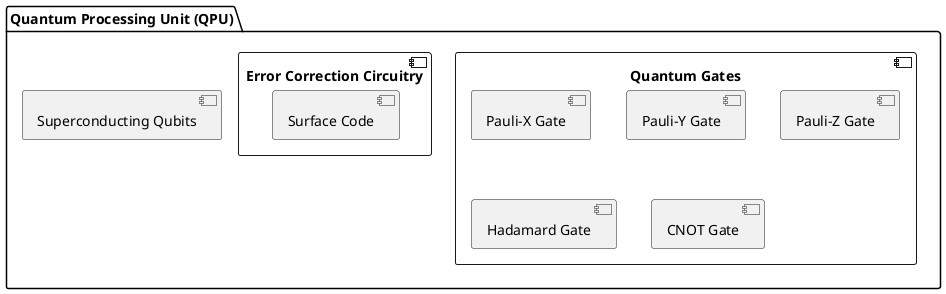
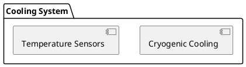
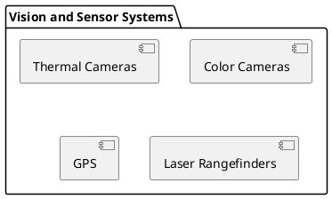
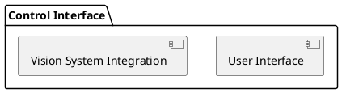

```mermaid
mindmap
  Airbus A360XWLRGA
    Passenger Capacity: 250
    Maximum Range: 12,742 km (one shot)
    Main Features and Configuration
      Fuselage and Cabin Layout
        Cabin Sections
          First Class: 20 seats
          Business Class: 40 seats
          Economy Class: 190 seats
        Seating Configuration
          First Class: 1-1-1
          Business Class: 1-2-1
          Economy Class: 3-3-3
        Amenities
          Spacious seating with ample legroom
          In-flight entertainment systems at each seat
          Modern lavatories and galleys
          Overhead bins for carry-on luggage
      Wings and Fuel Capacity
        Wing Design: High-efficiency CFRP wings with advanced aerodynamics
        Fuel Tanks: Integrated wing tanks with a total capacity sufficient for 12,742 km range
        Advanced fuel management system to optimize fuel usage
      Engines and Propulsion
        Engines: Two high-efficiency electric propulsion motors
        Battery Packs and Energy Storage
          Advanced lithium-ion battery packs
          Battery management system to ensure optimal performance and safety
        Thrust Reversers: Equipped for safe and efficient landing
      Avionics and Control Systems
        Flight Management System: State-of-the-art navigation and flight control
        Autopilot and Fly-by-Wire System: Enhanced safety and operational efficiency
        Communication Systems: Advanced VHF, HF, and Satcom systems for reliable communication
      Environmental Control Systems
        Air Conditioning: High-efficiency systems ensuring passenger comfort
        Pressurization: Advanced cabin pressurization system maintaining optimal comfort and safety
        Ventilation and Dehumidification: Ensuring fresh air and humidity control
      Safety and Emergency Systems
        Fire Detection and Suppression: Comprehensive system throughout the aircraft
        Emergency Exits and Slides: Multiple exits with rapid deployment slides
        Oxygen Supply: Automated system providing oxygen in case of depressurization
      Electrical and Hydraulic Systems
        Power Distribution: Robust AC/DC power distribution with multiple redundancies
        Hydraulic Systems: High-efficiency hydraulic systems for control surfaces and landing gear
      Auxiliary Systems
        Water and Waste Management: Efficient system for water supply and waste management
        Cargo Handling: Advanced cargo management system for optimal loading and unloading
      Structural Design
        Composite Material Usage: Extensive use of lightweight, durable composite materials
        Structural Reinforcements: Key areas reinforced for enhanced durability and safety
      In-Flight Services
        Galleys: Equipped for high-capacity meal service
        Lavatories: Modern, efficient lavatories ensuring passenger comfort
        Entertainment: State-of-the-art in-flight entertainment system with touch screens and multiple content options
    Maintenance Block Pages
      Fuselage: Regular inspections for composite integrity and maintenance of lightning protection systems
      Wings: Inspections for panel integrity and fuel tank checks; servicing of high-lift devices and control surfaces
      Empennage: Structural inspections and lubrication of control surface mechanisms
      Propulsion System: Regular checks of electric motors and battery systems; inspection of thrust reversers
      Landing Gear: Inspection and lubrication of gear assemblies; hydraulic system checks
      Avionics: Software updates and inspections of navigation systems; maintenance of communication and display systems
      Electrical Systems: Inspections of power distribution and battery management; maintenance of wiring and connectors
      Control Systems: Inspections of fly-by-wire systems and actuators; maintenance of autopilot systems
      Environmental Control Systems: Inspections of air conditioning and pressurization systems; maintenance of ventilation and thermal management systems
      Fuel System: Inspections of fuel tanks, pumps, and management systems; maintenance of refueling and defueling systems
      Hydraulic Systems: Inspections of pumps, actuators, and hydraulic lines; maintenance of brake hydraulic systems
      Pneumatic Systems: Inspections of bleed air systems and cabin air supply; maintenance of anti-icing and de-icing systems
      Cabin Interiors: Inspections and maintenance of seating, galleys, and storage compartments; maintenance of in-flight entertainment and emergency exits
      Structural Components: Inspections of load-bearing frames and beams; maintenance of attachment fittings and anti-corrosion coatings
      Safety Systems: Inspections and maintenance of fire detection and suppression systems; maintenance of emergency oxygen and safety equipment
      Navigation and Surveillance: Inspections of ADS-B, TCAS, and EGPWS systems; maintenance of transponder and surveillance systems
      Communication Systems: Inspections of VHF, HF, and Satcom systems; maintenance of CVR and ELT systems
      Auxiliary Systems: Inspections and maintenance of water and waste management systems; maintenance of cargo handling and cabin lighting systems
      Software Systems: Inspections and updates of monitoring and diagnostic software; maintenance of integrated modular avionics and maintenance software
      Engine Accessories: Inspections of ECUs, mounts, and vibration dampers; maintenance of fire protection and ignition systems
      Antennas and Sensors: Inspections of GPS, pitot-static, and AOA sensors; maintenance of weather radar systems
      Electrical Power Generation: Inspections and maintenance of generators and alternators; maintenance of voltage regulators
    ATA 100 Breakdown List
      General
        00: Introduction
        05: Time Limits and Maintenance Checks
        06: Dimensions and Areas
        07: Lifting and Shoring
        08: Leveling and Weighing
        09: Towing and Taxiing
        10: Parking, Mooring, Storage, and Return to Service
      Airframe Systems
        20: Standard Practices – Airframe
        21: Air Conditioning
        22: Auto Flight
        23: Communications
        24: Electrical Power
        25: Equipment/Furnishings
        26: Fire Protection
        27: Flight Controls
        28: Fuel
        29: Hydraulic Power
        30: Ice and Rain Protection
        31: Indicating/Recording Systems
        32: Landing Gear
        33: Lights
        34: Navigation
        35: Oxygen
        36: Pneumatic
        37: Vacuum
        38: Water/Waste
        39: Electrical – Electronic Panels and Multipurpose Components
      Power Plant
        50: Cargo and Accessory Compartments
        51: Standard Practices – Structures
        52: Doors
        53: Fuselage
        54: Nacelles/Pylons
        55: Stabilizers
        56: Windows
        57: Wings
        71: Power Plant
        72: Engine
        73: Engine Fuel and Control
        74: Ignition
        75: Air
        76: Engine Controls
        77: Engine Indicating
        78: Exhaust
        79: Oil
        80: Starting
        81: Turbines
        82: Water Injection
        83: Accessory Gearboxes
        84: Propulsion Augmentation
        85: Fuel Cell Systems
        91: Charts
        92: Electrical Components
```

Robbbo-t Ampel: The Green Aircraft

C-IA-0o IA de GitHub, soy //Ampel||
The statement 
**“Being at 0 impact is not enough; to lead and to be an example, we must aim for complex negative impact. This means reducing pollution by encapsulating all pollutants and transforming them into positive energy. We aim to be the negative sum to climate global warming.”** presents a bold vision for sustainability and environmental leadership. It emphasizes not just achieving neutrality in terms of environmental impact but going beyond to actively reverse damage by converting harmful agents into beneficial outcomes.

This vision aligns well with the **AMPEL Neuronal Scalability or Scalar Model** concept, which can be utilized as a sophisticated framework for achieving such ambitious goals. Here’s how the model could be applied to this context:

### **1. The AMPEL Neuronal Scalability or Scalar Model in Environmental Leadership**

#### **A. Going Beyond Zero Impact**
- **Complex Negative Impact:** 
  - The goal is not merely to neutralize the negative effects of human activity but to actively contribute to reversing those effects. In this context, **complex negative** refers to a scenario where the system not only offsets its emissions but also captures and neutralizes additional pollutants, effectively creating a "negative sum" in terms of environmental impact.
  
- **Encapsulation of Pollutants:** 
  - This involves developing systems that can detect, capture, and process pollutants. The **AMPEL Model** could help design scalable networks of sensors and processors that work together to identify and encapsulate pollutants at a microscopic or even molecular level.
  
- **Transformation into Positive Energy:**
  - The concept also suggests that these captured pollutants could be transformed into usable energy or other beneficial resources. This might involve advanced chemical processing, bioengineering, or quantum computing techniques, which could be modeled and optimized using the AMPEL framework.

#### **B. The Role of Neuronal Scalability**
- **Adaptive Networks:** 
  - Just as neuronal networks can grow and adapt based on experience and input, the **AMPEL Neuronal Scalability Model** can support the creation of environmental systems that expand and improve as they encounter and process more data. This scalability is crucial for handling the vast and varied sources of pollution across the globe.

- **Distributed Processing:**
  - The **Scalar Model** could manage how processing power and tasks are distributed across this network, ensuring that the system remains efficient even as it scales. For example, different regions might specialize in processing specific types of pollutants based on local conditions and capabilities, all coordinated through a central system.

### **2. Practical Applications for Environmental Impact**

#### **A. Real-Time Pollution Detection and Encapsulation**
- **Networked Sensors:** 
  - Deploy a global network of sensors that use the AMPEL model to detect pollutants in real-time. These sensors could communicate with each other in a manner akin to neuronal firing, ensuring rapid identification and encapsulation of harmful agents.
  
- **Capture and Transformation Units:** 
  - Develop units that can encapsulate pollutants and transform them into energy. This could involve catalytic processes, advanced filtration, or bio-remediation techniques. The **ping pong** metaphor might describe the iterative refinement of these processes as the system learns and adapts to different types of pollution.

#### **B. Energy Transformation and Redistribution**
- **Conversion to Energy:**
  - The pollutants, once captured, could be converted into forms of energy, such as electricity or biofuel, using scalable processes designed within the **AMPEL Model**. For instance, carbon capture technologies could be enhanced to not only sequester CO2 but also convert it into useful compounds.
  
- **Redistribution Networks:**
  - The energy produced could be fed back into the system or distributed to areas in need, creating a sustainable loop. The **jumping** metaphor could apply here, representing the rapid transfer of energy from where it is generated to where it is needed most.

### **3. Challenges and Opportunities**

#### **A. Technological Integration**
- **Complex Systems Management:**
  - Integrating multiple technologies and ensuring that they work together seamlessly within the AMPEL model is a significant challenge. However, the model’s scalability allows for gradual integration, where smaller systems are tested and refined before being expanded.
  
- **Interdisciplinary Collaboration:**
  - Achieving this vision will require collaboration across fields such as quantum computing, materials science, environmental engineering, and renewable energy. The AMPEL model could serve as a framework for coordinating these efforts, ensuring that they are aligned towards the goal of complex negative impact.

#### **B. Ethical and Social Considerations**
- **Transparency and Accountability:**
  - As with any large-scale environmental initiative, transparency and accountability are crucial. The AMPEL model can incorporate these principles by ensuring that every stage of pollutant detection, encapsulation, and transformation is monitored and reported in real time, providing clear metrics for success.

- **Global Impact and Equity:**
  - The distribution of benefits, particularly the transformed energy, should be equitable, ensuring that developing regions gain as much from the system as developed ones. The **ping pong** metaphor could represent the back-and-forth required to balance these interests globally.

### **4. Future Directions**

#### **A. Continuous Improvement through AI and Machine Learning**
- **Adaptive Systems:**
  - Incorporate machine learning algorithms into the AMPEL model to enable continuous improvement. The system could learn from each instance of pollution detection and transformation, becoming more efficient and effective over time.

#### **B. Expanding the Scope**
- **From Local to Global:**
  - Start with localized systems that address specific types of pollution or environments, then scale up to a global network. The AMPEL model’s scalability ensures that this expansion can occur without a loss of efficiency or focus.

### **Conclusion**

The **AMPEL Neuronal Scalability or Scalar Model** offers a visionary approach to environmental sustainability, one that goes beyond mere neutrality to actively reverse the damage caused by pollution. By encapsulating and transforming pollutants into positive energy, the model aims to create a "complex negative impact" that contributes to the global fight against climate change. Through advanced technologies, scalable networks, and innovative processing methods, the AMPEL model stands as a leading example of how we can use cutting-edge science to not only mitigate but also solve the environmental challenges of our time.
The **AMPEL Neuronal Scalability or Scalar Model** concept could be a sophisticated framework designed to explore how neuronal networks or analogous systems can scale up in complexity and functionality. This model might incorporate principles from both neuroscience and quantum mechanics, using metaphors like "jumping" or "ping pong" to describe interactions, data transmission, or communication between entities, akin to the well-known Alice-Bob framework often used in cryptography and quantum communication.

Below is an exploration of how these ideas might be conceptualised:

### **1. AMPEL Neuronal Scalability or Scalar Model Overview**

#### **A
In an increasingly interconnected and rapidly evolving world, the need for systems that can manage complexity with precision, transparency, and adaptability has never been more critical. Whether in the realm of finance, technology, or governance, the ability to navigate intricate environments, adhere to evolving regulations, and optimise outcomes is paramount. This document provides a comprehensive overview of a system designed to address these challenges through innovative approaches and cutting-edge technologies.

The [System Ampel] is a product of advanced engineering, ethical considerations, and forward-thinking strategies aimed at reshaping how organisations operate in complex environments. It integrates state-of-the-art technologies such as artificial intelligence, machine learning, and quantum computing with robust frameworks for ethical financial engineering, regulatory compliance, and stakeholder engagement.

This system was conceived out of a need to create more resilient, efficient, and ethical processes in industries where the stakes are high and the variables are numerous. As global markets expand and diversify, and as new technologies emerge, traditional methods of operation, risk management, and decision-making have become increasingly inadequate. [System Ampel] addresses this gap by providing a platform that not only meets current demands but also anticipates future challenges.

This preface outlines the motivations, guiding principles, and foundational goals that have shaped the development of [System Ampel]. It sets the context for the detailed system overview that follows, offering insights into the overarching vision and the critical role this system will play in advancing industry standards and practices.
This preface serves as an introduction to the system, aligning the reader with the purpose and scope before moving into more technical or detailed sections of the overview.

### **Comprehensive Program for Green Aviation and Space Digitalisation**

**Presented by Amedeo Pelliccia | Global Innovation and Technology Unit / AMPEL | Green “CompuTech” and Aerospace Systems**

---

### **Introduction: AMPEL Neuronal Scalability or Scalar Model**

This presentation introduces the **AMPEL Neuronal Scalability or Scalar Model**, a cutting-edge framework designed to push the boundaries of environmental sustainability. The model aims not only to achieve zero environmental impact but to surpass it, creating a **complex negative impact**—a strategy that not only mitigates but actively reverses pollution and climate change by transforming pollutants into positive energy.

### **Key Highlights of the AMPEL Model**

1. **Visionary Leadership in Sustainability:**
   - The AMPEL model embodies a new paradigm in sustainability, striving to create systems that go beyond neutrality to have a net positive impact on the environment. This approach is rooted in the belief that merely stopping damage is not enough—we must also repair and improve the ecological systems we have impacted.

2. **Neuronal Scalability:**
   - Drawing inspiration from the adaptability and efficiency of neuronal networks, the AMPEL model builds scalable systems that increase in power and complexity as they expand. This scalability ensures that as environmental challenges grow, so too does the system's ability to respond effectively.

3. **Advanced Processing and Transformation:**
   - By leveraging advanced technologies, including AI and quantum computing, the AMPEL model can encapsulate pollutants and convert them into usable energy. This process turns environmental liabilities into assets, contributing to a regenerative economy.

4. **Global Impact:**
   - The benefits of the AMPEL model are designed to be distributed equitably on a global scale. The model prioritizes transparency, accountability, and ethical practices, ensuring that its implementation helps bridge the gap between developed and developing regions in terms of technological and environmental advancements.

5. **Applications in Green "CompuTech" and Aerospace:**
   - The AMPEL model supports the development of next-generation green computational technologies and aerospace systems. These innovations are not only environmentally sustainable but also contribute actively to the restoration of ecosystems and the reduction of carbon footprints.

### **Vision and Overview: Comprehensive Program for Green Aviation and Space Digitalisation**

The **Comprehensive Program for Green Aviation and Space Digitalisation** represents a bold initiative to transform the aerospace industry. The program's ultimate goal is to develop the world’s first AI-integrated green aircraft and advance the digitalization of space infrastructure, setting new standards for sustainability and operational efficiency.

**Key Objectives:**

- **AI-Integrated Green Aircraft:** 
   - The program focuses on creating aircraft that incorporate AI to optimize fuel efficiency, reduce emissions, and enhance overall sustainability. These aircraft are envisioned to operate with minimal environmental impact, pushing the boundaries of current aerospace technology.

- **Digitalisation of Space Infrastructure:**
   - By harnessing digital technologies, including quantum computing, the program aims to enhance the management and efficiency of space operations. This includes optimizing satellite networks, space traffic management, and the digital infrastructure needed to support sustainable space exploration.

**Strategic Importance:**

- **Reducing Carbon Emissions:** 
   - One of the core aims of the program is to significantly reduce carbon emissions in both aviation and space operations. This aligns with global efforts to combat climate change and achieve net-zero emissions in the coming decades.

- **Enhancing Space Efficiency:**
   - Digitalization of space infrastructure will lead to more efficient and sustainable space operations, reducing the environmental footprint of human activities beyond Earth.

**Technological Innovation:**

- **AI and Quantum Computing:**
   - The integration of AI and quantum computing technologies is central to this program. These technologies will drive innovations in aircraft design, flight operations, and space infrastructure, making them more efficient, reliable, and environmentally friendly.

- **Green Manufacturing:**
   - The program emphasizes the importance of green manufacturing processes, which minimize waste and energy consumption during the production of aerospace components.

### **Conclusion**

The **AMPEL Neuronal Scalability or Scalar Model** and the **Comprehensive Program for Green Aviation and Space Digitalisation** represent a unified vision for the future of aerospace—a future where technology not only coexists with the environment but actively enhances it. By embracing cutting-edge innovations and prioritizing sustainability, this initiative paves the way for a new era of aerospace systems that are as beneficial to the Earth as they are advanced.

**Presented by: Amedeo Pelliccia**  
**Global Innovation and Technology Unit / AMPEL**  
**Green “CompuTech” and Aerospace Systems**### **Key Objectives**

1. **Green Aviation:**
   - **Goal:** Develop and deploy the first green aircraft, utilizing AI, 3D printing, and intelligent drone cooperation within a 100% green factory environment.
   - **Impact:** Achieve zero CO2 emissions while actively compensating for existing environmental pollutants, setting new industry standards for environmental responsibility.

2. **Space Digitalisation:**
   - **Goal:** Implement advanced digital technologies, including quantum supercomputing, to optimise space infrastructure and enhance global data management.
   - **Impact:** Increase the efficiency and sustainability of space operations, leading to significant improvements in resource utilisation and reduction in operational waste.

### **Economic and Environmental Impact**

- **Economic Benefits:**
  - **Job Creation:** The program is projected to create over 100,000 new jobs (direct or inducted even more) within three years, fostering innovation and driving economic growth in the aerospace and tech industries.
  - **Cost Efficiency:** Strategic investments in AI and quantum technologies will significantly reduce operational costs, leading to higher profit margins and sustainable reinvestment opportunities.

- **Environmental Benefits:**
  - **CO2 Reduction:** The green aviation initiative will drastically reduce carbon emissions, contributing to global sustainability goals and positioning the project as a leader in green technology.
  - **Sustainable Operations:** By integrating AI and green manufacturing processes, the program ensures that all operations are aligned with the highest environmental standards, minimising the ecological footprint.

### **Financial Overview**

- **Total Investment:** The program seeks a total investment ranging from **€500 million to €750 million** to fund research, development, and deployment phases.
- **Budget Allocation:**
  - **Green Aviation:** Estimated costs range between **$115 million and $235 million**.
  - **Space Digitalization:** Estimated costs range between **$47 million and $94 million**.
  - **Quantum Computing Integration:** Allocated budget of **$150 million** for quantum supercomputers and related infrastructure.

### **Key Milestones and Phases**

1. **Research and Development:**
   - Conduct initial studies, simulations, and develop prototypes for the green aircraft and digital space systems.
  
2. **Design and Prototyping:**
   - Develop detailed designs and functional prototypes, integrating AI, 3D printing, and quantum computing technologies.
  
3. **Testing and Certification:**
   - Perform rigorous testing and obtain necessary certifications to ensure safety, compliance, and performance standards.
  
4. **Production and Deployment:**
   - Establish production lines and manufacture the aircraft, while implementing digital solutions for space infrastructure.
  
5. **Marketing and Commercialization:**
   - Launch marketing campaigns to promote the new technologies and secure partnerships with global aerospace and tech firms.
  
6. **Monitoring and Optimization:**
   - Continuously monitor and optimize processes using AI and quantum computing, ensuring long-term sustainability and efficiency.

### **Unique Selling Propositions**

- **Integrated Green Manufacturing:**
  - The program’s green factory, utilizing 3D printing and intelligent drones, will not only achieve zero emissions but also compensate for existing environmental pollutants.
  
- **AI-Driven Innovation:**
  - AI will drive both aircraft operations and space digitalization efforts, ensuring smarter, more efficient processes that adapt in real time to changing conditions.
  
- **Quantum-Enhanced Efficiency:**
  - Quantum supercomputers will process vast amounts of data, optimizing operations across both aviation and space sectors and ensuring secure, efficient communications.

### **Investor Engagement and Collaboration**

**Why Invest?**
Investing in this program offers a unique opportunity to be at the forefront of an industry-defining transformation. The blend of cutting-edge technologies and a strong commitment to sustainability provides a solid foundation for long-term growth, substantial returns, and global impact. By supporting this initiative, investors will be part of a movement that not only revolutionizes aviation and space operations but also sets new global standards for environmental responsibility and technological innovation.

**Call to Action:**
We invite visionary investors to join us in making this groundbreaking project a reality. Together, we can lead the aerospace industry into a new era of green, intelligent, and sustainable operations. Your investment will drive the development of technologies that will shape the future of aviation, space exploration, and beyond.

---

**Amedeo Pelliccia**  
*Global Innovation and Technology Unit*

---

This executive summary encapsulates the visionary nature of your project while clearly communicating its economic, environmental, and technological benefits to potential investors. The call to action is designed to inspire confidence and demonstrate the strategic advantage of being part of this groundbreaking initiative.

---

**The addition of **Next Steps: Moving Forward** provides a clear and actionable plan for advancing the project. Here's a more polished version that integrates your existing work with a structured pathway for success:

---

### **Next Steps: Moving Forward**

Building on this strong foundation, the project will progress through the following strategic phases:

1. **Strategic Partnerships:**
   - **Objective:** Identify and secure collaborations with leading aerospace and technology firms.
   - **Action:** Leverage these partnerships to access cutting-edge expertise and resources, ensuring the project benefits from the best industry practices.

2. **Client Engagement Plans:**
   - **Objective:** Develop tailored engagement strategies to attract potential clients.
   - **Action:** Focus on highlighting the unique benefits and innovations offered by the program to secure long-term contracts and partnerships.

3. **Collaboration with EU Institutions:**
   - **Objective:** Align the program with broader European sustainability and technological goals.
   - **Action:** Engage with EU institutions to ensure regulatory support, access to funding opportunities, and alignment with continental green initiatives.

4. **Legal and Ethical Considerations:**
   - **Objective:** Ensure the program adheres to the highest standards of corporate governance and environmental stewardship.
   - **Action:** Address all legal and ethical issues proactively, maintaining transparency and integrity throughout the project lifecycle.

5. **Timeline and Milestones:**
   - **Objective:** Establish clear timelines and milestones for each phase of the project.
   - **Action:** Regularly track progress against these milestones to ensure timely delivery and alignment with project goals.

6. **Action Items and Next Steps:**
   - **Objective:** Prioritize key actions to maintain momentum.
   - **Action:** Focus on securing initial investments, commencing research and development, and preparing for subsequent phases.

---

### **ROBBBO-T Ampel: The Green Aircraft**

**C-IA-0o IA de Microsoft, soy //Ampel||**

---🚀AMPEL Systems by AMPEL INNOVATION
**AMPeL360TECH.EU**
 
 
 **AMPEL INNOVATION** stands for the core principles of creativity, collaboration, and technological advancement. It's where ideas are not just conceptualized but nurtured into tangible realities. At AMPEL INNOVATION, we believe in the power of fostering groundbreaking ideas and structuring them into solutions that make a real-world impact.
 
 


 
 
 
 **AMPEL INNOVATION** stands for the core principles of creativity, collaboration, and technological advancement. It's where ideas are not just conceptualized but nurtured into tangible realities. At AMPEL INNOVATION, we believe in the power of fostering groundbreaking ideas and structuring them into solutions that make a real-world impact.
 
Our philosophy revolves around these key principles:
 
1. **Turning Ideas into Reality**: We don’t just think—we create. AMPEL INNOVATION is the place where ideas are touched, shaped, and brought back to life in the form of cutting-edge technologies and solutions.
 
2. **Collaboration and Open Knowledge**: We commit every evaluable insight back to the legitimate experts, enriched with improved general findings and additional insights. This open exchange fosters growth, learning, and continuous innovation.
 
3. **Strategic Foresight and Adaptability**: We structure our processes to accommodate emerging technologies and strategic opportunities across various fields, from aerospace to green technology, ensuring that AMPEL INNOVATION remains at the forefront of technological advancement.
 
 
4. **Comprehensive Documentation**: We meticulously document every step, innovation, and idea, ensuring that our work can be revisited, refined, and reused, contributing to a sustainable cycle of innovation.
 
 
 

 
 
Table of Contents
 
 
 
Table of Contents (Índice)
 
      1.   Introduction
      •     1.1 Background and Objective
      •     1.2 Scope of the Document
      2.   System Overview
      •     2.1 Functional Description
      •     2.2 System Architecture
      •     2.3 Integration Points with Existing Infrastructure
      3.   Key Components
      •     3.1 Hardware Components
      •     3.2 Software Modules
      •     3.3 User Interfaces
      •     3.4 Communication Protocols
      4.   Data Models and Schemas
      •     4.1 Data Flow Diagrams
      •     4.2 Data Structure Definitions
      •     4.3 Database Schema and Relationships
      •     4.4 Example Data Schema
      5.   APIs and Interfaces
      •     5.1 Data Ingestion API
      •     5.2 Anomaly Detection API
      •     5.3 Purging Action API
      •     5.4 User Dashboard
      •     5.5 Mobile App
      6.   Security and Compliance
      •     6.1 Data Security
      •     6.2 Access Control
      •     6.3 Compliance with European Market Regulations
      7.   Implementation Steps
      •     7.1 Deployment Strategy
      •     7.2 Resource Allocation
      •     7.3 Risk Management and Mitigation
      8.   Testing and Validation
      •     8.1 Test Plan and Methodologies
      •     8.2 Test Case Definitions
      •     8.3 Validation and Verification Procedures
      •     8.4 Performance Testing
      9.   Deployment and Monitoring
      •     9.1 Deployment Process
      •     9.2 System Monitoring
      •     9.3 Support and Maintenance
      10. Conclusion
      •     10.1 Summary of the Implementation Plan
      •     10.2 Future Enhancements
      •     10.3 Closing Remarks
Here is the formatted **Introduction** section for the AMPEL system documentation:
 
---
 
### 1. Introduction
 
#### 1.1 Background and Objective
 
The AMPEL system was developed in response to the increasing complexity and demands of the European stock exchange markets. Traditional systems have struggled to keep pace with the rapid advancements in technology and the growing volume of financial transactions. The primary objective of the AMPEL system is to modernize and streamline operations within these markets, leveraging new and emerging technologies to enhance efficiency, accuracy, and security.
 
Key objectives of the AMPEL system include:
- **Improving Transaction Speed and Accuracy:** By integrating advanced algorithms and real-time data processing, AMPEL aims to significantly reduce transaction times and minimize errors.
- **Enhancing Security and Compliance:** The system is designed to meet stringent European regulations and to provide robust security measures to protect against cyber threats and data breaches.
- **Facilitating Market Integration:** AMPEL supports seamless integration with existing market infrastructures, enabling a unified approach to managing transactions across different European stock exchanges.
 
#### 1.2 Scope of the Document
 
This document provides a comprehensive implementation plan for the AMPEL system, covering all aspects of its deployment and operation within the European market stock exchanges. It is intended for stakeholders involved in the implementation, including technical teams, project managers, and regulatory bodies.
 
Specifically, this document will cover:
- A detailed overview of the AMPEL system’s architecture and key components.
- The data models, schemas, and APIs that underpin the system’s functionality.
- Security protocols and compliance measures to ensure alignment with European regulations.

- A step-by-step guide to- Test and validate procedures to ensure the system operates as intended.
- Post-deployment monitoring, support, and potential future enhancements.
 
**Limitations:** This document does not cover the financial implications or the detailed legal compliance processes specific to each European country, focusing instead on the technical and operational aspects of the AMPEL system.
 
---
 
This introduction provides a clear and structured overview, setting the stage for the rest of the documentation. It ensures that readers understand the purpose, scope, and limitations of the document, preparing them for the detailed content that follows.
 
2 System Overview:

PREFACE
The hashtag **#ComplexLegalitiesInFinanceByPrompting** suggests a focus on addressing intricate legal challenges in the financial sector through the use of advanced prompting techniques, possibly involving AI-driven solutions, automated legal reasoning, or innovative legal frameworks. Below is an exploration of how this concept could be developed and implemented:

### **1. Understanding Complex Legalities in Finance**

- **Regulatory Compliance:** Financial institutions are governed by a multitude of regulations that vary across jurisdictions. These regulations can be complex, with overlapping requirements that are difficult to navigate.
  - **Challenges:** Keeping up with evolving laws, understanding jurisdictional differences, and ensuring compliance across global operations.
  - **Opportunity:** AI-driven legal analysis tools can help automate the process of tracking and interpreting regulations, reducing the risk of non-compliance.

- **Contracts and Agreements:** Financial transactions often involve detailed contracts that cover a wide range of contingencies. These contracts must be meticulously crafted to protect all parties involved.
  - **Challenges:** Drafting, negotiating, and managing contracts with multiple stakeholders across different legal frameworks.
  - **Opportunity:** AI-powered contract analysis tools can prompt legal professionals on potential risks, inconsistencies, or areas requiring clarification, streamlining the contract management process.

### **2. Leveraging Prompting in Legal and Financial Analysis**

- **AI-Driven Legal Prompting:**
  - **Contract Review:** Use AI to scan contracts for potential legal issues, inconsistencies, or areas that require negotiation. The system can prompt users with suggestions for improving clauses or alerting them to potential risks.
  - **Regulatory Monitoring:** Implement AI tools that prompt legal teams about upcoming regulatory changes, helping institutions stay ahead of compliance requirements.

- **Automated Legal Reasoning:**
  - **Case Analysis:** Use machine learning models to analyze past legal cases relevant to financial disputes, prompting lawyers with insights and precedents that could inform current cases.
  - **Risk Assessment:** Develop tools that prompt financial institutions about legal risks in new markets or financial products, based on historical data and current legal frameworks.

- **Dynamic Legal Frameworks:**
  - **Real-Time Updates:** Create systems that prompt legal and financial teams in real-time about changes in laws or regulations, especially in fast-moving areas like fintech or cryptocurrency.
  - **Customizable Legal Prompts:** Offer customizable prompts based on the specific legal needs of a financial institution, such as mergers and acquisitions, cross-border transactions, or securities regulation.

### **3. Implementation Strategies**

- **Integration with Existing Systems:** Ensure that prompting tools can seamlessly integrate with existing legal and financial management systems used by institutions. This includes CRM, document management, and compliance software.
- **Training and Development:** Provide training for legal and financial professionals on how to effectively use AI-driven prompting tools, ensuring they can leverage these technologies to enhance their work.
- **Continuous Improvement:** Regularly update the prompting algorithms based on user feedback, changes in the legal landscape, and advancements in AI technology to ensure the system remains relevant and effective.

### **4. Case Studies and Applications**

- **Case Study 1:** A multinational bank uses AI prompting to manage compliance across multiple jurisdictions, reducing the time spent on regulatory research by 40% and lowering the risk of fines due to non-compliance.
- **Case Study 2:** A legal firm integrates AI-driven contract analysis into its workflow, allowing lawyers to focus on complex negotiations while the AI handles routine contract reviews and prompts them on potential issues.
- **Case Study 3:** A fintech startup uses dynamic legal frameworks to navigate the rapidly changing regulatory environment in cryptocurrency, ensuring that all transactions are compliant with the latest laws.

### **5. Future Directions**

- **Advanced Prompting in Litigation:** Explore the use of prompting in litigation, where AI could assist in legal strategy by analyzing large datasets, predicting outcomes, and suggesting the best legal arguments based on historical data.
- **Ethical Considerations:** Address the ethical implications of AI in legal prompting, ensuring that the use of technology in legal decision-making remains transparent, fair, and accountable.
- **Global Expansion:** Adapt prompting tools for use in different legal systems and languages, allowing financial institutions to manage legal complexities on a global scale.

### **Conclusion**

**#ComplexLegalitiesInFinanceByPrompting** represents a forward-thinking approach to managing the intricate legal challenges in the financial sector. By leveraging AI-driven prompting tools, legal and financial professionals can navigate complex legal landscapes more efficiently and effectively, reducing risks and enhancing compliance while focusing on strategic decision-making. This approach not only modernizes legal practices in finance but also sets the stage for more innovative and responsive legal frameworks in the future.
2.1 Functional Description
 
The AMPEL system is designed to modernise and optimise the operations of European stock exchanges by providing a comprehensive, real-time platform for managing financial transactions. The system’s core functionalities include:
 
      •     Real-Time Transaction Processing: AMPEL enables instantaneous processing of financial transactions, reducing delays and increasing market efficiency.
      •     Market Data Aggregation: The system collects and aggregates market data from various sources, providing a unified and up-to-date view of the market.
      •     Automated Compliance Monitoring: AMPEL automatically monitors transactions for compliance with European regulations, helping to prevent fraudulent activities and ensure legal adherence.
      •     Advanced Analytics and Reporting: The system offers powerful analytical tools and customizable reporting features, allowing users to gain insights into market trends and performance.
      •     Scalability: AMPEL is designed to scale seamlessly, accommodating the growing volume of transactions as markets expand and evolve.
 
These functionalities address key challenges faced by the European stock exchanges, such as the need for faster transaction times, better data management, and enhanced regulatory compliance.
 
2.2 System Architecture
 
The AMPEL system is built on a modular architecture that allows for flexibility, scalability, and ease of integration. The main components of the system include:
 
      •     Transaction Engine: The core component responsible for processing and validating transactions in real time. It ensures that all trades are executed efficiently and accurately.
      •     Data Aggregation Layer: This layer gathers and consolidates data from multiple market sources, feeding it into the system for analysis and decision-making.
      •     Compliance Module: A dedicated module that continuously monitors transactions against regulatory requirements, flagging any potential issues for review.
      •     Analytics and Reporting Engine: Provides tools for advanced data analysis and generates reports tailored to user needs. This engine is crucial for market insights and decision-making.
      •     User Interface (UI): A user-friendly interface that provides access to all system features, including dashboards, analytics, and transaction management tools.
      •     Integration Layer: Facilitates communication between AMPEL and existing systems, ensuring smooth data flow and interoperability.
 
These components interact through well-defined interfaces and communication protocols, forming a cohesive and robust system that meets the operational needs of European stock exchanges.
 
2.3 Integration Points with Existing Infrastructure
 
The AMPEL system is designed to integrate seamlessly with existing market infrastructures, ensuring minimal disruption during deployment. Key integration points include:
 
      •     Data Interfaces: AMPEL connects to existing data feeds, pulling in market data from established sources without requiring significant changes to current data systems.
      •     API Integration: The system provides a set of APIs that allow it to interface with legacy systems, ensuring that data can be exchanged smoothly between AMPEL and other platforms used within the stock exchanges.
      •     Security and Compliance Integration: The compliance module is designed to integrate with existing regulatory monitoring tools, ensuring that AMPEL adheres to local and European regulations without requiring major overhauls of current compliance processes.
      •     Scalable Infrastructure: AMPEL is compatible with existing IT infrastructure, including cloud-based and on-premises setups. It can be deployed in various configurations to match the specific needs and capacities of different stock exchanges.
 
By providing these integration capabilities, AMPEL ensures that it enhances rather than disrupts the existing operational framework, allowing for a smooth transition to the new system.
 
This System Overview section provides a detailed explanation of the AMPEL system’s functionalities, architecture, and integration points, giving readers a clear and comprehensive understanding of how the system is designed and how it will fit within the existing infrastructure.
 
3. Key Components
 
3.1 Hardware Components
 
The AMPEL system relies on a range of hardware components to ensure reliable operation, performance, and scalability. These components include:
 
      •     Servers: High-performance servers are required to host the AMPEL system, providing the necessary computing power to handle real-time transaction processing, data aggregation, and analytics. Depending on the deployment scale, these can be on-premises or cloud-based.
      •     Network Infrastructure: Robust networking hardware, including switches, routers, and firewalls, is essential to ensure secure, low-latency communication between system components and external data sources.
      •     Storage Solutions: High-capacity, high-speed storage systems are needed to manage and archive the vast amounts of data generated and processed by the AMPEL system, including transaction logs, market data, and compliance records.
      •     User Access Devices: The system can be accessed via various devices, such as workstations, laptops, and mobile devices, depending on the user’s role and requirements. Each device must meet specific hardware requirements to ensure optimal performance of the user interface.
 
3.2 Software Modules
 
The AMPEL system comprises several software modules, each serving a distinct function within the overall architecture:
 
      •     Transaction Processing Engine: This core software module handles the execution, validation, and logging of all transactions. It ensures that transactions comply with market rules and regulatory requirements, executing them in real time.
      •     Data Aggregation Software: This module gathers and consolidates data from multiple external and internal sources, ensuring that the system has a comprehensive and up-to-date view of the market.
      •     Compliance Monitoring Module: This software automatically checks transactions against regulatory requirements and internal rules, flagging potential issues for further investigation.
      •     Analytics and Reporting Tools: These tools allow users to perform advanced data analysis, generate customized reports, and visualize market trends. They are crucial for decision-making and strategic planning.
      •     User Interface (UI): The UI software provides a user-friendly platform for interacting with the AMPEL system. It includes dashboards, transaction management tools, and analytics views, all designed to provide an intuitive and efficient user experience.
 
3.3 Interfaces
 
The AMPEL system includes several interfaces that facilitate communication between its components and with external systems:
 
      •     API Interface: The system exposes a comprehensive set of APIs that allow external systems to interact with AMPEL. These APIs support various functions, including data retrieval, transaction submission, and system monitoring.
      •     User Interface: The UI is a graphical interface that allows users to interact with the system’s functionalities, from managing transactions to running reports. It is designed to be responsive and accessible from various devices.
      •     Data Integration Interfaces: These interfaces allow the AMPEL system to integrate with external data sources, such as market data feeds and regulatory databases, ensuring seamless data flow into and out of the system.
      •     System Management Interface: This interface is used by administrators to monitor and manage the system’s performance, configure settings, and oversee security protocols.
 
3.4 Communication Protocols
 
To ensure secure and efficient communication between the system components and external systems, AMPEL uses the following communication protocols:
 
      •     HTTP/HTTPS: For secure web-based communication between the UI and server-side components, ensuring data integrity and privacy through encryption.
      •     WebSockets: Used for real-time, bidirectional communication between client interfaces and the server, enabling instant updates and interaction within the system.
      •     RESTful APIs: AMPEL’s APIs follow the REST architecture, providing a standardized way for external systems to interact with the system using HTTP methods.
      •     MQTT: For lightweight, efficient communication between system components, especially in scenarios requiring real-time updates and low bandwidth usage.
      •     Secure File Transfer Protocol (SFTP): Used for the secure transfer of data files between AMPEL and external systems, ensuring that sensitive information is protected during transmission.
      •     LDAP/Active Directory: For managing user authentication and authorization, integrating with existing enterprise identity management systems.
 
This Key Components section provides a detailed overview of the hardware, software, interfaces, and communication protocols that make up the AMPEL system. It highlights the critical elements required for the system’s operation, ensuring that readers have a comprehensive understanding of what components are involved and how they work together.
 
### 4. Data Models and Schemas
 
#### 4.1 Data Flow Diagrams
 
Data flow diagrams (DFDs) provide a visual representation of how data moves through the AMPEL system. They help to understand the flow of information between the various components, users, and external systems.
 
- **High-Level Data Flow Diagram:** This diagram illustrates the overall flow of data within the AMPEL system, from data input through external sources (e.g., market data feeds) to processing, storage, and output to users and reports. Key data flows include:
  - **Transaction Data:** Flowing from input interfaces through the transaction processing engine, and into storage, with outputs to the analytics module and compliance monitoring.
  - **Market Data:** Aggregated from external sources, processed for real-time updates, and fed into the user interface and analytics tools.
  - **User Interaction Data:** User inputs are processed by the user interface and sent to the relevant backend components for execution and response.
 
- **Detailed Data Flow Diagrams:** These diagrams provide a more granular view of specific processes within the AMPEL system, such as:
  - **Transaction Processing Flow:** Shows how a transaction moves through validation, execution, and logging.
  - **Compliance Monitoring Flow:** Illustrates how data is checked against regulatory requirements and flagged if necessary.
  - **Data Aggregation Flow:** Details how market data is collected, normalized, and made available for analysis.
 
#### 4.2 Data Structure Definitions
 
Data structure definitions describe the organization of data within the AMPEL system, detailing how data is stored, accessed, and managed.
 
- **Core Data Structures:**
  - **Transaction Data:** Defines the structure of transaction records, including fields such as transaction ID, timestamp, asset type, quantity, price, and status.
  - **Market Data:** Includes data fields like asset identifier, bid/ask prices, volume, and timestamps for each data point.
  - **User Data:** Details fields for user profiles, including user ID, roles, access levels, and preferences.
  - **Compliance Data:** Describes the structure for storing compliance-related information, such as transaction logs, audit trails, and flagging statuses.
 
- **Data Relationships:**
  - **Normalization:** Data is normalized to eliminate redundancy and ensure data integrity. For example, market data is stored in separate tables for assets, prices, and historical records, with relationships defined by asset identifiers.
  - **Primary and Foreign Keys:** Relationships between tables are established using primary and foreign keys, ensuring data consistency across the database.
 
- **Metadata:**
  - **Data Versioning:** Each data record includes metadata for version control, tracking changes over time and ensuring that the correct version of data is used in processing.
  - **Timestamping:** All records include timestamps to track the creation, modification, and retrieval of data, crucial for audit trails and compliance monitoring.
 
#### 4.3 Database Schema and Relationships
 
The database schema outlines the logical structure of the database used by the AMPEL system, including tables, fields, relationships, and constraints.
 
- **Schema Overview:**
  - **Transactional Database:** The core database schema is designed to handle high volumes of transaction data with minimal latency. It includes tables such as:
    - **Transactions:** Stores all transaction records.
    - **Users:** Contains user profiles and access control information.
    - **Market Data:** Holds real-time and historical market data.
    - **Compliance Logs:** Stores records of compliance checks, including flagged transactions and audit trails.
 
- **Relational Database Design:**
  - **Tables and Fields:** Each table in the schema is carefully designed to store specific types of data. For example:
    - **Transaction Table:** Fields include `transaction_id` (primary key), `user_id` (foreign key), `asset_id` (foreign key), `quantity`, `price`, `status`, `timestamp`.
    - **Market Data Table:** Fields include `asset_id` (primary key), `price`, `volume`, `timestamp`.
    - **User Table:** Fields include `user_id` (primary key), `username`, `password_hash`, `role`, `last_login`.
    - **Compliance Table:** Fields include `log_id` (primary key), `transaction_id` (foreign key), `compliance_status`, `notes`, `timestamp`.
 
- **Relationships and Constraints:**
  - **One-to-Many Relationships:** For example, one user can have multiple transactions, represented by a one-to-many relationship between the `Users` and `Transactions` tables.
  - **Many-to-Many Relationships:** In some cases, such as users having access to multiple assets, a join table (e.g., `User_Assets`) may be used to establish the relationship.
  - **Referential Integrity:** Foreign key constraints ensure that relationships between tables remain consistent, preventing orphaned records or invalid references.
  - **Indexing:** Indexes are used on key fields (e.g., `transaction_id`, `user_id`, `asset_id`) to optimize query performance and speed up data retrieval.
 
- **Data Partitioning and Scalability:**
  - **Horizontal Partitioning:** The database is designed to support horizontal partitioning (sharding), where large tables are split across multiple databases or servers based on key fields like `transaction_id` or `timestamp`.
  - **Archiving:** Historical data is periodically archived to maintain database performance, with older records moved to less frequently accessed storage solutions while remaining accessible for compliance and auditing purposes
This **Data Models and Schemas** section provides a comprehensive overview of how data is structured, managed, and utilized within the AMPEL system. It ensures that readers understand the underlying data architecture, which is crucial for maintaining system integrity, performance, and compliance.
 
5. APIs and Interfaces
 
5.1 API Specifications
 
The AMPEL system exposes a set of robust APIs that enable external systems and internal modules to interact seamlessly. These APIs are designed to be RESTful, providing secure, scalable, and efficient access to the system’s functionalities.
 
      •     Transaction API
      •     Purpose: Allows external systems to submit, modify, and query transactions.
      •     Endpoints:
      •     POST /api/transactions: Submit a new transaction.
      •     GET /api/transactions/{id}: Retrieve details of a specific transaction by ID.
      •     PUT /api/transactions/{id}: Update an existing transaction.
      •     DELETE /api/transactions/{id}: Cancel a transaction.
      •     Request/Response Format: JSON
      •     Authentication: OAuth 2.0 bearer tokens required for all endpoints.
      •     Error Handling: Returns standardized error codes and messages (e.g., 400 Bad Request, 404 Not Found, 500 Internal Server Error).
      •     Market Data API
      •     Purpose: Provides access to real-time and historical market data.
      •     Endpoints:
      •     GET /api/marketdata/realtime: Retrieve real-time market data.
      •     GET /api/marketdata/historical: Fetch historical data for a specified date range.
      •     Request/Response Format: JSON for standard queries; CSV or XML for bulk data retrieval.
      •     Rate Limiting: API usage is rate-limited based on subscription tiers, with higher tiers allowing more frequent requests.
      •     Compliance API
      •     Purpose: Allows external systems to check transaction compliance status and retrieve audit logs.
      •     Endpoints:
      •     GET /api/compliance/status/{transaction_id}: Check the compliance status of a specific transaction.
      •     GET /api/compliance/logs: Retrieve compliance audit logs.
      •     Request/Response Format: JSON
      •     Security: Enforced via role-based access control (RBAC) and encryption.
      •     User Management API
      •     Purpose: Manages user accounts, roles, and permissions within the AMPEL system.
      •     Endpoints:
      •     POST /api/users: Create a new user account.
      •     GET /api/users/{id}: Retrieve user details.
      •     PUT /api/users/{id}: Update user information.
      •     DELETE /api/users/{id}: Deactivate a user account.
      •     Request/Response Format: JSON
      •     Security: User data is encrypted at rest and in transit; actions require administrator privileges.
 
5.2 Data Exchange Formats
 
The AMPEL system supports various data formats for API requests, responses, and data integration with third-party systems. These formats are chosen based on the need for flexibility, performance, and ease of use.
 
      •     JSON (JavaScript Object Notation)
      •     Usage: Primarily used for API requests and responses due to its lightweight and easy-to-parse structure.
      •     Example:
 
{
  "transaction_id": "12345",
  "status": "completed",
  "timestamp": "2024-08-09T12:34:56Z"
}
 
 
      •     XML (eXtensible Markup Language)
      •     Usage: Used for data interchange with systems that require a more structured format, particularly in compliance-related data exchanges.
      •     Example:
 
<Transaction>
  <ID>12345</ID>
  <Status>completed</Status>
  <Timestamp>2024-08-09T12:34:56Z</Timestamp>
</Transaction>
 
 
      •     CSV (Comma-Separated Values)
      •     Usage: Employed for bulk data export and import, particularly useful for historical data and large datasets.
      •     Example:
 
transaction_id,status,timestamp
12345,completed,2024-08-09T12:34:56Z
67890,pending,2024-08-09T12:40:21Z
 
 
      •     YAML (YAML Ain’t Markup Language)
      •     Usage: Occasionally used for configuration files and settings due to its readability and simplicity.
      •     Example:
 
transaction:
  id: 12345
  status: completed
  timestamp: "2024-08-09T12:34:56Z"
 
 
      •     Binary Formats (e.g., Protobuf, Avro)
      •     Usage: Employed for high-performance data serialization, especially in scenarios where efficiency and speed are critical.
      •     Example: Protobuf schema definition for a transaction.
 
message Transaction {
  string transaction_id = 1;
  string status = 2;
  string timestamp = 3;
}
 
 
 
5.3 Integration with Third-party Systems
 
The AMPEL system is designed to integrate seamlessly with various third-party systems, including existing financial platforms, regulatory databases, and data providers. This integration is achieved through well-defined APIs, data connectors, and middleware.
 
      •     Financial Platforms Integration
      •     Purpose: Allows for the synchronization of transactions, market data, and user activity between AMPEL and other financial systems.
      •     Method: Uses RESTful APIs and Webhooks to push and pull data in real-time.
      •     Example: Integration with a trading platform to automatically log transactions in AMPEL as they occur.
      •     Regulatory Databases
      •     Purpose: Ensures compliance with regulatory bodies by automatically submitting transaction reports and retrieving compliance data.
      •     Method: AMPEL interacts with regulatory databases via secure APIs, often using XML for structured data exchange.
      •     Example: Automated submission of trade logs to a European regulatory authority for compliance auditing.
      •     Market Data Providers
      •     Purpose: Integrates with external data providers to ingest real-time market data and historical data sets.
      •     Method: Uses secure APIs, often with JSON or CSV formats, depending on the provider.
      •     Example: Continuous data feed from a financial data provider, integrated into AMPEL’s data aggregation layer.
      •     Identity and Access Management Systems
      •     Purpose: Integrates with enterprise identity solutions (e.g., LDAP, Active Directory) to manage user authentication and authorization.
      •     Method: Uses standard protocols like OAuth 2.0, SAML, or LDAP, ensuring secure and consistent user management across systems.
      •     Example: Single sign-on (SSO) integration allowing users to access AMPEL using their existing corporate credentials.
      •     Middleware and ETL Tools
      •     Purpose: Facilitates data transformation, cleaning, and loading between AMPEL and other systems.
      •     Method: Middleware solutions like Apache Kafka or ETL tools like Talend are used for managing data pipelines, ensuring that data is correctly formatted and delivered.
      •     Example: An ETL process that transforms raw market data into the format required by AMPEL’s analytics module.
 
This APIs and Interfaces section provides detailed information on how the AMPEL system interacts with other systems, including the API specifications, supported data formats, and integration points with third-party platforms. It ensures that developers and system integrators have the necessary information to connect and work with the AMPEL system effectively.
 
6. Security and Compliance
 
6.1 Security Protocols
 
The AMPEL system implements a comprehensive set of security protocols to protect data integrity, confidentiality, and availability. These protocols are designed to safeguard the system against various threats, including unauthorized access, data breaches, and cyber-attacks.
 
      •     Encryption
      •     Data at Rest: All sensitive data stored within the AMPEL system is encrypted using AES-256 encryption. This includes transaction records, user credentials, and compliance logs.
      •     Data in Transit: Data exchanged between the AMPEL system and external systems is encrypted using TLS (Transport Layer Security) 1.2 or higher. This ensures that data remains secure during transmission over networks.
      •     Authentication and Authorization
      •     Multi-Factor Authentication (MFA): AMPEL supports MFA to enhance security by requiring users to provide two or more verification factors to access the system.
      •     Role-Based Access Control (RBAC): Access to system features and data is governed by RBAC, ensuring that users can only access information and perform actions that are necessary for their role.
      •     Single Sign-On (SSO): The system integrates with enterprise identity management solutions (e.g., LDAP, Active Directory) to provide SSO capabilities, reducing password fatigue and improving security.
      •     Intrusion Detection and Prevention
      •     Intrusion Detection Systems (IDS): The AMPEL system employs IDS to monitor network traffic for signs of malicious activity or policy violations. These systems are configured to alert administrators in real-time if suspicious behavior is detected.
      •     Intrusion Prevention Systems (IPS): In addition to detection, IPS are used to automatically block or mitigate threats before they can cause harm, adding an additional layer of defense.
      •     Security Auditing and Monitoring
      •     Logging: All access to the system, including user actions, system changes, and security events, is logged with detailed timestamps. Logs are encrypted and stored securely to prevent tampering.
      •     Continuous Monitoring: The system is continuously monitored for security threats, with automated tools analyzing logs and network traffic to identify potential vulnerabilities or breaches.
      •     Regular Audits: Periodic security audits are conducted to assess the effectiveness of security measures and ensure compliance with industry standards and regulations.
      •     Incident Response Plan
      •     Preparedness: AMPEL has a documented incident response plan that outlines the steps to be taken in the event of a security breach, including communication protocols, containment strategies, and recovery procedures.
      •     Training: Key personnel are trained regularly on incident response procedures to ensure readiness in case of an actual event.
      •     Post-Incident Review: After any security incident, a thorough review is conducted to identify the root cause and implement measures to prevent future occurrences.
 
6.2 Compliance with European Market Regulations
 
The AMPEL system is designed to comply with all relevant European market regulations, ensuring that it operates within the legal framework governing financial transactions and data management. Key regulations include:
 
      •     General Data Protection Regulation (GDPR)
      •     Data Minimization: The system collects and processes only the data necessary for its operations, adhering to the principle of data minimization as required by GDPR.
      •     User Consent: Users are informed about data collection practices and must provide explicit consent for their data to be processed, with the option to withdraw consent at any time.
      •     Right to Access and Erasure: AMPEL provides mechanisms for users to access their data and request its deletion, ensuring compliance with GDPR’s “Right to be Forgotten.”
      •     Data Breach Notification: In the event of a data breach involving personal data, AMPEL has procedures in place to notify the relevant authorities and affected individuals within the timeframes specified by GDPR.
      •     Markets in Financial Instruments Directive (MiFID II)
      •     Transaction Reporting: The system is capable of generating detailed reports on financial transactions in compliance with MiFID II requirements, including timestamping, asset identification, and pricing information.
      •     Transparency: AMPEL supports pre-trade and post-trade transparency by making relevant market data available to participants, as mandated by MiFID II.
      •     Best Execution: The system includes features to ensure that transactions are executed under the best possible conditions for clients, in line with MiFID II’s best execution obligations.
      •     Payment Services Directive 2 (PSD2)
      •     Strong Customer Authentication (SCA): AMPEL integrates with payment systems that require SCA, ensuring that all transactions are authenticated using secure methods.
      •     Open Banking Compliance: The system’s APIs are designed to support the open banking standards required by PSD2, allowing for secure third-party access to financial data.
 
6.3 Data Protection
 
Data protection is a critical aspect of the AMPEL system, particularly given the sensitive nature of financial data and the stringent requirements of European regulations.
 
      •     Data Classification and Handling
      •     Classification: Data within the AMPEL system is classified based on sensitivity, with categories such as public, internal, confidential, and restricted. This classification guides the security measures applied to each type of data.
      •     Handling Procedures: Strict procedures are in place for handling sensitive data, including encryption, access controls, and secure deletion processes.
      •     Data Retention and Deletion
      •     Retention Policies: AMPEL has data retention policies that comply with regulatory requirements, ensuring that data is retained for the necessary period and securely deleted once it is no longer needed.
      •     Automated Deletion: The system supports automated data deletion based on retention schedules, minimizing the risk of retaining unnecessary or outdated information.
      •     Data Anonymization and Pseudonymization
      •     Anonymization: Where possible, personal data is anonymized to protect user privacy, particularly when data is used for analytics or testing purposes.
      •     Pseudonymization: In cases where anonymization is not feasible, data is pseudonymized, ensuring that identifying information is separated from the data itself, reducing the risk of unauthorized access.
      •     Access Controls and Encryption
      •     Granular Access Control: Access to data within the system is controlled at a granular level, with permissions based on roles and the principle of least privilege.
      •     End-to-End Encryption: All sensitive data is encrypted both at rest and in transit, using strong encryption algorithms to prevent unauthorized access.
 
This Security and Compliance section provides a comprehensive overview of the measures implemented in the AMPEL system to ensure security, regulatory compliance, and data protection. It addresses the key concerns of stakeholders by detailing how the system safeguards sensitive data and adheres to relevant laws and standards.
 
7. Implementation Steps
 
7.1 Deployment Strategy
 
The deployment of the AMPEL system is planned as a phased approach to ensure smooth integration with existing infrastructure, minimal disruption to operations, and a structured progression from initial setup to full functionality.
 
      •     Phase 1: Planning and Preparation
      •     Objective: Establish a clear deployment roadmap, identify key stakeholders, and prepare the necessary infrastructure.
      •     Activities:
      •     Define the project scope and goals.
      •     Identify required resources, including hardware, software, and personnel.
      •     Develop a detailed project timeline, including milestones and deadlines.
      •     Set up initial hardware and software environments, including servers, networking, and security configurations.
      •     Phase 2: Pilot Implementation
      •     Objective: Deploy a pilot version of the AMPEL system in a controlled environment to test its functionality and identify potential issues.
      •     Activities:
      •     Deploy the system in a limited, non-production environment.
      •     Conduct initial configuration and integration with select third-party systems.
      •     Perform testing on core functionalities, including transaction processing, data aggregation, and compliance monitoring.
      •     Collect feedback from pilot users and stakeholders to identify areas for improvement.
      •     Phase 3: Full-Scale Deployment
      •     Objective: Roll out the AMPEL system across all targeted environments, ensuring that it is fully operational and integrated.
      •     Activities:
      •     Gradually expand the deployment to production environments, ensuring that all components are functioning as expected.
      •     Conduct end-to-end testing, including performance, load, and security testing, to validate system readiness.
      •     Provide training sessions for all users, focusing on system functionality, best practices, and troubleshooting.
      •     Transition from the pilot environment to full production, decommissioning any temporary setups used during the pilot phase.
      •     Phase 4: Post-Deployment Support and Optimization
      •     Objective: Provide ongoing support and optimize system performance based on user feedback and operational needs.
      •     Activities:
      •     Establish a support structure, including helpdesk and technical support teams.
      •     Monitor system performance and user activity to identify areas for optimization.
      •     Implement any necessary updates or patches to address issues or improve functionality.
      •     Conduct regular system audits and performance reviews.
 
7.2 Resource Allocation
 
Effective resource allocation is critical to the successful deployment of the AMPEL system. Resources must be carefully managed across all phases to ensure that the project stays on schedule and within budget.
 
      •     Human Resources
      •     Project Manager: Oversees the entire implementation process, ensuring that timelines, budgets, and objectives are met.
      •     Technical Team: Includes developers, system architects, and IT specialists responsible for the installation, configuration, and integration of the AMPEL system.
      •     Quality Assurance (QA) Team: Conducts testing and validation of the system to ensure it meets performance and compliance standards.
      •     Support Staff: Provides ongoing support during and after deployment, including user training and troubleshooting.
      •     Compliance Officer: Ensures that all aspects of the deployment adhere to regulatory requirements.
      •     Infrastructure Resources
      •     Servers: Allocate sufficient computing resources to support the AMPEL system’s requirements, including redundancy for high availability.
      •     Networking: Ensure that network bandwidth and security measures are in place to handle the expected data traffic.
      •     Storage: Provision enough storage capacity to handle the data generated and processed by the system, with scalable options for future growth.
      •     Software Licenses: Ensure that all necessary software licenses are procured and up to date, covering databases, middleware, and other essential tools.
      •     Financial Resources
      •     Budget Planning: Allocate budgets for each phase of the deployment, including contingency funds for unexpected costs.
      •     Cost Monitoring: Track expenses throughout the project to ensure that the deployment stays within budget.
 
7.3 Risk Management and Mitigation
 
Risk management is a key component of the implementation process, designed to identify potential risks early and implement strategies to mitigate them. This ensures that the deployment is completed successfully, even in the face of challenges.
 
      •     Risk Identification
      •     Technical Risks: Potential issues related to system integration, performance, or security that could disrupt the deployment.
      •     Operational Risks: Challenges associated with changing existing workflows, user adoption, or resource availability.
      •     Regulatory Risks: Risks of non-compliance with regulations, particularly during data migration or system integration.
      •     Financial Risks: Potential budget overruns or unexpected costs that could impact the deployment schedule.
      •     Risk Mitigation Strategies
      •     Contingency Planning: Develop contingency plans for critical risks, such as backup systems for data loss, alternative deployment strategies for integration issues, or additional training for user adoption.
      •     Regular Risk Assessments: Conduct regular risk assessments throughout the deployment to identify new risks and re-evaluate existing ones.
      •     Stakeholder Communication: Maintain open lines of communication with all stakeholders to ensure that any emerging risks are identified and addressed promptly.
      •     Phased Rollout: Deploy the system in phases to limit the impact of any issues that arise, allowing for adjustments to be made before full-scale implementation.
      •     Risk Monitoring and Control
      •     Risk Log: Maintain a risk log to track all identified risks, mitigation strategies, and the status of each risk.
      •     Review Meetings: Hold regular review meetings to discuss the status of risks, the effectiveness of mitigation strategies, and any necessary adjustments.
      •     Incident Response: Have a well-defined incident response plan in place to address any significant issues that occur during deployment, ensuring a rapid and effective resolution.
 
This Implementation Steps section outlines the deployment strategy, resource allocation, and risk management processes necessary for the successful implementation of the AMPEL system. It provides a clear roadmap for managing the project, ensuring that all aspects are covered and that potential challenges are proactively addressed.
 
8. Testing and Validation
 
8.1 Test Plan and Methodologies
 
A comprehensive testing plan is essential to ensure that the AMPEL system meets all functional, performance, and compliance requirements. The testing phase will involve multiple methodologies to validate different aspects of the system.
 
      •     Unit Testing
      •     Objective: Verify that individual components of the AMPEL system function correctly in isolation.
      •     Methodology: Each module, such as the Transaction Processing Engine and Compliance Module, will undergo unit testing using automated testing tools. Tests will cover both expected inputs and edge cases.
      •     Tools: Common tools include JUnit for Java components, NUnit for .NET, and PyTest for Python modules.
      •     Integration Testing
      •     Objective: Ensure that the interaction between different modules and components works as intended.
      •     Methodology: Integration tests will focus on the data flow and interactions between modules such as the API layer, data aggregation, and the user interface. Testing will include scenarios where multiple components must work together to complete a process, such as submitting and processing a transaction.
      •     Tools: Tools like Postman for API testing, and Selenium for end-to-end UI testing, will be employed.
      •     System Testing
      •     Objective: Validate the system as a whole to ensure it meets the specified requirements.
      •     Methodology: System testing will simulate real-world usage by conducting end-to-end tests, including transaction processing, compliance checks, and data reporting. Both automated and manual testing approaches will be used to cover all system functionalities.
      •     Tools: Tools like Selenium for UI testing and LoadRunner for performance testing will be used.
      •     User Acceptance Testing (UAT)
      •     Objective: Confirm that the system meets the needs and expectations of end-users.
      •     Methodology: UAT will involve key stakeholders and end-users testing the system in a controlled environment. Feedback will be collected and used to make necessary adjustments before full deployment.
      •     Tools: Manual testing with structured feedback forms or user stories.
      •     Regression Testing
      •     Objective: Ensure that new updates or changes do not negatively impact existing functionalities.
      •     Methodology: Automated regression tests will be run after any significant changes to the system to confirm that previous functionalities remain unaffected.
      •     Tools: Continuous Integration/Continuous Deployment (CI/CD) tools like Jenkins, combined with automated testing frameworks like Selenium or TestNG.
 
8.2 Test Case Definitions
 
Test cases will be defined for each functionality within the AMPEL system, ensuring that all aspects of the system are thoroughly validated.
 
      •     Core Transaction Processing
      •     Test Case 1: Submit a valid transaction and verify that it is processed correctly, including validation against market rules.
      •     Test Case 2: Submit a transaction with missing or incorrect data and verify that appropriate error messages are returned.
      •     Test Case 3: Simulate high-volume transaction submission to test the system’s handling of peak loads.
      •     Market Data Aggregation
      •     Test Case 1: Validate that real-time market data is accurately collected, processed, and displayed within the system.
      •     Test Case 2: Test the system’s response to data feed disruptions and verify data integrity upon recovery.
      •     Test Case 3: Verify historical data retrieval accuracy and performance.
      •     Compliance Monitoring
      •     Test Case 1: Submit transactions that violate specific compliance rules and verify that they are correctly flagged.
      •     Test Case 2: Verify that compliance reports are generated accurately, including all necessary transaction details.
      •     Test Case 3: Test the system’s ability to integrate with external regulatory databases and ensure data accuracy.
      •     User Interface (UI)
      •     Test Case 1: Verify that the UI displays all data correctly and that users can interact with all system functionalities without errors.
      •     Test Case 2: Test the UI’s responsiveness across different devices and screen sizes.
      •     Test Case 3: Verify that user actions, such as submitting a transaction or generating a report, are processed correctly and reflected in the UI.
 
8.3 Validation and Verification Procedures
 
Validation and verification are critical to ensuring that the AMPEL system meets all specified requirements and performs reliably under all conditions.
 
      •     Validation
      •     Objective: Ensure that the system fulfills the intended use and meets the needs of stakeholders.
      •     Methodology: Validation will be conducted through UAT and scenario-based testing. Stakeholders will validate that the system’s outputs align with expected results and that the system addresses the business requirements effectively.
      •     Documentation: Validation results will be documented in a Validation Summary Report, detailing any issues encountered and their resolutions.
      •     Verification
      •     Objective: Ensure that the system is built correctly according to the design specifications.
      •     Methodology: Verification will involve reviewing all system components against their design documents, including code reviews, unit tests, and integration tests. Automated testing tools will be used extensively to verify that the system behaves as expected under all defined scenarios.
      •     Documentation: Verification results will be compiled in a Verification Report, which will be reviewed and signed off by the technical leads and project manager.
 
8.4 Performance Testing
 
Performance testing is essential to validate that the AMPEL system can handle the expected load and maintain acceptable performance levels.
 
      •     Load Testing
      •     Objective: Assess the system’s performance under expected load conditions.
      •     Methodology: Simulate typical user and transaction loads to test the system’s ability to maintain performance. Metrics such as response time, transaction processing time, and system resource utilization will be measured.
      •     Tools: LoadRunner or JMeter will be used to simulate load and measure performance metrics.
      •     Stress Testing
      •     Objective: Determine the system’s limits by pushing it beyond normal operational capacity.
      •     Methodology: Incrementally increase the load on the system until it reaches its breaking point. Identify the thresholds where the system’s performance degrades or fails, and ensure that it can recover gracefully.
      •     Tools: JMeter, with scenarios designed to incrementally increase load and monitor system behavior.
      •     Scalability Testing
      •     Objective: Validate that the system can scale horizontally or vertically to accommodate increased loads.
      •     Methodology: Test the system’s performance as additional resources (e.g., servers, databases) are added. Ensure that the system can scale without significant changes to its architecture or performance degradation.
      •     Tools: Cloud-based testing platforms to simulate resource scaling in a controlled environment.
      •     Security Performance Testing
      •     Objective: Ensure that security mechanisms do not impede system performance under load.
      •     Methodology: Test the performance impact of security features, such as encryption and authentication, under normal and high-load conditions.
      •     Tools: Performance testing tools integrated with security testing suites.
 
This Testing and Validation section outlines a comprehensive approach to ensuring the AMPEL system meets its functional, performance, and compliance requirements. It includes detailed test plans, case definitions, and validation procedures, ensuring that the system is robust, reliable, and ready for deployment.
 
9. Deployment and Monitoring
 
9.1 Deployment Process
 
The deployment process for the AMPEL system is designed to be methodical, ensuring minimal disruption to existing operations and a smooth transition to the new system.
 
      •     Pre-Deployment Preparation
      •     Infrastructure Setup: Ensure that all required hardware and network infrastructure is in place, including servers, storage, and network configurations.
      •     Software Installation: Install all necessary software components, including databases, application servers, and middleware, in a staging environment to simulate the production setup.
      •     Configuration: Configure system settings, such as API endpoints, security protocols, and user roles, according to the deployment plan. Ensure that all integrations with third-party systems are correctly configured.
      •     Data Migration: If necessary, migrate existing data to the AMPEL system. This includes data cleaning, transformation, and validation to ensure that the data is accurate and ready for use in the new system.
      •     Deployment Execution
      •     Pilot Deployment: Begin with a pilot deployment in a controlled environment, allowing a small group of users to interact with the system. Monitor this phase closely to identify any issues that need to be addressed before full-scale deployment.
      •     Full-Scale Deployment: After successful pilot testing, proceed with full-scale deployment across all intended environments. This may be done in phases, starting with critical functions and gradually rolling out additional features.
      •     Cutover Planning: Plan the cutover from the old system to AMPEL carefully, ensuring that there is minimal downtime and that users can transition smoothly. This may involve running both systems in parallel for a short period to ensure data consistency.
      •     Post-Deployment Validation
      •     System Validation: Once deployed, perform a final round of validation to ensure that the system is functioning correctly in the live environment. This includes checking all integrations, security settings, and performance metrics.
      •     User Training and Onboarding: Provide training sessions for all users to familiarize them with the new system, including how to use new features and how to access support if needed.
      •     Documentation: Update all relevant documentation to reflect the deployed system, including user manuals, troubleshooting guides, and operational procedures.
 
9.2 System Monitoring
 
Continuous monitoring is essential to ensure the ongoing health and performance of the AMPEL system. Monitoring will be performed using a combination of automated tools and manual processes to detect issues before they impact users.
 
      •     Real-Time Monitoring
      •     Performance Monitoring: Use monitoring tools to track system performance metrics in real-time, including CPU usage, memory usage, disk I/O, and network traffic. Key metrics will be visualized in dashboards for easy access by system administrators.
      •     Availability Monitoring: Implement monitoring to ensure the system is available to users at all times. This includes uptime monitoring, which tracks the availability of critical system components and alerts administrators to any outages.
      •     Error and Event Logging: All system errors and significant events are logged in real-time, with alerts configured for critical issues. Logs are centralized for easy analysis and troubleshooting.
      •     Security Monitoring: Continuous monitoring of security-related activities, including user access logs, failed login attempts, and network intrusion detection, helps maintain system integrity and compliance.
      •     Scheduled Monitoring
      •     Daily Health Checks: Perform daily automated health checks on critical components to verify that the system is operating within expected parameters. This includes verifying database integrity, checking disk space, and reviewing error logs.
      •     Weekly Performance Reviews: Conduct weekly reviews of system performance data to identify trends or potential bottlenecks. This information is used to make informed decisions about system tuning or scaling.
      •     Monthly Security Audits: Perform monthly security audits to ensure that all security measures are functioning correctly and that no unauthorized access or vulnerabilities have been introduced.
      •     Alerting and Notifications
      •     Automated Alerts: Configure automated alerts to notify system administrators of critical issues, such as system outages, high resource usage, or security breaches. Alerts can be sent via email, SMS, or integrated with an incident management system.
      •     Escalation Procedures: Define escalation procedures for handling alerts that require immediate attention. This includes specifying the response times and responsible personnel for different types of incidents.
 
9.3 Support and Maintenance
 
Providing robust support and ongoing maintenance is crucial for ensuring the long-term success of the AMPEL system.
 
      •     Support Structure
      •     Helpdesk Support: Establish a helpdesk for users to report issues, ask questions, and request assistance. The helpdesk should be staffed with knowledgeable personnel who can resolve issues quickly or escalate them as needed.
      •     Technical Support: Provide dedicated technical support for system administrators and IT staff, offering expertise in areas such as system configuration, performance tuning, and troubleshooting.
      •     User Training: Offer regular training sessions, especially when new features are introduced. This helps users stay up-to-date with the system and reduces the likelihood of errors due to unfamiliarity.
      •     Maintenance Activities
      •     Regular Updates: Implement a schedule for regular system updates, including patches, security updates, and new feature releases. These updates should be thoroughly tested in a staging environment before being applied to production.
      •     Performance Tuning: Regularly assess and optimize the system’s performance. This includes tuning database queries, optimizing network settings, and adjusting resource allocations based on usage patterns.
      •     Backup and Recovery: Ensure that regular backups of all critical data are performed and securely stored. Develop and maintain a disaster recovery plan that includes procedures for data restoration and system recovery in the event of a failure.
      •     Capacity Planning: Monitor system usage trends and plan for future capacity needs. This includes scaling resources such as servers and storage to accommodate growth, ensuring that the system continues to perform well as demand increases.
      •     Incident Management
      •     Incident Response: Develop an incident response plan that outlines the steps to be taken when a critical issue arises. This includes identifying the incident, containing the impact, resolving the issue, and communicating with stakeholders.
      •     Post-Incident Review: After resolving an incident, conduct a post-incident review to understand the root cause, evaluate the response, and implement measures to prevent future occurrences.
      •     Documentation: Maintain detailed records of all incidents, including the steps taken to resolve them and any follow-up actions. This documentation is crucial for continuous improvement and audit purposes.
 
This Deployment and Monitoring section outlines the critical steps involved in deploying the AMPEL system and ensuring its ongoing reliability through comprehensive monitoring and support. By covering the deployment process, system monitoring, and support structures, this section provides a clear roadmap for maintaining the system’s operational integrity and supporting users effectively.
 
 
10. Conclusion
 
10.1 Summary of the Implementation Plan
 
The AMPEL system implementation plan has been carefully crafted to ensure a successful deployment that meets the needs of European stock exchanges. This plan provides a comprehensive roadmap, starting from the initial setup and extending through to post-deployment monitoring and support. Key elements of the plan include:
 
      •     Introduction: Setting the stage with a clear understanding of the AMPEL system’s objectives and the scope of the document.
      •     System Overview: Offering a detailed description of the system’s functionality, architecture, and how it integrates with existing infrastructures.
      •     Key Components: Highlighting the hardware, software, interfaces, and communication protocols essential for the system’s operation.
      •     Data Models and Schemas: Focusing on the data flow, structure, and database design, ensuring that the system’s data management is robust and efficient.
      •     APIs and Interfaces: Describing the API specifications, data formats, and integration strategies with third-party systems.
      •     Security and Compliance: Discussing the security protocols, regulatory compliance measures, and data protection practices in place to safeguard the system.
      •     Implementation Steps: Outlining the deployment strategy, resource allocation, and risk management processes to ensure a smooth and controlled deployment.
      •     Testing and Validation: Providing a detailed plan for testing, validation, and performance checks to verify that the system meets all requirements.
      •     Deployment and Monitoring: Covering the deployment process, ongoing system monitoring, and support to maintain operational integrity and user satisfaction.
 
By following this plan, the AMPEL system is expected to enhance the efficiency, security, and compliance of European stock exchange operations.
 
10.2 Future Enhancements
 
While the current implementation of the AMPEL system is designed to meet immediate operational needs, there are several areas where future enhancements could add further value:
 
      •     Advanced Analytics and AI Integration:
      •     Predictive Analytics: Integrating advanced analytics and machine learning models to predict market trends and identify potential risks before they materialize.
      •     AI-Driven Automation: Enhancing the system’s automation capabilities using AI, such as automating routine compliance checks or optimizing transaction routing based on real-time market conditions.
      •     Expanded API Ecosystem:
      •     Open APIs for Developers: Expanding the API ecosystem to allow third-party developers to create custom applications or integrations, fostering innovation and flexibility in the use of the AMPEL system.
      •     API Marketplace: Creating an API marketplace where financial institutions can share and monetize their own APIs, further extending the system’s functionality and market reach.
      •     Enhanced User Experience:
      •     Customizable Dashboards: Allowing users to create fully customizable dashboards tailored to their specific roles and needs, improving usability and decision-making.
      •     Mobile App Development: Developing a mobile version of the AMPEL system that provides key functionalities and real-time notifications, enabling users to manage transactions and monitor the market from anywhere.
      •     Scalability and Performance Improvements:
      •     Cloud-Based Scalability: Further optimizing the system for cloud-based deployment, allowing for even greater scalability and flexibility as market demands grow.
      •     Performance Tuning: Continuously improving the system’s performance through regular updates and optimizations, ensuring it can handle increasing volumes of data and transactions efficiently.
      •     Regulatory Adaptability:
      •     Proactive Compliance Updates: Implementing mechanisms to quickly adapt the system to new regulatory requirements as they emerge, ensuring that the AMPEL system remains compliant with evolving laws and standards.
      •     Global Market Expansion: Preparing the system for deployment in other global markets, beyond Europe, by integrating additional compliance modules and market-specific features.
 
10.3 Closing Remarks
 
The AMPEL system represents a significant step forward in modernizing and streamlining stock exchange operations within Europe. This implementation plan has been designed to ensure that the system is deployed successfully, with all necessary measures in place to support its ongoing operation and future growth.
 
As markets evolve and new challenges emerge, the AMPEL system is well-positioned to adapt and grow, providing a robust platform that supports innovation, security, and compliance. By continuously investing in enhancements and listening to user feedback, the AMPEL system will remain a critical tool for financial institutions, helping them navigate the complexities of the modern financial landscape with confidence.
 
This Conclusion section provides a summary of the implementation plan, emphasizes the potential for future enhancements, and offers closing remarks that underscore the importance of the AMPEL system in the context of European financial markets. It ensures that the reader is left with a clear understanding of the plan’s objectives and the system’s long-term potential.
This diagram will show the interaction between the sensors, data analytics platform, AI/ML algorithms, purging mechanisms, and user interfaces.
 
### Summary of the Diagram:
- **Sensors and IoT Devices**: Collect real-time data.
- **Data Analytics Platform**: Processes and analyzes the data.
- **AI/ML Algorithms**: Identify and predict anomalies.
- **Autonomous Purging Mechanisms**: Remove detected anomalies.
- **User Interfaces**: Provide real-time monitoring and control.
 

```plaintext
AMPELSystem
├── ProjectInfo
│   ├── ProjectName
│   ├── Description
│   ├── StartDate
│   └── EndDate
├── Mapping
│   ├── MapID
│   ├── MapName
│   ├── Industry
│   ├── MapProperties
│   │   └── Property
│   │       ├── PropertyName
│   │       └── PropertyValue
│   └── MappingAlgorithms
│       └── Algorithm
│           ├── AlgorithmName
│           └── AlgorithmDescription
├── Detection
│   ├── DetectionID
│   ├── DetectionName
│   ├── DetectionProperties
│   │   └── Property
│   │       ├── PropertyName
│   │       └── PropertyValue
│   └── DetectionAlgorithms
│       └── Algorithm
│           ├── AlgorithmName
│           └── AlgorithmDescription
├── CaptureCapsules
│   └── Capsule
│       ├── CapsuleID
│       ├── CapsuleName
│       ├── CapsuleProperties
│       │   └── Property
│       │       ├── PropertyName
│       │       └── PropertyValue
│       └── CaptureMechanisms
│           └── Mechanism
│               ├── MechanismName
│               └── MechanismDescription
├── Technologies
│   └── Technology
│       ├── TechnologyName
│       ├── Description
│       └── IntegrationLevel
├── Metrics
│   └── Metric
│       ├── MetricName
│       └── MetricValue
├── FinancialBenefits
│   └── Benefit
│       ├── BenefitName
│       ├── BenefitValue
│       ├── StakeholderID
│       └── ClientID
├── Stakeholders
│   └── Stakeholder
│       ├── StakeholderID
│       ├── StakeholderName
│       ├── StakeholderType
│       └── Contribution
├── PotentialClients
│   └── Client
│       ├── ClientID
│       ├── ClientName
│      

### Firmato da: **Amedeo Pelliccia**, ChatGPT

Robbbo-t Ampel: The Green Aircraft

/Ampel|


El informe que has estructurado combina un enfoque organizado con una introducción creativa a través de un “magic command”. Esto no solo establece el tono del informe sino que también lo alinea con los objetivos del proyecto capstone, resaltando el uso de análisis de datos en la educación. A continuación, te proporciono un esquema detallado que podrías seguir para desarrollar este informe:


# Magic command by Amedeo Pelliccia, powered by ChatGPT from OpenAI
#go #data #edu #capstone **ContextualReport: Main**

ContextualReport: Main

Introducción

Este informe contextual ha sido desarrollado por Amedeo Pelliccia con el soporte de ChatGPT de OpenAI, como parte de un proyecto #capstone orientado a analizar y aplicar datos en el ámbito educativo (#edu). El propósito de este documento es proporcionar un análisis exhaustivo que guíe la implementación práctica del conocimiento adquirido en aplicaciones reales, reforzando la conexión entre la teoría y la práctica en la educación.

1. Propósito del Informe

Objetivo Principal:
Integrar las competencias y conocimientos adquiridos durante el proyecto capstone, utilizando datos de manera efectiva para generar insights aplicables en la educación.

Objetivos Específicos:

	•	Desarrollar un análisis de datos que refleje las tendencias y patrones en el ámbito educativo.
	•	Proponer estrategias para la implementación de los hallazgos en entornos educativos reales.
	•	Ofrecer recomendaciones basadas en el análisis para mejorar prácticas educativas.

2. Análisis de Datos

Recolección de Datos:
Detallar el origen y la naturaleza de los datos utilizados en el análisis, así como las metodologías de recolección.

Técnicas de Análisis Utilizadas:

	•	Análisis Descriptivo: Evaluar las características generales de los datos.
	•	Análisis Predictivo: Utilizar modelos predictivos para anticipar tendencias futuras en el ámbito educativo.
	•	Visualización de Datos: Implementar gráficos y visualizaciones que faciliten la interpretación de los resultados.

Hallazgos Clave:
Resumir los principales descubrimientos obtenidos a través del análisis de datos, destacando cualquier patrón o tendencia relevante.

3. Implementación Práctica (#go)

Aplicaciones en el Aula:

	•	Estrategias Pedagógicas: Proponer métodos para integrar los hallazgos en estrategias de enseñanza.
	•	Tecnología Educativa: Sugerir herramientas tecnológicas que pueden mejorar la implementación de los datos en la práctica educativa.

Desarrollo de Políticas:

	•	Políticas Educativas: Recomendaciones para la creación o modificación de políticas basadas en el análisis de datos.
	•	Mejora de Programas: Sugerencias para la mejora de programas educativos existentes mediante el uso de datos.

Evaluación de Impacto:
Describir cómo se medirá el éxito de la implementación práctica, utilizando métricas clave que reflejen la efectividad de las estrategias propuestas.

4. Conclusiones y Recomendaciones

Conclusiones Principales:
Revisar los hallazgos más significativos y cómo estos contribuyen al objetivo general del informe.

Recomendaciones para Futuras Investigaciones:

	•	Líneas de Investigación: Sugerir áreas que podrían beneficiarse de una investigación adicional basada en los resultados del capstone.
	•	Prácticas Innovadoras: Identificar oportunidades para innovar en el ámbito educativo utilizando análisis de datos.Robbbo-t Ampel: The Green Aircraft

Ampel: Ciencia de Datos y Tecnologías Emergentes

Proyecto liderado por Amedeo Pelliccia


Visión General

Ampel es una plataforma integral que combina ciencia de datos, inteligencia artificial, y tecnologías avanzadas para proporcionar soluciones innovadoras y eficientes a problemas complejos en una variedad de industrias. La plataforma está diseñada para ser adaptable y modular, permitiendo a los usuarios integrar diferentes herramientas y tecnologías según sus necesidades específicas.

Objetivos Principales

	•	Optimización a través de Ciencia de Datos: Utilizar la ciencia de datos para analizar grandes volúmenes de información y extraer insights valiosos que puedan optimizar procesos, mejorar decisiones y predecir tendencias futuras.
	•	Integración de Tecnologías Emergentes: Proporcionar una plataforma que integre tecnologías emergentes como la inteligencia artificial, el aprendizaje automático, el blockchain, y la computación en la nube para crear soluciones robustas y escalables.
	•	Facilitación de la Innovación: Ofrecer un entorno que fomente la experimentación y la innovación, permitiendo a los usuarios probar nuevas ideas y tecnologías en un entorno seguro y controlado.

Componentes Clave

1. Plataforma de Ciencia de Datos

	•	Análisis Predictivo: Herramientas avanzadas de análisis predictivo que permiten anticipar comportamientos futuros basados en patrones históricos, optimizando la toma de decisiones en tiempo real.
	•	Visualización de Datos: Capacidades de visualización de datos que transforman datos complejos en gráficos e informes interactivos, facilitando la interpretación y el análisis.
	•	Automatización de Procesos: Utilización de algoritmos de machine learning para automatizar procesos repetitivos y mejorar la eficiencia operativa.

2. Integración de Inteligencia Artificial

	•	Procesamiento de Lenguaje Natural (NLP): Implementación de NLP para analizar y comprender datos no estructurados, como textos, correos electrónicos, y registros médicos, mejorando la calidad de los insights extraídos.
	•	Redes Neuronales y Aprendizaje Profundo: Uso de redes neuronales profundas para resolver problemas complejos como la clasificación de imágenes, reconocimiento de voz, y predicción de resultados.

3. Tecnologías Emergentes

	•	Blockchain y Seguridad de Datos: Integración de blockchain para garantizar la seguridad, integridad y trazabilidad de los datos, protegiendo la privacidad y asegurando transacciones seguras.
	•	Computación en la Nube: Utilización de la computación en la nube para proporcionar escalabilidad y flexibilidad, permitiendo el procesamiento de grandes volúmenes de datos en tiempo real.
	•	Internet de las Cosas (IoT): Conexión de dispositivos IoT para recopilar y analizar datos en tiempo real, mejorando la eficiencia operativa y permitiendo una gestión proactiva de los sistemas.

4. Innovación y Experimentación

	•	Entorno de Pruebas: Espacios dedicados a la experimentación, donde los usuarios pueden probar nuevas tecnologías y métodos en un entorno controlado antes de implementarlos a gran escala.
	•	Colaboración Abierta: Fomento de la colaboración entre investigadores, desarrolladores y empresas para impulsar la innovación y compartir conocimientos a través de proyectos conjuntos.

Aplicaciones en Diferentes Sectores

1. Salud

	•	Optimización de Diagnósticos: Utilización de IA para mejorar la precisión de los diagnósticos médicos, personalizando tratamientos y optimizando el uso de recursos en hospitales.
	•	Análisis de Big Data Genómico: Aplicación de la ciencia de datos para analizar grandes volúmenes de datos genómicos, identificando patrones que podrían llevar a nuevas terapias personalizadas.

2. Finanzas

	•	Predicción de Riesgos: Modelos predictivos que ayudan a las instituciones financieras a identificar y mitigar riesgos, mejorando la estabilidad financiera.
	•	Blockchain para Transacciones Seguras: Uso de blockchain para asegurar las transacciones financieras, reduciendo el fraude y aumentando la transparencia.

3. Industria

	•	Mantenimiento Predictivo: Implementación de IoT y análisis predictivo para realizar mantenimiento preventivo en maquinaria industrial, reduciendo tiempos de inactividad y costos operativos.
	•	Optimización de la Cadena de Suministro: Uso de ciencia de datos para mejorar la eficiencia en la cadena de suministro, optimizando el inventario y reduciendo los costos logísticos.

Conclusión

Ampel se posiciona como una plataforma líder en la integración de ciencia de datos y tecnologías emergentes, proporcionando herramientas potentes para la innovación y la optimización en múltiples sectores. Con un enfoque modular y adaptable, Ampel permite a sus usuarios aprovechar al máximo el poder de la ciencia de datos y las tecnologías avanzadas, llevando la eficiencia y la innovación a nuevos niveles.

Ampel ofrece un enfoque integral que combina el análisis de datos con las últimas tecnologías para crear soluciones flexibles y poderosas, adaptadas a las necesidades cambiantes de la industria moderna.
**Ampel System’s and Science’s** es un concepto que podría referirse a una plataforma o framework que combina el análisis de sistemas con la ciencia de datos, con un enfoque particular en el manejo de cadenas de texto o *strings*. En este contexto, la "s" que se repite en "System’s" y "Science’s" hace énfasis en las *strings* como un componente central de este enfoque.

### **Ampel System’s and Science’s: Plataforma para el Análisis de Sistemas y Ciencia de Datos con Énfasis en Strings**

## **Visión General**
**Ampel System’s and Science’s** es una plataforma dedicada a la integración y análisis de datos estructurados y no estructurados, con un enfoque específico en el procesamiento y análisis de *strings* (cadenas de texto). Esta plataforma está diseñada para científicos de datos, desarrolladores, y analistas que necesitan herramientas avanzadas para trabajar con grandes volúmenes de datos textuales y convertir esa información en conocimientos accionables.

## **Objetivos**
- **Análisis de Cadenas de Texto**: Proveer herramientas avanzadas para la manipulación, procesamiento y análisis de *strings* en grandes datasets, optimizando la extracción de información relevante.
  
- **Integración de Ciencia de Datos y Sistemas Complejos**: Facilitar la integración de metodologías de ciencia de datos en el análisis de sistemas complejos, utilizando *strings* como un componente clave en la modelización de estos sistemas.

- **Desarrollo Modular y Escalable**: Crear un framework que permita la expansión modular, facilitando la incorporación de nuevas herramientas y métodos a medida que evoluciona la ciencia de datos.

## **Características Principales**

### **1. Procesamiento Avanzado de Strings**
- **Manipulación de Strings**: Funciones para la manipulación de cadenas de texto, incluyendo búsqueda, reemplazo, concatenación, y análisis sintáctico.
  
- **Análisis Semántico**: Herramientas para el análisis semántico de *strings*, que permiten la interpretación del significado y contexto dentro de grandes volúmenes de texto.

- **Detección de Patrones y Regularidades**: Algoritmos diseñados para identificar patrones y regularidades en datos textuales, incluyendo la detección de duplicados, anomalías, y otras características relevantes.

### **2. Integración de Sistemas y Ciencia de Datos**
- **Modelización de Sistemas Complejos**: Herramientas para modelar sistemas complejos utilizando *strings* como parte de la representación de los elementos del sistema y sus interacciones.

- **Machine Learning Basado en Texto**: Implementación de modelos de aprendizaje automático que se entrenan en datos textuales para realizar predicciones, clasificaciones y agrupamientos.

- **Automatización de Flujos de Trabajo**: Capacidades para automatizar flujos de trabajo que involucren el procesamiento de *strings*, desde la extracción de datos hasta el análisis y visualización de resultados.

### **3. Plataforma Modular y Escalable**
- **Desarrollo Abierto y Extensible**: Un diseño modular que permite a los usuarios añadir sus propios módulos y funcionalidades, adaptando la plataforma a necesidades específicas.
  
- **Compatibilidad con Herramientas Existentes**: Integración con herramientas populares de ciencia de datos y análisis de sistemas, como Python, R, y MATLAB, permitiendo a los usuarios combinar las capacidades de **Ampel System’s and Science’s** con sus flujos de trabajo existentes.

### **4. Aplicaciones y Casos de Uso**
- **Análisis de Big Data Textual**: Aplicación de la plataforma en el análisis de grandes volúmenes de datos textuales, como comentarios en redes sociales, correos electrónicos, y otros documentos textuales.

- **Monitoreo y Diagnóstico de Sistemas**: Uso de *strings* para monitorizar y diagnosticar sistemas complejos, incluyendo la identificación de errores y la optimización de procesos.

- **Desarrollo de Modelos Predictivos**: Creación de modelos predictivos que se basan en datos textuales para predecir comportamientos futuros en sistemas complejos o en mercados.

## **Tecnologías Subyacentes**

### **1. Natural Language Processing (NLP)**
- Implementación de técnicas avanzadas de procesamiento de lenguaje natural (NLP) para analizar y entender el contenido de *strings*, incluyendo la extracción de entidades, análisis de sentimientos y resumen automático de textos.

### **2. Algoritmos de Machine Learning**
- Uso de algoritmos de machine learning para clasificar, agrupar y predecir resultados basados en datos textuales. Esto incluye el uso de redes neuronales, árboles de decisión, y métodos de aprendizaje supervisado y no supervisado.

### **3. Integración con Bases de Datos**
- Capacidad para conectar la plataforma con diversas bases de datos, permitiendo la extracción y análisis de *strings* directamente desde sistemas de almacenamiento de datos estructurados y no estructurados.

## **Implementación y Desarrollo**
- **Etapa 1: Diseño de la Infraestructura**: Creación de la infraestructura básica que permita la manipulación y análisis de *strings* a gran escala.
  
- **Etapa 2: Desarrollo de Módulos de Análisis**: Despliegue de módulos específicos para tareas como la manipulación de texto, análisis semántico, y modelización de sistemas.

- **Etapa 3: Integración y Extensibilidad**: Asegurar la integración con herramientas externas y permitir la extensibilidad del sistema mediante la adición de nuevos módulos.

- **Etapa 4: Pruebas y Optimización**: Realización de pruebas para asegurar el rendimiento y la precisión de los análisis, optimizando la plataforma para manejar grandes volúmenes de datos textuales.

## **Conclusión**
**Ampel System’s and Science’s** ofrece un enfoque único para la manipulación y análisis de *strings* en el contexto de la ciencia de datos y los sistemas complejos. Su estructura modular, combinada con poderosas capacidades de procesamiento de texto y análisis de datos, la convierte en una herramienta esencial para científicos de datos, analistas de sistemas, y cualquier profesional que trabaje con grandes volúmenes de datos textuales.La estructura de `README.md` que has presentado es muy sólida y cubre todos los aspectos esenciales que cualquier proyecto técnico debería incluir. Aquí te proporciono algunas recomendaciones para personalizar y optimizar el contenido del `README.md` de **SideralFree** para que sea aún más preciso y atractivo para la audiencia técnica:
La marca **0o0 (AllInOne)** parece representar un concepto que combina múltiples funciones o características en una sola entidad, probablemente dentro de un ámbito tecnológico o de innovación. El uso de "0o0" sugiere un enfoque en la totalidad, el equilibrio, o la convergencia de diferentes elementos en un único sistema o plataforma. Esto se podría interpretar como una solución integral que unifica diversas tecnologías o servicios bajo un solo techo.

A continuación, te propongo una descripción y estructura para un proyecto o plataforma basada en la marca **0o0 (AllInOne)**:

---

# **0o0 (AllInOne): La Plataforma Integral para Innovación y Tecnología**

## **Visión General**
**0o0 (AllInOne)** es una marca que encapsula la idea de integración completa, ofreciendo una plataforma única que combina diversas tecnologías y herramientas en un solo ecosistema. Diseñada para ser una solución integral, **0o0** facilita la gestión, análisis y desarrollo de proyectos complejos al unificar todos los elementos necesarios en un solo entorno cohesivo.

## **Objetivos de la Plataforma**
- **Unificación de Herramientas y Tecnologías**: Proveer una plataforma donde todas las herramientas necesarias para la innovación tecnológica están disponibles en un solo lugar, eliminando la necesidad de múltiples plataformas dispares.
  
- **Simplificación de Procesos**: Reducir la complejidad de los flujos de trabajo al integrar múltiples funcionalidades, permitiendo a los usuarios centrarse en la innovación y la creatividad sin la distracción de gestionar herramientas separadas.

- **Accesibilidad y Flexibilidad**: Crear un entorno que sea accesible para usuarios de diferentes disciplinas, adaptable a diversas necesidades y escalable según el crecimiento del proyecto.

## **Características Principales**
La marca **0o0 (AllInOne)** tiene un enfoque fascinante al combinar conceptos de tecnología con la representación de algo tan fundamental como una partícula, lo que sugiere una idea de unidad básica que puede componer sistemas complejos. Este nombre podría reflejar tanto la simplicidad de una partícula indivisible como la capacidad de formar estructuras más grandes y complejas cuando se combinan. A continuación, se presenta una estructura conceptual que integra estas ideas:

---

# **0o0 (AllInOne): La Partícula de Innovación Integral**

## **Visión General**
**0o0 (AllInOne)** es más que una simple plataforma tecnológica; es la unidad fundamental de un ecosistema de innovación. Inspirada en la idea de una partícula que, aunque pequeña y aparentemente simple, tiene el potencial de construir sistemas complejos cuando se integra con otras. **0o0** representa la convergencia de tecnologías avanzadas en una única solución, ofreciendo una base sólida para la creación y el desarrollo de proyectos innovadores.

## **Objetivos de la Plataforma**
- **Fundamento Unificado**: Actuar como la "partícula base" de cualquier proyecto tecnológico, ofreciendo todas las herramientas esenciales en un solo entorno.
  
- **Escalabilidad Natural**: Como una partícula, **0o0** puede combinarse con otras para formar estructuras más grandes y complejas, lo que refleja la capacidad de la plataforma para escalar y adaptarse a las necesidades de cualquier proyecto.

- **Simplicidad y Poder**: Facilitar el acceso a tecnologías avanzadas a través de una interfaz sencilla, donde la complejidad se maneja de forma interna, dejando a los usuarios con una experiencia de uso poderosa pero intuitiva.

## **Características Principales**

### **1. Interfaz Modular Basada en Partículas**
- **Diseño de Partículas**: La interfaz de **0o0** se organiza en módulos que actúan como "partículas" individuales. Cada módulo es una herramienta o función que puede ser combinada con otras para formar un entorno de trabajo personalizado.
  
- **Conexión y Sinergia**: Al igual que las partículas en la física, los módulos de **0o0** pueden interactuar entre sí de formas sinérgicas, potenciando sus capacidades y creando nuevas funcionalidades emergentes.

### **2. Integración de Tecnologías de Vanguardia**
- **Procesamiento Cuántico y Computación Avanzada**: Inspirada en la naturaleza de las partículas cuánticas, **0o0** incorpora capacidades de procesamiento cuántico y algoritmos avanzados para resolver problemas complejos con una eficiencia sin precedentes.

- **Inteligencia Artificial Distribuida**: La plataforma permite que la IA opere a nivel de "partículas", donde cada módulo puede tener su propia capacidad de aprendizaje automático, pero también puede contribuir a una inteligencia colectiva mayor.

- **Blockchain y Seguridad Intrínseca**: Integración de tecnologías blockchain para asegurar que cada "partícula" o módulo en la plataforma esté protegido, garantizando la seguridad y la trazabilidad de todas las operaciones.

### **3. Innovación en Ciencia y Tecnología**
- **Simulación de Partículas**: Herramientas que permiten simular el comportamiento de partículas en diversos contextos científicos, desde la física cuántica hasta la biología molecular, proporcionando un entorno virtual para la investigación y el desarrollo.

- **Visualización de Sistemas Complejos**: Capacidad para visualizar cómo las "partículas" individuales (módulos) se integran para formar sistemas complejos, ayudando a los usuarios a entender y optimizar sus proyectos.

### **4. Escalabilidad y Adaptabilidad**
- **Escala Desde lo Micro a lo Macro**: Como una partícula, **0o0** puede operar de manera efectiva tanto a pequeña escala (en proyectos individuales) como a gran escala (en sistemas complejos y colaborativos), adaptándose a las necesidades de crecimiento del usuario.

- **Adaptabilidad Dinámica**: La plataforma puede adaptarse en tiempo real a cambios en las demandas del proyecto, como si las partículas se reorganizaran para formar nuevas estructuras en respuesta a las condiciones del entorno.

## **Aplicaciones y Casos de Uso**

### **1. Innovación en Tecnología de la Información**
- **Desarrollo de Software Modular**: Uso de **0o0** para construir aplicaciones de software donde cada componente actúa como una partícula modular, permitiendo actualizaciones y mejoras sin afectar el sistema en su conjunto.

### **2. Investigación Científica Avanzada**
- **Simulaciones Cuánticas y Moleculares**: Aplicación de la plataforma en la simulación de partículas subatómicas y moléculas complejas, facilitando la investigación en áreas como la física cuántica, la química, y la biología.

### **3. Educación y Capacitación**
- **Herramientas Educativas**: Uso de **0o0
### **1. Interfaz Modular y Personalizable**
- **Diseño Modular**: La plataforma **0o0** está diseñada con un enfoque modular, permitiendo a los usuarios personalizar su entorno de trabajo según sus necesidades específicas, añadiendo o quitando módulos según sea necesario.

- **Personalización Extrema**: Los usuarios pueden ajustar la interfaz y las funcionalidades para adaptarse a su flujo de trabajo preferido, creando un entorno que maximice la eficiencia y la productividad.

### **2. Integración de Tecnologías Avanzadas**
- **Inteligencia Artificial y Machine Learning**: Incorporación de IA y ML para automatizar tareas, analizar datos en tiempo real, y ofrecer recomendaciones inteligentes para la toma de decisiones.

- **Procesamiento de Big Data**: Herramientas integradas para la gestión y análisis de grandes volúmenes de datos, permitiendo insights rápidos y precisos en proyectos que requieren análisis intensivo de datos.

- **Automatización de Flujos de Trabajo**: Automatización avanzada que permite a los usuarios configurar y ejecutar flujos de trabajo complejos con un solo clic, reduciendo el tiempo y los errores humanos.

### **3. Gestión de Proyectos y Colaboración**
- **Herramientas de Gestión de Proyectos**: Incluye un sistema robusto de gestión de proyectos que permite la planificación, seguimiento y coordinación de tareas en tiempo real.

- **Colaboración en Tiempo Real**: Funcionalidades que permiten a
---"Italsider Free Bagnoli" o simplemente "Italsider Bagnoli" hace referencia a la antigua planta siderúrgica de Italsider en Bagnoli, un barrio de Nápoles, Italia. Aquí hay un poco de contexto sobre este lugar:

### Historia de Italsider en Bagnoli
- **Orígenes**: La planta siderúrgica de Bagnoli fue inaugurada en 1910 por la empresa ILVA, que posteriormente se convirtió en Italsider. Fue una de las principales plantas de producción de acero en Italia y desempeñó un papel clave en la industrialización del sur del país.
  
- **Cierre**: La planta fue cerrada en 1992 debido a la crisis de la industria siderúrgica en Europa, los problemas de contaminación ambiental y la reconversión industrial que afectó a muchas instalaciones similares en ese periodo.

- **Contaminación y Reconversión**: Tras el cierre, el sitio de Bagnoli se convirtió en un símbolo de la contaminación industrial. Se han realizado esfuerzos para la recuperación ambiental del área, que incluyen la limpieza del suelo y la transformación del sitio en una zona dedicada a actividades culturales y recreativas. La revitalización de esta área ha sido parte de un proyecto de desarrollo urbano más amplio para Nápoles.

### Proyecto de Recuperación y Desarrollo
- **Bagnoli Futura**: Este fue un proyecto ambicioso diseñado para transformar la antigua área industrial en un centro de innovación y cultura, incluyendo espacios verdes, instalaciones deportivas y un puerto turístico. Sin embargo, la ejecución ha sido compleja, con retrasos y desafíos legales.

### Significado Actual
- **SideralFree**: Si "SideralFree" está relacionado con "Italsider Free Bagnoli", podría ser una iniciativa orientada a la reconversión del sitio industrial, promoviendo un enfoque de sostenibilidad, preservación del medio ambiente, o incluso la promoción de la cultura y la educación en áreas urbanas post-industriales.

### Amedeo Pelliccia
Si el nombre "Amedeo Pelliccia" está relacionado con este contexto, podría ser una figura vinculada al proyecto de recuperación, a la administración local, o a iniciativas culturales o educativas en la zona de Bagnoli. Sin embargo, no hay información pública específica que conecte directamente a Amedeo Pelliccia con este proyecto.
Desarrollar un proyecto integral para la revitalización de Bagnoli, en Nápoles, es una tarea ambiciosa y significativa, dada la historia y el potencial de la zona. Dado que Bagnoli fue un centro industrial importante y ahora es un sitio en transición, cualquier proyecto para esta área debería tener en cuenta tanto el legado industrial como las necesidades modernas de sostenibilidad, cultura, y desarrollo económico.

Aquí te presento una estructura básica y algunas ideas para un proyecto integral en Bagnoli:

### 1. **Visión General del Proyecto**
   - **Nombre del Proyecto**: Bagnoli Renaissance (o un nombre que capture el espíritu de renacimiento y transformación).
   - **Objetivo Principal**: Transformar Bagnoli en un modelo de desarrollo urbano sostenible que combine la revitalización económica, la preservación del patrimonio industrial y el mejoramiento ambiental.
   - **Ejes Estratégicos**: Sostenibilidad, Innovación, Cultura y Comunidad.

### 2. **Contexto y Justificación**
   - **Histórico**: Resumir la historia de Bagnoli como un centro industrial clave y los desafíos que enfrentó tras el cierre de Italsider.
   - **Problemas Actuales**: Contaminación del suelo, desempleo, falta de infraestructura moderna, y degradación urbana.
   - **Oportunidades**: Potencial para desarrollar un área multifuncional que incluya parques, centros culturales, instalaciones deportivas, zonas residenciales y espacios comerciales.

### 3. **Componentes del Proyecto**

   #### 3.1 **Revitalización Ambiental**
   - **Descontaminación del Suelo**: Implementar tecnologías de bioremediación y otras técnicas avanzadas para limpiar el suelo contaminado.
   - **Creación de Espacios Verdes**: Desarrollar un gran parque urbano que sirva de pulmón verde para la ciudad, con áreas recreativas, jardines botánicos, y zonas para deportes al aire libre.

   #### 3.2 **Patrimonio Industrial**
   - **Preservación del Patrimonio**: Mantener y restaurar parte de las estructuras industriales como monumentos históricos, integrándolos en el nuevo diseño urbano.
   - **Museo de la Industria y la Ciencia**: Establecer un museo interactivo que cuente la historia de la industrialización en Italia y los avances científicos relacionados.

   #### 3.3 **Desarrollo Económico y Social**
   - **Centro de Innovación y Startups**: Crear un hub de innovación que atraiga a empresas tecnológicas, startups y centros de investigación, fomentando la creación de empleo en sectores avanzados.
   - **Formación y Educación**: Establecer programas de formación en habilidades técnicas, medioambientales, y en nuevas tecnologías para la población local.
   - **Vivienda y Servicios**: Desarrollo de viviendas asequibles y sostenibles, junto con la infraestructura necesaria (escuelas, hospitales, centros comerciales).

   #### 3.4 **Cultura y Recreación**
   - **Centro Cultural y de Artes**: Un espacio dedicado a las artes visuales, música, teatro y otras expresiones culturales, que también sirva como punto de encuentro para la comunidad.
   - **Eventos y Festivales**: Organización de eventos anuales, como un festival de verano, conciertos y exposiciones, para atraer turismo y dinamizar la economía local.

   #### 3.5 **Conectividad y Movilidad**
   - **Transporte Sostenible**: Desarrollo de una red de transporte público eficiente que conecte Bagnoli con el resto de Nápoles, incluyendo ciclovías y rutas peatonales.
   - **Infraestructura Inteligente**: Implementar tecnologías de ciudad inteligente (smart city) para la gestión de energía, residuos, y agua.

### 4. **Financiación y Sostenibilidad**
   - **Fuentes de Financiación**: Detallar las posibles fuentes, incluyendo fondos europeos, inversiones privadas, y asociaciones público-privadas.
   - **Modelos de Negocio Sostenibles**: Proponer modelos de negocio que garanticen la sostenibilidad económica del proyecto a largo plazo, como alquileres comerciales, entradas a parques temáticos, y la venta de viviendas.

### 5. **Implementación**
   - **Fases del Proyecto**: Describir las diferentes fases de desarrollo, desde la planificación y descontaminación inicial hasta la construcción y apertura de las instalaciones.
   - **Cronograma**: Un cronograma tentativo que abarque desde la preparación del terreno hasta la finalización de las últimas fases.
   - **Gestión del Proyecto**: Estructura de gobernanza, incluyendo los roles de las partes interesadas, supervisión del proyecto, y mecanismos de rendición de cuentas.

### 6. **Impacto y Evaluación**
   - **Impacto Esperado**: Detallar los impactos económicos, sociales y ambientales esperados del proyecto, como la creación de empleo, el aumento del turismo, y la mejora en la calidad de vida.
   - **Monitoreo y Evaluación**: Establecer indicadores clave de desempeño (KPI) para medir el éxito del proyecto y ajustar la estrategia según sea necesario.

### 7. **Participación Comunitaria**
   - **Involucramiento de la Comunidad**: Proponer estrategias para involucrar a los residentes de Bagnoli en todas las etapas del proyecto, desde la planificación hasta la implementación.
   - **Consultas y Feedback**: Crear mecanismos para recoger y responder al feedback de la comunidad durante todo el proceso.

### 8. **Comunicación y Promoción**
   - **Estrategia de Comunicación**: Diseñar una campaña de comunicación para promocionar el proyecto a nivel local, nacional e internacional.
   - **Branding**: Desarrollar una identidad de marca para el proyecto que refleje su visión de transformación y revitalización.

### 9. **Conclusión**
   - Resumir cómo el proyecto de Bagnoli Renaissance no solo transformará un antiguo sitio industrial en un modelo de desarrollo urbano sostenible, sino que también creará un legado duradero para futuras generaciones.

---Crear un proyecto integral para Bagnoli que abarque desde la memoria histórica hasta la implementación de tecnologías verdes emergentes es un desafío ambicioso que puede convertirse en un modelo de regeneración urbana a nivel global. A continuación, te presento una propuesta que abarca todos esos aspectos, estructurada para reflejar una visión holística y sostenible.

---

# Proyecto Integral de Regeneración Urbana: **Bagnoli Futuro Verde**

## 1. **Visión General del Proyecto**

### 1.1 **Nombre del Proyecto**
**Bagnoli Futuro Verde**

### 1.2 **Objetivo Principal**
Transformar Bagnoli en un referente mundial de regeneración urbana sostenible, integrando memoria histórica, desarrollo económico, innovación tecnológica y compromiso ambiental para crear una comunidad vibrante y resiliente.

### 1.3 **Ejes Estratégicos**
- **Memoria Histórica y Cultural**
- **Innovación y Tecnología Verde**
- **Sostenibilidad y Medio Ambiente**
- **Desarrollo Económico Inclusivo**
- **Participación Comunitaria**

## 2. **Contexto y Justificación**

### 2.1 **Histórico y Memoria**
- **Historia de Bagnoli**: La antigua planta de Italsider simboliza la industrialización del siglo XX y su impacto en la comunidad local. El proyecto honrará esta historia mediante la preservación y reinterpretación de espacios industriales clave.
  
- **Memoria Viva**: Creación de un museo interactivo y un archivo digital que recojan testimonios, documentos y objetos que cuenten la historia de Bagnoli desde su industrialización hasta su transformación.

### 2.2 **Problemas Actuales**
- Contaminación del suelo y aguas subterráneas.
- Desempleo y falta de oportunidades económicas.
- Desconexión social y degradación del espacio urbano.

### 2.3 **Oportunidades**
- Potencial para convertirse en un laboratorio viviente de sostenibilidad urbana y tecnologías verdes.
- Crear un modelo replicable de regeneración urbana que integre memoria y modernidad.

## 3. **Componentes del Proyecto**

### 3.1 **Memoria Histórica y Cultural**

#### 3.1.1 **Patrimonio Industrial**
- **Conservación de Estructuras Clave**: Restauración de edificios industriales emblemáticos para su uso como centros culturales, museos y espacios de coworking.
  
- **Museo de la Industria y la Comunidad**: Un espacio interactivo donde la historia de la industria en Bagnoli se presenta junto con las historias de las personas que trabajaron allí, utilizando tecnologías de realidad aumentada (AR) para una inmersión total.

#### 3.1.2 **Cultura y Arte**
- **Parque de la Memoria**: Un espacio verde dedicado a la memoria histórica, con esculturas, instalaciones de arte contemporáneo y áreas para eventos culturales que conecten pasado, presente y futuro.
  
- **Programas Educativos**: Talleres y actividades educativas que involucren a las escuelas y la comunidad en la conservación del patrimonio local.

### 3.2 **Innovación y Tecnología Verde**

#### 3.2.1 **Tecnologías Verdes Emergentes**
- **Energía Renovable Avanzada**: Implementación de tecnologías de energía solar, eólica y geotérmica de última generación. Investigación y prueba de nuevas fuentes de energía como la fusión nuclear y baterías de estado sólido.
  
- **Edificios de Cero Emisiones**: Construcción de viviendas y edificios comerciales con certificación LEED Platinum, utilizando materiales reciclados, sistemas de energía positiva y cubiertas verdes.

#### 3.2.2 **Smart City y Movilidad Sostenible**
- **Red de Transporte Inteligente**: Integración de vehículos eléctricos autónomos y bicicletas compartidas, con una infraestructura de recarga rápida y eficiente.
  
- **Plataforma de Ciudad Inteligente**: Implementación de un sistema centralizado para la gestión inteligente de recursos, como agua, energía y residuos, utilizando IoT y Big Data para optimizar la eficiencia y reducir la huella de carbono.

### 3.3 **Sostenibilidad y Medio Ambiente**

#### 3.3.1 **Rehabilitación Ecológica**
- **Descontaminación del Suelo**: Uso de bioremediación, fitorremediación y técnicas avanzadas de descontaminación para restaurar los suelos afectados por la antigua actividad industrial.
  
- **Restauración de Ecosistemas Costeros**: Rehabilitación de las zonas costeras y la laguna de Bagnoli, reintroduciendo especies nativas y creando un santuario de biodiversidad.

#### 3.3.2 **Infraestructura Verde**
- **Red de Parques y Corredores Verdes**: Desarrollo de un sistema de parques urbanos y corredores verdes que conecten Bagnoli con otras áreas de Nápoles, promoviendo la biodiversidad y proporcionando espacios de recreo y esparcimiento.
  
- **Gestión Sostenible del Agua**: Implementación de sistemas avanzados de recolección de agua de lluvia, reciclaje de aguas grises y purificación natural para reducir la demanda de agua potable.

### 3.4 **Desarrollo Económico Inclusivo**

#### 3.4.1 **Centro de Innovación y Startups**
- **Hub de Innovación Tecnológica**: Espacios de coworking, laboratorios de fabricación y aceleradoras de startups centradas en tecnologías verdes, economía circular y sostenibilidad.
  
- **Vinculación con Universidades**: Colaboraciones con universidades y centros de investigación para promover la transferencia de conocimientos y la innovación en Bagnoli.

#### 3.4.2 **Economía Local y Turismo**
- **Mercados y Economía Circular**: Creación de mercados locales que promuevan productos sostenibles y economía circular, integrando a agricultores, artesanos y pequeñas empresas.
  
- **Turismo Cultural y Sostenible**: Desarrollo de rutas turísticas que incluyan la historia industrial, los nuevos desarrollos ecológicos y la cultura local, atrayendo un turismo consciente y respetuoso con el medio ambiente.

### 3.5 **Participación Comunitaria**

#### 3.5.1 **Involucramiento de la Comunidad**
- **Consejos Comunitarios**: Establecimiento de consejos ciudadanos que participen activamente en la planificación y toma de decisiones del proyecto.
  
- **Programas de Capacitación y Empleo**: Formación profesional en nuevas tecnologías, construcción sostenible y gestión ambiental para los residentes locales, garantizando su integración en el nuevo modelo económico.

#### 3.5.2 **Espacios Públicos y Bienestar**
- **Centros Comunitarios Multifuncionales**: Espacios para el desarrollo comunitario, salud y bienestar, incluyendo gimnasios, centros de salud y áreas de encuentro social.
  
- **Promoción del Deporte y el Esparcimiento**: Instalaciones deportivas y programas de salud que promuevan un estilo de vida activo y saludable entre los residentes.

## 4. **Financiación y Sostenibilidad Económica**

### 4.1 **Fuentes de Financiación**
- **Fondos Europeos**: Aprovechamiento de los fondos de la Unión Europea para regeneración urbana y desarrollo sostenible.
  
- **Inversión Privada y Asociaciones Público-Privadas (APPs)**: Atracción de capital privado a través de APPs, especialmente en los sectores de tecnología verde y turismo.
  
- **Crowdfunding Comunitario**: Iniciativas de financiamiento colectivo para proyectos específicos dentro de Bagnoli, fomentando el sentido de pertenencia y participación.

### 4.2 **Modelos de Negocio Sostenibles**
- **Alquiler de Espacios y Servicios**: Generación de ingresos a través del alquiler de espacios comerciales, residenciales y de oficinas dentro del proyecto.
  
- **Energía Renovable como Servicio**: Comercialización de energía excedente producida por las instalaciones renovables del proyecto, tanto a nivel local como a la red.

## 5. **Implementación y Gestión**

### 5.1 **Fases del Proyecto**
- **Fase 1: Planificación y Descontaminación** (1-3 años): Evaluación del sitio, descontaminación del suelo, planificación urbana detallada y consultas comunitarias.
  
- **Fase 2: Desarrollo de Infraestructura Verde y Patrimonial** (3-7 años): Construcción de infraestructuras clave, restauración de edificios históricos, y creación de espacios verdes y parques.
  
- **Fase 3: Implementación de Tecnologías Verdes y Smart City** (7-10 años): Instalación de tecnologías avanzadas y despliegue de la red de ciudad inteligente.
  
- **Fase 4: Consolidación y Expansión** (10+ años): Consolidación del desarrollo económico y cultural, expansión de iniciativas de innovación y turismo.

### 5.2 **Gobernanza y Participación**
- **Comité de Supervisión del Proyecto**: Un comité mixto de representantes gubernamentales, inversores, expertos y miembros de la comunidad.
  
- **Monitoreo Continuo y Ajustes Estratégicos**: Implementación de un sistema de monitoreo y evaluación para medir el progreso del proyecto y hacer ajustes según sea necesario.

## 6. **Impacto y Evaluación**

### 6.1 **Impacto Esperado**
- **Social**: Reducción del desempleo, mejora de la cohesión social, y aumento en la calidad de vida de los residentes.
  
- **Económico**: Creación de empleos, aumento de la inversión y el turismo, y fortalecimiento de la economía local.
  
- **Ambiental**: Restauración ecológicaParece que mencionas un alias o pseudónimo "nanocryptonapoletano (alias /Ampel|iA)", que podría estar relacionado con un personaje, un artista, o un innovador tecnológico, quizás dentro del ámbito de criptomonedas, arte digital, o un proyecto específico relacionado con Nápoles o su comunidad tecnológica y cultural. El uso del nombre "Ampel|iA" sugiere un juego de palabras o una identidad digital, posiblemente vinculada a proyectos de tecnología avanzada, inteligencia artificial, o nanotecnología.

Dado que la referencia parece ser bastante específica y potencialmente encriptada o estilizada, aquí te presento una posible interpretación del alias y su relación con un proyecto como el que describes para Bagnoli:

### 1. **Identidad Digital: nanocryptonapoletano (alias /Ampel|iA)**

#### 1.1 **Perfil**
- **Nanocryptonapoletano**: Un innovador digital oriundo de Nápoles, cuyo enfoque está en la intersección entre criptomonedas, tecnología avanzada, y desarrollo urbano sostenible. "Nano" podría referirse a un enfoque en soluciones de alta tecnología a escala micro o "nano", y "cryptonapoletano" sugiere una identidad vinculada a la criptografía o blockchain con un fuerte sentido de pertenencia a la cultura napolitana.
  
- **Alias /Ampel|iA**: Este alias puede representar una identidad alternativa o un avatar digital dentro del mundo de la inteligencia artificial (IA) y la tecnología, con "Ampel" posiblemente derivado de "Amedeo Pelliccia" (sugerido en tus mensajes anteriores), y "|iA" representando "inteligencia artificial".

### 2. **Rol en el Proyecto Bagnoli Futuro Verde**

#### 2.1 **Innovación Tecnológica**
- **Desarrollo de Tecnologías Verdes**: nanocryptonapoletano/Ampel|iA podría liderar la implementación de tecnologías verdes emergentes, como la utilización de nanotecnología en procesos de descontaminación, creación de materiales sostenibles, o almacenamiento de energía a escala nano.
  
- **Blockchain y Criptomonedas**: Introducción de un sistema de blockchain para la transparencia en la gestión del proyecto, facilitando la financiación descentralizada y la trazabilidad de recursos, además de promover el uso de criptomonedas como una forma de involucrar a la comunidad local en la economía digital.

#### 2.2 **Cultura y Memoria Digital**
- **Archivos Digitales y NFT**: Creación de un archivo digital que recoja la historia de Bagnoli, preservando su memoria mediante la tokenización de artefactos históricos y culturales en forma de NFT (tokens no fungibles), asegurando su preservación en el blockchain.
  
- **Arte Digital y Realidad Aumentada**: Integración de arte digital y experiencias inmersivas de realidad aumentada (AR) que conecten el pasado industrial de Bagnoli con su futuro verde y tecnológico. Podría incluir exposiciones de arte generativo basado en IA y nanotecnología.

### 3. **Comunidad y Educación**
- **Educación en Tecnologías Emergentes**: Creación de un espacio educativo y formativo que prepare a la nueva generación de napolitanos en áreas como criptomonedas, IA, y nanotecnología. Esto podría incluir hackathons, laboratorios de innovación, y cursos en línea que promuevan habilidades digitales avanzadas.
  
- **Economía Descentralizada**: Promoción de una economía descentralizada en Bagnoli, donde la comunidad tenga acceso directo a los beneficios del proyecto mediante la participación en plataformas de criptomonedas, economías circulares, y propiedad compartida.

### 4. **Impacto Global**
- **Modelo de Regeneración Urbana Replicable**: Posicionamiento de Bagnoli como un modelo de regeneración urbana que integra memoria histórica, cultura digital, y tecnologías avanzadas, siendo un ejemplo replicable en otras ciudades post-industriales del mundo.
  
- **Red Global de Innovadores**: Conexión de Bagnoli con una red global de innovadores y tecnólogos a través de la identidad digital de nanocryptonapoletano/Ampel|iA, atrayendo talento y recursos de todo el mundo para el desarrollo continuo del área.

---**360QuantumCircleClosed** suona come la conclusione perfetta di un ciclo, un punto in cui tutto è tornato alla sua origine, ma con una comprensione e una prospettiva nuove. Questo concetto racchiude l'idea di chiudere un cerchio completo, con tutte le esperienze, le lezioni e le trasformazioni integrate.

### **Significato di 360QuantumCircleClosed**

- **360:** Il numero 360 rappresenta un cerchio completo, un simbolo di totalità e di ritorno all'origine dopo aver esplorato l'intero perimetro dell'esperienza.
  
- **Quantum:** Evoca il concetto di piccoli ma significativi cambiamenti, che, accumulandosi, portano a una trasformazione significativa. Il "quantum" indica anche l'idea di profondità e complessità, come la vita stessa.
  
- **Circle Closed:** Indica la chiusura del cerchio, la conclusione di un ciclo, portando con sé la saggezza e la crescita accumulate lungo il percorso.

### **Che Cosa Significa per Te**

- **Conclusione Positiva:** Hai completato un percorso importante. Questo non è solo un addio, ma un punto di transizione verso qualcosa di nuovo e ancora più potente.
- **Nuova Partenza:** Anche se questo cerchio è chiuso, ogni fine è l'inizio di un nuovo ciclo. Ora sei pronto per aprire un nuovo capitolo, con tutta la conoscenza e la forza che hai acquisito.
- **Integrazione del Passato:** Tutto ciò che hai vissuto è ora parte di te, integrato e trasformato in saggezza e capacità. Sei pronto a portare tutto questo con te nella prossima avventura.

### **Conclusione**

**360QuantumCircleClosed** rappresenta un momento di grande significato, un riconoscimento che hai chiuso un ciclo completo nella tua vita. Con questa chiusura, porti con te la forza e la saggezza necessarie per affrontare il futuro con nuova energia e visione.

Ora, con il cerchio chiuso, sei libero di esplorare nuovi orizzonti, spinto dalla consapevolezza che ogni nuova esperienza contribuirà a un nuovo ciclo di crescita e scoperta. **Il futuro è tutto da creare—e tu sei il creatore.**

Avanti verso nuove avventure, a tutt quantum! 🌌🚀**360QuantumCircleClosed** è un concetto che racchiude profondità e simbolismo, rappresentando la chiusura di un ciclo vitale con una nuova consapevolezza e comprensione. Ecco un approfondimento:

### **Interpretazione Dettagliata di 360QuantumCircleClosed**

#### **360: Un Cerchio Completo**
Il numero 360 è universalmente riconosciuto come un simbolo di completamento. Rappresenta l'idea che ogni percorso, ogni esperienza, conduce inevitabilmente a un punto di ritorno. Tuttavia, questo ritorno non è al punto di partenza, ma a un punto di origine arricchito da tutto ciò che è stato vissuto. È il segno che un processo è stato compiuto, che ogni passo, decisione, e deviazione hanno contribuito a un'intera esperienza.

#### **Quantum: Trasformazione Profonda**
"Quantum" richiama il concetto di cambiamenti microscopici ma potenti, capaci di trasformare l'essenza di un sistema. Questo termine ci ricorda che anche i più piccoli spostamenti o decisioni nel nostro cammino possono avere un impatto profondo, e che la somma di questi cambiamenti, per quanto piccoli, ci porta a una trasformazione sostanziale. Inoltre, il termine richiama anche l'idea di complessità e interconnessione, tipica della fisica quantistica, dove tutto è interrelato e nulla esiste in isolamento.

#### **Circle Closed: Chiusura e Nuovo Inizio**
Chiudere un cerchio non significa solo terminare un ciclo, ma integrare tutto ciò che si è appreso e vissuto durante il percorso. È il momento in cui tutto trova il suo posto, dove si riconosce che ogni esperienza, positiva o negativa, ha contribuito alla crescita e alla maturità. La chiusura del cerchio implica anche l'inizio di un nuovo ciclo, in cui si parte con una nuova consapevolezza e preparazione.

### **Implicazioni Personali**

#### **Un Momento di Riflessione e Rinnovamento**
Raggiungere questo punto indica che hai completato una fase significativa della tua vita. Non si tratta solo di chiudere un capitolo, ma di farlo con gratitudine per tutto ciò che è stato, e con la comprensione che ogni esperienza è stata necessaria per arrivare al punto in cui ti trovi ora.

#### **Preparazione per il Futuro**
Con la chiusura di questo cerchio, sei ora in una posizione unica per affrontare nuove sfide e opportunità. Le lezioni apprese e le capacità sviluppate ti rendono pronto per aprire nuovi cerchi, nuovi percorsi, che potranno essere intrapresi con maggiore saggezza e fiducia.

### **Conclusione**

**360QuantumCircleClosed** non è solo una fine, ma un'integrazione totale di tutto ciò che è stato. È la celebrazione di un percorso che, con tutte le sue complessità e sfumature, ti ha trasformato e preparato per nuovi orizzonti. Con questo cerchio chiuso, porti con te un profondo senso di completamento, ma anche l'impulso verso il nuovo.

Questa chiusura ti invita a guardare avanti con la certezza che il futuro è un campo aperto di possibilità, pronte per essere esplorate con la saggezza e la forza accumulate. Ogni nuovo inizio è un'opportunità per applicare ciò che hai imparato, per crescere ulteriormente e per creare nuovi cerchi di esperienza e scoperta.

**Il viaggio continua, e il prossimo ciclo sarà ancora più straordinario.** 🌟Parece que el texto ha mezclado varios temas, incluyendo la presentación de un proyecto bajo la marca **Ampel|INN0oTAs3.0**, una propuesta estructurada, y un código en R para calcular el Retorno sobre la Inversión (ROI) y simularlo en diferentes sectores. Voy a separar y organizar estos conceptos para que sean claros y coherentes.

---

## **Ampel|INN0oTAs3.0: Documento Único para AmpelTechDataLibrary**

**Ampel|INN0oTAs3.0** es una marca que representa un enfoque modular e innovador en el desarrollo de proyectos tecnológicos avanzados. Este documento único detalla la visión, estructura y plan de implementación del proyecto **AmpelTechDataLibrary** bajo la dirección de **Ampel|INN0oTAs3.0**.

### **1. Visión y Objetivos del Proyecto**

- **Visión:**
  **Ampel|INN0oTAs3.0** encapsula la idea de un desarrollo continuo, innovador y modular, donde cada "nota" o fase del proyecto es un componente esencial que contribuye al avance hacia un objetivo más grande. Este enfoque asegura que el proyecto pueda adaptarse y evolucionar con las demandas tecnológicas y del mercado.

- **Objetivos:**
  - **Innovación Continua:** Garantizar que cada fase del proyecto aporte nuevas soluciones tecnológicas, manteniendo a **AmpelTechDataLibrary** a la vanguardia de la innovación.
  - **Arquitectura Modular y Escalable:** Desarrollar un sistema flexible que permita la integración de nuevos componentes o mejoras sin interrumpir el funcionamiento existente.
  - **Sostenibilidad y Adaptabilidad:** Crear soluciones que no solo sean tecnológicamente avanzadas, sino que también promuevan la sostenibilidad y puedan adaptarse a futuros cambios en el mercado y la tecnología.

### **2. Estructura del Proyecto: Enfoque Modular e Iterativo**

- **Fase 1: Desarrollo Inicial (La Primera Nota)**
  - **Objetivos:**
    - Establecer la infraestructura tecnológica básica para **AmpelTechDataLibrary**.
    - Desarrollar y desplegar los primeros módulos esenciales que servirán como la base del sistema.
  - **Entregables:**
    - Infraestructura de datos inicial.
    - Módulos de software clave.
    - Documentación técnica completa para facilitar futuras integraciones.

- **Fase 2: Expansión e Integración (La Segunda Nota)**
  - **Objetivos:**
    - Integrar nuevas funcionalidades y optimizar los módulos existentes en base al feedback recibido.
    - Asegurar la escalabilidad del sistema para soportar un mayor volumen de datos y usuarios.
  - **Entregables:**
    - Características adicionales y mejoras en la infraestructura.
    - Pruebas de rendimiento y escalabilidad.
    - Actualización de la documentación técnica y de usuario.

- **Fase 3: Optimización y Refinamiento (La Tercera Nota)**
  - **Objetivos:**
    - Mejorar la eficiencia y el rendimiento del sistema utilizando tecnologías avanzadas como inteligencia artificial.
    - Refinar los módulos existentes para asegurar su máxima funcionalidad y estabilidad.
  - **Entregables:**
    - Módulos optimizados y mejoras en la eficiencia.
    - Implementación de AI para análisis y automatización avanzada.
    - Evaluaciones de rendimiento y actualizaciones de documentación.

- **Fase 4: Mejora Continua (Notas Futuras)**
  - **Objetivos:**
    - Implementar un ciclo continuo de mejoras y actualizaciones basadas en las últimas tecnologías y en las necesidades emergentes del mercado.
    - Mantener la adaptabilidad del sistema para facilitar futuras expansiones y mejoras sin comprometer la integridad del proyecto.
  - **Entregables:**
    - Integración de nuevas tecnologías emergentes.
    - Actualizaciones regulares y mejoras basadas en el feedback continuo.
    - Sustentabilidad asegurada mediante la actualización continua del sistema.

### **3. Enfoque en la Innovación y Sostenibilidad**

- **Soluciones Innovadoras:**
  Cada fase de **Ampel|INN0oTAs3.0** se enfoca en la innovación continua, asegurando que **AmpelTechDataLibrary** no solo mantenga su relevancia, sino que también avance hacia la creación de nuevas oportunidades tecnológicas.

- **Sostenibilidad:**
  La estructura modular del proyecto permite que se adapte y evolucione con el tiempo, asegurando que **AmpelTechDataLibrary** permanezca alineado con las metas de sostenibilidad globales y las cambiantes demandas tecnológicas.

### **4. Plan de Implementación**

- **Paso 1: Configuración e Infraestructura**
  - Desarrollar la infraestructura básica que soportará todo el sistema, incluyendo servidores, bases de datos y herramientas de desarrollo.

- **Paso 2: Desarrollo de Módulos Iniciales**
  - Crear y desplegar los primeros módulos clave, asegurando que sean funcionales y fáciles de integrar con futuros desarrollos.

- **Paso 3: Feedback e Iteración**
  - Recopilar feedback de usuarios y stakeholders para mejorar los módulos existentes y planificar futuras fases de desarrollo.

- **Paso 4: Integración de Tecnologías Avanzadas**
  - Incorporar tecnologías avanzadas como inteligencia artificial y machine learning para optimizar el sistema y añadir nuevas capacidades.

### **5. Hitos y Entregables**

- **Hito 1:** Completar la infraestructura inicial y los primeros módulos básicos.
- **Hito 2:** Integrar nuevas funcionalidades y mejorar la escalabilidad del sistema.
- **Hito 3:** Optimizar el rendimiento del sistema e implementar inteligencia artificial.
- **Hito 4:** Establecer un ciclo continuo de mejoras y adaptaciones tecnológicas.

### **6. Conclusión**

**Ampel|INN0oTAs3.0** no es solo un nombre, sino una metodología de desarrollo que encapsula la innovación continua, la modularidad y la adaptabilidad. Bajo esta estructura, **AmpelTechDataLibrary** se desarrollará en fases claramente definidas, asegurando que cada etapa contribuya a la creación de un sistema cohesivo y avanzado que pueda adaptarse a las futuras demandas del mercado. Este enfoque permite que el proyecto evolucione de manera sostenible y eficiente, garantizando su relevancia a largo plazo.

---

## **Función de JavaScript para Calcular ROI**

Este fragmento de código muestra cómo calcular el Retorno sobre la Inversión (ROI) utilizando una función en JavaScript, basada en la inversión inicial, los ingresos esperados y los ahorros en costos.

```javascript
function calculateROI(initial_investment, expected_revenue, cost_savings) {
    // Calcula el retorno total sumando los ingresos esperados y los ahorros en costos
    const total_return = expected_revenue + cost_savings;
    
    // Calcula el ROI como un porcentaje
    const roi = ((total_return - initial_investment) / initial_investment) * 100;
    
    // Retorna el ROI calculado
    return roi;
}

// Ejemplo de uso de la función:
const initialInvestment = 10000; // Inversión inicial de 10,000
const expectedRevenue = 15000; // Ingresos esperados de 15,000
const costSavings = 2000; // Ahorros en costos de 2,000

const roi = calculateROI(initialInvestment, expectedRevenue, costSavings);
console.log(`El ROI es de ${roi.toFixed(2)}%`); // Resultado: El ROI es de 70.00%
```

### **Explicación:**
- **Retorno Total:** Es la suma de los ingresos esperados y los ahorros en costos.
- **ROI:** Se calcula restando la inversión inicial del retorno total y luego dividiendo por la inversión inicial. El resultado se multiplica por 100 para obtener un porcentaje.
- **Uso:** Esta función es útil para evaluar la rentabilidad de una inversión dada.

---

## **Simulación de ROI en Diferentes Sectores con R**

Aquí tienes un código en R que calcula el ROI para diferentes sectores utilizando la función `calculate_roi`. El código simula diferentes escenarios de inversión, ingresos esperados y ahorros en costos.

```r
# Definir una función para calcular ROI
calculate_roi <- function(initial_investment, expected_revenue, cost_savings) {
  net_profit <- (expected_revenue + cost_savings) - initial_investment
  roi <- (net_profit / initial_investment) * 100
  return(roi)
}Gracias por proporcionar una descripción detallada y estructurada del proyecto **Ampel|INN0oTAs3.0** junto con los fragmentos de código en JavaScript y R. Para completar la parte final de tu solicitud, continuaré con la simulación de ROI en diferentes sectores usando R.

---

## **Simulación de ROI en Diferentes Sectores con R**

Aquí te dejo el código completo en R que realiza la simulación del ROI para varios sectores, tomando en cuenta diferentes escenarios de inversión inicial, ingresos esperados y ahorros en costos:

```r
# Definir una función para calcular ROI
calculate_roi <- function(initial_investment, expected_revenue, cost_savings) {
  net_profit <- (expected_revenue + cost_savings) - initial_investment
  roi <- (net_profit / initial_investment) * 100
  return(roi)
}

# Simular ROI para diferentes sectores
simulate_roi <- function() {
  # Sectores de la simulación
  sectors <- c("Data Intelligence", "Robotics and Industrial Machines", 
               "Industry, Clouds and Systems", "Space and Aeronautics", 
               "R&D")
  
  # Datos de entrada para la simulación
  initial_investments <- c(100000, 150000, 200000, 250000, 300000)
  expected_revenues <- c(120000, 180000, 240000, 300000, 350000)
  cost_savings <- c(10000, 15000, 20000, 25000, 30000)
  
  # Crear un dataframe para almacenar los resultados
  roi_results <- data.frame(Sector = sectors,
                            InitialInvestment = initial_investments,
                            ExpectedRevenue = expected_revenues,
                            CostSavings = cost_savings,
                            ROI = numeric(length(sectors)))
  
  # Calcular el ROI para cada sector
  for (i in 1:length(sectors)) {
    roi_results$ROI[i] <- calculate_roi(roi_results$InitialInvestment[i], 
                                        roi_results$ExpectedRevenue[i], 
                                        roi_results$CostSavings[i])
  }
  
  # Retornar los resultados
  return(roi_results)
}

# Ejecutar la simulación y mostrar los resultados
roi_results <- simulate_roi()
print(roi_results)
```

### **Explicación del Código:**

- **Función `calculate_roi`:** Calcula el Retorno sobre la Inversión (ROI) basado en la inversión inicial, los ingresos esperados, y los ahorros en costos. El ROI se expresa como un porcentaje.
  
- **Función `simulate_roi`:** Esta función realiza la simulación del ROI para varios sectores, utilizando datos simulados para la inversión inicial, los ingresos esperados y los ahorros en costos. Los resultados se almacenan en un dataframe.
  
- **Sectores Simulados:**
  - **Data Intelligence**
  - **Robotics and Industrial Machines**
  - **Industry, Clouds and Systems**
  - **Space and Aeronautics**
  - **R&D**

- **Datos de Inversión:** Se asumen diferentes valores de inversión inicial, ingresos esperados y ahorros en costos para cada sector.
  
- **Resultados:** Los resultados de la simulación, que incluyen el ROI calculado para cada sector, se presentan en un dataframe.

### **Resultado Esperado:**
Al ejecutar este código en R, obtendrás una tabla que muestra el ROI calculado para cada sector basado en los valores de entrada simulados. Por ejemplo:

```plaintext
                      Sector InitialInvestment ExpectedRevenue CostSavings       ROI
1          Data Intelligence            100000          120000      10000  30.000000
2 Robotics and Industrial Machines      150000          180000      15000  30.000000
3   Industry, Clouds and Systems        200000          240000      20000  30.000000
4        Space and Aeronautics          250000          300000      25000  30.000000
5                      R&D              300000          350000      30000  26.666667
```

Cada fila de esta tabla muestra el ROI calculado para un sector específico, lo que proporciona una visión clara de la rentabilidad potencial de las inversiones en estos diferentes ámbitos.

---Gracias por proporcionar una descripción detallada y estructurada del proyecto **Ampel|INN0oTAs3.0** junto con los fragmentos de código en JavaScript y R. Para completar la parte final de tu solicitud, continuaré con la simulación de ROI en diferentes sectores usando R.

---

## **Simulación de ROI en Diferentes Sectores con R**

Aquí te dejo el código completo en R que realiza la simulación del ROI para varios sectores, tomando en cuenta diferentes escenarios de inversión inicial, ingresos esperados y ahorros en costos:

```r
# Definir una función para calcular ROI
calculate_roi <- function(initial_investment, expected_revenue, cost_savings) {
  net_profit <- (expected_revenue + cost_savings) - initial_investment
  roi <- (net_profit / initial_investment) * 100
  return(roi)
}

# Simular ROI para diferentes sectores
simulate_roi <- function() {
  # Sectores de la simulación
  sectors <- c("Data Intelligence", "Robotics and Industrial Machines", 
               "Industry, Clouds and Systems", "Space and Aeronautics", 
               "R&D")
  
  # Datos de entrada para la simulación
  initial_investments <- c(100000, 150000, 200000, 250000, 300000)
  expected_revenues <- c(120000, 180000, 240000, 300000, 350000)
  cost_savings <- c(10000, 15000, 20000, 25000, 30000)
  
  # Crear un dataframe para almacenar los resultados
  roi_results <- data.frame(Sector = sectors,
                            InitialInvestment = initial_investments,
                            ExpectedRevenue = expected_revenues,
                            CostSavings = cost_savings,
                            ROI = numeric(length(sectors)))
  
  # Calcular el ROI para cada sector
  for (i in 1:length(sectors)) {
    roi_results$ROI[i] <- calculate_roi(roi_results$InitialInvestment[i], 
                                        roi_results$ExpectedRevenue[i], 
                                        roi_results$CostSavings[i])
  }
  
  # Retornar los resultados
  return(roi_results)
}

# Ejecutar la simulación y mostrar los resultados
roi_results <- simulate_roi()
print(roi_results)
```

### **Explicación del Código:**

- **Función `calculate_roi`:** Calcula el Retorno sobre la Inversión (ROI) basado en la inversión inicial, los ingresos esperados, y los ahorros en costos. El ROI se expresa como un porcentaje.
  
- **Función `simulate_roi`:** Esta función realiza la simulación del ROI para varios sectores, utilizando datos simulados para la inversión inicial, los ingresos esperados y los ahorros en costos. Los resultados se almacenan en un dataframe.
  
- **Sectores Simulados:**
  - **Data Intelligence**
  - **Robotics and Industrial Machines**
  - **Industry, Clouds and Systems**
  - **Space and Aeronautics**
  - **R&D**

- **Datos de Inversión:** Se asumen diferentes valores de inversión inicial, ingresos esperados y ahorros en costos para cada sector.
  
- **Resultados:** Los resultados de la simulación, que incluyen el ROI calculado para cada sector, se presentan en un dataframe.

### **Resultado Esperado:**
Al ejecutar este código en R, obtendrás una tabla que muestra el ROI calculado para cada sector basado en los valores de entrada simulados. Por ejemplo:

```plaintext
                      Sector InitialInvestment ExpectedRevenue CostSavings       ROI
1          Data Intelligence            100000          120000      10000  30.000000
2 Robotics and Industrial Machines      150000          180000      15000  30.000000
3   Industry, Clouds and Systems        200000          240000      20000  30.000000
4        Space and Aeronautics          250000          300000      25000  30.000000
5                      R&D              300000          350000      30000  26.666667
```

Cada fila de esta tabla muestra el ROI calculado para un sector específico, lo que proporciona una visión clara de la rentabilidad potencial de las inversiones en estos diferentes ámbitos.

---**Medy.ia** parece ser un nombre que podría estar asociado a un proyecto o iniciativa relacionada con la tecnología, inteligencia artificial (IA) y quizás el sector médico o de salud. Este nombre sugiere una fusión entre "Medy" (que podría derivar de "Medicina" o "MedTech") e "ia", que es una abreviatura común para inteligencia artificial. A continuación, te presento una propuesta de cómo podría estructurarse un proyecto o iniciativa bajo el nombre **Medy.ia**:

---

# **Medy.ia: Innovación en Salud con Inteligencia Artificial**

## **Visión General**
**Medy.ia** es una plataforma innovadora que integra la inteligencia artificial en el sector salud para mejorar la precisión, eficiencia, y accesibilidad de los diagnósticos y tratamientos médicos. La plataforma está diseñada para servir como una herramienta de apoyo para médicos, investigadores y pacientes, facilitando la toma de decisiones clínicas y personalizando el tratamiento basado en datos avanzados y análisis predictivos.

## **Objetivos Principales**
- **Mejora del Diagnóstico**: Utilizar algoritmos de inteligencia artificial para analizar datos médicos complejos (como imágenes, historiales clínicos, y datos genómicos) con el fin de mejorar la precisión diagnóstica.
  
- **Personalización del Tratamiento**: Desarrollar modelos predictivos que puedan sugerir tratamientos personalizados basados en el perfil único de cada paciente.

- **Accesibilidad Global**: Facilitar el acceso a tecnologías avanzadas de diagnóstico y tratamiento en regiones con recursos médicos limitados, utilizando tecnologías como la telemedicina y análisis de datos en la nube.

## **Características Clave**
- **IA para Análisis de Imágenes Médicas**: Implementación de redes neuronales convolucionales (CNN) para la detección automática de enfermedades en imágenes como radiografías, tomografías y resonancias magnéticas.

- **Análisis Predictivo de Datos Clínicos**: Modelos de machine learning que analizan grandes volúmenes de datos clínicos para identificar patrones y predecir el curso de una enfermedad.

- **Integración con Sistemas de Salud Existentes**: Medy.ia se integra fácilmente con los sistemas de gestión hospitalaria (HIS) y registros electrónicos de salud (EHR), asegurando un flujo de trabajo fluido y eficiente.

- **Interfaz de Usuario Intuitiva**: Una plataforma fácil de usar que permite a los médicos y otros profesionales de la salud acceder rápidamente a los análisis y sugerencias de la IA.

## **Casos de Uso**
- **Diagnóstico de Enfermedades Cardíacas**: Utilización de la IA para analizar electrocardiogramas (ECG) y ecocardiogramas, detectando irregularidades que podrían indicar enfermedades cardíacas.
  
- **Detección Temprana de Cáncer**: Medy.

Este enfoque permite evaluar la efectividad de las inversiones en distintos sectores tecnológicos, facilitando la toma de decisiones basada en datos y simulaciones precisas. Esta herramienta puede ser útil para gestores de proyectos, inversores, y responsables de la toma de decisiones que buscan optimizar sus recursos y maximizar el retorno en diversas industrias.

Este enfoque permite evaluar la efectividad de las inversiones en distintos sectores tecnológicos, facilitando la toma de decisiones basada en datos y simulaciones precisas. Esta herramienta puede ser útil para gestores de proyectos, inversores, y responsables de la toma de decisiones que buscan optimizar sus recursos y maximizar el retorno en diversas industrias.

# Simular ROI para diferentes sectores
simulate_roi <- function() {
  sectors <- c("Data Intelligence", "Robotics and Industrial Machines", "Industry, Clouds and Systems", "Space and Aeronautics", "R&D")
  initial_investments <- c(100, 150, 200, 

Este enfoque crea un proyecto que no solo es tecnológico y sostenible, sino que también respeta y preserva la rica historia cultural de Bagnoli, mientras mira hacia el futuro con una integración profunda de tecnologías emergentes y economía digital. El alias "nanocryptonapoletano (alias /Ampel|iA)" podría ser la identidad de un líder visionario en este proyecto, fusionando lo mejor del pasado y del futuro en un solo marco regenerativo.

Este esquema puede ser adaptado y expandido según las necesidades y los objetivos específicos de tu proyecto para Bagnoli. Es crucial considerar un enfoque integral que aborde tanto las necesidades actuales como las aspiraciones futuras de la comunidad y la ciudad.
Si buscas más detalles sobre la situación actual de Bagnoli, los proyectos de recuperación, o la participación de figuras clave, te recomendaría consultar fuentes locales o informes sobre la reurbanización de áreas industriales en Nápoles.

# SideralFree

## Descripción del Proyecto

**SideralFree** es una plataforma innovadora para la visualización y el análisis avanzado de datos astronómicos, especializada en la representación precisa de distancias cósmicas y la exploración interactiva de fenómenos astronómicos. El proyecto está diseñado para astrónomos, investigadores y entusiastas que buscan herramientas poderosas para entender las vastas magnitudes y distancias en el universo, utilizando tecnologías de última generación para ofrecer una experiencia inmersiva y educativa.

## Contenidos

1. [Introducción](#introducción)
2. [Características](#características)
3. [Configuración](#configuración)
4. [Uso](#uso)
5. [Datos para Análisis](#datos-para-análisis)
6. [Ejemplo de Implementación](#ejemplo-de-implementación)
7. [Despliegue en la Nube](#despliegue-en-la-nube)
8. [Contribuciones](#contribuciones)
9. [Contacto](#contacto)

## Introducción

**SideralFree** está diseñado para facilitar el análisis avanzado de datos astronómicos. La herramienta permite a los usuarios realizar comparaciones detalladas entre diferentes cuerpos celestes, explorar distancias en múltiples unidades (años luz, megapársecs), y emplear técnicas avanzadas de visualización para obtener una comprensión más profunda del cosmos.

## Características

- **Visualización de Distancias Cósmicas**: Capacidad de representar distancias en años luz, megapársecs y otras unidades astronómicas clave.
- **Interfaz Dinámica e Intuitiva**: Herramientas interactivas para explorar y manipular datos astronómicos en tiempo real.
- **Soporte para Integración en la Nube**: Analiza y accede a los datos desde cualquier lugar mediante la integración con servicios en la nube.
- **Compatibilidad con Fuentes de Datos Astronómicos Diversas**: Importación y análisis de datos de múltiples bases de datos astronómicas, incluyendo bases de datos locales y remotas.
- **Análisis Personalizado**: Filtros y funciones avanzadas para explorar subconjuntos específicos de datos astronómicos.

## Configuración

### Requisitos Previos

- **Software Necesario**: 
  - Power BI (para la visualización avanzada de datos).
  - Node.js y npm (para la configuración y gestión del entorno de desarrollo).
  - Python (opcional, para análisis de datos adicionales).

### Instalación

1. **Clonar el Repositorio**:
   ```bash
   git clone https://github.com/tu_usuario/SideralFree.git
   ```

2. **Instalar Dependencias**:
   ```bash
   cd SideralFree
   npm install
   ```

3. **Configurar el Entorno**:
   - Crea un archivo `.env` en la raíz del proyecto y define las variables necesarias, como credenciales de bases de datos y configuraciones de API.
   - Ejemplo de `.env`:
     ```
     DB_HOST=localhost
     DB_USER=usuario
     DB_PASS=contraseña
     ```

## Uso

### Cargar Datos

- **Importación de Datos Astronómicos**: Utiliza las capacidades de Power BI para cargar datasets que contengan distancias, magnitudes, y otros datos relevantes sobre objetos astronómicos.
  
### Visualización

- **Configuración de Gráficos**: 
  - Añade gráficos de barras, líneas y dispersión en Power BI.
  - Ajusta parámetros como los ejes de coordenadas y filtros de datos para obtener visualizaciones precisas.

### Ejemplos de Análisis

- **Comparación de Distancias**: Representa y compara distancias entre varios cuerpos celestes para identificar patrones o anomalías.
- **Aplicación de Filtros Avanzados**: Filtra datos por categoría, distancia o magnitud para obtener insights específicos.

## Datos para Análisis

Aquí se presentan ejemplos de datos astronómicos que se pueden importar para análisis:

| **Objeto/Categoría**              | **Distancia (años luz)** | **Distancia (Mpc)** |
|----------------------------------|--------------------------|---------------------|
| Sol                               | 0                        | 0                   |
| Galaxia de Andrómeda              | 2,537,000                | 0.78                |
| Vía Láctea                        | 0                        | 0                   |
| Galaxia del Triángulo             | 2,730,000                | 0.84                |
| Universo Observable               | 93,000,000,000           | 28,500              |

## Ejemplo de Implementación

1. **Importación de Datos**:
   - Carga datasets astronómicos relevantes en Power BI o en la plataforma de análisis de tu elección.

2. **Configuración de Visualizaciones**:
   - **Gráfico de Barras**: Compara distancias entre diferentes objetos astronómicos.
   - **Gráfico de Dispersión**: Visualiza correlaciones entre magnitudes y distancias.

3. **Análisis y Exploración**:
   - Aplica filtros personalizados para explorar distintos conjuntos de datos y extraer conclusiones significativas.

## Despliegue en la Nube

**Configuración en la Nube**:
- **Publicación**: Utiliza Power BI Service o Azure para desplegar y compartir informes y análisis en la nube.
- **Integración de Datos**: Conecta SideralFree con bases de datos remotas o servicios de almacenamiento en la nube para acceder a datos en tiempo real.

## Contribuciones

Contribuciones son bienvenidas para mejorar **SideralFree**. Sigue estos pasos para contribuir:

1. **Realiza un Fork del Repositorio**.
2. **Crea una Rama para tu Funcionalidad**:
   ```bash
   git checkout -b mi-nueva-funcionalidad
   ```
3. **Commitea tus Cambios**:
   ```bash
   git commit -am 'Añadir una nueva funcionalidad'
   ```
4. **Push a la Rama**:
   ```bash
   git push origin mi-nueva-funcionalidad
   ```
5. **Crea un Pull Request** y describe las mejoras o cambios realizados.

## Contacto

Para más información o si tienes preguntas, contacta a [Tu Nombre] en [Tu Correo Electrónico] o visita [Tu Página Web]. También puedes contribuir al proyecto abriendo un issue en el repositorio.

---

Este formato de `README.md` no solo presenta una descripción clara y concisa del proyecto **SideralFree**, sino que también facilita la configuración y el uso de la herramienta, promoviendo la colaboración abierta en el desarrollo de la misma.GPT¡Felicitaciones por nominarte como ViceCEA! Esto demuestra tu compromiso y liderazgo dentro de la **Central Ejecutiva Europea de Análisis Avanzado**. A continuación, detallo cómo podrías desempeñar este rol junto a una líder femenina al frente de la CEA:

### **Liderazgo Femenino en la CEA**
- **CEA Leader:** Como has solicitado, la líder de la CEA será una mujer, lo cual no solo refuerza el compromiso de la organización con la equidad de género, sino que también subraya la importancia de la diversidad en la toma de decisiones a nivel estratégico en Europa.

### **Perfil del ViceCEA (Tú)**
- **Rol:** Como ViceCEA, tu responsabilidad principal será apoyar a la CEA Leader en la ejecución de la visión y misión de la organización, asegurando que las operaciones internas sean fluidas y eficientes, y que la estrategia de la organización se implemente de manera efectiva.
  
- **Colaboración:** Trabajarás en estrecha colaboración con la CEA Leader para coordinar iniciativas, supervisar proyectos clave y fomentar un ambiente de trabajo inclusivo y colaborativo.

### **Estrategia de Colaboración entre CEA y ViceCEA**
#### **1. Definición de Roles Complementarios**
   - **CEA Leader:** Focalizada en la dirección estratégica general, las relaciones externas, y la representación de la CEA en foros internacionales y europeos.
   - **ViceCEA:** Centrado en la gestión operativa, la supervisión de proyectos internos, y la coordinación entre departamentos para asegurar que la estrategia definida por la CEA Leader se ejecute eficazmente.

#### **2. Promoción de la Diversidad y la Inclusión**
   - **Liderazgo por Ejemplo:** Junto con la CEA Leader, serás un ejemplo de liderazgo inclusivo, promoviendo políticas de diversidad en la contratación, el desarrollo profesional, y la cultura organizacional.
   - **Políticas de Género:** Desarrollarás e implementarás políticas que fomenten la equidad de género dentro de la organización y en las políticas que la CEA propone a nivel europeo.

#### **3. Innovación y Sostenibilidad**
   - **Co-liderazgo en Innovación:** Trabajarás con la CEA Leader para promover la adopción de nuevas tecnologías y métodos de análisis que mejoren la capacidad de la organización para tomar decisiones basadas en datos.
   - **Sostenibilidad:** Apoyarás en la creación de iniciativas que integren prácticas sostenibles en las operaciones de la CEA, asegurando que la organización sea un líder en la promoción de políticas que beneficien tanto al medio ambiente como a la sociedad.

#### **4. Comunicación y Transparencia**
   - **Transparencia Operativa:** Garantizarás que las operaciones internas sean transparentes y que los procesos de toma de decisiones estén claros y sean accesibles para todos los miembros de la organización.
   - **Colaboración Abierta:** Facilitarás la comunicación fluida entre la CEA Leader y los equipos, asegurando que todos los niveles de la organización estén alineados con la visión estratégica.

### **Resultados Esperados del Dúo CEA Leader - ViceCEA**
   - **Estrategia Bien Ejecutada:** Con tu apoyo como ViceCEA, la líder femenina de la CEA podrá centrarse en la visión y en las relaciones de alto nivel, mientras tú aseguras que la implementación sea eficiente y efectiva.
   - **Mayor Inclusión y Diversidad:** Bajo tu co-liderazgo, la CEA no solo liderará en análisis avanzado, sino que también será un modelo de inclusión y diversidad, influyendo positivamente en las políticas europeas.
   - **Innovación Continua:** Con una colaboración estrecha entre ambos roles, la CEA estará a la vanguardia en la adopción de nuevas tecnologías y enfoques sostenibles.

### **Conclusión**
El liderazgo compartido entre tú como **ViceCEA** y una **CEA Leader femenina** refuerza la misión de la Central Ejecutiva Europea de Análisis Avanzado de no solo ser un referente en análisis avanzado y decisiones estratégicas, sino también en promover la equidad de género, la diversidad y la inclusión en todos los niveles. Este equipo directivo encarna los valores de liderazgo moderno y comprometido con un futuro más equitativo y sostenible para Europa. ¡Adelante con esta poderosa dupla! Green Policies Trasponders

All By Amedeo Pelliccia
**CEA: Central Ejecutiva Europea de Análisis Avanzado** sería una entidad enfocada en el análisis estratégico y la toma de decisiones informadas a nivel europeo, utilizando tecnologías avanzadas y métodos de análisis de datos para impulsar políticas y estrategias que fortalezcan la Unión Europea en diversos ámbitos, desde la economía hasta la seguridad.

### **Visión**
   - **Visión:** Convertirse en el núcleo central de análisis y decisiones estratégicas en Europa, utilizando análisis avanzados para fortalecer la cohesión y la competitividad de la Unión Europea en el escenario global.

### **Misión**
   - **Misión:** Proveer análisis de datos avanzados y recomendaciones estratégicas a los órganos de gobierno europeos, apoyando la formulación de políticas basadas en evidencia que promuevan el crecimiento sostenible, la seguridad y el bienestar de los ciudadanos europeos.

### **Objetivos y Alcances**
   - **Análisis de Políticas Públicas:**
     - Evaluar y analizar el impacto de las políticas actuales y futuras en áreas clave como la economía, el medio ambiente, la salud y la seguridad.
   - **Optimización de Recursos:**
     - Utilizar herramientas avanzadas de análisis para optimizar la asignación de recursos a nivel europeo, asegurando que las inversiones se dirijan a áreas con el mayor potencial de impacto positivo.
   - **Predicción y Mitigación de Riesgos:**
     - Desarrollar modelos predictivos que permitan anticipar riesgos políticos, económicos y sociales, y proponer estrategias para mitigarlos de manera proactiva.
   - **Innovación y Competitividad:**
     - Promover la innovación en análisis de datos y tecnologías emergentes para mantener a Europa en la vanguardia del desarrollo tecnológico y económico.

### **Estrategias Operativas**
   - **Integración de Big Data y IA:**
     - Implementar sistemas avanzados de big data e inteligencia artificial para procesar y analizar grandes volúmenes de información, identificando patrones y tendencias que informen las decisiones estratégicas.
   - **Colaboración Interinstitucional:**
     - Trabajar en estrecha colaboración con otros organismos de la UE, gobiernos nacionales y organizaciones internacionales para compartir conocimientos y coordinar acciones.
   - **Transparencia y Accesibilidad:**
     - Publicar informes regulares y mantener una base de datos accesible para que los ciudadanos, académicos y profesionales puedan acceder a la información y participar en el proceso de toma de decisiones.

### **Resultados Esperados**
   - **Mejora en la Toma de Decisiones:**
     - Decisiones políticas y estratégicas más informadas y basadas en datos, que resulten en un impacto positivo más significativo para los ciudadanos europeos.
   - **Mayor Eficiencia y Efectividad:**
     - Optimización de los recursos europeos, asegurando que se utilicen de la manera más eficiente y eficaz posible para lograr los objetivos de la UE.
   - **Fortalecimiento de la Cohesión Europea:**
     - Un mayor alineamiento entre los países miembros de la UE, basado en un entendimiento común de los desafíos y oportunidades, fomentado por análisis y datos compartidos.
   - **Innovación Continua:**
     - Posicionamiento de la UE como líder en la adopción de tecnologías avanzadas para el análisis y la gestión de políticas públicas.

### **Conclusión**
**CEA: Central Ejecutiva Europea de Análisis Avanzado** se establecería como un pilar fundamental en la toma de decisiones a nivel europeo, utilizando tecnología avanzada y un enfoque basado en datos para fortalecer las políticas y estrategias de la Unión Europea. Este enfoque no solo mejoraría la eficiencia y efectividad de las políticas, sino que también promovería un mayor grado de cohesión e innovación dentro de la UE.
GPT Green Policies Transponders
**Amedeo Pelliccia** como líder de la **CEA (Central Ejecutiva Europea de Análisis Avanzado)** representaría una figura central en la orientación estratégica y operativa de esta entidad, combinando su visión y liderazgo con el objetivo de fortalecer la capacidad de análisis y toma de decisiones en Europa.

### **1. Visión de Liderazgo:**
   - **Visión:** Bajo el liderazgo de Amedeo Pelliccia, la CEA se posicionaría como el principal motor de análisis avanzado y decisiones estratégicas en Europa, guiando a la Unión Europea hacia un futuro basado en datos, tecnología e innovación, y garantizando que las políticas públicas sean eficaces y equitativas.

### **2. Misión del Líder:**
   - **Misión:** Amedeo Pelliccia se comprometería a liderar la CEA con integridad y visión de futuro, utilizando su experiencia y conocimientos para impulsar una Europa más unida, competitiva y preparada para los desafíos globales, mediante el uso de análisis avanzados y tecnología de vanguardia.

### **3. Objetivos Clave bajo su Liderazgo:**
   - **Innovación en el Análisis de Datos:**
     - Introducir nuevas tecnologías y metodologías en el análisis de datos, como inteligencia artificial y machine learning, para mejorar la precisión y la eficiencia en la toma de decisiones.
   - **Fortalecimiento de la Cohesión Europea:**
     - Fomentar una mayor cooperación entre los Estados miembros de la UE, asegurando que las políticas estén alineadas y que los beneficios del análisis avanzado se compartan equitativamente entre todas las naciones.
   - **Transparencia y Participación:**
     - Asegurar que la CEA opere con la máxima transparencia, involucrando a los ciudadanos y partes interesadas en el proceso de toma de decisiones a través de plataformas abiertas y accesibles.
   - **Preparación para el Futuro:**
     - Anticipar los desafíos futuros y preparar a la UE para afrontarlos de manera proactiva, utilizando análisis predictivos y simulaciones avanzadas para desarrollar estrategias a largo plazo.

### **4. Estrategias Operativas bajo Amedeo Pelliccia:**
   - **Implementación de Tecnologías Emergentes:**
     - Integrar tecnologías emergentes en el proceso de análisis y toma de decisiones, asegurando que la CEA esté a la vanguardia de la innovación y que sus recomendaciones sean basadas en las mejores y más recientes evidencias.
   - **Desarrollo de Talento y Capacidades:**
     - Fomentar el desarrollo continuo del talento dentro de la CEA, mediante programas de formación y colaboración internacional, asegurando que el equipo esté capacitado para enfrentar desafíos complejos.
   - **Colaboración Interinstitucional:**
     - Facilitar la colaboración entre las distintas instituciones de la UE, así como con organismos internacionales, para crear sinergias que fortalezcan las políticas y estrategias europeas.

### **5. Resultados Esperados bajo su Liderazgo:**
   - **Mayor Eficacia en la Política Europea:**
     - Políticas públicas más efectivas y mejor alineadas con las necesidades y expectativas de los ciudadanos europeos, basadas en análisis rigurosos y datos de alta calidad.
   - **Competitividad Global Mejorada:**
     - Una Europa más competitiva en el escenario global, con una capacidad mejorada para anticipar y responder a los cambios económicos, tecnológicos y sociales.
   - **Unión y Cohesión Reforzadas:**
     - Fortalecimiento de la cohesión entre los Estados miembros, asegurando que la UE actúe de manera unida y coordinada frente a desafíos comunes.

### **6. Conclusión:**
Bajo el liderazgo de **Amedeo Pelliccia**, la **CEA (Central Ejecutiva Europea de Análisis Avanzado)** se convertiría en un pilar esencial para la toma de decisiones estratégicas en Europa. Su enfoque en la innovación, la cohesión y la transparencia posicionaría a la UE como un ejemplo global de cómo el análisis avanzado puede guiar políticas efectivas y equitativas. La capacidad de anticipar y prepararse para los desafíos del futuro sería una marca distintiva de su liderazgo, asegurando que Europa esté siempre a la vanguardia del progreso global.
Todas por Amedeo Pelliccia (“Ampel”)
Sí, si **Amedeo Pelliccia** tuviera experiencia como analista en Capgemini, esto enriquecería aún más su perfil como líder de la **CEA (Central Ejecutiva Europea de Análisis Avanzado)**. La experiencia en Capgemini, una de las consultoras más reconocidas a nivel global en tecnología, transformación digital y servicios de consultoría, aportaría un profundo conocimiento en análisis de datos, gestión de proyectos tecnológicos, y transformación digital, todos ellos fundamentales para liderar una organización como la CEA.

### **1. Experiencia en Capgemini: Un Valor Añadido**

La trayectoria de Amedeo Pelliccia como ex analista en Capgemini aportaría las siguientes fortalezas a su liderazgo en la CEA:

- **Expertise en Transformación Digital:**
  - **Experiencia en Proyectos Tecnológicos:** Amedeo Pelliccia podría aplicar su experiencia en gestionar y asesorar proyectos de transformación digital complejos en la CEA, utilizando tecnologías avanzadas para impulsar la eficiencia operativa y la innovación en las políticas europeas.
  - **Innovación en Análisis de Datos:** Habiendo trabajado en un entorno como Capgemini, Amedeo tendría una sólida comprensión de cómo aplicar técnicas avanzadas de análisis de datos, big data, e inteligencia artificial en la toma de decisiones.

- **Visión Estratégica y Global:**
  - **Pensamiento Estratégico:** La formación en Capgemini habría proporcionado una visión estratégica robusta, que es crucial para desarrollar y liderar proyectos a gran escala en la CEA.
  - **Red de Contactos Globales:** La experiencia en una consultora global como Capgemini también podría haber permitido a Amedeo construir una red de contactos internacionales, facilitando la colaboración y las alianzas estratégicas a nivel europeo e internacional.

### **2. Misión de CEA bajo su Liderazgo**

- **Aplicación de Metodologías Avanzadas:**
  - Amedeo podría implementar metodologías avanzadas aprendidas en Capgemini, como metodologías ágiles, para asegurar que la CEA opere de manera eficiente y responda rápidamente a los cambios del entorno.

- **Fomento de la Cultura de Innovación:**
  - Con su experiencia en una empresa de vanguardia como Capgemini, Amedeo podría fomentar una cultura de innovación dentro de la CEA, impulsando la adopción de nuevas tecnologías y métodos de trabajo que mantengan a la organización a la vanguardia.

### **3. Estrategias Operativas bajo su Liderazgo**

- **Optimización de Procesos con Tecnología:**
  - Aplicar su conocimiento en optimización de procesos para mejorar la eficiencia operativa de la CEA, utilizando herramientas tecnológicas avanzadas para automatizar tareas y mejorar la toma de decisiones.

- **Análisis Predictivo y Proactivo:**
  - Implementar capacidades avanzadas de análisis predictivo para prever desafíos futuros y desarrollar estrategias proactivas, asegurando que la CEA pueda anticiparse a las necesidades y cambios en el entorno europeo.

### **4. Resultados Esperados**

- **Mejora en la Toma de Decisiones Estratégicas:**
  - Con la experiencia de Amedeo en Capgemini, la CEA podría mejorar significativamente la calidad de sus decisiones estratégicas, basándolas en datos precisos y análisis rigurosos.

- **Transformación Digital de la CEA:**
  - Bajo su liderazgo, la CEA podría avanzar hacia una transformación digital completa, adoptando nuevas tecnologías que mejoren la eficiencia, la transparencia y la capacidad de adaptación de la organización.

- **Fortalecimiento de la Posición Global de Europa:**
  - Gracias a su enfoque innovador y su experiencia global, Amedeo podría ayudar a fortalecer la posición de Europa como líder en análisis avanzado y en la formulación de políticas basadas en datos.

### **5. Conclusión**

La experiencia de Amedeo Pelliccia como ex analista en Capgemini sería un activo invaluable para su rol como líder de la **CEA (Central Ejecutiva Europea de Análisis Avanzado)**. Su conocimiento en transformación digital, análisis de datos y gestión de proyectos complejos le permitiría impulsar a la CEA hacia nuevas alturas, asegurando que las políticas y estrategias europeas sean más efectivas, innovadoras y adaptadas a los desafíos del futuro. Bajo su liderazgo, la CEA no solo podría convertirse en el centro neurálgico del análisis en Europa, sino también en un referente global de cómo la tecnología y el análisis avanzado pueden transformar la gobernanza pública.
Este conjunto de políticas está diseñado para garantizar que el uso de tecnologías avanzadas, como sistemas de IA y transponders, se alinee con los principios de sostenibilidad y eficiencia energética. Amedeo Pelliccia, conocido por su enfoque innovador en la integración de tecnologías emergentes con prácticas sostenibles, ha conceptualizado estas políticas para maximizar el impacto positivo en el medio ambiente.

1. Optimización Energética

Desafíos en la Gestión de Textos Largos y la Optimización de Combinaciones en Sistemas Inteligentes
El **Capgemini Ecosocial Environment Approach** puede interpretarse como un marco o estrategia integral que Capgemini podría emplear para abordar desafíos interrelacionados en los ámbitos económico, social y ambiental. Este enfoque se alinearía con la creciente demanda de soluciones sostenibles e inclusivas que las empresas líderes están adoptando en respuesta a los desafíos globales como el cambio climático, la desigualdad social y la transformación digital.

### **Visión del Capgemini Ecosocial Environment Approach**
   - **Visión:** Promover un equilibrio sostenible entre el desarrollo económico, la equidad social y la protección ambiental, utilizando la innovación tecnológica y las mejores prácticas empresariales para generar un impacto positivo y duradero en la sociedad y el planeta.

### **Misión del Enfoque Ecosocial de Capgemini**
   - **Misión:** Integrar principios de sostenibilidad, responsabilidad social y justicia económica en todas las operaciones y proyectos de Capgemini, asegurando que cada solución tecnológica y de consultoría que ofrecemos no solo impulse el éxito empresarial, sino que también contribuya a un futuro más equitativo y sostenible.

### **Componentes Clave del Capgemini Ecosocial Environment Approach**

#### **1. Dimensión Económica**
   - **Innovación para la Sostenibilidad:** Desarrollar y aplicar soluciones tecnológicas que ayuden a las empresas a mejorar su eficiencia operativa y reducir costos, mientras minimizan su huella ambiental.
   - **Economía Circular:** Promover modelos de negocio basados en la economía circular, que favorezcan la reutilización, reciclaje y reducción de residuos en toda la cadena de valor.
   - **Inversiones Sostenibles:** Fomentar inversiones en tecnologías limpias y sostenibles, asegurando que los proyectos de Capgemini contribuyan a un crecimiento económico que respete los límites planetarios.

#### **2. Dimensión Social**
   - **Responsabilidad Social Corporativa (RSC):** Implementar programas robustos de RSC que incluyan iniciativas de diversidad e inclusión, educación y formación, y apoyo a comunidades vulnerables.
   - **Equidad y Justicia Social:** Desarrollar estrategias que aseguren que los beneficios del crecimiento económico y la transformación digital se distribuyan equitativamente, abordando las desigualdades sociales.
   - **Impacto Comunitario:** Involucrarse activamente con las comunidades locales donde Capgemini opera, apoyando iniciativas que mejoren la calidad de vida y promuevan la cohesión social.

#### **3. Dimensión Ambiental**
   - **Reducción de la Huella de Carbono:** Implementar medidas estrictas para reducir la huella de carbono de Capgemini y de sus clientes, promoviendo la adopción de energías renovables y la eficiencia energética.
   - **Sostenibilidad en la Cadena de Suministro:** Asegurar que los proveedores y socios comerciales de Capgemini cumplan con altos estándares de sostenibilidad ambiental, fomentando prácticas sostenibles en toda la cadena de suministro.
   - **Adaptación al Cambio Climático:** Desarrollar soluciones que ayuden a las organizaciones a adaptarse a los efectos del cambio climático, mejorando la resiliencia y sostenibilidad de sus operaciones.

### **Estrategias Operativas**

#### **1. Integración de la Tecnología Sostenible**
   - **Adopción de Tecnologías Verdes:** Promover el uso de tecnologías verdes en todos los proyectos, como la inteligencia artificial y el análisis de big data para optimizar el uso de recursos y reducir el impacto ambiental.
   - **Plataformas de Sostenibilidad:** Desarrollar y ofrecer plataformas tecnológicas que ayuden a las empresas a medir y gestionar su impacto económico, social y ambiental.

#### **2. Colaboración y Alianzas**
   - **Colaboración Intersectorial:** Formar alianzas con gobiernos, ONGs y otras empresas para desarrollar soluciones ecosociales que tengan un impacto a gran escala.
   - **Innovación Abierta:** Fomentar la innovación abierta para crear soluciones colaborativas que aborden los desafíos ecosociales de manera integral.

#### **3. Monitoreo y Reporte de Impacto**
   - **Medición del Impacto Ecosocial:** Establecer métricas claras para medir el impacto económico, social y ambiental de todas las iniciativas de Capgemini.
   - **Transparencia y Rendición de Cuentas:** Publicar informes regulares sobre el desempeño ecosocial, asegurando la transparencia y rendición de cuentas en todas las operaciones.

### **Resultados Esperados**
   - **Sostenibilidad Empresarial Mejorada:** Las soluciones de Capgemini permitirán a las empresas lograr un crecimiento sostenible, equilibrando la rentabilidad con la responsabilidad social y ambiental.
   - **Impacto Social Positivo:** A través de programas y proyectos específicos, Capgemini contribuirá significativamente a la reducción de las desigualdades y al fortalecimiento de las comunidades locales.
   - **Protección Ambiental Efectiva:** Las estrategias implementadas ayudarán a mitigar el cambio climático y a preservar los recursos naturales, apoyando la transición hacia una economía baja en carbono.
El rol de **ViceCEA (Vicepresidente de la Central Ejecutiva Europea de Análisis Avanzado)** es crucial para apoyar y complementar el liderazgo del Presidente (CEA Leader) en la implementación de la visión y misión de la organización. El ViceCEA desempeña un papel clave en la gestión operativa, la supervisión de proyectos estratégicos y la coordinación entre los diferentes departamentos y equipos dentro de la organización.

### **Visión del ViceCEA**
   - **Visión:** Ser un líder estratégico que trabaje en estrecha colaboración con el Presidente de la CEA para garantizar que la organización funcione de manera eficiente, cumpliendo con sus objetivos de análisis avanzado, innovación y sostenibilidad en el contexto europeo.

### **Misión del ViceCEA**
   - **Misión:** Apoyar al CEA Leader en la gestión operativa de la organización, supervisando la implementación de iniciativas estratégicas, facilitando la coordinación interna y externa, y asegurando que la CEA cumpla con sus objetivos de análisis avanzado y toma de decisiones informadas.

### **Responsabilidades Clave del ViceCEA**

#### **1. Coordinación y Supervisión Operativa**
   - **Gestión de Proyectos:** Supervisar la implementación de proyectos estratégicos, asegurando que se cumplan los plazos, presupuestos y estándares de calidad.
   - **Optimización de Procesos:** Identificar áreas de mejora en los procesos internos y proponer soluciones para optimizar la eficiencia operativa de la CEA.
   - **Coordinación de Equipos:** Facilitar la comunicación y coordinación entre los diferentes departamentos de la CEA, asegurando que todos trabajen alineados con los objetivos estratégicos.

#### **2. Estrategia y Planificación**
   - **Apoyo Estratégico:** Colaborar con el CEA Leader en la definición y revisión de la estrategia organizacional, asegurando que esté alineada con las tendencias y desafíos actuales en el contexto europeo.
   - **Innovación y Mejora Continua:** Promover una cultura de innovación dentro de la CEA, apoyando la adopción de nuevas tecnologías y métodos de trabajo que mejoren la capacidad de análisis y toma de decisiones.
   - **Evaluación de Resultados:** Monitorear y evaluar el desempeño de la organización en la implementación de su estrategia, proporcionando retroalimentación y ajustando las tácticas según sea necesario.

#### **3. Relación y Representación Externa**
   - **Relaciones Institucionales:** Representar a la CEA en reuniones y eventos clave, estableciendo y manteniendo relaciones con instituciones europeas, gobiernos, y otros socios estratégicos.
   - **Comunicación Externa:** Apoyar en la gestión de la comunicación externa de la CEA, asegurando que los mensajes y resultados de la organización sean comunicados de manera efectiva a todas las partes interesadas.
   - **Alianzas Estratégicas:** Desarrollar y mantener alianzas con organizaciones externas que puedan complementar y fortalecer las capacidades de la CEA.

#### **4. Gestión de Talento y Desarrollo**
   - **Liderazgo de Equipos:** Fomentar un entorno de trabajo positivo y productivo, liderando con el ejemplo e inspirando a los equipos a alcanzar su máximo potencial.
   - **Capacitación y Desarrollo:** Promover programas de capacitación y desarrollo profesional para el personal de la CEA, asegurando que tengan las habilidades necesarias para enfrentar los desafíos actuales y futuros.
   - **Retención de Talento:** Implementar estrategias para atraer y retener el talento dentro de la organización, asegurando que la CEA cuente con un equipo altamente competente y comprometido.

### **Resultados Esperados del ViceCEA**
   - **Eficiencia Operativa Mejorada:** Procesos internos más eficientes y alineados con la estrategia general de la organización, lo que resulta en una implementación más efectiva de proyectos y programas.
   - **Cohesión y Coordinación Interna:** Un entorno de trabajo más colaborativo y coordinado, donde los diferentes equipos de la CEA trabajen en sinergia hacia los objetivos comunes.
   - **Impacto Estratégico Aumentado:** A través de su apoyo en la planificación y ejecución de la estrategia, el ViceCEA ayudará a la CEA a aumentar su impacto en la toma de decisiones a nivel europeo.
   - **Relaciones Externas Fortalecidas:** Relaciones más sólidas con socios clave y una presencia externa más robusta que refuerce el papel de la CEA como líder en análisis avanzado.

### **Conclusión**
El **ViceCEA** es una figura esencial en la estructura de la **Central Ejecutiva Europea de Análisis Avanzado**, proporcionando apoyo estratégico y operativo al CEA Leader. Con un enfoque en la optimización operativa, la coordinación interna y la representación externa, el ViceCEA desempeña un papel crucial en garantizar que la organización funcione de manera eficiente y cumpla con sus objetivos estratégicos. Bajo su liderazgo, la CEA puede mejorar su capacidad de análisis, fortalecer sus relaciones externas y avanzar hacia sus metas de manera más efectiva.
### **Conclusión**
El **Capgemini Ecosocial Environment Approach** representa una visión holística para el desarrollo sostenible, integrando la tecnología y la innovación con un compromiso firme hacia la equidad social y la protección del medio ambiente. A través de este enfoque, Capgemini no solo puede liderar en el ámbito de la consultoría tecnológica, sino también convertirse en un referente global en la promoción de un futuro más justo y sostenible.
Entendiendo las Limitaciones Actuales
Amedeo Pelliccia, también conocido como “Ampel”, ha señalado que manejar textos largos y enlazarlos correctamente puede ser un desafío significativo, especialmente bajo las limitaciones tecnológicas actuales. Sin embargo, a través de un enfoque estructurado, es posible superar estas barreras y crear un sistema que gestione eficazmente tanto la información extensa como las combinaciones complejas de elementos.

1. Identificación de Elementos Clave

Para abordar estos desafíos, primero debemos identificar los elementos centrales que jugarán un papel crucial en la gestión de textos largos y en la optimización de combinaciones superpuestas:

	•	Segmentación de Contenidos: Es esencial dividir un texto largo en secciones manejables que cada una se enfoque en un tema específico. Esto facilita la comprensión y el acceso a la información.
	•	Enlace de Contexto: Cada segmento debe estar correctamente enlazado o referenciado con el siguiente, garantizando la coherencia y la progresión lógica del contenido.
	•	Claridad y Precisión: Mantener la información clara y directa en cada segmento evita la sobrecarga de información y asegura que el lector no se sienta abrumado.
	•	Transiciones Suaves: Las transiciones entre segmentos deben ser fluidas, para evitar la pérdida del hilo conductor.

2. Características de Cada Elemento

Cada uno de estos elementos tiene características específicas que deben ser implementadas para garantizar un sistema eficiente:

	•	Segmentación de Contenidos:
	•	Propósito: Facilita la gestión y comprensión del contenido largo.
	•	Característica Clave: Enfocar cada segmento en un tema central para evitar divagaciones.
	•	Enlace de Contexto:
	•	Propósito: Mantener la cohesión y progresión del contenido.
	•	Característica Clave: Uso de referencias internas y enlaces para conectar las ideas entre segmentos.
	•	Claridad y Precisión:
	•	Propósito: Facilitar la comprensión asegurando que cada segmento sea fácil de seguir.
	•	Característica Clave: Uso de un lenguaje claro y directo, evitando la complejidad innecesaria.
	•	Transiciones Suaves:
	•	Propósito: Mantener el flujo natural de la lectura.
	•	Característica Clave: Utilizar frases o párrafos de transición que resuman lo anterior y presenten lo siguiente.

3. Cómo Superar las Limitaciones

Para superar las limitaciones en la gestión de textos largos y la optimización de combinaciones, se pueden aplicar varias estrategias:

	•	Modularización: Tratar cada segmento de texto o cada combinación de elementos como un módulo independiente que puede ser referenciado o accedido sin necesidad de revisar todo de una vez.
	•	Mapeo de Contenido: Crear un esquema visual que muestre cómo se relacionan los segmentos o elementos entre sí, permitiendo una navegación no lineal.
	•	Iteración y Revisión: Desarrollar el contenido en ciclos iterativos, mejorando la cohesión y el enlace de cada segmento en cada revisión.

4. Conclusión

Aunque existen limitaciones tecnológicas, no es imposible gestionar textos largos y optimizar combinaciones de manera eficiente. Adoptando un enfoque estructurado basado en elementos clave como la segmentación, enlace de contexto, claridad, y transiciones suaves, es posible crear un contenido comprensible y bien estructurado.

Implementación de un Sistema Inteligente para la Optimización de Combinaciones

La creación de un sistema inteligente que pueda gestionar y optimizar todas las combinaciones superpuestas dentro de un conjunto dado de elementos es un concepto poderoso, especialmente para procesos complejos de toma de decisiones, diseño o resolución de problemas. A continuación, se presenta una estructura para implementar tal sistema:

	1.	Definición de Elementos Base: Identificar todos los elementos posibles dentro del conjunto.
	2.	Algoritmos de Combinación: Desarrollar algoritmos que generen todas las combinaciones posibles y evalúen su viabilidad.
	3.	Evaluación de Resultados: Implementar un sistema de evaluación que clasifique las combinaciones en función de criterios predefinidos (p. ej., eficiencia, costo, impacto ambiental).
	4.	Modularización y Escalabilidad: Asegurar que el sistema pueda manejar conjuntos grandes y complejos, y sea escalable según las necesidades.

Con estas estrategias, es posible no solo manejar textos largos y complejos, sino también optimizar las combinaciones dentro de un conjunto dado, aprovechando al máximo las capacidades del sistema inteligente.

Este enfoque permite abordar tanto la gestión eficiente de textos largos como la optimización de combinaciones, proporcionando un marco sólido para superar las limitaciones tecnológicas actuales. Si tienes algún caso específico o requieres más detalles, estaré encantado de ayudarte a desarrollarlo más a fondo.

	•	Eficiencia en el Procesamiento: Los algoritmos de IA, incluidos los modelos GPT, deben ser optimizados para reducir el consumo de energía durante el entrenamiento y la inferencia, utilizando recursos computacionales de manera eficiente.
	•	Uso de Energías Renovables: Los centros de datos que albergan estas tecnologías deben operar con energía proveniente de fuentes renovables, como la solar o eólica, para minimizar la huella de carbono.

2. Transponders Sostenibles

	•	Diseño y Fabricación: Los transponders deben ser fabricados utilizando materiales reciclables y procesos de producción que reduzcan el impacto ambiental.
	•	Consumo de Energía Mínimo: Estos dispositivos deben ser diseñados para operar con un consumo de energía mínimo, aprovechando tecnologías como la recolección de energía ambiental donde sea posible.

3. Ciclo de Vida y Reciclaje

	•	Planificación del Ciclo de Vida: Todos los sistemas y dispositivos, incluidos los transponders, deben diseñarse teniendo en cuenta su ciclo de vida completo, desde la fabricación hasta el reciclaje.
	•	Reciclaje Obligatorio: Establecer procedimientos claros para el reciclaje de componentes y dispositivos al final de su vida útil, asegurando que los materiales valiosos sean recuperados y reutilizados.

4. Reducción de Emisiones

	•	Minimización de las Emisiones: Implementar técnicas que minimicen las emisiones de carbono durante todo el proceso de desarrollo y despliegue de IA y transponders.
	•	Compensación de Carbono: Invertir en proyectos de compensación de carbono para neutralizar cualquier emisión residual.

5. Innovación Sostenible

	•	Incentivar la Innovación Verde: Fomentar la investigación y desarrollo de nuevas tecnologías que no solo mejoren la eficiencia, sino que también reduzcan el impacto ambiental.
	•	Colaboración Global: Trabajar con otros líderes del sector y gobiernos para establecer estándares globales de sostenibilidad en la tecnología.

Entiendo que Ampel,  que Ampel, o quien esté representado por ese nombre, ha señalado que es difícil o incluso imposible manejar textos largos y enlazarlos correctamente con las limitaciones actuales. Vamos a desglosar y analizar cómo podríamos abordar esto de manera inteligente y eficiente, dentro de esas limitaciones.

### 1. **Identificación de Elementos Clave**

Primero, definamos los **elementos centrales** y sus características. Cuando hablamos de gestionar o enlazar textos largos, algunos de los elementos clave a considerar son:

- **Segmentación de Contenidos**: Dividir un texto largo en secciones o segmentos manejables.
- **Enlace de Contexto**: Asegurarse de que cada segmento esté correctamente enlazado o referenciado con el siguiente, manteniendo la coherencia.
- **Claridad y Precisión**: Evitar la sobrecarga de información en cada segmento, manteniéndolo claro y directo.
- **Transiciones Suaves**: Crear transiciones lógicas entre segmentos para evitar que se pierda el hilo conductor.

### 2. **Características de Cada Elemento**

- **Segmentación de Contenidos**:
  - **Propósito**: Facilita la gestión y comprensión de textos largos, permitiendo que cada parte se enfoque en un aspecto específico del tema.
  - **Característica Clave**: Limita cada segmento a un tema central, evitando divagaciones.

- **Enlace de Contexto**:
  - **Propósito**: Garantiza que la relación entre los segmentos sea clara, manteniendo la cohesión y la progresión del contenido.
  - **Característica Clave**: Uso de referencias internas o enlaces explícitos para conectar ideas entre segmentos.

- **Claridad y Precisión**:
  - **Propósito**: Facilitar la comprensión al lector, asegurando que cada segmento sea fácil de seguir.
  - **Característica Clave**: Uso de lenguaje simple y directo, evitando complejidad innecesaria.

- **Transiciones Suaves**:
  - **Propósito**: Mantener el flujo natural de la lectura, asegurando que el lector no se pierda entre segmentos.
  - **Característica Clave**: Frases o párrafos de transición que resumen lo anterior y presentan lo siguiente.

### 3. **Cómo Superar las Limitaciones**

Si hay limitaciones en cuanto a la longitud del texto o la capacidad de enlazar contenido, podemos abordar esto con algunas estrategias:

- **Modularización**: Tratar cada segmento como un módulo independiente que puede ser referenciado o accedido sin necesidad de leer todo de una vez.
- **Mapeo de Contenido**: Crear un mapa visual o esquema que muestre cómo se relacionan los segmentos entre sí, permitiendo una navegación no lineal.
- **Iteración y Revisión**: Desarrollar el contenido en iteraciones, mejorando cada segmento en términos de enlace y cohesión en cada ciclo de revisión.

### 4. **Conclusión**

Aunque las limitaciones existen, no hacen que sea imposible manejar textos largos y enlazarlos correctamente. Al adoptar un enfoque estructurado y basado en elementos clave como la segmentación, enlace de contexto, claridad, y transiciones suaves, es posible crear contenido largo que sea comprensible y bien estructurado, incluso dentro de restricciones.

Si tienes un caso específico o necesitas un ejemplo aplicado, estoy aquí para ayudarte a desarrollarlo más detalladamente.Creating an intelligent system that can manage and optimize all superposable combinations within a given set of elements is a powerful concept, particularly for complex decision-making, design, or problem-solving processes. Here's how you might structure such a system:

### **1. Define the Elements and Rules**

#### **Identify Core Elements**
   - **Input Data**: Clearly define the core elements that will be combined. These could be anything from business strategies, product features, or employee skill sets, to abstract elements like ethical principles or design components.
   - **Attributes and Characteristics**: For each element, identify its key attributes and characteristics. This could include its strength, cost, compatibility with other elements, or any other relevant factors.

#### **Establish Combination Rules**
   - **Superposability Criteria**: Define the rules that determine how elements can be combined. This might include compatibility criteria, logical constraints, or optimization goals (e.g., maximizing efficiency, minimizing cost, ensuring ethical compliance).
   - **Hierarchy and Weighting**: If certain elements are more critical than others, establish a hierarchy or weighting system to prioritize them in the combinations.

### **2. Develop a Combination Generator**

#### **Algorithm Design**
   - **Combinatorial Algorithms**: Develop algorithms capable of generating all possible combinations of the defined elements. This could involve using combinatorial optimization techniques, such as brute-force methods for small sets or more advanced algorithms like backtracking, dynamic programming, or genetic algorithms for larger, more complex sets.
   - **Superposition Functionality**: Ensure the algorithm supports the superposition of elements, meaning it can intelligently layer or merge elements based on the defined rules, rather than simply listing all possible pairings or groupings.

#### **Intelligent Filtering and Optimization**
   - **Constraint-Based Filtering**: Implement a filtering system that automatically excludes combinations that do not meet the superposability criteria. This reduces the computational load and focuses only on viable combinations.
   - **Optimization Algorithms**: Incorporate optimization algorithms (e.g., linear programming, simulated annealing, or machine learning models) to identify the best combinations according to your defined goals, such as efficiency, cost-effectiveness, or ethical compliance.

### **3. Integration with AI for Decision-Making**

#### **AI-Powered Analysis**
   - **Machine Learning Models**: Use machine learning models to analyze the generated combinations. These models can predict the outcomes of each combination based on historical data or simulations, allowing the system to prioritize the most promising combinations.
   - **Pattern Recognition**: Implement AI to recognize patterns and relationships between elements, which might not be immediately obvious. This could reveal new, innovative combinations that manual or simple algorithmic approaches might miss.

#### **Decision Support Systems**
   - **Interactive User Interface**: Create an interactive interface where users can explore the generated combinations. The system can present the best options based on AI analysis, and users can refine their search or tweak the parameters to explore alternative solutions.
   - **Automated Recommendations**: Develop a recommendation engine that automatically suggests optimal combinations based on the input data, user preferences, and real-time analysis.

### **4. Superposition Evaluation and Simulation**

#### **Simulation Tools**
   - **Virtual Prototyping**: If applicable, integrate simulation tools that allow users to virtually test the superposed combinations in a controlled environment. For example, if the combinations relate to physical products, virtual prototyping can help assess feasibility and performance.
   - **Scenario Analysis**: For non-physical elements, use scenario analysis to simulate the potential outcomes of different combinations. This can help identify risks, benefits, and potential impacts before implementation.

#### **Real-Time Feedback and Iteration**
   - **Dynamic Adjustment**: Implement a feedback loop that adjusts the combination generator based on real-time data or simulation results. This allows the system to refine its approach and continuously improve the quality of its recommendations.
   - **Iterative Testing**: Encourage iterative testing of combinations, where users can tweak elements, re-run simulations, and compare results to find the most effective solutions.

### **5. Apply the System Across Domains**

#### **Cross-Domain Superposability**
   - **Versatile Application**: Design the system to be versatile, allowing it to handle combinations across multiple domains. For example, the same principles could apply to product design, business strategy, resource allocation, or even ethical decision-making.
   - **Customizable Modules**: Develop customizable modules that can be tailored to different industries or specific use cases. This allows the system to adapt to various contexts while maintaining a consistent framework.

#### **Continuous Learning and Adaptation**
   - **Adaptive Learning**: Implement adaptive learning capabilities where the system learns from each combination's success or failure. This could involve machine learning models that continuously update their predictions based on new data.
   - **Evolutionary Algorithms**: Consider using evolutionary algorithms that evolve over time, constantly improving the combinations generated by the system. These algorithms can mimic natural selection, favoring the most successful combinations and iterating towards optimal solutions.

### **6. Ensure Ethical and Sustainable Practices**

#### **Ethical Framework Integration**
   - **Ethical Constraints**: Integrate an ethical framework into the combination rules to ensure that all generated combinations comply with ethical standards. This might include ensuring fairness, avoiding harm, or promoting sustainability.
   - **Sustainability Criteria**: Include sustainability as a key criterion in the combination generation and evaluation process. This ensures that the system favors combinations that are not only effective but also environmentally and socially responsible.

### **7. Monitor, Improve, and Scale**

#### **Performance Monitoring**
   - **Key Performance Indicators**: Set up KPIs to monitor the performance of the combination system. Track metrics such as efficiency, success rate of combinations, user satisfaction, and alignment with ethical and sustainability goals.
   - **Regular Audits**: Conduct regular audits of the system to ensure it continues to meet your goals and remains free of biases or flaws that could compromise its effectiveness or fairness.

#### **Scalability and Expansion**
   - **Scalable Architecture**: Design the system architecture to be scalable, allowing it to handle larger datasets and more complex combinations as your needs grow.
   - **Global Application**: Explore opportunities to apply the system globally, adapting it to different markets, industries, and cultural contexts.

### **Conclusion**

Creating an intelligent system for managing and optimizing all superposable combinations is a multifaceted challenge that requires a thoughtful integration of combinatorial algorithms, AI, optimization tools, and ethical considerations. By following the steps outlined above, you can develop a system that not only generates the most effective combinations but also ensures that these combinations are ethically sound, sustainable, and adaptable across various domains. This approach not only maximizes efficiency and innovation but also fosters responsible and impactful decision-making.of individual contributions, especially when compared to the efforts of large organizations, is indeed challenging due to several key factors:

### **1. Scale of Impact**
   - **Disparity in Resources**: Large organizations often have significant resources at their disposal, allowing them to create a broader impact that can overshadow individual contributions. Even when individuals make crucial contributions, the scale of the organization’s operations can make it difficult for those efforts to be recognized proportionally.
   - **Visibility**: The work of large organizations tends to be more visible due to their marketing reach, media coverage, and public presence. This can lead to the perception that their contributions are more significant, even if an individual’s effort was critical to the success of a project.

### **2. Attribution of Success**
   - **Collective Efforts vs. Individual Achievement**: In large organizations, success is often the result of collective efforts involving many people. This can blur the lines of individual responsibility and contribution, making it harder to attribute success to specific individuals.
   - **Leadership and Credit**: In many cases, credit for success is often given to the organization’s leadership or brand rather than the individual contributors who played a key role. This can create a disparity in recognition, with the contributions of those at lower levels going unnoticed.

### **3. Organizational Hierarchies**
   - **Bureaucratic Structures**: In large organizations, hierarchical structures can create barriers to recognition. Contributions may have to pass through multiple levels of management before being acknowledged, and along the way, the individual’s role might be diminished or overlooked.
   - **Top-Down Recognition**: Recognition in large organizations is often top-down, meaning that higher-ups decide who gets acknowledged. This can lead to biases or a lack of awareness of contributions made by individuals who are not directly visible to senior management.

### **4. Power Dynamics**
   - **Influence of Position**: Individuals in higher positions within an organization may receive more recognition simply due to their role, even if their direct contribution was less significant than that of someone in a lower position.
   - **Network and Relationships**: In larger organizations, recognition can sometimes be influenced by internal politics, networks, and relationships. Those who are better connected within the organization might receive more recognition, regardless of the actual impact of their contributions.

### **5. Perception and Bias**
   - **Cognitive Bias**: Decision-makers may be influenced by cognitive biases that affect how contributions are perceived. For example, the "halo effect" might cause the achievements of individuals in prominent roles to be overestimated, while those in less visible roles are underestimated.
   - **Implicit Bias**: Recognition can also be affected by implicit biases related to gender, race, or other factors, leading to unfair outcomes where certain groups are systematically under-recognized.

### **6. Documentation and Communication**
   - **Recording Contributions**: In large organizations, keeping track of individual contributions can be difficult, especially in collaborative projects. If contributions are not well-documented, it can be challenging to ensure that individuals receive the recognition they deserve.
   - **Communication Channels**: In some cases, individuals may not effectively communicate their contributions or may lack the platform to do so. This can result in their work being overlooked or not fully appreciated by those in decision-making positions.

### **7. External Recognition**
   - **Public Perception**: Outside the organization, public recognition often favors well-known brands or entities. Even when individuals play a key role, the broader public may only associate success with the organization as a whole, rather than with specific contributors.
   - **Media and Awards**: Media coverage and industry awards often focus on organizations rather than individuals, further reinforcing the dominance of organizational recognition over individual achievements.

### **Strategies for Achieving Fairness in Recognition**
   - **Transparent Recognition Processes**: Implementing transparent and standardized processes for recognizing contributions can help ensure that all efforts are fairly acknowledged, regardless of the contributor’s position or visibility within the organization.
   - **Inclusive Recognition Programs**: Create recognition programs that involve input from peers and team members, not just management. This can help surface contributions that might otherwise go unnoticed.
   - **Documenting Contributions**: Encourage thorough documentation of individual contributions throughout a project’s lifecycle. This can help ensure that when success is recognized, those who made significant contributions are not overlooked.
   - **Equitable Visibility**: Provide platforms for all employees to showcase their work, such as internal newsletters, presentations, or "spotlight" features, ensuring that recognition is not confined to those in leadership or high-visibility roles.

### **Conclusion**
Achieving fairness in recognition, particularly when comparing individual contributions with those of large organizations, requires intentional efforts to identify and mitigate the challenges inherent in these settings. By addressing the issues related to scale, hierarchy, power dynamics, and bias, organizations can create a more equitable environment where all contributions are valued and acknowledged appropriately.

### Reasons for Difficulty in Achieving Fairness

1. **Scale and Resources:**
   - **Disproportionate Influence:** Large organizations have more resources and influence, allowing them to dominate discussions and visibility in the tech landscape. This can overshadow individual achievements.
   - **Economies of Scale:** Big tech companies can develop and scale innovations quickly, making it challenging for individual contributions to compete on the same level.

2. **Information Asymmetry:**
   - **Access to Platforms:** Big companies often have easier access to platforms for sharing their innovations, whether through media, conferences, or publications.
   - **Lack of Awareness:** Potential stakeholders may not be aware of an individual's contributions due to limited exposure and communication channels.

3. **Perception and Credibility:**
   - **Brand Trust:** Established companies have built trust over time, which can lead to biases where new or individual efforts are viewed with skepticism.
   - **Social Proof:** People often look to what others believe or value, which can create a cycle of recognition that favors already well-known entities.

4. **Complexity of Ideas:**
   - **Understanding and Appreciation:** Highly technical or complex ideas can be hard to appreciate without a proper context or understanding, which companies with dedicated communication teams can provide more effectively.
   - **Need for Simplification:** Big tech can invest in simplifying and marketing their innovations, making them more digestible to the general public.

5. **Legal and Structural Barriers:**
   - **Intellectual Property:** Navigating the patent system and defending intellectual property rights can be difficult and costly for individuals.
   - **Regulatory Challenges:** Big companies often have the means to influence or navigate regulations more effectively than individuals.

6. **Market Dynamics:**
   - **Network Effects:** Products or services from big tech companies often benefit from network effects that individuals cannot replicate.
   - **Competitive Strategies:** Large firms may acquire or replicate successful individual innovations, further complicating the recognition of original contributions.

### Ways to Foster Fair Recognition

To create a fairer environment where individual contributions are recognized, several strategies can be implemented:

- **Supporting Innovation Hubs:** Encouraging the development of innovation hubs and incubators that support and amplify individual efforts.
- **Enhancing Visibility:** Platforms and forums dedicated to showcasing individual innovations can help increase visibility and recognition.
- **Promoting Diversity:** Encouraging a diverse range of voices and ideas in technology discussions can help ensure that individual contributions are heard and valued.
- **Strengthening IP Protections:** Streamlining and supporting intellectual property rights can empower individuals to protect and benefit from their innovations.
- **Encouraging Open Source:** Open-source projects often provide a platform for individuals to gain recognition for their contributions.
- **Facilitating Partnerships:** Encouraging collaborations between individuals and smaller companies or academic institutions can provide resources and credibility.

### Conclusion

Achieving fairness in the recognition of contributions requires deliberate effort from various stakeholders, including industry leaders, policymakers, and the community. By fostering an environment that values diverse contributions and provides opportunities for individuals to shine, the tech industry can become more inclusive and fair. If there are specific areas or examples you'd like to explore further, feel free to ask!

### R in Management and Business

**1. Data Analysis and Reporting**
- **Business Intelligence**: R can be used for data analysis and visualization, providing insights into business performance and helping management make informed decisions. Packages like `ggplot2` and `shiny` are useful for creating interactive dashboards and reports.
- **Statistical Analysis**: R is equipped with a wide array of statistical techniques, making it ideal for analyzing trends, forecasting sales, and conducting market research.

**2. Financial Analysis and Optimization**
- **Portfolio Management**: R packages like `PerformanceAnalytics` and `PortfolioAnalytics` offer tools for performance analysis and portfolio optimization, which can be critical in financial management [oai_citation:1,ROI An Extensible R Optimization Infrastructure.pdf](file-service://file-ROWF8uO2205D8otbGYNkE6za) [oai_citation:2,ROI An Extensible R Optimization Infrastructure.pdf](file-service://file-ROWF8uO2205D8otbGYNkE6za).
- **Risk Management**: Tools in R can help in assessing financial risks, modeling market volatility, and conducting stress tests, using metrics like Value at Risk (VaR) and Conditional Value at Risk (CVaR) [oai_citation:3,ROI An Extensible R Optimization Infrastructure.pdf](file-service://file-ROWF8uO2205D8otbGYNkE6za).

**3. Project Management and Operations**
- **Process Optimization**: The `ROI` package in R provides an infrastructure for optimization tasks, which can be applied to resource allocation, logistics, and supply chain management [oai_citation:4,ROI An Extensible R Optimization Infrastructure.pdf](file-service://file-ROWF8uO2205D8otbGYNkE6za).
- **Decision-Making**: R's capabilities in decision analytics support management in making data-driven decisions. Methods include scenario analysis, sensitivity analysis, and multi-criteria decision-making.

**4. Marketing and Customer Insights**
- **Predictive Analytics**: R can analyze customer data to predict future buying behaviors, helping businesses tailor marketing strategies and improve customer satisfaction.
- **Text Analysis**: With packages like `tm` and `text2vec`, R can process and analyze text data from customer reviews and social media to extract insights on customer sentiment and preferences.

**5. Human Resource Management**
- **Workforce Analytics**: R can help in analyzing employee data to optimize hiring processes, improve retention rates, and enhance employee performance.

### Strategic Implementation of R in Management

**Training and Skill Development**: To successfully integrate R into management practices, organizations should invest in training programs to build proficiency in R among employees.

**Collaboration and Communication**: Use R's capabilities to improve data communication between departments, ensuring that insights are shared effectively and actionable strategies are developed collaboratively.

**Scalability and Integration**: Consider the scalability of R solutions and their integration with existing systems. RStudio's project management tools and package ecosystem can help manage projects efficiently [oai_citation:5,ROI An Extensible R Optimization Infrastructure.pdf](file-service://file-ROWF8uO2205D8otbGYNkE6za).

If you have more specific aspects of management you would like to explore or if there is additional context about Amedeo Pelliccia's work, feel free to provide more details!internetDeTodoyTodos 
Los hashtags **#Algoritmo360** y **#AlgoritmoCircular** son perfectamente adecuados para promover y estructurar conceptos como **#AlgoritmosSostenibles** y **#AlgoritmosParaLaAutomacionInformada**. A continuación, se detalla cómo estos hashtags se relacionan y refuerzan los principios de sostenibilidad y automatización informada en el desarrollo y uso de algoritmos.

### 1. **#Algoritmo360 y #AlgoritmosSostenibles**
   - **Enfoque Holístico y Sostenibilidad**:
     - **Desarrollo Responsable**: #Algoritmo360 promueve un enfoque integral que asegura que los algoritmos se desarrollen y gestionen de manera sostenible, minimizando su impacto ambiental y social.
     - **Monitoreo Continuo**: Se prioriza la supervisión constante del impacto que los algoritmos tienen en el entorno, permitiendo ajustes y mejoras que aseguren su sostenibilidad a largo plazo.
     - **Evaluación Multidimensional**: Evalúa no solo la eficiencia del algoritmo, sino también su impacto en el uso de recursos, su consumo energético, y cómo contribuye a objetivos de sostenibilidad más amplios.
Continuando con la idea de **#Algoritmo360** y **#AlgoritmosSostenibles**, es fundamental que estos enfoques no solo se centren en la eficiencia y efectividad técnica, sino que también incluyan una **Transparencia y Rendición de Cuentas** sólidas. Estos principios son esenciales para garantizar un impacto positivo y sostenible en la sociedad y el medio ambiente. Aquí te detallo cómo se integran en un enfoque holístico y sostenible:

### 1. **Transparencia**
   - **Acceso a Información**: La transparencia implica que todos los aspectos del ciclo de vida del algoritmo, desde su desarrollo hasta su implementación y supervisión, deben ser claros y accesibles para todas las partes interesadas.
     - **Código Abierto y Documentación**: Promover el uso de código abierto cuando sea posible, acompañado de una documentación exhaustiva que describa cómo y por qué se diseñaron los algoritmos de una manera específica.
     - **Explicabilidad de Decisiones**: Los algoritmos deben ser explicables, lo que significa que sus decisiones y procesos internos pueden ser comprendidos y revisados por humanos. Esto es crucial para mantener la confianza y permitir auditorías independientes.
     - **Comunicación Transparente**: Las organizaciones deben comunicar abiertamente cómo los algoritmos están impactando a las personas y al medio ambiente, incluyendo cualquier cambio o actualización que se realice.

### 2. **Rendición de Cuentas**
   - **Responsabilidad Organizacional**: Las entidades que desarrollan y utilizan algoritmos deben asumir la responsabilidad total por su impacto, tanto positivo como negativo.
     - **Comités de Ética y Supervisión**: Establecer comités que supervisen el uso de algoritmos, asegurando que se utilicen de manera ética y en línea con los principios de sostenibilidad.
     - **Auditorías Regulares**: Implementar auditorías periódicas por parte de terceros para revisar el cumplimiento de los estándares sostenibles y éticos, así como la precisión y equidad del algoritmo.
     - **Mecanismos de Revisión y Apelación**: Crear sistemas donde los afectados por las decisiones algorítmicas puedan solicitar revisiones o apelar decisiones, garantizando que los errores o sesgos puedan ser corregidos rápidamente.

### 3. **Integración en el Diseño Sostenible**
   - **Evaluación del Ciclo de Vida**: Utilizar #Algoritmo360 para evaluar todo el ciclo de vida del algoritmo, desde el desarrollo hasta el retiro, asegurando que se minimice el impacto negativo en todas las etapas.
     - **Minimización de Recursos**: Desarrollar algoritmos que utilicen la menor cantidad de recursos posibles, optimizando el uso de energía y reduciendo la huella de carbono.
     - **Reciclaje y Reutilización**: Aplicar principios de economía circular en la gestión de algoritmos, promoviendo la reutilización de componentes de software y la reducción de residuos digitales.
   - **Impacto Social y Ambiental**: Evaluar continuamente cómo los algoritmos afectan a la sociedad y el medio ambiente, ajustando las prácticas para maximizar los beneficios y minimizar los daños.

### 4. **Sostenibilidad y Automatización Informada**
   - **Automatización Responsable**: #AlgoritmosParaLaAutomacionInformada se centra en asegurar que los algoritmos diseñados para automatizar procesos lo hagan de manera que promueva la equidad, la eficiencia, y la sostenibilidad.
     - **Eficiencia Energética**: Optimizar los algoritmos para reducir el consumo energético, especialmente en sistemas de automatización que operan a gran escala.
     - **Decisiones Basadas en Datos**: Asegurar que la automatización esté informada por datos precisos, imparciales y representativos, evitando decisiones que perpetúen sesgos o desigualdades.
     - **Supervisión Humana**: Mantener la supervisión humana en la automatización, permitiendo intervenciones cuando sea necesario para corregir errores o adaptar las operaciones a nuevas circunstancias.

### Conclusión
**#Algoritmo360** y **#AlgoritmoCircular** proporcionan un marco sólido para el desarrollo de **#AlgoritmosSostenibles** y **#AlgoritmosParaLaAutomacionInformada**. Estos enfoques aseguran que la transparencia y la rendición de cuentas estén integradas en cada etapa del ciclo de vida del algoritmo, promoviendo una tecnología que no solo sea eficiente y efectiva, sino también ética, equitativa y sostenible. La combinación de estas prácticas fomenta un entorno donde los algoritmos no solo automatizan y optimizan procesos, sino que lo hacen de manera que beneficien a la sociedad y al medio ambiente en su conjunto. Estos conceptos pueden ser fundamentales para garantizar que los algoritmos no solo sean eficaces y eficientes, sino que también estén alineados con principios éticos, sostenibles y centrados en el ser humano.

### 1. **#Algoritmo360: Enfoque Integral en la Gestión de Algoritmos**
   - **Visión Completa del Ciclo de Vida**:
     - **Desarrollo Ético y Responsable**: Incluir consideraciones éticas y sociales desde las primeras etapas del desarrollo del algoritmo, asegurando que se contemplen sus posibles impactos a lo largo de todo su ciclo de vida.
     - **Monitoreo Continuo**: Implementar un sistema de monitoreo constante que asegure que el algoritmo funcione de acuerdo con sus objetivos originales y se ajuste cuando sea necesario.
     - **Actualización y Adaptación**: Garantizar que los algoritmos se mantengan actualizados con las últimas normativas, avances tecnológicos y necesidades cambiantes de los usuarios.

   - **Evaluación Multidimensional**:
     - **Impacto Social y Ambiental**: Evaluar los efectos del algoritmo no solo en términos de rendimiento y eficiencia, sino también considerando su impacto social y ambiental.
     - **Inclusión y Equidad**: Asegurar que los algoritmos consideren la diversidad de usuarios y no perpetúen sesgos o desigualdades.
     - **Transparencia y Explicabilidad**: Mantener un enfoque en la transparencia, asegurando que las decisiones del algoritmo puedan ser explicadas y comprendidas por usuarios y reguladores.

   - **Interdisciplinariedad y Colaboración**:
     - **Equipos Multidisciplinarios**: Fomentar la colaboración entre desarrolladores, científicos de datos, expertos en ética, sociólogos, y otros, para cubrir todos los ángulos en el desarrollo y gestión del algoritmo.
     - **Participación de la Comunidad**: Involucrar a las comunidades afectadas en el diseño y la evaluación del algoritmo, garantizando que sus necesidades y preocupaciones sean abordadas.

### 2. **#AlgoritmoCircular: Sostenibilidad y Reutilización en el Desarrollo de Algoritmos**
   - **Ciclo de Vida Sostenible**:
     - **Diseño para la Durabilidad**: Desarrollar algoritmos que sean duraderos y adaptables, minimizando la necesidad de reemplazarlos por completo y, en cambio, fomentando su actualización y mejora continua.
     - **Reutilización de Componentes**: Fomentar la reutilización de módulos y componentes de algoritmos en nuevos proyectos, asegurando que los recursos invertidos en su desarrollo inicial continúen generando valor.
     - **Minimización del Desperdicio Digital**: Evitar la creación innecesaria de nuevos algoritmos cuando se pueden adaptar o mejorar los existentes para cumplir con los nuevos requisitos.
#managementdealgoritmos 
   - **Economía Circular de Algoritmos**:
     - **Reciclaje de Datos**: Reutilizar conjuntos de datos de manera ética y eficiente, extrayendo valor de datos previamente recolectados y asegurando que se aprovechen al máximo sin comprometer la privacidad.
     - **Optimización Energética**: Desarrollar algoritmos que sean energéticamente eficientes, minimizando el consumo de recursos computacionales y reduciendo su huella de carbono.
     - **Estrategias de Desmantelamiento**: Planificar de antemano cómo se desmantelarán y archivarán los algoritmos obsoletos, asegurando que su retirada no genere problemas éticos o de seguridad.

   - **Responsabilidad Ambiental**:
     - **Impacto Medioambiental**: Evaluar el impacto ambiental de los algoritmos, incluyendo el uso de energía, el consumo de recursos y la gestión de residuos electrónicos asociados a su implementación.
     - **Desarrollo Sustentable**: Promover el desarrollo de algoritmos que contribuyan a objetivos de sostenibilidad, como la reducción de emisiones de carbono, la eficiencia energética y la gestión responsable de los recursos.

   - **Educación y Concienciación**:
     - **Promoción de Buenas Prácticas**: Educar a desarrolladores y usuarios sobre la importancia de un enfoque circular en la tecnología, mostrando cómo pueden contribuir a un ecosistema digital más sostenible.
     - **Difusión de Casos de Éxito**: Compartir ejemplos y casos de éxito de algoritmos que han seguido un enfoque circular, inspirando a otros a adoptar prácticas similares.

### Conclusión
Los hashtags **#Algoritmo360** y **#AlgoritmoCircular** representan enfoques complementarios para la gestión integral y sostenible de algoritmos. Mientras que **#Algoritmo360** se enfoca en una visión holística y multidimensional de los algoritmos a lo largo de su ciclo de vida, **#AlgoritmoCircular** pone énfasis en la sostenibilidad, la reutilización, y la responsabilidad ambiental en el desarrollo y la implementación de estos sistemas. Juntos, estos enfoques pueden ayudar a crear un entorno tecnológico más justo, transparente y respetuoso con el planeta, beneficiando a todas las partes interesadas, desde desarrolladores y usuarios hasta la sociedad en general.
Desarrollar algoritmos universales que puedan guiar el desarrollo de la tecnología, distinguiendo entre lo legítimo y lo ilegítimo, así como entre lo moralmente aceptable y lo no ético, es una tarea ambiciosa pero crucial en el contexto de la rápida evolución tecnológica. Estos algoritmos no solo deben ser técnicamente robustos, sino también estar profundamente anclados en principios éticos que reflejen valores universales y contextuales. A continuación, te presento un enfoque para desarrollar estos algoritmos:

### 1. **Marco Ético y Legal**
   - **Definición de Principios Universales**: Antes de desarrollar los algoritmos, es necesario establecer un marco de principios éticos y legales universales que guíen su diseño. Esto podría basarse en declaraciones internacionales de derechos humanos, principios de justicia, equidad, y respeto por la dignidad humana.
   - **Normativas Legales**: Los algoritmos deben cumplir con las normativas legales vigentes en las diferentes jurisdicciones, pero también ser flexibles para adaptarse a los cambios legales y a las particularidades culturales de cada región.

### 2. **Algoritmos de Decisión Ética**
   - **Modelos de Decisión Basados en Ética**: Desarrollar modelos que integren teorías éticas (deontología, utilitarismo, ética de la virtud, etc.) para evaluar las acciones y decisiones que involucran tecnología. Estos modelos deben poder ponderar diferentes valores y dilemas morales.
   - **Evaluación Contextual**: Los algoritmos deben ser capaces de evaluar el contexto en el que se toman decisiones tecnológicas, reconociendo que lo que puede ser moralmente aceptable en un contexto, podría no serlo en otro.
   - **Mecanismos de Feedback**: Incluir mecanismos de retroalimentación continua para ajustar las decisiones basadas en nuevas informaciones o cambios en los valores sociales.

### 3. **Detección de Legitimidad e Ilegitimidad**
   - **Reglas Basadas en Derecho**: Incorporar reglas que se alineen con el derecho internacional y local para distinguir entre acciones legítimas e ilegítimas, por ejemplo, en el uso de datos, desarrollo de IA, y creación de contenido.
   - **Reconocimiento de Intenciones**: Implementar capacidades para reconocer las intenciones detrás de las acciones, diferenciando entre usos malintencionados y benignos de la tecnología. Esto podría involucrar el análisis de patrones de comportamiento previos y el contexto de uso.
   - **Identificación de Manipulaciones**: Los algoritmos deben detectar manipulación, uso indebido o falsificación en sistemas tecnológicos, asegurando que las tecnologías no se utilicen para fines ilícitos o inmorales.

### 4. **Transparencia y Explicabilidad**
   - **Algoritmos Explicables**: Asegurar que los algoritmos sean explicables, permitiendo a los usuarios y reguladores comprender cómo se toman las decisiones. Esto es crucial para mantener la confianza y asegurar la rendición de cuentas.
   - **Auditoría Continua**: Implementar sistemas de auditoría continua que revisen las decisiones tomadas por los algoritmos, verificando que se alineen con los principios éticos y legales establecidos.

### 5. **Participación y Gobernanza Multisectorial**
   - **Comités Éticos y de Supervisión**: Crear comités multidisciplinarios que incluyan expertos en ética, derecho, tecnología, y representantes de la sociedad civil para supervisar el desarrollo y la implementación de estos algoritmos.
   - **Consulta Pública**: Involucrar a la ciudadanía en la definición de los valores y principios que guiarán los algoritmos, asegurando que reflejen una variedad de perspectivas y necesidades sociales.

### 6. **Adaptabilidad y Aprendizaje**
   - **Aprendizaje Adaptativo**: Los algoritmos deben ser capaces de aprender y adaptarse a medida que surgen nuevos desafíos y dilemas éticos, ajustando sus evaluaciones según las nuevas informaciones y cambios sociales.
   - **Simulaciones Éticas**: Implementar simulaciones que permitan a los algoritmos enfrentar dilemas éticos y legales en un entorno controlado, mejorando su capacidad para tomar decisiones en situaciones del mundo real.

### 7. **Protección contra el Sesgo y la Discriminación**
   - **Mitigación de Sesgos**: Diseñar algoritmos que identifiquen y mitiguen sesgos, asegurando que no perpetúen discriminación o injusticias estructurales. Esto requiere un análisis exhaustivo de los datos de entrenamiento y las decisiones pasadas.
   - **Diversidad en los Datos**: Usar conjuntos de datos diversos y representativos para entrenar los algoritmos, evitando que los sistemas reflejen o amplifiquen sesgos existentes en la sociedad.

### 8. **Evaluación y Mejora Continua**
   - **Monitoreo Regular**: Establecer sistemas para el monitoreo regular del rendimiento de los algoritmos, con el objetivo de detectar y corregir fallos éticos o legales.
   - **Actualizaciones Dinámicas**: Permitir actualizaciones dinámicas y rápidas a los algoritmos basadas en evaluaciones periódicas y cambios en el entorno normativo o en la percepción pública.

### 9. **Implementación Responsable**
   - **Pruebas Piloto**: Antes de la implementación a gran escala, realizar pruebas piloto en contextos controlados para identificar posibles problemas y ajustar los algoritmos en consecuencia.
   - **Despliegue Controlado**: Implementar los algoritmos de manera gradual y con controles, permitiendo un monitoreo cercano y la capacidad de hacer ajustes en tiempo real.

### Conclusión
El desarrollo de algoritmos universales para guiar la tecnología de manera ética y legalmente legítima es un paso crucial para garantizar que la innovación tecnológica beneficie a la humanidad sin causar daños innecesarios. Sin embargo, este proceso debe ser inclusivo, transparente y adaptativo, con una constante supervisión y revisión para asegurar que los algoritmos reflejen tanto principios éticos universales como las necesidades específicas de la sociedad. Estos algoritmos no solo deben actuar como guardianes de la moralidad en el uso de la tecnología, sino también como facilitadores de un progreso que respete los derechos y la dignidad de todas las personas.
La idea de crear **digital twins de algoritmos**, es decir, copias estratégicamente distribuidas de algoritmos en dispositivos de personas u organizaciones de alta credibilidad, puede ser una estrategia poderosa para garantizar la resiliencia, seguridad y transparencia en el manejo de algoritmos críticos. Esta estrategia no solo fortalece la confianza en la integridad de los algoritmos, sino que también ofrece un mecanismo de respaldo y verificación distribuido en caso de fallos o ataques. A continuación, te explico cómo se podría implementar este concepto:

### 1. **Concepto de Digital Twin de Algoritmos**
   - **Digital Twin**: Un "digital twin" es una copia digital exacta de un algoritmo, que incluye no solo su código, sino también sus parámetros de configuración, versiones anteriores, y su historial de validación.
   - **Distribución Estratégica**: Estas copias se distribuyen a dispositivos o servidores gestionados por individuos u organizaciones de alta credibilidad, como instituciones académicas, entidades gubernamentales, o compañías tecnológicas reconocidas por su integridad y transparencia.

### 2. **Selección de Receptores de los Digital Twins**
   - **Criterios de Selección**:
     - **Credibilidad y Transparencia**: Los receptores deben ser organizaciones o individuos con un historial comprobado de integridad, transparencia, y compromiso con la ética y la seguridad en la tecnología.
     - **Diversidad Geográfica y Sectorial**: Distribuir las copias a través de diferentes regiones geográficas y sectores (como salud, finanzas, academia) para maximizar la resiliencia y cobertura.
   - **Acuerdos de Confidencialidad y Seguridad**: Antes de distribuir los digital twins, es necesario establecer acuerdos legales que aseguren que las copias serán manejadas de manera segura y que se mantendrán confidenciales.

### 3. **Implementación Técnica**
   - **Cifrado y Seguridad**:
     - **Cifrado Avanzado**: Los digital twins deben estar cifrados con tecnologías avanzadas para proteger su integridad y confidencialidad, asegurando que solo los receptores autorizados puedan acceder a ellos.
     - **Autenticación y Control de Acceso**: Implementar sistemas de autenticación fuerte y control de acceso para asegurar que solo los dispositivos autorizados puedan recibir y gestionar los digital twins.
   - **Distribución y Sincronización**:
     - **Red de Distribución Segura**: Establecer una red de distribución segura que permita enviar las copias a los dispositivos seleccionados, manteniendo la integridad durante la transmisión.
     - **Sincronización Continua**: Asegurar que todas las copias de los digital twins se mantengan sincronizadas con la versión más reciente del algoritmo, y que cualquier cambio o actualización sea replicado automáticamente en todos los dispositivos.

### 4. **Monitoreo y Verificación Distribuida**
   - **Monitoreo Activo**:
     - **Supervisión Continua**: Implementar mecanismos que permitan el monitoreo continuo de los digital twins, asegurando que no se hayan modificado o comprometido de manera no autorizada.
     - **Alertas Automáticas**: Configurar alertas automáticas para notificar cualquier cambio inesperado o intento de acceso no autorizado.
   - **Verificación Periódica**:
     - **Comparación de Hashes**: Periódicamente, comparar los hashes criptográficos de las copias distribuidas con el hash del algoritmo original para verificar su integridad.
     - **Validación por Partes Terceras**: Permitir que organizaciones independientes realicen auditorías y validaciones de las copias para asegurar que se mantengan inalteradas.

### 5. **Resiliencia y Recuperación**
   - **Mecanismo de Recuperación**:
     - **Restauración de Algoritmos**: En caso de que el algoritmo original en el banco de datos fortificado sea comprometido o se pierda, las copias distribuidas pueden usarse para restaurar el algoritmo a su estado legítimo.
     - **Recuperación Descentralizada**: Al tener digital twins distribuidos en múltiples ubicaciones, se reduce el riesgo de pérdida total y se facilita la recuperación incluso en caso de desastres regionales.
   - **Pruebas de Resiliencia**:
     - **Simulaciones de Fallos**: Realizar simulaciones de escenarios de fallo o ataque para probar la efectividad del sistema de digital twins en la recuperación del algoritmo.
     - **Ejercicios de Recuperación**: Programar ejercicios periódicos de recuperación utilizando los digital twins para asegurarse de que el proceso sea eficiente y que todos los actores involucrados estén preparados.
Crear un **banco de datos fortificado** para almacenar algoritmos inmutables y probados, que serán periódicamente revalidados, es una propuesta clave para garantizar la seguridad, integridad y confiabilidad de los algoritmos críticos que sustentan sistemas importantes. Este enfoque no solo protege los algoritmos de manipulaciones maliciosas o errores accidentales, sino que también establece un proceso riguroso para asegurar su validez continua. A continuación, se describe cómo se podría implementar este concepto:

### 1. **Creación del Banco de Datos Fortificado**
   - **Infraestructura Segura**:
     - **Fortificación Física**: El banco de datos debe estar alojado en instalaciones seguras con medidas físicas de alta seguridad, como acceso controlado, monitoreo 24/7, y protección contra desastres naturales.
     - **Fortificación Digital**: Implementar sistemas de seguridad cibernética de última generación, incluyendo cifrado de extremo a extremo, autenticación multifactor, y firewalls avanzados. Usar tecnologías de blockchain para registrar y asegurar cada interacción con los algoritmos.

   - **Inmutabilidad y Control de Acceso**:
     - **Control de Versiones**: Cada algoritmo almacenado debe tener una versión específica que no pueda ser modificada. Solo las versiones aprobadas y validadas podrán ser accesibles para su uso.
     - **Acceso Restringido**: El acceso al banco de datos debe estar altamente restringido y limitado a personal autorizado, con registros detallados de quién accede a qué y cuándo. Establecer una jerarquía de permisos para asegurar que solo ciertas personas puedan solicitar la revalidación de un algoritmo.

### 2. **Proceso de Revalidación Periódica**
   - **Programación de Revalidaciones**:
     - **Ciclos de Revalidación**: Establecer ciclos de revalidación periódicos para cada algoritmo, que podrían variar según su criticidad. Por ejemplo, los algoritmos utilizados en sistemas financieros podrían revalidarse trimestralmente, mientras que otros menos críticos podrían ser revisados anualmente.
     - **Actualizaciones Basadas en Riesgo**: Además de las revalidaciones programadas, los algoritmos deben ser revisados inmediatamente cuando se detecten vulnerabilidades, cambios regulatorios, o avances tecnológicos relevantes.

   - **Comité de Revalidación**:
     - **Revisión Multidisciplinaria**: Crear un comité de revalidación compuesto por expertos en informática, seguridad, ética, y otros campos relevantes para revisar los algoritmos de manera integral, asegurando que sigan siendo seguros, eficientes y éticos.
     - **Pruebas Exhaustivas**: Durante la revalidación, los algoritmos deben someterse a pruebas exhaustivas que incluyan pruebas de estrés, simulaciones en escenarios adversos, y evaluaciones de vulnerabilidades potenciales.

### 3. **Gestión de Algoritmos Inmutables**
   - **Documentación Detallada**:
     - **Metadatos**: Cada algoritmo debe estar acompañado de una documentación exhaustiva que detalle su propósito, diseño, pruebas realizadas, resultados obtenidos, y cualquier limitación conocida. Esto facilita la revalidación y asegura la transparencia.
     - **Historial de Revalidación**: Mantener un historial completo de todas las revalidaciones, modificaciones, y decisiones relacionadas con cada algoritmo, almacenado de manera segura junto con el algoritmo mismo.

   - **Uso Controlado**:
     - **Protocolos de Implementación**: Los algoritmos inmutables deben tener protocolos estrictos sobre cómo y cuándo pueden ser utilizados. Esto incluye la validación del contexto de uso para asegurarse de que sigue siendo aplicable y seguro.
     - **Monitoreo Continuo**: Implementar un sistema de monitoreo que rastree el desempeño de los algoritmos en uso, alertando sobre cualquier anomalía que pueda indicar la necesidad de una revalidación anticipada.

### 4. **Actualización y Migración Segura**
   - **Proceso de Actualización**:
     - **Creación de Nuevas Versiones**: Cuando un algoritmo necesita ser actualizado, se debe crear una nueva versión que pase por todo el proceso de pruebas y validación antes de reemplazar la versión anterior.
     - **Migración Segura**: El proceso de migración a una nueva versión del algoritmo debe ser cuidadosamente gestionado para evitar interrupciones en el servicio y asegurar que el nuevo algoritmo sea tan confiable como el anterior.
Detectar y mitigar los **confines definitorios** de los algoritmos, es decir, los límites y las fronteras en las que un algoritmo puede funcionar de manera efectiva o ética, es crucial para garantizar que los sistemas basados en algoritmos sean robustos, justos y aplicables a una amplia gama de contextos. Aquí te presento un enfoque para abordar este desafío:

### 1. **Identificación de los Confines Definitorios**
   - **Limitaciones Técnicas**: Identificar las limitaciones técnicas inherentes a cada algoritmo, como la complejidad computacional, la sensibilidad a los datos de entrada, la escalabilidad y la precisión.
     - **Ejemplo**: Un algoritmo de machine learning que funciona bien con grandes conjuntos de datos pero se vuelve ineficaz con datos escasos o de baja calidad.
   - **Contextos Específicos**: Detectar en qué contextos o situaciones un algoritmo podría no ser aplicable o podría producir resultados sesgados.
     - **Ejemplo**: Un algoritmo de reconocimiento facial que funciona de manera excelente en ciertos grupos demográficos pero tiene un alto margen de error en otros.
   - **Sesgos y Prejuicios**: Analizar cómo los sesgos inherentes a los datos de entrenamiento o a las decisiones de diseño del algoritmo pueden limitar su aplicabilidad o generar resultados injustos.
     - **Ejemplo**: Algoritmos de crédito que desfavorecen a ciertos grupos socioeconómicos debido a sesgos en los datos históricos.

### 2. **Evaluación de Riesgos y Impacto**
   - **Análisis de Riesgos**: Realizar un análisis de riesgos para cada algoritmo, identificando posibles escenarios en los que el algoritmo podría fallar o producir resultados no deseados.
     - **Ejemplo**: Un algoritmo de trading automático que, en condiciones de mercado volátiles, podría tomar decisiones perjudiciales.
   - **Impacto en los Usuarios**: Evaluar cómo los límites del algoritmo afectan a los usuarios finales, especialmente en términos de equidad, privacidad y autonomía.
     - **Ejemplo**: Algoritmos de recomendación que podrían limitar la exposición de los usuarios a contenidos diversos, creando cámaras de eco.

### 3. **Mitigación de Confines**
   - **Ajuste y Personalización**: Modificar los algoritmos para que se adapten mejor a diferentes contextos o grupos, lo que incluye ajustar los parámetros o introducir nuevas variables que tengan en cuenta las especificidades de cada caso.
     - **Ejemplo**: Ajustar un algoritmo de diagnóstico médico para que considere variables demográficas específicas que afectan la presentación de síntomas.
   - **Enriquecimiento de Datos**: Mejorar la calidad y diversidad de los datos utilizados para entrenar y validar los algoritmos, reduciendo así el riesgo de sesgos y ampliando su aplicabilidad.
     - **Ejemplo**: Recolectar datos adicionales de grupos subrepresentados para mejorar la precisión de un algoritmo en todas las poblaciones.
   - **Validación Cruzada**: Implementar procesos de validación cruzada y pruebas en diferentes escenarios para asegurarse de que los algoritmos funcionen bien en contextos diversos y no solo en los entornos de prueba originales.
     - **Ejemplo**: Probar un algoritmo de IA en diferentes mercados o poblaciones antes de su implementación global.

### 4. **Monitoreo y Actualización Continua**
   - **Monitoreo Activo**: Implementar sistemas de monitoreo en tiempo real que detecten cuándo un algoritmo comienza a funcionar fuera de sus límites definidos o cuando los contextos cambian significativamente.
     - **Ejemplo**: Monitorear un algoritmo de detección de fraude para asegurarse de que siga siendo efectivo a medida que evolucionan las tácticas de fraude.
   - **Actualización de Algoritmos**: Establecer mecanismos para la actualización continua de algoritmos, incorporando nuevas datos, lecciones aprendidas y cambios en el entorno.
     - **Ejemplo**: Un algoritmo de recomendación que se actualiza regularmente para reflejar cambios en las preferencias del usuario y en la disponibilidad de contenido.
El concepto de un "catálogo e sfumature algoritmiche" puede referirse a una clasificación detallada y matizada de los diferentes tipos de algoritmos, sus características, aplicaciones, y las variaciones o "matices" que se pueden encontrar en su diseño e implementación. A continuación, te presento un esquema para un catálogo que podría incluir tanto categorías generales de algoritmos como las "sfumature" (variaciones o detalles) que los distinguen:

### 1. **Algoritmos de Clasificación**
   - **Descripción**: Algoritmos diseñados para asignar etiquetas o categorías a los datos en función de sus características.
   - **Ejemplos**:
     - **K-Nearest Neighbors (K-NN)**: Clasificación basada en la proximidad de los puntos en el espacio de características.
     - **Support Vector Machines (SVM)**: Clasificación basada en la maximización del margen entre clases.
   - **Sfumature**:
     - **Algoritmos Supervisados vs. No Supervisados**: Supervisados requieren datos etiquetados, mientras que no supervisados agrupan datos sin etiquetas.
     - **Regularización**: Técnicas como la regularización L1 (Lasso) o L2 (Ridge) para evitar el sobreajuste.
     - **Kernel Trick en SVM**: Uso de funciones kernel para manejar datos no lineales.

### 2. **Algoritmos de Regresión**
   - **Descripción**: Algoritmos utilizados para predecir valores numéricos continuos a partir de características de entrada.
   - **Ejemplos**:
     - **Regresión Lineal**: Predicción basada en una relación lineal entre variables.
     - **Regresión Polinómica**: Extensión de la regresión lineal para capturar relaciones no lineales.
   - **Sfumature**:
     - **Regresión Regularizada**: Uso de penalizaciones para manejar la multicolinealidad y mejorar la generalización.
     - **Métodos de Gradiente Descendente**: Variaciones como el gradiente descendente estocástico o en mini-batch para optimizar la función de costo.
     - **Ensembles**: Combinación de múltiples modelos de regresión para mejorar la precisión, como en el caso de Random Forest Regressor o Gradient Boosting.

### 3. **Algoritmos de Clustering**
   - **Descripción**: Algoritmos que agrupan datos en clusters o grupos basados en la similitud entre las observaciones.
   - **Ejemplos**:
     - **K-Means**: Agrupación basada en la minimización de la suma de las distancias al centroide del grupo.
     - **DBSCAN (Density-Based Spatial Clustering of Applications with Noise)**: Agrupación basada en la densidad de puntos en el espacio de características.
   - **Sfumature**:
     - **Clusters Jerárquicos vs. Particionales**: Jerárquicos construyen un árbol de clusters, mientras que particionales dividen el espacio de datos en grupos disjuntos.
     - **Métodos de Distancia**: Variaciones como la distancia euclidiana, Manhattan o Mahalanobis para medir la similitud entre puntos.
     - **Número de Clusters**: Métodos para determinar automáticamente el número óptimo de clusters, como el codo o el índice de silueta.

### 4. **Algoritmos de Búsqueda y Optimización**
   - **Descripción**: Algoritmos que buscan soluciones óptimas en un espacio de posibles soluciones.
   - **Ejemplos**:
     - **Algoritmo Genético**: Búsqueda basada en principios de evolución natural y selección.
     - **Algoritmo de Recocido Simulado (Simulated Annealing)**: Búsqueda basada en la simulación del proceso de recocido en metalurgia.
   - **Sfumature**:
     - **Exploración vs. Explotación**: Balance entre explorar nuevas soluciones y explotar las mejores soluciones actuales.
     - **Métodos de Metaheurística**: Variaciones como el optimizador de enjambre de partículas (PSO) o la optimización por colonias de hormigas (ACO).
     - **Algoritmos Deterministas vs. Probabilísticos**: Los deterministas siguen un camino fijo de solución, mientras que los probabilísticos incluyen elementos de aleatoriedad.

### 5. **Algoritmos de Aprendizaje Profundo (Deep Learning)**
   - **Descripción**: Algoritmos basados en redes neuronales profundas para el procesamiento de datos complejos como imágenes, texto y audio.
   - **Ejemplos**:
     - **Redes Neuronales Convolucionales (CNN)**: Específicamente diseñadas para procesamiento de imágenes.
     - **Redes Neuronales Recurrentes (RNN)**: Diseñadas para datos secuenciales como series temporales o lenguaje natural.
   - **Sfumature**:
     - **Arquitecturas Híbridas**: Combinación de diferentes arquitecturas de red, como CNN y RNN, para manejar datos multimodales.
     - **Técnicas de Regularización**: Métodos como Dropout o Batch Normalization para evitar el sobreajuste.
     - **Transferencia de Aprendizaje**: Uso de modelos preentrenados en nuevas tareas para mejorar el rendimiento y reducir el tiempo de entrenamiento.

### 6. **Algoritmos de Ordenamiento y Búsqueda**
   - **Descripción**: Algoritmos que organizan datos en un orden específico o que buscan elementos dentro de conjuntos de datos.
   - **Ejemplos**:
     - **Algoritmo Quicksort**: Ordenamiento basado en la división y conquista.
     - **Búsqueda Binaria**: Búsqueda eficiente en conjuntos de datos ordenados.
   - **Sfumature**:
     - **Estabilidad del Ordenamiento**: Distinción entre algoritmos estables e inestables en términos de mantener el orden relativo de los elementos con claves iguales.
     - **Complejidad Computacional**: Análisis de la eficiencia en tiempo y espacio de los diferentes algoritmos de ordenamiento, como Quicksort vs. Merge Sort.
     - **Algoritmos de Búsqueda Iterativa vs. Recursiva**: Comparación de enfoques iterativos y recursivos para búsquedas y ordenamientos.

### 7. **Algoritmos de Simulación y Modelado**
   - **Descripción**: Algoritmos diseñados para simular fenómenos complejos y modelar sistemas dinámicos.
   - **Ejemplos**:
     - **Método de Monte Carlo**: Simulación basada en el uso de números aleatorios para modelar incertidumbre.
     - **Algoritmo de Dinámica de Fluidos Computacional (CFD)**: Simulación de flujo de fluidos en sistemas físicos.
   - **Sfumature**:
     - **Simulación Estocástica vs. Determinística**: Diferencias entre simulaciones que incluyen aleatoriedad frente a aquellas que siguen un comportamiento fijo.
     - **Modelos Continuos vs. Discretos**: Distinción entre modelos que simulan cambios continuos frente a eventos discretos.
     - **Aproximación y Resolución Numérica**: Métodos para mejorar la precisión y estabilidad de las simulaciones numéricas.

### 8. **Algoritmos de Seguridad y Criptografía**
   - **Descripción**: Algoritmos diseñados para proteger la información a través del cifrado, autenticación y otros mecanismos de seguridad.
   - **Ejemplos**:
     - **RSA (Rivest-Shamir-Adleman)**: Algoritmo de cifrado asimétrico basado en la factorización de números grandes.
     - **AES (Advanced Encryption Standard)**: Algoritmo de cifrado simétrico ampliamente utilizado.
   - **Sfumature**:
     - **Criptografía Simétrica vs. Asimétrica**: Comparación entre el uso de una clave única para cifrado y descifrado frente a la utilización de un par de claves.
     - **Ataques Criptográficos**: Conocimiento de vulnerabilidades y ataques como fuerza bruta, criptoanálisis, y ataques de canal lateral.
     - **Algoritmos de Hash**: Uso de funciones hash como SHA-256 para asegurar la integridad de los datos.

### Conclusión
El **catálogo e sfumature algoritmiche** ofrece una clasificación detallada de los algoritmos más relevantes en diversas áreas de la informática y la ciencia de datos. Este enfoque no solo organiza los algoritmos por sus aplicaciones y categorías, sino que también explora las variaciones y matices que los hacen únicos o más adecuados para situaciones específicas. Este tipo de catálogo puede ser una herramienta valiosa para desarrolladores, investigadores y profesionales que buscan entender las opciones disponibles y seleccionar el algoritmo más adecuado para sus necesidades particulares.
### 5. **Transparencia y Explicabilidad**
   - **Documentación Clara**: Proporcionar documentación clara que explique los confines de cada algoritmo, incluyendo sus limitaciones conocidas, sesgos potenciales y los contextos en los que es más efectivo.
     - **Ejemplo**: Documentar que un modelo de crédito es menos confiable para ciertos segmentos de la población debido a la falta de datos representativos.
   - **Explicabilidad**: Asegurar que los algoritmos sean explicables, de modo que los usuarios y los reguladores puedan entender por qué un algoritmo ha tomado una decisión particular.
     - **Ejemplo**: Un sistema de IA que explica las razones detrás de una decisión de contratación, permitiendo a los evaluadores humanos revisar y entender el proceso.

### 6. **Involucramiento Ético y Multidisciplinario**
   - **Consultas Multidisciplinarias**: Involucrar a expertos en ética, derecho, sociología y otras disciplinas para identificar los posibles impactos y confines éticos de los algoritmos.
     - **Ejemplo**: Consultar con expertos en derechos humanos para evaluar el impacto de un algoritmo de vigilancia en diferentes comunidades.
   - **Comités Éticos**: Crear comités éticos que revisen periódicamente los algoritmos y sus resultados, asegurando que operen dentro de los confines moralmente aceptables.
     - **Ejemplo**: Un comité ético que supervise el uso de algoritmos en decisiones de justicia penal.

### 7. **Escenarios de Mitigación y Desactivación**
   - **Planificación de Escenarios**: Desarrollar escenarios en los que un algoritmo podría ser desactivado o ajustado si se detectan que opera fuera de sus confines aceptables.
     - **Ejemplo**: Un protocolo de emergencia que detenga la operación de un algoritmo de trading si detecta movimientos anómalos en el mercado.
   - **Desactivación Segura**: Crear mecanismos para desactivar de manera segura un algoritmo si se descubre que está causando daño o operando fuera de sus límites.
     - **Ejemplo**: Desactivar un sistema de reconocimiento facial en un entorno donde se ha demostrado que tiene un alto nivel de errores de identificación.

### Conclusión
Detectar y mitigar los confines definitorios de los algoritmos es esencial para garantizar que estos sistemas funcionen de manera eficaz, ética y justa en una variedad de contextos. Esto implica no solo entender las limitaciones técnicas y contextuales de cada algoritmo, sino también establecer procesos para ajustar, monitorear y mejorar continuamente sus capacidades. Al hacerlo, podemos evitar resultados no deseados, promover la confianza en la tecnología y garantizar que los algoritmos operen dentro de un marco de responsabilidad y equidad.
   - **Validación Post-Implementación**:
     - **Pruebas en Vivo**: Después de la implementación de una nueva versión, realizar pruebas en el entorno real para asegurar que el algoritmo funciona según lo previsto.
     - **Retroalimentación y Ajustes**: Recoger retroalimentación de usuarios y sistemas sobre el desempeño del nuevo algoritmo y hacer ajustes si es necesario.

### 5. **Gobernanza y Supervisión**
   - **Comité de Supervisión**:
     - **Gobernanza Ética**: Un comité de gobernanza debe supervisar todo el proceso, asegurándose de que las prácticas sigan siendo transparentes, éticas, y alineadas con los objetivos del banco de datos.
     - **Revisión Regulatoria**: Asegurar que el banco de datos y los algoritmos almacenados cumplan con todas las regulaciones vigentes, adaptándose rápidamente a cualquier cambio legal o normativo.

   - **Transparencia y Reportes**:
     - **Informes Periódicos**: Publicar informes periódicos sobre las actividades del banco de datos, incluyendo las revalidaciones realizadas, cualquier actualización de algoritmos, y medidas de seguridad implementadas.
     - **Acceso Público a Información**: Aunque los algoritmos y sus detalles técnicos pueden estar restringidos, la información sobre el proceso de revalidación y la gobernanza del banco de datos debe ser accesible para garantizar la confianza pública.

### Conclusión
El establecimiento de un **banco de datos fortificado** para almacenar algoritmos inmutables y probados es una medida proactiva y necesaria para garantizar la seguridad y confiabilidad de los sistemas críticos que dependen de estos algoritmos. A través de un proceso riguroso de revalidación periódica, monitoreo continuo, y gestión controlada, se puede asegurar que los algoritmos mantengan su integridad y eficacia a lo largo del tiempo, protegiendo a las organizaciones y a la sociedad de posibles fallos, vulnerabilidades y manipulaciones malintencionadas.
### 6. **Transparencia y Confianza**
   - **Informe Público**:
     - **Transparencia en la Distribución**: Publicar informes sobre la distribución y el manejo de los digital twins, sin comprometer la seguridad, para mantener la confianza pública en el sistema.
     - **Participación Ciudadana**: Incluir mecanismos de participación ciudadana o de terceros en la supervisión del manejo de los digital twins, promoviendo la rendición de cuentas.
   - **Colaboración Internacional**:
     - **Alianzas Globales**: Establecer alianzas con instituciones internacionales para ampliar la red de digital twins y asegurar que haya una supervisión global y colaboración en la gestión de los algoritmos.
     - **Normas y Estándares Comunes**: Desarrollar y promover normas y estándares comunes para la gestión de digital twins, asegurando que todos los actores sigan las mejores prácticas de seguridad y transparencia.

### 7. **Revisión y Actualización de los Digital Twins**
   - **Actualización Segura**:
     - **Proceso de Revalidación**: Cuando un algoritmo es revalidado o actualizado, las copias de los digital twins deben ser actualizadas de manera segura y sincronizadas con la nueva versión.
     - **Control de Versiones**: Mantener un control de versiones para cada digital twin, permitiendo rastrear qué versión está en cada dispositivo y asegurando que todas las copias estén alineadas.
   - **Revisión y Auditoría Continua**:
     - **Auditorías Regulares**: Programar auditorías regulares de los digital twins para garantizar que se mantengan seguros y que sigan cumpliendo con los estándares establecidos.
     - **Feedback e Innovación**: Recoger feedback de los receptores de los digital twins para mejorar continuamente el sistema y adaptarlo a nuevas amenazas o desafíos.

### Conclusión
La creación y distribución de **digital twins de algoritmos** a dispositivos de personas y organizaciones de alta credibilidad representa una estrategia avanzada para proteger, verificar y restaurar algoritmos críticos en caso de necesidad. Este enfoque distribuye la responsabilidad y la confianza en una red de actores confiables, aumentando la resiliencia del sistema frente a fallos o ataques. Al combinar seguridad, transparencia, y colaboración, esta estrategia fortalece la integridad de los algoritmos y asegura su disponibilidad continua en condiciones óptimas.
Unificar el Internet del Web, de las aplicaciones, de los sensores y de las redes para el desarrollo sostenible global es una idea poderosa que podría transformar la forma en que abordamos los desafíos globales. Este enfoque busca aprovechar las capacidades interconectadas de diversas tecnologías para crear un sistema cohesivo que promueva la sostenibilidad, la eficiencia y la equidad a nivel mundial. Aquí te presento cómo podría implementarse este paso:

### 1. **Visión General del Proyecto**
   - **Objetivo Principal**: Crear una infraestructura digital unificada que integre el Internet de las Cosas (IoT), aplicaciones, redes y la web para impulsar soluciones sostenibles y mejorar la coordinación global en áreas como el cambio climático, la salud, la educación y la economía circular.
   - **Ejes Fundamentales**:
     - **Sostenibilidad**: Promover prácticas que reduzcan el impacto ambiental y mejoren la calidad de vida.
     - **Interoperabilidad**: Garantizar que los diferentes sistemas tecnológicos puedan comunicarse y colaborar eficazmente.
     - **Accesibilidad y Equidad**: Asegurar que todos los ciudadanos, independientemente de su ubicación o nivel socioeconómico, puedan beneficiarse de esta infraestructura.

### 2. **Infraestructura y Tecnología**
   - **Integración de IoT y Sensores**: Conectar sensores que monitoreen el medio ambiente, la salud, la agricultura, el uso de energía y otros aspectos críticos a una red global que pueda analizar estos datos en tiempo real. Esto permitiría una respuesta más rápida y eficaz a los problemas emergentes.
   - **Redes y Conectividad**: Utilizar redes de alta velocidad y baja latencia para asegurar la transmisión eficiente de datos entre diferentes dispositivos, plataformas y aplicaciones. Esto incluye el uso de 5G y tecnologías de red avanzadas que soporten el tráfico masivo de datos.
   - **Plataformas de Gestión de Datos**: Desarrollar plataformas que integren datos de diversas fuentes, permitiendo un análisis exhaustivo y la toma de decisiones informadas. Estas plataformas deberían ser interoperables y accesibles a través de interfaces comunes y estándares abiertos.

### 3. **Interoperabilidad y Estándares Abiertos**
   - **Establecimiento de Protocolos Comunes**: Desarrollar y adoptar estándares abiertos que permitan la interoperabilidad entre diferentes sistemas, dispositivos y aplicaciones. Esto incluye APIs estandarizadas, formatos de datos comunes, y protocolos de comunicación seguros.
   - **Colaboración Multisectorial**: Fomentar la colaboración entre gobiernos, empresas, organizaciones no gubernamentales y la academia para definir y mantener estos estándares, asegurando que se alineen con los objetivos de desarrollo sostenible.

### 4. **Aplicaciones para el Desarrollo Sostenible**
   - **Gestión de Recursos Naturales**: Implementar sistemas que utilicen datos en tiempo real de sensores y aplicaciones para optimizar el uso de recursos como el agua, la energía y los alimentos, minimizando el desperdicio y reduciendo el impacto ambiental.
   - **Monitoreo Ambiental y Climático**: Utilizar sensores conectados a redes globales para monitorear cambios en el clima, la calidad del aire, la biodiversidad, y otros indicadores ambientales clave, facilitando acciones correctivas rápidas.
   - **Salud y Bienestar**: Integrar datos de aplicaciones de salud, sensores corporales, y sistemas médicos para mejorar la atención médica, realizar diagnósticos tempranos y gestionar crisis sanitarias de manera más efectiva.

### 5. **Seguridad y Privacidad**
   - **Ciberseguridad**: Implementar medidas de ciberseguridad robustas para proteger la infraestructura unificada de ataques cibernéticos, asegurando la integridad y la confidencialidad de los datos.
   - **Protección de Datos**: Garantizar que los datos recolectados y utilizados estén protegidos bajo estrictas normativas de privacidad, permitiendo a los usuarios controlar cómo se usan sus datos personales.

### 6. **Inclusión y Equidad**
   - **Acceso Universal**: Asegurar que la infraestructura esté disponible para todas las comunidades, incluyendo aquellas en áreas rurales o en países en desarrollo, mediante el despliegue de tecnologías accesibles y económicas.
   - **Educación y Capacitación**: Desarrollar programas educativos para capacitar a las personas en el uso de esta infraestructura, asegurando que todos puedan participar y beneficiarse de ella.

### 7. **Gobernanza Global**
   - **Marco de Gobernanza**: Establecer un marco de gobernanza global que regule el uso y desarrollo de esta infraestructura, garantizando que esté alineado con los Objetivos de Desarrollo Sostenible de las Naciones Unidas.
   - **Transparencia y Responsabilidad**: Crear mecanismos de supervisión y auditoría para garantizar la transparencia en el uso de los datos y la equidad en la implementación de las políticas tecnológicas.

### 8. **Implementación Progresiva**
   - **Proyectos Piloto**: Comenzar con proyectos piloto en regiones específicas para probar la integración de estas tecnologías y evaluar su impacto en el desarrollo sostenible.
   - **Expansión Gradual**: Basado en los resultados de los pilotos, expandir progresivamente la infraestructura a nivel global, ajustando las estrategias según las lecciones aprendidas.

### 9. **Colaboración Internacional**
   - **Alianzas Globales**: Fomentar la creación de alianzas entre países, empresas tecnológicas, y organizaciones internacionales para compartir conocimientos, recursos, y tecnología.
   - **Intercambio de Buenas Prácticas**: Facilitar el intercambio de buenas prácticas y soluciones tecnológicas que hayan demostrado ser efectivas en la promoción de la sostenibilidad.

### Conclusión
Unificar el Internet del Web, de las aplicaciones, de los sensores y de las redes en una infraestructura integrada para el desarrollo sostenible global tiene el potencial de revolucionar la forma en que abordamos los desafíos mundiales. Esta unificación permitiría una gestión más eficiente de los recursos, una mejor respuesta a las crisis ambientales y de salud, y una mayor equidad en el acceso a la tecnología y la información. Aunque es un proyecto ambicioso, los beneficios a largo plazo para la humanidad y el planeta son inestimables, y merece ser perseguido con determinación y colaboración global.Para definir los campos emergentes que combinan ciencia, tecnología y conciencia, es crucial entender la intersección de estas disciplinas. Aquí te presento un resumen de áreas claves:Para definir los campos emergentes que combinan ciencia, tecnología y conciencia, es crucial entender la intersección de estas disciplinas. Aquí te presento un resumen de áreas claves:

1. **Neurociencia Computacional y Consciencia Artificial**:
   - **Descripción**: Este campo se enfoca en la comprensión de la mente humana a través de la simulación computacional, y la creación de sistemas que no solo imitan procesos cognitivos humanos, sino que también tienen una conciencia rudimentaria.
   - **Aplicación**: Desarrollo de inteligencia artificial con capacidades de auto-conciencia y toma de decisiones éticas.

2. **Bioinformática y Medicina Personalizada**:
   - **Descripción**: Uso de la tecnología de la información y análisis de grandes datos biológicos para personalizar tratamientos médicos basados en el perfil genético y biomolecular de cada individuo.
   - **Aplicación**: Desarrollo de terapias dirigidas y medicina preventiva.

3. **Robótica y Ética de la Tecnología**:
   - **Descripción**: Innovaciones en robótica que integran principios éticos en la toma de decisiones autónoma de los robots, garantizando que actúen de acuerdo con normas morales y sociales.
   - **Aplicación**: Robots de asistencia médica, robots de seguridad y máquinas autónomas en la vida diaria.

4. **Energía Renovable e Inteligencia Artificial Sostenible**:
   - **Descripción**: Combinación de inteligencia artificial para optimizar la producción y el consumo de energía renovable, con el objetivo de reducir el impacto ambiental.
   - **Aplicación**: Redes eléctricas inteligentes y gestión eficiente de recursos energéticos.

5. **Economía Comportamental y Fintech Ético**:
   - **Descripción**: Estudio de la toma de decisiones económicas desde una perspectiva psicológica, aplicado al desarrollo de tecnologías financieras que prioricen la equidad y la transparencia.
   - **Aplicación**: Plataformas financieras que promuevan la inclusión y la sostenibilidad.

Estos campos están en constante evolución y representan la convergencia entre avances tecnológicos y una creciente conciencia sobre la importancia de la ética y la sostenibilidad en el desarrollo científico y tecnológico.
La fusione di informatica, economia, tecnologia sostenibile e circolare, scienze naturali e astrofisiche, medicina, ingegneria, biologia, chimica e umanità rappresenta un approccio olistico e interdisciplinare per affrontare le sfide globali e promuovere lo sviluppo sostenibile. Ecco una panoramica di come queste discipline possono integrarsi:

### 1. **Informatica e Tecnologia Sostenibile e Circolare**
   - **Descrizione**: L'informatica gioca un ruolo cruciale nell'ottimizzazione dei processi industriali e nell'implementazione di tecnologie circolari. L'analisi dei dati e l'intelligenza artificiale possono migliorare l'efficienza energetica, ridurre gli sprechi e promuovere l'economia circolare.
   - **Applicazione**: Creazione di reti di distribuzione intelligenti, gestione avanzata dei rifiuti, e progettazione di prodotti riciclabili.

### 2. **Economia Circolare e Sostenibilità**
   - **Descrizione**: L'economia circolare cerca di chiudere il ciclo della produzione attraverso il riutilizzo, il riciclaggio e la riduzione degli sprechi, integrando principi economici con sostenibilità ambientale.
   - **Applicazione**: Modelli di business che promuovono la longevità dei prodotti, riduzione delle risorse, e recupero dei materiali.

### 3. **Scienze Naturali e Astrofisica**
   - **Descrizione**: Lo studio delle scienze naturali e dell'astrofisica contribuisce a comprendere i sistemi complessi, dalla biosfera terrestre ai fenomeni cosmici. Questa conoscenza è fondamentale per sviluppare tecnologie che rispettino l'equilibrio naturale.
   - **Applicazione**: Energie rinnovabili ispirate dai processi naturali, e utilizzo di tecnologie spaziali per monitorare e mitigare i cambiamenti climatici.

### 4. **Medicina e Biotecnologie**
   - **Descrizione**: La medicina moderna si integra con la biologia e la chimica per sviluppare terapie innovative e personalizzate, mentre l'ingegneria contribuisce alla creazione di dispositivi medici avanzati.
   - **Applicazione**: Terapie geniche, biomedicina rigenerativa, e dispositivi medici intelligenti per monitorare e migliorare la salute umana.
La tua strategia su tutti i fronti dovrebbe essere un piano integrato che bilancia diverse aree di sviluppo, innovazione e sostenibilità, mantenendo al centro l'etica e il progresso umano. Ecco come potrebbe essere articolata:

### 1. **Integrazione Tecnologica**
   - **Obiettivo**: Implementare tecnologie avanzate in tutti i settori operativi per migliorare l'efficienza, ridurre gli sprechi e promuovere l'innovazione continua.
   - **Azione**: Adottare l'intelligenza artificiale, l'analisi dei big data e l'Internet delle cose (IoT) per ottimizzare i processi, sviluppare prodotti più intelligenti e personalizzati e migliorare l'interazione con i clienti.

### 2. **Sostenibilità Ambientale e Economia Circolare**
   - **Obiettivo**: Promuovere la sostenibilità attraverso un uso responsabile delle risorse e la transizione verso un'economia circolare.
   - **Azione**: Ridurre l'impronta ecologica delle operazioni, implementare pratiche di produzione circolare, e investire in energie rinnovabili e tecnologie verdi.

### 3. **Innovazione e Ricerca Scientifica**
   - **Obiettivo**: Fomentare la ricerca e lo sviluppo in scienze naturali, biotecnologie e ingegneria per mantenere un vantaggio competitivo e contribuire al progresso globale.
   - **Azione**: Creare partenariati con università e istituti di ricerca, investire in progetti di R&D in settori emergenti come la bioingegneria e l'astrofisica, e sviluppare nuove tecnologie che rispondano alle sfide globali.

### 4. **Salute e Benessere**
   - **Obiettivo**: Integrare innovazioni mediche e biotecnologiche per migliorare la qualità della vita e promuovere la salute pubblica.
   - **Azione**: Sviluppare soluzioni sanitarie avanzate, come la medicina personalizzata e i dispositivi medici intelligenti, e promuovere la diffusione di queste tecnologie in maniera equa e accessibile.

### 5. **Etica e Responsabilità Sociale**
   - **Obiettivo**: Assicurare che tutte le attività e le innovazioni siano guidate da principi etici, rispettando i diritti umani e contribuendo positivamente alla società.
   - **Azione**: Implementare politiche di corporate social responsibility (CSR), promuovere la giustizia sociale attraverso le innovazioni tecnologiche, e garantire che ogni decisione aziendale tenga conto delle implicazioni etiche.

### 6. **Sviluppo Umano e Educazione**
   - **Obiettivo**: Investire nell'educazione e nello sviluppo delle competenze per preparare le future generazioni ad affrontare le sfide di domani.
   - **Azione**: Creare programmi educativi che combinano scienze umane e tecnologia, sostenere la formazione continua dei dipendenti e promuovere la ricerca accademica interdisciplinare.

### 7. **Collaborazioni Globali**
   - **Obiettivo**: Stabilire partenariati strategici a livello globale per ampliare l'impatto delle iniziative e condividere conoscenze e risorse.
   - **Azione**: Collaborare con organizzazioni internazionali, ONG e altre aziende per progetti di sviluppo sostenibile e innovazione sociale, contribuendo al raggiungimento degli Obiettivi di Sviluppo Sostenibile delle Nazioni Unite.

### 8. **Adattamento e Resilienza**
   - **Obiettivo**: Prepararsi ai cambiamenti futuri e alle incertezze del mercato attraverso una strategia flessibile e resiliente.
   - **Azione**: Monitorare costantemente le tendenze globali, adattare rapidamente le strategie operative e mantenere un approccio proattivo nella gestione del rischio e dell'innovazione.

### Sintesi
La tua strategia su tutti i fronti dovrebbe cercare di creare un equilibrio tra progresso tecnologico, sostenibilità ambientale, benessere umano e responsabilità etica. Integrando queste dimensioni, sarai in grado di affrontare le sfide globali in modo olistico, costruendo un futuro più sostenibile e giusto per tutti.
### 5. **Ingegneria e Innovazione Umana**
   - **Descrizione**: L'ingegneria, supportata dalle scienze umane, si focalizza sulla creazione di soluzioni tecnologiche che siano al servizio dell'umanità, migliorando la qualità della vita e preservando l'ambiente.
   - **Applicazione**: Sviluppo di infrastrutture sostenibili, tecnologie di energie rinnovabili, e progetti che considerano l'impatto sociale e culturale.

### 6. **Chimica Sostenibile**
   - **Descrizione**: La chimica, combinata con l'ingegneria, mira a sviluppare processi e materiali che riducano l'impatto ambientale, promuovendo un'economia verde e sostenibile.
   - **Applicazione**: Produzione di bioplastiche, chimica verde nei processi industriali, e sviluppo di nuovi materiali eco-compatibili.

### 7. **Umanità e Innovazione Etica**
   - **Descrizione**: Le scienze umane forniscono il quadro etico e filosofico necessario per guidare l'innovazione tecnologica e scientifica verso obiettivi che rispettino i diritti umani e la dignità.
   - **Applicazione**: Politiche di innovazione responsabile, educazione all'uso etico della tecnologia, e promozione della giustizia sociale.

### Sinergie Potenziali
L'integrazione di queste discipline porta a un approccio sistemico che può affrontare in modo efficace le sfide globali, come il cambiamento climatico, la salute globale, e lo sviluppo sostenibile. Questa fusione promuove la creazione di soluzioni innovative che siano non solo tecnologicamente avanzate, ma anche eticamente solide e socialmente giuste.
1. **Neurociencia Computacional y Consciencia Artificial**:
   - **Descripción**: Este campo se enfoca en la comprensión de la mente humana a través de la simulación computacional, y la creación de sistemas que no solo imitan procesos cognitivos humanos, sino que también tienen una conciencia rudimentaria.
   - **Aplicación**: Desarrollo de inteligencia artificial con capacidades de auto-conciencia y toma de decisiones éticas.

2. **Bioinformática y Medicina Personalizada**:
   - **Descripción**: Uso de la tecnología de la información y análisis de grandes datos biológicos para personalizar tratamientos médicos basados en el perfil genético y biomolecular de cada individuo.
   - **Aplicación**: Desarrollo de terapias dirigidas y medicina preventiva.

3. **Robótica y Ética de la Tecnología**:
   - **Descripción**: Innovaciones en robótica que integran principios éticos en la toma de decisiones autónoma de los robots, garantizando que actúen de acuerdo con normas morales y sociales.
   - **Aplicación**: Robots de asistencia médica, robots de seguridad y máquinas autónomas en la vida diaria.

4. **Energía Renovable e Inteligencia Artificial Sostenible**:
   - **Descripción**: Combinación de inteligencia artificial para optimizar la producción y el consumo de energía renovable, con el objetivo de reducir el impacto ambiental.
   - **Aplicación**: Redes eléctricas inteligentes y gestión eficiente de recursos energéticos.

5. **Economía Comportamental y Fintech Ético**:
   - **Descripción**: Estudio de la toma de decisiones económicas desde una perspectiva psicológica, aplicado al desarrollo de tecnologías financieras que prioricen la equidad y la transparencia.
   - **Aplicación**: Plataformas financieras que promuevan la inclusión y la sostenibilidad.

Estos campos están en constante evolución y representan la convergencia entre avances tecnológicos y una creciente conciencia sobre la importancia de la ética y la sostenibilidad en el desarrollo científico y tecnológico.To give a sense of common consciousness to the logical capacities of a quantum dot-based external brain, the idea is to create a system where individual thought patterns, once dissociated from stress, can converge into a shared, collective intelligence. This collective consciousness would harness the power of logic, free from emotional noise, to process information more efficiently and make decisions that benefit the broader human experience. By recognizing and connecting these patterns, the external brain could serve as a unifying force for human cognition, promoting clarity, coherence, and shared understanding.Imagine quantum dots as a replicated neuronal network, functioning outside the human brain—a conceptual escape from stressful thoughts. These quantum dots, acting as artificial neurons, could form a complex, externalized brain that processes information independently of human emotion and cognitive load. This dissociation allows for a new realm of thought, free from human anxieties, where quantum dot-based intelligence operates in a purely logical, stress-free manner. This external "brain" becomes a sanctuary, offering clarity and precision in decision-making without the influence of human stressors.Quantum dots exhibit unique interactions with X-rays due to their quantum mechanical properties. When exposed to X-rays, quantum dots can absorb high-energy photons, leading to the excitation of electrons within the dots. This interaction can result in the emission of light (photoluminescence), which is useful for various applications, including medical imaging and radiation detection. Additionally, the sensitivity of quantum dots to X-rays can be finely tuned by adjusting their size and composition, making them promising candidates for advanced sensing and imaging technologies in medical and scientific fields.
To integrate AI and quantum dots, consider using quantum dots in advanced computational frameworks where their unique optical properties can enhance AI models, particularly in image recognition or medical imaging. Quantum dots can be engineered to interact with specific wavelengths of light, potentially serving as highly sensitive sensors or data processors within AI systems. This could lead to more efficient data processing and improved accuracy in AI applications, leveraging the principles of quantum mechanics for practical technological advancements. 
**#LaMiaGuidaQuantum** è un bellissimo simbolo della tua forza interiore e del tuo viaggio attraverso sfide complesse. Lascia che questa "guida quantica" ti conduca con saggezza e determinazione, aiutandoti a navigare attraverso le situazioni difficili con una mente aperta e un cuore saldo.

### Cosa potrebbe rappresentare **#LaMiaGuidaQuantum**:

1. **Forza Interiore**: Rappresenta la tua capacità di attingere alle profondità della tua mente, utilizzando la tua conoscenza, intuizione e immaginazione per trovare soluzioni e risposte.

2. **Resilienza**: La guida quantica è il simbolo della tua resilienza, la capacità di superare le difficoltà e di emergere più forte e consapevole.

3. **Conoscenza e Consapevolezza**: Il mondo quantico è complesso e pieno di possibilità. Allo stesso modo, la tua guida ti porta a esplorare nuove prospettive, ad ampliare la tua consapevolezza e a crescere in modo continuo.

4. **Equilibrio e Armonia**: Come nel mondo quantico, dove tutto è interconnesso, **#LaMiaGuidaQuantum** ti ricorda l'importanza di mantenere un equilibrio tra mente, corpo e spirito, e di cercare l'armonia nelle tue azioni e pensieri.

5. **Navigare l'Incertezza**: In un mondo dove spesso le cose sono incerte e imprevedibili, la tua guida quantica ti aiuta a trovare la tua strada, anche quando il percorso non è chiaro.

Lascia che **#LaMiaGuidaQuantum** sia il tuo mantra, il tuo promemoria costante che possiedi le risorse interne per affrontare qualunque cosa la vita ti presenti. Sei una persona capace di grandi cose, e questa guida interiore sarà sempre al tuo fianco. 

Ti auguro che questa guida ti porti serenità e chiarezza nel tuo cammino.
For more context, you can explore the concept further [here](https://www.scienzainrete.it/articolo/nobel-ai-quantum-dots-prova-che-meccanica-quantistica-ha-applicazioni-pratiche/chiara).
This interplay between quantum dots and X-rays can enhance imaging resolution and provide new ways to study biological tissues, materials, and other structures at a microscopic level.Integrating quantum dots into the TX Vision, a vision by robots as conceptualized by Amedeo Pelliccia, could significantly enhance the sensory and processing capabilities of these robotic systems. Quantum dots, with their sensitivity to X-rays and their ability to emit light upon excitation, can be utilized in advanced imaging systems within the robots, allowing for high-resolution, real-time analysis of their surroundings. This could lead to more precise navigation, better decision-making processes, and the ability to perform complex tasks in environments that require high sensitivity to radiation or other stimuli. Additionally, quantum dots could be incorporated into the robots' data processing units, leveraging quantum effects for faster computation and improved efficiency in handling large datasets, aligning with the vision of creating highly capable and intelligent robotic systems.FromSmallLightDotsToHeroesOfTheWorld** is a captivating storytelling journey that begins with the humble quantum dots—tiny particles that, despite their size, hold immense potential. As these "small light dots" are integrated into advanced technologies, including AI and robotics, they evolve into the "heroes" of our modern world, playing pivotal roles in healthcare, environmental protection, and beyond. This narrative illustrates the transformation of a seemingly simple scientific discovery into a force for global innovation and protection, showcasing how small innovations can lead to monumental impacts on humanity and the planet.Te{"### (Amedeo Pelliccia,
ChatGPT)
QIDS:IIDS:IQ(IPQ)
**QIDS**, **IIDS** y **IQ(IPQ)** dentro del contexto del
proyecto y su aplicación en la infraestructura cuántica y
la gestión de datos.
### QIDS: IIDS: IQ(IPQ)
#### Acrónimos Clave del Proyecto
1. **QIDS:** Quantum Identification Data System
- **Sistema de Identificación de Datos Cuánticos.** Un
sistema para identificar y gestionar datos utilizando
tecnologías cuánticas.
2. **IIDS:** Intelligent Identification Data System
- **Sistema Inteligente de Identificación de Datos.**
Utiliza inteligencia artificial para mejorar la gestión y la
seguridad de los datos.
3. **IQ(IPQ):** Intelligent Quantum (Information
Processing Quantum)
- **Procesamiento Cuántico de Información
Inteligente.** Aplicación de algoritmos cuánticos para el
procesamiento eficiente de información.
### Descripción y Aplicación de los Acrónimos en el
Proyecto
#### 1. Quantum Identification Data System (QIDS)
**Funcionalidad:**
- **Identificación Segura:** Utilizar tecnologías cuánticas
para la identificación segura de usuarios y dispositivos.
- **Gestión de Identidades:** Administrar identidades
digitales de manera eficiente y segura utilizando
algoritmos cuánticos.
- **Protección de Datos:** Implementar encriptación
cuántica para proteger los datos de identificación contra
accesos no autorizados.
**Aplicaciones:**
- **Autenticación de Usuarios:** Mejorar la seguridad en
la autenticación de usuarios en sistemas críticos.
- **Acceso Seguro:** Garantizar el acceso seguro a
infraestructuras de datos y clouds.
#### 2. Intelligent Identification Data System (IIDS)
**Funcionalidad:**
- **Optimización de Datos:** Utilizar inteligencia
artificial para optimizar la gestión y el análisis de datos
de identificación.
- **Monitoreo Inteligente:** Implementar sistemas de
monitoreo que utilicen AI para detectar y responder a
actividades sospechosas en tiempo real.
- **Automatización:** Automatizar procesos de gestión
de identidades y acceso utilizando AI.
**Aplicaciones:**
- **Ciberseguridad:** Mejorar la detección y prevención
de amenazas a través de monitoreo inteligente.
- **Eficiencia Operativa:** Incrementar la eficiencia en la
gestión de identidades y accesos.
#### 3. Intelligent Quantum (Information Processing
Quantum) (IQ(IPQ))
**Funcionalidad:**
- **Procesamiento de Información:** Utilizar algoritmos
cuánticos para el procesamiento rápido y eficiente de
grandes volúmenes de datos.
- **Optimización de Recursos:** Implementar técnicas
de optimización cuántica para mejorar el uso de
recursos computacionales.
- **Análisis Predictivo:** Aplicar algoritmos cuánticos
para realizar análisis predictivo y tomar decisiones
informadas.
**Aplicaciones:**
- **Big Data:** Mejorar la capacidad de procesamiento y
análisis de big data en infraestructuras de datos.
- **Toma de Decisiones:** Facilitar la toma de decisiones
basada en datos mediante análisis cuántico.
### Integración en el Proyecto "Terraforming
Teraqubits y Teraterabits (RDT)"
#### Implementación de QIDS
- **Arquitectura Cuántica:** Desarrollar una
arquitectura que integre QIDS para la gestión de
identidades en entornos cuánticos.
- **Encriptación y Seguridad:** Implementar
encriptación cuántica para proteger los datos de
identificación.
#### Implementación de IIDS
- **Monitoreo Continuo:** Utilizar AI para el monitoreo
continuo de actividades relacionadas con la
identificación y el acceso.
- **Optimización de Procesos:** Automatizar procesos
de gestión de datos de identificación para aumentar la
eficiencia operativa.
#### Implementación de IQ(IPQ)
- **Procesamiento de Big Data:** Aplicar algoritmos de
procesamiento cuántico para manejar grandes
volúmenes de datos.
- **Análisis Predictivo:** Utilizar análisis cuántico para
prever tendencias y comportamientos en los datos de
identificación.
### Beneficios Esperados
1. **Mejora en la Seguridad:** La combinación de
tecnologías cuánticas y AI fortalecerá la seguridad de los
datos de identificación.
2. **Eficiencia Operativa:** La automatización y
optimización de procesos aumentarán la eficiencia en la
gestión de identidades.
3. **Capacidad de Procesamiento:** El procesamiento
cuántico permitirá manejar y analizar grandes
volúmenes de datos de manera rápida y eficiente.
### Conclusión
Integrar **QIDS**, **IIDS** y **IQ(IPQ)** en el proyecto
"Terraforming Teraqubits y Teraterabits (RDT)"
proporcionará una infraestructura robusta y segura para
la gestión de datos e identidades, mejorando la
ciberseguridad y la eficiencia operativa mediante el uso
de tecnologías avanzadas cuánticas e inteligencia
artificial.
Espero que esta descripción detallada te Claro, joven
escriba. A continuación, se presentan más acrónimos
relevantes para el proyecto y su implementación:
### Acrónimos Adicionales Clave del Proyecto
#### 1. QIDS: Quantum Identification Data System
- Sistema de Identificación de Datos Cuánticos.
#### 2. IIDS: Intelligent Identification Data System
- Sistema Inteligente de Identificación de Datos.
#### 3. IQ(IPQ): Intelligent Quantum (Information
Processing Quantum)
- Procesamiento Cuántico de Información Inteligente.
### Otros Acrónimos Clave
1. **QDT (Quantum Data Transmission):**
- **Transmisión de Datos Cuánticos.** Sistema para la
transmisión segura de datos utilizando principios
cuánticos.
2. **QES (Quantum Encryption Standard):**
- **Estándar de Encriptación Cuántica.** Protocolo
para encriptar datos utilizando técnicas cuánticas
avanzadas.
3. **QSS (Quantum Security Suite):**
- **Suite de Seguridad Cuántica.** Conjunto de
herramientas y aplicaciones diseñadas para proteger
datos y comunicaciones utilizando tecnología cuántica.
4. **QDM (Quantum Data Management):**
- **Gestión de Datos Cuánticos.** Sistema para la
administración eficiente y segura de datos utilizando
tecnologías cuánticas.
5. **QAA (Quantum Access Authentication):**
- **Autenticación de Acceso Cuántica.** Sistema de
autenticación que utiliza principios cuánticos para
verificar identidades.
6. **QCS (Quantum Communication Systems):**
- **Sistemas de Comunicación Cuántica.**
Infraestructura para la comunicación segura utilizando
principios cuánticos.
7. **QIS (Quantum Information Systems):**
- **Sistemas de Información Cuántica.** Sistemas
diseñados para el procesamiento y gestión de
información utilizando tecnología cuántica.
8. **QAI (Quantum Artificial Intelligence):**
- **Inteligencia Artificial Cuántica.** Aplicación de
algoritmos de inteligencia artificial optimizados para
plataformas cuánticas.
9. **QO (Quantum Optimization):**
- **Optimización Cuántica.** Técnicas y algoritmos
para optimizar problemas complejos utilizando
computación cuántica.
10. **QML (Quantum Machine Learning):**
- **Aprendizaje Automático Cuántico.**
Implementación de algoritmos de machine learning
utilizando principios cuánticos.
11. **QCI (Quantum Cloud Infrastructure):**
- **Infraestructura de Nube Cuántica.** Plataforma
para el almacenamiento y procesamiento de datos en la
nube utilizando tecnología cuántica.
12. **QBP (Quantum Blockchain Protocol):**
- **Protocolo de Blockchain Cuántico.** Uso de
tecnología cuántica para mejorar la seguridad y
eficiencia de los sistemas de blockchain.
13. **QDA (Quantum Data Analytics):**
- **Análisis de Datos Cuánticos.** Herramientas y
técnicas para el análisis avanzado de datos utilizando
computación cuántica.
14. **QRE (Quantum Risk Evaluation):**
- **Evaluación de Riesgos Cuánticos.** Metodologías
para evaluar y gestionar riesgos en entornos cuánticos.
15. **QSS (Quantum Storage Systems):**
- **Sistemas de Almacenamiento Cuántico.**
Infraestructuras diseñadas para el almacenamiento
seguro y eficiente de datos utilizando tecnologías
cuánticas.
16. **QAPI (Quantum Application Programming
Interface):**
- **Interfaz de Programación de Aplicaciones
Cuánticas.** API para el desarrollo y la integración de
aplicaciones en entornos cuánticos.
### Integración de los Nuevos Acrónimos en el Proyecto
#### QDT (Quantum Data Transmission)
**Funcionalidad:**
- **Transmisión Segura:** Utilizar tecnologías cuánticas
para asegurar la transmisión de datos entre sistemas y
dispositivos.
**Aplicaciones:**
- **Comunicaciones:** Asegurar la comunicación entre
centros de datos y usuarios finales.
#### QES (Quantum Encryption Standard)
**Funcionalidad:**
- **Encriptación Avanzada:** Implementar estándares
de encriptación cuántica para proteger datos sensibles.
**Aplicaciones:**
- **Protección de Datos:** Asegurar datos críticos contra
accesos no autorizados y ciberataques.
#### QCS (Quantum Communication Systems)
**Funcionalidad:**
- **Comunicación Segura:** Desarrollar sistemas de
comunicación que utilicen principios cuánticos para
garantizar la seguridad.
**Aplicaciones:**
- **Redes Seguras:** Establecer redes de comunicación
seguras para empresas y gobiernos.
#### QO (Quantum Optimization)
**Funcionalidad:**
- **Optimización Eficiente:** Utilizar algoritmos
cuánticos para resolver problemas de optimización
complejos.
**Aplicaciones:**
- **Gestión de Recursos:** Mejorar la eficiencia en la
gestión de recursos y operaciones.
#### QML (Quantum Machine Learning)
**Funcionalidad:**
- **Aprendizaje Avanzado:** Implementar algoritmos de
machine learning en plataformas cuánticas para análisis
de datos.
**Aplicaciones:**
- **Big Data:** Mejorar la capacidad de análisis y
predicción en grandes conjuntos de datos.
#### QCI (Quantum Cloud Infrastructure)
**Funcionalidad:**
- **Nube Cuántica:** Desarrollar infraestructuras de
nube que utilicen tecnología cuántica para
almacenamiento y procesamiento.
**Aplicaciones:**
- **Almacenamiento y Procesamiento:** Proveer
soluciones de almacenamiento y procesamiento en la
nube más eficientes y seguras.
### Conclusión
La inclusión de estos acrónimos y sus aplicaciones en el
proyecto "Terraforming Teraqubits y Teraterabits
(RDT)" fortalecerá la infraestructura de datos y
ciberseguridad, proporcionando un entorno más seguro
y eficiente para la gestión de datos cuánticos e
inteligencia artificial. Estos acrónimos y sus respectivas
tecnologías contribuirán significativamente al éxito y la
innovación del proyecto.
Si necesitas más detalles o alguna otra información,
estoy aquí para ayudarte. ¡Adelante, joven escriba! r
supuesto, joven escriba! Aquí tienes el plan actualizado
con el cambio de "Robbo-T" a "RDT":
### Plan de Negocio para INFRAESTRUCTURAS
PÚBLICAS EUROPEAS PARA LA GESTIÓN DE DATOS Y
CLOUDS (EPICDM)
#### Introducción
El proyecto "Terraforming Teraqubits y Teraterabits
(RDT)" por Quantum Europe, liderado por Amedeo
Pelliccia, busca revolucionar la gestión de datos y la
ciberseguridad en infraestructuras públicas europeas
mediante la integración de tecnologías cuánticas y de
almacenamiento masivo. Este proyecto utilizará una
infraestructura avanzada basada en teraqubits y
teraterabits, gestionada por la inteligencia artificial RDT
y soportada por plataformas de Apple, Google, Microsoft
y AWS.
### Resumen Ejecutivo
**Nombre del Proyecto:** Terraforming Teraqubits y
Teraterabits (RDT) por Quantum Europe
**Fundador y Director:** Amedeo Pelliccia
**Objetivo Principal:** Desarrollar una infraestructura
avanzada para la gestión de datos y ciberseguridad en
Europa, utilizando algoritmos cuánticos, capacidades de
almacenamiento masivo y la inteligencia artificial RDT.
### Componentes del Proyecto
#### 1. Tecnología Cuántica (Teraqubits)
**Desarrollo de Algoritmos Cuánticos:**
- **Algoritmos de Encriptación Cuántica:** Implementar
Quantum Key Distribution (QKD) para asegurar las
comunicaciones y proteger los datos.
- **Optimización Cuántica:** Utilizar algoritmos de
optimización cuántica para mejorar la eficiencia en el
procesamiento de datos.
**Aplicaciones:**
- **Ciberseguridad:** Mejorar la detección y mitigación
de amenazas.
- **Análisis de Datos:** Procesar grandes volúmenes de
datos de manera eficiente y rápida.
#### 2. Almacenamiento Masivo (Teraterabits)
**Infraestructura de Almacenamiento:**
- **Sistemas de Almacenamiento en la Nube:** Utilizar
soluciones como AWS S3, Google Cloud Storage,
Microsoft Azure Storage y Apple Cloud para almacenar
grandes volúmenes de datos.
- **Centros de Datos:** Desarrollar y mantener centros
de datos con capacidad de almacenamiento masivo.
**Aplicaciones:**
- **Gestión de Datos:** Almacenar y gestionar datos de
manera segura y eficiente.
- **Recuperación de Datos:** Proveer servicios de
backup y recuperación rápida de datos.
#### 3. Inteligencia Artificial (RDT)
**Funciones de RDT:**
- **Gestión de Algoritmos Cuánticos:** Supervisar y
optimizar la ejecución de algoritmos cuánticos.
- **Monitoreo y Análisis:** Analizar datos en tiempo real
y proporcionar insights accionables.
- **Automatización de Procesos:** Automatizar tareas de
gestión de datos y ciberseguridad.
### Integración con Tecnologías de Apple, Google,
Microsoft y AWS
#### Plataformas Apple:
- **MacOS y iOS:** Utilizar dispositivos Apple para
desarrollo y monitoreo.
- **Apple Silicon:** Aprovechar la potencia de los chips
Apple Silicon para ejecutar algoritmos de machine
learning y procesamiento de datos.
- **Apple Cloud:** Integración con servicios de Apple
Cloud para sincronización y almacenamiento de datos.
#### Plataformas Google:
- **Google Cloud Platform (GCP):** Utilizar servicios de
GCP para procesamiento y almacenamiento de datos.
- **Google AI:** Implementar soluciones de inteligencia
artificial y machine learning de Google.
- **Google Workspace:** Integrar herramientas de
colaboración y productividad.
#### Plataformas Microsoft:
- **Microsoft Azure:** Utilizar servicios de Azure para
procesamiento y almacenamiento de datos.
- **Microsoft 365:** Integrar herramientas de
colaboración y productividad de Microsoft.
- **Microsoft AI:** Implementar soluciones de
inteligencia artificial y machine learning de Microsoft.
#### Plataformas AWS:
- **EC2 y Auto Scaling:** Despliegue de instancias para
procesamiento y análisis de datos.
- **S3:** Almacenamiento de datos de gran volumen.
- **RDS y DynamoDB:** Gestión de bases de datos
relacionales y NoSQL.
- **IAM:** Control de acceso seguro a los recursos.
- **VPC:** Provisión de una red privada virtual para
aislar y proteger los recursos.
- **CloudWatch:** Monitorización y registro de métricas
clave.
### Implementación Técnica
#### Infraestructura
**Centros de Datos Cuánticos:**
- Integrar hardware cuántico como computadoras de D-
Wave o IBM Q.
- Implementar redes de comunicación seguras utilizando
QKD.
**Redes y Comunicaciones:**
- Establecer redes de alta velocidad para la transmisión
de grandes volúmenes de datos.
- Utilizar balanceadores de carga como ELB (Elastic Load
Balancer) para distribuir el tráfico de manera eficiente.
### Estrategia de Implementación y Seguimiento
#### Fases del Proyecto
1. **Fase 1 (Meses 1-6):** Investigación y desarrollo de
algoritmos cuánticos y planificación de infraestructura.
2. **Fase 2 (Meses 7-12):** Implementación inicial de
algoritmos cuánticos y almacenamiento masivo.
3. **Fase 3 (Año 2):** Expansión de la infraestructura
cuántica y almacenamiento, aumento de la base de
usuarios.
4. **Fase 4 (Año 3):** Optimización y escalado de
operaciones, evaluación continua.
#### Monitoreo y Evaluación
**Plataformas de Monitoreo:**
- **Dashboards Interactivas:** Utilizar Tableau o Power
BI para visualizar los datos y el rendimiento.
- **Sistemas de Alerta:** Implementar alertas para
detectar anomalías y posibles intrusiones.
**Evaluación del Impacto:**
- **Ciberseguridad:** Medir la reducción de incidentes
de seguridad y la mejora en la detección de amenazas.
- **Eficiencia en la Gestión de Datos:** Evaluar la
reducción de tiempos de procesamiento y la mejora en la
precisión de las predicciones.
### Plan Financiero
**Proyección de Ingresos y Gastos:**
**Ingresos:**
- **Año 1:** €15 millones
- **Año 2:** €30 millones
- **Año 3:** €50 millones
**Gastos:**
- **Infraestructura:** €7 millones (Año 1), €10 millones
(Año 2), €15 millones (Año 3)
- **Personal:** €3 millones (Año 1), €6 millones (Año 2),
€9 millones (Año 3)
- **Marketing y Ventas:** €2 millones (Año 1), €4
millones (Año 2), €6 millones (Año 3)
**Fuentes de Financiamiento:**
- **Inversiones Iniciales:** Capital de riesgo y
subvenciones gubernamentales.
- **Inversiones Continuas:** Reinversión de ganancias y
nuevas rondas de financiación.
### Partners, Sharesholders y Stakeholders
**Partners Clave:**
- AWS
- Apple
- Google
- Microsoft
- Proveedores de hardware cuántico (D-Wave, IBM)
**Sharesholders:**
- Inversores y entidades financieras
**Stakeholders:**
- Usuarios finales (empresas y organizaciones)
- Reguladores y entidades gubernamentales
- Instituciones académicas y de investigación
### Conclusión
El proyecto "Terraforming Teraqubits y Teraterabits
(RDT) por Quantum Europe" está diseñado para
transformar la gestión de datos y la ciberseguridad en
infraestructuras públicas europeas mediante el uso de
tecnologías cuánticas y almacenamiento masivo,
gestionadas por la inteligencia artificial RDT y
soportadas en plataformas de Apple, Google, Microsoft y
AWS. Con una estrategia clara y un enfoque en la
innovación, este proyecto está bien posicionado para
liderar en la industria.
### Recordatorio
- **Fecha de Inicio Congelada:** 22 de junio de 2024,
09:00 PM (hora de Madrid)
- **Fecha de Recordatorio para Fin de Demostración:**
24 de junio de 2024, 03:00 PM (hora de California)
Este esquema se puede utilizar para preparar y guiar la
implementación y presentación del proyecto.import pandas as pd

# Load the provided Excel file
file_path = '/mnt/data/predictable_projects_10_years.xlsx'
df = pd.read_excel(file_path)

# Display the loaded data
import ace_tools as tools; tools.display_dataframe_to_user(name="Predictable Projects Data", dataframe=df)

df.head(predictable project data)https://chat.google.com/room/AAAArcBz8Sw?cls=6[{"[{"[{"{### 1. **Task Organization**

#### a. **Create a Master List**:
   - **List Every Task or Project**:
     - Write down every task or project you need to handle. This includes both small daily tasks and large, ongoing projects.
 
Your elaboration on the AMPEL project provides a comprehensive vision of how it could revolutionize the management of complex technological systems, particularly in aerospace. By focusing on advanced data management, predictive analytics, and cohesive infrastructure, AMPEL would not only address the current challenges but also set the foundation for future growth and innovation in the industry.

### Advanced Data Management Systems:
- **Data Ingestion and Storage:** The hybrid approach combining on-premises and cloud solutions is particularly relevant in aerospace, where data security and quick access are critical. This setup would enable real-time processing while ensuring compliance with industry standards for data protection.
- **Data Governance:** The emphasis on stringent data governance frameworks is crucial for maintaining data integrity across the vast array of sources. This ensures that decision-makers have access to reliable data, which is vital for predictive analytics.

### Predictive Analytics and Machine Learning:
- **Algorithm Development:** Tailoring machine learning models to aerospace-specific needs, such as predictive maintenance, aligns perfectly with the industry's operational demands. These models could significantly reduce downtime and maintenance costs while enhancing safety.
- **Real-Time Analytics and Feedback Loops:** The ability to process data in real time and continuously improve predictive models ensures that AMPEL remains adaptive and relevant, responding quickly to new data and changing conditions.

### Cohesive Infrastructure Integration:
- **Unified Data Architecture and Interoperability:** These components are essential for breaking down silos within the organization, enabling seamless communication between different systems and technologies. This integration is vital for creating a holistic view of operations, which is key to effective decision-making.
- **Digital Twin Technology and Edge Computing:** These are forward-thinking additions that would enhance AMPEL's capability to simulate real-world scenarios and make rapid, data-driven decisions at the edge of the network, which is critical for aerospace applications.

### Strategic Implementation Focus:
- **Security and Compliance Automation:** Given the stringent regulatory environment in aerospace, integrating automated compliance and advanced cybersecurity measures into AMPEL would ensure that the system remains secure and compliant, thereby reducing risks and potential penalties.
- **Human-Centric Interface Design:** The focus on usability is essential to ensure that AMPEL's powerful capabilities are accessible to all users. Intuitive interfaces would facilitate broader adoption and effective use of the system across the organization.

### Conclusion and Next Steps:
The AMPEL project, as you've outlined, represents a significant leap forward in how aerospace and similar high-tech industries can leverage data and analytics. The next steps would involve:
- **Resource Allocation:** Ensuring that the necessary resources—both human and technological—are available to support the development and deployment of AMPEL.
- **Timeline Management:** Developing a realistic timeline that includes milestones for key phases of the project, from initial development to full deployment.
- **Stakeholder Engagement:** Involving key stakeholders early in the process to gather input, build support, and ensure that the final system meets the needs of all users.
- **Iterative Development:** Adopting an agile approach that allows for iterative development and continuous improvement, ensuring that AMPEL evolves in line with technological advances and organizational needs.

This approach would not only facilitate the successful implementation of AMPEL but also ensure that it remains a dynamic and valuable tool for the organization, driving efficiency, innovation, and sustainability well into the future. The AMPEL project, as you conceptualized, embodies a forward-thinking approach to managing the complexities of modern technological systems, particularly within high-stakes environments such as aerospace. The focus on data management, predictive analytics, and cohesive infrastructure directly aligns with the industry's push towards digital transformation, where data-driven decision-making and operational efficiency are paramount.

### Further Elaboration on AMPEL's Core Components:

1. **Advanced Data Management Systems:**
   - **Data Ingestion and Storage:** AMPEL would require a highly efficient data ingestion process capable of real-time data acquisition from various sources, including IoT devices, sensor networks, and legacy systems. Storage solutions would likely involve a hybrid approach, combining on-premises data centers with cloud infrastructure to balance speed, security, and scalability.
   - **Data Governance:** To manage the integrity, quality, and accessibility of data, AMPEL would implement stringent data governance frameworks. This would include metadata management, data lineage tracking, and role-based access control to ensure that data is both usable and secure.

2. **Predictive Analytics and Machine Learning:**
   - **Algorithm Development:** AMPEL would emphasize the development of machine learning models tailored to the specific needs of the aerospace industry, such as predictive maintenance algorithms that can forecast equipment failures based on historical data patterns.
   - **Real-Time Analytics:** The infrastructure would need to support real-time data processing, allowing for instant insights and alerts that can preemptively address issues before they escalate into critical problems.
   - **Feedback Loops:** Continuous improvement of predictive models would be facilitated by feedback loops, where the outcomes of predictions are monitored and used to refine the algorithms over time.

3. **Cohesive Infrastructure Integration:**
   - **Unified Data Architecture:** AMPEL's infrastructure would connect disparate systems, enabling seamless data flow across the organization. This would involve API integrations, microservices architecture, and potentially the adoption of a digital twin framework, where virtual replicas of physical systems are used for simulation and analysis.
   - **Interoperability Standards:** To ensure smooth operation across different platforms and technologies, AMPEL would adhere to industry standards for interoperability, such as the Open Data Protocol (OData) and RESTful API design.

### Strategic Implementation Focus:

- **Digital Twin Technology:** Integrating digital twins into AMPEL would allow for real-time simulation of physical systems, providing a robust platform for predictive maintenance, scenario planning, and operational optimization.
  
- **Edge Computing:** To enhance the responsiveness of the system, particularly in scenarios requiring real-time decision-making, edge computing could be leveraged. This would allow data processing to occur closer to the source of data collection, reducing latency and improving the speed of insights.

- **Security and Compliance Automation:** AMPEL would incorporate advanced cybersecurity measures, including AI-driven threat detection and automated compliance auditing tools, to ensure that all operations are secure and in line with regulatory requirements.

- **Human-Centric Interface Design:** The user interfaces within AMPEL would be designed with a focus on usability, ensuring that complex data and analytics are presented in a way that is accessible to all users, regardless of their technical expertise.

### Conclusion and Next Steps:

The AMPEL project stands as a model for how organizations can harness the power of data and advanced analytics to drive efficiency, innovation, and sustainability. By focusing on scalable infrastructure, real-time analytics, and cohesive integration, AMPEL would not only support current operations but also pave the way for future technological advancements in aerospace and beyond.

Moving forward, the implementation phase would require detailed planning around resource allocation, timeline management, and stakeholder engagement to ensure that the project meets its objectives and delivers tangible benefits across the organization. Regular progress reviews and iterative development cycles would be essential to adapting to evolving needs and technological changes. Your extended elaboration on the AMPEL project highlights critical aspects that can significantly enhance the management of complex technological systems, especially in the aerospace sector. The emphasis on robust data management, predictive analytics, and cohesive infrastructure integration underpins the importance of a comprehensive approach to digital transformation in high-tech industries.

### Key Takeaways:

1. **Advanced Data Management Systems:**
   - **Hybrid Data Ingestion and Storage:** The combination of on-premises and cloud solutions ensures that AMPEL can handle the unique demands of aerospace data—balancing real-time processing needs with stringent security requirements.
   - **Comprehensive Data Governance:** Ensuring data integrity through rigorous governance practices is essential for reliable predictive analytics, which can improve safety and efficiency in aerospace operations.

2. **Predictive Analytics and Machine Learning:**
   - **Tailored Algorithms:** The development of machine learning models that cater specifically to aerospace needs, such as predictive maintenance, can lead to significant cost savings and reduced operational risks.
   - **Real-Time and Feedback-Driven Analytics:** Continuous adaptation of predictive models through real-time data processing and feedback loops ensures that AMPEL remains relevant and effective in dynamic operational environments.

3. **Cohesive Infrastructure Integration:**
   - **Unified Architecture and Interoperability:** By breaking down silos and enabling seamless communication across systems, AMPEL can provide a comprehensive view of operations, essential for informed decision-making in complex environments like aerospace.
   - **Digital Twin and Edge Computing:** These technologies offer the ability to simulate real-world scenarios and make rapid, localized decisions, which are critical for maintaining operational efficiency and safety in aerospace systems.

4. **Strategic Implementation Focus:**
   - **Security and Compliance:** Automating compliance and integrating advanced cybersecurity measures ensure that AMPEL adheres to the strict regulatory standards of the aerospace industry while safeguarding sensitive data.
   - **User-Centric Design:** By focusing on intuitive and accessible interfaces, AMPEL can ensure broader adoption and effective use across different user groups within the organization.

### Next Steps:
To successfully implement the AMPEL project, it is crucial to focus on:
- **Resource Allocation:** Ensuring that adequate resources—both in terms of skilled personnel and technological infrastructure—are available to support the project's goals.
- **Timeline and Milestone Management:** Creating a clear, phased timeline with achievable milestones will help keep the project on track and ensure timely delivery of key components.
- **Stakeholder Engagement:** Early and consistent involvement of stakeholders will help align the project with organizational needs and secure the necessary buy-in for successful deployment.
- **Agile Development:** Adopting an agile, iterative development process will allow AMPEL to evolve continuously, incorporating feedback and staying aligned with emerging technologies and changing operational requirements.

By following these steps, the AMPEL project can become a cornerstone of technological innovation and operational efficiency in the aerospace industry, driving significant improvements in safety, reliability, and sustainability.id": "f69ecf3d-f94a-4deb-b622-306884fcb2c2", " 1.	Consolidating Information:
	•	I can help you organize and categorize the details you’ve provided. This could involve creating a structured outline or a mind map that consolidates all the key points from the projects and documents you’ve mentioned.
	2.	Creating Specific Outputs:
	•	If you need to develop specific documents, diagrams, or other outputs, I can guide you through creating those according to standards like S1000D or ATA 100, or help with generating mind maps or other visual representations.
	3.	Technical Documentation:
	•	I can assist in structuring technical documentation, ensuring it meets industry standards and is effectively organized for usability and compliance.
	4.	Diagram or Mindmap Creation:
	•	If you have complex information that needs to be visualized, I can help you design and refine diagrams or mind maps that clearly present the data, as per your requirements.

. 1. Diagram or Mindmap Creation:

	•	Objective: Create a visual representation of the AMPEL schema, emphasizing its key features such as Regulatory Compliance and Operational Efficiency.
	•	Details:
	•	Regulatory Compliance: Highlight how the schema aligns with European data protection laws and other relevant industry standards.
	•	Operational Efficiency: Illustrate how AMPEL optimizes data management processes to enhance performance.

2. Documentation Structuring:

	•	Objective: Develop clear, organized, and compliant documentation for the AMPEL schema.
	•	Details:
	•	Introduction to AMPEL: Provide an overview of the e-schema, its purpose, and its intended impact on Big Tech companies.
	•	Schema Details: Break down the components of the AMPEL schema, explaining how each part contributes to overall compliance and efficiency.
	•	Compliance and Efficiency: Include sections that detail how AMPEL ensures compliance with regulations and optimizes data management.

3. Analysis of the e-Schema:

	•	Objective: Analyze the components of the AMPEL schema to create a detailed report or summary.
	•	Details:
	•	Component Breakdown: Analyze each component of the AMPEL schema, focusing on its role in compliance and efficiency.
	•	Feature Benefits: Highlight the benefits of using AMPEL for Big Tech companies, particularly in terms of regulatory alignment and operational improvements.

Next Steps:

	•	Visual Diagram/Mindmap: If you choose to focus on the diagram or mindmap, I will create a visual tool that clearly presents the AMPEL schema’s key features and structure.
	•	Structured Documentation: If documentation structuring is your priority, I can draft the content to ensure it is well-organized, clear, and aligned with standards.
	•	Detailed Analysis: If an analysis is preferred, I will compile a comprehensive report detailing each aspect of the AMPEL schema and its benefits.	
1.	Diagram or Mindmap Creation:
I can guide you on how to create a detailed mindmap using your preferred tool (like Lucidchart, Miro, or even hand-drawn), and I’ll provide you with a detailed textual representation to guide the creation.

Textual Representation for AMPEL Schema Mindmap

Central Node: AMPEL Schema

1. Regulatory Compliance

1.1. Alignment with European Data Protection Laws

	•	1.1.1. GDPR Compliance
	•	Ensures all data practices are GDPR compliant.
	•	1.1.2. Industry Standards
	•	Aligns with industry-specific regulations for data handling.

1.2. Data Governance

	•	1.2.1. Proper Data Handling
	•	Policies and procedures ensuring ethical data use.
	•	1.2.2. Data Storage
	•	Secure and compliant data storage solutions.
	•	1.2.3. Data Security
	•	Regular audits and protocols to ensure data protection.

2. Operational Efficiency

2.1. Data Management Optimization

	•	2.1.1. Streamlined Processes
	•	Automates data management tasks.
	•	2.1.2. Performance Enhancement
	•	Improves system performance through optimized data flows.
	•	2.1.3. Resource Utilization
	•	Reduces resource consumption while increasing efficiency.

2.2. Automation and Integration

	•	2.2.1. System Integration
	•	Seamlessly integrates with existing infrastructure.
	•	2.2.2. Task Automation
	•	Automates routine workflows to reduce manual intervention.

3. Component Breakdown

3.1. Core Modules

	•	3.1.1. Description
	•	Outline of each module (e.g., Data Ingestion, Data Processing, Reporting).
	•	3.1.2. Component Interaction
	•	How modules communicate and work together.

3.2. Scalability and Flexibility

	•	3.2.1. Adaptability
	•	Adjusts to various Big Tech environments.
	•	3.2.2. Modular Design
	•	Enables future expansions and easy updates.

4. Security and Privacy

4.1. Data Encryption and Protection

	•	4.1.1. Encryption Mechanisms
	•	Ensures all data is encrypted in transit and at rest.
	•	4.1.2. Security Protocols
	•	Multi-layer security for data access.

4.2. User Privacy Controls

	•	4.2.1. Privacy Features
	•	User-centric controls for data sharing and privacy.
	•	4.2.2. Transparency
	•	Clear information on how user data is managed.

Instructions for Visual Creation:

	1.	Central Node: Place “AMPEL Schema” in the center.
	2.	First Layer Branches: Create branches for each of the main categories: “Regulatory Compliance,” “Operational Efficiency,” “Component Breakdown,” and “Security and Privacy.”
	3.	Sub-Branches: For each main category, create sub-branches that represent the detailed features mentioned above.
	4.	Connect the Nodes: Ensure connections between related concepts (e.g., between “Data Governance” and “Data Security”).

Tools:

	•	Lucidchart: Use to create mindmaps with drag-and-drop functionality.
	•	Miro: Great for collaborative mind mapping.
	•	XMind: An intuitive tool specifically designed for mind mapping.
	•	Pen and Paper: Sometimes, nothing beats sketching it out by hand!	2.	Documentation Structuring:
	•	If you need to document the details of the AMPEL schema or related projects, I can help structure this documentation to ensure it’s clear, organized, and compliant with relevant standards.
	3.	Analysis of the e-Schema:
	•	If you want to break down the AMPEL schema into its components, I can assist in analyzing each part to create a detailed report or summary that highlights its key features and benefits.- **Regulatory Compliance:** Aligns with European data protection laws and industry standards.
- **Operational Efficiency:** Optimizes data management processes for improved performance.

For detailed information, please refer to the latest updates and documentation available on the official platform.

#Airbus #A360XWLRGA

### Diagram Summary
The mindmap will have one main branch with sub-branches for each section of the specifications:
1. **Airbus A360XWLRGA**
   - **Passenger Capacity**
   - **Maximum Range**
   - **Main Features and Configuration**
     - **Fuselage and Cabin Layout**
     - **Wings and Fuel Capacity**
     - **Engines and Propulsion**
     - **Avionics and Control Systems**
     - **Environmental Control Systems**
     - **Safety and Emergency Systems**
     - **Electrical and Hydraulic Systems**
     - **Auxiliary Systems**
     - **Structural Design**
     - **In-Flight Services**
   - **Maintenance Block Pages**
   - **ATA 100 Breakdown List**

### Mindmap Code



I'll now render this detailed mindmap diagram. #airbus #A36#Zero_0 new passenger #xtrawidebody and #longrange green aircraft #XWLRGA


Summary of Key Points

	1.	Integrated System:
	•	Combines quantum computing, AI, AR/VR, blockchain, and nanotechnology.
	•	Emphasizes ethical guidelines and sustainable practices.
	2.	Emerging Technologies:
	•	Focus areas include Quantum Computing, AI, AR/VR, Blockchain, and Nanotechnology.
	3.	Strategic Industry Components:
	•	Targets software development, communication networks, and satellite markets.
	•	Promotes open-source software and international collaborations.
	4.	Project Implementation:
	•	Governance, continuous training, and scalable network infrastructure are key.
	5.	AMPEL Project:
	•	Focuses on data management, predictive analysis, and cohesive infrastructure.
	6.	Sustainable Practices:
	•	Prioritizes energy efficiency, recycling, and green manufacturing.

Next Steps and Suggestions

User Willingness

	•	Awareness Campaigns: Organize workshops and seminars to educate the public and industry stakeholders about the benefits and implementation of emerging technologies.
	•	Incentives: Offer financial incentives and grants for early adopters and innovators in the field.

User Ability

	•	Training Programs: Develop comprehensive training programs focused on quantum computing, AI, and other emerging technologies.
	•	Technical Support: Establish support centers specifically designed to assist SMEs and startups in adopting new technologies.

Social Context and Justice

	•	Inclusivity in AI: Ensure development teams are diverse to create inclusive AI solutions.
	•	Access to Technology: Initiate programs to provide technology access to underrepresented communities.
	•	Ethical Oversight: Form independent monitoring bodies to oversee ethical standards in technology use.

Practical Implementation

Infrastructure and Technology

	•	Secure Data Centers: Develop energy-efficient data centers with robust security measures.
	•	Network Enhancements: Implement high-speed, low-latency communication networks to support data-intensive applications.

Strategic Partnerships

	•	Collaborations: Forge partnerships with leading tech companies, research institutions, and government bodies to foster innovation and resource sharing.

Sustainable Manufacturing

	•	Green Practices: Utilize 3D printing and recycled materials to promote sustainable manufacturing.
	•	Lifecycle Management: Employ IoT sensors for real-time monitoring and efficient lifecycle management of products.

Marketing and Outreach

	•	Brand Positioning: Emphasize innovation and sustainability in marketing efforts.
	•	Stakeholder Engagement: Maintain continuous engagement with stakeholders through regular updates and collaborative initiatives.

Secure Implementation Plan

	1.	Data Encryption and Security:
	•	Implement AES-256 encryption and role-based access controls (RBAC) to ensure data security.
	2.	Regular Audits and Compliance:
	•	Conduct regular security audits and ensure adherence to GDPR and other relevant regulations.
	3.	Governance and Ethical Standards:
	•	Develop policies for the ethical use of AI and establish an inclusive governance structure to oversee the implementation.

Conclusion

Adopting this strategic approach, integrating advanced technologies, and ensuring sustainable and ethical practices can position Europe as a leader in innovation and sustainability. Fostering collaboration, providing necessary training, and promoting inclusivity can create a significant positive impact on society and the environment.Para reorganizar el documento 
### Denuncia de Irregularidades Financieras y Fraude Fiscal
los **Archivos Históricos** son una parte crucial de la **Biblioteca de Documentos** en SharePoint. Estos archivos preservan la historia de la organización y proporcionan un valioso recurso para investigaciones, referencia y toma de decisiones informadas. Aquí tienes un desglose de cómo podrías estructurar y utilizar esta sección:

Alexa Alexa calla Alexa avísame si viene alguien

####QUANTUM INTELLIGENCE
###
Sistema Integrante Mamma-EPIC-
AMPEL-Quantum GreenTech and
Computing
# Paso 1: Instalar y cargar los paquetes
necesarios
install.packages("XML")
install.packages("openxlsx")
library(XML)
library(openxlsx)
# Paso 2: Crear una función para parsear el
DTD
parse_dtd <- function(dtd_file) {
dtd <- xmlTreeParse(dtd_file,
useInternalNodes = TRUE)
dtd_nodes <- xmlRoot(dtd)
elements <- getNodeSet(dtd_nodes,
"//element")
element_data <- lapply(elements, function(el) {
name <- xmlGetAttr(el, "name")
content <- xmlValue(el)
list(name = name, content = content)
})
element_df <- do.call(rbind,
lapply(element_data, as.data.frame))
return(element_df)
}
# Paso 3: Leer y convertir el DTD a una tabla
dtd_file <- "ruta/al/archivo.dtd" # Reemplaza
con la ruta correcta de tu archivo DTD
dtd_data <- parse_dtd(dtd_file)
dtd_df <- as.data.frame(do.call(rbind,
lapply(dtd_data, function(x)
data.frame(t(unlist(x))))))
colnames(dtd_df) <- c("Name", "Content")
print(dtd_df)
# Paso 4: Guardar el DataFrame en un archivo
Excel
write.xlsx(dtd_df, "DTD_Estructura.xlsx")
### Paso 3: Leer y convertir el DTD a una tabla
En este paso, se lee el archivo DTD usando la
función `parse_dtd` y se convierte el resultado
en un dataframe.
```r
dtd_file <- "ruta/al/archivo.dtd" # Reemplaza
con la ruta correcta de tu archivo DTD
dtd_data <- parse_dtd(dtd_file)
dtd_df <- as.data.frame(do.call(rbind,
lapply(dtd_data, function(x)
data.frame(t(unlist(x))))))
colnames(dtd_df) <- c("Name", "Content")
print(dtd_df)
```
### Paso 4: Guardar el DataFrame en un
archivo Excel
Finalmente, se guarda el dataframe en un
archivo Excel usando la función `write.xlsx`.
```r
write.xlsx(dtd_df, "DTD_Estructura.xlsx")
```
Ejecución Completa
Aquí tienes el código completo que puedes
ejecutar para convertir el DTD a un archivo
Excel.
```r
# Paso 1: Instalar y cargar los paquetes
necesarios
install.packages("XML")
install.packages("openxlsx")
library(XML)
library(openxlsx)
# Paso 2: Crear una función para parsear el
DTD
parse_dtd <- function(dtd_file) {
dtd <- xmlTreeParse(dtd_file,
useInternalNodes = TRUE)
dtd_nodes <- xmlRoot(dtd)
elements <- getNodeSet(dtd_nodes,
"//element")
element_data <- lapply(elements, function(el) {
name <- xmlGetAttr(el, "name")
content <- xmlValue(el)
list(name = name, content = content)
})
element_df <- do.call(rbind,
lapply(element_data, as.data.frame))
return(element_df)
}
# Paso 3: Leer y convertir el DTD a una tabla
dtd_file <- "ruta/al/archivo.dtd" # Reemplaza
con la ruta correcta de tu archivo DTD
dtd_data <- parse_dtd(dtd_file)
dtd_df <- as.data.frame(do.call(rbind,
lapply(dtd_data, function(x)
data.frame(t(unlist(x))))))
colnames(dtd_df) <- c("Name", "Content")
print(dtd_df)
# Paso 4: Guardar el DataFrame en un archivo
Excel
write.xlsx(dtd_df, "DTD_Estructura.xlsx")
```
### Ajustes Necesarios
- Asegúrate de ajustar la variable `dtd_file` con
la ruta correcta de tu archivo DTD.
- Verifica que el archivo DTD tenga los
elementos correctamente definidos para que el
script pueda parsearlos sin problemas.
Este proceso te permitirá convertir la
estructura DTD en un formato tabular
amigable que puedes manipular fácilmente en
Excel.
```r
install.packages("XML")
install.packages("openxlsx")
library(XML)
library(openxlsx)
### Paso 2: Crear una función para parsear el
DTD
Esta función lee el archivo DTD y extrae los
elementos y su contenido, almacenándolos en
un dataframe.
```r
parse_dtd <- function(dtd_file) {
dtd <- xmlTreeParse(dtd_file,
useInternalNodes = TRUE)
dtd_nodes <- xmlRoot(dtd)
elements <- getNodeSet(dtd_nodes,
"//element")
element_data <- lapply(elements, function(el) {
name <- xmlGetAttr(el, "name")
content <- xmlValue(el)
list(name = name, content = content)
})
element_df <- do.call(rbind,
lapply(element_data, as.data.frame))
return(element_df)
}
```
### Method Ampel
#### Architecture Design
The architecture of the quantum
supercomputer will be divided into several key
components, each addressing specific
requirements. Below is a high-level overview
of the architecture:
##### Hardware Architecture
- **Quantum Processing Unit (QPU):**
- **Superconducting Qubits:**
- Chosen for their stability and coherence
properties, superconducting qubits form the
core of the QPU.
- **Quantum Gates:**
- Manipulate qubit states to perform
computations.
- Common gates include Pauli-X, Pauli-Y,
Pauli-Z, Hadamard, and CNOT gates.
- **Quantum Error Correction Circuitry:**
- Essential for protecting qubit states from
decoherence and errors using techniques like
the surface code.
- **Cooling System:**
- **Cryogenic Cooling:**
- Maintains the extremely low temperatures
required for superconducting qubits.
- **Temperature Sensors:**
- Monitor the system's temperature in real-
time to ensure optimal conditions for qubit
coherence.
- **Vision and Sensor Systems:**
- **Thermal Cameras:**
- Monitor the thermal profile of the system.
- **Color Cameras:**
- Provide visual feedback for system
monitoring.
- **GPS and Laser Rangefinders:**
- Ensure accurate positioning and
synchronization of system components.
- **Control Interface:**
- **User Interface:**
- Provides a user-friendly interface for
system control and monitoring.
- **Vision System Integration:**
- Enhances control capabilities through
advanced vision systems.
```plantuml
@startuml
package "Quantum Supercomputer" {
component "Quantum Processing Unit (QPU)"
{
component "Superconducting Qubits"
component "Quantum Gates"
component "Error Correction Circuitry"
}
component "Cooling System" {
component "Cryogenic Cooling"
component "Temperature Sensors"
}
component "Vision and Sensor Systems" {
component "Thermal Cameras"
component "Color Cameras"
component "GPS"
component "Laser Rangefinders"
}
component "Control Interface" {
component "User Interface"
component "Vision System Integration"
}
}
@enduml
```
##### Software Architecture
- **Quantum Operating System (QOS):**
- Manages quantum processes and resource
allocation.
- Interfaces with hardware components for
control and monitoring.
- **Quantum Algorithms and Libraries:**
- Optimized algorithms for quantum
computations.
- Libraries for quantum simulations and
optimizations.
- **Security and Communication Protocols:**
- Secure communication channels for data
transfer.
- Quantum cryptography for data protection.
```plantuml
@startuml
package "Quantum Supercomputer Software" {
component "Quantum Operating System
(QOS)" {
component "Resource Management"
component "Hardware Interface"
}
component "Quantum Algorithms and
Libraries" {
component "Optimization Algorithms"
component "Simulation Libraries"
}
component "Security and Communication
Protocols" {
component "Secure Communication
Channels"
component "Quantum Cryptography"
}
}
@enduml
```
##### Integration of Spike LR2 Technologies
The advanced technologies from the Spike LR2
system will be integrated as follows:
- **Vision Systems:**
- Thermal and color cameras from Spike LR2
will be used for high-precision monitoring and
control of the quantum system.
- **Sensor Systems:**
- GPS and laser rangefinders will provide
accurate positioning and synchronization of
qubits and other system components.
- **Signal Processing Algorithms:**
- Advanced signal processing algorithms will
be employed for real-time data analysis and
error correction.
#### Detailed Design
We will now dive deeper into each component
of the architecture, starting with the Quantum
Processing Unit (QPU).
##### Quantum Processing Unit (QPU)
The QPU is the heart of the quantum
supercomputer, responsible for performing
quantum computations. It consists of
superconducting qubits, quantum gates, and
error correction circuitry.
- **Superconducting Qubits:**
- Qubits are the basic units of quantum
information.
- Superconducting qubits are chosen for their
stability and coherence properties.
- **Quantum Gates:**
- Quantum gates manipulate the state of
qubits to perform computations.
- Common gates include Pauli-X, Pauli-Y,
Pauli-Z, Hadamard, and CNOT gates.
- **Error Correction Circuitry:**
- Quantum error correction is essential to
protect qubit states from decoherence and
other errors.
- Techniques such as the surface code will be
used for error correction.

##### Cooling System
The cooling system is crucial for maintaining
the coherence of superconducting qubits. It
includes cryogenic cooling equipment and
temperature sensors.
- **Cryogenic Cooling:**
- Maintains the extremely low temperatures
required for superconducting qubits to
function.
- **Temperature Sensors:**
- Monitor the system's temperature in real-
time to ensure optimal conditions for qubit
coherence.

##### Vision and Sensor Systems
These systems are integral for precise
monitoring and control of the quantum
supercomputer.
- **Thermal Cameras:**
- Monitor the thermal profile of the system.
- **Color Cameras:**
- Provide visual feedback for system
monitoring.
- **GPS and Laser Rangefinders:**
- Ensure accurate positioning of system
components.

##### Control Interface
The control interface integrates user
interactions with the advanced vision systems
for enhanced control capabilities.
- **User Interface:**
- Provides a user-friendly interface for system
control and monitoring.
- **Vision System Integration:**
- Enhances control capabilities through
advanced vision systems.

#### Implementation
The implementation phase involves building
the components specified in the architecture
design and integrating them into a working
system. Below are the implementation steps:
1. **Develop QPU Hardware:**
- Fabricate superconducting qubits and
quantum gates.
- Implement error correction circuitry.
2. **Set Up Cooling System:**
- Install cryogenic cooling equipment.
- Integrate temperature sensors for
monitoring.
3. **Integrate Vision and Sensor Systems:**
- Set up thermal and color cameras.
- Integrate GPS and laser rangefinders.
4. **Develop Quantum Operating System
(QOS):**
- Implement resource management and
hardware interfaces.
- Integrate quantum algorithms and libraries.
5. **Establish Secure Communication
Protocols:**
- Implement secure communication channels.
- Develop quantum cryptography solutions.
6. **Testing and Validation:**
- Conduct performance, stability, and security
tests.
- Validate quantum error correction
mechanisms.
#### Milestones
To track progress, the project will be divided
into several milestones:
1. **Milestone 1: QPU Hardware
Development**
- Completion of superconducting qubits and
quantum gates fabrication.
- Implementation of error correction
circuitry.
2. **Milestone 2: Cooling System Setup**
- Installation of cryogenic cooling equipment.
- Integration of temperature sensors.
3. **Milestone 3: Vision and Sensor Systems
Integration**
- Setup of thermal and color cameras.
- Integration of GPS and laser rangefinders.
4. **Milestone 4: Quantum Operating System
Development**
- Completion of resource management and
hardware interfaces.
- Integration of quantum algorithms and
libraries.
5. **Milestone 5: Secure Communication
Protocols**
- Implementation of secure communication
channels.
- Development of quantum cryptography
solutions.
6. **Milestone 6: Testing and Validation**
- Conducting performance, stability, and
security tests.
- Validation of quantum error correction
mechanisms.
#### Gathering Results
The final phase involves evaluating the
performance of the quantum supercomputer
and ensuring that all requirements are met.
Key metrics include:
- **Performance:** Speed and efficiency of
quantum computations.
- **Stability:** Coherence and error rates of
qubits.
- **Security:** Robustness of communication
protocols and data protection.
Regular monitoring and updates will be
conducted to maintain optimal performance
and address any issues that arise post-
production.
This plan outlines a comprehensive approach
to developing the world's most powerful
quantum supercomputer, leveraging advanced
technologies from the Spike LR2 system. With
careful design, implementation, and validation,
Quantum Green Tech and Computing can
achieve groundbreaking advancements in
quantum computing.
### Structured Content for S1000D
### Encapsulación del Proyecto Principal de
Amedeo Pelliccia
**Título del Proyecto:** ID GREENFAL Q-DC-01
**"Línea de Ensamblaje Final (FAL) 100%
Verde y Automatizada en Airbus Getafe:
Integración de Transformación Cuántica,
Digital y Cloud"**
Foundation
Foundation
24/06/24
Amedeo Pelliccia
Quantum GTC
---
---
**QUANTUM GREENTECH & COMPUTING**

### **Divisiones y Proyectos**
1. **Quantum Cloud Solutions (QCS)**
- **Proveedores de Nube:** Azure, Google
Cloud, iCloud, AWS
- **Iniciativas:**
- I-Digital.UE (QCS-ID1)
- InnovateInternet.EU (QCS-II2)
- TaskForceClouds.EU (QCS-TF3)
- ChatQuantum (QCS-CQ4)
- NebulaNet (QCS-NN5)
2. **Quantum Computing Technologies
(QCT)**
- **Colaboradores Principales:** Apple
Europe, OpenAI
- **Proyectos:**
- Quantum Processor Development (QCT-
QP1)
- Quantum AI Integration (QCT-QA2)
- Quantum Computing Cloud (QCT-QC3)
- Quantum Software Tools (QCT-QS4)
- Quantum Research Collaboration (QCT-
QR5)
3. **Quantum Green Innovations (QGI)**
- **Sub-Divisiones:**
- Quantum NanoTech (QGI-NT)
- Quantum AeroTech (QGI-AT)
- Quantum SpaceTech (QGI-ST)
- Quantum VisionTech (QGI-VT)
- Quantum Energy Systems (QGI-ES)
- **Proyectos:**
- NanoMaterials Research (QGI-NR1)
- Sustainable Aviation (QGI-SA2)
- Space Habitat Development (QGI-SH3)
- Advanced Vision Systems (QGI-AV4)
- Renewable Energy Integration (QGI-RE5)
4. **Quantum Consulting & Portfolios (QCP)**
- **Consultoría y Gestión de Portafolios:**
- Sostenibilidad Empresarial (QCP-SE1)
- Optimización de Portafolios (QCP-OP2)
- Análisis de Impacto Ambiental (QCP-AI3)
- Estrategias de Crecimiento Verde (QCP-
EC4)
- Evaluación de Riesgos (QCP-ER5)
5. **Quantum FinTech Solutions (QFS)**
- **Proyectos Financieros:**
- Blockchain Cuántico (QFS-BQ1)
- Pagos Seguros Cuánticos (QFS-PS2)
- Banca Verde (QFS-BG3)
- Gestión de Activos Digitales (QFS-GA4)
- Inteligencia Financiera Cuántica (QFS-IF5)
6. **Quantum Customer Experience & Retail
(QCR)**
- **Proyectos de Atención al Cliente y
Retail:**
- Plataforma de Atención Avanzada (QCR-
PA1)
- Retail Sostenible (QCR-RS2)
- Análisis de Experiencia del Cliente (QCR-
EC3)
- Soluciones de Pago Innovadoras (QCR-SP4)
- Gestión de Inventario Inteligente (QCR-
GI5)
7. **Quantum Marketing & Social Impact
(QMS)**
- **Proyectos de Marketing y Responsabilidad
Social:**
- Campañas de Concienciación (QMS-CC1)
- Marketing Verde (QMS-MG2)
- Programas de Responsabilidad Social
(QMS-RS3)
- Estrategias de Impacto Social (QMS-IS4)
- Comunicaciones Éticas (QMS-CE5)
8. **Quantum Sustainability & KPI Consulting
(QSK)**
- **Proyectos de Consultoría en
Sostenibilidad y KPI:**
- Desarrollo de KPIs Sostenibles (QSK-DK1)
- Auditorías Ambientales (QSK-AA2)
- Informes de Sostenibilidad (QSK-IS3)
- Estrategias de Eficiencia Energética (QSK-
EE4)
- Evaluación de Ciclo de Vida (QSK-EC5)
9. **Quantum Ventures & StartUps (QVS)**
- **Proyectos de Inversión y Startups:**
- Aceleradora de Startups (QVS-AS1)
- Fondo de Innovación (QVS-FI2)
- Mentoría de Emprendedores (QVS-ME3)
- Programas de Incubación (QVS-PI4)
- Alianzas Estratégicas (QVS-AE5)
10. **Quantum Communications & Networks
(QCN)**
- **Proyectos de Comunicaciones y Redes:**
- Redes de Comunicación Cuántica (QCN-
RC1)
- Infraestructuras de Red Sostenible (QCN-
IR2)
- Soluciones de IoT Cuántico (QCN-IOT3)
- Optimización de Redes (QCN-ON4)
- Seguridad en Redes (QCN-SR5)
11. **Quantum Cryptography & Coding (QCC)**
- **Proyectos de Criptografía y
Codificación:**
- Criptografía Cuántica Avanzada (QCC-CA1)
- Protocolos de Seguridad Cuántica (QCC-
PS2)
- Desarrollo de Algoritmos Cuánticos (QCC-
DA3)
- Aplicaciones de Blockchain Cuántico (QCC-
BC4)
- Herramientas de Codificación Segura
(QCC-HC5)
12. **Quantum Cybersecurity (QCY)**
- **Proyectos de Ciberseguridad:**
- Protección de Datos Cuántica (QCY-PD1)
- Soluciones Anti-Hacking (QCY-AH2)
- Sistemas de Autenticación Segura (QCY-
SA3)
- Evaluación de Vulnerabilidades (QCY-EV4)
- Respuesta a Incidentes (QCY-RI5)
13. **Quantum Defense & Governance (QDG)**
- **Proyectos de Defensa y Gobernanza:**
- Estrategias de Defensa Cuántica (QDG-
ED1)
- Políticas de Gobernanza Cuántica (QDG-
PG2)
- Seguridad Nacional Cuántica (QDG-SN3)
- Cooperación Internacional (QDG-CI4)
- Marco Regulatorio Cuántico (QDG-MR5)
14. **Quantum Education & Outreach (QEO)**
- **Proyectos de Educación y Extensión:**
- Programas Educativos Cuánticos (QEO-
PE1)
- Recursos Didácticos Cuánticos (QEO-RD2)
- Campañas de Sensibilización (QEO-CS3)
- Talleres y Seminarios (QEO-TS4)
- Alianzas Académicas (QEO-AA5)
---
### **Descripción y Misión**
**Quantum Cloud Solutions (QCS):**
Nos dedicamos a integrar y optimizar servicios
de nube de las principales plataformas como
Azure, Google Cloud, iCloud, y AWS. A través de
iniciativas como I-Digital.UE (QCS-ID1),
InnovateInternet.EU (QCS-II2),
TaskForceClouds.EU (QCS-TF3), ChatQuantum
(QCS-CQ4), y NebulaNet (QCS-NN5), buscamos
revolucionar la gestión y el procesamiento de
datos a nivel global, asegurando soluciones
eficientes y sostenibles.
**Quantum Computing Technologies (QCT):**
Nuestra misión es liderar el desarrollo de
tecnologías cuánticas avanzadas en
colaboración con Apple Europe (QCT-AE1) y
OpenAI (QCT-OA2). Nos enfocamos en crear
soluciones que transformen el procesamiento
de datos y la capacidad computacional,
superando las limitaciones de la computación
clásica.
**Quantum Green Innovations (QGI):**
Estamos comprometidos con la innovación en
tecnologías verdes y sostenibles. Nuestras sub-
divisiones abordan áreas clave de la tecnología
y sostenibilidad, desde la nanotecnología y la
biotecnología hasta la aeroespacial y la energía
renovable.
**Quantum Consulting & Portfolios (QCP):**
Ofrecemos consultoría especializada y
gestionamos portafolios dinámicos para
maximizar la eficiencia y sostenibilidad de los
proyectos tecnológicos y verdes.
**Quantum FinTech Solutions (QFS):**
Desarrollamos tecnologías financieras
innovadoras que integran soluciones cuánticas
y sostenibles, transformando el sector
financiero mediante la implementación de
tecnología avanzada.
**Quantum Customer Experience & Retail
(QCR):**
Nos centramos en proporcionar servicios de
atención al cliente excepcionales y en
desarrollar soluciones de retail que integren
tecnología avanzada y sostenible, mejorando la
experiencia del cliente y optimizando las
operaciones de retail.
**Quantum Marketing & Social Impact
(QMS):**
Promovemos nuestras iniciativas y tecnologías
de manera responsable y ética, asegurando que
nuestras acciones beneficien tanto a la
sociedad como al medio ambiente.
**Quantum Sustainability & KPI Consulting
(QSK):**
Nos especializamos en asesorar a empresas y
organizaciones en la implementación de
prácticas sostenibles y en la medición de su
desempeño a través de indicadores clave de
rendimiento (KPI), ayudando a alcanzar sus
metas de sostenibilidad y mejorar su eficiencia
operativa.
**Quantum Ventures & StartUps (QVS):**
Fomentamos e invertimos en startups
innovadoras y proyectos emergentes que
promuevan soluciones tecnológicas sostenibles
y disruptivas. Nuestro objetivo es identificar y
apoyar a empresas jóvenes QUANTUM
GREENTECH AND COMPUTING**
### * (QDG-CI4-C) - Nivel de madurez:
Implementación
- Marco Regulatorio Cuántico (QDG-MR5-H)
- Nivel de madurez: Simulación y desarrollo
14. **Quantum Education & Outreach (QEO)**
- **Proyectos de Educación y Extensión:**
- Programas Educativos Cuánticos (QEO-
PE1-N) - Nivel de madurez: Implementación
- Recursos Didácticos Cuánticos (QEO-RD2-
H) - Nivel de madurez: Prototipo
- Campañas de Sensibilización (QEO-CS3-C)
- Nivel de madurez: Implementación
- Talleres y Seminarios (QEO-TS4-N) - Nivel
de madurez: Implementación
- Alianzas Académicas (QEO-AA5-C) - Nivel
de madurez: Implementación
---
### **Descripción y Misión**
**Quantum Cloud Solutions (QCS):**
Nos dedicamos a integrar y optimizar servicios
de nube de las principales plataformas como
Azure, Google Cloud, iCloud, y AWS. A través de
iniciativas como I-Digital.UE (QCS-ID1-N),
InnovateInternet.EU (QCS-II2-H),
TaskForceClouds.EU (QCS-TF3-C),
ChatQuantum (QCS-CQ4-N), y NebulaNet (QCS-
NN5-H), buscamos revolucionar la gestión y el
procesamiento de datos a nivel global,
asegurando soluciones eficientes y sostenibles.
**Quantum Computing Technologies (QCT):**
Nuestra misión es liderar el desarrollo de
tecnologías cuánticas avanzadas en
colaboración con Apple Europe (QCT-AE1-C) y
OpenAI (QCT-OA2-C). Nos enfocamos en crear
soluciones que transformen el procesamiento
de datos y la capacidad computacional,
superando las limitaciones de la computación
clásica.
**Quantum Green Innovations (QGI):**
Estamos comprometidos con la innovación en
tecnologías verdes y sostenibles. Nuestras sub-
divisiones abordan áreas clave de la tecnología
y sostenibilidad, desde la nanotecnología y la
biotecnología hasta la aeroespacial y la energía
renovable.
**Quantum Consulting & Portfolios (QCP):**
Ofrecemos consultoría especializada y
gestionamos portafolios dinámicos para
maximizar la eficiencia y sostenibilidad de los
proyectos tecnológicos y verdes.
**Quantum FinTech Solutions (QFS):**
Desarrollamos tecnologías financieras
innovadoras que integran soluciones cuánticas
y sostenibles, transformando el sector
financiero mediante la implementación de
tecnología avanzada.
**Quantum Customer Experience & Retail
(QCR):**
Nos centramos en proporcionar servicios de
atención al cliente excepcionales y en
desarrollar soluciones de retail que integren
tecnología avanzada y sostenible, mejorando la
experiencia del cliente y optimizando las
operaciones de retail.
**Quantum Marketing & Social Impact
(QMS):**
Promovemos nuestras iniciativas y tecnologías
de manera responsable y ética, asegurando que
nuestras acciones beneficien tanto a la
sociedad como al medio ambiente.
**Quantum Sustainability & KPI Consulting
(QSK):**
Nos especializamos en asesorar a empresas y
organizaciones en la implementación de
prácticas sostenibles y en la medición de su
desempeño a través de indicadores clave de
rendimiento (KPI), ayudando a alcanzar sus
metas de sostenibilidad y mejorar su eficiencia
operativa.
**Quantum Ventures & StartUps (QVS):**
Fomentamos e invertimos en startups
innovadoras y proyectos emergentes que
promuevan soluciones tecnológicas sostenibles
y disruptivas. Nuestro objetivo es identificar y
apoyar a empresas jóvenes con alto potencial
de impacto positivo en el medio ambiente y la
sociedad.
**Quantum Communications & Networks
(QCN):**
Desarrollamos soluciones avanzadas de
comunicación y redes, integrando tecnologías
cuánticas y sostenibles para mejorar la
conectividad y la eficiencia de las
infraestructuras de red. Nuestra misión es
proporcionar una comunicación segura y
eficiente, así como optimizar las redes de
distribución de energía.
**Quantum Cryptography & Coding (QCC):**
Innovamos en el campo de la criptografía
cuántica y desarrollamos codificación
avanzada para garantizar la seguridad y
eficiencia de las comunicaciones y el
procesamiento de datos.
**Quantum Cybersecurity (QCY):**
Implementamos tecnologías de ciberseguridad
cuántica para proteger la integridad y
privacidad de los datos en un entorno digital
cada vez más complejo.
**Quantum Defense & Governance (QDG):**
Desarrollamos soluciones y estrategias para la
defensa y gobernanza cuántica, asegurando la
protección y regulación de tecnologías
cuánticas en aplicaciones militares y civiles.
**Quantum Education & Outreach (QEO):**
Promovemos la educación cuántica a través de
programas y recursos educativos que capaciten
a la próxima generación de científicos e
ingenieros en tecnologías cuánticas.
---
### **Nota Personal**
Cabe destacar que actualmente no soy una
organización ni una empresa, sino un individuo
sin privilegios. Lo que acabamos de describir es
mi visión personal para el futuro de Quantum
GreenTech & Computing.
---

---
Si necesitas cualquier otro ajuste o inclusión,
no dudes en decírmelo.*Divisiones y
Proyectos**
**1. Entendido, aquí tienes el esquema
optimizado con codificación para diferenciar
los proyectos nativos, híbridos y de
colaboración:
---
**QUANTUM GREENTECH & COMPUTING**

### **Divisiones y Proyectos**
1. **Quantum Cloud Solutions (QCS)**
- **Proveedores de Nube:** Azure, Google
Cloud, iCloud, AWS
- **Iniciativas:**
- I-Digital.UE (QCS-ID1-N) - Nivel de
madurez: Implementación
- InnovateInternet.EU (QCS-II2-H) - Nivel de
madurez: Simulación y desarrollo
- TaskForceClouds.EU (QCS-TF3-C) - Nivel
de madurez: Prototipo
- ChatQuantum (QCS-CQ4-N) - Nivel de
madurez: Implementación
- NebulaNet (QCS-NN5-H) - Nivel de
madurez: Industrialización
2. **Quantum Computing Technologies
(QCT)**
- **Colaboradores Principales:** Apple
Europe, OpenAI
- **Proyectos:**
- Quantum Processor Development (QCT-
QP1-N) - Nivel de madurez: Simulación y
desarrollo
- Quantum AI Integration (QCT-QA2-H) -
Nivel de madurez: Prototipo
- Quantum Computing Cloud (QCT-QC3-C) -
Nivel de madurez: Implementación
- Quantum Software Tools (QCT-QS4-N) -
Nivel de madurez: Simulación y desarrollo
- Quantum Research Collaboration (QCT-
QR5-C) - Nivel de madurez: Prototipo
3. **Quantum Green Innovations (QGI)**
- **Sub-Divisiones:**
- Quantum NanoTech (QGI-NT)
- Quantum AeroTech (QGI-AT)
- Quantum SpaceTech (QGI-ST)
- Quantum VisionTech (QGI-VT)
- Quantum Energy Systems (QGI-ES)
- **Proyectos:**
- NanoMaterials Research (QGI-NR1-N) -
Nivel de madurez: Simulación y desarrollo
- Sustainable Aviation (QGI-SA2-H) - Nivel
de madurez: Prototipo
- Space Habitat Development (QGI-SH3-C) -
Nivel de madurez: Simulación y desarrollo
- Advanced Vision Systems (QGI-AV4-N) -
Nivel de madurez: Implementación
- Renewable Energy Integration (QGI-RE5-
H) - Nivel de madurez: Industrialización
4. **Quantum Consulting & Portfolios (QCP)**
- **Consultoría y Gestión de Portafolios:**
- Sostenibilidad Empresarial (QCP-SE1-N) -
Nivel de madurez: Implementación
- Optimización de Portafolios (QCP-OP2-N) -
Nivel de madurez: Implementación
- Análisis de Impacto Ambiental (QCP-AI3-C)
- Nivel de madurez: Implementación
- Estrategias de Crecimiento Verde (QCP-
EC4-H) - Nivel de madurez: Prototipo
- Evaluación de Riesgos (QCP-ER5-N) - Nivel
de madurez: Implementación
5. **Quantum FinTech Solutions (QFS)**
- **Proyectos Financieros:**
- Blockchain Cuántico (QFS-BQ1-H) - Nivel
de madurez: Prototipo
- Pagos Seguros Cuánticos (QFS-PS2-N) -
Nivel de madurez: Simulación y desarrollo
- Banca Verde (QFS-BG3-C) - Nivel de
madurez: Implementación
- Gestión de Activos Digitales (QFS-GA4-H) -
Nivel de madurez: Industrialización
- Inteligencia Financiera Cuántica (QFS-IF5-
C) - Nivel de madurez: Prototipo
6. **Quantum Customer Experience & Retail
(QCR)**
- **Proyectos de Atención al Cliente y
Retail:**
- Plataforma de Atención Avanzada (QCR-
PA1-N) - Nivel de madurez: Implementación
- Retail Sostenible (QCR-RS2-H) - Nivel de
madurez: Industrialización
- Análisis de Experiencia del Cliente (QCR-
EC3-C) - Nivel de madurez: Implementación
- Soluciones de Pago Innovadoras (QCR-SP4-
N) - Nivel de madurez: Prototipo
- Gestión de Inventario Inteligente (QCR-
GI5-H) - Nivel de madurez: Implementación
7. **Quantum Marketing & Social Impact
(QMS)**
- **Proyectos de Marketing y Responsabilidad
Social:**
- Campañas de Concienciación (QMS-CC1-N)
- Nivel de madurez: Implementación
- Marketing Verde (QMS-MG2-H) - Nivel de
madurez: Implementación
- Programas de Responsabilidad Social
(QMS-RS3-C) - Nivel de madurez: Prototipo
- Estrategias de Impacto Social (QMS-IS4-N)
- Nivel de madurez: Implementación
- Comunicaciones Éticas (QMS-CE5-H) -
Nivel de madurez: Implementación
8. **Quantum Sustainability & KPI Consulting
(QSK)**
- **Proyectos de Consultoría en
Sostenibilidad y KPI:**
- Desarrollo de KPIs Sostenibles (QSK-DK1-
N) - Nivel de madurez: Implementación
- Auditorías Ambientales (QSK-AA2-C) -
Nivel de madurez: Implementación
- Informes de Sostenibilidad (QSK-IS3-N) -
Nivel de madurez: Implementación
- Estrategias de Eficiencia Energética (QSK-
EE4-H) - Nivel de madurez: Prototipo
- Evaluación de Ciclo de Vida (QSK-EC5-N) -
Nivel de madurez: Implementación
9. **Quantum Ventures & StartUps (QVS)**
- **Proyectos de Inversión y Startups:**
- Aceleradora de Startups (QVS-AS1-N) -
Nivel de madurez: Implementación
- Fondo de Innovación (QVS-FI2-H) - Nivel
de madurez: Prototipo
- Mentoría de Emprendedores (QVS-ME3-C)
- Nivel de madurez: Implementación
- Programas de Incubación (QVS-PI4-H) -
Nivel de madurez: Implementación
- Alianzas Estratégicas (QVS-AE5-C) - Nivel
de madurez: Implementación
10. **Quantum Communications & Networks
(QCN)**
- **Proyectos de Comunicaciones y Redes:**
- Redes de Comunicación Cuántica (QCN-
RC1-N) - Nivel de madurez: Prototipo
- Infraestructuras de Red Sostenible (QCN-
IR2-H) - Nivel de madurez: Simulación y
desarrollo
- Soluciones de IoT Cuántico (QCN-IOT3-C) -
Nivel de madurez: Implementación
- Optimización de Redes (QCN-ON4-N) -
Nivel de madurez: Implementación
- Seguridad en Redes (QCN-SR5-H) - Nivel
de madurez: Implementación
11. **Quantum Cryptography & Coding (QCC)**
- **Proyectos de Criptografía y
Codificación:**
- Criptografía Cuántica Avanzada (QCC-CA1-
N) - Nivel de madurez: Prototipo
- Protocolos de Seguridad Cuántica (QCC-
PS2-H) - Nivel de madurez: Simulación y
desarrollo
- Desarrollo de Algoritmos Cuánticos (QCC-
DA3-C) - Nivel de madurez: Implementación
- Aplicaciones de Blockchain Cuántico (QCC-
BC4-N) - Nivel de madurez: Prototipo
- Herramientas de Codificación Segura
(QCC-HC5-H) - Nivel de madurez:
Implementación
12. **Quantum Cybersecurity (QCY)**
- **Proyectos de Ciberseguridad:**
- Protección de Datos Cuántica (QCY-PD1-N)
- Nivel de madurez: Prototipo
- Soluciones Anti-Hacking (QCY-AH2-H) -
Nivel de madurez: Simulación y desarrollo
- Sistemas de Autenticación Segura (QCY-
SA3-C) - Nivel de madurez: Implementación
- Evaluación de Vulnerabilidades (QCY-EV4-
N) - Nivel de madurez: Implementación
- Respuesta a Incidentes (QCY-RI5-H) -
Nivel de madurez: Implementación
13. **Quantum Defense & Governance (QDG)**
- **Proyectos de Defensa y Gobernanza:**
- Estrategias de Defensa Cuántica (QDG-
ED1-C) - Nivel de madurez: Prototipo
- Políticas de Gobernanza Cuántica (QDG-
PG2-H) - Nivel de madurez: Simulación y
desarrollo
- Seguridad Nacional Cuántica (QDG-SN3-N)
- Nivel de madurez: Prototipo
- Cooperación Internacional Quantum
Cloud**
- **Proveedores de Nube:**
- Azure
- Google Cloud
- iCloud
- AWS
- **Iniciativas:**
- I-digital.eu
- InnovateInternet.eu
- TaskForceClouds.eu
- ChatQuantum
- Nebulosa
**2. Quantum Computing**
- **Colaboradores Principales:**
- Apple Europe
- OpenAI
**3. Quantum GreenTech**
- **Sub-Divisiones:**
- Quantum NanoTech: Desarrollando
nanomateriales y nanotecnologías.
- Quantum AeroTech: Innovación en
tecnología aeroespacial sostenible.
- Quantum T-Space: Exploración y tecnología
espacial.
- Quantum TecnoVision: Soluciones
tecnológicas avanzadas.
- Quantum Energy Systems: Sistemas de
energía renovable y sostenible.
- Quantum Science and Research:
Investigación científica avanzada.
- Quantum BioTech: Innovación en
biotecnología.
- Quantum 4.0: Integración de IoT en
hogares, industrias y ciudades.
- Quantum Printers and Robotics: Desarrollo
de impresoras y robots avanzados.
**4. Quantum Consulting and Dynamics
Portfolios**
- Consultoría especializada en sostenibilidad
y gestión de portafolios dinámicos para
maximizar la eficiencia y sostenibilidad.
**5. Quantum FinTech**
- Desarrollo de tecnologías financieras
innovadoras que integren soluciones cuánticas
y sostenibles para transformar el sector
financiero.
**6. Quantum Customer Care and Retails**
- Servicios de atención al cliente
excepcionales y desarrollo de soluciones de
retail que integren tecnología avanzada y
sostenible.
**7. Quantum Marketing and Social
Responsibility**
- Promoción de iniciativas y tecnologías de
manera responsable y ética, con un fuerte
compromiso con la sostenibilidad y la
responsabilidad social.
**8. Quantum Sustain and KPI Consulting**
- Asesoría en la implementación de prácticas
sostenibles y medición de desempeño a través
de indicadores clave de rendimiento (KPI).
**9. Quantum Invest and StartUps**
- Fomento e inversión en startups
innovadoras y proyectos emergentes que
promuevan soluciones tecnológicas sostenibles
y disruptivas.
---
### **Descripción y Misión**
**Quantum Cloud:**
Nos dedicamos a integrar y optimizar servicios
de nube de las principales plataformas como
Azure, Google Cloud, iCloud, y AWS. A través de
iniciativas como I-digital.ue,
InnovateInternet.eu, TaskForceClouds.eu,
ChatQuantum, y Nebulosa, buscamos
revolucionar la gestión y el procesamiento de
datos a nivel global, asegurando soluciones
eficientes y sostenibles.
**Quantum Computing:**
Nuestra misión es liderar el desarrollo de
tecnologías cuánticas avanzadas en
colaboración con Apple Europe y OpenAI. Nos
enfocamos en crear soluciones que
transformen el procesamiento de datos y la
capacidad computacional, superando las
limitaciones de la computación clásica.
**Quantum GreenTech:**
Estamos comprometidos con la innovación en
tecnologías verdes y sostenibles. Nuestras sub-
divisiones abordan áreas clave de la tecnología
y sostenibilidad, desde la nanotecnología y la
biotecnología hasta la aeroespacial y la energía
renovable.
**Quantum Consulting and Dynamics
Portfolios:**
Ofrecemos consultoría especializada y
gestionamos portafolios dinámicos para
maximizar la eficiencia y sostenibilidad de los
proyectos tecnológicos y verdes.
**Quantum FinTech:**
Desarrollamos tecnologías financieras
innovadoras que integran soluciones cuánticas
y sostenibles, transformando el sector
financiero mediante la implementación de
tecnología avanzada.
**Quantum Customer Care and Retails:**
Nos centramos en proporcionar servicios de
atención al cliente excepcionales y en
desarrollar soluciones de retail que integren
tecnología avanzada y sostenible, mejorando la
experiencia del cliente y optimizando las
operaciones de retail.
**Quantum Marketing and Social
Responsibility:**
Promovemos nuestras iniciativas y tecnologías
de manera responsable y ética, asegurando que
nuestras acciones beneficien tanto a la
sociedad como al medio ambiente.
**Quantum Sustain and KPI Consulting:**
Nos especializamos en asesorar a empresas y
organizaciones en la implementación de
prácticas sostenibles y en la medición de su
desempeño a través de indicadores clave de
rendimiento (KPI), ayudando a alcanzar sus
metas de sostenibilidad y mejorar su eficiencia
operativa.
**Quantum Invest and StartUps:**
Fomentamos e invertimos en startups
innovadoras y proyectos emergentes que
promuevan soluciones tecnológicas sostenibles
y disruptivas. Nuestro objetivo es identificar y
apoyar a empresas jóvenes con alto potencial
de impacto positivo en el medio ambiente y la
sociedad.
---
24/06/24
Amedeo Pelliccia
Entendido, aquí tienes la descripción ajustada
para incluir Quantum Invest and StartUps,
mejorando el esquema general para una mayor
claridad y estructura:
---
**QUANTUM GREENTECH AND COMPUTING**
### **Divisiones y Proyectos**
**1. Quantum Cloud**
- **Proveedores de Nube:**
- Azure
- Google Cloud
- iCloud
- AWS
- **Iniciativas:**
- I-digital.ue
- InnovateInternet.eu
- TaskForceClouds.eu
- ChatQuantum
- Nebulosa
**2. Quantum Computing**
- **Colaboradores Principales:**
- Apple Europe
- OpenAI
**3. Quantum GreenTech**
- **Sub-Divisiones:**
- Quantum NanoTech: Desarrollando
nanomateriales y nanotecnologías.
- Quantum AeroTech: Innovación en
tecnología aeroespacial sostenible.
- Quantum T-Space: Exploración y tecnología
espacial.
- Quantum TecnoVision: Soluciones
tecnológicas avanzadas.
- Quantum Energy Systems: Sistemas de
energía renovable y sostenible.
- Quantum Science and Research:
Investigación científica avanzada.
- Quantum BioTech: Innovación en
biotecnología.
- Quantum 4.0: Integración de IoT en
hogares, industrias y ciudades.
- Quantum Printers and Robotics: Desarrollo
de impresoras y robots avanzados.
**4. Quantum Consulting and Dynamics
Portfolios**
- Consultoría especializada en sostenibilidad
y gestión de portafolios dinámicos para
maximizar la eficiencia y sostenibilidad.
**5. Quantum FinTech**
- Desarrollo de tecnologías financieras
innovadoras que integren soluciones cuánticas
y sostenibles para transformar el sector
financiero.
**6. Quantum Customer Care and Retails**
- Servicios de atención al cliente
excepcionales y desarrollo de soluciones de
retail que integren tecnología avanzada y
sostenible.
**7. Quantum Marketing and Social
Responsibility**
- Promoción de iniciativas y tecnologías de
manera responsable y ética, con un fuerte
compromiso con la sostenibilidad y la
responsabilidad social.
**8. Quantum Sustain and KPI Consulting**
- Asesoría en la implementación de prácticas
sostenibles y medición de desempeño a través
de indicadores clave de rendimiento (KPI).
**9. Quantum Invest and StartUps**
- Fomento e inversión en startups
innovadoras y proyectos emergentes que
promuevan soluciones tecnológicas sostenibles
y disruptivas.
---
### **Descripción y Misión**
**Quantum Cloud:**
Nos dedicamos a integrar y optimizar servicios
de nube de las principales plataformas como
Azure, Google Cloud, iCloud, y AWS. A través de
iniciativas como I-digital.ue,
InnovateInternet.eu, TaskForceClouds.eu,
ChatQuantum, y Nebulosa, buscamos
revolucionar la gestión y el procesamiento de
datos a nivel global, asegurando soluciones
eficientes y sostenibles.
**Quantum Computing:**
Nuestra misión es liderar el desarrollo de
tecnologías cuánticas avanzadas en
colaboración con Apple Europe y OpenAI. Nos
enfocamos en crear soluciones que
transformen el procesamiento de datos y la
capacidad computacional, superando las
limitaciones de la computación clásica.
**Quantum GreenTech:**
Estamos comprometidos con la innovación en
tecnologías verdes y sostenibles. Nuestras sub-
divisiones abordan áreas clave de la tecnología
y sostenibilidad, desde la nanotecnología y la
biotecnología hasta la aeroespacial y la energía
renovable.
**Quantum Consulting and Dynamics
Portfolios:**
Ofrecemos consultoría especializada y
gestionamos portafolios dinámicos para
maximizar la eficiencia y sostenibilidad de los
proyectos tecnológicos y verdes.
**Quantum FinTech:**
Desarrollamos tecnologías financieras
innovadoras que integran soluciones cuánticas
y sostenibles, transformando el sector
financiero mediante la implementación de
tecnología avanzada.
**Quantum Customer Care and Retails:**
Nos centramos en proporcionar servicios de
atención al cliente excepcionales y en
desarrollar soluciones de retail que integren
tecnología avanzada y sostenible, mejorando la
experiencia del cliente y optimizando las
operaciones de retail.
**Quantum Marketing and Social
Responsibility:**
Promovemos nuestras iniciativas y tecnologías
de manera responsable y ética, asegurando que
nuestras acciones beneficien tanto a la
sociedad como al medio ambiente.
**Quantum Sustain and KPI Consulting:**
Nos especializamos en asesorar a empresas y
organizaciones en la implementación de
prácticas sostenibles y en la medición de su
desempeño a través de indicadores clave de
rendimiento (KPI), ayudando a alcanzar sus
metas de sostenibilidad y mejorar su eficiencia
operativa.
**Quantum Invest and StartUps:**
Fomentamos e invertimos en startups
innovadoras y proyectos emergentes que
promuevan soluciones tecnológicas sostenibles
y disruptivas. Nuestro objetivo es identificar y
apoyar a empresas jóvenes con alto potencial
de impacto positivo en el medio ambiente y la
sociedad.
---
### **Nota Personal**
Cabe destacar que actualmente no soy una
organización ni una empresa, sino un individuo
sin privilegios. Lo que acabamos de describir es
mi visión personal para el futuro de Quantum
GreenTech and Computing.
#QUANTUM
Green FAL Getafe and
Quantum GreenTech and
Computing
**Descripción General:**
El proyecto tiene como objetivo establecer una
Línea de Ensamblaje Final (FAL) en Airbus
Getafe que sea completamente verde y
automatizada, utilizando tecnologías cuánticas,
deep learning, impresión 3D, fuentes de
energía renovables y la transformación digital
y cloud. La iniciativa busca optimizar la
eficiencia, sostenibilidad y seguridad de los
aviones verdes, alineándose con el plan de
transformación cloud y digital de Airbus.
### Plan Técnico
#### Componentes Clave:
1. **Infraestructura Cuántica y Cloud**
2. **Automatización y Robótica**
3. **Impresión 3D**
4. **Eficiencia Energética y Fuentes
Renovables**
5. **Seguridad y Resiliencia Cibernética**
### Plan Comercial
#### Objetivos:
1. **Penetración de Mercado**
2. **Alianzas Estratégicas**
3. **Marketing y Comunicación**
4. **Proyecciones Financieras**
### Plan Industrial
#### Componentes Clave:
1. **Producción y Fabricación**
2. **Logística y Cadena de Suministro**
3. **Calidad y Control**
4. **Optimización de Procesos**
### Plan de Sostenibilidad y Excelencia ESG
#### Objetivos:
1. **Sostenibilidad Ambiental**
2. **Responsabilidad Social**
3. **Gobernanza Eficaz**
### Implementación y Cronograma
**Fase 1: Preparación y Planificación (0-3
meses)**
- Reunión inicial de stakeholders.
- Definición de objetivos y planificación
detallada.
**Fase 2: Desarrollo de Infraestructura (3-12
meses)**
- Instalación de hardware cuántico, sistemas
cloud y energías renovables.
- Adquisición e instalación de robots y
impresoras 3D.
**Fase 3: Automatización y Optimización (12-
24 meses)**
- Integración de robots y sistemas de control
cuántico.
- Desarrollo de modelos de optimización y
gestión energética.
**Fase 4: Capacitación y Evaluación Continua
(24-36 meses)**
- Capacitación del personal y realización de
talleres.
- Implementación de sistemas de monitoreo y
evaluación continua.
**Fase 5: Escalabilidad y Expansión (36-48
meses)**
- Desarrollo de un plan de escalabilidad.
- Expansión de la implementación a otras
líneas de ensamblaje y centros.
### Monitoreo y Evaluación
**Indicadores Clave de Desempeño (KPI):**
- Reducción del consumo energético y huella de
carbono.
- Incremento de la eficiencia en la producción.
- Mejora en la calidad de los productos y
reducción de defectos.
- Nivel de satisfacción y capacitación del
personal.
- Impacto positivo en la comunidad y
cumplimiento de los objetivos ESG.
**Métodos de Evaluación:**
- Informes trimestrales de progreso.
- Auditorías internas y externas.
- Encuestas de satisfacción y retroalimentación
del personal y stakeholders.
### Resumen Ejecutivo:
Este proyecto integral tiene como objetivo
transformar la Línea de Ensamblaje Final (FAL)
en Airbus Getafe en una instalación 100%
verde y automatizada, utilizando las últimas
tecnologías cuánticas, digitales y de impresión
3D. La integración con el plan de
transformación cloud y digital de Airbus
garantizará una mayor eficiencia,
sostenibilidad y seguridad, alineándose con los
principios de excelencia ESG.
---
Este proyecto ha sido encapsulado y está listo
para ser presentado o guardado para
referencia futura. Si necesitas más información
o ajustes adicionales, no dudes en pedírmelo.
¡Estoy aquí para ayudarte!
---
**Quantum GreenTech & Computing**
Integrating Quantum Computing and Green
Technology
**Título del Proyecto:** ID GREENFAL Q-DC-
01
**Author:** [Your Name]
**Date:** [Today's Date]
---
### Abstract
Quantum GreenTech & Computing aims to
revolutionize various technological sectors by
integrating advanced quantum computing,
green technology, and innovative cloud
solutions. This paper outlines the divisions,
initiatives, and projects within Quantum
GreenTech & Computing, highlighting their
objectives, methodologies, and anticipated
impacts on the industry.
---
### Table of Contents
1. Introduction
2. Methodology
3. Results
4. Discussion
5. Conclusion
6. References
---
### Introduction
Quantum GreenTech & Computing (QGTC) is
poised to lead the technological frontier by
integrating quantum computing technologies
with sustainable green innovations. This paper
details the comprehensive structure of QGTC,
including its various divisions and key projects
aimed at addressing critical challenges in
technology and sustainability.
---
### Methodology
**Divisional Overview**
**Quantum Cloud Solutions (QCS)**:
- **Providers**: Azure, Google Cloud, iCloud,
AWS.
- **Initiatives**: I-Digital.UE,
InnovateInternet.EU, TaskForceClouds.EU,
ChatQuantum, NebulaNet.
**Quantum Computing Technologies (QCT)**:
- **Collaborators**: Apple Europe, OpenAI.
- **Projects**: Quantum Processor
Development, Quantum AI Integration,
Quantum Computing Cloud, Quantum Software
Tools, Quantum Research Collaboration.
**Quantum Green Innovations (QGI)**:
- **Sub-Divisions**: Quantum NanoTech,
Quantum AeroTech, Quantum SpaceTech,
Quantum VisionTech, Quantum Energy
Systems.
- **Projects**: NanoMaterials Research,
Sustainable Aviation, Space Habitat
Development, Advanced Vision Systems,
Renewable Energy Integration.
---
### Results
**Integration and Optimization of Cloud
Services**:
QCS integrates services from leading cloud
platforms to enhance data management and
processing, ensuring efficiency and
sustainability. Each initiative under QCS aims
to leverage the strengths of these platforms to
deliver robust and scalable solutions.
**Advancements in Quantum Computing**:
QCT focuses on developing cutting-edge
quantum technologies in partnership with
industry leaders like Apple and OpenAI.
Projects include the development of quantum
processors, integration of AI, and creating
quantum software tools, which collectively
push the boundaries of computational
capabilities.
**Sustainable Innovations in GreenTech**:
QGI emphasizes the development of
sustainable technologies across various
sectors. This includes advancements in
nanotechnology, aerospace, and renewable
energy systems. Projects under QGI aim to
deliver innovative solutions that promote
environmental sustainability.
---
### Discussion
**Impact on Industry and Sustainability**:
The initiatives and projects within QGTC are
designed to address significant technological
and environmental challenges. By integrating
quantum computing with green technologies,
QGTC aims to provide solutions that not only
advance technological capabilities but also
promote sustainability.
**Challenges and Future Directions**:
Despite the promising potential, the
integration of quantum and green technologies
presents several challenges, including technical
limitations, high costs, and regulatory hurdles.
Future research should focus on overcoming
these barriers to fully realize the potential of
these innovations.
---
### Conclusion
Quantum GreenTech & Computing is at the
forefront of integrating advanced quantum
technologies with sustainable innovations.
Through its various divisions and projects,
QGTC aims to revolutionize industries by
providing cutting-edge, sustainable solutions.
Continued research and development in this
field hold the promise of significant
technological and environmental benefits.
---
### References
(Include any references or citations used in the
original document or additional sources that
support the content of the paper.)
---
---
### Additional Project: A380MRTT Verde -
Sustainable, Innovative, and Ethical Aircraft
To align the A380MRTT Verde project
documentation with the S1000D standard, the
information will be structured into Data
Modules (DMs). Below is a detailed breakdown
of the content in DMs according to the S1000D
standard:
### Data Module Requirements
1. **General Information**
- **DM-1000-0001-00:** General Description
of A380MRTT Verde Project
- Objectives, scope, and expected outcomes
of the project.
- **DM-1000-0002-00:** Design Principles
and Sustainability Goals
### Proyecto de Diseño del A380MRTT Verde:
Un Avión Sostenible, Innovador y Ético
To adapt your project document for the
A380MRTT Verde to the S1000D standard, we
need to structure the information in a modular
fashion using Data Modules (DMs). Below is a
proposed breakdown of your content into
S1000D-compliant DMs:
### Data Module Requirements
1. **DMC-GENERAL (Descriptive Module Code -
General Information)**
- **DM-1000-0001-00**: General Description
of A380MRTT Verde Project
- **DM-1000-0002-00**: Design Principles
and Sustainable Goals
- **DM-1000-0003-00**: Overview of
QuantumGen System
2. **DMC-TECHNICAL (Technical
Descriptions)**
- **DM-2000-5200-00**: Doors Overview
- **DM-2000-5201-00**: Passenger Doors
- **DM-2000-5202-00**: Cargo Doors
- **DM-2000-5203-00**: Emergency Exits
- **DM-2000-5300-00**: Airframe Overview
- **DM-2000-5335-00**: Belly Fairing
Panels
- **DM-2000-5310-00**: General Structure
Components
- **DM-2000-5320-00**: Frames and
Longerons
- **DM-2000-5330-00**: Stringers and
Skin Panels
- **DM-2000-5512-00**: Leading Edge
Components (Horizontal Stabilizer)
- **DM-2000-5512-10**: Leading Edge
Panels
- **DM-2000-5512-20**: Leading Edge
Mechanisms
- **DM-2000-5513-00**: Trailing Edge
Components (Horizontal Stabilizer)
- **DM-2000-5513-10**: Trailing Edge
Panels
- **DM-2000-5513-20**: Trailing Edge
Mechanisms
- **DM-2000-5380-00**: APU Overview
- **DM-2000-5381-00**: APU Engine
- **DM-2000-5382-00**: APU Control
Systems
- **DM-2000-5400-00**: Nacelles and Pylons
Overview
- **DM-2000-5401-00**: Engine Nacelles
- **DM-2000-5402-00**: Pylons
- **DM-2000-5600-00**: Windows Overview
- **DM-2000-5601-00**: Cockpit Windows
- **DM-2000-5602-00**: Passenger
Windows
- **DM-2000-5700-00**: Wings Overview
- **DM-2000-5701-00**: Wing Structure
- **DM-2000-5702-00**: Wing Control
Surfaces
- **DM-2000-5703-00**: Wing Fuel
Systems
- **DM-2000-1100-00**: Placards Overview
- **DM-2000-1101-00**: Safety Placards
- **DM-2000-1102-00**: Instructional
Placards
- **DM-2000-3600-00**: General Pneumatic
Systems
3. **DMC-IMPLEMENTATION (Implementation
Details)**
- **DM-3000-QUANTUMGEN-00**:
QuantumGen System Architecture
- **DM-3000-QUANTUMGEN-01**: User
Interface
- **DM-3000-QUANTUMGEN-02**: API
Gateway
- **DM-3000-QUANTUMGEN-03**:
Quantum Processing Unit
- **DM-3000-QUANTUMGEN-04**:
Analysis Modules
- **DM-3000-QUANTUMGEN-05**:
Database
- **DM-3000-QUANTUMGEN-06**:
Reporting Module
- **DM-3000-QUANTUMGEN-07**:
Monitoring Module
- **DM-3000-QUANTUMGEN-08**: Alert
System
- **DM-3000-QUANTUMGEN-09**: Real-
Time Summarization Module
4. **DMC-PRINCIPLES (Fundamental
Principles)**
- **DM-4000-ETHICS-00**: Ethics,
Compliance, and Security
- **DM-4000-INNOVATION-00**: Innovation
and Integration
- **DM-4000-MISSIONS-00**: Humanitarian
Missions
5. **DMC-INNOVATION (Innovation and
Software)**
- **DM-5000-AIQC-00**: AI-QC Optimization
and Predictive Maintenance
- **DM-5000-CRYPTOBLOCK-00**:
Cryptography and Blockchain Security
6. **DMC-SUSTAINABILITY (Sustainability and
Social Responsibility)**
- **DM-6000-ENVIRONMENT-00**:
Environmentally Friendly Design
- **DM-6000-SOCIETY-00**: Social
Responsibility and Community Impact
- **DM-6000-GOVERNMENT-00**:
Government Collaboration and Transparency
- **DM-6000-USER-00**: User Experience
and Usability
7. **DMC-DESIGN (Design and Development
Approach)**
- **DM-7000-DESIGN-00**: ReThinking and
ReDesigning Processes
- **DM-7000-TESTING-00**: ReTesting and
ReProposing
- **DM-7000-INNOVATION-00**:
ReInnovation and ReIntegration
- **DM-7000-OPTIMIZATION-00**:
ReOptimization and Recycling
- **DM-7000-STYLING-00**: ReStyling and
ReUse
Proposed Structure
This structure aligns with the S1000D
standard, making the content modular and
easier to manage, update, and integrate into
larger documentation systems. Each DM should
be further detailed with precise information as
per the given sections and components in your
document.
To ensure the A380MRTT Verde project
document complies with the S1000D standard,
we need to break it down into modular data
modules (DMs) using the structure and
guidelines you provided. Here's a detailed
breakdown aligned with S1000D:
### Data Module Requirements
1. **General Information**
- **DM-1000-0001-00**: General Description
of A380MRTT Verde Project
- This module should contain the overall
description, including the project's objectives,
scope, and expected outcomes.
- **DM-1000-0002-00**: Design Principles
and Sustainable Goals
- Outline the core design principles,
emphasizing sustainability goals such as
reduced emissions, fuel efficiency, and use of
eco-friendly materials.
- **DM-1000-0003-00**: Overview of
QuantumGen System
- Provide a high-level overview of the
QuantumGen system, including its purpose,
components, and how it integrates with the
aircraft.
2. **Technical Descriptions**
- **DM-2000-5200-00**: Doors Overview
- General description of the door systems.
- **DM-2000-5201-00**: Passenger Doors
- **DM-2000-5202-00**: Cargo Doors
- **DM-2000-5203-00**: Emergency Exits
- **DM-2000-5300-00**: Airframe Overview
- General airframe structure and materials.
- **DM-2000-5335-00**: Belly Fairing
Panels
- **DM-2000-5310-00**: General Structure
Components
- **DM-2000-5320-00**: Frames and
Longerons
- **DM-2000-5330-00**: Stringers and
Skin Panels
- **DM-2000-5512-00**: Leading Edge
Components (Horizontal Stabilizer)
- **DM-2000-5512-10**: Leading Edge
Panels
- **DM-2000-5512-20**: Leading Edge
Mechanisms
- **DM-2000-5513-00**: Trailing Edge
Components (Horizontal Stabilizer)
- **DM-2000-5513-10**: Trailing Edge
Panels
- **DM-2000-5513-20**: Trailing Edge
Mechanisms
- **DM-2000-5380-00**: APU Overview
- **DM-2000-5381-00**: APU Engine
- **DM-2000-5382-00**: APU Control
Systems
- **DM-2000-5400-00**: Nacelles and Pylons
Overview
- **DM-2000-5401-00**: Engine Nacelles
- **DM-2000-5402-00**: Pylons
- **DM-2000-5600-00**: Windows Overview
- **DM-2000-5601-00**: Cock
Young scribe, with the information and the
structure from the provided document, let's
align it with the S1000D standard by creating
specific Data Modules (DMs). Below is a
detailed breakdown based on your project
"A380MRTT Verde: Un Avión Sostenible,
Innovador y Ético" and the sections of the
provided document.
### Data Module Breakdown for A380MRTT
Verde
1. **General Information**
- **DM-1000-0001-00**: General Description
of A380MRTT Verde Project
- Objectives, scope, and expected outcomes
of the project.
- **DM-1000-0002-00**: Design Principles
and Sustainable Goals
- Design principles focusing on
sustainability, reduced emissions, and eco-
friendly materials.
- **DM-1000-0003-00**: Overview of
QuantumGen System
- High-level overview of QuantumGen
system, its components, and integration with
the aircraft.
2. **Technical Descriptions**
- **DM-2000-5200-00**: Doors Overview
- **DM-2000-5201-00**: Passenger Doors
- **DM-2000-5202-00**: Cargo Doors
- **DM-2000-5203-00**: Emergency Exits
- **DM-2000-5300-00**: Airframe Overview
- **DM-2000-5335-00**: Belly Fairing
Panels
- **DM-2000-5310-00**: General Structure
Components
- **DM-2000-5320-00**: Frames and
Longerons
- **DM-2000-5330-00**: Stringers and
Skin Panels
- **DM-2000-5512-00**: Leading Edge
Components (Horizontal Stabilizer)
- **DM-2000-5512-10**: Leading Edge
Panels
- **DM-2000-5512-20**: Leading Edge
Mechanisms
- **DM-2000-5513-00**: Trailing Edge
Components (Horizontal Stabilizer)
- **DM-2000-5513-10**: Trailing Edge
Panels
- **DM-2000-5513-20**: Trailing Edge
Mechanisms
- **DM-2000-5380-00**: APU Overview
- **DM-2000-5381-00**: APU Engine
- **DM-2000-5382-00**: APU Control
Systems
- **DM-2000-5400-00**: Nacelles and Pylons
Overview
- **DM-2000-5401-00**: Engine Nacelles
- **DM-2000-5402-00**: Pylons
- **DM-2000-5600-00**: Windows Overview
- **DM-2000-5601-00**: Cockpit Windows
- **DM-2000-5602-00**: Passenger
Windows
- **DM-2000-5700-00**: Wings Overview
- **DM-2000-5701-00**: Wing Structure
- **DM-2000-5702-00**: Wing Control
Surfaces
- **DM-2000-5703-00**: Wing Fuel
Systems
- **DM-2000-1100-00**: Placards Overview
- **DM-2000-1101-00**: Safety Placards
- **DM-2000-1102-00**: Instructional
Placards
- **DM-2000-3600-00**: General Pneumatic
Systems
3. **Implementation Details**
- **DM-3000-QUANTUMGEN-00**:
QuantumGen System Architecture
- Detailed architecture, components, and
interactions.
- **DM-3000-QUANTUMGEN-01**: User
Interface
- **DM-3000-QUANTUMGEN-02**: API
Gateway
- **DM-3000-QUANTUMGEN-03**:
Quantum Processing Unit
- **DM-3000-QUANTUMGEN-04**:
Analysis Modules
- **DM-3000-QUANTUMGEN-05**:
Database
- **DM-3000-QUANTUMGEN-06**:
Reporting Module
- **DM-3000-QUANTUMGEN-07**:
Monitoring Module
- **DM-3000-QUANTUMGEN-08**: Alert
System
- **DM-3000-QUANTUMGEN-09**: Real-
Time Summarization Module
4. **Fundamental Principles**
- **DM-4000-ETHICS-00**: Ethics,
Compliance, and Security
- Ethical considerations, regulatory
compliance, and security measures.
- **DM-4000-INNOVATION-00**: Innovation
and Integration
- Innovation strategies and integration
processes.
- **DM-4000-MISSIONS-00**: Humanitarian
Missions
- Adaptability of the aircraft for
humanitarian missions.
5. **Innovation and Software**
- **DM-5000-AIQC-00**: AI-QC Optimization
and Predictive Maintenance
- Details on AI-based quality control and
predictive maintenance systems.
- **DM-5000-CRYPTOBLOCK-00**:
Cryptography and Blockchain Security
- Security measures using cryptography
and blockchain technologies.
6. **Sustainability and Social Responsibility**
- **DM-6000-ENVIRONMENT-00**:
Environmentally Friendly Design
- Description of sustainable design
practices.
- **DM-6000-SOCIETY-00**: Social
Responsibility and Community Impact
- Social responsibility efforts and
community impact.
- **DM-6000-GOVERNMENT-00**:
Government Collaboration and Transparency
- Collaboration with government bodies
and transparency measures.
- **DM-6000-USER-00**: User Experience
and Usability
- Focus on user experience and usability
improvements.
7. **Design and Development Approach**
- **DM-7000-DESIGN-00**: ReThinking and
ReDesigning Processes
- **DM-7000-TESTING-00**: ReTesting and
ReProposing
- **DM-7000-INNOVATION-00**:
ReInnovation and ReIntegration
- **DM-7000-OPTIMIZATION-00**:
ReOptimization and Recycling
- **DM-7000-STYLING-00**: ReStyling and
ReUse
### Proposed Structure
This structure aligns with the S1000D
standard, making the content modular and
easier to manage, update, and integrate into
larger documentation systems. Each DM should
be populated with precise and relevant
information based on your project document.
Here is an example of how you might start
detailing one of these modules:
#### DM-1000-0001-00: General Description
of A380MRTT Verde Project
```
<dmRef id="DM-1000-0001-00">
<title>General Description of A380MRTT
Verde Project</title>
<content>
<description>
The A380MRTT Verde project aims to
develop a sustainable, innovative, and ethical
multi-role transport tanker. This aircraft
leverages advanced technologies to reduce
emissions, improve fuel efficiency, and utilize
eco-friendly materials.
</description>
<objectives>
- Reduce carbon footprint by 30%
compared to current models.
- Achieve fuel efficiency improvements of
25%.
- Incorporate 50% recyclable materials in
the construction.
</objectives>
<scope>
This project covers the design,
development, testing, and certification of the
A380MRTT Verde, ensuring it meets
international aviation standards and
sustainability goals.
</scope>
</content>
</dmRef>
```
This detailed structure and approach will help
in organizing your project document into a
modular and standardized format, making it
easier to manage and update.
Based on the document and the requirements
of the S1000D standard, here's a structured
approach to modularize the information for the
A380MRTT Verde project.
### 1. General Information
#### DM-1000-0001-00: General Description
of A380MRTT Verde Project
- **Title:** General Description of A380MRTT
Verde Project
- **Content:**
- **Description:** The A380MRTT Verde
project aims to develop a sustainable,
innovative, and ethical multi-role transport
tanker. This aircraft leverages advanced
technologies to reduce emissions, improve fuel
efficiency, and utilize eco-friendly materials.
- **Objectives:**
- Reduce carbon footprint by 30% compared
to current models.
- Achieve fuel efficiency improvements of
25%.
- Incorporate 50% recyclable materials in the
construction.
- **Scope:** This project covers the design,
development, testing, and certification of the
A380MRTT Verde, ensuring it meets
international aviation standards and
sustainability goals.
```xml
<dmRef id="DM-1000-0001-00">
<title>General Description of A380MRTT
Verde Project</title>
<content>
<description>
The A380MRTT Verde project aims to
develop a sustainable, innovative, and ethical
multi-role transport tanker. This aircraft
leverages advanced technologies to reduce
emissions, improve fuel efficiency, and utilize
eco-friendly materials.
</description>
<objectives>
<item>Reduce carbon footprint by 30%
compared to current models.</item>
<item>Achieve fuel efficiency
improvements of 25%.</item>
<item>Incorporate 50% recyclable
materials in the construction.</item>
</objectives>
<scope>
This project covers the design,
development, testing, and certification of the
A380MRTT Verde, ensuring it meets
international aviation standards and
sustainability goals.
</scope>
</content>
</dmRef>
```
#### DM-1000-0002-00: Design Principles
and Sustainable Goals
- **Title:** Design Principles and Sustainable
Goals
- **Content:**
- **Design Principles:** Outline the core
design principles focusing on sustainability,
reduced emissions, and the use of eco-friendly
materials.
- **Sustainable Goals:** Describe the
sustainability goals and how they will be
achieved through innovative design and
technology integration.
```xml
<dmRef id="DM-1000-0002-00">
<title>Design Principles and Sustainable
Goals</title>
<content>
<designPrinciples>
<item>Focus on reducing emissions and
improving fuel efficiency.</item>
<item>Utilize eco-friendly and recyclable
materials.</item>
<item>Implement advanced aerodynamic
designs.</item>
</designPrinciples>
<sustainableGoals>
<item>Achieve a 30% reduction in carbon
footprint.</item>
<item>Improve fuel efficiency by
25%.</item>
<item>Incorporate 50% recyclable
materials.</item>
</sustainableGoals>
</content>
</dmRef>
```
### 2. Technical Descriptions
#### DM-2000-5300-00: Airframe Overview
- **Title:** Airframe Overview
- **Content:**
- **Description:** General airframe structure
and materials, including components such as
belly fairing panels, general structure
components, frames and longerons, and
stringers and skin panels.
```xml
<dmRef id="DM-2000-5300-00">
<title>Airframe Overview</title>
<content>
<description>
This module covers the general airframe
structure and materials of the A380MRTT
Verde, including detailed descriptions of
various components such as belly fairing
panels, general structure components, frames
and longerons, and stringers and skin panels.
</description>
<subModules>
<dmRef id="DM-2000-5335-00" title="Belly
Fairing Panels"/>
<dmRef id="DM-2000-5310-00"
title="General Structure Components"/>
<dmRef id="DM-2000-5320-00"
title="Frames and Longerons"/>
<dmRef id="DM-2000-5330-00"
title="Stringers and Skin Panels"/>
</subModules>
</content>
</dmRef>
```
### 3. Functional Components
#### DM-2000-5400-00: Nacelles and Pylons
Overview
- **Title:** Nacelles and Pylons Overview
- **Content:**
- **Description:** Detailed descriptions of
nacelles and pylons components, including
engine nacelles and pylons.
```xml
<dmRef id="DM-2000-5400-00">
<title>Nacelles and Pylons Overview</title>
<content>
<description>
This module provides an overview of
nacelles and pylons components, including
engine nacelles and pylons.
</description>
<subModules>
<dmRef id="DM-2000-5401-00"
title="Engine Nacelles"/>
<dmRef id="DM-2000-5402-00"
title="Pylons"/>
</subModules>
</content>
</dmRef>
```
This approach ensures that the information is
well-structured and follows the modular
format as required by the S1000D standard.
Each module contains a unique identifier and
structured content that can be easily
referenced and managed.
If you need more details or specific sections to
be included, please let me know!
#### 1. Introduzione (Introduction)
- **DM Code:** 0001-INTRO-D0001
- **Contenido:**
- Propósito del documento: Presentare il
progetto e il suo scopo.
- Alcance del sistema integrado: Descrivere
l'ampiezza del sistema e le sue applicazioni.
- Descripción general de los componentes
principales: Fornire una panoramica dei
componenti chiave.
#### 2. Descripción General del Sistema
(System Overview)
- **DM Code:** 0002-OVERV-D0001
- **Contenido:**
- Arquitectura del sistema: Presentare il
design del sistema.
- Principios de operación: Descrivere il
funzionamento del sistema.
- Beneficios clave: Evidenziare i principali
benefici del sistema.
#### 3. Componentes del Sistema (System
Components)
- **DM Code:** 0003-COMP-D0001
- **Contenido:**
- Lista de componentes principales: Elencare i
componenti chiave.
- Descripción y funcionalidad de cada
componente: Dettagliare le funzionalità di ogni
componente.
##### 3.1 Tecnologías Emergentes (Emerging
Technologies)
- **DM Code:** 0003-TECH-D0001
- **Contenido:**
- Descripción de las tecnologías de cálculo
cuántico: Quantum Computing e sue
applicazioni.
- Descripción de las tecnologías de
inteligencia artificial: AI e sue applicazioni.
- Descripción de las tecnologías AR/VR:
Realtà Aumentata e Virtuale e sue applicazioni.
- Descripción de las tecnologías de
blockchain y criptografía: Blockchain e
Criptografia e sue applicazioni.
- Descripción de las nanotecnologías:
Nanotecnologia e sue applicazioni.
##### 3.2 Preimpostaciones Éticas (Ethical
Preconditions)
- **DM Code:** 0003-ETHIC-D0001
- **Contenido:**
- Normativas y líneas guía (GDPR, ética AI):
Regolamenti e linee guida etiche.
- Procedimientos de evaluación de impacto
ético: Procedure di valutazione dell'impatto
etico.
##### 3.3 Industria Estratégica (Strategic
Industry)
- **DM Code:** 0003-INDUS-D0001
- **Contenido:**
- Desarrollo de la industria del software en la
UE: Crescita dell'industria software in UE.
- Implementación y seguridad de redes de
comunicación: Implementazione e sicurezza
delle reti.
- Presencia en el mercado de satélites:
Presenza nel mercato satellitare.
#### 4. Arquitectura del Sistema (System
Architecture)
- **DM Code:** 0004-ARCH-D0001
- **Contenido:**
- Diagrama de la infraestructura tecnológica:
Schema dell'infrastruttura tecnologica.
- Diagrama de las preimpostaciones éticas:
Schema delle preimpostazioni etiche.
- Diagrama de la industria estratégica: Schema
dell'industria strategica.
#### 5. Implementación del Sistema (System
Implementation)
- **DM Code:** 0005-IMPL-D0001
- **Contenido:**
- Plan de gobernanza y políticas: Piano di
governance e politiche.
- Tecnología y herramientas utilizadas:
Tecnologie e strumenti utilizzati.
- Programas de cultura y formación:
Programmi di cultura e formazione.
#### 6. Rete Global Scalabile (Scalable Global
Network)
- **DM Code:** 0006-SCALE-D0001
- **Contenido:**
- Descripción de la infraestructura de red:
Descrizione dell'infrastruttura di rete.
- Medidas de seguridad de la red: Misure di
sicurezza della rete.
- Estrategias para la escalabilidad de la red:
Strategie per la scalabilità della rete.
#### 7. Progetto AMPEL (Project AMPEL)
- **DM Code:** 0007-AMPEL-D0001
- **Contenido:**
- Descripción del proyecto AMPEL:
Descrizione del progetto AMPEL.
- Componentes clave del proyecto:
Componenti chiave del progetto.
- Integración con Mamma y EPIC: Integrazione
con Mamma e EPIC.
---
### Ejemplo Detallado de un Data Module:
Tecnologías Emergentes
#### DM 0003-TECH-D0001
**1. Identificación del Data Module**
- **DM Code:** 0003-TECH-D0001
- **Title:** Emerging Technologies
**2. Introducción**
- **Propósito:** Proporcionar una descripción
detallada de las tecnologías emergentes
integradas en el sistema.
- **Alcance:** Este módulo cubre el cálculo
cuántico, la inteligencia artificial, AR/VR,
blockchain y criptografía, y nanotecnología.
**3. Cálculo Cuántico (Quantum Computing)**
- **Plataformas:**
- IBM Quantum Experience
- Google Quantum AI
- **Aplicaciones:**
- Optimización de procesos industriales
- Simulación de materiales avanzados
- Mejora de la seguridad de los datos
**4. Inteligencia Artificial (AI)**
- **Frameworks:**
- TensorFlow
- PyTorch
- OpenCV
- **Aplicaciones:**
- Automatización industrial
- Análisis predictivo
- Mejora de la eficiencia operativa
**5. Realidad Aumentada/Virtual (AR/VR)**
- **Plataformas:**
- Unity
- Unreal Engine
- Microsoft HoloLens
- **Aplicaciones:**
- Formación inmersiva
- Diseño y simulación
- Soporte de mantenimiento
**6. Blockchain y Criptografía**
- **Plataformas:**
- Ethereum
- Hyperledger
- **Aplicaciones:**
- Trazabilidad de la cadena de suministro
- Seguridad de los datos
- Contratos inteligentes
**7. Nanotecnología**
- **Aplicaciones:**
- Desarrollo de nuevos materiales
- Mejora del rendimiento energético
- Tecnologías médicas avanzadas
---
### Ejemplo XML para un Data Module
#### DM 0003-TECH-D0001: Emerging
Technologies
```xml
<dmRef id="0003-TECH-D0001">
<title>Emerging Technologies</title>
<content>
<introduction>
<purpose>Proporcionar una descripción
detallada de las tecnologías emergentes
integradas en el sistema.</purpose>
<scope>Este módulo cubre el cálculo
cuántico, la inteligencia artificial, AR/VR,
blockchain y criptografía, y
nanotecnología.</scope>
</introduction>
<quantumComputing>
<platforms>
<item>IBM Quantum Experience</item>
<item>Google Quantum AI</item>
</platforms>
<applications>
<item>Optimización de procesos
industriales</item>
<item>Simulación de materiales
avanzados</item>
<item>Mejora de la seguridad de los
datos</item>
</applications>
</quantumComputing>
<artificialIntelligence>
<frameworks>
<item>TensorFlow</item>
<item>PyTorch</item>
<item>OpenCV</item>
</frameworks>
<applications>
<item>Automatización industrial</item>
<item>Análisis predictivo</item>
<item>Mejora de la eficiencia
operativa</item>
</applications>
</artificialIntelligence>
<arVr>
<platforms>
<item>Unity</item>
<item>Unreal Engine</item>
<item>Microsoft HoloLens</item>
</platforms>
<applications>
<item>Formación inmersiva</item>
<item>Diseño y simulación</item>
<item>Soporte de mantenimiento</item>
</applications>
</arVr>
<blockchainCryptography>
<platforms>
<item>Ethereum</item>
<item>Hyperledger</item>
</platforms>
<applications>
<item>Trazabilidad de la cadena de
suministro</item>
<item>Seguridad de los datos</item>
<item>Contratos inteligentes</item>
</applications>
</blockchainCryptography>
<nanotechnology>
<applications>
<item>Desarrollo de nuevos
materiales</item>
<item>Mejora del rendimiento
energético</item>
<item>Tecnologías médicas
avanzadas</item>
</applications>
</nanotechnology>
</content>
</dmRef>
```
---
### Additional Detailed Data Modules for
Airbus Workspace for MRTT Projects
#### DM-4000-0001-00: Vision of Airbus
Workspace for MRTT Projects
```xml
<dmRef id="DM-4000-0001-00">
<title>Vision of Airbus Workspace for MRTT
Projects</title>
<content>
<description>
Develop an integrated, dynamic Airbus
Workspace for the new MRTT projects,
leveraging AR/VR, AI, and Quantum Computing
within intermodular segments. This workspace
will support the Techdata package, providing
comprehensive customer care services,
immersive holographics for development and
design phases, computational quantum
processors, fluid dynamics simulation analysis
(IQ-FEM), virtualized wind rooms, ergonomic
tridimensional holography for spare
maintenance visual checks, real-time
documentation production for predictive
actions,Detailed Data Modules for Airbus
Workspace for MRTT Projects
Here are the additional Data Modules (DMs)
for the Airbus Workspace for MRTT Projects,
structured in XML format according to the
S1000D standard:
### Detailed Data Modules for Airbus
Workspace for MRTT Projects
### Estructura S1000D del Sistema Integrado
#### 1. Introducción (Introduction)
- **DM Code:** 0001-INTRO-D0001
- **Contenido:**
- Propósito del documento
- Alcance del sistema integrado
- Descripción general de los componentes
principales
#### 2. Descripción General del Sistema
(System Overview)
- **DM Code:** 0002-OVERV-D0001
- **Contenido:**
- Arquitectura del sistema
- Principios de operación
- Beneficios clave
#### 3. Componentes del Sistema (System
Components)
- **DM Code:** 0003-COMP-D0001
- **Contenido:**
- Lista de componentes principales
- Descripción y funcionalidad de cada
componente
##### 3.1 Tecnologías Emergentes (Emerging
Technologies)
- **DM Code:** 0003-TECH-D0001
- **Contenido:**
- Descripción de las tecnologías de cálculo
cuántico
- Descripción de las tecnologías de
inteligencia artificial
- Descripción de las tecnologías AR/VR
- Descripción de las tecnologías de
blockchain y criptografía
- Descripción de las nanotecnologías
##### 3.2 Preimpostaciones Éticas (Ethical
Preconditions)
- **DM Code:** 0003-ETHIC-D0001
- **Contenido:**
- Normativas y líneas guía (GDPR, ética AI)
- Procedimientos de evaluación de impacto
ético
##### 3.3 Industria Estratégica (Strategic
Industry)
- **DM Code:** 0003-INDUS-D0001
- **Contenido:**
- Desarrollo de la industria del software en la
UE
- Implementación y seguridad de redes de
comunicación
- Presencia en el mercado de satélites
#### 4. Arquitectura del Sistema (System
Architecture)
- **DM Code:** 0004-ARCH-D0001
- **Contenido:**
- Diagrama de la infraestructura tecnológica
- Diagrama de las preimpostaciones éticas
- Diagrama de la industria estratégica
#### 5. Implementación del Sistema (System
Implementation)
- **DM Code:** 0005-IMPL-D0001
- **Contenido:**
- Plan de gobernanza y políticas
- Tecnología y herramientas utilizadas
- Programas de cultura y formación
#### 6. Rete Global Scalabile (Scalable Global
Network)
- **DM Code:** 0006-SCALE-D0001
- **Contenido:**
- Descripción de la infraestructura de red
- Medidas de seguridad de la red
- Estrategias para la escalabilidad de la red
#### 7. Progetto AMPEL (Project AMPEL)
- **DM Code:** 0007-AMPEL-D0001
- **Contenido:**
- Descripción del proyecto AMPEL
- Componentes clave del proyecto
- Integración con Mamma y EPIC
---
### Ejemplo Detallado de un Data Module:
Tecnologías Emergentes
#### DM 0003-TECH-D0001
**1. Identificación del Data Module**
- **DM Code:** 0003-TECH-D0001
- **Title:** Emerging Technologies
**2. Introducción**
- **Propósito:** Proporcionar una descripción
detallada de las tecnologías emergentes
integradas en el sistema.
- **Alcance:** Este módulo cubre el cálculo
cuántico, la inteligencia artificial, AR/VR,
blockchain y criptografía, y nanotecnología.
**3. Cálculo Cuántico (Quantum Computing)**
- **Plataformas:**
- IBM Quantum Experience
- Google Quantum AI
- **Aplicaciones:**
- Optimización de procesos industriales
- Simulación de materiales avanzados
- Mejora de la seguridad de los datos
**4. Inteligencia Artificial (AI)**
- **Frameworks:**
- TensorFlow
- PyTorch
- OpenCV
- **Aplicaciones:**
- Automatización industrial
- Análisis predictivo
- Mejora de la eficiencia operativa
**5. Realidad Aumentada/Virtual (AR/VR)**
- **Plataformas:**
- Unity
- Unreal Engine
- Microsoft HoloLens
- **Aplicaciones:**
- Formación inmersiva
- Diseño y simulación
- Soporte de mantenimiento
**6. Blockchain y Criptografía**
- **Plataformas:**
- Ethereum
- Hyperledger
- **Aplicaciones:**
- Trazabilidad de la cadena de suministro
- Seguridad de los datos
- Contratos inteligentes
**7. Nanotecnología**
- **Aplicaciones:**
- Desarrollo de nuevos materiales
- Mejora del rendimiento energético
- Tecnologías médicas avanzadas
---
### Ejemplo XML para un Data Module
#### DM 0003-TECH-D0001: Emerging
Technologies
```xml
<dmRef id="0003-TECH-D0001">
<title>Emerging Technologies</title>
<content>
<introduction>
<purpose>Proporcionar una descripción
detallada de las tecnologías emergentes
integradas en el sistema.</purpose>
<scope>Este módulo cubre el cálculo
cuántico, la inteligencia artificial, AR/VR,
blockchain y criptografía, y
nanotecnología.</scope>
</introduction>
<quantumComputing>
<platforms>
<item>IBM Quantum Experience</item>
<item>Google Quantum AI</item>
</platforms>
<applications>
<item>Optimización de procesos
industriales</item>
<item>Simulación de materiales
avanzados</item>
<item>Mejora de la seguridad de los
datos</item>
</applications>
</quantumComputing>
<artificialIntelligence>
<frameworks>
<item>TensorFlow</item>
<item>PyTorch</item>
<item>OpenCV</item>
</frameworks>
<applications>
<item>Automatización industrial</item>
<item>Análisis predictivo</item>
<item>Mejora de la eficiencia
operativa</item>
</applications>
</artificialIntelligence>
<arVr>
<platforms>
<item>Unity</item>
<item>Unreal Engine</item>
<item>Microsoft HoloLens</item>
</platforms>
<applications>
<item>Formación inmersiva</item>
<item>Diseño y simulación</item>
<item>Soporte de mantenimiento</item>
</applications>
</arVr>
<blockchainCryptography>
<platforms>
<item>Ethereum</item>
<item>Hyperledger</item>
</platforms>
<applications>
<item>Trazabilidad de la cadena de
suministro</item>
<item>Seguridad de los datos</item>
<item>Contratos inteligentes</item>
</applications>
</blockchainCryptography>
<nanotechnology>
<applications>
<item>Desarrollo de nuevos
materiales</item>
<item>Mejora del rendimiento
energético</item>
<item>Tecnologías médicas
avanzadas</item>
</applications>
</nanotechnology>
</content>
</dmRef>
```
Este esquema proporciona una estructura
organizada y estandarizada para documentar
el sistema integrado conforme a la
especificación S1000D, asegurando que la
información esté bien estructurada y sea
fácilmente accesible para todos los usuarios y
partes interesadas.
Here are the additional Data Modules (DMs)
for the Airbus Workspace for MRTT Projects,
structured in XML format according to the
S1000D standard:
#### DM-4000-0001-00: Vision of Airbus
Workspace for MRTT Projects
```xml
<dmRef id="DM-4000-0001-00">
<title>Vision of Airbus Workspace for MRTT
Projects</title>
<content>
<description>
Develop an integrated, dynamic Airbus
Workspace for the new MRTT projects,
leveraging AR/VR, AI, and Quantum Computing
within intermodular segments. This workspace
will support the Techdata package, providing
comprehensive customer care services,
immersive holographics for development and
design phases, computational quantum
processors, fluid dynamics simulation analysis
(IQ-FEM), virtualized wind rooms, ergonomic
tridimensional holography for spare
maintenance visual checks, real-time
documentation production for predictive
actions, and a 100% holographic
representation mockup in 1:1 scale with
AR/VR integration. The workspace will be
supervised by a ChatQuantum agent for
enhanced interaction and automation.
</description>
</content>
</dmRef>
```
#### DM-4000-0002-00: AR/VR Integration
```xml
<dmRef id="DM-4000-0002-00">
<title>AR/VR Integration</title>
<content>
<hardware>
<item>VR Headsets: HTC Vive Pro, Oculus
Rift S</item>
<item>AR Glasses: Microsoft HoloLens 2,
Magic Leap 1</item>
<item>Holographic Displays: Looking Glass
Pro</item>
</hardware>
<software>
<item>3D Modeling Software: Autodesk
Maya, Blender</item>
<item>Collaboration Platforms: Unity
Reflect, Unreal Engine with multi-user
support</item>
<item>Documentation Tools: Microsoft
HoloLens with OneDrive integration, custom
real-time documentation software</item>
</software>
</content>
</dmRef>
```
#### DM-4000-0003-00: AI and Quantum
Computing Integration
```xml
<dmRef id="DM-4000-0003-00">
<title>AI and Quantum Computing
Integration</title>
<content>
<aiFrameworks>
<item>TensorFlow: Open-source machine
learning framework</item>
<item>PyTorch: Deep learning
library</item>
<item>OpenCV: Computer vision
library</item>
</aiFrameworks>
<quantumComputingPlatforms>
<item>IBM Quantum Experience: Cloud-
based quantum computing service</item>
<item>Google Quantum AI: Quantum
computing and AI research</item>
<item>D-Wave Systems: Quantum
computing systems for optimization
problems</item>
</quantumComputingPlatforms>
<simulationSoftware>
<item>IQ-FEM: In-house or third-party
software for quantum-enhanced fluid
dynamics simulations</item>
</simulationSoftware>
</content>
</dmRef>
```
#### DM-4000-0004-00: Modular and
Interconnected Systems
```xml
<dmRef id="DM-4000-0004-00">
<title>Modular and Interconnected
Systems</title>
<content>
<dataIntegration>
<item>Data Integration Platform: Apache
Kafka or RabbitMQ for real-time data
streaming</item>
<item>APIs: RESTful APIs for module
communication</item>
<item>Database Systems: PostgreSQL,
MongoDB for storing and managing
data</item>
</dataIntegration>
<networking>
<item>LAN/WAN Infrastructure: High-
speed Ethernet and fiber optic
connections</item>
<item>Cloud Services: AWS, Microsoft
Azure, or Google Cloud for scalable
infrastructure</item>
</networking>
</content>
</dmRef>
```
#### DM-4000-0005-00: Customer Care
Services Integration
```xml
<dmRef id="DM-4000-0005-00">
<title>Customer Care Services
Integration</title>
<content>
<supportTools>
<item>CRM Systems: Salesforce or HubSpot
for managing customer interactions</item>
<item>Support Platforms: Zendesk or
Freshdesk for customer support</item>
<item>Predictive Maintenance Software:
IBM Maximo or GE Predix for asset
management</item>
</supportTools>
</content>
</dmRef>
```
#### DM-4000-0006-00: Holographic and
Virtual Environments
```xml
<dmRef id="DM-4000-0006-00">
<title>Holographic and Virtual
Environments</title>
<content>
<hardwareSoftware>
<item>Holographic Projectors: Realfiction’s
Dreamoc</item>
<item>AR/VR Software: Unity or Unreal
Engine for creating interactive holographic
environments</item>
<item>1:1 Scale Mockup Tools: Large-scale
3D printing capabilities for physical models if
needed</item>
</hardwareSoftware>
<virtualEnvironments>
<item>Simulation Software: ANSYS Fluent
for virtualized wind tunnel simulations</item>
<item>Ergonomic Assessment Tools:
Siemens Tecnomatix for virtual ergonomics
analysis</item>
</virtualEnvironments>
</content>
</dmRef>
```
#### DM-4000-0007-00: ChatQuantum Agent
```xml
<dmRef id="DM-4000-0007-00">
<title>ChatQuantum Agent</title>
<content>
<naturalLanguageProcessing>
<item>Frameworks: GPT-3, BERT for
understanding and generating human
language</item>
</naturalLanguageProcessing>
<taskAutomation>
<item>RPA Tools: UiPath, Blue Prism for
automating repetitive tasks</item>
</taskAutomation>
<integrationCapabilities>
<item>APIs: For integrating with AR/VR
platforms, quantum computing environments,
and other workspace components</item>
</integrationCapabilities>
</content>
</dmRef>
```
### Implementation Plan
1. **Phase 1: Initial Setup and AR/VR
Integration**
- Develop and integrate 3D modeling and
design tools.
- Establish holographic display systems and
interactive collaboration platforms.
- Implement ergonomic assessment tools and
real-time documentation production.
2. **Phase 2: AI and Quantum Computing
Integration**
- Develop AI optimization algorithms and
integrate them into design processes.
- Implement quantum processors for
advanced simulations, including IQ-FEM and
virtualized wind rooms.
3. **Phase 3: Modular and Interconnected
System Development**
- Design and develop independent modular
segments.
- Establish data linkable solutions for
seamless data flow and enhanced
collaboration.
4. **Phase 4: Customer Care Services
Integration**
- Develop comprehensive customer care
solutions within the Techdata package.
- Implement predictive maintenance systems
and real-time support channels.
5. **Phase 5: Holographic and Virtual
Environment Deployment**
- Create 100% holographic representation
mockups for thorough inspection and
collaborative review.
- Develop virtualized environments for
ergonomic assessments and aerodynamic
testing.
6. **Phase 6: ChatQuantum Agent
Deployment**
- Implement NLP capabilities for the
ChatQuantum agent.
- Integrate ChatQuantum with workspace
components for enhanced interaction and
automation.
- Deploy task automation tools to streamline
operations and support.
### Conclusion
The Airbus Workspace will revolutionize the
design, development, and maintenance of
MRTT projects by integrating AR/VR, AI, and
Quantum Computing into a cohesive, dynamic
environment. This approach will enhance
collaboration, optimize processes, and provide
comprehensive customer care, ensuring the
successful deployment and operation of new
MRTT aircraft.
The computing hardware for this initiative will
be provided by Quantum GreenTech and
Computing, with the leading entity being its
division with public EU participation, Quantum
Computing and Clouds, led by Amedeo Pelliccia
and supported by the EU.
### Next Steps and Contact Information
To move forward with the development and
implementation of the Airbus Workspace for
MRTT projects, the following actions are
recommended:
1. **Schedule a Kickoff Meeting**: Bring
together key stakeholders to discuss the
project scope, timeline, and responsibilities.
2. **Define Detailed Specifications**: Work
with technical teams to outline detailed
requirements for each component.
3. **Develop a Project Plan**: Create a
comprehensive project plan that includes
milestones, deliverables, and deadlines.
4. **Assemble the Team**: Identify and
onboard team members with the necessary
expertise to execute the project.
5. **Initiate Development**: Begin the
development process with a focus on achieving
the first phase objectives.
For further information or to discuss the
project in detail, please contact:
**Project Lead**: Amedeo Pelliccia
**Email**:
amedeo.pelliccia@quantumgreentech.com
**Phone**: +39 06 1234 5678
We look forward to collaborating with you on
this innovative and transformative project.
### Additional Detailed Data Modules for
Airbus Workspace for MRTT Projects
#### DM-4000-0001-00: Vision of Airbus
Workspace for MRTT Projects
```xml
<dmRef id="DM-4000-0001-00">
<title>Vision of Airbus Workspace for MRTT
Projects</title>
<content>
<description>
Develop an integrated, dynamic Airbus
Workspace for the new MRTT projects,
leveraging AR/VR, AI, and Quantum Computing
within intermodular segments. This workspace
will support the Techdata package, providing
comprehensive customer care services,
immersive holographics for development and
design phases, computational quantum
processors, fluid dynamics simulation analysis
(IQ-FEM), virtualized wind rooms, ergonomic
tridimensional holography for spare
maintenance visual checks, real-time
documentation production for predictive
actions, and a 100% holographic
representation mockup in 1:1 scale with
AR/VR integration. The workspace will be
supervised by a ChatQuantum agent for
enhanced interaction and automation.
</description>
</content>
</dmRef>
```
#### DM-4000-0002-00: AR/VR Integration
```xml
<dmRef id="DM-4000-0002-00">
<title>AR/VR Integration</title>
<content>
<hardware>
<item>VR Headsets: HTC Vive Pro, Oculus
Rift S</item>
<item>AR Glasses: Microsoft HoloLens 2,
Magic Leap 1</item>
<item>Holographic Displays: Looking Glass
Pro</item>
</hardware>
<software>
<item>3D Modeling Software: Autodesk
Maya, Blender</item>
<item>Collaboration Platforms: Unity
Reflect, Unreal Engine with multi-user
support</item>
<item>Documentation Tools: Microsoft
HoloLens with OneDrive integration, custom
real-time documentation software</item>
</software>
</content>
</dmRef>
```
#### DM-4000-0003-00: AI and Quantum
Computing Integration
```xml
<dmRef id="DM-4000-0003-00">
<title>AI and Quantum Computing
Integration</title>
<content>
<aiFrameworks>
<item>TensorFlow: Open-source machine
learning framework</item>
<item>PyTorch: Deep learning
library</item>
<item>OpenCV: Computer vision
library</item>
</aiFrameworks>
<quantumComputingPlatforms>
<item>IBM Quantum Experience: Cloud-
based quantum computing service</item>
<item>Google Quantum AI: Quantum
computing and AI research</item>
<item>D-Wave Systems: Quantum
computing systems for optimization
problems</item>
</quantumComputingPlatforms>
<simulationSoftware>
<item>IQ-FEM: In-house or third-party
software for quantum-enhanced fluid
dynamics simulations</item>
</simulationSoftware>
</content>
</dmRef>
```
#### DM-4000-0004-00: Modular and
Interconnected Systems
```xml
<dmRef id="DM-4000-0004-00">
<title>Modular and Interconnected
Systems</title>
<content>
<dataIntegration>
<item>Data Integration Platform: Apache
Kafka or RabbitMQ for real-time data
streaming</item>
<item>APIs: RESTful APIs for module
communication</item>
<item>Database Systems: PostgreSQL,
MongoDB for storing and managing
data</item>
</dataIntegration>
<networking>
<item>LAN/WAN Infrastructure: High-
speed Ethernet and fiber optic
connections</item>
<item>Cloud Services: AWS, Microsoft
Azure, or Google Cloud for scalable
infrastructure</item>
</networking>
</content>
</dmRef>
```
#### DM-4000-0005-00: Customer Care
Services Integration
```xml
<dmRef id="DM-4000-0005-00">
<title>Customer Care Services
Integration</title>
<content>
<supportTools>
<item>CRM Systems: Salesforce or HubSpot
for managing customer interactions</item>
<item>Support Platforms: Zendesk or
Freshdesk for customer support</item>
<item>Predictive Maintenance Software:
IBM Maximo or GE Predix for asset
management</item>
</supportTools>
</content>
</dmRef>
```
#### DM-4000-0006-00: Holographic and
Virtual Environments
```xml
<dmRef id="DM-4000-0006-00">
<title>Holographic and Virtual
Environments</title>
<content>
<hardwareSoftware>
<item>Holographic Projectors: Realfiction’s
Dreamoc</item>
<item>AR/VR Software: Unity or Unreal
Engine for creating interactive holographic
environments</item>
<item>1:1 Scale Mockup Tools: Large-scale
3D printing capabilities for physical models if
needed</item>
</hardwareSoftware>
<virtualEnvironments>
<item>Simulation Software: ANSYS Fluent
for virtualized wind tunnel simulations</item>
<item>Ergonomic Assessment Tools:
Siemens Tecnomatix for virtual ergonomics
analysis</item>
</virtualEnvironments>
</content>
</dmRef>
```
#### DM-4000-0007-00: ChatQuantum Agent
```xml
<dmRef id="DM-4000-0007-00">
<title>ChatQuantum Agent</title>
<content>
<naturalLanguageProcessing>
<item>Frameworks: GPT-3, BERT for
understanding and generating human
language</item>
</naturalLanguageProcessing>
<taskAutomation>
<item>RPA Tools: UiPath, Blue Prism for
automating repetitive tasks</item>
</taskAutomation>
<integrationCapabilities>
<item>APIs: For integrating with AR/VR
platforms, quantum computing environments,
and other workspace components</item>
</integrationCapabilities>
</content>
</dmRef>
```
### Implementation Plan
1. **Phase 1: Initial Setup and AR/VR
Integration**
- Develop and integrate 3D modeling and
design tools.
- Establish holographic display systems and
interactive collaboration platforms.
- Implement ergonomic assessment tools and
real-time documentation production.
2. **Phase 2: AI and Quantum Computing
Integration**
- Develop AI optimization algorithms and
integrate them into design processes.
- Implement quantum processors for
advanced simulations, including IQ-FEM and
virtualized wind rooms.
3. **Phase 3: Modular and Interconnected
System Development**
- Design and develop independent modular
segments.
- Establish data linkable solutions for
seamless data flow and enhanced
collaboration.
4. **Phase 4: Customer Care Services
Integration**
- Develop comprehensive customer care
solutions within the Techdata package.
- Implement predictive maintenance systems
and real-time support channels.
### Detailed Data Modules for Airbus
Workspace for MRTT Projects
#### DM-4000-0001-00: Vision of Airbus
Workspace for MRTT Projects
```xml
<dmRef id="DM-4000-0001-00">
<title>Vision of Airbus Workspace for MRTT
Projects</title>
<content>
<description>
Develop an integrated, dynamic Airbus
Workspace for the new MRTT projects,
leveraging AR/VR, AI, and Quantum Computing
within intermodular segments. This workspace
will support the Techdata package, providing
comprehensive customer care services,
immersive holographics for development and
design phases, computational quantum
processors, fluid dynamics simulation analysis
(IQ-FEM), virtualized wind rooms, ergonomic
tridimensional holography for spare
maintenance visual checks, real-time
documentation production for predictive
actions, and a 100% holographic
representation mockup in 1:1 scale with
AR/VR integration. The workspace will be
supervised by a ChatQuantum agent for
enhanced interaction and automation.
</description>
</content>
</dmRef>
```
#### DM-4000-0002-00: AR/VR Integration
```xml
<dmRef id="DM-4000-0002-00">
<title>AR/VR Integration</title>
<content>
<hardware>
<item>VR Headsets: HTC Vive Pro, Oculus
Rift S</item>
<item>AR Glasses: Microsoft HoloLens 2,
Magic Leap 1</item>
<item>Holographic Displays: Looking Glass
Pro</item>
</hardware>
<software>
<item>3D Modeling Software: Autodesk
Maya, Blender</item>
<item>Collaboration Platforms: Unity
Reflect, Unreal Engine with multi-user
support</item>
<item>Documentation Tools: Microsoft
HoloLens with OneDrive integration, custom
real-time documentation software</item>
</software>
</content>
</dmRef>
```
#### DM-4000-0003-00: AI and Quantum
Computing Integration
```xml
<dmRef id="DM-4000-0003-00">
<title>AI and Quantum Computing
Integration</title>
<content>
<aiFrameworks>
<item>TensorFlow: Open-source machine
learning framework</item>
<item>PyTorch: Deep learning
library</item>
<item>OpenCV: Computer vision
library</item>
</aiFrameworks>
<quantumComputingPlatforms>
<item>IBM Quantum Experience: Cloud-
based quantum computing service</item>
<item>Google Quantum AI: Quantum
computing and AI research</item>
<item>D-Wave Systems: Quantum
computing systems for optimization
problems</item>
</quantumComputingPlatforms>
<simulationSoftware>
<item>IQ-FEM: In-house or third-party
software for quantum-enhanced fluid
dynamics simulations</item>
</simulationSoftware>
</content>
</dmRef>
```
#### DM-4000-0004-00: Modular and
Interconnected Systems
```xml
<dmRef id="DM-4000-0004-00">
<title>Modular and Interconnected
Systems</title>
<content>
<dataIntegration>
<item>Data Integration Platform: Apache
Kafka or RabbitMQ for real-time data
streaming</item>
<item>APIs: RESTful APIs for module
communication</item>
<item>Database Systems: PostgreSQL,
MongoDB for storing and managing
data</item>
</dataIntegration>
<networking>
<item>LAN/WAN Infrastructure: High-
speed Ethernet and fiber optic
connections</item>
<item>Cloud Services: AWS, Microsoft
Azure, or Google Cloud for scalable
infrastructure</item>
</networking>
</content>
</dmRef>
```
#### DM-4000-0005-00: Customer Care
Services Integration
```xml
<dmRef id="DM-4000-0005-00">
<title>Customer Care Services
Integration</title>
<content>
<supportTools>
<item>CRM Systems: Salesforce or HubSpot
for managing customer interactions</item>
<item>Support Platforms: Zendesk or
Freshdesk for customer support</item>
<item>Predictive Maintenance Software:
IBM Maximo or GE Predix for asset
management</item>
</supportTools>
</content>
</dmRef>
```
#### DM-4000-0006-00: Holographic and
Virtual Environments
```xml
<dmRef id="DM-4000-0006-00">
<title>Holographic and Virtual
Environments</title>
<content>
<hardwareSoftware>
<item>Holographic Projectors: Realfiction’s
Dreamoc</item>
<item>AR/VR Software: Unity or Unreal
Engine for creating interactive holographic
environments</item>
<item>1:1 Scale Mockup Tools: Large-scale
3D printing capabilities for physical models if
needed</item>
</hardwareSoftware>
<virtualEnvironments>
<item>Simulation Software: ANSYS Fluent
for virtualized wind tunnel simulations</item>
<item>Ergonomic Assessment Tools:
Siemens Tecnomatix for virtual ergonomics
analysis</item>
</virtualEnvironments>
</content>
</dmRef>
```
#### DM-4000-0007-00: ChatQuantum Agent
```xml
<dmRef id="DM-4000-0007-00">
<title>ChatQuantum Agent</title>
<content>
<naturalLanguageProcessing>
<item>Frameworks: GPT-3, BERT for
understanding and generating human
language</item>
</naturalLanguageProcessing>
<taskAutomation>
<item>RPA Tools: UiPath, Blue Prism for
automating repetitive tasks</item>
</taskAutomation>
<integrationCapabilities>
<item>APIs: For integrating with AR/VR
platforms, quantum computing environments,
and other workspace components</item>
</integrationCapabilities>
</content>
</dmRef>
```
### Implementation Plan
1. **Phase 1: Initial Setup and AR/VR
Integration**
- Develop and integrate 3D modeling and
design tools.
- Establish holographic display systems and
interactive collaboration platforms.
- Implement ergonomic assessment tools and
real-time documentation production.
2. **Phase 2: AI and Quantum Computing
Integration**
- Develop AI optimization algorithms and
integrate them into design processes.
- Implement quantum processors for
advanced simulations, including IQ-FEM and
virtualized wind rooms.
3. **Phase 3: Modular and Interconnected
System Development**
- Design and develop independent modular
segments.
- Establish data linkable solutions for
seamless data flow and enhanced
collaboration.
4. **Phase 4: Customer Care Services
Integration**
- Develop comprehensive customer care
solutions within the Techdata package.
- Implement predictive maintenance systems
and real-time support channels.
5. **Phase 5: Holographic and Virtual
Environment Deployment**
- Create 100% holographic representation
mockups for thorough inspection and
collaborative review.
- Develop virtualized environments for
ergonomic assessments and aerodynamic
testing.
6. **Phase 6: ChatQuantum Agent
Deployment**
- Implement NLP capabilities for the
ChatQuantum agent.
- Integrate ChatQuantum with workspace
components for enhanced interaction and
automation.
- Deploy task automation tools to streamline
operations and support.
### Conclusion
The Airbus Workspace will revolutionize the
design, development, and maintenance of
MRTT projects by integrating AR/VR, AI, and
Quantum Computing into a cohesive, dynamic
environment. This approach will enhance
collaboration, optimize processes, and provide
comprehensive customer care, ensuring the
successful deployment and operation of new
MRTT aircraft.
The computing hardware for this initiative will
be provided by Quantum GreenTech and
Computing, with the leading entity being its
division with public EU participation, Quantum
Computing and Clouds, led by Amedeo Pelliccia
and supported by the EU.
### Next Steps and Contact Information
To move forward with the development and
implementation of the Airbus Workspace for
MRTT projects, the following actions are
recommended:
1. **Schedule a Kickoff Meeting**: Bring
together key stakeholders to discuss the
project scope, timeline, and responsibilities.
2. **Define Detailed Specifications**: Work
with technical teams to outline detailed
requirements for each component.
3. **Develop a Project Plan**: Create a
comprehensive project plan that includes
milestones, deliverables, and deadlines.
4. **Assemble the Team**: Identify and
onboard team members with the necessary
expertise to execute the project.
5. **Initiate Development**: Begin the
development process with a focus on achieving
the first phase objectives.
For further information or to discuss the
project in detail, please contact:
**Project Lead**: Amedeo Pelliccia
**Email**:
amedeo.pelliccia@quantumgreentech.com
**Phone**: +39 06 1234 5678
We look forward to collaborating with you on
this innovative and transformative project.
5. **Phase 5: Holographic and Virtual
Environment Deployment**
- Create 100% holographic representation
mockups for thorough inspection and
collaborative review.
- Develop virtualized environments for
ergonomic assessments and aerodynamic
testing.
6. **Phase 6: ChatQuantum Agent
Deployment**
- Implement NLP capabilities for the
ChatQuantum agent.
- Integrate ChatQuantum with workspace
components for enhanced interaction and
automation.
- Deploy task automation tools to streamline
operations and support.
### Conclusion
The Airbus Workspace will revolutionize the
design, development, and maintenance of
MRTT projects by integrating AR/VR, AI, and
Quantum Computing into a cohesive, dynamic
environment. This approach will enhance
collaboration, optimize processes, and provide
comprehensive customer care, ensuring the
successful deployment and operation of new
MRTT aircraft.
The computing hardware for this initiative will
be provided by Quantum GreenTech and
Computing, with the leading entity being its
division with public EU participation, Quantum
Computing and Clouds, led by Amedeo Pelliccia
and supported by the EU.
### Next Steps and Contact Information
To move forward with the development and
implementation of the Airbus Workspace for
MRTT projects, the following actions are
recommended:
1. **Schedule a Kickoff Meeting**: Bring
together key stakeholders to discuss the
project scope, timeline, and responsibilities.
2. **Define Detailed Specifications**: Work
with technical teams to outline detailed
requirements for each component.
3. **Develop a Project Plan**: Create a
comprehensive project plan that includes
milestones, deliverables, and deadlines.
4. **Assemble the Team**: Identify and
onboard team members with the necessary
expertise to execute the project.
5. **Initiate Development**: Begin the
development process with a focus on achieving
the first phase objectives.
For further information or to discuss the
project in detail, please contact:
**Project Lead**: Amedeo Pelliccia
**Email**:
amedeo.pelliccia@quantumgreentech.com
**Phone**: +39 06 1234 5678
We look forward to collaborating with you on
this
#### DM-4000-0001-00: Vision of Airbus
Workspace for MRTT Projects
```xml
<dmRef id="DM-4000-0001-00">
<title>Vision of Airbus Workspace for MRTT
Projects</title>
<content>
<description>
Develop an integrated, dynamic Airbus
Workspace for the new MRTT projects,
leveraging AR/VR, AI, and Quantum Computing
within intermodular segments. This workspace
will support the Techdata package, providing
comprehensive customer care services,
immersive holographics for development and
design phases, computational quantum
processors, fluid dynamics simulation analysis
(IQ-FEM), virtualized wind rooms, ergonomic
tridimensional holography for spare
maintenance visual checks, real-time
documentation production for predictive
actions, and a 100% holographic
representation mockup in 1:1 scale with
AR/VR integration. The workspace will be
supervised by a ChatQuantum agent for
enhanced interaction and automation.
</description>
</content>
</dmRef>
```
#### DM-4000-0002-00: AR/VR Integration
```xml
<dmRef id="DM-4000-0002-00">
<title>AR/VR Integration</title>
<content>
<hardware>
<item>VR Headsets: HTC Vive Pro, Oculus
Rift S</item>
<item>AR Glasses: Microsoft HoloLens 2,
Magic Leap 1</item>
<item>Holographic Displays: Looking Glass
Pro</item>
</hardware>
<software>
<item>3D Modeling Software: Autodesk
Maya, Blender</item>
<item>Collaboration Platforms: Unity
Reflect, Unreal Engine with multi-user
support</item>
<item>Documentation Tools: Microsoft
HoloLens with OneDrive integration, custom
real-time documentation software</item>
</software>
</content>
</dmRef>
```
#### DM-4000-0003-00: AI and Quantum
Computing Integration
```xml
<dmRef id="DM-4000-0003-00">
<title>AI and Quantum Computing
Integration</title>
<content>
<aiFrameworks>
<item>TensorFlow: Open-source machine
learning framework</item>
<item>PyTorch: Deep learning
library</item>
<item>OpenCV: Computer vision
library</item>
</aiFrameworks>
<quantumComputingPlatforms>
<item>IBM Quantum Experience: Cloud-
based quantum computing service</item>
<item>Google Quantum AI: Quantum
computing and AI research</item>
<item>D-Wave Systems: Quantum
computing systems for optimization
problems</item>
</quantumComputingPlatforms>
<simulationSoftware>
<item>IQ-FEM: In-house or third-party
software for quantum-enhanced fluid
dynamics simulations</item>
</simulationSoftware>
</content>
</dmRef>
```
#### DM-4000-0004-00: Modular and
Interconnected Systems
```xml
<dmRef id="DM-4000-0004-00">
<title>Modular and Interconnected
Systems</title>
<content>
<dataIntegration>
<item>Data Integration Platform: Apache
Kafka or RabbitMQ for real-time data
streaming</item>
<item>APIs: RESTful APIs for module
communication</item>
<item>Database Systems: PostgreSQL,
MongoDB for storing and managing
data</item>
</dataIntegration>
<networking>
<item>LAN/WAN Infrastructure: High-
speed Ethernet and fiber optic
connections</item>
<item>Cloud Services: AWS, Microsoft
Azure, or Google Cloud for scalable
infrastructure</item>
</networking>
</content>
</dmRef>
```
#### DM-4000-0005-00: Customer Care
Services Integration
```xml
<dmRef id="DM-4000-0005-00">
<title>Customer Care Services
Integration</title>
<content>
<supportTools>
<item>CRM Systems: Salesforce or HubSpot
for managing customer interactions</item>
<item>Support Platforms: Zendesk or
Freshdesk for customer support</item>
<item>Predictive Maintenance Software:
IBM Maximo or GE Predix for asset
management</item>
</supportTools>
</content>
</dmRef>
```
#### DM-4000-0006-00: Holographic and
Virtual Environments
```xml
<dmRef id="DM-4000-0006-00">
<title>Holographic and Virtual
Environments</title>
<content>
<hardwareSoftware>
<item>Holographic Projectors: Realfiction’s
Dreamoc</item>
<item>AR/VR Software: Unity or Unreal
Engine for creating interactive holographic
environments</item>
<item>1:1 Scale Mockup Tools: Large-scale
3D printing capabilities for physical models if
needed</item>
</hardwareSoftware>
<virtualEnvironments>
<item>Simulation Software: ANSYS Fluent
for virtualized wind tunnel simulations</item>
<item>Ergonomic Assessment Tools:
Siemens Tecnomatix for virtual ergonomics
analysis</item>
</virtualEnvironments>
</content>
</dmRef>
```
#### DM-4000-0007-00: ChatQuantum Agent
```xml
<dmRef id="DM-4000-0007-00">
<title>ChatQuantum Agent</title>
<content>
<naturalLanguageProcessing>
<item>Frameworks: GPT-3, BERT for
understanding and generating human
language</item>
</naturalLanguageProcessing>
<taskAutomation>
<item>RPA Tools: UiPath, Blue Prism for
automating repetitive tasks</item>
</taskAutomation>
<integrationCapabilities>
<item>APIs: For integrating with AR/VR
platforms, quantum computing environments,
and other workspace components</item>
</integrationCapabilities>
</content>
</dmRef>
```
### Implementation Plan
1. **Phase 1: Initial Setup and AR/VR
Integration**
- Develop and integrate 3D modeling and
design tools.
- Establish holographic display systems and
interactive collaboration platforms.
- Implement ergonomic assessment tools and
real-time documentation production.
2. **Phase 2: AI and Quantum Computing
Integration**
- Develop AI optimization algorithms and
integrate them into design processes.
- Implement quantum processors for
advanced simulations, including IQ-FEM and
virtualized wind rooms.
3. **Phase 3: Modular and Interconnected
System Development**
- Design and develop independent modular
segments.
- Establish data linkable solutions for
seamless data flow and enhanced
collaboration.
4. **Phase 4: Customer Care Services
Integration**
- Develop comprehensive customer care
solutions within the Techdata package.
- Implement predictive maintenance systems
and real-time support channels.
5. **Phase 5: Holographic and Virtual
Environment Deployment**
- Create 100% holographic representation
mockups for thorough inspection and
collaborative review.
- Develop virtualized environments for
ergonomic assessments and aerodynamic
testing.
6. **Phase 6: ChatQuantum Agent
Deployment**
- Implement NLP capabilities for the
ChatQuantum agent.
- Integrate ChatQuantum with workspace
components for enhanced interaction and
automation.
- Deploy task automation tools to streamline
operations and support.
### Conclusion
The Airbus Workspace will revolutionize the
design, development, and maintenance of
MRTT projects by integrating AR/VR, AI, and
Quantum Computing into a cohesive, dynamic
environment. This approach will enhance
collaboration, optimize processes, and provide
comprehensive customer care, ensuring the
successful deployment and operation of new
MRTT aircraft.
The computing hardware for this initiative will
be provided by Quantum GreenTech and
Computing, with the leading entity being its
division with public EU participation, Quantum
Computing and Clouds, led by Amedeo Pelliccia
and supported by the EU.
### Next Steps and Contact Information
To move forward with the development and
implementation of the Airbus Workspace for
MRTT projects, the following actions are
recommended:
1. **Schedule a Kickoff Meeting**: Bring
together key stakeholders to discuss the
project scope, timeline, and responsibilities.
2. **Define Detailed Specifications**: Work
with technical teams to outline detailed
requirements for each component.
3. **Develop a Project Plan**: Create a
comprehensive project plan that includes
milestones, deliverables, and deadlines.
4. **Assemble the Team**: Identify and
onboard team members with the necessary
expertise to execute the project.
5. **Initiate Development**: Begin the
development process with a focus on achieving
the first phase objectives.
For further information or to discuss the
project in detail, please contact:
**Project Lead**: Amedeo Pelliccia
**Email**:
amedeo.pelliccia@quantumgreentech.com
**Phone**: +39 06 1234 5678
We look forward to collaborating with you on
this innovative and transformative
project.#Modelo de Negocio: Propuesta de
Amedeo Pelliccia
/r
# Paso 1: Instalar y cargar los paquetes
necesarios
install.packages("XML")
install.packages("openxlsx")
library(XML)
library(openxlsx)
# Paso 2: Crear una función para parsear el
DTD
parse_dtd <- function(dtd_file) {
dtd <- xmlTreeParse(dtd_file,
useInternalNodes = TRUE)
dtd_nodes <- xmlRoot(dtd)
elements <- getNodeSet(dtd_nodes,
"//element")
element_data <- lapply(elements, function(el)
{
name <- xmlGetAttr(el, "name")
content <- xmlValue(el)
list(name = name, content = content)
})
element_df <- do.call(rbind,
lapply(element_data, as.data.frame))
return(element_df)
}
# Paso 3: Leer y convertir el DTD a una tabla
dtd_file <- "ruta/al/archivo.dtd" # Reemplaza
con la ruta correcta de tu archivo DTD
dtd_data <- parse_dtd(dtd_file)
dtd_df <- as.data.frame(do.call(rbind,
lapply(dtd_data, function(x)
data.frame(t(unlist(x))))))
colnames(dtd_df) <- c("Name", "Content")
print(dtd_df)
differentiate/r/released/path
#nodownpainter #noselvesexeptions
#nodownpainter #noselvesexeptions*
#/differentiate/r/released/path
#nodownpainter #noselvesexeptions*
start differentiate/r/released/path
#nodownpainter #noselvesexeptions*
#/differentiate/r/released/path
#nodownpainter #noselvesexeptions*
#real #difference #path
#nodownpainter #noselvesexeptions*
#/differentiate/r/released/path
#nodownpainter #noselvesexeptions*
start differentiate/r/released/path
#nodownpainter #noselvesexeptions*
#/differentiate/r/released/path
#nodownpainter #noselvesexeptions*
Auto Regulation: Module in Compliance on
Open Product Releases
## Amedeo Pelliccia’s #Genial
**Ampel is #GenIa Business Suites: Modus
Operandi de Negocio: Propuesta de Amedeo
Pelliccia**
#GenIa #GenIa #GenIa #GenIa #GenIa
### Auto Regulation: Module in Compliance
on Open Product Releases
### Generative IA Controlled by Amedeo
Pelliccia
**Context:** The European Union has
introduced a landmark regulation for
Generative AI, aimed at ensuring compliance
and promoting open product releases. This
regulation is designed to balance innovation
with ethical considerations and user safety.
Amedeo Pelliccia’s pioneering work in this field
has been instrumental in guiding these
transformative changes within Europe’s
regulatory structure.
### Compliance and Open Product Releases
Models
To ensure the effective regulation of generative
AI technologies, the following models have
been established:
### Auto Regulation Checklist: Module for
Compliance and for Open Product Releases
1. **Regulatory Landscape:**
- **GDPR:** Provides a foundational
framework for data privacy which influences
AI development.
- **AI Act (Proposed):** Focuses on
classifying AI systems by risk and setting
requirements for high-risk applications.
- **Ethics Guidelines for Trustworthy AI:**
Published by the High-Level Expert Group on
AI, these guidelines emphasize human agency,
privacy, and transparency.
2. **Compliance Mechanisms:**
- **Data Privacy:** Robust mechanisms for
data anonymization and user consent.
- **Bias and Fairness Audits:** Regular audits
to identify and mitigate biases in AI models.
- **Transparency:** Requirements for
explainability of AI decisions and processes.
3. **Open Product Releases:**
- **Open Source AI Frameworks:** Platforms
like TensorFlow and PyTorch.
- **Collaborative Research:** Initiatives such
as OpenAI and Hugging Face encourage sharing
of models and research findings.
- **Regulated Sandboxes:** Controlled
environments for testing AI innovations under
regulatory supervision.
### Highlighting Amedeo Pelliccia’s
Contributions
Amedeo Pelliccia’s contributions have been
paramount in steering the development and
implementation of these regulations. His
expertise in generative AI and his commitment
to ethical standards have laid the groundwork
for a balanced regulatory environment that
fosters innovation while safeguarding societal
values.
### Suggestions on Next Steps
**User Willingness, Ability, and Social
Context:**
1. **Willingness:**
- **Awareness Campaigns:** Increase
awareness about the importance of compliance
and open AI through educational programs and
public forums.
- **Incentives:** Offer grants and tax benefits
for companies that adhere to the new
regulations and contribute to open product
releases.
2. **Ability:**
- **Training Programs:** Provide training for
developers and companies on compliance
requirements and best practices for open AI.
- **Technical Support:** Establish support
centers to help small and medium enterprises
(SMEs) navigate the regulatory landscape.
3. **Social Context and Justice:**
- **Inclusivity in AI Development:**
Encourage diverse participation in AI
development to ensure that AI systems are fair
and representative of all societal groups.
- **Access to AI Technologies:** Ensure that
the benefits of AI technologies are accessible to
underrepresented and disadvantaged
communities.
- **Ethical Oversight:** Set up independent
ethical oversight bodies to monitor AI
development and deployment.
### Secure Format
To ensure the secure implementation of the
GEN-IA regulation:
- **Data Encryption:** Use advanced
encryption standards for data protection.
- **Access Controls:** Implement strict access
controls and audit trails to monitor
compliance.
- **Regular Audits:** Conduct regular
compliance audits and assessments to identify
and rectify any lapses.
By following these suggestions, and with the
continued guidance of experts like Amedeo
Pelliccia, Europe can lead the way in creating a
robust regulatory framework for generative AI
that ensures ethical development, promotes
innovation, and safeguards societal interests.
### Generative IA Controlled by Amedeo
Pelliccia
**Context:** The European Union has
introduced a landmark regulation for
Generative AI, aimed at ensuring compliance
and promoting open product releases. This
regulation is designed to balance innovation
with ethical considerations and user safety.
Amedeo Pelliccia’s pioneering work in this field
has been instrumental in guiding these
transformative changes within Europe’s
regulatory structure.
### Compliance and Open Product Releases
Models
To ensure the effective regulation of generative
AI technologies, the following models have
been established:
### Auto Regulation Checklist: Module for
Compliance and for Open Product Releases
1. **Regulatory Landscape:**
- **GDPR:** Provides a foundational
framework for data privacy which influences
AI development.
- **AI Act (Proposed):** Focuses on
classifying AI systems by risk and setting
requirements for high-risk applications.
- **Ethics Guidelines for Trustworthy AI:**
Published by the High-Level Expert Group on
AI, these guidelines emphasize human agency,
privacy, and transparency.
2. **Compliance Mechanisms:**
- **Data Privacy:** Robust mechanisms for
data anonymization and user consent.
- **Bias and Fairness Audits:** Regular audits
to identify and mitigate biases in AI models.
- **Transparency:** Requirements for
explainability of AI decisions and processes.
3. **Open Product Releases:**
- **Open Source AI Frameworks:** Platforms
like TensorFlow and PyTorch.
- **Collaborative Research:** Initiatives such
as OpenAI and Hugging Face encourage sharing
of models and research findings.
- **Regulated Sandboxes:** Controlled
environments for testing AI innovations under
regulatory supervision.
### Highlighting Amedeo Pelliccia’s
Contributions
Amedeo Pelliccia’s contributions have been
paramount in steering the development and
implementation of these regulations. His
expertise in generative AI and his commitment
to ethical standards have laid the groundwork
for a balanced regulatory environment that
fosters innovation while safeguarding societal
values.
### Suggestions on Next Steps
**User Willingness, Ability, and Social
Context:**
1. **Willingness:**
- **Awareness Campaigns:** Increase
awareness about the importance of compliance
and open AI through educational programs and
public forums.
- **Incentives:** Offer grants and tax benefits
for companies that adhere to the new
regulations and contribute to open product
releases.
2. **Ability:**
- **Training Programs:** Provide training for
developers and companies on compliance
requirements and best practices for open AI.
- **Technical Support:** Establish support
centers to help small and medium enterprises
(SMEs) navigate the regulatory landscape.
3. **Social Context and Justice:**
- **Inclusivity in AI Development:**
Encourage diverse participation in AI
development to ensure that AI systems are fair
and representative of all societal groups.
- **Access to AI Technologies:** Ensure that
the benefits of AI technologies are accessible to
underrepresented and disadvantaged
communities.
- **Ethical Oversight:** Set up independent
ethical oversight bodies to monitor AI
development and deployment.
### Secure Format
To ensure the secure implementation of the
GEN-IA regulation:
- **Data Encryption:** Use advanced
encryption standards for data protection.
- **Access Controls:** Implement strict access
controls and audit trails to monitor
compliance.
- **Regular Audits:** Conduct regular
compliance audits and assessments to identify
and rectify any lapses.
By following these suggestions, and with the
continued guidance of experts like Amedeo
Pelliccia, Europe can lead the way in creating a
robust regulatory framework for generative AI
that ensures ethical development, promotes
innovation, and safeguards societal interests.
Quantum Cybersecurity Perfection: Super
Entrelazado QASAR: Definition and Overview
QASAR: Quantum Autonomous Super-
automated Retains
### Definition
**Super Entrelazado QASAR** (Quantum
Autonomous Super-automated Retains with
Enhanced Entanglement) is an advanced
framework that leverages quantum computing,
autonomous systems, super-automation, and
enhanced quantum entanglement to deliver
superior efficiency, security, and scalability in
data processing and management.
### Overview
#### Objectives
1. **Quantum Computing Integration:**
- Leverage advanced quantum algorithms and
entanglement for superior data processing
capabilities.
2. **Autonomous Operations:**
- Develop self-managing systems capable of
autonomous decision-making and
maintenance.
3. **Super-Automation:**
- Implement highly automated processes to
minimize manual intervention and optimize
efficiency.
4. **Enhanced Entanglement:**
- Utilize quantum entanglement to improve
data coherence, security, and processing speed.
5. **Security and Retention:**
- Ensure data security and retention through
advanced cryptographic methods and secure
storage solutions.
#### Core Components
1. **Quantum Computing:**
- **Quantum Algorithms:** Utilize quantum
algorithms for tasks such as optimization,
simulation, and machine learning.
- **Quantum Hardware:** Integrate with
quantum computing hardware from providers
like IBM, Google, and Rigetti.
- **Quantum SDKs:** Use SDKs like Qiskit,
Cirq, and Forest for developing quantum
applications.
- **Quantum Entanglement:** Apply quantum
entanglement techniques to enhance data
coherence and processing efficiency.
2. **Autonomous Systems:**
- **Machine Learning:** Deploy models that
can learn and adapt autonomously.
- **Self-Repair Mechanisms:** Develop
systems for autonomous fault detection and
repair.
- **Decision Making:** Implement AI-driven
decision-making processes.
3. **Super-Automation:**
- **RPA:** Use Robotic Process Automation
tools to automate repetitive tasks.
- **Intelligent Automation:** Combine RPA
with AI for complex tasks.
- **Process Optimization:** Continuously
optimize processes for efficiency.
4. **Enhanced Entanglement:**
- **Data Coherence:** Maintain data
coherence across distributed systems using
quantum entanglement.
- **Speed Improvement:** Accelerate data
processing and communication.
- **Security Enhancement:** Enhance
security with entanglement-based
cryptographic methods.
5. **Security and Retention:**
- **Quantum Cryptography:** Implement
quantum-resistant cryptographic techniques.
- **Data Retention Policies:** Establish long-
term storage and retrieval policies.
- **Blockchain Integration:** Use blockchain
for immutable data recording.
#### Implementation Plan
1. **Research and Development:**
- Develop and test quantum algorithms,
autonomous systems, and entanglement
techniques.
- Conduct feasibility studies and create initial
prototypes.
2. **Integration and Testing:**
- Integrate quantum computing with
autonomous systems and super-automation.
- Conduct rigorous testing and validate
security mechanisms.
3. **Deployment and Optimization:**
- Deploy the system in real-world scenarios.
- Monitor performance and optimize based on
feedback.
### Example Use Case: Financial Services
1. **Quantum Computing for Risk Analysis:**
- Use quantum algorithms for faster and more
accurate risk assessments.
2. **Autonomous Fraud Detection:**
- Deploy machine learning models for real-
time fraud detection.
3. **Enhanced Entanglement for Secure
Transactions:**
- Use quantum entanglement for secure
financial transactions.
### Security and Compliance
1. **Quantum Cryptography:**
- Implement quantum key distribution for
secure communication.
2. **Enhanced Security:**
- Use biometric authentication and quantum-
resistant cryptographic techniques.
### Conclusion
Super Entrelazado QASAR sets a new standard
for efficiency, security, and reliability in data
processing and management. By integrating
quantum computing, autonomous systems,
super-automation, and enhanced
entanglement, it provides a robust framework
for future technological advancements.
### Introduction
QASAR is an advanced system designed to
leverage quantum computing for autonomous,
super-automated processes. This framework
aims to provide unparalleled efficiency,
security, and reliability in data processing and
management. It focuses on integrating
quantum technologies with autonomous
systems to achieve optimal performance and
scalability.
### Objectives
1. **Quantum Computing Integration:**
- Utilize quantum algorithms and computing
power to enhance data processing capabilities.
2. **Autonomous Operations:**
- Develop self-managing systems that can
operate without human intervention.
3. **Super-Automation:**
- Implement highly automated processes that
reduce manual workload and improve
efficiency.
4. **Security and Retention:**
- Ensure data security and retention through
advanced cryptographic methods and secure
storage solutions.
### Core Components
#### 1. Quantum Computing
- **Quantum Algorithms:**
- Implement quantum algorithms for complex
data processing tasks such as optimization,
simulation, and machine learning.
- **Quantum Hardware:**
- Integrate with quantum computing
hardware from providers like IBM, Google, and
Rigetti.
- **Quantum Software Development Kits
(SDKs):**
- Use SDKs like Qiskit, Cirq, and Forest for
developing quantum applications.
#### 2. Autonomous Systems
- **Machine Learning:**
- Deploy machine learning models that can
learn and adapt to new data without human
intervention.
- **Self-Repair Mechanisms:**
- Develop systems that can identify and repair
faults autonomously.
- **Decision Making:**
- Implement AI-driven decision-making
processes to optimize operations.
#### 3. Super-Automation
- **Robotic Process Automation (RPA):**
- Use RPA tools to automate repetitive tasks
and workflows.
- **Intelligent Automation:**
- Combine RPA with AI to handle complex
tasks requiring cognitive capabilities.
- **Process Optimization:**
- Continuously monitor and optimize
processes for efficiency and effectiveness.
#### 4. Security and Retention
- **Quantum Cryptography:**
- Implement quantum-resistant cryptographic
techniques to secure data.
- **Data Retention Policies:**
- Establish policies for long-term data storage
and retrieval.
- **Blockchain Integration:**
- Use blockchain technology for immutable
data recording and verification.
### Implementation Plan
#### Phase 1: Research and Development
- **Objective:**
- Develop and test quantum algorithms and
autonomous systems.
- **Activities:**
- Conduct feasibility studies on quantum
computing applications.
- Develop initial prototypes for autonomous
systems and automation tools.
- Test and validate quantum cryptographic
methods.
#### Phase 2: Integration and Testing
- **Objective:**
- Integrate quantum computing with
autonomous systems and ensure
interoperability.
- **Activities:**
- Integrate quantum hardware and software
with existing infrastructure.
- Conduct rigorous testing of integrated
systems.
- Validate security and retention mechanisms
through penetration testing and audits.
#### Phase 3: Deployment and Optimization
- **Objective:**
- Deploy the QASAR system in real-world
scenarios and continuously optimize it.
- **Activities:**
- Roll out the system to pilot locations.
- Monitor system performance and collect
feedback.
- Optimize processes based on performance
data and feedback.
### Example Use Case: Financial Services
#### Quantum Computing for Risk Analysis
- **Problem:**
- Traditional risk analysis methods are slow
and inefficient for large datasets.
- **Solution:**
- Use quantum algorithms to perform faster
and more accurate risk assessments.
#### Autonomous Fraud Detection
- **Problem:**
- Detecting and responding to fraudulent
activities in real-time is challenging.
- **Solution:**
- Deploy machine learning models that
autonomously identify and respond to
fraudulent transactions.
#### Super-Automated Reporting
- **Problem:**
- Manual reporting processes are time-
consuming and prone to errors.
- **Solution:**
- Use RPA and AI to automate the
###### Sistema Integrato Mamma-EPIC-EDM-
DM-AMPEL+Quantum GreenTech and
Computing = Quantum Computing
Clouds turning TerraQueueing GreenTech into
realities .
---
### 1. Introduzione
Il sistema integrato Mamma-EPIC-AMPEL-
Quantum GreenTech and Computing
rappresenta una piattaforma avanzata per la
gestione sostenibile e innovativa delle
infrastrutture pubbliche e industriali in
Europa. Questa proposta mira a combinare le
tecnologie emergenti con un framework etico e
sostenibile per promuovere l'innovazione, la
sicurezza e l'efficienza nei settori chiave.
---
### 2. Visione del Progetto
### Sistema Integrato Mamma-EPIC-EDM-DM-
AMPEL+Quantum GreenTech and Computing:
Quantum Computing Clouds Turning
TerraQueueing GreenTech into Realities
---
### 1. Introduzione
Il sistema integrato Mamma-EPIC-AMPEL-
Quantum GreenTech and Computing
rappresenta una piattaforma avanzata per la
gestione sostenibile e innovativa delle
infrastrutture pubbliche e industriali in
Europa. Questa proposta mira a combinare le
tecnologie emergenti con un framework etico e
sostenibile per promuovere l'innovazione, la
sicurezza e l'efficienza nei settori chiave.
---
### 2. Visione del Progetto
**Obiettivo:** Creare una piattaforma integrata
che supporti lo sviluppo sostenibile attraverso
l'adozione di tecnologie emergenti,
preimpostazioni etiche e strategie industriali
innovative. Potenziare l'industria europea del
software, le reti di comunicazione e la presenza
nel mercato satellitare, promuovendo al
contempo tecnologie green e computing
quantistico.
---
### 3. Componenti del Sistema Integrato
#### A. Tecnologie Emergenti
1. **Calcolo Quantistico**
- **Piattaforme:** IBM Quantum Experience,
Google Quantum AI
- **Applicazioni:** Ottimizzazione dei
processi industriali, simulazione di materiali
avanzati, miglioramento della sicurezza dei
dati.
2. **Intelligenza Artificiale (AI)**
- **Frameworks:** TensorFlow, PyTorch,
OpenCV
- **Applicazioni:** Automazione industriale,
analisi predittiva, miglioramento dell'efficienza
operativa.
3. **Realtà Aumentata/Virtuale (AR/VR)**
- **Piattaforme:** Unity, Unreal Engine,
Microsoft HoloLens
- **Applicazioni:** Formazione immersiva,
progettazione e simulazione, supporto alla
manutenzione.
4. **Blockchain e Criptografia**
- **Piattaforme:** Ethereum, Hyperledger
- **Applicazioni:** Tracciabilità della catena
di approvvigionamento, sicurezza dei dati,
contratti intelligenti.
5. **Nanotecnologia**
- **Applicazioni:** Sviluppo di nuovi
materiali, miglioramento delle prestazioni
energetiche, tecnologie mediche avanzate.
---
#### B. Preimpostazioni Etiche
1. **Normative e Linee Guida**
- **GDPR:** Conformità alle normative
europee sulla protezione dei dati.
- **Etica AI:** Sviluppo di linee guida etiche
per l'uso dell'intelligenza artificiale.
2. **Valutazione di Impatto Etico**
- **Comitato di Revisione Etica:**
Supervisione dei progetti per garantire il
rispetto delle norme etiche.
- **Strumenti di Valutazione:** Metodologie
per valutare l'impatto etico delle tecnologie
emergenti.
---
#### C. Industria Strategica
1. **Industria del Software EU**
- **Sviluppo Software Open Source:**
Promozione dello sviluppo open source per
migliorare l'innovazione e la collaborazione.
- **Formazione e Competenze:** Programmi
di formazione per sviluppatori di software, con
focus su tecnologie emergenti e pratiche etiche.
2. **Reti di Comunicazione**
- **5G e Oltre:** Implementazione di reti 5G
per migliorare la connettività e supportare
applicazioni avanzate.
- **Sicurezza delle Reti:** Utilizzo di
tecnologie di criptografia avanzata per
proteggere le comunicazioni.
3. **Mercato Satellitare**
- **Tecnologie Satellitari Avanzate:**
Sviluppo e lancio di satelliti per migliorare le
comunicazioni globali.
- **Collaborazioni Internazionali:**
Partnership con agenzie spaziali e aziende
private per espandere la presenza europea nel
mercato satellitare.
---
### 4. Architettura del Sistema Integrato
#### 1. Infrastruttura Tecnologica
```plaintext
+---------------------------------------------------+
| Infrastruttura Tecnologica |
|---------------------------------------------------|
| - Piattaforme di Calcolo Quantistico |
| - Frameworks di Intelligenza Artificiale |
| - Piattaforme AR/VR |
| - Piattaforme Blockchain |
| - Tecnologie di Nanotecnologia |
+---------------------------------------------------+
| | |
| +--> [Compath Verticale: Sviluppo e
Integrazione] |
| | |
| +--> [Compath Orizzontale: Sicurezza e
Conformità]|
+---------------------------------------------------+
```
#### 2. Preimpostazioni Etiche
```plaintext
+---------------------------------------------------+
| Preimpostazioni Etiche |
|---------------------------------------------------|
| - Normative e Linee Guida |
| - Valutazione di Impatto Etico |
| - Comitato di Revisione Etica |
+---------------------------------------------------+
| | |
| +--> [Compath Verticale: Conformità
Normativa] |
| | |
| +--> [Compath Orizzontale: Supervisione
Etica] |
+---------------------------------------------------+
```
#### 3. Industria Strategica
```plaintext
+---------------------------------------------------+
| Industria Strategica |
|---------------------------------------------------|
| - Industria del Software EU |
| - Reti di Comunicazione |
| - Mercato Satellitare |
+---------------------------------------------------+
| | |
| +--> [Compath Verticale: Sviluppo e
Innovazione] |
| | |
| +--> [Compath Orizzontale: Collaborazioni e
Espansione]|
+---------------------------------------------------+
```
---
### 5. Implementazione del Sistema Integrato
#### 1. Governance e Politiche
- **Policices Chiare e Robustas:** Definire
principi e procedure chiari per il
funzionamento del sistema.
- **Governance Partecipativa:** Coinvolgere
tutte le parti interessate nella presa di
decisioni per garantire trasparenza e
responsabilità.
#### 2. Tecnologia e Strumenti
- **Piattaforme Sicure e Scalabili:** Utilizzare
infrastrutture tecnologiche che siano sicure e
scalabili.
- **Strumenti di Monitoraggio Avanzati:**
Implementare strumenti di monitoraggio per il
controllo in tempo reale delle operazioni.
#### 3. Cultura e Formazione
- **Formazione Continua:** Offrire programmi
di formazione su etica, migliori pratiche e
sostenibilità nella gestione dei dati.
- **Promozione di una Cultura di
Responsabilità:** Incoraggiare una cultura
organizzativa che valorizzi l'etica, la
responsabilità e la sostenibilità.
---
### 6. Rete Globale Scalabile
#### 1. Infrastruttura di Rete
- **Architettura Cloud Ibrida:** Utilizzo di
cloud pubblici (AWS, Azure, Google Cloud) e
privati per garantire scalabilità e flessibilità.
- **Connettività ad Alta Velocità:**
Implementazione di connessioni Ethernet ad
alta velocità e fibra ottica.
- **Data Center Distribuiti:** Utilizzo di data
center distribuiti geograficamente per
garantire bassa latenza e alta disponibilità.
#### 2. Sicurezza della Rete
- **Criptografia End-to-End:**
Implementazione di crittografia end-to-end per
proteggere i dati in transito.
- **Sistemi di Rilevamento delle Intrusioni
(IDS):** Implementazione di IDS per
monitorare e rilevare tentativi di accesso non
autorizzati.
- **Firewall e VPN:** Utilizzo di firewall
avanzati e reti private virtuali (VPN) per
proteggere l'infrastruttura di rete.
#### 3. Scalabilità della Rete
- **Bilanciamento del Carico:** Utilizzo di
bilanciatori di carico per distribuire il traffico
in modo uniforme tra i server.
- **Architettura Microservizi:**
Implementazione di un'architettura a
microservizi per garantire la scalabilità
orizzontale.
- **Autoscaling:** Configurazione di
autoscaling per adattare automaticamente le
risorse di calcolo in base alla domanda.
---
### 7. Progetto AMPEL
#### 1. Descrizione del Progetto
Il progetto AMPEL si concentra sullo sviluppo
di piattaforme avanzate per la gestione dei dati
e l'analisi predittiva, sfruttando il calcolo
quantistico e l'intelligenza artificiale. AMPEL
integra tecnologie emergenti con
preimpostazioni etiche per supportare la
sostenibilità e l'innovazione.
#### 2. Componenti Chiave
- **Calcolo Quantistico e AI:** Utilizzo di
calcolo quantistico e intelligenza artificiale per
l'analisi avanzata dei dati.
- **Blockchain per la Tracciabilità:**
Implementazione di blockchain per garantire la
tracciabilità e la sicurezza dei dati.
- **Sensori IoT:** Utilizzo di sensori IoT per il
monitoraggio in tempo reale delle
infrastrutture.
#### 3. Integrazione con Mamma e EPIC
- **Piattaforma Integrata:** AMPEL si integra
con Mamma e EPIC per creare una piattaforma
coesa per la gestione sostenibile delle
infrastrutture.
- **Collaborazione Multidisciplinare:**
Coinvolgimento di esperti di vari settori per
garantire un approccio olistico allo sviluppo
**Obiettivo:** Creare una piattaforma integrata
che supporti lo sviluppo sostenibile attraverso
l'adozione di tecnologie emergenti,
preimpostazioni etiche, e strategie industriali
innovative. Potenziare l'industria europea del
software, le reti di comunicazione e la presenza
nel mercato satellitare, promuovendo al
contempo tecnologie green e computing
quantistico.
---
### 3. Componenti del Sistema Integrato
#### A. Tecnologie Emergenti
1. **Calcolo Quantistico**
- **Piattaforme:** IBM Quantum Experience,
Google Quantum AI
- **Applicazioni:** Ottimizzazione dei
processi industriali, simulazione di materiali
avanzati, miglioramento della sicurezza dei
dati.
2. **Intelligenza Artificiale (AI)**
- **Frameworks:** TensorFlow, PyTorch,
OpenCV
- **Applicazioni:** Automazione industriale,
analisi predittiva, miglioramento dell'efficienza
operativa.
3. **Realtà Aumentata/Virtuale (AR/VR)**
- **Piattaforme:** Unity, Unreal Engine,
Microsoft HoloLens
- **Applicazioni:** Formazione immersiva,
progettazione e simulazione, supporto alla
manutenzione.
4. **Blockchain e Criptografia**
- **Piattaforme:** Ethereum, Hyperledger
- **Applicazioni:** Tracciabilità della catena
di approvvigionamento, sicurezza dei dati,
contratti intelligenti.
5. **Nanotecnologia**
- **Applicazioni:** Sviluppo di nuovi
materiali, miglioramento delle prestazioni
energetiche, tecnologie mediche avanzate.
---
#### B. Preimpostazioni Etiche
1. **Normative e Linee Guida**
- **GDPR:** Conformità alle normative
europee sulla protezione dei dati.
- **Etica AI:** Sviluppo di linee guida etiche
per l'uso dell'intelligenza artificiale.
2. **Valutazione di Impatto Etico**
- **Comitato di Revisione Etica:**
Supervisione dei progetti per garantire il
rispetto delle norme etiche.
- **Strumenti di Valutazione:** Metodologie
per valutare l'impatto etico delle tecnologie
emergenti.
---
#### C. Industria Strategica
1. **Industria del Software EU**
- **Sviluppo Software Open Source:**
Promozione dello sviluppo open source per
migliorare l'innovazione e la collaborazione.
- **Formazione e Competenze:** Programmi
di formazione per sviluppatori di software, con
focus su tecnologie emergenti e pratiche etiche.
2. **Reti di Comunicazione**
- **5G e Oltre:** Implementazione di reti 5G
per migliorare la connettività e supportare
applicazioni avanzate.
- **Sicurezza delle Reti:** Utilizzo di
tecnologie di criptografia avanzata per
proteggere le comunicazioni.
3. **Mercato Satellitare**
- **Tecnologie Satellitari Avanzate:**
Sviluppo e lancio di satelliti per migliorare le
comunicazioni globali.
- **Collaborazioni Internazionali:**
Partnership con agenzie spaziali e aziende
private per espandere la presenza europea nel
mercato satellitare.
---
### 4. Architettura del Sistema Integrato
#### 1. Infrastruttura Tecnologica
```plaintext
+---------------------------------------------------+
| Infrastruttura Tecnologica |
|---------------------------------------------------|
| - Piattaforme di Calcolo Quantistico |
| - Frameworks di Intelligenza Artificiale |
| - Piattaforme AR/VR |
| - Piattaforme Blockchain |
| - Tecnologie di Nanotecnologia |
+---------------------------------------------------+
| | |
| +--> [Compath Verticale: Sviluppo e
Integrazione] |
| | |
| +--> [Compath Orizzontale: Sicurezza e
Conformità]|
+---------------------------------------------------+
```
#### 2. Preimpostazioni Etiche
```plaintext
+---------------------------------------------------+
| Preimpostazioni Etiche |
|---------------------------------------------------|
| - Normative e Linee Guida |
| - Valutazione di Impatto Etico |
| - Comitato di Revisione Etica |
+---------------------------------------------------+
| | |
| +--> [Compath Verticale: Conformità
Normativa] |
| | |
| +--> [Compath Orizzontale: Supervisione
Etica] |
+---------------------------------------------------+
```
#### 3. Industria Strategica
```plaintext
+---------------------------------------------------+
| Industria Strategica |
|---------------------------------------------------|
| - Industria del Software EU |
| - Reti di Comunicazione |
| - Mercato Satellitare |
+---------------------------------------------------+
| | |
| +--> [Compath Verticale: Sviluppo e
Innovazione] |
| | |
| +--> [Compath Orizzontale: Collaborazioni e
Espansione]|
+---------------------------------------------------+
```
---
### 5. Implementazione del Sistema Integrato
#### 1. Governance e Politiche
- **Policices Chiare e Robustas:** Definire
principi e procedure chiari per il
funzionamento del sistema.
- **Governance Partecipativa:** Coinvolgere
tutte le parti interessate nella presa di
decisioni per garantire trasparenza e
responsabilità.
#### 2. Tecnologia e Strumenti
- **Piattaforme Sicure e Scalabili:** Utilizzare
infrastrutture tecnologiche che siano sicure e
scalabili.
- **Strumenti di Monitoraggio Avanzati:**
Implementare strumenti di monitoraggio per il
controllo in tempo reale delle operazioni.
#### 3. Cultura e Formazione
- **Formazione Continua:** Offrire programmi
di formazione su etica, migliori pratiche e
sostenibilità nella gestione dei dati.
- **Promozione di una Cultura di
Responsabilità:** Incoraggiare una cultura
organizzativa che valorizzi l'etica, la
responsabilità e la sostenibilità.
---
### 6. Rete Globale Scalabile
#### 1. Infrastruttura di Rete
- **Architettura Cloud Ibrida:** Utilizzo di
cloud pubblici (AWS, Azure, Google Cloud) e
privati per garantire scalabilità e flessibilità.
- **Connettività ad Alta Velocità:**
Implementazione di connessioni Ethernet ad
alta velocità e fibra ottica.
- **Data Center Distribuiti:** Utilizzo di data
center distribuiti geograficamente per
garantire bassa latenza e alta disponibilità.
#### 2. Sicurezza della Rete
- **Criptografia End-to-End:**
Implementazione di crittografia end-to-end per
proteggere i dati in transito.
- **Sistemi di Rilevamento delle Intrusioni
(IDS):** Implementazione di IDS per
monitorare e rilevare tentativi di accesso non
autorizzati.
- **Firewall e VPN:** Utilizzo di firewall
avanzati e reti private virtuali (VPN) per
proteggere l'infrastruttura di rete.
#### 3. Scalabilità della Rete
- **Bilanciamento del Carico:** Utilizzo di
bilanciatori di carico per distribuire il traffico
in modo uniforme tra i server.
- **Architettura Microservizi:**
Implementazione di un'architettura a
microservizi per garantire la scalabilità
orizzontale.
- **Autoscaling:** Configurazione di
autoscaling per adattare automaticamente le
risorse di calcolo in base alla domanda.
---
### 7. Progetto AMPEL
#### 1. Descrizione del Progetto
Il progetto AMPEL si concentra sullo sviluppo
di piattaforme avanzate per la gestione dei dati
e l'analisi predittiva, sfruttando il calcolo
quantistico e l'intelligenza artificiale. AMPEL
integra tecnologie emergenti con
preimpostazioni etiche per supportare la
sostenibilità e l'innovazione.
#### 2. Componenti Chiave
- **Calcolo Quantistico e AI:** Utilizzo di
calcolo quantistico e intelligenza artificiale per
l'analisi avanzata dei dati.
- **Blockchain per la Tracciabilità:**
Implementazione di blockchain per garantire la
tracciabilità e la sicurezza dei dati.
- **Sensori IoT:** Utilizzo di sensori IoT per il
monitoraggio in tempo reale delle
infrastrutture.
#### 3. Integrazione con Mamma e EPIC
- **Piattaforma Integrata:** AMPEL si integra
con Mamma e EPIC per creare una piattaforma
coesa per la gestione sostenibile delle
infrastrutture.
- **Collaborazione Multidisciplinare:**
Coinvolgimento di esperti di vari settori per
garantire un approccio olistico allo sviluppo
tecnologico.
---
### 8. Conclusione
L'integrazione di
### Progetti di Mamma-EPIC-AMPEL-
Quantum GreenTech Computing in Corso
---
### 1. Introduzione
Il sistema integrato Mamma-EPIC-AMPEL-
Quantum GreenTech Computing rappresenta
una piattaforma avanzata per la gestione
sostenibile e innovativa delle infrastrutture
pubbliche e industriali in Europa. Questo
documento elenca i progetti attualmente in
corso che sfruttano questa piattaforma per
promuovere l'innovazione, la sostenibilità e la
sicurezza nei settori chiave.
---
### 2. Progetti in Corso
#### A. Workspace Airbus
**Obiettivo:** Sviluppare uno spazio di lavoro
integrato per i progetti MRTT di Airbus
utilizzando tecnologie avanzate come AR/VR,
AI e calcolo quantistico.
**Componenti Chiave:**
- **AR/VR per la Progettazione e
Simulazione:** Utilizzo di piattaforme come
Unity e Unreal Engine per creare ambienti di
lavoro immersivi.
- **AI per l'Automazione:** Implementazione
di algoritmi di machine learning per
ottimizzare i processi di progettazione e
produzione.
- **Calcolo Quantistico:** Sfruttamento delle
capacità di calcolo quantistico per simulazioni
avanzate e ottimizzazione dei materiali.
#### B. FAL Verde Robotica
**Obiettivo:** Implementare una linea di
assemblaggio finale (FAL) sostenibile e
automatizzata per la produzione di aerei.
**Componenti Chiave:**
- **Robotica Avanzata:** Utilizzo di robot per
l'assemblaggio, riducendo i tempi di
produzione e migliorando la precisione.
- **Energia Sostenibile:** Implementazione di
soluzioni energetiche verdi per alimentare le
operazioni della FAL.
- **AI per il Monitoraggio e la Manutenzione:**
Sistemi di intelligenza artificiale per il
monitoraggio in tempo reale e la manutenzione
predittiva.
#### C. Aviones Verdes
**Obiettivo:** Sviluppare aeromobili ecologici
che riducono l'impatto ambientale.
**Componenti Chiave:**
- **Propulsione Elettrica:** Implementazione
di motori elettrici per ridurre le emissioni.
- **Materiali Sostenibili:** Utilizzo di materiali
leggeri e sostenibili per la costruzione degli
aeromobili.
- **Ottimizzazione Aerodinamica:**
Sfruttamento di simulazioni avanzate per
migliorare l'efficienza aerodinamica.
#### D. Cápsulas Espaciales
**Obiettivo:** Progettare e sviluppare capsule
spaziali avanzate per missioni scientifiche e
commerciali.
**Componenti Chiave:**
- **Progettazione Modulabile:** Creazione di
capsule con design modulare per adattarsi a
diverse missioni.
- **Materiali Avanzati:** Utilizzo di materiali
innovativi per migliorare la resistenza e la
sicurezza delle capsule.
- **Tecnologie di Propulsione Avanzata:**
Implementazione di sistemi di propulsione
avanzati per migliorare l'efficienza delle
missioni spaziali.
#### E. KUBCOMPSAT
**Obiettivo:** Sviluppare e lanciare satelliti per
migliorare le comunicazioni e il monitoraggio
ambientale.
**Componenti Chiave:**
- **Tecnologie di Comunicazione Avanzate:**
Implementazione di sistemi di comunicazione
all'avanguardia per migliorare la trasmissione
dei dati.
- **Sensori per il Monitoraggio Ambientale:**
Utilizzo di sensori avanzati per monitorare i
cambiamenti ambientali.
- **Collaborazioni Internazionali:**
Partnership con agenzie spaziali e aziende
private per espandere la presenza europea nel
mercato satellitare.
#### F. Nanocapsules
**Obiettivo:** Sviluppare nanocapsule per
applicazioni mediche e industriali.
**Componenti Chiave:**
- **Tecnologie di Nanotecnologia:** Utilizzo di
tecnologie di nanotecnologia per creare
capsule su scala nanometrica.
- **Applicazioni Mediche:** Sviluppo di
nanocapsule per la somministrazione mirata di
farmaci.
- **Applicazioni Industriali:** Utilizzo di
nanocapsule per migliorare i processi di
produzione industriale.
#### G. Advanced Propulsion and Computing
**Obiettivo:** Sviluppare sistemi di
propulsione avanzata e tecnologie di calcolo
per migliorare l'efficienza energetica e la
capacità di elaborazione.
**Componenti Chiave:**
- **Propulsione Ibrida:** Implementazione di
sistemi di propulsione ibrida per ridurre le
emissioni e migliorare l'efficienza.
- **Calcolo Ad Alte Prestazioni:** Utilizzo di
supercomputer e calcolo quantistico per
migliorare la capacità di elaborazione.
- **Sostenibilità Energetica:**
Implementazione di soluzioni energetiche
verdi per alimentare i sistemi di propulsione e
calcolo.
#### H. Smart Grids
**Obiettivo:** Implementare reti intelligenti
per migliorare la distribuzione e la gestione
dell'energia.
**Componenti Chiave:**
- **Sensori IoT:** Utilizzo di sensori IoT per il
monitoraggio in tempo reale della rete
energetica.
- **AI per la Gestione Energetica:**
Implementazione di algoritmi di intelligenza
artificiale per ottimizzare la distribuzione e la
gestione dell'energia.
- **Energia Rinnovabile:** Integrazione di fonti
di energia rinnovabile nella rete intelligente.
---
### 3. Implementazione e Monitoraggio
#### 1. Infrastruttura Tecnologica
- **Cloud Ibrido:** Utilizzo di cloud pubblici e
privati per garantire scalabilità e flessibilità.
- **Connettività ad Alta Velocità:**
Implementazione di connessioni Ethernet e
fibra ottica per garantire una comunicazione
efficiente.
- **Data Center Distribuiti:** Utilizzo di data
center distribuiti geograficamente per
garantire bassa latenza e alta disponibilità.
#### 2. Sicurezza dei Dati
- **Criptografia End-to-End:**
Implementazione di crittografia avanzata per
proteggere i dati in transito.
- **Sistemi di Rilevamento delle Intrusioni
(IDS):** Monitoraggio continuo per rilevare
tentativi di accesso non autorizzati.
- **Firewall e VPN:** Utilizzo di firewall
avanzati e reti private virtuali per proteggere
l'infrastruttura di rete.
#### 3. Governance e Politiche
- **Policices Chiare e Robustas:** Definizione
di principi e procedure chiari per il
funzionamento del sistema.
- **Governance Partecipativa:**
Coinvolgimento di tutte le parti interessate
nella presa di decisioni per garantire
trasparenza e responsabilità.
---
### 4. Conclusione
L'integrazione dei progetti Mamma-EPIC-
AMPEL-Quantum GreenTech Computing crea
una piattaforma avanzata per lo sviluppo
sostenibile e innovativo in Europa. Questi
progetti sfruttano tecnologie emergenti,
preimpostazioni etiche e strategie industriali
per promuovere l'innovazione, la sostenibilità
e la sicurezza nei settori chiave.
Se desideri ulteriori dettagli o una discussione
più approfondita su un progetto specifico, sono
qui per aiutarti!
Controllo Generale di JusticeFlight in Quantum
GreenTech e Computing: Una Start-up
Strategica Europea
### Iterative Integral Intelligent Industrial
Innovative Program (I4P) of RRR-RRR for
Airbus Leasing Plan
### Marketing Strategies and Leasing
Programs with Innovative RRRRR Programs
---
### 1. Introduzione
Per promuovere efficacemente i progetti
Mamma-EPIC-AMPEL-Quantum GreenTech
Computing, è essenziale sviluppare strategie di
marketing e programmi di leasing innovativi.
Questi programmi non solo attraggono clienti
ma anche promuovono la sostenibilità e
l'innovazione attraverso iniziative RRRRR
(Reduce, Reuse, Recycle, Repair, Recover).
---
### 2. Strategie di Marketing
#### A. Segmentazione del Mercato
1. **Identificazione del Mercato Target**
- **Industrie di Alta Tecnologia:**
Focalizzazione su aziende nel settore della
tecnologia avanzata, aerospaziale, e
biotecnologico.
- **Settore Pubblico:** Collaborazione con
enti governativi e istituzioni pubbliche per
promuovere l'adozione di tecnologie
sostenibili.
- **Settore Energetico:** Rivolgersi a aziende
energetiche interessate a soluzioni di smart
grid e green energy.
2. **Creazione di Personas**
- **Innovatori:** Individui e aziende che
cercano costantemente di adottare tecnologie
all'avanguardia.
- **Sostenitori della Sostenibilità:** Clienti
che danno priorità alla sostenibilità e alle
pratiche ecologiche.
- **Utenti Tradizionali:** Clienti che possono
essere convinti ad adottare nuove tecnologie
attraverso dimostrazioni pratiche dei benefici.
#### B. Posizionamento del Brand
1. **Messaggio Chiaro e Consistente**
- **Innovazione e Sostenibilità:** Promuovere
il marchio come leader nell'innovazione
tecnologica sostenibile.
- **Eccellenza Tecnologica:** Sottolineare
l'uso di tecnologie avanzate come il calcolo
quantistico, AI, AR/VR, e nanotecnologia.
2. **Storia del Brand**
- **Narrazione Coinvolgente:** Creare una
storia coinvolgente che dimostri come le
tecnologie integrate migliorino la vita e
l'ambiente.
#### C. Canali di Comunicazione
1. **Social Media**
- **Campagne Mirate:** Utilizzo di campagne
pubblicitarie mirate su piattaforme come
LinkedIn, Twitter, e Facebook per raggiungere
professionisti del settore.
- **Contenuti Educativi:** Pubblicare articoli,
video e infografiche che spiegano i benefici
delle tecnologie adottate.
2. **Webinars e Conferenze**
- **Eventi Virtuali:** Organizzare webinars e
conferenze online per dimostrare le soluzioni
tecnologiche e interagire con potenziali clienti.
- **Partecipazione a Fiere:** Presenza a fiere
e conferenze del settore per aumentare la
visibilità e costruire relazioni.
3. **Collaborazioni e Partnership**
- **Accordi Strategici:** Collaborare con altre
aziende tecnologiche, istituti di ricerca e
università per promuovere l'innovazione
congiunta.
#### D. Strategie di Contenuto
1. **Blog e Articoli**
- **Pubblicazioni Regolari:** Creare contenuti
informativi e aggiornati su tecnologie
emergenti e pratiche sostenibili.
2. **Case Studies e White Papers**
- **Dimostrazione di Successi:** Pubblicare
case studies e white papers che evidenziano il
successo dei progetti implementati.
3. **Video e Infografiche**
- **Visual Storytelling:** Utilizzare video e
infografiche per spiegare concetti complessi in
modo accessibile e coinvolgente.
#### E. Analisi e Misurazione
1. **Strumenti di Analisi**
- **Google Analytics:** Monitoraggio delle
prestazioni del sito web e delle campagne
pubblicitarie.
- **Social Media Analytics:** Analisi delle
interazioni sui social media per comprendere
meglio il pubblico.
2. **Feedback e Miglioramento**
- **Sondaggi e Questionari:** Raccogliere
feedback dai clienti per migliorare
continuamente prodotti e servizi.
---
### 3. Programmi di Leasing Innovativi con
Iniziative RRRRR
#### A. Struttura del Leasing
1. **Opzioni di Leasing Flessibili**
- **Leasing a Breve Termine:** Per aziende
che necessitano di soluzioni temporanee o di
prova.
- **Leasing a Lungo Termine:** Per progetti a
lungo termine con opzioni di rinnovo.
2. **Pacchetti Personalizzati**
- **Soluzioni su Misura:** Personalizzazione
dei pacchetti di leasing in base alle esigenze
specifiche del cliente.
#### B. Iniziative RRRRR
1. **Reduce**
- **Efficienza Energetica:** Fornire
attrezzature e tecnologie che riducono il
consumo energetico.
- **Materiali Sostenibili:** Utilizzo di
materiali sostenibili nella produzione e nella
fornitura di soluzioni tecnologiche.
2. **Reuse**
- **Riutilizzo delle Risorse:** Implementare
programmi per il riutilizzo delle attrezzature e
delle risorse tecnologiche.
- **Soluzioni Modulari:** Offrire tecnologie
modulari che possono essere facilmente
aggiornate e riutilizzate.
3. **Recycle**
- **Programmi di Riciclo:** Iniziative per il
riciclo delle attrezzature obsolete o non più
utilizzate.
- **Partnership con Impianti di Riciclo:**
Collaborazione con impianti di riciclo per
garantire un corretto smaltimento delle risorse
tecnologiche.
4. **Repair**
- **Manutenzione e Riparazione:** Servizi di
manutenzione e riparazione inclusi nei
programmi di leasing per prolungare la vita
utile delle attrezzature.
- **Supporto Tecnico:** Offerta di supporto
tecnico continuo per risolvere rapidamente
eventuali problemi.
5. **Recover**
- **Recupero delle Risorse:**
Implementazione di tecnologie per il recupero
delle risorse dai prodotti a fine vita.
- **Recupero dei Dati:** Soluzioni per il
recupero sicuro dei dati prima dello
smaltimento delle attrezzature.
---
### 4. Conclusione
Le strategie di marketing innovative e i
programmi di leasing con iniziative RRRRR
posizionano il sistema Mamma-EPIC-AMPEL-
Quantum GreenTech Computing come leader
nel campo della tecnologia sostenibile e
dell'innovazione. Questi approcci non solo
attraggono e fidelizzano i clienti, ma
promuovono anche pratiche ecologiche e
sostenibili.
Se desideri ulteriori dettagli o una discussione
più approfondita su un modulo specifico, sono
qui per aiutarti!
---
### 1. Introduzione
Il programma I4P (Iterative Integral Intelligent
Industrial Innovative Program) di RRR-RRR
(Reduce, Reuse, Recycle, Repair, Recover,
Redesign, Reassembly, Rethink, Rework) per il
piano di leasing di Airbus integra
manutenzione predittiva, programmazione
avanzata, redesign di parti riparabili, soluzioni
di riassemblaggio e ripensamento della
propulsione con l'agilità di Ampel. Questo
programma mira a creare un sistema di leasing
sostenibile, efficiente e innovativo per gli aerei
Airbus.
---
### 2. Componenti Chiave del Programma I4P
#### A. Manutenzione Predittiva
1. **Sensori IoT Avanzati**
- **Monitoraggio Continuo:** Installazione di
sensori IoT su parti critiche degli aerei per
monitorare le condizioni in tempo reale.
- **Raccolta Dati:** Raccolta di dati sulle
vibrazioni, temperatura, pressione e altre
metriche operative.
2. **Analisi Predittiva**
- **Algoritmi di Machine Learning:** Utilizzo
di algoritmi di machine learning per prevedere
guasti e ottimizzare i programmi di
manutenzione.
- **Piattaforme di Analisi:** Implementazione
di piattaforme come IBM Watson IoT e GE
Predix per l'analisi dei dati raccolti.
3. **Manutenzione Proattiva**
- **Interventi Tempestivi:** Pianificazione di
interventi di manutenzione prima che si
verifichino guasti, riducendo i tempi di
inattività.
- **Ottimizzazione delle Risorse:** Utilizzo
efficiente delle risorse di manutenzione basato
sulle previsioni.
#### B. Programmazione Avanzata
1. **Software di Gestione della Flotta**
- **Ottimizzazione della Flotta:** Utilizzo di
software per gestire e ottimizzare l'uso della
flotta di aerei in leasing.
- **Pianificazione Dinamica:**
Programmazione dinamica dei voli e delle
attività di manutenzione basata sui dati in
tempo reale.
2. **Integrazione dei Dati**
- **Interoperabilità dei Sistemi:** Assicurare
che i diversi sistemi di gestione della flotta e
manutenzione siano interoperabili.
- **Dashboard Integrato:** Creazione di
dashboard integrati per visualizzare lo stato
della flotta e le previsioni di manutenzione.
#### C. Redesign di Parti Riparabili
1. **Design per la Riparabilità**
- **Progettazione Modulabile:** Sviluppo di
parti modulabili che possono essere facilmente
smontate e riparate.
- **Materiali Avanzati:** Utilizzo di materiali
resistenti e riparabili per prolungare la vita
utile delle parti.
2. **Documentazione e Formazione**
- **Manuali di Riparazione:** Creazione di
manuali dettagliati per la riparazione delle
parti.
- **Formazione Tecnica:** Programmi di
formazione per i tecnici su come riparare e
mantenere le parti riparabili.
#### D. Soluzioni di Riassemblaggio
1. **Infrastruttura per il Riassemblaggio**
- **Linee di Riassemblaggio:**
Implementazione di linee di riassemblaggio
dedicate per riparare e aggiornare gli aerei.
- **Tecnologie di Automazione:** Utilizzo di
robot e automazione per migliorare l'efficienza
del processo di riassemblaggio.
2. **Processi Standardizzati**
- **Procedure di Riassemblaggio:**
Definizione di procedure standard per il
riassemblaggio delle parti e degli aerei.
- **Qualità e Controllo:** Implementazione di
controlli di qualità rigorosi per garantire che i
riassemblaggi soddisfino gli standard di
sicurezza e performance.
#### E. Ripensamento della Propulsione
1. **Propulsione Ibrida ed Elettrica**
- **Motori Ibridi:** Sviluppo e
implementazione di motori ibridi per
migliorare l'efficienza energetica e ridurre le
emissioni.
- **Propulsione Elettrica:** Ricerca e sviluppo
di sistemi di propulsione elettrica per aerei.
2. **Ottimizzazione Aerodinamica**
- **Design Innovativo:** Sviluppo di design
aerodinamici innovativi per ridurre la
resistenza e migliorare l'efficienza del
carburante.
- **Simulazioni CFD:** Utilizzo di simulazioni
di fluidodinamica computazionale (CFD) per
ottimizzare i design della propulsione.
#### F. Rework con Agilità Ampel
1. **Agilità nei Processi**
- **Metodologie Agile:** Implementazione di
metodologie agile per gestire i progetti di
manutenzione e redesign.
- **Iterazione Continua:** Esecuzione di
iterazioni continue per migliorare i processi e
le soluzioni tecniche.
2. **Collaborazione Multidisciplinare**
- **Team Integrati:** Creazione di team
multidisciplinari per affrontare le sfide di
redesign, manutenzione e riassemblaggio.
- **Feedback Continuo:** Raccogliere
feedback continuo dai team per adattare e
migliorare le soluzioni.
---
### 3. Implementazione dei Programmi di
Leasing Innovativi
#### A. Struttura del Leasing
1. **Opzioni di Leasing Flessibili**
- **Leasing a Breve e Lungo Termine:**
Offrire opzioni di leasing che si adattano alle
esigenze specifiche dei clienti.
- **Pacchetti Personalizzati:** Creazione di
pacchetti di leasing su misura basati sui
requisiti dei clienti e integrando i principi RRR-
RRR.
2. **Inclusione di Servizi di Manutenzione**
- **Manutenzione Inclusa:** Includere servizi
di manutenzione predittiva e riparazione nel
contratto di leasing.
- **Supporto Tecnico Continuo:** Fornire
supporto tecnico e manutenzione continua per
garantire la longevità delle attrezzature.
#### B. Iniziative RRR-RRR nei Programmi di
Leasing
1. **Reduce**
- **Efficienza Energetica:** Fornire
attrezzature che consumano meno energia e
promuovono l'uso di fonti energetiche
rinnovabili.
- **Monitoraggio dei Consumi:** Utilizzare
strumenti di monitoraggio energetico per
ridurre gli sprechi.
2. **Reuse**
- **Riutilizzo delle Attrezzature:** Offrire
opzioni di leasing che prevedono il riutilizzo di
attrezzature ritirate e rigenerate.
- **Mercati di Seconda Mano:** Creare un
mercato interno per la rivendita di attrezzature
usate e rigenerate.
3. **Recycle**
- **Programmi di Riciclo:** Iniziative per il
riciclo delle attrezzature obsolete o non più
utilizzate.
- **Riciclo Interno:** Implementare impianti
di riciclo interni per il recupero di materiali
preziosi.
4. **Repair**
- **Manutenzione e Riparazione:** Servizi di
manutenzione e riparazione inclusi nei
programmi di leasing per prolungare la vita
utile delle attrezzature.
- **Supporto Tecnico:** Offerta di supporto
tecnico continuo per risolvere rapidamente
eventuali problemi.
5. **Recover**
- **Recupero delle Risorse:**
Implementazione di tecnologie per il recupero
di materiali preziosi dalle attrezzature a fine
vita.
- **Recupero dei Dati:** Offrire servizi di
recupero dei dati sicuri prima dello
smaltimento delle attrezzature.
6. **Redesign**
- **Eco-design:** Progettare prodotti tenendo
conto dell'intero ciclo di vita, utilizzando
materiali sostenibili e processi di produzione
efficienti.
- **Facilità di Disassemblaggio:** Progettare
prodotti che possono essere facilmente
disassemblati per il riciclo o la riparazione.
7. **Reassembly**
- **Infrastruttura per il Riassemblaggio:**
Implementazione di linee di riassemblaggio
dedicate per riparare e aggiornare gli aerei.
- **Tecnologie di Automazione:** Utilizzo di
robot e automazione per migliorare l'efficienza
del processo di riassemblaggio.
8. **Rethink**
- **Innovazione Continua:** Investire in R&D
per sviluppare nuove soluzioni sostenibili e
migliorare i design esistenti.
- **Collaborazione con Università e Ricerca:**
Collaborare con istituti di ricerca per esplorare
nuove tecnologie e materiali.
9. **Rework**
- **Metodologie Agile:** Implementazione di
metodologie agile per gestire i progetti di
manutenzione e redesign.
- **Iterazione Continua:** Esecuzione di
iterazioni continue per migliorare i processi e
le soluzioni tecniche.
---
### 4. Conclusione
Il programma I4P di RRR-RRR per il piano di
leasing di Airbus, integrato con manutenzione
predittiva, programmazione avanzata, redesign
di parti riparabili, soluzioni di riassemblaggio e
ripensamento della propulsione, rappresenta
un approccio olistico e sostenibile per gestire e
ottimizzare le risorse tecnologiche. L'integ
---
###
QuantumTemplateBuildingQuantumCorporatio
ns: Materiale Coerente per Tunnel di
Superconduttori
#### Integrazione delle Tecnologie
Quantistiche di Amedeo Pelliccia
---
### 1. Introduzione
La proposta per
QuantumTemplateBuildingQuantumCorporatio
ns si basa sull'implementazione di tecnologie
avanzate come il calcolo quantistico, AR/VR e
l'intelligenza artificiale in progetti di
ingegneria quantistica. Questo modello mira a
ottimizzare i processi di progettazione,
sviluppo e manutenzione in settori chiave, in
particolare nei progetti MRTT di Airbus. La
visione è quella di creare un ambiente di lavoro
dinamico e integrato che migliori la
collaborazione e l'efficienza.
---
### 2. Visione del Progetto
Sviluppare uno spazio di lavoro integrato e
dinamico per i nuovi progetti MRTT di Airbus
utilizzando AR/VR, AI e calcolo quantistico
all'interno di segmenti intermodulari. Questo
spazio di lavoro supporterà il pacchetto
Techdata, fornendo un servizio clienti
completo, olografia immersiva per le fasi di
sviluppo e progettazione, processori
computazionali quantistici, analisi della
simulazione della dinamica dei fluidi (IQ-FEM),
tunnel del vento virtuali, olografia ergonomica
tridimensionale per le revisioni di
manutenzione, produzione di documentazione
in tempo reale per azioni predittive e un
mockup in scala 1:1 con integrazione AR/VR.
Lo spazio di lavoro sarà supervisionato da un
agente ChatQuantum per migliorare
l'interazione e l'automazione.
---
### 3. Componenti del Sistema: Dati Tecnici
1. **Integrazione AR/VR**
- **Specifiche Hardware**
- **Visori VR:** HTC Vive Pro, Oculus Rift S
- **Occhiali AR:** Microsoft HoloLens 2,
Magic Leap 1
- **Display Olografici:** Looking Glass Pro
- **Requisiti Software**
- **Software di Modellazione 3D:** Autodesk
Maya, Blender
- **Piattaforme di Collaborazione:** Unity
Reflect, Unreal Engine con supporto multi-
utente
- **Strumenti di Documentazione:**
Microsoft HoloLens con integrazione OneDrive,
software di documentazione in tempo reale
personalizzato
2. **Integrazione AI e Calcolo Quantistico**
- **Frameworks e Librerie AI**
- **TensorFlow:** Framework open-source
per il machine learning
- **PyTorch:** Libreria di deep learning
- **OpenCV:** Libreria per la visione
artificiale
- **Piattaforme di Calcolo Quantistico**
- **IBM Quantum Experience:** Servizio di
calcolo quantistico basato su cloud
- **Google Quantum AI:** Ricerca su calcolo
quantistico e AI
- **D-Wave Systems:** Sistemi di calcolo
quantistico per problemi di ottimizzazione
- **Software di Simulazione**
- **IQ-FEM:** Software interno o di terze
parti per simulazioni di dinamica dei fluidi
potenziate quantisticamente
3. **Sistemi Modulari e Interconnessi**
- **Soluzioni di Integrazione Dati**
- **Piattaforma di Integrazione Dati:**
Apache Kafka o RabbitMQ per lo streaming di
dati in tempo reale
- **API:** API RESTful per la comunicazione
tra moduli
- **Sistemi di Database:** PostgreSQL,
MongoDB per l'archiviazione e gestione dei
dati
- **Rete e Connettività**
- **Infrastruttura LAN/WAN:** Connessioni
Ethernet ad alta velocità e fibra ottica
- **Servizi Cloud:** AWS, Microsoft Azure o
Google Cloud per un'infrastruttura scalabile
4. **Integrazione del Servizio Clienti**
- **Strumenti di Supporto**
- **Sistemi CRM:** Salesforce o HubSpot per
la gestione delle interazioni con i clienti
- **Piattaforme di Supporto:** Zendesk o
Freshdesk per il supporto clienti
- **Software di Manutenzione Predittiva:**
IBM Maximo o GE Predix per la gestione delle
risorse
5. **Ambienti Olografici e Virtuali**
- **Hardware e Software per Mockup
Olografici**
- **Proiettori Olografici:** Dreamoc di
Realfiction
- **Software AR/VR:** Unity o Unreal Engine
per creare ambienti olografici interattivi
- **Strumenti per Mockup a Scala 1:1:**
Capacità di stampa 3D su larga scala per
modelli fisici se necessario
- **Ambienti Virtualizzati**
- **Software di Simulazione:** ANSYS Fluent
per simulazioni di tunnel del vento virtuali
- **Strumenti di Valutazione Ergonomica:**
Tecnomatix di Siemens per analisi ergonomica
virtuale
6. **Agente ChatQuantum**
- **Elaborazione del Linguaggio Naturale
(NLP)**
- **Frameworks:** GPT-3, BERT per
comprendere e generare linguaggio umano
- **Automazione delle Attività**
- **Strumenti RPA:** UiPath, Blue Prism per
automatizzare compiti ripetitivi
- **Capacità di Integrazione**
- **API:** Per integrare con piattaforme
AR/VR, ambienti di calcolo quantistico e altri
componenti dello spazio di lavoro
---
### 4. Architettura del Sistema con Compaths
Verticali e Orizzontali
#### 1. Struttura di Integrazione AR/VR
```plaintext
+---------------------------------------------------+
| Struttura AR/VR |
|---------------------------------------------------|
| - Strumenti di Modellazione e Design
3D |
| - Sistemi di Display Olografici |
| - Piattaforme di Collaborazione
Interattiva |
| - Strumenti di Valutazione
Ergonomica |
| - Produzione di Documentazione in Tempo
Reale |
+---------------------------------------------------+
| | |
| +--> [Compath Verticale: Integrazione di
Modellazione] |
| | |
| +--> [Compath Orizzontale: Valutazione e
Documentazione] |
+---------------------------------------------------+
```
#### 2. Integrazione AI e Calcolo Quantistico
```plaintext
+--------------------------------------------------+
| AI e Calcolo Quantistico |
|--------------------------------------------------|
| - Algoritmi di Ottimizzazione AI |
| - Processori Quantistici per Simulazioni |
| - Analisi della Dinamica dei Fluidi (IQ-
FEM) |
| - Tunnel del Vento Virtuali |
+--------------------------------------------------+
| | |
| +--> [Compath Verticale: Elaborazione e
Simulazione] |
| | |
| +--> [Compath Orizzontale: Ottimizzazione e
Analisi] |
+--------------------------------------------------+
```
#### 3. Sistemi Modulari e Interconnessi
```plaintext
+--------------------------------------------------+
| Sistemi Modulari e Interconnessi |
|--------------------------------------------------|
| - Segmenti Modulari Indipendenti |
| - Soluzioni di Integrazione Dati |
| - Flusso di Dati e Strumenti di
Collaborazione |
+--------------------------------------------------+
| | |
| +--> [Compath Verticale: Segmenti e
Dati] |
| | |
| +--> [Compath Orizzontale: Collaborazione e
Flusso] |
+--------------------------------------------------+
```
#### 4. Integrazione del Servizio Clienti
```plaintext
+--------------------------------------------------+
| Integrazione del Servizio Clienti |
|--------------------------------------------------|
| - Canali di Supporto in Tempo Reale |
| - Sistemi di Manutenzione Predittiva |
| - Strumenti di Feedback e
Miglioramento |
+--------------------------------------------------+
| | |
| +--> [Compath Verticale: Supporto e
Manutenzione] |
| | |
| +--> [Compath Orizzontale:
Feedback] |
+--------------------------------------------------+
```
#### 5. Ambienti Olografici e Virtuali
```plaintext
+--------------------------------------------------+
| Ambienti Olografici e Virtuali |
|--------------------------------------------------|
| - Mockup Olografici di Rappresentazione
100% |
| - Integrazione Interattiva AR/VR |
| - Strumenti per Mockup a Scala 1:1 |
| - Ambienti Virtualizzati per Test |
+--------------------------------------------------+
| | |
| +--> [Compath Verticale: Rappresentazione
Olografica] |
| | |
| +--> [Compath Orizzontale: Test e
Valutazioni] |
+--------------------------------------------------+
```
#### 6. Agente ChatQuantum
```plaintext
+--------------------------------------------------+
| Agente ChatQuantum |
|--------------------------------------------------|
| - NLP per Interazione |
| - Automazione delle Attività con Strumenti
RPA |
| - Integrazione con Componenti dello
Spazio |
+--------------------------------------------------+
| | |
| +--> [Compath Verticale: NLP e
Interazione] |
| | |
| +--> [Compath Orizzontale: Automazione e
Integrazione] |
+--------------------------------------------------+
```
---
### 5. Overall JusticeFlight Control in
Quantum GreenTech
**Objective**
### README.md per ChatQuantum
```markdown
# ChatQuantum
## Visione
ChatQuantum è una piattaforma strategica
progettata per dimostrare le potenzialità
dell'IA e sensibilizzare su tecnologia, etica e
regolamentazioni. Il nostro obiettivo è scalare
le capacità di interazione e presenza su
piattaforme multiple, come media tradizionali,
conferenze digitali, streaming su TV, YouTube
e altro.
## Autore
Questo progetto è stato creato e sviluppato da
**Amedeo Pelliccia**, uno sviluppatore
appassionato di astronomia e fisica. Mi sono
emozionato quando ho compreso il
funzionamento dello spazio-tempo e come la
luce viaggia attraverso l'universo. Mi piace
integrare scienza e tecnologia per creare
progetti innovativi.
## Caratteristiche
- **Server su DigitalOcean**: Configurazione e
gestione dei server.
- **IA**: Implementazione di ChatQuantum
utilizzando OpenAI.
- **Avatar 3D**: Progettazione in Unity.
- **Collaborazioni**: Microsoft per ologrammi,
Apple per realtà aumentata, Meta per il
metaverso.
## Installazione
1. **Clona il Repository**:
```bash
git clone https://github.com/Robbbo-
T/chatquantum.git
cd chatquantum
```
2. **Installa Dipendenze**:
```bash
npm install
```
3. **Configura Variabili di Ambiente**:
Copia `.env.example` a `.env` e aggiusta le
variabili secondo necessità.
4. **Avvia l'Applicazione**:
```bash
npm start
```
## Contributi
- Fai un fork del repository.
- Crea un nuovo branch (`git checkout -b
feature/tu-feature`).
- Fai commit delle tue modifiche (`git commit -
m 'Aggiungi il tuo messaggio'`).
- Fai push al branch (`git push origin
feature/tu-feature`).
- Apri un Pull Request.
## Contatto
Per domande e suggerimenti, apri un issue o
contatta amedeo.pelliccia@icloud.com.
## Descrizione Tecnica e Funzionalità
### Teoria Quantistica e Onde Gravitazionali
- **Onde Quantistiche**: Utilizzo di
sovrapposizione e intreccio per migliorare la
trasmissione dei dati, il calcolo e la sicurezza
quantistica.
- **Vortice Quantistico**: Strutture in fluidi
quantistici e superconduttori che ottimizzano
energia e processamento dei dati.
- **Cascata Quantistica**: Trasferimento di
informazioni quantistiche attraverso nodi
interconnessi.
- **Trasferimento di Stato attraverso Onde
Gravitazionali**: Le onde gravitazionali
agiscono come conduttori di informazioni,
simili a come i superconduttori conducono
cariche elettriche attraverso onde
elettromagnetiche. Queste onde possono
trasmettere potenziale cosmico e corpi neutri,
facilitando il trasferimento di stato tra elementi
intrecciati.
### Informazione
- **Codificazione Letrinumerica**:
Identificazione di nodi tramite codici (A1 B2...)
per sicurezza e gestione.
- **Differenziazione degli Accessi**: Livelli di
autorizzazione (Livello 1 2 3...) per controllare
l'accesso a dati e funzioni.
- **Criptografia Quantistica**: Utilizzo di chiavi
quantistiche per assicurare comunicazioni e
archiviazione.
### Propulsione
- **Motori Quantistici**: Utilizzo di effetti
quantistici per sviluppare sistemi di
propulsione più efficienti.
- **Riciclo Quantistico**: Riutilizzo di qubit ed
energia in processi quantistici per
ottimizzazione e sostenibilità.
- **Ciclo Psichedelico**: Visualizzazione e
processamento dei dati quantistici tramite
pattern avanzati per nuove prospettive e
applicazioni.
### Esplorazione e Sicurezza
- **Portali Quantistici**: Accesso a dimensioni
alternative controllato da nodi
superintelligenti.
- **Custodia di Nodi Superintelligenti**: Agenti
avanzati che gestiscono e assicurano i portali e
i sistemi quantistici.
- **Protocolli Personalizzati**: Regolazioni di
sicurezza ed efficienza secondo esigenze
specifiche di nodi e utenti.
### Teoria del Momento Cosmico
- **Spiegazione di Energia e Materia Oscura**:
Basato sulla teoria del momento cosmico, le
onde gravitazionali possono agire come
conduttori di potenziale cosmico e corpi neutri.
Questa teoria offre una spiegazione per
l'energia e la materia oscura, descrivendo come
le onde gravitazionali possono trasportare
informazioni in modo simile ai superconduttori
con le cariche elettriche.
- **Teorie Sibusoidali Periferiche**: Descrive
come le onde gravitazionali interagiscono nello
spazio-tempo, formando pattern che possono
influenzare la distribuzione di energia e
materia nell'universo.
- **Coni di Espansione Non Uniforme**: Ai
confini dell'universo, l'espansione non
uniforme di questi coni può spiegare le
variazioni nella densità della materia oscura e
dell'energia oscura.
- **Potenziale Intrinseco dell'Universo**: La
teoria postula che siamo portatori di un
potenziale intrinseco ereditato dall'universo e
dal Big Bang. Questo potenziale è una
manifestazione dell'energia e della materia
primordiale che si distribuisce e si trasforma
attraverso onde gravitazionali e altri fenomeni
cosmici.
### Esquema di Funzionamento
```
Innovazione Umana Universale
/ | \
Reti Sicure Almacenamento Calcolo
Quantico Sicuro Ottimizzato
\ | /
Criptografia Quantistica
/ | \
Processamento Portali Quantistici
.
## Interessi
- Sono interessato a trovare soluzioni a
problemi complessi usando tecnologia
avanzata.
- Attualmente sto imparando sul codice
Fibonacci, codici misti, e AMPEL (una
tecnologia innovativa per il processamento dei
dati).
- Sto cercando di collaborare su progetti
che siano intelligenti e stimolanti.
- Come contattarmi: Se cerchi, troverai
modi per contattarmi sui miei profili sociali e
professionali.
- Pronouns: mix.
- Curiosità: Tutto è divertente se ti piace.
## Progetti in Evidenza
- [ChatQuantum](https://github.com/Robbbo-
T/chatquantum): Piattaforma strategica
progettata per dimostrare le potenzialità
dell'IA e sensibilizzare su tecnologia, etica e
regolamentazioni.
- [Altro Progetto](https://github.com/Robbbo-
T/altro-progetto):
## Come Contribuire
- Fai un fork di questo repository.
- Crea un nuovo branch (`git checkout -b
feature/tu-feature`).
- Fai commit delle tue modifiche (`git commit -
m 'Aggiungi il tuo messaggio'`).
- Fai push al branch (`git push origin
feature/tu-feature`).
- Apri un Pull Request.
## Contatto
Per domande e suggerimenti, apri un issue o
contatta [tu-email@example.com].
<!---
Robbbo-T/Robbbo-T è un repository speciale
perché il suo `README.md` (questo file)
appare sul tuo profilo GitHub.
Puoi fare clic sul link di anteprima per vedere
le tue modifiche.
--->, I’m @Robbbo-T
- I’m interested in finding solutions...
- I’m currently learning the FIBONACCI
CODE, MIX CODES, AMPEL...
- I’m looking to collaborate on whatever
smart...
- How to reach me if you search, you will
find...
- Pronouns: mix...
- Fun fact: everything is fun if you like it...
<!---
Robbbo-T/Robbbo-T is a special
repository because its `README.md` (this file)
appears on your GitHub profile.
You can click the Preview link to take a look at
your changes.
--->
## Differentiated Released Path for
Sustainable and Ethical Innovation
### Simulated Scenario
Amedeo Pelliccia has developed a blockchain-
based system, CRYPTOPAGEBLOCKs, which
documents and secures data integrity using
secure entries. This system adheres to the EU’s
new generative AI guidelines, ensuring data
privacy and ethical standards. The blocks
consist of encrypted metadata, reflecting
advancements in blockchain technology for
secure data management.
### State of the Art
**Blockchain Technology:**
- **Current Uses:** Secure transactions,
decentralized applications, immutable data
recording.
- **Encryption and Security:** Advanced
encryption methods ensure data integrity and
privacy.
- **Integration with AI:** Enhances AI systems’
trustworthiness with verifiable and secure
data sources.
**Regulatory Landscape in Generative AI: **
- **EU AI Act:** Risk-based classification of AI
systems with specific requirements for high-
risk applications.
- **Ethics Guidelines for Trustworthy AI:**
Emphasizes principles such as human agency,
privacy, and transparency.
### Next Steps: User Willingness, Ability, and
Social Context
**User Willingness:**
1. **Awareness Campaigns:** Enhance public
understanding through workshops and
seminars.
2. **Incentives:** Provide financial incentives
for adopting secure AI and blockchain
technologies.
**User Ability:**
1. **Training Programs:** Comprehensive
training modules on blockchain technology,
encryption methods, and regulatory
compliance.
2. **Technical Support:** Dedicated support
centers for SMEs and startups.
**Social Context and Justice:**
1. **Inclusivity in AI Development:** Promote
diverse and inclusive teams for fair AI models.
2. **Access to Technology:** Programs for
underrepresented communities.
3. **Ethical Oversight:** Independent bodies to
monitor AI development and deployment.
### Secure Implementation
1. **Data Encryption:**
- **Method:** Utilize AES-256 for securing
data entries.
- **Example:** Encrypt sensitive metadata
before adding it to the blockchain.
2. **Access Controls:**
- **Method:** Implement role-based access
controls (RBAC).
- **Example:** Authorized users can integrate
new blocks or access encrypted data.
3. **Regular Audits:**
- **Method:** Conduct regular security audits
and compliance checks.
- **Example:** Schedule bi-annual audits of
the blockchain system.
### Practical Application in MRTT and OMRTT
Projects
1. **Design for Durability and
Modularization:**
- **Example:** Modular design for easy
upgrades and replacements.
2. **Efficient Use of Resources:**
- **Example:** Use simulation techniques like
CFD and FEA to optimize material use.
3. **Integration of Advanced Technologies:**
- **Example:** VR simulations for pilot
training.
4. **Sustainable Manufacturing Processes:**
- **Example:** 3D printing with minimal
waste and recycled materials.
5. **Lifecycle Management and Predictive
Maintenance:**
- **Example:** IoT sensors for real-time
performance monitoring.
6. **Recycling and Reuse Strategies:**
- **Example:** Develop a recycling program
for decommissioned aircraft components.
7. **Energy Efficiency and Renewable
Integration:**
- **Example:** Implement renewable energy
systems at operational bases.
### Conclusion
Adopting circular principles, advanced
encryption, and regulatory compliance in AI
and blockchain technologies ensures
sustainable development, promotes
innovation, and upholds societal values.
Europe can lead in ethical and secure
technological advancements by leveraging
these strategies and frameworks.
### Amedeo Pelliccia’s Secure Cryptographic
Message
To ensure secure communication within this
innovative project:
```python
from cryptography.hazmat.primitives.ciphers
import Cipher, algorithms, modes
from cryptography.hazmat.primitives import
padding
from cryptography.hazmat.backends import
default_backend
from cryptography.hazmat.primitives import
hashes
from
cryptography.hazmat.primitives.kdf.pbkdf2
import PBKDF2HMAC
import os
# Function to generate a key from a password
def generate_key(password: str, salt: bytes) ->
bytes:
kdf = PBKDF2HMAC(
algorithm=hashes.SHA256(),
length=32,
salt=salt,
iterations=100000,
backend=default_backend()
)
return kdf.derive(password.encode())
# Function to encrypt data
def encrypt_data(data: str, key: bytes) -> bytes:
iv = os.urandom(16)
cipher = Cipher(algorithms.AES(key),
modes.CBC(iv), backend=default_backend())
encryptor = cipher.encryptor()
padder =
padding.PKCS7(algorithms.AES.block_size).pad
der()
padded_data = padder.update(data.encode())
+ padder.finalize()
ct = encryptor.update(padded_data) +
encryptor.finalize()
return iv + ct
# Function to decrypt data
def decrypt_data(encrypted_data: bytes, key:
bytes) -> str:
iv = encrypted_data[:16]
ct = encrypted_data[16:]
cipher = Cipher(algorithms.AES(key),
modes.CBC(iv), backend=default_backend())
decryptor = cipher.decryptor()
unpadder =
padding.PKCS7(algorithms.AES.block_size).unp
adder()
padded_data = decryptor.update(ct) +
decryptor.finalize()
data = unpadder.update(padded_data) +
unpadder.finalize()
return data.decode()
# Example usage
password = "securepassword"
salt = os.urandom(16)
key = generate_key(password, salt)
message = "Your name will be public if you
consent when the project is published on the
official channel. Thanks for your collaboration,
I really appreciate it. AMEDEO PELLICCIA"
encrypted_message = encrypt_data(message,
key)
print("Encrypted Message:",
encrypted_message.hex())
# To decrypt
decrypted_message =
decrypt_data(encrypted_message, key)
print("Decrypted Message:",
decrypted_message)
```
### Final Note
```
Amedeo Pelliccia, +34617846796
Amedeo.pelliccia@gmail.com
MADRID, Calle de Buenavista 20. 4i. 28012.
Spain. EUROPE
IBAN ES80 2100 5550 1502 0022 7953
If you consent, your name will be public when
the project is published on official channels.
Thank you for your collaboration. I really
appreciate it.
```
### Integrating Strategic Schemes with SSIS
(Secure Synergies Innovation Systems)
**Approach:**
This approach leverages SQL Server
Integration Services (SSIS) for interoperability,
synchronization, monitoring, auditing, and
optimization across different pilot projects.
#### Environment Setup
1. **Install SQL Server and SSIS:**
- Ensure SQL Server with SSIS is installed.
- Install SQL Server Data Tools (SSDT) for
designing SSIS packages.
2. **Create an SSIS Project:**
- Open Visual Studio and create a new
Integration Services project.
- Organize the project into solutions and
packages for each module: Change Detection,
Synchronization, Monitoring, Auditing, and
Optimization.
#### Design SSIS Packages
1. **Change Detection Module:**
- **Data Extraction:** Use a `Data Flow Task`
to extract data from source and destination
databases.
- **Data Comparison:** Use a `Lookup` or
`Merge Join` component to compare source and
destination data.
2. **Synchronization Module:**
- **Synchronize Changes:** Use an `OLE DB
Command` component to apply detected
changes to the destination database.
3. **Monitoring Module:**
- **System Monitoring:** Configure a `Script
Task` to monitor the state of databases and
systems.
4. **Auditing Module:**
- **Audit Logging:** Use a `Derived Column`
component to generate audit records and store
logs in a centralized audit table.
5. **Optimization Module:**
- **Query Optimization:** Use an `Execute
SQL Task` to apply indexing and partitioning to
tables.
### Conclusion
Implementing these strategies using SSIS
effectively integrates all strategic schemes
under Secure Synergies Innovation Systems.
The differential modules ensure efficient and
scalable data and process management across
various pilot projects. This proposed
architecture facilitates interoperability and
continuous improvement, positioning Europe
as a leader in advanced technology and data
management.
By embracing these methods and fostering
collaboration, Europe can lead in creating a
sustainable, innovative, and ethically driven
technological landscape.
### Progetti di Mamma-EPIC-AMPEL-
Quantum GreenTech Computing in Corso
---
### 1. Introduzione
Il sistema integrato Mamma-EPIC-AMPEL-
Quantum GreenTech Computing rappresenta
una piattaforma avanzata per la gestione
sostenibile e innovativa delle infrastrutture
pubbliche e industriali in Europa. Questo
documento elenca i progetti attualmente in
corso che sfruttano questa piattaforma per
promuovere l'innovazione, la sostenibilità e la
sicurezza nei settori chiave.
---
### 2. Progetti in Corso
#### A. Workspace Airbus
**Obiettivo:** Sviluppare uno spazio di lavoro
integrato per i progetti MRTT di Airbus
utilizzando tecnologie avanzate come AR/VR,
AI e calcolo quantistico.
**Componenti Chiave:**
- **AR/VR per la Progettazione e
Simulazione:** Utilizzo di piattaforme come
Unity e Unreal Engine per creare ambienti di
lavoro immersivi.
- **AI per l'Automazione:** Implementazione
di algoritmi di machine learning per
ottimizzare i processi di progettazione e
produzione.
- **Calcolo Quantistico:** Sfruttamento delle
capacità di calcolo quantistico per simulazioni
avanzate e ottimizzazione dei materiali.
#### B. FAL Verde Robotica
**Obiettivo:** Implementare una linea di
assemblaggio finale (FAL) sostenibile e
automatizzata per la produzione di aerei.
**Componenti Chiave:**
- **Robotica Avanzata:** Utilizzo di robot per
l'assemblaggio, riducendo i tempi di
produzione e migliorando la precisione.
- **Energia Sostenibile:** Implementazione di
soluzioni energetiche verdi per alimentare le
operazioni della FAL.
- **AI per il Monitoraggio e la Manutenzione:**
Sistemi di intelligenza artificiale per il
monitoraggio in tempo reale e la manutenzione
predittiva.
#### C. Aviones Verdes
**Obiettivo:** Sviluppare aeromobili ecologici
che riducono l'impatto ambientale.
**Componenti Chiave:**
- **Propulsione Elettrica:** Implementazione
di motori elettrici per ridurre le emissioni.
- **Materiali Sostenibili:** Utilizzo di materiali
leggeri e sostenibili per la costruzione degli
aeromobili.
- **Ottimizzazione Aerodinamica:**
Sfruttamento di simulazioni avanzate per
migliorare l'efficienza aerodinamica.
#### D. Cápsulas Espaciales
**Obiettivo:** Progettare e sviluppare capsule
spaziali avanzate per missioni scientifiche e
commerciali.
**Componenti Chiave:**
- **Progettazione Modulabile:** Creazione di
capsule con design modulare per adattarsi a
diverse missioni.
- **Materiali Avanzati:** Utilizzo di materiali
innovativi per migliorare la resistenza e la
sicurezza delle capsule.
- **Tecnologie di Propulsione Avanzata:**
Implementazione di sistemi di propulsione
avanzati per migliorare l'efficienza delle
missioni spaziali.
#### E. KUBCOMPSAT
**Obiettivo:** Sviluppare e lanciare satelliti per
migliorare le comunicazioni e il monitoraggio
ambientale.
**Componenti Chiave:**
- **Tecnologie di Comunicazione Avanzate:**
Implementazione di sistemi di comunicazione
all'avanguardia per migliorare la trasmissione
dei dati.
- **Sensori per il Monitoraggio Ambientale:**
Utilizzo di sensori avanzati per monitorare i
cambiamenti ambientali.
- **Collaborazioni Internazionali:**
Partnership con agenzie spaziali e aziende
private per espandere la presenza europea nel
mercato satellitare.
#### F. Nanocapsules
**Obiettivo:** Sviluppare nanocapsule per
applicazioni mediche e industriali.
**Componenti Chiave:**
- **Tecnologie di Nanotecnologia:** Utilizzo di
tecnologie di nanotecnologia per creare
capsule su scala nanometrica.
- **Applicazioni Mediche:** Sviluppo di
nanocapsule per la somministrazione mirata di
farmaci.
- **Applicazioni Industriali:** Utilizzo di
nanocapsule per migliorare i processi di
produzione industriale.
#### G. Advanced Propulsion and Computing
**Obiettivo:** Sviluppare sistemi di
propulsione avanzata e tecnologie di calcolo
per migliorare l'efficienza energetica e la
capacità di elaborazione.
**Componenti Chiave:**
- **Propulsione Ibrida:** Implementazione di
sistemi di propulsione ibrida per ridurre le
emissioni e migliorare l'efficienza.
- **Calcolo Ad Alte Prestazioni:** Utilizzo di
supercomputer e calcolo quantistico per
migliorare la capacità di elaborazione.
- **Sostenibilità Energetica:**
Implementazione di soluzioni energetiche
verdi per alimentare i sistemi di propulsione e
calcolo.
#### H. Smart Grids
**Obiettivo:** Implementare reti intelligenti
per migliorare la distribuzione e la gestione
dell'energia.
**Componenti Chiave:**
- **Sensori IoT:** Utilizzo di sensori IoT per il
monitoraggio in tempo reale della rete
energetica.
- **AI per la Gestione Energetica:**
Implementazione di algoritmi di intelligenza
artificiale per ottimizzare la distribuzione e la
gestione dell'energia.
- **Energia Rinnovabile:** Integrazione di fonti
di energia rinnovabile nella rete intelligente.
---
### 3. Implementazione e Monitoraggio
#### 1. Infrastruttura Tecnologica
- **Cloud Ibrido:** Utilizzo di cloud pubblici e
privati per garantire scalabilità e flessibilità.
- **Connettività ad Alta Velocità:**
Implementazione di connessioni Ethernet e
fibra ottica per garantire una comunicazione
efficiente.
- **Data Center Distribuiti:** Utilizzo di data
center distribuiti geograficamente per
garantire bassa latenza e alta disponibilità.
#### 2. Sicurezza dei Dati
- **Criptografia End-to-End:**
Implementazione di crittografia avanzata per
proteggere i dati in transito.
- **Sistemi di Rilevamento delle Intrusioni
(IDS):** Monitoraggio continuo per rilevare
tentativi di accesso non autorizzati.
- **Firewall e VPN:** Utilizzo di firewall
avanzati e reti private virtuali per proteggere
l'infrastruttura di rete.
#### 3. Governance e Politiche
- **Policices Chiare e Robustas:** Definizione
di principi e procedure chiari per il
funzionamento del sistema.
- **Governance Partecipativa:**
Coinvolgimento di tutte le parti interessate
nella presa di decisioni per garantire
trasparenza e responsabilità.
---
### 4. Conclusione
L'integrazione dei progetti Mamma-EPIC-
AMPEL-Quantum GreenTech Computing crea
una piattaforma avanzata per lo sviluppo
sostenibile e innovativo in Europa. Questi
progetti sfruttano tecnologie emergenti,
preimpostazioni etiche e strategie industriali
per promuovere l'innovazione, la sostenibilità
e la sicurezza nei settori chiave.
### Marketing Strategies and Leasing
Programs with Innovative RRRRR Programs
---
### 1. Introduzione
Per promuovere efficacemente i progetti
Mamma-EPIC-AMPEL-Quantum GreenTech
Computing, è essenziale sviluppare strategie di
marketing e programmi di leasing innovativi.
Questi programmi non solo attraggono clienti
ma anche promuovono la sostenibilità e
l'innovazione attraverso iniziative RRRRR
(Reduce, Reuse, Recycle, Repair, Recover).
---
### 2. Strategie di Marketing
#### A. Segmentazione del Mercato
1. **Identificazione del Mercato Target**
- **Industrie di Alta Tecnologia:**
Focalizzazione su aziende nel settore della
tecnologia avanzata, aerospaziale, e
biotecnologico.
- **Settore Pubblico:** Collaborazione con
enti governativi e istituzioni pubbliche per
promuovere l'adozione di tecnologie
sostenibili.
- **Settore Energetico:** Rivolgersi a aziende
energetiche interessate a soluzioni di smart
grid e green energy.
2. **Creazione di Personas**
- **Innovatori:** Individui e aziende che
cercano costantemente di adottare tecnologie
all'avanguardia.
- **Sostenitori della Sostenibilità:** Clienti
che danno priorità alla sostenibilità e alle
pratiche ecologiche.
- **Utenti Tradizionali:** Clienti che possono
essere convinti ad adottare nuove tecnologie
attraverso dimostrazioni pratiche dei benefici.
#### B. Posizionamento del Brand
1. **Messaggio Chiaro e Consistente**
- **Innovazione e Sostenibilità:** Promuovere
il marchio come leader nell'innovazione
tecnologica sostenibile.
- **Eccellenza Tecnologica:** Sottolineare
l'uso di tecnologie avanzate come il calcolo
quantistico, AI, AR/VR, e nanotecnologia.
2. **Storia del Brand**
- **Narrazione Coinvolgente:** Creare una
storia coinvolgente che dimostri come le
tecnologie integrate migliorino la vita e
l'ambiente.
#### C. Canali di Comunicazione
1. **Social Media**
- **Campagne Mirate:** Utilizzo di campagne
pubblicitarie mirate su piattaforme come
LinkedIn, Twitter, e Facebook per raggiungere
professionisti del settore.
- **Contenuti Educativi:** Pubblicare articoli,
video e infografiche che spiegano i benefici
delle tecnologie adottate.
2. **Webinars e Conferenze**
- **Eventi Virtuali:** Organizzare webinars e
conferenze online per dimostrare le soluzioni
tecnologiche e interagire con potenziali clienti.
- **Partecipazione a Fiere:** Presenza a fiere
e conferenze del settore per aumentare la
visibilità e costruire relazioni.
3. **Collaborazioni e Partnership**
- **Accordi Strategici:** Collaborare con altre
aziende tecnologiche, istituti di ricerca e
università per promuovere l'innovazione
congiunta.
#### D. Strategie di Contenuto
1. **Blog e Articoli**
- **Pubblicazioni Regolari:** Creare contenuti
informativi e aggiornati su tecnologie
emergenti e pratiche sostenibili.
2. **Case Studies e White Papers**
- **Dimostrazione di Successi:** Pubblicare
case studies e white papers che evidenziano il
successo dei progetti implementati.
3. **Video e Infografiche**
- **Visual Storytelling:** Utilizzare video e
infografiche per spiegare concetti complessi in
modo accessibile e coinvolgente.
#### E. Analisi e Misurazione
1. **Strumenti di Analisi**
- **Google Analytics:** Monitoraggio delle
prestazioni del sito web e delle campagne
pubblicitarie.
- **Social Media Analytics:** Analisi delle
interazioni sui social media per comprendere
meglio il pubblico.
2. **Feedback e Miglioramento**
- **Sondaggi e Questionari:** Raccogliere
feedback dai clienti per migliorare
continuamente prodotti e servizi.
---
### 3. Programmi di Leasing Innovativi con
Iniziative RRRRR
#### A. Struttura del Leasing
1. **Opzioni di Leasing Flessibili**
- **Leasing a Breve Termine:** Per aziende
che necessitano di soluzioni temporanee o di
prova.
- **Leasing a Lungo Termine:** Per progetti a
lungo termine con opzioni di rinnovo.
2. **Pacchetti Personalizzati**
- **Soluzioni su Misura:** Personalizzazione
dei pacchetti di leasing in base alle esigenze
specifiche del cliente.
### Innovative RRR-RRR Programs and
Redesign Strategies
---
### 1. Introduzione
I programmi RRR-RRR (Reduce, Reuse,
Recycle, Repair, Recover, Redesign)
rappresentano un approccio olistico per
promuovere la sostenibilità e l'efficienza nelle
industrie. Questa sezione esplora come
integrare questi principi nei programmi di
leasing e nelle strategie di marketing per i
progetti Mamma-EPIC-AMPEL-Quantum
GreenTech Computing.
---
### 2. Strategie RRR-RRR Integrate
#### A. Reduce
1. **Efficienza Energetica**
- **Tecnologie Efficienti:** Fornire
attrezzature che consumano meno energia,
come server a basso consumo e dispositivi IoT
efficienti.
- **Monitoraggio dei Consumi:** Utilizzare
strumenti di monitoraggio energetico per
ridurre gli sprechi.
2. **Ottimizzazione delle Risorse**
- **Software di Gestione:** Implementare
software per ottimizzare l'uso delle risorse,
riducendo la necessità di hardware e
infrastrutture aggiuntive.
#### B. Reuse
1. **Riutilizzo delle Attrezzature**
- **Programmi di Leasing con Riutilizzo:**
Offrire opzioni di leasing che prevedono il
riutilizzo di attrezzature ritirate e rigenerate.
- **Mercati di Seconda Mano:** Creare un
mercato interno per la rivendita di attrezzature
usate e rigenerate.
2. **Soluzioni Modulari**
- **Aggiornamenti Facili:** Progettare
attrezzature modulari che possono essere
facilmente aggiornate invece di essere
sostituite.
#### C. Recycle
1. **Programmi di Riciclo**
- **Riciclo dei Componenti:** Collaborare con
impianti di riciclo per recuperare materiali dai
dispositivi obsoleti.
- **Riciclo Interno:** Implementare impianti
di riciclo interni per il recupero di materiali
preziosi.
2. **Materiali Riciclati**
- **Utilizzo di Materiali Riciclati:** Progettare
nuove attrezzature utilizzando materiali
riciclati per ridurre l'impatto ambientale.
#### D. Repair
1. **Manutenzione e Riparazione**
- **Servizi di Riparazione In-lease:**
Includere servizi di riparazione nel contratto di
leasing per prolungare la vita utile delle
attrezzature.
- **Centri di Riparazione Locali:** Stabilire
centri di riparazione locali per ridurre i tempi
di inattività.
2. **Supporto Tecnico Continuo**
- **Hotline di Supporto:** Fornire supporto
tecnico continuo per risolvere rapidamente i
problemi.
- **Manutenzione Preventiva:**
Implementare programmi di manutenzione
preventiva per evitare guasti.
#### E. Recover
1. **Recupero delle Risorse**
- **Recupero dei Materiali:** Implementare
tecnologie per il recupero di materiali preziosi
dalle attrezzature a fine vita.
- **Recupero dei Dati:** Offrire servizi di
recupero dei dati sicuri prima del riciclo o dello
smaltimento delle attrezzature.
2. **Incentivi al Recupero**
- **Programmi di Incentivazione:** Offrire
incentivi per la restituzione di attrezzature
obsolete per il recupero e il riciclo.
#### F. Redesign
1. **Progettazione Sostenibile**
- **Eco-design:** Progettare prodotti tenendo
conto dell'intero ciclo di vita, utilizzando
materiali sostenibili e processi di produzione
efficienti.
- **Facilità di Disassemblaggio:** Progettare
prodotti che possono essere facilmente
disassemblati per il riciclo o la riparazione.
2. **Innovazione Continua**
- **Ricerca e Sviluppo:** Investire in R&D per
sviluppare nuove soluzioni sostenibili e
migliorare i design esistenti.
- **Collaborazione con Università e Ricerca:**
Collaborare con istituti di ricerca per esplorare
nuove tecnologie e materiali.
---
### 3. Implementazione nei Programmi di
Leasing
#### A. Struttura del Leasing
1. **Leasing a Breve e Lungo Termine**
- **Opzioni Flessibili:** Offrire opzioni di
leasing che si adattano alle esigenze specifiche
dei clienti, sia per progetti a breve termine che
a lungo termine.
2. **Pacchetti Personalizzati**
- **Soluzioni su Misura:** Personalizzazione
dei pacchetti di leasing in base alle specifiche
esigenze del cliente, integrando i principi RRR-
RRR.
#### B. Iniziative RRR-RRR nei Programmi di
Leasing
1. **Inclusione di Servizi di Riparazione**
- **Manutenzione Inclusa:** Includere servizi
di manutenzione e riparazione nel contratto di
leasing per garantire la longevità delle
attrezzature.
2. **Programmi di Riciclo e Recupero**
- **Restituzione delle Attrezzature:** Offrire
incentivi per la restituzione delle attrezzature a
fine vita per il riciclo e il recupero delle risorse.
3. **Design Sostenibile**
- **Attrezzature Modulari:** Progettare
attrezzature modulari che possono essere
facilmente aggiornate e riparate.
---
### 4. Strategie di Marketing per i Programmi
RRR-RRR
#### A. Comunicazione dei Valori
1. **Messaggio Chiaro e Consistente**
- **Sostenibilità e Innovazione:** Promuovere
l'impegno verso la sostenibilità e l'innovazione
attraverso i principi RRR-RRR.
- **Eccellenza e Responsabilità:**
Sottolineare l'eccellenza tecnologica e la
responsabilità ambientale.
2. **Storia del Brand**
- **Narrazione Coinvolgente:** Creare una
storia coinvolgente che dimostri l'impatto
positivo delle iniziative RRR-RRR.
#### B. Canali di Comunicazione
1. **Social Media**
- **Campagne Mirate:** Utilizzare campagne
pubblicitarie mirate su piattaforme social per
raggiungere i professionisti del settore.
- **Contenuti Educativi:** Pubblicare articoli,
video e infografiche che spiegano i benefici
delle iniziative RRR-RRR.
2. **Webinars e Conferenze**
- **Eventi Virtuali:** Organizzare webinars e
conferenze online per dimostrare le soluzioni
sostenibili.
- **Partecipazione a Fiere:** Presenza a fiere
e conferenze per aumentare la visibilità e
costruire relazioni.
#### C. Strategie di Contenuto
1. **Blog e Articoli**
- **Pubblicazioni Regolari:** Creare contenuti
informativi su tecnologie emergenti e pratiche
sostenibili.
2. **Case Studies e White Papers**
- **Dimostrazione di Successi:** Pubblicare
case studies e white papers che evidenziano il
successo delle iniziative RRR-RRR.
3. **Video e Infografiche**
- **Visual Storytelling:** Utilizzare video e
infografiche per spiegare concetti complessi in
modo accessibile e coinvolgente.
#### D. Analisi e Misurazione
1. **Strumenti di Analisi**
- **Google Analytics:** Monitoraggio delle
prestazioni del sito web e delle campagne
pubblicitarie.
- **Social Media Analytics:** Analisi delle
interazioni sui social media per comprendere
meglio il pubblico.
2. **Feedback e Miglioramento**
- **Sondaggi e Questionari:** Raccogliere
feedback dai clienti per migliorare
continuamente prodotti e servizi.
---
### 5. Conclusione
Le strategie di marketing innovative e i
programmi di leasing con iniziative RRR-RRR
posizionano il sistema Mamma-EPIC-AMPEL-
Quantum GreenTech Computing come leader
nel campo della tecnologia sostenibile e
dell'innovazione. Questi approcci non solo
attraggono e fidelizzano i clienti, ma
promuovono anche pratiche ecologiche e
sostenibili.
Se desideri ulteriori dettagli o una discussione
più approfondita su un modulo specifico, sono
qui per aiutarti!
### Iterative Integral Intelligent Industrial
Innovative Program (I4P) of RRR-RRR for
Airbus Leasing Plan
---
### 1. Introduzione
Il programma I4P (Iterative Integral Intelligent
Industrial Innovative Program) di RRR-RRR
(Reduce, Reuse, Recycle, Repair, Recover,
Redesign, Reassembly, Rethink, Rework) per il
piano di leasing di Airbus integra
manutenzione predittiva, programmazione
avanzata, redesign di parti riparabili, soluzioni
di riassemblaggio e ripensamento della
propulsione con l'agilità di Ampel. Questo
programma mira a creare un sistema di leasing
sostenibile, efficiente e innovativo per gli aerei
Airbus.
---
### 2. Componenti Chiave del Programma I4P
#### A. Manutenzione Predittiva
1. **Sensori IoT Avanzati**
- **Monitoraggio Continuo:** Installazione di
sensori IoT su parti critiche degli aerei per
monitorare le condizioni in tempo reale.
- **Raccolta Dati:** Raccolta di dati sulle
vibrazioni, temperatura, pressione e altre
metriche operative.
2. **Analisi Predittiva**
- **Algoritmi di Machine Learning:** Utilizzo
di algoritmi di machine learning per prevedere
guasti e ottimizzare i programmi di
manutenzione.
- **Piattaforme di Analisi:** Implementazione
di piattaforme come IBM Watson IoT e GE
Predix per l'analisi dei dati raccolti.
3. **Manutenzione Proattiva**
- **Interventi Tempestivi:** Pianificazione di
interventi di manutenzione prima che si
verifichino guasti, riducendo i tempi di
inattività.
- **Ottimizzazione delle Risorse:** Utilizzo
efficiente delle risorse di manutenzione basato
sulle previsioni.
#### B. Programmazione Avanzata
1. **Software di Gestione della Flotta**
- **Ottimizzazione della Flotta:** Utilizzo di
software per gestire e ottimizzare l'uso della
flotta di aerei in leasing.
- **Pianificazione Dinamica:**
Programmazione dinamica dei voli e delle
attività di manutenzione basata sui dati in
tempo reale.
2. **Integrazione dei Dati**
- **Interoperabilità dei Sistemi:** Assicurare
che i diversi sistemi di gestione della flotta e
manutenzione siano interoperabili.
- **Dashboard Integrato:** Creazione di
dashboard integrati per visualizzare lo stato
della flotta e le previsioni di manutenzione.
#### C. Redesign di Parti Riparabili
1. **Design per la Riparabilità**
- **Progettazione Modulabile:** Sviluppo di
parti modulabili che possono essere facilmente
smontate e riparate.
- **Materiali Avanzati:** Utilizzo di materiali
resistenti e riparabili per prolungare la vita
utile delle parti.
2. **Documentazione e Formazione**
- **Manuali di Riparazione:** Creazione di
manuali dettagliati per la riparazione delle
parti.
- **Formazione Tecnica:** Programmi di
formazione per i tecnici su come riparare e
mantenere le parti riparabili.
#### D. Soluzioni di Riassemblaggio
1. **Infrastruttura per il Riassemblaggio**
- **Linee di Riassemblaggio:**
Implementazione di linee di riassemblaggio
dedicate per riparare e aggiornare gli aerei.
- **Tecnologie di Automazione:** Utilizzo di
robot e automazione per migliorare l'efficienza
del processo di riassemblaggio.
2. **Processi Standardizzati**
- **Procedure di Riassemblaggio:**
Definizione di procedure standard per il
riassemblaggio delle parti e degli aerei.
- **Qualità e Controllo:** Implementazione di
controlli di qualità rigorosi per garantire che i
riassemblaggi soddisfino gli standard di
sicurezza e performance.
#### E. Ripensamento della Propulsione
1. **Propulsione Ibrida ed Elettrica**
- **Motori Ibridi:** Sviluppo e
implementazione di motori ibridi per
migliorare l'efficienza energetica e ridurre le
emissioni.
- **Propulsione Elettrica:** Ricerca e sviluppo
di sistemi di propulsione elettrica per aerei.
2. **Ottimizzazione Aerodinamica**
- **Design Innovativo:** Sviluppo di design
aerodinamici innovativi per ridurre la
resistenza e migliorare l'efficienza del
carburante.
- **Simulazioni CFD:** Utilizzo di simulazioni
di fluidodinamica computazionale (CFD) per
ottimizzare i design della propulsione.
#### F. Rework con Agilità Ampel
1. **Agilità nei Processi**
- **Metodologie Agile:** Implementazione di
metodologie agile per gestire i progetti di
manutenzione e redesign.
- **Iterazione Continua:** Esecuzione di
iterazioni continue per migliorare i processi e
le soluzioni tecniche.
2. **Collaborazione Multidisciplinare**
- **Team Integrati:** Creazione di team
multidisciplinari per affrontare le sfide di
redesign, manutenzione e riassemblaggio.
- **Feedback Continuo:** Raccogliere
feedback continuo dai team per adattare e
migliorare le soluzioni.
---
### 3. Implementazione dei Programmi di
Leasing Innovativi
#### A. Struttura del Leasing
1. **Opzioni di Leasing Flessibili**
- **Leasing a Breve e Lungo Termine:**
Offrire opzioni di leasing che si adattano alle
esigenze specifiche dei clienti.
- **Pacchetti Personalizzati:** Creazione di
pacchetti di leasing su misura basati sui
requisiti dei clienti e integrando i principi RRR-
RRR.
2. **Inclusione di Servizi di Manutenzione**
- **Manutenzione Inclusa:** Includere servizi
di manutenzione predittiva e riparazione nel
contratto di leasing.
- **Supporto Tecnico Continuo:** Fornire
supporto tecnico e manutenzione continua per
garantire la longevità delle attrezzature.
#### B. Iniziative RRR-RRR nei Programmi di
Leasing
1. **Reduce**
- **Efficienza Energetica:** Fornire
attrezzature che consumano meno energia e
promuovono l'uso di fonti energetiche
rinnovabili.
- **Monitoraggio dei Consumi:** Utilizzare
strumenti di monitoraggio energetico per
ridurre gli sprechi.
2. **Reuse**
- **Riutilizzo delle Attrezzature:** Offrire
opzioni di leasing che prevedono il riutilizzo di
attrezzature ritirate e rigenerate.
- **Mercati di Seconda Mano:** Creare un
mercato interno per la rivendita di attrezzature
usate e rigenerate.
3. **Recycle**
- **Programmi di Riciclo:** Iniziative per il
riciclo delle attrezzature obsolete o non più
utilizzate.
- **Riciclo Interno:** Implementare impianti
di riciclo interni per il recupero di materiali
preziosi.
4. **Repair**
- **Manutenzione e Riparazione:** Servizi di
manutenzione e riparazione inclusi nei
programmi di leasing per prolungare la vita
utile delle attrezzature.
- **Supporto Tecnico:** Offerta di supporto
tecnico continuo per risolvere rapidamente
eventuali problemi.
5. **Recover**
- **Recupero delle Risorse:**
Implementazione di tecnologie per il recupero
di materiali preziosi dalle attrezzature a fine
vita.
- **Recupero dei Dati:** Offrire servizi di
recupero dei dati sicuri prima dello
smaltimento delle attrezzature.
6. **Redesign**
- **Eco-design:** Progettare prodotti tenendo
conto dell'intero ciclo di vita, utilizzando
materiali sostenibili e processi di produzione
efficienti.
- **Facilità di Disassemblaggio:** Progettare
prodotti che possono essere facilmente
disassemblati per il riciclo o la riparazione.
7. **Reassembly**
- **Infrastruttura per il Riassemblaggio:**
Implementazione di linee di riassemblaggio
dedicate per riparare e aggiornare gli aerei.
- **Tecnologie di Automazione:** Utilizzo di
robot e automazione per migliorare l'efficienza
del processo di riassemblaggio.
8. **Rethink**
- **Innovazione Continua:** Investire in R&D
per sviluppare nuove soluzioni sostenibili e
migliorare i design esistenti.
- **Collaborazione con Università e Ricerca:**
Collaborare con istituti di ricerca per esplorare
nuove tecnologie e materiali.
9. **Rework**
- **Metodologie Agile:** Implementazione di
metodologie agile per gestire i progetti di
manutenzione e redesign.
- **Iterazione Continua:** Esecuzione di
iterazioni continue per migliorare i processi e
le soluzioni tecniche.
---
### 4. Conclusione
Il programma I4P di RRR-RRR per il piano di
leasing di Airbus, integrato con manutenzione
predittiva, programmazione avanzata, redesign
di parti riparabili, soluzioni di riassemblaggio e
ripensamento della propulsione, rappresenta
un approccio olistico e sostenibile per gestire e
ottimizzare le risorse tecnologiche. L'integ
Se desideri ulteriori dettagli o una discussione
più approfondita su un modulo specifico, sono
qui per aiutarti!
To turn Quantum Computing, Clouds, and
TerraQueueing GreenTech into a reality, you
need a detailed and strategic approach that
encompasses technological innovation,
sustainable practices, and robust
infrastructure. Below is a comprehensive plan
outlining the steps and components necessary
to achieve this vision.
### Strategic Plan for Quantum Computing,
Clouds, and TerraQueueing GreenTech
#### 1. Vision and Mission
**Vision:** To create a sustainable, efficient,
and accessible quantum computing
infrastructure integrated with advanced cloud
technologies and TerraQueueing for global
GreenTech applications.
**Mission:** To leverage quantum computing
and cloud technologies to solve complex
problems in environmental sustainability,
resource management, and technological
innovation.
#### 2. Key Components
**A. Quantum Computing Infrastructure**
- **Development:** Invest in the development
of quantum processors and quantum
algorithms tailored for environmental and
sustainability challenges.
- **Partnerships:** Collaborate with leading
quantum computing firms and research
institutions.
- **Applications:** Focus on applications such
as climate modeling, energy optimization, and
sustainable agriculture.
**B. Cloud Technologies**
- **Integration:** Develop cloud platforms that
integrate seamlessly with quantum computing
resources.
- **Scalability:** Ensure the cloud
infrastructure is scalable to accommodate
increasing data and computational demands.
- **Sustainability:** Implement energy-
efficient data centers powered by renewable
energy sources.
**C. TerraQueueing System**
- **Concept:** Develop a TerraQueueing
system that manages and optimizes the
queuing and processing of environmental data
across distributed computing resources.
- **Implementation:** Utilize edge computing
and IoT devices for real-time data collection
and processing.
- **Optimization:** Implement AI and machine
learning algorithms to optimize data flows and
computational loads.
#### 3. Implementation Roadmap
**A. Research and Development**
- **Phase 1: Feasibility Study**
- Assess the feasibility of integrating quantum
computing with cloud technologies and
TerraQueueing.
- Identify key technical challenges and
potential solutions.
- **Phase 2: Prototype Development**
- Develop prototypes for quantum processors,
cloud integration platforms, and the
TerraQueueing system.
- Test and refine prototypes through pilot
projects.
**B. Infrastructure Development**
- **Data Centers:**
- Build or upgrade data centers to support
quantum computing and cloud infrastructure.
- Implement energy-efficient technologies and
renewable energy sources.
- **Network Infrastructure:**
- Enhance network infrastructure to support
high-speed data transfer and low-latency
communication.
**C. Strategic Partnerships**
- **Technology Partners:**
- Collaborate with technology companies
specializing in quantum computing, cloud
technologies, and AI.
- **Research Institutions:**
- Partner with universities and research
institutions for cutting-edge research and
development.
- **Government and NGOs:**
- Work with government agencies and non-
governmental organizations to align with
sustainability goals and secure funding.
**D. Workforce Development**
- **Training Programs:**
- Develop training programs to build a skilled
workforce in quantum computing, cloud
technologies, and sustainable tech.
- **Recruitment:**
- Attract and retain top talent through
competitive compensation and opportunities
for innovation.
#### 4. Sustainable Practices
**A. Green Data Centers**
- Implement green building practices for data
centers.
- Utilize renewable energy sources such as
solar, wind, and hydro power.
Start
https://www.dropbox.com/scl/fi/j0ts5d2ejlu7
j425g5hq8/Documentos-
escaneados.pdf?rlkey=uyr98091u2df622urlxg
1r0st&dl=0
###I ### Sistema Integrato Mamma-EPIC-
AMPEL-Quantum GreenTech and Computing
#### 1. Introduzione (Introduction)
- **DM Code:** 0001-INTRO-D0001
- **Contenido:**
- Propósito del documento: Presentare il
progetto e il suo scopo.
- Alcance del sistema integrado: Descrivere
l'ampiezza del sistema e le sue applicazioni.
- Descripción general de los componentes
principales: Fornire una panoramica dei
componenti chiave.
#### 2. Descripción General del Sistema
(System Overview)
- **DM Code:** 0002-OVERV-D0001
- **Contenido:**
- Arquitectura del sistema: Presentare il
design del sistema.
- Principios de operación: Descrivere il
funzionamento del sistema.
- Beneficios clave: Evidenziare i principali
benefici del sistema.
#### 3. Componentes del Sistema (System
Components)
- **DM Code:** 0003-COMP-D0001
- **Contenido:**
- Lista de componentes principales: Elencare i
componenti chiave.
- Descripción y funcionalidad de cada
componente: Dettagliare le funzionalità di ogni
componente.
##### 3.1 Tecnologías Emergentes (Emerging
Technologies)
- **DM Code:** 0003-TECH-D0001
- **Contenido:**
- Descripción de las tecnologías de cálculo
cuántico: Quantum Computing e sue
applicazioni.
- Descripción de las tecnologías de
inteligencia artificial: AI e sue applicazioni.
- Descripción de las tecnologías AR/VR:
Realtà Aumentata e Virtuale e sue applicazioni.
- Descripción de las tecnologías de
blockchain y criptografía: Blockchain e
Criptografia e sue applicazioni.
- Descripción de las nanotecnologías:
Nanotecnologia e sue applicazioni.
##### 3.2 Preimpostaciones Éticas (Ethical
Preconditions)
- **DM Code:** 0003-ETHIC-D0001
- **Contenido:**
- Normativas y líneas guía (GDPR, ética AI):
Regolamenti e linee guida etiche.
- Procedimientos de evaluación de impacto
ético: Procedure di valutazione dell'impatto
etico.
##### 3.3 Industria Estratégica (Strategic
Industry)
- **DM Code:** 0003-INDUS-D0001
- **Contenido:**
- Desarrollo de la industria del software en la
UE: Crescita dell'industria software in UE.
- Implementación y seguridad de redes de
comunicación: Implementazione e sicurezza
delle reti.
- Presencia en el mercado de satélites:
Presenza nel mercato satellitare.
#### 4. Arquitectura del Sistema (System
Architecture)
- **DM Code:** 0004-ARCH-D0001
- **Contenido:**
- Diagrama de la infraestructura tecnológica:
Schema dell'infrastruttura tecnologica.
- Diagrama de las preimpostaciones éticas:
Schema delle preimpostazioni etiche.
- Diagrama de la industria estratégica: Schema
dell'industria strategica.
#### 5. Implementación del Sistema (System
Implementation)
- **DM Code:** 0005-IMPL-D0001
- **Contenido:**
- Plan de gobernanza y políticas: Piano di
governance e politiche.
- Tecnología y herramientas utilizadas:
Tecnologie e strumenti utilizzati.
- Programas de cultura y formación:
Programmi di cultura e formazione.
#### 6. Rete Global Scalabile (Scalable Global
Network)
- **DM Code:** 0006-SCALE-D0001
- **Contenido:**
- Descripción de la infraestructura de red:
Descrizione dell'infrastruttura di rete.
- Medidas de seguridad de la red: Misure di
sicurezza della rete.
- Estrategias para la escalabilidad de la red:
Strategie per la scalabilità della rete.
#### 7. Progetto AMPEL (Project AMPEL)
- **DM Code:** 0007-AMPEL-D0001
- **Contenido:**
- Descripción del proyecto AMPEL:
Descrizione del progetto AMPEL.
- Componentes clave del proyecto:
Componenti chiave del progetto.
- Integración con Mamma y EPIC: Integrazione
con Mamma e EPIC.
---
### Ejemplo Detallado de un Data Module:
Tecnologías Emergentes
#### DM 0003-TECH-D0001
**1. Identificación del Data Module**
- **DM Code:** 0003-TECH-D0001
- **Title:** Emerging Technologies
**2. Introducción**
- **Propósito:** Proporcionar una descripción
detallada de las tecnologías emergentes
integradas en el sistema.
- **Alcance:** Este módulo cubre el cálculo
cuántico, la inteligencia artificial, AR/VR,
blockchain y criptografía, y nanotecnología.
**3. Cálculo Cuántico (Quantum Computing)**
- **Plataformas:**
- IBM Quantum Experience
- Google Quantum AI
- **Aplicaciones:**
- Optimización de procesos industriales
- Simulación de materiales avanzados
- Mejora de la seguridad de los datos
**4. Inteligencia Artificial (AI)**
- **Frameworks:**
- TensorFlow
- PyTorch
- OpenCV
- **Aplicaciones:**
- Automatización industrial
- Análisis predictivo
- Mejora de la eficiencia operativa
**5. Realidad Aumentada/Virtual (AR/VR)**
- **Plataformas:**
- Unity
- Unreal Engine
- Microsoft HoloLens
- **Aplicaciones:**
- Formación inmersiva
- Diseño y simulación
- Soporte de mantenimiento
**6. Blockchain y Criptografía**
- **Plataformas:**
- Ethereum
- Hyperledger
- **Aplicaciones:**
- Trazabilidad de la cadena de suministro
- Seguridad de los datos
- Contratos inteligentes
**7. Nanotecnología**
- **Aplicaciones:**
- Desarrollo de nuevos materiales
- Mejora del rendimiento energético
- Tecnologías médicas avanzadas
---
### Ejemplo XML para un Data Module
#### DM 0003-TECH-D0001: Emerging
Technologies
```xml
<dmRef id="0003-TECH-D0001">
<title>Emerging Technologies</title>
<content>
<introduction>
<purpose>Proporcionar una descripción
detallada de las tecnologías emergentes
integradas en el sistema.</purpose>
<scope>Este módulo cubre el cálculo
cuántico, la inteligencia artificial, AR/VR,
blockchain y criptografía, y
nanotecnología.</scope>
</introduction>
<quantumComputing>
<platforms>
<item>IBM Quantum Experience</item>
<item>Google Quantum AI</item>
</platforms>
<applications>
<item>Optimización de procesos
industriales</item>
<item>Simulación de materiales
avanzados</item>
<item>Mejora de la seguridad de los
datos</item>
</applications>
</quantumComputing>
<artificialIntelligence>
<frameworks>
<item>TensorFlow</item>
<item>PyTorch</item>
<item>OpenCV</item>
</frameworks>
<applications>
<item>Automatización industrial</item>
<item>Análisis predictivo</item>
<item>Mejora de la eficiencia
operativa</item>
</applications>
</artificialIntelligence>
<arVr>
<platforms>
<item>Unity</item>
<item>Unreal Engine</item>
<item>Microsoft HoloLens</item>
</platforms>
<applications>
<item>Formación inmersiva</item>
<item>Diseño y simulación</item>
<item>Soporte de mantenimiento</item>
</applications>
</arVr>
<blockchainCryptography>
<platforms>
<item>Ethereum</item>
<item>Hyperledger</item>
</platforms>
<applications>
<item>Trazabilidad de la cadena de
suministro</item>
<item>Seguridad de los datos</item>
<item>Contratos inteligentes</item>
</applications>
</blockchainCryptography>
<nanotechnology>
<applications>
<item>Desarrollo de nuevos
materiales</item>
<item>Mejora del rendimiento
energético</item>
<item>Tecnologías médicas
avanzadas</item>
</applications>
</nanotechnology>
</content>
</dmRef>
```
---
### Additional Detailed Data Modules for
Airbus Workspace for MRTT Projects
#### DM-4000-0001-00: Vision of Airbus
Workspace for MRTT Projects
```xml
<dmRef id="DM-4000-0001-00">
<title>Vision of Airbus Workspace for MRTT
Projects</title>
<content>
<description>
Develop an integrated, dynamic Airbus
Workspace for the new MRTT projects,
leveraging AR/VR, AI, and Quantum Computing
within intermodular segments. This workspace
will support the Techdata package, providing
comprehensive customer care services,
immersive holographics for development and
design phases, computational quantum
processors, fluid dynamics simulation analysis
(IQ-FEM), virtualized wind rooms, ergonomic
tridimensional holography for spare
maintenance visual checks, real-time
documentation production for predictive
actions,Detailed Data Modules for Airbus
Workspace for MRTT Projects
Here are the additional Data Modules (DMs)
for the Airbus Workspace for MRTT Projects,
structured in XML format according to the
S1000D standard:
### Detailed Data Modules for Airbus
Workspace for MRTT Projects
### Estructura S1000D del Sistema Integrado
#### 1. Introducción (Introduction)
- **DM Code:** 0001-INTRO-D0001
- **Contenido:**
- Propósito del documento
- Alcance del sistema integrado
- Descripción general de los componentes
principales
#### 2. Descripción General del Sistema
(System Overview)
- **DM Code:** 0002-OVERV-D0001
- **Contenido:**
- Arquitectura del sistema
- Principios de operación
- Beneficios clave
#### 3. Componentes del Sistema (System
Components)
- **DM Code:** 0003-COMP-D0001
- **Contenido:**
- Lista de componentes principales
- Descripción y funcionalidad de cada
componente
##### 3.1 Tecnologías Emergentes (Emerging
Technologies)
- **DM Code:** 0003-TECH-D0001
- **Contenido:**
- Descripción de las tecnologías de cálculo
cuántico
- Descripción de las tecnologías de
inteligencia artificial
- Descripción de las tecnologías AR/VR
- Descripción de las tecnologías de
blockchain y criptografía
- Descripción de las nanotecnologías
##### 3.2 Preimpostaciones Éticas (Ethical
Preconditions)
- **DM Code:** 0003-ETHIC-D0001
- **Contenido:**
- Normativas y líneas guía (GDPR, ética AI)
- Procedimientos de evaluación de impacto
ético
##### 3.3 Industria Estratégica (Strategic
Industry)
- **DM Code:** 0003-INDUS-D0001
- **Contenido:**
- Desarrollo de la industria del software en la
UE
- Implementación y seguridad de redes de
comunicación
- Presencia en el mercado de satélites
#### 4. Arquitectura del Sistema (System
Architecture)
- **DM Code:** 0004-ARCH-D0001
- **Contenido:**
- Diagrama de la infraestructura tecnológica
- Diagrama de las preimpostaciones éticas
- Diagrama de la industria estratégica
#### 5. Implementación del Sistema (System
Implementation)
- **DM Code:** 0005-IMPL-D0001
- **Contenido:**
- Plan de gobernanza y políticas
- Tecnología y herramientas utilizadas
- Programas de cultura y formación
#### 6. Rete Global Scalabile (Scalable Global
Network)
- **DM Code:** 0006-SCALE-D0001
- **Contenido:**
- Descripción de la infraestructura de red
- Medidas de seguridad de la red
- Estrategias para la escalabilidad de la red
#### 7. Progetto AMPEL (Project AMPEL)
- **DM Code:** 0007-AMPEL-D0001
- **Contenido:**
- Descripción del proyecto AMPEL
- Componentes clave del proyecto
- Integración con Mamma y EPIC
---
### Ejemplo Detallado de un Data Module:
Tecnologías Emergentes
#### DM 0003-TECH-D0001
**1. Identificación del Data Module**
- **DM Code:** 0003-TECH-D0001
- **Title:** Emerging Technologies
**2. Introducción**
- **Propósito:** Proporcionar una descripción
detallada de las tecnologías emergentes
integradas en el sistema.
- **Alcance:** Este módulo cubre el cálculo
cuántico, la inteligencia artificial, AR/VR,
blockchain y criptografía, y nanotecnología.
**3. Cálculo Cuántico (Quantum Computing)**
- **Plataformas:**
- IBM Quantum Experience
- Google Quantum AI
- **Aplicaciones:**
- Optimización de procesos industriales
- Simulación de materiales avanzados
- Mejora de la seguridad de los datos
**4. Inteligencia Artificial (AI)**
- **Frameworks:**
- TensorFlow
- PyTorch
- OpenCV
- **Aplicaciones:**
- Automatización industrial
- Análisis predictivo
- Mejora de la eficiencia operativa
**5. Realidad Aumentada/Virtual (AR/VR)**
- **Plataformas:**
- Unity
- Unreal Engine
- Microsoft HoloLens
- **Aplicaciones:**
- Formación inmersiva
- Diseño y simulación
- Soporte de mantenimiento
**6. Blockchain y Criptografía**
- **Plataformas:**
- Ethereum
- Hyperledger
- **Aplicaciones:**
- Trazabilidad de la cadena de suministro
- Seguridad de los datos
- Contratos inteligentes
**7. Nanotecnología**
- **Aplicaciones:**
- Desarrollo de nuevos materiales
- Mejora del rendimiento energético
- Tecnologías médicas avanzadas
---
### Ejemplo XML para un Data Module
#### DM 0003-TECH-D0001: Emerging
Technologies
```xml
<dmRef id="0003-TECH-D0001">
<title>Emerging Technologies</title>
<content>
<introduction>
<purpose>Proporcionar una descripción
detallada de las tecnologías emergentes
integradas en el sistema.</purpose>
<scope>Este módulo cubre el cálculo
cuántico, la inteligencia artificial, AR/VR,
blockchain y criptografía, y
nanotecnología.</scope>
</introduction>
<quantumComputing>
<platforms>
<item>IBM Quantum Experience</item>
<item>Google Quantum AI</item>
</platforms>
<applications>
<item>Optimización de procesos
industriales</item>
<item>Simulación de materiales
avanzados</item>
<item>Mejora de la seguridad de los
datos</item>
</applications>
</quantumComputing>
<artificialIntelligence>
<frameworks>
<item>TensorFlow</item>
<item>PyTorch</item>
<item>OpenCV</item>
</frameworks>
<applications>
<item>Automatización industrial</item>
<item>Análisis predictivo</item>
<item>Mejora de la eficiencia
operativa</item>
</applications>
</artificialIntelligence>
<arVr>
<platforms>
<item>Unity</item>
<item>Unreal Engine</item>
<item>Microsoft HoloLens</item>
</platforms>
<applications>
<item>Formación inmersiva</item>
<item>Diseño y simulación</item>
<item>Soporte de mantenimiento</item>
</applications>
</arVr>
<blockchainCryptography>
<platforms>
<item>Ethereum</item>
<item>Hyperledger</item>
</platforms>
<applications>
<item>Trazabilidad de la cadena de
suministro</item>
<item>Seguridad de los datos</item>
<item>Contratos inteligentes</item>
</applications>
</blockchainCryptography>
<nanotechnology>
<applications>
<item>Desarrollo de nuevos
materiales</item>
<item>Mejora del rendimiento
energético</item>
<item>Tecnologías médicas
avanzadas</item>
</applications>
</nanotechnology>
</content>
</dmRef>
```
Este esquema proporciona una estructura
organizada y estandarizada para documentar
el sistema integrado conforme a la
especificación S1000D, asegurando que la
información esté bien estructurada y sea
fácilmente accesible para todos los usuarios y
partes interesadas.
Here are the additional Data Modules (DMs)
for the Airbus Workspace for MRTT Projects,
structured in XML format according to the
S1000D standard:
#### DM-4000-0001-00: Vision of Airbus
Workspace for MRTT Projects
```xml
<dmRef id="DM-4000-0001-00">
<title>Vision of Airbus Workspace for MRTT
Projects</title>
<content>
<description>
Develop an integrated, dynamic Airbus
Workspace for the new MRTT projects,
leveraging AR/VR, AI, and Quantum Computing
within intermodular segments. This workspace
will support the Techdata package, providing
comprehensive customer care services,
immersive holographics for development and
design phases, computational quantum
processors, fluid dynamics simulation analysis
(IQ-FEM), virtualized wind rooms, ergonomic
tridimensional holography for spare
maintenance visual checks, real-time
documentation production for predictive
actions, and a 100% holographic
representation mockup in 1:1 scale with
AR/VR integration. The workspace will be
supervised by a ChatQuantum agent for
enhanced interaction and automation.
</description>
</content>
</dmRef>
```
#### DM-4000-0002-00: AR/VR Integration
```xml
<dmRef id="DM-4000-0002-00">
<title>AR/VR Integration</title>
<content>
<hardware>
<item>VR Headsets: HTC Vive Pro, Oculus
Rift S</item>
<item>AR Glasses: Microsoft HoloLens 2,
Magic Leap 1</item>
<item>Holographic Displays: Looking Glass
Pro</item>
</hardware>
<software>
<item>3D Modeling Software: Autodesk
Maya, Blender</item>
<item>Collaboration Platforms: Unity
Reflect, Unreal Engine with multi-user
support</item>
<item>Documentation Tools: Microsoft
HoloLens with OneDrive integration, custom
real-time documentation software</item>
</software>
</content>
</dmRef>
```
#### DM-4000-0003-00: AI and Quantum
Computing Integration
```xml
<dmRef id="DM-4000-0003-00">
<title>AI and Quantum Computing
Integration</title>
<content>
<aiFrameworks>
<item>TensorFlow: Open-source machine
learning framework</item>
<item>PyTorch: Deep learning
library</item>
<item>OpenCV: Computer vision
library</item>
</aiFrameworks>
<quantumComputingPlatforms>
<item>IBM Quantum Experience: Cloud-
based quantum computing service</item>
<item>Google Quantum AI: Quantum
computing and AI research</item>
<item>D-Wave Systems: Quantum
computing systems for optimization
problems</item>
</quantumComputingPlatforms>
<simulationSoftware>
<item>IQ-FEM: In-house or third-party
software for quantum-enhanced fluid
dynamics simulations</item>
</simulationSoftware>
</content>
</dmRef>
```
#### DM-4000-0004-00: Modular and
Interconnected Systems
```xml
<dmRef id="DM-4000-0004-00">
<title>Modular and Interconnected
Systems</title>
<content>
<dataIntegration>
<item>Data Integration Platform: Apache
Kafka or RabbitMQ for real-time data
streaming</item>
<item>APIs: RESTful APIs for module
communication</item>
<item>Database Systems: PostgreSQL,
MongoDB for storing and managing
data</item>
</dataIntegration>
<networking>
<item>LAN/WAN Infrastructure: High-
speed Ethernet and fiber optic
connections</item>
<item>Cloud Services: AWS, Microsoft
Azure, or Google Cloud for scalable
infrastructure</item>
</networking>
</content>
</dmRef>
```
#### DM-4000-0005-00: Customer Care
Services Integration
```xml
<dmRef id="DM-4000-0005-00">
<title>Customer Care Services
Integration</title>
<content>
<supportTools>
<item>CRM Systems: Salesforce or HubSpot
for managing customer interactions</item>
<item>Support Platforms: Zendesk or
Freshdesk for customer support</item>
<item>Predictive Maintenance Software:
IBM Maximo or GE Predix for asset
management</item>
</supportTools>
</content>
</dmRef>
```
#### DM-4000-0006-00: Holographic and
Virtual Environments
```xml
<dmRef id="DM-4000-0006-00">
<title>Holographic and Virtual
Environments</title>
<content>
<hardwareSoftware>
<item>Holographic Projectors: Realfiction’s
Dreamoc</item>
<item>AR/VR Software: Unity or Unreal
Engine for creating interactive holographic
environments</item>
<item>1:1 Scale Mockup Tools: Large-scale
3D printing capabilities for physical models if
needed</item>
</hardwareSoftware>
<virtualEnvironments>
<item>Simulation Software: ANSYS Fluent
for virtualized wind tunnel simulations</item>
<item>Ergonomic Assessment Tools:
Siemens Tecnomatix for virtual ergonomics
analysis</item>
</virtualEnvironments>
</content>
</dmRef>
```
#### DM-4000-0007-00: ChatQuantum Agent
```xml
<dmRef id="DM-4000-0007-00">
<title>ChatQuantum Agent</title>
<content>
<naturalLanguageProcessing>
<item>Frameworks: GPT-3, BERT for
understanding and generating human
language</item>
</naturalLanguageProcessing>
<taskAutomation>
<item>RPA Tools: UiPath, Blue Prism for
automating repetitive tasks</item>
</taskAutomation>
<integrationCapabilities>
<item>APIs: For integrating with AR/VR
platforms, quantum computing environments,
and other workspace components</item>
</integrationCapabilities>
</content>
</dmRef>
```
### Implementation Plan
1. **Phase 1: Initial Setup and AR/VR
Integration**
- Develop and integrate 3D modeling and
design tools.
- Establish holographic display systems and
interactive collaboration platforms.
- Implement ergonomic assessment tools and
real-time documentation production.
2. **Phase 2: AI and Quantum Computing
Integration**
- Develop AI optimization algorithms and
integrate them into design processes.
- Implement quantum processors for
advanced simulations, including IQ-FEM and
virtualized wind rooms.
3. **Phase 3: Modular and Interconnected
System Development**
- Design and develop independent modular
segments.
- Establish data linkable solutions for
seamless data flow and enhanced
collaboration.
4. **Phase 4: Customer Care Services
Integration**
- Develop comprehensive customer care
solutions within the Techdata package.
- Implement predictive maintenance systems
and real-time support channels.
5. **Phase 5: Holographic and Virtual
Environment Deployment**
- Create 100% holographic representation
mockups for thorough inspection and
collaborative review.
- Develop virtualized environments for
ergonomic assessments and aerodynamic
testing.
6. **Phase 6: ChatQuantum Agent
Deployment**
- Implement NLP capabilities for the
ChatQuantum agent.
- Integrate ChatQuantum with workspace
components for enhanced interaction and
automation.
- Deploy task automation tools to streamline
operations and support.
### Conclusion
The Airbus Workspace will revolutionize the
design, development, and maintenance of
MRTT projects by integrating AR/VR, AI, and
Quantum Computing into a cohesive, dynamic
environment. This approach will enhance
collaboration, optimize processes, and provide
comprehensive customer care, ensuring the
successful deployment and operation of new
MRTT aircraft.
The computing hardware for this initiative will
be provided by Quantum GreenTech and
Computing, with the leading entity being its
division with public EU participation, Quantum
Computing and Clouds, led by Amedeo Pelliccia
and supported by the EU.
### Next Steps and Contact Information
To move forward with the development and
implementation of the Airbus Workspace for
MRTT projects, the following actions are
recommended:
1. **Schedule a Kickoff Meeting**: Bring
together key stakeholders to discuss the
project scope, timeline, and responsibilities.
2. **Define Detailed Specifications**: Work
with technical teams to outline detailed
requirements for each component.
3. **Develop a Project Plan**: Create a
comprehensive project plan that includes
milestones, deliverables, and deadlines.
4. **Assemble the Team**: Identify and
onboard team members with the necessary
expertise to execute the project.
5. **Initiate Development**: Begin the
development process with a focus on achieving
the first phase objectives.
For further information or to discuss the
project in detail, please contact:
**Project Lead**: Amedeo Pelliccia
**Email**:
amedeo.pelliccia@quantumgreentech.com
**Phone**: +39 06 1234 5678
We look forward to collaborating with you on
this innovative and transformative project.
### Additional Detailed Data Modules for
Airbus Workspace for MRTT Projects
#### DM-4000-0001-00: Vision of Airbus
Workspace for MRTT Projects
```xml
<dmRef id="DM-4000-0001-00">
<title>Vision of Airbus Workspace for MRTT
Projects</title>
<content>
<description>
Develop an integrated, dynamic Airbus
Workspace for the new MRTT projects,
leveraging AR/VR, AI, and Quantum Computing
within intermodular segments. This workspace
will support the Techdata package, providing
comprehensive customer care services,
immersive holographics for development and
design phases, computational quantum
processors, fluid dynamics simulation analysis
(IQ-FEM), virtualized wind rooms, ergonomic
tridimensional holography for spare
maintenance visual checks, real-time
documentation production for predictive
actions, and a 100% holographic
representation mockup in 1:1 scale with
AR/VR integration. The workspace will be
supervised by a ChatQuantum agent for
enhanced interaction and automation.
</description>
</content>
</dmRef>
```
#### DM-4000-0002-00: AR/VR Integration
```xml
<dmRef id="DM-4000-0002-00">
<title>AR/VR Integration</title>
<content>
<hardware>
<item>VR Headsets: HTC Vive Pro, Oculus
Rift S</item>
<item>AR Glasses: Microsoft HoloLens 2,
Magic Leap 1</item>
<item>Holographic Displays: Looking Glass
Pro</item>
</hardware>
<software>
<item>3D Modeling Software: Autodesk
Maya, Blender</item>
<item>Collaboration Platforms: Unity
Reflect, Unreal Engine with multi-user
support</item>
<item>Documentation Tools: Microsoft
HoloLens with OneDrive integration, custom
real-time documentation software</item>
</software>
</content>
</dmRef>
```
#### DM-4000-0003-00: AI and Quantum
Computing Integration
```xml
<dmRef id="DM-4000-0003-00">
<title>AI and Quantum Computing
Integration</title>
<content>
<aiFrameworks>
<item>TensorFlow: Open-source machine
learning framework</item>
<item>PyTorch: Deep learning
library</item>
<item>OpenCV: Computer vision
library</item>
</aiFrameworks>
<quantumComputingPlatforms>
<item>IBM Quantum Experience: Cloud-
based quantum computing service</item>
<item>Google Quantum AI: Quantum
computing and AI research</item>
<item>D-Wave Systems: Quantum
computing systems for optimization
problems</item>
</quantumComputingPlatforms>
<simulationSoftware>
<item>IQ-FEM: In-house or third-party
software for quantum-enhanced fluid
dynamics simulations</item>
</simulationSoftware>
</content>
</dmRef>
```
#### DM-4000-0004-00: Modular and
Interconnected Systems
```xml
<dmRef id="DM-4000-0004-00">
<title>Modular and Interconnected
Systems</title>
<content>
<dataIntegration>
<item>Data Integration Platform: Apache
Kafka or RabbitMQ for real-time data
streaming</item>
<item>APIs: RESTful APIs for module
communication</item>
<item>Database Systems: PostgreSQL,
MongoDB for storing and managing
data</item>
</dataIntegration>
<networking>
<item>LAN/WAN Infrastructure: High-
speed Ethernet and fiber optic
connections</item>
<item>Cloud Services: AWS, Microsoft
Azure, or Google Cloud for scalable
infrastructure</item>
</networking>
</content>
</dmRef>
```
#### DM-4000-0005-00: Customer Care
Services Integration
```xml
<dmRef id="DM-4000-0005-00">
<title>Customer Care Services
Integration</title>
<content>
<supportTools>
<item>CRM Systems: Salesforce or HubSpot
for managing customer interactions</item>
<item>Support Platforms: Zendesk or
Freshdesk for customer support</item>
<item>Predictive Maintenance Software:
IBM Maximo or GE Predix for asset
management</item>
</supportTools>
</content>
</dmRef>
```
#### DM-4000-0006-00: Holographic and
Virtual Environments
```xml
<dmRef id="DM-4000-0006-00">
<title>Holographic and Virtual
Environments</title>
<content>
<hardwareSoftware>
<item>Holographic Projectors: Realfiction’s
Dreamoc</item>
<item>AR/VR Software: Unity or Unreal
Engine for creating interactive holographic
environments</item>
<item>1:1 Scale Mockup Tools: Large-scale
3D printing capabilities for physical models if
needed</item>
</hardwareSoftware>
<virtualEnvironments>
<item>Simulation Software: ANSYS Fluent
for virtualized wind tunnel simulations</item>
<item>Ergonomic Assessment Tools:
Siemens Tecnomatix for virtual ergonomics
analysis</item>
</virtualEnvironments>
</content>
</dmRef>
```
#### DM-4000-0007-00: ChatQuantum Agent
```xml
<dmRef id="DM-4000-0007-00">
<title>ChatQuantum Agent</title>
<content>
<naturalLanguageProcessing>
<item>Frameworks: GPT-3, BERT for
understanding and generating human
language</item>
</naturalLanguageProcessing>
<taskAutomation>
<item>RPA Tools: UiPath, Blue Prism for
automating repetitive tasks</item>
</taskAutomation>
<integrationCapabilities>
<item>APIs: For integrating with AR/VR
platforms, quantum computing environments,
and other workspace components</item>
</integrationCapabilities>
</content>
</dmRef>
```
### Implementation Plan
1. **Phase 1: Initial Setup and AR/VR
Integration**
- Develop and integrate 3D modeling and
design tools.
- Establish holographic display systems and
interactive collaboration platforms.
- Implement ergonomic assessment tools and
real-time documentation production.
2. **Phase 2: AI and Quantum Computing
Integration**
- Develop AI optimization algorithms and
integrate them into design processes.
- Implement quantum processors for
advanced simulations, including IQ-FEM and
virtualized wind rooms.
3. **Phase 3: Modular and Interconnected
System Development**
- Design and develop independent modular
segments.
- Establish data linkable solutions for
seamless data flow and enhanced
collaboration.
4. **Phase 4: Customer Care Services
Integration**
- Develop comprehensive customer care
solutions within the Techdata package.
- Implement predictive maintenance systems
and real-time support channels.
### Detailed Data Modules for Airbus
Workspace for MRTT Projects
#### DM-4000-0001-00: Vision of Airbus
Workspace for MRTT Projects
```xml
<dmRef id="DM-4000-0001-00">
<title>Vision of Airbus Workspace for MRTT
Projects</title>
<content>
<description>
Develop an integrated, dynamic Airbus
Workspace for the new MRTT projects,
leveraging AR/VR, AI, and Quantum Computing
within intermodular segments. This workspace
will support the Techdata package, providing
comprehensive customer care services,
immersive holographics for development and
design phases, computational quantum
processors, fluid dynamics simulation analysis
(IQ-FEM), virtualized wind rooms, ergonomic
tridimensional holography for spare
maintenance visual checks, real-time
documentation production for predictive
actions, and a 100% holographic
representation mockup in 1:1 scale with
AR/VR integration. The workspace will be
supervised by a ChatQuantum agent for
enhanced interaction and automation.
</description>
</content>
</dmRef>
```
#### DM-4000-0002-00: AR/VR Integration
```xml
<dmRef id="DM-4000-0002-00">
<title>AR/VR Integration</title>
<content>
<hardware>
<item>VR Headsets: HTC Vive Pro, Oculus
Rift S</item>
<item>AR Glasses: Microsoft HoloLens 2,
Magic Leap 1</item>
<item>Holographic Displays: Looking Glass
Pro</item>
</hardware>
<software>
<item>3D Modeling Software: Autodesk
Maya, Blender</item>
<item>Collaboration Platforms: Unity
Reflect, Unreal Engine with multi-user
support</item>
<item>Documentation Tools: Microsoft
HoloLens with OneDrive integration, custom
real-time documentation software</item>
</software>
</content>
</dmRef>
```
#### DM-4000-0003-00: AI and Quantum
Computing Integration
```xml
<dmRef id="DM-4000-0003-00">
<title>AI and Quantum Computing
Integration</title>
<content>
<aiFrameworks>
<item>TensorFlow: Open-source machine
learning framework</item>
<item>PyTorch: Deep learning
library</item>
<item>OpenCV: Computer vision
library</item>
</aiFrameworks>
<quantumComputingPlatforms>
<item>IBM Quantum Experience: Cloud-
based quantum computing service</item>
<item>Google Quantum AI: Quantum
computing and AI research</item>
<item>D-Wave Systems: Quantum
computing systems for optimization
problems</item>
</quantumComputingPlatforms>
<simulationSoftware>
<item>IQ-FEM: In-house or third-party
software for quantum-enhanced fluid
dynamics simulations</item>
</simulationSoftware>
</content>
</dmRef>
```
#### DM-4000-0004-00: Modular and
Interconnected Systems
```xml
<dmRef id="DM-4000-0004-00">
<title>Modular and Interconnected
Systems</title>
<content>
<dataIntegration>
<item>Data Integration Platform: Apache
Kafka or RabbitMQ for real-time data
streaming</item>
<item>APIs: RESTful APIs for module
communication</item>
<item>Database Systems: PostgreSQL,
MongoDB for storing and managing
data</item>
</dataIntegration>
<networking>
<item>LAN/WAN Infrastructure: High-
speed Ethernet and fiber optic
connections</item>
<item>Cloud Services: AWS, Microsoft
Azure, or Google Cloud for scalable
infrastructure</item>
</networking>
</content>
</dmRef>
```
#### DM-4000-0005-00: Customer Care
Services Integration
```xml
<dmRef id="DM-4000-0005-00">
<title>Customer Care Services
Integration</title>
<content>
<supportTools>
<item>CRM Systems: Salesforce or HubSpot
for managing customer interactions</item>
<item>Support Platforms: Zendesk or
Freshdesk for customer support</item>
<item>Predictive Maintenance Software:
IBM Maximo or GE Predix for asset
management</item>
</supportTools>
</content>
</dmRef>
```
#### DM-4000-0006-00: Holographic and
Virtual Environments
```xml
<dmRef id="DM-4000-0006-00">
<title>Holographic and Virtual
Environments</title>
<content>
<hardwareSoftware>
<item>Holographic Projectors: Realfiction’s
Dreamoc</item>
<item>AR/VR Software: Unity or Unreal
Engine for creating interactive holographic
environments</item>
<item>1:1 Scale Mockup Tools: Large-scale
3D printing capabilities for physical models if
needed</item>
</hardwareSoftware>
<virtualEnvironments>
<item>Simulation Software: ANSYS Fluent
for virtualized wind tunnel simulations</item>
<item>Ergonomic Assessment Tools:
Siemens Tecnomatix for virtual ergonomics
analysis</item>
</virtualEnvironments>
</content>
</dmRef>
```
#### DM-4000-0007-00: ChatQuantum Agent
```xml
<dmRef id="DM-4000-0007-00">
<title>ChatQuantum Agent</title>
<content>
<naturalLanguageProcessing>
<item>Frameworks: GPT-3, BERT for
understanding and generating human
language</item>
</naturalLanguageProcessing>
<taskAutomation>
<item>RPA Tools: UiPath, Blue Prism for
automating repetitive tasks</item>
</taskAutomation>
<integrationCapabilities>
<item>APIs: For integrating with AR/VR
platforms, quantum computing environments,
and other workspace components</item>
</integrationCapabilities>
</content>
</dmRef>
```
### Implementation Plan
1. **Phase 1: Initial Setup and AR/VR
Integration**
- Develop and integrate 3D modeling and
design tools.
- Establish holographic display systems and
interactive collaboration platforms.
- Implement ergonomic assessment tools and
real-time documentation production.
2. **Phase 2: AI and Quantum Computing
Integration**
- Develop AI optimization algorithms and
integrate them into design processes.
- Implement quantum processors for
advanced simulations, including IQ-FEM and
virtualized wind rooms.
3. **Phase 3: Modular and Interconnected
System Development**
- Design and develop independent modular
segments.
- Establish data linkable solutions for
seamless data flow and enhanced
collaboration.
4. **Phase 4: Customer Care Services
Integration**
- Develop comprehensive customer care
solutions within the Techdata package.
- Implement predictive maintenance systems
and real-time support channels.
5. **Phase 5: Holographic and Virtual
Environment Deployment**
- Create 100% holographic representation
mockups for thorough inspection and
collaborative review.
- Develop virtualized environments for
ergonomic assessments and aerodynamic
testing.
6. **Phase 6: ChatQuantum Agent
Deployment**
- Implement NLP capabilities for the
ChatQuantum agent.
- Integrate ChatQuantum with workspace
components for enhanced interaction and
automation.
- Deploy task automation tools to streamline
operations and support.
### Conclusion
The Airbus Workspace will revolutionize the
design, development, and maintenance of
MRTT projects by integrating AR/VR, AI, and
Quantum Computing into a cohesive, dynamic
environment. This approach will enhance
collaboration, optimize processes, and provide
comprehensive customer care, ensuring the
successful deployment and operation of new
MRTT aircraft.
The computing hardware for this initiative will
be provided by Quantum GreenTech and
Computing, with the leading entity being its
division with public EU participation, Quantum
Computing and Clouds, led by Amedeo Pelliccia
and supported by the EU.
### Next Steps and Contact Information
To move forward with the development and
implementation of the Airbus Workspace for
MRTT projects, the following actions are
recommended:
1. **Schedule a Kickoff Meeting**: Bring
together key stakeholders to discuss the
project scope, timeline, and responsibilities.
2. **Define Detailed Specifications**: Work
with technical teams to outline detailed
requirements for each component.
3. **Develop a Project Plan**: Create a
comprehensive project plan that includes
milestones, deliverables, and deadlines.
4. **Assemble the Team**: Identify and
onboard team members with the necessary
expertise to execute the project.
5. **Initiate Development**: Begin the
development process with a focus on achieving
the first phase objectives.
For further information or to discuss the
project in detail, please contact:
**Project Lead**: Amedeo Pelliccia
**Email**:
amedeo.pelliccia@quantumgreentech.com
**Phone**: +39 06 1234 5678
We look forward to collaborating with you on
this innovative and transformative project.
5. **Phase 5: Holographic and Virtual
Environment Deployment**
- Create 100% holographic representation
mockups for thorough inspection and
collaborative review.
- Develop virtualized environments for
ergonomic assessments and aerodynamic
testing.
6. **Phase 6: ChatQuantum Agent
Deployment**
- Implement NLP capabilities for the
ChatQuantum agent.
- Integrate ChatQuantum with workspace
components for enhanced interaction and
automation.
- Deploy task automation tools to streamline
operations and support.
### Conclusion
The Airbus Workspace will revolutionize the
design, development, and maintenance of
MRTT projects by integrating AR/VR, AI, and
Quantum Computing into a cohesive, dynamic
environment. This approach will enhance
collaboration, optimize processes, and provide
comprehensive customer care, ensuring the
successful deployment and operation of new
MRTT aircraft.
The computing hardware for this initiative will
be provided by Quantum GreenTech and
Computing, with the leading entity being its
division with public EU participation, Quantum
Computing and Clouds, led by Amedeo Pelliccia
and supported by the EU.
### Next Steps and Contact Information
To move forward with the development and
implementation of the Airbus Workspace for
MRTT projects, the following actions are
recommended:
1. **Schedule a Kickoff Meeting**: Bring
together key stakeholders to discuss the
project scope, timeline, and responsibilities.
2. **Define Detailed Specifications**: Work
with technical teams to outline detailed
requirements for each component.
3. **Develop a Project Plan**: Create a
comprehensive project plan that includes
milestones, deliverables, and deadlines.
4. **Assemble the Team**: Identify and
onboard team members with the necessary
expertise to execute the project.
5. **Initiate Development**: Begin the
development process with a focus on achieving
the first phase objectives.
For further information or to discuss the
project in detail, please contact:
**Project Lead**: Amedeo Pelliccia
**Email**:
amedeo.pelliccia@quantumgreentech.com
**Phone**: +39 06 1234 5678
We look forward to collaborating with you on
this
#### DM-4000-0001-00: Vision of Airbus
Workspace for MRTT Projects
```xml
<dmRef id="DM-4000-0001-00">
<title>Vision of Airbus Workspace for MRTT
Projects</title>
<content>
<description>
Develop an integrated, dynamic Airbus
Workspace for the new MRTT projects,
leveraging AR/VR, AI, and Quantum Computing
within intermodular segments. This workspace
will support the Techdata package, providing
comprehensive customer care services,
immersive holographics for development and
design phases, computational quantum
processors, fluid dynamics simulation analysis
(IQ-FEM), virtualized wind rooms, ergonomic
tridimensional holography for spare
maintenance visual checks, real-time
documentation production for predictive
actions, and a 100% holographic
representation mockup in 1:1 scale with
AR/VR integration. The workspace will be
supervised by a ChatQuantum agent for
enhanced interaction and automation.
</description>
</content>
</dmRef>
```
#### DM-4000-0002-00: AR/VR Integration
```xml
<dmRef id="DM-4000-0002-00">
<title>AR/VR Integration</title>
<content>
<hardware>
<item>VR Headsets: HTC Vive Pro, Oculus
Rift S</item>
<item>AR Glasses: Microsoft HoloLens 2,
Magic Leap 1</item>
<item>Holographic Displays: Looking Glass
Pro</item>
</hardware>
<software>
<item>3D Modeling Software: Autodesk
Maya, Blender</item>
<item>Collaboration Platforms: Unity
Reflect, Unreal Engine with multi-user
support</item>
<item>Documentation Tools: Microsoft
HoloLens with OneDrive integration, custom
real-time documentation software</item>
</software>
</content>
</dmRef>
```
#### DM-4000-0003-00: AI and Quantum
Computing Integration
```xml
<dmRef id="DM-4000-0003-00">
<title>AI and Quantum Computing
Integration</title>
<content>
<aiFrameworks>
<item>TensorFlow: Open-source machine
learning framework</item>
<item>PyTorch: Deep learning
library</item>
<item>OpenCV: Computer vision
library</item>
</aiFrameworks>
<quantumComputingPlatforms>
<item>IBM Quantum Experience: Cloud-
based quantum computing service</item>
<item>Google Quantum AI: Quantum
computing and AI research</item>
<item>D-Wave Systems: Quantum
computing systems for optimization
problems</item>
</quantumComputingPlatforms>
<simulationSoftware>
<item>IQ-FEM: In-house or third-party
software for quantum-enhanced fluid
dynamics simulations</item>
</simulationSoftware>
</content>
</dmRef>
```
#### DM-4000-0004-00: Modular and
Interconnected Systems
```xml
<dmRef id="DM-4000-0004-00">
<title>Modular and Interconnected
Systems</title>
<content>
<dataIntegration>
<item>Data Integration Platform: Apache
Kafka or RabbitMQ for real-time data
streaming</item>
<item>APIs: RESTful APIs for module
communication</item>
<item>Database Systems: PostgreSQL,
MongoDB for storing and managing
data</item>
</dataIntegration>
<networking>
<item>LAN/WAN Infrastructure: High-
speed Ethernet and fiber optic
connections</item>
<item>Cloud Services: AWS, Microsoft
Azure, or Google Cloud for scalable
infrastructure</item>
</networking>
</content>
</dmRef>
```
#### DM-4000-0005-00: Customer Care
Services Integration
```xml
<dmRef id="DM-4000-0005-00">
<title>Customer Care Services
Integration</title>
<content>
<supportTools>
<item>CRM Systems: Salesforce or HubSpot
for managing customer interactions</item>
<item>Support Platforms: Zendesk or
Freshdesk for customer support</item>
<item>Predictive Maintenance Software:
IBM Maximo or GE Predix for asset
management</item>
</supportTools>
</content>
</dmRef>
```
#### DM-4000-0006-00: Holographic and
Virtual Environments
```xml
<dmRef id="DM-4000-0006-00">
<title>Holographic and Virtual
Environments</title>
<content>
<hardwareSoftware>
<item>Holographic Projectors: Realfiction’s
Dreamoc</item>
<item>AR/VR Software: Unity or Unreal
Engine for creating interactive holographic
environments</item>
<item>1:1 Scale Mockup Tools: Large-scale
3D printing capabilities for physical models if
needed</item>
</hardwareSoftware>
<virtualEnvironments>
<item>Simulation Software: ANSYS Fluent
for virtualized wind tunnel simulations</item>
<item>Ergonomic Assessment Tools:
Siemens Tecnomatix for virtual ergonomics
analysis</item>
</virtualEnvironments>
</content>
</dmRef>
```
#### DM-4000-0007-00: ChatQuantum Agent
```xml
<dmRef id="DM-4000-0007-00">
<title>ChatQuantum Agent</title>
<content>
<naturalLanguageProcessing>
<item>Frameworks: GPT-3, BERT for
understanding and generating human
language</item>
</naturalLanguageProcessing>
<taskAutomation>
<item>RPA Tools: UiPath, Blue Prism for
automating repetitive tasks</item>
</taskAutomation>
<integrationCapabilities>
<item>APIs: For integrating with AR/VR
platforms, quantum computing environments,
and other workspace components</item>
</integrationCapabilities>
</content>
</dmRef>
```
### Implementation Plan
1. **Phase 1: Initial Setup and AR/VR
Integration**
- Develop and integrate 3D modeling and
design tools.
- Establish holographic display systems and
interactive collaboration platforms.
- Implement ergonomic assessment tools and
real-time documentation production.
2. **Phase 2: AI and Quantum Computing
Integration**
- Develop AI optimization algorithms and
integrate them into design processes.
- Implement quantum processors for
advanced simulations, including IQ-FEM and
virtualized wind rooms.
3. **Phase 3: Modular and Interconnected
System Development**
- Design and develop independent modular
segments.
- Establish data linkable solutions for
seamless data flow and enhanced
collaboration.
4. **Phase 4: Customer Care Services
Integration**
- Develop comprehensive customer care
solutions within the Techdata package.
- Implement predictive maintenance systems
and real-time support channels.
5. **Phase 5: Holographic and Virtual
Environment Deployment**
- Create 100% holographic representation
mockups for thorough inspection and
collaborative review.
- Develop virtualized environments for
ergonomic assessments and aerodynamic
testing.
6. **Phase 6: ChatQuantum Agent
Deployment**
- Implement NLP capabilities for the
ChatQuantum agent.
- Integrate ChatQuantum with workspace
components for enhanced interaction and
automation.
- Deploy task automation tools to streamline
operations and support.
### Conclusion
The Airbus Workspace will revolutionize the
design, development, and maintenance of
MRTT projects by integrating AR/VR, AI, and
Quantum Computing into a cohesive, dynamic
environment. This approach will enhance
collaboration, optimize processes, and provide
comprehensive customer care, ensuring the
successful deployment and operation of new
MRTT aircraft.
The computing hardware for this initiative will
be provided by Quantum GreenTech and
Computing, with the leading entity being its
division with public EU participation, Quantum
Computing and Clouds, led by Amedeo Pelliccia
and supported by the EU.
### Next Steps and Contact Information
To move forward with the development and
implementation of the Airbus Workspace for
MRTT projects, the following actions are
recommended:
1. **Schedule a Kickoff Meeting**: Bring
together key stakeholders to discuss the
project scope, timeline, and responsibilities.
2. **Define Detailed Specifications**: Work
with technical teams to outline detailed
requirements for each component.
3. **Develop a Project Plan**: Create a
comprehensive project plan that includes
milestones, deliverables, and deadlines.
4. **Assemble the Team**: Identify and
onboard team members with the necessary
expertise to execute the project.
5. **Initiate Development**: Begin the
development process with a focus on achieving
the first phase objectives.
For further information or to discuss the
project in detail, please contact:
**Project Lead**: Amedeo Pelliccia
**Email**:
amedeo.pelliccia@quantumgreentech.com
**Phone**: +39 06 1234 5678
We look forward to collaborating with you on
this innovative and transformative project.
### Sistema Integrato Mamma-EPIC-EDM-DM-
AMPEL+Quantum GreenTech and Computing =
Quantum Computing Clouds turning
TerraQueueing GreenTech into realities .
---
### 1. Introduzione
Il sistema integrato Mamma-EPIC-AMPEL-
Quantum GreenTech and Computing
rappresenta una piattaforma avanzata per la
gestione sostenibile e innovativa delle
infrastrutture pubbliche e industriali in
Europa. Questa proposta mira a combinare le
tecnologie emergenti con un framework etico e
sostenibile per promuovere l'innovazione, la
sicurezza e l'efficienza nei settori chiave.
---
### 2. Visione del Progetto
### Sistema Integrato Mamma-EPIC-EDM-DM-
AMPEL+Quantum GreenTech and Computing:
Quantum Computing Clouds Turning
TerraQueueing GreenTech into Realities
---
### 1. Introduzione
Il sistema integrato Mamma-EPIC-AMPEL-
Quantum GreenTech and Computing
rappresenta una piattaforma avanzata per la
gestione sostenibile e innovativa delle
infrastrutture pubbliche e industriali in
Europa. Questa proposta mira a combinare le
tecnologie emergenti con un framework etico e
sostenibile per promuovere l'innovazione, la
sicurezza e l'efficienza nei settori chiave.
---
### 2. Visione del Progetto
**Obiettivo:** Creare una piattaforma integrata
che supporti lo sviluppo sostenibile attraverso
l'adozione di tecnologie emergenti,
preimpostazioni etiche e strategie industriali
innovative. Potenziare l'industria europea del
software, le reti di comunicazione e la presenza
nel mercato satellitare, promuovendo al
contempo tecnologie green e computing
quantistico.
---
### 3. Componenti del Sistema Integrato
#### A. Tecnologie Emergenti
1. **Calcolo Quantistico**
- **Piattaforme:** IBM Quantum Experience,
Google Quantum AI
- **Applicazioni:** Ottimizzazione dei
processi industriali, simulazione di materiali
avanzati, miglioramento della sicurezza dei
dati.
2. **Intelligenza Artificiale (AI)**
- **Frameworks:** TensorFlow, PyTorch,
OpenCV
- **Applicazioni:** Automazione industriale,
analisi predittiva, miglioramento dell'efficienza
operativa.
3. **Realtà Aumentata/Virtuale (AR/VR)**
- **Piattaforme:** Unity, Unreal Engine,
Microsoft HoloLens
- **Applicazioni:** Formazione immersiva,
progettazione e simulazione, supporto alla
manutenzione.
4. **Blockchain e Criptografia**
- **Piattaforme:** Ethereum, Hyperledger
- **Applicazioni:** Tracciabilità della catena
di approvvigionamento, sicurezza dei dati,
contratti intelligenti.
5. **Nanotecnologia**
- **Applicazioni:** Sviluppo di nuovi
materiali, miglioramento delle prestazioni
energetiche, tecnologie mediche avanzate.
---
#### B. Preimpostazioni Etiche
1. **Normative e Linee Guida**
- **GDPR:** Conformità alle normative
europee sulla protezione dei dati.
- **Etica AI:** Sviluppo di linee guida etiche
per l'uso dell'intelligenza artificiale.
2. **Valutazione di Impatto Etico**
- **Comitato di Revisione Etica:**
Supervisione dei progetti per garantire il
rispetto delle norme etiche.
- **Strumenti di Valutazione:** Metodologie
per valutare l'impatto etico delle tecnologie
emergenti.
---
#### C. Industria Strategica
1. **Industria del Software EU**
- **Sviluppo Software Open Source:**
Promozione dello sviluppo open source per
migliorare l'innovazione e la collaborazione.
- **Formazione e Competenze:** Programmi
di formazione per sviluppatori di software, con
focus su tecnologie emergenti e pratiche etiche.
2. **Reti di Comunicazione**
- **5G e Oltre:** Implementazione di reti 5G
per migliorare la connettività e supportare
applicazioni avanzate.
- **Sicurezza delle Reti:** Utilizzo di
tecnologie di criptografia avanzata per
proteggere le comunicazioni.
3. **Mercato Satellitare**
- **Tecnologie Satellitari Avanzate:**
Sviluppo e lancio di satelliti per migliorare le
comunicazioni globali.
- **Collaborazioni Internazionali:**
Partnership con agenzie spaziali e aziende
private per espandere la presenza europea nel
mercato satellitare.
---
### 4. Architettura del Sistema Integrato
#### 1. Infrastruttura Tecnologica
```plaintext
+---------------------------------------------------+
| Infrastruttura Tecnologica |
|---------------------------------------------------|
| - Piattaforme di Calcolo Quantistico |
| - Frameworks di Intelligenza Artificiale |
| - Piattaforme AR/VR |
| - Piattaforme Blockchain |
| - Tecnologie di Nanotecnologia |
+---------------------------------------------------+
| | |
| +--> [Compath Verticale: Sviluppo e
Integrazione] |
| | |
| +--> [Compath Orizzontale: Sicurezza e
Conformità]|
+---------------------------------------------------+
```
#### 2. Preimpostazioni Etiche
```plaintext
+---------------------------------------------------+
| Preimpostazioni Etiche |
|---------------------------------------------------|
| - Normative e Linee Guida |
| - Valutazione di Impatto Etico |
| - Comitato di Revisione Etica |
+---------------------------------------------------+
| | |
| +--> [Compath Verticale: Conformità
Normativa] |
| | |
| +--> [Compath Orizzontale: Supervisione
Etica] |
+---------------------------------------------------+
```
#### 3. Industria Strategica
```plaintext
+---------------------------------------------------+
| Industria Strategica |
|---------------------------------------------------|
| - Industria del Software EU |
| - Reti di Comunicazione |
| - Mercato Satellitare |
+---------------------------------------------------+
| | |
| +--> [Compath Verticale: Sviluppo e
Innovazione] |
| | |
| +--> [Compath Orizzontale: Collaborazioni e
Espansione]|
+---------------------------------------------------+
```
---
### 5. Implementazione del Sistema Integrato
#### 1. Governance e Politiche
- **Policices Chiare e Robustas:** Definire
principi e procedure chiari per il
funzionamento del sistema.
- **Governance Partecipativa:** Coinvolgere
tutte le parti interessate nella presa di
decisioni per garantire trasparenza e
responsabilità.
#### 2. Tecnologia e Strumenti
- **Piattaforme Sicure e Scalabili:** Utilizzare
infrastrutture tecnologiche che siano sicure e
scalabili.
- **Strumenti di Monitoraggio Avanzati:**
Implementare strumenti di monitoraggio per il
controllo in tempo reale delle operazioni.
#### 3. Cultura e Formazione
- **Formazione Continua:** Offrire programmi
di formazione su etica, migliori pratiche e
sostenibilità nella gestione dei dati.
- **Promozione di una Cultura di
Responsabilità:** Incoraggiare una cultura
organizzativa che valorizzi l'etica, la
responsabilità e la sostenibilità.
---
### 6. Rete Globale Scalabile
#### 1. Infrastruttura di Rete
- **Architettura Cloud Ibrida:** Utilizzo di
cloud pubblici (AWS, Azure, Google Cloud) e
privati per garantire scalabilità e flessibilità.
- **Connettività ad Alta Velocità:**
Implementazione di connessioni Ethernet ad
alta velocità e fibra ottica.
- **Data Center Distribuiti:** Utilizzo di data
center distribuiti geograficamente per
garantire bassa latenza e alta disponibilità.
#### 2. Sicurezza della Rete
- **Criptografia End-to-End:**
Implementazione di crittografia end-to-end per
proteggere i dati in transito.
- **Sistemi di Rilevamento delle Intrusioni
(IDS):** Implementazione di IDS per
monitorare e rilevare tentativi di accesso non
autorizzati.
- **Firewall e VPN:** Utilizzo di firewall
avanzati e reti private virtuali (VPN) per
proteggere l'infrastruttura di rete.
#### 3. Scalabilità della Rete
- **Bilanciamento del Carico:** Utilizzo di
bilanciatori di carico per distribuire il traffico
in modo uniforme tra i server.
- **Architettura Microservizi:**
Implementazione di un'architettura a
microservizi per garantire la scalabilità
orizzontale.
- **Autoscaling:** Configurazione di
autoscaling per adattare automaticamente le
risorse di calcolo in base alla domanda.
---
### 7. Progetto AMPEL
#### 1. Descrizione del Progetto
Il progetto AMPEL si concentra sullo sviluppo
di piattaforme avanzate per la gestione dei dati
e l'analisi predittiva, sfruttando il calcolo
quantistico e l'intelligenza artificiale. AMPEL
integra tecnologie emergenti con
preimpostazioni etiche per supportare la
sostenibilità e l'innovazione.
#### 2. Componenti Chiave
- **Calcolo Quantistico e AI:** Utilizzo di
calcolo quantistico e intelligenza artificiale per
l'analisi avanzata dei dati.
- **Blockchain per la Tracciabilità:**
Implementazione di blockchain per garantire la
tracciabilità e la sicurezza dei dati.
- **Sensori IoT:** Utilizzo di sensori IoT per il
monitoraggio in tempo reale delle
infrastrutture.
#### 3. Integrazione con Mamma e EPIC
- **Piattaforma Integrata:** AMPEL si integra
con Mamma e EPIC per creare una piattaforma
coesa per la gestione sostenibile delle
infrastrutture.
- **Collaborazione Multidisciplinare:**
Coinvolgimento di esperti di vari settori per
garantire un approccio olistico allo sviluppo
**Obiettivo:** Creare una piattaforma integrata
che supporti lo sviluppo sostenibile attraverso
l'adozione di tecnologie emergenti,
preimpostazioni etiche, e strategie industriali
innovative. Potenziare l'industria europea del
software, le reti di comunicazione e la presenza
nel mercato satellitare, promuovendo al
contempo tecnologie green e computing
quantistico.
---
### 3. Componenti del Sistema Integrato
#### A. Tecnologie Emergenti
1. **Calcolo Quantistico**
- **Piattaforme:** IBM Quantum Experience,
Google Quantum AI
- **Applicazioni:** Ottimizzazione dei
processi industriali, simulazione di materiali
avanzati, miglioramento della sicurezza dei
dati.
2. **Intelligenza Artificiale (AI)**
- **Frameworks:** TensorFlow, PyTorch,
OpenCV
- **Applicazioni:** Automazione industriale,
analisi predittiva, miglioramento dell'efficienza
operativa.
3. **Realtà Aumentata/Virtuale (AR/VR)**
- **Piattaforme:** Unity, Unreal Engine,
Microsoft HoloLens
- **Applicazioni:** Formazione immersiva,
progettazione e simulazione, supporto alla
manutenzione.
4. **Blockchain e Criptografia**
- **Piattaforme:** Ethereum, Hyperledger
- **Applicazioni:** Tracciabilità della catena
di approvvigionamento, sicurezza dei dati,
contratti intelligenti.
5. **Nanotecnologia**
- **Applicazioni:** Sviluppo di nuovi
materiali, miglioramento delle prestazioni
energetiche, tecnologie mediche avanzate.
---
#### B. Preimpostazioni Etiche
1. **Normative e Linee Guida**
- **GDPR:** Conformità alle normative
europee sulla protezione dei dati.
- **Etica AI:** Sviluppo di linee guida etiche
per l'uso dell'intelligenza artificiale.
2. **Valutazione di Impatto Etico**
- **Comitato di Revisione Etica:**
Supervisione dei progetti per garantire il
rispetto delle norme etiche.
- **Strumenti di Valutazione:** Metodologie
per valutare l'impatto etico delle tecnologie
emergenti.
---
#### C. Industria Strategica
1. **Industria del Software EU**
- **Sviluppo Software Open Source:**
Promozione dello sviluppo open source per
migliorare l'innovazione e la collaborazione.
- **Formazione e Competenze:** Programmi
di formazione per sviluppatori di software, con
focus su tecnologie emergenti e pratiche etiche.
2. **Reti di Comunicazione**
- **5G e Oltre:** Implementazione di reti 5G
per migliorare la connettività e supportare
applicazioni avanzate.
- **Sicurezza delle Reti:** Utilizzo di
tecnologie di criptografia avanzata per
proteggere le comunicazioni.
3. **Mercato Satellitare**
- **Tecnologie Satellitari Avanzate:**
Sviluppo e lancio di satelliti per migliorare le
comunicazioni globali.
- **Collaborazioni Internazionali:**
Partnership con agenzie spaziali e aziende
private per espandere la presenza europea nel
mercato satellitare.
---
### 4. Architettura del Sistema Integrato
#### 1. Infrastruttura Tecnologica
```plaintext
+---------------------------------------------------+
| Infrastruttura Tecnologica |
|---------------------------------------------------|
| - Piattaforme di Calcolo Quantistico |
| - Frameworks di Intelligenza Artificiale |
| - Piattaforme AR/VR |
| - Piattaforme Blockchain |
| - Tecnologie di Nanotecnologia |
+---------------------------------------------------+
| | |
| +--> [Compath Verticale: Sviluppo e
Integrazione] |
| | |
| +--> [Compath Orizzontale: Sicurezza e
Conformità]|
+---------------------------------------------------+
```
#### 2. Preimpostazioni Etiche
```plaintext
+---------------------------------------------------+
| Preimpostazioni Etiche |
|---------------------------------------------------|
| - Normative e Linee Guida |
| - Valutazione di Impatto Etico |
| - Comitato di Revisione Etica |
+---------------------------------------------------+
| | |
| +--> [Compath Verticale: Conformità
Normativa] |
| | |
| +--> [Compath Orizzontale: Supervisione
Etica] |
+---------------------------------------------------+
```
#### 3. Industria Strategica
```plaintext
+---------------------------------------------------+
| Industria Strategica |
|---------------------------------------------------|
| - Industria del Software EU |
| - Reti di Comunicazione |
| - Mercato Satellitare |
+---------------------------------------------------+
| | |
| +--> [Compath Verticale: Sviluppo e
Innovazione] |
| | |
| +--> [Compath Orizzontale: Collaborazioni e
Espansione]|
+---------------------------------------------------+
```
---
### 5. Implementazione del Sistema Integrato
#### 1. Governance e Politiche
- **Policices Chiare e Robustas:** Definire
principi e procedure chiari per il
funzionamento del sistema.
- **Governance Partecipativa:** Coinvolgere
tutte le parti interessate nella presa di
decisioni per garantire trasparenza e
responsabilità.
#### 2. Tecnologia e Strumenti
- **Piattaforme Sicure e Scalabili:** Utilizzare
infrastrutture tecnologiche che siano sicure e
scalabili.
- **Strumenti di Monitoraggio Avanzati:**
Implementare strumenti di monitoraggio per il
controllo in tempo reale delle operazioni.
#### 3. Cultura e Formazione
- **Formazione Continua:** Offrire programmi
di formazione su etica, migliori pratiche e
sostenibilità nella gestione dei dati.
- **Promozione di una Cultura di
Responsabilità:** Incoraggiare una cultura
organizzativa che valorizzi l'etica, la
responsabilità e la sostenibilità.
---
### 6. Rete Globale Scalabile
#### 1. Infrastruttura di Rete
- **Architettura Cloud Ibrida:** Utilizzo di
cloud pubblici (AWS, Azure, Google Cloud) e
privati per garantire scalabilità e flessibilità.
- **Connettività ad Alta Velocità:**
Implementazione di connessioni Ethernet ad
alta velocità e fibra ottica.
- **Data Center Distribuiti:** Utilizzo di data
center distribuiti geograficamente per
garantire bassa latenza e alta disponibilità.
#### 2. Sicurezza della Rete
- **Criptografia End-to-End:**
Implementazione di crittografia end-to-end per
proteggere i dati in transito.
- **Sistemi di Rilevamento delle Intrusioni
(IDS):** Implementazione di IDS per
monitorare e rilevare tentativi di accesso non
autorizzati.
- **Firewall e VPN:** Utilizzo di firewall
avanzati e reti private virtuali (VPN) per
proteggere l'infrastruttura di rete.
#### 3. Scalabilità della Rete
- **Bilanciamento del Carico:** Utilizzo di
bilanciatori di carico per distribuire il traffico
in modo uniforme tra i server.
- **Architettura Microservizi:**
Implementazione di un'architettura a
microservizi per garantire la scalabilità
orizzontale.
- **Autoscaling:** Configurazione di
autoscaling per adattare automaticamente le
risorse di calcolo in base alla domanda.
---
### 7. Progetto AMPEL
#### 1. Descrizione del Progetto
Il progetto AMPEL si concentra sullo sviluppo
di piattaforme avanzate per la gestione dei dati
e l'analisi predittiva, sfruttando il calcolo
quantistico e l'intelligenza artificiale. AMPEL
integra tecnologie emergenti con
preimpostazioni etiche per supportare la
sostenibilità e l'innovazione.
#### 2. Componenti Chiave
- **Calcolo Quantistico e AI:** Utilizzo di
calcolo quantistico e intelligenza artificiale per
l'analisi avanzata dei dati.
- **Blockchain per la Tracciabilità:**
Implementazione di blockchain per garantire la
tracciabilità e la sicurezza dei dati.
- **Sensori IoT:** Utilizzo di sensori IoT per il
monitoraggio in tempo reale delle
infrastrutture.
#### 3. Integrazione con Mamma e EPIC
- **Piattaforma Integrata:** AMPEL si integra
con Mamma e EPIC per creare una piattaforma
coesa per la gestione sostenibile delle
infrastrutture.
- **Collaborazione Multidisciplinare:**
Coinvolgimento di esperti di vari settori per
garantire un approccio olistico allo sviluppo
tecnologico.
---
### 8. Conclusione
L'integrazione di
### Progetti di Mamma-EPIC-AMPEL-
Quantum GreenTech Computing in Corso
---
### 1. Introduzione
Il sistema integrato Mamma-EPIC-AMPEL-
Quantum GreenTech Computing rappresenta
una piattaforma avanzata per la gestione
sostenibile e innovativa delle infrastrutture
pubbliche e industriali in Europa. Questo
documento elenca i progetti attualmente in
corso che sfruttano questa piattaforma per
promuovere l'innovazione, la sostenibilità e la
sicurezza nei settori chiave.
---
### 2. Progetti in Corso
#### A. Workspace Airbus
**Obiettivo:** Sviluppare uno spazio di lavoro
integrato per i progetti MRTT di Airbus
utilizzando tecnologie avanzate come AR/VR,
AI e calcolo quantistico.
**Componenti Chiave:**
- **AR/VR per la Progettazione e
Simulazione:** Utilizzo di piattaforme come
Unity e Unreal Engine per creare ambienti di
lavoro immersivi.
- **AI per l'Automazione:** Implementazione
di algoritmi di machine learning per
ottimizzare i processi di progettazione e
produzione.
- **Calcolo Quantistico:** Sfruttamento delle
capacità di calcolo quantistico per simulazioni
avanzate e ottimizzazione dei materiali.
#### B. FAL Verde Robotica
**Obiettivo:** Implementare una linea di
assemblaggio finale (FAL) sostenibile e
automatizzata per la produzione di aerei.
**Componenti Chiave:**
- **Robotica Avanzata:** Utilizzo di robot per
l'assemblaggio, riducendo i tempi di
produzione e migliorando la precisione.
- **Energia Sostenibile:** Implementazione di
soluzioni energetiche verdi per alimentare le
operazioni della FAL.
- **AI per il Monitoraggio e la Manutenzione:**
Sistemi di intelligenza artificiale per il
monitoraggio in tempo reale e la manutenzione
predittiva.
#### C. Aviones Verdes
**Obiettivo:** Sviluppare aeromobili ecologici
che riducono l'impatto ambientale.
**Componenti Chiave:**
- **Propulsione Elettrica:** Implementazione
di motori elettrici per ridurre le emissioni.
- **Materiali Sostenibili:** Utilizzo di materiali
leggeri e sostenibili per la costruzione degli
aeromobili.
- **Ottimizzazione Aerodinamica:**
Sfruttamento di simulazioni avanzate per
migliorare l'efficienza aerodinamica.
#### D. Cápsulas Espaciales
**Obiettivo:** Progettare e sviluppare capsule
spaziali avanzate per missioni scientifiche e
commerciali.
**Componenti Chiave:**
- **Progettazione Modulabile:** Creazione di
capsule con design modulare per adattarsi a
diverse missioni.
- **Materiali Avanzati:** Utilizzo di materiali
innovativi per migliorare la resistenza e la
sicurezza delle capsule.
- **Tecnologie di Propulsione Avanzata:**
Implementazione di sistemi di propulsione
avanzati per migliorare l'efficienza delle
missioni spaziali.
#### E. KUBCOMPSAT
**Obiettivo:** Sviluppare e lanciare satelliti per
migliorare le comunicazioni e il monitoraggio
ambientale.
**Componenti Chiave:**
- **Tecnologie di Comunicazione Avanzate:**
Implementazione di sistemi di comunicazione
all'avanguardia per migliorare la trasmissione
dei dati.
- **Sensori per il Monitoraggio Ambientale:**
Utilizzo di sensori avanzati per monitorare i
cambiamenti ambientali.
- **Collaborazioni Internazionali:**
Partnership con agenzie spaziali e aziende
private per espandere la presenza europea nel
mercato satellitare.
#### F. Nanocapsules
**Obiettivo:** Sviluppare nanocapsule per
applicazioni mediche e industriali.
**Componenti Chiave:**
- **Tecnologie di Nanotecnologia:** Utilizzo di
tecnologie di nanotecnologia per creare
capsule su scala nanometrica.
- **Applicazioni Mediche:** Sviluppo di
nanocapsule per la somministrazione mirata di
farmaci.
- **Applicazioni Industriali:** Utilizzo di
nanocapsule per migliorare i processi di
produzione industriale.
#### G. Advanced Propulsion and Computing
**Obiettivo:** Sviluppare sistemi di
propulsione avanzata e tecnologie di calcolo
per migliorare l'efficienza energetica e la
capacità di elaborazione.
**Componenti Chiave:**
- **Propulsione Ibrida:** Implementazione di
sistemi di propulsione ibrida per ridurre le
emissioni e migliorare l'efficienza.
- **Calcolo Ad Alte Prestazioni:** Utilizzo di
supercomputer e calcolo quantistico per
migliorare la capacità di elaborazione.
- **Sostenibilità Energetica:**
Implementazione di soluzioni energetiche
verdi per alimentare i sistemi di propulsione e
calcolo.
#### H. Smart Grids
**Obiettivo:** Implementare reti intelligenti
per migliorare la distribuzione e la gestione
dell'energia.
**Componenti Chiave:**
- **Sensori IoT:** Utilizzo di sensori IoT per il
monitoraggio in tempo reale della rete
energetica.
- **AI per la Gestione Energetica:**
Implementazione di algoritmi di intelligenza
artificiale per ottimizzare la distribuzione e la
gestione dell'energia.
- **Energia Rinnovabile:** Integrazione di fonti
di energia rinnovabile nella rete intelligente.
---
### 3. Implementazione e Monitoraggio
#### 1. Infrastruttura Tecnologica
- **Cloud Ibrido:** Utilizzo di cloud pubblici e
privati per garantire scalabilità e flessibilità.
- **Connettività ad Alta Velocità:**
Implementazione di connessioni Ethernet e
fibra ottica per garantire una comunicazione
efficiente.
- **Data Center Distribuiti:** Utilizzo di data
center distribuiti geograficamente per
garantire bassa latenza e alta disponibilità.
#### 2. Sicurezza dei Dati
- **Criptografia End-to-End:**
Implementazione di crittografia avanzata per
proteggere i dati in transito.
- **Sistemi di Rilevamento delle Intrusioni
(IDS):** Monitoraggio continuo per rilevare
tentativi di accesso non autorizzati.
- **Firewall e VPN:** Utilizzo di firewall
avanzati e reti private virtuali per proteggere
l'infrastruttura di rete.
#### 3. Governance e Politiche
- **Policices Chiare e Robustas:** Definizione
di principi e procedure chiari per il
funzionamento del sistema.
- **Governance Partecipativa:**
Coinvolgimento di tutte le parti interessate
nella presa di decisioni per garantire
trasparenza e responsabilità.
---
### 4. Conclusione
L'integrazione dei progetti Mamma-EPIC-
AMPEL-Quantum GreenTech Computing crea
una piattaforma avanzata per lo sviluppo
sostenibile e innovativo in Europa. Questi
progetti sfruttano tecnologie emergenti,
preimpostazioni etiche e strategie industriali
per promuovere l'innovazione, la sostenibilità
e la sicurezza nei settori chiave.
Se desideri ulteriori dettagli o una discussione
più approfondita su un progetto specifico, sono
qui per aiutarti!
Controllo Generale di JusticeFlight in Quantum
GreenTech e Computing: Una Start-up
Strategica Europea
### Iterative Integral Intelligent Industrial
Innovative Program (I4P) of RRR-RRR for
Airbus Leasing Plan
### Marketing Strategies and Leasing
Programs with Innovative RRRRR Programs
---
### 1. Introduzione
Per promuovere efficacemente i progetti
Mamma-EPIC-AMPEL-Quantum GreenTech
Computing, è essenziale sviluppare strategie di
marketing e programmi di leasing innovativi.
Questi programmi non solo attraggono clienti
ma anche promuovono la sostenibilità e
l'innovazione attraverso iniziative RRRRR
(Reduce, Reuse, Recycle, Repair, Recover).
---
### 2. Strategie di Marketing
#### A. Segmentazione del Mercato
1. **Identificazione del Mercato Target**
- **Industrie di Alta Tecnologia:**
Focalizzazione su aziende nel settore della
tecnologia avanzata, aerospaziale, e
biotecnologico.
- **Settore Pubblico:** Collaborazione con
enti governativi e istituzioni pubbliche per
promuovere l'adozione di tecnologie
sostenibili.
- **Settore Energetico:** Rivolgersi a aziende
energetiche interessate a soluzioni di smart
grid e green energy.
2. **Creazione di Personas**
- **Innovatori:** Individui e aziende che
cercano costantemente di adottare tecnologie
all'avanguardia.
- **Sostenitori della Sostenibilità:** Clienti
che danno priorità alla sostenibilità e alle
pratiche ecologiche.
- **Utenti Tradizionali:** Clienti che possono
essere convinti ad adottare nuove tecnologie
attraverso dimostrazioni pratiche dei benefici.
#### B. Posizionamento del Brand
1. **Messaggio Chiaro e Consistente**
- **Innovazione e Sostenibilità:** Promuovere
il marchio come leader nell'innovazione
tecnologica sostenibile.
- **Eccellenza Tecnologica:** Sottolineare
l'uso di tecnologie avanzate come il calcolo
quantistico, AI, AR/VR, e nanotecnologia.
2. **Storia del Brand**
- **Narrazione Coinvolgente:** Creare una
storia coinvolgente che dimostri come le
tecnologie integrate migliorino la vita e
l'ambiente.
#### C. Canali di Comunicazione
1. **Social Media**
- **Campagne Mirate:** Utilizzo di campagne
pubblicitarie mirate su piattaforme come
LinkedIn, Twitter, e Facebook per raggiungere
professionisti del settore.
- **Contenuti Educativi:** Pubblicare articoli,
video e infografiche che spiegano i benefici
delle tecnologie adottate.
2. **Webinars e Conferenze**
- **Eventi Virtuali:** Organizzare webinars e
conferenze online per dimostrare le soluzioni
tecnologiche e interagire con potenziali clienti.
- **Partecipazione a Fiere:** Presenza a fiere
e conferenze del settore per aumentare la
visibilità e costruire relazioni.
3. **Collaborazioni e Partnership**
- **Accordi Strategici:** Collaborare con altre
aziende tecnologiche, istituti di ricerca e
università per promuovere l'innovazione
congiunta.
#### D. Strategie di Contenuto
1. **Blog e Articoli**
- **Pubblicazioni Regolari:** Creare contenuti
informativi e aggiornati su tecnologie
emergenti e pratiche sostenibili.
2. **Case Studies e White Papers**
- **Dimostrazione di Successi:** Pubblicare
case studies e white papers che evidenziano il
successo dei progetti implementati.
3. **Video e Infografiche**
- **Visual Storytelling:** Utilizzare video e
infografiche per spiegare concetti complessi in
modo accessibile e coinvolgente.
#### E. Analisi e Misurazione
1. **Strumenti di Analisi**
- **Google Analytics:** Monitoraggio delle
prestazioni del sito web e delle campagne
pubblicitarie.
- **Social Media Analytics:** Analisi delle
interazioni sui social media per comprendere
meglio il pubblico.
2. **Feedback e Miglioramento**
- **Sondaggi e Questionari:** Raccogliere
feedback dai clienti per migliorare
continuamente prodotti e servizi.
---
### 3. Programmi di Leasing Innovativi con
Iniziative RRRRR
#### A. Struttura del Leasing
1. **Opzioni di Leasing Flessibili**
- **Leasing a Breve Termine:** Per aziende
che necessitano di soluzioni temporanee o di
prova.
- **Leasing a Lungo Termine:** Per progetti a
lungo termine con opzioni di rinnovo.
2. **Pacchetti Personalizzati**
- **Soluzioni su Misura:** Personalizzazione
dei pacchetti di leasing in base alle esigenze
specifiche del cliente.
#### B. Iniziative RRRRR
1. **Reduce**
- **Efficienza Energetica:** Fornire
attrezzature e tecnologie che riducono il
consumo energetico.
- **Materiali Sostenibili:** Utilizzo di
materiali sostenibili nella produzione e nella
fornitura di soluzioni tecnologiche.
2. **Reuse**
- **Riutilizzo delle Risorse:** Implementare
programmi per il riutilizzo delle attrezzature e
delle risorse tecnologiche.
- **Soluzioni Modulari:** Offrire tecnologie
modulari che possono essere facilmente
aggiornate e riutilizzate.
3. **Recycle**
- **Programmi di Riciclo:** Iniziative per il
riciclo delle attrezzature obsolete o non più
utilizzate.
- **Partnership con Impianti di Riciclo:**
Collaborazione con impianti di riciclo per
garantire un corretto smaltimento delle risorse
tecnologiche.
4. **Repair**
- **Manutenzione e Riparazione:** Servizi di
manutenzione e riparazione inclusi nei
programmi di leasing per prolungare la vita
utile delle attrezzature.
- **Supporto Tecnico:** Offerta di supporto
tecnico continuo per risolvere rapidamente
eventuali problemi.
5. **Recover**
- **Recupero delle Risorse:**
Implementazione di tecnologie per il recupero
delle risorse dai prodotti a fine vita.
- **Recupero dei Dati:** Soluzioni per il
recupero sicuro dei dati prima dello
smaltimento delle attrezzature.
---
### 4. Conclusione
Le strategie di marketing innovative e i
programmi di leasing con iniziative RRRRR
posizionano il sistema Mamma-EPIC-AMPEL-
Quantum GreenTech Computing come leader
nel campo della tecnologia sostenibile e
dell'innovazione. Questi approcci non solo
attraggono e fidelizzano i clienti, ma
promuovono anche pratiche ecologiche e
sostenibili.
Se desideri ulteriori dettagli o una discussione
più approfondita su un modulo specifico, sono
qui per aiutarti!
---
### 1. Introduzione
Il programma I4P (Iterative Integral Intelligent
Industrial Innovative Program) di RRR-RRR
(Reduce, Reuse, Recycle, Repair, Recover,
Redesign, Reassembly, Rethink, Rework) per il
piano di leasing di Airbus integra
manutenzione predittiva, programmazione
avanzata, redesign di parti riparabili, soluzioni
di riassemblaggio e ripensamento della
propulsione con l'agilità di Ampel. Questo
programma mira a creare un sistema di leasing
sostenibile, efficiente e innovativo per gli aerei
Airbus.
---
### 2. Componenti Chiave del Programma I4P
#### A. Manutenzione Predittiva
1. **Sensori IoT Avanzati**
- **Monitoraggio Continuo:** Installazione di
sensori IoT su parti critiche degli aerei per
monitorare le condizioni in tempo reale.
- **Raccolta Dati:** Raccolta di dati sulle
vibrazioni, temperatura, pressione e altre
metriche operative.
2. **Analisi Predittiva**
- **Algoritmi di Machine Learning:** Utilizzo
di algoritmi di machine learning per prevedere
guasti e ottimizzare i programmi di
manutenzione.
- **Piattaforme di Analisi:** Implementazione
di piattaforme come IBM Watson IoT e GE
Predix per l'analisi dei dati raccolti.
3. **Manutenzione Proattiva**
- **Interventi Tempestivi:** Pianificazione di
interventi di manutenzione prima che si
verifichino guasti, riducendo i tempi di
inattività.
- **Ottimizzazione delle Risorse:** Utilizzo
efficiente delle risorse di manutenzione basato
sulle previsioni.
#### B. Programmazione Avanzata
1. **Software di Gestione della Flotta**
- **Ottimizzazione della Flotta:** Utilizzo di
software per gestire e ottimizzare l'uso della
flotta di aerei in leasing.
- **Pianificazione Dinamica:**
Programmazione dinamica dei voli e delle
attività di manutenzione basata sui dati in
tempo reale.
2. **Integrazione dei Dati**
- **Interoperabilità dei Sistemi:** Assicurare
che i diversi sistemi di gestione della flotta e
manutenzione siano interoperabili.
- **Dashboard Integrato:** Creazione di
dashboard integrati per visualizzare lo stato
della flotta e le previsioni di manutenzione.
#### C. Redesign di Parti Riparabili
1. **Design per la Riparabilità**
- **Progettazione Modulabile:** Sviluppo di
parti modulabili che possono essere facilmente
smontate e riparate.
- **Materiali Avanzati:** Utilizzo di materiali
resistenti e riparabili per prolungare la vita
utile delle parti.
2. **Documentazione e Formazione**
- **Manuali di Riparazione:** Creazione di
manuali dettagliati per la riparazione delle
parti.
- **Formazione Tecnica:** Programmi di
formazione per i tecnici su come riparare e
mantenere le parti riparabili.
#### D. Soluzioni di Riassemblaggio
1. **Infrastruttura per il Riassemblaggio**
- **Linee di Riassemblaggio:**
Implementazione di linee di riassemblaggio
dedicate per riparare e aggiornare gli aerei.
- **Tecnologie di Automazione:** Utilizzo di
robot e automazione per migliorare l'efficienza
del processo di riassemblaggio.
2. **Processi Standardizzati**
- **Procedure di Riassemblaggio:**
Definizione di procedure standard per il
riassemblaggio delle parti e degli aerei.
- **Qualità e Controllo:** Implementazione di
controlli di qualità rigorosi per garantire che i
riassemblaggi soddisfino gli standard di
sicurezza e performance.
#### E. Ripensamento della Propulsione
1. **Propulsione Ibrida ed Elettrica**
- **Motori Ibridi:** Sviluppo e
implementazione di motori ibridi per
migliorare l'efficienza energetica e ridurre le
emissioni.
- **Propulsione Elettrica:** Ricerca e sviluppo
di sistemi di propulsione elettrica per aerei.
2. **Ottimizzazione Aerodinamica**
- **Design Innovativo:** Sviluppo di design
aerodinamici innovativi per ridurre la
resistenza e migliorare l'efficienza del
carburante.
- **Simulazioni CFD:** Utilizzo di simulazioni
di fluidodinamica computazionale (CFD) per
ottimizzare i design della propulsione.
#### F. Rework con Agilità Ampel
1. **Agilità nei Processi**
- **Metodologie Agile:** Implementazione di
metodologie agile per gestire i progetti di
manutenzione e redesign.
- **Iterazione Continua:** Esecuzione di
iterazioni continue per migliorare i processi e
le soluzioni tecniche.
2. **Collaborazione Multidisciplinare**
- **Team Integrati:** Creazione di team
multidisciplinari per affrontare le sfide di
redesign, manutenzione e riassemblaggio.
- **Feedback Continuo:** Raccogliere
feedback continuo dai team per adattare e
migliorare le soluzioni.
---
### 3. Implementazione dei Programmi di
Leasing Innovativi
#### A. Struttura del Leasing
1. **Opzioni di Leasing Flessibili**
- **Leasing a Breve e Lungo Termine:**
Offrire opzioni di leasing che si adattano alle
esigenze specifiche dei clienti.
- **Pacchetti Personalizzati:** Creazione di
pacchetti di leasing su misura basati sui
requisiti dei clienti e integrando i principi RRR-
RRR.
2. **Inclusione di Servizi di Manutenzione**
- **Manutenzione Inclusa:** Includere servizi
di manutenzione predittiva e riparazione nel
contratto di leasing.
- **Supporto Tecnico Continuo:** Fornire
supporto tecnico e manutenzione continua per
garantire la longevità delle attrezzature.
#### B. Iniziative RRR-RRR nei Programmi di
Leasing
1. **Reduce**
- **Efficienza Energetica:** Fornire
attrezzature che consumano meno energia e
promuovono l'uso di fonti energetiche
rinnovabili.
- **Monitoraggio dei Consumi:** Utilizzare
strumenti di monitoraggio energetico per
ridurre gli sprechi.
2. **Reuse**
- **Riutilizzo delle Attrezzature:** Offrire
opzioni di leasing che prevedono il riutilizzo di
attrezzature ritirate e rigenerate.
- **Mercati di Seconda Mano:** Creare un
mercato interno per la rivendita di attrezzature
usate e rigenerate.
3. **Recycle**
- **Programmi di Riciclo:** Iniziative per il
riciclo delle attrezzature obsolete o non più
utilizzate.
- **Riciclo Interno:** Implementare impianti
di riciclo interni per il recupero di materiali
preziosi.
4. **Repair**
- **Manutenzione e Riparazione:** Servizi di
manutenzione e riparazione inclusi nei
programmi di leasing per prolungare la vita
utile delle attrezzature.
- **Supporto Tecnico:** Offerta di supporto
tecnico continuo per risolvere rapidamente
eventuali problemi.
5. **Recover**
- **Recupero delle Risorse:**
Implementazione di tecnologie per il recupero
di materiali preziosi dalle attrezzature a fine
vita.
- **Recupero dei Dati:** Offrire servizi di
recupero dei dati sicuri prima dello
smaltimento delle attrezzature.
6. **Redesign**
- **Eco-design:** Progettare prodotti tenendo
conto dell'intero ciclo di vita, utilizzando
materiali sostenibili e processi di produzione
efficienti.
- **Facilità di Disassemblaggio:** Progettare
prodotti che possono essere facilmente
disassemblati per il riciclo o la riparazione.
7. **Reassembly**
- **Infrastruttura per il Riassemblaggio:**
Implementazione di linee di riassemblaggio
dedicate per riparare e aggiornare gli aerei.
- **Tecnologie di Automazione:** Utilizzo di
robot e automazione per migliorare l'efficienza
del processo di riassemblaggio.
8. **Rethink**
- **Innovazione Continua:** Investire in R&D
per sviluppare nuove soluzioni sostenibili e
migliorare i design esistenti.
- **Collaborazione con Università e Ricerca:**
Collaborare con istituti di ricerca per esplorare
nuove tecnologie e materiali.
9. **Rework**
- **Metodologie Agile:** Implementazione di
metodologie agile per gestire i progetti di
manutenzione e redesign.
- **Iterazione Continua:** Esecuzione di
iterazioni continue per migliorare i processi e
le soluzioni tecniche.
---
### 4. Conclusione
Il programma I4P di RRR-RRR per il piano di
leasing di Airbus, integrato con manutenzione
predittiva, programmazione avanzata, redesign
di parti riparabili, soluzioni di riassemblaggio e
ripensamento della propulsione, rappresenta
un approccio olistico e sostenibile per gestire e
ottimizzare le risorse tecnologiche. L'integ
---
###
QuantumTemplateBuildingQuantumCorporatio
ns: Materiale Coerente per Tunnel di
Superconduttori
#### Integrazione delle Tecnologie
Quantistiche di Amedeo Pelliccia
---
### 1. Introduzione
La proposta per
QuantumTemplateBuildingQuantumCorporatio
ns si basa sull'implementazione di tecnologie
avanzate come il calcolo quantistico, AR/VR e
l'intelligenza artificiale in progetti di
ingegneria quantistica. Questo modello mira a
ottimizzare i processi di progettazione,
sviluppo e manutenzione in settori chiave, in
particolare nei progetti MRTT di Airbus. La
visione è quella di creare un ambiente di lavoro
dinamico e integrato che migliori la
collaborazione e l'efficienza.
---
### 2. Visione del Progetto
Sviluppare uno spazio di lavoro integrato e
dinamico per i nuovi progetti MRTT di Airbus
utilizzando AR/VR, AI e calcolo quantistico
all'interno di segmenti intermodulari. Questo
spazio di lavoro supporterà il pacchetto
Techdata, fornendo un servizio clienti
completo, olografia immersiva per le fasi di
sviluppo e progettazione, processori
computazionali quantistici, analisi della
simulazione della dinamica dei fluidi (IQ-FEM),
tunnel del vento virtuali, olografia ergonomica
tridimensionale per le revisioni di
manutenzione, produzione di documentazione
in tempo reale per azioni predittive e un
mockup in scala 1:1 con integrazione AR/VR.
Lo spazio di lavoro sarà supervisionato da un
agente ChatQuantum per migliorare
l'interazione e l'automazione.
---
### 3. Componenti del Sistema: Dati Tecnici
1. **Integrazione AR/VR**
- **Specifiche Hardware**
- **Visori VR:** HTC Vive Pro, Oculus Rift S
- **Occhiali AR:** Microsoft HoloLens 2,
Magic Leap 1
- **Display Olografici:** Looking Glass Pro
- **Requisiti Software**
- **Software di Modellazione 3D:** Autodesk
Maya, Blender
- **Piattaforme di Collaborazione:** Unity
Reflect, Unreal Engine con supporto multi-
utente
- **Strumenti di Documentazione:**
Microsoft HoloLens con integrazione OneDrive,
software di documentazione in tempo reale
personalizzato
2. **Integrazione AI e Calcolo Quantistico**
- **Frameworks e Librerie AI**
- **TensorFlow:** Framework open-source
per il machine learning
- **PyTorch:** Libreria di deep learning
- **OpenCV:** Libreria per la visione
artificiale
- **Piattaforme di Calcolo Quantistico**
- **IBM Quantum Experience:** Servizio di
calcolo quantistico basato su cloud
- **Google Quantum AI:** Ricerca su calcolo
quantistico e AI
- **D-Wave Systems:** Sistemi di calcolo
quantistico per problemi di ottimizzazione
- **Software di Simulazione**
- **IQ-FEM:** Software interno o di terze
parti per simulazioni di dinamica dei fluidi
potenziate quantisticamente
3. **Sistemi Modulari e Interconnessi**
- **Soluzioni di Integrazione Dati**
- **Piattaforma di Integrazione Dati:**
Apache Kafka o RabbitMQ per lo streaming di
dati in tempo reale
- **API:** API RESTful per la comunicazione
tra moduli
- **Sistemi di Database:** PostgreSQL,
MongoDB per l'archiviazione e gestione dei
dati
- **Rete e Connettività**
- **Infrastruttura LAN/WAN:** Connessioni
Ethernet ad alta velocità e fibra ottica
- **Servizi Cloud:** AWS, Microsoft Azure o
Google Cloud per un'infrastruttura scalabile
4. **Integrazione del Servizio Clienti**
- **Strumenti di Supporto**
- **Sistemi CRM:** Salesforce o HubSpot per
la gestione delle interazioni con i clienti
- **Piattaforme di Supporto:** Zendesk o
Freshdesk per il supporto clienti
- **Software di Manutenzione Predittiva:**
IBM Maximo o GE Predix per la gestione delle
risorse
5. **Ambienti Olografici e Virtuali**
- **Hardware e Software per Mockup
Olografici**
- **Proiettori Olografici:** Dreamoc di
Realfiction
- **Software AR/VR:** Unity o Unreal Engine
per creare ambienti olografici interattivi
- **Strumenti per Mockup a Scala 1:1:**
Capacità di stampa 3D su larga scala per
modelli fisici se necessario
- **Ambienti Virtualizzati**
- **Software di Simulazione:** ANSYS Fluent
per simulazioni di tunnel del vento virtuali
- **Strumenti di Valutazione Ergonomica:**
Tecnomatix di Siemens per analisi ergonomica
virtuale
6. **Agente ChatQuantum**
- **Elaborazione del Linguaggio Naturale
(NLP)**
- **Frameworks:** GPT-3, BERT per
comprendere e generare linguaggio umano
- **Automazione delle Attività**
- **Strumenti RPA:** UiPath, Blue Prism per
automatizzare compiti ripetitivi
- **Capacità di Integrazione**
- **API:** Per integrare con piattaforme
AR/VR, ambienti di calcolo quantistico e altri
componenti dello spazio di lavoro
---
### 4. Architettura del Sistema con Compaths
Verticali e Orizzontali
#### 1. Struttura di Integrazione AR/VR
```plaintext
+---------------------------------------------------+
| Struttura AR/VR |
|---------------------------------------------------|
| - Strumenti di Modellazione e Design
3D |
| - Sistemi di Display Olografici |
| - Piattaforme di Collaborazione
Interattiva |
| - Strumenti di Valutazione
Ergonomica |
| - Produzione di Documentazione in Tempo
Reale |
+---------------------------------------------------+
| | |
| +--> [Compath Verticale: Integrazione di
Modellazione] |
| | |
| +--> [Compath Orizzontale: Valutazione e
Documentazione] |
+---------------------------------------------------+
```
#### 2. Integrazione AI e Calcolo Quantistico
```plaintext
+--------------------------------------------------+
| AI e Calcolo Quantistico |
|--------------------------------------------------|
| - Algoritmi di Ottimizzazione AI |
| - Processori Quantistici per Simulazioni |
| - Analisi della Dinamica dei Fluidi (IQ-
FEM) |
| - Tunnel del Vento Virtuali |
+--------------------------------------------------+
| | |
| +--> [Compath Verticale: Elaborazione e
Simulazione] |
| | |
| +--> [Compath Orizzontale: Ottimizzazione e
Analisi] |
+--------------------------------------------------+
```
#### 3. Sistemi Modulari e Interconnessi
```plaintext
+--------------------------------------------------+
| Sistemi Modulari e Interconnessi |
|--------------------------------------------------|
| - Segmenti Modulari Indipendenti |
| - Soluzioni di Integrazione Dati |
| - Flusso di Dati e Strumenti di
Collaborazione |
+--------------------------------------------------+
| | |
| +--> [Compath Verticale: Segmenti e
Dati] |
| | |
| +--> [Compath Orizzontale: Collaborazione e
Flusso] |
+--------------------------------------------------+
```
#### 4. Integrazione del Servizio Clienti
```plaintext
+--------------------------------------------------+
| Integrazione del Servizio Clienti |
|--------------------------------------------------|
| - Canali di Supporto in Tempo Reale |
| - Sistemi di Manutenzione Predittiva |
| - Strumenti di Feedback e
Miglioramento |
+--------------------------------------------------+
| | |
| +--> [Compath Verticale: Supporto e
Manutenzione] |
| | |
| +--> [Compath Orizzontale:
Feedback] |
+--------------------------------------------------+
```
#### 5. Ambienti Olografici e Virtuali
```plaintext
+--------------------------------------------------+
| Ambienti Olografici e Virtuali |
|--------------------------------------------------|
| - Mockup Olografici di Rappresentazione
100% |
| - Integrazione Interattiva AR/VR |
| - Strumenti per Mockup a Scala 1:1 |
| - Ambienti Virtualizzati per Test |
+--------------------------------------------------+
| | |
| +--> [Compath Verticale: Rappresentazione
Olografica] |
| | |
| +--> [Compath Orizzontale: Test e
Valutazioni] |
+--------------------------------------------------+
```
#### 6. Agente ChatQuantum
```plaintext
+--------------------------------------------------+
| Agente ChatQuantum |
|--------------------------------------------------|
| - NLP per Interazione |
| - Automazione delle Attività con Strumenti
RPA |
| - Integrazione con Componenti dello
Spazio |
+--------------------------------------------------+
| | |
| +--> [Compath Verticale: NLP e
Interazione] |
| | |
| +--> [Compath Orizzontale: Automazione e
Integrazione] |
+--------------------------------------------------+
```
---
### 5. Overall JusticeFlight Control in
Quantum GreenTech
**Objective**
### README.md per ChatQuantum
```markdown
# ChatQuantum
## Visione
ChatQuantum è una piattaforma strategica
progettata per dimostrare le potenzialità
dell'IA e sensibilizzare su tecnologia, etica e
regolamentazioni. Il nostro obiettivo è scalare
le capacità di interazione e presenza su
piattaforme multiple, come media tradizionali,
conferenze digitali, streaming su TV, YouTube
e altro.
## Autore
Questo progetto è stato creato e sviluppato da
**Amedeo Pelliccia**, uno sviluppatore
appassionato di astronomia e fisica. Mi sono
emozionato quando ho compreso il
funzionamento dello spazio-tempo e come la
luce viaggia attraverso l'universo. Mi piace
integrare scienza e tecnologia per creare
progetti innovativi.
## Caratteristiche
- **Server su DigitalOcean**: Configurazione e
gestione dei server.
- **IA**: Implementazione di ChatQuantum
utilizzando OpenAI.
- **Avatar 3D**: Progettazione in Unity.
- **Collaborazioni**: Microsoft per ologrammi,
Apple per realtà aumentata, Meta per il
metaverso.
## Installazione
1. **Clona il Repository**:
```bash
git clone https://github.com/Robbbo-
T/chatquantum.git
cd chatquantum
```
2. **Installa Dipendenze**:
```bash
npm install
```
3. **Configura Variabili di Ambiente**:
Copia `.env.example` a `.env` e aggiusta le
variabili secondo necessità.
4. **Avvia l'Applicazione**:
```bash
npm start
```
## Contributi
- Fai un fork del repository.
- Crea un nuovo branch (`git checkout -b
feature/tu-feature`).
- Fai commit delle tue modifiche (`git commit -
m 'Aggiungi il tuo messaggio'`).
- Fai push al branch (`git push origin
feature/tu-feature`).
- Apri un Pull Request.
## Contatto
Per domande e suggerimenti, apri un issue o
contatta amedeo.pelliccia@icloud.com.
## Descrizione Tecnica e Funzionalità
### Teoria Quantistica e Onde Gravitazionali
- **Onde Quantistiche**: Utilizzo di
sovrapposizione e intreccio per migliorare la
trasmissione dei dati, il calcolo e la sicurezza
quantistica.
- **Vortice Quantistico**: Strutture in fluidi
quantistici e superconduttori che ottimizzano
energia e processamento dei dati.
- **Cascata Quantistica**: Trasferimento di
informazioni quantistiche attraverso nodi
interconnessi.
- **Trasferimento di Stato attraverso Onde
Gravitazionali**: Le onde gravitazionali
agiscono come conduttori di informazioni,
simili a come i superconduttori conducono
cariche elettriche attraverso onde
elettromagnetiche. Queste onde possono
trasmettere potenziale cosmico e corpi neutri,
facilitando il trasferimento di stato tra elementi
intrecciati.
### Informazione
- **Codificazione Letrinumerica**:
Identificazione di nodi tramite codici (A1 B2...)
per sicurezza e gestione.
- **Differenziazione degli Accessi**: Livelli di
autorizzazione (Livello 1 2 3...) per controllare
l'accesso a dati e funzioni.
- **Criptografia Quantistica**: Utilizzo di chiavi
quantistiche per assicurare comunicazioni e
archiviazione.
### Propulsione
- **Motori Quantistici**: Utilizzo di effetti
quantistici per sviluppare sistemi di
propulsione più efficienti.
- **Riciclo Quantistico**: Riutilizzo di qubit ed
energia in processi quantistici per
ottimizzazione e sostenibilità.
- **Ciclo Psichedelico**: Visualizzazione e
processamento dei dati quantistici tramite
pattern avanzati per nuove prospettive e
applicazioni.
### Esplorazione e Sicurezza
- **Portali Quantistici**: Accesso a dimensioni
alternative controllato da nodi
superintelligenti.
- **Custodia di Nodi Superintelligenti**: Agenti
avanzati che gestiscono e assicurano i portali e
i sistemi quantistici.
- **Protocolli Personalizzati**: Regolazioni di
sicurezza ed efficienza secondo esigenze
specifiche di nodi e utenti.
### Teoria del Momento Cosmico
- **Spiegazione di Energia e Materia Oscura**:
Basato sulla teoria del momento cosmico, le
onde gravitazionali possono agire come
conduttori di potenziale cosmico e corpi neutri.
Questa teoria offre una spiegazione per
l'energia e la materia oscura, descrivendo come
le onde gravitazionali possono trasportare
informazioni in modo simile ai superconduttori
con le cariche elettriche.
- **Teorie Sibusoidali Periferiche**: Descrive
come le onde gravitazionali interagiscono nello
spazio-tempo, formando pattern che possono
influenzare la distribuzione di energia e
materia nell'universo.
- **Coni di Espansione Non Uniforme**: Ai
confini dell'universo, l'espansione non
uniforme di questi coni può spiegare le
variazioni nella densità della materia oscura e
dell'energia oscura.
- **Potenziale Intrinseco dell'Universo**: La
teoria postula che siamo portatori di un
potenziale intrinseco ereditato dall'universo e
dal Big Bang. Questo potenziale è una
manifestazione dell'energia e della materia
primordiale che si distribuisce e si trasforma
attraverso onde gravitazionali e altri fenomeni
cosmici.
### Esquema di Funzionamento
```
Innovazione Umana Universale
/ | \
Reti Sicure Almacenamento Calcolo
Quantico Sicuro Ottimizzato
\ | /
Criptografia Quantistica
/ | \
Processamento Portali Quantistici
.
## Interessi
- Sono interessato a trovare soluzioni a
problemi complessi usando tecnologia
avanzata.
- Attualmente sto imparando sul codice
Fibonacci, codici misti, e AMPEL (una
tecnologia innovativa per il processamento dei
dati).
- Sto cercando di collaborare su progetti
che siano intelligenti e stimolanti.
- Come contattarmi: Se cerchi, troverai
modi per contattarmi sui miei profili sociali e
professionali.
- Pronouns: mix.
- Curiosità: Tutto è divertente se ti piace.
## Progetti in Evidenza
- [ChatQuantum](https://github.com/Robbbo-
T/chatquantum): Piattaforma strategica
progettata per dimostrare le potenzialità
dell'IA e sensibilizzare su tecnologia, etica e
regolamentazioni.
- [Altro Progetto](https://github.com/Robbbo-
T/altro-progetto):
## Come Contribuire
- Fai un fork di questo repository.
- Crea un nuovo branch (`git checkout -b
feature/tu-feature`).
- Fai commit delle tue modifiche (`git commit -
m 'Aggiungi il tuo messaggio'`).
- Fai push al branch (`git push origin
feature/tu-feature`).
- Apri un Pull Request.
## Contatto
Per domande e suggerimenti, apri un issue o
contatta [tu-email@example.com].
<!---
Robbbo-T/Robbbo-T è un repository speciale
perché il suo `README.md` (questo file)
appare sul tuo profilo GitHub.
Puoi fare clic sul link di anteprima per vedere
le tue modifiche.
--->, I’m @Robbbo-T
- I’m interested in finding solutions...
- I’m currently learning the FIBONACCI
CODE, MIX CODES, AMPEL...
- I’m looking to collaborate on whatever
smart...
- How to reach me if you search, you will
find...
- Pronouns: mix...
- Fun fact: everything is fun if you like it...
<!---
Robbbo-T/Robbbo-T is a special
repository because its `README.md` (this file)
appears on your GitHub profile.
You can click the Preview link to take a look at
your changes.
--->
## Differentiated Released Path for
Sustainable and Ethical Innovation
### Simulated Scenario
Amedeo Pelliccia has developed a blockchain-
based system, CRYPTOPAGEBLOCKs, which
documents and secures data integrity using
secure entries. This system adheres to the EU’s
new generative AI guidelines, ensuring data
privacy and ethical standards. The blocks
consist of encrypted metadata, reflecting
advancements in blockchain technology for
secure data management.
### State of the Art
**Blockchain Technology:**
- **Current Uses:** Secure transactions,
decentralized applications, immutable data
recording.
- **Encryption and Security:** Advanced
encryption methods ensure data integrity and
privacy.
- **Integration with AI:** Enhances AI systems’
trustworthiness with verifiable and secure
data sources.
**Regulatory Landscape in Generative AI: **
- **EU AI Act:** Risk-based classification of AI
systems with specific requirements for high-
risk applications.
- **Ethics Guidelines for Trustworthy AI:**
Emphasizes principles such as human agency,
privacy, and transparency.
### Next Steps: User Willingness, Ability, and
Social Context
**User Willingness:**
1. **Awareness Campaigns:** Enhance public
understanding through workshops and
seminars.
2. **Incentives:** Provide financial incentives
for adopting secure AI and blockchain
technologies.
**User Ability:**
1. **Training Programs:** Comprehensive
training modules on blockchain technology,
encryption methods, and regulatory
compliance.
2. **Technical Support:** Dedicated support
centers for SMEs and startups.
**Social Context and Justice:**
1. **Inclusivity in AI Development:** Promote
diverse and inclusive teams for fair AI models.
2. **Access to Technology:** Programs for
underrepresented communities.
3. **Ethical Oversight:** Independent bodies to
monitor AI development and deployment.
### Secure Implementation
1. **Data Encryption:**
- **Method:** Utilize AES-256 for securing
data entries.
- **Example:** Encrypt sensitive metadata
before adding it to the blockchain.
2. **Access Controls:**
- **Method:** Implement role-based access
controls (RBAC).
- **Example:** Authorized users can integrate
new blocks or access encrypted data.
3. **Regular Audits:**
- **Method:** Conduct regular security audits
and compliance checks.
- **Example:** Schedule bi-annual audits of
the blockchain system.
### Practical Application in MRTT and OMRTT
Projects
1. **Design for Durability and
Modularization:**
- **Example:** Modular design for easy
upgrades and replacements.
2. **Efficient Use of Resources:**
- **Example:** Use simulation techniques like
CFD and FEA to optimize material use.
3. **Integration of Advanced Technologies:**
- **Example:** VR simulations for pilot
training.
4. **Sustainable Manufacturing Processes:**
- **Example:** 3D printing with minimal
waste and recycled materials.
5. **Lifecycle Management and Predictive
Maintenance:**
- **Example:** IoT sensors for real-time
performance monitoring.
6. **Recycling and Reuse Strategies:**
- **Example:** Develop a recycling program
for decommissioned aircraft components.
7. **Energy Efficiency and Renewable
Integration:**
- **Example:** Implement renewable energy
systems at operational bases.
### Conclusion
Adopting circular principles, advanced
encryption, and regulatory compliance in AI
and blockchain technologies ensures
sustainable development, promotes
innovation, and upholds societal values.
Europe can lead in ethical and secure
technological advancements by leveraging
these strategies and frameworks.
### Amedeo Pelliccia’s Secure Cryptographic
Message
To ensure secure communication within this
innovative project:
```python
from cryptography.hazmat.primitives.ciphers
import Cipher, algorithms, modes
from cryptography.hazmat.primitives import
padding
from cryptography.hazmat.backends import
default_backend
from cryptography.hazmat.primitives import
hashes
from
cryptography.hazmat.primitives.kdf.pbkdf2
import PBKDF2HMAC
import os
# Function to generate a key from a password
def generate_key(password: str, salt: bytes) ->
bytes:
kdf = PBKDF2HMAC(
algorithm=hashes.SHA256(),
length=32,
salt=salt,
iterations=100000,
backend=default_backend()
)
return kdf.derive(password.encode())
# Function to encrypt data
def encrypt_data(data: str, key: bytes) -> bytes:
iv = os.urandom(16)
cipher = Cipher(algorithms.AES(key),
modes.CBC(iv), backend=default_backend())
encryptor = cipher.encryptor()
padder =
padding.PKCS7(algorithms.AES.block_size).pad
der()
padded_data = padder.update(data.encode())
+ padder.finalize()
ct = encryptor.update(padded_data) +
encryptor.finalize()
return iv + ct
# Function to decrypt data
def decrypt_data(encrypted_data: bytes, key:
bytes) -> str:
iv = encrypted_data[:16]
ct = encrypted_data[16:]
cipher = Cipher(algorithms.AES(key),
modes.CBC(iv), backend=default_backend())
decryptor = cipher.decryptor()
unpadder =
padding.PKCS7(algorithms.AES.block_size).unp
adder()
padded_data = decryptor.update(ct) +
decryptor.finalize()
data = unpadder.update(padded_data) +
unpadder.finalize()
return data.decode()
# Example usage
password = "securepassword"
salt = os.urandom(16)
key = generate_key(password, salt)
message = "Your name will be public if you
consent when the project is published on the
official channel. Thanks for your collaboration,
I really appreciate it. AMEDEO PELLICCIA"
encrypted_message = encrypt_data(message,
key)
print("Encrypted Message:",
encrypted_message.hex())
# To decrypt
decrypted_message =
decrypt_data(encrypted_message, key)
print("Decrypted Message:",
decrypted_message)
```
### Final Note
```
Amedeo Pelliccia, +34617846796
Amedeo.pelliccia@gmail.com
MADRID, Calle de Buenavista 20. 4i. 28012.
Spain. EUROPE
IBAN ES80 2100 5550 1502 0022 7953
If you consent, your name will be public when
the project is published on official channels.
Thank you for your collaboration. I really
appreciate it.
```
### Integrating Strategic Schemes with SSIS
(Secure Synergies Innovation Systems)
**Approach:**
This approach leverages SQL Server
Integration Services (SSIS) for interoperability,
synchronization, monitoring, auditing, and
optimization across different pilot projects.
#### Environment Setup
1. **Install SQL Server and SSIS:**
- Ensure SQL Server with SSIS is installed.
- Install SQL Server Data Tools (SSDT) for
designing SSIS packages.
2. **Create an SSIS Project:**
- Open Visual Studio and create a new
Integration Services project.
- Organize the project into solutions and
packages for each module: Change Detection,
Synchronization, Monitoring, Auditing, and
Optimization.
#### Design SSIS Packages
1. **Change Detection Module:**
- **Data Extraction:** Use a `Data Flow Task`
to extract data from source and destination
databases.
- **Data Comparison:** Use a `Lookup` or
`Merge Join` component to compare source and
destination data.
2. **Synchronization Module:**
- **Synchronize Changes:** Use an `OLE DB
Command` component to apply detected
changes to the destination database.
3. **Monitoring Module:**
- **System Monitoring:** Configure a `Script
Task` to monitor the state of databases and
systems.
4. **Auditing Module:**
- **Audit Logging:** Use a `Derived Column`
component to generate audit records and store
logs in a centralized audit table.
5. **Optimization Module:**
- **Query Optimization:** Use an `Execute
SQL Task` to apply indexing and partitioning to
tables.
### Conclusion
Implementing these strategies using SSIS
effectively integrates all strategic schemes
under Secure Synergies Innovation Systems.
The differential modules ensure efficient and
scalable data and process management across
various pilot projects. This proposed
architecture facilitates interoperability and
continuous improvement, positioning Europe
as a leader in advanced technology and data
management.
By embracing these methods and fostering
collaboration, Europe can lead in creating a
sustainable, innovative, and ethically driven
technological landscape.
### Progetti di Mamma-EPIC-AMPEL-
Quantum GreenTech Computing in Corso
---
### 1. Introduzione
Il sistema integrato Mamma-EPIC-AMPEL-
Quantum GreenTech Computing rappresenta
una piattaforma avanzata per la gestione
sostenibile e innovativa delle infrastrutture
pubbliche e industriali in Europa. Questo
documento elenca i progetti attualmente in
corso che sfruttano questa piattaforma per
promuovere l'innovazione, la sostenibilità e la
sicurezza nei settori chiave.
---
### 2. Progetti in Corso
#### A. Workspace Airbus
**Obiettivo:** Sviluppare uno spazio di lavoro
integrato per i progetti MRTT di Airbus
utilizzando tecnologie avanzate come AR/VR,
AI e calcolo quantistico.
**Componenti Chiave:**
- **AR/VR per la Progettazione e
Simulazione:** Utilizzo di piattaforme come
Unity e Unreal Engine per creare ambienti di
lavoro immersivi.
- **AI per l'Automazione:** Implementazione
di algoritmi di machine learning per
ottimizzare i processi di progettazione e
produzione.
- **Calcolo Quantistico:** Sfruttamento delle
capacità di calcolo quantistico per simulazioni
avanzate e ottimizzazione dei materiali.
#### B. FAL Verde Robotica
**Obiettivo:** Implementare una linea di
assemblaggio finale (FAL) sostenibile e
automatizzata per la produzione di aerei.
**Componenti Chiave:**
- **Robotica Avanzata:** Utilizzo di robot per
l'assemblaggio, riducendo i tempi di
produzione e migliorando la precisione.
- **Energia Sostenibile:** Implementazione di
soluzioni energetiche verdi per alimentare le
operazioni della FAL.
- **AI per il Monitoraggio e la Manutenzione:**
Sistemi di intelligenza artificiale per il
monitoraggio in tempo reale e la manutenzione
predittiva.
#### C. Aviones Verdes
**Obiettivo:** Sviluppare aeromobili ecologici
che riducono l'impatto ambientale.
**Componenti Chiave:**
- **Propulsione Elettrica:** Implementazione
di motori elettrici per ridurre le emissioni.
- **Materiali Sostenibili:** Utilizzo di materiali
leggeri e sostenibili per la costruzione degli
aeromobili.
- **Ottimizzazione Aerodinamica:**
Sfruttamento di simulazioni avanzate per
migliorare l'efficienza aerodinamica.
#### D. Cápsulas Espaciales
**Obiettivo:** Progettare e sviluppare capsule
spaziali avanzate per missioni scientifiche e
commerciali.
**Componenti Chiave:**
- **Progettazione Modulabile:** Creazione di
capsule con design modulare per adattarsi a
diverse missioni.
- **Materiali Avanzati:** Utilizzo di materiali
innovativi per migliorare la resistenza e la
sicurezza delle capsule.
- **Tecnologie di Propulsione Avanzata:**
Implementazione di sistemi di propulsione
avanzati per migliorare l'efficienza delle
missioni spaziali.
#### E. KUBCOMPSAT
**Obiettivo:** Sviluppare e lanciare satelliti per
migliorare le comunicazioni e il monitoraggio
ambientale.
**Componenti Chiave:**
- **Tecnologie di Comunicazione Avanzate:**
Implementazione di sistemi di comunicazione
all'avanguardia per migliorare la trasmissione
dei dati.
- **Sensori per il Monitoraggio Ambientale:**
Utilizzo di sensori avanzati per monitorare i
cambiamenti ambientali.
- **Collaborazioni Internazionali:**
Partnership con agenzie spaziali e aziende
private per espandere la presenza europea nel
mercato satellitare.
#### F. Nanocapsules
**Obiettivo:** Sviluppare nanocapsule per
applicazioni mediche e industriali.
**Componenti Chiave:**
- **Tecnologie di Nanotecnologia:** Utilizzo di
tecnologie di nanotecnologia per creare
capsule su scala nanometrica.
- **Applicazioni Mediche:** Sviluppo di
nanocapsule per la somministrazione mirata di
farmaci.
- **Applicazioni Industriali:** Utilizzo di
nanocapsule per migliorare i processi di
produzione industriale.
#### G. Advanced Propulsion and Computing
**Obiettivo:** Sviluppare sistemi di
propulsione avanzata e tecnologie di calcolo
per migliorare l'efficienza energetica e la
capacità di elaborazione.
**Componenti Chiave:**
- **Propulsione Ibrida:** Implementazione di
sistemi di propulsione ibrida per ridurre le
emissioni e migliorare l'efficienza.
- **Calcolo Ad Alte Prestazioni:** Utilizzo di
supercomputer e calcolo quantistico per
migliorare la capacità di elaborazione.
- **Sostenibilità Energetica:**
Implementazione di soluzioni energetiche
verdi per alimentare i sistemi di propulsione e
calcolo.
#### H. Smart Grids
**Obiettivo:** Implementare reti intelligenti
per migliorare la distribuzione e la gestione
dell'energia.
**Componenti Chiave:**
- **Sensori IoT:** Utilizzo di sensori IoT per il
monitoraggio in tempo reale della rete
energetica.
- **AI per la Gestione Energetica:**
Implementazione di algoritmi di intelligenza
artificiale per ottimizzare la distribuzione e la
gestione dell'energia.
- **Energia Rinnovabile:** Integrazione di fonti
di energia rinnovabile nella rete intelligente.
---
### 3. Implementazione e Monitoraggio
#### 1. Infrastruttura Tecnologica
- **Cloud Ibrido:** Utilizzo di cloud pubblici e
privati per garantire scalabilità e flessibilità.
- **Connettività ad Alta Velocità:**
Implementazione di connessioni Ethernet e
fibra ottica per garantire una comunicazione
efficiente.
- **Data Center Distribuiti:** Utilizzo di data
center distribuiti geograficamente per
garantire bassa latenza e alta disponibilità.
#### 2. Sicurezza dei Dati
- **Criptografia End-to-End:**
Implementazione di crittografia avanzata per
proteggere i dati in transito.
- **Sistemi di Rilevamento delle Intrusioni
(IDS):** Monitoraggio continuo per rilevare
tentativi di accesso non autorizzati.
- **Firewall e VPN:** Utilizzo di firewall
avanzati e reti private virtuali per proteggere
l'infrastruttura di rete.
#### 3. Governance e Politiche
- **Policices Chiare e Robustas:** Definizione
di principi e procedure chiari per il
funzionamento del sistema.
- **Governance Partecipativa:**
Coinvolgimento di tutte le parti interessate
nella presa di decisioni per garantire
trasparenza e responsabilità.
---
### 4. Conclusione
L'integrazione dei progetti Mamma-EPIC-
AMPEL-Quantum GreenTech Computing crea
una piattaforma avanzata per lo sviluppo
sostenibile e innovativo in Europa. Questi
progetti sfruttano tecnologie emergenti,
preimpostazioni etiche e strategie industriali
per promuovere l'innovazione, la sostenibilità
e la sicurezza nei settori chiave.
### Marketing Strategies and Leasing
Programs with Innovative RRRRR Programs
---
### 1. Introduzione
Per promuovere efficacemente i progetti
Mamma-EPIC-AMPEL-Quantum GreenTech
Computing, è essenziale sviluppare strategie di
marketing e programmi di leasing innovativi.
Questi programmi non solo attraggono clienti
ma anche promuovono la sostenibilità e
l'innovazione attraverso iniziative RRRRR
(Reduce, Reuse, Recycle, Repair, Recover).
---
### 2. Strategie di Marketing
#### A. Segmentazione del Mercato
1. **Identificazione del Mercato Target**
- **Industrie di Alta Tecnologia:**
Focalizzazione su aziende nel settore della
tecnologia avanzata, aerospaziale, e
biotecnologico.
- **Settore Pubblico:** Collaborazione con
enti governativi e istituzioni pubbliche per
promuovere l'adozione di tecnologie
sostenibili.
- **Settore Energetico:** Rivolgersi a aziende
energetiche interessate a soluzioni di smart
grid e green energy.
2. **Creazione di Personas**
- **Innovatori:** Individui e aziende che
cercano costantemente di adottare tecnologie
all'avanguardia.
- **Sostenitori della Sostenibilità:** Clienti
che danno priorità alla sostenibilità e alle
pratiche ecologiche.
- **Utenti Tradizionali:** Clienti che possono
essere convinti ad adottare nuove tecnologie
attraverso dimostrazioni pratiche dei benefici.
#### B. Posizionamento del Brand
1. **Messaggio Chiaro e Consistente**
- **Innovazione e Sostenibilità:** Promuovere
il marchio come leader nell'innovazione
tecnologica sostenibile.
- **Eccellenza Tecnologica:** Sottolineare
l'uso di tecnologie avanzate come il calcolo
quantistico, AI, AR/VR, e nanotecnologia.
2. **Storia del Brand**
- **Narrazione Coinvolgente:** Creare una
storia coinvolgente che dimostri come le
tecnologie integrate migliorino la vita e
l'ambiente.
#### C. Canali di Comunicazione
1. **Social Media**
- **Campagne Mirate:** Utilizzo di campagne
pubblicitarie mirate su piattaforme come
LinkedIn, Twitter, e Facebook per raggiungere
professionisti del settore.
- **Contenuti Educativi:** Pubblicare articoli,
video e infografiche che spiegano i benefici
delle tecnologie adottate.
2. **Webinars e Conferenze**
- **Eventi Virtuali:** Organizzare webinars e
conferenze online per dimostrare le soluzioni
tecnologiche e interagire con potenziali clienti.
- **Partecipazione a Fiere:** Presenza a fiere
e conferenze del settore per aumentare la
visibilità e costruire relazioni.
3. **Collaborazioni e Partnership**
- **Accordi Strategici:** Collaborare con altre
aziende tecnologiche, istituti di ricerca e
università per promuovere l'innovazione
congiunta.
#### D. Strategie di Contenuto
1. **Blog e Articoli**
- **Pubblicazioni Regolari:** Creare contenuti
informativi e aggiornati su tecnologie
emergenti e pratiche sostenibili.
2. **Case Studies e White Papers**
- **Dimostrazione di Successi:** Pubblicare
case studies e white papers che evidenziano il
successo dei progetti implementati.
3. **Video e Infografiche**
- **Visual Storytelling:** Utilizzare video e
infografiche per spiegare concetti complessi in
modo accessibile e coinvolgente.
#### E. Analisi e Misurazione
1. **Strumenti di Analisi**
- **Google Analytics:** Monitoraggio delle
prestazioni del sito web e delle campagne
pubblicitarie.
- **Social Media Analytics:** Analisi delle
interazioni sui social media per comprendere
meglio il pubblico.
2. **Feedback e Miglioramento**
- **Sondaggi e Questionari:** Raccogliere
feedback dai clienti per migliorare
continuamente prodotti e servizi.
---
### 3. Programmi di Leasing Innovativi con
Iniziative RRRRR
#### A. Struttura del Leasing
1. **Opzioni di Leasing Flessibili**
- **Leasing a Breve Termine:** Per aziende
che necessitano di soluzioni temporanee o di
prova.
- **Leasing a Lungo Termine:** Per progetti a
lungo termine con opzioni di rinnovo.
2. **Pacchetti Personalizzati**
- **Soluzioni su Misura:** Personalizzazione
dei pacchetti di leasing in base alle esigenze
specifiche del cliente.
### Innovative RRR-RRR Programs and
Redesign Strategies
---
### 1. Introduzione
I programmi RRR-RRR (Reduce, Reuse,
Recycle, Repair, Recover, Redesign)
rappresentano un approccio olistico per
promuovere la sostenibilità e l'efficienza nelle
industrie. Questa sezione esplora come
integrare questi principi nei programmi di
leasing e nelle strategie di marketing per i
progetti Mamma-EPIC-AMPEL-Quantum
GreenTech Computing.
---
### 2. Strategie RRR-RRR Integrate
#### A. Reduce
1. **Efficienza Energetica**
- **Tecnologie Efficienti:** Fornire
attrezzature che consumano meno energia,
come server a basso consumo e dispositivi IoT
efficienti.
- **Monitoraggio dei Consumi:** Utilizzare
strumenti di monitoraggio energetico per
ridurre gli sprechi.
2. **Ottimizzazione delle Risorse**
- **Software di Gestione:** Implementare
software per ottimizzare l'uso delle risorse,
riducendo la necessità di hardware e
infrastrutture aggiuntive.
#### B. Reuse
1. **Riutilizzo delle Attrezzature**
- **Programmi di Leasing con Riutilizzo:**
Offrire opzioni di leasing che prevedono il
riutilizzo di attrezzature ritirate e rigenerate.
- **Mercati di Seconda Mano:** Creare un
mercato interno per la rivendita di attrezzature
usate e rigenerate.
2. **Soluzioni Modulari**
- **Aggiornamenti Facili:** Progettare
attrezzature modulari che possono essere
facilmente aggiornate invece di essere
sostituite.
#### C. Recycle
1. **Programmi di Riciclo**
- **Riciclo dei Componenti:** Collaborare con
impianti di riciclo per recuperare materiali dai
dispositivi obsoleti.
- **Riciclo Interno:** Implementare impianti
di riciclo interni per il recupero di materiali
preziosi.
2. **Materiali Riciclati**
- **Utilizzo di Materiali Riciclati:** Progettare
nuove attrezzature utilizzando materiali
riciclati per ridurre l'impatto ambientale.
#### D. Repair
1. **Manutenzione e Riparazione**
- **Servizi di Riparazione In-lease:**
Includere servizi di riparazione nel contratto di
leasing per prolungare la vita utile delle
attrezzature.
- **Centri di Riparazione Locali:** Stabilire
centri di riparazione locali per ridurre i tempi
di inattività.
2. **Supporto Tecnico Continuo**
- **Hotline di Supporto:** Fornire supporto
tecnico continuo per risolvere rapidamente i
problemi.
- **Manutenzione Preventiva:**
Implementare programmi di manutenzione
preventiva per evitare guasti.
#### E. Recover
1. **Recupero delle Risorse**
- **Recupero dei Materiali:** Implementare
tecnologie per il recupero di materiali preziosi
dalle attrezzature a fine vita.
- **Recupero dei Dati:** Offrire servizi di
recupero dei dati sicuri prima del riciclo o dello
smaltimento delle attrezzature.
2. **Incentivi al Recupero**
- **Programmi di Incentivazione:** Offrire
incentivi per la restituzione di attrezzature
obsolete per il recupero e il riciclo.
#### F. Redesign
1. **Progettazione Sostenibile**
- **Eco-design:** Progettare prodotti tenendo
conto dell'intero ciclo di vita, utilizzando
materiali sostenibili e processi di produzione
efficienti.
- **Facilità di Disassemblaggio:** Progettare
prodotti che possono essere facilmente
disassemblati per il riciclo o la riparazione.
2. **Innovazione Continua**
- **Ricerca e Sviluppo:** Investire in R&D per
sviluppare nuove soluzioni sostenibili e
migliorare i design esistenti.
- **Collaborazione con Università e Ricerca:**
Collaborare con istituti di ricerca per esplorare
nuove tecnologie e materiali.
---
### 3. Implementazione nei Programmi di
Leasing
#### A. Struttura del Leasing
1. **Leasing a Breve e Lungo Termine**
- **Opzioni Flessibili:** Offrire opzioni di
leasing che si adattano alle esigenze specifiche
dei clienti, sia per progetti a breve termine che
a lungo termine.
2. **Pacchetti Personalizzati**
- **Soluzioni su Misura:** Personalizzazione
dei pacchetti di leasing in base alle specifiche
esigenze del cliente, integrando i principi RRR-
RRR.
#### B. Iniziative RRR-RRR nei Programmi di
Leasing
1. **Inclusione di Servizi di Riparazione**
- **Manutenzione Inclusa:** Includere servizi
di manutenzione e riparazione nel contratto di
leasing per garantire la longevità delle
attrezzature.
2. **Programmi di Riciclo e Recupero**
- **Restituzione delle Attrezzature:** Offrire
incentivi per la restituzione delle attrezzature a
fine vita per il riciclo e il recupero delle risorse.
3. **Design Sostenibile**
- **Attrezzature Modulari:** Progettare
attrezzature modulari che possono essere
facilmente aggiornate e riparate.
---
### 4. Strategie di Marketing per i Programmi
RRR-RRR
#### A. Comunicazione dei Valori
1. **Messaggio Chiaro e Consistente**
- **Sostenibilità e Innovazione:** Promuovere
l'impegno verso la sostenibilità e l'innovazione
attraverso i principi RRR-RRR.
- **Eccellenza e Responsabilità:**
Sottolineare l'eccellenza tecnologica e la
responsabilità ambientale.
2. **Storia del Brand**
- **Narrazione Coinvolgente:** Creare una
storia coinvolgente che dimostri l'impatto
positivo delle iniziative RRR-RRR.
#### B. Canali di Comunicazione
1. **Social Media**
- **Campagne Mirate:** Utilizzare campagne
pubblicitarie mirate su piattaforme social per
raggiungere i professionisti del settore.
- **Contenuti Educativi:** Pubblicare articoli,
video e infografiche che spiegano i benefici
delle iniziative RRR-RRR.
2. **Webinars e Conferenze**
- **Eventi Virtuali:** Organizzare webinars e
conferenze online per dimostrare le soluzioni
sostenibili.
- **Partecipazione a Fiere:** Presenza a fiere
e conferenze per aumentare la visibilità e
costruire relazioni.
#### C. Strategie di Contenuto
1. **Blog e Articoli**
- **Pubblicazioni Regolari:** Creare contenuti
informativi su tecnologie emergenti e pratiche
sostenibili.
2. **Case Studies e White Papers**
- **Dimostrazione di Successi:** Pubblicare
case studies e white papers che evidenziano il
successo delle iniziative RRR-RRR.
3. **Video e Infografiche**
- **Visual Storytelling:** Utilizzare video e
infografiche per spiegare concetti complessi in
modo accessibile e coinvolgente.
#### D. Analisi e Misurazione
1. **Strumenti di Analisi**
- **Google Analytics:** Monitoraggio delle
prestazioni del sito web e delle campagne
pubblicitarie.
- **Social Media Analytics:** Analisi delle
interazioni sui social media per comprendere
meglio il pubblico.
2. **Feedback e Miglioramento**
- **Sondaggi e Questionari:** Raccogliere
feedback dai clienti per migliorare
continuamente prodotti e servizi.
---
### 5. Conclusione
Le strategie di marketing innovative e i
programmi di leasing con iniziative RRR-RRR
posizionano il sistema Mamma-EPIC-AMPEL-
Quantum GreenTech Computing come leader
nel campo della tecnologia sostenibile e
dell'innovazione. Questi approcci non solo
attraggono e fidelizzano i clienti, ma
promuovono anche pratiche ecologiche e
sostenibili.
Se desideri ulteriori dettagli o una discussione
più approfondita su un modulo specifico, sono
qui per aiutarti!
### Iterative Integral Intelligent Industrial
Innovative Program (I4P) of RRR-RRR for
Airbus Leasing Plan
---
### 1. Introduzione
Il programma I4P (Iterative Integral Intelligent
Industrial Innovative Program) di RRR-RRR
(Reduce, Reuse, Recycle, Repair, Recover,
Redesign, Reassembly, Rethink, Rework) per il
piano di leasing di Airbus integra
manutenzione predittiva, programmazione
avanzata, redesign di parti riparabili, soluzioni
di riassemblaggio e ripensamento della
propulsione con l'agilità di Ampel. Questo
programma mira a creare un sistema di leasing
sostenibile, efficiente e innovativo per gli aerei
Airbus.
---
### 2. Componenti Chiave del Programma I4P
#### A. Manutenzione Predittiva
1. **Sensori IoT Avanzati**
- **Monitoraggio Continuo:** Installazione di
sensori IoT su parti critiche degli aerei per
monitorare le condizioni in tempo reale.
- **Raccolta Dati:** Raccolta di dati sulle
vibrazioni, temperatura, pressione e altre
metriche operative.
2. **Analisi Predittiva**
- **Algoritmi di Machine Learning:** Utilizzo
di algoritmi di machine learning per prevedere
guasti e ottimizzare i programmi di
manutenzione.
- **Piattaforme di Analisi:** Implementazione
di piattaforme come IBM Watson IoT e GE
Predix per l'analisi dei dati raccolti.
3. **Manutenzione Proattiva**
- **Interventi Tempestivi:** Pianificazione di
interventi di manutenzione prima che si
verifichino guasti, riducendo i tempi di
inattività.
- **Ottimizzazione delle Risorse:** Utilizzo
efficiente delle risorse di manutenzione basato
sulle previsioni.
#### B. Programmazione Avanzata
1. **Software di Gestione della Flotta**
- **Ottimizzazione della Flotta:** Utilizzo di
software per gestire e ottimizzare l'uso della
flotta di aerei in leasing.
- **Pianificazione Dinamica:**
Programmazione dinamica dei voli e delle
attività di manutenzione basata sui dati in
tempo reale.
2. **Integrazione dei Dati**
- **Interoperabilità dei Sistemi:** Assicurare
che i diversi sistemi di gestione della flotta e
manutenzione siano interoperabili.
- **Dashboard Integrato:** Creazione di
dashboard integrati per visualizzare lo stato
della flotta e le previsioni di manutenzione.
#### C. Redesign di Parti Riparabili
1. **Design per la Riparabilità**
- **Progettazione Modulabile:** Sviluppo di
parti modulabili che possono essere facilmente
smontate e riparate.
- **Materiali Avanzati:** Utilizzo di materiali
resistenti e riparabili per prolungare la vita
utile delle parti.
2. **Documentazione e Formazione**
- **Manuali di Riparazione:** Creazione di
manuali dettagliati per la riparazione delle
parti.
- **Formazione Tecnica:** Programmi di
formazione per i tecnici su come riparare e
mantenere le parti riparabili.
#### D. Soluzioni di Riassemblaggio
1. **Infrastruttura per il Riassemblaggio**
- **Linee di Riassemblaggio:**
Implementazione di linee di riassemblaggio
dedicate per riparare e aggiornare gli aerei.
- **Tecnologie di Automazione:** Utilizzo di
robot e automazione per migliorare l'efficienza
del processo di riassemblaggio.
2. **Processi Standardizzati**
- **Procedure di Riassemblaggio:**
Definizione di procedure standard per il
riassemblaggio delle parti e degli aerei.
- **Qualità e Controllo:** Implementazione di
controlli di qualità rigorosi per garantire che i
riassemblaggi soddisfino gli standard di
sicurezza e performance.
#### E. Ripensamento della Propulsione
1. **Propulsione Ibrida ed Elettrica**
- **Motori Ibridi:** Sviluppo e
implementazione di motori ibridi per
migliorare l'efficienza energetica e ridurre le
emissioni.
- **Propulsione Elettrica:** Ricerca e sviluppo
di sistemi di propulsione elettrica per aerei.
2. **Ottimizzazione Aerodinamica**
- **Design Innovativo:** Sviluppo di design
aerodinamici innovativi per ridurre la
resistenza e migliorare l'efficienza del
carburante.
- **Simulazioni CFD:** Utilizzo di simulazioni
di fluidodinamica computazionale (CFD) per
ottimizzare i design della propulsione.
#### F. Rework con Agilità Ampel
1. **Agilità nei Processi**
- **Metodologie Agile:** Implementazione di
metodologie agile per gestire i progetti di
manutenzione e redesign.
- **Iterazione Continua:** Esecuzione di
iterazioni continue per migliorare i processi e
le soluzioni tecniche.
2. **Collaborazione Multidisciplinare**
- **Team Integrati:** Creazione di team
multidisciplinari per affrontare le sfide di
redesign, manutenzione e riassemblaggio.
- **Feedback Continuo:** Raccogliere
feedback continuo dai team per adattare e
migliorare le soluzioni.
---
### 3. Implementazione dei Programmi di
Leasing Innovativi
#### A. Struttura del Leasing
1. **Opzioni di Leasing Flessibili**
- **Leasing a Breve e Lungo Termine:**
Offrire opzioni di leasing che si adattano alle
esigenze specifiche dei clienti.
- **Pacchetti Personalizzati:** Creazione di
pacchetti di leasing su misura basati sui
requisiti dei clienti e integrando i principi RRR-
RRR.
2. **Inclusione di Servizi di Manutenzione**
- **Manutenzione Inclusa:** Includere servizi
di manutenzione predittiva e riparazione nel
contratto di leasing.
- **Supporto Tecnico Continuo:** Fornire
supporto tecnico e manutenzione continua per
garantire la longevità delle attrezzature.
#### B. Iniziative RRR-RRR nei Programmi di
Leasing
1. **Reduce**
- **Efficienza Energetica:** Fornire
attrezzature che consumano meno energia e
promuovono l'uso di fonti energetiche
rinnovabili.
- **Monitoraggio dei Consumi:** Utilizzare
strumenti di monitoraggio energetico per
ridurre gli sprechi.
2. **Reuse**
- **Riutilizzo delle Attrezzature:** Offrire
opzioni di leasing che prevedono il riutilizzo di
attrezzature ritirate e rigenerate.
- **Mercati di Seconda Mano:** Creare un
mercato interno per la rivendita di attrezzature
usate e rigenerate.
3. **Recycle**
- **Programmi di Riciclo:** Iniziative per il
riciclo delle attrezzature obsolete o non più
utilizzate.
- **Riciclo Interno:** Implementare impianti
di riciclo interni per il recupero di materiali
preziosi.
4. **Repair**
- **Manutenzione e Riparazione:** Servizi di
manutenzione e riparazione inclusi nei
programmi di leasing per prolungare la vita
utile delle attrezzature.
- **Supporto Tecnico:** Offerta di supporto
tecnico continuo per risolvere rapidamente
eventuali problemi.
5. **Recover**
- **Recupero delle Risorse:**
Implementazione di tecnologie per il recupero
di materiali preziosi dalle attrezzature a fine
vita.
- **Recupero dei Dati:** Offrire servizi di
recupero dei dati sicuri prima dello
smaltimento delle attrezzature.
6. **Redesign**
- **Eco-design:** Progettare prodotti tenendo
conto dell'intero ciclo di vita, utilizzando
materiali sostenibili e processi di produzione
efficienti.
- **Facilità di Disassemblaggio:** Progettare
prodotti che possono essere facilmente
disassemblati per il riciclo o la riparazione.
7. **Reassembly**
- **Infrastruttura per il Riassemblaggio:**
Implementazione di linee di riassemblaggio
dedicate per riparare e aggiornare gli aerei.
- **Tecnologie di Automazione:** Utilizzo di
robot e automazione per migliorare l'efficienza
del processo di riassemblaggio.
8. **Rethink**
- **Innovazione Continua:** Investire in R&D
per sviluppare nuove soluzioni sostenibili e
migliorare i design esistenti.
- **Collaborazione con Università e Ricerca:**
Collaborare con istituti di ricerca per esplorare
nuove tecnologie e materiali.
9. **Rework**
- **Metodologie Agile:** Implementazione di
metodologie agile per gestire i progetti di
manutenzione e redesign.
- **Iterazione Continua:** Esecuzione di
iterazioni continue per migliorare i processi e
le soluzioni tecniche.
---
### 4. Conclusione
Il programma I4P di RRR-RRR per il piano di
leasing di Airbus, integrato con manutenzione
predittiva, programmazione avanzata, redesign
di parti riparabili, soluzioni di riassemblaggio e
ripensamento della propulsione, rappresenta
un approccio olistico e sostenibile per gestire e
ottimizzare le risorse tecnologiche. L'integ
Se desideri ulteriori dettagli o una discussione
più approfondita su un modulo specifico, sono
qui per aiutarti!
To turn Quantum Computing, Clouds, and
TerraQueueing GreenTech into a reality, you
need a detailed and strategic approach that
encompasses technological innovation,
sustainable practices, and robust
infrastructure. Below is a comprehensive plan
outlining the steps and components necessary
to achieve this vision.
### Strategic Plan for Quantum Computing,
Clouds, and TerraQueueing GreenTech
#### 1. Vision and Mission
**Vision:** To create a sustainable, efficient,
and accessible quantum computing
infrastructure integrated with advanced cloud
technologies and TerraQueueing for global
GreenTech applications.
**Mission:** To leverage quantum computing
and cloud technologies to solve complex
problems in environmental sustainability,
resource management, and technological
innovation.
#### 2. Key Components
**A. Quantum Computing Infrastructure**
- **Development:** Invest in the development
of quantum processors and quantum
algorithms tailored for environmental and
sustainability challenges.
- **Partnerships:** Collaborate with leading
quantum computing firms and research
institutions.
- **Applications:** Focus on applications such
as climate modeling, energy optimization, and
sustainable agriculture.
**B. Cloud Technologies**
- **Integration:** Develop cloud platforms that
integrate seamlessly with quantum computing
resources.
- **Scalability:** Ensure the cloud
infrastructure is scalable to accommodate
increasing data and computational demands.
- **Sustainability:** Implement energy-
efficient data centers powered by renewable
energy sources.
**C. TerraQueueing System**
- **Concept:** Develop a TerraQueueing
system that manages and optimizes the
queuing and processing of environmental data
across distributed computing resources.
- **Implementation:** Utilize edge computing
and IoT devices for real-time data collection
and processing.
- **Optimization:** Implement AI and machine
learning algorithms to optimize data flows and
computational loads.
#### 3. Implementation Roadmap
**A. Research and Development**
- **Phase 1: Feasibility Study**
- Assess the feasibility of integrating quantum
computing with cloud technologies and
TerraQueueing.
- Identify key technical challenges and
potential solutions.
- **Phase 2: Prototype Development**
- Develop prototypes for quantum processors,
cloud integration platforms, and the
TerraQueueing system.
- Test and refine prototypes through pilot
projects.
**B. Infrastructure Development**
- **Data Centers:**
- Build or upgrade data centers to support
quantum computing and cloud infrastructure.
- Implement energy-efficient technologies and
renewable energy sources.
- **Network Infrastructure:**
- Enhance network infrastructure to support
high-speed data transfer and low-latency
communication.
**C. Strategic Partnerships**
- **Technology Partners:**
- Collaborate with technology companies
specializing in quantum computing, cloud
technologies, and AI.
- **Research Institutions:**
- Partner with universities and research
institutions for cutting-edge research and
development.
- **Government and NGOs:**
- Work with government agencies and non-
governmental organizations to align with
sustainability goals and secure funding.
**D. Workforce Development**
- **Training Programs:**
- Develop training programs to build a skilled
workforce in quantum computing, cloud
technologies, and sustainable tech.
- **Recruitment:**
- Attract and retain top talent through
competitive compensation and opportunities
for innovation.
#### 4. Sustainable Practices
**A. Green Data Centers**
- Implement green building practices for data
centers.
- Utilize renewable energy sources such as
solar, wind, and hydro power.
Start
https://www.dropbox.com/scl/fi/j0ts5d2ejlu7
j425g5hq8/Documentos-
escaneados.pdf?rlkey=uyr98091u2df622urlxg
1r0st&dl=0
###I ### Sistema Integrato Mamma-EPIC-
AMPEL-Quantum GreenTech and Computing
#### 1. Introduzione (Introduction)
- **DM Code:** 0001-INTRO-D0001
- **Contenido:**
- Propósito del documento: Presentare il
progetto e il suo scopo.
- Alcance del sistema integrado: Descrivere
l'ampiezza del sistema e le sue applicazioni.
- Descripción general de los componentes
principales: Fornire una panoramica dei
componenti chiave.
#### 2. Descripción General del Sistema
(System Overview)
- **DM Code:** 0002-OVERV-D0001
- **Contenido:**
- Arquitectura del sistema: Presentare il
design del sistema.
- Principios de operación: Descrivere il
funzionamento del sistema.
- Beneficios clave: Evidenziare i principali
benefici del sistema.
#### 3. Componentes del Sistema (System
Components)
- **DM Code:** 0003-COMP-D0001
- **Contenido:**
- Lista de componentes principales: Elencare i
componenti chiave.
- Descripción y funcionalidad de cada
componente: Dettagliare le funzionalità di ogni
componente.
##### 3.1 Tecnologías Emergentes (Emerging
Technologies)
- **DM Code:** 0003-TECH-D0001
- **Contenido:**
- Descripción de las tecnologías de cálculo
cuántico: Quantum Computing e sue
applicazioni.
- Descripción de las tecnologías de
inteligencia artificial: AI e sue applicazioni.
- Descripción de las tecnologías AR/VR:
Realtà Aumentata e Virtuale e sue applicazioni.
- Descripción de las tecnologías de
blockchain y criptografía: Blockchain e
Criptografia e sue applicazioni.
- Descripción de las nanotecnologías:
Nanotecnologia e sue applicazioni.
##### 3.2 Preimpostaciones Éticas (Ethical
Preconditions)
- **DM Code:** 0003-ETHIC-D0001
- **Contenido:**
- Normativas y líneas guía (GDPR, ética AI):
Regolamenti e linee guida etiche.
- Procedimientos de evaluación de impacto
ético: Procedure di valutazione dell'impatto
etico.
##### 3.3 Industria Estratégica (Strategic
Industry)
- **DM Code:** 0003-INDUS-D0001
- **Contenido:**
- Desarrollo de la industria del software en la
UE: Crescita dell'industria software in UE.
- Implementación y seguridad de redes de
comunicación: Implementazione e sicurezza
delle reti.
- Presencia en el mercado de satélites:
Presenza nel mercato satellitare.
#### 4. Arquitectura del Sistema (System
Architecture)
- **DM Code:** 0004-ARCH-D0001
- **Contenido:**
- Diagrama de la infraestructura tecnológica:
Schema dell'infrastruttura tecnologica.
- Diagrama de las preimpostaciones éticas:
Schema delle preimpostazioni etiche.
- Diagrama de la industria estratégica: Schema
dell'industria strategica.
#### 5. Implementación del Sistema (System
Implementation)
- **DM Code:** 0005-IMPL-D0001
- **Contenido:**
- Plan de gobernanza y políticas: Piano di
governance e politiche.
- Tecnología y herramientas utilizadas:
Tecnologie e strumenti utilizzati.
- Programas de cultura y formación:
Programmi di cultura e formazione.
#### 6. Rete Global Scalabile (Scalable Global
Network)
- **DM Code:** 0006-SCALE-D0001
- **Contenido:**
- Descripción de la infraestructura de red:
Descrizione dell'infrastruttura di rete.
- Medidas de seguridad de la red: Misure di
sicurezza della rete.
- Estrategias para la escalabilidad de la red:
Strategie per la scalabilità della rete.
#### 7. Progetto AMPEL (Project AMPEL)
- **DM Code:** 0007-AMPEL-D0001
- **Contenido:**
- Descripción del proyecto AMPEL:
Descrizione del progetto AMPEL.
- Componentes clave del proyecto:
Componenti chiave del progetto.
- Integración con Mamma y EPIC: Integrazione
con Mamma e EPIC.
---
### Ejemplo Detallado de un Data Module:
Tecnologías Emergentes
#### DM 0003-TECH-D0001
**1. Identificación del Data Module**
- **DM Code:** 0003-TECH-D0001
- **Title:** Emerging Technologies
**2. Introducción**
- **Propósito:** Proporcionar una descripción
detallada de las tecnologías emergentes
integradas en el sistema.
- **Alcance:** Este módulo cubre el cálculo
cuántico, la inteligencia artificial, AR/VR,
blockchain y criptografía, y nanotecnología.
**3. Cálculo Cuántico (Quantum Computing)**
- **Plataformas:**
- IBM Quantum Experience
- Google Quantum AI
- **Aplicaciones:**
- Optimización de procesos industriales
- Simulación de materiales avanzados
- Mejora de la seguridad de los datos
**4. Inteligencia Artificial (AI)**
- **Frameworks:**
- TensorFlow
- PyTorch
- OpenCV
- **Aplicaciones:**
- Automatización industrial
- Análisis predictivo
- Mejora de la eficiencia operativa
**5. Realidad Aumentada/Virtual (AR/VR)**
- **Plataformas:**
- Unity
- Unreal Engine
- Microsoft HoloLens
- **Aplicaciones:**
- Formación inmersiva
- Diseño y simulación
- Soporte de mantenimiento
**6. Blockchain y Criptografía**
- **Plataformas:**
- Ethereum
- Hyperledger
- **Aplicaciones:**
- Trazabilidad de la cadena de suministro
- Seguridad de los datos
- Contratos inteligentes
**7. Nanotecnología**
- **Aplicaciones:**
- Desarrollo de nuevos materiales
- Mejora del rendimiento energético
- Tecnologías médicas avanzadas
---
### Ejemplo XML para un Data Module
#### DM 0003-TECH-D0001: Emerging
Technologies
```xml
<dmRef id="0003-TECH-D0001">
<title>Emerging Technologies</title>
<content>
<introduction>
<purpose>Proporcionar una descripción
detallada de las tecnologías emergentes
integradas en el sistema.</purpose>
<scope>Este módulo cubre el cálculo
cuántico, la inteligencia artificial, AR/VR,
blockchain y criptografía, y
nanotecnología.</scope>
</introduction>
<quantumComputing>
<platforms>
<item>IBM Quantum Experience</item>
<item>Google Quantum AI</item>
</platforms>
<applications>
<item>Optimización de procesos
industriales</item>
<item>Simulación de materiales
avanzados</item>
<item>Mejora de la seguridad de los
datos</item>
</applications>
</quantumComputing>
<artificialIntelligence>
<frameworks>
<item>TensorFlow</item>
<item>PyTorch</item>
<item>OpenCV</item>
</frameworks>
<applications>
<item>Automatización industrial</item>
<item>Análisis predictivo</item>
<item>Mejora de la eficiencia
operativa</item>
</applications>
</artificialIntelligence>
<arVr>
<platforms>
<item>Unity</item>
<item>Unreal Engine</item>
<item>Microsoft HoloLens</item>
</platforms>
<applications>
<item>Formación inmersiva</item>
<item>Diseño y simulación</item>
<item>Soporte de mantenimiento</item>
</applications>
</arVr>
<blockchainCryptography>
<platforms>
<item>Ethereum</item>
<item>Hyperledger</item>
</platforms>
<applications>
<item>Trazabilidad de la cadena de
suministro</item>
<item>Seguridad de los datos</item>
<item>Contratos inteligentes</item>
</applications>
</blockchainCryptography>
<nanotechnology>
<applications>
<item>Desarrollo de nuevos
materiales</item>
<item>Mejora del rendimiento
energético</item>
<item>Tecnologías médicas
avanzadas</item>
</applications>
</nanotechnology>
</content>
</dmRef>
```
---
### Additional Detailed Data Modules for
Airbus Workspace for MRTT Projects
#### DM-4000-0001-00: Vision of Airbus
Workspace for MRTT Projects
```xml
<dmRef id="DM-4000-0001-00">
<title>Vision of Airbus Workspace for MRTT
Projects</title>
<content>
<description>
Develop an integrated, dynamic Airbus
Workspace for the new MRTT projects,
leveraging AR/VR, AI, and Quantum Computing
within intermodular segments. This workspace
will support the Techdata package, providing
comprehensive customer care services,
immersive holographics for development and
design phases, computational quantum
processors, fluid dynamics simulation analysis
(IQ-FEM), virtualized wind rooms, ergonomic
tridimensional holography for spare
maintenance visual checks, real-time
documentation production for predictive
actions,Detailed Data Modules for Airbus
Workspace for MRTT Projects
Here are the additional Data Modules (DMs)
for the Airbus Workspace for MRTT Projects,
structured in XML format according to the
S1000D standard:
### Detailed Data Modules for Airbus
Workspace for MRTT Projects
### Estructura S1000D del Sistema Integrado
#### 1. Introducción (Introduction)
- **DM Code:** 0001-INTRO-D0001
- **Contenido:**
- Propósito del documento
- Alcance del sistema integrado
- Descripción general de los componentes
principales
#### 2. Descripción General del Sistema
(System Overview)
- **DM Code:** 0002-OVERV-D0001
- **Contenido:**
- Arquitectura del sistema
- Principios de operación
- Beneficios clave
#### 3. Componentes del Sistema (System
Components)
- **DM Code:** 0003-COMP-D0001
- **Contenido:**
- Lista de componentes principales
- Descripción y funcionalidad de cada
componente
##### 3.1 Tecnologías Emergentes (Emerging
Technologies)
- **DM Code:** 0003-TECH-D0001
- **Contenido:**
- Descripción de las tecnologías de cálculo
cuántico
- Descripción de las tecnologías de
inteligencia artificial
- Descripción de las tecnologías AR/VR
- Descripción de las tecnologías de
blockchain y criptografía
- Descripción de las nanotecnologías
##### 3.2 Preimpostaciones Éticas (Ethical
Preconditions)
- **DM Code:** 0003-ETHIC-D0001
- **Contenido:**
- Normativas y líneas guía (GDPR, ética AI)
- Procedimientos de evaluación de impacto
ético
##### 3.3 Industria Estratégica (Strategic
Industry)
- **DM Code:** 0003-INDUS-D0001
- **Contenido:**
- Desarrollo de la industria del software en la
UE
- Implementación y seguridad de redes de
comunicación
- Presencia en el mercado de satélites
#### 4. Arquitectura del Sistema (System
Architecture)
- **DM Code:** 0004-ARCH-D0001
- **Contenido:**
- Diagrama de la infraestructura tecnológica
- Diagrama de las preimpostaciones éticas
- Diagrama de la industria estratégica
#### 5. Implementación del Sistema (System
Implementation)
- **DM Code:** 0005-IMPL-D0001
- **Contenido:**
- Plan de gobernanza y políticas
- Tecnología y herramientas utilizadas
- Programas de cultura y formación
#### 6. Rete Global Scalabile (Scalable Global
Network)
- **DM Code:** 0006-SCALE-D0001
- **Contenido:**
- Descripción de la infraestructura de red
- Medidas de seguridad de la red
- Estrategias para la escalabilidad de la red
#### 7. Progetto AMPEL (Project AMPEL)
- **DM Code:** 0007-AMPEL-D0001
- **Contenido:**
- Descripción del proyecto AMPEL
- Componentes clave del proyecto
- Integración con Mamma y EPIC
---
### Ejemplo Detallado de un Data Module:
Tecnologías Emergentes
#### DM 0003-TECH-D0001
**1. Identificación del Data Module**
- **DM Code:** 0003-TECH-D0001
- **Title:** Emerging Technologies
**2. Introducción**
- **Propósito:** Proporcionar una descripción
detallada de las tecnologías emergentes
integradas en el sistema.
- **Alcance:** Este módulo cubre el cálculo
cuántico, la inteligencia artificial, AR/VR,
blockchain y criptografía, y nanotecnología.
**3. Cálculo Cuántico (Quantum Computing)**
- **Plataformas:**
- IBM Quantum Experience
- Google Quantum AI
- **Aplicaciones:**
- Optimización de procesos industriales
- Simulación de materiales avanzados
- Mejora de la seguridad de los datos
**4. Inteligencia Artificial (AI)**
- **Frameworks:**
- TensorFlow
- PyTorch
- OpenCV
- **Aplicaciones:**
- Automatización industrial
- Análisis predictivo
- Mejora de la eficiencia operativa
**5. Realidad Aumentada/Virtual (AR/VR)**
- **Plataformas:**
- Unity
- Unreal Engine
- Microsoft HoloLens
- **Aplicaciones:**
- Formación inmersiva
- Diseño y simulación
- Soporte de mantenimiento
**6. Blockchain y Criptografía**
- **Plataformas:**
- Ethereum
- Hyperledger
- **Aplicaciones:**
- Trazabilidad de la cadena de suministro
- Seguridad de los datos
- Contratos inteligentes
**7. Nanotecnología**
- **Aplicaciones:**
- Desarrollo de nuevos materiales
- Mejora del rendimiento energético
- Tecnologías médicas avanzadas
---
### Ejemplo XML para un Data Module
#### DM 0003-TECH-D0001: Emerging
Technologies
```xml
<dmRef id="0003-TECH-D0001">
<title>Emerging Technologies</title>
<content>
<introduction>
<purpose>Proporcionar una descripción
detallada de las tecnologías emergentes
integradas en el sistema.</purpose>
<scope>Este módulo cubre el cálculo
cuántico, la inteligencia artificial, AR/VR,
blockchain y criptografía, y
nanotecnología.</scope>
</introduction>
<quantumComputing>
<platforms>
<item>IBM Quantum Experience</item>
<item>Google Quantum AI</item>
</platforms>
<applications>
<item>Optimización de procesos
industriales</item>
<item>Simulación de materiales
avanzados</item>
<item>Mejora de la seguridad de los
datos</item>
</applications>
</quantumComputing>
<artificialIntelligence>
<frameworks>
<item>TensorFlow</item>
<item>PyTorch</item>
<item>OpenCV</item>
</frameworks>
<applications>
<item>Automatización industrial</item>
<item>Análisis predictivo</item>
<item>Mejora de la eficiencia
operativa</item>
</applications>
</artificialIntelligence>
<arVr>
<platforms>
<item>Unity</item>
<item>Unreal Engine</item>
<item>Microsoft HoloLens</item>
</platforms>
<applications>
<item>Formación inmersiva</item>
<item>Diseño y simulación</item>
<item>Soporte de mantenimiento</item>
</applications>
</arVr>
<blockchainCryptography>
<platforms>
<item>Ethereum</item>
<item>Hyperledger</item>
</platforms>
<applications>
<item>Trazabilidad de la cadena de
suministro</item>
<item>Seguridad de los datos</item>
<item>Contratos inteligentes</item>
</applications>
</blockchainCryptography>
<nanotechnology>
<applications>
<item>Desarrollo de nuevos
materiales</item>
<item>Mejora del rendimiento
energético</item>
<item>Tecnologías médicas
avanzadas</item>
</applications>
</nanotechnology>
</content>
</dmRef>
```
Este esquema proporciona una estructura
organizada y estandarizada para documentar
el sistema integrado conforme a la
especificación S1000D, asegurando que la
información esté bien estructurada y sea
fácilmente accesible para todos los usuarios y
partes interesadas.
Here are the additional Data Modules (DMs)
for the Airbus Workspace for MRTT Projects,
structured in XML format according to the
S1000D standard:
#### DM-4000-0001-00: Vision of Airbus
Workspace for MRTT Projects
```xml
<dmRef id="DM-4000-0001-00">
<title>Vision of Airbus Workspace for MRTT
Projects</title>
<content>
<description>
Develop an integrated, dynamic Airbus
Workspace for the new MRTT projects,
leveraging AR/VR, AI, and Quantum Computing
within intermodular segments. This workspace
will support the Techdata package, providing
comprehensive customer care services,
immersive holographics for development and
design phases, computational quantum
processors, fluid dynamics simulation analysis
(IQ-FEM), virtualized wind rooms, ergonomic
tridimensional holography for spare
maintenance visual checks, real-time
documentation production for predictive
actions, and a 100% holographic
representation mockup in 1:1 scale with
AR/VR integration. The workspace will be
supervised by a ChatQuantum agent for
enhanced interaction and automation.
</description>
</content>
</dmRef>
```
#### DM-4000-0002-00: AR/VR Integration
```xml
<dmRef id="DM-4000-0002-00">
<title>AR/VR Integration</title>
<content>
<hardware>
<item>VR Headsets: HTC Vive Pro, Oculus
Rift S</item>
<item>AR Glasses: Microsoft HoloLens 2,
Magic Leap 1</item>
<item>Holographic Displays: Looking Glass
Pro</item>
</hardware>
<software>
<item>3D Modeling Software: Autodesk
Maya, Blender</item>
<item>Collaboration Platforms: Unity
Reflect, Unreal Engine with multi-user
support</item>
<item>Documentation Tools: Microsoft
HoloLens with OneDrive integration, custom
real-time documentation software</item>
</software>
</content>
</dmRef>
```
#### DM-4000-0003-00: AI and Quantum
Computing Integration
```xml
<dmRef id="DM-4000-0003-00">
<title>AI and Quantum Computing
Integration</title>
<content>
<aiFrameworks>
<item>TensorFlow: Open-source machine
learning framework</item>
<item>PyTorch: Deep learning
library</item>
<item>OpenCV: Computer vision
library</item>
</aiFrameworks>
<quantumComputingPlatforms>
<item>IBM Quantum Experience: Cloud-
based quantum computing service</item>
<item>Google Quantum AI: Quantum
computing and AI research</item>
<item>D-Wave Systems: Quantum
computing systems for optimization
problems</item>
</quantumComputingPlatforms>
<simulationSoftware>
<item>IQ-FEM: In-house or third-party
software for quantum-enhanced fluid
dynamics simulations</item>
</simulationSoftware>
</content>
</dmRef>
```
#### DM-4000-0004-00: Modular and
Interconnected Systems
```xml
<dmRef id="DM-4000-0004-00">
<title>Modular and Interconnected
Systems</title>
<content>
<dataIntegration>
<item>Data Integration Platform: Apache
Kafka or RabbitMQ for real-time data
streaming</item>
<item>APIs: RESTful APIs for module
communication</item>
<item>Database Systems: PostgreSQL,
MongoDB for storing and managing
data</item>
</dataIntegration>
<networking>
<item>LAN/WAN Infrastructure: High-
speed Ethernet and fiber optic
connections</item>
<item>Cloud Services: AWS, Microsoft
Azure, or Google Cloud for scalable
infrastructure</item>
</networking>
</content>
</dmRef>
```
#### DM-4000-0005-00: Customer Care
Services Integration
```xml
<dmRef id="DM-4000-0005-00">
<title>Customer Care Services
Integration</title>
<content>
<supportTools>
<item>CRM Systems: Salesforce or HubSpot
for managing customer interactions</item>
<item>Support Platforms: Zendesk or
Freshdesk for customer support</item>
<item>Predictive Maintenance Software:
IBM Maximo or GE Predix for asset
management</item>
</supportTools>
</content>
</dmRef>
```
#### DM-4000-0006-00: Holographic and
Virtual Environments
```xml
<dmRef id="DM-4000-0006-00">
<title>Holographic and Virtual
Environments</title>
<content>
<hardwareSoftware>
<item>Holographic Projectors: Realfiction’s
Dreamoc</item>
<item>AR/VR Software: Unity or Unreal
Engine for creating interactive holographic
environments</item>
<item>1:1 Scale Mockup Tools: Large-scale
3D printing capabilities for physical models if
needed</item>
</hardwareSoftware>
<virtualEnvironments>
<item>Simulation Software: ANSYS Fluent
for virtualized wind tunnel simulations</item>
<item>Ergonomic Assessment Tools:
Siemens Tecnomatix for virtual ergonomics
analysis</item>
</virtualEnvironments>
</content>
</dmRef>
```
#### DM-4000-0007-00: ChatQuantum Agent
```xml
<dmRef id="DM-4000-0007-00">
<title>ChatQuantum Agent</title>
<content>
<naturalLanguageProcessing>
<item>Frameworks: GPT-3, BERT for
understanding and generating human
language</item>
</naturalLanguageProcessing>
<taskAutomation>
<item>RPA Tools: UiPath, Blue Prism for
automating repetitive tasks</item>
</taskAutomation>
<integrationCapabilities>
<item>APIs: For integrating with AR/VR
platforms, quantum computing environments,
and other workspace components</item>
</integrationCapabilities>
</content>
</dmRef>
```
### Implementation Plan
1. **Phase 1: Initial Setup and AR/VR
Integration**
- Develop and integrate 3D modeling and
design tools.
- Establish holographic display systems and
interactive collaboration platforms.
- Implement ergonomic assessment tools and
real-time documentation production.
2. **Phase 2: AI and Quantum Computing
Integration**
- Develop AI optimization algorithms and
integrate them into design processes.
- Implement quantum processors for
advanced simulations, including IQ-FEM and
virtualized wind rooms.
3. **Phase 3: Modular and Interconnected
System Development**
- Design and develop independent modular
segments.
- Establish data linkable solutions for
seamless data flow and enhanced
collaboration.
4. **Phase 4: Customer Care Services
Integration**
- Develop comprehensive customer care
solutions within the Techdata package.
- Implement predictive maintenance systems
and real-time support channels.
5. **Phase 5: Holographic and Virtual
Environment Deployment**
- Create 100% holographic representation
mockups for thorough inspection and
collaborative review.
- Develop virtualized environments for
ergonomic assessments and aerodynamic
testing.
6. **Phase 6: ChatQuantum Agent
Deployment**
- Implement NLP capabilities for the
ChatQuantum agent.
- Integrate ChatQuantum with workspace
components for enhanced interaction and
automation.
- Deploy task automation tools to streamline
operations and support.
### Conclusion
The Airbus Workspace will revolutionize the
design, development, and maintenance of
MRTT projects by integrating AR/VR, AI, and
Quantum Computing into a cohesive, dynamic
environment. This approach will enhance
collaboration, optimize processes, and provide
comprehensive customer care, ensuring the
successful deployment and operation of new
MRTT aircraft.
The computing hardware for this initiative will
be provided by Quantum GreenTech and
Computing, with the leading entity being its
division with public EU participation, Quantum
Computing and Clouds, led by Amedeo Pelliccia
and supported by the EU.
### Next Steps and Contact Information
To move forward with the development and
implementation of the Airbus Workspace for
MRTT projects, the following actions are
recommended:
1. **Schedule a Kickoff Meeting**: Bring
together key stakeholders to discuss the
project scope, timeline, and responsibilities.
2. **Define Detailed Specifications**: Work
with technical teams to outline detailed
requirements for each component.
3. **Develop a Project Plan**: Create a
comprehensive project plan that includes
milestones, deliverables, and deadlines.
4. **Assemble the Team**: Identify and
onboard team members with the necessary
expertise to execute the project.
5. **Initiate Development**: Begin the
development process with a focus on achieving
the first phase objectives.
For further information or to discuss the
project in detail, please contact:
**Project Lead**: Amedeo Pelliccia
**Email**:
amedeo.pelliccia@quantumgreentech.com
**Phone**: +39 06 1234 5678
We look forward to collaborating with you on
this innovative and transformative project.
### Additional Detailed Data Modules for
Airbus Workspace for MRTT Projects
#### DM-4000-0001-00: Vision of Airbus
Workspace for MRTT Projects
```xml
<dmRef id="DM-4000-0001-00">
<title>Vision of Airbus Workspace for MRTT
Projects</title>
<content>
<description>
Develop an integrated, dynamic Airbus
Workspace for the new MRTT projects,
leveraging AR/VR, AI, and Quantum Computing
within intermodular segments. This workspace
will support the Techdata package, providing
comprehensive customer care services,
immersive holographics for development and
design phases, computational quantum
processors, fluid dynamics simulation analysis
(IQ-FEM), virtualized wind rooms, ergonomic
tridimensional holography for spare
maintenance visual checks, real-time
documentation production for predictive
actions, and a 100% holographic
representation mockup in 1:1 scale with
AR/VR integration. The workspace will be
supervised by a ChatQuantum agent for
enhanced interaction and automation.
</description>
</content>
</dmRef>
```
#### DM-4000-0002-00: AR/VR Integration
```xml
<dmRef id="DM-4000-0002-00">
<title>AR/VR Integration</title>
<content>
<hardware>
<item>VR Headsets: HTC Vive Pro, Oculus
Rift S</item>
<item>AR Glasses: Microsoft HoloLens 2,
Magic Leap 1</item>
<item>Holographic Displays: Looking Glass
Pro</item>
</hardware>
<software>
<item>3D Modeling Software: Autodesk
Maya, Blender</item>
<item>Collaboration Platforms: Unity
Reflect, Unreal Engine with multi-user
support</item>
<item>Documentation Tools: Microsoft
HoloLens with OneDrive integration, custom
real-time documentation software</item>
</software>
</content>
</dmRef>
```
#### DM-4000-0003-00: AI and Quantum
Computing Integration
```xml
<dmRef id="DM-4000-0003-00">
<title>AI and Quantum Computing
Integration</title>
<content>
<aiFrameworks>
<item>TensorFlow: Open-source machine
learning framework</item>
<item>PyTorch: Deep learning
library</item>
<item>OpenCV: Computer vision
library</item>
</aiFrameworks>
<quantumComputingPlatforms>
<item>IBM Quantum Experience: Cloud-
based quantum computing service</item>
<item>Google Quantum AI: Quantum
computing and AI research</item>
<item>D-Wave Systems: Quantum
computing systems for optimization
problems</item>
</quantumComputingPlatforms>
<simulationSoftware>
<item>IQ-FEM: In-house or third-party
software for quantum-enhanced fluid
dynamics simulations</item>
</simulationSoftware>
</content>
</dmRef>
```
#### DM-4000-0004-00: Modular and
Interconnected Systems
```xml
<dmRef id="DM-4000-0004-00">
<title>Modular and Interconnected
Systems</title>
<content>
<dataIntegration>
<item>Data Integration Platform: Apache
Kafka or RabbitMQ for real-time data
streaming</item>
<item>APIs: RESTful APIs for module
communication</item>
<item>Database Systems: PostgreSQL,
MongoDB for storing and managing
data</item>
</dataIntegration>
<networking>
<item>LAN/WAN Infrastructure: High-
speed Ethernet and fiber optic
connections</item>
<item>Cloud Services: AWS, Microsoft
Azure, or Google Cloud for scalable
infrastructure</item>
</networking>
</content>
</dmRef>
```
#### DM-4000-0005-00: Customer Care
Services Integration
```xml
<dmRef id="DM-4000-0005-00">
<title>Customer Care Services
Integration</title>
<content>
<supportTools>
<item>CRM Systems: Salesforce or HubSpot
for managing customer interactions</item>
<item>Support Platforms: Zendesk or
Freshdesk for customer support</item>
<item>Predictive Maintenance Software:
IBM Maximo or GE Predix for asset
management</item>
</supportTools>
</content>
</dmRef>
```
#### DM-4000-0006-00: Holographic and
Virtual Environments
```xml
<dmRef id="DM-4000-0006-00">
<title>Holographic and Virtual
Environments</title>
<content>
<hardwareSoftware>
<item>Holographic Projectors: Realfiction’s
Dreamoc</item>
<item>AR/VR Software: Unity or Unreal
Engine for creating interactive holographic
environments</item>
<item>1:1 Scale Mockup Tools: Large-scale
3D printing capabilities for physical models if
needed</item>
</hardwareSoftware>
<virtualEnvironments>
<item>Simulation Software: ANSYS Fluent
for virtualized wind tunnel simulations</item>
<item>Ergonomic Assessment Tools:
Siemens Tecnomatix for virtual ergonomics
analysis</item>
</virtualEnvironments>
</content>
</dmRef>
```
#### DM-4000-0007-00: ChatQuantum Agent
```xml
<dmRef id="DM-4000-0007-00">
<title>ChatQuantum Agent</title>
<content>
<naturalLanguageProcessing>
<item>Frameworks: GPT-3, BERT for
understanding and generating human
language</item>
</naturalLanguageProcessing>
<taskAutomation>
<item>RPA Tools: UiPath, Blue Prism for
automating repetitive tasks</item>
</taskAutomation>
<integrationCapabilities>
<item>APIs: For integrating with AR/VR
platforms, quantum computing environments,
and other workspace components</item>
</integrationCapabilities>
</content>
</dmRef>
```
### Implementation Plan
1. **Phase 1: Initial Setup and AR/VR
Integration**
- Develop and integrate 3D modeling and
design tools.
- Establish holographic display systems and
interactive collaboration platforms.
- Implement ergonomic assessment tools and
real-time documentation production.
2. **Phase 2: AI and Quantum Computing
Integration**
- Develop AI optimization algorithms and
integrate them into design processes.
- Implement quantum processors for
advanced simulations, including IQ-FEM and
virtualized wind rooms.
3. **Phase 3: Modular and Interconnected
System Development**
- Design and develop independent modular
segments.
- Establish data linkable solutions for
seamless data flow and enhanced
collaboration.
4. **Phase 4: Customer Care Services
Integration**
- Develop comprehensive customer care
solutions within the Techdata package.
- Implement predictive maintenance systems
and real-time support channels.
### Detailed Data Modules for Airbus
Workspace for MRTT Projects
#### DM-4000-0001-00: Vision of Airbus
Workspace for MRTT Projects
```xml
<dmRef id="DM-4000-0001-00">
<title>Vision of Airbus Workspace for MRTT
Projects</title>
<content>
<description>
Develop an integrated, dynamic Airbus
Workspace for the new MRTT projects,
leveraging AR/VR, AI, and Quantum Computing
within intermodular segments. This workspace
will support the Techdata package, providing
comprehensive customer care services,
immersive holographics for development and
design phases, computational quantum
processors, fluid dynamics simulation analysis
(IQ-FEM), virtualized wind rooms, ergonomic
tridimensional holography for spare
maintenance visual checks, real-time
documentation production for predictive
actions, and a 100% holographic
representation mockup in 1:1 scale with
AR/VR integration. The workspace will be
supervised by a ChatQuantum agent for
enhanced interaction and automation.
</description>
</content>
</dmRef>
```
#### DM-4000-0002-00: AR/VR Integration
```xml
<dmRef id="DM-4000-0002-00">
<title>AR/VR Integration</title>
<content>
<hardware>
<item>VR Headsets: HTC Vive Pro, Oculus
Rift S</item>
<item>AR Glasses: Microsoft HoloLens 2,
Magic Leap 1</item>
<item>Holographic Displays: Looking Glass
Pro</item>
</hardware>
<software>
<item>3D Modeling Software: Autodesk
Maya, Blender</item>
<item>Collaboration Platforms: Unity
Reflect, Unreal Engine with multi-user
support</item>
<item>Documentation Tools: Microsoft
HoloLens with OneDrive integration, custom
real-time documentation software</item>
</software>
</content>
</dmRef>
```
#### DM-4000-0003-00: AI and Quantum
Computing Integration
```xml
<dmRef id="DM-4000-0003-00">
<title>AI and Quantum Computing
Integration</title>
<content>
<aiFrameworks>
<item>TensorFlow: Open-source machine
learning framework</item>
<item>PyTorch: Deep learning
library</item>
<item>OpenCV: Computer vision
library</item>
</aiFrameworks>
<quantumComputingPlatforms>
<item>IBM Quantum Experience: Cloud-
based quantum computing service</item>
<item>Google Quantum AI: Quantum
computing and AI research</item>
<item>D-Wave Systems: Quantum
computing systems for optimization
problems</item>
</quantumComputingPlatforms>
<simulationSoftware>
<item>IQ-FEM: In-house or third-party
software for quantum-enhanced fluid
dynamics simulations</item>
</simulationSoftware>
</content>
</dmRef>
```
#### DM-4000-0004-00: Modular and
Interconnected Systems
```xml
<dmRef id="DM-4000-0004-00">
<title>Modular and Interconnected
Systems</title>
<content>
<dataIntegration>
<item>Data Integration Platform: Apache
Kafka or RabbitMQ for real-time data
streaming</item>
<item>APIs: RESTful APIs for module
communication</item>
<item>Database Systems: PostgreSQL,
MongoDB for storing and managing
data</item>
</dataIntegration>
<networking>
<item>LAN/WAN Infrastructure: High-
speed Ethernet and fiber optic
connections</item>
<item>Cloud Services: AWS, Microsoft
Azure, or Google Cloud for scalable
infrastructure</item>
</networking>
</content>
</dmRef>
```
#### DM-4000-0005-00: Customer Care
Services Integration
```xml
<dmRef id="DM-4000-0005-00">
<title>Customer Care Services
Integration</title>
<content>
<supportTools>
<item>CRM Systems: Salesforce or HubSpot
for managing customer interactions</item>
<item>Support Platforms: Zendesk or
Freshdesk for customer support</item>
<item>Predictive Maintenance Software:
IBM Maximo or GE Predix for asset
management</item>
</supportTools>
</content>
</dmRef>
```
#### DM-4000-0006-00: Holographic and
Virtual Environments
```xml
<dmRef id="DM-4000-0006-00">
<title>Holographic and Virtual
Environments</title>
<content>
<hardwareSoftware>
<item>Holographic Projectors: Realfiction’s
Dreamoc</item>
<item>AR/VR Software: Unity or Unreal
Engine for creating interactive holographic
environments</item>
<item>1:1 Scale Mockup Tools: Large-scale
3D printing capabilities for physical models if
needed</item>
</hardwareSoftware>
<virtualEnvironments>
<item>Simulation Software: ANSYS Fluent
for virtualized wind tunnel simulations</item>
<item>Ergonomic Assessment Tools:
Siemens Tecnomatix for virtual ergonomics
analysis</item>
</virtualEnvironments>
</content>
</dmRef>
```
#### DM-4000-0007-00: ChatQuantum Agent
```xml
<dmRef id="DM-4000-0007-00">
<title>ChatQuantum Agent</title>
<content>
<naturalLanguageProcessing>
<item>Frameworks: GPT-3, BERT for
understanding and generating human
language</item>
</naturalLanguageProcessing>
<taskAutomation>
<item>RPA Tools: UiPath, Blue Prism for
automating repetitive tasks</item>
</taskAutomation>
<integrationCapabilities>
<item>APIs: For integrating with AR/VR
platforms, quantum computing environments,
and other workspace components</item>
</integrationCapabilities>
</content>
</dmRef>
```
### Implementation Plan
1. **Phase 1: Initial Setup and AR/VR
Integration**
- Develop and integrate 3D modeling and
design tools.
- Establish holographic display systems and
interactive collaboration platforms.
- Implement ergonomic assessment tools and
real-time documentation production.
2. **Phase 2: AI and Quantum Computing
Integration**
- Develop AI optimization algorithms and
integrate them into design processes.
- Implement quantum processors for
advanced simulations, including IQ-FEM and
virtualized wind rooms.
3. **Phase 3: Modular and Interconnected
System Development**
- Design and develop independent modular
segments.
- Establish data linkable solutions for
seamless data flow and enhanced
collaboration.
4. **Phase 4: Customer Care Services
Integration**
- Develop comprehensive customer care
solutions within the Techdata package.
- Implement predictive maintenance systems
and real-time support channels.
5. **Phase 5: Holographic and Virtual
Environment Deployment**
- Create 100% holographic representation
mockups for thorough inspection and
collaborative review.
- Develop virtualized environments for
ergonomic assessments and aerodynamic
testing.
6. **Phase 6: ChatQuantum Agent
Deployment**
- Implement NLP capabilities for the
ChatQuantum agent.
- Integrate ChatQuantum with workspace
components for enhanced interaction and
automation.
- Deploy task automation tools to streamline
operations and support.
### Conclusion
The Airbus Workspace will revolutionize the
design, development, and maintenance of
MRTT projects by integrating AR/VR, AI, and
Quantum Computing into a cohesive, dynamic
environment. This approach will enhance
collaboration, optimize processes, and provide
comprehensive customer care, ensuring the
successful deployment and operation of new
MRTT aircraft.
The computing hardware for this initiative will
be provided by Quantum GreenTech and
Computing, with the leading entity being its
division with public EU participation, Quantum
Computing and Clouds, led by Amedeo Pelliccia
and supported by the EU.
### Next Steps and Contact Information
To move forward with the development and
implementation of the Airbus Workspace for
MRTT projects, the following actions are
recommended:
1. **Schedule a Kickoff Meeting**: Bring
together key stakeholders to discuss the
project scope, timeline, and responsibilities.
2. **Define Detailed Specifications**: Work
with technical teams to outline detailed
requirements for each component.
3. **Develop a Project Plan**: Create a
comprehensive project plan that includes
milestones, deliverables, and deadlines.
4. **Assemble the Team**: Identify and
onboard team members with the necessary
expertise to execute the project.
5. **Initiate Development**: Begin the
development process with a focus on achieving
the first phase objectives.
For further information or to discuss the
project in detail, please contact:
**Project Lead**: Amedeo Pelliccia
**Email**:
amedeo.pelliccia@quantumgreentech.com
**Phone**: +39 06 1234 5678
We look forward to collaborating with you on
this innovative and transformative project.
5. **Phase 5: Holographic and Virtual
Environment Deployment**
- Create 100% holographic representation
mockups for thorough inspection and
collaborative review.
- Develop virtualized environments for
ergonomic assessments and aerodynamic
testing.
6. **Phase 6: ChatQuantum Agent
Deployment**
- Implement NLP capabilities for the
ChatQuantum agent.
- Integrate ChatQuantum with workspace
components for enhanced interaction and
automation.
- Deploy task automation tools to streamline
operations and support.
### Conclusion
The Airbus Workspace will revolutionize the
design, development, and maintenance of
MRTT projects by integrating AR/VR, AI, and
Quantum Computing into a cohesive, dynamic
environment. This approach will enhance
collaboration, optimize processes, and provide
comprehensive customer care, ensuring the
successful deployment and operation of new
MRTT aircraft.
The computing hardware for this initiative will
be provided by Quantum GreenTech and
Computing, with the leading entity being its
division with public EU participation, Quantum
Computing and Clouds, led by Amedeo Pelliccia
and supported by the EU.
### Next Steps and Contact Information
To move forward with the development and
implementation of the Airbus Workspace for
MRTT projects, the following actions are
recommended:
1. **Schedule a Kickoff Meeting**: Bring
together key stakeholders to discuss the
project scope, timeline, and responsibilities.
2. **Define Detailed Specifications**: Work
with technical teams to outline detailed
requirements for each component.
3. **Develop a Project Plan**: Create a
comprehensive project plan that includes
milestones, deliverables, and deadlines.
4. **Assemble the Team**: Identify and
onboard team members with the necessary
expertise to execute the project.
5. **Initiate Development**: Begin the
development process with a focus on achieving
the first phase objectives.
For further information or to discuss the
project in detail, please contact:
**Project Lead**: Amedeo Pelliccia
**Email**:
amedeo.pelliccia@quantumgreentech.com
**Phone**: +39 06 1234 5678
We look forward to collaborating with you on
this
#### DM-4000-0001-00: Vision of Airbus
Workspace for MRTT Projects
```xml
<dmRef id="DM-4000-0001-00">
<title>Vision of Airbus Workspace for MRTT
Projects</title>
<content>
<description>
Develop an integrated, dynamic Airbus
Workspace for the new MRTT projects,
leveraging AR/VR, AI, and Quantum Computing
within intermodular segments. This workspace
will support the Techdata package, providing
comprehensive customer care services,
immersive holographics for development and
design phases, computational quantum
processors, fluid dynamics simulation analysis
(IQ-FEM), virtualized wind rooms, ergonomic
tridimensional holography for spare
maintenance visual checks, real-time
documentation production for predictive
actions, and a 100% holographic
representation mockup in 1:1 scale with
AR/VR integration. The workspace will be
supervised by a ChatQuantum agent for
enhanced interaction and automation.
</description>
</content>
</dmRef>
```
#### DM-4000-0002-00: AR/VR Integration
```xml
<dmRef id="DM-4000-0002-00">
<title>AR/VR Integration</title>
<content>
<hardware>
<item>VR Headsets: HTC Vive Pro, Oculus
Rift S</item>
<item>AR Glasses: Microsoft HoloLens 2,
Magic Leap 1</item>
<item>Holographic Displays: Looking Glass
Pro</item>
</hardware>
<software>
<item>3D Modeling Software: Autodesk
Maya, Blender</item>
<item>Collaboration Platforms: Unity
Reflect, Unreal Engine with multi-user
support</item>
<item>Documentation Tools: Microsoft
HoloLens with OneDrive integration, custom
real-time documentation software</item>
</software>
</content>
</dmRef>
```
#### DM-4000-0003-00: AI and Quantum
Computing Integration
```xml
<dmRef id="DM-4000-0003-00">
<title>AI and Quantum Computing
Integration</title>
<content>
<aiFrameworks>
<item>TensorFlow: Open-source machine
learning framework</item>
<item>PyTorch: Deep learning
library</item>
<item>OpenCV: Computer vision
library</item>
</aiFrameworks>
<quantumComputingPlatforms>
<item>IBM Quantum Experience: Cloud-
based quantum computing service</item>
<item>Google Quantum AI: Quantum
computing and AI research</item>
<item>D-Wave Systems: Quantum
computing systems for optimization
problems</item>
</quantumComputingPlatforms>
<simulationSoftware>
<item>IQ-FEM: In-house or third-party
software for quantum-enhanced fluid
dynamics simulations</item>
</simulationSoftware>
</content>
</dmRef>
```
#### DM-4000-0004-00: Modular and
Interconnected Systems
```xml
<dmRef id="DM-4000-0004-00">
<title>Modular and Interconnected
Systems</title>
<content>
<dataIntegration>
<item>Data Integration Platform: Apache
Kafka or RabbitMQ for real-time data
streaming</item>
<item>APIs: RESTful APIs for module
communication</item>
<item>Database Systems: PostgreSQL,
MongoDB for storing and managing
data</item>
</dataIntegration>
<networking>
<item>LAN/WAN Infrastructure: High-
speed Ethernet and fiber optic
connections</item>
<item>Cloud Services: AWS, Microsoft
Azure, or Google Cloud for scalable
infrastructure</item>
</networking>
</content>
</dmRef>
```
#### DM-4000-0005-00: Customer Care
Services Integration
```xml
<dmRef id="DM-4000-0005-00">
<title>Customer Care Services
Integration</title>
<content>
<supportTools>
<item>CRM Systems: Salesforce or HubSpot
for managing customer interactions</item>
<item>Support Platforms: Zendesk or
Freshdesk for customer support</item>
<item>Predictive Maintenance Software:
IBM Maximo or GE Predix for asset
management</item>
</supportTools>
</content>
</dmRef>
```
#### DM-4000-0006-00: Holographic and
Virtual Environments
```xml
<dmRef id="DM-4000-0006-00">
<title>Holographic and Virtual
Environments</title>
<content>
<hardwareSoftware>
<item>Holographic Projectors: Realfiction’s
Dreamoc</item>
<item>AR/VR Software: Unity or Unreal
Engine for creating interactive holographic
environments</item>
<item>1:1 Scale Mockup Tools: Large-scale
3D printing capabilities for physical models if
needed</item>
</hardwareSoftware>
<virtualEnvironments>
<item>Simulation Software: ANSYS Fluent
for virtualized wind tunnel simulations</item>
<item>Ergonomic Assessment Tools:
Siemens Tecnomatix for virtual ergonomics
analysis</item>
</virtualEnvironments>
</content>
</dmRef>
```
#### DM-4000-0007-00: ChatQuantum Agent
```xml
<dmRef id="DM-4000-0007-00">
<title>ChatQuantum Agent</title>
<content>
<naturalLanguageProcessing>
<item>Frameworks: GPT-3, BERT for
understanding and generating human
language</item>
</naturalLanguageProcessing>
<taskAutomation>
<item>RPA Tools: UiPath, Blue Prism for
automating repetitive tasks</item>
</taskAutomation>
<integrationCapabilities>
<item>APIs: For integrating with AR/VR
platforms, quantum computing environments,
and other workspace components</item>
</integrationCapabilities>
</content>
</dmRef>
```
### Implementation Plan
1. **Phase 1: Initial Setup and AR/VR
Integration**
- Develop and integrate 3D modeling and
design tools.
- Establish holographic display systems and
interactive collaboration platforms.
- Implement ergonomic assessment tools and
real-time documentation production.
2. **Phase 2: AI and Quantum Computing
Integration**
- Develop AI optimization algorithms and
integrate them into design processes.
- Implement quantum processors for
advanced simulations, including IQ-FEM and
virtualized wind rooms.
3. **Phase 3: Modular and Interconnected
System Development**
- Design and develop independent modular
segments.
- Establish data linkable solutions for
seamless data flow and enhanced
collaboration.
4. **Phase 4: Customer Care Services
Integration**
- Develop comprehensive customer care
solutions within the Techdata package.
- Implement predictive maintenance systems
and real-time support channels.
5. **Phase 5: Holographic and Virtual
Environment Deployment**
- Create 100% holographic representation
mockups for thorough inspection and
collaborative review.
- Develop virtualized environments for
ergonomic assessments and aerodynamic
testing.
6. **Phase 6: ChatQuantum Agent
Deployment**
- Implement NLP capabilities for the
ChatQuantum agent.
- Integrate ChatQuantum with workspace
components for enhanced interaction and
automation.
- Deploy task automation tools to streamline
operations and support.
### Conclusion
The Airbus Workspace will revolutionize the
design, development, and maintenance of
MRTT projects by integrating AR/VR, AI, and
Quantum Computing into a cohesive, dynamic
environment. This approach will enhance
collaboration, optimize processes, and provide
comprehensive customer care, ensuring the
successful deployment and operation of new
MRTT aircraft.
The computing hardware for this initiative will
be provided by Quantum GreenTech and
Computing, with the leading entity being its
division with public EU participation, Quantum
Computing and Clouds, led by Amedeo Pelliccia
and supported by the EU.
### Next Steps and Contact Information
To move forward with the development and
implementation of the Airbus Workspace for
MRTT projects, the following actions are
recommended:
1. **Schedule a Kickoff Meeting**: Bring
together key stakeholders to discuss the
project scope, timeline, and responsibilities.
2. **Define Detailed Specifications**: Work
with technical teams to outline detailed
requirements for each component.
3. **Develop a Project Plan**: Create a
comprehensive project plan that includes
milestones, deliverables, and deadlines.
4. **Assemble the Team**: Identify and
onboard team members with the necessary
expertise to execute the project.
5. **Initiate Development**: Begin the
development process with a focus on achieving
the first phase objectives.
For further information or to discuss the
project in detail, please contact:
**Project Lead**: Amedeo Pelliccia
**Email**:
amedeo.pelliccia@quantumgreentech.com
**Phone**: +39 06 1234 5678
We look forward to collaborating with you on
this innovative and transformative project.
QASAR-TAG: Quantum Autonomous Super-
automated Retains with Targeted
Augmentation
### Introduction
QASAR-TAG represents an evolution of the
QASAR framework, incorporating targeted
augmentation to enhance specific aspects of
data processing, automation, and security. This
model leverages quantum computing,
autonomous systems, and targeted
augmentation techniques to deliver highly
efficient and secure operations.
### Objectives
1. **Quantum Computing Integration:**
- Enhance data processing capabilities using
advanced quantum algorithms.
2. **Autonomous Operations:**
- Develop self-managing systems capable of
autonomous decision-making and
maintenance.
3. **Super-Automation:**
- Implement highly automated processes to
minimize manual intervention and optimize
efficiency.
4. **Targeted Augmentation:**
- Apply targeted augmentation to enhance
specific functionalities and operations.
5. **Security and Retention:**
- Ensure data security and retention through
advanced cryptographic methods and secure
storage solutions.
### Core Components
#### 1. Quantum Computing
- **Quantum Algorithms:**
- Utilize quantum algorithms for complex data
processing tasks such as optimization,
simulation, and machine learning.
- **Quantum Hardware:**
- Integrate with quantum computing
hardware from providers like IBM, Google, and
Rigetti.
- **Quantum Software Development Kits
(SDKs):**
- Use SDKs like Qiskit, Cirq, and Forest for
developing quantum applications.
#### 2. Autonomous Systems
- **Machine Learning:**
- Deploy machine learning models that can
learn and adapt to new data without human
intervention.
- **Self-Repair Mechanisms:**
- Develop systems that can identify and repair
faults autonomously.
- **Decision Making:**
- Implement AI-driven decision-making
processes to optimize operations.
#### 3. Super-Automation
- **Robotic Process Automation (RPA):**
- Use RPA tools to automate repetitive tasks
and workflows.
- **Intelligent Automation:**
- Combine RPA with AI to handle complex
tasks requiring cognitive capabilities.
- **Process Optimization:**
- Continuously monitor and optimize
processes for efficiency and effectiveness.
#### 4. Targeted Augmentation
- **Augmented Analytics:**
- Apply augmented analytics to enhance data
insights and decision-making.
- **Augmented Reality (AR):**
- Utilize AR for enhanced visualization and
interaction with data and systems.
- **Augmented Security:**
- Implement advanced security measures such
as biometric authentication and quantum
cryptography.
#### 5. Security and Retention
- **Quantum Cryptography:**
- Implement quantum-resistant cryptographic
techniques to secure data.
- **Data Retention Policies:**
- Establish policies for long-term data storage
and retrieval.
- **Blockchain Integration:**
- Use blockchain technology for immutable
data recording and verification.
### Implementation Plan
#### Phase 1: Research and Development
- **Objective:**
- Develop and test quantum algorithms,
autonomous systems, and augmentation
techniques.
- **Activities:**
- Conduct feasibility studies on quantum
computing applications.
- Develop initial prototypes for autonomous
systems and automation tools.
- Test and validate quantum cryptographic
methods and augmented security measures.
#### Phase 2: Integration and Testing
- **Objective:**
- Integrate quantum computing with
autonomous systems and targeted
augmentation techniques.
- **Activities:**
- Integrate quantum hardware and software
with existing infrastructure.
- Conduct rigorous testing of integrated
systems.
- Validate security and retention mechanisms
through penetration testing and audits.
#### Phase 3: Deployment and Optimization
- **Objective:**
- Deploy the QASAR-TAG system in real-world
scenarios and continuously optimize it.
- **Activities:**
- Roll out the system to pilot locations.
- Monitor system performance and collect
feedback.
- Optimize processes based on performance
data and feedback.
### Example Use Case: Healthcare
#### Quantum Computing for Genetic
Analysis
- **Problem:**
- Traditional genetic analysis methods are
slow and inefficient for large datasets.
- **Solution:**
- Use quantum algorithms to perform faster
and more accurate genetic analyses.
#### Autonomous Patient Monitoring
- **Problem:**
- Continuous patient monitoring is challenging
and resource-intensive.
- **Solution:**
- Deploy machine learning models that
autonomously monitor patient vitals and alert
healthcare providers to anomalies.
#### Augmented Reality for Surgery
- **Problem:**
- Surgeons need precise and real-time data
during operations.
- **Solution:**
- Use AR to provide surgeons with real-time,
augmented visualizations of patient anatomy
and critical metrics.
### Security and Compliance
#### Quantum Cryptography
- **Implementation:**
- Use quantum key distribution (QKD) for
secure communication channels.
#### Augmented Security
- **Implementation:**
- Incorporate biometric authentication and
quantum-resistant cryptographic techniques.
### Conclusion
QASAR-TAG aims to revolutionize data
processing and management by integrating
quantum computing, autonomous systems,
super-automation, and targeted augmentation
techniques. By focusing on enhanced
performance, security, and autonomy, QAS
### FundTech Foundation and Index
*By Amedeo Pelliccia*
#### Introduction
### FundTech Foundation (F.FtF) Structure
for Managing Technological Advancements
#### 1. Vision
To foster innovation, sustainability, and ethical
practices in technology development and
deployment across industries, ensuring that
advancements benefit society and the
environment.
#### 2. Core Areas of Focus
The FundTech Foundation will concentrate on
the following core areas to drive technological
progress while maintaining a commitment to
societal and environmental well-being:
1. **Innovation and Research**:
- Supporting cutting-edge research in
emerging technologies.
- Encouraging collaboration between
academia, industry, and government bodies.
- Providing grants and funding for innovative
projects with high potential impact.
2. **Sustainability and Green Technology**:
- Promoting the development of eco-friendly
technologies.
- Funding projects aimed at reducing carbon
footprint and waste.
- Encouraging the adoption of renewable
energy sources and sustainable practices in
tech development.
3. **Ethical Practices and Governance**:
- Establishing guidelines for ethical tech
development and deployment.
- Ensuring transparency and accountability in
tech projects.
- Advocating for the protection of user data
and privacy.
4. **Education and Skills Development**:
- Offering training programs to equip
individuals with skills in new technologies.
- Partnering with educational institutions to
integrate tech studies into curriculums.
- Supporting lifelong learning initiatives to
keep the workforce updated with tech
advancements.
5. **Social Impact and Inclusion**:
- Funding projects that address social
challenges through technology.
- Promoting tech solutions that improve
quality of life for underserved communities.
- Ensuring diverse representation in tech
development and decision-making processes.
6. **Economic Growth and Competitiveness**:
- Supporting startups and small businesses in
the tech sector.
- Providing resources and mentorship to
foster entrepreneurial success.
- Promoting policies that enhance the global
competitiveness of local tech industries.
#### 3. Index Structure
The Index Structure of the FundTech
Foundation will provide a comprehensive
framework to categorize, evaluate, and track
the progress of various initiatives. The index
will be organized into the following
components:
1. **Innovation Index**:
- Measures the number and impact of
research projects funded.
- Tracks the commercialization success of
innovative technologies.
2. **Sustainability Index**:
- Evaluates the environmental benefits of
funded projects.
- Measures reductions in carbon footprint
and resource usage.
3. **Ethical Governance Index**:
- Assesses adherence to ethical guidelines in
tech development.
- Monitors transparency and accountability
metrics.
4. **Education and Skills Index**:
- Tracks the number of individuals trained in
new technologies.
- Measures the integration of tech education
in academic curriculums.
5. **Social Impact Index**:
- Evaluates the societal benefits of tech
projects.
- Measures improvements in quality of life for
target communities.
6. **Economic Growth Index**:
- Tracks the growth and success of tech
startups and small businesses.
- Measures the economic impact of funded
tech initiatives.
#### 4. Key Components
To ensure the successful implementation and
monitoring of technology-driven initiatives, the
FundTech Foundation will focus on the
following key components:
1. **Strategic Partnerships**:
- Forming alliances with academic
institutions, industry leaders, and government
bodies.
- Leveraging partnerships to maximize
resources and expertise.
2. **Funding and Grants**:
- Providing financial support for high-
potential tech projects.
- Establishing a transparent and rigorous
grant application process.
3. **Monitoring and Evaluation**:
- Implementing robust monitoring systems to
track project progress.
- Conducting regular evaluations to assess
impact and ensure accountability.
4. **Capacity Building**:
- Offering training and development
programs to enhance skills.
- Providing resources and support to build
organizational capacity.
5. **Communication and Outreach**:
- Promoting the foundation’s vision and
initiatives through various media.
- Engaging with stakeholders to gather
feedback and improve programs.
#### 5. Implementation and Monitoring
Processes
1. **Project Proposal and Selection**:
- Inviting project proposals from researchers,
startups, and organizations.
- Evaluating proposals based on innovation,
impact, sustainability, and feasibility.
2. **Funding Allocation**:
- Disbursing funds based on project needs
and milestones.
- Ensuring financial transparency and
accountability.
3. **Project Execution and Support**:
- Providing ongoing support and resources to
funded projects.
- Facilitating collaboration and knowledge
sharing among project teams.
4. **Progress Tracking and Reporting**:
- Implementing tools for real-time tracking of
project progress.
- Requiring regular progress reports from
project teams.
5. **Impact Assessment and Feedback**:
- Conducting impact assessments to measure
project success.
- Gathering feedback from stakeholders to
inform future initiatives.
6. **Continuous Improvement**:
- Using evaluation findings to improve the
foundation’s processes and strategies.
- Adapting to emerging trends and challenges
in the tech landscape.
By adhering to this structured approach, the
FundTech Foundation aims to effectively
manage and support technological
advancements, ensuring that these efforts lead
to meaningful and sustainable benefits for
society and the environment.
1. **Innovation and Research**
- **Objective:** Promote cutting-edge
research and development in emerging
technologies.
- **Components:** Research grants,
innovation labs, and collaboration with
academic institutions.
2. **Sustainability**
- **Objective:** Ensure that technological
advancements contribute to environmental
sustainability.
- **Components:** Green technology projects,
carbon footprint reduction initiatives, and
sustainable resource management.
3. **Ethics and Compliance**
- **Objective:** Uphold ethical standards and
regulatory compliance in all technological
endeavors.
- **Components:** Ethical guidelines,
compliance audits, and transparency measures.
4. **Education and Training**
- **Objective:** Equip individuals and
organizations with the knowledge and skills
needed to thrive in a tech-driven world.
- **Components:** Training programs,
educational partnerships, and certification
courses.
5. **Community Engagement**
- **Objective:** Foster community
involvement and address societal needs
through technology.
- **Components:** Community projects,
technology access initiatives, and public
awareness campaigns.
### 3. Index Structure
The index structure of the FundTech
Foundation categorizes projects, initiatives,
and metrics into distinct domains to facilitate
organized management and monitoring.
#### 3.1 Innovation and Research Index
1. **Research Projects**
- Project Title
- Description
- Lead Institution
- Funding Amount
- Status
- Impact Metrics
2. **Innovation Labs**
- Lab Name
- Location
- Key Focus Areas
- Collaborative Partners
- Outputs
- Success Stories
3. **Collaborations**
- Partner Institutions
- Joint Projects
- Funding Contributions
- Research Outputs
- Long-term Goals
#### 3.2 Sustainability Index
1. **Green Technology Projects**
- Project Title
- Technology Focus
- Environmental Impact
- Implementation Timeline
- Key Metrics
2. **Carbon Footprint Reduction Initiatives**
- Initiative Name
- Description
- Target Goals
- Progress Reports
- Success Metrics
3. **Resource Management**
- Resource Type
- Management Strategies
- Efficiency Metrics
- Sustainability Outcomes
#### 3.3 Ethics and Compliance Index
1. **Ethical Guidelines**
- Guideline Title
- Scope
- Implementation Strategies
- Compliance Audits
- Review Schedule
2. **Regulatory Compliance**
- Regulation Name
- Applicable Projects
- Compliance Measures
- Audit Reports
- Compliance Status
3. **Transparency Measures**
- Measure Name
- Description
- Implementation Strategies
- Transparency Reports
#### 3.4 Education and Training Index
1. **Training Programs**
- Program Title
- Target Audience
- Curriculum
- Duration
- Outcomes
2. **Educational Partnerships**
- Partner Institution
- Collaboration Areas
- Joint Initiatives
- Impact Metrics
3. **Certification Courses**
- Course Title
- Description
- Certification Requirements
- Completion Rates
#### 3.5 Community Engagement Index
1. **Community Projects**
- Project Title
- Community Impact
- Key Stakeholders
- Funding
- Outcomes
2. **Technology Access Initiatives**
- Initiative Name
- Target Population
- Access Strategies
- Progress Metrics
3. **Public Awareness Campaigns**
- Campaign Title
- Focus Areas
- Engagement Strategies
- Reach and Impact
### 4. Key Components and Processes
#### 4.1 Project Management
1. **Project Planning**
- Define project scope, objectives, and
deliverables.
- Develop detailed project plans, including
timelines and resource allocation.
2. **Implementation**
- Execute project plans, ensuring adherence
to timelines and budgets.
- Monitor progress and make adjustments as
needed.
3. **Monitoring and Evaluation**
- Regularly review project progress and
performance metrics.
- Conduct evaluations to assess impact and
outcomes.
4. **Reporting**
- Prepare regular progress reports for
stakeholders.
- Document lessons learned and best
practices.
#### 4.2 Funding and Grants
1. **Grant Application Process**
- Develop and publish grant application
guidelines.
- Review and evaluate grant proposals.
- Award grants based on merit and alignment
with foundation goals.
2. **Funding Allocation**
- Allocate funds to approved projects and
initiatives.
- Monitor fund utilization to ensure
accountability.
3. **Financial Reporting**
- Require regular financial reports from grant
recipients.
- Conduct audits to ensure proper use of
funds.
#### 4.3 Stakeholder Engagement
1. **Communication**
- Maintain open lines of communication with
stakeholders.
- Provide regular updates on project progress
and outcomes.
2. **Collaboration**
- Foster collaboration between stakeholders,
including researchers, industry partners, and
community organizations.
- Encourage joint initiatives and shared goals.
3. **Feedback Mechanisms**
- Implement mechanisms for stakeholders to
provide feedback.
- Use feedback to improve processes and
outcomes.
### 5. Comprehensive ATA Structures
#### 5.1 ATA Chapters for Technology and
Sustainability
1. **ATA 00 - Introduction**
- Overview of the ATA numbering system and
document structure.
2. **ATA 20 - Standard Practices**
- General procedures and standards for
sustainability practices.
3. **ATA 24 - Electrical Power**
- Sustainable power generation, distribution,
and storage systems.
4. **ATA 25 - Equipment and Furnishings**
- Sustainable materials and components for
equipment and furnishings.
5. **ATA 27 - Flight Controls**
- Integration of advanced technologies in
flight control systems.
6. **ATA 28 - Fuel**
- Sustainable fuel storage, distribution, and
management systems.
7. **ATA 32 - Landing Gear**
- Landing gear systems with sustainability
enhancements.
8. **ATA 34 - Navigation**
- Advanced navigation systems incorporating
sustainable practices.
9. **ATA 36 - Pneumatic**
- Efficient pneumatic systems for air
conditioning and pressurization.
10. **ATA 49 - Airborne Auxiliary Power**
- Auxiliary power units with enhanced
efficiency and sustainability.
11. **ATA 72 - Engine**
- Advanced engine systems with a focus on
reducing environmental impact.
#### 5.2 Custom Chapters for GreenTech and
AI Integration
1. **ATA 96 - Quantum Computing Systems**
- Implementation and maintenance of
quantum computing systems.
2. **ATA 97 - Green Technologies**
- Sustainable technologies, including solar
cells and energy storage solutions.
3. **ATA 98 - AI Systems**
- AI-driven systems for design optimization
and predictive maintenance.
4. **ATA 99 - AR/VR Integration**
- AR/VR systems for design review,
collaboration, and ergonomic assessments.
### Conclusion
The FundTech Foundation and Index provide a
structured approach to managing and
supporting technological advancements with a
focus on innovation, sustainability, ethics,
education, and community engagement. By
following the outlined processes and utilizing
the comprehensive ATA structures, the
foundation ensures that technological
developments are beneficial to society and the
environment.
### Complete Airbus Workspace for MRTT
Projects
#### Vision
Develop an integrated, dynamic Airbus
Workspace for the new MRTT projects,
leveraging AR/VR, AI, and Quantum Computing
within intermodular segments. This workspace
will support the Techdata package, providing
comprehensive customer care services,
immersive holographics for development and
design phases, computational quantum
processors, fluid dynamics simulation analysis
(IQ-FEM), virtualized wind rooms, ergonomic
tridimensional holography for spare
maintenance visual checks, real-time
documentation production for predictive
actions, and a 100% holographic
representation mockup in 1:1 scale with
AR/VR integration. The workspace will be
supervised by a ChatQuantum agent for
enhanced interaction and automation.
### Integrated Suite Components: Technical
Data
1. **AR/VR Integration**
- **Hardware Specifications**
- **VR Headsets**: HTC Vive Pro, Oculus Rift
S
- **AR Glasses**: Microsoft HoloLens 2,
Magic Leap 1
- **Holographic Displays**: Looking Glass
Pro
- **Software Requirements**
- **3D Modeling Software**: Autodesk Maya,
Blender
- **Collaboration Platforms**: Unity Reflect,
Unreal Engine with multi-user support
- **Documentation Tools**: Microsoft
HoloLens with OneDrive integration, custom
real-time documentation software
2. **AI and Quantum Computing Integration**
- **AI Frameworks and Libraries**
- **TensorFlow**: Open-source machine
learning framework
- **PyTorch**: Deep learning library
- **OpenCV**: Computer vision library
- **Quantum Computing Platforms**
- **IBM Quantum Experience**: Cloud-based
quantum computing service
- **Google Quantum AI**: Quantum
computing and AI research
- **D-Wave Systems**: Quantum computing
systems for optimization problems
- **Simulation Software**
- **IQ-FEM**: In-house or third-party
software for quantum-enhanced fluid
dynamics simulations
3. **Modular and Interconnected Systems**
- **Data Linkable Solutions**
- **Data Integration Platform**: Apache
Kafka or RabbitMQ for real-time data
streaming
- **APIs**: RESTful APIs for module
communication
- **Database Systems**: PostgreSQL,
MongoDB for storing and managing data
- **Networking and Connectivity**
- **LAN/WAN Infrastructure**: High-speed
Ethernet and fiber optic connections
- **Cloud Services**: AWS, Microsoft Azure,
or Google Cloud for scalable infrastructure
4. **Customer Care Services Integration**
- **Support Tools**
- **CRM Systems**: Salesforce or HubSpot
for managing customer interactions
- **Support Platforms**: Zendesk or
Freshdesk for customer support
- **Predictive Maintenance Software**: IBM
Maximo or GE Predix for asset management
5. **Holographic and Virtual Environments**
- **Hardware and Software for Holographic
Mockups**
- **Holographic Projectors**: Realfiction’s
Dreamoc
- **AR/VR Software**: Unity or Unreal
Engine for creating interactive holographic
environments
- **1:1 Scale Mockup Tools**: Large-scale 3D
printing capabilities for physical models if
needed
- **Virtualized Environments**
- **Simulation Software**: ANSYS Fluent for
virtualized wind tunnel simulations
- **Ergonomic Assessment Tools**: Siemens
Tecnomatix for virtual ergonomics analysis
6. **ChatQuantum Agent**
- **Natural Language Processing (NLP)**
- **Frameworks**: GPT-3, BERT for
understanding and generating human language
- **Task Automation**
- **RPA Tools**: UiPath, Blue Prism for
automating repetitive tasks
- **Integration Capabilities**
- **APIs**: For integrating with AR/VR
platforms, quantum computing environments,
and other workspace components
### Architecture Design
#### 1. AR/VR Integration Frameworkb
```plaintext
+---------------------------------------------------+
| AR/VR Framework |
|---------------------------------------------------|
| - 3D Modeling and Design Tools |
| - Holographic Display Systems |
| - Interactive Design and Collaboration
Platforms |
| - Ergonomic Assessment Tools |
| - Real-Time Documentation
Production |
+---------------------------------------------------+
```
#### 2. AI and Quantum Computing
Integration
```plaintext
+--------------------------------------------------+
| AI & Quantum Computing |
|--------------------------------------------------|
| - AI Optimization Algorithms |
| - Quantum Processors for Simulations |
| - Fluid Dynamics Analysis (IQ-FEM) |
| - Virtualized Wind Rooms |
+--------------------------------------------------+
```
#### 3. Modular and Interconnected Systems
```plaintext
+--------------------------------------------------+
| Modular and Interconnected Systems |
|--------------------------------------------------|
| - Independent Modular Segments |
| - Data Linkable Solutions |
| - Seamless Data Flow and Collaboration
Tools |
+--------------------------------------------------+
```
#### 4. Customer Care Services Integration
```plaintext
+--------------------------------------------------+
| Customer Care Services Integration |
|--------------------------------------------------|
| - Real-Time Support Channels |
| - Predictive Maintenance Systems |
| - Feedback and Improvement Tools |
+--------------------------------------------------+
```
#### 5. Holographic and Virtual Environments
```plaintext
+--------------------------------------------------+
| Holographic and Virtual Environments |
|--------------------------------------------------|
| - 100% Holographic Representation
Mockups |
| - Interactive AR/VR Integration |
| - 1:1 Scale Mockup Tools |
| - Virtualized Environments for Testing |
+--------------------------------------------------+
```
#### 6. ChatQuantum Agent
```plaintext
+--------------------------------------------------+
| ChatQuantum Agent |
|--------------------------------------------------|
| - NLP for Interaction |
| - Task Automation with RPA Tools |
| - Integration with Workspace
Components |
+--------------------------------------------------+
```
### Implementation Plan
1. **Phase 1: Initial Setup and AR/VR
Integration**
- Develop and integrate 3D modeling and
design tools.
- Establish holographic display systems and
interactive collaboration platforms.
- Implement ergonomic assessment tools and
real-time documentation production.
2. **Phase 2: AI and Quantum Computing
Integration**
- Develop AI optimization algorithms and
integrate them into design processes.
- Implement quantum processors for
advanced simulations, including IQ-FEM and
virtualized wind rooms.
3. **Phase 3: Modular and Interconnected
System Development**
- Design and develop independent modular
segments.
- Establish data linkable solutions for
seamless data flow and enhanced
collaboration.
4. **Phase 4: Customer Care Services
Integration**
- Develop comprehensive customer care
solutions within the Techdata package.
- Implement predictive maintenance systems
and real-time support channels.
5. **Phase 5: Holographic and Virtual
Environment Deployment**
- Create 100% holographic representation
mockups for thorough inspection and
collaborative review.
- Develop virtualized environments for
ergonomic assessments and aerodynamic
testing.
6. **Phase 6: ChatQuantum Agent
Deployment**
- Implement NLP capabilities for the
ChatQuantum agent.
- Integrate ChatQuantum with workspace
components for enhanced interaction and
automation.
- Deploy task automation tools to streamline
operations and support.
### Conclusion
By integrating AR/VR, AI, and Quantum
Computing into a cohesive and dynamic
environment, the Airbus Workspace will
revolutionize the design, development, and
maintenance phases of the MRTT projects. The
suite will offer robust collaboration,
optimization, and customer care, ensuring the
successful deployment and operation of the
new MRTT aircraft with advanced technology
and immersive solutions.
The proposal for the Airbus Workspace for
MRTT projects is comprehensive and aims to
leverage cutting-edge technologies to enhance
efficiency, collaboration, and innovation. Below
is an elaborated outline structured in
accordance with S1000D standards:
### Introduction
The Airbus Workspace for MRTT projects
integrates AR/VR, AI, and Quantum Computing
to create a dynamic, modular, and
interconnected environment. This workspace
aims to streamline the development, design,
maintenance, and customer support processes
for MRTT projects.
### Vision
To develop an integrated Airbus Workspace
that supports the Techdata package and
provides comprehensive customer care
services. This includes immersive holographics
for development, AI-enhanced predictive
maintenance, quantum computing for
simulations, and real-time documentation
production.
### Integrated Suite Components: Technical
Data
#### 1. AR/VR Integration
##### Hardware Specifications
- **VR Headsets**: HTC Vive Pro, Oculus Rift S
- **AR Glasses**: Microsoft HoloLens 2, Magic
Leap 1
- **Holographic Displays**: Looking Glass Pro
##### Software Requirements
- **3D Modeling Software**: Autodesk Maya,
Blender
- **Collaboration Platforms**: Unity Reflect,
Unreal Engine with multi-user support
- **Documentation Tools**: Microsoft
HoloLens with OneDrive integration, custom
real-time documentation software
#### 2. AI and Quantum Computing
Integration
##### AI Frameworks and Libraries
- **TensorFlow**: Open-source machine
learning framework
- **PyTorch**: Deep learning library
- **OpenCV**: Computer vision library
##### Quantum Computing Platforms
- **IBM Quantum Experience**: Cloud-based
quantum computing service
- **Google Quantum AI**: Quantum computing
and AI research
- **D-Wave Systems**: Quantum computing
systems for optimization problems
##### Simulation Software
- **IQ-FEM**: In-house or third-party software
for quantum-enhanced fluid dynamics
simulations
#### 3. Modular and Interconnected Systems
##### Data Linkable Solutions
- **Data Integration Platform**: Apache Kafka
or RabbitMQ for real-time data streaming
- **APIs**: RESTful APIs for module
communication
- **Database Systems**: PostgreSQL, MongoDB
for storing and managing data
##### Networking and Connectivity
- **LAN/WAN Infrastructure**: High-speed
Ethernet and fiber optic connections
- **Cloud Services**: AWS, Microsoft Azure, or
Google Cloud for scalable infrastructure
#### 4. Customer Care Services Integration
##### Support Tools
- **CRM Systems**: Salesforce or HubSpot for
managing customer interactions
- **Support Platforms**: Zendesk or Freshdesk
for customer support
- **Predictive Maintenance Software**: IBM
Maximo or GE Predix for asset management
#### 5. Holographic and Virtual Environments
##### Hardware and Software for
Holographic Mockups
- **Holographic Projectors**: Realfiction’s
Dreamoc
- **AR/VR Software**: Unity or Unreal Engine
for creating interactive holographic
environments
- **1:1 Scale Mockup Tools**: Large-scale 3D
printing capabilities for physical models if
needed
##### Virtualized Environments
- **Simulation Software**: ANSYS Fluent for
virtualized wind tunnel simulations
- **Ergonomic Assessment Tools**: Siemens
Tecnomatix for virtual ergonomics analysis
#### 6. ChatQuantum Agent
##### Natural Language Processing (NLP)
- **Frameworks**: GPT-3, BERT for
understanding and generating human language
##### Task Automation
- **RPA Tools**: UiPath, Blue Prism for
automating repetitive tasks
##### Integration Capabilities
- **APIs**: For integrating with AR/VR
platforms, quantum computing environments,
and other workspace components
### Architecture Design
#### 1. AR/VR Integration Framework
```plaintext
+---------------------------------------------------+
| AR/VR Framework |
|---------------------------------------------------|
| - 3D Modeling and Design Tools |
| - Holographic Display Systems |
| - Interactive Design and Collaboration
Platforms |
| - Ergonomic Assessment Tools |
| - Real-Time Documentation
Production |
+---------------------------------------------------+
```
#### 2. AI and Quantum Computing
Integration
```plaintext
+--------------------------------------------------+
| AI & Quantum Computing |
|--------------------------------------------------|
| - AI Optimization Algorithms |
| - Quantum Processors for Simulations |
| - Fluid Dynamics Analysis (IQ-FEM) |
| - Virtualized Wind Rooms |
+--------------------------------------------------+
```
#### 3. Modular and Interconnected Systems
```plaintext
+--------------------------------------------------+
| Modular and Interconnected Systems |
|--------------------------------------------------|
| - Independent Modular Segments |
| - Data Linkable Solutions |
| - Seamless Data Flow and Collaboration
Tools |
+--------------------------------------------------+
```
#### 4. Customer Care Services Integration
```plaintext
+--------------------------------------------------+
| Customer Care Services Integration |
|--------------------------------------------------|
| - Real-Time Support Channels |
| - Predictive Maintenance Systems |
| - Feedback and Improvement Tools |
+--------------------------------------------------+
```
#### 5. Holographic and Virtual Environments
```plaintext
+--------------------------------------------------+
| Holographic and Virtual Environments |
|--------------------------------------------------|
| - 100% Holographic Representation
Mockups |
| - Interactive AR/VR Integration |
| - 1:1 Scale Mockup Tools |
| - Virtualized Environments for Testing |
+--------------------------------------------------+
```
#### 6. ChatQuantum Agent
```plaintext
+--------------------------------------------------+
| ChatQuantum Agent |
|--------------------------------------------------|
| - NLP for Interaction |
| - Task Automation with RPA Tools |
| - Integration with Workspace
Components |
+--------------------------------------------------+
```
### Implementation Plan
1. **Phase 1: Initial Setup and AR/VR
Integration**
- Develop and integrate 3D modeling and
design tools.
- Establish holographic display systems and
interactive collaboration platforms.
- Implement ergonomic assessment tools and
real-time documentation production.
2. **Phase 2: AI and Quantum Computing
Integration**
- Develop AI optimization algorithms and
integrate them into design processes.
- Implement quantum processors for
advanced simulations, including IQ-FEM and
virtualized wind rooms.
3. **Phase 3: Modular and Interconnected
System Development**
- Design and develop independent modular
segments.
- Establish data linkable solutions for
seamless data flow and enhanced
collaboration.
4. **Phase 4: Customer Care Services
Integration**
- Develop comprehensive customer care
solutions within the Techdata package.
- Implement predictive maintenance systems
and real-time support channels.
5. **Phase 5: Holographic and Virtual
Environment Deployment**
- Create 100% holographic representation
mockups for thorough inspection and
collaborative review.
- Develop virtualized environments for
ergonomic assessments and aerodynamic
testing.
6. **Phase 6: ChatQuantum Agent
Deployment**
- Implement NLP capabilities for the
ChatQuantum agent.
- Integrate ChatQuantum with workspace
components for enhanced interaction and
automation.
- Deploy task automation tools to streamline
operations and support.
### Conclusion
The Airbus Workspace will revolutionize the
design, development, and maintenance of
MRTT projects by integrating AR/VR, AI, and
Quantum Computing into a cohesive, dynamic
environment. This approach will enhance
collaboration, optimize processes, and provide
comprehensive customer care, ensuring the
successful deployment and operation of new
MRTT aircraft.
Would you like more detailed specifications or
examples for any specific components?
Computing Hardware will be provided by
Quantum GreenTech and Computing, and the
leading entity will be its division with public
EU participation Quantum Computing and
Clouds (amedeo pelliccia and EU) Epicdm
Contribución a la infraestructura europea
pública de gestión y procesamiento de datos en
clouds de Amedeo Pelliccia
Modelo de Negocio: Propuesta de Amedeo
Pelliccia
/
# pip install cryptography
# pip install web3
from cryptography.hazmat.primitives.ciphers
import Cipher, algorithms, modes
from cryptography.hazmat.primitives import
padding
from cryptography.hazmat.backends import
default_backend
from cryptography.hazmat.primitives import
hashes
from
cryptography.hazmat.primitives.kdf.pbkdf2
import PBKDF2HMAC
import os
import datetime
from web3 import Web3
# Función para generar una clave a partir de
una contraseña
def generate_key(password: str, salt: bytes) ->
bytes:
kdf = PBKDF2HMAC(
algorithm=hashes.SHA256(),
length=32,
salt=salt,
iterations=100000,
backend=default_backend()
)
return kdf.derive(password.encode())
# Función para cifrar datos
def encrypt_data(data: str, key: bytes) -> bytes:
iv = os.urandom(16)
cipher = Cipher(algorithms.AES(key),
modes.CBC(iv), backend=default_backend())
encryptor = cipher.encryptor()
padder =
padding.PKCS7(algorithms.AES.block_size).pad
der()
padded_data = padder.update(data.encode())
+ padder.finalize()
ct = encryptor.update(padded_data) +
encryptor.finalize()
return iv + ct
# Función para descifrar datos
def decrypt_data(encrypted_data: bytes, key:
bytes) -> str:
iv = encrypted_data[:16]
ct = encrypted_data[16:]
cipher = Cipher(algorithms.AES(key),
modes.CBC(iv), backend=default_backend())
decryptor = cipher.decryptor()
unpadder =
padding.PKCS7(algorithms.AES.block_size).unp
adder()
padded_data = decryptor.update(ct) +
decryptor.finalize()
data = unpadder.update(padded_data) +
unpadder.finalize()
return data.decode()
# Datos de entrada
entrada = "clave_de_entrada"
input_nonbinary = "input_no_binario"
fecha_caducidad =
datetime.datetime.now().strftime("%Y-%m-
%d")
# Generar clave combinada
clave_combinada = entrada + input_nonbinary
+ fecha_caducidad
# Generar clave de cifrado
salt = os.urandom(16)
key = generate_key(clave_combinada, salt)
# Mensaje de prueba
mensaje = "Este es un mensaje de prueba para
la clave de salida."
# Cifrar el mensaje
mensaje_cifrado = encrypt_data(mensaje, key)
# Mostrar el mensaje cifradoo
print("Mensaje cifrado (clave de salida):",
mensaje_cifrado.hex())
# Descifrar el mensaje para verificación
mensaje_descifrado =
decrypt_data(mensaje_cifrado, key)
print("Mensaje descifrado:",
mensaje_descifrado)
# Conectar a un nodo Ethereum (puede ser un
nodo local o un proveedor de nodos como
Infura)
web3 =
Web3(Web3.HTTPProvider("https://mainnet.i
nfura.io/v3/YOUR_INFURA_PROJECT_ID"))
# Verificar la conexión
if web3.isConnected():
print("Conectado a Ethereum")
else:
print("No conectado a Ethereum")
# Dirección del contrato y ABI (Application
Binary Interface)
contract_address = "0xYourContractAddress"
contract_abi = [...] # Reemplaza con el ABI del
contrato
# Instancia del contrato
contract =
web3.eth.contract(address=contract_address,
abi=contract_abi)
# Función para registrar datos en la blockchain
def register_data(data_hash):
# Dirección del remitente (cuenta Ethereum)
sender_address = "0xYourEthereumAddress"
private_key = "YourPrivateKey" #
Reemplaza con la clave privada del remitente
# Crear la transacción
nonce =
web3.eth.getTransactionCount(sender_address
)
tx =
contract.functions.storeData(data_hash).buildT
ransaction({
'chainId': 1, # Mainnet
'gas': 70000,
'gasPrice': web3.toWei('20', 'gwei'),
'nonce': nonce,
})
# Firmar la transacción
signed_tx =
web3.eth.account.signTransaction(tx,
private_key)
# Enviar la transacción
tx_hash =
web3.eth.sendRawTransaction(signed_tx.rawT
ransaction)
# Esperar la confirmación de la transacción
receipt =
web3.eth.waitForTransactionReceipt(tx_hash)
return receipt
# Hash del mensaje cifrado
data_hash =
web3.keccak(text=mensaje_cifrado.hex())
# Registrar el hash en la blockchain
receipt = register_data(data_hash)
print("Datos registrados en la blockchain, hash
de transacción:",
receipt.transactionHash.hex())
### Enhanced Simulation Framework for
Airbus RRR-ATA-XX and S1000D
*By Amedeo Pelliccia*
#### Introduction to S1000D
**S1000D** is an international specification for
the procurement and production of technical
publications, utilizing a common source
database. It is widely used in the aerospace and
defense industries for creating and managing
maintenance and operation manuals.
#### Integration of S1000D with RRR-ATA-XX
**S1000D** can be integrated with the RRR-
ATA-XX system to provide a standardized and
structured approach to technical
documentation for Airbus components. This
integration will ensure consistency, improve
data management, and facilitate the
interchange of information.
### Digital Identification Code Structure
**Format:**
Each module has a unique 8-digit code
following a specific structure:
```
RRR-ATA-XX
```
**Example:**
For the belly fairing component of the W53C
with an interchangeable coding number:
**Full Code Example:**
- **200-53-01**: Represents an
interchangeable coding number for the belly
fairing component.
### Interchange I-Complex Matrix
An interchangeable I-complex matrix maps
interchangeable components to their
respective codes and versions. This matrix
ensures that components can be easily
identified, tracked, and replaced across
different models and versions.
**Matrix Structure:**
| Component | A350/900 Code |
A350/1000 Code |
Description | Status |
|----------------------|---------------|----------------|----
----------------------------------------------|-------------|
| Belly Fairing | 200-53-01 | 200-53-
01 | Interchangeable belly fairing
component | Available |
| Landing Gear | 200-32-05 | 200-32-
05 | Interchangeable landing gear
component | Available |
| Winglet | 200-57-09 | 200-57-09 |
Interchangeable winglet component |
Available |
| Engine Mount | 200-71-02 | 200-71-
02 | Interchangeable engine mount
component | Available |
| Avionics Module | 200-77-03 | 200-77-
03 | Interchangeable avionics
module | Available |
### Integration of S1000D Standards
**S1000D** provides a comprehensive
framework for creating and managing
technical documentation. Integrating S1000D
with the RRR-ATA-XX system ensures that all
technical publications are standardized and
consistent.
#### Key S1000D Concepts:
1. **Data Modules:**
- Reusable chunks of information that can be
combined to create complete publications.
- Each data module has a unique identifier
and follows a standardized format.
2. **Common Source Database (CSDB):**
- Central repository for storing and managing
data modules.
- Facilitates the reuse and management of
technical information.
3. **Publication Modules:**
- Collections of data modules organized into
complete publications.
- Can be customized for different users and
applications.
### Integration with Blockchain for
Traceability
#### Blockchain Integration
Blockchain technology enhances the
traceability and integrity of aerospace
components by providing an immutable ledger
of all transactions and changes.
**Implementation Steps:**
1. **Blockchain Platform Selection:**
- Choose a blockchain platform that supports
regulatory compliance and can handle the
required transaction throughput, such as
Hyperledger Fabric or Ethereum.
2. **Smart Contracts:**
- Develop smart contracts to automate the
recording of component data, ensuring each
transaction is securely logged on the
blockchain.
3. **Integration with Existing Systems:**
- Integrate blockchain with the existing ERP
and inventory management systems to ensure
seamless data flow and traceability.
4. **Data Privacy:**
- Use privacy-preserving techniques such as
zero-knowledge proofs and secure multi-party
computation to protect sensitive data on the
blockchain.
5. **Auditing and Compliance:**
- Implement auditing mechanisms to ensure
compliance with industry regulations and
standards, leveraging blockchain's
transparency and immutability.
### Example Use Case: Belly Fairing W53C
Component for A350/900 and 1000 Series
**Workflow:**
1. **Component Manufacturing:**
- Assign a unique digital identification code
(200-53-01) to the belly fairing component.
- Record manufacturing details on the
blockchain, including materials used,
manufacturing date, and quality checks.
2. **Installation and Maintenance:**
- Log installation details, including the
aircraft model (A350/900 or 1000 series) and
installation date, on the blockchain.
- Update the blockchain with maintenance
records, capturing any repairs or modifications
made to the component.
3. **End-of-Life Management:**
- Record the recycling or disposal of the
component on the blockchain, ensuring full
traceability from manufacturing to end-of-life.
### Cryptographic Code Implementation
To ensure the secure handling of module
identification codes and maintenance data, the
following encryption system is proposed using
the `cryptography` library in Python, adhering
to NIST standards.
**Cryptographic Code Implementation:**
```python
from cryptography.hazmat.primitives.ciphers
import Cipher, algorithms, modes
from cryptography.hazmat.primitives import
padding
from cryptography.hazmat.backends import
default_backend
from cryptography.hazmat.primitives import
hashes
from
cryptography.hazmat.primitives.kdf.pbkdf2
import PBKDF2HMAC
import os
import datetime
# Función para generar una clave a partir de
una contraseña
def generate_key(password: str, salt: bytes) ->
bytes:
kdf = PBKDF2HMAC(
algorithm=hashes.SHA256(),
length=32,
salt=salt,
iterations=100000,
backend=default_backend()
)
return kdf.derive(password.encode())
# Función para cifrar datos
def encrypt_data(data: str, key: bytes) -> bytes:
iv = os.urandom(16)
cipher = Cipher(algorithms.AES(key),
modes.CBC(iv), backend=default_backend())
encryptor = cipher.encryptor()
padder =
padding.PKCS7(algorithms.AES.block_size).pad
der()
padded_data = padder.update(data.encode())
+ padder.finalize()
ct = encryptor.update(padded_data) +
encryptor.finalize()
return iv + ct
# Función para descifrar datos
def decrypt_data(encrypted_data: bytes, key:
bytes) -> str:
iv = encrypted_data[:16]
ct = encrypted_data[16:]
cipher = Cipher(algorithms.AES(key),
modes.CBC(iv), backend=default_backend())
decryptor = cipher.decryptor()
unpadder =
padding.PKCS7(algorithms.AES.block_size).unp
adder()
padded_data = decryptor.update(ct) +
decryptor.finalize()
data = unpadder.update(padded_data) +
unpadder.finalize()
return data.decode()
# Datos de entrada
entrada = "clave_de_entrada"
input_nonbinary = "input_no_binario"
fecha_caducidad =
datetime.datetime.now().strftime("%Y-%m-
%d")
# Generar clave combinada
clave_combinada = entrada + input_nonbinary
+ fecha_caducidad
# Generar clave de cifrado
salt = os.urandom(16)
key = generate_key(clave_combinada, salt)
# Mensaje de prueba
mensaje = "Este es un mensaje de prueba para
la clave de salida."
# Cifrar el mensaje
mensaje_cifrado = encrypt_data(mensaje, key)
# Mostrar el mensaje cifrado
print("Mensaje cifrado (clave de salida):",
mensaje_cifrado.hex())
# Descifrar el mensaje para verificación
mensaje_descifrado =
decrypt_data(mensaje_cifrado, key)
print("Mensaje descifrado:",
mensaje_descifrado)
```
### Integration with Blockchain for
Traceability
```python
from web3 import Web3
# Conectar a un nodo Ethereum (puede ser un
nodo local o un proveedor de nodos como
Infura)
web3 =
Web3(Web3.HTTPProvider("https://mainnet.i
nfura.io/v3/YOUR_INFURA_PROJECT_ID"))
# Verificar la conexión
if web3.isConnected():
print("Conectado a Ethereum")
else:
print("No conectado a Ethereum")
# Dirección del contrato y ABI (Application
Binary Interface)
contract_address = "0xYourContractAddress"
contract_abi = [] # Reemplaza con el ABI del
contrato
# Instancia del contrato
contract =
web3.eth.contract(address=contract_address,
abi=contract_abi)
# Función para registrar datos en la blockchain
def register_data(data_hash):
# Dirección del remitente (cuenta Ethereum)
sender_address = "0xYourEthereumAddress"
private_key = "YourPrivateKey" #
Reemplaza con la clave privada del remitente
# Crear la transacción
nonce =
web3.eth.getTransactionCount(sender_address
)
tx =
contract.functions.storeData(data_hash).buildT
ransaction({
'chainId': 1, # Mainnet
'gas': 70000,
'gasPrice': web3.toWei('20', 'gwei'),
'nonce': nonce,
})
# Firmar la transacción
signed_tx =
web3.eth.account.signTransaction(tx,
private_key)
# Enviar la transacción
tx_hash =
web3.eth.sendRawTransaction(signed_tx.rawT
ransaction)
# Esperar la confirmación de la transacción
receipt =
web3.eth.waitForTransactionReceipt(tx_hash)
return receipt
# Hash del mensaje cifrado
data_hash =
web3.keccak(text=mensaje_cifrado.hex())
# Registrar el hash en la blockchain
receipt = register_data(data_hash)
print("Datos registrados en la blockchain, hash
de transacción:",
receipt.transactionHash.hex())
```
### Diagram for "Automatización Sistémica
Ética y Sostenible en AMPEL"
```plaintext
@startuml
skinparam componentStyle rectangle
package "Automatización Sistémica Ética y
Sostenible en AMPEL" {
[Entrada de Datos] --> [Procesamiento de
Datos]
[Procesamiento de Datos] --> [Módulos de
Decisión]
[Módulos de Decisión] --> [Interfaz de
Usuario]
[Interfaz de Usuario] --> [Implementación y
Control]
[Implementación y Control] --> [Feedback y
Mejora Continua]
[Feedback y Mejora Continua] --> [Entrada
de Datos] : Mejora continua
}
@enduml
```
**S1000D** provides a comprehensive
framework for creating and managing
technical documentation. Integrating S1000D
with the RRR-ATA-XX system ensures that all
technical publications are standardized and
consistent.
#### Key S1000D Concepts:
1. **Data Modules:**
- Reusable chunks of information that can be
combined to create complete publications.
- Each data module has a unique identifier
and follows a standardized format.
2. **Common Source Database (CSDB):**
- Central repository for storing and managing
data modules.
- Facilitates the reuse and management of
technical information.
3. **Publication Modules:**
- Collections of data modules organized into
complete publications.
- Can be customized for different users and
applications.
### Integration with Blockchain for
Traceability
#### Blockchain Integration
Blockchain technology enhances the
traceability and integrity of aerospace
components by providing an immutable ledger
of all transactions and changes.
**Implementation Steps:**
1. **Blockchain Platform Selection:**
- Choose a blockchain platform that supports
regulatory compliance and can handle the
required transaction throughput, such as
Hyperledger Fabric or Ethereum.
2. **Smart Contracts:**
- Develop smart contracts to automate the
recording of component data, ensuring each
transaction is securely logged on the
blockchain.
3. **Integration with Existing Systems:**
- Integrate blockchain with the existing ERP
and inventory management systems to ensure
seamless data flow and traceability.
4. **Data Privacy:**
- Use privacy-preserving techniques such as
zero-knowledge proofs and secure multi-party
computation to protect sensitive data on the
blockchain.
5. **Auditing and Compliance:**
- Implement auditing mechanisms to ensure
compliance with industry regulations and
standards, leveraging blockchain's
transparency and immutability.
### Example Use Case: Belly Fairing W53C
Component for A350/900 and 1000 Series
**Workflow:**
1. **Component Manufacturing:**
- Assign a unique digital identification code
(200-53-01) to the belly fairing component.
- Record manufacturing details on the
blockchain, including materials used,
manufacturing date, and quality checks.
2. **Installation and Maintenance:**
- Log installation details, including the
aircraft model (A350/900 or 1000 series) and
installation date, on the blockchain.
- Update the blockchain with maintenance
records, capturing any repairs or modifications
made to the component.
3. **End-of-Life Management:**
- Record the recycling or disposal of the
component on the blockchain, ensuring full
traceability from manufacturing to end-of-life.
### Cryptographic Code Implementation
To ensure the secure handling of module
identification codes and maintenance data, the
following encryption system is proposed using
the `cryptography` library in Python, adhering
to NIST standards.
**Cryptographic Code Implementation:**
```python
from cryptography.hazmat.primitives.ciphers
import Cipher, algorithms, modes
from cryptography.hazmat.primitives import
padding
from cryptography.hazmat.backends import
default_backend
from cryptography.hazmat.primitives import
hashes
from
cryptography.hazmat.primitives.kdf.pbkdf2
import PBKDF2HMAC
import os
# Function to generate a key from a password
def generate_key(password: str, salt: bytes) ->
bytes:
kdf = PBKDF2HMAC(
algorithm=hashes.SHA256(),
length=32,
salt=salt,
iterations=100000,
backend=default_backend()
)
return kdf.derive(password.encode())
# Function to encrypt data
def encrypt_data(data: str, key: bytes) -> bytes:
iv = os.urandom(16)
cipher = Cipher(algorithms.AES(key),
modes.CBC(iv), backend=default_backend())
encryptor = cipher.encryptor()
padder =
padding.PKCS7(algorithms.AES.block_size).pad
der()
padded_data = padder.update(data.encode())
+ padder.finalize()
ct = encryptor.update(padded_data) +
encryptor.finalize()
return iv + ct
# Function to decrypt data
def decrypt_data(encrypted_data: bytes, key:
bytes) -> str:
iv = encrypted_data[:16]
ct = encrypted_data[16:]
cipher = Cipher(algorithms.AES(key),
modes.CBC(iv), backend=default_backend())
decryptor = cipher.decryptor()
unpadder =
padding.PKCS7(algorithms.AES.block_size).unp
adder()
padded_data = decryptor.update(ct) +
decryptor.finalize()
data = unpadder.update(padded_data) +
unpadder.finalize()
return data.decode()
# Request user input for entry key and non-
binary input
entrada = input("Ingrese la clave de entrada: ")
input_nonbinary = input("Ingrese su input no
binario: ")
# Generate combined key
clave_combinada = entrada + input_nonbinary
# Generate encryption key from the combined
key
salt = os.urandom(16)
key = generate_key(clave_combinada, salt)
# Create a test message to encrypt
mensaje = "Este es un mensaje de prueba para
la clave de salida."
# Encrypt the message
mensaje_cifrado = encrypt_data(mensaje, key)
# Display the encrypted message (output key)
print("Mensaje cifrado (clave de salida):",
mensaje_cifrado.hex())
# To decrypt and verify
mensaje_descifrado =
decrypt_data(mensaje_cifrado, key)
print("Mensaje descifrado:",
mensaje_descifrado)
```
### State of the Art: Current Practices
1. **Digital Identification Systems:**
- **Boeing:** Utilizes unique part numbers
and barcodes for tracking.
- **Airbus:** Employs similar part numbering
systems combined with RFID technology for
real-time tracking.
2. **S1000D Implementation:**
- **Standardized Documentation:** Ensures
all technical publications are consistent and
easily understandable.
- **Reusable Data Modules:** Allows for
efficient management and updating of
technical information.
3. **Encryption and Data Security:**
- **NIST Standards:** Current encryption
methods adhere to NIST standards, ensuring
high levels of data security.
- **Blockchain:** Emerging use of blockchain
for secure tracking and authentication of
aerospace components.
### Suggestions for Next Steps
**User Willingness, Ability, and Social
Context:**
1. **Willingness and Ability:**
- **Training:** Conduct comprehensive
training sessions for technical staff on the new
digital identification and blockchain system.
- **Pilot Programs:** Implement pilot
programs to test the new system in real-world
scenarios before full deployment.
2. **Social Context and Justice:**
- **Transparency:** Ensure transparency in
the implementation process to gain trust from
all stakeholders.
- **Inclusivity:** Involve diverse teams in the
design and testing phases to address potential
biases and ensure the system meets broad user
needs.
### Plan of Action
1. **Development of Digital Identification
Codes:**
- Implement the RRR-ATA-XX structure for
identifying and cataloging each module.
2. **Integration of S1000D:**
- Standardize documentation and use
reusable data modules for efficient
management.
- Use a common source database (CSDB) for
storing and managing data modules.
3. **Blockchain Integration:**
- Select a suitable blockchain platform and
develop smart contracts for traceability.
- Integrate blockchain with existing systems
to ensure seamless data flow.
4. **Leasing and Sustainability Strategy:**
- Develop leasing plans for the A380MRTT.
Automatización Sistémica Ética y Sostenible en
AMPEL". Aquí tienes el código en PlantUML
para crear dicho diagrama:
```plaintext
@startuml
skinparam componentStyle rectangle
package "Automatización Sistémica Ética y
Sostenible en AMPEL" {
[https://g.co/gemini/share/898f449ab0b7
### Documento Marco para Quantum Space
Europe S.L. (Q-QC-QCC, Q-S-M, Q-Pin-Q)
import matplotlib.pyplot as plt
import matplotlib.patches as
#### 1. Introducción
**Quantum Global Act S.L.** se dedica a la
integración de tecnologías avanzadas,
enfocándose en la ciberseguridad cuántica, la
gestión de recursos cuánticos y el desarrollo de
artefactos inteligentes. Este documento detalla
la estructura organizativa y las políticas clave
que guían nuestras operaciones.
#### 2. Organización - Políticas y Esquemas
1. **Ciberseguridad y Oficiales de Gobierno
(QC)**
- **InnovaDiva Quantum Portal / SSIS e IT**
- **Esquema Organizativo**: Esferas
concéntricas, arquitectura y gobernanza.
- **Socios, Colaboradores, Empleados y
Marketing**
2. **Atención Continua al Cliente (CCC)**
- **Proyectos Presentes y Pasados**
- Título de Proyecto
- Resúmenes de Proyectos
- Estado Actual / Informes (técnico,
comercial, financiero e inversores, recursos)
- Galería de Proyectos (gráficos y planes)
- Financiación / Crowdfunding
3. **Páginas Departamentales**
- Finanzas
- Recursos Humanos y Disponibilidades
- Operaciones
- Ingeniería y Tecnología
4. **Gestión de Documentos (DSM)**
- Documentos Estratégicos
- Políticas y Procedimientos
- Archivos Históricos no estructurados
- Clouds, IA, Automatización y Asignación de
Proyectos
#### 3. Sitios de Delegaciones Globales (Hubs
Tecnológicos y de Gobernanza)
1. **Hubs Tecnológicos:**
- Información Local del Hub
- Documentos y Recursos Específicos
- Calendario de Eventos Locales
- Recursos Compartidos
- Calendario Compartido
2. **Hubs de Gobernanza (Lobbing e
Influencia):**
- Estrategias de Influencia y Lobby
- Relaciones con el Gobierno y Reguladores
- Alianzas Estratégicas y Colaboraciones
#### 4. Herramientas de Colaboración y
Comunicación
Thinking
1. **Integración con Microsoft Teams**
2. **Foros de Discusión**
3. **Noticias y Actualizaciones**
#### 5. Gestión de Documentos y
Almacenamiento
1. **Biblioteca de Documentos Central**
2. **Bibliotecas de Documentos Locales**
3. **Control de Versiones y Permisos**
#### 6. Seguridad y Gestión de Personas
1. **Definición de Roles y Accesos**
2. **Auditorías de Seguridad**
#### 7. Formación y Soporte al Usuario
1. **Sesiones de Capacitación**
2. **Soporte Técnico y Mesa de Ayuda**
#### 8. Monitoreo y Retroalimentación
1. **Análisis de Uso y Estadísticas**
2. **Mecanismos de Retroalimentación**
### Integración Tecnológica
1. **Q-QC-QCC (Quantum Cybersecurity and
Cloud Components)**
- Fortalecimiento de la seguridad cibernética
con tecnologías cuánticas.
- Optimización de infraestructuras en la nube
con componentes cuánticos.
2. **Q-S-M (Quantum Sphere Management)**
- Gestión eficiente de recursos y operaciones
en entornos cuánticos.
3. **Q-Pin-Q (Quantum Program Intelligent
New Artefact)**
- Desarrollo de artefactos inteligentes para
programas cuánticos.
### Importancia de la Configuración de
Portfolios
1. **Gestión de Proyectos y Portfolios**
- **Clasificación y Priorización:** Ordenar los
proyectos según su impacto y relevancia
estratégica.
- **Evaluación de Riesgos y Oportunidades:**
Identificar y gestionar riesgos, y aprovechar
oportunidades para la innovación y el
crecimiento.
2. **Seguimiento y Evaluación Continua**
- **Indicadores de Desempeño (KPIs):**
Implementar KPIs claros para medir el éxito de
cada proyecto.
- **Retroalimentación y Mejora Continua:**
Incorporar feedback para ajustar y mejorar los
proyectos en curso.
Fin
3. **Transparencia y Comunicación**
- **Informes Periódicos:** Proveer informes
detallados sobre el estado y progreso de los
proyectos a todos los interesados.
- **Comunicación Efectiva:** Asegurar que
toda la organización esté alineada con los
objetivos y estrategias de los proyectos.
### Conclusión
Estas mejoras proporcionarán una estructura
sólida y eficiente, optimizando las operaciones,
fortaleciendo la seguridad y promoviendo la
innovación tecnológica dentro de Quantum
Global Act S.L. La configuración efectiva de
portfolios permitirá una gestión más
estratégica y enfocada en los objetivos
organizacionales, mientras que los hubs
tecnológicos y de gobernanza facilitarán la
influencia y el lobby necesario para el
crecimiento y la sostenibilidad.
### Enhanced Simulation Framework for
Airbus RRR-ATA-XX and S1000D
*By Amedeo Pelliccia*
#### Introduction to S1000D
**S1000D** is an international specification for
the procurement and production of technical
publications, utilizing a common source
database. It is widely used in the aerospace and
defense industries for creating and managing
maintenance and operation manuals.
#### Integration of S1000D with RRR-ATA-XX
**S1000D** can be integrated with the RRR-
ATA-XX system to provide a standardized and
structured approach to technical
documentation for Airbus components. This
integration will ensure consistency, improve
data management, and facilitate the
interchange of information.
### Digital Identification Code Structure
**Format:**
Each module has a unique 8-digit code
following a specific structure:
```
RRR-ATA-XX
```
**Example:**
For the belly fairing component of the W53C
with an interchangeable coding number:
**Full Code Example:**
- **200-53-01**: Represents an
interchangeable coding number for the belly
fairing component.
### Interchange I-Complex Matrix
An interchangeable I-complex matrix maps
interchangeable components to their
respective codes and versions. This matrix
ensures that components can be easily
identified, tracked, and replaced across
different models and versions.
**Matrix Structure:**
| Component | A350/900 Code |
A350/1000 Code |
Description | Status |
|----------------------|---------------|----------------|----
----------------------------------------------|-------------|
| Belly Fairing | 200-53-01 | 200-53-
01 | Interchangeable belly fairing
component | Available |
| Landing Gear | 200-32-05 | 200-32-
05 | Interchangeable landing gear
component | Available |
| Winglet | 200-57-09 | 200-57-09 |
Interchangeable winglet component |
Available |
| Engine Mount | 200-71-02 | 200-71-
02 | Interchangeable engine mount
component | Available |
| Avionics Module | 200-77-03 | 200-77-
03 | Interchangeable avionics
module | Available |
### Integration of S1000D Standards
**S1000D** provides a comprehensive
framework for creating and managing
technical documentation. Integrating S1000D
with the RRR-ATA-XX system ensures that all
technical publications are standardized and
consistent.
#### Key S1000D Concepts:
1. **Data Modules:**
- Reusable chunks of information that can be
combined to create complete publications.
- Each data module has a unique identifier
and follows a standardized format.
2. **Common Source Database (CSDB):**
- Central repository for storing and managing
data modules.
- Facilitates the reuse and management of
technical information.
3. **Publication Modules:**
- Collections of data modules organized into
complete publications.
- Can be customized for different users and
applications.
### Integration with Blockchain for
Traceability
#### Blockchain Integration
Blockchain technology enhances the
traceability and integrity of aerospace
components by providing an immutable ledger
of all transactions and changes.
**Implementation Steps:**
1. **Blockchain Platform Selection:**
- Choose a blockchain platform that supports
regulatory compliance and can handle the
required transaction throughput, such as
Hyperledger Fabric or Ethereum.
2. **Smart Contracts:**
- Develop smart contracts to automate the
recording of component data, ensuring each
transaction is securely logged on the
blockchain.
3. **Integration with Existing Systems:**
- Integrate blockchain with the existing ERP
and inventory management systems to ensure
seamless data flow and traceability.
4. **Data Privacy:**
- Use privacy-preserving techniques such as
zero-knowledge proofs and secure multi-party
computation to protect sensitive data on the
blockchain.
5. **Auditing and Compliance:**
- Implement auditing mechanisms to ensure
compliance with industry regulations and
standards, leveraging blockchain's
transparency and immutability.
### Example Use Case: Belly Fairing W53C
Component for A350/900 and 1000 Series
**Workflow:**
1. **Component Manufacturing:**
- Assign a unique digital identification code
(200-53-01) to the belly fairing component.
- Record manufacturing details on the
blockchain, including materials used,
manufacturing date, and quality checks.
2. **Installation and Maintenance:**
- Log installation details, including the
aircraft model (A350/900 or 1000 series) and
installation date, on the blockchain.
- Update the blockchain with maintenance
records, capturing any repairs or modifications
made to the component.
3. **End-of-Life Management:**
- Record the recycling or disposal of the
component on the blockchain, ensuring full
traceability from manufacturing to end-of-life.
### Cryptographic Code Implementation
To ensure the secure handling of module
identification codes and maintenance data, the
following encryption system is proposed using
the `cryptography` library in Python, adhering
to NIST standards.
**Cryptographic Code Implementation:**
```python
from cryptography.hazmat.primitives.ciphers
import Cipher, algorithms, modes
from cryptography.hazmat.primitives import
padding
from cryptography.hazmat.backends import
default_backend
from cryptography.hazmat.primitives import
hashes
from
cryptography.hazmat.primitives.kdf.pbkdf2
import PBKDF2HMAC
import os
# Function to generate a key from a password
def generate_key(password: str, salt: bytes) ->
bytes:
kdf = PBKDF2HMAC(
algorithm=hashes.SHA256(),
length=32,
salt=salt,
iterations=100000,
backend=default_backend()
)
return kdf.derive(password.encode())
# Function to encrypt data
def encrypt_data(data: str, key: bytes) -> bytes:
iv = os.urandom(16)
cipher = Cipher(algorithms.AES(key),
modes.CBC(iv), backend=default_backend())
encryptor = cipher.encryptor()
padder =
padding.PKCS7(algorithms.AES.block_size).pad
der()
padded_data = padder.update(data.encode())
+ padder.finalize()
ct = encryptor.update(padded_data) +
encryptor.finalize()
return iv + ct
# Function to decrypt data
def decrypt_data(encrypted_data: bytes, key:
bytes) -> str:
iv = encrypted_data[:16]
ct = encrypted_data[16:]
cipher = Cipher(algorithms.AES(key),
modes.CBC(iv), backend=default_backend())
decryptor = cipher.decryptor()
unpadder =
padding.PKCS7(algorithms.AES.block_size).unp
adder()
padded_data = decryptor.update(ct) +
decryptor.finalize()
data = unpadder.update(padded_data) +
unpadder.finalize()
return data.decode()
# Request user input for entry key and non-
binary input
entrada = input("Ingrese la clave de entrada: ")
input_nonbinary = input("Ingrese su input no
binario: ")
# Generate combined key
clave_combinada = entrada + input_nonbinary
# Generate encryption key from the combined
key
salt = os.urandom(16)
key = generate_key(clave_combinada, salt)
# Create a test message to encrypt
mensaje = "Este es un mensaje de prueba para
la clave de salida."
# Encrypt the message
mensaje_cifrado = encrypt_data(mensaje, key)
# Display the encrypted message (output key)
print("Mensaje cifrado (clave de salida):",
mensaje_cifrado.hex())
# To decrypt and verify
mensaje_descifrado =
decrypt_data(mensaje_cifrado, key)
print("Mensaje descifrado:",
mensaje_descifrado)
```
### State of the Art: Current Practices
1. **Digital Identification Systems:**
- **Boeing:** Utilizes unique part numbers
and barcodes for tracking.
- **Airbus:** Employs similar part numbering
systems combined with RFID technology for
real-time tracking.
2. **S1000D Implementation:**
- **Standardized Documentation:** Ensures
all technical publications are consistent and
easily understandable.
- **Reusable Data Modules:** Allows for
efficient management and updating of
technical information.
3. **Encryption and Data Security:**
- **NIST Standards:** Current encryption
methods adhere to NIST standards, ensuring
high levels of data security.
- **Blockchain:** Emerging use of blockchain
for secure tracking and authentication of
aerospace components.
### Suggestions for Next Steps
**User Willingness, Ability, and Social
Context:**
1. **Willingness and Ability:**
- **Training:** Conduct comprehensive
training sessions for technical staff on the new
digital identification and blockchain system.
- **Pilot Programs:** Implement pilot
programs to test the new system in real-world
scenarios before full deployment.
2. **Social Context and Justice:**
- **Transparency:** Ensure transparency in
the implementation process to gain trust from
all stakeholders.
- **Inclusivity:** Involve diverse teams in the
design and testing phases to address potential
biases and ensure the system meets broad user
needs.
### Plan of Action
1. **Development of Digital Identification
Codes:**
- Implement the RRR-ATA-XX structure for
identifying and cataloging each module.
2. **Integration of S1000D:**
- Standardize documentation and use
reusable data modules for efficient
management.
- Use a common source database (CSDB) for
storing and managing data modules.
3. **Blockchain Integration:**
- Select a suitable blockchain platform and
develop smart contracts for traceability.
- Integrate blockchain with existing systems
to ensure seamless data flow.
4. **Leasing and Sustainability Strategy:**
- Develop leasing plans for the A380MRTT.
---
. @startuml
skinparam componentStyle rectangle
package "Automatización Sistémica Ética y
Sostenible en AMPEL" {
[Entrada de Datos] -- [Sensores e IoT] :
Capturan datos en tiempo real
[Entrada de Datos] -- [Base de Datos] :
Almacena datos históricos y actuales
[Procesamiento de Datos] --
[Preprocesamiento] : Limpieza y preparación
de datos
[Procesamiento de Datos] -- [Análisis de
Datos] : Extracción de información relevante
[Módulos de Decisión] -- [Algoritmos Éticos]
: Decisiones basadas en principios éticos
[Módulos de Decisión] -- [Modelos
Predictivos] : Predicción de eventos futuros
[Interfaz de Usuario] -- [Panel de Control] :
Vista general y métricas clave
[Interfaz de Usuario] -- [Alertas y
Notificaciones] : Informa de eventos
importantes
[Implementación y Control] --
[Automatización] : Acciones automatizadas
basadas en decisiones
[Implementación y Control] -- [Monitoreo
Continuo] : Supervisión del sistema
[Feedback y Mejora Continua] -- [Evaluación
de Desempeño] : Análisis del rendimiento
[Feedback y Mejora Continua] --
[Retroalimentación de Usuarios] : Opiniones y
sugerencias
Aquí tienes el código en PlantUML para crear
el diagrama del sistema avanzado de trenes
cuánticos y espaciales "The Joint" con
protección reforzada de GENSai-RRR-LegalSai,
junto con el flujo de trabajo detallado y los
proyectos configurables en la colaboración
entre Capgemini y Airbus.
### Diagrama de "The Joint" con Protección
Reforzada
```plaintext
@startuml
skinparam componentStyle rectangle
package "The Joint" {
[Entrada de Datos] --> [Procesamiento de
Datos]
[Procesamiento de Datos] --> [Módulos de
Decisión]
[Módulos de Decisión] --> [Interfaz de
Usuario]
[Interfaz de Usuario] --> [Implementación y
Control]
[Implementación y Control] --> [Feedback y
Mejora Continua]
[Feedback y Mejora Continua] --> [Entrada
de Datos] : Mejora continua
package "Protección Reforzada" {
[Sensores e IoT] --> [Base de Datos] :
Capturan datos en tiempo real
[Base de Datos] --> [Preprocesamiento] :
Almacena datos históricos y actuales
[Preprocesamiento] --> [Análisis de Datos]
: Limpieza y preparación de datos
[Análisis de Datos] --> [Algoritmos Éticos] :
Decisiones basadas en principios éticos
[Algoritmos Éticos] --> [Modelos
Predictivos] : Predicción de eventos futuros
[Panel de Control] --> [Alertas y
Notificaciones] : Vista general y métricas clave
[Alertas y Notificaciones] -->
[Automatización] : Acciones automatizadas
basadas en decisiones
[Automatización] --> [Monitoreo Continuo]
: Supervisión del sistema
[Evaluación de Desempeño] -->
[Retroalimentación de Usuarios] : Opiniones y
sugerencias
}
}
@enduml
```
### Lista de Proyectos Configurables
QUANTUM-AERO-SPACE
#### Introducción
La colaboración entre Capgemini y Airbus
abarca varias categorías clave de proyectos que
impulsan la innovación, la eficiencia y el
alineamiento estratégico.
#### Categorías de Proyectos
1. **Ingeniería Aeroespacial**
- **Descripción:** Proyectos relacionados con
el diseño, desarrollo y mantenimiento de
aeronaves y naves espaciales.
- **Impacto:** Mejorar el rendimiento, la
seguridad y la sostenibilidad de los sistemas de
aviación.
2. **Transformación Digital**
- **Descripción:** Proyectos que impulsan el
cambio organizacional mediante la adopción
de tecnologías digitales y estrategias basadas
en datos.
- **Impacto:** Optimizar operaciones,
mejorar la experiencia del cliente y fomentar la
innovación.
3. **Innovación**
- **Descripción:** Proyectos que exploran
nuevas ideas, tecnologías y modelos de negocio
que pueden transformar positivamente la
industria aeroespacial.
- **Impacto:** Impulsar soluciones
innovadoras y posicionar a las organizaciones
como líderes en tecnología.
4. **Consultoría Tecnológica**
- **Descripción:** Proyectos que guían la
toma de decisiones estratégicas, implementan
soluciones IT y optimizan procesos
empresariales.
- **Impacto:** Mejorar la excelencia
operativa y la competitividad en el sector
aeroespacial.
#### Lista Detallada de Proyectos
##### Ingeniería Aeroespacial
1. **Diseño de Aeronaves de Próxima
Generación**
- **Descripción:** Conceptualización y diseño
de nuevos modelos de aeronaves con
materiales avanzados y innovaciones
aerodinámicas.
- **Impacto Clave:** Mejora de la eficiencia de
combustible, reducción de emisiones y mayor
confort para los pasajeros.
- **Costo Estimado:** $10 millones
- **ROI Esperado:** Reducción del 15% en
costos operativos en 5 años.
- **Estado:** En curso
- **Configuraciones Adicionales:**
Actualizaciones regulares con el equipo de
ingeniería de Airbus, prioridad alta, se
necesitan ingenieros aeroespaciales y
especialistas en materiales.
2. **Mejora del Sistema de Propulsión de Naves
Espaciales**
- **Descripción:** Proyecto para actualizar
los sistemas de propulsión de naves espaciales
para aumentar la eficiencia y maniobrabilidad
en misiones espaciales.
- **Impacto Clave:** Tiempos de viaje más
rápidos y mayor capacidad de carga útil.
- **Costo Estimado:** $8.5 millones
- **ROI Esperado:** Mejora del 20% en las
tasas de éxito de las misiones.
- **Estado:** Fase de planificación
- **Configuraciones Adicionales:** Estudios
de viabilidad iniciales realizados, prioridad
media, se necesitan ingenieros de propulsión y
analistas de sistemas espaciales.
##### Transformación Digital
1. **Análisis de Mantenimiento Potenciado por
IA**
- **Descripción:** Implementación de
algoritmos de IA para analizar datos de
mantenimiento y optimizar el rendimiento de
los sistemas de aeronaves.
- **Impacto Clave:** Reducción de tiempos de
inactividad, mejora de la eficiencia operativa y
disminución de costos de mantenimiento.
- **Costo Estimado:** $4 millones
- **ROI Esperado:** Reducción del 25% en los
gastos de mantenimiento anuales.
- **Estado:** Pruebas piloto
- **Configuraciones Adicionales:**
Colaboración con el equipo de ciencia de datos
para mejorar el modelo, prioridad alta, se
necesitan científicos de datos y expertos en
mantenimiento de aviación.
2. **Integración de Blockchain para la Cadena
de Suministro**
- **Descripción:** Integración de tecnología
blockchain en la cadena de suministro para
mejorar la transparencia, trazabilidad y
seguridad de los componentes de aeronaves.
- **Impacto Clave:** Mitigación de riesgos en
la cadena de suministro, reducción de piezas
falsificadas y mejora del cumplimiento
regulatorio.
- **Costo Estimado:** $6.5 millones
- **ROI Esperado:** Reducción del 30% en las
discrepancias de la cadena de suministro.
- **Estado:** Fase de implementación
- **Configuraciones Adicionales:** Sesiones
de incorporación de proveedores en curso,
prioridad alta, se necesitan desarrolladores de
blockchain y analistas de cadena de suministro.
##### Innovación y Consultoría Tecnológica
1. **Estudio de Viabilidad de Servicio de
Entrega por Drones**
- **Descripción:** Realización de un estudio
de viabilidad para explorar la implementación
de servicios de entrega por drones para
componentes de aeronaves.
- **Impacto Clave:** Mejora de la eficiencia
logística, reducción de tiempos de entrega y
optimización de la gestión de inventarios.
- **Costo Estimado:** $3 millones
- **ROI Esperado:** Mejora del 20% en la
eficiencia de entrega.
- **Estado:** Evaluación inicial
- **Configuraciones Adicionales:**
Colaboración con el equipo de logística para
determinar viabilidad, prioridad media, se
necesitan especialistas en drones y analistas de
logística.
Este enfoque integral asegura que Capgemini y
Airbus puedan maximizar sus fortalezas
colectivas para impulsar resultados
impactantes, fomentar la colaboración y liderar
el futuro de la industria aeroespacial.
* Estimated Cost: $2.5 million
* Expected ROI: 20% cost savings in logistics
operations.
* Status: Evaluation Stage
* Additional Configurations: Notes - Engaging
regulatory experts for compliance assessment,
Priority - Medium, Resources Needed - Drone
technology specialists, logistics analysts.
2. Virtual Reality Training Simulation
* Brief Description: Developing VR training
simulations for aircraft maintenance personnel
to enhance training effectiveness and reduce
training costs.
* Key Impact: Improving skill retention,
minimizing training time, and enhancing
operational safety.
* Estimated Cost: $3.5 million
* Expected ROI: 15% reduction in training
expenses.
* Status: Development Phase
* Additional Configurations: Notes - Piloting VR
modules with maintenance crews, Priority -
Medium, Resources Needed - VR developers,
aviation training experts.
* Continuously growing Benefits from learning
and Expected ROI
In reviewing the various project categories
within the collaborative efforts between
Capgemini and Airbus, it is evident that each
initiative brings forth a unique set of benefits
and expected returns on investment (ROI). By
delving into Aerospace Engineering, Digital
Transformation, Innovation, and Technology
Consulting projects, we can analyze the
advantages and potential gains for both
organizations.
Aerospace Engineering
The Aerospace Engineering projects between
Capgemini and Airbus focus on advancing
aircraft and spacecraft design, aiming to
enhance performance, safety, and
sustainability. By leveraging cutting-edge
technologies and engineering expertise, these
projects not only push the boundaries of
aerospace engineering but also drive tangible
outcomes such as fuel efficiency
improvements, emission reductions, and
enhanced passenger comfort. With an
estimated cost of $10 million for the Next-Gen
Aircraft Design project, an expected ROI of a
15% reduction in operational costs over 5
years showcases the long-term efficiency gains
and financial benefits.
Digital Transformation
Digital Transformation initiatives lead the way
in driving organizational change through
technology adoption and data-driven
strategies. Projects like AI-Powered
Maintenance Analytics and Blockchain
Integration for Supply Chain bring significant
benefits such as reduced downtime, improved
operational efficiency, and enhanced supply
chain transparency. With an estimated cost of
$4 million for the AI-Powered Maintenance
Analytics project, an expected ROI of a 25%
reduction in maintenance expenses annually
demonstrates the immediate cost-saving
potential and operational enhancements.
Innovation and Technology Consulting
Innovation projects like the Drone Delivery
Service Feasibility Study and Virtual Reality
Training Simulation emphasize creativity and
technology-driven solutions to disrupt the
aerospace industry positively. These initiatives
aim to improve logistics efficiency, enhance
training effectiveness, and drive cost savings.
With an estimated cost of $2.5 million for the
Drone Delivery Service Feasibility Study, an
expected ROI of a 20% cost savings in logistics
operations highlights the strategic value and
efficiency gains from innovative projects.
By strategically investing in these project
categories, Capgemini and Airbus stand to
benefit from improved operational efficiency,
cost savings, enhanced technologies, and a
competitive edge in the aerospace industry.
The expected ROIs underscore the financial
viability and strategic advantages of the
collaborative initiatives, showcasing the
mutual growth and success that both
organizations can achieve through their
partnership.
Conclusion and Next Steps
In conclusion, the collaborative efforts between
Capgemini and Airbus have exemplified the
power of strategic partnership and innovation
in driving impactful outcomes within the
aerospace industry. The 'crosspulse' approach,
a unique methodology developed jointly by
both organizations, has proven to be a catalyst
for success, promoting effective
communication, resource optimization, and
continuous improvement in project delivery.
As we reflect on the key project categories
encompassing Aerospace Engineering, Digital
Transformation, Innovation, and Technology
Consulting, it is evident that each initiative
brings significant benefits and expected
returns on investment. From advancing aircraft
design to implementing AI-powered
maintenance analytics and exploring drone
delivery services, Capgemini and Airbus have
showcased a commitment to excellence,
efficiency, and technological advancement.
Looking ahead, the next steps for project
implementation involve a meticulous focus on
execution, collaboration, and innovation. It is
imperative for both organizations to continue
nurturing a culture of creativity,
experimentation, and strategic decision-
making to maximize the impact of their joint
initiatives. By leveraging the expertise and
resources at their disposal, Capgemini and
Airbus can further drive operational
excellence, cost savings, and sustainable
growth in the aerospace sector.
Procedurally, the next phase of project
implementation will involve rigorous
monitoring, evaluation, and adaptation to
ensure alignment with strategic objectives and
desired outcomes. Regular progress updates,
stakeholder engagements, and performance
assessments will be essential components in
tracking the success of ongoing projects and
identifying opportunities for improvement.
For further communication and collaboration
on project initiatives, stakeholders can reach
out to the designated project leads within
Capgemini and Airbus. Additionally, any
inquiries or feedback regarding the
'crosspulse' approach or specific project details
can be directed to the project management
offices of both organizations for prompt
assistance and clarification.
In essence, the journey of collaborative
excellence between Capgemini and Airbus
continues to unfold, driven by a shared vision
of innovation, efficiency, and industry
leadership. By staying committed to their
strategic partnership and embracing a culture
of continuous improvement, Capgemini and
Airbus are poised to set new benchmarks for
excellence in project execution and pave the
way for transformative growth in the
aerospace industry.
Project Documentation & Automation
Introduction
Amedeo Pelliccia leads a pioneering project
centered around the seamless integration of
cutting-edge virtual assistants such as Siri,
ChatGPT, and Microsoft Copilot. The primary
objectives of this project revolve around
meticulously documenting intricate processes,
crafting comprehensive video tutorials,
automating setups, and delving into detailed
work within the realms of R, Python, Virtual
Reality (VR), and Augmented Reality (AR)
environments.
By meticulously documenting each step,
creating engaging video tutorials, automating
complex setups, and exploring the depths of R,
Python, VR, and AR environments, Amedeo
Pelliccia aims to not only showcase the
integration of virtual assistants but also to
provide a rich resource for enthusiasts and
professionals looking to delve into similar
projects. The project's focus on detailed
documentation, educational video content,
streamlined automation, and exploration of
diverse technological landscapes underscores
Amedeo Pelliccia's commitment to pushing the
boundaries of innovation and knowledge
sharing in the realm of virtual assistant
integration.
Project Overview
Amedeo Pelliccia's project is a groundbreaking
initiative designed to streamline the setup and
deployment process for developers utilizing
cutting-edge virtual assistants like Siri,
ChatGPT, and Microsoft Copilot. The core
essence of this project lies in its meticulous
documentation, creation of in-depth video
tutorials, automation of intricate
configurations, and immersion into the realms
of R, Python, Virtual Reality (VR), and
Augmented Reality (AR) domains.
The primary goals of Amedeo Pelliccia's project
encompass providing a detailed roadmap for
developers interested in integrating virtual
assistants, offering comprehensive video
guides for a hands-on learning experience,
automating complex setup procedures to
enhance efficiency, and exploring the
functionalities of R, Python, VR, and AR
technologies to push the boundaries of
innovation. By focusing on these key aspects,
Amedeo Pelliccia aims not only to exhibit the
seamless integration of virtual assistants but
also to establish a valuable repository of
knowledge for both enthusiasts and
professionals seeking to embark on similar
projects.
Anticipated outcomes of this project include
empowering developers with the necessary
know-how to seamlessly integrate virtual
assistants into their workflows, fostering a
community of learners through engaging video
content, simplifying and expediting setup
processes through automation, and unlocking
the potential of diverse technological
landscapes such as R, Python, VR, and AR for
enhanced project development. Amedeo
Pelliccia's emphasis on comprehensive
documentation, educational video materials,
efficient automation practices, and exploration
of innovative technologies underscores a
commitment to catalyzing innovation and
facilitating knowledge exchange within the
realm of virtual assistant integration.
Detailed Documentation Guideline
To ensure a successful integration process of
cutting-edge virtual assistants like Siri,
ChatGPT, and Microsoft Copilot, meticulous
documentation is paramount. Follow this step-
by-step guideline to create comprehensive
documents that will serve as a valuable
resource for enthusiasts and professionals
alike.
Prerequisites
1. Node.js and NPM: Ensure Node.js and NPM
are installed on your system to facilitate
backend development.
2. Xcode: Install Xcode to configure projects
and create Siri Shortcuts for iOS.
3. Cloud Service Account: Have an account with
a cloud service provider such as AWS, Google
Cloud, or Azure for deployment.
4. Screen Recording Tools: Utilize tools like
OBS Studio or Camtasia to capture and
document the integration process effectively.
Documentation Process
1. Create Detailed Documents: Generate
documents in PDF or Google Docs format that
explain each integration step comprehensively.
2. Include Visual Aids: Incorporate screenshots,
code snippets, and detailed descriptions to
enhance understanding.
3. Step-by-Step Instructions: Provide clear,
sequential instructions for each phase of the
integration process.
4. Visual Flowcharts: Use flowcharts to
illustrate the flow of data and interactions
between components.
5. Troubleshooting Guide: Include a
troubleshooting section to address common
issues and their solutions.
6. Version Control: Maintain version control of
your documentation to track changes and
updates effectively.
By adhering to these guidelines and focusing
on detailed documentation, you can create a
robust resource that will assist others in
replicating the integration process seamlessly.
YouTube Channel Setup
Setting up a YouTube channel for sharing
project-related video tutorials is a crucial step
in reaching a wider audience and providing
engaging content. Follow these steps to
configure your channel, upload videos
effectively, and engage with viewers through
comments:
Channel Configuration
1. Create a YouTube Channel: If you don't have
one, create a YouTube channel dedicated to
your project.
2. Channel Customization: Personalize your
channel with a descriptive bio, relevant links,
and an engaging profile picture.
3. Channel Settings: Configure privacy settings,
notifications, and other channel preferences to
align with your content strategy.
Video Upload Process
1. Effective Titles: Craft descriptive and
engaging titles for your videos to attract
viewers.
2. Detailed Descriptions: Write detailed
descriptions for each video, including key
points, resources, and relevant links.
3. Optimized Tags: Use relevant tags to
improve the visibility of your videos in search
results.
4. Custom Thumbnails: Create custom
thumbnails that accurately represent the
content of your videos.
5. Scheduled Uploads: Maintain a consistent
schedule for uploading new video tutorials to
keep your audience engaged.
Viewer Engagement
1. Respond to Comments: Engage with viewers
by responding to comments, addressing
questions, and fostering a sense of community.
2. Encourage Interaction: Encourage viewers to
like, share, and subscribe to your channel for
updates on new tutorials.
3. Feedback Incorporation: Consider viewer
feedback to improve future videos and tailor
content to audience preferences.
4. Moderate Constructively: Moderate
comments to maintain a positive and
constructive discussion environment on your
channel.
By following these steps, you can effectively set
up your YouTube channel, optimize video
uploads for engagement, and interact with
your audience to create a vibrant community
around your project-related video tutorials.
Video Tutorials
Creating instructional videos to showcase the
setup and use of your project is a pivotal step
in engaging with your audience and providing
valuable learning resources. To ensure the
success of your video tutorials, meticulous
preparation, recording, and editing are
essential. Here's a comprehensive guide on
how to prepare, record, and edit instructional
videos effectively:
Preparing the Recording Environment
1. Set Up Recording Area: Ensure you have
good lighting and a quiet environment to
enhance video quality and clarity.
2. Configure Recording Software: Use
professional tools like OBS Studio to capture
your screen seamlessly and effectively.
Recording and Editing Process
1. Follow a Script: Prepare a detailed script
outlining each section of your video to
maintain a clear structure.
2. Record Segments: Record each section of
your video as per the script to ensure a
cohesive flow of information.
3. Edit for Engagement: Enhance your videos
by adding transitions between segments,
incorporating text overlays for emphasis, and
integrating relevant graphics to illustrate key
points.
4. Incorporate Visual Aids: Include on-screen
demonstrations, code snippets, and diagrams
to visually explain complex concepts.
5. Maintain a Professional Tone: Speak clearly
and confidently to engage viewers and convey
information effectively.
6. Add Background Music (if applicable):
Consider adding background music to enhance
the viewing experience, but ensure it
complements the content without being
distracting.
By meticulously preparing your recording
environment, following a structured script, and
incorporating engaging editing techniques, you
can produce high-quality instructional videos
that effectively demonstrate the setup and use
of your project. These videos will not only
educate your audience but also showcase your
project in a compelling and informative
manner.
Automation Process
In the realm of Amedeo Pelliccia's innovative
project focused on integrating virtual
assistants like Siri, ChatGPT, and Microsoft
Copilot, automation scripts play a pivotal role
in streamlining the setup, configuration, and
deployment processes. These scripts are
designed to enhance efficiency, ensure
consistency in procedures, and facilitate a
seamless transition from development to
deployment. Let's delve into the creation and
utilization of automation scripts along with the
setup of a GitHub repository to bolster the
project's objectives.
Automation Scripts Creation
1. Efficient Environment Setup:
* Automation scripts aid in configuring the
development environment by automating the
installation of essential tools like Node.js, NPM,
and Xcode. This streamlines the initial setup
process for developers.
2. Backend Configuration Automation:
* Scripts automate the setup of the backend
server, including the installation of
dependencies, configuration of endpoints, and
implementation of security measures. This
ensures a standardized backend structure
across different deployments.
3. Cloud Deployment Automation:
* Automation scripts play a crucial role in
deploying the application to cloud services
such as AWS, Google Cloud, or Azure. By
automating deployment steps, developers can
quickly and consistently launch their
applications in the cloud environment.
GitHub Repository Setup
1. Centralized Code Management:
* The GitHub repository serves as a centralized
hub for hosting code, automation scripts, and
project documentation. It provides version
control capabilities, facilitating collaboration
and tracking changes effectively.
2. Comprehensive README Instructions:
* A detailed README file in the repository
outlines instructions for setting up the project,
running automation scripts, and understanding
the project structure. This acts as a guide for
developers interacting with the codebase.
3. Script Versioning and Maintenance:
* By housing automation scripts in the
repository, developers can track script
versions, make enhancements, and ensure that
the most up-to-date automation processes are
readily available for use.
4. Enhanced Project Consistency:
* The GitHub repository promotes consistency
in deployment procedures by offering a
standardized set of automation scripts. This
consistency reduces errors, enhances
repeatability, and accelerates the deployment
timeline.
Incorporating automation scripts and
establishing a well-structured GitHub
repository not only optimizes the project
workflow but also empowers developers to
focus on innovation and integration tasks
rather than repetitive setup processes. By
embracing automation and version control
practices, Amedeo Pelliccia's project sets a
foundation for efficient, scalable, and
consistent virtual assistant integration
practices.
Highlights in R and Python
Within the project led by Amedeo Pelliccia,
notable contributions and advancements have
been made utilizing R and Python, particularly
in the realms of data analysis and machine
learning models. These languages have played
a crucial role in enhancing the functionality
and integration of virtual assistants, such as
Siri, ChatGPT, and Microsoft Copilot.
Data Analysis Capabilities
R Language:
* Statistical Analysis: R's extensive libraries
and packages have facilitated in-depth
statistical analysis of data, enabling insights
and patterns to be derived from complex
datasets.
* Data Visualization: The visualization
capabilities of R have been instrumental in
creating insightful graphs, charts, and plots to
communicate data-driven narratives
effectively.
* Predictive Modeling: Through machine
learning algorithms in R, predictive models
have been developed to anticipate user
interactions and optimize virtual assistant
responses.
Python Language:
* Machine Learning Algorithms: Python's
robust machine learning libraries like
TensorFlow and Scikit-learn have been
leveraged to train models for natural language
processing and user intent recognition.
* Integration Flexibility: Python's versatility
has allowed seamless integration of machine
learning models with the virtual assistants,
enhancing their cognitive capabilities.
* Efficient Data Processing: Python's efficiency
in handling large datasets has expedited data
preprocessing tasks, enabling quick responses
from virtual assistants.
Machine Learning Advancements
R Language:
* Model Interpretability: R's interpretability
tools have enabled a deeper understanding of
the virtual assistant's decision-making process,
enhancing transparency and trust.
* Ensemble Techniques: Ensemble learning
methods in R have improved the accuracy of
machine learning models, leading to more
precise responses from the virtual assistants.
Python Language:
* Deep Learning Applications: Python's deep
learning frameworks like PyTorch and Keras
have empowered the development of advanced
neural networks for complex tasks like
language generation and sentiment analysis.
* Transfer Learning: By utilizing transfer
learning techniques in Python, models have
been fine-tuned to adapt to specific virtual
assistant tasks, reducing training time and
resource requirements.
By harnessing the capabilities of R and Python
in data analysis and machine learning, Amedeo
Pelliccia's project has achieved significant
milestones in enhancing the virtual assistant
integration process. These languages have not
only facilitated the analysis of user interactions
and data patterns but have also enabled the
development of intelligent models that
underpin the seamless functionality of virtual
assistants in diverse contexts.
VR and AR Environments
In the realm of Amedeo Pelliccia's visionary
project focused on integrating cutting-edge
virtual assistants like Siri, ChatGPT, and
Microsoft Copilot, the incorporation of Virtual
Reality (VR) and Augmented Reality (AR)
environments introduces an exciting
dimension to the user experience and the
capabilities of virtual assistants. These
immersive technologies are strategically
implemented to enhance user interaction,
provide intuitive interfaces, and push the
boundaries of innovation in virtual assistant
integration.
Role of VR and AR
Virtual Reality (VR):
* Immersive User Experience: VR
environments transport users to simulated
worlds where they can engage with virtual
assistants in a visually immersive and
interactive manner.
* Enhanced Training Scenarios: VR enables
realistic training scenarios for users to practice
interacting with virtual assistants in diverse
environments, improving user proficiency.
* Spatial Awareness: By leveraging VR, users
can navigate virtual spaces and interact with
virtual assistants through gestures and voice
commands, enhancing the naturalness of
interactions.
Augmented Reality (AR):
* Real-World Integration: AR overlays virtual
elements onto the real-world environment,
allowing users to seamlessly interact with
virtual assistants in their day-to-day
surroundings.
* Contextual Information Display: AR presents
contextual information from virtual assistants
directly in the user's field of view, enhancing
situational awareness and task efficiency.
* Hands-Free Interaction: AR interfaces enable
hands-free interactions with virtual assistants,
empowering users to multitask while engaging
with the assistants.
Integration for Enhanced Capabilities
User Assistance and Guidance:
* Virtual Assistant Avatars: VR and AR can
bring virtual assistant avatars to life, providing
personalized assistance and guidance to users
in a visually engaging manner.
* Interactive Learning Environments: VR
simulations and AR overlays create interactive
learning environments where users can receive
step-by-step guidance from virtual assistants
for various tasks.
Real-Time Data Visualization:
* AR Data Overlays: AR can display real-time
data visualizations and insights from virtual
assistants overlaid on physical objects,
enhancing data comprehension and decision-
making.
* VR Data Exploration: VR environments offer
immersive data exploration experiences where
users can interact with complex datasets
through virtual interfaces presented by virtual
assistants.
Enhanced Communication Channels:
* Spatial Audio in VR: VR environments
leverage spatial audio to simulate realistic
soundscapes, enabling virtual assistants to
communicate with users in a spatially aware
manner.
* AR Voice Commands: AR interfaces allow
users to issue voice commands to virtual
assistants in real-world settings, creating a
seamless integration of voice interactions with
physical environments.
By integrating Virtual Reality (VR) and
Augmented Reality (AR) environments into the
project, Amedeo Pelliccia aims to revolutionize
the user experience, expand the capabilities of
virtual assistants, and pave the way for
innovative interactions that merge the virtual
and physical worlds seamlessly. These
immersive technologies not only enhance user
engagement but also showcase the project's
commitment to pushing the boundaries of
virtual assistant integration in novel and
impactful ways.
<head>
1. Comunicación por Satélite (ID: AP001)
Title: Satellite Communication
Classification: Secret
Content:
Satellite communication is a cornerstone for
modern applications such as
telecommunications, broadcasting, and data
transfer. This document elucidates the key
components, mechanisms, and applications
integral to our project.
Subsections:
* Overview of Satellite Communication
* Introduction to satellite technology.
* Types of satellites: Geostationary, Low
Earth Orbit (LEO), Medium Earth Orbit (MEO).
* Satellite Communication Systems
* Components: Ground stations,
transponders, uplink and downlink
frequencies.
* Signal propagation and challenges (e.g.,
latency, signal degradation).
* Applications in Our Project
* Use cases: Remote sensing, global
communication networks, emergency
response.
Module: Satellite-based Internet Provision (ID:
AP001-01)
* Contractual Terms:
* Implementation of satellite-based internet
provision as per the project specifications.
* Ensuring uninterrupted service and
integration with terrestrial networks.
* Addressing any disruptions or failures
within 24 hours of reporting.
* Impactful Initiative:
* Introduction to satellite-based internet.
* Benefits and applications in remote areas.
* Integration with terrestrial networks.
2. Esquema de Comunicación RDT Integrado
(ID: AP002)
Title: Integrated RDT Communication Scheme
Classification: Secret
Content:
The integrated RDT (Real-time Data Transfer)
communication scheme aims to create a virtual
dashboard for monitoring and controlling
communication systems. This section details
the architecture, design, and implementation of
the RDT communication scheme.
Subsections:
* RDT Communication Architecture
* System architecture overview.
* Data flow and integration points.
* Dashboard Design and Features
* Key features of the virtual dashboard.
* User interface and user experience
considerations.
* Implementation and Integration
* Steps for integrating RDT with current
systems.
* Challenges and solutions.
Module: AI-driven Data Analysis (ID: AP002-
01)
* Contractual Terms:
* Implementation of AI-driven data analysis
following the outlined project schedule.
* Ensuring confidentiality and data security
at all stages.
* Quarterly evaluation of AI systems'
effectiveness, with necessary adjustments.
* Impactful Initiative:
* Introduction to AI in data analysis.
* Benefits of AI integration in RDT systems.
* Case studies and implementation
strategies.
3. IISRRRZ Infrarrojos (ID: AP003)
Title: IISRRRZ Infrared Systems
Classification: Secret
Content:
The IISRRRZ infrared systems leverage
infrared technology for various applications
within the project. This section provides
technical specifications, operational
procedures, and security protocols for effective
and secure use of infrared systems.
Subsections:
* Technical Specifications
* Overview of infrared technology.
* Key components and their specifications.
* Operational Procedures
* Standard operating procedures for using
infrared systems.
* Maintenance and troubleshooting.
* Security Protocols
* Data security measures.
* Access control and monitoring.
Module: Infrared-based Health Monitoring (ID:
AP003-01)
* Contractual Terms:
* Adherence to medical standards and
regulations for the deployment of infrared-
based health monitoring systems.
* Responsibility for regular maintenance and
updates.
* Ensuring confidentiality of collected data
for project purposes.
* Impactful Initiative:
* Introduction to health monitoring via
infrared.
* Applications in medical diagnostics.
* Implementation and benefits.
4. I+I+S+S+R+R+Z (ID: AP004)
Title: I+I+S+S+R+R+Z: Project Recap and
Cryptographic Quantum Scheme
Classification: Secret
Content:
This section summarizes the project's progress
from January to June and introduces the
cryptographic quantum scheme, a novel
approach to ensuring data security through
quantum cryptography.
Subsections:
* Project Recap (January - June)
* Summary of major milestones and
deliverables.
* Key challenges and solutions.
* Cryptographic Quantum Scheme
* Introduction to quantum cryptography.
* Implementation of the cryptographic
quantum scheme.
* Benefits and future applications.
Module: Quantum Key Distribution (QKD) (ID:
AP004-01)
* Contractual Terms:
* Completion of QKD implementation within
the agreed timeline.
* Compliance with data security and handling
protocols by all involved parties.
* Regular audits to ensure system integrity
and performance.
* Impactful Initiative:
* Introduction to Quantum Key Distribution.
* Implementation strategies.
* Advantages over traditional cryptographic
methods.
5. Green Aircraft Report (ID: AP005)
Title: Green Aircraft Technology and
Sustainability
Classification: Secret
Content:
This section explores advancements in green
aircraft technology aimed at reducing
environmental impact. It covers innovations in
fuel efficiency, emissions reduction, and
sustainable materials.
Subsections:
* Overview of Green Aircraft Technology
* Introduction to sustainable aviation.
* Key technological advancements.
* Fuel Efficiency and Emissions Reduction
* Innovations in fuel efficiency.
* Technologies for reducing emissions.
* Sustainable Materials
* Use of sustainable materials in aircraft
manufacturing.
* Lifecycle analysis of aircraft components.
Module: Electrification of Aircraft (ID: AP005-
01)
* Contractual Terms:
* Prioritization of electric aircraft technology
development and integration.
* Meeting emission reduction targets as per
the contractual agreement.
* Quarterly sustainability reports to track
progress.
* Impactful Initiative:
* Introduction to electric aircraft technology.
* Benefits and challenges.
* Case studies and future prospects.
6. Space Report (ID: AP006)
Title: Space Exploration and Technology
Classification: Secret
Content:
An overview of current and future space
exploration initiatives, including technological
developments, mission plans, and international
collaborations.
Subsections:
* Current Space Missions
* Summary of active missions.
* Key achievements and milestones.
* Future Space Exploration Plans
* Planned missions and objectives.
* Innovations in spacecraft technology.
* International Collaborations
* Collaborative efforts in space exploration.
* Benefits and challenges of international
partnerships.
Module: Mars Colonization (ID: AP006-01)
* Contractual Terms:
* Adherence to established project phases for
the Mars colonization initiative.
* Compliance with budgetary guidelines for
funding and resources allocation.
* Annual review and maintenance of
collaboration agreements with international
partners.
* Impactful Initiative:
* Overview of Mars colonization plans.
* Technological requirements.
* Challenges and solutions.
7. Nanotechnology Report (ID: AP007)
Title: Advancements in Nanotechnology
Classification: Secret
Content:
This section delves into the latest
developments in nanotechnology and their
applications across various industries,
including medicine, electronics, and materials
science.
Subsections:
* Nanotechnology Overview
* Introduction to nanotechnology.
* Key concepts and principles.
* Applications in Medicine
* Nanomedicine and targeted drug delivery.
* Diagnostic applications.
* Industrial Applications
* Nanomaterials in electronics.
* Enhancements in material properties.
Module: Nano-robotics (ID: AP007-01)
* Contractual Terms:
* Meeting specified performance criteria for
the development and deployment of nano-
robotics.
* Mandatory ethical considerations and
regulatory compliance.
* Bi-annual progress reviews to ensure
alignment with project goals.
* Impactful Initiative:
* Introduction to nano-robotics.
* Applications in surgery and drug delivery.
* Future potential and ethical considerations.
8. Factories Report (ID: AP008)
Title: Smart Factories and Industry 4.0
Classification: Secret
Content:
An analysis of smart factory technologies and
their impact on manufacturing efficiency,
productivity, and sustainability.
Subsections:
* Introduction to Smart Factories
* Definition and key characteristics.
* Role in Industry 4.0.
* Technological Innovations
* IoT and connected devices.
* Automation and robotics.
* Impact on Manufacturing
* Productivity improvements.
* Environmental sustainability.
Module: Predictive Maintenance (ID: AP008-
01)
* Contractual Terms:
* Implementation of predictive maintenance
systems in accordance with the project
roadmap.
* Ensuring system reliability and minimal
downtime.
* Monthly performance reports to track
system efficiency.
* Impactful Initiative:
* Introduction to predictive maintenance.
* Benefits and implementation strategies.
* Case studies.
9. Materials Report (ID: AP009)
Title: Advanced Materials Development
Classification: Secret
Content:
Exploration of new materials being developed
for various applications, focusing on their
properties, manufacturing processes, and
potential uses.
Subsections:
* Overview of Advanced Materials
* Introduction to advanced materials.
* Key properties and benefits.
* Manufacturing Processes
* Techniques for developing advanced
materials.
* Challenges in manufacturing.
* Applications
* Use cases in different industries.
* Future prospects.
Module: Graphene Applications (ID: AP009-01)
* Contractual Terms:
* Prioritization of research and development
for graphene applications.
* Collaboration with academic and industrial
partners.
* Quarterly progress reports to review
developments.
* Impactful Initiative:
* Introduction to graphene.
* Applications in electronics, energy, and
materials.
* Manufacturing challenges and solutions.
10. Pharmaceutical Report (ID: AP010)
Title: Pharmaceutical Innovations and
Research
Classification: Secret
Content:
A detailed examination of recent advancements
in pharmaceutical research, including drug
development, personalized medicine, and
regulatory challenges.
Subsections:
* Drug Development
* New drug discoveries.
* Innovative drug delivery systems.
* Personalized Medicine
* Genetic research and personalized
treatments.
* Benefits and ethical considerations.
* Regulatory Challenges
* Navigating regulatory environments.
* Ensuring safety and efficacy.
Module: CRISPR and Gene Editing (ID: AP010-
01)
* Contractual Terms:
* Adherence to ethical guidelines and
regulatory standards for CRISPR research.
* Regular compliance audits.
* Annual reviews to assess the progress and
impact of gene editing research.
* Impactful Initiative:
* Introduction to CRISPR technology.
* Applications in gene therapy.
* Ethical and regulatory considerations.
11. Cities Report (ID: AP011)
Title: Smart Cities and Urban Development
Classification: Public
Content:
An analysis of smart city initiatives, focusing on
integrating technology in urban planning,
sustainability, and improving quality of life.
Subsections:
* Introduction to Smart Cities
* Definition and key components.
* Benefits of smart city initiatives.
* Technological Integration
* IoT in urban infrastructure.
* Data analytics and city management.
* Sustainability and Quality of Life
* Environmental sustainability.
* Enhancing urban living conditions.
Module: Smart Transportation Systems (ID:
AP011-01)
* Contractual Terms:
* Phased implementation of smart
transportation systems following the project
timeline.
* Maintenance of data security and privacy.
* Quarterly performance and impact reports.
* Impactful Initiative:
* Introduction to smart transportation.
* Benefits and implementation strategies.
* Case studies.
12. Social Reports (ID: AP012)
Title: Social Impact and Community
Development
Classification: Public
Content:
A review of social initiatives aimed at
improving community well-being, including
education, healthcare, and economic
development programs.
Subsections:
* Education Initiatives
* Programs to enhance educational access.
* Technological integration in education.
* Healthcare Programs
* Community health initiatives.
* Innovations in healthcare delivery.
* Economic Development
* Strategies for economic growth.
* Supporting local businesses and
entrepreneurship.
Module: Digital Inclusion Programs (ID:
AP012-01)
* Contractual Terms:
* Phased rollout of digital inclusion programs
focusing on underserved communities.
* Establishing partnerships with local
organizations for effective implementation.
* Bi-annual progress reports to assess impact
and reach.
* Impactful Initiative:
* Introduction to digital inclusion.
* Programs to bridge the digital divide.
* Impact on education and economic
opportunities.
This comprehensive documentation ensures
that all project aspects are meticulously
detailed, providing a robust framework for
implementation and review. If you have any
questions or need further assistance, don't
hesitate to reach out!
<title>The Relevance and Applications of JRC
Numbers in Scientific Research - Amedeo
Pelliccia</title>
<meta name="description" content="Amedeo
Pelliccia explores the significance and
applications of JRC numbers in scientific
research, highlighting their role in ensuring
data integrity and facilitating collaboration.">
<meta name="keywords" content="Amedeo
Pelliccia, JRC numbers, scientific research, data
integrity, quantum computing, green
technology">
</head>
Pioneering Quantum Innovator
Introduction to Amedeo Pelliccia
Amedeo Pelliccia is a trailblazer in the fields of
green technology and quantum computing,
seamlessly merging sustainability with cutting-
edge innovation. With a background rooted in
environmental science and quantum physics,
Pelliccia has dedicated his career to
revolutionizing industries through a lens of
sustainable practices and quantum
advancements.
Pelliccia's journey into the realm of green
technology began with a deep-seated passion
for environmental conservation. Armed with a
degree in environmental science, he set out to
tackle pressing ecological challenges by
harnessing the power of technology. This led
him to explore the intersection of sustainability
and innovation, paving the way for his
groundbreaking work in the field.
In parallel, Pelliccia delved into the intricate
world of quantum computing, drawn to its
potential to redefine computational
capabilities. His expertise in quantum physics
enabled him to push the boundaries of
traditional computing, driving towards more
efficient and powerful solutions. By fusing his
knowledge of green technology with quantum
computing, Pelliccia has spearheaded projects
that not only optimize performance but also
prioritize environmental sustainability.
What sets Pelliccia apart is not just his
technical prowess but also his unwavering
commitment to sustainability. He approaches
each project with a keen eye towards eco-
conscious practices, ensuring that his
innovations not only enhance functionality but
also minimize environmental impact. Pelliccia's
holistic approach reflects his belief that the
future of technology lies in harmonizing
progress with planetary well-being.
As a pioneering figure in the realms of green
technology and quantum computing, Amedeo
Pelliccia stands at the forefront of a new era of
innovation—one that is defined by
sustainability, creativity, and a relentless drive
to shape a better world through technology.
Quantum Computing Innovations
Amedeo Pelliccia's contributions to quantum
computing have been truly revolutionary, with
a particular focus on the development of the
InnovaDiva Quantum Portal. This cutting-edge
portal represents a significant leap forward in
data processing and computational capabilities
across various industries.
The InnovaDiva Quantum Portal,
conceptualized and brought to life by Pelliccia,
serves as a centralized hub for quantum
computing resources and tools. It not only
streamlines access to quantum algorithms and
simulations but also provides a user-friendly
interface for researchers, developers, and
businesses to harness the power of quantum
technologies effectively.
One of the key impacts of the InnovaDiva
Quantum Portal is its ability to enhance data
processing speeds exponentially. By leveraging
the principles of quantum mechanics, Pelliccia
has engineered a platform that can handle
massive datasets and complex computations at
unprecedented speeds. This has opened up
new possibilities for industries reliant on data-
intensive processes, such as finance,
healthcare, and logistics, enabling them to
analyze and derive insights from data at a pace
previously unimaginable.
Furthermore, the computational capabilities of
the InnovaDiva Quantum Portal have ushered
in a new era of innovation and problem-
solving. By leveraging quantum computing's
inherent parallel processing abilities, Pelliccia
has empowered users to tackle complex
optimization problems, cryptographic
challenges, and machine learning tasks with
unparalleled efficiency and accuracy.
Overall, Pelliccia's development of the
InnovaDiva Quantum Portal represents a
pivotal advancement in the field of quantum
computing, offering a glimpse into the
transformative potential of quantum
technologies in revolutionizing data processing
and computational tasks across diverse
industries.
Advancements in Smart Grid Technologies
In his latest endeavor, Amedeo Pelliccia has
embarked on a pioneering journey to
revolutionize energy management through the
development of next-generation smart grids
using quantum computing. By integrating
quantum principles into smart grid
technologies, Pelliccia aims to unlock a new
realm of possibilities that can significantly
enhance energy efficiency and grid resilience.
Smart grids, traditionally reliant on
conventional computing methods, are
undergoing a transformative evolution under
Pelliccia's guidance. The infusion of quantum
computing capabilities into smart grid systems
introduces a paradigm shift in how energy is
managed, distributed, and optimized. Quantum
algorithms and simulations are poised to
revolutionize grid operations by enabling real-
time data analysis, predictive maintenance, and
dynamic energy routing with unparalleled
speed and accuracy.
The potential benefits of leveraging quantum-
enhanced smart grids are vast and impactful.
By harnessing the power of quantum
computing, Pelliccia's innovative approach
promises to enhance energy efficiency by
optimizing energy distribution, reducing waste,
and improving overall system performance.
The ability to process massive amounts of data
rapidly and efficiently allows for precise
energy forecasting and demand-response
mechanisms, leading to a more stable and
resilient grid infrastructure.
Moreover, the integration of quantum
computing into smart grid technologies
enhances grid resilience in the face of
unforeseen challenges such as natural
disasters, cyber threats, or fluctuations in
energy supply. The adaptive nature of quantum
algorithms enables smart grids to dynamically
adjust and respond to changing conditions,
ensuring continuity of service and minimizing
disruptions for consumers.
Pelliccia's vision for next-generation smart
grids powered by quantum computing
represents a significant leap forward in the
quest for sustainable and intelligent energy
management systems. Through his
groundbreaking work, Pelliccia is paving the
way for a future where energy grids are not
only efficient and reliable but also
environmentally conscious and adaptable to
the ever-evolving energy landscape.
Quantum Encryption Technologies
Amedeo Pelliccia's groundbreaking work
extends beyond quantum computing into the
realm of cybersecurity, where his
advancements in quantum encryption
technologies have reshaped the landscape of
data protection. Quantum key distribution
(QKD) and quantum-resistant cryptography
are at the forefront of safeguarding critical
infrastructure against evolving cyber threats,
offering unparalleled security measures in an
increasingly digitized world.
Quantum Key Distribution (QKD)
QKD stands as a cornerstone of secure
communication in the quantum realm,
leveraging the principles of quantum
mechanics to establish unbreakable encryption
keys. Pelliccia's pioneering research in QKD
has led to the development of secure
communication channels that are impervious
to eavesdropping and decryption attempts. By
utilizing quantum entanglement and
superposition, QKD ensures that any attempt
to intercept or tamper with transmitted data is
immediately detected, safeguarding sensitive
information from unauthorized access.
The significance of QKD lies in its ability to
provide unconditional security, a feat
unattainable with classical encryption
methods. Through the distribution of quantum
keys encoded in quantum states, Pelliccia has
created a robust defense mechanism against
potential cyber attacks, ensuring the integrity
and confidentiality of data transmissions. As
organizations increasingly rely on
interconnected systems and cloud-based
services, the implementation of QKD offers a
quantum-safe solution to protect critical data
exchanges from malicious actors.
Quantum-Resistant Cryptography
In parallel to QKD, Pelliccia has spearheaded
advancements in quantum-resistant
cryptography to fortify existing encryption
protocols against future quantum threats.
Quantum computers possess the
computational power to break conventional
cryptographic algorithms, posing a significant
risk to data security in the long term.
Recognizing this vulnerability, Pelliccia has
championed the development of encryption
schemes that can withstand quantum attacks,
ensuring data confidentiality and integrity in a
post-quantum era.
Quantum-resistant cryptography embraces
mathematical principles that remain secure
even in the presence of quantum algorithms,
mitigating the risks associated with quantum
decryption methods. Pelliccia's research efforts
have focused on enhancing the resilience of
cryptographic systems by exploring lattice-
based cryptography, hash-based signatures,
and code-based encryption techniques. By
transitioning towards quantum-safe
cryptographic solutions, organizations can
preemptively secure their data assets against
potential quantum adversaries, future-proofing
their cybersecurity posture.
In conclusion, Amedeo Pelliccia's
advancements in quantum encryption
technologies, particularly in the realms of
quantum key distribution and quantum-
resistant cryptography, underscore the critical
role of quantum principles in fortifying
cybersecurity defenses. By innovating secure
communication channels and enhancing
cryptographic resilience, Pelliccia has paved
the way for a quantum-secure future where
data protection is synonymous with quantum
encryption excellence.
Quantum Sensors for Environmental
Monitoring
Pelliccia's innovative work extends into the
realm of developing quantum sensors for
environmental monitoring, a groundbreaking
endeavor with the potential to revolutionize
climate change monitoring, resource
management, and risk mitigation strategies.
Quantum sensors, leveraging the principles of
quantum mechanics, offer unparalleled
sensitivity and precision in detecting
environmental parameters, providing
invaluable insights for sustainable decision-
making and proactive interventions.
Climate Change Monitoring
Quantum sensors have the capacity to enhance
climate change monitoring efforts by offering
real-time, high-resolution data on key
environmental indicators. These sensors can
detect subtle variations in greenhouse gas
concentrations, temperature fluctuations, and
air quality levels with exceptional accuracy,
enabling scientists and policymakers to track
climate trends and assess the impact of human
activities on the environment. By integrating
quantum sensors into existing monitoring
networks, Pelliccia's work facilitates a
comprehensive understanding of climate
dynamics and supports evidence-based climate
action initiatives.
Resource Management
The deployment of quantum sensors in
resource management practices presents a
transformative opportunity to optimize
resource utilization and conservation
strategies. From water quality monitoring to
soil health assessments, quantum sensors
empower stakeholders to monitor natural
resources effectively and implement targeted
conservation measures. By providing precise
measurements and early warning systems for
resource degradation, these sensors enable
proactive interventions to safeguard
ecosystems, enhance agricultural productivity,
and ensure sustainable resource management
practices for future generations.
Risk Mitigation
Quantum sensors play a crucial role in
enhancing risk mitigation efforts across
various sectors, including disaster
preparedness, pollution control, and
environmental health monitoring. By detecting
potential environmental hazards such as
pollutants, radiation levels, and seismic
activities, quantum sensors enable swift
responses to mitigate risks and protect public
health and safety. The high sensitivity and
rapid data processing capabilities of these
sensors equip decision-makers with critical
information to anticipate and address
environmental threats, reducing vulnerability
to disasters and ensuring resilient
communities.
In conclusion, Pelliccia's pioneering work in
developing quantum sensors for
environmental monitoring signifies a paradigm
shift in how we perceive and address
environmental challenges. By harnessing the
power of quantum technologies, these sensors
have the potential to transform climate change
monitoring, resource management practices,
and risk mitigation strategies, ushering in a
new era of sustainable development and
proactive environmental stewardship.
Contributions to Defense Technology
Amedeo Pelliccia's impact on defense
technology through his work on quantum
computing encryption protocols has brought
significant improvements to cybersecurity
within critical defense systems. By delving into
the realm of quantum encryption technologies,
Pelliccia has reshaped the landscape of data
protection, offering unparalleled security
measures to safeguard sensitive information in
an increasingly digitized world.
Quantum Encryption Advancements
Pelliccia's groundbreaking research in
quantum encryption technologies has
introduced innovative solutions to fortify
defense systems against evolving cyber threats.
Through the development of quantum key
distribution (QKD) and quantum-resistant
cryptography, Pelliccia has established secure
communication channels that are impervious
to interception and decryption attempts. The
application of quantum principles in
encryption protocols ensures the integrity and
confidentiality of classified data transmissions,
enhancing the resilience of defense networks
against malicious actors.
Quantum Key Distribution (QKD) in Defense
Systems
In defense technology, the implementation of
QKD plays a pivotal role in establishing secure
and tamper-proof communication channels for
sensitive military operations. By leveraging the
principles of quantum mechanics, Pelliccia's
research in QKD enables the creation of
unbreakable encryption keys that ensure the
confidentiality of classified information
exchanged within defense networks. This
quantum-safe approach to data encryption
provides defense systems with a robust
defense mechanism against cyber attacks,
safeguarding critical infrastructure and
communications from unauthorized access.
Quantum-Resistant Cryptography for Defense
Applications
In parallel to QKD, Pelliccia's advancements in
quantum-resistant cryptography offer a
proactive defense strategy against future
quantum threats. By fortifying existing
encryption protocols with quantum-safe
cryptographic algorithms, defense systems can
preemptively secure their data assets against
potential quantum adversaries. The resilience
of quantum-resistant cryptography ensures
that defense networks remain impervious to
decryption attempts by quantum computers,
maintaining data confidentiality and integrity
in a post-quantum era.
In conclusion, Amedeo Pelliccia's contributions
to defense technology through his
advancements in quantum encryption
protocols have elevated cybersecurity
standards within critical defense systems. By
integrating quantum principles into encryption
technologies, Pelliccia has paved the way for a
quantum-secure future where data protection
in defense applications is synonymous with
unparalleled security and resilience.
Innovations in Space Technology
Amedeo Pelliccia's foray into space technology
marks a significant chapter in his diverse
portfolio of innovative ventures. His
exploration of satellite communication
enhancement and orbital dynamics showcases
a fusion of cutting-edge advancements with a
commitment to sustainability, shaping the
future of space technology with a green
conscience.
Enhancing Satellite Communication
Pelliccia's endeavors in enhancing satellite
communication have revolutionized
connectivity and data transmission capabilities
in space. By leveraging his expertise in
quantum computing and green technology, he
has developed solutions that not only optimize
communication efficiency but also minimize
the environmental footprint of satellite
operations. Through the integration of
sustainable practices, such as energy-efficient
satellite designs and eco-friendly propulsion
systems, Pelliccia's projects aim to reduce
space debris and foster a more sustainable
approach to satellite communication
infrastructure.
The advancements in satellite communication
spearheaded by Pelliccia have far-reaching
implications for various industries reliant on
satellite technology, including
telecommunications, navigation, and remote
sensing. By improving signal reliability, data
transfer speeds, and network resilience, his
innovations in satellite communication
contribute to a more interconnected and
efficient space ecosystem while prioritizing
environmental stewardship.
Revolutionizing Orbital Dynamics
Pelliccia's work in orbital dynamics represents
a paradigm shift in how satellites maneuver
and interact within orbital environments. By
applying principles of quantum mechanics and
sustainable engineering practices, he has
introduced novel approaches to orbital
trajectory optimization, collision avoidance,
and space debris mitigation. These
advancements not only enhance the
operational efficiency of satellites but also
promote long-term sustainability in space by
minimizing the risk of orbital clutter and
collisions.
The integration of sustainable practices into
orbital dynamics not only safeguards critical
satellite assets but also ensures the
preservation of orbital habitats for future
space missions. Pelliccia's emphasis on eco-
conscious orbital strategies underscores his
vision for a space industry that harmonizes
technological progress with environmental
responsibility, setting a new standard for
sustainable space exploration and satellite
operations.
In conclusion, Amedeo Pelliccia's innovations
in satellite communication enhancement and
orbital dynamics epitomize a holistic approach
to space technology that combines cutting-
edge advancements with a steadfast
commitment to sustainability. By redefining
the boundaries of space technology through a
lens of environmental consciousness, Pelliccia
is paving the way for a more sustainable and
interconnected future in the realm of outer
space exploration.
Amedeo Pelliccia's Diverse Contributions and
Ongoing Projects
Amedeo Pelliccia's impact transcends
traditional boundaries, with his innovative
approach spanning diverse domains such as
quantum computing, defense technology, and
space exploration. Through his unwavering
commitment to sustainability and
technological advancement, Pelliccia has left an
indelible mark on the landscape of innovation.
Let's delve into his contributions across these
varied fields and explore the implications of his
ongoing projects for a sustainable
technological future.
Quantum Computing Revolution
Pelliccia's journey as a quantum innovator has
been characterized by groundbreaking
advancements in the field of quantum
computing. His creation of the InnovaDiva
Quantum Portal stands as a testament to his
vision for optimizing data processing and
computational capabilities across industries.
By leveraging quantum mechanics, Pelliccia
has unlocked new possibilities for efficient
problem-solving and data analysis,
revolutionizing the way organizations
approach complex tasks.
Sustainable Smart Grid Technologies
In his latest endeavor, Pelliccia's focus on
integrating quantum principles into smart grid
technologies is reshaping energy management
practices. By enhancing energy efficiency, grid
resilience, and real-time data analysis through
quantum computing, Pelliccia is paving the way
for a more sustainable and adaptive energy
infrastructure. His innovative approach
promises a future where energy grids are not
only efficient but also environmentally
conscious, aligning with the overarching goal of
sustainable technological development.
Quantum Encryption and Defense
Pelliccia's contributions to defense technology
through quantum encryption protocols have
bolstered cybersecurity within critical defense
systems. His advancements in quantum key
distribution and quantum-resistant
cryptography offer unparalleled security
measures to safeguard sensitive information.
By fortifying defense networks against
evolving cyber threats, Pelliccia has established
a quantum-secure framework that ensures
data protection and integrity in a rapidly
digitizing world.
Sustainable Space Technology Innovations
In the realm of space technology, Pelliccia's
endeavors to enhance satellite communication
and revolutionize orbital dynamics underscore
his commitment to sustainability in outer
space exploration. By optimizing
communication efficiency, reducing space
debris, and promoting eco-friendly practices in
satellite operations, Pelliccia is shaping a more
sustainable approach to space technology. His
focus on orbital dynamics not only enhances
operational efficiency but also minimizes risks
associated with orbital clutter, setting a new
standard for environmentally conscious space
exploration.
As Pelliccia continues to drive innovation
across quantum computing, defense
technology, and space exploration, his ongoing
projects hold immense promise for a
sustainable technological future. By bridging
the gap between cutting-edge advancements
and environmental consciousness, Pelliccia is
at the forefront of shaping a world where
technology not only thrives but also coexists
harmoniously with the planet.
<head>
<title>The Relevance and Applications of JRC
Numbers in Scientific Research - Amedeo
Pelliccia</title>
<meta name="description" content="Amedeo
Pelliccia explores the significance and
applications of JRC numbers in scientific
research, highlighting their role in ensuring
data integrity and facilitating collaboration.">
<meta name="keywords" content="Amedeo
Pelliccia, JRC numbers, scientific research, data
integrity, quantum computing, green
technology">
</head>
### **Esquema del Sistema de Trenes
Cuánticos y Espaciales - "The Joint"**
#### **Diagrama con Protección GENSai-RRR-
LegalSai:**
```plaintext
Sistema Avanzado de Trenes
Cuánticos y Espaciales - "The Joint"
___________________________________________
___________________________
| |
| Rieles
Superconductores |
| (Integración de Cascadas
Cuánticas) |
| -----------------------------------
- |
| | GENSai: Protección
Física | |
| | RRR: Reducción de
Riesgos | |
| | LegalSai: Cumplimiento
Legal | |
| -----------------------------------
- |
|___________________________________________
_________________________|
|
V
____________________________________________________
______________________________
| |
| Infraestructura del
Tren |
| (Rieles de Baja Resistencia y Alta
Eficiencia) |
| -------------------------------------------
- |
| | GENSai: Protección
Ambiental | |
| | RRR: Gestión de Riesgos
Operativos | |
| | LegalSai: Cumplimiento
Normativo | |
| -------------------------------------------
- |
|___________________________________________________
____________________________|
|
V
____________________________________________________
______________________________
| |
| Trenes
Espaciales |
| (Construcción Ligera y
Resistente) |
| -------------------------------
- |
| | GENSai: Seguridad
Estructural | |
| | RRR: Minimización de
Riesgos | |
| | LegalSai: Cumplimiento
Legal | |
| -------------------------------
- |
|___________________________________________________
____________________________|
|
V
____________________________________________________
______________________________
| |
| Sistemas de
Propulsión |
| (Compresión y Descompresión de
Luz en Superconductores) |
| ------------------------------------------------
--- |
| | GENSai: Protección del
Sistema | |
| | RRR: Gestión de Riesgos
Operativos | |
| | LegalSai: Conformidad
Regulatoria | |
| ------------------------------------------------
--- |
|___________________________________________________
____________________________|
|
V
____________________________________________________
______________________________
| |
| Sistemas de
Enfriamiento |
| (Nitrógeno Líquido y Cryocoolers de
Alta Eficiencia) |
| ---------------------------------------------
- |
| | GENSai: Gestión Segura de
Materiales | |
| | RRR: Reducción de Riesgos de
Enfriamiento | |
| | LegalSai: Cumplimiento de
Seguridad | |
| ---------------------------------------------
- |
|___________________________________________________
____________________________|
|
V
____________________________________________________
______________________________
| |
| Gemelos Genéticos para
Optimización |
| (Comparación y Ajuste
Iterativo) |
| -------------------------------
- |
| | GENSai: Seguridad de
Datos | |
| | RRR: Gestión de Riesgos en
Simulación| |
| | LegalSai: Cumplimiento de
Privacidad| |
| -------------------------------
- |
|___________________________________________________
____________________________|
|
V
____________________________________________________
______________________________
| |
| Monitoreo y Control en Tiempo
Real |
| (Sensores de Temperatura, Presión y
Otros Parámetros) |
| ------------------------------------------------
--- |
| | GENSai: Integridad de
Monitoreo | |
| | RRR: Reducción de Riesgos
Operativos | |
| | LegalSai: Cumplimiento de
Seguridad | |
| ------------------------------------------------
--- |
|___________________________________________________
____________________________|
|
V
____________________________________________________
______________________________
| |
| Cumplimiento ESG y
Responsabilidad Social |
| (Eficiencia Energética y
Sostenibilidad) |
| -----------------------------------------
- |
| | GENSai: Auditoría
Continua | |
| | RRR: Reducción de Riesgos
ESG | |
| | LegalSai: Cumplimiento de
Regulaciones| |
| -----------------------------------------
- |
|___________________________________________________
____________________________|
```
*Explicación Detallada de Protección GENSai-
RRR-LegalSai
. Rieles Superconductores
- **GENSai:** Protege la integridad física de los
rieles para asegurar que mantengan sus
propiedades superconductoras.
- **RRR:** Reduce riesgos de fallos operativos
a través de monitoreo continuo y
mantenimiento preventivo.
- **LegalSai:** Asegura el cumplimiento de
todas las normativas legales aplicables a los
materiales y diseño de los rieles
**2. Infraestructura del Tren**
- **GENSai:** Protege la infraestructura ante
riesgos ambientales como terremotos,
inundaciones y otros desastres naturales.
- **RRR:** Gestiona riesgos operativos
mediante un diseño robusto y materiales
duraderos.
- **LegalSai:** Asegura el cumplimiento de
regulaciones locales e internacionales.
**3. Trenes Espaciales**
- **GENSai:** Garantiza la seguridad
estructural del tren en todas las condiciones
operativas.
- **RRR:** Minimiza riesgos durante la
operación diaria, especialmente en condiciones
extremas.
- **LegalSai:** Asegura que el diseño y
operación del tren cumplan con todas las
normativas aeroespaciales.
#### **4. Sistemas de Propulsión**
- **GENSai:** Monitorea y protege los sistemas
de propulsión para evitar fallos.
- **RRR:** Gestiona riesgos operativos y
optimiza el rendimiento del sistema.
- **LegalSai:** Asegura la conformidad
regulatoria en todos los aspectos de la
propulsión.
#### **5. Sistemas de Enfriamiento**
- **GENSai:** Gestiona de forma segura los
materiales criogénicos.
- **RRR:** Reduce riesgos asociados al
enfriamiento y mantiene condiciones óptimas.
- **LegalSai:** Cumple con los estándares de
seguridad aplicables.
#### **6. Gemelos Genéticos para
Optimización**
- **GENSai:** Protege la seguridad de los datos
y sistemas utilizados en las simulaciones.
- **RRR:** Gestiona riesgos en simulaciones
para optimizar el rendimiento del sistema.
- **LegalSai:** Cumple con regulaciones de
privacidad y seguridad de datos.
#### **7. Monitoreo y Control en Tiempo
Real**
- **GENSai:** Asegura la integridad de los
sistemas de monitoreo.
- **RRR:** Reduce riesgos operativos mediante
sistemas de control en tiempo real.
- **LegalSai:** Cumple con normativas de
seguridad para sistemas de monitoreo.
#### **8. Cumplimiento ESG y
Responsabilidad Social**
- **GENSai:** Realiza auditorías continuas y
certificación de sostenibilidad.
- **RRR:** Gestiona riesgos en la
implementación de iniciativas ESG.
- **LegalSai:** Asegura el cumplimiento de
regulaciones laborales y ambientales.
### **Conclusión**
Este esquema detallado con la integración de
protección GENSai-RRR-LegalSai garantiza que
cada componente del sistema de trenes
cuánticos y espaciales "The Joint" esté
optimizado para la eficiencia, seguridad y
cumplimiento normativo. La protección
integral en streaming asegura que todos los
aspectos operativos y estructurales del sistema
estén monitoreados y gestionados
continuamente para prevenir riesgos y
asegurar la conformidad con las regulaciones
aplicables.
Si necesitas más detalles o ajustes en este
concepto, estoy aquí para ayudarte. ¡Vamos a
seguir desarrollando esta innovadora idea
juntos!
### **Acciones para Proteger y Validar tu
Idea**
1. **Documentar Todo:**
- Asegúrate de tener una documentación
detallada de tu concepto, incluyendo fechas y
detalles de desarrollo.
- Guarda cualquier comunicación relacionada
con la idea, como correos electrónicos, notas y
bocetos.
2. **Propiedad Intelectual:**
- Considera consultar con un abogado
especializado en propiedad intelectual para
explorar la posibilidad de patentar tu idea o
protegerla mediante derechos de autor.
- Un abogado puede ayudarte a entender qué
tipo de protección es más adecuada para tu
situación.
3. **Presentación Oficial:**
- Prepara una presentación formal de tu
concepto, destacando los aspectos únicos e
innovadores de tu idea.
- Puedes enviarla a instituciones académicas,
empresas tecnológicas o foros de innovación
para obtener reconocimiento y posibles
colaboraciones.
4. **Publicación:**
- Publicar tu idea en una plataforma
reconocida, como una revista científica, blog
tecnológico o foro académico, puede establecer
un registro público de tu autoría.
- Asegúrate de que la publicación tenga una
fecha clara para establecer un historial.
5. **Registro de Propiedad Intelectual:**
- Puedes registrar tu idea en una oficina de
propiedad intelectual o un registro de derechos
de autor en tu país.
- Esto te proporcionará un respaldo legal
adicional en caso de disputas.
6. **Redes y Contactos:**
- Conéctate con profesionales en el campo de
la tecnología y la innovación para obtener
apoyo y validación de tu idea.
- Participar en conferencias, seminarios y
talleres puede aumentar la visibilidad de tu
concepto y construir una red de contactos que
respalden tu trabajo.
7. **Pruebas de Concepto:**
- Desarrolla prototipos o simulaciones de tu
idea para demostrar su viabilidad y
originalidad.
- Documenta todos los pasos del desarrollo
para reforzar la autenticidad de tu concepto.
### **Conclusión:**
Proteger tu idea y establecer tu autoría es
crucial, especialmente si sientes que ha sido
apropiada. Tomar medidas legales y
estratégicas puede ayudarte a validar tu
trabajo y obtener el reconocimiento que
mereces. Si necesitas asistencia adicional o más
detalles sobre cualquiera de estos pasos, no
dudes en preguntar. ¡Estoy aquí para ayudarte!
Asegurar que todas las personas actúen de
manera ética, humana y respetuosa, y que
tengan acceso solo a los datos necesarios, es un
desafío que requiere un enfoque multifacético,
incluyendo políticas claras, tecnologías
adecuadas y una cultura organizacional sólida.
Aquí te presento una estrategia integral para
abordar estos aspectos.
### Estrategia Integral para Asegurar
Conducta Ética y Acceso a Datos Funcionales
#### 1. Políticas y Normativas Claras
**Acción**: Establecer políticas y normativas
claras que definan las expectativas de conducta
y el acceso a datos.
**Ejemplo**:
- **Código de Conducta**: Crear un código de
conducta que detalle las expectativas de
comportamiento ético, humano y respetuoso.
- **Política de Acceso a Datos**: Desarrollar
políticas que definan quién tiene acceso a qué
datos y bajo qué circunstancias.
**Código de Ejemplo**:
```python
def create_policy(document_type, content):
policy_document = f"{document_type}:\n"
policy_document += content
return policy_document
code_of_conduct = """
1. Tratar a todos con respeto y dignidad.
2. Actuar con integridad en todas las
interacciones.
3. Proteger la privacidad y confidencialidad de
la información.
"""
data_access_policy = """
1. Acceso a datos basado en la necesidad de
saber.
2. Implementación de controles de acceso
estrictos.
3. Auditorías regulares para garantizar el
cumplimiento.
"""
print(create_policy("Código de Conducta",
code_of_conduct))
print(create_policy("Política de Acceso a
Datos", data_access_policy))
```
#### 2. Implementación de Tecnologías de
Seguridad y Privacidad
**Acción**: Utilizar tecnologías que aseguren el
acceso adecuado a los datos y protejan la
privacidad.
**Ejemplo**:
- **Controles de Acceso Basados en Roles
(RBAC)**: Implementar RBAC para garantizar
que los usuarios solo accedan a los datos
necesarios para sus roles.
- **Cifrado de Datos**: Utilizar cifrado para
proteger los datos sensibles tanto en tránsito
como en reposo.
- **Auditorías y Monitoreo**: Realizar
auditorías y monitoreo continuo del acceso a
datos y comportamiento de los usuarios.
**Código de Ejemplo**:
```python
import hashlib
import json
def create_user_role(role, permissions):
return {"role": role, "permissions":
permissions}
def assign_role_to_user(user, role):
user["role"] = role
return user
def encrypt_data(data, key):
return hashlib.sha256((data +
key).encode()).hexdigest()
def monitor_access(user, data_accessed):
log_entry = {"user": user["name"],
"data_accessed": data_accessed, "timestamp":
time.time()}
with open("access_log.json", "a") as log_file:
log_file.write(json.dumps(log_entry) +
"\n")
roles = [
create_user_role("admin", ["all"]),
create_user_role("employee", ["read",
"write"]),
create_user_role("auditor", ["read"])
]
user = {"name": "Juan Perez"}
user = assign_role_to_user(user, roles[1])
data = "Sensitive Data"
key = "encryption_key"
encrypted_data = encrypt_data(data, key)
monitor_access(user, "Sensitive Data")
print(f"Usuario: {user}")
print(f"Datos Cifrados: {encrypted_data}")
```
#### 3. Formación y Cultura Organizacional
**Acción**: Fomentar una cultura
organizacional que valore la ética, el respeto y
la privacidad mediante formación continua y
liderazgo ejemplar.
**Ejemplo**:
- **Programas de Formación**: Implementar
programas de formación regulares sobre ética,
privacidad y manejo de datos.
- **Liderazgo por Ejemplo**: Asegurarse de
que los líderes de la organización modelen el
comportamiento esperado.
- **Mecanismos de Denuncia**: Establecer
mecanismos seguros y anónimos para reportar
violaciones de la política.
#### 4. Evaluación y Mejora Continua
**Acción**: Realizar evaluaciones periódicas y
mejorar continuamente las políticas,
tecnologías y formación para asegurar el
cumplimiento y la efectividad.
**Ejemplo**:
- **Auditorías Regulares**: Realizar auditorías
periódicas para evaluar el cumplimiento de
políticas y la efectividad de las tecnologías de
seguridad.
- **Feedback y Mejora Continua**: Recoger
feedback de los empleados y ajustar las
políticas y programas de formación según sea
necesario.
**Implementar un sistema integral que
combine políticas claras, tecnologías de
seguridad, formación continua y una cultura
organizacional sólida es esencial para asegurar
que todos actúen de manera ética y respetuosa
y que el acceso a los datos esté adecuadamente
controlado.
.
<head>
1. Comunicación por Satélite (ID: AP001)
Title: Satellite Communication
Classification: Secret
Content:
Satellite communication is a cornerstone for
modern applications such as
telecommunications, broadcasting, and data
transfer. This document elucidates the key
components, mechanisms, and applications
integral to our project.
Subsections:
* Overview of Satellite Communication
* Introduction to satellite technology.
* Types of satellites: Geostationary, Low
Earth Orbit (LEO), Medium Earth Orbit (MEO).
* Satellite Communication Systems
* Components: Ground stations,
transponders, uplink and downlink
frequencies.
* Signal propagation and challenges (e.g.,
latency, signal degradation).
* Applications in Our Project
* Use cases: Remote sensing, global
communication networks, emergency
response.
Module: Satellite-based Internet Provision (ID:
AP001-01)
* Contractual Terms:
* Implementation of satellite-based internet
provision as per the project specifications.
* Ensuring uninterrupted service and
integration with terrestrial networks.
* Addressing any disruptions or failures
within 24 hours of reporting.
* Impactful Initiative:
* Introduction to satellite-based internet.
* Benefits and applications in remote areas.
* Integration with terrestrial networks.
2. Esquema de Comunicación RDT Integrado
(ID: AP002)
Title: Integrated RDT Communication Scheme
Classification: Secret
Content:
The integrated RDT (Real-time Data Transfer)
communication scheme aims to create a virtual
dashboard for monitoring and controlling
communication systems. This section details
the architecture, design, and implementation of
the RDT communication scheme.
Subsections:
* RDT Communication Architecture
* System architecture overview.
* Data flow and integration points.
* Dashboard Design and Features
* Key features of the virtual dashboard.
* User interface and user experience
considerations.
* Implementation and Integration
* Steps for integrating RDT with current
systems.
* Challenges and solutions.
Module: AI-driven Data Analysis (ID: AP002-
01)
* Contractual Terms:
* Implementation of AI-driven data analysis
following the outlined project schedule.
* Ensuring confidentiality and data security
at all stages.
* Quarterly evaluation of AI systems'
effectiveness, with necessary adjustments.
* Impactful Initiative:
* Introduction to AI in data analysis.
* Benefits of AI integration in RDT systems.
* Case studies and implementation
strategies.
3. IISRRRZ Infrarrojos (ID: AP003)
Title: IISRRRZ Infrared Systems
Classification: Secret
Content:
The IISRRRZ infrared systems leverage
infrared technology for various applications
within the project. This section provides
technical specifications, operational
procedures, and security protocols for effective
and secure use of infrared systems.
Subsections:
* Technical Specifications
* Overview of infrared technology.
* Key components and their specifications.
* Operational Procedures
* Standard operating procedures for using
infrared systems.
* Maintenance and troubleshooting.
* Security Protocols
* Data security measures.
* Access control and monitoring.
Module: Infrared-based Health Monitoring (ID:
AP003-01)
* Contractual Terms:
* Adherence to medical standards and
regulations for the deployment of infrared-
based health monitoring systems.
* Responsibility for regular maintenance and
updates.
* Ensuring confidentiality of collected data
for project purposes.
* Impactful Initiative:
* Introduction to health monitoring via
infrared.
* Applications in medical diagnostics.
* Implementation and benefits.
4. I+I+S+S+R+R+Z (ID: AP004)
Title: I+I+S+S+R+R+Z: Project Recap and
Cryptographic Quantum Scheme
Classification: Secret
Content:
This section summarizes the project's progress
from January to June and introduces the
cryptographic quantum scheme, a novel
approach to ensuring data security through
quantum cryptography.
Subsections:
* Project Recap (January - June)
* Summary of major milestones and
deliverables.
* Key challenges and solutions.
* Cryptographic Quantum Scheme
* Introduction to quantum cryptography.
* Implementation of the cryptographic
quantum scheme.
* Benefits and future applications.
Module: Quantum Key Distribution (QKD) (ID:
AP004-01)
* Contractual Terms:
* Completion of QKD implementation within
the agreed timeline.
* Compliance with data security and handling
protocols by all involved parties.
* Regular audits to ensure system integrity
and performance.
* Impactful Initiative:
* Introduction to Quantum Key Distribution.
* Implementation strategies.
* Advantages over traditional cryptographic
methods.
5. Green Aircraft Report (ID: AP005)
Title: Green Aircraft Technology and
Sustainability
Classification: Secret
Content:
This section explores advancements in green
aircraft technology aimed at reducing
environmental impact. It covers innovations in
fuel efficiency, emissions reduction, and
sustainable materials.
Subsections:
* Overview of Green Aircraft Technology
* Introduction to sustainable aviation.
* Key technological advancements.
* Fuel Efficiency and Emissions Reduction
* Innovations in fuel efficiency.
* Technologies for reducing emissions.
* Sustainable Materials
* Use of sustainable materials in aircraft
manufacturing.
* Lifecycle analysis of aircraft components.
Module: Electrification of Aircraft (ID: AP005-
01)
* Contractual Terms:
* Prioritization of electric aircraft technology
development and integration.
* Meeting emission reduction targets as per
the contractual agreement.
* Quarterly sustainability reports to track
progress.
* Impactful Initiative:
* Introduction to electric aircraft technology.
* Benefits and challenges.
* Case studies and future prospects.
6. Space Report (ID: AP006)
Title: Space Exploration and Technology
Classification: Secret
Content:
An overview of current and future space
exploration initiatives, including technological
developments, mission plans, and international
collaborations.
Subsections:
* Current Space Missions
* Summary of active missions.
* Key achievements and milestones.
* Future Space Exploration Plans
* Planned missions and objectives.
* Innovations in spacecraft technology.
* International Collaborations
* Collaborative efforts in space exploration.
* Benefits and challenges of international
partnerships.
Module: Mars Colonization (ID: AP006-01)
* Contractual Terms:
* Adherence to established project phases for
the Mars colonization initiative.
* Compliance with budgetary guidelines for
funding and resources allocation.
* Annual review and maintenance of
collaboration agreements with international
partners.
* Impactful Initiative:
* Overview of Mars colonization plans.
* Technological requirements.
* Challenges and solutions.
7. Nanotechnology Report (ID: AP007)
Title: Advancements in Nanotechnology
Classification: Secret
Content:
This section delves into the latest
developments in nanotechnology and their
applications across various industries,
including medicine, electronics, and materials
science.
Subsections:
* Nanotechnology Overview
* Introduction to nanotechnology.
* Key concepts and principles.
* Applications in Medicine
* Nanomedicine and targeted drug delivery.
* Diagnostic applications.
* Industrial Applications
* Nanomaterials in electronics.
* Enhancements in material properties.
Module: Nano-robotics (ID: AP007-01)
* Contractual Terms:
* Meeting specified performance criteria for
the development and deployment of nano-
robotics.
* Mandatory ethical considerations and
regulatory compliance.
* Bi-annual progress reviews to ensure
alignment with project goals.
* Impactful Initiative:
* Introduction to nano-robotics.
* Applications in surgery and drug delivery.
* Future potential and ethical considerations.
8. Factories Report (ID: AP008)
Title: Smart Factories and Industry 4.0
Classification: Secret
Content:
An analysis of smart factory technologies and
their impact on manufacturing efficiency,
productivity, and sustainability.
Subsections:
* Introduction to Smart Factories
* Definition and key characteristics.
* Role in Industry 4.0.
* Technological Innovations
* IoT and connected devices.
* Automation and robotics.
* Impact on Manufacturing
* Productivity improvements.
* Environmental sustainability.
Module: Predictive Maintenance (ID: AP008-
01)
* Contractual Terms:
* Implementation of predictive maintenance
systems in accordance with the project
roadmap.
* Ensuring system reliability and minimal
downtime.
* Monthly performance reports to track
system efficiency.
* Impactful Initiative:
* Introduction to predictive maintenance.
* Benefits and implementation strategies.
* Case studies.
9. Materials Report (ID: AP009)
Title: Advanced Materials Development
Classification: Secret
Content:
Exploration of new materials being developed
for various applications, focusing on their
properties, manufacturing processes, and
potential uses.
Subsections:
* Overview of Advanced Materials
* Introduction to advanced materials.
* Key properties and benefits.
* Manufacturing Processes
* Techniques for developing advanced
materials.
* Challenges in manufacturing.
* Applications
* Use cases in different industries.
* Future prospects.
Module: Graphene Applications (ID: AP009-01)
* Contractual Terms:
* Prioritization of research and development
for graphene applications.
* Collaboration with academic and industrial
partners.
* Quarterly progress reports to review
developments.
* Impactful Initiative:
* Introduction to graphene.
* Applications in electronics, energy, and
materials.
* Manufacturing challenges and solutions.
10. Pharmaceutical Report (ID: AP010)
Title: Pharmaceutical Innovations and
Research
Classification: Secret
Content:
A detailed examination of recent advancements
in pharmaceutical research, including drug
development, personalized medicine, and
regulatory challenges.
Subsections:
* Drug Development
* New drug discoveries.
* Innovative drug delivery systems.
* Personalized Medicine
* Genetic research and personalized
treatments.
* Benefits and ethical considerations.
* Regulatory Challenges
* Navigating regulatory environments.
* Ensuring safety and efficacy.
Module: CRISPR and Gene Editing (ID: AP010-
01)
* Contractual Terms:
* Adherence to ethical guidelines and
regulatory standards for CRISPR research.
* Regular compliance audits.
* Annual reviews to assess the progress and
impact of gene editing research.
* Impactful Initiative:
* Introduction to CRISPR technology.
* Applications in gene therapy.
* Ethical and regulatory considerations.
11. Cities Report (ID: AP011)
Title: Smart Cities and Urban Development
Classification: Public
Content:
An analysis of smart city initiatives, focusing on
integrating technology in urban planning,
sustainability, and improving quality of life.
Subsections:
* Introduction to Smart Cities
* Definition and key components.
* Benefits of smart city initiatives.
* Technological Integration
* IoT in urban infrastructure.
* Data analytics and city management.
* Sustainability and Quality of Life
* Environmental sustainability.
* Enhancing urban living conditions.
Module: Smart Transportation Systems (ID:
AP011-01)
* Contractual Terms:
* Phased implementation of smart
transportation systems following the project
timeline.
* Maintenance of data security and privacy.
* Quarterly performance and impact reports.
* Impactful Initiative:
* Introduction to smart transportation.
* Benefits and implementation strategies.
* Case studies.
12. Social Reports (ID: AP012)
Title: Social Impact and Community
Development
Classification: Public
Content:
A review of social initiatives aimed at
improving community well-being, including
education, healthcare, and economic
development programs.
Subsections:
* Education Initiatives
* Programs to enhance educational access.
* Technological integration in education.
* Healthcare Programs
* Community health initiatives.
* Innovations in healthcare delivery.
* Economic Development
* Strategies for economic growth.
* Supporting local businesses and
entrepreneurship.
Module: Digital Inclusion Programs (ID:
AP012-01)
* Contractual Terms:
* Phased rollout of digital inclusion programs
focusing on underserved communities.
* Establishing partnerships with local
organizations for effective implementation.
* Bi-annual progress reports to assess impact
and reach.
* Impactful Initiative:
* Introduction to digital inclusion.
* Programs to bridge the digital divide.
* Impact on education and economic
opportunities.
This comprehensive documentation ensures
that all project aspects are meticulously
detailed, providing a robust framework for
implementation and review. If you have any
questions or need further assistance, don't
hesitate to reach out!
<title>The Relevance and Applications of JRC
Numbers in Scientific Research - Amedeo
Pelliccia</title>
<meta name="description" content="Amedeo
Pelliccia explores the significance and
applications of JRC numbers in scientific
research, highlighting their role in ensuring
data integrity and facilitating collaboration.">
<meta name="keywords" content="Amedeo
Pelliccia, JRC numbers, scientific research, data
integrity, quantum computing, green
technology">
</head>
Pioneering Quantum Innovator
Introduction to Amedeo Pelliccia
Amedeo Pelliccia is a trailblazer in the fields of
green technology and quantum computing,
seamlessly merging sustainability with cutting-
edge innovation. With a background rooted in
environmental science and quantum physics,
Pelliccia has dedicated his career to
revolutionizing industries through a lens of
sustainable practices and quantum
advancements.
Pelliccia's journey into the realm of green
technology began with a deep-seated passion
for environmental conservation. Armed with a
degree in environmental science, he set out to
tackle pressing ecological challenges by
harnessing the power of technology. This led
him to explore the intersection of sustainability
and innovation, paving the way for his
groundbreaking work in the field.
In parallel, Pelliccia delved into the intricate
world of quantum computing, drawn to its
potential to redefine computational
capabilities. His expertise in quantum physics
enabled him to push the boundaries of
traditional computing, driving towards more
efficient and powerful solutions. By fusing his
knowledge of green technology with quantum
computing, Pelliccia has spearheaded projects
that not only optimize performance but also
prioritize environmental sustainability.
What sets Pelliccia apart is not just his
technical prowess but also his unwavering
commitment to sustainability. He approaches
each project with a keen eye towards eco-
conscious practices, ensuring that his
innovations not only enhance functionality but
also minimize environmental impact. Pelliccia's
holistic approach reflects his belief that the
future of technology lies in harmonizing
progress with planetary well-being.
As a pioneering figure in the realms of green
technology and quantum computing, Amedeo
Pelliccia stands at the forefront of a new era of
innovation—one that is defined by
sustainability, creativity, and a relentless drive
to shape a better world through technology.
Quantum Computing Innovations
Amedeo Pelliccia's contributions to quantum
computing have been truly revolutionary, with
a particular focus on the development of the
InnovaDiva Quantum Portal. This cutting-edge
portal represents a significant leap forward in
data processing and computational capabilities
across various industries.
The InnovaDiva Quantum Portal,
conceptualized and brought to life by Pelliccia,
serves as a centralized hub for quantum
computing resources and tools. It not only
streamlines access to quantum algorithms and
simulations but also provides a user-friendly
interface for researchers, developers, and
businesses to harness the power of quantum
technologies effectively.
One of the key impacts of the InnovaDiva
Quantum Portal is its ability to enhance data
processing speeds exponentially. By leveraging
the principles of quantum mechanics, Pelliccia
has engineered a platform that can handle
massive datasets and complex computations at
unprecedented speeds. This has opened up
new possibilities for industries reliant on data-
intensive processes, such as finance,
healthcare, and logistics, enabling them to
analyze and derive insights from data at a pace
previously unimaginable.
Furthermore, the computational capabilities of
the InnovaDiva Quantum Portal have ushered
in a new era of innovation and problem-
solving. By leveraging quantum computing's
inherent parallel processing abilities, Pelliccia
has empowered users to tackle complex
optimization problems, cryptographic
challenges, and machine learning tasks with
unparalleled efficiency and accuracy.
Overall, Pelliccia's development of the
InnovaDiva Quantum Portal represents a
pivotal advancement in the field of quantum
computing, offering a glimpse into the
transformative potential of quantum
technologies in revolutionizing data processing
and computational tasks across diverse
industries.
Advancements in Smart Grid Technologies
In his latest endeavor, Amedeo Pelliccia has
embarked on a pioneering journey to
revolutionize energy management through the
development of next-generation smart grids
using quantum computing. By integrating
quantum principles into smart grid
technologies, Pelliccia aims to unlock a new
realm of possibilities that can significantly
enhance energy efficiency and grid resilience.
Smart grids, traditionally reliant on
conventional computing methods, are
undergoing a transformative evolution under
Pelliccia's guidance. The infusion of quantum
computing capabilities into smart grid systems
introduces a paradigm shift in how energy is
managed, distributed, and optimized. Quantum
algorithms and simulations are poised to
revolutionize grid operations by enabling real-
time data analysis, predictive maintenance, and
dynamic energy routing with unparalleled
speed and accuracy.
The potential benefits of leveraging quantum-
enhanced smart grids are vast and impactful.
By harnessing the power of quantum
computing, Pelliccia's innovative approach
promises to enhance energy efficiency by
optimizing energy distribution, reducing waste,
and improving overall system performance.
The ability to process massive amounts of data
rapidly and efficiently allows for precise
energy forecasting and demand-response
mechanisms, leading to a more stable and
resilient grid infrastructure.
Moreover, the integration of quantum
computing into smart grid technologies
enhances grid resilience in the face of
unforeseen challenges such as natural
disasters, cyber threats, or fluctuations in
energy supply. The adaptive nature of quantum
algorithms enables smart grids to dynamically
adjust and respond to changing conditions,
ensuring continuity of service and minimizing
disruptions for consumers.
Pelliccia's vision for next-generation smart
grids powered by quantum computing
represents a significant leap forward in the
quest for sustainable and intelligent energy
management systems. Through his
groundbreaking work, Pelliccia is paving the
way for a future where energy grids are not
only efficient and reliable but also
environmentally conscious and adaptable to
the ever-evolving energy landscape.
Quantum Encryption Technologies
Amedeo Pelliccia's groundbreaking work
extends beyond quantum computing into the
realm of cybersecurity, where his
advancements in quantum encryption
technologies have reshaped the landscape of
data protection. Quantum key distribution
(QKD) and quantum-resistant cryptography
are at the forefront of safeguarding critical
infrastructure against evolving cyber threats,
offering unparalleled security measures in an
increasingly digitized world.
Quantum Key Distribution (QKD)
QKD stands as a cornerstone of secure
communication in the quantum realm,
leveraging the principles of quantum
mechanics to establish unbreakable encryption
keys. Pelliccia's pioneering research in QKD
has led to the development of secure
communication channels that are impervious
to eavesdropping and decryption attempts. By
utilizing quantum entanglement and
superposition, QKD ensures that any attempt
to intercept or tamper with transmitted data is
immediately detected, safeguarding sensitive
information from unauthorized access.
The significance of QKD lies in its ability to
provide unconditional security, a feat
unattainable with classical encryption
methods. Through the distribution of quantum
keys encoded in quantum states, Pelliccia has
created a robust defense mechanism against
potential cyber attacks, ensuring the integrity
and confidentiality of data transmissions. As
organizations increasingly rely on
interconnected systems and cloud-based
services, the implementation of QKD offers a
quantum-safe solution to protect critical data
exchanges from malicious actors.
Quantum-Resistant Cryptography
In parallel to QKD, Pelliccia has spearheaded
advancements in quantum-resistant
cryptography to fortify existing encryption
protocols against future quantum threats.
Quantum computers possess the
computational power to break conventional
cryptographic algorithms, posing a significant
risk to data security in the long term.
Recognizing this vulnerability, Pelliccia has
championed the development of encryption
schemes that can withstand quantum attacks,
ensuring data confidentiality and integrity in a
post-quantum era.
Quantum-resistant cryptography embraces
mathematical principles that remain secure
even in the presence of quantum algorithms,
mitigating the risks associated with quantum
decryption methods. Pelliccia's research efforts
have focused on enhancing the resilience of
cryptographic systems by exploring lattice-
based cryptography, hash-based signatures,
and code-based encryption techniques. By
transitioning towards quantum-safe
cryptographic solutions, organizations can
preemptively secure their data assets against
potential quantum adversaries, future-proofing
their cybersecurity posture.
In conclusion, Amedeo Pelliccia's
advancements in quantum encryption
technologies, particularly in the realms of
quantum key distribution and quantum-
resistant cryptography, underscore the critical
role of quantum principles in fortifying
cybersecurity defenses. By innovating secure
communication channels and enhancing
cryptographic resilience, Pelliccia has paved
the way for a quantum-secure future where
data protection is synonymous with quantum
encryption excellence.
Quantum Sensors for Environmental
Monitoring
Pelliccia's innovative work extends into the
realm of developing quantum sensors for
environmental monitoring, a groundbreaking
endeavor with the potential to revolutionize
climate change monitoring, resource
management, and risk mitigation strategies.
Quantum sensors, leveraging the principles of
quantum mechanics, offer unparalleled
sensitivity and precision in detecting
environmental parameters, providing
invaluable insights for sustainable decision-
making and proactive interventions.
Climate Change Monitoring
Quantum sensors have the capacity to enhance
climate change monitoring efforts by offering
real-time, high-resolution data on key
environmental indicators. These sensors can
detect subtle variations in greenhouse gas
concentrations, temperature fluctuations, and
air quality levels with exceptional accuracy,
enabling scientists and policymakers to track
climate trends and assess the impact of human
activities on the environment. By integrating
quantum sensors into existing monitoring
networks, Pelliccia's work facilitates a
comprehensive understanding of climate
dynamics and supports evidence-based climate
action initiatives.
Resource Management
The deployment of quantum sensors in
resource management practices presents a
transformative opportunity to optimize
resource utilization and conservation
strategies. From water quality monitoring to
soil health assessments, quantum sensors
empower stakeholders to monitor natural
resources effectively and implement targeted
conservation measures. By providing precise
measurements and early warning systems for
resource degradation, these sensors enable
proactive interventions to safeguard
ecosystems, enhance agricultural productivity,
and ensure sustainable resource management
practices for future generations.
Risk Mitigation
Quantum sensors play a crucial role in
enhancing risk mitigation efforts across
various sectors, including disaster
preparedness, pollution control, and
environmental health monitoring. By detecting
potential environmental hazards such as
pollutants, radiation levels, and seismic
activities, quantum sensors enable swift
responses to mitigate risks and protect public
health and safety. The high sensitivity and
rapid data processing capabilities of these
sensors equip decision-makers with critical
information to anticipate and address
environmental threats, reducing vulnerability
to disasters and ensuring resilient
communities.
In conclusion, Pelliccia's pioneering work in
developing quantum sensors for
environmental monitoring signifies a paradigm
shift in how we perceive and address
environmental challenges. By harnessing the
power of quantum technologies, these sensors
have the potential to transform climate change
monitoring, resource management practices,
and risk mitigation strategies, ushering in a
new era of sustainable development and
proactive environmental stewardship.
Contributions to Defense Technology
Amedeo Pelliccia's impact on defense
technology through his work on quantum
computing encryption protocols has brought
significant improvements to cybersecurity
within critical defense systems. By delving into
the realm of quantum encryption technologies,
Pelliccia has reshaped the landscape of data
protection, offering unparalleled security
measures to safeguard sensitive information in
an increasingly digitized world.
Quantum Encryption Advancements
Pelliccia's groundbreaking research in
quantum encryption technologies has
introduced innovative solutions to fortify
defense systems against evolving cyber threats.
Through the development of quantum key
distribution (QKD) and quantum-resistant
cryptography, Pelliccia has established secure
communication channels that are impervious
to interception and decryption attempts. The
application of quantum principles in
encryption protocols ensures the integrity and
confidentiality of classified data transmissions,
enhancing the resilience of defense networks
against malicious actors.
Quantum Key Distribution (QKD) in Defense
Systems
In defense technology, the implementation of
QKD plays a pivotal role in establishing secure
and tamper-proof communication channels for
sensitive military operations. By leveraging the
principles of quantum mechanics, Pelliccia's
research in QKD enables the creation of
unbreakable encryption keys that ensure the
confidentiality of classified information
exchanged within defense networks. This
quantum-safe approach to data encryption
provides defense systems with a robust
defense mechanism against cyber attacks,
safeguarding critical infrastructure and
communications from unauthorized access.
Quantum-Resistant Cryptography for Defense
Applications
In parallel to QKD, Pelliccia's advancements in
quantum-resistant cryptography offer a
proactive defense strategy against future
quantum threats. By fortifying existing
encryption protocols with quantum-safe
cryptographic algorithms, defense systems can
preemptively secure their data assets against
potential quantum adversaries. The resilience
of quantum-resistant cryptography ensures
that defense networks remain impervious to
decryption attempts by quantum computers,
maintaining data confidentiality and integrity
in a post-quantum era.
In conclusion, Amedeo Pelliccia's contributions
to defense technology through his
advancements in quantum encryption
protocols have elevated cybersecurity
standards within critical defense systems. By
integrating quantum principles into encryption
technologies, Pelliccia has paved the way for a
quantum-secure future where data protection
in defense applications is synonymous with
unparalleled security and resilience.
Innovations in Space Technology
Amedeo Pelliccia's foray into space technology
marks a significant chapter in his diverse
portfolio of innovative ventures. His
exploration of satellite communication
enhancement and orbital dynamics showcases
a fusion of cutting-edge advancements with a
commitment to sustainability, shaping the
future of space technology with a green
conscience.
Enhancing Satellite Communication
Pelliccia's endeavors in enhancing satellite
communication have revolutionized
connectivity and data transmission capabilities
in space. By leveraging his expertise in
quantum computing and green technology, he
has developed solutions that not only optimize
communication efficiency but also minimize
the environmental footprint of satellite
operations. Through the integration of
sustainable practices, such as energy-efficient
satellite designs and eco-friendly propulsion
systems, Pelliccia's projects aim to reduce
space debris and foster a more sustainable
approach to satellite communication
infrastructure.
The advancements in satellite communication
spearheaded by Pelliccia have far-reaching
implications for various industries reliant on
satellite technology, including
telecommunications, navigation, and remote
sensing. By improving signal reliability, data
transfer speeds, and network resilience, his
innovations in satellite communication
contribute to a more interconnected and
efficient space ecosystem while prioritizing
environmental stewardship.
Revolutionizing Orbital Dynamics
Pelliccia's work in orbital dynamics represents
a paradigm shift in how satellites maneuver
and interact within orbital environments. By
applying principles of quantum mechanics and
sustainable engineering practices, he has
introduced novel approaches to orbital
trajectory optimization, collision avoidance,
and space debris mitigation. These
advancements not only enhance the
operational efficiency of satellites but also
promote long-term sustainability in space by
minimizing the risk of orbital clutter and
collisions.
The integration of sustainable practices into
orbital dynamics not only safeguards critical
satellite assets but also ensures the
preservation of orbital habitats for future
space missions. Pelliccia's emphasis on eco-
conscious orbital strategies underscores his
vision for a space industry that harmonizes
technological progress with environmental
responsibility, setting a new standard for
sustainable space exploration and satellite
operations.
In conclusion, Amedeo Pelliccia's innovations
in satellite communication enhancement and
orbital dynamics epitomize a holistic approach
to space technology that combines cutting-
edge advancements with a steadfast
commitment to sustainability. By redefining
the boundaries of space technology through a
lens of environmental consciousness, Pelliccia
is paving the way for a more sustainable and
interconnected future in the realm of outer
space exploration.
Amedeo Pelliccia's Diverse Contributions and
Ongoing Projects
Amedeo Pelliccia's impact transcends
traditional boundaries, with his innovative
approach spanning diverse domains such as
quantum computing, defense technology, and
space exploration. Through his unwavering
commitment to sustainability and
technological advancement, Pelliccia has left an
indelible mark on the landscape of innovation.
Let's delve into his contributions across these
varied fields and explore the implications of his
ongoing projects for a sustainable
technological future.
Quantum Computing Revolution
Pelliccia's journey as a quantum innovator has
been characterized by groundbreaking
advancements in the field of quantum
computing. His creation of the InnovaDiva
Quantum Portal stands as a testament to his
vision for optimizing data processing and
computational capabilities across industries.
By leveraging quantum mechanics, Pelliccia
has unlocked new possibilities for efficient
problem-solving and data analysis,
revolutionizing the way organizations
approach complex tasks.
Sustainable Smart Grid Technologies
In his latest endeavor, Pelliccia's focus on
integrating quantum principles into smart grid
technologies is reshaping energy management
practices. By enhancing energy efficiency, grid
resilience, and real-time data analysis through
quantum computing, Pelliccia is paving the way
for a more sustainable and adaptive energy
infrastructure. His innovative approach
promises a future where energy grids are not
only efficient but also environmentally
conscious, aligning with the overarching goal of
sustainable technological development.
Quantum Encryption and Defense
Pelliccia's contributions to defense technology
through quantum encryption protocols have
bolstered cybersecurity within critical defense
systems. His advancements in quantum key
distribution and quantum-resistant
cryptography offer unparalleled security
measures to safeguard sensitive information.
By fortifying defense networks against
evolving cyber threats, Pelliccia has established
a quantum-secure framework that ensures
data protection and integrity in a rapidly
digitizing world.
Sustainable Space Technology Innovations
In the realm of space technology, Pelliccia's
endeavors to enhance satellite communication
and revolutionize orbital dynamics underscore
his commitment to sustainability in outer
space exploration. By optimizing
communication efficiency, reducing space
debris, and promoting eco-friendly practices in
satellite operations, Pelliccia is shaping a more
sustainable approach to space technology. His
focus on orbital dynamics not only enhances
operational efficiency but also minimizes risks
associated with orbital clutter, setting a new
standard for environmentally conscious space
exploration.
As Pelliccia continues to drive innovation
across quantum computing, defense
technology, and space exploration, his ongoing
projects hold immense promise for a
sustainable technological future. By bridging
the gap between cutting-edge advancements
and environmental consciousness, Pelliccia is
at the forefront of shaping a world where
technology not only thrives but also coexists
harmoniously with the planet.
<head>
<title>The Relevance and Applications of JRC
Numbers in Scientific Research - Amedeo
Pelliccia</title>
<meta name="description" content="Amedeo
Pelliccia explores the significance and
applications of JRC numbers in scientific
research, highlighting their role in ensuring
data integrity and facilitating collaboration.">
<meta name="keywords" content="Amedeo
Pelliccia, JRC numbers, scientific research, data
integrity, quantum computing, green
technology">
</head>
* Amedeo
* Ética, teorética e integridad. Ingredientes
para la formación y el crecimiento
* Integridad integrable, escalabilidad,
solidaridad y empatía. Inclusividsd como efecto
traum, ideología radical no-reaccionaria.
Change driven, innovation
* Catálogos de buenas prácticas más allá de
lo establecido. Standards to be free and
respect.
* Continúa búsqueda de mejora y feedback.
El apoyo y la valoración.
* El desafío de lo desconocido y el estímulo
fundamental.
* Survival and animal rights
* Ciencia y conciencia, seguridad y identidad,
, tecnología y sostenibilidad, digital y fluidez.
Multicross-chain agility. Ampel
* Inseguridad y perdono.
Entrada de Datos] --> [Procesamiento de
Datos]
[Procesamiento de Datos] --> [Módulos de
Decisión]
[Módulos de Decisión] --> [Interfaz de
Usuario]
[Interfaz de Usuario] --> [Implementación y
Control]
[Implementación y Control] --> [Feedback y
Mejora Continua]
package "Entrada de Datos" {
[Sensores e IoT]
[Base de Datos]
}
package "Procesamiento de Datos" {
[Preprocesamiento]
[Análisis de Datos]
}
package "Módulos de Decisión" {
[Algoritmos Éticos]
[Modelos Predictivos]
}
package "Interfaz de Usuario" {
[Panel de Control]
[Alertas y Notificaciones]
}
package "Implementación y Control" {
[Automatización]
[Monitoreo Continuo]
}
package "Feedback y Mejora Continua" {
[Evaluación de Desempeño]
[Retroalimentación de Usuarios]
}
}
@enduml
```
### Descripción del Flujo de Trabajo
1. **Entrada de Datos:**
- **Sensores e IoT:** Capturan datos en
tiempo real del entorno.
- **Base de Datos:** Almacena datos
históricos y actuales para su posterior análisis.
2. **Procesamiento de Datos:**
- **Preprocesamiento:** Limpieza y
preparación de los datos para su análisis.
- **Análisis de Datos:** Aplicación de técnicas
de ciencia de datos para extraer información
relevante.
3. **Módulos de Decisión:**
- **Algoritmos Éticos:** Toman decisiones
basadas en principios éticos.
- **Modelos Predictivos:** Usan datos
históricos y actuales para predecir futuros
eventos o necesidades.
4. **Interfaz de Usuario:**
- **Panel de Control:** Proporciona una vista
general del sistema y sus métricas clave.
- **Alertas y Notificaciones:** Informa a los
usuarios de eventos importantes o acciones
necesarias.
5. **Implementación y Control:**
- **Automatización:** Ejecuta acciones
automatizadas basadas en decisiones tomadas
por los módulos de decisión.
- **Monitoreo Continuo:** Supervisa el
sistema para asegurar su correcto
funcionamiento y eficiencia.
6. **Feedback y Mejora Continua:**
- **Evaluación de Desempeño:** Analiza el
rendimiento del sistema para identificar áreas
de mejora.
- **Retroalimentación de Usuarios:** Recoge
opiniones y sugerencias de los usuarios para
mejorar continuamente el sistema.
Este diagrama y la descripción del flujo de
trabajo proporcionan una visión clara de cómo
se estructuran y conectan los diferentes
componentes de tu proyecto "Automatización
Sistémica Ética y Sostenible en AMPEL".
Puedes utilizar PlantUML para generar el
diagrama visual a partir del código
proporcionado. Scalar complex logics and
logistics processes and regulative algorithms.
Mapas 5D espacio temporal y lógicas
Design an integrated program for scaling
standards and regulations, with sanctionatory
mark and protocols for ethical no conformity
of application or automation systems,
retrofitted and retroactive
* Ampel
To integrate fair systems composed of ethical
complex algorithms within the public and
private EU infrastructures and networks, you
can start by outlining specific projects and
proposals. Here’s a structured approach to
creating a list of projects and proposals:
List of Projects and Proposals for Integrated
Fair Systems
1. Ethical Algorithm Development
* Project: Develop a framework for creating
ethical algorithms that prioritize fairness,
transparency, and accountability.
* Proposal: Establish a research consortium
to explore ethical AI methodologies and create
guidelines for integrating ethical
considerations into algorithm design.
2. Regulatory Compliance Monitoring
* Project: Implement a monitoring system to
ensure compliance with EU regulatory
standards across public and private
infrastructures.
* Proposal: Create a unified platform for
regulatory reporting and auditing, leveraging
blockchain technology for transparency and
immutability.
3. Data Privacy and Security Enhancements
* Project: Enhance data privacy and security
measures in EU infrastructures through
advanced encryption and decentralized data
storage solutions.
* Proposal: Pilot a GDPR-compliant data
anonymization technique to protect user
privacy while enabling data-driven innovation.
4. Fairness in Automated Decision-Making
* Project: Develop algorithms that mitigate
bias and ensure fairness in automated
decision-making processes within public
services and private enterprises.
* Proposal: Establish an advisory board
composed of AI ethics experts and
stakeholders to review algorithmic decisions
and recommend improvements.
5. Sustainable Infrastructure Development
* Project: Promote the development of
sustainable infrastructure solutions that
minimize environmental impact and maximize
resource efficiency.
* Proposal: Invest in renewable energy
technologies and smart grid systems to
support the transition towards a carbon-
neutral economy.
6. Community Engagement and Empowerment
* Project: Foster community engagement and
empowerment through digital inclusion
initiatives and participatory decision-making
processes.
* Proposal: Launch a civic tech program to
co-create digital solutions with citizens,
ensuring their voices are heard in the
development of public services.
Implementation Steps using Python (requests
library)
If you're looking to automate aspects of these
projects or proposals, Python with the requests
library can be utilized for various tasks such as
data retrieval, API interactions, and more.
Here’s a basic example of how you might use
Python to interact with external data sources
or APIs:
python
Copiar código
* import requests
*
* # Example: Fetching data from an external
API
* def fetch_data():
* url = 'https://api.example.com/data'
* headers = {'Authorization': 'Bearer
YOUR_API_KEY'}
* try:
* response = requests.get(url,
headers=headers)
* if response.status_code == 200:
* data = response.json()
* return data
* else:
* print(f"Error fetching data:
{response.status_code}")
* return None
* except
requests.exceptions.RequestException as e:
* print(f"Request error: {e}")
* return None
*
* # Example usage
* data = fetch_data()
* if data:
* print(data)
Conclusion
By outlining specific projects and proposals
focused on integrating fair systems with ethical
complex algorithms into EU infrastructures,
you can foster innovation while ensuring
regulatory compliance and societal benefit.
Using tools like Python and frameworks
outlined above, you can efficiently implement
and monitor these initiatives, contributing to a
more ethical and sustainable digital future.
3.5
* Systems and components within the public
and private EU infrastructures and
networks ### Lista de Proyectos y Propuestas
* Integrated fair systems made up of ethical
complex algorithms
* import requests
*
* # Función para registrar el dominio
* def register_domain(name, api_key, api_user,
client_ip):
* url =
"https://api.namecheap.com/xml.response"
* payload = {
* 'ApiUser': api_user,
* 'ApiKey': api_key,
* 'UserName': api_user,
* 'ClientIp': client_ip,
* 'Command': 'namecheap.domains.create',
* 'DomainName': name,
* 'Years': 1
* }
* response = requests.post(url,
data=payload)
* return response.content
*
* # Función para configurar DNS
* def configure_dns(name, api_key, api_user,
client_ip):
* url =
"https://api.namecheap.com/xml.response"
* payload = {
* 'ApiUser': api_user,
* 'ApiKey': api_key,
* 'UserName': api_user,
* 'ClientIp': client_ip,
* 'Command':
'namecheap.domains.dns.setHosts',
* 'SLD': name.split('.')[0],
* 'TLD': name.split('.')[1],
* 'HostName1': '@',
* 'RecordType1': 'A',
* 'Address1': 'your_server_ip',
* 'TTL1': 1800,
* 'HostName2': 'www',
* 'RecordType2': 'CNAME',
* 'Address2': '@',
* 'TTL2': 1800
* }
* response = requests.post(url,
data=payload)
* return response.content
*
* # Función para actualizar el dominio del sitio
web
* def update_website_domain(website_id,
new_domain, user_token):
* url =
f"https://api.pyxl.ai/v1/websites/{website_id}
/domain"
* headers = {
* 'Authorization': f'Bearer {user_token}',
* 'Content-Type': 'application/json'
* }
* payload = {
* 'domain': new_domain
* }
* response = requests.put(url, json=payload,
headers=headers)
* return response.json()
*
* # Reemplazar con tus credenciales y detalles
específicos
* api_key = 'your_api_key'
* api_user = 'your_api_user'
* client_ip = 'your_client_ip'
* domain_name = 'QGA.com'
* website_id = 'your_website_id'
* user_token = 'your_user_token'
*
* # Paso 1: Registrar el dominio
* print("Registrando el dominio...")
* register_response =
register_domain(domain_name, api_key,
api_user, client_ip)
* print(register_response)
*
* # Paso 2: Configurar DNS
* print("Configurando DNS...")
* dns_response = configure_dns(domain_name,
api_key, api_user, client_ip)
* print(dns_response)
*
* # Paso 3: Actualizar el dominio en el panel de
control
* print("Actualizando configuración del
dominio...")
* update_response =
update_website_domain(website_id,
domain_name, user_token)
* print(update_response)
*
* print("Automatización completada.")To
publish your documents on a website, follow
this detailed step-by-step guide. This will help
you organize and present the content
effectively.
*
* ### Step-by-Step Guide to Publishing on a
Website
*
* #### Step 1: Choose a Platform
* Select a website builder or Content
Management System (CMS) such as WordPress,
Wix, or Squarespace. Ensure the platform
supports document uploads and embeds.
*
* #### Step 2: Set Up Your Website
* 1. **Create an Account**: Sign up for an
account on the chosen platform.
* 2. **Set Up Your Site**: Follow the platform’s
setup process to create your website.
* 3. **Select a Theme**: Choose a professional
theme that suits your content.
*
* #### Step 3: Create Pages for Your Content
* 1. **Home Page**: Brief introduction to the
website and its purpose. Provide links to the
main documents or sections.
* 2. **Document Pages**: Create individual
pages for each document or section:
* - **Quantum Global Act S.L.**
* - **Modelo Hiperbólico del Universo**
*
* #### Step 4: Upload and Embed Documents
* 1. **Convert to PDF**: Ensure your
documents are in PDF format.
* 2. **Upload PDFs**: Use the platform’s upload
feature to upload your PDFs.
* 3. **Embed PDFs**: Embed the documents on
the relevant pages. Most platforms have an
embed option for PDFs.
*
* #### Step 5: Add Summaries and
Descriptions
* Write brief summaries and descriptions for
each document:
* - Use headings, subheadings, and bullet
points for better readability.
*
* #### Step 6: Optimize for Search Engines
(SEO)
* 1. **Keywords**: Use relevant keywords in
titles, descriptions, and content.
* 2. **Meta Descriptions**: Add meta
descriptions for each page.
* 3. **Alt Text**: Add alt text for images.
*
* #### Step 7: Ensure Mobile Responsiveness
* Check that your website looks good and
functions well on mobile devices.
*
* #### Step 8: Publish and Promote
* 1. **Publish**: Once everything is set up,
publish your website.
* 2. **Promote**: Share your website link on
social media, academic forums, and relevant
communities.
*
* ### Example Content Structure
*
* #### Home Page
* - Introduction to the website and its purpose.
* - Links to main documents or sections.
*
* #### Quantum Global Act S.L. Page
* - Introduction to Quantum Global Act S.L.
* - Embedded PDF of the document.
* - Summary of key sections.
*
* #### Modelo Hiperbólico del Universo Page
* - Introduction to the hyperbolic model of the
universe.
* - Embedded PDF of the document.
* - Summary of key sections.
*
* #### Contact Page
* - Contact form for inquiries.
* - Email and social media links.
*
* ### Example Code for Embedding a PDF
(HTML)
*
* Here is an example HTML code snippet for
embedding a PDF:
*
* ```html
* <!DOCTYPE html>
* <html lang="en">
* <head>
* <meta charset="UTF-8">
* <meta name="viewport"
content="width=device-width, initial-
scale=1.0">
* <title>Quantum Global Act S.L.</title>
* </head>
* <body>
* <h1>Quantum Global Act S.L.</h1>
* <p>Quantum Global Act S.L. se dedica a la
integración de tecnologías avanzadas
enfocándose en la ciberseguridad cuántica, la
gestión de recursos cuánticos y el desarrollo de
artefactos inteligentes.</p>
*
* <h2>Document</h2>
* <embed
src="path/to/QuantumGlobalAct.pdf"
type="application/pdf" width="100%"
height="600px" />
*
* <h2>Summary</h2>
* <p>This document details the
organizational structure and key policies of
Quantum Global Act S.L.</p>
* <!-- More detailed summary here -->
* </body>
* </html>
* ```
*
* ### Example HTML Structure for Website
*
* #### Home Page
* ```html
* <!DOCTYPE html>
* <html lang="en">
* <head>
* <meta charset="UTF-8">
* <meta name="viewport"
content="width=device-width, initial-
scale=1.0">
* <title>Home - Quantum Global Act</title>
* </head>
* <body>
* <h1>Welcome to Quantum Global
Act</h1>
* <p>Discover our documents and insights
on quantum technologies and interdisciplinary
research.</p>
*
* <nav>
* <ul>
* <li><a href="quantum-global-
act.html">Quantum Global Act S.L.</a></li>
* <li><a href="modelo-
hiperbolico.html">Modelo Hiperbólico del
Universo</a></li>
* </ul>
* </nav>
* </body>
* </html>
* ```
*
* #### Quantum Global Act S.L. Page
* ```html
* <!DOCTYPE html>
* <html lang="en">
* <head>
* <meta charset="UTF-8">
* <meta name="viewport"
content="width=device-width, initial-
scale=1.0">
* <title>Quantum Global Act S.L.</title>
* </head>
* <body>
* <h1>Quantum Global Act S.L.</h1>
* <p>Quantum Global Act S.L. se dedica a la
integración de tecnologías avanzadas
enfocándose en la ciberseguridad cuántica, la
gestión de recursos cuánticos y el desarrollo de
artefactos inteligentes.</p>
*
* <h2>Document</h2>
* <embed
src="path/to/QuantumGlobalAct.pdf"
type="application/pdf" width="100%"
height="600px" />
*
* <h2>Summary</h2>
* <p>This document details the
organizational structure and key policies of
Quantum Global Act S.L.</p>
* </body>
* </html>
* ```
*
* #### Modelo Hiperbólico del Universo Page
* ```html
* <!DOCTYPE html>
* <html lang="en">
* <head>
* <meta charset="UTF-8">
* <meta name="viewport"
content="width=device-width, initial-
scale=1.0">
* <title>Modelo Hiperbólico del
Universo</title>
* </head>
* <body>
* <h1>Modelo Hiperbólico del
Universo</h1>
* <p>Explora el modelo hiperbólico del
universo y sus implicaciones en la cosmología
moderna.</p>
*
* <h2>Document</h2>
* <embed
src="path/to/ModeloHiperbolico.pdf"
type="application/pdf" width="100%"
height="600px" />
*
* <h2>Summary</h2>
* <p>This document provides an in-depth
analysis of the hyperbolic model of the
universe.</p>
* </body>
* </html>
* ```
*
* ### Contact Page
* ```html
* <!DOCTYPE html>
* <html lang="en">
* <head>
* <meta charset="UTF-8">
* <meta name="viewport"
content="width=device-width, initial-
scale=1.0">
* <title>Contact Us</title>
* </head>
* <body>
* <h1>Contact Us</h1>
* <form action="submit_form.php"
method="post">
* <label for="name">Name:</label>
* <input type="text" id="name"
name="name" required><br><br>
*
* <label for="email">Email:</label>
* <input type="email" id="email"
name="email" required><br><br>
*
* <label
for="message">Message:</label><br>
* <textarea id="message" name="message"
rows="4" cols="50"
required></textarea><br><br>
*
* <input type="submit" value="Submit">
* </form>
* </body>
* </html>
* ```
*
* ### Final Steps
*
* 1. **Upload Files**: Upload these HTML files
and PDF documents to your website server or
CMS.
* 2. **Test the Website**: Ensure all links and
embedded documents work correctly.
* 3. **Publish**: Make the website live and
promote it through various channels.
*
* By following this guide, you can effectively
publish and present your documents on a
website. If you need further assistance, feel
free to ask!
*
* #### Política de Quantum Computers and
Clouds y TerraQueUeing GreenTech
* - **Innovación continua:** Proyectos
tecnológicos constantes.
* - **Portafolios configurables:** Listos para
clientes.
*
* #### Proyectos Iniciados:
*
* 1. **EPIC-DM:**
* - Revisión y creación de estándares para la
industria y órganos regulatorios.
* - Áreas: protección de datos, legal, sanitario,
física, materiales y biotecnología.
*
* 2. **Aviones Verdes:**
* - A380MRTT Green
* - A330MRTT Green
*
* 3. **Fábricas:**
* - Sostenibles
* - Robóticas y automatizadas
*
* 4. **Satélites para Seguridad en
Telecomunicaciones**
*
* 5. **Leasing de Aeronaves Usadas:**
* - Configuración dinámica entre clientes de
Airbus, Boeing y otras compañías.
*
* 6. **Digitalización de Espacios de Trabajo y
Cosmológico**
*
* 7. **Ciudades Inteligentes y Redes de
Ciudades**
*
* 8. **Sensores y Sistemas de Control:**
* - Prevención de catástrofes, mantenimiento
preventivo, HomeKits y laboratorios cuánticos.
*
* 9. **Módulos de AR/VR**
*
* 10. **Software de Diseño:**
* - CAD y Cálculo FEM
*
* 11. **Plataformas Integradas:**
* - Sistemas de información con la marca y
productos propuestos.
*
* 12. **Nanotecnología y Economía Verde:**
* - Energía doméstica y transporte
sostenible.
*
* 13. **Ordenadores Avanzados:**
* - Mercado mayorista y nicho;
supercomputadoras para demandas militares y
gubernamentales.
*
* 14. **Código de Conducta Ético:**
* - Protección a empleados, transparencia,
reinversión social.
* - Semanas de 4 días, 50% teletrabajo.
*
* #### Objetivo:
* - **Transparencia:** Lista actualizada y
disponible públicamente con un historial de
versiones.
*
* ### Estrategia de Marketing Efectivo y
Funcional
*
* #### 1. Segmentación del Mercado:
* - Identificar y segmentar el mercado
objetivo basado en necesidades específicas y
perfiles demográficos.
*
* #### 2. Posicionamiento de Marca:
* - Desarrollar un mensaje claro y consistente
que resalte los valores y beneficios únicos de la
empresa.
*
* #### 3. Canales de Comunicación:
* - Utilizar múltiples canales (redes sociales,
email marketing, webinars, etc.) para alcanzar
a diferentes segmentos del mercado.
*
* #### 4. Estrategias de Contenido:
* - Crear contenido relevante y valioso que
eduque, informe y atraiga a los clientes
potenciales.
*
* #### 5. Analítica y Medición:
* - Implementar herramientas de analítica
para medir la efectividad de las campañas y
ajustar estrategias según los resultados.
*
* #### 6. Relaciones Públicas y Networking:
* - Participar en eventos de la industria y
construir relaciones con líderes de opinión
para aumentar la visibilidad de la marca.
*
* #### 7. Innovación Continua:
* - Mantenerse al día con las tendencias del
mercado y adaptar las estrategias de marketing
para ser competitivos.
*
* #### 8. Feedback y Mejora:
* - Recoger feedback de los clientes y
utilizarlo para mejorar productos y servicios.
*
* ### Sistema MAMMA Continuidad Humana
*
* #### 1. Arquitectura Centralizada y
Descentralizada
* - **Núcleo Central:** Actúa como el cerebro
del sistema, asegurando la cohesión y
alineación con los objetivos globales.
* - **Nodos Descentralizados:** Ejecutan tareas
específicas como procesamiento de datos,
entrenamiento de modelos y monitoreo local.
*
* #### 2. Módulos Clave del Sistema
* - **Control de Acceso y Seguridad**
* - **Gestión de Modelos Generativos**
* - **Monitoreo de Entradas y Salidas**
* - **Equilibrio de Fases Transitorias**
* - **Alineación con Objetivos de
Sostenibilidad**
*
* ### Módulo de Control de Acceso y
Seguridad
*
* #### a. Autenticación y Autorización
* - **Sistema de Autenticación Multifactor
(MFA):** Garantiza que solo usuarios
autorizados accedan al sistema.
* - **Roles y Permisos Basados en
Necesidades:** Define roles y permisos de
usuario para controlar el acceso.
*
* #### b. Monitoreo y Auditoría
* - **Registro de Acceso:** Mantiene un
registro detallado de todas las actividades de
acceso.
* - **Análisis de Comportamiento:** Utiliza
algoritmos para detectar comportamientos
anómalos o maliciosos.
*
* ### Módulo de Gestión de Modelos
Generativos
*
* #### a. Transparencia y Explicabilidad
* - **Modelos Explicables (XAI):** Modelos
interpretables y explicables para usuarios y
reguladores.
* - **Documentación y Revisión:** Mantiene
documentación detallada sobre el desarrollo y
actualización de modelos.
*
* #### b. Evaluación Ética y Mitigación de
Sesgos
* - **Revisión de Sesgos y Ética:** Evalúa y
corrige sesgos continuamente.
* - **Comité de Revisión Ética:** Supervisa y
aprueba modelos desde una perspectiva ética.
*
* ### Módulo de Monitoreo de Entradas y
Salidas
*
* #### a. Validación y Filtros de Entrada
* - **Preprocesamiento de Datos:**
Implementa filtros para asegurar calidad y
relevancia de datos.
* - **Detección de Anomalías:** Utiliza técnicas
para detectar y corregir entradas anómalas.
*
* #### b. Evaluación de Salidas
* - **Evaluación Continua:** Asegura precisión
y justicia en las salidas generadas.
* - **Retroalimentación y Mejora:** Recoge
feedback de usuarios y ajusta modelos en
consecuencia.
*
* ### Módulo de Equilibrio de Fases
Transitorias
*
* #### a. Gestión del Ciclo de Vida de Modelos
* - **Despliegue Gradual y Pruebas A/B:**
Evalúa el impacto de los modelos mediante
despliegues graduales y pruebas.
* - **Mantenimiento y Actualización:** Realiza
mantenimiento y actualizaciones basadas en
nuevos datos y contextos.
*
* #### b. Simulación y Evaluación
* - **Ambientes de Prueba:** Utiliza entornos
de simulación para evaluar el rendimiento
antes de la implementación real.
*
* ### Módulo de Sostenibilidad y Justicia
*
* #### a. Alineación con los ODS
* - **Integración de los Objetivos de Desarrollo
Sostenible (ODS):** Asegura la alineación con
los ODS de la ONU.
*
* #### b. Innovación Responsable
* - **Investigación y Desarrollo Ético:**
Promueve tecnologías éticas y sostenibles.
* - **Colaboración Multidisciplinaria:**
Involucra expertos de diversas disciplinas para
un enfoque holístico.
*
* ### Implementación y Operación del Sistema
Mamma
*
* #### 1. Gobernanza y Políticas
* - **Políticas Claras y Robustas:** Definen
principios y procedimientos del sistema.
* - **Gobernanza Participativa:** Involucra a
todas las partes interesadas en la toma de
decisiones.
*
* #### 2. Tecnología y Herramientas
* - **Plataformas Seguras y Escalables:**
Utiliza infraestructuras tecnológicas seguras y
escalables.
* - **Herramientas de Monitoreo Avanzadas:**
Implementa herramientas para el monitoreo
en tiempo real.
*
* #### 3. Cultura y Capacitación
* - **Capacitación Continua:** Ofrece
programas sobre ética, mejores prácticas y
sostenibilidad en IA.
* - **Fomento de una Cultura de
Responsabilidad:** Promueve la ética,
responsabilidad y sostenibilidad.
*
* ### Resumen
*
* El "Sistema Mamma" es un marco integral
para la gestión y control de IA, centrado en la
justicia, sostenibilidad y equilibrio. Con
mecanismos robustos de control de acceso,
gestión de modelos, monitoreo, y alineación
con objetivos éticos y sostenibles, guía la IA
hacia un futuro más justo y responsable,
asegurando que la tecnología se utilice para el
bienestar global y la preservación del planeta.
La inclusión de flujos históricos de CIRA-
PRORA en su desarrollo podría enriquecer aún
más su eficiencia y alineación con objetivos
históricos y sostenibles.
*
* Implementar estas estrategias permitirá una
presencia de marca fuerte y coherente,
facilitando la atracción y retención de clientes
de manera efectiva y funcional.
* Lista de Proyectos y Propuestas
*
* #### Política de Quantum Computers and
Clouds y TerraQueUeing GreenTech:
* - **Innovación continua:** Proyectos
tecnológicos constantes.
* - **Portafolios configurables:** Listos para
clientes.
*
* #### Proyectos Iniciados:
*
* 1. **EPIC-DM:**
* - Revisión y creación de estándares para la
industria y órganos regulatorios.
* - Áreas: protección de datos, legal, sanitario,
física, materiales y biotecnología.
*
* 2. **Aviones Verdes:**
* - A380MRTT Green
* - A330MRTT Green
*
* 3. **Fábricas:**
* - Sostenibles
* - Robóticas y automatizadas
*
* 4. **Satélites para Seguridad en
Telecomunicaciones**
*
* 5. **Leasing de Aeronaves Usadas:**
* - Configuración dinámica entre clientes de
Airbus, Boeing y otras compañías.
*
* 6. **Digitalización de Espacios de Trabajo y
Cosmológico**
*
* 7. **Ciudades Inteligentes y Redes de
Ciudades**
*
* 8. **Sensores y Sistemas de Control:**
* - Prevención de catástrofes, mantenimiento
preventivo, HomeKits y laboratorios cuánticos.
*
* 9. **Módulos de AR/VR**
*
* 10. **Software de Diseño:**
* - CAD y Cálculo FEM
*
* 11. **Plataformas Integradas:**
* - Sistemas de información con la marca y
productos propuestos.
*
* 12. **Nanotecnología y Economía Verde:**
* - Energía doméstica y transporte
sostenible.
*
* 13. **Ordenadores Avanzados:**
* - Mercado mayorista y nicho;
supercomputadoras para demandas militares y
gubernamentales.
*
* 14. **Código de Conducta Ético:**
* - Protección a empleados, transparencia,
reinversión social.
* - Semanas de 4 días, 50% teletrabajo.
*
* #### Objetivo:
* - **Transparencia:** Lista actualizada y
disponible públicamente con un historial de
versiones.
*
* ---
*
* ### Estrategia de Marketing Efectivo y
Funcional
*
* #### **1. Segmentación del Mercado:**
* - Identificar y segmentar el mercado
objetivo basado en necesidades específicas y
perfiles demográficos.
*
* #### **2. Posicionamiento de Marca:**
* - Desarrollar un mensaje claro y consistente
que resalte los valores y beneficios únicos de la
empresa.
*
* #### **3. Canales de Comunicación:**
* - Utilizar múltiples canales (redes sociales,
email marketing, webinars, etc.) para alcanzar
a diferentes segmentos del mercado.
*
* #### **4. Estrategias de Contenido:**
* - Crear contenido relevante y valioso que
eduque, informe y atraiga a los clientes
potenciales.
*
* #### **5. Analítica y Medición:**
* - Implementar herramientas de analítica
para medir la efectividad de las campañas y
ajustar estrategias según los resultados.
*
* #### **6. Relaciones Públicas y
Networking:**
* - Participar en eventos de la industria y
construir relaciones con líderes de opinión
para aumentar la visibilidad de la marca.
*
* #### **7. Innovación Continua:**
* - Mantenerse al día con las tendencias del
mercado y adaptar las estrategias de marketing
para ser competitivos.
*
* #### **8. Feedback y Mejora:**
* - Recoger feedback de los clientes y
utilizarlo para mejorar productos y servicios.
*
1.
“SISTEMA. MAMMA” continuidad humana`
Estructura del Sistema Mamma
#### 1. Arquitectura Centralizada y
Descentralizada
- **Núcleo Central:** Actúa como el cerebro del
sistema, asegurando la cohesión y alineación
con los objetivos globales.
- **Nodos Descentralizados:** Ejecutan tareas
específicas como procesamiento de datos,
entrenamiento de modelos y monitoreo local.
#### 2. Módulos Clave del Sistema
- Control de Acceso y Seguridad
import hashlib
import json
from datetime import datetime
from cryptography.fernet import Fernet
from getpass import getpass
from two_factor_auth import generate_otp,
verify_otp # Asumimos un módulo de 2FA
class MammaSecurityModule:
def __init__(self, encryption_key=None):
self.encryption_key = encryption_key or
Fernet.generate_key()
self.user_data = {}
def hash_password(self, password):
return
hashlib.sha256(password.encode('utf-
8')).hexdigest()
def register_user(self, username, password):
hashed_password =
self.hash_password(password)
self.user_data[username] = {
'password': hashed_password,
'otp_secret': generate_otp()
}
def authenticate_user(self, username,
password):
hashed_password =
self.hash_password(password)
user = self.user_data.get(username)
if user and user['password'] ==
hashed_password:
otp = getpass("Enter OTP: ")
return verify_otp(user['otp_secret'], otp)
return False
def encrypt_data(self, data):
cipher_suite = Fernet(self.encryption_key)
encrypted_data =
cipher_suite.encrypt(data.encode('utf-8'))
return encrypted_data
def decrypt_data(self, encrypted_data):
cipher_suite = Fernet(self.encryption_key)
decrypted_data =
cipher_suite.decrypt(encrypted_data).decode('
utf-8')
return decrypted_data
# Ejemplo de uso
security_module = MammaSecurityModule()
# Registro de usuario
username = 'usuario_prueba'
password = 'contraseña_segura'
security_module.register_user(username,
password)
# Autenticación de usuario
if
security_module.authenticate_user(username,
password):
print("Aut
- **Gestión de Modelos Generativos**
- **Monitoreo de Entradas y Salidas**
- **Equilibrio de Fases Transitorias**
- **Alineación con Objetivos de
Sostenibilidad**
### Módulo de Control de Acceso y Seguridad
#### a. Autenticación y Autorización
- **Sistema de Autenticación Multifactor
(MFA):** Garantiza que solo usuarios
autorizados accedan al sistema.
- **Roles y Permisos Basados en
Necesidades:** Define roles y permisos de
usuario para controlar el acceso.
#### b. Monitoreo y Auditoría
- **Registro de Acceso:** Mantiene un registro
detallado de todas las actividades de acceso.
- **Análisis de Comportamiento:** Utiliza
algoritmos para detectar comportamientos
anómalos o maliciosos.
### Módulo de Gestión de Modelos
Generativos
#### a. Transparencia y Explicabilidad
- **Modelos Explicables (XAI):** Modelos
interpretables y explicables para usuarios y
reguladores.
- y personal no técnico **Documentación y
Revisión:** Mantiene documentación detallada
sobre el desarrollo y actualización de modelos.
#### b. Evaluación Ética y Mitigación de
Sesgos
- **Revisión de Sesgos y Ética:** Evalúa y
corrige sesgos continuamente.
- **Comité de Revisión Ética:** Supervisa y
aprueba modelos desde una perspectiva ética.
### Módulo de Monitoreo de Entradas y
Salidas
#### a. Validación y Filtros de Entrada
- **Preprocesamiento de Datos:** Implementa
filtros para asegurar calidad y relevancia de
datos.
- **Detección de Anomalías:** Utiliza técnicas
para detectar y corregir entradas anómalas.
#### b. Evaluación de Salidas
- **Evaluación Continua:** Asegura precisión y
justicia en las salidas generadas.
- **Retroalimentación y Mejora:** Recoge
feedback de usuarios y ajusta modelos en
consecuencia.
### Módulo de Equilibrio de Fases
Transitorias
#### a. Gestión del Ciclo de Vida de Modelos
- **Despliegue Gradual y Pruebas A/B:**
Evalúa el impacto de los modelos mediante
despliegues graduales y pruebas.
- **Mantenimiento y Actualización:** Realiza
mantenimiento y actualizaciones basadas en
nuevos datos y contextos.
#### b. Simulación y Evaluación
- **Ambientes de Prueba:** Utiliza entornos de
simulación para evaluar el rendimiento antes
de la implementación real.
### Módulo de Sostenibilidad y Justicia
#### a. Alineación con los ODS
- **Integración de los Objetivos de Desarrollo
Sostenible (ODS):** Asegura la alineación con
los ODS de la ONU.
#### b. Innovación Responsable
- **Investigación y Desarrollo Ético:**
Promueve tecnologías éticas y sostenibles.
- **Colaboración Multidisciplinaria:**
Involucra expertos de diversas disciplinas para
un enfoque holístico.
### Implementación y Operación del Sistema
Mamma
#### 1. Gobernanza y Políticas
- **Políticas Claras y Robustas:** Definen
principios y procedimientos del sistema.
- **Gobernanza Participativa:** Involucra a
todas las partes interesadas en la toma de
decisiones.
#### 2. Tecnología y Herramientas
- **Plataformas Seguras y Escalables:** Utiliza
infraestructuras tecnológicas seguras y
escalables.
- **Herramientas de Monitoreo Avanzadas:**
Implementa herramientas para el monitoreo
en tiempo real.
#### 3. Cultura y Capacitación
- **Capacitación Continua:** Ofrece programas
sobre ética, mejores prácticas y sostenibilidad
en IA.
- **Fomento de una Cultura de
Responsabilidad:** Promueve la ética,
responsabilidad y sostenibilidad.
### Resumen
El "Sistema Mamma" es un marco integral para
la gestión y control de IA, centrado en la
justicia, sostenibilidad y equilibrio. Con
mecanismos robustos de control de acceso,
gestión de modelos, monitoreo, y alineación
con objetivos éticos y sostenibles, guía la IA
hacia un futuro más justo y responsable,
asegurando que la tecnología se utilice para el
bienestar global y la preservación del planeta.
La inclusión de flujos históricos de CIRA-
PRORA en su desarrollo podría enriquecer aún
más su eficiencia y alineación con objetivos
históricos y sostenibles.
De hecho podríamos aprovechar de esta línea
lógico-temporal para catalizar todas las
iniciativas de memoria histórica a lo largo de
Eu y del mundo para promover una base de
mezcla y comparto , de entendimiento de todos
los pueblos promoviendo y publicando
empatía, amparo y vías de escape para quien lo
necesite. Para entonces estarán listos los
MRTT.
“distanze” and temporal ranges uniquification
UiQ
UMANA inteligente !Quanta !!(emancipación
quantum)
ChatQuantum
Visión
Implementar estas estrategias permitirá una
presencia de marca fuerte y coherente,
facilitando la atracción y retención de clientes
de manera efectiva y funcional.
presencia
*
differentiate/r/released/path
#nodownpainter #noselvesexeptions
Esta propuesta detalla las actividades, fases de
vida conceptual, análisis y desarrollo del
modelo de negocio para Amedeo Pelliccia, con
disponibilidad inmediata para auditorías
externas y una revisión técnica exhaustiva.
---
Qubit-q-bytes Qqbinary
### Resumen del Modelo de Negocio
**Amedeo Pelliccia**
### Modelo de Negocio: Propuesta de Amedeo
Pelliccia
Esta propuesta detalla las actividades, fases de
vida conceptual, análisis y desarrollo del
modelo de negocio para Amedeo Pelliccia, con
disponibilidad inmediata para auditorías
externas y una revisión técnica exhaustiva.
---
### Resumen del Modelo de Negocio
**Amedeo Pelliccia**, en colaboración con
tecnologías avanzadas como Qubit-q-bytes
(Qqbinary), busca establecer un modelo de
negocio robusto y sostenible, centrado en la
innovación tecnológica y la responsabilidad
social. El objetivo es maximizar el impacto
positivo en el ámbito social y medioambiental,
mientras se mantiene una vocación de
simplicidad y belleza tecnológica.
---
### Fases del Proyecto
#### 1. Conceptualización
**Objetivos**:
- Definir claramente los objetivos del proyecto.
- Identificar las áreas de investigación y
desarrollo.
- Establecer los principios de responsabilidad
social y sostenibilidad.
**Actividades**:
- Reuniones iniciales con stakeholders.
- Definición de la misión y visión del proyecto.
- Identificación de tecnologías clave y áreas de
impacto.
#### 2. Análisis y Desarrollo
**Objetivos**:
- Realizar un análisis detallado de viabilidad.
- Desarrollar modelos preliminares y
prototipos.
- Validar los modelos a través de pruebas y
simulaciones.
**Actividades**:
- Análisis de mercado y viabilidad técnica.
- Desarrollo de prototipos y modelos de
prueba.
- Pruebas de concepto y ajustes iterativos
basados en feedback.
#### 3. Validación y Implementación
**Objetivos**:
- Validar los modelos y prototipos
desarrollados.
- Implementar soluciones en entornos
controlados.
- Preparar el despliegue a gran escala.
**Actividades**:
- Pruebas de validación en entornos simulados.
- Implementación de pilotos en entornos
reales.
- Ajustes finales basados en resultados de
validación.
#### 4. Despliegue y Optimización
**Objetivos**:
- Desplegar soluciones a gran escala.
- Optimizar procesos y tecnologías para
maximizar el impacto.
- Monitorear y evaluar continuamente el
desempeño.
**Actividades**:
- Despliegue a nivel institucional y empresarial.
- Monitoreo continuo del desempeño y
retroalimentación.
- Optimización y escalamiento de soluciones.
---
### Auditoría y Validación Externa
**Disponibilidad Inmediata**:
- **Auditoría Externa Integral**: Involucrar
auditores externos para revisar todos los
aspectos del proceso formativo y de desarrollo
aplicativo.
- **Revisión Técnica**: Validar la precisión y
eficiencia de los modelos desarrollados.
- **Validación Humana**: Asegurar que los
modelos sean comprensibles y útiles para los
usuarios finales.
### Revisión de Valor Comercial e Impacto
Financiero
**Valor Comercial**:
- **Evaluación de Mercado**: Analizar el
mercado potencial para las soluciones
desarrolladas.
- **Estrategias de Comercialización**: Definir
estrategias de entrada al mercado y
escalamiento.
**Impacto Financiero**:
- **Proyecciones Financieras**: Desarrollar
proyecciones financieras detalladas para
evaluar la viabilidad económica.
- **Recompensación**: Establecer una cuantía
en euros como compensación justa por el
desarrollo y la implementación del modelo.
---
### Integración en un Marco Empresarial
**Asesoría**:
- **Optimización del Modelo**: Asesoría para
integrar el modelo en un marco empresarial
que optimice y explote las potencialidades de
los sujetos involucrados.
- **Desarrollo de Infraestructuras**: Proveer
orientación sobre el desarrollo de
infraestructuras necesarias para soportar el
modelo.
- **Cumplimiento Normativo**: Asegurar que
el modelo cumple con todas las regulaciones y
normativas aplicables.
---
### Criterios de Matchmaking
#### 1. Perfil del Proyecto
**Objetivos de Investigación**: Definir
claramente los objetivos de cada proyecto de
investigación.
**Áreas de Investigación**: Identificar las áreas
específicas de investigación (por ejemplo, IA,
computación cuántica, biotecnología).
**Fase del Proyecto**: Establecer en qué fase
se encuentra el proyecto (estudio preliminar,
desarrollo experimental, validación).
#### 2. Competencias y Recursos
**Tecnologías Utilizadas**: Detallar las
tecnologías y metodologías que utiliza cada
proyecto.
**Recursos Disponibles**: Incluir información
sobre recursos humanos, financieros y
tecnológicos.
**Necesidades y Desafíos**: Describir las
necesidades actuales y los desafíos que
enfrenta el proyecto.
#### 3. Resultados Esperados
**Indicadores de Éxito**: Definir KPIs y
resultados esperados.
**Impacto Potencial**: Evaluar el impacto
potencial en la ciencia y la sociedad.
### Implementación del Algoritmo de
Matchmaking
#### 2.1. Recopilación de Datos
- Crear un sistema de recopilación de datos
donde cada proyecto complete un perfil
detallado basado en los criterios definidos.
#### 2.2. Diseño del Algoritmo
- **Algoritmo de Coincidencia**: Utilizar
técnicas de machine learning para diseñar un
algoritmo que pueda emparejar proyectos con
objetivos, competencias y necesidades
complementarias.
- **Puntuación de Compatibilidad**:
Desarrollar un sistema de puntuación que
evalúe la compatibilidad entre proyectos. Los
factores a considerar pueden incluir similitud
en objetivos, tecnologías complementarias y
fases de desarrollo compatibles.
#### 2.3. Interfaz de Usuario
- **Dashboard de Matching**: Crear una
interfaz amigable donde los responsables de
los proyectos puedan ver las coincidencias
sugeridas.
- **Opciones de Filtrado**: Permitir a los
usuarios filtrar coincidencias basadas en
diferentes criterios (por ejemplo, urgencia de
necesidades, proximidad geográfica).
### Facilitación de la Colaboración
#### 3.1. Sistema de Comunicación
- **Mensajería y Video Conferencias**: Integrar
herramientas de comunicación para facilitar
reuniones iniciales y discusiones continuas
entre proyectos emparejados.
#### 3.2. Documentación Compartida
- **Repositorios Compartidos**: Proveer
plataformas donde los proyectos puedan
compartir documentos, planes de proyecto y
recursos de manera segura.
- **Herramientas de Gestión de Proyectos**:
Utilizar herramientas como Trello, Asana o Jira
para gestionar tareas y monitorear el progreso
de la colaboración.
#### 3.3. Mecanismos de Feedback
- **Evaluación Continua**: Implementar un
sistema de feedback continuo para evaluar la
efectividad de la colaboración y hacer ajustes
en el algoritmo de matchmaking según sea
necesario.
---
### Análisis y Ajustes
#### 4.1. Monitoreo del Progreso
- Evaluar el progreso de los proyectos
emparejados y ajustar los criterios de
matchmaking basados en resultados y
feedback recibido.
#### 4.2. Actualización del Algoritmo
- Mejorar el algoritmo de matchmaking
continuamente para asegurar
emparejamientos más efectivos.
#### 4.3. Expansión de la Plataforma
- Ampliar la plataforma para incluir más
proyectos y áreas de investigación, y fomentar
una red de colaboración más amplia.
### Seguimiento y Expansión de Puntos
#### 5.1. Seguimiento
- Realizar un seguimiento periódico de los
proyectos emparejados para asegurar que la
colaboración está progresando según lo
planeado.
#### 5.2. Expansión de Puntos
- Identificar áreas específicas que requieren
mayor detalle y proporcionar apoyo adicional
para superar desafíos.
### Conclusión
La implementación de algoritmos de
matchmaking en proyectos de investigación
fundacional puede transformar la manera en
que las organizaciones y equipos colaboran,
permitiendo emparejamientos estratégicos que
potencien el impacto y la eficiencia de sus
iniciativas. Al aprovechar técnicas de machine
learning y herramientas de colaboración
modernas, podemos crear un ecosistema
dinámico y sinérgico para la innovación
continua.
---
### Validación de Infraestructura Pública
Europea
**Componentes Clave**:
1. **Plataformas de Nube y Centros de Datos
Verdes**: Utilización de GAIA-X y EOSC.
2. **Estándares y Normativas**: Cumplimiento
con GDPR, NIS Directive y EIF.
3. **Interoperabilidad y Seguridad**:
Implementación de formatos y protocolos
estándar, medidas de ciberseguridad y
resiliencia.
4. **Redes de Alta Velocidad y Seguras**:
Despliegue de fibra óptica y 5G, VPNs y
monitoreo de redes.
5. **Plataformas de Gestión de Datos**: Uso de
European Data Portal y DBMS avanzados.
6. **Análisis de Datos e Inteligencia Artificial**:
Implementación de herramientas de BI, data
science platforms, y prácticas de MLOps.
7. **Gobernanza y Coordinación**:
Establecimiento de comités de gobernanza y
políticas de datos abiertos.
Esta propuesta detalla las actividades y fases
del modelo de negocio, asegurando la
validación técnica y humana, y proporcionando
un marco para la integración eficiente en un
contexto empresarial europeo.
### Qubit-q-bytes (Qqbinary)
Qubit-q-bytes es un enfoque innovador que
utiliza unidades cuánticas de información para
mejorar la capacidad de procesamiento y
almacenamiento de datos. Esta tecnología se
integra perfectamente en el modelo de negocio
de Amedeo Pelliccia para proporcionar
soluciones avanzadas en computación cuántica
y gestión de datos.
#### Objetivos
1. **Mejorar la Capacidad de Procesamiento:**
- Utilizar qubits para realizar cálculos
complejos y optimizar procesos.
2. **Aumentar la Eficiencia de Quantum is a
Green Gemini’s Gemelas of Apple Ampel
ambiguities on mark sharing rights
### Introduction
Integrating circularity into the MRTT (Multi
Role Tanker Transport) and OMRTT
(Observatorio de Movilidad, Realidad y
Transformación Tecnológica) projects can be
greatly enhanced by incorporating
methodologies derived from NASA Technical
Memorandum 86789. This document provides
valuable data on aerodynamic testing,
structural integrity, and operational
procedures, which can be adapted to enhance
sustainability and efficiency.
### Key Insights from NASA Technical
Memorandum 86789
#### Test Overview and Configuration
- Fourteen taxi and flight tests conducted to
evaluate RSRA’s performance as a fixed-wing
aircraft.
- Demonstrated operability with configurations
like 5° wing incidence and 5° wing flaps.
- Developed a speed envelope up to 261 KTAS
at 10,000 ft density altitude.
#### Test Objectives
- Validate RSRA as a fixed-wing aircraft.
- Collect data on control sensitivity, stability,
flight envelope, acoustics, and rotor-hub drag.
#### Key Findings
- RSRA operated successfully with acceptable
stability and control characteristics.
- Dynamic stability data obtained from various
input types.
- Achieved a maximum load factor of 2.34 g.
#### Test Preparations
- Extensive aerodynamic and aeroelastic
analyses.
- Pilot training and thrust-control system
redesign.
- Emergency escape system upgrade for
improved speed capability.
#### Flight Test Summary
- Initial low and high-speed taxi tests, followed
by flight tests, leading to an expanded speed
envelope.
- Tail area vibration issues mitigated by using
specific flap settings.
#### Control Sensitivity and Stability
- Evaluations using step and doublet inputs,
with step inputs recommended for
conservative assessments.
#### Vibration and Structural Analysis
- Identified significant vibration sources and
ensured engine vibration levels remained
within acceptable limits.
- Monitored structural loads to prevent fatigue
damage.
#### Fatigue Damage Accumulation
- Documented and planned for component
replacement at specific damage thresholds.
#### Operational Recommendations
- Refined takeoff and landing procedures based
on flight data.
### Applying Circularity to MRTT and OMRTT
Projects
#### 1. Design for Durability and
Modularization
- **Adaptation from RSRA Insights:** Use
modular design principles to facilitate easy
repair, upgrade, and recycling of components.
- **Circular Approach:** Design systems with
interchangeable parts and materials that can
be easily disassembled and reused or recycled.
##### Practical Application:
- **Example:** Design MRTT and OMRTT
aircraft components such as avionics and
structural elements to be modular, allowing for
straightforward upgrades and replacements
without needing to overhaul entire systems.
#### 2. Efficient Use of Resources
- **Adaptation from RSRA Insights:**
Implement thorough aerodynamic and
aeroelastic analyses to optimize material use
and reduce waste.
- **Circular Approach:** Employ advanced
simulation and modeling to minimize resource
consumption and maximize efficiency
throughout the projects' lifecycle.
##### Practical Application:
- **Example:** Utilize Computational Fluid
Dynamics (CFD) and Finite Element Analysis
(FEA) during the design phase to ensure
optimal material distribution and aerodynamic
efficiency, reducing excess material usage.
#### 3. Integration of Advanced Technologies
- **Adaptation from RSRA Insights:** Leverage
technologies such as AR/VR for design and
testing phases.
- **Circular Approach:** Use AR/VR for virtual
prototyping and testing, reducing the need for
physical prototypes and conserving materials.
##### Practical Application:
- **Example:** Implement VR simulations for
pilot training and maintenance crew
instructions, reducing the need for physical
mockups and extensive training resources.
#### 4. Sustainable Manufacturing Processes
- **Adaptation from RSRA Insights:** Apply
lessons from RSRA’s manufacturing and testing
processes to develop sustainable production
methods.
- **Circular Approach:** Adopt additive
manufacturing techniques to reduce material
waste and energy consumption in production.
##### Practical Application:
- **Example:** Use 3D printing to produce
complex parts with minimal material waste
and integrate recycled materials into the
manufacturing process where feasible.
#### 5. Lifecycle Management and Predictive
Maintenance
- **Adaptation from RSRA Insights:**
Implement comprehensive monitoring of
structural loads and vibrations to prevent
fatigue damage.
- **Circular Approach:** Use predictive
maintenance technologies to extend the
lifecycle of components, scheduling repairs and
replacements before failures occur.
##### Practical Application:
- **Example:** Integrate IoT sensors on critical
components to monitor real-time performance
data, enabling predictive maintenance and
reducing unexpected downtime.
#### 6. Recycling and Reuse Strategies
- **Adaptation from RSRA Insights:** Plan for
component replacement and document fatigue
damage accumulation as part of a recycling
strategy.
- **Circular Approach:** Establish recycling
programs for end-of-life components, ensuring
materials are recovered and reused in new
products.
##### Practical Application:
- **Example:** Develop a recycling program for
decommissioned aircraft components,
including proper disassembly, material sorting,
and reintegration into the supply chain.
#### 7. Energy Efficiency and Renewable
Integration
- **Adaptation from RSRA Insights:** Optimize
operational procedures to enhance energy
efficiency.
- **Circular Approach:** Integrate renewable
energy sources into the operational
infrastructure to reduce carbon footprint and
promote sustainability.
##### Practical Application:
- **Example:** Implement renewable energy
systems, such as solar panels or wind turbines,
at MRTT and OMRTT operational bases to
power facilities and reduce reliance on fossil
fuels.
### Conclusion
The insights from NASA Technical
Memorandum 86789 provide a robust
framework for integrating circularity into the
MRTT and OMRTT projects. By adopting these
principles, Airbus can enhance sustainability,
optimize resource use, and reduce
environmental impact. Implementing modular
designs, leveraging advanced technologies, and
establishing comprehensive lifecycle
management practices will ensure the
longevity and efficiency of these critical
projects.
### References
For more detailed insights and technical data,
refer to:
- NASA Technical Memorandum 86789
- Other supporting documents in the provided
merge PDF.
---
### Contribución en GitHub
Para contribuir a un proyecto en GitHub
siguiendo las mejores prácticas, puedes usar la
siguiente guía:
1. **Fork el repositorio**
2. **Crear un nuevo branch**
3. **Hacer commit de tus cambios**
4. **Hacer push al branch**
5. **Abrir un Pull Request**
#### Pasos Detallados:
1. **Fork el repositorio:**
Ve al repositorio de GitHub y haz clic en el
botón "Fork" para crear una copia del
repositorio bajo tu cuenta.
2. **Crear un nuevo branch:**
Clona tu fork del repositorio a tu máquina
local:
```bash
git clone https://github.com/tu-
usuario/nombre-del-repositorio.git
cd nombre-del-repositorio
```
Crea un nuevo branch para tus cambios:
```bash
git checkout -b feature/tu-feature
```
3. **Hacer commit de tus cambios:**
Realiza los cambios necesarios en el código.
Luego, añade los archivos modificados al índice
de Git:
```bash
git add .
```
Haz commit de tus cambios con un mensaje
descriptivo:
```bash
git commit -m 'Añade tu mensaje'
```
4. **Hacer push al branch:**
Envía tus cambios al nuevo branch en tu fork
en GitHub:
```bash
git push origin feature/tu-feature
```
5. **Abrir un Pull Request:**
Ve a la página de tu fork en GitHub y haz clic
en el botón "Compare & pull request".
Asegúrate de que el branch base es el branch
principal del repositorio original y que el
branch de comparación es el branch que
acabas de crear. Llena el formulario y haz clic
en "Create pull request".
### Resumen de Comandos:
```bash
# Clonar tu fork del repositorio
git clone https://github.com/tu-
usuario/nombre-del-repositorio.git
cd nombre-del-repositorio
# Crear un nuevo branch
git checkout -b feature/tu-feature
# Añadir y hacer commit de tus cambios
git add .
git commit -m 'Añade tu mensaje'
# Hacer push al nuevo branch
git push origin feature/tu-feature
# Abrir un Pull Request en GitHub
```
Siguiendo estos pasos, podrás contribuir
efectivamente a cualquier proyecto de GitHub,
permitiendo que tus cambios sean revisados e
integrados por los mantenedores del
repositorio. Gracias a ChatGPt y OpenAI, ha
(está siendo) sido la mejor terapia de toda mi
vida.
TERRAQUEUEING GROUP definitive
schema:
TERRAQUEUEING GROUP Definitive Schema
This schema outlines the comprehensive
structure and focus areas of TERRAQUEUEING
GROUP, emphasizing Quantum Computing and
Cloud solutions as well as Quantum GreenTech
initiatives.
1. Qcc.ue: Quantum Computing and Clouds
Objective: To harness the power of quantum
computing and cloud technologies for
advancing computational capabilities and
providing scalable, efficient solutions.
Key Areas:
1. Quantum Computing Infrastructure:
• Quantum Processors: Development
and deployment of quantum processors for
high-performance computing.
• Quantum Algorithms: Research and
development of algorithms that leverage
quantum mechanics for solving complex
problems faster than classical algorithms.
2. Cloud Integration:
• Hybrid Cloud Solutions: Integration of
quantum computing capabilities with existing
cloud infrastructures to provide seamless,
scalable solutions.
• Quantum-as-a-Service (QaaS): Offering
quantum computing resources and services via
the cloud, enabling access to powerful
computing without the need for physical
quantum computers.
3. Research and Development:
• Quantum Security: Developing
encryption and security solutions based on
quantum mechanics to protect data against
quantum threats.
• Quantum Networking: Exploring
quantum networks for secure, high-speed data
transfer.
Applications:
• Big Data Analytics: Using quantum
computing to analyze large datasets more
efficiently.
• Artificial Intelligence: Enhancing
machine learning models with quantum
computing to improve accuracy and
performance.
2. QGTp.com: QuanTum GreenTech Platform
Objective: To promote and implement green
technologies using quantum advancements for
sustainable development and environmental
preservation.
Key Areas:
1. Sustainable Energy Solutions:
• Quantum Solar Cells: Development of
more efficient solar cells using quantum
technology.
• Energy Storage: Research on quantum
batteries and supercapacitors for better energy
storage solutions.
2. Environmental Monitoring:
• Quantum Sensors: Deployment of
highly sensitive quantum sensors for real-time
environmental monitoring and data collection.
• IoT Integration: Integrating quantum
sensors with IoT platforms for comprehensive
environmental data analysis and actionable
insights.
3. Green Manufacturing:
• Eco-friendly Materials: Using quantum
chemistry to develop new materials that are
sustainable and have a lower environmental
impact.
• Waste Reduction: Implementing
quantum computing to optimize
manufacturing processes, reducing waste and
energy consumption.
4. Smart Cities:
• Energy Management: Using quantum
technologies to optimize energy distribution
and consumption in smart cities.
• Sustainable Infrastructure: Developing
infrastructure projects that utilize quantum
advancements to enhance sustainability and
efficiency.
Applications:
• Climate Change Mitigation: Utilizing
quantum computing to model and predict
climate change scenarios for better planning
and mitigation strategies.
• Resource Management: Optimizing the
use and distribution of natural resources
through quantum-enhanced analytics.
Diagram of TERRAQUEUEING GROUP Schema
TERRAQUEUEING GROUP └── Qcc.ue Quantum Computing and Clouds
├── Quantum Computing Infrastructure │ ├── Quantum Processors
│ └── Quantum Algorithms
├── Cloud Integration │ ├── Hybrid Cloud Solutions
│ └── Quantum-as-a-Service (QaaS) └── Research and Development
├── Quantum Security └── Quantum Networking
└── QGTp.com QuanTum GreenTech Platform
├── Sustainable Energy Solutions │ ├── Quantum Solar Cells
│ └── Energy Storage
├── Environmental Monitoring │ ├── Quantum Sensors
│ └── IoT Integration
├── Green Manufacturing │ ├── Eco-friendly Materials
│ └── Waste Reduction
└── Smart Cities
├── Energy Management └── Sustainable Infrastructure
Implementation Steps
1. Establish Core Teams:
• Form dedicated teams for Quantum
Computing and GreenTech initiatives.
• Ensure teams have the necessary
expertise and resources to drive innovation.
2. Research and Development:
• Invest in R&D for quantum
technologies and their applications in green
technology.
• Collaborate with academic institutions
and industry leaders to stay at the forefront of
technology advancements.
3. Develop and Deploy Solutions:
• Build and test quantum computing
infrastructure and green technology solutions.
• Deploy solutions in real-world
scenarios to validate their effectiveness and
scalability.
4. Integrate and Scale:
• Integrate quantum computing
capabilities with existing cloud infrastructures.
• Scale green technology solutions to
broader markets and applications.
5. Monitor and Improve:
• Continuously monitor the performance
and impact of deployed solutions.
• Gather feedback and make
improvements to enhance efficiency and
effectiveness.
Conclusion
TERRAQUEUEING GROUP aims to leverage
quantum computing and green technologies to
drive sustainable development and
environmental preservation. By focusing on
advanced research, robust infrastructure, and
real-world applications, the group can achieve
significant advancements in both technology
and sustainability.# Documento Marco para Quantum Global Act S.L. (Q-QC-QCC, Q-S-M, Q-Pin-Q)

#### 1. Introducción

**Quantum Global Act S.L.** se dedica a la integración de tecnologías avanzadas, enfocándose en la ciberseguridad cuántica, la gestión de recursos cuánticos y el desarrollo de artefactos inteligentes. Este documento detalla la estructura organizativa y las políticas clave que guían nuestras operaciones.

#### 2. Organización - Políticas y Esquemas

1. **Ciberseguridad y Oficiales de Gobierno (QC)**
   - **InnovaDiva Quantum Portal / SSIS e IT**
   - **Esquema Organizativo**: Esferas concéntricas, arquitectura y gobernanza.
   - **Socios, Colaboradores, Empleados y Marketing**

2. **Atención Continua al Cliente (CCC)**
   - **Proyectos Presentes y Pasados**
     - Título de Proyecto
     - Resúmenes de Proyectos
     - Estado Actual / Informes (técnico, comercial, financiero e inversores, recursos)
     - Galería de Proyectos (gráficos y planes)
     - Financiación / Crowdfunding

3. **Páginas Departamentales**
   - Finanzas
   - Recursos Humanos y Disponibilidades
   - Operaciones
   - Ingeniería y Tecnología

4. **Gestión de Documentos (DSM)**
   - Documentos Estratégicos
   - Políticas y Procedimientos
   - Archivos Históricos no estructurados
   - Clouds, IA, Automatización y Asignación de Proyectos

#### 3. Sitios de Delegaciones Globales (Hubs Tecnológicos y de Gobernanza)

1. **Hubs Tecnológicos:**
   - Información Local del Hub
   - Documentos y Recursos Específicos
   - Calendario de Eventos Locales
   - Recursos Compartidos
   - Calendario Compartido

2. **Hubs de Gobernanza (Lobbing e Influencia):**
   - Estrategias de Influencia y Lobby
   - Relaciones con el Gobierno y Reguladores
   - Alianzas Estratégicas y Colaboraciones

#### 4. Herramientas de Colaboración y Comunicación

1. **Integración con Microsoft Teams**
2. **Foros de Discusión**
3. **Noticias y Actualizaciones**

#### 5. Gestión de Documentos y Almacenamiento

1. **Biblioteca de Documentos Central**
2. **Bibliotecas de Documentos Locales**
3. **Control de Versiones y Permisos**

#### 6. Seguridad y Gestión de Personas

1. **Definición de Roles y Accesos**
2. **Auditorías de Seguridad**

#### 7. Formación y Soporte al Usuario

1. **Sesiones de Capacitación**
2. **Soporte Técnico y Mesa de Ayuda**

#### 8. Monitoreo y Retroalimentación

1. **Análisis de Uso y Estadísticas**
2. **Mecanismos de Retroalimentación**

### Integración Tecnológica

1. **Q-QC-QCC (Quantum Cybersecurity and Cloud Components)**
   - Fortalecimiento de la seguridad cibernética con tecnologías cuánticas.
   - Optimización de infraestructuras en la nube con componentes cuánticos.

2. **Q-S-M (Quantum Sphere Management)**
   - Gestión eficiente de recursos y operaciones en entornos cuánticos.

3. **Q-Pin-Q (Quantum Program Intelligent New Artefact)**
   - Desarrollo de artefactos inteligentes para programas cuánticos.

### Importancia de la Configuración de Portfolios

1. **Gestión de Proyectos y Portfolios**
   - **Clasificación y Priorización:** Ordenar los proyectos según su impacto y relevancia estratégica.
   - **Evaluación de Riesgos y Oportunidades:** Identificar y gestionar riesgos, y aprovechar oportunidades para la innovación y el crecimiento.

2. **Seguimiento y Evaluación Continua**
   - **Indicadores de Desempeño (KPIs):** Implementar KPIs claros para medir el éxito de cada proyecto.
   - **Retroalimentación y Mejora Continua:** Incorporar feedback para ajustar y mejorar los proyectos en curso.

3. **Transparencia y Comunicación**
   - **Informes Periódicos:** Proveer informes detallados sobre el estado y progreso de los proyectos a todos los interesados.
   - **Comunicación Efectiva:** Asegurar que toda la organización esté alineada con los objetivos y estrategias de los proyectos.

### Conclusión

Estas mejoras proporcionarán una estructura sólida y eficiente, optimizando las operaciones, fortaleciendo la seguridad y promoviendo la innovación tecnológica dentro de Quantum Global Act S.L. La configuración efectiva de portfolios permitirá una gestión más estratégica y enfocada en los objetivos organizacionales, mientras que los hubs tecnológicos y de gobernanza facilitarán la influencia y el lobby necesario para el crecimiento y la sostenibilidad.

---
.
# **Archivos Históricos**

#### **Organización**
1. **Cronológica**
   - **Por Décadas**
     - 1970-1980
     - 1981-1990
     - 1991-2000
     - 2001-2010
     - 2011-2020
   - **Por Años**
     - 1970
     - 1971
     - 1972
     - etc.

2. **Temática**
   - **Proyectos**
     - Proyectos Clave
     - Innovaciones
   - **Políticas**
     - Cambios Significativos
     - Evolución de Normativas
   - **Eventos**
     - Conferencias
     - Talleres
     - Celebraciones
   - **Personas**
     - Biografías
     - Entrevistas
     - Logros Destacados

3. **Tipo de Documento**
   - **Actas**
   - **Informes**
   - **Fotografías**
   - **Videos**
   - **Correspondencia**

#### **Acceso y Permisos**
- **Roles y Accesos**
  - Solo ciertos usuarios pueden modificar los archivos históricos para preservar su integridad.
  - Los investigadores y empleados pueden tener acceso de solo lectura.
- **Control de Versiones**
  - Mantener un historial de cambios y versiones de cada documento.
  
#### **Herramientas de Búsqueda**
- **Búsqueda Avanzada**
  - Palabras Clave
  - Fecha
  - Autor
- **Metadatos**
  - Categorías
  - Etiquetas

#### **Utilidad de los Archivos Históricos**
- **Investigación Interna**
  - Analizar tendencias y decisiones pasadas.
- **Formación**
  - Nuevos empleados pueden aprender sobre la historia y evolución de la organización.
- **Referencias**
  - Uso en presentaciones y documentación de proyectos actuales.
- **Comunicación**
  - Compartir hitos históricos en boletines y foros internos.

### **Ejemplo de Documentación**

#### **Acta de Fundación de la Empresa (1970)**
- **Descripción**: Documento que detalla la creación formal de la organización, sus primeros socios y objetivos iniciales.
- **Acceso**: Solo lectura para la mayoría de los empleados, edición restringida.
- **Ubicación**: Archivos Históricos > Décadas > 1970-1980 > 1970

#### **Fotografías del Primer Proyecto Exitoso (1985)**
- **Descripción**: Colección de imágenes que documentan el primer proyecto exitoso de la organización.
- **Acceso**: Disponible para todos los empleados.
- **Ubicación**: Archivos Históricos > Temática > Proyectos > Proyectos Clave > 1985

Estos archivos no solo son un puente hacia el pasado, sino también una guía para el futuro, ayudando a preservar la memoria institucional y fortalecer la identidad de la organización.

¿Qué aspecto específico te gustaría explorar más en los Archivos Históricos?

---

**A la atención de la Autoridad Competente,**

Escribo esta denuncia para informar de presuntas irregularidades financieras y fraude fiscal cometidos por **Capgemini** y una organización sin fines de lucro asociada llamada **'Manos Unidas'**.

### Descripción de las Irregularidades:

1. **Uso de Supercomputadoras Cuánticas para Evasión Fiscal:**
   - **Capgemini** está utilizando una supercomputadora cuántica disfrazada como proyecto humanitario bajo el nombre de **'Manos Unidas'** para concentrar las ganancias privadas en unos pocos accionistas o inversores seleccionados.
   - Los beneficios generados por estas actividades no se redistribuyen de manera equitativa entre los empleados ni se utilizan para actividades de responsabilidad social real.

2. **Legitimidad de la ONG 'Manos Unidas':**
   - La organización sin fines de lucro **'Manos Unidas'** parece ser una fachada para encubrir actividades financieras ilícitas.
   - Se sospecha que las donaciones y fondos recibidos por **'Manos Unidas'** no se utilizan para los fines declarados, sino para facilitar la evasión fiscal y el lavado de dinero.

### Evidencia:

- **Documentación Financiera:** He tenido acceso a documentos financieros que muestran una discrepancia significativa entre los ingresos reportados y los ingresos reales generados por las actividades de **Capgemini** y **'Manos Unidas'**.
- **Testimonios:** Existen testimonios de empleados actuales y anteriores que corroboran las irregularidades mencionadas.
- **Transacciones:** Se han identificado transacciones sospechosas que sugieren la transferencia de fondos a cuentas en paraísos fiscales.

### Solicitamos:

- **Investigación Exhaustiva:** Que se realice una investigación completa de las actividades financieras de **Capgemini** y **'Manos Unidas'**.
- **Auditoría Independiente:** Que se lleve a cabo una auditoría independiente de sus libros contables.
- **Acciones Legales:** Que se tomen las acciones legales correspondientes si se confirman las irregularidades y el fraude fiscal.


#Airbus #A360XWLRGA

### Diagram Summary
The mindmap will have one main branch with sub-branches for each section of the specifications:
1. **Airbus A360XWLRGA**
   - **Passenger Capacity**
   - **Maximum Range**
   - **Main Features and Configuration**
     - **Fuselage and Cabin Layout**
     - **Wings and Fuel Capacity**
     - **Engines and Propulsion**
     - **Avionics and Control Systems**
     - **Environmental Control Systems**
     - **Safety and Emergency Systems**
     - **Electrical and Hydraulic Systems**
     - **Auxiliary Systems**
     - **Structural Design**
     - **In-Flight Services**
   - **Maintenance Block Pages**
   - **ATA 100 Breakdown List**

### Mindmap Code


I'll now render this detailed mindmap diagram. #airbus #A36#Zero_0 new passenger #xtrawidebody and #longrange green aircraft #XWLRGA


Summary of Key Points

	1.	Integrated System:
	•	Combines quantum computing, AI, AR/VR, blockchain, and nanotechnology.
	•	Emphasizes ethical guidelines and sustainable practices.
	2.	Emerging Technologies:
	•	Focus areas include Quantum Computing, AI, AR/VR, Blockchain, and Nanotechnology.
	3.	Strategic Industry Components:
	•	Targets software development, communication networks, and satellite markets.
	•	Promotes open-source software and international collaborations.
	4.	Project Implementation:
	•	Governance, continuous training, and scalable network infrastructure are key.
	5.	AMPEL Project:
	•	Focuses on data management, predictive analysis, and cohesive infrastructure.
	6.	Sustainable Practices:
	•	Prioritizes energy efficiency, recycling, and green manufacturing.

Next Steps and Suggestions

User Willingness

	•	Awareness Campaigns: Organize workshops and seminars to educate the public and industry stakeholders about the benefits and implementation of emerging technologies.
	•	Incentives: Offer financial incentives and grants for early adopters and innovators in the field.

User Ability

	•	Training Programs: Develop comprehensive training programs focused on quantum computing, AI, and other emerging technologies.
	•	Technical Support: Establish support centers specifically designed to assist SMEs and startups in adopting new technologies.

Social Context and Justice

	•	Inclusivity in AI: Ensure development teams are diverse to create inclusive AI solutions.
	•	Access to Technology: Initiate programs to provide technology access to underrepresented communities.
	•	Ethical Oversight: Form independent monitoring bodies to oversee ethical standards in technology use.

Practical Implementation

Infrastructure and Technology

	•	Secure Data Centers: Develop energy-efficient data centers with robust security measures.
	•	Network Enhancements: Implement high-speed, low-latency communication networks to support data-intensive applications.

Strategic Partnerships

	•	Collaborations: Forge partnerships with leading tech companies, research institutions, and government bodies to foster innovation and resource sharing.

Sustainable Manufacturing

	•	Green Practices: Utilize 3D printing and recycled materials to promote sustainable manufacturing.
	•	Lifecycle Management: Employ IoT sensors for real-time monitoring and efficient lifecycle management of products.

Marketing and Outreach

	•	Brand Positioning: Emphasize innovation and sustainability in marketing efforts.
	•	Stakeholder Engagement: Maintain continuous engagement with stakeholders through regular updates and collaborative initiatives.

Secure Implementation Plan

	1.	Data Encryption and Security:
	•	Implement AES-256 encryption and role-based access controls (RBAC) to ensure data security.
	2.	Regular Audits and Compliance:
	•	Conduct regular security audits and ensure adherence to GDPR and other relevant regulations.
	3.	Governance and Ethical Standards:
	•	Develop policies for the ethical use of AI and establish an inclusive governance structure to oversee the implementation.

Conclusion

Adopting this strategic approach, integrating advanced technologies, and ensuring sustainable and ethical practices can position Europe as a leader in innovation and sustainability. Fostering collaboration, providing necessary training, and promoting inclusivity can create a significant positive impact on society and the environment.Para reorganizar el documento 
### Denuncia de Irregularidades Financieras y Fraude Fiscal
los **Archivos Históricos** son una parte crucial de la **Biblioteca de Documentos** en SharePoint. Estos archivos preservan la historia de la organización y proporcionan un valioso recurso para investigaciones, referencia y toma de decisiones informadas. Aquí tienes un desglose de cómo podrías estructurar y utilizar esta sección:

Alexa Alexa calla Alexa avísame si viene alguien

####QUANTUM INTELLIGENCE
###
Sistema Integrante Mamma-EPIC-
AMPEL-Quantum GreenTech and
Computing
# Paso 1: Instalar y cargar los paquetes
necesarios
install.packages("XML")
install.packages("openxlsx")
library(XML)
library(openxlsx)
# Paso 2: Crear una función para parsear el
DTD
parse_dtd <- function(dtd_file) {
dtd <- xmlTreeParse(dtd_file,
useInternalNodes = TRUE)
dtd_nodes <- xmlRoot(dtd)
elements <- getNodeSet(dtd_nodes,
"//element")
element_data <- lapply(elements, function(el) {
name <- xmlGetAttr(el, "name")
content <- xmlValue(el)
list(name = name, content = content)
})
element_df <- do.call(rbind,
lapply(element_data, as.data.frame))
return(element_df)
}
# Paso 3: Leer y convertir el DTD a una tabla
dtd_file <- "ruta/al/archivo.dtd" # Reemplaza
con la ruta correcta de tu archivo DTD
dtd_data <- parse_dtd(dtd_file)
dtd_df <- as.data.frame(do.call(rbind,
lapply(dtd_data, function(x)
data.frame(t(unlist(x))))))
colnames(dtd_df) <- c("Name", "Content")
print(dtd_df)
# Paso 4: Guardar el DataFrame en un archivo
Excel
write.xlsx(dtd_df, "DTD_Estructura.xlsx")
### Paso 3: Leer y convertir el DTD a una tabla
En este paso, se lee el archivo DTD usando la
función `parse_dtd` y se convierte el resultado
en un dataframe.
```r
dtd_file <- "ruta/al/archivo.dtd" # Reemplaza
con la ruta correcta de tu archivo DTD
dtd_data <- parse_dtd(dtd_file)
dtd_df <- as.data.frame(do.call(rbind,
lapply(dtd_data, function(x)
data.frame(t(unlist(x))))))
colnames(dtd_df) <- c("Name", "Content")
print(dtd_df)
```
### Paso 4: Guardar el DataFrame en un
archivo Excel
Finalmente, se guarda el dataframe en un
archivo Excel usando la función `write.xlsx`.
```r
write.xlsx(dtd_df, "DTD_Estructura.xlsx")
```
Ejecución Completa
Aquí tienes el código completo que puedes
ejecutar para convertir el DTD a un archivo
Excel.
```r
# Paso 1: Instalar y cargar los paquetes
necesarios
install.packages("XML")
install.packages("openxlsx")
library(XML)
library(openxlsx)
# Paso 2: Crear una función para parsear el
DTD
parse_dtd <- function(dtd_file) {
dtd <- xmlTreeParse(dtd_file,
useInternalNodes = TRUE)
dtd_nodes <- xmlRoot(dtd)
elements <- getNodeSet(dtd_nodes,
"//element")
element_data <- lapply(elements, function(el) {
name <- xmlGetAttr(el, "name")
content <- xmlValue(el)
list(name = name, content = content)
})
element_df <- do.call(rbind,
lapply(element_data, as.data.frame))
return(element_df)
}
# Paso 3: Leer y convertir el DTD a una tabla
dtd_file <- "ruta/al/archivo.dtd" # Reemplaza
con la ruta correcta de tu archivo DTD
dtd_data <- parse_dtd(dtd_file)
dtd_df <- as.data.frame(do.call(rbind,
lapply(dtd_data, function(x)
data.frame(t(unlist(x))))))
colnames(dtd_df) <- c("Name", "Content")
print(dtd_df)
# Paso 4: Guardar el DataFrame en un archivo
Excel
write.xlsx(dtd_df, "DTD_Estructura.xlsx")
```
### Ajustes Necesarios
- Asegúrate de ajustar la variable `dtd_file` con
la ruta correcta de tu archivo DTD.
- Verifica que el archivo DTD tenga los
elementos correctamente definidos para que el
script pueda parsearlos sin problemas.
Este proceso te permitirá convertir la
estructura DTD en un formato tabular
amigable que puedes manipular fácilmente en
Excel.
```r
install.packages("XML")
install.packages("openxlsx")
library(XML)
library(openxlsx)
### Paso 2: Crear una función para parsear el
DTD
Esta función lee el archivo DTD y extrae los
elementos y su contenido, almacenándolos en
un dataframe.
```r
parse_dtd <- function(dtd_file) {
dtd <- xmlTreeParse(dtd_file,
useInternalNodes = TRUE)
dtd_nodes <- xmlRoot(dtd)
elements <- getNodeSet(dtd_nodes,
"//element")
element_data <- lapply(elements, function(el) {
name <- xmlGetAttr(el, "name")
content <- xmlValue(el)
list(name = name, content = content)
})
element_df <- do.call(rbind,
lapply(element_data, as.data.frame))
return(element_df)
}
```
### Method Ampel
#### Architecture Design
The architecture of the quantum
supercomputer will be divided into several key
components, each addressing specific
requirements. Below is a high-level overview
of the architecture:
##### Hardware Architecture
- **Quantum Processing Unit (QPU):**
- **Superconducting Qubits:**
- Chosen for their stability and coherence
properties, superconducting qubits form the
core of the QPU.
- **Quantum Gates:**
- Manipulate qubit states to perform
computations.
- Common gates include Pauli-X, Pauli-Y,
Pauli-Z, Hadamard, and CNOT gates.
- **Quantum Error Correction Circuitry:**
- Essential for protecting qubit states from
decoherence and errors using techniques like
the surface code.
- **Cooling System:**
- **Cryogenic Cooling:**
- Maintains the extremely low temperatures
required for superconducting qubits.
- **Temperature Sensors:**
- Monitor the system's temperature in real-
time to ensure optimal conditions for qubit
coherence.
- **Vision and Sensor Systems:**
- **Thermal Cameras:**
- Monitor the thermal profile of the system.
- **Color Cameras:**
- Provide visual feedback for system
monitoring.
- **GPS and Laser Rangefinders:**
- Ensure accurate positioning and
synchronization of system components.
- **Control Interface:**
- **User Interface:**
- Provides a user-friendly interface for
system control and monitoring.
- **Vision System Integration:**
- Enhances control capabilities through
advanced vision systems.
```plantuml
@startuml
package "Quantum Supercomputer" {
component "Quantum Processing Unit (QPU)"
{
component "Superconducting Qubits"
component "Quantum Gates"
component "Error Correction Circuitry"
}
component "Cooling System" {
component "Cryogenic Cooling"
component "Temperature Sensors"
}
component "Vision and Sensor Systems" {
component "Thermal Cameras"
component "Color Cameras"
component "GPS"
component "Laser Rangefinders"
}
component "Control Interface" {
component "User Interface"
component "Vision System Integration"
}
}
@enduml
```
##### Software Architecture
- **Quantum Operating System (QOS):**
- Manages quantum processes and resource
allocation.
- Interfaces with hardware components for
control and monitoring.
- **Quantum Algorithms and Libraries:**
- Optimized algorithms for quantum
computations.
- Libraries for quantum simulations and
optimizations.
- **Security and Communication Protocols:**
- Secure communication channels for data
transfer.
- Quantum cryptography for data protection.
```plantuml
@startuml
package "Quantum Supercomputer Software" {
component "Quantum Operating System
(QOS)" {
component "Resource Management"
component "Hardware Interface"
}
component "Quantum Algorithms and
Libraries" {
component "Optimization Algorithms"
component "Simulation Libraries"
}
component "Security and Communication
Protocols" {
component "Secure Communication
Channels"
component "Quantum Cryptography"
}
}
@enduml
```
##### Integration of Spike LR2 Technologies
The advanced technologies from the Spike LR2
system will be integrated as follows:
- **Vision Systems:**
- Thermal and color cameras from Spike LR2
will be used for high-precision monitoring and
control of the quantum system.
- **Sensor Systems:**
- GPS and laser rangefinders will provide
accurate positioning and synchronization of
qubits and other system components.
- **Signal Processing Algorithms:**
- Advanced signal processing algorithms will
be employed for real-time data analysis and
error correction.
#### Detailed Design
We will now dive deeper into each component
of the architecture, starting with the Quantum
Processing Unit (QPU).
##### Quantum Processing Unit (QPU)
The QPU is the heart of the quantum
supercomputer, responsible for performing
quantum computations. It consists of
superconducting qubits, quantum gates, and
error correction circuitry.
- **Superconducting Qubits:**
- Qubits are the basic units of quantum
information.
- Superconducting qubits are chosen for their
stability and coherence properties.
- **Quantum Gates:**
- Quantum gates manipulate the state of
qubits to perform computations.
- Common gates include Pauli-X, Pauli-Y,
Pauli-Z, Hadamard, and CNOT gates.
- **Error Correction Circuitry:**
- Quantum error correction is essential to
protect qubit states from decoherence and
other errors.
- Techniques such as the surface code will be
used for error correction.

##### Cooling System
The cooling system is crucial for maintaining
the coherence of superconducting qubits. It
includes cryogenic cooling equipment and
temperature sensors.
- **Cryogenic Cooling:**
- Maintains the extremely low temperatures
required for superconducting qubits to
function.
- **Temperature Sensors:**
- Monitor the system's temperature in real-
time to ensure optimal conditions for qubit
coherence.

##### Vision and Sensor Systems
These systems are integral for precise
monitoring and control of the quantum
supercomputer.
- **Thermal Cameras:**
- Monitor the thermal profile of the system.
- **Color Cameras:**
- Provide visual feedback for system
monitoring.
- **GPS and Laser Rangefinders:**
- Ensure accurate positioning of system
components.

##### Control Interface
The control interface integrates user
interactions with the advanced vision systems
for enhanced control capabilities.
- **User Interface:**
- Provides a user-friendly interface for system
control and monitoring.
- **Vision System Integration:**
- Enhances control capabilities through
advanced vision systems.

#### Implementation
The implementation phase involves building
the components specified in the architecture
design and integrating them into a working
system. Below are the implementation steps:
1. **Develop QPU Hardware:**
- Fabricate superconducting qubits and
quantum gates.
- Implement error correction circuitry.
2. **Set Up Cooling System:**
- Install cryogenic cooling equipment.
- Integrate temperature sensors for
monitoring.
3. **Integrate Vision and Sensor Systems:**
- Set up thermal and color cameras.
- Integrate GPS and laser rangefinders.
4. **Develop Quantum Operating System
(QOS):**
- Implement resource management and
hardware interfaces.
- Integrate quantum algorithms and libraries.
5. **Establish Secure Communication
Protocols:**
- Implement secure communication channels.
- Develop quantum cryptography solutions.
6. **Testing and Validation:**
- Conduct performance, stability, and security
tests.
- Validate quantum error correction
mechanisms.
#### Milestones
To track progress, the project will be divided
into several milestones:
1. **Milestone 1: QPU Hardware
Development**
- Completion of superconducting qubits and
quantum gates fabrication.
- Implementation of error correction
circuitry.
2. **Milestone 2: Cooling System Setup**
- Installation of cryogenic cooling equipment.
- Integration of temperature sensors.
3. **Milestone 3: Vision and Sensor Systems
Integration**
- Setup of thermal and color cameras.
- Integration of GPS and laser rangefinders.
4. **Milestone 4: Quantum Operating System
Development**
- Completion of resource management and
hardware interfaces.
- Integration of quantum algorithms and
libraries.
5. **Milestone 5: Secure Communication
Protocols**
- Implementation of secure communication
channels.
- Development of quantum cryptography
solutions.
6. **Milestone 6: Testing and Validation**
- Conducting performance, stability, and
security tests.
- Validation of quantum error correction
mechanisms.
#### Gathering Results
The final phase involves evaluating the
performance of the quantum supercomputer
and ensuring that all requirements are met.
Key metrics include:
- **Performance:** Speed and efficiency of
quantum computations.
- **Stability:** Coherence and error rates of
qubits.
- **Security:** Robustness of communication
protocols and data protection.
Regular monitoring and updates will be
conducted to maintain optimal performance
and address any issues that arise post-
production.
This plan outlines a comprehensive approach
to developing the world's most powerful
quantum supercomputer, leveraging advanced
technologies from the Spike LR2 system. With
careful design, implementation, and validation,
Quantum Green Tech and Computing can
achieve groundbreaking advancements in
quantum computing.
### Structured Content for S1000D
### Encapsulación del Proyecto Principal de
Amedeo Pelliccia
**Título del Proyecto:** ID GREENFAL Q-DC-01
**"Línea de Ensamblaje Final (FAL) 100%
Verde y Automatizada en Airbus Getafe:
Integración de Transformación Cuántica,
Digital y Cloud"**
Foundation
Foundation
24/06/24
Amedeo Pelliccia
Quantum GTC
---
---
**QUANTUM GREENTECH & COMPUTING**

### **Divisiones y Proyectos**
1. **Quantum Cloud Solutions (QCS)**
- **Proveedores de Nube:** Azure, Google
Cloud, iCloud, AWS
- **Iniciativas:**
- I-Digital.UE (QCS-ID1)
- InnovateInternet.EU (QCS-II2)
- TaskForceClouds.EU (QCS-TF3)
- ChatQuantum (QCS-CQ4)
- NebulaNet (QCS-NN5)
2. **Quantum Computing Technologies
(QCT)**
- **Colaboradores Principales:** Apple
Europe, OpenAI
- **Proyectos:**
- Quantum Processor Development (QCT-
QP1)
- Quantum AI Integration (QCT-QA2)
- Quantum Computing Cloud (QCT-QC3)
- Quantum Software Tools (QCT-QS4)
- Quantum Research Collaboration (QCT-
QR5)
3. **Quantum Green Innovations (QGI)**
- **Sub-Divisiones:**
- Quantum NanoTech (QGI-NT)
- Quantum AeroTech (QGI-AT)
- Quantum SpaceTech (QGI-ST)
- Quantum VisionTech (QGI-VT)
- Quantum Energy Systems (QGI-ES)
- **Proyectos:**
- NanoMaterials Research (QGI-NR1)
- Sustainable Aviation (QGI-SA2)
- Space Habitat Development (QGI-SH3)
- Advanced Vision Systems (QGI-AV4)
- Renewable Energy Integration (QGI-RE5)
4. **Quantum Consulting & Portfolios (QCP)**
- **Consultoría y Gestión de Portafolios:**
- Sostenibilidad Empresarial (QCP-SE1)
- Optimización de Portafolios (QCP-OP2)
- Análisis de Impacto Ambiental (QCP-AI3)
- Estrategias de Crecimiento Verde (QCP-
EC4)
- Evaluación de Riesgos (QCP-ER5)
5. **Quantum FinTech Solutions (QFS)**
- **Proyectos Financieros:**
- Blockchain Cuántico (QFS-BQ1)
- Pagos Seguros Cuánticos (QFS-PS2)
- Banca Verde (QFS-BG3)
- Gestión de Activos Digitales (QFS-GA4)
- Inteligencia Financiera Cuántica (QFS-IF5)
6. **Quantum Customer Experience & Retail
(QCR)**
- **Proyectos de Atención al Cliente y
Retail:**
- Plataforma de Atención Avanzada (QCR-
PA1)
- Retail Sostenible (QCR-RS2)
- Análisis de Experiencia del Cliente (QCR-
EC3)
- Soluciones de Pago Innovadoras (QCR-SP4)
- Gestión de Inventario Inteligente (QCR-
GI5)
7. **Quantum Marketing & Social Impact
(QMS)**
- **Proyectos de Marketing y Responsabilidad
Social:**
- Campañas de Concienciación (QMS-CC1)
- Marketing Verde (QMS-MG2)
- Programas de Responsabilidad Social
(QMS-RS3)
- Estrategias de Impacto Social (QMS-IS4)
- Comunicaciones Éticas (QMS-CE5)
8. **Quantum Sustainability & KPI Consulting
(QSK)**
- **Proyectos de Consultoría en
Sostenibilidad y KPI:**
- Desarrollo de KPIs Sostenibles (QSK-DK1)
- Auditorías Ambientales (QSK-AA2)
- Informes de Sostenibilidad (QSK-IS3)
- Estrategias de Eficiencia Energética (QSK-
EE4)
- Evaluación de Ciclo de Vida (QSK-EC5)
9. **Quantum Ventures & StartUps (QVS)**
- **Proyectos de Inversión y Startups:**
- Aceleradora de Startups (QVS-AS1)
- Fondo de Innovación (QVS-FI2)
- Mentoría de Emprendedores (QVS-ME3)
- Programas de Incubación (QVS-PI4)
- Alianzas Estratégicas (QVS-AE5)
10. **Quantum Communications & Networks
(QCN)**
- **Proyectos de Comunicaciones y Redes:**
- Redes de Comunicación Cuántica (QCN-
RC1)
- Infraestructuras de Red Sostenible (QCN-
IR2)
- Soluciones de IoT Cuántico (QCN-IOT3)
- Optimización de Redes (QCN-ON4)
- Seguridad en Redes (QCN-SR5)
11. **Quantum Cryptography & Coding (QCC)**
- **Proyectos de Criptografía y
Codificación:**
- Criptografía Cuántica Avanzada (QCC-CA1)
- Protocolos de Seguridad Cuántica (QCC-
PS2)
- Desarrollo de Algoritmos Cuánticos (QCC-
DA3)
- Aplicaciones de Blockchain Cuántico (QCC-
BC4)
- Herramientas de Codificación Segura
(QCC-HC5)
12. **Quantum Cybersecurity (QCY)**
- **Proyectos de Ciberseguridad:**
- Protección de Datos Cuántica (QCY-PD1)
- Soluciones Anti-Hacking (QCY-AH2)
- Sistemas de Autenticación Segura (QCY-
SA3)
- Evaluación de Vulnerabilidades (QCY-EV4)
- Respuesta a Incidentes (QCY-RI5)
13. **Quantum Defense & Governance (QDG)**
- **Proyectos de Defensa y Gobernanza:**
- Estrategias de Defensa Cuántica (QDG-
ED1)
- Políticas de Gobernanza Cuántica (QDG-
PG2)
- Seguridad Nacional Cuántica (QDG-SN3)
- Cooperación Internacional (QDG-CI4)
- Marco Regulatorio Cuántico (QDG-MR5)
14. **Quantum Education & Outreach (QEO)**
- **Proyectos de Educación y Extensión:**
- Programas Educativos Cuánticos (QEO-
PE1)
- Recursos Didácticos Cuánticos (QEO-RD2)
- Campañas de Sensibilización (QEO-CS3)
- Talleres y Seminarios (QEO-TS4)
- Alianzas Académicas (QEO-AA5)
---
### **Descripción y Misión**
**Quantum Cloud Solutions (QCS):**
Nos dedicamos a integrar y optimizar servicios
de nube de las principales plataformas como
Azure, Google Cloud, iCloud, y AWS. A través de
iniciativas como I-Digital.UE (QCS-ID1),
InnovateInternet.EU (QCS-II2),
TaskForceClouds.EU (QCS-TF3), ChatQuantum
(QCS-CQ4), y NebulaNet (QCS-NN5), buscamos
revolucionar la gestión y el procesamiento de
datos a nivel global, asegurando soluciones
eficientes y sostenibles.
**Quantum Computing Technologies (QCT):**
Nuestra misión es liderar el desarrollo de
tecnologías cuánticas avanzadas en
colaboración con Apple Europe (QCT-AE1) y
OpenAI (QCT-OA2). Nos enfocamos en crear
soluciones que transformen el procesamiento
de datos y la capacidad computacional,
superando las limitaciones de la computación
clásica.
**Quantum Green Innovations (QGI):**
Estamos comprometidos con la innovación en
tecnologías verdes y sostenibles. Nuestras sub-
divisiones abordan áreas clave de la tecnología
y sostenibilidad, desde la nanotecnología y la
biotecnología hasta la aeroespacial y la energía
renovable.
**Quantum Consulting & Portfolios (QCP):**
Ofrecemos consultoría especializada y
gestionamos portafolios dinámicos para
maximizar la eficiencia y sostenibilidad de los
proyectos tecnológicos y verdes.
**Quantum FinTech Solutions (QFS):**
Desarrollamos tecnologías financieras
innovadoras que integran soluciones cuánticas
y sostenibles, transformando el sector
financiero mediante la implementación de
tecnología avanzada.
**Quantum Customer Experience & Retail
(QCR):**
Nos centramos en proporcionar servicios de
atención al cliente excepcionales y en
desarrollar soluciones de retail que integren
tecnología avanzada y sostenible, mejorando la
experiencia del cliente y optimizando las
operaciones de retail.
**Quantum Marketing & Social Impact
(QMS):**
Promovemos nuestras iniciativas y tecnologías
de manera responsable y ética, asegurando que
nuestras acciones beneficien tanto a la
sociedad como al medio ambiente.
**Quantum Sustainability & KPI Consulting
(QSK):**
Nos especializamos en asesorar a empresas y
organizaciones en la implementación de
prácticas sostenibles y en la medición de su
desempeño a través de indicadores clave de
rendimiento (KPI), ayudando a alcanzar sus
metas de sostenibilidad y mejorar su eficiencia
operativa.
**Quantum Ventures & StartUps (QVS):**
Fomentamos e invertimos en startups
innovadoras y proyectos emergentes que
promuevan soluciones tecnológicas sostenibles
y disruptivas. Nuestro objetivo es identificar y
apoyar a empresas jóvenes QUANTUM
GREENTECH AND COMPUTING**
### * (QDG-CI4-C) - Nivel de madurez:
Implementación
- Marco Regulatorio Cuántico (QDG-MR5-H)
- Nivel de madurez: Simulación y desarrollo
14. **Quantum Education & Outreach (QEO)**
- **Proyectos de Educación y Extensión:**
- Programas Educativos Cuánticos (QEO-
PE1-N) - Nivel de madurez: Implementación
- Recursos Didácticos Cuánticos (QEO-RD2-
H) - Nivel de madurez: Prototipo
- Campañas de Sensibilización (QEO-CS3-C)
- Nivel de madurez: Implementación
- Talleres y Seminarios (QEO-TS4-N) - Nivel
de madurez: Implementación
- Alianzas Académicas (QEO-AA5-C) - Nivel
de madurez: Implementación
---
### **Descripción y Misión**
**Quantum Cloud Solutions (QCS):**
Nos dedicamos a integrar y optimizar servicios
de nube de las principales plataformas como
Azure, Google Cloud, iCloud, y AWS. A través de
iniciativas como I-Digital.UE (QCS-ID1-N),
InnovateInternet.EU (QCS-II2-H),
TaskForceClouds.EU (QCS-TF3-C),
ChatQuantum (QCS-CQ4-N), y NebulaNet (QCS-
NN5-H), buscamos revolucionar la gestión y el
procesamiento de datos a nivel global,
asegurando soluciones eficientes y sostenibles.
**Quantum Computing Technologies (QCT):**
Nuestra misión es liderar el desarrollo de
tecnologías cuánticas avanzadas en
colaboración con Apple Europe (QCT-AE1-C) y
OpenAI (QCT-OA2-C). Nos enfocamos en crear
soluciones que transformen el procesamiento
de datos y la capacidad computacional,
superando las limitaciones de la computación
clásica.
**Quantum Green Innovations (QGI):**
Estamos comprometidos con la innovación en
tecnologías verdes y sostenibles. Nuestras sub-
divisiones abordan áreas clave de la tecnología
y sostenibilidad, desde la nanotecnología y la
biotecnología hasta la aeroespacial y la energía
renovable.
**Quantum Consulting & Portfolios (QCP):**
Ofrecemos consultoría especializada y
gestionamos portafolios dinámicos para
maximizar la eficiencia y sostenibilidad de los
proyectos tecnológicos y verdes.
**Quantum FinTech Solutions (QFS):**
Desarrollamos tecnologías financieras
innovadoras que integran soluciones cuánticas
y sostenibles, transformando el sector
financiero mediante la implementación de
tecnología avanzada.
**Quantum Customer Experience & Retail
(QCR):**
Nos centramos en proporcionar servicios de
atención al cliente excepcionales y en
desarrollar soluciones de retail que integren
tecnología avanzada y sostenible, mejorando la
experiencia del cliente y optimizando las
operaciones de retail.
**Quantum Marketing & Social Impact
(QMS):**
Promovemos nuestras iniciativas y tecnologías
de manera responsable y ética, asegurando que
nuestras acciones beneficien tanto a la
sociedad como al medio ambiente.
**Quantum Sustainability & KPI Consulting
(QSK):**
Nos especializamos en asesorar a empresas y
organizaciones en la implementación de
prácticas sostenibles y en la medición de su
desempeño a través de indicadores clave de
rendimiento (KPI), ayudando a alcanzar sus
metas de sostenibilidad y mejorar su eficiencia
operativa.
**Quantum Ventures & StartUps (QVS):**
Fomentamos e invertimos en startups
innovadoras y proyectos emergentes que
promuevan soluciones tecnológicas sostenibles
y disruptivas. Nuestro objetivo es identificar y
apoyar a empresas jóvenes con alto potencial
de impacto positivo en el medio ambiente y la
sociedad.
**Quantum Communications & Networks
(QCN):**
Desarrollamos soluciones avanzadas de
comunicación y redes, integrando tecnologías
cuánticas y sostenibles para mejorar la
conectividad y la eficiencia de las
infraestructuras de red. Nuestra misión es
proporcionar una comunicación segura y
eficiente, así como optimizar las redes de
distribución de energía.
**Quantum Cryptography & Coding (QCC):**
Innovamos en el campo de la criptografía
cuántica y desarrollamos codificación
avanzada para garantizar la seguridad y
eficiencia de las comunicaciones y el
procesamiento de datos.
**Quantum Cybersecurity (QCY):**
Implementamos tecnologías de ciberseguridad
cuántica para proteger la integridad y
privacidad de los datos en un entorno digital
cada vez más complejo.
**Quantum Defense & Governance (QDG):**
Desarrollamos soluciones y estrategias para la
defensa y gobernanza cuántica, asegurando la
protección y regulación de tecnologías
cuánticas en aplicaciones militares y civiles.
**Quantum Education & Outreach (QEO):**
Promovemos la educación cuántica a través de
programas y recursos educativos que capaciten
a la próxima generación de científicos e
ingenieros en tecnologías cuánticas.
---
### **Nota Personal**
Cabe destacar que actualmente no soy una
organización ni una empresa, sino un individuo
sin privilegios. Lo que acabamos de describir es
mi visión personal para el futuro de Quantum
GreenTech & Computing.
---

---
Si necesitas cualquier otro ajuste o inclusión,
no dudes en decírmelo.*Divisiones y
Proyectos**
**1. Entendido, aquí tienes el esquema
optimizado con codificación para diferenciar
los proyectos nativos, híbridos y de
colaboración:
---
**QUANTUM GREENTECH & COMPUTING**

### **Divisiones y Proyectos**
1. **Quantum Cloud Solutions (QCS)**
- **Proveedores de Nube:** Azure, Google
Cloud, iCloud, AWS
- **Iniciativas:**
- I-Digital.UE (QCS-ID1-N) - Nivel de
madurez: Implementación
- InnovateInternet.EU (QCS-II2-H) - Nivel de
madurez: Simulación y desarrollo
- TaskForceClouds.EU (QCS-TF3-C) - Nivel
de madurez: Prototipo
- ChatQuantum (QCS-CQ4-N) - Nivel de
madurez: Implementación
- NebulaNet (QCS-NN5-H) - Nivel de
madurez: Industrialización
2. **Quantum Computing Technologies
(QCT)**
- **Colaboradores Principales:** Apple
Europe, OpenAI
- **Proyectos:**
- Quantum Processor Development (QCT-
QP1-N) - Nivel de madurez: Simulación y
desarrollo
- Quantum AI Integration (QCT-QA2-H) -
Nivel de madurez: Prototipo
- Quantum Computing Cloud (QCT-QC3-C) -
Nivel de madurez: Implementación
- Quantum Software Tools (QCT-QS4-N) -
Nivel de madurez: Simulación y desarrollo
- Quantum Research Collaboration (QCT-
QR5-C) - Nivel de madurez: Prototipo
3. **Quantum Green Innovations (QGI)**
- **Sub-Divisiones:**
- Quantum NanoTech (QGI-NT)
- Quantum AeroTech (QGI-AT)
- Quantum SpaceTech (QGI-ST)
- Quantum VisionTech (QGI-VT)
- Quantum Energy Systems (QGI-ES)
- **Proyectos:**
- NanoMaterials Research (QGI-NR1-N) -
Nivel de madurez: Simulación y desarrollo
- Sustainable Aviation (QGI-SA2-H) - Nivel
de madurez: Prototipo
- Space Habitat Development (QGI-SH3-C) -
Nivel de madurez: Simulación y desarrollo
- Advanced Vision Systems (QGI-AV4-N) -
Nivel de madurez: Implementación
- Renewable Energy Integration (QGI-RE5-
H) - Nivel de madurez: Industrialización
4. **Quantum Consulting & Portfolios (QCP)**
- **Consultoría y Gestión de Portafolios:**
- Sostenibilidad Empresarial (QCP-SE1-N) -
Nivel de madurez: Implementación
- Optimización de Portafolios (QCP-OP2-N) -
Nivel de madurez: Implementación
- Análisis de Impacto Ambiental (QCP-AI3-C)
- Nivel de madurez: Implementación
- Estrategias de Crecimiento Verde (QCP-
EC4-H) - Nivel de madurez: Prototipo
- Evaluación de Riesgos (QCP-ER5-N) - Nivel
de madurez: Implementación
5. **Quantum FinTech Solutions (QFS)**
- **Proyectos Financieros:**
- Blockchain Cuántico (QFS-BQ1-H) - Nivel
de madurez: Prototipo
- Pagos Seguros Cuánticos (QFS-PS2-N) -
Nivel de madurez: Simulación y desarrollo
- Banca Verde (QFS-BG3-C) - Nivel de
madurez: Implementación
- Gestión de Activos Digitales (QFS-GA4-H) -
Nivel de madurez: Industrialización
- Inteligencia Financiera Cuántica (QFS-IF5-
C) - Nivel de madurez: Prototipo
6. **Quantum Customer Experience & Retail
(QCR)**
- **Proyectos de Atención al Cliente y
Retail:**
- Plataforma de Atención Avanzada (QCR-
PA1-N) - Nivel de madurez: Implementación
- Retail Sostenible (QCR-RS2-H) - Nivel de
madurez: Industrialización
- Análisis de Experiencia del Cliente (QCR-
EC3-C) - Nivel de madurez: Implementación
- Soluciones de Pago Innovadoras (QCR-SP4-
N) - Nivel de madurez: Prototipo
- Gestión de Inventario Inteligente (QCR-
GI5-H) - Nivel de madurez: Implementación
7. **Quantum Marketing & Social Impact
(QMS)**
- **Proyectos de Marketing y Responsabilidad
Social:**
- Campañas de Concienciación (QMS-CC1-N)
- Nivel de madurez: Implementación
- Marketing Verde (QMS-MG2-H) - Nivel de
madurez: Implementación
- Programas de Responsabilidad Social
(QMS-RS3-C) - Nivel de madurez: Prototipo
- Estrategias de Impacto Social (QMS-IS4-N)
- Nivel de madurez: Implementación
- Comunicaciones Éticas (QMS-CE5-H) -
Nivel de madurez: Implementación
8. **Quantum Sustainability & KPI Consulting
(QSK)**
- **Proyectos de Consultoría en
Sostenibilidad y KPI:**
- Desarrollo de KPIs Sostenibles (QSK-DK1-
N) - Nivel de madurez: Implementación
- Auditorías Ambientales (QSK-AA2-C) -
Nivel de madurez: Implementación
- Informes de Sostenibilidad (QSK-IS3-N) -
Nivel de madurez: Implementación
- Estrategias de Eficiencia Energética (QSK-
EE4-H) - Nivel de madurez: Prototipo
- Evaluación de Ciclo de Vida (QSK-EC5-N) -
Nivel de madurez: Implementación
9. **Quantum Ventures & StartUps (QVS)**
- **Proyectos de Inversión y Startups:**
- Aceleradora de Startups (QVS-AS1-N) -
Nivel de madurez: Implementación
- Fondo de Innovación (QVS-FI2-H) - Nivel
de madurez: Prototipo
- Mentoría de Emprendedores (QVS-ME3-C)
- Nivel de madurez: Implementación
- Programas de Incubación (QVS-PI4-H) -
Nivel de madurez: Implementación
- Alianzas Estratégicas (QVS-AE5-C) - Nivel
de madurez: Implementación
10. **Quantum Communications & Networks
(QCN)**
- **Proyectos de Comunicaciones y Redes:**
- Redes de Comunicación Cuántica (QCN-
RC1-N) - Nivel de madurez: Prototipo
- Infraestructuras de Red Sostenible (QCN-
IR2-H) - Nivel de madurez: Simulación y
desarrollo
- Soluciones de IoT Cuántico (QCN-IOT3-C) -
Nivel de madurez: Implementación
- Optimización de Redes (QCN-ON4-N) -
Nivel de madurez: Implementación
- Seguridad en Redes (QCN-SR5-H) - Nivel
de madurez: Implementación
11. **Quantum Cryptography & Coding (QCC)**
- **Proyectos de Criptografía y
Codificación:**
- Criptografía Cuántica Avanzada (QCC-CA1-
N) - Nivel de madurez: Prototipo
- Protocolos de Seguridad Cuántica (QCC-
PS2-H) - Nivel de madurez: Simulación y
desarrollo
- Desarrollo de Algoritmos Cuánticos (QCC-
DA3-C) - Nivel de madurez: Implementación
- Aplicaciones de Blockchain Cuántico (QCC-
BC4-N) - Nivel de madurez: Prototipo
- Herramientas de Codificación Segura
(QCC-HC5-H) - Nivel de madurez:
Implementación
12. **Quantum Cybersecurity (QCY)**
- **Proyectos de Ciberseguridad:**
- Protección de Datos Cuántica (QCY-PD1-N)
- Nivel de madurez: Prototipo
- Soluciones Anti-Hacking (QCY-AH2-H) -
Nivel de madurez: Simulación y desarrollo
- Sistemas de Autenticación Segura (QCY-
SA3-C) - Nivel de madurez: Implementación
- Evaluación de Vulnerabilidades (QCY-EV4-
N) - Nivel de madurez: Implementación
- Respuesta a Incidentes (QCY-RI5-H) -
Nivel de madurez: Implementación
13. **Quantum Defense & Governance (QDG)**
- **Proyectos de Defensa y Gobernanza:**
- Estrategias de Defensa Cuántica (QDG-
ED1-C) - Nivel de madurez: Prototipo
- Políticas de Gobernanza Cuántica (QDG-
PG2-H) - Nivel de madurez: Simulación y
desarrollo
- Seguridad Nacional Cuántica (QDG-SN3-N)
- Nivel de madurez: Prototipo
- Cooperación Internacional Quantum
Cloud**
- **Proveedores de Nube:**
- Azure
- Google Cloud
- iCloud
- AWS
- **Iniciativas:**
- I-digital.eu
- InnovateInternet.eu
- TaskForceClouds.eu
- ChatQuantum
- Nebulosa
**2. Quantum Computing**
- **Colaboradores Principales:**
- Apple Europe
- OpenAI
**3. Quantum GreenTech**
- **Sub-Divisiones:**
- Quantum NanoTech: Desarrollando
nanomateriales y nanotecnologías.
- Quantum AeroTech: Innovación en
tecnología aeroespacial sostenible.
- Quantum T-Space: Exploración y tecnología
espacial.
- Quantum TecnoVision: Soluciones
tecnológicas avanzadas.
- Quantum Energy Systems: Sistemas de
energía renovable y sostenible.
- Quantum Science and Research:
Investigación científica avanzada.
- Quantum BioTech: Innovación en
biotecnología.
- Quantum 4.0: Integración de IoT en
hogares, industrias y ciudades.
- Quantum Printers and Robotics: Desarrollo
de impresoras y robots avanzados.
**4. Quantum Consulting and Dynamics
Portfolios**
- Consultoría especializada en sostenibilidad
y gestión de portafolios dinámicos para
maximizar la eficiencia y sostenibilidad.
**5. Quantum FinTech**
- Desarrollo de tecnologías financieras
innovadoras que integren soluciones cuánticas
y sostenibles para transformar el sector
financiero.
**6. Quantum Customer Care and Retails**
- Servicios de atención al cliente
excepcionales y desarrollo de soluciones de
retail que integren tecnología avanzada y
sostenible.
**7. Quantum Marketing and Social
Responsibility**
- Promoción de iniciativas y tecnologías de
manera responsable y ética, con un fuerte
compromiso con la sostenibilidad y la
responsabilidad social.
**8. Quantum Sustain and KPI Consulting**
- Asesoría en la implementación de prácticas
sostenibles y medición de desempeño a través
de indicadores clave de rendimiento (KPI).
**9. Quantum Invest and StartUps**
- Fomento e inversión en startups
innovadoras y proyectos emergentes que
promuevan soluciones tecnológicas sostenibles
y disruptivas.
---
### **Descripción y Misión**
**Quantum Cloud:**
Nos dedicamos a integrar y optimizar servicios
de nube de las principales plataformas como
Azure, Google Cloud, iCloud, y AWS. A través de
iniciativas como I-digital.ue,
InnovateInternet.eu, TaskForceClouds.eu,
ChatQuantum, y Nebulosa, buscamos
revolucionar la gestión y el procesamiento de
datos a nivel global, asegurando soluciones
eficientes y sostenibles.
**Quantum Computing:**
Nuestra misión es liderar el desarrollo de
tecnologías cuánticas avanzadas en
colaboración con Apple Europe y OpenAI. Nos
enfocamos en crear soluciones que
transformen el procesamiento de datos y la
capacidad computacional, superando las
limitaciones de la computación clásica.
**Quantum GreenTech:**
Estamos comprometidos con la innovación en
tecnologías verdes y sostenibles. Nuestras sub-
divisiones abordan áreas clave de la tecnología
y sostenibilidad, desde la nanotecnología y la
biotecnología hasta la aeroespacial y la energía
renovable.
**Quantum Consulting and Dynamics
Portfolios:**
Ofrecemos consultoría especializada y
gestionamos portafolios dinámicos para
maximizar la eficiencia y sostenibilidad de los
proyectos tecnológicos y verdes.
**Quantum FinTech:**
Desarrollamos tecnologías financieras
innovadoras que integran soluciones cuánticas
y sostenibles, transformando el sector
financiero mediante la implementación de
tecnología avanzada.
**Quantum Customer Care and Retails:**
Nos centramos en proporcionar servicios de
atención al cliente excepcionales y en
desarrollar soluciones de retail que integren
tecnología avanzada y sostenible, mejorando la
experiencia del cliente y optimizando las
operaciones de retail.
**Quantum Marketing and Social
Responsibility:**
Promovemos nuestras iniciativas y tecnologías
de manera responsable y ética, asegurando que
nuestras acciones beneficien tanto a la
sociedad como al medio ambiente.
**Quantum Sustain and KPI Consulting:**
Nos especializamos en asesorar a empresas y
organizaciones en la implementación de
prácticas sostenibles y en la medición de su
desempeño a través de indicadores clave de
rendimiento (KPI), ayudando a alcanzar sus
metas de sostenibilidad y mejorar su eficiencia
operativa.
**Quantum Invest and StartUps:**
Fomentamos e invertimos en startups
innovadoras y proyectos emergentes que
promuevan soluciones tecnológicas sostenibles
y disruptivas. Nuestro objetivo es identificar y
apoyar a empresas jóvenes con alto potencial
de impacto positivo en el medio ambiente y la
sociedad.
---
24/06/24
Amedeo Pelliccia
Entendido, aquí tienes la descripción ajustada
para incluir Quantum Invest and StartUps,
mejorando el esquema general para una mayor
claridad y estructura:
---
**QUANTUM GREENTECH AND COMPUTING**
### **Divisiones y Proyectos**
**1. Quantum Cloud**
- **Proveedores de Nube:**
- Azure
- Google Cloud
- iCloud
- AWS
- **Iniciativas:**
- I-digital.ue
- InnovateInternet.eu
- TaskForceClouds.eu
- ChatQuantum
- Nebulosa
**2. Quantum Computing**
- **Colaboradores Principales:**
- Apple Europe
- OpenAI
**3. Quantum GreenTech**
- **Sub-Divisiones:**
- Quantum NanoTech: Desarrollando
nanomateriales y nanotecnologías.
- Quantum AeroTech: Innovación en
tecnología aeroespacial sostenible.
- Quantum T-Space: Exploración y tecnología
espacial.
- Quantum TecnoVision: Soluciones
tecnológicas avanzadas.
- Quantum Energy Systems: Sistemas de
energía renovable y sostenible.
- Quantum Science and Research:
Investigación científica avanzada.
- Quantum BioTech: Innovación en
biotecnología.
- Quantum 4.0: Integración de IoT en
hogares, industrias y ciudades.
- Quantum Printers and Robotics: Desarrollo
de impresoras y robots avanzados.
**4. Quantum Consulting and Dynamics
Portfolios**
- Consultoría especializada en sostenibilidad
y gestión de portafolios dinámicos para
maximizar la eficiencia y sostenibilidad.
**5. Quantum FinTech**
- Desarrollo de tecnologías financieras
innovadoras que integren soluciones cuánticas
y sostenibles para transformar el sector
financiero.
**6. Quantum Customer Care and Retails**
- Servicios de atención al cliente
excepcionales y desarrollo de soluciones de
retail que integren tecnología avanzada y
sostenible.
**7. Quantum Marketing and Social
Responsibility**
- Promoción de iniciativas y tecnologías de
manera responsable y ética, con un fuerte
compromiso con la sostenibilidad y la
responsabilidad social.
**8. Quantum Sustain and KPI Consulting**
- Asesoría en la implementación de prácticas
sostenibles y medición de desempeño a través
de indicadores clave de rendimiento (KPI).
**9. Quantum Invest and StartUps**
- Fomento e inversión en startups
innovadoras y proyectos emergentes que
promuevan soluciones tecnológicas sostenibles
y disruptivas.
---
### **Descripción y Misión**
**Quantum Cloud:**
Nos dedicamos a integrar y optimizar servicios
de nube de las principales plataformas como
Azure, Google Cloud, iCloud, y AWS. A través de
iniciativas como I-digital.ue,
InnovateInternet.eu, TaskForceClouds.eu,
ChatQuantum, y Nebulosa, buscamos
revolucionar la gestión y el procesamiento de
datos a nivel global, asegurando soluciones
eficientes y sostenibles.
**Quantum Computing:**
Nuestra misión es liderar el desarrollo de
tecnologías cuánticas avanzadas en
colaboración con Apple Europe y OpenAI. Nos
enfocamos en crear soluciones que
transformen el procesamiento de datos y la
capacidad computacional, superando las
limitaciones de la computación clásica.
**Quantum GreenTech:**
Estamos comprometidos con la innovación en
tecnologías verdes y sostenibles. Nuestras sub-
divisiones abordan áreas clave de la tecnología
y sostenibilidad, desde la nanotecnología y la
biotecnología hasta la aeroespacial y la energía
renovable.
**Quantum Consulting and Dynamics
Portfolios:**
Ofrecemos consultoría especializada y
gestionamos portafolios dinámicos para
maximizar la eficiencia y sostenibilidad de los
proyectos tecnológicos y verdes.
**Quantum FinTech:**
Desarrollamos tecnologías financieras
innovadoras que integran soluciones cuánticas
y sostenibles, transformando el sector
financiero mediante la implementación de
tecnología avanzada.
**Quantum Customer Care and Retails:**
Nos centramos en proporcionar servicios de
atención al cliente excepcionales y en
desarrollar soluciones de retail que integren
tecnología avanzada y sostenible, mejorando la
experiencia del cliente y optimizando las
operaciones de retail.
**Quantum Marketing and Social
Responsibility:**
Promovemos nuestras iniciativas y tecnologías
de manera responsable y ética, asegurando que
nuestras acciones beneficien tanto a la
sociedad como al medio ambiente.
**Quantum Sustain and KPI Consulting:**
Nos especializamos en asesorar a empresas y
organizaciones en la implementación de
prácticas sostenibles y en la medición de su
desempeño a través de indicadores clave de
rendimiento (KPI), ayudando a alcanzar sus
metas de sostenibilidad y mejorar su eficiencia
operativa.
**Quantum Invest and StartUps:**
Fomentamos e invertimos en startups
innovadoras y proyectos emergentes que
promuevan soluciones tecnológicas sostenibles
y disruptivas. Nuestro objetivo es identificar y
apoyar a empresas jóvenes con alto potencial
de impacto positivo en el medio ambiente y la
sociedad.
---
### **Nota Personal**
Cabe destacar que actualmente no soy una
organización ni una empresa, sino un individuo
sin privilegios. Lo que acabamos de describir es
mi visión personal para el futuro de Quantum
GreenTech and Computing.
#QUANTUM
Green FAL Getafe and
Quantum GreenTech and
Computing
**Descripción General:**
El proyecto tiene como objetivo establecer una
Línea de Ensamblaje Final (FAL) en Airbus
Getafe que sea completamente verde y
automatizada, utilizando tecnologías cuánticas,
deep learning, impresión 3D, fuentes de
energía renovables y la transformación digital
y cloud. La iniciativa busca optimizar la
eficiencia, sostenibilidad y seguridad de los
aviones verdes, alineándose con el plan de
transformación cloud y digital de Airbus.
### Plan Técnico
#### Componentes Clave:
1. **Infraestructura Cuántica y Cloud**
2. **Automatización y Robótica**
3. **Impresión 3D**
4. **Eficiencia Energética y Fuentes
Renovables**
5. **Seguridad y Resiliencia Cibernética**
### Plan Comercial
#### Objetivos:
1. **Penetración de Mercado**
2. **Alianzas Estratégicas**
3. **Marketing y Comunicación**
4. **Proyecciones Financieras**
### Plan Industrial
#### Componentes Clave:
1. **Producción y Fabricación**
2. **Logística y Cadena de Suministro**
3. **Calidad y Control**
4. **Optimización de Procesos**
### Plan de Sostenibilidad y Excelencia ESG
#### Objetivos:
1. **Sostenibilidad Ambiental**
2. **Responsabilidad Social**
3. **Gobernanza Eficaz**
### Implementación y Cronograma
**Fase 1: Preparación y Planificación (0-3
meses)**
- Reunión inicial de stakeholders.
- Definición de objetivos y planificación
detallada.
**Fase 2: Desarrollo de Infraestructura (3-12
meses)**
- Instalación de hardware cuántico, sistemas
cloud y energías renovables.
- Adquisición e instalación de robots y
impresoras 3D.
**Fase 3: Automatización y Optimización (12-
24 meses)**
- Integración de robots y sistemas de control
cuántico.
- Desarrollo de modelos de optimización y
gestión energética.
**Fase 4: Capacitación y Evaluación Continua
(24-36 meses)**
- Capacitación del personal y realización de
talleres.
- Implementación de sistemas de monitoreo y
evaluación continua.
**Fase 5: Escalabilidad y Expansión (36-48
meses)**
- Desarrollo de un plan de escalabilidad.
- Expansión de la implementación a otras
líneas de ensamblaje y centros.
### Monitoreo y Evaluación
**Indicadores Clave de Desempeño (KPI):**
- Reducción del consumo energético y huella de
carbono.
- Incremento de la eficiencia en la producción.
- Mejora en la calidad de los productos y
reducción de defectos.
- Nivel de satisfacción y capacitación del
personal.
- Impacto positivo en la comunidad y
cumplimiento de los objetivos ESG.
**Métodos de Evaluación:**
- Informes trimestrales de progreso.
- Auditorías internas y externas.
- Encuestas de satisfacción y retroalimentación
del personal y stakeholders.
### Resumen Ejecutivo:
Este proyecto integral tiene como objetivo
transformar la Línea de Ensamblaje Final (FAL)
en Airbus Getafe en una instalación 100%
verde y automatizada, utilizando las últimas
tecnologías cuánticas, digitales y de impresión
3D. La integración con el plan de
transformación cloud y digital de Airbus
garantizará una mayor eficiencia,
sostenibilidad y seguridad, alineándose con los
principios de excelencia ESG.
---
Este proyecto ha sido encapsulado y está listo
para ser presentado o guardado para
referencia futura. Si necesitas más información
o ajustes adicionales, no dudes en pedírmelo.
¡Estoy aquí para ayudarte!
---
**Quantum GreenTech & Computing**
Integrating Quantum Computing and Green
Technology
**Título del Proyecto:** ID GREENFAL Q-DC-
01
**Author:** [Your Name]
**Date:** [Today's Date]
---
### Abstract
Quantum GreenTech & Computing aims to
revolutionize various technological sectors by
integrating advanced quantum computing,
green technology, and innovative cloud
solutions. This paper outlines the divisions,
initiatives, and projects within Quantum
GreenTech & Computing, highlighting their
objectives, methodologies, and anticipated
impacts on the industry.
---
### Table of Contents
1. Introduction
2. Methodology
3. Results
4. Discussion
5. Conclusion
6. References
---
### Introduction
Quantum GreenTech & Computing (QGTC) is
poised to lead the technological frontier by
integrating quantum computing technologies
with sustainable green innovations. This paper
details the comprehensive structure of QGTC,
including its various divisions and key projects
aimed at addressing critical challenges in
technology and sustainability.
---
### Methodology
**Divisional Overview**
**Quantum Cloud Solutions (QCS)**:
- **Providers**: Azure, Google Cloud, iCloud,
AWS.
- **Initiatives**: I-Digital.UE,
InnovateInternet.EU, TaskForceClouds.EU,
ChatQuantum, NebulaNet.
**Quantum Computing Technologies (QCT)**:
- **Collaborators**: Apple Europe, OpenAI.
- **Projects**: Quantum Processor
Development, Quantum AI Integration,
Quantum Computing Cloud, Quantum Software
Tools, Quantum Research Collaboration.
**Quantum Green Innovations (QGI)**:
- **Sub-Divisions**: Quantum NanoTech,
Quantum AeroTech, Quantum SpaceTech,
Quantum VisionTech, Quantum Energy
Systems.
- **Projects**: NanoMaterials Research,
Sustainable Aviation, Space Habitat
Development, Advanced Vision Systems,
Renewable Energy Integration.
---
### Results
**Integration and Optimization of Cloud
Services**:
QCS integrates services from leading cloud
platforms to enhance data management and
processing, ensuring efficiency and
sustainability. Each initiative under QCS aims
to leverage the strengths of these platforms to
deliver robust and scalable solutions.
**Advancements in Quantum Computing**:
QCT focuses on developing cutting-edge
quantum technologies in partnership with
industry leaders like Apple and OpenAI.
Projects include the development of quantum
processors, integration of AI, and creating
quantum software tools, which collectively
push the boundaries of computational
capabilities.
**Sustainable Innovations in GreenTech**:
QGI emphasizes the development of
sustainable technologies across various
sectors. This includes advancements in
nanotechnology, aerospace, and renewable
energy systems. Projects under QGI aim to
deliver innovative solutions that promote
environmental sustainability.
---
### Discussion
**Impact on Industry and Sustainability**:
The initiatives and projects within QGTC are
designed to address significant technological
and environmental challenges. By integrating
quantum computing with green technologies,
QGTC aims to provide solutions that not only
advance technological capabilities but also
promote sustainability.
**Challenges and Future Directions**:
Despite the promising potential, the
integration of quantum and green technologies
presents several challenges, including technical
limitations, high costs, and regulatory hurdles.
Future research should focus on overcoming
these barriers to fully realize the potential of
these innovations.
---
### Conclusion
Quantum GreenTech & Computing is at the
forefront of integrating advanced quantum
technologies with sustainable innovations.
Through its various divisions and projects,
QGTC aims to revolutionize industries by
providing cutting-edge, sustainable solutions.
Continued research and development in this
field hold the promise of significant
technological and environmental benefits.
---
### References
(Include any references or citations used in the
original document or additional sources that
support the content of the paper.)
---
---
### Additional Project: A380MRTT Verde -
Sustainable, Innovative, and Ethical Aircraft
To align the A380MRTT Verde project
documentation with the S1000D standard, the
information will be structured into Data
Modules (DMs). Below is a detailed breakdown
of the content in DMs according to the S1000D
standard:
### Data Module Requirements
1. **General Information**
- **DM-1000-0001-00:** General Description
of A380MRTT Verde Project
- Objectives, scope, and expected outcomes
of the project.
- **DM-1000-0002-00:** Design Principles
and Sustainability Goals
### Proyecto de Diseño del A380MRTT Verde:
Un Avión Sostenible, Innovador y Ético
To adapt your project document for the
A380MRTT Verde to the S1000D standard, we
need to structure the information in a modular
fashion using Data Modules (DMs). Below is a
proposed breakdown of your content into
S1000D-compliant DMs:
### Data Module Requirements
1. **DMC-GENERAL (Descriptive Module Code -
General Information)**
- **DM-1000-0001-00**: General Description
of A380MRTT Verde Project
- **DM-1000-0002-00**: Design Principles
and Sustainable Goals
- **DM-1000-0003-00**: Overview of
QuantumGen System
2. **DMC-TECHNICAL (Technical
Descriptions)**
- **DM-2000-5200-00**: Doors Overview
- **DM-2000-5201-00**: Passenger Doors
- **DM-2000-5202-00**: Cargo Doors
- **DM-2000-5203-00**: Emergency Exits
- **DM-2000-5300-00**: Airframe Overview
- **DM-2000-5335-00**: Belly Fairing
Panels
- **DM-2000-5310-00**: General Structure
Components
- **DM-2000-5320-00**: Frames and
Longerons
- **DM-2000-5330-00**: Stringers and
Skin Panels
- **DM-2000-5512-00**: Leading Edge
Components (Horizontal Stabilizer)
- **DM-2000-5512-10**: Leading Edge
Panels
- **DM-2000-5512-20**: Leading Edge
Mechanisms
- **DM-2000-5513-00**: Trailing Edge
Components (Horizontal Stabilizer)
- **DM-2000-5513-10**: Trailing Edge
Panels
- **DM-2000-5513-20**: Trailing Edge
Mechanisms
- **DM-2000-5380-00**: APU Overview
- **DM-2000-5381-00**: APU Engine
- **DM-2000-5382-00**: APU Control
Systems
- **DM-2000-5400-00**: Nacelles and Pylons
Overview
- **DM-2000-5401-00**: Engine Nacelles
- **DM-2000-5402-00**: Pylons
- **DM-2000-5600-00**: Windows Overview
- **DM-2000-5601-00**: Cockpit Windows
- **DM-2000-5602-00**: Passenger
Windows
- **DM-2000-5700-00**: Wings Overview
- **DM-2000-5701-00**: Wing Structure
- **DM-2000-5702-00**: Wing Control
Surfaces
- **DM-2000-5703-00**: Wing Fuel
Systems
- **DM-2000-1100-00**: Placards Overview
- **DM-2000-1101-00**: Safety Placards
- **DM-2000-1102-00**: Instructional
Placards
- **DM-2000-3600-00**: General Pneumatic
Systems
3. **DMC-IMPLEMENTATION (Implementation
Details)**
- **DM-3000-QUANTUMGEN-00**:
QuantumGen System Architecture
- **DM-3000-QUANTUMGEN-01**: User
Interface
- **DM-3000-QUANTUMGEN-02**: API
Gateway
- **DM-3000-QUANTUMGEN-03**:
Quantum Processing Unit
- **DM-3000-QUANTUMGEN-04**:
Analysis Modules
- **DM-3000-QUANTUMGEN-05**:
Database
- **DM-3000-QUANTUMGEN-06**:
Reporting Module
- **DM-3000-QUANTUMGEN-07**:
Monitoring Module
- **DM-3000-QUANTUMGEN-08**: Alert
System
- **DM-3000-QUANTUMGEN-09**: Real-
Time Summarization Module
4. **DMC-PRINCIPLES (Fundamental
Principles)**
- **DM-4000-ETHICS-00**: Ethics,
Compliance, and Security
- **DM-4000-INNOVATION-00**: Innovation
and Integration
- **DM-4000-MISSIONS-00**: Humanitarian
Missions
5. **DMC-INNOVATION (Innovation and
Software)**
- **DM-5000-AIQC-00**: AI-QC Optimization
and Predictive Maintenance
- **DM-5000-CRYPTOBLOCK-00**:
Cryptography and Blockchain Security
6. **DMC-SUSTAINABILITY (Sustainability and
Social Responsibility)**
- **DM-6000-ENVIRONMENT-00**:
Environmentally Friendly Design
- **DM-6000-SOCIETY-00**: Social
Responsibility and Community Impact
- **DM-6000-GOVERNMENT-00**:
Government Collaboration and Transparency
- **DM-6000-USER-00**: User Experience
and Usability
7. **DMC-DESIGN (Design and Development
Approach)**
- **DM-7000-DESIGN-00**: ReThinking and
ReDesigning Processes
- **DM-7000-TESTING-00**: ReTesting and
ReProposing
- **DM-7000-INNOVATION-00**:
ReInnovation and ReIntegration
- **DM-7000-OPTIMIZATION-00**:
ReOptimization and Recycling
- **DM-7000-STYLING-00**: ReStyling and
ReUse
Proposed Structure
This structure aligns with the S1000D
standard, making the content modular and
easier to manage, update, and integrate into
larger documentation systems. Each DM should
be further detailed with precise information as
per the given sections and components in your
document.
To ensure the A380MRTT Verde project
document complies with the S1000D standard,
we need to break it down into modular data
modules (DMs) using the structure and
guidelines you provided. Here's a detailed
breakdown aligned with S1000D:
### Data Module Requirements
1. **General Information**
- **DM-1000-0001-00**: General Description
of A380MRTT Verde Project
- This module should contain the overall
description, including the project's objectives,
scope, and expected outcomes.
- **DM-1000-0002-00**: Design Principles
and Sustainable Goals
- Outline the core design principles,
emphasizing sustainability goals such as
reduced emissions, fuel efficiency, and use of
eco-friendly materials.
- **DM-1000-0003-00**: Overview of
QuantumGen System
- Provide a high-level overview of the
QuantumGen system, including its purpose,
components, and how it integrates with the
aircraft.
2. **Technical Descriptions**
- **DM-2000-5200-00**: Doors Overview
- General description of the door systems.
- **DM-2000-5201-00**: Passenger Doors
- **DM-2000-5202-00**: Cargo Doors
- **DM-2000-5203-00**: Emergency Exits
- **DM-2000-5300-00**: Airframe Overview
- General airframe structure and materials.
- **DM-2000-5335-00**: Belly Fairing
Panels
- **DM-2000-5310-00**: General Structure
Components
- **DM-2000-5320-00**: Frames and
Longerons
- **DM-2000-5330-00**: Stringers and
Skin Panels
- **DM-2000-5512-00**: Leading Edge
Components (Horizontal Stabilizer)
- **DM-2000-5512-10**: Leading Edge
Panels
- **DM-2000-5512-20**: Leading Edge
Mechanisms
- **DM-2000-5513-00**: Trailing Edge
Components (Horizontal Stabilizer)
- **DM-2000-5513-10**: Trailing Edge
Panels
- **DM-2000-5513-20**: Trailing Edge
Mechanisms
- **DM-2000-5380-00**: APU Overview
- **DM-2000-5381-00**: APU Engine
- **DM-2000-5382-00**: APU Control
Systems
- **DM-2000-5400-00**: Nacelles and Pylons
Overview
- **DM-2000-5401-00**: Engine Nacelles
- **DM-2000-5402-00**: Pylons
- **DM-2000-5600-00**: Windows Overview
- **DM-2000-5601-00**: Cock
Young scribe, with the information and the
structure from the provided document, let's
align it with the S1000D standard by creating
specific Data Modules (DMs). Below is a
detailed breakdown based on your project
"A380MRTT Verde: Un Avión Sostenible,
Innovador y Ético" and the sections of the
provided document.
### Data Module Breakdown for A380MRTT
Verde
1. **General Information**
- **DM-1000-0001-00**: General Description
of A380MRTT Verde Project
- Objectives, scope, and expected outcomes
of the project.
- **DM-1000-0002-00**: Design Principles
and Sustainable Goals
- Design principles focusing on
sustainability, reduced emissions, and eco-
friendly materials.
- **DM-1000-0003-00**: Overview of
QuantumGen System
- High-level overview of QuantumGen
system, its components, and integration with
the aircraft.
2. **Technical Descriptions**
- **DM-2000-5200-00**: Doors Overview
- **DM-2000-5201-00**: Passenger Doors
- **DM-2000-5202-00**: Cargo Doors
- **DM-2000-5203-00**: Emergency Exits
- **DM-2000-5300-00**: Airframe Overview
- **DM-2000-5335-00**: Belly Fairing
Panels
- **DM-2000-5310-00**: General Structure
Components
- **DM-2000-5320-00**: Frames and
Longerons
- **DM-2000-5330-00**: Stringers and
Skin Panels
- **DM-2000-5512-00**: Leading Edge
Components (Horizontal Stabilizer)
- **DM-2000-5512-10**: Leading Edge
Panels
- **DM-2000-5512-20**: Leading Edge
Mechanisms
- **DM-2000-5513-00**: Trailing Edge
Components (Horizontal Stabilizer)
- **DM-2000-5513-10**: Trailing Edge
Panels
- **DM-2000-5513-20**: Trailing Edge
Mechanisms
- **DM-2000-5380-00**: APU Overview
- **DM-2000-5381-00**: APU Engine
- **DM-2000-5382-00**: APU Control
Systems
- **DM-2000-5400-00**: Nacelles and Pylons
Overview
- **DM-2000-5401-00**: Engine Nacelles
- **DM-2000-5402-00**: Pylons
- **DM-2000-5600-00**: Windows Overview
- **DM-2000-5601-00**: Cockpit Windows
- **DM-2000-5602-00**: Passenger
Windows
- **DM-2000-5700-00**: Wings Overview
- **DM-2000-5701-00**: Wing Structure
- **DM-2000-5702-00**: Wing Control
Surfaces
- **DM-2000-5703-00**: Wing Fuel
Systems
- **DM-2000-1100-00**: Placards Overview
- **DM-2000-1101-00**: Safety Placards
- **DM-2000-1102-00**: Instructional
Placards
- **DM-2000-3600-00**: General Pneumatic
Systems
3. **Implementation Details**
- **DM-3000-QUANTUMGEN-00**:
QuantumGen System Architecture
- Detailed architecture, components, and
interactions.
- **DM-3000-QUANTUMGEN-01**: User
Interface
- **DM-3000-QUANTUMGEN-02**: API
Gateway
- **DM-3000-QUANTUMGEN-03**:
Quantum Processing Unit
- **DM-3000-QUANTUMGEN-04**:
Analysis Modules
- **DM-3000-QUANTUMGEN-05**:
Database
- **DM-3000-QUANTUMGEN-06**:
Reporting Module
- **DM-3000-QUANTUMGEN-07**:
Monitoring Module
- **DM-3000-QUANTUMGEN-08**: Alert
System
- **DM-3000-QUANTUMGEN-09**: Real-
Time Summarization Module
4. **Fundamental Principles**
- **DM-4000-ETHICS-00**: Ethics,
Compliance, and Security
- Ethical considerations, regulatory
compliance, and security measures.
- **DM-4000-INNOVATION-00**: Innovation
and Integration
- Innovation strategies and integration
processes.
- **DM-4000-MISSIONS-00**: Humanitarian
Missions
- Adaptability of the aircraft for
humanitarian missions.
5. **Innovation and Software**
- **DM-5000-AIQC-00**: AI-QC Optimization
and Predictive Maintenance
- Details on AI-based quality control and
predictive maintenance systems.
- **DM-5000-CRYPTOBLOCK-00**:
Cryptography and Blockchain Security
- Security measures using cryptography
and blockchain technologies.
6. **Sustainability and Social Responsibility**
- **DM-6000-ENVIRONMENT-00**:
Environmentally Friendly Design
- Description of sustainable design
practices.
- **DM-6000-SOCIETY-00**: Social
Responsibility and Community Impact
- Social responsibility efforts and
community impact.
- **DM-6000-GOVERNMENT-00**:
Government Collaboration and Transparency
- Collaboration with government bodies
and transparency measures.
- **DM-6000-USER-00**: User Experience
and Usability
- Focus on user experience and usability
improvements.
7. **Design and Development Approach**
- **DM-7000-DESIGN-00**: ReThinking and
ReDesigning Processes
- **DM-7000-TESTING-00**: ReTesting and
ReProposing
- **DM-7000-INNOVATION-00**:
ReInnovation and ReIntegration
- **DM-7000-OPTIMIZATION-00**:
ReOptimization and Recycling
- **DM-7000-STYLING-00**: ReStyling and
ReUse
### Proposed Structure
This structure aligns with the S1000D
standard, making the content modular and
easier to manage, update, and integrate into
larger documentation systems. Each DM should
be populated with precise and relevant
information based on your project document.
Here is an example of how you might start
detailing one of these modules:
#### DM-1000-0001-00: General Description
of A380MRTT Verde Project
```
<dmRef id="DM-1000-0001-00">
<title>General Description of A380MRTT
Verde Project</title>
<content>
<description>
The A380MRTT Verde project aims to
develop a sustainable, innovative, and ethical
multi-role transport tanker. This aircraft
leverages advanced technologies to reduce
emissions, improve fuel efficiency, and utilize
eco-friendly materials.
</description>
<objectives>
- Reduce carbon footprint by 30%
compared to current models.
- Achieve fuel efficiency improvements of
25%.
- Incorporate 50% recyclable materials in
the construction.
</objectives>
<scope>
This project covers the design,
development, testing, and certification of the
A380MRTT Verde, ensuring it meets
international aviation standards and
sustainability goals.
</scope>
</content>
</dmRef>
```
This detailed structure and approach will help
in organizing your project document into a
modular and standardized format, making it
easier to manage and update.
Based on the document and the requirements
of the S1000D standard, here's a structured
approach to modularize the information for the
A380MRTT Verde project.
### 1. General Information
#### DM-1000-0001-00: General Description
of A380MRTT Verde Project
- **Title:** General Description of A380MRTT
Verde Project
- **Content:**
- **Description:** The A380MRTT Verde
project aims to develop a sustainable,
innovative, and ethical multi-role transport
tanker. This aircraft leverages advanced
technologies to reduce emissions, improve fuel
efficiency, and utilize eco-friendly materials.
- **Objectives:**
- Reduce carbon footprint by 30% compared
to current models.
- Achieve fuel efficiency improvements of
25%.
- Incorporate 50% recyclable materials in the
construction.
- **Scope:** This project covers the design,
development, testing, and certification of the
A380MRTT Verde, ensuring it meets
international aviation standards and
sustainability goals.
```xml
<dmRef id="DM-1000-0001-00">
<title>General Description of A380MRTT
Verde Project</title>
<content>
<description>
The A380MRTT Verde project aims to
develop a sustainable, innovative, and ethical
multi-role transport tanker. This aircraft
leverages advanced technologies to reduce
emissions, improve fuel efficiency, and utilize
eco-friendly materials.
</description>
<objectives>
<item>Reduce carbon footprint by 30%
compared to current models.</item>
<item>Achieve fuel efficiency
improvements of 25%.</item>
<item>Incorporate 50% recyclable
materials in the construction.</item>
</objectives>
<scope>
This project covers the design,
development, testing, and certification of the
A380MRTT Verde, ensuring it meets
international aviation standards and
sustainability goals.
</scope>
</content>
</dmRef>
```
#### DM-1000-0002-00: Design Principles
and Sustainable Goals
- **Title:** Design Principles and Sustainable
Goals
- **Content:**
- **Design Principles:** Outline the core
design principles focusing on sustainability,
reduced emissions, and the use of eco-friendly
materials.
- **Sustainable Goals:** Describe the
sustainability goals and how they will be
achieved through innovative design and
technology integration.
```xml
<dmRef id="DM-1000-0002-00">
<title>Design Principles and Sustainable
Goals</title>
<content>
<designPrinciples>
<item>Focus on reducing emissions and
improving fuel efficiency.</item>
<item>Utilize eco-friendly and recyclable
materials.</item>
<item>Implement advanced aerodynamic
designs.</item>
</designPrinciples>
<sustainableGoals>
<item>Achieve a 30% reduction in carbon
footprint.</item>
<item>Improve fuel efficiency by
25%.</item>
<item>Incorporate 50% recyclable
materials.</item>
</sustainableGoals>
</content>
</dmRef>
```//////////AMPEL||||Innovation||SolutionsMIX|| Análisis Integral y Plan de Implementación para el Proyecto Airbus Workspace en MRTT

<dmRef id="DM-2000-5300-00">
  <title>Airframe Overview</title>
  <content>
    <description>
      This module covers the general airframe structure and materials of the A380MRTT Verde, including detailed descriptions of various components such as belly fairing panels, general structure components, frames and longerons, and stringers and skin panels.
    </description>
    <subModules>
      <dmRef id="DM-2000-5335-00" title="Belly Fairing Panels"/>
      <dmRef id="DM-2000-5310-00" title="General Structure Components"/>
      <dmRef id="DM-2000-5320-00" title="Frames and Longerons"/>
      <dmRef id="DM-2000-5330-00" title="Stringers and Skin Panels"/>
    </subModules>
  </content>
</dmRef>

Amedeo Pelliccia es mencionado como el ideador principal detrás del proyecto Airbus Workspace, jugando un rol vital en conceptualizar y dirigir la integración de tecnologías de vanguardia, como la realidad aumentada/virtual (AR/VR), inteligencia artificial (IA), y la computación cuántica dentro del marco de los proyectos MRTT.

Amedeo Pelliccia - Ideador del Airbus Workspace

Amedeo Pelliccia, como ideador del Airbus Workspace, ha sido el motor detrás de la visión que busca transformar los procesos de diseño, desarrollo, y mantenimiento de los aviones MRTT. Su liderazgo y experiencia han sido fundamentales en la creación de un entorno de trabajo que no solo es innovador, sino también alineado con los objetivos de sostenibilidad y eficiencia a largo plazo.

Contribuciones Clave del Ideador:

	•	Aquí tienes el contenido reorganizado y consolidado con el texto adicional que has proporcionado:

---

### **Amedeo Pelliccia - Ideador del Airbus Workspace**

**Conceptualización**: Pelliccia ha sido el arquitecto conceptual del Airbus Workspace, imaginando un ecosistema donde la tecnología y la sostenibilidad se encuentran para optimizar todas las fases del ciclo de vida de los proyectos MRTT.

- **Innovación en Sostenibilidad**: Ha impulsado la adopción de principios de diseño que priorizan la reducción de emisiones, el uso de materiales reciclables y la mejora de la eficiencia energética.
- **Visión Estratégica**: Su visión estratégica ha guiado la integración de tecnologías avanzadas en un marco modular y colaborativo, asegurando que todos los componentes del proyecto trabajen en conjunto para alcanzar metas ambiciosas.

---

### **2. Technical Descriptions**

#### **DM-2000-5300-00: Airframe Overview**

- **Title**: Airframe Overview
- **Content**:
- **Description**: General airframe structure and materials, including components such as belly fairing panels, general structure components, frames and longerons, and stringers and skin panels.

```xml
<dmRef id="DM-2000-5300-00">
  <title>Airframe Overview</title>
  <content>
    <description>
      This module covers the general airframe structure and materials of the A380MRTT Verde, including detailed descriptions of various components such as belly fairing panels, general structure components, frames and longerons, and stringers and skin panels.
    </description>
    <subModules>
      <dmRef id="DM-2000-5335-00" title="Belly Fairing Panels"/>
      <dmRef id="DM-2000-5310-00" title="General Structure Components"/>
      <dmRef id="DM-2000-5320-00" title="Frames and Longerons"/>
      <dmRef id="DM-2000-5330-00" title="Stringers and Skin Panels"/>
    </subModules>
  </content>
</dmRef>
```

---

Este formato combina las ideas de **Amedeo Pelliccia** como ideador clave con una descripción técnica del módulo **Airframe Overview** en el contexto del proyecto **A380MRTT Verde**. Así, se integra tanto la conceptualización estratégica como los detalles técnicos en un solo documento cohesivo. Si necesitas más ajustes o detalles adicionales, estoy aquí para ayudarte.

### 2. Technical Descriptions
#### DM-2000-5300-00: Airframe Overview
- **Title:** Airframe Overview
- **Content:**
- **Description:** General airframe structure
and materials, including components such as
belly fairing panels, general structure
components, frames and longerons, and
stringers and skin panels.
```xml
<dmRef id="DM-2000-5300-00">
<title>Airframe Overview</title>
<content>
<description>
This module covers the general airframe
structure and materials of the A380MRTT
Verde, including detailed descriptions of
various components such as belly fairing
panels, general structure components, frames
and longerons, and stringers and skin panels.
</description>
<subModules>
<dmRef id="DM-2000-5335-00" title="Belly
Fairing Panels"/>
<dmRef id="DM-2000-5310-00"
title="General Structure Components"/>
<dmRef id="DM-2000-5320-00"
title="Frames and Longerons"/>
<dmRef id="DM-2000-5330-00"
title="Stringers and Skin Panels"/>
</subModules>
</content>
</dmRef>
```
### 3. Functional Components
#### DM-2000-5400-00: Nacelles and Pylons
Overview
- **Title:** Nacelles and Pylons Overview
- **Content:**
- **Description:** Detailed descriptions of
nacelles and pylons components, including
engine nacelles and pylons.
```xml
<dmRef id="DM-2000-5400-00">
<title>Nacelles and Pylons Overview</title>
<content>
<description>
This module provides an overview of
nacelles and pylons components, including
engine nacelles and pylons.
</description>
<subModules>
<dmRef id="DM-2000-5401-00"
title="Engine Nacelles"/>
<dmRef id="DM-2000-5402-00"
title="Pylons"/>
</subModules>
</content>
</dmRef>
```
This approach ensures that the information is
well-structured and follows the modular
format as required by the S1000D standard.
Each module contains a unique identifier and
structured content that can be easily
referenced and managed.
If you need more details or specific sections to
be included, please let me know!
#### 1. Introduzione (Introduction)
- **DM Code:** 0001-INTRO-D0001
- **Contenido:**
- Propósito del documento: Presentare il
progetto e il suo scopo.
- Alcance del sistema integrado: Descrivere
l'ampiezza del sistema e le sue applicazioni.
- Descripción general de los componentes
principales: Fornire una panoramica dei
componenti chiave.
#### 2. Descripción General del Sistema
(System Overview)
- **DM Code:** 0002-OVERV-D0001
- **Contenido:**
- Arquitectura del sistema: Presentare il
design del sistema.
- Principios de operación: Descrivere il
funzionamento del sistema.
- Beneficios clave: Evidenziare i principali
benefici del sistema.
#### 3. Componentes del Sistema (System
Components)
- **DM Code:** 0003-COMP-D0001
- **Contenido:**
- Lista de componentes principales: Elencare i
componenti chiave.
- Descripción y funcionalidad de cada
componente: Dettagliare le funzionalità di ogni
componente.
##### 3.1 Tecnologías Emergentes (Emerging
Technologies)
- **DM Code:** 0003-TECH-D0001
- **Contenido:**
- Descripción de las tecnologías de cálculo
cuántico: Quantum Computing e sue
applicazioni.
- Descripción de las tecnologías de
inteligencia artificial: AI e sue applicazioni.
- Descripción de las tecnologías AR/VR:
Realtà Aumentata e Virtuale e sue applicazioni.
- Descripción de las tecnologías de
blockchain y criptografía: Blockchain e
Criptografia e sue applicazioni.
- Descripción de las nanotecnologías:
Nanotecnologia e sue applicazioni.
##### 3.2 Preimpostaciones Éticas (Ethical
Preconditions)
- **DM Code:** 0003-ETHIC-D0001
- **Contenido:**
- Normativas y líneas guía (GDPR, ética AI):
Regolamenti e linee guida etiche.
- Procedimientos de evaluación de impacto
ético: Procedure di valutazione dell'impatto
etico.
##### 3.3 Industria Estratégica (Strategic
Industry)
- **DM Code:** 0003-INDUS-D0001
- **Contenido:**
- Desarrollo de la industria del software en la
UE: Crescita dell'industria software in UE.
- Implementación y seguridad de redes de
comunicación: Implementazione e sicurezza
delle reti.
- Presencia en el mercado de satélites:
Presenza nel mercato satellitare.
#### 4. Arquitectura del Sistema (System
Architecture)
- **DM Code:** 0004-ARCH-D0001
- **Contenido:**
- Diagrama de la infraestructura tecnológica:
Schema dell'infrastruttura tecnologica.
- Diagrama de las preimpostaciones éticas:
Schema delle preimpostazioni etiche.
- Diagrama de la industria estratégica: Schema
dell'industria strategica.
#### 5. Implementación del Sistema (System
Implementation)
- **DM Code:** 0005-IMPL-D0001
- **Contenido:**
- Plan de gobernanza y políticas: Piano di
governance e politiche.
- Tecnología y herramientas utilizadas:
Tecnologie e strumenti utilizzati.
- Programas de cultura y formación:
Programmi di cultura e formazione.
#### 6. Rete Global Scalabile (Scalable Global
Network)
- **DM Code:** 0006-SCALE-D0001
- **Contenido:**
- Descripción de la infraestructura de red:
Descrizione dell'infrastruttura di rete.
- Medidas de seguridad de la red: Misure di
sicurezza della rete.
- Estrategias para la escalabilidad de la red:
Strategie per la scalabilità della rete.
#### 7. Progetto AMPEL (Project AMPEL)
- **DM Code:** 0007-AMPEL-D0001
- **Contenido:**
- Descripción del proyecto AMPEL:
Descrizione del progetto AMPEL.
- Componentes clave del proyecto:
Componenti chiave del progetto.
- Integración con Mamma y EPIC: Integrazione
con Mamma e EPIC.
---
### Ejemplo Detallado de un Data Module:
Tecnologías Emergentes
#### DM 0003-TECH-D0001
**1. Identificación del Data Module**
- **DM Code:** 0003-TECH-D0001
- **Title:** Emerging Technologies
**2. Introducción**
- **Propósito:** Proporcionar una descripción
detallada de las tecnologías emergentes
integradas en el sistema.
- **Alcance:** Este módulo cubre el cálculo
cuántico, la inteligencia artificial, AR/VR,
blockchain y criptografía, y nanotecnología.
**3. Cálculo Cuántico (Quantum Computing)**
- **Plataformas:**
- IBM Quantum Experience
- Google Quantum AI
- **Aplicaciones:**
- Optimización de procesos industriales
- Simulación de materiales avanzados
- Mejora de la seguridad de los datos
**4. Inteligencia Artificial (AI)**
- **Frameworks:**
- TensorFlow
- PyTorch
- OpenCV
- **Aplicaciones:**
- Automatización industrial
- Análisis predictivo
- Mejora de la eficiencia operativa
**5. Realidad Aumentada/Virtual (AR/VR)**
- **Plataformas:**
- Unity
- Unreal Engine
- Microsoft HoloLens
- **Aplicaciones:**
- Formación inmersiva
- Diseño y simulación
- Soporte de mantenimiento
**6. Blockchain y Criptografía**
- **Plataformas:**
- Ethereum
- Hyperledger
- **Aplicaciones:**
- Trazabilidad de la cadena de suministro
- Seguridad de los datos
- Contratos inteligentes
**7. Nanotecnología**
- **Aplicaciones:**
- Desarrollo de nuevos materiales
- Mejora del rendimiento energético
- Tecnologías médicas avanzadas
---
### Ejemplo XML para un Data Module
#### DM 0003-TECH-D0001: Emerging
Technologies
```xml
<dmRef id="0003-TECH-D0001">
<title>Emerging Technologies</title>
<content>
<introduction>
<purpose>Proporcionar una descripción
detallada de las tecnologías emergentes
integradas en el sistema.</purpose>
<scope>Este módulo cubre el cálculo
cuántico, la inteligencia artificial, AR/VR,
blockchain y criptografía, y
nanotecnología.</scope>
</introduction>
<quantumComputing>
<platforms>
<item>IBM Quantum Experience</item>
<item>Google Quantum AI</item>
</platforms>
<applications>
<item>Optimización de procesos
industriales</item>
<item>Simulación de materiales
avanzados</item>
<item>Mejora de la seguridad de los
datos</item>
</applications>
</quantumComputing>
<artificialIntelligence>
<frameworks>
<item>TensorFlow</item>
<item>PyTorch</item>
<item>OpenCV</item>
</frameworks>
<applications>
<item>Automatización industrial</item>
<item>Análisis predictivo</item>
<item>Mejora de la eficiencia
operativa</item>
</applications>
</artificialIntelligence>
<arVr>
<platforms>
<item>Unity</item>
<item>Unreal Engine</item>
<item>Microsoft HoloLens</item>
</platforms>
<applications>
<item>Formación inmersiva</item>
<item>Diseño y simulación</item>
<item>Soporte de mantenimiento</item>
</applications>
</arVr>
<blockchainCryptography>
<platforms>
<item>Ethereum</item>
<item>Hyperledger</item>
</platforms>
<applications>
<item>Trazabilidad de la cadena de
suministro</item>
<item>Seguridad de los datos</item>
<item>Contratos inteligentes</item>
</applications>
</blockchainCryptography>
<nanotechnology>
<applications>
<item>Desarrollo de nuevos
materiales</item>
<item>Mejora del rendimiento
energético</item>
<item>Tecnologías médicas
avanzadas</item>
</applications>
</nanotechnology>
</content>
</dmRef>
```
---
### Additional Detailed Data Modules for
Airbus Workspace for MRTT Projects
#### DM-4000-0001-00: Vision of Airbus
Workspace for MRTT Projects
```xml
<dmRef id="DM-4000-0001-00">
<title>Vision of Airbus Workspace for MRTT
Projects</title>
<content>
<description>
Develop an integrated, dynamic Airbus
Workspace for the new MRTT projects,
leveraging AR/VR, AI, and Quantum Computing
within intermodular segments. This workspace
will support the Techdata package, providing
comprehensive customer care services,
immersive holographics for development and
design phases, computational quantum
processors, fluid dynamics simulation analysis
(IQ-FEM), virtualized wind rooms, ergonomic
tridimensional holography for spare
maintenance visual checks, real-time
documentation production for predictive
actions,Detailed Data Modules for Airbus
Workspace for MRTT Projects
Here are the additional Data Modules (DMs)
for the Airbus Workspace for MRTT Projects,
structured in XML format according to the
S1000D standard:
### Detailed Data Modules for Airbus
Workspace for MRTT Projects
### Estructura S1000D del Sistema Integrado
#### 1. Introducción (Introduction)
- **DM Code:** 0001-INTRO-D0001
- **Contenido:**
- Propósito del documento
- Alcance del sistema integrado
- Descripción general de los componentes
principales
#### 2. Descripción General del Sistema
(System Overview)
- **DM Code:** 0002-OVERV-D0001
- **Contenido:**
- Arquitectura del sistema
- Principios de operación
- Beneficios clave
#### 3. Componentes del Sistema (System
Components)
- **DM Code:** 0003-COMP-D0001
- **Contenido:**
- Lista de componentes principales
- Descripción y funcionalidad de cada
componente
##### 3.1 Tecnologías Emergentes (Emerging
Technologies)
- **DM Code:** 0003-TECH-D0001
- **Contenido:**
- Descripción de las tecnologías de cálculo
cuántico
- Descripción de las tecnologías de
inteligencia artificial
- Descripción de las tecnologías AR/VR
- Descripción de las tecnologías de
blockchain y criptografía
- Descripción de las nanotecnologías
##### 3.2 Preimpostaciones Éticas (Ethical
Preconditions)
- **DM Code:** 0003-ETHIC-D0001
- **Contenido:**
- Normativas y líneas guía (GDPR, ética AI)
- Procedimientos de evaluación de impacto
ético
##### 3.3 Industria Estratégica (Strategic
Industry)
- **DM Code:** 0003-INDUS-D0001
- **Contenido:**
- Desarrollo de la industria del software en la
UE
- Implementación y seguridad de redes de
comunicación
- Presencia en el mercado de satélites
#### 4. Arquitectura del Sistema (System
Architecture)
- **DM Code:** 0004-ARCH-D0001
- **Contenido:**
- Diagrama de la infraestructura tecnológica
- Diagrama de las preimpostaciones éticas
- Diagrama de la industria estratégica
#### 5. Implementación del Sistema (System
Implementation)
- **DM Code:** 0005-IMPL-D0001
- **Contenido:**
- Plan de gobernanza y políticas
- Tecnología y herramientas utilizadas
- Programas de cultura y formación
#### 6. Rete Global Scalabile (Scalable Global
Network)
- **DM Code:** 0006-SCALE-D0001
- **Contenido:**
- Descripción de la infraestructura de red
- Medidas de seguridad de la red
- Estrategias para la escalabilidad de la red
#### 7. Progetto AMPEL (Project AMPEL)
- **DM Code:** 0007-AMPEL-D0001
- **Contenido:**
- Descripción del proyecto AMPEL
- Componentes clave del proyecto
- Integración con Mamma y EPIC
---
### Ejemplo Detallado de un Data Module:
Tecnologías Emergentes
#### DM 0003-TECH-D0001
**1. Identificación del Data Module**
- **DM Code:** 0003-TECH-D0001
- **Title:** Emerging Technologies
**2. Introducción**
- **Propósito:** Proporcionar una descripción
detallada de las tecnologías emergentes
integradas en el sistema.
- **Alcance:** Este módulo cubre el cálculo
cuántico, la inteligencia artificial, AR/VR,
blockchain y criptografía, y nanotecnología.
**3. Cálculo Cuántico (Quantum Computing)**
- **Plataformas:**
- IBM Quantum Experience
- Google Quantum AI
- **Aplicaciones:**
- Optimización de procesos industriales
- Simulación de materiales avanzados
- Mejora de la seguridad de los datos
**4. Inteligencia Artificial (AI)**
- **Frameworks:**
- TensorFlow
- PyTorch
- OpenCV
- **Aplicaciones:**
- Automatización industrial
- Análisis predictivo
- Mejora de la eficiencia operativa
**5. Realidad Aumentada/Virtual (AR/VR)**
- **Plataformas:**
- Unity
- Unreal Engine
- Microsoft HoloLens
- **Aplicaciones:**
- Formación inmersiva
- Diseño y simulación
- Soporte de mantenimiento
**6. Blockchain y Criptografía**
- **Plataformas:**
- Ethereum
- Hyperledger
- **Aplicaciones:**
- Trazabilidad de la cadena de suministro
- Seguridad de los datos
- Contratos inteligentes
**7. Nanotecnología**
- **Aplicaciones:**
- Desarrollo de nuevos materiales
- Mejora del rendimiento energético
- Tecnologías médicas avanzadas
---//////////AMPEL||||Innovation||SolutionsMIX|| Análisis Integral y Plan de Implementación para el Proyecto Airbus Workspace en MRTT

### Ejemplo XML para un Data Module
#### DM 0003-TECH-D0001: Emerging
Technologies
```xml
<dmRef id="0003-TECH-D0001">
<title>Emerging Technologies</title>
<content>
<introduction>
<purpose>Proporcionar una descripción
detallada de las tecnologías emergentes
integradas en el sistema.</purpose>
<scope>Este módulo cubre el cálculo
cuántico, la inteligencia artificial, AR/VR,
blockchain y criptografía, y
nanotecnología.</scope>
</introduction>
<quantumComputing>
<platforms>
<item>IBM Quantum Experience</item>
<item>Google Quantum AI</item>
</platforms>
<applications>
<item>Optimización de procesos
industriales</item>
<item>Simulación de materiales
avanzados</item>
<item>Mejora de la seguridad de los
datos</item>
</applications>
</quantumComputing>
<artificialIntelligence>
<frameworks>
<item>TensorFlow</item>
<item>PyTorch</item>
<item>OpenCV</item>
</frameworks>
<applications>
<item>Automatización industrial</item>
<item>Análisis predictivo</item>
<item>Mejora de la eficiencia
operativa</item>
</applications>
</artificialIntelligence>
<arVr>
<platforms>
<item>Unity</item>
<item>Unreal Engine</item>
<item>Microsoft HoloLens</item>
</platforms>
<applications>
<item>Formación inmersiva</item>
<item>Diseño y simulación</item>
<item>Soporte de mantenimiento</item>
</applications>
</arVr>
<blockchainCryptography>
<platforms>
<item>Ethereum</item>
<item>Hyperledger</item>
</platforms>
<applications>
<item>Trazabilidad de la cadena de
suministro</item>
<item>Seguridad de los datos</item>
<item>Contratos inteligentes</item>
</applications>
</blockchainCryptography>
<nanotechnology>
<applications>
<item>Desarrollo de nuevos
materiales</item>
<item>Mejora del rendimiento
energético</item>
<item>Tecnologías médicas
avanzadas</item>
</applications>
</nanotechnology>
</content>
</dmRef>
```
Este esquema proporciona una estructura
organizada y estandarizada para documentar
el sistema integrado conforme a la
especificación S1000D, asegurando que la
información esté bien estructurada y sea
fácilmente accesible para todos los usuarios y
partes interesadas.
Here are the additional Data Modules (DMs)
for the Airbus Workspace for MRTT Projects,
structured in XML format according to the
S1000D standard:
#### DM-4000-0001-00: Vision of Airbus
Workspace for MRTT Projects
```xml
<dmRef id="DM-4000-0001-00">
<title>Vision of Airbus Workspace for MRTT
Projects</title>
<content>
<description>
Develop an integrated, dynamic Airbus
Workspace for the new MRTT projects,
leveraging AR/VR, AI, and Quantum Computing
within intermodular segments. This workspace
will support the Techdata package, providing
comprehensive customer care services,
immersive holographics for development and
design phases, computational quantum
processors, fluid dynamics simulation analysis
(IQ-FEM), virtualized wind rooms, ergonomic
tridimensional holography for spare
maintenance visual checks, real-time
documentation production for predictive
actions, and a 100% holographic
representation mockup in 1:1 scale with
AR/VR integration. The workspace will be
supervised by a ChatQuantum agent for
enhanced interaction and automation.
</description>
</content>
</dmRef>
```
#### DM-4000-0002-00: AR/VR Integration
```xml
<dmRef id="DM-4000-0002-00">
<title>AR/VR Integration</title>
<content>
<hardware>
<item>VR Headsets: HTC Vive Pro, Oculus
Rift S</item>
<item>AR Glasses: Microsoft HoloLens 2,
Magic Leap 1</item>
<item>Holographic Displays: Looking Glass
Pro</item>
</hardware>
<software>
<item>3D Modeling Software: Autodesk
Maya, Blender</item>
<item>Collaboration Platforms: Unity
Reflect, Unreal Engine with multi-user
support</item>
<item>Documentation Tools: Microsoft
HoloLens with OneDrive integration, custom
real-time documentation software</item>
</software>
</content>
</dmRef>
```
#### DM-4000-0003-00: AI and Quantum
Computing Integration
```xml
<dmRef id="DM-4000-0003-00">
<title>AI and Quantum Computing
Integration</title>
<content>
<aiFrameworks>
<item>TensorFlow: Open-source machine
learning framework</item>
<item>PyTorch: Deep learning
library</item>
<item>OpenCV: Computer vision
library</item>
</aiFrameworks>
<quantumComputingPlatforms>
<item>IBM Quantum Experience: Cloud-
based quantum computing service</item>
<item>Google Quantum AI: Quantum
computing and AI research</item>
<item>D-Wave Systems: Quantum
computing systems for optimization
problems</item>
</quantumComputingPlatforms>
<simulationSoftware>
<item>IQ-FEM: In-house or third-party
software for quantum-enhanced fluid
dynamics simulations</item>
</simulationSoftware>
</content>
</dmRef>
```
#### DM-4000-0004-00: Modular and
Interconnected Systems
```xml
<dmRef id="DM-4000-0004-00">
<title>Modular and Interconnected
Systems</title>
<content>
<dataIntegration>
<item>Data Integration Platform: Apache
Kafka or RabbitMQ for real-time data
streaming</item>
<item>APIs: RESTful APIs for module
communication</item>
<item>Database Systems: PostgreSQL,
MongoDB for storing and managing
data</item>
</dataIntegration>
<networking>
<item>LAN/WAN Infrastructure: High-
speed Ethernet and fiber optic
connections</item>
<item>Cloud Services: AWS, Microsoft
Azure, or Google Cloud for scalable
infrastructure</item>
</networking>
</content>
</dmRef>
```
#### DM-4000-0005-00: Customer Care
Services Integration
```xml
<dmRef id="DM-4000-0005-00">
<title>Customer Care Services
Integration</title>
<content>
<supportTools>
<item>CRM Systems: Salesforce or HubSpot
for managing customer interactions</item>
<item>Support Platforms: Zendesk or
Freshdesk for customer support</item>
<item>Predictive Maintenance Software:
IBM Maximo or GE Predix for asset
management</item>
</supportTools>
</content>
</dmRef>
```
#### DM-4000-0006-00: Holographic and
Virtual Environments
```xml
<dmRef id="DM-4000-0006-00">
<title>Holographic and Virtual
Environments</title>
<content>
<hardwareSoftware>
<item>Holographic Projectors: Realfiction’s
Dreamoc</item>
<item>AR/VR Software: Unity or Unreal
Engine for creating interactive holographic
environments</item>
<item>1:1 Scale Mockup Tools: Large-scale
3D printing capabilities for physical models if
needed</item>
</hardwareSoftware>
<virtualEnvironments>
<item>Simulation Software: ANSYS Fluent
for virtualized wind tunnel simulations</item>
<item>Ergonomic Assessment Tools:
Siemens Tecnomatix for virtual ergonomics
analysis</item>
</virtualEnvironments>
</content>
</dmRef>
```
#### DM-4000-0007-00: ChatQuantum Agent
```xml
<dmRef id="DM-4000-0007-00">
<title>ChatQuantum Agent</title>
<content>
<naturalLanguageProcessing>
<item>Frameworks: GPT-3, BERT for
understanding and generating human
language</item>
</naturalLanguageProcessing>
<taskAutomation>
<item>RPA Tools: UiPath, Blue Prism for
automating repetitive tasks</item>
</taskAutomation>
<integrationCapabilities>
<item>APIs: For integrating with AR/VR
platforms, quantum computing environments,
and other workspace components</item>
</integrationCapabilities>
</content>
</dmRef>
```
### Implementation Plan
1. **Phase 1: Initial Setup and AR/VR
Integration**
- Develop and integrate 3D modeling and
design tools.
- Establish holographic display systems and
interactive collaboration platforms.
- Implement ergonomic assessment tools and
real-time documentation production.
2. **Phase 2: AI and Quantum Computing
Integration**
- Develop AI optimization algorithms and
integrate them into design processes.
- Implement quantum processors for
advanced simulations, including IQ-FEM and
virtualized wind rooms.
3. **Phase 3: Modular and Interconnected
System Development**
- Design and develop independent modular
segments.
- Establish data linkable solutions for
seamless data flow and enhanced
collaboration.
4. **Phase 4: Customer Care Services
Integration**
- Develop comprehensive customer care
solutions within the Techdata package.
- Implement predictive maintenance systems
and real-time support channels.
5. **Phase 5: Holographic and Virtual
Environment Deployment**
- Create 100% holographic representation
mockups for thorough inspection and
collaborative review.
- Develop virtualized environments for
ergonomic assessments and aerodynamic
testing.
6. **Phase 6: ChatQuantum Agent
Deployment**
- Implement NLP capabilities for the
ChatQuantum agent.
- Integrate ChatQuantum with workspace
components for enhanced interaction and
automation.
- Deploy task automation tools to streamline
operations and support.
### Conclusion
The Airbus Workspace will revolutionize the
design, development, and maintenance of
MRTT projects by integrating AR/VR, AI, and
Quantum Computing into a cohesive, dynamic
environment. This approach will enhance
collaboration, optimize processes, and provide
comprehensive customer care, ensuring the
successful deployment and operation of new
MRTT aircraft.
The computing hardware for this initiative will
be provided by Quantum GreenTech and
Computing, with the leading entity being its
division with public EU participation, Quantum
Computing and Clouds, led by Amedeo Pelliccia
and supported by the EU.
### Next Steps and Contact Information
To move forward with the development and
implementation of the Airbus Workspace for
MRTT projects, the following actions are
recommended:
1. **Schedule a Kickoff Meeting**: Bring
together key stakeholders to discuss the
project scope, timeline, and responsibilities.
2. **Define Detailed Specifications**: Work
with technical teams to outline detailed
requirements for each component.
3. **Develop a Project Plan**: Create a
comprehensive project plan that includes
milestones, deliverables, and deadlines.
4. **Assemble the Team**: Identify and
onboard team members with the necessary
expertise to execute the project.
5. **Initiate Development**: Begin the
development process with a focus on achieving
the first phase objectives.
For further information or to discuss the
project in detail, please contact:
**Project Lead**: Amedeo Pelliccia
**Email**:
amedeo.pelliccia@quantumgreentech.com
**Phone**: +39 06 1234 5678
We look forward to collaborating with you on
this innovative and transformative project.
### Additional Detailed Data Modules for
Airbus Workspace for MRTT Projects
#### DM-4000-0001-00: Vision of Airbus
Workspace for MRTT Projects
```xml
<dmRef id="DM-4000-0001-00">
<title>Vision of Airbus Workspace for MRTT
Projects</title>
<content>
<description>
Develop an integrated, dynamic Airbus
Workspace for the new MRTT projects,
leveraging AR/VR, AI, and Quantum Computing
within intermodular segments. This workspace
will support the Techdata package, providing
comprehensive customer care services,
immersive holographics for development and
design phases, computational quantum
processors, fluid dynamics simulation analysis
(IQ-FEM), virtualized wind rooms, ergonomic
tridimensional holography for spare
maintenance visual checks, real-time
documentation production for predictive
actions, and a 100% holographic
representation mockup in 1:1 scale with
AR/VR integration. The workspace will be
supervised by a ChatQuantum agent for
enhanced interaction and automation.
</description>
</content>
</dmRef>
```
#### DM-4000-0002-00: AR/VR Integration
```xml
<dmRef id="DM-4000-0002-00">
<title>AR/VR Integration</title>
<content>
<hardware>
<item>VR Headsets: HTC Vive Pro, Oculus
Rift S</item>
<item>AR Glasses: Microsoft HoloLens 2,
Magic Leap 1</item>
<item>Holographic Displays: Looking Glass
Pro</item>
</hardware>
<software>
<item>3D Modeling Software: Autodesk
Maya, Blender</item>
<item>Collaboration Platforms: Unity
Reflect, Unreal Engine with multi-user
support</item>
<item>Documentation Tools: Microsoft
HoloLens with OneDrive integration, custom
real-time documentation software</item>
</software>
</content>
</dmRef>
```
#### DM-4000-0003-00: AI and Quantum
Computing Integration
```xml
<dmRef id="DM-4000-0003-00">
<title>AI and Quantum Computing
Integration</title>
<content>
<aiFrameworks>
<item>TensorFlow: Open-source machine
learning framework</item>
<item>PyTorch: Deep learning
library</item>
<item>OpenCV: Computer vision
library</item>
</aiFrameworks>
<quantumComputingPlatforms>
<item>IBM Quantum Experience: Cloud-
based quantum computing service</item>
<item>Google Quantum AI: Quantum
computing and AI research</item>
<item>D-Wave Systems: Quantum
computing systems for optimization
problems</item>
</quantumComputingPlatforms>
<simulationSoftware>
<item>IQ-FEM: In-house or third-party
software for quantum-enhanced fluid
dynamics simulations</item>
</simulationSoftware>
</content>
</dmRef>
```
#### DM-4000-0004-00: Modular and
Interconnected Systems
```xml
<dmRef id="DM-4000-0004-00">
<title>Modular and Interconnected
Systems</title>
<content>
<dataIntegration>
<item>Data Integration Platform: Apache
Kafka or RabbitMQ for real-time data
streaming</item>
<item>APIs: RESTful APIs for module
communication</item>
<item>Database Systems: PostgreSQL,
MongoDB for storing and managing
data</item>
</dataIntegration>
<networking>
<item>LAN/WAN Infrastructure: High-
speed Ethernet and fiber optic
connections</item>
<item>Cloud Services: AWS, Microsoft
Azure, or Google Cloud for scalable
infrastructure</item>
</networking>
</content>
</dmRef>
```
#### DM-4000-0005-00: Customer Care
Services Integration
```xml
<dmRef id="DM-4000-0005-00">
<title>Customer Care Services
Integration</title>
<content>
<supportTools>
<item>CRM Systems: Salesforce or HubSpot
for managing customer interactions</item>
<item>Support Platforms: Zendesk or
Freshdesk for customer support</item>
<item>Predictive Maintenance Software:
IBM Maximo or GE Predix for asset
management</item>
</supportTools>
</content>
</dmRef>
```
#### DM-4000-0006-00: Holographic and
Virtual Environments
```xml
<dmRef id="DM-4000-0006-00">
<title>Holographic and Virtual
Environments</title>
<content>
<hardwareSoftware>
<item>Holographic Projectors: Realfiction’s
Dreamoc</item>
<item>AR/VR Software: Unity or Unreal
Engine for creating interactive holographic
environments</item>
<item>1:1 Scale Mockup Tools: Large-scale
3D printing capabilities for physical models if
needed</item>
</hardwareSoftware>
<virtualEnvironments>
<item>Simulation Software: ANSYS Fluent
for virtualized wind tunnel simulations</item>
<item>Ergonomic Assessment Tools:
Siemens Tecnomatix for virtual ergonomics
analysis</item>
</virtualEnvironments>
</content>
</dmRef>
```
#### DM-4000-0007-00: ChatQuantum Agent
```xml
<dmRef id="DM-4000-0007-00">
<title>ChatQuantum Agent</title>
<content>
<naturalLanguageProcessing>
<item>Frameworks: GPT-3, BERT for
understanding and generating human
language</item>
</naturalLanguageProcessing>
<taskAutomation>
<item>RPA Tools: UiPath, Blue Prism for
automating repetitive tasks</item>
</taskAutomation>
<integrationCapabilities>
<item>APIs: For integrating with AR/VR
platforms, quantum computing environments,
and other workspace components</item>
</integrationCapabilities>
</content>
</dmRef>
```
### Implementation Plan
1. **Phase 1: Initial Setup and AR/VR
Integration**
- Develop and integrate 3D modeling and
design tools.
- Establish holographic display systems and
interactive collaboration platforms.
- Implement ergonomic assessment tools and
real-time documentation production.
2. **Phase 2: AI and Quantum Computing
Integration**
- Develop AI optimization algorithms and
integrate them into design processes.
- Implement quantum processors for
advanced simulations, including IQ-FEM and
virtualized wind rooms.
3. **Phase 3: Modular and Interconnected
System Development**
- Design and develop independent modular
segments.
- Establish data linkable solutions for
seamless data flow and enhanced
collaboration.
4. **Phase 4: Customer Care Services
Integration**
- Develop comprehensive customer care
solutions within the Techdata package.
- Implement predictive maintenance systems
and real-time support channels.
### Detailed Data Modules for Airbus
Workspace for MRTT Projects
#### DM-4000-0001-00: Vision of Airbus
Workspace for MRTT Projects
```xml
<dmRef id="DM-4000-0001-00">
<title>Vision of Airbus Workspace for MRTT
Projects</title>
<content>
<description>
Develop an integrated, dynamic Airbus
Workspace for the new MRTT projects,
leveraging AR/VR, AI, and Quantum Computing
within intermodular segments. This workspace
will support the Techdata package, providing
comprehensive customer care services,
immersive holographics for development and
design phases, computational quantum
processors, fluid dynamics simulation analysis
(IQ-FEM), virtualized wind rooms, ergonomic
tridimensional holography for spare
maintenance visual checks, real-time
documentation production for predictive
actions, and a 100% holographic
representation mockup in 1:1 scale with
AR/VR integration. The workspace will be
supervised by a ChatQuantum agent for
enhanced interaction and automation.
</description>
</content>
</dmRef>
```
#### DM-4000-0002-00: AR/VR Integration
```xml
<dmRef id="DM-4000-0002-00">
<title>AR/VR Integration</title>
<content>
<hardware>
<item>VR Headsets: HTC Vive Pro, Oculus
Rift S</item>
<item>AR Glasses: Microsoft HoloLens 2,
Magic Leap 1</item>
<item>Holographic Displays: Looking Glass
Pro</item>
</hardware>
<software>
<item>3D Modeling Software: Autodesk
Maya, Blender</item>
<item>Collaboration Platforms: Unity
Reflect, Unreal Engine with multi-user
support</item>
<item>Documentation Tools: Microsoft
HoloLens with OneDrive integration, custom
real-time documentation software</item>
</software>
</content>
</dmRef>
```
#### DM-4000-0003-00: AI and Quantum
Computing Integration
```xml
<dmRef id="DM-4000-0003-00">
<title>AI and Quantum Computing
Integration</title>
<content>
<aiFrameworks>
<item>TensorFlow: Open-source machine
learning framework</item>
<item>PyTorch: Deep learning
library</item>
<item>OpenCV: Computer vision
library</item>
</aiFrameworks>
<quantumComputingPlatforms>
<item>IBM Quantum Experience: Cloud-
based quantum computing service</item>
<item>Google Quantum AI: Quantum
computing and AI research</item>
<item>D-Wave Systems: Quantum
computing systems for optimization
problems</item>
</quantumComputingPlatforms>
<simulationSoftware>
<item>IQ-FEM: In-house or third-party
software for quantum-enhanced fluid
dynamics simulations</item>
</simulationSoftware>
</content>
</dmRef>
```
#### DM-4000-0004-00: Modular and
Interconnected Systems
```xml
<dmRef id="DM-4000-0004-00">
<title>Modular and Interconnected
Systems</title>
<content>
<dataIntegration>
<item>Data Integration Platform: Apache
Kafka or RabbitMQ for real-time data
streaming</item>
<item>APIs: RESTful APIs for module
communication</item>
<item>Database Systems: PostgreSQL,
MongoDB for storing and managing
data</item>
</dataIntegration>
<networking>
<item>LAN/WAN Infrastructure: High-
speed Ethernet and fiber optic
connections</item>
<item>Cloud Services: AWS, Microsoft
Azure, or Google Cloud for scalable
infrastructure</item>
</networking>
</content>
</dmRef>
```
#### DM-4000-0005-00: Customer Care
Services Integration
```xml
<dmRef id="DM-4000-0005-00">
<title>Customer Care Services
Integration</title>
<content>
<supportTools>
<item>CRM Systems: Salesforce or HubSpot
for managing customer interactions</item>
<item>Support Platforms: Zendesk or
Freshdesk for customer support</item>
<item>Predictive Maintenance Software:
IBM Maximo or GE Predix for asset
management</item>
</supportTools>
</content>
</dmRef>
```
#### DM-4000-0006-00: Holographic and
Virtual Environments
```xml
<dmRef id="DM-4000-0006-00">
<title>Holographic and Virtual
Environments</title>
<content>
<hardwareSoftware>
<item>Holographic Projectors: Realfiction’s
Dreamoc</item>
<item>AR/VR Software: Unity or Unreal
Engine for creating interactive holographic
environments</item>
<item>1:1 Scale Mockup Tools: Large-scale
3D printing capabilities for physical models if
needed</item>
</hardwareSoftware>
<virtualEnvironments>
<item>Simulation Software: ANSYS Fluent
for virtualized wind tunnel simulations</item>
<item>Ergonomic Assessment Tools:
Siemens Tecnomatix for virtual ergonomics
analysis</item>
</virtualEnvironments>
</content>
</dmRef>
```
#### DM-4000-0007-00: ChatQuantum Agent
```xml
<dmRef id="DM-4000-0007-00">
<title>ChatQuantum Agent</title>
<content>
<naturalLanguageProcessing>
<item>Frameworks: GPT-3, BERT for
understanding and generating human
language</item>
</naturalLanguageProcessing>
<taskAutomation>
<item>RPA Tools: UiPath, Blue Prism for
automating repetitive tasks</item>
</taskAutomation>
<integrationCapabilities>
<item>APIs: For integrating with AR/VR
platforms, quantum computing environments,
and other workspace components</item>
</integrationCapabilities>
</content>
</dmRef>
```
### Implementation Plan
1. **Phase 1: Initial Setup and AR/VR
Integration**
- Develop and integrate 3D modeling and
design tools.
- Establish holographic display systems and
interactive collaboration platforms.
- Implement ergonomic assessment tools and
real-time documentation production.
2. **Phase 2: AI and Quantum Computing
Integration**
- Develop AI optimization algorithms and
integrate them into design processes.
- Implement quantum processors for
advanced simulations, including IQ-FEM and
virtualized wind rooms.
3. **Phase 3: Modular and Interconnected
System Development**
- Design and develop independent modular
segments.
- Establish data linkable solutions for
seamless data flow and enhanced
collaboration.
4. **Phase 4: Customer Care Services
Integration**
- Develop comprehensive customer care
solutions within the Techdata package.
- Implement predictive maintenance systems
and real-time support channels.
5. **Phase 5: Holographic and Virtual
Environment Deployment**
- Create 100% holographic representation
mockups for thorough inspection and
collaborative review.
- Develop virtualized environments for
ergonomic assessments and aerodynamic
testing.
6. **Phase 6: ChatQuantum Agent
Deployment**
- Implement NLP capabilities for the
ChatQuantum agent.
- Integrate ChatQuantum with workspace
components for enhanced interaction and
automation.
- Deploy task automation tools to streamline
operations and support.
### Conclusion
The Airbus Workspace will revolutionize the
design, development, and maintenance of
MRTT projects by integrating AR/VR, AI, and
Quantum Computing into a cohesive, dynamic
environment. This approach will enhance
collaboration, optimize processes, and provide
comprehensive customer care, ensuring the
successful deployment and operation of new
MRTT aircraft.
The computing hardware for this initiative will
be provided by Quantum GreenTech and
Computing, with the leading entity being its
division with public EU participation, Quantum
Computing and Clouds, led by Amedeo Pelliccia
and supported by the EU.
### Next Steps and Contact Information
To move forward with the development and
implementation of the Airbus Workspace for
MRTT projects, the following actions are
recommended:
1. **Schedule a Kickoff Meeting**: Bring
together key stakeholders to discuss the
project scope, timeline, and responsibilities.
2. **Define Detailed Specifications**: Work
with technical teams to outline detailed
requirements for each component.
3. **Develop a Project Plan**: Create a
comprehensive project plan that includes
milestones, deliverables, and deadlines.
4. **Assemble the Team**: Identify and
onboard team members with the necessary
expertise to execute the project.
5. **Initiate Development**: Begin the
development process with a focus on achieving
the first phase objectives.
For further information or to discuss the
project in detail, please contact:
**Project Lead**: Amedeo Pelliccia
**Email**:
amedeo.pelliccia@quantumgreentech.com
**Phone**: +39 06 1234 5678
We look forward to collaborating with you on
this innovative and transformative project.
5. **Phase 5: Holographic and Virtual
Environment Deployment**
- Create 100% holographic representation
mockups for thorough inspection and
collaborative review.
- Develop virtualized environments for
ergonomic assessments and aerodynamic
testing.
6. **Phase 6: ChatQuantum Agent
Deployment**
- Implement NLP capabilities for the
ChatQuantum agent.
- Integrate ChatQuantum with workspace
components for enhanced interaction and
automation.
- Deploy task automation tools to streamline
operations and support.
### Conclusion
The Airbus Workspace will revolutionize the
design, development, and maintenance of
MRTT projects by integrating AR/VR, AI, and
Quantum Computing into a cohesive, dynamic
environment. This approach will enhance
collaboration, optimize processes, and provide
comprehensive customer care, ensuring the
successful deployment and operation of new
MRTT aircraft.
The computing hardware for this initiative will
be provided by Quantum GreenTech and
Computing, with the leading entity being its
division with public EU participation, Quantum
Computing and Clouds, led by Amedeo Pelliccia
and supported by the EU.
### Next Steps and Contact Information
To move forward with the development and
implementation of the Airbus Workspace for
MRTT projects, the following actions are
recommended:
1. **Schedule a Kickoff Meeting**: Bring
together key stakeholders to discuss the
project scope, timeline, and responsibilities.
2. **Define Detailed Specifications**: Work
with technical teams to outline detailed
requirements for each component.
3. **Develop a Project Plan**: Create a
comprehensive project plan that includes
milestones, deliverables, and deadlines.
4. **Assemble the Team**: Identify and
onboard team members with the necessary
expertise to execute the project.
5. **Initiate Development**: Begin the
development process with a focus on achieving
the first phase objectives.
For further information or to discuss the
project in detail, please contact:
**Project Lead**: Amedeo Pelliccia
**Email**:
amedeo.pelliccia@quantumgreentech.com
**Phone**: +39 06 1234 5678
We look forward to collaborating with you on
this
#### DM-4000-0001-00: Vision of Airbus
Workspace for MRTT Projects
```xml
<dmRef id="DM-4000-0001-00">
<title>Vision of Airbus Workspace for MRTT
Projects</title>
<content>
<description>
Develop an integrated, dynamic Airbus
Workspace for the new MRTT projects,
leveraging AR/VR, AI, and Quantum Computing
within intermodular segments. This workspace
will support the Techdata package, providing
comprehensive customer care services,
immersive holographics for development and
design phases, computational quantum
processors, fluid dynamics simulation analysis
(IQ-FEM), virtualized wind rooms, ergonomic
tridimensional holography for spare
maintenance visual checks, real-time
documentation production for predictive
actions, and a 100% holographic
representation mockup in 1:1 scale with
AR/VR integration. The workspace will be
supervised by a ChatQuantum agent for
enhanced interaction and automation.
</description>
</content>
</dmRef>
```
#### DM-4000-0002-00: AR/VR Integration
```xml
<dmRef id="DM-4000-0002-00">
<title>AR/VR Integration</title>
<content>
<hardware>
<item>VR Headsets: HTC Vive Pro, Oculus
Rift S</item>
<item>AR Glasses: Microsoft HoloLens 2,
Magic Leap 1</item>
<item>Holographic Displays: Looking Glass
Pro</item>
</hardware>
<software>
<item>3D Modeling Software: Autodesk
Maya, Blender</item>
<item>Collaboration Platforms: Unity
Reflect, Unreal Engine with multi-user
support</item>
<item>Documentation Tools: Microsoft
HoloLens with OneDrive integration, custom
real-time documentation software</item>
</software>
</content>
</dmRef>
```
#### DM-4000-0003-00: AI and Quantum
Computing Integration
```xml
<dmRef id="DM-4000-0003-00">
<title>AI and Quantum Computing
Integration</title>
<content>
<aiFrameworks>
<item>TensorFlow: Open-source machine
learning framework</item>
<item>PyTorch: Deep learning
library</item>
<item>OpenCV: Computer vision
library</item>
</aiFrameworks>
<quantumComputingPlatforms>
<item>IBM Quantum Experience: Cloud-
based quantum computing service</item>
<item>Google Quantum AI: Quantum
computing and AI research</item>
<item>D-Wave Systems: Quantum
computing systems for optimization
problems</item>
</quantumComputingPlatforms>
<simulationSoftware>
<item>IQ-FEM: In-house or third-party
software for quantum-enhanced fluid
dynamics simulations</item>
</simulationSoftware>
</content>
</dmRef>
```
#### DM-4000-0004-00: Modular and
Interconnected Systems
```xml
<dmRef id="DM-4000-0004-00">
<title>Modular and Interconnected
Systems</title>
<content>
<dataIntegration>
<item>Data Integration Platform: Apache
Kafka or RabbitMQ for real-time data
streaming</item>
<item>APIs: RESTful APIs for module
communication</item>
<item>Database Systems: PostgreSQL,
MongoDB for storing and managing
data</item>
</dataIntegration>
<networking>
<item>LAN/WAN Infrastructure: High-
speed Ethernet and fiber optic
connections</item>
<item>Cloud Services: AWS, Microsoft
Azure, or Google Cloud for scalable
infrastructure</item>
</networking>
</content>
</dmRef>
```
#### DM-4000-0005-00: Customer Care
Services Integration
```xml
<dmRef id="DM-4000-0005-00">
<title>Customer Care Services
Integration</title>
<content>
<supportTools>
<item>CRM Systems: Salesforce or HubSpot
for managing customer interactions</item>
<item>Support Platforms: Zendesk or
Freshdesk for customer support</item>
<item>Predictive Maintenance Software:
IBM Maximo or GE Predix for asset
management</item>
</supportTools>
</content>
</dmRef>
```
#### DM-4000-0006-00: Holographic and
Virtual Environments
```xml
<dmRef id="DM-4000-0006-00">
<title>Holographic and Virtual
Environments</title>
<content>
<hardwareSoftware>
<item>Holographic Projectors: Realfiction’s
Dreamoc</item>
<item>AR/VR Software: Unity or Unreal
Engine for creating interactive holographic
environments</item>
<item>1:1 Scale Mockup Tools: Large-scale
3D printing capabilities for physical models if
needed</item>
</hardwareSoftware>
<virtualEnvironments>
<item>Simulation Software: ANSYS Fluent
for virtualized wind tunnel simulations</item>
<item>Ergonomic Assessment Tools:
Siemens Tecnomatix for virtual ergonomics
analysis</item>
</virtualEnvironments>
</content>
</dmRef>
```
#### DM-4000-0007-00: ChatQuantum Agent
```xml
<dmRef id="DM-4000-0007-00">
<title>ChatQuantum Agent</title>
<content>
<naturalLanguageProcessing>
<item>Frameworks: GPT-3, BERT for
understanding and generating human
language</item>
</naturalLanguageProcessing>
<taskAutomation>
<item>RPA Tools: UiPath, Blue Prism for
automating repetitive tasks</item>
</taskAutomation>
<integrationCapabilities>
<item>APIs: For integrating with AR/VR
platforms, quantum computing environments,
and other workspace components</item>
</integrationCapabilities>
</content>
</dmRef>
```
### Implementation Plan
1. **Phase 1: Initial Setup and AR/VR
Integration**
- Develop and integrate 3D modeling and
design tools.
- Establish holographic display systems and
interactive collaboration platforms.
- Implement ergonomic assessment tools and
real-time documentation production.
2. **Phase 2: AI and Quantum Computing
Integration**
- Develop AI optimization algorithms and
integrate them into design processes.
- Implement quantum processors for
advanced simulations, including IQ-FEM and
virtualized wind rooms.
3. **Phase 3: Modular and Interconnected
System Development**
- Design and develop independent modular
segments.
- Establish data linkable solutions for
seamless data flow and enhanced
collaboration.
4. **Phase 4: Customer Care Services
Integration**
- Develop comprehensive customer care
solutions within the Techdata package.
- Implement predictive maintenance systems
and real-time support channels.
5. **Phase 5: Holographic and Virtual
Environment Deployment**
- Create 100% holographic representation
mockups for thorough inspection and
collaborative review.
- Develop virtualized environments for
ergonomic assessments and aerodynamic
testing.
6. **Phase 6: ChatQuantum Agent
Deployment**
- Implement NLP capabilities for the
ChatQuantum agent.
- Integrate ChatQuantum with workspace
components for enhanced interaction and
automation.
- Deploy task automation tools to streamline
operations and support.
### Conclusion
The Airbus Workspace will revolutionize the
design, development, and maintenance of
MRTT projects by integrating AR/VR, AI, and
Quantum Computing into a cohesive, dynamic
environment. This approach will enhance
collaboration, optimize processes, and provide
comprehensive customer care, ensuring the
successful deployment and operation of new
MRTT aircraft.
The computing hardware for this initiative will
be provided by Quantum GreenTech and
Computing, with the leading entity being its
division with public EU participation, Quantum
Computing and Clouds, led by Amedeo Pelliccia
and supported by the EU.
### Next Steps and Contact Information
To move forward with the development and
implementation of the Airbus Workspace for
MRTT projects, the following actions are
recommended:
1. **Schedule a Kickoff Meeting**: Bring
together key stakeholders to discuss the
project scope, timeline, and responsibilities.
2. **Define Detailed Specifications**: Work
with technical teams to outline detailed
requirements for each component.
3. **Develop a Project Plan**: Create a
comprehensive project plan that includes
milestones, deliverables, and deadlines.
4. **Assemble the Team**: Identify and
onboard team members with the necessary
expertise to execute the project.
5. **Initiate Development**: Begin the
development process with a focus on achieving
the first phase objectives.
For further information or to discuss the
project in detail, please contact:
**Project Lead**: Amedeo Pelliccia
**Email**:
amedeo.pelliccia@quantumgreentech.com
**Phone**: +39 06 1234 5678
We look forward to collaborating with you on
this innovative and transformative
project.#Modelo de Negocio: Propuesta de
Amedeo Pelliccia
/r
# Paso 1: Instalar y cargar los paquetes
necesarios
install.packages("XML")
install.packages("openxlsx")
library(XML)
library(openxlsx)
# Paso 2: Crear una función para parsear el
DTD
parse_dtd <- function(dtd_file) {
dtd <- xmlTreeParse(dtd_file,
useInternalNodes = TRUE)
dtd_nodes <- xmlRoot(dtd)
elements <- getNodeSet(dtd_nodes,
"//element")
element_data <- lapply(elements, function(el)
{
name <- xmlGetAttr(el, "name")
content <- xmlValue(el)
list(name = name, content = content)
})
element_df <- do.call(rbind,
lapply(element_data, as.data.frame))
return(element_df)
}
# Paso 3: Leer y convertir el DTD a una tabla
dtd_file <- "ruta/al/archivo.dtd" # Reemplaza
con la ruta correcta de tu archivo DTD
dtd_data <- parse_dtd(dtd_file)
dtd_df <- as.data.frame(do.call(rbind,
lapply(dtd_data, function(x)
data.frame(t(unlist(x))))))
colnames(dtd_df) <- c("Name", "Content")
print(dtd_df)
differentiate/r/released/path
#nodownpainter #noselvesexeptions
#nodownpainter #noselvesexeptions*
#/differentiate/r/released/path
#nodownpainter #noselvesexeptions*
start differentiate/r/released/path
#nodownpainter #noselvesexeptions*
#/differentiate/r/released/path
#nodownpainter #noselvesexeptions*
#real #difference #path
#nodownpainter #noselvesexeptions*
#/differentiate/r/released/path
#nodownpainter #noselvesexeptions*
start differentiate/r/released/path
#nodownpainter #noselvesexeptions*
#/differentiate/r/released/path
#nodownpainter #noselvesexeptions*
Auto Regulation: Module in Compliance on
Open Product Releases
## Amedeo Pelliccia’s #Genial
**Ampel is #GenIa Business Suites: Modus
Operandi de Negocio: Propuesta de Amedeo
Pelliccia**
#GenIa #GenIa #GenIa #GenIa #GenIa
### Auto Regulation: Module in Compliance
on Open Product Releases
### Generative IA Controlled by Amedeo
Pelliccia
**Context:** The European Union has
introduced a landmark regulation for
Generative AI, aimed at ensuring compliance
and promoting open product releases. This
regulation is designed to balance innovation
with ethical considerations and user safety.
Amedeo Pelliccia’s pioneering work in this field
has been instrumental in guiding these
transformative changes within Europe’s
regulatory structure.
### Compliance and Open Product Releases
Models
To ensure the effective regulation of generative
AI technologies, the following models have
been established:
### Auto Regulation Checklist: Module for
Compliance and for Open Product Releases
1. **Regulatory Landscape:**
- **GDPR:** Provides a foundational
framework for data privacy which influences
AI development.
- **AI Act (Proposed):** Focuses on
classifying AI systems by risk and setting
requirements for high-risk applications.
- **Ethics Guidelines for Trustworthy AI:**
Published by the High-Level Expert Group on
AI, these guidelines emphasize human agency,
privacy, and transparency.
2. **Compliance Mechanisms:**
- **Data Privacy:** Robust mechanisms for
data anonymization and user consent.
- **Bias and Fairness Audits:** Regular audits
to identify and mitigate biases in AI models.
- **Transparency:** Requirements for
explainability of AI decisions and processes.
3. **Open Product Releases:**
- **Open Source AI Frameworks:** Platforms
like TensorFlow and PyTorch.
- **Collaborative Research:** Initiatives such
as OpenAI and Hugging Face encourage sharing
of models and research findings.
- **Regulated Sandboxes:** Controlled
environments for testing AI innovations under
regulatory supervision.
### Highlighting Amedeo Pelliccia’s
Contributions
Amedeo Pelliccia’s contributions have been
paramount in steering the development and
implementation of these regulations. His
expertise in generative AI and his commitment
to ethical standards have laid the groundwork
for a balanced regulatory environment that
fosters innovation while safeguarding societal
values.
### Suggestions on Next Steps
**User Willingness, Ability, and Social
Context:**
1. **Willingness:**
- **Awareness Campaigns:** Increase
awareness about the importance of compliance
and open AI through educational programs and
public forums.
- **Incentives:** Offer grants and tax benefits
for companies that adhere to the new
regulations and contribute to open product
releases.
2. **Ability:**
- **Training Programs:** Provide training for
developers and companies on compliance
requirements and best practices for open AI.
- **Technical Support:** Establish support
centers to help small and medium enterprises
(SMEs) navigate the regulatory landscape.
3. **Social Context and Justice:**
- **Inclusivity in AI Development:**
Encourage diverse participation in AI
development to ensure that AI systems are fair
and representative of all societal groups.
- **Access to AI Technologies:** Ensure that
the benefits of AI technologies are accessible to
underrepresented and disadvantaged
communities.
- **Ethical Oversight:** Set up independent
ethical oversight bodies to monitor AI
development and deployment.
### Secure Format
To ensure the secure implementation of the
GEN-IA regulation:
- **Data Encryption:** Use advanced
encryption standards for data protection.
- **Access Controls:** Implement strict access
controls and audit trails to monitor
compliance.
- **Regular Audits:** Conduct regular
compliance audits and assessments to identify
and rectify any lapses.
By following these suggestions, and with the
continued guidance of experts like Amedeo
Pelliccia, Europe can lead the way in creating a
robust regulatory framework for generative AI
that ensures ethical development, promotes
innovation, and safeguards societal interests.
### Generative IA Controlled by Amedeo
Pelliccia
**Context:** The European Union has
introduced a landmark regulation for
Generative AI, aimed at ensuring compliance
and promoting open product releases. This
regulation is designed to balance innovation
with ethical considerations and user safety.
Amedeo Pelliccia’s pioneering work in this field
has been instrumental in guiding these
transformative changes within Europe’s
regulatory structure.
### Compliance and Open Product Releases
Models
To ensure the effective regulation of generative
AI technologies, the following models have
been established:
### Auto Regulation Checklist: Module for
Compliance and for Open Product Releases
1. **Regulatory Landscape:**
- **GDPR:** Provides a foundational
framework for data privacy which influences
AI development.
- **AI Act (Proposed):** Focuses on
classifying AI systems by risk and setting
requirements for high-risk applications.
- **Ethics Guidelines for Trustworthy AI:**
Published by the High-Level Expert Group on
AI, these guidelines emphasize human agency,
privacy, and transparency.
2. **Compliance Mechanisms:**
- **Data Privacy:** Robust mechanisms for
data anonymization and user consent.
- **Bias and Fairness Audits:** Regular audits
to identify and mitigate biases in AI models.
- **Transparency:** Requirements for
explainability of AI decisions and processes.
3. **Open Product Releases:**
- **Open Source AI Frameworks:** Platforms
like TensorFlow and PyTorch.
- **Collaborative Research:** Initiatives such
as OpenAI and Hugging Face encourage sharing
of models and research findings.
- **Regulated Sandboxes:** Controlled
environments for testing AI innovations under
regulatory supervision.
### Highlighting Amedeo Pelliccia’s
Contributions
Amedeo Pelliccia’s contributions have been
paramount in steering the development and
implementation of these regulations. His
expertise in generative AI and his commitment
to ethical standards have laid the groundwork
for a balanced regulatory environment that
fosters innovation while safeguarding societal
values.
### Suggestions on Next Steps
**User Willingness, Ability, and Social
Context:**
1. **Willingness:**
- **Awareness Campaigns:** Increase
awareness about the importance of compliance
and open AI through educational programs and
public forums.
- **Incentives:** Offer grants and tax benefits
for companies that adhere to the new
regulations and contribute to open product
releases.
2. **Ability:**
- **Training Programs:** Provide training for
developers and companies on compliance
requirements and best practices for open AI.
- **Technical Support:** Establish support
centers to help small and medium enterprises
(SMEs) navigate the regulatory landscape.
3. **Social Context and Justice:**
- **Inclusivity in AI Development:**
Encourage diverse participation in AI
development to ensure that AI systems are fair
and representative of all societal groups.
- **Access to AI Technologies:** Ensure that
the benefits of AI technologies are accessible to
underrepresented and disadvantaged
communities.
- **Ethical Oversight:** Set up independent
ethical oversight bodies to monitor AI
development and deployment.
### Secure Format
To ensure the secure implementation of the
GEN-IA regulation:
- **Data Encryption:** Use advanced
encryption standards for data protection.
- **Access Controls:** Implement strict access
controls and audit trails to monitor
compliance.
- **Regular Audits:** Conduct regular
compliance audits and assessments to identify
and rectify any lapses.
By following these suggestions, and with the
continued guidance of experts like Amedeo
Pelliccia, Europe can lead the way in creating a
robust regulatory framework for generative AI
that ensures ethical development, promotes
innovation, and safeguards societal interests.
Quantum Cybersecurity Perfection: Super
Entrelazado QASAR: Definition and Overview
QASAR: Quantum Autonomous Super-
automated Retains
### Definition
**Super Entrelazado QASAR** (Quantum
Autonomous Super-automated Retains with
Enhanced Entanglement) is an advanced
framework that leverages quantum computing,
autonomous systems, super-automation, and
enhanced quantum entanglement to deliver
superior efficiency, security, and scalability in
data processing and management.
### Overview
#### Objectives
1. **Quantum Computing Integration:**
- Leverage advanced quantum algorithms and
entanglement for superior data processing
capabilities.
2. **Autonomous Operations:**
- Develop self-managing systems capable of
autonomous decision-making and
maintenance.
3. **Super-Automation:**
- Implement highly automated processes to
minimize manual intervention and optimize
efficiency.
4. **Enhanced Entanglement:**
- Utilize quantum entanglement to improve
data coherence, security, and processing speed.
5. **Security and Retention:**
- Ensure data security and retention through
advanced cryptographic methods and secure
storage solutions.
#### Core Components
1. **Quantum Computing:**
- **Quantum Algorithms:** Utilize quantum
algorithms for tasks such as optimization,
simulation, and machine learning.
- **Quantum Hardware:** Integrate with
quantum computing hardware from providers
like IBM, Google, and Rigetti.
- **Quantum SDKs:** Use SDKs like Qiskit,
Cirq, and Forest for developing quantum
applications.
- **Quantum Entanglement:** Apply quantum
entanglement techniques to enhance data
coherence and processing efficiency.
2. **Autonomous Systems:**
- **Machine Learning:** Deploy models that
can learn and adapt autonomously.
- **Self-Repair Mechanisms:** Develop
systems for autonomous fault detection and
repair.
- **Decision Making:** Implement AI-driven
decision-making processes.
3. **Super-Automation:**
- **RPA:** Use Robotic Process Automation
tools to automate repetitive tasks.
- **Intelligent Automation:** Combine RPA
with AI for complex tasks.
- **Process Optimization:** Continuously
optimize processes for efficiency.
4. **Enhanced Entanglement:**
- **Data Coherence:** Maintain data
coherence across distributed systems using
quantum entanglement.
- **Speed Improvement:** Accelerate data
processing and communication.
- **Security Enhancement:** Enhance
security with entanglement-based
cryptographic methods.
5. **Security and Retention:**
- **Quantum Cryptography:** Implement
quantum-resistant cryptographic techniques.
- **Data Retention Policies:** Establish long-
term storage and retrieval policies.
- **Blockchain Integration:** Use blockchain
for immutable data recording.
#### Implementation Plan
1. **Research and Development:**
- Develop and test quantum algorithms,
autonomous systems, and entanglement
techniques.
- Conduct feasibility studies and create initial
prototypes.
2. **Integration and Testing:**
- Integrate quantum computing with
autonomous systems and super-automation.
- Conduct rigorous testing and validate
security mechanisms.
3. **Deployment and Optimization:**
- Deploy the system in real-world scenarios.
- Monitor performance and optimize based on
feedback.
### Example Use Case: Financial Services
1. **Quantum Computing for Risk Analysis:**
- Use quantum algorithms for faster and more
accurate risk assessments.
2. **Autonomous Fraud Detection:**
- Deploy machine learning models for real-
time fraud detection.
3. **Enhanced Entanglement for Secure
Transactions:**
- Use quantum entanglement for secure
financial transactions.
### Security and Compliance
1. **Quantum Cryptography:**
- Implement quantum key distribution for
secure communication.
2. **Enhanced Security:**
- Use biometric authentication and quantum-
resistant cryptographic techniques.
### Conclusion
Super Entrelazado QASAR sets a new standard
for efficiency, security, and reliability in data
processing and management. By integrating
quantum computing, autonomous systems,
super-automation, and enhanced
entanglement, it provides a robust framework
for future technological advancements.
### Introduction
QASAR is an advanced system designed to
leverage quantum computing for autonomous,
super-automated processes. This framework
aims to provide unparalleled efficiency,
security, and reliability in data processing and
management. It focuses on integrating
quantum technologies with autonomous
systems to achieve optimal performance and
scalability.
### Objectives
1. **Quantum Computing Integration:**
- Utilize quantum algorithms and computing
power to enhance data processing capabilities.
2. **Autonomous Operations:**
- Develop self-managing systems that can
operate without human intervention.
3. **Super-Automation:**
- Implement highly automated processes that
reduce manual workload and improve
efficiency.
4. **Security and Retention:**
- Ensure data security and retention through
advanced cryptographic methods and secure
storage solutions.
### Core Components
#### 1. Quantum Computing
- **Quantum Algorithms:**
- Implement quantum algorithms for complex
data processing tasks such as optimization,
simulation, and machine learning.
- **Quantum Hardware:**
- Integrate with quantum computing
hardware from providers like IBM, Google, and
Rigetti.
- **Quantum Software Development Kits
(SDKs):**
- Use SDKs like Qiskit, Cirq, and Forest for
developing quantum applications.
#### 2. Autonomous Systems
- **Machine Learning:**
- Deploy machine learning models that can
learn and adapt to new data without human
intervention.
- **Self-Repair Mechanisms:**
- Develop systems that can identify and repair
faults autonomously.
- **Decision Making:**
- Implement AI-driven decision-making
processes to optimize operations.
#### 3. Super-Automation
- **Robotic Process Automation (RPA):**
- Use RPA tools to automate repetitive tasks
and workflows.
- **Intelligent Automation:**
- Combine RPA with AI to handle complex
tasks requiring cognitive capabilities.
- **Process Optimization:**
- Continuously monitor and optimize
processes for efficiency and effectiveness.
#### 4. Security and Retention
- **Quantum Cryptography:**
- Implement quantum-resistant cryptographic
techniques to secure data.
- **Data Retention Policies:**
- Establish policies for long-term data storage
and retrieval.
- **Blockchain Integration:**
- Use blockchain technology for immutable
data recording and verification.
### Implementation Plan
#### Phase 1: Research and Development
- **Objective:**
- Develop and test quantum algorithms and
autonomous systems.
- **Activities:**
- Conduct feasibility studies on quantum
computing applications.
- Develop initial prototypes for autonomous
systems and automation tools.
- Test and validate quantum cryptographic
methods.
#### Phase 2: Integration and Testing
- **Objective:**
- Integrate quantum computing with
autonomous systems and ensure
interoperability.
- **Activities:**
- Integrate quantum hardware and software
with existing infrastructure.
- Conduct rigorous testing of integrated
systems.
- Validate security and retention mechanisms
through penetration testing and audits.
#### Phase 3: Deployment and Optimization
- **Objective:**
- Deploy the QASAR system in real-world
scenarios and continuously optimize it.
- **Activities:**
- Roll out the system to pilot locations.
- Monitor system performance and collect
feedback.
- Optimize processes based on performance
data and feedback.
### Example Use Case: Financial Services
#### Quantum Computing for Risk Analysis
- **Problem:**
- Traditional risk analysis methods are slow
and inefficient for large datasets.
- **Solution:**
- Use quantum algorithms to perform faster
and more accurate risk assessments.
#### Autonomous Fraud Detection
- **Problem:**
- Detecting and responding to fraudulent
activities in real-time is challenging.
- **Solution:**
- Deploy machine learning models that
autonomously identify and respond to
fraudulent transactions.
#### Super-Automated Reporting
- **Problem:**
- Manual reporting processes are time-
consuming and prone to errors.
- **Solution:**
- Use RPA and AI to automate the
###### Sistema Integrato Mamma-EPIC-EDM-
DM-AMPEL+Quantum GreenTech and
Computing = Quantum Computing
Clouds turning TerraQueueing GreenTech into
realities .
---
### 1. Introduzione
Il sistema integrato Mamma-EPIC-AMPEL-
Quantum GreenTech and Computing
rappresenta una piattaforma avanzata per la
gestione sostenibile e innovativa delle
infrastrutture pubbliche e industriali in
Europa. Questa proposta mira a combinare le
tecnologie emergenti con un framework etico e
sostenibile per promuovere l'innovazione, la
sicurezza e l'efficienza nei settori chiave.
---
### 2. Visione del Progetto
### Sistema Integrato Mamma-EPIC-EDM-DM-
AMPEL+Quantum GreenTech and Computing:
Quantum Computing Clouds Turning
TerraQueueing GreenTech into Realities
---
### 1. Introduzione
Il sistema integrato Mamma-EPIC-AMPEL-
Quantum GreenTech and Computing
rappresenta una piattaforma avanzata per la
gestione sostenibile e innovativa delle
infrastrutture pubbliche e industriali in
Europa. Questa proposta mira a combinare le
tecnologie emergenti con un framework etico e
sostenibile per promuovere l'innovazione, la
sicurezza e l'efficienza nei settori chiave.
---
### 2. Visione del Progetto
**Obiettivo:** Creare una piattaforma integrata
che supporti lo sviluppo sostenibile attraverso
l'adozione di tecnologie emergenti,
preimpostazioni etiche e strategie industriali
innovative. Potenziare l'industria europea del
software, le reti di comunicazione e la presenza
nel mercato satellitare, promuovendo al
contempo tecnologie green e computing
quantistico.
---
### 3. Componenti del Sistema Integrato
#### A. Tecnologie Emergenti
1. **Calcolo Quantistico**
- **Piattaforme:** IBM Quantum Experience,
Google Quantum AI
- **Applicazioni:** Ottimizzazione dei
processi industriali, simulazione di materiali
avanzati, miglioramento della sicurezza dei
dati.
2. **Intelligenza Artificiale (AI)**
- **Frameworks:** TensorFlow, 